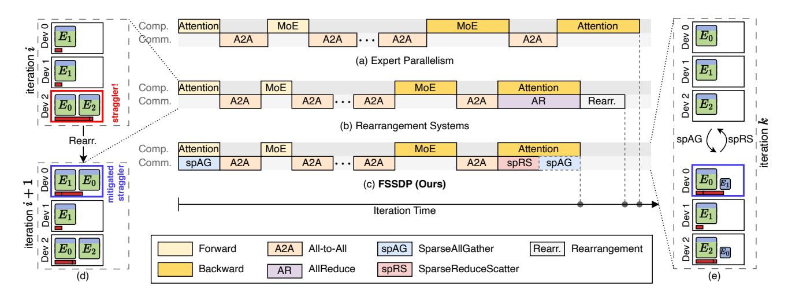
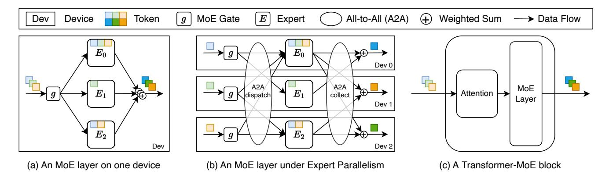
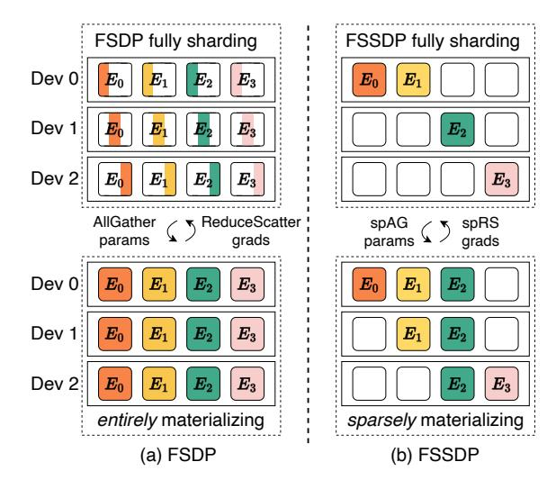
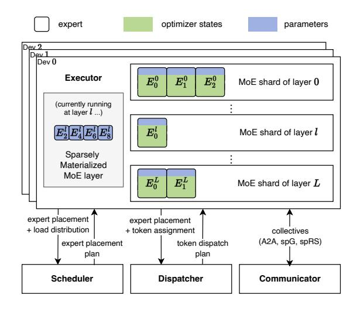
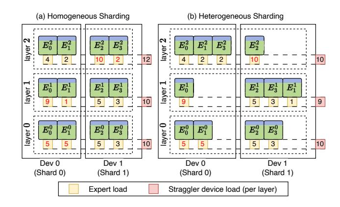
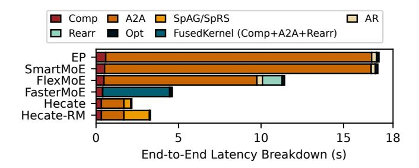
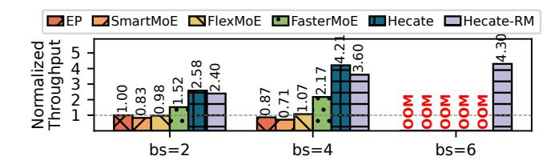
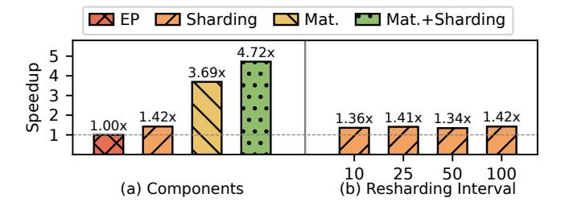

# Hecate: Unlocking Efficient Sparse Model Training via Fully Sharded Sparse Data Parallelism

Yuhao Qing<sup>∗</sup> The University of Hong Kong Hong Kong SAR, China qyhh@connect.hku.hk

Lintian Lei The University of Hong Kong Hong Kong SAR, China leilt@connect.hku.hk

Shixiong Zhao The University of Hong Kong Hong Kong SAR, China zsxhku@connect.hku.hk

Guichao Zhu<sup>∗</sup> The University of Hong Kong Hong Kong SAR, China gczhu@connect.hku.hk

Zekai Sun The University of Hong Kong Hong Kong SAR, China zksun@cs.hku.hk

Xusheng Chen The University of Hong Kong Hong Kong SAR, China chenxus@connect.hku.hk

Fanxin Li The University of Hong Kong Hong Kong SAR, China fxli@connect.hku.hk

Xiuxian Guan The University of Hong Kong Hong Kong SAR, China guanxx@connect.hku.hk

Dong Huang The University of Hong Kong Hong Kong SAR, China dhuang@cs.hku.hk

Sen Wang Huawei Technologies China wangsen31@huawei.com

# Abstract

Mixture-of-Experts (MoE) has emerged as a promising sparse paradigm for scaling up pre-trained models (PTMs) with remarkable cost-effectiveness. However, the dynamic nature of MoE leads to rapid fluctuations and imbalances in expert loads during training, resulting in significant straggler effects that hinder training performance when using expert parallelism (EP). Existing MoE training systems attempt to mitigate these effects through expert rearrangement strategies, but they face challenges in terms of memory efficiency and timeliness of rearrangement.

This paper proposes Fully Sharded Sparse Data Parallelism (FSSDP), an innovative approach that tackles the parallelization of MoE layers and potential straggler effects caused by imbalanced expert loads from a new perspective. FSSDP fully shards the parameters and optimizer states of MoE layers across devices and sparsely materializes MoE parameters from scratch in each iteration with two sparse collectives SparseAllGather and SparseReduceScatter.

We build Hecate, a high-performance MoE training system incorporating FSSDP to fully unlock its potential. Hecate introduces heterogeneous sharding, sparse materialization, and re-materialization techniques to flexibly construct efficient expert placements with low memory and communication overhead. Experiments reveal that Hecate achieves up to 3.54× speedup compared over state-of-the-art MoE training systems and consistently demonstrates improvements across model architectures and hardware environments.

# 1 Introduction

Large pre-trained models (PTMs) have driven numerous breakthroughs in recent machine learning tasks [\[1,](#page-11-0) [13,](#page-11-1) [29\]](#page-12-0). Larger PTMs possess superior modeling capacity for vast data [\[17,](#page-12-1) [20\]](#page-12-2). However, training such extensive PTMs becomes extremely expensive, as the computational cost per input increases rapidly with the growing model size.

Mixture-of-Experts (MoE) [\[19,](#page-12-3) [38\]](#page-12-4) presents a sparse paradigm enhancing the cost-effectiveness of training PTMs. Each MoE layer comprises multiple expert networks (i.e., experts), each tailored to learn a subset of inputs. A gate network serves as a router, conditionally assigning inputs to the most suitable experts. MoE allows a model to scale to an outrageous size with the same computational cost per input, while achieving higher sample efficiency compared to its dense counterparts [\[11,](#page-11-2) [12,](#page-11-3) [36\]](#page-12-5).

Training MoE PTMs involves additional complexities due to their large scale and dynamic nature. As MoE layers can easily exceed the memory capacity of a single accelerating device (e.g., a GPU), they are commonly trained with expert parallelism (EP) [\[38\]](#page-12-4), where experts are evenly distributed across devices, and their inputs need to be dispatched across devices via All-to-All communication. Moreover, the MoE gate is trained along with rest part of the model for effective data assignment among experts. As illustrated in Figure [3,](#page-3-0) the gating frequently evolves during training, resulting in rapid fluctuations and imbalances in expert loads (i.e., the numbers of inputs assigned to different experts).

Heming Cui The University of Hong Kong Hong Kong SAR, China heming@cs.hku.hk

<sup>∗</sup>These authors contributed equally to this work.

<span id="page-1-0"></span>

Figure 1. MoE parallel training strategies for a single Transformer-MoE layer. The ellipses between All-to-All represent other layers in the model. (d) Rearrangement adjusts expert placements to mitigate straggler effects of EP. The red bars under experts are work loads of devices. (b) Rearrangement systems have lower MoE computation and All-to-All latency than EP, but introduces rearrangement overhead in the performance critical path. (e) FSSDP achieves the same balanced placement as rearrangement per iteration using two sparse collectives, while avoiding rearrangement overheads between iterations from (c). The dashed-line SparseAllGather box re-materializes parameters of the following backward computation.

EP brings *straggler effects* to MoE training, significantly constraining the training throughput. As experts are trained in a distributed manner, imbalanced expert loads lead to varying computation and communication times across devices. The most overloaded device (i.e., the one with the most expert inputs) determines the overall computation time of the MoE layer, while other devices will remain idle when waiting for it. Similarly, the overloaded device tends to experience more inbound communication to receive expert inputs, resulting in communication bottlenecks. Our evaluation of EP on an AWS V100 cluster reveals that compared to a balanced load distribution, imbalanced expert loads can significantly slow down the training performance by up to 5.18×.

To mitigate straggler effects in EP, state-of-the-art MoE training systems [16, 31, 44] mainly resort to *expert rearrange-ment* strategies, which dynamically modify *expert placement* (i.e., the presence of each expert on each device) to adapt to imbalanced and fluctuated expert loads. Initialized with EP, these systems trigger the rearrangement to transition between expert placements by relocating or replicating experts across devices to reduce the peak device load throughout the training, as depicted in Figure 1d. At the end of each iteration, the devices with expert replicas use AllReduce to synchronize the gradients of these experts.

Unfortunately, despite these efforts to mitigate straggler effects, expert rearrangement also come with certain costs, leading these systems to the following two challenges:

**Memory challenge (C1)**: A more load-balancing expert placement can be more memory-hungry. A system needs to reserve device memory in advance to accommodate newly received parameters and optimizer states of experts during

rearrangement. When modifying expert placement, smaller reserved memory may hinder the system from considering candidate placements with larger memory footprints but balancing loads better. Our experiments on [31] shows that for 2.65x speed up, 4 times more memory is required to be reserved for rearrangement.

Timeliness challenge (C2): For optimal training throughput, a trade-off exists between the timeliness of expert placement and the communication overhead incurred by frequent rearrangements. To adapt to fluctuating expert loads over iterations (see Figure 3), a system needs to perform rearrangement more frequently to work under a placement timely for the current load distribution. However, a higher rearrangement frequency can also lead to a higher amortized communication overhead for replicating and relocating experts between devices, potentially resulting in a higher overall latency (see Figure 1b). The optimal rearrangement frequency may vary across different training scenarios, making it impossible to determine an optimal one universally. Our experiments on [44] achieve the minimum MoE execution time at a moderate rearrangement frequency (e.g., every 25 steps). Further increasing the frequency (e.g., to every 10 steps) can improve non-rearrangement iteration time by 2.9% but results in 10.2% higher overall latency due to the associated overhead.

In this paper, we propose *Fully Sharded Sparse Data Parallelism (FSSDP)*, a novel MoE training paradigm addressing the two aforementioned challenges, inspired by FSDP [46] for dense PTM training. Unlike existing systems that transition from one placement to another over iterations, FSSDP fully shards the parameters and optimizer states of MoE

layers across devices, and sparsely materializes MoE parameters for an ephemeral expert placement from scratch in each iteration. By maintaining only one complete copy of the optimizer states of MoE layers globally, FSSDP achieves minimal and balanced memory footprint between devices, freeing up valuable memory for materializing more load-balancing expert placements (C1). Furthermore, FSSDP decomposes the AllReduce communication of gradient synchronization introduced by rearrangement into two sparse collective communications: SparseAllGather and SparseReduceScatter. These collectives enable materializing any placement from MoE parameter shards and synchronizing gradients afterward, while incurring the same overall communication volume as AllReduce supporting that placement. This design removes explicit rearrangement overhead from the performance critical path (C2), as depicted in Figure [1c](#page-1-0).

We build Hecate, an MoE training system fully incorporating FSSDP to achieve superior training throughput and efficient memory utilization. Hecate introduces heterogeneous sharding, which utilizes the unified memory space across MoE layers to fully shard them at once, forming flexible expert placements with heterogeneous MoE shards between different devices without additional memory overhead. Hecate further utilizes sparse materialization to support expert placement, including constructing candidate expert placements in a topology-aware manner and scheduling the two sparse collectives efficiently to be overlapped with computation, thus achieving superior training throughput with low memory overhead. To further reduce the memory footprint of materializing expert placements, Hecate supports re-materialization, which promptly releases materialized MoE parameters after computation for memory reuse of new materializations. As PTMs continue to grow in size, FSSDP can serve as an unified and scalable approach to optimize MoE training with manageable memory overhead and remarkable performance improvements.

Our contributions can be summarized as follows:

- We propose Fully Sharded Sparse Data Parallelism (FSSDP), an innovative MoE training paradigm that tackles the parallelization of MoE layers and potential straggler effects caused by imbalanced expert loads from a new angle.
- We build Hecate, a high-performance MoE training system atop FSSDP to fully unlock its potential. Hecate implements heterogeneous sharding and sparse materialization in a topology-aware manner, schedules the two novel sparse collectives to overlap with preceding computation, enabling more efficient placement with lower memory and communication overhead.
- We evaluate Hecate on training workloads of typical MoE models across various baseline systems [\[16,](#page-12-6) [31,](#page-12-7) [44\]](#page-12-8) in two clusters. Compared to the state-of-the-art systems, Hecate achieves a significant speedup of up to 3.54× and is robust for consistently outperforming these systems

under different configurations. With re-materialization, Hecate achieves up to 1.52× speedup, while reduces parameter memory footprint of Hecate by 90.2%.

# 2 Background and Motivation

# 2.1 Mixture of Experts in PTMs

A MoE layer comprises a gate and multiple expert networks, as illustrated in Figure [2a](#page-3-1). Given an input, the MoE gate assigns a score to each expert to indicate its affinity with that expert. Based on these gating scores, the input is routed to experts with the top- scores, where is a tunable hyperparameter. These experts process the input independently, and their outputs are then weighted by the corresponding gating scores and aggregated to produce the final output.

MoE layers are typically integrated into Transformerbased PTMs by replacing the feed-forward networks (FFNs) with MoE layers of experts of the same size [\[41\]](#page-12-9). This hybrid architecture is composed of stacked Transformer-MoE blocks, each containing an Attention layer followed by an MoE layer, as shown in Figure [2c](#page-3-1). The inputs to the MoE layers are referred to as tokens, which represent embeddings of different granularities depending on the task domain, such as word or sub-word in natural language processing [\[10\]](#page-11-4) and pixel or image patch in computer vision [\[1\]](#page-11-0).

## 2.2 Distributed Training

MoE has a strong capability to expand model with significantly more parameters. As the scale of MoE PTM continues to grow, distributed training has become crucial.

Data parallelism (DP) [\[27\]](#page-12-10) replicates model parameters and optimizer states across devices, and training data is split among them. Each device computes gradients of the model on the split data, synchronizes the gradients with the other devices via AllReduce which is typically overlapped with backward computation [\[15,](#page-12-11) [23\]](#page-12-12), and then updates the model parameters with the optimizer. However, as the size of an MoE layer grows along with the number of experts or the FFN size in a larger PTM, training MoE layers with solely DP is infeasible, as the working-set memory of experts can easily exceed the capacity of a single device.

Expert parallelism (EP) [\[38\]](#page-12-4) enables larger MoE PTM training by evenly distributing experts of MoE layers across multiple devices, as illustrated in Figure [2b](#page-3-1). Typically, EP is only applied to experts, while leaving the rest of the model to be parallelized with DP. Tokens are dispatched to their experts potentially residing on other devices, and results are gathered back to their original devices to ensure the arithmetic consistency. This exchanges of tokens between devices is facilitated by All-to-All communication. Unfortunately, the skewness of token assignment in MoE gates can lead to workload imbalances among devices, ultimately causing

<span id="page-3-1"></span>

Figure 2. Illustrations of an MoE layer with a top-2 gate.

straggler effects. As expert loads fluctuate over time (Figure 3), efficient MoE training necessitates adaptive strategies to handle this dynamicity.

<span id="page-3-0"></span>

**Figure 3.** Expert load distribution during training, with colors indicating token proportions per expert.

#### 2.3 Expert Rearrangement

Recent systems [16, 31, 44] address the straggler effect in MoE by rearranging expert placement during training. Smart-MoE [44] periodically exchanges the positions of experts between devices, aiming to balance device loads with combinations of expert loads, e.g., placing the experts with the most and least tokens on the same device and vice versa. Flex-MoE [31] employs heuristic algorithms to create or remove expert replicas across devices, featuring flexibility in expert placements. FasterMoE [16] selectively replicates experts to every device after obtaining MoE gating decisions.

However, maintaining efficient memory utilization (C1) and manageable communication overhead (C2) when rearranging experts remains challenging. SmartMoE and Flex-MoE rearrange experts along with their optimizer states, whose size are significantly larger than parameters (e.g., when using Adam optimizer [22] under mixed precision training [30, 34], the size of optimizer states is at least 6× larger than parameters), incurring high memory and communication overheads. FlexMoE's replication strategy rapidly exhausts memory, while SmartMoE's permutation-based approach is infeasible when a device cannot hold multiple experts and their optimizer states for every MoE layer. As these

systems place rearrangement communication on the performance critical path, to avoid unacceptable rearrangement overheads, they either impose strict rearrangement conditions [16], reducing sensitivity to load imbalance, or leave the issue to users by offering hyper-parameters to control rearrangement frequency [31, 44].

#### 2.4 FSDP to FSSDP

Fully Sharded Data Parallelism (FSDP) [34, 46] is a DP variant that fully shards model parameters and optimizer states across devices to reduce memory requirements in pre-trained model (PTM) training. Parameters are materialized on-demand using AllGather and released after use, while gradients are reduced via ReduceScatter after backward computation. For models with multiple layers, these communications can be overlapped with computation in preceding layers.

However, FSDP becomes substantially inefficient when applied to MoE layers. When using FSDP, a MoE layer with  $|\mathcal{E}|$  experts incurs  $|\mathcal{E}|$  times more communication overhead than its dense counterpart, which is hardly overlapped with the computation time.

Inspired by FSDP, we propose FSSDP, a novel MoE parallel training paradigm that (1) fully shards MoE layers at a different granularity from FSDP, eliminating redundant memory footprint for expert placements, and (2) proposes sparse collectives to replace AllGather and ReduceScatter to allow a new placement to be materialized in each iteration with manageable communication overhead.

# 3 FSSDP Design

Fully Sharded Sparse Data Parallelism (FSSDP) can be divided into two phases, as depicted in Figure 5: (1) the *sharding phase*, where the parameters and optimizer states of an MoE layer are partitioned into multiple MoE shards and distributed across different devices; and (2) the *materialization phase*, where a timely expert placement is materialized using two novel communication collectives, SparseAllGather

<span id="page-4-0"></span>

Figure 4. FSDP vs. FSDDP (on a single MoE layer)

and SparseReduceScatter. During both forward and backward pass, SparseAllGather partially materializes the MoE layer parameters to employ a low-latency expert placement. The gradients produced in backward pass of replicated experts are reduced by SparseReduceScatter back to the device where the corresponding MoE shards are located. At the end of each iteration, the MoE shards use the synchronized gradients to update their optimizer states and model parameters. In this sections, we first introduce the two sparse collectives powering FSSDP, and then provide a detailed explanation of FSSDP's parallelization strategies.

## <span id="page-4-3"></span>3.1 Sparse Collectives

The two novel sparse communication collectives both operate on a logical input buffer, which is split into a set of equal-sized chunks  $C = \{C_0, C_1, \ldots\}$ . Denote all devices in the communication group as  $\mathcal{D} = \{D_0, D_1, \ldots\}$ . A chunk placement  $\mathcal{P}$  is defined as  $\mathcal{P} \subseteq C \times \mathcal{D}$ , where each element  $(c,d) \in \mathcal{P}$  indicates that chunk  $c \in C$  is available on device  $d \in \mathcal{D}$ . A collective is defined by a pair of chunk placements, pre-condition  $\mathcal{P}_0$  and post-condition  $\mathcal{P}_1$ , representing the data layout before and after the collective operation.

**SparseAllGather** is designed for materializing a placement of expert parameters of an MoE layer at every iteration in FSSDP, where each chunk corresponds to parameters of an expert. The pre-condition  $\mathcal{P}_0$  of SparseAllGather partitions all blocks into disjoint subsets, each of which is assigned to a unique device. SparseAllGather optionally materializes chunks that devices do not have in the pre-condition. Data layout ends up in a post-condition  $\mathcal{P}_1$  which is a superset of the pre-condition. Thus, a specific SparseAllGather

can be formulated as:

$$\begin{split} & \text{SparseAllGather}(\mathcal{P}_0,\mathcal{P}_1) \\ & \text{s.t. } \mathcal{P}_0 \text{ is surjective and } \mathcal{P}_0 \subseteq \mathcal{P}_1 \end{split}$$

, which we denote concisely as  $spAG(\mathcal{P}_0, \mathcal{P}_1)$ . An example of SparseAllGather is illustrated in Figure 6a, which is used to perform the sparse materialization for the case of Figure 4b.

**SparseReduceScatter** is designed for reducing gradients of the ephemerally materialized experts to specified devices in FSSDP, where each chunk corresponds to gradients of an expert. For SparseReduceScatter, each chunk c in the post-condition  $\mathcal{P}_1$  has a value summing up all chunks c in the pre-condition  $\mathcal{P}_0$ . A specific SparseReduceScatter can be formulated as:

SparseReduceScatter(
$$\mathcal{P}_0, \mathcal{P}_1$$
) s.t.  $\mathcal{P}_1$  is surjective and  $\mathcal{P}_1 \subseteq \mathcal{P}_0$ 

, denoted as  $\operatorname{spRS}(\mathcal{P}_0, \mathcal{P}_1)$ . At each iteration of FSSDP, each  $\operatorname{spAG}(\mathcal{P}, \mathcal{P}')$  is paired with a symmetric  $\operatorname{spRS}(\mathcal{P}', \mathcal{P})$  to reduce the gradients back to source devices where corresponding MoE shard reside. An example of  $\operatorname{SparseReduceScatter}$  is illustrated in Figure 6b, which is used to perform the gradient reduction for the case of Figure 4b.

Comparison with FSDP. A sparse collective practically has lower communication volumes than its counterpart in FSDP, since FSDDP only materializes a subset of MoE layer parameters. An AllGather can be simulated by a collection of Broadcasts, each of which is dedicated to one chunk to be broadcasted to all devices. In this context, for an input buffer of size S, the communication volume of SparseAllGather is O(S). On the other hand, a SparseAllGather can also be regarded as a collection of "broadcasts", each of which is dedicated to one chunk that may be replicated to only a subset of devices. Denote input chunks involved in inter-device communication in SparseAllGather as  $\hat{C}$ , then the size of the inter-device data is  $\lambda S$ , where  $\lambda = |\hat{C}|/|C|$  indicates the sparsity of the collective. The worst-case communication latency occurs when there is one (or more) device that needs to receive all these inter-device chunks and becomes the bottleneck with a communication volume of  $O(\lambda S)$ . Therefore, with sparsity, the upper bound of the communication volume of a SparseAllGather in FSSDP is lower than the AllGather in FSDP, i.e.  $O(\lambda S) \ll O(S)$  when  $\lambda \ll 1$ . Similarly, the communication volume of SparseReduceScatter in FSSDP can be formulated in the same way as Equation 1, and it is also practically lower than that of ReduceScatter in FSDP.

<span id="page-4-2"></span>
$$Vol(spAG(\mathcal{P}, \mathcal{P}')) = Vol(spRS(\mathcal{P}', \mathcal{P})) = O(\lambda S) \quad (1)$$

This loosely upper-bounded latency is introduced by the communication sparsity of the two new collectives, and is

<span id="page-4-1"></span><sup>&</sup>lt;sup>1</sup>An AllGather may run a ring algorithm [4] with a sightly lower volume of  $O(\frac{|\mathcal{D}|-1}{|\mathcal{D}|}\cdot S)$ , but the value will still approach O(S) when  $|\mathcal{D}|$  scale up.

<span id="page-5-0"></span>

**Figure 5.** Workflow of FSSDP at MoE layer l in an iteration.  $E_i^l$  represents expert i of MoE layer l in the PTM. The *sharding phase* partitions the MoE layer's parameters and optimizer states into MoE shards placed across devices. The *materialization phase* handles the sparse data parallelism with two novel collectives, SparseAllGather and SparseReduceScatter.

the key to enabling short enough communication to be effectively overlapped.

**Comparison with Rearrangement.** For the same expert placement, the pair of sparse collective in FSSDP has the same latency upper bound as the AllReduce communication in existing rearrangement systems. In rearrangement systems, for each expert (i.e., a chunk of size S/|C|) replicated on more than one device (i.e., a DP group) in a placement  $\mathcal{P}'$ , an AllReduce is required at the end of each iteration to synchronize gradients of the expert across the DP group. Denote the i-th DP group as  $\mathcal{D}_i$ , the overall communication volume of AllReduce operations of all DP groups is

<span id="page-5-2"></span>
$$Vol(AllReduces) = \sum_{i}^{|\hat{C}|} \frac{2(|\mathcal{D}_{i}| - 1)}{|\mathcal{D}_{i}|} \cdot \frac{S}{|C|}$$
 (2)

When the number of devices in each DP group scale up, Equation 2 approaches  $O(2\lambda S)$ , which is the same as the overall volume upper bound of a spRS( $\mathcal{P}'$ ,  $\mathcal{P}$ ) and a spAG( $\mathcal{P}$ ,  $\mathcal{P}'$ ) used by FSSDP for the same placement. This shows that

<span id="page-5-1"></span>

Figure 6. An example of two symmetric sparse collectives.

FSSDP achieves the same expert placement for load balancing with only the same communication overhead as the AllReduce communication in existing systems, without the need for additional rearrangement overhead.

#### 3.2 Paralleling Strategies

During the sharding phase, each MoE layer in the PTM is partitioned into  $|\mathcal{D}|$  disjoint *MoE shards*. FSSDP considers an expert as the atomic unit for sharding the MoE layer. Namely, each MoE shard contains of the *model parameters* of a subset of experts along with their *optimizer states*, and is uniquely assigned to a distinct device. A trivial sharding choice is to evenly split each MoE layer.

In the materialization phase, FSSDP performs spAG( $\mathcal{P}, \mathcal{P}'$ ) to sparsely materialized parameters of an MoE layer and  $spRS(\mathcal{P}',\mathcal{P})$  to synchronize gradients. This essentially requires a new placement  $\mathcal{P}'$  of the MoE layer parameters. To determine ideal collectives for expert rearrangement in FSSDP, two factors must be considered: (1) the expert load distribution, which causes the straggler effects to be mitigated by  $\mathcal{P}'$ ; and (2) the latency of attention layer, where communication of the sparse collectives can be hidden. Since computations of the attention layer are all dense, the attention layer latency is contingent on the fixed mini-batch size used during training. Thus attention latency can be either profiled before the training or captured in real-time during the training process. As for expert loads, The temporal locality in the MoE layer's architectural learning leads to smooth changes in expert load distribution over iterations [31]. This allows predicting the next iteration's load distribution based on previous iterations. By using this estimated distribution, the optimal collectives to mitigate load imbalance can be scheduled before the next MoE gate.

It is worth noting that SparseAllGather is launched twice for an MoE layer in each iteration, since the sparsely materialized parameters are discarded immediately after being used for memory reuse across MoE layers. Thus, there are two collective instances to be overlapped with the attention backward computation, i.e. SparseReduceScatter for gradient reduction of the current layer and SparseAllGather for re-materializing the following layer. Typically, the backward computation takes twice as long as the forward computation [24]. Thanks to this characteristic, if judiciously scheduling the SparseAllGather to take time no more than attention forward, there will be enough time during the attention backward for both sparse collectives to be hidden, as shown in Figure 1c.

Having understood how FSSDP parallelizes MoE training, the next question is what algorithms can be used in the two phases for better expert placements and handling token dispatching. For these tasks, we propose a series of algorithms implemented in our system Hecate.

# 4 HECATE System

#### 4.1 Architecture Overview

Figure 7 illustrates the Hecate architecture, where each device launches a runtime consisting of an executor, scheduler, dispatcher, and communicator. The executor, the main process for each device, controls the FSSDP workflow and interacts with all components. In the sharding phase, it queries the scheduler for an MoE layer sharding plan and accommodates the MoE shards containing relevant expert parameters and optimizer states on the device. In the materialization phase, it invokes the scheduler for a sparse materialization plan, launched through the communicator as sparse collectives. Additionally, when an MoE gate makes a token assignment decision in each layer, the executor queries the dispatcher for each token's destination device, as the same expert can be available on multiple devices.

The scheduler generates expert placement plans based on the expert load distribution to mitigate straggler effects. It implements two topology-aware algorithms: heterogeneous

<span id="page-6-0"></span>

Figure 7. HECATE's architecture.

sharding (§ 4.3) and sparse materializing (§ 4.2) for the two phases of FSSDP, respectively. The dispatcher determines each token's destination device based on token assignment of MoE gates and the current materialized MoE layer parameter placement (§ 4.4). The communicator handles assigned communication tasks by maintaining a queue and scheduling them to the runtime communication library (e.g., NCCL [5]), executing the dispatching plan as an All-to-All collective.

#### <span id="page-6-1"></span>4.2 Sparse materialization

In the materialization phase of each MoE layer, FSSDP requires a sparse materialization plan  $\mathcal{P}'$  as the target placement for spAG( $\mathcal{P},\mathcal{P}'$ ) to perform sparse communication of MoE layer parameters. Here, the chunk placement is  $\mathcal{P} = \mathcal{E} \times \mathcal{D}$ , where  $\mathcal{E} = \{E_1, E_2, \ldots\}$  represents the parameters for all experts in an MoE layer as the collective logical buffer, with each expert serving as a chunk.

Algorithm 1 presents the topology-aware sparse materialization algorithm, used by HECATE's scheduler to heuristically search for a near-optimal parameter placement under two system constraints: overlap degree t and memory capacity m. The overlap degree t represents the maximum number of experts that can be materialized on other devices with the communication overhead completely hidden in attention layers. According to Equation 1, it can be calculated by  $t = T_{\text{non-MoE}} \cdot \frac{\text{bw}}{\text{expert\_size}}$ , where  $T_{\text{non-MoE}}$  is computation latency of previous non-MoE layers (e.g., the attention layer) and expert\_size is an expert's parameter byte size. Critically, bw reflects the cluster's interconnect topology. When the cluster features heterogeneous interconnects with significant bandwidth differences between inter-node and intra-node communication, by represents the inter-node bandwidth, as the algorithm prioritizes minimizing crossnode communication. If the interconnect is homogeneous, bw reflects the uniform inter-device bandwidth. The memory capacity denotes the maximum number of experts that can be materialized on each device's available memory. These two integers are profiled by the scheduler and passed to the algorithm as input. Expert load *F* is estimated using a sliding window average over the latest w iterations (Hecate uses w = 5).

The two outermost branches in Algorithm 1 represent different conditions of system constraints. When the overlap degree is less than or equal to the memory capacity (lines 4 to 5), the algorithm materializes as many overloaded experts as possible on all devices within the overlappable time. Otherwise (lines 6 to 11), the algorithm sparsely materializes experts on devices according to their load distribution. Experts with higher loads are materialized on more devices (line 9), prioritizing nodes that do not already have the expert parameters materialized (line 10). This topology-aware design, which considers the potential bandwidth disparities between inter-node and intra-node links, helps mitigate

All-to-All straggler effects due to inter-node communication congestion.

The sparse materialization can include a *calibration* stage additionally, occurring immediately after the MoE gate generates the token assignment decision. Since the overlapped sparse materialization is based on an estimated expert load distribution, the current distribution (i.e. the real-time token assignment decision) can still vary due to the stochastic nature of training. The *calibration* re-runs Algorithm 1 with the latest expert loads and remaining memory capacity to determine if an additional SparseAllGather can be executed to further reduce load imbalance. If the calibrated placement results in a lower latency, considering the additional communication overhead on the training critical path, the scheduler will accept and return the placement plan for the communicator to execute before initiating token dispatching.

#### **Algorithm 1:** Sparse Materialization

```
Input: \mathcal{P}: sharded parameter placement
                F: expert load distribution
                t: overlap degree
                m: memory capacity per device
    Output: \mathcal{P}': materialization plan
1 t \leftarrow \min(t, |\mathcal{E}|), m \leftarrow \min(m, t);
_{2}\mathcal{P}^{\prime}\leftarrow\mathcal{P};
3 if t \leq m
          \mathcal{E}^{\text{topT}} \leftarrow \text{Top } t \text{ experts by load } F;
          \mathcal{P}' \leftarrow \mathcal{P}' \cup (\mathcal{D} \times \mathcal{E}^{\text{topT}}):
5
6 else
          totSlots \leftarrow |\mathcal{D}| \cdot m;
          foreach e \in \text{sortByLoadDescending}(\mathcal{E}^{topT}) do
                n \leftarrow assignSlotsByLoad(e, totSlots, F);
                \mathcal{P}^e \leftarrow \text{Distribute } n \text{ replicas of expert } e \text{ across}
10
                  nodes and devices, prioritizing nodes with
                  more available slots;
                \mathcal{P}' \leftarrow \mathcal{P}' \cup \mathcal{P}^e:
11
12 return \mathcal{P}'
```

#### <span id="page-7-7"></span><span id="page-7-6"></span><span id="page-7-5"></span><span id="page-7-0"></span>4.3 Heterogenous Sharding

The design of Hecate's sparse materialization primarily benefits the overloaded experts, as their placements are more likely to be materialized on multiple devices. However, the placement of underloaded experts can also be optimized to further reduce straggler effects, particularly when training with multiple nodes. For instance, if a node contains MoE shards with only underloaded experts, the inbound bandwidth of this node may be oversubscribed by All-to-All for these crowded underloaded experts to receive their tokens, as the node is likely the sole destination for these tokens.

Heterogeneous sharding algorithm is introduced in Hecate for sharding MoE layers across devices in the sharding phase,

<span id="page-7-8"></span>

Figure 8. Homogeneous vs. Heterogeneous Sharding

determining better placements for the underloaded experts. The algorithm is *heterogeneous* since it allows an MoE shard to have an arbitrary number of experts (ranging from 0 to  $|\mathcal{E}|$ ) while maintaining memory balance across devices, as depicted in Figure 8. In Hecate, MoE layers are initialized using homogeneous sharding (i.e. even sharding), and periodically re-sharded in heterogenous manners during training.

Algorithm 2 presents the sharding algorithm. It schedules all MoE layers in the PTM collectively to ensure even memory demand for sharding all layers across devices. As the algorithm involves cross-layer scheduling, some variables in the algorithm pseudocode may have the superscript "g" to indicate that they cover all MoE layers (e.g.  $\mathcal{E}^g$ ), while the index "l" is used to denote variables specific to a particular MoE layer l (e.g.  $\mathcal{E}_l$ ). It returns the sharding plan for all MoE layers in the form of  $\mathcal{P}^g = \{\mathcal{P}_0, \mathcal{P}_1, \cdots, \mathcal{P}_L\}$ , where each element is an expert placement for the parameters and optimizer states of the corresponding MoE layer.

Experts first partitioned into two disjoint sets layer-wisely (from line 1 to line 2):  $\mathcal{J}$  are overloaded experts that can be selected by the sparse materialization, and  $\mathcal{J}'$  contains the remaining experts that are not "overlappable". The algorithm initializes same number of slots per device (line 3) for plugging in experts while ensuring consistent memory demand across devices. Experts in  $\mathcal{J}'$  are scheduled firstly, layer by layer (from line 6 to line 14), prioritizing layers with the most overloaded expert. For each expert, the algorithm first attempts to find the least-loaded node. If multiple nodes have the same lowest load, the node with fewer available slots is prioritized. The algorithm then tries to find the least-loaded device on the selected node, using the same priority rule. The expert is then assigned to the device, and the available slots on the device are decreased. Finally, the algorithm fills the remaining slots with experts from  $\mathcal{J}$  (line 16).

It is important to note that unlike sparse materialization, the heterogeneous sharding of Hecate introduces resharding latency to the training critical path, which may

seem to result in the timeliness challenge. However, we argue that re-sharding can be performed at a low frequency, amortizing the overhead over iterations. Since it focuses on the placement of underloaded experts, which are trained with fewer tokens per iteration, the MoE gate will have gradients with smaller magnitudes corresponding to these experts. This implies that the loads of underloaded experts change slowly (confirmed by Figure 3). Consequently, re-sharding can be triggered less frequently, extracting the last bit of performance improvement from the FSSDP sharding design.

# Algorithm 2: Heterogeneous Sharding

```
Input: F<sup>g</sup>: expert load distribution of all MoE layer
               t: overlap degree
    Output: \mathcal{P}^g: MoE sharding plan
 1 \mathcal{J} \leftarrow \text{top-}t experts by load for each layer;
 _{2} \mathcal{J}' \leftarrow \mathcal{E}^{g} - \mathcal{J};
 s \in |\mathcal{E}^{g}|/|\mathcal{D}|; // Available slots per device
 _{4}\mathcal{P}^{g}\leftarrow\varnothing:
 5 /* Place underloaded experts first. */
 6 \mathcal{L} \leftarrow \{\mathcal{E}_l \cap \mathcal{J}' \mid l = 0, 1, \cdots, L\};
 7 foreach \mathcal{E}'_{l} \in \text{sortByMaxLoadDescending}(\mathcal{L}) do
          \mathcal{P}_l \leftarrow \emptyset;
          foreach e \in \text{sortByLoadDescending}(\mathcal{E}'_t) do
               n \leftarrow least-loaded node, prioritizing nodes
10
                 with less available slots;
               d \leftarrow least-loaded device on node n,
11
                 prioritizing devices with less available slots;
               \mathcal{P}_l \leftarrow \mathcal{P}_l \cup \{(d, e)\};
12
             S_d \leftarrow S_d - 1;
13
          \mathcal{P}^{g} \leftarrow \mathcal{P}^{g} \cup \mathcal{P}_{1}:
14
   /* Place overlappable experts next. */
16 update \mathcal{P}^g by arbitrarily placing \mathcal{J} to rest of slots S;
17 return Pg
```

## <span id="page-8-7"></span><span id="page-8-6"></span><span id="page-8-0"></span>4.4 Token Dispatching

With sparse materialization, an expert's parameters may exist on multiple devices. Tokens assigned to this expert from all devices must select one of the devices where the expert is materialized to be dispatched to. Hecate employs a topology-aware algorithm in its dispatcher to generate a token dispatching plan. The algorithm aims to minimize inter-node communication, as inter-node bandwidths (e.g. NICs [8]) are typically much lower than intra-node high-speed bandwidths (e.g. NVLinks [6]). If an expert is materialized on a device, all tokens assigned to that expert on the device are dispatched locally. Otherwise, the algorithm prioritizes devices within the same node as the token's destination device, only dispatching a token across nodes when no devices in the source node have the expert materialized.

When performing inter-device dispatching, the algorithm evenly distributes the tokens among the selected devices.

#### 5 Evaluation

## 5.1 Experimental Setup

Implementation. Hecate is implemented using PyTorch [32]. We skip overlapping sparse collective communication with expert execution, as there exists a few attempts [16, 18] to overlap it with All-to-All communication, and it is orthogonal to our design. As a prototype system, the two sparse collectives in Hecate are implemented with NCCL [5] by leveraging group calls to simultaneously schedule a series of Broadcast and Reduce operations. While more efficient algorithms for sparse collectives could theoretically exploit the sparsity of data distribution and network topology, our straightforward implementation is sufficiently efficient to meet the upper bound analysis discussed in § 3.1, and we leave an optimized implementation for future work.

**Testbeds.** We conducted experiments on two cloud clusters: Cluster A with 4 AWS p3dn.24xlarge nodes, each having 8 NVIDIA V100-32G GPUs connected via 300 GB/s NVLink [6], and nodes linked by a 100 Gbps network; and Cluster B with 4 AWS p4d.24xlarge nodes, each containing 8 NVIDIA A100-40G GPUs interconnected using 600 GB/s NVSwitch [7], and nodes connected through a 400 Gbps network.

**Models and Metrics.** We evaluate the training workloads of the sparse counterparts of two popular transformer-based language models, GPT-3 [2] and BERT [10], with 4 representative model sizes and architectures to showcase the effectiveness of Hecate, as detailed in Table 1. To sparsify the original models, we replace the feed-forward networks (FFNs) [41] in both models with MoE layers, where experts are still FFNs with the same model dimension  $d_{model}$  and the FFN hidden dimension  $d_{ffn}$  set to twice  $d_{model}$ . We select the widely used GShard [25] Top-2 gating mechanism for assigning tokens to experts. Experiments on varying sequence lengths SeqLen showcase the performance of Hecate under different opportunities for overlapping parameter materialization communication and Attention [41] computation.

<span id="page-8-8"></span>

| Model         | $d_{model}$ | SeqLen | Layers | Experts | Params |
|---------------|-------------|--------|--------|---------|--------|
| GPT-MoE-S     | 768         | 2048   | 12     | 64      | 1.84B  |
| GPT-MoE-L     | 1536        | 2048   | 12     | 64      | 7.36B  |
| BERT-MoE      | 1024        | 512    | 12     | 64      | 3.27B  |
| BERT-MoE-Deep | 1024        | 512    | 24     | 64      | 6.54B  |

**Table 1.** Sizes and architectures of the MoE models.

**Baselines.** We compare Hecate with several baseline systems. FasterMoE [16] is an early effort to mitigate straggler effects in MoE training by replicating overloaded experts to every device. SmartMoE [44] exchanges experts between devices to balance device load, with its strategy relying on the

<span id="page-9-0"></span>

Figure 9. Performance of training MoE models on Cluster A.

presence of multiple experts on each device. FlexMoE [31] supports the most comprehensive expert rearrangement by allowing both replication and relocation of experts. Since FlexMoE does not have an open-source implementation, we implemented its proposed rearrangement strategy based on the description in the paper. To ensure fairness in comparison, we manually tune hyper-parameters (e.g., rearrangement frequencies and reserved memory) of the baseline systems to achieve good performance. Megatron-LM [40] is used as the training framework, and the baseline systems are employed solely to optimize the training of MoE layers. In each set of comparative experiments, we used the largest batch size that did not cause an out-of-memory (OOM) error in any system. Hecate's re-sharding is triggered at a low frequency of every 100 iterations, executing only when shards change, leveraging its insensitivity to frequency. Unless otherwise specified, HECATE's re-materialization feature is not switched on by default.

#### 5.2 End-to-End Performance

To assess the performance of Hecate, we evaluate the overall training speedup of four MoE models on both clusters. Expert parallelism (EP) is used as a baseline for calculating the relative performance improvement.

Figure 9 illustrates the end-to-end performance of training four MoE models on Cluster A. The experiments are conducted in a weak scaling manner, with the number of experts set to 32 for the 16 GPU experiments. Across all cases, Hecate consistently achieves the highest speedup compared to the baseline systems. The speedup exhibits an increasing trend with the number of GPUs. At the smaller scale of 16 GPUs, Hecate achieves a 1.40 - 1.58× speedup, while scaling to 32 GPUs yields a 1.34 - 1.78× speedup. The higher speedup at the larger scale can be attributed to the significantly more expensive All-to-All, which leads to performance degradation in EP. In contrast, Hecate effectively mitigates this cost through efficient placement. Compared to the best performance of all baseline systems, Hecate achieves a geo-mean speedup of 1.645× with 16 GPUs and 2.05× with 32 GPUs.

To further investigate the performance characteristics, we conduct experiments on Cluster B, which offers more powerful computational capabilities and higher communication

<span id="page-9-1"></span>

Figure 10. Training speedup on Cluster B.

bandwidth compared to Cluster A. In Figure 10, HECATE obtains a 1.70 - 1.26× speedup relative to EP. The lower communication bandwidth of Cluster A exacerbates the straggler effect of All-to-All, resulting in more pronounced performance gains for HECATE. HECATE achieves a substantial geo-mean speedup of 2.945× on Cluster B compared to the baseline systems, surpassing the speedup observed on Cluster A. This reveals the consistent superiority of HECATE over the baseline systems across various model architectures and cluster configurations, attributing to the FSSDP paradigm which maximizes load balancing opportunities with minimized system overhead. Systems with restricted rearrangement strategies (e.g., SmartMoE can only exchange experts between devices) are unable to fully unlocking the potential of expert placements to mitigate straggler effects, resulting in suboptimal performance. The load balancing returns of these systems sometimes cannot offset the rearrangement overhead, resulting in slower training than EP.

#### 5.3 Fine-Grained Performance Breakdown

In this section, we conduct an in-depth analysis to examine how Hecate optimizes the training process and identify the critical performance costs.

Figure 11 illustrates the layer-wise speedup of HECATE when training GPT-MoE-S on Cluster B. HECATE consistently outperforms EP across all layers, yielding a 2.8 - 18.8× speedup, with a geo-mean of 11.87×. The figure reveals the significant variations in degrees of load imbalance across layers, resulting in varying execution time of different MoE layers under EP. Under this situation, systems that allocate identical memory resources for load balancing in each MoE layer

<span id="page-10-0"></span>

Figure 11. Layer-wise speedup of HECATE.

(e.g., FlexMoE) may lead to inefficient resource allocation for expert placement across layers, impacting overall training performance. Hecate's heterogeneous sharding effectively utilizes memory resources across MoE layers, enabling heterogeneous memory allocation for expert placement in each layer without incurring additional memory overhead.

<span id="page-10-1"></span>

**Figure 12.** Breakdown of the performance critical path.

Figure 12 breaks down the performance critical path of baseline systems and HECATE of training BERT-MoE-Deep on Cluster B. FasterMoE fuses its computation, All-to-All communication, and rearrangement communication into a single kernel, labeled as FusedKernel (Comp+A2A+Rearr) in the figure. As illustrated in the figure, All-to-All communication (A2A) dominates the MoE training latency of all systems. Hecate attains the lowest All-to-All communication time with its topology-aware algorithm designs, scheduling SparseAllGather (SpAG) and SparseReduceScatter (SpRS) efficiently to maximally mitigate communication stragglers, resulting in a 12.3X reduction in A2A time compared to EP. Compared to FlexMoE's rearrangement overhead (Rearr), Hecate demonstrates a smaller overhead for its sparse collectives due to its reduced communication volume (from communicating optimizer states to only parameters) and overlapping with previous Attention computation. HECATE-RM represents Hecate with releasing and re-materialization of parameters enabled. HECATE-RM incurs additional overhead due to re-materialization, resulting in a 3.6× increase in the sparse collective communication overhead, while still outperforming baseline systems by 1.4×.

We further investigated the peak memory usage of different systems, focusing on the memory consumption of optimizer states, gradients, and parameters, as shown in Figure 13. We omitted the memory footprint of activations

<span id="page-10-2"></span>

**Figure 13.** Peak memory usage in optimizer states (Opt), gradients (Grad), and parameters (Param).

due to the dynamic batch sizes in MoE training. SmartMoE consumes the least memory, comparable to EP, but fails to achieve satisfactory performance improvements, as a result of underperforming expert placement. FlexMoE exhibits the highest memory consumption, requiring 83% more memory than Hecate to accommodate experts on each device, indicating memory-inefficiency in employing an expert placement. With sufficient memory, Hecate utilizes the most memory for parameters (5.73× compared to EP) to materialize the most load-balancing expert placement, resulting in a 64% increase in total memory usage compared to EP. Hecate-RM significantly reduces the additional memory footprint for materialized parameters (by 90.2% compared to Hecate) by releasing the materialized parameters after use, leading to consuming only 11.6% more total memory than EP.

<span id="page-10-3"></span>

Figure 14. Training GPT-MoE-S with different batch sizes.

# 5.4 Effectiveness of Components

We evaluate the effectiveness of Hecate's re-materialization for reducing the memory footprint of materializing expert placement. Through re-materialization, Hecate only need to reserve memory for one MoE layer's placement materialization during training, significantly reducing the additional memory overhead introduced by expert placement. As shown in Figure 14, Hecate-RM exhibits a 7.5% to 16.9% slow-down compared to Hecate, indicating that re-materialization introduces additional overhead. However, Hecate-RM is the only strategy that can scale the batch size to 6 while still maintaining performance advantages over the baselines.

We evaluate the effectiveness of Hecate's components (Figure 15). Hecate's heterogeneous sharding achieves consistent speedups (1.36, 1.41, 1.34 and 1.42×) across different re-sharding intervals ranging from 10 to 100 iterations. This demonstrates the insensitivity of heterogeneous sharding to the trigger frequency, allowing Hecate to maintain the

<span id="page-11-11"></span>

**Figure 15.** Training GPT-MoE-S with (a) different combinations of optimizations, including heterogeneous sharding (Sharding) and materialization (Mat.); (b) different intervals of re-sharding.

benefits of heterogeneous sharding at a lower re-sharding frequency, thereby minimizing the overhead of re-sharding and freeing Hecate from fine-tuning this interval for optimal performance. The combination of materialization and heterogeneous sharding is crucial for efficient load balancing, achieving 3.32× and 1.27× speedups over Hecate with only heterogeneous sharding and materialization enabled, respectively.

#### 6 Related Work

Load balancing in MoE training. The gating algorithms of MoE frequently leverage an auxiliary loss [25] during training to balance tokens across experts. Despite the adoption of auxiliary loss, the issue of load imbalance still persists. Systems like GShard [25] and Switch Transformer [12] further limit the expert capacity (i.e., the number of tokens an expert can process) and drop excess tokens for each expert. However, MegaBlocks [14] has revealed that token dropping degrades model quality and should be avoided.

MoE training systems. Tutel [18] incorporates data and tensor model parallelism to scale up MoE training. Lita [26] accelerates MoE training through prioritizing all-to-all communication. Lazarus [43] supports fault-tolerant MoE training via adaptive expert placement. Hecate is orthogonal to these systems and can integrate their optimizations.

**Sparse Collective Communication.** In distributed deep learning, sparse collectives are often combined with Top-k sparsification to reduce gradient communication [28, 33, 35, 39, 45]. Hecate explores the sparse communication pattern in MoE load balancing for the first time and establishes the FSSDP paradigm to alleviate straggler effects in MoE training.

Recent works also explore the synthesis of collective algorithms (i.e., data routing plans) tailored to specific collectives and network topologies [3, 9, 21, 37, 42]. These synthesizers can potentially be integrated into Hecate to dynamically generate efficient sparse collectives across iterations.

# 7 Conclusion

We put forward FSSDP, a MoE training paradigm for efficient parallelization under imbalanced expert loads, and realize it with Hecate. FSSDP addresses the inefficiency in MoE training caused by load imbalance by sparsely materializes MoE parameters on demand to construct timely expert placements with sparse collective communication with minimal memory overhead. We demonstrate that Hecate improves the performance of MoE parallel training by up to 3.54×. Exploration of efficient sparse collective communication is an interesting direction for future work.

#### References

- <span id="page-11-0"></span> Dosovitskiy Alexey. An image is worth 16x16 words: Transformers for image recognition at scale. arXiv preprint arXiv: 2010.11929, 2020.
- <span id="page-11-10"></span>[2] Tom B Brown. Language models are few-shot learners. arXiv preprint arXiv:2005.14165, 2020.
- <span id="page-11-13"></span>[3] Zixian Cai, Zhengyang Liu, Saeed Maleki, Madanlal Musuvathi, Todd Mytkowicz, Jacob Nelson, and Olli Saarikivi. Synthesizing optimal collective algorithms. In Proceedings of the 26th ACM SIGPLAN Symposium on Principles and Practice of Parallel Programming, pages 62–75, 2021.
- <span id="page-11-5"></span>[4] Ernie Chan, Robert Van De Geijn, William Gropp, and Rajeev Thakur. Collective communication on architectures that support simultaneous communication over multiple links. In Proceedings of the eleventh ACM SIGPLAN symposium on Principles and practice of parallel programming, pages 2–11, 2006.
- <span id="page-11-6"></span>[5] NVIDIA Corporation. Nvidia collective communication library (nccl) documentation. Available at: https://docs.nvidia.com/deeplearning/ nccl/user-guide/docs/index.html, 2020. Accessed: 30/09/2024.
- <span id="page-11-8"></span>[6] NVIDIA Corporation. Nvidia nvlink. Available at: https://www.nvidia.com/en-us/data-center/nvlink/, 2022. Accessed: 30/09/2024.
- <span id="page-11-9"></span>[7] NVIDIA Corporation. Nvswitch: The world's highest-bandwidth on-node switch. Available at: https://www.nvidia.com/en-us/datacenter/nvlink/#nvswitch, 2022. Accessed: 30/09/2024.
- <span id="page-11-7"></span>[8] NVIDIA Corporation. nvbandwidth. Available at: https://github.com/ NVIDIA/nvbandwidth, 2023. Accessed: 30/09/2024.
- <span id="page-11-14"></span>[9] Meghan Cowan, Saeed Maleki, Madanlal Musuvathi, Olli Saarikivi, and Yifan Xiong. Gc3: An optimizing compiler for gpu collective communication. arXiv preprint arXiv:2201.11840, 2022.
- <span id="page-11-4"></span>[10] Jacob Devlin, Ming-Wei Chang, Kenton Lee, and Kristina Toutanova. Bert: Pre-training of deep bidirectional transformers for language understanding. In North American Chapter of the Association for Computational Linguistics, 2019.
- <span id="page-11-2"></span>[11] Nan Du, Yanping Huang, Andrew M. Dai, Simon Tong, Dmitry Lepikhin, Yuanzhong Xu, Maxim Krikun, Yanqi Zhou, Adams Wei Yu, Orhan Firat, Barret Zoph, Liam Fedus, Maarten Bosma, Zongwei Zhou, Tao Wang, Yu Emma Wang, Kellie Webster, Marie Pellat, Kevin Robinson, Kathleen S. Meier-Hellstern, Toju Duke, Lucas Dixon, Kun Zhang, Quoc V. Le, Yonghui Wu, Z. Chen, and Claire Cui. Glam: Efficient scaling of language models with mixture-of-experts. In *International* Conference on Machine Learning, 2021.
- <span id="page-11-3"></span>[12] William Fedus, Barret Zoph, and Noam Shazeer. Switch transformers: Scaling to trillion parameter models with simple and efficient sparsity. The Journal of Machine Learning Research, 23(1):5232-5270, 2022.
- <span id="page-11-1"></span>[13] Luciano Floridi and Massimo Chiriatti. Gpt-3: Its nature, scope, limits, and consequences. *Minds and Machines*, 30:681–694, 2020.
- <span id="page-11-12"></span>[14] Trevor Gale, Deepak Narayanan, Cliff Young, and Matei Zaharia. Megablocks: Efficient sparse training with mixture-of-experts. arXiv preprint arXiv:2211.15841, 2022.

- <span id="page-12-11"></span>[15] Sayed Hadi Hashemi, Sangeetha Abdu Jyothi, and Roy Campbell. Tictac: Accelerating distributed deep learning with communication scheduling. Proceedings of Machine Learning and Systems, 1:418–430, 2019.
- <span id="page-12-6"></span>[16] Jiaao He, Jidong Zhai, Tiago Antunes, Haojie Wang, Fuwen Luo, Shangfeng Shi, and Qin Li. Fastermoe: Modeling and optimizing training of large-scale dynamic pre-trained models. In Proceedings of the 27th ACM SIGPLAN Symposium on Principles and Practice of Parallel Programming, PPoPP '22, page 120–134, New York, NY, USA, 2022. Association for Computing Machinery.
- <span id="page-12-1"></span>[17] Jordan Hoffmann, Sebastian Borgeaud, Arthur Mensch, Elena Buchatskaya, Trevor Cai, Eliza Rutherford, Diego de Las Casas, Lisa Anne Hendricks, Johannes Welbl, Aidan Clark, Tom Hennigan, Eric Noland, Katie Millican, George van den Driessche, Bogdan Damoc, Aurelia Guy, Simon Osindero, Karen Simonyan, Erich Elsen, Oriol Vinyals, Jack W. Rae, and Laurent Sifre. Training compute-optimal large language models. In Proceedings of the 36th International Conference on Neural Information Processing Systems, NIPS '22, Red Hook, NY, USA, 2024. Curran Associates Inc.
- <span id="page-12-18"></span>[18] Changho Hwang, Wei Cui, Yifan Xiong, Ziyue Yang, Ze Liu, Han Hu, Zilong Wang, Rafael Salas, Jithin Jose, Prabhat Ram, Joe Chau, Peng Cheng, Fan Yang, Mao Yang, and Yongqiang Xiong. Tutel: Adaptive mixture-of-experts at scale. ArXiv, abs/2206.03382, 2022.
- <span id="page-12-3"></span>[19] Robert A Jacobs, Michael I Jordan, Steven J Nowlan, and Geoffrey E Hinton. Adaptive mixtures of local experts. Neural computation, 3(1):79–87, 1991.
- <span id="page-12-2"></span>[20] Jared Kaplan, Sam McCandlish, Tom Henighan, Tom B Brown, Benjamin Chess, Rewon Child, Scott Gray, Alec Radford, Jeffrey Wu, and Dario Amodei. Scaling laws for neural language models. arXiv preprint arXiv:2001.08361, 2020.
- <span id="page-12-27"></span>[21] Heehoon Kim, Junyeol Ryu, and Jaejin Lee. Tccl: Discovering better communication paths for pcie gpu clusters. In Proceedings of the 29th ACM International Conference on Architectural Support for Programming Languages and Operating Systems, Volume 3, pages 999–1015, 2024.
- <span id="page-12-13"></span>[22] Diederik P Kingma and Jimmy Ba. Adam: A method for stochastic optimization. arXiv preprint arXiv:1412.6980, 2014.
- <span id="page-12-12"></span>[23] Joel Lamy-Poirier. Breadth-first pipeline parallelism. Proceedings of Machine Learning and Systems, 5:48–67, 2023.
- <span id="page-12-16"></span>[24] Yann LeCun, D Touresky, G Hinton, and T Sejnowski. A theoretical framework for back-propagation. In Proceedings of the 1988 connectionist models summer school, volume 1, pages 21–28, 1988.
- <span id="page-12-19"></span>[25] Dmitry Lepikhin, HyoukJoong Lee, Yuanzhong Xu, Dehao Chen, Orhan Firat, Yanping Huang, Maxim Krikun, Noam Shazeer, and Zhifeng Chen. Gshard: Scaling giant models with conditional computation and automatic sharding. arXiv preprint arXiv:2006.16668, 2020.
- <span id="page-12-21"></span>[26] Jiamin Li, Yimin Jiang, Yibo Zhu, Cong Wang, and Hong Xu. Lita: Accelerating distributed training of sparsely activated models. arXiv preprint arXiv:2210.17223, 2022.
- <span id="page-12-10"></span>[27] Shen Li, Yanli Zhao, Rohan Varma, Omkar Salpekar, Pieter Noordhuis, Teng Li, Adam Paszke, Jeff Smith, Brian Vaughan, Pritam Damania, and Soumith Chintala. Pytorch distributed: experiences on accelerating data parallel training. Proc. VLDB Endow., 13(12):3005–3018, August 2020.
- <span id="page-12-23"></span>[28] Shigang Li and Torsten Hoefler. Near-optimal sparse allreduce for distributed deep learning. In Proceedings of the 27th ACM SIGPLAN Symposium on Principles and Practice of Parallel Programming, pages 135–149, 2022.
- <span id="page-12-0"></span>[29] Ze Liu, Yutong Lin, Yue Cao, Han Hu, Yixuan Wei, Zheng Zhang, Stephen Lin, and Baining Guo. Swin transformer: Hierarchical vision transformer using shifted windows. In Proceedings of the IEEE/CVF international conference on computer vision, pages 10012–10022, 2021.

- <span id="page-12-14"></span>[30] Paulius Micikevicius, Sharan Narang, Jonah Alben, Gregory Frederick Diamos, Erich Elsen, David García, Boris Ginsburg, Michael Houston, Oleksii Kuchaiev, Ganesh Venkatesh, and Hao Wu. Mixed precision training. ArXiv, abs/1710.03740, 2017.
- <span id="page-12-7"></span>[31] Xiaonan Nie, Xupeng Miao, Zilong Wang, Zichao Yang, Jilong Xue, Lingxiao Ma, Gang Cao, and Bin Cui. Flexmoe: Scaling large-scale sparse pre-trained model training via dynamic device placement. arXiv preprint arXiv:2304.03946, 2023.
- <span id="page-12-17"></span>[32] Adam Paszke, Sam Gross, Francisco Massa, Adam Lerer, James Bradbury, Gregory Chanan, Trevor Killeen, Zeming Lin, Natalia Gimelshein, Luca Antiga, Alban Desmaison, Andreas Köpf, Edward Yang, Zach DeVito, Martin Raison, Alykhan Tejani, Sasank Chilamkurthy, Benoit Steiner, Lu Fang, Junjie Bai, and Soumith Chintala. PyTorch: an imperative style, high-performance deep learning library. Curran Associates Inc., Red Hook, NY, USA, 2019.
- <span id="page-12-24"></span>[33] Jing Peng, Zihan Li, Shaohuai Shi, and Bo Li. Sparse gradient communication with alltoall for accelerating distributed deep learning. In Proceedings of the 53rd International Conference on Parallel Processing, pages 148–157, 2024.
- <span id="page-12-15"></span>[34] Samyam Rajbhandari, Jeff Rasley, Olatunji Ruwase, and Yuxiong He. Zero: Memory optimizations toward training trillion parameter models. In SC20: International Conference for High Performance Computing, Networking, Storage and Analysis, pages 1–16. IEEE, 2020.
- <span id="page-12-25"></span>[35] Cèdric Renggli, Saleh Ashkboos, Mehdi Aghagolzadeh, Dan Alistarh, and Torsten Hoefler. Sparcml: High-performance sparse communication for machine learning. In Proceedings of the International Conference for High Performance Computing, Networking, Storage and Analysis, pages 1–15, 2019.
- <span id="page-12-5"></span>[36] Carlos Riquelme, Joan Puigcerver, Basil Mustafa, Maxim Neumann, Rodolphe Jenatton, André Susano Pinto, Daniel Keysers, and Neil Houlsby. Scaling vision with sparse mixture of experts. Advances in Neural Information Processing Systems, 34:8583–8595, 2021.
- <span id="page-12-28"></span>[37] Aashaka Shah, Vijay Chidambaram, Meghan Cowan, Saeed Maleki, Madan Musuvathi, Todd Mytkowicz, Jacob Nelson, Olli Saarikivi, and Rachee Singh. {TACCL}: Guiding collective algorithm synthesis using communication sketches. In 20th USENIX Symposium on Networked Systems Design and Implementation (NSDI 23), pages 593–612, 2023.
- <span id="page-12-4"></span>[38] Noam Shazeer, Azalia Mirhoseini, Krzysztof Maziarz, Andy Davis, Quoc Le, Geoffrey Hinton, and Jeff Dean. Outrageously large neural networks: The sparsely-gated mixture-of-experts layer. arXiv preprint arXiv:1701.06538, 2017.
- <span id="page-12-26"></span>[39] Shaohuai Shi, Qiang Wang, Kaiyong Zhao, Zhenheng Tang, Yuxin Wang, Xiang Huang, and Xiaowen Chu. A distributed synchronous sgd algorithm with global top-k sparsification for low bandwidth networks. In 2019 IEEE 39th International Conference on Distributed Computing Systems (ICDCS), pages 2238–2247. IEEE, 2019.
- <span id="page-12-20"></span>[40] Mohammad Shoeybi, Mostofa Patwary, Raul Puri, Patrick LeGresley, Jared Casper, and Bryan Catanzaro. Megatron-lm: Training multibillion parameter language models using model parallelism. arXiv preprint arXiv:1909.08053, 2019.
- <span id="page-12-9"></span>[41] Ashish Vaswani, Noam Shazeer, Niki Parmar, Jakob Uszkoreit, Llion Jones, Aidan N Gomez, Łukasz Kaiser, and Illia Polosukhin. Attention is all you need. Advances in neural information processing systems, 30, 2017.
- <span id="page-12-29"></span>[42] Guanhua Wang, Shivaram Venkataraman, Amar Phanishayee, Nikhil Devanur, Jorgen Thelin, and Ion Stoica. Blink: Fast and generic collectives for distributed ml. Proceedings of Machine Learning and Systems, 2:172–186, 2020.
- <span id="page-12-22"></span>[43] Yongji Wu, Wenjie Qu, Tianyang Tao, Zhuang Wang, Wei Bai, Zhuohao Li, Yuan Tian, Jiaheng Zhang, Matthew Lentz, and Danyang Zhuo. Lazarus: Resilient and elastic training of mixture-of-experts models with adaptive expert placement. arXiv preprint arXiv:2407.04656, 2024.
- <span id="page-12-8"></span>[44] Mingshu Zhai, Jiaao He, Zixuan Ma, Zan Zong, Runqing Zhang, and Jidong Zhai. Smartmoe: Efficiently training sparsely-activated models

- through combining offline and online parallelization. In 2023 USENIX Annual Technical Conference (USENIX ATC 23), pages 961–975, 2023.
- <span id="page-13-1"></span>[45] Minjun Zhao, Yichen Yin, Yuren Mao, Qing Liu, Lu Chen, and Yunjun Gao. Spardl: Distributed deep learning training with efficient sparse communication. In 2024 IEEE 40th International Conference on Data Engineering (ICDE), pages 1752–1764. IEEE, 2024.
- <span id="page-13-0"></span>[46] Yanli Zhao, Andrew Gu, Rohan Varma, Liangchen Luo, Chien chin Huang, Min Xu, Less Wright, Hamid Shojanazeri, Myle Ott, Sam Shleifer, Alban Desmaison, Can Balioglu, Bernard Nguyen, Geeta Chauhan, Yuchen Hao, and Shen Li. Pytorch fsdp: Experiences on scaling fully sharded data parallel. Proc. VLDB Endow., 16:3848–3860, 2023.