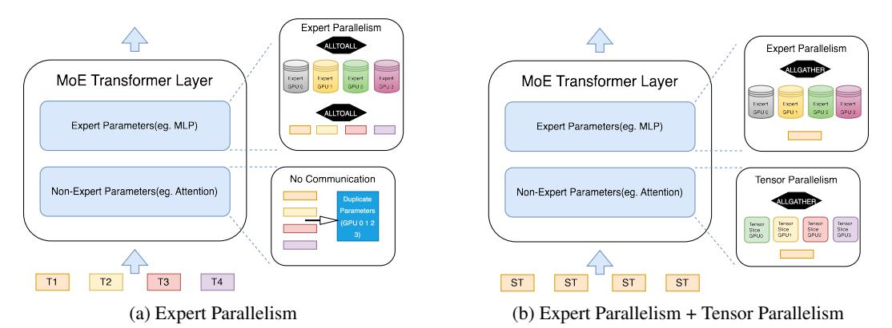
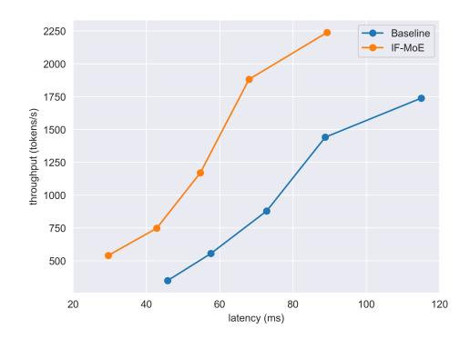

# IFMoE: An Inference Framework Design for Fine-grained MoE

# Yuwei An

Carnegie Mellon University yuweia@andrew.cmu.edu

# Zhuoming Chen

Carnegie Mellon University zhuominc@andrew.cmu.edu

## Beidi Chen

Carnegie Mellon University beidic@andrew.cmu.edu

# Abstract

Mixture-of-Experts (MoE) based large language models (LLMs) have demonstrated exceptional performance across a wide range of downstream tasks and application scenarios. Recent advancements in MoE-based LLMs, such as Deepseek MoE, incorporate fine-grained expert segmentation and shared expert isolation to unlock greater potential for expert specialization. While this technique significantly enhances model capability and reduces training costs, it introduces challenges related to increased inference latency and reduced throughput.

To address these challenges, we propose IFMoE (Inference Framework for Finegrained MoE), a system specifically designed to enhance the inference performance of fine-grained MoE models. IFMoE introduces a redesigned parallelism mechanism tailored for MoE inference and incorporates the concept of Speculative Decoding to alleviate the high latency introduced by expert fusion kernel calculation. Although it is not an entirely lossless method, experiments demonstrate that IFMoE maintains downstream performance while achieving a 30% improvement in both inference latency and throughput.

# 1 Introduction

Mixture-of-Experts (MoE)[\[7,](#page-4-0) [15\]](#page-5-0)-based large language models (LLMs) have demonstrated superior performance compared to dense models, particularly in terms of low training cost and strong language ability. By employing a large number of parameters but activating only a subset for each token, MoE provides an effective approach to balance the trade-off between model performance and parameter usage. Recent work [\[5,](#page-4-1) [6,](#page-4-2) [17\]](#page-5-1) has introduced fine-grained MoE architectures, which differ from traditional MoE structures by employing a greater number of experts but with a smaller size. Empirical evidence and experimental results[\[18,](#page-5-2) [9\]](#page-4-3) suggest that this fine-grained structure is training-efficient and offers strong performance at a relatively low training cost. However, during inference, this design introduces latency and throughtput challenges, particularly in scenarios with large batch sizes.

Our analysis identifies two primary bottlenecks that need to be addressed. The first bottleneck pertains to the memory limitations of the traditional Expert Parallelism mechanism. While this mechanism is primarily designed for MoE training, the duplication of non-expert parameters consumes excessive memory, limiting the ability to perform large batch-size inference and long-context generation during inference. The second bottleneck arises in the computational process of the expert layer. Typically, the expert layer computation is implemented using a fusion kernel with a key operation being GroupedGEMM (Grouped General Matrix Multiply). Our observations indicate that this operation contributes significantly to inference latency, particularly with more activate experts involved.

<span id="page-1-0"></span>

Figure 1: The comparison between the classic Expert Parallelism mechanism and the IFMoE Parallelism mechanism. In the classic Expert Parallelism each machine processes different input tokens while the IFMoE Parallelism mechanism assigns the same input tokens (ST) to each machine for processing.

To address these issues, we propose IFMoE, an Inference Framework for Fine-grained MoE. The main contribution of IFMoE is solving the two aforementioned problems. We redesigned the parallelism mechanism for MoE inference to free up more memory space for KV cache storage, thereby increasing the capacity for larger batch sizes and longer context lengths. Additionally, we introduced the idea of Speculative Decoding, which allows initial drafting with fewer experts and subsequently re-adjusts the KV cache for further optimization.

# 2 Background

# 2.1 Fine Grained MoE

Unlike traditional MoE architectures such as GShard[\[10\]](#page-4-4), DeepSpeed-MoE[\[14\]](#page-5-3), and Mixture[\[8\]](#page-4-5), fine-grained MoE models typically feature a greater number of experts, each with a smaller individual size. This structure has been shown to yield optimal training outcomes with relatively low training costs, leading to strong performance in downstream tasks.

# 2.2 Speculative Decoding

Sepeculative Decoding(SD)[\[11\]](#page-4-6) is an optimization technique to reduce inference latency during the decoding process for large language model. It introduces a smaller draft model for decoding followed by verification using the original large model. Due to the smaller size of the draft model, the overall inference system can achieve speedup when the acceptance rate during the verification phase remains sufficiently high.

# 3 Method

#### 3.1 Redesign of Parallelsim

The primary bottleneck for MoE (Mixture of Experts) serving is memory constraints due to the duplication of parameters. These parameters include those used for Attention, Normalization, and Shared Expert components. In the traditional Expert Parallelism (EP) mechanism, each machine replicates all of these shared parameters, resulting in significant memory usage. This duplication restricts the ability to handle longer contexts and larger batch sizes during inference.

Our observation highlights a key distinction between MoE training and inference: the nature of communication overhead. During inference, communication typically occurs between machines within the same node, as opposed to the more costly multi-node communication during training. Thus, IFMoE employs a combined Expert Parallelism (EP) and Tensor Parallelism (TP) approach for inference shown at figure [1.](#page-1-0) TP is used for shared parameters, while EP is retained for expert-specific

parameters. This choice is based on the observation that the size of individual experts is relatively small and load balancing across fine-grained MoE experts is generally efficient. Instead of the traditional All-to-All operation used in classic EP mechanisms, IFMoE adopts a double All-Gather operation, which will not introduce higher communication cost. Meanwhile, this hybrid EP+TP parallelism approach provides additional memory for computation and kv-cache storage, ultimately enabling higher throughput in MoE inference. The details are available in Appendix A.

## 3.2 Draft-Decoding and KV-cache revision

Similar to traditional Transformer architectures, fine-grained MoE (Mixture of Experts) models consist of Attention and MLP component within each layer. In the MLP layer, the computation is divided into two phases: routing expert (RE) calculation and shared expert (SE) calculation. During the RE phase, a fusion operation kernel called GroupedGEMM (Grouped General Matrix Multiplication) is employed to accelerate the computation of expert outputs for each token. A detailed discussion of the GroupedGEMM kernel can be found in Appendix B.

The figure illustrates the proportion of latency attributed to various operations during inference, highlighting that the GroupedGEMM kernel accounts for a significant portion of the overall latency. The slow performance arises from two main factors. First, GroupedGEMM is a memory-bound operation. Although the memory footprint for a single expert is relatively small, the number of activated experts grows nearly linearly as batch size increases, leading to heightened memory pressure until all experts are activated. Second, the dynamic control flows present in MoE models further contribute to the performance bottleneck. Specifically, the routing expert (RE) calculations do not benefit from optimizations such as Torch Compile and CUDA Graphs [\[1\]](#page-4-7), thus slowing down the computation.

To address these challenges, we introduce the concept of Speculative Decoding (SP). We observe that fine-grained MoE models can maintain strong performance with fewer activated experts thus instead of using a separate, smaller draft model, we utilize the finegrained MoE model with fewer experts itself as the draft model. Since fewer experts are activated during the GroupedGEMM operation, the decoding process is significantly faster compared to using the full model. In contrast to traditional speculative decoding algorithms, we accept the entire output from the draft model but only update the kv-cache for the generated tokens during the verification stage. The complete algorithm is provided in Algorithm [1.](#page-2-0)

```
Input: α, encode_topk Ek, decode_topk Dk,
fine-grained MoE model M
Initialize: terminate = False
buffer = []
while not terminate do
  for each step in α do
    buffer.append(M.decode(topk = Dk))
  end for
  # Revise KV Cache
  M.encode(buffer, topk = Ek)
```

terminate = detect\_terminate()

<span id="page-2-0"></span>Algorithm 1 IFMoE Decoding

buffer = []

end while

The key insight for algorithm [1](#page-2-0) is that both the draft model and the full model share the same kv-cache during inference. This modification not only improves the efficiency of the entire decoding process but also ensures minimal impact on overall performance. .

<span id="page-2-1"></span>Table 1: Downstream performance is evaluated for both the full model and IFMoE variants. DL refers to the Deepseek-Lite-Chat model, while Qwen2 denotes the Qwen2-57B-A14B-Instruct model. For the hyperparameter settings, we apply α = 10, encode topk E<sup>k</sup> = 6, and decode topk D<sup>k</sup> = 2.

| Task           | DL   | QWEN2 | DL-IFMoE | Qwen2-IFMoE |
|----------------|------|-------|----------|-------------|
| XSum           | 12.6 | 13.7  | 12.7     | 13.5        |
| GSM8K          | 67.7 | 75.4  | 63.8     | 71.1        |
| TruthfulQA-Gen | 43.6 | 47.2  | 43.0     | 45.9        |
| IFEval         | 42.9 | 65.7  | 42.3     | 64.8        |

# 4 Experiment

We select the Qwen2-57B-A14B-Instruct model and the Deepseek-Lite-Chat model for downstream performance evaluation and benchmark experiments.

## 4.1 Downstream Performance

While IFMoE is not entirely lossless compared to Speculative Decoding, downstream performance demonstrates that IFMoE can achieve comparable functionality across various applications and scenarios.

For evaluation, we selected the XSum[\[13\]](#page-4-8), GSM8K[\[2\]](#page-4-9), TruthfulQA[\[12\]](#page-4-10) and IFEval[\[19\]](#page-5-4) tasks, which are representative generation tasks covering Summarization, Mathematics, and Alignment. These tasks are well-suited for assessing an LLM's in-context learning and reasoning capabilities. The table [1](#page-2-1) presents the downstream performance results for both the full model and IFMoE. The minimal difference between the performance of the full model and IFMoE indicates that our approximation achieves near-lossless performance in LLM tasks.

#### 4.2 Benchmark Performance

Figure [2](#page-3-0) presents the benchmark performance of the Qwen2-57B-A14B-Instruct model and the Deepseek-Lite-Chat model during the decoding stage. The benchmark experiment of the Qwen2- 57B-A14B-Instruct model was conducted using 4 A6000 GPUs, while the Deepseek-Lite-Chat model was conducted using 2 A6000 GPUs.

<span id="page-3-0"></span>



- (a) Qwen2-57B-A14B-Instruct model benchmark (b) Deepseek-Lite-Chat model benchmark

Figure 2: The benchmark experiment of IFMoE and Full model inference. For the hyperparameter settings, we apply α = 10, encode topk E<sup>k</sup> = 6, and decode topk D<sup>k</sup> = 2. The maximum batch size for the Qwen2-57B-A14B-Instruct model is 256 while the maximum batch size for the Deepseek-Lite-Chat model is 200.

The figure [2](#page-3-0) demonstrates that IFMoE significantly improves the inference speed across various fine-grained MoE architectures. By reducing the amount of computation and limiting the number of active experts, IFMoE achieves over 30% speedup in inference and more than 30% increase in throughput, resulting in a faster and more efficient MoE service system.

# 5 Conclusion

In this paper, we present IFMoE, an inference framework designed for fine-grained Mixture of Experts (MoE) models. By redesigning the parallelism mechanism and employing an MoE model with fewer experts as a draft model, IFMoE overcomes the limitations typically seen in achieving both high throughput and low latency. While IFMoE is not a completely lossless method, it effectively maintains downstream performance while significantly improving benchmark results and delivering substantial speedups in system inference.

# References

- <span id="page-4-7"></span>[1] Jason Ansel, Edward Yang, Horace He, Natalia Gimelshein, Animesh Jain, Michael Voznesensky, Bin Bao, Peter Bell, David Berard, Evgeni Burovski, Geeta Chauhan, Anjali Chourdia, Will Constable, Alban Desmaison, Zachary DeVito, Elias Ellison, Will Feng, Jiong Gong, Michael Gschwind, Brian Hirsh, Sherlock Huang, Kshiteej Kalambarkar, Laurent Kirsch, Michael Lazos, Mario Lezcano, Yanbo Liang, Jason Liang, Yinghai Lu, C. K. Luk, Bert Maher, Yunjie Pan, Christian Puhrsch, Matthias Reso, Mark Saroufim, Marcos Yukio Siraichi, Helen Suk, Shunting Zhang, Michael Suo, Phil Tillet, Xu Zhao, Eikan Wang, Keren Zhou, Richard Zou, Xiaodong Wang, Ajit Mathews, William Wen, Gregory Chanan, Peng Wu, and Soumith Chintala. Pytorch 2: Faster machine learning through dynamic python bytecode transformation and graph compilation. In *Proceedings of the 29th ACM International Conference on Architectural Support for Programming Languages and Operating Systems, Volume 2*, ASPLOS '24, page 929–947, New York, NY, USA, 2024. Association for Computing Machinery.
- <span id="page-4-9"></span>[2] Karl Cobbe, Vineet Kosaraju, Mohammad Bavarian, Mark Chen, Heewoo Jun, Lukasz Kaiser, Matthias Plappert, Jerry Tworek, Jacob Hilton, Reiichiro Nakano, Christopher Hesse, and John Schulman. Training verifiers to solve math word problems, 2021.
- <span id="page-4-12"></span>[3] NVIDIA Corporation. *cuBLAS Documentation*, 2024.
- <span id="page-4-11"></span>[4] NVIDIA Corporation. Cutlass: Cuda templates for linear algebra subroutines and solvers. <https://github.com/NVIDIA/cutlass>, 2024.
- <span id="page-4-1"></span>[5] Damai Dai, Chengqi Deng, Chenggang Zhao, R. X. Xu, Huazuo Gao, Deli Chen, Jiashi Li, Wangding Zeng, Xingkai Yu, Y. Wu, Zhenda Xie, Y. K. Li, Panpan Huang, Fuli Luo, Chong Ruan, Zhifang Sui, and Wenfeng Liang. Deepseekmoe: Towards ultimate expert specialization in mixture-of-experts language models, 2024.
- <span id="page-4-2"></span>[6] DeepSeek-AI, Qihao Zhu, Daya Guo, Zhihong Shao, Dejian Yang, Peiyi Wang, Runxin Xu, Y. Wu, Yukun Li, Huazuo Gao, Shirong Ma, Wangding Zeng, Xiao Bi, Zihui Gu, Hanwei Xu, Damai Dai, Kai Dong, Liyue Zhang, Yishi Piao, Zhibin Gou, Zhenda Xie, Zhewen Hao, Bingxuan Wang, Junxiao Song, Deli Chen, Xin Xie, Kang Guan, Yuxiang You, Aixin Liu, Qiushi Du, Wenjun Gao, Xuan Lu, Qinyu Chen, Yaohui Wang, Chengqi Deng, Jiashi Li, Chenggang Zhao, Chong Ruan, Fuli Luo, and Wenfeng Liang. Deepseek-coder-v2: Breaking the barrier of closed-source models in code intelligence, 2024.
- <span id="page-4-0"></span>[7] Robert A. Jacobs, Michael I. Jordan, Steven J. Nowlan, and Geoffrey E. Hinton. Adaptive mixtures of local experts. *Neural Computation*, 3(1):79–87, 1991.
- <span id="page-4-5"></span>[8] Albert Q. Jiang, Alexandre Sablayrolles, Antoine Roux, Arthur Mensch, Blanche Savary, Chris Bamford, Devendra Singh Chaplot, Diego de las Casas, Emma Bou Hanna, Florian Bressand, Gianna Lengyel, Guillaume Bour, Guillaume Lample, Lélio Renard Lavaud, Lucile Saulnier, Marie-Anne Lachaux, Pierre Stock, Sandeep Subramanian, Sophia Yang, Szymon Antoniak, Teven Le Scao, Théophile Gervet, Thibaut Lavril, Thomas Wang, Timothée Lacroix, and William El Sayed. Mixtral of experts, 2024.
- <span id="page-4-3"></span>[9] Jakub Krajewski, Jan Ludziejewski, Kamil Adamczewski, Maciej Pióro, Michał Krutul, Szymon Antoniak, Kamil Ciebiera, Krystian Król, Tomasz Odrzygó´zd´z, Piotr Sankowski, Marek Cygan, and Sebastian Jaszczur. Scaling laws for fine-grained mixture of experts, 2024.
- <span id="page-4-4"></span>[10] Dmitry Lepikhin, HyoukJoong Lee, Yuanzhong Xu, Dehao Chen, Orhan Firat, Yanping Huang, Maxim Krikun, Noam Shazeer, and Zhifeng Chen. Gshard: Scaling giant models with conditional computation and automatic sharding, 2020.
- <span id="page-4-6"></span>[11] Yaniv Leviathan, Matan Kalman, and Yossi Matias. Fast inference from transformers via speculative decoding, 2023.
- <span id="page-4-10"></span>[12] Stephanie Lin, Jacob Hilton, and Owain Evans. Truthfulqa: Measuring how models mimic human falsehoods, 2022.
- <span id="page-4-8"></span>[13] Shashi Narayan, Shay B. Cohen, and Mirella Lapata. Don't give me the details, just the summary! topic-aware convolutional neural networks for extreme summarization, 2018.

- <span id="page-5-3"></span>[14] Samyam Rajbhandari, Conglong Li, Zhewei Yao, Minjia Zhang, Reza Yazdani Aminabadi, Ammar Ahmad Awan, Jeff Rasley, and Yuxiong He. Deepspeed-moe: Advancing mixture-ofexperts inference and training to power next-generation ai scale, 2022.
- <span id="page-5-0"></span>[15] Noam Shazeer, Azalia Mirhoseini, Krzysztof Maziarz, Andy Davis, Quoc Le, Geoffrey Hinton, and Jeff Dean. Outrageously large neural networks: The sparsely-gated mixture-of-experts layer, 2017.
- <span id="page-5-6"></span>[16] Philippe Tillet et al. Triton: An open-source software stack for gpu programming. [https:](https://github.com/openai/triton) [//github.com/openai/triton](https://github.com/openai/triton), 2024.
- <span id="page-5-1"></span>[17] An Yang, Baosong Yang, Binyuan Hui, Bo Zheng, Bowen Yu, Chang Zhou, Chengpeng Li, Chengyuan Li, Dayiheng Liu, Fei Huang, Guanting Dong, Haoran Wei, Huan Lin, Jialong Tang, Jialin Wang, Jian Yang, Jianhong Tu, Jianwei Zhang, Jianxin Ma, Jianxin Yang, Jin Xu, Jingren Zhou, Jinze Bai, Jinzheng He, Junyang Lin, Kai Dang, Keming Lu, Keqin Chen, Kexin Yang, Mei Li, Mingfeng Xue, Na Ni, Pei Zhang, Peng Wang, Ru Peng, Rui Men, Ruize Gao, Runji Lin, Shijie Wang, Shuai Bai, Sinan Tan, Tianhang Zhu, Tianhao Li, Tianyu Liu, Wenbin Ge, Xiaodong Deng, Xiaohuan Zhou, Xingzhang Ren, Xinyu Zhang, Xipin Wei, Xuancheng Ren, Xuejing Liu, Yang Fan, Yang Yao, Yichang Zhang, Yu Wan, Yunfei Chu, Yuqiong Liu, Zeyu Cui, Zhenru Zhang, Zhifang Guo, and Zhihao Fan. Qwen2 technical report, 2024.
- <span id="page-5-2"></span>[18] Longfei Yun, Yonghao Zhuang, Yao Fu, Eric P Xing, and Hao Zhang. Toward inference-optimal mixture-of-expert large language models, 2024.
- <span id="page-5-4"></span>[19] Jeffrey Zhou, Tianjian Lu, Swaroop Mishra, Siddhartha Brahma, Sujoy Basu, Yi Luan, Denny Zhou, and Le Hou. Instruction-following evaluation for large language models, 2023.

# A Appendix / Memory Efficiency through Parallelism Redesign

We calculate the memory usage and the memory savings achieved using IFMoE's parallelism mechanism under the condition of bfloat16 precision.

<span id="page-5-5"></span>Table 2: Memory Usage and Memory Optimization with IFMoE. #Expert and #Machine represents the number of global experts in a single layer and the number of parallel machine during inference. M(Attention) and M(Experts) represents the memory usage of attention parameters and expert parameters in a single layer. M(Optimization) represents the memory savings with IFMoE on a single machine.

| Model          | #Expert | #Machine | M(Attention) | M(Experts) | M(Optimization) |
|----------------|---------|----------|--------------|------------|-----------------|
| Deepseek-Lite  | 64      | 2        | 28MB         | 1.1GB      | 4.6GB           |
| Qwen2-57B-A14B | 64      | 4        | 66MB         | 3.5GB      | 10GB            |
| Deepseek-v2    | 160     | 8        | 360MB        | 7.4GB      | 23GB            |

Table [2](#page-5-5) presents the basic memory usage and optimization across various fine-grained expert architectures. Although the memory consumption of attention mechanisms is significantly smaller compared to expert parameters, the replication of shared memory accounts for a substantial portion. By leveraging tensor parallelism on these parameters, the optimized memory usage is remarkable, allowing the freed memory to be reallocated for computation and KV-cache storage, thereby enabling larger batch sizes and longer context generation.

# B Appendix / GroupedGEMM Kernel

GroupedGEMM(Grouped General Matrix Multiplication) operation can be viewed as a generalization of the batched APIs that enable different matrix sizes, transpositions, and scaling factors to be grouped and parallelized in one kernel launch.

In the scenario of fine-grained MoE service, the computation for each expert can be small, making the workload of a single GEMM operation less efficient. Grouped GEMM allows multiple smaller matrix multiplications (for different experts) to be processed in parallel, increasing computational efficiency by better utilizing hardware resources. At the same time, the application of GroupedGEMM could reduce the kernel launch overhead and combines these operations into a single kernel launch.

Currently, there are three main implementations of the GroupedGEMM kernel. The first is designed with Triton[\[16\]](#page-5-6), the second with Cutlass[\[4\]](#page-4-11), and most recently, cuBLAS[\[3\]](#page-4-12) introduced a new GroupedGEMM kernel in CUDA version 12.5. However, due to compatibility issues between PyTorch and CUDA versions, we selected the Cutlass implementation for IFMoE.

# C Appendix / Future Work

Here are three main points we believe that should be further improved for IFMoE.

- The first point addresses the GroupedGEMM kernel implementation in cuBLAS. Due to version conflicts between PyTorch and CUDA, it is currently challenging to utilize the GroupedGEMM kernel provided by cuBLAS. However, with the future introduction of PyTorch supporting the CUDA 12.5 library, the application of this implementation is expected to significantly accelerate MoE inference performance.
- The second point pertains to the token acceptance process in the draft model. Currently, IFMoE accepts all tokens generated from the draft model and readjusts the KV-cache accordingly. However, in certain high-demand tasks such as code generation, not all the tokens may be acceptable. Thus, leveraging the logits during the verification and readjustment phase is critical to determine whether the model needs correction. By introducing a rollback mechanism, IFMoE should approach the language generation quality of the full model.
- The third point concerns expert dynamic selection. Our experiments indicate that the number of experts selected during inference can be flexible. We aim to explore under what circumstances we can reduce the number of experts and when full expert selection is necessary for optimal inference performance.

# NeurIPS Paper Checklist

## 1. Claims

Question: Do the main claims made in the abstract and introduction accurately reflect the paper's contributions and scope?

Answer: [Yes]

Justification: the main claims made in the abstract and introduction accurately reflect the paper's contributions and scope

# Guidelines:

- The answer NA means that the abstract and introduction do not include the claims made in the paper.
- The abstract and/or introduction should clearly state the claims made, including the contributions made in the paper and important assumptions and limitations. A No or NA answer to this question will not be perceived well by the reviewers.
- The claims made should match theoretical and experimental results, and reflect how much the results can be expected to generalize to other settings.
- It is fine to include aspirational goals as motivation as long as it is clear that these goals are not attained by the paper.

### 2. Limitations

Question: Does the paper discuss the limitations of the work performed by the authors?

Answer: [Yes]

Justification: In the appendix we talk about the future work of IFMoE.

## Guidelines:

- The answer NA means that the paper has no limitation while the answer No means that the paper has limitations, but those are not discussed in the paper.
- The authors are encouraged to create a separate "Limitations" section in their paper.
- The paper should point out any strong assumptions and how robust the results are to violations of these assumptions (e.g., independence assumptions, noiseless settings, model well-specification, asymptotic approximations only holding locally). The authors should reflect on how these assumptions might be violated in practice and what the implications would be.
- The authors should reflect on the scope of the claims made, e.g., if the approach was only tested on a few datasets or with a few runs. In general, empirical results often depend on implicit assumptions, which should be articulated.
- The authors should reflect on the factors that influence the performance of the approach. For example, a facial recognition algorithm may perform poorly when image resolution is low or images are taken in low lighting. Or a speech-to-text system might not be used reliably to provide closed captions for online lectures because it fails to handle technical jargon.
- The authors should discuss the computational efficiency of the proposed algorithms and how they scale with dataset size.
- If applicable, the authors should discuss possible limitations of their approach to address problems of privacy and fairness.
- While the authors might fear that complete honesty about limitations might be used by reviewers as grounds for rejection, a worse outcome might be that reviewers discover limitations that aren't acknowledged in the paper. The authors should use their best judgment and recognize that individual actions in favor of transparency play an important role in developing norms that preserve the integrity of the community. Reviewers will be specifically instructed to not penalize honesty concerning limitations.

### 3. Theory Assumptions and Proofs

Question: For each theoretical result, does the paper provide the full set of assumptions and a complete (and correct) proof?

Answer: [NA] .

Justification: The paper does not include theoretical results

## Guidelines:

- The answer NA means that the paper does not include theoretical results.
- All the theorems, formulas, and proofs in the paper should be numbered and crossreferenced.
- All assumptions should be clearly stated or referenced in the statement of any theorems.
- The proofs can either appear in the main paper or the supplemental material, but if they appear in the supplemental material, the authors are encouraged to provide a short proof sketch to provide intuition.
- Inversely, any informal proof provided in the core of the paper should be complemented by formal proofs provided in appendix or supplemental material.
- Theorems and Lemmas that the proof relies upon should be properly referenced.

### 4. Experimental Result Reproducibility

Question: Does the paper fully disclose all the information needed to reproduce the main experimental results of the paper to the extent that it affects the main claims and/or conclusions of the paper (regardless of whether the code and data are provided or not)?

Answer: [Yes]

Justification: The paper fully disclose the information needed to reproduce the main experimental results of the paper

#### Guidelines:

- The answer NA means that the paper does not include experiments.
- If the paper includes experiments, a No answer to this question will not be perceived well by the reviewers: Making the paper reproducible is important, regardless of whether the code and data are provided or not.
- If the contribution is a dataset and/or model, the authors should describe the steps taken to make their results reproducible or verifiable.
- Depending on the contribution, reproducibility can be accomplished in various ways. For example, if the contribution is a novel architecture, describing the architecture fully might suffice, or if the contribution is a specific model and empirical evaluation, it may be necessary to either make it possible for others to replicate the model with the same dataset, or provide access to the model. In general. releasing code and data is often one good way to accomplish this, but reproducibility can also be provided via detailed instructions for how to replicate the results, access to a hosted model (e.g., in the case of a large language model), releasing of a model checkpoint, or other means that are appropriate to the research performed.
- While NeurIPS does not require releasing code, the conference does require all submissions to provide some reasonable avenue for reproducibility, which may depend on the nature of the contribution. For example
- (a) If the contribution is primarily a new algorithm, the paper should make it clear how to reproduce that algorithm.
- (b) If the contribution is primarily a new model architecture, the paper should describe the architecture clearly and fully.
- (c) If the contribution is a new model (e.g., a large language model), then there should either be a way to access this model for reproducing the results or a way to reproduce the model (e.g., with an open-source dataset or instructions for how to construct the dataset).
- (d) We recognize that reproducibility may be tricky in some cases, in which case authors are welcome to describe the particular way they provide for reproducibility. In the case of closed-source models, it may be that access to the model is limited in some way (e.g., to registered users), but it should be possible for other researchers to have some path to reproducing or verifying the results.

### 5. Open access to data and code

Question: Does the paper provide open access to the data and code, with sufficient instructions to faithfully reproduce the main experimental results, as described in supplemental material?

Answer: [No]

Justification: IFMoE is still under develop with future features.

## Guidelines:

- The answer NA means that paper does not include experiments requiring code.
- Please see the NeurIPS code and data submission guidelines ([https://nips.cc/](https://nips.cc/public/guides/CodeSubmissionPolicy) [public/guides/CodeSubmissionPolicy](https://nips.cc/public/guides/CodeSubmissionPolicy)) for more details.
- While we encourage the release of code and data, we understand that this might not be possible, so "No" is an acceptable answer. Papers cannot be rejected simply for not including code, unless this is central to the contribution (e.g., for a new open-source benchmark).
- The instructions should contain the exact command and environment needed to run to reproduce the results. See the NeurIPS code and data submission guidelines ([https:](https://nips.cc/public/guides/CodeSubmissionPolicy) [//nips.cc/public/guides/CodeSubmissionPolicy](https://nips.cc/public/guides/CodeSubmissionPolicy)) for more details.
- The authors should provide instructions on data access and preparation, including how to access the raw data, preprocessed data, intermediate data, and generated data, etc.
- The authors should provide scripts to reproduce all experimental results for the new proposed method and baselines. If only a subset of experiments are reproducible, they should state which ones are omitted from the script and why.
- At submission time, to preserve anonymity, the authors should release anonymized versions (if applicable).
- Providing as much information as possible in supplemental material (appended to the paper) is recommended, but including URLs to data and code is permitted.

## 6. Experimental Setting/Details

Question: Does the paper specify all the training and test details (e.g., data splits, hyperparameters, how they were chosen, type of optimizer, etc.) necessary to understand the results?

Answer: [Yes]

Justification: Yes, the paper specify all the training and test details

#### Guidelines:

- The answer NA means that the paper does not include experiments.
- The experimental setting should be presented in the core of the paper to a level of detail that is necessary to appreciate the results and make sense of them.
- The full details can be provided either with the code, in appendix, or as supplemental material.

### 7. Experiment Statistical Significance

Question: Does the paper report error bars suitably and correctly defined or other appropriate information about the statistical significance of the experiments?

Answer: [No]

Justification: The error bar is not necessary

## Guidelines:

- The answer NA means that the paper does not include experiments.
- The authors should answer "Yes" if the results are accompanied by error bars, confidence intervals, or statistical significance tests, at least for the experiments that support the main claims of the paper.
- The factors of variability that the error bars are capturing should be clearly stated (for example, train/test split, initialization, random drawing of some parameter, or overall run with given experimental conditions).
- The method for calculating the error bars should be explained (closed form formula, call to a library function, bootstrap, etc.)
- The assumptions made should be given (e.g., Normally distributed errors).
- It should be clear whether the error bar is the standard deviation or the standard error of the mean.

- It is OK to report 1-sigma error bars, but one should state it. The authors should preferably report a 2-sigma error bar than state that they have a 96% CI, if the hypothesis of Normality of errors is not verified.
- For asymmetric distributions, the authors should be careful not to show in tables or figures symmetric error bars that would yield results that are out of range (e.g. negative error rates).
- If error bars are reported in tables or plots, The authors should explain in the text how they were calculated and reference the corresponding figures or tables in the text.

## 8. Experiments Compute Resources

Question: For each experiment, does the paper provide sufficient information on the computer resources (type of compute workers, memory, time of execution) needed to reproduce the experiments?

Answer: [Yes]

Justification: We provide the GPU resources needed.

# Guidelines:

- The answer NA means that the paper does not include experiments.
- The paper should indicate the type of compute workers CPU or GPU, internal cluster, or cloud provider, including relevant memory and storage.
- The paper should provide the amount of compute required for each of the individual experimental runs as well as estimate the total compute.
- The paper should disclose whether the full research project required more compute than the experiments reported in the paper (e.g., preliminary or failed experiments that didn't make it into the paper).

## 9. Code Of Ethics

Question: Does the research conducted in the paper conform, in every respect, with the NeurIPS Code of Ethics <https://neurips.cc/public/EthicsGuidelines>?

Answer: [Yes]

Justification: Yes, it does

#### Guidelines:

- The answer NA means that the authors have not reviewed the NeurIPS Code of Ethics.
- If the authors answer No, they should explain the special circumstances that require a deviation from the Code of Ethics.
- The authors should make sure to preserve anonymity (e.g., if there is a special consideration due to laws or regulations in their jurisdiction).

### 10. Broader Impacts

Question: Does the paper discuss both potential positive societal impacts and negative societal impacts of the work performed?

Answer: [NA] .

Justification: There is no societal impact of the work performed.

# Guidelines:

- The answer NA means that there is no societal impact of the work performed.
- If the authors answer NA or No, they should explain why their work has no societal impact or why the paper does not address societal impact.
- Examples of negative societal impacts include potential malicious or unintended uses (e.g., disinformation, generating fake profiles, surveillance), fairness considerations (e.g., deployment of technologies that could make decisions that unfairly impact specific groups), privacy considerations, and security considerations.
- The conference expects that many papers will be foundational research and not tied to particular applications, let alone deployments. However, if there is a direct path to any negative applications, the authors should point it out. For example, it is legitimate to point out that an improvement in the quality of generative models could be used to

generate deepfakes for disinformation. On the other hand, it is not needed to point out that a generic algorithm for optimizing neural networks could enable people to train models that generate Deepfakes faster.

- The authors should consider possible harms that could arise when the technology is being used as intended and functioning correctly, harms that could arise when the technology is being used as intended but gives incorrect results, and harms following from (intentional or unintentional) misuse of the technology.
- If there are negative societal impacts, the authors could also discuss possible mitigation strategies (e.g., gated release of models, providing defenses in addition to attacks, mechanisms for monitoring misuse, mechanisms to monitor how a system learns from feedback over time, improving the efficiency and accessibility of ML).

### 11. Safeguards

Question: Does the paper describe safeguards that have been put in place for responsible release of data or models that have a high risk for misuse (e.g., pretrained language models, image generators, or scraped datasets)?

Answer: [NA] .

Justification: The paper poses no such risks.

## Guidelines:

- The answer NA means that the paper poses no such risks.
- Released models that have a high risk for misuse or dual-use should be released with necessary safeguards to allow for controlled use of the model, for example by requiring that users adhere to usage guidelines or restrictions to access the model or implementing safety filters.
- Datasets that have been scraped from the Internet could pose safety risks. The authors should describe how they avoided releasing unsafe images.
- We recognize that providing effective safeguards is challenging, and many papers do not require this, but we encourage authors to take this into account and make a best faith effort.

## 12. Licenses for existing assets

Question: Are the creators or original owners of assets (e.g., code, data, models), used in the paper, properly credited and are the license and terms of use explicitly mentioned and properly respected?

Answer: [NA] .

Justification: The paper does not use existing assets.

#### Guidelines:

- The answer NA means that the paper does not use existing assets.
- The authors should cite the original paper that produced the code package or dataset.
- The authors should state which version of the asset is used and, if possible, include a URL.
- The name of the license (e.g., CC-BY 4.0) should be included for each asset.
- For scraped data from a particular source (e.g., website), the copyright and terms of service of that source should be provided.
- If assets are released, the license, copyright information, and terms of use in the package should be provided. For popular datasets, <paperswithcode.com/datasets> has curated licenses for some datasets. Their licensing guide can help determine the license of a dataset.
- For existing datasets that are re-packaged, both the original license and the license of the derived asset (if it has changed) should be provided.
- If this information is not available online, the authors are encouraged to reach out to the asset's creators.

# 13. New Assets

Question: Are new assets introduced in the paper well documented and is the documentation provided alongside the assets?

Answer: [NA] .

Justification: The paper does not release new assets

Guidelines:

- The answer NA means that the paper does not release new assets.
- Researchers should communicate the details of the dataset/code/model as part of their submissions via structured templates. This includes details about training, license, limitations, etc.
- The paper should discuss whether and how consent was obtained from people whose asset is used.
- At submission time, remember to anonymize your assets (if applicable). You can either create an anonymized URL or include an anonymized zip file.

### 14. Crowdsourcing and Research with Human Subjects

Question: For crowdsourcing experiments and research with human subjects, does the paper include the full text of instructions given to participants and screenshots, if applicable, as well as details about compensation (if any)?

Answer: [NA] .

Justification: The paper does not involve crowdsourcing nor research with human subjects. Guidelines:

- The answer NA means that the paper does not involve crowdsourcing nor research with human subjects.
- Including this information in the supplemental material is fine, but if the main contribution of the paper involves human subjects, then as much detail as possible should be included in the main paper.
- According to the NeurIPS Code of Ethics, workers involved in data collection, curation, or other labor should be paid at least the minimum wage in the country of the data collector.

## 15. Institutional Review Board (IRB) Approvals or Equivalent for Research with Human Subjects

Question: Does the paper describe potential risks incurred by study participants, whether such risks were disclosed to the subjects, and whether Institutional Review Board (IRB) approvals (or an equivalent approval/review based on the requirements of your country or institution) were obtained?

Answer: [NA] .

Justification: The paper does not involve crowdsourcing nor research with human subjects. Guidelines:

- The answer NA means that the paper does not involve crowdsourcing nor research with human subjects.
- Depending on the country in which research is conducted, IRB approval (or equivalent) may be required for any human subjects research. If you obtained IRB approval, you should clearly state this in the paper.
- We recognize that the procedures for this may vary significantly between institutions and locations, and we expect authors to adhere to the NeurIPS Code of Ethics and the guidelines for their institution.
- For initial submissions, do not include any information that would break anonymity (if applicable), such as the institution conducting the review.