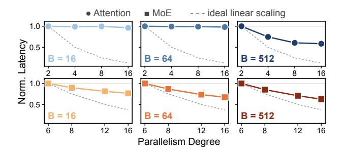
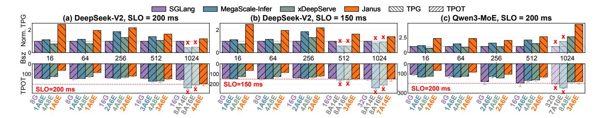
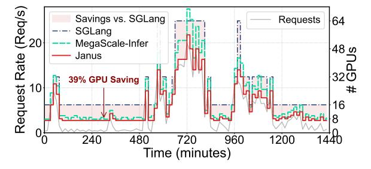
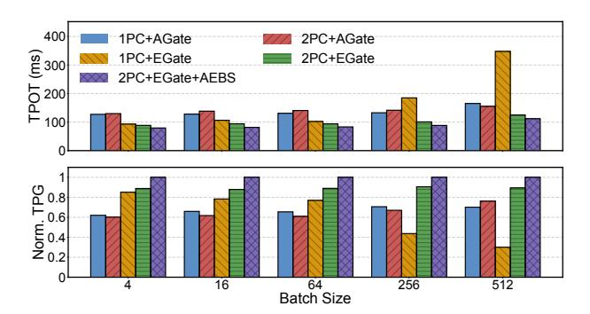
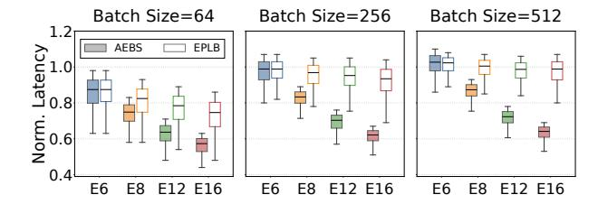
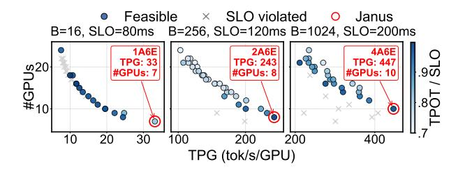
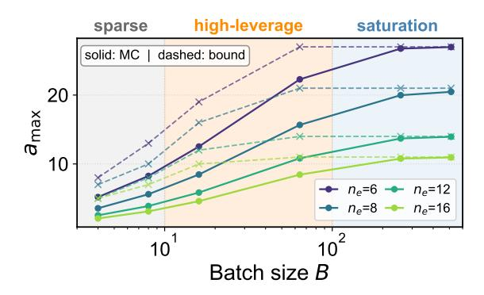

# JANUS: Disaggregating Attention and Experts for Scalable MoE Inference

Zhexiang Zhang1\*, Ye Wang1,2\*, Yumiao Zhao<sup>3</sup> , Jiayu Xiao<sup>1</sup> , Qianjing Yang<sup>1</sup> , Xiangyu Wang<sup>2</sup> , Jingzhe Jiang<sup>1</sup> , Qizhen Weng<sup>2</sup> , Ruichuan Chen<sup>4</sup> , Shaohuai Shi<sup>5</sup> , Adel N. Toosi<sup>6</sup> , Yin Chen<sup>2</sup> , Minchen Yu1†

*<sup>1</sup>The Chinese University of Hong Kong, Shenzhen 2 Institute of Artificial Intelligence (TeleAI), China Telecom <sup>3</sup>Shenzhen Loop Area Institute <sup>4</sup>Nokia Bell Labs <sup>5</sup>Harbin Institute of Technology, Shenzhen <sup>6</sup>University of Melbourne*

# Abstract

Serving large Mixture-of-Experts (MoE) models is challenging because of their substantial resource demands and highly dynamic inference workloads. Most existing MoE inference systems deploy the entire model as a monolithic unit, forcing attention and MoE layers to share the same resource configuration despite their different requirements. Such coarse-grained provisioning leads to resource inefficiency and suboptimal performance. We present JANUS, a scalable and resource-efficient MoE inference system built around three key principles. First, JANUS disaggregates attention and MoE layers onto separate GPU worker pools, enabling independent resource provisioning for these two layer types, and employs an adaptive two-phase communication mechanism for low-latency data exchange. Second, because MoE layers are largely memory-bound and their latency is dominated by the activated-expert counts, JANUS introduces a microsecond-scale activation scheduler that balances per-layer activated experts across MoE instances to reduce the inference latency. Third, JANUS employs a fine-grained, SLO-aware resource scaling scheme that jointly optimizes the attention-side and MoE-side resources, together with the expert placement, to minimize the resource cost under tokenlevel SLO constraints. Evaluation shows that JANUS improves per-GPU throughput by up to 4.7× over the state-of-the-art systems while satisfying token-level latency SLOs.

# 1 Introduction

Recent advances in Large Language Models (LLMs) have driven widespread adoption across diverse domains. As mainstream LLMs scale to ever-larger parameter sizes [\[45\]](#page-14-0), the Mixture-of-Experts (MoE) has emerged as a dominant architecture, which effectively expands model capacity without

proportionally increasing per-token computation [\[3,](#page-12-0)[13,](#page-12-1)[37](#page-13-0)[,38\]](#page-13-1). Compared with dense LLMs, MoE models retain the attention layers but replace each Feed-Forward Network (FFN) layer with an MoE layer composed of multiple FFNs as experts. These experts are sparsely activated at inference time—only a small subset is invoked per token—and thus keeping per-token computation bounded.

Serving large MoE models for online workloads introduces a fundamental tradeoff between resource efficiency and latency Service Level Objectives (SLOs). Real-world LLM services face highly dynamic demand, including fluctuating request arrival rates and highly variable input and output token lengths [\[6,](#page-12-2) [29,](#page-13-2) [32,](#page-13-3) [39,](#page-13-4) [41,](#page-13-5) [44\]](#page-14-1). Meeting token-level latency SLOs such as Time-Per-Output-Token (TPOT) requires provisioning sufficient GPUs to absorb workload bursts, but this leaves substantial resources idle during low-demand periods. This inefficiency is more pronounced for MoE models because expert parameters dominate the model memory footprint [\[3,](#page-12-0) [13\]](#page-12-1). To maintain low latency, most experts need to remain resident in GPU memory even though only a small subset is activated for each token, driving the resource needs far beyond a small GPU deployment (e.g., hosting DeepSeek-V3 requires at least 16 H100 GPUs [\[13\]](#page-12-1)). Therefore, achieving scalable MoE inference requires meeting stringent token-level SLOs while minimizing resource over-provisioning.

Despite recent progress, achieving scalable MoE inference remains an open challenge. Most existing systems serve the full MoE model as a monolithic instance and manage resources at the granularity of model instances [\[3,](#page-12-0) [10,](#page-12-3) [37\]](#page-13-0). This coarse-grained design overlooks the heterogeneous resource demands of attention and MoE layers: MoE layers are more memory-intensive, and their latency depends strongly on the number of activated experts per GPU (see [§2.3\)](#page-3-0). It forces attention and MoE layers to use the same resource configuration, such as identical parallelism degrees, leading to either over-provisioning or degraded performance. Recent systems such as MegaScale-Infer [\[44\]](#page-14-1) disaggregate attention and MoE

<sup>\*</sup> Equal contribution.

<sup>†</sup> Corresponding author: Minchen Yu (yuminchen@cuhk.edu.cn).

layers onto separate clusters. However, they still offer limited support for fine-grained resource scaling and expert management, often relying on a static expert-to-GPU placement, e.g., pinning fixed sets of experts to dedicated GPUs. Consequently, they remain resource-inefficient under dynamic workloads.

An ideal MoE inference system should satisfy three key requirements. First, it should support *independent resource provisioning for attention and MoE layers*, allowing each to adopt a configuration tailored to its own demand. Second, it should *balance the number of activated experts across GPUs to maximize the efficiency of MoE execution*, which is largely memory-bound and dominates the end-to-end resource footprint. Third, it should enable *fine-grained elasticity under SLOs*, incrementally adjusting capacity and expert placement to ensure that the resulting configuration meets token-level latency constraints with the minimal resource cost.

Guided by these requirements, we present JANUS, a scalable and resource-efficient MoE inference system. JANUS disaggregates attention and MoE layers onto separate sets of GPU worker nodes, enabling each layer type to be provisioned and scaled independently. Building on this architecture, JANUS aims to improve MoE efficiency by balancing activated-expert load across GPUs, and support fine-grained scaling to minimize resource costs under SLO constraints. However, realizing these goals requires addressing three key challenges in disaggregated MoE inference.

First, disaggregation introduces an "m-to-n" communication between *m* attention and *n* MoE serving instances at every layer, which significantly increases the end-to-end inference latency. A naive implementation that adopts pairwise communication would incur many small cross-node transfers across *O*(*m* × *n*) instance pairs, whose overhead can dominate the end-to-end latency. JANUS addresses this challenge by trading a modest increase in aggregate data volume for fewer, larger data transfers. It employs an *adaptive two-phase transmission scheme* that first aggregates intermediate data from intra-node instances and then performs bulk transfers to the destination nodes. This design significantly reduces the number of data transfers between two sub-clusters and, in turn, reduces overall inference latency.

Second, disaggregation creates a larger and more flexible pool of GPUs for serving expert activations, but also introduces a non-trivial layer-wise scheduling problem determining, at inference time, how expert activation requests for each layer should be distributed across GPUs to balance load and minimize inference latency. This decision must be made with extremely low overhead because layer-wise MoE computation typically completes within a few hundred microseconds (see Fig. [3\)](#page-3-1). To address this challenge, JANUS introduces the *activated-expert-balanced scheduling* that uses a fast heuristic to minimize the number of activated experts per MoE instance. The scheduler runs as a GPU kernel, avoids CPU–GPU synchronization, and operates in a fully distributed manner without cross-GPU coordination. Conse-

<span id="page-1-0"></span>Table 1: Memory footprint of state-of-the-art MoE models.

| Model            | Expert Mem. (GB) | Total Mem. (GB) | Ratio (%) |
|------------------|------------------|-----------------|-----------|
| Qwen3-235B [38]  | 423.0            | 438             | 96.5      |
| DS-V2 [12]       | 421.0            | 472.0           | 89.2      |
| DS-V3/R1 [7, 13] | 1258.0           | 1342.0          | 93.7      |
| Grok-1 [35]      | 586.0            | 628.0           | 91.7      |

quently, JANUS sustains the scheduling and synchronization overhead at the microsecond level, effectively satisfying the tight latency requirements for layer-wise MoE execution.

The third challenge is to maximize overall resource efficiency, measured by throughput per GPU, while meeting SLO constraints. This necessitates carefully determining resource allocation for both attention and MoE layer types and deciding how experts are placed across MoE instances. JANUS addresses this challenge with a *fine-grained, SLO-aware resource scaling scheme* that incrementally adjusts the number of attention and MoE instances to meet token-level SLOs with minimal GPU resources. This scheme also optimizes expert placement to minimize the expected number of co-activated experts on each MoE instance. Together with the activation scheduler, this design reduces inference latency and improves SLO attainment while lowering resource cost.

We implement JANUS on top of SGLang [\[26\]](#page-13-7) and evaluate it on representative MoE models including DeepSeek-V2 [\[12\]](#page-12-4) and Qwen3-235B [\[38\]](#page-13-1). Experiments show that JANUS improves per-GPU throughput by up to 4.7× and 3.3× over state-of-the-art monolithic and disaggregated MoE inference systems, respectively, while meeting SLO requirements. We further show that, under real-world LLM inference traces, JANUS adapts to changing workloads by adjusting attentionside and MoE-side configurations at fine granularity, reducing resource cost by about 40% compared with baselines. These results demonstrate that JANUS effectively achieves tokenlevel SLO attainment at low resource cost.

# 2 Background and Motivation

# 2.1 MoE Inference

Mixture-of-Experts (MoE) has become a widely adopted model architecture due to its advantages in scaling LLM capacities [\[13,](#page-12-1)[36,](#page-13-8)[38\]](#page-13-1). Modern MoE models have grown rapidly in size, with expert parameters accounting for most of the model memory footprint (Table [1\)](#page-1-0). For example, DeepSeek-V3 contains 256 experts in each MoE layer, and its expert parameters alone account for 93.7% of the total model memory footprint [\[13\]](#page-12-1). Serving such models therefore requires substantial GPU memory capacity—fully loading DeepSeek-V3 requires at least 16 H100 GPUs. At the same time, online inference workloads exhibit highly dynamic request arrivals [\[17,](#page-12-6) [39,](#page-13-4) [41\]](#page-13-5), making static provisioning inefficient: insufficient capacity leads to token-level SLO violations such

<span id="page-2-1"></span>

Figure 1: Latency of DeepSeek-V2 attention and MoE layers under different parallelism degrees and batch sizes. Each panel is normalized to the latency at the smallest parallelism degree, and the dashed line shows ideal linear scaling.

as high TPOT, whereas overprovisioning for peak load leaves expensive GPUs under-utilized during low-demand periods. Consequently, scalable MoE inference systems must elastically adapt to fluctuating workloads while satisfying stringent SLOs at low resource cost [3,8,10,44].

LLM inference consists of two phases: prefill and decode. Prefill processes the input prompt in a single forward pass and generates the first token. Decode then autoregressively outputs the subsequent tokens, one per iteration. This paper primarily focuses on scalable MoE inference for the decode phase. Compared with prefill, decoding typically dominates user-perceptible latency as its per-token cost accumulates over long generation sequences. This decode-centric focus is also well aligned with the emerging deployment practice. Recent systems increasingly separate prefill and decode phases [22, 42], and deployments such as Prefill-as-a-Service [24] offload long-context, compute-intensive prefill traffic to dedicated remote pools. Therefore, local clusters are often left to primarily serve decode traffic together with light prefill requests, a setting that closely matches the scenario targeted by JANUS.<sup>1</sup>

# <span id="page-2-3"></span>2.2 Characteristics and Requirements of MoE Inference

In this section, we characterize the decode-phase MoE inference and derive three key requirements (*R1–R3*).

**Distinct patterns of attention and MoE layers.** We first study the scaling behavior of attention and MoE layers. Fig. 1 reports the normalized latency of DeepSeek-V2 attention and MoE layers as we vary the parallelism degree under different batch sizes. The two layer types exhibit markedly different scaling patterns. For attention layers, increasing the parallelism degree provides little latency benefit at small and moderate batch sizes (B=16 and B=64); latency only decreases noticeably at a large batch size (B=512). In contrast, MoE layers benefit more consistently from larger MoE-side parallelism across all evaluated batch sizes, although the speedup

<span id="page-2-2"></span>

Figure 2: Performance of attention and MoE layers of DeepSeek-V2. Left: latency comparison between attention and MoE layers under different batch sizes. Right: latency of an MoE layer under different numbers of activated experts.

still remains sublinear. These results show that a single shared parallelism degree is inefficient for MoE inference.

We further analyze the latency patterns of attention and MoE layers, and highlight their differences. Using DeepSeek-V2 [12] as a representative MoE model, we measure both layers' latency on a single H100 GPU while varying the batch size. For the attention layer, we fix the input sequence length to 512, following prior work [31]. For the MoE layer, the GPU hosts 32 experts, and each token activates one expert under the balanced top-1 routing. Fig. 2 (left) shows that attention and MoE layers scale differently with batch size. Attention latency remains low at small and moderate batch sizes, but rises sharply once the batch size exceeds 256. MoE latency, in contrast, increases at small batch sizes and then remains nearly flat until the batch size reaches thousands, a regime rarely seen in online decode serving. This difference illustrates that these two layer types do not benefit from the same scaling strategy, as observed in Fig. 1.

**R1.** Independent provisioning: Attention and MoE layers have distinct demands and latency patterns, requiring independent resource provisioning for each layer type.

Performance bottleneck of MoE Layers. We next examine the performance bottleneck of MoE layers, which dominate the model resource footprint with expert parameters accounting for over 90% of memory usage in modern MoE models (Table 1). We begin with a roofline analysis [3, 33, 40]. In an MoE layer, each expert is dominated by two General Matrix Multiplication (GEMM) operations. Let  $d_h, d_e$  denote the hidden and expert intermediate dimensions, respectively. For an expert with batch size b, its arithmetic intensity is approximately  $I_e \approx 2bd_hd_e/2d_ed_h = b$ . To operate in the compute-bound regime,  $I_e$  must exceed  $\pi/\beta$ , where  $\pi$  is the peak FLOPs and  $\beta$  is the memory bandwidth of the target hardware.

Consider an MoE layer with n experts under top-k uniform routing. The expected per-expert batch size is  $b = B \cdot k/n$ , where B is the layer-wise batch size. Therefore, the minimum B required to reach the compute-bound regime is  $B \ge \pi n/\beta k$ . For example, H100 and A100 GPUs provide 989 and 312 TFLOPs/s of peak compute, and 3.35 and 2.0 TB/s of memory bandwidth, respectively. Under this roofline, DeepSeek-V3

<span id="page-2-0"></span><sup>&</sup>lt;sup>1</sup>Our work is complementary to a broader prefill/decode disaggregation, which we discuss in §6.

<span id="page-3-1"></span>

Figure 3: Two distributions of expert activation (left) and latency of an MoE layer under the activation patterns (right).

would require a layer-wise batch size of about 18k tokens on H100 and 5k tokens on A100 GPUs to become compute-bound, far above typical online inference settings where permodel-instance batch sizes are often below 100 [22, 29, 43].

We validate this analysis using a 32-expert MoE layer from DeepSeek-V2 [12] on one H100 GPU, emulating the expert density of full-model serving. Fig. 2 (right) isolates the effect of activated expert count by fixing the batch size to 64 and varying the number of activated experts. The latency increases approximately linearly with the number of activated experts; only when very few experts are activated does the near-constant kernel-launch overhead dominate. This result shows that, in the online decoding regime, MoE latency is primarily determined by the number of distinct activated experts. We further examine whether the token volume or activation skew changes this conclusion. Fig. 3 reports the latency of the same 32-expert MoE layer under different batch sizes and activation distributions. For each batch size, all 32 experts are activated at least once, while the activation distribution varies from uniform to skewed. The results show that increasing the batch size has only a marginal impact on latency, and that the uniform and skewed activation patterns lead to nearly identical latency. Together, our roofline analysis and measurements show that MoE layers are memory-bound and their latency depends strongly on the number of distinct experts to activate.

This property becomes more significant in disaggregated MoE inference when experts are distributed across a larger number of GPUs. Let  $a_i$  denote the number of activated experts on MoE instance i for a layer, and  $a_{\max} = \max_i a_i$ . Since the layer cannot finish until the slowest instance completes, MoE latency is determined by the instance with the largest activated-expert count. Therefore, balancing token counts or routing probabilities alone is insufficient; the system should instead balance the activated-expert counts across GPUs.

**R2.** Activated-expert balancing: In typical online workloads, MoE layers are largely memory-bound and their latency is dominated by the number of distinct activated experts. Thus, the system should balance the activated-expert counts across GPUs to minimize the MoE execution latency.

**Dynamic workloads and scaling requirements.** Online LLM serving workloads are highly dynamic. Fig. 4 shows a one-week production trace whose request arrival rate exhibits

<span id="page-3-2"></span>

Figure 4: One-week production LLM serving trace (normalized to the trace-wide mean). Request arrival rate is highly bursty, with peaks reaching  $\sim 7.5 \times$  the mean.

<span id="page-3-3"></span>Table 2: Comparison of existing MoE inference systems.

| System                  | Independent<br>Provisioning | Activated-Expert<br>Balancing | Fine-grained<br>Elasticity |
|-------------------------|-----------------------------|-------------------------------|----------------------------|
| Monolithic [10, 26, 30] | ×                           | ×                             | ×                          |
| MegaScale-Infer [44]    | ✓                           | ×                             | *                          |
| xDeepServe [36]         | ✓                           | ×                             | ×                          |
| EaaS [15]               | ✓                           | ×                             | ×                          |
| JANUS                   | ✓                           | ✓                             | ✓                          |

clear diurnal patterns and reaches around 7.5× of the trace-wide mean. Such burstiness makes static provisioning inefficient: provisioning for the average load risks token-level SLO violations during bursts, whereas provisioning for the peak keeps expensive GPUs under-utilized during low-demand periods. More importantly, workload changes also shift the optimal resource configurations of MoE inference. As shown in Fig. 1, different batch sizes favor different parallelism degrees and lead to different latency patterns across attention and MoE execution. Therefore, the system should resize attention- and MoE-side resources adaptively as workload changes, ensuring that token-level SLOs are satisfied at low resource cost.

R3. Fine-grained elasticity under SLOs: No single resource configuration remains efficient under dynamic workloads. The system should therefore adjust attention- and MoEside resources in a fine-grained and incremental manner to satisfy token-level SLOs at low resource cost.

#### <span id="page-3-0"></span>2.3 Limitations of Existing Solutions

Existing MoE inference systems can be broadly categorized into two classes, *monolithic* and *disaggregated systems*, as summarized in Table 2. However, neither of them satisfies the three key requirements outlined in §2.2.

Monolithic MoE inference. Most MoE inference systems adopt a monolithic design. Systems such as SGLang [26], vLLM [30], and LINA [10] co-locate attention and MoE layers on the same GPUs, use a shared parallelism configuration, and scale by replicating or reconfiguring full model instances. This design falls short of all three requirements. First, monolothic configurations cannot match the distinct latency patterns and demands of attention and MoE layers. It also couples their memory requirements: MoE expert parameters and attention-side KV caches share the same GPU memory budget, forcing the system to over-provision for the combined peak footprint (*RI*). Second, monolithic systems expose little

control over layer-wise expert activation scheduling, and thus cannot balance activated-expert counts across GPUs to reduce MoE latency (R2). Third, their elasticity is inherently coarsegrained: the smallest scaling unit is a full model replica—for example, at least 16 H100 GPUs for DeepSeek-V3 (Table 1) and scaling requires loading all parameters and rebuilding parallelism groups. Such coarse reconfiguration cannot efficiently track dynamic workloads under SLO constraints (R3). **Disaggregated MoE inference.** Beyond monolithic designs, recent systems separate attention and MoE execution onto distinct nodes [15, 36, 44]. By decoupling the two layer types, these systems partially address independent provisioning (RI). However, this architectural separation alone is insufficient, and existing solutions still fall short of the remaining requirements. First, they generally overlook the need to balance activated-expert counts across GPUs (R2). Their MoE-side mechanisms mainly focus on hot-expert replication or token balancing, such as evenly distributing tokens across expert replicas. While such strategies can reduce token imbalance, they do not directly minimize  $a_{\text{max}}$ , the maximum number of distinct activated experts across GPUs, which determines MoE latency as discussed in §2.2. As a result, even a tokenbalanced configuration can leave one GPU activating more distinct experts than others, making it the straggler that limits latency improvement (see §5 and Fig. 14).

Second, their elasticity remains limited under dynamic workloads (*R3*). EaaS [15] enables flexible reconstruction of communication channels between attention and MoE instances, and xDeepServe [36] provides specialized support for attention—expert disaggregation on NPU superpods. These mechanisms improve the data plane for disaggregated execution, but they do not target resource configurations of the attention and MoE sides under changing workloads. MegaScale-Infer [44] provides partial support by tuning the attention-to-MoE resource ratio to balance the execution times of the two sides; however, this design restricts the feasible configuration space and leads to suboptimal performance or even SLO violations (see §5.2 and Fig. 8). Consequently, existing disaggregated systems still lack the fine-grained elasticity needed to track workload changes at low resource cost.

### 3 JANUS Design

In this section, we present JANUS, a scalable and resourceefficient MoE inference system.

## 3.1 Design Principles and Challenges

Guided by the three requirements in §2.2, JANUS adopts three design principles, each introducing a key challenge.

First, JANUS needs to disaggregate attention and MoE layers onto separate sub-clusters to enable module-specific resource allocation and scaling (R1). This design creates the flexibility needed to provision the two sides independently,

<span id="page-4-0"></span>

Figure 5: Architecture overview of JANUS.

but it also moves layer-wise activation transfer across subclusters. At every MoE layer, *m* attention instances must exchange activations with *n* MoE instances. Naively issuing these *m*-to-*n* transfers creates many small messages on the inference's critical path, making communication overhead the first challenge.

Second, JANUS needs to balance the activated-expert counts across GPUs through layer-wise activation scheduling (R2). To reduce MoE latency, the scheduler must route activation requests to experts to minimize the maximum number of distinct activated experts across GPUs,  $a_{\rm max}$ . However, this decision is made at every MoE layer and every decoding step, where MoE computation may finish within only hundreds of microseconds. The second challenge is therefore to achieve activated-expert balancing with a microsecond-level scheduling overhead and without expensive global coordination.

Third, JANUS needs to optimize resource efficiency, measured by per-GPU throughput, while satisfying token-level SLOs (R3). This requires jointly determining resource allocations for attention and MoE instances, and the placement of expert replicas. The third challenge is to find and apply the SLO-feasible configurations dynamically as workloads change, while keeping resource cost low.

# 3.2 Design Overview

Fig. 5 shows the architectural overview of JANUS. The cluster consists of two sub-clusters of GPU nodes, attention nodes and MoE nodes. These nodes are independently managed and scaled within the two sub-clusters. JANUS supports low-latency data transfers between sub-clusters with our adaptive two-phase communication mechanism (§3.3).

On the attention side, each attention node hosts multiple attention instances. Each instance runs on one GPU and keeps a full replica of the attention layers.<sup>2</sup> There is a request con-

<span id="page-4-1"></span><sup>&</sup>lt;sup>2</sup>JANUS primarily targets state-of-the-art MoE models with many small-

<span id="page-5-2"></span>

Figure 6: Comparison between a strawman solution (left) and adaptive two-phase communication (middle and right).

troller which assigns incoming requests to attention instances.

On the MoE side, each MoE node hosts multiple MoE instances, each running on one GPU and storing a subset of expert replicas. To achieve the activated-expert balancing, each MoE instance runs a lightweight activation scheduler that maps the expert activation requests to expert replicas for minimizing the maximum number of activated experts across GPUs. The scheduler is implemented as a GPU kernel and runs in a distributed, synchronization-free manner ([§3.4\)](#page-5-1). MoE instances also collect activation statistics and report them to the associated MoE controller on the MoE node. Together with the attention controller, they periodically adjust attention resources, MoE resources, and expert placement to improve per-GPU throughput under token-level SLOs ([§3.5\)](#page-7-0).

# <span id="page-5-0"></span>3.3 Adaptive Two-Phase Communication

Disaggregating attention and MoE layers turns intra-instance data movement into cross-sub-cluster communication. With *m* attention instances and *n* MoE instances, each MoE layer requires dispatching activations from attention instances to MoE instances and aggregating the results back. A straightforward implementation lets every attention instance directly communicate with every MoE instance, as shown in Fig. [6](#page-5-2) (left). This design incurs *O*(*m*×*n*) point-to-point transfers and creates many small messages on the inference critical path. Additionally, existing collective communication mechanisms are not well suited for this setting. Cluster-wide collectives such as NCCL [\[19\]](#page-12-9) and MSCCL++ [\[27\]](#page-13-15), along with expert-parallel libraries such as DeepEP [\[4\]](#page-12-10), are mainly designed for symmetric communication groups, where all participants follow the same communication pattern. In contrast, the attention-MoE communication is asymmetric: the two sub-clusters can have different numbers of instances, and their sizes may change as JANUS elastically scales resources.

JANUS therefore designs a customized communication mechanism for the disaggregated MoE inference. We observe that each individual transfer between attention and MoE nodes is small, while the large number of transfers dominates the communication overhead. Thus, JANUS prioritizes reducing the number of cross-node transfers rather than minimizing the aggregate data volume.

to-moderate-sized experts, where data parallelism and expert parallelism dominate [\[13\]](#page-12-1).

Gating on the MoE side. JANUS places the gating network on the MoE side to simplify communication. As shown in Fig. [6](#page-5-2) (left), a strawman design is to place the gate on the attention side and transmit only the activations routed to each expert. Although this reduces the total amount of activation data, it requires sending routing metadata together with activations and reorganizing activation tensors according to expert destinations. This either increases the number of small transfers or introduces extra packing and memory re-layout overheads. Since our setting is dominated by small-transfer overhead, such fine-grained dispatch is inefficient. JANUS instead sends complete activations to the MoE side and performs gating there, which reduces the communication complexity and avoids per-expert tensor packing on attention nodes.

Adaptive two-phase communication. JANUS further reduces communication overhead with a two-phase scheme that leverages fast intra-node communication before inter-node transfer. In the first phase, multiple instances on the same source node locally aggregate intermediate activations through NVLinkbased collective primitives. This aggregation produces larger cross-node payloads. In the second phase, these aggregated payloads are sent to the destination nodes.

JANUS adaptively selects between two transfer regimes, as shown in Fig. [6](#page-5-2) (middle and right). Case-1: When each attention node only needs to send data to a small number of MoE nodes, the aggregated payloads are directly transmitted to the corresponding destination nodes. Case-2: When the number of destinations or the data volume is large, JANUS uses a one-to-one inter-node transmission pattern. Each attention node sends aggregated activations to a designated MoE node, which then distributes the data to local MoE instances via an intra-node NVLink multicast. JANUS adaptively selects between these two regimes based on resource configuration and traffic load. Communication in the reverse direction (i.e., MoE to attention) follows the same two-phase principle, using intra-node all-reduce to aggregate intermediate results on the MoE side before sending them to attention nodes.

# <span id="page-5-1"></span>3.4 Activated-Expert-Balanced Scheduling

As established in [§2.2,](#page-2-3) the MoE layer latency is determined by the number of activated experts on the bottlenecked MoE instance. JANUS therefore needs to schedule the expert activation requests across expert replicas so as to balance the activated-expert counts at every MoE layer. This scheduling

<span id="page-6-0"></span>

Figure 7: Scheduling workflow of JANUS.

is challenging for two reasons. First, finding the optimal assignment is a combinatorial load-balancing problem over all possible mappings from activated experts to replicas, making it prohibitively expensive to solve online for every layer. Second, making such decisions requires fine-grained activation information, such as top-*k* routing results, and therefore introduces frequent CPU-GPU synchronization or cross-GPU coordination. The resulting overhead can be substantial and may easily exceed the MoE execution time itself, which is often only a few hundred microseconds.

Scheduling workflow. JANUS introduces a lightweight activation scheduling workflow, as shown in Fig. 7. For each MoE layer, MoE-side gating first produces the top-k logical expert IDs (EIDs) for all tokens in the current decode batch. JANUS then scans these routing results and collects the union of selected EIDs, i.e., the set of activated logical experts in this batch (Step 1). This step is implemented as a GPU kernel, with tokens processed in parallel by GPU threads. Given the activated logical experts and the expert-replica mapping, JANUS selects one physical replica ID (RID) for each activated EID (Step 2). For replicated experts, JANUS chooses the replica on the currently least-loaded MoE instance, where load is measured by the number of activated experts assigned to that instance in the current layer. After replica selection, JANUS rewrites each token's routing result from logical EIDs to the selected RIDs (Step 3), and dispatches token activations to the MoE instances that host those replicas (Step 4). In the example in Fig. 7, JANUS selects replicas that balance activated-expert counts across GPUs, rather than merely balancing token counts.

Scheduling algorithm. JANUS implements the aforementioned workflow with an Activated-Expert-Balanced Scheduling (AEBS) algorithm. AEBS greedily reduces the maximum number of activated experts on any MoE instance (Algorithm 1). It first collects the set of experts activated by the current batch (line 1). It then assigns single-replica experts to their unique hosting instances and schedules multi-replica

### <span id="page-6-1"></span>Algorithm 1 Activated-Expert-Balanced Scheduling

#### Input:

- -T: number of tokens,  $n_e$ : number of MoE instances
- -k: number of activated experts per token
- -L(i, j): logical expert ID of the j-th activated expert for token i
- -R(e): number of replicas for expert e
- -G(e): set of instances hosting replicas of expert e
- -P(e,g): physical replica ID of expert e on instance g

#### Output

```
-O(i, j): physical replica ID of the j-th activated expert for token i
```

```
1: \mathcal{E} \leftarrow \bigcup_{i=1}^{T} \bigcup_{j=1}^{k} \{L(i,j)\} \triangleright Collect all activated experts
```

2: Initialize act $Rep[e] \leftarrow -1$  for all  $e \in \mathcal{E}$ 

3: Initialize load[g]  $\leftarrow$  0 for all  $g \in \{1, 2, \dots, n_e\}$ 

# Assign multi-replica experts via load balancing

4: **for all**  $e \in \mathcal{E}$  where R(e) = 1 **do** 

5:  $g \leftarrow$  the unique instance in G(e)

6:  $actRep[e] \leftarrow P(e,g)$ 

7:  $load[g] \leftarrow load[g] + 1$ 

# Assign multi-replica experts via load balancing

8: **for all**  $e \in \mathcal{E}$  where R(e) > 1 **do** 

9:  $g^* \leftarrow \arg\min_{g \in \mathcal{G}(e)} \operatorname{load}[g]$ 

10:  $\operatorname{actRep}[e] \leftarrow P(e, g^*)$ 

11:  $\log[g^*] \leftarrow \log[g^*] + 1$ 

# Map tokens' activation requests to physical replicas

12: **for** i = 1 to T **do** 

13: **for** j = 1 to k **do** 

14:  $O(i, j) \leftarrow \operatorname{actRep}[L(i, j)]$ 

experts to the least-loaded instances among those hosting their replicas (lines 2-11). This yields a near-balanced expert activation across instances while incurring only negligible computational overhead.

Synchronization-free scheduling. To avoid the overhead of global coordination, JANUS makes AEBS synchronizationfree across MoE instances via two mechanisms. First, JANUS implements AEBS as a GPU kernel to achieve microsecondlevel scheduling latency. This avoids CPU-GPU synchronization when accessing the per-token top-k routing results, and allows many tokens to be processed in parallel (i.e., steps 1 and 3 in Fig. 7). Second, JANUS trades a small amount of redundant computation to eliminate cross-instance synchronization. Instead of using a centralized global scheduler, each MoE instance independently runs the same AEBS kernel with identical input, including token activation patterns, replica layout, and instance metadata. Since AEBS is deterministic with respect to these inputs, all instances compute the same global assignment from logical experts to physical replicas. JANUS updates metadata such as replica layout only when the MoE sub-cluster is reconfigured, which occurs at a much coarser time scale (e.g., on the order of hours) than per-layer execution, making the propagation overhead negligible (§3.5). The redundant scheduling computation on each GPU is also small compared with the MoE forward computation. As a result, JANUS eliminates inter-GPU communication for activation scheduling while preserving correctness and imposing negligible overhead.

# <span id="page-7-0"></span>3.5 Fine-Grained Scaling under SLOs

We design a fine-grained, SLO-aware resource scaling scheme that jointly selects attention-side and MoE-side resources. Let  $n_a$  and  $n_e$  denote the numbers of active attention and MoE instances, respectively, where each instance runs on one GPU. Given a workload demand  $\lambda$  and a TPOT SLO, JANUS searches for a configuration  $(n_a, n_e)$  that can sustain  $\lambda$  while keeping the predicted TPOT within the SLO. In disaggregated MoE inference, scaling becomes a two-dimensional optimization problem rather than instance-level scaling of the full model. Among all SLO-feasible configurations, JANUS chooses the one with the smallest GPU count  $n_a + n_e$ , which equivalently maximizes the throughput per GPU.

As demand changes, JANUS re-runs this optimization and applies the new configuration incrementally.

**Performance model.** For a candidate configuration  $(n_a, n_e)$ , JANUS estimates TPOT with a layer-wise latency model. On the attention side, requests are evenly dispatched across the  $n_a$  data-parallel attention instances. Let B denote the in-flight decode batch size,  $b = B/n_a$  denote the per-instance local batch size,  $S_{\rm ctx}$  denote the average context length, and L denote the number of layers. Following prior LLM serving systems [1,22,42], JANUS models TPOT as the sum of attention, MoE, and communication costs across layers:

TPOT = 
$$\sum_{\ell=1}^{L} \left[ T_{\text{attn}}^{(\ell)} + T_{\text{moe}}^{(\ell)} + T_{\text{comm}}^{(\ell)} \right],$$
 (1a)

$$T_{\text{attn}}^{(\ell)} = \max\left(c_a^{(\ell)}, \ \alpha^{(\ell)}b + c_{kv}^{(\ell)}bS_{\text{ctx}}\right), \tag{1b}$$

$$T_{\text{moe}}^{(\ell)} = \beta^{(\ell)} \cdot a_{\text{max}}^{(\ell)}(n_e, B) + c_e^{(\ell)}.$$
 (1c)

Here  $T_{\rm attn}^{(\ell)}$ ,  $T_{\rm moe}^{(\ell)}$ , and  $T_{\rm comm}^{(\ell)}$  denote the attention, MoE, and communication latencies of layer  $\ell$ , respectively. The attention term  $T_{\rm attn}^{(\ell)}$  follows the roofline model [34]:  $c_a^{(\ell)}$  captures the memory-bound latency plateau that dominates at small workloads, while  $\alpha^{(\ell)}b+c_{kv}^{(\ell)}bS_{\rm ctx}$  captures the cost of computation and KV-cache access. The MoE term  $T_{\rm moe}^{(\ell)}$  follows the linear dependence on  $a_{\rm max}^{(\ell)}(n_e,B)$ , the maximum number of distinct activated experts across MoE instances under the candidate MoE size and AEBS strategy. The communication term  $T_{\rm comm}^{(\ell)}$  is obtained from the profiled cost model of the adaptive two-phase communication scheme (§3.3). All hardware-dependent coefficients, including  $\alpha^{(\ell)}$ ,  $\beta^{(\ell)}$ ,  $c_a^{(\ell)}$ ,  $c_{kv}^{(\ell)}$ ,  $c_e^{(\ell)}$ , are obtained through a one-time offline profiling.

**Problem formulation.** The in-flight batch size is not an independent decision variable. Under the steady-state decode serving, it is determined by Little's Law [11]:

<span id="page-7-2"></span>
$$B^* = \lambda \cdot \text{TPOT}(B^*, n_a, n_e, S_{\text{ctx}}). \tag{2}$$

Thus, changing the resource configuration  $(n_a, n_e)$  changes the TPOT curve and also the steady-state batch size  $B^*$ .

Each candidate configuration must satisfy the per-GPU memory constraints. Let M be the memory budget of a GPU, and let  $b^* = B^*/n_a$  denote the steady-state local batch size on each attention instance. We use  $\mathcal{M}_a(b^*, S_{\text{ctx}})$  to denote the memory usage of an attention instance, including the attention weights, KV cache, and activation buffers. On the MoE side, memory usage is dominated by the pinned expert weights: each MoE instance pins at most C expert replicas, which makes the per-GPU memory constraint easy to enforce during placement. The resource scaling problem is formulated as:

<span id="page-7-1"></span>
$$\min_{n_a, n_e, B^*} \quad n_a + n_e 
s.t. \quad \text{TPOT}(B^*, n_a, n_e, S_{\text{ctx}}) \leq \text{SLO}, 
\mathcal{M}_a(b^*, S_{\text{ctx}}) \leq M, 
n_e \cdot C \geq E, 
n_a, n_e \in \mathbb{Z}^+.$$
(3)

The first constraint enforces the TPOT SLO, and the second constraint enforces the attention-side memory feasibility. The third constraint ensures that the MoE sub-cluster has enough expert slots to host all expert replicas.

**Scaling solution.** Solving Eq. (3) has two challenges. First, the TPOT model depends on the maximum number of distinct activated experts  $a_{\max}^{(\ell)}(n_e, B)$ , which is workload- and scheduling-dependent and thus difficult to capture with a static closed-form model. Second, for each candidate resource configuration  $(n_a, n_e)$ , the steady-state batch size  $B^*$  is unknown in advance; it must be solved from the fixed-point equation in Eq. (2) before checking SLO and memory feasibility.

JANUS uses recent activation statistics to build a Monte Carlo estimator  $\widehat{a}_{\max}^{(\ell)}(n_e,B)$  of  $a_{\max}^{(\ell)}(n_e,B)$ . We formulate the top-K routing as a balls-into-bins problem [25] and derive a theoretical upper bound on  $a_{\max}$  in Appendix A (Eq. 5). Building on the analysis, JANUS uses a Monte Carlo approach for the  $a_{\max}$  estimation and scaling decisions. For each candidate  $(n_e,B)$  and each MoE layer  $\ell$ , it samples B tokens from the recent activation trace, applies the current scheduling strategy, and records the resulting estimate  $\widehat{a}_{\max}^{(\ell)}(n_e,B)$ . The resulting lookup table  $\widehat{a}_{\max}^{(\ell)}(n_e,B)$  is rebuilt periodically, ensuring that the model is aligned with the current workload.

To solve Eq. (2), JANUS performs a bounded one-dimensional search for the steady-state batch size  $B^*$  over  $[1, B_{\text{max}}]$ , where  $B_{\text{max}}$  is the maximum batch size allowed by the GPU memory budget. For a fixed configuration  $(n_a, n_e)$ , we define the residual  $f(B) = B - \lambda \cdot \text{TPOT}(B, n_a, n_e, S_{\text{ctx}})$ . In our profiled operating range, the residual is monotonic and thus JANUS solves it with a bounded binary search [2, 23]. JANUS handles two boundary cases explicitly. If  $f(1) \ge 0$ , the workload is too light to form a larger steady-state batch, so JANUS sets  $B^* = 1$ . If  $f(B_{\text{max}}) < 0$ , even the largest memory-

# <span id="page-8-1"></span>Algorithm 2 Fine-Grained, SLO-Aware Resource Scaling Input:

```
-n_{\text{max}}: upper bound of instance sizes
-n_a^{\text{min}}: lower bound of MoE instance sizes, i.e., [E/C]
-B_{\text{max}}: upper bound of batch sizes according to GPU memory budget
Output:
-(n_a^*, n_e^*, B^*): optimal configuration if feasible
  1: opt \leftarrow \bot; J^* \leftarrow \infty
  2: for (n_a, n_e) \in \{1, ..., n_{\text{max}}\} \times \{n_e^{\text{min}}, ..., n_{\text{max}}\} do
           B^* \leftarrow \text{batch size in } [1, B_{\text{max}}] \text{ satisfying Eq. (2)}
  3:
           if B^* = \bot then
  4:
                 continue
  5:
           T \leftarrow \text{TPOT}(B^*, n_a, n_e, S_{\text{ctx}})
  6:
           if T > \text{SLO or } \neg \text{MEMORYFEASIBLE}(B^*, n_a, n_e) then
  7:
                 continue
  8:
           if n_a + n_e < J^* then
  9:
                 opt \leftarrow (n_a, n_e, B^*); J^* \leftarrow n_a + n_e
 10:
 11: return opt
```

feasible batch cannot sustain the demand, so JANUS discards the current candidate configuration  $(n_a, n_e)$ .

JANUS then solves Eq. (3) by enumerating the candidate configurations over a bounded search space. Configurations that are clearly infeasible, such as  $n_e < n_e^{\min}$ , are pruned before evaluation. Algorithm 2 gives this scaling procedure. For each remaining candidate configuration  $(n_a, n_e)$ , JANUS first solves Eq. (2) to obtain  $B^*$  (line 3), evaluates TPOT, checks memory feasibility, and selects the feasible configuration with the smallest GPU count (lines 6–10). This computation incurs negligible runtime overhead: each TPOT evaluation only requires the constant-time lookups of  $\widehat{a}_{\max}^{(\ell)}$ , and the search space over  $(n_a, n_e)$  is bounded by the cluster size. The selected configuration  $(n_a^*, n_e^*)$  is then applied incrementally by adding or removing attention and MoE instances.

Expert placement at the MoE side. After determining the optimal resource configuration, JANUS allocates and places expert replicas to support the activated-expert-balanced scheduling. The key goal is to avoid collocating experts that are frequently activated together, which increases the number of distinct activated experts on the same instance and increases MoE latency. Accordingly, JANUS processes replicas in descending load order and places each replica on the instance that incurs the smallest additional co-activation pressure while respecting the per-instance capacity constraints. We provide the formal optimization and full algorithm in Appendix B.

#### 4 Implementation

We implement JANUS on top of SGLang [26] with about 4K lines of Python and 300 lines of CUDA/C++ code, extending SGLang to support disaggregated MoE inference. On the attention side, JANUS reuses SGLang's request batching, dispatching, and KV-cache management. For cross-sub-cluster

communication, JANUS implements the adaptive two-phase mechanism with NVSHMEM [20] and GPUDirect RDMA, while intra-node collectives over NVLink are implemented using NCCL. Specifically, JANUS uses NVSHMEM's onesided putmem\_signal/signal\_wait primitives to directly write payloads into receiver GPU memory and signal completion. We pack lightweight metadata, including layer index and token count, into the same signal value to avoid separate metadata transfers; CPU-side metadata unpacking is performed only at the first MoE layer and then reused for subsequent layers. We also tune NVSHMEM parameters, including IBGDA transport, request-batching threshold, and per-peer RC queue count, for our communication pattern. We place the shared expert on the attention side and execute it while each attention instance transfers intermediate data to the MoE side and waits for the results, thereby overlapping communication with computation. On the MoE side, each MoE instance runs AEBS (Algorithm 1) as a GPU kernel.

# <span id="page-8-0"></span>5 Evaluation

# 5.1 Experimental Setup

**Testbed.** We deploy JANUS on a GPU cluster of up to 4 nodes. Each node has 128 CPU cores, 2 TB of host memory, and 8 NVIDIA H100 GPUs, each with 80 GB memory. Each GPU is connected with a 400 Gbps InfiniBand NIC. GPUs within a node are interconnected via 900 GB/s NVLink.

**Models and workloads.** We evaluate JANUS on representative large MoE models, including DeepSeek-V2 [12], Qwen3-MoE [38], and Scaled-DS, a family of scaled DeepSeek-style variants that stress different routing and expert configurations. We consider two Scaled-DS variants. Scaled-DS-1 uses top-k = 8 routing over 160 experts per layer, with each expert having intermediate size 1024. Scaled-DS-2 also uses top-k = 8, but expands the expert pool to 200 experts and increases the per-expert size to 1536. All model parameters and KV caches are stored in BF16 format. We use two representative workloads. First, we replay requests derived from the ShareGPT dataset [28], with an average input length of 16 tokens and an average output length of 256 tokens. Second, we use BurstGPT [32] to synthesize realistic dynamic arrivals that mimic production LLM services.

**Baselines.** We compare JANUS against three baselines.

- (1) SGLang: We use vanilla SGLang as our monolithic baseline. It deploys the entire MoE model as a single instance under a fixed parallelism configuration, forcing attention and MoE components to share the same parallelism degree. Therefore, SGLang scales only at a coarse granularity, such as deploying the full model on 8, 16, 32, 64 GPUs.
- (2) MegaScale-Infer: MegaScale-Infer is a state-of-the-art disaggregated MoE inference system [44]. We implement it on top of JANUS's codebase as it is not publicly available. Specifically, we replace JANUS's AEBS with random expert

<span id="page-9-1"></span>

Figure 8: TPOT and normalized per-GPU throughput across batch sizes. (a) DeepSeek-V2, SLO =  $200 \,\text{ms}$ . (b) DeepSeek-V2, SLO =  $150 \,\text{ms}$ . (c) Qwen3-MoE, SLO =  $200 \,\text{ms}$ . Annotations (e.g., 1A6E) denote the configurations selected by disaggregated systems, while XG (X total GPUs) denotes the configuration used by SGLang. The red dashed line marks the SLO threshold, and the whisker marker shows the P99 TPOT.

<span id="page-9-2"></span>

Figure 9: Performance of JANUS under various SLOs.

scheduling, a common strategy used in existing systems including EPLB [5]. Unlike JANUS's two-phase communication design, MegaScale-Infer performs gating on the attention side, requiring each attention instance to send activations and metadata to all MoE instances that host activated experts. Compared with JANUS, MegaScale-Infer also adopts coarsergrained resource scaling: it restricts the resource configuration space to plans that balance attention-side and MoE-side times for pipelined execution.

(3) xDeepServe: We also implement xDeepServe [36], an NPU-superpod-based disaggregated inference system, on top of JANUS, as another baseline. xDeepServe uses EPLB-like expert scheduling. For communication, it targets superpodscale deployments and incurs more extensive cross-node traffic than JANUS, including all-to-all transfers between attention and MoE nodes. It also performs gating on the attention side. Since xDeepServe does not provide a resource-scaling policy, we simply scales it in units of 4 GPUs.

**Metrics.** To evaluate JANUS in decode-centric serving scenarios, we use two primary metrics: time per output token (TPOT) and throughput per GPU (TPG). TPOT captures token-level latency during decoding and is the SLO metric used throughout our evaluation. TPG measures resource efficiency, computed as the total output-token throughput divided by the number of GPUs used.

## <span id="page-9-0"></span>5.2 End-to-End Performance

**Per-GPU** throughput and SLO attainment. We compare the end-to-end performance of JANUS against *SGLang*, *MegaScale-Infer*, and *xDeepServe*. Fig. 8 reports TPOT

and normalized per-GPU throughput across batch sizes using DeepSeek-V2 and Qwen3-MoE under 200 ms and 150 ms TPOT SLOs. JANUS consistently satisfies the target SLOs across all evaluated batch sizes and models. In contrast, *MegaScale-Infer* and *xDeepServe* violate the SLO on DeepSeek-V2 as the batch size increases, with violations appearing at batch size 512 under the 150 ms SLO and at batch size 1024 under the 200 ms SLO. *SGLang* also fails to satisfy the SLO on Owen3-MoE at batch size 1024.

Fig. 8 further shows that JANUS achieves substantially higher resource efficiency through fine-grained, modulespecific scaling. By independently selecting the numbers of attention and expert instances, JANUS improves per-GPU throughput by up to  $4.7 \times$ ,  $2.2 \times$ , and  $3.3 \times$  over SGLang, MegaScale-Infer, and xDeepServe, respectively. These gains come from avoiding the coarse provisioning decisions made by existing systems. Under light load, SGLang and *xDeepServe* over-provision attention capacity because they scale only in coarse units, whereas JANUS uses compact asymmetric configurations such as 1A6E and allocates most resources to the MoE side. As load increases, JANUS incrementally adds attention capacity to avoid attention-side bottlenecks; under tighter SLOs, it also expands the MoE side to reduce the maximum activated-expert count  $a_{\text{max}}$ . In contrast, MegaScale-Infer and xDeepServe are limited by coarser configuration spaces and less effective expert scheduling. Overall, JANUS improves both SLO attainment and per-GPU throughput by matching the resource allocation to the distinct scaling behavior of attention and MoE layers.

**Performance under various SLOs.** Fig. 9 stress-tests JANUS under different TPOT SLOs and batch sizes. The selected configuration changes substantially with the latency target, demonstrating the need for SLO-aware resource scaling. At a small batch size of B = 64, 1A6E already satisfies all evaluated SLOs and achieves about 99 tok/s/GPU, indicating that additional resources would provide little benefit in this regime. At B = 256, relaxing the SLO allows JANUS to move from more heavily provisioned configurations such as 5A10E to more resource-efficient ones such as 2A6E, increasing TPG from roughly 170 to 240 tok/s/GPU. At B = 512, the strictest SLO

<span id="page-10-0"></span>

Figure 10: Normalized TPOT under various model variants.

<span id="page-10-1"></span>

Figure 11: Scaling behaviors over a 24-hour production trace with a 15-minute decision interval. JANUS tracks load changes with fine-grained scaling, while SGLang over-provisions by snapping to 16/32/64-GPU tiers and MegaScale-Infer uses more GPUs due to its coarser scaling policy.

is infeasible, while looser SLOs enable progressively higherthroughput configurations; in particular, 4A6E achieves about 340 tok/s/GPU under the most relaxed SLO. These results expose a clear latency-throughput trade-off: tighter SLOs require more conservative resource allocations to reduce TPOT, whereas relaxed SLOs allow JANUS to use fewer GPUs and maximize per-GPU throughput.

**Performance on model variants.** Fig. 10 compares JANUS with MegaScale-Infer on Scaled-DS variants. For Scaled-DS-1 with 8 MoE instances, JANUS reduces TPOT more at larger batch sizes, where its adaptive two-phase communication better amortizes cross-node transfer overhead. For Scaled-DS-2, 8 MoE instances leave little replica redundancy and limit scheduling gains. Scaling to 16 MoE instances restores redundancy, enabling JANUS to combine communication efficiency with AEBS and reduce TPOT by 41-50%.

Scaling under real-world workloads. Fig. 11 evaluates JANUS under a 24-hour production trace with a 15-minute scaling interval, and compares it with SGLang and MegaScale-Infer. Since continuously running all systems over the full trace would require substantial cluster time, we evaluate scaling behavior through trace-driven simulation using the measured performance of various systems. JANUS closely tracks the diurnal load by continuously adjusting the numbers of attention and MoE instances, scaling between 7 and 56 GPUs. In contrast, SGLang can only snap to coarse 16/32/64-GPU tiers, leading to over-provisioning during low-load periods. MegaScale-Infer also allocates more GPUs than JANUS because its coarser-grained scaling policy can skip configurations that are more resource-efficient. As a result, JANUS

<span id="page-10-2"></span>

<span id="page-10-3"></span>Figure 12: Performance breakdown of JANUS's designs. • F=8 - AFRS E=12 -->-- EPLB E=16

64 Batch Size

256

512

Figure 13: Maximum activated-expert count  $a_{\text{max}}$  under different batch sizes and MoE-side scales (E).

16

reduces GPU-hour consumption by 39% compared with SGLang and by 16% compared with MegaScale-Infer, while maintaining the target latency requirements.

#### 5.3 **Microbenchmarks**

Performance breakdown. We ablate three mechanisms in JANUS: cross-sub-cluster communication, gating location, and activated-expert-balanced scheduling (AEBS). Here, 1PC and 2PC denote one-phase and two-phase communication, while AGate and EGate denote attention-side and MoE-side gating, respectively. The full JANUS uses 2PC+EGate+AEBS. Fig. 12 reports TPOT and normalized throughput across batch sizes. The results show that MoE-side gating must be paired with two-phase communication. Without intra-node aggregation, *1PC+EGate* sends ungated activations directly across nodes, increasing TPOT to 185 ms and 350 ms at batch sizes 256 and 512, with throughput dropping to 44% and 30% of the full JANUS. With 2PC, intra-node aggregation reduces crossnode transfers and makes *EGate* consistently effective. As a result, 2PC+EGate improves throughput over 2PC+AGate by 4–34%, since it also avoids sending top-k routing metadata on each attention-to-MoE link. Finally, adding AEBS further improves throughput by 11-15% by reducing MoE stragglers. Effects of JANUS's AEBS. Figs. 13 and 14 evaluate the effectiveness of JANUS's activated-expert-balanced scheduling (AEBS). Fig. 13 reports the maximum number of activated experts assigned to any MoE instance under different batch sizes and MoE-side scales. This metric captures the straggler effect in MoE execution, since each layer must wait for the instance with the largest activated-expert count. Compared with EPLB, a common expert-parallel scheduling scheme,

<span id="page-11-1"></span>

Figure 14: MoE-layer inference latency for three cases.

<span id="page-11-2"></span>

Figure 15: Overhead of JANUS's AEBS.

AEBS consistently reduces the maximum activated-expert count across all batch sizes. The reduction becomes larger as the number of MoE instances increases from 8 to 16, because higher expert redundancy gives AEBS more choices when distributing activations across instances.

Fig. 14 shows the resulting MoE-layer latency. Across batch sizes 64, 256 and 512, JANUS outperforms EPLB in most configurations, with larger gains when more MoE instances are available. For example, at larger batch sizes, increasing the MoE-side scale from E8 to E16 allows JANUS to substantially reduce latency, while EPLB remains close to the baseline latency because it does not explicitly minimize the maximum activated-expert count. These results confirm that JANUS's scheduling reduces MoE stragglers by balancing activated experts, effectively leading to latency improvements. Overhead of JANUS's AEBS. Fig. 15 reports the scheduling overhead of AEBS and EPLB under different batch sizes and MoE sub-cluster scales. AEBS incurs low overhead across all settings: it starts below 20 us at small batch sizes and remains below 90 us even at batch size 4096. Its cost increases with batch size because larger batches activate more distinct experts, but gradually plateaus once most experts have been activated. Increasing the MoE sub-cluster from 8 to 16 GPUs adds only a small overhead, showing that AEBS scales well with the number of MoE instances. Overall, AEBS introduces negligible scheduling cost and meets the latency requirements of layer-wise MoE execution.

**Effects of Janus's scaling quality.** Fig. 16 visualizes the  $(n_a, n_e)$  search space explored by Janus across three representative batch-size/SLO settings. Each marker denotes a candidate resource configuration, plotted by TPG and total GPU count  $n_a + n_e$ ; SLO-feasible configurations are shown as circles and colored by their TPOT/SLO ratio. The results show that efficient scaling requires searching asymmetric attention/MoE allocations rather than simply adding GPUs or scaling both sides proportionally. In all cases, Janus selects

<span id="page-11-3"></span>

Figure 16: Scaling-policy search space under three representative cases. Each marker denotes a resource configuration  $(n_a, n_e)$ , plotted by TPG (higher is better) and total GPU count  $n_a + n_e$  (lower is better). Circles are SLO-feasible configurations, crosses violate the SLO, and the red ring marks JANUS's selected configuration.

1A6E, 2A6E, and 4A6E, which satisfy the SLO while achieving high TPG with only 7–10 GPUs. This confirms that the scaling policy can identify resource-efficient configurations.

#### <span id="page-11-0"></span>6 Discussion and Other Related Work

Heterogeneous hardware. Modern data centers increasingly mix different GPU generations and specialized AI accelerators [16, 18]. Recent inference hardware follows the same trend: for example, NVIDIA's Vera Rubin platform pairs Rubin GPUs for compute-intensive prefill with LPX accelerators optimized for bandwidth-intensive FFN/MoE decode execution. JANUS can naturally support such environments by mapping attention and MoE instances to separate hardware pools, and its core mechanisms remain applicable.

Pipelining across attention and MoE. Pipelining attention and MoE execution can improve resource utilization by overlapping the two modules across micro-batches [44]. However, its benefit is limited without careful design. Our measurements show that, for typical online batch sizes (often below 100), splitting a batch into multiple micro-batches provides little per-micro-batch latency benefit, while introducing extra synchronization overhead, implementation complexity, and resource interference, consistent with observations from other work [14,21]. Effective pipelining therefore requires careful coordination of micro-batch sizing and task scheduling, which is complementary to JANUS.

#### 7 Conclusion

We presented Janus, a scalable MoE inference system that disaggregates attention and MoE layers into separate GPU sub-clusters and scales them independently. Through adaptive two-phase communication, activated-expert-balanced scheduling, and fine-grained resource scaling, Janus delivers low-latency, resource-efficient MoE inference under dynamic workloads. Evaluation shows that Janus satisfies TPOT SLOs and improves per-GPU throughput by up to  $4.7\times$  over state-of-the-art systems.

# References

- <span id="page-12-11"></span>[1] Amey Agrawal, Nitin Kedia, Jayashree Mohan, Ashish Panwar, Nipun Kwatra, Bhargav S. Gulavani, Ramachandran Ramjee, and Alexey Tumanov. Vidur: A large-scale simulation framework for LLM inference. In *Proceedings of Machine Learning and Systems (MLSys)*, 2024.
- <span id="page-12-13"></span>[2] Richard P. Brent. *Algorithms for Minimization Without Derivatives*. Prentice-Hall, Englewood Cliffs, NJ, 1973.
- <span id="page-12-0"></span>[3] Shiyi Cao, Shu Liu, Tyler Griggs, Peter Schafhalter, Xiaoxuan Liu, Ying Sheng, Joseph E. Gonzalez, Matei Zaharia, and Ion Stoica. Moe-lightning: High-throughput moe inference on memory-constrained gpus. In *Proceedings of the 30th ACM International Conference on Architectural Support for Programming Languages and Operating Systems, Volume 1*, ASPLOS '25, pages 715– 730, New York, NY, USA, 2025. Association for Computing Machinery.
- <span id="page-12-10"></span>[4] DeepSeek-AI. DeepEP. [https://github.com/](https://github.com/deepseek-ai/DeepEP) [deepseek-ai/DeepEP](https://github.com/deepseek-ai/DeepEP), 2025.
- <span id="page-12-14"></span>[5] DeepSeek AI. Expert parallelism load balancer (eplb). <https://github.com/deepseek-ai/EPLB>, 2025.
- <span id="page-12-2"></span>[6] Yao Fu, Leyang Xue, Yeqi Huang, Andrei-Octavian Brabete, Dmitrii Ustiugov, Yuvraj Patel, and Luo Mai. ServerlessLLM: Low-Latency serverless inference for large language models. In *18th USENIX Symposium on Operating Systems Design and Implementation (OSDI 24)*, pages 135–153, Santa Clara, CA, July 2024. USENIX Association.
- <span id="page-12-5"></span>[7] Daya Guo, Dejian Yang, Haowei Zhang, Junxiao Song, Ruoyu Zhang, Runxin Xu, Qihao Zhu, Shirong Ma, Peiyi Wang, Xiao Bi, et al. Deepseek-r1: Incentivizing reasoning capability in llms via reinforcement learning. *arXiv preprint arXiv:2501.12948*, 2025.
- <span id="page-12-7"></span>[8] Ranggi Hwang, Jianyu Wei, Shijie Cao, Changho Hwang, Xiaohu Tang, Ting Cao, and Mao Yang. Pregated moe: An algorithm-system co-design for fast and scalable mixture-of-expert inference. In *2024 ACM/IEEE 51st Annual International Symposium on Computer Architecture (ISCA)*, pages 1018–1031, 2024.
- <span id="page-12-18"></span>[9] Jan Karel Lenstra, David B. Shmoys, and Eva Tardos. Approximation algorithms for scheduling unrelated parallel machines. In *28th Annual Symposium on Foundations of Computer Science (sfcs 1987)*, pages 217–224, 1987.
- <span id="page-12-3"></span>[10] Jiamin Li, Yimin Jiang, Yibo Zhu, Cong Wang, and Hong Xu. Accelerating distributed MoE training and inference with lina. In *2023 USENIX Annual Technical*

- *Conference (USENIX ATC 23)*, pages 945–959, Boston, MA, July 2023. USENIX Association.
- <span id="page-12-12"></span>[11] John D. C. Little. A proof for the queuing formula: *L* = λ*W*. *Operations Research*, 9(3):383–387, 1961.
- <span id="page-12-4"></span>[12] Aixin Liu, Bei Feng, Bin Wang, Bingxuan Wang, Bo Liu, Chenggang Zhao, Chengqi Dengr, Chong Ruan, Damai Dai, Daya Guo, et al. Deepseek-v2: A strong, economical, and efficient mixture-of-experts language model. *arXiv preprint arXiv:2405.04434*, 2024.
- <span id="page-12-1"></span>[13] Aixin Liu, Bei Feng, Bing Xue, Bingxuan Wang, Bochao Wu, Chengda Lu, Chenggang Zhao, Chengqi Deng, Chenyu Zhang, Chong Ruan, et al. Deepseek-v3 technical report. *arXiv preprint arXiv:2412.19437*, 2024.
- <span id="page-12-17"></span>[14] Guowei Liu, Hongming Li, Yaning Guo, Yongxi Lyu, Mo Zhou, Yi Liu, Zhaogeng Li, and Yanpeng Wang. Revealing the challenges of attention-ffn disaggregation for modern moe models and hardware systems. *arXiv preprint arXiv:2602.09721*, 2026.
- <span id="page-12-8"></span>[15] Ziming Liu, Boyu Tian, Guoteng Wang, Zhen Jiang, Peng Sun, Zhenhua Han, Tian Tang, Xiaohe Hu, Yanmin Jia, Yan Zhang, et al. Expert-as-a-service: Towards efficient, scalable, and robust large-scale moe serving. *arXiv preprint arXiv:2509.17863*, 2025.
- <span id="page-12-15"></span>[16] Yixuan Mei, Yonghao Zhuang, Xupeng Miao, Juncheng Yang, Zhihao Jia, and Rashmi Vinayak. Helix: Serving large language models over heterogeneous gpus and network via max-flow. In *Proceedings of the 30th ACM International Conference on Architectural Support for Programming Languages and Operating Systems*, ASP-LOS '25, pages 586–602, 2025.
- <span id="page-12-6"></span>[17] Xupeng Miao, Chunan Shi, Jiangfei Duan, Xiaoli Xi, Dahua Lin, Bin Cui, and Zhihao Jia. Spotserve: Serving generative large language models on preemptible instances. In *Proceedings of the 29th ACM International Conference on Architectural Support for Programming Languages and Operating Systems, Volume 2*, ASPLOS '24, pages 1112–1127, New York, NY, USA, 2024. Association for Computing Machinery.
- <span id="page-12-16"></span>[18] Zizhao Mo, Jianxiong Liao, Huanle Xu, Zhi Zhou, and Chengzhong Xu. Hetis: Serving llms in heterogeneous gpu clusters with fine-grained and dynamic parallelism. In *Proceedings of the International Conference for High Performance Computing, Networking, Storage and Analysis (SC '25)*, pages 1710–1724, New York, NY, USA, 2025. Association for Computing Machinery.
- <span id="page-12-9"></span>[19] NVIDIA. Nvidia collective communications library (nccl). <https://github.com/NVIDIA/nccl>, 2025.

- <span id="page-13-19"></span>[20] NVIDIA Corporation. NVSHMEM: A partitioned global address space library for NVIDIA GPU clusters. <https://developer.nvidia.com/nvshmem>. Accessed: 2026-04-22.
- <span id="page-13-21"></span>[21] Xinglin Pan, Shaohuai Shi, Wenxiang Lin, Yuxin Wang, Zhenheng Tang, Wei Wang, and Xiaowen Chu. Efficient moe inference with fine-grained scheduling of disaggregated expert parallelism. *arXiv preprint arXiv:2512.21487*, 2025.
- <span id="page-13-9"></span>[22] Pratyush Patel, Esha Choukse, Chaojie Zhang, Aashaka Shah, Íñigo Goiri, Saeed Maleki, and Ricardo Bianchini. Splitwise: Efficient generative llm inference using phase splitting. In *Proceedings of the 51st Annual International Symposium on Computer Architecture*, ISCA '24, pages 118–132. IEEE Press, 2025.
- <span id="page-13-18"></span>[23] William H. Press, Saul A. Teukolsky, William T. Vetterling, and Brian P. Flannery. *Numerical Recipes: The Art of Scientific Computing*. Cambridge University Press, 3rd edition, 2007.
- <span id="page-13-10"></span>[24] Ruoyu Qin, Weiran He, Yaoyu Wang, Zheming Li, Xinran Xu, Yongwei Wu, Weimin Zheng, and Mingxing Zhang. Prefill-as-a-service: Kvcache of next-generation models could go cross-datacenter, 2026.
- <span id="page-13-17"></span>[25] Martin Raab and Angelika Steger. "balls into bins" — A simple and tight analysis. In *Randomization and Approximation Techniques in Computer Science (RANDOM)*, pages 159–170. Springer, 1998.
- <span id="page-13-7"></span>[26] SGLang. [https://github.com/sgl-project/](https://github.com/sgl-project/sglang) [sglang](https://github.com/sgl-project/sglang), 2025.
- <span id="page-13-15"></span>[27] Aashaka Shah, Abhinav Jangda, Binyang Li, Caio Rocha, Changho Hwang, Jithin Jose, Madan Musuvathi, Olli Saarikivi, Peng Cheng, Qinghua Zhou, et al. Msccl++: Rethinking gpu communication abstractions for cutting-edge ai applications. *arXiv preprint arXiv:2504.09014*, 2025.
- <span id="page-13-20"></span>[28] ShareGPT Teams. <https://sharegpt.com/>, 2023.
- <span id="page-13-2"></span>[29] Jovan Stojkovic, Chaojie Zhang, Inigo Goiri, Josep Torrellas, and Esha Choukse. DynamoLLM: Designing LLM Inference Clusters for Performance and Energy Efficiency. In *2025 IEEE International Symposium on High Performance Computer Architecture (HPCA)*, pages 1348–1362, Los Alamitos, CA, USA, March 2025. IEEE Computer Society.
- <span id="page-13-14"></span>[30] vLLM. <https://github.com/vllm-project/vllm>, 2025.
- <span id="page-13-11"></span>[31] Bin Wang, Bojun Wang, Changyi Wan, Guanzhe Huang, Hanpeng Hu, Haonan Jia, Hao Nie, Mingliang Li, Nuo

- Chen, Siyu Chen, et al. Step-3 is large yet affordable: Model-system co-design for cost-effective decoding. *arXiv preprint arXiv:2507.19427*, 2025.
- <span id="page-13-3"></span>[32] Yuxin Wang, Yuhan Chen, Zeyu Li, Xueze Kang, Yuchu Fang, Yeju Zhou, Yang Zheng, Zhenheng Tang, Xin He, Rui Guo, Xin Wang, Qiang Wang, Amelie Chi Zhou, and Xiaowen Chu. Burstgpt: A real-world workload dataset to optimize llm serving systems. In *Proceedings of the 31st ACM SIGKDD Conference on Knowledge Discovery and Data Mining (KDD '25)*, New York, NY, USA, 2025. Association for Computing Machinery.
- <span id="page-13-12"></span>[33] Samuel Williams, Andrew Waterman, and David Patterson. Roofline: an insightful visual performance model for multicore architectures. *Commun. ACM*, 52(4):65– 76, April 2009.
- <span id="page-13-16"></span>[34] Samuel Williams, Andrew Waterman, and David Patterson. Roofline: An insightful visual performance model for multicore architectures. *Communications of the ACM*, 52(4):65–76, 2009.
- <span id="page-13-6"></span>[35] xAI. <https://x.ai/blog/grok-os>, 2024.
- <span id="page-13-8"></span>[36] Ao Xiao, Bangzheng He, Baoquan Zhang, Baoxing Huai, Bingji Wang, Bo Wang, Bo Xu, Boyi Hou, et al. xDeepServe: Model-as-a-service on Huawei CloudMatrix384, 2025.
- <span id="page-13-0"></span>[37] Leyang Xue, Yao Fu, Zhan Lu, Luo Mai, and Mahesh Marina. Moe-infinity: Efficient moe inference on personal machines with sparsity-aware expert cache, 2024.
- <span id="page-13-1"></span>[38] An Yang, Anfeng Li, Baosong Yang, Beichen Zhang, Binyuan Hui, Bo Zheng, Bowen Yu, Chang Gao, Chengen Huang, Chenxu Lv, et al. Qwen3 technical report. *arXiv preprint arXiv:2505.09388*, 2025.
- <span id="page-13-4"></span>[39] Minchen Yu, Rui Yang, Chaobo Jia, Zhaoyuan Su, Sheng Yao, Tingfeng Lan, Yuchen Yang, Yue Cheng, Wei Wang, Ao Wang, and Ruichuan Chen. λScale: Enabling fast scaling for serverless large language model inference. *arXiv preprint arXiv:2502.09922*, 2025.
- <span id="page-13-13"></span>[40] Sungmin Yun, Seonyong Park, Hwayong Nam, Younjoo Lee, Gunjun Lee, Kwanhee Kyung, Sangpyo Kim, Nam Sung Kim, et al. The new llm bottleneck: A systems perspective on latent attention and mixture-ofexperts. *arXiv preprint arXiv:2507.15465*, 2025.
- <span id="page-13-5"></span>[41] Dingyan Zhang, Haotian Wang, Yang Liu, Xingda Wei, Yizhou Shan, Rong Chen, and Haibo Chen. Blitzscale: fast and live large model autoscaling with o(1) host caching. In *Proceedings of the 19th USENIX Conference on Operating Systems Design and Implementation*, OSDI '25, USA, 2025. USENIX Association.

- <span id="page-14-2"></span>[42] Yinmin Zhong, Shengyu Liu, Junda Chen, Jianbo Hu, Yibo Zhu, Xuanzhe Liu, Xin Jin, and Hao Zhang. Distserve: disaggregating prefill and decoding for goodputoptimized large language model serving. In *Proceedings of the 18th USENIX Conference on Operating Systems Design and Implementation*, OSDI'24, USA, 2024. USENIX Association.
- <span id="page-14-3"></span>[43] Kan Zhu, Haiyang Shi, Le Xu, Jiaxin Shan, Arvind Krishnamurthy, Baris Kasikci, and Liguang Xie. Poly-Serve: Efficient multi-SLO serving at scale, 2025.
- <span id="page-14-1"></span>[44] Ruidong Zhu, Ziheng Jiang, Chao Jin, Peng Wu, Cesar A. Stuardo, Dongyang Wang, Xinlei Zhang, Huaping Zhou, et al. Megascale-infer: Efficient mixture-ofexperts model serving with disaggregated expert parallelism. SIGCOMM '25, pages 592–608, New York, NY, USA, 2025. Association for Computing Machinery.
- <span id="page-14-0"></span>[45] Barret Zoph, Colin Raffel, Dale Schuurmans, Dani Yogatama, Denny Zhou, Don Metzler, Ed H Chi, Jason Wei, Jeff Dean, Liam B Fedus, et al. Emergent abilities of large language models. *TMLR*, 2022.

# <span id="page-15-0"></span>**A** Theoretical Bound for $a_{\text{max}}$

This appendix derives the closed-form upper bound on  $a_{\text{max}}(n_e, B)$  used in §3.5. We model expert activation as a balls-into-bins process and take an adversarial view of AEBS: every activation of a replicated expert is assumed to land on the instance being analyzed, so the bound is independent of the scheduler's routing decisions.

Consider a batch of *B* tokens, each selecting *K* experts with activation probabilities  $\sum_e p_e = K$ , and let  $X_e \in \{0,1\}$  denote the event that expert *e* is hit by at least one token in the batch; then  $\Pr(X_e = 1) = 1 - (1 - p_e)^B$ . Under the adversarial view, the load on instance *g* satisfies  $a_g \leq \sum_{e \in P(g)} X_e$ , and expectation gives:

$$\mathbb{E}[a_g] \le \sum_{e \in P(g)} [1 - (1 - p_e)^B]. \tag{4}$$

Under uniform activation ( $p_e = K/E$ ), this simplifies to  $C \cdot [1 - (1 - K/E)^B]$ , which grows with B and saturates at C as every hosted expert becomes almost surely activated. The bottleneck instance is the one that attains  $\bar{a}_{max} := \max_g \mathbb{E}[a_g]$ .

Although top-K gating couples the indicators  $\{X_e\}$ , the resulting coupling is *negatively* associated, which preserves  $Var(a_g) \leq \mathbb{E}[a_g]$ ; applying a Bernstein-type tail bound on each instance and a union bound over  $n_e$  instances yields:

<span id="page-15-1"></span>
$$a_{\max}(n_e, B) \le \left[\min\left(C, \ \bar{a}_{\max} + \sqrt{2\bar{a}_{\max}\ln n_e}\right) + 1\right].$$
 (5)

 $a_{\rm max}$  counts distinct experts and is integer-valued; the +1 slack absorbs the replication-induced overflow that lets the bottleneck instance occasionally host  $\lceil E/n_e \rceil + 1$  distinct experts.

Two regimes follow. When B is small,  $\bar{a}_{\max} \ll C$  and  $a_{\max}$  grows with B, driving  $T_{\text{moe}}^{(\ell)}$  upward. When B is large,  $\bar{a}_{\max} \to C$  and  $a_{\max}$  plateaus, so  $T_{\text{moe}}^{(\ell)}$  is effectively capped while  $T_{\text{attn}}^{(\ell)}$  continues to grow with  $B/n_a$ ; this explains the diminishing returns of batch size on end-to-end throughput. Eq. (5) is conservative because it treats activations adversarially and ignores the variance-flattening effect of replication and placement (§3.5) as well as the peak-reduction effect of AEBS (§3.4); the Monte Carlo estimator  $\widehat{a}_{\max}$  used by the scaling solver absorbs these effects.

Empirical validation and high-leverage regime. Figure 17 overlays the analytical bound against the layer-averaged Monte Carlo estimate  $\widehat{a}_{max}$  on ShareGPT across  $n_e \in \{6, 8, 12, 16\}$ , with three batch-size regimes shaded. The bound holds on all cells: in the saturation regime ( $B \ge 64$ ) the gap is within one or two experts, and even at small B it stays below  $\sim 2\times$ . Two observations justify treating this as an acceptable, usefully conservative bound rather than a loose one. First, the gap is one-sided—the bound never under-predicts, so using it in the scaling solver can only err on the side of over-provisioning, which is the safe direction under SLO constraints. Second, the predicted values remain within the range

<span id="page-15-3"></span>

Figure 17: Analytical bound (dashed) vs. Monte Carlo estimate (solid) on ShareGPT across  $n_e \in \{6, 8, 12, 16\}$ , with three batch-size regimes shaded. The high-leverage window  $B \in [10, 100]$  is where  $a_{\text{max}}$  is simultaneously most sensitive to placement (steepest slope) and already at 30-60% of C, and it coincides with the per-instance batch sizes reported in online decode traces.

of activated-expert counts actually observed in practice: the MoE latency measurements in Fig. 3 span roughly 8–22 activated experts, and all bound values in Fig. 17 fall inside or below this envelope, so the bound does not drive the solver into regions that contradict measured behavior. The residual looseness reflects the adversarial assumption that ignores the variance-flattening effect of replication and placement and the peak-reduction effect of AEBS;  $\hat{a}_{max}$  closes this gap at decision time by incorporating both effects.

Beyond validating the bound, Fig. 17 reveals three regimes with sharply different scheduling leverage. (i) Sparse ( $B \lesssim$ 10, gray band):  $\hat{a}_{max}$  is small ( $\leq 4$  across all  $n_e$ ) and largely insensitive to placement—there are too few tokens for policy to matter. (ii) Saturation ( $B \ge 100$ , blue band):  $\widehat{a}_{max}$  plateaus near min $(C, E/n_e)$  (e.g.,  $n_e$ =6: 19.98  $\rightarrow$  20.47 from B=256 to B=512;  $n_e=16$ :  $10.78 \rightarrow 10.95$ ); the ceiling is structural and no scheduling policy can push  $\hat{a}_{max}$  below it. (iii) Highleverage ( $B \in [10, 100]$ , orange band): the curve exhibits its steepest slope—each  $4\times$  increase in B raises  $\hat{a}_{max}$  by 4-7experts (e.g.,  $n_e$ =6: B=16  $\rightarrow$  64 moves  $\hat{a}_{max}$  from 8.46 to 15.66;  $n_e$ =12: 5.84  $\rightarrow$  10.82), and absolute values already reach 30-60% of *C*=27. Because  $T_{\text{moe}}^{(\ell)} = \beta^{(\ell)} \cdot a_{\text{max}}^{(\ell)} + c_e^{(\ell)}$ dominates per-layer latency once  $a_{\text{max}}$  is in this range, a 2–3expert shift in placement suffices to move TPOT across the SLO. Per-instance batch sizes in online decode traces [22,29] sit inside exactly this window, which motivates concentrating replication, placement, and AEBS on  $B \in [10, 100]$  rather than on sparse or saturated regimes.

# <span id="page-15-2"></span>**B** Activation-Aware Replica Placement

This appendix provides the details of JANUS's expert placement in §3.5.

**Replica count.** Given  $n_e$  MoE instances each with C expert slots, the  $S=n_e\cdot C$  total slots first seat one replica of each of the E logical experts; the remaining S-E slots provide redundancy. Janus assigns these redundant slots iteratively: using activation counts c(e) over a sliding window, it repeatedly picks the expert with the largest per-replica load l(e)=c(e)/R(e) and grants it one more replica, until all S-E extra slots are exhausted. Hot experts accumulate more replicas, cold experts remain singleton, and per-replica activation pressure is equalized.

**Placement optimization.** Given replica assignments  $\{R(e)\}_{e=1}^{E}$  and per-instance capacity C, let  $x_{e,g} \in \{0,1\}$  indicate whether a replica of logical expert e is placed on instance g, and let a(e,e') denote the co-activation frequency between logical experts e and e' estimated from recent traces. We define the co-activation load on instance g as:

$$I(g) = \sum_{\substack{e, e' \in P(g) \\ g \in g'}} a(e, e')$$
 (6)

Colocating experts with high a(e,e') raises concurrent activations on that instance and thus MoE latency. JANUS solves the min–max assignment:

<span id="page-16-0"></span>
$$\min_{\{x_{e,g}\}} \max_{g \in \{1, \dots, n_e\}} I(g)$$
s.t. 
$$\sum_{e=1}^{E} x_{e,g} \le C,$$

$$\sum_{g=1}^{n_e} x_{e,g} = R(e),$$

$$x_{e,g} \in \{0, 1\}.$$
(7)

Eq. (7) reduces to unrelated-machines scheduling and is NP-hard [9]. JANUS uses the greedy heuristic in Algorithm 3. It first initializes per-instance placement sets, remaining slots, and a bitmap recording whether an instance already hosts a replica of a given logical expert (lines 1–3). It then iterates over replicas in descending order of load: if there exists an instance with free capacity that does not yet host that expert, the replica is placed on the instance that adds the least co-activation penalty (lines 5–10). Otherwise, a bounded swap between two instances is performed to create a feasible placement with minimal incremental co-activation cost (lines 11–18). This heuristic closely approximates the minmax objective while remaining efficient enough for periodic online reconfiguration.

# <span id="page-16-1"></span>Algorithm 3 Activation-Aware Replica Placement

#### Input:

- $-n_e$ : number of instances, C: capacity per instance
- $-\mathcal{R}$ : set of replicas,  $l_i$ : load of replica  $i, e_i$ : logical expert of replica i **Output:**

```
-P(g): replicas assigned on instance g
  1: Initialize P(g) \leftarrow \emptyset, slots[g] \leftarrow C for all g \in \{1, 2, ..., n_e\}
  2: Initialize x_{e,g} \leftarrow 0 for all experts e and g
  3: Sort replicas \mathcal R in decreasing order of l_i
       for all i \in \mathcal{R} do
             G_i \leftarrow \{g \in G \mid slots[g] > 0 \land x_{e_i,g} = 0\}
  5:
  6:
             if G_i \neq \emptyset then

⊳ Slots feasible

  7:
                  g^* \leftarrow \arg\min_{g \in G_i} \sum_{j \in P(g)} a(i, j)
                  P(g^*) \leftarrow P(g^*) \cup \{e_i\}
  8:
                  slots[g^*] \leftarrow slots[g^*] - 1
10:
                  x_{e_i,g^*} \leftarrow 1
11:
            else
                                         ⊳ No feasible slot; resolve via swapping
                  G_i^{\neg} \leftarrow \{g \in G \mid x_{e_i,g} = 0\} \triangleright \text{Instances without expert } e_i
12:
                  H_i \leftarrow \{h \in G \mid slots[h] > 0\} \triangleright Instances with free slots
13:
                  Find g \in G_i^{\neg}, h \in H_i, and j \in P(g) such that x_{e_i,h} = 0
       # Minimize co-activation load penalty of swapping
                  (g, j, h) \leftarrow \arg\min_{g, j, h} \Delta I(i \rightarrow g, j \rightarrow h)
15:
       # Apply replica swapping
                  P(g) \leftarrow (P(g) \setminus \{j\}) \cup \{i\}
16:
                  P(h) \leftarrow P(h) \cup \{j\}
17:
                  x_{e_i,g} \leftarrow 0, \quad x_{e_i,h} \leftarrow 1, \quad x_{e_i,g} \leftarrow 1
```