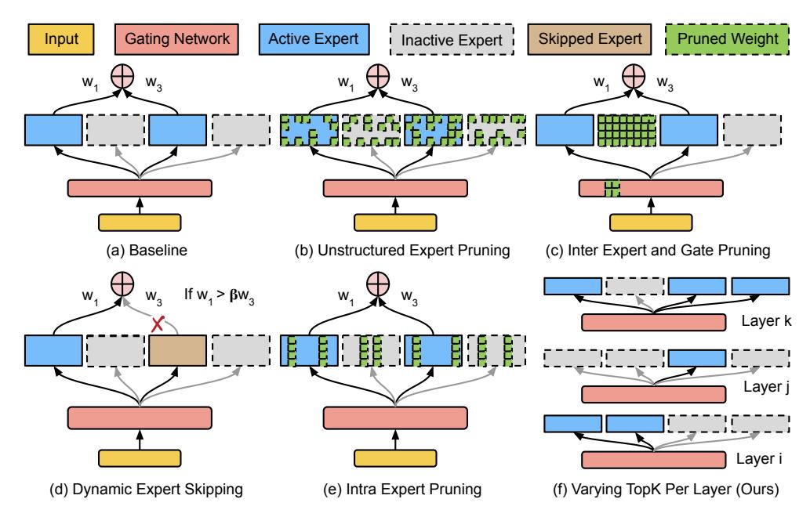
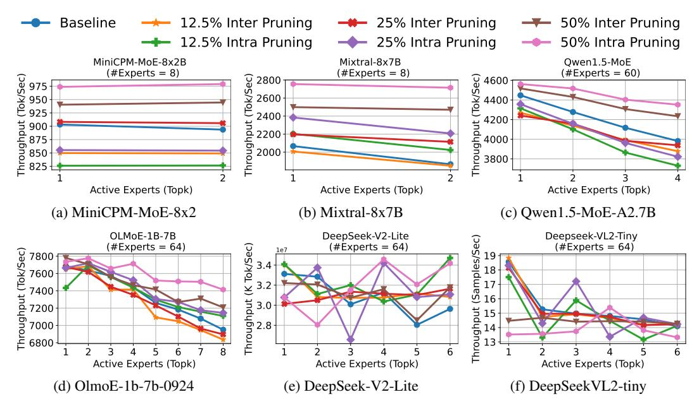
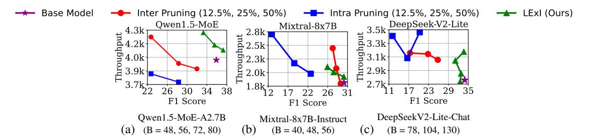
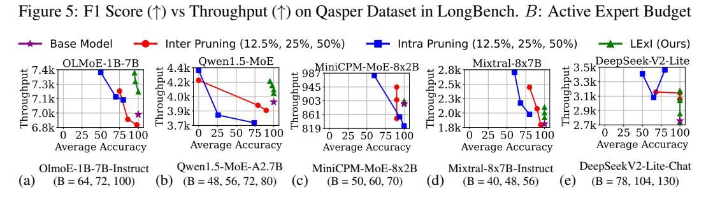

# LExI: Layer-Adaptive Active Experts for Efficient MoE Model Inference

Krishna Teja Chitty-Venkata, Sandeep Madireddy, Murali Emani, Venkatram Vishwanath schittyvenkata@anl.gov, smadireddy@anl.gov, memani@anl.gov, venkat@anl.gov @anl.gov Argonne National Laboratory, Lemont, IL 60439, USA

# Abstract

Mixture-of-Experts (MoE) models scale efficiently by activating only a subset of experts per token, offering a computationally sparse alternative to dense architectures. While prior post-training optimizations, such as inter- and intra-expert pruning, reduce memory usage but provide limited gains in inference-time compute efficiency. Moreover, existing MoE architectures typically activate a fixed number of experts uniformly across all layers, resulting in redundant computation and suboptimal performance. In this work, we first demonstrate that MoE pruning strategies improve only the memory footprint but do not significantly improve inference performance on GPU using optimized frameworks such as vLLM. To address this, we introduce LExI, a data-free optimization technique that determines the optimal number of active experts per layer in a pretrained MoE model. LExI leverages only the model's weights to estimate the relative importance of each layer and adaptively assigns the number of active experts accordingly per layer. Experiments on state-of-the-art language and vision MoE benchmarks demonstrate that LExI significantly outperforms traditional MoE pruning approaches in terms of inference efficiency with negligible accuracy loss. For example, using LExI, Qwen1.5-MoE achieves the same throughput on Nvidia H100 GPU with 10% better accuracy than traditional expert pruning.

# 1 Introduction

Large Language Models (LLMs) and Vision Language Models (VLMs) have achieved remarkable performance through model scaling, but require tremendous compute and memory resources. Mixtureof-Experts (MoE) models have emerged as a promising approach to increase model capacity without a proportional rise in inference cost. In an MoE, multiple expert subnetworks are trained, and a sparse gating or router network activates only a small subset of experts (k experts) per input token. This sparse computation allows MoEs to outperform dense models with the same number of active model parameters. Prominent examples of MoE-based LLM include Mixtral [\(Jiang et al.](#page-10-0) [\[2024\]](#page-10-0)), Qwen1.5-MoE-A2.7B [\(Team](#page-10-1) [\[2024\]](#page-10-1)), OLMoE [\(Muennighoff et al.](#page-10-2) [\[2024\]](#page-10-2)), and Vision Language Models (VLM) such as MolmoE [\(Deitke et al.](#page-9-0) [\[2024\]](#page-9-0)) and DeepSeek-VL2 [\(Wu et al.](#page-10-3) [\[2024\]](#page-10-3)).

One commonly used post-training optimization strategy for MoE models is expert pruning, which removes redundant experts. Recent methods such as NAEE [\(Lu et al.](#page-10-4) [\[2024\]](#page-10-4)), MoE-Pruner [\(Xie et al.](#page-11-0) [\[2024\]](#page-11-0)) EEP [\(Liu et al.](#page-10-5) [\[2024b\]](#page-10-5)) and MoE-I<sup>2</sup> [\(Yang et al.](#page-11-1) [\[2024\]](#page-11-1)) introduce various pruning strategies. For example, NAEE identifies and removes entire experts from a pretrained MoE model, while MoE-I<sup>2</sup> prunes the inner dimensions within each expert's MLP. Although these methods reduce the memory footprint, our performance evaluation across several state-of-the-art MoE models using the widely adopted vLLM inference framework reveals a critical limitation: *pruning does not consistently translate into faster inference*, and in some cases, it even degrades performance. This degradation is primarily due to the sparse structure of the MoE models itself. In expert pruning, the input token still needs to be routed to the same number of top-k experts, as determined by the router. While some experts are pruned, the remaining ones must process a disproportionately larger number of tokens, increasing their computational load. In the batched inference scenario, this load imbalance can lead to longer processing time per expert, thereby increasing overall latency. While aggressive Preprint. Under review.



Figure 1: Overview of MoE Optimization Methods. (a) Baseline Trained Model (b) Unstructured Expert Pruning (SparseGPT [\(Frantar and Alistarh](#page-9-1) [\[2023\]](#page-9-1)), Wanda [\(Sun et al.](#page-10-6) [\[2023\]](#page-10-6)), MoE-Pruner [\(Xie et al.](#page-11-0) [\[2024\]](#page-11-0))) (c) Inter Expert Pruning (NAEE [\(Lu et al.](#page-10-4) [\[2024\]](#page-10-4))) (d) Dynamic Expert Skipping (NAEE [\(Lu et al.](#page-10-4) [\[2024\]](#page-10-4))) (e) Intra Expert Pruning (MoE-I<sup>2</sup> [\(Yang et al.](#page-11-1) [\[2024\]](#page-11-1))) (f) LExI: Static Varying Active Experts (Topk) Per Layer (Ours)

expert pruning levels can yield noticeable speedups, they typically result in significant accuracy degradation, making them impractical. Moreover, these expert pruning approaches usually rely on training data for pruning experts. Current MoE architectures employ a fixed top-k routing mechanism, where the same number of experts are activated for each input token across all layers. This static design is suboptimal as different layers may require varying levels of expert capacity depending on computational needs [\(Guo et al.](#page-9-2) [\[2024\]](#page-9-2)). Beyond computation, inter-GPU communication overhead also becomes a significant performance bottleneck in MoEs. Increasing the number of active experts per token increases the volume of communication operations such as all-reduce and broadcast, further adding to the inference cost. To address some of these limitations, NAEE [\(Lu et al.](#page-10-4) [\[2024\]](#page-10-4)) proposed a token-aware dynamic expert skipping strategy, which selectively skips an expert during inference. However, this strategy is highly tailored to the dataset and cannot work beyond top-k=2. In summary, existing MoE optimization strategies often rely on calibration sets for pruning or routing adjustments, making them unsuitable in deployment settings where access to data or retraining is infeasible. In addition, the dataset-driven solutions will make pruned models more optimized to that calibration dataset, potentially degrading the performance in unseen settings.

Motivated by these insights, we propose *LExI*, a novel post-training layer-adaptive active expert allocation mechanism that determines the optimal number of active experts per layer without depending on any dataset. Our method relies on the key observation that not all layers contribute equally to the final model performance and that expert redundancy varies significantly across depth. This raises a fundamental question: *Can we reduce the number of active experts per layer irrespective of the input token without sacrificing accuracy?* In particular, is it possible to statically assign different top-k values to each layer, so that every layer uses just enough experts to retain its contribution, while improving overall inference efficiency? By making layer-adaptive expert allocation decisions, LExI reduces computational overhead across the model irrespective of the input token, offering a more efficient alternative to the traditional fixed top-K routing. Our experiments show that LExI outperforms existing expert pruning techniques in both task performance and runtime efficiency. By reducing the average number of activated experts per layer, LExI reduces latency and memory bandwidth usage while maintaining competitive task accuracy across diverse tasks.

#### Contributions. Our key contributions are as follows:

• We introduce LExI, a novel dataset-free optimization technique for static active expert assignment in pretrained MoE models. LExI is simple to implement and serves as an efficient, plug-and-play solution for inference across various frameworks.

- We propose a data-free profiling strategy to estimate the sensitivity of each expert using only model expert weights. LExI combines this one-time profiling with evolutionary search to determine the optimal active experts layer in a computationally efficient manner.
- Unlike prior methods that demonstrate improvements on a narrow set of MoE models (Mixtral-8x7B), our approach generalizes across multiple state-of-the-art MoE architectures in both language and vision domains.
- We empirically show that expert pruning in MoE models does not significantly improve inference
  performance, and in some cases, can degrade it due to architectural sparsity and load imbalance.
  Our method provides a viable alternative to pruning, improving both accuracy and hardware\nefficiency without requiring retraining or access to calibration data.

# 2 Background and Related Work

Mixture of Experts. Mixture-of-Experts (MoE) architectures improve the scalability and efficiency of LLMs/VLMs by introducing sub networks or experts. For a given input x, the output y of an MoE module is computed as a weighted sum over all the active top-k experts:  $y = \sum_{i=1}^{top-k} G(x)_i \cdot E_i(x)$ , where  $G(x) := \operatorname{Softmax}(\operatorname{TopK}[x \cdot W_g])$ . The  $\operatorname{TopK}[\cdot]$  function selects the top-k experts with the highest gating scores, and Softmax normalizes their scores into a probability distribution.  $G(x) \in \mathbb{R}^N$  is the gating vector representing the importance weights assigned to each expert in the top-k selected ones, and  $E_i(x)$  denotes the output of the i-th expert given input x. Each expert  $E_i$  is typically an FFN and constitutes the dominant portion of the parameters model (e.g., up to 96% in Mixtral).

**Pruning Large Language Models.** Model pruning is a well-established technique to reduce inference costs by removing less important parameters. Recent works such as SparseGPT (Frantar and Alistarh [2023]) and Wanda (Sun et al. [2023]) demonstrated one-shot pruning methods that introduce unstructured or semi-structured sparsity in weight matrices, cutting up to 50% of parameters in GPT-scale models with minimal perplexity loss. These approaches solve layer-wise reconstruction or use weight magnitude heuristics to remove weights, and have been applied to models as large as GPT-175B. However, the irregular weight sparsity pattern they induce often requires specialized hardware support to realize actual runtime speedups (Zhou et al. [2021]), and may suffer degraded efficiency on general-purpose accelerators.

Expert Pruning and Compression in MoE Models. Since MoE models typically allocate the vast majority of their parameters to the expert sub-networks, pruning even a subset of experts can lead to substantial memory savings. NAEE (Lu et al. [2024]) is a post-training expert pruning framework to permanently remove unimportant experts without needing to re-train the model. By evaluating each expert's contribution to the model's output on a small calibration set, NAEE identifies and permanently prunes the least significant experts. Furthermore, NAEE also introduced an inferencetime policy to dynamically skip experts for certain tokens on the fly, effectively adjusting the active expert count based on the input token. Another recent approach is MoE-I2 (Yang et al. [2024]), which introduces a two-stage compression pipeline tailored for MoEs. In the inter-expert pruning stage, MoE-I2 performs a layer-wise analysis to prune a fraction of experts to prune. The authors also introduce intra-expert compression to reduce the inner dimensionality of an expert's FFN. These advances in MoE-specific pruning highlight the growing interest in expert-level model trimming. Our proposed LExI method shares the overarching goal of exploiting expert redundancy to improve efficiency. However, rather than relying on static pruning, it focuses on adaptive expert utilization at inference time, offering a flexible and data-free alternative that preserves task performance while reducing computational cost.

### 3 Experimental Setup and MoE Expert latency Profiling

In this section, we evaluate the hardware performance of the MoE benchmarks to motivate our varying top-k solution. We first provide a detailed experimental setup used in all our evaluations. **Mixture-of-Experts Benchmarks.** We evaluate our method across a diverse set of MoE models spanning both language and vision-language domains. For LLMs, we consider *Mixtral-8x7B-Instruct* (Jiang et al. [2024]), *Qwen1.5-MoE-A2.7B-Chat* (Team [2024]), *OLMoE-1B-7B-0924-Instruct* (Muennighoff et al. [2024]), *MiniCPM-MoE-8x2B* (Hu et al. [2024]), and *DeepSeek-V2-Lite-Chat* (Liu et al. [2024a]). For VLMs, we use *DeepSeekVL2-Tiny* model (Wu et al. [2024]). These models exhibit a wide range of MoE architectures, varying number of experts and active experts per token, enabling a robust evaluation of our proposed method across heterogeneous settings.

**Evaluation Benchmarks.** We benchmark LLMs on nine widely adopted language understanding tasks from the lm-eval (Gao et al. [2024]) suite: *ARC-c* (Clark et al. [2018]), *ARC-e* (Clark et al.

<span id="page-3-0"></span>

Figure 2: Throughput vs. Active Experts under Inter and Intra Expert Pruning

[2018]), BoolQ (Clark et al. [2019]), HellaSwag (Zellers et al. [2019]), MMLU (Hendrycks et al. [2021]), OpenBookQA (Mihaylov et al. [2018]), RTE (Wang et al. [2018]), WinoGrande (Sakaguchi et al. [2019]). We report average accuracy across all these tasks to assess general-purpose language reasoning. For long content understanding, we employ Qasper dataset (Dasigi et al. [2021]) from the LongBench suite (Bai et al. [2024]) and report the F1 score as the evaluation metric. Additionally, we include a passkey retrieval task (Peng et al. [2023]), where the accuracy is measured as the percentage of instances (over 100 iterations and varying depths) in which the model correctly identifies a passkey from the garbage context. To evaluate language modeling quality, we compute perplexity on the C4 (Dodge et al. [2021]), PTB (Marcus et al. [1993]), and WikiText-103 (Merity et al. [2016]) datasets. For vision-language models, we use three benchmarks from the VLMEvalKit (Duan et al. [2024]) suite: MME (Yin et al. [2023]), MMMU Yue et al. [2024], and ScienceQA (Lu et al. [2022]). These datasets span a broad spectrum of multimodal reasoning tasks and allow us to evaluate our method's effectiveness in VLM setting.

Hardware and Software Setup. All inference performance evaluations are conducted on *NVIDIA H100 GPUs* with 80GB of HBM memory per GPU, supporting Tensor Cores for optimized matrix operations. We use vLLM (Kwon et al. [2023]) as our inference engine which is a high-performance framework with native support for MoE models via *FusedMoE*, which fuses expert computation and routing to improve efficiency. Unless otherwise specified, all LLMs are deployed on 4 GPUs, while DeepSeek-V2-Lite-Chat and DeepSeekVL2-Tiny use 2 GPUs. We employ tensor parallelism across devices for all models. During inference, we use a batch size of 16, with input and output sequence lengths varied across models to comply with each model's maximum context length constraints. We report *throughput* as our primary hardware performance metric, defined as the total number of tokens (input + output) processed per second. To calculate this, we first measure the *end-to-end latency*, defined as the time elapsed from input prompt submission to the generation of the final output token, and then convert this latency into throughput. The metric for VLMs is the number of input (image + text) samples process per second.

Inter and Intra Expert Pruning. Inter-pruning (Lu et al. [2024]) removes entire experts and their routing weights, reducing memory footprint while maintaining the same number of active experts per token during inference. Intra-pruning (Yang et al. [2024]) targets the inner dimensions (FFN intermediate size) within each expert, preserving the expert count while reducing individual expert complexity. In our evaluation, we consider the following percentages of these pruning:  $\{12.5\%, 25\%, 50\%\}$ . 12.5% inter pruning removes 1/8th of the experts in each layer, whereas 25% intra pruning prunes 1/4th of the FFN dimension in each expert of each layer. The top-k search space in our paper includes every integer from 1 up to the baseline pretrained top-k:  $1, 2, \ldots$ , top-k<sub>baseline</sub>.

Figure 2 illustrates the throughput of the six benchmark MoEs under varying degrees of pruning and top-k. Models with fewer active experts (e.g., MiniCPM, Mixtral) show marginal gains with

aggressive pruning, while models with more active experts (e.g., Qwen, OLMoE) exhibit complex interactions where pruning can improve or degrade throughput depending on token-to-expert routing balance and compute saturation. Notably, DeepSeek-VL2-Tiny shows throughput instability under pruning, suggesting higher sensitivity to expert load balance. The performance degradation stems from load imbalance across experts, leading to an increased number of tokens processed by each active expert.

### 4 LExI

LExI implements a two-stage pipeline to determine the optimal number of active experts per layer. In the first stage, it performs a one-time profiling to assess each layer's sensitivity to different top-k values. The sensitivity profiling methodology extends beyond expert allocation, serving as a foundation for diverse optimization problems such as layer-specific mixed-precision quantization or layer-wise pruning. The second stage employs a low-cost evolutionary search algorithm leveraging these sensitivity values as efficient proxies to identify the best performing top-k for each layer.

Stage 1: Per Layer MoE Top-K Perturbation Profiling: Algorithm 1 outlines our Monte Carlobased method to evaluate the sensitivity of each MoE layer under varying top-k configurations. For each layer, we sample a random synthetic input tensor  $\mathbf{X} \sim \mathcal{N}(0,1)^{B \times L \times H}$  from the standard normal distribution. We first compute the baseline output using the default top-k configuration, followed by computing outputs for each top-k in the target search space. The perturbation induced by each top-k is quantified using the Frobenius norm between the baseline output and the corresponding perturbed output. This process is repeated over millions of random input samples to obtain a statistically robust estimate of the average deviation for each candidate top-k. The Frobenius norm serves as a precise metric for capturing output magnitude shifts in high-dimensional space, while Monte Carlo sampling ensures diverse inputs. This sensitivity analysis provides a principled estimate of how active expert selection affects per-layer behavior.

**Algorithm 1:** LExI Stage 1: Per Layer Top-k Perturbation Loss Computation

```
Input:
                     \mathcal{M}_{\text{moe}}: Mixture of Experts module (Gate \mathcal{G} and Experts \mathcal{E}) T: List of target top-k values
                     k_{\text{base}}: Baseline Pretrained top-k
                                                                                                                                                                     B: Batch size
                     H: Hidden Size
                                                                                                                                                                     L: Sequence length
                     N_{\text{iter}}: Number of iterations
Output: Average Frobenius Norm per top-k
\mathcal{D} \leftarrow \{k : \emptyset \ \forall k \in T\};
for i \leftarrow 1 to N_{iter} do
        Sample a input tensor from Normal Distribution: \mathbf{X} \sim \mathcal{N}(0,1)^{B \times L \times H};
        \mathtt{UpdateTopk}(\mathcal{M}_{moe}, \mathit{k}_{base});
        \mathbf{Y}_{\text{base}} \leftarrow f_{\text{moe}}(\mathbf{X})

foreach k \in T do
           \left| \begin{array}{l} \mathsf{UpdateTopk}(\mathcal{M}_{\mathsf{moe}}, k); \\ \mathbf{Y}^{j}_{\mathsf{perturbed}} \leftarrow f_{\mathsf{moe}}(\mathbf{X}); \\ \Delta \leftarrow \|\mathbf{Y}^{j}_{\mathsf{perturbed}} - \mathbf{Y}_{\mathsf{base}}\|_{F}; \\ \mathcal{D}[k] \leftarrow \mathcal{D}[k] \cup \{\Delta\} \end{array} \right|
foreach k \in T do
   \begin{bmatrix} \bar{\Delta}_k \leftarrow \frac{1}{N_{\text{iter}}} \sum_{\delta \in \mathcal{D}[k]} \delta; \\ \mathcal{D}[k] \leftarrow \bar{\Delta}_k \end{bmatrix} 
return \mathcal{D}
```

Top-k Perturbation Sensitivity Analysis: Figure 3 visualizes the normalized sensitivity of different MoEs under various top-ks in the search space, measured using the Perturbation Loss ( $\Delta_k$ ). Higher values of  $\Delta_k$  indicate greater deviation from the baseline behavior, suggesting stronger sensitivity to changes in top-k. The sensitivity profiles vary notably across MoEs. For Mixtral-8x7B, early layers demonstrate greater sensitivity to reductions in the number of active experts, as indicated by lower perturbation loss, while later layers are more sensitive under top-k perturbation. Interestingly, this finding diverges from prior works (Dong et al. [2019]), which suggests that early layers are typically more susceptible to architectural or precision perturbations. In contrast, Qwen1.5-MoE-A2.7B exhibits a reversed pattern where early layers are particularly sensitive to top-k perturbations. DeepSeek

<span id="page-5-0"></span>

Figure 3: Top-k sensitivity analysis. The heatmap plots depict the layer-wise output deviation with respect to changing the top-k. The initial layers in Mixtral model are less sensitive to top-k perturbation than deeper layers, while OLMoE exhibits a bell curve pattern where initial and last layers are more sensitive. Heatmaps for MiniCPM and DeepSeekV2 are shown in Appendix A.2.

model displays a bell-shaped sensitivity profile, with both initial and final layers demonstrating higher perturbation loss, while intermediate layers remain relatively stable. These findings have practical implications for adaptive expert selection strategies suggesting that latency can be can be optimized by reducing the number of active experts in more robust (low-sensitivity) layers.

```
Algorithm 2: LExI Stage 2: Evolutionary Top-k Allocation Optimization with Proxy
              D: TopK Perturbed Frobenius Norm Loss
                                                                                B: Total Active Expert budget
              k_{\min}: Minimum topk per layer
                                                                                k_{\text{max}}: Maximum topk per layer
Input:
              N_{\text{pop}}: Population size
                                                                                G_{\text{max}}: Maximum generations
              \eta_{\text{mut}}: Mutation rate
                                                                                 L: Number of Layers
Output: Optimal topk allocation \mathbf{k}^* = (k_1, ..., k_L)
Initialize population \mathcal{P} \leftarrow \{\mathbf{k}_i\} where \mathbf{k}_i satisfies:
   \sum_{j=1}^{L} k_j = B (Model budget constraint) and k_{\min}^j \le k_j \le k_{\max}^j \ \forall j (layer constraints)
for g \leftarrow 1 to G_{max} do
     Evaluate fitness: \phi(\mathbf{k}) = \sum_{j=1}^{L} \mathcal{D}_{j}(k_{j})
     Select parents via tournament: \mathbf{p}_1, \mathbf{p}_2 \leftarrow \arg\min_{\mathbf{k} \in \mathcal{P}} \phi(\mathbf{k})
     Generate offspring via CROSSOVER:
     k_j' \leftarrow \alpha_j p_{1,j} + (1-\alpha_j) p_{2,j} \quad \  \alpha_j \sim \text{Bernoulli}(0.5) Apply MUTATION:
         k_j'' \leftarrow k_j' + \Delta_j \Delta_j \in \{-1, 0, +1\} with \sum_j \Delta_j = 0
     Project to feasible space:
         \mathbf{k}''' \leftarrow \text{Proj}(\mathbf{k}'') s.t. constraints hold
     Update population:
         \mathcal{P} \leftarrow \mathcal{P} \cup \{\mathbf{k}'''\}
return \mathbf{k}^* = \arg\min_{\mathbf{k} \in \mathcal{P}} \phi(\mathbf{k})
```

Stage 2: Evolutionary Search with Proxy: LExI utilizes the proxies generated in the previous step to guide the evolutionary algorithm to allocate layer-wise top-k as described in Algorithm 2. We define the total active expert budget (i.e. total number of active experts across all layers) B, minimum  $(k_{\min})$  and maximum  $(k_{\max})$  number of top-k per layer. The objective is to find a feasible allocation  $k^* = (k_1^* \dots, k_L)$  which minimizes the total layer-wise loss  $\sum_{j=1}^L \mathcal{D}j(k_j)$  (the

<span id="page-6-0"></span>

Figure 4: Average Accuracy ( $\uparrow$ ) vs Throughput ( $\uparrow$ ) on 9 LM-Eval Tasks (ARC-c, ARC-e, BoolQ, HellaSwag, MMLU, OBQA, RTE, WinoGrande). *B*: Active Expert Budget

sum of TopK Perturbed Frobenius Norm losses) across L layers, subject to the budget constraint  $\sum j = 1^L k_j = B$  and per-layer limits  $k_{\min} \leq k_j \leq k_{\max}$  for all j. We initialize a population of  $N_{\text{pop}}$  allocations (each satisfying the constraints) and then evolve this population over  $G_{\max}$  generations. In each generation, every candidate solution is evaluated by its fitness  $\phi(k) = \sum_{j=1}^L \mathcal{D}j(k_j)$ , and parent solutions are chosen (e.g. via tournament selection) to produce offspring. A pair of parents is recombined using uniform crossover, wherein each layer's allocation  $k_j$  in the offspring is inherited from one of the two parents. The offspring is then mutated and ensured that the total budget B remains unchanged (any increment in one layer's  $k_j$  is balanced by a decrement in another). After mutation, the new solution is added to the population. This evolutionary loop of selection, crossover, mutation, and repair is repeated for up to  $G_{\max}$  generations, after which the best found allocation  $k^*$  (the one minimizing  $\phi(k)$ ) is returned. By maintaining the proxies, our LExI algorithm effectively navigates the combinatorial search space of discrete allocations and finds solutions fast without needing to load the actual model, making it well-suited for optimizing top-k selection under various global active expert budgets where gradient-based methods require tremendous computational resources.

#### 5 Results and Evaluation

This section presents our evaluation results and key insights from these runs. We compare our results with the baseline model, Inter Pruning (Lu et al. [2024]) and Intra Pruning (Yang et al. [2024]).

LM-Eval Results. Figure 4 presents a comprehensive comparison of average accuracy versus throughput across five MoE models on nine LM-Eval benchmarks. Traditional pruning methods, inter-expert (red) and intra-expert (blue), consistently demonstrate a trade-off: reducing the number of parameters improves throughput but significantly degrades accuracy. In contrast, our proposed method, LExI (green), achieves a more favorable accuracy-throughput balance across all models. On OLMoE-1B-7B (Figure 4a), LExI with the active expert budget (B) = 100 achieves the same throughput as 50% intra-pruning while delivering +10% higher accuracy, and outperforms the 50%inter-pruning baseline by +15% higher accuracy. On Qwen1.5-MoE, LExI offers at least +5.1%higher throughput compared to both inter and intra pruning, with a consistent +0.5 % accuracy gain. For MiniCPM-MoE, LExI achieves +15% higher accuracy than 25% inter-pruned models at equivalent throughput, demonstrating superior accuracy-throughput tradeoffs. For Mixtral-8x7B, LExI surpasses the inter-pruned baseline by +10% accuracy at nearly identical throughput. Finally, on DeepSeekV2-Lite, LExI outperforms inter pruning with +6.5% higher throughput at equal accuracy, and recovers +6 accuracy points over intra pruning with only a minor throughput compromise. Notably, in Qwen1.5-MoE and MiniCPM-MoE, LExI not only avoids accuracy degradation but also achieves throughput comparable to or better than 50% inter- or intra-expert pruning. In summary, LEXI preserves accuracy close to the base model while delivering substantial throughput gains, often surpassing both pruning approaches. These results highlight the robustness and effectiveness of LExI's expert budget reallocation in preserving model performance while improving inference efficiency, demonstrating its superiority over uniform pruning.

Long context Evaluation. Figure 5 presents an accuracy-throughput comparison on the Qasper dataset for three different MoE models. Inter and intra pruning methods consistently reduce throughput but often come at a sharp cost in F1 score, particularly under higher pruning ratios. In contrast, our LExI method achieves a more favorable trade-off by dynamically reducing the number of active experts per layer based on sensitivity, leading to Pareto improvements (F1 score and throughput) in multiple cases. For example, in Qwen1.5 and DeepSeek models, LExI achieves higher throughput than the base model while maintaining competitive or superior F1 scores, demonstrating its efficacy in preserving task accuracy while enhancing inference efficiency. On Qwen1.5-MoE-A2.7B, LExI

<span id="page-7-0"></span>

<span id="page-7-1"></span>Figure 5: F1 Score ( $\uparrow$ ) vs Throughput ( $\uparrow$ ) on Qasper Dataset in LongBench. B: Active Expert Budget



Figure 6: Passkey Retrieval Average (†) vs Throughput (†) Comparison. B: Active Expert Budget

achieves a score of 35.5 at  $\sim 4.1$ k throughput, outperforming inter pruning (F1 34 at  $\sim 3.9$ k) and intra pruning (F1 30 at  $\sim 3.75$ k) with a +0.5–5.5 F1 gain and +5.1%–9.3% higher throughput.

**Passkey Retrieval Task.** Figure 6 illustrates the trade-off between throughput and average accuracy for the Passkey Retrieval task across five MoE models. This task evaluates a model's ability to extract precise key information embedded in distractive or noisy contexts, demanding both precision and robustness. Traditional inter- and intra-pruning approaches generally degrade performance, with noticeable accuracy drops even at moderate pruning levels. In contrast, our proposed LExI method consistently outperforms these baselines by achieving higher or comparable accuracy while significantly improving throughput. Notably, in models like OLMoE-1B-7B and Owen1.5-MoE, LEXI nearly restores or surpasses the base model's accuracy while offering improved efficiency. These results highlight LExI's strength in preserving critical retrieval capabilities under expert budget constraints, making it a superior choice for precision-sensitive tasks like passkey extraction.

**Perplexity Evaluation.** Figure 7 presents a comparison of perplexity vs. throughput across multiple MoE models and datasets, highlighting the limitations of traditional pruning techniques. Across models, LExI consistently offers a better accuracy-efficiency benefit, outperforming both the pruning baselines. Notably, pruning methods often yield modest throughput gains but at the cost of substantial perplexity degradation, especially evident in the OLMoE and Mixtral cases. In contrast, LExI achieves throughput improvements close to aggressive pruning levels while almost preserving the perplexity of the base model. For example, on Mixtral-8x7B, LExI achieves  $\sim 2.4$ k throughput at  $\sim 23$ perplexity on C4 dataset and  $\sim$ 2.2k throughput at  $\sim$ 10 perplexity on WikiText, whereas interpruning attains the same speedup with double the perplexity. This indicates that static expert reduction via LExI enables smarter compute allocation, unlike pruning, which disrupts the expert-token mapping and leads to suboptimal routing and load imbalance.

Ablation Study on Vision Language Domain. Figure 8 evaluates the LExI method on DeepSeekVL2-Tiny across four vision-language tasks. While intra-pruning peaks at 25% intra pruning at the cost of sharp accuracy drops, its performance is highly unstable and inconsistent across tasks. Inter-pruning, on the other hand, exhibits a flat trade-off curve that fails to provide significant speedups. In contrast, LExI consistently achieves superior accuracy and throughput balance, yielding improvements without compromising performance. Unlike pruning, which disrupts expert specialization and introduces fragility, LExI leverages structured top-k expert budget selection that preserves model capacity while enabling efficient routing, making it a more robust alternative for optimizing sparse VLMs.

#### Limitations

Our approach has two primary limitations. First, it does not reduce the memory footprint of the MoE model. Unlike prior expert pruning methods that explicitly target improving memory efficiency by removing parameters, our method focuses solely on optimizing computational performance during

<span id="page-8-0"></span>

Figure 7: Perplexity (↓) vs Throughput (↑) on C4, PTB & WikiText(WT) B: Active Expert Budget

<span id="page-8-1"></span>

Figure 8: DeepSeekVL2-Tiny: Average Accuracy (†) vs Throughput (†) on MME, MMMU, ScienceQA Tasks in VLMEvalKit. B: Active Expert Budget

inference. This means that while our approach can significantly speed up inference by reducing the number of expert computations, it does not reduce model size. As a result, it is less effective in memory-constrained deployment scenarios. Nevertheless, our method can be effectively combined with existing MoE pruning methods, enabling a joint optimization of both computational efficiency and model memory. Second, our method may underperform in settings where the top-\$k\$ expert search space is inherently limited. Our approach relies on selectively reducing the number of active experts during inference to gain computational efficiency. However, in architectures such as Llama-4, where each MoE layer is pretrained with only a single active expert, there is no flexibility to reduce active experts further. In such scenarios, our method becomes inapplicable.

#### 7 Conclusion

In this paper, we propose LExI, a framework designed to determine the optimal number of active experts per layer of a pretrained MoE model. LExI achieves better throughput than both inter and intra expert pruning baseline methods across six different MoE models. Unlike uniform expert pruning, which can yield speedups only at the cost of substantial accuracy loss, our method delivers substantial throughput gains while preserving model accuracy/perplexity close to the original baseline. For example, on OLMoE-1B-7B, Mixtral-8x7B, and DeepSeek, LExI maintains accuracy nearly identical to the unpruned model yet attains notably higher throughput, often surpassing the accuracy of pruned models. In certain scenarios, this layer-adaptive approach achieves higher throughput than the base model with the same task performance, highlighting the robustness of the proposed approach. For example, on OLMoE-1B-7B model, our approach matches the throughput of 50% Intra pruned model with 10% better accuracy. Also, LExI's benefits come with no retraining or calibration dataset requirements. It is a data-free post-training method that optimizes without any calibration dataset or fine-tuning. This makes LExI a practical inference-time optimization technique that reduces latency, inter-GPU communication overhead, and memory bandwidth usage by determining the optimal number of active experts per layer, all while incurring negligible accuracy loss.

# Acknowledgements

This research used resources of the Argonne Leadership Computing Facility, a U.S. Department of Energy (DOE) Office of Science user facility at Argonne National Laboratory and is based on research supported by the U.S. DOE Office of Science-Advanced Scientific Computing Research Program, under Contract No. DE-AC02-06CH11357

# References

- <span id="page-9-8"></span>Yushi Bai, Xin Lv, Jiajie Zhang, Hongchang Lyu, Jiankai Tang, Zhidian Huang, Zhengxiao Du, Xiao Liu, Aohan Zeng, Lei Hou, Yuxiao Dong, Jie Tang, and Juanzi Li. LongBench: A bilingual, multitask benchmark for long context understanding. In *Proceedings of the 62nd Annual Meeting of the Association for Computational Linguistics (Volume 1: Long Papers)*, pages 3119–3137, Bangkok, Thailand, August 2024. Association for Computational Linguistics. doi: 10.18653/v1/ 2024.acl-long.172. URL <https://aclanthology.org/2024.acl-long.172>.
- <span id="page-9-5"></span>Christopher Clark, Kenton Lee, Ming-Wei Chang, Tom Kwiatkowski, Michael Collins, and Kristina Toutanova. Boolq: Exploring the surprising difficulty of natural yes/no questions. *arXiv preprint arXiv:1905.10044*, 2019.
- <span id="page-9-4"></span>Peter Clark, Isaac Cowhey, Oren Etzioni, Tushar Khot, Ashish Sabharwal, Carissa Schoenick, and Oyvind Tafjord. Think you have solved question answering? try arc, the ai2 reasoning challenge. *ArXiv*, abs/1803.05457, 2018.
- <span id="page-9-7"></span>Pradeep Dasigi, Kyle Lo, Iz Beltagy, Arman Cohan, Noah A Smith, and Matt Gardner. A dataset of information-seeking questions and answers anchored in research papers. *arXiv preprint arXiv:2105.03011*, 2021.
- <span id="page-9-0"></span>Matt Deitke, Christopher Clark, Sangho Lee, Rohun Tripathi, Yue Yang, Jae Sung Park, Mohammadreza Salehi, Niklas Muennighoff, Kyle Lo, Luca Soldaini, et al. Molmo and pixmo: Open weights and open data for state-of-the-art multimodal models. *arXiv preprint arXiv:2409.17146*, 2024.
- <span id="page-9-9"></span>Jesse Dodge, Maarten Sap, Ana Marasovic, William Agnew, Gabriel Ilharco, Dirk Groeneveld, ´ Margaret Mitchell, and Matt Gardner. Documenting large webtext corpora: A case study on the colossal clean crawled corpus. *arXiv preprint arXiv:2104.08758*, 2021.
- <span id="page-9-11"></span>Zhen Dong, Zhewei Yao, Amir Gholami, Michael W Mahoney, and Kurt Keutzer. Hawq: Hessian aware quantization of neural networks with mixed-precision. In *Proceedings of the IEEE/CVF international conference on computer vision*, pages 293–302, 2019.
- <span id="page-9-10"></span>Haodong Duan, Junming Yang, Yuxuan Qiao, Xinyu Fang, Lin Chen, Yuan Liu, Xiaoyi Dong, Yuhang Zang, Pan Zhang, Jiaqi Wang, et al. Vlmevalkit: An open-source toolkit for evaluating large multi-modality models. In *Proceedings of the 32nd ACM International Conference on Multimedia*, pages 11198–11201, 2024.
- <span id="page-9-1"></span>Elias Frantar and Dan Alistarh. Sparsegpt: Massive language models can be accurately pruned in one-shot. In *International Conference on Machine Learning*, pages 10323–10337. PMLR, 2023.
- <span id="page-9-3"></span>Leo Gao, Jonathan Tow, Baber Abbasi, Stella Biderman, Sid Black, Anthony DiPofi, Charles Foster, Laurence Golding, Jeffrey Hsu, Alain Le Noac'h, Haonan Li, Kyle McDonell, Niklas Muennighoff, Chris Ociepa, Jason Phang, Laria Reynolds, Hailey Schoelkopf, Aviya Skowron, Lintang Sutawika, Eric Tang, Anish Thite, Ben Wang, Kevin Wang, and Andy Zou. The language model evaluation harness, 07 2024. URL <https://zenodo.org/records/12608602>.
- <span id="page-9-2"></span>Yongxin Guo, Zhenglin Cheng, Xiaoying Tang, Zhaopeng Tu, and Tao Lin. Dynamic mixture of experts: An auto-tuning approach for efficient transformer models. *arXiv preprint arXiv:2405.14297*, 2024.
- <span id="page-9-6"></span>Dan Hendrycks, Collin Burns, Steven Basart, Andy Zou, Mantas Mazeika, Dawn Song, and Jacob Steinhardt. Measuring massive multitask language understanding. *Proceedings of the International Conference on Learning Representations (ICLR)*, 2021.

- <span id="page-10-7"></span>Shengding Hu, Yuge Tu, Xu Han, Chaoqun He, Ganqu Cui, Xiang Long, Zhi Zheng, Yewei Fang, Yuxiang Huang, Weilin Zhao, et al. Minicpm: Unveiling the potential of small language models with scalable training strategies. *arXiv preprint arXiv:2404.06395*, 2024.
- <span id="page-10-0"></span>Albert Q Jiang, Alexandre Sablayrolles, Antoine Roux, Arthur Mensch, Blanche Savary, Chris Bamford, Devendra Singh Chaplot, Diego de las Casas, Emma Bou Hanna, Florian Bressand, et al. Mixtral of experts. *arXiv preprint arXiv:2401.04088*, 2024.
- <span id="page-10-16"></span>Woosuk Kwon, Zhuohan Li, Siyuan Zhuang, Ying Sheng, Lianmin Zheng, Cody Hao Yu, Joseph Gonzalez, Hao Zhang, and Ion Stoica. Efficient memory management for large language model serving with pagedattention. In *Proceedings of the 29th Symposium on Operating Systems Principles*, pages 611–626, 2023.
- <span id="page-10-8"></span>Aixin Liu, Bei Feng, Bin Wang, Bingxuan Wang, Bo Liu, Chenggang Zhao, Chengqi Dengr, Chong Ruan, Damai Dai, Daya Guo, et al. Deepseek-v2: A strong, economical, and efficient mixture-ofexperts language model. *arXiv preprint arXiv:2405.04434*, 2024a.
- <span id="page-10-5"></span>Enshu Liu, Junyi Zhu, Zinan Lin, Xuefei Ning, Matthew B Blaschko, Shengen Yan, Guohao Dai, Huazhong Yang, and Yu Wang. Efficient expert pruning for sparse mixture-of-experts language models: Enhancing performance and reducing inference costs. *arXiv preprint arXiv:2407.00945*, 2024b.
- <span id="page-10-15"></span>Pan Lu, Swaroop Mishra, Tanglin Xia, Liang Qiu, Kai-Wei Chang, Song-Chun Zhu, Oyvind Tafjord, Peter Clark, and Ashwin Kalyan. Learn to explain: Multimodal reasoning via thought chains for science question answering. *Advances in Neural Information Processing Systems*, 35:2507–2521, 2022.
- <span id="page-10-4"></span>Xudong Lu, Qi Liu, Yuhui Xu, Aojun Zhou, Siyuan Huang, Bo Zhang, Junchi Yan, and Hongsheng Li. Not all experts are equal: Efficient expert pruning and skipping for mixture-of-experts large language models. *arXiv preprint arXiv:2402.14800*, 2024.
- <span id="page-10-13"></span>Mitch Marcus, Beatrice Santorini, and Mary Ann Marcinkiewicz. Building a large annotated corpus of english: The penn treebank. *Computational linguistics*, 19(2):313–330, 1993.
- <span id="page-10-14"></span>Stephen Merity, Caiming Xiong, James Bradbury, and Richard Socher. Pointer sentinel mixture models, 2016.
- <span id="page-10-9"></span>Todor Mihaylov, Peter Clark, Tushar Khot, and Ashish Sabharwal. Can a suit of armor conduct electricity? a new dataset for open book question answering. In *EMNLP*, 2018.
- <span id="page-10-2"></span>Niklas Muennighoff, Luca Soldaini, Dirk Groeneveld, Kyle Lo, Jacob Morrison, Sewon Min, Weijia Shi, Pete Walsh, Oyvind Tafjord, Nathan Lambert, et al. Olmoe: Open mixture-of-experts language models. *arXiv preprint arXiv:2409.02060*, 2024.
- <span id="page-10-12"></span>Bowen Peng, Jeffrey Quesnelle, Honglu Fan, and Enrico Shippole. Yarn: Efficient context window extension of large language models. *arXiv preprint arXiv:2309.00071*, 2023.
- <span id="page-10-11"></span>Keisuke Sakaguchi, Ronan Le Bras, Chandra Bhagavatula, and Yejin Choi. Winogrande: An adversarial winograd schema challenge at scale. *arXiv preprint arXiv:1907.10641*, 2019.
- <span id="page-10-6"></span>Mingjie Sun, Zhuang Liu, Anna Bair, and J Zico Kolter. A simple and effective pruning approach for large language models. *arXiv preprint arXiv:2306.11695*, 2023.
- <span id="page-10-1"></span>Qwen Team. Qwen1.5-moe: Matching 7b model performance with 1/3 activated parameters", February 2024. URL <https://qwenlm.github.io/blog/qwen-moe/>.
- <span id="page-10-10"></span>Alex Wang, Amanpreet Singh, Julian Michael, Felix Hill, Omer Levy, and Samuel Bowman. GLUE: A multi-task benchmark and analysis platform for natural language understanding. In *Proceedings of the 2018 EMNLP Workshop BlackboxNLP: Analyzing and Interpreting Neural Networks for NLP*, pages 353–355, Brussels, Belgium, November 2018. Association for Computational Linguistics. doi: 10.18653/v1/W18-5446. URL <https://aclanthology.org/W18-5446>.
- <span id="page-10-3"></span>Zhiyu Wu, Xiaokang Chen, Zizheng Pan, Xingchao Liu, Wen Liu, Damai Dai, Huazuo Gao, Yiyang Ma, Chengyue Wu, Bingxuan Wang, et al. Deepseek-vl2: Mixture-of-experts vision-language models for advanced multimodal understanding. *arXiv preprint arXiv:2412.10302*, 2024.

<span id="page-11-0"></span>Yanyue Xie, Zhi Zhang, Ding Zhou, Cong Xie, Ziang Song, Xin Liu, Yanzhi Wang, Xue Lin, and An Xu. Moe-pruner: Pruning mixture-of-experts large language model using the hints from its router. *arXiv preprint arXiv:2410.12013*, 2024.

<span id="page-11-1"></span>Cheng Yang, Yang Sui, Jinqi Xiao, Lingyi Huang, Yu Gong, Yuanlin Duan, Wenqi Jia, Miao Yin, Yu Cheng, and Bo Yuan. Moe-i<sup>2</sup>: Compressing mixture of experts models through inter-expert pruning and intra-expert low-rank decomposition. *arXiv* preprint arXiv:2411.01016, 2024.

<span id="page-11-4"></span>Shukang Yin, Chaoyou Fu, Sirui Zhao, Ke Li, Xing Sun, Tong Xu, and Enhong Chen. A survey on multimodal large language models. *arXiv preprint arXiv:2306.13549*, 2023.

<span id="page-11-5"></span>Xiang Yue, Yuansheng Ni, Kai Zhang, Tianyu Zheng, Ruoqi Liu, Ge Zhang, Samuel Stevens, Dongfu Jiang, Weiming Ren, Yuxuan Sun, et al. Mmmu: A massive multi-discipline multimodal understanding and reasoning benchmark for expert agi. In *Proceedings of the IEEE/CVF Conference on Computer Vision and Pattern Recognition*, pages 9556–9567, 2024.

<span id="page-11-3"></span>Rowan Zellers, Ari Holtzman, Yonatan Bisk, Ali Farhadi, and Yejin Choi. Hellaswag: Can a machine really finish your sentence? In *Proceedings of the 57th Annual Meeting of the Association for Computational Linguistics*, 2019.

<span id="page-11-2"></span>Aojun Zhou, Yukun Ma, Junnan Zhu, Jianbo Liu, Zhijie Zhang, Kun Yuan, Wenxiu Sun, and Hongsheng Li. Learning n: m fine-grained structured sparse neural networks from scratch. *arXiv* preprint arXiv:2102.04010, 2021.

# A Appendix

### A.1 Mixture of Experts Model Setup

<span id="page-11-7"></span>Table 1 illustrates the hyperparamters of each MoE model we utilized in our evaluation.

| Table 1. LEW and VEW MOE Models |        |         |          |      |         |
|---------------------------------|--------|---------|----------|------|---------|
| Model                           | #P (B) | #Layers | #Experts | TopK | FFN Dim |
| DeepSeek VL2-Tiny               | 3      | 12      | 64       | 6    | 896     |
| OLMoE-1B-7B-0125-Instruct       | 6.92   | 16      | 64       | 8    | 1024    |
| Qwen1.5-MoE-A2.7B-Chat          | 14.3   | 24      | 60       | 4    | 1408    |
| DeepSeek-V2-Lite-Chat           | 15.7   | 27      | 64       | 6    | 1408    |
| MiniCPM-MoE-8x2B                | 17     | 40      | 8        | 2    | 5760    |
| Mixtral-8x7B-Instruct-v0.1      | 46.7   | 32      | 8        | 2    | 14336   |

Table 1: LLM and VLM MoE Models

### <span id="page-11-6"></span>A.2 Additional Heatmaps for top-K sensitivity

Figure 9 illustrates the topk sensitivity heatmaps for MiniCPM-MoE and DeepSeekV2 Lite Chat model based on Algorithm 1.

<span id="page-11-8"></span>

Figure 9: Top-k sensitivity analysis across MiniCPM-MoE-8x2B and DeepSeekV2-Lite. The plots depict the layer-wise output deviation with respect to changing the top-k. The initial layers in MiniCPM model are less sensitive to topk perturbation than deeper layers, while DeepSeekV2 exhibits a bell curve pattern where initial and last layers are more sensitive.