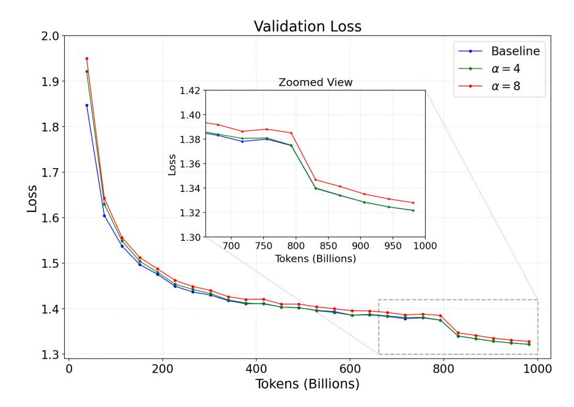
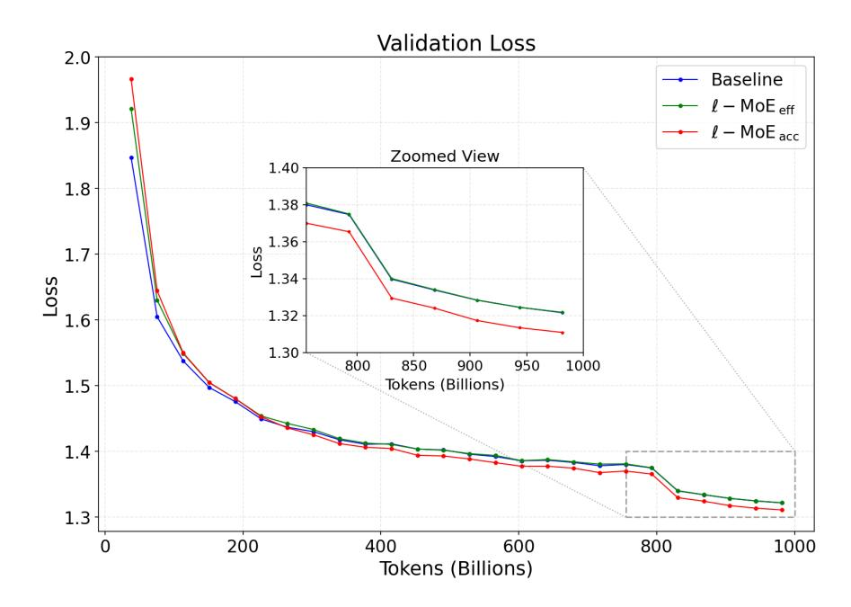

# **LatentMoE: Toward Optimal Accuracy per FLOP and Parameter in Mixture of Experts**

**Venmugil Elango, Nidhi Bhatia, Roger Waleffe, Rasoul Shafipour, Tomer Asida, Abhinav Khattar, Nave Assaf, Maximilian Golub, Joey Guman, Tiyasa Mitra, Ritchie Zhao, Ritika Borkar, Ran Zilberstein, Mostofa Patwary, Mohammad Shoeybi, Bita Rouhani**

**Abstract.** Mixture of Experts (MoEs) have become a central component of many stateof-the-art open-source and proprietary large language models. Despite their widespread adoption, it remains unclear how close existing MoE architectures are to optimal with respect to inference cost, as measured by accuracy per floating-point operation and per parameter. In this work, we revisit MoE design from a hardware-software co-design perspective, grounded in empirical and theoretical considerations. We characterize key performance bottlenecks across diverse deployment regimes, spanning offline high-throughput execution and online, latency-critical inference. Guided by these insights, we introduce **LatentMoE**, a new model architecture resulting from systematic design exploration and optimized for maximal accuracy per unit of compute. Empirical design space exploration at scales of up to 95B parameters and over a 1T-token training horizon, together with supporting theoretical analysis, shows that LatentMoE consistently outperforms standard MoE architectures in terms of accuracy per FLOP and per parameter. Given its strong performance, the LatentMoE architecture has been adopted by the flagship Nemotron-3 Super and Ultra models and scaled to substantially larger regimes, including longer token horizons and larger model sizes, as reported in [NVIDIA](#page-15-0) [et al.](#page-15-0) [\(2025\)](#page-15-0).

# **1. Introduction**

Transformer-based large language models underpin a wide range of modern AI systems, from conversational agents to code generation and scientific reasoning. As these models continue to scale, practical deployment is increasingly constrained by inference cost, encompassing both computation and memory. As a result, a central objective in modern model design is to maximize achievable accuracy under fixed inference cost constraints.

Mixture-of-Experts (MoE) architectures have emerged as a promising approach towards this goal, enabling models to scale parameter count while keeping the number of Floating-point Operations (FLOPs) per token fixed. Despite their empirical success, the MoE design space remains poorly understood. Existing MoE architectures are largely motivated by high-level sparsity arguments and are optimized primarily for offline, throughput-oriented settings, with limited consideration of online deployments that impose strict latency, memory bandwidth, and communication constraints.

We argue that effective MoE design must be evaluated along two complementary dimensions: accuracy per FLOP and accuracy per parameter. While accuracy per FLOP captures computational efficiency, accuracy per parameter reflects memory footprint, memory bandwidth demands, routinginduced communication, and sharding overheads (factors that are often the dominant bottlenecks in interactive, low-latency inference). Neglecting these factors can lead to architectures that appear efficient in aggregate compute, yet incur substantial inefficiencies in practical deployment.

Figure 1 | Standard MoE vs. LatentMoE architectures. In LatentMoE, tokens are projected from the model hidden dimension into a smaller latent dimension *ℓ* for expert routing and computation, which reduces routed parameter loads and all-to-all traffic by a factor of */ℓ*. We use this efficiency to increase the total number of experts and the top-k active experts per token by the same factor */ℓ*, which improves the accuracy of the model while keeping overall inference cost approximately constant.

In this work, we revisit MoE architecture design from a hardware–software co-design perspective. Through a systematic analysis of existing MoE systems across the throughput–latency Pareto frontier, we identify key structural bottlenecks arising from expert parameterization, routing-induced all-to-all communication, and memory access patterns. Combined with detailed accuracy measurements and theoretical analysis, our study identifies structural inefficiencies in prevailing MoE designs that limit achievable accuracy per unit of inference cost.

Guided by these insights, we introduce LatentMoE, a new mixture-of-experts architecture explicitly optimized for both accuracy per FLOP and accuracy per parameter. LatentMoE decouples expert routing and computation from the model hidden dimension by projecting incoming activations into a shared low-dimensional latent space prior to expert processing (Figure [1\)](#page-1-0). The latent dimension serves as a direct control knob for computational cost, communication volume, and expert parameter size. At iso-FLOP and iso-parameter count, projecting incoming activations into a lower-dimensional latent space enables a proportional increase in both the number of experts and the routing top-k, while maintaining constant inference cost.

As we show both theoretically and empirically, simultaneously increasing expert count and combinatorial sparsity diversity improves the effective expressivity of the model, leading to higher achievable accuracy. Crucially, these gains arise without increasing memory bandwidth demands or communication overheads, making LatentMoE well suited for both latency-critical and throughput-oriented deployments. We validate the LatentMoE concept through pretraining experiments at scales of up to 95B parameters and over 1T tokens. Across all evaluated regimes, LatentMoE consistently improves

upon standard MoE architectures, achieving higher accuracy at fixed inference cost or substantially lower inference cost at fixed accuracy. Given its strong performance, the LatentMoE architecture has been adopted by the flagship Nemotron-3 Super and Ultra models and scaled to substantially larger regimes, including longer token horizons and larger model sizes (NVIDIA et al., 2025).

## 2. LatentMoE Core Design Principles

Before delving into the specifics of LatentMoE, we first take a systems-level view of what is required to deploy an MoE model that is both accurate and cost-efficient.

Throughout this section, we use Qwen3-235B-A22B as a running example for our modeling, with N=128 experts, K=8 active experts per token, a hidden dimension d=4096, and an intermediate feed-forward dimension m=1536. For concreteness, we consider deployment on NVIDIA GB200 GPUs interconnected by a high-bandwidth NVLink fabric, which provides approximately 1800 GB/s of bidirectional bandwidth per GPU (i.e.,  $BW_{NVL}=900$  GB/s per direction). To ensure that expert communication remains within a single NVLink domain, experts are distributed via expert parallelism across EP = 64 GPUs. Attention layers are executed using data parallelism over the same group of GPUs. Each GB200 GPU delivers a peak FP4 Tensor Core throughput of F=10 PFLOPs and an HBM memory bandwidth of  $BW_{HBM}=8$  TB/s (NVIDIA Corporation, 2024).

## 2.1. Memory Bandwidth Bottleneck

In highly interactive (*i.e.*, low-latency) settings that typically use small batch sizes, MoE computation is primarily bottlenecked by memory bandwidth. Figure 2 provides a high-level roof-line analysis of performance versus arithmetic intensity.

For a GB200 system, a computation becomes compute-bound only if its arithmetic intensity (i.e., FLOPs per byte) exceeds:

$$\frac{F}{\text{BW}_{\text{HBM}}} = \frac{10 \times 10^{15}}{8 \times 10^{12}} = 1250 \text{ FLOPs/byte.}$$

Let  $t_{\text{total}}$  be the total number of tokens across the EP GPUs prior to MoE routing. Assuming a uniform distribution of tokens across experts, the number of tokens assigned to a single expert is:  $t_{\text{exp}} := \frac{t_{\text{total}} \cdot K}{N}$ . In the Qwen3-235B-A22B example, with N = 128 and EP = 64, each GPU hosts N/EP = 2 experts; thus each GPU processes approximately  $2 \cdot t_{\text{exp}}$  expert tokens per MoE layer.

The FP4 compute cost for a single expert is  $C_{\text{exp}} = 2 \cdot t_{\text{exp}} \cdot d \cdot m$ , and the corresponding memory traffic in FP4 precision—accounting for weights, inputs, and intermediate activations—is given by  $M_{\text{exp}} = d \cdot m + t_{\text{exp}} \cdot (d+m)$ . Since each GPU processes two experts in our example, the arithmetic intensity I is given by the ratio of the total compute to the total memory traffic:

$$I = \frac{2 \cdot C_{\text{exp}}}{2 \cdot M_{\text{exp}}} = \frac{2 \cdot t_{\text{exp}} \cdot d \cdot m}{d \cdot m + t_{\text{exp}} \cdot (d + m)}.$$

To operate in the compute-bound regime, we require  $I \ge 1250$ . Substituting the Qwen3-235B-A22B parameters yields the condition:

$$\frac{2 \cdot t_{\exp} \cdot d \cdot m}{d \cdot m + t_{\exp} \cdot (d+m)} \ge 1250 \quad \Longrightarrow \quad t_{\exp} \ge 1418.$$

In typical latency-critical deployments, effective batch sizes are small, resulting in  $t_{\text{exp}}$  being on the order of a few hundred tokens—well below the threshold of 1418. Consequently, MoE experts

Figure 2 | **Roofline Analysis for serving Qwen3-235B-A22B.** Operating points correspond to different per-expert token counts exp (i.e., effective expert batch sizes after MoE routing), mapped to arithmetic intensity = 2·exp·· ·+exp·(+) . At latency-critical batch sizes (low ), MoE expert computation is constrained by HBM bandwidth rather than compute, and the operating points lie in the bandwidth-bound regime.

operate in the memory-bound region of the roofline curve (Figure [2\)](#page-3-0), where performance is limited by weight loading rather than compute capacity.

#### **Design Principle I**

In low-latency serving scenarios, MoE inference is typically dominated by the memorybandwidth cost of loading model weights. Consequently, maximizing accuracy per parameter is critical for applications with high interactivity requirements.

#### **2.2. Communication Bottleneck**

In throughput-oriented settings, once experts become compute-bound, communication emerges as a significant contributor to end-to-end execution time in distributed settings. Expert parallelism mandates all-to-all token routing across devices, imposing an overhead that can control end-to-end execution time. Recall that in our example configuration, each GPU hosts two experts. Since exp denotes the tokens processed per expert, each GPU processes a total of 2exp tokens across its local experts per MoE layer.

Assuming a uniform distribution of tokens, the all-to-all communication volume per GPU per MoE layer is given by:

$$M_{\text{comm}} = 2.5 \cdot \left(\frac{N}{\text{EP}} \cdot t_{\text{exp}} \cdot d\right) = 5 \cdot t_{\text{exp}} \cdot d.$$

Here, the factor 2.5 accounts for the mixed-precision traffic (0.5 bytes for FP4 dispatch, 2 bytes for

BF16 aggregation). On the compute side, the total FLOP count for the two local experts is:

$$C_{\text{comp}} = 2 \cdot \left(\frac{N}{\text{EP}} \cdot t_{\text{exp}} \cdot d \cdot m\right) = 4 \cdot t_{\text{exp}} \cdot d \cdot m.$$

The corresponding compute time is:  $t_{\text{comp}} = \frac{C_{\text{comp}}}{F} = \frac{4 \cdot t_{\text{exp}} \cdot d \cdot m}{F}$ . Similarly, the all-to-all communication time is:  $t_{\text{comm}} = \frac{M_{\text{comm}}}{BW_{\text{NVL}}} = \frac{5 \cdot t_{\text{exp}} \cdot d}{BW_{\text{NVL}}}$ , where  $BW_{\text{NVL}} = 900$  GB/s is the effective unidirectional NVLink bandwidth. Consequently, the ratio of communication time to compute time is:

$$\frac{t_{\text{comm}}}{t_{\text{comp}}} = \frac{5 \cdot t_{\text{exp}} \cdot d/\text{BW}_{\text{NVL}}}{4 \cdot t_{\text{exp}} \cdot d \cdot m/F} = \frac{5 \cdot F}{4 \cdot m \cdot \text{BW}_{\text{NVL}}}.$$

Substituting the parameters for the GB200 NVL72 and Qwen3-235B-A22B yields a ratio of approximately 9. This indicates that in the throughput-oriented regime, MoE layers are heavily dominated by all-to-all communication overhead.

# Design Principle II

Improving performance in throughput-oriented MoE deployments requires minimizing the data volume of all-to-all operations. This volume is proportional to:

$$M_{\text{comm}} \propto \frac{N}{\text{EP}} \cdot t_{\text{exp}} \cdot d = \frac{t_{\text{total}} \cdot K \cdot d}{\text{EP}}.$$

Consequently, communication overhead can be mitigated by reducing the routed hidden dimension d or the number of active experts K. Note that modifying the intermediate dimension m does not affect the token size and thus yields no direct improvement.

#### 2.3. Model Quality

Beyond optimizing inference speed, preserving model quality is paramount. To this end, we draw on theoretical insights into neural network expressivity and combinatorial sparsity. Classical results on Barron functions (Barron, 1993) state that a one-hidden-layer network with u nonlinear units achieves a mean-squared error of  $\mathcal{O}(1/u)$ , independent of the input dimension d. In an MoE layer, this effective nonlinear budget per token is proportional to the total width of the selected experts:

$$U_{\rm eff} \propto K \cdot m$$
.

This implies that reducing the active experts K or the intermediate dimension m directly penalizes the effective capacity ( $U_{\text{eff}}$ ), risking model quality degradation.

#### Design Principle III

Maintaining model quality requires preserving the effective nonlinear budget,  $K \cdot m$ . Consequently, to alleviate memory and communication bottlenecks without sacrificing model quality, we should keep both the number of active experts and the intermediate dimension unchanged.

Every inference task is characterized by an intrinsic feature rank,  $r_{\rm eff}$ , corresponding to the minimum number of degrees of freedom required to preserve task-relevant information. Reducing the hidden dimension d below this threshold necessarily discards such information, leading to accuracy degradation. Thus,  $r_{\rm eff}$  serves as a task-dependent lower bound on d.

## Design Principle IV

There exists a task-specific feature rank  $r_{\text{eff}}$  that imposes a lower limit on the reduction of d. Reducing d below this limit precipitates a collapse in model quality.

Additionally, the MoE architecture benefits from combinatorial sparsity, offering  $\binom{N}{K}$  possible expert combinations per token (Dai et al., 2024). Increasing the total number of experts N expands this specialization space. Furthermore, scaling both N and K by a factor  $\alpha$  exponentially increases the diversity of expert mixtures:

$$\begin{pmatrix} \alpha N \\ \alpha K \end{pmatrix} \ge \left( \begin{pmatrix} N \\ K \end{pmatrix} \right)^{\alpha}.$$

## Design Principle V

Scaling both the number of experts N and top-k per token K enhances model quality by exponentially expanding the space of expert combinations.

Putting it all together. Design Principles I and II indicate that improving inference speed requires reducing both memory bandwidth and communication costs. Memory bandwidth cost scales with d and m, while communication cost scales with K and d. However, Principle III cautions against reducing either K or m, as doing so would likely degrade model quality. This leaves d as the most promising dimension to reduce, enabling performance improvements in both throughput- and latency-oriented regimes without significant loss in accuracy. Principle IV further establishes a lower bound,  $(r_{\text{eff}})$ , on d to prevent quality collapse. Moreover, Principle V suggests that increasing N and K improves model quality. Since memory bandwidth and communication costs scale linearly with K, we can simultaneously increase K by a factor  $\alpha$  and reduce d by the same factor  $\alpha$  (provided  $d/\alpha \ge r_{\text{eff}}$ ). We hypothesize, and empirically validate in subsequent sections, that this transformation (also depicted in Figure 1b) preserves memory bandwidth and communication costs while improving network expressivity and combinatorial sparsity, yielding higher accuracy per FLOP and per parameter.

#### 3. LatentMoE Architecture

Guided by the design principles outlined in Section 2, we introduce LatentMoE, a new MoE architecture designed for efficient scaling. LatentMoE first projects each input token  $x \in \mathbb{R}^d$  into a lower-dimensional latent space  $\mathbb{R}^\ell$  using a learnable down-projection matrix  $W_{\downarrow} \in \mathbb{R}^{\ell \times d}$ . The resulting compressed representation is then routed to the selected experts. Each expert  $E_i(\cdot;\ell)$  operates entirely within the latent space and is parameterized by weights  $W_{\text{FC1}}^{(i)}, W_{\text{gate}}^{(i)} \in \mathbb{R}^{m \times \ell}$  and  $W_{\text{FC2}}^{(i)} \in \mathbb{R}^{\ell \times m}$ . After expert computation, the outputs are aggregated and projected back to the original input dimension using a learnable up-projection matrix  $W_{\uparrow} \in \mathbb{R}^{d \times \ell}$ .

Since we compress only the input dimension d to  $\ell$  while keeping the intermediate dimension m constant, the effective nonlinear budget  $U_{\rm eff}$  remains unchanged. While Design Principle III suggests this should theoretically preserve accuracy, in practice, larger models are often easier to train and more robust to hyperparameter variations (Frankle & Carbin, 2019; Novak et al., 2018; Taylor et al., 2021). To avoid extensive hyperparameter tuning for the compressed model, we leverage Design Principle V by scaling the total number of experts N by a factor  $\alpha = d/\ell$ , thereby expanding

the combinatorial specialization space. Crucially, since neither the memory bandwidth cost (in latency-oriented scenarios) nor the communication cost (in throughput-oriented scenarios) depends on N, this scaling adheres to Design Principles I and II, incurring no additional inference overhead. Hereafter, we refer to this architecture modification as  $\ell$ -MoEeff, formally defined as follows:

$$\ell\text{-MoE}_{\text{eff}}(x) := W_{\uparrow} \cdot \left( \sum_{i \in \mathcal{T}_{K,N'}} p_i' E_i(W_{\downarrow} \cdot x; \ell) \right) + \sum_{j=N'+1}^{N'+S} E_j(x; d). \tag{1}$$

Here,  $N' = \alpha \cdot N$  denotes the expanded set of routed experts. The routed experts  $E_i(\cdot; \ell)$  function within the latent space, while the shared experts  $E_j(\cdot; d)$  operate in the original input space. The routing weights  $p' = \operatorname{Softmax}(W'_r \cdot x)$  are computed from the original token  $x \in \mathbb{R}^d$  using a learnable weight matrix  $W'_r \in \mathbb{R}^{N' \times d}$ , and  $\mathcal{T}_{K,N'}$  denotes the indices of the top-K experts (out of N' total) selected based on their routing scores. For simplicity, all operations outside the routed experts—including the MoE routing mechanism and shared experts—continue to operate in the original hidden dimension d, as they do not significantly contribute to the identified memory and communication bottlenecks.

Following the down-projection  $W_{\downarrow}$ , token dispatch and aggregation occur in the latent space  $\mathbb{R}^{\ell}$ . This reduces the communication volume by a factor of  $\alpha$  relative to a standard MoE. Similarly, because the expert weights lie in the latent space ( $\mathbb{R}^{m \times \ell}$  and  $\mathbb{R}^{\ell \times m}$ ), the memory bandwidth cost for weight loading is also reduced by a factor of  $\alpha$ .

Design Principle V further suggests that scaling both N and K by a factor  $\alpha$  exponentially increases expert diversity, thereby enhancing model quality. Following this principle, the default LatentMoE configuration (a.k.a.,  $\ell$ -MoEacc) is defined as follows:

$$\ell\text{-MoE}_{acc}(x) := W_{\uparrow} \cdot \left( \sum_{i \in \mathcal{T}_{K',N'}} p'_i E_i(W_{\downarrow} \cdot x; \ell) \right) + \sum_{j=N'+1}^{N'+S} E_j(x; d), \tag{2}$$

where  $K' = \alpha \cdot K$ . This formulation differs from  $\ell$ -MoEeff solely in the number of active experts, utilizing the top-k selection function  $\mathcal{T}_{K',N'}$ .

Since K is increased by a factor of  $\alpha = d/\ell$ , this variant keeps communication cost and memory bandwidth requirements constant relative to a standard MoE. The increased expert diversity and non-linearity budget per token, however, lead to superior model accuracy at iso-inference cost, thereby pushing the Pareto frontier of models to a new level. Table 1 summarizes the costs and benefits of the two configurations,  $\ell$ -MoEeff and  $\ell$ -MoEacc. For completeness, we evaluate both setups in Section 4.

### 4. Evaluation

In this section, we conduct a thorough design space exploration to verify the effectiveness of the proposed LatentMoE architecture. We start by pretraining Transformer MoE models at two different scales: (1) 16B total parameters with 2B active, which we use for conducting ablation studies, and (2) 95B total parameters with 8B active, which we use as a scaling test of the 16B results. To demonstrate the generalizability of LatentMoE architectures, we further extend our study by training hybrid Mamba-Attention MoE models at scale.

We use the architecture and hyperparameters from DeepSeek-v2-lite (DeepSeek-AI et al., 2024) for our 2B active model ablations. For the 8B active Transformer model, we use a cosine learning rate schedule with a max learning rate of  $1.2 \times 10^{-3}$  decayed to a minimum of  $3 \times 10^{-6}$ . The 8B active

Table 1 | Comparison of asymptotic communication and memory bandwidth costs per GPU. Costs are normalized by hardware constants. exp denotes the average number of tokens per expert, and EP is the expert-parallel level. Arrows indicate improvement (↑), maintenance (→), or baseline (–).

| Architecture              | Communication Cost         | Weight Loading Memory Cost per Expert | Model Accuracy | Inference Efficiency |
|---------------------------|-------------------------------|---------------------------------------------|-------------------|-------------------------|
| Standard MoE              | (𝑁/EP) · 𝑡exp · 𝑑 | 𝑑 · 𝑚                                 | –                 | –                       |
| ℓ-MoEeff                  | · · (𝑁/EP) 𝑡exp ℓ | · ℓ 𝑚                                 | →                 | ↑                       |
| ℓ-MoEacc (recommended) | (𝑁/EP) · 𝑡exp · 𝑑 | 𝑑 · 𝑚                                 | ↑                 | →                       |

Hybrid model is trained with a WSD schedule with a max learning rate of 8 × 10−4 decayed to 8 × 10−6 in the last 15% of training. Both the 8B active Transformer and hybrid models are trained with a sequence length of 8192, a batch size of 768 (∼ 6 million tokens), and a learning rate warmup of 8*.*4 billion tokens. The 8B active models use a load balancing loss coefficient of 10−4 along with DeepSeek's aux-loss-free load balancing strategy [\(Wang et al.,](#page-17-1) [2024\)](#page-17-1) to ensure balanced token load throughout training. Table [2](#page-7-1) summarizes the model architecture under study in this paper.

Table 2 | Architectural specifications of the baseline models used for design space exploration. For the Hybrid model's Mamba layers, we use Mamba-2 blocks with 128 heads, 64 head dimension, 128 state dimension, and 8 groups.

| Configuration                  | 16BT-2BA | 95BT-8BA     | Hybrid-73BT-8BA            |
|--------------------------------|----------|--------------|----------------------------|
| Layers (𝐿)                     | 27       | 32           | 52 (24 Mamba/MoE, 4 Attn.) |
| Hidden Dimension (𝑑)           | 2048     | 4096         | 4096                       |
| Total Routed Experts (𝑁)       | 64       | 128          | 128                        |
| Active Experts (𝐾)             | 6        | 6            | 6                          |
| Shared Experts (𝑆)             | 2        | 2            | 2                          |
| Intermediate FFN Dimension (𝑚) | 1408     | 2688         | 2688                       |
| Activation Function            | SwiGLU   | Squared-ReLU | Squared-ReLU               |
| Attention Heads                | 16       | 32           | 32                         |
| Query Groups (GQA)             | 16       | 8            | 8                          |
| Total Parameters               | 16B      | 95B          | 73B                        |
| Active Parameters              | 2B       | 8B           | 8B                         |

## **4.1. LatentMoE Ablations**

**Impact of compression ratio.** Design Principle IV (Section [2\)](#page-2-0) hypothesizes that there exists an intrinsic rank eff such that compressing the latent dimension to *ℓ* ≥ eff results in negligible information loss. To empirically validate this and estimate eff, we pretrain and sweep different compression ratios on top of the *ℓ*-MoEeff configuration, holding all other hyperparameters constant. Results in Figure [3](#page-8-0) indicate that model quality is preserved for compression ratios ≤ 4. Consequently, we adopt = 4 for all subsequent experiments. We empirically verified that this setting remains effective at larger scales as well (i.e., 95B total and 8B active).

**Impact of number of experts.** In Section [3,](#page-5-0) we noted that parameter reduction via compression can impede training stability. To quantify this, we pretrain the *ℓ*-MoEeff LatentMoE variant of

Figure 3 | **Effect of compression ratio on model quality.** Validation loss for the 16BT-2BA model using the *ℓ*-MoEeff configuration across varying compression ratios = */ℓ*. The total number of experts is scaled by , while the base model configuration follows Table [2.](#page-7-1)

Figure 4 | **Impact of expert scaling on model quality.** Comparison of validation loss for the 16BT-2BA model using the *ℓ*-MoEeff configuration when the hidden dimension is compressed by 4×. The green curve utilizes the proposed expert scaling (′ = ), while the red curve does not. Scaling the expert count effectively mitigates the accuracy loss caused by compression, eliminating the need for extensive hyperparameter retuning.

the 16B total and 2B active parameter model with the hidden dimension compressed by a factor of 4, both with and without a compensatory increase in the total number of experts, using the baseline hyperparameters. As shown in Figure [4,](#page-8-1) reducing without scaling the expert count leads

to significant quality degradation, validating the expert scaling strategy employed by LatentMoE.

**Comparison between the two variants of LatentMoE.** In Section [3,](#page-5-0) we introduced two LatentMoE variants: *ℓ*-MoEeff, designed to improve inference efficiency while maintaining baseline accuracy, and *ℓ*-MoEacc, designed to enhance accuracy at a comparable inference cost. Figure [5](#page-9-0) compares the validation loss of these configurations against the baseline for the 16B total and 2B active parameter model using a latent dimension of *ℓ* = 512 ( = 4). Consistent with our expectations, *ℓ*-MoEeff matches the baseline accuracy, whereas *ℓ*-MoEacc achieves a noticeably lower validation loss. *We recommend ℓ*-MoEacc *for Pareto-optimal accuracy versus inference cost.*

Figure 5 | **Comparison between LatentMoE variants.** Training trajectories for the baseline 16BT-2BA model versus the *ℓ*-MoEeff and *ℓ*-MoEacc (*ℓ* = 512). *ℓ*-MoEeff matches baseline convergence, while *ℓ*-MoEacc outperforms the baseline.

## **4.2. LatentMoE Scaling Studies**

Leveraging the insights from the 16B model ablations, we train a 95B parameter Transformer using a LatentMoE configuration with a 4× compression ratio. Figure [6](#page-10-0) presents the validation loss trajectories for *ℓ*-MoEeff and *ℓ*-MoEacc relative to the baseline. Consistent with the 16BT-2BA results, *ℓ*-MoEeff matches the baseline, while *ℓ*-MoEacc demonstrates superior results. Table [3](#page-10-1) shows the downstream task accuracy at the 300B token horizon. We report Code as the average over HumanEval, HumanEval+, MBPP, and MBPP+, Math as the average of GSM8K CoT and MATH-500, and Commonsense understanding as the average of RACE, ARC-Challenge, HellaSwag, and Winogrande. For simplicity, we used the exact same hyperparameters optimized for the baseline Transformer for LatentMoE. Further hyperparameter tuning might lead to even better accuracy.

To further validate the effectiveness of the LatentMoE architecture, we also pretrain a series of hybrid Mamba-Attention MoE models. Specifically, we first train a baseline 8B active (73B total) parameter model. As described in Table [2,](#page-7-1) each MoE layer in the hybrid architecture contains 128 experts, 6 activated experts, 2 shared experts, and uses an intermediate FFN dimension of 2688. We use Squared-ReLU activation and a model dimension of 4096. We then train the *ℓ*-MoEeff and

Figure 6 | **95B Model Training Convergence.** Validation loss curves for the 95BT-8BA baseline, *ℓ*-MoEeff, and *ℓ*-MoEacc configurations (*ℓ* = 1024*,*  = 4). *ℓ*-MoEeff matches baseline convergence, while *ℓ*-MoEacc outperforms the baseline.

Table 3 | Accuracy comparisons of the 95BT-8BA model with and without LatentMoE. Compared to the baseline, with equivalent parameters, *ℓ*-MoEacc provides higher accuracy across all downstream tasks, while *ℓ*-MoEeff provides comparable to or better accuracy with much fewer FLOPs.

| Model    | Active Params | Total Params | MMLU Pro | MMLU  | Code  | Math  | Commonsense |
|----------|---------------|--------------|----------|-------|-------|-------|-------------|
| Baseline | 8.47B         | 94.4B        | 29.26    | 58.95 | 40.33 | 64.39 | 74.32       |
| ℓ-MoEacc | 8.44B         | 94.8B        | 34.91    | 62.23 | 41.50 | 64.88 | 75.18       |
| ℓ-MoEeff | 5.62B         | 94.8B        | 34.75    | 61.06 | 40.68 | 63.61 | 73.72       |

*ℓ*-MoEacc LatentMoE variants of the baseline model, using a 4× compression ratio.

Results after training the above models on 1T tokens are shown in Table [4.](#page-11-0) All models are trained with identical hyperparameters. As shown, the LatentMoE *ℓ*-MoEacc variant achieves significantly higher accuracy than the baseline across all tasks, while the *ℓ*-MoEeff variant achieves accuracy comparable to or better than the standard granular MoE baseline.

Overall, the LatentMoE architecture provides a clear advantage in terms of accuracy per FLOP and per parameter compared to granular MoEs, paving the way for higher accuracy at fixed inference cost or lower inference cost at fixed accuracy.

#### **4.3. Inference Performance**

As discussed in Section [3,](#page-5-0) *ℓ*-MoEacc is expected to achieve similar inference speed to the standard MoE baseline while attaining higher accuracy. Our evaluations in Section [4.2](#page-9-1) confirmed that *ℓ*-MoEacc indeed achieves higher accuracy compared to standard MoE. Here, we evaluate *ℓ*-MoEacc from the perspective of inference efficiency. Table [5](#page-11-1) presents the measured performance of *ℓ*-MoEacc compared to standard MoE for the Hybrid-73BT-8BA model (see Table [2\)](#page-7-1) on two Hopper H100 GPUs using vLLM with FP8 per-tensor quantization. We focus our measurements on the hybrid

Table 4 | Accuracy comparisons of hybrid Mamba-Attention MoEs with and without LatentMoE. Compared to the baseline, with equivalent parameters, *ℓ*-MoEacc provides higher accuracy across all downstream tasks, while *ℓ*-MoEeff provides comparable or better accuracy with much fewer FLOPs.

| Model    | Active Params | Total Params | MMLU Pro | MMLU  | Code  | Math  | Commonsense |
|----------|---------------|--------------|----------|-------|-------|-------|-------------|
| Baseline | 8.09B         | 72.6B        | 48.30    | 70.10 | 51.95 | 78.32 | 81.73       |
| ℓ-MoEacc | 8.02B         | 72.8B        | 52.87    | 72.11 | 55.14 | 80.19 | 82.10       |
| ℓ-MoEeff | 5.91B         | 72.8B        | 51.29    | 71.34 | 53.13 | 77.01 | 80.78       |

Mamba-Attention baseline, as it represents the most efficient inference architecture.

| Concurrency | LatentMoE (Tokens/s/GPU) | Standard MoE (Tokens/s/GPU) |
|-------------|--------------------------|-----------------------------|
| 1           | 181.6                    | 206.6                       |
| 4           | 528.5                    | 509.8                       |
| 16          | 1130.8                   | 1204.6                      |
| 64          | 1569.6                   | 1549.3                      |
| 128         | 1625.8                   | 1725.9                      |

Table 5 | Comparison of LatentMoE and Standard MoE performance metrics.

The measurements show that at higher concurrencies, per-GPU throughput drops by only up to 6%. It is important to note that further software optimizations could be performed to mitigate even these small throughput differences between LatentMoE and standard MoE. One proposed optimization is to utilize separate CUDA streams for routed and shared experts, which could reduce end-to-end latency when performing inference with smaller batches or when model dimensions do not saturate the GPU's compute. A second optimization targets the MoE kernels from the CUTLASS library. Since LatentMoEs decrease the size of the GEMMs for routed experts, it is important to ensure that inner dimensions remain large enough to fully utilize the GPU and avoid SM-bound workloads. When inner dimensions are small, specialized smaller-matrix GEMM kernels should be used.

#### *4.3.1. Projected Serving Impact at Trillion-Parameter Scale*

Inference efficiency can be characterized as a three-dimensional trade-off surface, with accuracy along one axis, throughput per GPU along a second axis, and latency (user interactivity) along the third axis. Thus far, we have discussed the accuracy of LatentMoE and presented measured performance at the 95B-parameter scale. In the following section, we examine a two-dimensional slice of this trade-off at the trillion-parameter scale by projecting throughput per GPU and latency Pareto frontiers for accuracy-matched models.

**Performance evaluation methodology.** We use a high-fidelity proprietary performance simulator to project end-to-end serving performance for a trillion-parameter class model and its LatentMoE variant. We simulate over 200K operating points to estimate the throughput per GPU and latency Pareto frontiers shown in Figure [7.](#page-12-0) We consider two traffic patterns. The first is a decode-heavy setting modeled with chunked piggybacking serving. The second is a prefill-heavy setting modeled with disaggregated serving, where prefill and decode are separated to reflect long-context traffic. The serving strategy (for example, whether to use disaggregation) is selected following the guidance in [Mitra et al.](#page-15-2) [\(2025\)](#page-15-2).

**Effective Parameter Multiplier (EPM).** We use the effective parameter multiplier to construct an iso-accuracy baseline for inference comparisons. We benchmark the native Kimi-K2-1T against our proposed variant, Kimi-K2-1T-LatentMoE. Following the "Effective Parameter Count" framework established by [Frantar et al.](#page-14-4) [\(2025\)](#page-14-4), we posit that a treated model with physical parameters

Figure 7 | **Projected throughput-latency Pareto frontiers at trillion-parameter scale.** *Left:* Decode-heavy traffic modeled with chunked piggybacking serving. *Right:* Prefill-heavy traffic modeled with disaggregated serving. Kimi-K2-1T-LatentMoE attains accuracy-efficient operating points. Matching its accuracy under standard MoE scaling requires an additional ∼350B parameters in our construction and yields a 1*.*24×–3*.*46× projected slowdown across the frontier.

 behaves like a standard dense baseline with effective parameters  . We assume baseline performance follows a scaling law (). For a treated model achieving score , the effective capacity is obtained by inverting the baseline scaling law:

$$N_{eff} = f^{-1}(S_{treat}) (3)$$

The EPM is defined as the ratio of effective capacity to physical parameters:

$$\lambda = \frac{N_{eff}}{N_{treat}} \tag{4}$$

We use to construct an iso-accuracy baseline with parameter count iso = · . For our evaluations, we derive () by fitting a log-linear function to the MMLU accuracy scores of the Qwen-3-Dense model family (0.6B, 1.7B, 4B, 8B, 14B, and 32B):

$$f(N) = a \cdot \log N + b \tag{5}$$

where and are fitted parameters.

**Iso-accuracy baseline construction.** We estimate an Effective Parameter Multiplier of ≈ 1*.*35× for Kimi-K2-1T-LatentMoE. For a 1T-parameter base model, this implies an iso-accuracy scale of iso ≈ 1*.*35T, corresponding to an increase of (1*.*35 − 1*.*0)T ≈ 0*.*35T ≈ 350B parameters. Guided by this target, we construct a physical **iso-accuracy baseline**, denoted Kimi-K2-1.35T, by scaling the native architecture depth from 61 to 80 layers. This construction matches the projected effective capacity implied by LatentMoE and enables a direct inference-efficiency comparison against a standard model of comparable predictive power.

**Accuracy matching with standard MoE scaling is more expensive.** *ℓ*-MoEacc achieves an accuracy gain at fixed parameter and FLOP budget. When we enforce an accuracy-matched comparison using the standard MoE architecture, the required scaling incurs a marked serving penalty. Across the projected Pareto frontier (Figure [7\)](#page-12-0), Kimi-K2-1.35T is approximately 1*.*24×– 3*.*46× slower than Kimi-K2-1T-LatentMoE, indicating that *ℓ*-MoEacc provides a more favorable accuracy-latency trade-off than increasing model size through the standard MoE architecture to reach the same accuracy target.

**Latent projection overhead is modest.** Relative to native Kimi-K2-1T, Kimi-K2-1T-LatentMoE introduces additional computation due to latent projection operators. In our projections, native Kimi-K2-1T remains close, within up to ∼9% of Kimi-K2-1T-LatentMoE, indicating that projection overhead is small compared to the cost of achieving the same accuracy gain via standard scaling to Kimi-K2-1.35T.

# **5. Related Work**

Mixture-of-Experts (MoE) models have become a cornerstone of state-of-the-art large language model services. In this work, we challenge the original MoE design paradigm for the first time and introduce an alternative architecture that achieves higher accuracy under both iso-parameter and iso-FLOP constraints.

In parallel, the community has developed a rich set of model compression techniques to reduce inference cost, including quantization [\(Rouhani et al.,](#page-16-1) [2023b,](#page-16-1)[a\)](#page-16-2) and sparsity [\(Xie et al.,](#page-17-2) [2024\)](#page-17-2). At the expert level, pruning [\(Lu et al.,](#page-15-3) [2024;](#page-15-3) [Lasby et al.,](#page-14-5) [2025;](#page-14-5) [Chen et al.,](#page-14-6) [2022\)](#page-14-6) and merging [\(Li](#page-15-4) [et al.,](#page-15-4) [2024\)](#page-15-4) methods have also been proposed. These approaches are orthogonal to the LatentMoE design and can be composed with it to yield further efficiency gains.

The closest related work to this paper is probably MoLAE [\(Liu et al.,](#page-15-5) [2025\)](#page-15-5). MoLAE is a posttraining compression method built on low-rank approximation of expert weights in a latent space. Although the two methods appear similar at a surface level, LatentMoE makes fundamentally different design trade-offs by coupling expert compression with increased network expressivity and combinatorial sparsity. By contrast, to compensate for accuracy loss caused by latent-space projection, MoLAE introduces grouped latent projections and restricts compression to only part of the experts (FC2). These design choices, in turn, forgo communication savings during token dispatch and limit memory bandwidth reduction, ultimately constraining the achievable efficiency gains. As discussed in Section [2,](#page-2-0) efficient MoE serving is not FLOP-bound; reducing FLOPs alone is not enough to improve the Pareto frontier of accuracy vs. throughput vs. latency.

Concurrent work explores improving model quality under fixed compute by modifying residual connectivity rather than the expert path. Manifold-Constrained Hyper-Connections (mHC) [\(Xie](#page-17-3) [et al.,](#page-17-3) [2026\)](#page-17-3) improves quality under iso-compute by widening the residual stream and increasing residual-path connectivity. Achieving this requires a materially different residual topology (multistream residual state) and a learned connection-generation mechanism (RMSNorm → linear → tanh gating for the connection maps, plus constrained residual mixing for stability). We believe LatentMoE and mHC are complementary and can be stacked on top of one another. Further exploration is left to future work.

# **6. Conclusion**

We presented LatentMoE, a revised Mixture-of-Experts architecture designed to maximize accuracy per FLOP and per parameter by explicitly accounting for the dominant memory bandwidth and communication bottlenecks in modern inference systems. By projecting tokens into a lower-dimensional latent space, LatentMoE reduces routing all-to-all communication as well as the memory bandwidth and computation required per expert. These savings are then reinvested into scaling expert count

and routing diversity without increasing inference cost. Across extensive experiments up to 95B parameters, hybrid architectures, and projected trillion-parameter serving scenarios, LatentMoE consistently outperforms standard MoEs on the accuracy–efficiency Pareto frontier.

# **References**

Andrew R. Barron. Universal approximation bounds for superpositions of a sigmoidal function. *IEEE Transactions on Information Theory*, 39(3):930–945, 1993.

Tianyu Chen, Shaohan Huang, Yuan Xie, Binxing Jiao, Daxin Jiang, Haoyi Zhou, Jianxin Li, and Furu Wei. Task-specific expert pruning for sparse mixture-of-experts, 2022. URL [https:](https://arxiv.org/abs/2206.00277) [//arxiv.org/abs/2206.00277](https://arxiv.org/abs/2206.00277).

Damai Dai, Chengqi Deng, Chenggang Zhao, R. X. Xu, Huazuo Gao, Deli Chen, Jiashi Li, Wangding Zeng, Xingkai Yu, Y. Wu, Zhenda Xie, Y. K. Li, Panpan Huang, Fuli Luo, Chong Ruan, Zhifang Sui, and Wenfeng Liang. Deepseekmoe: Towards ultimate expert specialization in mixture-of-experts language models. *CoRR*, abs/2401.06066, 2024. URL <https://arxiv.org/abs/2401.06066>.

DeepSeek-AI, Aixin Liu, Bei Feng, Bin Wang, Bingxuan Wang, Bo Liu, Chenggang Zhao, Chengqi Dengr, Chong Ruan, Damai Dai, Daya Guo, Dejian Yang, Deli Chen, Dongjie Ji, Erhang Li, Fangyun Lin, Fuli Luo, Guangbo Hao, Guanting Chen, Guowei Li, H. Zhang, Hanwei Xu, Hao Yang, Haowei Zhang, Honghui Ding, Huajian Xin, Huazuo Gao, Hui Li, Hui Qu, J. L. Cai, Jian Liang, Jianzhong Guo, Jiaqi Ni, Jiashi Li, Jin Chen, Jingyang Yuan, Junjie Qiu, Junxiao Song, Kai Dong, Kaige Gao, Kang Guan, Lean Wang, Lecong Zhang, Lei Xu, Leyi Xia, Liang Zhao, Liyue Zhang, Meng Li, Miaojun Wang, Mingchuan Zhang, Minghua Zhang, Minghui Tang, Mingming Li, Ning Tian, Panpan Huang, Peiyi Wang, Peng Zhang, Qihao Zhu, Qinyu Chen, Qiushi Du, R. J. Chen, R. L. Jin, Ruiqi Ge, Ruizhe Pan, Runxin Xu, Ruyi Chen, S. S. Li, Shanghao Lu, Shangyan Zhou, Shanhuang Chen, Shaoqing Wu, Shengfeng Ye, Shirong Ma, Shiyu Wang, Shuang Zhou, Shuiping Yu, Shunfeng Zhou, Size Zheng, T. Wang, Tian Pei, Tian Yuan, Tianyu Sun, W. L. Xiao, Wangding Zeng, Wei An, Wen Liu, Wenfeng Liang, Wenjun Gao, Wentao Zhang, X. Q. Li, Xiangyue Jin, Xianzu Wang, Xiao Bi, Xiaodong Liu, Xiaohan Wang, Xiaojin Shen, Xiaokang Chen, Xiaosha Chen, Xiaotao Nie, Xiaowen Sun, Xiaoxiang Wang, Xin Liu, Xin Xie, Xingkai Yu, Xinnan Song, Xinyi Zhou, Xinyu Yang, Xuan Lu, Xuecheng Su, Y. Wu, Y. K. Li, Y. X. Wei, Y. X. Zhu, Yanhong Xu, Yanping Huang, Yao Li, Yao Zhao, Yaofeng Sun, Yaohui Li, Yaohui Wang, Yi Zheng, Yichao Zhang, Yiliang Xiong, Yilong Zhao, Ying He, Ying Tang, Yishi Piao, Yixin Dong, Yixuan Tan, Yiyuan Liu, Yongji Wang, Yongqiang Guo, Yuchen Zhu, Yuduan Wang, Yuheng Zou, Yukun Zha, Yunxian Ma, Yuting Yan, Yuxiang You, Yuxuan Liu, Z. Z. Ren, Zehui Ren, Zhangli Sha, Zhe Fu, Zhen Huang, Zhen Zhang, Zhenda Xie, Zhewen Hao, Zhihong Shao, Zhiniu Wen, Zhipeng Xu, Zhongyu Zhang, Zhuoshu Li, Zihan Wang, Zihui Gu, Zilin Li, and Ziwei Xie. Deepseek-v2: A strong, economical, and efficient mixture-of-experts language model, 2024. URL <https://arxiv.org/abs/2405.04434>.

Jonathan Frankle and Michael Carbin. The lottery ticket hypothesis: Finding sparse, trainable neural networks. In *International Conference on Learning Representations*, 2019. URL [https:](https://openreview.net/forum?id=rJl-b3RcF7) [//openreview.net/forum?id=rJl-b3RcF7](https://openreview.net/forum?id=rJl-b3RcF7).

Elias Frantar, Utku Evci, Wonpyo Park, Neil Houlsby, and Dan Alistarh. Compression scaling laws:unifying sparsity and quantization, 2025. URL <https://arxiv.org/abs/2502.16440>.

Mike Lasby, Ivan Lazarevich, Nish Sinnadurai, Sean Lie, Yani Ioannou, and Vithursan Thangarasa. Reap the experts: Why pruning prevails for one-shot moe compression, 2025. URL [https:](https://arxiv.org/abs/2510.13999) [//arxiv.org/abs/2510.13999](https://arxiv.org/abs/2510.13999).

- Pingzhi Li, Zhenyu Zhang, Prateek Yadav, Yi-Lin Sung, Yu Cheng, Mohit Bansal, and Tianlong Chen. Merge, then compress: Demystify efficient smoe with hints from its routing policy, 2024. URL <https://arxiv.org/abs/2310.01334>.
- Zehua Liu, Han Wu, Ruifeng She, Xiaojin Fu, Xiongwei Han, Tao Zhong, and Mingxuan Yuan. Molae: Mixture of latent experts for parameter-efficient language models, 2025. URL [https:](https://arxiv.org/abs/2503.23100) [//arxiv.org/abs/2503.23100](https://arxiv.org/abs/2503.23100).
- Xudong Lu, Qi Liu, Yuhui Xu, Aojun Zhou, Siyuan Huang, Bo Zhang, Junchi Yan, and Hongsheng Li. Not all experts are equal: Efficient expert pruning and skipping for mixture-of-experts large language models, 2024. URL <https://arxiv.org/abs/2402.14800>.
- Tiyasa Mitra, Ritika Borkar, Nidhi Bhatia, Ramon Matas, Shivam Raj, Dheevatsa Mudigere, Ritchie Zhao, Maximilian Golub, Arpan Dutta, Sailaja Madduri, et al. Beyond the buzz: A pragmatic take on inference disaggregation. *arXiv preprint arXiv:2506.05508*, 2025.
- Roman Novak, Yasaman Bahri, Daniel A. Abolafia, Jeffrey Pennington, and Jascha Sohl-Dickstein. Sensitivity and generalization in neural networks: an empirical study. In *International Conference on Learning Representations*, 2018. URL <https://openreview.net/forum?id=HJC2SzZCW>.
- NVIDIA, :, Aaron Blakeman, Aaron Grattafiori, Aarti Basant, Abhibha Gupta, Abhinav Khattar, Adi Renduchintala, Aditya Vavre, Akanksha Shukla, Akhiad Bercovich, Aleksander Ficek, Aleksandr Shaposhnikov, Alex Kondratenko, Alexander Bukharin, Alexandre Milesi, Ali Taghibakhshi, Alisa Liu, Amelia Barton, Ameya Sunil Mahabaleshwarkar, Amir Klein, Amit Zuker, Amnon Geifman, Amy Shen, Anahita Bhiwandiwalla, Andrew Tao, Anjulie Agrusa, Ankur Verma, Ann Guan, Anubhav Mandarwal, Arham Mehta, Ashwath Aithal, Ashwin Poojary, Asif Ahamed, Asit Mishra, Asma Kuriparambil Thekkumpate, Ayush Dattagupta, Banghua Zhu, Bardiya Sadeghi, Barnaby Simkin, Ben Lanir, Benedikt Schifferer, Besmira Nushi, Bilal Kartal, Bita Darvish Rouhani, Boris Ginsburg, Brandon Norick, Brandon Soubasis, Branislav Kisacanin, Brian Yu, Bryan Catanzaro, Carlo del Mundo, Chantal Hwang, Charles Wang, Cheng-Ping Hsieh, Chenghao Zhang, Chenhan Yu, Chetan Mungekar, Chintan Patel, Chris Alexiuk, Christopher Parisien, Collin Neale, Cyril Meurillon, Damon Mosk-Aoyama, Dan Su, Dane Corneil, Daniel Afrimi, Daniel Lo, Daniel Rohrer, Daniel Serebrenik, Daria Gitman, Daria Levy, Darko Stosic, David Mosallanezhad, Deepak Narayanan, Dhruv Nathawani, Dima Rekesh, Dina Yared, Divyanshu Kakwani, Dong Ahn, Duncan Riach, Dusan Stosic, Edgar Minasyan, Edward Lin, Eileen Long, Eileen Peters Long, Elad Segal, Elena Lantz, Ellie Evans, Elliott Ning, Eric Chung, Eric Harper, Eric Tramel, Erick Galinkin, Erik Pounds, Evan Briones, Evelina Bakhturina, Evgeny Tsykunov, Faisal Ladhak, Fay Wang, Fei Jia, Felipe Soares, Feng Chen, Ferenc Galko, Frank Sun, Frankie Siino, Gal Hubara Agam, Ganesh Ajjanagadde, Gantavya Bhatt, Gargi Prasad, George Armstrong, Gerald Shen, Gorkem Batmaz, Grigor Nalbandyan, Haifeng Qian, Harsh Sharma, Hayley Ross, Helen Ngo, Herbert Hum, Herman Sahota, Hexin Wang, Himanshu Soni, Hiren Upadhyay, Huizi Mao, Huy C Nguyen, Huy Q Nguyen, Iain Cunningham, Ido Galil, Ido Shahaf, Igor Gitman, Ilya Loshchilov, Itamar Schen, Itay Levy, Ivan Moshkov, Izik Golan, Izzy Putterman, Jan Kautz, Jane Polak Scowcroft, Jared Casper, Jatin Mitra, Jeffrey Glick, Jenny Chen, Jesse Oliver, Jian Zhang, Jiaqi Zeng, Jie Lou, Jimmy Zhang, Jinhang Choi, Jining Huang, Joey Conway, Joey Guman, John Kamalu, Johnny Greco, Jonathan Cohen, Joseph Jennings, Joyjit Daw, Julien Veron Vialard, Junkeun Yi, Jupinder Parmar, Kai Xu, Kan Zhu, Kari Briski, Katherine Cheung, Katherine Luna, Keith Wyss, Keshav Santhanam, Kevin Shih, Kezhi Kong, Khushi Bhardwaj, Kirthi Shankar, Krishna C. Puvvada, Krzysztof Pawelec, Kumar Anik, Lawrence McAfee, Laya Sleiman, Leon Derczynski, Li Ding, Lizzie Wei, Lucas Liebenwein, Luis Vega, Maanu Grover, Maarten Van Segbroeck, Maer Rodrigues de Melo, Mahdi Nazemi, Makesh Narsimhan Sreedhar,

Manoj Kilaru, Maor Ashkenazi, Marc Romeijn, Marcin Chochowski, Mark Cai, Markus Kliegl, Maryam Moosaei, Matt Kulka, Matvei Novikov, Mehrzad Samadi, Melissa Corpuz, Mengru Wang, Meredith Price, Michael Andersch, Michael Boone, Michael Evans, Miguel Martinez, Mikail Khona, Mike Chrzanowski, Minseok Lee, Mohammad Dabbah, Mohammad Shoeybi, Mostofa Patwary, Nabin Mulepati, Najeeb Nabwani, Natalie Hereth, Nave Assaf, Negar Habibi, Neta Zmora, Netanel Haber, Nicola Sessions, Nidhi Bhatia, Nikhil Jukar, Nikki Pope, Nikolai Ludwig, Nima Tajbakhsh, Nir Ailon, Nirmal Juluru, Nishant Sharma, Oleksii Hrinchuk, Oleksii Kuchaiev, Olivier Delalleau, Oluwatobi Olabiyi, Omer Ullman Argov, Omri Puny, Oren Tropp, Ouye Xie, Parth Chadha, Pasha Shamis, Paul Gibbons, Pavlo Molchanov, Pawel Morkisz, Peter Dykas, Peter Jin, Pinky Xu, Piotr Januszewski, Pranav Prashant Thombre, Prasoon Varshney, Pritam Gundecha, Przemek Tredak, Qing Miao, Qiyu Wan, Rabeeh Karimi Mahabadi, Rachit Garg, Ran El-Yaniv, Ran Zilberstein, Rasoul Shafipour, Rich Harang, Rick Izzo, Rima Shahbazyan, Rishabh Garg, Ritika Borkar, Ritu Gala, Riyad Islam, Robert Hesse, Roger Waleffe, Rohit Watve, Roi Koren, Ruoxi Zhang, Russell Hewett, Russell J. Hewett, Ryan Prenger, Ryan Timbrook, Sadegh Mahdavi, Sahil Modi, Samuel Kriman, Sangkug Lim, Sanjay Kariyappa, Sanjeev Satheesh, Saori Kaji, Satish Pasumarthi, Saurav Muralidharan, Sean Narentharen, Sean Narenthiran, Seonmyeong Bak, Sergey Kashirsky, Seth Poulos, Shahar Mor, Shanmugam Ramasamy, Shantanu Acharya, Shaona Ghosh, Sharath Turuvekere Sreenivas, Shelby Thomas, Shiqing Fan, Shreya Gopal, Shrimai Prabhumoye, Shubham Pachori, Shubham Toshniwal, Shuoyang Ding, Siddharth Singh, Simeng Sun, Smita Ithape, Somshubra Majumdar, Soumye Singhal, Stas Sergienko, Stefania Alborghetti, Stephen Ge, Sugam Dipak Devare, Sumeet Kumar Barua, Suseella Panguluri, Suyog Gupta, Sweta Priyadarshi, Syeda Nahida Akter, Tan Bui, Teodor-Dumitru Ene, Terry Kong, Thanh Do, Tijmen Blankevoort, Tim Moon, Tom Balough, Tomer Asida, Tomer Bar Natan, Tomer Ronen, Tugrul Konuk, Twinkle Vashishth, Udi Karpas, Ushnish De, Vahid Noorozi, Vahid Noroozi, Venkat Srinivasan, Venmugil Elango, Victor Cui, Vijay Korthikanti, Vinay Rao, Vitaly Kurin, Vitaly Lavrukhin, Vladimir Anisimov, Wanli Jiang, Wasi Uddin Ahmad, Wei Du, Wei Ping, Wenfei Zhou, Will Jennings, William Zhang, Wojciech Prazuch, Xiaowei Ren, Yashaswi Karnati, Yejin Choi, Yev Meyer, Yi-Fu Wu, Yian Zhang, Yigong Qin, Ying Lin, Yonatan Geifman, Yonggan Fu, Yoshi Subara, Yoshi Suhara, Yubo Gao, Zach Moshe, Zhen Dong, Zhongbo Zhu, Zihan Liu, Zijia Chen, and Zijie Yan. Nvidia nemotron 3: Efficient and open intelligence, 2025. URL <https://arxiv.org/abs/2512.20856>.

NVIDIA Corporation. NVIDIA Blackwell Architecture Datasheet. [https://nvdam.widen.net/s/](https://nvdam.widen.net/s/wwnsxrhm2w/blackwell-datasheet-3384703) [wwnsxrhm2w/blackwell-datasheet-3384703](https://nvdam.widen.net/s/wwnsxrhm2w/blackwell-datasheet-3384703), 2024. Accessed: 2025.

Bita Darvish Rouhani, Ritchie Zhao, Venmugil Elango, Rasoul Shafipour, Mathew Hall, Maral Mesmakhosroshahi, Ankit More, Levi Melnick, Maximilian Golub, Girish Varatkar, Lai Shao, Gaurav Kolhe, Dimitry Melts, Jasmine Klar, Renee L'Heureux, Matt Perry, Doug Burger, Eric Chung, Zhaoxia (Summer) Deng, Sam Naghshineh, Jongsoo Park, and Maxim Naumov. With shared microexponents, a little shifting goes a long way. In *Proceedings of the 50th Annual International Symposium on Computer Architecture*, ISCA '23, New York, NY, USA, 2023a. Association for Computing Machinery. ISBN 9798400700958. doi: 10.1145/3579371.3589351. URL <https://doi.org/10.1145/3579371.3589351>.

Bita Darvish Rouhani, Ritchie Zhao, Ankit More, Mathew Hall, Alireza Khodamoradi, Summer Deng, Dhruv Choudhary, Marius Cornea, Eric Dellinger, Kristof Denolf, Stosic Dusan, Venmugil Elango, Maximilian Golub, Alexander Heinecke, Phil James-Roxby, Dharmesh Jani, Gaurav Kolhe, Martin Langhammer, Ada Li, Levi Melnick, Maral Mesmakhosroshahi, Andres Rodriguez, Michael Schulte, Rasoul Shafipour, Lei Shao, Michael Siu, Pradeep Dubey, Paulius Micikevicius, Maxim Naumov, Colin Verrilli, Ralph Wittig, Doug Burger, and Eric Chung. Microscaling data formats for deep learning, 2023b. URL <https://arxiv.org/abs/2310.10537>.

- Rhian Taylor, Varun Ojha, Ivan Martino, and Giuseppe Nicosia. Sensitivity analysis for deep learning: Ranking hyper-parameter influence. In *2021 IEEE 33rd International Conference on Tools with Artificial Intelligence (ICTAI)*, pp. 512–516, 2021. doi: 10.1109/ICTAI52525.2021.00083.
- Lean Wang, Huazuo Gao, Chenggang Zhao, Xu Sun, and Damai Dai. Auxiliary-loss-free load balancing strategy for mixture-of-experts, 2024. URL <https://arxiv.org/abs/2408.15664>.
- Yanyue Xie, Zhi Zhang, Ding Zhou, Cong Xie, Ziang Song, Xin Liu, Yanzhi Wang, Xue Lin, and An Xu. Moe-pruner: Pruning mixture-of-experts large language model using the hints from its router, 2024. URL <https://arxiv.org/abs/2410.12013>.
- Zhenda Xie, Yixuan Wei, Huanqi Cao, Chenggang Zhao, Chengqi Deng, Jiashi Li, Damai Dai, Huazuo Gao, Jiang Chang, Kuai Yu, Liang Zhao, Shangyan Zhou, Zhean Xu, Zhengyan Zhang, Wangding Zeng, Shengding Hu, Yuqing Wang, Jingyang Yuan, Lean Wang, and Wenfeng Liang. mhc: Manifold-constrained hyper-connections, 2026. URL <https://arxiv.org/abs/2512.24880>.