### LYNX: Enabling Efficient MoE Inference Through Dynamic Batch-Aware Expert Selection

Vima Gupta Georgia Institute of Technology

Jae Hyung Ju Georgia Institute of Technology

Kartik Sinha Georgia Institute of Technology

Ada Gavrilovska Georgia Institute of Technology

### Anand Iyer Georgia Institute of Technology

### Abstract

Modern foundational models overwhelmingly adopt Mixtureof-Experts (MoE) architectures, prized for their selective parameter activation that decouples parameter count from computational cost. However, MoEs face a fundamental tension in serving: batching, critical for throughput, forces the activation of many experts, negating MoEs' sparsity benefits and making decode firmly memory-bandwidth-bound. We present LYNX, the first system—to the best of our knowledge—that alleviates the memory bandwidth bottleneck in MoE inference in a workload-agnostic fashion. LYNX leverages a key property of MoE training: load-balancing losses introduce batch-level expert activation skews and redundancy, which it exploits by remapping low-affinity token-to-expert assignments within each batch using a novel *AffinityBinning* technique that reduces the total experts invoked. We evaluate LYNX on stateof-the-art models from four families across eight benchmarks spanning code generation, mathematics, reasoning, and vision tasks, where it achieves up to 1.30× lower latency compared to the baselines. These improvements don't come at a loss: LYNX frequently *improves* accuracy (on average) and incurs only less than 1% drop in the worst case, while being complementary to existing techniques.

## 1 Introduction

Mixture-of-Experts (MoE) has become the de facto architecture in modern foundational models, powering state-of-the-art offerings from families such as Qwen [\[60,](#page-15-0) [61\]](#page-15-1), Llama [\[44\]](#page-14-0), Mixtral [\[31\]](#page-13-0), and DeepSeek [\[13,](#page-13-1) [50\]](#page-14-1). MoEs replace dense feed-forward layers with multiple specialized sub-networks, or *experts*, and a learned routing network that directs each input token to a small subset of these experts [\[28,](#page-13-2) [36,](#page-14-2) [52\]](#page-14-3). This *selective activation* decouples parameter count from computational cost, enabling models to scale to hundreds of billions of parameters while activating only a small fraction per input. For instance, Qwen2-57B-A14B-Instruct activates just 14 of its 57 billion parameters per token [\[61\]](#page-15-1). Thus, MoEs offer the compelling promise of inference cost proportional not to total model size, but to the far smaller activated footprint.

Realizing this promise in practice, however, requires navigating a fundamental tension between latency and throughput inherent to production serving. Processing requests one at a time would respect per-request latency but leaves GPU utilization dismal; batching requests together amortizes fixed costs and improves throughput, but accumulates latency. This tension is not merely theoretical: providers today charge 4–6×

more for low-latency "priority" APIs compared to throughputoriented serving [\[6,](#page-12-0) [47\]](#page-14-4), a pricing premium that reflects the real cost of reserving capacity for small, latency-constrained batches. Consequently, production deployments must settle on a per-GPU batch size that is neither too small to amortize infrastructure costs, nor too large to violate latency SLOs.

This tension manifests disproportionately for MoEs compared to dense models. Because the router independently selects a different expert subset for each token, the set of experts that must be loaded from GPU high-bandwidth memory (HBM) at each layer grows with the composition of the batch, as well as its size. At the moderate batch sizes imposed by latency SLOs, this dynamic, data-dependent memory access pattern keeps MoE decode firmly memory-bandwidth-bound: latency scales directly with the number of distinct experts activated across the batch ([§2\)](#page-1-0). Worse, even moderate batches suffice to activate nearly all experts: in Qwen2-57B-A14B-Instruct, where each token selects 8 of 64 experts, a batch of just 8 diverse requests is enough to saturate the entire expert pool [\[61\]](#page-15-1). At that point, MoEs offer no sparsity benefit whatsoever: they activate as many or more parameters as a dense model of equivalent capacity[1](#page-0-0) , while additionally bearing the cost of dynamic expert movement in the critical path of every decode iteration.

The natural approach to this is to reduce the volume of data movement—either by shrinking expert size or by reducing the number of experts fetched. Existing techniques pursue both directions through pruning, quantization, and expert clustering [\[10,](#page-12-1) [14,](#page-13-3) [24,](#page-13-4) [27,](#page-13-5) [35,](#page-14-5) [38,](#page-14-6) [42,](#page-14-7) [62\]](#page-15-2), and are effective for workloads they are calibrated for. However, they share two fundamental limitations. First, they depend on extensive offline calibration that assumes expert redundancy at the workload level—an assumption that is increasingly fragile as modern MoE models grow more expressive and their serving workloads more diverse ([§2\)](#page-1-0). Second, they permanently alter the model: experts are discarded, merged, or compressed at compile time and cannot be recovered at serving time, making them inflexible to workload changes. More recent dynamic approaches utilize calibration-based signals to reduce experts on a per-token level [\[10,](#page-12-1) [23,](#page-13-6) [27,](#page-13-5) [42\]](#page-14-7), but since each token still independently selects from the full expert pool, batch-level expert utilization remains high as batch size grows. Neither class of techniques resolves the fundamental tension: the bottleneck lives at the batch level, and neither operates there.

1

1An MoE with E experts each with P parameters generally underperform a dense model with E × P parameters.[\[22\]](#page-13-7),[§2](#page-1-0)

In this paper, we present LYNX, the first system—to the best of our knowledge—that alleviates the memory bandwidth bottleneck in MoE inference in a workload-agnostic fashion. LYNX requires no calibration data, makes no permanent changes to the model, and operates entirely from signals already available at runtime. Its key insight stems from a crucial property of MoE training: load-balancing losses encourage routers to distribute tokens broadly across experts, even when confidence in secondary selections is low [18, 22]. While this forced diversification is essential during training, LYNX observes that it creates redundancy during inference at the batch level, where it manifests as skewed expert activations at each layer in every forward pass (§2).

LYNX exploits this redundancy through a set of principles guided by three observations we uncover through exhaustive analysis across multiple model families (§3). First, the router's output confidence scores reliably identify which token-to-expert mappings are potentially redundant and safe to reassign. Second, the sorted order of the router's expert selections provides a direct signal for accuracy impact: topranked experts disproportionately determine output quality, while lower-ranked selections among the top-k exhibit high redundancy. Third, expert sensitivity differs drastically between the prefill and decode phases, with prefill demanding strict expert fidelity and decode showing remarkable resilience to reassignment. Armed with these principles, LYNX remaps low-affinity token-to-expert assignments within a batch onto experts the batch is already activating, reducing the total number of experts invoked at a batch level. Crucially, LYNX does this without discarding any experts permanently, and without changing the number of experts each token activates preserving the top-k activation semantics of the model2.

Making remapping practical requires solving a non-trivial coupled optimization in the critical path of inference: the question of whether a given expert can be dropped depends on whether every token in the batch that relies on it can be safely redirected elsewhere, making per-token and batchlevel decisions inherently interdependent. LYNX solves this using its novel AffinityBinning technique. AffinityBinning discretizes each token's router confidence scores into bins whose width and count are determined solely by the model's sparsity ratio3, not by the workload or the task. This makes LYNX self-calibrating: it adapts automatically to any MoE architecture without profiling or tuning, while the batch-sizeadaptive scoring naturally adjusts expert retention pressure to the competition among tokens in each forward pass. LYNX implements AffinityBinning across three lightweight components: the confidence analyzer identifies tokens whose expert assignments are amenable to remapping; the adaptive expert scorer jointly determines, across all tokens in the batch, which

experts can be eliminated and which must be retained; and the *expert remapper* redirects low-affinity assignments to the surviving expert set.

We implement LYNX on vLLM [33], with the three components realized as fused CUDA kernels that intercept the router output at every layer with negligible overhead even in the critical path (§4). We evaluate LYNX on state-of-the-art models from four families, namely Owen, DeepSeek, Mixtral, and Llama, across six benchmarks spanning code generation, mathematics, reasoning and vision tasks. LYNX achieves up to 1.30× lower latency while being within 1% accuracy loss across all benchmarks. Strikingly, LYNX frequently improves accuracy over the baseline—a consequence of remapping lowconfidence expert assignments that were forced by trainingtime load-balancing constraints rather than genuine tokenexpert affinity. LYNX is complementary to, not competing with, existing MoE optimizations: applied atop state-of-theart offloading and quantization techniques, it boosts their performance by up to 31% and 10%, respectively. Since LYNX relies solely on signals intrinsic to any MoE model, it generalizes across architectures without modification. As GPU compute continues to outpace memory bandwidth growth and the arithmetic intensity gap that makes MoE decode memorybound widen, we believe that LYNX's techniques will become increasingly critical to realizing the efficiency promise of MoE architectures on future hardware.

### 2 Motivation & Challenges

We begin with an overview of MoE architecture and how batching breaks the promise of MoEs, establishing why decode is fundamentally memory-bandwidth-bound (§2.1). We then highlight a key property of MoE training that creates exploitable redundancy at the batch level during inference (§2.2). Finally, we describe the challenges in realizing these benefits in practice, which motivate LYNX's design (§2.3).

#### 2.1 Problem: Batching Breaks the MoE Promise

MoE architecture is a variant of dense LLM architecture, which replaces the dense feed-forward layers in each decoder block with N specialized sub-networks (*experts*) and a learned router. For each input token, the router computes logits  $z_i$ , applies softmax to produce a probability distribution  $p_i = e^{z_i}/\sum_{j=1}^N e^{z_j}$  over all N experts, and selects the top-k experts per token for computation. This fraction of experts activated per token, k/N, is a model architectural property known as the *sparsity ratio*. Representative values are 0.25 for Mixtral-8x7B [31] (k=2, N=8), 0.125 for Qwen-2 [61] (k=8, N=64), and 0.03 for DeepSeek-V3 [13] (k=8, N=256). While finding the optimal sparsity ratio remains an active area of research [1, 15, 46], recent model families [44, 50] have trended towards lower k/N by increase N while holding k fixed.

**MoE serving:** MoEs promise the accuracy of a large dense model while incurring only the inference cost of a small dense

&lt;sup>2Since MoEs are trained to always use top-k, changing the k dynamically may not be accommodated by the model without post-training. [65]

&lt;sup>3Ratio of how many (k) experts are activated to the total (N).

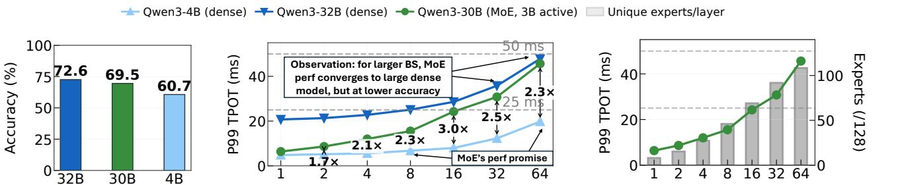

(a) Model accuracy (b) SLO-compliant region (c) Expert diversity (Qwen3-30B)

Figure 1. Performance and accuracy of dense models (Owen3-4B and Owen3-32B) and MoE (Owen3-30B-A3B): (a) MoE achieves accuracy of a 32B dense model with just 3B active parameters per input. (b) MoE performance degrades from being similar to 4B model to convering to 32B dense model as batch size increases. (c) Root cause is the increase in activated parameters at larger batches.

Max batch size

model with parameter count proportional to the MoE's perinput acitve parameters. We evaluate this claim by comparing Qwen3-30B-A3B (MoE) against Qwen3-4B (small dense model) and Qwen3-32B (large dense model) on a real-world trace, ShareGPT [5], on an H200 at different batch sizes.

(Dense) (MoE) (Dense)

At a batch size of 1, the MoE model keeps this promise: its decode latency matches the small dense model (Figure 1b, left arrow), while achieving 8.8% higher average accuracy across tasks [60]. However, at higher batch sizes (Figure 1b(b), right arrow), MoEs break this promise. Their latency approaches that of the large dense model, while the MoE average accuracy trails behind that of the large model's accuracy by 3.6%.

Batching and SLOs: To study the impact of batching, we analyze the p99 latencies across different batch sizes in Figure 1b. The MoE model is consistently slower than the small dense model by  $1.7 \times$  to  $3 \times$  at p99 latency as batch size increases. Since each token independently selects its top-k experts, the number of activated experts grows with batch size, as confirmed by the linear correlation that we observe in Figure 1c between batch size and the number of activated experts. Thus, while batching incurs only computational overhead in dense models, MoEs additionally incur data movement cost from activating more experts [2, 15], paying a much steeper cost.

Production services rely on request batching to sustain throughput [33, 63], but latency SLO constraints restrict the maximum batch size [67]. In line with prior work and deployed API services [47], we use two SLOs: 50 ms (20 tokens/s/user) and 25 ms (40 tokens/s/user), representing agents and chatbots [39, 72]. We find that MoE data movement is difficult to overlap with the dynamic and fine-grained expert computation because expert activation patterns are irregular and input-dependent [71]. To meet the 25 ms SLO, 42% of the median decode iteration is spent fetching activated expert weights from HBM, creating a hard upper bound on achievable user throughput.

Prefill Vs Decode: MoEs process input in two phases, prefill and decode, where decode dominates serving costs at  $2-8\times$ 

Batch size

Figure 2. Left: Prefill latency doesn't vary with active experts (compute-bound). Right: Decode latency scales linearly with the number of active experts (memory bandwidth bound)

the expense of input tokens [6, 47]. Each forward pass during auto-regressive decode consists of attention and expert layers. Attention operator latency grows linearly with batch size and quadratically with sequence length, motivating a rich body of optimization work on both kernels and model architectures [11, 13, 53, 68, 73]. While prior works on expert computation optimizations have similarly focused on compute-intensive training workloads [20, 70], expert computation during inference has a different computational profile.

The arithmetic intensity of expert computation during inference is proportional to  $\frac{n \cdot k}{N}$ , where *n* is the number of tokens in the batch, k is the number of tokens activated per input and N is the total number of experts. Figure 2 showcases the arithmetic intensity discrepancy between the prefill and decode phase of inference. We run Mixtral-8x7B-v0.1 [31] on the ShareGPT dataset with 2 A100s and track the inference phase, activated experts and corresponding latency of the batch. We observe that prefill batches have high and constant latency even as the activated expert count varies, owing to compute-boundedness due to large number of tokens. Decode phase remains memory-bandwidth bound, owing to one token generated per request per iteration.

Observation 1: During the memory-bound decode phase, selective parameter activation is at odds with batching under tight latency SLOs: decode latency scales with the total number of experts activated across the batch, not per input.

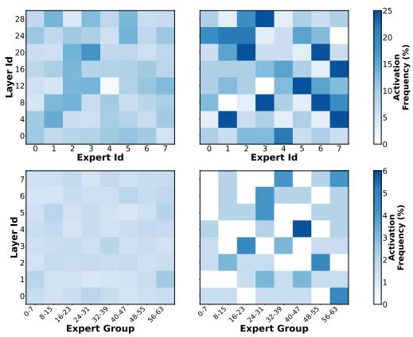

Figure 3. Comparison of expert activation patterns at: (Left) aggregate dataset-level - uniform; (Right) batch-level - skewed (for Mixtral-8x7B (upper) and Qwen2 (lower)) for batch size=16.

# 2.2 Opportunity: Heterogeneity in Per-Batch Expert Activation Patterns

Expert assignment for each token is determined at runtime by the router's softmax probabilities. During training, an auxiliary load-balancing loss is applied to prevent expert collapse and promote uniform expert utilization [36, 49, 52]. This enforced uniformity persists at inference time. Figure 3 (Left) analyzes expert activation frequency across millions of tokens from the ShareGPT-V3 [5] dataset: at the workload level, no expert is consistently underutilized [31, 42]. As a result, workload-level expert redundancy is difficult to identify without a calibration dataset, rendering static expert reduction techniques unsuitable for online serving [56].

However, the picture is substantially different at the batch level. In iteration-level scheduling, which is standard in LLM inference systems [33], batch composition varies between forward passes. This variation produces significant heterogeneity in which experts are activated per iteration, even as the aggregate distribution remains uniform. Figure 3 (Right) quantifies this for Mixtral-8x7B and Qwen2: mean expert activation variability is ~15–20% at the batch level, compared to only 1.2% in aggregate. This batch-level skew suggests that dynamic, per-iteration expert management could meaningfully reduce the number of experts fetched per decode step.

**Observation 2:** Expert activation exhibits strong heterogeneity at the batch level despite remaining uniform in aggregate.

This heterogeneity is a direct consequence of the load-balancing regularizer applied during training. While essential for preventing expert collapse, the regularizer induces a systematic side effect: the router learns to distribute tokens more broadly across experts than is strictly necessary for output quality [18, 49]. Specifically, when the router's confidence is low—that is, when the gap between its highest- and lower-ranked expert scores is small—secondary expert assignments are driven more by the training-time diversity constraint than by genuine token-expert affinity. The result is a systematic

gap between experts activated out of *necessity* and those activated as a byproduct of *training regularization*; it is precisely this gap that LYNX exploits.

#### 2.3 Challenges

The batch-level skew in expert activation creates a concrete opportunity: by identifying and suppressing redundant expert activations within each batch, one can directly reduce the volume of data transferred from HBM per decode iteration. Realizing this opportunity, however, requires overcoming several non-trivial obstacles. Because the batch is recomposed at every iteration by the continuous batching scheduler [33], any solution must operate entirely at runtime, and adapt to the routing decisions at each layer, without prior knowledge of the workload. It must further generalize across heterogeneous MoE architectures, including those with shared experts [61], expert grouping [13], and widely varying sparsity ratios, while remaining lightweight enough to execute in the critical path of inference. Lynx addresses three key challenges in constructing such a system.

Identifying Important Tokens. Tokens within a batch differ substantially in their sensitivity to expert reassignment. Assigning equal importance to every token's expert selection would, even at modest batch sizes, result in retaining nearly the full expert set, negating any bandwidth benefit. A more principled approach requires a notion of *relative importance*: certain tokens genuinely require their selected experts for accurate output, while others can be redirected to alternative experts without loss of output quality [30]. This distinction must be drawn without task-specific thresholds or calibration data, and must remain valid across architectures with differing sparsity ratios. This raises our first challenge: *How can we identify tokens amenable to expert remapping without incurring accuracy loss?* 

Selecting Critical Experts per Batch. Identifying remappable tokens is necessary but not sufficient; an expert may only be eliminated from the active set if it is non-critical for every token in the batch. An expert that is dispensable for one token but essential for another cannot safely be dropped. The core difficulty is reconciling per-token expert preferences, which vary widely in the strength of their conviction, into a single batch-level decision on the active expert set. Naive voting schemes that tally top-k selections across the batch [42, 65] treat all selections as equally weighted: a weakly preferred expert of an indifferent token receives the same vote as the decisive top choice of a high-conviction token. This preserves unnecessary experts in the active set while providing no mechanism to redirect low-conviction tokens to equally viable alternatives. This raises our second challenge: How can we determine the minimal critical expert set for a batch while respecting the varying conviction of per-token routing decisions?

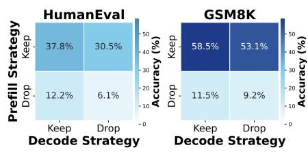

Figure 4. Phase-specific impact of expert reassignment. Code generation (HumanEval) and reasoning (GSM8K) are sensitive to expert reassignment during prefill but resilient during decode, revealing an asymmetry in MoE processing across phases.

Opportunistic Expert Reduction. Expert remapping yields latency benefits only when the decode iteration is memory-bandwidth-bound. In compute-bound regimes, such as during prefill or under high system load, reducing the expert set provides no throughput improvement and introduces unnecessary routing overhead. Furthermore, sensitivity to expert reassignment varies across layers within the same forward pass; certain layers tolerate aggressive reduction while others do not. LYNX must therefore determine when and where remapping is beneficial without recourse to offline profiling or workload-specific tuning. This raises our third challenge: How can we reliably identify opportunities for expert remapping across inference phases and model layers at runtime?

Addressing these challenges requires a data-driven characterization of how expert selection influences output accuracy across multiple granularities: individual tokens, batches, layers, and full inference iterations. The following section presents the empirical observations that ground LYNX's design and describes how each challenge is resolved.

### 3 LYNX Design

LYNX is a system that integrates with any LLM serving engine to mitigate the memory bandwidth bottleneck in MoEs and improve serving performance. Its design is grounded in three empirical observations, each of which resolves one of the challenges identified in §2.3 and corresponds to a dedicated system component. First, the phase of inference — prefill versus decode — determines whether expert remapping yields any benefit at all, motivating a phase-aware optimizer that applies LYNX's techniques selectively (§3.1.1). Second, router confidence scores reliably distinguish tokens whose expert assignments are critical from those amenable to remapping, motivating a *confidence analyzer* (§3.2.1). Third, the ranked order of expert selections reveals that top-ranked experts dominate output quality while lower-ranked selections are highly redundant, motivating an adaptive expert scorer (§3.3.1). Together, these components implement LYNX's core operation: the expert remapper consolidates token-to-expert assignments batch-wide onto a minimal expert set (§3.4), and the architecture and workflow section describes how all components interact at runtime (§3.5). We illustrate these

observations using Qwen2-57B-A14B, DeepSeek-V2-Lite-Chat, and Mixtral-8x7B-v0.1 with GSM8K and HumanEval as benchmarks.

#### 3.1 Phase Sensitivity

The first question LYNX must answer before applying any remapping is whether doing so will yield a latency benefit. As established in §2.1, expert remapping reduces memory bandwidth consumption only when the decode iteration is memory-bandwidth-bound. Intervening during compute-bound phases, such as prefill, would introduce routing overhead without any corresponding benefit. Beyond this coarse phase distinction, sensitivity to expert reassignment also varies across the two phases in a deeper sense that motivates different treatment.

Figure 4 quantifies this asymmetry. Expert reassignment during prefill substantially degrades model performance on both code generation (HumanEval) and complex reasoning (GSM8K), while similar modifications during decode produce minimal accuracy impact across all task types. The consistency of this pattern across workloads of different character suggests a fundamental property of autoregressive inference: the prefill phase establishes the context that guides all subsequent computation, making it sensitive to expert fidelity, while the decode phase benefits from complementary mechanisms—attention, residual connections, and accumulated context—that compensate for suboptimal expert selection.

**Insight 1:** MoEs exhibit fundamentally different sensitivity to expert selection during prefill versus decode phases, enabling phase-specific optimization strategies.

- **3.1.1 Phase-aware optimizer.** The phase-aware optimizer works in concert with the batch scheduler to determine whether a given batch warrants LYNX's intervention. Its behavior adapts to three common serving policies:
- *Co-located* deployments, where prefill and decode batches are scheduled on the same instance but not mixed: the optimizer identifies decode-only batches as memory-bound and sets a flag consumed by downstream components.
- *Disaggregated* serving [72], where prefill and decode operations run on separate instances within the same replica: the optimizer marks the decode instance as memory-bound, requiring no per-batch classification.
- Chunked prefill policies [4], where a single batch may contain both prefill and decode tokens: the optimizer labels batches consisting exclusively of decode tokens as memory-bound. Batches with a prefill chunk small enough to be memory-bound are a known edge case; addressing them risks degrading time-to-first-token (TTFT) and is left to future work.

In all cases, the optimizer ensures that LYNX's remapping techniques are applied only where they yield measurable benefit, with no intervention during compute-bound phases.

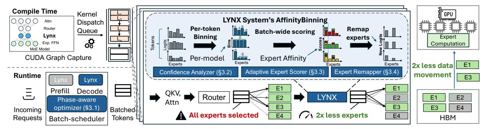

Figure 5. System architecture of LYNX. Left: the phase-aware optimizer identifies memory-bound inference phases; layer-level components are compiled using CUDA Graphs for maximum performance. Center: LYNX bins expert choices per token, computes batch-wide scores for each expert, selects the critical expert set, and remaps all token-to-expert assignments accordingly. Right: LYNX activates significantly fewer experts per batch, reducing memory traffic (two out of four activated in this example).

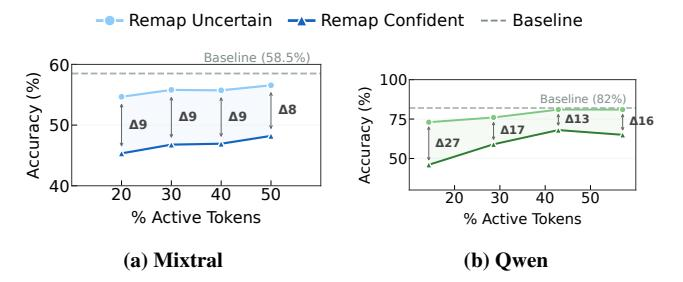

Figure 6. Impact of token confidence on accuracy under selective expert remapping. Reassigning low-confidence tokens incurs substantially less accuracy degradation than reassigning high-confidence tokens.

#### 3.2 Token Importance

Even within memory-bound decode iterations, not all tokens are equally amenable to expert remapping. Reassigning the expert of a token with strong router conviction risks a meaningful accuracy drop, while reassigning a token with weak conviction typically does not. LYNX exploits this by distinguishing high-conviction tokens — whose expert assignments are preserved — from low-conviction tokens — whose assignments may be remapped.

Figure 6 quantifies this relationship. We measure router confidence per token as the variance in normalized probability scores, and vary the threshold above which tokens are classified as high-confidence. As the threshold increases, a growing divergence emerges between the accuracy impact of reassigning high- versus low-confidence tokens: high-confidence tokens are consistently more sensitive to reassignment, while low-confidence tokens tolerate it with minimal accuracy degradation. This divergence holds across model families, suggesting that router logits contain a reliable signal for identifying critical token-expert mappings.

**Insight 2:** Router confidence provides a reliable signal for identifying critical token-expert mappings; reassigning low-confidence mappings has minimal impact on downstream accuracy.

**3.2.1 Confidence analyzer.** The confidence analyzer implements LYNX's *AffinityBinning* technique, which discretizes each token's router confidence into bins whose structure is determined solely by the model's sparsity ratio — not by any workload or task. This per-architecture calibration is what makes LYNX self-calibrating and workload-agnostic.

Concretely, the confidence analyzer intercepts the router's probability weights at every MoE layer. For each token, it measures the affinity of each expert relative to the top-1 expert by computing the log-ratio of their softmax probabilities — equivalently, the difference of the corresponding logits before softmax. These log-ratio values are then discretized into bins: a value of 0 indicates highest affinity to the top-1 expert, and the bin index becomes increasingly negative as the affinity gap widens (Figure 5, right). For routers that do not use softmax, e.g. sigmoid-based routers, we simply use the difference between the pre-sigmoid scores instead of log-ratio.

Two architecture-specific parameters,  $\alpha$  and  $\beta$ , control the binning resolution: the width of each bin is inversely proportional to  $\alpha$ , and  $\beta$  bounds the number of bins. Both are set once per model architecture based on its sparsity ratio (k/N), requiring no task-specific tuning. Among several candidate confidence measures such as variance, entropy, the Gini index, the log-ratio to the top-1 expert proved most intuitive and empirically most representative.

#### 3.3 Expert Rank Hierarchy

Knowing which tokens can be remapped is necessary but insufficient: the remapping must be coordinated across the entire batch to ensure that no expert essential to any token is eliminated. This requires understanding which experts, among those selected by a given batch, are truly critical and which are redundant.

Figures 7 and 8 reveal a striking asymmetry in expert importance. Denying the top-ranked (rank-0) expert catastrophically degrades accuracy across all model families and benchmarks, while denying lower-ranked experts causes minimal disruption. Conversely, retaining only the top-ranked expert

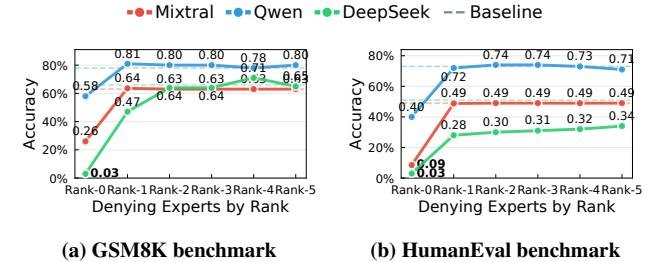

Figure 7. Impact of denying experts by rank on model accuracy. The top-ranked expert (E0) is critical across all model families; lower-ranked experts are substantially more redundant.

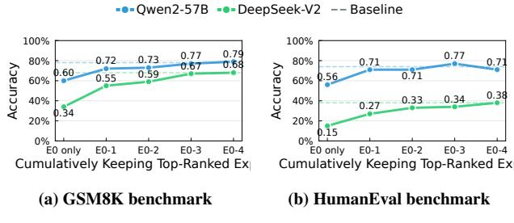

Figure 8. Accuracy when cumulatively retaining top-ranked experts. Most performance is recovered after keeping 3–4 experts, with diminishing returns thereafter.

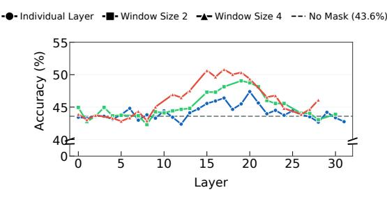

Figure 9. Layer-wise sensitivity analysis. Accuracy varies significantly across layers when expert assignments are selectively preserved, motivating layer-adaptive remapping policies.

recovers most of the baseline accuracy, with diminishing returns as additional experts are cumulatively restored. This hierarchy is consistent across GSM8K and HumanEval, tasks of substantially different character, suggesting it reflects a structural property of MoE computation rather than a task-specific artifact. Layer-wise analysis (Figure 9) also shows variable sensitivity to expert reassignment across layers: certain layers tolerate aggressive reduction while others require expert fidelity, enabling layer-adaptive remapping policies.

**Insight 3:** The top-ranked expert dominates output quality; lower-ranked experts among the top-*k* exhibit high redundancy, and sensitivity varies across layers.

**3.3.1** Adaptive expert scorer. This component receives as input the AffinityBinning output from the confidence analyzer, the per-token router probability scores, and the memorybound flag from the phase-aware optimizer. Its objective is to

determine the minimal set of experts to activate for the batch such that accuracy loss is minimized across all tokens.

To achieve this, the scorer implements a batch-wide scoring algorithm. For each expert, a weighted score is added to its router logit based on how frequently other tokens in the batch preferred it. Critically, rather than using vanilla weighted averaging, LYNX uses the batch size as the base of an exponential weighting scheme and raises it to the bin value assigned to each expert by the confidence analyzer. This formulation naturally adapts to competition among tokens in the batch: experts preferred by many high-conviction tokens receive disproportionately higher scores, while experts favored only by low-conviction tokens are down-weighted. The scorer dynamically determines the final number of activated experts based on the resulting score distribution, the bin width, and the number of allowed bins. High-confidence tokens are always mapped to their top-ranked expert to ensure minimal accuracy impact.

For MoE architectures with shared experts such as DeepSeek-V2 and V3 [13, 50], those experts are activated unconditionally at every layer, LYNX ensures these are always included in the final expert set with a probability score of 1, preserving their intended semantics.

### 3.4 Expert Remapper

The expert remapper is the final stage of LYNX's per-layer pipeline. It receives the minimal expert set identified by the adaptive expert scorer and redirects low-confidence token-to-expert assignments to experts within that set. The reassigned probability scores determine the final token-to-expert mapping, after which the component dispatches the expert computation kernel with the appropriate kernel launch parameters.

Crucially, LYNX's remapping preserves the top-k activation semantics of the underlying model: every token still activates exactly k experts, and no expert is permanently discarded. The reduction in memory bandwidth comes entirely from consolidating the batch's expert activations onto a smaller set, not from reducing per-token computation. This distinguishes LYNX from prior approaches that reduce k per token [42, 65], which alter model semantics and require post-training to remain accurate. LYNX requires neither model modification nor offline tuning, and adapts to any MoE architecture out of the box.

#### 3.5 Architecture and Workflow

Figure 5 presents the system architecture of LYNX and illustrates how its components interact at runtime. The phase-aware optimizer is integrated within the batch scheduler of the serving engine. The remaining components—confidence analyzer, adaptive expert scorer, and expert remapper—operate at per-layer granularity within the model's forward pass.

For each incoming batch, the phase-aware optimizer first determines whether the iteration is memory-bound. If the batch is compute-bound, as during prefill, LYNX's components are bypassed entirely for that iteration. For memorybound decode batches, the MoE router at each layer produces expert selection logits, which are intercepted by the confidence analyzer. The confidence analyzer applies Affinity-Binning to produce per-token bin assignments. The adaptive expert scorer then computes batch-wide expert scores and determines the final active expert set. Finally, the expert remapper redirects low-confidence token assignments to the active set and dispatches the expert computation kernel. This workflow operates entirely within the critical path of inference, requiring no model modifications or offline calibration.

### 4 Implementation

Our implementation works as a plug-and-play on top of vLLM [\[33\]](#page-14-8) through highly optimized CUDA graph compatible kernels in the critical path of MoE inference. LYNX's core components: confidence analyzer, adaptive expert scorer and expert remapper are implemented using four fused Triton [\[55\]](#page-14-14) kernels while the phase-aware optimizer [§3.1.1](#page-4-1) operates within the batch scheduler. Since we do not depend on any framework specific operations, LYNX can integrate with any LLM serving engine.

Each kernel in LYNX fuses operations that would otherwise launch over 700 PyTorch kernels, eliminating intermediate tensor data movement and excess memory traffic by keeping computations in registers or shared memory. This design reduces memory accesses, cuts kernel launch overhead, and maintains static control flow for efficient CUDAGraph capture. The routing policy is implemented in four steps: token-wise binning, batch-wise scoring, expert pruning, and expert remapping. The first kernel discretizes logits and computes top-k weight sums (per-token), the next two score and prune experts (per-batch) before recomputing softmax and top-*k*, and the final kernel compacts the active-expert list, assigns tokens, and renormalizes weights. These four kernels replace over 700 of small PyTorch operations with four efficient launches (Figure [18\)](#page-11-0).

Current inference engines deploy optimizations such as chunked prefill [\[4\]](#page-12-6), disaggregated serving [\[72\]](#page-15-6), CUDA Graphs, fused expert kernels with architecture-specific dispatch parameters during critical path of MoE inference. LYNX works seamlessly on top of all such SOTA optimizations to provide performance benefits for MoE inference. LYNX is enabled through a CLI flag and automatically adapts to different number of active experts, batch size and available hardware, delivering immediate performance gains across diverse serving environments.

### 5 Evaluation

We evaluate LYNX on state-of-the-art models from four families on eight benchmarks ([§5.1\)](#page-7-1). In all cases, Lynx does not

Table 1. Models used to evaluate LYNX across families.

| Model Family | Model                                                                                             |  |  |  |  |  |  |
|--------------|---------------------------------------------------------------------------------------------------|--|--|--|--|--|--|
| Qwen         | Qwen2-57B-A14B-Instruct [61] Qwen3-30B-A3B-Instruct [60] Qwen3-235B-A22B-Thinking-2507 [60] |  |  |  |  |  |  |
| Mixtral      | Mixtral-8x7B-Instruct-v0.1 [31]                                                                   |  |  |  |  |  |  |
| DeepSeek     | DeepSeek-V2-Coder [51]                                                                            |  |  |  |  |  |  |
| Llama        | Llama-4-Maverick-17B-128E-Instruct [44] Llama-4-Scout-17B-16E-Instruct [44]                    |  |  |  |  |  |  |

require any task-specific profiling or configuration. Our key findings are:

- LYNX provides up to 1.30× lower latency, with *less than 1 percentage point* impact on accuracy. This accuracy bound is respected across model families, architectures, benchmarks and real-world datasets [§5.2.](#page-8-0) On average, LYNX improves the accuracy through efficient expert remapping suggesting experts in MoEs carry redun- dant information due to training-time load balancing
- LYNX reduces MoE inference latency across the most commonly used inference deployments: co-located and disaggregated serving. LYNX also improves system throughput under a given SLO budget by upto 2.1× ([§5.3\)](#page-9-0) and provides upto 1.25× lower latency on real-world traces([§5.5\)](#page-10-0).
- LYNX boosts the performance of state-of-the-art vision and thinking models by upto 1.21× thereby extending to latest generation of models without any modifications fig. [11.](#page-9-1)
- LYNX is complementary to existing approaches. LYNX boosts the performance of Fiddler [\[32\]](#page-14-16), a SOTA offloading technique, by 31% and LLM compressor's INT4 compression technique, by 10% ([§5.7\)](#page-11-1).

### 5.1 Experimental Setup

Models and Experimental Setup. We evaluate LYNX across models from four families as illustrated in Table [1.](#page-7-2) All models use BF16 precision unless otherwise stated.

Code and math benchmarks: We show performance of LYNX on four SOTA text generation benchmarks in code and math, namely: GSM8K[\[12\]](#page-12-7), HumanEval [\[8\]](#page-12-8), MBPP [\[7\]](#page-12-9) and Minerva Math (Algebra) [\[37\]](#page-14-17). These tasks have questions of varying difficulty, input/output lengths.

Vision and reasoning benchmarks: We also evaluate LYNX on multi-modal and reasoning benchmarks, namely ChartQA [\[43\]](#page-14-18), a benchmark on visual reasoning, MMMU [\[66\]](#page-15-11), for complex reasoning on inputs like images and text. Finally, we include AIME and GPQA which have problems requiring domain knowledge, multi-step reasoning and mathematical insight.

Real-world traces: To show the benefits of LYNX on realistic serving scenarios, we evaluate on conversation and agentic

Table 2. LYNX achieves same accuracy ( ±X% ) and lower latency ( × ) across code and math benchmarks on MoE models. The Δ column shows accuracy change on benchmark rows and TPOT reduction on green rows. Light gray rows report median and mean TPOT in milliseconds (Base → LYNX). The mean TPOT includes chunked prefill iterations. HE/MBPP use Pass@1, while MATH/GSM8K use EM (Exact Match) for accuracy measurement.

|           | Qwen2-57B-A14B-Instruct |       |       | Qwen3-30B-A3B-Instruct |       |       | DeepSeek-Coder-V2 |       |       | Mixtral-8x7B-Instruct |       |       |
|-----------|-------------------------|-------|-------|------------------------|-------|-------|-------------------|-------|-------|-----------------------|-------|-------|
|           | Base                    | LYNX  | Δ     | Base                   | LYNX  | Δ     | Base              | LYNX  | Δ     | Base                  | LYNX  | Δ     |
| Code      |                         |       |       |                        |       |       |                   |       |       |                       |       |       |
| HE        | 65.9%                   | 65.9% | +0.0% | 76.2%                  | 75.2% | −1.0% | 76.8%             | 78.7% | +1.9% | 49.4%                 | 50.6% | +1.2% |
| p50 (ms)  | 15.83                   | 12.63 | 1.25× | 11.57                  | 9.51  | 1.22× | 28.34             | 23.21 | 1.22× | 13.48                 | 11.45 | 1.18× |
| mean (ms) | 27.83                   | 25.85 | 1.08× | 21.82                  | 19.26 | 1.13× | 34.26             | 31.11 | 1.10× | 13.84                 | 12.19 | 1.14× |
| MBPP      | 59.6%                   | 60.4% | +0.8% | 73.6%                  | 74.0% | +0.4% | 78.8%             | 78.8% | +0.0% | 37.2%                 | 37.6% | +0.4% |
| p50 (ms)  | 16.03                   | 12.64 | 1.27× | 11.24                  | 9.45  | 1.19× | 28.35             | 23.63 | 1.20× | 14.59                 | 13.34 | 1.09× |
| mean (ms) | 18.79                   | 16.05 | 1.17× | 18.35                  | 16.91 | 1.09× | 39.08             | 36.25 | 1.08× | 16.75                 | 15.43 | 1.09× |
| Math      |                         |       |       |                        |       |       |                   |       |       |                       |       |       |
| MATH      | 47.1%                   | 46.8% | −0.3% | 64.4%                  | 63.6% | −0.8% | 11.2%             | 11.2% | +0.0% | 37.8%                 | 38.6% | +0.8% |
| p50 (ms)  | 16.02                   | 12.57 | 1.27× | 11.55                  | 9.73  | 1.19× | 28.52             | 23.62 | 1.21× | 14.54                 | 13.38 | 1.09× |
| mean (ms) | 16.83                   | 13.70 | 1.23× | 14.11                  | 12.26 | 1.15× | 31.44             | 27.59 | 1.14× | 19.42                 | 14.67 | 1.32× |
| GSM8K     | 78.0%                   | 77.2% | −0.8% | 88.4%                  | 87.6% | −0.8% | 63.2%             | 64.0% | +0.8% | 65.6%                 | 65.0% | −0.6% |
| p50 (ms)  | 16.51                   | 12.70 | 1.30× | 11.59                  | 10.15 | 1.14× | 28.63             | 23.75 | 1.21× | 14.55                 | 12.83 | 1.13× |
| mean (ms) | 18.80                   | 15.57 | 1.21× | 15.68                  | 14.65 | 1.07× | 34.24             | 30.15 | 1.14× | 17.59                 | 15.60 | 1.13× |

tool traces from Mooncake [\[48\]](#page-14-19) and ShareGPT [\[5\]](#page-12-3). These realworld traces include real arrival rates, input/output lengths, and reflect realistic prefix-sharing characteristics.

Metrics. We report the median and mean time-per-outputtoken latency of LYNX compared to the vLLM baseline with all default inference optimizations enabled. We also measure overall system throughput (tokens/sec) and user throughput (tokens/sec/user).

Accuracy. We follow task-specific guidelines (accuracy metrics, fewshot examples, chat template, thinking token budget, etc.) from EleutherAI's benchmarking harness and the technical report of respective models.

Experimental Setup. We evaluate on NVIDIA H200 GPUs (141 GB memory) connected using SXM NVLink to conduct all our experiments unless otherwise stated. The machine is equipped with 2x AMD EPYC 9554 64-Core CPU (128 cores total) and 1.5 TB DRAM, running Ubuntu 22.04.4 LTS, with NVIDIA driver 560.35.05 and CUDA 12.6.

Parallelism. We run Mixtral-8x7B, Qwen2-57B and Llama-4-Scout with tensor parallelism degree of two, Qwen3- 30B-A3B on on a single GPU due to smaller parameter count, and Deepseek-Coder, Llama-Maverick, and Qwen3-235B with tensor parallel degree of four.

Baseline and serving scenarios: We run all experiments with online serving setting with vLLM version (v0.10.1) using the v1 scheduler. We evaluate both colocated and disaggregated prefill/decode scenarios.

We measure accuracy using Eleuther AI's LM evaluation harness [\[21\]](#page-13-12) with number of concurrent requests set to saturate the request queue. We evaluate LYNX with (a) maximum batch size set to 16 during decode, and (b) without any limit on maximum batch size for datasets with request arrival timestamps. We additionally evaluate tensor parallel and expert parallel configurations to reflect real-world production deployments [\[3,](#page-12-10) [17,](#page-13-13) [54\]](#page-14-20).

For the computation breakdown, we capture the kernellevel latencies within each iteration using the Pytorch profiler.

### 5.2 Impact on Accuracy & Latency

Table [2](#page-8-1) compares LYNX with *vllm* model serving across math and coding workloads with prefill/decode colocation. Overall, LYNX achieves lower latency across the board while adhering to the 1% point accuracy budget, and in several cases even improves accuracy.

LYNX lowers median TPOT by 1.09–1.30× across all four models and benchmarks. Qwen2-57B achieves the largest median latency reduction, with 1.25–1.30× lower latency across all four tasks (accuracy within 0.8%). DeepSeek-Coder-V2 delivers 1.20–1.22× lower median latency across benchmarks, and improves HumanEval Pass@1 by 1.9%. Qwen3-30B, the smallest model by active parameters, achieves 1.14–1.22× lower latency. Mixtral-8×7B shows more modest reduction (1.09–1.18×) due to fewer total experts which limits remapping search space.

LYNX lowers latency for decode-only iterations where LYNX's remapping is applied ([§3.1.1\)](#page-4-1). Even when we include the compute-dominated chunked-prefill iterations (that

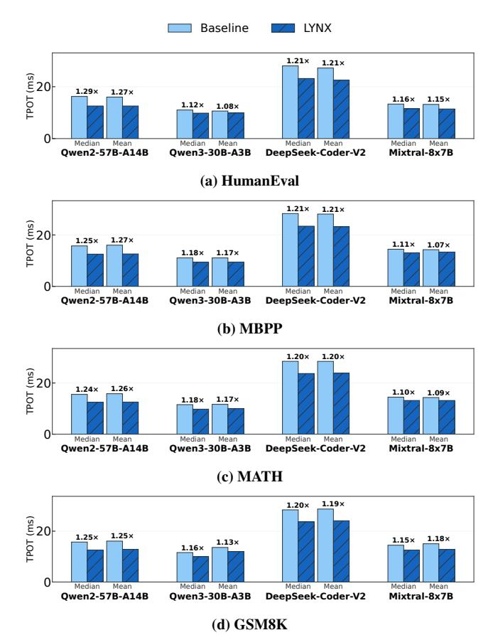

Figure 10. TPOT latency (ms) when LYNX is applied to a decodeonly node with disaggregated serving. Speedup shown above each pair.

also produce decode tokens), LYNX lowers the mean latency across the board: Qwen2-57B achieves 1.08–1.23×, DeepSeek-Coder-V2 achieves 1.08–1.14×, and Qwen3-30B achieves 1.07–1.15× lower mean latency.

Across all 16 model-benchmark pairs, accuracy deviations remain within 1%, and LYNX sometimes improves accuracy. DeepSeek-Coder-V2 gains +1.9% on HumanEval while Mixtral-8x7B-Instruct gains +1.2% on the same task and +0.8% on MATH, suggesting experts in MoEs carry redundant information due to training-time load balancing.

Vision and Reasoning Tasks. As Figure 11 shows, LYNX's latency reduction also provides up to 1.20× higher throughput on vision models for complex image reasoning tasks (ChartQA and MMMU) on Llama 4.1 Scout and Maverick models, and 1.22× higher throughput for thinking tasks (AIME24 and GPQA) without any degradation in model accuracy (+0.0 to +3.33% improvement across tasks) on Qwen 3-235B thinking model.

**Disaggregated Serving.** Figure 10 shows LYNX's latency reduction in disaggregated deployment, where prefill and decode run on separate machines, and the decode node processes only decode iterations. As the decode node does not

execute chunked-prefill iterations, median and mean latency reductions converge: LYNX lowers both median and mean latency by 1.24–1.35× on Qwen2-57B, with less than 2% variation in the mean and median metrics on three of four tasks, and we observe trends for DeepSeek-Coder-V2 (1.19–1.22× lower TPOT). LYNX lowers Mixtral-8x7B TPOT by 1.15× on GSM8K, up from 1.13× in the co-located setting. We note that in disaggregated setting, the TPOT reduction for LYNX matches or exceeds median reduction in able 2. Finally, absolute latency savings grow with model size: larger models (e.g., Qwen2-57B and DeepSeek-Coder-V2) achieve reductions of up to 6 ms/token, compared to 1–2 ms/token for Qwen3-30B. Thus, LYNX is consistently lower TPOT while being iso-accurate.

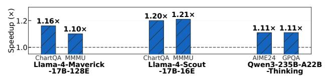

Figure 11. LYNX improves throughput on for SOTA vision and thinking models with no accuracy degradation

### 5.3 Improving throughput within budget

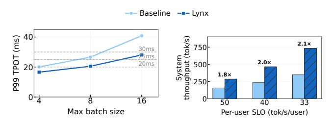

(a) Latency vs. batch size (b) Throughput within SLO Figure 12. LYNX is able to achieve higher system throughput while adhering to the same user token throughput (1/(TPOT)

Serving operators such as OpenAI guarantee per-user to-ken generation rates as part of their API contracts [47]. These guarantees translate to P99 TPOT deadlines–25 ms for 40 tok/s/user–that limit admissible batch size and, in turn, system throughput. Agentic workloads demand tighter deadlines (20 ms, 50 tok/s/user) [39], while chatbot-style serving operates at more relaxed targets (30 ms, 33 tok/s/user) [72]. Figure 12a shows P99 TPOT as a function of batch size for Qwen2-57B-A14B-Instruct on ShareGPT [5]. LYNX consistently lowers P99 TPOT, allowing the system to admit larger batches under the same deadline. At batch size 16, baseline exceeds 40 ms while LYNX remains under 30 ms. Figure 12b shows the resulting throughput at all three SLO targets: LYNX achieves 1.8×, 2.0×, and 2.1× higher throughput, respectively, significantly improving system's efficiency.

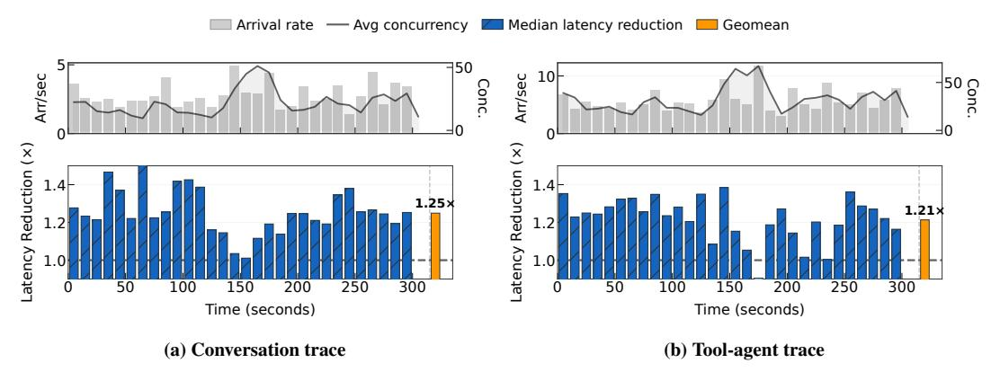

Figure 13. LYNX shows significant latency reduction under real-world multi-turn traces for conversation and agentic workloads.

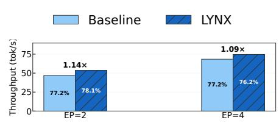

Figure 14. Qwen2-57B-A14B GSM8K: Baseline vs. LYNX with expert parallelism. Values inside bars show exact-match accuracy (%).

### 5.4 Expert Parallelism

LYNX compliments expert parallelism (EP), which distributes experts across GPUs, instead of sharding them (as done in tensor parallelism). Figure 14 shows throughput and accuracy on GSM8K for Qwen2-57B-A14B-Instruct at TP=2,EP=2 and TP=4,EP=4. LYNX improves throughput by 1.14× at EP=2 and 1.09× at EP=4, while keeping accuracy within 1% at both configurations. The gains reduce at EP=4 because distributing experts across more GPUs reduces the experts per GPU, leaving fewer placement configurations for LYNX to exploit. Nonetheless, LYNX provides additive throughput on top of EP scaling, showcasing LYNX's generalizibility to any parallelism technique (TP, EP, PP).

#### 5.5 LYNX on Real-World Traces

LYNX delivers consistent latency reductions under production-representative workloads with bursty, time-varying arrival rates. We replay two traces: a conversational trace with short, frequent exchanges, and a tool-agent trace with longer requests and higher concurrency [48]. Figure 13a shows the conversational trace over a 300-second window, where arrival rates fluctuate between 0 and 5 requests/second with concurrency peaking near 50; LYNX lowers median ITL by 1.25×. Figure 13 shows the tool-agent trace, where arrival rates reach 10 requests/second with similar peak concurrency. LYNX lowers median ITL by 1.21×. In both traces, the TPOT reduction remains temporally stable, including during bursts where concurrency spikes and batch compositions shift rapidly. No offline profiling or trace-specific configuration is required:

LYNX's per-batch remapping adapts to shifting arrival patterns, batch sizes, and expert distributions entirely at serving time. These results show that our gains in Table 2 carry over to realistic settings.

#### 5.6 Enhancing Offloading Techniques

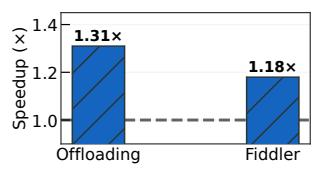

Figure 15. LYNX enhances existing offloading techniques

Offloading techniques [29, 32, 59, 64] reduce GPU memory requirements, and LYNX complements such techniques as it enables fetching less expert weights just-in-time from slower memory tiers (like CPU-GPU links) in the critical path.

We evaluate two offloading techniques when running Mixtral-8x7B-Instruct on a single A100 GPU with 19 GB out of 94 GB offloaded to CPU memory. In conventional offloading, the transfer of model weights is in the critical path, and becomes bottlenecked by PCIe bandwidth, making offloaded inference roughly 50× slower than on-device inference. LYNX reduces the dominant cost of data transfer of model weights by reducing activated experts per batch. Even at 75% activated experts, LYNX improves performance over vanilla offloading by 1.31× (Figure 15 left). A recent work, Fiddler [32] instead computes offloaded experts on the CPU and transfers the much smaller activation tensors. The critical path thus shifts to expert computation on the CPU, and Fiddler provides a 5× latency improvement over vanilla offloading. LYNX further enhances Fiddler by reducing CPUside activated experts by 25%, yielding an additional 1.18× latency benefit. Overall, LYNX compliments and improves both conventional and state-of-the-art offloading techniques.

### 5.7 Enhancing Quantization Techniques

Recent quantization techniques accelerate MoE serving by compressing model weights to FP8 or lower [25], reducing the data transfer cost of expert weights. LYNX is complementary to quantization: it reduces the number of activated experts, further reducing data transfer even for quantized weights. We

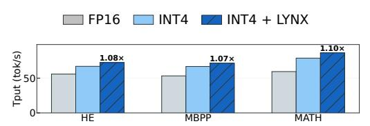

Figure 16. LYNX improves throughput on top of quantization

evaluate LYNX with Qwen2-57B-A14B-Instruct quantized to INT4 precision using LLM Compressor (GPTQ/AWQ), which is supported by our evaluation framework, vLLM. As shown in Figure 16, LYNX provides 7–10% speedup while remaining within the accuracy budget of <1% (improving MBPP accuracy by 0.8%). Other works employ online dynamic pruning on top of extreme quantization [25, 27], but their accuracy drops vary drastically on hard tasks such as GSM8K and HumanEval, so we exclude them from our analysis. Thus, we believe LYNX is applicable to any quantization scheme with similar benefits.

### 5.8 Impact of Batch Size & Sequence Length

Figure 17 reports how LYNX 's gains vary across batch sizes on GSM8K (left) and HumanEval (right). The findings are intuitive: TPOT improvements increase with batch size up to a point, after which they begin to saturate. On GSM8K, LYNX delivers its strongest benefits at moderate batch sizes, achieving over 1.20× speedup at batch size 8 and 1.19× at batch size 16, before stabilizing near 1.15× at 32 and 64. HumanEval shows the same trend, with speedups climbing to 1.19× at batch size 16 and remaining in the 1.13–1.18× range thereafter. Importantly, these improvements hold consistently across benchmarks with different prefill to decode ratios. Overall, these results demonstrate that LYNX achieves robust latency reductions across tasks, with particularly strong benefits at moderate batch sizes before saturating, underscoring its effectiveness in practical deployment regimes.

### 5.9 Overheads & scalability

Figure 18 profiles the breakdown of end-to-end latency across expert and non-expert components. Due to the highly optimized implementation using 4 fused kernels (§4), the overhead of LYNX's kernels is less than 4% overall, making it lightweight and allowing its latency savings from expert reduction to be fully realized in practice. This already minimal overheads can be improved further by tuning kernel dispatch parameters for variable number of activated experts, an optimization that current LLM serving engines ignore.

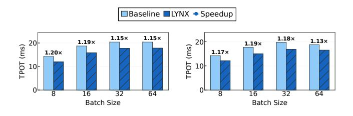

(a) GSM8K (b) HumanEval Figure 17. Batch scalability showing robustness of LYNX speedup across different batch sizes and P:D ratios.

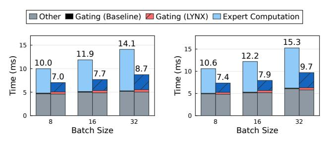

(a) Sequence length 512 (b) Sequence length 4096 Figure 18. Latency breakdown for baseline and LYNX

#### 6 Related Work

**Static Expert Pruning.** Early approaches create smaller MoE variants by static pruning [38] [34], optionally followed by fine-tuning [45] or distillation [58] to mitigate accuracy loss. For MoEs with a large number of experts, exhaustively navigating the search space is prohibitively expensive, inspiring [14, 24, 69] to use evolutionary search.

**Dynamic Expert Selection.** Many dynamic expert reduction techniques are limited to reducing the number of experts activated per token but not per batch, not realizing latency benefits [25, 42]. Recent works like [56] explore runtime expert selection based on pairwise expert similarity determined from a calibration dataset. LYNX obviates the need for a calibration dataset and, therefore, prior knowledge of the workload's input distribution or any fine-tuning.

Model Compression. Compression techniques adapt pruning and quantization for MoEs [10, 25, 27, 69]. FP16/FP8 quantization [40, 57] can reduce memory footprint by 50-75%, at the expense of accuracy. Large models exceeding GPU HBM in size rely on quantized models with FP8 and even more extreme width quantization like 2-bit and 3-bit width. We show that LYNX complements (4bit and 8bit) quantization and such compression approaches for latency-sensitive deployments.

**Expert Placement and Execution.** Several systems focus on efficient expert distribution across devices. GShard [36] introduces expert parallelism. Recent works [9, 13, 16, 26, 59] optimize expert placement in constrained and high throughput serving scenarios. LYNX operates at the router and therefore can adapt to load-aware expert placement techniques.

**Pipelining and Overlapping** Klotski [19] addresses bubbles in the pipelined inference of MoEs and due to variance in IO and execution latencies per layer by using expert activation

patterns to inform multi-batching. Reordering experts in the execution schedule enables overlapping computation with communication, reducing bubbles in the inference pipeline. Speculative Decoding To accelerate low latency LLM serving, multiple tokens are generated using a *draft* model which the large *target* LLM can verify. Since speculative decoding would activate more experts, *verify* stage can be costly. LYNX can work on top of speculative decoding, to lower overhead of verification during speculation. [\[41\]](#page-14-27)

### 7 Conclusion

We present LYNX, the first workload agnostic system to our best knowledge that accelerates MoE inference by addressing the memory bandwidth bottleneck. The key to LYNX's ability is its lightweight run-time batch-level dynamic expert remapping through *AffinityBinning* technique built on the principles revealed in this work, that reduces the number of experts activated per-batch. LYNX achieves upto 1.3× lower latency on state-of-the-art models from four popular families on six benchmarks while incurring at most 1% accuracy loss, and even improving accuracy on average. Further, LYNX's complementary nature makes it easy to apply atop existing techniques to further improve their performance.

### References

- [1] Samira Abnar, Harshay Shah, Dan Busbridge, Alaaeldin Mohamed Elnouby Ali, Josh Susskind, and Vimal Thilak. 2025. Parameters vs FLOPs: Scaling Laws for Optimal Sparsity for Mixture-of-Experts Language Models. *ArXiv* abs/2501.12370 (2025). [https://api.](https://api.semanticscholar.org/CorpusID:275789885) [semanticscholar.org/CorpusID:275789885](https://api.semanticscholar.org/CorpusID:275789885)
- [2] Vignesh Adhinarayanan and Nuwan Jayasena. 2026. The Inequality: Quantifying the Double Penalty of Mixture-of-Experts at Inference. arXiv[:2603.08960](https://arxiv.org/abs/2603.08960) [cs.LG] <https://arxiv.org/abs/2603.08960>
- [3] Amey Agrawal, Nitin Kedia, Jayashree Mohan, Ashish Panwar, Nipun Kwatra, Bhargav S. Gulavani, Ramachandran Ramjee, and Alexey Tumanov. 2024. Vidur: A Large-Scale Simulation Framework For LLM Inference. *ArXiv* abs/2405.05465 (2024). [https://api.semanticscholar.](https://api.semanticscholar.org/CorpusID:269635295) [org/CorpusID:269635295](https://api.semanticscholar.org/CorpusID:269635295)
- [4] Amey Agrawal, Nitin Kedia, Ashish Panwar, Jayashree Mohan, Nipun Kwatra, Bhargav S. Gulavani, Alexey Tumanov, and Ramachandran Ramjee. 2024. Taming throughput-latency tradeoff in LLM inference with sarathi-serve. In *Proceedings of the 18th USENIX Conference on Operating Systems Design and Implementation* (Santa Clara, CA, USA) *(OSDI'24)*. USENIX Association, USA, Article 7, 18 pages.
- [5] anon8231489123. 2023. ShareGPT Vicuna Unfiltered. [https://huggingface.co/datasets/anon8231489123/ShareGPT\\_](https://huggingface.co/datasets/anon8231489123/ShareGPT_Vicuna_unfiltered) [Vicuna\\_unfiltered](https://huggingface.co/datasets/anon8231489123/ShareGPT_Vicuna_unfiltered). Hugging Face dataset, accessed 2026-03-30.
- [6] Anthropic. 2026. Pricing - Claude API Docs. [https://platform.claude.](https://platform.claude.com/docs/en/about-claude/pricing) [com/docs/en/about-claude/pricing](https://platform.claude.com/docs/en/about-claude/pricing). Accessed: 2026-03-09.
- [7] Jacob Austin, Augustus Odena, Maxwell Nye, Maarten Bosma, Henryk Michalewski, David Dohan, Ellen Jiang, Carrie Cai, Michael Terry, Quoc Le, and Charles Sutton. 2021. Program Synthesis with Large Language Models. arXiv[:2108.07732](https://arxiv.org/abs/2108.07732) [cs.PL] [https://arxiv.org/abs/](https://arxiv.org/abs/2108.07732) [2108.07732](https://arxiv.org/abs/2108.07732)
- [8] Mark Chen, Jerry Tworek, Heewoo Jun, Qiming Yuan, Henrique Pondé, Jared Kaplan, Harrison Edwards, Yura Burda, Nicholas Joseph, Greg Brockman, Alex Ray, Raul Puri, Gretchen Krueger, Michael Petrov, Heidy Khlaaf, Girish Sastry, Pamela Mishkin, Brooke Chan, Scott Gray, Nick Ryder, Mikhail Pavlov, Alethea Power, Lukasz Kaiser, Mohammad Bavarian, Clemens Winter, Philippe Tillet, Felipe Petroski Such, David W. Cummings, Matthias Plappert, Fotios Chantzis, Elizabeth Barnes, Ariel Herbert-Voss, William H. Guss, Alex Nichol, Igor Babuschkin, Suchir Balaji, Shantanu Jain, Andrew Carr, Jan Leike, Joshua Achiam, Vedant Misra, Evan Morikawa, Alec Radford, Matthew M. Knight, Miles Brundage, Mira Murati, Katie Mayer, Peter Welinder, Bob McGrew, Dario Amodei, Sam McCandlish, Ilya Sutskever, and Wojciech Zaremba. 2021. Evaluating Large Language Models Trained on Code. *ArXiv* abs/2107.03374 (2021). <https://api.semanticscholar.org/CorpusID:235755472>
- [9] Tianyu Chen, Shaohan Huang, Yuan Xie, Binxing Jiao, Daxin Jiang, Haoyi Zhou, Jianxin Li, and Furu Wei. 2022. Task-Specific Expert Pruning for Sparse Mixture-of-Experts. *ArXiv* abs/2206.00277 (2022). <https://api.semanticscholar.org/CorpusID:249240535>
- [10] Yuanteng Chen, Yuantian Shao, Peisong Wang, and Jian Cheng. 2025. EAC-MoE: Expert-Selection Aware Compressor for Mixtureof-Experts Large Language Models. *ArXiv* abs/2508.01625 (2025). <https://api.semanticscholar.org/CorpusID:280035083>
- [11] Mansi Choudhary, Karthik Sangaiah, Sonali Singh, Muhammad Osama, Lisa Wu Wills, and Ganesh Dasika. 2025. Optimizing Attention on GPUs by Exploiting GPU Architectural NUMA Effects. *ArXiv* abs/2511.02132 (2025). [https://api.semanticscholar.org/CorpusID:](https://api.semanticscholar.org/CorpusID:282749423) [282749423](https://api.semanticscholar.org/CorpusID:282749423)
- [12] Karl Cobbe, Vineet Kosaraju, Mohammad Bavarian, Mark Chen, Heewoo Jun, Lukasz Kaiser, Matthias Plappert, Jerry Tworek, Jacob Hilton, Reiichiro Nakano, Christopher Hesse, and John Schulman. 2021. Training Verifiers to Solve Math Word Problems. *ArXiv* abs/2110.14168 (2021). <https://api.semanticscholar.org/CorpusID:239998651>

- [13] DeepSeek-AI, Aixin Liu, Bei Feng, Bing Xue, Bing-Li Wang, Bochao Wu, Chengda Lu, Chenggang Zhao, Chengqi Deng, Chenyu Zhang, Chong Ruan, Damai Dai, Daya Guo, Dejian Yang, Deli Chen, Dong-Li Ji, Erhang Li, Fangyun Lin, Fucong Dai, Fuli Luo, Guangbo Hao, Guanting Chen, Guowei Li, H. Zhang, Han Bao, Hanwei Xu, Haocheng Wang, Haowei Zhang, Honghui Ding, Huajian Xin, Huazuo Gao, Hui Li, Hui Qu, J. L. Cai, Jian Liang, Jianzhong Guo, Jiaqi Ni, Jiashi Li, Jiawei Wang, Jin Chen, Jingchang Chen, Jingyang Yuan, Junjie Qiu, Junlong Li, Jun-Mei Song, Kai Dong, Kai Hu, Kaige Gao, Kang Guan, Kexin Huang, Kuai Yu, Lean Wang, Lecong Zhang, Lei Xu, Leyi Xia, Liang Zhao, Litong Wang, Liyue Zhang, Meng Li, Miaojun Wang, Mingchuan Zhang, Minghua Zhang, Minghui Tang, Mingming Li, Ning Tian, Panpan Huang, Peiyi Wang, Peng Zhang, Qiancheng Wang, Qihao Zhu, Qinyu Chen, Qiushi Du, R. J. Chen, R. L. Jin, Ruiqi Ge, Ruisong Zhang, Ruizhe Pan, Runji Wang, Runxin Xu, Ruoyu Zhang, Ruyi Chen, S. S. Li, Shanghao Lu, Shangyan Zhou, Shanhuang Chen, Shao-Ping Wu, Shengfeng Ye, Shirong Ma, Shiyu Wang, Shuang Zhou, Shuiping Yu, Shunfeng Zhou, Shuting Pan, T. Wang, Tao Yun, Tian Pei, Tianyu Sun, W. L. Xiao, Wangding Zeng, Wanjia Zhao, Wei An, Wen Liu, Wenfeng Liang, Wenjun Gao, Wen-Xuan Yu, Wentao Zhang, X. Q. Li, Xiangyu Jin, Xianzu Wang, Xiaoling Bi, Xiaodong Liu, Xiaohan Wang, Xi-Cheng Shen, Xiaokang Chen, Xiaokang Zhang, Xiaosha Chen, Xiaotao Nie, Xiaowen Sun, Xiaoxiang Wang, Xin Cheng, Xin Liu, Xin Xie, Xingchao Liu, Xingkai Yu, Xinnan Song, Xinxia Shan, Xinyi Zhou, Xinyu Yang, Xinyuan Li, Xuecheng Su, Xuheng Lin, Y. K. Li, Y. Q. Wang, Y. X. Wei, Y. X. Zhu, Yang Zhang, Yanhong Xu, Yanping Huang, Yao Li, Yao Zhao, Yaofeng Sun, Yao Li, Yaohui Wang, Yi Yu, Yi Zheng, Yichao Zhang, Yifan Shi, Yi Xiong, Ying He, Ying Tang, Yishi Piao, Yisong Wang, Yixuan Tan, Yi-Bing Ma, Yiyuan Liu, Yongqiang Guo, Yu Wu, Yuan Ou, Yuchen Zhu, Yuduan Wang, Yue Gong, Yuheng Zou, Yujia He, Yukun Zha, Yunfan Xiong, Yunxiang Ma, Yuting Yan, Yu-Wei Luo, Yu mei You, Yuxuan Liu, Yuyang Zhou, Z. F. Wu, Zehui Ren, Zehui Ren, Zhangli Sha, Zhe Fu, Zhean Xu, Zhen Huang, Zhen Zhang, Zhenda Xie, Zhen guo Zhang, Zhewen Hao, Zhibin Gou, Zhicheng Ma, Zhigang Yan, Zhihong Shao, Zhipeng Xu, Zhiyu Wu, Zhongyu Zhang, Zhuoshu Li, Zihui Gu, Zijia Zhu, Zijun Liu, Zi-An Li, Ziwei Xie, Ziyang Song, Ziyi Gao, and Zizheng Pan. 2024. DeepSeek-V3 Technical Report. *ArXiv* abs/2412.19437 (2024). <https://api.semanticscholar.org/CorpusID:275118643>
- [14] Zican Dong, Han Peng, Peiyu Liu, Wayne Xin Zhao, Dong Wu, Feng Xiao, and Zhifeng Wang. 2025. Domain Specific Pruning of Large Mixture-of-Experts Models with Few-shot Demonstrations. arXiv[:2504.06792](https://arxiv.org/abs/2504.06792) [cs.CL]
- [15] Venmugil Elango, Nidhi Bhatia, Roger Waleffe, Rasoul Shafipour, Tomer Asida, Abhinav Khattar, Nave Assaf, Maximilian Golub, Joey Guman, Tiyasa Mitra, Ritchie Zhao, Ritika Borkar, Ran Zilberstein, Mostofa Patwary, Mohammad Shoeybi, and Bita Rouhani. 2026. Latent-MoE: Toward Optimal Accuracy per FLOP and Parameter in Mixture of Experts. arXiv[:2601.18089](https://arxiv.org/abs/2601.18089) [cs.LG] [https://arxiv.org/abs/2601.](https://arxiv.org/abs/2601.18089) [18089](https://arxiv.org/abs/2601.18089)
- [16] Artyom Eliseev and Denis Mazur. 2023. Fast Inference of Mixtureof-Experts Language Models with Offloading. *ArXiv* abs/2312.17238 (2023). <https://api.semanticscholar.org/CorpusID:266573098>
- [17] Amr Elmeleegy, Harry Kim, David Zier, Kyle Kranen, Neelay Shah, Ryan Olson, and Omri Kahalon. 2025. NVIDIA Dynamo: A Low-Latency Distributed Inference Framework for Scaling Reasoning AI Models. Blog post, NVIDIA Developer. Available at: [https://developer.nvidia.com/blog/introducing-nvidia-dynamo](https://developer.nvidia.com/blog/introducing-nvidia-dynamo-a-low-latency-distributed-inference-framework-for-scaling-reasoning-ai-models)[a-low-latency-distributed-inference-framework-for-scaling](https://developer.nvidia.com/blog/introducing-nvidia-dynamo-a-low-latency-distributed-inference-framework-for-scaling-reasoning-ai-models)[reasoning-ai-models](https://developer.nvidia.com/blog/introducing-nvidia-dynamo-a-low-latency-distributed-inference-framework-for-scaling-reasoning-ai-models).
- [18] Sugyeong Eo, Jung Jun Lee, Chanjun Park, and Heuiseok Lim. 2025. Mixture-of-Clustered-Experts: Advancing Expert Specialization and Generalization in Instruction Tuning. In *Proceedings of the 2025 Conference on Empirical Methods in Natural Language Processing*, Christos Christodoulopoulos, Tanmoy Chakraborty, Carolyn Rose, and Violet

- Peng (Eds.). Association for Computational Linguistics, Suzhou, China, 14201–14212. <https://doi.org/10.18653/v1/2025.emnlp-main.718>
- [19] Zhiyuan Fang, Yuegui Huang, Zicong Hong, Yufeng Lyu, Wuhui Chen, Yue Yu, Fan Yu, and Zibin Zheng. 2025. Klotski: Efficient Mixture-of-Expert Inference via Expert-Aware Multi-Batch Pipeline. arXiv[:2502.06888](https://arxiv.org/abs/2502.06888) [cs.LG] <https://arxiv.org/abs/2502.06888>
- [20] Trevor Gale, Deepak Narayanan, Cliff Young, and Matei Zaharia. 2022. MegaBlocks: Efficient Sparse Training with Mixture-of-Experts. arXiv[:2211.15841](https://arxiv.org/abs/2211.15841) [cs.LG] <https://arxiv.org/abs/2211.15841>
- [21] Leo Gao, Jonathan Tow, Baber Abbasi, Stella Biderman, Sid Black, Anthony DiPofi, Charles Foster, Laurence Golding, Jeffrey Hsu, Alain Le Noac'h, Haonan Li, Kyle McDonell, Niklas Muennighoff, Chris Ociepa, Jason Phang, Laria Reynolds, Hailey Schoelkopf, Aviya Skowron, Lintang Sutawika, Eric Tang, Anish Thite, Ben Wang, Kevin Wang, and Andy Zou. 2024. The Language Model Evaluation Harness. <https://doi.org/10.5281/zenodo.12608602>
- [22] Hongcan Guo, Haolang Lu, Guoshun Nan, Bolun Chu, Jialin Zhuang, Yuan Yang, Wenhao Che, Sicong Leng, Qimei Cui, and Xudong Jiang. 2025. Advancing Expert Specialization for Better MoE. *ArXiv* abs/2505.22323 (2025). [https://api.semanticscholar.org/CorpusID:](https://api.semanticscholar.org/CorpusID:278959367) [278959367](https://api.semanticscholar.org/CorpusID:278959367)
- [23] Yongxin Guo, Zhenglin Cheng, Xiaoying Tang, Zhaopeng Tu, and Tao Lin. 2024. Dynamic mixture of experts: An auto-tuning approach for efficient transformer models. *arXiv preprint arXiv:2405.14297* (2024).
- [24] En hao Liu, Junyi Zhu, Zinan Lin, Xuefei Ning, Matthew B. Blaschko, Shengen Yan, Guohao Dai, Huazhong Yang, and Yu Wang. 2024. Efficient Expert Pruning for Sparse Mixture-of-Experts Language Models: Enhancing Performance and Reducing Inference Costs. [https:](https://api.semanticscholar.org/CorpusID:270869609) [//api.semanticscholar.org/CorpusID:270869609](https://api.semanticscholar.org/CorpusID:270869609)
- [25] Shwai He, Daize Dong, Liang Ding, and Ang Li. 2024. Demystifying the Compression of Mixture-of-Experts Through a Unified Framework. arXiv[:2406.02500](https://arxiv.org/abs/2406.02500) [cs.LG] <https://arxiv.org/abs/2406.02500>
- [26] Haiyang Huang, Newsha Ardalani, Anna Sun, Liu Ke, Hsien-Hsin S. Lee, Anjali Sridhar, Shruti Bhosale, Carole-Jean Wu, and Benjamin Lee. 2023. Towards MoE Deployment: Mitigating Inefficiencies in Mixture-of-Expert (MoE) Inference. *ArXiv* abs/2303.06182 (2023). <https://api.semanticscholar.org/CorpusID:257496628>
- [27] Wei Huang, Yue Liao, Jianhui Liu, Ruifei He, Haoru Tan, Shiming Zhang, Hongsheng Li, Si Liu, and XIAOJUAN QI. 2025. Mixture Compressor for Mixture-of-Experts LLMs Gains More. In *The Thirteenth International Conference on Learning Representations*. <https://openreview.net/forum?id=hheFYjOsWO>
- [28] Changho Hwang, Wei Cui, Yifan Xiong, Ziyue Yang, Ze Liu, Han Hu, Zilong Wang, Rafael Salas, Jithin Jose, Prabhat Ram, Joe Chau, Peng Cheng, Fan Yang, Mao Yang, and Yongqiang Xiong. 2022. Tutel: Adaptive Mixture-of-Experts at Scale. *ArXiv* abs/2206.03382 (2022). <https://api.semanticscholar.org/CorpusID:249431713>
- [29] Ranggi Hwang, Jianyu Wei, Shijie Cao, Changho Hwang, Xiaohu Tang, Ting Cao, Mao Yang, and Minsoo Rhu. 2023. Pre-gated MoE: An Algorithm-System Co-Design for Fast and Scalable Mixture-of-Expert Inference. *2024 ACM/IEEE 51st Annual International Symposium on Computer Architecture (ISCA)* (2023), 1018–1031. [https://api.](https://api.semanticscholar.org/CorpusID:261076133) [semanticscholar.org/CorpusID:261076133](https://api.semanticscholar.org/CorpusID:261076133)
- [30] Ajay Jaiswal, Jianyu Wang, Yixiao Li, Pingzhi Li, Tianlong Chen, Zhangyang Wang, Chong Wang, Ruoming Pang, and Xianzhi Du. 2025. Finding Fantastic Experts in MoEs: A Unified Study for Expert Dropping Strategies and Observations. *arXiv preprint arXiv:2504.05586* (2025).
- [31] Albert Q. Jiang, Alexandre Sablayrolles, Antoine Roux, Arthur Mensch, Blanche Savary, Chris Bamford, Devendra Singh Chaplot, Diego de Las Casas, Emma Bou Hanna, Florian Bressand, Gianna Lengyel, Guillaume Bour, Guillaume Lample, L'elio Renard Lavaud, Lucile Saulnier, Marie-Anne Lachaux, Pierre Stock, Sandeep Subramanian, Sophia Yang, Szymon Antoniak, Teven Le Scao, Théophile Gervet,

- Thibaut Lavril, Thomas Wang, Timothée Lacroix, and William El Sayed. 2024. Mixtral of Experts. *ArXiv* abs/2401.04088 (2024). <https://api.semanticscholar.org/CorpusID:266844877>
- [32] Keisuke Kamahori, Yile Gu, Kan Zhu, and Baris Kasikci. 2024. Fiddler: CPU-GPU Orchestration for Fast Inference of Mixture-of-Experts Models. *ArXiv* abs/2402.07033 (2024). [https://api.semanticscholar.](https://api.semanticscholar.org/CorpusID:267627732) [org/CorpusID:267627732](https://api.semanticscholar.org/CorpusID:267627732)
- [33] Woosuk Kwon, Zhuohan Li, Siyuan Zhuang, Ying Sheng, Lianmin Zheng, Cody Hao Yu, Joseph E. Gonzalez, Hao Zhang, and Ion Stoica. 2023. Efficient Memory Management for Large Language Model Serving with PagedAttention. In *Proceedings of the ACM SIGOPS 29th Symposium on Operating Systems Principles*.
- [34] Mike Lasby, Ivan Lazarevich, Nish Sinnadurai, Sean Lie, Yani Ioannou, and Vithursan Thangarasa. 2026. REAP the Experts: Why Pruning Prevails for One-Shot MoE compression. arXiv[:2510.13999](https://arxiv.org/abs/2510.13999) [cs.LG] <https://arxiv.org/abs/2510.13999>
- [35] Jaeseong Lee, Aurick Qiao, Daniel F Campos, Zhewei Yao, Yuxiong He, et al. 2024. Stun: Structured-then-unstructured pruning for scalable moe pruning. *arXiv preprint arXiv:2409.06211* (2024).
- [36] Dmitry Lepikhin, HyoukJoong Lee, Yuanzhong Xu, Dehao Chen, Orhan Firat, Yanping Huang, Maxim Krikun, Noam M. Shazeer, and Z. Chen. 2020. GShard: Scaling Giant Models with Conditional Computation and Automatic Sharding. *ArXiv* abs/2006.16668 (2020). <https://api.semanticscholar.org/CorpusID:220265858>
- [37] Aitor Lewkowycz, Anders Andreassen, David Dohan, Ethan Dyer, Henryk Michalewski, Vinay Ramasesh, Ambrose Slone, Cem Anil, Imanol Schlag, Theo Gutman-Solo, Yuhuai Wu, Behnam Neyshabur, Guy Gur-Ari, and Vedant Misra. 2022. Solving Quantitative Reasoning Problems with Language Models. arXiv[:2206.14858](https://arxiv.org/abs/2206.14858) [cs.CL] [https:](https://arxiv.org/abs/2206.14858) [//arxiv.org/abs/2206.14858](https://arxiv.org/abs/2206.14858)
- [38] Pingzhi Li, Zhenyu (Allen) Zhang, Prateek Yadav, Yi-Lin Sung, Yu Cheng, Mohit Bansal, and Tianlong Chen. 2023. Merge, Then Compress: Demystify Efficient SMoE with Hints from Its Routing Policy. *ArXiv* abs/2310.01334 (2023). [https://api.semanticscholar.org/](https://api.semanticscholar.org/CorpusID:263605809) [CorpusID:263605809](https://api.semanticscholar.org/CorpusID:263605809)
- [39] Zikun Li, Zhuofu Chen, Remi Delacourt, Gabriele Oliaro, Zeyu Wang, Qinghan Chen, Shuhuai Lin, April Yang, Zhihao Zhang, Zhuoming Chen, Sean Lai, Xinhao Cheng, Xupeng Miao, and Zhihao Jia. 2025. AdaServe: Accelerating Multi-SLO LLM Serving with SLO-Customized Speculative Decoding. arXiv[:2501.12162](https://arxiv.org/abs/2501.12162) [cs.CL] [https:](https://arxiv.org/abs/2501.12162) [//arxiv.org/abs/2501.12162](https://arxiv.org/abs/2501.12162)
- [40] Ji Lin, Jiaming Tang, Haotian Tang, Shang Yang, Wei-Ming Chen, Wei-Chen Wang, Guangxuan Xiao, Xingyu Dang, Chuang Gan, and Song Han. 2024. AWQ: Activation-aware Weight Quantization for LLM Compression and Acceleration. In *MLSys*.
- [41] Xiaoxuan Liu, Cade Daniel, Langxiang Hu, Woosuk Kwon, Zhuohan Li, Xiangxi Mo, Alvin Cheung, Zhijie Deng, Ion Stoica, and Hao Zhang. 2024. Optimizing Speculative Decoding for Serving Large Language Models Using Goodput. arXiv[:2406.14066](https://arxiv.org/abs/2406.14066) [cs.AI] [https:](https://arxiv.org/abs/2406.14066) [//arxiv.org/abs/2406.14066](https://arxiv.org/abs/2406.14066)
- [42] Xudong Lu, Qi Liu, Yuhui Xu, Aojun Zhou, Siyuan Huang, Bo Zhang, Junchi Yan, and Hongsheng Li. 2024. Not All Experts are Equal: Efficient Expert Pruning and Skipping for Mixture-of-Experts Large Language Models. *ArXiv* abs/2402.14800 (2024). [https:](https://api.semanticscholar.org/CorpusID:267782440) [//api.semanticscholar.org/CorpusID:267782440](https://api.semanticscholar.org/CorpusID:267782440)
- [43] Ahmed Masry, Do Xuan Long, Jia Qing Tan, Shafiq Joty, and Enamul Hoque. 2022. ChartQA: A Benchmark for Question Answering about Charts with Visual and Logical Reasoning. arXiv[:2203.10244](https://arxiv.org/abs/2203.10244) [cs.CL] <https://arxiv.org/abs/2203.10244>
- [44] Meta AI. 2024. LLaMA 4 Models. [https://www.llama.com/models/](https://www.llama.com/models/llama-4/) [llama-4/](https://www.llama.com/models/llama-4/). Accessed: 2025-04-17.
- [45] Alexandre Muzio, Alex Sun, and Churan He. 2024. SEER-MoE: Sparse Expert Efficiency through Regularization for Mixture-of-Experts. *ArXiv* abs/2404.05089 (2024). [https://api.semanticscholar.org/CorpusID:](https://api.semanticscholar.org/CorpusID:269005367) [269005367](https://api.semanticscholar.org/CorpusID:269005367)

- [46] Taishi Nakamura, Satoki Ishikawa, Masaki Kawamura, Takumi Okamoto, Daisuke Nohara, Jun Suzuki, and Rio Yokota. 2026. Optimal Sparsity of Mixture-of-Experts Language Models for Reasoning Tasks. In *The Fourteenth International Conference on Learning Representations*. <https://openreview.net/forum?id=XFw2EPRUUR>
- [47] OpenAI. 2026. Pricing | OpenAI API. [https://developers.openai.](https://developers.openai.com/api/docs/pricing/) [com/api/docs/pricing/](https://developers.openai.com/api/docs/pricing/). Accessed: 2026-03-09.
- [48] Ruoyu Qin, Zheming Li, Weiran He, Jialei Cui, Feng Ren, Mingxing Zhang, Yongwei Wu, Weimin Zheng, and Xinran Xu. 2025. Mooncake: Trading More Storage for Less Computation — A KVCache-centric Architecture for Serving LLM Chatbot. In *23rd USENIX Conference on File and Storage Technologies (FAST 25)*. USENIX Association, Santa Clara, CA, 155–170. [https://www.usenix.org/conference/fast25/](https://www.usenix.org/conference/fast25/presentation/qin) [presentation/qin](https://www.usenix.org/conference/fast25/presentation/qin)
- [49] Zihan Qiu, Zeyu Huang, Bo Zheng, Kaiyue Wen, Zekun Wang, Rui Men, Ivan Titov, Dayiheng Liu, Jingren Zhou, and Junyang Lin. 2025. Demons in the Detail: On Implementing Load Balancing Loss for Training Specialized Mixture-of-Expert Models. *ArXiv* abs/2501.11873 (2025). <https://api.semanticscholar.org/CorpusID:275787957>
- [50] Zhihong Shao, Damai Dai, Daya Guo, Bo Liu (Benjamin Liu), Zihan Wang, and Huajian Xin. 2024. DeepSeek-V2: A Strong, Economical, and Efficient Mixture-of-Experts Language Model. *ArXiv* abs/2405.04434 (2024). [https://api.semanticscholar.org/CorpusID:](https://api.semanticscholar.org/CorpusID:269613809) [269613809](https://api.semanticscholar.org/CorpusID:269613809)
- [51] Zhihong Shao, Damai Dai, Daya Guo, Bo Liu (Benjamin Liu), Zihan Wang, and Huajian Xin. 2024. DeepSeek-V2: A Strong, Economical, and Efficient Mixture-of-Experts Language Model. *ArXiv* abs/2405.04434 (2024). [https://api.semanticscholar.org/CorpusID:](https://api.semanticscholar.org/CorpusID:269613809) [269613809](https://api.semanticscholar.org/CorpusID:269613809)
- [52] Noam M. Shazeer, Azalia Mirhoseini, Krzysztof Maziarz, Andy Davis, Quoc V. Le, Geoffrey E. Hinton, and Jeff Dean. 2017. Outrageously Large Neural Networks: The Sparsely-Gated Mixture-of-Experts Layer. *ArXiv* abs/1701.06538 (2017). [https://api.semanticscholar.org/](https://api.semanticscholar.org/CorpusID:12462234) [CorpusID:12462234](https://api.semanticscholar.org/CorpusID:12462234)
- [53] Jerome Sieber, Carmen Amo Alonso, Alexandre Didier, Melanie Nicole Zeilinger, and Antonio Orvieto. 2024. Understanding the differences in Foundation Models: Attention, State Space Models, and Recurrent Neural Networks. *ArXiv* abs/2405.15731 (2024). [https:](https://api.semanticscholar.org/CorpusID:270045812) [//api.semanticscholar.org/CorpusID:270045812](https://api.semanticscholar.org/CorpusID:270045812)
- [54] Jovan Stojkovic, Chaojie Zhang, Íñigo Goiri, Josep Torrellas, and Esha Choukse. 2024. DynamoLLM: Designing LLM Inference Clusters for Performance and Energy Efficiency. *2025 IEEE International Symposium on High Performance Computer Architecture (HPCA)* (2024), 1348–1362. <https://api.semanticscholar.org/CorpusID:271600544>
- [55] Philippe Tillet, Hsiang-Tsung Kung, and David Cox. 2019. Triton: an intermediate language and compiler for tiled neural network computations. In *Proceedings of the 3rd ACM SIGPLAN International Workshop on Machine Learning and Programming Languages*. 10–19.
- [56] Juntong Wu, Jialiang Cheng, Fuyu Lv, Dan Ou, and Li Yuan. 2026. SERE: Similarity-based Expert Re-routing for Efficient Batch Decoding in MoE Models. In *The Fourteenth International Conference on Learning Representations*. [https://openreview.net/forum?id=](https://openreview.net/forum?id=98IxaUQtMY) [98IxaUQtMY](https://openreview.net/forum?id=98IxaUQtMY)
- [57] Guangxuan Xiao, Ji Lin, Mickael Seznec, Hao Wu, Julien Demouth, and Song Han. 2023. SmoothQuant: Accurate and Efficient Post-Training Quantization for Large Language Models. In *Proceedings of the 40th International Conference on Machine Learning*.
- [58] Yanyue Xie, Zhi Zhang, Ding Zhou, Cong Xie, Ziang Song, Xin Liu, Yanzhi Wang, Xue Lin, and An Xu. 2024. MoE-Pruner: Pruning Mixture-of-Experts Large Language Model using the Hints from Its Router. arXiv[:2410.12013](https://arxiv.org/abs/2410.12013) [cs.CL] <https://arxiv.org/abs/2410.12013>
- [59] Leyang Xue, Yao Fu, Zhan Lu, Luo Mai, and Mahesh Marina. 2024. MoE-Infinity: Activation-Aware Expert Offloading for Efficient MoE

- Serving. *ArXiv* abs/2401.14361 (2024). [https://api.semanticscholar.](https://api.semanticscholar.org/CorpusID:267211688) [org/CorpusID:267211688](https://api.semanticscholar.org/CorpusID:267211688)
- [60] An Yang, Anfeng Li, Baosong Yang, Beichen Zhang, Binyuan Hui, Bo Zheng, Bowen Yu, Chang Gao, Chengen Huang, Chenxu Lv, Chujie Zheng, Dayiheng Liu, Fan Zhou, Fei Huang, Feng Hu, Hao Ge, Haoran Wei, Huan Lin, Jialong Tang, Jian Yang, Jianhong Tu, Jianwei Zhang, Jianxin Yang, Jiaxi Yang, Jing Zhou, Jingren Zhou, Junyang Lin, Kai Dang, Keqin Bao, Kexin Yang, Le Yu, Lianghao Deng, Mei Li, Mingfeng Xue, Mingze Li, Pei Zhang, Peng Wang, Qin Zhu, Rui Men, Ruize Gao, Shixuan Liu, Shuang Luo, Tianhao Li, Tianyi Tang, Wenbiao Yin, Xingzhang Ren, Xinyu Wang, Xinyu Zhang, Xuancheng Ren, Yang Fan, Yang Su, Yichang Zhang, Yinger Zhang, Yu Wan, Yuqiong Liu, Zekun Wang, Zeyu Cui, Zhenru Zhang, Zhipeng Zhou, and Zihan Qiu. 2025. Qwen3 Technical Report. *arXiv preprint arXiv:2505.09388* (2025).
- [61] An Yang, Baosong Yang, Binyuan Hui, Bo Zheng, Bowen Yu, Chang Zhou, Chengpeng Li, Chengyuan Li, Dayiheng Liu, Fei Huang, Guanting Dong, Haoran Wei, Huan Lin, Jialong Tang, Jialin Wang, Jian Yang, Jianhong Tu, Jianwei Zhang, Jianxin Ma, Jin Xu, Jingren Zhou, Jinze Bai, Jinzheng He, Junyang Lin, Kai Dang, Keming Lu, Ke-Yang Chen, Kexin Yang, Mei Li, Min Xue, Na Ni, Pei Zhang, Peng Wang, Ru Peng, Rui Men, Ruize Gao, Runji Lin, Shijie Wang, Shuai Bai, Sinan Tan, Tianhang Zhu, Tianhao Li, Tianyu Liu, Wenbin Ge, Xiaodong Deng, Xiaohuan Zhou, Xingzhang Ren, Xinyu Zhang, Xipin Wei, Xuancheng Ren, Yang Fan, Yang Yao, Yichang Zhang, Yunyang Wan, Yunfei Chu, Zeyu Cui, Zhenru Zhang, and Zhi-Wei Fan. 2024. Qwen2 Technical Report. *ArXiv* abs/2407.10671 (2024). <https://api.semanticscholar.org/CorpusID:271212307>
- [62] Cheng Yang, Yang Sui, Jinqi Xiao, Lingyi Huang, Yu Gong, Yuanlin Duan, Wenqi Jia, Miao Yin, Yu Cheng, and Bo Yuan. 2024. MoE-I²: Compressing Mixture of Experts Models through Inter-Expert Pruning and Intra-Expert Low-Rank Decomposition. In *Conference on Empirical Methods in Natural Language Processing*. [https:](https://api.semanticscholar.org/CorpusID:273811289) [//api.semanticscholar.org/CorpusID:273811289](https://api.semanticscholar.org/CorpusID:273811289)
- [63] Gyeong-In Yu and Joo Seong Jeong. 2022. Orca: A Distributed Serving System for Transformer-Based Generative Models. In *USENIX Symposium on Operating Systems Design and Implementation*. [https:](https://api.semanticscholar.org/CorpusID:251734964) [//api.semanticscholar.org/CorpusID:251734964](https://api.semanticscholar.org/CorpusID:251734964)
- [64] Hanfei Yu, Xingqi Cui, Hong Zhang, Hao Wang, and Hao Wang. 2025. fMoE: Fine-Grained Expert Offloading for Large Mixture-of-Experts Serving. *ArXiv* abs/2502.05370 (2025). [https://api.semanticscholar.](https://api.semanticscholar.org/CorpusID:276250275) [org/CorpusID:276250275](https://api.semanticscholar.org/CorpusID:276250275)

- [65] Tongtian Yue, Longteng Guo, Jie Cheng, Xuange Gao, Hua Huang, and Jing Liu. 2025. Ada-K Routing: Boosting the Efficiency of MoEbased LLMs. In *International Conference on Learning Representations*. <https://api.semanticscholar.org/CorpusID:278601955>
- [66] Xiang Yue, Yuansheng Ni, Kai Zhang, Tianyu Zheng, Ruoqi Liu, Ge Zhang, Samuel Stevens, Dongfu Jiang, Weiming Ren, Yuxuan Sun, Cong Wei, Botao Yu, Ruibin Yuan, Renliang Sun, Ming Yin, Boyuan Zheng, Zhenzhu Yang, Yibo Liu, Wenhao Huang, Huan Sun, Yu Su, and Wenhu Chen. 2024. MMMU: A Massive Multi-discipline Multimodal Understanding and Reasoning Benchmark for Expert AGI. arXiv[:2311.16502](https://arxiv.org/abs/2311.16502) [cs.CL] <https://arxiv.org/abs/2311.16502>
- [67] Longfei Yun, Yonghao Zhuang, Yao Fu, Eric P. Xing, and Hao Zhang. 2024. Toward Inference-optimal Mixture-of-Expert Large Language Models. *ArXiv* abs/2404.02852 (2024). [https://api.semanticscholar.](https://api.semanticscholar.org/CorpusID:268875826) [org/CorpusID:268875826](https://api.semanticscholar.org/CorpusID:268875826)
- [68] Ted Zadouri, Markus Hoehnerbach, Jay Shah, Timmy Liu, Vijay Thakkar, and Tri Dao. 2026. FlashAttention-4: Algorithm and Kernel Pipelining Co-Design for Asymmetric Hardware Scaling. arXiv[:2603.05451](https://arxiv.org/abs/2603.05451) [cs.CL] <https://arxiv.org/abs/2603.05451>
- [69] Geng Zhang, Yuxuan Han, Yuxuan Lou, Wangbo Zhao, Yiqi Zhang, and Yang You. 2025. MoNE: Replacing Redundant Experts with Lightweight Novices for Structured Pruning of MoE. *ArXiv* abs/2507.00390 (2025). <https://api.semanticscholar.org/CorpusID:280148222>
- [70] Jiyuan Zhang, Yining Liu, Siqi Yan, Lisen Deng, Jennifer Cao, Shuqi Yang, Min Ni, Bi Xue, and Shen Li. 2026. MoEBlaze: Breaking the Memory Wall for Efficient MoE Training on Modern GPUs. arXiv[:2601.05296](https://arxiv.org/abs/2601.05296) [cs.LG] <https://arxiv.org/abs/2601.05296>
- [71] Shulai Zhang, Ningxin Zheng, Haibin Lin, Ziheng Jiang, Wenlei Bao, Chengquan Jiang, Qi Hou, Weihao Cui, Size Zheng, Li-Wen Chang, Quan Chen, and Xin Liu. 2025. Comet: Fine-grained Computation-communication Overlapping for Mixture-of-Experts. arXiv[:2502.19811](https://arxiv.org/abs/2502.19811) [cs.DC] <https://arxiv.org/abs/2502.19811>
- [72] Yinmin Zhong, Shengyu Liu, Junda Chen, Jianbo Hu, Yibo Zhu, Xuanzhe Liu, Xin Jin, and Hao Zhang. 2024. DistServe: disaggregating prefill and decoding for goodput-optimized large language model serving. In *Proceedings of the 18th USENIX Conference on Operating Systems Design and Implementation* (Santa Clara, CA, USA) *(OSDI'24)*. USENIX Association, USA, Article 11, 18 pages.
- [73] Qianchao Zhu, Jiangfei Duan, Chang Chen, Siran Liu, Xiuhong Li, Guanyu Feng, Xin Lv, Huanqi Cao, Chuanfu Xiao, Xingcheng Zhang, Dahua Lin, and Chao Yang. 2024. SampleAttention: Near-Lossless Acceleration of Long Context LLM Inference with Adaptive Structured Sparse Attention. *ArXiv* abs/2406.15486 (2024). [https:](https://api.semanticscholar.org/CorpusID:270702543) [//api.semanticscholar.org/CorpusID:270702543](https://api.semanticscholar.org/CorpusID:270702543)