# MPMoE: Memory Efficient MoE for Pre-trained Models with Adaptive Pipeline Parallelism

Zheng Zhang, Yaqi Xia, Hulin Wang, Donglin Yang, Chuang Hu, Xiaobo Zhou, *Senior Member, IEEE*, Dazhao Cheng, *Senior Member, IEEE*,

**Abstract**—In recent years, the Mixture-of-Experts (MoE) technique has gained widespread popularity as a means to scale pretrained models to exceptionally large sizes. Dynamic activation of experts allows for conditional computation, increasing the number of parameters of neural networks, which is critical for absorbing the vast amounts of knowledge available in many deep learning areas. However, despite the existing system and algorithm optimizations, there are significant challenges to be tackled when it comes to the inefficiencies of communication and memory consumption. In this paper, we present the design and implementation of MPMoE, a high-performance library that accelerates MoE training with adaptive and memory-efficient pipeline parallelism. Inspired by that the MoE training procedure can be divided into multiple independent sub-stages. We design a pipeline parallelism method for reducing communication latency by overlapping with computation operations. Further, we analyze the memory footprint breakdown of MoE training and identify that activations and temporary buffers are the primary contributors to the overall memory footprint. Toward memory efficiency, we propose memory reuse strategies to reduce memory requirements by eliminating memory redundancies. Finally, to optimize pipeline granularity and memory reuse strategies jointly, we propose a profile-based algorithm and a performance model to determine the configurations of MPMoE at runtime. We implement MPMoE upon PyTorch and evaluate it with common MoE models in two physical clusters, including 64 NVIDIA A100 GPU cards and 16 NVIDIA V100 GPU cards. Compared with the state-of-art approach, MPMoE achieves up to 2.3× speedup while reducing more than 30% memory footprint for training large models.

✦

**Index Terms**—Mixture of Experts, Pipeline Parallelism, Distributed Training, Memory Redundancy, Performance Model

## **1 INTRODUCTION**

Scaling up the size of neural networks has emerged as a promising approach for improving model accuracy across various applications [1]–[4]. Notably, in natural language processing (NLP), the utilization of large pretrained language models [5]–[8] has demonstrated effectiveness in diverse domains, including language understanding [6], sequence generating [9], [10] and crosslingual downstream transfer [11]. Recently, Mixture-of-Experts (MoE) has been adopted to scale neural networks to an extreme size without introducing a proportional increase in computational cost [12]–[14]. The MoE architecture consists of many sub-models called *experts*. It employs a trainable gating network to intelligently forward the input token to specific experts. The sparse combination of experts makes it practical to save much computation capacity and improve model accuracy compared to dense models with the same computation resources, such as Google's Switch Transformer [14] and Meta's BASE Layer [15].

During the training of a MoE model, a large number of GPU servers are utilized to distribute differ-

*(Corresponding author: Dazhao Cheng.)*

ent experts. This training process involves performing All-to-All [16]–[18] communication primitive operations, responsible for dispatching tokens to the desired experts and collecting them after processing. This approach, known as expert parallelism [14], is illustrated in Figure 1. In distributed settings, the communication phase becomes a significant performance bottleneck. It is reported in the literature [19] that a variant of MoE without All-to-All can achieve a relative improvement of communication cost by more than 90% in extreme cases. Furthermore, when scaling up models to extralarge sizes, the limited capacity of GPU DRAM poses a significant challenge for researchers aiming to explore deeper and wider neural networks. The constrained memory size of GPU DRAM limits the maximum model size that can be accommodated, requiring careful consideration and optimization strategies. Addressing these challenges becomes crucial to effectively leverage the potential benefits of scaling up models for improved performance and accuracy.

1

There are system and algorithm optimizations that tackle the intrinsic inefficiency of All-to-All synchronous communication in MoE [13], [19]–[21]. For example, the work [19] proposed a gating dropout algorithm to reduce the traffic of communication. Recently, Faster-MoE [21] adopted pipeline parallelism to alleviate the overhead of communication with expert shadowing. In parallel with our works, [22] accelerates DNN training using SPMD parallelism and overlap communication and computation of two micro-batches. These works achieve significant speedup upon the existing systems

<sup>•</sup> *Zheng Zhang, Yaqi Xia, Hulin Wang, Chuang Hu and Dazhao Cheng are with the School of Computer Science, Wuhan University, Hubei 430072, China. (E-mail:* {*zzhang3031,yaqixia,wonghulin,handc,dcheng*}*@whu.edu.cn.)*

<sup>•</sup> *Donglin Yang is at Nvidia Corp. (E-mail: dongliny@nvidia.com)*

<sup>•</sup> *Xiaobo Zhou is with IOTSC & Department of Computer and Information Sciences, University of Macau, Macau. (E-mail: waynexzhou@um.edu.mo.)*

in training large MoE models. However, the granularity of pipelining is pre-defined and it is fixed throughout the training. In practice, the dynamic nature of communication demands adaptive pipeline parallelism, because the coarse-grained pipelining fails to fully exploit parallelism while very fine-grained pipelining results in excessive overhead due to frequent kernel launches and under-utilization of GPU resources. Furthermore, the existing approaches ignore memory efficiency in MoE training, which is the key to scaling up the model to extra-scale.

In this paper, we propose to address the inefficiency of communication and memory usage of MoE training in a holistic manner. First, to alleviate the overhead of communication, we analyze the system behaviors of communication and computation for the MoE architecture and design pipeline parallelism [23] method for MoE, which partitions a batch of tokens into several micro-batches and overlaps the execution of computation and communication. Different from FasterMoE [21], we partition tokens in a more effective manner to avoid inefficient NCCL [24] calls.

Furthermore, we examine the memory footprint of MoE training, which mainly comes from three components: i) *model states of experts*; ii) *activations*; iii) *temporary buffers*. Among the three components, activations are the primary contributor to the memory footprint when the batch size is increased. As shown in Figure 1, expert parallelism [14] is designed to scale up the model size by distributing experts across devices evenly. Similarly to Zero Redundancy Optimizer [25], [26], it partitions parameters, optimizer states, and gradients of the model across devices, alleviating the memory footprint of model states in MoE. However, the memory footprints of activations and temporary buffers have the potential for further reduction.

We aim to reduce the memory footprint by sharing buffers for different partitions of tensors. However, a new challenge is introduced, as activations are overwritten when different partitions request the same memory address. To deal with this problem, we resort to re-computation/communication [27] and CPU offloading [28], [29] for recovering activations in the backward pass. By leveraging that modern GPUs support overlapping computations and data transfers, we offload data to CPUs in the forward pass and compute at GPUs simultaneously. What's more, the performance of pipeline parallelism is sensitive to pipeline granularity and memory reuse strategies. To achieve optimal performance, we propose two methods to find the best configuration at runtime. By adopting these approaches, we can effectively optimize both pipeline parallelism and memory reuse, resulting in improved performance and efficient memory usage during the runtime.

A preliminary version of this paper appears in [30]. The conference version studies MoE training acceleration through pipeline parallelism and memory reuse but they are deployed separately. In this manuscript,

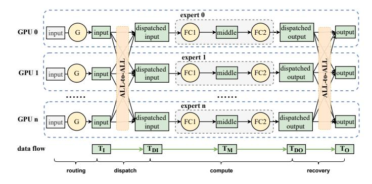

Fig. 1. The illustration of expert parallelism of MoE and its data flow. The green circles represent sub-modules of the MoE layer, and the purple rectangles represent activation tensors of MoE training. For simplicity, We take  $T_I, T_{DI}, T_M, T_{DO}, T_O$  at the bottom of the figure as abbreviations of *input*, *dispatched input*, *middle*, *dispatched output*, *output* tensors, which are in green color.

we holistically combine these two strategies and further propose a profile-based algorithm with a performance model to determine the configurations of MPMoE at runtime. More specifically, we make the following new contributions:

- To jointly optimize pipeline parallelism and memory reuse strategies, we propose a lightweight profilebased algorithm, which leverages profiling information to identify the most suitable configuration at runtime.
- We categorize all the pipeline parallelism patterns into three paradigms and establish performance models to estimate their performance on the fly. We leverage the performance model to determine MPMoE's configuration holistically.
- We conduct experiments in a new cluster, i.e., valor, which consists of 4 servers with 16 NVIDIA Tesla V100. We supplement more analysis experiments and update some existing experiments in various settings.
- We add a micro-benchmark to further validate the communication efficiency of MPMoE. Additional performance breakdown experiments for analyzing the overhead of data partitioning and the efficiency of pipelining are presented.

The rest of this paper is organized as follows. Section 2 gives background and motivations for distributed training of MoE models. Section 3 describes the main system design of MPMoE. Section 4 depicts two methods for optimizing the granularity of pipeline parallelism and memory reuse jointly. Section 5 presents the experimental setup and evaluation results. Section 6 reviews related works. Section 7 concludes the paper.

## 2 BACKGROUND AND MOTIVATION

## 2.1 Mixture of Experts (MoE)

The transformer architecture gained significant attention in the NLP community for its exceptional performance in sequence-to-sequence tasks, particularly in neural machine translation. A transformer model is composed of several blocks, each of which comprises of self-attention, cross-attention, and Feed-Forward-Network (FFN) modules. Ever since, transformer-based models become the top performers in various NLP tasks, such as BERT [5], RoBERTa [7], and GPT-3 [8]. Scaling up the model size results in a significant increase in computational cost for both training and inference. These transformer models are densely activated, meaning that all model parameters are used to process all input examples at a tremendous expense [31].

MoE provides an efficient solution to reducing the cost of training extra-scale models, which incurs only sub-linear compute costs concerning the model size by sparsely activating a subset of the model parameters for given inputs. For example, the cost of training the Switch Transformer [14] with 1.6 trillion parameters is indeed less than the computation budget required to train a dense model with 10 billion parameters. The core component of these MoE models [12], [14], [26] is the MoE layer, which replaces the FFN sub-layer in the original dense transformers.

Expert Parallelism for MoE. In training large-scale MoE models, expert parallelism [14] is commonly employed to mitigate memory footprint by distributing individual experts across multiple devices. As depicted in Figure 1, a gating network assigns a destination device for each token, followed by an All-to-All communication operation. Subsequently, each device executes its local expert, which typically consists of an FFN layer comprising two linear layers and an activation function. Finally, a second All-to-All communication phase is conducted to transmit the processed tokens back to their respective devices.

Inefficient Synchronous Communication. In training MoE models, each expert relies on All-to-All communication to exchange tokens with other devices. However, the communication phase poses a significant time-consuming aspect in the training process [19], [21]. Both the All-to-All and expert process procedures are synchronous operations, involving blocking mechanisms as they wait for the arrival of the required data. These synchronous operations can lead to potential bottlenecks and increased training time. Therefore, optimizing the communication phase is crucial for improving the efficiency and overall performance of MoE models.

## 2.2 Memory Footprint of MoE

#### 2.2.1 Constituents of Memory Footprint

We first analyze the usage of the memory, including model states, activations, and temporary buffers.

TABLE 1
Notations used in memory usage formulation.

| Notation | Definition          | Notation | Definition               |
|----------|---------------------|----------|--------------------------|
| M        | model dimension     | В        | the batch size of tokens |
| H        | hidden dimension    | n        | the number of partitions |
| N        | the number of nodes |          | •                        |

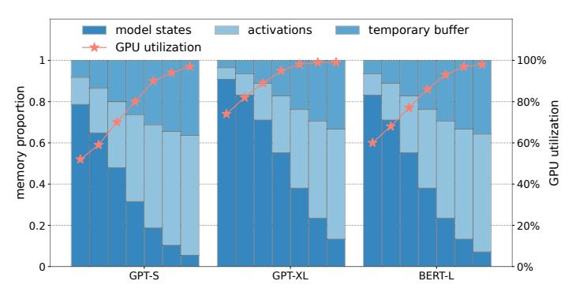

Fig. 2. Breakdown of memory footprint ratio and GPU utilization. The experiments are conducted on three different MoE layers with various numbers of tokens ranging from 256 to 16k with exponential factor 2.

**Model States**. Model states are one of the main contributors to memory consumption during training, which includes parameters, gradients, and optimizer states [25]. For optimizers like ADAM [32], momentum and variance are necessary for update gradients, leading to several times more memory requirement than parameters.

Activations. Activations are the intermediate tensors in forward computing, accounting for a significant amount of memory usage [27], especially for the large batch size. As a concrete example, the 1.5B parameters' GPT-2 model that is trained with a sequence length of 1K and batch size of 32 requires about 60GB of GPU memory.

**Temporary Buffers**. Temporary buffers are used to store intermediate results for a very short period, which are not required for future computation, i.e., the backward pass. For instance, gradients generated in the backward pass are consumed immediately and can be discarded after they are used.

#### 2.2.2 Formulation of Memory Footprint of MoE

In order to analyze the memory footprint of MoE, we provide a detailed depiction of the data flow during the communication and expert computation stages, as illustrated in Figure 1. The process begins with the input tensor  $T_I$ , which is then sliced and dispatched across devices during the All-to-All stage, resulting in the tensor  $T_{DI}$ . Each expert takes  $T_{DI}$  as input and produces output tensors  $T_M$  and  $T_{DO}$  through two sequential linear layers (FFNs). It is worth noting that the activation function is omitted in this case, as in-place operations can be

utilized. Finally, the collective operations on slices of TDO yield the tensor TO.

The memory footprint of model states, activation, and temporary buffers are denoted as Mms, Mact, and Mbuf, respectively. We summarize other notations in Table 1. The structure of an MoE layer consists of a gating network and an expert. As formulated in Equation (1), E∗M equals the number of parameters in the gating network and 2∗H∗M equals that of an expert. Besides, Adam [32] is chosen as the default optimizer, requiring an additional memory footprint for momentum and variance. As a result, it takes 4 times the memory of parameters for storing model states, including parameters, gradients, momentum, and variance.

The memory footprint of activations is summarized in Equation 2, where the shape of tensors T<sup>I</sup> , TDI , TDO, T<sup>O</sup> is (B, M) and the shape of tensor T<sup>M</sup> is (B, H). For simplicity, we do not consider small tensors such as the routing data of the gating network, because their sizes are one to two orders of magnitude smaller than other activation tensors.

In the backward pass, the GPU device is required to allocate temporary buffers to store the gradients of activations which will be discarded as soon as they are used. When operations are executed in sequence, only two adjacent tensors are required to be cached in the device. The formulation of memory footprint is presented in Equation 3, which is the peak requirement of temporary buffers.

$$\mathcal{M}_{\text{ms}} = 4 * (E * M + 2 * H * M)$$
 (1)

$$\mathcal{M}_{\text{act}} = 4 * B * M + B * H \tag{2}$$

$$\mathcal{M}_{\text{buf}} = B * M + B * H \tag{3}$$

To visualize the memory consumption of Mms, Mact, Mbuf, we plot the ratio of memory footprint in different MoE settings as shown in Figure 2. It can be seen that activations and temporary buffers account for the major portions of the memory footprint with the increasing number of tokens. We also monitor the GPU utilization for the experiment. We observe that a small batch size leads to GPU under-utilization, especially for the MoE layer in GPT-S. As a result, it is necessary to increase the batch size for higher GPU utilization. Based on the above observations, we motivate the need to reduce the memory footprint of activation tensors and temporary buffers to train the model with the large batch size.

## **2.3 Feasibility of Parallelism**

The speed of the communication, computation, and memory copy is denoted as Wcomp, Wcomm, and Wmem, respectively. Ideally, three types of operations do not affect each other when they are being executed in parallel because they request individual hardware resources in principle. However, in a real environment, there exists resource competition when executing multiple operations in parallel CUDA streams. For example, the communication and memory copy race for memory band-

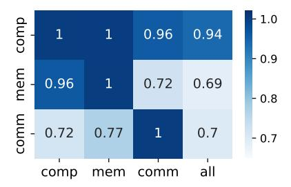

Fig. 3. One case of α(y, x), denoting the slowdown factor of y influenced by x. The range of values for y is "comm", "comp", and "mem", while that for x is extended to include "all". α(y, all) represents the slowdown factor of y when it is simultaneously influenced by the other two operations.

width. Performance slowdown occurs if running multiple NVIDIA Collective Communication Library (NCCL) kernels concurrently with computation kernels on the same device. To quantify the degree of slowdown, we define the α(y, x) as the slowdown factor of y influenced by x. In practice, x and y represent different operations streams, i.e. "comm", "comp", and "mem". Specifically, x has an additional value "all", which is regarded as the case when all three types of CUDA streams are executed in parallel.

The values of α(y, x) indicate the feasibility of parallelism. For example, to take advantage of overlapping between communication and computation, α(comp, comm) and α(comm, comp) are required to be greater than 0.5, otherwise, the execution time of communication or computation would exceed the original end-to-end time, leading to deterioration of the end-toend performance.

To better understand the interference between operations, we run micro-benchmarks in our cluster and measure the actual slowdown factors of communication, computation, and memory copy in different situations. Results are demonstrated in Figure 3, from which we can learn that:

- Slowdown is introduced in communication if we execute computation with communication in parallel. Even though, it is feasible to overlap communication and computation only if we can make sure that α(comm, comp), α(comp, comm) are larger than 0.5.
- Computation is slightly influenced by other operations, which is negligible in terms of end-to-end performance. As a result, we regard α(comp, x) by default in this paper.
- There exists an obvious performance slowdown when communication and memory copy streams are executed in parallel, which is because of bandwidth competition.

The observations above motivate us to design adaptive pipeline parallelism with memory efficiency.


Fig. 4. The illustration of GPipe and micro-batch pipeline parallelism in MPMoE. (a) F and B represent forward pass and backward, respectively. (b) S, C, and R represent the first All-to-All, computation of experts, and the second All-to-All. The serial number in every block represents the index of the micro-batch partition.

## 3 System Design

#### 3.1 Overview

We present the system design of MPMoE. First, we introduce pipeline parallelism for MoE and compare it with FasterMoE. Then, we propose memory reuse strategies to eliminate "memory bubbles" in the pipeline.

#### 3.2 Micro-batch Pipelining

As stated in Section 2.1, the All-to-All operation is the performance bottleneck to scaling out the training of MoE models. Pipeline parallelism, which is known as introduced in GPipe [33], can reduce the overhead of communication by overlapping the computation and communication. As is shown in Figure 4(a), layers of the model are partitioned into multiple stages, which are mapped to separate devices for performing computation. To deal with the severe under-utilization caused by the sequential dependency of the neural network, GPipe divides the input mini-batch into smaller microbatches, allowing different accelerators to work on different micro-batches simultaneously. Inspired by GPipe, the micro-batch parallelism can also be applied to the


Fig. 5. Comparison of the pipeline pattern between FasterMoE and MPMoE.

MoE layers. Note that pipeline is not a new idea [33], [34], however, we draw an analogy between the stages in GPipe and different phases of MoE dataflow, then we introduce pipeline parallelism for MoE.

## 3.2.1 Micro-batch pipelining for MoE

As shown on the top of Figure 4(b), only one minibatch is active for computation or communication in the traditional expert parallelism. In this setup, computation and communication are 'idle' most time. With this in mind, we partition a mini-batch of tokens into multiple micro-batches and execute them in a pipelined manner, sequentially one after another, as illustrated at the bottom of Figure 4(b). Upon the completion of the first All-to-All operation for a micro-batch, experts initiate asynchronous computations while concurrently beginning to receive another mini-batch. Subsequently, the second All-to-All operation commences immediately after the calculations are finished. Moreover, there are no dependencies among operations of different partitions. As a result, we schedule the S and R stages to be executed alternately to enhance the locality of memory accesses. This workflow, consisting of "communication  $\rightarrow$  computation  $\rightarrow$  communication," exhibits symmetry in the backward pass.

## 3.2.2 Comparison with FasterMoE

Difference in Pipeline Parallelism. FasterMoE [21] also adopts pipeline parallelism to improve the efficiency of MoE training. Different from FasterMoE, we apply a distinguishing method to split the batch data and propose a new optimization solution for communication. As shown in Figure 5, the shape of tensor  $T_I$  is (N, B), the first dimension is the number of devices while the second is the batch size of tokens. Each row of the tensor is assigned to the device, which is indicated in a different color in the figure. There exist two methods for splitting  $T_I$  into multiple partitions. The first

method, adopted by FasterMoE, splits  $T_I$  along the node dimension. The All-to-All operation is partitioned into several point-to-point communications among workers for each partition as shown in Figure 5(a). All nodes are divided into several groups, in resulting  $(m-1)\times$ "NCCL group calls" for m groups. In an extreme case where the group size is reduced to 1, the communication pattern degrades to P2P communication. The second method, adopted by ours, splits  $T_I$  along the batch size dimension as shown in Figure 5(b). The original All-to-All is split into a few independently fine-grained ones, each launches a micro All-to-All across all nodes. The former method has three disadvantages. First, the All-to-All communication is broken down into multiple pointto-point communications, making it infeasible to take advantage of optimizations offered by NCCL. Second, in the phase of communication, if the network bandwidth is heterogeneous among workers, the synchronization procedure causes a waste of resources for those workers with higher bandwidth. Finally, because FasterMoE partitions data based on nodes, the pipeline granularity is limited to the number of nodes. However, our approach partitions data based on the batch dimension, and it's flexible to adjust the pipeline granularity to find the best pipelining because each batch contains at least hundreds of tokens for partitioning. As a result, MPMoE adopts the latter method for better performance.

**Difference in Computation**. Leveraging the power of GPU's tensor cores, we harness the computational capabilities of tensor cores in GPUs to expedite the computing process. By utilizing these specialized hardware components, MPMoE achieves an accelerated performance of expert computation.

## 3.3 Memory Reuse

Tensors  $T_{DI}$ ,  $T_M$ , and  $T_{DO}$  are split into n partitions in pipeline parallelism. Different partitions of tensors are activated at different times, resulting in "memory bubbles" as shown at the top of Figure 6. The same operation on different partitions is pipelined into a single stream and executed in sequence. We demonstrate that the input or output tensors of these operations can be shared among partitions to reduce memory redundancy. For example, the *i-th* partition of tensor  $T_M$  is activated for computation at time t and the (i+1)-th partition is activated at time t + 1. Thus we just can allocate one buffer memory to store partitions of  $T_M$  in turn. In this way, the required memory is reduced from mto  $\frac{m}{n}$ , where m is the original memory requirement. Similarly for  $T_{DI}$  and  $T_{DO}$ , each requires two buffers for communication and computation as shown at the bottom case of Figure 6.

The memory reuse method is applicable for temporary buffers. The peak memory requirement of temporary buffers equals that of activations in pipeline parallelism, thus we can obtain  $\mathcal{M}_{buf}^{pipe}$  in Equation 4. With memory reuse, the corresponding reduced memory  $\Delta \mathcal{M}_{buf}$ 

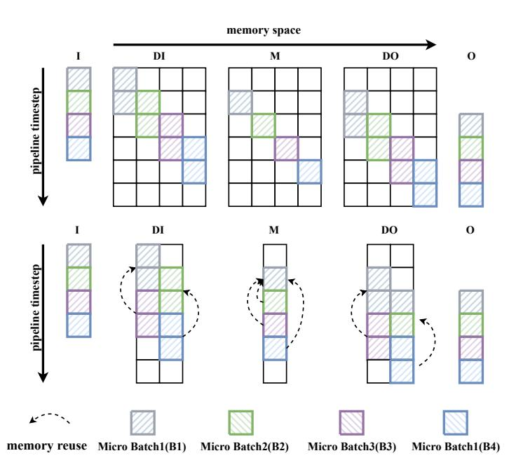

Fig. 6. The illustration of memory reuse. The top figure demonstrates "memory bubbles" in pipeline parallelism and the bottom one shows the compressed memory by memory reuse.

TABLE 2
Different Strategies for Memory Reuse

| strategy | $T_{DI}$      | $T_M$              | strategy | $T_{DI}$ | $T_M$               |
|----------|---------------|--------------------|----------|----------|---------------------|
| S1<br>S2 | offload comm. | offload<br>offload | S3<br>S4 |          | recompute recompute |

equals  $\Delta \mathcal{M}_{act}$ , which is presented in Equation 5. Finally, we can obtain the memory saving ratio  $\phi$  as formulated in Equation 6.

$$\mathcal{M}_{buf}^{pipe} = \mathcal{M}_{act}^{pipe} = 4 * B * M + B * H \tag{4}$$

$$\Delta \mathcal{M}_{buf} = \Delta \mathcal{M}_{act} = B * (2M * \frac{n-2}{n} + H * \frac{n-1}{n})$$
 (5)

$$\phi = \frac{\Delta \mathcal{M}_{act} + \Delta \mathcal{M}_{buf}}{\mathcal{M}_{ms} + \mathcal{M}_{act}^{pipe} + \mathcal{M}_{buf}^{pipe}} \tag{6}$$

After eliminating memory redundancy, tensors  $T_{DI}, T_M$  are overridden by other partitions. However, these tensors are required for computing the gradients in the backward pass. To restore tensors  $T_{DI}, T_M$ , we consider two methods as follows.

- Data offloading. Leveraging the fact that modern GPUs support overlapping computations and data transfers, we can swap data back to the CPU in the forward pass and prefetch data to the GPU memory in the backward pass.
- Communication and re-computation. Tensor  $T_{DI}$  can be transferred again from tensor  $T_I$ . And  $T_M$  can be re-computed from  $T_{DI}$ . Ideally, the additional cost of re-computation can be mitigated if communication is the bottleneck and vice versa.

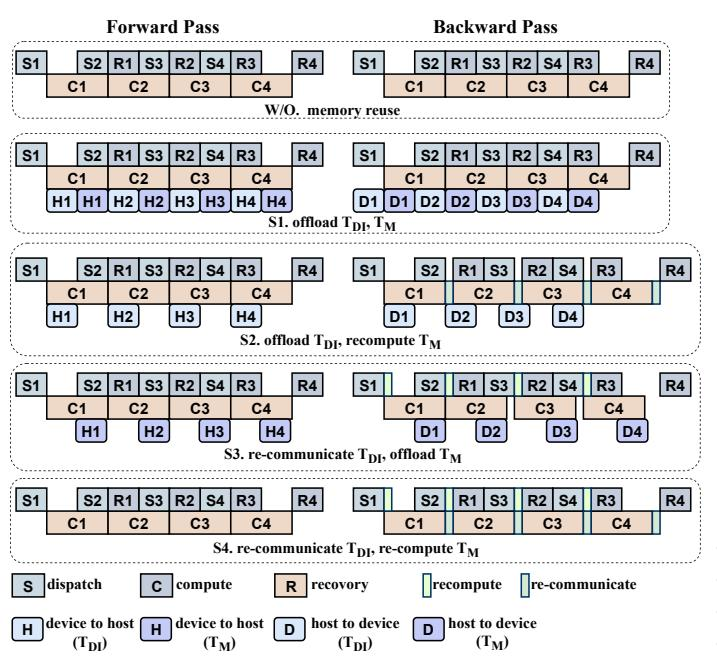

Fig. 7. The timeline of pipeline parallelism and memory reuse.

As a result, we have four memory reuse strategies, i.e., S1, S2, S3, and S4, as listed in Table 2, for MoE training. These strategies distinguish in adopting different methods to restore  $T_{DI}$  and  $T_M$  in the backward pass. Because there is no dependency among operations of different partitions, we schedule S and R in Figure 4(b) to be executed in an alternative manner for the better locality of memory accesses. Compared with the timeline of the pipeline without a memory reuse strategy as shown in Figure 7, S1, S2, and S3 require another CUDA stream to perform memory copy operations in parallel with computation and communication. Specifically, device-tohost and host-to-device memory copy operations are involved in the forward pass and the backward pass, respectively. In S2 and S4, additional communication operations are introduced to restore  $T_{DI}$  in the backward pass. Additional computation operations are also required for restoring  $T_M$  in S3 and S4.

# 4 JOINT OPTIMIZATION OF PIPELINING AND MEMORY REUSE

As described in Section 3.2 and Section 3.3, we propose micro-batch pipelining to mitigate the latency of communication and memory reuse strategies to reduce the memory footprint. However, each design is influenced by certain configurations. First, the performance of the micro-batch pipelining depends on the granularity of the pipeline, which is determined by n. A pipeline that is too coarse-grained may result in insufficient overlap, while a pipeline that is too fine-grained may lead to underutilization of hardware resources such as GPU utilization and network bandwidth. Second, the latency overhead

```
Algorithm 1: Adaptive Pipeline Granularity Search
```

**Input:** the batch size of tokens B

```
Input: the memory reuse strategy S
   Output: the number of partitions n
   /\star SortedDict(\{n_i: (B_i^{floor}, B_i^{ceil}\}))
 1 global: G = \{2 : (0,1), 8 : (\infty,\infty)\};
2 global: \mathcal{C} = \{\};
 \mathfrak{s} if B in \mathcal C then
       return \mathcal{C}[B];
 5 end
 6 ((B^{floor}, B^{ceil}, n_i) = find\_closest\_B(G, B);
   /* find best n for B
7 if (B > B^{ceil}) then
       \_, B^{ceil} = G[n_{i+1}] ;
       n^{floor} = n_i;
9
       n^{ceil} = n_{i+1};
10
       n = searchBestGran(B, (n^{floor}, n^{ceil}));
11
12 end
13 if (B < B^{floor}) then
       B^{floor}, \_ = G[n_{i-1}] ;
       n^{floor} = n_{i-1};
       n^{ceil} = n_i;
16
       n = searchBestGran(B, (n^{floor}, n^{ceil})) ;
17
18 end
   /* update G
                                                               */
19 if (n! = n^{floor} \& \& n! = n^{ceil}) then
       G[n] = (B, B);
21 else
       G[n] = (min(B, B^{lower}), max(B, B^{upper}));
23 end
24 C[B] = n;
25 return n;
```

of memory reuse is affected by the activation-restoring strategies, which is denoted as S. Consequently, we consider the configuration of MPMoE to be (n,S). To determine the optimal configuration, we explore two methods:

- Profile-Based. This method determines the optimal configuration by profiling performance metrics in the real environment. However, this approach incurs the profiling overhead and the search space for configurations increases with the combination of different pipeline granularity and memory reuse strategies.
- Performance Modeling. Establishing a performance model to estimate the performance of different configurations. This method benefits from its fast speed but may struggle to achieve high accuracy in complex product environments.

In this paper, we aim to optimize pipelining and memory reuse strategies jointly by employing the two aforementioned methods. The performance of both methods will be studied in Section 5.

#### 4.1 Profile-Based

As mentioned above, the profile-based method suffers from profiling overhead. To mitigate this, we can cache and reuse all profiling data. However, since the variable B is dynamic and covers a wide range during the training process of MoE models [35], searching for the optimal (n, S) configuration for every value of B is time-consuming.

In order to reduce the search space, we propose solutions based on two intuitive hypotheses: First, n is monotonically increasing as B increases for each S. As a result, the whole value domain of B can be divided into a set of disjoint ranges. We only need to find the boundaries of each range, which reduces the cost of configuration on n by one to two orders of magnitude. Second, given input with batch size equal to B, the performance of the MoE Layers with respect to n is parabola-like. This is reasonable because a very coarsegrained pipeline leads to insufficient overlap and a finegrained pipeline leads to low utilization of hardware resources.

Specifically, we obtain the best configuration for each S as illustrated in Algorithm 1.  $\mathcal C$  is denoted as the cache of searched results and  $G = \{n_1 : (B_1^{floor}, B_1^{ceil}), n_2 :$  $(B_2^{floor}, B_2^{ceil}), \dots \}$  denotes the boundaries of searched ranges, where  $(B_1^{floor}, B_1^{ceil}), (B_2^{floor}, B_2^{ceil})$  correspond to the ranges whose best granularity are  $n_1, n_2$  respectively. Here G is sorted in ascending order according to n, and Bs in G are monotonically increasing with respect to n. When coming to a new B which does not exist in C, we try to find the range i where  $B \geq B_i^{floor}$  and  $B \leq B_i^{ceil}$  and take  $n_i$  as the best granularity, i.e., lines 6. If not found, we obtain  $n_l$  and  $n_h$  from G where range i-1 and range i+1 are the closest ranges to B(values in range i-1 are smaller than B and in range i+1 are bigger than B). Then, we profile the execution time of the program with different granularities ranging from  $n^{floor}$  to  $n^{ceil}$  and obtain the best granularity n, i.e., lines 7-17. Here we call searchBestGran to search for the optimal configuration from  $n^{floor}$  to  $n^{ceil}$ , i.e. line 11, 17. Because the performance concerning n is parabolalike, we can stop the searching process when meeting the tuning point of n. Finally, we update G according to B, n, i.e. lines 19-23. With more training iterations, the boundaries of ranges are more accurate, the profiling processes are fewer and search scopes are fewer. Besides, we initialize G with  $\{1:(0,1),8:(\infty,\infty)\}$  in line 1, indicating the scope of granularity is limited from 2 to 8. This is reasonable because we find it is applicable to the vast majority of scenarios.

Once the optimal pipeline granularity for each memory reuse strategy is chosen, we can configure the optimal (n,S) by simply comparing the results.

## 4.2 Performance Modeling

As mentioned earlier, the profile-based method relies on time-consuming profiling steps. In this section, we aim

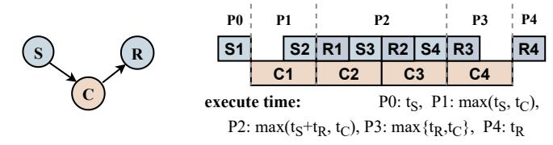

(a) Paradigm 1. Only consider communication and computation. This is applicable to S4.

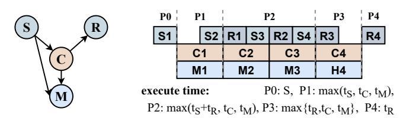

(b) Paradigm 2. This is applicable to forward pass of S1, S2 and S3.

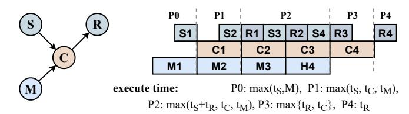

(c) Paradigm 3. This is applicable to backward pass of S1, S2 and S3.

Fig. 8. The illustration of three pipeline paradigms, where S, R, and C have the same meaning as in Figure 4(b), and M represents memory transfer between CPU and GPU respectively. The left DAG graph of each subfigure represents the dependence between different operations of each micro-batch. The right graph of each subfigure describes the pipeline patterns, each includes 5 phases: P0, the initial phase; P1, the saturating phase; P2, the saturated phase; P3, the melting phase; and P4, the final phase. The estimated execution time of each phase is listed in the lower right corner of each subfigure.

to overcome this limitation by developing a lightweight performance model to estimate the execution time of different configurations, which is able to obtain the optimal configuration efficiently. However, we encounter two challenges when constructing the performance model. First, hardware utilization varies with the volume of data, such as underutilized network bandwidth when the data volume of each partition is too low. Second, as explained in Section 2.3, the execution time of communication, computation, and memory copy operations can impact each other when executed in parallel, despite individually requesting different hardware resources in principle.

To address these challenges, we propose two solutions. First, we have developed a piecewise function model to accurately capture the speeds of communication, computation, and memory copying at different data volumes as shown in Figure 9. In a specific product environment, we execute micro-benchmark programs to profile the speeds of these operations independently, which allows us to establish a single performance model that can be applied

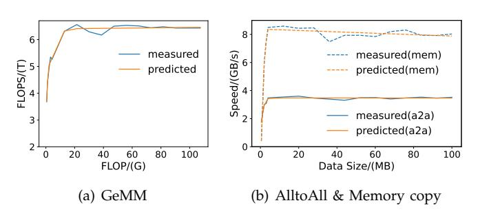

Fig. 9. The micro-benchmarks for profiling and performing piecewise linear fitting of the performance of specific operations.

to multiple models within the same product environment, thereby minimizing overhead. Second, we utilize the workers presented in Section 2.3 to quantify the interference between different operations. These results enable us to measure the impact of executing operations in parallel and account for their mutual influence on performance.

To simplify the representation of different pipeline patterns, we abstract them into three pipeline paradigms, as depicted in Figure 8. The meaning **S**, **R**, **C** is the same as that in Figure 4(b) and we use the symbol **M** to represent the memory transfer between the CPU and GPU. The Paradigm 1 does not contain **M**, which is applicable for S4. The Paradigm 2 involves **M** which depends on **S** and **C** because the activations offloading to CPU are produced from **S** and **C**. The forward pass of S1 to S3 obeys the paradigm 2. **C** in Paradigm 3 depends on **M** because activations must be transferred to GPU before computation, which is applicable for the backward pass of S1 to S3.

For each paradigm, the pipeline can be divided into five phases. 1) P0, the initial phase, in which only one or two CUDA streams are working as usual; 2) P1, the saturating phase, in which all CUDA streams are launching but not saturated; 3) P2, the saturated phase, in which all CUDA streams are saturated and steady, and there may be multiple P2 stages in the whole pipeline; 4) P3, the melting phase, which is similar to P1; 5) P4, the final phase, which is similar to P0.

The estimated execution time of each phase is provided in the right bottom corner of each subfigure depicted in Figure 8. In each phase, the execution time is determined by the bottleneck CUDA stream. For example, the execution time of P2 in paradigm 1 is determined by the maximum execution time of  $\mathbf{R+S}$  and  $\mathbf{C}$ . For the sake of conciseness, we omit the slowdown factors in the formulation of Figure 8. For instance, the complete formulation of P2's execution time in paradigm 1 is  $max(\frac{t_S+t_R}{\alpha(comm,comp)},\frac{t_C}{\alpha(copm,comm)})$ , where  $\alpha$  comes from Section 2.3.

# TABLE 3 Specifications of MoE layers

| Model Name | $d_{model}$ | $d_{hidden}$ | #experts |
|------------|-------------|--------------|----------|
| MoE-GPT-S  | 768         | 3072         | 64/16    |
| MoE-GPT-XL | 2048        | 8192         | 64/16    |
| MoE-BERT-L | 1024        | 4096         | 64/16    |

## **5 EVALUATION**

## 5.1 Experimental Setup

**Software platform:** We implement our approach using PyTorch 1.9, CUDA Toolkit 11.1, NCCL 2.7, and Ubuntu 18.04.

Regarding to **hardware platform**, We evaluate MP-MoE on two representative clusters as follows.

Adira consists of 8 NVIDIA DGX A100 servers. Each node is equipped with 8 A100 40GB GPUs and 200 Gbps HDR InfiniBand. GPUs are connected by the 3-rd generation NVLink within each machine. We regard Adira as a representative of supercomputers.

Valor is a cluster with 16 GPUs on 4 worker nodes. Each node is equipped with 4 GPUs, and each GPU is NVIDIA Tesla V100 with 16GiB HBM. These nodes are connected by 56Gbps HDR Infiniband, and GPUs are connected by the 2-rd generation NVLink within each machine. Valor cluster represents a common class of hardware widely used in Deep Learning training.

## 5.2 Methodology

**Models and configurations** The significant difference in the MoE layer among various models stems from the size of experts, determined by M and H, as well as the number of tokens denoted as B. In this study, our objective is to validate the effectiveness of the proposed methods on different expert sizes and batch sizes. To achieve this, we configure the expert sizes of the feedforward networks in BERT [5] and GPT-3 [8], as outlined in Table 3. Here,  $d_{model}$  denotes the token embedding dimension, and  $d_{hidden}$  represents the hidden dimension of the FFN layer in the respective models. To conduct our experiments, we create a dummy dataset by generating random tokens as input for the different models. For all experiments, we employ the Adam optimizer [32]. The efficiency of the MPMoE (Mixture Proportion MoE) method is evaluated based on the average training time and the peak memory footprint.

To demonstrate the performance gain and memory efficiency, we compare MPMoE against the state-of-art system *FasterMoE* [21], which implements dynamic shadowing and pipeline parallelism in MoE training. We choose *FastMoE* [36] as another competitor, which utilizes primitive expert parallelism without pipeline parallelism.

We implement two versions of MPMoE: MPMoE-pb and MPMoE-pm, which differ in how to joint optimization for pipelining and memory reuse. The former


Fig. 10. The speedup of different methods in MoE training with the same model setting and the number of tokens B. The format of x-axis is "model\_name(B)".

utilizes a profile-based method, while the latter relies on the performance model as described in Section 4.2 to optimize pipelining and memory reuse in a unified manner.

## 5.3 Overall Speedup

Figure 10 presents the speedup achieved by MPMoE-pb and MPMoE-pm compared to FastMoE and FasterMoE in model training. In comparison to FasterMoE, MPMoEpb and MPMoE-pm achieve an average speedup of  $1.66\times$  and  $1.55\times$ , respectively, across various models and batch sizes. When compared to FastMoE, MPMoEpb and MPMoE-pm achieve an average speedup of  $2.34\times$  and  $2.20\times$ , respectively. The superior performance of FasterMoE over FastMoE can be attributed to the utilization of pipeline parallelism and the overlapping of computation and communication. Notably, MPMoEpb and MPMoE-pm can enhance the speedup up to 2.32× when compared to FasterMoE. This significant improvement is largely due to the efficient communication pattern and the adaptive configuration of pipeline granularity employed by MPMoE-pb and MPMoE-pm.

On the Adira cluster, MPMoE-pm exhibits inferior performance compared to MPMoE-pb. This discrepancy can be attributed to the more obvious network fluctuations on the Adira cluster, which consequently degrade the prediction accuracy of the performance model. Conversely, MPMoE-pm demonstrates comparable performance on the Valor cluster.

## 5.4 Memory Footprint Reduction

MPMoE-pb and MPMoE-pm have the same memory footprint when considering the same setting and the same n. Therefore, we do not differentiate between the two and refer to them both as MPMoE here. Additionally, the memory footprint of these approaches is independent of the cluster being used. Therefore, we do not distinguish between the Adira and Valor clusters in this experiment.

Figure 11 illustrates the overall memory footprint of the approaches. The left y-axis represents the memory footprint normalized to that of PMoE, which is a

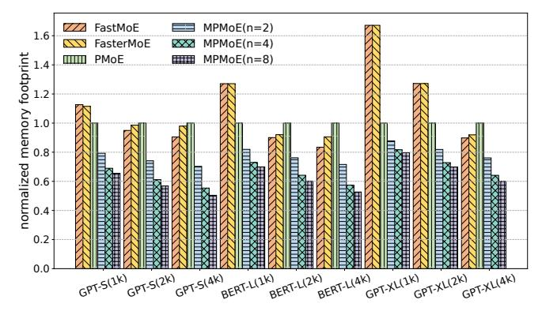

Fig. 11. The memory footprint reduction by MPMoE. The y-axis shows the ratio of memory footprint normalized to PMoE.


Fig. 12. The MPMoE achieved memory reduction ratios compared to their theoretical results on three model settings with the varying number of partitions n (2,4,8) and batch sizes.

variant of MPMoE without memory reuse strategies. PMoE serves as the baseline for comparing the memory footprint of MPMoE. As indicated by Equation 6, the memory footprint of MPMoE decreases monotonically with an increasing number of pipeline stages, denoted as n. This trend is verified in Figure 11, where MPMoE achieves an average memory footprint reduction of 23%, 34%, and 38% for n values of 2, 4, and 8, respectively. In comparison to FastMoE and FasterMoE, MPMoE achieves a memory footprint reduction of up to 53%.

In Section 3.3, Equation 6 presents the theoretical upper bound for memory savings achieved by MPMoE. To validate the effectiveness of this analysis, we provide the actual memory-saving ratios achieved in comparison to the theoretical bound. Figure 12 illustrates these results. We conducted experiments on three different models, varying the number of partitions n and the batch size of tokens B to cover a wide range of scenarios. The experiments demonstrate that MPMoE achieves approximately 95% of the theoretical bound in terms of memory savings. It is partially because we do not consider extremely small-size tensors, such as routing data generated by gating networks. Additionally, there may be memory fragments during the memory allocation process, leading to a slight discrepancy between the achieved results and the theoretical predictions.

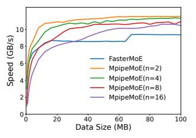

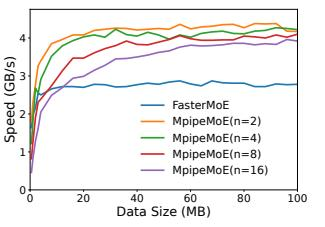

- (a) Micro-benchmarks on adira-
- (b) Micro-benchmarks on valor.

Fig. 13. Micro-benchmarks for comparing communication efficiency between FasterMoE and MPMoE.

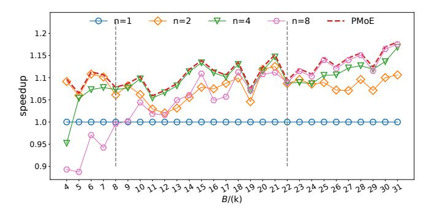

Fig. 14. The effects of pipeline parallelism on various pipeline granularity. The dashed line represents the adaptive granularity selected by the profile-based algorithm. The x-axis represents various B values.

## 5.5 Ablation Studies

## 5.5.1 Communication Efficiency

Figure 13(a) and Figure 13(b) provide a comparison of the communication speed between FasterMoE and MPMoE with different pipeline granularities on the adira and valor clusters, respectively. In this experiment, we focus on measuring the execution time of the "dispatch" and "recovery" phases, as depicted in Figure 1. Faster-MoE exhibits poorer performance due to the launch of multiple point-to-point (p2p) communications across nodes separately. On the contrary, MPMoE employs data splitting across batch dimensions. Although there is an increase in the overhead of kernel launches and a decrease in network efficiency as n (pipeline granularity) increases, MPMoE runs faster and is able to exploit more opportunities for pipelining.

#### 5.5.2 Sensitive Analysis of Pipeline Granularity

For the sake of simplicity, we present the effectiveness of the adaptive pipeline granularity configuration of PMoE, which is independent of the memory reuse strategies.

As discussed in Section 4.1, we propose the hypothesis that the value of n monotonically increases as the batch size B increases. To verify this hypothesis, we evaluate the performance of different pipeline granularities and various batch sizes of tokens on the GPT-XL model. The results are illustrated in Figure 14, confirming that the optimal configuration of n depends on the batch size. Specifically, when the batch size is smaller than 8k, n=2


Fig. 15. The overhead of memory reuse strategies and the effectiveness of the strategy selection method in MP-MoE on Adira. The ticks on the x-axis represent different numbers of GPUs N and the batch size of tokens B in format (N,B).

yields the best performance. For batch sizes ranging from 8k to 22k, n=4 ensures optimal performance. Finally, when the batch size exceeds 22k, the optimal configuration becomes n=8. Furthermore, Figure 14 also demonstrates the sensitivity of pipeline effectiveness to the value of n.

## 5.5.3 Overhead of Memory Reuse Strategies

In terms of execution time, MPMoE performs worse than PMoE because MPMoE achieves memory efficiency with some additional overhead. MPMoE features four memory reuse strategies, i.e., S1, S2, S3, and S4 as defined in Table 2, which resort to re-computation/communication and CPU offloading to restore activation tensors in the backward pass. For overhead analysis of the strategies, we conduct experiments with different numbers of GPUs N and various batch sizes of tokens B on adira. Figure 15 presents the results, from which we can observe that:

- *S*1 and *S*2 perform better when *N* is small, e.g., 8, but worse with a larger *N*, e.g., 64. *S*1 and *S*2 introduce additional memory copy operations while *S*2 introduces additional communication operations. With the increasing number of workers, the cost of communication also increases, which results in worse performance for *S*2 due to the competition on the memory bandwidth between memory copy and communication.
- Both S3 and S4 introduce additional computational costs, which perform worse if the workload is computation-bound, i.e., N=8.
- S4 performs better than S2 if N equals 32 or 64, in which communication is the bottleneck because memory copy over PCIe in S2 slows down communication operations.
- There is not much performance variation with the varying batch sizes, indicating that the batch size is not sensitive to the configuration of strategy.

Based on these observations, we can conclude that there does not exist a single memory reuse strategy that can ensure the best performance in all situations.

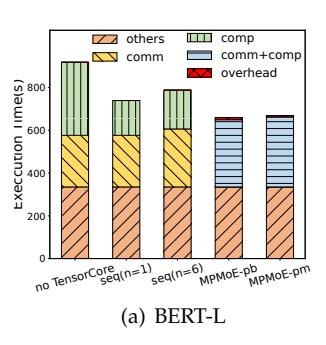


Fig. 16. Performance breakdown. An example of training MoELayers of BERT-L and GPT-XL with input batch size equals 32 in 10000 steps on valor cluster.

So MPMoE-pb takes profile executions and MPMoE-pm builds a performance model to decide the optimal strategy.

## 5.6 Performance Breakdown and Overhead Analysis

Compared with native MoE, the overheads of MPMoE come from two aspects: 1) data partition cost when using pipelining, 2) the overheads of profiling for finding optimal granularity dynamically. To analyze the overheads and the profits of our designs, we train BERT-L and GPT-XL in five ways as shown in Figure 16(a) and Figure 16(b): 1) *no TensorCore*, in this approach, the usage of the tensor core is disabled manually and the data is not partitioned. 2) seq(n=1), in this approach, the data is not partitioned, and no overlap here. 3) seq(n=6), where data are split into 6 parts but executed in sequence, 4) MPMoE-pb and 5) MPMoE-pm. We select n=6in the second experiment because the average n of MPMoE-pb is around 6. Apart from computation and communication which have the potential to be pipelined, the execution times of others like gating are unaffected by the training methods, so we ignore others in the following analysis.

As shown in Figure 16, The usage of tensor core(seg(n=1)) reduces the computation time by 58% and 44% and introduces 26% and 23% end-to-end performance improvement compared with no TensorCore on BERT-L and GPT-XL respectively. seq(n=6) introduces 12% and 4% additional time on the two models respectively. The model size of GPT-XL is larger than BERT-L and the operations per micro-batch are still able to saturate the hardware resources, resulting in a lower cost than BERT-L. Compared with seq(n=6), MPMoE-pb reduces 30% and 23% communication and computation time with 3% and 2.6% additional profiling overhead for BERT-L and GPT-XL separately, and MPMoE-pm achieves 27% and 22% reduction with no more than 1% additional overhead. Considering the profiling overhead, MPMoE-pm achieves comparable performance with MPMoE-pb. The ideal performance of MP-MoE is  $max\{comm, comp\}$  of seq(n=6). Both MPMoE-pb

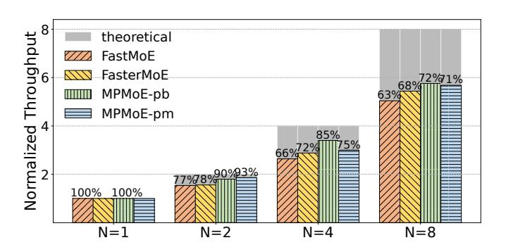

Fig. 17. Comparasions of Multi-Node scaling performance on Adira, where N represents the number of nodes and the y-axis shows the throughput normalized to that of N=1. The number annotated above each bar is the percentage of actual scaling relative to ideal scaling.

and *mPMoE-pm* achieve 70% of the maximum theoretical performance. Because we introduce memory copy operations for memory footprint efficiency, the discrepancy in the theoretical performance is reasonable.

## 5.7 Scalability Analysis

As shown in Figure 17, we conduct a scalability analysis of MPMoE on Adira with different numbers of nodes. Each bar denotes the average results across different workloads in Table 3 and batch sizes ranging from 32 to 128. We measured the throughput improvement when running on multiple nodes compared to a single node in Fig. 17. The ideal scaling performance of N nodes is *N* times the single-node throughput. However, network communication overhead inevitably reduces the practical scaling factor. The experiments demonstrate that MPMoE increases throughput by 5.76× (72% of the ideal scaling) when scaling up to 8 nodes, while Faster-MoE only achieves  $5.4\times$ . This highlights the superior scalability of our approach compared to FasterMoE's. With slightly more profiling overhead, MPMoE-pb outperforms MPMoE-pm since the profile-based algorithm can find the optimal pipeline configuration as network bandwidth changes with N. Compared to FastMoE and FasterMoE, our methods consistently perform better, demonstrating MPMoE's stronger adaptability to varying cluster sizes.

## 6 RELATED WORK

#### Mixture-of-Experts (MoE).

Several techniques have been proposed to improve the training efficiency of MoE models. Gating Dropout [19] allows tokens to ignore the gating network and keeps the input at the local machines, reducing crossmachine communication. Different from MPMoE, Gating Dropout alters the routing strategy of MoE models, which can affect model accuracy. DeepSpeed MoE [20] proposes the hierarchical All-to-All and implements custom CUDA kernels to scale expert parallelism out

to many devices as the latency increases linearly with the increase in devices. However, DeepSpeed MoE still uses synchronous communication and does not take pipelines to hide communication latency. Z-code multilingual Multitask MoE model [26] proposes the Zero [25] Redundancy Optimizer to reduce memory footprint. Compared with Zero [25], we reduce not only the memory footprint of model states but also that of activations. In parallel with our work, [22] accelerates DNN training using SPMD parallelism and overlap communication and computation of two micro-batches. Unlike our approach, SPMD uses a fixed pipeline granularity that cannot adapt to various workloads and running environments. Lita [37] accelerates MoE training by computation-communication overlapping and experts packing to reduce the All-to-All transfer size. Smart-MoE [38] concentrates on hybrid parallelism and automating the parallelization process. Compared with Lita and FasterMoE, MPMoE not only improves communication efficiency but also reduces memory footprint to alleviate device memory requirements. FasterMoE [21] designs a congestion-avoiding expert selection strategy that relieves network congestion to achieve lower training latency.

**Data, Model, Pipeline, and Expert Parallelism**. Parallelization is a key strategy for training large models at scale. For a model that fits in the device memory for training, data parallelism (DP) [39]–[41] is used to scale training out to multiple devices. In DP, model parameters are replicated on each device. At each step, mini-batch data is divided evenly across all the data parallel processes, such that each process executes the forward pass and backward pass on a different subset of data samples, and uses averaged gradients across processes to update the model locally. To support training giant models, model parallelism (MP) [42] and pipeline parallelism (PP) [42], [43], Pipedream [34] splits the model among processes in either vertical or horizontal ways. Expert parallelism [14] is another form of model parallelism targeting expert parameters of MoE models. In expert parallelism, different experts are placed on different devices and executed in parallel. When experts reside on different GPU devices, explicit communication using the All-to-All primitive is required.

**Approaches for Memory Footprint Reduction**. In addition to parallelism-based approaches, multiple lines of work target reducing memory overheads of DL training. [27] proposes an algorithm to checkpoint memory by only storing the activations of a subset of layers, rather than those of each layer as usual. The activations that are discarded are recomputed when necessary during the backward pass. [28], [44] exploits the heterogeneous nature of modern hardware by offloading model states to CPU memory through algorithmic design and virtualized memory. Reducing the mini-batch size is effective at reducing the memory footprint during training. However, it adversely affects the runtime of the training process because smaller mini-batch size leads to underutilized GPU [45].

## **7 CONCLUSION**

MoE is a promising technology for improving model quality by scaling the neural network to an extra scale. In this paper, we consider the high performance and memory efficiency of MoE model training in a holistic manner. First, we design a pipeline parallelism method for reducing communication latency by overlapping with the computation operations. Second, we analyze the memory footprint breakdown of MoE training and propose efficient memory reuse strategies to reduce memory requirements by eliminating memory redundancies. Toward this end, we design a profile-based algorithm and a performance model for optimizing pipeline and memory reuse jointly. We implement and integrate these features into MPMoE and perform extensive evaluations. The results show that MPMoE achieves 2.3× speedup and reduces memory footprint by more than 30% compared to FasterMoE.

## **ACKNOWLEDGMENT**

This work was supported by the National Key Research and Development Program of China (2023YFE0205700), National Natural Science Foundation of China (62302348, 62341410), Fundamental Research Funds for the Central Universities (2042023kf0132), General Program of Hubei Provincial Natural Science Foundation of China (2023AFB831), the Young Teachers' Subsidy Project (2042023kf0132), Special Fund of Hubei Luojia Laboratory (220100016) and the Science and Technology Development Fund (FDCT) Macau SAR (File no. 0078/2023/AMJ).

## **REFERENCES**

- [1] W. Xiao, S. Ren, Y. Li, Y. Zhang, P. Hou, Z. Li, Y. Feng, W. Lin, and Y. Jia, "Antman: Dynamic scaling on gpu clusters for deep learning," in *Proc. of USENIX OSDI*, 2020, pp. 533–548.
- [2] D. Cheng, X. Zhou, Z. Ding, Y. Wang, and M. Ji, "Heterogeneity aware workload management in distributed sustainable datacenters," *IEEE Transactions on Parallel and Distributed Systems*, vol. 30, no. 2, pp. 375–387, 2018.
- [3] X. Jia, L. Jiang, A. Wang, W. Xiao, Z. Shi, J. Zhang, X. Li, L. Chen, Y. Li, Z. Zheng *et al.*, "Whale: Efficient giant model training over heterogeneous gpus," in *USENIX Annual Technical Conference*, 2022, pp. 673–688.
- [4] S. Wang, O. J. Gonzalez, X. Zhou, T. Williams, B. D. Friedman, M. Havemann, and T. Woo, "An efficient and non-intrusive gpu scheduling framework for deep learning training systems," in *Proc. IEEE/ACM SC*, 2020.
- [5] J. D. M.-W. C. Kenton and L. K. Toutanova, "Bert: Pre-training of deep bidirectional transformers for language understanding," in *Proceedings of NAACL-HLT*, 2019, pp. 4171–4186.
- [6] C. Raffel, N. Shazeer, A. Roberts, K. Lee, S. Narang, M. Matena, Y. Zhou, W. Li, P. J. Liu *et al.*, "Exploring the limits of transfer learning with a unified text-to-text transformer." *J. Mach. Learn. Res.*, vol. 21, no. 140, pp. 1–67, 2020.
- [7] Y. Liu, M. Ott, N. Goyal, J. Du, M. Joshi, D. Chen, O. Levy, M. Lewis, L. Zettlemoyer, and V. Stoyanov, "Roberta: A robustly optimized bert pretraining approach," *arXiv preprint arXiv:1907.11692*, 2019.

- [8] T. Brown, B. Mann, N. Ryder, M. Subbiah, J. D. Kaplan, P. Dhariwal, A. Neelakantan, P. Shyam, G. Sastry, A. Askell *et al.*, "Language models are few-shot learners," *Advances in neural information processing systems*, vol. 33, pp. 1877–1901, 2020.
- [9] Z. Zhang, L. Ding, D. Cheng, X. Liu, M. Zhang, and D. Tao, "Bliss: Robust sequence-to-sequence learning via self-supervised input representation," *arXiv preprint arXiv:2204.07837*, 2022.
- [10] Q. Zhong, L. Ding, J. Liu, B. Du, and D. Tao, "E2s2: Encodingenhanced sequence-to-sequence pretraining for language understanding and generation," *arXiv preprint arXiv:2205.14912*, 2022.
- [11] Q. Zhong, L. Ding, Y. Zhan, Y. Qiao, Y. Wen, L. Shen, J. Liu, B. Yu, B. Du, Y. Chen *et al.*, "Toward efficient language model pretraining and downstream adaptation via self-evolution: A case study on superglue," *arXiv preprint arXiv:2212.01853*, 2022.
- [12] N. Shazeer, A. Mirhoseini, K. Maziarz, A. Davis, Q. Le, G. Hinton, and J. Dean, "Outrageously large neural networks: The sparselygated mixture-of-experts layer," *arXiv preprint arXiv:1701.06538*, 2017.
- [13] D. Lepikhin, H. Lee, Y. Xu, D. Chen, O. Firat, Y. Huang, M. Krikun, N. Shazeer, and Z. Chen, "Gshard: Scaling giant models with conditional computation and automatic sharding," *arXiv preprint arXiv:2006.16668*, 2020.
- [14] W. Fedus, B. Zoph, and N. Shazeer, "Switch transformers: Scaling to trillion parameter models with simple and efficient sparsity," 2021.
- [15] M. Lewis, S. Bhosale, T. Dettmers, N. Goyal, and L. Zettlemoyer, "Base layers: Simplifying training of large, sparse models," in *Proc. of ICML*. PMLR, 2021, pp. 6265–6274.
- [16] K. S. Khorassani, C.-H. Chu, Q. G. Anthony, H. Subramoni, and D. K. Panda, "Adaptive and hierarchical large message all-to-all communication algorithms for large-scale dense gpu systems," in *2021 IEEE/ACM 21st International Symposium on Cluster, Cloud and Internet Computing (CCGrid)*. IEEE, 2021, pp. 113–122.
- [17] Q. Kang, R. Ross, R. Latham, S. Lee, A. Agrawal, A. Choudhary, and W.-k. Liao, "Improving all-to-many personalized communication in two-phase i/o," in *SC20: International Conference for High Performance Computing, Networking, Storage and Analysis*. IEEE, 2020, pp. 1–13.
- [18] K. Fan, T. Gilray, V. Pascucci, X. Huang, K. Micinski, and S. Kumar, "Optimizing the bruck algorithm for non-uniform all-to-all communication," in *Proceedings of the 31st International Symposium on High-Performance Parallel and Distributed Computing*, 2022, pp. 172–184.
- [19] R. Liu, Y. J. Kim, A. Muzio, and H. Hassan, "Gating dropout: Communication-efficient regularization for sparsely activated transformers," in *Proc. of ICML*. PMLR, 2022, pp. 13 782–13 792.
- [20] S. Rajbhandari, C. Li, Z. Yao, M. Zhang, R. Y. Aminabadi, A. A. Awan, J. Rasley, and Y. He, "Deepspeed-moe: Advancing mixtureof-experts inference and training to power next-generation AI scale," in *Proc. of ICML*, vol. 162, 2022, pp. 18 332–18 346.
- [21] J. He, J. Zhai, T. Antunes, H. Wang, F. Luo, S. Shi, and Q. Li, "Fastermoe: modeling and optimizing training of large-scale dynamic pre-trained models," in *Proc. of ACM PPoPP*, 2022, pp. 120– 134.
- [22] S. Zhang, L. Diao, C. Wu, S. Wang, and W. Lin, "Accelerating large-scale distributed neural network training with spmd parallelism," in *Proceedings of the 13th Symposium on Cloud Computing*, 2022, pp. 403–418.
- [23] S. Wang, A. Pi, and X. Zhou, "Scalable distributed dl training: Batching communication and computation," in *Proceedings of the AAAI Conference on Artificial Intelligence*, 2019.
- [24] NVIDIA, "Optimized primitives for collective multi-gpu communication," https://github.com/NVIDIA/nccl.
- [25] S. Rajbhandari, J. Rasley, O. Ruwase, and Y. He, "Zero: Memory optimizations toward training trillion parameter models," in *Proc. of IEEE/ACM SC*, 2020, pp. 1–16.
- [26] Y. J. Kim, A. A. Awan, A. Muzio, A. F. C. Salinas, L. Lu, A. Hendy, S. Rajbhandari, Y. He, and H. H. Awadalla, "Scalable and efficient moe training for multitask multilingual models," *arXiv preprint arXiv:2109.10465*, 2021.
- [27] T. Chen, B. Xu, C. Zhang, and C. Guestrin, "Training deep nets with sublinear memory cost," *arXiv preprint arXiv:1604.06174*, 2016.
- [28] M. Rhu, N. Gimelshein, J. Clemons, A. Zulfiqar, and S. W. Keckler, "vdnn: Virtualized deep neural networks for scalable, memoryefficient neural network design," in *Proc. of IEEE MICRO*, 2016, pp. 1–13.

- [29] E. Choukse, M. B. Sullivan, M. O'Connor, M. Erez, J. Pool, D. Nellans, and S. W. Keckler, "Buddy compression: Enabling larger memory for deep learning and hpc workloads on gpus," in *Proc. of ACM/IEEE ISCA*, 2020, pp. 926–939.
- [30] Z. Zhang, D. Yang, Y. Xia, L. Ding, D. Tao, X. Zhou, and D. Cheng, "Mpipemoe: Memory efficient moe for pre-trained models with adaptive pipeline parallelism," in *2023 IEEE International Parallel and Distributed Processing Symposium (IPDPS)*. IEEE, 2023, pp. 167–177.
- [31] S. Smith, M. Patwary, B. Norick, P. LeGresley, S. Rajbhandari, J. Casper, Z. Liu, S. Prabhumoye, G. Zerveas, V. Korthikanti *et al.*, "Using deepspeed and megatron to train megatron-turing nlg 530b, a large-scale generative language model," *arXiv preprint arXiv:2201.11990*, 2022.
- [32] D. P. Kingma and J. Ba, "Adam: A method for stochastic optimization," in *Proc. of ICLR*, 2015.
- [33] Y. Huang, Y. Cheng, A. Bapna, O. Firat, D. Chen, M. Chen, H. Lee, J. Ngiam, Q. V. Le, Y. Wu *et al.*, "Gpipe: Efficient training of giant neural networks using pipeline parallelism," *Advances in neural information processing systems*, vol. 32, 2019.
- [34] A. Harlap, D. Narayanan, A. Phanishayee, V. Seshadri, N. Devanur, G. Ganger, and P. Gibbons, "Pipedream: Fast and efficient pipeline parallel dnn training," *arXiv preprint arXiv:1806.03377*, 2018.
- [35] C. Hwang, W. Cui, Y. Xiong, Z. Yang, Z. Liu, H. Hu, Z. Wang, R. Salas, J. Jose, P. Ram *et al.*, "Tutel: Adaptive mixture-of-experts at scale," *arXiv preprint arXiv:2206.03382*, 2022.
- [36] J. He, J. Qiu, A. Zeng, Z. Yang, J. Zhai, and J. Tang, "Fastmoe: A fast mixture-of-expert training system," *arXiv preprint arXiv:2103.13262*, 2021.
- [37] J. Li, Y. Jiang, Y. Zhu, C. Wang, and H. Xu, "Lita: Accelerating distributed training of sparsely activated models," *arXiv preprint arXiv:2210.17223*, 2022.
- [38] M. Zhai, J. He, Z. Ma, Z. Zong, R. Zhang, and J. Zhai, "{SmartMoE}: Efficiently training {Sparsely-Activated} models through combining offline and online parallelization," in *2023 USENIX Annual Technical Conference (USENIX ATC 23)*, 2023, pp. 961–975.
- [39] D. Yang, W. Rang, and D. Cheng, "Mitigating stragglers in the decentralized training on heterogeneous clusters," in *Proceedings of the 21st International Middleware Conference*, 2020, pp. 386–399.
- [40] A. Sergeev and M. Del Balso, "Horovod: fast and easy distributed deep learning in tensorflow," *arXiv preprint arXiv:1802.05799*, 2018.
- [41] J. Dean, G. Corrado, R. Monga, K. Chen, M. Devin, M. Mao, M. Ranzato, A. Senior, P. Tucker, K. Yang *et al.*, "Large scale distributed deep networks," *Advances in neural information processing systems*, vol. 25, 2012.
- [42] N. Shazeer, Y. Cheng, N. Parmar, D. Tran, A. Vaswani, P. Koanantakool, P. Hawkins, H. Lee, M. Hong, C. Young *et al.*, "Meshtensorflow: Deep learning for supercomputers," *Advances in neural information processing systems*, vol. 31, 2018.
- [43] Y. Xia, Z. Zhang, H. Wang, D. Yang, X. Zhou, and D. Cheng, "Redundancy-free high-performance dynamic gnn training with hierarchical pipeline parallelism," in *Proceedings of the 32nd International Symposium on High-Performance Parallel and Distributed Computing*, 2023, pp. 17–30.
- [44] B. Pudipeddi, M. Mesmakhosroshahi, J. Xi, and S. Bharadwaj, "Training large neural networks with constant memory using a new execution algorithm," *arXiv preprint arXiv:2002.05645*, 2020.
- [45] P. Goyal, P. Dollar, R. Girshick, P. Noordhuis, L. Wesolowski, ´ A. Kyrola, A. Tulloch, Y. Jia, and K. He, "Accurate, large minibatch sgd: Training imagenet in 1 hour," *arXiv preprint arXiv:1706.02677*, 2017.


**Zheng Zhang** (zzhang3031@whu.edu.cn) received his B.S degree in Computer Science from School of Computer Science, Wuhan University in 2017. He is currently pursuing his Ph.D in Computer Science at Wuhan University. His research interests are distributed deep learning model training and deployment, DNN network optimization.


**Xiaobo Zhou** (waynexzhou@um.edu.mo) obtained the BS, MS, and PhD degrees in Computer Science from Nanjing University, in 1994, 1997, and 2000, respectively. Currently he is a Distinguished Professor of IOTSC and Department of Computer and Information Sciences, University of Macau. His research lies in Distributed Systems and Cloud Computing. He serves as the Chair of IEEE Technical Community in Distributed Processing. He is a senior member of the IEEE.


**Yaqi Xia** (yaqixia@whu.edu.cn) received his BS and MS degrees in Electrical Engineering from the Xidian University in 2018 and 2021, respectively. He is currently pursuing his Ph.D. in Computer Science at Wuhan University. His research interests are distributed deep learning model training and deployment, and graph neural network (GNN) optimization.


**Dazhao Cheng** (dcheng@whu.edu.cn) received his B.S and M.S degrees in Electrical Engineering from the Hefei University of Technology in 2006 and the University of Science and Technology of China in 2009. He received his Ph.D from the University of Colorado at Colorado Springs in 2016. He was an AP at the University of North Carolina at Charlotte in 2016-2020. He is currently a professor in the School of Computer Science at Wuhan University. His research interests include big data and cloud computing.


**Hulin Wang** (wonghulin@whu.edu.cn) received his B.S degree in Computer Science from School of Computer Science, Wuhan University in 2017. He is currently pursuing his Ph.D in Computer Science at Wuhan University. His research interests are GPU kernel optimization and inference of DNN models.


**Donglin Yang** (dongliny@nvidia.com) received his B.S. degree in Electrical Engineering from Sun Yat-sen University and his Ph.D. in the Computer Science Department at the University of North Carolina at Charlotte in 2022. He is currently a Deep Learning Software Engineer at NVIDIA, working on TensorFlow Core/XLA.


**Chuang Hu** (handc@whu.edu.cn) received his B.S and M.S. degrees in Computer Science from Wuhan University in 2013 and 2016. He received his Ph.D degree from the Hong Kong Polytechnic University in 2019. He is currently an Associate Researcher in the School of Computer Science at Wuhan University. His research interests include edge learning, federated learning/analytics, and distributed computing.