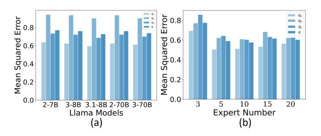
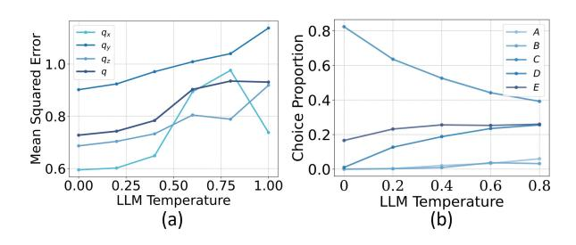

# Marrying LLMs with Dynamic Forecasting: A Graph Mixture-of-expert Perspective

### Dapeng Jiang

Tsinghua University jdp22@mails.tsinghua.edu.cn

# Xiao Luo[\\*](#page-0-0)

University of California, Los Angeles xiaoluo@cs.ucla.edu

### Abstract

Dynamical system modeling is a crucial area of research in machine learning with extensive applications in physics and social science. Recent data-driven approaches often employ graph neural networks (GNNs) to learn relationships in dynamical systems using message passing mechanisms. Despite their advancements, these methods often suffer from performance degradation when it comes to potential environmental change with distribution shifts in real-world applications. In this work, we propose a new perspective which leverages large language models (LLMs) to enhance the generalization capabilities of dynamical system modeling. In particular, we develop a novel framework named LLM Judge with Graph Mixtureof-expert (LEGO), which incorporates multiple graph experts to learn diverse dynamics within the systems. More importantly, LEGO utilizes LLMs with hierarchical prompts at object, edge, and system levels as a context-aware routing function to determine which experts carry the most relevant information to different environments. The whole framework is optimized by updating the weights and expert parameters in an alternative fashion. Extensive experiments across various datasets demonstrate the effectiveness of our proposed LEGO in comparison to extensive baselines.

# 1 Introduction

Dynamical system modeling and forecasting play a crucial role in understanding how systems evolve across various domains, including fluid mechanics [\(Pfaff et al.,](#page-10-0) [2021;](#page-10-0) [Rajani et al.,](#page-10-1) [2020;](#page-10-1) [Wang](#page-10-2) [et al.,](#page-10-2) [2024a\)](#page-10-2), climate change [\(Choi et al.,](#page-8-0) [2023;](#page-8-0) [Zlatev et al.,](#page-11-0) [2020\)](#page-11-0), and molecular science [\(Zeng](#page-11-1) [et al.,](#page-11-1) [2020;](#page-11-1) [Ishiai et al.,](#page-9-0) [2024\)](#page-9-0). To capture interactions between different objects within these systems, people construct geometric graphs where

edges are from prior information or Euclidean distances. Recent advancements [\(Kipf and Welling,](#page-9-1) [2017a;](#page-9-1) [Xu et al.,](#page-10-3) [2019;](#page-10-3) [Zheng et al.,](#page-11-2) [2022;](#page-11-2) [Li et al.,](#page-9-2) [2022;](#page-9-2) [He et al.,](#page-9-3) [2022\)](#page-9-3) in this field focus on developing graph neural networks (GNNs) to extract spatiotemporal relationships within the system. These GNNs employ a message passing mechanism [\(Kipf](#page-9-1) [and Welling,](#page-9-1) [2017a;](#page-9-1) [Hamilton et al.,](#page-9-4) [2017\)](#page-9-4) to generate predictions of future system states.

In real-world scenarios, there could be environmental changes accompanied by distribution shifts in dynamical systems [\(Dagan et al.,](#page-8-1) [2023;](#page-8-1) [Huang et al.,](#page-9-5) [2024;](#page-9-5) [Kulinski and Inouye,](#page-9-6) [2023\)](#page-9-6). These varying environments could result from different stages of evolution and varying system parameters. On the one hand, the state distributions could vary at different stages, especially in periodic vibrations [\(Koch et al.,](#page-9-7) [2014;](#page-9-7) [Chen et al.,](#page-8-2) [2018\)](#page-8-2). On the other hand, different system parameters and properties such as different elastic coefficients would result in different laws of evolution [\(Sanchez-Gonzalez et al.,](#page-10-4) [2020;](#page-10-4) [Li et al.,](#page-9-8) [2023b\)](#page-9-8). Current data-driven approaches [\(Pfaff](#page-10-0) [et al.,](#page-10-0) [2021;](#page-10-0) [Huang et al.,](#page-9-9) [2020\)](#page-9-9) typically struggle with significant performance degradation due to poor generalizability when it comes to environmental changes and distribution shifts [\(Goyal and](#page-9-10) [Bengio,](#page-9-10) [2022\)](#page-9-10). To address this issue, our paper focuses on the problem of dynamic forecasting under environmental changes, which aims to enhance the generalizability of dynamical system modeling across diverse environments.

Due to the strong zero-shot capability of large language models (LLMs) [\(Achiam et al.,](#page-8-3) [2023;](#page-8-3) [Dubey et al.,](#page-8-4) [2024;](#page-8-4) [Luo et al.,](#page-10-5) [2025\)](#page-10-5), this work intends to incorporate LLMs to enhance dynamic forecasting under environmental changes. However, this task is non-trivial, which requires us to solve two challenges. *Firstly*, LLMs usually output discrete texts in a decoder-only generative manner [\(Wei et al.,](#page-10-6) [2022;](#page-10-6) [Ma et al.,](#page-10-7) [2023\)](#page-10-7), which limits

\*Corresponding author.

their ability to accurately generate complex tensors. While recent research demonstrates the potential of LLMs in generating numerical lists for time series forecasting [\(Gruver et al.,](#page-9-11) [2024;](#page-9-11) [Yu et al.,](#page-10-8) [2023b;](#page-10-8) [Jin et al.,](#page-9-12) [2024\)](#page-9-12), these efforts focus on simple onedimensional sequences and fail to model interactions between different agents. When requiring LLMs to output complicated predictions, LLMs may generate unrelated results. *Secondly*, dynamical systems comprise numerous objects with intricate interactions [\(Pfaff et al.,](#page-10-0) [2021;](#page-10-0) [Huang et al.,](#page-9-9) [2020;](#page-9-9) [Han et al.,](#page-9-13) [2022\)](#page-9-13), making it challenging to summarize the context of these systems as input for LLMs. Potential environmental changes even make the problem more challenging.

In this paper, we propose a new approach named LLM Judge with Graph Mixture-of-expert (LEGO) for dynamic forecasting. The core of our LEGO is to utilize LLMs as a context-aware routing function to select appropriate graph experts under hierarchical prompt engineering. In particular, our LEGO first transforms hierarchical context into prompts from three levels i.e., system level, object level, and edge level, which are then fed to pre-trained LLMs. Instead of directly generating future predictions, our LEGO employs a graph mixture-ofexperts framework [\(Cai et al.,](#page-8-5) [2024\)](#page-8-5), where several GNN-based experts are optimized. We generate the predictions based on each graph expert and LLMs are leveraged to select the reasonable one based on the context, which can seamlessly reduce the impact of environmental change. The parameters of graph experts and weights are updated in an alternative manner. To mitigate potential errors in LLM judgments, we adopt the label smoothing strategy [\(Müller et al.,](#page-10-9) [2019\)](#page-10-9), which can ensure a smooth optimization procedure. Extensive experiments on various benchmark datasets validate the superiority of the proposed LEGO in comparison to various state-of-the-art approaches.

The contribution of our LEGO can be summarized as follows: (1) *New Perspective*. We are the first to connect LLM-as-a-judge with the mixtureof-expert framework, which can effectively incorporate environment contexts into dynamic forecasting. (2) *Novel Methodology*. Our LEGO first transforms hierarchical context in dynamical systems into prompts, which guides the selection of GNN experts in the MoE framework to enhance the generalizability across different environments. (3) textitComprehensive Experiments. Extensive experiments on various benchmark datasets validate the

effectiveness of our proposed LEGO.

# 2 Related Work

### 2.1 Dynamical System Modeling

In recent years, learning from dynamical systems has become a prominent topic with real-world applications in opinion dynamics [\(Li et al.,](#page-9-14) [2023a;](#page-9-14) [Chuang et al.,](#page-8-6) [2024\)](#page-8-6), physical simulations [\(Pfaff](#page-10-0) [et al.,](#page-10-0) [2021;](#page-10-0) [Rajani et al.,](#page-10-1) [2020\)](#page-10-1), and epidemiology [\(Cury et al.,](#page-8-7) [2021;](#page-8-7) [Mutuvi et al.,](#page-10-10) [2020\)](#page-10-10). Current approaches typically construct geometric graphs and employ message passing neural networks to learn from interactions [\(Kipf and Welling,](#page-9-1) [2017a;](#page-9-1) [Xu et al.,](#page-10-3) [2019;](#page-10-3) [Zheng et al.,](#page-11-2) [2022;](#page-11-2) [Li et al.,](#page-9-2) [2022;](#page-9-2) [He et al.,](#page-9-3) [2022;](#page-9-3) [Zhao et al.,](#page-11-3) [2024\)](#page-11-3). These methods generate predictions for the next timestamp and feed them back as input in an autoregressive manner for long-term forecasting. In addition, recent approaches consider equivalence in graph representation learning [\(Satorras et al.,](#page-10-11) [2022;](#page-10-11) [Xu](#page-10-12) [et al.,](#page-10-12) [2024\)](#page-10-12), which incorporates both node representations and position information during neighborhood aggregation. However, these approaches often heavily rely on training data and struggle with significant performance degradation when it comes to potential environmental changes with distribution shifts [\(Goyal and Bengio,](#page-9-10) [2022\)](#page-9-10). Towards this end, this paper proposes LEGO, which leverages LLMs to understand the environmental context with enhanced generalizability in dynamical system modeling.

### 2.2 Large Language Models

Recent studies have demonstrated the strong capabilities of large language models (LLMs) [\(Achiam](#page-8-3) [et al.,](#page-8-3) [2023;](#page-8-3) [Dubey et al.,](#page-8-4) [2024\)](#page-8-4) with extensive parameters in various tasks such as question answering [\(Kamalloo et al.,](#page-9-15) [2023;](#page-9-15) [Nguyen et al.,](#page-10-13) [2023\)](#page-10-13) and sentiment analysis. Among various LLM approaches, in-context learning [\(Wei et al.,](#page-10-6) [2022;](#page-10-6) [Ma](#page-10-7) [et al.,](#page-10-7) [2023\)](#page-10-7) has become popular for utilizing LLMs in specific tasks, which aims to incorporate key signals in prompts without additional training. Besides in-context learning, reinforcement learning from human feedback and instruction tuning [\(Bai](#page-8-8) [et al.,](#page-8-8) [2022;](#page-8-8) [Akyurek et al.,](#page-8-9) [2023\)](#page-8-9) are another way to adapt LLMs to different scenarios. LLMs have also shown potential in analyzing time series data [\(Gruver et al.,](#page-9-11) [2024;](#page-9-11) [Khadanga et al.,](#page-9-16) [2019;](#page-9-16) [Liu et al.,](#page-9-17) [2024;](#page-9-17) [Yu et al.,](#page-10-14) [2023a\)](#page-10-14), which enjoy excellent zero-shot capabilities for one-dimensional

Figure 1: An overview of our proposed LEGO. Our LEGO feeds the initial state of the system into a mixture-of-expert framework, where each expert is an equivalent graph neural network. Then, we input the hierarchical contexts into an LLM from system, link and object levels. The LLM serves as a routing function with label smoothing to judge which expert is more suitable under the context, outputting the final predictions.

time series. However, the application of LLMs to dynamical systems remains underexplored, which is more complex than 1D time series. To close this gap, our work combines LLMs with dynamical system modeling in a graph mixture-of-expert framework and achieves strong generalizability under environmental changes.

#### 3 Methodology

**Problem Definition.** We are considering a dynamical system consisting of N interacting objects. Denote the interaction graph as  $\mathcal{G} = \{\mathcal{V}, \mathcal{E}\}$  where  $\mathcal{V}$  denotes the node set with |V| = N, and  $\mathcal{E}$  denotes the edge set. Following (Satorras et al., 2022), given the initial state matrix  $\mathbf{X}^{(0)} \in R^{|\mathcal{V}| \times d}$ , where d is the dimension of input features, which is 3 in 3D dynamics, we aim to predict the future state at any given timestamp t > 0, i.e.,  $\mathbf{X}^{(t)} = F_{\theta}(\mathbf{X}^{(0)})$ . Note that dynamic forecasting could be deteriorated by environmental changes resulting from varying system parameters and initial states.

#### 3.1 Framework Overview

In this paper, we introduce a new perspective of marrying LLMs with dynamic forecasting seamlessly and then develop a novel framework named LEGO for dynamic forecasting under environment changes. The core of LEGO is to utilize LLMs as a context-aware routing function for the graph MoE framework. In particular, we first extract hierarchical context into prompts across three levels, i.e., system level, object level, and edge level, which are then fed into pre-trained LLMs. Then, LEGO

utilizes LLMs to select the most suitable experts in the graph MoE framework based on the context, which can mitigate the impact of environmental changes. The whole framework is optimized in an alternative fashion across routing weights and the parameters of graph experts. The overview of LEGO can be found in Figure 1.

#### 3.2 Hierarchical Prompt Engineering

The target of this work is to utilize LLMs to enhance the performance of dynamic forecasting across different environments. To achieve this, the preliminary is to summarize the context information into texts as the input of LLMs, especially those related to environmental changes. Here, we design hierarchical prompts containing context from three views, i.e., system level, object level, and edge level.

In particular, we first introduce the general information. Then, from the system level, we describe the dynamical systems with the basic background and system parameters, which can provide the most environmental information. Detailed explanation is also provided such as "The force on the balls are significant, and forces between them result in strong accelerations". From the object level, we provide the state of each object in a row, including the initial position and velocity vectors. Here, we consider the numerical digit as tokens following (Gruver et al., 2024). From the edge level, we convent edge information into more comprehensive descriptions such as "ball 2 connects ball 0, ball 1, ball 3". An overview of our prompt design can be

found in Figure 1.

However, when requiring LLMs to directly output the predictions in a generative manner, they always output unreliable results or even wrong formats (not matrix style). Our solution is to leverage LLMs as a judge instead of a predictor, which will be introduced as below.

#### 3.3 Graph Mixture-of-expert

To leverage LLMs as a judge, we are required to generate candidate predictions. Towards this end, we introduce a graph mixture-of-expert (MoE) framework (Cai et al., 2024; Wang et al., 2024b) consisting of a range of equivariant graph neural networks (EGNNs) (Satorras et al., 2022) with different weights and their predictions would then be evaluated using LLMs with environmental context.

In detail, each graph expert is an EGNN with the same architecture, which updates node representations using its neighborhood and coordinates in an iterative manner. In formation, given the object representations  $\boldsymbol{h}_i^l$  and coordinates  $\boldsymbol{x}_i^l$  at the l-th layer, we have:

$$e_{ij}^{l} = \phi(\mathbf{h}_{j}^{l-1}, \mathbf{x}_{j}^{l-1}, \mathbf{h}_{i}^{l-1}, \mathbf{x}_{i}^{l-1})$$
 (1)

$$\boldsymbol{h}_{i}^{l} = \text{COM}^{H}(\boldsymbol{h}_{i}^{l-1}, \text{AGG}(\boldsymbol{e}_{ij}^{l}|j \in \mathcal{N}(i)), \quad (2)$$

$$\boldsymbol{x}_{i}^{l} = \text{COM}^{X}(\boldsymbol{x}_{i}^{l-1}, \text{AGG}(\boldsymbol{e}_{ij}^{l}|j \in \mathcal{N}(i))), \quad (3)$$

where  $\mathcal{N}(i)$  denotes the neighbor of the object i and  $\phi$  is a neural network to learn the interaction between two objects.  $\mathrm{AGG}(\cdot)$  is the aggregation operator whereas  $\mathrm{COM}^H$  and  $\mathrm{COM}^X$  are two combination operators. After stacking GNN layers for L layers, we output the final hidden representations  $\mathbf{H} = [\mathbf{h}_1^L, \cdots, \mathbf{h}_{|\mathcal{V}|}^L] = f_{\theta}(\mathcal{G}, \mathbf{X}^{(0)})$ . In our mixture-of-expert framework, we utilize K graph experts with the same architecture but different parameters, i.e.,  $\theta^1, \cdots, \theta^K$ . with the output  $\mathbf{H}^1, \cdots, \mathbf{H}^K$ . For each object, we utilize a MoE routing function followed by a decoder to generate the final output, i.e.,

$$\hat{\boldsymbol{x}}_{i}^{(t)} = \operatorname{Decoder}(\sum_{k=1}^{K} \boldsymbol{\omega}(k) \boldsymbol{h}_{i}^{k}),$$
 (4)

where  $h_i^k$  is the object representation from  $H^k$  and  $\omega(k)$  is the weight for different experts for combination.

#### 3.4 LLM Judge for Context-aware Routing

Traditional MoE framework usually utilizes a learnable routing function (Cai et al., 2024; He et al., 2021), which is a function of the input, i.e.,  $\omega =$  $[\boldsymbol{\omega}(1), \cdots, \boldsymbol{\omega}(K)] = \psi(\mathcal{G}, \boldsymbol{X}^{(0)})$ . However, in our scenarios, different environments (e.g., system coefficients) could generate different trajectories, which are hard to identify from data only. Even worse, potential distribution shifts would further degrade the performance of GNN models (Goval and Bengio, 2022). To incorporate abundant textbased contexts, we propose to utilize an LLM judge for context-aware routing, which first generates the predictions from different experts, and then selects the most reliable one with the reasoning ability. The whole framework can be optimized by updating routing weights from LLMs and the parameters of graph experts in an alternative manner.

In particular, we define the one-hot routing weights, i.e.,  $[1,0,\cdots,0],\cdots,[0,\cdots,0,1]$  for different experts. In other words, the candidate prediction for each expert can be formulated as:

$$\hat{\boldsymbol{x}}_{i}^{(t),k} = \text{Decoder}(\sum_{k'=1}^{K} \boldsymbol{e}^{k}(k')\boldsymbol{h}_{i}^{k'}) \qquad (5)$$

$$= \operatorname{Decoder}(\boldsymbol{h}_{i}^{k}), \tag{6}$$

where  $e^k$  is one-hot vector with the k-th element being 1. Then, we incorporate these predictions into LLMs and require them to select the most possible one. Since we include hierarchical context information in prompts, LLMs can evaluate different experts based on environments automatically. To reduce the potential error accumulation, we utilize the label smoothing strategy (Müller et al., 2019), which assigns smaller weights to unselected experts in our MoE framework. In other words, the weight vector can be written as:

$$\hat{e}^k = \begin{cases} \alpha & \text{if } k \text{ is chosen,} \\ \frac{1-\alpha}{K-1} & \text{if } k \text{ is not chosen,} \end{cases}$$
 (7)

where  $\alpha \in (0,1)$  is a coefficient to control label smoothing. In other words, Eqn. 5 would be updated into:

$$\hat{\boldsymbol{x}}_{i}^{(t),k} = \operatorname{Decoder}(\{\sum_{k'=1}^{K} \hat{\boldsymbol{e}}^{k}(k')\boldsymbol{h}_{i}^{k'}|i \in N(i)\}),$$
(8)

where  $\operatorname{Decoder}(\cdot)$  is implemented by another EGNN layer with different parameters.

**Diversity-enhanced Objective.** To ensure that different experts can explore various dynamics, we introduce a diversity-enhanced objective, which maximizes the similarity of activated representations from the same expert in comparison to the representations from the other experts (Chuang et al., 2020; Mustafa et al., 2022; Luo et al., 2024).

In particular, define the set of activated i-th node representations for the k-th graph expert in the training data as  $\mathcal{S}_i^k$ , and we have  $\mathcal{S}_i = \bigcup_{k=1}^K \mathcal{S}_i^k$ . The loss objective for the i-th graph expert is formulated as follows:

$$\ell_i^k = -\frac{1}{C} \sum_{\boldsymbol{h}_i^k \neq \tilde{\boldsymbol{h}}_i^k \in \mathcal{S}_i^k} \log \frac{\exp(\boldsymbol{h}_i^k \cdot \tilde{\boldsymbol{h}}_i^k / \tau)}{\sum_{\tilde{\boldsymbol{h}}_i^k \in \mathcal{S}_i} \exp(\boldsymbol{h}_i^k \cdot \tilde{\boldsymbol{h}}_i^k / \tau)}$$
(9)

where C is a constant to normalize the loss objective and  $\tau$  is a coefficient. The final diversity-enhanced objective is formulated as:

$$\mathcal{L}_{div} = \frac{1}{KN} * \sum_{k=1}^{K} \sum_{i=1}^{N} \ell_i^k.$$
 (10)

The final loss objective is then summarized as:

$$\mathcal{L} = \mathcal{L}_{mse} + \mathcal{L}_{div}, \tag{11}$$

where  $\mathcal{L}_{mse} = ||\boldsymbol{X}^{(t)} - \hat{\boldsymbol{X}}^{(t)}||$  calculates the mean square error of the predictions and  $\hat{\boldsymbol{X}}^{(t)}$  collects the predicted state at the future timestamp.

Alternative Optimization. To train the model, we update the routing weights generated from LLM as well as the parameters of graph experts. To enhance the efficiency and reduce the cost of accessing LLMs, we utilize an alternative manner, which updates the routing weights every several epochs and then optimizes the parameters of the graph MoE framework. The whole updating algorithm of our LEGO can be found in Algorithm 1. Our model can be built on any basic graph neural network model. We utilize EGNN (Satorras et al., 2022) as our default graph expert model and also try EGNO (Xu et al., 2024) and Radial Field (Köhler et al., 2019) as the basic model in our experiments.

#### 4 Experiment

#### 4.1 Setup

**Datasets.** To evaluate the performance of LEGO, we utilize four dynamic system datasets, i.e., *Spring*, *Charged* (Kipf et al., 2018), *MD17* (Chmiela et al., 2017) and *Motion* (CMU, 2003).

#### Algorithm 1 Learning Algorithm of LEGO

**Input:** The training set, the pre-trained LLM. **Output:** The parameters in our graph MoE framework.

- 1: Initialize the parameters in our model;
- 2: while not convegence do
- 3: Extract hierarchical prompts from three views;
- 4: Generate the predictions of graph experts;
- 5: Feed prompts into the pre-trained LLM;
- 6: Update routing weights from each sample using Eqn. 7:
- 7: **for** epochs =  $1, 2, \cdots$  **do**
- 8: Generate the prediction using Eqn. 8;
- 9: Calculate the loss in Eqn. 11;
- 10: Optimize  $\theta^1, \dots, \theta^K$  using gradient descent;
- 11: end for
- 12: end while

Spring and Charged are both synthetic N-body system datasets, where the positions of particles are governed by simple interaction rules. In Spring, the particle dynamics are determined by the forces exerted by the springs. Each edge represents a spring connecting two nodes. In *Charged*, particles attract or repel each other based on their charges. We are provided with their respective charges. Following recent work (Satorras et al., 2022), we extend the two datasets into three-dimensional space. MD17 (Chmiela et al., 2017) is used to assess the performance of LEGO in capturing molecular dynamics when we transfer from salicylic to naphthalene and they share the same number of nodes in the dataset. Here nodes represent atoms and edges depict bonds between them. We also test our LEGO on *Motion* (CMU, 2003), which tracks human motion movements for 3-dimensional trajectories. In this dataset, joints are represented as edges, while their intersections form the nodes. We first train our model on Subject #35 (Walk) and test the performance on Subject #9 (Run). More details can be found in the Appendix.

**Baselines.** We compare the performance of our LEGO with several baselines, including Linear (Satorras et al., 2022), Dynamics (Satorras et al., 2022), GNN (Kipf and Welling, 2017a), Radial Field (Köhler et al., 2019), EGNN (Satorras et al., 2022), and EGNO (Xu et al., 2024).

Implementation Details. For each trajectory, ini-

|              | Hard   |        |        |                  |        | So     | oft    |                  |        | Tempor | ral Shift |                  |
|--------------|--------|--------|--------|------------------|--------|--------|--------|------------------|--------|--------|-----------|------------------|
| Model        | $q_x$  | $q_y$  | $q_z$  | $\boldsymbol{q}$ | $q_x$  | $q_y$  | $q_z$  | $\boldsymbol{q}$ | $q_x$  | $q_y$  | $q_z$     | $\boldsymbol{q}$ |
| Spring       |        |        |        |                  |        |        |        |                  |        |        |           |                  |
| Dynamic      | 14.665 | 12.658 | 18.497 | 15.273           | 16.771 | 13.333 | 18.064 | 16.057           | 19.348 | 16.664 | 22.151    | 19.388           |
| Linear       | 12.507 | 11.614 | 15.053 | 13.058           | 14.089 | 11.800 | 14.968 | 13.619           | 11.705 | 10.013 | 13.011    | 11.577           |
| GNN          | 0.090  | 0.082  | 0.107  | 0.094            | 0.113  | 0.107  | 0.149  | 0.124            | 0.096  | 0.090  | 0.111     | 0.099            |
| Radial Field | 0.082  | 0.078  | 0.105  | 0.089            | 0.121  | 0.101  | 0.148  | 0.124            | 0.105  | 0.091  | 0.125     | 0.110            |
| EGNN         | 0.110  | 0.103  | 0.110  | 0.112            | 0.117  | 0.095  | 0.141  | 0.118            | 0.116  | 0.107  | 0.109     | 0.115            |
| EGNN + LEGO  | 0.070  | 0.080  | 0.080  | 0.078            | 0.110  | 0.107  | 0.120  | 0.114            | 0.071  | 0.070  | 0.074     | 0.072            |
| EGNO         | 0.080  | 0.080  | 0.100  | 0.089            | 0.110  | 0.091  | 0.129  | 0.111            | 0.107  | 0.094  | 0.105     | 0.102            |
| EGNO + LEGO  | 0.078  | 0.071  | 0.080  | 0.076            | 0.092  | 0.077  | 0.107  | 0.093            | 0.104  | 0.093  | 0.101     | 0.097            |
| Charged      |        |        |        |                  |        |        |        |                  |        |        |           |                  |
| Dynamic      | 8.531  | 8.805  | 8.763  | 8.700            | 9.803  | 9.795  | 8.067  | 9.222            | 9.201  | 10.440 | 12.438    | 10.693           |
| Linear       | 7.484  | 7.404  | 7.692  | 7.527            | 8.134  | 8.248  | 7.471  | 7.951            | 8.193  | 9.585  | 10.774    | 9.518            |
| GNN          | 1.560  | 2.337  | 2.254  | 2.051            | 1.788  | 2.220  | 2.111  | 2.040            | 2.077  | 3.332  | 2.983     | 2.798            |
| Radial Filed | 1.304  | 1.590  | 2.215  | 1.704            | 1.346  | 1.967  | 2.173  | 1.829            | 1.631  | 1.896  | 2.362     | 1.964            |
| EGNN         | 0.644  | 1.292  | 0.989  | 0.976            | 0.787  | 1.269  | 1.315  | 1.124            | 1.039  | 1.134  | 1.644     | 1.273            |
| EGNN + LEGO  | 0.595  | 0.902  | 0.687  | 0.728            | 0.695  | 0.918  | 0.837  | 0.817            | 0.755  | 0.960  | 1.491     | 1.069            |
| EGNO         | 0.510  | 0.626  | 0.710  | 0.615            | 0.632  | 0.618  | 0.681  | 0.644            | 0.816  | 0.986  | 1.214     | 1.005            |
| EGNO + LEGO  | 0.506  | 0.623  | 0.643  | 0.590            | 0.568  | 0.603  | 0.677  | 0.616            | 0.660  | 0.643  | 1.078     | 0.793            |

Table 1: The MSE ( $\times 10^{-2}$ ) of various models on *Spring* and *Charged*.  $q_x$  refers to the x axis,  $q_y$  refers to the y axis and  $q_z$  refers to the z axis. The best results are shown in **boldface**.

Figure 2: Visualization of different methods and ground truth on *Charged*. We utilize different colors to show the trajectories of different balls.

tial physical positions are given with their initial velocities. For Spring and Charged, we follow the experimental settings in (Satorras et al., 2022) by setting the time window to 10 and 3000/2000/2000 for train/validation/test sets. To model the environmental change, our test data are with greater strength marked as 'hard' and are with lower strength marked as 'soft'. To model temporal shift, we use the test data where start and end states are different from those used during the training process. For MD17, we follow the setup in (Xu et al., 2024) and choose the time window as 50. For Motion Capturing dataset, we also follow the setup in (Xu et al., 2024) and choose the time window as 30. We refer to (Satorras et al., 2022) to implement different baselines. For LEGO, we use the 8B version Llama3.1 (Dubey et al., 2024) as the LLM Judge. Note that our LEGO can be built on any model. Here we choose EGNN and EGNO as the basic models on Spring and Charged since

| Model               | $  q_x  $ | $q_y$ | $q_z$ | $\boldsymbol{q}$ | Reduction |
|---------------------|-----------|-------|-------|------------------|-----------|
| Dynamics            | 0.35      | 0.37  | 1.02  | 0.581            | 67.99%    |
| Linear              | 0.35      | 0.37  | 0.93  | 0.549            | 66.12%    |
| GNN                 | 0.21      | 0.48  | 0.33  | 0.371            | 49.86%    |
| EGNN                | 0.18      | 0.60  | 0.38  | 0.320            | 41.88%    |
| EGNO                | 0.18      | 0.66  | 0.33  | 0.388            | 52.06%    |
| Radial Field        | 0.12      | 0.17  | 0.35  | 0.214            | 13.08%    |
| Radial Field + LEGO | 0.15      | 0.15  | 0.26  | 0.186            | -         |

Table 2: The MSE ( $\times 10^{-2}$ ) of different methods under out-of-distribution shift on *MD17*.

they perform the best empirically. In addition, we build our LEGO on Radial Field on *MD17* and *Motion*. We calculate the Mean Square Error (MSE) between the prediction and the ground truth at the target time step.

#### **4.2 Performance Comparison**

The compared results of different approaches on *Springs* and *Charged* are presented in Table 1. From the results, we can have the following obser-

| Model               | $q_x$ | $q_y$  | $q_z$  | q      | Reduction |
|---------------------|-------|--------|--------|--------|-----------|
| Dynamics            | 1.02  | 6.74   | 254.40 | 87.39  | 72.28%    |
| Linear              | 19.20 | 263.93 | 202.52 | 161.88 | 85.03%    |
| GNN                 | 1.00  | 6.08   | 94.88  | 33.98  | 28.72%    |
| EGNN                | 1.26  | 6.42   | 161.28 | 56.32  | 56.99%    |
| EGNO                | 1.68  | 8.42   | 120.22 | 43.44  | 43.73%    |
| Radial Field        | 1.18  | 10.95  | 68.43  | 26.86  | 9.15%     |
| Radial Field + LEGO | 1.99  | 10.2   | 57.84  | 24.22  | -         |

Table 3: The MSE ( $\times 10^{-2}$ ) of different methods under out-of-distribution shift on *Motion*.

vations. Firstly, deep approaches generally perform better than shallow methods, i.e., Dynamic and Linear, validating the strong capacity of deep learning. Secondly, EGNN and EGNO perform much better than the other methods, which indicates that equivalence is an important property for dynamical system modeling in 3D space. *Thirdly*, our LEGO can bring in huge performance increasement for both EGNN and EGNO, which achieve the best performance in all cases. In particular, there is an average performance improvement of 23.70% in terms of MSE reduction on Charged. The huge performance increasement results from two attributes: (1) Introduction of hierarchical prompt engineering, which can make the best of context information to overcome the issue brought by environmental change; (2) Introduction of context-aware routing, which can understand contexts using LLMs to decide the most reliable expert under different environments.

We further conduct performance comparison on *MD17* and *Motion*. The compared results are recorded in Table 2 and Table 3. By combining LEGO with the base model Radial Field, we can achieve a significant performance improvement compared with other baselines. In particular, our LEGO achieves **13.08%** MSE reduction on *MD17*. Note that there are serious distribution shift on these two datasets due to different molecules and motions. Our LEGO still achieves superior performance in challenging tasks, which further validates the strong generalization ability of our LEGO under environmental changes.

#### 4.3 Further Analysis

**Ablation Study.** To emphasize the effectiveness of our hierarchical prompts, we compare three variants of our LEGO: (1) V1, which removes both edge-level and object-level information in the prompts. (2) V2, which removes the object-level information in the prompts. (3) V3 (Our full model), which utilizes the information in all three levels in the prompt design. We show the compared perfor-

|    | s | e | o | $q_x$ | $q_y$ | $q_z$ | $\boldsymbol{q}$ |
|----|---|---|---|-------|-------|-------|------------------|
| V1 | ✓ | X | Х | 0.624 | 0.936 | 0.722 | 0.761            |
| V2 | 1 | 1 | X | 0.602 | 0.898 | 0.703 | 0.735            |
| V3 | ✓ | ✓ | ✓ | 0.595 | 0.902 | 0.687 | 0.728            |

Table 4: Ablation studies of hierarchical prompt engineering for our LEGO. s refers to the system level, e refers to the edge level and o refers to the object level.

| Method          | $q_x$  | $q_y$  | $q_z$  | q      | t     |
|-----------------|--------|--------|--------|--------|-------|
| LLM Forecasting | 5.6321 | 6.9262 | 4.8482 | 6.4201 | 1.270 |
| EGNN + LEGO     | 0.0059 | 0.0090 | 0.0068 | 0.0072 | 0.438 |

Table 5: The MSE of different methods under outof-distribution shift on Motion t refers to the time (s) needed per sample.

mance between different model variants in Table 4. From the results, we have the following observations. *Firstly*, by comparing the performance of V1 and V2, we can observe that the removal of edge information leads to a significant performance drop, which indicates that LLMs can make the best of edge information for enhanced dynamical system modeling. *Secondly*, V3 outperforms V2 in most cases, which validates the importance of object-level information for dynamical system modeling. Overall, our hierarchical prompts can provide the most information with the best performance.

LLM Judge vs LLM Forecasting. In Table 5, we present a performance comparison between our method and LLM forecasting, which directly leverages LLM to generate future state prediction. From the results, we can observe a significant performance gap, demonstrating the limitations of relying solely on LLM predictions. Moreover, LLM forecasting needs more time for generation tasks. This motivates our decision to employ LLM Judge in combination with a graph mixture-of-experts framework, rather than using LLM alone for forecasting future states.

#### Performance with respect to Different Agents.

The performance of our LEGO highly depends on the choice of LLMs. A more powerful LLM will make better decisions, which will lead to a better overall performance. In Figure 3 (a), we present the results of using various LLMs as the judge. The findings demonstrate that a large-scale LLM can present a better performance and a small LLM can still have a fair performance with a faster inference pace.

Parameter Sensitivity. We begin with evaluating

Figure 3: The MSE (×10−2 ) of our proposed LEGO with respect to (a) different LLMs and (b) different numbers of experts.

Figure 4: (a) The MSE (×10−2 ) of our LEGO and (b) choice proportion of five graph experts (A, B, C, D, E) respect to different LLM temperatures.

how the number of experts affects the performance of our LEGO with the basic model EGNO. Here, we fix the other hyperparameters and vary the number of experts in {3,5,10,15,20}. The compared performance Figure [3](#page-7-0) (b). From the results, we can observe that increasing the number of experts generally improves the performance of our LEGO before saturation. However, when the number of experts becomes too large, the current LLM judges struggle to make effective decisions, leading to a decline in performance. Therefore, we set the number of experts to 5. After that, we explore the effect of the temperature coefficient in LLMs. Large temperatures will bring more randomness during both training and inference. Here, we vary the temperature coefficient in {0, 0.25, 0.5, 0.75, 1}. The results are shown in Figure [4](#page-7-1) (a). We can observe that a lower temperature will more likely result in a better performance in the inference stage. The potential reason is that low randomness would generate more stable and reliable experts. Furthermore, Figure [4](#page-7-1) (b) shows the choice preparation of five experts marked by A, B, C, D, and E. From the results, it can be observed that a higher temperature will encourage LLMs to choose the expert with more potential while a lower temperature encourages the LLMs to focus on the expert with better performance.

#### 4.4 Case Study

To deepen our understanding of how LLMs Judge makes its choices, we directly ask LLMs how it analyzes the dynamics system. The complete output is shown in Appendix [F.](#page-13-0) The summarized results can be found in Figure [5.](#page-8-13) From the results, we can see that LLMs are capable of analyzing the dynamics system and predictions from each agent in a step-by-step manner. First, the LLM Judge analyzes the initial conditions of each object and the predictions provided by each expert to gain a comprehensive understanding of the system. Next, based on the given motion rules of the dynamic system, the LLM Judge carefully evaluates the consistency of each prediction by raising the question: "are the objects moving in the expected directions, and are the predictions within a reasonable range?" Finally, after thorough analysis, the LLM Judge selects the most appropriate prediction.

All in all, when it comes to new environments, our LLM judge can reason step by step about the provided environmental context from the system level, object level, and edge level, which can understand the changing environment evidenced by Figure [5.](#page-8-13) In this way, LLM judge adaptively adjusts the weights to the environment, thus enhancing the generalizability. In contrast, previous methods learn the weight based on the training data with poor generalizability.

# 5 Conclusion

In this paper, we study the problem of dynamical system modeling under environmental changes and propose a new approach LEGO which connects LLM-as-a-judge with the mixture-of-expert framework. Our LEGO first extracts hierarchical prompts from three views to infer environmental information. Then, they are fed into LLMs as a routing function to determine which experts are most relevant to different environments. The framework is optimized by alternating the updates of the routing weights and expert parameters to achieve robust performance. Extensive experiments across various benchmark datasets demonstrate the effectiveness of LEGO compared to numerous baseline methods.

# 6 Limitations

Although our proposed LEGO has achieved definite progress, it still has several limitations. Firstly, there could be more challenges in real-world scientific applications such as molecular dynamics

Figure 5: An illustration of how LLMs analyze dynamical systems. We can find that LLM Judge makes decisions by thinking in a step-by-step way.

simulations. In future works, we aim to extend our LEGO to these complicated scenarios with domain knowledge. Secondly, our work only focuses on the problem of dynamic forecasting. More dynamical system modeling problems such as interaction reasoning [\(Xu et al.,](#page-10-18) [2023a\)](#page-10-18) and system control [\(Chen](#page-8-14) [et al.,](#page-8-14) [2023\)](#page-8-14) will be explored in the future.

### References

Josh Achiam, Steven Adler, Sandhini Agarwal, Lama Ahmad, Ilge Akkaya, Florencia Leoni Aleman, Diogo Almeida, Janko Altenschmidt, Sam Altman, Shyamal Anadkat, et al. 2023. Gpt-4 technical report. *arXiv preprint arXiv:2303.08774*.

Afra Feyza Akyurek, Ekin Akyurek, Ashwin Kalyan, Peter Clark, Derry Tanti Wijaya, and Niket Tandon. 2023. [RL4F: Generating natural language feedback](https://doi.org/10.18653/v1/2023.acl-long.427) [with reinforcement learning for repairing model out](https://doi.org/10.18653/v1/2023.acl-long.427)[puts.](https://doi.org/10.18653/v1/2023.acl-long.427) In *Proceedings of the 61st Annual Meeting of the Association for Computational Linguistics (Volume 1: Long Papers)*, pages 7716–7733, Toronto, Canada. Association for Computational Linguistics.

Yuntao Bai, Andy Jones, Kamal Ndousse, Amanda Askell, Anna Chen, Nova DasSarma, Dawn Drain, Stanislav Fort, Deep Ganguli, Tom Henighan, et al. 2022. Training a helpful and harmless assistant with reinforcement learning from human feedback. *arXiv preprint arXiv:2204.05862*.

Weilin Cai, Juyong Jiang, Fan Wang, Jing Tang, Sunghun Kim, and Jiayi Huang. 2024. A survey on mixture of experts. *arXiv preprint arXiv:2407.06204*.

Guangwei Chen, Rafael Vazquez, Zhitao Liu, and Hongye Su. 2023. Backstepping control of an underactuated hyperbolic–parabolic coupled pde system. *IEEE Transactions on Automatic Control*, 69(2):1218–1225.

Yiyong Chen, Noa Shenkar, Ping Ni, Yaping Lin, Shiguo Li, and Aibin Zhan. 2018. Rapid microevolution during recent range expansion to harsh environments. *BMC Evolutionary Biology*, 18:1–13.

Stefan Chmiela, Alexandre Tkatchenko, Huziel E. Sauceda, Igor Poltavsky, Kristof T. Schütt, and Klaus-Robert Müller. 2017. [Machine learning of accurate](https://doi.org/10.1126/sciadv.1603015) [energy-conserving molecular force fields.](https://doi.org/10.1126/sciadv.1603015) *Science Advances*, 3(5).

Hwangyong Choi, Jeongwhan Choi, Jeehyun Hwang, Kookjin Lee, Dongeun Lee, and Noseong Park. 2023. Climate modeling with neural advection–diffusion equation. *Knowledge and Information Systems*, 65(6):2403–2427.

Ching-Yao Chuang, Joshua Robinson, Yen-Chen Lin, Antonio Torralba, and Stefanie Jegelka. 2020. Debiased contrastive learning. *Advances in neural information processing systems*, 33:8765–8775.

Yun-Shiuan Chuang, Agam Goyal, Nikunj Harlalka, Siddharth Suresh, Robert Hawkins, Sijia Yang, Dhavan Shah, Junjie Hu, and Timothy Rogers. 2024. [Simulating opinion dynamics with networks of LLM](https://doi.org/10.18653/v1/2024.findings-naacl.211)[based agents.](https://doi.org/10.18653/v1/2024.findings-naacl.211) In *Findings of the Association for Computational Linguistics: NAACL 2024*, pages 3326– 3346, Mexico City, Mexico. Association for Computational Linguistics.

CMU. 2003. [Carnegie-mellon motion capture database.](http://mocap.cs.cmu.edu) Accessed on: 7, 13.

Ricardo C Cury, Istvan Megyeri, Tony Lindsey, Robson Macedo, Juan Batlle, Shwan Kim, Brian Baker, Robert Harris, and Reese H Clark. 2021. Natural language processing and machine learning for detection of respiratory illness by chest ct imaging and tracking of covid-19 pandemic in the united states. *Radiology: Cardiothoracic Imaging*, 3(1):e200596.

Gautier Dagan, Frank Keller, and Alex Lascarides. 2023. Learning the effects of physical actions in a multimodal environment. In *Findings of the Association for Computational Linguistics: EACL 2023*, pages 133–148.

Abhimanyu Dubey, Abhinav Jauhri, Abhinav Pandey, Abhishek Kadian, Ahmad Al-Dahle, Aiesha Letman, Akhil Mathur, Alan Schelten, Amy Yang, Angela Fan, Anirudh Goyal, Anthony Hartshorn, Aobo Yang, Archi Mitra, et al. 2024. [The llama 3 herd of models.](https://arxiv.org/abs/2407.21783) *Preprint*, arXiv:2407.21783.

- Fabian B. Fuchs, Daniel E. Worrall, Volker Fischer, and Max Welling. 2020. [Se\(3\)-transformers: 3d roto](https://arxiv.org/abs/2006.10503)[translation equivariant attention networks.](https://arxiv.org/abs/2006.10503) *Preprint*, arXiv:2006.10503.
- Anirudh Goyal and Yoshua Bengio. 2022. Inductive biases for deep learning of higher-level cognition. *Proceedings of the Royal Society A*, 478(2266):20210068.
- Nate Gruver, Marc Finzi, Shikai Qiu, and Andrew G Wilson. 2024. Large language models are zero-shot time series forecasters. *Advances in Neural Information Processing Systems*, 36.
- Will Hamilton, Zhitao Ying, and Jure Leskovec. 2017. Inductive representation learning on large graphs. In *NeurIPS*.
- Xu Han, Han Gao, Tobias Pffaf, Jian-Xun Wang, and Li-Ping Liu. 2022. Predicting physics in mesh-reduced space with temporal attention. *arXiv preprint arXiv:2201.09113*.
- Jiaao He, Jiezhong Qiu, Aohan Zeng, Zhilin Yang, Jidong Zhai, and Jie Tang. 2021. Fastmoe: A fast mixture-of-expert training system. *arXiv preprint arXiv:2103.13262*.
- Mingguo He, Zhewei Wei, and Ji-Rong Wen. 2022. Convolutional neural networks on graphs with chebyshev approximation, revisited. In *NeurIPS*.
- Yong-Jin Huang, Chun-Wei Chang, and Chih-hao Hsieh. 2024. Detecting shifts in nonlinear dynamics using empirical dynamic modeling with nested-library analysis. *PLOS Computational Biology*, 20(1):e1011759.
- Zijie Huang, Yizhou Sun, and Wei Wang. 2020. Learning continuous system dynamics from irregularlysampled partial observations. In *NeurIPS*, pages 16177–16187.
- Satoki Ishiai, Ikki Yasuda, Katsuhiro Endo, and Kenji Yasuoka. 2024. Graph-neural-network-based unsupervised learning of the temporal similarity of structural features observed in molecular dynamics simulations. *Journal of chemical theory and computation*, 20(2):819–831.
- Ming Jin, Shiyu Wang, Lintao Ma, Zhixuan Chu, James Y Zhang, Xiaoming Shi, Pin-Yu Chen, Yuxuan Liang, Yuan-Fang Li, Shirui Pan, et al. 2024. Timellm: Time series forecasting by reprogramming large language models. *ICLR*.
- Ehsan Kamalloo, Nouha Dziri, Charles Clarke, and Davood Rafiei. 2023. [Evaluating open-domain ques](https://doi.org/10.18653/v1/2023.acl-long.307)[tion answering in the era of large language models.](https://doi.org/10.18653/v1/2023.acl-long.307) In *Proceedings of the 61st Annual Meeting of the Association for Computational Linguistics (Volume 1: Long Papers)*, pages 5591–5606, Toronto, Canada. Association for Computational Linguistics.

- Swaraj Khadanga, Karan Aggarwal, Shafiq Joty, and Jaideep Srivastava. 2019. [Using clinical notes with](https://doi.org/10.18653/v1/D19-1678) [time series data for ICU management.](https://doi.org/10.18653/v1/D19-1678) In *Proceedings of the 2019 Conference on Empirical Methods in Natural Language Processing and the 9th International Joint Conference on Natural Language Processing (EMNLP-IJCNLP)*, pages 6432–6437, Hong Kong, China. Association for Computational Linguistics.
- Thomas Kipf, Ethan Fetaya, Kuan-Chieh Wang, Max Welling, and Richard Zemel. 2018. [Neural relational](https://proceedings.mlr.press/v80/kipf18a.html) [inference for interacting systems.](https://proceedings.mlr.press/v80/kipf18a.html) In *Proceedings of the 35th International Conference on Machine Learning*, volume 80 of *Proceedings of Machine Learning Research*, pages 2688–2697. PMLR.
- Thomas N Kipf and Max Welling. 2017a. Semisupervised classification with graph convolutional networks. In *ICLR*.
- Thomas N. Kipf and Max Welling. 2017b. [Semi](https://arxiv.org/abs/1609.02907)[supervised classification with graph convolutional](https://arxiv.org/abs/1609.02907) [networks.](https://arxiv.org/abs/1609.02907) *Preprint*, arXiv:1609.02907.
- Hanna Koch, Jens Frickel, Martha Valiadi, and Lutz Becks. 2014. Why rapid, adaptive evolution matters for community dynamics. *Frontiers in Ecology and Evolution*, 2:17.
- Sean Kulinski and David I Inouye. 2023. Towards explaining distribution shifts. In *International Conference on Machine Learning*, pages 17931–17952. PMLR.
- Jonas Köhler, Leon Klein, and Frank Noé. 2019. [Equiv](https://arxiv.org/abs/1910.00753)[ariant flows: sampling configurations for multi](https://arxiv.org/abs/1910.00753)[body systems with symmetric energies.](https://arxiv.org/abs/1910.00753) *Preprint*, arXiv:1910.00753.
- Chao Li, Xing Su, Haoying Han, Cong Xue, Chunmo Zheng, and Chao Fan. 2023a. Quantifying the impact of large language models on collective opinion dynamics. *arXiv preprint arXiv:2308.03313*.
- Jianan Li, Xiaodan Liang, ShengMei Shen, Tingfa Xu, Jiashi Feng, and Shuicheng Yan. 2016. [Scale](https://arxiv.org/abs/1510.08160)[aware fast r-cnn for pedestrian detection.](https://arxiv.org/abs/1510.08160) *Preprint*, arXiv:1510.08160.
- Xiang Li, Renyu Zhu, Yao Cheng, Caihua Shan, Siqiang Luo, Dongsheng Li, and Weining Qian. 2022. Finding global homophily in graph neural networks when meeting heterophily. In *ICML*, pages 13242–13256.
- Zijian Li, Ruichu Cai, Tom ZJ Fu, Zhifeng Hao, and Kun Zhang. 2023b. Transferable time-series forecasting under causal conditional shift. *IEEE Transactions on Pattern Analysis and Machine Intelligence*.
- Haoxin Liu, Zhiyuan Zhao, Jindong Wang, Harshavardhan Kamarthi, and B. Aditya Prakash. 2024. [LST-](https://doi.org/10.18653/v1/2024.findings-acl.466)[Prompt: Large language models as zero-shot time](https://doi.org/10.18653/v1/2024.findings-acl.466) [series forecasters by long-short-term prompting.](https://doi.org/10.18653/v1/2024.findings-acl.466) In

- *Findings of the Association for Computational Linguistics ACL 2024*, pages 7832–7840, Bangkok, Thailand and virtual meeting. Association for Computational Linguistics.
- Tongxu Luo, Jiahe Lei, Fangyu Lei, Weihao Liu, Shizhu He, Jun Zhao, and Kang Liu. 2024. Moelora: Contrastive learning guided mixture of experts on parameter-efficient fine-tuning for large language models. *arXiv preprint arXiv:2402.12851*.
- Xiao Luo, Binqi Chen, Haixin Wang, Zhiping Xiao, Ming Zhang, and Yizhou Sun. 2025. How do large language models perform in dynamical system modeling. In *NAACL Findings*.
- Huan Ma, Changqing Zhang, Yatao Bian, Lemao Liu, Zhirui Zhang, Peilin Zhao, Shu Zhang, Huazhu Fu, Qinghua Hu, and Bingzhe Wu. 2023. Fairnessguided few-shot prompting for large language models. *Advances in Neural Information Processing Systems*, 36:43136–43155.
- Rafael Müller, Simon Kornblith, and Geoffrey E Hinton. 2019. When does label smoothing help? *Advances in neural information processing systems*, 32.
- Basil Mustafa, Carlos Riquelme, Joan Puigcerver, Rodolphe Jenatton, and Neil Houlsby. 2022. Multimodal contrastive learning with limoe: the languageimage mixture of experts. *Advances in Neural Information Processing Systems*, 35:9564–9576.
- Stephen Mutuvi, Antoine Doucet, Gaël Lejeune, and Moses Odeo. 2020. A dataset for multi-lingual epidemiological event extraction. In *Proceedings of the 12th Conference on Language Resources and Evaluation (LREC 2020)*, pages 4139–4144.
- Minh Thuan Nguyen, Khanh Tung Tran, Nhu Van Nguyen, and Xuan-Son Vu. 2023. [ViGPTQA - state](https://doi.org/10.18653/v1/2023.emnlp-industry.70)[of-the-art LLMs for Vietnamese question answering:](https://doi.org/10.18653/v1/2023.emnlp-industry.70) [System overview, core models training, and evalu](https://doi.org/10.18653/v1/2023.emnlp-industry.70)[ations.](https://doi.org/10.18653/v1/2023.emnlp-industry.70) In *Proceedings of the 2023 Conference on Empirical Methods in Natural Language Processing: Industry Track*, pages 754–764, Singapore. Association for Computational Linguistics.
- Tobias Pfaff, Meire Fortunato, Alvaro Sanchez-Gonzalez, and Peter W Battaglia. 2021. Learning mesh-based simulation with graph networks. In *ICLR*.
- Nazneen Fatema Rajani, Rui Zhang, Yi Chern Tan, Stephan Zheng, Jeremy Weiss, Aadit Vyas, Abhijit Gupta, Caiming Xiong, Richard Socher, and Dragomir Radev. 2020. Esprit: Explaining solutions to physical reasoning tasks. In *Proceedings of the 58th Annual Meeting of the Association for Computational Linguistics*, pages 7906–7917.
- Alvaro Sanchez-Gonzalez, Jonathan Godwin, Tobias Pfaff, Rex Ying, Jure Leskovec, and Peter Battaglia. 2020. Learning to simulate complex physics with graph networks. In *ICML*, pages 8459–8468. PMLR.

- Victor Garcia Satorras, Emiel Hoogeboom, and Max Welling. 2022. [E\(n\) equivariant graph neural net](https://arxiv.org/abs/2102.09844)[works.](https://arxiv.org/abs/2102.09844) *Preprint*, arXiv:2102.09844.
- Nathaniel Thomas, Tess Smidt, Steven Kearnes, Lusann Yang, Li Li, Kai Kohlhoff, and Patrick Riley. 2018. [Tensor field networks: Rotation- and](https://arxiv.org/abs/1802.08219) [translation-equivariant neural networks for 3d point](https://arxiv.org/abs/1802.08219) [clouds.](https://arxiv.org/abs/1802.08219) *Preprint*, arXiv:1802.08219.
- Haixin Wang, Yadi Cao, Zijie Huang, Yuxuan Liu, Peiyan Hu, Xiao Luo, Zezheng Song, Wanjia Zhao, Jilin Liu, Jinan Sun, et al. 2024a. Recent advances on machine learning for computational fluid dynamics: A survey. *arXiv preprint arXiv:2408.12171*.
- Haotao Wang, Ziyu Jiang, Yuning You, Yan Han, Gaowen Liu, Jayanth Srinivasa, Ramana Kompella, Zhangyang Wang, et al. 2024b. Graph mixture of experts: Learning on large-scale graphs with explicit diversity modeling. *Advances in Neural Information Processing Systems*, 36.
- Jason Wei, Xuezhi Wang, Dale Schuurmans, Maarten Bosma, Fei Xia, Ed Chi, Quoc V Le, Denny Zhou, et al. 2022. Chain-of-thought prompting elicits reasoning in large language models. *Advances in neural information processing systems*, 35:24824–24837.
- Chenxin Xu, Robby T Tan, Yuhong Tan, Siheng Chen, Yu Guang Wang, Xinchao Wang, and Yanfeng Wang. 2023a. Eqmotion: Equivariant multi-agent motion prediction with invariant interaction reasoning. In *Proceedings of the IEEE/CVF Conference on Computer Vision and Pattern Recognition*, pages 1410– 1420.
- Chenxin Xu, Robby T. Tan, Yuhong Tan, Siheng Chen, Yu Guang Wang, Xinchao Wang, and Yanfeng Wang. 2023b. [Eqmotion: Equivariant multi-agent mo](https://arxiv.org/abs/2303.10876)[tion prediction with invariant interaction reasoning.](https://arxiv.org/abs/2303.10876) *Preprint*, arXiv:2303.10876.
- Keyulu Xu, Weihua Hu, Jure Leskovec, and Stefanie Jegelka. 2019. How powerful are graph neural networks? In *ICLR*.
- Minkai Xu, Jiaqi Han, Aaron Lou, Jean Kossaifi, Arvind Ramanathan, Kamyar Azizzadenesheli, Jure Leskovec, Stefano Ermon, and Anima Anandkumar. 2024. [Equivariant graph neural operator for model](https://arxiv.org/abs/2401.11037)[ing 3d dynamics.](https://arxiv.org/abs/2401.11037) *Preprint*, arXiv:2401.11037.
- Xinli Yu, Zheng Chen, and Yanbin Lu. 2023a. [Harness](https://doi.org/10.18653/v1/2023.emnlp-industry.69)[ing LLMs for temporal data - a study on explainable](https://doi.org/10.18653/v1/2023.emnlp-industry.69) [financial time series forecasting.](https://doi.org/10.18653/v1/2023.emnlp-industry.69) In *Proceedings of the 2023 Conference on Empirical Methods in Natural Language Processing: Industry Track*, pages 739–753, Singapore. Association for Computational Linguistics.
- Xinli Yu, Zheng Chen, and Yanbin Lu. 2023b. Harnessing llms for temporal data-a study on explainable financial time series forecasting. In *Proceedings of the 2023 Conference on Empirical Methods in Natural Language Processing: Industry Track*, pages 739–753.

- Jinzhe Zeng, Liqun Cao, Mingyuan Xu, Tong Zhu, and John ZH Zhang. 2020. Complex reaction processes in combustion unraveled by neural network-based molecular dynamics simulation. *Nature communications*, 11(1):5713.
- Yusheng Zhao, Xiao Luo, Haomin Wen, Zhiping Xiao, Wei Ju, and Ming Zhang. 2024. Embracing large language models in traffic flow forecasting. *arXiv preprint arXiv:2412.12201*.
- Xin Zheng, Yixin Liu, Shirui Pan, Miao Zhang, Di Jin, and Philip S Yu. 2022. Graph neural networks for graphs with heterophily: A survey. *arXiv preprint arXiv:2202.07082*.
- Zahari Zlatev, Ivan Dimov, István Faragó, Krassimir Georgiev, and Ágnes Havasi. 2020. Studying the influence of climate changes on european ozone levels. In *Large-Scale Scientific Computing: 12th International Conference, LSSC 2019, Sozopol, Bulgaria, June 10–14, 2019, Revised Selected Papers 12*, pages 391–399. Springer.

#### A Explanation of Environmental Shift

In dynamical systems, the distribution shift problem studies the prediction performance of models under parameter distributions or environments not seen during training. In formulation, the evolution of dynamical systems is defined by

$$\frac{dX}{dt} = F(X, \xi),$$

where X is the observation, and  $\xi$  is the system parameter. If these parameters come from a distribution  $\xi \sim P(\xi)$ , assume we learn a state mapping f from time  $X^0$  to  $X^t$  under the parameter  $\xi$ , i.e.,

$$X^t = f(X^0, \xi).$$

We could have different distributions across training and test datasets, i.e.,  $P_{\text{train}}(\xi) \neq P_{\text{test}}(\xi)$ , which results in  $P_{\text{train}}(X^0, \xi) \neq P_{\text{test}}(X^0, \xi)$ .

#### **B** Dataset Details

**Spring** In *Spring* (Satorras et al., 2022), every ball does not interact with each other with equal probability. The interactions are based on the Hook theory:  $F = k \times x$ , where k refers to the strength of the spring.

Charge In Charged (Satorras et al., 2022), every charge interacts with each other in an equal probability. The interactions between the charges are based on the Coulomb theory:  $F = k \frac{q_1 \times q_2}{r^2}$ , where k represents the interaction strength between the different charges, r represents the distance between two charges and  $q_1, q_2$  denote the charges carried by each item.

MD 17 MD17 (Chmiela et al., 2017) data consist of eight small molecules with their molecular dynamics trajectories. The whole data is divided into three sets with 500/2000/2000 groups of states and future trajectories, respectively. We only use train and validation sets for salicylic and test sets for naphthalene. The time window is set to  $\Delta T = 50$  as the interval between the input and the last timestamps. Following the same setup as (Xu et al., 2024), we construct the node features using velocity norms and atom types. The hydrogen atoms are also removed following previous works (Xu et al., 2024).

**Motion** *Motion* (CMU, 2003) tracks human motion movements for 3-dimensional trajectories. We consider Subject #35 (Walk) and Subject #9 (Run)

as in (Xu et al., 2024). We use 200 trajectories from Subject #35 for training and 240/240 trajectories from Subject #9 for validation and testing. The joints and intersections are considered as edges and nodes, respectively. The time window is set to 30.

#### C Implementation Details

#### C.1 Baselines

Here are the details of the baselines we used in the experiments.

- **Dynamics** A dynamics model which simply assumes the motion formulation as  $p^{(t)} = p^{(0)} + v^{(0)} \Delta T$ , where  $p^{(0)}$  is the initial position,  $p^{(t)}$  is the position of the target state,  $v^{(0)}$  is the initial velocity and  $\Delta T$  is the time window between the initial state and target state.
- Linear A Linear Model is a simple singlelayer perceptron.
- **GNN** (Kipf and Welling, 2017b). GNN is a neural network model that captures the dependence of graphs via message passing between the nodes of graphs.
- Radial Field (Köhler et al., 2019) Radial Field is E(n) equivariant. It only operates on the positions of each node and the node features are not interacted.
- **EGNN** (Satorras et al., 2022) EGNN is a new graph neural network architecture that is equivariant to several translation operators.
- **EGNO** (Xu et al., 2024) EGNO combines equivariant message passing with Fourier neural operators to capture 3D dynamics.

#### **C.2** Training Details

We use 8B version Llama3.1 as the LLM Judge. The batch size is set to 100 and the model is training with Adam optimizer. The learning rate is fixed to 0.0005.

# C.3 Settings for the Spring and Charge System

In both *Charged* and *Springs*, we train our model on a dataset with strength as 1.0, start state as 30 and end state as 40. For the performances shown in Table 1.

| System Hard |      | Soft | Temporal Shift          |
|----------------|------|------|-------------------------|
| Spring         | 1.10 | 0.90 | s:20 t:30 strength=1.10 |
| Charge         | 1.01 | 0.99 | s:25 t:35 strength=1.01 |

Table 6: Settings for the *Spring* and *Charged* shown in Table [1.](#page-5-0)

### D More Experiment Results

In this section, we show more experiment results with a setting not shown in Table [6](#page-13-1) to fully understand the performance of our method on 5 particle charge system.

# D.1 Performance Without Environmental Shift

In Table [7,](#page-13-2) we can see that there is a significant MSE reduction when we combine the base model with our method.

|              | No environmental shift |       |       |       |  |  |  |  |  |  |
|--------------|------------------------|-------|-------|-------|--|--|--|--|--|--|
| Model        | qx                     | qy    | qz    | q     |  |  |  |  |  |  |
| Dynamic      | 10.380                 | 6.398 | 9.496 | 8.333 |  |  |  |  |  |  |
| Linear       | 8.072                  | 5.674 | 7.980 | 6.781 |  |  |  |  |  |  |
| GNN          | 1.591                  | 1.775 | 1.758 | 1.708 |  |  |  |  |  |  |
| Radial Field | 1.133                  | 1.164 | 1.249 | 1.182 |  |  |  |  |  |  |
| EGNN         | 0.671                  | 0.662 | 0.681 | 0.617 |  |  |  |  |  |  |
| EGNN+LEGO    | 0.526                  | 0.649 | 0.574 | 0.583 |  |  |  |  |  |  |
| EGNO         | 0.515                  | 0.544 | 0.498 | 0.519 |  |  |  |  |  |  |
| EGNO+LEGO    | 0.425                  | 0.478 | 0.432 | 0.445 |  |  |  |  |  |  |

Table 7: The MSE (×10−2 ) of various models on *Charged* without environmental shift.

# D.2 Environmental Shift between Molecular with Different Atom Numbers

In Table [8,](#page-13-3) we show the performance comparison of the environmental shift between the molecular with different numbers of atoms.

| Model           | EGNO  | Radial Field | Ours  |  |
|-----------------|-------|--------------|-------|--|
| MSE (×10−2 ) | 1.630 | 1.859        | 1.340 |  |

Table 8: Performance under different numbers of atoms.

# D.3 More Baseline Results on *MD17*

In Table [9,](#page-13-4) we show more results of baseline model Se3-Transformer [\(Fuchs et al.,](#page-9-22) [2020\)](#page-9-22) and TFN [\(Thomas et al.,](#page-10-19) [2018\)](#page-10-19).

| Model           | Se3-Transformer | TFN   | Ours  |
|-----------------|-----------------|-------|-------|
| MSE (×10−2 ) | 0.615           | 0.786 | 0.186 |

Table 9: More baseline results of *MD17*.

# D.4 Performance Comparison on ETH-UCY

In Table [10,](#page-13-5) we show the performance comparison between LEGO and Eq-Motion [\(Xu et al.,](#page-10-20) [2023b\)](#page-10-20) on ETH-UCY [\(Li et al.,](#page-9-23) [2016\)](#page-9-23).

| Method | Eq-Motion | Ours  |
|--------|-----------|-------|
| ADE    | 11.04     | 10.53 |
| FDE    | 17.57     | 16.83 |

Table 10: Performance comparison between our method and Eq-Motion on ETH-UCY.

# D.5 Performance under More Environmental Shift

We show more performance comparison in Tabel [11.](#page-14-0) The results show that our method have a stable performance boost under different environmental shifts.

# E Prompt

In Figure [6,](#page-13-6) we show the prompt design for *Charged*. In Figure [7](#page-14-1) we show the prompt design for molecular in *MD17*.

Figure 6: Hierarchical Prompt Design for charged system.

### F Case Study

In Figure [8,](#page-14-2) we show the complete output of how LLM Judge makes decisions.

# G Source Code

The source code can be found at [https://github.com/](https://github.com/jdp22/LEGO.git) [jdp22/LEGO.git.](https://github.com/jdp22/LEGO.git)

|              |       |       | Strength=1.005 |       |       |       | Strength=0.995 |       |       |       | Temporal Shift |       |
|--------------|-------|-------|----------------|-------|-------|-------|----------------|-------|-------|-------|----------------|-------|
| Model        | qx    | qy    | qz             | q     | qx    | qy    | qz             | q     | qx    | qy    | qz             | q     |
| Dynamic      | 8.795 | 8.828 | 9.874          | 9.166 | 8.084 | 9.227 | 9.003          | 8.771 | 7.815 | 9.088 | 8.274          | 8.393 |
| Linear       | 7.162 | 7.329 | 7.319          | 7.468 | 6.671 | 5.575 | 7.365          | 7.204 | 6.748 | 7.286 | 7.216          | 7.263 |
| GNN          | 2.151 | 2.165 | 1.756          | 2.024 | 2.006 | 2.200 | 1.992          | 2.066 | 1.715 | 1.921 | 1.701          | 1.779 |
| Radial Field | 1.508 | 1.623 | 1.511          | 1.547 | 1.386 | 1.627 | 1.572          | 1.528 | 1.206 | 1.398 | 1.228          | 1.277 |
| EGNN         | 0.863 | 0.966 | 0.857          | 0.895 | 0.798 | 0.979 | 0.911          | 0.896 | 0.701 | 0.693 | 0.663          | 0.686 |
| EGNN+LEGO    | 0.825 | 0.934 | 0.804          | 0.854 | 0.726 | 0.781 | 0.781          | 0.763 | 0.638 | 0.607 | 0.625          | 0.624 |
| EGNO         | 0.680 | 0.702 | 0.666          | 0.683 | 0.632 | 0.630 | 0.700          | 0.654 | 0.547 | 0.469 | 0.516          | 0.511 |
| EGNO+LEGO    | 0.632 | 0.676 | 0.629          | 0.646 | 0.593 | 0.623 | 0.688          | 0.635 | 0.486 | 0.483 | 0.469          | 0.479 |

Table 11: The MSE (×10−2 ) of various models on *Charged* with respect to different environmental shifts.

Figure 7: Hierarchical Prompt Design for molecular dynamics dataset.

Figure 8: Complete output for the case study.