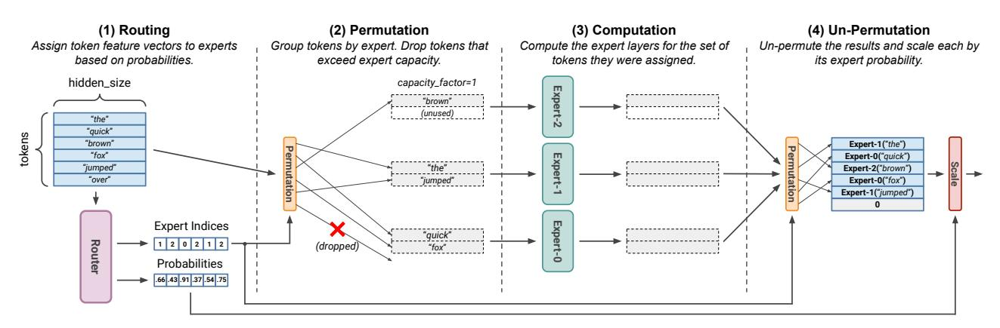
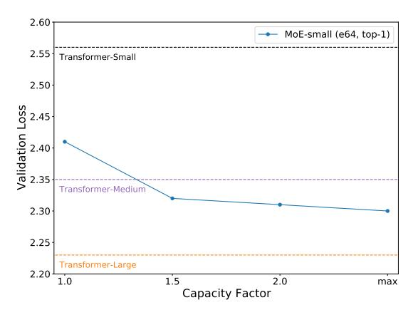
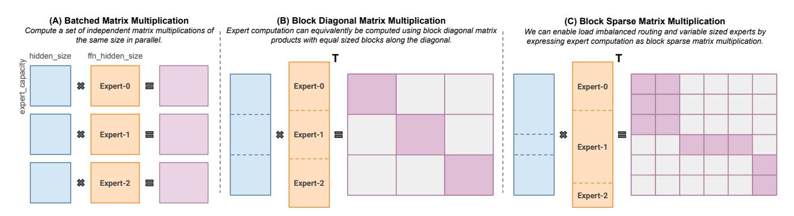
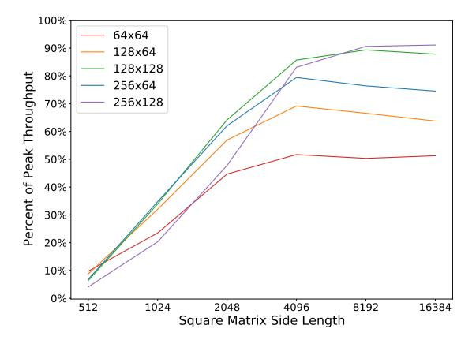
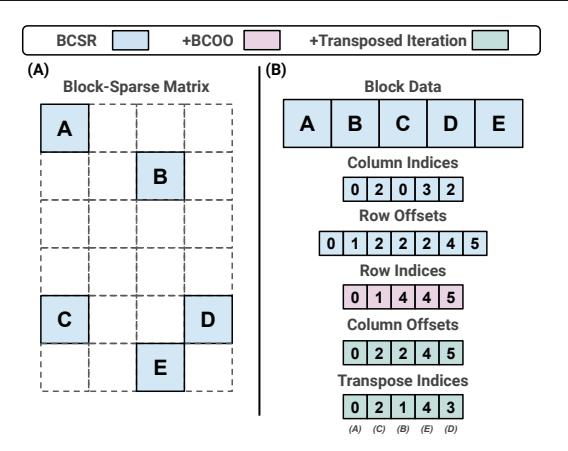
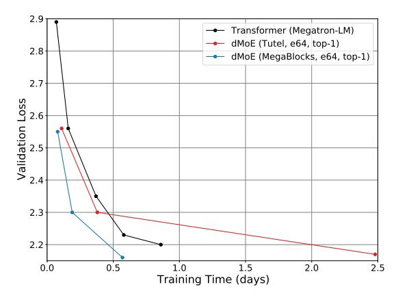
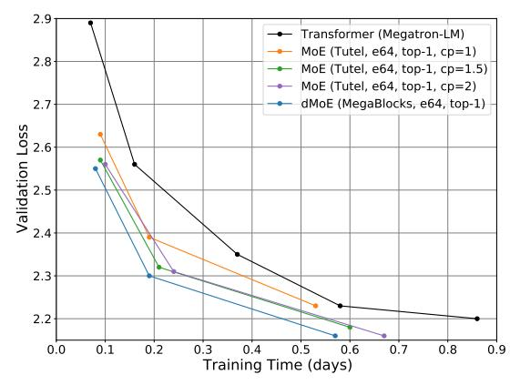
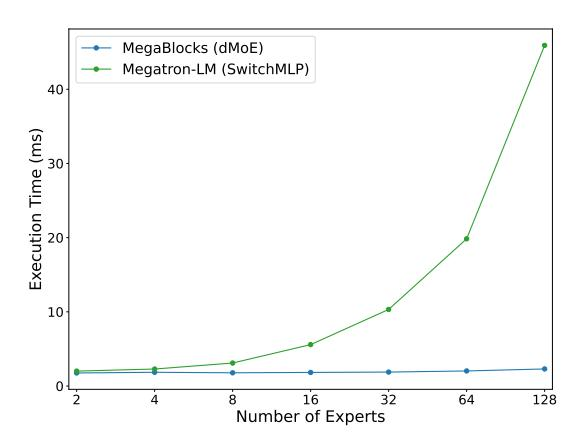
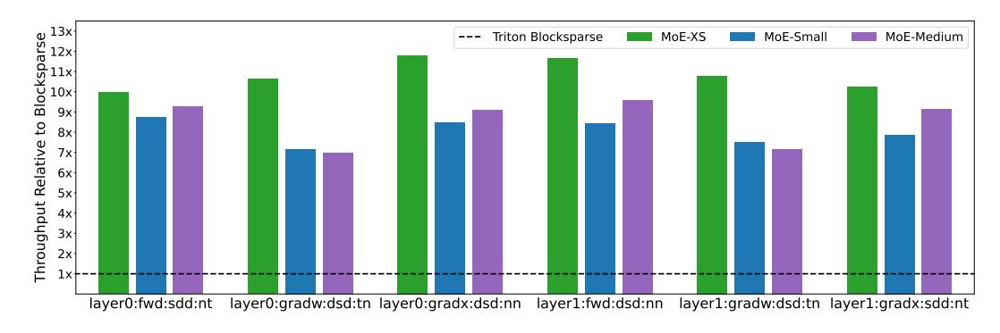

# MEGABLOCKS: EFFICIENT SPARSE TRAINING WITH MIXTURE-OF-EXPERTS

Trevor Gale <sup>1</sup> Deepak Narayanan <sup>2</sup> Cliff Young <sup>3</sup> Matei Zaharia <sup>1</sup>

## ABSTRACT

We present MegaBlocks, a system for efficient Mixture-of-Experts (MoE) training on GPUs. Our system is motivated by the limitations of current frameworks, which restrict the dynamic routing in MoE layers to satisfy the constraints of existing software and hardware. These formulations force a tradeoff between model quality and hardware efficiency, as users must choose between dropping tokens from the computation or wasting computation and memory on padding. To address these limitations, we reformulate MoE computation in terms of block-sparse operations and develop new block-sparse GPU kernels that efficiently handle the dynamism present in MoEs. Our approach never drops tokens and maps efficiently to modern hardware, enabling end-to-end training speedups of up to 40% over MoEs trained with the state-of-the-art Tutel library and 2.4× over dense DNNs trained with the highly-optimized Megatron-LM framework.

# 1 INTRODUCTION

Exploiting sparsity in the weights, activations and input data of deep neural networks (DNNs) is an effective technique for reducing the amount of computation that is needed to achieve a given model quality [\(Han et al.,](#page-11-0) [2015;](#page-11-0) [Gale et al.,](#page-11-0) [2019\)](#page-11-0). The past decade has seen significant progress in algorithms and high-performance software to make sparsity practically useful [\(Gray et al.,](#page-11-0) [2017;](#page-11-0) [Narang et al.,](#page-12-0) [2017;](#page-12-0) [Kalchbrenner et al.,](#page-12-0) [2018;](#page-12-0) [Elsen et al.,](#page-11-0) [2020;](#page-11-0) [Gale](#page-11-0) [et al.,](#page-11-0) [2020\)](#page-11-0). One area that remains a challenge for sparsity is efficient model training on accelerators. DNNs are most commonly trained on hardware accelerators like GPUs [\(NVIDIA,](#page-12-0) [2020\)](#page-12-0) and TPUs [\(Jouppi et al.,](#page-11-0) [2017\)](#page-11-0), which exploit the regularity of dense computation to deliver high performance. Consequently, fine-grained sparse computation is less efficient on these processors. To enable efficient computation on accelerators, structure can be enforced on the sparse matrices [\(Narang et al.,](#page-12-0) [2017;](#page-12-0) [Gray et al.,](#page-11-0) [2017;](#page-11-0) [Yao et al.,](#page-13-0) [2019\)](#page-13-0).

An emerging class of models with underlying structured sparsity is Mixture-of-Experts (MoEs) [\(Shazeer et al.,](#page-13-0) [2017\)](#page-13-0). Each layer in an MoE is a collection of *experts*, which are themselves small DNNs. As data is passed through the MoE layers, each token is dynamically routed to a subset of the experts for computation. By exploiting this sparse computation, MoEs have reduced training times by as much

*Proceedings of the* 6 th *MLSys Conference*, Miami Beach, FL, USA, 2023. Copyright 2023 by the author(s).

as 4× for applications in natural language processing and computer vision [\(Artetxe et al.,](#page-10-0) [2021;](#page-10-0) [Riquelme et al.,](#page-12-0) [2021\)](#page-12-0). These gains have translated to new levels of scale for model training [\(Artetxe et al.,](#page-10-0) [2021;](#page-10-0) [Du et al.,](#page-11-0) [2021;](#page-11-0) [Fedus et al.,](#page-11-0) [2022\)](#page-11-0).

The challenge in computing MoEs efficiently is handling the dynamic routing and load-imbalanced<sup>1</sup> computation that are fundamental to these architectures. However, existing hardware and software for deep learning make it difficult to meet this challenge. For example, TPUs and their XLA compiler require all tensor shapes to be known statically and often struggle with fine-grained operations like scatters and gathers [\(Fedus et al.,](#page-11-0) [2022\)](#page-11-0). These constraints make it difficult to implement MoEs directly on TPUs. While GPUs are more flexible, the sparse computation in MoEs does not map cleanly to the software primitives supported in major frameworks and libraries.

State-of-the-art frameworks for MoE training sidestep these challenges by placing rigid constraints on MoE routing. In order to remove the load imbalance from the computation, the set of tokens mapped to each expert are trimmed or padded to a user-specified size [\(Lepikhin et al.,](#page-12-0) [2020;](#page-12-0) [Fe](#page-11-0)[dus et al.,](#page-11-0) [2022;](#page-11-0) [Hwang et al.,](#page-11-0) [2022\)](#page-11-0). This procrustean formulation introduces a tradeoff between model quality and hardware efficiency, as users must decide whether to drop tokens or waste computation and memory on padding. This decision is often made through hyperparameter tuning, which increases the complexity of using MoEs.

To address these challenges, we develop an approach for

<sup>1</sup> Stanford University, Stanford, California, USA <sup>2</sup>Microsoft Research, Redmond, Washington, USA <sup>3</sup>Google Research, Mountain View, California, USA. Correspondence to: Trevor Gale <tgale@cs.stanford.edu>.

<sup>1</sup>Load imbalance results from different numbers of tokens being routed to different experts. We discuss this in detail in [§2](#page-1-0) and [§3.](#page-2-0)

<span id="page-1-0"></span>

Figure 1. A Mixture-of-Experts Layer. Shown for *num\_experts=3*, *top\_k=1* and *capacity\_factor=1* with the prevalent, token dropping formulation. First (1), tokens are mapped to experts by the router. Along with expert assignments, the router produces probabilities that reflect the confidence of the assignments. Second (2), the feature vectors are permuted to group tokens by expert assignment. If the number of tokens assigned to an expert exceeds its capacity, extra tokens are dropped. Third (3), the expert layers are computed for the set of tokens they were assigned as well as any padding needed for unused capacity. Last (4), the results of the expert computation are un-permuted and weighted by the router probabilities. The outputs for dropped tokens are shown here set to zero.

MoE routing and computation *based on sparse primitives*. Our approach never drops tokens and maps efficiently to modern GPUs, enabling end-to-end training speedups of up to 40% and 2.4× over state-of-the-art frameworks for MoE and DNN training, respectively. We make the following specific contributions:

- We show how the computation in an MoE layer can be expressed as block-sparse operations to accommodate imbalanced assignment of tokens to experts. We use this formulation to train *dropless-MoEs* (dMoEs).
- We develop high-performance GPU kernels for blocksparse matrix products that efficiently handle dynamic MoE computation. Our kernels use two techniques, *blocked-CSR-COO* encoding and *transpose indices*, to enable efficient matrix products with sparse inputs and outputs in transposed or non-transposed order.

We have implemented these techniques in a system called MegaBlocks, which builds on the state-of-the-art Megatron-LM library for training Transformer models [\(Shoeybi](#page-13-0) [et al.,](#page-13-0) [2019\)](#page-13-0). We evaluate our system through both microbenchmarks and end-to-end training of Transformer language models. Our code is open source and available at [github.com/stanford-futuredata/megablocks.](https://github.com/stanford-futuredata/megablocks)

## 2 BACKGROUND: MOE LAYERS

MoE layers are made up of many *experts*, which are themselves small neural networks. Each token<sup>2</sup> is dynamically routed to a subset of the experts for computation based on scores computed by a *router*. The experts are commonly

small multi-layer perceptrons (MLPs). It is typical for tokens to be sent to a small number of experts, often between 1 and 4 [\(Fedus et al.,](#page-11-0) [2022\)](#page-11-0).

MoE layers are often interleaved with other DNN layers. In Transformer models, MoE layers are most commonly used to replace feed-forward network (FFN) layers<sup>3</sup> [\(Shazeer](#page-13-0) [et al.,](#page-13-0) [2017;](#page-13-0) [Fedus et al.,](#page-11-0) [2022\)](#page-11-0). This hybrid architecture has demonstrated strong results on both natural language and vision tasks [\(Du et al.,](#page-11-0) [2021;](#page-11-0) [Riquelme et al.,](#page-12-0) [2021\)](#page-12-0). It is conjectured that these improvements are a result of experts specializing to different parts of the data distribution [\(Shazeer et al.,](#page-13-0) [2017\)](#page-13-0).

We illustrate an MoE layer in Figure 1 and describe it in detail in the remainder of this section.

## 2.1 Routing

The first stage of an MoE layer is the router, which is responsible for determining the assignment of tokens to experts. In addition to expert assignments, MoE routers also produce probabilities for each assignment that reflect the confidence of the mapping. These are encoded as a matrix of scores for each token-expert pair, which are used to linearly combine the *top\_k* expert outputs for each token (see [§2.4\)](#page-2-0).

The most common MoE router is the learned router proposed by [Shazeer et al.](#page-13-0) [\(2017\)](#page-13-0). In this router, the tokens are projected from *hidden\_size* elements to *num\_experts* scores by multiplying with a weight matrix that is learned jointly with the other model parameters. The scores are normalized with a softmax and the routing decisions are made by greedily selecting the *top\_k* scoring experts for each token.

For natural language, training data is composed of *tokens*. For vision, the data is typically *pixels* or *patches* [\(Dosovitskiy et al.,](#page-11-0) [2021\)](#page-11-0). For simplicity, we use the term token throughput this paper.

<sup>3</sup>The attention layers are left unchanged.

<span id="page-2-0"></span>

Figure 2. MoEs Trained on The Pile with Different Capacity Factors. The loss reached by the MoE models decreases significantly as expert capacity is increased, but at the cost of additional computation. The lowest loss is achieved by the "max" capacity factor model, which avoids dropping tokens through the dynamic capacity factor mechanism proposed by Hwang et al. (2022).

#### 2.2 Permutation

State-of-the-art MoE implementations compute all expert layers in parallel in order to make effective use of the parallelism available on GPUs and TPUs (Lepikhin et al., 2020; Fedus et al., 2022; Hwang et al., 2022)<sup>4</sup>. The standard primitive used by implementations is batched matrix multiplication, which computes a set of matrix products of the same shape (Figure 3A). However, mapping MoE computation to this primitive is non-trivial. In order to respect the shape constraints of batched matrix multiplication, the experts must have weight matrices of the same shape and the number of tokens assigned to each expert must be equal. The latter constraint is particularly problematic because the learned routing algorithm described above provides no guarantees of a load balanced assignment of tokens to experts.

In order to satisfy this constraint, prior work has defined a fixed expert capacity, which is the number of tokens that each expert can be assigned (Lepikhin et al. (2020); Fedus et al. (2022)). If the number of tokens assigned to an expert exceeds its capacity, the extra tokens are dropped. That is to say, they are not passed to any expert for computation and the model relies on a residual connection to reintroduce the dropped tokens' representations after the MoE layer. If an expert layer is not assigned enough tokens to fill its capacity, its set of tokens is padded to fill the remaining space. Expert capacity is typically specified in terms of a *capacity\_factor* hyperparameter, which is a multiplier on the expected number of tokens that would be assigned to each expert under a perfect uniform distribution:

$$expert\_capacity = \frac{num\_tokens}{num\_experts} \times capacity\_factor$$

Table 1. **Transformer Model Configurations.** These models are based on those used by Vaswani et al. (2017) and Brown et al. (2020). FLOPs were calculated using the expression from Narayanan et al. (2021b) with a single sequence of 1024 tokens. All models use *ffn hidden size=4×hidden size*.

| Transformer | hidden_size | num_layers | Weights (M) | <b>GFLOPs</b> |
|-------------|-------------|------------|-------------|---------------|
| XS          | 512         | 6          | 46          | 316           |
| Small       | 768         | 12         | 125         | 879           |
| Medium      | 1024        | 24         | 356         | 2487          |
| Large       | 1536        | 24         | 760         | 5122          |
| XL          | 2048        | 24         | 1316        | 8684          |

The *capacity\_factor* can be thought of as a parameter that reduces the chance of dropping a token. This hyperparameter represents a tradeoff between additional computation and model quality. As such, it is desirable to minimize the amount of load imbalance in the assignment of tokens to experts (§3). The typical mechanism for doing so is auxiliary *load balancing losses*, which incentivize the router to produce a balanced assignment (Shazeer et al., 2017; Lepikhin et al., 2020; Fedus et al., 2022). These losses additionally help to ensure that all experts see a similar number of tokens during training. This is thought to be important to avoid degenerate states where some experts are assigned zero tokens and stop receiving gradient updates (Zhou et al., 2022).

In addition to enabling batched computation of the expert layers, these constraints allow all tensor shapes to be known statically, which is required by TPUs and XLA.

### 2.3 Computation

Once the data has been permuted, the experts can be computed in parallel. For models where the experts are MLPs, this entails computing each layer for all experts using batched matrix multiplication. For convolutional experts, the layers can be computed with grouped convolutions.

#### 2.4 Un-permutation

After the experts are computed, the resulting feature vectors are un-permuted such that their ordering matches that of the input to the layer. The last step in MoE computation is to scale the output tokens by the scores with which they were assigned to their respective experts. When tokens are routed to more than one expert, these weighted results are summed to produce the final layer output for each token.

# 3 MOTIVATION: TOKEN DROPPING IN MOES

Despite the use of load balancing losses, prior work has shown that token routing is still highly imbalanced (Hwang et al., 2022). To quantify the effect of token dropping on model quality, we trained MoE language models on The

<sup>&</sup>lt;sup>4</sup>We benchmark a sequential implementation in Appendix A.

<span id="page-3-0"></span>

Figure 3. Expert Computation in an MoE Layer. Shown with *num\_expert=3*. (A) State-of-the-art MoE implementations use batched matrix multiplication to compute all experts within a layer in parallel. This introduces the constraints that all experts are assigned the same number of tokens and that all experts have the same shape. (B) Expert computation can be analogously posed in terms of block diagonal matrix multiplication with identically sized blocks. (C) In order to relax these constraints, we can construct a block diagonal matrix with variable sized blocks made up of many smaller blocks. We can compute this matrix efficiently using block-sparse matrix multiplication.

Pile [\(Gao et al.,](#page-11-0) [2020\)](#page-11-0) with a range of capacity factors. We train Transformer MoEs similar to those used by [Fedus et al.](#page-11-0) [\(2022\)](#page-11-0), where each model is a Transformer with the FFN layers replaced with 64-expert MoE layers where each expert is a 2-layer MLP matching the original FFN dimensions. We used top-1 routing and based our MoE model dimensions on the Transformer-Small model described in Table [1.](#page-2-0) All models were trained using the tokenization from GPT2 [\(Radford et al.,](#page-12-0) [2019\)](#page-12-0) for 10B tokens with sequence length 1024, the Adam optimizer, and the learning rate and gradient clipping settings from [Shoeybi et al.](#page-13-0) [\(2019\)](#page-13-0). We trained all models on a single A100 GPU with a batch size of 512 sequences. We trained MoEs with capacity factor 1, 1.5, and 2 as well as the dynamic capacity factor technique proposed by Tutel [\(Hwang et al.,](#page-11-0) [2022\)](#page-11-0), where the capacity factor is set dynamically to the minimum value that would avoid token dropping. As a baseline, we trained standard Transformer models across a range of sizes. All Transformer and MoE models have vocabulary size 51200, sequence length 1024 and an attention head size of 64. Our model configurations are summarized in Table [1](#page-2-0) and the results of the experiments are shown in Figure [2.](#page-2-0)

For these models, we observed that the impact of token dropping is significant. While the MoE with capacity factor of 1 achieved a 0.15 reduction in validation loss compared to Transformer-Small, the MoE that avoided dropping tokens provided a reduction of 0.26, 1.73× larger than the gain of the former model and enough to exceed the quality of Transformer-Medium.

While dropping tokens reduces model quality, increasing capacity factor comes at the cost of additional computation and memory. In this example, MoE-layer math operations increased by over 2× in order to avoid dropping tokens. [Hwang et al.](#page-11-0) [\(2022\)](#page-11-0) showed that some MoEs require capacity factors as high as 11 in order to avoid dropping tokens,

and the necessary capacity factor to avoid dropping tokens can spike unpredictably during training.

In addition to the computational overhead of increasing the capacity factor, having to tune an additional hyperparameter can significantly increase the number of models that need to be trained for a target task. This is particularly cumbersome for large neural networks, where the cost to train a single model can run into the hundreds of thousands of dollars [\(MosaicML,](#page-12-0) [2022\)](#page-12-0). Possibly as a result of this, some large studies on MoEs have declined to explore different capacity factors at all [\(Artetxe et al.,](#page-10-0) [2021;](#page-10-0) [Clark et al.,](#page-11-0) [2022\)](#page-11-0).

# 4 NO-TOKEN-LEFT-BEHIND WITH BLOCK SPARSITY<sup>5</sup>

This section describes how we formulate MoE layer computation in terms of block-sparse computation in order to avoid dropping tokens. The motivation for using block-sparse primitives to express MoE computation is manifold. First, as we show below, block-sparse matrices are a natural and flexible way of describing the dynamic and load-imbalanced computation in MoEs. Second, block sparsity maps efficiently to hardware accelerators built around systolic array matrix multipliers like GPUs and TPUs. Since MoE experts have coarse granularity, we can select a block size for our implementation that is large enough to enable the computation to realize high fractions of peak device throughput. Last, block-sparse kernels like matrix multiplication and convolution are general-purpose primitives that are useful across a range of applications [\(Narang et al.,](#page-12-0) [2017;](#page-12-0) [Gray](#page-11-0) [et al.,](#page-11-0) [2017;](#page-11-0) [Child et al.,](#page-11-0) [2019;](#page-11-0) [Elsen et al.,](#page-11-0) [2020\)](#page-11-0). This makes investment in high-performance kernels more practi-

<sup>5</sup>The name No-Token-Left-Behind references the technique briefly discussed by [Fedus et al.](#page-11-0) [\(2022\)](#page-11-0), which was an unsuccessful attempt to regain the quality lost from dropping tokens.

<span id="page-4-0"></span>cal, as work can be amortized across target tasks. We could similarly invest in variable sized batched matrix multiplication kernels, but the utility of this would be limited to MoE architectures as they are designed today.

In addition to these considerations, the block-sparse formulation of MoEs exposes a new perspective on these algorithms as a form of dynamic, structured, activation sparsity. This perspective draws parallels to much of the literature on sparse training algorithms and opens up the opportunity to further improve MoEs with insights from this adjacent field.

**Preliminaries: Sparse Matrix Product Notation.** In this paper we often refer to matrix multiplication where one of the three matrices (the two inputs and one output) is sparse and the others are dense. We borrow the notation from Triton Blocksparse (Tillet et al., 2019) to describe these different operations. Each operation is described with a three character string where each character is either "S" for sparse or "D" for dense. The order of characters is output, followed by the left input and then the right input. For example, the product of two dense matrices with a sparse output is "SDD", which is also referred to as sampled dense-dense matrix multiplication (SDDMM). This notation is useful to distinguish operations like DSD and DDS, which are different forms of sparse matrix-dense matrix multiplication (SpMM). Superscript "T" indicates transposition of the input arguments. For example, SDD<sup>T</sup> indicates an SDD where the right-hand input matrix is transposed.

#### 4.1 Expert Computation With Block Sparsity

The key insight behind our method is shown in Figure 3. Rather than the prevailing approach of computing the experts within an MoE layer using batched matrix multiplication, we can equivalently compute the experts as an SDD product where the output sparse matrix has block diagonal structure, as shown in Figure 3B. In this formulation, allowing for a load-imbalanced assignment of tokens to experts is analogous to allowing the blocks in the block diagonal matrix to have a variable number of rows. To achieve this, we propose to compute each block as many smaller fixed size blocks using block-sparse matrix multiplication, as shown in Figure 3C. To construct multi-layer experts, we can iterate between SDD and DSD operations (see Figure 4).

In this formulation, we can also relax the constraint on the number of columns in each block to build MoE layers with variable sized experts, as is shown in Figure 3C. While this is an interesting direction for future work, we did not explore these configurations as more research is needed to identify how this capability can be used to increase efficiency.

With sufficiently large blocks, block-sparse matrix multiplication is capable of reaching high fractions of peak throughput on modern GPUs (Gray et al., 2017; NVIDIA, 2021).

```
# x.shape: (num_tokens, hidden_size)
   def dmoe_forward(self, x):
    # (1) Assign tokens to experts.
 3
 4
 567
       indices.shape: (num_tokens)
       weights.shape: (num_tokens)
     indices, weights = router(x)
 8
 9
       (2) Create the sparse matrix topology.
10
11
12
      # This describes the matrix in Figure 3C.
     topology = make_topology(indices)
13
14
      # (3) Permute the tokens to group by expert.
15
     x = padded_gather(x, indices)
16
17
       (4): Compute the expert layers.
18
19
      # inner_dim = ffn_hidden_size * num_experts
2.0
       self.w1.shape: (hidden_size, inner_dim)
21
22
       self.w2.shape: (inner_dim, hidden_size)
     x = sdd(x, self.wl, topology)
23
     x = dsd(x, self.w2)
24
25
      # (5) Un-permute the tokens and scale.
26
     x = padded_scatter(x, indices)
     return x * weights
```

Figure 4. **Pseudo-Code for a dMoE.** The code follows Figure 1 with three changes. First, we construct the sparse matrix topology from Figure 3C from expert assignments (line 12). Second, we pad each expert batch to a multiple of the block size during permutation (line 15, §5.2). Last, we compute the experts in parallel by iterating between SDD and DSD operations (lines 22-23, §4.1).

The coarse-grained sparsity in MoEs lends itself to this requirement – in Transformer models using MoE FFN layers, the number of columns in the blocks shown in Figure 3B corresponds to *ffin\_hidden\_size*, which is commonly between 1024 and 8192 (Vaswani et al., 2017; Radford et al., 2019; Brown et al., 2020). The number of rows in these blocks corresponds to the number of tokens assigned to each expert, which is expected to be equal to the number of tokens divided by the number of experts under a uniform distribution. This can range from a few thousand to tens of thousands of tokens per expert (Lepikhin et al., 2020; Artetxe et al., 2021; Fedus et al., 2022). These coarse-grained blocks are many times larger than the largest tile dimensions used for dense matrix multiplication kernels, which give us the flexibility to select a block size that can match their throughput.

### 4.2 Dropless Mixture-of-Experts Layers

We use this formulation of expert computation as block-sparse operations to implement *dropless-MoE* (dMoE) layers. Figure 4 highlights the key differences in dMoE implementation relative to standard MoEs. Steps 1, 3 and 5 are identical to a standard MoE implementation. dMoE introduces two changes. First, in step 2, we construct the sparse matrix shown in Figure 3C. Second, in step 4, we replace calls to batched matrix multiplication with block-sparse matrix multiplication. We describe the implementation of these two changes in detail in §5.2 and §5.1, respectively.

# <span id="page-5-0"></span>5 MEGABLOCKS: A FRAMEWORK FOR EFFICIENT MOE TRAINING

We implemented our techniques in a system called MegaBlocks, which builds on Megatron-LM (Shoeybi et al., 2019) and PyTorch (Paszke et al., 2019). In addition to high-performance dMoE layers, our system supports distributed training of MoEs with both data and expert model parallelism (Fedus et al., 2022).

This section discusses the design of our dMoE implementation, including our block-sparse kernels, and other considerations for building an efficient system. §5.1.1 discusses the limitations of existing block-sparse kernels. §5.1.2 analyzes the effects of the block size on block-sparse product performance. §5.1.3 describes our hybrid *blocked-CSR-COO* sparse matrix format, which enables efficient matrix products with sparse input and output operands. §5.1.4 introduces *transpose indices* as a mechanism for efficient iteration over block-sparse matrices in transposed order. §5.2 discusses efficient routing and permutation for dMoEs. Last, §5.3 discusses our implementations of data and expert model parallelism.

**Preliminaries: Matrix Multiplication on GPUs.** Matrix multiplication kernels on GPUs exploit *tiling*, where the output matrix is broken up into statically sized two-dimensional blocks of values (NVIDIA, 2022c). The computation of these tiles can be parallelized, and the individual tiles can be sized to tradeoff arithmetic intensity and parallelism. The group of threads assigned to a tile is called a *threadblock*.

#### 5.1 Efficient Block-Sparse Kernels for MoEs

To train MoEs with block-sparse kernels we need primitives for the forward and backward passes. Consider an MoE FFN layer where each expert is a 2-layer MLP. For this configuration, the forward pass requires an SDD operation followed by a DSD (Figure 4). For the backward pass, we compute SDD<sup>T</sup> and DS<sup>T</sup>D for the second layer data gradient and weight gradient, respectively, followed by DSD<sup>T</sup> and DD<sup>T</sup>S for the first layer data gradient and weight gradient, respectively.

#### 5.1.1 Existing Block-Sparse Primitives

We considered two existing libraries for block-sparse matrix multiplication on GPUs: NVIDIA cuSPARSE (NVIDIA, 2022b) and Triton Blocksparse (Tillet et al., 2019). cuS-PARSE supports the blocked-ELL sparse matrix format for DSD. However, as of CUDA 11.8, this operation does not support transposition of the sparse matrix input. cuSPARSE also provides no SDD primitive with a blocked-ELL matrix. In addition to these limitations, the blocked-ELL format requires that all rows in the sparse matrix have the same number of non-zeros, which would defeat our goal of sup-



Figure 5. Matrix Multiplication Throughput with Different Tile Dimensions. Benchmarked on an A100 SXM4 80GB GPU with CUDA 11.5 and all tile dimensions supported by CUTLASS 2.5. We observe that 128x128 tiles perform consistently on-par or better than other configurations.

porting load imbalanced matrices. Blocksparse supports SDD, DSD, and DDS as well as all combinations of transposed and non-transposed inputs. However, these primitives assume that the topology of the sparse matrices does not change between invocations<sup>6</sup>. The library API takes a bitmask describing the sparse operand and then pre-computes look-up tables and block groupings to accelerate computation. For our use case, the sparse matrix topology varies across every iteration of training and every MoE layer in the model. In order to use Blocksparse, we would have to pay the cost of these preprocessing steps repeatedly.

Based on this analysis, we opted to write our own blocksparse primitives in order to tailor them to MoE expert computation. We implemented SDD, DSD, and DDS operations targeting NVIDIA GPUs. Our kernels support all combinations of transposed and non-transposed inputs. The remainder of this section details the design and implementation of our kernels.

#### 5.1.2 Selecting Block Size for MoEs

In order to efficiently use modern GPUs, we want to use sparse blocks that have sufficient arithmetic intensity to keep matrix multiplication units busy. Large blocks are also desirable to amortize the cost of storing and operating on sparse matrix metadata, since metadata like column indices only need to be kept for each block of non-zeros.

To select our target block size, we studied the performance of dense matrix multiplication kernels from NVIDIA CUT-LASS (NVIDIA, 2022c) with different tile dimensions. We

<sup>&</sup>lt;sup>6</sup>This is likely because they were written for applications like sparse attention where the sparse matrix topology is determined prior to training (Child et al., 2019).

<span id="page-6-0"></span>benchmarked mixed-precision (FP16 + FP32 accumulation) matrix multiplication on square matrices with power of two side lengths from 512 to 16384 and every set of tile dimensions supported in CUTLASS. For rectangular tiles, we show only the configurations where the first tile dimension is larger as we found these to slightly outperform the alternative ordering for these problems. We ran all benchmarks on an A100 SXM4 80GB GPU with CUDA 11.5 and CUTLASS 2.5. These benchmarks are shown in Figure [5.](#page-5-0)

Across these benchmarks, we observed that 128x128 tiles consistently perform on par or better than other configurations. Anecdotally, we observe that this same configuration is commonly selected by NVIDIA cuBLAS [\(NVIDIA,](#page-12-0) [2022a\)](#page-12-0) for the dense Transformer models we studied. Based on this analysis, we opted to use 128x128 block sparsity. While the tile dimensions of a block-sparse matrix multiplication and the block size in the sparse matrix do not need to be equal, we found that for 128x128 blocks the highest performing tile dimensions in our workloads were also 128x128.

To implement our kernels, we extended CUTLASS [\(NVIDIA,](#page-12-0) [2022c\)](#page-12-0) to support block-sparse matrices and reused their machinery for high-performance matrix multiplication with different data types and GPU architectures.

## *5.1.3 Computing Sparse Outputs With Hybrid Blocked-CSR-COO*

We use blocked compressed sparse row (BCSR) as our primary sparse matrix format. BCSR makes it simple to iterate across the non-zeros in a row, which is necessary for operations like DSD and DDS<sup>T</sup> . Iterating over blocks also has minimal overhead with BCSR, as identifying a block's position in the matrix only requires a single load of its column index. We discuss our approach for efficiently iterating across the non-zeros in a column with this format in §5.1.4.

One challenge with BCSR sparse matrices is efficiently computing SDD operations in parallel. On kernel launch, each threadblock needs to identify the row and column of its output block so that it knows which rows and columns of the input matrices are needed to compute it. Because BCSR only encodes column indices for each block, identifying the row index of a non-zero block requires a search through the row offsets. One solution to this problem is to launch the maximum number of threadblocks that could be needed to compute each row of the output if it were fully dense. On startup, each threadblock can check whether its column offset is out of range for the number of non-zeros in its row and return if there is no work to do. [Gale et al.](#page-11-0) [\(2020\)](#page-11-0) showed that the overhead introduced by launching extra threadblocks was negligible for moderately sparse matrices (50 - 90% zeros). We experimented with this approach but observed that for MoEs the cost of launching these unused



Figure 6. Block-Sparse Matrix Format used in MegaBlocks. Pane (B) shows the encoding for the sparse matrix in pane (A). Indices and offsets in our encoding are block-wise. We use blocked compressed sparse row (BCSR) as our primary sparse matrix format. We additionally store the row indices of each non-zero block (§5.1.3) and a secondary index of *transpose indices* (§5.1.4).

threadblocks was significant, particularly for models with high expert counts where the level of sparsity in the blocksparse matrices is very high.

To efficiently parallelize SDD, we additionally materialize the row indices for each non-zero block so that threadblocks can trivially look up the coordinates of sparse blocks in the output matrix. The storage required for this additional metadata is negligible since we only need to store one index per 16384 non-zero values in a 128x128 block. Even with this additional metadata, we maintain the row-wise ordering of non-zero blocks so the matrix can be operated on as either BCSR or blocked coordinate format (BCOO). We illustrate this hybrid blocked-CSR-COO encoding in Figure 6.

## *5.1.4 Block-Sparse Transposition With Transpose Indices*

Computing forward and backward passes for model training requires sparse matrix transposition. However, iterating over BCSR matrices in transposed order requires searching through each row to identify if the block in the target column is non-zero [\(Buluç et al.,](#page-11-0) [2009\)](#page-11-0). We could materialize a transposed version of the sparse matrix explicitly, but this would incur runtime and storage costs as all of the non-zero values in the matrix would need to be copied. To enable efficient iteration over BCSR matrices in transposed order, we construct the metadata for the transposed matrix. The transposed metadata is equivalent to a blocked compressed sparse column (BCSC) encoding of the matrix, which includes row indices for each sparse block and column offsets, which encode the offset of each compressed column of nonzero blocks in memory. We already materialize non-zero block row indices for our BCOO encoding, so the column offsets are the only additional metadata needed for this en<span id="page-7-0"></span>coding. We do not explicitly transpose the non-zero values. Instead, we construct an array of indices, one for each nonzero block, which are stored in transposed order and contain the offset of each non-zero block in memory. This additional metadata allows efficient iteration through the matrix in transposed order with a layer of indirection, as shown in Figure [6.](#page-6-0)

This idea is similar to a secondary index in a database, which allows efficient access to entries in a different order than the primary index. Similar to our hybrid Blocked-CSR-COO encoding, this technique relies on the fact that storage and computation is many times cheaper for metadata than it is for non-zero values thanks to our large block sizes. In total, the additional memory usage of our encoding metadata is <0.1% thanks to our 128x128 block sizes. We include pseudo-code for our SDD and DSD kernels in Appendix [B.](#page-14-0)

### 5.2 Efficient Routing and Permutation

As currently implemented, our block-sparse matrix multiplication kernels require the number of tokens assigned to each expert to be a multiple of the block size. In order to respect this constraint, we pad each group of tokens with zeros to the nearest multiple of 128 and fuse this operation into custom permutation kernels. We could remove this constraint by supporting partial blocks at the fringes of the problem similar to how matrix multiplication handles matrices that are not divisible by the tile dimensions. However, the performance impact of this feature would be minimal given we expect the number of tokens assigned to each expert to be thousands or tens of thousands.

Once the expert assignments have been computed by the router, we create the metadata for the block-sparse matrix using a custom CUDA kernel. We additionally construct the transposed metadata at this time to amortize the cost over the multiple block-sparse matrix multiplications that use it across forward and backward computation.

### 5.3 Data and Expert Model Parallelism

One common technique for parallelizing MoE training across multiple devices is expert model parallelism, where the MoE layers are partitioned such that each device only stores a subset of the experts [\(Shazeer et al.,](#page-13-0) [2017;](#page-13-0) [Lepikhin](#page-12-0) [et al.,](#page-12-0) [2020;](#page-12-0) [Fedus et al.,](#page-11-0) [2022;](#page-11-0) [Hwang et al.,](#page-11-0) [2022\)](#page-11-0). In this scheme, the permutation and un-permutation steps of MoE layer execution become cross-device operations that are typically implemented with the all-to-all primitive from the MPI standard [\(Message Passing Interface Forum,](#page-12-0) [2021\)](#page-12-0). This approach to training helps reduce memory usage by reducing the number of copies of the large MoE layer weight matrices that need to be stored in limited on-device accelerator memory. Since each device aggregates tokens assigned to its experts from the other expert model-parallel devices,

Table 2. MoE Model Configurations. These models correspond to the Transformer configuration of the same size, but with each FFN layer replaced with a 64-expert MoE layer.

| MoE    | num_experts | top_k | Weights (M) | GFLOPs |
|--------|-------------|-------|-------------|--------|
| XS     | 64          | 1     | 839         | 316    |
| Small  | 64          | 1     | 3,693       | 879    |
| Medium | 64          | 1     | 13,041      | 2487   |

Table 3. Micro Batch Sizes Used for Model Training. We used the largest *micro\_batch\_size* that fit in memory for all experiments.

|             | Model              | micro_batch_size |
|-------------|--------------------|------------------|
|             | Transformer-XS     | 64               |
|             | Transformer-Small  | 32               |
| Megatron-LM | Transformer-Medium | 16               |
|             | Transformer-Large  | 16               |
|             | Transformer-XL     | 8                |
|             | dMoE-XS            | 64               |
| MegaBlocks  | dMoE-Small         | 32               |
|             | dMoE-Medium        | 8                |
|             | dMoE-XS            | 32               |
| Tutel       | dMoE-Small         | 8                |
|             | dMoE-Medium        | 1                |

the expert layers will be computed with batch sizes that are larger by a factor equal to the number of devices the MoE layer is partitioned over. This helps maintain computational throughput on accelerators that require large amounts of arithmetic intensity and parallel work to realize their computational capability.

MegaBlocks supports distributed training of MoEs with both data and expert model parallelism [\(Fedus et al.,](#page-11-0) [2022\)](#page-11-0). Data parallel training for MoE and dMoE layers is the same as standard neural neural network layers and we reuse Megatron-LM's data parallelism implementation.

Our expert model parallelism implementation follows [Fedus](#page-11-0) [et al.](#page-11-0) [\(2022\)](#page-11-0) and [Hwang et al.](#page-11-0) [\(2022\)](#page-11-0), but we first communicate how many tokens will be received by each device to avoid dropping/padding tokens for the all-to-all communication step.

## 6 EXPERIMENTS

This section analyzes the performance of our system compared to state-of-the-art libraries, Microsoft Tutel [\(Hwang](#page-11-0) [et al.,](#page-11-0) [2022\)](#page-11-0) and NVIDIA Megatron-LM [\(Shoeybi et al.,](#page-13-0) [2019\)](#page-13-0), for training Transformer MoEs and standard Transformers respectively. In order to ensure fair comparisons, we extended Megatron-LM to additionally support MoE training using Tutel's MoE layer. All experiments were conducted on NVIDIA A100 SXM4 80GB GPUs with CUDA 11.5, CUTLASS 2.5 and used mixed-precision training [\(Mi](#page-12-0)[cikevicius et al.,](#page-12-0) [2018\)](#page-12-0) as implemented in Megatron-LM.

Our analysis is organized into three components. First,

<span id="page-8-0"></span>

Figure 7. MegaBlocks dMoEs, Tutel dMoEs and Megatron-LM Transformers Trained on The Pile. MegaBlocks uses blocksparse operation to handle the dynamic and load imbalanced computation in MoEs, which enables 1.38×, 2.0× and 4.35× end-to-end training speedups for MoE-XS, MoE-Small, and MoE-Medium respectively compared to the padding-based approach used by Tutel. The advantage of our approach increases with the size of the model, as the memory requirements of padding expert batches forces Tutel to use smaller micro\_batch\_sizes which decreases hardware efficiency. Compared to dense Transformer language models, MegaBlocks achieves 1.8× - 2.4× end-to-end training speedups for the same validation loss across these models.

§6.1 compares our dMoE method to existing techniques for avoiding token dropping during MoE training. Next, §6.2 studies the performance of our method compared to MoEs with tuned capacity factor. Last, §6.3 compares the performance of our block-sparse matrix multiplication kernels to cuBLAS batched matrix multiplication. As explained in §4.2, the primary difference between dMoE and MoE layers is the use of block-sparse matrix multiplication instead of batched matrix multiplication. Thus, this comparison serves as an ablation demonstrating the difference in performance between dMoE and MoE layers independent of model quality.

Appendices A and C include additional benchmarks against a sequential MoE implementation and a comparison of our block-sparse kernels with Triton Blocksparse.

#### **6.1** MoE Training Without Dropping Tokens

To assess the efficiency of our technique for avoiding token dropping, we compared to the dMoE method proposed by Hwang et al. (2022) where the capacity factor is set dynamically to the minimum value that avoids token dropping.

We trained decoder-only Transformer language models on The Pile (Gao et al., 2020) with the same hyperparameters described in §3. For Transformer MoEs, we trained models scaled from our XS, Small, and Medium models with each FFN layer replaced with 64-expert MoE layers using top-1



Figure 8. MegaBlocks dMoEs, Tutel MoEs and Megatron-LM Transformers Trained on The Pile. Even with the most efficient capacity\_factor for each MoE, MegaBlocks reduces the training time required to reach a given validation loss by 1.38×, 1.37× and 1.18× for MoE-XS, MoE-Small and MoE-Medium respectively. In addition to these speedups, our approach reduces the cost of using MoEs by decreasing the number of hyperparameters that need to be re-tuned for each model and task.

routing. We also trained standard Transformer models from 46M to 1.3B parameters, equivalent to Transformer-Base (Vaswani et al., 2017) up to GPT3-XL (Brown et al., 2020), as a dense baseline. We trained all models on 8 A100 SXM4 80GB GPUs using 8-way expert model parallelism for MoE layers and data parallelism for all other layers. We use gradient accumulation for all models and train with a batch size of 512 sequences and the largest *micro\_batch\_size* that does not run out of memory (Narayanan et al., 2021a). Our model configurations are summarized in Tables 1 and 2. For each model, we report the end-to-end training time and final loss achieved on a validation set in Figure 7.

Compared to the prevalent padding-based approach for avoiding token dropping, our technique for adaptive MoE computation with block sparsity enables end-to-end training speedups of  $1.38\times$ ,  $2.0\times$  and  $4.35\times$  for MoE-XS, MoE-Small, and MoE-Medium, respectively. In addition to computational overhead, the padding-based approach implemented in Tutel significantly increases the amount of memory required to store activations in the MoE layers. This is particularly problematic because MoEs already require many times more storage for their large weight matrices compared to standard Transformers. For these models, we observed this increase in memory usage reduced the maximum *micro* batch size that Tutel could use by  $2\times$ ,  $4\times$ , and 8× compared to MegaBlocks for MoE-XS, MoE-Small, and MoE-Medium, respectively. This in turn increases training time because of reduced hardware efficiency. As a result, we observe that the advantage of MegaBlocks over Tutel grows with model size. The micro batch size used for each model configuration are shown in Table 3.

<span id="page-9-0"></span>

Figure 9. Block-Sparse Matrix Multiplication Throughput Compared to cuBLAS Batched Matrix Multiplication. Benchmarked for the problem configurations used in training MoE-XS, MoE-Small and MoE-Medium models. For these problems, our block-sparse matrix multiplication kernels realize 98.6% of the throughput achieved by cuBLAS on average with a standard deviation of 4% and a maximum and minimum relative throughput of 104% and 91% respectively.

Compared to dense Transformer models trained with Megatron-LM, dMoEs trained with MegaBlocks reduce the training time required to reach a given validation loss by 1.8× - 2.4×. The variation in this comparison is primarily a result of the increased weight memory usage of MoE models, which forced MegaBlocks to use a 2× smaller *micro\_batch\_size* for MoE-Medium than the analogous Transformer model. These results highlight the importance of reducing memory usage in MoEs as future work.

For these Transformer models, we observed that Megatron-LM sustains between 21% and 48% of the 2.5 petaFLOP peak throughput of this 8-GPU system with efficiency increasing with model size. The speedups achieved by MegaBlocks over this state-of-the-art framework demonstrates the efficiency of our system and the efficacy of MoEs.

#### 6.2 MoE Training With Token Dropping

We additionally compare our dMoE models to token-dropping MoEs trained with Tutel. In order to find the most efficient configurations, we trained MoE-XS, MoE-Small and MoE-Medium models with capacity factors of  $1\times$ ,  $1.5\times$ , and  $2\times$  for a total of 9 additional models. For these configurations, all token-dropping MoE models were able to use the same  $micro\_batch\_size$  as the analogous dMoE without running out of GPU memory. We report the end-to-end training time and validation loss for these models, our dMoEs and dense Transformers in Figure 8. Comparing MoEs and dMoEs for the same accuracy is non-trivial since token dropping degrades model quality. For each dMoE, we estimated the runtime of the MoE that would achieve the same validation loss by comparing to the loss-equivalent point on the MoE Pareto frontier.

Even with the most efficient *capacity\_factor* for each MoE, dMoEs trained with MegaBlocks reduce the training time required to reach a given validation loss by  $1.38 \times$ ,  $1.37 \times$  and  $1.18 \times$  for MoE-XS, MoE-Small and MoE-Medium,

respectively. In addition to significant reductions in endto-end training time, our system reduces the cost of using MoEs by decreasing the number of hyperparameters that need to be re-tuned for each model and task. These computational savings could in turn be applied to exploring other parameters to further improve model quality.

For MoE-Medium, we observe some loss of efficiency in our implementation due to the relatively small *micro\_batch\_size* that could be used while fitting in limited GPU memory. For small batch sizes, smaller tile dimensions (e.g., 64x128 or 64x64) in our block-sparse kernels could improve performance by reducing the amount of wasted computation when the problem dimensions are not divisible by 128. Another direction for increasing efficiency is to reduce the memory usage per device such that larger batch sizes can be used, either through parallelization over more devices or techniques like selective recomputation (Korthikanti et al., 2022).

## 6.3 Block-Sparse Matrix Multiplication Performance

To assess the quality of our block-sparse matrix multiplication kernels, we benchmarked the problem configurations used in training MoE-XS, MoE-Small and MoE-Medium models and compared to cuBLAS batched matrix multiplication. This includes the forward pass, backward weights, and backward data operations for the two layers in each FFN layer. In total, we benchmark 18 problems – 6 problems for each of the 3 models. To allow for comparison with batched matrix multiplication, we benchmarked each problem with a uniform distribution of tokens to experts and the same micro batch size listed in Table 3. For each problem, we averaged throughput over 100 executions. We do not include the time taken to construct the sparse matrix metadata in these benchmarks as these operations amortize over all 6 problems within an FNN layer. The results of these benchmarks are shown in Figure 9. We include benchmark results with Triton Blocksparse in Appendix C.

<span id="page-10-0"></span>On these problems, we observe that our block-sparse kernels are able to realize 98.6% of the throughput of cuBLAS with a standard deviation of 4%. The maximum relative throughput was 104% and the minimum was 91%. Overall, our kernels slightly outperformed cuBLAS on half of the problems and slightly underperformed on the other half.

While benchmarking CUTLASS, we observed that altering the order in which tiles of the output matrix are computed can change the throughput of the operation by as much as 10% due to L2 caching effects. We believe that most of the performance discrepancy in these results can be attributed to the re-ordering of computation that occurs with block-sparse matrices, although further investigation is needed.

One case where we note additional overhead is in the DSTD operations used to compute weight gradients. Because we use a secondary index to iterate over the sparse operand in transposed order the access patterns when iterating through this matrix exhibit little spatial locality which in turn reduces the throughput of the overall operation. While this is an interesting problem for further study, the overall impact on model performance is minimal because of the limited opportunity for improvement (<10%) combined with the relatively small amount of end-to-end runtime that these two operations represent.

# 7 RELATED WORK

In this section, we discuss relevant related work.

MoE Routing. Improved routing algorithms for MoEs is an active area of research. BASE layers formulate MoE routing as a linear assignment problem trying to maximize the aggregate token-expert affinities under the constraint of a perfectly balanced assignment [\(Lewis et al.,](#page-12-0) [2021\)](#page-12-0). This method guarantees no tokens are dropped by re-routing tokens to different experts as needed. [Clark et al.](#page-11-0) [\(2022\)](#page-11-0) found that BASE layers can incur significant runtime overhead and proposed an approximate version using the Sinkhorn algorithm. Because their approximation is no longer guaranteed to avoid token dropping, [Clark et al.](#page-11-0) [\(2022\)](#page-11-0) use a capacity factor of 2 for all experiments. Other techniques have been proposed to statically decide tokens to expert mappings ahead of time based on hash functions [\(Roller et al.,](#page-13-0) [2021\)](#page-13-0). However, [Clark et al.](#page-11-0) [\(2022\)](#page-11-0) observed that this approach did not perform as well as the other routing algorithms they studied. More recently, [Zhou et al.](#page-13-0) [\(2022\)](#page-13-0) proposed to reverse the routing problem such that each expert selects its *top\_k* scoring tokens. While this guarantees a load balanced assignment of tokens to experts, this method still suffers from token dropping because the same token can be selected by multiple experts. We expect that improved routing algorithms complement our method for efficient and flexible expert computation. Exploring how these methods could be

combined is an interesting direction for future research.

High-Performance MoEs. To scale MoE training, Tutel implements optimized distributed communication primitives for MoEs and techniques for hiding the communication costs of expert model parallelism [\(Hwang et al.,](#page-11-0) [2022\)](#page-11-0). [He](#page-11-0) [et al.](#page-11-0) [\(2022\)](#page-11-0) proposed FasterMoE, a system for distributed training of MoEs based on efficient communication strategies and changes to the MoE routing algorithm to avoid network congestion. [Shen et al.](#page-13-0) [\(2022\)](#page-13-0) introduced communication prefetching and fusion optimizations to scale MoEs over large-scale distributed systems. Our implementation could additionally benefit from these techniques, particularly for large-scale distributed training.

Sparse Kernels. Sparse matrix formats that allow for efficient transposed access are well studied [\(Buluç et al.,](#page-11-0) [2009;](#page-11-0) [Smith & Karypis,](#page-13-0) [2015;](#page-13-0) [Li et al.,](#page-12-0) [2018\)](#page-12-0). Exploring how these formats can be adapted to large block sparsity on modern GPUs is an interesting direction for future research.

Large-Scale MoEs. [Du et al.](#page-11-0) [\(2021\)](#page-11-0) and [Fedus et al.](#page-11-0) [\(2022\)](#page-11-0) demonstrated significant efficiency wins with MoEs compared to dense neural networks at extremely large scale. Investigating how our methods could contribute in this regime is an interesting direction for future work.

## 8 CONCLUSION

We introduced MegaBlocks, a system for efficient MoE training on GPUs. Our system is based on a reformulation of MoEs in terms of block-sparse operations and new, blocksparse GPU kernels that efficiently handle the dynamism present in MoEs. Our approach never drops tokens and maps efficiently to modern hardware accelerators, enabling endto-end training speedups of up to 40% over MoEs trained with the state-of-the-art Tutel library and 2.4× over DNNs trained with the highly-optimized Megatron-LM framework.

## REFERENCES

Artetxe, M., Bhosale, S., Goyal, N., Mihaylov, T., Ott, M., Shleifer, S., Lin, X. V., Du, J., Iyer, S., Pasunuru, R., Anantharaman, G., Li, X., Chen, S., Akin, H., Baines, M., Martin, L., Zhou, X., Koura, P. S., O'Horo, B., Wang, J., Zettlemoyer, L., Diab, M. T., Kozareva, Z., and Stoyanov, V. Efficient Large Scale Language Modeling with Mixtures of Experts. *CoRR*, abs/2112.10684, 2021.

Brown, T. B., Mann, B., Ryder, N., Subbiah, M., Kaplan, J., Dhariwal, P., Neelakantan, A., Shyam, P., Sastry, G., Askell, A., Agarwal, S., Herbert-Voss, A., Krueger, G., Henighan, T., Child, R., Ramesh, A., Ziegler, D. M., Wu, J., Winter, C., Hesse, C., Chen, M., Sigler, E., Litwin, M., Gray, S., Chess, B., Clark, J., Berner, C., McCandlish, S., Radford, A., Sutskever, I., and Amodei, D. Language

- <span id="page-11-0"></span>Models are Few-Shot Learners. In *Advances in Neural Information Processing Systems 33: Annual Conference on Neural Information Processing Systems 2020, NeurIPS 2020, December 6-12, 2020, virtual*, 2020.
- Buluç, A., Fineman, J. T., Frigo, M., Gilbert, J. R., and Leiserson, C. E. Parallel Sparse Matrix-Vector and Matrix-Transpose-Vector Multiplication using Compressed Sparse Blocks. In *SPAA 2009: Proceedings of the 21st Annual ACM Symposium on Parallelism in Algorithms and Architectures, Calgary, Alberta, Canada, August 11-13, 2009*, pp. 233–244. ACM, 2009. doi: 10.1145/1583991.1584053.
- Child, R., Gray, S., Radford, A., and Sutskever, I. Generating Long Sequences with Sparse Transformers. *CoRR*, abs/1904.10509, 2019.
- Clark, A., de Las Casas, D., Guy, A., Mensch, A., Paganini, M., Hoffmann, J., Damoc, B., Hechtman, B. A., Cai, T., Borgeaud, S., van den Driessche, G., Rutherford, E., Hennigan, T., Johnson, M., Millican, K., Cassirer, A., Jones, C., Buchatskaya, E., Budden, D., Sifre, L., Osindero, S., Vinyals, O., Rae, J. W., Elsen, E., Kavukcuoglu, K., and Simonyan, K. Unified Scaling Laws for Routed Language Models. *CoRR*, abs/2202.01169, 2022.
- Dosovitskiy, A., Beyer, L., Kolesnikov, A., Weissenborn, D., Zhai, X., Unterthiner, T., Dehghani, M., Minderer, M., Heigold, G., Gelly, S., Uszkoreit, J., and Houlsby, N. An Image is Worth 16x16 Words: Transformers for Image Recognition at Scale. In *9th International Conference on Learning Representations, ICLR 2021, Virtual Event, Austria, May 3-7, 2021*. OpenReview.net, 2021.
- Du, N., Huang, Y., Dai, A. M., Tong, S., Lepikhin, D., Xu, Y., Krikun, M., Zhou, Y., Yu, A. W., Firat, O., Zoph, B., Fedus, L., Bosma, M., Zhou, Z., Wang, T., Wang, Y. E., Webster, K., Pellat, M., Robinson, K., Meier-Hellstern, K., Duke, T., Dixon, L., Zhang, K., Le, Q. V., Wu, Y., Chen, Z., and Cui, C. GLaM: Efficient Scaling of Language Models with Mixture-of-Experts, 2021.
- Elsen, E., Dukhan, M., Gale, T., and Simonyan, K. Fast Sparse ConvNets. In *2020 IEEE/CVF Conference on Computer Vision and Pattern Recognition, CVPR 2020, Seattle, WA, USA, June 13-19, 2020*, pp. 14617–14626. Computer Vision Foundation / IEEE, 2020. doi: 10.1109/ CVPR42600.2020.01464.
- Fedus, W., Zoph, B., and Shazeer, N. Switch Transformers: Scaling to Trillion Parameter Models with Simple and Efficient Sparsity. *Journal of Machine Learning Research*, 23(120):1–39, 2022.
- Gale, T., Elsen, E., and Hooker, S. The State of Sparsity in Deep Neural Networks. *CoRR*, abs/1902.09574, 2019.

- Gale, T., Zaharia, M., Young, C., and Elsen, E. Sparse GPU Kernels for Deep Learning. In *Proceedings of the International Conference for High Performance Computing, Networking, Storage and Analysis, SC 2020, Virtual Event / Atlanta, Georgia, USA, November 9-19, 2020*. IEEE/ACM, 2020.
- Gao, L., Biderman, S., Black, S., Golding, L., Hoppe, T., Foster, C., Phang, J., He, H., Thite, A., Nabeshima, N., Presser, S., and Leahy, C. The Pile: An 800GB Dataset of Diverse Text for Language Modeling. *arXiv preprint arXiv:2101.00027*, 2020.
- Gray, S., Radford, A., and Kingma, D. P. Block-Sparse GPU Kernels. [https://blog](https://blog.openai.com/block-sparse-gpu-kernels/).openai.com/ [block-sparse-gpu-kernels/](https://blog.openai.com/block-sparse-gpu-kernels/), 2017.
- Han, S., Pool, J., Tran, J., and Dally, W. J. Learning both Weights and Connections for Efficient Neural Network. In *Advances in Neural Information Processing Systems 28: Annual Conference on Neural Information Processing Systems 2015, December 7-12, 2015, Montreal, Quebec, Canada*, 2015.
- He, J., Zhai, J., Antunes, T., Wang, H., Luo, F., Shi, S., and Li, Q. FasterMoE: Modeling and Optimizing Training of Large-Scale Dynamic Pre-Trained Models. In *Proceedings of the 27th ACM SIGPLAN Symposium on Principles and Practice of Parallel Programming*, PPoPP '22, pp. 120–134, New York, NY, USA, 2022. Association for Computing Machinery. ISBN 9781450392044. doi: 10.1145/3503221.3508418.
- Hwang, C., Cui, W., Xiong, Y., Yang, Z., Liu, Z., Hu, H., Wang, Z., Salas, R., Jose, J., Ram, P., Chau, J., Cheng, P., Yang, F., Yang, M., and Xiong, Y. Tutel: Adaptive Mixture-of-Experts at Scale, 2022.
- Jouppi, N. P., Young, C., Patil, N., Patterson, D., Agrawal, G., Bajwa, R., Bates, S., Bhatia, S., Boden, N., Borchers, A., Boyle, R., Cantin, P.-l., Chao, C., Clark, C., Coriell, J., Daley, M., Dau, M., Dean, J., Gelb, B., Ghaemmaghami, T. V., Gottipati, R., Gulland, W., Hagmann, R., Ho, C. R., Hogberg, D., Hu, J., Hundt, R., Hurt, D., Ibarz, J., Jaffey, A., Jaworski, A., Kaplan, A., Khaitan, H., Killebrew, D., Koch, A., Kumar, N., Lacy, S., Laudon, J., Law, J., Le, D., Leary, C., Liu, Z., Lucke, K., Lundin, A., MacKean, G., Maggiore, A., Mahony, M., Miller, K., Nagarajan, R., Narayanaswami, R., Ni, R., Nix, K., Norrie, T., Omernick, M., Penukonda, N., Phelps, A., Ross, J., Ross, M., Salek, A., Samadiani, E., Severn, C., Sizikov, G., Snelham, M., Souter, J., Steinberg, D., Swing, A., Tan, M., Thorson, G., Tian, B., Toma, H., Tuttle, E., Vasudevan, V., Walter, R., Wang, W., Wilcox, E., and Yoon, D. H. In-Datacenter Performance Analysis of a Tensor Processing Unit. *SIGARCH Comput. Archit. News*, 45(2):1–12, jun 2017. ISSN 0163-5964. doi: 10.1145/3140659.3080246.

- <span id="page-12-0"></span>Kalchbrenner, N., Elsen, E., Simonyan, K., Noury, S., Casagrande, N., Lockhart, E., Stimberg, F., van den Oord, A., Dieleman, S., and Kavukcuoglu, K. Efficient Neural Audio Synthesis. In *Proceedings of the 35th International Conference on Machine Learning, ICML 2018, Stockholmsmässan, Stockholm, Sweden, July 10-15, 2018*, 2018.
- Korthikanti, V., Casper, J., Lym, S., McAfee, L., Andersch, M., Shoeybi, M., and Catanzaro, B. Reducing Activation Recomputation in Large Transformer Models. *arXiv preprint arXiv:2205.05198*, 2022.
- Lepikhin, D., Lee, H., Xu, Y., Chen, D., Firat, O., Huang, Y., Krikun, M., Shazeer, N., and Chen, Z. GShard: Scaling Giant Models with Conditional Computation and Automatic Sharding. *CoRR*, abs/2006.16668, 2020.
- Lewis, M., Bhosale, S., Dettmers, T., Goyal, N., and Zettlemoyer, L. BASE Layers: Simplifying Training of Large, Sparse Models. In *Proceedings of the 38th International Conference on Machine Learning, ICML 2021, 18-24 July 2021, Virtual Event*, volume 139 of *Proceedings of Machine Learning Research*. PMLR, 2021.
- Li, J., Sun, J., and Vuduc, R. HiCOO: Hierarchical Storage of Sparse Tensors. In *SC18: International Conference for High Performance Computing, Networking, Storage and Analysis*, pp. 238–252, 2018. doi: 10.1109/SC.2018.00022.
- Message Passing Interface Forum. *MPI: A Message-Passing Interface Standard Version 4.0*, June 2021. URL https://www.mpi-forum.[org/docs/mpi-](https://www.mpi-forum.org/docs/mpi-4.0/mpi40-report.pdf)4.[0/mpi40-report](https://www.mpi-forum.org/docs/mpi-4.0/mpi40-report.pdf).pdf.
- Micikevicius, P., Narang, S., Alben, J., Diamos, G. F., Elsen, E., García, D., Ginsburg, B., Houston, M., Kuchaiev, O., Venkatesh, G., and Wu, H. Mixed Precision Training. In *6th International Conference on Learning Representations, ICLR 2018, Vancouver, BC, Canada, April 30 - May 3, 2018, Conference Track Proceedings*. OpenReview.net, 2018.
- MosaicML. Mosaic LLMs (Part 2): GPT-3 Quality for <\$500k. [https://www](https://www.mosaicml.com/blog/gpt-3-quality-for-500k).mosaicml.com/blog/ [gpt-3-quality-for-500k](https://www.mosaicml.com/blog/gpt-3-quality-for-500k), 2022.
- Narang, S., Undersander, E., and Diamos, G. F. Block-Sparse Recurrent Neural Networks. *CoRR*, abs/1711.02782, 2017.
- Narayanan, D., Phanishayee, A., Shi, K., Chen, X., and Zaharia, M. Memory-Efficient Pipeline-Parallel DNN Training. In *International Conference on Machine Learning*, pp. 7937–7947. PMLR, 2021a.

- Narayanan, D., Shoeybi, M., Casper, J., LeGresley, P., Patwary, M., Korthikanti, V., Vainbrand, D., Kashinkunti, P., Bernauer, J., Catanzaro, B., Phanishayee, A., and Zaharia, M. Efficient Large-Scale Language Model Training on GPU Clusters using Megatron-LM. In *SC '21: The International Conference for High Performance Computing, Networking, Storage and Analysis, St. Louis, Missouri, USA, November 14 - 19, 2021*, pp. 58:1–58:15. ACM, 2021b. doi: 10.1145/3458817.3476209.
- NVIDIA. NVIDIA A100 Tensor Core GPU Architecture. https://www.nvidia.[com/content/dam/](https://www.nvidia.com/content/dam/en-zz/Solutions/Data-Center/nvidia-ampere-architecture-whitepaper.pdf) [en-zz/Solutions/Data-Center/nvidia](https://www.nvidia.com/content/dam/en-zz/Solutions/Data-Center/nvidia-ampere-architecture-whitepaper.pdf)[ampere-architecture-whitepaper](https://www.nvidia.com/content/dam/en-zz/Solutions/Data-Center/nvidia-ampere-architecture-whitepaper.pdf).pdf, 2020.
- NVIDIA. Accelerating Matrix Multiplication with Block Sparse Format and NVIDIA Tensor Cores. [https://developer](https://developer.nvidia.com/blog/accelerating-matrix-multiplication-with-block-sparse-format-and-nvidia-tensor-cores/).nvidia.com/blog/ [accelerating-matrix-multiplication](https://developer.nvidia.com/blog/accelerating-matrix-multiplication-with-block-sparse-format-and-nvidia-tensor-cores/)[with-block-sparse-format-and-nvidia](https://developer.nvidia.com/blog/accelerating-matrix-multiplication-with-block-sparse-format-and-nvidia-tensor-cores/)[tensor-cores/](https://developer.nvidia.com/blog/accelerating-matrix-multiplication-with-block-sparse-format-and-nvidia-tensor-cores/), 2021.
- NVIDIA. NVIDIA cuBLAS Library. [https://](https://developer.nvidia.com/cublas ) developer.nvidia.[com/cublas](https://developer.nvidia.com/cublas ), 2022a.
- NVIDIA. NVIDIA cuSPARSE Library. [https://](https://developer.nvidia.com/cusparse) developer.nvidia.[com/cusparse](https://developer.nvidia.com/cusparse), 2022b.
- NVIDIA. NVIDIA CUTLASS Library. [https://](https://github.com/NVIDIA/cutlass) github.[com/NVIDIA/cutlass](https://github.com/NVIDIA/cutlass), 2022c.
- Paszke, A., Gross, S., Massa, F., Lerer, A., Bradbury, J., Chanan, G., Killeen, T., Lin, Z., Gimelshein, N., Antiga, L., Desmaison, A., Köpf, A., Yang, E. Z., DeVito, Z., Raison, M., Tejani, A., Chilamkurthy, S., Steiner, B., Fang, L., Bai, J., and Chintala, S. PyTorch: An Imperative Style, High-Performance Deep Learning Library. In *Advances in Neural Information Processing Systems 32: Annual Conference on Neural Information Processing Systems 2019, NeurIPS 2019, December 8-14, 2019, Vancouver, BC, Canada*, 2019.
- Radford, A., Wu, J., Child, R., Luan, D., Amodei, D., and Sutskever, I. Language Models are Unsupervised Multitask Learners. 2019.
- Riquelme, C., Puigcerver, J., Mustafa, B., Neumann, M., Jenatton, R., Pinto, A. S., Keysers, D., and Houlsby, N. Scaling Vision with Sparse Mixture of Experts. In *Advances in Neural Information Processing Systems 34: Annual Conference on Neural Information Processing Systems 2021, NeurIPS 2021, December 6-14, 2021, virtual*, pp. 8583–8595, 2021.

- <span id="page-13-0"></span>Roller, S., Sukhbaatar, S., Szlam, A., and Weston, J. Hash Layers For Large Sparse Models. In *Advances in Neural Information Processing Systems 34: Annual Conference on Neural Information Processing Systems 2021, NeurIPS 2021, December 6-14, 2021, virtual*, 2021.
- Shazeer, N., Mirhoseini, A., Maziarz, K., Davis, A., Le, Q. V., Hinton, G. E., and Dean, J. Outrageously Large Neural Networks: The Sparsely-Gated Mixtureof-Experts Layer. In *5th International Conference on Learning Representations, ICLR 2017, Toulon, France, April 24-26, 2017, Conference Track Proceedings*. Open-Review.net, 2017.
- Shen, L., Wu, Z., Gong, W., Hao, H., Bai, Y., Wu, H., Wu, X., Xiong, H., Yu, D., and Ma, Y. SE-MoE: A Scalable and Efficient Mixture-of-Experts Distributed Training and Inference System. *CoRR*, abs/2205.10034, 2022.
- Shoeybi, M., Patwary, M., Puri, R., LeGresley, P., Casper, J., and Catanzaro, B. Megatron-LM: Training Multi-Billion Parameter Language Models Using Model Parallelism. *CoRR*, abs/1909.08053, 2019.
- Smith, S. and Karypis, G. Tensor-Matrix Products with a Compressed Sparse Tensor. In *Proceedings of the 5th Workshop on Irregular Applications: Architectures and Algorithms*, New York, NY, USA, 2015. Association for Computing Machinery. ISBN 9781450340014. doi: 10.1145/2833179.2833183.
- Tillet, P., Kung, H., and Cox, D. D. Triton: An Intermediate Language and Compiler for Tiled Neural Network Computations. In *Proceedings of the 3rd ACM SIG-PLAN International Workshop on Machine Learning and Programming Languages, MAPL@PLDI 2019, Phoenix, AZ, USA, June 22, 2019*, pp. 10–19. ACM, 2019. doi: 10.1145/3315508.3329973.
- Vaswani, A., Shazeer, N., Parmar, N., Uszkoreit, J., Jones, L., Gomez, A. N., Kaiser, L., and Polosukhin, I. Attention is All you Need. In *Advances in Neural Information Processing Systems 30: Annual Conference on Neural Information Processing Systems 2017, 4-9 December 2017, Long Beach, CA, USA*, 2017.
- Yao, Z., Cao, S., Xiao, W., Zhang, C., and Nie, L. Balanced Sparsity for Efficient DNN Inference on GPU. In *The Thirty-Third AAAI Conference on Artificial Intelligence, AAAI 2019, The Thirty-First Innovative Applications of Artificial Intelligence Conference, IAAI 2019, The Ninth AAAI Symposium on Educational Advances in Artificial Intelligence, EAAI 2019, Honolulu, Hawaii, USA, January 27 - February 1, 2019*, pp. 5676–5683, 2019.
- Zhou, Y., Lei, T., Liu, H., Du, N., Huang, Y., Zhao, V. Y., Dai, A. M., Chen, Z., Le, Q., and Laudon, J.

Mixture-of-Experts with Expert Choice Routing. *CoRR*, abs/2202.09368, 2022.

<span id="page-14-0"></span>

Figure 10. dMoEs Comparison With Megatron-LM SwitchMLP. MoE layer forward pass benchmarked on an A100 SXM4 80GB GPU with CUDA 11.5, batch\_size=16, sequence\_length=1024, and hidden\_size=768. While SwitchMLP is also able to avoid dropping tokens by computing experts sequentially, its performance degrades rapidly with increasing expert. With num\_experts=2, dMoE is 15% faster than SwitchMLP. This advantage grows to 20× with num\_experts=128.

# A COMPARISON WITH SEQUENTIAL MOE IMPLEMENTATION

Figure 10 shows the execution time of the forward pass of dMoE compared to SwitchMLP, an MoE layer implementation in Megatron-LM where the experts are computed in sequence using standard (non-batched) matrix multiplication. While SwitchMLP is also able to avoid token dropping, its performance degrades rapidly with increased expert count. As token computation is spread out over more experts, the size of each individual matrix multiplication decreases to the point where a single expert's computation does not fully utilize the GPU. Modern GPUs are unable to schedule more than a small number of independent kernels concurrently, so the individual expert computations serialize and execution time grows linearly with expert count despite no increase in the theoretical number of math operations that need to be computed. With num\_experts=2, dMoE is 15% faster than SwitchMLP. This advantage grows to  $20 \times$ with num experts=128.

# B PSEUDO-CODE FOR BLOCK-SPARSE KERNELS

Figures 11 and 12 show CUDA pseudo-code for our SDD and DSD kernels, respectively. The DDS operation follows DSD closely, but with the two inputs swapped. Both figures show pseudo-code for the case where neither input matrix is transposed. Our approach for handling transposition of the sparse matrix input in DSD and DDS is described in

§5.1.4. Relative to Figure 12, this technique adds a layer of indirection to the tile loading from matrix *a* inside the main loop. Concretely, we load the offset of the next nonzero block in the threadblock's row from the *transpose indices* shown in Figure 6 prior to loading the block for computation.

# C COMPARISON TO TRITON BLOCKSPARSE

Figure 13 compares our block-sparse matrix multiplication kernels to the kernels available in Triton Blocksparse on the problems shown in Figure 9. We benchmarked with the same setup described in  $\S6.3$  with Triton 2.1. For these benchmarks, we included the time spent preprocessing the sparse matrix topology on each invocation since the topology of the sparse matrix in dMoE layers changes every iteration of training. If this preprocessing cost is excluded, our kernels outperform Triton Blocksparse by  $1.17\times$  on average. This advantage, despite no preprocessing of the sparse matrix, highlights the efficiency of our kernels for this workload.

## D ARTIFACT APPENDIX

#### D.1 Abstract

MegaBlocks is available on GitHub. This appendix explains how to run the test suite for the MegaBlocks dMoE layer.

#### D.2 Artifact check-list (meta-information)

- Program: megablocks/layers/dmoe\_test.py.
- Run-time environment: Docker.
- Hardware: Nvidia A100 GPU.
- Execution: python megablocks/layers/dmoe\_test.py.
- How much time is needed to prepare workflow (approximately)?: 5 minutes.
- How much time is needed to complete experiments (approximately)?: 30 seconds.
- Publicly available?: github.com/stanfordfuturedata/megablocks.
- Code licenses (if publicly available)?: Apache-2.0.

### **D.3** Description

#### D.3.1 How delivered

The repository is hosted on GitHub at github.com/stanford-futuredata/megablocks. An archival version of the respository is available at doi.org/10.5281/zenodo.7883726.

#### D.3.2 Hardware dependencies

Nvidia A100 GPU.

#### D.3.3 Software dependencies

Docker. All dependencies handled by Dockerfile.

#### <span id="page-15-0"></span>**D.4** Installation

Follow "Training Models with Megatron-LM".

#### D.5 Evaluation and expected result

Once inside the Docker container with MegaBlocks installed (§D.4), run 'python megablocks/layers/dmoe\_test.py'. After passing, the test suite will print "OK".

```
1
   /** Sparse = Dense x Dense.
 3
    * Arguments:
       a: Dense, left input with shape (m, k).
 5
       b: Dense, right input with shape (k, n).
 6
       c: Sparse, output with shape (m, n).
 8
     _global_
             void sdd (Matrix a, Matrix b,
       SparseMatrix c) {
10
        (1) Load row and column indices.
11
12
     // These indicate the location of the non-
13
     // zero block computed by this threadblock.
     int row = c.row_idxs[blockIdx.x];
14
15
     int column = c.column_idxs[blockIdx.x];
16
17
     // (2) Zero accumulator tile.
Tile<128, 128> tile_c(/*init_to=*/0);
18
19
20
     // (3) Main loop.
2.1
      // Load tiles from a & b and compute.
2.2.
2.3
     int k = a.shape[1];
     for (int i = 0; i < k; i += 128) {</pre>
2.4
       Tile<128, 128> tile_a = LoadTile(
2.5
         a, /*row=*/row, /*column=*/i);
26
       Tile<128, 128> tile_b = LoadTile(
2.7
2.8
         b, /*row=*/i, /*column=*/column);
29
       tile_c += tile_a * tile_b;
30
31
32
      // (4) Write output for this non-zero block.
33
     StoreTile(tile_c, c);
34
```

Figure 11. CUDA Pseudo-Code for Our SDD Kernel. We launch one threadblock per non-zero block in the sparse output. (1) On startup, each threadblock loads the row and column indices of its non-zero block in the output. As described in §5.1.3, this step is made trivial by the availability of row indices in our hybrid blocked-CSR-COO encoding. (2) Next, each threadblock sets its accumulator tile to zero. (3) The threadblock steps through the *a* and *b* matrices, computing the product of two-dimensional tiles loaded from the input matrices and accumulating the results. (4) Last, we store the final accumulated result to the output sparse matrix.

```
1
   /** Dense = Sparse x Dense.
 2
 3
      Arguments:
 4
       a: Sparse, left input with shape (m, k).
 5
       b: Dense, right input with shape (k, n).
 6
       c: Dense, output with shape (m, n).
             _ void dsd(SparseMatrix a, Matrix b,
 8
   __global_
       Matrix c)
 a
10
         (1) Calculate row and column indices.
11
     // Each threadblock computes one tile of 'c'.
12
13
     int row = blockIdx.x;
     int column = blockIdx.y;
15
         (2) Load offset into 'a' and calculate
      // the non-zeros in this threadblock's row.
17
18
     int offset_a = a.row_offsets[blockIdx.x];
19
     int nnz = a.row_offsets[blockIdx.x + 1]
20
       offset a:
21
22
23
         (3) Zero accumulator tile.
     Tile<128, 128> tile_c(/*init_to=*/0);
25
        (4) Main loop.
26
      // Load tiles from a & b and compute.
     for (int i = 0; i < nnz; ++i)</pre>
29
       Tile<128, 128> tile_a = LoadTile(
30
         a, /*row=*/offset_a, /*column=*/i);
31
32
          (5) Load the column index from 'a'
33
       // for this non-zero block.
34
35
       // This indicates which row we need to
        // load from 'b'
36
37
       int row_b = a.column_idxs[offset_a + i];
       Tile<128, 128> tile_b = LoadTile(
  b, /*row=*/row_b, /*column=*/column);
38
39
40
       tile_c += tile_a * tile_b;
41
42
      // (4) Write output
43
44
     StoreTile(tile_c, c);
45 }
```

Figure 12. CUDA Pseudo-Code for Our DSD Kernel. We launch one threadblock per tile in the dense output. (1) On startup, each threadblock calculates the row and column indices of it's tile in the output. (2) Next, each threadblock loads the offset of the nonzero blocks for its row of a and calculates the number of non-zero blocks in it. (3) Next, each threadblock sets its accumulator tile to zero. (4) The threadblock steps through the a and b matrices, computing the product of two-dimensional tiles loaded from the input matrices and accumulating the results. (5) The row index of the tile to load from matrix b depends on the column index of the non-zero block loaded from a, which we load prior to loading from b. (6) Last, we store the final accumulated result to the output sparse matrix.

<span id="page-16-0"></span>

Figure 13. Block-Sparse Matrix Multiplication Throughput Compared to Triton Blocksparse. Benchmarked for the problem configurations used in training MoE-XS, MoE-Small and MoE-Medium models. For these problems, our block-sparse matrix multiplication kernels realize over 9× the throughput achieved by Blocksparse on average due to the overhead of sparse matrix preprocessing.