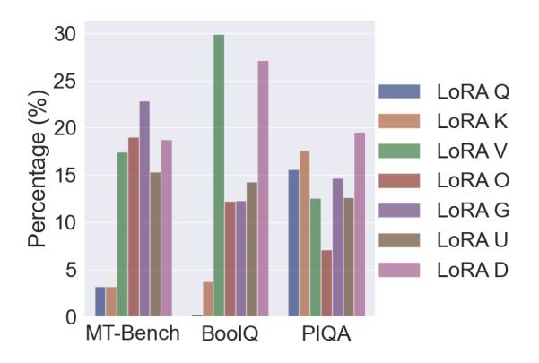
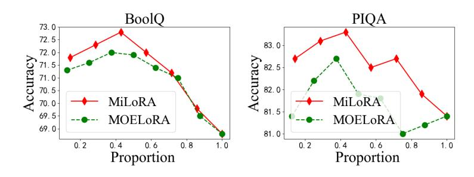
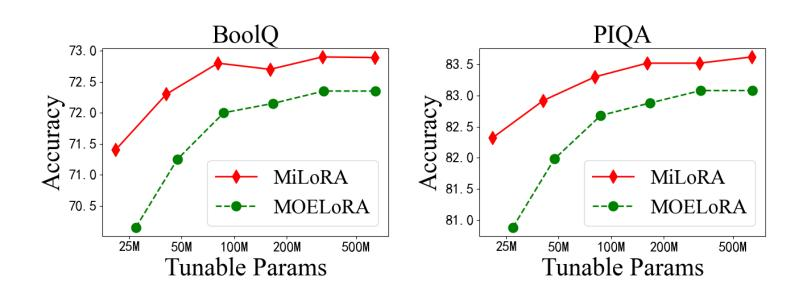

# MiLoRA: Efficient Mixture of Low-Rank Adaptation for Large Language Models Fine-tuning

Jingfan Zhang1∗ Yi Zhao2∗ Dan Chen3† Xing Tian4 Huanran Zheng5 Wei Zhu5† 1 iFLYTEK Co., Ltd, China 2 University of Pennsylvania, USA, [zhaoyi3@seas.upenn.edu](mailto:zhaoyi3@seas.upenn.edu) 3 Lenovo Connect Co., Ltd, China 4 Niuxin Network Technology Co., Ltd, China 5 East China Normal University, China

### Abstract

Low-rank adaptation (LoRA) and its mixtureof-experts (MOE) variants are highly effective parameter-efficient fine-tuning (PEFT) methods. However, they introduce significant latency in multi-tenant settings due to the LoRA modules and MOE routers added to multiple linear modules in the Transformer layer. To address this issue, we propose Mixture of Low-Rank Adaptation (MiLoRA), a novel and efficient LoRA variant. MiLoRA differs from previous MOE-style LoRA methods by considering each LoRA module as an expert and employing a prompt-aware routing mechanism. This mechanism calculates expert routing results once before generating the first new token and reuses these results for subsequent tokens, reducing latency. Extensive experiments and analysis on commonsense reasoning tasks, math reasoning tasks, and widely used LLM evaluation benchmarks demonstrate that MiLoRA consistently outperforms strong PEFT baselines with comparable tunable parameter budgets. Additionally, MiLoRA significantly reduces latency in multi-tenant settings compared to previous LoRA-based methods.

### 1 Introduction

Large language models (LLMs) have been achieving state-of-the-art (SOTA) results not only in various natural language processing tasks [\(Qin](#page-10-0) [et al.,](#page-10-0) [2023;](#page-10-0) [Zhu et al.,](#page-13-0) [2023;](#page-13-0) [Zhu et al.,](#page-12-0) [2023a](#page-12-0)[,b,](#page-12-1) [2021a;](#page-12-2) [Li et al.,](#page-10-1) [2023b;](#page-10-1) [Zhu et al.,](#page-13-1) [2023c;](#page-13-1) [Zhang](#page-12-3) [et al.,](#page-12-3) [2023a;](#page-12-3) [Zhu et al.,](#page-13-2) [2023e;](#page-13-2) [Guo et al.,](#page-9-0) [2021;](#page-9-0) [Zhu et al.,](#page-12-4) [2021b;](#page-12-4) [Zheng et al.,](#page-12-5) [2023;](#page-12-5) [Sun et al.,](#page-11-0) [2020;](#page-11-0) [Zhang et al.,](#page-12-6) [2023c,](#page-12-6)[d;](#page-12-7) [Wang et al.,](#page-11-1) [2023;](#page-11-1) [Zhu](#page-13-3) [et al.,](#page-13-3) [2019a;](#page-13-3) [Zhu,](#page-12-8) [2021c;](#page-12-8) [Zhang et al.,](#page-12-9) [2021;](#page-12-9) [Wang](#page-11-2) [et al.,](#page-11-2) [2020\)](#page-11-2), but also many challenging evaluation tasks [\(Huang et al.,](#page-9-1) [2023;](#page-9-1) [Li et al.,](#page-10-2) [2023a;](#page-10-2) [Cui et al.,](#page-9-2) [2023;](#page-9-2) [Wang et al.,](#page-11-3) [2024;](#page-11-3) [Wenjing Yue and Wang,](#page-11-4) [2023\)](#page-11-4) but also in numerous challenging evaluation tasks [\(Huang et al.,](#page-9-1) [2023;](#page-9-1) [Li et al.,](#page-10-2) [2023a\)](#page-10-2), such as question answering, reasoning, math, safety, and instruction following. Although LLMs are evolving into general task solvers, fine-tuning remains essential for efficient LLM inference and for controlling the style of the generated content [\(Xin et al.,](#page-11-5) [2024;](#page-11-5) [Ding et al.,](#page-9-3) [2022\)](#page-9-3). Full-parameter fine-tuning of such large models is impractical due to the significant GPU memory and computational resources required. Consequently, parameter-efficient finetuning (PEFT) [\(Zhang et al.,](#page-12-10) [2023e;](#page-12-10) [Zhao et al.,](#page-12-11) [2023\)](#page-12-11) has garnered considerable attention in the research community, as it typically involves tuning less than 1% of the LLMs' parameters, thereby substantially reducing computational costs.

Among many PEFT methods, the reparameterization-based method low-rank adaptation (LoRA) [\(Hu et al.,](#page-9-4) [2021\)](#page-9-4) is considered one of the most effective methods for LLMs [\(Xu](#page-11-6) [et al.,](#page-11-6) [2023;](#page-11-6) [Ding et al.,](#page-9-3) [2022;](#page-9-3) [Xin et al.,](#page-11-5) [2024\)](#page-11-5). Although LoRA is effective and can bring stable performance with the original setting in [Hu et al.](#page-9-4) [\(2021\)](#page-9-4), it still brings inconvenience under the multi-tenant setting [\(Chen et al.,](#page-9-5) [2023\)](#page-9-5): it has to add LoRA modules to multiple weights of the Transformer layer and introducing significant additional latency in every generation steps under the multi-tenant setting. Recently, the Mixture-of-Experts (MOE) style LoRA methods [\(Chen et al.,](#page-9-6) [2024;](#page-9-6) [Yang et al.,](#page-12-12) [2024;](#page-12-12) [Liu et al.,](#page-10-3) [2023;](#page-10-3) [Dou et al.,](#page-9-7) [2023;](#page-9-7) [Gou et al.,](#page-9-8) [2023\)](#page-9-8) have surged, further pushing the performance ceilings of LoRA fine-tuning. However, they introduce the calculation of MOE routers, further increasing inference latency. Thus, it is essential to develop a novel variant of the LoRA method that introduces minimum latency during generation and still can perform competitively in downstream tasks.

In this work, we propose a novel PEFT method called Mixture of Low-Rank Adaptation

∗Equal contributions.

†Corresponding author. For any inquiries, please contact: michaelwzhu91@gmail.com;

Figure 1: Schematic illustration of our MiLoRA method. Left: The architecture of a Transformer layer as in LlaMA-2 [\(Touvron et al.,](#page-11-7) [2023\)](#page-11-7). There are seven linear modules and seven positions to add LoRA modules. Right: Upon receiving an input prompt, the LoRA router before each Transformer layer will take the input prompt's hidden states as input features and go through a pooler, an activation function, and the MOE router network to determine which LoRA module is activated (or used) (e.g., LoRA U in the figure). This routing decision is repeatedly used when generating subsequent tokens.

(MiLoRA). Our MiLoRA method differs from the previous literature on MOE-style LoRA methods in the following two aspects. First, in MiLoRA, an entire LoRA module is considered a LoRA expert, and the LoRA router is responsible for determining which LoRA expert to activate. Second, we propose the prompt-aware routing mechanism instead of calculating the expert routing results for every new token. Given an input prompt, the expert routing results are calculated once, right before the generation of the first new token. The subsequent generation steps will reuse the expert routing results. Under the prompt-aware routing mechanism, our LoRA router consists of a pooler operation, a learnable activation function [\(Molina et al.,](#page-10-4) [2019\)](#page-10-4), and a sparse MOE router.

We conduct extensive experiments and analysis on various challenging tasks, including five commonsense reasoning tasks, two math reasoning tasks, and three widely used LLM evaluation benchmarks. Our method can consistently outperform strong PEFT baselines with comparable tunable parameter budgets, especially the recent LoRA variants. In addition, our MiLoRA method has significantly lower latency under the multi-tenant setting [\(Chen et al.,](#page-9-5) [2023\)](#page-9-5) than the previous LoRA-based

methods with comparable tunable parameters. Our contributions are summarized as follows:

- we propose a novel LoRA variant, MiLoRA, which combines the MOE mechanism with LoRA in an efficient way.
- In MiLoRA, we treat each LoRA module as an expert.
- We propose a prompt-aware routing mechanism to avoid token-wise router calculations.
- We have conducted extensive experiments and analysis showing that our MiLoRA framework is (a) practical and outperforms the baselines under comparable parameter budgets. (b) efficient during inference for LLMs.

### 2 Related works

In the era of large language models, among the existing PEFT methods like Adapter [\(Zhang et al.,](#page-12-10) [2023e;](#page-12-10) [Houlsby et al.,](#page-9-9) [2019\)](#page-9-9), Prompt tuning [\(Zhu](#page-13-4) [et al.,](#page-13-4) [2024;](#page-13-4) [Zhu and Tan,](#page-13-5) [2023\)](#page-13-5) or (IA)3 [\(Liu](#page-10-5) [et al.,](#page-10-5) [2022a;](#page-10-5) [Xie et al.,](#page-11-8) [2024\)](#page-11-8) have been outperformed by LoRA [\(Liu et al.,](#page-10-6) [2024b;](#page-10-6) [Hu et al.,](#page-9-4) [2021\)](#page-9-4). Since LoRA is the most popular PEFT method

in the era of large language models (Cui et al., 2023; Zheng et al., 2024; Zhu et al., 2023d; Gao et al., 2023; Zuo et al., 2022; Zhang et al., 2022; Sun et al., 2022; Zhu et al., 2021d; Zhu, 2021d; Li et al., 2019; Zhu et al., 2019c,b; Zhou et al., 2019), many works are devoted to improving upon LoRA. AdaLoRA (Zhang et al., 2023b) looks into the parameter allocation of LoRA modules. VERA (Kopiczko et al., 2023) investigate whether one could freeze the randomly initialized LoRA matrices and only learn a set of scaling vectors. Recently, a series of works has been looking into combining Mixture-of-Experts (MoE) (Shazeer et al., 2017; Jacobs et al., 1991) and LoRA. LLaVA-MoLE (Chen et al., 2024) effectively routes tokens to domainspecific LoRA experts, mitigating data conflicts and achieving consistent performance gains over the original LoRA method. MOELoRA (Liu et al., 2023) proves that fine-tuning LoRA modules with a MOE router enables the LLMs to perform well in a multi-task learning setting. MoRAL (Yang et al., 2024) addresses the challenge of adapting LLMs to new domains/tasks and enabling them to be efficient lifelong learners using the MOE techniques. LoRAMoE (Dou et al., 2023) integrates LoRAs using a router network to alleviate world knowledge forgetting after instruction tuning. MoCLE (Gou et al., 2023) proposes a MoE architecture to activate task-customized model parameters based on instruction clusters.

Although performing well in fine-tuning, these methods introduce high additional latency since (a) these methods do not reduce the number of LoRA modules in the Transformer backbone. (b) the routers and LoRA modules must be called when generating each new token. Our MiLoRA method addresses this efficiency issue by (a) only calling the LoRA routers when encoding the input prompt and before generating the first new token. (b) only activate one LoRA module per Transformer layer.

#### 3 Methods

In this section, we first introduce the foundational concepts of LoRA and MoEs and then elaborate on the architectural design of MiLoRA.

#### 3.1 Preliminaries

**Transformer model** As depicted in Figure 1, each Transformer layer of a LLM such as LlaMA-2 (Touvron et al., 2023) consists of a multi-head self-attention (MHA) sub-layer and a fully connected

feed-forward (FFN) sub-layer. MHA contains four linear modules, which are the Query (Q), Key (K), Value (V), and Output (O) modules. FFN contains three linear modules: Gate (G), Up (U), and Down (D). For notation convenience, we will refer to the number of modules in a Transformer block as  $N_{mod}$ . Thus, in LlaMA-2,  $N_{mod} = 7$ .

**LoRA** For any Transformer module  $m \in \{Q, K, V, O, G, U, D\}$ , the LoRA method adds a pair of low-rank matrices to reparameterize its weights. Formally, the forward calculation of module m with LoRA is:

$$x' = xW_m + xW_m^A W_m^B + b_m, (1)$$

where  $W_m \in \mathbf{R}^{d_1 \times d_2}$  is the weight matrix of module m,  $b_m$  is its bias term.  $W_m^A \in \mathbb{R}^{d_1 \times r}$  and  $W_m^B \in \mathbb{R}^{r \times d_2}$  are the low-rank matrices for the LoRA module, and  $r \ll \min(d_1, d_2)$ . r is the rank of the two matrices and will also be referred to as the rank of the LoRA module.

#### 3.2 Motivation

As demonstrated later in Table 4, the existing works on MOE style LoRA significantly slow down the LLM backbone during inference, reducing tokens per second (tps) by around 20%. Each LoRA module is decomposed into multiple experts in these works, and a router should be called to determine which experts are activated. The calculations of multiple LoRA modules and multiple routers per layer are executed when generating every new token, resulting in latency that is not negligible. In order to improve the efficiency of such MOE LoRA methods, we need to investigate the following research questions:

RQ1. Can we treat a LoRA module as an expert so that each Transformer layer has only one LoRA router and activate only one such expert per layer? RQ2. Can the LoRA router be called once for an input prompt?

#### 3.3 Prompt-aware LoRA router

Trying to investigate *RQ1* and *RQ2*, we now try to propose the details of our MiLoRA method. The core of MiLoRA is the prompt-aware routing mechanism. Under this mechanism, the LoRA router takes the input prompt's hidden states as input and outputs the activated LoRA experts for the current layer. Different from the previous works (Chen et al., 2024; Yang et al., 2024; Liu et al., 2023; Dou et al., 2023; Gou et al., 2023), our work: (a) only

calculates the LoRA routers once when the input prompt is fed through the Transformer backbone for the first time and right before generating the first new token. The routers' activation decisions will be repeatedly used in the subsequent generation steps. (b) determine the activated LoRA experts at the Transformer's layer level, selecting which Transformer module is modified by its corresponding LoRA module.

As shown in Figure 1, to generate a response, the input prompt has to go through the LLM backbone to obtain the hidden representations. Denote the hidden state of the input prompt with length  $n_p$  right before Transformer layer l as  $\mathbf{H}^l \in \mathbf{R}^{n_p \times d}$ . Then a pooling operation Pooler() aggregates the semantic information in  $\mathbf{H}^l$  and transforms it to  $\mathbf{h}^l \in \mathbf{R}^{1 \times d}$ :

$$\mathbf{h}^l = \text{Pooler}(\mathbf{H}^l). \tag{2}$$

Here, according to (Zhu, 2021b,a), the Pooler operation can be one of the following: (a) last-token pooling, which is to use the vector representation of the last token in the prompt as  $\mathbf{h}^l$ . This pooler is widely used when decoder-based models perform sentence classification tasks. (b) average pooling. (c) max pooling. (d) self-attention-based pooling, whose detail is introduced in Appendix C.

Then,  $\mathbf{h}^l$  will go through an activation function g and then the LoRA router  $R^l$  right before layer l.  $R^l$  assigns the current input prompt to the most suitable LoRA expert. This router contains (a) a linear layer that computes the probability of  $\mathbf{h}^l$  being routed to each LoRA expert LoRAm, (b) a softmax function to model a probability distribution over the LoRA experts, and finally, (c) a Top-k function that choose the top k>0 experts with the highest probability masses. Formally,

$$R^{l}(\mathbf{h}^{l}) = \text{Top-k}(\text{Softmax}(q(\mathbf{h}^{l})W_{r}^{l})), \quad (3)$$

where  $W_r^l \in \mathbf{R}^{d \times N_{mod}}$  is the router's weight. The LoRA router dynamically selects the best k experts for each input prompt during inference. Note that the router is only called once before a new token is generated. The activated LoRA experts are used throughout the whole generation process.

Following Fedus et al. (2022), we add a load balancing loss to the training loss function. Consider a training batch B with  $N_B$  samples, let  $f_i^l$  represent the proportion of prompts assigned to the i-th LoRA expert in layer l,

$$f_i^l = \frac{1}{N_B} \sum_{x \in B} \mathbf{1} \{\arg \max_j p_j^l(x) = i\},$$
 (4)

where  $p_j^l$  is the probability of expert j, output by the router l. Let  $\hat{p}_i^l$  be the average of probability masses received by the i-th expert,  $\hat{p}_i^l = \frac{1}{N_B} \sum_{x \in B} p_i^l(x)$ . Then, the load balancing loss is given by:

$$\mathcal{L}_{lb} = N_{mod} \sum_{i=1}^{N_{mod}} f_i^l \cdot \hat{p}_i^l.$$
 (5)

The  $\mathcal{L}_{lb}$  loss term is added to the cross entropy loss with a coefficient  $\lambda_{lb} \geq 0$ .

#### 3.4 Learned activation functions

The previous PEFT literature usually set the activation functions in a PEFT module to be ReLU (Mahabadi et al., 2021; Pfeiffer et al., 2021; Liu et al., 2022b) and does not discuss whether this setting is optimal. In addition, the PEFT modules' activation functions in different Transformer layers are usually set to be identical. As will be presented later in Table 5, it is beneficial for LoRA routers of different depths to have different activation functions. Thus, how can we find an optimal setting for the LoRA routers' activation functions? Exhaustive hyper-parameter search is time and GPU-consuming. Thus, we are motivated to set the activation function to be learnable during training.

We resort to rational activation functions (Molina et al., 2019), which are learnable and can approximate common activation functions and learn new ones. The rational activation function R(x) of order m, n is defined as follows:

$$Ra(x) = \frac{\sum_{j=0}^{m} a_j x^j}{1 + \|\sum_{i=1}^{n} b_i x^i\|},$$
 (6)

where  $a_j$  and  $b_i$  are learnable parameters. The rational activation functions are successfully applied in image classification (Molina et al., 2019) and sequence modeling (Delfosse et al., 2021).

Inspired by the above literature, we propose learning the activation functions in LoRA routers via the rational activation functions when finetuning a downstream task. Denote the set of parameters in the learnable activations as  $\Theta$  and the other parameters in the LoRA routers and LoRA experts as  $\Omega$ . Following DARTS (Liu et al., 2019), we consider  $\Theta$  as architectural parameters and optimize them along with  $\Omega$  via bi-level optimization. Due to limited length, we introduce bi-level optimization in Appendix A.

### 4 Experiments

In this section, we conduct a series of experiments and analysis to evaluate our MiLoRA method.

#### 4.1 Datasets and evaluation metrics

We compare our approach to the baselines on a collection of challenging tasks: (a) five benchmark common-sense question-answering tasks, ARC-e and ARC-c [\(Clark et al.,](#page-9-13) [2018\)](#page-9-13), OBQA [\(Mihaylov](#page-10-15) [et al.,](#page-10-15) [2018\)](#page-10-15), PIQA [\(Bisk et al.,](#page-9-14) [2020\)](#page-9-14), BoolQ [\(Clark et al.,](#page-9-15) [2019\)](#page-9-15). (b) two math reasoning tasks, AQuA [\(Ling et al.,](#page-10-16) [2017\)](#page-10-16) and GSM8k [\(Cobbe et al.,](#page-9-16) [2021\)](#page-9-16). We utilize the chain-of-thought (COT) rationales for these samples provided by [Hu et al.](#page-9-17) [\(2023\)](#page-9-17) for training on these math tasks. All rationales are generated through zero-shot CoT [\(Wei et al.,](#page-11-10) [2022;](#page-11-10) [Kojima et al.,](#page-10-17) [2022\)](#page-10-17) on GPT-3.5[1](#page-4-0) , but without undergoing any error filtering. (c) MT-Bench [\(Zheng](#page-12-20) [et al.,](#page-12-20) [2023\)](#page-12-20), MMLU [\(Hendrycks et al.,](#page-9-18) [2020\)](#page-9-18), and BBH [\(Suzgun et al.,](#page-11-11) [2022\)](#page-11-11). Since these tasks provide no training data, we utilize the Alpaca [\(Taori](#page-11-12) [et al.,](#page-11-12) [2023\)](#page-11-12) dataset for instruction tuning. The detailed statistics, and evaluation metrics can be found in Appendix [B.](#page-13-12)

#### 4.2 Baselines

We compare our MiLoRA framework with the current SOTA PEFT baseline methods.

LoRA and its variants we consider the following LoRA variants as baselines: (a) the original LoRA [\(Hu et al.,](#page-9-4) [2021\)](#page-9-4); (b) AdaLoRA [\(Zhang](#page-12-17) [et al.,](#page-12-17) [2023b\)](#page-12-17), which adaptively adjust the LoRA parameters among different Transformer modules. (c) MOELoRA [\(Liu et al.,](#page-10-3) [2023\)](#page-10-3), which considers each LoRA module as a mixture of single-rank LoRA experts. (d) DoRA [\(Liu et al.,](#page-10-18) [2024a\)](#page-10-18), one of the most recent variants of LoRA that decomposes the pre-trained weights into two components, magnitude, and direction, for fine-tuning, specifically employing LoRA for directional updates.

Other PEFT methods We also consider the most recent PEFT methods: (a) Parallel-Adapter proposed by [He et al.](#page-9-19) [\(2021\)](#page-9-19); (b) Learned-Adapter [\(Zhang et al.,](#page-12-10) [2023e\)](#page-12-10). (c) P-tuning v2 [\(Liu et al.,](#page-10-19) [2021\)](#page-10-19). (d) IAPT [\(Zhu et al.,](#page-13-4) [2024\)](#page-13-4). (e) BitFit [\(Ben-](#page-9-20)[Zaken et al.,](#page-9-20) [2021\)](#page-9-20). (f) (IA)3 [\(Liu et al.,](#page-10-5) [2022a\)](#page-10-5), which multiplies learnable vectors to the hidden states in different modules of the Transformer layer. (g) SSP [\(Hu et al.,](#page-9-21) [2022\)](#page-9-21), which is a representative work on combining different PEFT methods, including LoRA and BitFit.

The baselines are implemented using their open-sourced codes. We only adjust the hyperparameters related to tunable parameter numbers to fairly compare the baseline methods and our MiLoRA method.

# 4.3 Experiment Settings

Computing infrastures We run all our experiments on NVIDIA A40 (48GB) GPUs.

Pretrained backbones The main experiments use the most recent open-sourced LLMs, LlaMA-2 7B [\(Touvron et al.,](#page-11-7) [2023\)](#page-11-7) as the pretrained backbone model. In the ablation studies, we will also use the recently released LlaMA-2 13B and Gemma 2B [\(Team et al.,](#page-11-13) [2024\)](#page-11-13).

Prediction heads When fine-tuning LlaMA-2 7B, we only consider the supervised fine-tuning (SFT) setting [\(Ouyang et al.,](#page-10-20) [2022\)](#page-10-20). After receiving a prompt or instruction, all the predictions are generated using the language modeling head (LM head). No additional prediction heads are installed to make categorical or numerical predictions. For decoding during inference, we use beam search with beam size 3.

Hyper-parameters for the MiLoRA framework In our experiments, unless otherwise specified, we set: (a) the rank of each LoRA expert is set to r = 32. (b) k is set to 3. That is, each router activates one expert. (c) the LoRA router adopts the self-attention pooler. (d) the hyper-parameters of the rational activation are m = 6, n = 5, and th e learnable parameters aj and bi are initialized by approximating the GeLU activation function. (e) λlb is set to 1e-2. Under the above settings, our MiLoRA method will introduce 80.9M tunable parameters and, at most, 16.4M activated PEFT parameters to the LlaMA-2 7B backbone. The hyperparameters for training are specified in Appendix [D.](#page-14-1)

Reproducibility We run each task under five different random seeds and report the median performance on the test set of each task.

Due to limited length, other experimental settings for the baseline methods and the training procedure are in Appendix [D.](#page-14-1)

# 4.4 Main results

Single-task setup. In this setup, We compare MiLoRA with baseline PEFT methods by employ-

1 <https://platform.openai.com/docs/models>

|                      | Tunable   | Activated | ARC-e | ARC-c | BoolQ | OBQA  | PIQA  | AQuA  | GSM8k |      |
|----------------------|-----------|-----------|-------|-------|-------|-------|-------|-------|-------|------|
| Method               | Params    | Params    | (acc) | (acc) | (acc) | (acc) | (acc) | (acc) | (acc) | Avg. |
|                      | Baselines |           |       |       |       |       |       |       |       |      |
| Parallel-Adapter     | 83.9M     | 83.9M     | 67.1  | 54.2  | 65.2  | 76.3  | 69.8  | 15.6  | 26.4  | 53.5 |
| Learned-Adapter      | 81.8M     | 81.8M     | 69.3  | 54.4  | 64.9  | 78.4  | 75.6  | 18.3  | 28.9  | 55.7 |
| P-tuning v2          | 84.5M     | 84.5M     | 63.5  | 51.3  | 61.2  | 76.1  | 66.2  | 9.63  | 21.1  | 49.9 |
| IAPT                 | 83.9M     | 83.9M     | 66.3  | 54.7  | 67.8  | 79.2  | 77.3  | 13.6  | 25.8  | 55.0 |
| BitFit               | 87.0M     | 87.0M     | 65.9  | 54.1  | 66.4  | 77.2  | 76.6  | 11.8  | 21.7  | 53.4 |
| (IA)3                | 78.6M     | 78.6M     | 68.1  | 54.6  | 67.2  | 78.1  | 75.4  | 13.2  | 23.4  | 54.3 |
| SSP                  | 80.6M     | 80.6M     | 71.6  | 57.6  | 69.6  | 79.5  | 79.7  | 15.9  | 31.8  | 58.0 |
| LoRA                 | 80.0M     | 80.0M     | 73.4  | 57.2  | 68.8  | 80.1  | 81.4  | 16.6  | 31.1  | 58.4 |
| AdaLoRA              | 80.0M     | 80.0M     | 73.8  | 57.9  | 69.2  | 80.4  | 82.1  | 17.6  | 31.7  | 59.0 |
| MOELoRA              | 87.3M     | 30.1M     | 76.8  | 60.2  | 72.0  | 81.1  | 82.7  | 18.3  | 32.3  | 60.4 |
| DoRA                 | 80.0M     | 80.0M     | 76.5  | 59.8  | 71.7  | 80.6  | 82.7  | 17.9  | 32.6  | 60.3 |
| Our proposed methods |           |           |       |       |       |       |       |       |       |      |
| MiLoRA (ours)        | 80.9M     | 25.2M     | 77.8  | 61.2  | 72.8  | 81.7  | 83.3  | 19.9  | 33.9  | 61.5 |
| MiDoRA (ours)        | 80.9M     | 25.8M     | 77.5  | 61.3  | 72.9  | 81.3  | 83.1  | 19.3  | 34.1  | 61.3 |

Table 1: The Overall comparison of different PEFT methods for single-task learning. The backbone model is LlaMA-2 7B. We report the median accuracy over five random seeds. Bold and Underline indicate the best and the second-best results.

ing these methods for fine-tuning a single task. The experimental results on the five commonsense reasoning tasks and two math reasoning tasks are presented in Table [1.](#page-5-0) We present the number of tunable parameters in the second column and the average activated parameters in the third column. Table [1](#page-5-0) reveals that our MiLoRA method outperforms the baseline methods across all seven tasks, with comparable tunable parameters and much fewer activated parameters. In particular, MiLoRA outperforms the previous SOTA LoRA style baselines like AdaLoRA, DoRA, and MOELoRA with comparable parameters. These results demonstrate that our method is good at downstream task adaptation of large language models.

Multi-task setup. Table [2](#page-6-1) presents the results of LoRA, DoRA, MOELORA, and MiLoRA with LLaMA2-7B in multi-task learning. In contrast to the single-task setup in Table [1,](#page-5-0) during multitask learning, we mixed training data from ARC, BoolQ, OBQA, and PIQA to train the model, followed by separate evaluations to investigate the generalization ability of each method. The results indicate that (a) compared to single-task learning, LoRA and DoRA exhibit degradation in average accuracy in multi-task learning (LoRA: -2.0%, DoRA: -2.25%). At the same time, MOELORA and MiLoRA maintain nearly the same average accuracy. MiLoRA presents nearly no performance loss regarding the average score.

### Results for general-purpose instruction tuning.

After the LlaMA-2 7B is fine-tuned on the Alpaca [\(Taori et al.,](#page-11-12) [2023\)](#page-11-12) dataset with our MiLoRA method or the MOELoRA methods, we utilize the challenging benchmarks, MT-Bench [\(Zheng et al.,](#page-12-20) [2023\)](#page-12-20), MMLU [\(Hendrycks et al.,](#page-9-18) [2020\)](#page-9-18), and BBH [\(Suzgun et al.,](#page-11-11) [2022\)](#page-11-11), for evaluation. We report the average GPT-4 score (gpt4-score) on the MT-Bench. Table [3](#page-6-2) presents the results. Consistent with the previous experiments (Table [1](#page-5-0) and [2\)](#page-6-1), our MiLoRA method outperforms the MOELoRA methods on the three benchmarks, demonstrating that MiLoRA is superior in enhancing the instruction tuning quality of large language models.

#### 4.5 Ablation studies and further analysis

Analysis of the inference efficiency To demonstrate the inference efficiency of our MiLoRA method, we now compare the GPU memory and decoding speed of MiLoRA, DoRA, and MOELoRA under beam search with different beam sizes. In this experiment, LoRA parameters are not merged to the backbone to mimic the single-LLM multitenant setting [\(Chen et al.,](#page-9-5) [2023\)](#page-9-5). We present two metrics for measuring efficiency: (a) peak memory cost (in MiB). (b) tokens generated per second (tps). The results are presented in Table [4.](#page-6-0)

From Table [4,](#page-6-0) under beam sizes 1 and 3, the MiLoRA method has a comparable memory cost with MOELoRA and DoRA. However, its generation speed in terms of tps is significantly higher. With beam size 1, MiLoRA is 21.7% faster than MOELoRA and 19.7% faster than DoRA.

| Method        | Activated Params | ST/MT | ARC-e (acc)       | ARC-c (acc)       | BoolQ (acc)       | OBQA (acc)                 | PIQA (acc)        | Avg.                       |
|---------------|---------------------|-------|----------------------|----------------------|----------------------|----------------------------|----------------------|----------------------------|
| LoRA          | 80.0M               | ST    | 73.4                 | 57.2                 | 68.8                 | 80.1                       | 81.4                 | 72.2                       |
| LOKA          | 00.0W               | MT    | 67.2 ( <b>-6.2</b> ) | 55.1 ( <b>-2.1</b> ) | 69.1 ( <b>+0.3</b> ) | 80.9 ( +0.8 )              | 78.6 ( <b>-2.8</b> ) | 70.2 ( <mark>-2.0</mark> ) |
| MOELoRA       | 17.3M               | ST    | 76.8                 | 60.2                 | 72.0                 | 81.1                       | 82.7                 | 74.6                       |
| MOELOKA       | 17.31 <b>v</b> 1    | MT    | 76.1 ( <b>-0.7</b> ) | 59.3 ( <b>-0.9</b> ) | 71.5 ( <b>+0.1</b> ) | 80.7 ( <mark>-0.4</mark> ) | 82.1 ( <b>-0.3</b> ) | 73.9 ( <b>-0.5</b> )       |
| DoRA 80.0M    | ST                  | 76.5  | 59.8                 | 71.7                 | 80.6                 | 82.7                       | 74.3                 |                            |
|               | 00.0M               | MT    | 74.1 ( <b>-2.4</b> ) | 59.6 ( <b>-0.2</b> ) | 67.4 ( -4.3 )        | 79.2 ( -1.4 )              | 80.4 ( -2.3 )        | 72.1 ( <mark>-2.2</mark> ) |
| Mil -DA ()    | 12.1M               | ST    | 77.8                 | 61.2                 | 72.8                 | 81.7                       | 83.3                 | 75.4                       |
| MiLoRA (ours) | 12.3M               | MT    | 77.4 ( <b>-0.4</b> ) | 61.5 ( +0.3 )        | 72.3 ( -0.3 )        | 81.3 ( -0.4 )              | 83.5 (+0.3)          | 75.2 ( <b>-0.1</b> )       |

Table 2: The Overall comparison of different PEFT methods for multi-task learning. The backbone model is LlaMA-2 7B. ST refers to the single-task setup, while MT refers to the multi-task setup. We report the average accuracy scores over five different runs, with the difference between MT and ST in red font in the brackets.

| Method  | MT-Bench       | MMLU | BBH acc |  |
|---------|----------------|------|------------|--|
| Methou  | gpt4-score (†) | acc  |            |  |
| MOELoRA | 7.08           | 48.2 | 36.8       |  |
| MiLoRA  | 7.21           | 49.7 | 37.3       |  |

Table 3: Performance of general-purpose instruction tuning using the MiLoRA and MOELoRA methods. The backbone model is LlaMA-2 7B. ↑ means the metric is higher the better.

| Method   | Beam size | Speed (tps) | Memory cost (MiB) |
|----------|-----------|-------------|----------------------|
| DoRA     | 1         | 36.5        | 13784                |
| DOKA     | 3         | 29.6        | 15292                |
| MOEL -DA | 1         | 35.9        | 13788                |
| MOELoRA  | 3         | 28.4        | 15352                |
| MI -DA   | 1         | 43.7        | 13784                |
| MiLoRA   | 3         | 33.5        | 15300                |

Table 4: The memory and speed of LlaMA-2 7B for generating responses given input instructions, with different PEFT methods.

With beam size 3, MiLoRA is 17.9% faster than MOELoRA and 13.2% faster than DoRA. The speed advantages of MiLoRA come from the following factors: (a) our method only calls the LoRA router at each Transformer layer when the input prompt goes through the LLM for the first time and right before generating the first new token. In contrast, MOELoRA and almost all the existing MOE-based LoRA variants require one to call multiple routers per layer when generating every new token. (b) our method significantly reduces the number of LoRA modules activated to modify the LLM backbone at each decoding step, making generating new tokens more efficient.

**Distributions of activated LoRA experts** We now compare the distribution of LoRA experts across all Transformer layers on the MT-Bench,

Figure 2: Distribution of LoRA experts across Transformer layers.

BoolQ, and PIQA tasks, in Figure 2. We can observe that: (a) Different Transformer layers choose to activate different LoRA experts via their corresponding routers, and the maximum proportion a LoRA expert can achieve is less than 30%. The results are intuitive since Transformer layers of different depths represent different knowledge, requiring different LoRA experts to express. (b) the LoRA distributions on different tasks are different. For example, a few layers activate LoRA Q or LoRA K on the MT-Bench and BoolQ tasks, while these two LoRA experts are frequently selected for the PIQA task.

Ablation study of MiLoRA framework We now consider the following variants of MiLoRA: (a) MiLoRA-1 substitutes the self-attention pooling to average pooling. (b) MiLoRA-2 substitutes the self-attention pooling to the last-token pooling. (c) MiLoRA-3 uses the GeLU activation function g for the LoRA router. (d) MiLoRA-4 uses ReLU for the first 16 layers' LoRA routers and GeLU for the deeper 16 layers'. (e) MiLoRA-5 uses GeLU for the first 16 layers' LoRA routers and ReLU for

Figure 3: Performances under different proportion of activated experts.

| Method   | BoolQ (acc) | PIQA (acc) | MMLU (acc) |
|----------|----------------|---------------|---------------|
| MiLoRA   | 72.8           | 83.3          | 49.7          |
| MiLoRA-1 | 72.5           | 83.1          | 49.5          |
| MiLoRA-2 | 72.4           | 82.9          | 49.6          |
| MiLoRA-3 | 72.3           | 82.8          | 49.3          |
| MiLoRA-4 | 71.5           | 82.0          | 48.7          |
| MiLoRA-5 | 72.4           | 82.9          | 49.4          |

Table 5: The comparison of MiLoRA's variants on the BoolQ, PIQA, and MMLU tasks. The backbone model is LlaMA-2 7B.

the deeper 16 layers'. The experimental results on the BoolQ, PIQA, and MMLU tasks are reported in Table [5.](#page-7-0)

The results show that MiLoRA under the default settings (as in Table [1\)](#page-5-0) outperforms the five variants. In addition, (a) comparing MiLoRA-1 and MiLoRA-2 to MiLoRA shows that the selfattention poolers provide high-quality information aggregation, leading to proper LoRA expert selection. (b) Comparing MiLoRA-5 to MiLoRA-3 and MiLoRA-4 demonstrates that using different activation functions for different layers' routers leads to a performance boost. (c) However, MiLoRA outperforms MiLoRA-3, MiLoRA-4, and MiLoRA-5, demonstrating that learnable activation functions can fit a proper activation function for each LoRA router and enhance downstream adaptation capability.

Effects of k. In Table [1](#page-5-0) and [2,](#page-6-1) we set the number of activated LoRA experts, k, to 3. Now, we alter k to {1, 2, 4, 5, 6, 7}, altering the proportion of activated LoRA experts. As a comparison, we also alter the proportion of activated experts in MOELoRA. The results of the BoolQ and PIQA tasks are presented in Figures [3\(a\)](#page-7-1) and [3\(b\),](#page-7-2) respectively. The results show that: (a) With the increased number of activated experts, the performance of the two methods first increases and then decreases. When the proportion of activated experts becomes 1, the two methods reduce to the vanilla LoRA. (b) Our MiLoRA consistently performs superior to the MOELoRA method, demonstrating our method's effectiveness in locating the Transformer modules that need LoRA modules the most.

Effects of the coefficient λlb In Table [1,](#page-5-0) we set router loss coefficient, λlb, to 1e-2. Now, we alter λlb to {0.0, 1e-3, 1e-1, 1e0}, and conduct experiments on the BoolQ and PIQA tasks. The results are reported in Figure [4\(a\)](#page-8-0) and [4\(b\).](#page-8-1) Results show that: (a) MiLoRA achieves the highest average accuracy with the coefficient 1e-2. (b) Disabling router loss or using a higher coefficient results in lower average accuracy. These results suggest that a reasonable router loss coefficient can help address the imbalance problem of experts, while a higher coefficient can impede model convergence during fine-tuning.

Comparisons under different budgets of tunable parameters We vary the budget of tunable parameters for MiLoRA by modifying the values of m = 32 to {8, 16, 64, 128, 256}. We also vary the MOELoRA method's tunable parameter numbers. The experimental results on the BoolQ and PIQA tasks are presented in Figure [5\(a\)](#page-8-2) and [5\(b\).](#page-8-3) The results show that under different tunable parameter budgets, our MiLoRA method (a) can consistently outperform the LoRA and LPT methods, and (b) is more robust to decreases in tunable parameter numbers.

Ablation on the pretrained backbones Our main experiments are conducted on the LlaMA-2 7B model. To demonstrate the broad applicability of our method, we now conduct experiments on LlaMA-2 13B and Gemma 2B. The results are reported in Table [7](#page-15-0) of Appendix [E.](#page-15-1) We can see that our MiLoRA method can also outperform the baseline methods on these two backbones.

Figure 4: Performances under different coefficient λlb.

Figure 5: Performances under different numbers of tunable parameters.

# 5 Conclusion

This work presents the Mixture of LoRA (MiLoRA) method, a novel method for the parameter-efficient fine-tuning of large language models. Different from previous literature on MOE style LoRA methods, MiLoRA: (a) activates LoRA experts at the Transformer layer level, determining which Transformer module's LoRA is activated. (b) The decision to activate which LoRA expert is conditioned on the input prompt. (c) for a given prompt, the LoRA routers are called only once. The subsequent token generation steps reuse the routers' decisions. In order to improve our framework's downstream performance, we propose to learn different activation functions during fine-tuning for LoRA routers of different depths. Our method is convenient to implement and off-the-shelf. Experiments on various tasks demonstrate that our MiLoRA method outperforms the baseline methods while being efficient in inference.

## Limitations

We showed that our proposed method can improve the performance of parameter-efficient tuning on diverse tasks and different pretrained models (i.e., LlaMA-2 7B, LlaMA-2 13B, Gemma 2B). However, we acknowledge the following limitations: (a) the more super-sized open-sourced LLMs, such as LlaMA-2 70B, are not experimented due to

limited computation resources. (b) Other tasks in natural language processing, like information extraction, were also not considered. But our framework can be easily transferred to other backbone architectures and different types of tasks. It would be of interest to investigate if the superiority of our method holds for other large-scaled backbone models and other types of tasks. And we will explore it in future work.

### Ethics Statement

The finding and proposed method aims to improve the soft prompt based tuning in terms of better downstream performances whiling pursuing efficiency. The used datasets are widely used in previous work and, to our knowledge, do not have any attached privacy or ethical issues. In this work, we have experimented with LlaMA-2 models, a modern large language model series. As with all LLMs, LlaMA-2's potential outputs cannot be predicted in advance, and the model may in some instances produce inaccurate, biased or other objectionable responses to user prompts. However, this work's intent is to conduct research on different fine-tuning methods for LLMs, not building applications to general users. In the future, we would like to conduct further tests to see how our method affects the safety aspects of LLMs.

# References

- Elad Ben-Zaken, Shauli Ravfogel, and Yoav Goldberg. 2021. Bitfit: Simple parameter-efficient fine-tuning for transformer-based masked languagemodels. *ArXiv*, abs/2106.10199.
- Yonatan Bisk, Rowan Zellers, Jianfeng Gao, Yejin Choi, et al. 2020. Piqa: Reasoning about physical commonsense in natural language. In *Proceedings of the AAAI conference on artificial intelligence*, volume 34, pages 7432–7439.
- Lequn Chen, Zihao Ye, Yongji Wu, Danyang Zhuo, Luis Ceze, Arvind Krishnamurthy University of Washington, and Duke University. 2023. [Punica: Multi-tenant](https://api.semanticscholar.org/CorpusID:264590197) [lora serving.](https://api.semanticscholar.org/CorpusID:264590197) *ArXiv*, abs/2310.18547.
- Shaoxiang Chen, Zequn Jie, and Lin Ma. 2024. Llavamole: Sparse mixture of lora experts for mitigating data conflicts in instruction finetuning mllms. *arXiv preprint arXiv:2401.16160*.
- Christopher Clark, Kenton Lee, Ming-Wei Chang, Tom Kwiatkowski, Michael Collins, and Kristina Toutanova. 2019. Boolq: Exploring the surprising difficulty of natural yes/no questions. *arXiv preprint arXiv:1905.10044*.
- Peter Clark, Isaac Cowhey, Oren Etzioni, Tushar Khot, Ashish Sabharwal, Carissa Schoenick, and Oyvind Tafjord. 2018. Think you have solved question answering? try arc, the ai2 reasoning challenge. *arXiv preprint arXiv:1803.05457*.
- Karl Cobbe, Vineet Kosaraju, Mohammad Bavarian, Mark Chen, Heewoo Jun, Lukasz Kaiser, Matthias Plappert, Jerry Tworek, Jacob Hilton, Reiichiro Nakano, et al. 2021. Training verifiers to solve math word problems. *arXiv preprint arXiv:2110.14168*.
- Ganqu Cui, Lifan Yuan, Ning Ding, Guanming Yao, Wei Zhu, Yuan Ni, Guotong Xie, Zhiyuan Liu, and Maosong Sun. 2023. [Ultrafeedback: Boosting lan](https://api.semanticscholar.org/CorpusID:263605623)[guage models with high-quality feedback.](https://api.semanticscholar.org/CorpusID:263605623) *ArXiv*, abs/2310.01377.
- Quentin Delfosse, Patrick Schramowski, Alejandro Molina, and Kristian Kersting. 2021. Recurrent rational networks. *arXiv preprint arXiv:2102.09407*.
- Ning Ding, Yujia Qin, Guang Yang, Fu Wei, Zonghan Yang, Yusheng Su, Shengding Hu, Yulin Chen, Chi-Min Chan, Weize Chen, Jing Yi, Weilin Zhao, Xiaozhi Wang, Zhiyuan Liu, Haitao Zheng, Jianfei Chen, Yang Liu, Jie Tang, Juan Li, and Maosong Sun. 2022. Delta tuning: A comprehensive study of parameter efficient methods for pre-trained language models. *ArXiv*, abs/2203.06904.
- Shihan Dou, Enyu Zhou, Yan Liu, Songyang Gao, Jun Zhao, Wei Shen, Yuhao Zhou, Zhiheng Xi, Xiao Wang, Xiaoran Fan, et al. 2023. Loramoe: Revolutionizing mixture of experts for maintaining world knowledge in language model alignment. *arXiv preprint arXiv:2312.09979*.

- William Fedus, Barret Zoph, and Noam Shazeer. 2022. Switch transformers: Scaling to trillion parameter models with simple and efficient sparsity. *Journal of Machine Learning Research*, 23(120):1–39.
- Xiangxiang Gao, Wei Zhu, Jiasheng Gao, and Congrui Yin. 2023. F-pabee: Flexible-patience-based early exiting for single-label and multi-label text classification tasks. In *ICASSP 2023-2023 IEEE International Conference on Acoustics, Speech and Signal Processing (ICASSP)*, pages 1–5. IEEE.
- Yunhao Gou, Zhili Liu, Kai Chen, Lanqing Hong, Hang Xu, Aoxue Li, Dit-Yan Yeung, James T Kwok, and Yu Zhang. 2023. Mixture of cluster-conditional lora experts for vision-language instruction tuning. *arXiv preprint arXiv:2312.12379*.
- Zhao Guo, Yuan Ni, Keqiang Wang, Wei Zhu, and Guotong Xie. 2021. [Global attention decoder for](https://doi.org/10.18653/v1/2021.findings-acl.122) [Chinese spelling error correction.](https://doi.org/10.18653/v1/2021.findings-acl.122) In *Findings of the Association for Computational Linguistics: ACL-IJCNLP 2021*, pages 1419–1428, Online. Association for Computational Linguistics.
- Junxian He, Chunting Zhou, Xuezhe Ma, Taylor Berg-Kirkpatrick, and Graham Neubig. 2021. Towards a unified view of parameter-efficient transfer learning. *ArXiv*, abs/2110.04366.
- Dan Hendrycks, Collin Burns, Steven Basart, Andy Zou, Mantas Mazeika, Dawn Song, and Jacob Steinhardt. 2020. Measuring massive multitask language understanding. *arXiv preprint arXiv:2009.03300*.
- Neil Houlsby, Andrei Giurgiu, Stanislaw Jastrzebski, Bruna Morrone, Quentin De Laroussilhe, Andrea Gesmundo, Mona Attariyan, and Sylvain Gelly. 2019. Parameter-efficient transfer learning for nlp. In *International Conference on Machine Learning*, pages 2790–2799. PMLR.
- Edward J Hu, Yelong Shen, Phillip Wallis, Zeyuan Allen-Zhu, Yuanzhi Li, Shean Wang, Lu Wang, and Weizhu Chen. 2021. Lora: Low-rank adaptation of large language models. *arXiv preprint arXiv:2106.09685*.
- Shengding Hu, Zhen Zhang, Ning Ding, Yadao Wang, Yasheng Wang, Zhiyuan Liu, and Maosong Sun. 2022. Sparse structure search for parameter-efficient tuning. *ArXiv*, abs/2206.07382.
- Zhiqiang Hu, Lei Wang, Yihuai Lan, Wanyu Xu, Ee-Peng Lim, Lidong Bing, Xing Xu, Soujanya Poria, and Roy Ka-Wei Lee. 2023. Llm-adapters: An adapter family for parameter-efficient finetuning of large language models. *arXiv preprint arXiv:2304.01933*.
- Yuzhen Huang, Yuzhuo Bai, Zhihao Zhu, Junlei Zhang, Jinghan Zhang, Tangjun Su, Junteng Liu, Chuancheng Lv, Yikai Zhang, Jiayi Lei, et al. 2023. C-eval: A multi-level multi-discipline chinese evaluation suite for foundation models. *arXiv preprint arXiv:2305.08322*.

- Robert A Jacobs, Michael I Jordan, Steven J Nowlan, and Geoffrey E Hinton. 1991. Adaptive mixtures of local experts. *Neural computation*, 3(1):79–87.
- Yoon Kim. 2014. [Convolutional neural networks for](https://api.semanticscholar.org/CorpusID:9672033) [sentence classification.](https://api.semanticscholar.org/CorpusID:9672033) In *Conference on Empirical Methods in Natural Language Processing*.
- Takeshi Kojima, Shixiang Shane Gu, Machel Reid, Yutaka Matsuo, and Yusuke Iwasawa. 2022. Large language models are zero-shot reasoners. *Advances in neural information processing systems*, 35:22199– 22213.
- Dawid Jan Kopiczko, Tijmen Blankevoort, and Yuki Markus Asano. 2023. [Vera: Vector-based ran](https://api.semanticscholar.org/CorpusID:264172315)[dom matrix adaptation.](https://api.semanticscholar.org/CorpusID:264172315) *ArXiv*, abs/2310.11454.
- Haonan Li, Yixuan Zhang, Fajri Koto, Yifei Yang, Hai Zhao, Yeyun Gong, Nan Duan, and Timothy Baldwin. 2023a. Cmmlu: Measuring massive multitask language understanding in chinese. *arXiv preprint arXiv:2306.09212*.
- Xiaonan Li, Kai Lv, Hang Yan, Tianya Lin, Wei Zhu, Yuan Ni, Guo Tong Xie, Xiaoling Wang, and Xipeng Qiu. 2023b. [Unified demonstration retriever for in](https://api.semanticscholar.org/CorpusID:258557751)[context learning.](https://api.semanticscholar.org/CorpusID:258557751) *ArXiv*, abs/2305.04320.
- Xiepeng Li, Zhexi Zhang, Wei Zhu, Zheng Li, Yuan Ni, Peng Gao, Junchi Yan, and Guotong Xie. 2019. [Pingan smart health and SJTU at COIN - shared task:](https://doi.org/10.18653/v1/D19-6011) [utilizing pre-trained language models and common](https://doi.org/10.18653/v1/D19-6011)[sense knowledge in machine reading tasks.](https://doi.org/10.18653/v1/D19-6011) In *Proceedings of the First Workshop on Commonsense Inference in Natural Language Processing*, pages 93–98, Hong Kong, China. Association for Computational Linguistics.
- Wang Ling, Dani Yogatama, Chris Dyer, and Phil Blunsom. 2017. Program induction by rationale generation: Learning to solve and explain algebraic word problems. *arXiv preprint arXiv:1705.04146*.
- Hanxiao Liu, Karen Simonyan, and Yiming Yang. 2019. Darts: Differentiable architecture search. *ArXiv*, abs/1806.09055.
- Haokun Liu, Derek Tam, Mohammed Muqeeth, Jay Mohta, Tenghao Huang, Mohit Bansal, and Colin Raffel. 2022a. [Few-shot parameter-efficient fine-tuning is](https://api.semanticscholar.org/CorpusID:248693283) [better and cheaper than in-context learning.](https://api.semanticscholar.org/CorpusID:248693283) *ArXiv*, abs/2205.05638.
- Qidong Liu, Xian Wu, Xiangyu Zhao, Yuanshao Zhu, Derong Xu, Feng Tian, and Yefeng Zheng. 2023. Moelora: An moe-based parameter efficient finetuning method for multi-task medical applications. *arXiv preprint arXiv:2310.18339*.
- Shih-Yang Liu, Chien-Yi Wang, Hongxu Yin, Pavlo Molchanov, Yu-Chiang Frank Wang, Kwang-Ting Cheng, and Min-Hung Chen. 2024a. Dora: Weightdecomposed low-rank adaptation. *arXiv preprint arXiv:2402.09353*.

- Xiangyang Liu, Tianxiang Sun, Xuanjing Huang, and Xipeng Qiu. 2022b. Late prompt tuning: A late prompt could be better than many prompts. *ArXiv*, abs/2210.11292.
- Xiao Liu, Kaixuan Ji, Yicheng Fu, Zhengxiao Du, Zhilin Yang, and Jie Tang. 2021. P-tuning v2: Prompt tuning can be comparable to fine-tuning universally across scales and tasks. *ArXiv*, abs/2110.07602.
- Zequan Liu, Jiawen Lyn, Wei Zhu, and Xing Tian. 2024b. Alora: Allocating low-rank adaptation for fine-tuning large language models. In *Proceedings of the 2024 Conference of the North American Chapter of the Association for Computational Linguistics: Human Language Technologies (Volume 1: Long Papers)*, pages 622–641.
- Rabeeh Karimi Mahabadi, James Henderson, and Sebastian Ruder. 2021. Compacter: Efficient low-rank hypercomplex adapter layers. In *NeurIPS*.
- Sourab Mangrulkar, Sylvain Gugger, Lysandre Debut, Younes Belkada, Sayak Paul, and Benjamin Bossan. 2022. Peft: State-of-the-art parameter-efficient finetuning methods. [https://github.com/huggingface/](https://github.com/huggingface/peft) [peft](https://github.com/huggingface/peft).
- Todor Mihaylov, Peter Clark, Tushar Khot, and Ashish Sabharwal. 2018. Can a suit of armor conduct electricity? a new dataset for open book question answering. *arXiv preprint arXiv:1809.02789*.
- Alejandro Molina, Patrick Schramowski, and Kristian Kersting. 2019. [Padé activation units: End-to-end](https://api.semanticscholar.org/CorpusID:196831891) [learning of flexible activation functions in deep net](https://api.semanticscholar.org/CorpusID:196831891)[works.](https://api.semanticscholar.org/CorpusID:196831891) *ArXiv*, abs/1907.06732.
- OpenAI. 2023. [GPT-4 Technical Report.](https://doi.org/10.48550/arXiv.2303.08774) *arXiv e-prints*, page arXiv:2303.08774.
- Long Ouyang, Jeffrey Wu, Xu Jiang, Diogo Almeida, Carroll Wainwright, Pamela Mishkin, Chong Zhang, Sandhini Agarwal, Katarina Slama, Alex Ray, et al. 2022. Training language models to follow instructions with human feedback. *Advances in Neural Information Processing Systems*, 35:27730–27744.
- Jonas Pfeiffer, Aishwarya Kamath, Andreas Rücklé, Kyunghyun Cho, and Iryna Gurevych. 2021. [AdapterFusion: Non-destructive task composition](https://doi.org/10.18653/v1/2021.eacl-main.39) [for transfer learning.](https://doi.org/10.18653/v1/2021.eacl-main.39) In *Proceedings of the 16th Conference of the European Chapter of the Association for Computational Linguistics: Main Volume*, pages 487–503, Online. Association for Computational Linguistics.
- Chengwei Qin, Aston Zhang, Zhuosheng Zhang, Jiaao Chen, Michihiro Yasunaga, and Diyi Yang. 2023. Is chatgpt a general-purpose natural language processing task solver? *arXiv preprint arXiv:2302.06476*.
- Noam Shazeer, Azalia Mirhoseini, Krzysztof Maziarz, Andy Davis, Quoc Le, Geoffrey Hinton, and Jeff Dean. 2017. Outrageously large neural networks: The sparsely-gated mixture-of-experts layer. *arXiv preprint arXiv:1701.06538*.

- Haixia Sun, Jin Xiao, Wei Zhu, Yilong He, Sheng Zhang, Xiaowei Xu, Li Hou, Jiao Li, Yuan Ni, and Guotong Xie. 2020. [Medical knowledge graph to](https://doi.org/10.2196/17653) [enhance fraud, waste, and abuse detection on claim](https://doi.org/10.2196/17653) [data: Model development and performance evalua](https://doi.org/10.2196/17653)[tion.](https://doi.org/10.2196/17653) *JMIR Med Inform*, 8(7):e17653.
- Tianxiang Sun, Xiangyang Liu, Wei Zhu, Zhichao Geng, Lingling Wu, Yilong He, Yuan Ni, Guotong Xie, Xuanjing Huang, and Xipeng Qiu. 2022. [A simple](https://doi.org/10.18653/v1/2022.findings-acl.189) [hash-based early exiting approach for language un](https://doi.org/10.18653/v1/2022.findings-acl.189)[derstanding and generation.](https://doi.org/10.18653/v1/2022.findings-acl.189) In *Findings of the Association for Computational Linguistics: ACL 2022*, pages 2409–2421, Dublin, Ireland. Association for Computational Linguistics.
- Mirac Suzgun, Nathan Scales, Nathanael Schärli, Sebastian Gehrmann, Yi Tay, Hyung Won Chung, Aakanksha Chowdhery, Quoc V Le, Ed H Chi, Denny Zhou, et al. 2022. Challenging big-bench tasks and whether chain-of-thought can solve them. *arXiv preprint arXiv:2210.09261*.
- Rohan Taori, Ishaan Gulrajani, Tianyi Zhang, Yann Dubois, Xuechen Li, Carlos Guestrin, Percy Liang, and Tatsunori B. Hashimoto. 2023. Stanford alpaca: An instruction-following llama model. [https:](https://github.com/tatsu-lab/stanford_alpaca) [//github.com/tatsu-lab/stanford\\_alpaca](https://github.com/tatsu-lab/stanford_alpaca).
- Gemma Team, Thomas Mesnard, Cassidy Hardin, Robert Dadashi, Surya Bhupatiraju, Shreya Pathak, Laurent Sifre, Morgane Rivière, Mihir Sanjay Kale, Juliette Love, et al. 2024. Gemma: Open models based on gemini research and technology. *arXiv preprint arXiv:2403.08295*.
- Hugo Touvron, Louis Martin, Kevin R. Stone, Peter Albert, Amjad Almahairi, Yasmine Babaei, Nikolay Bashlykov, Soumya Batra, Prajjwal Bhargava, Shruti Bhosale, Daniel M. Bikel, Lukas Blecher, Cristian Cantón Ferrer, Moya Chen, Guillem Cucurull, David Esiobu, Jude Fernandes, Jeremy Fu, Wenyin Fu, Brian Fuller, Cynthia Gao, Vedanuj Goswami, Naman Goyal, Anthony S. Hartshorn, Saghar Hosseini, Rui Hou, Hakan Inan, Marcin Kardas, Viktor Kerkez, Madian Khabsa, Isabel M. Kloumann, A. V. Korenev, Punit Singh Koura, Marie-Anne Lachaux, Thibaut Lavril, Jenya Lee, Diana Liskovich, Yinghai Lu, Yuning Mao, Xavier Martinet, Todor Mihaylov, Pushkar Mishra, Igor Molybog, Yixin Nie, Andrew Poulton, Jeremy Reizenstein, Rashi Rungta, Kalyan Saladi, Alan Schelten, Ruan Silva, Eric Michael Smith, R. Subramanian, Xia Tan, Binh Tang, Ross Taylor, Adina Williams, Jian Xiang Kuan, Puxin Xu, Zhengxu Yan, Iliyan Zarov, Yuchen Zhang, Angela Fan, Melanie Kambadur, Sharan Narang, Aurelien Rodriguez, Robert Stojnic, Sergey Edunov, and Thomas Scialom. 2023. [Llama 2: Open foundation](https://api.semanticscholar.org/CorpusID:259950998) [and fine-tuned chat models.](https://api.semanticscholar.org/CorpusID:259950998) *ArXiv*, abs/2307.09288.
- Li Wang, Wei Zhu, Sihang Jiang, Sheng Zhang, Keqiang Wang, Yuan Ni, Guo Tong Xie, and Yanghua Xiao. 2020. [Mining infrequent high-quality phrases](https://api.semanticscholar.org/CorpusID:224281022) [from domain-specific corpora.](https://api.semanticscholar.org/CorpusID:224281022) *Proceedings of the*

- *29th ACM International Conference on Information & Knowledge Management*.
- Pengfei Wang, Huanran Zheng, Silong Dai, Wenjing Yue, Wei Zhu, and Xiaoling Wang. 2024. Ts-tcd: Triplet-level cross-modal distillation for time-series forecasting using large language models. *arXiv preprint arXiv:2409.14978*.
- Xuwu Wang, Lihan Chen, Wei Zhu, Yuan Ni, Guo Tong Xie, Deqing Yang, and Yanghua Xiao. 2023. [Multi](https://api.semanticscholar.org/CorpusID:258975891)[task entity linking with supervision from a taxon](https://api.semanticscholar.org/CorpusID:258975891)[omy.](https://api.semanticscholar.org/CorpusID:258975891) *Knowledge and Information Systems*, 65:4335 – 4358.
- Jason Wei, Xuezhi Wang, Dale Schuurmans, Maarten Bosma, Ed Huai hsin Chi, F. Xia, Quoc Le, and Denny Zhou. 2022. [Chain of thought prompting](https://api.semanticscholar.org/CorpusID:246411621) [elicits reasoning in large language models.](https://api.semanticscholar.org/CorpusID:246411621) *ArXiv*, abs/2201.11903.
- Wei Zhu Wenjing Yue and Xiaoling Wang. 2023. Tcmeb: Performance evaluation of large language models based on traditional chinese medicine benchmarks. [https://github.com/ywjawmw/](https://github.com/ywjawmw/ShenNong-TCM-Evaluation-BenchMark) [ShenNong-TCM-Evaluation-BenchMark](https://github.com/ywjawmw/ShenNong-TCM-Evaluation-BenchMark).
- Thomas Wolf, Lysandre Debut, Victor Sanh, Julien Chaumond, Clement Delangue, Anthony Moi, Pierric Cistac, Tim Rault, Rémi Louf, Morgan Funtowicz, et al. 2020a. Transformers: State-of-the-art natural language processing. In *Proceedings of the 2020 conference on empirical methods in natural language processing: system demonstrations*, pages 38–45.
- Thomas Wolf, Lysandre Debut, Victor Sanh, Julien Chaumond, Clement Delangue, Anthony Moi, Pierric Cistac, Tim Rault, Rémi Louf, Morgan Funtowicz, Joe Davison, Sam Shleifer, Patrick von Platen, Clara Ma, Yacine Jernite, Julien Plu, Canwen Xu, Teven Le Scao, Sylvain Gugger, Mariama Drame, Quentin Lhoest, and Alexander M. Rush. 2020b. [Transform](https://www.aclweb.org/anthology/2020.emnlp-demos.6)[ers: State-of-the-art natural language processing.](https://www.aclweb.org/anthology/2020.emnlp-demos.6) In *Proceedings of the 2020 Conference on Empirical Methods in Natural Language Processing: System Demonstrations*, pages 38–45, Online. Association for Computational Linguistics.
- Tianfang Xie, Tianjing Li, Wei Zhu, Wei Han, and Yi Zhao. 2024. Pedro: Parameter-efficient finetuning with prompt dependent representation modification. *arXiv preprint arXiv:2409.17834*.
- Yi Xin, Siqi Luo, Haodi Zhou, Junlong Du, Xiaohong Liu, Yue Fan, Qing Li, and Yuntao Du. 2024. [Parameter-efficient fine-tuning for pre-trained vision](https://api.semanticscholar.org/CorpusID:267412110) [models: A survey.](https://api.semanticscholar.org/CorpusID:267412110) *ArXiv*, abs/2402.02242.
- Lingling Xu, Haoran Xie, Si-Zhao Joe Qin, Xiaohui Tao, and Fu Lee Wang. 2023. [Parameter-efficient](https://api.semanticscholar.org/CorpusID:266362573) [fine-tuning methods for pretrained language mod](https://api.semanticscholar.org/CorpusID:266362573)[els: A critical review and assessment.](https://api.semanticscholar.org/CorpusID:266362573) *ArXiv*, abs/2312.12148.

- Shu Yang, Muhammad Asif Ali, Cheng-Long Wang, Lijie Hu, and Di Wang. 2024. Moral: Moe augmented lora for llms' lifelong learning. *arXiv preprint arXiv:2402.11260*.
- Jingfang Zhang, Ming Tan, Pengyu Dai, and Wei-Guo Zhu. 2023a. [Leco: Improving early exiting via](https://api.semanticscholar.org/CorpusID:259370796) [learned exits and comparison-based exiting mech](https://api.semanticscholar.org/CorpusID:259370796)[anism.](https://api.semanticscholar.org/CorpusID:259370796) In *Annual Meeting of the Association for Computational Linguistics*.
- Qingru Zhang, Minshuo Chen, Alexander W. Bukharin, Pengcheng He, Yu Cheng, Weizhu Chen, and Tuo Zhao. 2023b. [Adaptive budget alloca](https://api.semanticscholar.org/CorpusID:257631760)[tion for parameter-efficient fine-tuning.](https://api.semanticscholar.org/CorpusID:257631760) *ArXiv*, abs/2303.10512.
- Xinpeng Zhang, Ming Tan, Jingfan Zhang, and Wei Zhu. 2023c. [Nag-ner: a unified non-autoregressive](https://api.semanticscholar.org/CorpusID:259370837) [generation framework for various ner tasks.](https://api.semanticscholar.org/CorpusID:259370837) In *Annual Meeting of the Association for Computational Linguistics*.
- Yuming Zhang, Xiangxiang Gao, Wei Zhu, and Xiaoling Wang. 2023d. [Fastner: Speeding up inferences](https://api.semanticscholar.org/CorpusID:265214231) [for named entity recognition tasks.](https://api.semanticscholar.org/CorpusID:265214231) In *International Conference on Advanced Data Mining and Applications*.
- Yuming Zhang, Peng Wang, Ming Tan, and Wei-Guo Zhu. 2023e. [Learned adapters are better than man](https://api.semanticscholar.org/CorpusID:259858833)[ually designed adapters.](https://api.semanticscholar.org/CorpusID:259858833) In *Annual Meeting of the Association for Computational Linguistics*.
- Zhen Zhang, Wei Zhu, Jinfan Zhang, Peng Wang, Rize Jin, and Tae-Sun Chung. 2022. [PCEE-BERT: Ac](https://doi.org/10.18653/v1/2022.findings-naacl.25)[celerating BERT inference via patient and confident](https://doi.org/10.18653/v1/2022.findings-naacl.25) [early exiting.](https://doi.org/10.18653/v1/2022.findings-naacl.25) In *Findings of the Association for Computational Linguistics: NAACL 2022*, pages 327–338, Seattle, United States. Association for Computational Linguistics.
- Zhexi Zhang, Wei Zhu, Junchi Yan, Peng Gao, and Guowang Xie. 2021. Automatic student network search for knowledge distillation. *2020 25th International Conference on Pattern Recognition (ICPR)*, pages 2446–2453.
- Wayne Xin Zhao, Kun Zhou, Junyi Li, Tianyi Tang, Xiaolei Wang, Yupeng Hou, Yingqian Min, Beichen Zhang, Junjie Zhang, Zican Dong, Yifan Du, Chen Yang, Yushuo Chen, Zhipeng Chen, Jinhao Jiang, Ruiyang Ren, Yifan Li, Xinyu Tang, Zikang Liu, Peiyu Liu, Jian-Yun Nie, and Ji-Rong Wen. 2023. [A](https://doi.org/10.48550/arXiv.2303.18223) [Survey of Large Language Models.](https://doi.org/10.48550/arXiv.2303.18223) *arXiv e-prints*, page arXiv:2303.18223.
- Huanran Zheng, Wei Zhu, Pengfei Wang, and Xiaoling Wang. 2023. [Candidate soups: Fusing candi](https://api.semanticscholar.org/CorpusID:256358677)[date results improves translation quality for non](https://api.semanticscholar.org/CorpusID:256358677)[autoregressive translation.](https://api.semanticscholar.org/CorpusID:256358677) *ArXiv*, abs/2301.11503.
- Huanran Zheng, Wei Zhu, and Xiaoling Wang. 2024. Nat4at: Using non-autoregressive translation makes autoregressive translation faster and better. In *Proceedings of the ACM on Web Conference 2024*, pages 4181–4192.

- Lianmin Zheng, Wei-Lin Chiang, Ying Sheng, Siyuan Zhuang, Zhanghao Wu, Yonghao Zhuang, Zi Lin, Zhuohan Li, Dacheng Li, Eric. P Xing, Hao Zhang, Joseph E. Gonzalez, and Ion Stoica. 2023. [Judging](https://doi.org/10.48550/arXiv.2306.05685) [LLM-as-a-Judge with MT-Bench and Chatbot Arena.](https://doi.org/10.48550/arXiv.2306.05685) *arXiv e-prints*, page arXiv:2306.05685.
- Xiaofeng Zhou, Yuan Ni, Guotong Xie, Wei Zhu, Cai Chen, Tianhao Wang, and Zhigang Pan. 2019. Analysis of the health information needs of diabetics in china. In *MEDINFO 2019: Health and Wellbeing e-Networks for All*, pages 487–491. IOS Press.
- Wei Zhu. 2021a. Autonlu: Architecture search for sentence and cross-sentence attention modeling with redesigned search space. In *NLPCC*.
- Wei Zhu. 2021b. [AutoRC: Improving BERT based rela](https://doi.org/10.18653/v1/2021.acl-srw.4)[tion classification models via architecture search.](https://doi.org/10.18653/v1/2021.acl-srw.4) In *Proceedings of the 59th Annual Meeting of the Association for Computational Linguistics and the 11th International Joint Conference on Natural Language Processing: Student Research Workshop*, pages 33– 43, Online. Association for Computational Linguistics.
- Wei Zhu. 2021c. Leebert: Learned early exit for bert with cross-level optimization. In *ACL*.
- Wei Zhu. 2021d. [Mvp-bert: Multi-vocab pre-training](https://api.semanticscholar.org/CorpusID:237331564) [for chinese bert.](https://api.semanticscholar.org/CorpusID:237331564) In *Annual Meeting of the Association for Computational Linguistics*.
- Wei Zhu, Yilong He, Ling Chai, Yuanchun Fan, Yuan Ni, Guo Tong Xie, and Xiaoling Wang. 2021a. [paht\\_nlp](https://api.semanticscholar.org/CorpusID:235097590) [@ mediqa 2021: Multi-grained query focused multi](https://api.semanticscholar.org/CorpusID:235097590)[answer summarization.](https://api.semanticscholar.org/CorpusID:235097590) In *Workshop on Biomedical Natural Language Processing*.
- Wei Zhu, Wenfeng Li, Xiaoling Wang, Wendi Ji, Yuanbin Wu, Jin Chen, Liang Chen, and Buzhou Tang. 2023a. Extracting decision trees from medical texts: An overview of the text2dt track in chip2022. In *Health Information Processing. Evaluation Track Papers*, pages 89–102, Singapore. Springer Nature Singapore.
- Wei Zhu, Wenfeng Li, Xiaoling Wang, Wendi Ji, Yuanbin Wu, Jin Chen, Liang Chen, and Buzhou Tang. 2023b. Extracting decision trees from medical texts: An overview of the text2dt track in chip2022. In *Health Information Processing. Evaluation Track Papers*, pages 89–102, Singapore. Springer Nature Singapore.
- Wei Zhu, Yuan Ni, Xiaoling Wang, and Guotong Xie. 2021b. [Discovering better model architectures for](https://doi.org/10.18653/v1/2021.naacl-industry.29) [medical query understanding.](https://doi.org/10.18653/v1/2021.naacl-industry.29) In *Proceedings of the 2021 Conference of the North American Chapter of the Association for Computational Linguistics: Human Language Technologies: Industry Papers*, pages 230–237, Online. Association for Computational Linguistics.

- Wei Zhu, Yuan Ni, Guo Tong Xie, Xiaofeng Zhou, and Cai Chen. 2019a. [The dr-kgqa system for au](https://api.semanticscholar.org/CorpusID:208207213)[tomatically answering medication related questions](https://api.semanticscholar.org/CorpusID:208207213) [in chinese.](https://api.semanticscholar.org/CorpusID:208207213) *2019 IEEE International Conference on Healthcare Informatics (ICHI)*, pages 1–6.
- Wei Zhu, Yuan Ni, Guotong Xie, Xiaofeng Zhou, and Cai Chen. 2019b. The dr-kgqa system for automatically answering medication related questions in chinese. In *2019 IEEE International Conference on Healthcare Informatics (ICHI)*, pages 1–6. IEEE.
- Wei Zhu and Ming Tan. 2023. [SPT: Learning to se](https://aclanthology.org/2023.emnlp-main.727)[lectively insert prompts for better prompt tuning.](https://aclanthology.org/2023.emnlp-main.727) In *Proceedings of the 2023 Conference on Empirical Methods in Natural Language Processing*, pages 11862–11878, Singapore. Association for Computational Linguistics.
- Wei Zhu, Aaron Xuxiang Tian, Congrui Yin, Yuan Ni, Xiaoling Wang, and Guotong Xie. 2024. Iapt: Instruction-aware prompt tuning for large language models. *arXiv preprint arXiv:2405.18203*.
- Wei Zhu, Peifeng Wang, Yuan Ni, Guo Tong Xie, and Xiaoling Wang. 2023c. [Badge: Speeding up bert](https://api.semanticscholar.org/CorpusID:259370582) [inference after deployment via block-wise bypasses](https://api.semanticscholar.org/CorpusID:259370582) [and divergence-based early exiting.](https://api.semanticscholar.org/CorpusID:259370582) In *Annual Meeting of the Association for Computational Linguistics*.
- Wei Zhu, Peng Wang, Xiaoling Wang, Yuan Ni, and Guotong Xie. 2023d. Acf: aligned contrastive finetuning for language and vision tasks. In *ICASSP 2023-2023 IEEE International Conference on Acoustics, Speech and Signal Processing (ICASSP)*, pages 1–5. IEEE.
- Wei Zhu, Xiaoling Wang, Mosha Chen, and Buzhou Tang. 2023e. [Overview of the promptcblue shared](https://api.semanticscholar.org/CorpusID:266690968) [task in chip2023.](https://api.semanticscholar.org/CorpusID:266690968) *ArXiv*, abs/2312.17522.
- Wei Zhu, Xiaoling Wang, Yuan Ni, and Guotong Xie. 2021c. Autotrans: Automating transformer design via reinforced architecture search. In *Natural Language Processing and Chinese Computing*, pages 169–182, Cham. Springer International Publishing.
- Wei Zhu, Xiaoling Wang, Yuan Ni, and Guotong Xie. 2021d. [GAML-BERT: Improving BERT early exit](https://aclanthology.org/2021.emnlp-main.242)[ing by gradient aligned mutual learning.](https://aclanthology.org/2021.emnlp-main.242) In *Proceedings of the 2021 Conference on Empirical Methods in Natural Language Processing*, pages 3033–3044, Online and Punta Cana, Dominican Republic. Association for Computational Linguistics.
- Wei Zhu, Xiaoling Wang, Huanran Zheng, Mosha Chen, and Buzhou Tang. 2023. [PromptCBLUE: A Chinese](https://doi.org/10.48550/arXiv.2310.14151) [Prompt Tuning Benchmark for the Medical Domain.](https://doi.org/10.48550/arXiv.2310.14151) *arXiv e-prints*, page arXiv:2310.14151.
- Wei Zhu, Xiaofeng Zhou, Keqiang Wang, Xun Luo, Xiepeng Li, Yuan Ni, and Guotong Xie. 2019c. Panlp at mediqa 2019: Pre-trained language models, transfer learning and knowledge distillation. In *Proceedings of the 18th BioNLP Workshop and Shared Task*, pages 380–388.

Yuhui Zuo, Wei Zhu, and Guoyong GUET Cai. 2022. [Continually detection, rapidly react: Unseen rumors](https://aclanthology.org/2022.coling-1.268) [detection based on continual prompt-tuning.](https://aclanthology.org/2022.coling-1.268) In *Proceedings of the 29th International Conference on Computational Linguistics*, pages 3029–3041, Gyeongju, Republic of Korea. International Committee on Computational Linguistics.

# A Appendix: introduction to bi-level optimization

The bi-level optimization [\(Liu et al.,](#page-10-14) [2019\)](#page-10-14) optimize Θ conditioned on the optimized parameters of Ω ∗ . Denote the training set as Dtrain, and the validation set as Dval. The inner and outer levels of optimization are conducted on these two separate splits of the task dataset, which is analogous to validating architectures trained on Dtrain using a different split Dval to avoid over-fitting. Thus the optimization objective is:

$$\min_{\Theta} \mathcal{L}(\mathcal{D}_{val}, \Omega^*, \Theta),$$
s.t.  $\Omega^* = \arg\min_{\Omega} \mathcal{L}(\mathcal{D}_{train}, \Omega, \Theta),$  (7)

where L() is the objective function on a given downstream task, such as cross entropy loss. The above bi-level optimization problem is approximated with an alternating optimization strategy. The gradients of Ω are calculated with batches of samples from Dtrain, and the gradients of Θ are calculated on Dval.

# B Appendix for the datsets and evaluation metrics

#### B.1 Dataset statistics

The detailed statistics of the above tasks' datasets are presented in Table [6.](#page-14-2)

#### B.2 Evaluation metrics/protocols

For the commonsense reasoning and math reasoning tasks, since they usually come with a definite answer choice, we will directly consider the correctness of the final answers. Thus, we report accuracy (denoted as acc).

For evaluating the quality of instruction tuned LlaMA-2 7B on the MT-Bench, we follow the current common practice of utilizing GPT-4 as a unbiased reviewer [\(Zheng et al.,](#page-12-20) [2023\)](#page-12-20). We generate model responses from a fine-tuned model with beam size 3 with the generation function in Huggingface Transformers [\(Wolf et al.,](#page-11-14) [2020a\)](#page-11-14). Then we compare MOELoRA and MiLoRA's answers with GPT-4. For each instruction in MT-Bench,

| Datasets                    | #train | #dev  | #test | Type                  | Metrics      |  |
|-----------------------------|--------|-------|-------|-----------------------|--------------|--|
| Commonsense reasoning tasks |        |       |       |                       |              |  |
| BoolQ                       | 9427   | -     | 3270  | Commonsense reasoning | acc          |  |
| OBQA                        | 4957   | 500   | 500   | Commonsense reasoning | acc          |  |
| ARC-e                       | 2251   | 570   | 2376  | Commonsense reasoning | acc          |  |
| ARC-c                       | 1119   | 299   | 1172  | Commonsense reasoning | acc          |  |
| PIQA                        | 16,000 | 2,000 | 3,000 | Commonsense reasoning | acc          |  |
| Math reasoning tasks        |        |       |       |                       |              |  |
| AQuA                        | 97467  | 254   | 254   | Math reasoning        | acc          |  |
| GSM8K                       | 7473   | -     | 1319  | Math reasoning        | acc          |  |
| Instruction tuning          |        |       |       |                       |              |  |
| Alpaca                      | 50k    | -     | -     | Instruction tuning    | -            |  |
| LLM evaluation tasks        |        |       |       |                       |              |  |
| MT-Bench                    | -      | -     | 80    | Question answering    | GPT-4 scores |  |
| MMLU                        | -      | -     | 14042 | Question Answering    | acc          |  |
| BBH                         | -      | -     | 6,511 | Question Answering    | acc          |  |
|                             |        |       |       |                       |              |  |

Table 6: The dataset statistics.

GPT-4 [\(OpenAI,](#page-10-21) [2023\)](#page-10-21) is asked to write a review for both answers from the two methods, and assigns a quantitative score on a scale of 10 to each response.

# C Details for the self-attention based pooler

Our LoRA routers must pool the input prompts of variable lengths to a fixed length. For the pooling operation, the previous literature often chooses average pooling or max pooling [\(Kim,](#page-10-22) [2014;](#page-10-22) [Zhu](#page-13-13) [et al.,](#page-13-13) [2021c;](#page-13-13) [Zhu,](#page-12-19) [2021a\)](#page-12-19), which are pointed out by the literature [\(Zhu,](#page-12-18) [2021b\)](#page-12-18) that they are prone to weaken important words when the input sequence is long, thus dropping useful information during pooling. Thus, in this work, we utilize the self-attention mechanism in our pooling module Pooler(). Self-Attention assigns each token in the input instruction a weight to indicate the importance of the token. A few crucial tokens to the task will be emphasized, while the less important tokens are ignored. Formally, we initialize a learnable weight matrix Wsa ∈ R d×1 , then the self-attention based pooler's calculation processes are:

$$\mathbf{U} = \mathbf{h}W_{sa},$$
 $\mathbf{A} = \text{Softmax}(\mathbf{U}),$ 
 $\mathbf{p} = \mathbf{A}^{\mathsf{T}}\mathbf{h},$  (8)

where p ∈ R np×d is the input tesor, Softmax is the softmax function along the first dimension, and ⊺ denotes matrix transpose. In the above equations,

each column of Wsa is a trainable query vector designated to determine the self-attention weights via dot products between this query and each token. Then, the weights are normalized across the sequence dimension via the softmax normalization function. Corresponding to different soft tokens, different query vectors in Wsa can aggregate the input instructions in different aspects, thus providing a high-quality summarization of the instruction's semantic information.

### D Appendix for Experimental settings

Here, we provide more details for experimental settings.

Hyper-parameters for the baseline PEFT methods For P-tuning V2, the number of prompt tokens at each layer is set to 16, and the soft prompts are initialized with dimension 640, and then is projected to dimension 4096. For IAPT, the prompt length is 4, and the bottleneck dimension for the prompt generator is 320.

For the Parallel-Adapter and Learned-Adapter, the bottleneck dimension is set to 160. Adapters are connected to both the self-attention and FFN sub-layer.

We adjust the sparsity for SSP so that the number of tunable parameters is comparable with MiLoRA and the other baselines. For BitFit, the bias vectors are initialized with dimension 64, and then a learnable projection layer projects it to the same dimension with the LlaMA-2 backbone. For (IA)3 , the activation adjusting vectors are added the Query,

Key, and Up activations. The adjusting vectors are initialized with dimension 128, and then a learnable projection layer projects it to the same dimension with the LlaMA-2 backbone.

For LoRA, the rank size r at each LoRA module is set to 32. For AdaLoRA, the initial rank at each module is set to 64, and half of the rank budget is pruned during fine-tuning. For MOELoRA, the rank size r at each LoRA module is set to 32, and the LoRA modules is reformulated as 32 singlerank LoRAs. Then each 4 forms an expert. Thus, a LoRA module consists of 8 experts, and the router is top-4 router, activating 4 of the expert for predicting the next token. DoRA also sets the rank size r to 32.

Training settings for PEFT methods We use the HugginFace Transformers [\(Wolf et al.,](#page-11-15) [2020b\)](#page-11-15), PEFT [\(Mangrulkar et al.,](#page-10-23) [2022\)](#page-10-23), or the original code repositories for implementing all the methods, and for training and making predictions. For fine-tuning LlaMA-2 7B model, the maximum sequence length is set to 768. The maximum training epoch is set to 10. The batch size is set between 16 for task with less than 10k training set, and 128 otherwise. We use AdamW as the optimizer with a linear learning rate decay schedule and 6% of the training steps for warm-up. The learning rate is set to 1e-4. For MiLoRA, the load balance loss coefficient λlb is set to 1e-2. For the bi-level optimization of learnable activations, the validation set is the same with the dev set. The hyper-parameters for calculating the gradients of the architectural parameters are the same with the normal training procedure, except that the learning rate is 1e-6. The other hyper-parameters are kept the same with [\(Wolf et al.,](#page-11-15) [2020b\)](#page-11-15). In every 200 steps, the model is evaluated on the dev set to calculate dev set perplexity. Patience is set to 10, that is, if the model does not achieve a lower dev set perplexity for 10 evaluation runs, the training stops early. The best checkpoint on the dev set is used to run predictions on the test set.

# E Ablation on the pretrained backbones

Our main experiments are conducted on the LlaMA-2 7B model. To demonstrate that our method works well regardless of the backbone models, we now conduct experiments on the LlaMA-2 13B model and Gemma 2B models. The other experimental settings are kept the same with the main experiments (Table [1\)](#page-5-0). We conduct experiments on

| BoolQ (acc)          | PIQA (acc) | MMLU (acc) |  |  |  |  |
|-------------------------|---------------|---------------|--|--|--|--|
| Results for LlaMA-2 13B |               |               |  |  |  |  |
| 73.5                    | 85.8          | 50.5          |  |  |  |  |
| 74.9                    | 86.6          | 51.2          |  |  |  |  |
| Results for Gemma 2B    |               |               |  |  |  |  |
| 62.3                    | 79.4          | 39.8          |  |  |  |  |
| 63.9                    | 80.3          | 40.7          |  |  |  |  |
|                         |               |               |  |  |  |  |

Table 7: Results for different PEFT methods on the BoolQ, PIQA and MMLU benchmarks. The backbone LMs are LlaMA-2 13B, an Gemma 2B.

the BoolQ, PIQA and MMLU tasks. The results are reported in Table [7.](#page-15-0)