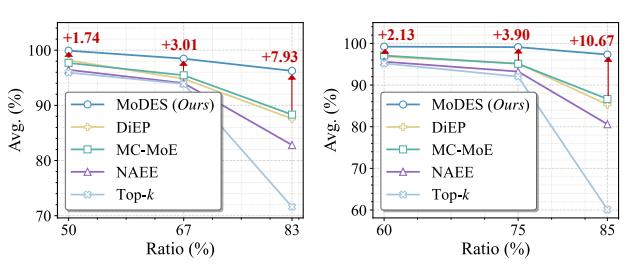
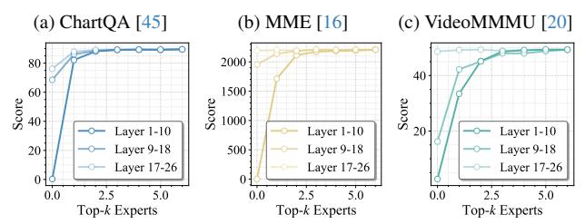
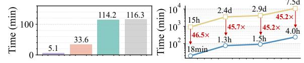
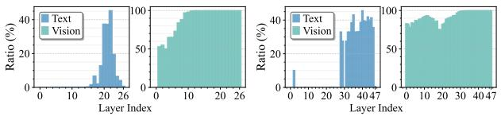
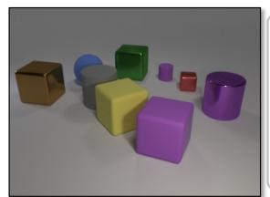
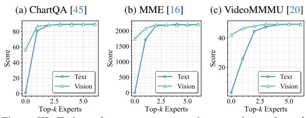

# <span id="page-0-1"></span>*MoDES*: Accelerating Mixture-of-Experts Multimodal Large Language Models via Dynamic Expert Skipping

Yushi Huang<sup>1</sup> , Zining Wang<sup>2</sup> , Zhihang Yuan3\*, Ruihao Gong<sup>2</sup> , Yifu Ding<sup>2</sup> , Jinyang Guo<sup>2</sup> , Xianglong Liu<sup>2</sup> , Jun Zhang1\*

<sup>1</sup>Hong Kong University of Science and Technology <sup>2</sup>Beihang University <sup>3</sup> Peking University

# Abstract

*Mixture-of-Experts (MoE) Multimodal large language models (MLLMs) excel at vision–language tasks, but they suffer from high computational inefficiency. To reduce inference overhead, expert skipping methods have been proposed to deactivate redundant experts based on the current input tokens. However, we find that applying these methods—originally designed for unimodal large language models (LLMs)—to MLLMs results in considerable performance degradation. This is primarily because such methods fail to account for the heterogeneous contributions of experts across MoE layers and modality-specific behaviors of tokens within these layers. Motivated by these findings, we propose MoDES, the first training-free framework that adaptively skips experts to enable efficient and accurate MoE MLLM inference. It incorporates a globallymodulated local gating (GMLG) mechanism that integrates global layer-wise importance into local routing probabilities to accurately estimate per-token expert importance. A dual-modality thresholding (DMT) method is then applied, which processes tokens from each modality separately, to derive the skipping schedule. To set the optimal thresholds, we introduce a frontier search algorithm that exploits monotonicity properties, cutting convergence time from several days to a few hours. Extensive experiments for 3 model series across 13 benchmarks demonstrate that MoDES far outperforms previous approaches. For instance, when skipping 88% experts for Qwen3-VL-MoE-30B-A3B-Instruct, the performance boost is up to 10.67% (97.33% vs. 86.66%). Furthermore, MoDES significantly enhances inference speed, improving the prefilling time by 2.16*× *and the decoding time by 1.26*×*. Our code is available at* <https://github.com/ModelTC/MoDES>*.*

# 1. Introduction

Multimodal large language models (MLLMs) [\[47,](#page-9-0) [51\]](#page-9-1) have become a dominant paradigm for vision-language under-

<span id="page-0-0"></span>

Figure 1. Average performance (%) *vs. expert skipping* ratios (%) across different models [\[26,](#page-9-2) [50,](#page-9-3) [57\]](#page-10-0) and methods [\[6,](#page-8-0) [22,](#page-8-1) [42\]](#page-9-4) on 13 benchmarks (as detailed in Sec. [6.1\)](#page-4-0). The *left* subfigure is for Kimi-VL-A3B-Instruct [\[50\]](#page-9-3) and the *right* subfigure is for Qwen3- VL-MoE-30B-A3B-Instruct [\[26\]](#page-9-2).

standing tasks, showing remarkable performance in integrating text, images, and videos. However, as the scale of models keeps increasing to handle richer data and more complex tasks, they face significant computational bottlenecks during inference. For instance, Qwen2-VL [\[56\]](#page-10-1) with 72B parameters only achieves <10 tokens/s when processing a 4K-token input on 2×A100 GPUs. This is because each token requires computations with all model parameters. The mixture-of-experts (MoE) [\[48\]](#page-9-5) architecture has emerged as an effective solution to reduce the cost of large-scale MLLMs. By sparsely activating partial parameters (*i.e.*, selected expert networks) for each token, MoE MLLMs [\[26,](#page-9-2) [50\]](#page-9-3) decouple the factor of model size from computational costs. This design offers substantial computational savings without compromising performance [\[27,](#page-9-6) [36\]](#page-9-7).

Nevertheless, MoE models typically struggle with suboptimal expert utilization [\[28,](#page-9-8) [42\]](#page-9-4) due to a fixed number of activated experts for all tokens, which can incur significant inference inefficiency [\[28,](#page-9-8) [42,](#page-9-4) [66\]](#page-10-2). Recent *expert skipping* methods [\[6,](#page-8-0) [22,](#page-8-1) [42\]](#page-9-4) thus propose to skip redundant experts *w.r.t.* current tokens to accelerate inference. However, applying these methods to MoE MLLMs leads to a significant drop in accuracy. For example, as shown in Fig. [1,](#page-0-0) skipping 83% of the experts in previous methods [\[6,](#page-8-0) [22,](#page-8-1) [42\]](#page-9-4) during inference results in accuracy drops of over 10%.

To solve the problem, we first make in-depth analyses and obtain two key insights overlooked before: (*i*) The contributions of experts to the model outputs vary significantly

<sup>\*</sup>Correspondence to: Zhihang Yuan (hahnyuan@gmail.com), Jun Zhang (eejzhang@ust.hk).

<span id="page-1-0"></span>across layers. Specifically, experts in shallow layers play far more critical roles than those in deeper layers. However, prior works [6, 22, 42] only consider *intra-layer* information (*e.g.*, Eq. (1)) to develop skipping schedules. (*ii*) Tokens of different modalities (*i.e.*, text and vision) exhibit distinct behaviors as they pass through experts, and experts have a larger effect on updating text tokens. Yet prior works mainly study unimodal LLMs [29] and do not account for this modality gap in MLLMs. These observations underscore the need for a modality-specific *expert skipping* method that explicitly models layer-specific contributions.

To this end, we introduce MoDES (Multimodal Dynamic Expert Skipping), the first accurate and efficient expert skipping framework tailored for MoE MLLMs. In response to the first insight, we propose a globally-modulated local gating (GMLG) mechanism, which combines global layerspecific importance with local routing probabilities to construct expert importance scores. The global importance is obtained via offline calibration with no inference-time overhead. Then, we introduce a dual-modality thresholding (DMT) method which skips redundant experts whose importance scores for the current token fall below the threshold corresponding to the token's modality. This modalityspecific treatment considerably enhances the performance of expert skipping for MLLMs. To determine the optimal thresholds, we further propose a frontier search algorithm on a given search space. This search method leverages monotonicity properties of the performance loss and efficiency w.r.t. thresholds, reducing the search time from more than 2 days to less than 2 hours for models with tens of billions of parameters without compromising performance.

To demonstrate the effectiveness of our method, we conduct extensive experiments on 3 MLLM families across 13 image and video understanding benchmarks. As shown in Fig. 1, the results indicate that MoDES consistently surpasses state-of-the-art (SOTA) methods. Notably, with extremely high expert skipping ratios (>80%), MoDES achieves 7.93-10.67% performance enhancements compared with baselines while retaining >95% accuracy of original models. Moreover, our MoDES yields a significantly 2.03× speedup in prefilling and a 1.24× speedup in decoding for Qwen3-VL-MoE-30B-A3B-Instruct [26].

### 2. Related Work

Multimodal large language models. Multimodal Large language models (MLLMs) [4, 31, 38], which build upon the success of large language models (LLMs) [1, 3, 10, 34], have become a dominant paradigm for vision-language tasks [2, 9, 24, 31, 35, 56]. However, as MLLMs [21, 32, 39] advance to handle higher resolutions and more video frames, the escalating number of visual tokens creates a severe computational bottleneck. Current advanced MLLMs [26, 36, 50, 57] adopt the mixture-of-experts

(MoE) [15] architecture to reduce computational costs by processing each token with a subset of expert networks. Despite this, computation between tokens and multiple activated experts still incurs substantial overhead [13, 40].

Efficient MoE. Existing works on efficient MoE models can be categorized into training-aware and training-free approaches. Training-aware methods enhance routing balance and expert utilization during training [6, 19, 60, 66], but they necessitate costly retraining and extensive data access. In contrast, training-free techniques [18, 43, 61] enable lightweight efficiency enhancement without modifying the training pipeline, including quantization for parameter compression [14, 29] and pruning for structural sparsity [30, 63]. Owing to the modular and sparse nature of MoE, a new line of research—expert skipping—has emerged, which dynamically bypasses redundant experts [6, 22, 42] to speed up inference. Among these studies, Lu et al. [42] utilize dynamic expert skipping based on expert routing probabilities. MC-MoE [22] further integrates an attention-aware expert protection approach during skipping and combines mixed-precision quantization for expert compression. Additionally, DiEP [6] introduces a differentiable expert pruning framework with adaptive expert skipping, which jointly considers routing probabilities and expert similarity. However, these skipping methods are primarily developed for text-only LLMs [27], which limits their scalability to complex multimodal architectures. In contrast, our trainingfree expert skipping framework focuses on advanced MoE MLLMs, achieving efficient inference without sacrificing cross-modal understanding.

# 3. Preliminaries

Architecture of MLLM. A typical MLLM [5, 8, 55] comprises three core components: A visual encoder, a projector, and an LLM backbone. The visual encoder first extracts visual tokens from an image or video. The projector then aligns these tokens with the LLM's text embedding space. Finally, the LLM backbone, a stack of transformer layers [53] composed of self-attention and feed-forward networks (FFNs), processes the combined visual and text tokens to generate responses.

**Mixture-of-Experts** (MoE). The advanced MLLMs [50, 68] employ Mixture-of-Experts (MoE) [22] layers as their FFNs of the LLM backbones. This structure can be viewed as a conditional computation module composed of multiple parallel experts. Formally, let the l-th MoE layer contain M experts, i.e.,  $\{\texttt{Expert}_1^{(l)}, \ldots, \texttt{Expert}_M^{(l)}\}$ , each of which is implemented as a multi-layer perception (MLP). Given an input token representation  $\mathbf{x}^{(l)} \in \mathbb{R}^d$  (d denotes hidden dimension), a lightweight router predicts a set of routing logits  $\mathbf{r}^{(l)} = \{r_1^{(l)}, \ldots, r_M^{(l)}\}$ . These logits are then normal-

<span id="page-2-7"></span>ized into routing probabilities through a softmax operation:

<span id="page-2-0"></span>
$$\pi_m^{(l)} = \frac{\exp(r_m^{(l)})}{\sum_{\hat{m}=1}^M \exp(r_{\hat{m}}^{(l)})},\tag{1}$$

where  $\pi_m^{(l)}$  reflects the contribution of  $\mathrm{Expert}_m^{(l)}$ . To ensure sparse activation, only a subset of experts is executed. Let  $\mathcal{S}^{(l)}$  denote the indices of the top-k experts with the largest routing probabilities. The output  $\mathbf{y}^{(l)}$  of the MoE layer is obtained through a weighted aggregation:

<span id="page-2-5"></span>
$$\mathbf{y}^{(l+1)} = \sum_{m \in \mathcal{S}^{(l)}} \pi_m^{(l)} \cdot \text{Expert}_m^{(l)}(\mathbf{x}^{(l)}). \tag{2}$$

This formulation allows the model to scale the number of parameters independently of the active computation cost.

# <span id="page-2-6"></span>4. Motivation

Existing studies [6, 22, 42] have found that not every selected expert provides essential contributions for tokens. They thus propose to skip the computation of unimportant experts to improve inference efficiency. However, they focus on text-only LLMs [27]. In this study, we have identified that directly adapting these methods to MoE MLLMs [26, 50] overlooks two key factors: Global contribution (Sec. 4.1) and modality gap (Sec. 4.2). Both factors significantly affect the performance and efficiency of *expert skipping* in MLLMs.

#### <span id="page-2-1"></span>4.1. Global Contribution Disregard

Recent skipping strategies [6, 22, 42] rely on the *local* routing probabilities (Eq. (1)) to determine the skipping schedule of the l-th layer, reflecting only input-dependent gating within a single layer. Such layer-agnostic rules ignore the global contribution (i.e., impact on final outputs) imbalance of experts across different layers. Empirically, as shown in Fig. 2, we observe that when reducing the value of k for expert routing, shallower layers incur much severe performance drops than those of deeper layers. This may result from that, relative to the error of deeper layers, errors introduced in shallow layers are amplified by subsequent layers [23], leading to a significant error explosion. Accordingly, the aforementioned layer-independent expert skipping strategies [6, 22, 42] risk excessive skipping at shallow layers, which are critical to final outputs, and vice versa for deep layers.

<u>Insight (i):</u> The observation yields a core design principle: With higher global contributions, experts in shallow-critical layers should be preserved; while experts in deeper, less influential ones can be skipped more aggressively.

#### <span id="page-2-2"></span>4.2. Modality Gap Matters

Focusing on *expert skipping* for MLLMs, we further examine the properties of modality-specific tokens with respect

<span id="page-2-3"></span>

Figure 2. Performance on image (*i.e.*, (a)-(b)) and video (*i.e.*, (c)) understanding tasks across various numbers of top-k routed experts applied to different layer ranges for Kimi-VL-A3B-Instruct [50]. The model has 64 routed experts for each FFN within the 1-st to the 26-th layers, and sets k=6 by default.

to the FFN layers. We first visualize the FFN input representations via t-SNE in Fig. 3 (Left), which reveals a consistent distributional gap between text and vision tokens across layers. To quantify the effect of this modality disparity, we compute the cosine similarity between token representations before and after the FFNs. As shown in Fig. 3 (Middle), FFNs induce a smaller effect on vision tokens (i.e., higher similarity for tokens pre- vs. post-FFN), whereas text tokens undergo substantially larger updates. By tracking the angles between tokens and FFN weights in Fig. 3 (Right), we attribute this phenomenon to their geometry: Vision tokens are more orthogonal to FFN weights (angles $\rightarrow 90^{\circ}$ ), which alleviates the magnitude of their updates.

<span id="page-2-4"></span>

Figure 3. (*Left*) t-SNE [52] visualization of pre-FFN text/vision tokens across *all* layers. (*Middle*) Cosine similarity between pre-FFN and post-FFN text/vision tokens across layers. (*Right*) Angle between text/vision tokens and weights across different FFN layers. Here, GQA [25] dataset is used as the model inputs, and the model is employed the same as that in Fig. 2.

<u>Insight (ii)</u>: In a word, tokens from different modalities differ, and the magnitudes of updates by FFNs for tokens also vary across modalities. Intuitively, when deciding whether to skip the experts *w.r.t.* the current token, we should account for these modality-specific differences. In the following, a modality-aware skipping policy is proposed for multimodal expert routing.

#### 5. MoDES

Based on the above analyses, we propose *MoDES* (*Multimodal Dynamic Expert Skipping*), an efficient training-free framework composed of two key components, as illustrated in Fig. 4: (i) A *globally-modulated local gating* (*GMLG*) (Sec. 5.1) mechanism that integrates a global and layer-level calibration with local routing probabilities to compute re-

#### (a) Globally-Modulated Local Gating

<span id="page-3-0"></span>

Figure 4. Overview of MoDES. At inference, use a text token (e.g., ■ above) at the l-th FFN layer as an example. (a) We compute importance scores  $s_i^{(l)}$  ( $i \in \{2,4,M\}$ ) by combining the offline-calibrated globally-modulated factor  $\alpha^{(l)}$  with the local routing probability  $\pi_i^{(l)}$ . These scores evaluate the top-k (k=3) routed experts for token  $\blacksquare$ . (b) We then apply a modality-specific threshold— $\tau_t$  for text and  $\tau_v$  for vision—found by an efficient and effective frontier search. Experts with scores below the threshold are skipped. This method significantly reduces computation while preserving performance for MoE MLLMs. "E" and "calib set" denote the expert and C (Eq. (4)).

fined importance scores for top-k experts; and (ii) a dualmodality thresholding (DMT) (Sec. 5.2) method that determines modality-specific skipping boundaries based on these importance scores. An efficiency-effectiveness search strategy is further introduced to optimize the threshold configuration under a given computational budget.

# <span id="page-3-1"></span>5.1. Globally-Modulated Local Gating

In light of *Insight* (i) in Sec. 4.1, we present a globallymodulated local gating (GMLG) mechanism, which combines the global contributions of experts with local routing behaviors to estimate expert importance for given tokens. During inference, experts in  $S^{(l)}$  (Eq. (2)) with importance scores lower than the thresholds (defined in Sec. 5.2) will be skipped. Specifically, for  $\mathtt{Expert}_i^{(l)}$   $(i \in \mathcal{S}^{(l)})$  with an input token  $\mathbf{x}^{(l)}$ , the importance score is defined as:

<span id="page-3-4"></span>
$$s_i^{(l)} = \alpha^{(l)} \cdot \pi_i^{(l)},$$
 (3)

where  $\pi_i^{(l)}$  is the local routing probability (Eq. (1)) that  $\mathsf{Expert}_i^{(l)}$  will be activated for  $\mathbf{x}^{(l)}$ . The globallymodulated factor  $\alpha^{(l)}$  reflects the impact of experts in the layer on the final prediction, which is obtained by offline calibration. This  $s_i^{(l)}$  accounts for both global and local contributions, yielding an accurate importance estimation.

To obtain  $\alpha^{(l)}$ , we calculate the Kullback-Leibler (KL) divergence between the output distribution of the original model and that of a counterpart where experts in the l-th layer are skipped:

<span id="page-3-2"></span>
$$\alpha^{(l)} = \frac{1}{N} \sum_{j=1}^{N} \mathcal{D}_{KL} \left( \operatorname{prob}_{j} || \operatorname{prob}_{j}^{(l)} \right), \tag{4}$$

where N is the size of data (i.e.,  $C = \{c_1, \dots, c_N\}$ ) used for

this calibration.  $prob_i$  and  $prob_i^{(l)}$  are the output probabilities for the j-th example of C from the original and modified models, respectively. This process quantifies the sensitivity of the model's output to the removal of experts in certain layers, and  $\alpha^{(l)}$  serves as a global importance weight reflecting their relative contributions. With the pre-computed  $\alpha^{(l)}$ , the final importance score  $s_i^{(l)}$  can be obtained without additional overhead during inference.

# <span id="page-3-3"></span>5.2. Dual-Modality Thresholding

Building on *Insight (ii)* in Sec. 4.2, we introduce a dualmodality thresholding (DMT) method to adaptively determine modality-specific expert skipping thresholds for MLLMs. We define two thresholds:  $\tau_t$  for text tokens and  $\tau_v$ for visual tokens, which control the degree of expert skipping for each modality. This design considers the distinct behavior of tokens from different modalities, thereby allowing a tailored and effective skipping strategy.

To be specific, based on the importance scores (Eq. (3)) for the l-th layer, experts that should be skipped for the given token  $\mathbf{x}^{(l)}$  are:

<span id="page-3-5"></span>
$$\{ \text{Expert}_i^{(l)} \mid s_i^{(l)} < \tau_t \cdot \mathbb{I}_t + \tau_v \cdot \mathbb{I}_v \}, \tag{5}$$

where  $\mathbb{I}_t$  and  $\mathbb{I}_v$  are text and vision token indicator functions for  $\mathbf{x}^{(l)}$ , respectively.

To find the optimal  $\tau_t$  and  $\tau_v$  that balance computational efficiency with model performance, we propose a frontier search algorithm that effectively and efficiently determines these thresholds under an efficiency constraint. We first formulate the problem in the following.

Problem definition. For an MoE MLLM, the goal is to find the thresholds  $\tau_{\rm t}$  and  $\tau_{\rm v}$  that minimize the difference between the outputs of the original model and the expert-

## <span id="page-4-5"></span><span id="page-4-2"></span>Algorithm 1 Frontier search for optimal thresholds.

```
func FrontierSearch(\mathcal{B}, \rho)
Require:
     \mathcal{B} — Candidate set of thresholds \{\tau^{(1)}, \dots, \tau^{(D)}\}
     \rho — Target skipping ratio
 1: frontier \leftarrow \emptyset
 2: p \leftarrow D
 3: for q = 1 to D do
           while p \geq 1 and g(\tau^{(q)}, \tau^{(p)}) \geq \rho do
 4:
 5:
               p \leftarrow p - 1
           end while
          p_{(q)} \leftarrow p + 1
 7:
          if p_{(q)} \leq D then
 8:
               Compute and save f(\tau^{(q)}, \tau^{(p_{(q)})})
 9:
10:
                frontier \leftarrow frontier \cup \{(q, p_{(q)})\}
11:
12: end for
13: (q^*, p^*) \leftarrow \arg\min_{(q, p_{(q)}) \in \text{frontier}} f(\tau^{(q)}, \tau^{(p_{(q)})})
14: return (\tau^{(q^*)}, \tau^{(p^*)})
```

skipping one, while satisfying a pre-defined target skipping ratio  $\rho \in (0, 1)$ . Hence, the problem can be expressed as:

<span id="page-4-3"></span>
$$\min_{\tau_t \in \mathcal{B}, \tau_v \in \mathcal{B}} f(\tau_t, \tau_v) \quad \text{s.t.} \quad g(\tau_t, \tau_v) \ge \rho, \tag{6}$$

where  $\mathcal{B}=\{\tau^{(1)},\ldots,\tau^{(D)}\}$  is the search grid set with D candidates that satisfies  $\tau^{(1)}<\tau^{(2)}<\ldots<\tau^{(D)}$ .  $f(\tau_{\rm t},\tau_{\rm v})$  is the average KL divergence between the output distributions of the original model and the modified version, where experts are skipped according to Eq. (5).  $g(\tau_{\rm t},\tau_{\rm v})$  is the fraction of experts that are skipped for the modified model. **Frontier search.** We start with a monotonicity assumption:

**Assumption 1.** Holding other variables fixed, f is non-decreasing in its respective arguments: If  $q_1 \leq q_2$ , then  $f(\tau^{(q_1)}, \tau^{(p)}) \leq f(\tau^{(q_2)}, \tau^{(p)})$ ; and if  $p_1 \leq p_2$ , then  $f(\tau^{(q)}, \tau^{(p_1)}) \leq f(\tau^{(q)}, \tau^{(p_2)})$ .

Intuitively, higher thresholds will skip more experts and degrade accuracy; hence, the assumption is reasonable. Obviously, g is also non-decreasing in its respective arguments without any assumption. Given these monotonicity properties, we can search for a frontier set  $\{(q,p_{(q)})\}$  with a time complexity of  $\mathcal{O}(ND)^{-1}$  through Lines 1-12 in Alg. 1. Here,  $p_{(q)}$  for a given q is defined as:

$$p_{(q)} = \min \left\{ p \in \{1, \dots, D\} \mid g(\tau^{(p)}, \tau^{(q)}) \ge \rho \right\}.$$
 (7)

We provide detailed proofs for the correctness of the search algorithm and its time complexity in the Appendix. Finally, as demonstrated in Alg. 1, the optimal thresholds

 $(\tau^{(q^*)}, \tau^{(p^*)})$ , which lie in frontier (proofs can also be found in the Appendix), are obtained through Lines 13–14. Since all values of  $f(\tau^{(q)}, \tau^{(p_{(q)})})$  are already computed by Line 9, this step takes less than a second.

Overall, our *frontier search* algorithm achieves a time complexity of  $\mathcal{O}(ND)$ . In comparison, a naive solution involves an exhaustive search of all  $(\tau_t, \tau_v)$  pairs in  $\mathcal{B} \times \mathcal{B}$ , leading to a time complexity of  $\mathcal{O}(ND^2)$ . In practice, our method cuts the search time by a remarkable  $\sim$ 45× (as detailed in Sec. 6.3).

# 6. Experiments

#### <span id="page-4-0"></span>6.1. Setups

Models and datasets. We choose 3 series of MoE MLLMs to evaluate *MoDES*: Kimi-VL [50], Qwen3-VL-MoE [26], and InternVL-3.5 [57]. We use 8 zero-shot evaluation tasks for image understanding: TextVQA<sub>val</sub> [49], ChartQA [45], MMStar [7], MMBench<sub>dev, en</sub> [41], MMVet [65], MME [16], Real-WorldQA [62], and COCO2017-Cap<sub>val</sub> [37] (COCO). For video understanding tasks, we adopt 5 benchmarks: MVBench [33], EgoSchema [44], VideoMME [17] (VMME), LongVideoBench<sub>val,v</sub> [59] (LVB), and VideoM-MMU [20] (VMMMU). 1mms-eval [67] is utilized to perform the above evaluation. For MMBench and MMVet, we use DeepSeek-V3.1 [12] to rate the generated texts.

**Baselines.** As there is no *expert skipping* baselines for MLLMs and previous methods for LLMs only consider models with top-2 routing in practice, we re-implement and adjust them to top-k (k > 2) settings for MLLMs: For the l-th layer, NAEE [42] originally skips the top-2 expert if  $\pi_{\text{top-2}}^{(l)} < \beta^{(l)} \cdot \pi_{\text{top-1}}^{(l)}$ , where  $\pi_{\text{top-1}}^{(l)}$  and  $\pi_{\text{top-2}}^{(l)}$  denotes the top-1 and top-2 routing probabilities (Eq. (1)).  $\beta^{(l)}$  is a hyperparameter. Here, we adapt this strategy, referring to the Appendix of NAEE, to a more general top-k scenario. Specifically, top-i to top-k experts are skipped if  $\sum_{u=i}^k \pi_{\text{top-}u}^{(l)} < \beta^{(l)} \cdot \sum_{v=1}^k \pi_{\text{top-}v}^{(l)}$ . We also apply similar adjustments for MC-MoE [22] and DiEP [6], which build on top of NAEE. To be noted, without a specific claim, we adopt only the expert skipping component of these works to enable a fair comparison. Moreover, we also compare our method with expert skipping guided by directly reducing the value k of top-k routing.

**Implementation.** We employ 1024 samples randomly picked from the GQA [25] dataset to calibrate  $\alpha^{(l)}$  (Eq. (4)) and search optimal  $(\tau_t, \tau_v)$  (Eq. (5)). The search space  $\mathcal{B}$  is given by D=100 grid points sampled in (0,1). More implementation details can be found in the Appendix.

#### <span id="page-4-4"></span>6.2. Evaluation

**Comparison with baselines.** We benchmark MoDES against baselines on Kimi-VL-A3B-Instruct [50]. As

<span id="page-4-1"></span> $<sup>^1\</sup>mbox{We compute }f$  and g on data  $\mathcal C$  (with N samples), which is also used in Eq. (4).

<span id="page-5-2"></span><span id="page-5-0"></span>Table 1. Performance comparisons for Kimi-VL-A3B-Instruct [50] across various expert skipping ratios. We mark the target  $\rho$  (Eq. (6)) and the practical skipping ratio x% (i.e., "Skip x% Experts") in the table. For each method, we compute the score proportion relative to the default setting (i.e., k=6) across benchmarks, and then compute the average value in the "Avg. (%)" column. For the COCO dataset, we report the CIDEr [54] score here. The best and second-best results are highlighted in **bold** and <u>underlined</u> formats, respectively.

| Method                           |         |         |        | Image Unde   | rstanding | <u> </u> |                        |       |         | Video Ur  | nderstand | ing   |       | Avg.   |
|----------------------------------|---------|---------|--------|--------------|-----------|----------|------------------------|-------|---------|-----------|-----------|-------|-------|--------|
| Wiethou                          | TextVQA | ChartQA | MMStar | MMBench      | MMVet     | MME      | RealWorldQA            | COCO  | MVBench | EgoSchema | VMME      | LVB   | VMMMU | (%)    |
| k = 6 (Default)                  | 88.70   | 89.48   | 49.89  | 83.16        | 66.33     | 2207     | 65.36                  | 86.70 | 61.80   | 78.18     | 66.59     | 63.13 | 49.33 | 100.00 |
|                                  |         |         |        |              | SI        | kip 50%  | Experts ( $\rho = 0$ . | 48)   |         |           |           |       |       |        |
| k = 3                            | 85.41   | 86.20   | 51.21  | 80.67        | 57.71     | 2065     | 63.53                  | 87.56 | 60.42   | 75.71     | 64.30     | 60.14 | 44.22 | 95.93  |
| NAEE [42]                        | 86.14   | 85.74   | 50.82  | 80.58        | 60.81     | 2084     | 64.55                  | 85.33 | 60.02   | 75.81     | 65.16     | 60.27 | 45.08 | 96.44  |
| MC-MoE [22]                      | 86.28   | 87.94   | 51.61  | 81.32        | 62.54     | 2138     | 63.82                  | 86.24 | 60.39   | 76.57     | 66.24     | 60.62 | 46.26 | 97.69  |
| DiEP [6]                         | 87.43   | 88.32   | 51.48  | 80.26        | 60.41     | 2159     | 64.74                  | 87.43 | 61.06   | 77.32     | 65.96     | 61.04 | 47.83 | 98.17  |
| MoDES (Ours)                     | 88.18   | 89.08   | 49.65  | 83.16        | 65.09     | 2203     | 65.62                  | 88.23 | 61.95   | 78.41     | 67.19     | 62.83 | 49.00 | 99.91  |
| Skip 67% Experts ( $\rho=0.65$ ) |         |         |        |              |           |          |                        |       |         |           |           |       |       |        |
| k = 2                            | 83.49   | 85.12   | 52.10  | 78.87        | 53.49     | 2022     | 63.79                  | 92.61 | 59.35   | 70.80     | 62.15     | 57.67 | 41.44 | 93.88  |
| NAEE [42]                        | 82.84   | 85.29   | 50.74  | 77.31        | 56.67     | 2083     | 64.54                  | 82.09 | 59.68   | 72.29     | 63.74     | 58.36 | 43.68 | 94.03  |
| MC-MoE [22]                      | 85.07   | 86.32   | 51.13  | 77.65        | 58.42     | 2104     | 63.61                  | 84.23 | 59.86   | 74.36     | 64.22     | 59.73 | 45.21 | 95.45  |
| DiEP [6]                         | 84.21   | 85.56   | 50.76  | <u>78.94</u> | 57.05     | 2087     | 64.02                  | 87.54 | 60.02   | 72.97     | 61.07     | 58.45 | 44.93 | 94.81  |
| MoDES (Ours)                     | 85.57   | 88.24   | 49.25  | 82.73        | 60.78     | 2204     | 64.58                  | 85.37 | 61.65   | 77.98     | 66.52     | 62.90 | 48.78 | 98.46  |
|                                  |         |         |        |              | SI        | kip 83%  | Experts ( $\rho = 0.3$ | 80)   |         |           |           |       |       |        |
| k = 1                            | 77.17   | 76.68   | 42.65  | 54.55        | 22.98     | 1647     | 54.38                  | 77.37 | 51.10   | 37.23     | 50.52     | 43.83 | 24.56 | 71.60  |
| NAEE [42]                        | 75.73   | 78.41   | 41.48  | 69.14        | 43.41     | 1827     | 60.32                  | 72.35 | 58.41   | 57.28     | 53.49     | 49.68 | 42.64 | 82.81  |
| MC-MoE [22]                      | 79.41   | 80.25   | 43.57  | 73.42        | 50.37     | 2063     | 62.54                  | 80.42 | 54.87   | 63.56     | 59.87     | 54.39 | 44.02 | 88.32  |
| DiEP [6]                         | 82.32   | 78.31   | 42.47  | 76.28        | 47.45     | 2071     | 61.34                  | 77.91 | 59.15   | 61.27     | 57.49     | 52.41 | 43.81 | 87.58  |
| MoDES (Ours)                     | 82.38   | 84.20   | 46.68  | 81.44        | 60.46     | 2162     | 64.84                  | 81.33 | 61.30   | 76.98     | 65.48     | 62.60 | 47.11 | 96.25  |

<span id="page-5-1"></span>Table 2. Performance of combination with quantization. MoDES employs the quantization strategy in MC-MoE [22]: weight-only mixed-precision quantization for MoE-based FFNs and 4-bit weight-only quantization for other layers.

| Method                             | #Bit                      | ChartQA       | MME       | MMBench  | LVB   | VMMMU |  |  |  |  |  |
|------------------------------------|---------------------------|---------------|-----------|----------|-------|-------|--|--|--|--|--|
| Kimi-VL-A3B-Ins                    | Kimi-VL-A3B-Instruct [50] |               |           |          |       |       |  |  |  |  |  |
| k = 6 (Default)                    | 16                        | 89.48         | 2207      | 83.16    | 63.13 | 49.33 |  |  |  |  |  |
| Skip 67% Experts ( $\rho = 0.65$ ) |                           |               |           |          |       |       |  |  |  |  |  |
| MC-MoE [22]                        | 2.5                       | 78.47         | 2036      | 68.84    | 54.46 | 41.92 |  |  |  |  |  |
| MoDES (Ours)                       | 2.5                       | 81.23         | 2137      | 76.48    | 58.10 | 43.67 |  |  |  |  |  |
| MC-MoE [22]                        | 1.5                       | 69.46         | 1728      | 62.18    | 42.87 | 38.45 |  |  |  |  |  |
| MoDES (Ours)                       | 1.5                       | 72.28         | 1899      | 68.57    | 48.14 | 40.06 |  |  |  |  |  |
| Qwen3-VL-MoE-                      | 30B-A.                    | 3B-Instruct [ | [26]      |          |       |       |  |  |  |  |  |
| k = 8 (Default)                    | 16                        | 85.08         | 2500      | 86.60    | 55.42 | 47.11 |  |  |  |  |  |
|                                    |                           | Skip 75% E    | Experts ( | p = 0.73 |       |       |  |  |  |  |  |
| MC-MoE [22]                        | 2.5                       | 76.36         | 2084      | 79.62    | 51.85 | 42.06 |  |  |  |  |  |
| MoDES (Ours)                       | 2.5                       | 78.24         | 2281      | 81.34    | 53.63 | 46.28 |  |  |  |  |  |
| MC-MoE [22]                        | 1.5                       | 70.42         | 1968      | 73.18    | 46.08 | 36.94 |  |  |  |  |  |
| MoDES (Ours)                       | 1.5                       | 73.42         | 2113      | 75.54    | 47.32 | 42.01 |  |  |  |  |  |

shown in Tab. 1, prior methods, such as NAEE [42], MC-MoE [22], and DiEP [6], struggle to balance performance and efficiency, especially at high expert-skipping ratios ( $\geq$ 67%). Specifically, these baselines incur an average accuracy drop of more than 11% when skipping 83% of experts during inference. We argue that these declines arise because they rely solely on intra-layer routing logits (Eq. (1)) to determine the skipping schedule and are originally designed for unimodal LLMs. By contrast, our method, which considers both the impact of expert skipping on the final output and the modality gap in MLLMs (Sec. 4.2), executes only 13% of experts, while preserving 96.25% of the full model's average accuracy. Moreover, even at a lower skipping ratio of 50%, our approach still surpasses DiEP and MC-MoE by 1.74% and 2.22%, respectively. These findings validate the superiority of our method across different skipping ratios compared with existing SOTA approaches. In addition, on some benchmarks (e.g., RealWorldQA [62] and VideoMME [17]), using MoDES to skip redundant experts not only prevents degradation but also improves accuracy, suggesting that certain experts are not merely redundant but may actively interfere with inference.

Combination with quantization. We conduct experiments to demonstrate the high compatibility of our MoDES with model quantization. As shown in Tab. 2 (see the performance without quantization for expert skipping in Tab. 1 and the Appendix), quantization causes a much smaller performance drop for MoDES than for MC-MoE. For instance, on Kimi-VL-A3B-Instruct with a ~10.67× compression ratio (i.e., 1.5 bits), quantization reduces MoDES's performance by 17.30%, compared with >20% for MC-MoE. In addition, 2.5-bit quantization keeps MoDES more than 90% of the original model performance. Remarkably, for Qwen3-VL-MoE-30B-A3B-Instruct, it retains 94.43% performance, whereas 2.5-bit MC-MoE retains 89.58%. In future work, we will explore combining MoDES with other orthogonal techniques, such as pruning and distillation, to further reduce the computational demands of MoE MLLMs. **Comparison across backbones.** In Tab. 3, we evaluate our method across multiple backbones. On the powerful Owen3-VL-MoE-30B-A3B-Instruct model [26], our approach retains 97.33% of the original performance at an aggressive skipping ratio of 88%. Moreover, across backbones, our method outperforms other skipping strategies by more than 5% points in average accuracy. Taken together, these results highlight the effectiveness and universality of our technique in identifying redundant experts for tokens of different modalities and across different layers. In addition, we provide comparisons across different skipping ratios for

Table 3. Performance comparisons across different backbones. InternVL series employs Qwen3 [64] and GPT-OSS [46] as LLM backbones for 30B and 20B models, respectively. The number of experts for each layer of models from upper to lower is 128, 128, and 32.

<span id="page-6-4"></span><span id="page-6-1"></span>

| Method                           |              |              |              | Image Unde   | rstanding    | ;           |                        |       |              | Video Ur     | nderstand    | ing          |              | Avg.   |  |  |  |
|----------------------------------|--------------|--------------|--------------|--------------|--------------|-------------|------------------------|-------|--------------|--------------|--------------|--------------|--------------|--------|--|--|--|
| Withou                           | TextVQA      | ChartQA      | MMStar       | MMBench      | MMVet        | MME         | RealWorldQA            | COCO  | MVBench      | EgoSchema    | VMME         | LVB          | VMMMU        | (%)    |  |  |  |
| Qwen3-VL-MoE                     | -30B-A3B-I   | nstruct [26  | 1            |              |              |             |                        |       |              |              |              |              |              |        |  |  |  |
| k = 8 (Default)                  | 83.41        | 85.08        | 59.67        | 86.60        | 69.68        | 2500        | 66.80                  | 80.37 | 64.67        | 62.45        | 54.89        | 55.42        | 47.11        | 100.00 |  |  |  |
| Skip 88% Experts ( $\rho=0.85$ ) |              |              |              |              |              |             |                        |       |              |              |              |              |              |        |  |  |  |
| k = 1                            | 60.71        | 52.16        | 31.63        | 54.90        | 28.07        | 1590        | 52.42                  | 45.64 | 41.51        | 32.52        | 39.78        | 42.41        | 12.51        | 60.11  |  |  |  |
| NAEE [42]                        | 72.41        | 65.83        | 48.88        | 73.62        | 54.52        | 1984        | 58.62                  | 60.37 | 50.24        | 49.77        | 44.48        | 45.59        | 35.57        | 80.60  |  |  |  |
| MC-MoE [22]                      | 74.87        | 71.43        | 50.74        | <u>75.42</u> | 61.35        | 2168        | 60.41                  | 68.15 | 56.60        | 51.84        | 52.51        | 47.22        | 37.41        | 86.66  |  |  |  |
| DiEP [6]                         | 73.46        | 70.51        | 53.28        | 73.21        | 58.64        | 2074        | 63.41                  | 62.89 | <u>57.21</u> | 53.61        | 50.78        | 46.13        | 34.79        | 85.30  |  |  |  |
| MoDES (Ours)                     | 80.97        | 78.84        | 58.18        | 85.57        | 67.75        | 2403        | 64.58                  | 74.66 | 62.98        | 62.04        | 55.26        | 55.50        | 46.56        | 97.33  |  |  |  |
| InternVL-3.5-30B-A3B-HF [57]     |              |              |              |              |              |             |                        |       |              |              |              |              |              |        |  |  |  |
| k = 8 (Default)                  | 85.76        | 84.08        | 62.49        | 83.81        | 69.93        | 2312        | 64.77                  | 69.30 | 68.92        | 60.49        | 58.07        | 57.64        | 45.11        | 100.00 |  |  |  |
| Skip 88% Experts ( $\rho=0.85$ ) |              |              |              |              |              |             |                        |       |              |              |              |              |              |        |  |  |  |
| k = 1                            | 58.49        | 46.24        | 42.27        | 51.74        | 35.05        | 1683        | 51.44                  | 26.01 | 31.99        | 34.47        | 35.26        | 37.40        | 24.27        | 59.63  |  |  |  |
| NAEE [42]                        | 66.24        | 68.32        | 50.14        | 64.37        | 49.52        | 1802        | 55.23                  | 50.64 | 54.78        | 50.25        | 48.69        | 47.42        | 37.27        | 78.88  |  |  |  |
| MC-MoE [22]                      | 70.41        | <u>73.49</u> | 56.14        | 64.38        | 72.41        | <u>1972</u> | <u>57.49</u>           | 60.12 | <u>58.97</u> | <u>52.31</u> | <u>49.72</u> | 48.31        | <u>40.06</u> | 86.20  |  |  |  |
| DiEP [6]                         | 69.37        | 71.84        | <u>57.21</u> | 63.19        | 65.32        | 1838        | 56.38                  | 55.78 | 56.26        | 51.48        | 48.94        | 47.26        | 38.18        | 83.26  |  |  |  |
| MoDES (Ours)                     | 80.58        | 82.00        | 61.20        | 81.67        | 67.80        | 2222        | 61.73                  | 65.16 | 68.65        | 60.79        | 57.63        | 54.49        | 44.33        | 97.03  |  |  |  |
| InternVL-3.5-GF                  | PT-OSS-20B   | -A4B-Previ   | ew-HF [57    | 7]           |              |             |                        |       |              |              |              |              |              |        |  |  |  |
| k = 4 (Default)                  | 80.20        | 90.64        | 57.64        | 79.78        | 69.68        | 2270        | 61.63                  | 70.61 | 67.65        | 58.79        | 53.93        | 54.65        | 43.79        | 100.00 |  |  |  |
|                                  |              |              |              |              | Sk           | ip 75%      | Experts ( $\rho = 0$ . | 73)   |              |              |              |              |              |        |  |  |  |
| k = 1                            | 68.74        | 79.72        | 45.77        | 67.63        | 48.49        | 1833        | 53.20                  | 60.70 | 56.95        | 49.40        | 44.04        | 44.28        | 41.66        | 77.58  |  |  |  |
| NAEE [42]                        | 73.89        | 82.34        | 44.89        | 71.59        | 54.97        | 2017        | 63.46                  | 59.73 | 51.25        | 46.21        | 47.83        | 45.48        | 42.08        | 86.79  |  |  |  |
| MC-MoE [22]                      | 76.49        | 84.53        | 46.25        | 73.68        | 56.83        | <u>2137</u> | 61.07                  | 60.42 | <u>60.06</u> | 50.28        | 48.37        | 46.68        | 42.89        | 89.91  |  |  |  |
| DiEP [6]                         | <u>77.31</u> | 86.24        | <u>48.18</u> | <u>74.26</u> | <u>58.07</u> | 2109        | 60.25                  | 62.08 | 54.18        | 49.83        | 49.42        | <u>47.91</u> | 42.31        | 90.07  |  |  |  |
| MoDES (Ours)                     | 77.93        | 89.60        | 56.48        | 78.14        | 66.33        | 2206        | 60.64                  | 68.32 | 66.60        | 57.95        | 53.59        | 53.68        | 43.13        | 97.89  |  |  |  |

these models in the Appendix, where our method consistently delivers higher accuracy at matched skipping ratios. We further exhibit some qualitative visual reasoning examples in the Appendix to comprehensively demonstrate the superiority of our method.

#### <span id="page-6-0"></span>**6.3.** Efficiency Discussion

<span id="page-6-2"></span>

Figure 5. (*Left*)  $\alpha^{(l)}$  calibration time. (*Right*) Search time of *frontier search* (blue) *vs. naive search* (yellow). The bars/markers from *left* to *right* are for Kimi-VL-A3B-Instruct [50], Qwen3-VL-MoE-30B-A3B-Instruct [26], InternVL-3.5-30B-A3B-HF [57], and InternVL-3.5-GPT-OSS-20B-A4B-Preview-HF [57].

Calibration and search efficiency. As illustrated in Fig. 5, we evaluate the calibration and search times of MoDES for MoE MLLMs with  $\geq$ 20B parameters on 8×H200 GPUs. It is important to note that since InternVL-3.5-GPT-OSS-20B-A4B-Preview-HF [57] in the transformers [58] library supports only naive attention computation, its time consumption is significantly higher compared to the same-sized Kimi-VL-A3B-Instruct, which uses flash-attention2 [11]. As observed from the other models, MoDES processes 20-30B MoE MLLMs (i.e., calibration + search) in 20 minutes to under 4 hours, demonstrating high efficiency. Furthermore, compared to naive search with  $\mathcal{O}(ND^2)$  complexity, our frontier search with  $\mathcal{O}(ND)$  significantly reduces the search time

by  $\sim 45 \times$ . In terms of performance, we benchmarked *naive* search for Kimi-VL-A3B-Instruct [50] with an 83% expert skipping ratio and found nearly identical average performance with frontier search (96.24% vs. 96.25%). This result helps confirm the correctness of our Alg. 1.

<span id="page-6-3"></span>

Figure 6. Inference speed for (*Upper*) Kimi-VL-A3B-Instruct [50] and (*Lower*) Qwen3-VL-MoE-30B-A3B-Instruct [26] on a single H200 GPU. The *expert skipping* ratios for the former and the latter are 83% and 88%, respectively. The batch size for prefilling is 8, and the sequence length for decoding is 1024.

Inference efficiency. Next, we study the practical inference speedup. As shown in Fig. 6, MoDES attains an  $\sim 2\times$  speedup in the prefill phase compared with the original model. In the decoding phase, it still delivers a  $\sim 1.2\times$  speedup. The smaller ratio during decoding likely arises because: (i) MoDES primarily reduces computation in MoE layers, while decoding remains memory-bound; and (ii) only text tokens are processed during decoding, which leads to lower *expert skipping* ratios (Sec. 6.5). In addition, baselines like DiEP [6] use offline calibration to select hyperparameters, so their inference overhead is negligible. Under

<span id="page-7-4"></span>the same skipping ratios, their speedup ratios are similar to ours with <1% difference. Despite this, our method outperforms them across benchmarks by a clear margin (Sec. 6.2).

### 6.4. Ablation Studies

In this section, we employ Kimi-VL-A3B-Instruct [50], and the settings are the same as those in Sec. 6.1 without specific claims. More ablations can be found in the Appendix.

Effect of each component. We evaluate each component of MoDES and use a single threshold  $\tau$  w.r.t.  $s_i^{(l)} = \pi_i^{(l)}$ (denoted as "Thresholding") with a grid search as our baseline. As shown in Tab. 4, GMLG, which incorporates both global and local contributions, significantly enhances both Thresholding and DMT. Moreover, by applying different thresholds for different modalities, DMT outperforms Thresholding by a large margin. These results underscore the importance of the two key insights discussed in Sec. 4, highlighting the substantial contributions of both GMLG and DMT. Remarkably, performance improvements derived from GMLG and DMT increase as the skipping ratio grows. Table 4. Ablation results for each component of MoDES. "Thresholding" means we employ a single threshold  $\tau$  for both modalities and adopt a grid search for the optimal  $\tau.$  For Thresholding and DMT, we set  $s_i^{(l)} = \pi_i^{(l)}$ , instead of using Eq. (3).

<span id="page-7-1"></span>

| Method                           | ChartQA     | MME       | MMBench | LVB   | VMMMU |  |  |  |  |  |
|----------------------------------|-------------|-----------|---------|-------|-------|--|--|--|--|--|
| k = 6 (Default)                  | 89.48       | 2207      | 83.16   | 63.13 | 49.33 |  |  |  |  |  |
| Skip 67% Experts ( $\rho=0.65$ ) |             |           |         |       |       |  |  |  |  |  |
| Thresholding                     | 85.48       | 2030      | 77.67   | 57.97 | 45.56 |  |  |  |  |  |
| Thresholding w/ GMLG             | 87.64       | 2172      | 79.46   | 60.24 | 46.48 |  |  |  |  |  |
| DMT                              | 87.47       | 2158      | 81.07   | 61.26 | 46.88 |  |  |  |  |  |
| DMT w/ GMLG (Ours)               | 88.24       | 2204      | 82.73   | 62.90 | 48.78 |  |  |  |  |  |
|                                  | Skip 83% E. | xperts (ρ | = 0.80) |       |       |  |  |  |  |  |
| Thresholding                     | 76.74       | 1956      | 65.48   | 54.67 | 40.33 |  |  |  |  |  |
| Thresholding w/ GMLG             | 79.28       | 2107      | 75.19   | 60.02 | 43.87 |  |  |  |  |  |
| DMT                              | 82.94       | 2081      | 79.42   | 61.16 | 45.08 |  |  |  |  |  |
| DMT w/ GMLG (Ours)               | 84.20       | 2162      | 81.44   | 62.60 | 47.11 |  |  |  |  |  |

<span id="page-7-2"></span>Table 5. Ablation results of using 3 different datasets for both calibration and frontier search (C&S).

| C&S     | GQA     | COCO            | VMMMU |
|---------|---------|-----------------|-------|
| Skip    | 83% Exp | erts ( $\rho =$ | 0.80) |
| GQA     | 62.68   | 62.65           | 62.63 |
| COCO    | 81.33   | 81.72           | 80.72 |
| VMMMU   | 47.11   | 47.67           | 47.67 |
| ChartQA | 84.20   | 86.56           | 83.46 |
| MMBench | 81.44   | 79.38           | 81.87 |
| MME     | 2162    | 2138            | 2136  |
| LVB     | 62.60   | 62.30           | 62.75 |


Figure 7. Visualization results of global contributions  $\alpha^{(l)}$  (Eq. (4)) across layers and various datasets.

Choice of data. We also investigate the effect of different datasets with randomly sampled 1024 examples on MoDES. In Fig. 7, the trends of  $\alpha^{(l)}$  across datasets are similar, with shallow layers having larger values than deep layers. This aligns with our insight in Sec. 4.1, where experts in shallow layers contribute more to the final outputs. Additionally, the performance is also consistent across datasets,

as shown in Tab. 5. These results indicate that MoDES is robust and not sensitive to the choice of dataset.

#### <span id="page-7-0"></span>6.5. Visualization Analysis

<span id="page-7-3"></span>

Figure 8. Visualization of *expert skipping* ratios (%) across modalities and layers on 13 benchmarks (Sec. 6.1). The *left* subfigure is for Kimi-VL-A3B-Instruct [50] and the *right* subfigure is for Qwen3-VL-MoE-30B-A3B-Instruct [26]. The *overall* skipping ratios for the former and the latter are 83% and 88%, respectively.

In this section, we visualize the *expert skipping* ratios of MoDES across modalities and layers to interpret the effectiveness of our approach. As shown in Fig. 8, our method skips substantially more experts in deeper layers than in shallower layers, which is consistent with the key insight discussed in Sec. 4.1. In addition, it skips far more experts for vision tokens than for text tokens, indicating greater redundancy among experts for vision tokens. We corroborate this observation with experiments in the Appendix. These results suggest that a uniform, modality-agnostic skipping schedule is inappropriate. This finding also reinforces the second insight in Sec. 4.2 and helps explain how our method preserves the model's strong performance.

# 7. Conclusions

In this work, we proposed *MoDES*, a novel framework for *expert skipping* in MoE multimodal large language models (MLLMs). First, we identified two key insights: The imbalance of expert contributions across layers and the distinct behaviors between modalities in FFNs. Based on these findings, we introduced a *globally-modulated local gating (GMLG)* mechanism and a *dual-modality thresholding (DMT)* method, which allow the model to adaptively skip experts based on layer-specific importance and modality-specific characteristics. Additionally, we developed an efficient *frontier search* algorithm, which greatly improves search efficiency for threshold optimization. Extensive experiments on large-scale multimodal benchmarks demonstrate that MoDES provides significant computational savings without sacrificing performance.

#### Acknowledgement

This work was supported by the National Natural Science Foundation of China (Nos. 62476018), and the Postdoctoral Fellowship Program of CPSF (No. BX20250487). This work was also supported by the Hong Kong Research Grants Council under the Areas of Excellence scheme grant AoE/E-601/22-R and NSFC/RGC Collaborative Research Scheme grant CRS\_HKUST603/22.

# References

- <span id="page-8-3"></span>[1] Josh Achiam, Steven Adler, Sandhini Agarwal, Lama Ahmad, Ilge Akkaya, Florencia Leoni Aleman, Diogo Almeida, Janko Altenschmidt, Sam Altman, Shyamal Anadkat, et al. Gpt-4 technical report. *arXiv preprint arXiv:2303.08774*, 2023. [2](#page-1-0)
- <span id="page-8-6"></span>[2] Kirolos Ataallah, Xiaoqian Shen, Eslam Abdelrahman, Essam Sleiman, Deyao Zhu, Jian Ding, and Mohamed Elhoseiny. Minigpt4-video: Advancing multimodal llms for video understanding with interleaved visual-textual tokens. *arXiv preprint arXiv:2404.03413*, 2024. [2](#page-1-0)
- <span id="page-8-4"></span>[3] Jinze Bai, Shuai Bai, Yunfei Chu, Zeyu Cui, Kai Dang, Xiaodong Deng, Yang Fan, Wenbin Ge, Yu Han, Fei Huang, et al. Qwen technical report. *arXiv preprint arXiv:2309.16609*, 2023. [2](#page-1-0)
- <span id="page-8-2"></span>[4] Jinze Bai, Shuai Bai, Shusheng Yang, Shijie Wang, Sinan Tan, Peng Wang, Junyang Lin, Chang Zhou, and Jingren Zhou. Qwen-vl: A versatile vision-language model for understanding, localization, text reading, and beyond. *arXiv preprint arXiv:2308.12966*, 2023. [2](#page-1-0)
- <span id="page-8-15"></span>[5] Shuai Bai, Keqin Chen, Xuejing Liu, Jialin Wang, Wenbin Ge, Sibo Song, Kai Dang, Peng Wang, Shijie Wang, Jun Tang, Humen Zhong, Yuanzhi Zhu, Mingkun Yang, Zhaohai Li, Jianqiang Wan, Pengfei Wang, Wei Ding, Zheren Fu, Yiheng Xu, Jiabo Ye, Xi Zhang, Tianbao Xie, Zesen Cheng, Hang Zhang, Zhibo Yang, Haiyang Xu, and Junyang Lin. Qwen2.5-vl technical report. *arXiv preprint arXiv:2502.13923*, 2025. [2](#page-1-0)
- <span id="page-8-0"></span>[6] Sikai Bai, Haoxi Li, Jie Zhang, Zicong Hong, and Song Guo. Diep: Adaptive mixture-of-experts compression through differentiable expert pruning. *arXiv preprint arXiv:2509.16105*, 2025. [1,](#page-0-1) [2,](#page-1-0) [3,](#page-2-7) [5,](#page-4-5) [6,](#page-5-2) [7,](#page-6-4) [13,](#page-12-0) [15](#page-14-0)
- <span id="page-8-21"></span>[7] Lin Chen, Jinsong Li, Xiaoyi Dong, Pan Zhang, Yuhang Zang, Zehui Chen, Haodong Duan, Jiaqi Wang, Yu Qiao, Dahua Lin, and Feng Zhao. Are we on the right way for evaluating large vision-language models?, 2024. [5](#page-4-5)
- <span id="page-8-16"></span>[8] Zhe Chen, Weiyun Wang, Yue Cao, Yangzhou Liu, Zhangwei Gao, Erfei Cui, Jinguo Zhu, Shenglong Ye, Hao Tian, Zhaoyang Liu, et al. Expanding performance boundaries of open-source multimodal models with model, data, and testtime scaling. *arXiv preprint arXiv:2412.05271*, 2024. [2](#page-1-0)
- <span id="page-8-7"></span>[9] Zhe Chen, Jiannan Wu, Wenhai Wang, Weijie Su, Guo Chen, Sen Xing, Muyan Zhong, Qinglong Zhang, Xizhou Zhu, Lewei Lu, et al. Internvl: Scaling up vision foundation models and aligning for generic visual-linguistic tasks. In *Proceedings of the IEEE/CVF conference on computer vision and pattern recognition*, pages 24185–24198, 2024. [2](#page-1-0)
- <span id="page-8-5"></span>[10] Wei-Lin Chiang, Zhuohan Li, Ziqing Lin, Ying Sheng, Zhanghao Wu, Hao Zhang, Lianmin Zheng, Siyuan Zhuang, Yonghao Zhuang, Joseph E Gonzalez, et al. Vicuna: An open-source chatbot impressing gpt-4 with 90%\* chatgpt quality. *See https://vicuna. lmsys. org (accessed 14 April 2023)*, 2(3):6, 2023. [2](#page-1-0)
- <span id="page-8-24"></span>[11] Tri Dao. Flashattention-2: Faster attention with better parallelism and work partitioning, 2023. [7](#page-6-4)
- <span id="page-8-23"></span>[12] DeepSeek-AI. Deepseek-v3 technical report, 2024. [5](#page-4-5)

- <span id="page-8-11"></span>[13] Akash Dhasade, Anne-Marie Kermarrec, Erick Lavoie, Johan Pouwelse, Rishi Sharma, and Martijn de Vos. Practical federated learning without a server. In *Proceedings of the 5th Workshop on Machine Learning and Systems*, page 1–11. ACM, 2025. [2](#page-1-0)
- <span id="page-8-14"></span>[14] Haojie Duanmu, Xiuhong Li, Zhihang Yuan, Size Zheng, Jiangfei Duan, Xingcheng Zhang, and Dahua Lin. Mxmoe: Mixed-precision quantization for moe with accuracy and performance co-design. *arXiv preprint arXiv:2505.05799*, 2025. [2](#page-1-0)
- <span id="page-8-10"></span>[15] William Fedus, Barret Zoph, and Noam Shazeer. Switch transformers: Scaling to trillion parameter models with simple and efficient sparsity. *Journal of Machine Learning Research*, 23(120):1–39, 2022. [2](#page-1-0)
- <span id="page-8-18"></span>[16] Chaoyou Fu, Peixian Chen, Yunhang Shen, Yulei Qin, Mengdan Zhang, Xu Lin, Zhenyu Qiu, Wei Lin, Jinrui Yang, Xiawu Zheng, et al. Mme: a comprehensive evaluation benchmark for multimodal large language models. corr abs/2306.13394 (2023), 2023. [3,](#page-2-7) [5,](#page-4-5) [16](#page-15-0)
- <span id="page-8-22"></span>[17] Chaoyou Fu, Yuhan Dai, Yongdong Luo, Lei Li, Shuhuai Ren, Renrui Zhang, Zihan Wang, Chenyu Zhou, Yunhang Shen, Mengdan Zhang, et al. Video-mme: The first-ever comprehensive evaluation benchmark of multi-modal llms in video analysis. In *Proceedings of the Computer Vision and Pattern Recognition Conference*, pages 24108–24118, 2025. [5,](#page-4-5) [6](#page-5-2)
- <span id="page-8-13"></span>[18] Ruihao Gong, Yang Yong, Shiqiao Gu, Yushi Huang, Chengtao Lv, Yunchen Zhang, Xianglong Liu, and Dacheng Tao. Llmc: Benchmarking large language model quantization with a versatile compression toolkit, 2024. [2](#page-1-0)
- <span id="page-8-12"></span>[19] Yongxin Guo, Zhenglin Cheng, Xiaoying Tang, Zhaopeng Tu, and Tao Lin. Dynamic mixture of experts: An autotuning approach for efficient transformer models. *arXiv preprint arXiv:2405.14297*, 2024. [2](#page-1-0)
- <span id="page-8-19"></span>[20] Kairui Hu, Penghao Wu, Fanyi Pu, Wang Xiao, Yuanhan Zhang, Xiang Yue, Bo Li, and Ziwei Liu. Video-mmmu: Evaluating knowledge acquisition from multi-discipline professional videos, 2025. [3,](#page-2-7) [5,](#page-4-5) [16](#page-15-0)
- <span id="page-8-9"></span>[21] Wenbo Hu, Zi-Yi Dou, Liunian Li, Amita Kamath, Nanyun Peng, and Kai-Wei Chang. Matryoshka query transformer for large vision-language models. *Advances in Neural Information Processing Systems*, 37:50168–50188, 2024. [2](#page-1-0)
- <span id="page-8-1"></span>[22] Wei Huang, Yue Liao, Jianhui Liu, Ruifei He, Haoru Tan, Shiming Zhang, Hongsheng Li, Si Liu, and Xiaojuan Qi. Mixture compressor for mixture-of-experts llms gains more. *arXiv preprint arXiv:2410.06270*, 2024. [1,](#page-0-1) [2,](#page-1-0) [3,](#page-2-7) [5,](#page-4-5) [6,](#page-5-2) [7,](#page-6-4) [13,](#page-12-0) [15](#page-14-0)
- <span id="page-8-17"></span>[23] Weizhong Huang, Yuxin Zhang, Xiawu Zheng, Fei Chao, and Rongrong Ji. Determining layer-wise sparsity for large language models through a theoretical perspective, 2025. [3](#page-2-7)
- <span id="page-8-8"></span>[24] Zhengchao Huang, Bin Xia, Zicheng Lin, Zhun Mou, Wenming Yang, and Jiaya Jia. Ffaa: Multimodal large language model based explainable open-world face forgery analysis assistant. *arXiv preprint arXiv:2408.10072*, 2024. [2](#page-1-0)
- <span id="page-8-20"></span>[25] Drew A Hudson and Christopher D Manning. Gqa: A new dataset for real-world visual reasoning and compositional question answering. *Conference on Computer Vision and Pattern Recognition (CVPR)*, 2019. [3,](#page-2-7) [5,](#page-4-5) [15](#page-14-0)

- <span id="page-9-2"></span>[26] Hugging Face. Qwen3-vl-moe, 2025. [1,](#page-0-1) [2,](#page-1-0) [3,](#page-2-7) [5,](#page-4-5) [6,](#page-5-2) [7,](#page-6-4) [8,](#page-7-4) [13,](#page-12-0) [14,](#page-13-0) [15](#page-14-0)
- <span id="page-9-6"></span>[27] Albert Q. Jiang, Alexandre Sablayrolles, Antoine Roux, Arthur Mensch, Blanche Savary, Chris Bamford, Devendra Singh Chaplot, Diego de las Casas, Emma Bou Hanna, Florian Bressand, Gianna Lengyel, Guillaume Bour, Guillaume Lample, Lelio Renard Lavaud, Lucile Saulnier, ´ Marie-Anne Lachaux, Pierre Stock, Sandeep Subramanian, Sophia Yang, Szymon Antoniak, Teven Le Scao, Theophile ´ Gervet, Thibaut Lavril, Thomas Wang, Timothee Lacroix, ´ and William El Sayed. Mixtral of experts, 2024. [1,](#page-0-1) [2,](#page-1-0) [3](#page-2-7)
- <span id="page-9-8"></span>[28] Peng Jin, Bo Zhu, Li Yuan, and Shuicheng Yan. Moe++: Accelerating mixture-of-experts methods with zerocomputation experts, 2024. [1](#page-0-1)
- <span id="page-9-9"></span>[29] Young Jin Kim, Raffy Fahim, and Hany Hassan Awadalla. Mixture of quantized experts (moqe): Complementary effect of low-bit quantization and robustness. *arXiv preprint arXiv:2310.02410*, 2023. [2](#page-1-0)
- <span id="page-9-18"></span>[30] Jaeseong Lee, Aurick Qiao, Daniel F Campos, Zhewei Yao, Yuxiong He, et al. Stun: Structured-then-unstructured pruning for scalable moe pruning. *arXiv preprint arXiv:2409.06211*, 2024. [2](#page-1-0)
- <span id="page-9-10"></span>[31] Bo Li, Yuanhan Zhang, Dong Guo, Renrui Zhang, Feng Li, Hao Zhang, Kaichen Zhang, Peiyuan Zhang, Yanwei Li, Ziwei Liu, et al. Llava-onevision: Easy visual task transfer. *arXiv preprint arXiv:2408.03326*, 2024. [2](#page-1-0)
- <span id="page-9-14"></span>[32] Bo Li, Yuanhan Zhang, Dong Guo, Renrui Zhang, Feng Li, Hao Zhang, Kaichen Zhang, Peiyuan Zhang, Yanwei Li, Ziwei Liu, et al. Llava-onevision: Easy visual task transfer. *arXiv preprint arXiv:2408.03326*, 2024. [2](#page-1-0)
- <span id="page-9-23"></span>[33] Kunchang Li, Yali Wang, Yinan He, Yizhuo Li, Yi Wang, Yi Liu, Zun Wang, Jilan Xu, Guo Chen, Ping Luo, Limin Wang, and Yu Qiao. Mvbench: A comprehensive multimodal video understanding benchmark, 2024. [5](#page-4-5)
- <span id="page-9-12"></span>[34] Yanwei Li, Chengyao Wang, and Jiaya Jia. Llama-vid: An image is worth 2 tokens in large language models. In *European Conference on Computer Vision*, pages 323–340. Springer, 2024. [2](#page-1-0)
- <span id="page-9-13"></span>[35] Yanwei Li, Yuechen Zhang, Chengyao Wang, Zhisheng Zhong, Yixin Chen, Ruihang Chu, Shaoteng Liu, and Jiaya Jia. Mini-gemini: Mining the potential of multi-modality vision language models. *arXiv preprint arXiv:2403.18814*, 2024. [2](#page-1-0)
- <span id="page-9-7"></span>[36] Bin Lin, Zhenyu Tang, Yang Ye, Jiaxi Cui, Bin Zhu, Peng Jin, Jinfa Huang, Junwu Zhang, Yatian Pang, Munan Ning, et al. Moe-llava: Mixture of experts for large visionlanguage models. *arXiv preprint arXiv:2401.15947*, 2024. [1,](#page-0-1) [2](#page-1-0)
- <span id="page-9-22"></span>[37] Tsung-Yi Lin, Michael Maire, Serge Belongie, Lubomir Bourdev, Ross Girshick, James Hays, Pietro Perona, Deva Ramanan, C. Lawrence Zitnick, and Piotr Dollar. Microsoft ´ coco: Common objects in context, 2015. [5](#page-4-5)
- <span id="page-9-11"></span>[38] Haotian Liu, Chunyuan Li, Qingyang Wu, and Yong Jae Lee. Visual instruction tuning. *Advances in neural information processing systems*, 36:34892–34916, 2023. [2](#page-1-0)
- <span id="page-9-15"></span>[39] Haotian Liu, Chunyuan Li, Yuheng Li, and Yong Jae Lee. Improved baselines with visual instruction tuning. In *Pro-*

- *ceedings of the IEEE/CVF Conference on Computer Vision and Pattern Recognition*, pages 26296–26306, 2024. [2](#page-1-0)
- <span id="page-9-16"></span>[40] Xinyi Liu, Yujie Wang, Fangcheng Fu, Xupeng Miao, Shenhan Zhu, Xiaonan Nie, and Bin CUI. Netmoe: Accelerating moe training through dynamic sample placement. In *The Thirteenth International Conference on Learning Representations*, 2025. [2](#page-1-0)
- <span id="page-9-21"></span>[41] Yuan Liu, Haodong Duan, Yuanhan Zhang, Bo Li, Songyang Zhang, Wangbo Zhao, Yike Yuan, Jiaqi Wang, Conghui He, Ziwei Liu, Kai Chen, and Dahua Lin. Mmbench: Is your multi-modal model an all-around player?, 2024. [5](#page-4-5)
- <span id="page-9-4"></span>[42] Xudong Lu, Qi Liu, Yuhui Xu, Aojun Zhou, Siyuan Huang, Bo Zhang, Junchi Yan, and Hongsheng Li. Not all experts are equal: Efficient expert pruning and skipping for mixture-of-experts large language models. *arXiv preprint arXiv:2402.14800*, 2024. [1,](#page-0-1) [2,](#page-1-0) [3,](#page-2-7) [5,](#page-4-5) [6,](#page-5-2) [7,](#page-6-4) [13](#page-12-0)
- <span id="page-9-17"></span>[43] Chengtao Lv, Bilang Zhang, Yang Yong, Ruihao Gong, Yushi Huang, Shiqiao Gu, Jiajun Wu, Yumeng Shi, Jinyang Guo, and Wenya Wang. Llmc+: Benchmarking visionlanguage model compression with a plug-and-play toolkit, 2025. [2](#page-1-0)
- <span id="page-9-24"></span>[44] Karttikeya Mangalam, Raiymbek Akshulakov, and Jitendra Malik. Egoschema: A diagnostic benchmark for very longform video language understanding, 2023. [5](#page-4-5)
- <span id="page-9-19"></span>[45] Ahmed Masry, Do Long, Jia Qing Tan, Shafiq Joty, and Enamul Hoque. ChartQA: A benchmark for question answering about charts with visual and logical reasoning. In *Findings of the Association for Computational Linguistics: ACL 2022*, pages 2263–2279, Dublin, Ireland, 2022. Association for Computational Linguistics. [3,](#page-2-7) [5,](#page-4-5) [16](#page-15-0)
- <span id="page-9-25"></span>[46] OpenAI. gpt-oss-120b & gpt-oss-20b model card, 2025. [7](#page-6-4)
- <span id="page-9-0"></span>[47] Alec Radford, Jong Wook Kim, Chris Hallacy, Aditya Ramesh, Gabriel Goh, Sandhini Agarwal, Girish Sastry, Amanda Askell, Pamela Mishkin, Jack Clark, et al. Learning transferable visual models from natural language supervision. In *International conference on machine learning*, pages 8748–8763. PmLR, 2021. [1](#page-0-1)
- <span id="page-9-5"></span>[48] Noam Shazeer, Azalia Mirhoseini, Krzysztof Maziarz, Andy Davis, Quoc Le, Geoffrey Hinton, and Jeff Dean. Outrageously large neural networks: The sparsely-gated mixtureof-experts layer, 2017. [1](#page-0-1)
- <span id="page-9-20"></span>[49] Amanpreet Singh, Vivek Natarjan, Meet Shah, Yu Jiang, Xinlei Chen, Devi Parikh, and Marcus Rohrbach. Towards vqa models that can read. In *Proceedings of the IEEE Conference on Computer Vision and Pattern Recognition*, pages 8317–8326, 2019. [5](#page-4-5)
- <span id="page-9-3"></span>[50] Kimi Team, Angang Du, Bohong Yin, Bowei Xing, Bowen Qu, Bowen Wang, Cheng Chen, Chenlin Zhang, Chenzhuang Du, Chu Wei, et al. Kimi-vl technical report. *arXiv preprint arXiv:2504.07491*, 2025. [1,](#page-0-1) [2,](#page-1-0) [3,](#page-2-7) [5,](#page-4-5) [6,](#page-5-2) [7,](#page-6-4) [8,](#page-7-4) [15,](#page-14-0) [16](#page-15-0)
- <span id="page-9-1"></span>[51] V Team, Wenyi Hong, Wenmeng Yu, Xiaotao Gu, Guo Wang, Guobing Gan, Haomiao Tang, Jiale Cheng, Ji Qi, Junhui Ji, Lihang Pan, Shuaiqi Duan, Weihan Wang, Yan Wang, Yean Cheng, Zehai He, Zhe Su, Zhen Yang, Ziyang Pan, Aohan Zeng, Baoxu Wang, Bin Chen, Boyan Shi, Changyu Pang, Chenhui Zhang, Da Yin, Fan Yang, Guoqing Chen, Jiazheng Xu, Jiale Zhu, Jiali Chen, Jing Chen, Jinhao Chen, Jinghao Lin, Jinjiang Wang, Junjie Chen, Leqi

- Lei, Letian Gong, Leyi Pan, Mingdao Liu, Mingde Xu, Mingzhi Zhang, Qinkai Zheng, Sheng Yang, Shi Zhong, Shiyu Huang, Shuyuan Zhao, Siyan Xue, Shangqin Tu, Shengbiao Meng, Tianshu Zhang, Tianwei Luo, Tianxiang Hao, Tianyu Tong, Wenkai Li, Wei Jia, Xiao Liu, Xiaohan Zhang, Xin Lyu, Xinyue Fan, Xuancheng Huang, Yanling Wang, Yadong Xue, Yanfeng Wang, Yanzi Wang, Yifan An, Yifan Du, Yiming Shi, Yiheng Huang, Yilin Niu, Yuan Wang, Yuanchang Yue, Yuchen Li, Yutao Zhang, Yuting Wang, Yu Wang, Yuxuan Zhang, Zhao Xue, Zhenyu Hou, Zhengxiao Du, Zihan Wang, Peng Zhang, Debing Liu, Bin Xu, Juanzi Li, Minlie Huang, Yuxiao Dong, and Jie Tang. Glm-4.5v and glm-4.1v-thinking: Towards versatile multimodal reasoning with scalable reinforcement learning, 2025. [1](#page-0-1)
- <span id="page-10-9"></span>[52] Laurens van der Maaten and Geoffrey Hinton. Visualizing data using t-sne. *Journal of Machine Learning Research*, 9 (86):2579–2605, 2008. [3](#page-2-7)
- <span id="page-10-7"></span>[53] Ashish Vaswani, Noam Shazeer, Niki Parmar, Jakob Uszkoreit, Llion Jones, Aidan N Gomez, Łukasz Kaiser, and Illia Polosukhin. Attention is all you need. *Advances in neural information processing systems*, 30, 2017. [2](#page-1-0)
- <span id="page-10-14"></span>[54] Ramakrishna Vedantam, C. Lawrence Zitnick, and Devi Parikh. Cider: Consensus-based image description evaluation, 2015. [6](#page-5-2)
- <span id="page-10-6"></span>[55] Peng Wang, Shuai Bai, Sinan Tan, Shijie Wang, Zhihao Fan, Jinze Bai, Keqin Chen, Xuejing Liu, Jialin Wang, Wenbin Ge, Yang Fan, Kai Dang, Mengfei Du, Xuancheng Ren, Rui Men, Dayiheng Liu, Chang Zhou, Jingren Zhou, and Junyang Lin. Qwen2-vl: Enhancing vision-language model's perception of the world at any resolution. *arXiv preprint arXiv:2409.12191*, 2024. [2](#page-1-0)
- <span id="page-10-1"></span>[56] Peng Wang, Shuai Bai, Sinan Tan, Shijie Wang, Zhihao Fan, Jinze Bai, Keqin Chen, Xuejing Liu, Jialin Wang, Wenbin Ge, et al. Qwen2-vl: Enhancing vision-language model's perception of the world at any resolution. *arXiv preprint arXiv:2409.12191*, 2024. [1,](#page-0-1) [2](#page-1-0)
- <span id="page-10-0"></span>[57] Weiyun Wang, Zhangwei Gao, Lixin Gu, Hengjun Pu, Long Cui, Xingguang Wei, Zhaoyang Liu, Linglin Jing, Shenglong Ye, Jie Shao, et al. Internvl3. 5: Advancing open-source multimodal models in versatility, reasoning, and efficiency. *arXiv preprint arXiv:2508.18265*, 2025. [1,](#page-0-1) [2,](#page-1-0) [5,](#page-4-5) [7,](#page-6-4) [13,](#page-12-0) [15](#page-14-0)
- <span id="page-10-16"></span>[58] Thomas Wolf, Lysandre Debut, Victor Sanh, Julien Chaumond, Clement Delangue, Anthony Moi, Pierric Cistac, Tim Rault, Remi Louf, Morgan Funtowicz, Joe Davison, Sam ´ Shleifer, Patrick von Platen, Clara Ma, Yacine Jernite, Julien Plu, Canwen Xu, Teven Le Scao, Sylvain Gugger, Mariama Drame, Quentin Lhoest, and Alexander M. Rush. Transformers: State-of-the-art natural language processing. In *Proceedings of the 2020 Conference on Empirical Methods in Natural Language Processing: System Demonstrations*, pages 38–45, Online, 2020. Association for Computational Linguistics. [7](#page-6-4)
- <span id="page-10-12"></span>[59] Haoning Wu, Dongxu Li, Bei Chen, and Junnan Li. Longvideobench: A benchmark for long-context interleaved video-language understanding, 2024. [5](#page-4-5)
- <span id="page-10-3"></span>[60] Qiong Wu, Zhaoxi Ke, Yiyi Zhou, Xiaoshuai Sun, and Ron-

- grong Ji. Routing experts: Learning to route dynamic experts in multi-modal large language models, 2025. [2](#page-1-0)
- <span id="page-10-4"></span>[61] Qiong Wu, Wenhao Lin, Yiyi Zhou, Weihao Ye, Zhanpeng Zen, Xiaoshuai Sun, and Rongrong Ji. Accelerating multimodal large language models via dynamic visual-token exit and the empirical findings, 2025. [2](#page-1-0)
- <span id="page-10-11"></span>[62] x.ai. Grok-1.5 vision preview, 2024. [5,](#page-4-5) [6](#page-5-2)
- <span id="page-10-5"></span>[63] Yanyue Xie, Zhi Zhang, Ding Zhou, Cong Xie, Ziang Song, Xin Liu, Yanzhi Wang, Xue Lin, and An Xu. Moe-pruner: Pruning mixture-of-experts large language model using the hints from its router. *arXiv preprint arXiv:2410.12013*, 2024. [2](#page-1-0)
- <span id="page-10-15"></span>[64] An Yang, Anfeng Li, Baosong Yang, Beichen Zhang, Binyuan Hui, Bo Zheng, Bowen Yu, Chang Gao, Chengen Huang, Chenxu Lv, et al. Qwen3 technical report. *arXiv preprint arXiv:2505.09388*, 2025. [7](#page-6-4)
- <span id="page-10-10"></span>[65] Weihao Yu, Zhengyuan Yang, Linjie Li, Jianfeng Wang, Kevin Lin, Zicheng Liu, Xinchao Wang, and Lijuan Wang. Mm-vet: Evaluating large multimodal models for integrated capabilities. *arXiv preprint arXiv:2308.02490*, 2023. [5](#page-4-5)
- <span id="page-10-2"></span>[66] Tongtian Yue, Longteng Guo, Jie Cheng, Xuange Gao, Hua Huang, and Jing Liu. Ada-k routing: Boosting the efficiency of moe-based llms. In *The Thirteenth International Conference on Learning Representations*, 2024. [1,](#page-0-1) [2](#page-1-0)
- <span id="page-10-13"></span>[67] Kaichen Zhang, Bo Li, Peiyuan Zhang, Fanyi Pu, Joshua Adrian Cahyono, Kairui Hu, Shuai Liu, Yuanhan Zhang, Jingkang Yang, Chunyuan Li, and Ziwei Liu. Lmmseval: Reality check on the evaluation of large multimodal models, 2024. [5](#page-4-5)
- <span id="page-10-8"></span>[68] Jinguo Zhu, Weiyun Wang, Zhe Chen, Zhaoyang Liu, Shenglong Ye, Lixin Gu, Hao Tian, Yuchen Duan, Weijie Su, Jie Shao, Zhangwei Gao, Erfei Cui, Xuehui Wang, Yue Cao, Yangzhou Liu, Xingguang Wei, Hongjie Zhang, Haomin Wang, Weiye Xu, Hao Li, Jiahao Wang, Nianchen Deng, Songze Li, Yinan He, Tan Jiang, Jiapeng Luo, Yi Wang, Conghui He, Botian Shi, Xingcheng Zhang, Wenqi Shao, Junjun He, Yingtong Xiong, Wenwen Qu, Peng Sun, Penglong Jiao, Han Lv, Lijun Wu, Kaipeng Zhang, Huipeng Deng, Jiaye Ge, Kai Chen, Limin Wang, Min Dou, Lewei Lu, Xizhou Zhu, Tong Lu, Dahua Lin, Yu Qiao, Jifeng Dai, and Wenhai Wang. Internvl3: Exploring advanced training and test-time recipes for open-source multimodal models, 2025. [2](#page-1-0)

# Appendix

This document supplements the main paper as follows:

- Sec. [A](#page-11-0) provides detailed proofs for the proposed *frontier search*;
- Sec. [B](#page-12-1) details additional experimental setups;
- Sec. [C](#page-14-1) provides additional comparisons with baselines across different *expert skipping* ratios and MLLMs;
- Sec. [D](#page-14-2) presents visual question answering examples across methods;
- Sec. [E](#page-14-3) reports ablations on the number of grid points in *frontier search*;
- Sec. [F](#page-14-4) shows ablations on the number of samples used for calibration and search;
- Sec. [G](#page-15-1) analyzes expert redundancy *w.r.t.* tokens across modalities.

# <span id="page-11-0"></span>A. Proofs

In this section, we first provide complete proofs of the correctness and time complexity for our frontier search (Prop. [1\)](#page-11-1). We then prove that the optimal thresholds lie on the frontier (Prop. [2\)](#page-11-2).

<span id="page-11-3"></span>Lemma 1 (Monotone feasibility in p). *For fixed* q*, define*

$$\Phi_q(p) := \left[ g(\tau^{(q)}, \tau^{(p)}) \ge \rho \right]. \tag{I}$$

*If* g *is non-decreasing in its second argument, then* Φq(p) *is monotone in* p*. Hence, if a feasible* p *exists, the smallest feasible index*

$$p_{(q)} := \min\{ p : \Phi_q(p) \} \tag{II}$$

*is well-defined.*

*Proof.* If p<sup>1</sup> ≤ p<sup>2</sup> and Φq(p1) holds, then by monotonicity of g in its second argument,

$$g(\tau^{(q)}, \tau^{(p_2)}) \ge g(\tau^{(q)}, \tau^{(p_1)}) \ge \rho,$$
 (III)

so Φq(p2) holds. Therefore, the feasible set is a suffix in p, and the minimum exists when the set is non-empty.

<span id="page-11-4"></span>Lemma 2 (Monotone shift in q). *Assume* g *is nondecreasing in its first argument. If* q ′ ≤ q *and both* p(<sup>q</sup> ′) *and* p(q) *exist, then*

$$p_{(q)} \le p_{(q')}. \tag{IV}$$

*Proof.* For any fixed p and q ′ ≤ q,

$$g(\tau^{(q)}, \tau^{(p)}) \ge g(\tau^{(q')}, \tau^{(p)}).$$
 (V)

Hence

$$\{p:\Phi_q(p)\}\supseteq\{p:\Phi_{q'}(p)\}. \tag{VI}$$

<span id="page-11-5"></span>Taking minima over these sets gives p(q) ≤ p(<sup>q</sup> ′) . Lemma 3 (Loop invariant). *Let* p *be the pointer value at the start of the* q*-th outer iteration in Alg. [1.](#page-4-2) If* p(q) *exists, then*

$$p \ge p_{(q)} - 1. \tag{VII}$$

*Moreover, after the inner loop for this* q*, the algorithm stops at* p = p(q) − 1 *and records* p(q) = p + 1*.*

*Proof.* Base case (q = 1): The algorithm sets p ← D, and D ≥ p(1), so the claim holds.

Inductive step: Assume that the claim holds for q. By Lem. [1,](#page-11-3) Φ<sup>q</sup> is monotone in p. The inner loop decreases p until ¬Φq(p) holds for the first time. Thus, it stops at p = p(q) − 1, and the code sets p(q) ← p + 1. For the next iteration, the carried pointer is p ← p(q) − 1. By Lem. [2,](#page-11-4) p(q+1) ≤ p(q) , hence

$$p = p_{(q)} - 1 \ge p_{(q+1)} - 1.$$
 (VIII)

Thus, the invariant holds for q + 1.

<span id="page-11-1"></span>Proposition 1 (Correctness and time). *Assume* g *is nondecreasing in each argument. Then Lines 1-12 of Alg. [1](#page-4-2) compute the frontier* {(q, p(q))}*. If each evaluation of* (f, g) *on* C *costs* O(N) *time, the total time is* O(ND)*.*

*Proof.* By Lem. [1,](#page-11-3) each feasible p(q) is well-defined. By Lem. [3,](#page-11-5) at the q-th iteration the inner loop stops at p = p(q) −1 and records p(q) = p+ 1, which is the smallest feasible index. If no feasible p exists for some q, then Φq(D) is false and the guard p(q) ≤ D excludes this q, as desired. Therefore, Lines 1-12 are correct.

For the time bound, by Lem. [2,](#page-11-4) p(q) is non-increasing in q. Hence, across all outer iterations, the while-guard inspects g at most D times when p is decremented and at most D additional times when the guard fails immediately at the start of an iteration, so the total number of guard evaluations of g is at most 2D (*i.e.*, O(D)). Moreover, for each recorded frontier element (q, p(q)) (at most D in total), we use a single forward pass that computes f(τ (q) , τ (p(q)) ). Each evaluation costs O(N). Therefore, the total time is O(ND).

Implementation note. In practice, we compute f and g simultaneously and can record their values. This merges their costs and reduces constant factors, while the asymptotic bound remains O(ND).

<span id="page-11-6"></span>Lemma 4 (Frontier suffices). *Assume* f *is non-decreasing in each argument and* F = {(q, p) : g(τ (q) , τ (p) ) ≥ ρ} ̸= ∅*. For any fixed feasible* q*, the pair* (q, p(q)) *satisfies*

$$f(\tau^{(q)}, \tau^{(p_{(q)})}) \le f(\tau^{(q)}, \tau^{(p)})$$
 for all  $(q, p) \in \mathcal{F}$ . (IX)

*Proof.* By definition, p ≥ p(q) for all feasible (q, p). Since f is non-decreasing in its second argument,

<span id="page-11-2"></span>
$$f(\tau^{(q)}, \tau^{(p_{(q)})}) \le f(\tau^{(q)}, \tau^{(p)}).$$
 (X)

Table I. Performance comparisons for Qwen3-VL-MoE-30B-A3B-Instruct [26] across various expert skipping ratios.

<span id="page-12-2"></span><span id="page-12-0"></span>

| Method                           |         |              |        | Image Unde | rstanding | ;       |                        |       |              | Video Ur     | nderstand | ing   |              | Avg.   |
|----------------------------------|---------|--------------|--------|------------|-----------|---------|------------------------|-------|--------------|--------------|-----------|-------|--------------|--------|
| Withing                          | TextVQA | ChartQA      | MMStar | MMBench    | MMVet     | MME     | RealWorldQA            | COCO  | MVBench      | EgoSchema    | VMME      | LVB   | VMMMU        | (%)    |
| k = 8 (Default)                  | 83.41   | 85.08        | 59.67  | 86.60      | 69.68     | 2500    | 66.80                  | 80.37 | 64.67        | 62.45        | 54.89     | 55.42 | 47.11        | 100.00 |
|                                  |         |              |        |            | Sk        | cip 63% | Experts ( $\rho = 0.0$ | 60)   |              |              |           |       |              |        |
| k = 3                            | 80.81   | 78.12        | 66.74  | 83.33      | 68.39     | 2326    | 45.88                  | 71.70 | 62.02        | 57.96        | 53.48     | 54.60 | 50.44        | 95.20  |
| NAEE [42]                        | 81.20   | 79.41        | 55.39  | 84.18      | 68.61     | 2348    | 59.67                  | 78.09 | 61.31        | 58.32        | 51.08     | 55.12 | 48.32        | 95.61  |
| MC-MoE [22]                      | 82.51   | 79.37        | 56.48  | 86.12      | 69.37     | 2438    | 62.01                  | 76.82 | 62.61        | 58.73        | 54.22     | 54.13 | 48.54        | 97.09  |
| DiEP [6]                         | 82.04   | 80.23        | 57.26  | 85.07      | 68.42     | 2405    | 60.31                  | 75.41 | <u>63.15</u> | <u>59.46</u> | 53.41     | 55.08 | 48.76        | 96.80  |
| MoDES (Ours)                     | 81.82   | 82.48        | 58.61  | 86.17      | 69.95     | 2493    | 63.92                  | 76.55 | 64.42        | 62.39        | 55.15     | 55.50 | <u>49.89</u> | 99.22  |
| Skip 75% Experts ( $\rho=0.73$ ) |         |              |        |            |           |         |                        |       |              |              |           |       |              |        |
| k = 2                            | 77.54   | 69.60        | 62.38  | 80.50      | 61.33     | 2060    | 55.56                  | 82.77 | 60.70        | 53.79        | 50.67     | 54.08 | 46.00        | 92.03  |
| NAEE [42]                        | 78.42   | 77.28        | 54.64  | 81.34      | 65.58     | 2208    | 61.75                  | 77.31 | 60.98        | 55.24        | 48.87     | 54.87 | 47.12        | 93.25  |
| MC-MoE [22]                      | 80.13   | 78.41        | 57.02  | 85.32      | 67.22     | 2286    | 61.83                  | 74.49 | 61.65        | 57.13        | 52.64     | 54.03 | 47.49        | 95.11  |
| DiEP [6]                         | 79.64   | <u>78.52</u> | 56.48  | 84.91      | 67.13     | 2243    | 60.94                  | 75.53 | <u>62.78</u> | <u>57.86</u> | 52.38     | 54.62 | <u>48.16</u> | 95.21  |
| MoDES (Ours)                     | 81.65   | 82.44        | 58.78  | 86.25      | 67.61     | 2469    | 64.71                  | 75.73 | 64.45        | 62.53        | 54.81     | 55.57 | 51.22        | 99.11  |
|                                  |         |              |        |            | Sk        | cip 88% | Experts ( $\rho = 0.5$ | 85)   |              |              |           |       |              |        |
| k = 1                            | 60.71   | 52.16        | 31.63  | 54.90      | 28.07     | 1590    | 52.42                  | 45.64 | 41.51        | 32.52        | 39.78     | 42.41 | 12.51        | 60.11  |
| NAEE [42]                        | 72.41   | 65.83        | 48.88  | 73.62      | 54.52     | 1984    | 58.62                  | 60.37 | 50.24        | 49.77        | 44.48     | 45.59 | 35.57        | 80.60  |
| MC-MoE [22]                      | 74.87   | 71.43        | 50.74  | 75.42      | 61.35     | 2168    | 60.41                  | 68.15 | 56.60        | 51.84        | 52.51     | 47.22 | 37.41        | 86.66  |
| DiEP [6]                         | 73.46   | 70.51        | 53.28  | 73.21      | 58.64     | 2074    | 63.41                  | 62.89 | <u>57.21</u> | 53.61        | 50.78     | 46.13 | 34.79        | 85.30  |
| MoDES (Ours)                     | 80.97   | 78.84        | 58.18  | 85.57      | 67.75     | 2403    | 64.58                  | 74.66 | 62.98        | 62.04        | 55.26     | 55.50 | 46.56        | 97.33  |

Table II. Performance comparisons for InternVL-3.5-30B-A3B-HF [57] across various expert skipping ratios.

<span id="page-12-3"></span>

| Method          |              |         |        | Image Unde   | rstanding    | ;       |                         |       |              | Video Ur     | derstand | ing   |       | Avg.   |
|-----------------|--------------|---------|--------|--------------|--------------|---------|-------------------------|-------|--------------|--------------|----------|-------|-------|--------|
| Withou          | TextVQA      | ChartQA | MMStar | MMBench      | MMVet        | MME     | RealWorldQA             | COCO  | MVBench      | EgoSchema    | VMME     | LVB   | VMMMU | (%)    |
| k = 8 (Default) | 85.76        | 84.08   | 62.49  | 83.81        | 69.93        | 2312    | 64.77                   | 69.30 | 68.92        | 60.49        | 58.07    | 57.64 | 45.11 | 100.00 |
|                 |              |         |        |              | SI           | kip 63% | Experts ( $\rho = 0$ .) | 60)   |              |              |          |       |       |        |
| k = 3           | 82.16        | 81.38   | 60.30  | 77.94        | 68.67        | 1964    | 61.34                   | 65.47 | 65.34        | 58.83        | 55.62    | 55.81 | 42.07 | 94.79  |
| NAEE [42]       | 82.98        | 83.02   | 61.18  | 79.65        | 67.57        | 2054    | 61.47                   | 66.05 | 66.73        | 58.46        | 56.34    | 55.74 | 42.81 | 95.86  |
| MC-MoE [22]     | 84.36        | 83.22   | 61.45  | 80.89        | 68.67        | 2192    | 62.13                   | 66.87 | 67.38        | <u>59.03</u> | 56.79    | 56.02 | 43.45 | 97.25  |
| DiEP [6]        | 83.68        | 82.79   | 61.82  | 80.22        | 68.13        | 2084    | <u>62.56</u>            | 67.17 | 66.82        | 58.74        | 56.25    | 57.84 | 43.16 | 96.82  |
| MoDES (Ours)    | 84.27        | 83.15   | 62.06  | 81.46        | <u>68.41</u> | 2289    | 63.10                   | 68.22 | 68.64        | 60.15        | 57.76    | 56.12 | 43.84 | 98.42  |
|                 |              |         |        |              | SI           | kip 75% | Experts ( $\rho = 0$ .  | 73)   |              |              |          |       |       |        |
| k = 2           | 64.51        | 64.25   | 46.69  | 71.56        | 56.42        | 1821    | 57.29                   | 58.28 | 61.42        | 53.25        | 51.06    | 48.87 | 38.63 | 83.02  |
| NAEE [42]       | 75.37        | 76.18   | 58.82  | 74.53        | 61.38        | 1968    | 59.47                   | 63.31 | 64.46        | 54.83        | 55.45    | 52.79 | 41.08 | 90.76  |
| MC-MoE [22]     | <u>77.41</u> | 78.24   | 57.65  | 75.58        | 66.41        | 2037    | 60.28                   | 64.24 | 65.18        | <u>56.14</u> | 53.65    | 53.08 | 41.74 | 92.30  |
| DiEP [6]        | 76.84        | 79.12   | 58.42  | <u>76.14</u> | 65.27        | 2021    | 58.74                   | 63.10 | 64.89        | 55.83        | 54.12    | 54.22 | 40.23 | 91.80  |
| MoDES (Ours)    | 82.13        | 82.54   | 61.46  | 81.88        | 67.92        | 2258    | 62.48                   | 67.89 | 68.83        | 60.32        | 57.54    | 55.85 | 44.16 | 97.90  |
|                 |              |         |        |              | SI           | kip 88% | Experts ( $\rho = 0$ .  | 85)   |              |              |          |       |       |        |
| k = 1           | 58.49        | 46.24   | 42.27  | 51.74        | 35.05        | 1683    | 51.44                   | 26.01 | 31.99        | 34.47        | 35.26    | 37.40 | 24.27 | 59.63  |
| NAEE [42]       | 66.24        | 68.32   | 50.14  | 64.37        | 49.52        | 1802    | 55.23                   | 50.64 | 54.78        | 50.25        | 48.69    | 47.42 | 37.27 | 78.88  |
| MC-MoE [22]     | 70.41        | 73.49   | 56.14  | 64.38        | 65.41        | 1972    | <u>57.49</u>            | 60.12 | <u>58.97</u> | 52.31        | 49.72    | 48.31 | 40.06 | 86.20  |
| DiEP [6]        | 69.37        | 71.84   | 57.21  | 63.19        | 65.32        | 1838    | 56.38                   | 55.78 | 56.26        | 51.48        | 48.94    | 47.26 | 38.18 | 83.26  |
| MoDES (Ours)    | 80.58        | 82.00   | 61.20  | 81.67        | 67.80        | 2222    | 61.73                   | 65.16 | 68.65        | 60.79        | 57.63    | 54.49 | 44.33 | 97.03  |

**Proposition 2** (Optimality on the frontier). *Under the assumptions of Lem. 4, any optimal solution of* 

$$\min_{(q,p) \in \{1,...,D\}^2} f(\tau^{(q)},\tau^{(p)}) \quad \textit{s.t.} \quad g(\tau^{(q)},\tau^{(p)}) \geq \rho \ \ (\text{XI})$$

lies on the frontier  $\{(q, p_{(q)})\}.$ 

*Proof.* By Lem. 4, for each feasible q, the best feasible choice in p is  $p_{(q)}$ . Therefore, an optimal pair can be chosen from

$$\{(q, p_{(q)}): p_{(q)} \text{ exists }\},$$
 (XII)

which is exactly the frontier. This is what Lines 13–14 minimize over, using the f-values already stored when each  $(q, p_{(q)})$  was inserted into the frontier.

### <span id="page-12-1"></span>**B.** More Setups

**Baselines.** As noted in Sec. 6.1, baselines such as NAEE [42], MC-MoE [22], and DiEP [6] are not directly compatible with MoE MLLMs when (k>2). We therefore describe more about our adaptations here. For the hyperparameter  $\beta^{(l)}$ , we perform a genetic search under a given skipping ratio on the same dataset as our method. All remaining settings follow the original papers.

Implementation. In practice, we normalize  $\alpha^{(l)}$  across layers as  $\widetilde{\alpha^{(l)}} = \frac{\alpha^{(l)}}{\sum_{l'=1}^L \alpha^{(l')}}$ . During inference, we compute  $s_i^{(l)} = \widetilde{\alpha^{(l)}} \cdot \pi_i^{(l)}$  for a given token  $\mathbf{x}^{(l)}$ . Since  $0 < \pi_i^{(l)} < 1$   $(i \in \mathcal{S}^{(l)})$ ,  $s_i^{(l)} \in (0,1)$ . Thus, we choose D=100 grids in (0,1) as  $\mathcal{B}$  to search for optimal thresholds. In detail, we apply a rectified sigmoid function to 100 grids falling

<span id="page-13-1"></span><span id="page-13-0"></span>

**Question**: Subtract all brown blocks. Subtract all large blue rubber things. Which objects are left? Use a sentence to answer the question.

**Qwen3-VL-MoE-30B-A3B-Instruct** : After subtracting the brown block and the large blue rubber sphere, the objects left are a green cube, a yellow cube, a purple cube, a gray cylinder, a small purple cylinder, a red cube, and a large purple cylinder.

**MC-MoE**: The objects left are: a gray cylinder, a yellow cube, a purple cube, and a purple cylinder.

**DiEP**: The objects left are a gray cylinder and a blue sphere.

**MoDES (***Ours***)**: After subtracting the brown block and the large blue rubber sphere, the remaining objects are a green cube, a small purple cylinder, a small red cube, a large purple cylinder, a large yellow cube, a large purple cube, and a gray cylinder.

**Question**: How much time has been spent on the answer?

**Qwen3-VL-MoE-30B-A3B-Instruct**: Based on the image provided, we can determine the time spent on the current question by looking at the progress bar and the timer displayed.

- The progress bar shows the elapsed time and the total duration of the audio.
- The timer on the left side of the progress bar reads `0:26`.
- The timer on the right side of the progress bar shows the total duration, which is `-9:43`. The negative sign indicates the time remaining, so the total duration is 9 minutes and 43 seconds.

The number `0:26` represents the amount of time that has passed since the audio started playing.

Therefore, \*\*26 seconds\*\* have been spent on the answer.

**MC-MoE**: The image provided shows a screen from a mobile application, likely a quiz or learning app, where the user is asked to choose the correct answer to a question. The question is "Why is cod becoming less popular?" with three options: "Because it's not very healthy," "Because people don't like the taste," and "Because there are fewer fish in the sea."

The time spent on the answer is not explicitly shown in the image. However, the time spent on the answer is the difference between the time spent on the current question and the time spent on the previous question. The time spent on the previous question is 0:26, and the time spent on the current question is 9:43. Therefore, the time spent on the answer is 9:43 - 0:26 = 9:17.

The time spent on the answer is 9:17.

**DiEP**: The given question is "Why is cod becoming less popular?" and the options are "Because it's not very healthy", "Because people don't like the taste", and "Because there are fewer fish in the sea". The correct answer is "Because there are fewer fish in the sea". The time spent on this answer is 9:43.

**MoDES (***Ours***)**: Based on the image provided, we can determine the time spent on the answer by examining the progress bar.

- The progress bar shows the total duration of the audio clip, which is `9:43`.
- The current position of the playhead on the bar indicates how much time has passed.
- The time displayed to the left of the playhead is `0:26`.

This means that 26 seconds have elapsed since the audio began playing.

Therefore, the time spent on the answer is \*\*26 seconds\*\*.


**Question**: Based on data presented in the video, what was the approximate difference in value between the US bond market and the US stock market as of 2020? **Qwen3-VL-MoE-30B-A3B-Instruct** : The video states that the bond market was valued at \$50.1 trillion and the stock market at \$40.7 trillion. The difference is calculated as \$50.1 trillion - \$40.7 trillion, which equals \$9.4 trillion.

**MC-MoE**: The US bond market value was \$50.1 trillion, while the US stock market value was \$40.7 trillion. The difference in value between the two is \$5.1 trillion.

**DiEP**: \$50.1 trillion dollars.

**MoDES (***Ours***)**: The US bond market was valued at \$50.1 trillion, while the stock market was valued at \$40.7 trillion, resulting in a difference of approximately \$9.4 trillion.

Figure I. Visual understanding examples from Qwen3-VL-MoE-A3B-Instruct [\[26\]](#page-9-2). We employ an 88% *expert skipping ratio* for *all* methods, and color the text to show the correct or the wrong responses.

into [0, 1] with equal intervals.

For inference speed measurement, we write efficient CUDA kernels for MoE layers. First, we implement our dual-modality thresholding method inside the router kernel, so it introduces no extra kernel launches or separate decision pass. After computing router logits and topk, we apply a branch-free masked comparison with the modality-specific threshold and directly edit the top-k outputs: skipped routes are assigned an invalid sentinel expert id (*e.g.*, M+1). During MoE dispatch/gather, sentinel entries are filtered out and thus never scheduled/executed, reducing both expert compute and expert loading. The added cost is only a few element-wise operations on the small topk list, so warp divergence/overhead is minimal and does not negate the observed wall-clock speedups. Moreover, to efficiently execute the computations for the activated experts, we employ a Grouped General Matrix Multiplication (Group GEMM) approach. Group GEMM enables the concurrent execution of all required matrix multiplications within a single, unified kernel launch. Each expert's com-

<span id="page-14-5"></span><span id="page-14-0"></span>

**Question**: Is the actress in this picture named Anne Hathaway, and which movie is this picture from?

Kimi-VL-A3B-Instruct: Yes, the actress in this picture is named Anne Hathaway, and this picture is from the movie "The Devil Wears Prada"

MC-MoE: Yes, the actress in the picture is Anne Hathaway, and this is from the movie "Rachel Getting Married."

**DiEP**: The actress's name is Anne Hathaway, and the movie from is Gattino.

MoDES (Ours): Yes, the actress in the picture is Anne Hathaway, and this is from the movie "The Devil Wears Prada."


Question: Please carefully observe the image and come up with a caption for the image.

Kimi-VL-A3B-Instruct: The image depicts a bunch of ripe bananas resting on a wooden surface, with a computer keyboard and a cup visible in the background, suggesting a casual or home office setting.

MC-MoE: The image features a bunch of bananas prominently displayed on a wooden table. The background is blurred, with a cup of coffee placed on the table, and a newspaper also visible. The arrangement of the objects suggests a casual, yet organized setup.

DiEP: The image depicts a stack of bananas, which are yellow and slightly green at the bottom, and a bunch of green bananas at the top. There are also some bananas in the middle of the stack, but the middle bananas are green as well.

MoDES (Ours): The image depicts a stack of bananas placed on a wooden surface, with a computer keyboard and a cup visible in the background. The bananas are yellow with some brown spots, indicating ripeness. The setting appears to be a workspace or desk area.


Figure II. Visual understanding examples from Kimi-VL-A3B-Instruct [50]. We employ an 83% expert skipping ratio for all methods. Table III. Ablation results for N.

putation is treated as an independent sub-task within the group. The performance of this kernel is highly dependent on the workload distribution. Therefore, to achieve maximum efficiency, we perform an offline profiling step where we conduct a grid search to identify the optimal kernel tile sizes for various representative activation patterns. This ensures high computational throughput across the diverse and dynamic workloads characteristic of MoDES computation.

All performance experiments are conducted on 8×H200 GPUs, and efficiency experiments are performed on a single H200 GPU.

# <span id="page-14-1"></span>C. More Comparison with Baselines

We provide additional results for the Qwen3-VL-MoE-30B-A3B-Instruct [26] and InternVL-3.5-30B-A3B-HF [57] in Tabs. I and II, respectively. The observations from these results align with the phenomena identified in Kimi-VL-A3B-Instruct [50]. Across different *expert skipping* ratios, our method consistently outperforms the baselines, with especially large gains at high skipping levels ( $\geq$ 75%).

# <span id="page-14-2"></span>**D. Visual Understanding Visualization**

In this section, we present a case study comparing our proposed MoDES with previous SOTA methods [6, 22] for LLMs. As shown in Figs. I and II, MoDES consistently generates text that far outperforms the baselines.

#### <span id="page-14-3"></span>**E.** Ablation for N

We apply MoDES to Kimi-VL-A3B-Instruct [50] using different numbers of data samples from GQA [25] and show the results in Tab. III. The results indicate a clear trend:

<span id="page-14-6"></span>

| Table III. Holation legalts for 11. |         |               |                      |       |       |  |  |  |  |  |  |
|-------------------------------------|---------|---------------|----------------------|-------|-------|--|--|--|--|--|--|
| N                                   | ChartQA | MME           | MMBench              | LVB   | VMMMU |  |  |  |  |  |  |
| Skip 67% Experts ( $\rho = 0.65$ )  |         |               |                      |       |       |  |  |  |  |  |  |
| 2048                                | 88.32   | 2201          | 82.79                | 62.92 | 48.89 |  |  |  |  |  |  |
| 1024 (Ours)                         | 88.24   | 2204          | 82.73                | 62.90 | 48.78 |  |  |  |  |  |  |
| 512                                 | 87.44   | 2122          | 81.27                | 61.95 | 47.68 |  |  |  |  |  |  |
| 256                                 | 85.56   | 2085          | 79.68                | 60.63 | 45.11 |  |  |  |  |  |  |
|                                     | Skip 8  | 3% <i>Exp</i> | erts ( $\rho = 0.80$ | ))    |       |  |  |  |  |  |  |
| 2048                                | 84.84   | 2186          | 81.45                | 62.63 | 46.67 |  |  |  |  |  |  |
| 1024 (Ours)                         | 84.20   | 2162          | <u>81.44</u>         | 62.60 | 47.11 |  |  |  |  |  |  |
| 512                                 | 84.12   | 2118          | 80.27                | 61.88 | 46.85 |  |  |  |  |  |  |
| 256                                 | 83.35   | 2016          | 77.48                | 59.84 | 43.69 |  |  |  |  |  |  |

With more calibration samples, models using *expert skip-ping* perform better. Yet the accuracy gains become smaller as the sample count grows. Moreover, doubling the samples increases both calibration and search time by  $\sim 2 \times$ . To balance accuracy and cost, we use 1024 samples in this paper. This choice provides most of the achievable gains while keeping computation reasonable (Sec. 6.3).

#### <span id="page-14-4"></span>**F.** Ablation for D

Table IV. Ablation results for D.

<span id="page-14-7"></span>

| D                                  | ChartQA | MME     | MMBench              | LVB   | VMMMU        |  |  |  |  |  |
|------------------------------------|---------|---------|----------------------|-------|--------------|--|--|--|--|--|
| Skip 67% Experts ( $\rho = 0.65$ ) |         |         |                      |       |              |  |  |  |  |  |
| 200                                | 88.16   | 2219    | 82.78                | 62.94 | 48.76        |  |  |  |  |  |
| 100 (Ours)                         | 88.24   | 2204    | 82.73                | 62.90 | 48.78        |  |  |  |  |  |
| 50                                 | 87.85   | 2178    | 81.76                | 62.21 | 47.89        |  |  |  |  |  |
|                                    | Skip    | 83% Exp | erts ( $\rho = 0.80$ | ))    |              |  |  |  |  |  |
| 200                                | 84.78   | 2178    | 81.61                | 62.59 | 47.00        |  |  |  |  |  |
| 100 (Ours)                         | 84.20   | 2162    | 81.44                | 62.60 | <u>47.11</u> |  |  |  |  |  |
| 50                                 | 83.96   | 2143    | 80.68                | 62.47 | 47.15        |  |  |  |  |  |

We ablate the number of grid points D in the search space  $\mathcal{B}$ . As shown in Tab. IV, larger D brings diminishing

<span id="page-15-0"></span>accuracy gains, so using a very fine grid (e.g., D>100) is unnecessary. The time cost also grows roughly linearly with D. Based on this trade-off, we set D=100 in this work.

# <span id="page-15-1"></span>**G.** Expert Redundancy across Modalities

<span id="page-15-2"></span>

Figure III. Task performance across various numbers of top-k routed experts applied to tokens of different modalities for Kimi-VL-A3B-Instruct [50].

In this section, we analyze expert redundancy across modalities. As shown in Fig. III, reducing k for vision tokens causes task performance to drop more slowly than for text tokens. This indicates greater redundancy among experts for vision tokens, allowing more aggressive skipping than for text tokens. It also motivates modality-aware strategies for *expert skipping*.