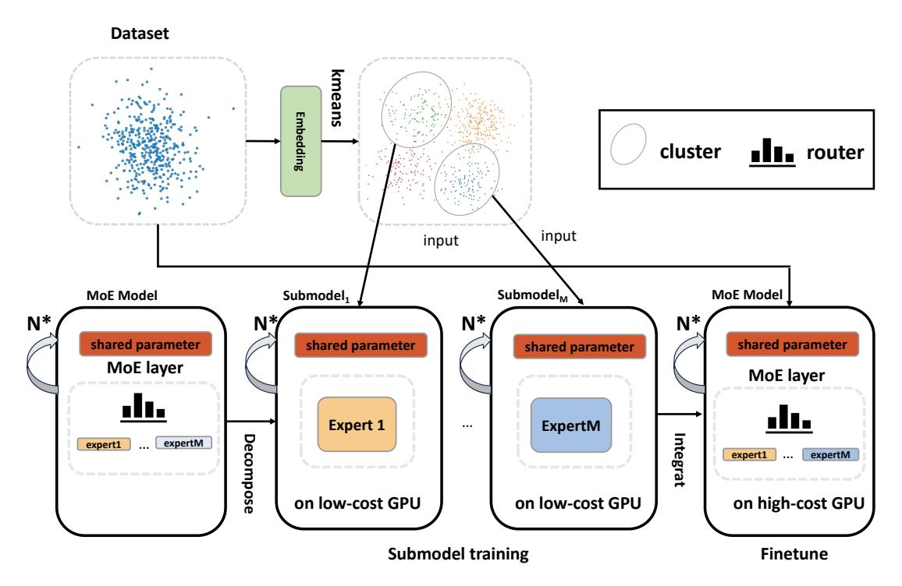
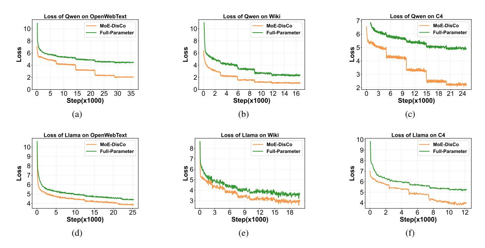
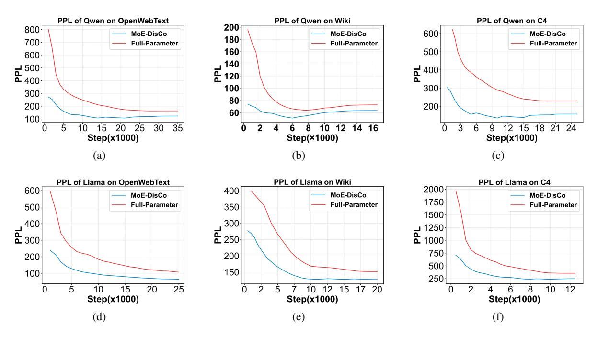
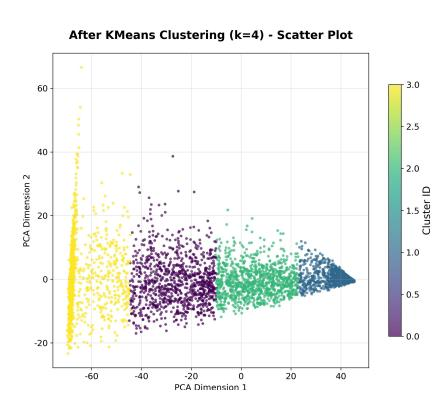

# MoE-DisCo: Low Economy Cost Training Mixture-of-Experts Models

Xin Ye1,2 and Daning Cheng1\* and Boyang Zhang1,2,3 and Yunquan Zhang<sup>1</sup> 1 Institute of Computing Technology, Chinese Academy of Sciences, Beijing, China <sup>2</sup>University of Chinese Academy of Sciences, Beijing, China <sup>3</sup>Peng Cheng Laboratory, Shenzhen, China

# Abstract

Training large-scale Mixture-of-Experts (MoE) models typically requires high-memory, highbandwidth GPUs (e.g., A100), and their high cost has become a major barrier to large-model training. In contrast, affordable hardware is low-cost but constrained by by memory capacity and bandwidth, making it unsuitable for direct LLM training. To address this, we propose MoE-DisCo (Mixture-of-Experts with Disentangled Clustering and Coordination)—a staged training framework. MoE-DisCo decomposes the MoE model into multiple dense submodels, each consisting of a shared backbone and a single expert, and partitions the training data into subsets using unsupervised clustering. Each submodel is trained independently and in parallel on its assigned data subset using low-cost devices, without any inter-device communication. Subsequently, all experts are integrated into a complete MoE model and fine-tuned globally for a short period on highmemory, high-bandwidth GPUs. Experiments show that our method matches or even surpasses full-parameter training in performance across multiple downstream tasks, loss function and perplexity (PPL) with a cost reduction of 47.6% to 69.5% on Qwen1.5-MoE-2.7B and Llama-MoE-3.5B across different datasets.

## 1 Introduction

Large Language Models (LLMs) and Mixture of Experts (MoE) have significantly advanced the field of natural language processing, yet their training economy cost has become a major barrier to broad participation. Current training paradigms heavily rely on high-memory GPUs such as NVIDIA A100/H800, which can cost over \$2.28 per GPU-hour in cloud environments. In contrast, affordable computing devices, such as DCUs, Ascend 910A, or consumer-grade GPUs, cost less. For example, the cost of DCU is less than \$0.03 per

hour. But, their limited memory capacity (typically ≤ 24 GB) and bandwidth make them seemingly unsuitable for training models at the billion- or trillion-parameter scale.

<span id="page-0-0"></span>

Figure 1: Model FLOPs Utilization (MFU) per GPU under 3D parallelism for language models of different scales as the number of GPUs increases. As the cluster scales from tens to thousands of GPUs, MFU per GPU consistently declines across all model sizes.[\(Narayanan](#page-9-0) [et al.,](#page-9-0) [2021\)](#page-9-0)

Furthermore, in large-scale model training, as the scale of GPU deployment expands, the per-GPU computational utilization almost inevitably declines. This is because larger clusters introduce more pronounced communication overhead—such as gradient synchronization and activation transmission—along with pipeline bubbles in pipeline parallelism, inter-node bandwidth bottlenecks, and load imbalance. These factors cause each GPU to spend more time waiting rather than computing, shown in Figure [1.](#page-0-0)

Therefore, using low-cost hardware as much as possible and minimizing multi-GPU coordination is key to reducing the cost of large model training.

To address high-cost challenge, we propose MoE-DisCo (Mixture-of-Experts with Disentangled Clustering and Coordination), a staged, hardware-aware training framework for MoE models. Specifically, MoE-DisCo decomposes a full MoE model with K-experts for each MoE layers into K independent dense submodels, each consisting of the shared Transformer backbone plus a single expert. Concurrently, we partition the original training data into K subsets using unsupervised clustering, establishing a disentangled alignment between experts and data clusters. Each submodel is trained exclusively on its assigned data subset, without any inter-model communication. Since each submodel is equivalent to a standard dense model (with a parameter scale much smaller than that of the full MoE model), it can be efficiently trained on a single low cost device. Crucially, this parallel training phase eliminates inter-device communication overhead. After all submodels are trained, MoE-DisCo reintegrates the individual expert modules into a unified MoE architecture and performs a brief global fine-tune phase on the full dataset. Although this final stage requires highmemory GPUs, it takes significantly less time than the total training time of conventional approaches, shown in Figure 2.

<span id="page-1-0"></span>

Figure 2: Comparison of training cost profiles between MoE-DisCo (left) and traditional MoE training (right). MoE-DisCo first performs the majority of training on low-cost GPUs (cost  $c_0$ ), which can be highly parallelized across multiple devices, followed by a short finetune phase on high-cost GPUs (cost  $c_1$ ). In contrast, traditional methods rely solely on high-cost hardware throughout the entire training process. The total cost (shaded area under the curve) is significantly reduced in MoE-DisCo, demonstrating its efficiency in lowering the monetary burden of large-scale MoE training.

Our main contributions are as follows: (1) We propose MoE-DisCo—a low-cost, staged MoE training framework designed for resource-constrained hardware; (2) We show that two stages of MoE-DisCo can be executed on hardware of different cost hardware, significantly reducing the overall training economy cost of large-scale MoE systems; (3) We evaluated MoE-DisCo across multiple datasets and model architectures. Results show that MoE-DisCo effectively reduces the

usage of high-cost GPUs while producing MoE models whose accuracy matches or even exceeds that of models trained with the original MoE approach with a cost reduction of 47.6% to 69.5% on Qwen1.5-MoE-2.7B and Llama-MoE-3.5B across different datasets. The code address is shown in Appendix.

#### 2 Related Work

The Mixture of Experts (MoE) is an architectural paradigm that enhances model capacity and computational efficiency (Jacobs et al., 2014) in different areas (Shao et al., 2021; Zhou et al., 2024; Zhang et al., 2024). Subsequently, the work (Shazeer et al., 2017) proposed the sparsely-gated MoE mechanism, which enables significant model scaling under a fixed computational budget—by activating only the top-K experts during each forward pass. GShard (Lepikhin et al., 2020) was the first to successfully apply MoE to the Transformer architecture and introduced the notion of "expert capacity". Subsequent works have improved MoE from multiple perspectives, Switch Transformer (Fedus et al., 2021), Hash FFN, proposed by Facebook AI (Roller et al., 2021), StableMoE (Dai et al., 2022).

The past decade, the researchers propose algorithms and high-performance software to make MoE practically useful (Gray et al., 2017; Narang et al., 2017; Artetxe et al., 2021; Du et al., 2021). Most of them are working on high performance framework (Rajbhandari et al., 2020; Kim et al., 2021; He et al., 2021, 2022; Liu et al., 2025; Jin et al., 2025a; Yu et al., 2024b; Jin et al., 2025a,b; Yuan et al., 2025). There are a few works working on how to train MoE model with low economy cost in algorithm view, which works well with system.

## 3 Methodology

In standard MoE training paradigms, although only a small number of experts are activated during inference, all expert parameters must be loaded and updated simultaneously during training to support backpropagation and gradient updates. This causes memory and computational overhead to grow linearly with the number of experts, severely limiting the trainability of MoE models on low-cost GPUs.

The core question addressed in this paper is: without significantly sacrificing the final performance of the model, can we alter the parameter update strategy to minimize the need for simultaneous loading of all experts during MoE training,

<span id="page-2-0"></span>

Figure 3: Overview of the MoE-DisCo training framework. The original MoE model is decomposed into multiple dense submodels, each containing a single expert and shared parameters. Training data is clustered via k-means to assign semantically distinct subsets to individual experts. Submodels are trained independently on low-cost GPUs, enabling high parallelism and reduced hardware cost. Finally, the experts are integrated into a unified MoE architecture and fine-tuned on a high-cost GPU using the full dataset.

thereby drastically reducing reliance on high-cost GPUs? To this end, we introduce Block Coordinate Descent (BCD) and SimulParallel SGD (Zinkevich et al., 2011) as the core optimization idea for MoE training and design an expert-level block training framework based on the structural characteristics of MoE, enabling the main training stages of large-scale MoE models to be completed on low-memory, low-cost GPUs.

#### 3.1 Start Point and Theoretical Foundation

Our approach is inspired by the theoretical foundations of two classical optimization frameworks: Block Coordinate Descent (BCD) and SimulParallel SGD (Zinkevich et al., 2011). These provide critical insights into low-cost MoE training from the perspectives of parameter update strategies and distributed training architectures, respectively.

BCD is an iterative algorithm widely used for large-scale non-convex optimization. Its core idea is to update only one block of parameters per iteration while keeping all others fixed, thereby significantly reducing memory and computational overhead. The MoE architecture exhibits similar sparsity during inference—the gating network activates only the Top-K experts, avoiding computation over

the entire model. However, in standard training, backpropagation must traverse all expert paths, making it impossible to exploit this sparsity for memory savings.

We propose integrating BCD into MoE training: in each step, only one expert and the shared backbone are updated, while all other experts remain frozen. In this setting, each training unit maintains only a dense sub-model equivalent to a single-expert branch. This enables training on low-memory devices. Moreover, different experts can be trained fully in parallel without any communication or synchronization.

However, merely decoupling parameters is insufficient to guarantee performance. The key challenge lies in assigning appropriate data to each expert to foster complementary representation learning. Inspired by SimulParallel SGD—which independently trains multiple model replicas on disjoint data subsets and aggregates them via parameter averaging—we view this method as an extreme case of MoE with uniform gating and All-*K* averaged outputs. Accordingly, in MoE-DisCo, maximizing the distributional divergence among the data subsets assigned to individual experts enhances expert specialization and system diversity, accelerating

convergence and improving ensemble effectiveness. To this end, we employ unsupervised clustering to partition the training corpus: first, semantic embeddings of samples are extracted using a pre-trained model; then, these embeddings are clustered into K groups (where K equals the number of experts) via K-Means, with each cluster assigned to a distinct expert. Clustering naturally groups semantically similar samples, ensuring separation between clusters in the embedding space and satisfying the requirement of "maximizing distributional divergence." This strategy draws inspiration from LRP [\(Yang,](#page-9-13) [2025;](#page-9-13) [Gururangan et al.,](#page-8-11) [2023\)](#page-8-11) and the theoretical foundations of SimulParallel SGD.

Furthermore, SimulParallel SGD also informs the fusion of the shared backbone: if the subdatasets are balanced in size, a simple average of backbone parameters suffices to approximate the global optimum; if they are severely imbalanced, a sample-count-weighted average (as in WP-SGD [\(Cheng et al.,](#page-8-12) [2020\)](#page-8-12)) is required to maintain unbiased gradients.

In summary, the complete MoE-DisCo training pipeline consists of four key stages: 1. Model Decoupling: The original MoE is decomposed into several dense submodels, each comprising the full shared backbone plus a single expert; 2. Data Decoupling: Semantic clustering generates divergent subdatasets, establishing a disentangled alignment between experts and data; 3. Independent Parallel Training: Each submodel is trained independently on its assigned subdataset in a fully decentralized manner, with zero communication overhead, and this process can be solved by low-cost hardware; 4. Model Reintegration and Fine-Tune: Experts and the shared backbone are fused, followed by a short global fine-tune phase on the full dataset to restore coordinated gating behavior. The whole process is shown in Figure [3.](#page-2-0)

## 3.1.1 Construction of Single-Expert Submodels

Let the MoE model contain E experts. Its parameters split into: (1) shared parameters θshared (embedding, attention, LayerNorm, etc.), and (2) expert parameters θexp = (θ1, . . . , θE), where θ<sup>k</sup> is the k-th expert's parameters. Thus, Θ = (θshared, θ1, . . . , θE).

MoE-DisCo constructs lightweight submodels to

drastically cut GPU memory during training. Each submodel includes the full θshared and only one expert θk. In every MoE layer, the gating mechanism is removed, retaining just a single expert—yielding a compact, dense submodel.

This design sharply reduces model size. For large MoEs, submodels become small enough to train efficiently on low-cost GPUs, shifting workloads from expensive hardware to affordable devices.

Critically, submodels are fully independent during training: no gradient/parameter exchange or synchronization is needed. This eliminates inter-GPU communication overhead and complex multi-GPU coordination, greatly simplifying parallel training. System scalability and deployment flexibility improve significantly. Moreover, since each submodel fits on low-cost hardware, individual device utilization rises, lowering overall training costs.

## 3.1.2 Dataset Partitioning

In MoE-Disco, we propose an unsupervised, clustering-based partitioning method to allocate semantically similar subsets of the training data to individual expert submodels. The approach begins by deriving a fixed-dimensional representation for each input sentence: given a sentence x = (x1, . . . , xn), we encode all its tokens using a pre-trained embedding layer and compute the sentence vector h<sup>x</sup> via mean pooling over the token embeddings,

$$h_x = \frac{1}{n} \sum_{i=1}^{n} \text{Embedding}(x_i)$$
 (1)

where n is the sentence length. These sentence vectors are then clustered using K-means with K = E clusters, where E denotes the number of experts.

## 3.1.3 Submodel Integrate and Global Training

After completing independent training of all singleexpert submodels, the complete MoE model is constructed and globally optimized through the following steps: 1. Expert layer merging: adopt a "direct integration" strategy to concatenate the trained expert parameters θ<sup>1</sup> ∼ θ<sup>E</sup> into a complete expert layer; 2. Shared parameter fusion: weighted average the shared parameters θ (k) shared (k = 1 ∼ E) of

<span id="page-4-0"></span>**Algorithm 1** MoE-DisCo:Mixture-of-Experts with Disentangled Clustering and Coordination

**Require:** Original dataset  $\mathcal{D}$ ; MoE shared parameters  $\theta_{\text{shared}}$ ; Number of experts E and ith expert's parameters  $\theta_i$ ; Model  $M(\theta, \mathcal{D})$ 

**Ensure:** Trained global MoE model  $M(\Theta, \mathcal{D})$ 

```
1: h_x \leftarrow \text{MeanPool}(\text{Embed}(x)) for all x \in \mathcal{D}

2: \{\mathcal{D}_1, \dots, \mathcal{D}_E\} \leftarrow \text{K-means}(\{h_x\}, K = E)

3: for k \leftarrow 1 to E do

4: \theta_{\text{shared}}^{(k)} \leftarrow \theta_{\text{shared}}

5: \Theta_k \leftarrow (\theta_{\text{shared}}^{(k)}, \theta_k)

6: Train M(\Theta_k, \mathcal{D}_k)

7: end for

8: \theta_{\text{exp}}^* \leftarrow \text{Concat}(\theta_1, \dots, \theta_E)

9: \theta_{\text{shared}}^* \leftarrow \frac{1}{E} \sum_{k=1}^{E} \theta_{\text{shared}}^{(k)}

10: \Theta \leftarrow (\theta_{\text{shared}}^*, \theta_{\text{exp}}^*)

11: Fine-tune M(\Theta, \mathcal{D})

return M(\Theta, \mathcal{D})
```

all submodels to obtain global shared parameters:

$$\theta_{\text{shared}}^* = \sum_{k=1}^{E} \gamma_k \theta_{\text{shared}}^{(k)} \tag{2}$$

 $\gamma_k$  is the weight gain from WP-SGD (Cheng et al., 2020). When subset of dataset size is almost the same,  $\gamma_k = \frac{1}{E}$ . The gating part is initialized by tensor concatenation. 3. Global fine-tune: assemble the merged parameters  $(\theta^*_{\text{shared}}, \theta^*_{\text{exp}})$  into a complete MoE model, and perform joint fine-tune on the original full dataset to alleviate distribution bias between experts and improve overall model performance.

#### 3.2 MoE-DisCo Algorithm

Based on above introduction, we give a MoE-DisCo algorithm description, which shown in Algorithm 1.

## 4 Experiments

In this work, we conduct a systematic comparison between MoE-DisCo and a full-parameter trained MoE baseline, evaluating both model performance and training cost. For performance evaluation, we compare the resulting models in terms of language modeling quality (measured by training loss, PPL and downstream task) demonstrating that MoE-DisCo preserves—or even enhances—algorithmic effectiveness relative to standard MoE training. For economy cost analysis, we focus specifically on resource consumption during the fine-tune phase, as

this is the only stage requiring high-cost GPUs (e.g., A100). The main training phase of MoE-DisCo, by contrast, runs entirely on low-cost hardware, making fine-tune the primary determinant of its overall infrastructure expense. For ablation study, we will show the influence of k-means cluster and the number of experts.

#### 4.1 Experimental Setup

#### **4.1.1** Models

**Qwen1.5-MoE-2.7B.** The Qwen1.5-MoE-2.7B model activates approximately 2.7 billion parameters during inference, while achieving performance comparable to dense models with around 7 billion parameters, such as Mistral-7B. In our experiments, we set the number of experts to 4 while keeping all other configurations identical to the original model. We use abbr. Owen in following parts.

**LLaMA-MoE-3.5B.** The LLaMA-MoE-3.5B model is built upon the LLaMA architecture and incorporates a Mixture-of-Experts design to improve parameter efficiency and scalability. In our experiments, we set the number of experts to 4 while keeping all other configurations identical to the original model. We use abbr. Llama in following parts.

## 4.1.2 Datasets

Experiments use three public standard datasets, as follows: 1. C4: A large-scale English corpus with strict filtering and cleaning; 2. WikiText-2: A high-quality English dataset compiled from Wikipedia, commonly used for language model benchmark evaluation; 3. OpenWebText: An open web text collection constructed following the GPT-2 training data.

## **4.1.3** Evaluation Metrics

We evaluate MoE-DisCo against the full-parameter trained MoE baseline using three key criteria: (1) language modeling capability, measured by training loss, PPL and downstream tasks; (2) training efficiency, assessed via the number of training steps required to reach a target loss and the total usage time of high-cost GPUs. (3) The economy cost of training a MoE model in dollar.

#### 4.2 Performance Comparison

Table 1 presents a comparison of training efficiency and convergence performance between MoE-DisCo and full-parameter training across two MoE architectures (Qwen and LLaMA) and three

<span id="page-5-1"></span>

Figure 4: Loss trends between MoE-Disco on fine-tune stage and Full-Parameter across different datasets

datasets (C4, WikiText-2, and OpenWebText). The results show that MoE-DisCo substantially reduces the number of training steps required to reach the same training loss. For instance, on the Qwen architecture, the steps to achieve convergence decrease from 21150, 12500, and 28600 to 4100, 3150, and 6650 on the C4, WikiText-2, and Open-WebText datasets, respectively, representing more than a fourfold reduction. A similar trend is observed for the LLaMA architecture. Moreover, at the same training loss, the PPL of models trained by MoE-DisCo metgod is comparable to, and in some cases lower than that of models trained by fullparameter method, indicating that the method accelerates training without compromising language modeling performance.

Figures [4](#page-5-1) and [5](#page-6-0) show the training loss and ppl curves of the Full-Parameter and MoE-DisCo finetune stage methods on three datasets, respectively. We use fine-tune stage of MoE-DisCo because this part is the most expensive stage (Cost information is shown in Economic Cost Analysis section). It can be observed that, given the same training duration, models trained with the MoE-DisCo method achieve significantly better performance than those trained with full-parameter training. If the target is to reach the same model performance, the MoE-DisCo method substantially reduces the required training time. This indicates that the proposed method can markedly lower training economy costs without sacrificing model performance. The whole

<span id="page-5-0"></span>

| Model | Data                                  |              | Full-Param |                           | MoE-DisCo |                    |        |  |
|-------|---------------------------------------|--------------|------------|---------------------------|-----------|--------------------|--------|--|
|       |                                       | Step         | Loss       | PPL                       | Step      | Loss               | PPL    |  |
| Qwen  | C4                                    |              |            | 21,150 4.954 230.32 4,100 |           | 4.925              | 165.86 |  |
|       | WikiText-2                            | 12,500 2.303 |            |                           |           | 71.89 3,150 2.2964 | 57.55  |  |
|       | OpenWebText 28,600 4.606 162.51 6,650 |              |            |                           |           | 4.588              | 134.31 |  |
| Llama | C4                                    |              |            | 11,750 5.274 356.28 4,150 |           | 5.276              | 296.35 |  |
|       | WikiText-2                            |              |            | 15,000 3.805 160.91 5,300 |           | 3.794              | 163.27 |  |
|       | OpenWebText 21,000 4.536 114.93 7,800 |              |            |                           |           | 4.541              | 106.82 |  |

Table 1: Performance comparison between MoE-DisCo and full-parameter training across two MoE architectures. The table show that the number of steps required for MoE-DisCo to achieve full-parameter convergence result.

training process including submodel training is shown in Cost Analysis part and Appendix.

# 4.3 Downstream Task Performance

Table [2](#page-6-1) reports the downstream task performance of MoE-DisCo and full-parameter training. All models are pretrained on OpenWebText and evaluated on multiple downstream tasks. ARC-e and MMLU are evaluated in the 5-shot setting, while HellaSwag and PIQA are evaluated in the zero-shot setting.

As shown in the table, MoE-DisCo consistently achieves better performance than full-parameter training on both few-shot (ARC-e, MMLU) and zero-shot (HellaSwag, PIQA) downstream tasks.

<span id="page-6-0"></span>

Figure 5: PPL trends between MoE-Disco on fine-tune stage and Full-Parameter across different datasets

Overall, the results show that MoE-DisCo achieves better downstream task performance than fullparameter training across the evaluated benchmarks.

<span id="page-6-1"></span>

| Method     | ARC-e (5) | MMLU (%) | HellaSwag (%) | PIQA (%) |
|------------|-----------|----------|---------------|----------|
| Full-Param | 27.9      | 23.0     | 27.45         | 52.25    |
| MoE-DisCo  | 29.1      | 25.3     | 29.45         | 57.03    |

Table 2: Downstream task performance of Qwen1.5- MoE-2.7B on ARC-E, MMLU, Hellaswag and PIQA. (ARC-r and MMLU are evaluated under 5-shot settings; Hellaswag and PIQA under zero-shot.).

### 4.4 Economic Cost Analysis

Training large-scale models, especially those based on MoE architectures, incurs substantial computational and memory costs. This section analyzes the economic advantages of the proposed MoE-DisCo training strategy and compares it with conventional full-parameter training methods.

Following the market pricing of major cloud service providers and considering the hardware environment used in our experiments, we adopt the following GPU rental prices as the cost estimation baseline:RTX 4090: \$0.35/ GPU·hour; A100 (80GB): \$2.28 / GPU·hour.

Based on the results in Table [3,](#page-7-0) MoE-DisCo achieves model performance comparable to—sometimes slightly better than—full-parameter training, while substantially reducing both cost and

training time. The approach decouples MoE training into two phases: (1) Submodel Training (Sphase) and (2) Lightweight Fine-tuning (F-phase).

During the S-phase, all submodels are trained independently and in parallel on a low-cost RTX 4090 platform. To simplify accounting and provide a conservative upper bound on resource usage, the total S-phase cost and time are computed as four times the longest individual submodel training duration, reflecting worst-case synchronization overhead. Due to the low per-unit cost of RTX 4090 and the reduced computational footprint of submodels, this phase incurs only \$1.79–\$4.37 across all experiments. Critically, because training is fully parallelized, marginal costs scale sublinearly—effectively near-constant—with the number of experts.

The F-phase requires only a brief synchronized fine-tune step on a single A100 GPU, sufficient to recover (or slightly exceed) the convergence of fullparameter training. This phase costs \$1.55–\$10.92.

Overall, MoE-DisCo achieves significant savings across all settings. On Qwen, total costs on C4, WikiText-2, and OpenWebText are \$6.87, \$3.34, and \$10.91—69.5%, 51.8%, and 63.5% lower than full-parameter baselines (\$22.50, \$6.93, \$29.91)—with training time reduced from 9.87h, 3.04h and 13.12h to 3.82h, 1.96h, and 5.99h. On Llama, MoE-DisCo costs \$6.74, \$8.13, and \$15.14—47.6%, 52.2%, and 52.9% less than full-

<span id="page-7-0"></span>

| Model | Dataset             | Full-Parameter |       | MoE-DisCo |                                                |      |            |         |      |        |                                                              |      |
|-------|---------------------|----------------|-------|-----------|------------------------------------------------|------|------------|---------|------|--------|--------------------------------------------------------------|------|
|       |                     |                |       |           | Cost(\$) Time(h) Platform S-Cost(\$) S-Time(h) |      | S-Platform |         |      |        | F-Cost(\$) F-Time(h) F-Platform Total Cost(\$) Total Time(h) |      |
|       | C4                  | 22.5036        | 9.87  | A100*1    | 2.9260                                         | 2.09 | RTX 4090*4 | 3.9444  | 1.73 | A100*1 | 6.8704                                                       | 3.82 |
| Qwen  | Wiki                | 6.9312         | 3.04  | A100*1    | 1.7920                                         | 1.28 | RTX4090*4  | 1.5504  | 0.68 | A100*1 | 3.3424                                                       | 1.96 |
|       | OpenWebText 29.9136 |                | 13.12 | A100*1    | 4.3680                                         | 3.12 | RTX4090*4  | 6.5436  | 2.87 | A100*1 | 10.9116                                                      | 5.99 |
|       | C4                  | 12.8592        | 5.64  | A100*1    | 2.1560                                         | 1.54 | RTX4090*4  | 4.5828  | 2.01 | A100*1 | 6.7388                                                       | 3.55 |
| Llama | Wiki                | 16.9860        | 7.45  | A100*1    | 2.0440                                         | 1.46 | RTX4090*4  | 6.0876  | 2.67 | A100*1 | 8.1316                                                       | 4.13 |
|       | OpenWebText 32.1252 |                | 14.09 | A100*1    | 4.2140                                         | 3.01 | RTX4090*4  | 10.9212 | 4.79 | A100*1 | 15.1352                                                      | 7.80 |

Table 3: Comparison of Full-Parameter and MoE-DisCo training costs, times, and platforms for Qwen and Llama across three datasets. In MoE-DisCo, Fine-tune Cost, Fine-tune Time, and Platform are shown separately. S- means submodel training. F- means fine-tune. The S-Cost is the all cost in submodel training.

<span id="page-7-1"></span>

Figure 6: In the Qwen model on C4, replacing the cluster operation in MoE-DisCo with random data assignment causes the MoE training performance during the fine-tune stage to degrade to that of full-parameter training.

parameter training and reduces training time from 5.64h, 7.45h, and 14.09h to 3.55h, 4.13h, and 7.80h.

Despite drastic cost reduction, final performance remains on par with or marginally better than fullparameter training. By shifting the majority of computation from expensive A100 platform to lowcost RTX 4090 platform via a "decoupled training + lightweight reintegration" strategy, MoE-DisCo offers a practical, reproducible, and highly costefficient framework for training large MoE models—particularly valuable for academic and industrial teams under resource constraints.

## 4.5 Ablation Study

### 4.5.1 Cluster in MoE-DisCo

In this ablation study, we validate the importance of the clustering operation in the MoE-DisCo framework. Specifically, during the training of the Qwen model on C4, we removed the original k-means clustering step and replaced it with

<span id="page-7-2"></span>

Figure 7: The MoE-DisCo performance on Different MoE model with 2 and 4 experts

a random assignment of data to different experts for submodel training with the same amount of dataset. The results, Figure [6,](#page-7-1)show that substituting k-means clustering with random assignment significantly degrades training efficiency, and the final performance essentially regresses to that of full-parameter training. We therefore conclude that k-means clustering is an important component of MoE-DisCo.

### 4.5.2 Multi-experts in MoE-DisCo

In this ablation study, we evaluate MoE-DisCo's performance with varying expert counts to assess how architectural capacity affects training efficiency and model quality of MoE-DisCo. Specifically, we compare the convergence of the Llama model on C4 using 2 and 4 experts. As shown in Figure [7,](#page-7-2) MoE-DisCo achieves faster convergence and better final performance in both cases. Notably, the 4-expert model yields slightly lower loss and perplexity than the 2-expert version. Results suggest that MoE-DisCo achieves high training efficiency and strong performance across different numbers of experts.

# 5 Conclusion

This study addresses the challenges of high cost of MoE training by proposing a method that applies BCD and SimulParallel SGD to MoE training, i.e., MoE-DisCo. Compared with traditional fullparameter training, this study verifies the feasibility and advantages of the MoE-DisCo method in reducing economy cost, decreasing reliance on high-cost GPUs. It achieves large-scale model training under low computational resource conditions, providing theoretical and practical guidance for large model training in resource-constrained scenarios.

# 6 Limitation

- Limitations: Due to resource constraints, the effectiveness of the method has not been verified on larger-scale models (e.g., 10B+ parameters); - Future work: Expand model scale and dataset scope, introduce more evaluation metrics; explore dynamic expert number adjustment strategies to further improve training efficiency and model performance.

# References

- Alfred V. Aho and Jeffrey D. Ullman. 1972. *The Theory of Parsing, Translation and Compiling*, volume 1. Prentice-Hall, Englewood Cliffs, NJ.
- American Psychological Association. 1983. *Publications Manual*. American Psychological Association, Washington, DC.
- Rie Kubota Ando and Tong Zhang. 2005. A framework for learning predictive structures from multiple tasks and unlabeled data. *Journal of Machine Learning Research*, 6:1817–1853.
- Galen Andrew and Jianfeng Gao. 2007. Scalable training of L1-regularized log-linear models. In *Proceedings of the 24th International Conference on Machine Learning*, pages 33–40.
- <span id="page-8-4"></span>Mikel Artetxe, Shruti Bhosale, Naman Goyal, Todor Mihaylov, Myle Ott, Sam Shleifer, Xi Victoria Lin, Jingfei Du, Srinivasan Iyer, and Ramakanth Pasunuru. 2021. Efficient large scale language modeling with mixtures of experts. *arXiv e-prints*.
- Ashok K. Chandra, Dexter C. Kozen, and Larry J. Stockmeyer. 1981. [Alternation.](https://doi.org/10.1145/322234.322243) *Journal of the Association for Computing Machinery*, 28(1):114–133.
- <span id="page-8-12"></span>Daning Cheng, Shigang Li, and Yunquan Zhang. 2020. Wp-sgd: Weighted parallel sgd for distributed unbalanced-workload training system. *Journal of Parallel and Distributed Computing*, 145:202–216.

- <span id="page-8-2"></span>Damai Dai, Li Dong, Shuming Ma, Bo Zheng, Zhifang Sui, Baobao Chang, and Furu Wei. 2022. Stablemoe: Stable routing strategy for mixture of experts. *Proceedings of the 60th Annual Meeting of the Association for Computational Linguistics (Volume 1: Long Papers)*.
- <span id="page-8-5"></span>Nan Du, Yanping Huang, Andrew M. Dai, Simon Tong, Dmitry Lepikhin, Yuanzhong Xu, Maxim Krikun, Yanqi Zhou, Adams Wei Yu, and Orhan Firat. 2021. Glam: Efficient scaling of language models with mixture-of-experts.
- <span id="page-8-1"></span>William Fedus, Barret Zoph, and Noam Shazeer. 2021. Switch transformers: Scaling to trillion parameter models with simple and efficient sparsity.
- <span id="page-8-3"></span>Scott Gray, Alec Radford, and Diederik P. Kingma. 2017. Gpu kernels for block-sparse weights.
- <span id="page-8-11"></span>Suchin Gururangan, Margaret Li, Mike Lewis, Weijia Shi, Tim Althoff, Noah A Smith, and Luke Zettlemoyer. 2023. Scaling expert language models with unsupervised domain discovery. *arXiv preprint arXiv:2303.14177*.
- Dan Gusfield. 1997. *Algorithms on Strings, Trees and Sequences*. Cambridge University Press, Cambridge, UK.
- <span id="page-8-7"></span>Jiaao He, Jiezhong Qiu, Aohan Zeng, Zhilin Yang, Jidong Zhai, and Jie Tang. 2021. Fastmoe: A fast mixture-of-expert training system. *arXiv preprint arXiv:2103.13262*.
- <span id="page-8-8"></span>Jiaao He, Jidong Zhai, Tiago Antunes, Haojie Wang, Fuwen Luo, Shangfeng Shi, and Qin Li. 2022. Fastermoe: modeling and optimizing training of large-scale dynamic pre-trained models. In *Proceedings of the 27th ACM SIGPLAN Symposium on Principles and Practice of Parallel Programming*, pages 120–134.
- <span id="page-8-0"></span>R Jacobs, M Jordan, S Nowlan, and G Hinton. 2014. Adaptive mixtures of local experts. *Neural Computation*, 3(1):79–87.
- <span id="page-8-9"></span>Chao Jin, Ziheng Jiang, Zhihao Bai, Zheng Zhong, Juncai Liu, Xiang Li, Ningxin Zheng, Xi Wang, Cong Xie, Qi Huang, and 1 others. 2025a. Megascalemoe: Large-scale communication-efficient training of mixture-of-experts models in production. *arXiv preprint arXiv:2505.11432*.
- <span id="page-8-10"></span>Zewen Jin, Shengnan Wang, Jiaan Zhu, Hongrui Zhan, Youhui Bai, Lin Zhang, Zhenyu Ming, and Cheng Li. 2025b. Bigmac: A communication-efficient mixtureof-experts model structure for fast training and inference. In *Proceedings of the AAAI Conference on Artificial Intelligence*, volume 39, pages 17689– 17698.
- <span id="page-8-6"></span>Young Jin Kim, Ammar Ahmad Awan, Alexandre Muzio, Andres Felipe Cruz Salinas, Liyang Lu, Amr Hendy, Samyam Rajbhandari, Yuxiong He, and Hany Hassan Awadalla. 2021. Scalable and efficient moe training for multitask multilingual models.

<span id="page-9-5"></span>Dmitry Lepikhin, Hyouk Joong Lee, Yuanzhong Xu, Dehao Chen, Orhan Firat, Yanping Huang, Maxim Krikun, Noam Shazeer, and Zhifeng Chen. 2020. Gshard: Scaling giant models with conditional computation and automatic sharding.

<span id="page-9-9"></span>Xinyi Liu, Yujie Wang, Fangcheng Fu, Xupeng Miao, Shenhan Zhu, Xiaonan Nie, and Bin Cui. 2025. Netmoe: Accelerating moe training through dynamic sample placement. In *The Thirteenth International Conference on Learning Representations*.

<span id="page-9-7"></span>Sharan Narang, Eric Undersander, and Gregory Diamos. 2017. Block-sparse recurrent neural networks.

<span id="page-9-0"></span>Deepak Narayanan, Mohammad Shoeybi, Jared Casper, Patrick LeGresley, Mostofa Patwary, Vijay Korthikanti, Dmitri Vainbrand, Prethvi Kashinkunti, Julie Bernauer, Bryan Catanzaro, Amar Phanishayee, and Matei Zaharia. 2021. [Efficient large-scale lan](https://arxiv.org/abs/2104.04473)[guage model training on GPU clusters.](https://arxiv.org/abs/2104.04473) *CoRR*, abs/2104.04473.

Xinglin Pan, Wenxiang Lin, Lin Zhang, Shaohuai Shi, Zhenheng Tang, Rui Wang, Bo Li, and Xiaowen Chu. 2025. Fsmoe: A flexible and scalable training system for sparse mixture-of-experts models. In *Proceedings of the 30th ACM International Conference on Architectural Support for Programming Languages and Operating Systems, Volume 1*, pages 524–539.

<span id="page-9-8"></span>Samyam Rajbhandari, Jeff Rasley, Olatunji Ruwase, and Yuxiong He. 2020. Zero: Memory optimizations toward training trillion parameter models.

Mohammad Sadegh Rasooli and Joel R. Tetreault. 2015. [Yara parser: A fast and accurate dependency parser.](http://arxiv.org/abs/1503.06733) *Computing Research Repository*, arXiv:1503.06733. Version 2.

<span id="page-9-6"></span>Stephen Roller, Sainbayar Sukhbaatar, Arthur Szlam, and Jason Weston. 2021. Hash layers for large sparse models.

<span id="page-9-1"></span>Yunfan Shao, Zhichao Geng, Yitao Liu, Junqi Dai, Fei Yang, Li Zhe, Hujun Bao, and Xipeng Qiu. 2021. Cpt: A pre-trained unbalanced transformer for both chinese language understanding and generation.

<span id="page-9-4"></span>Noam Shazeer, Azalia Mirhoseini, Krzysztof Maziarz, Andy Davis, and Jeff Dean. 2017. Outrageously large neural networks: The sparsely-gated mixtureof-experts layer.

<span id="page-9-13"></span>Jiajie Yang. 2025. Latent prototype routing: Achieving near-perfect load balancing in mixture-of-experts.

Dianhai Yu, Liang Shen, Hongxiang Hao, Weibao Gong, Huachao Wu, Jiang Bian, Lirong Dai, and Haoyi Xiong. 2024a. Moesys: A distributed and efficient mixture-of-experts training and inference system for internet services. *IEEE Transactions on Services Computing*, 17(5):2626–2639.

<span id="page-9-10"></span>Dianhai Yu, Liang Shen, Hongxiang Hao, Weibao Gong, Huachao Wu, Jiang Bian, Lirong Dai, and Haoyi Xiong. 2024b. Moesys: A distributed and efficient mixture-of-experts training and inference system for internet services. *IEEE transactions on services computing*, (5):17.

<span id="page-9-11"></span>Yueming Yuan, Ahan Gupta, Jianping Li, Sajal Dash, Feiyi Wang, and Minjia Zhang. 2025. X-moe: Enabling scalable training for emerging mixture-ofexperts architectures on hpc platforms. In *Proceedings of the International Conference for High Performance Computing, Networking, Storage and Analysis*, pages 1315–1331.

<span id="page-9-3"></span>Huangzhao Zhang, Kechi Zhang, L. I. Zhuo, L. I. Jia, L. I. Jia, L. I. Yongmin, Yunfei Zhao, Yuqi Zhu, Fang Liu, and L. I. Ge. 2024. Deep learning for code generation: a survey. *Science China(Information Sciences)*, (9).

<span id="page-9-2"></span>Xuanhe Zhou, Zhaoyan Sun, and Guoliang Li. 2024. Db-gpt: Large language model meets database. *Data Science & Engineering*, 9(1).

<span id="page-9-12"></span>Martin Zinkevich, Markus Weimer, Alexander J. Smola, and Lihong Li. 2011. Parallelized stochastic gradient descent. In *Advances in Neural Information Processing Systems 23: Conference on Neural Information Processing Systems A Meeting Held December*.

## A More of Dataset Partitioning

<span id="page-9-14"></span>

Figure 8: Scatter plot distribution of the C4 dataset on four clusters after clustering (PCA dimensionality reduction to 2D).

In MoE-Disco, we propose an unsupervised, clustering-based partitioning method to allocate semantically similar subsets of the training data to individual expert submodels. The approach begins by deriving a fixed-dimensional representation for each input sentence: given a sentence x = (x1, . . . , xn), we encode all its tokens using a pre-trained embedding layer and compute the sentence vector h<sup>x</sup> via mean pooling over the token

embeddings,

$$h_x = \frac{1}{n} \sum_{i=1}^n \text{Embedding}(x_i)$$
 (3)

where n is the sentence length. These sentence vectors are then clustered using K-means with K=E clusters, where E denotes the number of experts. The clustering objective minimizes the within-cluster sum of squared distances to the respective centroids:

$$\min_{\{C_k\}_{k=1}^K} \sum_{k=1}^K \sum_{h_x \in C_k} \|h_x - \mu_k\|^2, \tag{4}$$

with  $C_k$  representing the set of sentence vectors assigned to cluster k and  $\mu_k$  its centroid. Finally, the resulting clusters are used to partition the original dataset into E semantically coherent sub-datasets, each of which is assigned to train a distinct single-expert submodel. We show a example of clustering dataset in Figure 8.

#### B Code Link

https://anonymous.4open.science/r/MoE-DisCo-4835/

## **C** Hyperparameter Settings

All experiments in this work are conducted with the following hyperparameters:

| Hyperparameter          | Value              |
|-------------------------|--------------------|
| Optimizer               | AdamW              |
| Learning rate           | $1 \times 10^{-4}$ |
| Learning rate scheduler | constant           |
| Batch size              | 16                 |
| Data Type               | bfloat16           |
| Sequence length         | 1024               |

Table 4: Hyperparameter settings used in submodel training.

#### **D** Submodel Training Details

In MoE-DisCo, each submodel is trained on a low-cost GPU. For the k-th submodel, we retain the full shared backbone and keep only the k-th expert in every MoE layer. This results in a standard dense model with the same depth and hidden dimensionality as the original MoE. Although sub-expert training requires a non-trivial amount of time, it incurs relatively low monetary cost, as each submodel

| Hyperparameter          | Value              |  |  |
|-------------------------|--------------------|--|--|
| Optimizer               | AdamW              |  |  |
| Learning rate           | $3 \times 10^{-4}$ |  |  |
| Weight decay            | 0.01               |  |  |
| Warmup ratio            | 0.03               |  |  |
| Learning rate scheduler | Cosine             |  |  |
| Batch size              | 16                 |  |  |
| Data Type               | bfloat16           |  |  |
| Sequence length         | 1024               |  |  |

Table 5: Hyperparameter settings used in full-parameter training and MoE-DisCo fine-tune.

<span id="page-10-0"></span>

| Model            | Dataset     | Max Steps | Max Time (hours) |
|------------------|-------------|-----------|------------------|
| Qwen1.5-MoE-2.7B | C4          | 4,200     | 2.09             |
|                  | WikiText-2  | 4,330     | 1.28             |
|                  | OpenWebText | 5,922     | 3.12             |
| LLaMA-MoE-3.5B   | C4          | 4,810     | 1.54             |
|                  | WikiText-2  | 5,136     | 1.46             |
|                  | OpenWebText | 4,355     | 3.01             |

Table 6: Maximum training steps and wall-clock time among all sub-expert models. As sub-expert models are trained fully in parallel, we report the maximum value across experts, which determines the overall training time of this stage.

can be trained independently on affordable hardware and fully in parallel. A detailed breakdown of training steps and cost is provided in Table 6.

## **E** Gating Network Architecture

The MoE architecture employed in this work adopts the standard top-K sparsely-gated routing strategy. In this scheme, for each input token, the gating network dynamically selects the K most relevant experts for activation while leaving the rest inactive, thereby maintaining high model capacity with controlled computational cost. During the submodel training phase, only a single expert is assigned per submodel; consequently, the gating network is not utilized, and each submodel is trained as a dense model with a fixed expert. In the subsequent finetune stage, the full gating network is introduced and requires only a small number of optimization steps to learn effective and coordinated routing across experts, achieving efficient and stable adaptation without extensive retraining.