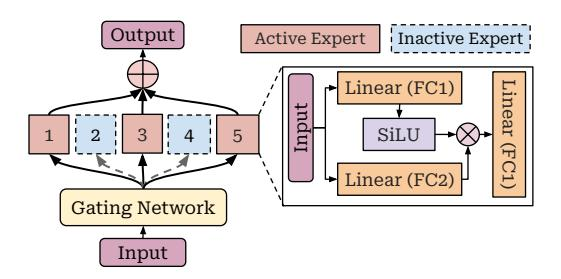
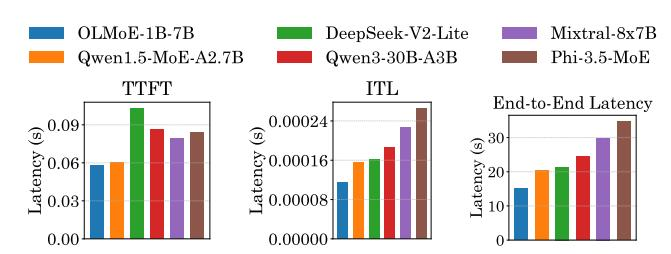
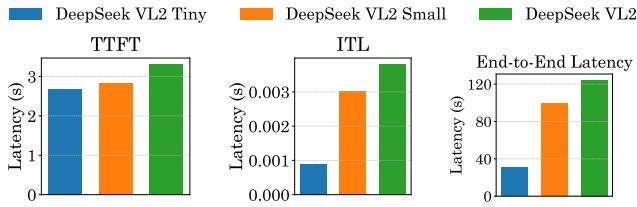
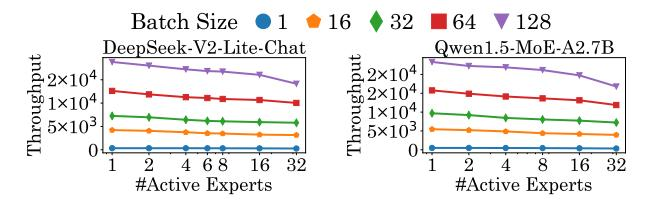
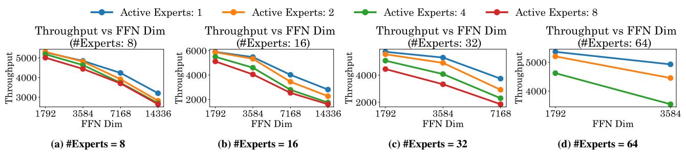
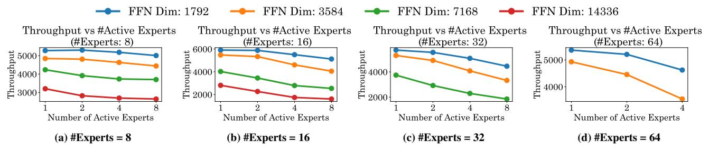
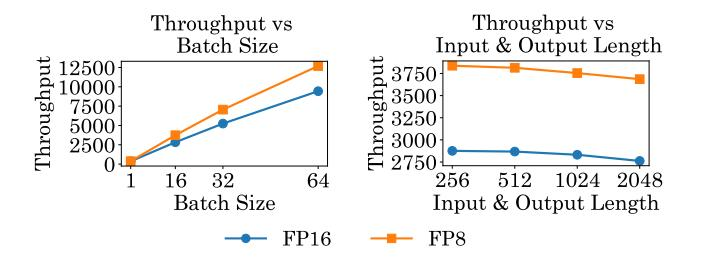
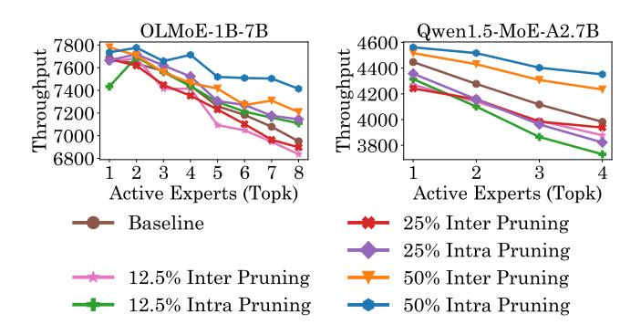
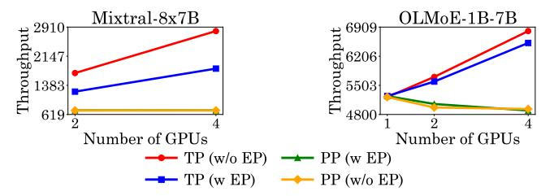

# MoE-Inference-Bench: Performance Evaluation of Mixture of Expert Large Language and Vision Models

Krishna Teja Chitty-Venkata1, Sylvia Howland2, Golara Azar2, Daria Soboleva2, Natalia Vassilieva2, Siddhisanket Raskar3, Murali Emani1, Venkatram Vishwanath1

1Argonne National Laboratory, 2Cerebras, 3Pacific Northwest National Laboratory {schittyvenkata, memani, venkat}@anl.gov, s.raskar@pnnl.gov, {sylvia.howland, golara.azar, daria.soboleva, natalia}@cerebras.net

#### **Abstract**

Mixture of Experts (MoE) models have enabled the scaling of Large Language Models (LLMs) and Vision Language Models (VLMs) by achieving massive parameter counts while maintaining computational efficiency. However, MoEs introduce several inference-time challenges, including load imbalance across experts and the additional routing computational overhead. To address these challenges and fully harness the benefits of MoE, a systematic evaluation of hardware acceleration techniques is essential. We present MoE-Inference-Bench, a comprehensive study to evaluate MoE performance across diverse scenarios. We analyze the impact of batch size, sequence length, and critical MoE hyperparameters such as FFN dimensions and number of experts on throughput. We evaluate several optimization techniques on Nvidia H100 GPUs, including pruning, Fused MoE operations, speculative decoding, quantization, and various parallelization strategies. Our evaluation includes MoEs from the Mixtral, DeepSeek, OLMoE and Qwen families. The results reveal performance differences across configurations and provide insights for the efficient deployment of MoEs.

## 1 Introduction

Mixture of Experts (MoE) models have emerged as a powerful paradigm for scaling neural networks, particularly in the domain of Large Language Models (LLMs). This approach offers a way to increase model capacity without a proportional rise in computational cost. MoE differs from dense models by using multiple specialized sub-networks, where each input activates only a subset of experts (as determined by a gating network). In contrast, dense models activate all parameters for every input, making MoE architectures significantly more parameter-efficient. Architectures such as the Switch Transformer [13] and GShard [24], along with more recent opensource MoE models like Mixtral [20], Llama4 [32], DeepSeekMoE [9], and Kimi [42], exemplify the rapid advancements in MoE-based systems These models leverage sparse weight activation, enabling large networks to maintain inference efficiency. MoE models are now widely used in applications such as text generation, retrievalaugmented generation, and multimodal reasoning. However, despite their computational advantages, MoE models also pose unique challenges in inference, training stability, memory usage, and hardware utilization due to load imbalance and dynamic routing.

MoE Inference [27] plays a central role in modern AI applications, as it involves executing the forward pass of a sparsely activated model where only the top-k experts per token are evaluated. Efficient inference is crucial for maximizing the benefits of sparsity in real-world deployments. As MoE models continue to grow in scale and

Figure 1: Layer-wise Total and Active Parameter Breakdown for Mixtral-8x7B, OLMoE-1B-7B, and Owen1.5-MoE

complexity, optimizing inference is critical to achieve low latency and energy-efficien execution on modern accelerators. This includes mitigating expert load imbalance, reducing communication overhead in distributed settings, and designing scheduling strategies that fully exploit sparsity for throughput gains.

The MoE ecosystem has witnessed a convergence of three key trends: the rise of open-source MoE models, advancements in AI accelerators, and the development of inference frameworks like vLLM [23] and FasterMoE [18] optimized for sparse execution. This synergy highlights the importance of robust benchmarking to evaluate MoE performance across diverse hardware setups. Benchmarking exposes critical trade-offs between throughput, latency, and memory footprint, enabling informed decisions about model deployment and architecture optimization.

The evolution of AI hardware such as GPUs and specialized AI accelerators has been instrumental for the ever-rising computational demands of MoE models. These accelerators offer high parallelism and memory bandwidth, essential for models with billions of parameters and dynamic computation graphs. However, MoE architectures also introduce new hardware challenges, such as expert placement, routing overhead, and under-utilization due to sparse activations. Addressing these hardware inefficiencies requires co-designing inference systems that are both MoE-aware and hardware-efficient. Figure 1 shows that MoE layers dominate both total and active parameters across different models, emphasizing their critical role in computational cost and memory footprint. Since MoE layer weights

account for a substantial portion of the model, understanding the MoE performance is essential for optimized deployment.

In this paper, we introduce MoE-Inference-Bench, a comprehensive benchmarking suite designed to systematically evaluate MoE models across a wide range of optimization techniques. Our benchmark analyzes throughput, latency, and hardware utilization for stateof-the-art MoE models, shedding light on the practical implications of sparse inference and routing dynamics. Our comprehensive study provides several insights for researchers aiming to deploy MoE models efficiently, and contributes to the broader goal of scalable and cost-effective AI deployment in the era of massive model sparsity.

The main contributions of our paper are as follows:

- (1) Comprehensive MoE Benchmarking Suite: We propose MoE-Inference-Bench to evaluate MoE performance under diverse inference scenarios. Our suite spans models from 2B to 70B parameters, covering multiple architectures (Mixtral, DeepSeek, Qwen, Phi, OLMoE). Our study examines multiple factors that significantly influence the inference performance of MoEs, providing insights for future designs.
- (2) Fine-Grained Hyperparameter Scaling Analysis: We perform an extensive exploration of key MoE layer hyperparameters, which include FFN dimension, total expert count, and active expert ratio to quantify their individual and joint impact on throughput and out-of-memory boundaries on Nvidia H100 GPUs. Our results identify optimal MoE operating constraints and reveal clear trade-offs between model size, expert sparsity and hardware efficiency.
- (3) Inference Optimizations: We systematically assess multiple inference-time acceleration techniques such as quantization, intra and inter expert pruning, speculative decoding and Fused MoE, highlighting their effectiveness across batch sizes and sequence lengths. We also benchmark MoE inference across Nvidia H100 GPUs, analyzing the effects of tensor, pipeline, and expert parallelism strategies.

## 2 Background and Related Work

*Large Language and Vision Models.* Modern LLMs are predominantly built upon the transformer architecture [\[44\]](#page-9-1), which comprises stacks of decoder layers. These layers incorporate core components such as token embeddings, positional encodings, multi-head selfattention, and feed-forward networks. VLMs combine vision and language capabilities to simultaneously process both visual data and textual information, enabling them to perform multimodal tasks such as image captioning and visual question answering.

*Mixture-of-Experts LLMs .* Dense architectures represent the conventional LLM, where a single, monolithic neural network activates all parameters for every token. This design facilitates comprehensive information processing but incurs substantial computational and memory costs [\[43\]](#page-9-2). Mixture-of-Experts (MoE) models [\[3,](#page-8-8) [38\]](#page-8-9) incorporates multiple specialized subnetworks within selected layers, typically the FFN blocks, as shown in Figure [2.](#page-1-0) A learnable routing mechanism activates only a subset of experts per token, improving parameter efficiency and potentially accelerating inference without proportionally increasing compute. Notable Examples include Mixtral-8x7B [\[34\]](#page-8-10), where expert specialization enables scaling to larger total parameter counts while mitigating the runtime

Figure 2: Mixture of Expert (MoE) Design

overhead of dense activation. However, MoE architectures introduce additional complexity in training stability and load balancing.

*Benchmarking LLM Performance.* LLM Benchmarking under different optimizations is essential for assessing the computational trade-offs of diverse architectures. Previous studies have evaluated LLMs on leadership-class supercomputers [\[11,](#page-8-11) [49\]](#page-9-3), LLM-specific inference [\[5\]](#page-8-12) and deep learning benchmark suites [\[12,](#page-8-13) [50\]](#page-9-4), offering insights into scalability, efficiency, and hardware utilization patterns. To the best of our knowledge, this work is the first to present systematic, inference-focused benchmarking of state-of-the-art MoE models across a broad spectrum of optimizations, providing insights into architectural and system-level performance trade-offs.

## 3 Experimental Setup

## 3.1 LLM Architectures

We evaluate MoEs across varying sizes and architectures, enabling a comprehensive inference performance comparison. The models include Mixtral-8×7B [\[20\]](#page-8-2), Qwen-1.5-MoE [\[2\]](#page-8-14), Qwen3-30B-A3B [\[47\]](#page-9-5), DeepSeek-V2-Lite [\[26\]](#page-8-15), Phi-3.5-MoE [\[1\]](#page-8-16), OLMoE-1B-7B [\[35\]](#page-8-17), DeepSeek-VL2-Tiny, DeepSeek-VL2-Small, DeepSeek-VL2 [\[46\]](#page-9-6). This set encompasses both LLM and VLM MoEs, covering parameter scales from lightweight 7B parameter models to largescale 30B+ parameter networks. Table [1](#page-2-0) summarizes the architecture specifications of different MoE models in our evaluation.

# 3.2 LLM Token Generation Parameters

The input length refers to the number of tokens present in a single input prompt. The output size denotes the number of tokens generated by the model sequentially until a stopping criterion or predefined token limit is reached. The batch size corresponds to the number of input & output pairs processed concurrently. In our evaluation, we consider input and output lengths of 128, 256, 512, 1024, and 2048 tokens, and batch sizes of 1, 16, 32, and 64.

## 3.3 AI Hardware Platforms

We deploy MoEs on Nvidia H100 SXM5 80GB GPU [\[6\]](#page-8-18) using the vLLM [\[23\]](#page-8-6) framework. The NVIDIA H100 GPU, built on TSMC's 4N process with 80B transistors, optimized for trillion-parameter LLMs. It features 80 GB HBM3 memory, 50 MB L2 cache, fourthgeneration Tensor Cores and NVLink. vLLM [\[23\]](#page-8-6) is an open-source inference framework known for its efficient memory management and support across a wide range of AI accelerators. In a limited study of Llama-4 Scout performance, we include a publicly-available Cerebras cloud inference CS-3 model replica [\[4\]](#page-8-19) in our evaluation.

Model Modality #Hidden Size #FFN Dimension #Active Experts Active Parameters Model Type #Layers #Experts Model Size Mixtral 8x7B Transformer Text 32 4096 14336 47B 12.9B Qwen 1.5 MoE Transformer Text 24 2048 5632 60 4 14.3B 2.7B 48 3 3B Owen3-30B-A3B 13824 30 5B Transformer Text 5120 128 8 DeepSeek V2 Lite Transformer Text 27 2048 1408 64 15.7B 2.4B 6 Phi 3.5 MoE Transformer Text 32 4096 6400 16 41 9B OLMoE-1B-7B 16 2048 8192 64 7.2B 1.3B Transformer Text 8 DeepSeek VL2 Tiny Transformer Text + Image 16 1536 8960 8 2 3R 1.0R DeepSeek VL2 Small Text + Image 24 2048 11008 16B 2.8B Transformer 8 DeepSeek VL2 Transformer Text + Image 32 4096 14336 27B 4.5B

Table 1: Comparison of Mixture of Expert Model Architectures

#### 3.4 Performance Metrics

We employ the following performance metrics in our evaluation: (a) Time to First Token (TTFT) measures the time between receiving an input prompt and generating the first output token. It reflects the responsiveness of an LLM from the user's perspective. TTFT is obtained by limiting the maximum output length to a single token and recording the generation time.

**(b) Inter-Token Latency (ITL)** is the average time interval between producing consecutive output tokens. It captures the model's per-token generation speed. ITL is computed as:

$$ITL = \frac{End\text{-to-}End\ Latency} - TTFT}{Batch\ Size} \times Output\ Tokens} - 1$$
 (1)

(c) Throughput indicates the processing efficiency of the hardware, representing the total number of tokens (input and output) processed per second. We first measure the end-to-end latency (time from prompt submission to the generation of the final output token) and convert it to throughput as follows:

Throughput = 
$$\frac{\text{Batch Size} \times (\text{Input Tokens+Output Tokens})}{\text{End-to-End Inference Latency}}$$
 (2)

(d) **Samples per second:** The metric for VLMs is the number of input (image + text) samples processed per second.

#### 4 MoE Inference Analysis

In this section, we first examine the breakdown of MoE prefill and decode phases, followed by examining the role of input/output lengths and batch sizes on the inference throughput.

#### 4.1 Prefill and Decode Breakdown

Figures 3 and 4 present a comparative analysis of TTFT, ITL, and end-to-end latency across LLMs and VLMs. Among LLMs, OLMoE-1B-7B achieves the fastest TTFT, outperforming DeepSeek-V2-Lite by approximately 70%, while ITL varies by nearly 100% between the best and worst performing models, and end-to-end latency shows over a 120% gap. In VLMs, latency differences are more pronounced as DeepSeek-VL2-Tiny attains a TTFT about 30% faster than the DeepSeek-VL2 model, with ITL showing a 240% gap and end-to-end latency exceeding a 260% difference. These results indicate that while LLMs exhibit moderate variation in latency, VLMs incur substantially larger performance gaps, mainly due to heavier computational load and multimodal processing overhead in the vision language inference pipeline.

Figure 3: TTFT, ITL and End-to-End Latency of LLMs for Batch Size of 64 and Input & Output Length of 2048

Figure 4: TTFT, ITL and End-to-End Latency of VLMs

#### 4.2 Impact of Batch Size

LLMs and VLMs demonstrate an increase in throughput with an increase in batch size for the same context length. This is mainly due to the simultaneous execution of all input prompts and the parallel generation of output tokens of all batches. Figure 5 demonstrates that throughput consistently decreases as the number of active experts increases across DeepSeek-V2-Lite and Qwen1.5-MoE-A2.7B models and all batch sizes, with the performance degradation being more pronounced at higher batch sizes. For DeepSeek-V2-Lite, increasing the active experts from 1 to 32 results in an average throughput drop of approximately 15-20% for large batch sizes (64 and 128), whereas small batch sizes (1 and 16) incur only about a 5-8% reduction. Qwen1.5-MoE-A2.7B exhibits a similar trend but with slightly lower relative losses (around 12-18% for large batches and 4-7% for small batches), indicating a marginally better resilience to TopK scaling. Across both models, throughput scales sub-linearly with batch size: moving from batch size 1 to 128 increases throughput by roughly two orders of magnitude, but larger batches increase the throughput with more active experts.

*Insight*: The results suggest that while larger batch sizes maximize hardware utilization, they are more sensitive to increased expert activation, highlighting a critical trade-off with batching and active experts in MoE inference.

Figure 5: Impact of Batch Size on Varying Number of Active Experts (TopK) on Nvidia H100 GPU for Context Length 2048

## 4.3 Impact of Input/Output Sizes

Figure 6 illustrates throughput trends across varying batch sizes and sequence lengths for DeepSeek-V2-Lite and Qwen1.5-MoE-A2.7B. For both models, throughput scales linearly with batch size, with increases exceeding  $8 \times$  from batch 1 to 128. Shorter sequences consistently outperform longer ones. For example, in both models, input/output length of 128 achieves up to 30% higher throughput than length of 2048 at large batches, and the performance gap between shortest and longest sequences widens with batch size due to reduced memory and compute demands. For DeepSeek-V2-Lite, intermediate lengths (256-512) show less than 10% drop compared to the shortest length, indicating efficient handling of medium sequences, whereas longer sequences (1024-2048) experience throughput degradation exceeding 20%. Qwen1.5-MoE-A2.7B not only surpasses DeepSeek-V2-Lite by 20-30% across all settings but also exhibits a more gradual decline in throughput as sequence length increases, reflecting better optimization for long-context inference.

*Insight:* Throughput decreases as the output generation tokens increase. This is due to the increase in sequential token generation. Also, throughput increases with an increase in input length, as there is less opportunity for parallel processing. This reflects the fundamental difference between parallel input encoding and sequential output generation in transformer architectures.

Figure 6: Batch Size vs Input & Output Length on H100 GPU

# 5 Fine Grained MoE Inference Analysis

#### 5.1 Hyperparameter Setup

This section investigates the impact of scaling MoE hyperparameters in a layer. We explore several possible combinations within our predefined hyperparameter configuration, namely FFN dimension: {1792,3584,7168,14336}, number of experts: {8,16,32,64}, and number of active experts: {1,2,4,8}. The baseline skeleton model is Mixtral-8x7B and we tweak the hyperparameters in each experiment. All experiments are conducted on 4 H100 GPUs using vLLM. Any missing data points in the results indicate OOM conditions.

#### 5.2 Scaling FFN Dimension

Figure 7 illustrates the scaling of FFN dimension for a fixed number of experts. Across all expert configurations, throughput steeply declines by 50% on average when FFN dimension increases from 1792 to 14336, with the steepest drops occurring in the transition from 1792 to 3584. This performance degradation is particularly acute for configurations with higher active expert counts, where 8 active expert scenarios consistently show the most throughput reductions. The impact of active experts becomes increasingly impactful at higher FFN dimensions, with single active expert configurations maintaining relatively stable throughput compared to multiple active expert scenarios. At the largest FFN dimension (14336), the performance gap between one active and eight active expert configurations reaches around 60%, highlighting the effect of increased data movement and computation overhead. The asymptotic behavior observed at the highest FFN dimensions across all configurations suggests approaching the theoretical bandwidth limits of H100.

*Insight:* The convergence of throughput, regardless of active expert count at extreme FFN sizes, indicates that memory bandwidth saturation overrides computational parallelism benefits. This finding has critical implications for MoE deployment strategies, suggesting that practitioners should carefully balance FFN capacity against throughput requirements.

## 5.3 Scaling Number of Experts

Figure 8 illustrates the scaling of the number of experts for a fixed FFN dimension. The scaling patterns with total expert count show a complex non-linear relationship that varies significantly based on FFN dimension and active experts. For smaller FFN dimensions (1792, 3584), increasing the total number of experts from 8 to 64 generally maintains or slightly improves throughput, with improvements ranging from 5-15% in optimal configurations. However, this positive scaling behavior becomes increasingly constrained at larger FFN dimensions, where the additional expert capacity cannot be effectively utilized due to memory bandwidth limitations. The interaction between total experts and active experts shows a resource allocation challenge that becomes more complex with increasing scale. Configurations with higher active expert counts (4, 8) show diminishing returns more rapidly as total experts increase, particularly evident in the flattening throughput curves beyond 32 total experts.

*Insight:* As number of experts grow, routing and communication overhead can overshadow computational gains, while memory limits, especially in high FFN configurations, cause out-of-memory failures. Effective MoE deployment should optimize the total parameter budget rather than maximize expert count, with extreme scale configurations likely needing distributed placement across multi-node architectures for efficient resource use.

## 5.4 Scaling Number of Active Experts

Figure 9 illustrates the scaling of the number of active experts for a fixed FFN dimension. The active expert scaling reveals a consistent throughput degradation as the number of active experts increases from 1 to 8 across all configurations. Single active expert configurations consistently deliver 50-80% higher throughput compared to 8 active expert scenarios, representing an efficiency optimization

Figure 7: Throughput vs. FFN Dimension for Batch Size 16 and Input/Output Length 2048 on 4 H100 GPUs on Mixtral-8x7B Variant

Figure 8: Throughput vs. #Experts for Batch Size 16 and Input/Output Length 2048 on 4 H100 GPUs on Mixtral-8x7B Variant

Figure 9: Throughput vs. #Active Experts for Batch Size 16 and Input/Output Length 2048 on 4 H100 GPUs on Mixtral-8x7B Variant

opportunity in MoE deployment strategies. This substantial performance difference reflects the fundamental relationship between sparse activation benefits and multi-expert overhead, particularly evident in the linear throughput degradation patterns observed across different total expert and FFN configurations. The consistency of this degradation across varying total expert counts suggests that active expert management represents a primary optimization level for inference production deployments. The scaling behavior across FFN dimensions reveals that active expert overhead is not uniformly distributed across different settings. At smaller FFN dimensions, the throughput gap between 1 active and 8 active configurations remains relatively modest (20-30%), while at larger FFN dimensions this gap expands dramatically (60-80%). The interaction suggests that high-capacity MoE configurations may benefit from dynamic active expert allocation strategies that adjust based on computation and memory availability.

**Insight:** MoE throughput drops sharply with more active experts, with single expert setups delivering up to 80% higher performance at larger FFN sizes. Jointly tuning expert count, FFN dimension,

and activation strategy is essential, as smaller FFNs allow flexibility while larger ones require conservative activation to avoid OOM.

To summarize our findings on scaling the number of experts, active experts, and FFN dimensions , the data reveals clear operating regimes where different parameter combinations provide optimal throughput characteristics, with smaller FFN dimensions (1792-3584) enabling more flexible active expert usage while larger dimensions (7168-14336) require more conservative activation strategies to maintain acceptable throughput. The systematic OOM boundaries observed at extreme configurations provide deployment guidelines for hardware-constrained environments, indicating that current H100-based systems can effectively support MoE models up to specific parameter budgets before requiring distributed architectures.

#### **6 MoE Algorithm Optimizations**

#### 6.1 Quantization

Quantization [17] is a method to reduce model size by lowering the precision of weights and activations. LLMs can be operated in lower precisions, such as FP8 [22], using GPTQ [14] and AWQ [25] without compromising the model quality. Figure 10 compares the performance of Mixtral-8x7B under FP16 and FP8 precisions using vLLM on H100 GPU with varying batch sizes and input/output lengths. Across both settings, FP8 outperforms FP16 in throughput, with the performance gap widening under larger batch sizes and remaining stable across varying sequence lengths. Specifically, FP8 achieves up to 25–30% higher throughput than FP16 at the highest batch size, indicating superior scalability with parallel workloads. In the input/output length variation analysis, FP8 sustains a throughput advantage of around 20–25% over FP16 across all tested lengths, suggesting that the benefit of lower precision is robust to changes in sequence length and not limited to small context inference.

**Insight:** These results show FP8's potential to deliver substantial efficiency gains in both compute-bound and memory-bound scenarios on H100 GPUs.

Figure 10: Performance Comparison of Mixtral-8x7B with FP16 and FP8 precisions on Nvidia H100 GPUs

## **6.2** MoE Pruning

Inter-expert pruning [29] removes an entire expert along with their routing weights, reducing memory while keeping the same number of active experts during inference. Intra-expert pruning [48] reduces the FFN Dimension inside each expert, keeping the number of experts unchanged but lowering the computation per expert. In our experiments, we apply pruning ratios of {12.5%, 25%, 50%}. For example, 12.5% inter-expert pruning removes 18 of the experts in each layer, while 25% intra-expert pruning reduces the FFN dimension by 1/4. We evaluate TopK values from 1 up to the baseline pretrained top-k:  $\{1, 2, \dots, \text{TopK}_{\text{baseline}}\}$ . The results in Figure 11 show that throughput generally decreases as the number of active experts increases, with intra- and inter-expert pruning exhibiting distinct trends across models. For OLMoE-1B-7B, higher pruning ratios (e.g., 50%), particularly intra-expert pruning tend to sustain or even improve throughput for larger TopK, likely due to reduced per-expert computation enabling better hardware utilization. In contrast, Qwen1.5-MoE-A2.7B is more sensitive to pruning, where aggressive intra-expert pruning at low TopK significantly degrades throughput, indicating greater vulnerability to load imbalance. On NVIDIA H100 GPUs, these effects are amplified because the GPU's high compute-to-memory bandwidth ratio and advanced scheduling mechanisms make performance more sensitive to expert load balancing; when token-to-expert routing is imbalanced, some experts become bottlenecks, reducing the overall parallel efficiency despite the available compute capacity. Low pruning percentages (12.5% or 25%) of inter and intra expert pruning can cause an inverse effect

Figure 11: Impact of Intra and Inter Expert Pruning on 4 H100 GPUs for Batch Size 16 and Input/output Length of 2048

and reduce throughput, while 50% pruning can significantly improve throughput.

## 6.3 Speculative Decoding Study

Speculative decoding is a technique to accelerate LLM inference by generating multiple tokens in parallel and verifying them. The process involves a small and lightweight draft model that generates several future tokens in a single step, followed by a verification step using the larger, more accurate model to validate or reject the sequence. This approach reduces the number of sequential forward passes required, significantly improving decoding throughput while maintaining output quality. Recent implementations integrate speculative decoding with advanced scheduling and KV cache management, making it particularly effective for real-time and large-scale deployment scenarios. A key limitation of speculative decoding is that the main model and the draft model must share an identical vocabulary. Consequently, the two models are typically selected from the same family, Owen, to ensure compatibility.

Figure 12 compares the speculative decoding performance of Qwen-30B using four draft models from the same family, Qwen3-0.6B, Owen3-1.7B, Owen3-4B and Owen3-8B. Owen-30B as the target model shows that Qwen3-1.7B delivers the highest throughput, exceeding Qwen3-8B by up to ~20% at short inputs and retaining a  $\sim$ 15% lead over Qwen3-4B at long inputs, while Qwen3-0.6B lags by  $\sim$ 25-35% across all lengths. Throughput drops with increasing input length for all models, but the decline is smaller ( $\sim$ 15%) for Owen3-1.7B compared to  $\sim$ 25% for Owen3-8B and Owen3-4B, indicating better scalability. As draft tokens increase, throughput decreases monotonically due to higher validation overhead, with Qwen3-1.7B maintaining a ~5-10% advantage over Qwen3-4B and ∼10% over Qwen3-8B at higher counts, while Qwen3-0.6B remains over  $\sim 30\%$  slower than the leader. These trends highlight that medium-sized draft models balance accuracy and efficiency best, while very small or large drafts incur greater latencies.

#### 7 Hardware Optimizations

#### 7.1 GPU Parallelism

Tensor Parallelism (TP) [39] distributes layer weight tensors across multiple devices in either row-wise or column-wise fashion. Devices communicate to share input and output activations. TP works most

Figure 12: Comparison of Speculative Decoding Performance on Target Model Owen3-30B-A3B using four Draft Models

effectively within single nodes due to faster intra-node communication, enabling the distribution of large tensors that exceed single-device memory capacity. Expert Parallelism (EP) [36] distributes MoE models by assigning groups of expert blocks to individual devices. This approach exploits the independent nature of experts in MoE layers, though it can suffer from load-balancing issues when assigned experts remain inactive. Hybrid Parallelism (HP) [41] combines multiple parallelism strategies (TP, PP and EP) to achieve efficient scaling and improved hardware utilization. While HP provides greater flexibility by allowing different parallelism techniques per layer, it introduces complexity in managing simultaneous parallelism strategies and coordinating work distribution across devices.

Figure 13 illustrates the performance of the Mixtral-8x7B model and OLMoE-1B-7B models under different settings of TP, PP and EP. The results show that TP without EP delivers the highest throughput scaling as the number of GPUs increases, achieving performance gains of over 2× from 1 to 4 GPUs on the H100. TP with EP exhibits lower scaling efficiency, while PP with EP shows minimal throughput improvement, and PP without EP remains almost flat, indicating poor scalability. This phenomenon on the H100 GPU arises because its high intra-node bandwidth (via NVLink) strongly benefits communication-intensive TP, allowing large weight tensors to be efficiently split and aggregated across devices. In contrast, PP suffers from stage imbalance and synchronization overheads, and EP's load-balancing and dispatch costs offset potential gains, especially for smaller expert activations.

*Insight:* Tensor parallelism over the entire model is more effective than pipeline or expert parallelism. This is due to better utilization of all available GPU devices, whereas expert and pipeline parallelism often result in underutilization of resources.

Figure 13: Performance Comparison of Mixtral-8x7B using TP, PP, EP on Nvidia H100 GPUs using vLLM

Figure 14: Performance Comparison of Mixtral-8x7B with and without Fused MoE Configuration on 4 H100 GPUs

#### 7.2 Fused MoE

Fused MoE is an optimized execution for MoEs to merge expert selection, routing, and FFN computation into a single fused GPU kernel, reducing intermediate memory transfers and kernel launch overhead. Fused MoE minimizes synchronization costs and improves GPU utilization by batching token routing decisions and executing only the active experts in one pass, leading to significantly higher throughput compared to a naive MoE implementation where routing and expert computation are separate stages. Figure 14 shows the performance of Mixtral-8x7B with and without the Fused MoE, both varying batch size and input/output lengths. Across both settings, Fused MoE consistently outperforms the non-fused version, with performance gains becoming more pronounced at higher context lengths and prompts. When scaling batch size, Fused MoE achieves approximately 15–20% higher throughput, with the relative advantage widening as the batch size increases, indicating superior GPU utilization and reduced kernel launch overhead. In the input/output length variation experiment, Fused MoE maintains a throughput advantage of roughly 12-18% across all sequence lengths, while the non-fused baseline exhibits a sharper decline at longer sequences.

*Insight:* These results highlight that kernel fusion not only boosts throughput but also sustains efficiency under increasing computational and memory demands, aligning with its design goal of minimizing synchronization costs and intermediate memory transfers.

#### 7.3 Hardware Benchmarking

Figure 16 compares latency and throughput for Llama-4-Scout-17B-16E model on H100 GPU and Cerebras cloud CS-3 systems across varying input/output lengths. The CS-3 model replica stores most weights at FP8 precision, though KV cache and all computation are performed at FP16 for maximum accuracy. The latency increases more steeply on H100 with context length, with a sharp rise beyond 1024 tokens, while the CS-3 maintains significantly lower and more gradual latency growth, indicating better scalability. CS-3 benefits from WSE-3 having multiple orders of magnitude memory bandwidth and decreased inter-device communication, enabling rapid inference pipelining slowed only slightly by infrequent cross-node pipelining. We selected Llama-4 Scout as it is the only model with stable support across H100 and CS-3, enabling a fair comparison.

## 8 Model Accuracy Comparison

## 8.1 Language Understanding Tasks

We benchmark LLMs on nine widely adopted language understanding tasks from the 1m-eval [16] suite: ARC-c [8], ARC-e [8], BoolQ

Figure 15: Expert Activation Frequency map of MolmoE-1B and DeepSeek VL2 family Models on MME task

Figure 16: H100 vs CS3: Throughput and Latency Comparison of Llama-4-Scout-17B-16E

[7], HellaSwag [53], MMLU [19], OpenBookQA [33], RTE [45], WinoGrande [37]. Figure 17 compares throughput, latency, and average accuracy (across the all the lm-eval tasks) across six LLMs, revealing distinct trade-offs between efficiency and performance. OLMoE-1B-7B achieves the highest throughput, over 40% higher than the next best model, while maintaining lower accuracy than MoE models such as Mixtral-8x7B and Qwen3-30B-A3B. Conversely, Qwen3-30B-A3B and Mixtral-8x7B deliver the highest accuracies but incur 60-100% higher latency and 30-50% lower throughput than the most efficient models. Medium-sized MoE variants like DeepSeek-V2-Lite and Qwen1.5-MoE-A2.7B lie in a balanced region, with moderate accuracy and efficiency. Phi-3.5-MoE exhibits the lowest throughput and highest latency despite competitive accuracy. These results highlight a clear performance-efficiency frontier, where small models excel in throughput and latency, while large MoEs dominate accuracy at the cost of runtime efficiency.

Figure 17: Throughput/Latency vs Accuracy for LLMs

## **8.2** Vision Language Model Tasks

We evaluate VLMs on datasets and tasks from VLMEvalKit [10]: MME [51], TextVQA [40], AI2D [21], DocVQA [31], MMMU [52], InfoVQA [30], RealWorldQA [54], ScienceQA [28]. Figure 18 compares throughput and latency against average accuracy for all the tasks for the DeepSeek-VL2 Tiny, Small, and Base models. DeepSeek-VL2-Tiny achieves the highest throughput but the lowest accuracy, highlighting its suitability for speed-critical applications with reduced precision requirements. Conversely, DeepSeek VL2

delivers the highest accuracy but suffers from the lowest throughput and highest latency, making it more appropriate for accuracy-focused scenarios. DeepSeek VL2 Small offers a balanced trade-off, with moderate accuracy, throughput, and latency, serving as a middle ground between the Tiny and Base variants. This trend underscores the inherent trade-off between computational efficiency and predictive performance in VLMs.

Figure 18: Throughput/Latency vs Accuracy for VLMs

#### 8.3 Expert Activation Frequency Study

Figure 15 depicts the expert activation frequency (number of times each expert is selected during inference) heatmap for the DeepSeek-VL2 family and MolmoE-1B models on the MME task dataset [15]. DeepSeek-VL2 family models show a relatively uniform activation pattern across experts and layers, whereas MolmoE-1B exhibits a more sparse activation pattern, with certain experts being triggered far more often. The activation frequency in MolmoE-1B reaches up to 1M for specific experts, in contrast to DeepSeek-VL2 models, which peak around 290K. This difference arises because DeepSeek-V2 [26] incorporates an auxiliary loss during training to balance expert utilization, ensuring that all experts are activated more evenly. Consequently, activation frequency alone is not a dependable metric for assessing expert importance in well-balanced models.

# 9 Conclusion

This paper introduces MoE-Inference-Bench, a comprehensive benchmarking suite that systematically evaluates the inference performance of several state-of-the-art Mixture of Experts (MoE) models across diverse hardware and algorithm optimization strategies. Through extensive evaluation of MoE models ranging from 2B to 70B parameters, mainly on Nvidia H100 GPU, we demonstrate that hyperparameter configuration, and algorithmic optimizations significantly impact MoE inference efficiency. Key findings reveal that the Nvidia H100 delivers superior performance with FP8 quantization, providing 20-30% throughput improvements over FP16, active expert count represents the primary optimization lever with single-expert configurations achieving 50-80% higher throughput, and vision-language models exhibit substantially larger latencies compared to text-only models.

## Acknowledgements

This research used resources of the Argonne Leadership Computing Facility, a U.S. Department of Energy (DOE) Office of Science user facility at Argonne National Laboratory and is based on research supported by the U.S. DOE Office of Science-Advanced Scientific Computing Research Program, under Contract No. DE-AC02-06CH11357

## References

- [1] Marah Abdin, Jyoti Aneja, Hany Awadalla, Ahmed Awadallah, Ammar Ahmad Awan, Nguyen Bach, Amit Bahree, Arash Bakhtiari, Jianmin Bao, Harkirat Behl, et al. 2024. Phi-3 technical report: A highly capable language model locally on your phone. arXiv preprint arXiv:2404.14219 (2024).
- [2] Jinze Bai, Shuai Bai, Yunfei Chu, Zeyu Cui, Kai Dang, Xiaodong Deng, Yang Fan, Wenbin Ge, Yu Han, Fei Huang, et al. 2023. Qwen technical report. arXiv preprint arXiv:2309.16609 (2023).
- [3] Weilin Cai, Juyong Jiang, Fan Wang, Jing Tang, Sunghun Kim, and Jiayi Huang. 2024. A Survey on Mixture of Experts. arXiv preprint arXiv:2407.06204 (2024).
- [4] Cerebras. 2024. CS-3. [https://www](https://www.cerebras.ai/system).cerebras.ai/system
- [5] Krishna Teja Chitty-Venkata, Siddhisanket Raskar, Bharat Kale, Farah Ferdaus, Aditya Tanikanti, Ken Raffenetti, Valerie Taylor, Murali Emani, and Venkatram Vishwanath. 2024. Llm-inference-bench: Inference benchmarking of large language models on ai accelerators. In SC24-W: Workshops of the International Conference for High Performance Computing, Networking, Storage and Analysis. IEEE, 1362–1379.
- [6] Jack Choquette. 2023. Nvidia hopper h100 gpu: Scaling performance. IEEE Micro 43, 3 (2023), 9–17.
- [7] Christopher Clark, Kenton Lee, Ming-Wei Chang, Tom Kwiatkowski, Michael Collins, and Kristina Toutanova. 2019. Boolq: Exploring the surprising difficulty of natural yes/no questions. arXiv preprint arXiv:1905.10044 (2019).
- [8] Peter Clark, Isaac Cowhey, Oren Etzioni, Tushar Khot, Ashish Sabharwal, Carissa Schoenick, and Oyvind Tafjord. 2018. Think you have Solved Question Answering? Try ARC, the AI2 Reasoning Challenge. ArXiv abs/1803.05457 (2018).
- [9] Damai Dai, Chengqi Deng, Chenggang Zhao, RX Xu, Huazuo Gao, Deli Chen, Jiashi Li, Wangding Zeng, Xingkai Yu, Y Wu, et al. 2024. Deepseekmoe: Towards ultimate expert specialization in mixture-of-experts language models. arXiv preprint arXiv:2401.06066 (2024).
- [10] Haodong Duan, Junming Yang, Yuxuan Qiao, Xinyu Fang, Lin Chen, Yuan Liu, Xiaoyi Dong, Yuhang Zang, Pan Zhang, Jiaqi Wang, et al. 2024. Vlmevalkit: An open-source toolkit for evaluating large multi-modality models. In Proceedings of the 32nd ACM International Conference on Multimedia. 11198–11201.
- [11] M. Emani, S. Foreman, V. Sastry, Z. Xie, S. Raskar, W. Arnold, R. Thakur, V. Vishwanath, M. E. Papka, S. Shanmugavelu, D. Gandhi, H. Zhao, D. Ma, K. Ranganath, R. Weisner, J. Chen, Y. Yang, N. Vassilieva, B. C. Zhang, S. Howland, and A. Tsyplikhin. 2024. Toward a Holistic Performance Evaluation of Large Language Models Across Diverse AI Accelerators. In 2024 IEEE International Parallel and Distributed Processing Symposium Workshops (IPDPSW). IEEE Computer Society, Los Alamitos, CA, USA, 1–10. doi:10.[1109/IPDPSW63119](https://doi.org/10.1109/IPDPSW63119.2024.00016).2024.00016
- [12] Murali Emani, Zhen Xie, Siddhisanket Raskar, Varuni Sastry, William Arnold, Bruce Wilson, Rajeev Thakur, Venkatram Vishwanath, Zhengchun Liu, Michael E. Papka, Cindy Orozco Bohorquez, Rick Weisner, Karen Li, Yongning Sheng, Yun Du, Jian Zhang, Alexander Tsyplikhin, Gurdaman Khaira, Jeremy Fowers, Ramakrishnan Sivakumar, Victoria Godsoe, Adrian Macias, Chetan Tekur, and Matthew Boyd. 2022. A Comprehensive Evaluation of Novel AI Accelerators for Deep Learning Workloads. In 2022 IEEE/ACM International Workshop on Performance Modeling, Benchmarking and Simulation of High Performance Computer Systems (PMBS). 13–25. doi:10.[1109/PMBS56514](https://doi.org/10.1109/PMBS56514.2022.00007).2022.00007
- [13] William Fedus, Barret Zoph, and Noam Shazeer. 2022. Switch transformers: Scaling to trillion parameter models with simple and efficient sparsity. Journal of Machine Learning Research 23, 120 (2022), 1–39.
- [14] Elias Frantar, Saleh Ashkboos, Torsten Hoefler, and Dan Alistarh. 2022. Gptq: Accurate post-training quantization for generative pre-trained transformers. arXiv preprint arXiv:2210.17323 (2022).
- [15] Chaoyou Fu, Peixian Chen, Yunhang Shen, Yulei Qin, Mengdan Zhang, Xu Lin, Jinrui Yang, Xiawu Zheng, Ke Li, Xing Sun, et al. 2023. MME: A Comprehensive Evaluation Benchmark for Multimodal Large Language Models. arXiv preprint arXiv:2306.13394 (2023).
- [16] Leo Gao, Jonathan Tow, Baber Abbasi, Stella Biderman, Sid Black, Anthony DiPofi, Charles Foster, Laurence Golding, Jeffrey Hsu, Alain Le Noac'h, Haonan Li, Kyle McDonell, Niklas Muennighoff, Chris Ociepa, Jason Phang, Laria Reynolds, Hailey Schoelkopf, Aviya Skowron, Lintang Sutawika, Eric Tang, Anish Thite, Ben Wang, Kevin Wang, and Andy Zou. 2024. The Language Model Evaluation Harness. doi:10.[5281/zenodo](https://doi.org/10.5281/zenodo.12608602).12608602

- [17] Amir Gholami, Sehoon Kim, Zhen Dong, Zhewei Yao, Michael W Mahoney, and Kurt Keutzer. 2022. A survey of quantization methods for efficient neural network inference. In Low-Power Computer Vision. Chapman and Hall/CRC, 291–326.
- [18] Jiaao He, Jidong Zhai, Tiago Antunes, Haojie Wang, Fuwen Luo, Shangfeng Shi, and Qin Li. 2022. Fastermoe: modeling and optimizing training of largescale dynamic pre-trained models. In Proceedings of the 27th ACM SIGPLAN Symposium on Principles and Practice of Parallel Programming. 120–134.
- [19] Dan Hendrycks, Collin Burns, Steven Basart, Andy Zou, Mantas Mazeika, Dawn Song, and Jacob Steinhardt. 2021. Measuring Massive Multitask Language Understanding. Proceedings of the International Conference on Learning Representations (ICLR) (2021).
- [20] Albert Q Jiang, Alexandre Sablayrolles, Antoine Roux, Arthur Mensch, Blanche Savary, Chris Bamford, Devendra Singh Chaplot, Diego de las Casas, Emma Bou Hanna, Florian Bressand, et al. 2024. Mixtral of experts. arXiv preprint arXiv:2401.04088 (2024).
- [21] Aniruddha Kembhavi, Mike Salvato, Eric Kolve, Minjoon Seo, Hannaneh Hajishirzi, and Ali Farhadi. 2016. A diagram is worth a dozen images. In Computer Vision–ECCV 2016: 14th European Conference, Amsterdam, The Netherlands, October 11–14, 2016, Proceedings, Part IV 14. Springer, 235–251.
- [22] Andrey Kuzmin, Mart Van Baalen, Yuwei Ren, Markus Nagel, Jorn Peters, and Tijmen Blankevoort. 2022. Fp8 quantization: The power of the exponent. Advances in Neural Information Processing Systems 35 (2022), 14651–14662.
- [23] Woosuk Kwon, Zhuohan Li, Siyuan Zhuang, Ying Sheng, Lianmin Zheng, Cody Hao Yu, Joseph Gonzalez, Hao Zhang, and Ion Stoica. 2023. Efficient memory management for large language model serving with pagedattention. In Proceedings of the 29th Symposium on Operating Systems Principles. 611–626.
- [24] Dmitry Lepikhin, HyoukJoong Lee, Yuanzhong Xu, Dehao Chen, Orhan Firat, Yanping Huang, Maxim Krikun, Noam Shazeer, and Zhifeng Chen. 2020. Gshard: Scaling giant models with conditional computation and automatic sharding. arXiv preprint arXiv:2006.16668 (2020).
- [25] Ji Lin, Jiaming Tang, Haotian Tang, Shang Yang, Wei-Ming Chen, Wei-Chen Wang, Guangxuan Xiao, Xingyu Dang, Chuang Gan, and Song Han. 2024. AWQ: Activation-aware Weight Quantization for LLM Compression and Acceleration. arXiv[:2306.00978](https://arxiv.org/abs/2306.00978) [cs.CL] https://arxiv.[org/abs/2306](https://arxiv.org/abs/2306.00978).00978
- [26] Aixin Liu, Bei Feng, Bin Wang, Bingxuan Wang, Bo Liu, Chenggang Zhao, Chengqi Dengr, Chong Ruan, Damai Dai, Daya Guo, et al. 2024. Deepseek-v2: A strong, economical, and efficient mixture-of-experts language model. arXiv preprint arXiv:2405.04434 (2024).
- [27] Jiacheng Liu, Peng Tang, Wenfeng Wang, Yuhang Ren, Xiaofeng Hou, Pheng-Ann Heng, Minyi Guo, and Chao Li. 2024. A survey on inference optimization techniques for mixture of experts models. arXiv preprint arXiv:2412.14219 (2024).
- [28] Pan Lu, Swaroop Mishra, Tanglin Xia, Liang Qiu, Kai-Wei Chang, Song-Chun Zhu, Oyvind Tafjord, Peter Clark, and Ashwin Kalyan. 2022. Learn to explain: Multimodal reasoning via thought chains for science question answering. Advances in Neural Information Processing Systems 35 (2022), 2507–2521.
- [29] Xudong Lu, Qi Liu, Yuhui Xu, Aojun Zhou, Siyuan Huang, Bo Zhang, Junchi Yan, and Hongsheng Li. 2024. Not all experts are equal: Efficient expert pruning and skipping for mixture-of-experts large language models. arXiv preprint arXiv:2402.14800 (2024).
- [30] Minesh Mathew, Viraj Bagal, Rubèn Tito, Dimosthenis Karatzas, Ernest Valveny, and CV Jawahar. 2022. Infographicvqa. In Proceedings of the IEEE/CVF Winter Conference on Applications of Computer Vision. 1697–1706.
- [31] Minesh Mathew, Dimosthenis Karatzas, and CV Jawahar. 2021. Docvqa: A dataset for vqa on document images. In Proceedings of the IEEE/CVF winter conference on applications of computer vision. 2200–2209.
- [32] AI Meta. 2025. The llama 4 herd: The beginning of a new era of natively multimodal ai innovation. https://ai. meta. com/blog/llama-4-multimodal-intelligence/, checked on 4, 7 (2025), 2025.
- [33] Todor Mihaylov, Peter Clark, Tushar Khot, and Ashish Sabharwal. 2018. Can a Suit of Armor Conduct Electricity? A New Dataset for Open Book Question Answering. In EMNLP.
- [34] mistralai. 2023. Mistral-7B-v0.1. https://huggingface.[co/mistralai/Mistral-7B](https://huggingface.co/mistralai/Mistral-7B-v0.1)[v0](https://huggingface.co/mistralai/Mistral-7B-v0.1).1
- [35] Niklas Muennighoff, Luca Soldaini, Dirk Groeneveld, Kyle Lo, Jacob Morrison, Sewon Min, Weijia Shi, Pete Walsh, Oyvind Tafjord, Nathan Lambert, et al. 2024. Olmoe: Open mixture-of-experts language models. arXiv preprint arXiv:2409.02060 (2024).
- [36] Samyam Rajbhandari, Conglong Li, Zhewei Yao, Minjia Zhang, Reza Yazdani Aminabadi, Ammar Ahmad Awan, Jeff Rasley, and Yuxiong He. 2022. Deepspeed-moe: Advancing mixture-of-experts inference and training to power next-generation ai scale. In International conference on machine learning. PMLR, 18332–18346.
- [37] Keisuke Sakaguchi, Ronan Le Bras, Chandra Bhagavatula, and Yejin Choi. 2019. WinoGrande: An Adversarial Winograd Schema Challenge at Scale. arXiv preprint arXiv:1907.10641 (2019).
- [38] Noam Shazeer, Azalia Mirhoseini, Krzysztof Maziarz, Andy Davis, Quoc Le, Geoffrey Hinton, and Jeff Dean. 2017. Outrageously large neural networks: The sparsely-gated mixture-of-experts layer. arXiv preprint arXiv:1701.06538 (2017).

- [39] Mohammad Shoeybi, Mostofa Patwary, Raul Puri, Patrick LeGresley, Jared Casper, and Bryan Catanzaro. 2019. Megatron-lm: Training multi-billion parameter language models using model parallelism. arXiv preprint arXiv:1909.08053 (2019).
- [40] Amanpreet Singh, Vivek Natarajan, Meet Shah, Yu Jiang, Xinlei Chen, Dhruv Batra, Devi Parikh, and Marcus Rohrbach. 2019. Towards vqa models that can read. In Proceedings of the IEEE/CVF conference on computer vision and pattern recognition. 8317–8326.
- [41] Siddharth Singh, Olatunji Ruwase, Ammar Ahmad Awan, Samyam Rajbhandari, Yuxiong He, and Abhinav Bhatele. 2023. A hybrid tensor-expert-data parallelism approach to optimize mixture-of-experts training. In Proceedings of the 37th International Conference on Supercomputing. 203–214.
- [42] Kimi Team, Yifan Bai, Yiping Bao, Guanduo Chen, Jiahao Chen, Ningxin Chen, Ruijue Chen, Yanru Chen, Yuankun Chen, Yutian Chen, et al. 2025. Kimi K2: Open Agentic Intelligence. arXiv preprint arXiv:2507.20534 (2025).
- [43] Hugo Touvron, Thibaut Lavril, Gautier Izacard, Xavier Martinet, Marie-Anne Lachaux, Timothée Lacroix, Baptiste Rozière, Naman Goyal, Eric Hambro, Faisal Azhar, et al. 2023. Llama: Open and efficient foundation language models. arXiv preprint arXiv:2302.13971 (2023).
- [44] Ashish Vaswani, Noam Shazeer, Niki Parmar, Jakob Uszkoreit, Llion Jones, Aidan N Gomez, Łukasz Kaiser, and Illia Polosukhin. 2017. Attention is all you need. Advances in neural information processing systems 30 (2017).
- [45] Alex Wang, Amanpreet Singh, Julian Michael, Felix Hill, Omer Levy, and Samuel Bowman. 2018. GLUE: A Multi-Task Benchmark and Analysis Platform for Natural Language Understanding. In Proceedings of the 2018 EMNLP Workshop BlackboxNLP: Analyzing and Interpreting Neural Networks for NLP. Association for Computational Linguistics, Brussels, Belgium, 353–355. doi:10.[18653/](https://doi.org/10.18653/v1/W18-5446) [v1/W18-5446](https://doi.org/10.18653/v1/W18-5446)
- [46] Zhiyu Wu, Xiaokang Chen, Zizheng Pan, Xingchao Liu, Wen Liu, Damai Dai, Huazuo Gao, Yiyang Ma, Chengyue Wu, Bingxuan Wang, et al. 2024. Deepseekvl2: Mixture-of-experts vision-language models for advanced multimodal understanding. arXiv preprint arXiv:2412.10302 (2024).
- [47] An Yang, Anfeng Li, Baosong Yang, Beichen Zhang, Binyuan Hui, Bo Zheng, Bowen Yu, Chang Gao, Chengen Huang, Chenxu Lv, et al. 2025. Qwen3 technical report. arXiv preprint arXiv:2505.09388 (2025).
- [48] Cheng Yang, Yang Sui, Jinqi Xiao, Lingyi Huang, Yu Gong, Yuanlin Duan, Wenqi Jia, Miao Yin, Yu Cheng, and Bo Yuan. 2024. MoE-I2 : Compressing Mixture of Experts Models through Inter-Expert Pruning and Intra-Expert Low-Rank Decomposition. arXiv preprint arXiv:2411.01016 (2024).
- [49] Junqi Yin, Sajal Dash, John Gounley, Feiyi Wang, and Georgia Tourassi. 2023. Evaluation of pre-training large language models on leadership-class supercomputers. The Journal of Supercomputing (06 2023), 1–22. doi:10.[1007/s11227-](https://doi.org/10.1007/s11227-023-05479-7) [023-05479-7](https://doi.org/10.1007/s11227-023-05479-7)
- [50] Junqi Yin, Aristeidis Tsaris, Sajal Dash, Ross Miller, Feiyi Wang, and Mallikarjun (Arjun) Shankar. 2021. Comparative evaluation of deep learning workloads for leadership-class systems. BenchCouncil Transactions on Benchmarks, Standards and Evaluations 1, 1 (2021), 100005. doi:10.1016/j.tbench.2021.[100005](https://doi.org/10.1016/j.tbench.2021.100005)
- [51] Shukang Yin, Chaoyou Fu, Sirui Zhao, Ke Li, Xing Sun, Tong Xu, and Enhong Chen. 2023. A survey on multimodal large language models. arXiv preprint arXiv:2306.13549 (2023).
- [52] Xiang Yue, Yuansheng Ni, Kai Zhang, Tianyu Zheng, Ruoqi Liu, Ge Zhang, Samuel Stevens, Dongfu Jiang, Weiming Ren, Yuxuan Sun, et al. 2024. Mmmu: A massive multi-discipline multimodal understanding and reasoning benchmark for expert agi. In Proceedings of the IEEE/CVF Conference on Computer Vision and Pattern Recognition. 9556–9567.
- [53] Rowan Zellers, Ari Holtzman, Yonatan Bisk, Ali Farhadi, and Yejin Choi. 2019. HellaSwag: Can a Machine Really Finish Your Sentence?. In Proceedings of the 57th Annual Meeting of the Association for Computational Linguistics.
- [54] Yi-Fan Zhang, Huanyu Zhang, Haochen Tian, Chaoyou Fu, Shuangqing Zhang, Junfei Wu, Feng Li, Kun Wang, Qingsong Wen, Zhang Zhang, et al. 2024. MME-RealWorld: Could Your Multimodal LLM Challenge High-Resolution Real-World Scenarios that are Difficult for Humans? arXiv preprint arXiv:2408.13257 (2024).