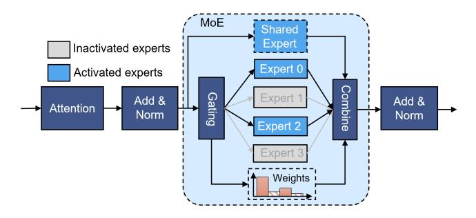
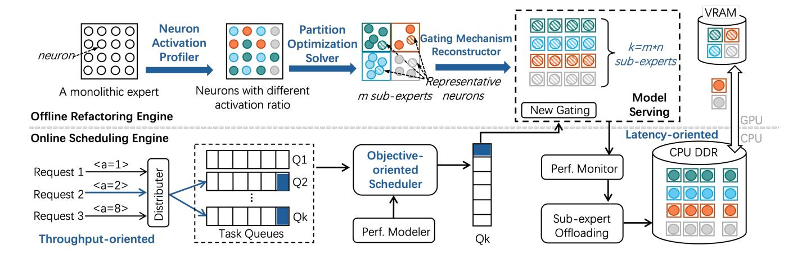
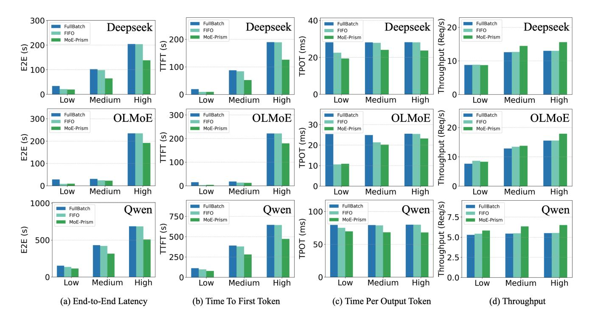
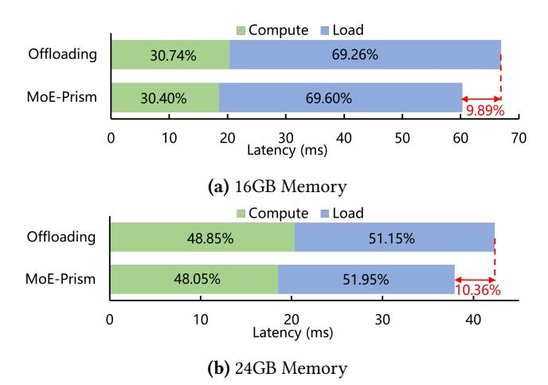
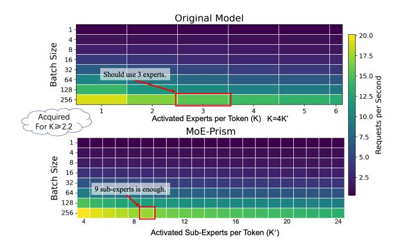
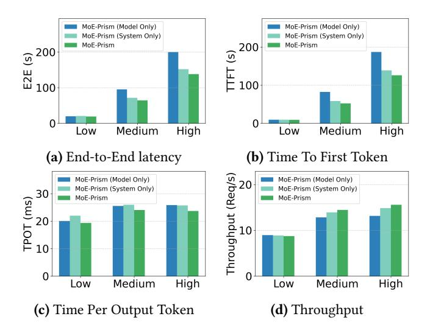

# MoE-Prism: Disentangling Monolithic Experts for Elastic MoE Services via Model-System Co-Designs

Xinfeng Xia $^*$ , Jiacheng Liu $^*$ , Xiaofeng Hou $^\dagger$ , Peng Tang, Mingxuan Zhang, Wenfeng Wang, Chao Li $^\dagger$ 

Shanghai Jiao Tong University, Shanghai, China \* Equal contribution, † Corresponding authors

# **Abstract**

Mixture-of-Experts (MoE) models, the state-of-the-art in large-scale AI, achieve high quality by sparsely activating parameters. However, their reliance on routing between a few monolithic experts via a top-k mechanism creates a "quality cliff", offering only a few coarse-grained operating points. This inflexibility forces a difficult trade-off between cost and quality, preventing adaptation to diverse Service Level Objectives (SLOs) and leading to significant resource over-provisioning.

This paper introduces MoE-Prism, a model-system codesign that transforms rigid MoE models into elastic services. Our methodology is divided into two phases. First, an Offline Refactoring Engine systematically deconstructs monolithic experts into fine-grained "sub-experts." This engine employs a partitioning optimization solver that uses a metaheuristicbased approach to group neurons, preserving functional locality without requiring retraining. Second, an Online Scheduling Engine leverages this new elasticity through OoS-aware scheduling. It implements specialized policies to solve complex system problems, including maximizing throughput in cloud deployments and managing latency-optimized offloading for memory-constrained devices. Our evaluation across three different MoE models shows that MoE-Prism provides over 4 times more distinct, stable operating points than the baseline. This allows an AI service to dynamically improve throughput by up to 19.9% under a strict latency budget or reduce latency by up to 10.36% under limited resources. MoE-Prism provides the critical "control knob" to bridge the model-system gap, enabling the next generation of adaptive, efficient, and QoS-aware AI services.

# 1 Introduction

The rapid advancement of Large Language Models (LLMs) has driven the development of increasingly sophisticated architectures to achieve state-of-the-art performance while managing computational costs [27, 29, 40]. Mixture-of-Experts (MoE) models have emerged as a leading approach, enabling models with trillions of parameters to maintain tractable inference costs by activating only a subset of experts for

Figure 1. MoE-Prism resolves the Quality Cliff in MoE serving. (Left) Conventional MoE models are rigid, creating a "Quality Cliff" where achieving a target speedup forces a disproportionately large drop in model quality. The name reflects its core function: just as a prism decomposes a single beam of light into a spectrum of colors, MoE-Prism refactors a monolithic expert into a spectrum of fine-grained sub-experts. This introduces architectural elasticity (right), transforming the cliff into a smooth trade-off curve and enabling the selection of an optimal "Target Quality" point that was previously unattainable.

each input token [13, 19, 30]. This selective activation mechanism has proven instrumental in achieving remarkable capabilities across reasoning, generation, and comprehension tasks [17, 35, 43].

The MoE architecture, comprising multiple discrete expert modules, offers inherent computational flexibility that monolithic dense models cannot achieve. This design theoretically enables fine-grained control over the computational cost-quality trade-off by dynamically selecting which experts to activate for each input. However, current MoE implementations fail to realize this architectural potential due to insufficient granularity in available configurations. While the sparse activation principle is sound, existing models provide only a limited number of discrete operating points. For instance, the well-known Mixtral-8x7B model [13] only has 2 activated experts per token, offering only 2 distinct quality levels (activating 1 or 2), which creates a coarse-grained "quality cliff" where systems must choose between separate configurations with no intermediate options.

This limited configuration space creates significant operational challenges for cloud providers and service operators. Systems cannot smoothly scale computational resources to match available hardware capacity or varying workload demands, preventing efficient resource utilization and limiting the ability to satisfy heterogeneous Service Level Objectives

(SLOs). Reducing the expert count, even by the smallest possible step, often triggers a massive and disproportionate drop in model quality. We call this the Quality Cliff: the inability to make a small sacrifice in quality for a commensurate gain in performance. As illustrated in Figure [1](#page-0-0) (left), this cliff makes it impossible to efficiently serve heterogeneous user requests, forcing the system to either over-provision quality at the expense of latency or violate quality requirements.

The root cause of this coarse granularity lies in training constraints. While one could theoretically train models with many more experts to increase configuration options (e.g., activating 128 experts), this approach is practically infeasible due to prohibitive computational costs and well-documented training instabilities that arise at such scales. Current stateof-the-art models exemplify this constraint: the KIMI K2 model [\[35\]](#page-12-5), despite containing 1 trillion total parameters, utilizes only 9 experts. This modest expert utilization reflects the practical realities of MoE training at scale, necessitating a post-training solution to unlock finer-grained control.

Our work addresses this granularity limitation through a key insight: we can increase the number of available configurations without changing the overall activation pattern or requiring retraining. By decomposing existing monolithic experts into finer-grained sub-experts, we can transform a model to finer granularity while maintaining the same computational budget and activation sparsity. This approach leverages the observation that monolithic experts in pretrained MoE models exhibit significant internal redundancy which means for any given token, only a fraction of the neurons within an activated expert contribute meaningfully to the final output. Realizing this opportunity requires a holistic model-system co-design that addresses three non-trivial, cross-stack challenges:

First, a solution must achieve Architectural Refactoring without Retraining. A pre-trained MoE model is a static artifact. The primary challenge is how to introduce elasticity into this rigid structure post-training. This requires a principled method to deconstruct the monolithic expert, the core computational block of the MoE layer, into smaller, independent units without altering the model's fundamental mathematical properties.

Second, the system must perform a Quality-Preserving Transformation and Routing. A naive partitioning of neurons would sever critical, co-dependent connections learned during training, catastrophically damaging model quality. Furthermore, creating a finer-grained architecture renders the original gating network obsolete. The core problem is thus twofold: how to partition experts in a way that preserves functional locality, and how to construct a new, effective routing mechanism for this new spectrum of sub-experts.

Third, this new architecture necessitates a QoS-Aware Online Scheduler. Introducing elasticity at the model level creates a powerful new capability, but it also gives rise to a

significantly more complex scheduling problem. The online serving system must now solve a multi-dimensional optimization problem at runtime: which requests to batch together and, crucially, what quality level (i.e., how many sub-experts) to use, all while maximizing system throughput and respecting heterogeneous user SLOs across a much larger configuration space.

This paper presents MoE-Prism, a complete model-system co-design that systematically addresses these barriers to deliver the first truly elastic MoE serving solution as shown in Figure [1](#page-0-0) (right). MoE-Prism's architecture is divided into two parts. First, the Offline Refactoring Engine performs a one-time transformation of the MoE model. At its core is the partition optimization solver, a metaheuristic-based engine that deconstructs monolithic experts into fine-grained, functionally-coherent sub-experts. Second, the Online Scheduling Engine exploits this newfound architectural elasticity during online inference. It implements novel, utility-driven policies to navigate the expanded configuration space, enabling dynamic, fine-grained control over the performancequality trade-off. The key contributions are summarized as follows:

- We present MoE-Prism, the first holistic model-system co-design that transforms static MoEs into elastic, QoS-aware services.
- We develop an offline model transformation methodology that introduces fine-grained elasticity by deconstructing monolithic experts into functionally coherent sub-experts using a metaheuristic-based partition optimization solver, preserving model quality without costly retraining.
- We design and implement a unified, utility-driven online engine that solves the complex joint optimization problem of request batching and quality-level selection for heterogeneous workloads.
- We conduct a comprehensive evaluation on state-ofthe-art MoE models, demonstrating that MoE-Prism unlocks significant real-world performance gains. MoE-Prism increases throughput by up to 19.9% for cloud services under strict latency budgets and reduces endto-end latency by up to 10.36% on resource-constrained devices.

# 2 Background and Motivation

This section first introduces the MoE model. Then, we conduct an analysis of expert internals to reveal the computational redundancy that our work exploits.

# 2.1 Mixture-of-Experts Models

Modern Large Language Models are predominantly based on the Transformer architecture [\[17,](#page-11-1) [23,](#page-12-7) [35,](#page-12-5) [43,](#page-12-6) [47\]](#page-12-8). A key component of the Transformer is the Feed-Forward Network

**Figure 2.** Computational flow of a Mixture-of-Experts (MoE) layer. For each token, the gating network selects the top-k experts (here, k=2) from a large bank of N experts. The final output is the weighted sum of the outputs from only the activated experts.

(FFN), a multi-layer perceptron that is responsible for a significant fraction of the model's total computational cost. As models have scaled, the size of these FFN layers has become a primary bottleneck.

The MoE architecture was introduced to scale model size without a proportional increase in computational cost. The core idea is to replace each monolithic FFN layer with an MoE layer, as illustrated in Figure 2. An MoE layer consists of two key components:

- 1. **A set of** N **independent "expert" networks.** Each expert,  $E_i$ , is itself a standard FFN. In a large model, N can be on the order of hundreds or thousands.
- 2. **A gating network (or "router").** This is a small neural network that takes an input token's representation and produces a vector of scores over all *N* experts.

For each incoming token, the MoE layer performs a sparse activation. As shown in Figure 2, the gating network computes scores for all N experts. A top-k function then selects the k experts with the highest scores, where k is a small, fixed integer that is much smaller than N. The final output for the token is the weighted sum of the outputs from only these k activated experts, with the weights also determined by the gating network's scores. From a systems perspective, the benefit is clear: the computational cost is proportional to activating only k experts, not all N, enabling massive models with manageable inference cost.

# 2.2 The Redundancy Within Monolithic Experts

The inflexibility quantified above stems from treating experts as monolithic, indivisible computational blocks. Our work is motivated by the insight that this view is a false constraint. We hypothesize that significant computational redundancy exists *within* each expert.

To validate this hypothesis, we performed a fine-grained analysis of neuron activations inside a single expert of the DeepSeek-V2-Lite model. For a sample of tokens routed to this expert, we recorded the activation values of all neurons

**Figure 3.** Distribution of neuron activation magnitudes within a single activated expert for a sample of input tokens. A vast majority of neurons exhibit near-zero activation, demonstrating significant computational redundancy. This suggests that only a small fraction of the expert's computation is essential for any given token.

in its FFN sub-layers. As shown in Figure 3, the neuron-level computation is exceptionally sparse. For a typical input, the distribution of work is highly skewed: 50% of the neurons exhibit an activation magnitude of less than 0.0167, and 75% of activations fall below 0.0391. This empirically demonstrates a high degree of activation sparsity at the sub-expert level. In essence, activating an entire expert is computationally wasteful, as the vast majority of its neurons contribute minimally to the final output for any specific token.

This empirically verified redundancy is the central motivation of our work. It reveals that the monolithic expert is an artificial construct of the training process, not a fundamental computational necessity. This presents a crucial opportunity: if we can devise a method to decompose these experts into finer-grained, functionally coherent sub-units *post-training*, we can bypass the training bottleneck entirely. By activating only the essential sub-units at runtime, we can finally unlock the smooth, elastic performance-quality trade-off that the MoE architecture has always promised. MoE-Prism is designed to systematically exploit this latent redundancy to achieve this goal.

# 3 MoE-Prism System Overview

MoE-Prism is a holistic model-system co-design that transforms rigid, monolithic MoE models into elastic assets that can be dynamically controlled at serving time. Our system's architecture is founded on a clear separation of concerns, dividing the complex problem into two distinct parts as illustrated in Figure 4.

This offline-online design is a deliberate choice. By paying a one-time, upfront computational cost during the offline phase, we unlock permanent runtime flexibility. This avoids imposing the overhead of model analysis onto the critical path of online inference, enabling the serving system to be both intelligent and highly performant.

**Figure 4.** The MoE-Prism System Architecture. The co-design consists of two phases. The *Offline Refactoring Engine* performs a one-time transformation of a standard MoE model, deconstructing monolithic experts into fine-grained sub-experts. The *Online Scheduling Engine* then leverages this elasticity to power sophisticated, QoS-aware serving strategies, such as offloading sub-experts to overcome GPU memory limits or co-optimizing batching and quality selection to maximize server throughput.

Offline Phase. The goal of this phase is to introduce fine-grained control points into a static, pre-trained MoE model without the prohibitive cost of retraining from scratch. This is handled by our **Offline Refactoring Engine**. It takes a standard MoE model as input and systematically re-architects its expert layers. It first employs a novel optimization solver to decompose each large expert into a group of smaller, functionally coherent "sub-experts". It then constructs a new, lightweight gating mechanism capable of efficiently routing requests to these sub-experts. The final output is a "refactored" model that is architecturally elastic and ready for dynamic deployment. This one-time process is detailed in Section 4.

Online Phase. The online phase is managed by the **Online Scheduling Engine**, a QoS-aware serving system designed to exploit the refactored model's elasticity. The engine acts as the brain of the serving stack, making dynamic, real-time decisions about how many sub-experts to activate. We demonstrate its power by designing specialized scheduling policies for two high-impact systems problems: (1) maximum system throughput in cloud environments, (2) minimum end-to-end latency on resource-constrained devices. The online runtime is detailed in Section 5.

# 4 Offline Refactoring Engine

The Refactoring Engine is the offline part that methodically transforms a standard, pre-trained MoE model into a fine-grained, elastic artifact.

### 4.1 Neuron Activation Profiler

The Neuron Activation Profiler is the first component in the MoE-Prism refactoring engine. Its purpose is to create a detailed functional fingerprint of each expert by capturing its runtime behavior on representative data. To achieve this, the Profiler processes a calibration dataset through the pretrained model and intercepts the intermediate activations within each expert's FFN layer. In modern LLMs, these FFNs are typically SwiGLU layers, whose structure allows for clean decomposition:

$$FFN(X) = (SiLU(X \cdot W_{gate}) \odot (X \cdot W_{up})) \cdot W_{down} \quad (1)$$

The key insight enabling our approach is that the computation for each column of the intermediate activation matrix,  $\mathbf{A} = \mathrm{SiLU}(X \cdot W_{\mathrm{gate}}) \odot (X \cdot W_{\mathrm{up}})$ , is independent. This allows us to define a "neuron" as the collection of weights responsible for a single column of  $\mathbf{A}$  and its corresponding contribution to the output (the j-th columns of  $W_{\mathrm{gate}}/W_{\mathrm{up}}$  and j-th row of  $W_{\mathrm{down}}$ ). The result of this stage is a set of activation matrices  $\{\mathbf{M}_e\}$ , one for each expert e. Each matrix  $\mathbf{M}_e \in \mathbb{R}^{B \times C}$  (for B tokens and C neurons) serves as a detailed profile of the expert's behavior and is the primary input for the subsequent partitioning stage.

# 4.2 Partitioning Optimization Solver

The Partitioning Optimization Solver receives the activation profiles from the Neuron Activation Profiler and partition each expert's neurons into robust sub-experts (Figure 5).

**4.2.1 Problem Formulation.** The central challenge in refactoring a monolithic expert is to partition its neurons into sub-experts that are optimized for elastic, on-demand execution. A naive partitioning might evenly distribute active neurons for any given input, forcing the runtime to execute all sub-experts to preserve quality. Our goal is to create a structure where, for any input token, the computation is

**Figure 5.** The partitioning process leverages the neuron-level independence of the FFN to group neurons into new sub-experts. The total expert output is the sum of the outputs of its constituent sub-experts.

naturally concentrated within a small subset of the new subexperts. This would allow a runtime system to deactivate the remaining, largely quiescent sub-experts, thereby saving significant memory and computation with minimal impact on output quality.

To achieve this, we must first define a proxy for a sub-expert's contribution to the model's output for a given token. We use the  $L_1$  norm of its activation vector for this purpose. This metric serves as an efficient-to-calculate and effective measure of a sub-expert's overall activation magnitude. A low  $L_1$  norm implies that the neurons within that sub-expert had minimal influence on the computation for that specific token.

We therefore formalize our goal as a combinatorial optimization problem. We begin with the neuron activation matrix,  $\mathbf{M} \in \mathbb{R}^{B \times C}$ , captured from a representative calibration set, where B is the number of tokens and C is the total number of neurons in the expert. Our objective is to find a partition  $\mathcal{P} = \{S_1, \ldots, S_N\}$  of the C neuron indices into N disjoint sub-experts.

For any given input token b and a sub-expert partition  $S_n$ , we calculate its activation magnitude as  $L_{b,n} = \|\mathbf{M}[b,S_n]\|_1$ . Our objective is to find the optimal partition  $P^*$  that minimizes the sum of the norms corresponding to the K deactivated sub-experts, aggregated across all B rows. For each row b, let  $\mathcal{L}_b(\mathcal{P}) = \{L_{b,1}, L_{b,2}, \ldots, L_{b,N}\}$  be the set of norms derived from the partition  $\mathcal{P}$ . Let top- $K(\mathcal{L}_b(\mathcal{P}))$  denote the set of the K smallest values in  $\mathcal{L}_b(\mathcal{P})$ . Thus, the optimal partition  $P^*$  is:

$$\mathcal{P}^* = \arg\min_{\mathcal{P}} \sum_{b=0}^{B-1} \sum_{l \in \mathbb{L}} l, \ \mathbb{L} = \text{top-K}(\mathcal{L}_b(\mathcal{P}))$$
 (2)

Solving this optimization problem yields a sub-expert structure that is fundamentally aligned with the goal of dynamic, quality-preserving execution, providing the foundation upon which our online runtime strategies are built.

**4.2.2 Solver Implementation.** We address the computational intractability of optimal partitioning by developing

a practical two-phase hybrid algorithm that efficiently explores the exponential search space to identify high-quality solutions

*Greedy Initialization.* The solver first constructs a strong initial partition using the deterministic greedy heuristic . It calculates the total impact (L1 norm across the batch) of each neuron and then iteratively assigns the most impactful unassigned neuron to the sub-expert with the current lowest cumulative impact. This load-balancing strategy provides a well-structured starting point for further optimization.

**Simulated Annealing-based Refinement.** The initial partition is then refined using Simulated Annealing (SA), a metaheuristic chosen for its proven ability to navigate complex, non-convex search spaces and escape local minima. The SA process iteratively explores neighboring partitions by swapping random neurons between sub-experts. A move to a lower-cost partition is always accepted, while a move to a higher-cost one is accepted with a probability that decreases over time. This allows the solver to broadly explore the solution space before converging on a high-quality solution. The output of the Partitioning Optimization Solver is the optimal partition map,  $\{\mathcal{P}_e^*\}$ , which is passed to the Gating Mechanism Reconstructor.

### 4.3 Gating Mechanism Reconstructor

The final stage of the offline refactoring engine constructs a new gating mechanism tailored to the newly created sub-experts. The primary system challenge is to design a router that is both computationally efficient and accurate in selecting the appropriate sub-experts for a given input. Our system provides two distinct strategies for this reconstruction, offering a trade-off between training-free deployment and maximum fidelity.

**4.3.1 Training-Free Proxy Gating.** The first strategy creates an effective gating mechanism without additional training. A naive approach would be to execute all sub-experts for every token simply to compute their output norms and decide which to use. This is computationally prohibitive and would defeat the entire purpose of the refactoring.

To address this, we introduce a lightweight, proxy-based gating mechanism. The core idea is to estimate the activation level of each sub-expert by using a small, fixed-size set of representative neurons, which we term *gate neurons*. For any given input token, the system computes the intermediate activations for *only* these gate neurons. The average L1 norm of these few activations is then used as a cheap but effective score to approximate the entire sub-expert's output norm. The model's top-level router can then use these lightweight scores to select which sub-experts to execute.

**Figure 6.** Construction of the co-activation matrix. From the raw activation matrix, a binary matrix is derived by identifying the top-k most active neurons for each token. The co-activation matrix is the product of this binary matrix and its transpose.

The pivotal question is how to select the optimal set of gate neurons for each sub-expert. Intuitively, a good representative neuron is one whose activation pattern is highly correlated with the activation patterns of other neurons within its own sub-expert. Such a neuron acts as a functional "centroid" of its cluster, meaning its behavior is indicative of the group's collective behavior. We formalize a method to identify these centroids based on co-activation frequency.

**Co-activation Matrix Construction.** We quantify the functional similarity between all pairs of neurons as shown in Figure 6. We begin by processing the calibration dataset through the model to collect the intermediate activation matrix,  $\mathbf{M} \in \mathbb{R}^{B \times C}$  (where B is the number of tokens and C is the number of neurons), which was previously generated by the Neuron Activation Profiler.

From this matrix, we derive a binary activation matrix,  $\mathbf{B} \in \{0,1\}^{B \times C}$ . For each token (row), we consider a neuron "active" if its absolute activation value is among the top- $k_a$  for that token. Formally, for each token t, the row  $\mathbf{B}[t,:]$  is generated such that  $\mathbf{B}[t,c]=1$  if  $|\mathbf{M}[t,c]|$  is one of the  $k_a$  largest values in the row  $|\mathbf{M}[t,:]|$ , and 0 otherwise. The symmetric co-activation matrix,  $\mathbf{C}_{co} \in \mathbb{R}^{C \times C}$ , is then computed as  $\mathbf{C}_{co} = \mathbf{B}^T \mathbf{B}$ . Each entry  $\mathbf{C}_{co}[i,j]$  represents the total number of tokens for which neuron i and neuron j were simultaneously active.

**Centroid Identification.** With the co-activation matrix, we can now identify the most representative neurons for each sub-expert partition produced by the Solver. For a given sub-expert, defined by its neuron set  $S_n$ , a neuron's centrality is determined by its cumulative co-activation with all other neurons within the same sub-expert. A neuron that frequently co-activates with its peers is considered highly central and thus a strong candidate for a gate neuron. We select the top-r neurons with the highest centrality scores from each sub-expert to form the final set of gate neurons.

**4.3.2 Low-cost Router Finetuning.** The second strategy is an optional, low-cost finetuning path for applications demanding maximum fidelity. The system design prioritizes

surgical precision and extreme parameter efficiency. We finetune *only* the gating network, freezing all the other weights (over 99.9% of total parameters).

To imbue the router with the ability to perform well across a range of resource budgets, we adopt a curriculum-based training strategy inspired by recent work on training scalable MoE models [4]. Instead of using a fixed number of active sub-experts during finetuning, we *progressively increase k as training proceeds*. The router is trained using a standard end-to-end learning objective. For each input token, the router computes scores for all N sub-experts and selects the top-k (where k is determined by the current training step). The token is then processed by these k sub-experts, and their outputs are combined based on the router's softmax-normalized scores. The model is optimized using the cross-entropy loss.

This approach is highly pragmatic. By teaching the router to handle a curriculum of increasing expert counts, it learns a robust and flexible routing policy. The finetuning remains extremely fast and memory-efficient, and by preserving the router's standard architectural type (a linear layer), we avoid custom kernel development and can leverage existing, highly-optimized system kernels for high-performance execution.

# 5 Online Scheduling Engine

The MoE-Prism's scheduling engine is the online serving system that translates the architectural elasticity unlocked by our offline engine into concrete, service-level advantages. It acts as the intelligent control plane of the serving stack, making real-time, QoS-aware decisions.

The foundation of its intelligence is a lightweight performance model, created via a one-time, pre-deployment benchmark, which maps the number of active sub-experts  $(k_{active})$  to performance metrics like latency and memory usage. This process yields a lightweight lookup table or analytical model,  $C(k_{active})$ , which provides an accurate cost prediction for any given configuration. Armed with this model, the runtime can employ specialized scheduling policies. We demonstrate its effectiveness by developing policies that target two distinct and critical operating points within this space: one optimized for maximum system throughput in cloud environments, and another for minimum end-to-end latency on resource-constrained devices.

# 5.1 Throughput Maximization for Cloud Serving

In a typical cloud deployment, the primary objective is to maximize the number of processed tokens per unit of time. The challenge is compounded by heterogeneous quality constraints, where each request  $R_i$  may arrive with a different minimum quality floor  $k_{min_i}$ .

A naive approach might be to form a batch of requests first and then decide on a  $k_{active}$  for that batch. This is suboptimal. The ideal  $k_{active}$  for a batch depends on its composition (e.g., a batch with high- $k_{min}$  requests must run at high quality),

but the ideal composition of a batch depends on the target  $k_{active}$  (e.g., a low- $k_{active}$  batch can only include low- $k_{min}$  requests).

To break this circular dependency, our *Quality-Constrained Throughput Scheduler* decouples batch formation from execution configuration by considering all possible configurations in parallel. It maintains M virtual queues, one for each possible value of  $k_{active}$ , and dynamically populates them based on request eligibility. This allows the scheduler to evaluate the utility of M different potential batches simultaneously and opportunistically launch the one that promises the highest immediate throughput.

The scheduler orchestrates a sophisticated interplay between request eligibility, utility calculation, and dispatch triggers. When a request  $R_i$  with quality floor  $k_{min_i}$  arrives, it is not placed in a single queue. Instead, it becomes a candidate for any batch that meets its quality requirement. It is therefore added to all virtual queues  $Q_m$  where  $m \ge k_{min_i}$ . This step correctly models the complete set of valid execution plans for each request from the moment it enters the system.

The core of the scheduler's intelligence lies in its utility function. For each virtual queue  $Q_m$ , it calculates a utility score as.

$$U_m = \frac{\sum_{R_i \in Q_m} \text{tokens}(R_i)}{C(|Q_m|, m)}$$
(3)

This score represents the local throughput (tokens per second) if that specific batch were to be launched immediately. The scheduler's default action is to launch the batch with the highest utility score. This is fundamentally opportunistic. For instance, consider a request  $R_A$  with  $k_{min_A} = 2$  and a request  $R_B$  with  $k_{min_B} = 8$ . Both are eligible for the batch in queue  $Q_8$ . If  $Q_2$  is nearly empty but  $Q_8$  is almost full (containing  $R_B$  and other high- $k_{min}$  requests), the scheduler will likely find that  $U_8 > U_2$ . It will then launch the batch from  $Q_8$ , effectively "upgrading"  $R_A$  to a higher quality than required, because the throughput gain from running a larger, more hardware-efficient batch outweighs the cost of the upgrade.

To prevent starvation, the utility-driven selection is complemented by two hard triggers,

- Batch Full Trigger: If any queue  $|Q_m|$  reaches the maximum configured batch size  $B_{max}$ , it can be launched immediately to maximize hardware utilization.
- *Timeout Trigger*: If the oldest request in any queue has been waiting longer than a threshold  $T_{max}$ , that queue is launched irrespective of its utility. This ensuring fairness and prevents starvation of high-quality requests that batch slowly.

When launching a batch from  $Q_m$ , all requests in that batch are atomically removed from every virtual queue containing them. This update reflects that requests have been served, enabling the scheduler to recalculate remaining queue utilities

for the next cycle. This multi-queue, utility-driven, trigger-based design allows the runtime to efficiently navigate the complex trade-off between per-request constraints and global system throughput.

### 5.2 Latency Minimization for Constrained Devices

On memory-constrained platforms such as edge devices or personal computers, the primary goal is not throughput, but minimizing the latency of a single inference task. This scenario is particularly challenging for autoregressive generation, where producing a single, complete response requires a sequence of dozens or hundreds of individual forward passes (one for each generated token). The model's large size necessitates offloading, but the latency of this offloading can dominate the total execution time.

The challenge with traditional, coarse-grained offloading is acute in this context. During a single generation sequence, the required experts can change from one token to the next. This forces the system to repeatedly swap massive, multigigabyte expert blocks between CPU RAM and GPU VRAM, incurring a prohibitive I/O cost at each step and resulting in extremely high end-to-end latency.

MoE-Prism's architecture enables a *Latency-Optimized Offloading Manager*, a system designed to execute a single inference request as fast as possible. It achieves this through two tightly integrated components.

The core of the system is a VRAM Cache Manager. It manages the GPU VRAM as a cache for sub-experts, which permanently reside in CPU RAM. Let  $S_{total}$  be the set of all sub-experts and  $S_{vram} \subset S_{total}$  be the set currently resident in VRAM. The manager maintains  $S_{vram}$  using a latency-aware replacement policy like Least Recently Used (LRU), ensuring that sub-experts that were just used—and are therefore likely to be used again soon—remain in the fast VRAM.

The process is driven by the *Generation Step Orchestrator*. For a single inference request that requires generating a sequence of T tokens, the orchestrator executes a loop for each generation step t = 1, ..., T. In each step, it performs the following logic:

- 1. It runs the model's router to determine the precise set of sub-experts required for the current step,  $S_{reg}(t)$ .
- 2. It queries the VRAM Cache Manager to identify the "miss set":  $S_{miss}(t) = S_{req}(t) \setminus S_{vram}$ .
- 3. It initiates asynchronous data transfers for all subexperts  $s \in S_{miss}(t)$  from CPU to GPU.

The latency for step t, L(t), is the sum of the I/O time to service the misses and the subsequent compute time:

$$L(t) = \underbrace{\text{Latency}_{I/O}(S_{miss}(t))}_{\text{I/O penalty}} + \underbrace{\text{Latency}_{compute}(S_{req}(t))}_{\text{Compute time}}$$
(4)

The total end-to-end latency for the entire request is the sum of the latencies of all its steps:  $L_{total} = \sum_{t=1}^{T} L(t)$ .

**Table 1.** Architectural parameters of the baseline models. OLMoE-P is generated from allenai/OLMoE-1B-7B-0924, Deepseek-P is generated from deepseek-ai/deepseek-v2-lite, and Qwen-P is generated from Qwen/Qwen3-30B-A3B

| Attibute          | OLMoE-P                | Deepseek-P             | Qwen-P                  |
|-------------------|------------------------|------------------------|-------------------------|
| Total Parameters  | 7B                     | 16B                    | 30B                     |
| Routing Experts   | $64 \rightarrow 256$   | $64 \rightarrow 256$   | $128 \rightarrow 512$   |
| Activated Experts | 8→32                   | $6 \rightarrow 24$     | 8→32                    |
| Intermediate Size | $1024{\rightarrow}256$ | $1408 \rightarrow 352$ | $6144 \rightarrow 1536$ |

MoE-Prism's decisive advantage in this latency-critical scenario is the precision afforded by its fine granularity. In a traditional MoE, activating even a small part of an expert necessitates loading the entire monolithic block, leading to substantial I/O waste. MoE-Prism fundamentally mitigates this by allowing the system to fetch only the specific subexperts identified in  $S_{req}(t)$ . This transforms the I/O from a coarse, wasteful operation into a precise, on-demand transfer of only the necessary compute units. As a result, the I/O penalty, Latency $_{I/O}(S_{miss}(t))$ , is minimized at every step because the volume of transferred data is drastically smaller. This reduction in per-step I/O overhead accumulates over the entire generation sequence, resulting in a significantly lower total latency.

# 6 Experimental Evaluation

# 6.1 Experimental Setup

**6.1.1 Evaluated models.** We select two widely used opensource Mixture of Experts (MoE) models as baselines to demonstrate the general applicability of MoE-Prism. Detailed specifications of these models are provided in Table 1. For both models, each original expert is partitioned into N=4 sub-experts. The activation matrix  $\mathbf{M}$  required for partitioning optimization is collected by running calibration on the Wikitext-2-raw-v1 dataset using each baseline model. The expert partitioning process leverages a SA algorithm configured with an initial temperature  $T_0=100.0$ , a cooling rate  $\alpha=0.995$ , and for I=100,000 iterations.

For the training-free gate reconstruction, we identify the top s=4 neurons from each sub-expert as gate neurons. These neurons are selected using a co-activation matrix derived from the top 3/4 of activated neurons in the calibration set. Additionally, we test gate-only training with a learning rate of  $1 \times 10^{-5}$ , a linear annealing of K from 8 to 24 (for Deepseek) or 32 (for Deepseek and Qwen), and an accumulated batch size of 32 (for Deepseek and Qwen) or 64 (for OLMoE). We use 200K sampled sequences from the SlimPajama dataset as the training set.

We assess model quality on a diverse set of downstream tasks using the Eleuther AI Language Model Evaluation Harness (lm-eval) [7] with vLLM as inference backend [14]. We

report perplexity on the Wikitext dataset and accuracy on a suite of downstream tasks, including Winogrande (3-shot), ARC-challenge (5-shot), SciQ (0-shot), BoolQ (0-shot).

**Table 2.** Model Quality Comparison at Equivalent Computational Cost. We evaluate perplexity (PPL, lower is better) on the Wikitext dataset for the original model versus its MoE-Prism counterparts. K denotes the number of fine-grained sub-experts activated in MoE-Prism, while K' is the number of monolithic experts in the original model. MoE-Prism is tested with a training-free Complex Gate (CG) and a Linear Gate (LG), the latter shown with and without fine-tuning (w/ FT).

| Activation                       | Original |         | LG      |         |  |  |  |
|----------------------------------|----------|---------|---------|---------|--|--|--|
|                                  |          | CG      | w/o FT  | w/ FT   |  |  |  |
| OLMoE                            |          |         |         | _       |  |  |  |
| K=12, K'=3                       | 15.7202  | 14.8851 | 15.7087 | 14.6805 |  |  |  |
| K=16, K'=4                       | 12.1098  | 11.9492 | 12.1138 | 11.8186 |  |  |  |
| K=20, K'=5                       | 10.5078  | 10.5097 | 10.5014 | 10.4519 |  |  |  |
| K=24, K'=6                       | 9.7343   | 9.7645  | 9.7341  | 9.7687  |  |  |  |
| Deepseek (With 2 shared experts) |          |         |         |         |  |  |  |
| K=8, K'=2                        | 11.1169  | 11.1126 | 11.1123 | 11.0852 |  |  |  |
| K=12, K'=3                       | 9.9905   | 10.0033 | 9.9896  | 9.9836  |  |  |  |
| K=16, K'=4                       | 9.6327   | 9.6406  | 9.6329  | 9.6301  |  |  |  |
| K=20, K'=5                       | 9.4932   | 9.4976  | 9.4960  | 9.4914  |  |  |  |
| Qwen3                            |          |         |         |         |  |  |  |
| K=12, K'=3                       | 18.2259  | 15.0531 | 18.2300 | 18.2831 |  |  |  |
| K=16, K'=4                       | 13.7355  | 12.8977 | 13.7187 | 13.7140 |  |  |  |
| K=20, K'=5                       | 12.3119  | 12.0546 | 12.2981 | 12.2962 |  |  |  |
| K=24, K'=6                       | 11.7772  | 11.7444 | 11.7743 | 11.7702 |  |  |  |

**Table 3.** Downstream Task Performance on different Benchmarks. DS means Deepseek-V2-Lite, OL means OLMoE-1B-7B, QN means Qwen3-30B-A3B. -P means MoE-Prism model.

| Config          | Winogrande | ARC-C | SciQ  | BoolQ |
|-----------------|------------|-------|-------|-------|
| DS K=3 Original | 72.85      | 52.73 | 93.10 | 75.93 |
| DS-P K=12 FT    | 73.64      | 52.73 | 93.00 | 76.06 |
| OL K=3 Original | 63.06      | 46.08 | 87.60 | 64.46 |
| OL-P K=12 FT    | 64.33      | 46.33 | 89.70 | 67.65 |
| QN K=3 Original | 58.17      | 51.62 | 84.70 | 70.70 |
| QN-P K=12 FT    | 57.70      | 54.10 | 85.10 | 70.76 |

- **6.1.2** Compared baselines. To contextualize the performance of our proposed system, we implement two baseline schedulers that represent the well-known scheduling system.
  - FullBatch: A throughput-oriented scheduler that employs a static batching policy. It maximizes hardware

Figure 7. Comparison of MoE-Prism with baselines under different conditions.

utilization by delaying dispatch until a predefined maximum batch size (e.g., 256) is reached. This strategy aims for the highest possible computational efficiency at the cost of increased per-request latency.

• FIFO (First-In, First-Out): A latency-oriented scheduler that uses a dynamic, non-blocking approach. It minimizes waiting time by forming a batch from all currently pending requests and dispatching it as soon as the system becomes available, even if the batch is small. And if the number of the pending requests is more than the maximum batch size, it will dispatch the request in the first-in, first-out manner.

Both schedulers will use the highest K value requested within the batch so every request's accuracy requirement is met.

6.1.3 Testbed configurations. All experiments are conducted on NVIDIA H800 GPUs. The software environment includes PyTorch 2.7.0 with CUDA 12.6. For inference, we utilize a modified version of vLLM 0.9.1, which supports our custom gating logic.

To evaluate the performance of MoE-Prism under varying load conditions, we design three distinct workload scenarios: low, medium, and high. Each experiment spans a duration of 300 seconds. Request arrivals are modeled using a Poisson distribution to simulate realistic, independent user access patterns.

# 6.2 Comparing with the Baselines

We begin by evaluating the impact of MoE-Prism on MoE inference performance, focusing on accuracy, throughput, and comparisons with the SoTA baselines.

6.2.1 Inference Accuracy. To provide a fair and insightful comparison of model quality, we evaluate our proposed method against the baseline under the equivalent activated parameters. As demonstrated in Table [2,](#page-7-1) our model with a fine-tuned Linear Gate (LG w/ FT) surpasses the original model's language modeling capability in most of the settings, achieving lower (better) perplexity scores across various K values. This performance advantage is not only confined to intrinsic metrics but also translates to tangible improvements on a suite of downstream reasoning and understanding benchmarks, as shown in Table [3.](#page-7-2) For all three tested models, our re-factorized and fine-tuned variants exhibit superior or competitive scores on downstream tasks. Collectively, these results validate that our approach has the potential to enhance overall model quality without increasing the per-token computational budget.

# 6.2.2 Throughput Maximization for Cloud Serving.

Figure [7](#page-8-0) presents a comparative analysis of our MoE-Prism system against standard FullBatch and FIFO scheduling baselines under varying load conditions. The results clearly demonstrate MoE-Prism's superior performance, which becomes increasingly pronounced as system workload rises.

Figure 8. Offloading inference latency (per decoding iteration) under different memory budgets for Deepseek.

Under high load, MoE-Prism significantly reduces both TTFT and TPOT while concurrently boosting system throughput.

Under high workload scenarios, MoE-Prism achieves 19.9% (13 req/s→15.59 req/s) throughput improvement on Deepseek model and 14.9% (15.57 req/s → 17.89 req/s) throughput improvement on OLMoE model than the FIFO scheduler with the original model, while maintaining the SLO requirements for accuracy. It also achieves improvement of end-to-end latency and TTFT because of the decreased waiting time. Meanwhile, MoE-Prism also reaches a smaller TPOT due to its fine-grained selection of activated parameters.

# 6.2.3 Latency Minimization for Constrained Devices.

On memory-constrained hardware, such as consumer GPUs, the necessity of offloading model experts to host memory creates a significant I/O bottleneck that dominates inference latency. As illustrated in Figure [8](#page-9-0) for devices with 16GB (RTX 4080) and 24GB (RTX 4090) of memory, MoE-Prism is designed to mitigate this bottleneck through two synergistic mechanisms. First, its fine-grained expert architecture improves GPU cache residency. Under a fixed memory budget, the smaller sub-experts enable more efficient packing into the GPU cache; memory fragments too small for a monolithic expert can instead store several of our sub-experts. This granular packing increases the proportion of resident parameters, raising the effective cache hit ratio from 0.4375 (28/64) for the baseline to 0.4453 ((28×4+2)/(64×4)) in a 16GB configuration.

Second, MoE-Prism reduces the total data transfer volume required to meet a given Service Level Objective (SLO). The baseline model suffers from a coarse-grained quantization error in resource allocation, as it must load entire monolithic experts. For instance, if an SLO requires the computational equivalent of 4.2 experts, the baseline must wastefully load 5 full experts from CPU memory. In contrast, MoE-Prism can

Figure 9. Perplexity (PPL) comparison between our model and the original model on the Wikitext dataset, as a function of the number of selected experts per token (K).

satisfy the same SLO by loading only 17 fine-grained subexperts (equivalent to 4.25 experts), fundamentally reducing the data payload transferred over the PCIe bus. The combination of higher cache residency and lower transfer volume allows MoE-Prism to reduce end-to-end offloading latency by approximately 10% across both memory configurations, demonstrating its clear advantage in I/O-bound scenarios.

# 6.3 Verifying Effectiveness of MoE-Prism

To visually validate the core benefit of our model refactoring approach, we plot the perplexity against to different K settings, and throughput, latency against different (K, batch\_size) settings.

6.3.1 Perplexity Analysis. Figure [9](#page-9-1) validates that our architectural modifications, designed for system flexibility, do not compromise the underlying model's quality. The figure plots perplexity on the Wikitext dataset as a function of activated experts (K), confirming the expected trade-off between computational cost and accuracy for both the OLMoE and Deepseek models. Crucially, our training-free variant (LinearGate w/o FT) yields a perplexity curve nearly indistinguishable from the original, demonstrating that the finegrained control essential for our scheduler can be achieved with zero training overhead. Moreover, with minimal finetuning, the LinearGate w/ FT variant consistently matches or slightly outperforms the baseline across the entire spectrum of K values. These results establish that our architectural refactoring is effective, providing the runtime scheduler with a predictable and uncompromised performance-cost curve to navigate the latency-quality trade-off without penalty.

6.3.2 Granularity Advantage. The key distinction of our approach lies in its fine-grained control over the inference process. Figure [10,](#page-10-0) [11](#page-10-1) provides a compelling visual contrast in operational flexibility. The original model is constrained to a coarse-grained selection of discrete integer values for K, resulting in abrupt, step-wise decreases in throughput. In contrast, our MoE-Prism model, enabled by the partitioning of experts, exposes a significantly more fine-grained control space for K. This fine granularity translates into a smoother

**Figure 10.** Throughput comparison of MoE-Prism model against the original model under different K, lighter colors indicating higher throughput.

**Figure 11.** Latency comparison for different K and batch sizes (BS).

trade-off curve between accuracy and computational load, empowering more precise resource allocation and performance tuning in dynamic serving environments. For example, if a coming request requires accuracy that  $K \geq 2.2$ , then our MoE-Prism model can allocate K' = 9 sub-experts to satisfy the SLO while the original model should allocate K = 3 experts, which has the equivalent computational cost of K' = 12 sub-experts, and causes unnecessary latency.

**6.3.3 Ablation Study.** To dissect the source of these improvements, we conduct the ablation study shown in Figure 12, isolating the contributions of our flexible model architecture (Model Only) and our dynamic scheduler (System Only). The results reveal that while both components individually contribute to enhancing performance, their synergistic combination in the complete MoE-Prism system consistently yields the lowest latency and highest throughput. This finding underscores the importance of our co-design approach,

**Figure 12.** Ablation of MoE-Prism on Deepseek-V2-Lite.

where the model's architectural flexibility is fully exploited by a dedicated, model-aware system scheduler to achieve optimal inference efficiency.

### 7 Related Work

# 7.1 MoE Serving

Given the significant GPU memory requirements of MoEbased LLMs, a multitude of systems have been developed to optimize MoE serving. Specifically, some research efforts focus on enhancing expert parallelism to improve serving throughput, achieved through optimizing all-to-all communication operations [15, 44] or designing better loadbalancing policies [10, 36]. In contrast, other works adopt expert-offloading techniques to enable the deployment of MoE models on resource-constrained devices, which involves the design of prefetching strategies and caching policies [32, 42]. Furthermore, current SoTA serving frameworks such as vLLM [14] and SGLang [48] integrate a variety of optimization techniques to enhance QoS. These techniques encompass diverse parallelism methods [28, 31], Prefill-Decode disaggregation [24, 49], and task scheduling mechanisms [45], among others. However, despite these advancements, existing works fail to provide fine-grained expert selection, which results in suboptimal SLOs for MoE models.

# 7.2 Efficient LLM Inference

Model compression is a promising direction for directly reducing model size and enabling more efficient inference, which is particularly beneficial for large MoE models. Common techniques include quantization [2, 6, 12, 34, 39], network pruning [20, 21, 33], knowledge distillation [1, 8], and low-rank factorization [37, 38, 46], all of which aim to produce lightweight LLMs suitable for deployment. However,

these approaches primarily rely on static algorithmic optimizations, which often lead to noticeable accuracy degradation and lack the ability to dynamically adapt to changing workloads during online inference.

# 7.3 Model Elasticity and Dynamic Networks

Regarding model elasticity, several approaches have been proposed to enhance computational efficiency. Some works focus on converting dense models into MoE architectures directly, rather than training MoE models from scratch, thereby reducing train costs [\[25,](#page-12-27) [26,](#page-12-28) [50\]](#page-12-29). Others merge experts within existing MoE models to reduce the number of expert parameters, further improving computational efficiency [\[3,](#page-11-12) [11,](#page-11-13) [41\]](#page-12-30). Given that input data varies in complexity, dynamic network has been developed to save computation for simpler inputs. For instance, some studies dynamically adjust the number of activated experts in MoE models based on the characteristics of the current input [\[9,](#page-11-14) [16\]](#page-11-15), while others employ early exit techniques to determine the optimal number of inference layers according to input complexity [\[5,](#page-11-16) [18,](#page-11-17) [22\]](#page-12-31). However, these methods lack the ability to configure fine-grained expert selection tailored to the current workload, limiting their capacity to achieve a more optimal tradeoff between QoS and performance.

# 8 Conclusions

We introduced MoE-Prism, a complete model-system codesign that transforms static MoE models into truly elastic services. MoE-Prism operates in two phases: an Offline Refactoring Engine uses a partitioning optimization solver to deconstruct monolithic experts into fine-grained, functionally coherent sub-experts without costly retraining. This architectural elasticity is then exploited by the Online Scheduling Engine, an online component that implements utilitydriven policies to navigate the expanded configuration space and meet diverse system objectives. Ultimately, MoE-Prism bridges the gap between static model architectures and the dynamic demands of real-world serving systems and paves the way for the next generation of QoS-aware AI services.

# References

- [1] Rishabh Agarwal, Nino Vieillard, Piotr Stanczyk, Sabela Ramos, Matthieu Geist, and Olivier Bachem. 2023. Gkd: Generalized knowledge distillation for auto-regressive sequence models. arXiv preprint arXiv:2306.13649 (2023).
- [2] Saleh Ashkboos, Amirkeivan Mohtashami, Maximilian L Croci, Bo Li, Pashmina Cameron, Martin Jaggi, Dan Alistarh, Torsten Hoefler, and James Hensman. 2024. Quarot: Outlier-free 4-bit inference in rotated llms. Advances in Neural Information Processing Systems 37 (2024), 100213–100240.
- [3] I Chen, Hsu-Shen Liu, Wei-Fang Sun, Chen-Hao Chao, Yen-Chang Hsu, Chun-Yi Lee, et al. 2024. Retraining-Free Merging of Sparse MoE via Hierarchical Clustering. arXiv preprint arXiv:2410.08589 (2024).
- [4] Tianlong Chen, Zhenyu Zhang, Ajay Jaiswal, Shiwei Liu, and Zhangyang Wang. 2023. Sparse moe as the new dropout: Scaling

- dense and self-slimmable transformers. arXiv preprint arXiv:2303.01610 (2023).
- [5] Mostafa Elhoushi, Akshat Shrivastava, Diana Liskovich, Basil Hosmer, Bram Wasti, Liangzhen Lai, Anas Mahmoud, Bilge Acun, Saurabh Agarwal, Ahmed Roman, et al. 2024. LayerSkip: Enabling early exit inference and self-speculative decoding. arXiv preprint arXiv:2404.16710 (2024).
- [6] Elias Frantar, Saleh Ashkboos, Torsten Hoefler, and Dan Alistarh. 2022. Gptq: Accurate post-training quantization for generative pre-trained transformers. arXiv preprint arXiv:2210.17323 (2022).
- [7] Leo Gao, Jonathan Tow, Baber Abbasi, Stella Biderman, Sid Black, Anthony DiPofi, Charles Foster, Laurence Golding, Jeffrey Hsu, Alain Le Noac'h, Haonan Li, Kyle McDonell, Niklas Muennighoff, Chris Ociepa, Jason Phang, Laria Reynolds, Hailey Schoelkopf, Aviya Skowron, Lintang Sutawika, Eric Tang, Anish Thite, Ben Wang, Kevin Wang, and Andy Zou. 2024. The Language Model Evaluation Harness. doi:[10.5281/zenodo.12608602](https://doi.org/10.5281/zenodo.12608602)
- [8] Yuxian Gu, Li Dong, Furu Wei, and Minlie Huang. 2023. Knowledge distillation of large language models. arXiv preprint arXiv:2306.08543 (2023).
- [9] Yongxin Guo, Zhenglin Cheng, Xiaoying Tang, Zhaopeng Tu, and Tao Lin. 2024. Dynamic mixture of experts: An auto-tuning approach for efficient transformer models. arXiv preprint arXiv:2405.14297 (2024).
- [10] Vima Gupta, Kartik Sinha, Ada Gavrilovska, and Anand Padmanabha Iyer. 2024. Lynx: Enabling Efficient MoE Inference through Dynamic Batch-Aware Expert Selection. arXiv preprint arXiv:2411.08982 (2024).
- [11] Shwai He, Run-Ze Fan, Liang Ding, Li Shen, Tianyi Zhou, and Dacheng Tao. 2023. Merging Experts into One: Improving Computational Efficiency of Mixture of Experts. In Proceedings of the 2023 Conference on Empirical Methods in Natural Language Processing, Houda Bouamor, Juan Pino, and Kalika Bali (Eds.). Association for Computational Linguistics, Singapore, 14685–14691. doi:[10.18653/v1/2023.emnlp](https://doi.org/10.18653/v1/2023.emnlp-main.907)[main.907](https://doi.org/10.18653/v1/2023.emnlp-main.907)
- [12] Xing Hu, Yuan Cheng, Dawei Yang, Zukang Xu, Zhihang Yuan, Jiangyong Yu, Chen Xu, Zhe Jiang, and Sifan Zhou. 2025. Ostquant: Refining large language model quantization with orthogonal and scaling transformations for better distribution fitting. arXiv preprint arXiv:2501.13987 (2025).
- [13] Albert Q Jiang, Alexandre Sablayrolles, Antoine Roux, Arthur Mensch, Blanche Savary, Chris Bamford, Devendra Singh Chaplot, Diego de las Casas, Emma Bou Hanna, Florian Bressand, et al. 2024. Mixtral of experts. arXiv preprint arXiv:2401.04088 (2024).
- [14] Woosuk Kwon, Zhuohan Li, Siyuan Zhuang, Ying Sheng, Lianmin Zheng, Cody Hao Yu, Joseph Gonzalez, Hao Zhang, and Ion Stoica. 2023. Efficient memory management for large language model serving with pagedattention. In Proceedings of the 29th symposium on operating systems principles. 611–626.
- [15] Jiamin Li, Yimin Jiang, Yibo Zhu, Cong Wang, and Hong Xu. 2023. Accelerating Distributed MoE Training and Inference with Lina. In 2023 USENIX Annual Technical Conference (USENIX ATC 23). USENIX Association, Boston, MA, 945–959. [https://www.usenix.org/conference/](https://www.usenix.org/conference/atc23/presentation/li-jiamin) [atc23/presentation/li-jiamin](https://www.usenix.org/conference/atc23/presentation/li-jiamin)
- [16] Jiamin Li, Qiang Su, Yitao Yang, Yimin Jiang, Cong Wang, and Hong Xu. 2023. Adaptive gating in mixture-of-experts based language models. arXiv preprint arXiv:2310.07188 (2023).
- [17] Aixin Liu, Bei Feng, Bing Xue, Bingxuan Wang, Bochao Wu, Chengda Lu, Chenggang Zhao, Chengqi Deng, Chenyu Zhang, Chong Ruan, et al. 2024. Deepseek-v3 technical report. arXiv preprint arXiv:2412.19437 (2024).
- [18] Jiacheng Liu, Peng Tang, Xiaofeng Hou, Chao Li, and Pheng-Ann Heng. 2024. LoRAExit: Empowering Dynamic Modulation of LLMs in Resource-limited Settings using Low-rank Adapters. In Findings of the Association for Computational Linguistics: EMNLP 2024, Yaser Al-Onaizan, Mohit Bansal, and Yun-Nung Chen (Eds.). Association for

- Computational Linguistics, Miami, Florida, USA, 9211–9225. [doi:](https://doi.org/10.18653/v1/2024.findings-emnlp.539)10. [18653/v1/2024.findings-emnlp.539](https://doi.org/10.18653/v1/2024.findings-emnlp.539)
- [19] Jiacheng Liu, Peng Tang, Wenfeng Wang, Yuhang Ren, Xiaofeng Hou, Pheng-Ann Heng, Minyi Guo, and Chao Li. 2024. A Survey on Inference Optimization Techniques for Mixture of Experts Models. arXiv preprint arXiv:2412.14219 (2024).
- [20] Xinyin Ma, Gongfan Fang, and Xinchao Wang. 2023. Llm-pruner: On the structural pruning of large language models. Advances in neural information processing systems 36 (2023), 21702–21720.
- [21] Xin Men, Mingyu Xu, Qingyu Zhang, Bingning Wang, Hongyu Lin, Yaojie Lu, Xianpei Han, and Weipeng Chen. 2024. Shortgpt: Layers in large language models are more redundant than you expect. arXiv preprint arXiv:2403.03853 (2024).
- [22] Ruijie Miao, Yihan Yan, Xinshuo Yao, and Tong Yang. 2024. An efficient inference framework for early-exit large language models. arXiv preprint arXiv:2407.20272 (2024).
- [23] OpenAI. 2025. gpt-oss-120b & gpt-oss-20b Model Card. arXiv[:2508.10925](https://arxiv.org/abs/2508.10925) [cs.CL] <https://arxiv.org/abs/2508.10925>
- [24] Pratyush Patel, Esha Choukse, Chaojie Zhang, Aashaka Shah, Íñigo Goiri, Saeed Maleki, and Ricardo Bianchini. 2024. Splitwise: Efficient Generative LLM Inference Using Phase Splitting. In 2024 ACM/IEEE 51st Annual International Symposium on Computer Architecture (ISCA). 118–132. doi:[10.1109/ISCA59077.2024.00019](https://doi.org/10.1109/ISCA59077.2024.00019)
- [25] Zehua Pei, Lancheng Zou, Hui-Ling Zhen, Xianzhi Yu, Wulong Liu, Sinno Jialin Pan, Mingxuan Yuan, and Bei Yu. 2025. CMoE: Converting Mixture-of-Experts from Dense to Accelerate LLM Inference. arXiv preprint arXiv:2502.04416 (2025).
- [26] Xiaoye Qu, Daize Dong, Xuyang Hu, Tong Zhu, Weigao Sun, and Yu Cheng. 2024. Llama-moe v2: Exploring sparsity of llama from perspective of mixture-of-experts with post-training. arXiv preprint arXiv:2411.15708 (2024).
- [27] Mohaimenul Azam Khan Raiaan, Md. Saddam Hossain Mukta, Kaniz Fatema, Nur Mohammad Fahad, Sadman Sakib, Most Marufatul Jannat Mim, Jubaer Ahmad, Mohammed Eunus Ali, and Sami Azam. 2024. A Review on Large Language Models: Architectures, Applications, Taxonomies, Open Issues and Challenges. IEEE Access 12 (2024), 26839– 26874. doi:[10.1109/ACCESS.2024.3365742](https://doi.org/10.1109/ACCESS.2024.3365742)
- [28] Jeff Rasley, Samyam Rajbhandari, Olatunji Ruwase, and Yuxiong He. 2020. Deepspeed: System optimizations enable training deep learning models with over 100 billion parameters. In Proceedings of the 26th ACM SIGKDD international conference on knowledge discovery & data mining. 3505–3506.
- [29] Minghao Shao, Abdul Basit, Ramesh Karri, and Muhammad Shafique. 2024. Survey of Different Large Language Model Architectures: Trends, Benchmarks, and Challenges. IEEE Access 12 (2024), 188664–188706. doi:[10.1109/ACCESS.2024.3482107](https://doi.org/10.1109/ACCESS.2024.3482107)
- [30] Noam Shazeer, Azalia Mirhoseini, Krzysztof Maziarz, Andy Davis, Quoc Le, Geoffrey Hinton, and Jeff Dean. 2017. Outrageously large neural networks: The sparsely-gated mixture-of-experts layer. arXiv preprint arXiv:1701.06538 (2017).
- [31] Mohammad Shoeybi, Mostofa Patwary, Raul Puri, Patrick LeGresley, Jared Casper, and Bryan Catanzaro. 2019. Megatron-lm: Training multi-billion parameter language models using model parallelism. arXiv preprint arXiv:1909.08053 (2019).
- [32] Xiaoniu Song, Zihang Zhong, Rong Chen, and Haibo Chen. 2024. Promoe: Fast moe-based llm serving using proactive caching. arXiv preprint arXiv:2410.22134 (2024).
- [33] Mingjie Sun, Zhuang Liu, Anna Bair, and J Zico Kolter. 2023. A simple and effective pruning approach for large language models. arXiv preprint arXiv:2306.11695 (2023).
- [34] Peng Tang, Jiacheng Liu, Xiaofeng Hou, Yifei Pu, Jing Wang, Pheng-Ann Heng, Chao Li, and Minyi Guo. 2024. Hobbit: A mixed precision expert offloading system for fast moe inference. arXiv preprint arXiv:2411.01433 (2024).

- [35] Kimi Team, Yifan Bai, Yiping Bao, Guanduo Chen, Jiahao Chen, Ningxin Chen, Ruijue Chen, Yanru Chen, Yuankun Chen, Yutian Chen, et al. 2025. Kimi k2: Open agentic intelligence. arXiv preprint arXiv:2507.20534 (2025).
- [36] Wei Wang, Zhiquan Lai, Shengwei Li, Weijie Liu, Keshi Ge, Yujie Liu, Ao Shen, and Dongsheng Li. 2023. Prophet: Fine-grained Load Balancing for Parallel Training of Large-scale MoE Models. In 2023 IEEE International Conference on Cluster Computing (CLUSTER). 82–94. doi:[10.1109/CLUSTER52292.2023.00015](https://doi.org/10.1109/CLUSTER52292.2023.00015)
- [37] Xin Wang, Samiul Alam, Zhongwei Wan, Hui Shen, and Mi Zhang. 2025. Svd-llm v2: Optimizing singular value truncation for large language model compression. arXiv preprint arXiv:2503.12340 (2025).
- [38] Xin Wang, Yu Zheng, Zhongwei Wan, and Mi Zhang. 2024. Svd-llm: Truncation-aware singular value decomposition for large language model compression. arXiv preprint arXiv:2403.07378 (2024).
- [39] Guangxuan Xiao, Ji Lin, Mickael Seznec, Hao Wu, Julien Demouth, and Song Han. 2023. Smoothquant: Accurate and efficient post-training quantization for large language models. In International conference on machine learning. PMLR, 38087–38099.
- [40] Mengwei Xu, Wangsong Yin, Dongqi Cai, Rongjie Yi, Daliang Xu, Qipeng Wang, Bingyang Wu, Yihao Zhao, Chen Yang, Shihe Wang, et al. 2024. A survey of resource-efficient llm and multimodal foundation models. arXiv preprint arXiv:2401.08092 (2024).
- [41] Fuzhao Xue, Xiaoxin He, Xiaozhe Ren, Yuxuan Lou, and Yang You. 2022. One student knows all experts know: From sparse to dense. arXiv preprint arXiv:2201.10890 (2022).
- [42] Leyang Xue, Yao Fu, Zhan Lu, Luo Mai, and Mahesh Marina. 2024. Moe-infinity: Activation-aware expert offloading for efficient moe serving. arXiv preprint arXiv:2401.14361 (2024).
- [43] An Yang, Anfeng Li, Baosong Yang, Beichen Zhang, Binyuan Hui, Bo Zheng, Bowen Yu, Chang Gao, Chengen Huang, Chenxu Lv, et al. 2025. Qwen3 technical report. arXiv preprint arXiv:2505.09388 (2025).
- [44] Jinghan Yao, Quentin Anthony, Aamir Shafi, Hari Subramoni, and Dhabaleswar K DK Panda. 2024. Exploiting inter-layer expert affinity for accelerating mixture-of-experts model inference. In 2024 IEEE International Parallel and Distributed Processing Symposium (IPDPS). IEEE, 915–925.
- [45] Gyeong-In Yu, Joo Seong Jeong, Geon-Woo Kim, Soojeong Kim, and Byung-Gon Chun. 2022. Orca: A Distributed Serving System for Transformer-Based Generative Models. In 16th USENIX Symposium on Operating Systems Design and Implementation (OSDI 22). USENIX Association, Carlsbad, CA, 521–538. [https://www.usenix.org/conference/](https://www.usenix.org/conference/osdi22/presentation/yu) [osdi22/presentation/yu](https://www.usenix.org/conference/osdi22/presentation/yu)
- [46] Zhihang Yuan, Yuzhang Shang, Yue Song, Qiang Wu, Yan Yan, and Guangyu Sun. 2023. Asvd: Activation-aware singular value decomposition for compressing large language models. arXiv preprint arXiv:2312.05821 (2023).
- [47] Aohan Zeng, Xin Lv, Qinkai Zheng, Zhenyu Hou, Bin Chen, Chengxing Xie, Cunxiang Wang, Da Yin, Hao Zeng, Jiajie Zhang, et al. 2025. GLM-4.5: Agentic, Reasoning, and Coding (ARC) Foundation Models. arXiv preprint arXiv:2508.06471 (2025).
- [48] Lianmin Zheng, Liangsheng Yin, Zhiqiang Xie, Chuyue Livia Sun, Jeff Huang, Cody Hao Yu, Shiyi Cao, Christos Kozyrakis, Ion Stoica, Joseph E Gonzalez, et al. 2024. Sglang: Efficient execution of structured language model programs. Advances in neural information processing systems 37 (2024), 62557–62583.
- [49] Yinmin Zhong, Shengyu Liu, Junda Chen, Jianbo Hu, Yibo Zhu, Xuanzhe Liu, Xin Jin, and Hao Zhang. 2024. {DistServe}: Disaggregating prefill and decoding for goodput-optimized large language model serving. In 18th USENIX Symposium on Operating Systems Design and Implementation (OSDI 24). 193–210.
- [50] Tong Zhu, Xiaoye Qu, Daize Dong, Jiacheng Ruan, Jingqi Tong, Conghui He, and Yu Cheng. 2024. Llama-moe: Building mixture-of-experts from llama with continual pre-training. arXiv preprint arXiv:2406.16554

(2024).