# MoE-SpeQ: Speculative Quantized Decoding with Proactive Expert Prefetching and Offloading for Mixture-of-Experts

Jiacheng Liu

Wenfeng Wang Shanghai Jiao Tong University Shanghai, China

Hong Kong University of Science and Technology Hongkong, China

Xiaofeng Hou† Shanghai Jiao Tong University Shanghai, China

Xinfeng Xia Shanghai Jiao Tong University China

Peng Tang Shanghai Jiao Tong University Shanghai, China

Mingxuan Zhang Shanghai Jiao Tong University Shanghai, China

Chao Li† Shanghai Jiao Tong University Shanghai, China

## Abstract

The immense memory requirements of state-of-the-art Mixtureof-Experts (MoE) models present a significant challenge for inference, often exceeding the capacity of a single accelerator. While offloading experts to host memory is a common solution, it introduces a severe I/O bottleneck over the PCIe bus, as the data-dependent nature of expert selection places these synchronous transfers directly on the critical path of execution, crippling performance.

This paper argues that the I/O bottleneck can be overcome by trading a small amount of cheap, on-device computation to hide the immense cost of data movement. We present MoE-SpeQ, a new inference system built on a novel co-design of speculative execution and expert offloading. MoE-SpeQ employs a small, on-device draft model to predict the sequence of required experts for future tokens. This foresight enables a runtime orchestrator to prefetch these experts from host memory, effectively overlapping the expensive I/O with useful computation and hiding the latency from the critical path. To maximize performance, an adaptive governor, guided by an Amortization Roofline Model, dynamically tunes the speculation strategy to the underlying hardware. Our evaluation on memory-constrained devices shows that for the Phi-MoE model, MoE-SpeQ achieves at most 2.34x speedup over the state-of-the-art offloading framework. Our work establishes a new, principled approach for managing data-dependent memory access in resource-limited environments, making MoE inference more accessible on commodity hardware.

## 1 Introduction

The Mixture-of-Experts (MoE) architecture [\[35\]](#page-13-0) is a cornerstone of state-of-the-art Large Language Models (LLMs). By routing each token through a subset of its vast parameter space, MoE models like Mixtral-8x7B [\[19\]](#page-13-1), Phi-MoE [\[1\]](#page-12-0),

Minyi Guo Shanghai Jiao Tong University Shanghai, China

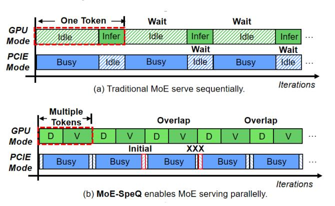

Figure 1. Comparison of execution timelines. (a) The baseline is dominated by I/O stalls. (b) Our approach utilizes the initial I/O latency to perform speculative draft generation, effectively hiding latency and maximizing GPU utilization.

Qwen-MoE [\[48\]](#page-14-0), DeepSeek [\[15\]](#page-13-2), can achieve superior quality without a proportional increase in computational cost. This advantage comes at a price that an enormous memory footprint which presents a fundamental deployment challenge, as it far exceeds the memory capacity of a single accelerator.

This memory pressure forces a strategy of offloading: inactive expert parameters are stored in host DRAM, while the accelerator (GPU) fetches them on-demand over the PCIe bus [\[11,](#page-12-1) [36\]](#page-13-3). Consequently, the performance bottleneck shifts dramatically from computation to I/O. During autoregressive inference, each generated token can activate a new set of experts, triggering a slow data transfer that stalls the powerful GPU compute units. This recurring I/O latency dominates the end-to-end generation time, severely underutilizing the expensive accelerator hardware.

1

A natural approach to mitigate this I/O latency is prefetching [37, 40, 52]. However, its effectiveness hinges on accurately predicting which experts the *next* token will require, a task made exceptionally difficult by the strict sequential dependency of autoregressive generation. Simple heuristics are inaccurate, while specialized learning-based predictors lack generality and add significant overhead. This fundamental challenge in prediction leaves the I/O bottleneck unresolved.

This deadlock motivates our work, which stems from a key empirical observation: a quantized MoE model exhibits remarkable fidelity in its expert activation patterns relative to its full-precision parent. This insight reveals that a quantized model can serve as a natural, high-fidelity, zerotraining-cost predictor. It enables a new paradigm: using speculative decoding [4, 22] with a lightweight draft model to transform the I/O latency window into an opportunity for productive computation. As illustrated in Figure 1, by generating a draft sequence of future tokens during an initial I/O wait, the system gains an accurate, multi-step lookahead, allowing it to prefetch necessary experts for a subsequent, highly parallel verification step.

However, translating this elegant concept into a high-performance system requires overcoming three critical, interlocking system-level challenges. First, with an accurate multi-step lookahead, the system must devise an *intelligent prefetching and caching strategy*. The challenge shifts from prediction accuracy to resource management. The system must decide which of the predicted experts to prefetch and when, balancing the goal of maximizing the cache hit rate for the verification stage against the hard constraints of limited PCIe bandwidth and, more importantly, limited accelerator VRAM (Video RAM, such as GDDR - Graphics Double Data Rate memory or HBM - High Bandwidth Memory).

Second, the system must determine the *optimal draft length* in consideration of the verification stage. The number of speculative tokens, k, is a critical tuning parameter. A larger k can better amortize I/O and other system overheads, but it also increases the number of candidate experts, putting pressure on VRAM and potentially leading to lower overall throughput if the draft is frequently rejected. This creates a complex, hardware-dependent trade-off that must be dynamically managed.

Third, the system must execute the entire speculative work-flow efficiently. This requirement is twofold. The system must first ensure the draft generation phase is fast enough to achieve meaningful speedup, a non-trivial task given that a naive implementation of a quantized MoE model suffers from low arithmetic intensity and high kernel overheads. Concurrently, the system must also manage the significant memory pressure imposed by maintaining a second model and its associated state, along with the computational overheads of the verification stage, all within the constraints of limited accelerator VRAM.

To overcome these challenges, we design and build MoE-SpeQ, a complete system for high-performance MoE inference. MoE-SpeQ features an Expert Scheduler that acts on the draft model's predictions, using an Expert Lookahead Buffer (ELB) to orchestrate a hierarchical, entropy-aware caching policy and a near-optimal, lookahead-aware eviction strategy. This scheduler is governed by an adaptive Speculative Governor, which employs a novel Amortization Roofline Model to determine the optimal draft length k. The entire framework is enabled by a high-throughput, hybrid-precision Execution Engine, which uses a fused MoE kernel to accelerate the draft phase, computation reordering to optimize the verification stage, and shared non-expert parameters and KV cache to minimize the overall memory footprint. This synergy ensures the system to effectively conceal the I/O latency behind computation, while maintaining high prediction fidelity.

In summary, this paper makes the following contributions:

- We design and implement an Expert Scheduler that leverages multi-step lookahead via an Expert Lookahead Buffer (ELB) to manage data movement, featuring a hierarchical, entropy-aware caching policy and a near-optimal, lookahead-aware eviction strategy.
- We propose a *Speculative Governor*, a hardware-aware control plane guided by a novel *Amortization Roofline Model*, which dynamically determines the optimal speculative draft length.
- We develop a high-performance Execution Engine that employs a fused kernel for quantized MoE operations to accelerate drafting, computation reordering to optimize verification, and leverages parameter and KV cache sharing to reduce VRAM pressure.
- We build and evaluate MoE-SpeQ, a complete system integrating these techniques. Our comprehensive evaluation on three representative MoE architectures and under varying hardware constraints shows that MoE-SpeQ achieves end-to-end throughput improvements of up to 2.34× over state-of-the-art offloading frameworks.

#### 2 Background and Motivation

This section first provides background on MoE models [35] and the performance challenges of autoregressive inference with offloading. We then present a data-driven analysis to pinpoint the I/O bottleneck and introduce the key observation that motivates our work.

#### 2.1 Mixture-of-Experts Models

A standard Transformer model relies on dense feed-forward network (FFN) layers, where all parameters are engaged for every input token. The MoE architecture replaces these dense FFN layers with a sparse alternative. An MoE layer consists of two main components:

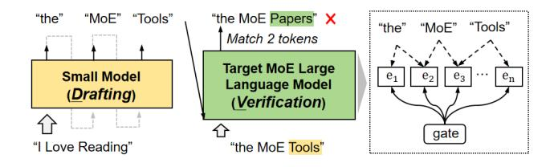

**Figure 2.** Speculative decoding in MoE.

- A set of N "expert" networks. Each expert is typically a standard FFN. In modern LLMs, these experts are replicated across multiple layers of the model.
- A router, or gating network. This is a small, trainable network that takes the hidden state of an input token and produces a probability distribution over the N experts.

During inference, for each token, the router dynamically selects a small subset of experts (e.g., the top-2) to process the token's hidden state. The outputs of the selected experts are then combined, weighted by their router scores. This sparse activation allows MoE models like Phi-MoE [1] to scale to hundreds of billions of parameters while keeping the floating-point operations (FLOPs) per token constant. However, the full set of parameters must still be stored, leading to massive memory requirements (e.g., >78GB for Phi-MoE in FP16).

#### 2.2 Speculative Decoding

Speculative decoding [4, 22] is a technique to accelerate autoregressive inference by reducing the number of sequential forward passes through a large language model. The core idea is to use a smaller, faster "draft model" to generate a sequence of candidate tokens, which are then verified by the original, more powerful "target model" in a single, parallel forward pass.

Figure 2 illustrates this process. First, in the **drafting** stage, a small draft model, which is fast and typically resides on the accelerator, autoregressively generates a short sequence of k candidate tokens. For instance, given the input "I Love Reading", the draft model in the figure speculates a three-token continuation: "the", "MoE", and "Tools".

Next, in the **verification** stage, the large target model takes the original input concatenated with the k draft tokens and performs a single forward pass. This efficiently computes the target model's true probability distributions for all potential next tokens at once. The draft tokens are then validated sequentially against the target model's predictions. In the example, the first two tokens ("the", "MoE") match the target model's outputs and are accepted. However, the third token ("Tools") mismatches the target's prediction ("Papers") and is rejected. The process halts at this point of divergence. The final output comprises the accepted prefix ("the", "MoE") plus one new token sampled from the target model's distribution at the point of rejection.

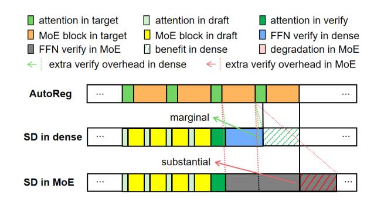

**Figure 3.** Performance comparison of decoding timelines. Speculative decoding provides a clear benefit for dense models by amortizing verification costs. For MoE models, however, the verification overhead becomes substantial, leading to performance degradation.

#### 2.3 Challenge of Speculative Decoding in MoE

While speculative decoding can yield significant speedups, its performance characteristics change dramatically when the target is an MoE model. Figure 3 visualizes this critical performance challenge by contrasting three decoding timelines.

- AutoReg (top row) shows standard autoregressive decoding, where each token requires a full, sequential pass through the model's attention and MoE blocks. This represents the latency baseline.
- SD in dense (middle row) shows speculative decoding on a conventional dense model. The verification pass for multiple tokens has only a *marginal* overhead, resulting in a clear performance *benefit* (hatched green area) by amortizing the cost of the target model pass.
- **SD** in **MoE** (bottom row) reveals the fundamental problem. During verification, each of the *k* speculative tokens processed in parallel may be routed to a *different set of experts*. To produce valid outputs, the system must load and compute the *union* of all experts activated across all *k* tokens. This dramatically inflates the computation and memory access costs of the MoE layers ('FFN verify in MoE', dark grey), creating a *substantial* overhead that can overwhelm any gains from amortization, leading to a net performance *degradation* (hatched red area).

Therefore, naively applying speculative decoding to MoE models is often counterproductive. The efficacy hinges not only on the draft model's accuracy but, more critically, on overcoming the disproportionate cost of parallel verification. This challenge necessitates a new approach that co-designs the speculation and verification processes specifically for the MoE architecture.

**Figure 4.** Latency breakdown for an inference step using offloading mechanism with Transformers on A100-PCIE-40G. GPU computation accounts for less than 15% of the total time, with the vast majority spent stalled on PCIe transfers.

#### 2.4 Characterizing the MoE Offloading Challenge

To precisely quantify the performance impact of the I/O bottleneck, we first profiled three representative MoE models using the standard offloading mechanism in the Hugging Face transformers library. The experiment was conducted on an A100-40G GPU (bfloat16 precision), measuring pertoken latency during the generation of 256 tokens for inputs from the GSM8K dataset.

The latency breakdown, shown in Figure 4, reveals a severe I/O-bound condition. For large models like Mixtral-8x7B, memory operations (Memory)—dominated by fetching experts over PCIe—consume a staggering 98.9% of the total time, leaving the powerful compute units idle. This empirical result confirms that offloaded MoE inference is fundamentally a data movement problem.

This naturally raises the question of why this I/O cannot be hidden with simple caching or prefetching. The answer lies in the highly dynamic and unpredictable nature of expert activation. Figure 5 delves into this behavior using Qwen-1.5MoE as an example. The heatmap in Figure 5a, which visualizes expert activation counts, shows a diffuse and varied pattern across all 24 layers. There are no consistently "hot" experts that could be easily cached; instead, token-level routing decisions spread the load widely. This observation is quantified in Figure 5b, which plots the activation entropy per layer. The consistently high entropy, close to the theoretical maximum, confirms that the router's choice is highly unpredictable from one token to the next.

This inherent unpredictability explains why naive heuristics like Least Recently Used (LRU) caching are ineffective. They are reactive, not predictive, and thus lead to frequent cache misses in the face of such dynamic access patterns. To overcome this challenge, we need a proactive approach that can accurately anticipate future expert needs to hide the crippling I/O latency.

#### 2.5 Opportunity: High-Fidelity Quantized Predictors

Our approach is motivated by a critical observation: while predicting the *exact* router probability distribution is hard, predicting the *outcome* of the router's top-k selection is much

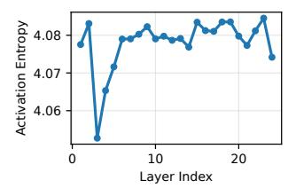

- (a) fine-grain expert statistic
- (b) activation entropy per layer

**Figure 5.** Expert activation in Qwen-1.5MoE is highly diverse and non-uniform, reflected in (a) unbalanced activation counts per expert, and (b) consistently high activation entropy across layers.

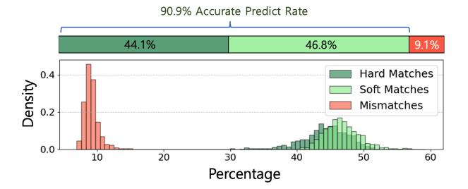

**Figure 6.** Fidelity of expert selection between a 4-bit quantized Qwen-MoE draft model and its FP16 parent. The quantized model accurately predicts the top-4 experts chosen by the full-precision model over 90.9% of the time, averaged across all tokens. Total fidelity is composed of hard fidelity (entirely identical expert selections) and soft fidelity (same expert identification numbers but in varied orders).

more feasible. Specifically, we find that *a heavily quantized* version of an MoE model acts as a high-fidelity predictor for its full-precision counterpart. A quantized model is much smaller and can reside entirely in VRAM, enabling it to run as an extremely fast, low-overhead oracle.

To validate this, we measured the expert selection fidelity between a full-precision FP16 Qwen-MoE model (the target) and a 4-bit quantized (INT4) version (the draft) on the same input sequences. For each token, we compare the set of top-4 experts selected by the draft model against the set selected by the target. We categorize the outcomes as follows:

- **Hard Matches:** The draft model predicts the exact same set of experts in the identical order of importance.
- Soft Matches: The draft model predicts the correct set of experts, but their ranking (order of importance) differs.
- Mismatches: The set of experts predicted by the draft model is not identical to the set chosen by the target, meaning at least one expert was incorrectly predicted.

Figure 6 presents the results, which show a remarkably high fidelity. The INT4 draft model achieves a 90.9% total

accurate prediction rate. This result even outperforms a specialized, one-layer-ahead predictor, which only reaches 84.7% accuracy [37], and this quantized predictor can predict all layers simultaneously in a single pass. This success is composed of 44.1% Hard Matches and a substantial 46.8% Soft Matches. From a system prefetching perspective, both outcomes are highly effective. Conversely, Mismatches occur in only 9.1% of cases. Crucially, a mismatch does not imply a total failure; it simply means at least one of the top-4 experts was not anticipated. The low frequency of these events underscores the overall reliability of the predictive approach.

This high-fidelity, low-cost predictability is the cornerstone of our approach. It demonstrates that a fast, on-chip draft model can provide a reliable lookahead, generating the precise information needed to orchestrate PCIe transfers and effectively hide the I/O latency that cripples conventional offloading systems.

# 3 MoE-SpeQ: System Architecture and Design

MoE-SpeQ is a runtime system that orchestrates speculative execution and data movement to mitigate the PCIe latency inherent in offloaded MoE inference. This section first presents the core principles that guide MoE-SpeQ's design. It then provides a detailed exposition of the three synergistic components that realize these principles: an intelligent, lookahead-driven *Expert Scheduler*; an adaptive *Speculative Governor* that optimizes performance via a formal model; and a high-performance, hybrid-precision *Execution Engine*.

#### 3.1 Design Principles and Architectural Overview

The design of MoE-SpeQ is founded on a set of principles aimed at maximizing the utilization of expensive accelerator hardware in the face of massive memory requirements.

First, **Transforming Latency through Speculation**. The foundational principle is to convert unproductive I/O wait time into productive computation. Instead of stalling while waiting for expert parameters to arrive from host DRAM, the system speculatively executes a lightweight, quantized draft model. This generates a high-fidelity lookahead of future tokens and, more importantly, their corresponding expert activation patterns.

Second, **Prediction-Driven Data Orchestration**. The high-fidelity lookahead is a powerful tool that enables a paradigm shift from reactive caching to proactive data orchestration. We observe that a 4-bit quantized draft model can predict the expert selection of its full-precision parent with over 90% accuracy, a key finding from our initial analysis. MoE-SpeQ leverages this to treat VRAM not as a simple LRU cache, but as a multi-level, actively managed staging area. This allows an intelligent scheduler to decide which experts to prefetch, when to prefetch them, and how to organize computation to maximize data reuse.

Third, **Hardware-Aware Adaptive Control**. The optimal degree of speculation is not static. It depends on the model's characteristics, the underlying hardware's performance (PCIe bandwidth, compute speed), and the dynamic behavior of the generation process (e.g., token acceptance rates). We need to incorporate a control mechanism that employs an analytical performance model to continuously optimize its speculative parameters, ensuring maximum effective throughput under any condition.

These principles are realized in MoE-SpeQ's architecture, shown in Figure 7. The system comprises a **Speculative Governor** that determines the optimal draft length (Section 3.2). This lookahead is used by the **Expert Scheduler** to manage data movement between host DRAM and VRAM (Section 3.3). The entire process is enabled by an **Execution Engine** that ensures the draft generation is fast enough to be concealed behind I/O latency (Section 3.4). We now detail each of these system components.

## 3.2 The Speculative Governor: Adaptive Performance Modeling

The Speculative Governor is MoE-SpeQ's adaptive control plane, responsible for navigating the fundamental trade-off between the benefits of speculation and its associated costs. To maximize end-to-end performance, the Governor must dynamically determine the optimal draft length, k. It achieves this not through simple heuristics, but by employing a specialized performance model we call the **Amortization Roofl-ine Model**, which it solves in real-time to adapt to the hardware and generation context.

**3.2.1** The Amortization Roofline Model. Classic Roofline models analyze the balance between compute and memory bandwidth. We adapt this concept to the unique trade-off in speculative offloading: the balance between useful work and synchronous I/O.

**Axes Definition.** The Amortization Roofline Model, shown in Figure 8, characterizes performance against the efficiency of speculation.

- Y-Axis (Effective Throughput, Θ): The ultimate performance metric, measured in the expected number of accepted tokens per second. This is the objective we seek to maximize.
- X-Axis (Amortization Intensity, Iamort): This crucial metric quantifies how much useful work is accomplished per byte of expensive, synchronous I/O. It is defined as:

$$I_{amort}(k) = \frac{\mathbb{E}[\text{Accepted Tokens}] \times S_{token}}{\mathbb{E}[\text{Synchronous I/O Bytes}]}$$
(1)

where  $S_{token}$  is a constant representing the "work" per token (e.g., 1). A high intensity signifies that I/O latency is being effectively hidden.

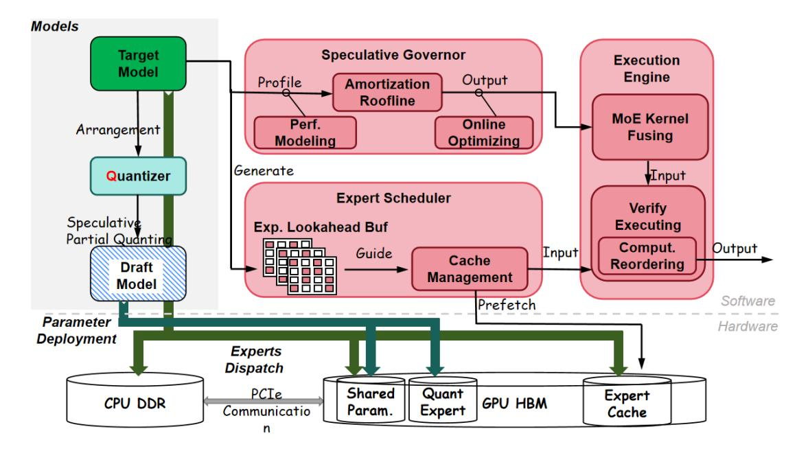

**Figure 7.** The high-level architecture of MoE-SpeQ. The system integrates a Speculative Governor, an Expert Scheduler, and an Execution Engine to transform I/O latency into productive computation through proactive data orchestration and adaptive control.

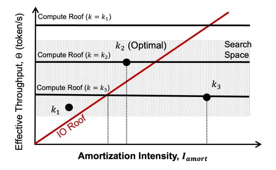

**Figure 8.** The Amortization Roofline Model. The system's throughput  $(\Theta)$  is bound by either PCIe bandwidth (I/O Roof) or computation (Compute Roofs). Each draft length k corresponds to an operating point (circles). The Governor's task is to find the point  $k^*$  that yields the maximum throughput, effectively navigating the trade-off between higher amortization intensity and the overhead of a lower compute roof.

**The Roofs.** The model features two performance bounds determined by the system's hardware constraints:

• Compute Roof: A horizontal line representing the maximum throughput when I/O is perfectly hidden  $(I_{amort} \rightarrow \infty)$ . This performance is limited solely by the non-overlapped computation: drafting and verifying. Crucially, this roof's height *depends on k*, as  $T_{draft}(k)$  and  $T_{verify}(k+1)$  increase with draft length.

 I/O Roof: A slanted line whose slope is the effective PCIe bandwidth (BPCIe). It represents the performance bound when the system is stalled waiting for synchronous expert fetches. Throughput on this roof is directly proportional to the amortization intensity.

The Governor's goal is to select the draft length k that places the system's operating point at the highest possible position on this plot, ideally near the "knee" of the highest achievable compute roof.

**3.2.2 High-Fidelity Performance Modeling.** To place MoE-SpeQ on the Roofline model, the Governor must accurately predict the coordinates  $(I_{amort}(k), \Theta(k))$  for any given k. This requires modeling both the expected accepted tokens and the total cycle time with high fidelity.

**Effective Throughput Objective.** The Y-axis coordinate,  $\Theta(k)$ , is defined as the expected number of accepted tokens per cycle time:

$$x\Theta(k) = \frac{\mathbb{E}[\text{Accepted Tokens}]}{\mathbb{E}[\text{Time per Cycle}]} = \frac{k_{accept}(k)}{T_{cycle}(k)}$$
(2)

The term  $k_{accept}(k)$  is the expected number of accepted tokens for a draft of length k. Let  $p_i$  be the conditional probability that the i-th token is accepted, given the first i-1were accepted. Then  $k_{accept}(k) = \sum_{i=1}^k \prod_{j=1}^i p_j$ . These probabilities are measured empirically during a warm-up phase and are continuously updated using an exponential moving average to adapt to the generation context. **Latency and I/O Modeling.** The cycle time,  $T_{cycle}(k)$ , is decomposed into its non-overlapped parts. This model provides the denominator for  $\Theta(k)$  and the inputs for  $I_{amort}(k)$ .

$$T_{cycle}(k) = \max(T_{draft}(k), T_{pcie,init}) + T_{pcie,new}(k) + T_{verify}(k+1)$$
(3)

Each term is carefully handled:

- $T_{draft}(k)$ : This is the time to generate the draft. It is *profiled* offline and modeled as a linear function  $T_{d,base} + k \cdot T_{d,token}$ .
- *T*pcie,init: The latency of the first mandatory expert fetch. This is also *profiled* as a system constant.
- $T_{verify}(k + 1)$ : The time for parallel verification. This is *profiled* for several values of k and interpolated.
- $T_{pcie,new}(k)$ : This is the most dynamic component and is *estimated online*. It is the time to load the set of additional new experts,  $E_{new}(k)$ , required by the draft. We estimate its size,  $|E_{new}(k)|$ , by analyzing the ELB against the current cache state. The time is then calculated as  $T_{pcie,overhead} + |E_{new}(k)| \cdot S_{expert}/B_{PCIe}$ , where PCIe bandwidth  $B_{PCIe}$  is a profiled constant.

**3.2.3 Low-Overhead Online Optimization.** With the model fully defined, the Governor's optimization problem is to find the optimal draft length  $k^*$ :

$$k^* = \arg\max_{k \in [k_{min}, k_{max}]} \Theta(k)$$
 (4)

However, simply maximizing this throughput objective,  $\Theta(k)$ , is insufficient for practical inference serving. Realworld systems often face dual, competing objectives: high throughput for batch workloads and low Time-to-First-Token (TTFT) for interactive requests. A larger k improves throughput but linearly degrades TTFT. An unconstrained online optimizer might select a very large k that, while optimal for throughput, would violate the strict latency SLOs of interactive users.

To resolve this, MoE-SpeQ employs a *hybrid approach* that marries the dynamic optimization power of the Amortization Roofline Model with the hard constraints of system SLOs. The key is to use offline analysis to define a *valid operating range* for the online optimizer.

- **1. Offline SLO-based Bounding:** Before deployment, we perform a one-time profiling run to determine the maximum draft length, let's call it  $k_{\text{max}}$ , that satisfies the target TTFT budget (e.g., TTFT < 500ms). This value becomes the upper bound for our online search.
- **2. Online Constrained Optimization:** At runtime, the Speculative Governor continuously solves the optimization problem from Equation (4), but within a constrained search space:

$$k^* = \arg\max_{k \in [k_{\min}, k_{\text{SLO}}]} \tau(k)$$
 (5)

This strategy ensures that any draft length  $k^*$  chosen by the Governor will, by definition, respect the system's latency

requirements. It allows the system to dynamically adapt to changing conditions (e.g., a drop in token acceptance rate, which would lower the amortization intensity and favor a smaller  $k^*$ ) while never violating the core user-experience metric. This constrained optimization provides the best of both worlds: the adaptability of a real-time performance model and the predictability of a system operating within guaranteed SLOs.

## 3.3 The Expert Scheduler: Orchestrating Hierarchical Data Movement

The Expert Scheduler is the cornerstone of MoE-SpeQ's I/O management. Its responsibility is to ensure that the right expert data is in VRAM at the right time, effectively creating the illusion of infinite memory for the verification stage. It achieves this by moving beyond simple caching policies and implementing a sophisticated, lookahead-driven orchestration strategy that combines predictive prefetching, hierarchical cache partitioning, and a near-optimal eviction policy.

**3.3.1 The Expert Lookahead Buffer (ELB) Data Structure.** The foundation of the scheduler is the Expert Lookahead Buffer (ELB), a structured record generated concurrently with the draft tokens. It is not merely a list but a rich data structure that captures the complete predicted data requirements for the speculative window. For a draft length of k and a model with L MoE layers, the ELB contains  $k \times L$  entries. Each entry, ELB[i][j] for token i and layer j, is a tuple:

$$ELB[i][j] = (expert id, confidence score)$$
 (6

The 'expert\_id' identifies the expert predicted to be activated. The 'confidence\_score', derived from the gating network's logits, provides a measure of how certain the draft model is about its choice. This score is crucial for more advanced, risk-aware prefetching strategies, though our current implementation primarily uses the 'expert\_id'. The ELB is constructed on the CPU in a non-blocking manner while the GPU is computing the next draft token, ensuring its creation introduces no additional latency.

**3.3.2** Hierarchical and Layer-Aware Cache Management. Armed with the multi-step lookahead provided by the ELB, the Expert Scheduler transforms VRAM from a simple reactive cache into a proactively managed, hierarchical staging area. It orchestrates data movement through a three-phase pipeline, illustrated at the bottom of Figure 9, where each phase strategically uses different parts of the ELB to maximize I/O efficiency.

**Phase I: Locality-Aware Cache Priming.** At the beginning of the drafting process, the scheduler consults the initial entries of the ELB. Its first priority is to service expert requests from the existing cache, leveraging temporal locality

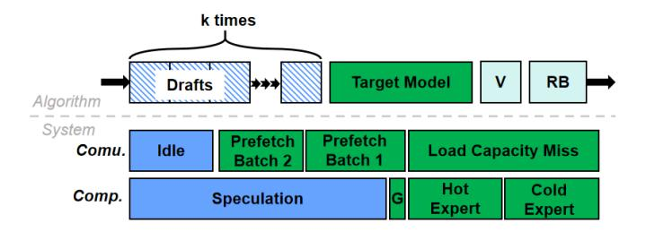

Figure 9. The execution timeLine of MoE-SpeQ. "G" denotes the gating operation, "V" represents verification, and "RB" signifies the rollback of sequence and model states (including candidate tokens, logits, and KV cache).

from previous generation steps. This minimizes redundant prefetches and synergizes with our lookahead-aware eviction policy. During this phase, PCIe bandwidth is deliberately underutilized, as the primary goal is to exploit "free" cache hits before initiating costly I/O.

Phase II: Adaptive Bandwidth-Guided Prefetch. As more draft tokens are generated and the ELB is further populated, the scheduler enters the main prefetching loop. Recognizing the inherent uncertainty in predictions for distant tokens, it strategically prefetches a subset of the experts identified in the middle portion of the ELB. This controlled prefetching efficiently utilizes available PCIe bandwidth to load high-probability experts without over-subscribing VRAM or prematurely evicting other potentially useful experts.

Phase III: Activation-Driven Cache Saturation. In the final phase, as the draft generation nears completion, the scheduler has full visibility into the complete ELB. It now performs aggressive, high-priority prefetching to load all remaining predicted experts that are not yet in the cache. This ensures that, by the time the verification stage begins, the VRAM cache is saturated with the required experts, effectively eliminating memory-induced stalls and guaranteeing maximum computational throughput during the parallel verification step.

## 3.4 The Execution Engine: Optimizing for Speed and Memory Efficiency

The end-to-end performance of MoE-SpeQ hinges on the efficiency of its execution engine. This component is responsible for the two distinct phases of the speculative workflow: the rapid generation of the draft sequence and the parallel verification of that sequence. Our engine's design is guided by a set of optimizations aimed at maximizing speed and minimizing VRAM footprint.

3.4.1 Parameter and KV Cache Sharing. A foundational design choice in MoE-SpeQ is to share key state between the lightweight draft model and the full-precision target model. Instead of maintaining two separate sets of parameters and

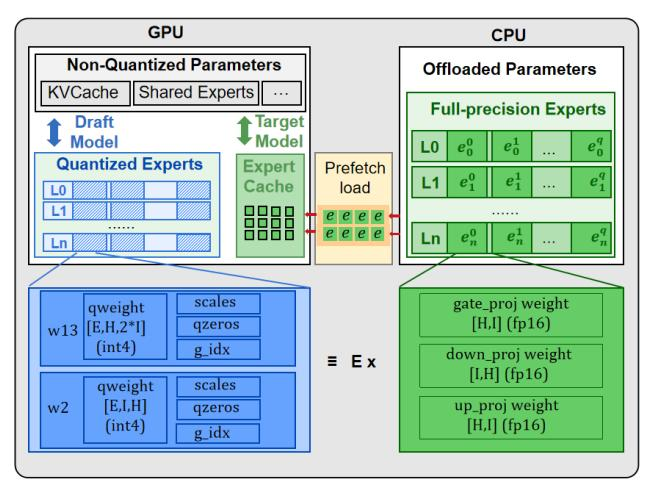

Figure 10. Overview of parameter distribution and data layout orchestration in MoE-SpeQ.

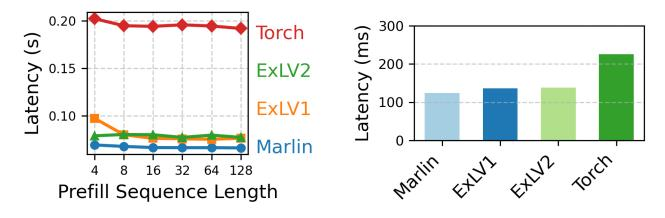

(a) Prefill Latency Comparison (b) Decode Latency Comparison

Figure 11. Performance comparison of different backends: (a) prefill stage latency, (b) decode stage latency. Lower values indicate better performance.

runtime states, both models utilize the same underlying tensors for all non-expert parameters (e.g., embeddings, attention layers, normalization layers) and, most importantly, the KV Cache.

This strategy yields two profound benefits. First, it dramatically reduces VRAM footprint. The KV cache and non-expert parameters constitute a substantial portion of the total memory budget. By sharing them, we avoid duplication and free up precious VRAM for caching more offloaded experts. Second, it boosts draft model fidelity. The draft model operates on the high-precision KV cache generated by the target model from previous steps. This provides a more accurate and stable context for generating speculative tokens, directly improving the prediction quality of the Expert Lookahead Buffer (ELB) and increasing the overall token acceptance rate.

3.4.2 Hybrid-Precision for Fidelity and Footprint. Building upon the shared state, we apply a surgical, hybrid-precision strategy to the MoE layers to balance the trade-off between performance and predictive accuracy.

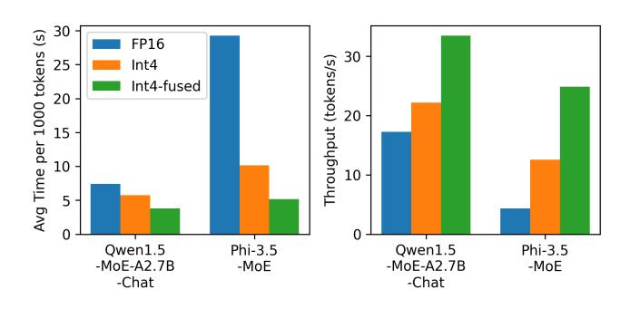

**Figure 12.** Impact of quantization-aware fused expert kernels on throughput and latency in mixture-of-experts models

*Full-Precision Components (FP16).* A small, critical subset of the model's parameters is maintained in their native 16-bit floating-point (FP16) format. These components form the control and stability backbone of the draft model, where numerical precision is paramount.

- Non-Expert Parameters: The non-expert parameters is more sensitive in the entire system [9]. e.g. The output logits of gating modules directly control which expert is selected for each token. Even minor quantization errors in the gate can be magnified by the softmax function, leading to incorrect routing decisions. A single mis-routed token would corrupt the ELB, rendering our predictive scheduling and prefetching ineffective. Therefore, to guarantee the highest possible fidelity for our lookahead mechanism, all gating networks are kept in FP16. The attention components and other parameters not in MLP follow the same principle.
- Shared Experts: In many modern MoE architectures, a set of "shared experts" is activated for every token, providing a consistent, baseline computation path. Since these experts are always resident in VRAM (offering no offloading benefit) and are fundamental to the model's base quality, we keep them in FP16 to prevent any degradation of this stable foundation.

**Quantized Components (INT4).** All other parameters in the MLP are quantized to 4-bit integers (INT4). This category represents the vast majority of the model's parameters and is where we aggressively optimize for speed and memory footprint.

This surgical, hybrid-precision approach allows us to create a draft model that is extremely fast and memory-efficient, while safeguarding the critical attention mechanism, norms, and routing logic that underpins the entire MoE-SpeQ framework. The overall parameter deployment strategy and movement direction are illustrated in Figure 10.

**3.4.3** Fused MoE Kernel for High-Speed Drafting. Among various post-training quantization (PTQ) methods, GPTQ [13]

is currently one of the most mainstream quantization methods for LLM models, favored for its straightforward implementation, minimal accuracy loss, and excellent framework compatibility, making it our top choice. After thorough testing, we opted for the Marlin [14] backend for inference, as it demonstrated superior performance in both the prefill and decode stages across a majority of scenarios, as illustrated in Figure 11. However, further profiling revealed that while Marlin achieves desirable acceleration with matrices of larger dimensions (such as significantly large intermediate sizes in dense models), it fails to achieve the expected 4x speedup in MoE scenarios, particularly with fine-grained MoE models (e.g., Qwen2-MoE, only K=1408, N=2048). In some cases, Marlin's performance is even slower than the FP16 implementation in PyTorch. To address this issue, we adopted the expert fusion CUDA kernel, consolidating the launch of multiple small GEMM kernels to maximize Marlin's acceleration potential.

To make the draft phase as fast as possible, we designed a single, monolithic **fuseMoE CUDA kernel**. A naive quantized MoE implementation often fails to achieve speedup on fine-grained MoE models where each expert is small (e.g., K=1408, N=2048) for modern hardware, which is due to high kernel launch overhead and poor hardware utilization under standard inference backends. By contrast, our expertfused kernel simultaneously reduces launch frequency and improves hardware efficiency, delivering significant acceleration, as shown in Figure 12.

3.4.4 Verification-Phase Computation Reordering. The verification phase presents a different challenge. The Expert Scheduler guarantees that all necessary experts for the kdraft tokens are present in VRAM. However, a naive, tokenby-token verification would still access these experts in a potentially unreasonable order, leading to poor cache locality. To solve this, the scheduler performs **computation reordering**. Before launching the verification, it analyzes the complete ELB for the k-token window and constructs a new execution plan. It reorders the batch of *k* tokens so that all tokens destined for the same expert are processed contiguously. For example, instead of processing tokens in the order 1, 2, 3, ..., k, it might process tokens 1, 5, 8 (all for Expert A), followed by 2, 4, 9 (all for Expert B), and so on. This ensures that once an expert is loaded into the GPU's L1/L2 caches, it is fully utilized by all relevant tokens before another expert is accessed, dramatically improving cache hit rates and overall verification speed.

#### 4 Evaluation

#### 4.1 Experimental Setup

**4.1.1 Hardware and Software Platform.** All experiments are conducted on a workstation equipped with a single NVIDIA A100 GPU equipped with 40 GB of HBM memory and a 24-core Intel Xeon Silver 4310 CPU with 256 GB RAM. The

**Table 1.** Configuration of Evaluated Models

|                    | Phi-3.5-MoE | Qwen1.5-MoE-A2.7B | DeepSeek-V2-Lite |
|--------------------|-------------|-------------------|------------------|
| Total Param.       | 41.9B       | 14.3B             | 15.7B            |
| Activated Param.   | 6.6B        | 2.7B              | 2.4B             |
| Total Weight       | 78GB        | 29GB              | 34GB             |
| MoE Layer Number   | 32          | 24                | 26               |
| First Dense Layer  | 0           | 0                 | 1                |
| Experts(Per Layer) | 8           | 60                | 64               |
| Top-K              | 2           | 4                 | 6                |
| Shared Experts     | 0           | 1(4x Dim)         | 1(2x Dim)        |
| Hidden Size        | 4096        | 2048              | 2048             |
| MoE Inter. Size    | 6400        | 1408              | 1408             |

GPU is connected to the CPU via a PCIe 4.0 x16 interface, providing a theoretical bidirectional bandwidth of 16 GB/s per direction, totaling 32 GB/s of aggregate bandwidth for host-device data transfers. Additionally, we select several representative GPU memory budgets to evaluate how system performance is affected under varying degrees of memory constraints.

4.1.2 Implementation Details. Our system is built upon the Hugging Face Transformers framework for inference and utilizes GPTQ [13] for the quantization of draft models. To enable efficient asynchronous execution between communication and computation, we employ CUDA multistream scheduling with distinct CUDA events to manage synchronization and mutual exclusion across four critical dimensions: multi-stage prefetching, coordination between prefetching and on-demand parameter loading, overlapping of communication and computation, and bidirectional host-device data transfers. To mitigate synchronization overheads that can degrade performance, we implement several key optimizations:

- Unified initialization and management of cache parameters for token-wise activation during computation, avoiding runtime allocation-induced synchronization;
- Static configuration of shared memory of kernels (both the attention part and the MLP part) to maximize GPU shared memory utilization and computational throughput;
- Batched processing of experts' selection pattern to minimize frequent Device-to-Host (D2H) transfers, thereby alleviating PCIe bandwidth pressure and synchronization overhead.
- Pipeline-based asynchronous loading mechanism with a prefetch window, leveraging pinned memory and non-blocking CUDA memory copy.

Collectively, these techniques create a low-synchronization, high-throughput inference engine designed for high efficiency under complex MoE workloads.

**4.1.3 Models and Workloads.** We select three representative mainstream MoE models in Table 1 that exhibit substantial differences in overall scale, architectural design, and MoE

layer implementation. This diverse selection enables a more comprehensive and rigorous evaluation of our system's scalability and generalization capability across heterogeneous MoE configurations. For the target model, we use the official FP16 weights, while the draft model is a quantized version created using the GPTQ method. Specifically, all linear layers within the expert modules are subjected to symmetric INT4 quantization with a group size of 128.

To evaluate performance across diverse domains, we use five standard benchmark datasets: C4 [32] (web-crawled corpus), WikiText-2-v1 [30] (factual language modeling), HumanEval [6] (code generation), GSM8K [8] (mathematical reasoning), and GPQA [33] (expert-level multidisciplinary questions). These benchmarks collectively demonstrate that quantized models maintain remarkably high token acceptance rates, enabling strong performance even on highly challenging tasks. In the following experiments and figures, we use the abbreviations GK (GSM8K), WT (WikiText-2), HE (HumanEval), GP (GPQA), C4 (C4), and avg (average) to refer to the respective datasets for brevity.

**4.1.4 Baselines.** We evaluate our system against two representative baselines. The first is the standard Hugging Face Transformers library [44], a widely-used open-source framework that provides built-in support for coarse-grained offloading, such as layer-wise CPU offloading via its device map feature. The second baseline is Mixtral-Offloading [11], a specialized offloading system designed for MoE models that implements expert-level, on-demand parameter swapping between GPU and host memory.

Our implementation is built upon the generic model interface of the Transformers library. This architectural choice makes direct, fair comparisons with systems based on different underlying frameworks (e.g., vLLM, SGLang, or llama.cpp) infeasible. We therefore selected Mixtral-Offloading for comparison, as it shares the same Transformers foundation. To enable a comprehensive evaluation, we reproduced their method and extended its compatibility beyond the original Mixtral 8x7B model to support the models used in our experiments. We compare two variants of Mixtral-Offloading: Mixtral-Offloading-SC (same cache) and Mixtral-Offloading-SM (same memory). This is because the "same memory" setting enables a fairer comparison in single-GPU scenarios, whereas our draft and target models are inherently separable and can be deployed on different GPUs; in such cases, the appropriate comparison is under the "same cache" setting.

#### 4.2 End-to-End Performance

Figure 13 presents the end-to-end inference throughput, measured as the average time per output token (TPOT), for MoE-SpeQ and our baseline systems. We evaluate performance across three models and five datasets under both low-memory (top row) and high-memory (bottom row) configurations. The results show that MoE-SpeQ consistently

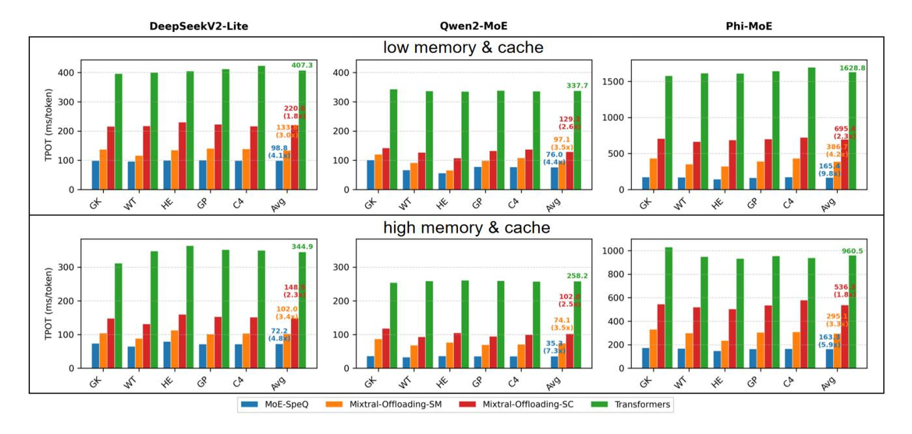

Figure 13. Evaluation inference speed of MoE-SpeQ and other approaches on varying datasets, memory settings and models. The figures in the upper row represent experiments conducted under lower GPU memory conditions, while the figures in the bottom row represent experiments performed under higher GPU memory conditions.

Table 2. Comparative GPU Memory Footprint (GB) of a Full Precision and a 4-bit Quant Qwen1.5-MoE Models in 12K-Context Settings

| Scenario         | Draft | Target | Shared | Total        |
|------------------|-------|--------|--------|--------------|
| Independent      | 6.13  | 7.27   | —      | 13.40        |
| + Shared Experts | 4.58  | 5.72   | 1.55   | 11.85        |
| + Other Params   | 2.66  | 3.80   | 3.47   | 9.93         |
| + KV Cache       | 0.41  | 1.55   | 5.72   | 7.68 ↓43% |

achieves the lowest TPOT, demonstrating substantial performance gains in all tested scenarios.

The performance advantages of our system are most evident in the high-memory setting, which allows the execution efficiency of each system to be evaluated with reduced I/O bottlenecks. For instance, on Phi-MoE, MoE-SpeQ reduces the average token generation time from 536.7 ms (Mixtral-Offloading-SC) down to 163.1 ms, a 3.3× speedup. This is significantly better than both Mixtral-Offloading variants: SM (351.8 ms) and SC (536.7 ms), as well as vanilla Transformers (960.5 ms). Similarly, on Qwen2-MoE, we achieve 74.1 ms/token, outperforming Mixtral-Offloading-SC by 2.5× and Transformers by 3.5×. Even on DeepSeekV2-Lite, where baseline performance is already strong, MoE-SpeQ still delivers a 4.8× speedup over the original Transformer model.

These results validate our core design principles. MoE-SpeQ's superior throughput stems from its ability to deeply

integrate the draft and target models. By maximizing parameter sharing and merging the KV cache, our system minimizes both the memory footprint and the computational overhead of speculative decoding.

### 4.3 Memory Saving Analysis

Our system significantly reduces the GPU memory footprint of speculative decoding by exploiting the architectural alignment between the quantized draft model and its fullprecision target model. This alignment enables extensive sharing of model parameters and runtime state.

Table [2](#page-10-1) quantifies these savings for the Qwen1.5-MoE model in a 12K context setting. The analysis shows a progressive reduction in memory usage as components are shared. By co-locating shared experts, non-expert layers (e.g., embeddings and routers), and finally the token-level KV cache, the total memory requirement is incrementally lowered. A key enabler for the final step is our state synchronization mechanism, which allows the KV caches of the draft and target models to be safely merged after each verification step. This comprehensive sharing strategy culminates in a total memory footprint of 7.68 GB, achieving a 43% reduction compared to a naive implementation where both models operate independently.

#### 4.4 Impact of Prefetch Strategy

We compared the impact of different caching strategies on data reuse, including naive LRU, LRU with an increased

**Table 3.** Hit Rate Comparison of Different Caching Strategies Under Varying Cache Capacities

| <b>Expert Capacity</b> | Method                   | Cache Size | Hit Rate(%) |
|------------------------|--------------------------|------------|-------------|
| Low (16GB)             | LRU                      | 6          | 29.2        |
|                        | LRU (scaled)             | 22         | 61.13       |
|                        | Single Prefetch (sooner) | 6          | 96.04       |
|                        | Single Prefetch (later)  | 6          | 96.33       |
|                        | Speculative              | 6          | 99.85       |
| Medium (24GB)          | LRU                      | 16         | 50.94       |
|                        | LRU (scaled)             | 32         | 76.56       |
|                        | Single Prefetch (sooner) | 16         | 95.44       |
|                        | Single Prefetch (later)  | 16         | 95.46       |
|                        | Speculative              | 16         | 98.62       |
| High (32GB)            | LRU                      | 32         | 76.56       |
|                        | LRU (scaled)             | 48         | 95.77       |
|                        | Single Prefetch (sooner) | 32         | 91.98       |
|                        | Single Prefetch (later)  | 32         | 95.9        |
|                        | Speculative              | 32         | 96.25       |

number of cache slots (for fair comparison), and two singleprefetch methods, as shown in Table 3. Phi-MoE, due to its large base model size, cannot be deployed on devices with smaller GPU memory capacities. Even under 40GB of GPU memory, there is limited room to adjust the cache size. In contrast, Owen and DeepSeek allow for more straightforward comparisons across typical hardware memory budgets: 16GB (RTX 4080) for edge LLMs, 24GB (RTX 4090) for researchgrade fine-tuning, and 32GB (H20) for production-scale MoE inference. In this experiment, we use the DeepSeekV2-Lite model to collect expert hit rate statistics. Note that, under speculative decoding (SD), the number of experts required per token grows linearly with the speculation length k. Consequently, for a fixed cache capacity, the absolute hit rate for individual expert requests inevitably decreases as k increases-simply because more distinct experts are needed. However, our key observation is that the fraction of required experts is already present in the cache at each decoding step. The hit rates reported in the table reflect precisely this per-step cache coverage metric.

Under this definition, our speculative prefetching strategy achieves the highest hit rate—exceeding 96%—across all evaluated memory capacities. Interestingly, under the 32 GB memory constraint, the LRU (scaled) method exhibits an unusually high hit rate. We hypothesize that this is because the number of cache slots at this memory budget reaches a tipping point—either enabling highly efficient expert reuse or allowing all experts to be fully activated and retained in the cache.

#### 4.5 Ablation Study

The ablation study in Table 4 demonstrates the individual and combined impact of two key optimizations in DeepSeek-V2-Lite: asynchronous prefetching and fused kernels. When both optimizations are enabled, the system achieves a speed of 13.02 token/s. Disabling asynchronous prefetching alone

Table 4. Ablation Study Results on DeepSeekV2-Lite

| model     | method             | speed        | norm. |
|-----------|--------------------|--------------|-------|
|           | Full               | 13.02        | 100%  |
| DeepSeek- | w/o async prefetch | 12.37(-0.65) | 95%   |
| V2-Lite   | w/o fused kernel   | 8.88(-4.15)  | 68.2% |
|           | w/o both two       | 8.29(-4.73)  | 63.7% |

reduces speed to 12.37 (95% reserved), indicating a modest but measurable benefit. In contrast, disabling the fused kernel leads to a more significant drop to 8.88 (68.2%), highlighting its substantial contribution to performance. When both optimizations are removed, performance further degrades to 8.29 (63.7%). Notably, the performance loss from removing both components is approximately the sum of the individual losses, suggesting that the two optimizations operate largely independently and their benefits are additive.

Moreover, ablating the quantized model by replacing it with alternative draft models(e.g. dense counterparts) is largely meaningless in most open-source model ecosystems, as there are virtually no readily available small MoE models that share the same architecture and compatible parameters with the target model and are appropriately sized to serve as effective drafts. Consequently, such an ablation study cannot be practically conducted.

Furthermore, our speculative decoding achieves a significantly higher acceptance rate (over 90%) compared to conventional speculative decoding methods (e.g., Eagle [24]'s 80%). This high acceptance rate further amplifies the performance benefit of our quantized kernel optimizations. We attribute this exceptional compatibility to the extreme similarity between the draft and target models—not only in architecture, but also in parameters and output distributions.

#### 5 Related Work

#### 5.1 Efficient MoE Inference System

Efficient inference for MoE models has recently attracted substantial systems research [17, 20, 23, 26, 27] due to the extreme memory requirements and dynamic, data-dependent expert activation patterns. Offloading large model parameters from accelerator memory to host DRAM or remote storage is a widely used strategy to enable inference of models that exceed device memory. There are several well-known frameworks support this feature such as HuggingFace Transformers [44], DeepSpeed [2], vLLM [21] which have adopted this idea. Consequently, much recent work studies intelligent offloading systems [11, 34, 39, 47, 53, 54] and prefetching policies [12, 18, 37, 40, 52]. MoE-SpeQ fits into this systems literature but distinguishes itself by co-designing speculative decoding with expert offloading: it uses a lightweight, quantized draft model to predict multi-step expert usage, and then drives a lookahead-aware scheduler and adaptive

governor to prefetch and manage experts so as to hide PCIe transfers behind useful computation.

## 5.2 Speculative Decoding for LLMs

Speculative decoding [\[4,](#page-12-2) [22\]](#page-13-6) has emerged as a practical technique to accelerate auto-regressive LLM generation. There are several research topic like draft model training [\[16,](#page-13-22) [42,](#page-13-23) [43,](#page-13-24) [49,](#page-14-5) [55\]](#page-14-6), draft tree construction [\[10,](#page-12-9) [24,](#page-13-12) [41\]](#page-13-25), verification strategies [\[38,](#page-13-26) [45\]](#page-14-7), and some other comprehensive work [\[5,](#page-12-10) [50\]](#page-14-8). To further improve the speed of speculative decoding, some works talked about an optimal lookahead distance. Mamou et al. [\[29\]](#page-13-27) proposed the dynamic draft length, and Brown et al. [\[3\]](#page-12-11) investigated it in a dynamic depth manner. MoE-SpeQ leverages a quantized MoE draft model as a high-fidelity speculator specifically to predict expert activation patterns, which do not need any post-training. And our work tested and selected the most effective draft length through our performance modeling.

### 5.3 Quantization for LLM Inference

Post-training and mixed-precision quantization has become a key technique for reducing memory footprint and accelerating LLM inference. Methods such as GPTQ [\[13\]](#page-12-4), AWQ [\[25\]](#page-13-28), SmoothQuant [\[46\]](#page-14-9), and many other recent works [\[7,](#page-12-12) [28,](#page-13-29) [31,](#page-13-30) [51\]](#page-14-10) enable accurate low bit quantization while preserving generation quality for dense LLMs. Recent kernel-level optimizations like Marlin [\[14\]](#page-13-7) further improve low-bit efficiency by combining quantized GEMMs with operator fusion. MoE-SpeQ uses GPTQ [\[13\]](#page-12-4) to formalize the draft model and exploits Marlin [\[14\]](#page-13-7) kernel to make the draft model fast enough for end-to-end speedups.

## 6 Conclusion

In this paper, we presented MoE-SpeQ, a system that directly confronts this challenge through a novel co-design of speculative execution and expert offloading. By using a lightweight, on-device draft model to predict future expert requirements, MoE-SpeQ transforms the crippling PCIe latency into an opportunity for productive computation, effectively hiding data movement behind speculative execution. While effective, our system's potential is still constrained by the draft model's memory overhead; MoE-SpeQ's architecture is, however, designed to seamlessly integrate future breakthroughs in ultra-low-bit quantization and hardware support, which would unlock a new tier of performance and enable more sophisticated system co-designs, pushing MoE inference to a new frontier of efficiency.

## References

[1] Marah Abdin, Jyoti Aneja, Harkirat Behl, Sébastien Bubeck, Ronen Eldan, Suriya Gunasekar, Michael Harrison, Russell J Hewett, Mojan Javaheripi, Piero Kauffmann, et al. 2024. Phi-4 technical report. arXiv preprint arXiv:2412.08905 (2024).

- [2] Reza Yazdani Aminabadi, Samyam Rajbhandari, Ammar Ahmad Awan, Cheng Li, Du Li, Elton Zheng, Olatunji Ruwase, Shaden Smith, Minjia Zhang, Jeff Rasley, et al. 2022. Deepspeed-inference: enabling efficient inference of transformer models at unprecedented scale. In SC22: International Conference for High Performance Computing, Networking, Storage and Analysis. IEEE, 1–15.
- [3] Oscar Brown, Zhengjie Wang, Andrea Do, Nikhil Mathew, and Cheng Yu. 2024. Dynamic depth decoding: Faster speculative decoding for llms. arXiv preprint arXiv:2409.00142 (2024).
- [4] Charlie Chen, Sebastian Borgeaud, Geoffrey Irving, Jean-Baptiste Lespiau, Laurent Sifre, and John Jumper. 2023. Accelerating large language model decoding with speculative sampling. arXiv preprint arXiv:2302.01318 (2023).
- [5] Fahao Chen, Peng Li, Tom H Luan, Zhou Su, and Jing Deng. 2025. Spin: Accelerating large language model inference with heterogeneous speculative models. In IEEE INFOCOM 2025-IEEE Conference on Computer Communications. IEEE, 1–10.
- [6] Mark Chen, Jerry Tworek, Heewoo Jun, Qiming Yuan, Henrique Ponde de Oliveira Pinto, Jared Kaplan, Harri Edwards, Yuri Burda, Nicholas Joseph, Greg Brockman, Alex Ray, Raul Puri, Gretchen Krueger, Michael Petrov, Heidy Khlaaf, Girish Sastry, Pamela Mishkin, Brooke Chan, Scott Gray, Nick Ryder, Mikhail Pavlov, Alethea Power, Lukasz Kaiser, Mohammad Bavarian, Clemens Winter, Philippe Tillet, Felipe Petroski Such, Dave Cummings, Matthias Plappert, Fotios Chantzis, Elizabeth Barnes, Ariel Herbert-Voss, William Hebgen Guss, Alex Nichol, Alex Paino, Nikolas Tezak, Jie Tang, Igor Babuschkin, Suchir Balaji, Shantanu Jain, William Saunders, Christopher Hesse, Andrew N. Carr, Jan Leike, Josh Achiam, Vedant Misra, Evan Morikawa, Alec Radford, Matthew Knight, Miles Brundage, Mira Murati, Katie Mayer, Peter Welinder, Bob McGrew, Dario Amodei, Sam McCandlish, Ilya Sutskever, and Wojciech Zaremba. 2021. Evaluating Large Language Models Trained on Code. (2021). arXiv[:2107.03374](https://arxiv.org/abs/2107.03374) [cs.LG]
- [7] Yuzong Chen, Ahmed F AbouElhamayed, Xilai Dai, Yang Wang, Marta Andronic, George A Constantinides, and Mohamed S Abdelfattah. 2025. Bitmod: Bit-serial mixture-of-datatype llm acceleration. In 2025 IEEE International Symposium on High Performance Computer Architecture (HPCA). IEEE, 1082–1097.
- [8] Karl Cobbe, Vineet Kosaraju, Mohammad Bavarian, Mark Chen, Heewoo Jun, Lukasz Kaiser, Matthias Plappert, Jerry Tworek, Jacob Hilton, Reiichiro Nakano, Christopher Hesse, and John Schulman. 2021. Training Verifiers to Solve Math Word Problems. arXiv preprint arXiv:2110.14168 (2021).
- [9] Tim Dettmers, Ruslan Svirschevski, Vage Egiazarian, Denis Kuznedelev, Elias Frantar, Saleh Ashkboos, Alexander Borzunov, Torsten Hoefler, and Dan Alistarh. 2023. Spqr: A sparse-quantized representation for near-lossless llm weight compression. arXiv preprint arXiv:2306.03078 (2023).
- [10] Cunxiao Du, Jing Jiang, Xu Yuanchen, Jiawei Wu, Sicheng Yu, Yongqi Li, Shenggui Li, Kai Xu, Liqiang Nie, Zhaopeng Tu, et al. 2024. Glide with a cape: A low-hassle method to accelerate speculative decoding. arXiv preprint arXiv:2402.02082 (2024).
- [11] Artyom Eliseev and Denis Mazur. 2023. Fast inference of mixture-of-experts language models with offloading. arXiv preprint arXiv:2312.17238 (2023).
- [12] Zhiyuan Fang, Yuegui Huang, Zicong Hong, Yufeng Lyu, Wuhui Chen, Yue Yu, Fan Yu, and Zibin Zheng. 2025. Klotski: Efficient Mixture-of-Expert Inference via Expert-Aware Multi-Batch Pipeline. In Proceedings of the 30th ACM International Conference on Architectural Support for Programming Languages and Operating Systems, Volume 2. 574–588.
- [13] Elias Frantar, Saleh Ashkboos, Torsten Hoefler, and Dan Alistarh. 2022. Gptq: Accurate post-training quantization for generative pre-trained transformers. arXiv preprint arXiv:2210.17323 (2022).

- [14] Elias Frantar, Roberto L. Castro, Jiale Chen, Torsten Hoefler, and Dan Alistarh. 2025. MARLIN: Mixed-Precision Auto-Regressive Parallel Inference on Large Language Models. In Proceedings of the 30th ACM SIG-PLAN Annual Symposium on Principles and Practice of Parallel Programming (Las Vegas, NV, USA) (PPoPP '25). Association for Computing Machinery, New York, NY, USA, 239–251. doi:[10.1145/3710848.3710871](https://doi.org/10.1145/3710848.3710871)
- [15] Daya Guo, Dejian Yang, Haowei Zhang, Junxiao Song, Peiyi Wang, Qihao Zhu, Runxin Xu, Ruoyu Zhang, Shirong Ma, Xiao Bi, et al. 2025. DeepSeek-R1 incentivizes reasoning in LLMs through reinforcement learning. Nature 645, 8081 (2025), 633–638.
- [16] Shijing Hu, Jingyang Li, Xingyu Xie, Zhihui Lu, Kim-Chuan Toh, and Pan Zhou. 2025. Griffin: Effective token alignment for faster speculative decoding. arXiv preprint arXiv:2502.11018 (2025).
- [17] Haiyang Huang, Newsha Ardalani, Anna Sun, Liu Ke, Shruti Bhosale, Hsien-Hsin Lee, Carole-Jean Wu, and Benjamin Lee. 2024. Toward efficient inference for mixture of experts. Advances in Neural Information Processing Systems 37 (2024), 84033–84059.
- [18] Ranggi Hwang, Jianyu Wei, Shijie Cao, Changho Hwang, Xiaohu Tang, Ting Cao, and Mao Yang. 2024. Pre-gated moe: An algorithmsystem co-design for fast and scalable mixture-of-expert inference. In 2024 ACM/IEEE 51st Annual International Symposium on Computer Architecture (ISCA). IEEE, 1018–1031.
- [19] Albert Q Jiang, Alexandre Sablayrolles, Antoine Roux, Arthur Mensch, Blanche Savary, Chris Bamford, Devendra Singh Chaplot, Diego de las Casas, Emma Bou Hanna, Florian Bressand, et al. 2024. Mixtral of experts. arXiv preprint arXiv:2401.04088 (2024).
- [20] Keisuke Kamahori, Tian Tang, Yile Gu, Kan Zhu, and Baris Kasikci. 2024. Fiddler: Cpu-gpu orchestration for fast inference of mixture-ofexperts models. arXiv preprint arXiv:2402.07033 (2024).
- [21] Woosuk Kwon, Zhuohan Li, Siyuan Zhuang, Ying Sheng, Lianmin Zheng, Cody Hao Yu, Joseph E. Gonzalez, Hao Zhang, and Ion Stoica. 2023. Efficient Memory Management for Large Language Model Serving with PagedAttention. In Proceedings of the ACM SIGOPS 29th Symposium on Operating Systems Principles.
- [22] Yaniv Leviathan, Matan Kalman, and Yossi Matias. 2023. Fast inference from transformers via speculative decoding. In International Conference on Machine Learning. PMLR, 19274–19286.
- [23] Jiamin Li, Yimin Jiang, Yibo Zhu, Cong Wang, and Hong Xu. 2023. Accelerating distributed {MoE} training and inference with lina. In 2023 USENIX Annual Technical Conference (USENIX ATC 23). 945–959.
- [24] Yuhui Li, Fangyun Wei, Chao Zhang, and Hongyang Zhang. 2024. Eagle-2: Faster inference of language models with dynamic draft trees. arXiv preprint arXiv:2406.16858 (2024).
- [25] Ji Lin, Jiaming Tang, Haotian Tang, Shang Yang, Wei-Ming Chen, Wei-Chen Wang, Guangxuan Xiao, Xingyu Dang, Chuang Gan, and Song Han. 2024. Awq: Activation-aware weight quantization for on-device llm compression and acceleration. Proceedings of machine learning and systems 6 (2024), 87–100.
- [26] Jiacheng Liu, Peng Tang, Wenfeng Wang, Yuhang Ren, Xiaofeng Hou, Pheng-Ann Heng, Minyi Guo, and Chao Li. 2024. A survey on inference optimization techniques for mixture of experts models. arXiv preprint arXiv:2412.14219 (2024).
- [27] Mengfan Liu, Wei Wang, and Chuan Wu. 2025. Optimizing distributed deployment of mixture-of-experts model inference in serverless computing. In IEEE INFOCOM 2025-IEEE Conference on Computer Communications. IEEE, 1–10.
- [28] Zihan Liu, Xinhao Luo, Junxian Guo, Wentao Ni, Yangjie Zhou, Yue Guan, Cong Guo, Weihao Cui, Yu Feng, Minyi Guo, et al. 2025. VQ-LLM: High-performance Code Generation for Vector Quantization Augmented LLM Inference. In 2025 IEEE International Symposium on High Performance Computer Architecture (HPCA). IEEE, 1496–1509.
- [29] Jonathan Mamou, Oren Pereg, Daniel Korat, Moshe Berchansky, Nadav Timor, Moshe Wasserblat, and Roy Schwartz. 2024. Dynamic speculation lookahead accelerates speculative decoding of large language

- models. arXiv preprint arXiv:2405.04304 (2024).
- [30] Stephen Merity, Caiming Xiong, James Bradbury, and Richard Socher. 2016. Pointer Sentinel Mixture Models. arXiv[:1609.07843](https://arxiv.org/abs/1609.07843) [cs.CL]
- [31] Yeonhong Park, Jake Hyun, Hojoon Kim, and Jae W Lee. 2025. {DecDEC}: A Systems Approach to Advancing {Low-Bit} {LLM} Quantization. In 19th USENIX Symposium on Operating Systems Design and Implementation (OSDI 25). 803–819.
- [32] Colin Raffel, Noam Shazeer, Adam Roberts, Katherine Lee, Sharan Narang, Michael Matena, Yanqi Zhou, Wei Li, and Peter J. Liu. 2020. Exploring the Limits of Transfer Learning with a Unified Text-to-Text Transformer. Journal of Machine Learning Research 21, 140 (2020), 1–67. <http://jmlr.org/papers/v21/20-074.html>
- [33] David Rein, Betty Li Hou, Asa Cooper Stickland, Jackson Petty, Richard Yuanzhe Pang, Julien Dirani, Julian Michael, and Samuel R. Bowman. 2024. GPQA: A Graduate-Level Google-Proof Q&A Benchmark. In First Conference on Language Modeling. [https://openreview.](https://openreview.net/forum?id=Ti67584b98) [net/forum?id=Ti67584b98](https://openreview.net/forum?id=Ti67584b98)
- [34] Rishov Sarkar, Hanxue Liang, Zhiwen Fan, Zhangyang Wang, and Cong Hao. 2023. Edge-moe: Memory-efficient multi-task vision transformer architecture with task-level sparsity via mixture-of-experts. In 2023 IEEE/ACM International Conference on Computer Aided Design (ICCAD). IEEE, 01–09.
- [35] Noam Shazeer, Azalia Mirhoseini, Krzysztof Maziarz, Andy Davis, Quoc Le, Geoffrey Hinton, and Jeff Dean. 2017. Outrageously large neural networks: The sparsely-gated mixture-of-experts layer. arXiv preprint arXiv:1701.06538 (2017).
- [36] Ying Sheng, Lianmin Zheng, Binhang Yuan, Zhuohan Li, Max Ryabinin, Beidi Chen, Percy Liang, Christopher Ré, Ion Stoica, and Ce Zhang. 2023. Flexgen: High-throughput generative inference of large language models with a single gpu. In International Conference on Machine Learning. PMLR, 31094–31116.
- [37] Xiaoniu Song, Zihang Zhong, Rong Chen, and Haibo Chen. 2024. Promoe: Fast moe-based llm serving using proactive caching. arXiv preprint arXiv:2410.22134 (2024).
- [38] Ziteng Sun, Ananda Theertha Suresh, Jae Hun Ro, Ahmad Beirami, Himanshu Jain, and Felix Yu. 2023. Spectr: Fast speculative decoding via optimal transport. Advances in Neural Information Processing Systems 36 (2023), 30222–30242.
- [39] Suraiya Tairin, Shohaib Mahmud, Haiying Shen, and Anand Iyer. 2025. eMoE: Task-aware Memory Efficient Mixture-of-Experts-Based (MoE) Model Inference. arXiv preprint arXiv:2503.06823 (2025).
- [40] Peng Tang, Jiacheng Liu, Xiaofeng Hou, Yifei Pu, Jing Wang, Pheng-Ann Heng, Chao Li, and Minyi Guo. 2024. Hobbit: A mixed precision expert offloading system for fast moe inference. arXiv preprint arXiv:2411.01433 (2024).
- [41] Jikai Wang, Yi Su, Juntao Li, Qingrong Xia, Zi Ye, Xinyu Duan, Zhefeng Wang, and Min Zhang. 2025. Opt-tree: Speculative decoding with adaptive draft tree structure. Transactions of the Association for Computational Linguistics 13 (2025), 188–199.
- [42] Zhuofan Wen, Shangtong Gui, and Yang Feng. 2024. Speculative decoding with CTC-based draft model for LLM inference acceleration. Advances in Neural Information Processing Systems 37 (2024), 92082– 92100.
- [43] Yepeng Weng, Dianwen Mei, Huishi Qiu, Xujie Chen, Li Liu, Jiang Tian, and Zhongchao Shi. 2025. CORAL: Learning Consistent Representations across Multi-step Training with Lighter Speculative Drafter. arXiv preprint arXiv:2502.16880 (2025).
- [44] Thomas Wolf, Lysandre Debut, Victor Sanh, Julien Chaumond, Clement Delangue, Anthony Moi, Pierric Cistac, Tim Rault, Rémi Louf, Morgan Funtowicz, Joe Davison, Sam Shleifer, Patrick von Platen, Clara Ma, Yacine Jernite, Julien Plu, Canwen Xu, Teven Le Scao, Sylvain Gugger, Mariama Drame, Quentin Lhoest, and Alexander M. Rush. 2020. Transformers: State-of-the-Art Natural Language Processing. In Proceedings of the 2020 Conference on Empirical Methods in Natural

- Language Processing: System Demonstrations. Association for Computational Linguistics, Online, 38–45. [https://www.aclweb.org/anthology/](https://www.aclweb.org/anthology/2020.emnlp-demos.6) [2020.emnlp-demos.6](https://www.aclweb.org/anthology/2020.emnlp-demos.6)
- [45] Zhaoxuan Wu, Zijian Zhou, Arun Verma, Alok Prakash, Daniela Rus, and Bryan Kian Hsiang Low. 2025. TETRIS: Optimal Draft Token Selection for Batch Speculative Decoding. arXiv preprint arXiv:2502.15197 (2025).
- [46] Guangxuan Xiao, Ji Lin, Mickael Seznec, Hao Wu, Julien Demouth, and Song Han. 2023. Smoothquant: Accurate and efficient post-training quantization for large language models. In International conference on machine learning. PMLR, 38087–38099.
- [47] Leyang Xue, Yao Fu, Zhan Lu, Luo Mai, and Mahesh Marina. 2024. Moe-infinity: Activation-aware expert offloading for efficient moe serving. arXiv preprint arXiv:2401.14361 3 (2024).
- [48] An Yang, Anfeng Li, Baosong Yang, Beichen Zhang, Binyuan Hui, Bo Zheng, Bowen Yu, Chang Gao, Chengen Huang, Chenxu Lv, et al. 2025. Qwen3 technical report. arXiv preprint arXiv:2505.09388 (2025).
- [49] Ofir Zafrir, Igor Margulis, Dorin Shteyman, Shira Guskin, and Guy Boudoukh. 2024. Fastdraft: How to train your draft. arXiv preprint arXiv:2411.11055 (2024).
- [50] Ziyi Zhang, Ziheng Jiang, Chengquan Jiang, Menghan Yu, Size Zheng, Haibin Lin, Henry Hoffmann, and Xin Liu. 2025. SwiftSpec: Ultra-Low Latency LLM Decoding by Scaling Asynchronous Speculative

- Decoding. arXiv preprint arXiv:2506.11309 (2025).
- [51] Yilong Zhao, Chien-Yu Lin, Kan Zhu, Zihao Ye, Lequn Chen, Size Zheng, Luis Ceze, Arvind Krishnamurthy, Tianqi Chen, and Baris Kasikci. 2024. Atom: Low-bit quantization for efficient and accurate llm serving. Proceedings of Machine Learning and Systems 6 (2024), 196–209.
- [52] Shuzhang Zhong, Ling Liang, Yuan Wang, Runsheng Wang, Ru Huang, and Meng Li. 2024. AdapMoE: Adaptive sensitivity-based expert gating and management for efficient moe inference. In Proceedings of the 43rd IEEE/ACM International Conference on Computer-Aided Design. 1–9.
- [53] Shuzhang Zhong, Yanfan Sun, Ling Liang, Runsheng Wang, Ru Huang, and Meng Li. 2025. HybriMoE: Hybrid CPU-GPU Scheduling and Cache Management for Efficient MoE Inference. arXiv preprint arXiv:2504.05897 (2025).
- [54] Yuxin Zhou, Zheng Li, Jun Zhang, Jue Wang, Yiping Wang, Zhongle Xie, Ke Chen, and Lidan Shou. 2025. FloE: On-the-Fly MoE Inference on Memory-constrained GPU. arXiv preprint arXiv:2505.05950 (2025).
- [55] Yongchao Zhou, Kaifeng Lyu, Ankit Singh Rawat, Aditya Krishna Menon, Afshin Rostamizadeh, Sanjiv Kumar, Jean-François Kagy, and Rishabh Agarwal. 2023. Distillspec: Improving speculative decoding via knowledge distillation. arXiv preprint arXiv:2310.08461 (2023).