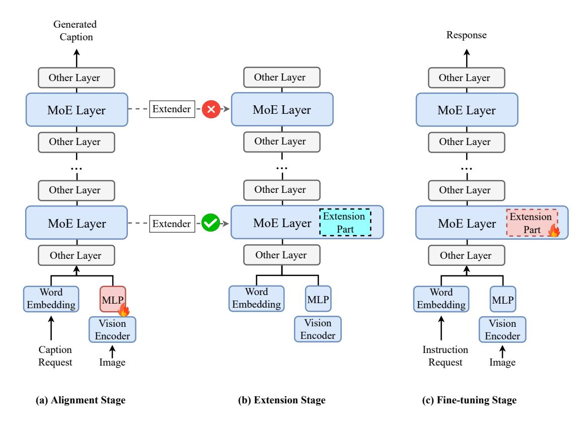
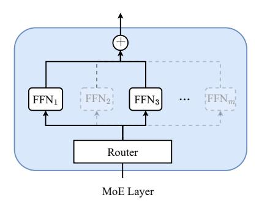
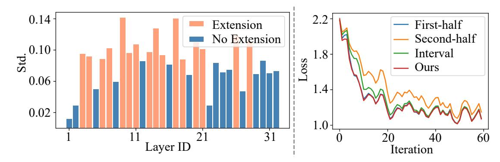

# MoExtend: Tuning New Experts for Modality and Task Extension

#### Shanshan Zhong1 , Shanghua Gao2 , Zhongzhan Huang1 , Wushao Wen1 , Marinka Zitnik2 , Pan Zhou3

1Sun Yat-sen University, 2Harvard University, 3Singapore Management University, Correspondence: [panzhou@smu.edu.sg](mailto:panzhou@smu.edu.sg)

# Abstract

Large language models (LLMs) excel in various tasks but are primarily trained on text data, limiting their application scope. Expanding LLM capabilities to include visionlanguage understanding is vital, yet training them on multimodal data from scratch is challenging and costly. Existing instruction tuning methods, e.g., LLAVA, often connects a pretrained CLIP vision encoder and LLMs via fully fine-tuning LLMs to bridge the modality gap. However, full fine-tuning is plagued by catastrophic forgetting, i.e., forgetting previous knowledge, and high training costs particularly in the era of increasing tasks and modalities. To solve this issue, we introduce MoExtend, an effective framework designed to streamline the modality adaptation and extension of Mixtureof-Experts (MoE) models. MoExtend seamlessly integrates new experts into pre-trained MoE models, endowing them with novel knowledge without the need to tune pretrained models such as MoE and vision encoders. This approach enables rapid adaptation and extension to new modal data or tasks, effectively addressing the challenge of accommodating new modalities within LLMs. Furthermore, MoExtend avoids tuning pretrained models, thus mitigating the risk of catastrophic forgetting. Experimental results demonstrate the efficacy and efficiency of MoExtend in enhancing the multimodal capabilities of LLMs, contributing to advancements in multimodal AI research. https://github.com/zhongshsh/MoExtend.

# 1 Introduction

General-purpose large language models (LLMs) have demonstrated their effectiveness across a broad spectrum of application scenarios, such as conversational chatbot [\(Ouyang et al.,](#page-10-0) [2022\)](#page-10-0), document analysis [\(Radford et al.,](#page-10-1) [2019\)](#page-10-1), and coding [\(Chen et al.,](#page-9-0) [2021\)](#page-9-0). While the most powerful LLMs, such as ChatGPT [\(Radford et al.,](#page-10-1) [2019\)](#page-10-1), Llama [\(Touvron et al.,](#page-10-2) [2023\)](#page-10-2), and Mixtral [\(Jiang](#page-9-1)

[et al.,](#page-9-1) [2024\)](#page-9-1), are predominantly trained on textual data, there is a growing interest in extending their capabilities to support a wider array of applications beyond natural language processing, especially with a significant focus on vision-language understanding [\(Liu et al.,](#page-10-3) [2023a;](#page-10-3) [Zhu et al.,](#page-11-0) [2023;](#page-11-0) [Liu et al.,](#page-10-4) [2023b;](#page-10-4) [Team et al.,](#page-10-5) [2023\)](#page-10-5). While training large models from scratch on multimodal data suffers from insufficient data [\(Zhu et al.,](#page-11-0) [2023\)](#page-11-0) and significant training costs [\(Team et al.,](#page-10-5) [2023\)](#page-10-5), most efforts have been focused on enhancing the multimodal capabilities of pretrained LLMs [\(Zhu](#page-11-0) [et al.,](#page-11-0) [2023;](#page-11-0) [Liu et al.,](#page-10-4) [2023b,](#page-10-4)[a\)](#page-10-3). To accomplish this, LLMs handle new modal data by processing representations extracted by encoders specific to each modality. For instance, the vision transformer pre-trained with CLIP [\(Radford et al.,](#page-10-6) [2021\)](#page-10-6) is utilized to encode visual images. Then, the model is trained using text-image Q&A pairs to carry out tasks based on these multimodal instructions.

The parameter-efficient approach to bridging the gap between modality-specific encoders and large language models (LLMs) involves the use of a few linear projection layers [\(Zhu et al.,](#page-11-0) [2023\)](#page-11-0) and Low-Rank Adaptation (LoRA) [\(Zhang et al.,](#page-11-1) [2023a;](#page-11-1) [Hu et al.,](#page-9-2) [2021\)](#page-9-2). However, this does not entirely mitigate the modality gap, limiting LLMs' ability to fully understand new modalities. Consequently, State-of-the-art multimodal methods, e.g. LLaVA [\(Liu et al.,](#page-10-4) [2023b\)](#page-10-4), have sought to further enhance the multimodal capabilities of LLMs by fully fine-tuning these models on multimodal datasets [\(Lin et al.,](#page-10-7) [2024\)](#page-10-7). Despite these efforts, fully fine-tuning encounters two significant obstacles: 1) Catastrophic Forgetting: LLMs, when fine-tuned to effectively integrate various modalities, tend to lose the knowledge they had acquired previously [\(Luo et al.,](#page-10-8) [2023\)](#page-10-8). 2) Large fine-tuning cost: With the increasing sizes of LLMs, fully finetuning on larger models is becoming increasingly impractical. As a result, smaller models, like those

with 7 billion parameters, are often preferred. However, this preference restricts the exploration and utilization of the capabilities of larger LLMs. How to efficiently extend new modality to large LLM while reduce the side effect of catastrophic forgetting is an urging problem for multimodal LLMs.

Mixture-of-Experts (MoE) architectures enable LLMs to use the gate layer to dynamically select the most relevant experts from a diverse set of specialized experts, e.g. different MLP layers in Transformer, for a given query token. MoE helps to enlarge the model size by increase the number of experts while keeping low inference cost by selecting a sub set of experts for each token. For instance, the Mixtral-8x7B model (Jiang et al., 2024) incorporates 8 MLP experts per block, totaling 46.7 billion parameters, yet it selects only 2 experts, utilizing 12.9 billion parameters per token. Nonetheless, the current MoE models predominantly concentrates on the textual modality.

We introduce an extension strategy for MoE models, named MoExtend, designed to accommodate new modalities. This strategy involves incorporating new modality-specific experts and calibration modules into trained MoE models to enhance their capability to process additional modalities. MoExtend maintains the original MoE model parameters unchanged, while only trains the newly added experts and the corresponding gate layer. By doing so, MoExtend facilitates the efficient adaptation of new modalities into large models while also addressing issues of catastrophic forgetting (Liang et al., 2024, 2022). We observe that the rapid adaptation to new modalities relies on the weight initialization of new experts and gates, and the insertion position of these new experts. Thus, we introduce a simple vet effective scheme for selecting positions and weights of new experts based on evaluating distribution shifts. Utilizing the data from the new modality, we fine-tune the existing gate layers of the MoE model. Then, we infer the new modality data to the models before and after fine-tuning and get the average gate probability distribution for all samples. By comparing the degree of gate probability distributions before and after fine-tuning, we identify the top-k layers for adding experts by examining the magnitude of these shifts. Then, based on the probability distribution after fine-tuning, we determine the expert with the highest probability and replicate the gate and expert weights onto the newly incorporated expert.

Experimental results show that MoExtend

achieves a training speed acceleration  $\sim$ 6 times faster than full fine-tuning, while also delivering superior performance. The positions selection scheme in MoExtend allows for fewer newly added experts, specifically, half the number of new experts required for the Mixtral model, which reduces training time to  $\sim$ 30 hours without compromising performance. In addition, MoExtend helps mitigate the risk of catastrophic forgetting when extending MoE LLMs to handle multimodal inputs. Our contributions can be summarized as follows:

- We introduce MoExtend, a strategy designed to augment Mixture-of-Experts LLMs with new modalities by addition of new experts.
- MoExtend offers significant advantages, including substantially reduced fine-tuning costs, no additional costs during inference, and a minimized impact from catastrophic forgetting issue.

# 2 Methodology

In this section, we introduce MoExtend as an example of extending the visual modality for MoE models, which were originally designed for text modality only. As shown in Fig. 1, MoExtend consists of three stages: alignment, extension with extender, and fine-tuning for the extension part. The purpose of the alignment stage is to initially align the MoE LLM with the newly added visual modality using a pre-trained vision encoder. The extension stage determines which MoE layers should be extended to accommodate the new modality information. The fine-tuning stage is then employed to tune the newly added parameters, achieving the final expansion of multimodal information.

## 2.1 Alignment Stage

As illustrated in Fig. 1 (a), we train the newly added MLP using image-caption pairs from the LLaVA 1.5-558k dataset. This training aligns the modal information of images through the vision encoder (i.e., CLIP encoder) with textual modalities. Specifically, the caption c from the textual modality is projected via word embedding to  $T = [t_i]_{i=1}^N \in \mathbb{R}^{N \times D}$ , where D is the hidden size of LLM. Additionally, the image I is mapped through the vision encoder to  $V = [v_i]_{i=1}^P \in \mathbb{R}^{P \times D}$ , where P is the sequence length of visual tokens. Subsequently, the information from both modalities, T and V, is concatenated into the vector  $\mathbf{x}_0 \in \mathbb{R}^{(N+P) \times D}$ . For an L-layer MoE LLM, the forward process can be

Figure 1: MoExtend consists of three stages: (a) Alignment Stage: we add a trainable MLP for pretrain vision encoder and tune the added MLP using image-caption data to achieve modal alignment; (b) Extension Stage: Determining which MoE layers need extension using an Extender; (c) Fine-tuning Stage: Fine-tuning the added extension part using a given Instruction dataset while keeping other parameters frozen. The "Other layer" represents other neural network components besides the MoE layer, including normalisation, self-attention layer, etc.

formulated as follows:

$$\mathbf{x}'_{\ell} = \text{MSA}\left(\text{LN}\left(\mathbf{x}_{\ell-1}\right)\right) + \mathbf{x}_{\ell-1}, \ell = 1 \dots L,$$
  
$$\mathbf{x}_{\ell} = \text{MoE}\left(\text{LN}\left(\mathbf{x}'_{\ell}\right)\right) + \mathbf{x}'_{\ell}, \ell = 1 \dots L,$$
  
(1)

where MSA represents the multi-head self-attention module and LN represents layer normalization. The final input to the model is  $\mathrm{LN}(\mathbf{x}_L)$ . During this stage, the structure of the MoE layer with m experts remains unchanged, as depicted in Fig. 2 (Left). The router predicts the probability of each token being assigned to each expert, and each token is computed by the top-k experts with the highest probabilities. The output of the MoE layer is a weighted sum as follows:

$$MoE(\mathbf{x}) = \sum_{j=1}^{k} s(\mathbf{x})_j \cdot FFN(\mathbf{x})_j,$$
 (2)

where  $k \leq m$ . Note that the weighted summation in Eq. (2) is related to the outputs of experts with top-k probability. The parameter k has a significant impact on MoE LLMs. However, to consider the trade-off between training efficiency and model performance, it's common to set k=2. In this

paper, we also follow this setting. The  $[\mathrm{FFN}_i]_{i=1}^m$  represents m experts, and

$$s(\mathbf{x})_j = e^{f(\mathbf{x})_j} / \sum_{h=1}^m e^{f(\mathbf{x})_h}, \qquad (3)$$

where  $f(\mathbf{x}) = \mathbf{W}\mathbf{x}$  and  $\mathbf{W} \in \mathbb{R}^{D \times m}$  are the parameters of the router.

## 2.2 Extension Stage

To address the incorporation of additional modality information via extending the MoE layer, the most straightforward approach is to add a new expert to each MoE layer. However, this approach not only increases the parameter count significantly, leading to greater computational costs during training but also poses a potential risk of overfitting due to blindly adding a large number of parameters.

Therefore, in the extension stage, inspired by the concept of neural network pruning (Li et al., 2016; Gao et al., 2020), we construct an Extender to adaptively determine whether each MoE layer needs extension. Specifically, we randomly sample 10,000 instruction data related to the vision modality from the LLaVA 1.5-mix-665k dataset (Liu et al., 2023b)

Figure 2: (Left) Original MoE layer; (Right) The extension part includes an additional expert  $FFN_{m+1}$  and a corresponding column of trainable matrix parameters in the Router. Each expert is equipped with a learnable lightweight calibration module to correct gate weights altered due to the increased number of experts.

as the validation set  $S_e$ , with the remaining data forming the sub-training set  $S_t$ .

Next, for the model  $\kappa$  obtained from the alignment stage training, we make all routers of the MoE layers trainable while freezing all other parameters. Utilizing  $S_t$ , we tune  $\kappa$  for 1,000 steps to obtain  $\kappa'$ . Furthermore, we input  $S_e$  into both  $\kappa$  and  $\kappa'$ , and count the occurrences of each expert being selected in every MoE layer, resulting in

$$R_{\kappa} = \{r_{ij}^{\kappa}\}_{m \times L}, \quad R_{\kappa'} = \{r_{ij}^{\kappa'}\}_{m \times L}. \quad (4)$$

After normalization as follows, we can estimate the probability distributions of each expert being selected in every MoE layer:

$$\bar{R}_{\kappa} = R_{\kappa} / (r_{11}^{\kappa} + r_{21}^{\kappa} + \dots + r_{m1}^{\kappa}), \bar{R}_{\kappa'} = R_{\kappa'} / (r_{11}^{\kappa'} + r_{21}^{\kappa'} + \dots + r_{m1}^{\kappa'}).$$
 (5)

It is worth noting that for  $1 \le i \le L$ ,  $\sum_{i=1}^m r_{i1}^\kappa = \sum_{i=1}^m r_{ij}^\kappa$  and  $\sum_{i=1}^m r_{i1}^{\kappa'} = \sum_{i=1}^m r_{ij}^{\kappa'}$ . Then, we can estimate the distribution differences of expert selections in each MoE layer between the two models  $\kappa$  and  $\kappa'$  by calculating  $d_j$  as follows:

$$d_j = \operatorname{Std}_{i=1}^m (\bar{r}_{ij}^{\kappa} - \bar{r}_{ij}^{\kappa'}), 1 \le j \le L, \quad (6)$$

where Std denotes standard deviation. If  $d_j$  is small, it implies that the MoE layer j exhibits minimal response variation to the current data of the image-text modality, hence, there's no necessity to add new experts to this layer. Conversely, for MoE layers with larger  $d_j$ , adding new experts can effectively address the learning of new modality information. We rank the MoE layers based on  $d_j$  and introduce a new expert FFN $_{m+1}$  to the top  $\lfloor pL \rfloor$  layers for original MoE LLM  $\kappa$ , with p set to 0.5 in this paper. In fact, the adaptive extension stage proposed in this section not only reduces computational costs during training and mitigates the

risk of overfitting but also accelerates the training of MoE LLM. For detailed analysis, please refer to Section 4.

#### 2.3 Fine-tuning Stage

In addition to introducing an additional expert in certain MoE layers for the original  $\kappa$ , as mentioned in Section 2.2, and illustrated in Fig. 2, we also need to augment the parameters of the corresponding routers for these experts, i.e.,

$$\mathbf{W}_{\text{new}} = [\mathbf{W}; \mathbf{v}_{\text{new}}] \in \mathbb{R}^{D \times (m+1)}, \quad (7)$$

where  $\mathbf{v}_{\text{new}} \in \mathbb{R}^{D \times 1}$ , Furthermore, we add some Calibration modules to all experts in the MoE layers to mitigate changes in gate weights due to the addition of modalities. These newly introduced trainable parameters constitute the extension part. In this section, we fine-tune the extension part using the LLaVA 1.5-mix-665k dataset to enhance the final performance of LLM.

Specifically, we first consider the initialization of the newly added m+1-th expert and its corresponding router parameters  $\mathbf{v}_{\text{new}}$ . In this work, for the j-th MoE layer, we consider directly copying the expert and router parameters corresponding to

$$\max(r_{1j}^{\kappa}, r_{2j}^{\kappa}, \cdots, r_{mj}^{\kappa}), \tag{8}$$

as initialization for the new parameters. This is because intuitively, the newly added expert is primarily intended to address the new modalities, and it is appropriate to initialize it with the existing expert that has the highest response to the new modalities. In Section 4, we will demonstrate that the initialization of the new parameters significantly affects the probability of an expert being selected by the MoE mechanism, thereby affecting the final performance of the MoE LLM.

Furthermore, since some MoE layers have added experts, s(x)j will change according to Eq. [\(3\)](#page-2-3). For example, for a fixed input x, the new probability s(x) ′ j satisfies

$$s(\mathbf{x})_{j}' = e^{f(\mathbf{x})_{j}} / (\sum_{h=1}^{m} e^{f(\mathbf{x})_{h}} + e^{f(\mathbf{x})_{m+1}})$$

$$\leq e^{f(\mathbf{x})_{j}} / \sum_{h=1}^{m} e^{f(\mathbf{x})_{h}} = s(\mathbf{x})_{j},$$
(9)

This causes the feature distribution of the original MoE κ regarding previously learned knowledge to change during forward propagation, resulting in some degree of forgetting of existing knowledge by the model, thereby affecting performance. To address this issue, we add a Calibration module sc(·) for each expert such that

$$MoE(\mathbf{x}) = \sum_{j=1}^{k} s(\mathbf{x})_{j} \cdot [1 + s_{c}(\mathbf{x})] \cdot FFN(\mathbf{x})_{j},$$
(10)

and sc(·) is a two-layer GELU neural network W1(GELU(W2(·))). Here, the weights of W1 are initialized to 0, and W2 uses normal initialization. This initialization ensures that the calibration term sc(x) = 0, maintaining consistency with the model's output features when sc(·) is not added, thus preventing significant interference with model output features due to the addition of sc(·), which could lead to abnormal loss and affect model training. For a fair comparison, all training hyperparameters, training methodologies, and loss functions with LLaVA 1.5-558k and LLaVA 1.5-mix-665k in all stages remain consistent with LLAVA.

# 3 Experiments

# 3.1 Experimental Setup

Model Settings. To ensure fairness in experimental comparisons, we follow the settings outlined in LLaVA 1.5. We utilize CLIP [\(Radford et al.,](#page-10-6) [2021\)](#page-10-6) as the vision encoder, two linear layers with GELU [\(Hendrycks and Gimpel,](#page-9-4) [2016\)](#page-9-4) as the vision projection, and other training hyperparameters are shown in Appendix Table [6.](#page-8-0)

Dataset. We utilize the same dataset as LLaVa 1.5 to train the model, consisting of LLaVA 1.5-558k for pretraining stage and LLaVA 1.5-mix-665k for instruction tuning stage [\(Liu et al.,](#page-10-4) [2023b\)](#page-10-4). The computational cost of MoExtend is ∼15 hours of pretraining and ∼30 hours of visual instruction tuning, while MoExtend-Full, the model trained like LLaVA, need ∼200 hours of instruction tuning.

# 3.2 Image Understanding Evaluation

Image Question Answering. As shown in Table [1,](#page-5-1) we assess MoExtend performance across four widely-used image question answering benchmarks. Compared to the state-of-the-art method LLaVA-1.5 [\(Liu et al.,](#page-10-4) [2023b\)](#page-10-4), MoExtend exhibits robust image understanding capabilities and achieves performance very close to that of LLaVA-1.5. Specifically, MoExtend, which is trained with only 3B LLM parameters, surpasses LLaVA-1.5 13B, trained with 13B LLM parameters, by 3.1%, and outperforms the recent vision-language model HyperLLaVA [\(Anonymous,](#page-9-5) [2024\)](#page-9-5) by over 4.8% on SQA. Remarkably, MoExtend achieves comprehensive superiority over IDEFICS-80B [\(Laurençon](#page-10-12) [et al.,](#page-10-12) [2024\)](#page-10-12) with only 13B activated parameters, underscoring the strong comprehension abilities of MoE-LLaVA in vision features.

Performance on Multimodal Benchmarks. To comprehensively evaluate multimodal comprehension capabilities of MoExtend, we evaluate its performance across five widely-used benchmark toolkits, as shown in Table [1.](#page-5-1) Experimental results indicate that, under the same dataset and training settings, MoExtend, fine-tuned with only 3B LLM parameters, achieves performance on par with the state-of-the-art model on most benchmark toolkits. Particularly, MoExtend has significantly superior performance on MME, surpassing the existing leading model LLaVA 1.5-13B by 178.8 points, indicating that MoExtend facilitates a efficient expansion of modalities.

Comparison with Forgetting. To mitigate catastrophic forgetting in LVLMs, MoExtend fine-tunes LLM through calibration and the addition of new experts, thereby preserving the performance of LLM's original modalities. To evaluate the superiority of our fine-tuning strategy in preserving the understanding capabilities of LLM's original modalities, we evaluate the performance of LVLMs using different fine-tuning methods on pure text metrics as shown in Table [2.](#page-5-2) Specifically, we compare the performance of LLaVA-1.5, MoExtend-Full, MoE-LLaVA, and MoExtend with original LLMs in Table A. Across all metrics, MoExtend exhibits performance similar to the original LLM. Additionally, we observe only slight decreases for LLaVA-1.5, while MoE-LLaVA and MoExtend-Full show significant declines relative to the original LLM model in pure text evaluation metrics,

Table 1: Comparison with different LVLMs on 8 benchmarks. P, Res., PT, IT respectively represent parameters, the input image resolution, the number of samples in pretraining and instruction tuning stage. Evaluation benchmarks include two types: (1) image question answering: ScienceQA-IMG (SQA) (Lu et al., 2022), TextVQA (VQAT) (Singh et al., 2019), VQAV2 (Goyal et al., 2017); (2) benchmark toolkits: POPE (Li et al., 2023b), MM-Vet (Yu et al., 2023), MMBench (MMB) (Liu et al., 2023c), MMBench-Chinese (MMBCN) (Liu et al., 2023c), MME (Fu et al., 2023). The best results and second best results are indicated by boldface and underline, respectively.

|                                      | LLM         |      |      |      | Image       | Question    | Answering         |             | Beno   | hmark T     | oolkit      |               |
|--------------------------------------|-------------|------|------|------|-------------|-------------|-------------------|-------------|--------|-------------|-------------|---------------|
| Model                                | Training #P | Res. | PT   | IT   | SQA         | $VQA^T$     | VQA V2 | POPE        | MM-Vet | MMB         | $MMB^{CN}$  | MME           |
| BLIP-2 (Li et al., 2023a)            | 13B         | 224  | 129M | -    | 61.0        | 42.5        | 41.0              | 85.3        | 22.4   | -           | -           | 1293.8        |
| InstructBLIP-7B (Dai et al., 2023)   | 7B          | 224  | 129M | 1.2M | 60.5        | 50.1        | -                 | -           | 26.2   | 36.0        | 23.7        | -             |
| InstructBLIP-13B (Dai et al., 2023)  | 13B         | 224  | 129M | 1.2M | 63.1        | 50.7        | -                 | 78.9        | 25.6   | -           | -           | 1212.8        |
| Shikra (Chen et al., 2023)           | 13B         | 224  | 600K | 5.5M | -           | -           | 77.4              | -           | -      | 58.8        | -           | -             |
| IDEFICS-9B (Laurençon et al., 2024)  | 7B          | 224  | 353M | 1M   | -           | 25.9        | 50.9              | -           | -      | 48.2        | 25.2        | -             |
| IDEFICS-80B (Laurençon et al., 2024) | 65B         | 224  | 353M | 1M   | -           | 30.9        | 60.0              | -           | -      | 54.5        | 38.1        | -             |
| Qwen-VL-7B (Bai et al., 2023)        | 7B          | 448  | 1.4B | 50M  | 67.1        | 63.8        | 78.8              | -           | -      | 38.2        | 7.4         | -             |
| Qwen-VL-7B-Chat (Bai et al., 2023)   | 7B          | 448  | 1.4B | 50M  | 68.2        | 61.5        | 78.2              | -           | -      | 60.6        | 56.7        | 1487.5        |
| MoE-LLaVA-2.7B×4 (Lin et al., 2024)  | 5B          | 336  | 558K | 1.6M | 68.5        | 51.4        | 77.6              | 85.0        | 34.3   | 65.2        | -           | 1335.1        |
| MoE-LLaVA-2.7B×4 (Lin et al., 2024)  | 5B          | 384  | 558K | 1.6M | 70.3        | 57.0        | 79.9              | 85.7        | 35.9   | 68.0        | -           | 1431.3        |
| SPHINX-MoE (Gao et al., 2024)        | 8×7B        | 448  | 15.  | 3M   | 74.5        | 68.0        | 81.1              | 89.6        | 40.9   | 71.3        | -           | 1485.3        |
| LLaVA-1.5 (Liu et al., 2023a)        | 7B          | 336  | 558K | 665K | 66.8        | 58.2        | 78.5              | 85.9        | 30.5   | 64.3        | 58.3        | 1510.7        |
| HyperLLaVA (Anonymous, 2024)         | 7B          | 336  | 558K | 665K | 70.4        | 58.5        | <u>79.1</u>       | 86.3        | 31.0   | 65.9        | 60.6        | 1481.2        |
| LLaVA-1.5 (Liu et al., 2023a)        | 13B         | 336  | 558K | 665K | <u>71.6</u> | 61.3        | 80.0              | <u>85.9</u> | 35.4   | <u>67.7</u> | 63.6        | <u>1531.3</u> |
| MoExtend                             | 3B          | 336  | 558K | 665K | 73.8        | <u>58.7</u> | 76.6              | 85.5        | 37.1   | 67.8        | <u>61.5</u> | 1710.1        |

Table 2: Comparison on text benchmarks. We measure textual performance on a popular variety of tasks categorized as follow: (1) Commonsense Reasoning: ARC-Easy (Arc-e) (Clark et al., 2018), Hellaswag (HellaS) (Zellers et al., 2019), PIQA (Bisk et al., 2020), Winogrande (WinoG) (Sakaguchi et al., 2021): (2) Code: MBPP (Austin et al., 2021); (3) Popular aggregated results: MMLU (Hendrycks et al., 2020); (4) Math: GSM8K (Cobbe et al., 2021). MoExtend-Full is the model trained like LLaVA, which trains vision projection and LLM on instruction tuning stage. Avg. drop ↓ refers to the mean difference in performance metrics between the current model and its corresponding LLM. A smaller Avg. drop ↓ indicates less forgetting by the model and thus better performance. All evaluations are based on the open source toolkit OpenCompass.

| Model                                                          | Arc-e                   | HellaS                  | PIQA                    | WinoG                   | MBPP                    | MMLU                    | GSM8K                   | Avg. drop↓   |
|----------------------------------------------------------------|-------------------------|-------------------------|-------------------------|-------------------------|-------------------------|-------------------------|-------------------------|--------------|
| Vicuna-7B (Chiang et al., 2023)                                | 77.60                   | 72.32                   | 76.77                   | 62.04                   | 12.20                   | 50.99                   | 19.48                   | -0.81        |
| LLaVA-1.5-7B (Liu et al., 2023b)                               | 80.07                   | 72.02                   | 76.22                   | 62.51                   | 15.00                   | 51.61                   | 19.64                   |              |
| Vicuna-13B (Chiang et al., 2023)                               | 85.36                   | 75.67                   | 78.45                   | 65.75                   | 25.20                   | 56.67                   | 29.66                   | -0.27        |
| LLaVA-1.5-13B (Liu et al., 2023b)                              | 87.65                   | 75.63                   | 78.67                   | 64.09                   | 26.60                   | 56.85                   | 29.19                   |              |
| Phi2-2.7B (Javaheripi et al., 2023)                            | 85.89                   | 72.36                   | 78.84                   | 71.51                   | 46.00                   | 58.49                   | 60.20                   | 7.86         |
| MoE-LLaVA-2.7B×4 (Lin et al., 2024)                            | 87.30                   | 70.83                   | 79.38                   | 69.61                   | 10.00                   | 47.92                   | 53.22                   |              |
| Mixtral 8x7B (Jiang et al., 2024) MoExtend-Full MoExtend | 92.24 88.36 93.12 | 81.84 77.40 80.75 | 81.61 80.63 81.50 | 70.48 64.56 69.69 | 36.40 34.80 34.60 | 71.17 69.02 71.12 | 71.95 67.83 72.03 | 3.30 0.41 |

suggesting that full-parameter fine-tuning may lead to catastrophic forgetting for MoE-type LLMs, whereas non-MoE-type LLMs are less affected.

# 4 Ablation Study and Analysis

Effect of Model Architectures. We investigate the impact of different architectures on the performance of MoExtend. While the intuitive approach of adding new experts to all layers might seem optimal, our experiments, detailed in Table 3, reveal comparable performance between models with ex-

Table 3: Comparison of MoExtend with different architectures at 1k iterations. #Layer represents the number of layers added expert. First-half indicates that new experts are only added to the first half layers of model, Second-half represents that only the second half layers of model have new experts, Interval means that we add new experts to every alternate layer of the model, First-quarter indicates only first quarter layers are added new expert, and First-interval means that we add new experts to first half layers alternately.

| Architecture   | #Layer | POPE | MM-Vet | MMB  | $VQA^T$ | Avg. |
|----------------|--------|------|--------|------|---------|------|
| All layer      | 32     | 84.0 | 34.7   | 63.7 | 56.1    | 59.6 |
| First-half     | 16     | 84.5 | 35.3   | 63.1 | 55.6    | 59.6 |
| Second-half    | 16     | 81.3 | 36.1   | 59.5 | 52.4    | 57.3 |
| Interval       | 16     | 83.5 | 36.1   | 63.7 | 55.6    | 59.7 |
| First-quarter  | 8      | 85.4 | 35.4   | 61.3 | 54.6    | 59.2 |
| First-interval | 8      | 83.6 | 34.8   | 62.7 | 54.3    | 58.9 |
| Ours           | 16     | 84.3 | 36.4   | 63.1 | 55.7    | 59.9 |

perts added to every layer (All layer), the first half (First-half), or every alternate layer (Interval). Additionally, results from models with experts added only to the first quarter (First-quarter) or every alternate layer starting from the first layer (First-interval) indicate performance degradation when too few layers receive additional experts. This finding informs our extension stage design, where experts are appropriately added to half of the layers.

As depicted in Fig. 3 (Left), our extension stage identifies layers requiring new experts. MoExtend based on our proposed strategy, as demonstrated in Table 3, performs on par with the current optimal insertion strategy (First-half, Interval). Furthermore, Fig. 3 (Right) shows that our extension strategy converges at a rate comparable to the op-

Figure 3: **Left**: std.  $d_i$  of per layer caculated by Eq. (6). Layers in orange color (layer id: 3, 4, 6, 7, 9, 10, 11, 13, 14, 15, 17, 18, 20, 21, 26, 28) are added new experts while layers in blue color are not with additional experts. **Right**: loss of MoExtend with by placing new expert layers in different positions. Employing our position selection scheme, we achieve faster convergence speeds compared to other manually designed schemes.

Table 4: Comparison of MoExtend with different initial methods at 1k iterations. Copy(i) means initializing new experts by copying the weight of original i-th expert.

| Method |         | POPE | MM-Vet | SQA  | VQA T |
|--------|---------|------|--------|------|------------------|
|        | Copy(2) | 83.6 | 34.5   | 73.3 | 51.3             |
|        | Copy(4) | 83.7 | 35.1   | 71.7 | 54.6             |
| Expert | Copy(6) | 83.5 | 34.7   | 73.2 | 54.4             |
|        | Copy(8) | 83.7 | 34.7   | 74.1 | 54.8             |
|        | Zero    | 83.6 | 34.8   | 74.4 | 54.8             |
| Router | Mean    | 83.2 | 34.4   | 73.1 | 54.3             |
| Ours   |         | 84.3 | 36.4   | 73.4 | 55.7             |

timal insertion strategy during training, validating its effectiveness on accurately determining the appropriate layers for adding new experts without extensive experimentation.

**Effect of Initialization.** As depicted in Table 4, we analyze the impact of expert and router initialization on the performance of MoExtend. If the parameters of the new experts and router dimensions are directly copied from fixed positions i of experts and corresponding dimensions of routers at each layer (Copy(i)), the performance of copying experts from different positions is relatively close and lower than that of MoExtend.

Additionally, we explore the performance when the router parameters are not directly copied from the corresponding router parameters of the *i*-th expert, but initialize directly with zeros or with the mean of the initial parameters of the eight experts (Mean). Experimental results indicate that initializing the router with zeros generally results in poorer performance compared to direct copying (Ours). Mean initialization implies that the new experts are a few selected in the initial state, and later in the instruction tuning stage the new experts are selected through gradient updates. In fact, this performance difference is mainly due to the fact that such an ini-

Table 5: Comparison of MoExtend with different calibration modules at 1000 iterations. The type of modules corresponds to Fig. 5. The reason why Type2 (b) has no evaluation result is gradient explosion. "Zero" and "One" respectively denote filling all learnable parameters of the Calibration module with 0 or 1. "Zero+Normal" refers to initializing the two linear layers of the Calibration module in Type2 with 0 and standard normal values, respectively.

| Modules   | Initialization  | POPE | MME    | SQA  | $VQA^T$ | Avg.  |
|-----------|-----------------|------|--------|------|---------|-------|
| Type1 (a) | Zero            | 84.8 | 1495.2 | 72.4 | 53.2    | 426.4 |
| Type1 (b) | One             | 83.5 | 1567.1 | 72.5 | 56.2    | 444.8 |
| Type2 (a) | Zero + Normal   | 84.3 | 1571.0 | 73.4 | 55.7    | 446.1 |
| Type2 (b) | Normal + Normal | N/A  | N/A    | N/A  | N/A     | N/A   |

tialisation will lead to the newly added experts not being easily selected during the training process, so that the newly added experts are not fully trained or not used for new modality. Specifically, take the "Mean" initialisation as an example. Since the MoE layer generally selects the top-2 probability of experts for feature integration, the initialisation of "Mean" makes it difficult for the new experts to be selected with a large probability. Since the new router parameters and experts are rarely updated, it is difficult to improve this situation during the training process.

However, experimental results show that this initialization method leads to inferior performance. Furthermore, to investigate the impact of initialization methods on performance, we calculate the ratio of expert selection for different initializations as shown in Fig. 4, and find that models initialized with Zero and Mean are both unbalanced in expert selection, while MoExtend is more balanced. This finding indicates that the balance of expert selection is closely related to model performance.

The Design of Calibration Modules. As shown

Figure 4: Distribution of expert selection per layer with different router initial methods. We randomly select 10,000 multimodal samples from LLaVA 1.5-mix-665k as inputs and count the number of times each expert at each layer is selected. To streamline the visualization of results, we calculate and visualize the proportion of five experts.

Figure 5: Structure of different types of calibration modules. The green modules represent calibration modules, and m is the number of experts. The output of the calibration module acts on the softmax output of the router to correct the probability distribution effect caused by changes in the number of experts, ensuring proper gate weight adjustments for each expert.

in Fig. 5, we design two concise calibration modules (Type1, Type2) to investigate the impact of these modules on MoExtend performance under two integration modes (Liang et al., 2020; Huang et al., 2020; Zhong et al., 2023d,c): addition (a) and multiplication (b). Type1 consists of a simple learnable parameter 1×m, while Type2 consists of two simple linear layers connected by the GELU activation function. To minimize the disruption of router performance by calibration modules in the initial state, we mitigate the initial impact of calibration modules on routers through special initialization as shown in Table 5. In the additive mode of Type1, we use Zero initialization for calibration modules, while in the multiplicative mode, we use One initialization.

In the additive mode of Type2, we initialize the first linear layer normally and zero-initialize the second linear layer. In the multiplicative mode, it is hard to reduce the impact of calibration modules through appropriate initialization, so we opt for simple normal initialization for both linear layers. Type2 (b) does not exhibit any evaluation result in Table 5 because of gradient explosion, and the

experimental results indicate that Type2 (a) calibration module structure performs better than others.

## 5 Conclusion

In this work, we introduce MoExtend, an effective framework tailored to streamline the modality adaptation and extension of Mixture-of-Experts (MoE) models. MoExtend introduces new experts into MoE models by putting them at the parallel positions of the experts in MoE. Then MoExtend designs a method to select previous experts in MoE for initilizing the new experts. Finally, it only tunes the new experts on the corresponding modal data and tasks. This endows MoE with novel knowledge without necessitating the tuning of pretrained models such as MoE and vision encoders, thus avoiding the catastrophic forgetting issue. Furthermore, MoExtend facilitates rapid adaptation and extension to new modal data or tasks, thereby effectively addressing the challenge of accommodating new modalities within LLMs. Empirical results show the efficacy and efficiency of MoExtend in augmenting the multimodal capabilities of LLMs.

#### 6 Limitation

In this work, due to limited GPU resource, we take the visual task as one example to validate the effectiveness our proposed MoExtend. So one limitation of MoExtend is that its performance is not investigated on the other modal data, such as speech, and other tasks, e.g., continue learning and streaming tasks. However, as aforementioned, MoExtend is a general approach to extend the MoE model to other modal data or tasks, because our design principle is to endows MoE with novel knowledge via tuning the new integrated experts, and does not involve any specific tasks or modality. Accordingly, we believe that by replacing the vision encoder in MoExtend with other modal encoder and inserting new experts like MoExtend, one can easily extend MoExtend to other modal data and tasks, which is also left as our future work to thoroughly test.

#### 7 Related Work

## 7.1 Mixture of Experts

Mixture of Experts (MoE) (Masoudnia and Ebrahimpour, 2014; Riquelme et al., 2021; Zhou et al., 2022; Lin et al., 2024; Jiang et al., 2024) is a technique that leverages multiple sub-networks, also referred to as experts, to integrate features generated by different experts through adaptive strategies, thereby enhancing the overall performance of neural networks. The MoE layer, when processing each token, employs a router module to assign tokens to different experts, thereby reducing interference between different types of samples and keep low inference cost. In specific computational frameworks, MoE can achieve performance comparable to LLMs with a large amount of computational cost (Masoudnia and Ebrahimpour, 2014). Consequently, with the rapid advancement and application of LLMs, MoE is emerging as a promising and noteworthy paradigm for further enhancing LLM performance (Masoudnia and Ebrahimpour, 2014; Team et al., 2023).

## 7.2 Multimodal Model

Multimodal Learning involves leveraging various types of data, such as text, images, speech, and video, to train machine learning models for a more comprehensive understanding and inference capability (Bayoudh et al., 2022; Xu et al., 2023; Zhong et al., 2023b,a). By integrating and jointly modeling different modalities of data, multimodal learning enhances machines' ability to comprehend and

express rich real-world information, thereby improving performance in tasks like image description, sentiment analysis, speech recognition, and video understanding.

Recently, with the advancement of LLM technologies, multimodal learning methods have been rapidly integrated into LLM to expand its understanding and analysis of different modalities, especially visual modality (Liu et al., 2023b; Bai et al., 2023). Recent efforts have focused on enhancing performance through methods such as adjusting datasets (Liu et al., 2023b), optimizing training strategies (Zhang et al., 2023b; Zhong et al., 2022), improving image resolution (Bai et al., 2023), enhancing image encoders (Fan et al., 2024; Gao et al., 2024), aligning inputs (Radford et al., 2021), and projecting layers (Wu et al., 2023; Liu et al., 2023b). These approaches, by fine-tuning datasets and model scales through expanded visual instructions, have endowed LLM with robust visual comprehension capabilities. However, most current methods for expanding modalities generally involve fine-tuning a significant portion of or all parameters on multimodal data, leading to substantial computational costs and risking performance degradation due to forgetting. Facing this dilemma, in this paper, we consider leveraging the strong base performance of MoE LLM to explore cost-effective methods for expanding LLM modalities by introducing new experts.

# 8 Hyperparameters

Table 6: Training hyperparameters of MoExtend.

| Hyperparameter       | Pretrain            | Fine-tune           |  |  |
|----------------------|---------------------|---------------------|--|--|
| batch size           | 256                 | 128                 |  |  |
| learning rate        | 1E-03               | 2E-05               |  |  |
| schedule             | cosine decay        | cosine decay        |  |  |
| warmup ratio         | 0.03                | 0.03                |  |  |
| weight decay         | 0                   | 0                   |  |  |
| optimizer            | AdamW               | AdamW               |  |  |
| epoch                | 1                   | 1                   |  |  |
| aux loss coefficient | 0.001               | 0.001               |  |  |
| precision            | BF16                | BF16                |  |  |
| GPU                  | $8 \times A800-80G$ | $8 \times A800-80G$ |  |  |
| text max length      | 1024                | 2048                |  |  |
| deepspeed stage      | 2                   | 3                   |  |  |

## 9 Acknowledgments

This work was supported by National Natural Science Foundation of China (No.61876045, 623B2099, U1711264). Pan Zhou acknowledges support from the Singapore Ministry of Education (MOE) Academic Research Fund (AcRF) Tier 1 grant.

# References

- Anonymous. 2024. Hyperllava: Dynamic visual and language expert tuning for multimodal large language models. *OpenReview preprint openreview:jXobZrl2zBW*.
- Jacob Austin, Augustus Odena, Maxwell Nye, Maarten Bosma, Henryk Michalewski, David Dohan, Ellen Jiang, Carrie Cai, Michael Terry, Quoc Le, et al. 2021. Program synthesis with large language models. *arXiv preprint arXiv:2108.07732*.
- Jinze Bai, Shuai Bai, Shusheng Yang, Shijie Wang, Sinan Tan, Peng Wang, Junyang Lin, Chang Zhou, and Jingren Zhou. 2023. Qwen-vl: A versatile visionlanguage model for understanding, localization, text reading, and beyond.
- Khaled Bayoudh, Raja Knani, Fayçal Hamdaoui, and Abdellatif Mtibaa. 2022. A survey on deep multimodal learning for computer vision: advances, trends, applications, and datasets. *The Visual Computer*, 38(8):2939–2970.
- Yonatan Bisk, Rowan Zellers, Jianfeng Gao, Yejin Choi, et al. 2020. Piqa: Reasoning about physical commonsense in natural language. In *Proceedings of the AAAI conference on artificial intelligence*, volume 34, pages 7432–7439.
- Keqin Chen, Zhao Zhang, Weili Zeng, Richong Zhang, Feng Zhu, and Rui Zhao. 2023. Shikra: Unleashing multimodal llm's referential dialogue magic. *arXiv preprint arXiv:2306.15195*.
- Mark Chen, Jerry Tworek, Heewoo Jun, Qiming Yuan, Henrique Ponde de Oliveira Pinto, Jared Kaplan, Harri Edwards, Yuri Burda, Nicholas Joseph, Greg Brockman, et al. 2021. Evaluating large language models trained on code. *arXiv preprint arXiv:2107.03374*.
- Wei-Lin Chiang, Zhuohan Li, Zi Lin, Ying Sheng, Zhanghao Wu, Hao Zhang, Lianmin Zheng, Siyuan Zhuang, Yonghao Zhuang, Joseph E. Gonzalez, Ion Stoica, and Eric P. Xing. 2023. [Vicuna: An open](https://lmsys.org/blog/2023-03-30-vicuna/)[source chatbot impressing gpt-4 with 90%\\* chatgpt](https://lmsys.org/blog/2023-03-30-vicuna/) [quality.](https://lmsys.org/blog/2023-03-30-vicuna/)
- Peter Clark, Isaac Cowhey, Oren Etzioni, Tushar Khot, Ashish Sabharwal, Carissa Schoenick, and Oyvind Tafjord. 2018. Think you have solved question answering? try arc, the ai2 reasoning challenge. *arXiv preprint arXiv:1803.05457*.
- Karl Cobbe, Vineet Kosaraju, Mohammad Bavarian, Mark Chen, Heewoo Jun, Lukasz Kaiser, Matthias Plappert, Jerry Tworek, Jacob Hilton, Reiichiro Nakano, et al. 2021. Training verifiers to solve math word problems. *arXiv preprint arXiv:2110.14168*.
- Wenliang Dai, Junnan Li, Dongxu Li, Anthony Meng Huat Tiong, Junqi Zhao, Weisheng Wang, Boyang Li, Pascale Fung, and Steven Hoi. 2023. Instructblip: Towards general-purpose visionlanguage

- models with instruction tuning. *arXiv preprint arXiv:2305.06500*.
- Xiaoran Fan, Tao Ji, Changhao Jiang, Shuo Li, Senjie Jin, Sirui Song, Junke Wang, Boyang Hong, Lu Chen, Guodong Zheng, et al. 2024. Mousi: Polyvisual-expert vision-language models. *arXiv preprint arXiv:2401.17221*.
- Chaoyou Fu, Peixian Chen, Yunhang Shen, Yulei Qin, Mengdan Zhang, Xu Lin, Jinrui Yang, Xiawu Zheng, Ke Li, Xing Sun, et al. 2023. Mme: A comprehensive evaluation benchmark for multimodal large language models. *arXiv preprint arXiv:2306.13394*.
- Peng Gao, Renrui Zhang, Chris Liu, Longtian Qiu, Siyuan Huang, Weifeng Lin, Shitian Zhao, Shijie Geng, Ziyi Lin, Peng Jin, et al. 2024. Sphinxx: Scaling data and parameters for a family of multi-modal large language models. *arXiv preprint arXiv:2402.05935*.
- Shanghua Gao, Yong-Qiang Tan, Ming-Ming Cheng, Chengze Lu, Yunpeng Chen, and Shuicheng Yan. 2020. Highly efficient salient object detection with 100k parameters. In *ECCV*.
- Yash Goyal, Tejas Khot, Douglas Summers-Stay, Dhruv Batra, and Devi Parikh. 2017. Making the v in vqa matter: Elevating the role of image understanding in visual question answering. In *Proceedings of the IEEE conference on computer vision and pattern recognition*, pages 6904–6913.
- Dan Hendrycks, Collin Burns, Steven Basart, Andy Zou, Mantas Mazeika, Dawn Song, and Jacob Steinhardt. 2020. Measuring massive multitask language understanding. *arXiv preprint arXiv:2009.03300*.
- Dan Hendrycks and Kevin Gimpel. 2016. Gaussian error linear units (gelus). *arXiv preprint arXiv:1606.08415*.
- Edward J Hu, Yelong Shen, Phillip Wallis, Zeyuan Allen-Zhu, Yuanzhi Li, Shean Wang, Lu Wang, and Weizhu Chen. 2021. Lora: Low-rank adaptation of large language models. *arXiv preprint arXiv:2106.09685*.
- Zhongzhan Huang, Senwei Liang, Mingfu Liang, and Haizhao Yang. 2020. Dianet: Dense-and-implicit attention network. In *Proceedings of the AAAI Conference on Artificial Intelligence*, volume 34, pages 4206–4214.
- Mojan Javaheripi, Sébastien Bubeck, Marah Abdin, Jyoti Aneja, Sebastien Bubeck, Caio César Teodoro Mendes, Weizhu Chen, Allie Del Giorno, Ronen Eldan, Sivakanth Gopi, et al. 2023. Phi-2: The surprising power of small language models. *Microsoft Research Blog*.
- Albert Q Jiang, Alexandre Sablayrolles, Antoine Roux, Arthur Mensch, Blanche Savary, Chris Bamford, Devendra Singh Chaplot, Diego de las Casas, Emma Bou Hanna, Florian Bressand, et al. 2024. Mixtral of experts. *arXiv preprint arXiv:2401.04088*.

- Hugo Laurençon, Lucile Saulnier, Léo Tronchon, Stas Bekman, Amanpreet Singh, Anton Lozhkov, Thomas Wang, Siddharth Karamcheti, Alexander Rush, Douwe Kiela, et al. 2024. Obelics: An open web-scale filtered dataset of interleaved image-text documents. *Advances in Neural Information Processing Systems*, 36.
- Hao Li, Asim Kadav, Igor Durdanovic, Hanan Samet, and Hans Peter Graf. 2016. Pruning filters for efficient convnets. *arXiv preprint arXiv:1608.08710*.
- Junnan Li, Dongxu Li, Silvio Savarese, and Steven Hoi. 2023a. Blip-2: Bootstrapping language-image pretraining with frozen image encoders and large language models. *arXiv preprint arXiv:2301.12597*.
- Yifan Li, Yifan Du, Kun Zhou, Jinpeng Wang, Wayne Xin Zhao, and Ji-Rong Wen. 2023b. Evaluating object hallucination in large vision-language models. *arXiv preprint arXiv:2305.10355*.
- Mingfu Liang, Jong-Chyi Su, Samuel Schulter, Sparsh Garg, Shiyu Zhao, Ying Wu, and Manmohan Chandraker. 2024. Aide: An automatic data engine for object detection in autonomous driving. *arXiv preprint arXiv:2403.17373*.
- Mingfu Liang, Jiahuan Zhou, Wei Wei, and Ying Wu. 2022. Balancing between forgetting and acquisition in incremental subpopulation learning. In *European Conference on Computer Vision*, pages 364– 380. Springer.
- Senwei Liang, Zhongzhan Huang, Mingfu Liang, and Haizhao Yang. 2020. Instance enhancement batch normalization: An adaptive regulator of batch noise. In *Proceedings of the AAAI conference on artificial intelligence*, volume 34, pages 4819–4827.
- Bin Lin, Zhenyu Tang, Yang Ye, Jiaxi Cui, Bin Zhu, Peng Jin, Junwu Zhang, Munan Ning, and Li Yuan. 2024. Moe-llava: Mixture of experts for large visionlanguage models. *arXiv preprint arXiv:2401.15947*.
- Haotian Liu, Chunyuan Li, Yuheng Li, and Yong Jae Lee. 2023a. Improved baselines with visual instruction tuning. *arXiv preprint arXiv:2310.03744*.
- Haotian Liu, Chunyuan Li, Qingyang Wu, and Yong Jae Lee. 2023b. Visual instruction tuning. In *NeurIPS*.
- Yuan Liu, Haodong Duan, Yuanhan Zhang, Bo Li, Songyang Zhang, Wangbo Zhao, Yike Yuan, Jiaqi Wang, Conghui He, Ziwei Liu, et al. 2023c. Mmbench: Is your multi-modal model an all-around player? *arXiv preprint arXiv:2307.06281*.
- Pan Lu, Swaroop Mishra, Tanglin Xia, Liang Qiu, Kai-Wei Chang, Song-Chun Zhu, Oyvind Tafjord, Peter Clark, and Ashwin Kalyan. 2022. Learn to explain: Multimodal reasoning via thought chains for science question answering. *Advances in Neural Information Processing Systems*, 35:2507–2521.

- Yun Luo, Zhen Yang, Fandong Meng, Yafu Li, Jie Zhou, and Yue Zhang. 2023. An empirical study of catastrophic forgetting in large language models during continual fine-tuning. *arXiv preprint arXiv:2308.08747*.
- Saeed Masoudnia and Reza Ebrahimpour. 2014. Mixture of experts: a literature survey. *Artificial Intelligence Review*, 42:275–293.
- Long Ouyang, Jeffrey Wu, Xu Jiang, Diogo Almeida, Carroll Wainwright, Pamela Mishkin, Chong Zhang, Sandhini Agarwal, Katarina Slama, Alex Ray, et al. 2022. Training language models to follow instructions with human feedback. *Advances in Neural Information Processing Systems*, 35:27730–27744.
- Alec Radford, Jong Wook Kim, Chris Hallacy, Aditya Ramesh, Gabriel Goh, Sandhini Agarwal, Girish Sastry, Amanda Askell, Pamela Mishkin, Jack Clark, et al. 2021. Learning transferable visual models from natural language supervision. In *International conference on machine learning*, pages 8748–8763. PMLR.
- Alec Radford, Jeffrey Wu, Rewon Child, David Luan, Dario Amodei, Ilya Sutskever, et al. 2019. Language models are unsupervised multitask learners. *OpenAI blog*, 1(8):9.
- Carlos Riquelme, Joan Puigcerver, Basil Mustafa, Maxim Neumann, Rodolphe Jenatton, André Susano Pinto, Daniel Keysers, and Neil Houlsby. 2021. Scaling vision with sparse mixture of experts. *Advances in Neural Information Processing Systems*, 34:8583–8595.
- Keisuke Sakaguchi, Ronan Le Bras, Chandra Bhagavatula, and Yejin Choi. 2021. Winogrande: An adversarial winograd schema challenge at scale. *Communications of the ACM*, 64(9):99–106.
- Amanpreet Singh, Vivek Natarajan, Meet Shah, Yu Jiang, Xinlei Chen, Dhruv Batra, Devi Parikh, and Marcus Rohrbach. 2019. Towards vqa models that can read. In *Proceedings of the IEEE/CVF conference on computer vision and pattern recognition*, pages 8317–8326.
- Gemini Team, Rohan Anil, Sebastian Borgeaud, Yonghui Wu, Jean-Baptiste Alayrac, Jiahui Yu, Radu Soricut, Johan Schalkwyk, Andrew M Dai, Anja Hauth, et al. 2023. Gemini: a family of highly capable multimodal models. *arXiv preprint arXiv:2312.11805*.
- Hugo Touvron, Louis Martin, Kevin Stone, Peter Albert, Amjad Almahairi, Yasmine Babaei, Nikolay Bashlykov, Soumya Batra, Prajjwal Bhargava, Shruti Bhosale, et al. 2023. Llama 2: Open foundation and fine-tuned chat models. *arXiv preprint arXiv:2307.09288*.
- Shengqiong Wu, Hao Fei, Leigang Qu, Wei Ji, and Tat-Seng Chua. 2023. Next-gpt: Any-to-any multimodal llm. *arXiv preprint arXiv:2309.05519*.

- Peng Xu, Xiatian Zhu, and David A Clifton. 2023. Multimodal learning with transformers: A survey. *IEEE Transactions on Pattern Analysis and Machine Intelligence*.
- Weihao Yu, Zhengyuan Yang, Linjie Li, Jianfeng Wang, Kevin Lin, Zicheng Liu, Xinchao Wang, and Lijuan Wang. 2023. Mm-vet: Evaluating large multimodal models for integrated capabilities. *arXiv preprint arXiv:2308.02490*.
- Rowan Zellers, Ari Holtzman, Yonatan Bisk, Ali Farhadi, and Yejin Choi. 2019. Hellaswag: Can a machine really finish your sentence? *arXiv preprint arXiv:1905.07830*.
- Renrui Zhang, Jiaming Han, Chris Liu, Peng Gao, Aojun Zhou, Xiangfei Hu, Shilin Yan, Pan Lu, Hongsheng Li, and Yu Qiao. 2023a. Llama-adapter: Efficient finetuning of language models with zero-init attention. *arXiv preprint arXiv:2303.16199*.
- Renrui Zhang, Jiaming Han, Chris Liu, Aojun Zhou, Pan Lu, Hongsheng Li, Peng Gao, and Yu Qiao. 2023b. Llama-adapter: Efficient fine-tuning of large language models with zero-initialized attention. In *The Twelfth International Conference on Learning Representations*.
- Shanshan Zhong, Zhongzhan Huang, Shanghua Gao, Wushao Wen, Liang Lin, Marinka Zitnik, and Pan Zhou. 2023a. Let's think outside the box: Exploring leap-of-thought in large language models with creative humor generation. *arXiv preprint arXiv:2312.02439*.
- Shanshan Zhong, Zhongzhan Huang, Weushao Wen, Jinghui Qin, and Liang Lin. 2023b. Sur-adapter: Enhancing text-to-image pre-trained diffusion models with large language models. In *Proceedings of the 31st ACM International Conference on Multimedia*, pages 567–578.
- Shanshan Zhong, Zhongzhan Huang, Wushao Wen, Zhijing Yang, and Jinghui Qin. 2023c. Esa: Excitationswitchable attention for convolutional neural networks. *Neurocomputing*, 557:126706.
- Shanshan Zhong, Jinghui Qin, Zhongzhan Huang, and Daifeng Li. 2022. Cem: Machine-human chatting handoff via causal-enhance module. In *Proceedings of the 2022 Conference on Empirical Methods in Natural Language Processing*, pages 3242–3253.
- Shanshan Zhong, Wushao Wen, Jinghui Qin, Qiangpu Chen, and Zhongzhan Huang. 2023d. Lsas: Lightweight sub-attention strategy for alleviating attention bias problem. In *2023 IEEE International Conference on Multimedia and Expo (ICME)*, pages 2051–2056. IEEE.
- Yanqi Zhou, Tao Lei, Hanxiao Liu, Nan Du, Yanping Huang, Vincent Zhao, Andrew M Dai, Quoc V Le, James Laudon, et al. 2022. Mixture-of-experts with expert choice routing. *Advances in Neural Information Processing Systems*, 35:7103–7114.

Deyao Zhu, Jun Chen, Xiaoqian Shen, Xiang Li, and Mohamed Elhoseiny. 2023. Minigpt-4: Enhancing vision-language understanding with advanced large language models. *arXiv preprint arXiv:2304.10592*.