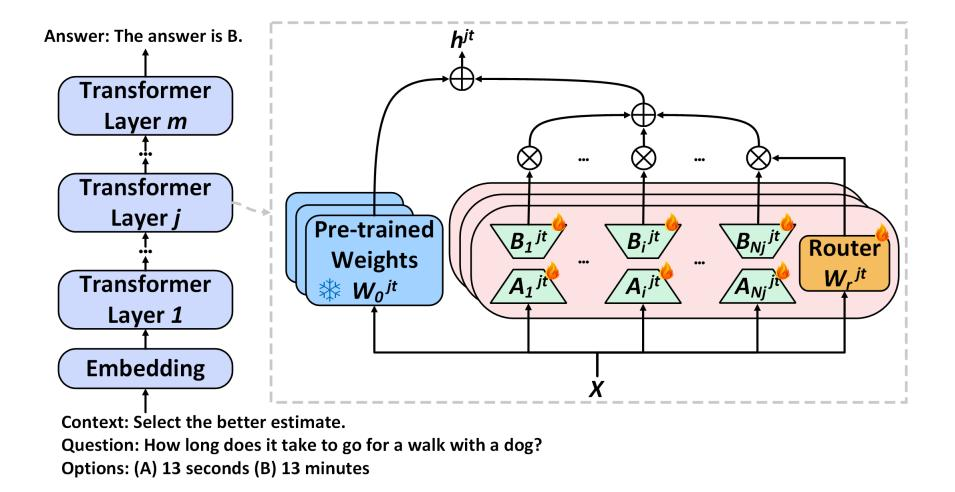
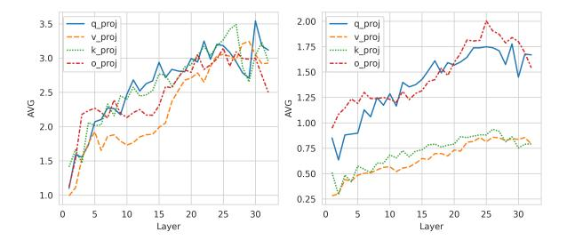
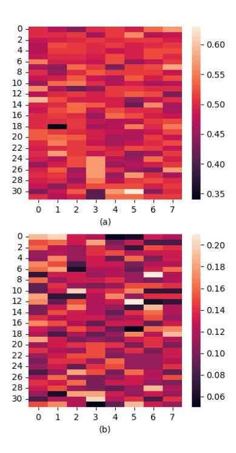

## MoLA: MoE LoRA with Layer-wise Expert Allocation

Chongyang Gao1 , Kezhen Chen2[\\*](#page-0-0), Jinmeng Rao3 , Ruibo Liu3 , Baochen Sun3 , Yawen Zhang4 , Daiyi Peng3 , Xiaoyuan Guo5 , VS Subrahmanian1

1 Northwestern University 2 Meta 3 Google DeepMind 4 Allen Institute for AI 5 Google cygao@u.northwestern.edu, {kzchen0204,yawenz1129,xiaoyuanguo.ucas}@gmail.com, {jinmengrao,ruiboliu,baochens,daiyip}@google.com, vss@northwestern.edu

## Abstract

Recent efforts to integrate low-rank adaptation (LoRA) with the Mixture-of-Experts (MoE) have managed to achieve performance comparable to full-parameter fine-tuning by tuning much fewer parameters. Despite promising results, research on improving the efficiency and expert analysis of LoRA with MoE is still in its early stages. Recent studies have shown that experts in the MoE architecture have different strengths and also exhibit some redundancy. Does this statement also apply to parameter-efficient MoE? In this paper, we introduce a novel parameter-efficient MoE method, *MoE-LoRA with Layer-wise Expert Allocation (MoLA)* for Transformer-based models, where each model layer uses a varying number of LoRA experts. We investigate several architectures with varying layerwise expert configurations. Experiments on six well-known NLP and commonsense QA benchmarks demonstrate that MoLA achieves equal or superior performance compared to all baselines on top of both LLAMA-2, Mistral, and Gemma. We find that allocating more LoRA experts to middle layers further enhances the effectiveness of models with a certain number of experts in total. The redundancy of the experts is more obvious in the lower layers. With much fewer parameters, this allocation strategy outperforms the setting with the same number of experts in every layer. This work can be widely used as a plug-and-play parameterefficient tuning approach for various applications. The code has been made available at <https://github.com/GCYZSL/MoLA>.

## 1 Introduction

Large Language Models (LLMs) have shown impressive proficiency and transfer learning capabilities across a variety of tasks and domains [\(Chowd](#page-9-0)[hery et al.,](#page-9-0) [2022;](#page-9-0) [Zhang et al.,](#page-10-0) [2023b;](#page-10-0) [Anil et al.,](#page-9-1) [2023;](#page-9-1) [Jiang et al.,](#page-9-2) [2024;](#page-9-2) [Singhal et al.,](#page-10-1) [2022\)](#page-10-1). However, fine-tuning modern LLMs demands huge computational resources due to the vast number of parameters. To mitigate this issue, the research community is increasingly focusing on parameterefficient fine-tuning (PEFT) methods to dramatically reduce training costs, such as p-tuning [\(Liu](#page-9-3) [et al.,](#page-9-3) [2022b\)](#page-9-3) and low-rank adaption (LoRA) [\(Hu](#page-9-4) [et al.,](#page-9-4) [2022\)](#page-9-4). Despite its training efficiency, PEFT methods' performance in fine-tuning LLMs is still limited.

Recent studies show that combining PEFT with the Mixture of Experts (MoE) holds promise for leveraging MoE in a parameter-efficient fashion [\(Zadouri et al.,](#page-10-2) [2023;](#page-10-2) [Liu et al.,](#page-9-5) [2023;](#page-9-5) [Dou et al.,](#page-9-6) [2023\)](#page-9-6). Most of these methods apply MoE on LoRA, called LoRA-MoE. For Transformer models [\(Vaswani et al.,](#page-10-3) [2017\)](#page-10-3), LoRA learns a pair of low-rank matrices as an adapter for a given dense linear layer, effectively modifying the layer's behavior without substantial change to the original model parameters. Instead of learning one pair of low-rank matrices, LoRA-MoE learns multiple pairs of low-rank matrices, called *LoRA experts*, and a router to compute the weights of each expert for inputs. During the LLM fine-tuning phase, pretrained weights of dense layers remain fixed, while LoRA experts and the router are trained to adapt the pre-trained weights. While the initial results are promising, research into achieving more efficient and effective integration is still in its infancy.

Moreover, recent MoE analyses indicate that many experts may be redundant due to representational collapse or learned routing policy overfitting [\(Chen et al.,](#page-9-7) [2023;](#page-9-7) [Zoph et al.,](#page-10-4) [2022\)](#page-10-4). More experts in a layer may cause the representation to overfit the training data, as the data is processed in a more fine-grained manner. This insight leads us to think about the number of experts to use in different layers in the Transformer model, motivating us to explore two questions.

\*Work done as external collaboration.

*(i) Are there any redundant experts in parameterefficient MoE? (ii) What strategy should be used to allocate the number of LoRA experts in each layer?*

To address these questions, we introduce a *new* parameter-efficient MoE approach, *MoE-LoRA with Layer-wise Expert Allocation (MoLA)*, combining LoRA and MoE with layer-wise expert allocation. Users can flexibly assign a different number of LoRA experts to each Transformer layer. We study several typical architectures with different layer-wise expert configurations. Using a fixed number of experts in total, we allocate them differently, with either lower layers or higher layers having more experts. We evaluate our MoLA approach on six benchmarks, including NLP and commonsense question-answering tasks, on three wellknown language models, LLAMA-2, Mistral, and Gemma, to demonstrate the effectiveness of our MoLA approach.

*Key Findings:* Our extensive experiments reveal that experts in lower layers are more similar to each other and thus exhibit more redundancy. With a fixed number of experts, more LoRA experts should be allocated to the middle layers of the Transformer model to enhance its effectiveness. Our key contributions are:

- We present a new parameter-efficient MoE method, MoLA, with flexible layer-wise expert allocation on the Transformer model. MoLA integrates LoRA and MoE and introduces flexibility in assigning different numbers of experts to different transformer layers, reducing expert redundancy and diversifying information granularity. MoLA is a plug-andplay approach and can be applied to diverse models and tasks.
- We study several MoLA variants on LLAMA-2, Mistral, and Gemma each with different layer-wise expert configurations. Experiments on six benchmarks show that all MoLA configurations significantly outperform other PEFT baselines, showing the efficacy of our approach.
- We further compare different layer-wise configurations of expert allocation. *Overall, the configuration that has more LoRA experts in the middle layers and fewer in the lower layer outperforms all other configurations.* Such specialized expert allocation configuration enables models to achieve enhanced per-

- formance vis-a-vis other configurations, even with much fewer parameters, demonstrating improved scalability.
- Our comprehensive analysis shows that experts in lower layers are more similar than those in middle and higher layers and thus have higher redundancy, providing insights into our observations.

## 2 Related Work

### 2.1 Parameter-Efficient Tuning

Parameter-efficient tuning of LLMs has garnered considerable attention because it is cost-effective for fine-tuning LLMs. [Li and Liang](#page-9-8) [\(2021\)](#page-9-8) and [Liu](#page-9-3) [et al.](#page-9-3) [\(2022b\)](#page-9-3) propose soft prompting concatenated to either the embedding layer or intermediate layers of the Transformer model. However, these approaches involve adding extra embedding tokens to the sequence, potentially compromising efficiency during inference, especially in the case of long input contexts. [Hu et al.](#page-9-4) [\(2022\)](#page-9-4) introduces the LoRA parameter-efficient adaptation technique, which uses low-rank decomposition matrices of dense weight matrices of Transformers. LoRA achieves decent performance for fine-tuning LLMs without additional inference costs. Similarly, [Liu et al.](#page-9-9) [\(2022a\)](#page-9-9) uses task-specific vectors to modify attention activation, also avoiding extra inference costs. Inspired by these approaches, our approach combines the MoE technique with parameter-efficient tuning approaches and leverages the layer-wise expert allocation to push the limit of performance further.

## 2.2 Parameter-Efficient MoE

Some recent efforts have studied integrating MoE and parameter-efficient tuning methods to improve the effectiveness of instruction tuning. [Liu et al.](#page-9-5) [\(2023\)](#page-9-5) applies MoE with LoRA matrices for finetuning language models on various medical domain tasks. This method takes the task type as an additional input for training the router, which requires additional prior knowledge during inference. Our approach does not require additional prior knowledge since our MoLA experts are learned without supervision. [Dou et al.](#page-9-6) [\(2023\)](#page-9-6) introduced LoRA-MoE, a novel adapter architecture that combines MoE and LoRA within the feed-forward layer of each Transformer block. This effort also studies

Figure 1: The overview of MoLA architecture. MoLA applies LoRA-MoE on any pre-trained Transformer model with layer-wise expert allocation. Each layer employs a different number of experts. During training, the pre-trained weights are freeze and only LoRA experts are tuned as the adapters on the weights.

how to mitigate knowledge forgetting in LLMs during traditional supervised fine-tuning. However, this paper only applies LoRA-MoE on the feedforward layer in each Transformer block. MoLA, on the other hand, applies LoRA experts across each dense weight matrix in the Transformer, further improving both the performance and scalability of parameter-efficient fine-tuning. Zadouri et al. (2023) introduces a framework that combines MoE with various parameter-efficient architectures, including LoRA and IA3 (Liu et al., 2022a), called MoLORA and MoV. Their experiments show that their framework leverages instruction tuning more effectively than prior parameterefficient architectures, improving the zero-shot capabilities of LLMs. Buehler and Buehler (2024), use a set of trained LoRA adapters and dynamically mix them. However, the previously mentioned methods do not consider the layer-wise allocation of experts. Our MoLA approach introduces a novel design that allows for a varying number of experts in each layer, therefore further improving the effectiveness of LoRA-MoE approaches. Oing et al. (2024) explores allocating different numbers of PEFT parameters to various model layers via layer training quality.

### 3 Preliminaries

Mixture of Experts The MoE architecture (Shazeer et al., 2017) applies sparse sub-modules, called experts, to various inputs via a router module. The router module intelligently employs different experts for different types of inputs, thus scaling up model parameters with a constant computational

cost. MoE has shown promising effectiveness on the Transformer model (Shazeer et al., 2017). The  ${\it MoE}$  layer consists of N identical and independent feed-forward neural networks  $\{E\}_{i=1}^{N}$  as experts. The router is a gating function with a trainable weight matrix  $W_r$ . Given an input x, the router maps x to an N-dimensional vector, which corresponds to the number of experts. The router uses a softmax function to compute a probability distribution of the weights of outputs from the expert networks. Following standard MoE architectures, only the top K experts, determined by the router, are chosen for the computation. Additionally, an auxiliary loss, called load balancing loss, is used on each MoE layer to promote a balanced top-k selection by pushing the router to have equitable workload distribution among experts. Equation 1 mathematically represents the MoE layer where yis the output embedding from the MoE layer. With fine-tuning, different experts focus on processing different types of information or tasks and thus provide finer granularity.

$$y = \sum_{i=1}^{K} \frac{\text{TopK}(\text{Softmax}(W_r x), K)_i}{\sum_{i=1}^{K} \text{TopK}(\text{Softmax}(W_r x), K)_i} E_i(x)$$
(1)

LoRA LoRA is a popular parameter-efficient tuning approach that is widely used in LLM finetuning (Hu et al., 2022; Zhang et al., 2023a; Dettmers et al., 2023). LoRA reparameterizes the fine-tuning update for each parameter matrix as a low-rank matrix to reduce the number of training parameters significantly. Given a pre-trained

linear layer with a weight matrix  $W_0 \in \mathbb{R}^{d_q \times d_p}$ , LoRA creates two low-rank trainable matrices A and B, where  $A \in \mathbb{R}^{d_q \times r}$ ,  $B \in \mathbb{R}^{r \times d_p}$ , and  $r \ll min(d_q, d_p)$ . Thus, the dimension of ABx equals the dimension of  $W_0x$ . Equation 2 mathematically describes this process, and the output of LoRA is h. During training,  $W_0$  is frozen and does not receive gradient updates, while A and B are updated.

$$h = W_0 x + \triangle W x = W_0 x + ABx \qquad (2)$$

The matrix A is initialized with a random Gaussian distribution, and matrix B is initialized to zero. The initialization results in the same outputs as the original pre-trained model. When fine-tuning LLMs, the LoRA approach can be applied to all the linear layers in the Transformer model or its variants. Compared with tuning the original weight matrix, LoRA dramatically reduces the number of training parameters while keeping reasonable performance.

### 4 MoE-LoRA with Layer-wise Allocation

Combining MoE and LoRA has shown promising results (Zadouri et al., 2023; Liu et al., 2023; Dou et al., 2023). However, most such efforts only replace experts with LoRA adapters under the MoE framework, and each layer has a fixed number of experts. Some shortcomings of MoE may persist in these methods. For instance, experts in MoE may be redundant due to representational collapse or learned routing policy overfitting (Chen et al., 2023; Zoph et al., 2022). Inspired by this insight, we argue that the number of LoRA experts need *not* be the same across all layers.

We thus introduce a novel parameter-efficient tuning approach, called MoE-LoRA with Layer-wise Allocation (MoLA), which combines LoRA and MoE techniques with flexible layer-wise expert allocation. Since most LLMs use Transformer-based architectures, we mainly study how to apply MoLA to Transformers. Instead of allocating the same number of experts to all layers of the Transformer, MoLA uses different numbers of experts on different layers. In this section, we first describe the details of our architecture and then propose several layer-wise expert allocations based on different assumptions.

#### 4.1 The MoLA Architecture

MoLA integrates LoRA adapters into the MoE framework and each layer may have a different

number of experts. When training a pre-trained LLM with LoRA, instead of decomposing each weight matrix of a dense linear layer into a pair of low-rank matrices, we create *multiple* pairs of lowrank matrices — each pair is called a LoRA expert. A router module is learned to route each input token to different LoRA experts. Given a Transformer model with m layers, we allocate  $N_i$  experts for layer j and have  $\sum_{j=1}^{m} N_j$  experts in total. Specifically, given a pre-trained weight matrix  $W_0^{jt} \in$  $\mathbb{R}^{d_q \times d_p}$  from the module t in layer j, we create  $N_j$  pairs of low-rank matrices  $\{A^{jt}\}_{i=1}^{N_j}, \{B^{jt}\}_{i=1}^{N_j}$ . As in the case of LoRA, each matrix  $A_i^{jt}$  is initialized from a random Gaussian distribution. We set  $B_i^{jt}$ to zero, where  $A_i^{jt} \in \mathbb{R}^{d_q \times r}, B_i^{jt} \in \mathbb{R}^{r \times d_p}$ , and  $r \ll min(d_q, d_p)$ . Then, a router  $S_i^{jt}$  with a trainable weight matrix  $W_r^{jt} \in \mathbb{R}^{d_q \times N_j}$  is used to specify different LoRA experts for the input x. As in the original MoE, MoLA selects the top K experts for computation and applies the load balancing loss on each layer. Figure 1 shows an overview of the architecture. The mathematical representation is:

$$S_{i}^{jt}(x) = \frac{\operatorname{TopK}(\operatorname{Softmax}(W_{r}^{jt}x), K)_{i}}{\sum_{i=1}^{K} \operatorname{TopK}(\operatorname{Softmax}(W_{r}^{jt}x), K)_{i}}$$
(3)

$$h^{jt} = W_0^{jt} x + \sum_{i=1}^K S_i^{jt}(x) A_i^{jt} B_i^{jt} x$$
 (4)

Eq. 3 represents the router with the input x, and Eq. 4 mathematically shows the LoRA experts in MoLA, where  $h^{jt}$  is the output embedding. This MoLA architecture provides flexibility in modifying the number of experts for each Transformer layer. The next section addresses the question of how experts should be allocated in each layer.

## 4.2 Configurations of Layer-wise Expert Allocation

MoE works like an ensemble method, with multiple experts learning fine-grained information. Layers with more experts have stronger fitting capabilities, but the architecture is more complicated. One intuition is that we should allocate more experts to layers that are required to process diverse edge cases and fine-grained information. To study how LoRA experts should be allocated in each Transformer layer, we propose five types of layer-wise expert configurations based on different assumptions. Figure 2 visualizes the overview of these

Figure 2: Five types of layer-wise expert allocations of MoLA. A longer rectangle indicates a greater number of LoRA experts.

five configurations indicated in red color. Section [5](#page-4-1) describes detailed experiments to compare these configurations.

MoLA Triangle (MoLA-△) Many studies have analyzed layer-wise representations of Transformer models. Generally, lower layers learn more tokenlevel features, such as word meaning, syntax, or grammar, while higher layers capture more abstract, high-level information. As token-level information is subtle and diverse, one assumption is that token-level information needs more experts for finegrained understanding, while high-level information requires fewer experts for generalization. Our MoLA Triangle (MoLA-△) architecture is based on this assumption and allocates experts in a "triangle" shape: lower layers have more experts than higher layers.

MoLA Inverted-Triangle (MoLA-▽) Unlike MoLA-△, another assumption is that using more experts for token-level information may create redundancy in processing. As higher layers learn more abstract and high-level information, and these features are used for downstream tasks, they may require more experts. More experts may enhance the architecture to process complicated problems by leveraging experts to learn fine-grained and taskspecific patterns. Based on this intuition, we design the MoLA Inverted-Triangle (MoLA-▽) configuration where lower layers are allocated fewer experts while higher layers have more experts.

MoLA Hourglass (MoLA-▷◁) A third model assumes that both lower and higher layers require more experts as they focus on processing basic features and abstract features. The middle layers play a role in aggregating the basic features and mapping them to a high-dimensional space for abstract reasoning, requiring fewer fine-grained features. Our MoLA Hourglass (MoLA-▷◁) architecture uses this

assumption to allocate experts in an "hourglass" shape, where lower and higher layers have more experts than the middle layers.

MoLA Diamond (MoLA-✸) Unlike MoLA-▷◁, research in representation learning suggests that acquiring low-level features and using extracted abstract representation for downstream tasks is relatively more sensitive than learning an effective and expressive representation in middle layers [\(Long et al.,](#page-9-12) [2018;](#page-9-12) [Bengio et al.,](#page-9-13) [2013\)](#page-9-13). Moreover, a superior representation is crucial for enhancing the model's abstract ability, *e.g.*, reasoning. Consequently, the newly designed MoLA Diamond (MoLA-✸) architecture features a 'Diamond' shape, where the middle layers are equipped with more experts.

MoLA Rectangle (MoLA-□) The last configuration is the original design of MoE, where each Transformer layer has the same number of experts. Most of the recent studies adopt this expert allocation design. We call this MoLA Rectangle (MoLA- □) and use it as a baseline.

### 5 Experiments

## 5.1 Experimental Settings

We examined the performance of our MoLA approach via direct fine-tuning on downstream tasks. Furthermore, We show the transferrability of MoLA by performing instruction tuning first and then fine-tuning for downstream tasks in Appendix [B.](#page-11-0) The abilities of MoLA in continuous learning settings are demonstrated in Appendix [C.](#page-11-1) To make the comparisons straightforward and clear, we designed five allocation configurations of MoLA for the large language model as described in Section [4.2.](#page-3-3) We take LLaMA-2-7B [\(Touvron](#page-10-8) [et al.,](#page-10-8) [2023\)](#page-10-8) and Mistral-7B [\(Jiang et al.,](#page-9-14) [2023\)](#page-9-14), which contain 32 layers, as our base models. Additionally, experiments with Gemma [\(Team et al.,](#page-10-9) [2024\)](#page-10-9) are shown in Appendix [E.](#page-12-0) For MoLA-△, we allocate 8 experts to each layer for the first 8 layers, 6 experts to each layer for the next 8 layers, 4 experts to each layer for 17-24 layers, and 2 experts to each layer for the last 8 layers, which is denoted as 8642. Following the same notation, we allocate MoLA Inverted Triangle as 2468. The allocations for Hourglass, MoLA Diamond, and MoLA Rectangle are 8228, 2882, and 5555 separately. Notably, to make the comparison fair, we make the total number of experts the same for all the variants,

resulting in the same number of trainable parameters. The trainable parameter number of LLaMA-2 is 105,635,840, which is a 1.5% trainable parameter number of the pre-trained base model. We also adopt auxiliary loss for balancing the top-k selection of routing following Switch Transformers [\(Fedus et al.,](#page-9-15) [2022\)](#page-9-15).

### 5.2 Task and Data

MoLA can be used to fine-tune LLMs on downstream tasks and/or fine-tune instructions. To show its effectiveness, we study both natural language processing (NLP) tasks and commonsense reasoning (CR) tasks. For NLP tasks, we evaluate three popular datasets, including Microsoft's Research Paraphrase Corpus [\(Dolan and Brock](#page-9-16)[ett,](#page-9-16) [2005\)](#page-9-16), Recognizing Textual Entailment (RTE) dataset [\(Wang et al.,](#page-10-10) [2019\)](#page-10-10), and Corpus of Linguistic Acceptability (COLA) [\(Wang et al.,](#page-10-10) [2019\)](#page-10-10). For commonsense reasoning tasks, we evaluate three recent question-answering benchmarks, including ScienceQA [\(Lu et al.,](#page-9-17) [2022\)](#page-9-17), CommonsenseQA [\(Talmor et al.,](#page-10-11) [2019\)](#page-10-11), and OpenbookQA [\(Mihaylov et al.,](#page-9-18) [2018\)](#page-9-18). We follow the task-specific fine-tuning framework to evaluate their effectiveness. The details of the datasets are introduced in Appendix [A.](#page-10-12)

### 5.3 Recent Competitive Baselines

We compare MoLA with three parameter-efficient tuning approaches, prompt tuning [\(Lester et al.,](#page-9-19) [2021\)](#page-9-19), LLaMA-Adapter [\(Zhang et al.,](#page-10-0) [2023b\)](#page-10-0), and LoRA[\(Hu et al.,](#page-9-4) [2022\)](#page-9-4). We also compare against full-parameter fine-tuning. Prompt tuning presents soft prompting concatenated to the embedding layer of the Transformer model. Soft prompts are a set of virtual tokens pre-appended to the textual prompt and passed to the LLM. During fine-tuning, the LLM is frozen and only the virtual tokens are optimized, providing a lightweight tuning approach. LLaMA-Adapter is an adaption method for LLaMA instruction tuning and has a set of learnable adaption prompts that are pre-appended to the word tokens at higher transformer layers. A zeroinitialized attention mechanism with zero gating is used to inject new instructional cues into LLaMA. LoRA was briefly described in Section [4.](#page-3-4) The rank of LoRA is set to 64. In our evaluation, LLMs are fine-tuned on the downstream training dataset via different parameter-efficient tuning approaches. Based on the availability of test set labels, we evaluated COLA, RTE, and CommonsenseQA on their

validation set and others on the test set.

### 5.4 Implementation

We use LLAMA2-7B [\(Touvron et al.,](#page-10-8) [2023\)](#page-10-8) and Mistral-7B [\(Jiang et al.,](#page-9-14) [2023\)](#page-9-14) as our base language models across all the experiments. We do a grid search on the number of training epochs, including 10, 15, and 20 epochs for downstream task finetuning. We use AdamW [\(Loshchilov and Hutter,](#page-9-20) [2017\)](#page-9-20) as the optimizer with a learning rate of 3e-4. The cutoff length is set to 256 following Sanh *et al.*[\(Sanh et al.,](#page-10-13) [2022\)](#page-10-13), and the batch size is 128. The random seed is set to 10. The rank of each LoRA expert is 8 and we adopt top-2 for the router. LoRA alpha is set to 16 and LoRA dropout is 0.05, following the default LoRA settings. We applied LoRA to four weight matrices in the self-attention module (Wq , Wk, Wv , Wo) and three weight matrices in the MLP module (Wgate, Wdown, Wup). All experiments were conducted on the servers with eight A100-40G GPUs and three A6000 GPUs. It takes around 4 hours to train on the COLA dataset.

### 5.5 Results

Comparison with Baselines Table [1](#page-6-0) shows the results for the direct fine-tuning setting using LLAMA-2 where each number is the accuracy (%) for each dataset. From the table, LoRA-based approaches (LoRA and MoLA) significantly outperform prompt-tuning-based baselines (Prompt Tuning and LLaMA-Adapter). For LoRA-based methods, the original LoRA with rank 64 is used as our baseline. We first evaluate the MoLA-□ with eight experts at each layer, annotated as MoLA- □(8888), where the number of parameters is the same as the LoRA baseline. We then reduce the sum of the configuration number from 32 (8 × 4) to 20 in total, with only 62.5% of the parameters, and evaluate the five different configurations as described in Section [5.1.](#page-4-2) MoLA variants outperform the LoRA baseline on all the benchmarks. Specifically, MoLA-▽ beats LoRA on all six datasets — the performance improvements of MoLA-▽ are larger on the commonsense QA tasks compared to the NLP tasks. It even outperforms the MoLA- □(8888) on three benchmarks with nearly 40% fewer parameters. The results demonstrate the effectiveness and scalability of MoLA.

Tables [1](#page-6-0) and [4](#page-12-1) show that MoLA-△ and -▷◁ perform worse than MoLA-□ and MoLA-▽, especially in the QA task. Of all MoLA variants, MoLA-▽ generally achieves the best performance,

Table 1: Comparison with different methods using LLaMA-2. MoLA- $\nabla$  outperforms other variants or baselines and even achieves competitive or superior performance with MoLA- $\square$  (8888), with nearly 40% fewer parameters. The ratio of trainable parameters

| Models (# of Experts) | MRPC   | COLA   | RTE    | ScienceQA | CommonsenseQA          | OpenbookQA | Trainable Parameters |
|-----------------------|--------|--------|--------|-----------|------------------------|------------|----------------------|
| Full-Parameter        | 87.13% | 86.29% | 87.73% | 93.12%    | 77.48%                 | 80.4%      | 6,738,415,616        |
| Prompt Tuning         | 49.91% | 59.25% | 54.17% | 36.78%    | 37.76%                 | 46.2%      | 163,840              |
| LLaMA-Adapter         | 71.94% | 47.56% | 72.93% | 73.33%    | 73.55%                 | 71.8%      | 5,242,912            |
| LoRA                  | 83.13% | 86.29% | 85.92% | 91.01%    | 75.51%                 | 77.0%      | 159,907,840          |
| MoLA-□ (8888)         | 84.70% | 85.81% | 88.45% | 91.91%    | 77.89%                 | 82.8%      | 169,017,344          |
| MoLA-□ (5555)         | 84.23% | 86.28% | 85.20% | 92.04%    | 78.13%                 | 80.0%      | 105,635,840          |
| MoLA-△ (8642)         | 84.64% | 85.43% | 84.84% | 91.90%    | 77.23%                 | 77.6%      | 105,635,840          |
| MoLA-⋈ (8228)         | 83.48% | 86.00% | 86.28% | 91.41%    | 76.25%                 | 78.8%      | 105,635,840          |
| MoLA-∇ (2468)         | 83.48% | 86.87% | 86.28% | 92.36%    | 78.95%                 | 79.6%      | 105,635,840          |
| MoLA-♦ (2882)         | 83.01% | 86.19% | 89.17% | 92.00%    | 77.81%                 | 82.6%      | 105,635,840          |
| MoLA-□ (4444)         | 82.90% | 85.62% | 86.28% | 91.73%    | 77.40%                 | 80.8%      | 84,508,672           |
| MoLA-△ (6532)         | 83.54% | 85.43% | 85.20% | 92.00%    | 77.64%                 | 80.2%      | 84,508,672           |
| MoLA-⋈ (6226)         | 83.42% | 85.71% | 84.48% | 92.00%    | 76.58%                 | 80.0%      | 84,508,672           |
| MoLA-∇ (2356)         | 81.97% | 85.91% | 87.37% | 92.18%    | <i>77.</i> 97 <i>%</i> | 81.2%      | 84,508,672           |
| MoLA-♦ (2662)         | 82.96% | 85.62% | 87.37% | 92.27%    | 77.48%                 | 79.8%      | 84,508,672           |

outperforming all other variants on five benchmarks. The confidence intervals are demonstrated in Appendix. F. We conducted a Friedman test to reject the null hypothesis that all algorithms perform equally. Following this, we applied the Wilcoxon signed-rank test to perform pairwise comparisons between the algorithms (Prompt Tuning, LLaMA-Adapter, LoRA, and MoLA-∇) across six benchmarks, identifying significant differences in their performance. We applied an FDR correction to adjust the p-values to address multiple comparisons. The results confirm that the superior performance of MoLA-∇ over the other baselines is statistically significant, with all adjusted p-values below the standard threshold of 0.05.

#### 6 Model Analysis and Ablation Studies

## 6.1 Analysis of Layer-wise Experts Importance

To investigate which configuration is better further, we analyze the layer-wise expert's importance by showing the performance with different base models, including Mistral in Table. 2 and Gemma in the Appendix. E. We also compare the results with different total configuration numbers (20 and 16) in both Table. 1 and Table. 2.

From Table. 1 and Table. 2, we find that MoLA
¬ and MoLA- perform better than other configurations with different base models and configuration numbers. These experiments show that allocating more experts to the middle layers is more effective than other strategies. Notably, we want to point out that with a relatively smaller total configuration numbers (16), the MoLA's potential may

not be fully released, making the superiority of MoLA- $\triangledown$  and MoLA- $\diamondsuit$  less stable. Furthermore, the choice between MoLA- $\triangledown$  and MoLA- $\diamondsuit$  is related to the base model, which will be discussed in the next section and Appendix. H.

# 6.2 Analysis of Layer-wise Experts Redundancy

In the previous section, we observed that allocating more LoRA experts to middle layers provides more performance gains. We also find MoLA- $\nabla$  is the best choice for LLaMA-2 and Gemma, but MoLA- $\Diamond$  is more suitable for Mistral. To explain the difference between models, we present the results of the extreme configurations of MoLA, including (10 2 2 2, 2 10 2 2, 2 2 10 2, 2 2 2 10) in Table. 3. We find that all base models' lower layers exhibit more redundancies with lower average performance on all tasks, *e.g.*, layers 1-4 for LLaMA and layers 1-8 for Mistral. Furthermore, the redundancies for specific layers are different for different base models. This property can lead to different configuration choices, MoLA- $\nabla$  or MoLA- $\Diamond$  for different models.

To better analyze the models, we formally define the layer-wise expert redundancy as follows:

**Definition 6.1. Expert Redundancy** measures the layer-wise difference between expert modules in MoE architecture for Transformer models.

When two selected experts are similar, they may overlap and create some redundancy. To quantitatively examine the Expert Redundancy of Transformer layer j, we calculate the average value of the Frobenius Norm between any two different LoRA experts' weight matrices in each self-attention module from layer j. Figure 3 presents

| Table 2: Comparison with different configurations of MoLA using Mistral. |  |
|--------------------------------------------------------------------------|--|
|                                                                          |  |

| Models (# of Experts) | MRPC   | COLA   | RTE    | ScienceQA | CommonsenseQA | OpenbookQA |
|-----------------------|--------|--------|--------|-----------|---------------|------------|
| LoRA                  | 86.02% | 87.05% | 89.53% | 94.20%    | 81.40%        | 88.8%      |
| MoLA-□ (5555)         | 86.55% | 87.34% | 90.91% | 94.74%    | 83.21%        | 88.8%      |
| MoLA-△ (8642)         | 86.15% | 87.63% | 90.61% | 95.05%    | 82.80%        | 89.6%      |
| MoLA-▷◁ (8228)        | 86.43% | 87.63% | 90.61% | 95.01%    | 81.90%        | 90.0%      |
| MoLA-▽ (2468)         | 86.15% | 87.34% | 91.70% | 95.28%    | 83.21%        | 90.0%      |
| MoLA-✸ (2882)         | 86.67% | 88.78% | 90.98% | 94.78%    | 83.62%        | 90.6%      |
| MoLA-□ (4444)         | 86.02% | 87.92% | 90.61% | 94.69%    | 83.37%        | 89.2%      |
| MoLA-△ (6532)         | 86.20% | 87.25% | 88.81% | 94.74%    | 82.06%        | 89.4%      |
| MoLA-▷◁ (6226)        | 86.84% | 87.92% | 89.90% | 94.60%    | 82.88%        | 88.8%      |
| MoLA-▽ (2356)         | 86.44% | 87.15% | 90.25% | 95.32%    | 82.47%        | 89.8%      |
| MoLA-✸ (2662)         | 86.67% | 88.02% | 89.53% | 94.43%    | 82.64%        | 88.2%      |

Table 3: Comparison with different extreme configurations of MoLA. The top block shows the results using LLaMA-2 and the bottom block shows the results using Mistral.

| LLaMA-2         | MRPC   | COLA   | RTE    | S-QA   | C-QA   | O-QA   | AVG.   |
|-----------------|--------|--------|--------|--------|--------|--------|--------|
| MoLA (10 2 2 2) | 83.94% | 84.47% | 84.48% | 92.36% | 75.76% | 77.2%  | 83.03% |
| MoLA (2 10 2 2) | 82.90% | 86.48% | 87.73% | 91.46% | 77.97% | 80.8%  | 84.56% |
| MoLA (2 2 10 2) | 82.67% | 85.71% | 85.20% | 91.28% | 76.74% | 81.0%  | 83.77% |
| MoLA (2 2 2 10) | 82.96% | 85.81% | 85.92% | 92.18% | 76.90% | 81.60% | 84.23% |
| Mistral         | MRPC   | COLA   | RTE    | S-QA   | C-QA   | O-QA   | AVG.   |
| MoLA (10 2 2 2) | 86.49% | 86.86% | 91.33% | 95.00% | 81.49% | 88.2%  | 88.50% |
| MoLA (2 10 2 2) | 86.15% | 87.25% | 90.61% | 94.51% | 81.41% | 88.6%  | 88.26% |
| MoLA (2 2 10 2) | 86.73% | 88.21% | 90.98% | 95.23% | 82.97% | 89.6%  | 89.10% |
| MoLA (2 2 2 10) | 86.67% | 87.92% | 91.34% | 95.01% | 82.88% | 89.2%  | 89.02% |

the layer-wise average values of MoLA-□(8888) for LLaMA-2 and Mistral, where both models are trained via the sampled instruction-tuning dataset. In the figure, the average value of the Frobenius Norm per layer increases from lower layers to higher layers, showing that experts in lower layers are more similar than those in higher layers. We also find a similar pattern from other MoLA configurations, as demonstrated in Appendix. [D.](#page-12-2) This observation supports our assumption that experts in lower layers of the Transformer model suffer more expert redundancy. Therefore, within a certain number of experts in total, allocating more experts in higher layers is more effective in improving the model performance.

*These experiments show that lower layers have more redundancy.* More experts with fine-grained processing on token-level information may introduce redundancy. In contrast, the middle and higher layers require more experts because they learn more abstract and high-level information. More experts can enhance the architecture to learn fine-grained and task-specific patterns for complicated downstream problems. We therefore argue that the number of experts at the middle and top

Figure 3: Average number of the Frobenius Norm between two different experts' weight matrices for each self-attention module from each layer. The left and right figures are for the MoLA-□(8888) using LLaMA-2 and Mistral, correspondingly. Both models are trained via instruction tuning.

layers is important. In other words, if we would like to prune the MoLAs, it is better to reduce the number of experts at lower layers to reduce the trainable parameters.

## 6.3 Analysis of Average Fusion Weights and Selected Times of Experts

We also calculate the average fusion weights provided by the router and average times for experts when they are selected, as shown in Figure [4.](#page-8-0) The experiment is for MoLA-□(8888) MoLA using

LLAMA-2. In Figure [4](#page-8-0) (a), we find that most fusion weights are around 0.5, which means the importance of selected experts is similar most of the time. Furthermore, in Figure [4](#page-8-0) (b), although there are several experts are not often selected, most of the experts are selected frequently and utilized sufficiently. With similar selected weights and times, lower layers have more expert redundancy due to more similar experts, again supporting our statement.

Figure 4: (a) The average fusion weights for each expert. (b) The average times for each expert when it is selected.

## 7 Conclusion

We introduce MoLA, a novel parameter-efficient tuning approach that leverages layer-wise expert allocation in the MoE and combines it with the LoRA technique. We propose five layer-wise expert configurations based on different assumptions. Our comprehensive experiments on six popular benchmarks, NLP and commonsense question-answering tasks, and 3 language models demonstrate that MoLA significantly outperforms other baselines. Specifically, MoLA-▽ and MoLA-✸ achieve the best performance across all configurations, supporting our assumption that middle layers benefit from more experts, while lower layers are more redundant.. We conduct extensive analysis to explore

the layer-wise expert redundancy, observing that lower layers of the Transformer model suffer higher expert redundancy with MoLA tuning.

### 8 Limitations

Although MoLA-▽ and MoLA-✸ demonstrate superior performance by allocating more experts to the middle layers, no single configuration can guarantee optimal performance across all tasks and models within a specific budget. Due to computational resource constraints, it is impractical to test every possible configuration, model, and budget. Therefore, future research should focus on developing automated methods to identify the most effective configurations that achieve the best results across various tasks, using specific foundational models and predetermined budgets. Additionally, the theoretical explanation for why middle layers might require more experts and why there may be more redundancies in the lower layers of many large language models remains unexplored. More in-depth theoretical analysis could illuminate strategies for identifying the best configurations and optimizing resource allocation.

### 9 Broader Impacts

This paper contributes to the advancement of parameter-efficient tuning within the field of machine learning. To the best of our knowledge, it does not directly raise any specific ethical concerns. However, it is important to note that our research relies on pre-trained large language models that may exhibit preferential biases [\(Tang et al.,](#page-10-14) [2023\)](#page-10-14). Users of these models should be cognizant of these biases and consider their potential implications. Our approach is a plug-and-play parameter-efficient tuning method and can be used for diverse tasks. We push the performance limits of PEFT methods and provide decent performance on LLM fine-tuning while dramatically reducing training costs. We believe that this research direction will benefit energy saving and advance the decarbonization of AI. Also, efficient training efficiency and promising performance promote wider groups of people to leverage our approach on more practical problems.

## Ethics Statement

As far as we are aware, there are no ethical considerations related to our proposed method.

## References

- Rohan Anil, Sebastian Borgeaud, Yonghui Wu, Jean-Baptiste Alayrac, Jiahui Yu, Radu Soricut, Johan Schalkwyk, Andrew Dai, Anja Hauth, et al. 2023. Gemini: A family of highly capable multimodal models. *arXiv preprint arXiv:2312.11805*.
- Yoshua Bengio, Aaron Courville, and Pascal Vincent. 2013. Representation learning: A review and new perspectives. *IEEE transactions on pattern analysis and machine intelligence*, 35(8):1798–1828.
- Eric L Buehler and Markus J Buehler. 2024. X-lora: Mixture of low-rank adapter experts, a flexible framework for large language models with applications in protein mechanics and molecular design. *APL Machine Learning*, 2(2).
- Arslan Chaudhry, Puneet K Dokania, Thalaiyasingam Ajanthan, and Philip HS Torr. 2018. Riemannian walk for incremental learning: Understanding forgetting and intransigence. In *Proceedings of the European conference on computer vision (ECCV)*, pages 532–547.
- Tianlong Chen, Zheyu Zhang, Ajay Jaiwal, Shiwei Liu, and Zhangyang Wang. 2023. Sparse moe as the new dropout: Scaling dense and self-slimmable transformer. *ICLR*.
- Aakanksha Chowdhery, Sharan Narang, Jacob Devlin, Maarten Bosma, Gaurav Mishra, Adam Roberts, Paul Barham, et al. 2022. Palm: Scaling language modeling with pathways. *arXiv preprint arXiv:2204.02311*.
- Tim Dettmers, Artidoro Pagnoni, Ari Holtzman, and Luke Zettlemoyer. 2023. Qlora: Efficient finetuning of quantized llms. *arXiv preprint arXiv:2305.14314*.
- Willian Dolan and Chris Brockett. 2005. Automatically constructing a corpus of sentential paraphrases. *IJCNLP*.
- Shihan Dou, Enyu Zhou, Yan Liu, Songyang Gao, Jun Zhao, Wei Shen, Yuhao Zhou, Zhiheng Xi, Xiao Wang, Xiaoran Fan, Shiliang Pu, Jiang Zhu, Rui Zheng, Tao Gui, Qi Zhang, and Xuanjing Huang. 2023. Loramoe: Revolutionizing mixture of experts for maintaining world knowledge in language model alignment. *arXiv preprint arXiv:2312.09979*.
- William Fedus, Barret Zoph, and Noam Shazeer. 2022. Switch transformers: Scaling to trillion parameter models with simple and efficient sparsity. *The Journal of Machine Learning Research*, 23(1):5232– 5270.
- Edward Hu, Yelong Shen, Phillip Wallis, Zeyuan Zhu, Yuanzhi Li, Shean Wang, Lu Wang, and Weizhu Chen. 2022. Lora: Low-rank adaptation of large language models. *ICLR*.
- Albert Jiang, Alexandre Sablayrolles, Antoine Roux, Arthur Mensch, Blanche Savary, Chris Bamford, Devendra Chaplot, Diego de las Casas, et al. 2024. Mixtral of experts. *arXiv preprint arXiv:2401.04088*.

- Albert Q Jiang, Alexandre Sablayrolles, Arthur Mensch, Chris Bamford, Devendra Singh Chaplot, Diego de las Casas, Florian Bressand, Gianna Lengyel, Guillaume Lample, Lucile Saulnier, et al. 2023. Mistral 7b. *arXiv preprint arXiv:2310.06825*.
- Brian Lester, Rami Al-Rfou, and Noah Constant. 2021. The power of scale for parameter-efficient prompt tuning. *arXiv preprint arXiv:2104.08691*.
- Xiang Li and Percy Liang. 2021. Prefix-tuning: Optimizing continuous prompts for generation. *ACL*.
- Wing Lian, Bleys Goodson, Eugene Pentland, Austin Cook, Chanvichet Vong, and "Teknium". 2023. Openorca: An open dataset of gpt augmented flan reasoning traces. [https://https://huggingface.](https://https://huggingface.co/Open-Orca/OpenOrca) [co/Open-Orca/OpenOrca](https://https://huggingface.co/Open-Orca/OpenOrca).
- Haokun Liu, Derek Tam, Mohammed Muqeeth, Jay Mohta, Tenghao Huang, Mohit Bansal, and Colin Raffel. 2022a. Few-shot parameter-efficient fine-tuning is better and cheaper than in-context learning. *NeurIPS*.
- Qidong Liu, Xian Wu, Xiangyu Zhao, Yuanshao Zhu, Derong Xu, Feng Tian, and Yefeng Zheng. 2023. Moelora: An moe-based parameter efficient finetuning method for multi-task medical applications. *arXiv preprint arXiv:2310.18339*.
- Xiao Liu, Kaixuan Ji, Yicheng Fu, Weng Tam, Zhengxiao Du, Zhilin Yang, and Jie Tang. 2022b. P-tuning: Prompt tuning can be comparable to fine-tuning across scales and tasks. *ACL 2022*.
- Mingsheng Long, Yue Cao, Zhangjie Cao, Jianmin Wang, and Michael I Jordan. 2018. Transferable representation learning with deep adaptation networks. *IEEE transactions on pattern analysis and machine intelligence*, 41(12):3071–3085.
- Ilya Loshchilov and Frank Hutter. 2017. Decoupled weight decay regularization. *arXiv preprint arXiv:1711.05101*.
- Pan Lu, Swaroop Mishra, Tony Xia, Liang Qiu, Kaiwei Chang, Song-Chun Zhu, Oyvind Tafjord, Peter Clark, and Ashwin Kalyan. 2022. Learn to explain: Multimodal reasoning via thought chains for science question answering. *NeurIPS*.
- Michael Mahoney and Charles Martin. 2019. Traditional and heavy tailed self regularization in neural network models. In *International Conference on Machine Learning*, pages 4284–4293. PMLR.
- Todor Mihaylov, Peter Clark, Tushar Khot, and Ashish Sabharwal. 2018. Can a suit of armor conduct electricity? a new dataset for open book question answering. *EMNLP*.
- Swaroop Mishra, Daniel Khashabi, Chitta Baral, and Hannaneh Hajishirzi. 2022. Cross-task generalization via natural language crowdsourcing instructions. In *60th Annual Meeting of the Association for Computational Linguistics, ACL 2022*, pages 3470–3487. Association for Computational Linguistics (ACL).

- Subhabrata Mukherjee, Arindam Mitra, Ganesh Jawahar, Sahaj Agarwal, Hamid Palangi, and Ahmed Awadallah. 2023. [Orca: Progressive learning from](https://arxiv.org/abs/2306.02707) [complex explanation traces of gpt-4.](https://arxiv.org/abs/2306.02707) *Preprint*, arXiv:2306.02707.
- Peijun Qing, Chongyang Gao, Yefan Zhou, Xingjian Diao, Yaoqing Yang, and Soroush Vosoughi. 2024. Alphalora: Assigning lora experts based on layer training quality. In *Proceedings of the 2024 Conference on Empirical Methods in Natural Language Processing*, pages 20511–20523.
- Victor Sanh, Albert Webson, Colin Raffel, Stephen H Bach, Lintang Sutawika, Zaid Alyafeai, Antoine Chaffin, Arnaud Stiegler, Teven Le Scao, Arun Raja, et al. 2022. Multitask prompted training enables zero-shot task generalization. In *ICLR 2022-Tenth International Conference on Learning Representations*.
- Noam Shazeer, Azalia Mirhoseini, Krzysztof Maziarz, Andy Davis, Quoc Le, Geoffrey Hinton, and Jeff Dean. 2017. Outrageously large neural networks: The sparsely-gated mixture-of-experts layer. *ICLR*.
- Karan Singhal, Shekoofeh Azizi, Tao Tu, Sara Mahdavi, Jason Wei, Hyung Chung, Nathan Scales, Ajay Tanwani, et al. 2022. Large language models encode clinical knowledge. *arXiv preprint arXiv:2212.13138*.
- Alon Talmor, Jonathan Herzig, Nicholas Lourie, and Jonathan Berant. 2019. Commonsenseqa: A question answering challenge targeting commonsense knowledge. *NAACL*.
- Raphael Tang, Xinyu Zhang, Jimmy Lin, and Ferhan Ture. 2023. What do llamas really think? revealing preference biases in language model representations. *arXiv preprint arXiv:2311.18812*.
- Gemma Team, Thomas Mesnard, Cassidy Hardin, Robert Dadashi, Surya Bhupatiraju, Shreya Pathak, Laurent Sifre, Morgane Rivière, Mihir Sanjay Kale, Juliette Love, et al. 2024. Gemma: Open models based on gemini research and technology. *arXiv preprint arXiv:2403.08295*.
- Hugo Touvron, Louis Martin, Kevin Stone, Peter Albert, Amjad Almahairi, Yasmine Babaei, Nikolay Bashlykov, Soumya Batra, Prajjwal Bhargava, Shruti Bhosale, et al. 2023. Llama 2: Open foundation and fine-tuned chat models. *arXiv preprint arXiv:2307.09288*.
- Ashish Vaswani, Noam Shazeer, Niki Parmar, Jakob Uszkoreit, Llion Jones, Aidan N Gomez, Łukasz Kaiser, and Illia Polosukhin. 2017. Attention is all you need. *Advances in neural information processing systems*, 30.
- Alex Wang, Amanpreet Singh, Julian Michael, Felix Hill, Omer Levy, and Samuel Bowman. 2019. Glue: A multi-task benchmark and analysis platform for natural language understanding. *ICLR*.

- Jason Wei, Maarten Bosma, Vincent Zhao, Kelvin Guu, Adams Wei Yu, Brian Lester, Nan Du, Andrew M Dai, and Quoc V Le. 2021. Finetuned language models are zero-shot learners. In *International Conference on Learning Representations*.
- Ted Zadouri, Ahmet Ustun, Arash Ahmadian, Beyza Ermis, Acyr Locatelli, and Sara Hooker. 2023. Pushing mixture of experts to the limit: extremely parameter efficient moe for instruction tuning. *arXiv preprint arXiv:2309.05444*.
- Qingru Zhang, Minshuo Chen, Alexander Bukharin, Pengcheng He, Yu Cheng, Weizhu Chen, and Tuo Zhao. 2023a. Adaptive budget allocation for parameter-efficient fine-tuning. *arXiv preprint arXiv:2303.10512*.
- Renrui Zhang, Jiaming Han, Aojun Zhou, Xiangfei Hu, Shilin Yan, Pan Lu, Hongsheng Li, Peng Gao, and Yu Qiao. 2023b. Llama-adapter: Efficient fine-tuning of language models with zero-init attention. *arXiv preprint arXiv:2303.16199*.
- Yefan Zhou, Tianyu Pang, Keqin Liu, Michael W Mahoney, Yaoqing Yang, et al. 2024. Temperature balancing, layer-wise weight analysis, and neural network training. *Advances in Neural Information Processing Systems*, 36.
- Barret Zoph, Irwan Bello, Sameer Kumar, Nan Du, Yanping Huang, Jeff Dean, Noam Shazeer, and William Fedus. 2022. St-moe: Designing stable and transferable sparse expert models. *arXiv preprint arXiv:2202:08906*.

### A Datasets

In this section, we detail all the datasets in the experiments. For NLP tasks, we evaluate three popular datasets, including Microsoft's Research Paraphrase Corpus [\(Dolan and Brockett,](#page-9-16) [2005\)](#page-9-16), Recognizing Textual Entailment (RTE) dataset [\(Wang](#page-10-10) [et al.,](#page-10-10) [2019\)](#page-10-10), and Corpus of Linguistic Acceptability (COLA) [\(Wang et al.,](#page-10-10) [2019\)](#page-10-10). For commonsense reasoning tasks, we evaluate three recent question-answering benchmarks, including ScienceQA [\(Lu et al.,](#page-9-17) [2022\)](#page-9-17), CommonsenseQA [\(Talmor et al.,](#page-10-11) [2019\)](#page-10-11), and OpenbookQA [\(Mihaylov](#page-9-18) [et al.,](#page-9-18) [2018\)](#page-9-18). The details of the datasets are the following:

Microsoft's Research Paraphrase Corpus (MRPC) consists of 5,801 sentence pairs collected from newswire articles. Each pair is labeled by whether it is a paraphrase or not, and the task is to classify whether sentence pairs are paraphrases. The dataset is divided into a training set with 4,076 sentence pairs and a testing set with 1,725 pairs.

The Recognizing Textual Entailment (RTE) dataset comes from a series of annual textual entailment challenges, including RTE1, RET2, RTE3,

and RTE5. Sentence examples are constructed based on news and Wikipedia text. This dataset is a two-class classification, entailment or not entailment, containing 2,490 training and 277 validation samples.

The Corpus of Linguistic Acceptability (COLA) consists of English acceptability judgments drawn from books and journal articles on linguistic theory. Each example is a sequence of words annotated with whether it is a grammatical English sentence. This corpus has 8,551 training samples and 1,043 validation samples for checking grammar.

ScienceQA is a commonsense questionanswering dataset collected from elementary and high school science curricula containing 21,208 multimodal multiple-choice sentence questions. Because this paper focuses on textual inputs, we gathered all text-only samples and created a training and test set of 6508 and 2224 samples, respectively. ScienceQA has a rich diversity of three subjects: natural science, language science, and social science. To answer these questions, models need to align with correct commonsense knowledge.

CommonsenseQA is a commonsense reasoning question-answering dataset that requires different types of commonsense knowledge to predict the correct answers. The dataset was generated by Amazon Mechanical Turk workers and contains 9,740 training samples and 1,221 validation samples.

OpenbookQA is a commonsense questionanswering dataset for assessing human understanding of a subject. It consists of 5,957 multiplechoice elementary-level science questions with 4,957 training, 500 validation, and 500 test samples. To answer a question, models must probe the understanding of a small "book" of 1,326 core science facts and the application of these facts to novel situations.

Besides all the evaluation benchmarks, we also use an instruction-tuning corpus for training. We randomly sampled 50,000 samples from the OpenOrca [\(Lian et al.,](#page-9-21) [2023\)](#page-9-21) corpus. OpenOrca is an instruction-tuning dataset consisting of augmented FLAN data aligned with the distributions demonstrated in ORCA [\(Mukherjee et al.,](#page-10-15) [2023\)](#page-10-15) and it has 2.91M data samples across diverse tasks or instructions.

### B Transfer Learning

We present the superior performance of our MoLA in transfer learning setting in this section. We perform instruction tuning [\(Wei et al.,](#page-10-16) [2021;](#page-10-16) [Sanh](#page-10-13) [et al.,](#page-10-13) [2022;](#page-10-13) [Mishra et al.,](#page-9-22) [2022\)](#page-9-22) with PEFT methods on an instruction-tuning dataset with crossentropy loss. We also adopt auxiliary loss for balancing the top-k selection of routing following Switch Transformers [\(Fedus et al.,](#page-9-15) [2022\)](#page-9-15). We then fine-tune the pre-trained PEFT models on downstream tasks. We take LLaMA-2 [\(Touvron et al.,](#page-10-8) [2023\)](#page-10-8), which contains 32 layers as our base model. We make the total number of experts the same for all the variants, i.e., the same number of trainable parameters. The trainable parameter number is 105,635,840, which is a 1.5% trainable parameter number of the pre-trained base model.

We trained the PEFT model on a sampled instruction-tuning dataset for 3 epochs. Then we do a grid search on the number of training epochs, including 10, 15, and 20 epochs for downstream task fine-tuning. The details of the implementation are shown in Section [5.4.](#page-5-0) All experiments were conducted on the servers with eight A100-40G GPUs.

Table. [4](#page-12-1) presents the results, in accuracy(%), for the instruction-tuning→fine-tuning setting. The language model is first tuned via each PEFT approach on our instruction-tuning set. The model is then fine-tuned on all downstream tasks. This setting evaluates the transfer learning capability of each PEFT approach. We only compare the LoRAbased methods due to their superior transfer learning capabilities (vs. prompt-tuning-based methods). Our results show that MoLA variants significantly outperform LoRA on all the datasets. We observe that instruction tuning provides more performance gains using MoLA than LoRA. For example, our MoLA-▽ outperforms LoRA by 0.3 on MRPC in the direct fine-tuning setting, and this improvement increases to 1.04 in this setting. With instruction tuning, MoLA-▽ achieves either equal or better performance compared with MoLA-□(8888) on all the datasets even with much fewer parameters.

### C Continuous Learning

MoE-based architectures leverage the sparse submodules to process information, and thus, only selected modules are optimized for different input types. This feature may also provide more stable performance for continuous learning. Here, we explore the domain continuous learning ability of

Table 4: Comparison with different methods on instruction-tuning & downstream fine-tuning. MoLA-▽ outperforms other variants and shows promising transfer learning capability.

| Models (# of Experts) | MRPC   | COLA   | RTE    | ScienceQA | CommonsenseQA | OpenbookQA |
|-----------------------|--------|--------|--------|-----------|---------------|------------|
| LoRA                  | 84.41% | 84.95% | 84.48% | 91.01%    | 74.61%        | 76.6%      |
| MoLA-□ (8888)         | 84.23% | 85.72% | 87.36% | 92.13%    | 77.15%        | 78.4%      |
| MoLA-□ (5555)         | 84.93% | 84.56% | 88.81% | 91.73%    | 75.92%        | 77.6%      |
| MoLA-△ (8642)         | 84.46% | 85.23% | 89.17% | 91.41%    | 76.33%        | 78.8%      |
| MoLA-▷◁ (8228)        | 84.35% | 84.85% | 87.72% | 91.41%    | 75.02%        | 77.4%      |
| MoLA-▽ (2468)         | 85.45% | 86.19% | 89.17% | 92.36%    | 77.15%        | 78.4%      |

our MoLAs and perform experiments on the ScienceQA dataset. We choose the 5 topics with the most training samples including biology, physics, chemistry, economics, and earth science. We continuously fine-tune MoLAs on new domains and study the performance drop on previous domains. Following [Chaudhry et al.](#page-9-23) [\(2018\)](#page-9-23), we calculate the overall performance (OP):

$$OP = \frac{1}{t} \sum_{i=1}^{t} R_{t,i},$$
 (5)

where t is the number of domain and Rt,i denotes the model's accuracy on domain i after continuously trained on domain t. We also propose a performance drop score to measure the domain forgetting by calculating the performance drop in the continuous learning process, as illustrated in the following equation:

$$PD = \frac{1}{t(t-1)/2} \sum_{k=2}^{t} \sum_{i=1}^{k-1} (R_{k,i} - R_{k-1,i}), \quad (6)$$

As shown in Table [5,](#page-12-3) MoLAs can achieve bet-

Table 5: Comparison with various MoLA in a continuous setting.

| Models         | OP ↑   | PD ↑   |
|----------------|--------|--------|
| LoRA           | 78.67% | -2.17% |
| MoLA-□ (5555)  | 88.80% | -0.6%  |
| MoLA-▷◁ (8228) | 83.82% | -3.92% |
| MoLA-△ (8642)  | 88.84% | -2.10% |
| MoLA-▽ (2468)  | 89.82% | -0.47% |

ter overall performance than LoRA. Specifically, MoLA-▽ shows the superior ability to avoid domain knowledge forgetting by having a -0.47 performance drop score, which aligns with our insights that the higher layers have less expert redundancy. LLAMA-2 is used in these experiments. The training epochs are 20, and we use the same hyperparameters as we used for direct fine-tuning. The

detailed results are shown in Table. [6,](#page-13-2) where the score of Bio-Phy denotes the result when the model is trained on the biology domain and tested on the physics domain.

## D Frobenius Norms of Different Experts Allocation

We show the Frobenius Norms for various MoLA using LLAMA-2 in Figure. [6.](#page-14-0) In the figure, the top sub-figure is for the MoLA-▽ with configuration as 2468; the middle sub-figure is for the MoLA-△ with configuration as 8642; and the bottom sub-figure is for MoLA-▷◁ with configuration 8228 after instruction tuning. Furthermore, the Frobnenius Norms of MoLA-□(8888), and MoLA- □ (5555) are illustrated in Figure. [5.](#page-14-1) All various MoLAs follow the same pattern, and the difference between the weight matrices of the experts becomes larger as the layer becomes higher. This observation aligns with the insight that lower layers are more redundant.

### E Experiments with Gemma

As shown in Table. [7,](#page-13-3) we examined the direct finetuning performance of our proposed MoLA approach with designed 5 allocation configurations of MoLA for the Gemma [\(Team et al.,](#page-10-9) [2024\)](#page-10-9) which contain 28 layers. For MoLA-△, we allocate 8 experts to each layer for the first 7 layers, 6 experts to each layer for the next 8 layers, 4 experts to each layer for 15-21 layers, and 2 experts to each layer for the last 7 layers, which is denoted as 8642. The batch size is 18, and other hyperparameters are the same as other base models' hyperparameters. From the table, we can find our MoLA is better than LoRA, and MoLA-▽ is the best choice, which supports our arguments that middle layers are more important and lower layers are more redundant.

Table 6: The results in the continuous learning setting. Bio-Phy denotes that the model trained on the biology domain is tested on the physics domain.

|             | LoRA   | MoLA-△ (5555) | MoLA-▷◁ (8228) | MoLA-▽ (8642) | MoLA-▽ (2468) |
|-------------|--------|---------------|----------------|---------------|---------------|
| Bio-Bio     | 92.19% | 94.71%        | 95.97%         | 95.97%        | 94.96%        |
| Bio-Phy     | 61.46% | 60.94%        | 64.06%         | 64.58%        | 66.67%        |
| Bio-Chem    | 55.46% | 63.87%        | 55.46%         | 57.98%        | 61.34%        |
| Bio-Econ    | 60.71% | 72.62%        | 66.67%         | 70.24%        | 66.67%        |
| Bio-Earth   | 52.31% | 63.08%        | 55.38%         | 52.31%        | 61.54%        |
| Phy-Bio     | 88.16% | 91.44%        | 91.44%         | 92.44%        | 91.69%        |
| Phy-Phy     | 89.58% | 89.06%        | 92.19%         | 90.10%        | 88.54%        |
| Phy-Chem    | 55.46% | 36.13%        | 51.26%         | 57.14%        | 52.10%        |
| Phy-Econ    | 72.62% | 79.76%        | 78.57%         | 80.95%        | 77.38%        |
| Phy-Earth   | 61.54% | 58.46%        | 76.92%         | 66.15%        | 63.08%        |
| Chem-Bio    | 85.14% | 90.43%        | 82.62%         | 89.67%        | 87.91%        |
| Chem-Phy    | 81.77% | 81.25%        | 85.42%         | 85.42%        | 91.15%        |
| Chem-Chem   | 93.28% | 94.96%        | 94.96%         | 95.80%        | 94.12%        |
| Chem-Econ   | 59.52% | 61.90%        | 58.33%         | 48.81%        | 72.62%        |
| Chem-Earth  | 58.46% | 60.00%        | 60.00%         | 52.31%        | 66.15%        |
| Econ-Bio    | 78.84% | 89.67%        | 83.12%         | 88.66%        | 87.15%        |
| Econ-Phy    | 78.13% | 88.02%        | 83.85%         | 87.50%        | 86.98%        |
| Econ-Chem   | 70.59% | 92.44%        | 92.44%         | 96.64%        | 94.12%        |
| Econ-Econ   | 73.81% | 82.14%        | 94.05%         | 94.05%        | 86.90%        |
| Econ-Earth  | 38.46% | 56.92%        | 60.00%         | 47.69%        | 61.54%        |
| Earth-Bio   | 84.13% | 88.66%        | 83.38%         | 86.15%        | 88.16%        |
| Earth-Phy   | 77.08% | 85.94%        | 81.77%         | 85.42%        | 91.67%        |
| Earth-Chem  | 87.39% | 93.28%        | 89.08%         | 94.12%        | 90.76%        |
| Earth-Econ  | 78.57% | 86.90%        | 83.33%         | 89.29%        | 89.29%        |
| Earth-Earth | 66.15% | 89.23%        | 81.54%         | 89.23%        | 89.23%        |

Table 7: Comparison with different configurations of MoLA using Gemma.

| Models (# of Experts)                                                              | MRPC                                           | COLA                                           | RTE                                            | ScienceQA                                      | CommonsenseQA                                  | OpenbookQA                                |
|------------------------------------------------------------------------------------|------------------------------------------------|------------------------------------------------|------------------------------------------------|------------------------------------------------|------------------------------------------------|-------------------------------------------|
| LoRA                                                                               | 85.73%                                         | 86.48%                                         | 90.97%                                         | 95.45%                                         | 81.98%                                         | 88.4%                                     |
| MoLA-□ (5555) MoLA-△ (8642) MoLA-▷◁ (8228) MoLA-▽ (2468) MoLA-✸ (2882) | 85.85% 86.43% 85.74% 86.96% 86.38% | 87.72% 86.96% 87.63% 88.40% 86.77% | 90.25% 91.33% 90.97% 92.05% 89.53% | 95.59% 94.60% 95.68% 95.68% 94.96% | 82.47% 82.55% 81.81% 82.72% 82.48% | 88.6% 88.4% 88.6% 88.2% 89.0% |

## F Confidence Intervals

We conducted experiments using three random seeds (0, 1, and 2) on LLAMA-2 and calculated the confidence intervals. For a 95% confidence level, we used a z-score of 1.96. The results are presented in Table [8.](#page-14-2)

### G MoLA with different PEFT Methods

We combined our approach withPissa. Specifically, we initialized each LoRA expert with Pissa on LLaMA2, setting the rank to 8. We followed the same hyperparameter settings and tested various MoLA configurations as outlined in our main experiments. We also conducted experiments using

the original Pissa baseline with a rank of 64, which includes a higher number of trainable parameters. The results are presented in Table. [9.](#page-14-3) We observe that our MOLA is better than the Pissa baseline, and the performance of all Pissa + MOLA configurations improves with Pissa initialization. Notably, Pissa + MoLA 2468 consistently achieves the best performance, which is consistent with our previous findings.

## H Different Preferences for Different Base Models

We attribute the phenomenon of different preferences for different base models to differences in

Table 8: Confidence intervals of different configurations of MoLA using LLAMA-2.

| Models (# of Experts) | MRPC             | COLA             | RTE              | ScienceQA        | CommonsenseQA    | OpenbookQA       |
|-----------------------|------------------|------------------|------------------|------------------|------------------|------------------|
| LoRA                  | [82.37%, 83.12%] | [85.66%, 86.28%] | [85.21%, 86.15%] | [90.16%, 91.01%] | [75.45%, 76.66%] | [77.01%, 78.06%] |
| MoLA-□ (8888)         | [83.49%, 85.01%] | [85.43%, 86.58%] | [86.75%, 88.46%] | [91.90%, 92.94%] | [76.76%, 79.07%] | [79.88%, 82.79%] |
| MoLA-□ (5555)         | [84.00%, 84.35%] | [85.15%, 86.65%] | [85.13%, 87.19%] | [91.54%, 92.51%] | [76.02%, 78.11%] | [79.95%, 80.85%] |
| MoLA-△ (8642)         | [82.68%, 84.78%] | [85.39%, 85.72%] | [84.86%, 87.22%] | [91.41%, 92.16%] | [76.32%, 77.38%] | [77.45%, 79.49%] |
| MoLA-⋈ (8228)         | [82.83%, 84.28%] | [85.50%, 85.99%] | [86.30%, 88.66%] | [91.03%, 92.30%] | [75.65%, 78.11%] | [78.81%, 80.79%] |
| MoLA-▽ (2468)         | [83.06%, 83.74%] | [85.19%, 87.07%] | [86.28%, 86.76%] | [91.52%, 92.39%] | [76.88%, 79.27%] | [79.55%, 82.32%] |
| MoLA-◇ (2882)         | [82.93%, 83.99%] | [86.08%, 86.30%] | [87.63%, 89.26%] | [91.61%, 92.02%] | [76.50%, 78.40%] | [79.63%, 82.64%] |

Table 9: LoRA expert with Pissa on LLaMA2

| Models (# of Experts)                                                                                                     | MRPC                                                  | COLA                                                   | RTE                                                    | ScienceQA                                             | CommonsenseQA                                          | OpenbookQA                                        |
|---------------------------------------------------------------------------------------------------------------------------|-------------------------------------------------------|--------------------------------------------------------|--------------------------------------------------------|-------------------------------------------------------|--------------------------------------------------------|---------------------------------------------------|
| Pissa                                                                                                                     | 83.01%                                                | 84.56%                                                 | 86.28%                                                 | 91.1%                                                 | 75.59%                                                 | 77.6%                                             |
| Pissa + MoLA-□ (5555) Pissa + MoLA-△ (8642) Pissa + MoLA-⋈ (8228) Pissa + MoLA-▽ (2468) Pissa + MoLA-◇ (2882) | 84.45% 83.96% 83.70% <b>84.71%</b> 84.31% | 86.56% 85.81% 86.74% <b>87.54</b> % 86.19% | 86.88% 86.37% 87.29% 88.76% <b>89.87</b> % | 92.14% 91.97% 91.74% <b>92.40%</b> 92.07% | 78.19% 77.49% 77.34% <b>78.97</b> % 78.48% | 80.6% 78.8% 79.6% <b>82.8</b> % 82.6% |

Figure 5: Average number of the Frobenius Norm between two different experts' weight matrices for each self-attention module from each layer. The top figure is for the MoLA- $\square$ (8888), and the bottom figure is for MoLA- $\square$  (5555). Both models are trained via instruction tuning.

Figure 6: The average number of the Frobenius Norm among three different experts' weight matrices at the same layer for each self-attention module. The top figure is for the MoLA- $\nabla$  with configuration as 2468; the middle figure is for the MoLA- $\triangle$  with configuration as 8642; and the bottom figure is for MoLA- $\bowtie$  with configuration 8228 after instruction tuning.

model architectures, pre-training strategies, and the number of tokens used during the pre-training phase. These factors impact the training quality of individual layers, leading to differences in expert allocation preferences. To assess the training quality of each layer, we utilize the Heavy-Tailed Self-Regularization (HT-SR) Theory (Ma-

honey and Martin, 2019), which examines heavy-tailed (HT) structures in the Empirical Spectral Density of weight matrices. This theory has been effectively applied to model selection and layerwise adaptive training (Zhou et al., 2024), making it a suitable framework for evaluating layer quality. Specifically, we measure the training quality

of each layer based on the HT characteristics of its ESDs, quantified by the HT metric PL Alpha Hill. The following scores represent the layer-wise PL Alpha Hill values for the LLAMA2 and Mixtral models: LLAMA2 Scores: 2.14, 2.74, 3.03, 3.12, 3.2, 3.15, 3.01, 3.04, 2.79, 2.85, 2.75, 2.72, 2.96, 2.97, 3.03, 3.15, 3.45, 3.72, 4.02, 3.77, 4.37, 4.55, 4.32, 4.18, 4.25, 4.2, 3.74, 4.25, 4.22, 4.13, 4.42, 3.44. Mixtral Scores: 2.14, 3.14, 3.73, 3.49, 3.7, 3.83, 3.53, 3.58, 3.08, 3.31, 2.96, 2.75, 2.85, 2.96, 3.17, 3.62, 4.83, 3.52, 4.45, 4.34, 4.28, 4.26, 4.32, 4.23, 4.78, 4.45, 4.12, 4.72, 3.99, 4.26, 3.38, 2.99. Higher scores indicate that a layer is under-trained, having captured fewer features. Such layers may require more LoRA experts to learn additional features during fine-tuning. From the scores, it is evident that the training quality varies across layers for different base models. To further investigate, we computed the Pearson correlation coefficient between the training quality scores and the average Frobenius Norm differences between the weight matrices of different experts for each self-attention module across layers: (1) For the LLAMA2 model, the Pearson correlation coefficient is 0.91 with a p-value of 1.19e-12. (2) For the Mixtral model, the Pearson correlation coefficient is 0.74 with a pvalue of 1.62e-06. The strong positive correlation indicates that preferences for expert allocation are closely linked to the training quality of individual layers. Thus, differences in the layer-wise training quality across base models may result in varying expert allocation preferences.