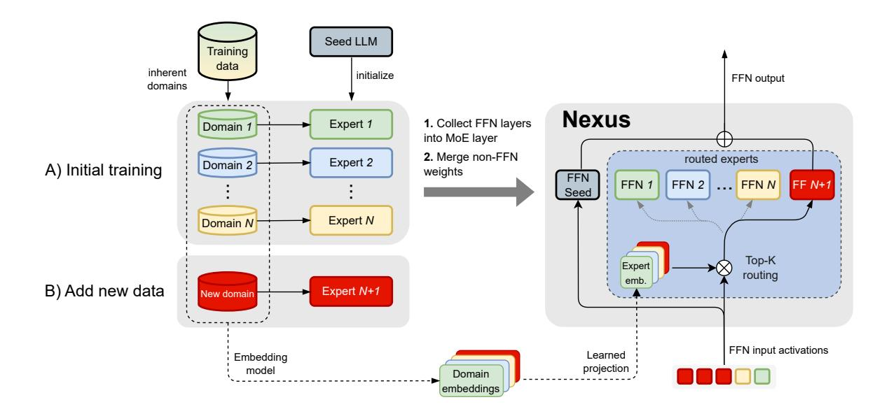
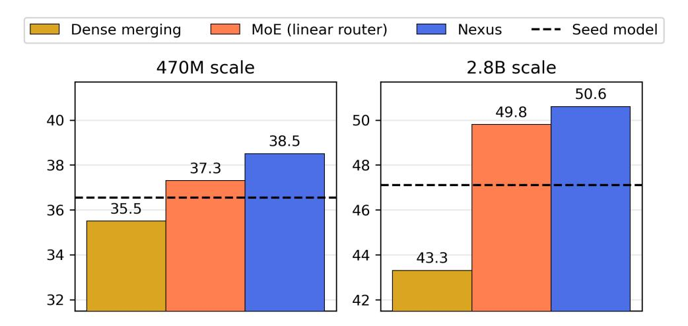
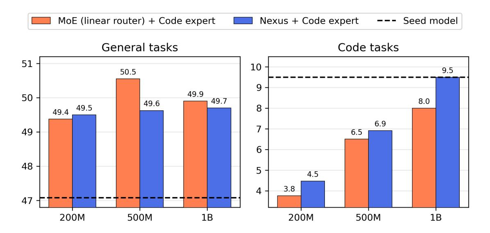
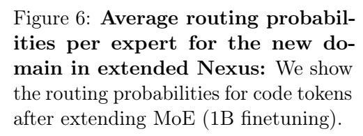
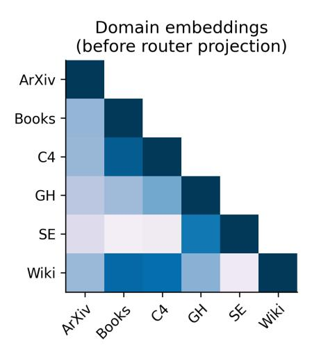
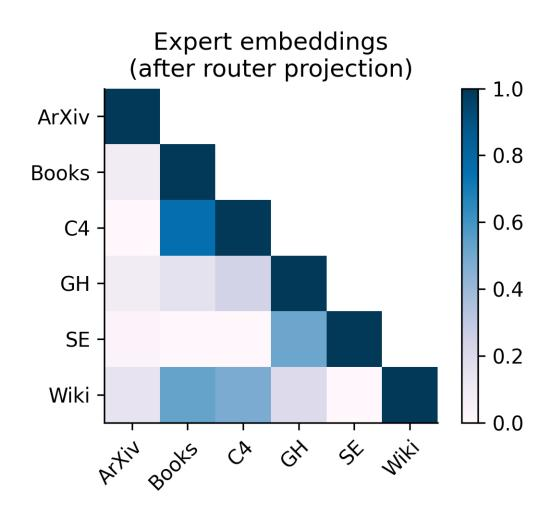
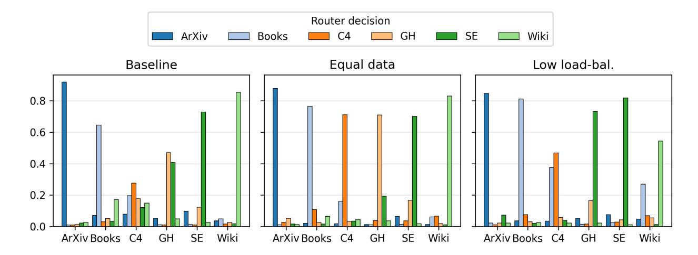

# Nexus: Specialization meets Adaptability for Efficiently Training Mixture of Experts

Nikolas Gritsch

<nikolasgritsch@cohere.com>

Qizhen Zhang†

Acyr Locatelli

Cohere for AI

University of Oxford <qizhen.zhang@eng.ox.ac.uk>

Cohere <acyr@cohere.com>

Sara Hooker

Cohere for AI

<sarahooker@cohere.com>

Ahmet Üstün

Cohere for AI <ahmet@cohere.com>

#### Abstract

Efficiency, specialization, and adaptability to new data distributions are qualities that are hard to combine in current Large Language Models. The Mixture of Experts (MoE) architecture has been the focus of significant research because its inherent conditional computation enables such desirable properties. In this work, we focus on "upcycling" dense expert models into an MoE, aiming to improve specialization while also adding the ability to adapt to new tasks easily. We introduce Nexus, an enhanced MoE architecture with adaptive routing where the model learns to project expert embeddings from domain representations. This approach allows Nexus to flexibly add new experts after the initial upcycling through separately trained dense models, without requiring large-scale MoE training for unseen data domains. Our experiments show that Nexus achieves a relative gain of up to 2.1% over the baseline for initial upcycling, and a 18.8% relative gain for extending the MoE with a new expert by using limited finetuning data. This flexibility of Nexus is crucial to enable an open-source ecosystem where every user continuously assembles their own MoE-mix according to their needs.

# 1 Introduction

In an era of bigger and bigger models [\[Canziani et al.,](#page-16-0) [2016;](#page-16-0) [Strubell et al.,](#page-21-0) [2019;](#page-21-0) [Rae et al.,](#page-19-0) [2021;](#page-19-0) [Raffel et al.,](#page-20-0) [2020;](#page-20-0) [Bommasani et al.,](#page-15-0) [2022;](#page-15-0) [Hooker,](#page-17-0) [2024\]](#page-17-0), there are several key objectives driving state-of-art progress. Doing more with less by improving efficiency [\[Treviso et al.,](#page-21-1) [2023\]](#page-21-1) remains paramount, but in addition to efficiency the deployment of these models in the wild means that the ability to adapt to new data [\[Pozzobon et al.,](#page-19-1) [2023b;](#page-19-1) [Gururangan et al.,](#page-17-1) [2020a;](#page-17-1) [Jang et al.,](#page-17-2) [2022;](#page-17-2) [Jin](#page-18-0) [et al.,](#page-18-0) [2022\]](#page-18-0), and specialization of compute [\[Zadouri et al.,](#page-22-0) [2024;](#page-22-0) [Shazeer et al.,](#page-20-1) [2018;](#page-20-1) [Riquelme et al.,](#page-20-2) [2021;](#page-20-2) [Du et al.,](#page-16-1) [2022;](#page-16-1) [Fedus et al.,](#page-17-3) [2022\]](#page-17-3) have gained renewed focus. While all these properties are desirable, a formidable challenge is designing architectures that can fulfill all of these requirements.

The Mixture-of-Expert (MoE) approach gained prominence because of its efficiency properties. In contrast to dense models which require significant compute to deploy, MoE approaches only activate

Corresponding authors: Nikolas Gritsch, Sara Hooker, Ahmet Üstün

<sup>†</sup>Work done at Cohere

<span id="page-1-0"></span>

Figure 1: **Depiction of Nexus for a single Transformer block: A)** In the initial training phase, each expert is trained separately. Furthermore, its training data is embedded by an embedding model and stored. The experts are combined by initializing each block's MoE layer with the seed model and each of the experts' FFN layers, and finetuning the model on a mix of all domains. During a forward pass, the seed model FFN is used as the shared expert and always activated. For the other experts, we perform top-1 routing based on the similarity of the transformed expert embeddings with the input data. **B)** Later, we can add a new expert by appending its training data embedding to the existing domain embeddings. The router function is independent of the number of experts, and therefore adapts fast to the new one.

a subset of the parameters for every single token. Intuitively, not all parameters are necessary for each request, as some parameters will specialize on certain tasks, and those unrelated to the current request can be ignored. However, while MoEs greatly improved efficiency, the ability to induce meaningful specialization has been more limited with observations that experts don't appear to exhibit dedicated expertise [Jiang et al., 2024; Zoph et al., 2022; Zadouri et al., 2023]. Furthermore, MoEs tend to suffer from severe training instabilities [Zoph et al., 2022].

Recent work has attempted to address both the training instabilities and the lack of specialization. These techniques often train completely separate experts and "upcycle" (combine) them into a single unified MoE model after dense training [Sukhbaatar et al., 2024]. This reduces the memory and communication cost, and improves efficiency during training as computations are more local and cross-device communication is reduced [Li et al., 2022; Gururangan et al., 2023]. Notably, the other major advantage of these approaches is the increase in specialization with separate experts that are trained on specific domains, making them clearly responsible for their human-interpretable subset of the data. On the other hand, MoEs with a standard router, which needs to be trained on a mix of all training data, are not designed to maintain domain specialization [Jiang et al., 2024].

However, efficiently integrating new experts into upcycled MoE models - a setting that is of great interest for *adaptability* objectives is far less studied. For most practitioners, given the scale of modern LLMs [Brown et al., 2020; Touvron et al., 2023; Kaplan et al., 2020; Anil et al., 2023] training MoEs repeatedly is an infeasible computational cost. Furthermore, most model development fails to take into account distribution drift in use cases, with limited flexibility and applicability across

|                                                           | MoE<br>(Vanilla) | BTM<br>(Merge) | BTX<br>(Linear router) | Nexus<br>(Ours) |
|-----------------------------------------------------------|------------------|----------------|------------------------|-----------------|
| Dense experts are trained independently (upcycling)       | ✗                | ✔              | ✔                      | ✔               |
| Experts are specialized in different domains              | ✗                | ✔              | ✔                      | ✔               |
| Experts are chosen by a learned router per input token    |                  | ✗              | ✔                      | ✔               |
| Router is adaptive via learned projection for new domains | ✗                | ✗              | ✗                      | ✔               |

Table 1: A comparison of existing approaches with Nexus: Unlike the vanilla MoE architecture [\[Shazeer et al.,](#page-20-3) [2017;](#page-20-3) [Fedus et al.,](#page-17-3) [2022\]](#page-17-3) the Branch-Train-Merge [BTM; [Li et al.,](#page-18-1) [2022\]](#page-18-1) and the Branch-Train-Mix [BTX; [Sukhbaatar et al.,](#page-21-2) [2024\]](#page-21-2) approaches train experts separately in different domains, reducing the training cost and improving specialization. However, they either merge the experts during inference or learn an MoE router layer from scratch, where prior domain information is not used. Our approach trains the MoE router based on domain information, maintaining the specialization and enabling efficient extension of the MoE with a new expert after training.

different tasks and domains [\[Pozzobon et al.,](#page-19-2) [2023a;](#page-19-2) [Gururangan et al.,](#page-17-6) [2020b\]](#page-17-6). However, human language is shaped by a cumulative culture, constantly building upon itself and evolving over time [\[Silvey,](#page-21-4) [2016\]](#page-21-4). Also, specialized use cases such as multilingual, code and math often require tailored additional training.

In this work, we attempt to reconcile all three desirable properties: efficiency, specialization, and adaptability. We ask "how can we adaptively combine separately trained specialized experts?" To address this, we introduce Nexus, a novel MoE architecture that parameterizes the router based on domain-specific data by learning to project the embedding of each data domain to an expert embedding. This learnable projection for the router allows for the easy extension of the MoE model with new experts that are trained independently on new datasets of interest. This also avoids the difficulties of MoE training, as our learned router scales with the number of experts without needing to be trained from scratch, which enables adding or removing experts as desired.

Our experiments show that Nexus outperforms previous work when upscaling an MoE from separately trained specialized domain experts. Going beyond the single upscaling phase, Nexus can be efficiently extended with a new expert trained on a new domain, by finetuning it with much fewer tokens, compared to the finetuning after the initial upcycling.

In summary, our contributions are as follows:

- (i) We present Nexus, a novel MoE framework designed to enhance sparse upcycling of specialized trained dense experts, while reducing the training cost of MoEs by facilitating easy adaptation to unseen data distributions. In Nexus, the traditional linear router from vanilla MoE models is replaced with routing based on the similarity of layer inputs to an expert embedding vector, derived from the average embedding of the corresponding expert training dataset.
- (ii) Our method outperforms the existing approach for upcycling specialized models into MoE, leading to 2.1% and 1.6% relative increase over the upcycled MoE (linear router) in 470M and 2.8B scales respectively. This enables performance increase in general tasks with 5.8% and 7.4% relative gains over the dense seed model at 470M and 2.8B respectively.
- (iii) Our method enables efficient adaptation to new domains by extending upcycled MoE with the new experts trained on unseen dataset. In this setting, Nexus outperforms the baseline MoE

(linear router) when finetuning on the limited amount of data, leading 18.8% relative gain on the new domain with 1B finetuning tokens upon MoE extension.

(iv) Finally, we show that our method is robust across different load balancing and data mixtures, and consistently outperforms the MoE with a linear router for specialized upcycling, confirming the benefits of the adaptive routing based on domain projections used in Nexus.

# 2 Background

Sparse Mixture of Experts architectures [\[Shazeer et al.,](#page-20-3) [2017;](#page-20-3) [Fedus et al.,](#page-17-3) [2022\]](#page-17-3) replace the feed-forward network (FFN) with an MoE layer in the Transformer block [\[Vaswani et al.,](#page-21-5) [2017\]](#page-21-5). An MoE layer consists of a router network R and a set of n experts, E1, ..., En, where each expert E<sup>i</sup> corresponds to an independent dense feed-forward network. The router network R is commonly parameterized by trainable weights W<sup>r</sup> ∈ R <sup>h</sup>×<sup>n</sup> where h is the model hidden dimension, and followed by a softmax function which takes an intermediate token representation x as input and combines the output of each expert based on the gating scores s1, ..., sn. Sparse MoEs only use the top-k experts E<sup>k</sup> based on experts gating scores s<sup>i</sup> .

$$s_i = R(x) = \operatorname{softmax}(W_r^T x)$$
 (Router) 
$$s_k = \operatorname{TopK}(s_i)$$
 (Top-K Routing) 
$$y = \sum_{i=1}^k s_k \cdot E_k(x)$$
 (MoE)

Recent work has also shown that using a shared expert E<sup>0</sup> that is always activated is beneficial to remove parameter redundancy among other experts [\[Rajbhandari et al.,](#page-20-4) [2022;](#page-20-4) [Dai et al.,](#page-16-3) [2024\]](#page-16-3):

$$y = E_0(x) + \sum_{i=1}^{k} s_k \cdot E_k(x)$$
 (MoE + shared expert)

Sparse Upcycling [\[Komatsuzaki et al.,](#page-18-3) [2023\]](#page-18-3) initializes an MoE model from a dense Transformer model. The dense model's FFN layers are copied n times to initialize each of the n experts, and the router layer is trained from scratch. BTX [\[Sukhbaatar et al.,](#page-21-2) [2024\]](#page-21-2) generalize this approach to initialize each expert from the FFN layer of a different expert model, and all other parameters as the average over all of these models. The experts models are finetuned versions of the original dense model, which allows weight merging without major losses.

Nexus leverages upcycling specialized expert models similar to BTX, however, it diverges in terms of MoE training, in particular with its novel MoE router, which enables to efficiently extend the MoE in multiple rounds after the sparse upcycling. We describe our method in the next section.

# 3 Adaptive Router for Upcycling Specialized Experts as MoE

The core component of an MoE model is the router, as it determines which experts to activate for any given input. In vanilla MoEs, the router is a learned linear layer that takes the token intermediate representations as input and computes the expert probabilities. However, this router does not

```
def router(self, inputs, domain_embeddings):
      # domain_to_expert_ffn learns projection domain to expert embeddings
      # domain_embeddings: [e_dim x n_experts]
      # expert_embeddings: [h_dim x n_experts]
      expert_embeddings = self.domain_to_expert_ffn(self.domain_embeddings)
      # router probs: [batch, seq, n_experts]
      router_probs = nn.softmax(inputs @ expert_embeddings)
      # Top-1 gate for routed experts
11
      index, gate = nn.topk(1, router_probs)
12
      # routed_experts_ffns: An MoE layer with FFN experts
13
      # routed_expert_out: [batch, seq, h_dim]
14
      # shared_expert_out: [batch, seq, h_dim]
      routed_expert_out = self.routed_expert_ffns[index](input)
      shared_expert_out = self.shared_expert_ffn(input)
17
18
      return shared_expert_out + gate * routed_expert_out
```

Figure 2: Router layer in Nexus: PyTorch-like pseudo-code illustrating a router layer, which consists of a 2-layer MLP network (domain\_to\_expert\_ffn) to project domain embeddings to expert embeddings, shared and routed expert FFNs, and sparse Top-k gating. Note that the expert embeddings are independent of the input and could be precomputed once and stored during inference.

necessarily learn specialization as MoEs are commonly trained using an auxiliary load balancing loss to improve training stability [Fedus et al., 2022; Jiang et al., 2024]. In Nexus, we propose a novel MoE router where per MoE block we learn a projection layer from given pre-computed domain embeddings to expert embeddings. We parametrize this projection layer  $P_r$  as a two-layer MLP with a SwiGLU activation function [Shazeer, 2020]:

$$e_i = P_r(d_i)$$
 (Domain to Expert Embeddings)  
=  $W_2 \cdot \text{SwiGLU}(W_1 \cdot d_i)$ 

where  $d_i \in \mathbb{R}^m$ , and  $e_i \in \mathbb{R}^h$  are the domain and expert embeddings for the *i*th domain respectively., where m and h are the domain embedding and the model dimensions.  $W_1 \in \mathbb{R}^{2h \times d}$ ,  $W_2 \in \mathbb{R}^{l \times l}$  are linear layers, and SwiGLU is defined as  $\mathbb{R}^{2n} \to \mathbb{R}^n$ . Given the expert embeddings  $e_i$  and layer inputs  $x \in \mathbb{R}^{s \times h}$ , we then compute routing probabilities  $s_i$  as:

$$s_i = \operatorname{softmax}(x \cdot e_i)$$
 (Routing Scores)

Unlike the standard router, Nexus's router includes a stronger inductive bias through pre-computed domain embeddings<sup>1</sup> that enables expert embedding to specialize. Thus,  $x \cdot e_i$  gives a high value

<span id="page-4-0"></span><sup>&</sup>lt;sup>1</sup>We used an Cohere Embed v3 (https://cohere.com/blog/introducing-embed-v3) as an external embedding model to compute domain embeddings based on existing individual data sources. However, similar to Gururangan et al. [2023], pre-training data can also be clustered and the centroid of each cluster can be used for domain embeddings.

for input tokens that are closer to the domain of the corresponding expert. Notably, this router is particularly suited for the sparse upcycling setting where the dense experts are separately trained on different domains.

Connection to hypernetworks. Our router parametrization is closely related to hypernetworks [\[Ha](#page-17-7) [et al.,](#page-17-7) [2016\]](#page-17-7) as the projection layer P<sup>r</sup> generates parameters for the router during runtime for a given input. We use domain embeddings as the input to the projection layer, enabling efficient adaptation and also a better cross-domain transfer based on the similarity between domain embeddings as shown in previous work [\[Mahabadi et al.,](#page-19-3) [2021;](#page-19-3) [Üstün et al.,](#page-21-6) [2022\]](#page-21-6).

Upcycling dense experts as an MoE. After training dense expert models, we merge the individual experts into a unified MoE by appending their FFNs along a new dimension to create an MoE layer per Transformer block. Unlike [Sukhbaatar et al.](#page-21-2) [\[2024\]](#page-21-2), instead of using the original FFN of the seed model as one of the routed experts in an MoE layer, we use it as the shared expert (FFNs) to better preserve the previous capabilities in the MoE model. For all non-FFN parameters including the attention weights, we merge expert parameters using simple weight averaging:

<span id="page-5-0"></span>
$$\text{FFN}_{moe} = \text{FFN}_s + [\text{FFN}e_1, \text{FFN}e_2, ..., \text{FFN}e_n] \qquad \text{(MoE Layer FFNs)}$$
 
$$\phi_{moe} = \frac{\sum_{i=1}^n \phi_i}{n} \qquad \text{(Merge Non-FFN params.)}$$

Efficient adaptation to new domains. An important advantage of method is that when a new data domain is present after MoE training, we use the learned projection P<sup>r</sup> to compute expert embedding of the new domain as enew = Pr(dnew). This enables to enhance the trained MoE model with additional dense experts, which are trained in the same way as the initial experts. The FFN parameters of the new expert are simply appended to the array of existing experts.

To adequately preserve the non-FFN parameters of existing experts, we perform a weighted average ϕ<sup>f</sup> = (1 − λ)· ϕmoe + λ · ϕnew where ϕ<sup>f</sup> , ϕe, and ϕmoe are parameters of the final MoE, dense expert, and initial MoE model and λ = 1/(n + 1). This enables efficient adaptation Nexus to new domain by extending it with the new dense expert trained independently. After extending the MoE with a new expert, we perform a lightweight finetuning with a limited number of tokens for quick adaptation.

# 4 Experiments

#### 4.1 Experimental setting

Our experimental setup includes 3 phases. Figure [1](#page-1-0) shows the architecture of Nexus and the corresponding experimental setting:

1. Training specialized expert LMs. For training the dense specialized experts, we use the sub-datasets from the SlimPajama dataset [\[Soboleva et al.,](#page-21-7) [2023\]](#page-21-7), a 627B token English-language corpus assembled from web data of various sources. We initialize four dense experts from the weights of the seed model and train them on the ArXiv, Books, C4, GitHub, StackExchange,



Figure 3: Downstream performance at different scales: Nexus consistently outperforms upcycled baselines on both the 470M and 2.8B parameters scale, showing the robustness of our method. We report the average performance on Knowledge, Science, Reasoning and MMLU.

and Wikipedia domains.[2](#page-6-0) . As seed model, we use a 470M and 2.8B parameters decoder-only autoregressive Transformer models [\[Radford et al.,](#page-19-4) [2019\]](#page-19-4) that are trained with a standard language modeling objective for 750B tokens. We train dense experts for 25 and 40 billion tokens for 470M and 2.8B seed models respectively. We use parallel attention layers, [\[Anil et al.,](#page-15-1) [2023;](#page-15-1) [Wang,](#page-21-8) [2021\]](#page-21-8), SwiGLU activation [\[Shazeer,](#page-20-5) [2020\]](#page-20-5), no biases in dense layers, and a byte-pair-encoding (BPE) tokenizer with a vocabulary size of 256,000. During training, we use a linear warmup (10% of total steps) to a maximum learning rate of 1e-3 and a cosine decay schedule to 3e-4.

- 2. MoE training. After the training of dense expert models, we merge them into a unified MoE by appending their FFNs along a new dimension to create an MoE layer per Transformer block. For the shared expert in our MoE layer, we use the original FFN layer of the seed model to better preserve the previous capabilities in the MoE model. For all non-FFN parameters including the attention weights, we merge expert parameters using simple weight averaging, following [Sukhbaatar et al.](#page-21-2) [\[2024\]](#page-21-2). After the MoE model is created, we continually train it for an additional 25B and 40B tokens respectively for the 470M and 2.8B experiments, on a mix of all domain and original pre-training datasets, using the same training hyperparameters as in the single expert training. Finally, we train the MoE models using an additional 1B tokens by upweighting the original pre-training dataset as it includes high-quality data sources such as instruction-style datasets using a cosine learning rate decay to 3e-5 [\[Parmar et al.,](#page-19-5) [2024\]](#page-19-5).
- 3. Extending the MoE model with new experts. After adding a new expert as defined in Section [3,](#page-5-0) we finetune the extended MoE model for up to 1 billion tokens using a uniformly sampled data mix consisting of 50% the previous domains and pre-training data and 50% the new domain. For the new expert (Code), we train a dense model using code documents from StarCoder [\[Li et al.,](#page-18-4) [2023\]](#page-18-4) with the same settings as for the training of the initial experts. As the 470M scale MoE did not have sufficient instruction following capabilities to attempt the code benchmarks, we only tested extending the MoEs with a new expert on the 2.8B scale.

<span id="page-6-0"></span><sup>2</sup>We exclude the Github and StackExchange datasets from SlimPajama in order to ablate adding a new expert model using the Code domain

#### 4.2 Baselines

We compare our experiments against two baselines:

- 1. Dense Merging: We compare MoE variants against merging all separately pre-trained experts and the seed model into a dense Transformer via equal weight averaging similar to BTM [\[Li](#page-18-1) [et al.,](#page-18-1) [2022\]](#page-18-1). This allows us to ask What are the benefits of routing MoE over simple averaging?
- 2. MoE (Linear Router): To evaluate Nexus's novel router for upcycling, we compare it against an MoE with a standard linear router that is upcycled from dense experts. Here, we ask how does our specialized routing compare to conventional learned linear routing? For a fair comparison, we also train this MoE model on the same datasets and for the same number of tokens as our method, and use the same architectural modifications such as shared experts.

#### 4.3 Evaluation

For the downstream evaluation, we measure the performance of each model on 15 tasks[3](#page-7-0) from five evaluation categories that reflect different capabilities based on the tasks and the datasets used in the benchmarks:

- Knowledge: To measure question-answering capabilities based on world knowledge and web documents such as Wikipedia, we report the performance on OpenBookQA [\[Mihaylov et al.,](#page-19-6) [2018\]](#page-19-6), Natural Questions [\[Kwiatkowski et al.,](#page-18-5) [2019\]](#page-18-5), TriviaQA [\[Joshi et al.,](#page-18-6) [2017\]](#page-18-6), QUAC [\[Choi](#page-16-4) [et al.,](#page-16-4) [2018\]](#page-16-4) (all 0-shot) and SQuAD (4-shot) [\[Rajpurkar et al.,](#page-20-6) [2016\]](#page-20-6).
- Science: For measuring knowledge in science-oriented academic benchmarks, we use ARC-Easy, ARC-Challenge [\[Clark et al.,](#page-16-5) [2018\]](#page-16-5), SciQ [\[Welbl et al.,](#page-22-3) [2017\]](#page-22-3) (all 0-shot).
- Reasoning: For reasoning abilities, we use CommonSenseQA [\[Talmor et al.,](#page-21-9) [2019\]](#page-21-9), SIQA [\[Sap](#page-20-7) [et al.,](#page-20-7) [2019\]](#page-20-7), PIQA [\[Bisk et al.,](#page-15-2) [2020\]](#page-15-2), WinoGrande [\[Sakaguchi et al.,](#page-20-8) [2019\]](#page-20-8), and HellaSwag [\[Zellers et al.,](#page-22-4) [2019\]](#page-22-4) (all 0-shot).
- General Language Understanding: We use MMLU (5-shot) [\[Hendrycks et al.,](#page-17-8) [2021\]](#page-17-8) to test general language understanding.
- Code: For code generation, we evaluate models on MBPP [\[Austin et al.,](#page-15-3) [2021\]](#page-15-3), LBPP [\[Matton](#page-19-7) [et al.,](#page-19-7) [2024\]](#page-19-7) and HumanEval-Pack [\[Chen et al.,](#page-16-6) [2021\]](#page-16-6) that includes Cpp, Javascript, Java, Go, Python, and Rust (all 0-shot).

# <span id="page-7-1"></span>5 Results and Discussion

#### 5.1 Main Results for Upcycled Models

We first compare Nexus to the upcycled baselines MoE with linear router and dense merging. Here, we ask "How does our MoE upcycling recipe with adaptive routing compare against baseline upcycling approaches? "

<span id="page-7-0"></span><sup>3</sup>We did not include ARC-Challenge and Natural Questions in 470M experiments as some model variants were unable to achieve non-random performance.

<span id="page-8-0"></span>

|                              | Know.               | Science                                     | Reason.             | MMLU                | Avg.                |
|------------------------------|---------------------|---------------------------------------------|---------------------|---------------------|---------------------|
| SEED MODEL (470M)            | 14.0                | 51.4                                        | 50.5                | 29.8                | 36.4                |
| Upcycled Models              |                     |                                             |                     |                     |                     |
| Dense Merging                | 10.9                | 52.0                                        | 50.3                | 27.8                | 35.5                |
| MoE (Linear router)<br>Nexus | 13.4<br><b>16.7</b> | $\begin{array}{c} 55.0 \\ 55.0 \end{array}$ | 51.3<br><b>52.3</b> | 29.6<br><b>29.8</b> | 37.3<br><b>38.5</b> |

Table 2: Downstream task results for Nexus with a 470M parameter seed model: Our approach outperforms baselines in all downstream benchmarks. Dense merging corresponds a dense model with 470M parameters, while both Nexus and MoE (linear router) consist of 605M active and 1.3B total parameters.

<span id="page-8-1"></span>

|                     | Know. | Science | Reason. | MMLU | Code (excl. in upcyc.) | Avg.<br>(w/o Code) |
|---------------------|-------|---------|---------|------|------------------------|--------------------|
| SEED MODEL (2.8B)   | 27.1  | 62.0    | 63.8    | 35.4 | 8.4                    | 47.1               |
| Upcycled Models     |       |         |         |      |                        |                    |
| Dense Merging       | 17.6  | 60.3    | 59.2    | 36.0 | 3.4                    | 43.3               |
| MoE (Linear router) | 31.5  | 66.5    | 62.9    | 38.6 | 2.6                    | 49.8               |
| Nexus               | 33.2  | 67.3    | 62.6    | 39.4 | 2.7                    | 50.6               |

Table 3: Downstream task results for Nexus with a 2.8B parameter seed model: Our approach outperforms the baselines in 3 out of 4 evaluation categories. Dense merging corresponds a dense model with 2.8B parameters, while both Nexus and MoE (linear router) have 4.3B active and 9.1B total parameters. Note that the trained models show severe forgetting on Code benchmarks, as we exclude Code data on purpose during the upcycling phase to simulate extending models with a new dataset in Section 5.2.

470M parameter seed model. Table 2 shows performances of upcycled models including Nexus where a 470M seed model is used to train dense experts. Both Nexus and the upcycled MoE (linear router)) consist of 1 shared and 6 routed experts, corresponding to a total number of 1.3B parameters where 605M parameters are activated per input for top-2 routing (1 expert always activated, 1 chosen by the router). The dense merging baseline is created by averaging the weights of all dense experts and the seed model, and therefore has the same number of parameters as the seed model.

Compared to the seed model, Nexus performs better in all evaluation categories with a 5.8% relative gain on average (38.5 vs 36.4). Compared to upcycled models, Nexus outperforms MoE (linear router) in 3 out of 4 categories with 3.2% relative gain (38.5 vs 37.3) on average, and beats dense merging by 8.5% overall relative increase (38.5 vs 35.5). Notably, while both upcycled MoEs outperform the seed model, dense merging underperforms on average, showing the benefits of MoE upcycling over parameter averaging.

2.8B parameter seed model. Next, we experiment by upcycling dense models with 2.7B parameters to validate if the results from the 470M seed model hold at a larger scale. Table 3 compares Nexus with MoE (linear router) and dense merging. Both Nexus and MoE (linear router) use 1 shared expert and 4 routed experts in these experiments, corresponding to 4.3B active

<span id="page-9-1"></span>

Figure 4: Extending upcycled MoE models with the Code experts: After initial upcycling, we extended MoEs (both Nexus and MoE with linear router) using an independently trained dense Code expert and finetuned the resulting models small number of tokens (200M, 500M, and 1B finetuning tokens) as described in [3.](#page-5-0) Nexus consistently outperforms the baseline in Code performance after extension without losing general performance. General tasks is the macro average of the knowledge, science, reasoning, and general knowledge categories reported in section [5.1.](#page-7-1) Note that the dense Code expert achieves scores of 42.1 and 14.3 for general and code tasks respectively.

parameters per input (top-2) out of 9.1B total parameters.

Our results show that Nexus leads to higher upcycling results compared to the baselines at the 2.8B scale, confirming the findings from smaller scale experiments. Nexus enables a 7.4% relative gain over the seed model and outperforms the MoE (linear router) with a 1.6% relative increase (50.6 vs. 49.8). Nexus outperforms the best baseline in 3 out of 4 task categories and achieves the highest increase in knowledge tasks with 22.5% and 5.6% relative to the seed model and the MoE (linear router) respectively. These tasks include knowledge retrieval from Wikipedia in which one of our specialized experts is trained for.

Similar to the 470M experiments, both Nexus and MoE (linear router) outperform the dense merging baseline. We relate this to potential cross-task interference between diverse specialized experts (including the seed model as an additional expert), leading to poor performance by applying a simple weight averaging.

#### <span id="page-9-0"></span>5.2 Extending the Upcycled MoE model with a New Expert

To support fully modular and efficient training of MoEs, besides upcycling the existing expert models, it is crucial for an adaptive method to have the ability to continuously extend the upcycled MoE with new experts trained using previously unseen data domains. To evaluate this, we train a dense Code expert and extend the upcycled MoEs (both Nexus and MoE (linear router)) as described in Section [3.](#page-5-0) We perform a small-scale finetuning of up to 1B tokens after extending the models. Figure [4](#page-9-1) shows both the general performance and the target code performance at 200M, 500M, and

<span id="page-10-0"></span>

Figure 5: Average routing probabilities for each expert per domain in Nexus: We compute the average routing probabilities across Transformer blocks for 512 samples per domain (from the 2.8B experiment). The labels on the x-axis represent the domain of the samples and the colored bars show the routing probabilities for the corresponding expert. We show token routing probabilities for the domains that are used to train specialized experts.

1B finetuning tokens. Here, we ask "Can we continuously upcycle dense models into an MoE without requiring large-scale MoE training each time? "

Performance on the new domain. As shown in Figure [4](#page-9-1) (right), Nexus outperforms the MoE (linear router) for 200M, 500M and 1B finetuning tokens with 18.4%, 6.2% and 18.8% relative gains respectively. Unlike MoE (linear router), where the router weights are reset after extending the MoE layers, Nexus uses the information that is available about the new domain by mapping the domain embedding to a new expert embedding for the router, and therefore finetunes the router weights without a restart.

Comparison with the dense models. Nexus reaches the code performance of the seed model while retaining superior performance on general tasks. In comparison to the seed model and the dense code expert (trained for 8B code-only tokens on top of the seed model), although the dense code expert still performs higher than both upcycled MoEs with a score of 14.3, its performance on general tasks is far inferior (42.1). Our method also achieves up to 18.8% relative gains over the MoE (linear router). These results show that with a fraction of the original upcycling budget (1B vs 40B tokens for initial upcycling, and 1B vs 8B tokens for code expert training), Nexus can acquire a new capability.

Performance on general tasks. As a proxy for the knowledge for previously learned domains, Figure [4](#page-9-1) (left) shows the average performance of Nexus and MoE (linear router) in general tasks. Although there is a slight drop on the general tasks for Nexus compared to initial upcycling (a relative decrease of 1.9%), the competitive performance is maintained across different numbers of finetuning tokens. We relate this to the composition of the finetuning mix where we use a high percentage of the code data (50% of the code and 50% of the previous domains).

<span id="page-11-0"></span>




Figure 7: Comparison between Nexus and the baseline in different load balancing and data sampling setups: We compare Nexus and MoE (linear router) by lowering load balancing loss factor and uniformly sampling the data domain during training in isolation. We report the average performance on Knowledge, Science, Reasoning, and MMLU.

# 5.3 Expert Specialization

To measure the specialization in our MoE, we take a closer look at how the MoE experts are activated for samples of separate domains. We compute average routing frequencies across all Transformer layers in Figure [5,](#page-10-0) where the labels on the x-axis represent which domain the tokens are coming from, and the colored bars show the routing frequencies for each of the experts trained on one of the domains. Since we select only one routed expert per token in each MoE layer, and expert FFN layers are inherited from dense experts, average routing frequencies present a good proxy for specialization of each of the experts. Here, we ask "can Nexus retain a high degree of specialization after upcycling? "

Routing for the upcycled experts. As shown in Figure [5,](#page-10-0) we find that the expert trained on the corresponding domain always receives the highest share of the tokens from that domain, confirming that Nexus retains the specialization from the specialized dense models. Concretely, this specialization is higher for ArXiv, Books, and Wikipedia with 63.0%, 64.7%, and 69.8% respectively. Interestingly, tokens from C4 are routed only 40.9% of the time to the C4 expert and distributed to the other experts approximately 20% for each one. We relate this to the broad coverage of the C4 dataset, which potentially includes samples closer to other domains and also a large percentage of the C4 used in the MoE training phase (proportional to its size in the SlimPjama dataset). Especially the latter factor pushes tokens from C4 to be distributed to the other experts due to the load balancing factor.

Specialized routing for the new expert. Next, we measure expert specialization for the newly

<span id="page-12-0"></span>



Figure 8: Domain and the projected expert embeddings for Nexus: We visualize cosine similarities between domains and the projected expert embeddings from the last Transformer block that are obtained in 470M experiments. Our projected router maintains the relative similarity between the original domains (e.g. Books & C4, Github & StackExchange) after the router's projection.

added expert on the new code domain. Figure [6](#page-11-0) shows the average routing probability per expert for sampled code tokens. We compute routing probabilities on the Nexus model with the code expert after 1B finetuning tokens (See Section [5.2](#page-9-0) for details). Here, we see clearly that code tokens are routed to the code expert 69.1% of the time on average. This shows that Nexus not only retains the specialization for the initial upcycling but also exhibits a high degree of specialization for a newly added expert for its own domain.

#### <span id="page-12-1"></span>5.4 Ablations

Mixture-of-expert models are known to be sensitive to the choice of load balancing loss factor [\[Fedus](#page-17-3) [et al.,](#page-17-3) [2022;](#page-17-3) [Zoph et al.,](#page-22-1) [2022\]](#page-22-1) and sampling weights for each data domains during training. As additional ablations, we run two new sets of experiments at 470M scale, one with a lower load balancing factor and the other one with equal weighting of each domain during training (whereas originally the weights were proportional to the share of tokens of that domain in SlimPajama). Figure [7](#page-11-0) compares Nexus and MoE (linear router) in terms of their downstream performances for these ablations. Finally, in this section, we also visualize domain and projected expert embeddings to see if the relationship between embeddings is preserved after the learned projection.

Lowering the load balancing loss factor. In Figure [7](#page-11-0) (baseline vs low load-bal.), we compare two Nexus models with the corresponding MoE (linear router) baselines where we use load balancing loss factor of 0.05 and 0.0005 for each set of experiments. We find that using a significantly lower factor for the load balancing loss hurts MoE (linear router) performance by approximately 2% relative drop while Nexus shows a robust performance across both load balancing factors. We hypothesize that because the expert embeddings in our router are always based on the domain representations, we achieve more stable distribution of tokens even if the load balancing loss is weighted extremely low.

Changing the training data composition. Next, we compare our default of sampling specialized domain data proportional to the size of the domain (total amount of tokens in SlimPajama), with a uniform sampling over all domains. Figure [7](#page-11-0) (baseline vs equal data) shows the downstream performances for both Nexus and MoE (linear). Although sampling domains differently does not significantly impact the downstream performance for both models, we find that it helps Nexus to improve specialization for all the domains in terms of expert routing probabilities (Figure [9,](#page-23-0) Appendix [A\)](#page-23-1). In particular, compared to the size proportional sampling, tokens from the C4 domain are routed more accurately (27.6% vs 71.1%) when data is equally sampled, which potentially impacts the model's behavior for particular input sequences.

Domain embeddings before and after projection. Finally, in Figure [8,](#page-12-0) we visualize cosine similarities between domains and the projected expert embeddings from the last Transformer block, in our main upcycling experiments at the 470M scale. Comparing the embeddings before and after mapping, we find that the router's learned projection preserves the main relationship between domains. For instance, relatively high cosine similarity between Books & C4, and StackExchange & GitHub exist both between their domain embeddings and the projected expert embeddings. Interestingly, while preserving the main relationships, we also find that the learned projection pushes expert embeddings further away from each other, potentially due to our choice of only activating a single expert per token besides the shared expert.

# 6 Related Work

Routing Variants of MoEs. The most common MoE architecture [\[Shazeer et al.,](#page-20-3) [2017;](#page-20-3) [Lepikhin](#page-18-7) [et al.,](#page-18-7) [2020;](#page-18-7) [Fedus et al.,](#page-17-3) [2022\]](#page-17-3) employs a linear router with a top-k routing scheme, where k typically equals 1 or 2. In this standard routing schema, only the k experts with the highest router gate values are activated. The MoE layer's output is computed as the weighted linear combination of these activated experts, with the weights corresponding to the router gate values. There is substantial research proposing alternatives to top-k expert assignments [\[Hazimeh et al.,](#page-17-9) [2021;](#page-17-9) [Lewis et al.,](#page-18-8) [2021;](#page-18-8) [Roller et al.,](#page-20-9) [2021;](#page-20-9) [Zhou et al.,](#page-22-5) [2022;](#page-22-5) [Zuo et al.,](#page-22-6) [2022\]](#page-22-6). For example, DeepSeek-MoE [\[Dai et al.,](#page-16-3) [2024\]](#page-16-3) introduces a routing variant where a number of experts are permanently active, always assigned to all tokens. Our work also adopts this "shared expert" approach for our general base expert. Another notable work is BASE Layers [\[Lewis et al.,](#page-18-8) [2021\]](#page-18-8), where authors formulate the token-to-expert assignment as a linear assignment problem. However, these efforts primarily focus on improving the general performance and/or training stability of MoEs. In contrast, our work puts emphasis adaptability and extensibility.

Efficient MoE Training by Re-Using Existing Dense Models. Training MoEs from scratch, i.e. from a random weight initialization, is computationally expensive [\[Gale et al.,](#page-17-10) [2023;](#page-17-10) [Fedus et al.,](#page-17-3) [2022\]](#page-17-3) and often challenging due to training instabilities [\[Zoph et al.,](#page-22-1) [2022\]](#page-22-1). Alternatively, recent works have explored re-using existing dense models to initialize MoEs, thereby enhancing training efficiency. Sparse Upcycling [\[Komatsuzaki et al.,](#page-18-3) [2023\]](#page-18-3) re-uses a single dense model to initialize the MoE by by replicating dense model's FFN weights N times into N FFN experts in the MoE. The router is initialized randomly, and all other parameters are copied directly from the dense model. BTX [\[Sukhbaatar et al.,](#page-21-2) [2024\]](#page-21-2) extends this approach by upcycling not from a single dense model, but from multiple specialized dense expert models to encourage diversity in the MoE initialization. Furthermore, BAM [\[Zhang et al.,](#page-22-7) [2024\]](#page-22-7) expands BTX to upcycle not just FFN experts but also attention experts, further enhancing performance. Our work also leverages this approach by reusing

existing specialized dense experts for MoE initialization, while extending it further to facilitate on-the-fly adaptations for new experts specialized in unseen data domains.

Efficient MoE Architectures. [Zadouri et al.](#page-22-0) [\[2024\]](#page-22-0) proposes replacing traditional MoE's computation-heavy feed-forward network (FFN) experts with more efficient experts comprised of smaller vectors and adapters, which are activated in parallel to a single dense FFN. This lightweight architecture necessitates only a limited number of parameter updates when finetuning, offering efficiency advantages. However, unlike our approach, it does not leverage existing specialized dense models and lacks a notion of specialized experts, which are central to our method. Similar to our work, [Muqeeth et al.](#page-19-8) [\[2024\]](#page-19-8) and [Ostapenko et al.](#page-19-9) [\[2024\]](#page-19-9) study combining separately trained experts into a unified model. However, they focus on parameter-efficient adapters such as LoRA [\[Hu et al.,](#page-17-11) [2021\]](#page-17-11) and supervised finetuning. In this work, we focus on efficiently pre-training fully-fledged MoE models via upcycling.

Adaptive MoEs and Ensemble Models. ModuleFormer [\[Shen et al.,](#page-21-10) [2023\]](#page-21-10) also aims to produce adaptable MoEs. The authors achieve adaptability by freezing existing MoE parameters while only training newly added modules with optimization constraints to the router. Unlike our work, ModuleFormer does not leverage existing expert dense seed models for efficiency gains, nor does it have a notion of specialization which is central to our work. Similar to our work, DEMix [\[Gururangan](#page-17-12) [et al.,](#page-17-12) [2021\]](#page-17-12) independently trains different FFN experts on specialized data domains, with each expert functioning as a domain-specific module. Modules can be added on-the-fly for adaptability. Followup works BTM and C-BTM [\[Li et al.,](#page-18-1) [2022;](#page-18-1) [Gururangan et al.,](#page-17-5) [2023\]](#page-17-5) extend DEMix to create adaptive ensemble models. However, all three works use a router requiring a forward pass for every expert at inference instead of sparsely activating them, which significantly increases inference costs, especially with a large number of experts. Unlike these approaches, our router cost is approximately the same as standard top-k routing during both training and inference, offering a more scalable solution for adaptability.

# 7 Conclusion

We propose Nexus, a new LLM framework that enables efficient upcycling of specialized dense experts into a sparsely activated MoE model. We show that individual experts in our method retain their specialization after upcycling, and that our router based on expert embeddings outperforms previous approaches for combining the dense experts. Furthermore, the model can be extended efficiently with new dense experts after the initial training phase, saving much compute compared to re-training the upcycled model or training from scratch.

# 8 Limitations

The MoE architecture is often employed for larger models in the multi-billion parameter range, where efficiency is paramount. However, to facilitate a broader set of experiments, we limit our setup to using 2.8B parameter seed models for the main results and 470M parameter seed models for ablations. Furthermore, our dense experts are based on existing data sources in the SlimPajama dataset which is pre-defined. Future work could extend our method by discovering specialized data domains through unsupervised clustering similar to [Gururangan et al.](#page-17-5) [\[2023\]](#page-17-5).

# 9 Acknowledgements

We would like to thank John Lin and Tim Chung for their support with data preprocessing, Sylvie Shi for her support with embedding the datasets, and Arkady Arkhangorodsky and David Cairuz for helping with and debugging downstream evaluations. We thank Felipe Cruz Salinas, for his help with choosing the seed model. We also thank Milad Alizadeh and James Owers-Bardsley for their support with the training cluster, and Viraat Aryabumi for his contributions to the downstream evaluation choice and visualization.

# References

<span id="page-15-1"></span>Rohan Anil, Andrew M. Dai, Orhan Firat, Melvin Johnson, Dmitry Lepikhin, Alexandre Passos, Siamak Shakeri, Emanuel Taropa, Paige Bailey, Zhifeng Chen, Eric Chu, Jonathan H. Clark, Laurent El Shafey, Yanping Huang, Kathy Meier-Hellstern, Gaurav Mishra, Erica Moreira, Mark Omernick, Kevin Robinson, Sebastian Ruder, Yi Tay, Kefan Xiao, Yuanzhong Xu, Yujing Zhang, Gustavo Hernandez Abrego, Junwhan Ahn, Jacob Austin, Paul Barham, Jan Botha, James Bradbury, Siddhartha Brahma, Kevin Brooks, Michele Catasta, Yong Cheng, Colin Cherry, Christopher A. Choquette-Choo, Aakanksha Chowdhery, Clément Crepy, Shachi Dave, Mostafa Dehghani, Sunipa Dev, Jacob Devlin, Mark Díaz, Nan Du, Ethan Dyer, Vlad Feinberg, Fangxiaoyu Feng, Vlad Fienber, Markus Freitag, Xavier Garcia, Sebastian Gehrmann, Lucas Gonzalez, Guy Gur-Ari, Steven Hand, Hadi Hashemi, Le Hou, Joshua Howland, Andrea Hu, Jeffrey Hui, Jeremy Hurwitz, Michael Isard, Abe Ittycheriah, Matthew Jagielski, Wenhao Jia, Kathleen Kenealy, Maxim Krikun, Sneha Kudugunta, Chang Lan, Katherine Lee, Benjamin Lee, Eric Li, Music Li, Wei Li, YaGuang Li, Jian Li, Hyeontaek Lim, Hanzhao Lin, Zhongtao Liu, Frederick Liu, Marcello Maggioni, Aroma Mahendru, Joshua Maynez, Vedant Misra, Maysam Moussalem, Zachary Nado, John Nham, Eric Ni, Andrew Nystrom, Alicia Parrish, Marie Pellat, Martin Polacek, Alex Polozov, Reiner Pope, Siyuan Qiao, Emily Reif, Bryan Richter, Parker Riley, Alex Castro Ros, Aurko Roy, Brennan Saeta, Rajkumar Samuel, Renee Shelby, Ambrose Slone, Daniel Smilkov, David R. So, Daniel Sohn, Simon Tokumine, Dasha Valter, Vijay Vasudevan, Kiran Vodrahalli, Xuezhi Wang, Pidong Wang, Zirui Wang, Tao Wang, John Wieting, Yuhuai Wu, Kelvin Xu, Yunhan Xu, Linting Xue, Pengcheng Yin, Jiahui Yu, Qiao Zhang, Steven Zheng, Ce Zheng, Weikang Zhou, Denny Zhou, Slav Petrov, and Yonghui Wu. Palm 2 technical report, 2023.

<span id="page-15-3"></span>Jacob Austin, Augustus Odena, Maxwell Nye, Maarten Bosma, Henryk Michalewski, David Dohan, Ellen Jiang, Carrie Cai, Michael Terry, Quoc Le, and Charles Sutton. Program synthesis with large language models, 2021.

<span id="page-15-2"></span>Yonatan Bisk, Rowan Zellers, Jianfeng Gao, Yejin Choi, et al. Piqa: Reasoning about physical commonsense in natural language. In Proceedings of the AAAI conference on artificial intelligence, volume 34, pp. 7432–7439, 2020.

<span id="page-15-0"></span>Rishi Bommasani, Drew A. Hudson, Ehsan Adeli, Russ Altman, Simran Arora, Sydney von Arx, Michael S. Bernstein, Jeannette Bohg, Antoine Bosselut, Emma Brunskill, Erik Brynjolfsson, Shyamal Buch, Dallas Card, Rodrigo Castellon, Niladri Chatterji, Annie Chen, Kathleen Creel, Jared Quincy Davis, Dora Demszky, Chris Donahue, Moussa Doumbouya, Esin Durmus, Stefano Ermon, John Etchemendy, Kawin Ethayarajh, Li Fei-Fei, Chelsea Finn, Trevor Gale, Lauren Gillespie, Karan Goel, Noah Goodman, Shelby Grossman, Neel Guha, Tatsunori Hashimoto, Peter Henderson, John Hewitt, Daniel E. Ho, Jenny Hong, Kyle Hsu, Jing Huang, Thomas Icard, Saahil

Jain, Dan Jurafsky, Pratyusha Kalluri, Siddharth Karamcheti, Geoff Keeling, Fereshte Khani, Omar Khattab, Pang Wei Koh, Mark Krass, Ranjay Krishna, Rohith Kuditipudi, Ananya Kumar, Faisal Ladhak, Mina Lee, Tony Lee, Jure Leskovec, Isabelle Levent, Xiang Lisa Li, Xuechen Li, Tengyu Ma, Ali Malik, Christopher D. Manning, Suvir Mirchandani, Eric Mitchell, Zanele Munyikwa, Suraj Nair, Avanika Narayan, Deepak Narayanan, Ben Newman, Allen Nie, Juan Carlos Niebles, Hamed Nilforoshan, Julian Nyarko, Giray Ogut, Laurel Orr, Isabel Papadimitriou, Joon Sung Park, Chris Piech, Eva Portelance, Christopher Potts, Aditi Raghunathan, Rob Reich, Hongyu Ren, Frieda Rong, Yusuf Roohani, Camilo Ruiz, Jack Ryan, Christopher Ré, Dorsa Sadigh, Shiori Sagawa, Keshav Santhanam, Andy Shih, Krishnan Srinivasan, Alex Tamkin, Rohan Taori, Armin W. Thomas, Florian Tramèr, Rose E. Wang, William Wang, Bohan Wu, Jiajun Wu, Yuhuai Wu, Sang Michael Xie, Michihiro Yasunaga, Jiaxuan You, Matei Zaharia, Michael Zhang, Tianyi Zhang, Xikun Zhang, Yuhui Zhang, Lucia Zheng, Kaitlyn Zhou, and Percy Liang. On the opportunities and risks of foundation models, 2022. URL <https://arxiv.org/abs/2108.07258>.

<span id="page-16-2"></span>Tom B. Brown, Benjamin Mann, Nick Ryder, Melanie Subbiah, Jared Kaplan, Prafulla Dhariwal, Arvind Neelakantan, Pranav Shyam, Girish Sastry, Amanda Askell, Sandhini Agarwal, Ariel Herbert-Voss, Gretchen Krueger, Tom Henighan, Rewon Child, Aditya Ramesh, Daniel M. Ziegler, Jeffrey Wu, Clemens Winter, Christopher Hesse, Mark Chen, Eric Sigler, Mateusz Litwin, Scott Gray, Benjamin Chess, Jack Clark, Christopher Berner, Sam McCandlish, Alec Radford, Ilya Sutskever, and Dario Amodei. Language models are few-shot learners, 2020.

<span id="page-16-0"></span>Alfredo Canziani, Adam Paszke, and Eugenio Culurciello. An Analysis of Deep Neural Network Models for Practical Applications. arXiv e-prints, pp. arXiv:1605.07678, May 2016.

<span id="page-16-6"></span>Mark Chen, Jerry Tworek, Heewoo Jun, Qiming Yuan, Henrique Ponde de Oliveira Pinto, Jared Kaplan, Harri Edwards, Yuri Burda, Nicholas Joseph, Greg Brockman, Alex Ray, Raul Puri, Gretchen Krueger, Michael Petrov, Heidy Khlaaf, Girish Sastry, Pamela Mishkin, Brooke Chan, Scott Gray, Nick Ryder, Mikhail Pavlov, Alethea Power, Lukasz Kaiser, Mohammad Bavarian, Clemens Winter, Philippe Tillet, Felipe Petroski Such, Dave Cummings, Matthias Plappert, Fotios Chantzis, Elizabeth Barnes, Ariel Herbert-Voss, William Hebgen Guss, Alex Nichol, Alex Paino, Nikolas Tezak, Jie Tang, Igor Babuschkin, Suchir Balaji, Shantanu Jain, William Saunders, Christopher Hesse, Andrew N. Carr, Jan Leike, Josh Achiam, Vedant Misra, Evan Morikawa, Alec Radford, Matthew Knight, Miles Brundage, Mira Murati, Katie Mayer, Peter Welinder, Bob McGrew, Dario Amodei, Sam McCandlish, Ilya Sutskever, and Wojciech Zaremba. Evaluating large language models trained on code, 2021. URL <https://arxiv.org/abs/2107.03374>.

<span id="page-16-4"></span>Eunsol Choi, He He, Mohit Iyyer, Mark Yatskar, Wen-tau Yih, Yejin Choi, Percy Liang, and Luke Zettlemoyer. Quac: Question answering in context. arXiv preprint arXiv:1808.07036, 2018.

<span id="page-16-5"></span>Peter Clark, Isaac Cowhey, Oren Etzioni, Tushar Khot, Ashish Sabharwal, Carissa Schoenick, and Oyvind Tafjord. Think you have solved question answering? try arc, the ai2 reasoning challenge. arXiv preprint arXiv:1803.05457, 2018.

<span id="page-16-3"></span>Damai Dai, Chengqi Deng, Chenggang Zhao, R. X. Xu, Huazuo Gao, Deli Chen, Jiashi Li, Wangding Zeng, Xingkai Yu, Y. Wu, Zhenda Xie, Y. K. Li, Panpan Huang, Fuli Luo, Chong Ruan, Zhifang Sui, and Wenfeng Liang. Deepseekmoe: Towards ultimate expert specialization in mixture-of-experts language models, 2024. URL <https://arxiv.org/abs/2401.06066>.

<span id="page-16-1"></span>Nan Du, Yanping Huang, Andrew M. Dai, Simon Tong, Dmitry Lepikhin, Yuanzhong Xu, Maxim Krikun, Yanqi Zhou, Adams Wei Yu, Orhan Firat, Barret Zoph, Liam Fedus, Maarten Bosma,

- Zongwei Zhou, Tao Wang, Yu Emma Wang, Kellie Webster, Marie Pellat, Kevin Robinson, Kathleen Meier-Hellstern, Toju Duke, Lucas Dixon, Kun Zhang, Quoc V Le, Yonghui Wu, Zhifeng Chen, and Claire Cui. Glam: Efficient scaling of language models with mixture-of-experts, 2022.
- <span id="page-17-3"></span>William Fedus, Barret Zoph, and Noam Shazeer. Switch transformers: Scaling to trillion parameter models with simple and efficient sparsity, 2022.
- <span id="page-17-10"></span>Trevor Gale, Deepak Narayanan, Cliff Young, and Matei Zaharia. Megablocks: Efficient sparse training with mixture-of-experts. Proceedings of Machine Learning and Systems, 5:288–304, 2023.
- <span id="page-17-1"></span>Suchin Gururangan, Ana Marasović, Swabha Swayamdipta, Kyle Lo, Iz Beltagy, Doug Downey, and Noah A. Smith. Don't stop pretraining: Adapt language models to domains and tasks. In Dan Jurafsky, Joyce Chai, Natalie Schluter, and Joel Tetreault (eds.), Proceedings of the 58th Annual Meeting of the Association for Computational Linguistics, pp. 8342–8360, Online, July 2020a. Association for Computational Linguistics. doi: 10.18653/v1/2020.acl-main.740. URL <https://aclanthology.org/2020.acl-main.740>.
- <span id="page-17-6"></span>Suchin Gururangan, Ana Marasović, Swabha Swayamdipta, Kyle Lo, Iz Beltagy, Doug Downey, and Noah A Smith. Don't stop pretraining: Adapt language models to domains and tasks. arXiv preprint arXiv:2004.10964, 2020b.
- <span id="page-17-12"></span>Suchin Gururangan, Mike Lewis, Ari Holtzman, Noah A Smith, and Luke Zettlemoyer. Demix layers: Disentangling domains for modular language modeling. arXiv preprint arXiv:2108.05036, 2021.
- <span id="page-17-5"></span>Suchin Gururangan, Margaret Li, Mike Lewis, Weijia Shi, Tim Althoff, Noah A. Smith, and Luke Zettlemoyer. Scaling expert language models with unsupervised domain discovery, 2023. URL <https://arxiv.org/abs/2303.14177>.
- <span id="page-17-7"></span>David Ha, Andrew Dai, and Quoc V Le. Hypernetworks. arXiv preprint arXiv:1609.09106, 2016.
- <span id="page-17-9"></span>Hussein Hazimeh, Zhe Zhao, Aakanksha Chowdhery, Maheswaran Sathiamoorthy, Yihua Chen, Rahul Mazumder, Lichan Hong, and Ed H. Chi. Dselect-k: Differentiable selection in the mixture of experts with applications to multi-task learning, 2021.
- <span id="page-17-8"></span>Dan Hendrycks, Collin Burns, Steven Basart, Andy Zou, Mantas Mazeika, Dawn Song, and Jacob Steinhardt. Measuring massive multitask language understanding, 2021. URL [https://arxiv.or](https://arxiv.org/abs/2009.03300) [g/abs/2009.03300](https://arxiv.org/abs/2009.03300).
- <span id="page-17-0"></span>Sara Hooker. On the limitations of compute thresholds as a governance strategy, 2024. URL <https://arxiv.org/abs/2407.05694>.
- <span id="page-17-11"></span>Edward J. Hu, Yelong Shen, Phillip Wallis, Zeyuan Allen-Zhu, Yuanzhi Li, Shean Wang, Lu Wang, and Weizhu Chen. Lora: Low-rank adaptation of large language models, 2021.
- <span id="page-17-2"></span>Joel Jang, Seonghyeon Ye, Sohee Yang, Joongbo Shin, Janghoon Han, Gyeonghun Kim, Stanley Jungkyu Choi, and Minjoon Seo. Towards continual knowledge learning of language models, 2022. URL <https://arxiv.org/abs/2110.03215>.
- <span id="page-17-4"></span>Albert Q. Jiang, Alexandre Sablayrolles, Antoine Roux, Arthur Mensch, Blanche Savary, Chris Bamford, Devendra Singh Chaplot, Diego de las Casas, Emma Bou Hanna, Florian Bressand, Gianna Lengyel, Guillaume Bour, Guillaume Lample, Lélio Renard Lavaud, Lucile Saulnier, Marie-Anne Lachaux, Pierre Stock, Sandeep Subramanian, Sophia Yang, Szymon Antoniak, Teven Le

- Scao, Théophile Gervet, Thibaut Lavril, Thomas Wang, Timothée Lacroix, and William El Sayed. Mixtral of experts, 2024. URL <https://arxiv.org/abs/2401.04088>.
- <span id="page-18-0"></span>Xisen Jin, Bill Yuchen Lin, Mohammad Rostami, and Xiang Ren. Learn continually, generalize rapidly: Lifelong knowledge accumulation for few-shot learning, 2022. URL [https://arxiv.org/](https://arxiv.org/abs/2104.08808) [abs/2104.08808](https://arxiv.org/abs/2104.08808).
- <span id="page-18-6"></span>Mandar Joshi, Eunsol Choi, Daniel Weld, and Luke Zettlemoyer. TriviaQA: A large scale distantly supervised challenge dataset for reading comprehension. In Regina Barzilay and Min-Yen Kan (eds.), Proceedings of the 55th Annual Meeting of the Association for Computational Linguistics (Volume 1: Long Papers), pp. 1601–1611, Vancouver, Canada, July 2017. Association for Computational Linguistics. doi: 10.18653/v1/P17-1147. URL <https://aclanthology.org/P17-1147>.
- <span id="page-18-2"></span>Jared Kaplan, Sam McCandlish, Tom Henighan, Tom B. Brown, Benjamin Chess, Rewon Child, Scott Gray, Alec Radford, Jeffrey Wu, and Dario Amodei. Scaling laws for neural language models, 2020.
- <span id="page-18-3"></span>Aran Komatsuzaki, Joan Puigcerver, James Lee-Thorp, Carlos Riquelme Ruiz, Basil Mustafa, Joshua Ainslie, Yi Tay, Mostafa Dehghani, and Neil Houlsby. Sparse upcycling: Training mixture-ofexperts from dense checkpoints, 2023.
- <span id="page-18-5"></span>Tom Kwiatkowski, Jennimaria Palomaki, Olivia Redfield, Michael Collins, Ankur Parikh, Chris Alberti, Danielle Epstein, Illia Polosukhin, Matthew Kelcey, Jacob Devlin, Kenton Lee, Kristina N. Toutanova, Llion Jones, Ming-Wei Chang, Andrew Dai, Jakob Uszkoreit, Quoc Le, and Slav Petrov. Natural questions: a benchmark for question answering research. Transactions of the Association of Computational Linguistics, 2019.
- <span id="page-18-7"></span>Dmitry Lepikhin, HyoukJoong Lee, Yuanzhong Xu, Dehao Chen, Orhan Firat, Yanping Huang, Maxim Krikun, Noam Shazeer, and Zhifeng Chen. Gshard: Scaling giant models with conditional computation and automatic sharding, 2020.
- <span id="page-18-8"></span>Mike Lewis, Shruti Bhosale, Tim Dettmers, Naman Goyal, and Luke Zettlemoyer. Base layers: Simplifying training of large, sparse models. In Marina Meila and Tong Zhang (eds.), Proceedings of the 38th International Conference on Machine Learning, volume 139 of Proceedings of Machine Learning Research, pp. 6265–6274. PMLR, 18–24 Jul 2021. URL [https://proceedings.mlr.pr](https://proceedings.mlr.press/v139/lewis21a.html) [ess/v139/lewis21a.html](https://proceedings.mlr.press/v139/lewis21a.html).
- <span id="page-18-1"></span>Margaret Li, Suchin Gururangan, Tim Dettmers, Mike Lewis, Tim Althoff, Noah A. Smith, and Luke Zettlemoyer. Branch-train-merge: Embarrassingly parallel training of expert language models, 2022. URL <https://arxiv.org/abs/2208.03306>.
- <span id="page-18-4"></span>Raymond Li, Loubna Ben Allal, Yangtian Zi, Niklas Muennighoff, Denis Kocetkov, Chenghao Mou, Marc Marone, Christopher Akiki, Jia Li, Jenny Chim, Qian Liu, Evgenii Zheltonozhskii, Terry Yue Zhuo, Thomas Wang, Olivier Dehaene, Mishig Davaadorj, Joel Lamy-Poirier, João Monteiro, Oleh Shliazhko, Nicolas Gontier, Nicholas Meade, Armel Zebaze, Ming-Ho Yee, Logesh Kumar Umapathi, Jian Zhu, Benjamin Lipkin, Muhtasham Oblokulov, Zhiruo Wang, Rudra Murthy, Jason Stillerman, Siva Sankalp Patel, Dmitry Abulkhanov, Marco Zocca, Manan Dey, Zhihan Zhang, Nour Fahmy, Urvashi Bhattacharyya, Wenhao Yu, Swayam Singh, Sasha Luccioni, Paulo Villegas, Maxim Kunakov, Fedor Zhdanov, Manuel Romero, Tony Lee, Nadav Timor, Jennifer Ding, Claire Schlesinger, Hailey Schoelkopf, Jan Ebert, Tri Dao, Mayank Mishra, Alex Gu, Jennifer Robinson, Carolyn Jane Anderson, Brendan Dolan-Gavitt, Danish Contractor, Siva Reddy, Daniel

- Fried, Dzmitry Bahdanau, Yacine Jernite, Carlos Muñoz Ferrandis, Sean Hughes, Thomas Wolf, Arjun Guha, Leandro von Werra, and Harm de Vries. Starcoder: may the source be with you!, 2023.
- <span id="page-19-3"></span>Rabeeh Karimi Mahabadi, Sebastian Ruder, Mostafa Dehghani, and James Henderson. Parameterefficient multi-task fine-tuning for transformers via shared hypernetworks, 2021.
- <span id="page-19-7"></span>Alexandre Matton, Tom Sherborne, Dennis Aumiller, Elena Tommasone, Milad Alizadeh, Jingyi He, Raymond Ma, Maxime Voisin, Ellen Gilsenan-McMahon, and Matthias Gallé. On leakage of code generation evaluation datasets. arXiv preprint arXiv:2407.07565, 2024.
- <span id="page-19-6"></span>Todor Mihaylov, Peter Clark, Tushar Khot, and Ashish Sabharwal. Can a suit of armor conduct electricity? a new dataset for open book question answering. In Ellen Riloff, David Chiang, Julia Hockenmaier, and Jun'ichi Tsujii (eds.), Proceedings of the 2018 Conference on Empirical Methods in Natural Language Processing, pp. 2381–2391, Brussels, Belgium, October-November 2018. Association for Computational Linguistics. doi: 10.18653/v1/D18-1260. URL [https:](https://aclanthology.org/D18-1260) [//aclanthology.org/D18-1260](https://aclanthology.org/D18-1260).
- <span id="page-19-8"></span>Mohammed Muqeeth, Haokun Liu, Yufan Liu, and Colin Raffel. Learning to route among specialized experts for zero-shot generalization. arXiv preprint arXiv:2402.05859, 2024.
- <span id="page-19-9"></span>Oleksiy Ostapenko, Zhan Su, Edoardo Maria Ponti, Laurent Charlin, Nicolas Le Roux, Matheus Pereira, Lucas Caccia, and Alessandro Sordoni. Towards modular llms by building and reusing a library of loras. arXiv preprint arXiv:2405.11157, 2024.
- <span id="page-19-5"></span>Jupinder Parmar, Shrimai Prabhumoye, Joseph Jennings, Mostofa Patwary, Sandeep Subramanian, Dan Su, Chen Zhu, Deepak Narayanan, Aastha Jhunjhunwala, Ayush Dattagupta, Vibhu Jawa, Jiwei Liu, Ameya Mahabaleshwarkar, Osvald Nitski, Annika Brundyn, James Maki, Miguel Martinez, Jiaxuan You, John Kamalu, Patrick LeGresley, Denys Fridman, Jared Casper, Ashwath Aithal, Oleksii Kuchaiev, Mohammad Shoeybi, Jonathan Cohen, and Bryan Catanzaro. Nemotron-4 15b technical report, 2024. URL <https://arxiv.org/abs/2402.16819>.
- <span id="page-19-2"></span>Luiza Pozzobon, Beyza Ermis, Patrick Lewis, and Sara Hooker. Goodtriever: Adaptive toxicity mitigation with retrieval-augmented models. In Houda Bouamor, Juan Pino, and Kalika Bali (eds.), Findings of the Association for Computational Linguistics: EMNLP 2023, pp. 5108–5125, Singapore, December 2023a. Association for Computational Linguistics. doi: 10.18653/v1/2023.f indings-emnlp.339. URL <https://aclanthology.org/2023.findings-emnlp.339>.
- <span id="page-19-1"></span>Luiza Pozzobon, Beyza Ermis, Patrick Lewis, and Sara Hooker. Goodtriever: Adaptive toxicity mitigation with retrieval-augmented models, 2023b. URL <https://arxiv.org/abs/2310.07589>.
- <span id="page-19-4"></span>Alec Radford, Jeff Wu, Rewon Child, David Luan, Dario Amodei, and Ilya Sutskever. Language models are unsupervised multitask learners, 2019. URL [https://api.semanticscholar.org/Co](https://api.semanticscholar.org/CorpusID:160025533) [rpusID:160025533](https://api.semanticscholar.org/CorpusID:160025533).
- <span id="page-19-0"></span>Jack W. Rae, Sebastian Borgeaud, Trevor Cai, Katie Millican, Jordan Hoffmann, Francis Song, John Aslanides, Sarah Henderson, Roman Ring, Susannah Young, Eliza Rutherford, Tom Hennigan, Jacob Menick, Albin Cassirer, Richard Powell, George van den Driessche, Lisa Anne Hendricks, Maribeth Rauh, Po-Sen Huang, Amelia Glaese, Johannes Welbl, Sumanth Dathathri, Saffron Huang, Jonathan Uesato, John Mellor, Irina Higgins, Antonia Creswell, Nat McAleese, Amy Wu, Erich Elsen, Siddhant Jayakumar, Elena Buchatskaya, David Budden, Esme Sutherland, Karen

Simonyan, Michela Paganini, Laurent Sifre, Lena Martens, Xiang Lorraine Li, Adhiguna Kuncoro, Aida Nematzadeh, Elena Gribovskaya, Domenic Donato, Angeliki Lazaridou, Arthur Mensch, Jean-Baptiste Lespiau, Maria Tsimpoukelli, Nikolai Grigorev, Doug Fritz, Thibault Sottiaux, Mantas Pajarskas, Toby Pohlen, Zhitao Gong, Daniel Toyama, Cyprien de Masson d'Autume, Yujia Li, Tayfun Terzi, Vladimir Mikulik, Igor Babuschkin, Aidan Clark, Diego de Las Casas, Aurelia Guy, Chris Jones, James Bradbury, Matthew Johnson, Blake Hechtman, Laura Weidinger, Iason Gabriel, William Isaac, Ed Lockhart, Simon Osindero, Laura Rimell, Chris Dyer, Oriol Vinyals, Kareem Ayoub, Jeff Stanway, Lorrayne Bennett, Demis Hassabis, Koray Kavukcuoglu, and Geoffrey Irving. Scaling Language Models: Methods, Analysis & Insights from Training Gopher, 2021.

<span id="page-20-0"></span>Colin Raffel, Noam Shazeer, Adam Roberts, Katherine Lee, Sharan Narang, Michael Matena, Yanqi Zhou, Wei Li, and Peter J. Liu. Exploring the limits of transfer learning with a unified text-to-text transformer, 2020.

<span id="page-20-4"></span>Samyam Rajbhandari, Conglong Li, Zhewei Yao, Minjia Zhang, Reza Yazdani Aminabadi, Ammar Ahmad Awan, Jeff Rasley, and Yuxiong He. DeepSpeed-MoE: Advancing mixture-of-experts inference and training to power next-generation AI scale. In Kamalika Chaudhuri, Stefanie Jegelka, Le Song, Csaba Szepesvari, Gang Niu, and Sivan Sabato (eds.), Proceedings of the 39th International Conference on Machine Learning, volume 162 of Proceedings of Machine Learning Research, pp. 18332–18346. PMLR, 17–23 Jul 2022. URL [https://proceedings.mlr.press/v1](https://proceedings.mlr.press/v162/rajbhandari22a.html) [62/rajbhandari22a.html](https://proceedings.mlr.press/v162/rajbhandari22a.html).

<span id="page-20-6"></span>Pranav Rajpurkar, Jian Zhang, Konstantin Lopyrev, and Percy Liang. SQuAD: 100,000+ questions for machine comprehension of text. In Jian Su, Kevin Duh, and Xavier Carreras (eds.), Proceedings of the 2016 Conference on Empirical Methods in Natural Language Processing, pp. 2383–2392, Austin, Texas, November 2016. Association for Computational Linguistics. doi: 10.18653/v1/D16-1264. URL <https://aclanthology.org/D16-1264>.

<span id="page-20-2"></span>Carlos Riquelme, Joan Puigcerver, Basil Mustafa, Maxim Neumann, Rodolphe Jenatton, André Susano Pinto, Daniel Keysers, and Neil Houlsby. Scaling vision with sparse mixture of experts. Advances in Neural Information Processing Systems, 34:8583–8595, 2021.

<span id="page-20-9"></span>Stephen Roller, Sainbayar Sukhbaatar, Arthur Szlam, and Jason Weston. Hash layers for large sparse models, 2021.

<span id="page-20-8"></span>Keisuke Sakaguchi, Ronan Le Bras, Chandra Bhagavatula, and Yejin Choi. Winogrande: An adversarial winograd schema challenge at scale, 2019.

<span id="page-20-7"></span>Maarten Sap, Hannah Rashkin, Derek Chen, Ronan LeBras, and Yejin Choi. Socialiqa: Commonsense reasoning about social interactions, 2019. URL <https://arxiv.org/abs/1904.09728>.

<span id="page-20-5"></span>Noam Shazeer. Glu variants improve transformer, 2020. URL <https://arxiv.org/abs/2002.05202>.

<span id="page-20-3"></span>Noam Shazeer, Azalia Mirhoseini, Krzysztof Maziarz, Andy Davis, Quoc Le, Geoffrey Hinton, and Jeff Dean. Outrageously large neural networks: The sparsely-gated mixture-of-experts layer, 2017.

<span id="page-20-1"></span>Noam Shazeer, Youlong Cheng, Niki Parmar, Dustin Tran, Ashish Vaswani, Penporn Koanantakool, Peter Hawkins, HyoukJoong Lee, Mingsheng Hong, Cliff Young, Ryan Sepassi, and Blake Hechtman. Mesh-tensorflow: Deep learning for supercomputers, 2018.

- <span id="page-21-10"></span>Yikang Shen, Zheyu Zhang, Tianyou Cao, Shawn Tan, Zhenfang Chen, and Chuang Gan. Moduleformer: Modularity emerges from mixture-of-experts. arXiv e-prints, pp. arXiv–2306, 2023.
- <span id="page-21-4"></span>Catriona Silvey. Speaking our minds: Why human communication is different, and how language evolved to make it special, by thom scott-phillips, 2016.
- <span id="page-21-7"></span>Daria Soboleva, Faisal Al-Khateeb, Robert Myers, Jacob R Steeves, Joel Hestness, and Nolan Dey. SlimPajama: A 627B token cleaned and deduplicated version of RedPajama. [https://www.cere](https://www.cerebras.net/blog/slimpajama-a-627b-token-cleaned-and-deduplicated-version-of-redpajama) [bras.net/blog/slimpajama-a-627b-token-cleaned-and-deduplicated-version-of-redpa](https://www.cerebras.net/blog/slimpajama-a-627b-token-cleaned-and-deduplicated-version-of-redpajama) [jama](https://www.cerebras.net/blog/slimpajama-a-627b-token-cleaned-and-deduplicated-version-of-redpajama), June 2023. URL <https://huggingface.co/datasets/cerebras/SlimPajama-627B>.
- <span id="page-21-0"></span>Emma Strubell, Ananya Ganesh, and Andrew McCallum. Energy and policy considerations for deep learning in nlp, 2019. URL <https://arxiv.org/abs/1906.02243>.
- <span id="page-21-2"></span>Sainbayar Sukhbaatar, Olga Golovneva, Vasu Sharma, Hu Xu, Xi Victoria Lin, Baptiste Rozière, Jacob Kahn, Daniel Li, Wen-tau Yih, Jason Weston, et al. Branch-train-mix: Mixing expert llms into a mixture-of-experts llm. arXiv preprint arXiv:2403.07816, 2024.
- <span id="page-21-9"></span>Alon Talmor, Jonathan Herzig, Nicholas Lourie, and Jonathan Berant. CommonsenseQA: A question answering challenge targeting commonsense knowledge. In Jill Burstein, Christy Doran, and Thamar Solorio (eds.), Proceedings of the 2019 Conference of the North American Chapter of the Association for Computational Linguistics: Human Language Technologies, Volume 1 (Long and Short Papers), pp. 4149–4158, Minneapolis, Minnesota, June 2019. Association for Computational Linguistics. doi: 10.18653/v1/N19-1421. URL <https://aclanthology.org/N19-1421>.
- <span id="page-21-3"></span>Hugo Touvron, Thibaut Lavril, Gautier Izacard, Xavier Martinet, Marie-Anne Lachaux, Timothée Lacroix, Baptiste Rozière, Naman Goyal, Eric Hambro, Faisal Azhar, Aurelien Rodriguez, Armand Joulin, Edouard Grave, and Guillaume Lample. Llama: Open and efficient foundation language models, 2023.
- <span id="page-21-1"></span>Marcos Treviso, Ji-Ung Lee, Tianchu Ji, Betty van Aken, Qingqing Cao, Manuel R. Ciosici, Michael Hassid, Kenneth Heafield, Sara Hooker, Colin Raffel, Pedro H. Martins, André F. T. Martins, Jessica Zosa Forde, Peter Milder, Edwin Simpson, Noam Slonim, Jesse Dodge, Emma Strubell, Niranjan Balasubramanian, Leon Derczynski, Iryna Gurevych, and Roy Schwartz. Efficient Methods for Natural Language Processing: A Survey. Transactions of the Association for Computational Linguistics, 11:826–860, 07 2023. ISSN 2307-387X. doi: 10.1162/tacl\_a\_00577. URL [https://doi.org/10.1162/tacl\\_a\\_00577](https://doi.org/10.1162/tacl_a_00577).
- <span id="page-21-6"></span>Ahmet Üstün, Arianna Bisazza, Gosse Bouma, Gertjan van Noord, and Sebastian Ruder. Hyper-X: A unified hypernetwork for multi-task multilingual transfer. In Yoav Goldberg, Zornitsa Kozareva, and Yue Zhang (eds.), Proceedings of the 2022 Conference on Empirical Methods in Natural Language Processing, pp. 7934–7949, Abu Dhabi, United Arab Emirates, December 2022. Association for Computational Linguistics. doi: 10.18653/v1/2022.emnlp-main.541. URL <https://aclanthology.org/2022.emnlp-main.541>.
- <span id="page-21-5"></span>Ashish Vaswani, Noam Shazeer, Niki Parmar, Jakob Uszkoreit, Llion Jones, Aidan N. Gomez, Lukasz Kaiser, and Illia Polosukhin. Attention is all you need, 2017.
- <span id="page-21-8"></span>Ben Wang. Mesh-Transformer-JAX: Model-Parallel Implementation of Transformer Language Model with JAX. <https://github.com/kingoflolz/mesh-transformer-jax>, May 2021.

- <span id="page-22-3"></span>Johannes Welbl, Nelson F Liu, and Matt Gardner. Crowdsourcing multiple choice science questions. arXiv preprint arXiv:1707.06209, 2017.
- <span id="page-22-2"></span>Ted Zadouri, Ahmet Üstün, Arash Ahmadian, Beyza Ermiş, Acyr Locatelli, and Sara Hooker. Pushing mixture of experts to the limit: Extremely parameter efficient moe for instruction tuning, 2023. URL <https://arxiv.org/abs/2309.05444>.
- <span id="page-22-0"></span>Ted Zadouri, Ahmet Üstün, Arash Ahmadian, Beyza Ermis, Acyr Locatelli, and Sara Hooker. Pushing mixture of experts to the limit: Extremely parameter efficient moe for instruction tuning. In The Twelfth International Conference on Learning Representations, 2024. URL <https://openreview.net/forum?id=EvDeiLv7qc>.
- <span id="page-22-4"></span>Rowan Zellers, Ari Holtzman, Yonatan Bisk, Ali Farhadi, and Yejin Choi. Hellaswag: Can a machine really finish your sentence?, 2019.
- <span id="page-22-7"></span>Qizhen Zhang, Nikolas Gritsch, Dwaraknath Gnaneshwar, Simon Guo, David Cairuz, Bharat Venkitesh, Jakob Foerster, Phil Blunsom, Sebastian Ruder, Ahmet Ustun, and Acyr Locatelli. Bam! just like that: Simple and efficient parameter upcycling for mixture of experts, 2024. URL <https://arxiv.org/abs/2408.08274>.
- <span id="page-22-5"></span>Yanqi Zhou, Tao Lei, Hanxiao Liu, Nan Du, Yanping Huang, Vincent Zhao, Andrew Dai, Zhifeng Chen, Quoc Le, and James Laudon. Mixture-of-experts with expert choice routing, 2022.
- <span id="page-22-1"></span>Barret Zoph, Irwan Bello, Sameer Kumar, Nan Du, Yanping Huang, Jeff Dean, Noam Shazeer, and William Fedus. St-moe: Designing stable and transferable sparse expert models, 2022.
- <span id="page-22-6"></span>Simiao Zuo, Xiaodong Liu, Jian Jiao, Young Jin Kim, Hany Hassan, Ruofei Zhang, Tuo Zhao, and Jianfeng Gao. Taming sparsely activated transformer with stochastic experts, 2022.

# <span id="page-23-1"></span>A Routing Probabilities for Upcycling Ablations

Figure [9](#page-23-0) shows the expert routing probabilities for Nexus for all three settings described in Section [5.4.](#page-12-1)

<span id="page-23-0"></span>

Figure 9: Average routing probabilities for each expert per domain in different upcycling setting: We show expert routing probabilities for Nexus for all three settings described in Section [5.4.](#page-12-1)