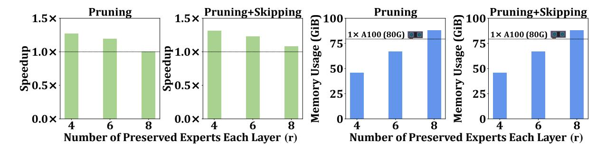
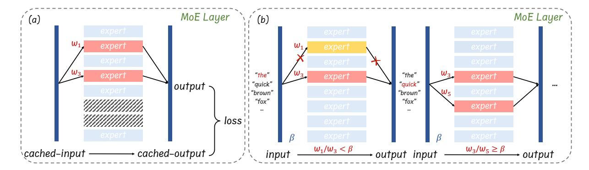
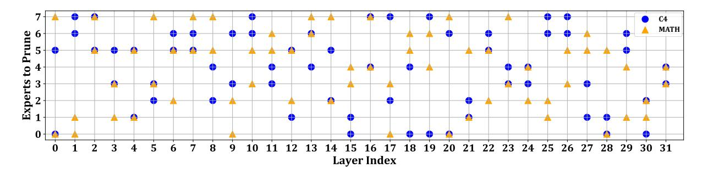
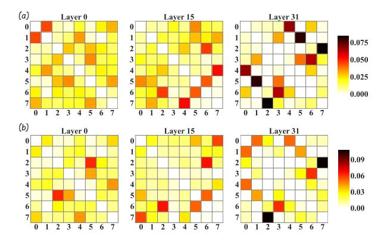

# Not All Experts are Equal: Efficient Expert Pruning and Skipping for Mixture-of-Experts Large Language Models

Xudong Lu∗1 , Qi Liu∗2,4 , Yuhui Xu3 , Aojun Zhou‡1 , Siyuan Huang2,4 Bo Zhang4 , Junchi Yan2,4 , Hongsheng Li†1,5

1CUHK MMLab 2Shanghai Jiao Tong University 3Salesforce AI Research 4Shanghai Artificial Intelligence Laboratory 5CPII under InnoHK {luxudong@link,hsli@ee}.cuhk.edu.hk purewhite@sjtu.edu.cn {xyh6666,aojunzhou}@gmail.com

## Abstract

A pivotal advancement in the progress of large language models (LLMs) is the emergence of the Mixture-of-Experts (MoE) LLMs. Compared to traditional LLMs, MoE LLMs can achieve higher performance with fewer active parameters, but it is still hard to deploy them due to their immense parameter sizes. Different from previous weight pruning methods that rely on specifically designed hardware, this paper mainly aims to enhance the deployment efficiency of MoE LLMs by introducing plug-and-play expert-level sparsification techniques. Specifically, we propose, for the first time to our best knowledge, posttraining approaches for task-agnostic and taskspecific expert pruning and skipping of MoE LLMs, tailored to improve deployment efficiency while maintaining model performance across a wide range of tasks. Extensive experiments show that our proposed methods can simultaneously reduce model sizes and increase the inference speed, while maintaining satisfactory performance. Code will be made available at [https://github.com/Lucky-Lance/](https://github.com/Lucky-Lance/Expert_Sparsity) [Expert\\_Sparsity](https://github.com/Lucky-Lance/Expert_Sparsity).

## 1 Introduction

Large language models (LLMs) have shown remarkable abilities across various domains [\(Ope](#page-9-0)[nAI,](#page-9-0) [2023;](#page-9-0) [Zhou et al.,](#page-10-0) [2024\)](#page-10-0), as evidenced by the widespread use of ChatGPT and Gemini [\(Team et al.,](#page-10-1) [2023\)](#page-10-1). Recent notable advancement in this area is the introduction of the opensourced Mixture-of-Experts (MoE) LLM, Mixtral 8x7B [\(Jiang et al.,](#page-9-1) [2024\)](#page-9-1), which sparsely activates only a portion of its parameters during the training and inference process. This model surpasses the performance of dense Transformer-based LLMs, such as LLaMA-2 70B [\(Touvron et al.,](#page-10-2) [2023a](#page-10-2)[,b\)](#page-10-3), with fewer active parameters (13B) during inference.

MoE LLMs achieve a reduction in on-the-fly (active) parameters by choosing only top-k experts for the inference of each token, thereby enhancing inference speed [\(Sanseviero et al.,](#page-9-2) [2023\)](#page-9-2). However, the static parameters, particularly those required for constructing the MoE architecture, still demand considerable memory and storage for deployment. For example, loading the Mixtral 8x7B model in bf16 format requires at least two A100-80G GPUs. Notably, in this MoE model, the eight experts constitute around 96% (45B out of 47B) of the total number of parameters.

On the other hand, not all experts are equal in the MoE model. Recent studies, such as [\(Chi et al.,](#page-8-0) [2022\)](#page-8-0), have demonstrated this discrepancy in expert training outcomes. The differing levels of training among each expert highlight the importance and practicality of identifying and pruning less significant experts, thereby improving the deployment efficiency of MoE models.

Unlike existing post-training weight pruning schemes for LLMs, which primarily target unstructured sparsity and N:M semi-structured sparsity [\(Sun et al.,](#page-10-4) [2023;](#page-10-4) [Frantar and Alistarh,](#page-9-3) [2023\)](#page-9-3), our approach focuses on expert-level sparsity for model sparsification. The aforementioned finegrained weight pruning techniques are effective in reducing the total number of parameters. However, they face challenges in plug-and-play deployment due to the necessity for specific hardware designs (e.g., FPGA) [\(Zhou et al.,](#page-10-5) [2021\)](#page-10-5), which demands an extensive co-design of hardware and systems.

In this paper, we systematically explore *expertlevel* sparsity in MoE LLMs and, for the first time to our best knowledge, introduce hardware-friendly post-training methods for either permanently removing unimportant experts (expert pruning) or dynamically skipping experts during inference (dynamic expert skipping). Our proposed method significantly reduces memory usage for deploying MoE LLMs and enhances their inference speed.

∗Equal contribution †Corresponding author ‡ Project lead

Figure 1: Memory usage reduction (bf16) and inference speedup illustration of our proposed post-training expert pruning and dynamic (expert) skipping methods on the Mixtral 8x7B (Jiang et al., 2024) model. Our method greatly reduces memory consumption and enhances inference speed.

Initially, we investigate how to prune less important experts while maintaining satisfactory performance, utilizing an efficient post-training approach. We aim to minimize the token reconstruction loss in a layer-by-layer manner. Given the limited number of experts in a single MoE layer of the LLM, we meticulously enumerate and choose combinations of experts that yield the lowest token reconstruction loss, subsequently, concatenating them to obtain the final pruned MoE model. This strategy significantly lowers the memory demands for deploying MoE LLMs. We examine expert-level pruning for both task-agnostic and task-specific (first in literature) models, tailoring our strategies to optimize performance across a wide range of applications.

Building on this foundation, we further dive into strategies for accelerating the inference speed of MoE LLMs without compromising their robustness. Specifically, based on the model's fixed expert count, we introduce an online method for dynamically skipping certain experts. This approach, which is complementary to our expert pruning strategy, allows for on-the-fly adjustment of the number of active experts during inference, thus enhancing the inference speed. By integrating the dynamic (expert) skipping approach with expert pruning, we achieve a more streamlined and efficient deployment for MoE LLMs.

Experiments on Mixtral 8x7B (Instruct) models (Jiang et al., 2024) demonstrate that our methods significantly reduce memory usage and increase inference speed. Take the example of post-training pruning two experts. As shown in Fig. 1, we halve the number of GPUs needed, allowing deployment on a single 80G GPU and achieving a  $1.2\times$  inference speedup. The pruning also results in mild performance loss, specifically, around 2.9 points for task-agnostic and 6.2 points (reducible to

1.6 with task-specific fine-tuning) for task-specific models. Further combination of dynamic skipping with expert pruning can lead to the same inference speedup with dropping 4 experts while achieving much higher model performances. To the best of our knowledge, this study is the first to discuss expert-level sparsity and propose efficient schemes for expert pruning and skipping for MoE LLMs.

#### 2 Related Works

#### 2.1 Mixture-of-Experts Models

First introduced in (Jacobs et al., 1991), a Mixture-of-Experts (MoE) model contains multiple separate networks, and each network processes a subset of the entire dataset. This separation can be viewed as a modular transformation of a multi-layer network. MoE structure is used for designing Recurrent Neural Networks (RNNs) in (Shazeer et al., 2017) and further extended to encoder-decoder Transformer-based models (Lepikhin et al., 2020). With the recent development of decoder-only GPT family of models (Brown et al., 2020; Touvron et al., 2023a,b), MoE models based on this structure gain popularity (Jiang et al., 2024). In this paper, we focus on post-training expert pruning/skipping methodologies for MoE LLMs.

#### 2.2 Expert Pruning for MoE Models

Expert pruning within MoE models has garnered attention in the realm of Natural Language Processing, particularly in machine translation tasks. In these contexts, the translation of specific languages often renders the expertise of other language specialists superfluous. The most activated experts are reserved in (Kim et al., 2021) to prune a machine translation MoE model, and (Koishekenov et al., 2022) proposes expert pruning metrics based on gate statistics collected during decoding. Al-

though these methods actively deal with expert pruning for MoE models, they are still limited to the machine translation domain with linguistic models. Researchers in (Chen et al., 2022) provide a dropping-while-training method that progressively drops the non-professional experts for target downstream tasks, and experiments are carried out on Switch Transformers models (Fedus et al., 2022). However, in the LLM era, it is usually difficult to afford such a training paradigm.

#### 2.3 Post-training Pruning for LLMs

Post-training pruning (Kwon et al., 2022; Hubara et al., 2021) has become a popular topic for neural network sparsification in recent years. Given a trained model, post-training pruning aims at achieving the optimal model sparsification outcome by utilizing model parameters together with some calibration data. Recent works extend pruning methods to LLMs (Sun et al., 2023; Frantar and Alistarh, 2023). However, these pruning methods primarily focus on sparsifying the weight matrices of linear layers in the LLMs and require dedicated hardware. To the best of our knowledge, efficient post-training expert pruning methods have not been discussed for decoder-only LLMs with MoE structures.

#### 3 Method

To enhance the deployment efficiency of MoE LLMs, we concentrate on expert-level model sparsity and innovatively propose post-training techniques designed to reduce memory usage and increase inference speed. In this section, we offer a comprehensive explanation of our proposed methods for expert pruning (Sec. 3.2) and dynamic (expert) skipping (Sec. 3.3), considering both memory consumption and inference speed.

#### 3.1 Preliminary

In the decoder-only sparse MoE Transformer models, as discussed in (Gale et al., 2023), the Feed-Forward Network (FFN) sub-layers of the traditional dense model are replaced with MoE layers, each containing n experts. Specifically, within the MoE layer of the Mixtral 8x7B model, featuring 8 experts as detailed in (Jiang et al., 2024), each token  $\boldsymbol{x}$  in the input sequence is routed to the top-2 experts based on the routing weights  $\boldsymbol{w}$ .

The inference process for each input token x within the MoE layer of the Mixtral 8x7B decoder layer is depicted in Fig. 2. Initially, the router computes routing logits  $l = \{l_0, \ldots, l_{n-1}\}$  and routing

Figure 2: Illustration of the MoE layer in the Mixtral 8x7B model for per-token inference. The output of the layer is the weighted sum of the outputs from selected experts over input token  $\boldsymbol{x}$ .  $\widetilde{w}_i$  denotes the normalized routing weight of each selected expert.

weights  $w = \operatorname{Softmax}(l)$  for the experts. Then the top-k experts, where k = 2 for the Mixtral 8x7B model, are selected based on their routing weights to process the token. Each of these k selected experts, applying a SwiGLU transformation  $\mathcal{E}_i(\cdot)$  ( $i \in \{0,1,\ldots,n-1\}$ ), contributes to the final output. This output is a weighted sum of the individual expert outputs, with weights  $\widetilde{w}_i$  being the normalized values of the corresponding routing weights for the selected experts. The normalized weight for expert  $e_j$  ( $j \in \{0,1,\ldots,k-1\}$ ) $^l$  is calculated as follows:

$$\widetilde{w}_{e_j} = \frac{w_{e_j}}{\sum_{m=0}^{k-1} w_{e_m}},\tag{1}$$

yielding the MoE layer's output for the token x as:

$$z = \sum_{j=0}^{k-1} \widetilde{w}_{e_j} \cdot \mathcal{E}_{e_j}(x). \tag{2}$$

Aside from these specified mechanisms, the remaining aspects of the MoE network mirror those of a standard decoder-only Transformer model.

#### 3.2 Post-training Expert Pruning

As demonstrated in the preliminary subsection, the parameters of experts occupy the major proportion of the whole MoE LLM model. However, for a single token, only a small subset of these experts are activated, leading to considerable inefficiencies in parameter utilization. Existing post-training weight pruning methods for LLMs (e.g., Wanda (Sun et al., 2023), SparseGPT (Frantar and Alistarh, 2023)), while effective in reducing model

 $^{1}e_{j}$  is the index of the j-th largest element of w, i.e. the index of the j-th selected expert

Figure 3: Framework of our proposed expert pruning and dynamic skipping methods. (a) The expert pruning method evaluates the contributions of experts via a small calibration dataset and then permanently discards those with low contributions (e.g., experts with a slashed background). (b) The dynamic skipping method discard no experts instead dynamically decides whether to skip certain experts (e.g., experts with a yellow background) during inference.

Figure 4: Expert selection comparison between C4 and MATH dataset with r=6 for Mixtral 8x7B model. Significant divergence is observed in the selection of experts across these two datasets, and identical expert combinations are observed in only four specific layers (i.e., layer 2, layer 4, layer 16, and layer 31).

parameters, do not support efficient deployment of MoE LLMs without specialized hardware implementations (Mishra et al., 2021). Therefore, we introduce a heuristic search method to prune the number of experts in a post-training manner.

Tasks. Different from existing pruning schemes leveraging unstructured or semi-structured weight sparsity (Sun et al., 2023; Frantar and Alistarh, 2023) for LLMs, our proposed post-training expert pruning method aims at reducing the parameter numbers of MoE LLMs by permanently discarding less important experts, thereby improve the inference efficiency. It is a post-training pruning method and does not require any parameter update. Fig. 3 (a) illustrates our proposed post-training expert pruning method. We conduct expert pruning in a layer-wise manner. Specifically, the pruning method contains two steps as follows.

Firstly, we set up a small calibration dataset, then perform inference on the original MoE model with all experts over the dataset, and cache the input-output token pairs of each MoE layer. We use samples from the pre-training dataset C4 (Raffel

et al., 2019) as calibration data, since pre-training datasets are often more comprehensive and not dominated by knowledge specific to any particular domain (Sun et al., 2023).

Secondly, after caching input-output pairs for each MoE layer, we enumerate expert combinations based on the preset parameter r, denoting the number of preserved experts. Assume the function of the MoE layer at layer l is  $\mathcal{F}(\cdot)$ , with the cached input represented by x. During each enumeration, we maintain r experts and eliminate the remaining experts along with their associated routing weights. Subsequently, we employ the pruned MoE layer, denoted as  $\mathcal{F}'(\cdot, \mathbf{C})$ , to recalculate the corresponding output, where C represents a subset containing r experts selected from the original nexperts. Inspired by channel pruning in CNNs (He et al., 2017), the Frobenius norm of the difference between cached output  $\mathcal{F}(x)$  and the output of pruned layer  $\mathcal{F}'(x, \mathbf{C})$  is used to quantify the discrepancy between the model before and after expert pruning, and we denote it as reconstruction loss. The expert subset corresponding to the minimum reconstruction loss is retained. The n-r experts

left are considered to contribute least to the original MoE model and are thus discarded. The expert pruning process in layer l can be formulated as:

$$\min_{\mathbf{C}} \|\mathcal{F}'(\boldsymbol{x}, \mathbf{C}) - \mathcal{F}(\boldsymbol{x})\|_{F}$$
s.t.  $\mathbf{C} \subseteq \{\text{expert}_{0}, \dots, \text{expert}_{n-1}\}, |\mathbf{C}| = r.$ 

We heuristically search for expert subset C with the lowest reconstruction loss in each layer separately and obtain an MoE model with r experts by the concatenation of each pruned layer. After removing the insignificant experts, the pruned model can be easily loaded using existing packages (e.g., Huggingface Transformers (Wolf et al., 2020)) with just a change of the model configuration. Especially, with 2 experts pruned, the deployment budget is reduced to a single 80G GPU for loading the Mixtral 8x7B (Instruct) model with bf16 data type.

Task-specific Expert Pruning for Domain**specific Tasks.** Previous research on post-training pruning for LLMs (Sun et al., 2023; Frantar and Alistarh, 2023) typically considers the performance over general tasks. For the first time, in our work, we investigate the task-specific post-training pruning for MoE LLMs. Our above-proposed expert pruning strategy is adept at conserving the knowledge encapsulated by the experts of an MoE model for general tasks. However, as a pre-training dataset, C4 spans a wide array of domains, posing challenges when pruning experts for domain-specific tasks (e.g., models tailored for mathematics (Yu et al., 2023; Wang et al., 2024)). We evaluate the 5-shot performance of the C4 pruned MoE LLM model with r = 6 on math tasks (GSM8K) (Cobbe et al., 2021), resulting in a performance degradation plummeting from 58.61 to 41.02 for the Mixtral 8x7B model. To address this challenge, we propose to shift the calibration dataset from C4 to the training set of MATH (Hendrycks et al., 2021), to concentrate the pruning process on the mathematics domain.

**Remark.** For a better comparison between general tasks and domain-specific tasks, we visualize the distribution of pruned experts selected by C4 and MATH, as shown in Fig. 4. For both the Mixtral 8x7B and Mixtral 8x7B Instruct model, identical expert combinations are observed in only four specific layers. This suggests that there are distinct differences in the distributions of pre-training datasets and domain-specific datasets. Further details and discussions are provided in Sec. 4.2.

#### 3.3 Dynamic Skipping During Inference

Our expert pruning strategy effectively reduces memory consumption during model deployment. However, each token is still processed by k selected experts, without a reduction in runtime FLOPs. Intuitively, not all tokens require the selection of all top-k experts during the token generation process. Consequently, we introduce a scheme that dynamically skips certain experts for individual token inference, to further enhance inference efficiency.

As shown in Fig. 2, during the inference process, top-k experts are chosen with routing weights  $\boldsymbol{w} = \{w_{e_0}, w_{e_1}, \dots, w_{e_{k-1}}\}$  for each token  $\boldsymbol{x}$  in an MoE layer. For simplicity, we assume k=2 (as in Mixtral 8x7B)2. Our proposed dynamic expert skipping method is illustrated in Fig. 3 (b). Without loss of generality, assume experts with indices  $e_0$  and  $e_1$  are chosen, and  $w_{e_1} < w_{e_0}$ . To accelerate inference speed, if  $w_{e_1} < \beta w_{e_0}$ , we do not assign x to expert  $e_1$ , where  $\beta$  is a hyper-parameter separately set for each MoE layer. In our implementation, we forward the model over the sampled calibration data and set  $\beta$  as the median value of  $\frac{w_{e_1}}{w}$  for each MoE layer. The dynamic skipping scheme can be carried out on the fly to speed up inference, and can be used simultaneously with expert pruning. In our experiments, we observe a  $1.2\times$  to  $1.3\times$  inference speedup with r=6.

#### 4 Experiment

In this section, a series of experiments are carried out to evaluate our proposed methods. We introduce experiments of expert pruning for general tasks in Sec. 4.1, domain-specific tasks in Sec. 4.2, and dynamic expert skipping results in Sec. 4.3.

#### 4.1 Expert Pruning for General Tasks

In this subsection, we evaluate the proposed expert pruning method on some general tasks, which can comprehensively reflect the knowledge retention of the model after expert pruning.

**Experiment Setup.** Similar to Wanda (Sun et al., 2023), we choose calibration data from the C4 (Raffel et al., 2019) dataset and combine them into 128 token sequences, each with a length of 20483. We perform expert pruning on both Mixtral 8x7B and Mixtral 8x7B Instruct models, resulting in MoE

&lt;sup>2Deeper theoretical insight and a broader application to the top-k scenario of dynamic skipping can be found in Sec. A.2.

&lt;sup>3For more experiments about the influence of the calibration dataset size, please refer to Sec. A.3.

| Model        | Method | Sparsity | ARC-c | ARC-e | BoolQ | HellaSwag | MMLU  | OBQA  | RTE   | WinoGrande | Average | Mem (MB) | Speedup |
|--------------|--------|----------|-------|-------|-------|-----------|-------|-------|-------|------------|---------|----------|---------|
| Mixtral 8x7B | Wanda  | 2:4      | 42.06 | 74.16 | 76.64 | 53.16     | 52.21 | 27.00 | 63.90 | 70.96      | 57.51   | 51,214   | 0.91×   |
|              | Ours   | r = 4    | 48.89 | 78.16 | 81.35 | 57.66     | 47.30 | 29.00 | 61.37 | 72.85      | 59.57   | 46,879   | 1.27×   |
| Mixtral 8x7B | Wanda  | 2:4      | 48.89 | 78.70 | 86.27 | 56.24     | 57.84 | 30.40 | 72.20 | 71.82      | 62.80   | 51,210   | 0.92×   |
| Instruct     | Ours   | r = 4    | 53.92 | 79.88 | 84.77 | 60.05     | 52.75 | 30.40 | 75.45 | 73.80      | 63.88   | 46,879   | 1.27×   |

Table 1: Comparison with Wanda (Sun et al., 2023) at the structured 2:4 sparsity pattern. Our proposed expert pruning method (r=4) outperforms Wanda in all aspects. **Mem** stands for memory usage. †The original average performance of Mixtral 8x7B and Mixtral 8x7B Instruct model is 67.58 and 69.98, respectively.

| Model        | Method    | r      | ARC-c          | ARC-e          | BoolQ          | HellaSwag      | MMLU           | OBQA           | RTE            | WinoGrande     | Average        |
|--------------|-----------|--------|----------------|----------------|----------------|----------------|----------------|----------------|----------------|----------------|----------------|
|              | None      | 8      | 57.17          | 84.01          | 85.35          | 64.88          | 67.88          | 35.00          | 70.40          | 75.93          | 67.58          |
| Mixtral 8x7B | Random    | 6 4 | 48.04 39.85 | 78.49 68.35 | 81.99 78.59 | 59.02 53.32 | 60.77 49.23 | 33.40 29.20 | 66.79 62.82 | 75.85 69.93 | 63.04 56.41 |
|              | Frequency | 6 4 | 49.06 43.86 | 78.83 73.61 | 77.03 76.97 | 59.38 54.01 | 55.18 41.48 | 33.60 26.20 | 57.40 57.04 | 75.69 73.48 | 60.77 55.83 |
|              | Ours      | 6 4 | 51.62 48.89 | 81.94 78.16 | 83.64 81.35 | 61.60 57.66 | 58.72 47.30 | 33.00 29.00 | 67.87 61.37 | 75.37 72.85 | 64.22 59.57 |
|              | None      | 8      | 62.20          | 87.04          | 88.50          | 67.59          | 68.87          | 36.60          | 72.20          | 76.87          | 69.98          |
| Mixtral 8x7B | Random    | 6 4 | 54.52 48.81 | 83.04 75.46 | 87.25 78.47 | 63.21 57.48 | 62.70 53.68 | 35.40 31.80 | 72.92 72.56 | 77.19 70.96 | 67.03 61.15 |
| Instruct     | Frequency | 6 4 | 55.89 49.40 | 82.83 77.27 | 86.33 82.97 | 63.69 57.66 | 58.89 47.03 | 37.00 32.20 | 63.18 66.79 | 76.01 74.03 | 65.48 60.92 |
|              | Ours      | 6 4 | 58.19 53.92 | 84.89 79.88 | 87.34 84.77 | 65.24 60.05 | 62.47 52.75 | 35.60 30.40 | 70.04 75.45 | 75.85 73.80 | 67.45 63.88 |

Table 2: Zero-shot performance evaluation of different expert pruning methods with r set to 6 and 4. **Random** stands for randomly choosing experts to discard in each MoE layer. **Frequency** stands for dropping experts based on their activation frequency during the inference over calibration data. Our proposed expert pruning method leads to the least performance drop, with around 2.9 points for dropping 2 experts and 7.1 points for dropping 4 experts.

models with two experts discarded (r=6) and four experts discarded (r=4) in each layer. Pruning a Mixtral 8x7B model takes about 30 minutes for r=6 and 90 minutes for r=4.

After expert pruning, we evaluate the performance of the pruned MoE models following Wanda (Sun et al., 2023). Specifically, we report zero-shot accuracies of 8 tasks from EleutherAI LM Harness (Gao et al., 2023). We also test the token generation speed4, together with the peak GPU memory usage during model inference.

# Comparison with Weight Pruning Methods. We compare our proposed expert pruning method with the representative weight pruning algorithm Wanda. For a fair comparison, we set r=4 in our method and test Wanda with the commonly used structured 2:4 sparsity pattern. This will lead to around 50% parameter reduction for both methods. The results are shown in Tab. 1. The inference speedup of 2:4 structured model relies on specially designed hardware (Mishra et al., 2021) and scripts. In our experiments, we even observe a lower infer-

ence speed compared with the dense weight model5.

Besides, our expert pruning method excels Wanda with the 2:4 sparsity pattern in both memory usage and benchmark performance.

Comparison with Other Expert Pruning Base-

lines. We also set up two baseline methods. One

baseline is randomly dropping experts in each layer. The other method calculates the activation frequency of each expert during forward passes on the calibration data and discards those with the lowest activation frequencies in each layer. Comparison results are listed in Tab. 2. The method based on activation frequency gets the worst performance. This phenomenon implies that although the MoE model might show a tendency for expert selection during the inference process, simply carrying out expert pruning based on activation frequency might not always lead to desirable results. In contrast, our proposed method achieves better results. Compared to the origin model with 8 experts, our model achieves a 2.9-point performance

**Memory Usage and Generation Speed.** The memory usage statistics are shown in Fig. 1. It takes 2 A100-80G GPUs to load and forward the

drop with 24% parameter reduction and a 7.1-point

performance drop with 48% parameter reduction

on average without any extra training.

&lt;sup>4We revise the script provided in https://github.com/ AutoGPTQ/AutoGPTQ/ to test token generating speed.

&lt;sup>5Our implementation is based on https://pytorch.org/tutorials/prototype/semi\_structured\_sparse.html.

| Model        | Method       | Sparsity | GSM8K (5-shot) |
|--------------|--------------|----------|----------------|
|              | None         | None     | 58.61          |
|              | Wanda (C4)   | 2:4      | 14.10          |
| Mixtral 8x7B | Wanda (MATH) | 2:4      | 20.39          |
| MIXU ai 6X/D | Random       | r = 4    | 0.68           |
|              | Ours (C4)    | r = 4    | 24.87          |
|              | Ours (MATH)  | r = 4    | 37.07          |
|              | Random       | r = 6    | 36.39          |
|              | Ours (C4)    | r = 6    | 41.02          |
|              | Ours (MATH)  | r = 6    | 51.25          |
|              | None         | None     | 63.46          |
|              | Wanda (C4)   | 2:4      | 26.69          |
| Mixtral 8x7B | Wanda (MATH) | 2:4      | 31.31          |
| Instruct     | Random       | r = 4    | 0.76           |
|              | Ours (C4)    | r = 4    | 30.40          |
|              | Ours (MATH)  | r = 4    | 47.01          |
|              | Random       | r = 6    | 39.80          |
|              | Ours (C4)    | r = 6    | 48.52          |
|              | Ours (MATH)  | r = 6    | 58.38          |

Table 3: 5-shot GSM8K (Cobbe et al., 2021) accuracy comparison for sampling calibration data from different datasets. Random pruning will lead to bad performance in this case. Compared with pre-training datasets, sampling from domain-specific datasets will significantly improve the performance on corresponding tasks after expert pruning. Our expert pruning strategy also outperforms Wanda with 2:4 structured sparsity.

original 8-expert model with bf16 data type. After pruning 2 and 4 experts, only one 80G GPU is needed for the inference process. For token generation speed analysis, during model inference, we still need to route each token to two experts. However, reducing the number of GPUs required to load the model can decrease the time consumed by GPU intercommunication, resulting in a much higher token generation speed. We observe a  $1.20 \times$  token generation speedup for the model with 2 experts pruned and a  $1.27 \times$  speedup with 4 experts pruned.

#### 4.2 Expert Pruning for Domain-Specific Tasks

**Experiment Setup.** We investigate on mathematical reasoning tasks. We randomly sample sentences from the train set of MATH (Hendrycks et al., 2021) and combine them into 128 token sequences, each with a length of 2048. We carry out expert pruning with r=6 and r=4, then test 5-shot GSM8K (Cobbe et al., 2021) results.

Baselines to Compare. We compare the 5-shot GSM8K result with randomly pruned models, models pruned using samples from C4 as calibration data, the 2:4 structured model obtained by Wanda, as well as the original MoE model with 8 experts. Vanilla Wanda uses C4 for data calibration. To test the influence of the calibration dataset on model

| Model                    | Method                                  | r           | GSM8K                          | MATH                           |
|--------------------------|-----------------------------------------|-------------|--------------------------------|--------------------------------|
| MetaMath 70B             | None                                    | N/A         | 82.30                          | 26.60                          |
|                          | None                                    | 8           | 81.35                          | 34.86                          |
| Mixtral 8x7B             | Ours (C4) Ours (MATH) Ours (MATH) | 6 6 7 | 79.53 79.53 <b>81.20</b> | 32.48 33.58 <b>34.40</b> |
|                          | None                                    | 8           | 81.43                          | 35.46                          |
| Mixtral 8x7B Instruct | Ours (C4) Ours (MATH) Ours (MATH) | 6 6 7 | 79.83 80.06 <b>81.50</b> | 32.70 34.10 <b>34.86</b> |

Table 4: Zero-shot evaluation results of GSM8K (Cobbe et al., 2021) and MATH (Hendrycks et al., 2021) after training the MoE models on MetaMathQA (Yu et al., 2023) with different expert numbers and different calibration datasets for expert pruning. Using domain-specific data can result in better performance on corresponding downstream tasks. Model fine-tuning can greatly reduce the performance gaps between the pruned models and the original model.

performance, we also leverage the MATH dataset for Wanda pruning.

**Evaluation Results.** Tab. 3 illustrates the 5-shot evaluation results on the GSM8K dataset. The performance witnesses a significant drop after random pruning, or pruning with calibration data obtained from C4. However, this degradation dramatically reduces after leveraging the MATH dataset for calibration data construction. A similar phenomenon is also observed with Wanda. This indicates that when facing domain-specific tasks, using datasets corresponding to these specific tasks can yield better expert pruning results than using pre-training datasets. It also implies that our proposed method for changing the calibration dataset for domainspecific tasks can also be applied to other pruning algorithms. Besides, our expert pruning strategy (r = 4) significantly outperforms Wanda with 2:4 structured sparsity.

**More Discussion.** Using samples from the MATH dataset can greatly improve the domain-specific performance on mathematics tasks. However, as our method follows a post-training manner without any training, the expert pruning scheme still leads to a significant performance drop. To reduce the performance gap between pruned models and original models, we fully fine-tune the MoE models with different expert numbers on the Meta-MathQA (Yu et al., 2023) dataset and compare their performances. We fine-tune and compare models pruned by C4 (r=6), MATH (r=6, r=7), and the original 8-expert model. The zero-shot GSM8K@1 and MATH@1 accuracies after fine-tuning different MoE models are shown in Tab. 4.

| Model        | r | Pruning      | Skipping | LM-eval | Speedup       |
|--------------|---|--------------|----------|---------|---------------|
|              | 8 |              |          | 67.58   | 1.00×         |
|              | 8 |              | <b>√</b> | 66.37   | 1.08×         |
| Mixtral 8x7B | 6 | ✓            |          | 64.22   | $1.19 \times$ |
|              | 6 | ✓            | ✓        | 62.91   | 1.23×         |
|              | 4 | ✓            |          | 59.57   | $1.27 \times$ |
|              | 4 | $\checkmark$ | ✓        | 57.91   | 1.31×         |
|              | 8 |              |          | 69.98   | 1.00×         |
| Mixtral 8x7B | 8 |              | ✓        | 69.03   | 1.08×         |
| Instruct     | 6 | ✓            |          | 67.45   | $1.20 \times$ |
| mstruct      | 6 | ✓            | ✓        | 66.04   | $1.27 \times$ |
|              | 4 | ✓            |          | 63.88   | $1.27 \times$ |
|              | 4 | ✓            | ✓        | 62.33   | 1.33×         |

Table 5: Evaluation results of combining expert pruning with dynamic skipping. We carry out expert pruning using calibration data sampled from C4, then infer the pruned models with dynamic expert skipping. We set  $\beta$  as the median value of  $w_{e_1}/w_{e_0}$  of the calibration set. The dynamic expert skipping method further enhances inference speed with a slight performance drop.

As can be seen, the fine-tuning process significantly reduces the performance drop incurred by expert pruning and leads to comparable results with tuning full-expert models. Specifically, for the Mixtral 8x7B Instruct model, the accuracy of the pruned 7-expert model on the GSM8K test set exceeds that of the 8-expert model. This suggests that for certain practical downstream tasks, a large number of experts might not be a necessity for achieving good performance. Also, the pruned models using samples from MATH as the calibration dataset outperform those using C4 after tuning, further highlighting the effectiveness of adopting domain-specific calibration datasets for task-specific models.

#### 4.3 Dynamic Expert Skipping Results

This subsection assesses the effectiveness of our proposed dynamic expert skipping approach. Additionally, we explore the combination of both methods to further improve inference efficiency.

**Experiment Setup.** We perform tests on taskagnostic models for better representativeness. The setup is similar to Sec. 4.1. We first prune the Mixtral 8x7B and Mixtral 8x7B Instruct model using calibration data sampled from the C4 dataset and get the pruned models with r=6 and r=4. During the testing of different benchmarks, we dynamically skip certain experts. For evaluation, we report the zero-shot accuracies of 8 tasks from EleutherAI LM Harness (Gao et al., 2023). Our proposed dynamic expert skipping method does not influence the memory usage for model inference, so we just report the inference speed in this subsection.

**Baselines to Compare.** We suggest that our proposed dynamic expert skipping can be seamlessly

| Model        | Method                                    | r | LM-eval               |
|--------------|-------------------------------------------|---|-----------------------|
| Mixtral 8x7B | Progressive Layer-wise ( <b>Ours</b> ) | 6 | <b>64.48</b> 64.22    |
|              | Progressive Layer-wise ( <b>Ours</b> ) | 4 | 57.53 <b>59.57</b> |

Table 6: Comparison between the layer-wise pruning manner and the progressive pruning manner. The progressive scheme will lead to more performance degradation with a high expert pruning rate.

integrated with the expert pruning approach. For setting up baselines, we evaluate zero-shot accuracies of the original 8-expert model without dynamic expert skipping, as well as the accuracies of models pruned to r=6 and r=4 without dynamic expert skipping. Subsequently, we incorporate dynamic expert skipping into the inference process of these models, evaluate accuracies over benchmarks, and measure token generation speedup.

**Evaluation Results.** The evaluation results are illustrated in Tab. 5. We show the average accuracies of the 8 zero-shot tasks at the "LM-eval" column, together with the inference speedup ratio compared to the original 8-expert models. As can be seen, based on expert pruning, the dynamic expert skipping method can further enhance the inference speed with just negligible performance drops. We can achieve nearly 90% performance of the Mixtral 8x7B Instruct model with half parameters and a 1.33× token generation speedup. Another notable observation is that the Mixtral 8x7B Instruct model using both expert pruning and dynamic skipping with r = 6 achieves the same inference speedup as the model using only expert pruning with r=4while getting a much higher accuracy over the LMeval benchmark. This phenomenon also proves the efficiency of our dynamic expert skipping approach. For a more comprehensive evaluation, we perform dynamic skipping on task-specific models and observe similar results. Experiment details are shown in the Appendix (Sec. A.4).

#### 4.4 More Analysis

**Discussion about Inference Speed.** In Fig. 1, we also observe a notable inference acceleration when pruning experts from r=6 to r=4, a phenomenon not attributable to decreased inter-GPU communication overhead. We think that this enhancement stems primarily from improved temporal and spatial locality. This includes reduced cache misses, optimized memory prefetching, and faster block loading. Readers may refer to papers related to memory-intensive LLM inference (such

as [\(Alizadeh et al.,](#page-8-4) [2023\)](#page-8-4)) to find more explanation.

More Ablations. We carry out efficient layerwise expert pruning in this work. Readers may be curious about the effectiveness compared with a layer-by-layer progressive searching paradigm, where the pruning of subsequent layers is aware of the pruning result of previous layers. To this end, we compare these two pruning paradigms in Tab. [6,](#page-7-2) leveraging the Mixtral 8x7B model and calibration samples from the C4 dataset. Although the layerby-layer progressive manner can get slightly better results with fewer experts pruned, when it comes to a high expert pruning rate (e.g., 50% pruning rate with r = 4), more performance drop is observed. We attribute this to the possible overfitting of the small calibration dataset.

# 5 Conclusion and Discussion

In this paper, based on the structural characteristics of MoE LLMs and the shortcomings of current weight pruning schemes, we focus on expert-level model sparsification and, for the first time, provide post-training expert pruning together with dynamic (expert) skipping methods to enhance the deployment efficiency of MoE LLMs. Our methods can significantly reduce memory usage and enhance inference speed while maintaining high model performance. Looking ahead, we aim to further refine our pruning/skipping techniques and incorporate them with weight pruning or parameter quantization strategies, achieving more effective deploying approaches for MoE LLMs.

# Limitations

Our method can reduce memory usage and improve inference speed for more efficient deployment of MoE LLMs. Despite its advancements, there are still some limitations. Firstly, our method for expert pruning is based on the enumeration of expert combinations. This is feasible for pruning currently popular MoE LLMs with 4 or 8 experts. However, with the number of experts in each MoE layer increasing (e.g., 32 experts in one MoE layer), it will be cumbersome to perform our pruning algorithm. Secondly, we conduct experiments on the opensourced Mixtral 8x7B and Mixtral 8x7B Instruct models as they are by far the most popular MoE LLMs. With the development of MoE LLMs, we will carry out experiments on other MoE LLMs in the future to give a more comprehensive analysis of the generalizability and scalability of our method.

# Ethics Statement

Our research focuses on improving the deployment efficiency of Mixture-of-Experts (MoE) large language models (LLMs) through expert-level sparsification techniques, aiming to reduce model sizes and enhance inference speed without compromising performance. While our methods offer potential benefits for deploying advanced LLMs more broadly and efficiently, we acknowledge the importance of considering the ethical implications of deploying such models. These include ensuring the responsible use of LLMs, mitigating biases in model outputs, and addressing privacy concerns. We commit to making our code available for transparency and encourage the community to use our findings responsibly, considering the societal impacts of deploying LLMs.

# Acknowledgement

This project is funded in part by National Key R&D Program of China Project 2022ZD0161100, by the Centre for Perceptual and Interactive Intelligence (CPII) Ltd under the Innovation and Technology Commission (ITC)'s InnoHK, by General Research Fund of Hong Kong RGC Project 14204021. Hongsheng Li is a PI of CPII under the InnoHK.

## References

Keivan Alizadeh, Iman Mirzadeh, Dmitry Belenko, Karen Khatamifard, Minsik Cho, Carlo C Del Mundo, Mohammad Rastegari, and Mehrdad Farajtabar. 2023. [Llm in a flash: Efficient large language model infer](http://arxiv.org/abs/arXiv:2312.11514)[ence with limited memory.](http://arxiv.org/abs/arXiv:2312.11514)

Tom Brown, Benjamin Mann, Nick Ryder, Melanie Subbiah, Jared D Kaplan, Prafulla Dhariwal, Arvind Neelakantan, Pranav Shyam, Girish Sastry, Amanda Askell, et al. 2020. Language models are few-shot learners. Advances in neural information processing systems, 33:1877–1901.

Tianyu Chen, Shaohan Huang, Yuan Xie, Binxing Jiao, Daxin Jiang, Haoyi Zhou, Jianxin Li, and Furu Wei. 2022. Task-specific expert pruning for sparse mixture-of-experts. arXiv preprint arXiv:2206.00277.

Zewen Chi, Li Dong, Shaohan Huang, Damai Dai, Shuming Ma, Barun Patra, Saksham Singhal, Payal Bajaj, Xia Song, Xian-Ling Mao, Heyan Huang, and Furu Wei. 2022. [On the representation collapse of](https://openreview.net/forum?id=mWaYC6CZf5) [sparse mixture of experts.](https://openreview.net/forum?id=mWaYC6CZf5) In Advances in Neural Information Processing Systems.

Karl Cobbe, Vineet Kosaraju, Mohammad Bavarian, Mark Chen, Heewoo Jun, Lukasz Kaiser, Matthias

- Plappert, Jerry Tworek, Jacob Hilton, Reiichiro Nakano, et al. 2021. Training verifiers to solve math word problems. arXiv preprint arXiv:2110.14168.
- Shuangrui Ding, Peisen Zhao, Xiaopeng Zhang, Rui Qian, Hongkai Xiong, and Qi Tian. 2023. Prune spatio-temporal tokens by semantic-aware temporal accumulation. In Proceedings of the IEEE/CVF International Conference on Computer Vision, pages 16945–16956.
- William Fedus, Barret Zoph, and Noam Shazeer. 2022. Switch transformers: Scaling to trillion parameter models with simple and efficient sparsity. The Journal of Machine Learning Research, 23(1):5232– 5270.
- Elias Frantar and Dan Alistarh. 2023. Sparsegpt: Massive language models can be accurately pruned in one-shot. In International Conference on Machine Learning, pages 10323–10337. PMLR.
- Elias Frantar, Saleh Ashkboos, Torsten Hoefler, and Dan Alistarh. 2022. Gptq: Accurate post-training quantization for generative pre-trained transformers. arXiv preprint arXiv:2210.17323.
- Trevor Gale, Deepak Narayanan, Cliff Young, and Matei Zaharia. 2023. Megablocks: Efficient sparse training with mixture-of-experts. Proceedings of Machine Learning and Systems, 5.
- Leo Gao, Jonathan Tow, Baber Abbasi, Stella Biderman, Sid Black, Anthony DiPofi, Charles Foster, Laurence Golding, Jeffrey Hsu, Alain Le Noac'h, Haonan Li, Kyle McDonell, Niklas Muennighoff, Chris Ociepa, Jason Phang, Laria Reynolds, Hailey Schoelkopf, Aviya Skowron, Lintang Sutawika, Eric Tang, Anish Thite, Ben Wang, Kevin Wang, and Andy Zou. 2023. [A framework for few-shot language model](https://doi.org/10.5281/zenodo.10256836) [evaluation.](https://doi.org/10.5281/zenodo.10256836)
- Yihui He, Xiangyu Zhang, and Jian Sun. 2017. Channel pruning for accelerating very deep neural networks. In Proceedings of the IEEE international conference on computer vision, pages 1389–1397.
- Dan Hendrycks, Collin Burns, Saurav Kadavath, Akul Arora, Steven Basart, Eric Tang, Dawn Song, and Jacob Steinhardt. 2021. Measuring mathematical problem solving with the math dataset. NeurIPS.
- Itay Hubara, Brian Chmiel, Moshe Island, Ron Banner, Joseph Naor, and Daniel Soudry. 2021. Accelerated sparse neural training: A provable and efficient method to find n: m transposable masks. Advances in neural information processing systems, 34:21099– 21111.
- Robert A Jacobs, Michael I Jordan, Steven J Nowlan, and Geoffrey E Hinton. 1991. Adaptive mixtures of local experts. Neural computation, 3(1):79–87.
- Albert Q Jiang, Alexandre Sablayrolles, Antoine Roux, Arthur Mensch, Blanche Savary, Chris Bamford, Devendra Singh Chaplot, Diego de las

- Casas, Emma Bou Hanna, Florian Bressand, et al. 2024. Mixtral of experts. arXiv preprint arXiv:2401.04088.
- Sehoon Kim, Sheng Shen, David Thorsley, Amir Gholami, Woosuk Kwon, Joseph Hassoun, and Kurt Keutzer. 2022. Learned token pruning for transformers. In Proceedings of the 28th ACM SIGKDD Conference on Knowledge Discovery and Data Mining, pages 784–794.
- Young Jin Kim, Ammar Ahmad Awan, Alexandre Muzio, Andres Felipe Cruz Salinas, Liyang Lu, Amr Hendy, Samyam Rajbhandari, Yuxiong He, and Hany Hassan Awadalla. 2021. Scalable and efficient moe training for multitask multilingual models. arXiv preprint arXiv:2109.10465.
- Yeskendir Koishekenov, Alexandre Berard, and Vassilina Nikoulina. 2022. Memory-efficient nllb-200: Language-specific expert pruning of a massively multilingual machine translation model. arXiv preprint arXiv:2212.09811.
- Woosuk Kwon, Sehoon Kim, Michael W Mahoney, Joseph Hassoun, Kurt Keutzer, and Amir Gholami. 2022. A fast post-training pruning framework for transformers. Advances in Neural Information Processing Systems, 35:24101–24116.
- Dmitry Lepikhin, HyoukJoong Lee, Yuanzhong Xu, Dehao Chen, Orhan Firat, Yanping Huang, Maxim Krikun, Noam Shazeer, and Zhifeng Chen. 2020. Gshard: Scaling giant models with conditional computation and automatic sharding. arXiv preprint arXiv:2006.16668.
- Ji Lin, Jiaming Tang, Haotian Tang, Shang Yang, Xingyu Dang, and Song Han. 2023. Awq: Activationaware weight quantization for llm compression and acceleration. arXiv preprint arXiv:2306.00978.
- Asit Mishra, Jorge Albericio Latorre, Jeff Pool, Darko Stosic, Dusan Stosic, Ganesh Venkatesh, Chong Yu, and Paulius Micikevicius. 2021. Accelerating sparse deep neural networks. arXiv preprint arXiv:2104.08378.
- OpenAI. 2023. Gpt-4 technical report. ArXiv, abs/2303.08774.
- Colin Raffel, Noam Shazeer, Adam Roberts, Katherine Lee, Sharan Narang, Michael Matena, Yanqi Zhou, Wei Li, and Peter J. Liu. 2019. [Exploring the limits](http://arxiv.org/abs/1910.10683) [of transfer learning with a unified text-to-text trans](http://arxiv.org/abs/1910.10683)[former.](http://arxiv.org/abs/1910.10683) arXiv e-prints.
- Omar Sanseviero, Lewis Tunstall, Philipp Schmid, Sourab Mangrulkar, Younes Belkada, and Pedro Cuenca. 2023. [Mixture of experts explained.](https://huggingface.co/blog/moe)
- Noam Shazeer, Azalia Mirhoseini, Krzysztof Maziarz, Andy Davis, Quoc Le, Geoffrey Hinton, and Jeff Dean. 2017. Outrageously large neural networks: The sparsely-gated mixture-of-experts layer. arXiv preprint arXiv:1701.06538.

- Mingjie Sun, Zhuang Liu, Anna Bair, and J Zico Kolter. 2023. A simple and effective pruning approach for large language models. arXiv preprint arXiv:2306.11695.
- Gemini Team, Rohan Anil, Sebastian Borgeaud, Yonghui Wu, Jean-Baptiste Alayrac, Jiahui Yu, Radu Soricut, Johan Schalkwyk, Andrew M Dai, Anja Hauth, et al. 2023. Gemini: a family of highly capable multimodal models. arXiv preprint arXiv:2312.11805.
- Hugo Touvron, Thibaut Lavril, Gautier Izacard, Xavier Martinet, Marie-Anne Lachaux, Timothée Lacroix, Baptiste Rozière, Naman Goyal, Eric Hambro, Faisal Azhar, et al. 2023a. Llama: Open and efficient foundation language models. arXiv preprint arXiv:2302.13971.
- Hugo Touvron, Louis Martin, Kevin Stone, Peter Albert, Amjad Almahairi, Yasmine Babaei, Nikolay Bashlykov, Soumya Batra, Prajjwal Bhargava, Shruti Bhosale, et al. 2023b. Llama 2: Open foundation and fine-tuned chat models. arXiv preprint arXiv:2307.09288.
- Ke Wang, Houxing Ren, Aojun Zhou, Zimu Lu, Sichun Luo, Weikang Shi, Renrui Zhang, Linqi Song, Mingjie Zhan, and Hongsheng Li. 2024. [Mathcoder: Seamless code integration in](https://openreview.net/forum?id=z8TW0ttBPp) [LLMs for enhanced mathematical reasoning.](https://openreview.net/forum?id=z8TW0ttBPp) In The Twelfth International Conference on Learning Representations.
- Thomas Wolf, Lysandre Debut, Victor Sanh, Julien Chaumond, Clement Delangue, Anthony Moi, Pierric Cistac, Tim Rault, Rémi Louf, Morgan Funtowicz, et al. 2020. Transformers: State-of-the-art natural language processing. In Proceedings of the 2020 conference on empirical methods in natural language processing: system demonstrations, pages 38–45.
- Longhui Yu, Weisen Jiang, Han Shi, Jincheng Yu, Zhengying Liu, Yu Zhang, James T Kwok, Zhenguo Li, Adrian Weller, and Weiyang Liu. 2023. Metamath: Bootstrap your own mathematical questions for large language models. arXiv preprint arXiv:2309.12284.
- Aojun Zhou, Yukun Ma, Junnan Zhu, Jianbo Liu, Zhijie Zhang, Kun Yuan, Wenxiu Sun, and Hongsheng Li. 2021. Learning n: m fine-grained structured sparse neural networks from scratch. arXiv preprint arXiv:2102.04010.
- Aojun Zhou, Ke Wang, Zimu Lu, Weikang Shi, Sichun Luo, Zipeng Qin, Shaoqing Lu, Anya Jia, Linqi Song, Mingjie Zhan, and Hongsheng Li. 2024. [Solv](https://openreview.net/forum?id=c8McWs4Av0)[ing challenging math word problems using GPT-4](https://openreview.net/forum?id=c8McWs4Av0) [code interpreter with code-based self-verification.](https://openreview.net/forum?id=c8McWs4Av0) In The Twelfth International Conference on Learning Representations.

#### A Appendix

# A.1 Expert Selection Tendency in MoE Models

To investigate the tendency of expert selection during model inference, we analyze the Mixtral 8x7B model using samples from the C4 dataset (Raffel et al., 2019) (Fig. 5 (a)) and the MATH dataset (Hendrycks et al., 2021) (Fig. 5 (b)), respectively. C4 is a pre-training dataset representing the general relationships between experts, MATH is a dataset designed for a specific downstream task. We visualize the probability of different experts being selected in layer 0, layer 15, and layer 31 of the model during inference. As top-2 experts are chosen by default, each grid in the plot represents the frequency of two experts being selected simultaneously during the forward pass over the sample set (the x-axis and the y-axis of the plot each represent one expert). As can be seen from Fig. 5, the model exhibits a certain tendency in the selection of experts, particularly when tailored to specific downstream tasks.

Figure 5: Frequency visualization of expert selection in layer 0, layer 15, and layer 31 for the Mixtral 8x7B model on samples of (a) C4 (Raffel et al., 2019) and (b) MATH (Hendrycks et al., 2021) dataset respectively. The model exhibits certain preferences in the selection of experts.

# A.2 Theoretical Insight and Broader Application of Dynamic Skipping

Consider a single MoE layer. Suppose in a top-k setting with a total of n experts, for every single token x, the routing weights of the n experts are  $w_1, \ldots, w_n, \sum_{i=1}^n w_i = 1$ . Without loss of generality, we assume  $w_1 \geq w_2 \geq \cdots \geq w_k \geq \cdots \geq w_n$ , and the output feature vector of each expert are  $\mathbf{f}_1, \ldots, \mathbf{f}_k, \ldots, \mathbf{f}_n$ , where  $\mathbf{f}_i = \mathcal{E}_i(x)$ .

Without dynamic skipping, the original output

of this layer should be:

$$z = \frac{1}{\sum_{m=1}^k w_m} \sum_{m=1}^k w_m \mathbf{f}_m.$$

Suppose after dynamic skipping, only top-i experts remain  $(1 \le i \le k)$ . Then the output is:

$$\hat{\boldsymbol{z}} = \frac{1}{\sum_{m=1}^{i} w_m} \sum_{m=1}^{i} w_m \mathbf{f}_m.$$

As defined above in the main paper, the reconstruction loss can be calculated by:

$$\mathcal{L} = ||\hat{\boldsymbol{z}} - \boldsymbol{z}||_2.$$

Through experiment, we observe that the distribution of  $||\mathbf{f}_1 - \mathbf{f}_2||_2$  is fairly concentrated for Mixtral 8x7b on the C4 calibration set. Thus for simplification, we assume  $||\mathbf{f}_m - \mathbf{f}_n||_2 (m \neq n)$  to be a fixed value, say D. Therefore,

$$\begin{split} \mathcal{L} &= ||\hat{\boldsymbol{z}} - \boldsymbol{z}||_2 \\ &= ||\frac{1}{\sum_{m=1}^{i} w_m} \sum_{m=1}^{i} w_m \mathbf{f}_m - \frac{1}{\sum_{m=1}^{k} w_m} \sum_{m=1}^{k} w_m \mathbf{f}_m||_2 \\ &= \frac{||\sum_{n=1}^{k} \sum_{m=1}^{i} w_n w_m \mathbf{f}_m - \sum_{n=1}^{i} \sum_{m=1}^{k} w_n w_m \mathbf{f}_m||_2}{(\sum_{m=1}^{i} w_m)(\sum_{m=1}^{k} w_m)} \\ &= \frac{||\sum_{n=1}^{k} \sum_{m=1}^{i} w_n w_m \mathbf{f}_m - \sum_{n=1}^{k} \sum_{m=1}^{i} w_n w_m \mathbf{f}_n||_2}{(\sum_{m=1}^{i} w_m)(\sum_{m=1}^{k} w_m)} \\ &= \frac{||\sum_{n=i+1}^{k} \sum_{m=1}^{i} w_n w_m (\mathbf{f}_m - \mathbf{f}_n)||_2}{(\sum_{m=1}^{i} w_m)(\sum_{m=1}^{k} w_m)} \\ &\leq \frac{||\sum_{n=i+1}^{k} \sum_{m=1}^{i} w_n w_m||_2 \cdot D}{(\sum_{m=1}^{i} w_m)(\sum_{m=1}^{k} w_m)} \\ &= \frac{\sum_{m=i+1}^{k} w_m}{\sum_{n=1}^{k} w_m} D. \end{split}$$
(= holds if all  $(\mathbf{f}_m - \mathbf{f}_n)$  are of the same direction)

We set an upper bound H  $(H \leq D)$  on  $\mathcal{L}$  (make  $\mathcal{L} \leq H$ ) to trade-off between accuracy and inference speed, then have

$$\frac{\sum_{m=i+1}^{k} w_m}{\sum_{m=1}^{k} w_m} D \le H.$$

Let  $\beta = \frac{H}{D}$ , we have:

$$\sum_{m=i+1}^{k} w_m \le \beta \cdot \sum_{m=1}^{k} w_m.$$

Therefore, in this generalized setting, dynamic skipping should reserve the top- $i^*$  experts where

$$i^* = \min i$$
s.t. 
$$\sum_{m=i+1}^k w_m \le \beta \cdot \sum_{m=1}^k w_m.$$

Specifically, in the top-2 setting, for computational simplicity (reduce the use of additions), let  $\beta = \frac{H}{D-H}$  (a little abuse of notation), then the dynamic skipping criteria for top-2 is

$$w_2 \leq \beta w_1$$
.

# A.3 Experiments on the Sizes of Calibration Datasets

We prune the Mixtral 8x7b model with different sizes of calibration datasets. To be specific, we randomly sample 1, 2, 4, 16, 64, and 256 sequences (each composed of 2048 tokens) from the C4 dataset to form calibration datasets. Then the model is pruned to r=6 and evaluated on various benchmarks. The average LM-eval results are reported in Tab. 7.

| Number of Sequence | LM-eval |
|--------------------|---------|
| 1                  | 62.63   |
| 2                  | 63.93   |
| 4                  | 63.53   |
| 16                 | 63.59   |
| 64                 | 64.32   |
| 128                | 64.22   |
| 256                | 63.94   |

Table 7: Performances of expert pruning with different sizes of calibration datasets.

As can be seen, using 64 and 128 sequences can result in the highest overall results ( $\geq$  64). Using a small set of sequences will possibly lead to performance degradation (especially for using just 1 sequence), but our method is somewhat robust to the size of datasets, as seen from the table.

# A.4 Dynamic Skipping for Domain-specific Tasks

We also perform dynamic expert skipping on domain-specific tasks (mathematical reasoning tasks). We calibrate  $\beta$  for each layer using samples from the training set of MATH and evaluate 5-shot accuracy on the GSM8K dataset. We also test and report the token generation speed of each MoE model. The results are shown in Tab. 8. In this case, dynamic expert skipping leads to more performance drops. But for the Mixtral 8x7B Instruct model, expert pruning with 2 experts and combining dynamic skipping also leads to the same inference speedup with pruning 4 experts, while achieving higher evaluation accuracy.

### A.5 Actual Memory Reduction

A more detailed statistical comparison between our expert pruning method with baseline methods on

| Model        | r | Pruning      | Skipping     | GSM8K (5-shot) | Speedup       |
|--------------|---|--------------|--------------|----------------|---------------|
|              | 8 |              |              | 58.61          | 1.00×         |
|              | 8 |              | <b>√</b>     | 54.28          | 1.08×         |
| Mixtral 8x7B | 6 | $\checkmark$ |              | 51.25          | $1.20 \times$ |
|              | 6 | $\checkmark$ | $\checkmark$ | 47.16          | $1.21 \times$ |
|              | 4 | $\checkmark$ |              | 37.07          | $1.29 \times$ |
|              | 4 | $\checkmark$ | ✓            | 34.80          | $1.30 \times$ |
|              | 8 |              |              | 63.46          | 1.00×         |
| Mixtral 8x7B | 8 |              | <b>√</b>     | 61.94          | 1.05×         |
| Instruct     | 6 | $\checkmark$ |              | 58.38          | $1.20 \times$ |
| 111501 400   | 6 | $\checkmark$ | $\checkmark$ | 53.98          | $1.28 \times$ |
|              | 4 | $\checkmark$ |              | 47.01          | $1.28 \times$ |
|              | 4 | $\checkmark$ | ✓            | 40.33          | $1.33 \times$ |

Table 8: Evaluation results of combining expert pruning with dynamic skipping for domain-specific tasks. Combining two expert-level sparsification methods will lead to more efficient deployment.

the Mixtral 8x7B model is shown in Tab. 9.

| Method | Sparsity       | Memory (MB)   |
|--------|----------------|---------------|
| None   | None $(r = 8)$ | 89,926 (100%) |
| Wanda  | 2:4            | 51,214 (57%)  |
| Ours   | r = 6          | 68,383 (76%)  |
| Ours   | r=4            | 46,879 (52%)  |

Table 9: Memory reduction comparison of our expert pruning method with baselines on Mixtral 8x7B.

# A.6 Relationships with Other Network Pruning and Parameter Quantization Methods

As plug-and-play techniques, both our proposed expert pruning and dynamic skipping methods are orthogonal to other model light-weighting schemes (e.g., weight pruning (Frantar and Alistarh, 2023; Sun et al., 2023), token pruning (Kim et al., 2022; Ding et al., 2023)) and are compatible with weight quantization approaches (Frantar et al., 2022; Lin et al., 2023).

#### **A.7** More Experiment Details

In this part, we give more experimental details for a better understanding of our proposed methods.

Calibration Set Construction for Expert Pruning. For task-agnostic models, we use the samples from C4 (Raffel et al., 2019) as the calibration dataset. Following the setting of Wanda, we sample from the first part of the training data6. For task-specific (mathematics) models, we use samples from the training set of MATH (Hendrycks et al., 2021). The structure of the MATH dataset is different from C4, so we reconstruct the dataset in the format of C4 and randomly sample from it.

&lt;sup>6https://huggingface.co/datasets/allenai/c4/blob/main/en/c4-train.00000-of-01024.json.gz

Calibration Set Construction for Dynamic (Expert) Skipping. To calculate  $\beta$  for dynamic expert skipping in each MoE layer, we forward the MoE model over the calibration dataset and set  $\beta$  as the median value of  $\frac{w_{e_1}}{w_{e_0}}$  separately for each layer. We choose to use the median value over the calibration dataset as in this case, the skipping will happen with around 50% possibility. Here we provide the value of  $\beta$  for the Mixtral 8x7B model with calibration data sampled from C4 and MATH respectively. As can be seen, the parameter in each layer differs significantly.

C4: 0.402,0.494,0.463,0.484,0.478,0.491,0.523, 0.521,0.544,0.570,0.574,0.489,0.503,0.618,0.568, 0.535,0.559,0.519,0.537,0.487,0.469,0.461,0.461, 0.469,0.458,0.418,0.433,0.418,0.406,0.433,0.447, 0.535

MATH: 0.503,0.586,0.505,0.531,0.509,0.422, 0.511,0.461,0.447,0.478,0.529,0.454,0.472,0.531, 0.499,0.486,0.503,0.491,0.430,0.440,0.402,0.423, 0.386,0.407,0.395,0.354,0.340,0.351,0.334,0.368, 0.365,0.346

Model Fine-tuning. In the part of task-specific expert pruning for domain-specific tasks, we fine-tune the Mixtral 8x7B and Mixtral 8x7B Instruct models with 8 experts, 7 experts, and 6 experts on the MetaMathQA (Yu et al., 2023) dataset. The training is conducted on 16 A100-80G GPUs. We train the model for 900 steps, using a learning rate of 2e-5 with the cosine learning rate scheduler.