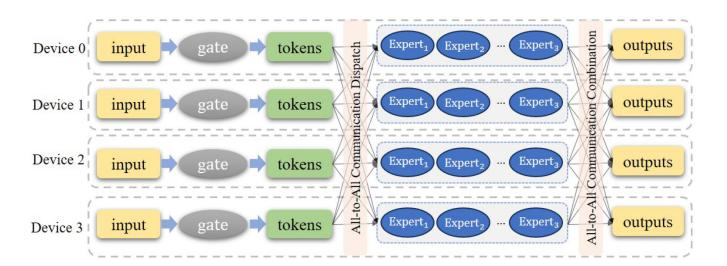
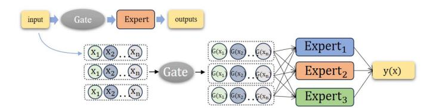
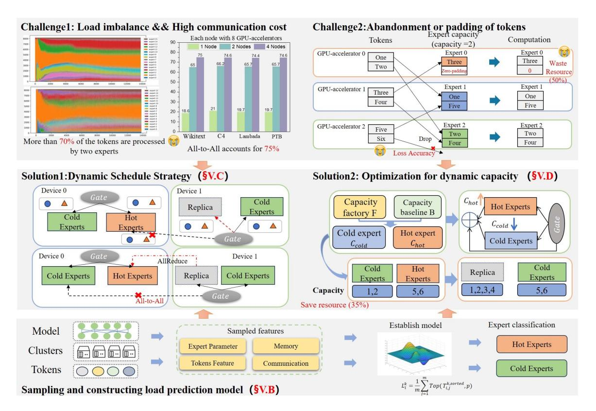
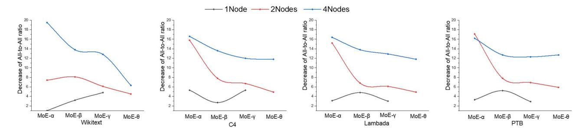
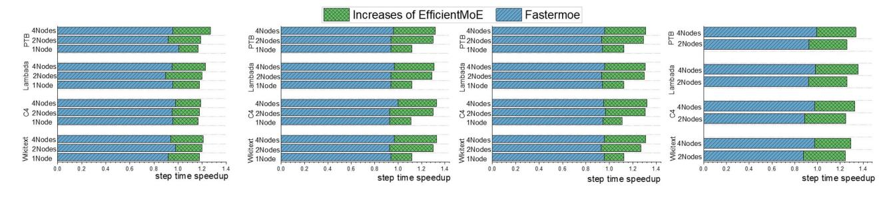
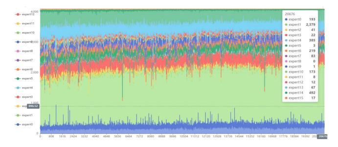

# EfficientMoE: Optimizing Mixture-of-Experts Model Training With Adaptive Load Balance

Yan Zeng [,](https://orcid.org/0000-0003-2026-417X) Chengchuang Huang [,](https://orcid.org/0009-0006-3966-6143) Yipeng Mei [,](https://orcid.org/0009-0005-6581-1028) Lifu Z[han](https://orcid.org/0000-0003-2995-9832)g [,](https://orcid.org/0009-0004-1856-5760) Teng Su [,](https://orcid.org/0009-0005-9517-2845) Wei Ye [,](https://orcid.org/0009-0006-7969-179X) Wenqi Shi, and Shengnan Wang

*Abstract***—Mixture-of-Experts (MoE) efficiently trains large models by using sparse activation to lower costs, selecting a few experts based on data characteristics. However, it faces challenges such as All-to-All communication overhead and load imbalance, with most optimizations targeting dynamic graphs rather than the more efficient static graphs. This study identifies two key challenges in training MoE on static graphs: 1) excessive All-to-All communication (up to 75% of iteration time) and load imbalance (70% of tokens handled by two experts) between experts due to the sparse structure of the MoE model and the token distribution; and 2) inefficient zero-padding for static shapes, leading to unnecessary computational overhead(wasting approximately 50% of resources). Thus, EfficientMoE, a scheduling method based on expert load and data characteristics, is introduced. EfficientMoE first designs a sampler to collect real-time information about token distribution, expert load, etc. It constructs a load prediction model to evaluate expert load. Subsequently, EfficientMoE proposes a dynamic schedule strategy for experts with evaluated expert load, reducing All-to-All communication and addressing load-balancing issues. Additionally, an expert capacity model is proposed to set different capacities for replicas of hot experts before static graph compilation, minimizing computation and storage overhead caused by significant padding. This study implements EfficientMoE in MindSpore and uses 32 Ascend AI accelerators to train an MoE model with 21 billion parameters and evaluate its validity. Efficient-MoE demonstrated an improvement of 30% in model training time, approximately 12% reduction in communication time, and saved 35% computational resources across different clusters, compared with Switch transformers, and the Fastermoe method for static graphs.**

*Index Terms***—Distributed training, parallelism, load balance.**

## I. INTRODUCTION

**I** N RECENT years, deep neural networks (DNNs) based on large-scale transformer architectures [\[1\]](#page-10-0) have achieved

Received 4 July 2024; revised 13 December 2024; accepted 25 January 2025. Date of publication 6 February 2025; date of current version 3 March 2025. This work was supported in part by the National Key Research and Development Program of China under Grant 2023YFB3001501, in part by the National Natural Science Foundation of China (NSFC) under Grant 62302133, in part by the "Pioneer" and "Leading Goose" R&D Program of Zhejiang Province under Grant 2024C01104, and in part by the Natural Science Foundation of Zhejiang Province under Grant LQ23F020015. Recommended for acceptance by D. Tiwari. *(Corresponding author: Yan Zeng.)*

Yan Zeng, Chengchuang Huang, Yipeng Mei, Lifu Zhang, and Wei Ye are with the Hangzhou Dianzi University, Hangzhou 310018, China (e-mail: [yz@hdu.edu.cn;](mailto:yz@hdu.edu.cn) [221050049@hdu.edu.cn;](mailto:221050049@hdu.edu.cn) [222050311@hdu.edu.cn;](mailto:222050311@hdu.edu.cn) [222050296@hdu.edu.cn;](mailto:222050296@hdu.edu.cn) [222050238@hdu.edu.cn\)](mailto:222050238@hdu.edu.cn).

Teng Su, Wenqi Shi, and Shengnan Wang are with the Huawei Technologies Co Ltd, Distributed Computing Lab, Shenzhen 518000, China (e-mail: [suteng@huawei.com;](mailto:suteng@huawei.com) [shiwenqi5@huawei.com;](mailto:shiwenqi5@huawei.com) [wangshengnan12@](mailto:wangshengnan12@huawei.com) [huawei.com\)](mailto:wangshengnan12@huawei.com).

Digital Object Identifier 10.1109/TPDS.2025.3539297

Fig. 1. MoE structure based on transformer architecture.

significant success. Scaling up model sizes [\[2\]](#page-10-0) to enhance AI model performance has become a prevailing trend in AI development. With the widespread adoption of models based on transformer architecture (BERT [\[3\],](#page-10-0) and VIT [\[4\]\)](#page-10-0), which has driven advancements in several fields such as computer vision(CV) [\[5\]](#page-10-0) and natural language processing(NLP) [\[6\],](#page-10-0) model parameter sizes have also increased from hundreds of billions to over a trillion (for example, Llama 2 [\[7\],](#page-10-0) GPT-3 [\[6\],](#page-10-0) and M6 [\[8\]\)](#page-10-0). However, these dense models typically require significant computational resources and training time [\[2\].](#page-10-0) For example, GPT-3 requires ten thousand A100 AI accelerators and several days of training, which pose substantial challenges for model training and hinder further development. To address these issues, a mixture-of-expert (MoE) model [\[9\],](#page-10-0) a sparse activation model architecture, has been demonstrated to enhance model performance by designing a large model without significantly increasing computational resources [\[10\].](#page-10-0) Therefore, such dynamic models play an important role in designing large models, such as DeepSeekMoE [\[11\],](#page-10-0) Mixtral [\[12\],](#page-10-0) and GPT-4 [\[13\].](#page-10-0)

The MoE architecture uses several sub-models called experts instead of a dense large model to process data or tasks. Each expert handles a specific type of data or task, as shown in Fig. 1. During MoE model training, different experts are assigned to different AI accelerators, which use a gating network to intelligently distribute the input tokens to specific experts. This leads to significant All-to-All communication between AI accelerators, including dispatching tokens to specific experts and collecting them after processing. If an expert is shred and deployed on different AI accelerators, called expert parallelism, the All-to-All communication cost increases. Simultaneously, differences in data distribution and data types processed by experts result in a load imbalance between experts.

Several methods can be used to solve these problems. For example, in [\[10\],](#page-10-0) a gating dropout algorithm that can reduce

1045-9219 © 2025 IEEE. All rights reserved, including rights for text and data mining, and training of artificial intelligence and similar technologies. Personal use is permitted, but republication/redistribution requires IEEE permission. See https://www.ieee.org/publications/rights/index.html for more information. communication traffic was proposed. Fastermoe [\[14\]](#page-10-0) uses shared experts to reduce communication costs by reducing the distribution of tokens across GPUs. A load-balance model was constructed to alleviate load imbalance in [\[15\].](#page-10-0) These methods were implemented in PyTorch, and rely on the dynamic shape function of dynamic graphs to allow each expert to adapt to the differences in data or tasks in different iterations [\[16\].](#page-10-0) The dynamic shape function of the dynamic graph supports the model in changing the input shape at different training iterations. However, these methods do not work well for static graphs, which have high computational efficiency compared with dynamic graphs. This is because a static graph supports only static shapes that require a fixed shape size to be set in advance. This can considerably waste computing and storage resources for experts with small data or token loads, as padding is required to supplement the fixed shape. In addition, it may affect the model accuracy; if the number of tokens to be processed exceeds the capacity of the expert, the excess tokens will be discarded.

In this study, EfficientMoE, which is based on the expert load and data characteristics, was used to address these problems in a static graph. EfficientMoE first samples information such as token distribution, expert, load, and constructs a load prediction model to evaluate the expert load. Guided by the load prediction model, EfficientMoE employs a dynamic scheduling strategy for experts to alleviate All-to-All communication costs and load imbalance. In addition, EfficientMoE builds an expert capacity model to set appropriate capacity values for different experts to avoid padding and token discarding. This study implemented EfficientMoE in MindSpore and made the following contributions:

- 1) To monitor and evaluate the expert load, EfficientMoE designed a sampler to collect and analyze information on experts, token distribution, and AI accelerators in real time. Subsequently, a load prediction model was constructed based on the information collected by the sampler to evaluate and predict the expert load.
- 2) EfficientMoE proposed a dynamic scheduling strategy for experts to alleviate imbalanced load and All-to-All communication between experts during the training process. It labels experts as either cold or hot based on load predictions and dynamically schedules hot experts in different iterations. This allows cold and hot experts to share AI accelerator resources and localize token processing.
- 3) An expert capacity model was proposed to set appropriate capacity values for hot and cold experts. For hot experts, it sets a larger capacity value for its replica experts that meets the storage and computing resources, reduces token discarding, and improves the model accuracy. Cold experts set a smaller capacity value to reduce padding, thereby reducing the waste of computing resources.
- 4) This study implemented EfficientMoE in MindSpore, and experiments on Ascend 910 AI accelerators (detailed information of devices in [V-A1\)](#page-6-0) validated that EfficientMoE improves the training time by 30%, reduces the communication time by approximately 12%, and saves 35% of the computational resources compared with Switch transformers and Fastermoe for static graphs.

Fig. 2. Dataflow of MoE model training.

5) Our code is available on the MindSpore community at [https://gitee.com/mindspore/mindformers/blob/r1.0/](https://gitee.com/mindspore/mindformers/blob/r1.0/mindformers/modules/transformer/moe.py) [mindformers/modules/transformer/moe.py.](https://gitee.com/mindspore/mindformers/blob/r1.0/mindformers/modules/transformer/moe.py)

The remainder of this paper is organized as follows. Section II introduces the background and challenges of this study. Then, Section [III](#page-2-0) presents the motivation for this study. Section [IV](#page-3-0) introduces the proposed method, and Section [V](#page-6-0) evaluates EfficientMoE. Finally, the conclusions are presented in Section [VI.](#page-9-0)

# II. BACKGROUND AND CHALLENGE

## *A. Mixture of Experts (MoE)*

Recently, MoE has been widely introduced into transformer models to improve their performance. It usesMoE layers, including multiple sub-models(called experts) and a gating network to replace the feed-forward network (FFN) layer. Each expert, which can have identical or different architectures, specializes in handling specific data types and tasks. The gate network is crucial because it dynamically selects relevant experts to process the input data. As shown in Fig. 2, for an input x, the gate outputs a set of weights G(x)=[G(x1), G(x2),...,G(x*N* )], where N is the number of experts, and G(x*i*) is the relevance score for the i − th expert. The final output of the MoE model, y(x), is obtained from the weighted sum of the expert outputs. To enhance computational efficiency, the model can employ a top-k selection mechanism, where only the top-k experts with the highest gating weights are selected. This selective approach reduces the computational load while maintaining the performance by activating only the most relevant experts for each input. Therefore, the MoE model structure naturally leads to a lot of All-to-All communication and load imbalance problems between experts.

#### *B. Training Strategies*

Distributed training strategies for MoE models include data parallelism, model parallelism(including layer parallelism, operator parallelism, and tensor parallelism), and expert parallelism.

*Data parallelism* involves splitting the input data across multiple AI accelerators while maintaining model parameters identical [\[17\].](#page-10-0) Each AI-accelerator processes a different subset of data, independently computes gradients, and stores the entire model [\[18\],](#page-10-0) which leads to O(W) memory usage, O(N) computation overhead, and O(W) communication cost.

*Model parallelism* is a technique that improves the training speed and efficiency of deep learning models by distributing

TABLE I COSTS OF DIFFERENT PARALLEL METHODS

| Parallelism          | Memory               | Computation | Communication |
|----------------------|----------------------|-------------|---------------|
| Data Parallelism     | O(W)                 | O(N)        | O(W)          |
| Layer Parallelism    | $O(\dot{W}/\dot{N})$ | O(L/N)      | O(L*B)        |
| Operator Parallelism | O(W/N)               | O(O/N)      | O(O*B)        |
| Tensor Parallelism   | O(W/N)               | O(T/N)      | O(T*B)        |
| Expert Parallelism   | O(W/E)               | O(E/N)      | O(E*C)        |

computations across multiple AI accelerators, including layer, operator, and tensor parallelism. Layer parallelism assigns all the layers to different AI accelerators, allowing parallel computation and reducing the memory requirements of each device [\[19\]\[20\].](#page-10-0) However, this increases inter-device communication, especially during forward and backward passes, which can add latency. Operator parallelism distributes distinct operations within a layer across AI accelerators, such as Megatron-LM [\[2\]](#page-10-0) and Mesh-TensorFlow [\[21\].](#page-10-0) This technique requires substantial memory for storing intermediate results and can result in significant communication overhead if the operator dependencies are high. Tensor parallelism divides individual tensors (such as weight matrices) into slices across AI accelerators, supporting the parallel computation of the tensor parts. ZeRO [\[22\]](#page-10-0) and Colossal-AI [\[23\]](#page-10-0) implemented tensor parallelism to reduce redundant memory usage while effectively managing gradient accumulation. By splitting the tensor, tensor parallelism can greatly reduce memory demands but may require more communication, particularly for synchronizing slices across AI accelerators. The costs of training strategies are listed in Table I, including the communication, computation, and memory costs.

*Expert parallelism* that is used specifically in MoE models involves distributing different experts across multiple AI accelerators. Each expert specializes in handling certain parts of the input data. Switch transformers [\[10\]](#page-10-0) expanded this concept further by dynamically routing tokens to experts on different AI accelerators based on their content, which optimizes computational resources by activating only a subset of experts for each input, reducing the overall computational load and enabling more efficient training of large models. However, when the scale of the model increases, this parallel method will also cause significant challenges in terms of communication delay and AI-accelerator load, as it will lead to significant All-to-All communication and load imbalances between experts on different AI accelerators.

#### *C. Computation Graphs & MoE Training Techniques*

*Static and dynamic graphs* are commonly used in machine learning frameworks to train deep learning models. The static graph is a pre-defined and fixed computation graph that is compiled before execution, and the dynamic graph is a computation graph that is generated and modified at runtime. Compared to a dynamic graph, a static graph has some advantages in terms of execution and deployment. For execution, it can receive data directly without relying on a front-end language description, and the operators in the execution graph are scheduled to complete tasks according to the corresponding hardware. In addition, they can be transformed into more efficient graph structures to improve the efficiency of the computations of the backend hardware. For deployment, static computation graphs can be serialized, saved, and executed directly in the model inference phase, which reduces the compilation process. Simultaneously, the static computation graph supports calling the code and the direct execution of the serialization model on different computing hardware, characterized by efficient deployment.

*MoE training optimization:* Google first introduced GShard [\[24\]](#page-10-0) to apply the MoE architecture to the transformer models and introduce Switch transformers that enable trillion-level MoE training, which was deployed in TPU hardware and Mesh TensorFlow based on static graphs. Tsinghua University developed Fastermoe [\[14\],](#page-10-0) enabling MoE training on GPUs using PyTorch and employing a dynamic shadowing strategy to balance loads and reduce All-to-All communication. Bytedance and Tsinghua University introduced the Janus [\[25\],](#page-10-0) shifting MoE training from expert-centric to data-centric and converting All-to-All communication to AllReduce to reduce latency. Hong Kong City University and ByteDance proposed the Lina [\[26\],](#page-10-0) which divides AllReduce and All-to-All communication by tensor segmentation to avoid communication obstacles caused by overlap and to improve training efficiency. Stanford and Google introduced Megablocks [\[27\],](#page-10-0) which uses a dynamic graph approach to address the token limitations caused by experts' capacity in MoE training, thereby enhancing efficiency without compromising accuracy. However, these methods have primarily focused on dynamic graph approaches to optimize the MoE. Challenges still remain for MoE training based on static graphs, including load imbalance, All-to-All communication obstruction, and waste of resources owing to the fixed capacity of experts.

According to the above analysis, it performs well in terms of the computational and deployment capabilities of MoE models based on static graphs. However, most optimization methods for MoE models are based on PyTorch [\[16\],](#page-10-0) a typical framework based on dynamic graphs, including Fastermoe [\[14\],](#page-10-0) Megablocks[\[27\],](#page-10-0) Tutel[\[28\],](#page-10-0) Janus[\[25\].](#page-10-0) Therefore, optimization methods based on static graphs must be proposed to improve the training performance of MoE models.

# III. MOTIVATION

This study analyzed the training process of the MoE in static graph scenarios using MindSpore [\[29\].](#page-10-0) After training the MoE in an actual environment, as shown in Fig. [3,](#page-3-0) two challenges were observed.

*Load imbalance and high communication cost:* Through profiling analysis, types of data were obtained, including the distribution of tokens and the All-to-All proportion during MoE training. Two issues must be addressed: 1) Some hot experts must process a larger number of tokens, which overloads the AI accelerator, and other cold experts process only a small number of tokens, resulting in a low AI accelerator load. The load-imbalance characteristic of the expert is continuous across different layers of the MoE and persists for a long time. 2) In the expert-parallel strategy, experts are assigned to different computing nodes, and data must be exchanged, resulting in

Fig. 3. Overview of EfficientMoE.

a significant amount of All-to-All communication. For 32 AI accelerator clusters, pure communication time accounts for 75% of the total MoE training time, which significantly wastes the computing power resources of the AI accelerator and increases the burden of model training. The achievement of load balance and the reduction of communication time during training in the MoE model are challenging problems.

*Abandonment or padding of tokens:* All experts retain the same expert capacity because static graphs require input shapes to be determined before compilation, and the capacity of experts cannot be changed while training the MoE model. In contrast, the capacity requirements of the hot and cold experts differ. This limitation leads to two difficulties in the MoE model training process: 1) The hot expert is limited by expert capacity, and tokens exceeding the capacity are discarded, which affects the accuracy of model training. 2) The cold expert will maintain the expert capacity consistent with zero-padding, which burdens the memory and communication resources. Setting a suitable expert capacity for MoE models in static graph mode is also challenging.

## IV. METHOD

#### *A. Overview*

This study proposes an optimization method called Efficient-MoE based on static computational graphs for MoE model training on MindSpore to address the above challenges, as shown in Fig. 3. First, EfficientMoE designs a sampler to collect information and proposes a load prediction model based on this sampler to evaluate the load balance for experts and divide the experts into hot and cold experts. Subsequently, EfficientMoE proposes a dynamic scheduling method for experts to balance the load between AI accelerators. EfficientMoE generates replicas for hot experts and dynamically schedules these replicas to other AI accelerators to share resources with cold experts according to the characteristics of expert load sustainability. Simultaneously, replica experts process the local tokens that need to be sent to hot experts, and the remaining tokens sent to cold experts are transmitted by All-to-All communication, which reduces the frequency of All-to-All communication transmission and improves the efficiency of model training. Finally, EfficientMoE designs an expert capacity model to set the appropriate capacity values for both hot and cold experts. EfficientMoE sets a larger capacity for replicas of hot experts to mitigate token discarding and a smaller capacity for cold experts to reduce resource waste.

#### *B. Sampling and Constructing Load Prediction Model*

*1) Sampler:* To estimate and optimize the training performance of MoE models, EfficientMoE analyzes the structure of MoE models and key factors affecting their training performance, and then designs a sampler to capture important information, including token characteristics, MoE structure characteristics, and computing resource characteristics, as listed in Table [II.](#page-4-0)

*Token Features* refer to the characteristics or attributes of individual tokens (words or subwords) in a dataset. In the training of MoE models, token features play a crucial role in determining which experts are selected for processing. The distribution

| Dimension        | Details                              | Explanation                                                  |  |
|------------------|--------------------------------------|--------------------------------------------------------------|--|
|                  | Token Distribution per Expert        | This indicates how tokens are allocated among the experts.   |  |
| Token Feature    | Token Distribution                   | Each AI-accelerator handles the experts and their tokens.    |  |
|                  | Layer-wise Token Redistribution      | Tokens may be redistributed to different experts.            |  |
| Expert Parameter | Model Parameters(MB/expert)          | Per expert has its own set of parameters.                    |  |
|                  | Intermediate Data (MB/expert)        | Intermediate data, such as activations and gradients.        |  |
|                  | Parameter Synchronization(MB/expert) | Parameters synchronization across different AI accelerators. |  |
| Memory           | Memory per GPU(GB)                   | The memory to store the parameters and data.                 |  |
|                  | Expert Memory Requirements(GB)       | Different experts may require varying amounts of memory.     |  |
|                  | Free Memory(GB)                      | Memory left for each AI-accelerator.                         |  |
| Communication    | Intra-Node Communication(GB/s)       | Bandwidth within a single node between AI accelerators.      |  |
|                  | Inter-Node Communication(GB/s)       | Bandwidth between nodes across different machines.           |  |
|                  | Actual communication(GB/s)           | The actual communication of the cluster AI accelerators      |  |

TABLE II INFORMATION FOR SAMPLING

between the tokens and experts sampled indicates how these token features influence the gating mechanism within the MoE, which ensures that the most relevant experts are selected.

Expert Parameters include the weights and biases associated with each expert. In addition to the model parameters, intermediate data, such as activations and gradients must also be stored during forward and backward passes, which increases memory requirements. The efficient synchronization of these parameters across AI accelerators is necessary to maintain consistency and optimal model performance.

Memory must be efficiently managed to store multiple expert parameters and intermediate data. Experts may have varying memory requirements based on the size and complexity, encompassing model parameters and activations. Efficient memory management, involving both of the nodes in the cluster and the GPUs for different nodes, is essential to maximize utilization and prevent bottlenecks.

Communication refers to the rate at which data can be transmitted between nodes (inter-node communication) or within nodes (intra-node communication) in a distributed computing environment. In MoE models, efficient communication is critical for synchronizing the parameters and sharing data between AI accelerators. Inter-nodes with lower communication bandwidths affect the ability to scale across multiple machines, whereas intra-nodes with higher communication bandwidths impact the efficiency of operations across multiple AI accelerators. Optimizing the communication bandwidth is vital for reducing the latency and improving the overall training and inference speed in MoE models, including managing the actual communication volume, such as token distribution communication in different iterations and MoE layers.

2) Load Prediction Model: To achieve load balancing and communication optimization effectively, EfficientMoE proposes a load prediction model for MoE training based on the information collected by the sampler. Specifically, the Efficient-MoE defines  $T_{i,j}^k$  to represent the number of tokens distributed to the j-th expert in the k-th layer during the i-th iteration.

EfficientMoE employs a statistical approach to analyze the token processing workload of each expert across different layers and multiple iterations. In particular, EfficientMoE collects the token counts processed by expert i at  $layer_k$  over m iterations,

denoted as  $(T^k_{i,1}, T^k_{i,2}, \dots, T^k_{i,m})$ . Subsequently, EfficientMoE sorts the data in descending order of token counts and selects the top p% of the data for averaging; p will be decided by token distribution in a load prediction cycle. This step aimed to exclude extreme outliers and obtain a more robust estimation of expert workload. The resulting average value was utilized to represent the load  $L^k_i$  of each expert i at layer k. A concept of a load prediction cycle was introduced, treating m iterations as one cycle, and utilizing the average load over this cycle to predict the expert's load for future cycles, as follows:

$$L_i^k = \frac{1}{m} \sum_{i=1}^m Top\left(T_{i,j}^{k,sorted}, p\right) \tag{1}$$

where  $T_{i,j}^{k,sorted}$  denotes the j-th largest token count after sorting for expert i at layer k. The value of m is determined based on the difference in token counts across iterations, and the expert's load will be recomputed when the token count gap exceeds  $\omega$ , which is determined according to the influence of the expert's load caused by historical data in different load prediction cycles.

In addition, apart from the individual expert loads, the load of each AI accelerator must be constructed, as shown in (2):

$$D_{j} = \sum_{i \in \mathcal{E}_{j}} \left( Compute\left(T_{i}\right) + Memory\left(T_{i}\right) \right) \tag{2}$$

where  $T_i$  represents the token count processed by expert i,  $Compute(T_i)$  and  $Memory(T_i)$  are functions that calculate the required computational and storage resources respectively, and  $D_j$  denotes the load of AI-accelerator j. This ensures that the computational load balance across the AI accelerators is considered along with the expert loads when performing dynamic scheduling and data distribution in the dynamic dispatching method.

#### C. Dynamic Schedule Strategy

Based on the above work, this study has designed an expert scheduling method to address the issues of unbalanced load and All-to-All communication delays. It aims to dynamically adjust expert capacities and efficiently manage load distribution

**Algorithm 1:** Dynamic Expert Schedule Method.

in MoE models. The key idea was to assess the token loads of different experts within a load prediction cycle and categorize them based on their load factors. Experts with a load factor greater than a threshold of q were classified as hot experts, whereas others were considered cold experts, where EfficientMoE set the value of q to 60%.

Within a load-prediction cycle, EfficientMoE uses a load evaluation model to estimate the token load of each expert. The load factor was calculated, and the experts were categorized as hot or cold based on this factor. The EfficientMoE evaluates the current load conditions, including the computational and storage resources of different AI accelerators. If the current load condition of an AI accelerator meets the requirements of a hot expert, the replica expert is scheduled to that AI accelerator, sharing resources with the cold experts. This aims to localize token processing, whereby tokens originally intended for hot experts are distributed among local replica experts. Tokens were also allocated to cold experts as needed to minimize All-to-All communication. During each prediction cycle, the load of experts was dynamically assessed, and the scheduling of hot experts was adjusted accordingly. The details of this schedule strategy are described in Algorithm 1:

# *D. Optimization for Dynamic Capacity*

Limited by the design of static graphs, all experts had the same expert capacity, and a large number of tokens were discarded because of the small expert capacity of hot experts, resulting in a reduction in training accuracy. By contrast, cold experts need to fill too many zero vectors because of their large capacity, which leads to a waste of hardware. Therefore, EfficientMoE constructs an expert capacity model to set appropriate capacity values for the various experts. This can prevent significant token discarding or padding and improve AI-accelerator resource utilization by making the cold and hot experts or replica experts on the same AI-accelerator fully share resources.

To ensure that experts could still process input tokens, the ratio of tokens processed by cold and hot experts was set higher than p%. EfficientMoE introduced a capacity adjustment method based on expert periodic loads. It defines the baseline capacity B and introduces a capacity factor F, which is defined by the experts' computational load, to adjust their capacity. For each cycle j, EfficientMoE calculates a cycle-specific expert capacity C*j* by analyzing the token loads and applying a weighted average across recent cycles to account for temporal load trends:

$$C_j = (1 - r) * B + r * \frac{1}{m} \sum_{i=1}^{m} (F_i)$$
 (3)

where B is constructed by statistically analyzing the token counts over a sampling cycle of m iterations for each expert. Extreme values were discarded, and the average of the m iterations was used as the token load for each expert. The token loads of all experts were then sorted, and the value that covered the top p% of the number of tokens was chosen as the baseline capacity B. Factor r is defined as follows:

$$r = \left(\max\left(\overline{T_i}\right) - B\right) * \beta \tag{4}$$

where T*i* represents the average number of tokens that must be processed by expert i in m iterations. β (0 ≤ β ≤ 1) is a decay constant used to adjust the size of r to achieve the optimal expert capacity setting for the load impact of different datasets. This term allows C*j* to dynamically adjust downwards for experts whose peak load has not persisted over time, freeing capacity for more consistently high-demand experts. The capacity factor F is calculated as follows:

$$F = \gamma * \frac{T_i - B}{Total\_tokens} \tag{5}$$

where T*i* represents the token count for experti as determined by the load evaluation model. For cold experts, T*i* − B is negative, resulting in a decrease in C*i*. Conversely, F is positive for hot experts, which leads to an increase in C*i*. The weighting coefficient γ (0 ≤ β ≤ 1) can realize the smooth regulation of F and reduce the impact of the abnormal load of a few experts on F. In addition, EfficientMoE must ensure that the total memory requirement M*cost* for all experts on the same AI accelerator is less than the total memory the of AI accelerators. The memory requirement for expert i is expressed as follows:

$$M_{cost,i} = M_p + M_a + M_t \tag{6}$$

where M*p*, M*a*, and M*t* represent the cost of memory for the parameters of expert i, activation, and tokens, respectively. The overall implementation can be described using Algorithm [2:](#page-6-0)

Algorithm[2](#page-6-0) dynamically adjusted the capacities of the experts in the MoE model based on the token loads they handled. By

**Algorithm 2:**Dynamic Adjustment for Capability of Expert.

allocating more capacity to hot experts (those handling more tokens) and less capacity to cold experts, the computational load was balanced across devices. This approach reduces the issues related to token truncation and padding, thereby optimizing resource utilization. Additionally, the memory cost check ensures that the total memory usage remains within hardware limits, which promotes efficient and scalable training of large models.

# V. EXPERIMENTS

# *A. Experiment Setup*

- *1) Hardware & Software:* Experiments on an Ascend cluster with 4 nodes including 32 Ascend 910 AI accelerators [\[30\],](#page-10-0) and a GPU cluster with one node including eight NVIDIA V100. The clusters were built on a Linux 4.15.0-123-generic operating system, and each node had eight accelerators with 32 GB of memory. The Ascend 910 was equipped with a 100 GB/s RoCE, and the V100 was equipped with a 300 GB/s NVLink. Efficient-MoE trains the MoE model utilizing MindSpore2.0 and Mindformers1.0. Mindformers is a powerful, comprehensive, and full-flow development suite for large model training, inference, and deployment. It has training methods, inference algorithms, and deployment methods. Mindformer is an efficient tool that enables the rapid implementation of multiple parallel strategies.
- *2) Models:* GPT-MoE model was chosen to verify the effectiveness and scalability of EfficientMoE; the models are listed in Table III. The parameters of the GPT-MoE models were expanded from 2.3 billion to 21 billion, and the experiment used typical batch sizes and numbers of experts for each model.
- *3) Datasets:* As the data distribution has a significant influence on load balancing and All-to-All communication of MoE models, four types of datasets were chosen, including Wikitext [\[31\],](#page-10-0) Colossal Clean Crawled Corpus(C4) [\[32\],](#page-10-0) Lambada [\[33\],](#page-10-0) and Penn Treebank(PTB) [\[34\]](#page-10-0) datasets, where are

TABLE III MODELS

| Models        | Size(Billion) | Number of experts | Layers |
|---------------|---------------|-------------------|--------|
| MoE-α         | 2.3           | 16                | 16     |
| MoE- $\beta$  | 7.4           | 32                | 20     |
| MoE- $\gamma$ | 10.4          | 32                | 32     |
| $MoE-\theta$  | 21            | 32                | 40     |

commonly used in NLP and machine learning, to verify their generalizability.

*Wikitext:* Wikitext is a dataset derived from Wikipedia and is used as a benchmark for language modeling and other NLP tasks. Wikitext-2 contains approximately 2 million words from curated Wikipedia articles, ensuring high-quality text is suitable for language modeling. It is typically used in language model training, evaluation, and text generation.

*C4:* The C4 is a large dataset created by scraping and cleaning web pages. It comprises hundreds of gigabytes of text and is filtered for quality and diversity. C4 is primarily used for largescale pretraining of language models, offering extensive topics and style coverage.

*Lambada:* The Lambada dataset tests language understanding by predicting the last word in a passage based on its context. It includes 10,022 passages, focusing on long-range dependencies. Lambada evaluated models for tasks that require deep context comprehension and coherent text generation.

*PTB:* The Penn Treebank (PTB) is a dataset from the Wall Street Journal corpus, annotated for syntactic structure. It includes approximately 1 million words and is used for partof-speech tagging, syntactic parsing, and language modeling. The PTB is valuable for tasks involving linguistic and syntactic predictions.

*4) Baselines:* Experimentally implemented Switch transformers [\[10\]](#page-10-0) and Fastermoe [\[14\]](#page-10-0) were used as the baseline for MindSpore, leveraging the operator migration for implementation. To achieve efficient MoE training, both models were configured using Data Parallelism (DP) = 16, Model Parallelism (MP) = 2, and Expert Parallelism (EP) = 16.

*Switch Transformers* [\[10\],](#page-10-0) originally developed by Google and based on the TPU [\[35\],](#page-10-0) were implemented using Mesh-TensorFlow [\[21\],](#page-10-0) which is a technique designed for static computational graphs. This approach assigns multiple experts across devices using expert parallelism and utilizes token-based routing to activate specific experts for each input. Switch transformers were reimplemented in the experiments on MindSpore by adapting their static graph operations, to MindSpore's operator execution environment.

*Fastermoe* [\[14\],](#page-10-0) in contrast, is a dynamic graph-based framework that achieves expert load balancing through dynamic shadow strategies. Fastermoe alleviates the load imbalance and communication challenges that often occur in MoE models. Fastermoe's dynamic graph logic was migrated to MindSpore's operator framework, and the expert capacity was fixed to fit the static graph mode.

Fig. 4. Speedup compare with Switch transformers and Fastermoe for static graphs.

Fig. 5. Speedup of EfficientMoE compared with Switch transformers with scaling of model parameters.

#### *B. Comparison With State-of-The-Art*

*1) End-to-End Speedup:* EfficientMoE evaluated the end-toend performance of EfficientMoE with GPT-MoE models on three different clusters. First, based on the four datasets for MoE-θ and MoE-γ, compared with Switch transformers and Fastermoe, EfficientMoE achieved 30% and 33% speedup in a cluster with four nodes, respectively, as shown in Fig. 4. As the nodes increased, the training speedup ratio of MoE-θ also increased from 12% to 30% compared with Switch transformers, indicating that EfficientMoE performed better for large models. Fig. 5 shows the speedup achieved by EfficientMoE compared with Switch transformers, based on four datasets for MoE-α, MOE-β, MoE-γ, and MoE-θ. With the increase in model parameter scale, EfficientMoE showed better performance, and the training effect of MoE was improved from 20% for MoE-α to 30% for MoE-θ. Finally, for the problem of MoE load imbalance caused by differences in datasets, EfficientMoE had similar effects on various datasets, demonstrating the generalization of EfficientMoE.

Notably, it was observed that Fastermoe was weaker than Switch transformers in end-to-end acceleration, which indicated that Fastermoe, as an MoE optimization training system based on dynamic graphs, was not suitable for static graphs.

*2) Optimization in All-to-All Communication:* The experiment used four datasets to train the MoE models and presented the communication optimization in three clusters. By comparing Fastermoe and Switch transformers, it was observed that EfficientMoE optimization was reflected in two aspects: (1) With an increase in cluster size, the communication optimization effect was improved; (2) the size of the model parameter affected the optimization of the communication.

The first phenomenon was analyzed based on four datasets and MoE-α and MoE-β, as shown in Fig. [6.](#page-8-0) By comparing one, two, and four nodes, it was observed that the communication optimization improved from 3.2% to 13.8%. This enhancement was attributed to the increased cluster size, which resulted in increased inter-node communication. As the cluster size increased, the distribution of tokens across multiple AI accelerators increased the necessity for All-to-All communication, thereby amplifying the effectiveness of our optimization strategy.

As shown in Fig. [7,](#page-8-0) this study analyzed the second phenomenon based on four datasets and three clusters and compared it with Switch transformers. By comparing with MoE-α, MOE-β, MoE-γ, and MoE-θ, it found that the communication optimization decreased from 20% to 7%. This reduction was due to the increase in computational demands associated with larger

Fig. 6. Optimization in All-to-All communication in scaling of the cluster.

Fig. 7. Optimization in All-to-All communication in scaling of model parameters.

Fig. 8. Speedup of EfficientMoE compared with Fastermoe.

model parameters, which led to a proportional increase in the need for synchronized communication.

The observed communication optimization improvements were due to the increased complexity of synchronizing larger model parameters and the greater inter-node communication requirements of larger clusters. These results validated the scalability and effectiveness of EfficientMoE for model parameter size variations and cluster size expansions.

*3) Optimizations in computation With Dynamic Capacity:* Based on four datasets and three clusters, EfficientMoE improved the training efficiency by up to approximately 35% compared to Fastermoe, as shown in Fig. 8. This was achieved by dynamically adjusting expert capacities, reducing the token loss for hot experts, and optimizing resource allocation. This demonstrates that EfficientMoE effectively addresses the expert capacity issue, achieving dynamic optimization of expert capacity without sacrificing accuracy. This, approach is particularly effective for large-scale cluster environments. As the cluster size increases, the benefits of EfficientMoE become more pronounced, making it well-suited for extensive distributed training.

Fig. 9. Accuracy and Perplexity of the MoE model.

Fig. 10. Performance Analysis of EfficientMoE between NVIDIA GPU and Ascend AI-accelerator.

#### *C. Correctness of EfficientMoE*

In this section, this study verified the effect of EfficientMoE on the correctness of the model. Fig. 9 verifies the correctness of Switch transformers, EfficientMoE, and Fastermoe, indicating that implementing Fastermoe based a static graph does not affect the performance of the model. Similarly, EfficientMoE does not affect the performance of the MoE model during the design process. The above verification is mainly reflected in two aspects; Figure (a) shows the correctness of the accuracy, and Figure (b) shows the correctness of Perplexity (PPL).

#### *D. Generality of EfficientMoE*

This study analyzed the generality of EfficientMoE across different hardware types, particularly on NVIDIA AI accelerators. Fig. 10 shows the optimizations achieved by EfficientMoE on V100 and Ascend 910, respectively, compared with the Switch transformers. Two phenomena were observed: 1) EfficientMoE achieved a 6.42% improvement in V100, which was less than the 10% improvement in Ascend 910. Because MindSpore is a deep-learning framework specifically designed for the Ascend AI-accelerator, EfficientMoE achieved a higher level of performance on the Ascend hardware. 2) EfficientMoE achieved a 27.6% improvement on V100, which was more than an 8%

Fig. 11. Distribution of experts and tokens in training of MoE models .

improvement on Ascend 910. Because the Ascend cluster has an inter-node bandwidth of only 100 Gbps, which is significantly less than the bandwidth of NVLink, V100 can achieve better communication results. This analysis highlighted the generality of EfficientMoE across multiple hardware, making it clear that its design is superior to that of Ascend, whereas other AI accelerators may require additional tuning to match the efficiency observed in the Ascend environment.

#### *E. Load Predication Model for EfficientMoE*

EfficientMoE distributes 4000 tokens in 20,000 steps and collects the expert selection for each token while training the MoE model of 16 experts to observe the actual popularity of the different experts, as shown in Fig. 11. Some iterations during training were sampled and visualized, and it was observed that the popularity of experts changed continuously throughout the training process over 20,000 iterations. Moreover, Efficient-MoE tested four different datasets: Wikitext, C4, Lambada, and PTB, and observed that different datasets led to different degrees of expert load, which would be beneficial for researchers to verify the effectiveness of EfficientMoE in dealing with different expert load cases. This study integrates this part of the visualization code into MindSpore for researchers to intuitively understand the token distribution when training MoE models at [https://gitee.com/mindspore/mindformers/blob/r1.0/](https://gitee.com/mindspore/mindformers/blob/r1.0/mindformers/modules/transformer/moe.py) [mindformers/modules/transformer/moe.py](https://gitee.com/mindspore/mindformers/blob/r1.0/mindformers/modules/transformer/moe.py)

# VI. CONCLUSION

This study introduced and implemented EfficientMoE based on static computational graphs and MindSpore for MoE training. EfficientMoE analyzes the load and parameter characteristics of different experts and evaluates their loads through real-time sampling. It then dynamically schedules experts based on the expert load, converting token transfers into expert parameter transfers to reduce All-to-All communication. In addition, to improve the accuracy of the model and reduce the wastage of AI-accelerator resources, an expert capacity model was proposed to set appropriate expert capacity values for different types of experts. Experiments showed that EfficientMoE achieves an average improvement of 30% in end-to-end speedup, approximately 12% reduction in communication time, and saved 35% computational resources across different clusters, compared with Switch transformers and Fastermoe for static graphs. However, this study focused on load imbalance and communication optimization and did not consider the computational optimization of the token distribution, which includes considerable high-dimensional matrix multiplications. Future work will focus on improving the training time of MoE models.

## REFERENCES

- [1] A. Vaswani et al., "Attention is all you need," in *Proc. Adv. Neural Inf. Process. Syst.*, 2017, pp. 6000–6010.
- [2] M. Shoeybi et al., "Megatron-LM: Training multi-billion parameter language models using model parallelism," 2019, *arXiv: 1909.08053*.
- [3] J. Devlin, M.-W. Chang, K. Lee, and K. Toutanova, "BERT: Pre-training of deep bidirectional transformers for language understanding," 2018, *arXiv: 1810.04805*.
- [4] A. Dosovitskiy et al., "An image is worth 16x16 words: Transformers for image recognition at scale," 2020, *arXiv: 2010.11929*.
- [5] N. Parmar et al., "Image transformer," in *Proc. Int. Conf. Mach. Learn.*, PMLR, 2018, pp. 4055–4064.
- [6] T. Brown et al., "Language models are few-shot learners," in *Proc. Adv. Neural Inf. Process. Syst.*, 2020, pp. 1877–1901.
- [7] H. Touvron et al., "Llama 2: Open foundation and fine-tuned chat models," 2023, *arXiv:2307.09288*.
- [8] J. Lin et al., "M6: A chinese multimodal pretrainer," 2021, *arXiv: 2103.00823*.
- [9] R. A. Jacobs, M. I. Jordan, S. J. Nowlan, and G. E. Hinton, "Adaptive mixtures of local experts," *Neural Comput.*, vol. 3, no. 1, pp. 79–87, 1991.
- [10] W. Fedus, B. Zoph, and N. Shazeer, "Switch transformers: Scaling to trillion parameter models with simple and efficient sparsity," *J. Mach. Learn. Res.*, vol. 23, no. 120, pp. 1–39, 2022.
- [11] D. Dai et al., "DeepSeekMoE: Towards ultimate expert specialization in mixture-of-experts language models," 2024, *arXiv:2401.06066*. [Online]. Available:<https://arxiv.org/abs/2401.06066>
- [12] A. Q. Jiang et al., "Mixtral of experts," 2024, *arXiv:2401.04088*.
- [13] J. Achiam et al., "GPT-4 technical report," 2023, *arXiv:2303.08774*.
- [14] J. He et al., "Fastermoe: Modeling and optimizing training of large-scale dynamic pre-trained models," in *Proc. 27th ACM SIGPLAN Symp. Princ. Pract. Parallel Program.*, 2022, pp. 120–134.
- [15] J. Yao et al., "Exploiting inter-layer expert affinity for accelerating mixtureof-experts model inference," 2024, *arXiv:2401.08383*.
- [16] A. Paszke et al., "Pytorch: An imperative style, high-performance deep learning library," in *Proc. Adv. Neural Inf. Process. Syst.*, 2019, pp. 8024–8035.
- [17] S. Pal et al., "Optimizing multi-GPU parallelization strategies for deep learning training," *IEEE Micro*, vol. 39, no. 5, pp. 91–101, Sep./Oct. 2019.
- [18] B. Ginsburg, I. Gitman, and Y. You, "Large batch training of convolutional networks with layer-wise adaptive rate scaling," 2018.
- [19] Y. Huang et al., "GPipe: Efficient training of giant neural networks using pipeline parallelism," in *Proc. Adv. Neural Inf. Process. Syst.*, 2019, pp. 103–112.
- [20] D. Narayanan et al., "PipeDream: Generalized pipeline parallelism for DNN training," in *Proc. 27th ACM Symp. Operating Syst. Princ.*, 2019, pp. 1–15.
- [21] N. Shazeer et al., "Mesh-tensorflow: Deep learning for supercomputers," in *Proc. Adv. Neural Inf. Process. Syst.*, 2018, pp. 10435–10444.
- [22] S. Rajbhandari, J. Rasley, O. Ruwase, and Y. He, "Zero: Memory optimizations toward training trillion parameter models," in *Proc. Int. Conf. High Perform. Comput., Netw., Storage Anal.*, 2020, pp. 1–16.
- [23] S. Li et al., "Colossal-AI: A unified deep learning system for largescale parallel training," in *Proc. 52nd Int. Conf. Parallel Process.*, 2023, pp. 766–775.
- [24] D. Lepikhin et al., "GShard: Scaling giant models with conditional computation and automatic sharding," 2020, *arXiv: 2006.16668*.
- [25] J. Liu, J. H. Wang, and Y. Jiang, "Janus: A unified distributed training framework for sparse mixture-of-experts models," in *Proc. ACM SIG-COMM Conf.*, 2023, pp. 486–498.
- [26] J. Li, Y. Jiang, Y. Zhu, C. Wang, and H. Xu, "Accelerating distributed MoE training and inference with lina," in *Proc. USENIX Annu. Tech. Conf.*, 2023, pp. 945–959.
- [27] T. Gale, D. Narayanan, C. Young, and M. Zaharia, "MegaBlocks: Efficient sparse training with mixture-of-experts," in*Proc. Mach. Learn. Syst.*, 2023, vol. 5, pp. 288–304.
- [28] C. Hwang et al., "Tutel: Adaptive mixture-of-experts at scale," in *Proc. Mach. Learn. Syst.*, 2023, vol. 5, pp. 269–287.

- [29] Z. Cai et al., "TensorOpt: Exploring the tradeoffs in distributed DNN training with auto-parallelism," *IEEE Trans. Parallel Distrib. Syst.*, vol. 33, no. 8, pp. 1967–1981, Aug. 2022.
- [30] H. Liao et al., "Ascend: A scalable and unified architecture for ubiquitous deep neural network computing: Industry track paper," in *Proc. IEEE Int. Symp. High- Perform. Comput. Archit.*, 2021, pp. 789–801.
- [31] H. Dohrn and D. Riehle, "Design and implementation of the sweble wikitext parser: Unlocking the structured data of wikipedia," in *Proc. 7th Int. Symp. Wikis Open Collaboration*, 2011, pp. 72–81.
- [32] J. Dodge et al., "Documenting large webtext corpora: A case study on the colossal clean crawled corpus," 2021, *arXiv:2104.08758*.
- [33] D. Paperno et al., "The LAMBADA dataset: Word prediction requiring a broad discourse context," 2016, *arXiv:1606.06031*.
- [34] M. Marcus, B. Santorini, and M. A. Marcinkiewicz, "Building a large annotated corpus of English: The Penn Treebank," *Comput. Linguistics*, vol. 19, no. 2, pp. 313–330, 1993.
- [35] Y. E. Wang, G.-Y. Wei, and D. Brooks, "Benchmarking TPU, GPU, and CPU platforms for deep learning," 2019, *arXiv: 1907.10701*.
- [36] J. W. Rae et al., "Scaling language models: Methods, analysis & insights from training gopher," 2021, *arXiv:2112.11446*.
- [37] N. Shazeer et al., "Outrageously large neural networks: The sparsely-gated mixture-of-experts layer," 2017, *arXiv: 1701.06538*.
- [38] S. Rajbhandari et al., "DeepSpeed-MoE: Advancing mixture-of-experts inference and training to power next-generation AI scale," in *Proc. Int. Conf. Mach. Learn.*, PMLR, 2022, pp. 18332–18346.
- [39] M. Lewis, S. Bhosale, T. Dettmers, N. Goyal, and L. Zettlemoyer, "Base layers: Simplifying training of large, sparse models," in *Proc. Int. Conf. Mach. Learn.*, PMLR, 2021, pp. 6265–6274.

**Yan Zeng** received the PhD degree from the Institute of Software, Chinese Academy of Sciences, in 2016. She is currently an associate professor with the School of Computer Science, Hangzhou Dianzi University. Her research interests include distributed and parallel computing, distributed machine learning, and Big Data.

**Chengchuang Huang** is currently working toward the master's degree with Hangzhou Dianzi University. His research interests include distributed and parallel computing and distributed machine learning.

**Yipeng Mei** is working toward the master's degree with the School of Computer Science of Hangzhou Dianzi University. His research fields are distributed machine learning and distributed computing.

**Lifu Zhang** received the graduate degree from the Chongqing University of Posts and Telecommunications, in 2022. He is currently working toward the master's degree with Hangzhou Dianzi University, specializing in distributed machine learning.

**Teng Su** received the PhD degree from Zhejiang University, in 2010. He is a MindSpore hyper-scale AI technology leader with Huawei. He long-term engaged in large-scale distributed parallel basic software research and development. He has rich practical experience in the direction of large-scale distributed systems.

**Wenqi Shi** received the PhD degree from Tsinghua University. He is a Huawei MindSpore senior engineer. He engaged in deep learning framework research and development. His research interests include parallel training technology and cluster training inference performance optimization.

**Wei Ye** is currently working toward the master's degree with Hangzhou Dianzi University. He focuses on distributed machine learning and parallel computing.

**Shengnan Wang** reveived the PhD degree in electronic science and technology from Zhejiang University, HangZhou, China, in 2019. He is currently a chief engineer with Huawei Technologies Company, Ltd. His current research interest includes machine learning, natural language processing.