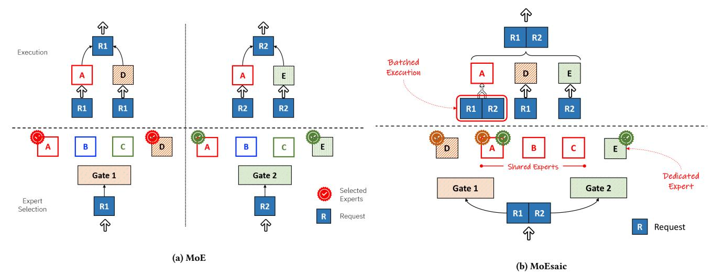
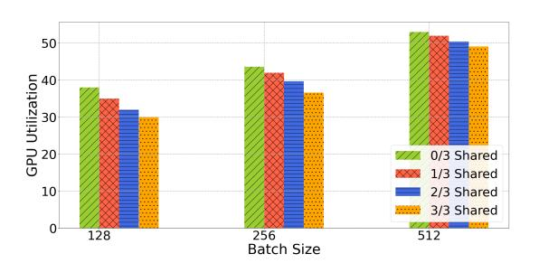
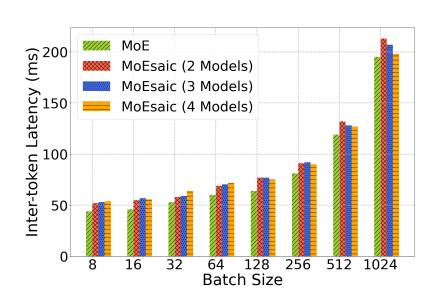

# MoEsaic: Shared Mixture of Experts

Umesh Deshpande, Travis Janssen Mudhakar Srivatsa, Swaminathan Sundararaman IBM Research, USA

#### Abstract

Mixture of Expert (MoE) models consist of several experts, each specializing in a specific task. During inference, a subset of the experts is invoked based on their relevance to the request. MoE's modular architecture lets users compose their model from popular off-the-shelf experts. This leads to multiple MoE deployments with identical experts. The duplication of experts across model instances results in excessive GPU memory consumption and increased model serving cost. Moreover, since all experts are not invoked for each request, individual experts rarely receive enough requests to exploit the GPUs' computational capabilities, resulting in low GPU utilization. To address these problems, we propose Shared Mixture of Experts in MoEsaic. MoEsaic automatically identifies and deduplicates identical experts across model instances, thus reducing their memory footprint. Moreover, it batches the requests directed toward the identical experts belonging to different clients, which also improves the processing efficiency. We show that for Mixtral-8x7B model, when compared to deploying dedicated MoE instances, MoEsaic can serve 7X more model instances with little impact on inference performance.

#### CCS Concepts

• Computing methodologies → Planning with abstraction and generalization.

#### Keywords

Mixture of Experts, Model Sharing

#### ACM Reference Format:

Umesh Deshpande, Travis Janssen and Mudhakar Srivatsa, Swaminathan Sundararaman. 2024. MoEsaic: Shared Mixture of Experts. In ACM Symposium on Cloud Computing (SoCC '24), November 20– 22, 2024, Redmond, WA, USA. ACM, New York, NY, USA, [9](#page-8-0) pages. <https://doi.org/10.1145/3698038.3698521>

[This work is licensed under a Creative Commons Attribution-](https://creativecommons.org/licenses/by-nc-sa/4.0/)NonCommercial-ShareAlike International 4.0 License. SoCC '24, November 20–22, 2024, Redmond, WA, USA © 2024 Copyright held by the owner/author(s). ACM ISBN 979-8-4007-1286-9/24/11 <https://doi.org/10.1145/3698038.3698521>

#### 1 Introduction

The power-law observed in language models suggests that a model's performance improves as the number of its parameters increases [\[16\]](#page-7-0). This has driven the development of Large Language Models (LLMs) that possess hundreds of billions of parameters. However, to manage the computational complexity resulting from such large sizes, routing networks like Sparse Mixture of Experts (MoE) [\[28\]](#page-8-1) are employed. These networks effectively reduce the computational load by selectively interacting with only a subset of the parameters, referred to as experts. In MoE, the invocation of experts is governed by a gating mechanism that invokes the most relevant experts to the request. This architecture is particularly useful for handling diverse datasets, where a single model may struggle to capture all underlying patterns. MoE's superior generative capability and performance have made it the preferred architecture for LLMs [\[7,](#page-7-1) [15,](#page-7-2) [18\]](#page-7-3). As a result, MoE has been adopted by well-known Large Language Models (LLMs), such as Grok [\[4\]](#page-7-4) and Gemini [\[31\]](#page-8-2).

MoEs are inherently modular, often consisting of a combination of purpose-built experts. For instance, multi-modal inference benefits from a combination of modality-specific experts [\[8,](#page-7-5) [23,](#page-8-3) [26,](#page-8-4) [27,](#page-8-5) [34\]](#page-8-6), e.g., a text expert vs. an image expert. Experts can be added or removed from an MoE model to only serve the desired tasks [\[11\]](#page-7-6). Several emerging tools have allowed users to compose a new MoE by combining the off-the-shelf models [\[1,](#page-7-7) [3,](#page-7-8) [19,](#page-8-7) [30\]](#page-8-8). Moreover, users can fine-tune only a subset of task-specific experts [\[32\]](#page-8-9) in tens of minutes. These approaches eliminate the necessity of retraining the entire model from scratch. However, these advantages of MoE have also created the following challenges in a multi-client environment.

First, due to the reuse of the off-the-shelf experts or finetuning of selective experts, identical experts can be found across different model instances. Despite the identical experts, different clients running variants of the same MoE model need to run dedicated instances of their model. As a result, identical experts from different variants occupy distinct GPU memory space. For instance, even in common MoE models, e.g., Mixtral 8x7B, each expert consumes 14GB of GPU memory. Figure [1](#page-2-0) (a) demonstrates the problem with 2 variants (e.g., belonging to 2 clients). The Second challenge with MoE is that it exhibits sparse execution patterns compared to regular neural network models. Specifically, because

MoE selects only a subset of experts for each request, only a fraction of the parameters of the model are involved in serving a request. Because of the higher memory-to-compute ratio, MoE exhausts GPU memory before fully utilizing its computational capacity, which leads to GPU underutilization [\[21\]](#page-8-10). This problem is exacerbated in a multi-client environment, where individual model instances do not receive enough requests to form large batches [\[29\]](#page-8-11) and benefit from GPUs' capability to efficiently process multiple requests in parallel.

The existing techniques that optimize MoEs focus on either reducing the memory footprint of MoEs through parameter pruning, quantization, removing experts [\[14,](#page-7-9) [20\]](#page-8-12) or specifically designing MoEs with fewer parameters [\[12\]](#page-7-10). Our approach is orthogonal to such optimizations and through deduplication it can achieve an order of magnitude saving without altering the accuracy or behavior of the constituent MoEs.

In this paper, we propose shared Mixture of Experts (MoEsaic) to address the above problems. With MoEsaic, a single inference service can host several MoE model instances. MoEsaic identifies and deduplicates identical experts across MoE instances. Figure [1](#page-2-0) (b) shows an instance of MoEsaic deduplicated experts across two clients. The sharing of experts is beneficial in the following ways. First, the sharing reduces the GPU memory requirement for running multiple model instances. Second, the requests for the deduplicated experts are batched, even if they belong to different clients. For instance, in the Figure [1](#page-2-0) (b) requests R1 and R2 (headed towards expert A), belong to two different clients, however batching their execution with expert A improves the overall computational efficiency.

The contributions of MoEsaic are as follows.

- In MoEsaic, we present an approach to transparently detect identical experts from across multiple clients and share them during inference. The client need not provide additional hints to enable sharing. Moreover, to support the large experts that cannot fit in the memory of a single GPU, MoEsaic supports tensor-parallel execution of experts. In a tensor-parallel mode, MoEsaic deduplicates shards of experts to enable the sharing of experts across multiple GPUs.
- We present techniques for improving the processing efficiency while leveraging model sharing in MoE. Specifically, MoEsaic batches the execution of requests from multiple clients when they are to be executed by the deduplicated experts. We demonstrate that such batching improves computational efficiency. Next, we fuse the gates of multiple MoE model instances to avoid sequential invocation of gates during inference at each

- layer. The fused routing of requests further improves the scalability of MoEsaic.
- We have implemented MoEsaic in vLLM. Additional experts can be added to an existing model using a familiar interface that mimics the addition of LoRA adapters. Moreover, MoEsaic allows service providers to dynamically integrate new clients, namely their experts and gates, to an already deployed MoE instance(s).

#### 2 Related Work

# Model Sharing with Multi-LoRA

Sharing of model parameters is commonly used for reducing GPU memory footprint. S-Lora [\[29\]](#page-8-11), vLLM [\[5,](#page-7-11) [9\]](#page-7-12), CaraServe [\[22\]](#page-8-13) share the common base model across multiple model variants each served with its respective LoRA adapter. However, such techniques are specific to LoRA adapters and do not apply directly to MoE models. Additionally, MoEsaic does not require a common base model. Multiple model variants can share different experts across them.

### Sharing in Mixture of Experts

Recently, Mixture of Experts models have become a focus of multi-task learning, where an MoE model is shared across several tasks either through task-specific gates [\[6,](#page-7-13) [13,](#page-7-14) [25\]](#page-8-14) or a combined gate [\[24\]](#page-8-15). These approaches specifically train the gates to share experts across related tasks. In contrast to these approaches, MoEsaic is agnostic to the tasks or use-cases served by the constituent models. Therefore, MoEsaic does not require any additional training of the gate to incorporate new MoE models.

DeepSeekMoE [\[12\]](#page-7-10) segments the experts into smaller experts and isolates the subset of these experts as shared ones, aiming to capture the common knowledge. The shared experts are invoked for each request. Li et. al. [\[21\]](#page-8-10) consolidate experts into fewer and more knowledgeable experts. The authors note that the consolidated experts are better compressible than the original experts. While the above techniques modify the MoE architecture for performance benefits, MoEsaic simply incorporates the new experts and gates from multiple clients, where each model retains its exact structure as from the original MoEs.

#### Reducing Memory Footprint of MoEs

MoQE[\[17\]](#page-7-15) applies 2-bit quantization to experts. It observed that the expert layers in MoE models are much more robust to the quantization than conventional feed-forward networks (FFN) layers. Chen et. al. [\[10\]](#page-7-16) convert larger model into task specific smaller model through fine-tuning by eliminating less relevant experts. Li et. al. [\[20\]](#page-8-12) apply post-training quantization to MoE models. The work explores structure-aware

Figure 1: The figure shows an MoE layer within an MoE model. The experts A, B and C are identical across clients two clients. Whereas, the expert D and E are unique experts belonging to client 1 and 2 respectively. Each request leads to the selection of 2 experts for execution.

quantization at various granularities, e.g., MoE expert to linear block. While these techniques reduce the memory footprint of MoEs and improve their computational efficiency, they are orthogonal our work. MoEsaic can also detect and deduplicate any quantized experts across model instances.

# 3 Design and Implementation

In this section, we discuss the design principles of MoEsaic. Next, we describe model initialization and memory allocation in MoEsaic. Finally, we discuss how we leverage expert sharing for efficient execution of inference requests.

#### 3.1 Design Principles

Handle Limited GPU Memory: MoEsaic should be able to serve models on GPU(s) which has only enough memory to accommodate the models with already deduplicated experts. Thus, it should avoid any pre-allocation of memory.

Non-disruptive Addition and Removal of Models: A new model instance can be added, or an existing instance can be removed from MoEsaic without requiring a system restart.

Independent Client Experience: Even with a combined representation of models in MoEsaic, a client should be able to independently submit requests to their model instance. For this, we wanted to provide LoRA-like user interface, where MoEsaic, we should be able to add model instances (i.e., experts and gates) to the base MoE model, which can be invoked independently through separate calls but executed simultaneously whenever possible.

Figure 2: High level overview of model initialization in MoEsaic.

Limited Performance Impact: All model instances in MoEsaic should provide almost equivalent latency and throughput as with the separately deployed individual models.

#### 3.2 Model Initialization

Figure [2](#page-2-1) provides a high-level overview of model initialization. MoE models consist of MoE and non-MoE layers. In MoEsaic, only the experts in MoE layers are shared across model instances, whereas the non-MoE layers, e.g., attention, can be unique. Each MoE layer also includes a gate, which determines the selection of suitable experts for a given input. MoEsaic fuses the newly added gates with the existing gates for efficient routing. Section [3.3.1](#page-4-0) describes the process in detail.

3.2.1 Memory Allocation of Experts. MoEsaic performs tensorlevel deduplication of identical experts when loading the model from storage. MoEsaic calculates 128-bit hash digest for each tensor comprising an expert and stores it in an inmemory dictionary for later reference. This dictionary is

Figure 3: Routing of requests through separate and fused gates for two model instances. Each model consists of 4 experts (3 shared) and top two experts are selected by the gates. Fusing of gates avoids repeated invocation of the CUDA kernel.

referred to by the subsequent experts to check if an identical expert was previously loaded. If no identical expert was loaded before, GPU memory is allocated to the new expert. Otherwise, the new expert refers to the tensors of the previously loaded identical expert.

vLLM's memory management poses several challenges in enabling expert sharing. To accomplish sharing, MoEsaic reorganizes vLLM's expert representation in the model structure and its memory management. Below, we describe the challenges and solutions. While we have selected vLLM for its popularity and its MoE specific optimizations, the discussion below also applies to other inference platforms, such as Transformers [\[33\]](#page-8-16).

Lazy Allocation of Memory. vLLM pre-allocates experts in GPU memory at model initialization. This means that the memory required to accommodate an entire model needs to be available prior to loading its parameters from the model file. Often, GPUs may not have enough memory to accommodate several MoE model instances, even if the memory is later released back to the system after deduplication. To reduce the memory requirement at the model initialization time, we initialize the model with tiny pseudo experts. The experts are are later resized and populated by parameters when loading the model from a file. As a result, at maximum, MoEsaic only uses the amount of GPU memory with deduplicated experts. (Ignoring the minor increase in memory consumption from the current expert, which remains in memory until its deduplication.)

Independent Representation of Experts. In vLLM, all experts within a layer are represented with a single object in the model structure and they are co-located in a tensor. Since MoEsaic uses tensor-level sharing, co-location of experts prevents the sharing of individual experts across model instances. E.g., when one of the constituent experts is identical to a previously loaded expert. To address this, we represent each expert individually in the model structure, so its memory can be managed independently from other experts.

Independent representation also means that the identical experts are also represented by separate nn.Parameter objects, even if they share the underlying tensor. This precludes batching of operations from being performed by multiple identical experts. In Section [3.3,](#page-4-1) we discuss this problem and our solution.

Expert Population Tracking. In vLLM, the in-memory representation of experts differ from their in-file representation. Specifically, multiple in-file tensors correspond to a single in-memory tensor composing an expert. Such placement requires that the hash digest is calculated only after all segments of an expert have been populated. MoEsaic cannot wait until after the population of the entire model to perform deduplication, which would violate the first design principle. To address this, we keep track of tensor allocation for an expert instance; made possible through its independent representation. Once an expert has been populated, MoEsaic marks it as a candidate for deduplication.

3.2.2 Tensor Parallel Loading of Experts. The popular MoE models consist of large experts, where each expert consumes several gigabytes of GPU memory. As a reference point, in Mixtral-8x7B each expert requires 14GB of GPU memory. Such large models rarely fit on a single GPU. Therefore, tensor-parallel support is essential to enable sharing of experts in commonly used models. Moreover, in tensor-parallel deployment, the experts are sharded across the available GPUs, which evenly distributes the request load and avoids imbalance. vLLM natively support tensor-parallel loading, however, this support does not automatically extend to the new experts and gates that are added to an already hosted model. As a result, the sharded experts from the initially loaded model cannot be compared (and deduplicated) with the newly added non-sharded experts.

To address this problem, we add tensor-parallel support to load new experts to an already hosted model. Upon loading the initial MoE parameters, the new experts mimic the sharding from the initial model. For instance, if the initial MoE's

experts were sharded 4-ways across 4 GPUs, the subsequent experts are also sharded 4-ways. To accomplish this, MoEsaic spawns Ray workers, where each worker is responsible for loading model shards on a specific GPU. Therefore, an expert in tensor-parallel mode only represents a model shard. Upon loading the expert shards, MoEsaic deduplicates them in the same fashion as the entire experts.

3.2.3 Non-disruptive Addition and Removal of Models. It is crucial to avoid the restart of MoEsaic for a couple of reasons. First, MoEsaic performs hash based deduplication of experts during loading, which prolongs the initialization. No such computation is required for the baseline. Second, MoEsaic service hosts 10s of model instances. Loading all the models could take tens of minutes. Inference service providers find it particularly important to ensure a smooth experience. The platform should handle client churn without substantial disruption.

To enable dynamic addition of a model instance into a running MoEsaic, we have implemented a seamless integration mechanism, where a new model instance can add its experts and gates into the existing MoEsaic and perform deduplication of the new experts. Similarly, any existing model instance can be removed non-disruptively. Note that a model instances cannot be added (or removed) while the model is actively serving inference requests. This is because of the temporarily undefined structure of MoEsaic during integration.

# 3.3 Execution with MoEsaic

During inference, MoEsaic batches the requests from multiple clients directed toward different model instances. It also propagates each client's model id along with the request through the execution of all layers so the routing mechanism can select the correct gate(s).

Since several requests belonging to different clients are processed in a single batch, it prolongs the execution of a batch when compared to a per-client dedicated MoE instance. Below, we describe the source of the increased latency and the techniques that we employ to reduce the MoEsaic's adverse impact on inference performance.

3.3.1 Fused Gate. A typical MoE model contains as many gates as the number of layers. This means based on the model type it needs to invoke about 50 or so gates for each iteration. This problem becomes worse with MoEsaic, which simultaneously serves tens of MoE model instances. Therefore, it needs to invoke tens of gates for each layer. The repeated invocation of the CUDA kernels for gates results in incremental increase in latency w.r.t. the number of served MoE models.

| Model        | Count | GPU Memory (GBs) | GPUs (40GB) |
|--------------|-------|---------------------|----------------|
| Mixtral 4x7B | 4     | 224                 | 8              |
| MoEsaic      | 4     | 140                 | 4              |

Table 1: GPU memory shows the amount of memory required for the model parameters. The model has 2 shared experts. The GPU count is based on minimum possible tensor-parallel mode.

To address this problem, we implement a fused gate, which combines several gates into a single fused gate, where multiple routing requests are processed in a batch. The combined routing efficiently executes several requests in parallel with little impact on the routing latency. Figure [3](#page-3-0) shows the organization of the fused gate. With a fused gate, MoEsaic maintains a gate mapping for each model instance, so the output of the fused gate can be correctly interpreted to select the same experts as the original gate.

3.3.2 Batching of Requests. To deduplicate experts, MoEsaic assigns unique identity to each expert in model structure. As a result, even the identical experts that share the underlying tensors are represented by different nn.Parameter structure in each expert. Therefore, the triton kernel that implements the processing of experts in vLLM, performs the processing of requests for each expert independently. When serving several MoEs, this means large number of experts are invoked for processing a batch of requests, even if they share the GPU memory.

To avoid the separate processing, MoEsaic create a merged representation of identical experts after model initialization so that they are represented by a single nn.Parameter. When processing an inference request, each MoE's gate maps the identity of the expert to its new merged representation. As a result of the merged representation, the requests towards the deduplicated experts are batched for processing even if they belong to different clients. Due to their high performance parallel architecture of GPUs, it can process these larger batches more efficiently.

3.3.3 Security Implications. We expect that MoEsaic will be a hosted by a service provider, while clients only need to submit their models for serving. In such a deployment, the customers or users do not have access to the infrastructure hosting the models. Therefore, they cannot read other clients' data (e.g., requests or activations) or model parameters.

# 4 Evaluation

We evaluate MoEsaic by creating variations of Mixtral model. Each experiment mentions the specific variation used. To create multiple model instances, we use copies of experts

| Model        | Count | GPU Memory (GBs) | GPUs (40GB) |
|--------------|-------|---------------------|----------------|
| Mixtral 4x1B | 4     | 32                  | 1              |
| MoEsaic      | 8     | 36                  | 1              |
| Mixtral 8x7B | 2     | 224                 | 8              |
| MoEsaic      | 14    | 294                 | 8              |

Table 2: Comparison of model count and GPU memory when the baseline and MoEsaic use same number of GPUs. The first model has 2 shared experts, whereas the second model has 7 shared experts.

and gates from the main Mixtral model. However, for evaluation, we control the subset of experts that are shared across different model instances. For each model variation, a subset of experts are selected for execution. We indicated this configuration with TopK.

Our test node has 8 NVIDIA A100 GPUs and 64 AMD EPYC 7742 processors. We generate inference traffic from a custom dataset of variety of chat messages to generate 512 content has no bearing on the measured metrics. We measure the performance of inference with inter-token latency and throughput. The inter-token latency indicates an average time required to generate subsequent tokens, whereas the throughput indicates the rate of token generation expressed as tokens/second.

#### 4.1 Memory Saving with MoEsaic

Table [1](#page-4-2) shows the memory consumption with MoEsaic compared to the baseline for model parameters. Additional GPU memory is required to accommodate models' runtime state (e.g., KV cache). This means that by reducing memory consumption MoEsaic can serve longer sequences and larger batch sizes. Note that since tensor-parallel mode only supports number of GPUs that are power of 2, minor increase in GPU memory requirement may result in doubling the number of required GPUs. Table [2](#page-5-0) compares the GPU memory consumption of the baseline and MoEsaic with same number of GPUs. With the popular Mixtral-8x7B model, MoEsaic can serve 7X more minor variants (with 7 of 8 experts shared) of the model on 8 GPUs.

#### 4.2 Scalability of MoEsaic

Here we demonstrate the scalability of MoEsaic by comparing its inference performance with that of a single MoE model (baseline) with increasing number of model instances.

Mixtral 4x7B. In Figure [5,](#page-6-0) we evaluate the inter-token latency of Mixtral-4x7b model by comparing separate and fused gates. When compared to a single MoE model, MoEsaic with fused gates has about 8% higher latency irrespective of

Figure 4: Computational efficiency from better batching at the deduplicate experts. The experiment uses 4 Mixtral-3x1B model instances with TopK=1. TopK indicates the number of experts selected by a gate for execution.

the number of model instance. Whereas with separate gates, this overhead increases by 4% with each additional model instance. The progressively increasing latency is because of the repeated invocation of per-model gates at each layer. With large size of experts in 4x7B model, the additional routing overhead is negligible compared to the experts' execution latency. Figure [6](#page-6-0) shows the corresponding token generation throughput.

Mixtral 4x1B. Figure [7](#page-6-0) shows the inter-token latency with a smaller model (4x1B). The smaller model demonstrates the routing overhead clearly compared to the previous model with larger experts where the majority of time is spent in the processing of the experts. With this model, even with fused gates, we can also observe slight increase in latency w.r.t. the increasing number of models. With fused gates the latency increases by 4% on average with each additional model, whereas with separate gates it increase by 8%. Figure [8](#page-6-1) shows the corresponding token throughput.

#### 4.3 Effect of Sharing on GPU Utilization

In Figure [4,](#page-5-1) we demonstrate the computational efficiency from batching requests at the deduplicated experts. We use 4 instances of Mixtral-3x1B model and increase the number of shared experts from none to all. Doing so decreases the number of experts from 12 (4x3), 9 (4x2 + 1 shared), 6 (4x1 + 2 shared) to 3 (all shared). We measure the corresponding GPU utilization using the NVIDIA Nsight profiling tool [\[2\]](#page-7-17). The utilization represents the average percentage of Streaming Multi-processors (SMs) in use whenever Nsight Systems determines that at least one SM is busy.

From the Figure [4,](#page-5-1) we observe that with fewer experts, better batching improves efficiency and reduces GPU utilization, whereas with more experts for each expert, the batching effect is smaller. E.g., for batch size of 128, with all unique experts, each expert on-average processes 10 requests, whereas with all shared experts, each expert on-average processes 42 requests. With larger batch size (e.g., 512), this

Figure 5: Fused gate efficiently routes requests with increasing number of models (Mixtral 4x7B).

Figure 6: Token throughput w.r.t. increasing number of Mixtral 4x7B models

Figure 7: Fused gate better handles the higher routing overhead of small expert models (Mixtral 4x1B).

Figure 8: Token throughput w.r.t. increasing number of Mixtral 4x1B models

Figure 9: Effect of various batch sizes on inter-token latency (Mixtral 4x7B)

Figure 10: MoEsaic has constant overhead across tensor-parallel sizes (Mixtral 4x1B, Shared Experts=3)

All above figures use TopK=2, Batch Size=64, Shared Experts=2 unless specified otherwise.

effect is less noticeable. Possibly, from having large enough per-expert batches even with more experts. We also observed some (around 2%) benefit of batching in terms of latency and throughput with moderate batch sizes (128, 256). The benefit diminishes with large batch size (512).

#### 4.4 Effect of Batch Sizes

In Figure [9,](#page-6-1) we evaluate the effect of increasing batch sizes on the latency of increasing number of model instances. Compared to the baseline (1 Model), across all batch sizes, MoEsaic experiences higher latency from increasing number of gates. Up to 64 batch size, 2 model MoEsaic performs slightly better than 3 models, and 3 better than 4. This is consistent with what was observed in the Section [4.2.](#page-5-2) However, with batch sizes greater than 128, 3 models outperform 2 models. This could result from overloaded experts. 3 models can spread the high request load with large batch sizes across more experts, thus it outperforms MoEsaic with fewer models. Even though excessively large batch sizes could be uncommon for a single MoE model, MoEsaic may expect

higher batch sizes from the combined load of requests received for several models.

#### 4.5 Tensor Parallel Inference

Here we show the effect of tensor parallel inference on intertoken latency. From Figure [10,](#page-6-1) we can observe that as we expect, increasing the tensor parallelism increases the latency. This is because of the increasing communication overhead across more GPUs. However, because of constant routing overhead, the percentage overhead (compared to the baseline) with increasing models in MoEsaic becomes lower with higher parallelism. This is particularly relevant because popular MoE-based LLMs tend to be of 100s of GBs in size and require several GPUs.

#### 4.6 Model Loading Overhead

Table [3](#page-7-18) shows the loading time of models with the baseline and MoEsaic in seconds. The slower loading with MoEsaic compared to MoE is from 128-bit hash computation required for expert deduplication. The table also shows that loading the first model requires longer than loading additional

| Models                   | MoE 1 Model | MoEsaic 1 Model | MoEsaic 2 Mod els | MoEsaic 4 Mod els |
|--------------------------|----------------|--------------------|----------------------------|----------------------------|
| Mixtral 4x1B (1 GPU)  | 11             | 33                 | 60                         | 110                        |
| Mixtral 4x7B (4 GPUs) | 31             | 53                 | 80                         | 135                        |

Table 3: Loading time of models in seconds. With more than 1 model, only relevant experts and gates are loaded.

models. This is likely from the first model also having to initialize and populate the even non-MoE layers, such as attention. Finally, we observe lower model loading time for tensor-parallel configuration compared to a single GPU. This is because of the parallelism of multiple to Ray workers.

While MoEsaic performs online hash calculation when loading the tensors belonging to experts, such hashes can be calculated offline and the hash-tensor mapping can be stored along with the model. This will significantly reduce the model loading overhead.

# 5 Conclusions

In this paper, we presented MoEsaic, a system to share experts across multiple MoE model instances. Given the large memory footprint of experts in MoE, sharing drastically reduces their GPU memory demand and allows service providers to host 10s of MoE models on a single node. MoEsaic further leverages memory sharing to optimize the processing of requests by batching the requests directed toward the shared experts. Moreover, we employ fused gates to reduce the routing overhead of multiple model instances. Our evaluation shows that MoEsaic scales well over 10s of models across variety of tensor-parallel modes and batch sizes with little impact on inference performance. We have implemented MoEsaic on a popular inference platform, vLLM. The user can use MoEsaic via an interface that is similar to LoRA. This interface is designed with enough flexibility to allow service providers to integrate more model instances into an operational system without a restart.

#### References

- [1] 2024. Create Mixtures of Experts with MergeKit. [https://huggingface.](https://huggingface.co/blog/mlabonne/frankenmoe) [co/blog/mlabonne/frankenmoe](https://huggingface.co/blog/mlabonne/frankenmoe)
- [2] 2024. Measuring the GPU Occupancy of Multi-stream Workloads. [https://developer.nvidia.com/blog/measuring-the-gpu](https://developer.nvidia.com/blog/measuring-the-gpu-occupancy-of-multi-stream-workloads)[occupancy-of-multi-stream-workloads](https://developer.nvidia.com/blog/measuring-the-gpu-occupancy-of-multi-stream-workloads)
- [3] 2024. mergekit/docs/moe.md at main · arcee-ai/mergekit. [https:](https://github.com/arcee-ai/mergekit/blob/main/docs/moe.md) [//github.com/arcee-ai/mergekit/blob/main/docs/moe.md](https://github.com/arcee-ai/mergekit/blob/main/docs/moe.md)
- [4] 2024. Open Release of Grok-1.<https://x.ai/blog/grok-os>
- [5] 2024. vllm-project/vllm.<https://github.com/vllm-project/vllm> original-date: 2023-02-09T11:23:20Z.

- [6] Raquel Aoki, Frederick Tung, and Gabriel L. Oliveira. 2022. Heterogeneous Multi-task Learning with Expert Diversity. IEEE/ACM Transactions on Computational Biology and Bioinformatics (2022), 1–1. <https://doi.org/10.1109/TCBB.2022.3175456> arXiv:2106.10595 [cs].
- [7] Mikel Artetxe, Shruti Bhosale, Naman Goyal, Todor Mihaylov, Myle Ott, Sam Shleifer, Xi Victoria Lin, Jingfei Du, Srinivasan Iyer, Ramakanth Pasunuru, Giri Anantharaman, Xian Li, Shuohui Chen, Halil Akin, Mandeep Baines, Louis Martin, Xing Zhou, Punit Singh Koura, Brian O'Horo, Jeff Wang, Luke Zettlemoyer, Mona Diab, Zornitsa Kozareva, and Ves Stoyanov. 2022. Efficient Large Scale Language Modeling with Mixtures of Experts. arXiv[:2112.10684](https://arxiv.org/abs/2112.10684) [cs.CL] <https://arxiv.org/abs/2112.10684>
- [8] Bing Cao, Yiming Sun, Pengfei Zhu, and Qinghua Hu. 2023. Multimodal Gated Mixture of Local-to-Global Experts for Dynamic Image Fusion. In 2023 IEEE/CVF International Conference on Computer Vision (ICCV). 23498–23507.<https://doi.org/10.1109/ICCV51070.2023.02153>
- [9] Lequn Chen, Zihao Ye, Yongji Wu, Danyang Zhuo, Luis Ceze, and Arvind Krishnamurthy. 2023. Punica: Multi-Tenant LoRA Serving. arXiv[:2310.18547](https://arxiv.org/abs/2310.18547) [cs.DC]<https://arxiv.org/abs/2310.18547>
- [10] Tianyu Chen, Shaohan Huang, Yuan Xie, Binxing Jiao, Daxin Jiang, Haoyi Zhou, Jianxin Li, and Furu Wei. 2022. Task-Specific Expert Pruning for Sparse Mixture-of-Experts. arXiv[:2206.00277](https://arxiv.org/abs/2206.00277) [cs.LG] <https://arxiv.org/abs/2206.00277>
- [11] Zitian Chen, Yikang Shen, Mingyu Ding, Zhenfang Chen, Hengshuang Zhao, Erik Learned-Miller, and Chuang Gan. 2023. Mod-Squad: Designing Mixtures of Experts As Modular Multi-Task Learners. In 2023 IEEE/CVF Conference on Computer Vision and Pattern Recognition (CVPR). 11828–11837.<https://doi.org/10.1109/CVPR52729.2023.01138>
- [12] Damai Dai, Chengqi Deng, Chenggang Zhao, R. X. Xu, Huazuo Gao, Deli Chen, Jiashi Li, Wangding Zeng, Xingkai Yu, Y. Wu, Zhenda Xie, Y. K. Li, Panpan Huang, Fuli Luo, Chong Ruan, Zhifang Sui, and Wenfeng Liang. 2024. DeepSeekMoE: Towards Ultimate Expert Specialization in Mixture-of-Experts Language Models. [https:](https://doi.org/10.48550/arXiv.2401.06066) [//doi.org/10.48550/arXiv.2401.06066](https://doi.org/10.48550/arXiv.2401.06066) arXiv:2401.06066 [cs].
- [13] Hussein Hazimeh, Zhe Zhao, Aakanksha Chowdhery, Maheswaran Sathiamoorthy, Yihua Chen, Rahul Mazumder, Lichan Hong, and Ed Chi. 2021. DSelect-k: Differentiable Selection in the Mixture of Experts with Applications to Multi-Task Learning. In Advances in Neural Information Processing Systems, Vol. 34. Curran Associates, Inc., 29335–29347. [https://papers.nips.cc/paper/2021/hash/](https://papers.nips.cc/paper/2021/hash/f5ac21cd0ef1b88e9848571aeb53551a-Abstract.html) [f5ac21cd0ef1b88e9848571aeb53551a-Abstract.html](https://papers.nips.cc/paper/2021/hash/f5ac21cd0ef1b88e9848571aeb53551a-Abstract.html)
- [14] Shwai He, Daize Dong, Liang Ding, and Ang Li. 2024. Demystifying the Compression of Mixture-of-Experts Through a Unified Framework. <http://arxiv.org/abs/2406.02500> arXiv:2406.02500 [cs].
- [15] Albert Q. Jiang, Alexandre Sablayrolles, Antoine Roux, Arthur Mensch, Blanche Savary, Chris Bamford, Devendra Singh Chaplot, Diego de las Casas, Emma Bou Hanna, Florian Bressand, Gianna Lengyel, Guillaume Bour, Guillaume Lample, Lélio Renard Lavaud, Lucile Saulnier, Marie-Anne Lachaux, Pierre Stock, Sandeep Subramanian, Sophia Yang, Szymon Antoniak, Teven Le Scao, Théophile Gervet, Thibaut Lavril, Thomas Wang, Timothée Lacroix, and William El Sayed. 2024. Mixtral of Experts. arXiv[:2401.04088](https://arxiv.org/abs/2401.04088) [cs.LG]<https://arxiv.org/abs/2401.04088>
- [16] Jared Kaplan, Sam McCandlish, Tom Henighan, Tom B. Brown, Benjamin Chess, Rewon Child, Scott Gray, Alec Radford, Jeffrey Wu, and Dario Amodei. 2020. Scaling Laws for Neural Language Models.<http://arxiv.org/abs/2001.08361> arXiv:2001.08361 [cs, stat].
- [17] Young Jin Kim, Raffy Fahim, and Hany Hassan Awadalla. 2023. Mixture of Quantized Experts (MoQE): Complementary Effect of Lowbit Quantization and Robustness. arXiv[:2310.02410](https://arxiv.org/abs/2310.02410) [cs.LG] [https:](https://arxiv.org/abs/2310.02410) [//arxiv.org/abs/2310.02410](https://arxiv.org/abs/2310.02410)
- [18] Jakub Krajewski, Jan Ludziejewski, Kamil Adamczewski, Maciej Pióro, Michał Krutul, Szymon Antoniak, Kamil Ciebiera, Krystian Król,

- Tomasz Odrzygóźdź, Piotr Sankowski, Marek Cygan, and Sebastian Jaszczur. 2024. Scaling Laws for Fine-Grained Mixture of Experts. arXiv[:2402.07871](https://arxiv.org/abs/2402.07871) [cs.LG]<https://arxiv.org/abs/2402.07871>
- [19] Leeroo-AI. 2024. mergoo: A library for easily merging multiple LLM experts, and efficiently train the merged LLM. [https://github.com/](https://github.com/Leeroo-AI/mergoo) [Leeroo-AI/mergoo.](https://github.com/Leeroo-AI/mergoo)
- [20] Pingzhi Li, Xiaolong Jin, Yu Cheng, and Tianlong Chen. 2024. Examining Post-Training Quantization for Mixture-of-Experts: A Benchmark. arXiv[:2406.08155](https://arxiv.org/abs/2406.08155) [cs.LG]<https://arxiv.org/abs/2406.08155>
- [21] Pingzhi Li, Zhenyu Zhang, Prateek Yadav, Yi-Lin Sung, Yu Cheng, Mohit Bansal, and Tianlong Chen. 2024. Merge, Then Compress: Demystify Efficient SMoE with Hints from Its Routing Policy. In The Twelfth International Conference on Learning Representations. [https:](https://openreview.net/forum?id=eFWG9Cy3WK) [//openreview.net/forum?id=eFWG9Cy3WK](https://openreview.net/forum?id=eFWG9Cy3WK)
- [22] Suyi Li, Hanfeng Lu, Tianyuan Wu, Minchen Yu, Qizhen Weng, Xusheng Chen, Yizhou Shan, Binhang Yuan, and Wei Wang. 2024. CaraServe: CPU-Assisted and Rank-Aware LoRA Serving for Generative LLM Inference. [https://api.semanticscholar.org/CorpusID:](https://api.semanticscholar.org/CorpusID:267068417) [267068417](https://api.semanticscholar.org/CorpusID:267068417)
- [23] Yunxin Li, Shenyuan Jiang, Baotian Hu, Longyue Wang, Wanqi Zhong, Wenhan Luo, Lin Ma, and Min Zhang. [n. d.]. Uni-MoE: Scaling Unified Multimodal LLMs with Mixture of Experts. ([n. d.]).
- [24] Hanxue Liang, Zhiwen Fan, Rishov Sarkar, Ziyu Jiang, Tianlong Chen, Kai Zou, Yu Cheng, Cong Hao, and Zhangyang Wang. 2022. M3ViT: Mixture-of-Experts Vision Transformer for Efficient Multi-task Learning with Model-Accelerator Co-design. Advances in Neural Information Processing Systems 35 (Dec. 2022), 28441–28457. [https://papers.nips.cc/paper\\_files/paper/2022/hash/](https://papers.nips.cc/paper_files/paper/2022/hash/b653f34d576d1790481e3797cb740214-Abstract-Conference.html) [b653f34d576d1790481e3797cb740214-Abstract-Conference.html](https://papers.nips.cc/paper_files/paper/2022/hash/b653f34d576d1790481e3797cb740214-Abstract-Conference.html)
- [25] Jiaqi Ma, Zhe Zhao, Xinyang Yi, Jilin Chen, Lichan Hong, and Ed H. Chi. 2018. Modeling Task Relationships in Multi-task Learning with Multi-gate Mixture-of-Experts. In Proceedings of the 24th ACM SIGKDD International Conference on Knowledge Discovery & Data Mining. ACM, London United Kingdom, 1930–1939. [https://doi.org/10.1145/3219819.](https://doi.org/10.1145/3219819.3220007) [3220007](https://doi.org/10.1145/3219819.3220007)
- [26] Mohammed Muqeeth, Haokun Liu, and Colin Raffel. 2024. Soft Merging of Experts with Adaptive Routing. arXiv[:2306.03745](https://arxiv.org/abs/2306.03745) [cs.LG] <https://arxiv.org/abs/2306.03745>
- [27] Basil Mustafa, Carlos Riquelme, Joan Puigcerver, Rodolphe Jenatton, and Neil Houlsby. 2022. Multimodal Contrastive Learning with LIMoE: the Language-Image Mixture of Experts. In Advances in Neural Information Processing Systems, S. Koyejo, S. Mohamed, A. Agarwal, D. Belgrave, K. Cho, and A. Oh (Eds.), Vol. 35. Curran Associates, Inc., 9564–9576. [https://proceedings.neurips.cc/paper\\_files/paper/2022/](https://proceedings.neurips.cc/paper_files/paper/2022/file/3e67e84abf900bb2c7cbd5759bfce62d-Paper-Conference.pdf) [file/3e67e84abf900bb2c7cbd5759bfce62d-Paper-Conference.pdf](https://proceedings.neurips.cc/paper_files/paper/2022/file/3e67e84abf900bb2c7cbd5759bfce62d-Paper-Conference.pdf)
- [28] Noam Shazeer, Azalia Mirhoseini, Krzysztof Maziarz, Andy Davis, Quoc Le, Geoffrey Hinton, and Jeff Dean. 2017. Outrageously Large Neural Networks: The Sparsely-Gated Mixture-of-Experts Layer. (2017).
- [29] Ying Sheng, Shiyi Cao, Dacheng Li, Coleman Hooper, Nicholas Lee, Shuo Yang, Christopher Chou, Banghua Zhu, Lianmin Zheng, Kurt Keutzer, Joseph E. Gonzalez, and Ion Stoica. 2024. S-LoRA: Serving Thousands of Concurrent LoRA Adapters. [https://doi.org/10.48550/](https://doi.org/10.48550/arXiv.2311.03285) [arXiv.2311.03285](https://doi.org/10.48550/arXiv.2311.03285) arXiv:2311.03285 [cs].
- [30] Sainbayar Sukhbaatar, Olga Golovneva, Vasu Sharma, Hu Xu, Xi Victoria Lin, Baptiste Rozière, Jacob Kahn, Daniel Li, Wen-tau Yih, Jason Weston, and Xian Li. 2024. Branch-Train-MiX: Mixing Expert LLMs into a Mixture-of-Experts LLM. arXiv preprint arXiv:2403.07816 (2024).
- [31] Gemini Team. 2024. Gemini 1.5: Unlocking multimodal understanding across millions of tokens of context. [https://doi.org/10.48550/arXiv.](https://doi.org/10.48550/arXiv.2403.05530) [2403.05530](https://doi.org/10.48550/arXiv.2403.05530) arXiv:2403.05530 [cs] version: 1.

- [32] Zihan Wang, Deli Chen, Damai Dai, Runxin Xu, Zhuoshu Li, and Y. Wu. 2024. Let the Expert Stick to His Last: Expert-Specialized Fine-Tuning for Sparse Architectural Large Language Models. (2024). arXiv[:2407.01906](https://arxiv.org/abs/2407.01906) [cs.CL]<https://arxiv.org/abs/2407.01906>
- [33] Thomas Wolf, Lysandre Debut, Victor Sanh, Julien Chaumond, Clement Delangue, Anthony Moi, Perric Cistac, Clara Ma, Yacine Jernite, Julien Plu, Canwen Xu, Teven Le Scao, Sylvain Gugger, Mariama Drame, Quentin Lhoest, and Alexander M. Rush. 2020. Transformers: State-of-the-Art Natural Language Processing. Association for Computational Linguistics, 38–45. [https://www.aclweb.org/anthology/2020.](https://www.aclweb.org/anthology/2020.emnlp-demos.6) [emnlp-demos.6](https://www.aclweb.org/anthology/2020.emnlp-demos.6)
- [34] Tong Zhu, Xiaoye Qu, Daize Dong, Jiacheng Ruan, Jingqi Tong, Conghui He, and Yu Cheng. 2024. LLaMA-MoE: Building Mixture-of-Experts from LLaMA with Continual Pre-training. arXiv[:2406.16554](https://arxiv.org/abs/2406.16554) [cs.CL]<https://arxiv.org/abs/2406.16554>