# Optimizing All-to-All Collective Communication with Fault Tolerance on Torus Networks

[Le Qin](https://orcid.org/0009-0001-9861-0469)

The Hong Kong University of Science and Technology (Guangzhou) Guangzhou, China lqin674@connect.hkust-gz.edu.cn

> [Meng Niu](https://orcid.org/0000-0002-4951-4075) Huawei Beijing, China niumeng3@huawei.com

[Junwei Cui](https://orcid.org/0000-0001-6805-7669)

The Hong Kong University of Science and Technology (Guangzhou) Guangzhou, China jcui382@connect.hkust-gz.edu.cn

> [Yan Yang](https://orcid.org/0009-0003-5174-7788) Huawei Beijing, China yangyan84@huawei.com

[Weilin Cai](https://orcid.org/0000-0002-6369-6389)

The Hong Kong University of Science and Technology (Guangzhou) Guangzhou, China wcai738@connect.hkust-gz.edu.cn

[Jiayi Huang](https://orcid.org/0000-0003-4011-6668)<sup>∗</sup>

The Hong Kong University of Science and Technology (Guangzhou) Guangzhou, China hjy@hkust-gz.edu.cn

# Abstract

Large-scale distributed processing is extensively employed for large model inference and training, such as Deep Learning Recommendation Models (DLRMs) and Mixture-of-Experts (MoE) models. However, the All-to-All collective, with its complex point-to-point communication patterns and blocking nature, has become a major performance bottleneck in distributed DLRM and MoE accelerations. Moreover, the prolonged distributed processing often encounters link failures, which severely impact system efficiency, reliability, and cost. Unlike switched-based topologies, which support any-toany connections like Clos networks, All-to-All communication on torus networks can interfere with one another by sharing routing paths, creating critical performance limitations.

To address these challenges, we propose single-dimensional algorithm and multi-dimensional scheduling for all-to-all optimizations with fault tolerance on torus. In fault-free scenarios, we propose HalfRing algorithm and DimRotation scheduling. HalfRing utilizes bidirectional links to construct shortest communication path on a ring, while DimRotation allocates communication sequences of each data chunk across multiple dimensions to achieve full bandwidth utilization. In faulty scenarios, we introduce FoldedRing algorithm and MATE scheduling. FoldedRing facilitates fault-tolerant communication on a ring, while MATE accelerates communication on the faulty ring by leveraging available links from other dimensions. Our results show that, compared to the ring algorithm with pipeline scheduling, HalfRing, DimRotation and their combination can achieve average performance speedups of 1.56×, 1.45×, and 2.28×, respectively. For All-to-All with a single link failure, MATE can achieve a 1.37× speedup compared to ring-based fault-free conditions. When compared with state-of-the-art routing methods in

<sup>∗</sup>Corresponding author.

Permission to make digital or hard copies of all or part of this work for personal or classroom use is granted without fee provided that copies are not made or distributed for profit or commercial advantage and that copies bear this notice and the full citation on the first page. Copyrights for components of this work owned by others than the author(s) must be honored. Abstracting with credit is permitted. To copy otherwise, or republish, to post on servers or to redistribute to lists, requires prior specific permission and/or a fee. Request permissions from permissions@acm.org.

MICRO '25, Seoul, Republic of Korea

© 2025 Copyright held by the owner/author(s). Publication rights licensed to ACM. ACM ISBN 979-8-4007-1573-0/25/10

<https://doi.org/10.1145/3725843.3756057>

TPUv4 clusters, our approach achieves 1.57× and 1.61× speedups for fault-free and fault-tolerant scenarios, respectively.

# CCS Concepts

• Networks → Network algorithms; • Computing methodologies → Machine learning; • Computer systems organization → Distributed architectures.

# Keywords

Collective Communication, All-to-All, Distributed Training, Mixtureof-Experts

#### ACM Reference Format:

Le Qin, Junwei Cui, Weilin Cai, Meng Niu, Yan Yang, and Jiayi Huang. 2025. Optimizing All-to-All Collective Communication with Fault Tolerance on Torus Networks. In 58th IEEE/ACM International Symposium on Microarchitecture (MICRO '25), October 18–22, 2025, Seoul, Republic of Korea. ACM, New York, NY, USA, [16](#page-15-0) pages.<https://doi.org/10.1145/3725843.3756057>

# 1 Introduction

Deep learning (DL) has demonstrated remarkable potential in numerous domains, such as computer vision [\[31,](#page-13-0) [41\]](#page-13-1), recommendation systems [\[18,](#page-13-2) [21,](#page-13-3) [51\]](#page-13-4), and natural language processing [\[67,](#page-14-0) [71\]](#page-14-1). To achieve higher model accuracy, advanced deep neural network (DNN) models possess large amounts of parameters [\[12,](#page-12-0) [24,](#page-13-5) [69\]](#page-14-2) and keep growing at an extremely rapid pace [\[10\]](#page-12-1). To meet the swiftly increasing processing demands within the constraints of single-device computational and storage capacities [\[62\]](#page-14-3), distributed computing has become a common practice [\[2,](#page-12-2) [25,](#page-13-6) [38,](#page-13-7) [58,](#page-13-8) [74\]](#page-14-4). By connecting from hundreds to more than tens of thousands of AI accelerators [\[37,](#page-13-9) [53\]](#page-13-10) to process partitioned computational tasks in parallel, distributed DL systems can effectively reduce model inference and training time. Collective communication is introduced for data synchronization of model weights and activations across numerous accelerators, with All-to-All being a notable example.

All-to-All collective is widely used for the conversion between data parallelism and model parallelism under hybrid parallel deep learning, as represented by Deep Learning Recommendation Model (DLRM) [\[51\]](#page-13-4) and Mixture-of-Experts (MoE) [\[35,](#page-13-11) [46,](#page-13-12) [59,](#page-13-13) [65\]](#page-14-5) models. As shown in Figure [1a,](#page-1-0) DLRM model features large embedding layers that need to be partitioned and processed in parallel across

multiple NPUs, known as model parallelism [51]. The outputs after embedding lookup operation must then serve as inputs into subsequent MLP layers that adopt data parallelism, necessitating the use of All-to-All to transform from computation in tensor dimension to that in batch dimension. Similarly, in MoE models, the experts layer assigns experts across multiple NPUs, which is called expert parallelism [46]. As shown in Figure 1b, the preceding self-attention layers usually employ data parallelism, where each token selects several experts for computation after gating. Then, All-to-All collective is invoked to communicate the input tokens in each device to the devices that host the selected experts of each token.

Figure 1c shows the normalized time breakdown for distributed computing of common DLRM and MoE models on typical TPU clusters which is simulated by the ASTRA-SIM simulator [60]. For DLRM models, the bottom MLP layer can be executed concurrently with All-to-All [51], which is fully overlapped. During back propagation, weight gradient synchronization among the devices requires All-Reduce, which can be nearly fully masked by the longer computation time. In contrast, All-to-All becomes the performance bottleneck. In summary, the embedding layers of DLRM and expert layers of MoE need to be partitioned and distributed across numerous NPUs, resulting in significant All-to-All data volume [14, 29]. Additionally, All-to-All is blocking and hard to be hidden by computation during the forward pass. These characteristics together makes All-to-All the bottleneck of model training.

Numerous proposals have focused on alleviating the All-to-All communication bottleneck encountered during DNN training with system-level optimizations [14, 29, 30, 33, 36, 57]. Lancet orchestrates the computation graph of model training to facilitate better overlapping of computation and communication, thereby mitigating All-to-All overhead [36]. ScMoE adopts algorithm-system codesigned method, which adjusts data interdependency to cover All-to-All with non-expert computation time [14]. However, these efforts are often tailored to specific models and fail to offer universal optimization solutions for a range of All-to-All constrained models, including DLRMs. Furthermore, All-to-All cannot be fully overlapped and remains a bottleneck in distributed deep learning when communication time significantly exceeds computation time.

Previous studies have proposed general algorithms, such as Bruck algorithm, to optimize All-to-All [27, 40, 54, 56, 68, 70]. These topology-oblivious methods work well for full-bisection-bandwidth networks such as switch-based Clos [7, 20, 63], which feature any-to-any connections [72]. But they struggle in direct torus networks, causing severe link contention and significant performance degradation at scale. Despite this challenge, torus networks remain a popular choice for HPC and machine learning systems due to their path diversity and cost-effective scaling, eliminating the need for expensive high-radix switches. This has led to their adoption in various systems, including the TPU-series clusters [38, 39], Fugaku supercomputer [5, 6], Amazon Trainium server [1], Enflame's AI Pod [55], and Graphcore IPU-POD [48]. Given their widespread use, it is imperative to optimize All-to-All in torus networks.

Prior work has proposed All-to-All algorithms for torus networks to improve bandwidth utilization and reduce contention [43, 44, 66, 78]. However, they rely on hardware routing for direct source-destination communication through multi-hop transmissions, which cannot fully eliminate network contention. Recently,

<span id="page-1-0"></span>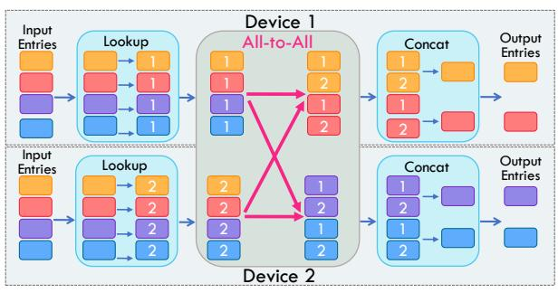

(a) Embedding layer in DLRMs with embedding table scattered on 2 devices. Training adopts model parallelism for table lookup, and data parallelism after concat operation.

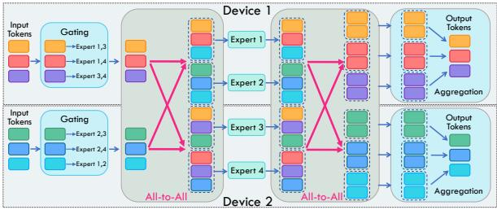

(b) Expert layer in top-2 MoE models with 4 experts scattered on 2 devices. Training adopts data parallelism before gating and after aggregation, in between expert parallelism is applied for expert computation.


(c) Normalized time breakdowns for the training (Train) and inference (Inf) of DLRM [51] and Mixtral [4] models on 8×8 TPUv3 [39] and 8×8×8 TPUv4 [38] clusters. The portion of All-to-All varies from 41.5% to 95.7%.

Figure 1: All-to-All collective of distributed DLRM (a) and MoE models (b), and normalized time breakdown of model training and inference (c). Evaluation methodology is described in Section 5.1.

Google employs dimension-order routing on 3D-torus TPUv4 clusters, balancing intra-dimension traffic but still facing contention from multi-hop routing and inter-dimension load imbalance. In this work, we eliminate contention entirely by decomposing each multi-hop transmission into single-hop steps, using hop-by-hop store-and-forward scheduling to orchestrate fine-grained link allocation and achieve contention-free, full-bandwidth utilization.

Furthermore, keeping the daunting training job stable for a long-running time at scale presents a significant challenge. Large models like DLRM and MoE often require training on thousand-node clusters for weeks [37]. Network failures [23, 26], such as typical link failures, can cause collective communication interruptions, and thereby impacting the entire training process and incurring substantial extra overhead. In All-to-All, every node sends and receives data to and from all other nodes. This means that a single failure not only affects an individual point-to-point transmission but also the transmissions across all nodes, thereby severely degrading overall efficiency. Therefore, ensuring the reliability and scalability of All-to-All in large-scale networks becomes especially critical.

<span id="page-2-1"></span>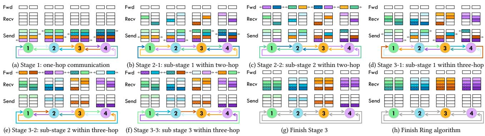

Figure 2: All-to-All in a ring (1-D torus) topology with Ring algorithm. In networks with bidirectional bandwidth, Ring algorithm splits the data evenly in both directions to fully utilize bandwidth. In the figure, right-side blocks represent data transmitted clockwise, while left-side blocks (with white dots) represent data transmitted anticlockwise. The four colors denote the final All-to-All data that each node receives, while the color shades indicate the data initially held by each node. The color of each link reflects the data block being transmitted at that moment. Ring algorithm adopts store-and-forward method for multi-hop transmissions to avoid congestion, marked as Fwd in each sub-stage.

Previous studies have explored fault-tolerant designs for model training in healthy networks [\[37,](#page-13-9) [73\]](#page-14-12), with MegaScale focusing on systemic optimizations for fault detection and rapid recovery during large-scale training [\[37\]](#page-13-9). Other work has addressed communication in faulty networks, such as Google's AltRing All-Reduce algorithm for 2D mesh [\[42\]](#page-13-32) and TPUv4's ICI routing with offline optimization to maintain network throughput under link failures for torus [\[78\]](#page-14-11). Despite these advances, dedicated optimizations for fault-tolerant All-to-All remain underdeveloped, leaving reliable and efficient large-scale All-to-All communication a significant challenge.

In this paper, we propose All-to-All optimizations for multidimensional torus networks under both fault-free and fault-tolerant scenarios. All-to-All on an -D torus can be decomposed into phases, each handling communication along one dimension.Our optimizations focus on two key aspects: communication algorithms within each dimension and the scheduling of execution order across dimensions for each data chunk. For fault-free networks, we introduce HalfRing algorithm, which achieves shortest path hop-by-hop store-and-forward data delivery and full bandwidth utilization, paired with DimRotation scheduling to balance traffic across dimensions. For faulty networks, we implement FoldedRing, a faulttolerant algorithm for each dimension, and MATE, a scheduling that exploits multi-dimensional links to accelerate communication on the faulty ring. In summary, our contributions are as follows:

- We propose HalfRing, a bandwidth- and latency-optimal All-to-All algorithm for each ring, paired with DimRotation scheduling to balance traffic across dimensions, greatly enhancing All-to-All efficiency in fault-free torus networks.
- We introduce FoldedRing, a fault-tolerant algorithm for handling link failures, and MATE scheduling, which exploits multi-dimensional link bandwidth to accelerate FoldedRing communication, ensuring reliable and efficient All-to-All communication even under link failures.
- Comprehensive experiments show that our methods achieve average speedups of 2.28× and 1.37× over the fault-free baseline for fault-free and fault-tolerant conditions, respectively, and outperform Google's routing by 1.57× and 1.61×.

# 2 Background

# 2.1 Overview of All-to-All Implementation

All-to-All implementations can be categorized into two approaches: coarse-grained orchestration using hardware routing and fine-grained orchestration through algorithm design [\[9\]](#page-12-9). The former breaks Allto-All into individual point-to-point communications (i.e., multihop transmission) for each node, orchestrates their transmission sequences, and relies on hardware routing to execute each multihop transfer. While this method, widely used in MPI-based HPC clusters, offers simplicity and broad applicability, it often leads to network congestion [\[27,](#page-13-20) [40,](#page-13-21) [43,](#page-13-28) [44,](#page-13-29) [54,](#page-13-22) [56,](#page-13-23) [66,](#page-14-10) [70,](#page-14-7) [78\]](#page-14-11).

The latter further decomposes each point-to-point communication into several single-hop transmissions and schedules their sequence. Using a store-and-forward mechanism, intermediate nodes temporarily store data at associated endpoints and then forward it to the next node. This eliminates the complex congestion control overhead of multi-hop routing hardware and avoids network contention through precise link allocation at each step. Widely studied in collective communication for ML systems, this fine-grained scheduling effectively prevents network congestion [\[16,](#page-13-33) [32,](#page-13-34) [45,](#page-13-35) [61,](#page-14-13) [64,](#page-14-14) [75\]](#page-14-15).

Our work adopts the latter approach to optimize All-to-All in distributed ML computing. For multi-dimensional torus networks, such as the 3D torus used in TPUv4 [\[38\]](#page-13-7) cluster, we decompose All-to-All into sequential phases across each dimension. Our optimizations focus on two key aspects: the intra-dimension algorithm and inter-dimension scheduling. Sections [2.2](#page-2-0) and [2.3](#page-3-0) present the baseline designs for the algorithm and scheduling, respectively.

# <span id="page-2-0"></span>2.2 Single-Dimensional Algorithm

In All-to-All, each process sends unique data to every other process [\[68\]](#page-14-6). Common algorithms used for All-to-All communication include Ring [\[34\]](#page-13-36), Direct [\[68\]](#page-14-6), Halving-Doubling [\[25\]](#page-13-6), and Bruck [\[13\]](#page-12-10). The performance of these algorithms varies across different network topologies. Ring algorithm is frequently used in direct topologies such as mesh and torus because it offers good scalability and zero contention [\[61\]](#page-14-13).

Figure [2](#page-2-1) illustrates the All-to-All process with Ring algorithm in a four-node ring network, which can be divided into three stages.

<span id="page-3-1"></span>

Figure 3: All-to-All on 2D torus with X-Y scheduling. (b)-(c) show the end state of each phase, where the text denotes the data source.

As shown in Figure [2a,](#page-2-1) data of each node is divided into eight parts, with four parts transmitted in each direction. In All-to-All, each node aims to receive all the data parts whose index matches its own node index. These indices are represented by colors in Figure [2.](#page-2-1) To achieve this goal, the communication is organized into three All-to-All stages, each with a different hop distance. As depicted in Figure [2](#page-2-1) a-f, stages 1-3 correspond to hop distances of 1 to 3, respectively. Using a store-and-forward approach, multi-hop transmissions are completed over several sub-stages to avoid contention. Figure [2d- 2f](#page-2-1) illustrate the detailed process of stage 3, where a 3-hop transmission involves three forwarding sub-stages to reach its destination. For example, at stage 3-1, node 1 must forward its purple block through nodes 2 and 3 to reach node 4; similarly, its blue block is forwarded in the opposite direction. Meanwhile, other nodes perform similar forwarding operations concurrently.

# <span id="page-3-0"></span>2.3 Multi-Dimensional Scheduling

Multi-dimensional network topologies are commonly used in largescale ML systems [\[2,](#page-12-2) [5,](#page-12-5) [6,](#page-12-6) [11,](#page-12-11) [38,](#page-13-7) [39,](#page-13-25) [78\]](#page-14-11), making the efficient communication scheduling across multiple dimensions a challenge. Allto-All on an N-dim network can be decomposed into N sequential single-dimension All-to-All phases. Communication in each phase is implemented with the algorithm introduced in Section [2.2.](#page-2-0) By dividing data into multiple chunks for pipeline scheduling [\[61\]](#page-14-13), the overall network bandwidth utilization can be improved.

As shown in Figure [3,](#page-3-1) All-to-All on a 2D torus network involves two phases, transmitting sequentially across the X and Y dimensions. Taking node 1 in Figure [3a](#page-3-1) as an example, its data is divided into nine parts, each is sent to node 1-9 respectively. Figure [3b](#page-3-1) shows the end of X-dim communication phase, where each part is sent to the columns corresponding to its destination (e.g., node 1 receives data targeting column 1 from nodes 1–3). Communication in each phase can be performed using a single-dimensional algorithm such as Ring. As shown in Figure [3c,](#page-3-1) after reaching the corresponding columns, each data part is sent to its final destination through the Y-dim phase. Finally, as illustrated in Figure [3d,](#page-3-1) node 1

<span id="page-3-2"></span>

(a) Node and link failures which can impact the original data transmissions and call for new routing to bypass the faults. (b) Two link failures induced by an OCS failure in an 8×4×4 torus consisting of two TPUv4 pods.

Figure 4: Common fault types in the network.

collects the first data part from all nine nodes by the end of phase 2, completing the All-to-All communication.

For fixed-radix networks with an equal number of nodes across all dimensions, the communication cost of each phase is held constant for the fixed amount of data transmitted in each dimension. For instance, in phase 1, node 1 sends three data parts that need to reach the second and third columns to nodes 2 and 3, respectively. Similarly, node 1 also receives three data parts from nodes 2 and 3 that are intended for column 1. Therefore, at the end of phase 1, node 1 still holds nine data parts. In phase 2, node 1 transmits data originating from nodes 1-3 that need to be sent to nodes 4 and 7, with each transmission still consisting of three data parts.

Optimizing communication scheduling in multi-dimensional networks is critical for maximizing bandwidth utilization as the network scales. While prior work [\[32,](#page-13-34) [61,](#page-14-13) [76\]](#page-14-16) has explored efficient All-Reduce scheduling in such networks, All-to-All scheduling across multiple network dimensions remains underexplored.

# 2.4 Fault-Tolerant Collective Communication

Common failures in interconnection networks include node and link failures [\[23,](#page-13-30) [26\]](#page-13-31). Typically, ML systems address them by replacing faulty components with healthy ones to resume training [\[15,](#page-12-12) [49,](#page-13-37) [73\]](#page-14-12). However, this incurs significant costs for data backup and checkpointing, disrupting the training process. Fault-tolerant routing offers a more efficient solution by creating new communication paths to circumvent fault areas, enabling fault tolerance without replacing devices or interrupting training [\[26,](#page-13-31) [78\]](#page-14-11). Figure [4a](#page-3-2) illustrates adaptive routing during node and link failures. Failures at endpoints may result in the loss of routing functionality in output ports, causing link failures associated with those connections [\[26\]](#page-13-31).

Additionally, faults in optical circuit switches (OCS) can lead to the failure of all connected links, creating a periodic link failure pattern [\[78\]](#page-14-11). As shown in Figure [4b,](#page-3-2) 4×4×4 TPUv4 pods require 48 OCSs for reconfigurable interconnects, with each pod's surface nodes on the X-Y, Y-Z, and X-Z planes connecting to 16 different OCSs. For example, the failure of OCS 34 (responsible for interconnects on the X-Z plane) causes four corresponding links to fail, including two wrap-around links: (2,3,0)-(2,3,3) and (6,3,0)-(6,3,3). Both fault types in Figure [4](#page-3-2) result in link failures, highlighting the critical need for fault-tolerant optimizations to address link failures.

Traditional fault-tolerant routing is designed for general pointto-point communication rather than collective communication common in model training. Collective communication involves data transmission across multiple devices, with fixed patterns and heavy overhead. While simple fault-tolerant routing can maintain data

<span id="page-4-0"></span>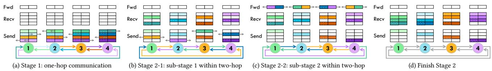

Figure 5: All-to-All with HalfRing algorithm. The data volume transmitted in stage 1 is twice that of stage 1 in Ring algorithm. In this case, HalfRing reduces the All-to-All time to four sub-stages (Figure 5a- 5c), compared to six sub-stages (Figure 2a- 2f) in the Ring algorithm.

transmission for a single node, routing changes can affect link allocations and thus reduce efficiency of other nodes. Designing fault-tolerant schemes tailored for collective communications [42] can minimize the impact on communication efficiency, thus providing a basis for more reliable and high-performance model training.

#### 2.5 Fault Model and Assumptions

We follow Google's fault detection and tolerance mechanisms on TPUv4 [78]. Machine failures are identified and resolved through preflight checks before task assignment. During task execution, a software daemon, healthd, monitors hardware health by continuously checking link connectivity across all TPUs. If link or OCS failures occur, healthd notifies the cluster management service Borg, triggering job restarts from the last checkpoint. Affected TPUs then switch their inter-chip interconnect (ICI) routing tables from fault-free to fault-tolerant mode. From this point, all communications, including All-to-All, proceed despite network failures.

We optimize All-to-All for both fault-free and faulty torus. In faulty cases, we assume a single link failure at a random location. Thanks to the geometric symmetry of torus, the failure location presents a consistent view to our methods. Our approach also generalizes to more complex failure scenarios, such as OCS failures and multiple link failures, as discussed in Sections 4.2, 5.4 and 5.7.

#### 3 Fault-Free All-to-All

In this section, we optimize fault-free All-to-All from two perspectives. Section 3.1 introduces HalfRing algorithm for All-to-All in single-dimensional torus (ring); while Section 3.2 covers DimRotation for communication scheduling across multiple dimensions.

#### 3.1 Single-Dimensional HalfRing Algorithm

In Ring algorithm on a ring topology, all nodes transmit data concurrently over equal distances in each stage. The algorithm consistently achieves full link bandwidth utilization. However, it achieves suboptimal performance due to extra link bandwidth consumption caused by unnecessarily long transmission paths. As shown in Figure 2d-2f, following the clockwise order, data transmission from node 1 to node 4 requires 3 sub-stages, even though they are only one hop apart. In typical bidirectional networks, the Ring algorithm uses clockwise and anticlockwise links independently and communicates in both directions simultaneously. In stage 3, the transmission requires three hops clockwise but only one hop anticlockwise. This asymmetry leads to suboptimal performance for some stages, as non-minimal path forwarding consumes additional link bandwidth.

Based on this observation, we propose the HalfRing algorithm, which leverages bidirectional links for path allocation with shortest communication distance. In each stage, HalfRing determines the transmission direction based on the actual distance between sender and receiver. Since all nodes communicate over the shortest path, each stage consumes bandwidth in only one direction, thereby leaving the other direction available to be used by another stage with the same communication hops. Take node 1 in Figure 5a as an example, HalfRing selects anticlockwise and clockwise directions for transmitting two purple and two green blocks (both in one-hop), respectively. With no link conflicts, communications in both directions proceed simultaneously. In a ring with odd number of nodes (N=2k+1), there are 2k stages, and All-to-All can be completed in k pairs. For a ring with even number of nodes (N=2k), there are 2k-1 stages, resulting in one unpaired stage, like stage 2 in Figure 5b. HalfRing splits data of the unpaired stage evenly, and sends it in both directions, thus fully utilizing the bandwidth.

<span id="page-4-1"></span>Table 1: Performance analysis of different All-to-All algorithms on ring (1-D torus) under the linear cost model [68]. The total communication time consists of two parts: startup time and data transfer time. Startup time refers to the fixed delay caused by the algorithm and system latencies, which is independent of message size. Transfer time reflects the duration of data transmission. In All-to-All collectives for DL training, transfer time dominates the whole time. Parameter definitions: S: data size of each node, N: number of nodes in the ring, B: unidirectional bandwidth,  $\alpha$ : per hop propagation delay. Ratio denotes performance relative to the baseline ring algorithm.

| Algorithm               | Startup Time  | Transfer Time                        | Ratio |
|-------------------------|---------------|--------------------------------------|-------|
| Ring                    | α             | $\frac{N-1}{2} \cdot \frac{S}{2B}$   | 1     |
| HalfRing<br>(N even)    | α             | $\frac{N}{8} \cdot \frac{S}{B}$      | 1-2   |
| HalfRing<br>(N odd)     | α             | $\frac{N^2-1}{8} \cdot \frac{S}{NB}$ | 1.5-2 |
| FoldedRing <sup>†</sup> | $(N-1)\alpha$ | $\frac{N-1}{2} \cdot \frac{S}{B}$    | 0.5   |

 $<sup>^\</sup>dagger$  The performance of Folded Ring is analyzed in a network with a single random link failure, while others are analyzed in a healthy network.

By comprehensively leveraging bidirectional bandwidth in each multi-hop stage, HalfRing ensures both full bandwidth utilization and shortest communication path, achieving the optimal performance in terms of both bandwidth and latency on ring topologies. The performance analysis of algorithms is shown in Table 1, and the algorithm is detailed in **HalfRing\_Generator** of Algorithm 1. Take Ring algorithm in Table 1 as an example, there are  $\frac{N(N-1)}{2}$  one-hop data transmissions (i.e., sub-stages), each with data size of  $\frac{S}{N}$ . Given bidirectional bandwidth 2B, the transfer time is computed by multiplying the number of transmissions by data size per transmission and dividing by bandwidth. Similar to Ring algorithm, HalfRing decomposes all data transfers into single-hop transmission between neighbor nodes and orchestrates each hop explicitly, eliminating the possibility of deadlocks (no multi-hop transmission), livelocks (no detour), and network contention (no link sharing).

<span id="page-5-1"></span>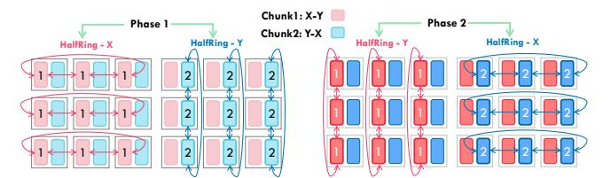

Figure 6: An example for DimRotation on 2D torus.

<span id="page-5-2"></span>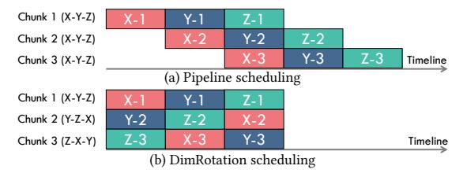

Figure 7: Comparison of pipeline and DimRotation for 3 data chunks on 3D network. X-1 denotes the X-dim communication of chunk 1.

#### 3.2 Multi-Dimensional DimRotation Scheduling

All-to-All on N-dimensional topologies can be divided into N phases, conducted sequentially across N dimensions, with communication in each dimension independently adopting its All-to-All algorithm. Despite such sequential dependencies, data can be divided into multiple chunks, each employing a different order of communication dimensions. DimRotation signifies the order of communication dimensions of each data chunk, as illustrated by walking through an example in Figure 6. In the 2D torus, data is split into two chunks, with chunk 1 following X-Y order and chunk 2 following Y-X, ensuring full-bandwidth utilization. For chunk 1, the data destined for a particular column y is sent to the corresponding intersecting node of column y and X-dim in phase 1 via HalfRing. Then, the data is relayed in phase 2 on Y-dim to the destinations using HalfRing.

We further illustrate the advantages of DimRotation through comparisons over time. All-to-All on 3D torus needs three phases across X, Y, and Z dimensions, and each phase fully utilizes the bandwidth of all rings in the corresponding dimension. Rings in each dimension transmit data simultaneously in each phase. Pipeline scheduling splits data into multiple chunks [61], which are then communicated sequentially with the same X-Y-Z dimension order. As depicted in Figure 7a, pipeline enhances bandwidth utilization by running several chunks on different dimensions concurrently.

We find that pipeline scheduling inevitably introduces bubbles that prevent full utilization of network bandwidth. Additionally, choosing an appropriate chunk size in pipeline scheduling is also challenging [16]. With a large chunk size, pipelining cannot sufficiently overlap time for different chunks across dimensions, leading to poor performance. Conversely, when the chunk size is small, numerous chunks introduce significant scheduling costs and communication initialization overhead, increasing overall latency.

To address these challenges, we propose DimRotation scheduling to ensure bubble-free and completely overlapping multi-dimensional All-to-All. For an N-D torus, data is evenly divided into N chunks, with the  $i_{th}$  chunk communicating in the order of dimensions  $i_{th}$ ,  $i_{th}+1,...$ , etc. Figure 7b demonstrates DimRotation timeline on 3D torus, where DimRotation allows three chunks to

perform conflict-free, full-coverage multi-dimensional communication, achieving complete bandwidth utilization. Simultaneously, the number of chunks is set to the minimum required to fully overlap communications, significantly reducing scheduling overhead.

```
Algorithm 1: Fault-Free All-to-All
```

```
Input: Data size per node: S, Topology dimension: N,
   A 2D list Torus[][] where Torus[i][j] indicates the j_{th} node in the
   ith dimension of torus network
   Output: A 2D list Schedule[][] where Schedule[k][]
   gives the order of dimensions that the k_{th} chunk should traverse for
   Dest\_CW[\alpha][\beta] and Dest\_ACW[\alpha][\beta] refer to the clockwise and
   anticlockwise destination for each node in the \alpha stage and \beta sub-stage,
   Comm Size [\alpha][\beta]
1 Procedure Scheduler(S, N):
        Chunk\_Num \leftarrow N, Chunk\_Size \leftarrow S/N, i, j \leftarrow 0
2
        for i \leftarrow 0 to Chunk_Num do
            for j \leftarrow 0 to N do
              6 Procedure
    HalfRing_Generator(Schedule, Torus, Chunk_ID, Phase):
       Dim \leftarrow Schedule[Chunk\_ID][Phase]
        Ring\_Nodes \leftarrow Torus[Dim][], N_{nodes} \leftarrow size(Ring\_Nodes)
        if N_{nodes} % 2 == 1 then
9
10
            Stage\_Num \leftarrow (N_{nodes} - 1)/2
11
        else
         | Stage_Num \leftarrow N_{nodes}/2
12
        for node ∈ Ring Nodes do
13
            comm\_size \leftarrow S/N_{nodes},
14
                                            \alpha \leftarrow 0
            for \alpha < Stage_Num do
15
                 if \alpha == Stage_Num - 1 and N_{nodes} \% 2 == 0 then
16
                   comm\_size \leftarrow comm\_size/2
17
                 Sub\_Stage\_Num \leftarrow \alpha, \quad \beta \leftarrow 0
                 for \beta < Sub Stage Num do
19
                      Dest\_CW[\alpha][\beta] \leftarrow (node + 1)\%N_{nodes}
20
                      Dest\_ACW[\alpha][\beta] \leftarrow (node + N_{nodes} - 1)\%N_{nodes}
21
                      Comm\_Size[\alpha][\beta] \leftarrow comm\_size
```

For networks with heterogeneous bandwidth or mixed-radix feature where number of nodes vary from dimensions, DimRotation can also provide optimal scheduling performance. When the heterogeneity leads to varying communication overhead across dimensions, the total time consumption is always limited by the dimension with the poorest performance. Unlike All-Reduce [61], changing the execution order or chunk sizes cannot optimize performance by the fixed data volume of each dimension. DimRotation ensures that the total All-to-All time does not exceed the communication time for complete data in the worst-performing dimension. Depending on Pod partitioning, the All-to-All topology may lack wraparound links in certain dimensions, resulting in bandwidth heterogeneity resembling a mixed-radix torus and can be handled similarly. The algorithm is presented in Scheduler of Algorithm 1.

#### 4 Fault-Tolerant All-to-All

In this section, we present our fault-tolerant All-to-All scheme from two aspects. Section 4.1 introduces fault-tolerant FoldedRing algorithm. Section 4.2 covers MATE and MATEe (MATE enhanced) which accelerate communication on the faulty ring.

<span id="page-6-1"></span>

(a) Ring algorithm on the fault-free ring (b) FoldedRing algorithm on the faulty ring Figure 8: Comparison of Ring and FoldedRing algorithms for All-to-All stage 1 in Figure 2a. With a link failure between nodes 1 and 4, all anticlockwise link bandwidth is repurposed to compensate for the faulty link. Communication is continued in a folded ring manner. FoldedRing needs twice as much time as Ring to complete stage 1.

# 4.1 Single-Dimensional FoldedRing Algorithm

Ring algorithm requires direct links between every two nodes for data transmission. If a link fails, the nodes at either end cannot transmit data, leading to the failure of Ring algorithm. For a single link failure, we find that the end nodes of faulty link are not isolated and they can still establish a connection through detouring. Based on this, we propose FoldedRing algorithm, which constructs a compensation connection for the faulty link using all available anticlockwise links. Together with left clockwise links, a folded ring is created to continue communication in a Ring manner.

As shown in Figure 8b, when the link between nodes 1 and 4 fails, the logical connection from node 4 to node 1 can be constructed using three blue physical anticlockwise links. By utilizing other clockwise links which has the opposite direction to the blue links, Ring algorithm for these four nodes is restored. FoldedRing algorithm utilizes all available link bandwidth for communication. Note that FoldedRing can be further adapt for fault-tolerant ring algorithms in other collective communications such as All-Reduce, Reduce-Scatter, and All-Gather. The performance analysis of FoldedRing algorithm is presented in Table 1.

#### <span id="page-6-0"></span>4.2 Multi-Dimensional MATE Scheduling

While FoldedRing enables fault-tolerant All-to-All on the faulty ring, it still faces several challenges. Firstly, as shown in Table 1, FoldedRing's performance is half that of the baseline Ring algorithm and significantly lower than our proposed HalfRing algorithm. Additionally, FoldedRing requires a longer startup time to establish connections between endpoints across the faulty link, further widening the performance gap. As shown in Figure 10a, slow transmission on the faulty ring leads to a mismatch in the DimRotation scheduling. The transmission in X dimension is slowed down due to the faulty ring, which in turn affects transmissions in other dimensions, leading to a decrease in overall All-to-All performance.

Secondly, FoldedRing algorithm can only address single link failure within a ring. For two or more failures, FoldedRing cannot build connections on the faulty ring. Therefore, although communication between both endpoints of the faulty link can still continue through routing in other directions, All-to-All is still forced to interrupt.

These challenges motivates MATE, an scheduling optimization for fault-tolerant All-to-All. MATE utilizes links in other dimensions to accelerate data transmission on the faulty ring, thereby providing a more efficient and robust All-to-All fault tolerance solution.

Figure 9 illustrates the acceleration phase for handling the link failure between nodes (0,1) and (1,1). Initially, partial data is transmitted through the faulty ring using FoldedRing. Subsequently, MATE utilizes links from other X-dim rings to construct bidirectional connections for each node on the faulty ring, thus enabling

<span id="page-6-3"></span>

Figure 9: Link utilization during the acceleration phase of MATE on 2D torus. With the link failure between (0,1) and (1,1), MATE utilizes links from other dimensions to accelerate the slow communication on the faulty ring. On the 2D torus, one set of extra bidirectional links can be used to accelerate each data transmission except for original communication in the faulty ring with FoldedRing algorithm.

<span id="page-6-2"></span>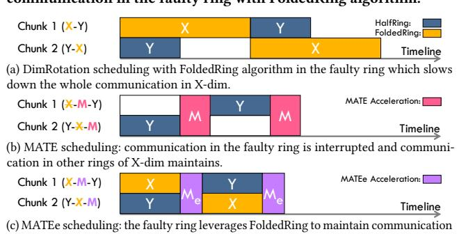

with allocated data size in X-dim, reducing the data volume in acceleration phase  $|M_e|$  Figure 10: Scheduling with a link failure in X-dim. Communication on the faulty X-dim ring uses FoldedRing, while communication on other X-dim rings uses HalfRing. As the acceleration requires links from other dimensions, it is executed as a separate acceleration

phase, denoted as M or  $M_e$ .

efficient communication of the remaining data using HalfRing. Taking the transmission between nodes (0,1) and (1,1) as an example, three red links in (0,1)-(0,2)-(1,2)-(1,1) are used to connect (0,1) and (1,1), and three red links below establish the connection from (1,1) to (0,1). These six red links form a bidirectional connection between the endpoints. Similarly, blue and green links establish bidirectional links between other adjacent nodes within the faulty ring for HalfRing. Therefore, All-to-All is enhanced by distributing data for simultaneous transmission through HalfRing on these additional X-dim links and FoldedRing within the faulty ring.

MATE is capable of reliably accelerating fault-tolerant All-to-All on N-D torus for two main reasons. First, each plane containing the faulty ring can construct conflict-free bidirectional connections for that ring. Essentially, data transmission in the faulty ring is offloaded to other rings within the same dimension. We only need to ensure that these fault-free rings are identified, and data can be transferred from the faulty ring to them. For example, in Figure 9, this is achieved by connecting nodes on the faulty ring with nodes of two fault-free rings through links in the Y-dim. These two rings are (0,2)-(1,2)-(2,2) and (0,0)-(1,0)-(2,0). Furthermore, links between each acceleration plane should be conflict-free. This feature is inherently guaranteed by the orthogonality of torus topologies. Thus, we can utilize HalfRing on N-1 planes to accelerate communication for a

single link failure in an N-D torus theoretically. MATE fully utilizes bandwidth of every point on the faulty ring to offer acceleration.

```
Algorithm 2: Fault-Tolerant All-to-All
```

```
Input: Data size per node: S, Topology dimension: N
   Faulty ring dimension: D_{fault}, 2D list Torus[i][j]
   Link state: Link[m][n], Acceleration planes: Planes
   mode \in \{MATE, MATEe\}, MATEe fraction: fraction
   Output: Communication schedule Schedule[chunk][phase][i][j]
 1 Procedure FoldedRing_Gen(Ring Nodes, Link):
        N_{nodes} \leftarrow \text{size}(Ring\_Nodes)
        for stage \leftarrow 1 to N_{nodes} - 1 do
             for node \leftarrow 0 to N_{nodes} - 1 do
                  dest \leftarrow (node + stage)\% N_{nodes}
                  if Link[node][dest] then
                    [ FoldedRing\_Comm[stage][node] \leftarrow dest
                  else
                       path \leftarrow [], \quad curr \leftarrow node
                       while curr ≠ dest do
10
                            next \leftarrow (curr - 1 + N_{nodes})\%N_{nodes}
11
                            if Link[curr][next] then
                             \lfloor path.append(next), curr \leftarrow next
 13
                            else
 14
 15
                                break
                       FoldedRing\_Comm[stage][node] \leftarrow path
17 Procedure
     \begin{tabular}{ll} {\tt MATE\_Scheduler}(S,N,D_{fault},Torus,Link,Planes,mode,fraction): \\ & Chunk\_Num \leftarrow N, & Chunk\_Size \leftarrow S/N \end{tabular} 
18
        \textbf{for } chunk \leftarrow 0 \textbf{ to } Chunk\_Num - 1 \textbf{ do}
             for phase \leftarrow 0 to 2N - 1 do
21
                  if phase\%2 == 0 then
                        Normal phase: p \leftarrow phase/2,
                       dim \leftarrow (chunk + p)\%N
                       if dim \neq D_{fault} then
23
                            Schedule[chunk][phase][i][j] \leftarrow
24
                            HalfRing\_Func(Torus[dim][:], Link)
                       else
                            if mode == MATE then
                              \c Schedule[chunk][phase][i][j] \leftarrow {\tt None}
27
                            else
28
                                 Data_in_FoldedRing \leftarrow
                                 Chunk Size × fraction
                                 Schedule[chunk][phase][i][j] \leftarrow
 30
                                 FoldedRing_Gen(Torus[dim][:], Link)
                  else
31
                        Acceleration phase: planes ←
32
                       {\tt GetAvailPlanes}(Planes, D_{fault})
                       Schedule[chunk][phase][i][j] \leftarrow
                       HalfRing_Planes(planes, Torus, Link),
                       FoldedRing\_Gen(Torus[D_{fault}][:], Link)
```

Figures 10b and 10c respectively illustrate the timelines for two scheduling schemes: MATE and MATEe (MATE enhanced) as Algorithm 2. The acceleration requires using other rings within the same dimension and links from other dimensions, thus necessitating the addition of a distinct phase M after each normal phase. Data volumes for acceleration are allocated across different planes through offline performance analysis, ensuring concurrent transmissions. MATE eliminates data transmission during normal phases, relying solely on the accelerated phase M to transmit data on the faulty ring. To reduce the communication workload during acceleration phases,

MATEe also allocates a portion of data to the faulty ring during normal phases, allowing part of the transmission to be completed before the acceleration stage, thus improving bandwidth utilization.

MATE can be applied to more complex fault scenarios to enhance network resiliency. First, when multiple faults occur within a single ring, FoldedRing fails to maintain fault-tolerant transmission. MATE resolves this by rerouting communication through links from other rings through acceleration phases. Second, MATE can also address faults across multiple rings. When the links required for the acceleration phase of each fault conflict or the faults occur in different dimensions, MATE allocates separate acceleration phases for each fault. If faults in the same dimension do not share the same links, multiple faulty rings can perform acceleration phases simultaneously. Taking OCS failure in Figure 4b as an example, MATE can be directly applied with the time overhead remaining consistent with that of a single-link fault. Furthermore, MATE can also be applied to multi-dimensional scheduling in other collectives.

#### 5 Evaluation

# <span id="page-7-0"></span>5.1 Methodology

We utilize the ASTRA-SIM simulator [60] to implement our proposed optimizations. ASTRA-SIM provides the capability to define the computational and communication workloads in advanced deep learning models, enabling us to carry out detailed implementations and evaluations of collective communication algorithms, scheduling, and fault tolerance within large-scale networks.

We conduct synthetic experiments to validate the speedup of each proposed method and our comprehensive approach, the All-to-All bandwidth improvement from algorithm optimization, and enhanced network bandwidth utilization through scheduling optimization. Additionally, we conduct scalability studies on these methods, demonstrating their effectiveness as the network scales. To show our advantages over state-of-the-art fault-tolerant solution in Google's TPUv4 torus network [78], we conduct comparative experiments. Finally, we evaluate performance speedup in real workloads training and inference scenarios involving All-to-All, assessing the impact of our enhancements in end-to-end applications.

We utilize the built-in analytical network backend in ASTRA-SIM to perform fast and flexible simulations for synthetic, scalability, and real workloads experiments considering that both our proposals and baselines are contention-free. We implement fault-free and fault-tolerant routing schemes for All-to-All in TPUv4 [78] clusters with GARNET simulator [3], which is integrated with ASTRA-SIM for cycle-accurate simulation.

We select appropriate system configurations for each experiment, as shown in Table 2. For synthetic and scalability experiments, we adopt more generic and diverse settings to demonstrate the broad applicability of our proposal under complex scenarios [47]. When comparing with Google's routing scheme, we use the network configurations of TPUv4 [38] and the packet/flit size settings from IBM Blue Gene/Q supercomputer [17]. We apply dateline to avoid deadlock in torus [22]. To assess the speedup of our proposal for training and inference of common deep learning workloads on torus networks, we select four representative DLRM and MoE models along with their corresponding parallelisms. End-to-end evaluations are conducted under the network configurations of TPUv3 and TPUv4.

<span id="page-8-1"></span>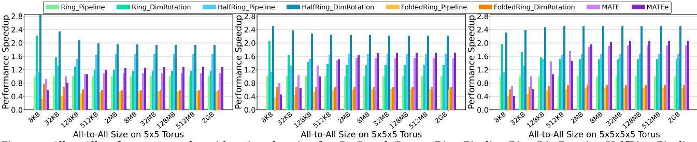

Figure 11: All-to-All performance speedup with various data sizes for 2D, 3D, and 4D torus. Ring\_Pipeline, Ring\_DimRotation, HalfRing\_Pipeline, and HalfRing\_DimRotation are adopted for fault-free network, while FoldedRing\_Pipeline, FoldedRing\_DimRotation, MATE, and MATEe are adopted for network with one link failure in the first dimension.

<span id="page-8-2"></span>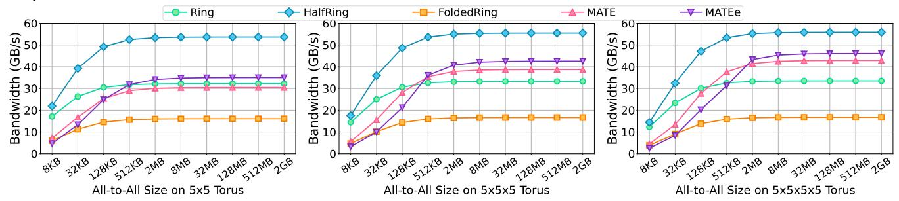

Figure 12: All-to-All Bandwidth with various data sizes for 2D, 3D, and 4D torus where FoldedRing, MATE, and MATEe are adopted for networks with one link failure in the first dimension. We define the All-to-All bandwidth as: communication size per node divided by All-to-All time, which is consistent with prior work [25, 32, 75].

| Table 2: System configura | ations |
|---------------------------|--------|
| Parameter                 |        |

<span id="page-8-0"></span>

| Parameter                         |                       | Configuration                                                          |  |
|-----------------------------------|-----------------------|------------------------------------------------------------------------|--|
| Synthetic Exp,<br>Scalability Exp | Topology              | 2D/3D/4D Torus                                                         |  |
|                                   | Bandwidth/Link        | 32 GB/s                                                                |  |
|                                   | Network Latency       | 100 ns                                                                 |  |
| Scalability Exp                   | Links/Node            | 2D: 4 / 3D: 6 / 4D: 8                                                  |  |
|                                   | Pipeline Chunk Number | 6                                                                      |  |
|                                   | Topology              | 4×4×4, 8×4×4 Torus                                                     |  |
| Comparison                        | Packet Size           | 512 Bytes                                                              |  |
| with Google                       | Flit Width            | 256 bits                                                               |  |
| TPUv4's                           | Bandwidth/Link        | 56 GB/s [38]                                                           |  |
| Routing                           | Network Latency       | 100 ns                                                                 |  |
|                                   | Links/Node            | 6                                                                      |  |
| Real<br>Workloads<br>Experiment   | Workloads             | DLRM [51], Wide&Deep [18],<br>DeepSpeed-1.3B [59], Mixtral<br>7B×8 [4] |  |
|                                   | Topology              | TPUv3: 8×8,<br>TPUv4: 8×8×8                                            |  |
|                                   | Peak Performance      | TPUv3: 123 TFLOPS [39],<br>TPUv4: 275 TFLOPS [38]                      |  |
|                                   | Bandwidth/Link        | TPUv3: 82 GB/s [39],<br>TPUv4: 56 GB/s [50]                            |  |
|                                   | Network Latency       | 100 ns                                                                 |  |
|                                   | Links/Node            | 6                                                                      |  |
|                                   | Pipeline Chunk Number | 6                                                                      |  |

#### **Synthetic Experiment**

**Performance Speedup:** We conduct synthetic experiments to evaluate the performance speedup of our methods on 2D, 3D, and 4D torus networks with communication size ranging from 8KB to 2GB. Each method is a combined solution of both algorithm and scheduling. We select Ring algorithm combined with pipeline scheduling on fault-free networks as the baseline. As shown in Figure 11, in fault-free scenarios, we evaluate the speedup brought by replacing Ring algorithm with HalfRing, replacing scheduling with DimRotation, and a combination of both HalfRing and DimRotation. HalfRing algorithm and DimRotation scheduling achieve average

speedups of 1.56× and 1.45× respectively, while their combined solution results in an average speedup of 2.28×.

For fault-tolerant scenarios, we assess the performance when a single link failure occurred in the first dimension. The baseline remains the fault-free All-to-All with Ring+Pipeline. FoldedRing + Pipeline and FoldedRing + DimRotation achieve 0.55× and 0.67× of the baseline performance, on average respectively, indicating a significant performance loss even though fault tolerance is achieved. With multi-dimensional acceleration, MATE and MATEe achieve an average speedup of 1.36× and 1.37×, respectively, even exceeding the performance of the fault-free baseline.

As network dimensions increase, we observe an enhancement in the speedup provided by scheduling optimizations for both faultfree and fault-tolerant scenarios, while the impact of algorithms remains relatively constant. This is because algorithm affects communication time within each dimension, whereas scheduling influences bandwidth utilization of the overall network. Specifically, in fault-free networks, as the number of dimensions each chunk need traversing increases, pipeline scheduling involves additional stages. This makes it more challenging to overlap between different chunks. In contrast, DimRotation maintains sufficient overlap among different chunks regardless of the number of dimensions. For faulty networks with higher dimensions, MATE can utilize more links for simultaneous transmission, thereby reducing the duration of acceleration phases and enhancing communication efficiency.

MATE performs better with small communication sizes, while MATEe proves to be more effective for larger data volumes. This is because MATEe statically allocates data transmission on the faulty ring during the normal phase based on the performance ratio of HalfRing and FoldedRing algorithms, without accounting for

<span id="page-9-1"></span>

Figure 13: Dimension utilization of different algorithms and scheduling settings for 8 MB All-to-All on  $5\times5\times5$  torus.

startup time. For small data volumes, the difference in startup time between these two algorithms causes the faulty ring to slow down the entire normal phase, leading to a performance drop. As data volume increases, the impact of startup time on total communication time decreases. The performance gains from a reduced data volume during the acceleration phase become more significant, resulting in higher speedup for MATEe compared to MATE.

All-to-All Bandwidth: As shown in Figure 12, we evaluate the All-to-All bandwidth under different algorithms. With increasing data volumes, HalfRing achieves significantly higher bandwidth due to fewer sub-stages required owing to shortest path. Meanwhile, FoldedRing maintains about half the bandwidth of Ring algorithm. For 2D torus, acceleration phases in MATE and MATEe can only use one additional set of bidirectional links, so their bandwidth is close to that of Ring algorithm. For 3D and 4D torus, the availability of more links allows acceleration phases in MATE and MATEe to be progressively shorter. As the number of network dimensions increases further, the performance of our fault-tolerant All-to-All scheme becomes closer to that of fault-free scenario.

Dimension Utilization: Figure 13 assesses the link utilization across each dimension on given 3D torus network under different scheduling schemes. When using HalfRing algorithm, pipeline scheduling inevitably introduces bubbles in all three dimensions, whereas DimRotation perfectly utilizes all links. The use of FoldedRing algorithm on the faulty ring leads to decreased link utilization in other fault-free dimensions. This negative impact is evident in both pipeline scheduling with six chunks and DimRotation with three chunks. MATE effectively mitigates this issue, but links in the faulty dimension are only used during acceleration phases. MATEe improves link utilization in the faulty dimension by distributing communication workload. Since the static allocation based on algorithm performance cannot ensure perfect synchronization between faulty and other dimensions, there are some temporary dips in utilization for normal phases.

## 5.3 Scalability Study

As shown in Figure 14, we conduct scalability studies separately for algorithms and scheduling with configuration in Table 2. By maintaining constant data size per node while changing the number of nodes per dimension, we demonstrate the good linear scalability

<span id="page-9-2"></span>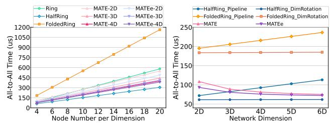

Figure 14: Scalability study: the left figure shows scalability with 4MB All-to-All size per node on 2D torus. MATE and MATEe results on 2D, 3D, and 4D networks are also shown due to their varying performance across dimensions. The right figure shows scalability with 4 MB size per node and 4 nodes per ring.

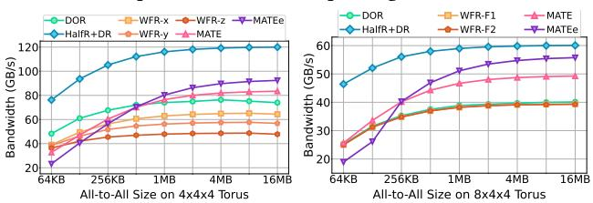

(a) All-to-All on a  $4\times4\times4$  TPUv4 pod. (b) All-to-All on  $8\times4\times4$  TPUv4 pods. WFR-WFR-x/y/z indicate applying WFR for link F1/F2 refer to one/two link failures caused failures in dimension 1/2/3, respectively. by OCS failure, both in dimension 2.

Figure 15: Performance comparisons for fault-free and fault-tolerant All-to-All on single and two TPUv4 pods, respectively. DOR and HalfR+DR (HalfRing + DimRotation) are adopted for fault-free scenario. WFR, MATE, and MATEe are utilized for fault tolerance.

of HalfRing and FoldedRing algorithms. To validate the scalability of MATE and MATEe across different dimensions, we display All-to-All duration on 2D, 3D, and 4D network simultaneously. MATE and MATEe show good scalability across different dimensions, with increased dimensions leading to improved performance. Under the communication loads of 4MB per node, the duration for MATEe is consistently shorter than that for MATE in the same dimension.

As shown in the right part of Figure 14, we verify the scalability of scheduling with increasing dimensions. As the total All-to-All size scales linearly with the number of nodes, DimRotation demonstrates performance that is almost invariant with the number of dimensions. MATE and MATEe become more stable in duration as dimensions increases, which is caused by faster acceleration phase.

#### <span id="page-9-0"></span>5.4 Comparison with TPUv4's Routing Design

We adopt the pairwise algorithm used in MPI\_Alltoall of widelyused MPICH for large data transmission [52, 68]. Each transmission utilizes XYZ dimension-order routing (DOR). For fault-tolerant Allto-All, we extend DOR by implementing wild-first routing (WFR) based on the sandwich law [78]. WFR routes a single hop in the next adjacent dimension before addressing the faulty dimension, effectively bypassing the fault region. Taking XYZ routing with an X-dim fault as an example, WFR uses yXYZ routing, where the prefix 'y' indicates a single hop in the Y-dim. For faults in the last dimension of DOR sequence, we bypass faults by taking a reverse path in the faulty dimension. We implement dateline with extra virtual channels for each ring in the network to avoid deadlock [23]. To evaluate the performance on mixed-radix torus (e.g., 8×4×4 torus) and other fault types (e.g., OCS faults), we implement fault-free and fault-tolerant All-to-All on 4×4×4 and 8×4×4 torus, corresponding to single and dual TPUv4 pods, respectively.

<span id="page-10-0"></span>

Figure 16: Normalized time breakdown of recommendation and MoE models across typical TPU network configurations. Using the combination of Ring algorithm and pipeline (PL) scheduling as the baseline, we demonstrate the fault-free performance of HalfRing (HalfR) + DimRotation (DR), as well as the performance of FoldedRing (FoldR) + pipeline, MATE, and MATEe in networks experiencing a single link failure.

In a single pod, the DOR scheme achieve an All-to-All bandwidth of 75.2 GB/s, which closely matches the actual measured value of 75.9 GB/s [78]. As the All-to-All size increases from 64 KB to 16 MB, the HalfRing+DimRotation scheme achieves an average speedup of 1.57× compared to DOR. We evaluate the performance of WFR under OCS-induced single link failure across three dimensions, as well as the performance of MATE and MATEe. The results show that WFR's performance varies with the faulty dimension due to the unfairness of applying the sandwich law to different faulty dimensions. In contrast, MATE and MATEe exhibit consistent performance on fixed-radix torus regardless of the faulty dimension. The implementation results indicate that MATE and MATEe achieve 1.26× and 1.24× speedups, respectively, compared to the average performance of WFR across dimensions, with speedups reaching 1.46× and 1.61× as the All-to-All bandwidth becomes saturated.

For dual-pods with no faults, DOR achieves 40.3 GB/s, closely matching the measured value of 40 GB/s [38]. The HalfRing + Dim-Rotation scheme provides an average speedup of 1.57× compared to DOR. We also assess fault-tolerant performance for a single Y-dim link failure (WFR-F1) and OCS failure (WFR-F2). The OCS failure manifests as two link failures with 4-hop distance, as illustrated in Figure 4b. Results show that the performance of DOR, WFR-F1, and WFR-F2 is very close, with fault scenarios achieving an average of 98.8% of the fault-free performance. This can be attributed to two factors. First, the bottleneck for All-to-All on mixed-radix torus networks occurs in the dimension with the largest number of nodes, as analyzed in Table 1. This limits the impact of faults in other dimensions on All-to-All performance. Second, due to the characteristics of OCS failures and WFR, the two faulty links cannot be utilized simultaneously, reducing the risk of exacerbated local network congestion caused by multiple failures. MATE and MA-TEe provide an average speedup of 1.18× and 1.19× compared to WFR-F1, and a saturation speedup of 1.25× and 1.42×, respectively.

The significant speedups stems from two main reasons. First, for fault-free All-to-All, although DOR ensures the shortest communication path, the fixed routing order leads to unbalanced utilization across dimensions. Taking XYZ routing as an example, in the beginning of All-to-All, the X-dim links are utilized far more frequently than other dimensions. This results in under-utilization of other dimensions and congestion in the X-dim. Second, for fault-tolerant All-to-All, while WFR combined with the sandwich law can bypass faults, it limited path flexibility introduces additional congestion around faulty links. For example, in yXYZ routing under an X-dim

fault, adjacent Y-dim links become more congested, whereas Z-dim links remain nearly unused. In contrast, MATE fully utilizes bandwidth of other dimensions around the faulty link, effectively balancing the traffic around the fault and avoiding congestion.

#### <span id="page-10-1"></span>5.5 Real Model Performance

We evaluate the training and inference time for two recommendation models, DLRM [51] and Wide & Deep [18], along with two MoE models, Deepspeed-1.3B+MoE-128 [59] and Mixtral 7Bx8 [4], on TPUv3 [39] and TPUv4 [38] networks by simulation. As shown in Figure 16, using Ring+Pipeline in a fault-free network as the baseline for normalization, we demonstrate the speedups provided by HalfRing + DimRotation in fault-free networks and FoldedRing + Pipeline, MATE, and MATE under a single link failure. For All-Reduce in healthy networks, we adopt bandwidth-optimal hierarchical Ring algorithm [76]. For All-Reduce in faulty networks, we adopt the FoldedRing + MATEe scheme to ensure its efficient and reliable execution. The total time could be divided into All-to-All, All-Reduce, computation-communication overlap, and computation time. The line graph displays speedups of proposed All-to-All schemes under each model and network configuration.

For recommendation models, we adopt row-wise partitioning across all TPUs for embedding layers, and data parallelism for other layers [51]. Under this partitioning, input queries on each TPU can only access a portion of the reduction results and require a uniform All-to-All to obtain the complete output. In inference tasks, the computation of bottom MLPs can overlap with the All-to-All of embedding layer, introducing a small amount of computation-communication overlap time. In training tasks, the non-blocking All-Reduce for synchronizing weight gradients can effectively overlap with the computation, resulting in a longer overlap time.

For MoE models, we also consider the uniform All-to-All. Although expert selection in practice is typically non-uniform, recent designs of gating layers and loss functions are promoting the uniformity [46, 77]. Both MoE models adopt a hybrid parallelism combining tensor, expert, and data parallelism (TP, EP, DP), where both DeepSpeedMoE and Mixtral are configured with TP=8 (i.e., each layer's weight is partitioned and deployed across 8 TPUs). For TPUv3, DP=EP=8; for TPUv4, DP=EP=16; allowing full utilization of all TPUs for parallel computation. TP introduces additional blocking All-Reduce for both activations in the forward pass and input gradients in the backward pass. In addition, the non-blocking All-Reduce

<span id="page-11-1"></span>

Figure 17: Non-Uniform All-to-All performance under expert selection distribution traces for training Mixtral7B×8 [4] with Al2 Reasoning Challenge (ARC) dataset [19] on a simulated TPUv4 pod.

used for synchronizing weight gradients overlaps with the backward computation. The results show that HalfRing+DimRotation, FoldedRing+Pipeline, MATE, and MATEe respectively achieve All-to-All speedups of  $1.97\times$ ,  $0.54\times$ ,  $1.24\times$ , and  $1.38\times$ , and total time speedups of  $1.64\times$ ,  $0.63\times$ ,  $1.20\times$ , and  $1.29\times$  on average.

#### 5.6 Non-Uniform All-to-All

We evaluate non-uniform All-to-All under both fault-free and fault-tolerant scenarios, comparing against Google's routing design. Non-uniform All-to-All is commonly observed in the distributed training of MoE models and often leads to significant performance degradation [46]. We extracted the expert selection distribution for each layer over 32 iterations by training the 32-layer Mixtral 7B×8 [4] model on the ARC dataset [19]. After normalization to one token per expert on average, the standard deviation of expert selection across layers ranges from 0.09 (layer 2) to 0.39 (layer 12), indicating a serious imbalance. We simulated the performance using 200 tokens (400KB) under a TP+EP+DP hybrid parallelism (the same with Section 5.5) on a single TPUv4 pod, as shown in Figure 17.

In the fault-free, non-uniform scenario, HalfRing+DimRotation achieves 70.2%–90.2% (avg. 80.6%) of uniform All-to-All performance, delivering an average speedup of 1.27× over DOR routing. In the non-uniform scenario with one Y-dim link failure, MATEe attains 72.8%–91.1% (avg. 82.5%) of the uniform baseline, yielding an average speedup of 1.17× over Google WFR routing. In real-world scenarios, stragglers can disrupt network synchronization and degrade performance, similar to the effect of communication imbalance where some nodes send more data than others.

#### <span id="page-11-0"></span>5.7 Resilience to Multiple Faults

We evaluated the performance of MATE (and MATEe) under multiple random link failures and compared them with Google's WFR. As shown in Figure 18, Type 1 involves two failures on the same ring; Type 2 consists of failures on two different rings in the Y-dim; and Type 3 includes one failure in both Y-dim and Z-dim. For fault-tolerant All-to-All, MATE, MATEe, and a two-acceleration-phase MATEe scheme are applied to handle them respectively (see Section 4.2). Results show that our proposed methods achieve average speedups of 1.43×, 1.14×, and 1.55× for Type 1-3, respectively.

#### 5.8 Real Machine Performance

We implemented proposed methods using PyTorch Distributed module [8], and conducted real-system experiments on two NPU (Neural Processing Unit) nodes, each equipped with 8 devices. NPUs

<span id="page-11-2"></span>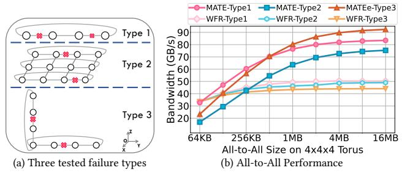

Figure 18: Fault-tolerant All-to-All performance under three kinds of link failures on a single TPUv4 Pod.

<span id="page-11-3"></span>

Figure 19: All-to-All on 16-NPU emulated 4×4 torus networks.

within a node are connected via high-bandwidth links, while internode communication is performed through a 200Gb/NPU fully connected RoCE Top-of-Rack (ToR) switch [28]. To emulate a 4×4 torus topology, we disabled intra-node interconnection and restricted communication to specific device pairs. As shown in Figure 19a, our fault-free and fault-tolerant designs achieve up to 1.84× and 0.77× speedups over the Ring+Pipeline baseline. Figure 19b presents a runtime breakdown based on profiling a 90MB All-to-All for each method. In both proposed methods, communication pairs and transmission order can be precomputed offline, reducing CPU overhead from kernel launches (i.e., Startup time). However, the multi-path detouring in MATE introduce greater complexity, leading to more frequent interruptions and higher overall communication time.

### 6 Related Work

## 6.1 All-to-All Collective Communication

Prior work has focused on optimizing All-to-All from the perspectives of algorithm and scheduling. A bandwidth-optimal algorithm is proposed for 1D/2D torus [44], which eliminates contention by scheduling each node's transfer state at every time step. However, it's limited to low-dimensional, fixed-radix torus with ring sizes divisible by 8, due to the exponential growth of scheduling space (e.g., over 20 states in 3D torus). An algorithm improves scalability by partitioning the network into subnets with grouped scheduling [66]. However, concurrent communication across subnets introduces network contention and bandwidth under-utilization, along with constraint topology (e.g., divisible by 4) by scheduling requirements.

In addition to manual efforts, recent proposals aim to automate collective algorithms through synthesis. SCCL uses satisfiability solvers and k-synchronous algorithms to deliver Pareto-optimal collectives in terms of latency and bandwidth [16]. But its optimality is limited to homogeneous and symmetric topologies and is confined to single-node networks. TACCL improves applicability with user-defined communication sketches to formulate integer linear programming (ILP) [64]. It is challenging to guarantee its

optimality under user-defined logical topologies and symmetry, and it remains limited to tens of NPUs. Both methods lack fine-grained modeling for network congestion and struggle to scale beyond hundreds of NPUs, making them unsuitable for practical large-scale networks. TACOS uses a greedy algorithm for link matching, effectively addressing topology heterogeneity and symmetry while scaling to large networks [\[75\]](#page-14-15). However, it is primarily designed for All-Reduce and its subsets, as it is challenging in addressing the quadratic complexity to All-to-All relative to network scale.

<span id="page-12-15"></span>Table 3: Comparison with existing proposals that can optimize Allto-All and our work (with red color)

| Name        | Latency | Bandwidth      | Contention | Target<br>Topologies | Fault<br>Tolerance |
|-------------|---------|----------------|------------|----------------------|--------------------|
| SCCL [16]   | low     | pareto-optimal | yes        | single-node          | no                 |
| TACCL [64]  | low     | sub-optimal    | yes        | tens of NPUs         | no                 |
| tsMCF [9]   | low     | sub-optimal    | no         | direct-connect       | no                 |
| 2D-Opt [44] | low     | optimal        | no         | 2-D 8n- torus        | no                 |
| ND-Opt [66] | low     | sub-optimal    | yes        | N-D 4n- torus        | no                 |
| HalfRing    | low     | optimal        | no         | 1-D torus            | no                 |
| DimRotation | /       | /              | no         | N-D torus            | no                 |
| WFR [78]    | low     | sub-optimal    | yes        | N-D torus            | link failure       |
| FoldedRing  | high    | optimal        | no         | 1-D torus            | link failure       |
| MATE(e)     | /       | /              | no         | N-D torus            | link failure       |

Time-stepped Multi-Commodity Flow (tsMCF) solution reduces the computational complexity of All-to-All synthesis by decomposing the original MCF linear program (LP) into master LP and child LPs. This enables parallel LP processing to improve solver efficiency. While this approach enhances scalability, it does not guarantee optimality. Furthermore, its hard constraint that all nodes have the same degree limits its applicability to faulty networks. Existing synthesizers still struggle to deliver optimal solutions for largescale All-to-All, which poses significant challenges. Additionally, synthesizer design for fault-tolerant All-to-All remains unexplored, and the disruption of network symmetry further increases the complexity of the problem. We summarize these proposals in Table [3.](#page-12-15)

# 6.2 Fault-Tolerant Communication

TPUv4 clusters utilize fault-tolerant routing to maintain communication in the event of inter-chip interconnection (ICI) failures [\[78\]](#page-14-11). Under fault-free conditions, communication follows DOR. In the presence of ICI failures, wild-first routing (WFR) circumvents link failures by performing one-hop wild routing in another dimension prior to the faulty link, as concluded in Table [3.](#page-12-15) Another research explored a fault-tolerant All-Reduce algorithm for node region failures in 2D mesh by individually allocating communication tasks for other nodes in the row where the fault area is located [\[42\]](#page-13-32).

# 7 Conclusion

In this paper, we identify the growing All-to-All overhead in largescale distributed DL computing and explore algorithm and scheduling optimizations for fault-free and fault-tolerant communication. For fault-free torus networks, we propose HalfRing to improve single-dimension transmission efficiency, and DimRotation to enhance overall bandwidth utilization. For a torus with link failures, we introduce FoldedRing for basic fault-tolerance and further propose MATE, which leverages multi-dimensional links to accelerate

communication on faulty rings. Evaluation shows that HalfRing and DimRotation achieve average speedups of 1.56× and 1.45×, respectively, and up to 2.28× when combined. Under a single link failure, MATE yields a 1.37× speedup over the fault-free baseline. Our approaches can also achieve respective speedups of 1.57× and 1.61× compared to Google's routing methods.

# Acknowledgments

We thank the anonymous reviewers for their valuable comments. This work was supported in part by the National Key Research and Development Program of China (No. 2024YFB4505800) and the Guangdong Provincial Project (No. 2023QN10X252). This research was conducted on the High-Performance Computing Platform of HKUST(GZ).

# References

- <span id="page-12-7"></span>[1] [n. d.]. AWS Trn1 Architecture — AWS Neuron Documentation — awsdocsneuron.readthedocs-hosted.com. [https://awsdocs-neuron.readthedocs-hosted.](https://awsdocs-neuron.readthedocs-hosted.com/en/v2.3.0/general/arch/neuron-hardware/trn1-arch.html) [com/en/v2.3.0/general/arch/neuron-hardware/trn1-arch.html.](https://awsdocs-neuron.readthedocs-hosted.com/en/v2.3.0/general/arch/neuron-hardware/trn1-arch.html) [Accessed 17-11- 2024].
- <span id="page-12-2"></span>[2] Narasimha R Adiga, George Almási, George S Almasi, Yariv Aridor, Rajkishore Barik, D Beece, Ralph Bellofatto, Gyan Bhanot, Randy Bickford, M Blumrich, et al. 2002. An overview of the BlueGene/L supercomputer. In SC'02: Proceedings of the 2002 ACM/IEEE Conference on Supercomputing. IEEE, 60–60.
- <span id="page-12-13"></span>[3] Niket Agarwal, Tushar Krishna, Li-Shiuan Peh, and Niraj K Jha. 2009. GARNET: A detailed on-chip network model inside a full-system simulator. In 2009 IEEE international symposium on performance analysis of systems and software. IEEE, 33–42.
- <span id="page-12-8"></span>[4] Mistral AI. [n. d.]. Mixtral of experts — mistral.ai. [https://mistral.ai/news/mixtral](https://mistral.ai/news/mixtral-of-experts/?trk=cndc-detail)[of-experts/?trk=cndc-detail.](https://mistral.ai/news/mixtral-of-experts/?trk=cndc-detail) [Accessed 24-06-2024].
- <span id="page-12-5"></span>[5] Yuichiro Ajima, Takahiro Kawashima, Takayuki Okamoto, Naoyuki Shida, Kouichi Hirai, Toshiyuki Shimizu, Shinya Hiramoto, Yoshiro Ikeda, Takahide Yoshikawa, Kenji Uchida, et al. 2018. The tofu interconnect d. In 2018 IEEE International Conference on Cluster Computing (CLUSTER). IEEE, 646–654.
- <span id="page-12-6"></span>[6] Yuichiro Ajima, Shinji Sumimoto, and Toshiyuki Shimizu. 2009. Tofu: A 6D mesh/torus interconnect for exascale computers. Computer 42, 11 (2009), 36–40.
- <span id="page-12-4"></span>[7] Mohammad Al-Fares, Alexander Loukissas, and Amin Vahdat. 2008. A scalable, commodity data center network architecture. ACM SIGCOMM computer communication review 38, 4 (2008), 63–74.
- <span id="page-12-14"></span>[8] Jason Ansel, Edward Yang, Horace He, Natalia Gimelshein, Animesh Jain, Michael Voznesensky, Bin Bao, Peter Bell, David Berard, Evgeni Burovski, et al. 2024. Pytorch 2: Faster machine learning through dynamic python bytecode transformation and graph compilation. In Proceedings of the 29th ACM International Conference on Architectural Support for Programming Languages and Operating Systems, Volume 2. 929–947.
- <span id="page-12-9"></span>[9] Prithwish Basu, Liangyu Zhao, Jason Fantl, Siddharth Pal, Arvind Krishnamurthy, and Joud Khoury. 2024. Efficient all-to-all collective communication schedules for direct-connect topologies. In Proceedings of the 33rd International Symposium on High-Performance Parallel and Distributed Computing. 28–41.
- <span id="page-12-1"></span>[10] Yoshua Bengio, Geoffrey Hinton, Andrew Yao, Dawn Song, Pieter Abbeel, Yuval Noah Harari, Ya-Qin Zhang, Lan Xue, Shai Shalev-Shwartz, Gillian Hadfield, et al. 2023. Managing ai risks in an era of rapid progress. arXiv preprint arXiv:2310.17688 (2023).
- <span id="page-12-11"></span>[11] Brett Bode, Michelle Butler, Thom Dunning, Torsten Hoefler, William Kramer, William Gropp, and Wen-mei Hwu. 2017. The Blue Waters super-system for super-science. In Contemporary high performance computing. Chapman and Hall/CRC, 339–366.
- <span id="page-12-0"></span>[12] Tom Brown, Benjamin Mann, Nick Ryder, Melanie Subbiah, Jared D Kaplan, Prafulla Dhariwal, Arvind Neelakantan, Pranav Shyam, Girish Sastry, Amanda Askell, et al. 2020. Language models are few-shot learners. Advances in neural information processing systems 33 (2020), 1877–1901.
- <span id="page-12-10"></span>[13] Jehoshua Bruck, Ching-Tien Ho, Shlomo Kipnis, and Derrick Weathersby. 1994. Efficient algorithms for all-to-all communications in multi-port message-passing systems. In Proceedings of the sixth annual ACM symposium on Parallel algorithms and architectures. 298–309.
- <span id="page-12-3"></span>[14] Weilin Cai, Juyong Jiang, Le Qin, Junwei Cui, Sunghun Kim, and Jiayi Huang. 2024. Shortcut-connected Expert Parallelism for Accelerating Mixture-of-Experts. arXiv[:2404.05019](https://arxiv.org/abs/2404.05019) [cs.LG]
- <span id="page-12-12"></span>[15] Weilin Cai, Le Qin, and Jiayi Huang. 2025. MoC-System: Efficient Fault Tolerance for Sparse Mixture-of-Experts Model Training. In Proceedings of the 30th ACM International Conference on Architectural Support for Programming Languages and

- Operating Systems, Volume 2. 655–671.
- <span id="page-13-33"></span>[16] Zixian Cai, Zhengyang Liu, Saeed Maleki, Madanlal Musuvathi, Todd Mytkowicz, Jacob Nelson, and Olli Saarikivi. 2021. Synthesizing optimal collective algorithms. In Proceedings of the 26th ACM SIGPLAN Symposium on Principles and Practice of Parallel Programming. 62–75.
- <span id="page-13-39"></span>[17] Dong Chen, Noel A Eisley, Philip Heidelberger, Robert M Senger, Yutaka Sugawara, Sameer Kumar, Valentina Salapura, David L Satterfield, Burkhard Steinmacher-Burow, and Jeffrey J Parker. 2011. The IBM Blue Gene/Q interconnection network and message unit. In Proceedings of 2011 International Conference for High Performance Computing, Networking, Storage and Analysis. 1–10.
- <span id="page-13-2"></span>[18] Heng-Tze Cheng, Levent Koc, Jeremiah Harmsen, Tal Shaked, Tushar Chandra, Hrishi Aradhye, Glen Anderson, Greg Corrado, Wei Chai, Mustafa Ispir, et al. 2016. Wide & deep learning for recommender systems. In Proceedings of the 1st workshop on deep learning for recommender systems. 7–10.
- <span id="page-13-43"></span>[19] Peter Clark, Isaac Cowhey, Oren Etzioni, Tushar Khot, Ashish Sabharwal, Carissa Schoenick, and Oyvind Tafjord. 2018. Think you have solved question answering? try arc, the ai2 reasoning challenge. arXiv preprint arXiv:1803.05457 (2018).
- <span id="page-13-24"></span>[20] Charles Clos. 1953. A study of non-blocking switching networks. Bell System Technical Journal 32, 2 (1953), 406–424.
- <span id="page-13-3"></span>[21] Paul Covington, Jay Adams, and Emre Sargin. 2016. Deep neural networks for youtube recommendations. In Proceedings of the 10th ACM conference on recommender systems. 191–198.
- <span id="page-13-40"></span>[22] Dally and Seitz. 1987. Deadlock-free message routing in multiprocessor interconnection networks. IEEE Transactions on computers 100, 5 (1987), 547–553.
- <span id="page-13-30"></span>[23] William James Dally and Brian Patrick Towles. 2004. Principles and practices of interconnection networks. Elsevier.
- <span id="page-13-5"></span>[24] Jacob Devlin, Ming-Wei Chang, Kenton Lee, and Kristina Toutanova. 2018. Bert: Pre-training of deep bidirectional transformers for language understanding. arXiv preprint arXiv:1810.04805 (2018).
- <span id="page-13-6"></span>[25] Jianbo Dong, Zheng Cao, Tao Zhang, Jianxi Ye, Shaochuang Wang, Fei Feng, Li Zhao, Xiaoyong Liu, Liuyihan Song, Liwei Peng, et al. 2020. Eflops: Algorithm and system co-design for a high performance distributed training platform. In 2020 IEEE International Symposium on High Performance Computer Architecture (HPCA). IEEE, 610–622.
- <span id="page-13-31"></span>[26] Jose Duato, Sudhakar Yalamanchili, and Lionel Ni. 2003. Interconnection networks. Morgan Kaufmann.
- <span id="page-13-20"></span>[27] Ke Fan, Thomas Gilray, Valerio Pascucci, Xuan Huang, Kristopher Micinski, and Sidharth Kumar. 2022. Optimizing the bruck algorithm for non-uniform all-to-all communication. In Proceedings of the 31st International Symposium on High-Performance Parallel and Distributed Computing. 172–184.
- <span id="page-13-44"></span>[28] Chuanxiong Guo, Haitao Wu, Zhong Deng, Gaurav Soni, Jianxi Ye, Jitu Padhye, and Marina Lipshteyn. 2016. RDMA over commodity ethernet at scale. In Proceedings of the 2016 ACM SIGCOMM Conference. 202–215.
- <span id="page-13-15"></span>[29] Jiaao He, Jiezhong Qiu, Aohan Zeng, Zhilin Yang, Jidong Zhai, and Jie Tang. 2021. Fastmoe: A fast mixture-of-expert training system. arXiv preprint arXiv:2103.13262 (2021).
- <span id="page-13-16"></span>[30] Jiaao He, Jidong Zhai, Tiago Antunes, Haojie Wang, Fuwen Luo, Shangfeng Shi, and Qin Li. 2022. Fastermoe: modeling and optimizing training of large-scale dynamic pre-trained models. In Proceedings of the 27th ACM SIGPLAN Symposium on Principles and Practice of Parallel Programming. 120–134.
- <span id="page-13-0"></span>[31] Kaiming He, Xiangyu Zhang, Shaoqing Ren, and Jian Sun. 2016. Deep residual learning for image recognition. In Proceedings of the IEEE conference on computer vision and pattern recognition. 770–778.
- <span id="page-13-34"></span>[32] Jiayi Huang, Pritam Majumder, Sungkeun Kim, Abdullah Muzahid, Ki Hwan Yum, and Eun Jung Kim. 2021. Communication algorithm-architecture co-design for distributed deep learning. In 2021 ACM/IEEE 48th Annual International Symposium on Computer Architecture (ISCA). IEEE, 181–194.
- <span id="page-13-17"></span>[33] Changho Hwang, Wei Cui, Yifan Xiong, Ziyue Yang, Ze Liu, Han Hu, Zilong Wang, Rafael Salas, Jithin Jose, Prabhat Ram, et al. 2023. Tutel: Adaptive mixtureof-experts at scale. Proceedings of Machine Learning and Systems 5 (2023).
- <span id="page-13-36"></span>[34] Nikhil Jain and Yogish Sabharwal. 2010. Optimal bucket algorithms for large MPI collectives on torus interconnects. In Proceedings of the 24th ACM International Conference on Supercomputing. 27–36.
- <span id="page-13-11"></span>[35] Albert Q Jiang, Alexandre Sablayrolles, Arthur Mensch, Chris Bamford, Devendra Singh Chaplot, Diego de las Casas, Florian Bressand, Gianna Lengyel, Guillaume Lample, Lucile Saulnier, et al. 2023. Mistral 7B. arXiv preprint arXiv:2310.06825 (2023).
- <span id="page-13-18"></span>[36] Chenyu Jiang, Ye Tian, Zhen Jia, Shuai Zheng, Chuan Wu, and Yida Wang. 2024. Lancet: Accelerating Mixture-of-Experts Training via Whole Graph Computation-Communication Overlapping. arXiv preprint arXiv:2404.19429 (2024).
- <span id="page-13-9"></span>[37] Ziheng Jiang, Haibin Lin, Yinmin Zhong, Qi Huang, Yangrui Chen, Zhi Zhang, Yanghua Peng, Xiang Li, Cong Xie, Shibiao Nong, et al. 2024. {MegaScale}: Scaling Large Language Model Training to More Than 10,000 {GPUs}. In 21st USENIX Symposium on Networked Systems Design and Implementation (NSDI 24). 745–760.
- <span id="page-13-7"></span>[38] Norm Jouppi, George Kurian, Sheng Li, Peter Ma, Rahul Nagarajan, Lifeng Nai, Nishant Patil, Suvinay Subramanian, Andy Swing, Brian Towles, et al. 2023. Tpu v4: An optically reconfigurable supercomputer for machine learning with

- hardware support for embeddings. In Proceedings of the 50th Annual International Symposium on Computer Architecture. 1–14.
- <span id="page-13-25"></span>[39] Norman P Jouppi, Doe Hyun Yoon, George Kurian, Sheng Li, Nishant Patil, James Laudon, Cliff Young, and David Patterson. 2020. A domain-specific supercomputer for training deep neural networks. Commun. ACM 63, 7 (2020), 67–78.
- <span id="page-13-21"></span>[40] Kawthar Shafie Khorassani, Ching-Hsiang Chu, Quentin G Anthony, Hari Subramoni, and Dhabaleswar K Panda. 2021. Adaptive and hierarchical large message all-to-all communication algorithms for large-scale dense gpu systems. In 2021 IEEE/ACM 21st International Symposium on Cluster, Cloud and Internet Computing (CCGrid). IEEE, 113–122.
- <span id="page-13-1"></span>[41] Alex Krizhevsky, Ilya Sutskever, and Geoffrey E Hinton. 2017. ImageNet classification with deep convolutional neural networks. Commun. ACM 60, 6 (2017), 84–90.
- <span id="page-13-32"></span>[42] Sameer Kumar and Norm Jouppi. 2020. Highly Available Data Parallel ML training on Mesh Networks. arXiv preprint arXiv:2011.03605 (2020).
- <span id="page-13-28"></span>[43] Sameer Kumar, Yogish Sabharwal, Rahul Garg, and Philip Heidelberger. 2008. Optimization of all-to-all communication on the blue gene/l supercomputer. In 2008 37th International Conference on Parallel Processing. IEEE, 320–329.
- <span id="page-13-29"></span>[44] Chi Chung Lam, C-H Huang, and P Sadayappan. 1997. Optimal algorithms for all-to-all personalized communication on rings and two dimensional tori. J. Parallel and Distrib. Comput. 43, 1 (1997), 3–13.
- <span id="page-13-35"></span>[45] Sabuj Laskar, Pranati Majhi, Sungkeun Kim, Farabi Mahmud, Abdullah Muzahid, and Eun Jung Kim. 2024. Enhancing Collective Communication in MCM Accelerators for Deep Learning Training. In 2024 IEEE International Symposium on High-Performance Computer Architecture (HPCA). IEEE, 1–16.
- <span id="page-13-12"></span>[46] Dmitry Lepikhin, HyoukJoong Lee, Yuanzhong Xu, Dehao Chen, Orhan Firat, Yanping Huang, Maxim Krikun, Noam Shazeer, and Zhifeng Chen. 2020. Gshard: Scaling giant models with conditional computation and automatic sharding. arXiv preprint arXiv:2006.16668 (2020).
- <span id="page-13-38"></span>[47] Ang Li, Shuaiwen Leon Song, Jieyang Chen, Jiajia Li, Xu Liu, Nathan R Tallent, and Kevin J Barker. 2019. Evaluating modern gpu interconnect: Pcie, nvlink, nv-sli, nvswitch and gpudirect. IEEE Transactions on Parallel and Distributed Systems 31, 1 (2019), 94–110.
- <span id="page-13-27"></span>[48] Graphcore Ltd. [n. d.]. IPU-POD64 — graphcore.ai. [https://www.graphcore.ai/](https://www.graphcore.ai/products/mk2/ipu-pod64) [products/mk2/ipu-pod64.](https://www.graphcore.ai/products/mk2/ipu-pod64) [Accessed 17-11-2024].
- <span id="page-13-37"></span>[49] Kiwan Maeng, Shivam Bharuka, Isabel Gao, Mark Jeffrey, Vikram Saraph, Bor-Yiing Su, Caroline Trippel, Jiyan Yang, Mike Rabbat, Brandon Lucia, et al. 2021. Understanding and improving failure tolerant training for deep learning recommendation with partial recovery. Proceedings of Machine Learning and Systems 3 (2021), 637–651.
- <span id="page-13-41"></span>[50] Timothy Prickett Morgan. [n. d.]. Deep Dive On Google's Exascale TPUv4 AI Systems — nextplatform.com. [https://www.nextplatform.com/2022/10/11/deep](https://www.nextplatform.com/2022/10/11/deep-dive-on-googles-exascale-tpuv4-ai-systems/)[dive-on-googles-exascale-tpuv4-ai-systems/.](https://www.nextplatform.com/2022/10/11/deep-dive-on-googles-exascale-tpuv4-ai-systems/) [Accessed 15-11-2024].
- <span id="page-13-4"></span>[51] Maxim Naumov, Dheevatsa Mudigere, Hao-Jun Michael Shi, Jianyu Huang, Narayanan Sundaraman, Jongsoo Park, Xiaodong Wang, Udit Gupta, Carole-Jean Wu, Alisson G Azzolini, et al. 2019. Deep learning recommendation model for personalization and recommendation systems. arXiv preprint arXiv:1906.00091 (2019).
- <span id="page-13-42"></span>[52] Naeris Netterville, Ke Fan, Sidharth Kumar, and Thomas Gilray. 2022. A Visual Guide to MPI All-to-all. In 2022 IEEE 29th International Conference on High Performance Computing, Data and Analytics Workshop (HiPCW). IEEE, 20–27.
- <span id="page-13-10"></span>[53] Dylan Patel. [n. d.]. GPT-4 Architecture, Infrastructure, Training Dataset, Costs, Vision, MoE — semianalysis.com. [https://www.semianalysis.com/p/gpt-4](https://www.semianalysis.com/p/gpt-4-architecture-infrastructure) [architecture-infrastructure.](https://www.semianalysis.com/p/gpt-4-architecture-infrastructure) [Accessed 25-06-2024].
- <span id="page-13-22"></span>[54] Jintao Peng, Jie Liu, Yi Dai, Min Xie, and Chunye Gong. 2022. Optimizing All-to-All Collective Communication on Tianhe Supercomputer. In 2022 IEEE Intl Conf on Parallel & Distributed Processing with Applications, Big Data & Cloud Computing, Sustainable Computing & Communications, Social Computing & Networking (ISPA/BDCloud/SocialCom/SustainCom). IEEE, 402–409.
- <span id="page-13-26"></span>[55] Nicole Hemsoth Prickett. [n. d.]. The AI Training Chip Tencent Has an Eye On nextplatform.com. [https://www.nextplatform.com/2021/08/26/the-ai-training](https://www.nextplatform.com/2021/08/26/the-ai-training-chip-tencent-has-an-eye-on/)[chip-tencent-has-an-eye-on/.](https://www.nextplatform.com/2021/08/26/the-ai-training-chip-tencent-has-an-eye-on/) [Accessed 17-11-2024].
- <span id="page-13-23"></span>[56] Bogdan Prisacari, German Rodriguez, Cyriel Minkenberg, and Torsten Hoefler. 2013. Bandwidth-optimal all-to-all exchanges in fat tree networks. In Proceedings of the 27th international ACM conference on International conference on supercomputing. 139–148.
- <span id="page-13-19"></span>[57] Kishore Punniyamurthy, Khaled Hamidouche, and Bradford M Beckmann. 2023. Optimizing Distributed ML Communication with Fused Computation-Collective Operations. arXiv preprint arXiv:2305.06942 (2023).
- <span id="page-13-8"></span>[58] Le Qin, Junwei Cui, Weilin Cai, and Jiayi Huang. 2025. Chimera: Communication fusion for hybrid parallelism in large language models. In Proceedings of the 52nd Annual International Symposium on Computer Architecture. 498–513.
- <span id="page-13-13"></span>[59] Samyam Rajbhandari, Conglong Li, Zhewei Yao, Minjia Zhang, Reza Yazdani Aminabadi, Ammar Ahmad Awan, Jeff Rasley, and Yuxiong He. 2022. Deepspeed-moe: Advancing mixture-of-experts inference and training to power next-generation ai scale. In International conference on machine learning. PMLR, 18332–18346.
- <span id="page-13-14"></span>[60] Saeed Rashidi, Srinivas Sridharan, Sudarshan Srinivasan, and Tushar Krishna. 2020. Astra-sim: Enabling sw/hw co-design exploration for distributed dl training

- platforms. In 2020 IEEE International Symposium on Performance Analysis of Systems and Software (ISPASS). IEEE, 81–92.
- <span id="page-14-13"></span>[61] Saeed Rashidi, William Won, Sudarshan Srinivasan, Srinivas Sridharan, and Tushar Krishna. 2022. Themis: A network bandwidth-aware collective scheduling policy for distributed training of dl models. In Proceedings of the 49th Annual International Symposium on Computer Architecture. 581–596.
- <span id="page-14-3"></span>[62] Robert R Schaller. 1997. Moore's law: past, present and future. IEEE spectrum 34, 6 (1997), 52–59.
- <span id="page-14-8"></span>[63] Steve Scott, Dennis Abts, John Kim, and William J Dally. 2006. The BlackWidow High-Radix Clos Network. In Proceedings. 33rd International Symposium on Computer Architecture. IEEE Computer Society, 16–28.
- <span id="page-14-14"></span>[64] Aashaka Shah, Vijay Chidambaram, Meghan Cowan, Saeed Maleki, Madan Musuvathi, Todd Mytkowicz, Jacob Nelson, Olli Saarikivi, and Rachee Singh. 2023. {TACCL}: Guiding Collective Algorithm Synthesis using Communication Sketches. In 20th USENIX Symposium on Networked Systems Design and Implementation (NSDI 23). 593–612.
- <span id="page-14-5"></span>[65] Noam Shazeer, Azalia Mirhoseini, Krzysztof Maziarz, Andy Davis, Quoc Le, Geoffrey Hinton, and Jeff Dean. 2017. Outrageously large neural networks: The sparsely-gated mixture-of-experts layer. arXiv preprint arXiv:1701.06538 (2017).
- <span id="page-14-10"></span>[66] Young-Joo Suh and Kang G Shin. 2001. All-to-all personalized communication in multidimensional torus and mesh networks. IEEE Transactions on Parallel and Distributed Systems 12, 1 (2001), 38–59.
- <span id="page-14-0"></span>[67] Ilya Sutskever, Oriol Vinyals, and Quoc V Le. 2014. Sequence to sequence learning with neural networks. Advances in neural information processing systems 27 (2014).
- <span id="page-14-6"></span>[68] Rajeev Thakur, Rolf Rabenseifner, and William Gropp. 2005. Optimization of collective communication operations in MPICH. The International Journal of High Performance Computing Applications 19, 1 (2005), 49–66.
- <span id="page-14-2"></span>[69] Hugo Touvron, Louis Martin, Kevin Stone, Peter Albert, Amjad Almahairi, Yasmine Babaei, Nikolay Bashlykov, Soumya Batra, Prajjwal Bhargava, Shruti Bhosale, et al. 2023. Llama 2: Open foundation and fine-tuned chat models. arXiv preprint arXiv:2307.09288 (2023).
- <span id="page-14-7"></span>[70] Sathish S Vadhiyar, Graham E Fagg, and Jack Dongarra. 2000. Automatically tuned collective communications. In SC'00: Proceedings of the 2000 ACM/IEEE Conference on Supercomputing. IEEE, 3–3.
- <span id="page-14-1"></span>[71] Ashish Vaswani, Noam Shazeer, Niki Parmar, Jakob Uszkoreit, Llion Jones, Aidan N Gomez, Łukasz Kaiser, and Illia Polosukhin. 2017. Attention is all you need. Advances in neural information processing systems 30 (2017).
- <span id="page-14-9"></span>[72] Weiyang Wang, Manya Ghobadi, Kayvon Shakeri, Ying Zhang, and Naader Hasani. 2024. Rail-only: A Low-Cost High-Performance Network for Training LLMs with Trillion Parameters. In 2024 IEEE Symposium on High-Performance Interconnects (HOTI). IEEE, 1–10.
- <span id="page-14-12"></span>[73] Zhuang Wang, Zhen Jia, Shuai Zheng, Zhen Zhang, Xinwei Fu, TS Eugene Ng, and Yida Wang. 2023. Gemini: Fast failure recovery in distributed training with inmemory checkpoints. In Proceedings of the 29th Symposium on Operating Systems Principles. 364–381.
- <span id="page-14-4"></span>[74] Lilian Weng. 2021. How to Train Really Large Models on Many GPUs? lilianweng.github.io (Sep 2021). [https://lilianweng.github.io/posts/2021-09-25-train](https://lilianweng.github.io/posts/2021-09-25-train-large/)[large/](https://lilianweng.github.io/posts/2021-09-25-train-large/)
- <span id="page-14-15"></span>[75] William Won, Midhilesh Elavazhagan, Sudarshan Srinivasan, Ajaya Durg, Swati Gupta, and Tushar Krishna. 2023. TACOS: Topology-aware collective algorithm synthesizer for distributed training. arXiv preprint arXiv 2304 (2023).
- <span id="page-14-16"></span>[76] Chris Ying, Sameer Kumar, Dehao Chen, Tao Wang, and Youlong Cheng. 2018. Image classification at supercomputer scale. arXiv preprint arXiv:1811.06992 (2018).
- <span id="page-14-17"></span>[77] Barret Zoph, Irwan Bello, Sameer Kumar, Nan Du, Yanping Huang, Jeff Dean, Noam Shazeer, and William Fedus. 2022. St-moe: Designing stable and transferable sparse expert models. arXiv preprint arXiv:2202.08906 (2022).
- <span id="page-14-11"></span>[78] Yazhou Zu, Alireza Ghaffarkhah, Hoang-Vu Dang, Brian Towles, Steven Hand, Safeen Huda, Adekunle Bello, Alexander Kolbasov, Arash Rezaei, Dayou Du, et al. 2024. Resiliency at Scale: Managing {Google's} {TPUv4} Machine Learning Supercomputer. In 21st USENIX Symposium on Networked Systems Design and Implementation (NSDI 24). 761–774.

# A Artifact Appendix

# A.1 Abstract

The artifact contains the codes for fault-tolerant Alll-to-All on torus networks, along with its setup and running descriptions. We provide instructions and click-to-run scripts for reproducing the main results presented in our paper. Specifically, we reproduce the results for Fig. 11-19.

# A.2 Artifact check-list (meta-information)

- Program: Python = 3.7 (analytical backend), Python = 2.7 (GARNET backend), Astra-SIM
- Run-time environment: Ubuntu = 22.04
- Experiments: We include the scripts for running simulations and real machine tests.
- Metrics: We evaluate the performance speedups, communication bandwidth, bandwidth utilization, performance scalability, comparison with Google's routing, end-to-end time breakdown, non-uniform All-to-All, performance under multi failures, and real-machine communication time in our evaluation.
- Output: The outputs of the artifact are figures in PDF format that reproduce the main results of our paper.
- How much disk space required (approximately)?: The disk space should be around 2 TB.
- How much time is needed to prepare workflow (approximately)?: Around 40 minutes.
- How much time is needed to complete experiments (approximately)?: All the simulation experiments with analytical backend takes 9 hours approximately. The simulation time with GARNET backend scales with communication size. The shortest time spent on some small communication size is a few minutes, while the longest time spent on others can be up to 6 days. All experiments might take up to two weeks. Parallel simulations are recommended. Realmachine experiments take 20 minutes approximately.
- Publicly available?: Yes.

# A.3 Description

A.3.1 How to access. The artifact is archived in Zenodo[1](#page-14-18) . It can also be accessed from GitHub, as the command shown below:

\$ git clone https :// github . com / redbird - arch / micro2025 - torus - ft - all2all - artifact . git

A.3.2 Hardware dependencies. For reference, we list our system configurations here:

For simulation experiments:

- OS: Ubuntu 22.04.5 LTS
- CPU: Intel(R) Xeon(R) Gold 6348H CPU @2.30GHz (24 cores); Other CPU would work.
- DRAM: 512 GB
- Disk: 2 TB

For real machine experiments:

- OS: Ubuntu 22.04.5 LTS
- NPU: 16×Ascend 910B4 NPUs
- NPU Memory: 16×32 GB
- Disk: 2 TB

A.3.3 Software dependencies. We ran our experiments on the Ubuntu 22.04 LTS operating system, but other versions of Ubuntu should also work. A Python runtime environment constitutes the fundamental requirement for operation for simulation experiments. For real-machine tests, the dependencies are CANN 8.2.RC1, torch\_npu == 2.1.0.post12. Complete dependency specifications are documented in the README.md file.

<span id="page-14-18"></span><sup>1</sup>https://doi.org/10.5281/zenodo.16735313

# <span id="page-15-0"></span>A.4 Installation

For experiments with analytical backend, we provide three scripts: the first to build the anaconda environment, the second to activate the environment, and the last to build ASTRA-SIM. The commands are shown below:

```
$ cd analytical_backend /
# Create anaconda environment and handle
    software dependencies
$ conda env create -f astra - sim - analytical .
    yml
```

```
# Enter the anaconda environment
$ conda activate astra - sim - analytical
# compile Astra - SIM with analytical backend
$ ./ build / astra_analytical / build . sh -c
```

For experiments with GARNET backend, we provide four scripts: the first to build the anaconda environment, the second to activate the environment, the third to configure protobuf, and the last to build Astra-SIM. The commands are shown below:

```
$ cd garnet_backend /
# Create anaconda environment and handle
    software dependencies
$ conda env create -f astra - sim - garnet . yml
# Enter the anaconda environment
$ conda activate astra - sim - garnet
# Protobuf configuration
$ bash setup_protobuf . sh
# compile Astra - SIM with GARNET backend
$ ./ build / astra_garnet / build . sh -c
```

# A.5 Experiment workflow

We provide two click-to-run scripts to run all the simulation experiments with analytical backend and GARNET backend, respectively. The command is shown below:

```
# For analytical_backend
$ cd ./ analytical_backend / examples / scripts /
$ conda activate astra - sim - analytical
# Run all the simulations
$ bash run - all . sh
# For GARNET backend
$ cd ./ garnet_backend / examples / scripts /
$ conda activate astra - sim - garnet
# Run all the simulations
$ bash run - all . sh
```

We also provide a single script for clicking to run all the real machine experiments. The commands are shown below:

```
$ cd ./ real_machine /
# Run all the real machine tests
$ bash Run_All_to_All . sh
```

Finally, we provide the figure scripts. The commands are shown below:

```
# Draw the figures
$ conda activate astra - sim - analytical
$ bash plot - figure . sh
```

# A.6 Evaluation and expected results

\$ cd ./ analytical\_backend / Pictures

The results and figures can be found in the directories

- ./analytical\_backend/examples/results/\*,
- ./garnet\_backend/examples/results/\*, and
- ./src/User/Chimera/experiment/Pictures, respectively.

# A.7 Notes

The README.md file of the artifact provides additional information on the organization of the code and detailed steps for running experiments.