# **PopFetcher: Towards Accelerated Mixture-of-Experts Training Via Popularity Based Expert-Wise Prefetch**

**Junyi Zhang, Chuanhu Ma, Xiong Wang, and Yuntao Nie,** *Huazhong University of Science and Technology;* **Yuqing Li,** *Wuhan University;* **Yuedong Xu,** *Fudan University;* **Xiaofei Liao,** *Huazhong University of Science and Technology;* **Bo Li,** *Hong Kong University of Science and Technology;* **Hai Jin,** *Huazhong University of Science and Technology*

https://www.usenix.org/conference/atc25/presentation/zhang-junyi

## **This paper is included in the Proceedings of the 2025 USENIX Annual Technical Conference.**

**July 7–9, 2025 • Boston, MA, USA**

ISBN 978-1-939133-48-9

**Open access to the Proceedings of the 2025 USENIX Annual Technical Conference is sponsored by**

## PopFetcher: Towards Accelerated Mixture-of-Experts Training Via Popularity Based Expert-Wise Prefetch

Junyi Zhang1 , Chuanhu Ma1 , Xiong Wang1∗ , Yuntao Nie1 , Yuqing Li2 , Yuedong Xu3 , Xiaofei Liao1 , Bo Li4 , and Hai Jin1 *1National Engineering Research Center for Big Data Technology and System, Service Computing Technology and System Lab/Cluster and Grid Computing Lab, School of Computer Science and Technology, Huazhong University of Science and Technology 2School of Cyber Science and Engineering, Wuhan University 3School of Information Science and Engineering, Fudan University 4Department of Computer Science and Engineering, Hong Kong University of Science and Technology*

## Abstract

Scaling laws indicate that increasing model size enhances performance. The *Mixture-of-Experts (MoE)* architecture enables scaling model parameters to trillions while requiring only a sub-linear increase in training computations. However, the sparse activation of experts within MoE leads to substantial *All-to-All communications* and *imbalanced* computation workloads, which in turn can severely degrade training efficiency. In this paper, we develop PopFetcher, a scalable MoE training system with *popularity*-aided *expert-wise prefetching*, to address these communication and computation bottlenecks. Specifically, PopFetcher uncovers *skewed* and *correlated* patterns in expert selection, and implements a lightweight sliding-window technique to accurately predict the popularity of experts. As a result, PopFetcher facilitates dynamic identification of high-demand experts and *prefetches* them in the next layer during the execution of current *non-MoE computations*, thereby exploiting the *idle* network links to reduce dispatched tokens in upcoming All-to-All communications. PopFetcher rigorously formulates the end-to-end training latency and develops a tailored *pruning* strategy to derive the globally optimal prefetching scheme, which can restore both communication and computation balances based on the underlying network infrastructure. By *prioritizing* Allto-All data stream during the backward pass, PopFetcher significantly alleviates the communication blockage. Extensive experiments conducted on GPU clusters demonstrate that PopFetcher outperforms existing state-of-the-art systems, reducing training time by *15%-94.5%*.

## 1 Introduction

In recent years, Transformer-based *pre-trained language models (PLMs)*, such as BERT [\[8\]](#page-14-0), GPT [\[5,](#page-14-1)[29\]](#page-16-0), and Llama [\[36,](#page-16-1)[37\]](#page-16-2), have achieved enormous success across various domains, including natural language processing [\[12\]](#page-15-0), computer vision [\[9,](#page-14-2) [25\]](#page-16-3), and machine translation [\[3\]](#page-14-3). The scaling law

for PLMs demonstrates an empirical relationship between model size and performance [\[20\]](#page-15-1), proliferating gigantic PLMs with up to trillions of parameters to enhance service quality. However, large-scale PLMs come at the cost of *sharply increasing* computational demands, often hitting the trainingability wall [\[12\]](#page-15-0). In response to these challenges, the *Mixtureof-Experts (MoE)* architecture has garnered more and more interest [\[31\]](#page-16-4). MoE model, like DeepSeek [\[7\]](#page-14-4), Qwen [\[35\]](#page-16-5) and Phi [\[2\]](#page-14-5), expands numerous sub-models or experts within Transformer framework, which are *sparsely activated* by a gate network, thus allowing for scaling model capacity while ensuring only a sub-linear increase in training computations. Substantial evidence also corroborates the potential of MoE in delivering performance on par with its dense counterparts [\[4\]](#page-14-6).

Despite the benefits of MoE, its sparsely activated structure also presents unique challenges in model training [\[30\]](#page-16-6). As the number of experts grows, the memory requirement for MoE model also scales, often demanding hundreds of GB or even TB, far beyond the capacity of a single GPU (typically tens of GB). As such, *expert parallelism (EP)* has been proposed to train large-scale MoE models by placing various experts to different GPU workers for parallel processing [\[21\]](#page-15-2). Within each MoE layer, input tokens are dynamically routed to certain experts, who may reside on remote workers, incurring frequent cross-machine data transfers. Specifically, this process necessitates two All-to-All communication primitives on the critical path: first All-to-All operation dispatches input tokens to selected experts and the second collects the computation results back, as depicted in Figure [1.](#page-2-0) Since Allto-All communication is *time-consuming*, the MoE training, especially for large models, is often severely prolonged [\[40\]](#page-17-0).

Considerable efforts have been devoted to addressing the communication bottleneck and enhancing MoE training efficiency [\[17,](#page-15-3) [22\]](#page-15-4). Common strategies include designing a balanced gate network to alleviate uneven expert workloads [\[44\]](#page-17-1) or pipelining the All-to-All operation through token subdivision of communication tasks [\[32\]](#page-16-7). While these approaches can improve training performance, the volume of communication for token dispatching and collection *remains substantial*.

∗Corresponding author: Xiong Wang (xiongwang@hust.edu.cn)

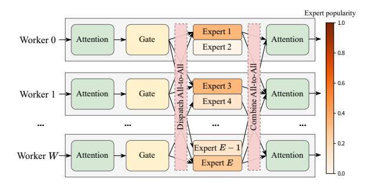

Figure 1: All-to-All communications during MoE training.

To minimize transferred tokens, FasterMoE [16] introduces a strategy to "shadow" partial experts to all GPU workers, which allows specific tokens to be processed locally, alleviating the need for external transmission. However, the periodic broadcasting of expert parameters can undermine the benefits of decreased token transmission due to potential communication cost and interference. Alternatively, Janus [24] attempts to optimize whether to fetch experts for tokens or send tokens to experts before the training starts, conditioned on their relative overheads. Yet, it struggles when the size of expert parameters or token data consistently exceeds the other. Currently, expert scheduling is mostly conducted concurrently with All-to-All communication, which may mitigate token transfers but also introduces additional communication overheads for expert scheduling. This raises a critical question: Can we stagger expert scheduling with token dispatching to eliminate the interruption of expert scheduling and more effectively address the All-to-All communication bottleneck? To answer the question, we face the following challenges.

First, to minimize the interference of expert scheduling on token dispatching, it is essential to retrieve the necessary experts before the training progresses to the current MoE layer. This requires advanced knowledge of expert statistics to facilitate timely expert retrieval. However, acquiring such information is challenging due to the dynamic training nature. Second, experts within the same layer often receive tokens that vary greatly in volume, which leads to considerable differences in performance gains when fetching different experts. Optimally deciding which experts to fetch from which worker involves modeling the training latency, yet the net effect of expert scheduling and token transmission is difficult to quantify. Third, All-Reduce operations among gradient aggregation can compete for limited network bandwidth with All-to-All communications, consequently delaying the backward computations. To enhance training efficiency, it is essential to schedule different network streams independently.

In this paper, we propose PopFetcher, an efficient MoE training system featured with *popularity* based *expert-wise prefetching*, to address the communication bottleneck and ensure balanced workloads. Specifically, PopFetcher employs a lightweight prediction to acquire the popularity of experts in each MoE layer, which effectively assists the expert prefetching design and remains uninterrupted to normal training.

Building on this statistics, PopFetcher enables each worker to *preemptively* pull popular experts from neighboring workers in idle periods or to push local tokens to remote workers when fetching corresponding experts is costlier. This *hybrid pull-push* mechanism unleashes the potentials of processing tokens both locally and remotely. PopFetcher rigorously formulates the end-to-end training latency, incorporating both computation and communication costs, to optimize the prefetching of experts for each worker. As a result, PopFetcher can substantially reduce the volume of token dispatching in EP, while incurring *negligible interference* with All-to-All communication since experts are retrieved in advance. Moreover, PopFetcher *prioritizes* the All-to-All stream during the backward pass, which further alleviates the communication blockage. In summary, this paper makes the following contributions.

- We discover the *correlation* between expert selections across consecutive MoE layers, and further develop a *lightweight* sliding-window based prediction scheme to precisely access the popularity of experts. With these insights, we design PopFetcher, an efficient MoE training system with popularity-aided expert-wise prefetching, which enables a *preliminary* expert scheduling to address the All-to-All communication bottleneck.
- PopFetcher devises a hybrid paradigm of expert pull and token push for EP-based MoE training. Through a thorough analysis of end-to-end training latency, PopFetcher enables the identification of the optimal experts to be prefetched for each worker while also respecting their memory constraints. By coupling with the underlying network architecture, PopFetcher fully utilizes high-speed links for expert retrieval, which greatly mitigates prefetching time.
- PopFetcher prioritizes All-to-All communication stream over All-Reduce operation among prefetched experts. By effectively pipelining non-MoE All-Reduce tasks with MoE backward computations, PopFetcher significantly mitigates network contention and reduces communication blockages.
- Extensive experiments on real-world datasets show the superiority of PopFetcher in training throughput and latency. In particular, PopFetcher reduces training time by 15%-94.5% than state-of-the-art systems.

#### 2 Background and Motivation

We first introduce the preliminary of distributed training of MoE models, then present our motivation, as well as the opportunities and challenges of PopFetcher.

#### 2.1 Background

#### 2.1.1 Transformer-Based PLM

Transformer model [38] has been recognized as the fundamental architecture in sequence processing. A typical Transformer block includes an Attention layer and a *multi-layer percep*-

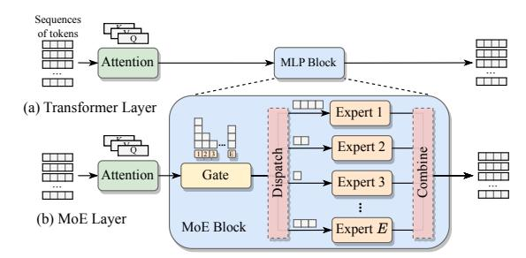

Figure 2: Structure of MoE block.

tron (MLP), generally comprising two fully-connected (FC) layers with a ReLU activation in between. Attention network transforms input tokens into query, key and value matrices, which then undergo processing via scaled dot-product attention, with outcomes being further channeled into the MLP. Output from MLP will be added to the block's input and normalized through a layer normalization. This standard configuration allows for stacking multiple identical Transformers to build powerful PLMs, like BERT [8] and GPT [5, 29].

#### 2.1.2 MoE Architecture and Model Training

Despite the success of Transformer architecture, scaling PLM capacity remains challenging due to increasing computation demands for training. MoE model [31], illustrated in Figure 2, tackles this by dividing the dense MLP into multiple smaller, sparse experts, thereby exploiting the inherent sparsity of Transformer to scale model size with only a sub-linear increase in computation cost. During training, each input token is routed by a gate to one or more experts, typically employing top-k expert selection where k is often 1 or 2. Token dispatching to experts and the subsequent return of results are managed via All-to-All communication primitives.

Large-scale MoE models often far exceed the capacity of a single GPU. To facilitate the training of MoE, EP is adopted to distribute various experts from each MoE layer across different GPU workers [21]. Typically, the model layers that reside between MoE layers (e.g., Attention layer), referred to as non-MoE layers, are replicated on each worker, following a principle similar to that of data parallelism [19].

#### 2.2 Motivation

Skewed expert activation leads to hot expert. In MoE architecture, the gate module's variability in routing input tokens often leads to an imbalanced workload among experts. As in Figure 3, which shows the expert selection distribution within a layer of MoE-GPT model [41], the pattern of token dispatching evolves considerably early in training but soon exhibits a trend towards *localized activity*, with minor variations between adjacent iterations. Despite attempts at balanced gating strategies, such as imposing capacity limits on each expert [21], certain experts consistently receive more tokens, placing heavier computations on GPUs hosting these *hot ex-*

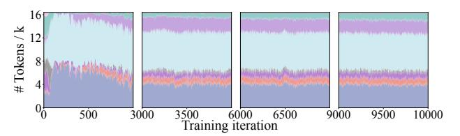

Figure 3: Skewed expert selection within a MoE layer (k on the y-axis represents units of 1000).

Table 1: Time consumption within a MoE layer.

| # Layers | Batch size | # Experts | A2A Ratio |
|----------|------------|-----------|-----------|
| 12       | 16         | 16        | 56.44 %   |
| 24       | 16         | 16        | 57.57 %   |
| 24       | 32         | 16        | 57.20 %   |
| 12       | 16         | 32        | 56.13 %   |
| 12       | 16         | 64        | 56.34 %   |

*perts*. Such load imbalance is particularly pronounced in the frontier layers of the MoE architecture, whereas in deep layers, the load tends to stabilize and changes less dramatically. Emergence of hot experts requires an effective management of load distribution to avoid overburdening GPU workers.

All-to-All communication bottlenecks in MoE training. During the training of MoE models, each token undergoes All-to-All communication twice per MoE layer, including token dispatching and subsequent output collection, which often leads to significant delays. Table 1 indicates that All-to-All communication can account for 50%-60% of the total time when training MoE-GPT across eight workers. The primary communication bottleneck arises from the mandatory data synchronizations in each MoE layer, where the commencement of expert execution and subsequent computations is delayed until all requisite tokens and their processed outputs are received. This synchronization is particularly problematic when hot experts are present, as their increased load further intensifies the network contentions. Therefore, a meticulously designed EP is critical to address synchronous execution challenge and reduce communication overhead.

Coarse-grained expert scheduling is insufficient. To enhance MoE training efficiency, replicating partial experts across multiple GPUs is adopted to alleviate the skewed computations on overloaded workers, allowing specific tokens to be processed locally by shadowed experts rather than being dispatched remotely [16]. While effective, broadcasting the expert parameters to all GPUs can introduce inadvertent delays due to data synchronizations. An alternative approach attempts to pull necessary expert parameters to the local GPU, which can decrease the need for pushing tokens to remote experts [24]. However, this method encounters significant limitations when expert parameters are substantially larger than input tokens, making pulling experts even more communicationintensive. Despite these efforts, existing coarse-grained MoE schemes still struggle with imbalanced computation loads and persistent All-to-All communication bottlenecks.

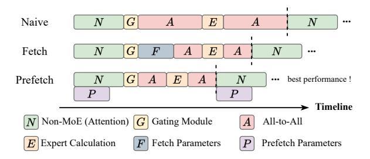

Figure 4: Execution timeline of different expert schedules.

## 2.3 Opportunities and Challenges

Addressing communication bottleneck while restoring computation balance is crucial for improving the efficiency of MoE model training. We next explore the opportunity to achieve this objective and highlight the potential challenges.

#### 2.3.1 Opportunities

Efforts to promote MoE efficiency have typically pursued two orthogonal directions.

Model design. Literature reveals attempts to refine the MoE model architecture itself. For instance, GShard [\[21\]](#page-15-2) incorporates a load balance loss to evenly distribute workloads across different GPU workers. Similarly, expert routing strategies [\[42\]](#page-17-3) have been redefined to allow the gate module to select the top-k best-matching tokens, enhancing load balancing. While these methods aid in achieving more equitable workload distribution, they also risk *compromising model accuracy*, and the communication bottleneck *persists*.

System design. System-oriented approaches like Faster-MoE [\[16\]](#page-15-5) and FlexMoE [\[28\]](#page-16-10) alleviate the adverse impact of load imbalance by shadowing or replicating popular experts. However, they can introduce *additional* overhead for parameter synchronization or system adjustment, potentially offsetting the benefits of improved workload distribution.

Despite these challenges, non-MoE components between MoE layers open up optimization opportunities. Figure [4](#page-4-0) shows the data flow within a MoE layer, implying that during the computation in *non-MoE sections*, like the Attention layer, a worker utilizes only local input data, leaving network links underutilized. As training progresses, expert load variations tend to stabilize, offering a chance to use historical token distribution for expert prefetching. That is, we can proactively pull popular experts in next MoE layer from remote GPUs to a local worker in anticipation of their forthcoming selections, thus diminishing future All-to-All communication demands by using *currently idle* links.

#### 2.3.2 Challenges

Prefetching hot experts during non-MoE computation phases is promising to minimize communication overhead and balance GPU workloads. However, it also presents unique challenges that need to be addressed.

How to accurately predict popular experts in next MoE layer? As training progresses, the load distribution across experts *changes dynamically*. For effective expert scheduling, it is crucial to develop a lightweight method that can accurately predict which experts will be in high demand in subsequent layers, yet challenging for their dynamic nature.

How to prefetch appropriate experts subject to worker capacity? Given the *limited memory* capacity of GPU workers, and the presence of multiple experts already on the local GPU, deciding which and how many experts to prefetch presents a dilemma. This decision must balance the benefits of expert prefetching against available memory resources.

How to manage additional cost associated with expert prefetching? While prefetching can be scheduled to overlap with non-MoE computations, it must adhere to the *data dependencies* of the MoE workflow. Ensuring that prefetched experts are prepared before the computation of the next layer begins can introduce additional synchronization overhead. Furthermore, the All-Reduce operation among prefetched experts may compete with All-to-All communication, potentially obstructing gradient computations in backward pass.

## 3 PopFetcher Overview

In this paper, we present PopFetcher, an advanced MoE training system with popularity based expert-wise prefetching, to decrease All-to-All communication overhead and ensure balanced GPU workload. PopFetcher maintains an expert pool on each worker to store both local expert parameters and those prefetched from remote workers. Figure [5](#page-5-0) exhibits the system architecture of PopFetcher, which is primarily composed of three key modules: routing information collector, prefetching decision-maker, and asynchronous scheduling executor.

## 3.1 Routing Information Collector

Each worker node in PopFetcher is outfitted with a routing information collector to track and monitor the *runtime popularity* of experts. Specifically, this module records the gate selection details for each token across every MoE layer and updates the distribution of tokens routed to each expert. Based on this data, the collector renews the expert popularity within each MoE layer, as well as relaying to the prefetching decisionmaker for more informed expert retrieval. Expert popularity compiled by each worker is promptly synchronized via torch.distributed.all\_reduce to maintain consistency across all workers. Since the popularity vector is small, the synchronization overhead is negligible.

## 3.2 Prefetching Decision-Maker

The prefetching module periodically aggregates data from the routing information collector across all workers to discern the popularity of each expert. Considering that each GPU

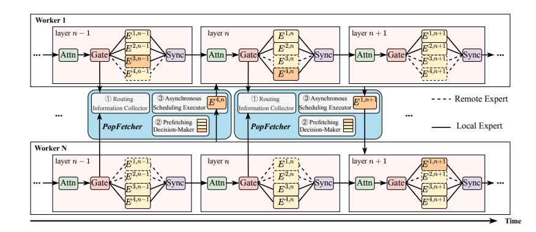

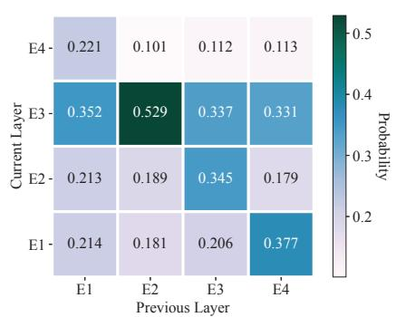

Figure 5: System architecture of PopFetcher.

Figure 6: Expert correlation between MoE layers within an iteration (training MoE-GPT with four experts per layer).

worker already hosts local experts and corresponding activations from the forward pass, fetching all remaining experts is impractical due to memory constraints. Informed by the updated popularity statistics, the decision-maker crafts a *tailored* prefetching strategy for each worker within the confines of limited GPU memory. PopFetcher carefully orchestrates the decision-making process to avoid disrupting regular training activities, as routing information can be analyzed on the CPU concurrently with ongoing GPU-based training operations. Furthermore, PopFetcher decides on expert prefetching for the upcoming MoE layer to minimize the end-to-end training latency as the current layer progresses.

## 3.3 Asynchronous Scheduling Executor

The scheduling executor aims to utilize idle network links during MoE training by preemptively and asynchronously fetching experts from the next layer that are originally located on remote workers. This strategy reduces the volume of transferred tokens during All-to-All communications, thereby effectively addressing the communication bottleneck. Ideally, expert scheduling should coincide with the computations of current Transformer's non-MoE sections, i.e., the Attention layer, which ensures minimal overhead and *avoids interference* with the execution of the current MoE layer.

In general, the executor intelligently schedules experts for each worker by prioritizing hot experts from the global pool based on directives from the prefetching decision-maker. Consequently, PopFetcher not only alleviates the All-to-All communication volume but also ensures a balanced GPU workload. Considering that multiple experts can exist across different workers due to expert prefetching, PopFetcher concurrently performs All-Reduce operations for non-MoE layers and gradient computations for experts during the backward pass to reduce communication overhead. To further minimize the impact on backward All-to-All communication and avoid the computation blockage, we also prioritize the All-to-All data flows over the All-Reduce stream.

## 4 Lightweight Popularity Prediction

In this section, we will delve into a dynamic prediction for expert popularity, which is deemed to be both lightweight and accurate to enhance expert prefetching. Basically, expert activation is dynamically predetermined by the gate network in standard scenarios, which may limit the opportunities for system-level optimization.

## 4.1 Expert Correlation between MoE Layers

As mentioned earlier, the selection of experts by input tokens exhibits discernible regularity. Within a MoE layer, certain experts consistently attract more tokens, indicating their popularity, while others are chosen less frequently. Observations from Figure [3](#page-3-1) also imply that experts who are popular at one point tend to maintain their popularity temporally.

Beyond individual MoE layers, there is also a correlation in expert selection across consecutive layers. Let us consider an expert index selected by a token in the *i*-th MoE layer as *x*, and in the subsequent (*i* + 1)-th layer as *x* ′ . The tuple (*x*, *x* ′ ) then represents a set of correlated selections. Figure [6](#page-5-1) illustrates the conditional probability of selecting expert *x* ′ in the current layer, given the selection of expert *x* in the previous layer. Outcomes reveal a distinct trend of expert selection between adjacent MoE layers, with *certain correlations* more prevalent than others. In essence, hot experts of the upcoming layer can often be predicted based on expert preferences in the preceding layer.

Although the popularity of experts and their correlations continue to evolve as training progresses, these changes tend to be gradual over time, which supports the effectiveness of early expert prefetching during non-MoE computations.

## 4.2 Expert Popularity Prediction

Achieving optimal computation and communication balance among workers hinges on accurately predicting expert popularity, a task complicated by its dynamic nature. To address

Table 2: Main notations

| Notation                                      | Definition                                        |  |  |
|-----------------------------------------------|---------------------------------------------------|--|--|
| N                                             | # workers                                         |  |  |
| K                                             | # experts per layer on each worker                |  |  |
| $E_w^i$                                       | <i>i</i> -th expert on worker <i>w</i>            |  |  |
| $P_{\scriptscriptstyle W}$                    | Computation throughput of worker w                |  |  |
| $W_{n,w}$                                     | Network bandwidth of link between workers $n, w$  |  |  |
| $I_w$                                         | # input tokens of worker w                        |  |  |
| $B_{w}$                                       | # tokens received by worker w                     |  |  |
| $B_w^i$                                       | # tokens sent to $E_w^i$                          |  |  |
| $\begin{aligned} B_w^i \ p_w^i \end{aligned}$ | Popularity of $E_w^i$                             |  |  |
| H                                             | Hidden size (length of embedding vectors)         |  |  |
| α                                             | Fraction of intermediate embedding in MLP         |  |  |
| $\delta^i_{n,w}$                              | 1 if $E_n^i$ is prefetched by worker $w$ , else 0 |  |  |

this while minimally interfering with normal training, we propose a sliding-window based prediction to pinpoint hot experts [6]. Specifically, the routing information collector routinely gathers runtime selection data from the gate network during the forward pass, which is then analyzed to update our current understanding of expert popularity.

Initially, we analyze the distribution of tokens over recent iterations, up to the *current MoE* layer:

$$p_{\text{seq}} = \frac{\text{\# tokens allocated in the past } s \text{ iterations}}{\text{\# tokens processed in the past } s \text{ iterations}}$$
 (1)

Here s represents the size of the sliding window, which, based on our testing, is optimally set at 10 iterations. Our goal is to accurately predict expert popularity for the upcoming MoE layer, which involves incorporating the expert correlations, as illustrated in Figure 6. Let M signify the total number of tokens, with each token expressed by  $T_m, m \in \{1, 2, \dots, M\}$ . Also, we denote the i-th expert on the j-th layer (i.e., Transformer block) as  $E^{i,j}$ , where each layer contains K' experts in total. Then, the correlation between any experts  $E^{i,j}$  and  $E^{h,j+1}$  can be evaluated by their conditional probability:

$$\Pr(E^{h,j+1}|E^{i,j}) = \frac{1}{M} \sum_{m=1}^{M} \Pr(E^{h,j+1}|E^{i,j}, T_m)$$
 (2)

The expert popularity based on the correlation is given by:

$$p(E^{h,j+1}) = \sum_{i=1}^{K'} \Pr(E^{h,j+1}|E^{i,j}) p_{\text{seq}}^{i,j}$$
 (3)

Eq. (3) enables an accurate, lightweight popularity prediction of experts in the subsequent layer by leveraging timely updated selection data from the preceding layer. As a result, our PopFetcher can dynamically adapt to changes in expert demand without overburdening the system.

#### **Expert-Wise Prefetching and Scheduling** 5

This section details our strategy for expert prefetching and scheduling given limited GPU memory. To aid our later pre-

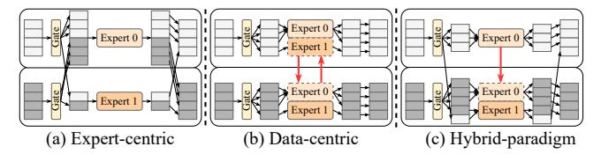

Figure 7: Hybrid push-pull paradigm. sentation, we summarize the main notations in Table 2.

## **Hybrid Push-Pull Paradigm**

Imbalances in communication and computation due to skewed expert selection substantially prolong MoE training. Previous attempts address this by either sending (pushing) tokens to experts (expert-centric) [12, 16, 21] or pulling experts to local GPUs (data-centric) [24], which, however, proves insufficient in managing the uneven token dispatching inherent in MoE architecture, as illustrated in Figure 7. Since these methods exclusively send tokens or pull experts, they fail to handle blockages during large data transmissions, as all data chunks are treated equally and scheduled simultaneously. To clarify, each expert module typically comprises a FeedForward Network with two Linear layers, featuring matrix dimensions of  $H \times \alpha H$  and  $\alpha H \times H$ , respectively, with  $\alpha$  commonly set to 2. Then, the parameter count for a single expert layer is  $4H^2$ . Using a float 32 data type with H = 1024, the parameter reaches 16MB. Besides, cross-machine data transfer per token during two All-to-All communications is 2H. Hence, we deduce that pulling an expert becomes more viable when the token transfer exceeds 2048 tokens. Otherwise, the conventional approach of sending tokens offers lower overhead.

We introduce a new hybrid push-pull strategy for tokens and experts, which combines the strengths of both expertcentric and data-centric frameworks. According to Figure 7, after tokens pass through the gate module, their dispatching to different workers varies significantly. By adopting a hybrid paradigm that *concurrently* pushes tokens and pulls experts, we can optimize data transfer based on the current token distribution among experts. Specifically, when the volume of tokens exceeds that of expert parameters, we opt to fetch experts towards the data; otherwise, we default to send tokens as expert parameters are less burdensome.

Our hybrid approach also includes expert prefetching to enable an advanced retrieval of remote experts. For this purpose, we need to accommodate two MoE computation patterns: local computation and prefetching computation. In local computation, tokens are sent to their specific experts for processing, with results returned to the originating node. Prefetching computation involves experts that are prefetched and available locally, eliminating the need to send out tokens over the network. However, prefetching computation introduces an extra step to ensure the logical integrity of model updates. That is, during backward pass, gradients of replicated experts must be sent back to the worker hosting the primary expert for global reduction. Gradient synchronization, while essential,

inevitably consumes network bandwidth and must be *factored into* prefetching decisions.

#### **5.2 Problem Formulation**

Our objective is to devise an optimal scheduling strategy that includes expert prefetching to minimize the training latency of *each MoE layer*. In this context, both communication and computation delays are predominantly determined by the performance of the slowest worker.

#### 5.2.1 Training Latency without Prefetching

First, we consider the conventional case where expert prefetching is excluded, which can guide later analysis of our PopFetcher. Let  $B_w$  denote the number of tokens received by worker w, then we have  $B_w = \sum_{n=1}^N T_{n,w}$ , where  $T_{n,w} = I_n \sum_{i=1}^K p_w^i$  accounts for  $I_n$  tokens from worker n based on expert popularity predictions  $p_w^i$ ,  $i \in \{1, 2, \dots, K\}$ . For each MoE layer within a Transformer, token processing by an expert entails one GeMM operation during forward pass, and two in backward as gradients need to be computed for both the inputs and expert parameters. Moreover, the size of intermediate embedding vector between the FC layers is  $\alpha H$  with H being the embedding size of each token. Thus, the total operations for two FC layers in MLP are  $4B_w \alpha H^2$ . Assuming data type in float32, each GeMM requires  $\frac{4B_w \alpha H^2}{P_w}$ , leading to a computation latency of  $3 \times \frac{4B_w \alpha H^2}{P_w}$ . Furthermore, forward and backward pass encompass a total of four rounds of All-to-All communications, with the communication latency given by  $4H\sum_{n=1}^{N}\sum_{i=1}^{K}\frac{B_{n,w}^{i}}{W_{n,w}}$ , where  $B_{n,w}^{i}$  denotes the number of tokens sent by worker n to expert  $E_w^i$ .

Therefore, the training latency of worker w is attained:

$$Lat_{w}^{\text{origin}} = 3 \times \frac{4B_{w}\alpha H^{2}}{P_{w}} + 4H \sum_{n=1}^{N} \sum_{i=1}^{K} \frac{B_{n,w}^{i}}{W_{n,w}}$$
(4)

Since the overall latency depends on the slowest worker, the end-to-end training time of a MoE layer becomes

$$Lat^{\text{origin}} = \max_{w} \left\{ Lat_{w}^{\text{origin}} \right\}, w \in \{1, 2, \dots, N\}$$
 (5)

#### **5.2.2** Training Latency with Prefetching

Building on the derivation of Eq. (5), we continue to explore the impact of prefetching hot experts on training latency. Specifically, expert prefetching incurs two types of delays.

- Prefetched expert computation: this delay arises from fetching expert parameters from remote worker to local node for computation, which is influenced by the expert popularity and how many local tokens supposed to be routed to it.
- Model gradient reduction: the time required to reduce gradients of prefetched experts with primary experts.
   We derive the training latency when experts are prefetched.

- Forward pass. (1) Computation time: the computation time for local tokens is  $Comp_1^f = \frac{4B_w\alpha H^2}{P_w}$ , while that for prefetched expert is given by  $Comp_p^f = \frac{4\alpha H^2}{P_w}\sum_{n=1}^{N}\sum_{i=1}^{K}B_{n,w}^i\delta_{n,w}^i$ , where the indicator  $\delta_{n,w}^i$  signifies whether expert  $E_n^i$  is prefetched by worker w. (2) Communication time: the token transfer time amounts to  $Comm_t^f = 2H\sum_{n=1}^{N}\sum_{i=1}^{K}\frac{B_{n,w}^i(1-\delta_{n,w}^i)}{W_{n,w}}$ .
- Backward pass. (1) Computation time: in the backward pass, local token computation time doubles to  $Comp_1^b = 2 \times \frac{4B_w\alpha H^2}{P_w}$ , and prefetched expert computation needs  $Comp_p^b = 2 \times \frac{4\alpha H^2}{P_w} \sum_{n=1}^N \sum_{i=1}^K B_{n,w}^i \delta_{n,w}^i$ . (2) Communication time: the token transfer  $Comm_t^b$  mirrors that of the forward pass  $Comm_t^f$ , and the time for gradient reduction is  $Comm_r^b = 2\alpha H^2 \sum_{n=1}^N \sum_{i=1}^K \frac{\delta_{n,w}^i}{W_{n,w}^i}$ .

Including the times  $Comp_1^f, Comp_p^f, Comm_t^f$  in forward pass and those  $Comp_1^b, Comp_p^b, Comm_t^b, Comm_r^b$  in backward pass, we characterize the latency for worker w:

$$Lat_{w}^{\text{prefetch}} = 3 \times \frac{4B_{w}\alpha H^{2}}{P_{w}} + 3 \times \frac{4\alpha H^{2}}{P_{w}} \sum_{n=1}^{N} \sum_{i=1}^{K} B_{n,w}^{i} \delta_{n,w}^{i}$$

$$+4H \sum_{n=1}^{N} \sum_{i=1}^{K} \frac{B_{n,w}^{i} (1 - \delta_{n,w}^{i})}{W_{n,w}} + 2\alpha H^{2} \sum_{n=1}^{N} \sum_{i=1}^{K} \frac{\delta_{n,w}^{i}}{W_{n,w}}$$
(6)

Recall our goal is to minimize the end-to-end latency, i.e.,

$$Lat^{\text{prefetch}} = \min \max_{w} \{Lat_{w}^{\text{prefetch}}\}, w \in \{1, 2, \dots, N\} \quad (7)$$

Given the extensive number of global experts, such as 256 GPUs on Azure with 128 experts on each worker [30], the overhead of deciding whether to prefetch an expert is substantial, which needs further optimization.

#### 5.3 Expert Prefetching Decision

Our objective now turns to solving the problem outlined in Eq. (7), focusing on optimizing the assignment  $\{\delta_{n,w}^i\}$  of prefetched experts to GPU workers in an efficient manner.

#### **5.3.1** Expert Prefetch Pruning

The primary challenge in designing expert prefetching is the vast search space associated with deciding experts for the next layer. To overcome the problem, we narrow down the search space through *expert pruning*, which effectively reduces the number of experts that need to be considered to at most  $k \times N$ , with k denoting the top-k expert selection of gate module.

 GPU memory limitation. Since each GPU has already hosted local expert parameters and intermediate activations, the aggregate size of experts that can be prefetched must not exceed its available memory. Then,

$$2\alpha H^2 \sum_{n=1}^{N} \sum_{i=1}^{K} \delta_{n,w}^i \le Mem_w^{\text{free}}$$
 (8)

• Transfer time constraint. Prefetching should ideally overlap with non-MoE layer computations, implying that the time taken to fetch expert needs to fulfill

$$2\alpha H^2 \sum_{n=1}^{N} \sum_{i=1}^{K} \frac{\delta_{n,w}^i}{W_{n,w}} \le Time^{\text{non-MoE}}$$
 (9)

These constraints establish an upper bound  $r_w$  for the number of experts that can be feasibly prefetched:

$$\sum_{n=1}^{N} \sum_{i=1}^{K} \delta_{n,w}^{i} \le r_{w} \tag{10}$$

Moreover, expert prefetching for any worker is supposed to reduce end-to-end training latency. Consistent with Eqs. (4) and (6), it implies the following difference is greater than 0:

$$Lat_{w}^{\text{origin}} - Lat_{w}^{\text{prefetch}} = 4H \sum_{n=1}^{N} \sum_{i=1}^{K} \frac{B_{n,w}^{i}}{W_{n,w}}$$

$$-2\alpha H^{2} \sum_{n=1}^{N} \sum_{i=1}^{K} \frac{\delta_{n,w}^{i}}{W_{n,w}} - \frac{12\alpha H^{2}}{P_{w}} \sum_{n=1}^{N} \sum_{i=1}^{K} B_{n,w}^{i} \delta_{n,w}^{i}$$
(11)

Specifically,  $Lat_w^{\text{origin}} > Lat_w^{\text{prefetch}}$  when the condition below holds true:

$$2(\varepsilon - 3\alpha H)B_{n,w}^{i} > \varepsilon\alpha H \tag{12}$$

Here, we use  $\varepsilon$  as shorthand for the compute-to-bandwidth ratio  $\frac{P_w}{W_{n,w}}$  for conciseness. Prefetching is observed to enhance training efficiency only when  $\varepsilon$  exceeds  $3\alpha H$ , indicating a scenario with limited inter-worker bandwidth but potent GPU computing capability. For instance, NVIDIA DGX B200 is equipped with computing capacity of 72 petaFLOPS and NVLink connection with 400 Gb/s. Given a typical embedding size  $H \in \{768, 1024, 2048, 4096\}$ , it is clear that  $\varepsilon > 3\alpha H$ , namely expert prefetching is viable. In such cases, the tokens received by expert  $E_n^i$ , if prefetched, must satisfy

$$B_{n,w}^{i} > \frac{\varepsilon \alpha H}{2(\varepsilon - 3\alpha H)} \tag{13}$$

By combining Eq. (10) and Eq. (13), we prioritize prefetching experts based on their popularity until the GPU memory is fully utilized. The net time reduction achieved by prefetching a single expert is calculated as  $4H\sum_{n=1}^{N}\frac{B_{n,w}^{i}}{W_{n,w}}$  =  $2\alpha H^{2}\sum_{n=1}^{N}\frac{\delta_{n,w}^{i}}{W_{n,w}}$  =  $\frac{12\alpha H^{2}\sum_{n=1}^{N}\frac{\delta_{n,w}^{i}}{W_{n,w}}}{2\alpha H^{2}\sum_{n=1}^{N}\frac{\delta_{n,w}^{i}}{W_{n,w}}}$  =  $\frac{12\alpha H^{2}\sum_{n=1}^{N}\frac{\delta_{n,w}^{i}}{W_{n,w}}}{2\alpha H^{2}\sum_{n=1}^{N}\frac{\delta_{n,w}^{i}}{W_{n,w}}}$  =  $\frac{12\alpha H^{2}\sum_{n=1}^{N}\frac{\delta_{n,w}^{i}}{W_{n,w}}}{2\alpha H^{2}\sum_{n=1}^{N}\frac{\delta_{n,w}^{i}}{W_{n,w}}}$ 

 $2\alpha H^2 \sum_{n=1}^{N} \frac{\delta_{n,w}^i}{W_{n,w}} - \frac{12\alpha H^2}{P_w} \sum_{n=1}^{N} B_{n,w}^i \delta_{n,w}^i$ . As aforementioned in Figure 3, expert popularity tends to stabilize as training progresses. Therefore, in the mid-to-late stages of MoE training, it may not be necessary to assess each expert's prefetching needs in every iteration. Instead, a fixed prefetching strategy could be adopted, or the *frequency* of expert replanning is reduced, to further cut down on operational overhead.

**Overview of PopFetcher mechanics.** In summary, we illustrate the operational mechanics of PopFetcher. Conditioned on the end-to-end latency in Eq. (6), we aim to minimize

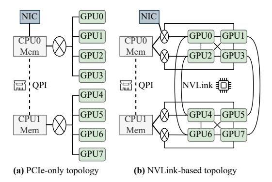

Figure 8: Different types of GPU machine topology.

the latency by searching the optimal expert prefetching solution. Given the exponentially growing complexity of the search space with increases in the number of machines and GPUs, we implement two key constraints to manage this complexity: GPU memory limitations as defined in Eq. (10) and constraints on expert transfer time as specified in Eq. (13). These constraints effectively prune the search space, allowing us to formulate a comprehensive global expert prefetching strategy. Specifically, for each set  $\delta^i_{n,w}$  identified in our strategy, we execute prefetching of the *i*-th expert  $E^i_n$  on worker n to worker n during non-MoE layer computations.

#### 5.3.2 Internal Expert Sharing among Local GPUs

In GPU clusters, links connecting various components often occupy heterogeneous bandwidths, as exemplified in Figure 8 which depicts the topology of a typical machine. Generally, GPUs within the same machine communicate through NVLink, with bandwidths reaching up to 1800GB/s, while those interconnected with the machine's main CPU via PCIe share a bandwidth of 64GB/s. For inter-server communication, machines are often linked through GDR NICs, with their bandwidths reaching 400Gb/s, where experts must be first pulled to local CPU memory via the NICs and then moved to the GPU memory through PCIe. Given this diverse network fabric, when a worker prefers to fetching experts from others, coupling with the heterogeneous connections can apparently enhance bandwidth utilization. Specifically, workers will prioritize sources connected by higher bandwidth links for retrieving their needed expert parameters.

Additionally, internal experts can be shared across all local workers using CPU memory. Once an expert is available on the same machine, PopFetcher bypasses the need for external fetching, i.e., workers directly access the expert from local CPU memory, to mitigate the overhead of expert prefetching. To achieve this, we maintain a cache manager for each server, which is responsible for sharing remote expert parameters among local workers and utilizes CPU memory as an intermediary to expedite the prefetching process.

In general, our scheduling scheme is designed to optimally

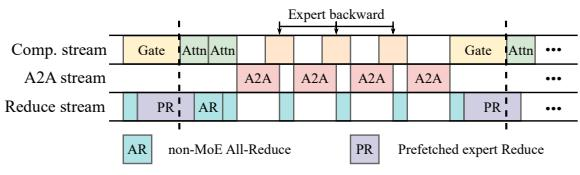

Figure 9: Pipeline scheduling of streams in backward pass.

retrieve experts through the fastest available links, regardless of the specific intra and inter-machine bandwidths. By leveraging the CPU memory, PopFetcher effectively circumvents the redundant transmission of expert parameters, thus enhancing the overall efficiency of MoE training system.

#### 6 Stream Scheduling in Backward Pass

Due to expert prefetching, multiple copies of an expert may exist across different workers, requiring an additional All-Reduce operation during the backward pass. Typically, All-to-All communication for EP, All-Reduce gradient aggregation for non-MoE layers, and All-Reduce among prefetched experts are handled in *separate* process groups, which will initiate three distinct CUDA streams running concurrently. Without proper scheduling, these streams may compete for limited network bandwidth and GPU resources, potentially disrupting the normal flow of backward computation.

Ideally, strict priority should be assigned to All-to-All communication to minimize bandwidth contention. This strategy involves launching All-Reduce tasks as soon as they are ready to prevent delays, while also allowing All-to-All tasks to preemptively claim GPU resources upon initiation. However, implementing such precise stream scheduling is not feasible with highly optimized multi-GPU communication libraries like NCCL, which lock communication primitives into CUDA streams at the point of invocation. As a result, transmissions must be determined upfront, *precluding* any real-time adjustments in the use of core and bandwidth resources in conjunction with other operations.

To overcome these challenges, we propose decomposing both All-Reduce and All-to-All communications into micro-operations, which are executed in a pipelined fashion. In practice, expert prefetching leads to a reduced volume of All-to-All token transfers during the backward pass, diminishing their overlap with the computation of expert gradients. By strategically *interleaving* the micro-operations of All-Reduce and All-to-All communications, as vividly illustrated in Figure 9, we can fully capitalize on network idle periods when GPU workers are otherwise engaged.

#### 7 Implementation

We have developed PopFetcher atop PyTorch, using Python, C++ and CUDA to construct the MoE training framework, which encompasses over 8,000 lines of code. The routing information collector, implemented using Python, aggregates

Table 3: Configuration of different MoE models.

| Model     | α | Hidden | Layer | Batch | Expert | Worker | Cluster |
|-----------|---|--------|-------|-------|--------|--------|---------|
| MoE-GPT   | 2 | 1024   | 12    | 32    | 32     | 8      | A       |
| MOL-GFT 2 | 2 | 1024   | 12    | 64    | 64     | 32     | В       |
| MoE-BERT  | 2 | 1024   | 12    | 32    | 32     | 8      | A       |
| MOE-BEKT  |   | 1024   |       | 64    | 64     | 32     | В       |

runtime data via the All-Gather operator. Besides, the expert scheduling executor module utilizes the communication capabilities of torch.distributed, with the core logic for expert prefetching crafted in C++ and CUDA. Additionally, the executor facilitates parallel processing of computation and communication tasks through torch.cuda.Stream, and it manages a dedicated prefetching stream within the training system's prefetching interface.

For user convenience, PopFetcher is implemented as a Py-Torch plugin that can function independently or be integrated into the Megatron-LM framework [34]. PopFetcher employs the torch.autograd.Function class, which allows for the customization of both forward and backward behaviors of the MoE operator, to ensuring its seamless integration into the MoE computational graph. All computation, communication, and prefetching activities are encapsulated within this custom MoE operator. Moreover, the pipeline scheduling of computation and communication streams is implemented in C++ and CUDA to optimize performance.

#### 8 Evaluation

In this section, we evaluate the performance of PopFetcher in terms of token throughput and per-iteration time for different MoE models on real-world datasets.

#### 8.1 Evaluation Setup

#### 8.1.1 Hardware Setup

We evaluate PopFetcher on two GPU clusters.

- Cluster A. This GPU cluster comprises two machines, each outfitted with four NVIDIA RTX 4090 GPUs that have 24GB of memory per GPU. The GPU nodes are connected through a 100Gbps Mellanox ConnectX-5 InfiniBand adaptor for communication.
- Cluster B. The cluster includes eight machines, each equipped with four NVIDIA A10 GPUs, totaling 32 GPUs, with each GPU also featuring 24GB of memory. The internode communication operates over link with a maximum speed of 32Gbps bandwidth.

Besides, PyTorch version is 2.3 and CUDA version is 12.4. The communication backend is based on NCCL.

#### 8.1.2 Datasets and Models

We test PopFetcher on two typical MoE models: (1) MoE-GPT [\[41\]](#page-17-2), (2) MoE-BERT [\[16\]](#page-15-5), which serve as representatives of PLMs that utilize Transformer decoder or encoder architecture. More details about model configurations are listed in Table [3.](#page-9-1) Both MoE-GPT and MoE-BERT are initially trained on the OpenWebText dataset [\[15\]](#page-15-7). Additionally, MoE-BERT undergoes further training on the significantly larger PILE dataset [\[14\]](#page-15-8), which comprises approximately 600GB of data. We also conduct comparative experiments using the OSCAR-2201 dataset [\[1\]](#page-14-8) to further assess the performance of PopFetcher under varying data conditions.

#### 8.1.3 Baselines

We compare our PopFetcher with the following frameworks.

- DeepSpeed [\[30\]](#page-16-6): a high-performance system that supports massive scale MoE models.
- FasterMoE [\[16\]](#page-15-5): an easy-to-use and efficient MoE training system which simplifies the management of experts by shadowing them across GPU workers.
- Megablocks [\[13\]](#page-15-9): a lightweight library for MoE training, featuring a block-sparse GPU kernel that handles dynamic token routing and avoids token dropping without sacrificing the hardware efficiency.
- Tutel [\[17\]](#page-15-3): an optimized MoE system which achieves adaptive expert execution and adaptive pipelining for dispatch and combine operations in MoE layers.
- Janus [\[24\]](#page-16-8): a data-centric MoE training system which enables pulling experts to tokens. We replicated its functionality by prefetching all experts in our experiments, as the source code is not publicly available.

All baselines can be integrated into Megatron-LM [\[27,](#page-16-12) [34\]](#page-16-11), and we conduct our comparisons using the same hardware and software environments to ensure fairness.

### 8.1.4 Metrics

For a comprehensive evaluation of performance, we employ two key metrics, i.e., token throughput and per-iteration time. In particular, token throughput characterizes the number of tokens processed by the training system in each iteration, reflecting the overall training efficiency. Per-iteration time quantifies the total time required to complete one forward and backward pass, with shorter iteration time indicating faster training speed and higher resource utilization.

## 8.2 Statistical Training Equivalence

PopFetcher significantly reduces the per-iteration time required for MoE training by prefetching popular experts, thereby accelerating the overall training process. To maintain training equivalence with traditional MoE methods, we conduct an additional reduction operation that synchronizes

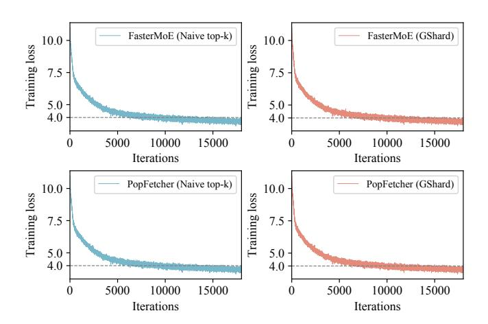

Figure 10: Loss value over training iterations.

the gradient updates between the prefetched experts and the original experts. To substantiate this approach, we perform training sessions for MoE-GPT on Cluster A using both the conventional FasterMoE and our PopFetcher enhancement.

The loss curves for both the naive top-k and GShard expert routing mechanisms are illustrated in Figure [10.](#page-10-0) The upper section of the figure depicts the original FasterMoE training scheme, whereas the lower section represents the enhancements made by PopFetcher. It is evident that regardless of the gating mechanism employed, be it naive or GShard, PopFetcher maintains the integrity of the expert selection process and does not introduce any additional steps in the convergence process. Consequently, all loss trajectories align perfectly across training iterations, demonstrating that PopFetcher achieves statistical equivalence with the standard training framework without compromising model accuracy.

## 8.3 Overall End-to-End Performance

Initially, we evaluate the end-to-end performance, focusing on the training time per iteration of our PopFetcher and various baselines. All results are obtained using GShard gating, given its broader application.

Figure [11](#page-11-0) shows PopFetcher's overall speedup relative to baselines across different GPU clusters, calculated against the slowest system in each setup. We observe that PopFetcher boosts training speed by 1.28-2.4× and 1.18-18.3× in the two clusters, respectively. These gains stem from its expert prefetching design and network stream prioritization, which concurrently fetches popular expert parameters during non-MoE layer computations without blocking the backward pass. Since Janus employs a solution that pulls all expert parameters, it imposes extremely high demands on GPU memory capacity. Given the settings described, Janus often results in OOM errors and is therefore excluded from Figure [11.](#page-11-0)

PopFetcher consistently achieves robust training speeds, even in low inter-machine network bandwidth environments like Cluster B. In contrast, frameworks such as Megablocks,

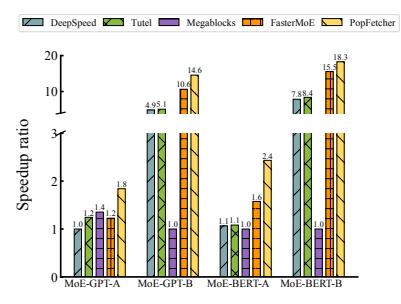

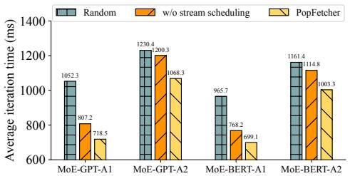

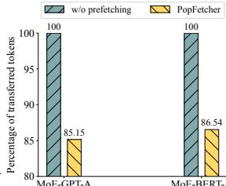

Figure 11: Speedups over baselines. Figure 12: Expert and stream scheduling. Figure 13: Token transfers.

heavily reliant on the inter-machine communication, can experience significant efficiency losses under similar conditions, resulting in slower training speeds. This contrast highlights PopFetcher's suitability for bandwidth-constrained hardware environments, such as those using consumer-grade GPUs. In these scenarios, with a high compute-to-bandwidth ratio  $\epsilon$ , PopFetcher is able to effectively utilize the idle links during non-MoE layer computations.

## 8.4 Ablation Study

#### 8.4.1 Expert Popularity and Stream Scheduling

We continue evaluating the benefits of expert popularity prediction and backward stream scheduling. We compare PopFetcher with baseline MoE training approaches that rely on random expert prefetching or built-in stream strategy, which ignore variations in expert selection or stream priorities, respectively. Our evaluations employ MoE-GPT and MoE-BERT models in Cluster A, varying the number of experts per layer for a comprehensive analysis: MoE-GPT-A1 includes 16 experts, MoE-GPT-A2 has 8, with similar setups for the MoE-BERT model.

Figure 12 shows the average per-iteration time. In particular, our popularity-based expert scheduling yields significant speedup enhancements, achieving  $1.30\times$  and  $1.26\times$  faster training for MoE-GPT and MoE-BERT models, respectively, compared to random prefetching. Additionally, PopFetcher cuts the average iteration time by 10.9% for MoE-GPT and 10% for MoE-BERT, highlighting substantial efficiency gains from incorporating pipelined stream scheduling during the backward pass, thus avoiding network contention and removing computation blockage.

#### 8.4.2 Token Transfer within Expert Prefetching

Expert prefetching in PopFetcher reduces token transfers in All-to-All communications, thus cutting the communication time. As shown in Figure 13, implementing our prefetching strategy globally decreases tokens transmitted by 14.85% for MoE-GPT and 13.46% for MoE-BERT in Cluster A.

Furthermore, we assess the prefetching status of experts in MoE-GPT and MoE-BERT models (16 experts per layer), as depicted in Figure 14. The vertical axis shows the global

index of experts, and the horizontal axis represents iterations. Darker cell colors indicate more frequent prefetching. Results illustrate that strategic prefetching of certain experts can speed up training, with these experts consistently requested by multiple workers across consecutive training iterations. That is, expert popularity exhibits "locality" (discussed in Section 2.2), which is seen as long, dark bands in the figure. These popular experts vary per layer, but consistently, at least one such hot expert appears in every layer, highlighting a focused prefetching strategy to boost model performance.

## 8.5 Hybrid Push-Pull Analysis

PopFetcher integrates the advantages of both traditional datacentric and expert-centric MoE training by adopting a hybrid approach that involves sending tokens and pulling experts. To demonstrate the superiority of PopFetcher, we compare its training throughput and per-iteration time with those of datacentric (Janus) and expert-centric systems (w/o prefetching).

As depicted in Figure 15, in experiments conducted on Cluster A using MoE-GPT and MoE-BERT models, PopFetcher surpasses both the expert-centric and data-centric paradigms in training throughput and per-iteration time. This outcome underscores the efficacy of our hybrid communication method which combines sending tokens and pulling experts, optimizing data transmission volumes in All-to-All communications. Our strategy fine-tunes the balance of load and addresses the granularity issues associated with load imbalances in All-to-All communications, thereby enhancing overall MoE training efficiency.

"Bad prefetching" arises when prefetched experts receive fewer tokens than alternatives, reducing All-to-All communication savings. However, PopFetcher effectively mitigates this issue by accurately prefetching popular experts using a sliding window and inter-layer correlation. Should "bad prefetching" occur, PopFetcher simply reverts to the conventional training mode without incurring additional overhead, as prefetch operations overlap with non-MoE computations.

#### **8.6** Parameter Sensitivity Analysis

The performance of PopFetcher is closely linked to the prediction accuracy of expert popularity, which is influenced by the sliding window size s. A larger s does not necessarily lead to

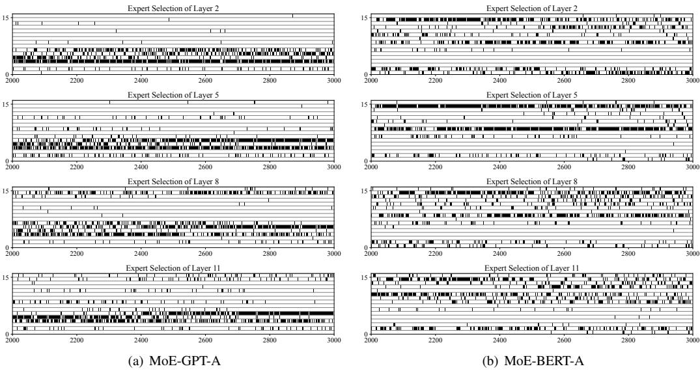

Figure 14: Demonstrations of prefetched experts in PopFetcher over training iterations.

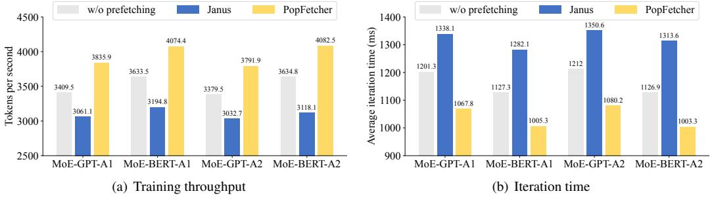

Figure 15: Effect of PopFetcher's hybrid token send and expert pull.

Table 4: Prediction accuracy over sliding window size.

| Acc. Value Gate | 5      | 10     | 15     | 20     | 25     | 50     | 100    |
|-----------------|--------|--------|--------|--------|--------|--------|--------|
| Naive top-k     |        |        |        |        |        |        |        |
| GShard          | 68.13% | 69.62% | 57.26% | 53.66% | 51.19% | 46.49% | 45.30% |

better accuracy, but it does require maintaining an extensive history of past records, resulting in inefficient resource utilization without significant improvements in prediction accuracy.

Given the number of experts prefetched per layer is typically no more than four due to GPU memory constraint, we focus on measuring the accuracy of predicted top-5 popular experts against the actual top-5 hot experts. This evaluation is further averaged across all MoE layers. As depicted in Table 4, after assessing the prediction accuracy under various configurations, we select a sliding window size of 10 for runtime operations to achieve an optimal balance between prediction performance and memory consumption.

#### 8.7 Balanced GPU Workload

By prefetching popular experts, PopFetcher ensures a more balanced workload distribution across workers, since the loads of hot experts are shared among multiple workers. As illus-

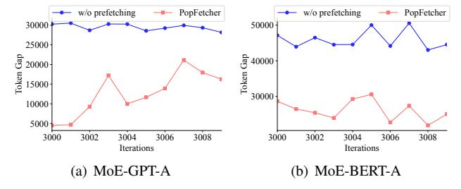

Figure 16: Difference in received number of tokens between lightest and heaviest loaded workers (16 experts per layer).

trated in Figure 16, it significantly reduces the disparity in token distribution between the least and most loaded workers: 43.1% for MoE-GPT and 57.1% for MoE-BERT. This uniform workload distribution during training prevents the communication blockages common in traditional MoE systems, where biased expert selections often cause workload imbalances and network congestion.

#### 8.8 **GPU Memory Consumption**

Through hybrid token dispatch and expert retrieval, PopFetcher achieves more efficient utilization of limited GPU memory. To illustrate, we compare the accommodated

Table 5: Maximum accommodated model size.

| Model Size Method | MoE-GPT | MoE-BERT |  |  |
|-------------------------|---------|----------|--|--|
| FasterMoE               | 1.844B  | 1.884B   |  |  |
| Janus                   | 1.390B  | 1.430B   |  |  |
| PopFetcher              | 2.071B  | 2.262B   |  |  |

parameter size of PopFetcher with those of FasterMoE and Janus by adjusting the number of experts in each MoE layer. Table [5](#page-13-0) presents the maximum configurations and parameter scales that the MoE-GPT and MoE-BERT models can train on Cluster A. Compared to FasterMoE, PopFetcher demonstrates improvements of 12.3% and 20.1% in model size on the MoE-GPT and MoE-BERT models, respectively. Similarly, compared to Janus, PopFetcher achieves enhancements of 49.0% and 58.2% on the MoE-GPT and MoE-BERT models, respectively. These results underscore that the hybrid push-pull paradigm can effectively exploit GPU memory.

## 8.9 Runtime Overhead

PopFetcher introduces minimal runtime overhead, largely because the expert popularity prediction and the search for prefetching solutions are performed asynchronously on the CPU. These tasks run in the background without disrupting the main training process. Moreover, our pruning strategy significantly reduces the search space, rendering the computational cost negligible. In practical tests, the overhead for popularity prediction is less than 100ms, which is readily absorbed within the total training time. Given that the benefits of prefetching popular experts far outweigh this slight overhead, PopFetcher efficiently accelerates the training process while minimizing its negative impact.

## 9 Related Work

Sparse MoE model. Large-scale models have excelled in computer vision [\[39\]](#page-17-4) and natural language processing [\[11\]](#page-15-10), thanks to extensive parameters. MoE architectures, introduced in a 1991 paper [\[18\]](#page-15-11), further boost parameter scales and capabilities while maintaining computational efficiency [\[26\]](#page-16-13). Shazeer *et al.* expands MoE to LSTMs with 137 billion parameters and 131,072 experts [\[31\]](#page-16-4). GShard adapts MoE for transformer models, achieving 12.5 to 600 billion parameters [\[21\]](#page-15-2). Switch Transformers enhances the T5 model by replacing Feed-Forward layers with MoE layers and optimizing routing strategy [\[12\]](#page-15-0). ST-MoE further develops an encoder-decoder MoE architecture with 269 billion parameters, 32 billion active at any time [\[43\]](#page-17-5). GLaM introduces a decoder-only model with a record 1.2 trillion size [\[10\]](#page-15-12).

MoE model training. Switch Transformers pioneer EP by distributing individual experts across GPUs within the same MoE layer [\[12\]](#page-15-0). Tutel on the other hand emphasizes MoE's dynamic nature by optimizing token-expert allocation for data, model, and expert parallelism [\[17\]](#page-15-3). To enhance MoE training, Janus modifies the traditional All-to-All communication in EP by routing experts to where tokens are located [\[24\]](#page-16-8). Besides, Lina prioritizes All-to-All communication over typical All-Reduce operations while adoting data parallelism [\[23\]](#page-16-14). FasterMoE introduces dynamic load balancing through expert replication and a flexible pipeline scheduling strategy [\[16\]](#page-15-5). ScheMoE further develops a scheduling framework that manages communication and computation tasks, integrating an advanced All-to-All communication primitive to maximize bandwidth use [\[33\]](#page-16-15). These works significantly enhance the efficiency, scalability, and performance of MoE training systems through optimizing expert-token interactions and improving load balancing in large-scale distributed setups.

## 10 Conclusion

In this paper, we propose PopFetcher, an effective and scalable MoE training framework that incorporates popularity based expert-wise prefetching, to mitigate the All-to-All communication bottleneck in MoE training. PopFetcher identifies skewed and correlated patterns in expert selection and employs a sliding-window based prediction to determine the popularity of experts in upcoming layers. Building on this statistics, PopFetcher meticulously analyzes the end-to-end training latency of each MoE layer, and establishes an optimal mapping of prefetched experts to GPU workers. By doing so, PopFetcher not only minimizes communication time but also ensures a balanced workload distribution among workers. Additionally, PopFetcher exploits network idle periods to pipeline All-Reduce streams and non-MoE computation, thereby expediting the backward pass process. Experimental evaluations on real-world datasets show that PopFetcher outperforms state-of-the-art MoE training systems, as we can mitigate the training time by 15%-94.5%.

## Acknowledgement

This work was supported in part by NSFC-RGC under Grant 62461160333, Wuhan Natural Science Foundation Exploratory Program (Chenguang Program) under Grant 2024040801020210, National Natural Science Foundation of China under Grants 62202185, an RGC RIF grant under contract R6021-20, and an RGC TRS grant under contract T43-513/23N-2.

## References

- [1] Julien Abadji, Pedro Javier Ortiz Suárez, Laurent Romary, and Benoît Sagot. Towards a cleaner documentoriented multilingual crawled corpus. In *Proceedings of the Thirteenth Language Resources and Evaluation Conference*, pages 4344–4355, 2022.
- [2] Marah I Abdin, Sam Ade Jacobs, Ammar Ahmad Awan, Jyoti Aneja, Ahmed Awadallah, Hany Awadalla, Nguyen Bach, Amit Bahree, Arash Bakhtiari, Harkirat S. Behl, Alon Benhaim, Misha Bilenko, Johan Bjorck, Sébastien Bubeck, Martin Cai, Caio César Teodoro Mendes, Weizhu Chen, Vishrav Chaudhary, Parul Chopra, Allie Del Giorno, Gustavo de Rosa, Matthew Dixon, Ronen Eldan, Dan Iter, Amit Garg, Abhishek Goswami, Suriya Gunasekar, Emman Haider, Junheng Hao, Russell J. Hewett, Jamie Huynh, Mojan Javaheripi, Xin Jin, Piero Kauffmann, Nikos Karampatziakis, Dongwoo Kim, Mahoud Khademi, Lev Kurilenko, James R. Lee, Yin Tat Lee, Yuanzhi Li, Chen Liang, Weishung Liu, Eric Lin, Zeqi Lin, Piyush Madan, Arindam Mitra, Hardik Modi, Anh Nguyen, Brandon Norick, Barun Patra, Daniel Perez-Becker, Thomas Portet, Reid Pryzant, Heyang Qin, Marko Radmilac, Corby Rosset, Sambudha Roy, Olatunji Ruwase, Olli Saarikivi, Amin Saied, Adil Salim, Michael Santacroce, Shital Shah, Ning Shang, Hiteshi Sharma, Xia Song, Masahiro Tanaka, Xin Wang, Rachel Ward, Guanhua Wang, Philipp A. Witte, Michael Wyatt, Can Xu, Jiahang Xu, Sonali Yadav, Fan Yang, Ziyi Yang, Donghan Yu, Chengruidong Zhang, Cyril Zhang, Jianwen Zhang, Li Lyna Zhang, Yi Zhang, Yue Zhang, Yunan Zhang, and Xiren Zhou. Phi-3 technical report: A highly capable language model locally on your phone. *CoRR*, abs/2404.14219, 2024.
- [3] Roee Aharoni, Melvin Johnson, and Orhan Firat. Massively multilingual neural machine translation. In *Proceedings of the 2019 Conference of the North American Chapter of the Association for Computational Linguistics: Human Language Technologies (Long and Short Papers)*, volume 1, pages 3874–3884, 2019.
- [4] Mikel Artetxe, Shruti Bhosale, Naman Goyal, Todor Mihaylov, Myle Ott, Sam Shleifer, Xi Victoria Lin, Jingfei Du, Srinivasan Iyer, Ramakanth Pasunuru, Giridharan Anantharaman, Xian Li, Shuohui Chen, Halil Akin, Mandeep Baines, Louis Martin, Xing Zhou, Punit Singh Koura, Brian O'Horo, Jeffrey Wang, Luke Zettlemoyer, Mona T. Diab, Zornitsa Kozareva, and Veselin Stoyanov. Efficient large scale language modeling with mixtures of experts. In *Proceedings of the 2022 Conference on Empirical Methods in Natural Language Processing*, pages 11699–11732, 2022.

- [5] Tom B. Brown, Benjamin Mann, Nick Ryder, Melanie Subbiah, Jared Kaplan, Prafulla Dhariwal, Arvind Neelakantan, Pranav Shyam, Girish Sastry, Amanda Askell, Sandhini Agarwal, Ariel Herbert-Voss, Gretchen Krueger, Tom Henighan, Rewon Child, Aditya Ramesh, Daniel M. Ziegler, Jeffrey Wu, Clemens Winter, Christopher Hesse, Mark Chen, Eric Sigler, Mateusz Litwin, Scott Gray, Benjamin Chess, Jack Clark, Christopher Berner, Sam McCandlish, Alec Radford, Ilya Sutskever, and Dario Amodei. Language models are few-shot learners. In *Advances in Neural Information Processing Systems*, volume 33, pages 1877–1901, 2020.
- [6] Peizhuang Cong, Aomufei Yuan, Shimao Chen, Yuxuan Tian, Bowen Ye, and Tong Yang. Prediction is all moe needs: Expert load distribution goes from fluctuating to stabilizing. *CoRR*, abs/2404.16914, 2024.
- [7] DeepSeek-AI, Aixin Liu, Bei Feng, Bing Xue, Bingxuan Wang, Bochao Wu, Chengda Lu, Chenggang Zhao, Chengqi Deng, Chenyu Zhang, Chong Ruan, Damai Dai, Daya Guo, Dejian Yang, Deli Chen, Dongjie Ji, Erhang Li, Fangyun Lin, Fucong Dai, Fuli Luo, Guangbo Hao, Guanting Chen, Guowei Li, H. Zhang, Han Bao, Hanwei Xu, Haocheng Wang, Haowei Zhang, Honghui Ding, Huajian Xin, Huazuo Gao, Hui Li, Hui Qu, J. L. Cai, Jian Liang, Jianzhong Guo, Jiaqi Ni, Jiashi Li, Jiawei Wang, Jin Chen, Jingchang Chen, Jingyang Yuan, Junjie Qiu, Junlong Li, Junxiao Song, Kai Dong, Kai Hu, Kaige Gao, Kang Guan, Kexin Huang, Kuai Yu, Lean Wang, Lecong Zhang, Lei Xu, Leyi Xia, Liang Zhao, Litong Wang, Liyue Zhang, Meng Li, Miaojun Wang, Mingchuan Zhang, Minghua Zhang, Minghui Tang, Mingming Li, Ning Tian, Panpan Huang, Peiyi Wang, Peng Zhang, Qiancheng Wang, Qihao Zhu, Qinyu Chen, Qiushi Du, R. J. Chen, R. L. Jin, Ruiqi Ge, Ruisong Zhang, Ruizhe Pan, Runji Wang, Runxin Xu, Ruoyu Zhang, Ruyi Chen, S. S. Li, Shanghao Lu, Shangyan Zhou, Shanhuang Chen, Shaoqing Wu, Shengfeng Ye, Shengfeng Ye, Shirong Ma, Shiyu Wang, Shuang Zhou, Shuiping Yu, Shunfeng Zhou, Shuting Pan, T. Wang, Tao Yun, Tian Pei, Tianyu Sun, W. L. Xiao, and Wangding Zeng. Deepseekv3 technical report. *CoRR*, abs/2412.19437, 2024.
- [8] Jacob Devlin, Ming-Wei Chang, Kenton Lee, and Kristina Toutanova. BERT: pre-training of deep bidirectional transformers for language understanding. In *Proceedings of the 2019 Conference of the North American Chapter of the Association for Computational Linguistics: Human Language Technologies (Long and Short Papers)*, volume 1, pages 4171–4186, 2019.
- [9] Alexey Dosovitskiy, Lucas Beyer, Alexander Kolesnikov, Dirk Weissenborn, Xiaohua Zhai, Thomas Unterthiner, Mostafa Dehghani, Matthias Minderer, Georg Heigold, Sylvain Gelly, Jakob Uszkoreit, and

- Neil Houlsby. An image is worth 16x16 words: Transformers for image recognition at scale. In *9th International Conference on Learning Representations*, 2021.
- [10] Nan Du, Yanping Huang, Andrew M. Dai, Simon Tong, Dmitry Lepikhin, Yuanzhong Xu, Maxim Krikun, Yanqi Zhou, Adams Wei Yu, Orhan Firat, Barret Zoph, Liam Fedus, Maarten P. Bosma, Zongwei Zhou, Tao Wang, Yu Emma Wang, Kellie Webster, Marie Pellat, Kevin Robinson, Kathleen S. Meier-Hellstern, Toju Duke, Lucas Dixon, Kun Zhang, Quoc V. Le, Yonghui Wu, Zhifeng Chen, and Claire Cui. Glam: Efficient scaling of language models with mixture-of-experts. In *International Conference on Machine Learning*, volume 162, pages 5547–5569, 2022.
- [11] Abhimanyu Dubey, Abhinav Jauhri, Abhinav Pandey, Abhishek Kadian, Ahmad Al-Dahle, Aiesha Letman, Akhil Mathur, Alan Schelten, Amy Yang, Angela Fan, Anirudh Goyal, Anthony Hartshorn, Aobo Yang, Archi Mitra, Archie Sravankumar, Artem Korenev, Arthur Hinsvark, Arun Rao, Aston Zhang, Aurélien Rodriguez, Austen Gregerson, Ava Spataru, Baptiste Rozière, Bethany Biron, Binh Tang, Bobbie Chern, Charlotte Caucheteux, Chaya Nayak, Chloe Bi, Chris Marra, Chris McConnell, Christian Keller, Christophe Touret, Chunyang Wu, Corinne Wong, Cristian Canton Ferrer, Cyrus Nikolaidis, Damien Allonsius, Daniel Song, Danielle Pintz, Danny Livshits, David Esiobu, Dhruv Choudhary, Dhruv Mahajan, Diego Garcia-Olano, Diego Perino, Dieuwke Hupkes, Egor Lakomkin, Ehab AlBadawy, Elina Lobanova, Emily Dinan, Eric Michael Smith, Filip Radenovic, Frank Zhang, Gabriel Synnaeve, Gabrielle Lee, Georgia Lewis Anderson, Graeme Nail, Grégoire Mialon, Guan Pang, Guillem Cucurell, Hailey Nguyen, Hannah Korevaar, Hu Xu, Hugo Touvron, Iliyan Zarov, Imanol Arrieta Ibarra, Isabel M. Kloumann, Ishan Misra, Ivan Evtimov, Jade Copet, Jaewon Lee, Jan Geffert, Jana Vranes, Jason Park, Jay Mahadeokar, Jeet Shah, Jelmer van der Linde, Jennifer Billock, Jenny Hong, Jenya Lee, Jeremy Fu, Jianfeng Chi, Jianyu Huang, Jiawen Liu, Jie Wang, Jiecao Yu, Joanna Bitton, Joe Spisak, Jongsoo Park, Joseph Rocca, Joshua Johnstun, Joshua Saxe, Junteng Jia, Kalyan Vasuden Alwala, Kartikeya Upasani, Kate Plawiak, Ke Li, Kenneth Heafield, Kevin Stone, and et al. The llama 3 herd of models. *CoRR*, abs/2407.21783, 2024.
- [12] William Fedus, Barret Zoph, and Noam Shazeer. Switch transformers: Scaling to trillion parameter models with simple and efficient sparsity. *Journal of Machine Learning Research*, 23(120):1–39, 2022.
- [13] Trevor Gale, Deepak Narayanan, Cliff Young, and Matei Zaharia. Megablocks: Efficient sparse training with

- mixture-of-experts. In *Proceedings of the Sixth Conference on Machine Learning and Systems*, volume 5, pages 288–304, 2023.
- [14] Leo Gao, Stella Biderman, Sid Black, Laurence Golding, Travis Hoppe, Charles Foster, Jason Phang, Horace He, Anish Thite, Noa Nabeshima, Shawn Presser, and Connor Leahy. The pile: An 800gb dataset of diverse text for language modeling. *CoRR*, abs/2101.00027, 2021.
- [15] Aaron Gokaslan and Vanya Cohen. Openwebtext corpus. [http://Skylion007.github.io/](http://Skylion007.github.io/OpenWebTextCorpus) [OpenWebTextCorpus](http://Skylion007.github.io/OpenWebTextCorpus), 2019.
- [16] Jiaao He, Jidong Zhai, Tiago Antunes, Haojie Wang, Fuwen Luo, Shangfeng Shi, and Qin Li. Fastermoe: modeling and optimizing training of large-scale dynamic pre-trained models. In *Proceedings of the 27th ACM SIGPLAN Symposium on Principles and Practice of Parallel Programming*, pages 120–134, 2022.
- [17] Changho Hwang, Wei Cui, Yifan Xiong, Ziyue Yang, Ze Liu, Han Hu, Zilong Wang, Rafael Salas, Jithin Jose, Prabhat Ram, HoYuen Chau, Peng Cheng, Fan Yang, Mao Yang, and Yongqiang Xiong. Tutel: Adaptive mixture-of-experts at scale. In *Proceedings of the Sixth Conference on Machine Learning and Systems*, volume 5, pages 269–287, 2023.
- [18] Robert A. Jacobs, Michael I. Jordan, Steven J. Nowlan, and Geoffrey E. Hinton. Adaptive mixtures of local experts. *Neural computation*, 3(1):79–87, 1991.
- [19] Yimin Jiang, Yibo Zhu, Chang Lan, Bairen Yi, Yong Cui, and Chuanxiong Guo. A unified architecture for accelerating distributed DNN training in heterogeneous GPU/CPU clusters. In *14th USENIX Symposium on Operating Systems Design and Implementation (OSDI 20)*, pages 463–479, 2020.
- [20] Jared Kaplan, Sam McCandlish, Tom Henighan, Tom B. Brown, Benjamin Chess, Rewon Child, Scott Gray, Alec Radford, Jeffrey Wu, and Dario Amodei. Scaling laws for neural language models. *CoRR*, abs/2001.08361, 2020.
- [21] Dmitry Lepikhin, HyoukJoong Lee, Yuanzhong Xu, Dehao Chen, Orhan Firat, Yanping Huang, Maxim Krikun, Noam Shazeer, and Zhifeng Chen. Gshard: Scaling giant models with conditional computation and automatic sharding. In *9th International Conference on Learning Representations*, 2021.
- [22] Mike Lewis, Shruti Bhosale, Tim Dettmers, Naman Goyal, and Luke Zettlemoyer. BASE layers: Simplifying training of large, sparse models. In *Proceedings of the 38th International Conference on Machine Learning*, volume 139, pages 6265–6274, 2021.

- [23] Jiamin Li, Yimin Jiang, Yibo Zhu, Cong Wang, and Hong Xu. Accelerating distributed moe training and inference with lina. In *Proceedings of the 2023 USENIX Annual Technical Conference*, pages 945–959, 2023.
- [24] Juncai Liu, Jessie Hui Wang, and Yimin Jiang. Janus: A unified distributed training framework for sparse mixture-of-experts models. In *Proceedings of the ACM SIGCOMM 2023 Conference*, pages 486–498, 2023.
- [25] Ze Liu, Yutong Lin, Yue Cao, Han Hu, Yixuan Wei, Zheng Zhang, Stephen Lin, and Baining Guo. Swin transformer: Hierarchical vision transformer using shifted windows. In *Proceedings of the IEEE/CVF international conference on computer vision*, pages 10012– 10022, 2021.
- [26] Saeed Masoudnia and Reza Ebrahimpour. Mixture of experts: a literature survey. *Artificial Intelligence Review*, 42(2):275–293, 2014.
- [27] Deepak Narayanan, Mohammad Shoeybi, Jared Casper, Patrick LeGresley, Mostofa Patwary, Vijay Korthikanti, Dmitri Vainbrand, Prethvi Kashinkunti, Julie Bernauer, Bryan Catanzaro, Amar Phanishayee, and Matei Zaharia. Efficient large-scale language model training on GPU clusters using megatron-lm. In *International Conference for High Performance Computing, Networking, Storage and Analysis*, page 58, 2021.
- [28] Xiaonan Nie, Xupeng Miao, Zilong Wang, Zichao Yang, Jilong Xue, Lingxiao Ma, Gang Cao, and Bin Cui. Flexmoe: Scaling large-scale sparse pre-trained model training via dynamic device placement. *Proceedings of the ACM on Management of Data*, 1(1):1–19, 2023.
- [29] Alec Radford, Jeffrey Wu, Rewon Child, David Luan, Dario Amodei, Ilya Sutskever, et al. Language models are unsupervised multitask learners. *OpenAI blog*, 1(8):9, 2019.
- [30] Samyam Rajbhandari, Conglong Li, Zhewei Yao, Minjia Zhang, Reza Yazdani Aminabadi, Ammar Ahmad Awan, Jeff Rasley, and Yuxiong He. Deepspeed-moe: Advancing mixture-of-experts inference and training to power next-generation AI scale. In *International Conference on Machine Learning*, volume 162, pages 18332–18346, 2022.
- [31] Noam Shazeer, Azalia Mirhoseini, Krzysztof Maziarz, Andy Davis, Quoc V. Le, Geoffrey E. Hinton, and Jeff Dean. Outrageously large neural networks: The sparselygated mixture-of-experts layer. In *5th International Conference on Learning Representations*, 2017.

- [32] Shaohuai Shi, Xinglin Pan, Xiaowen Chu, and Bo Li. Pipemoe: Accelerating mixture-of-experts through adaptive pipelining. In *IEEE INFOCOM 2023 - IEEE Conference on Computer Communications*, pages 1–10, 2023.
- [33] Shaohuai Shi, Xinglin Pan, Qiang Wang, Chengjian Liu, Xiaozhe Ren, Zhongzhe Hu, Yu Yang, Bo Li, and Xiaowen Chu. Schemoe: An extensible mixture-of-experts distributed training system with tasks scheduling. In *Proceedings of the Nineteenth European Conference on Computer Systems*, pages 236–249, 2024.
- [34] Mohammad Shoeybi, Mostofa Patwary, Raul Puri, Patrick LeGresley, Jared Casper, and Bryan Catanzaro. Megatron-lm: Training multi-billion parameter language models using model parallelism. *CoRR*, abs/1909.08053, 2019.
- [35] Qwen Team. Qwen1.5-moe: Matching 7b model performance with 1/3 activated parameters", February 2024.
- [36] Hugo Touvron, Thibaut Lavril, Gautier Izacard, Xavier Martinet, Marie-Anne Lachaux, Timothée Lacroix, Baptiste Rozière, Naman Goyal, Eric Hambro, Faisal Azhar, Aurélien Rodriguez, Armand Joulin, Edouard Grave, and Guillaume Lample. Llama: Open and efficient foundation language models. *CoRR*, abs/2302.13971, 2023.
- [37] Hugo Touvron, Louis Martin, Kevin Stone, Peter Albert, Amjad Almahairi, Yasmine Babaei, Nikolay Bashlykov, Soumya Batra, Prajjwal Bhargava, Shruti Bhosale, Dan Bikel, Lukas Blecher, Cristian Canton-Ferrer, Moya Chen, Guillem Cucurull, David Esiobu, Jude Fernandes, Jeremy Fu, Wenyin Fu, Brian Fuller, Cynthia Gao, Vedanuj Goswami, Naman Goyal, Anthony Hartshorn, Saghar Hosseini, Rui Hou, Hakan Inan, Marcin Kardas, Viktor Kerkez, Madian Khabsa, Isabel Kloumann, Artem Korenev, Punit Singh Koura, Marie-Anne Lachaux, Thibaut Lavril, Jenya Lee, Diana Liskovich, Yinghai Lu, Yuning Mao, Xavier Martinet, Todor Mihaylov, Pushkar Mishra, Igor Molybog, Yixin Nie, Andrew Poulton, Jeremy Reizenstein, Rashi Rungta, Kalyan Saladi, Alan Schelten, Ruan Silva, Eric Michael Smith, Ranjan Subramanian, Xiaoqing Ellen Tan, Binh Tang, Ross Taylor, Adina Williams, Jian Xiang Kuan, Puxin Xu, Zheng Yan, Iliyan Zarov, Yuchen Zhang, Angela Fan, Melanie Kambadur, Sharan Narang, Aurélien Rodriguez, Robert Stojnic, Sergey Edunov, and Thomas Scialom. Llama 2: Open foundation and fine-tuned chat models. *CoRR*, abs/2307.09288, 2023.
- [38] Ashish Vaswani, Noam Shazeer, Niki Parmar, Jakob Uszkoreit, Llion Jones, Aidan N. Gomez, Lukasz Kaiser, and Illia Polosukhin. Attention is all you need. In *Advances in Neural Information Processing Systems*, volume 30, pages 5998–6008, 2017.

- [39] Wenhai Wang, Zhe Chen, Xiaokang Chen, Jiannan Wu, Xizhou Zhu, Gang Zeng, Ping Luo, Tong Lu, Jie Zhou, Yu Qiao, and Jifeng Dai. Visionllm: Large language model is also an open-ended decoder for vision-centric tasks. In *Advances in Neural Information Processing Systems*, volume 36, pages 61501–61513, 2023.
- [40] Zhiyuan Zeng and Deyi Xiong. Scomoe: Efficient mixtures of experts with structured communication. In *The Eleventh International Conference on Learning Representations*, 2023.
- [41] Zheng Zhang, Yaqi Xia, Hulin Wang, Donglin Yang, Chuang Hu, Xiaobo Zhou, and Dazhao Cheng. Mpmoe: Memory efficient moe for pre-trained models with adaptive pipeline parallelism. *IEEE Trans. Parallel Distributed Syst.*, 35(6):843–856, 2024.
- [42] Yanqi Zhou, Tao Lei, Hanxiao Liu, Nan Du, Yanping Huang, Vincent Y. Zhao, Andrew M. Dai, Zhifeng Chen, Quoc V. Le, and James Laudon. Mixture-of-experts with expert choice routing. In *Advances in Neural Information Processing Systems*, volume 35, pages 7103–7114, 2022.
- [43] Barret Zoph, Irwan Bello, Sameer Kumar, Nan Du, Yanping Huang, Jeff Dean, Noam Shazeer, and William Fedus. St-moe: Designing stable and transferable sparse expert models. *CoRR*, abs/2202.08906, 2022.
- [44] Simiao Zuo, Xiaodong Liu, Jian Jiao, Young Jin Kim, Hany Hassan, Ruofei Zhang, Jianfeng Gao, and Tuo Zhao. Taming sparsely activated transformer with stochastic experts. In *The Tenth International Conference on Learning Representations*, 2022.