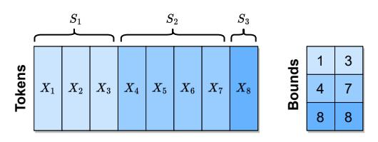
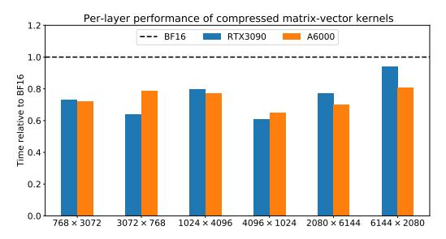
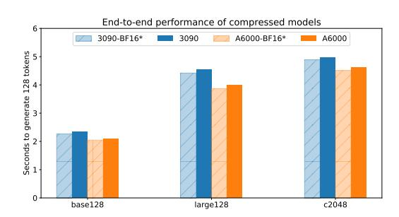

# QMOE: SUB-1-BIT COMPRESSION OF TRILLION-PARAMETER MODELS

## Elias Frantar <sup>1</sup> Dan Alistarh <sup>1</sup>

# ABSTRACT

Mixture-of-Experts (MoE) architectures offer a general solution to the high inference costs of large language models (LLMs) via sparse routing, bringing faster and more accurate models, at the cost of massive parameter counts. For example, the SwitchTransformer-c2048 model has 1.6 trillion parameters, requiring 3.2TB of accelerator memory to run efficiently, which makes practical deployment challenging and expensive. In this paper, we present a solution to this memory problem, in form of a new compression and execution framework called QMoE. Specifically, QMoE consists of a scalable algorithm which accurately compresses trillion-parameter MoEs to less than 1 bit per parameter, in a custom format co-designed with bespoke GPU decoding kernels to facilitate efficient end-to-end compressed inference, with minor runtime overheads relative to uncompressed execution. Concretely, QMoE can compress the 1.6 trillion parameter SwitchTransformer-c2048 model to less than 160GB (20x compression, 0.8 bits per parameter) at only minor accuracy loss, in less than a day on a single GPU. This enables, for the first time, the execution of a trillion-parameter model on affordable commodity hardware, like a single server with 4x NVIDIA A6000 or 8x NVIDIA 3090 GPUs, at less than 5% runtime overhead relative to ideal uncompressed inference. The anonymized code is available at: <github.com/ISTDASLab/qmoe>.

# 1 INTRODUCTION

Generative large language models (LLMs), e.g. [\(Radford](#page-11-0) [et al.,](#page-11-0) [2019;](#page-11-0) [Brown et al.,](#page-10-0) [2020;](#page-10-0) [Touvron et al.,](#page-11-0) [2023a;b\)](#page-11-0), have garnered significant industrial and popular attention due to their surprising performance across many practical language and reasoning tasks. Yet, a major obstacle to broad deployment is given by their extremely high inference costs. One particularly promising approach for reducing these costs is the use of *Mixture-of-Experts (MoE)* architectures, e.g. [\(Clark et al.,](#page-10-0) [2022;](#page-10-0) [Du et al.,](#page-10-0) [2022;](#page-10-0) [Zoph et al.,](#page-12-0) [2022\)](#page-12-0), whose general idea is to replicate certain model components many times while routing each input *only to a small subset of those replicas*. Through expert "specialization" to input subsets, MoEs achieve faster inference for the same model quality, but with significantly higher memory requirements due to components being replicated hundreds or even thousands of times, for the largest and best-performing models.

For example, the popular SwitchTransformer family [\(Fe](#page-10-0)[dus et al.,](#page-10-0) [2022\)](#page-10-0), on which we focus in this study, uses between 128 and 2048 experts (layer replicas) to significantly outperform standard dense T5 models [\(Raffel et al.,](#page-11-0) [2020b\)](#page-11-0) in terms of inference and training costs, at equiv-

*Proceedings of the* 5 th *MLSys Conference*, Santa Clara, CA, USA, 2024. Copyright 2024 by the author(s).

alent model accuracy. [Artetxe et al.](#page-10-0) [\(2022\)](#page-10-0) report similar improvements, on different tasks, for 512 experts. However, these results come at the cost of dramatic increases in model size: the largest SwitchTransformer has 1.6 trillion parameters, requiring 3.2TB of storage in standard half-precision, and correspondingly requires a hundred or more expensive (GPU or TPU) accelerators for efficient usage. This not only makes practical deployment costly and challenging, but also strongly limits research on such models.

Challenges. It is natural to ask whether the truly massive memory costs of such MoEs can be reduced via techniques for *model compression*, such as quantization [\(Gholami et al.,](#page-10-0) [2021\)](#page-10-0) or sparsity [\(Hoefler et al.,](#page-10-0) [2021\)](#page-10-0), without significant accuracy loss. Achieving this would require overcoming conceptual and technical barriers:

- 1. Conceptually, existing *post-training/one-shot* compression methods, whose costs would be low enough to execute on such models, are only able to reduce precision to 3 or 4 bits per parameter [\(Frantar et al.,](#page-10-0) [2022;](#page-10-0) [Dettmers & Zettlemoyer,](#page-10-0) [2022;](#page-10-0) [Wu et al.,](#page-12-0) [2023\)](#page-12-0) or around 50% sparsity [\(Frantar & Alistarh,](#page-10-0) [2023\)](#page-10-0), before significant accuracy loss occurs. Yet, making trillionparameter MoEs practical would require compression rates between 10× and 20× relative to 16-bit precision, i.e., on average *less than 1 bit per parameter*.
- 2. A key practical issue is *scaling*: applying state-of-theart compression methods, designed for large dense models, to MoEs that are an order of magnitude larger,

<sup>\*</sup>Equal contribution <sup>1</sup> Institute of Science and Technology Austria (ISTA). Correspondence to: Elias Frantar <elias.frantar@ist.ac.at>.

- while maintaining affordability, runs into a plethora of memory, performance and reliability roadblocks.
- 3. Actually achieving *sub-1-bit* compression in practice would require a novel customized compression format. Such a format would also need to come with decoding algorithms that are highly-efficient on accelerators such as GPUs, in order to run inference on compressed models without major processing slowdowns.

Contribution. In this paper, we overcome these challenges, and introduce QMoE, a framework for accurate compression and fast inference over massive MoEs, reducing model sizes by 10–20×, to less than 1 bit per parameter. QMoE is specifically designed to compress and subsequently inference with models like the 1.6 trillion parameter SwitchTransformer-c2048, using only modest computational resources.

Our key technical contributions are a highly scalable compression algorithm implementation and a customized compression format designed together with bespoke GPUkernels for fast on-the-fly decoding. Further, we show for the first time that accurate sub-1-bit compression of trillion parameter MoEs is feasible and can be achieved via affordable retraining-free compression techniques.

Concretely, we reduce the size of SwitchTransformer-c2048, the largest openly-available model, from 3.2TB in bfloat16 to less than 160GB in our customized compressed format, that is, ≈ 0.8 bits per parameter, at only a minor increase in loss on pretraining validation and zero-shot data. Using our QMoE kernels, this compressed model can then be executed fully, without any slow offloading, on commodity hardware such as 8× NVIDIA RTX 3090 or 4× NVIDIA A6000 GPUs, with < 5% runtime overhead relative to an idealized version of uncompressed execution, which would require ≈ 20× more GPUs.

In summary, our work enables, for the first time, the performant execution of massive-scale MoE models on commodity hardware. This is illustrated by the fact that we are able to efficiently run the trillion-parameter SwitchTransformerc2048 model on a single commodity GPU server, with minor accuracy loss. This addresses one of the key limitations behind MoE architectures, and should improve their practical adoption, as well as facilitate further research on understanding and improving such models.

# 2 BACKGROUND

#### 2.1 Mixture of Expert Models (MoEs)

The core idea behind Mixture of Expert models (MoEs) is to increase the number of parameters, and thus the network's modelling power, while at the same time keeping compute costs near-constant, relative to a standard feedforward architecture. This is typically achieved by creating

many copies of certain model components, each of which is responsible for processing only a subset of all input tokens. The corresponding input-to-component assignments are generally decided by a "router" layer. Probably the most common MoE design [\(Fedus et al.,](#page-10-0) [2022;](#page-10-0) [Artetxe et al.,](#page-10-0) [2022\)](#page-10-0), which we also focus on in this paper, is to replicate the fully-connected module of a Transformer and route tokens to the replica, referred to as an *expert*, with the highest assignment score predicted by a linear routing layer; see Figure 1 for an illustration. This design enables efficient training and inference of extremely large models, using 100s or even 1000s of experts, since each token is processed only by a small subset of the massive overall network.


Figure 1. Example of an MoE Transformer block. Each token is routed to a different fully-connected (FC) block.

## 2.2 Data-Dependent Quantization

The currently most effective strategy for reducing model size and corresponding memory costs is *quantization*, i.e., converting model weights to lower numerical precision. While simple rounding can suffice for compression to 8 or even 4 bits, accurately quantizing models to extremely low precision (e.g., lower than 3 bits per parameter) typically requires more sophisticated *data-dependent* methods [\(Nagel et al.,](#page-11-0) [2020;](#page-11-0) [Wang et al.,](#page-11-0) [2020;](#page-11-0) [Hubara et al.,](#page-10-0) [2021\)](#page-10-0).

Such data-dependent quantization methods use a small set of calibration data, which is passed through the model. As this happens, for each linear layer ℓ with weights Wℓ, quantized weights Q<sup>ℓ</sup> are determined one-by-one. Specifically, one approach to do this is by solving a layer-wise quantization problem, stated with respect to W<sup>ℓ</sup> and the observed calibration data inputs X<sup>ℓ</sup> at the current layer:

$$\operatorname{argmin}_{Q_{\ell}} ||Q_{\ell}X_{\ell} - W_{\ell}X_{\ell}||. \tag{1}$$

Various solvers for Equation (1) have been proposed, with some optimized, in terms of speed and accuracy, particularly for extremely large models, like GPTQ [\(Frantar et al.,](#page-10-0) [2022\)](#page-10-0) or ZeroQuant [\(Yao et al.,](#page-12-0) [2022;](#page-12-0) [Wu et al.,](#page-12-0) [2023\)](#page-12-0). The former performs quantization using second-order information in the layer-wise Hessian matrix XℓX<sup>⊤</sup> ℓ , while the latter applies SGD-optimization with straight-through gradient estimation [\(Bengio et al.,](#page-10-0) [2013\)](#page-10-0).

Another noteworthy characteristic of many such methods is that per-layer quantization can be performed *sequentially*, <span id="page-2-0"></span>using the input from the already partially quantized model up to layer ℓ − 1, when quantizing layer ℓ, serving to reduce error accumulation. Concretely, this can be efficiently implemented by using X<sup>ℓ</sup> to find Q<sup>ℓ</sup> before passing on Xℓ+1 = QℓX<sup>ℓ</sup> to the next layer.

## 2.3 MoE Quantization

There are several aspects which make very-low-bit, e.g. ternary (3 values) quantization promising for MoE models:

- In many architectures, almost all parameters are located in the experts, as they are 1000s of them. This means that, for size reduction, it suffices to focus on compressing just those experts and leave other layers in standard precision. This reduces error accumulation since only a subset of modules involved in a forward pass are actually quantized.
- Previous work has observed that extremely large dense models are more resistant to quantization noise than smaller ones [\(Frantar et al.,](#page-10-0) [2022;](#page-10-0) [Chee et al.,](#page-10-0) [2023\)](#page-10-0). Large MoEs can be much larger than some of these massive dense models, and are thus a prime target for accurate quantization.
- MoE training involves additional stochasticity through routing instabilities and strategies like token dropping [\(Lepikhin et al.,](#page-11-0) [2020\)](#page-11-0), which may inherently encourage high resistance to noise. Finetuning is also often performed with high dropout [\(Fedus et al.,](#page-10-0) [2022\)](#page-10-0).

Our experiments in Section [5.2](#page-7-0) confirm that MoEs are indeed highly robust to extreme levels of quantization.

# 3 SCALING UP DATA-DEPENDENT QUANTIZATION TO MOES

#### 3.1 Challenges

While data-dependent quantization techniques have already been used to successfully compress large dense models up to 176 billion parameters [\(Frantar et al.,](#page-10-0) [2022;](#page-10-0) [Wu et al.,](#page-12-0) [2023\)](#page-12-0), applying them to *sparse mixture-of-expert models another order of magnitude larger* brings several new challenges.

Memory Costs. The first major problem we encounter is a large increase in the memory required to apply such techniques. Not only are the original model weights nearly 10× larger, but the quantization process itself also needs > 100× more data. The latter constraint is because accurate datadependent quantization methods require a sufficient number of input samples for each layer that is being compressed. For very large dense models, a few hundreds of thousands of "calibration tokens" typically suffice [\(Frantar et al.,](#page-10-0) [2022;](#page-10-0) [Yao et al.,](#page-12-0) [2022\)](#page-12-0). However, in MoEs with thousands of layers, a single expert processes only a small subset of all inputs, hence we need much more tokens overall to achieve

good coverage of all experts. Further, in encoder-decoder architecture models, like SwitchTransformers, each token is processed only by half of the model, again increasing data requirements. For *fast* compression, we must maintain intermediate results for the full calibration dataset, which requires 100s of GBs of memory for the largest models.

GPU Utilization. The next significant challenge is that existing large-scale quantization implementations, in particular for GPTQ and related methods [\(Frantar et al.,](#page-10-0) [2022;](#page-10-0) [Chee et al.,](#page-10-0) [2023\)](#page-10-0), are designed to be fast and memory efficient for the massive individual layers occurring in dense models. Meanwhile, MoEs typically have smaller layers, but 100× to 1000× more of them. Current implementations have poor GPU utilization in this case, and consequently bad performance. A similar issue occurs if activations and weights have to be transferred between CPU and GPU with high frequency, which may be required to cope with the massive memory requirements discussed previously.

Reliability Requirements. Finally, another issue when compressing models with tens of thousands of layers is that running into rare edge cases, which may break the process, is highly likely. This is includes numerical problems like noninvertible layer-wise Hessians, as well as model-specific ones, e.g., extreme routing patterns on particular layers.

#### 3.2 System Design & Optimizations

In this section, we describe system-level design and optimizations to address the challenges in Section 3.1. This allows us to apply data-dependent compression to massive MoEs, while preserving the key feature of post-training compression techniques: the ability to perform effective compression using only modest computational resources, e.g., a single NVIDIA A6000 GPU and less than one day of compute. Although we focus on scaling the popular GPTQ method, most techniques described below will generalize to other approaches, like ZeroQuant [\(Yao et al.,](#page-12-0) [2022\)](#page-12-0), as well.

Optimized Activation Offloading. As discussed before, a key challenge in compressing MoEs is that we need to maintain massive activation sets. Yet, it is possible to carefully orchestrate model execution in such a way that we only ever need to perform computation on a small subset of the intermediate data. This allows us to offload main storage from GPU, to much less expensive and plentiful CPU memory.

Concretely, we maintain a single large buffer B which we update as follows, for the dense part of a Transformer block:

- 1. Fetch one "sample" X, containing a few hundreds of tokens, from CPU to GPU.
- 2. Pass it through the corresponding dense layers to obtain the result Y .


Figure 2. Illustration of the offloading execution for the sparse part of a Transformer block. An expert  $E_2$  and its corresponding input tokens  $X_E$  are fetched to GPU memory to produce  $E'_2$ , which together with the corresponding outputs  $Y_E$  are written back to CPU again.

- 3. Calculate and store expert assignment for tokens in Y.
- 4. Send Y back to CPU and overwrite X in B.

and respectively for the sparse part, looping over experts:

- 1. Fetch all individual tokens in B that have been assigned to expert E, denoted by  $X_E$ , from CPU to GPU.
- 2. Use them to produce compressed expert E' (for example, with GPTQ).
- 3. Run  $X_E$  through E' to get  $Y_{E'}$ .
- 4. Send  $Y_{E'}$  back to CPU and overwrite  $X_E$  in B.

This process, which is visualized in Figure 2, minimizes both memory consumption and transfer cost: we need only a single copy of B and each token is only read and written twice per Transformer block.

**List Buffer.** To efficiently support per-sample access for evaluating dense model components, as well as fully-vectorized querying of expert tokens, we store B as a *list buffer* data structure. This can be seen as a huge contiguous buffer of all token hidden states, together with delimiter indices denoting boundaries between individual samples. Figure 3 illustrates this storage format. This datastructure is crucial for efficiency; naively iterating over samples and fetching relevant tokens via masking is unusably slow for large sample counts.



Figure 3. List buffer example with 3 samples, indicated by hue.

**Lazy Weight Fetching.** Since the weights of the 1.6 trillion parameter model consume 3.2 TB of storage, they cannot even be stored in CPU RAM. Thus, we lazily fetch them directly from disk storage as they are required. If we follow the inference procedure outlined previously, this would be exactly once. Afterwards, their memory is released again.

**Expert Grouping.** Additionally, in order to avoid GPU underutilization (see Section 3.1), we group multiple experts together and apply a joint *batched variant* of the GPTQ algorithm. Concretely, we extract the inputs  $X_E$  corresponding to all experts  $E \in \mathcal{E}$  in group  $\mathcal{E}$  (the  $X_E$  will generally have different sizes) and compute Hessians  $H_E$ . These matrices, together with the weight matrices  $W_E$ , are then stacked to 3-dimensional tensors, on which our modified GPTQ algorithm operates, compressing all experts simultaneously. We can also compute  $H_E = X_E X_E^{\top}$  directly with a single matmul as the  $X_E$  are generally small enough, avoiding the slow per-sample accumulation employed by prior implementations. Our default expert groupsize  $|\mathcal{E}|$  is 16, which we find to bring a good trade-off between GPU memory consumption and utilization.

Table 1 demonstrates the impact of expert grouping via GPTQ batching, when compressing a sparse encoder layer of switch-base-128 using 10k samples;  $|\mathcal{E}|=16$  yields about  $\approx 6\times$  speedup over standard per-expert computation.

| $ \mathcal{E}  = 1$ | $ \mathcal{E}  = 4$ | $ \mathcal{E}  = 16$ |
|---------------------|---------------------|----------------------|
| 174.1s              | 54.4s               | 28.8s                |

*Table 1.* Sparse layer compression time for different  $|\mathcal{E}|$ .

**Robustness Modifications.** To achieve sufficiently high robustness for successfully quantizing trillion parameter models with tens of thousands of layers, we need to employ various numerical and memory adjustments. The most important are listed below:

- We use  $10 \times$  higher relative Hessian dampening  $\delta = 0.1$ , avoiding breakdowns with inf-values.
- Very few layer Hessians are not invertible even after high dampening; we skip GPTQ for those and simply perform vanilla rounding.
- Sometimes an expert receives a number of tokens that is much larger than average, leading to out-of-memory situations when these are fetched to GPU. We avoid this by capping the maximum number of tokens used for compression at  $4\times$  the mean and use multiple iterations for computing and updating  $Y_E$  in such cases.

### <span id="page-4-0"></span>3.3 Accuracy Improvements

In addition to implementing a highly efficient compression system, we also make new discoveries about applying GPTQ in our particular context, i.e., for models trained for maskedlanguage-modelling, MoEs and ternary quantization.

Premasking Special Tokens. First, we find that results can be improved if the various special separator tokens inserted by the masked-language-modelling task [\(Raffel](#page-11-0) [et al.,](#page-11-0) [2020b\)](#page-11-0) are excluded from the calibration data used for compression. Concretely, in the encoder, we mask out those "mask-tokens" during the Hessian computation. Meanwhile, in the decoder, we skip the token directly *before* such a special token as this is the one used to predict the latter.

As shown in Table 2 for switch-base-128 with 10k samples, this brings noticeably lower loss at no additional compute cost. We think that because those tokens are very common during training, the model is so robust in their prediction that any error compensation on them during quantization is unnecessary, while worsening correction for other tokens.

| mask | BF16 | 2bit | tern |
|------|------|------|------|
| no   | 1.73 | 1.86 | 2.16 |
| yes  | 1.73 | 1.76 | 1.99 |

Table 2. Impact of special token masking; validation loss.

# 4 REALIZING SUB-1-BIT COMPRESSION

Using our system discussed in Section [3,](#page-2-0) we can accurately quantize extremely large SwitchTransformers to very low bit-widths: 2-bit and even ternary (3 possible values). Yet, in practice, this falls still short of our compression goal of less than 1 bit per parameter. We find that compression rates can be pushed significantly further by taking advantage of the *low entropy in the quantized weights*. Next, we co-design an encoding scheme and a CUDA kernel which realize sub-1-bit per weight compression in practice, at minimal cost in terms of GPU execution overhead for inference.

## 4.1 Natural Sparsity

We pick quantization grids in standard fashion: row-wise around the min and max weights values [\(Dettmers et al.,](#page-10-0) [2022;](#page-10-0) [Frantar et al.,](#page-10-0) [2022\)](#page-10-0), e.g., for ternary: {wmin, 0, wmax}. These rather wide grids combined with the fact that weights are typically close to normally distributed, *naturally* lead to high sparsity after quantization, i.e., a large number of zeros. We demonstrate this in Table 3, averaged over all layers. For ternary weights, the largest model achieves close to *90% natural sparsity*; the standard deviation is also quite low, at < 5%. Seen another way, the quantized weights have low entropy, meaning that, on average, significantly less bits per weight should be required for lossless storage.

| model    | 2-bit | ternary |
|----------|-------|---------|
| base128  | 72.2% | 85.7%   |
| large128 | 73.1% | 86.4%   |
| c2048    | 76.5% | 88.6%   |

Table 3. Natural sparsity for different compressed models.

## 4.2 From Sparsity to Entropy

The direct way of utilizing these high zero proportions would be in form of a joint sparse & quantized representation [\(Kurtic et al.,](#page-11-0) [2022;](#page-11-0) [Yu et al.,](#page-12-0) [2023\)](#page-12-0): storing only the quantized values of non-zero weights, together with necessary position metadata. However, as our base quantization levels are already very low, standard sparsity metadata formats [\(Elsen et al.,](#page-10-0) [2020;](#page-10-0) [Lin et al.,](#page-11-0) [2023\)](#page-11-0) would only allow limited additional compression. A bitmask indicating non-zero locations requires 1 bit per weight, while 10-13 bit (depending on layer size) column indices are even less memory efficient at the sparsity levels we encounter. Therefore, we take a different approach: we do not utilize sparsity directly but rather the *low entropy*, which is implied by the fact that a single value (0) occurs very frequently.

#### *4.2.1 Fast GPU Decoding Challenges*

In principle, we could group multiple consecutive ternary weights into super-symbols and then apply a code which assigns *variable length codewords* to those super-symbols, based on their probability of occurrence, for example, via a Huffman approach [\(Huffman,](#page-10-0) [1952\)](#page-10-0). If the quantized weight values were close to independent, this would achieve strong compression rates; in fact, for actual independence, they would be essentially Shannon-optimal [\(MacKay,](#page-11-0) [2003\)](#page-11-0).

At the same time, our primary goal is to use compressed models for *fast and space-efficient inference*. Thus, it is critical not only that our encoding scheme achieves good compression, but also that it can be decoded fast on GPU hardware. This is challenging for a number of reasons:

Challenge 1: Entropy-based codes generally possess sequential decoding dependencies: symbol i can only be determined if the length, which is variable, of all (i − 1) prior symbols is known. Hence, processing consecutive symbols simultaneously leads to high synchronization overhead.

Challenge 2: Binary words in storage (e.g., INT32 blobs) may contain different numbers of decoded symbols. Consequently, even if rows/blocks are encoded independently, parallel decoding will happen non-uniformly, while all threads in a GPU-warp must always execute the same instruction. This would result in many wasted operations.

Challenge 3: Variable-length low-bit decoding involves a large number of binary operations like shifts, which are not particularly efficient on GPUs.

<span id="page-5-0"></span>Challenge 4: Individual matrices of MoEs are typically not very large, making it difficult to split them into enough separately decoded segments to achieve good GPU utilization without having to store additional data to break sequential dependencies, which would harm compression rates.

In contrast, uncompressed half-precision matrix-vector products, which are the primary operation underlying generative inference, easily achieve close to ideal memory-bandwidth utilization and thus present a very strong baseline.

## 4.3 Compression Scheme & Kernel Co-design

To achieve our goal, we need to design a compression scheme and its GPU decoding kernel *jointly*, and potentially trade off compression for faster decoding. We begin with an overview of the main ideas behind our approach, followed by an in-depth discussion of key details.

#### *4.3.1 Overview*

Instead of a code with variable length codewords (see Section [4.2.1\)](#page-4-0) mapping to fixed length data, we will use a *dictionary-based* code with fixed length codewords mapping to a variable number of symbols. Such LZW-based schemes [\(Welch,](#page-11-0) [1984\)](#page-11-0) are popular for general purpose compression like ZIP, as they are particularly effective for text data with long repeated segments. While a dictionary code is not ideal in terms of compression rate for the case of almost-random data in our application, it will be key for fast GPU decoding.

First, our kernel design uses one warp, that is 32 consecutive threads, to handle a row of a weight matrix, each of which is encoded independently. This addresses Challenge 4 in Section [4.2.1,](#page-4-0) yielding reasonable GPU utilization for relevant matrix sizes, with negligible metadata overhead. Further, we use a fixed-to-variable code with a large dictionary. This allows us to use a full warp to process one codeword at-atime, extracting all data, while maintaining good efficiency, thus working around Challenges 1 and 2. This way, slow bit and base-3 operations (for ternary) can also be kept at a minimum, resolving Challenge 3.

#### *4.3.2 Dictionary Design and Implementation*

In general, assume that the values of a ternary weight matrix (denoted by 0, 1, 2) are distributed close to independently according to the distribution:

$$P(0) = p_0, \quad P(1) = P(2) = \frac{1 - p_0}{2},$$
 (2)

where p<sup>0</sup> denotes the probability of sampling 0, e.g., 0.885 as per Table [3.](#page-4-0) As we plan to use a rather large dictionary, it should be shared between many weight matrices to not cause substantial storage overheads. We find that such a static dictionary works well enough, while simplifying memory efficient compression (see Section [3.2\)](#page-2-0) as we do not have to collect statistics over many yet uncompressed experts.

Next, we consider pairs of ternary values t = (t1, t2), whose corresponding probability is P(t) = P(t1)P(t2). We generate the 2 <sup>16</sup> highest probability sequences containing at most 14 such pairs. This dictionary can be generated using a max-priority queue on probability, as shown by Algorithm 1.

#### Algorithm 1 Generate decoding dictionary sequences.

```
Q ← max priority queue containing (1.0,())
while |D| < 2
              16 do
  p, s ← pop(Q)
  append s to dictionary if 0 < |s| < 28
  for t ∈ {(t1, t2)|t1, t2 ∈ {0, 1, 2}} do
     push((p · P(t), cat(s, t)), Q)
  end for
end while
```

To briefly understand the procedure, notice that upon the first iteration, it will push all individual pairs t = (t1, t2) to the priority queue, sorting them by decreasing probability, after which they will be expanded in this order.

We have exactly 2 <sup>16</sup> codewords as this allows us to store them in the native UINT16 datatype, avoiding any slow bitextractions at this decoding level. Each of those codewords maps to two consecutive UINT32 values containing up to 7 pairs each, stored using 2 bits per ternary value, followed by the total number of pairs in the sequence; see also Figure 4. This format dictates our maximum chosen pair count of 14. Further, we consider pairs, rather than individual weights, to fit the maximum count into 4 bits. The 2-bit-per-weight format is used as there is enough space, while a more compact ternary encoding would involve slow modulo and division operations for extraction. We store the pair-count twice so that each thread can work with only half of the data, stored in a fast INT32 type.


Figure 4. Data format of a dictionary entry; here of 24 weights.

Overall, mapping 16-bit codewords to 64-bit data blobs strikes a good balance between several goals: (a) Having codewords map to, on average, more uncompressed values than their bitwidth, a necessary condition for achieving < 1 bit compression. (b) Minimizing the overall storage cost of the dictionary to fit into the L2-cache of the GPU, which is critical for good decoding performance. (c) Utilizing as many threads in a warp as possible for simultaneously extracting plain weights from the decoded data; usually, > 16 will do useful work and only 4 out of 32 threads are

<span id="page-6-0"></span>never active in this step. (d) Avoiding as many conditionals and extra operations necessary for dealing with non-uniform data storage as possible, which slow down parallelization.

Finally, we note that while dictionary lookups are in principle random access, keeping it sorted from highest to lowest probability ensures very favorable caching behavior. Since each lookup also automatically prefetches several subsequent elements, and most lookups are for frequently occurring codewords, there are many fast L1-cache hits.

**Validation.** To assess the effectiveness of our scheme, we compute achieved compression rates, both on a real ternary quantized c2048 model as well as on weight matrices sampled directly from distribution (2), yielding  $20.07 \times$  and  $21.11 \times$ , respectively. This gap of only  $\approx 5\%$  suggests that our simplifying independence assumption is indeed quite close for large models. We also note that our rates are only  $\approx 20\%$  away from the distribution's (with p=0.885) theoretical compression limit of  $25.40 \times$ , which we consider a reasonable trade-off for enabling fast GPU decoding.

#### 4.3.3 GPU Kernel

Having defined the dictionary format, we now discuss the design of the actual decoding kernel. We focus on the most important operation for inference, decompression fused with a matrix-vector-product. However, our techniques can easily be adapted to other use-cases, e.g., pure decompression.

Listing 1 provides CUDA-like pseudocode for our kernel, computing the matrix-vector-product of compressed matrix w\_comp (with metadata row\_off and ter\_minmax, using dictionary dec) and BF16 vector x, into output buffer y. The handling of various edge cases and some index calculations have been removed for readability. Please see our source code for the fully functional implementation.

```
template <int num_warps, int w_width>
    __global__ void Sub1MatVec(
      int* dec,
      ushort* w_comp, int* row_off,
                                              _nv_bfloat162* ter_minmax,
        _nv_bfloat16* x, __nv_bfloat16* y
         _shared__ float x_shared[w_width];
      for (int i = thread; i < w_width; i += 32 * num_warps)</pre>
         x shared[i] = bfloat162float(x[i]);
        _shared__ float deg[3][32 * num_warps];
      \frac{-}{\text{deq}[0][\text{thread}]} = 0;
      deq[0][thread] = __bfloat162float(ter_minmax[row].x);
deq[2][thread] = __bfloat162float(ter_minmax[row].y);
15
      __syncthreads();
      __shared__ w_comp_block[32][num_warps];
19
20
21
      int idx = 0;
22
23
24
25
26
27
28
      for (int i = 0; i < row off[row + 1] - row off[row]; i += 32) {
         w_comp_block[warp][lane] = w_comp[i + lane];
         if (lane < 28) {
           for (int j = 0; j < 32; j++) {
  int enc = w_comp_block[warp][j];</pre>
              int wx14 = dec[2 * enc + (lane / 14)];
int ter = (wx14 >> (4 + 2 * (lane % 14))) & 0x3;
              float w = deq[ter][thread];
31
32
              res += w * x_shared[idx + lane];\nidx += 2 * (wx14 & 0xf);
```

```
33
```

Listing 1. Simplified kernel pseudocode for a fused decompress + matrix-vector-product operation.

Parallelization. Overall, each threadblock will handle multiple consecutive rows, each of which is processed by a single warp. We use exactly one threadblock per GPU Streaming Multiprocessor (SM) with min(#rows\_in\_block, 32) warps; if there are more than 32 rows in a block, (some) warps sequentially process multiple rows (note that this part is omitted in Listing 1 for simplicity). This avoids any bad wave quantization effects. We find this strategy to be an effective heuristic that yields good performance for all matrix shapes we consider.

**Execution.** Our kernel starts by loading the entire input vector to shared memory (x\_shared, lines 7-9), using all warps in a threadblock. This enables fast element access in the subsequent per-row product-sum accumulations.

Next, each warp processes its corresponding row by first fetching (up to) 32 codewords into shared memory (w\_comp\_block, line 23) using a single coalesced transaction. It then loops over those symbols, processing one-ata-time (lines 26-33). First, using 28 of its 32 threads (line 25), it fetches the corresponding decoding data from the dictionary where the first UINT32 is assigned to threads 0-13 and the second to threads 14-27 (wx14, line 27). Then, each thread extracts its corresponding ternary weight (lines 29-30) and adds the corresponding input product into its own partial result accumulator (res, line 31). We note that the input reads from shared memory are contiguous and do not cause bank conflicts. Afterwards, each thread advances the offset index (idx, line 32) into the input vector by the total number of weights encoded in the current symbol.

Finally, after the full row has been scanned, a warp-reduction (lines 37-38) over the partial results of each thread yields the output (y, lines 39-40).

**Ternary Decoding.** Another relevant detail is that ternary weights are stored as 0, 1, 2 (line 29) but need to be dequantized to  $0, w_{\min}, w_{\max}$  for multiplication with inputs. We found that the most efficient way of performing this conversion is via a shared memory lookup table (lines 11-14). Crucially, this table needs to be replicated 32 times across the column-dimension to avoid very frequent bank conflicts, which would otherwise occur every time not all 28 threads dequantize the same value (line 30). Fortunately, there are only 3 input values and so its overall size is tolerable.

# <span id="page-7-0"></span>5 EXPERIMENTS

## 5.1 General Setup

Models. We focus our experiments on the SwitchTransformer [\(Fedus et al.,](#page-10-0) [2022\)](#page-10-0) family of models. Our primary target is the very largest variant, c2048, with around 1.6 trillion parameters, but we also consider the comparatively small base128 (7B params) and large128 (26B params) versions for testing and ablations. We chose the SwitchTransformer family as it contains the largest publicly-available model, which also features a similar or higher number of training tokens to parameters ratio than potential alternatives like [Artetxe et al.](#page-10-0) [\(2022\)](#page-10-0). Further, those models are also among the most popular massive MoEs, with several implementations across frameworks [\(Wolf et al.,](#page-11-0) [2019;](#page-11-0) [Shazeer](#page-11-0) [et al.,](#page-11-0) [2018;](#page-11-0) [Google,](#page-10-0) [2023\)](#page-10-0).

Framework. As accessibility is a major goal of our work, we build our code-base around the PyTorch-backend of the highly popular HuggingFace [\(Wolf et al.,](#page-11-0) [2019\)](#page-11-0) framework, which brings a number of additional challenges. First, we find that the largest model variants require a handful of bugfixes, primarily configuration and model setup changes, in order to run properly. We suspect that this is because their enormous sizes have rendered extensive testing very difficult. Second, we observed a major inefficiency in the context of generative inference for models with a large number of experts: the HuggingFace implementation will perform several (empty) CUDA calls for potentially 1000s of experts to which no token is routed, accumulating large overheads. We modify the implementation (also for baselines) to skip such unnecessary calls, leading to > 10× speedup for large models. We apply all changes to the HuggingFace framework only dynamically at runtime, so that our code can be run directly with an official installation.

Datasets. SwitchTransformers have been trained for a Masked-Language-Modelling (MLM) objective [\(Raffel](#page-11-0) [et al.,](#page-11-0) [2020b\)](#page-11-0) on the C4 dataset [\(Raffel et al.,](#page-11-0) [2020a\)](#page-11-0). Similar to most works in the area of LLM quantization [\(Yao et al.,](#page-12-0) [2022;](#page-12-0) [Frantar et al.,](#page-10-0) [2022;](#page-10-0) [Dettmers & Zettlemoyer,](#page-10-0) [2022\)](#page-10-0), we focus on general *upstream* compression directly on this pretraining task/dataset combination. Consequently, our evaluation focuses on validation performance for C4/MLM, where we use the public reproduction of C4 on HuggingFace as well as their replication of the original masking procedure. Calibration data for compression is taken, in order, from the first two shards of the training set. For efficiency, we primarily evaluate on 128 samples (corresponding to the average loss over > 10K tokens, which is quite stable) from the first shard of the validation set, but we also perform some evaluations other datasets.

Hardware. All compression experiments, including those for the very largest models, can be performed in less than a day on a single NVIDIA A6000 with 48GB of GPU memory.

However, efficiently compressing trillion parameter models using a large number of calibration samples requires a few 100GBs of (CPU) RAM; the original 1.6T model itself also occupies > 3 TB disk storage.

## 5.2 Compression Results

Accuracy. We begin by quantizing all SwitchTransformer models to 2-bit and ternary precision, and evaluating their validation loss. Our default number of calibration samples is 10K for 128 experts and 160K for 2048, but we also consider using 0.5× and 2× as many samples. In addition to using our efficient QMoE framework discussed in Section [3,](#page-2-0) we also consider a standard round-to-nearest (RTN) baseline [\(Dettmers et al.,](#page-10-0) [2022\)](#page-10-0). We simulate the latter by fixing Hessians to the identity matrix, thus applying precisely the same quantization settings and evaluation protocol. Table 4 summarizes our results.

Perhaps surprisingly, vanilla rounding (RTN) does not lead to a complete model collapse even at ternary precision, emphasizing the high robustness of large MoEs to quantization. Nevertheless, the loss increases are quite significant for smaller models at 2-bit and far too large to be useful at ternary precision. In contrast, using data-dependent quantization, 2-bit is achievable at minimal loss (1.7% relative on c2048) and ternary at only a small increase (6.7% relative on c2048). This demonstrates not only the effectiveness of such advanced quantization methods in this context, but also shows that extremely low-bit compression is indeed practical for massive MoEs.

|           | base128 |      | large128 |      | c2048 |      |
|-----------|---------|------|----------|------|-------|------|
| method    | 2bit    | tern | 2bit     | tern | 2bit  | tern |
| BF16      |         | 1.73 |          | 1.55 |       | 1.18 |
| RTN       | 2.27    | 4.54 | 1.96     | 2.79 | 1.33  | 2.15 |
| QMoE 0.5x | 1.78    | 2.11 | 1.54     | 1.70 | 1.22  | 1.27 |
| QMoE 1.0x | 1.76    | 1.99 | 1.56     | 1.69 | 1.20  | 1.26 |
| QMoE 2.0x | 1.76    | 1.93 | 1.57     | 1.64 | 1.21  | 1.26 |

Table 4. Comparing C4 validation losses for 2-bit and ternary (tern) quantized SwitchTransformers. "QMoE 0.5x" indicates that only half of the default number of calibration samples are used.

Additionally, we conduct evaluations on Arxiv, GitHub, StackeEchange and Wikipedia data sampled from RedPajama [\(Computer,](#page-10-0) [2023\)](#page-10-0). Even though only < 0.01% of our C4 calibration data originates from those websites, the compressed model still preserves performance almost as well as on the core of the distribution (see Table [5\)](#page-8-0).

In terms of calibration data, we see that increasing the amount of samples generally improves performance slightly, most noticeably for ternary quantization, but there is also some noise in the process, especially at 2-bit.

<span id="page-8-0"></span>

| bits  | arxiv | github | stackexch. | wiki |
|-------|-------|--------|------------|------|
| BF16  | 1.31  | 0.99   | 1.15       | 1.20 |
| 2-bit | 1.34  | 1.05   | 1.17       | 1.24 |
| tern  | 1.42  | 1.13   | 1.22       | 1.32 |

Table 5. Additional evaluations for the c2048 model.

Compression. Next, we investigate the actual compression rates that are achieved by further compressing ternary models using our scheme introduced in Section [4.](#page-4-0) We consider both compression relative to just the MoE modules (the model parts we quantize) as well as to the full model and all its metadata. The compression rates and overall checkpoint sizes are listed in Table 6.

| model    | moe-only | full   | bf16 | size [GB]<br>ours |
|----------|----------|--------|------|-------------------|
| base128  | 17.06×   | 11.76× | 14.9 | 1.27              |
| large128 | 18.34×   | 13.32× | 52.7 | 3.96              |
| c2048    | 20.07×   | 19.81× | 3142 | 158.6             |

Table 6. Compression rates and sizes for ternary models.

In general, measuring only relative to parts we compress (moe-only), all sizes achieve > 16× compression rate and thus < 1 bits per parameter storage. On c2048, even the overall rate, including all uncompressed dense layers, remains at 19.81×, corresponding to *0.807 bits per parameter*, reducing the checkpoint size from 3142GB to 158.6GB. One can also observe that compression rates increase with model size, which is for two reasons: (a) natural sparsity increases while our encoding dictionary is also optimized for c2048 (see Section [4\)](#page-4-0), and (b) weight distributions become closer to independent for larger layer sizes.

Runtime. Finally, we evaluate how long it takes to produce compressed models on a single A6000 GPU, for different amounts of calibration data. The results are shown in Table 7. Smaller models can be compressed in less than an hour and even c2048 in less than a day, confirming the high efficiency of QMoE. The runtime increase from large128 to c2048 is roughly proportional to the difference in size, despite the latter using 16× more samples. This is because the number of samples per expert stays constant and the expert size increases only slightly. Finally, we note that simply (iteratively) loading the original 1.6T model into RAM takes close to 5 hours on our slow disk storage.

| model    | 5K/80K  | 10K/160K | 20K/320K |
|----------|---------|----------|----------|
| base128  | 8.4min  | 14.0min  | 21.6min  |
| large128 | 22.0min | 30.2min  | 45.2min  |
| c2048    | 13.3h   | 16.0h    | 20.8h    |

Table 7. Compression runtime for different calibration data size.

## 5.3 Runtime Results

Individual Layers. Our kernel performance evaluation starts with a direct (isolated) comparison of our compressed matrix-vector product kernels (see Section [4\)](#page-4-0) against Py-Torch's standard (uncompressed) bfloat16 cuBLAS kernels. Figure [5](#page-9-0) (Left) shows the time taken by our compressed kernels relative to bfloat16, for the matrix shapes found in our MoEs, on two different GPUs. While our kernels have to perform a lot less slow (global) memory reads than the bfloat16 baseline due to lower storage costs, they need to spend much more compute for complex unpacking of the heavily-compressed weights. Nevertheless, executing our compressed kernels takes less time than the close to ideal bfloat16 baseline in all cases, with up to 35% speedup on specific matrix shapes. We note that these are very lowlatency operations, with the smallest matrix taking < 0.02 milliseconds and the largest < 0.05.

End-to-End Execution. Finally, we also benchmark our kernels end-to-end in HuggingFace on the real weights of our compressed MoE models. We consider an individual user application, like [\(Frantar et al.,](#page-10-0) [2022;](#page-10-0) [Leviathan et al.,](#page-11-0) [2023;](#page-11-0) [Park et al.,](#page-11-0) [2022\)](#page-11-0), where a single prompt (sampled from C4) should be processed to generate a 128-token response. As actually running the bfloat16 version of the c2048 model would require > 65 A6000 and > 130 3090 GPUs (versus 4 and 8, respectively, for sub-1-bit compressed weights) we have to estimate its runtime. We do this by having all experts in a layer point to the same weight data (resolving memory issues), which allows us to collect timings with precisely the same overheads as for our compressed models. However, this is a highly optimistic estimate since real execution would require close to 20× more GPUs, with corresponding communication overheads, and our numbers should thus be viewed as a lower bound.

The results, shown in Figure [5](#page-9-0) (Right), demonstrate that end-to-end execution of compressed models is only < 5% slower than standard (uncompressed) execution. This slight slow-down despite faster per-layer timings is due to the fact that the encoder may sometimes route multiple tokens to the same expert. Our current implementation naively executes a separate matrix-vector product for each token, while the baseline performs a much more efficient joint matrix multiplication. For applications where this is a significant bottleneck, one could easily introduce an inner loop over tokens into our kernel (Listing [1,](#page-6-0) line 30), or fully decompress first, followed by a standard matmul, for large token counts.

# 6 RELATED WORK

Mixture-of-Expert (MoE) Models. Mixture-of-expert models are a popular approach for creating large-scale models that are more efficient for inference [\(Fedus et al.,](#page-10-0) [2022;](#page-10-0) [Artetxe et al.,](#page-10-0) [2022;](#page-10-0) [Clark et al.,](#page-10-0) [2022\)](#page-10-0). At the core of MoEs lie (sparse) routing mechanisms, of which many vari-

<span id="page-9-0"></span>



Figure 5. (Left) Per-layer compressed kernel performance relative to uncompressed execution. (Right) End-to-end runtimes of compressed models and estimates (\*, would require 65/130 GPUs) for bloat16 baselines. c2048 is run on 4×A6000 and 8×3090 GPUs, respectively.

ants have been proposed. Those range from static assignment based on input token IDs (Roller et al., 2021), over dynamic token-to-expert matching (Zhou et al., 2022), to "soft" routing of linear input combinations (Puigcerver et al., 2023). Since MoEs can feature rather different computational profiles from standard dense models, there is also significant research on optimizing inference and training systems (Barham et al., 2022; Gale et al., 2023; Hwang et al., 2023). Among the most critical problems in this area are data-exchanges between accelerators during routing and dealing with uneven compute-loads for different experts.

**LLM Quantization.** Quantization is a very popular compression technique, which has seen a vast amount of work (Gholami et al., 2021), especially in the context of LLMs. Specifically, the ability to perform accurate weight quantization for billion-parameter models has greatly boosted their accessibility: it has been shown that extremely large dense models can be quantized to 8- or even 4-bit precision at little accuracy loss (Dettmers et al., 2022; Yao et al., 2022; Frantar et al., 2022; Dettmers & Zettlemoyer, 2022). Pushing towards even lower bitwidths via more sophisticated compression formats, like multi-level grouping coupled with higher-precision outliers (Dettmers et al., 2023; Ashkboos et al., 2023), or new quantization techniques, like incoherence preprocessing (Chee et al., 2023), is an active area of research. Currently, accurate quantization to 2 or less bits appears to be a major barrier for post-training quantization of standard LLMs. By contrast, in this work we show that massive MoE models appear to be significantly more compressible, as we achieve sub-1-bit compression at comparable loss increases to 3-bit or 4-bit quantization of standard LLMs.

**MoE Compression.** There has also been work on compressing MoE models in particular. Chen et al. (2022) and Koishekenov et al. (2022) perform compression via specialization of MoEs to specific "downstream" finetuning datasets by pruning components not relevant to the particular task. In contrast, we focus on general "upstream" compression of the pretrained model, via extremely low-bit quantization. Other works (Kim et al., 2022b; Yi et al., 2023; Kim et al., 2023) also perform MoE quantization, but focus

on noticeably higher bit-widths, like 8 or 4 bits per weight. This is accomplished primarily via simple rounding, which, as shown by our experiments, is not accurate enough for full 2-bit or lower compression. Kim et al. (2022a) achieve 2-bit quantization on a 5 billion parameter MoE, which is considered relatively small in this area, by further optimization of the model via Quantization-Aware Training (Nagel et al., 2021). Applying such an approach for trillion-scale models would be extremely resource intensive. They also do not provide any mechansims for exploiting low-bit quantization and its corresponding natural sparsity in practice, which is challenging and constitutes a key contribution of our work.

Relative to prior work, we are particularly focused on scalabilty and practicalty. While existing works study models with at most tens of billions of parameters, we demonstrate all our techniques at trillion parameter scale.

## 7 DISCUSSION AND LIMITATIONS

We have presented QMoE, an end-to-end compression and inference framework for massive MoEs. We showed, for the first time, that models like the trillion-parameter SwitchTransformer-c2048 can be accurately compressed to less than 1 bit per parameter, close to  $20\times$  compression rate, in a custom format that enables the first efficient execution of such a model on a single commodity GPU server. QMoE is open-source and built around the popular HuggingFace framework, making deployment and research for massive MoEs significantly cheaper and more accessible.

Our study is limited in terms of models, as only very few massive and accurate MoEs are available publicly. Additionally, due to their size, most MoEs are trained and deployed in different bespoke framework, requiring complex manual integrations to use for further research. A natural extension of our work would be to apply our QMoE techniques to other MoE models or variants, such as Artetxe et al. (2022) or SoftMoEs (Puigcerver et al., 2023). It would also be interesting to further finetune a compressed model for specialized down-stream tasks. Zoph et al. (2022) report strong results when finetuning only non-expert layers, which QMoE leaves uncompressed, suggesting that this could be a promising direction for future work.

# <span id="page-10-0"></span>REFERENCES

- Artetxe, M., Bhosale, S., Goyal, N., Mihaylov, T., Ott, M., Shleifer, S., Lin, X. V., Du, J., Iyer, S., Pasunuru, R., et al. Efficient large scale language modeling with mixtures of experts. In *Empirical Methods in Natural Language Processing (EMNLP)*, 2022.
- Ashkboos, S., Markov, I., Frantar, E., Zhong, T., Wang, X., Ren, J., Hoefler, T., and Alistarh, D. Towards end-toend 4-bit inference on generative large language models. *arXiv preprint arXiv:2310.09259*, 2023.
- Barham, P., Chowdhery, A., Dean, J., Ghemawat, S., Hand, S., Hurt, D., Isard, M., Lim, H., Pang, R., Roy, S., et al. Pathways: Asynchronous distributed dataflow for ml. In *Conference on Machine Learning and Systems (MLSys)*, 2022.
- Bengio, Y., Leonard, N., and Courville, A. Estimating or ´ propagating gradients through stochastic neurons for conditional computation. *arXiv preprint arXiv:1308.3432*, 2013.
- Brown, T., Mann, B., Ryder, N., Subbiah, M., Kaplan, J. D., Dhariwal, P., Neelakantan, A., Shyam, P., Sastry, G., Askell, A., et al. Language models are few-shot learners. In *Conference on Neural Information Processing Systems (NeurIPS)*, 2020.
- Chee, J., Cai, Y., Kuleshov, V., and De Sa, C. Quip: 2-bit quantization of large language models with guarantees. *arXiv preprint arXiv:2307.13304*, 2023.
- Chen, T., Huang, S., Xie, Y., Jiao, B., Jiang, D., Zhou, H., Li, J., and Wei, F. Task-specific expert pruning for sparse mixture-of-experts. *arXiv preprint arXiv:2206.00277*, 2022.
- Clark, A., De Las Casas, D., Guy, A., Mensch, A., Paganini, M., Hoffmann, J., Damoc, B., Hechtman, B., Cai, T., Borgeaud, S., et al. Unified scaling laws for routed language models. In *International Conference on Machine Learning (ICML)*, 2022.
- Computer, T. RedPajama: An open source recipe to reproduce llama training dataset, 2023. URL [https://github.com/togethercomputer/](https://github.com/togethercomputer/RedPajama-Data) [RedPajama-Data](https://github.com/togethercomputer/RedPajama-Data).
- Dettmers, T. and Zettlemoyer, L. The case for 4-bit precision: k-bit inference scaling laws. *arXiv preprint arXiv:2212.09720*, 2022.
- Dettmers, T., Lewis, M., Belkada, Y., and Zettlemoyer, L. LLM.int8(): 8-bit matrix multiplication for transformers at scale. *arXiv preprint arXiv:2208.07339*, 2022.

- Dettmers, T., Svirschevski, R., Egiazarian, V., Kuznedelev, D., Frantar, E., Ashkboos, S., Borzunov, A., Hoefler, T., and Alistarh, D. SpQR: A sparse-quantized representation for near-lossless llm weight compression. *arXiv preprint arXiv:2306.03078*, 2023.
- Du, N., Huang, Y., Dai, A. M., Tong, S., Lepikhin, D., Xu, Y., Krikun, M., Zhou, Y., Yu, A. W., Firat, O., et al. GLaM: Efficient scaling of language models with mixture-of-experts. In *International Conference on Machine Learning (ICML)*, 2022.
- Elsen, E., Dukhan, M., Gale, T., and Simonyan, K. Fast sparse convnets. In *Conference on Computer Vision and Pattern Recognition (CVPR)*, 2020.
- Fedus, W., Zoph, B., and Shazeer, N. Switch transformers: Scaling to trillion parameter models with simple and efficient sparsity. *The Journal of Machine Learning Research*, 23(1):5232–5270, 2022.
- Frantar, E. and Alistarh, D. SparseGPT: Massive language models can be accurately pruned in one-shot. In *International Conference on Machine Learning (ICML)*, 2023.
- Frantar, E., Ashkboos, S., Hoefler, T., and Alistarh, D. GPTQ: Accurate post-training compression for generative pretrained transformers. *arXiv preprint arXiv:2210.17323*, 2022.
- Gale, T., Narayanan, D., Young, C., and Zaharia, M. MegaBlocks: Efficient sparse training with mixture-ofexperts. In *Conference on Machine Learning and Systems (MLSys)*, 2023.
- Gholami, A., Kim, S., Dong, Z., Yao, Z., Mahoney, M. W., and Keutzer, K. A survey of quantization methods for efficient neural network inference. *arXiv preprint arXiv:2103.13630*, 2021.
- Google. T5x, 2023. URL [https://github.com/](https://github.com/google-research/t5x) [google-research/t5x](https://github.com/google-research/t5x).
- Hoefler, T., Alistarh, D., Ben-Nun, T., Dryden, N., and Peste, A. Sparsity in deep learning: Pruning and growth for efficient inference and training in neural networks. *arXiv preprint arXiv:2102.00554*, 2021.
- Hubara, I., Nahshan, Y., Hanani, Y., Banner, R., and Soudry, D. Accurate post training quantization with small calibration sets. In *International Conference on Machine Learning (ICML)*, 2021.
- Huffman, D. A. A method for the construction of minimumredundancy codes. *Proceedings of the IRE*, 40(9):1098– 1101, 1952.

- <span id="page-11-0"></span>Hwang, C., Cui, W., Xiong, Y., Yang, Z., Liu, Z., Hu, H., Wang, Z., Salas, R., Jose, J., Ram, P., et al. Tutel: Adaptive mixture-of-experts at scale. In *Conference on Machine Learning and Systems (MLSys)*, 2023.
- Kim, Y. J., Fahim, R., and Awadalla, H. H. Mixture of quantized experts (MoQE): Complementary effect of lowbit quantization and robustness. *OpenReview*, 2022a.
- Kim, Y. J., Henry, R., Fahim, R., and Awadalla, H. H. Who says elephants can't run: Bringing large scale moe models into cloud scale production. *arXiv preprint arXiv:2211.10017*, 2022b.
- Kim, Y. J., Henry, R., Fahim, R., and Awadalla, H. H. Finequant: Unlocking efficiency with fine-grained weight-only quantization for llms. *arXiv preprint arXiv:2308.09723*, 2023.
- Koishekenov, Y., Nikoulina, V., and Berard, A. Memoryefficient NLLB-200: Language-specific expert pruning of a massively multilingual machine translation model. *arXiv preprint arXiv:2212.09811*, 2022.
- Kurtic, E., Campos, D., Nguyen, T., Frantar, E., Kurtz, M., Fineran, B., Goin, M., and Alistarh, D. The Optimal BERT Surgeon: Scalable and accurate secondorder pruning for large language models. *arXiv preprint arXiv:2203.07259*, 2022.
- Lepikhin, D., Lee, H., Xu, Y., Chen, D., Firat, O., Huang, Y., Krikun, M., Shazeer, N., and Gshard, Z. Scaling giant models with conditional computation and automatic sharding. *arXiv preprint arXiv:2006.16668*, 2020.
- Leviathan, Y., Kalman, M., and Matias, Y. Fast inference from transformers via speculative decoding. In *International Conference on Machine Learning (ICML)*, 2023.
- Lin, B., Zheng, N., Wang, L., Cao, S., Ma, L., Zhang, Q., Zhu, Y., Cao, T., Xue, J., Yang, Y., et al. Efficient GPU kernels for n:m-sparse weights in deep learning. In *Conference on Machine Learning and Systems (MLSys)*, 2023.
- MacKay, D. J. *Information theory, inference and learning algorithms*. Cambridge University Press, 2003.
- Nagel, M., Amjad, R. A., Van Baalen, M., Louizos, C., and Blankevoort, T. Up or down? Adaptive rounding for post-training quantization. In *International Conference on Machine Learning (ICML)*, 2020.
- Nagel, M., Fournarakis, M., Amjad, R. A., Bondarenko, Y., van Baalen, M., and Blankevoort, T. A white paper on neural network quantization. *arXiv preprint arXiv:2106.08295*, 2021.

- Park, G., Park, B., Kwon, S. J., Kim, B., Lee, Y., and Lee, D. nuQmm: Quantized matmul for efficient inference of large-scale generative language models. *arXiv preprint arXiv:2206.09557*, 2022.
- Puigcerver, J., Riquelme, C., Mustafa, B., and Houlsby, N. From sparse to soft mixtures of experts. *arXiv preprint arXiv:2308.00951*, 2023.
- Radford, A., Wu, J., Child, R., Luan, D., Amodei, D., and Sutskever, I. Language models are unsupervised multitask learners. *OpenAI blog*, 1(8):9, 2019.
- Raffel, C., Shazeer, N., Roberts, A., Lee, K., Narang, S., Matena, M., Zhou, Y., Li, W., and Liu, P. Exploring the limits of transfer learning with a unified text-to-text transformer. *Journal of Machine Learning Research*, 21 (140):1–67, 2020a.
- Raffel, C., Shazeer, N., Roberts, A., Lee, K., Narang, S., Matena, M., Zhou, Y., Li, W., and Liu, P. J. Exploring the limits of transfer learning with a unified text-to-text transformer. *Journal of Machine Learning Research (JMLR)*, 21(1):5485–5551, 2020b.
- Roller, S., Sukhbaatar, S., Weston, J., et al. Hash layers for large sparse models. In *Conference on Neural Information Processing Systems (NeurIPS)*, 2021.
- Shazeer, N., Cheng, Y., Parmar, N., Tran, D., Vaswani, A., Koanantakool, P., Hawkins, P., Lee, H., Hong, M., Young, C., et al. Mesh-tensorflow: Deep learning for supercomputers. *Conference on Neural Information Processing Systems (NeurIPS)*, 2018.
- Touvron, H., Lavril, T., Izacard, G., Martinet, X., Lachaux, M.-A., Lacroix, T., Roziere, B., Goyal, N., Hambro, E., ` Azhar, F., et al. Llama: Open and efficient foundation language models. *arXiv preprint arXiv:2302.13971*, 2023a.
- Touvron, H., Martin, L., Stone, K., Albert, P., Almahairi, A., Babaei, Y., Bashlykov, N., Batra, S., Bhargava, P., Bhosale, S., et al. Llama 2: Open foundation and finetuned chat models. *arXiv preprint arXiv:2307.09288*, 2023b.
- Wang, P., Chen, Q., He, X., and Cheng, J. Towards accurate post-training network quantization via bit-split and stitching. In *International Conference on Machine Learning (ICML)*, 2020.
- Welch, T. A. A technique for high-performance data compression. *Computer*, 17(06):8–19, 1984.
- Wolf, T., Debut, L., Sanh, V., Chaumond, J., Delangue, C., Moi, A., Cistac, P., Rault, T., Louf, R., Funtowicz, M., et al. Huggingface's transformers: State-of-the-art natural language processing. *arXiv preprint arXiv:1910.03771*, 2019.

- <span id="page-12-0"></span>Wu, X., Yao, Z., and He, Y. ZeroQuant-FP: A leap forward in llms post-training w4a8 quantization using floatingpoint formats. *arXiv preprint arXiv:2307.09782*, 2023.
- Yao, Z., Aminabadi, R. Y., Zhang, M., Wu, X., Li, C., and He, Y. ZeroQuant: Efficient and affordable post-training quantization for large-scale transformers. *arXiv preprint arXiv:2206.01861*, 2022.
- Yi, R., Guo, L., Wei, S., Zhou, A., Wang, S., and Xu, M. Edgemoe: Fast on-device inference of moe-based large language models. *arXiv preprint arXiv:2308.14352*, 2023.
- Yu, C., Chen, T., and Gan, Z. Boost transformer-based language models with gpu-friendly sparsity and quantization. In *Findings of the Association for Computational Linguistics: ACL 2023*, 2023.
- Zhou, Y., Lei, T., Liu, H., Du, N., Huang, Y., Zhao, V., Dai, A. M., Le, Q. V., Laudon, J., et al. Mixture-ofexperts with expert choice routing. *Conference on Neural Information Processing Systems (NeurIPS)*, 2022.
- Zoph, B., Bello, I., Kumar, S., Du, N., Huang, Y., Dean, J., Shazeer, N., and Fedus, W. ST-MoE: Designing stable and transferable sparse expert models. *arXiv preprint arXiv:2202.08906*, 2022.