# ScaleMoE: A Fast and Scalable Distributed Training Framework for Large-Scale Mixture-of-Experts Models

Seohong Choi *Sungkyunkwan University* Suwon, South Korea lneil@g.skku.edu

Huize Hong *Sungkyunkwan University* Suwon, South Korea heatherhong@g.skku.edu

Tae Hee Han† *Sungkyunkwan University* Suwon, South Korea than@skku.edu

Joonsung Kim† *Sungkyunkwan University* Suwon, South Korea joonsungkim@skku.edu

*Abstract*—The size of pre-trained models has continuously increased to support growing demands for solving more complex problems. Especially, *mixture-of-experts* (MoE) model has become the most popular approach, enabling systems to easily train extremely large-scale models with relatively lower computational requirements. However, the current distributed training frameworks cannot achieve scalable performance for these large-scale MoE models due to substantial communication overheads.

In this paper, we propose ScaleMoE, a fast and scalable distributed training framework for large-scale MoE models. We first identify three problems in state-of-the-art distributed training frameworks: high all-to-all communication overheads, severe load imbalance in expert selection, and insufficient consideration of heterogeneous networks. We propose three novel optimizations to resolve these problems. First, to reduce communication volumes, we propose *adaptive all-to-all communication* that eliminates unnecessary zeros caused by zero padding. Second, to address the load imbalance in expert selection, we propose *dynamic expert clustering* that rebalances experts using a novel clustering methodology. Lastly, to further minimize communication overheads, we propose *topology-aware expert remapping* that carefully maps experts to GPU devices while considering heterogeneous network bandwidths. Our evaluations show that ScaleMoE achieves scalable performance, reducing all-to-all communication overheads by up to 81%. In general, ScaleMoE significantly improves system performance, achieving a speedup of up to 3.3× compared to the state-of-the-art framework.

# I. INTRODUCTION

Recently, the size of pre-trained models has continuously increased to meet the growing demands for solving more complicated problems [1], [2]. Since these pre-trained models are built using a wide spectrum of data samples, recent studies have focused on increasing their size to contain more knowledge, thereby enhancing reasoning capabilities [3]. For

This work was partly supported by the Institute of Information & Communications Technology Planning & Evaluation (IITP) grant funded by the Korea government (MSIT/MSIP) (RS-2019-II190421, RS-2024-00395134, RS-2025- 02217106, No. 10692981), in part by the National Research Foundation of Korea (NRF) grant funded by the Korea government (MSIT) (RS-2025- 00521413), in part by the Competency Development Program for Industry Specialists of the Korean Ministry of Trade, Industry and Energy (MOTIE), operated by the Korea Institute for Advancement of Technology (KIAT) (No. P0023704), and in part by Samsung Electronics Co., Ltd. (Grant No. IO201209-07877-01).

†Co-corresponding authors: Joonsung Kim; Tae Hee Han

example, both industry and academia have explored several methods to increase the size of pre-trained models, such as adding more layers [4] or increasing hidden dimensions [5], [6]. Many researchers expect that this trend of increasing model size will continue to provide higher model accuracy [7].

*Mixture-of-experts* (MoE) has emerged as one of the most promising solutions for scaling model size to extremely large model sizes. Unlike typical dense model scaling approaches [8], [9], MoE models feature sparse computations by employing multiple separate neural networks (i.e., *experts*) with selective activation. During the training phase, input tokens pass through a trainable gate network that selects specific experts, and the tokens are then sent to these selected experts. Since only a few experts are activated at a time, MoE models can significantly reduce the overall computation while providing the same benefits as large-scale model training, thereby improving model accuracy with less computational overhead compared to classic dense ML models. As a result, such MoE models are getting increasing attention from many researchers for training extremely large models [10]–[14].

As the MoE model size keeps increasing, a single GPU becomes no longer sufficient to handle large-scale MoE models [15]–[19]. To address this issue, modern system architectures adopt *expert parallelism* as the de facto standard for supporting extremely large-scale MoE models [20]–[23]. Instead of storing all experts in a single GPU, they distribute experts across multiple GPUs, allowing each GPU to handle only a subset of them. This expert parallelism allows the systems to scale MoE models by increasing the number of experts without encountering GPU out-of-memory issues. At runtime, input tokens are sent to the corresponding GPUs through all-to-all communication, causing extra network overheads.

However, we identify that the current distributed training frameworks face limited scalability due to three performance problems. First, these state-of-the-art frameworks suffer from high all-to-all communication overheads because they need to transfer significant amounts of unnecessary zero padding. Second, there is a severe load imbalance in expert selection. This imbalance results in longer all-to-all communication latency and GPU underutilization, which significantly degrades the overall performance. Lastly, the state-of-the-art frameworks exhibit suboptimal performance due to insufficient consideration of heterogeneous networks. Heterogeneous networks are especially common in shared cloud data centers.

In this paper, we propose ScaleMoE, a *fast* and *scalable* distributed training frameworks for large-scale Mixture-of-Experts (MoE) models. ScaleMoE incorporates three novel optimizations: *adaptive all-to-all communication*, *dynamic expert clustering*, and *topology-aware expert remapping*.

First, we identify that the current distributed training frameworks (e.g., DeepSpeed [24], Megatron-LM [6]) transfer a large number of unnecessary zero values during the allto-all communication, leading to substantial communication overheads. Before all-to-all communication, these frameworks add zero padding to inputs to ensure uniform data shapes. Such zero padding is particularly problematic given modern MoE models have severe expert selection imbalance. To resolve this inefficiency, ScaleMoE applies the *adaptive all-to-all communication* to eliminate these unnecessary zero transfers.

Second, to minimize the impact of load imbalance and resource underutilization, ScaleMoE employs *dynamic expert clustering* to remap expert locations to minimizes load imbalance. Specifically, ScaleMoE performs clustering the input tokens having similar expert selections for each layer. Then, it updates the expert-to-GPU mapping based on the clustering results and redistributes the experts accordingly. At runtime, ScaleMoE reroutes each input token to the corresponding GPUs. By doing so, ScaleMoE can mitigate the load imbalance problem, improving overall system efficiency. Note that our expert redistribution does not affect the overall model accuracy as we do not change the model's computational behaviors.

Lastly, ScaleMoE applies *topology-aware expert remapping* to fully leverage the heterogeneous networks in modern data centers. After clustering is finished, ScaleMoE employs a heuristic algorithm that places expert clusters in devices (or servers) in a way that maximizes the expert coverage within each device (or server). Additionally, ScaleMoE finds the optimal cluster placement by considering the heterogeneous network bandwidths and communication volumes, thereby minimizing inter-node communication overheads.

We implement ScaleMoE on top of the state-of-the-art distributed training framework, DeepSpeed. We modularize ScaleMoE as distributable Python packages so that it can be easily applicable to other frameworks (e.g., Megatron-LM).

We evaluate ScaleMoE on various model and system configurations. Our experiments are conducted in Amazon Elastic Compute Cloud (Amazon EC2), using four P4 instances connected via UltraFast Ethernet [25]. Each P4 instance consists of eight Nvidia A100 GPUs connected through NVLink 3.0 (600 GB/s). The results show that ScaleMoE effectively reduces the overall all-to-all communication overheads by up to 81%, achieving a significant speedup of 3.3× in heterogeneous inter-node networks and 1.84× in homogeneous inter-node networks compared to the state-of-the-art framework.

We make the following contributions:

- Problem identification. We identify key performance problems in existing training frameworks for large-scale MoE models (i.e., high all-to-all communication overheads, huge expert selection imbalance, insufficient consideration of heterogeneous networks).
- High performance with novel solutions. ScaleMoE achieves scalable performance by applying three novel optimizations (i.e., adaptive all-to-all communication, dynamic expert clustering, and topology-aware expert remapping).
- Comprehensive evaluations. We evaluate ScaleMoE on various model/system configurations with the existing framework (Tutel).
- Software release. We released our ScaleMoE toolkit to the community for future researchers. This framework is available at https://github.com/SKKU-IDEAL/ScaleMoE

## II. BACKGROUND

## *A. Transformer Architecture*

Recently, Transformer [26] has emerged as a basic block for extremely large-scale pre-trained models [27]. These Transformer-based models can be trained using various types of inputs (e.g., text [27]–[33], image [4], [7], [34]–[38], audio [39], graph [40]–[42]), which make them fundamental components of pre-trained models. The pre-trained models consist of multiple Transformer blocks connected sequentially. Each Transformer block consists of two key components: a *multi-head attention network* and a *feed-forward network* (FFN). Depending on their designs, the pre-trained models can adopt different structures. For example, the decoder-only models (e.g., GPT [27], OPT [43], BLOOM [44]) employ the Transformer blocks with a causal self-attention mask to restrict the attention to referring to previous tokens only. On the other hand, the encoder-only models (e.g., BERT [28], RoBERTa [45], ELECTRA [46]) use the same Transformer blocks but are designed to capture bidirectional context across the entire input sequence.

The multi-head attention mechanism computes attention scores using query, key, and value matrices and captures contextual dependencies. The FFN applies two significant linear transformations with an activation function in between. Note that the two large-scale linear transformations are the most time-consuming components of the Transformer block during the pre-training process. Additionally, in recent pretrained models, the hidden dimension continues to increase, enhancing the models' reasoning power. Therefore, the computational overhead of the FFN becomes more substantial, which significantly limits the model's scalability.

# *B. Mixture-of-experts (MoE)*

To overcome the limited size of FFNs, the mixtureof-experts (MoE) [47] is widely applied to the modern Transformer-based pre-trained models. Figure 1 provides the high-level overview of the MoE layer in Transformer. Figure 1a illustrates how MoE is applied to the Transformer block. The Transformer's FFN layer is replaced with the MoE layer. The MoE layer consists of a *trainable gating network* (Gate)

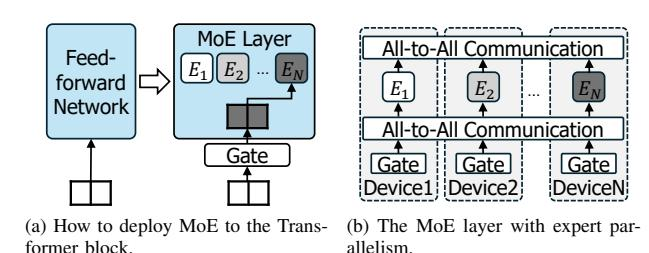

Fig. 1: Mixture-of-experts (MoE) with Transformer blocks.

and multiple FFNs (called *experts*) that can represent different domains. For each input, the gating network determines which experts should be activated, and only the selected experts are calculated (in this example, *expert-N* ( $E_N$ ) is activated).

$$G(x) = Softmax(TopK(x \cdot W_a)) \tag{1}$$

Equation 1 shows how the trainable gating network selects target experts. For each input token x, the network identifies the top-k most relevant experts. The gating weight  $(W_g)$  is updated during training. The gating mechanism inherently leads to the expert selection imbalance, where certain experts handle more input tokens than others [48]–[50]. To mitigate this issue, some studies propose capping the number of processed tokens for each expert or the auxiliary functions to make the gating network more balanced [16], [37], [51]–[53]. However, they compromise training quality [10], [54]–[56], and neither of them fully resolves the load imbalance issue [14], [50], [57].

With this sparse expert selection, the MoE layer can significantly reduce computational overheads; however, it still requires a large amount of memory. For example, an N-expert MoE layer requires N times the size of a vanilla FFN layer, which considerably increases the overall model size. This increasing model size constrains the MoE model's scalability due to the limited capacity of GPU memory.

#### C. Expert Parallelism

To address this memory bottleneck, the modern distributed training frameworks employ *expert parallelism*. Rather than holding all experts on each device (GPU), expert parallelism distributes the experts across different devices. By doing so, each device needs to store only a subset of the experts, thereby significantly reducing the overall memory requirements.

Figure 1b shows how expert parallelism partitions experts across multiple GPUs and how the input tokens are processed. The MoE layer's gating network first identifies the relevant experts for each input token. Then, through all-to-all communication, each input token is forwarded to the devices where its corresponding expert is located. Next, each device computes the FFNs for its assigned experts. Once the computations are finished, the outputs are sent back to the original devices via another all-to-all communication. Note that the all-to-all communication is a synchronous operation, requiring all devices to be ready before proceeding.

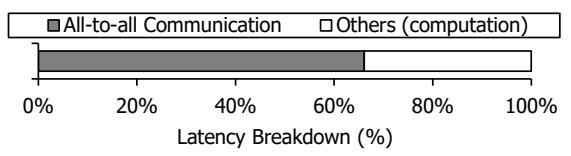

(a) Latency breakdown of 32-expert Transformer MoE model.


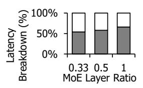

(b) Latency breakdown of the different number of experts.

(c) Latency breakdown of the different ratios of MoE layers.

Fig. 2: Latency breakdown of Transformer MoE models on various model configurations.

Expert parallelism successfully enhances the scalability of the distributed training framework; however, it also introduces a new performance challenge: *significant communication overhead*. In expert parallelism, all MoE layers necessitate two additional all-to-all communications, causing extra network overhead. We discuss the performance impact of expert parallelism in the following sections.

#### III. OBSERVATION AND MOTIVATION

#### A. High Communication Overhead

We identify that all-to-all communication is a major performance bottleneck in the distributed training frameworks for large-scale MoE models. Figure 2 presents various latency breakdown analyses to illustrate the overhead associated with all-to-all communication. Specifically, Figure 2a shows the latency breakdown result for the 32-expert Transformer MoE model in the 4-node, 32-GPU cluster environment (the detailed configurations in Section VI-A). The result indicates that the all-to-all communication accounts for up to 66% of the overall latency, which is quite substantial.

We also conduct various sensitivity analyses regarding the number of experts and the ratio of MoE layers. Figure 2b shows how the all-to-all communication overhead changes for different numbers of experts. We measure the latency breakdown for two Transformer MoE models: 32-expert (left) and 64-expert (right). For the 32-expert and 64-expert models, the all-to-all communication accounts for 58% and 69% of the entire latency overheads, respectively. We observe that the overheads from the all-to-all communication increase with more numbers of experts. This is because more experts require a larger data volume for all-to-all communication, while the amount of computations remains constant as the gating network selects the same number of experts. Figure 2c presents another sensitivity analysis of the ratio of MoE layers (i.e., the number of MoE layers / the number of Transformer blocks). We vary the number of MoE layers from 4, 6, and 12 out of 12 total Transformer blocks, resulting in the ratios of 4/12,


Fig. 3: The expert selection distribution changes over training steps, gradually becoming biased toward specific experts.

6/12, and 12/12, respectively. The results indicate that the all-to-all overhead become more significant as the ratio of MoE layers increases. This is because the total number of all-to-all communications increases with more numbers of MoE layers.

Given that many studies try to increase the number of experts and the ratio of MoE layers [16], [51] to enhance the models' reasoning power, the all-to-all communication overhead would become increasingly larger. This can significantly degrade the efficiency of distributed training frameworks for pre-trained models. Therefore, we need to optimize such a high communication overhead.

#### Observation 1

The all-to-all communication becomes a major performance bottleneck in the MoE models, and this communication overhead is getting more significant as both the number of experts and the ratio of MoE layers increase to enhance the models' reasoning power.

#### B. Load Imbalance in Expert Selection

**Expert selection imbalance.** We conduct a comprehensive profiling of various model configurations and observe that the Transformer MoE models experience severe load imbalance in the expert selection<sup>1</sup>. Our analysis reveals that the expert selection is naturally biased toward specific experts during the pre-training of MoE models.

Figure 3 shows how the distribution of expert selection changes over the pre-training process. We collect the expert selection of each token throughout the pre-training process and display the expert selection distribution for the 6th layer in the 64-expert top-2 Transformer MoE model. The entire pre-training process typically takes 2<sup>8</sup> epochs [58]; however, for the sake of simplicity, the figure only highlights the initial 10 epochs (i.e., 4000 iterations). The x- and y-axis represent training iterations and the expert selection distribution, respectively, and each colored area indicates a different expert. As shown, the expert selection rapidly becomes imbalanced. After iteration 3000, the most selected expert accounts for 13% (red), and the top 5 experts collectively account for 40% (red, blue, green, purple, gray). The imbalanced distribution


(a) The k and  $N_e$  values used in the state-of-the-art MoE models. The dotted red line indicates the k to  $N_e$  ratio of 1/32.

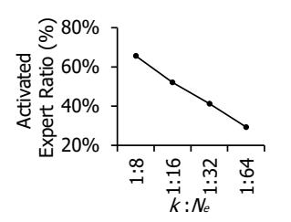

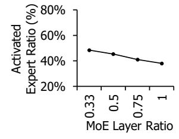

(b) The activated expert ratios by different target selection ratios.

(c) The activated expert ratios by MoE layer ratios.

Fig. 4: Load imbalance analysis across configurations, such as different ratios of k to the number of experts  $(N_e)$  (Figure 4b) and various MoE layer ratios (Figure 4c). Here, a lower ratio of activated experts (experts selected by more than  $1/N_e$  of tokens) means the expert selection is more imbalanced.

either persists throughout the rest of the pre-training process or becomes more severe.

To quantify this load imbalance problem, we conduct various sensitivity analyses across different configurations (Figure 4). Since the expert selection imbalance is highly correlated with the ratio (i.e., target selection ratio) of selected target experts (k in top-k gating networks) to the total number of experts ( $N_e$ ), we first comprehensively review the state-of-the-art Transformer MoE models [9], [16], [57], [59]–[63]. Figure 4a summarizes the k and  $N_e$  values used in these models. As shown, although the models employ different combinations of k and  $N_e$ , most of them have target selection ratios ( $k:N_e$ ) lower than 1/32 (dotted red line). Thus, in this work, we set the representative target selection ratio to 1/32.

To measure the degree of load imbalance, we define an activated expert ratio as the fraction of experts that are selected more frequently than in a fully balanced scenario. For example, if there are 100 experts and 60 experts are selected by more than 1% of input tokens, the activated expert ratio is 0.6. A smaller activated expert ratio indicates more load imbalance in the expert selection. Figure 4b shows the activated expert ratios for target selection ratios across various configurations: k (1, 2, 4, 8) and  $N_e$  (32, 64, 128). The activated expert ratio decreases as the target selection ratio decreases: 1:8 (66%), 1:16 (52%), 1:32 (41%), and 1:64 (29%), indicating that the models become more imbalanced as the target selection ratio decreases. Additionally, we observe that the ratio of MoE layers affects the expert selection imbalance. Figure 4c presents the activated expert ratios for different MoE layer ratios: 4/12, 6/12, 8/12, and 12/12. It shows that the activated

<sup>&</sup>lt;sup>1</sup>In this work, we use a standard top-k gating network. Various load-balancing techniques can compromise training quality and cannot fully resolve the load imbalance issue.

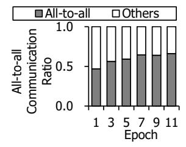


(a) Communication overhead analysis over 11 epochs.

(b) Computational process in the expert selection imbalance.

Fig. 5: Performance implications of the load imbalance.

expert ratio decreases as the MoE layer ratio increases: 4/12 (48%), 6/12 (45%), 8/12 (41%), and 12/12 (38%), indicating that more MoE layers exacerbate load imbalance.

# Observation 2

In Transformer MoE models, there is a huge load imbalance in expert selection. The expert selection becomes more imbalanced as both the number of experts and the ratio of MoE layers increase. Also, the expert selection is quickly skewed as training progresses.

Performance implications of expert imbalance. We identify that the expert selection imbalance degrades the end-toend performance of the existing distributed training frameworks (Figure 5). It mainly stems from two factors: increased all-to-all communication overhead and underutilization of computational resources. Figure 5a shows that the all-to-all communication overhead increases as training progresses. We observe that the expert selection imbalance correlates with allto-all communication overhead. This occurs because all-to-all communication requires equal message sizes across GPUs. When imbalance arises, the framework adds zero padding to make message sizes uniform. As the imbalance grows, the amount of zero padding increases, resulting in larger communication volumes and higher all-to-all communication overhead. Moreover, the framework also suffer from GPU resource underutilization due to the expert selection imbalance. Figure 5b illustrates how the expert selection imbalance leads to GPU underutilization, degrading the overall system performance. For example, given 9 input tokens, the gating network selects expert-1 for 3 tokens and expert-3 for 6 tokens. Since all expert outputs should be ready before the second all-to-all communication, GPUs handling fewer computations must wait till the most heavily-loaded GPU is finished.

## Observation 3

The expert selection imbalance adversely affects the overall system performance, leading to increased all-to-all communication latency and reduced GPU resource utilization.

# *C. Heterogeneous Network*

The heterogeneous networks are common in modern data centers designed for training the large-scale pre-trained mod-

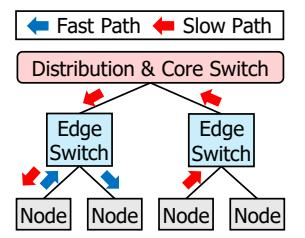


(a) Hierarchical network topology illustrating fast paths (blue) under the same edge switch and slower paths (red) through multiple switch layers.

(b) Normalized network bandwidth heatmap obtained by profiling 16 G instances in an AWS environment.

Fig. 6: Heterogeneous inter-node communication.

els. First, there is a significant bandwidth gap between intranode and inter-node communication. For intra-node communication, it uses highly-optimized dedicated networks such as NVLink [64], which can provide a bandwidth of up to 900 GB/s (NVLink 4.0 [65]). In contrast, inter-node communication relies on networks like InfiniBand [66] or Ultra Ethernet [67], which offer significantly lower bandwidth than the dedicated networks, typically up to 100 Gbps (12.5 GB/s).

Moreover, the inter-node network itself has considerable heterogeneity, as shown in Figure 6. Figure 6a illustrates the scenarios where bandwidth heterogeneity arises in modern data centers. Modern data centers employ a hierarchical network topology with multiple switch layers, such as edge switches and distribution/core switches. This structure causes significant variability in inter-node bandwidth. For example, nodes connected under the same edge switch (blue path) have higher bandwidth, while nodes connected through multiple switch layers (red path) face much lower bandwidth [68]. To quantify this inter-node heterogeneity, we conduct network bandwidth profiling between 16 nodes within the same region on Amazon EC2<sup>2</sup> . Figure 6b shows the profiling results in which certain nodes (i.e., 7, 12, 13) exhibit up to 50% lower bandwidth than other node pairs.

Note that the large-scale pre-trained models demand substantial computational and memory resources, and the models end up being distributed across multiple nodes or racks. Therefore, the current distributed training frameworks have no choice but to use heterogeneous networks for training the large-scale pre-trained models. However, existing frameworks often lack optimizations that take into account heterogeneous networks, leading to suboptimal performance.

# Observation 4

The large-scale distributed frameworks employ heterogeneous networks for training the Transformer MoE models, but they often fail to achieve their performance because of a lack of topology-aware communication optimization.

<sup>2</sup>We focus on the cloud environment rather than in-house data centers. Although the dedicated in-house data centers may offer homogeneous internode networks, they entail significant initial setup and maintenance costs.

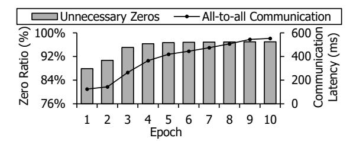

Fig. 7: The portion of unnecessary zeros and the latencies of all-to-all communications during each training epoch.

#### D. Design Goals

Based on observations, we set our design goals as follows:

- **All-to-all communication optimization.** We propose *adaptive all-to-all communication* to minimize communication volume by removing unnecessary zero padding.
- Balanced expert selection. We propose *dynamic expert clustering*, facilitating more balanced expert selection.
- Heterogeneous network-aware data placement. We propose topology-aware expert remapping to fully leverage any type of network configuration.

#### IV. SCALEMOE

#### A. Adaptive All-to-all Communication

**Existing all-to-all communication.** The MoE layer involves two all-to-all communications: one after the gating network and another after FFNs (i.e., *experts*). For each GPU, input tokens pass through the gating network, which returns their corresponding expert indices. By using these expert indices and expert-to-GPU mapping information, the training frameworks categorize input tokens into multiple groups for each target GPU. Since the number of selected experts can vary for the given input tokens, the state-of-the-art distributed training frameworks compute the maximum group size across GPUs and then apply zero padding to each per-GPU token group to achieve a uniform all-to-all message size [3].

This approach works well when the expert selection is well-balanced; however, its efficiency significantly decreases as the expert selection becomes heavily skewed toward specific experts. As the expert selection becomes more imbalanced, the communication volume of unnecessary zeros increase accordingly. To identify the performance implications of this zero padding, we measure the ratio of unnecessary zeros during the training process. Figure 7 shows the portion of unnecessary zeros and the corresponding all-to-all communication latency. In the early stage of training, the ratio of unnecessary zeros is 88%, and it quickly rises to 98%.

Adaptive all-to-all communication. We propose the *adaptive all-to-all communication* to resolve high all-to-all communication problem by eliminating zero transfers. Rather than using zero padding, our approach accurately identifies the required number of tokens for both input and output slices. By leveraging this information, ScaleMoE transmits only the necessary values, thereby significantly reducing communication volume and all-to-all communication latency.

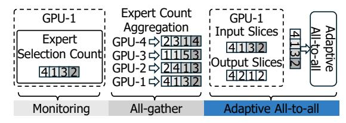

Fig. 8: The overview of adaptive all-to-all. At runtime, Scale-MoE monitors the per-expert selection counts (e.g., GPU-1: 4–1–3–2) in each GPU, aggregates them across devices via an all-gather operation, and uses them to compute input/output slice sizes for buffer allocation.


Fig. 9: The overview of dynamic expert clustering. At runtime, ScaleMoE profiles each token's expert selections (e.g., Token A selects E2, E3, E2, and E1) across MoE layers (e.g., L1–L4), and performs replication based on the profiling results. Then, it applies clustering based on expert selection patterns (e.g., C0–C3). The replicating experts step is omitted for simplicity.

Figure 8 shows the high-level overview of adaptive all-to-all communication. In this example, we assume there are four experts, each expert allocated to each GPU, and each GPU receives ten input tokens. For each GPU, ScaleMoE monitors the expert selection counts for the input tokens (Monitoring). In this example, on GPU-1, four tokens select expert-1, one token selects expert-2, three tokens select expert-3, and two tokens select expert-4. Then, ScaleMoE aggregates these expert selection counts from all GPUs (All-gather). By doing so, ScaleMoE can now figure out the exact number of required tokens for each expert, both for input ( $i^{th}$  column for GPU-i) and output ( $j^{th}$  row for GPU-j) slices. With these input and output slices, ScaleMoE can successfully transfer only the necessary data (Adaptive all-to-all).

As shown, the adaptive all-to-all communication requires extra communication to aggregate the expert selection counts from all GPUs (All-gather). However, zero padding elimination leverages the router's per-token expert indices to compute slice sizes, thereby avoiding any additional computation; the All-gather overhead is negligible compared to the volume of unnecessary zero transfers.

#### B. Dynamic Expert Clustering

To reduce the load imbalance in expert selection, we propose *dynamic expert clustering*. Figure 9 shows the overview of this process. We use the expert selection history from the previous epoch to predict the current expert selection for given input tokens. To do so, ScaleMoE profiles per-token expert

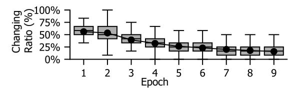

Fig. 10: The ratio of changes in expert selection for each token between two consecutive epochs. Here, the per-token expert selection becomes more stable as training progresses.

# Algorithm 1: Dynamic expert clustering.

```
: I: Profiled data, n_e: number of experts, n_l: number of
               layers, max iter: max iterations
   output : C: clusters, c: centroids
1 c \leftarrow \text{random initialization from } I / \star \text{ Initialize centroids } \star /
2 for iter \leftarrow 1 to max\_iter do
        C \leftarrow \{\} / \star \text{ Reset clusters}
        /* Assign each data point to the nearest centroid
        foreach i \in I do
             assigned\_cluster \leftarrow \arg\min_{c} (n_l - \operatorname{overlap}(i, c))
               C[assigned\_cluster] \leftarrow C[assigned\_cluster] \cup \{i\}
        end
             Update centroids based on cluster members
        for j \in 1 \dots n_e do
                 \leftarrow most common experts in each layer of C[j]
10 end
11 return C, c
```

selection statistics (Profiling). With the profiled data, ScaleMoE replicates popular experts to replace unpopular ones to improve clustering efficiency (Replicating Experts). Then, ScaleMoE clusters input tokens having similar expert selection patterns (Dynamic Expert Clustering).

**Profiling.** Since we rely on the per-token expert selection history to predict the selections in the current epoch, it is essential to ensure that expert selection does not vary dramatically between consecutive epochs. To assess the similarity in expert selection, we measure the ratio of changes (i.e., *changing ratio*) between consecutive epochs. Figure 10 shows the results, with the x-axis representing training epochs and the y-axis indicating the changing ratio in expert selection. For instance, when the x-axis value is i, the corresponding changing ratio (# of tokens selecting different experts / # of total experts) between  $i-1^{th}$  and  $i^{th}$  epochs. Here, a lower changing ratio means that consecutive epochs have similar expert selection patterns. The results show that the changing ratio quickly decreases to 6.25% (at epoch-9), indicating our history-based approach is plausible.

ScaleMoE systematically monitors the per-token expert selections. To support various shuffling methods in the data loader, we assign a unique identifier *<batchID*, *sequenceID*, *tokenIndex*, *tokenName>* to each token. The size of this unique ID is small (12B) compared to the hidden dimension (3072B), so this profiling overhead is negligible.

**Replicating Experts.** To improve clustering efficiency, ScaleMoE replicates experts based on profiled data. With the profiled data, ScaleMoE identifies rarely selected experts (i.e.,

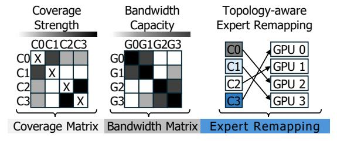

Fig. 11: The overview of topology-aware expert remapping. At runtime, ScaleMoE builds two matrices (i.e., coverage matrix, bandwidth matrix) to find near-optimal cluster mapping.

unpopular experts). Once we identify unpopular experts, we spill them to host pinned memory. To leverage freed GPU memory, ScaleMoE replaces the offloaded unpopular experts with replicas of frequently selected experts (i.e., popular experts). The number of replicas for each expert is determined proportionally to its selection ratio; in other words, popular experts get more replicas. Replicating experts allows more tokens to be transferred locally, and since access to unpopular experts is rare, the performance overhead is negligible.

Dynamic expert clustering. ScaleMoE clusters input tokens with similar expert selection patterns using K-means. For the distance function, we compute the number of overlapping expert selections between two sequences and subtract it from the total sequence length (i.e., a smaller distance indicates that two tokens have more similar expert selections). Algorithm 1 shows our clustering process. ScaleMoE selects random centroids for each cluster (line 1) to avoid clusters being biased to specific points. Then, it iterates the clustering logic until it reaches the maximum number of iterations or the clusters are saturated (lines 2-10). For each iteration, it first computes the distance between the inputs and each cluster. The inputs are assigned to the cluster with the closest centroid, and the centroids of each cluster are updated accordingly. Next, ScaleMoE updates the centroids by choosing the most frequently selected expert for each layer (lines 3–6).

#### C. Topology-aware Expert Remapping

The state-of-the-art distributed training frameworks often overlook the heterogeneous networks, leading to suboptimal performance. To address this, ScaleMoE proposes topology-aware expert remapping to achieve near-optimal performance on various network configurations. Figure 11 shows the high-level overview of our technique. To find the optimal mapping between clusters and GPUs while considering heterogeneous network bandwidths, ScaleMoE constructs two matrices: the coverage matrix (representing the coverage information between clusters) and the bandwidth matrix (representing peer-to-peer network bandwidths between GPUs). With these two matrices, ScaleMoE performs expert remapping using a genetic algorithm.

Coverage matrix & bandwidth matrix. Given that clustering is not always perfect, it is possible that some input tokens' target experts do not exist within the corresponding clusters. In such a case, we need to send those tokens to experts on other

GPUs, which incurs additional network traffic. Depending on cluster-to-GPU mapping, this network traffic can be handled via various network mediums (e.g., NVLink [64], UltraFast Ethernet [67], moderate Ethernet [69]).

To estimate amount of required expert transfers, ScaleMoE builds the *coverage matrix* that represents the overlap between clusters (e.g., how much one cluster can cover another). In the (C x C) coverage matrix (C is the number of clusters), each cell (i, j) represents how well cluster (Ci) can cover the experts required by cluster (C<sup>j</sup> ).

In addition to the coverage matrix, ScaleMoE also builds the *bandwidth matrix* representing the peer-to-peer network bandwidths between node pairs. For any given network configuration, ScaleMoE initially constructs this bandwidth map when the network is idle.

Genetic algorithm. With these two matrices, we can find the optimal mapping between devices (GPUs) and clusters. However, the design exploration space is vast and grows significantly as the number of experts (Ne) increases. To reduce search time, ScaleMoE adopts a heuristic approach using a genetic algorithm to find a near-optimal cluster mapping within a reasonable timeframe. Through the genetic algorithm, ScaleMoE aims to find a solution vector (SV ) containing mapping information from devices (i) to clusters (SV [i]).

$$FitnessFunction = \sum_{i,j=0}^{N_e} \frac{\{(b \cdot s) - CM[SV[i]][SV[j]]\} \cdot h}{(BM[i][j])} \tag{2}$$

Equation 2 shows our fitness function. Here, b, s, and D<sup>H</sup> represent batch size, sequence length, and hidden dimension, respectively. The indices i and j represent the device indices. The term (b · s) − CM[SV [i]][SV [j]]·h represents the size of data that needs to be transferred. We compute the estimated communication time by dividing the data size by the GPU bandwidth (BM[i][j]). In each generation, the SV with the lowest fitness value is selected to minimize communication latency, and the genetic algorithm performs the uniform orderbased crossover and mutations that involve swapping the cluster mapping between two arbitrary positions. Once the genetic algorithm is complete, we map the clusters to the corresponding devices by following the solution vector (SV ).

# V. IMPLEMENTATION

We implement our system in PyTorch [70] (v2.0). We encapsulate key components such as *adaptive all-to-all*, *dynamic expert clustering*, and *topology-aware expert remapping*, making it highly applicable to various distributed training frameworks (e.g., DeepSpeed, Megatron-LM). For the prototype, we build ScaleMoE on top of DeepSpeed, one of the state-of-theart distributed training frameworks. Through extensive stress tests in diverse training setups, we confirm that ScaleMoE is robust enough to support various real-world scenarios.

The *dynamic expert clustering* and *topology-aware expert remapping* require some CPU execution time; therefore, we need to minimize such overheads. We divide an epoch into

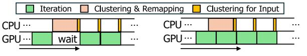

(a) Timeline w/o overlapping.

(b) Timeline w/ overlapping.

Fig. 12: Execution timeline comparison between without overlapping (a) and with overlapping (b).

smaller units (called a *superbatch*) and perform clustering and remapping for each superbatch. Since each superbatch is independent, we can overlap these operations with GPU iterations. Figure 12 illustrates how our overlapping technique can eliminate the clustering-related operations (i.e., clustering & remapping, clustering for input). As shown in Figure 12a, without overlap, the clustering-related operations (on the CPU) and main iterations (on the GPU) are executed sequentially. In this case, all CPU-side operations take 7.79 seconds, increasing overall execution time by 12.48% compared to the GPU-only scenario. On the other hand, as shown in Figure 12b, overlapping ensures that all CPU-side clusteringrelated operations are executed concurrently with main iterations. Therefore, it can eliminate clustering-related overheads, reducing them to just 0.001% of the GPU iteration time. Note that using a superbatch does not negatively impact clustering efficiency. We conduct in-depth sensitivity analyses across different superbatch sizes in Section VI-D.

We emphasize that ScaleMoE maintains the integrity of the original training process. First, the replicated experts are correctly updated after the backward pass of each iteration ensuring consistency and computational correctness. Second, to preserve the sequence and position information of individual tokens, we transmit <*sequenceID*, *tokenIndex*, *tokenName*> along with the tokens. By doing so, we ensure that positional data for individual tokens remain intact throughout the training process. Lastly, before the output layer, tokens are reordered to their original sequence. This reordering step involves an additional all-to-all operation; however, the overhead is minimal compared to the existing all-to-all operations. Through the evaluations, we confirm that ScaleMoE keeps the integrity of the original training process without compromising accuracy.

# VI. EVALUATION

# *A. Experimental Setup*

We evaluate ScaleMoE on Amazon Elastic Compute Cloud, utilizing four p4d.24xlarge instances [25]. Each P4 instance consists of eight NVIDIA A100 40 GB GPUs, providing substantial parallelism for our experiments. The GPUs within the same node are connected via 600 GB/s NVLink 3.0, enabling high-bandwidth, low-latency intra-node communication. For inter-node communication, it uses Ultra Ethernet (100 Gbps).

As discussed in Section III-C, there is a huge network heterogeneity in cloud environments (up to 2×). To evaluate the performance implications of this heterogeneity, we configure the heterogeneous setup where the maximum bandwidth (100 Gbps) is twice the minimum bandwidth (50 Gbps). Specifically, we limit the Ethernet bandwidth of one node to

TABLE I: Model configurations for the experiments.

| Parameter               | Value            |
|-------------------------|------------------|
| Number of GPUs          | 32               |
| Batch size              | 512              |
| Sequence length         | 128              |
| Hidden dimension        | 768              |
| Number of layers        | 12               |
| Transformer model types | BERT, GPT        |
| Number of MoE layers    | 4, 6, 12         |
| Number of experts Ne    | 32, 64, 128      |
| Ratio of k to Ne        | 1:16, 1:32, 1:64 |


Fig. 13: The end-to-end performance comparison. We evaluate the performance implications of each optimization one by one: *adaptive all-to-all* (+ADPT), *dynamic expert clustering* (+DEC), *topology-aware expert remapping* (ScaleMoE).

50 Gbps, while the remaining nodes maintain a bandwidth of 100 Gbps. This configuration allows us to simulate and evaluate performance under heterogeneous network conditions that reflect real-world cloud environments.

Table I shows the model configurations for the experiments. To ensure consistency, we use the same configuration (i.e., the number of GPUs, batch size, sequence length, hidden dimension, and the number of layers). To show ScaleMoE's applicability, we use two Transformer-based models: BERT (encoder-only) and GPT (decoder-only). For each model, we vary the number of MoE layers (4, 6, 12) to analyze sensitivity across different MoE layer ratios. Furthermore, we conduct evaluations on different numbers of experts (Ne) (32, 64, 128) with different target selection ratios (k : Ne) (1/16, 1/32, 1/64). As mentioned in Section III-B, we primarily focus on the representative ratio (1/32). However, we also evaluate the other ratios (1/16, 1/64) to analyze their performance implications.

For the baseline, we use Tutel, one of the state-of-the-art open-source distributed frameworks for LLM-MoE models. Built on top of DeepSpeed, Tutel is widely adopted as a baseline in many studies [71]–[73] due to its capability of support large-scale environments (up to 256 GPUs). Also, it includes several advanced optimizations (e.g., efficient dispatcher, overlap strategy). We use the latest version of Tutel with the 2DH All-to-All configuration.

# *B. End-to-End Performance*

We evaluate end-to-end performance by measuring the average iteration time. To show the effectiveness of our optimizations, we compare the baseline by incrementally applying adaptive all-to-all communication (ADPT), dynamic expert clustering (DEC), and topology-aware expert remapping

TABLE II: The end-to-end performance comparison. We evaluate the performance implications of each optimization.

|           | Time (s)    |       |               |       |
|-----------|-------------|-------|---------------|-------|
| Method    | Homogeneous |       | Heterogeneous |       |
|           | MoE-        | MoE-  | MoE-          | MoE   |
|           | BERT        | GPT   | BERT          | GPT   |
| Baseline  | 10.60       | 10.42 | 20.04         | 19.67 |
| +ADPT     | 8.64        | 9.41  | 9.20          | 9.89  |
| +ADPT+DEC | 6.64        | 6.10  | 7.22          | 6.18  |
| ScaleMoE  | 6.20        | 5.78  | 6.96          | 5.94  |

(ScaleMoE). We use BERT and GPT models, and with 12 MoE layers, 32 experts, and k : N<sup>e</sup> ratio (1/32). Each model is evaluated under homogeneous and heterogeneous network.

Figure 13 and Table II show the evaluation results. For the homogeneous network, ScaleMoE achieves average speedups of 1.71× and 1.81× for MoE-BERT and MoE-GPT, respectively. For the heterogeneous network, ScaleMoE achieves average speedups of 2.88× and 3.31× for MoE-BERT and MoE-GPT, respectively. Note that although some distributed training frameworks (e.g., Megatron-LM) support all-to-all variable (i.e., *alltoallv*) similar to our *adaptive all-to-all*, ScaleMoE still remains beneficial. By integrating *dynamic expert clustering* and *topology-aware expert remapping*, we effectively rebalance the load across experts and mitigate communication overhead caused by load imbalance. Even compared to the case when *alltoallv* is applied, ScaleMoE still achieves average speedups of 1.32× and 1.66× for MoE-BERT and MoE-GPT in the heterogeneous network, respectively. In addition, *adaptive all-to-all* is dispatcher-agnostic and integrates with frameworks (e.g., DeepSpeed, Megatron-LM) through hooks with minimal integration effort.

## *C. Performance Analysis Over Time*

As training progresses, expert selection is quickly biased towards specific experts (Section III-B). This increasing load imbalance results in inefficiency in all-to-all communication. In contrast, ScaleMoE can resolve this issue, thereby achieving more performance improvements as training progresses.

Figure 14 shows the performance analysis across epochs. Figure 14a shows that ScaleMoE achieves more speedup than the baseline as training progresses (up to 1.59×), which is expected as the load imbalance becomes more severe in higher epochs. For the in-depth performance analysis, we look into the all-to-all communication. Figure 14b shows the all-toall communication time. The baseline suffers from increasing communication time in higher epochs; however, ScaleMoE shows consistently low communication time throughout the training, demonstrating effective mitigation of load imbalance. Figure 14c shows the communication volumes of all-to-all operations. As expected, the message size keeps increasing in the baseline. In contrast, ScaleMoE significantly reduces the message size by discarding unnecessary zero padding.

## *D. Sensitivity Analysis*

The ratio of MoE layer. We first evaluate the ScaleMoE's performance across different MoE layer ratios: 0.33 (4-MoE


(a) Performance improvement across different epochs.


Fig. 14: The performance analysis over time, showing results from epoch 1 to epoch 21.

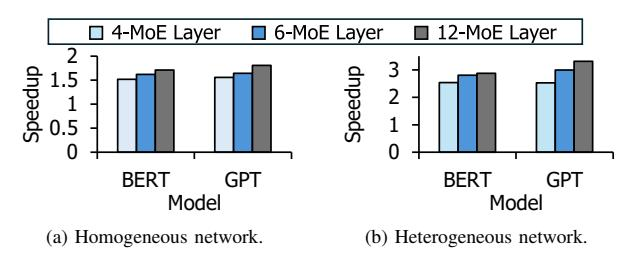

Fig. 15: Performance improvements across different MoE layer ratios in two network environments.

layers), 0.5 (6-MoE layers), and 1.0 (12-MoE layers). Figure 15 shows the evaluation results. We use both BERT and GPT models on two network configurations. In the homogeneous network (Figure 15a), ScaleMoE achieves average speedups of 1.51×, 1.62×, and 1.71× for MoE layer ratios of 0.33, 0.5, and 1.0, respectively. In the heterogeneous network (Figure 15b), ScaleMoE achieves average speedups of 2.52×, 2.99×, and 3.31× for the same ratios. As expected, ScaleMoE achieves higher performance improvements on higher MoE layer ratios. This is because the load imbalance becomes more severe as the MoE layer ratio increases, leading to higher all-to-all communication overheads(Section III-B). Notably, ScaleMoE achieves greater improvements in the heterogeneous network thanks to *topology-aware expert remapping*.

The ratio of k to  $N_e$ . We evaluate ScaleMoE's performance across different  $k:N_e$  ratios: 1/16, 1/32, and 1/64. In this experiment, we set k=2 and set the number of experts  $(N_e)$  to 32, 64, and 128, respectively, for the respective  $k:N_e$  ratios. Figure 16 shows the performance results across different ratios in two network environments. In the homogeneous network (Figure 16a), ScaleMoE achieves average speedups of  $1.65\times$ ,  $1.84\times$ , and  $1.87\times$  for the  $k:N_e$  ratios of 1/16, 1/32, and 1/64, respectively. Similarly, in the heterogeneous network (Figure 16b), ScaleMoE achieves average speedups of  $2.19\times$ ,

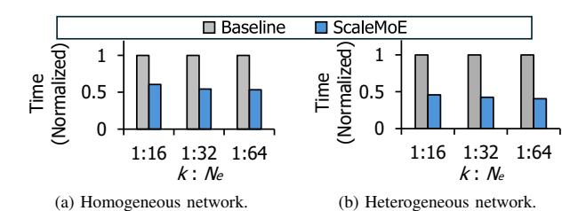

Fig. 16: Performance improvements across different  $k:N_e$  ratios in two network environments.


Fig. 17: Sensitivity analyses of superbatch sizes (1 to 400) measured on both load-imbalanced and balanced scenarios.

TABLE III: Effect of expert replication on local GPU memory access ratio, remote GPU memory access ratio, and GPU memory miss(i.e., host memory access) rate.

| Maximum Expert | Local      | Remote     | Miss     |
|----------------|------------|------------|----------|
| Replicas       | Access (%) | Access (%) | Rate (%) |
| 0              | 3.28       | 96.72      | 0.00     |
| 3              | 12.00      | 87.65      | 0.35     |
| 7              | 21.51      | 78.16      | 0.53     |
| 15             | 38.85      | 60.31      | 0.83     |
| 31             | 61.32      | 37.55      | 1.12     |

 $2.35\times$ , and  $2.47\times$  for the same ratios. In both scenarios, the results show that ScaleMoE achieves more performance improvements as the  $k:N_e$  ratio decreases. This is because the load imbalance becomes more severe with lower  $k:N_e$  ratios, as discussed in Section III-B.

**Superbatch size.** The superbatch size determines the frequency of clustering, directly influencing both the iteration time and the clustering time for each superbatch. A smaller superbatch size requires more frequent clustering, but it may harm clustering efficiency by not leveraging enough expert selection history. Conversely, a larger superbatch size reduces clustering frequency but increases clustering time, preventing the clustering overhead from overlapping with the iteration time. Therefore, it is important to find an optimal superbatch size. Figure 17 shows the sensitivity analyses across superbatch sizes (1 to 400). Figure 17a and Figure 17b show the sensitivity results for the load-imbalanced and balanced scenarios, respectively. In both cases, we find that superbatch 100 shows reasonable clustering overheads while maintaining the iteration time allowing full overlap of clustering operations.

**Replication Effect.** We evaluate the impact of the number of expert replicas on clustering efficiency. As shown

TABLE IV: Overhead breakdown for the 12-MoE-BERT model at epoch-21 with a superbatch size of 100. Most of them are hidden by the overlapping technique (See Section V).

| Overhead                         | Latency(ms) |  |
|----------------------------------|-------------|--|
| Dynamic Expert Clustering        | 3121.57     |  |
| Topology-aware Expert Remapping  | 2443.32     |  |
| Expert Exchange                  | 2226.48     |  |
| Clustering for Input             | 483.04      |  |
| Gather for Profiling             | 5.96        |  |
| All-gather for Zero Slicing      | 44.50       |  |
| All-reduce for Replicated Expert | 310.53      |  |

in Table III, a higher number of maximum replicas leads to better clustering efficiency, making more experts locally available (from 3.28% to 61.32%). Note that the number of maximum expert replicas refers to the upper bound; the actual number of replicated experts may be lower than this maximum. Replication maximizes local GPU HBM accesses, resulting in significant improvement. While this comes with a slight increase in miss rate (i.e., host memory access), it remains low (∼1%) due to the inherent imbalance in the expert selection, making host memory access overheads negligible.

# *E. Overhead Analysis*

To clarify the overheads caused by clustering-related operations (i.e., clustering & remapping, clustering for input), we break down the overheads of each operation. Table IV presents the detailed overhead breakdown. Even the most timeconsuming operation, dynamic expert clustering, introduces negligible latency compared to iteration time. Without overlap, the total overhead per iteration is 568.91ms (8.51% of the 6679.27ms). With overlap, it drops to 16.27 ms (0.26%). This shows that the additional overheads introduced by ScaleMoE are negligible and do not impact the overall performance.

# VII. RELATED WORK

MoE training. The superior performance of large-scale MoE models has driven extensive research efforts. MoE training systems such as DeepSpeed [24] and Tutel [52] have already shown remarkable results in optimizing distributed training. NetMoE [74] proposes dynamic expert placement to minimize inter-node communication. However, they do not consider the heterogeneous inter-node networks common in public clouds. DeepSeek-v3 [57] proposes expert replication within a single node. Differently, ScaleMoE provides remapping and replication between nodes.

Load imbalance. Previous research shows that the structured and systematic behavior of the router in assigning consecutive and specific tokens to the same expert often leads to load imbalance [10], which adversely affects training performance. To mitigate load imbalance, strategies include balance-aware auxiliary losses for even token distribution and limiting expert capacity to prevent overloading [16]. However, while these methods effectively address load imbalance, they compromise model quality [10], [54]–[56], [75]. In contrast, ScaleMoE provides the same training quality by preserving the original computation.

Heterogeneous network. In the context of network communication, the GPU communication in modern dense GPU systems utilizes various interconnect technologies such as InfiniBand, NVLink, and NVSwitch [76]. NCCL [77] and other communication libraries [78]–[80] provide efficient data transfer and collective communication operations. They are complementary to ScaleMoE and can enhance optimization, communication, and computation to enable efficiency in largescale distributed systems.

Sparsity/compression techniques. Sparsity/compression techniques minimize the amount of data to be transmitted between nodes, thereby improving system efficiency and reducing latency [81]–[84]. These operate at the tensor level, whereas ScaleMoE focuses on structured communication-level zero padding caused by load imbalance. Note that the concepts of these methods are complementary, and applying both could bring further improvements.

#### VIII. DISCUSSION

ScaleMoE offers a simple, effective way to reduce redundant communication and mitigate load imbalance, while remaining complementary to existing MoE models. As described in Section V, ScaleMoE preserves the original training process without requiring changes to model computation or router design. This orthogonal design ensures broad compatibility, enabling seamless integration with diverse architectures without model modifications. These include various routing mechanisms, shared-expert configurations, and models employing Multi-Head Latent Attention (MLA).

Limitation. Our end-to-end evaluation uses BERT/GPT-MoE for controlled analysis; however, the design is routerand model-agnostic. Based on our analysis of communication costs and load imbalance (Section III), we expect ScaleMoE to remain effective or even potentially more impactful in stateof-the-art MoE models (e.g., Mixtral, Llama-MoE).

Future work. We will evaluate ScaleMoE on state-of-theart MoE models to validate real-world effectiveness. Also, we will conduct more sensitivity analyses on diverse network setups for more comprehensive evaluations. Furthermore, our evaluation will cover its performance in MLA-based settings, under alternative gating mechanisms, and with shared-expert configurations. Finally, we will quantify scaling benefits at larger hidden dimensions.

# IX. CONCLUSIONS

This paper introduces ScaleMoE, a scalable and efficient distributed training framework for large-scale MoE models. ScaleMoE addresses high all-to-all communication overheads, severe load imbalances in expert selection, and inefficiencies in heterogeneous network. To overcome these challenges, ScaleMoE incorporates three core optimizations: *adaptive allto-all communication* to eliminate unnecessary zero transfers, *dynamic expert clustering* to rebalance experts, and *topologyaware expert remapping* to account for heterogeneous network. Our evaluations show the effectiveness of ScaleMoE on various model and system configurations.

#### REFERENCES

- [1] J. Sevilla, L. Heim, A. Ho, T. Besiroglu, M. Hobbhahn, and P. Villalobos, "Compute trends across three eras of machine learning," in *2022 International Joint Conference on Neural Networks (IJCNN)*. IEEE, 2022, pp. 1–8.
- [2] P. Villalobos, J. Sevilla, T. Besiroglu, L. Heim, A. Ho, and M. Hobbhahn, "Machine learning model sizes and the parameter gap," *arXiv preprint arXiv:2207.02852*, 2022.
- [3] S. Smith, M. Patwary, B. Norick, P. LeGresley, S. Rajbhandari, J. Casper, Z. Liu, S. Prabhumoye, G. Zerveas, V. Korthikanti *et al.*, "Using deepspeed and megatron to train megatron-turing nlg 530b, a large-scale generative language model," *arXiv preprint arXiv:2201.11990*, 2022.
- [4] D. Zhou, B. Kang, X. Jin, L. Yang, X. Lian, Z. Jiang, Q. Hou, and J. Feng, "Deepvit: Towards deeper vision transformer," *arXiv preprint arXiv:2103.11886*, 2021.
- [5] Z. Li, E. Wallace, S. Shen, K. Lin, K. Keutzer, D. Klein, and J. Gonzalez, "Train big, then compress: Rethinking model size for efficient training and inference of transformers," in *International Conference on machine learning*. PMLR, 2020, pp. 5958–5968.
- [6] M. Shoeybi, M. Patwary, R. Puri, P. LeGresley, J. Casper, and B. Catanzaro, "Megatron-lm: Training multi-billion parameter language models using model parallelism," *arXiv preprint arXiv:1909.08053*, 2019.
- [7] X. Zhai, A. Kolesnikov, N. Houlsby, and L. Beyer, "Scaling vision transformers," in *Proceedings of the IEEE/CVF conference on computer vision and pattern recognition*, 2022, pp. 12 104–12 113.
- [8] N. Shazeer, A. Mirhoseini, K. Maziarz, A. Davis, Q. Le, G. Hinton, and J. Dean, "Outrageously large neural networks: The sparsely-gated mixture-of-experts layer," *arXiv preprint arXiv:1701.06538*, 2017.
- [9] S. Shen, L. Hou, Y. Zhou, N. Du, S. Longpre, J. Wei, H. W. Chung, B. Zoph, W. Fedus, X. Chen *et al.*, "Mixture-of-experts meets instruction tuning: A winning combination for large language models," *arXiv preprint arXiv:2305.14705*, 2023.
- [10] A. Q. Jiang, A. Sablayrolles, A. Roux, A. Mensch, B. Savary, C. Bamford, D. S. Chaplot, D. d. l. Casas, E. B. Hanna, F. Bressand *et al.*, "Mixtral of experts," *arXiv preprint arXiv:2401.04088*, 2024.
- [11] O. Lieber, B. Lenz, H. Bata, G. Cohen, J. Osin, I. Dalmedigos, E. Safahi, S. Meirom, Y. Belinkov, S. Shalev-Shwartz *et al.*, "Jamba: A hybrid transformer-mamba language model," *arXiv preprint arXiv:2403.19887*, 2024.
- [12] N. Gupta and J. Yip, "Dbrx: Creating an llm from scratch using databricks," in *Databricks Data Intelligence Platform: Unlocking the GenAI Revolution*. Springer, 2024, pp. 311–330.
- [13] D. Dai, C. Deng, C. Zhao, R. Xu, H. Gao, D. Chen, J. Li, W. Zeng, X. Yu, Y. Wu *et al.*, "Deepseekmoe: Towards ultimate expert specialization in mixture-of-experts language models," *arXiv preprint arXiv:2401.06066*, 2024.
- [14] X. V. Lin, A. Shrivastava, L. Luo, S. Iyer, M. Lewis, G. Gosh, L. Zettlemoyer, and A. Aghajanyan, "Moma: Efficient early-fusion pre-training with mixture of modality-aware experts," *arXiv preprint arXiv:2407.21770*, 2024.
- [15] X. Nie, X. Miao, Z. Wang, Z. Yang, J. Xue, L. Ma, G. Cao, and B. Cui, "Flexmoe: Scaling large-scale sparse pre-trained model training via dynamic device placement," *Proceedings of the ACM on Management of Data*, vol. 1, no. 1, pp. 1–19, 2023.
- [16] W. Fedus, B. Zoph, and N. Shazeer, "Switch transformers: Scaling to trillion parameter models with simple and efficient sparsity," *Journal of Machine Learning Research*, vol. 23, no. 120, pp. 1–39, 2022.
- [17] B. Pan, Y. Shen, H. Liu, M. Mishra, G. Zhang, A. Oliva, C. Raffel, and R. Panda, "Dense training, sparse inference: Rethinking training of mixture-of-experts language models," *arXiv preprint arXiv:2404.05567*, 2024.
- [18] T. Wei, B. Zhu, L. Zhao, C. Cheng, B. Li, W. Lu, P. Cheng, J. Zhang, ¨ X. Zhang, L. Zeng *et al.*, "Skywork-moe: A deep dive into training techniques for mixture-of-experts language models," *arXiv preprint arXiv:2406.06563*, 2024.
- [19] T. Zhu, X. Qu, D. Dong, J. Ruan, J. Tong, C. He, and Y. Cheng, "Llama-moe: Building mixture-of-experts from llama with continual pretraining," *arXiv preprint arXiv:2406.16554*, 2024.
- [20] Z. Zhang, Y. Xia, H. Wang, D. Yang, C. Hu, X. Zhou, and D. Cheng, "Mpmoe: Memory efficient moe for pre-trained models with adaptive pipeline parallelism," *IEEE Transactions on Parallel and Distributed Systems*, 2024.

- [21] R. Hwang, J. Wei, S. Cao, C. Hwang, X. Tang, T. Cao, and M. Yang, "Pre-gated moe: An algorithm-system co-design for fast and scalable mixture-of-expert inference," in *2024 ACM/IEEE 51st Annual International Symposium on Computer Architecture (ISCA)*. IEEE, 2024, pp. 1018–1031.
- [22] L. Xue, Y. Fu, Z. Lu, L. Mai, and M. Marina, "Moe-infinity: Activationaware expert offloading for efficient moe serving," *arXiv preprint arXiv:2401.14361*, 2024.
- [23] S. Shi, X. Pan, X. Chu, and B. Li, "Pipemoe: Accelerating mixtureof-experts through adaptive pipelining," in *IEEE INFOCOM 2023-IEEE Conference on Computer Communications*. IEEE, 2023, pp. 1–10.
- [24] Microsoft, "DeepSpeed," https://www.deepspeed.ai/, 2024, [Online; accessed January 2025].
- [25] Amazon Web Services, Inc., "Amazon elastic compute cloud," https://aws.amazon.com/ec2/instance-types/p4/, 2024, [Online; accessed January 2025].
- [26] A. Vaswani, "Attention is all you need," *Advances in Neural Information Processing Systems*, 2017.
- [27] A. Radford, "Improving language understanding by generative pretraining," 2018.
- [28] J. Devlin, "Bert: Pre-training of deep bidirectional transformers for language understanding," *arXiv preprint arXiv:1810.04805*, 2018.
- [29] C. Raffel, N. Shazeer, A. Roberts, K. Lee, S. Narang, M. Matena, Y. Zhou, W. Li, and P. J. Liu, "Exploring the limits of transfer learning with a unified text-to-text transformer," *Journal of machine learning research*, vol. 21, no. 140, pp. 1–67, 2020.
- [30] M. Lewis, "Bart: Denoising sequence-to-sequence pre-training for natural language generation, translation, and comprehension," *arXiv preprint arXiv:1910.13461*, 2019.
- [31] A. Radford, J. Wu, R. Child, D. Luan, D. Amodei, I. Sutskever *et al.*, "Language models are unsupervised multitask learners," *OpenAI blog*, vol. 1, no. 8, p. 9, 2019.
- [32] Y. Liu, "Roberta: A robustly optimized bert pretraining approach," *arXiv preprint arXiv:1907.11692*, 2019.
- [33] M. Artetxe, S. Bhosale, N. Goyal, T. Mihaylov, M. Ott, S. Shleifer, X. V. Lin, J. Du, S. Iyer, R. Pasunuru *et al.*, "Efficient large scale language modeling with mixtures of experts," *arXiv preprint arXiv:2112.10684*, 2021.
- [34] J. Lu, D. Batra, D. Parikh, and S. Lee, "Vilbert: Pretraining task-agnostic visiolinguistic representations for vision-and-language tasks," *Advances in neural information processing systems*, vol. 32, 2019.
- [35] L. H. Li, M. Yatskar, D. Yin, C.-J. Hsieh, and K.-W. Chang, "Visualbert: A simple and performant baseline for vision and language," *arXiv preprint arXiv:1908.03557*, 2019.
- [36] H. Tan and M. Bansal, "Lxmert: Learning cross-modality encoder representations from transformers," *arXiv preprint arXiv:1908.07490*, 2019.
- [37] C. Riquelme, J. Puigcerver, B. Mustafa, M. Neumann, R. Jenatton, A. Susano Pinto, D. Keysers, and N. Houlsby, "Scaling vision with sparse mixture of experts," *Advances in Neural Information Processing Systems*, vol. 34, pp. 8583–8595, 2021.
- [38] Z. Fan, R. Sarkar, Z. Jiang, T. Chen, K. Zou, Y. Cheng, C. Hao, Z. Wang *et al.*, "M<sup>3</sup>vit: Mixture-of-experts vision transformer for efficient multitask learning with model-accelerator co-design," *Advances in Neural Information Processing Systems*, vol. 35, pp. 28 441–28 457, 2022.
- [39] Y. Gong, Y.-A. Chung, and J. Glass, "Ast: Audio spectrogram transformer," *arXiv preprint arXiv:2104.01778*, 2021.
- [40] S. Yun, M. Jeong, R. Kim, J. Kang, and H. J. Kim, "Graph transformer networks," *Advances in neural information processing systems*, vol. 32, 2019.
- [41] V. P. Dwivedi and X. Bresson, "A generalization of transformer networks to graphs," *arXiv preprint arXiv:2012.09699*, 2020.
- [42] E. Min, R. Chen, Y. Bian, T. Xu, K. Zhao, W. Huang, P. Zhao, J. Huang, S. Ananiadou, and Y. Rong, "Transformer for graphs: An overview from architecture perspective," *arXiv preprint arXiv:2202.08455*, 2022.
- [43] S. Zhang, S. Roller, N. Goyal, M. Artetxe, M. Chen, S. Chen, C. Dewan, M. Diab, X. Li, X. V. Lin *et al.*, "Opt: Open pre-trained transformer language models," *arXiv preprint arXiv:2205.01068*, 2022.
- [44] M. AI, "Bigscience large open-science open-access multilingual language model," *BigScience*, 2022.
- [45] K. L. Tan, C. P. Lee, K. S. M. Anbananthen, and K. M. Lim, "Robertalstm: a hybrid model for sentiment analysis with transformer and recurrent neural network," *IEEE Access*, vol. 10, pp. 21 517–21 525, 2022.

- [46] M. I. U. Haq, K. Mahmood, Q. Li, A. K. Das, S. Shetty, and M. Hussain, "Efficiently learning an encoder that classifies token replacements and masked permuted network-based bigru attention classifier for enhancing sentiment classification of scientific text," *IEEE Access*, 2024.
- [47] R. A. Jacobs, M. I. Jordan, S. J. Nowlan, and G. E. Hinton, "Adaptive mixtures of local experts," *Neural computation*, vol. 3, no. 1, pp. 79–87, 1991.
- [48] W. Wang, Z. Lai, S. Li, W. Liu, K. Ge, A. Shen, and D. Li, "Proprophet: Systematic load balancing method for efficient parallel training of large-scale moe models," *arXiv preprint arXiv:2411.10003*, 2024.
- [49] J. Li, Z. Sun, X. He, L. Zeng, Y. Lin, E. Li, B. Zheng, R. Zhao, and X. Chen, "Locmoe: A low-overhead moe for large language model training," *arXiv preprint arXiv:2401.13920*, 2024.
- [50] L. Wang, H. Gao, C. Zhao, X. Sun, and D. Dai, "Auxiliary-lossfree load balancing strategy for mixture-of-experts," *arXiv preprint arXiv:2408.15664*, 2024.
- [51] D. Lepikhin, H. Lee, Y. Xu, D. Chen, O. Firat, Y. Huang, M. Krikun, N. M. Shazeer, and Z. Chen, "Gshard: Scaling giant models with conditional computation and automatic sharding," *International Conference on Learning Representations*, 2020.
- [52] C. Hwang, W. Cui, Y. Xiong, Z. Yang, Z. Liu, H. Hu, Z. Wang, R. Salas, J. Jose, P. Ram *et al.*, "Tutel: Adaptive mixture-of-experts at scale," *Proceedings of Machine Learning and Systems*, vol. 5, pp. 269–287, 2023.
- [53] M. Lewis, S. Bhosale, T. Dettmers, N. Goyal, and L. Zettlemoyer, "Base layers: Simplifying training of large, sparse models," in *International Conference on Machine Learning*. PMLR, 2021, pp. 6265–6274.
- [54] X. He, S. Zhang, Y. Wang, H. Yin, Z. Zeng, S. Shi, Z. Tang, X. Chu, I. Tsang, and O. Y. Soon, "Expertflow: Optimized expert activation and token allocation for efficient mixture-of-experts inference," *arXiv preprint arXiv:2410.17954*, 2024.
- [55] S. Antoniak, M. Krutul, M. Pioro, J. Krajewski, J. Ludziejewski, ´ K. Ciebiera, K. Krol, T. Odrzyg ´ o´zd´ z, M. Cygan, and S. Jaszczur, "Mix- ´ ture of tokens: Continuous moe through cross-example aggregation," in *The Thirty-eighth Annual Conference on Neural Information Processing Systems*.
- [56] T. Gale, D. Narayanan, C. Young, and M. Zaharia, "Megablocks: Efficient sparse training with mixture-of-experts," *Proceedings of Machine Learning and Systems*, vol. 5, pp. 288–304, 2023.
- [57] A. Liu, B. Feng, B. Xue, B. Wang, B. Wu, C. Lu, C. Zhao, C. Deng, C. Zhang, C. Ruan *et al.*, "Deepseek-v3 technical report," *arXiv preprint arXiv:2412.19437*, 2024.
- [58] X. Han, Z. Zhang, N. Ding, Y. Gu, X. Liu, Y. Huo, J. Qiu, Y. Yao, A. Zhang, L. Zhang *et al.*, "Pre-trained models: Past, present and future," *AI Open*, vol. 2, pp. 225–250, 2021.
- [59] F. Xue, Z. Zheng, Y. Fu, J. Ni, Z. Zheng, W. Zhou, and Y. You, "Openmoe: An early effort on open mixture-of-experts language models," *arXiv preprint arXiv:2402.01739*, 2024.
- [60] B. Zoph, I. Bello, S. Kumar, N. Du, Y. Huang, J. Dean, N. Shazeer, and W. Fedus, "St-moe: Designing stable and transferable sparse expert models," *arXiv preprint arXiv:2202.08906*, 2022.
- [61] N. Du, Y. Huang, A. M. Dai, S. Tong, D. Lepikhin, Y. Xu, M. Krikun, Y. Zhou, A. W. Yu, O. Firat *et al.*, "Glam: Efficient scaling of language models with mixture-of-experts," in *International Conference on Machine Learning*. PMLR, 2022, pp. 5547–5569.
- [62] A. Wang, X. Sun, R. Xie, S. Li, J. Zhu, Z. Yang, P. Zhao, J. Han, Z. Kang, D. Wang *et al.*, "Hmoe: Heterogeneous mixture of experts for language modeling," *arXiv preprint arXiv:2408.10681*, 2024.
- [63] N. Muennighoff, L. Soldaini, D. Groeneveld, K. Lo, J. Morrison, S. Min, W. Shi, P. Walsh, O. Tafjord, N. Lambert *et al.*, "Olmoe: Open mixtureof-experts language models," *arXiv preprint arXiv:2409.02060*, 2024.
- [64] D. Foley and J. Danskin, "Ultra-performance pascal gpu and nvlink interconnect," *IEEE Micro*, vol. 37, no. 2, pp. 7–17, 2017.
- [65] A. Ishii and R. Wells, "The nvlink-network switch: Nvidia's switch chip for high communication-bandwidth superpods," in *2022 IEEE Hot Chips 34 Symposium (HCS)*, 2022, pp. 1–23.
- [66] A. A. L. P. e. a. Shainer, G., "The development of mellanox/nvidia gpudirect over infiniband—a new model for gpu to gpu communications," *Computer Science-Research and Development*, vol. 26, no. 1, pp. 267–273, 2011.
- [67] Ultra Ethernet Consortium, "Ultra ethernet consortium: Optimizing ethernet for ai and hpc workloads," https://ultraethernet.org/, Linux Foundation, 2023, accessed: 2024-10-23. [Online]. Available: https://ultraethernet.org/

- [68] Amazon Web Services, *Amazon EC2 Instance Network Bandwidth*, 2025, accessed: Jan. 14, 2025. [Online]. Available: https://docs.aws.amazon.com/ko kr/AWSEC2/latest/UserGuide/ec2 instance-network-bandwidth.html
- [69] IEEE, *IEEE Standard for Ethernet (IEEE 802.3)*, Institute of Electrical and Electronics Engineers (IEEE) Std., 2018, accessed: 2024-10-23. [Online]. Available: https://standards.ieee.org/standard/802 3-2018.html
- [70] A. Paszke, S. Gross, F. Massa, A. Lerer, J. Bradbury, G. Chanan, T. Killeen, Z. Lin, N. Gimelshein, L. Antiga *et al.*, "Pytorch: An imperative style, high-performance deep learning library," *Advances in neural information processing systems*, vol. 32, 2019.
- [71] S. Shi, X. Pan, Q. Wang, C. Liu, X. Ren, Z. Hu, Y. Yang, B. Li, and X. Chu, "Schemoe: An extensible mixture-of-experts distributed training system with tasks scheduling," in *Proceedings of the Nineteenth European Conference on Computer Systems*, 2024, pp. 236–249.
- [72] J. Li, Y. Jiang, Y. Zhu, C. Wang, and H. Xu, "Accelerating distributed {MoE} training and inference with lina," in *2023 USENIX Annual Technical Conference (USENIX ATC 23)*, 2023, pp. 945–959.
- [73] J. Liu, J. H. Wang, and Y. Jiang, "Janus: A unified distributed training framework for sparse mixture-of-experts models," in *Proceedings of the ACM SIGCOMM 2023 Conference*, 2023, pp. 486–498.
- [74] X. Liu, Y. Wang, F. Fu, X. Miao, S. Zhu, X. Nie, and B. Cui, "Netmoe: Accelerating moe training through dynamic sample placement," in *The Thirteenth International Conference on Learning Representations*, 2025.
- [75] H. Huang, N. Ardalani, A. Sun, L. Ke, S. Bhosale, H.-H. Lee, C.-J. Wu, and B. Lee, "Toward efficient inference for mixture of experts," *Advances in Neural Information Processing Systems*, vol. 37, pp. 84 033– 84 059, 2024.
- [76] C.-H. Chu, P. Kousha, A. A. Awan, K. S. Khorassani, H. Subramoni, and D. K. Panda, "Nv-group: link-efficient reduction for distributed deep learning on modern dense gpu systems," in *Proceedings of the 34th ACM International Conference on Supercomputing*, 2020, pp. 1–12.
- [77] NVIDIA, "Collective Communications Library (NCCL)." https://developer.nvidia.com/nccl, 2024, [Online; accessed January 2025].
- [78] A. Shah, V. Chidambaram, M. Cowan, S. Maleki, M. Musuvathi, T. Mytkowicz, J. Nelson, O. Saarikivi, and R. Singh, "{TACCL}: Guiding collective algorithm synthesis using communication sketches," in *20th USENIX Symposium on Networked Systems Design and Implementation (NSDI 23)*, 2023, pp. 593–612.
- [79] M. Cowan, S. Maleki, M. Musuvathi, O. Saarikivi, and Y. Xiong, "Mscclang: Microsoft collective communication language," in *Proceedings of the 28th ACM International Conference on Architectural Support for Programming Languages and Operating Systems, Volume 2*, 2023, pp. 502–514.
- [80] L. Huawei Technologies Co., "Huawei collective communication library (hccl) documentation," https://www.hiascend.com/hccl, 2025, [Online; accessed January 2025].
- [81] J. Fei, C.-Y. Ho, A. N. Sahu, M. Canini, and A. Sapio, "Efficient sparse collective communication and its application to accelerate distributed deep learning," in *Proceedings of the 2021 ACM SIGCOMM 2021 Conference*, 2021, pp. 676–691.
- [82] G. Wang, Y. Lei, Y. Qiu, L. Lou, and Y. Li, "Communication-efficient admm-based distributed algorithms for sparse training," *Neurocomputing*, vol. 550, p. 126456, 2023.
- [83] K. Ge, Y. Fu, Y. Zhang, Z. Lai, X. Deng, and D. Li, "S2 reducer: High-performance sparse communication to accelerate distributed deep learning," in *ICASSP 2022-2022 IEEE International Conference on Acoustics, Speech and Signal Processing (ICASSP)*. IEEE, 2022, pp. 5233–5237.
- [84] V. M. Aragani, P. K. Maroju, and L. N. R. Mudunuri, "Efficient distributed training through gradient compression with sparsification and quantization techniques," *Available at SSRN 5022841*, 2021.