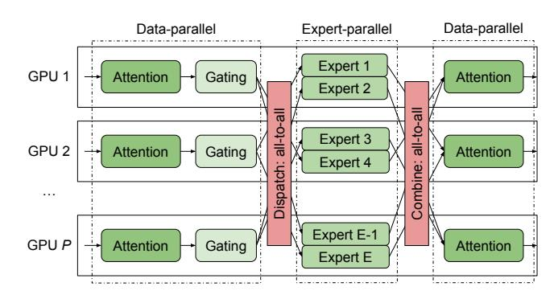
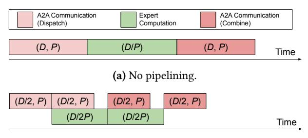
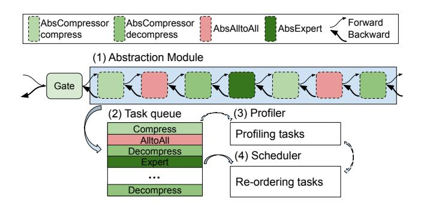
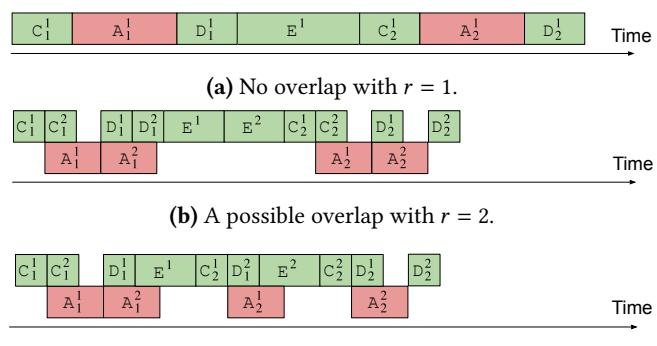
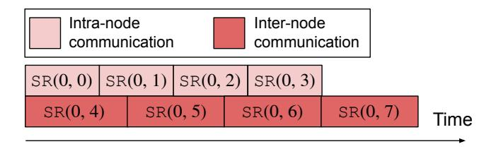
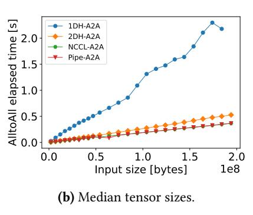

# ScheMoE: An Extensible Mixture-of-Experts Distributed Training System with Tasks Scheduling

Shaohuai Shi<sup>1</sup>, Xinglin Pan<sup>2</sup>, Qiang Wang<sup>1</sup>, Chengjian Liu<sup>3</sup>, Xiaozhe Ren<sup>4</sup>, Zhongzhe Hu<sup>4</sup>, Yu Yang<sup>4</sup>, Bo Li<sup>5</sup>, Xiaowen Chu<sup>2,5</sup>

<sup>1</sup>Harbin Institute of Technology, Shenzhen; <sup>2</sup>The Hong Kong University of Science and Technology (Guangzhou)

<sup>3</sup>Shenzhen Technology University; <sup>4</sup>Huawei Central Research Institute, Huawei Technologies

<sup>5</sup>The Hong Kong University of Science and Technology

shaohuais@hit.edu.cn, xpan413@connect.hkust-gz.edu.cn, qiang.wang@hit.edu.cn, liuchengjian@sztu.edu.cn {renxiaozhe, huzhongzhe, yangyu}@huawei.com, bli@cse.ust.hk, xwchu@ust.hk

#### **Abstract**

In recent years, large-scale models can be easily scaled to trillions of parameters with sparsely activated mixture-ofexperts (MoE), which significantly improves the model quality while only requiring a sub-linear increase in computational costs. However, MoE layers require the input data to be dynamically routed to a particular GPU for computing during distributed training. The highly dynamic property of data routing and high communication costs in MoE make the training system low scaling efficiency on GPU clusters. In this work, we propose an extensible and efficient MoE training system, ScheMoE, which is equipped with several features. 1) ScheMoE provides a generic scheduling framework that allows the communication and computation tasks in training MoE models to be scheduled in an optimal way. 2) ScheMoE integrates our proposed novel all-to-all collective which better utilizes intra- and inter-connect bandwidths. 3) ScheMoE supports easy extensions of customized all-to-all collectives and data compression approaches while enjoying our scheduling algorithm. Extensive experiments are conducted on a 32-GPU cluster and the results show that ScheMoE outperforms existing state-of-the-art MoE systems, Tutel and Faster-MoE, by 9%-30%.

# *CCS Concepts:* • Computing methodologies $\rightarrow$ Parallel algorithms.

*Keywords:* Distributed Deep Learning; Large Language Model; Mixture-of-Experts; Scheduling

Permission to make digital or hard copies of all or part of this work for personal or classroom use is granted without fee provided that copies are not made or distributed for profit or commercial advantage and that copies bear this notice and the full citation on the first page. Copyrights for components of this work owned by others than ACM must be honored. Abstracting with credit is permitted. To copy otherwise, or republish, to post on servers or to redistribute to lists, requires prior specific permission and/or a fee. Request permissions from permissions@acm.org.

EuroSys '24, April 22–25, 2024, Athens, Greece
© 2024 Association for Computing Machinery.
ACM ISBN 979-8-4007-0437-6/24/04.
https://doi.org/10.1145/3627703.3650083

#### **ACM Reference Format:**

Shaohuai Shi<sup>1</sup>, Xinglin Pan<sup>2</sup>, Qiang Wang<sup>1</sup>, Chengjian Liu<sup>3</sup>, Xiaozhe Ren<sup>4</sup>, Zhongzhe Hu<sup>4</sup>, Yu Yang<sup>4</sup>, Bo Li<sup>5</sup>, Xiaowen Chu<sup>2,5</sup>. 2024. ScheMoE: An Extensible Mixture-of-Experts Distributed Training System with Tasks Scheduling. In *Nineteenth European Conference on Computer Systems (EuroSys '24), April 22–25, 2024, Athens, Greece.* ACM, New York, NY, USA, 14 pages. https://doi.org/10.1145/3627703. 3650083

### 1 Introduction

It has been well known that large language models (LLMs) have achieved significant breakthroughs in many neural language processing (NLP) and computer vision tasks with increasing model sizes (e.g., BERT [11] with 340 million parameters, GPT-3 [6] with 175 billion parameters, PaLM [9] with 540 billion parameters, etc.). However, scaling LLMs requires a linear increase of compute with respect to the model size. Recently, the sparsely activated mixture-of-experts (MoE) technology, which was first proposed in 1990s [17], is integrated into LLMs [18, 39] to scale the model size to trillions of parameters with requiring only a sub-linear increase of computations [13, 18, 26, 38]. Compared to the traditional dense layer, which should be computed for every input, an MoE layer consists of multiple dense layers (called experts) and only a few experts are dynamically activated to compute the output for each input data [18]. Thus, the model size can be scaled to approximately *E* times with *E* experts per MoE layer compared to the dense model, but the computational cost of MoE is only slightly larger than the dense counterpart. For example, Switch Transformer [13] scales to 1.5 trillion parameters with 15 MoE layers, each of which has 2048 experts, from the dense model that has only several billion parameters. However, when training MoE models on a large-scale GPU/TPU cluster, it would introduce critical performance issues that make the distributed training system scale badly [14, 16].

Specifically, in training MoE models, the input data (e.g., tokens) of MoE layers should be dynamically (every minibatch) routed to different experts for computation, but the experts may be located on different workers when one worker (e.g., GPU) cannot store all experts [18]. It means that the

<span id="page-1-0"></span>**Table 1.** Step time and A2A time in training four MoE models on a 32-GPU (Nvidia RTX2080Ti) cluster (with 100Gb/s InfiniBand) running on a highly optimized MoE system, Tutel [16]. Each layer has 32 experts that are evenly distributed to the 32 GPUs. "Ratio" indicates the ratio of A2A time over the step time. More details about the model configurations can be found in Table 5.

| # Layers | # Parameters<br>(Million) | A2A Time<br>(ms) | Step time (ms) | Ratio (%) |
|----------|---------------------------|------------------|----------------|-----------|
| 12       | 73                        | 252.6            | 497.1          | 50.8      |
| 16       | 81                        | 324.8            | 623.0          | 52.1      |
| 20       | 89                        | 419.3            | 768.9          | 54.5      |
| 24       | 97                        | 507.4            | 863.6          | 58.8      |

input data should be transferred to particular GPUs, which is generally implemented by an all-to-all (A2A) collective communication [7] to distribute the data (dispatch) to different GPUs; and the results of experts located in different GPUs are then collected by another A2A operation (combine) [18]. The communication time of A2A operations is critical to the overall training performance. As reported in [16, 18], training MoE models on large-scale TPUs [18] or high-end A100 GPUs [16] requires extensive A2A communication time occupying 40%-50% of the overall step time. We also conducted experiments on a moderate 32-GPU (RTX2080Ti) cluster and the results are shown in Table 1. It illustrates that the A2A communication time occupies 50%-60% of the overall step time. Even worse, the communication time of A2A is significantly increased with an increased number of tokens, number of experts, embedding size, and number of GPUs.

Existing studies try to optimize the training performance of MoE models in three orthogonal directions: 1) design loadbalancing routing functions [13, 19, 55] to make the computation workloads of distributed GPUs more balanced, 2) design efficient communication approaches including communicationefficient 1D or 2D hierarchical A2A algorithms [1, 16, 26, 31, 36] and data compression algorithms [52] to reduce the communication volume, and 3) design task scheduling algorithms [14, 16, 20, 22, 30] to interleave communication tasks and computing tasks so that some communication costs can be hidden. In terms of system optimizations, the latter two directions are of importance to improve the scaling efficiency of distributed systems while preserving the fast convergence property of MoE layers. Though the existing dedicated systems have been tailor-designed for training MoE models, they still have several limitations: 1) limited extensibility to support newly designed communication-efficient methods for data transfer in the A2A operations, 2) sub-optimality of the A2A algorithms in utilizing the bandwidth of intra- and inter-connects on modern heterogeneous GPU clusters, and 3) sub-optimality of the scheduling algorithms to interleave the computing tasks and communication tasks.

Table 2. Notations

<span id="page-1-2"></span>

| Name | Description                                         |
|------|-----------------------------------------------------|
| P    | The number of workers (or GPUs) in the cluster.     |
| B    | # of samples per GPU (or local mini-batch size).    |
| L    | # of tokens per sample (or sequence length).        |
| N    | # of assigned tokens per expert.                    |
| E    | Total number of experts.                            |
| M    | Embedding size of a token.                          |
| H    | Hidden size of the feed-forward layer in experts.   |
| k    | Top- $k$ experts should be selected for each token. |

To this end, in this work, we propose ScheMoE, an extensible and efficient MoE system with optimal task scheduling, for efficiently training MoE models, where we make the following main technical contributions. (1) We modularize the time-consuming operations including data compression (a computing task), collective communication (a communication task), and expert computation (a computing task) so that these operations are easily customized with newly designed implementations (§3). (2) Based on the modularized operations, we propose an adaptive optimal scheduling algorithm to pipeline the communication and computing tasks to improve the training efficiency (§4). (3) We design a novel all-to-all algorithm, Pipe-A2A (§5), that pipelines the intranode communications and inter-node communications such that the intra-node bandwidth and inter-node bandwidth can be simultaneously utilized to improve communication efficiency. (4) We conduct extensive experiments on a 32-GPU cluster with 8 nodes connected by a 100Gb/s Infini-Band network using customized MoE layers and real-world transformer-based MoE models (§6). Experimental results show that: 1) ScheMoE outperforms Tutel [16] by 22% time efficiency on average on training 675 different MoE layers with different configurations. 2) Pipe-A2A achieves significant improvement  $(1.4\times-2\times)$  over NCCL<sup>1</sup>, the 1D-hierarchical A2A algorithm [31], and the 2D-hierarchical A2A algorithm [16] when the message size is large (e.g.,  $\geq$  200MB). 3) ScheMoE runs 1.09×-1.3× faster on average than the existing state-ofthe-art MoE systems (Tutel and Faster-MoE [14]) on training four customized MoE models that are configured with commonly used settings.

## 2 Background and Motivation

For ease of presentation, we summarize some frequently used notations throughout the paper in Table 2.

Distributed training with GPU/TPU clusters using different parallel techniques including data-parallel [10], model-parallel [10], and pipeline-parallel [15] has become a de-facto training scheme to optimize LLMs. However, the parallel technique in distributed training of MoE models is different.

<span id="page-1-1"></span><sup>&</sup>lt;sup>1</sup>https://developer.nvidia.com/nccl

Multiple experts in an MoE layer are distributed to different GPUs as a single GPU cannot fit all parameters of multiple experts, which is called expert parallelism [14, 18].

<span id="page-2-0"></span>

**Figure 1.** A typical MoE structure with *E* experts.

#### <span id="page-2-2"></span>2.1 MoE Layer

In sparsely activated transformer models, an MoE layer is used to replace the original feed-forward dense layer (fflayer). Specifically, the MoE layer consists of a gating function and multiple fflayers (or called experts). For each input (e.g., a token,  $I_i$ ), only top-k experts (k can be 1 [13] or 2 [18]) are selected to generate the outputs for the next layer. A typical structure of the MoE layer is shown in Fig. 1.

**Gating function.** The gating function is a small learnable neural network, denoted as a function g followed by a softmax probability, that determines which experts should be activated for each input. Let I denote the input tensor with a shape of (B, L, M) for the gating function, and G = g(I) denote its output with a shape of (E, C, M), where C is the maximum number of tokens assigned to an expert. C is also called expert capacity. C is then C is then C is that is, the C is the C is the C is that is, the C is the C is the tensor that should be routed to the C is a small learnable neural network.

**Expert.** There are multiple *fflayers* in an MoE layer, each of which is called an expert. Let E denote the number of experts in an MoE layer. The  $i^{th}$  expert  $(e_i)$  handles G[i,:,:] for each mini-batch of data, i.e.,  $Q_i = e_i(G[i,:,:]) \in \mathbb{R}^{C \times M}$ . All the outputs, in the current MoE layer, should be combined as a single tensor, i.e.,  $Q = combine(Q_1, Q_2, ..., Q_E) \in \mathbb{R}^{B \times L \times M}$ . And Q is the input for the following layer (e.g., an attention layer) of MoE.

**Dynamic workloads.** Due to the dynamic routing feature of the gating function, the number of assigned tokens for each expert is different and the same expert may have a different number of tokens at different training iterations. As the gating function g is trained from the data, the routing results based on g may cause the workloads of experts to be extremely unbalanced. To alleviate this problem, an expert capacity C is typically required to balance the workloads [18]. A hyper-parameter f, called capacity factor, is set to calculate the capacity

$$C = f \times k \times \frac{B \times L}{F},\tag{1}$$

where *L* is the configured sequence length for training.

<span id="page-2-1"></span>

**Figure 2.** An example of expert-parallel and data-parallel training of an MoE model in a *P*-GPU cluster. Each GPU holds two experts. Tokens are dispatched (and combined) to (and from) particular experts though all-to-all operations.

## 2.2 Distributed Training of MoE Models

The main goal of MoE is to scale the number of parameters while preserving the compute cost almost unchanged or sub-linearly increased. Due to the memory constraint of modern accelerators (e.g., GPU or TPU), the whole model (or one MoE layer) cannot fit in one worker. Thus, experts should be stored to different workers, which is called expert parallelism. As the mini-batch data in synchronous stochastic gradient descent (SGD) [10] is distributed to multiple workers in data parallelism, which is a de-facto approach in distributed training of DNNs, the input data for each MoE layer is different. According to the gating function, the input tokens may be routed to the experts that are located on a different worker. It means that the data located at GPU i may be dispatched to GPU j, which introduces some communication costs and can be implemented by an A2A collective operation [14, 16, 18]. After experts complete their computations, the outputs should be combined back to their own workers, which can also be implemented as an A2A collective operation. An example of distributed training of the MoE layer is shown in Fig. 2. In an MoE model, the MoE layer is trained with expert parallel, while other layers are trained with typical parallelisms like data parallel.

#### 2.3 Performance Bottlenecks in MoE Training

Compared to the traditional hybrid parallelism (e.g., 3D parallelism [29]) in training LLMs, the newly introduced dispatch and combine operations in MoE take significant communication overheads using A2A. According to existing works [14, 16, 18] and our experimental results (Table 1) on our testbed (details in §6.1), the time costs of A2A operations may contribute to 50%-60% of the overall training time. In the MoE layer, the A2A operations mainly occupy network resources, which are *communication tasks* and the expert computations mainly occupy the GPU computational resources, which are computing tasks. The high time costs

<span id="page-3-1"></span>

(b) Pipelining with a degree of 2.

Figure 3. Execution timelines of an MoE layer.

of A2A communications are mainly caused by the following three aspects.

Difficult schedule. In the MoE layer, there exists high data dependency between A2A communication tasks and expert computing tasks. In feed-forward propagation during training, 1) the input data of experts come from the previous layer whose data should be dispatched through the A2A primitive according to the gating function, and 2) the outputs of experts should be synchronized to be combined through another A2A primitive for their next layers' computations. It means that the two A2A communication tasks (dispatch and combine) and the expert computing tasks should be sequentially executed without any overlapping as shown in Fig. 3(a). Note that, during backpropagation, the data dependency between A2A communication tasks and expert computing tasks is reversed. Existing systems (e.g., Faster-MoE [14], Tutel [16], Lina [20]) pipeline the A2A communications with expert computations by virtually partitioning the input tokens into multiple chunks (smaller tensors) so that the A2A communication tasks are possible to be overlapped with expert computation tasks. As shown in Fig. 3(b), the input tensor with shape (D, P) is partitioned into two tensors with shape (D/2, P) so that the two separate tensors for expert computations are overlapped with the A2A communications (during dispatch or combine). There are extensive studies providing scheduling algorithms in data-parallel distributed training (e.g., MG-WFBP [41], ByteScheduler [34], etc.), 3Dparallel with a combination of data-parallel, pipeline-parallel, and tensor-parallel (e.g., PipeDream [28], Alpa [51]), and parallel training with gradient compression (e.g., Optimus-CC [45], CupCake [48]). These systems need to carefully explore the different training patterns that have different data dependencies for computing and communication tasks. It is challenging to design a uniform formulation and thus requires dedicated design of schedulers to maximize the training performance. In MoE training with expert-parallel, it is a new paradigm introducing the dynamic data routing and a new A2A communication pattern with particular data dependencies that are different from traditional distributed training. Recent studies [16, 43, 49] have also revealed this

problem and proposed particular schedules to improve the training performance of MoE systems.

However, the elapsed times of A2A communications and expert computations are affected by different settings including model configurations (e.g., M, D, E, etc.), hardware environments (e.g., GPU type, P, network bandwidth, topology [8], etc.), and A2A algorithms (e.g., hierarchical A2A [16, 31]), which easily makes the training time performance sub-optimal in existing pipelining approaches.

**Large communication volume.** As introduced in §2.1, the input tensor of A2A has a shape of  $(E, f \times k \times \frac{B \times L}{E}, M)$ , which has a message size of

$$S = f \times k \times B \times L \times M \times b/8 \tag{2}$$

in bytes using b-bit floating-point precision representation for each element. Typically b=32 (i.e., float32) in DNN training. In A2A on a P-GPU cluster, each GPU receives (and sends) data from (and to) other P-1 GPUs, each of which has a message size of S/P. Thus, the communication volume for each A2A operation is (P-1)S/P. Practically, the volume can be millions of bytes per A2A operation in MoE training. There exist some studies [52] proposing data compression techniques (e.g., 16-bit and ZFP [21]) to reduce the communication volume.

However, data compression requires computing resources, thus introducing extra computational costs, which may not bring benefits without careful design.

Heterogeneity of GPU clusters. Modern GPU clusters are mostly heterogeneous, where one node is equipped with multiple GPUs. The intra-node GPU communication speed is normally faster than the inter-node counterpart. For example, the intra-node interconnect is PCIe3.0x16 (16-32GB/s) or NVLink (300-600GB/s) while the inter-node interconnect is Ethernet (10-32Gb/s) or InfiniBand (56-200Gb/s). There are some studies developing hierarchical A2A algorithms, like 1D-Hierarchical A2A (1DH-A2A) [31] and 2D-Hierarchical A2A (2DH-A2A) [2, 16]) to better utilize the high-speed intra-node connections.

However, they cannot fully utilize the whole bandwidth resources as different communication primitives of 1DH-A2A or 2DH-A2A should be sequentially executed.

In this work, we aim to address the above three problems by proposing an extensible and efficient MoE training system with task scheduling, together with a novel pipelined A2A algorithm.

## <span id="page-3-0"></span>3 System Design

Making the performance-related APIs be abstractions in a scheduling framework is under-explored. In existing state-of-the-art MoE systems (like Tutel [16], Faster-MoE [14], Lina [20] and SmartMoE [49]), they are particularly designed for their proposed scheduling algorithms. When some parts are changed (e.g., a new A2A algorithm is

<span id="page-4-0"></span>

**Figure 4.** Overview of ScheMoE. The MoE layer is configured with our abstraction module that supports feed-forward and backward propagation during training. The computing and communication tasks during forward and backward are put into the task queue, which will be profiled to measure their performance by the Profiler. The meta-data (e.g., time performance models) is used by the scheduler to determine the optimal execution order of all tasks.

introduced), their schedules may not work or their performance is sub-optimal. This motivates the design philosophy of our system, ScheMoE, to provide an extensive framework, which supports 1) flexible scheduling of communication and computing tasks and 2) easy integration of newly implemented A2A and data compression algorithms. The overview of ScheMoE is shown in Fig. 4.

#### 3.1 Abstractions of Tasks

To achieve the above two goals in ScheMoE, we first design abstractions of computing tasks (data compression, data decompression, and expert computation) and communication tasks (A2A communication) for the MoE layer. We design three abstraction modules for the MoE layer: AbsCompressor, AbsAlltoAll, and AbsExpert. Note that these modules preserve the automatic differentiation feature of modern deep learning (DL) frameworks like PyTorch<sup>2</sup>. That is, in an MoE layer, the execution tasks (including forward and backward) are abstracted to our defined modules as shown in Fig. 4(1). The inputs and outputs of the abstraction module are kept identical to the traditional MoE layer.

**AbsCompressor.** The compression abstraction provides data compression (AbsCompressor.compress) of the input tokens so that the communication volume for its following A2A operation can be reduced. As the compressed data after transfer should be recovered for expert computation, the compressed data will be decompressed through AbsCompressor.decompress. Any data compression algorithms are

supported in our system for scheduling. We have implemented several commonly used compressors including low-bit floating-point representations (16-bit and 8-bit) and ZFP compression [21, 52].

**AbsAlltoAll.** The A2A abstraction provides the A2A operation on a GPU cluster. Users are able to customize A2A algorithms without affecting the logic of training. The AbsAlltoAll abstraction takes the data from the output of AbsCompressor.compress as its input, and completes an A2A operation, whose outputs are further fed back to the AbsCompressor.decompress. We have implemented the default A2A algorithm provided by NCCL (NCCL-A2A), 1DH-A2A proposed by Hetu [31], 2DH-A2A proposed by Tutel and DeepSpeed-MoE, and our newly designed pipelined A2A algorithm (§5). The A2A operations with different algorithms are possible to be scheduled in our system.

**AbsExpert.** The expert abstraction provides the expert computation which is typically a small neural network with *fflayers. fflayers* can typically well utilize GPU computing resources as their operators are matrix multiplication operations that are highly optimized on modern GPUs or TPUs. This abstraction is mainly used for easy profiling of its computation time and scheduling (§3.2). We do not provide particular customization for this abstraction as the default *fflayers* are fast enough.

The default execution order of tasks in the MoE layer is data compression (computing task), A2A operation (communication task), data decompression (computing task), expert computation (computing task), data compression (computing task), A2A operation (communication task), and data decompression (computing task) in the forward propagation. The execution order of backward propagation is the reverse operation of forward operations, thus we mainly focus on discussing the time performance of forward propagation.

### <span id="page-4-2"></span>3.2 Generic Scheduler

The ScheMoE system is able to schedule the execution order of all tasks from the abstraction module in the MoE layer. The tasks are first en-queued and their execution order is determined by a customized scheduling algorithm (Scheduler in Fig. 4(4)) which can utilize the meta-data of the time performance of different tasks from the profiler.

Task Queue. To enable the scheduler to determine the execution order of the tasks, the original tasks from all the abstraction modules are put into the task queue. In an MoE layer (forward or backward), there are two compression tasks, two decompression tasks, one expert computation task, and two A2A communication tasks (a total of 7) if the input tensor from the gating function is not partitioned. As the input tensor is possible to be partitioned to multiple tensors without affecting the training results [14, 16], the total number of tasks is also enlarged with a higher degree of partition for the input tensor.

<span id="page-4-1"></span><sup>&</sup>lt;sup>2</sup>We use PyTorch as our base DL framework to demonstrate our system, but the key idea of our design can be easily extended to other DL frameworks like TensorFlow.

**Profiler.** All the tasks in the task queue of an MoE layer will be profiled to measure their time performance so that we can build performance models for different types of tasks (§4). No matter which algorithms are configured for the abstraction module, one can profile their time performance and predict their elapsed times on the current running cluster with the built performance models in our system.

**Scheduler.** The meta-data of elapsed times is available from the Profiler. Scheduler re-orders the en-queued tasks to a new execution order without breaking their original data dependency. Note that it is possible to execute communication tasks and computing tasks in parallel to enable the pipelining of different tasks. A user-friendly interface to decide the scheduling scheme is defined to allow users to easily customize scheduling algorithms in our system.

#### 3.3 Implementation

We implement our system, ScheMoE<sup>3</sup>, atop PyTorch with its C/C++ and CUDA extension feature. The core engine of our ScheMoE is mainly implemented using C/C++ with around 1,200 lines of code. We also adopt third-party libraries to support different customized algorithms in ScheMoE, such as ZFP<sup>4</sup>, NCCL<sup>5</sup>, Hetu<sup>6</sup>, and Tutel<sup>7</sup>.

```
#include "abstract_comm.h"

#include "abstract_compressor.h"

class ZFPCompressor: public AbsCompressor{
public:
    Tensor compress(const Tensor&);
    Tensor decompress(const Tensor&);
}

class PipeAlltoAll: public AbsAlltoAll {
public:
    void all_to_all(const Tensor&, const Tensor&, size_t);
}
```

**Listing 1.** Code sample of implementing the abstractions in C/C++.

```
import ScheMoE

z

scheMoE.init()

compressor_impl = ScheMoE.ZFPCompressor

all_to_all_impl = ScheMoE.PipeAlltoAll

moe_module = ScheMoE.MOELayer(**kwargs,
```

**Listing 2.** Code sample of using ScheMoE in Python. "moe\_module" can be used as a normal nn.Module instance in PyTorch.

<span id="page-5-8"></span>

(c) The optimal overlap with r = 2.

Figure 5. Execution timelines of different schedules.

**User usage.** For the customized algorithms, users can implement their own compressors and A2A algorithms by inheriting our abstract interfaces as shown in Listing 1. For AbsCompressor, the "compress" and "decompress" interfaces should be implemented. For AbsAlltoAll, only the "all\_to\_all" interface should be implemented.

For using the MoE layer, as shown in Listing 2, one can instantiate a new instance of an MoE layer, which can be used as a normal nn.Module in PyTorch. Lines 4 and 5 are optional if users do not provide newly implemented algorithms.

# <span id="page-5-0"></span>4 Optimal Scheduling Algorithm

Our ScheMoE allows an easy extension for implementing new schedule algorithms to determine the task execution order. We propose an optimal scheduling algorithm, named OptSche, with some practical constraints. Assuming that the input tensor is uniformly partitioned to multiple equal-size tensors (say r), the abstraction module has a total of  $7 \times r$ tasks. Given a r degree of partitioning, we derive an optimal scheduling algorithm for the execution order such that the communication tasks and computing tasks can be maximally overlapped. Note that a larger r enables a higher degree for pipelining, but it may decrease the arithmetic intensity of computation as the workload on the GPU per kernel launch becomes smaller. Thus, determining r to achieve better performance is another optimization problem, which has been studied in [43] and [16]. Orthogonal to the methods in choosing the best r, our scheduling algorithm instead determines the optimal order of all compute and communication tasks for any given  $r \ge 2$ . To simplify the problem, we use r = 2to demonstrate our scheduling algorithm and conduct experiments, but it is also applicable to r > 2.

## 4.1 Problem Formulation

According to the abstraction module, there are 7 tasks in the feed-forward phase (and the same for backpropagation). We use  $C_1$ ,  $A_1$ ,  $D_1$ , E,  $C_2$ ,  $A_2$ ,  $D_2$  to denote the tasks of the first data compression, the first A2A, the first data decompression,

<span id="page-5-1"></span><sup>&</sup>lt;sup>3</sup>Code is available at https://github.com/Fragile-azalea/ScheMoE.

<span id="page-5-2"></span><sup>&</sup>lt;sup>4</sup>https://github.com/LLNL/zfp

<span id="page-5-3"></span><sup>&</sup>lt;sup>5</sup>https://developer.nvidia.com/nccl

<span id="page-5-4"></span><sup>&</sup>lt;sup>6</sup>https://github.com/Hsword/Hetu

<span id="page-5-5"></span><sup>&</sup>lt;sup>7</sup>https://github.com/microsoft/tutel

expert computation, the second data compression, the second A2A, and the second data decompression, respectively for the input tensor without partitioning. If the input tensor is partitioned to r equal-size parts, each task will be partitioned to r independent sub-tasks. The partitioned tasks can be represented as

$$\mathbb{T} = \{ C_1^i, A_1^i, D_1^i, E^i, C_2^i, A_2^i, D_2^i | 1 \le i \le r \},$$
 (3)

where  $A_1^i$  and  $A_2^i$  are communication tasks (CommTasks) and others are computing tasks (CompTasks). Due the resource competition, we assume that any two same types of tasks cannot execute simultaneously, while a communication task and a computing task are allowed to run simultaneously. Let  $\tau(\cdot)$  and  $t(\cdot)$  denote the beginning execution timestamp of running a task and its elapsed time respectively. Note that the execution times for the first and second same tasks (e.g.,  $C_1^i$  and  $C_2^j$ ) are the same. The data dependency of different tasks can be represented as follows, for  $1 \le i \le r$ ,

$$\tau(\mathsf{A}_1^i) \ge \tau(\mathsf{C}_1^i) + t(\mathsf{C}_1^i),\tag{4}$$

$$\tau(\mathsf{D}_1^i) \ge \tau(\mathsf{A}_1^i) + t(\mathsf{A}_1^i),\tag{5}$$

$$\tau(\mathsf{E}^i) \ge \tau(\mathsf{D}_1^i) + t(\mathsf{D}_1^i),\tag{6}$$

$$\tau(\mathsf{C}_2^i) \ge \tau(\mathsf{E}^i) + t(\mathsf{E}^i),\tag{7}$$

$$\tau(\mathsf{A}_2^i) \ge \tau(\mathsf{C}_2^i) + t(\mathsf{C}_2^i),\tag{8}$$

$$\tau(\mathsf{D}_2^i) \ge \tau(\mathsf{A}_2^i) + t(\mathsf{A}_2^i). \tag{9}$$

The default execution order (as shown in Fig. 5(a) with r = 1) without overlapping takes the time of

$$t_1 = \sum_{e \in \mathbb{T}} t(e). \tag{10}$$

For  $r \ge 2$ , there are overlaps between CommTasks and CompTasks (as shown in Fig. 5(b) with r = 2), the execution time can be represented as

<span id="page-6-2"></span>
$$t_r = \sum_{e \in \mathbb{T}} t(e) - t_{hidden}, \tag{11}$$

where  $t_{hidden}$  is the hidden time in overlapping. Thus, our goal is to find an execution order under the constraints of (4)-(9) such that the hidden time is maximized thus  $t_r$  is minimized. The intuitive understanding of the optimal solution is ensuring the tasks to be executed in an order that un-blocks later tasks quicker.

## 4.2 Optimal Solution

**Theorem 1.** Assume that an MoE layer is trained with our ScheMoE framework and the partitioned tasks have the constraints of (4)-(9). The optimal execution order for minimizing Eq.(11) is

<span id="page-6-4"></span>
$$(\mathsf{C}_1^1\mathsf{C}_1^2\cdots\mathsf{C}_1^r)(\mathsf{D}_1^1\mathsf{E}^1\mathsf{C}_2^1)(\mathsf{D}_1^2\mathsf{E}^2\mathsf{C}_2^2)\cdots(\mathsf{D}_1^r\mathsf{E}^r\mathsf{C}_2^r)(\mathsf{D}_2^1\mathsf{D}_2^2\cdots\mathsf{D}_2^r) \tag{12}$$

<span id="page-6-3"></span>

**Figure 6.** Demonstration of one case. (a)  $D_1^J$  runs before  $C_2^i$  and  $A_2^i$  can be immediately started after  $C_2^i$ . (b)  $D_1^J$  runs before  $C_2^i$  and  $A_2^i$  can be only started after its previous communication tasks finish. (c) Exchanging the order of  $D_1^J$  and  $C_2^i$  from (a) makes  $A_2^i$  can be started earlier. (d) Exchanging the order of  $D_1^J$  and  $C_2^i$  from (b) cannot make  $A_2^i$  begin later.

<span id="page-6-0"></span>for the computing tasks and the communication tasks are directly executed when their predecessor tasks have been completed, that is

$$\tau(\mathsf{A}_1^i) = \begin{cases} \tau(\mathsf{C}_1^1) + t(\mathsf{C}_1^1) & i = 1\\ \max\{\tau(\mathsf{C}_1^i) + t(\mathsf{C}_1^i), \tau(\mathsf{A}_1^{i-1}) + t(\mathsf{A}_1^{i-1})\} & i > 1 \end{cases}, \tag{13}$$

<span id="page-6-1"></span>and

$$\tau(\mathsf{A}_2^i) = \begin{cases} \max\{\tau(\mathsf{C}_2^1) + t(\mathsf{C}_2^1), \tau(\mathsf{A}_1^r) + t(\mathsf{A}_1^r)\} & i = 1 \\ \max\{\tau(\mathsf{C}_2^i) + t(\mathsf{C}_2^i), \tau(\mathsf{A}_2^{i-1}) + t(\mathsf{A}_2^{i-1})\} & i > 1 \end{cases}. \tag{14}$$

*Proof.* First, we prove that for any  $1 \le i < j \le r$ ,  $\mathsf{D}_1^j$  begins after  $\mathsf{C}_2^i$  is not worse than reversing their order. Note that the computation time of exchanging the order of  $\mathsf{C}_2^i$  and  $\mathsf{D}_1^j$  would not be changed. If  $\mathsf{D}_1^j$  begins before  $\mathsf{C}_2^i$ , the possible beginning time of  $A_2^i$  will be larger than or equal to that  $\mathsf{D}_1^j$  begins later than  $\mathsf{C}_2^i$ . Thus,  $\mathsf{D}_1^j$  should begin after  $\mathsf{C}_2^i$ . An easy-to-understand demonstration is present in Fig. 6.

Second, we prove that for any  $1 \le i < j \le r$ ,  $D_1^j$  begins after  $C_1^i$  is not worse than reversing their order. Similar to the previous case, if  $D_1^j$  begins before  $C_1^i$ , the beginning time of  $A_1^i$  will be larger than or equal to that  $D_1^j$  begins after  $C_1^i$ . Thus,  $D_1^j$  should begin after  $C_1^i$ .

Third, we prove that for any  $1 \le i < j \le r$ ,  $D_2^j$  begins after  $C_2^i$  is not worse than reversing their order. If  $D_2^j$  begins before  $C_2^i$ , the beginning time of  $A_2^i$  will be larger than or equal to that  $D_2^j$  begins after  $C_2^i$ . Thus,  $D_2^j$  should begin after  $C_2^i$ .

Fourth, we prove that for any  $1 \le i < j \le r$ ,  $C_2^j$  begins after  $E^i$  is not worse than reversing their order. If  $C_2^j$  begins before  $E^i$ , the beginning time of  $A_2^i$  will be larger than or equal to that  $C_2^j$  begins after  $E^i$ . Thus,  $C_2^j$  should begin after  $E^i$ 

<span id="page-7-3"></span>

**Figure 7.** An example of Pipe-A2A on a 2-node cluster, where each node has 4 GPUs. Intra-node communications are able to be overlapped with inter-node communications.

Putting all the above four cases and using the constraints of (4)-(9), we can conclude that exchanging any two tasks from the order of Eq.(12) cannot make the elapsed-time of the MoE layer shorter, which completes the proof.

An example of r=2 of the optimal solution is shown in Fig. 5(c), where the step time cannot be made shorter by exchanging the order of any two computing tasks under the constraints of (4)-(9).

# <span id="page-7-0"></span>5 Pipelined All-to-all Algorithm

To better utilize the heterogeneous bandwidth on modern GPU clusters, we design a new A2A algorithm called Pipelined All-to-all (or Pipe-A2A). An A2A operation consists of a series of Send (and Recv) operations, which send (and receive) a particular part of data to (and from) corresponding GPUs. To better utilize the network resources of both intranode bandwidth and inter-node bandwidth, we enable the intra-node Send/Recv operations to be pipelined with the inter-node Send/Recv operations.

Assume that the A2A operation is running on a heterogeneous GPU cluster with N nodes and each node has M GPUs, i.e.,  $P = N \times M$ . Formally, for an input tensor  $I_i$  located on GPU i,  $I_i^j$  indicates the data that should send to GPU j,  $0 \le i, j \le P - 1$ . Let SR(i, j) denote the pair of Send and Recv operations between GPU i and j. If GPU i and GPU j are located in the same node, then SR(i, j) is an intra-node operation, otherwise, it is an inter-node operation. For the A2A collective, there are totally P SR operations, i.e.,

$$SR(i, 0), SR(i, 1), \dots, SR(i, P - 1).$$
 (15)

Note that SR(i, i) only requires an in-memory copy, but we also regard it as an intra-node operation for ease of presentation. Normally, the P operations should be executed sequentially, which means the intra-node operations have no opportunity to be overlapped with inter-node operations. In Pipe-A2A, we introduce two asynchronous communication streams, one is for intra-node communication (Intra-Stream) and one is for inter-node communication (Inter-Stream).

One SR can be viewed as one task. For any task SR(i, j), if GPU i and GPU j are located in the same node, it uses Intra-Stream to do the communication, otherwise, it uses Inter-Stream to do the communication. As Intra-Stream and

<span id="page-7-4"></span>**Table 3.** The hardware configuration of servers.

| Name    | Model                                   |
|---------|-----------------------------------------|
| CPU     | Dual Intel Xeon Gold 6230 CPU@2.10GHz   |
| GPU     | ×4 RTX2080Ti (@1.35GHz, 11GB Memory)    |
| Memory  | 512GB DDR4                              |
| PCIe    | 3.0 (×16)                               |
| Network | Mellanox MT27800 (ConnectX-5) @ 100Gb/s |

<span id="page-7-5"></span>**Table 4.** Configurations of MoE layers (k = 1 and E = P).

| Parameter | Candidate Values              |
|-----------|-------------------------------|
| В         | {2, 4, 8}                     |
| f         | {1.0, 1.1, 1.2}               |
| L         | {512, 1024, 2048}             |
| Н         | {512, 1024, 2048, 4096, 8192} |
| M         | {512, 1024, 2048, 4096, 8192} |

Inter-Stream occupy different inter-connect resources, these two streams can be executed simultaneously. As shown in Fig. 7 with an 8-GPU example on 2 nodes, by asynchronously executing the intra-node and inter-node communications, one can hide some communication costs compared to sequentially executing all communication tasks without any interleaves. In modern GPU clusters, the intra-node interconnect typically has a higher bandwidth or lower latency than the inter-node interconnects. Therefore, intra-node communication costs could be fully hidden by inter-node communications. Compared to NCCL-A2A, which executes all SR operations sequentially, Pipe-A2A allows intra-node operations and inter-node operations to be executed concurrently. If the bandwidth or the latency between intra-node and inter-node interconnects are comparable, our Pipe-A2A could achieve significant improvement over sequentially executed without pipelining.

#### <span id="page-7-1"></span>6 Evaluation

#### <span id="page-7-2"></span>6.1 Experimental Settings

**Testbed.** We conduct experiments on a 32-GPU cluster, which consists of 8 nodes connected with 100Gb/s InfiniBand. Each node has the same configuration and is equipped with four Nvidia Geforce RTX2080Ti GPUs connected with PCIe3.0x16. The details of hardware are shown in Table 3. The DL framework is PyTorch-1.10 [33] under a software environment of Ubuntu-18.04, CUDA-10.2, cuDNN-7.6, OpenMPI-4.1.4, and NCCL-2.13.

**Model configurations.** (1) *Customized MoE layers*: Similar to Tutel, we cover a variety of typical configurations of MoE layers by choosing a combination of input parameters whose ranges are shown in Table 4. We set the number of experts equal to the number of GPUs (i.e., 32 in our experiments) and k = 2. Some cases that require memory larger

| MoE Name        | Base Model     | # Params    | # Params | Dataset      | MoE Configuration |     |      |      |     |    |    |
|-----------------|----------------|-------------|----------|--------------|-------------------|-----|------|------|-----|----|----|
|                 |                | (Attention) | (MoE)    |              | 𝑓                 | 𝐵   | 𝐿    | 𝐻    | 𝑀   | 𝑘  | 𝐸  |
| Transformer-MoE | Transformer    | 90M         | 403M     | wmt14_en_fr  | 1.0               | -   | -    | 2048 | 512 | 1  | 8  |
| GPT2-Tiny-MoE   | GPT2-Tiny      | 32M         | 1M       | wikitext-103 | 1.0               | 4   | 256  | 64   | 64  | 2  | 32 |
| CT-MoE          | CusTransformer | 97M         | 403M     | wmt14_en_fr  | 1.0               | 136 | 31   | 512  | 512 | 1  | 32 |
| BERT-Large-MoE  | BERT-Large     | 139M        | 6442M    | bookcorpus   | 1.0               | 1   | 4096 | 1024 | 1   | 32 | 32 |

<span id="page-8-0"></span>Table 5. Configurations of MoE models. For Transformer-MoE, × = 4, 906 instead of setting and separately.

than the capacity of GPU memory (11GB) and cannot run on our cluster are excluded, so we conduct totally 676 valid cases for the experiments.

(2) Real-world MoE models: Similar to Faster-MoE [\[14\]](#page-12-7), we also choose three popular NLP models, i.e., Transformer [\[47\]](#page-13-18) for the translation task on the wmt14\_en\_fr[8](#page-8-1) English-French translation dataset [\[5\]](#page-12-19), GPT2-Tiny[9](#page-8-2) for the language modeling task on the wikitext-103 dataset [\[46\]](#page-13-19), and a relatively large BERT-Large [\[11\]](#page-12-0) model for the pretraining task on the bookcorpus dataset [\[54\]](#page-13-20). We also customize an NLP model (named Cus-Transformer) that can be configured with a different number of layers (12, 16, 20, and 24 for our experiments). We replace all the feed-forward layers in Transformer, GPT2-Tiny, Cus-Transformer, and BERT-Large with MoE layers to construct MoE models. Due to the memory constraint in our testbed, we configure the number of local experts on each GPU to 1, i.e., = . The details of the configuration are shown in Table [5.](#page-8-0)

## 6.2 Convergence of Data Compression

<span id="page-8-3"></span>Table 6. Convergence performance under different compression methods. The higher BLEU, the better model performance. The lower perplexity, the better model performance.

|            | Validation Performance |               |  |  |
|------------|------------------------|---------------|--|--|
| Method     | Transformer-MoE        | GPT2-Tiny-MoE |  |  |
|            | (BLEU)                 | (Perplexity)  |  |  |
| Base       | 45.51                  | 128.8         |  |  |
| MoE        | 46.61                  | 106.8         |  |  |
| MoE w/FP16 | 46.59                  | 106.85        |  |  |
| MoE w/INT8 | 46.68                  | 110.35        |  |  |
| MoE w/ZFP  | 46.58                  | 106.87        |  |  |

As the data compression approaches like quantization with low-bit floating point precision (e.g., 16-bit or 8-bit) and the ZFP approach are lossy algorithms, we conduct convergence experiments on two real-world MoE models with two datasets to verify if the lossy compression can preserve

model accuracy. Since the end-to-end training time to converge would be very long under our limited testbed, we mainly use relatively small models to verify their convergence performance. The results are shown in Table [6.](#page-8-3) For each method, we train the same number of iterations (i.e., 434,850 and 500,000 iterations for Transformer-MoE and GPT2-Tiny-MoE, respectively).

First, MoE models have significant improvement in model performance (i.e., higher BLEU or lower perplexity) over Base models, which matches the conclusion of existing studies [\[18,](#page-12-4) [19\]](#page-12-10). Second, MoE w/FP16 has almost no impact on the model convergence using only a 16-bit floating-point precision representation of input data. It enables mixed-precision training, which would better utilize modern hardware resources with tensor cores, without particularly tuning hyperparameters on MoE layers. Third, MoE w/INT8 has a dramatic performance decrease in GPT2-Tiny-MoE (from 106.8 to 110.35) as it has a large data loss using an 8-bit integer to train the model. Though it can reduce the communication volume of A2A by 4 times compared to the 32-bit counterpart, the accuracy loss may not be acceptable for AI practitioners. The results indicate that the current INT8 compression approach could not be applied in MoE models in some applications. Fourth, MoE w/ZFP preserves model accuracy in both models and it can reduce the communication volume by four times (only 8-bit is required using ZFP for each element on average) as MoE w/INT8. Thus, ZFP compression could be an effective way to improve the training time performance with little impact on the model convergence. We use MoE w/ZFP to study its time performance in our ScheMoE.

### 6.3 Step time Performance

<span id="page-8-4"></span>Table 7. Step time (mean±std) in CT-MoE-. Three independent runs are measured for each experiment.

| System     | Time (ms) |           |           |           |  |  |
|------------|-----------|-----------|-----------|-----------|--|--|
|            | 𝑥<br>= 12 | 𝑥<br>= 16 | 𝑥<br>= 20 | 𝑥<br>= 24 |  |  |
| Tutel      | 497±9     | 623±2     | 769±3     | 864±3     |  |  |
| Faster-MoE | 506±7     | 640±8     | 845±10    | 1003±16   |  |  |
| ScheMoE    | 454±4     | 552±1     | 658±1     | 774±8     |  |  |

Customized MoE layers. Using the combination of Table [4](#page-7-5) to construct MoE layers, there are 675 valid cases

<span id="page-8-1"></span><sup>8</sup><https://huggingface.co/datasets/wmt14>.

<span id="page-8-2"></span><sup>9</sup> It is a language model that has similar architecture with GPT2, but it has relatively small dimensions compared to GPT2 [\[35\]](#page-13-21). The source code of the model (named "transformer\_lm\_gpt2\_tiny") can be found at: [https:](https://github.com/facebookresearch/fairseq/models/transformer_lm.py) [//github.com/facebookresearch/fairseq/models/transformer\\_lm.py](https://github.com/facebookresearch/fairseq/models/transformer_lm.py).

<span id="page-9-0"></span>

**Figure 8.** Statistic of the speedup over Tutel.

(OOM cases are excluded) successfully measured in both Tutel and ScheMoE using our 32-GPU cluster. In all valid cases, ScheMoE is always faster than Tutel. The statistic of the speedup of ScheMoE over Tutel is shown in Fig. 8. On average, ScheMoE achieves 22% improvement over Tutel.

**CT-MoE-***x* **models.** We configure CT-MoE-*x* with a different number of layers (i.e., x) to study the iteration time performance using our ScheMoE. As shown in the previous subsection, data compression with ZFP can achieve the target model accuracy under the same number of iterations as the original version, so we only measure the step time to compare different training systems. The results are shown in Table 7. It shows that ScheMoE achieves 9%-17% and 11%-30% improvement over Tutel and Faster-MoE, respectively. Note that for both Tutel and Faster-MoE, we use their official releases open-sourced at GitHub. There are slight differences in A2A implementations between Tutel and Faster-MoE to support their own scheduling algorithms. Though both of them pipeline the communication tasks with computing tasks, the A2A communication time cannot be well overlapped. Instead, ScheMoE is able to schedule different tasks in a more intelligent manner such that the communication tasks are maximally overlapped. We will dive into the details with an ablation study to see the separate benefits of our proposed optimizations in §6.5.

**Table 8.** End-to-end performance on BERT-Large-MoE. Faster-MoE runs OOM.

| Name Time (mean ± std in r |                  | Speedup |
|----------------------------|------------------|---------|
| Tutel                      | $783.3 \pm 11.8$ | 1.0×    |
| ScheMoE                    | $672.9 \pm 28.4$ | 1.16×   |

BERT-Large-MoE model. In the large MoE model of BERT-Large-MoE, which has totally ~6.5 billion parameters, our ScheMoE runs 1.16× faster than Tutel, while Faster-MoE runs OOM, which may be caused by the improper handling of imbalanced tokens on different GPUs. In this model, Pipe-A2A does not contribute to the overall improvement as the input size for the A2A collective is 524,288 bytes, and the performance of A2A and NCCL-A2A is similar with small

or median message sizes (more details are shown in the following subsection). The ZFP compression algorithm and the scheduling algorithm contribute around 70% and 30% to the overall improvement, respectively.

#### 6.4 A2A Performance

To provide a full comparison between different A2A algorithms, we conduct experiments with different sizes of tensors including 1) small: [1K, 1M], 2) median: [1M, 200M], and 3) large: [200M, 2G] in bytes on our 32-GPU cluster. The results are shown in Fig. 9. It is seen that Pipe-A2A outperforms all the other A2A algorithms in all cases. Particularly, when the message size is small or median, our Pipe-A2A runs only 3%-5% improvement over NCCL-A2A and 2DH-A2A, while the three are much faster than 1DH-A2A. When the message size is larger than 200M, which is also common on extremely large sparse models, Pipe-A2A achieves up to around 2× and 1.4× speedups over 2DH-A2A and NCCL-A2A, respectively. Due to the hardware limitation, we only conduct the performance under our testbed, but we plan to evaluate our algorithm on other supercomputers and public cloud GPU clusters, which we leave as our future work.

**Table 9.** Notions for the ablation study.

<span id="page-9-2"></span>

| Name       | w/ ZFP   | w/ Pipe-A2A | w/ Scheduling |
|------------|----------|-------------|---------------|
| Naive      | X        | Х           | Х             |
| ScheMoE-Z  | ✓        | Х           | Х             |
| ScheMoE-ZP | ✓        | ✓           | Х             |
| ScheMoE    | <b>✓</b> | <b>✓</b>    | ✓             |

#### <span id="page-9-1"></span>6.5 Ablation Study

We conduct the ablation study to demonstrate the benefits of different components (i.e., w/ ZFP, w/ Pipe-A2A, and w/ scheduling). The corresponding notations are shown in Table 9. The configuration of the chosen MoE layer has parameters of B = 8, f = 1.2, L = 2048, H = 8192, and M = 8192. The step time on our testbed w/ different components is shown in Table 10. It is seen that the ScheMoE-Z achieves a significant speedup over the naive version as it can compress the communication volume by 4 times while almost preserving the model accuracy (as shown in Table 6). Our Pipe-A2A helps ScheMoE-ZP improve the time performance by 13.8% over ScheMoE-Z. Compared to the improvement on the BERT-Large-MoE model, Pipe-A2A contributes much higher on the CT-MoE model. The reason is the A2A input size of CT-MoE is 640MB, which is the size that Pipe-A2A can significantly outperform NCCL-A2A as shown in Fig. 9(c). The scheduling feature further improves the time performance by another 9% over ScheMoE-ZP. Putting all three optimizations together, ScheMoE runs 2.4× faster than the Naive version.

<span id="page-10-0"></span>




**Figure 9.** Time performance of different A2A algorithms. 3 independent runs are conducted and their averages are measured. 1DH-A2A runs OOM with large tensor sizes.

<span id="page-10-1"></span>**Table 10.** Step time of the MoE layer under different components. The speedup is using the Naive method as the baseline.

| Name       | Time (mean $\pm$ std in ms) | Speedup |  |  |
|------------|-----------------------------|---------|--|--|
| Naive      | $2401 \pm 22$               | 1.0×    |  |  |
| ScheMoE-Z  | $1264 \pm 5$                | 1.9×    |  |  |
| ScheMoE-ZP | 1110 ± 5                    | 2.2×    |  |  |
| ScheMoE    | 1019 ± 2                    | 2.4×    |  |  |

#### 7 Discussion

Though we present some improvements of our ScheMoE over existing state-of-the-art MoE training systems, the time efficiency may still have chances for further improvement.

**Performance of data compression.** On one hand, though data compression is possible to reduce communication traffic, it also introduces computation overhead. One should consider whether the benefits from the reduced communication time can cover the cost of computation. In some hardware environments (e.g., communication is fast on NVLink), data compression may sacrifice the time performance. On the other hand, if the data compression is introduced to the backpropagation phase, which may easily have gradient vanishing [4] or exploding [32] problems, it may make the model training divergent or slow convergence. There are some studies like AC-GC [12] and EXACT [24] aiming to compress activation data, but they are mainly designed for saving memory. The data compression in A2A may be further explored to reduce the communication size while preserving model accuracy.

**Performance of Pipe-A2A.** The benefit of Pipe-A2A comes from the overlapping between intra-node communications and inter-node communications. The reduced time in Pipe-A2A compared to NCCL-A2A (a sequential version) is limited by the maximum overlap between intra-node communications and inter-node communications. Let  $t_1$  and  $t_2$  denote the time of completing a SR task intra-node and internode respectively. For a message, I running a P-GPU (N

nodes and each node has M GPUs), the total times of intranode and inter-node communications would be  $t_{intra} = M \times t_1$ and  $t_{inter} = (P - M) \times t_2$ , respectively. The times of Pipe-A2A and NCCL-A2A can be represented as

$$t_{pipea2a} = \max\{M \times t_1, (P - M) \times t_2\}$$
 (16)

and

$$t_{nccla2a} = M \times t_1 + (P - M) \times t_2, \tag{17}$$

respectively. Therefore, the theoretical maximal speedup of Pipe-A2A over NCCL-A2A is

$$S_{max} = \frac{t_{nccla2a}}{t_{pipea2a}} = \frac{M \times t_1 + (P - M) \times t_2}{\max\{M \times t_1, (P - M) \times t_2\}}.$$
 (18)

The equation indicates that if the difference between  $t_{intra}$  and  $t_{inter}$  is small, then  $S_{max}$  will also be small.

Performance of Scheduling. The key of OptSche in ScheMoE is to maximally overlap the computing tasks and communication tasks. Similar to the comparison between Pipe-A2A and NCCL-A2A, our OptSche algorithm may not have significant improvement over the default schedule when the time gap between computing tasks and communication tasks is large. Thus, in some scenarios (such as A2A occupies only a small proportion of the overall step time), OptSche may achieve very marginal improvement over the default schedule. For example, in the two real-world models (Transformer-MoE and GPT2-Tiny-MoE) that we used to verify the convergence, our ScheMoE achieves only less than 5% improvement over Tutel or ScheMoE w/o OptSche.

In summary, data compression, A2A, and scheduling algorithms still have much potential for further improvement to accelerate MoE training under different hardware and software configurations. We believe the extensible feature of our ScheMoE supporting easy integration of new data compression algorithms, A2A algorithms, and scheduling algorithms would help accelerate the research in this direction.

**Impacts of Different Parallelization Strategies.** Current MoE systems primarily utilize data parallelism (DP) and expert parallelism (EP) to train models like GShard [18] and Tutel [16] when the number of experts matches or exceeds

the number of GPUs or TPUs. Our scheduling algorithm is also designed with a focus on optimizing configurations involving DP and EP. However, the training of extremely large models often necessitates the incorporation of two additional forms of parallelism: tensor parallelism (TP) [\[29\]](#page-13-8) and pipeline parallelism (PP) [\[15\]](#page-12-15). When it comes to integrating TP and PP into ScheMoE, there are three scenarios to consider. First, TP can be exclusively applied to the attention layers, allowing ScheMoE to retain the enhancements described in our paper, as MoE layers are still DP and EP. Second, TP may be applied to expert layers, which is a common approach when the number of experts is smaller than the number of available GPUs [\[36\]](#page-13-5). In this situation, various scheduling strategies are employed to determine the placement of attention and expert layers to reduce overall communication volume, as discussed in [\[44\]](#page-13-23), so that the tasks may be totally different from DP and EP. Thus, the scheduling algorithm in ScheMoE may not be suitable for this scenario, but Pipe-A2A remains applicable. Third, when integrating PP into ScheMoE, it primarily affects the size of input partitions. This may impact the selection of the optimal degree for pipelining, as explored in [\[16,](#page-12-8) [43\]](#page-13-15). However, the scheduling of task ordering remains unaffected. The integration of TP and PP in ScheMoE necessitates the incorporation of efficient 3D-parallelism training systems like Megatron [\[29\]](#page-13-8) or DeepSpeed [\[37\]](#page-13-24). We leave this as our future work.

# 8 Related Work

Starting the sparsely activated MoE has been successfully applied in Transformers [\[18,](#page-12-4) [39\]](#page-13-1), there come out some algorithmic and system-level optimizations to improve MoE training performance, which can be categorized into three main orthogonal directions.

MoE algorithms. In terms of the unbalanced workload feature of MoE layers, some studies have proposed different types of MoE structures to address the performance issues of unbalanced workloads. Lewis et al. [\[19\]](#page-12-10) proposed the BASE layer in MoE, which determines the token routing by a token-to-expert allocation scheme. It also formulates token-to-expert allocation as a linear assignment problem such that experts can receive similar workloads of token assignment. Instead of routing tokens to experts, Zhou et al. [\[53\]](#page-13-25) proposed to allow experts to choose tokens to balance the workloads. Some proposed stochastic routing of experts [\[55\]](#page-13-3) or the dropout layer in gating [\[23\]](#page-12-23) to improve the MoE generalization capability. Our ScheMoE can be integrated together with these algorithmic optimizations in MoE models to achieve better performance.

Efficient A2A algorithms and data compression. It is known that MoE training systems highly rely on the A2A collective communication to dispatch data and combine results among distributed workers [\[18\]](#page-12-4). Thus, the A2A performance is directly related to the training performance. Some

communication-efficient A2A algorithms were recently proposed to reduce communication time by 1) better-utilizing bandwidth resources [\[14,](#page-12-7) [16\]](#page-12-8), or 2) reducing communication volume by data compression [\[52\]](#page-13-6). Regarding the A2A algorithms, Nvidia [\[1\]](#page-12-11) and Baidu [\[40\]](#page-13-26) both introduce a topologyaware A2A algorithm that leverages faster input and output ports to transfer data. HetuMoE [\[31\]](#page-13-4) proposed a hierarchical A2A algorithm that reduces the communication rounds in inter-node communications, which may better utilize highbandwidth and low-latency intra-node interconnects like PCIe or NVLink. Recent works [\[16,](#page-12-8) [36,](#page-13-5) [40\]](#page-13-26) proposed the 2Dhierarchical A2A algorithm that has a similar idea to 1D but has more careful communication primitives that try to better utilize intra-node bandwidth. In terms of data compression, Zhou et al., [\[52\]](#page-13-6) proposed to apply data compression techniques like ZFP in MoE to reduce the A2A communication volume while preserving the convergence property.

Scheduling of MoE layers. Communication scheduling techniques are widely used in accelerating distributed training [\[3,](#page-12-24) [15,](#page-12-15) [25,](#page-12-25) [27,](#page-13-27) [28,](#page-13-11) [34,](#page-13-10) [41–](#page-13-9)[43,](#page-13-15) [50,](#page-13-28) [51\]](#page-13-12) in LLM models including data parallelism, pipeline parallelism, and model parallelism. However, expert parallelism in MoE models is quite different from the existing scheduling techniques. Recent studies [\[14,](#page-12-7) [16,](#page-12-8) [20\]](#page-12-12) try to identify the pipelining opportunities for communication tasks of A2A operations (and all-reduce operations [\[20\]](#page-12-12)) and computing tasks of . However, Faster-MoE [\[14\]](#page-12-7) only allows a pipeline degree of 2 to pipeline the expert computations and A2A communications. Tutel [\[16\]](#page-12-8) enables a manually set degree of pipelining or a heuristic search under limited searching space, which may be sub-optimal. These systems have their design to support different scheduling algorithms, but they are non-trivial to integrate other newly implemented A2A algorithms and scheduling schemes.

# 9 Conclusion

In this work, we proposed a new flexible and efficient training system, named ScheMoE, for training MoE models on GPU clusters. In ScheMoE, we proposed three new novel techniques: 1) a generic scheduling framework that supports customized implementations for the three main time-consuming tasks: data compression, all-to-all communication, and expert computation; 2) an optimal scheduling algorithm under the constraint of input token partitioning for the MoE layer; and 3) a pipelined all-to-all algorithm that allows intra-node communications to be overlapped with inter-node communications. We implemented our system atop PyTorch and conducted extensive experiments on a 32-GPU cluster connected with 100Gb/s InfiniBand to demonstrate its effectiveness. Experimental results show that our ScheMoE outperforms state-of-the-art MoE systems including Tutel and Faster-MoE by around 1.09×-1.3× in time efficiency on several common configurations of MoE models.

# Acknowledgments

We would like to thank the anonymous reviewers for providing constructive comments that help us improve the paper. The research was supported in part by National Science Foundation of China (NSFC) grants under Grant No. 62272122, 62302123, 62002240 and 62302126, Guangdong Provincial Key Laboratory of Novel Security Intelligence Technologies under Grant 2022B1212010005, Shenzhen Science and Technology Program under Grant RCBS20221008093125065, School-Enterprise Cooperation Project of Shenzhen Technology University under Grant 20211061040025 and 20211064010040, a Hong Kong RIF grant under the contract R6021-20, Hong Kong RGC CRF grants under the contracts C2004-21G, C7004- 22G and C1029-22G, and Hong Kong RGC GRF grants under the contracts 16209120, 16200221 and 16207922. Qiang Wang and Xiaowen Chu are the corresponding authors.

# References

- <span id="page-12-11"></span>[1] 2022-07-13. Doubling all2all Performance with NVIDIA Collective Communication Library 2.12. [https://developer.nvidia.com/blog/](https://developer.nvidia.com/blog/doubling-all2all-performance-with-nvidia-collective-communication-library-2-12/) [doubling-all2all-performance-with-nvidia-collective-communication](https://developer.nvidia.com/blog/doubling-all2all-performance-with-nvidia-collective-communication-library-2-12/)[library-2-12/](https://developer.nvidia.com/blog/doubling-all2all-performance-with-nvidia-collective-communication-library-2-12/) (2022-07-13).
- <span id="page-12-18"></span>[2] Reza Yazdani Aminabadi, Samyam Rajbhandari, Ammar Ahmad Awan, Cheng Li, Du Li, Elton Zheng, Olatunji Ruwase, Shaden Smith, Minjia Zhang, Jeff Rasley, et al. 2022. DeepSpeed-inference: enabling efficient inference of transformer models at unprecedented scale. In Proceedings of the International Conference on High Performance Computing, Networking, Storage and Analysis. 1–15.
- <span id="page-12-24"></span>[3] Yixin Bao, Yanghua Peng, Yangrui Chen, and Chuan Wu. 2020. Preemptive All-reduce Scheduling for Expediting Distributed DNN Training. In IEEE INFOCOM 2020-IEEE Conference on Computer Communications. IEEE, 626–635.
- <span id="page-12-20"></span>[4] Sunitha Basodi, Chunyan Ji, Haiping Zhang, and Yi Pan. 2020. Gradient amplification: An efficient way to train deep neural networks. Big Data Mining and Analytics 3, 3 (2020), 196–207.
- <span id="page-12-19"></span>[5] Ondrej Bojar, Christian Buck, Christian Federmann, Barry Haddow, Philipp Koehn, Johannes Leveling, Christof Monz, Pavel Pecina, Matt Post, Herve Saint-Amand, Radu Soricut, Lucia Specia, and Ale s Tamchyna. 2014. Findings of the 2014 Workshop on Statistical Machine Translation. In Proceedings of the Ninth Workshop on Statistical Machine Translation. Association for Computational Linguistics, Baltimore, Maryland, USA, 12–58. [http://www.aclweb.org/anthology/W/](http://www.aclweb.org/anthology/W/W14/W14-3302) [W14/W14-3302](http://www.aclweb.org/anthology/W/W14/W14-3302)
- <span id="page-12-1"></span>[6] Tom Brown, Benjamin Mann, Nick Ryder, Melanie Subbiah, Jared D Kaplan, Prafulla Dhariwal, Arvind Neelakantan, Pranav Shyam, Girish Sastry, Amanda Askell, et al. 2020. Language models are few-shot learners. Advances in neural information processing systems 33 (2020), 1877–1901.
- <span id="page-12-9"></span>[7] Jehoshua Bruck, Ching-Tien Ho, Shlomo Kipnis, and Derrick Weathersby. 1994. Efficient algorithms for all-to-all communications in multi-port message-passing systems. In Proceedings of the sixth annual ACM symposium on Parallel algorithms and architectures. 298–309.
- <span id="page-12-16"></span>[8] Chang Chen, Min Li, Zhihua Wu, Dianhai Yu, and Chao Yang. 2022. TA-MoE: Topology-Aware Large Scale Mixture-of-Expert Training. In Advances in Neural Information Processing Systems.
- <span id="page-12-2"></span>[9] Aakanksha Chowdhery, Sharan Narang, Jacob Devlin, Maarten Bosma, Gaurav Mishra, Adam Roberts, Paul Barham, Hyung Won Chung, Charles Sutton, Sebastian Gehrmann, et al. 2022. PaLM: Scaling language modeling with pathways. In Proceedings of Machine Learning and Systems 2022.

- <span id="page-12-14"></span>[10] Jeffrey Dean, Greg Corrado, Rajat Monga, Kai Chen, Matthieu Devin, Mark Mao, Marc'aurelio Ranzato, Andrew Senior, Paul Tucker, Ke Yang, et al. 2012. Large scale distributed deep networks. In Advances in neural information processing systems. 1223–1231.
- <span id="page-12-0"></span>[11] Jacob Devlin, Ming-Wei Chang, Kenton Lee, and Kristina Toutanova. 2019. BERT: Pre-training of Deep Bidirectional Transformers for Language Understanding. In Proceedings of the 2019 Conference of the North American Chapter of the Association for Computational Linguistics: Human Language Technologies, Volume 1. 4171–4186.
- <span id="page-12-21"></span>[12] R David Evans and Tor Aamodt. 2021. AC-GC: Lossy activation compression with guaranteed convergence. Advances in Neural Information Processing Systems 34 (2021), 27434–27448.
- <span id="page-12-5"></span>[13] William Fedus, Barret Zoph, and Noam Shazeer. 2022. Switch Transformers: Scaling to Trillion Parameter Models with Simple and Efficient Sparsity. Journal of Machine Learning Research 23, 120 (2022), 1–39.
- <span id="page-12-7"></span>[14] Jiaao He, Jidong Zhai, Tiago Antunes, Haojie Wang, Fuwen Luo, Shangfeng Shi, and Qin Li. 2022. FasterMoE: modeling and optimizing training of large-scale dynamic pre-trained models. In Proceedings of the 27th ACM SIGPLAN Symposium on Principles and Practice of Parallel Programming. 120–134.
- <span id="page-12-15"></span>[15] Yanping Huang, Youlong Cheng, Ankur Bapna, Orhan Firat, Dehao Chen, Mia Chen, HyoukJoong Lee, Jiquan Ngiam, Quoc V Le, Yonghui Wu, et al. 2019. Gpipe: Efficient training of giant neural networks using pipeline parallelism. Advances in neural information processing systems 32 (2019).
- <span id="page-12-8"></span>[16] Changho Hwang, Wei Cui, Yifan Xiong, Ziyue Yang, Ze Liu, Han Hu, Zilong Wang, Rafael Salas, Jithin Jose, Prabhat Ram, et al. 2022. Tutel: Adaptive Mixture-of-Experts at Scale. arXiv preprint arXiv:2206.03382 (2022).
- <span id="page-12-3"></span>[17] Robert A Jacobs, Michael I Jordan, Steven J Nowlan, and Geoffrey E Hinton. 1991. Adaptive mixtures of local experts. Neural computation 3, 1 (1991), 79–87.
- <span id="page-12-4"></span>[18] Dmitry Lepikhin, HyoukJoong Lee, Yuanzhong Xu, Dehao Chen, Orhan Firat, Yanping Huang, Maxim Krikun, Noam Shazeer, and Zhifeng Chen. 2021. GShard: Scaling Giant Models with Conditional Computation and Automatic Sharding. In International Conference on Learning Representations.
- <span id="page-12-10"></span>[19] Mike Lewis, Shruti Bhosale, Tim Dettmers, Naman Goyal, and Luke Zettlemoyer. 2021. BASE layers: Simplifying training of large, sparse models. In International Conference on Machine Learning. PMLR, 6265– 6274.
- <span id="page-12-12"></span>[20] Jiamin Li, Yimin Jiang, Yibo Zhu, Cong Wang, and Hong Xu. 2023. Accelerating distributed {MoE} training and inference with lina. In 2023 USENIX Annual Technical Conference (USENIX ATC 23). 945–959.
- <span id="page-12-17"></span>[21] Peter Lindstrom. 2014. Fixed-rate compressed floating-point arrays. IEEE transactions on visualization and computer graphics 20, 12 (2014), 2674–2683.
- <span id="page-12-13"></span>[22] Juncai Liu, Jessie Hui Wang, and Yimin Jiang. 2023. Janus: A unified distributed training framework for sparse mixture-of-experts models. In Proceedings of the ACM SIGCOMM 2023 Conference. 486–498.
- <span id="page-12-23"></span>[23] Rui Liu, Young Jin Kim, Alexandre Muzio, and Hany Hassan. 2022. Gating Dropout: Communication-efficient Regularization for Sparsely Activated Transformers. In International Conference on Machine Learning. PMLR, 13782–13792.
- <span id="page-12-22"></span>[24] Zirui Liu, Kaixiong Zhou, Fan Yang, Li Li, Rui Chen, and Xia Hu. 2021. EXACT: Scalable graph neural networks training via extreme activation compression. In International Conference on Learning Representations.
- <span id="page-12-25"></span>[25] Ziyue Luo, Xiaodong Yi, Guoping Long, Shiqing Fan, Chuan Wu, Jun Yang, and Wei Lin. 2022. Efficient Pipeline Planning for Expedited Distributed DNN Training. In IEEE INFOCOM 2022-IEEE Conference on Computer Communications.
- <span id="page-12-6"></span>[26] Zixuan Ma, Jiaao He, Jiezhong Qiu, Huanqi Cao, Yuanwei Wang, Zhenbo Sun, Liyan Zheng, Haojie Wang, Shizhi Tang, Tianyu Zheng,

- <span id="page-13-0"></span>et al. 2022. BaGuaLu: targeting brain scale pretrained models with over 37 million cores. In Proceedings of the 27th ACM SIGPLAN Symposium on Principles and Practice of Parallel Programming. 192–204.
- <span id="page-13-27"></span>[27] Xupeng Miao, Yujie Wang, Youhe Jiang, Chunan Shi, Xiaonan Nie, Hailin Zhang, and Bin Cui. 2023. Galvatron: Efficient Transformer Training over Multiple GPUs Using Automatic Parallelism. Proc. VLDB Endow. 16, 3 (2023), 470–479. <https://doi.org/10.14778/3570690.3570697>
- <span id="page-13-11"></span>[28] Deepak Narayanan, Aaron Harlap, Amar Phanishayee, Vivek Seshadri, Nikhil R Devanur, Gregory R Ganger, Phillip B Gibbons, and Matei Zaharia. 2019. PipeDream: generalized pipeline parallelism for DNN training. In Proceedings of the 27th ACM Symposium on Operating Systems Principles. 1–15.
- <span id="page-13-8"></span>[29] Deepak Narayanan, Mohammad Shoeybi, Jared Casper, Patrick LeGresley, Mostofa Patwary, Vijay Korthikanti, Dmitri Vainbrand, Prethvi Kashinkunti, Julie Bernauer, Bryan Catanzaro, et al. 2021. Efficient large-scale language model training on gpu clusters using megatronlm. In Proceedings of the International Conference for High Performance Computing, Networking, Storage and Analysis. 1–15.
- <span id="page-13-7"></span>[30] Xiaonan Nie, Xupeng Miao, Zilong Wang, Zichao Yang, Jilong Xue, Lingxiao Ma, Gang Cao, and Bin Cui. 2023. FlexMoE: Scaling Largescale Sparse Pre-trained Model Training via Dynamic Device Placement. Proceedings of the ACM on Management of Data 1, 1 (2023).
- <span id="page-13-4"></span>[31] Xiaonan Nie, Pinxue Zhao, Xupeng Miao, and Bin Cui. 2022. HetuMoE: An Efficient Trillion-scale Mixture-of-Expert Distributed Training System. arXiv preprint arXiv:2203.14685 (2022).
- <span id="page-13-22"></span>[32] Razvan Pascanu, Tomas Mikolov, and Yoshua Bengio. 2013. On the difficulty of training recurrent neural networks. In International conference on machine learning. PMLR, 1310–1318.
- <span id="page-13-17"></span>[33] Adam Paszke, Sam Gross, Francisco Massa, Adam Lerer, James Bradbury, Gregory Chanan, Trevor Killeen, Zeming Lin, Natalia Gimelshein, Luca Antiga, et al. 2019. Pytorch: An imperative style, high-performance deep learning library. Advances in neural information processing systems 32 (2019).
- <span id="page-13-10"></span>[34] Yanghua Peng, Yibo Zhu, Yangrui Chen, Yixin Bao, Bairen Yi, Chang Lan, Chuan Wu, and Chuanxiong Guo. 2019. A generic communication scheduler for distributed DNN training acceleration. In Proceedings of the 27th ACM Symposium on Operating Systems Principles. 16–29.
- <span id="page-13-21"></span>[35] Alec Radford, Jeffrey Wu, Rewon Child, David Luan, Dario Amodei, Ilya Sutskever, et al. 2019. Language models are unsupervised multitask learners. OpenAI blog 1, 8 (2019), 9.
- <span id="page-13-5"></span>[36] Samyam Rajbhandari, Conglong Li, Zhewei Yao, Minjia Zhang, Reza Yazdani Aminabadi, Ammar Ahmad Awan, Jeff Rasley, and Yuxiong He. 2022. DeepSpeed-MoE: Advancing mixture-of-experts inference and training to power next-generation ai scale. In International Conference on Machine Learning. PMLR, 18332–18346.
- <span id="page-13-24"></span>[37] Jeff Rasley, Samyam Rajbhandari, Olatunji Ruwase, and Yuxiong He. 2020. DeepSpeed: System optimizations enable training deep learning models with over 100 billion parameters. In Proceedings of the 26th ACM SIGKDD International Conference on Knowledge Discovery & Data Mining. 3505–3506.
- <span id="page-13-2"></span>[38] Carlos Riquelme, Joan Puigcerver, Basil Mustafa, Maxim Neumann, Rodolphe Jenatton, André Susano Pinto, Daniel Keysers, and Neil Houlsby. 2021. Scaling vision with sparse mixture of experts. Advances in Neural Information Processing Systems 34 (2021), 8583–8595.
- <span id="page-13-1"></span>[39] Noam Shazeer, Azalia Mirhoseini, Krzysztof Maziarz, Andy Davis, Quoc Le, Geoffrey Hinton, and Jeff Dean. 2017. Outrageously large neural networks: The sparsely-gated mixture-of-experts layer. In International Conference on Learning Representations.
- <span id="page-13-26"></span>[40] Liang Shen, Zhihua Wu, WeiBao Gong, Hongxiang Hao, Yangfan Bai, HuaChao Wu, Xinxuan Wu, Haoyi Xiong, Dianhai Yu, and Yanjun Ma. 2022. SE-MoE: A Scalable and Efficient Mixture-of-Experts Distributed Training and Inference System. arXiv preprint arXiv:2205.10034 (2022).
- <span id="page-13-9"></span>[41] Shaohuai Shi, Xiaowen Chu, and Bo Li. 2019. MG-WFBP: Efficient data communication for distributed synchronous SGD algorithms. In

- IEEE INFOCOM 2019-IEEE Conference on Computer Communications. 172–180.
- [42] Shaohuai Shi, Xiaowen Chu, and Bo Li. 2021. Exploiting Simultaneous Communications to Accelerate Data Parallel Distributed Deep Learning. In IEEE INFOCOM 2021-IEEE Conference on Computer Communications.
- <span id="page-13-15"></span>[43] Shaohuai Shi, Xinglin Pan, Xiaowen Chu, and Bo Li. 2023. PipeMoE: Accelerating Mixture-of-Experts through Adaptive Pipelining. In IEEE INFOCOM 2023-IEEE Conference on Computer Communications. 1–10.
- <span id="page-13-23"></span>[44] Siddharth Singh, Olatunji Ruwase, Ammar Ahmad Awan, Samyam Rajbhandari, Yuxiong He, and Abhinav Bhatele. 2023. A Hybrid Tensor-Expert-Data Parallelism Approach to Optimize Mixture-of-Experts Training. In Proceedings of the 37th International Conference on Supercomputing. 203–214.
- <span id="page-13-13"></span>[45] Jaeyong Song, Jinkyu Yim, Jaewon Jung, Hongsun Jang, Hyung-Jin Kim, Youngsok Kim, and Jinho Lee. 2023. Optimus-CC: Efficient Large NLP Model Training with 3D Parallelism Aware Communication Compression. In Proceedings of the 28th ACM International Conference on Architectural Support for Programming Languages and Operating Systems, Volume 2. 560–573.
- <span id="page-13-19"></span>[46] Merity Stephen, Xiong Caiming, Bradbury James, and Richard Socher. 2017. Pointer sentinel mixture models. In International Conference on Learning Representations.
- <span id="page-13-18"></span>[47] Ashish Vaswani, Noam Shazeer, Niki Parmar, Jakob Uszkoreit, Llion Jones, Aidan N Gomez, Łukasz Kaiser, and Illia Polosukhin. 2017. Attention is all you need. Advances in neural information processing systems 30 (2017).
- <span id="page-13-14"></span>[48] Zhuang Wang, Xinyu Wu, Zhaozhuo Xu, and TS Ng. 2023. Cupcake: A Compression Scheduler for Scalable Communication-Efficient Distributed Training. Proceedings of Machine Learning and Systems 5 (2023).
- <span id="page-13-16"></span>[49] Mingshu Zhai, Jiaao He, Zixuan Ma, Zan Zong, Runqing Zhang, and Jidong Zhai. 2023. SmartMoE: Efficiently Training Sparsely-Activated Models through Combining Offline and Online Parallelization. In 2023 USENIX Annual Technical Conference (USENIX ATC 23). 961–975.
- <span id="page-13-28"></span>[50] Lin Zhang, Shaohuai Shi, Xiaowen Chu, Wei Wang, Bo Li, and Chengjian Liu. 2023. DeAR: Accelerating Distributed Deep Learning with Fine-Grained All-Reduce Pipelining. In 2023 IEEE 43rd International Conference on Distributed Computing Systems (ICDCS). IEEE, 142–153.
- <span id="page-13-12"></span>[51] Lianmin Zheng, Zhuohan Li, Hao Zhang, Yonghao Zhuang, Zhifeng Chen, Yanping Huang, Yida Wang, Yuanzhong Xu, Danyang Zhuo, Joseph E Gonzalez, et al. 2022. Alpa: Automating Inter-and Intra-Operator Parallelism for Distributed Deep Learning. In 16th USENIX Symposium on Operating Systems Design and Implementation.
- <span id="page-13-6"></span>[52] Qinghua Zhou, Pouya Kousha, Quentin Anthony, Kawthar Shafie Khorassani, Aamir Shafi, Hari Subramoni, and Dhabaleswar K Panda. 2022. Accelerating MPI All-to-All Communication with Online Compression on Modern GPU Clusters. In International Conference on High Performance Computing. Springer, 3–25.
- <span id="page-13-25"></span>[53] Yanqi Zhou, Tao Lei, Hanxiao Liu, Nan Du, Yanping Huang, Vincent Zhao, Andrew M Dai, Quoc V Le, James Laudon, et al. 2022. Mixtureof-experts with expert choice routing. Advances in Neural Information Processing Systems 35 (2022), 7103–7114.
- <span id="page-13-20"></span>[54] Yukun Zhu, Ryan Kiros, Rich Zemel, Ruslan Salakhutdinov, Raquel Urtasun, Antonio Torralba, and Sanja Fidler. 2015. Aligning Books and Movies: Towards Story-Like Visual Explanations by Watching Movies and Reading Books. In The IEEE International Conference on Computer Vision (ICCV).
- <span id="page-13-3"></span>[55] Simiao Zuo, Xiaodong Liu, Jian Jiao, Young Jin Kim, Hany Hassan, Ruofei Zhang, Jianfeng Gao, and Tuo Zhao. 2022. Taming Sparsely Activated Transformer with Stochastic Experts. In International Conference on Learning Representations.