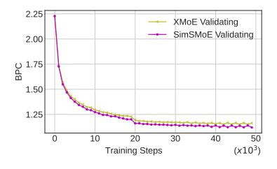
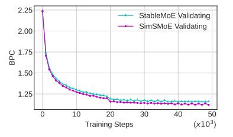
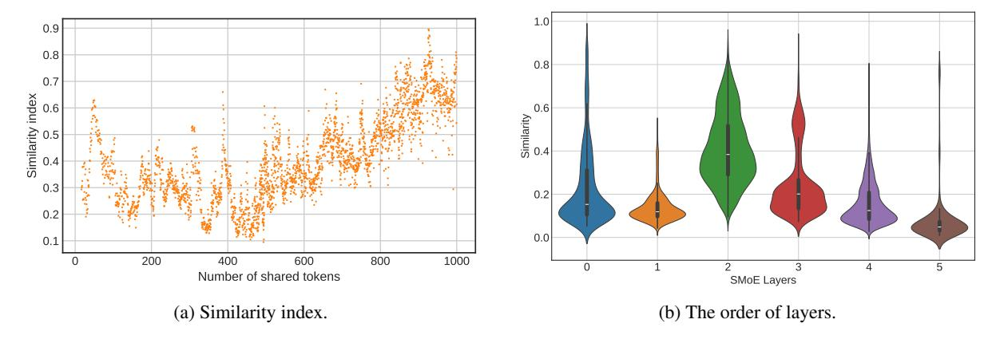

# <span id="page-0-0"></span>SimSMoE: Toward Efficient Training Mixture of Experts via Solving Representational Collapse

# Giang Do[\\*](#page-0-0) Hung Le Truyen Tran

Applied Artificial Intelligence Institute (A2I2), Deakin University {s224363215,thai.le,truyen.tran}@deakin.edu.au

# Abstract

Sparse mixture of experts (SMoE) have emerged as an effective approach for scaling large language models while keeping a constant computational cost. Regardless of several notable successes of SMoE, effective training such architecture remains elusive due to the representation collapse problem, which in turn harms model performance and causes parameter redundancy. In this work, we present Similarity-based Sparse Mixture of Experts (SimSMoE), a novel similarity of neural network algorithm, that guarantees a solution to address the representation collapse issue between experts given a fixed FLOPs budget. We conduct extensive empirical evaluations on three large language models for both Pre-training and Fine-tuning tasks to illustrate the efficacy, robustness, and scalability of our method. The results demonstrate that SimSMoE significantly enhances existing routing policy and outperforms other SMoE routing methods in performance for the tasks. Our implementation is publicly available at [https://github.com/](https://github.com/giangdip2410/SimSMoE) [giangdip2410/SimSMoE](https://github.com/giangdip2410/SimSMoE).

# 1 Introduction

Large Language Models (LLMs) have achieved significant breakthroughs across multiple fields, including natural language processing (NLP) tasks [\(Brown et al.,](#page-8-0) [2020;](#page-8-0) [Zhang et al.,](#page-12-0) [2022;](#page-12-0) [Touvron](#page-11-0) [et al.,](#page-11-0) [2023\)](#page-11-0) and visual representation learning [\(Jia](#page-9-0) [et al.,](#page-9-0) [2021;](#page-9-0) [Zhu et al.,](#page-12-1) [2023\)](#page-12-1). In the era of large language models (LLMs), Sparse mixture of experts (SMoE)[\(Shazeer et al.,](#page-11-1) [2017;](#page-11-1) [Zoph et al.,](#page-12-2) [2022;](#page-12-2) [Xue et al.,](#page-11-2) [2024;](#page-11-2) [Jiang et al.,](#page-9-1) [2024\)](#page-9-1) offers a scalable way to enhance efficiency by activating only a few specialized experts, reducing computation while maintaining strong performance. Compared to dense models, SMoE accelerates inference by activating only a subset of experts instead of the

entire pool at once [\(Artetxe et al.,](#page-8-1) [2022;](#page-8-1) [Krajewski](#page-10-0) [et al.,](#page-10-0) [2024\)](#page-10-0)

Despite the fact that SMoE has demonstrated its capabilities across various tasks [\(Riquelme et al.,](#page-11-3) [2021;](#page-11-3) [Mustafa et al.,](#page-10-1) [2022;](#page-10-1) [Gupta et al.,](#page-9-2) [2022\)](#page-9-2), training efficiency remains a challenge due to the issue of representation collapse, wherein either only a few experts receive routed tokens or all experts converge to learn similar representation. This issue was initially identified and theoretically proven by XMoE [\(Chi et al.,](#page-9-3) [2022\)](#page-9-3), followed by consequent works by SMoE-Dropout [\(Chen et al.,](#page-9-4) [2023a\)](#page-9-4); HyperRouter [\(Do et al.,](#page-9-5) [2023\)](#page-9-5). To address the limitation, several publications have focused on router policy improvement. Examples include proposals for better routing policies, such as those by Zhou et al.[\(Zhou et al.,](#page-12-3) [2022a\)](#page-12-3), StableMoE[\(Dai et al.,](#page-9-6) [2022\)](#page-9-6), XMoE [\(Chi et al.,](#page-9-3) [2022\)](#page-9-3), as well as optimal routing policies like the one suggested by CompeteSMoE [\(Pham et al.,](#page-10-2) [2024\)](#page-10-2). These solutions employ indirect approaches that concentrate on token allocation, expecting that enhanced allocation will resolve the collapse among experts. However, the existing methods suffer from several limitations. For example, while XMoE [\(Chi et al.,](#page-9-3) [2022\)](#page-9-3) and StableMoE [\(Dai et al.,](#page-9-6) [2022\)](#page-9-6) show promising results, they do not guarantee to solve the representation collapse issue. Additionally, CompeteSMoE [\(Pham et al.,](#page-10-2) [2024\)](#page-10-2) faces inefficiency problems arising from the requirement to activate all experts.

This paper proposes a novel training framework, named SimSMoE, which directly addresses the collapse issue by emphasizing similar representations among experts. More specifically, we introduce a quantitative method to illustrate the collapse issue between experts using the centered kernel alignment (CKA) metric [\(Kornblith et al.,](#page-10-3) [2019a\)](#page-10-3). Our effective training strategy comprises three stages: (1) Selecting potential collapsed experts; (2) Identifying collapsed experts; (3) Solving the representation collapse issue. SimSMoE can be applied

<sup>\*</sup>Corresponding author

to any routing algorithms, as it directly improves expert representations. Moreover, our method guarantees superior SMoE training strategies compared to the existing methods by quantifying the similarity between expert representations and minimizing similarity among experts by the CKA (Kornblith et al., 2019a) loss function. We then evaluate the proposed method by conducting pre-training of Large Language Models (LLMs) on several advanced SMoE architectures, such as GLaM (Du et al., 2022), Brainformer (Zhou et al., 2024), or Mistral (Jiang et al., 2024), followed by fine-tuning on downstream tasks.

The main contributions of this paper are: (1) demonstrating the representation collapse problem in SMoEs using CKA, which has not been previously explored; (2) proposing the CKA loss function to address this collapse; (3) conducting extensive experiments on LLM pre-training and fine-tuning on downstream tasks; and (4) providing an in-depth analysis of common token feeding and the representation collapse metric, showing that SimSMoE improves performance over existing methods.

# 2 Background

#### 2.1 Sparse Mixture of Experts

Inspired by conditional computation (Srivastava et al., 2013; Bengio et al., 2013) that activates only some relevant weights of a model on a per-token basis, the Sparse Mixture of Experts (SMoE) model (Shazeer et al., 2017), as an example of conditional computation, with each layer consists N experts and a trainable router which selects the most appropriate k experts to process each input sample. In this paper, we apply SMoE for Transformer-based architectures(Chi et al., 2022; Dai et al., 2022; Do et al., 2023) by replacing the feed-forward neural network layer in Transformers(Vaswani et al., 2023) with the Mixture-of-Experts layer, drawing inspiration from (Du et al., 2022; Zhou et al., 2024; Jiang et al., 2024). Each Mixture-of-Experts layer consists of a set of multi-layer perceptrons (MLPs), each with two layers and a ReLu non-linearity function(Agarap, 2019). Denoting the output of the multi-head attentions (MHA) as x, the output of SMoE with N experts is a weighted sum of each expert's computation  $E_i(x)$  by the router function G(x):

$$f_{\text{SMoE}}(\boldsymbol{x}) = \sum_{i=1}^{N} G(\boldsymbol{x})_i \cdot E_i(\boldsymbol{x})$$
 (1)

Where G(x) is computed by  $TOP_k$  function as equation (2) that determines the contribution of each expert to the SMoE output.

<span id="page-1-0"></span>
$$G(\mathbf{x}) = \text{TOP}_k(\text{softmax}(\mathbf{W}\mathbf{x} + b))$$
 (2)

In this research, we primarily focus on top-2 routing (K=2), as studies(Zhou et al., 2022b; Zoph et al., 2022; Sukhbaatar et al., 2024; Pham et al., 2024) have demonstrated its superior balance between training efficiency and testing performance.

# <span id="page-1-1"></span>2.2 Challenge of effective Sparse Mixture of Experts Training

Recent studies (Chi et al., 2022; Do et al., 2023) emphasize the challenge of representation collapse during SMoE training, illustrating that the Jacobian matrix of experts output with respect to input  $x \in R^d$  is a linear combination of the expert embeddings  $(e \in R^N)$ . Thus, the phenomenon arises due to d >> N in practice.

As the existing solutions (Chi et al., 2022; Dai et al., 2022; Do et al., 2023; Pham et al., 2024) assume that the collapse problem is a result of ineffective router algorithms, their efforts are directed towards proposing better router mechanisms. Despite these efforts, training SMoE remains unstable and prone to redundant parameters. Thus, a reliable strategy is needed to enhance expert representation and prevent collapse. With this objective in mind, we introduce SimSMoE, presenting two main contributions: (i) Illustrating the collapse problem by a quantitative approach; and (ii) Addressing the issue among experts by CKA loss function (Kornblith et al., 2019a).

#### 3 Methodology

We present Similarity Sparse Mixture of Experts (SimSMoE), which utilizes the strengths of existing routing algorithms (Dai et al., 2022; Chi et al., 2022; Jiang et al., 2024), directly tackling the representation collapse by minimizing the similarity among expert representations.

#### <span id="page-1-2"></span>3.1 SimSMoE

Similarity Reduction. In order to alleviate the representation collapse issue mentioned in Section 2.2, we introduce the Similarity Learning module in Figure 2 that helps to minimize the Similarity of Experts Representations. As shown in Figure 1b, the Similarity Learning module uses the outputs of

experts as input and employs the Similarity Loss described in Section 3.2 to diversify the experts' representations. The key innovation of Similarity Learning consists of two main parts: (i) quantifying the collapse issue; (ii) diversifying experts' representations using the Similarity Loss described in Section 3.2. For more detail, the Similarity Learning is illustrated as Algorithm 1. Consequently, the similarity-based SMoE training procedure can be summarized in the following four steps: (1) Calculate the number of shared tokens per expert pair from router G(x), and update the total number of input tokens per expert; (2) Calculate the similarity of selective experts; (3) Update the total loss if the similarity exceeds the similarity threshold; (4) Optimize the total loss in the same manner as training SMoE.

An Effective and Reliable Algorithm. One of the biggest challenges for minimizing the similarity among experts is the vast number of possible expert combinations. Given N experts, there are  $\binom{N}{2} = \frac{N!}{2! \cdot (N-2)!} = \frac{(N-1) \cdot N}{2}$  expert pairs. To verify the collapse issue of all expert pairs, it is necessary to loop over each pair, calculating their hidden representations and comparing them. This process is equivalent to activating N experts. Due to its contradiction with the conditional computation philosophy of SMoE, proposing an effective algorithm to implement the Similarity Learning is necessary. Section 4.5 demonstrates that a higher frequency of common tokens leads to the severity of the collapse. Hence, the training algorithm of SimSMoE introduces two hyperparameters: f\*, which represents the frequency for checking the collapse issue in the representation, and  $T^*$ , a threshold for identifying the collapse issue as Algorithm 1. Indeed, f\* controls computational resources, while  $T^*$  controls the quality of the collapse identification method. Given T as a similarity index between two experts, if  $T \geq T^*$ , it solves the collapse problem. On the other hand, if  $T < T^*$ , the algorithm focuses on optimizing the task loss during the SMoE training process. Thus, if we denote p as the performance of SimSMoE and  $p^*$  as performance of SMoE, we have  $p \geq p^*$ . In addition, both f\* and  $T^*$  are tuned during the training processes.

The input for the Similarity Learning module comes from a pair of experts. Thus, the most effective way to implement the module is by using the expert outputs from the SMoE training process. The module is workable for top-1 routing, however,

it requires activating one additional expert in each iteration. The Similarity Learning module works best for top-k routing ( $k \geq 2$ ), as it fully utilizes the output from pairs of experts to minimize the similarity among them. Additionally, SimSMoE can be applied to any routing algorithm such as Stable-MoE (Dai et al., 2022) or XMoE (Chi et al., 2022) to enhance model performance by addressing the representation collapse problem.

# <span id="page-2-0"></span>3.2 Similarity of Neural Network Representations

Inspired by the Similarity Index (Kornblith et al., 2019a), the Similarity Learning module addresses the representation collapse problems from two perspectives. First, the module directly measures a similarity score among experts and helps to identify which experts fail in diversity representation. Then, the Similarity Learning reduces the collapse issue by optimizing the Similarity Loss. Second, the Similarity Learning focuses on solving the collapse at the hidden representations of experts. This allows the method to leverage the advantages of routing techniques such as SMoE with the Balancing Loss (Fedus et al., 2022); X-MoE(Chi et al., 2022) StableMoE (Dai et al., 2022). We propose using similarity index based on centered kernel alignment (CKA) (Kornblith et al., 2019a) reliably identifies correspondences between representations in neural networks and an MLP with one hidden layer as a projection head (Figure 2) that maps representations to the space where the similarity loss is applied. Empirically, when scaling the model to larger hidden dimensions, we observe that the projection space can be increased, but one of the good choices is around N, with N is number of experts. Kornblith et al. (2019) (Kornblith et al., 2019a) introduces two versions of CKA: Linear CKA (LCKA) which focuses on linear kernel:  $K_{lin} = (x_i \cdot x_j)_{i,j}$ ; and RBF CKA (RCKA) which applies Gaussian RBF ker-

ckA (RCKA) which applies Gaussian RBF kernel: 
$$K_{G(\sigma)} = \left(e^{\frac{-\left|x_i - x_j\right|^2}{2\sigma^2}}\right)_{i,j}$$
. LCKA and RCKA give similar results in practice (Korphlith et al.

give similar results in practice (Kornblith et al., 2019a). For RCKA, selecting bandwidth  $\sigma$  determines the extent to which the similarity of small distances is emphasized over large distances. When training the Similarity Learning Layer as Figure 2, we empirically observe that a larger  $\sigma$  performs more stably, so we recommend choosing  $\sigma$  in the range of [0.8, 0.9].

<span id="page-3-1"></span>

(a) Sparse Mixture-of-Experts (SMoE) Architecture

(b) SimSMoE Architecture (Ours)

Figure 1: Illustration of the proposed SimSMoE architecture and a SMoE architecture. (a) A SMoE architecture selectively activates experts based on dot-product token-expert routing scores, directing the selected token to the chosen experts. (b) A SimSMoE architecture mitigates the issue of representation collapse by reducing the similarity among the selected experts.

<span id="page-3-0"></span>

Figure 2: A Similarity Learning Layer (ours) to minimize the similarity among experts.

$$CKA(K, L) = \frac{tr(KHLH)}{\sqrt{tr(KHKH)tr(LHLH)}}$$
(3)

where  $|||_F$  is the Frobenius norm and tr is the trace function. For RBF CKA, K and L are kernel matrices constructed by evaluating the RBF kernel, and H is the centering matrix  $H_n = I_n - \frac{1}{n} \mathbf{1} \mathbf{1}^T$ .

## <span id="page-3-3"></span>3.3 Training Objective

The training objective is jointly minimizing the loss of the target task, an auxiliary balancing loss (Fedus et al., 2022; Chi et al., 2022) ( $\mathcal{L}^{\text{balancing}}$ ) and a similarity loss ( $\mathcal{L}^{\text{similarity}}$ ). Given  $K_i$ ,  $L_j$  as the hidden representations of the i-th expert and the j-th

expert respectively, the similarity loss is calculated based on the equation (3) as follows:

$$\mathcal{L}^{\text{similarity}} = CKA(K_i, L_j)$$

The overall training objective is to minimize:

$$\mathcal{L} = \mathcal{L}_{task} + \alpha \cdot \mathcal{L}^{balancing} + \beta \cdot \mathcal{L}^{similarity}$$

where  $\alpha$ ,  $\beta$  are coefficients for the balancing loss and the similarity loss respectively. The term  $\mathcal{L}_{task}$  is defined by the specific task that Large Language Models (LLMs) are learning. For instance, we employ the masked language modeling loss for pre-training and fine-tuning on downstream tasks.

## <span id="page-3-4"></span>4 Experiment

<span id="page-3-2"></span>We evaluate SimSMoE on both the mask language modeling task and downstream tasks and compare the performance of the algorithm to other state-of-the-art routing methods for SMoE training. We also present a detailed analysis of the impact of our method in addressing the representation collapse.

## 4.1 Experimental Settings

**NLP tasks.** We investigate two common tasks in pre-training and fine-tuning of LLMs. Firstly, we perform character-level language modeling on the enwik8 (Mahoney, 2011) or text8 datasets (Mahoney, 2011), which are commonly used to evaluate a model's pre-training capabilities. As is common practice, we follow the default training, validation, and testing splits. Secondly, we fine-tune

<span id="page-4-0"></span>

| Archit      | ecture     | Enwik8 (BPC) | Text8 (BPC) | WikiText-103 (PPL) |
|-------------|------------|--------------|-------------|--------------------|
|             | # Params   |              | 135M        |                    |
|             | SimSmoE    | 1.08         | 1.20        | 31.77              |
| Brainformer | SMoE       | 1.11         | 1.21        | 32.75              |
|             | XMoE       | 1.10         | 1.24        | 32.69              |
|             | Stable MoE | 1.10         | 1.23        | 32.10              |
|             | # Params   |              | 28M         |                    |
|             | SimSmoE    | 1.13         | 1.24        | 37.30              |
| GLaM        | SMoE       | 1.14         | 1.26        | 37.39              |
|             | XMoE       | 1.16         | 1.27        | 37.62              |
|             | Stable MoE | 1.16         | 1.25        | 37.67              |
|             | # Params   |              | 63M         |                    |
|             | SimSmoE    | 1.11         | 1.21        | 32.51              |
| Mistral     | SMoE       | 1.12         | 1.23        | 33.23              |
|             | XMoE       | 1.13         | 1.24        | 32.83              |
|             | Stable MoE | 1.13         | 1.23        | 33.78              |

Table 1: Bits-per-character (BPC) on the enwik8 and text8 test sets, and perplexity on the WikiText-103 test set. Lower values are better, with the best results highlighted in bold.

the models on downstream applications to investigate their capability to adapt to different domains. For this purpose, we consider pre-trained large models on enwik8 and text8; then fine-tuning the method on downstream tasks. We select common NLP tasks to evaluate pre-trained models, including the SST-2 (Socher et al., 2013), SST-5 (Socher et al., 2013), IMDB (Maas et al., 2011), and BANK-ING77 (Casanueva et al., 2020) datasets.

Architecture. We contemplate three advanced SMoE architectures: (i) the Brainformer (Zhou et al., 2024); (ii) GLaM (Du et al., 2022); (iii) and Mistral (Jiang et al., 2024), all of which are decoder-only architectures. Training massive Large Language Models (LLMs) is impractical without substantial industrial resources due to limitations in computational resources. Consequently, we study four model configurations: (i) tiny: with two Brainformer layers and 3.9M parameters; (ii) small: with ten GLaM layers and 28M parameters; and (iii) medium: with seven Mistral layers and 63M parameters; (iv) large: with ten Brainformer layers and 135M parameters. Rather than striving for state-of-the-art results, we assess the scalability and effectiveness of our algorithm by evaluating multi-scaled models across various datasets. After that, we run vast investigations using the tiny model to comprehend the behaviors of the algorithm and its robustness to different design choices.

**Baselines.** In order to showcase the effectiveness of our method, we establish baselines using the cutting-edge routing methods, including

SMoE with the balancing loss (Fedus et al., 2022), StableMoE (Dai et al., 2022), XMoE (Chi et al., 2022). Moreover, these baselines incorporate advanced SMoE architectures such as GLaM (Du et al., 2022), Brainformer (Zhou et al., 2024), Mis**tral** (Jiang et al., 2024). GLaM(Du et al., 2022) interleaves dense transformer blocks with sparse ones, scaling the capacity of LLMs while significantly reducing training costs compared to dense variants. Brainformer (Zhou et al., 2024), an improved version of GLaM, further enhances performance by reducing the frequency of attention and modifying layer widths and types, making LLMs faster and more efficient than GLaM. Lastly, Mistral (Jiang et al., 2024) has been successful to scale up LLMs to 34B parameters that outperform the previous state-of-the-art LLMs in reasoning, mathematics, and code generation tasks. SMoE uses a trainable MLP routing mechanism with a balancing loss (Fedus et al., 2022), which encourages a balanced load across experts. StableMoE (Dai et al., 2022) introduces a two-phase training approach, initially focusing solely on training the router and subsequently training the experts with the router fixed, while **XMoE** (Chi et al., 2022) features a deep router that includes a down-projection and normalization layer along with a gating network with learnable temperatures.

**Pre-training and fine-tuning.** SimSMoE fully utilizes all the advantages of routing algorithms, so most of its experimental settings are the same as the baselines for a fair comparison. For the language modeling experiments, we optimize the LLMs pretraining for 50,000 steps using an Adam (Kingma and Ba, 2017) optimizer with a linear learning rate schedule. The checkpoint with the lowest validation loss is used to report the final performance on the test set. For routing mechanisms, we apply the default hyper-parameter configurations for both the baselines and SimSMoE. On the top of that, there are two main hyper-parameters only for SimSMoE: the frequency for checking the collapse issue: fand the threshold for identifying the collapse issue: T. Next, we cross-validate f with respect to the optimal T found. We use the pretrained checkpoint of Mistral models on enwik8 for each fine-tuning dataset, and exclude the last layer. Lastly, we employ a randomly initialized fully connected layer as the classifier and fine-tune all methods for a few epochs using the same learning rate.

#### 4.2 Language Modeling Evaluation

**Pre-training Language Models.** In contrast to the baselines, SimSMoE incorporates the Similarity Learning Layer to mitigate representation collapse. As a result, SimSMoE includes an additional 0.08M to 0.16M parameters compared to the baselines. Table 1 presents the evaluation metrics of SimSMoE versus state-of-the-art strategies. Additionally, we also report the evolution of the performance on the validation set of the SMoE models with various routing policies in Figure 3. We initially note that among all routing methods, SimSMoE consistently outperforms the baselines across all datasets for the three decoder-only architectures. Moreover, advanced strategies such as XMoE (Chi et al., 2022) or StableMoE (Dai et al., 2022) generally surpass the vanilla SMoE method. Nevertheless, the enhancements achieved by these strategies are often inconsistent or marginal. In contrast, SimSMoE consistently outperforms other competitors on all benchmarks (note that the BPC metric is log-scaled), architectures, and offers a faster convergent rate (Figure 3). This outcome underscores SimSMoE's proficiency for learning an effective routing policy to facilitate the masked language modeling task.

Large Scale Pre-training. To demonstrate the effectiveness of our method for scaling up language models, we conducted experiments on the Enwik8 dataset using larger variants of Brainformer with 64 experts and 1.031 B parameters. Each experiment was repeated three times with different random seeds, and we report the average results along with the standard deviation in Table 2. SimSMoE consistently outperforms other baselines on Enwik8 at a large scale in both average performance and stability, demonstrating that our method is not only effective for large-scale language models but also more reliable compared to the baselines. Beside that, we observe that the performance gap between SimSMoE and the baseline grows as the model size increases, particularly for K = 1, 2, 4. However, for larger K (K > 4), this gap narrows because our method primarily targets collapse problems, which become less critical at higher K values. Despite this, using a K large is not practical, as it introduces computational inefficiencies and reduces the advantages of the Sparse Mixture of Experts approach due to longer inference times. These findings align with our analysis and confirm that our method remains effective and efficient, even for

large-scale models with over 1 billion parameters.

<span id="page-5-0"></span>

| Architecture | Dataset      | # Params | # Experts | K      | SMoE                                     | StableMoE                                                                            | SimSMoE                                  |
|--------------|--------------|----------|-----------|--------|------------------------------------------|--------------------------------------------------------------------------------------|------------------------------------------|
| Brainformer  | Enwik8 (BPC) | 1.031 B  | 64        | 2<br>4 | $1.10_{\pm 0.004}$<br>$1.09_{\pm 0.005}$ | $1.14_{\pm 0.012}$<br>$1.10_{\pm 0.008}$<br>$1.10_{\pm 0.006}$<br>$1.11_{\pm 0.004}$ | $1.08_{\pm 0.002}$<br>$1.08_{\pm 0.002}$ |

Table 2: Bits-per-character (BPC) results on the Enwik8 test set for pre-training the Brainformer model with over one billion parameters. B represents billion ( $10^9$ ).

#### 4.3 Fine-tuning Evaluation

<span id="page-5-1"></span>

| Method    |      | SST- | 2      |      | SST- | 5      |      | IMDI | В      | BA   | NKIN | G77    |
|-----------|------|------|--------|------|------|--------|------|------|--------|------|------|--------|
|           | SimS | MoE  |        | SimS | MoE  |        | SimS | MoE  |        | SimS | MoE  |        |
| Algorithm | No   | Yes  | vs. No | No   | Yes  | vs. No | No   | Yes  | vs. No | No   | Yes  | vs. No |
| SMoE      | 81.5 | 82.8 | +1.3   | 36.9 | 37.8 | +0.9   | 85.2 | 85.7 | +0.5   | 74.6 | 79.4 | +4.8   |
| XMoE      | 82.2 | 82.5 | +0.3   | 34.5 | 37.4 | +2.9   | 84.3 | 84.6 | +0.3   | 78.6 | 79.5 | +0.9   |
| StableMoE | 81.0 | 82.1 | +1.1   | 36.4 | 36.7 | +0.3   | 85.0 | 85.3 | +0.3   | 74.1 | 77.0 | +2.9   |

Table 3: Accuracy of the model after fine-tuned on various datasets. Higher is better, best and comparing results are in bold.

Fine-tuning from Pre-training weights. Table 3 reports the accuracy of the models fine-tuned on the test sets of various datasets. Overall, we observe that SimSMoE demonstrates strong transfer learning capabilities by achieving the highest accuracy on all datasets. Notably, on the more challenging datasets of SST-5 and BANKING77, which have fewer training samples or more classes, we observe larger performance gains from SimSMoE versus the remaining baselines (over 3% improvements compared to the base methods). This result shows that SimSMoE can boost model performance through solving the collapse issue, which is not only good for pre-training but also exhibits strong transfer capabilities to various downstream tasks.

Fine-tuning for Classification Tasks. We also evaluate our method using pretrained language models to assess its effectiveness. Following the experimental setup by MEO (He et al., 2023), we fine-tune BERT-family models (Devlin et al., 2019) using Sparse Mixture of Experts. The fine-tuning results on the GLUE benchmarks (Wang et al., 2018a) are recorded in Table 4. The results demonstrate that our method outperforms both SMoE and MEO on the GLUE benchmark, indicating that SimSMoE is not only effective for pre-training tasks but also performs well on existing pretrained models, such as those in the BERT family.

**Fine-tuning for Other NLP Tasks.** SimSMoE delivers strong performance across a range of NLP tasks, including *question answering*, *text summa-rization*, and *language modeling*. Detailed benchmark results are provided in Table 5.

<span id="page-6-1"></span>





(a) SMoE Routing Policy

(b) XMoE Routing Policy

(c) StableMoE Routing Policy

Figure 3: Bit-per-Character (BPC) on validation dataset during the training phase reported for Mistral (Jiang et al., 2024) across the three routing mechanisms. (a) SMoE with the Balancing Loss. (b) XMoE. (c) StableMoE

<span id="page-6-2"></span>

| Model                 |      |       |      | BERT-Base-Cased |      |      |      |      |      |
|-----------------------|------|-------|------|-----------------|------|------|------|------|------|
| Dataset               | CoLA | SST-2 | MRPC | STS-B           | QQP  | MNLI | QNLI | RTE  | .avg |
| SimSMoE               | 53.0 | 92.1  | 75.7 | 86.6            | 90.2 | 84.0 | 90.7 | 59.6 | 79.0 |
| SMoE                  | 47.1 | 92.2  | 74.5 | 86.6            | 90.2 | 83.5 | 90.1 | 58.5 | 77.8 |
| MEO (He et al., 2023) | 49.1 | 92.3  | 76.2 | 86.3            | 89.8 | 83.9 | 90.5 | 59.2 | 78.4 |

Table 4: Fine-tuning BERT model on the GLUE benchmark. Higher is better, best results are in bold.

<span id="page-6-3"></span>

| Model | Dataset    | Task               | SMoE | MEO  | SimSMoE | Metric |
|-------|------------|--------------------|------|------|---------|--------|
| BART  | XSum       | Summarization      | 22.4 | 22.2 | 22.6    | R2     |
| T5    | SQuAD      | Question Answering | 82.1 | 82.0 | 82.8    | EM     |
| GPT2  | Wikitext-2 | Language Model     | 21.1 | 20.9 | 20.6    | PPL    |

Table 5: Fine-tuning results across three different architectures including BART, T5, and GPT-2. XSum, SQuAD, and WikiText-2 are evaluated using ROUGE-2 (R2), Exact Match (EM), and Perplexity (PPL), respectively. The best results are highlighted in bold.

We employ BART-Large (Lewis et al., 2019) on XSum (Narayan et al., 2018), T5-Base (Raffel et al., 2023) on SQuAD (Rajpurkar et al., 2016), and GPT-2-Small (Radford et al., 2019) on WikiText-2 (Merity et al., 2016) for evaluation. The results show that our approach outperforms baseline models across multiple NLP tasks, highlighting SimSMoE's effectiveness in both pre-training and fine-tuning the SMoE architecture.

#### 4.4 Ablation Studies

We explore the robustness of SimSMoE under various hyper-parameter settings, conducting all experiments with the tiny Brainformer architecture (Zhou et al., 2024).

**SimSMoE Frequency.** Since checking the collapse issue for all expert pairs is very costly, as discussed in Section 3.1, it is necessary to control computational resources by  $f^*$ , which determines the frequency of collapse issue identification. To demonstrate the effectiveness of our algorithm, we analyze the relationship between  $f^*$  and SMoE model performance as the checking frequency increases. All experiments are pretrained under the same settings and evaluated on the enwik8 dataset

for a fair comparison. The results reported in Table 6a confirm that SimSMoE is effective, consistent with the assumption, as the threshold  $f^*$  increases.

Quality Control. In practice,  $T^*$  is a hyperparameter that controls the quality of SimSMoE by determining the level of similarity that can be considered a collapse issue. The value of  $T^*$  ranges from 0 to 1. A low  $T^*$  means more experts pairs are considered collapsed, while a high  $T^*$  means fewer experts are treated as collapsed. Empirically, we find that setting  $T^*$  within the interval [0.3, 0.7] is effective, with a good initial value being 0.5. Table 6b shows the pretraining performances of various threshold  $T^*$  on enwik8 dataset.

Coefficients of the Similarity Loss. Coefficient  $\beta$  determines the weight of the Similarity Loss contribution to the total SMoE Loss. A high value of  $\beta$  implies that the model focuses on addressing the collapse, while a low value of  $\beta$  indicates the model prioritizes the task loss. Table 6c presents the results of the tiny Brainformer across various  $\beta$  values.

# <span id="page-6-0"></span>4.5 Representation Collapse Analysis

Representation Collapse In a Sparse Mixture of Experts (SMoE) architecture, all experts are typically designed with the same structure, usually as MLPs. To assign tokens to experts, SMoE employs the TopK operator(Shazeer et al., 2017), resulting in certain experts sharing the same tokens. We hypothesize that experts with a high degree of token sharing are more likely to collapse together. To validate our hypothesis, we analyze the correlation between the number of shared tokens and the similarity index among experts. Figure 4 demonstrates a strong correlation between the number of shared tokens and the similarity among experts, thereby supporting our hypothesis.

The order of layers In Section 3.1, we discussed addressing the collapse issue for all pairs

<span id="page-7-0"></span>

Figure 4: Analysis of the similarity index for the Sparse Mixture of Experts (SMoE). Figure (a) shows the correlation between the number of shared tokens and the similarity index. Figure (b) illustrates the similarity index by layer order.

of experts is costly. Moreover, since the total loss function described in Section 3.3 is a sum of the task loss, the balancing loss, and the similarity loss, there is a trade-off between resolving the collapse issue and optimizing NLP tasks from a local optimal perspective. Therefore, understanding the differences in collapse levels across layers in SMoE is crucial for effectively allocating resources to address this issue. We visualize the distribution of the similarity index across layers in the Brainformer model, as shown in Figure 4. The results indicate that deeper layers exhibit a lower level of collapse compared to earlier layers, suggesting that prioritizing resources to address this issue based on the order of layers in SMoE might improve our method's performance.

Similarity Learning Module Effective The Similarity Learning Module is designed to address the issue of representation collapse, which in turn enhances the diversity of the experts' hidden representations. To demonstrate the module's impact, we subtract the hidden representations of two experts in two scenarios: (1) without SimSMoE, and (2) with SimSMoE. Following the suggestions by Samek et al. (2015) (Samek et al., 2015), we visualize these differences using a heatmap. Without SimSMoE, Figure 5 shows how the expert representations become more similar, thus providing support for our method.

## 5 Related Work

#### 5.1 Sparse Mixture of Experts

**Sparse Mixture of Experts (SMoE)** Motivated by Mixture of Experts (MoE) (Jacobs et al., 1991; Jordan and Jacobs, 1994), Sparse Mixture of Experts (SMoE), with the unifying idea that each example

is processed by a subset of the parameters, was first introduced by Shazeer et al. (2017)(Shazeer et al., 2017). SMoE gained further popularity when combined with Transformer large language models (Zhou et al., 2022b; Li et al., 2022b; Shen et al., 2023). After demonstrating promising success in natural language processing, it has been proven in a variety of domains including computer vision (Riquelme et al., 2021; Hwang et al., 2023; Lin et al., 2024), speech recognition (Wang et al., 2023b; Kwon and Chung, 2023), and multi-task learning (Ye and Xu, 2023; Chen et al., 2023b). However, training SMoE still suffers the representation collapse issue (Chi et al., 2022), where all experts converge to similar representation. Chi et al. (2022) (Chi et al., 2022) identified the issue and proposed XMoE, which estimates the routing scores between tokens and experts on a low-dimensional hypersphere. In subsequent research on the collapse issue, SMoE-dropout(Chen et al., 2023a) suggested that using a randomly initialized and fixed router network to activate experts, and gradually increasing the number of activated experts, might address the problem. Meanwhile, HyperRouter (Do et al., 2023) proposed that employing HyperNetwork (Ha et al., 2016) to generate router weights is an effective approach for training SMoE. StableMoE (Dai et al., 2022) also aims to effectively train SMoE by developing a balanced and cohesive routing strategy. This strategy is distilled into a lightweight router, decoupled from the backbone model, which is then used to determine token-toexpert assignments that are frozen to ensure a stable routing strategy. Those methods concentrate on enhancing routing algorithms, whereas our approach is a straightforward solution that directly targets

the hidden representation of experts, a topic that remains under-explored.

## 5.2 Similarity Learning

The occurrence of presentation collapse is a common issue in self-supervised learning and has been extensively investigated. [\(Jing et al.,](#page-10-17) [2022;](#page-10-17) [Hua](#page-9-16) [et al.,](#page-9-16) [2021;](#page-9-16) [Li et al.,](#page-10-18) [2022a\)](#page-10-18). A critical challenge in identifying collapse lies in measuring the similarity between neural network representations. Similarity learning [\(Kornblith et al.,](#page-10-19) [2019b;](#page-10-19) [Csiszárik](#page-9-17) [et al.,](#page-9-17) [2021\)](#page-9-17) holds potential for addressing this problem. The current set of representational similarity measures, classified based on their approach to similarity measurement, includes *Canonical Correlation Analysis* [\(Raghu et al.,](#page-10-20) [2017\)](#page-10-20), *Alignment* [\(Williams et al.,](#page-11-13) [2022\)](#page-11-13), *Representational Similarity Matrix* [\(Shahbazi et al.,](#page-11-14) [2021;](#page-11-14) [Kriegeskorte](#page-10-21) [et al.,](#page-10-21) [2008\)](#page-10-21), *Neighbors* [\(Wang et al.,](#page-11-15) [2023a\)](#page-11-15), *Topology* [\(Khrulkov and Oseledets,](#page-10-22) [2018\)](#page-10-22), and *Statistic* [\(Camastra and Staiano,](#page-9-18) [2016\)](#page-9-18). Among the aforementioned approaches, the *Representational Similarity Matrix* is widely employed to explore the similarity between the representations of neural networks [\(Li et al.,](#page-10-23) [2016;](#page-10-23) [Raghu et al.,](#page-10-20) [2017;](#page-10-20) [Wang](#page-11-16) [et al.,](#page-11-16) [2018b;](#page-11-16) [Kornblith et al.,](#page-10-3) [2019a\)](#page-10-3). Kornblith at el. (2019) emphasized that the canonical correlation analysis (CCA) approach remains invariant under invertible linear transformations only when the retained subspace remains unchanged. They subsequently introduced centered kernel alignment (CKA), which can ascertain the correspondence between the hidden layers of neural networks trained from varying random initializations and widths. In this study, we also illustrate that CKA serves as an appropriate similarity learning metric for addressing representation collapse among experts.

# 6 Conclusion

This study illustrates representation collapse levels in sparse mixture-of-experts (SMoE) models by employing a similarity learning metric. Moreover, we introduce a similarity learning module, which is a direct approach to differentiate expert's hidden representations, designed to alleviate this issue. We also extensively evaluate three advanced SMoE architectures for both pre-training and finetuning tasks to demonstrate SimSMoE strong capabilities, scalability, and superiority over state-ofthe-art routing strategies. Finally, we believe that focusing on expert representation opens up new

research avenues for effectively training SMoE, where cutting-edge techniques in Similarity Learning and Contrastive Learning can be harnessed to enhance their performance.

# Limitations

Our work focuses on the efficiency and efficacy of training LLMs using SMoE. Despite the encouraging results, our experiments are conducted only on medium-scale datasets with a medium-scale Transformer-family based models due to computation limitations. Thus, further empirical evaluations are required to validate the scalability of SimSMoE and other SMoE strategies on recent LLMs and larger datasets.

# Ethics Statement

Despite encouraging results, training large-scale LLMs is inevitably costly and requires extensive computational resources, which need to be properly managed. Moreover, our work used data collected on the web, which has been known to suffer from gender and racial biases and requires additional efforts to mitigate its negative impacts. Lastly, our study is a promising step towards facilitating the development of new LLMs, which still requires careful regularization to avoid potential misuses in harmful applications.

# References

<span id="page-8-3"></span>Abien Fred Agarap. 2019. [Deep learning using rectified](https://arxiv.org/abs/1803.08375) [linear units \(relu\).](https://arxiv.org/abs/1803.08375) *Preprint*, arXiv:1803.08375.

<span id="page-8-1"></span>Mikel Artetxe, Shruti Bhosale, Naman Goyal, Todor Mihaylov, Myle Ott, Sam Shleifer, Xi Victoria Lin, Jingfei Du, Srinivasan Iyer, Ramakanth Pasunuru, Giri Anantharaman, Xian Li, Shuohui Chen, Halil Akin, Mandeep Baines, Louis Martin, Xing Zhou, Punit Singh Koura, Brian O'Horo, Jeff Wang, Luke Zettlemoyer, Mona Diab, Zornitsa Kozareva, and Ves Stoyanov. 2022. [Efficient large scale lan](https://arxiv.org/abs/2112.10684)[guage modeling with mixtures of experts.](https://arxiv.org/abs/2112.10684) *Preprint*, arXiv:2112.10684.

<span id="page-8-2"></span>Yoshua Bengio, Nicholas Léonard, and Aaron Courville. 2013. [Estimating or propagating gradients through](https://arxiv.org/abs/1308.3432) [stochastic neurons for conditional computation.](https://arxiv.org/abs/1308.3432) *Preprint*, arXiv:1308.3432.

<span id="page-8-0"></span>Tom B. Brown, Benjamin Mann, Nick Ryder, Melanie Subbiah, Jared Kaplan, Prafulla Dhariwal, Arvind Neelakantan, Pranav Shyam, Girish Sastry, Amanda Askell, Sandhini Agarwal, Ariel Herbert-Voss, Gretchen Krueger, Tom Henighan, Rewon Child, Aditya Ramesh, Daniel M. Ziegler, Jeffrey Wu,

- Clemens Winter, Christopher Hesse, Mark Chen, Eric Sigler, Mateusz Litwin, Scott Gray, Benjamin Chess, Jack Clark, Christopher Berner, Sam Mc-Candlish, Alec Radford, Ilya Sutskever, and Dario Amodei. 2020. [Language models are few-shot learn](https://arxiv.org/abs/2005.14165)[ers.](https://arxiv.org/abs/2005.14165) *Preprint*, arXiv:2005.14165.
- <span id="page-9-18"></span>Francesco Camastra and Antonino Staiano. 2016. [In](https://doi.org/10.1016/j.ins.2015.08.029)[trinsic dimension estimation: Advances and open](https://doi.org/10.1016/j.ins.2015.08.029) [problems.](https://doi.org/10.1016/j.ins.2015.08.029) *Information Sciences*, 328:26–41.
- <span id="page-9-9"></span>Iñigo Casanueva, Tadas Temcinas, Daniela Gerz, ˇ Matthew Henderson, and Ivan Vulic. 2020. ´ [Efficient](https://doi.org/10.18653/v1/2020.nlp4convai-1.5) [intent detection with dual sentence encoders.](https://doi.org/10.18653/v1/2020.nlp4convai-1.5) In *Proceedings of the 2nd Workshop on Natural Language Processing for Conversational AI*, pages 38–45, Online. Association for Computational Linguistics.
- <span id="page-9-4"></span>Tianlong Chen, Zhenyu Zhang, Ajay Jaiswal, Shiwei Liu, and Zhangyang Wang. 2023a. [Sparse moe as](https://arxiv.org/abs/2303.01610) [the new dropout: Scaling dense and self-slimmable](https://arxiv.org/abs/2303.01610) [transformers.](https://arxiv.org/abs/2303.01610) *Preprint*, arXiv:2303.01610.
- <span id="page-9-14"></span>Zitian Chen, Yikang Shen, Mingyu Ding, Zhenfang Chen, Hengshuang Zhao, Erik G. Learned-Miller, and Chuang Gan. 2023b. Mod-squad: Designing mixtures of experts as modular multi-task learners. In *Proceedings of the IEEE/CVF Conference on Computer Vision and Pattern Recognition (CVPR)*, pages 11828–11837.
- <span id="page-9-3"></span>Zewen Chi, Li Dong, Shaohan Huang, Damai Dai, Shuming Ma, Barun Patra, Saksham Singhal, Payal Bajaj, Xia Song, Xian-Ling Mao, Heyan Huang, and Furu Wei. 2022. [On the representation col](https://arxiv.org/abs/2204.09179)[lapse of sparse mixture of experts.](https://arxiv.org/abs/2204.09179) *Preprint*, arXiv:2204.09179.
- <span id="page-9-17"></span>Adrián Csiszárik, Péter Korösi-Szabó, Ákos Matszan- ˝ gosz, Gergely Papp, and Dániel Varga. 2021. [Sim](https://proceedings.neurips.cc/paper_files/paper/2021/file/2cb274e6ce940f47beb8011d8ecb1462-Paper.pdf)[ilarity and matching of neural network representa](https://proceedings.neurips.cc/paper_files/paper/2021/file/2cb274e6ce940f47beb8011d8ecb1462-Paper.pdf)[tions.](https://proceedings.neurips.cc/paper_files/paper/2021/file/2cb274e6ce940f47beb8011d8ecb1462-Paper.pdf) In *Advances in Neural Information Processing Systems*, volume 34, pages 5656–5668. Curran Associates, Inc.
- <span id="page-9-6"></span>Damai Dai, Li Dong, Shuming Ma, Bo Zheng, Zhifang Sui, Baobao Chang, and Furu Wei. 2022. [Stable](https://arxiv.org/abs/2204.08396)[moe: Stable routing strategy for mixture of experts.](https://arxiv.org/abs/2204.08396) *Preprint*, arXiv:2204.08396.
- <span id="page-9-11"></span>Jacob Devlin, Ming-Wei Chang, Kenton Lee, and Kristina Toutanova. 2019. [BERT: Pre-training of](https://doi.org/10.18653/v1/N19-1423) [deep bidirectional transformers for language under](https://doi.org/10.18653/v1/N19-1423)[standing.](https://doi.org/10.18653/v1/N19-1423) In *Proceedings of the 2019 Conference of the North American Chapter of the Association for Computational Linguistics: Human Language Technologies, Volume 1 (Long and Short Papers)*, pages 4171–4186, Minneapolis, Minnesota. Association for Computational Linguistics.
- <span id="page-9-5"></span>Giang Do, Khiem Le, Quang Pham, TrungTin Nguyen, Thanh-Nam Doan, Bint T. Nguyen, Chenghao Liu, Savitha Ramasamy, Xiaoli Li, and Steven Hoi. 2023. [Hyperrouter: Towards efficient training and](https://arxiv.org/abs/2312.07035) [inference of sparse mixture of experts.](https://arxiv.org/abs/2312.07035) *Preprint*, arXiv:2312.07035.

- <span id="page-9-7"></span>Nan Du, Yanping Huang, Andrew M. Dai, Simon Tong, Dmitry Lepikhin, Yuanzhong Xu, Maxim Krikun, Yanqi Zhou, Adams Wei Yu, Orhan Firat, Barret Zoph, Liam Fedus, Maarten Bosma, Zongwei Zhou, Tao Wang, Yu Emma Wang, Kellie Webster, Marie Pellat, Kevin Robinson, Kathleen Meier-Hellstern, Toju Duke, Lucas Dixon, Kun Zhang, Quoc V Le, Yonghui Wu, Zhifeng Chen, and Claire Cui. 2022. [Glam: Efficient scaling of language models with](https://arxiv.org/abs/2112.06905) [mixture-of-experts.](https://arxiv.org/abs/2112.06905) *Preprint*, arXiv:2112.06905.
- <span id="page-9-8"></span>William Fedus, Barret Zoph, and Noam Shazeer. 2022. [Switch transformers: Scaling to trillion parameter](https://arxiv.org/abs/2101.03961) [models with simple and efficient sparsity.](https://arxiv.org/abs/2101.03961) *Preprint*, arXiv:2101.03961.
- <span id="page-9-2"></span>Shashank Gupta, Subhabrata Mukherjee, Krishan Subudhi, Eduardo Gonzalez, Damien Jose, Ahmed H. Awadallah, and Jianfeng Gao. 2022. [Sparsely acti](https://arxiv.org/abs/2204.07689)[vated mixture-of-experts are robust multi-task learn](https://arxiv.org/abs/2204.07689)[ers.](https://arxiv.org/abs/2204.07689) *Preprint*, arXiv:2204.07689.
- <span id="page-9-15"></span>David Ha, Andrew Dai, and Quoc V. Le. 2016. [Hyper](https://arxiv.org/abs/1609.09106)[networks.](https://arxiv.org/abs/1609.09106) *Preprint*, arXiv:1609.09106.
- <span id="page-9-10"></span>Shwai He, Run-Ze Fan, Liang Ding, Li Shen, Tianyi Zhou, and Dacheng Tao. 2023. [Merging experts into](https://doi.org/10.18653/v1/2023.emnlp-main.907) [one: Improving computational efficiency of mixture](https://doi.org/10.18653/v1/2023.emnlp-main.907) [of experts.](https://doi.org/10.18653/v1/2023.emnlp-main.907) In *Proceedings of the 2023 Conference on Empirical Methods in Natural Language Processing*, pages 14685–14691, Singapore. Association for Computational Linguistics.
- <span id="page-9-16"></span>Tianyu Hua, Wenxiao Wang, Zihui Xue, Sucheng Ren, Yue Wang, and Hang Zhao. 2021. On feature decorrelation in self-supervised learning. In *Proceedings of the IEEE/CVF International Conference on Computer Vision (ICCV)*, pages 9598–9608.
- <span id="page-9-13"></span>Changho Hwang, Wei Cui, Yifan Xiong, Ziyue Yang, Ze Liu, Han Hu, Zilong Wang, Rafael Salas, Jithin Jose, Prabhat Ram, Joe Chau, Peng Cheng, Fan Yang, Mao Yang, and Yongqiang Xiong. 2023. [Tu](https://arxiv.org/abs/2206.03382)[tel: Adaptive mixture-of-experts at scale.](https://arxiv.org/abs/2206.03382) *Preprint*, arXiv:2206.03382.
- <span id="page-9-12"></span>Robert A. Jacobs, Michael I. Jordan, Steven J. Nowlan, and Geoffrey E. Hinton. 1991. [Adaptive mixtures of](https://doi.org/10.1162/neco.1991.3.1.79) [local experts.](https://doi.org/10.1162/neco.1991.3.1.79) *Neural Computation*, 3(1):79–87.
- <span id="page-9-0"></span>Chao Jia, Yinfei Yang, Ye Xia, Yi-Ting Chen, Zarana Parekh, Hieu Pham, Quoc V. Le, Yunhsuan Sung, Zhen Li, and Tom Duerig. 2021. [Scaling up vi](https://arxiv.org/abs/2102.05918)[sual and vision-language representation learning with](https://arxiv.org/abs/2102.05918) [noisy text supervision.](https://arxiv.org/abs/2102.05918) *Preprint*, arXiv:2102.05918.
- <span id="page-9-1"></span>Albert Q. Jiang, Alexandre Sablayrolles, Antoine Roux, Arthur Mensch, Blanche Savary, Chris Bamford, Devendra Singh Chaplot, Diego de las Casas, Emma Bou Hanna, Florian Bressand, Gianna Lengyel, Guillaume Bour, Guillaume Lample, Lélio Renard Lavaud, Lucile Saulnier, Marie-Anne Lachaux, Pierre Stock, Sandeep Subramanian, Sophia Yang, Szymon Antoniak, Teven Le Scao, Théophile Gervet, Thibaut Lavril, Thomas Wang, Timothée Lacroix, and William El Sayed. 2024. [Mix](https://arxiv.org/abs/2401.04088)[tral of experts.](https://arxiv.org/abs/2401.04088) *Preprint*, arXiv:2401.04088.

- <span id="page-10-17"></span>Li Jing, Pascal Vincent, Yann LeCun, and Yuandong Tian. 2022. [Understanding dimensional collapse](https://arxiv.org/abs/2110.09348) [in contrastive self-supervised learning.](https://arxiv.org/abs/2110.09348) *Preprint*, arXiv:2110.09348.
- <span id="page-10-13"></span>Michael Jordan and Robert Jacobs. 1994. Hierarchical mixtures of experts and the. *Neural computation*, 6:181–.
- <span id="page-10-22"></span>Valentin Khrulkov and Ivan Oseledets. 2018. [Geometry](https://arxiv.org/abs/1802.02664) [score: A method for comparing generative adversar](https://arxiv.org/abs/1802.02664)[ial networks.](https://arxiv.org/abs/1802.02664) *Preprint*, arXiv:1802.02664.
- <span id="page-10-6"></span>Diederik P. Kingma and Jimmy Ba. 2017. [Adam:](https://arxiv.org/abs/1412.6980) [A method for stochastic optimization.](https://arxiv.org/abs/1412.6980) *Preprint*, arXiv:1412.6980.
- <span id="page-10-3"></span>Simon Kornblith, Mohammad Norouzi, Honglak Lee, and Geoffrey Hinton. 2019a. [Similarity of neu](https://arxiv.org/abs/1905.00414)[ral network representations revisited.](https://arxiv.org/abs/1905.00414) *Preprint*, arXiv:1905.00414.
- <span id="page-10-19"></span>Simon Kornblith, Mohammad Norouzi, Honglak Lee, and Geoffrey Hinton. 2019b. [Similarity of neural](https://proceedings.mlr.press/v97/kornblith19a.html) [network representations revisited.](https://proceedings.mlr.press/v97/kornblith19a.html) In *Proceedings of the 36th International Conference on Machine Learning*, volume 97 of *Proceedings of Machine Learning Research*, pages 3519–3529. PMLR.
- <span id="page-10-0"></span>Jakub Krajewski, Jan Ludziejewski, Kamil Adamczewski, Maciej Pióro, Michał Krutul, Szymon Antoniak, Kamil Ciebiera, Krystian Król, Tomasz Odrzygó´zd´z, Piotr Sankowski, Marek Cygan, and Sebastian Jaszczur. 2024. [Scaling laws for fine-grained](https://arxiv.org/abs/2402.07871) [mixture of experts.](https://arxiv.org/abs/2402.07871) *Preprint*, arXiv:2402.07871.
- <span id="page-10-21"></span>Nikolaus Kriegeskorte, Marieke Mur, and Peter Bandettini. 2008. [Representational similarity analysis](https://doi.org/10.3389/neuro.06.004.2008) [- connecting the branches of systems neuroscience.](https://doi.org/10.3389/neuro.06.004.2008) *Frontiers in Systems Neuroscience*, 2.
- <span id="page-10-16"></span>Yoohwan Kwon and Soo-Whan Chung. 2023. [Mole :](https://doi.org/10.1109/ICASSP49357.2023.10096227) [Mixture of language experts for multi-lingual auto](https://doi.org/10.1109/ICASSP49357.2023.10096227)[matic speech recognition.](https://doi.org/10.1109/ICASSP49357.2023.10096227) In *ICASSP 2023 - 2023 IEEE International Conference on Acoustics, Speech and Signal Processing (ICASSP)*, pages 1–5.
- <span id="page-10-7"></span>Mike Lewis, Yinhan Liu, Naman Goyal, Marjan Ghazvininejad, Abdelrahman Mohamed, Omer Levy, Ves Stoyanov, and Luke Zettlemoyer. 2019. [Bart: De](https://arxiv.org/abs/1910.13461)[noising sequence-to-sequence pre-training for natural](https://arxiv.org/abs/1910.13461) [language generation, translation, and comprehension.](https://arxiv.org/abs/1910.13461) *Preprint*, arXiv:1910.13461.
- <span id="page-10-18"></span>Alexander C. Li, Alexei A. Efros, and Deepak Pathak. 2022a. [Understanding collapse in non](https://arxiv.org/abs/2209.15007)[contrastive siamese representation learning.](https://arxiv.org/abs/2209.15007) *Preprint*, arXiv:2209.15007.
- <span id="page-10-14"></span>Margaret Li, Suchin Gururangan, Tim Dettmers, Mike Lewis, Tim Althoff, Noah A. Smith, and Luke Zettlemoyer. 2022b. [Branch-train-merge: Embarrassingly](https://arxiv.org/abs/2208.03306) [parallel training of expert language models.](https://arxiv.org/abs/2208.03306) *Preprint*, arXiv:2208.03306.

- <span id="page-10-23"></span>Yixuan Li, Jason Yosinski, Jeff Clune, Hod Lipson, and John Hopcroft. 2016. [Convergent learning: Do differ](https://arxiv.org/abs/1511.07543)[ent neural networks learn the same representations?](https://arxiv.org/abs/1511.07543) *Preprint*, arXiv:1511.07543.
- <span id="page-10-15"></span>Bin Lin, Zhenyu Tang, Yang Ye, Jiaxi Cui, Bin Zhu, Peng Jin, Jinfa Huang, Junwu Zhang, Munan Ning, and Li Yuan. 2024. [Moe-llava: Mixture of ex](https://arxiv.org/abs/2401.15947)[perts for large vision-language models.](https://arxiv.org/abs/2401.15947) *Preprint*, arXiv:2401.15947.
- <span id="page-10-5"></span>Andrew L. Maas, Raymond E. Daly, Peter T. Pham, Dan Huang, Andrew Y. Ng, and Christopher Potts. 2011. [Learning Word Vectors for Sentiment Analy](https://aclanthology.org/P11-1015)[sis.](https://aclanthology.org/P11-1015) In *Proceedings of the 49th Annual Meeting of the Association for Computational Linguistics: Human Language Technologies*, pages 142–150, Portland, Oregon, USA. Association for Computational Linguistics.
- <span id="page-10-4"></span>Matt Mahoney. 2011. [Large text compression bench](http://www.mattmahoney.net/dc/text.html)[mark.](http://www.mattmahoney.net/dc/text.html)
- <span id="page-10-12"></span>Stephen Merity, Caiming Xiong, James Bradbury, and Richard Socher. 2016. [Pointer sentinel mixture mod](https://arxiv.org/abs/1609.07843)[els.](https://arxiv.org/abs/1609.07843) *Preprint*, arXiv:1609.07843.
- <span id="page-10-1"></span>Basil Mustafa, Carlos Riquelme, Joan Puigcerver, Rodolphe Jenatton, and Neil Houlsby. 2022. [Multi](https://proceedings.neurips.cc/paper_files/paper/2022/file/3e67e84abf900bb2c7cbd5759bfce62d-Paper-Conference.pdf)[modal contrastive learning with limoe: the language](https://proceedings.neurips.cc/paper_files/paper/2022/file/3e67e84abf900bb2c7cbd5759bfce62d-Paper-Conference.pdf)[image mixture of experts.](https://proceedings.neurips.cc/paper_files/paper/2022/file/3e67e84abf900bb2c7cbd5759bfce62d-Paper-Conference.pdf) In *Advances in Neural Information Processing Systems*, volume 35, pages 9564–9576. Curran Associates, Inc.
- <span id="page-10-8"></span>Shashi Narayan, Shay B. Cohen, and Mirella Lapata. 2018. [Don't give me the details, just the summary!](https://arxiv.org/abs/1808.08745) [topic-aware convolutional neural networks for ex](https://arxiv.org/abs/1808.08745)[treme summarization.](https://arxiv.org/abs/1808.08745) *Preprint*, arXiv:1808.08745.
- <span id="page-10-2"></span>Quang Pham, Giang Do, Huy Nguyen, TrungTin Nguyen, Chenghao Liu, Mina Sartipi, Binh T. Nguyen, Savitha Ramasamy, Xiaoli Li, Steven Hoi, and Nhat Ho. 2024. [Competesmoe – effective train](https://arxiv.org/abs/2402.02526)[ing of sparse mixture of experts via competition.](https://arxiv.org/abs/2402.02526) *Preprint*, arXiv:2402.02526.
- <span id="page-10-11"></span>Alec Radford, Jeffrey Wu, Rewon Child, David Luan, Dario Amodei, and Ilya Sutskever. 2019. [Language](https://cdn.openai.com/better-language-models/language_models_are_unsupervised_multitask_learners.pdf) [models are unsupervised multitask learners.](https://cdn.openai.com/better-language-models/language_models_are_unsupervised_multitask_learners.pdf) *OpenAI*. Accessed: 2024-11-15.
- <span id="page-10-9"></span>Colin Raffel, Noam Shazeer, Adam Roberts, Katherine Lee, Sharan Narang, Michael Matena, Yanqi Zhou, Wei Li, and Peter J. Liu. 2023. [Exploring the limits](https://arxiv.org/abs/1910.10683) [of transfer learning with a unified text-to-text trans](https://arxiv.org/abs/1910.10683)[former.](https://arxiv.org/abs/1910.10683) *Preprint*, arXiv:1910.10683.
- <span id="page-10-20"></span>Maithra Raghu, Justin Gilmer, Jason Yosinski, and Jascha Sohl-Dickstein. 2017. [Svcca: Singu](https://arxiv.org/abs/1706.05806)[lar vector canonical correlation analysis for deep](https://arxiv.org/abs/1706.05806) [learning dynamics and interpretability.](https://arxiv.org/abs/1706.05806) *Preprint*, arXiv:1706.05806.
- <span id="page-10-10"></span>Pranav Rajpurkar, Jian Zhang, Konstantin Lopyrev, and Percy Liang. 2016. [Squad: 100,000+ ques](https://arxiv.org/abs/1606.05250)[tions for machine comprehension of text.](https://arxiv.org/abs/1606.05250) *Preprint*, arXiv:1606.05250.

- <span id="page-11-3"></span>Carlos Riquelme, Joan Puigcerver, Basil Mustafa, Maxim Neumann, Rodolphe Jenatton, André Susano Pinto, Daniel Keysers, and Neil Houlsby. 2021. [Scaling vision with sparse mixture of experts.](https://proceedings.neurips.cc/paper_files/paper/2021/file/48237d9f2dea8c74c2a72126cf63d933-Paper.pdf) In *Advances in Neural Information Processing Systems*, volume 34, pages 8583–8595. Curran Associates, Inc.
- <span id="page-11-9"></span>Wojciech Samek, Alexander Binder, Grégoire Montavon, Sebastian Bach, and Klaus-Robert Müller. 2015. [Evaluating the visualization of what](https://arxiv.org/abs/1509.06321) [a deep neural network has learned.](https://arxiv.org/abs/1509.06321) *Preprint*, arXiv:1509.06321.
- <span id="page-11-14"></span>Mahdiyar Shahbazi, Ali Shirali, Hamid Aghajan, and Hamed Nili. 2021. [Using distance on the riemannian](https://doi.org/10.1016/j.neuroimage.2021.118271) [manifold to compare representations in brain and in](https://doi.org/10.1016/j.neuroimage.2021.118271) [models.](https://doi.org/10.1016/j.neuroimage.2021.118271) *NeuroImage*, 239:118271.
- <span id="page-11-1"></span>Noam Shazeer, Azalia Mirhoseini, Krzysztof Maziarz, Andy Davis, Quoc Le, Geoffrey Hinton, and Jeff Dean. 2017. [Outrageously large neural net](https://arxiv.org/abs/1701.06538)[works: The sparsely-gated mixture-of-experts layer.](https://arxiv.org/abs/1701.06538) *Preprint*, arXiv:1701.06538.
- <span id="page-11-10"></span>Sheng Shen, Le Hou, Yanqi Zhou, Nan Du, Shayne Longpre, Jason Wei, Hyung Won Chung, Barret Zoph, William Fedus, Xinyun Chen, Tu Vu, Yuexin Wu, Wuyang Chen, Albert Webson, Yunxuan Li, Vincent Zhao, Hongkun Yu, Kurt Keutzer, Trevor Darrell, and Denny Zhou. 2023. [Mixture-of-experts meets](https://arxiv.org/abs/2305.14705) [instruction tuning:a winning combination for large](https://arxiv.org/abs/2305.14705) [language models.](https://arxiv.org/abs/2305.14705) *Preprint*, arXiv:2305.14705.
- <span id="page-11-7"></span>Richard Socher, Alex Perelygin, Jean Wu, Jason Chuang, Christopher D. Manning, Andrew Ng, and Christopher Potts. 2013. [Recursive Deep Models for](https://aclanthology.org/D13-1170) [Semantic Compositionality Over a Sentiment Tree](https://aclanthology.org/D13-1170)[bank.](https://aclanthology.org/D13-1170) In *Proceedings of the 2013 Conference on Empirical Methods in Natural Language Processing*, pages 1631–1642, Seattle, Washington, USA. Association for Computational Linguistics.
- <span id="page-11-4"></span>Rupesh K Srivastava, Jonathan Masci, Sohrob Kazerounian, Faustino Gomez, and Jürgen Schmidhuber. 2013. [Compete to compute.](https://proceedings.neurips.cc/paper_files/paper/2013/file/8f1d43620bc6bb580df6e80b0dc05c48-Paper.pdf) In *Advances in Neural Information Processing Systems*, volume 26. Curran Associates, Inc.
- <span id="page-11-6"></span>Sainbayar Sukhbaatar, Olga Golovneva, Vasu Sharma, Hu Xu, Xi Victoria Lin, Baptiste Rozière, Jacob Kahn, Daniel Li, Wen tau Yih, Jason Weston, and Xian Li. 2024. [Branch-train-mix: Mixing ex](https://arxiv.org/abs/2403.07816)[pert llms into a mixture-of-experts llm.](https://arxiv.org/abs/2403.07816) *Preprint*, arXiv:2403.07816.
- <span id="page-11-0"></span>Hugo Touvron, Louis Martin, Kevin Stone, Peter Albert, Amjad Almahairi, Yasmine Babaei, Nikolay Bashlykov, Soumya Batra, Prajjwal Bhargava, Shruti Bhosale, Dan Bikel, Lukas Blecher, Cristian Canton Ferrer, Moya Chen, Guillem Cucurull, David Esiobu, Jude Fernandes, Jeremy Fu, Wenyin Fu, Brian Fuller, Cynthia Gao, Vedanuj Goswami, Naman Goyal, Anthony Hartshorn, Saghar Hosseini, Rui Hou, Hakan Inan, Marcin Kardas, Viktor Kerkez, Madian Khabsa,

- Isabel Kloumann, Artem Korenev, Punit Singh Koura, Marie-Anne Lachaux, Thibaut Lavril, Jenya Lee, Diana Liskovich, Yinghai Lu, Yuning Mao, Xavier Martinet, Todor Mihaylov, Pushkar Mishra, Igor Molybog, Yixin Nie, Andrew Poulton, Jeremy Reizenstein, Rashi Rungta, Kalyan Saladi, Alan Schelten, Ruan Silva, Eric Michael Smith, Ranjan Subramanian, Xiaoqing Ellen Tan, Binh Tang, Ross Taylor, Adina Williams, Jian Xiang Kuan, Puxin Xu, Zheng Yan, Iliyan Zarov, Yuchen Zhang, Angela Fan, Melanie Kambadur, Sharan Narang, Aurelien Rodriguez, Robert Stojnic, Sergey Edunov, and Thomas Scialom. 2023. [Llama 2: Open foundation and fine](https://arxiv.org/abs/2307.09288)[tuned chat models.](https://arxiv.org/abs/2307.09288) *Preprint*, arXiv:2307.09288.
- <span id="page-11-5"></span>Ashish Vaswani, Noam Shazeer, Niki Parmar, Jakob Uszkoreit, Llion Jones, Aidan N. Gomez, Lukasz Kaiser, and Illia Polosukhin. 2023. [Attention is all](https://arxiv.org/abs/1706.03762) [you need.](https://arxiv.org/abs/1706.03762) *Preprint*, arXiv:1706.03762.
- <span id="page-11-8"></span>Alex Wang, Amanpreet Singh, Julian Michael, Felix Hill, Omer Levy, and Samuel Bowman. 2018a. [GLUE: A multi-task benchmark and analysis plat](https://doi.org/10.18653/v1/W18-5446)[form for natural language understanding.](https://doi.org/10.18653/v1/W18-5446) In *Proceedings of the 2018 EMNLP Workshop BlackboxNLP: Analyzing and Interpreting Neural Networks for NLP*, pages 353–355, Brussels, Belgium. Association for Computational Linguistics.
- <span id="page-11-15"></span>Chenxu Wang, Wei Rao, Wenna Guo, Pinghui Wang, Jun Liu, and Xiaohong Guan. 2023a. [Towards under](https://doi.org/10.1109/ICDE55515.2023.00339)[standing the instability of network embedding \(ex](https://doi.org/10.1109/ICDE55515.2023.00339)[tended abstract\).](https://doi.org/10.1109/ICDE55515.2023.00339) In *2023 IEEE 39th International Conference on Data Engineering (ICDE)*, pages 3825–3826.
- <span id="page-11-16"></span>Liwei Wang, Lunjia Hu, Jiayuan Gu, Yue Wu, Zhiqiang Hu, Kun He, and John Hopcroft. 2018b. [Towards un](https://arxiv.org/abs/1810.11750)[derstanding learning representations: To what extent](https://arxiv.org/abs/1810.11750) [do different neural networks learn the same represen](https://arxiv.org/abs/1810.11750)[tation.](https://arxiv.org/abs/1810.11750) *Preprint*, arXiv:1810.11750.
- <span id="page-11-11"></span>Wenxuan Wang, Guodong Ma, Yuke Li, and Binbin Du. 2023b. [Language-routing mixture of experts for](https://arxiv.org/abs/2307.05956) [multilingual and code-switching speech recognition.](https://arxiv.org/abs/2307.05956) *Preprint*, arXiv:2307.05956.
- <span id="page-11-13"></span>Alex H. Williams, Erin Kunz, Simon Kornblith, and Scott W. Linderman. 2022. [Generalized](https://arxiv.org/abs/2110.14739) [shape metrics on neural representations.](https://arxiv.org/abs/2110.14739) *Preprint*, arXiv:2110.14739.
- <span id="page-11-2"></span>Fuzhao Xue, Zian Zheng, Yao Fu, Jinjie Ni, Zangwei Zheng, Wangchunshu Zhou, and Yang You. 2024. [Openmoe: An early effort on open](https://arxiv.org/abs/2402.01739) [mixture-of-experts language models.](https://arxiv.org/abs/2402.01739) *Preprint*, arXiv:2402.01739.
- <span id="page-11-12"></span>Hanrong Ye and Dan Xu. 2023. Taskexpert: Dynamically assembling multi-task representations with memorial mixture-of-experts. In *Proceedings of the IEEE/CVF International Conference on Computer Vision (ICCV)*, pages 21828–21837.

<span id="page-12-0"></span>Susan Zhang, Stephen Roller, Naman Goyal, Mikel Artetxe, Moya Chen, Shuohui Chen, Christopher Dewan, Mona Diab, Xian Li, Xi Victoria Lin, Todor Mihaylov, Myle Ott, Sam Shleifer, Kurt Shuster, Daniel Simig, Punit Singh Koura, Anjali Sridhar, Tianlu Wang, and Luke Zettlemoyer. 2022. Opt: Open pre-trained transformer language models. *Preprint*, arXiv:2205.01068.

<span id="page-12-4"></span>Yanqi Zhou, Nan Du, Yanping Huang, Daiyi Peng, Chang Lan, Da Huang, Siamak Shakeri, David So, Andrew Dai, Yifeng Lu, Zhifeng Chen, Quoc Le, Claire Cui, James Laudon, and Jeff Dean. 2024. Brainformers: Trading simplicity for efficiency. *Preprint*, arXiv:2306.00008.

<span id="page-12-3"></span>Yanqi Zhou, Tao Lei, Hanxiao Liu, Nan Du, Yanping Huang, Vincent Zhao, Andrew Dai, Zhifeng Chen, Quoc Le, and James Laudon. 2022a. Mixture-of-experts with expert choice routing. *Preprint*, arXiv:2202.09368.

<span id="page-12-5"></span>Yanqi Zhou, Tao Lei, Hanxiao Liu, Nan Du, Yanping Huang, Vincent Zhao, Andrew M Dai, zhifeng Chen, Quoc V Le, and James Laudon. 2022b. Mixture-of-experts with expert choice routing. In *Advances in Neural Information Processing Systems*, volume 35, pages 7103–7114. Curran Associates, Inc.

<span id="page-12-1"></span>Deyao Zhu, Jun Chen, Xiaoqian Shen, Xiang Li, and Mohamed Elhoseiny. 2023. Minigpt-4: Enhancing vision-language understanding with advanced large language models. *Preprint*, arXiv:2304.10592.

<span id="page-12-2"></span>Barret Zoph, Irwan Bello, Sameer Kumar, Nan Du, Yanping Huang, Jeff Dean, Noam Shazeer, and William Fedus. 2022. St-moe: Designing stable and transferable sparse expert models. *Preprint*, arXiv:2202.08906.

#### A Example Appendix

# Supplementary Material for "SimSMoE: Solving Representational Collapse via Similarity Measure"

This document is structured as follows: Appendix B provides detail materials for SimSMoE algorithm, ablation studies results, and representation collapse analysis. Appendix C offers a detailed settings for our experiments in Section 4.

## <span id="page-12-7"></span>**B** Additional Materials

#### **B.1** SimSMoE Algorithm details

The training procedure for similarity-based SMoE can be succinctly outlined in four steps. First, compute the shared tokens per expert pair through router G(x), updating the total input tokens for each expert accordingly to verify the frequency condition. Next, assess the similarity among chosen

experts. If this similarity surpasses the predefined threshold, proceed to update the total loss. Finally, refine the overall loss using the same optimization approach employed in traditional SMoE training.

```
Algorithm 1: Pseudo-code to train SimSMoE.
```

```
1 Algorithm SimSMoE Training(\{t, y_t\}_{i=1}^N)
          Require: SMoE; \mathcal{L}_B (Balancing
                           Loss); \mathcal{L}_S (Similarity Loss);
                           tr (# tokens per expert);
                           Router R; Expert_i;
                            Expert_i; f^*; T^*; \lambda; \beta
          Result: \mathcal{L} (Final Loss)
          for i \leftarrow 1 to N do
2
                 Receive a token t
3
                 f_t \leftarrow tr(t)
 4
                 if f_t \geq f^* then
 5
                       \hat{y}_i \leftarrow Expert_i(t)
 6
                       \hat{y}_i \leftarrow Expert_i(t)
 7
                       T_t \leftarrow \mathcal{L}_S(\hat{y}_i, \hat{y}_i)
 Q
                       \mathcal{L}_B \leftarrow \lambda \mathcal{L}_B(R)
 9
                       if T_t \geq T^* then
10
                              \hat{y} \leftarrow SMoE(t)
11
                              \mathcal{L}_S \leftarrow \beta T_t
12
                              \mathcal{L} \leftarrow \mathcal{L}_{token}(\hat{y}, y) + \mathcal{L}_B + \mathcal{L}_S
13
                       else
14
                              \hat{y}_t \leftarrow SMoE(t)
15
                             \mathcal{L} \leftarrow \mathcal{L}_{token}(\hat{y}, y) + \mathcal{L}_{B}
```

#### <span id="page-12-6"></span>**B.2** Ablation Studies results

## **B.3** Representation Collapse Analysis

#### <span id="page-12-8"></span>C Experiments implementation details

This section provides detailed parameters of our experiments in Section 4.

#### **C.1** General Settings

The experiments are based on the publicly available CompeteSMoE implementation(Pham et al., 2024)<sup>1</sup>. However, the pre-training was conducted on a single A100 GPU, so results might differ when using parallel training on multiple GPUs.

### **C.2** Pre-training Experiments

Table 7 provides the detailed configurations for pre-training Brainformer (Zhou et al., 2024),

<span id="page-12-9"></span><sup>1</sup>https://github.com/giangdip2410/CompeteSMoE

<span id="page-13-1"></span>

Figure 5: Exploration of the impact of similarity learning on diversity model representation. Figure (a) shows the heatmap of differences between the hidden representations of two experts for the SMoE layer. Figure (b) shows the heatmap of differences between the hidden representations of two experts for the SimSMoE layer.

<span id="page-13-0"></span>Table 6: Pretraining tiny Brainformer on enwik8 across different hyperparameter settings

(a) Comparison of frequency of the collapse issue checking for SimSMoE.

(b) Effects of Similarity threshold during pretraining.

| $f^*$ | BPC  |   | $T^*$ | BPC  |
|-------|------|---|-------|------|
| 1     | 1.56 |   | 0.1   | 1.54 |
| 4     | 1.58 |   | 0.3   | 1.55 |
| 8     | 1.55 |   | 0.3   | 1.54 |
| 16    | 1.54 |   | 0.7   | 1.55 |
| SMoE  | 1.69 |   | 0.9   | 1.55 |
|       |      | - | SMoE  | 1.69 |

(c) Pretraining tiny Brainformer on enwik8 across different hyperparameter settings.

| β     | BPC  |
|-------|------|
| 0.005 | 1.55 |
| 0.01  | 1.54 |
| 0.05  | 1.56 |
| 0.1   | 1.54 |
| 0.2   | 1.57 |
| SMoE  | 1.69 |

GLaM (Du et al., 2022), and Mistral (Jiang et al., 2024) on Enwik8, Text8 and Wikitext-103.

<span id="page-13-2"></span>

| Enwik8 512 48 Ac       |            |     |
|------------------------|------------|-----|
| Eliwiko 312 40 AC      | dam 4.5e-4 | 50k |
| Text8 512 48 Ac        | dam 4.5e-4 | 50k |
| Wikitext-103 512 22 Ac | dam 4.5e-4 | 50k |

Table 7: Hyperparameter settings for pre-training experiments on Enwik8, Text8 and Wikitext-130.

#### **C.3** fine-tuning Experiments

For fine-tuning experiments, we employ the identical model architecture as in pre-training. Table 8 presents the detailed configurations utilized for fine-tuning experiments on SST-2, SST-5, IMDB, and BANKING77 datasets.

<span id="page-13-3"></span>

| Dataset   | Input length | Batch size | Optimizer | Lr   | # Epochs |
|-----------|--------------|------------|-----------|------|----------|
| SST-2     | 512          | 16         | Adam      | 1e-4 | 5        |
| SST-5     | 512          | 16         | Adam      | 1e-4 | 5        |
| IMDB      | 512          | 4          | Adam      | 1e-4 | 5        |
| BANKING77 | 512          | 16         | Adam      | 1e-4 | 50       |

Table 8: Detail settings for fine-tuning experiments on the evaluation datasets.