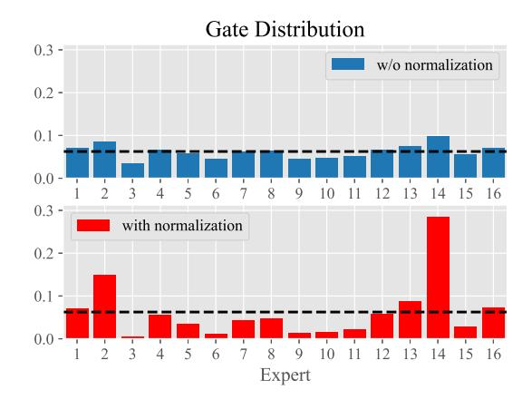
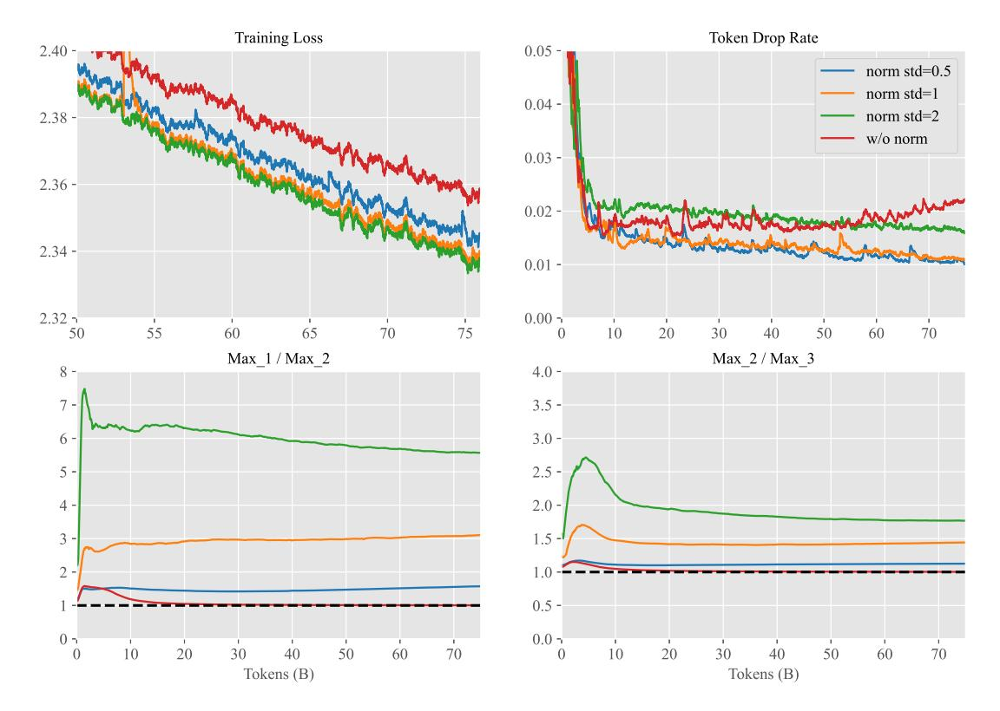
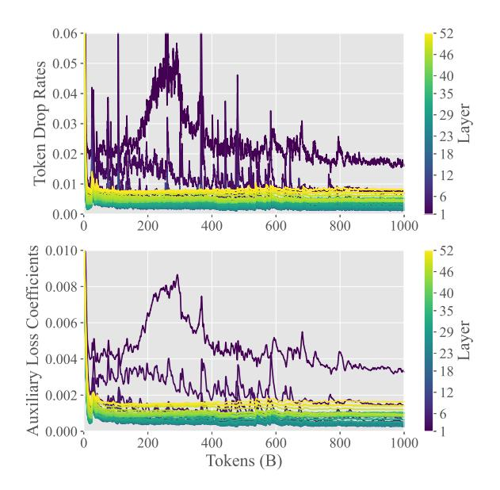
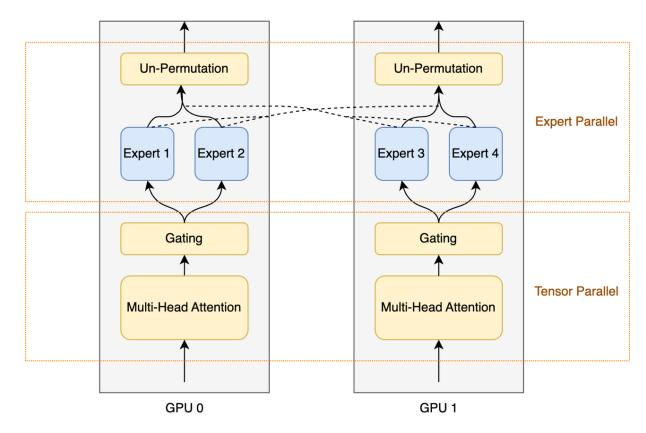
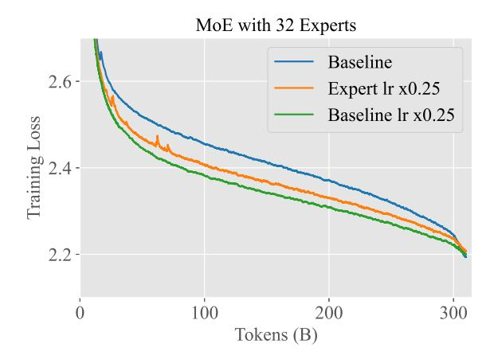

# Skywork-MoE: A Deep Dive into Training Techniques for Mixture-of-Experts Language Models

Tianwen Wei, Bo Zhu, Liang Zhao, Cheng Cheng, Biye Li, Weiwei Lü, Peng Cheng Jianhao Zhang, Xiaoyu Zhang, Liang Zeng, Xiaokun Wang, Yutuan Ma Rui Hu, Shuicheng Yan, Han Fang, Yahui Zhou∗

Skywork Team, Kunlun Inc.

# Abstract

In this technical report, we introduce the training methodologies implemented in the development of Skywork-MoE, a highperformance mixture-of-experts (MoE) large language model (LLM) with 146 billion parameters and 16 experts. It is initialized from the pre-existing dense checkpoints of our Skywork-13B model. We explore the comparative effectiveness of upcycling versus training from scratch initializations. Our findings suggest that the choice between these two approaches should consider both the performance of the existing dense checkpoints and the MoE training budget. We highlight two innovative techniques: gating logit normalization, which improves expert diversification, and adaptive auxiliary loss coefficients, allowing for layer-specific adjustment of auxiliary loss coefficients. Our experimental results validate the effectiveness of these methods. Leveraging these techniques and insights, we trained our upcycled Skywork-MoE on a condensed subset of our SkyPile corpus. The evaluation results demonstrate that our model delivers strong performance across a wide range of benchmarks.

# 1 Introduction

Recent advancements in the field of artificial intelligence have seen large language models (LLMs) [\(Ouyang et al.,](#page-9-0) [2022;](#page-9-0) [OpenAI,](#page-9-1) [2023;](#page-9-1) [Bubeck et al.,](#page-8-0) [2023;](#page-8-0) [Anthropic,](#page-8-1) [2024;](#page-8-1) [Tou](#page-9-2)[vron et al.,](#page-9-2) [2023b;](#page-9-2) [Meta-AI,](#page-9-3) [2024;](#page-9-3) [Team,](#page-9-4) [2024;](#page-9-4) [DeepSeek-AI,](#page-8-2) [2024b\)](#page-8-2) revolutionize numerous branches of natural language processing (NLP), encompassing tasks from machine translation to automated summarization. However, the computational demands and associated costs of training and deploying state-of-the-art dense LLMs pose significant challenges, particularly

at the scale of tens or hundreds of billions of parameters. In response to these challenges, sparse models, such as Mixture-of-Experts (MoE), have gained prominence [\(Fedus et al.,](#page-8-3) [2022;](#page-8-3) [Lepikhin et al.,](#page-9-5) [2020;](#page-9-5) [Du et al.,](#page-8-4) [2022;](#page-8-4) [Dai et al.,](#page-8-5) [2024;](#page-8-5) [DeepSeek-AI,](#page-8-2) [2024b\)](#page-8-2). These models offer a more economically viable alternative by distributing computation across various specialized sub-models or "experts", potentially matching or even surpassing the performance of their dense counterparts with a fraction of the resource requirements [\(Artetxe et al.,](#page-8-6) [2022;](#page-8-6) [Rajbhandari et al.,](#page-9-6) [2022;](#page-9-6) [Clark et al.,](#page-8-7) [2022\)](#page-8-7).

In light of these developments, this technical report introduces Skywork-MoE, a highperformance MoE large language model with 146 billion parameters and 16 experts. This model leverages the foundational architecture of our previously developed Skywork-13B model [\(Wei et al.,](#page-9-7) [2023\)](#page-9-7), utilizing its dense checkpoints as the initial setup [\(Komatsuzaki et al.,](#page-8-8) [2023\)](#page-8-8). We conduct experimental analysis on relative benefits of two pivotal strategies in LLM development: upcycling from existing dense models versus initiating training from scratch. Through rigorous evaluation, we provide nuanced insights into how the initial conditions and training budgets influence the effectiveness of these approaches, offering practical guidance on their application. Skywork-MoE embodies the forefront of MoE research by incorporating two novel training techniques: gating logit normalization and adaptive auxiliary loss coefficients. The former aims to enhance the diversification among the experts, while the latter facilitates the tailored adjustment of auxiliary loss coefficients at different layers of the model. Moreover, the training of Skywork-MoE was conducted on a condensed subset of the SkyPile corpus [\(Wei et al.,](#page-9-7) [2023\)](#page-9-7), with subsequent evaluations demonstrating its robust performance

∗ Email: {forename}.{surname}@kunlun-inc.com

across a diverse array of benchmarks. This report aims to detail these innovations and findings, setting a new benchmark for the efficiency and efficacy of MoE models in large-scale language processing tasks.

#### 2 Preliminaries

Skywork-MoE follows the previous work of Switch Transformer (Fedus et al., 2022), which implement the idea of MoE (Jacobs et al., 1991; Eigen et al., 2014; Shazeer et al., 2017) with transformer architecture (Vaswani et al., 2017).

#### 2.1 MoE for Transformers

In a standard transformer, each layer processes inputs through self-attention mechanisms followed by feed-forward neural networks (FFNs) (Vaswani et al., 2017). The transformer processes every token of the input sequence through the same pathways (i.e., every parameter in the model is active for every input).

In contrast, the MoE architecture modifies the typical transformer by replacing some or all of the FFNs with a mixture-of-experts, where each expert is itself a small FFNs, and the MoE layer houses multiple such experts. The MoE layer increases the capacity of transformer models while maintaining computational efficiency by selectively activating some of the expert networks for each input token. The selection of experts is performed by a gating mechanism, allowing the model to dynamically route tokens to the most relevant experts.

The gating mechanism in consists of a soft-max layer that computes a probability distribution over the available experts for each token. The gate output g for the i-th token with embedding  $x_i$  is given by:

$$\operatorname{softmax}(Wx_i + b) = (g_{i1}, \dots, g_{in})^T \quad (1)$$

where W is the gating weight matrix, b is the gating bias vector,  $g_{ij}$  is the gating probability of the i-th token being assigned to the j-th expert and n is the total number of experts. The k experts with the highest probability are then selected to process the token, which is also known as top-k routing. Conventionally one chooses k = 1 or k = 2. In this work, we always assume using top-2 routing of experts.

Let's denote the set of selected experts for the *i*-th token as  $\mathcal{E}_i$ . Each selected expert  $j \in \mathcal{E}_i$  processes the token embedding  $x_i$  and generates an output  $\operatorname{Expert}_j(x_i)$ . The outputs from the k selected experts are then linearly combined according to the corresponding gating probabilities:

$$y_i = \frac{1}{s_i} \sum_{j \in \mathcal{E}_i} g_{ij} \cdot \text{Expert}_j(x_i).$$
 (2)

where  $s_i = \sum_{j \in \mathcal{E}_i} g_{ij}$ . The combined output  $y_i$  is then passed to the next layer of the model.

#### 2.2 Auxiliary Loss

To ensure balanced load across experts and prevent a single expert from dominating, Switch Transformer employs an auxiliary loss function that encourages the even distribution of tokens among experts. Let  $p_j$  be the proportions of tokens assigned to expert j. The load is balanced across experts if  $p_j = k/n$  for all  $j = 1, \ldots, n$ . An naive auxiliary loss  $\mathcal{L}_{\text{aux}}$  that directly penalizes the discrepancy between  $p_j$  and k/n would be

$$\mathcal{L}_{\text{aux}} = \sum_{j=1}^{n} \left( \frac{k}{n} - p_j \right)^2.$$
 (3)

However, as  $p_j$  is only a statistic that does not allow for back-propagation, the naive auxiliary loss is not applicable in practice. As a differentiable surrogate, one can assume that

$$p_j \approx k \cdot E[g_j] \approx \frac{k}{T} \sum_{i=1}^{T} g_{ij}$$

where T is the number of tokens in a batch. Substituting  $p_j$  by  $\frac{k}{T} \sum_{i=1}^{T} g_{ij}$  in (3), and ignoring the constant k, we obtain

$$\mathcal{L}_{\text{aux}} = \sum_{j=1}^{n} \left( \frac{1}{n} - \frac{1}{T} \sum_{i=1}^{T} g_{ij} \right)^{2}, \quad (4)$$

which is the actual auxiliary loss that is commonly used in switch transformer training. By minimizing this loss, the model can effectively learns to balance the load across experts, preventing any single expert from being overloaded or underutilized.

The total loss function  $\mathcal{L}_{total}$  for training the Switch Transformer is a combination of the cross entropy loss  $\mathcal{L}_{ce}$  for the next token prediction task and the auxiliary loss  $\mathcal{L}_{aux}$ , weighted by a hyperparameter  $\alpha$ :

$$\mathcal{L}_{\text{total}} = \mathcal{L}_{\text{ce}} + \alpha \mathcal{L}_{\text{aux}} \tag{5}$$

By incorporating the MoE layer and the auxiliary loss for load balancing, Switch Transformer enables the efficient scaling of transformer models to billions of parameters while maintaining computational tractability.

# 3 Upcycling vs. From Scratch

We initiate our discussion by exploring the core issue of upcycling versus training from scratch, a critical consideration in the realm of MoE training. We present our initial experimental findings, comparing the advantages and disadvantages of upcycling from dense model checkpoints versus training a MoE model of equivalent size from scratch.

#### 3.1 Costs and Budgets

There are two distinct scenarios:

- Sunk Cost: The resources already spent on training the dense model are considered a sunk cost. These are not included in the cost calculations for subsequent upcycled MoE training. This scenario typically applies when utilizing pre-trained dense models, such as those available from open-source platforms.
- Cumulative Cost: The resources used to train the dense model are included in the total training cost for the upcycled MoE. This occurs when resources are deliberately allocated to first train a dense model, which is then used as a starting point for upcycling.

Our discussion will primarily focus on the first scenario, as it will later become clear that allocating resources to train a dense model solely for the purpose of MoE initialization is generally suboptimal.

A priori, the decision to upcycle versus train from scratch should consider the performance of the available dense model and the MoE training budget. On the one hand, if the budget is insufficient to train an MoE from scratch to match or exceed the performance of the dense model, training from scratch is trivially not a sensible option. On the other hand, with ample resources (e.g., significantly more than what was used to train the dense model), training an MoE from scratch might yield better outcomes as it avoids the limitations of starting with a group of identical experts, which can hinder diversification.

#### 3.2 Experiment Results

In our experiments, we first train a 0.3B dense model for 300B tokens with peak learning rate 3e-3 gradually decaying to 3e-4, obtaining a number of intermediate checkpoints. We focus on upcycling the checkpoints that have undergone 100B and 300B tokens of training, which we denote by "checkpoint-100B" and "checkpoint-300B" respectively. We then train several MoE models having the same architecture of 8 experts, but with different weight initialization scheme (from-scratch/checkpoint-100B/checkpoint-300B) and peak learning rate. We conduct this training under two different training budgets: 100 billion and 300 billion tokens.

For the experiments under a budget of 100B tokens, we compare the following:

- init\_scratch-decay\_100b: From scratch with a peak learning rate of 3e-3 (same as the dense model).
- init\_100b-decay\_100b: Upcycling from the 100B checkpoint with a peak learning rate of 1.8e-3.
- init\_300b-const: Upcycling from the 300B checkpoint with a constant learning rate of 3e-4.

For the larger 300B tokens budget, we retrain all models with an extended learning rate decay period of 300B tokens. We also train an additional MoE initialized from checkpiont-300B, but with an increased peak learning rate of 1.2e-3. We denote this model by init\_300b-3xLR. Throughout our experiments, we maintain the same minimum learning rate 3e-4 and decay the learning rate gradually with cosine schedule.

All results are reported in Fig. [1.](#page-3-0) The plot on the left panel indicates that with a moderate budget of 100B tokens, the model trained from scratch achieved similar performance to the model upcycled from checkpoint-100B. Despite starting from a much higher initial loss, both models eventually caught up to and surpassed the performance of the model upcycled

Figure 1: Training dynamics under different conditions and budgets. Left: Loss curves for MoE training initialized by upcycling and from scratch with 100B token budget. Middle: Similar comparison for a 300B token budget. Right: Evolution of average expert similarity during MoE training with a 300B token budget. The dashed line marks the final loss of a 0.3B dense model at the end of 300B tokens.

from checkpoint-300B. We attribute the poorer performance of the latter to its overly small learning rate of 3e-4. The plot in the middle reveals that with a larger budget of 300B tokens, the model trained from scratch outperforms all of its upcycled counterparts. Among the upcycled models, the one trained with the smallest learning rate again delivers the poorest result, underscoring the critical role of learning rate schedules in training MoE models. The plot on the right shows the decreasing trend of the average expert similarity during training for the upcycled MoEs, revealing that the process of training an upcycled MoE involves the diversification of experts. Notably, the model with the highest expert similarity exhibits the weakest performance, reinforcing the idea that expert similarity can serve as an effective monitoring metric during MoE training when models are initialized through upcycling. In contrast, throughout the training, the expert similarity for the from-scratch MoE remains at zero, suggesting that a non-uniform expert initialization encourages diversification.

#### 3.3 Rules of Thumb for Upcycling

Let us denote by C the cost of training an 0.3B dense model for 300B tokens. Then, for a corresponding MoE moddel, the training costs for 100B and 300B tokens are roughly  $\frac{2}{3}C$  and 2C respectively1. Our experiment results state

that in our setting with a moderate training budget of  $\frac{2}{3}C$ , an MoE trained from scratch is able to achieve similar performance to an upcycled one, initialized from dense checkpoints that has undergone pre-training of budget C. If, however, the training budget for MoE is 2C, twice of the training budget of the dense checkpoint, then an MoE trained from scratch performs significantly better than its upcycled counterpart.

Let us denote by  $C_{\rm dense}$  the cost to train the dense model from which one can choose to upcycle from for the MoE training, and by  $C_{\rm MoE}$  the training budget for the MoE model itselt. Our findings suggests the following rule of thumb on whether or not to adopt upcycling when upcycling is possible is given as follows:

- If  $C_{\text{MoE}} \ll C_{\text{dense}}$ , then one should prefer upcycling over training from scratch to maximally exploit the sunk cost invested in the dense model.
- If  $C_{\text{MoE}} \geq 2C_{\text{dense}}$ , then one should stick to the conventional method of training from scratch over upcycling, as the benefit of upcycling from a pre-trained checkpoint cannot compensate for the difficulty of expert diversification due to the uniformity of initialized

times the number of activation parameters compared to the dense model. If we also take into account of the communication overhead associated with expert parallelism, training the MoE model requires roughly twice the GPU hours compared to its dense counterpart for the same number of tokens.

&lt;sup>1This estimation is based on our use of top-2 routing in the MoE model, which results in approximately 1.7

experts.

- If one does not have a pre-trained dense checkpoint to upcycle from, then this corresponds to the case CMoE ≫ Cdense = 0. As a consequence, one should always train the MoE from scratch.
- When training an upcycled MoE, one should carefully tune the learning rate schedule. Different learning rate schedule may yield different

# 4 Training Techniques

#### 4.1 Gating Logit Normalization

One phenomenon that we have frequently observed during the training of MoE models is that its gating layers sometimes tend to yield distributions with high entropy, i.e., the topk probabilities for the selected experts are only marginally greater than those for the nonselected experts. Consequently, the output of the MoE layer is approximated as follows:

$$y_i \approx \frac{1}{k} \sum_{j \in \mathcal{E}_i} \text{Expert}_j(x_i),$$

In this scenario, the output is effectively a simple average of the selected expert outputs, rather than a weighted average. This suggests a uniformity among experts, indicating that the gating mechanism fails to discriminate effectively between different experts, which can be detrimental to model performance.

Figure 2: A comparison of gate distribution with and without logit normalization. The black dashed line corresponds to the baseline of uniform probability 1/16.

Although the underlying cause of this phenomenon still warrants further investigation, we have identified a straightforward solution. This remedy involves introducing a normalization step prior to the softmax function in the gating layer to ensure a more distinct gate output distribution. Specifically, we propose modifying the gating layer [\(1\)](#page-1-1) as follows:

$$z = Wx + b$$

$$\tilde{z} = \lambda \cdot \frac{z - \mu}{\sigma}$$

$$g = \operatorname{softmax}(\tilde{z}),$$
(6)

In this revised formulation, the vector z is first normalized by subtracting its mean µ and dividing by its standard deviation σ. It is then scaled by a hyper-parameter λ, resulting in a transformed vector z˜ with zero mean and a standard deviation controlled by λ. This adjustment ensures that the output vector z˜ is suitably scaled before applying the softmax function. The parameter λ plays the important role of determining the sharpness of the softmax output distribution. Specifically, a higher value of λ leads to a sharper, more focused distribution. This sharper gating mechanism is intended to enhance the model's ability to effectively differentiate between the contributions of various experts, thereby potentially improving the overall performance of the MoE model.

To validate our proposed methodology, we conducted a small-scale experiment using an MoE model equipped with 2.5 billion parameters and 16 experts. We compared models trained both with and without gating logit normalization and varied the hyperparameter λ. The results are illustrated in Figure [2](#page-4-0) and Figure [3.](#page-6-0) In Figure [2](#page-4-0) we show the output distribution of a gate for a model trained with gating logit normalization is significantly sharper than the one trained without. In the upper plots of Figure [3,](#page-6-0) we can see that all models trained with gating logit normalization exhibit significantly lower training losses and token drop rates compared to that without normalization. Additionally, we analyzed the ratios of M ax1/M ax2 and M ax2/M ax3, where M axi represents the i-th largest probability in the gate output distribution. These ratios are important indicators of the discriminative power of the expert router. A higher M ax1/M ax2 and M ax2/M ax3 ratio suggests a more effective differentiation among

experts. As shown in the lower plots of Figure 3, increasing  $\lambda$  leads to higher ratios, aligning with expectations. However, since the training losses for  $\lambda=1$  and  $\lambda=2$  are comparably effective, we have chosen to implement  $\lambda=1$  in the training of our Skywork-MoE model.

### 4.2 Adaptive Auxiliary Loss Coefficients

The primary purpose of integrating an auxiliary loss (4) is to facilitate a balanced distribution of workload across experts during training. This balance not only ensures effective training for each expert but also fosters diversity among them. The intensity of this load balance regularization is governed by a tunable hyperparameter,  $\alpha$ , which is commonly set to either 1e-2 or 1e-3 in practical applications.

We present two key observations. Firstly, since each gating layer possesses its independent auxiliary loss, the coefficients corresponding to these losses do not necessarily have to be identical. In that regard, a more explicit form of the total loss (5) should be

$$\mathcal{L}_{\text{total}} = \mathcal{L}_{\text{ce}} + \sum_{l=1}^{M} \alpha^{(l)} \mathcal{L}_{\text{aux}}^{(l)},$$

where M is the total number of MoE layers, and  $\mathcal{L}_{\text{aux}}^{(l)}$  and  $\alpha^{(l)}$  are auxiliary loss and its coefficient for the l-th MoE layer, respectively. We speculate that there may exist a combination of "optimal" coefficient values that is superior to a single fixed global auxiliary loss coefficient applicable to all layers.

Secondly, if the load is already balanced across the experts during training, then it is advisable to reduce the auxiliary loss coefficients to alleviate the load balance regularization. On the contrary, in scenarios where there is a significant imbalance in load distribution among experts, increasing the coefficients would enforce stricter load balance regularization. The rationale for adjusting these coefficients is primarily to prioritize the optimization of the crossentropy loss for next-word prediction, while treating load balance regularization as a secondary, potentially counterproductive, goal.

To address this, we propose the method of *Adaptive Auxiliary Loss Coefficients*. This approach involves monitoring the token drop rate,

which we use as a measure for expert load balance, for each MoE layer throughout the training process, and adaptively updating the coefficients for subsequent iterations based on the observed token drop rates. The updates to the loss coefficients are designed to be positively correlated with the token drop rates.

More specifically, we define the update mechanism as follows:

$$\hat{\alpha}_{i+1}^{(l)} = f(d_i^{(l)}), \tag{7}$$

$$\alpha_{i+1}^{(l)} = \beta \alpha_i^{(l)} + (1-\beta)\hat{\alpha}_{i+1}^{(l)}, \qquad (8)$$

where:

- f is an increasing function mapping the current observed token drop rate  $d_i^{(l)}$  to an estimated auxiliary loss  $\hat{\alpha}_{i+1}^{(l)}$  for the next iteration
- $\alpha_{i+1}^{(l)}$  represents the moving average of  $\hat{\alpha}_{i+1}^{(l)}$ , serving as the actual auxiliary loss coefficient for the next iteration. This moving average approach mitigates abrupt changes in regularization intensity.
- $\beta$ , a parameter within the range (0, 1), balances the weight between the existing moving average and the new estimate.

In our specific implementation, we define  $f(d) = \xi d$  for some  $\xi > 0$ , with the constraint that f(d) does not exceed a maximum value  $c_{\text{max}}$ . This results in a piece-wise linear function:

$$f(d) = \begin{cases} \xi d & \text{if } d \le \alpha_{\text{max}}/\xi, \\ \alpha_{\text{max}} & \text{if } d > \alpha_{\text{max}}/\xi. \end{cases}$$
(9)

The hyper-parameter  $\xi$  regulates the sensitivity of the loss coefficients to the token drop rate. During our training of the Skywork MoE model, we set  $\xi=1/5$ ,  $\alpha_{\rm max}=0.01$ , and  $\beta=0.99$ . This configuration effectively maintained both token drop rates and auxiliary loss coefficients at desirable levels.

#### 5 Skywork-MoE

Skywork-MoE is a massive MoE model with a total of 146 billion parameters and 22 billion activated parameters. It initialized from our in-house pre-trained Skywork-13B (Wei et al.,

Figure 3: Top left: Training loss curves for MoE models with and without gating normalization, illustrating that gating normalization contributes to a moderate improvement in loss. Top right: Evolution of the token drop rate for each model, showing the regularization effect of gating normalization which helps to reduce token drop during gating. Lower: Ratios Max1/Max2 and Max2/Max3 from the softmax output of the 3rd gating layer throughout training. We observe that a higher std parameter value increases both ratios as expected. For the model trained without gating normalization, both ratios converge to one (indicated by the horizontal dashed line), a condition considered detrimental for the model's performance.

[2023\)](#page-9-7) dense checkpoint[2](#page-6-1) , and is trained with gating logit normalization and adaptive auxiliary loss coefficient.

Skywork-MoE has undergone several stages of training, each characterized by a unique learning rate schedule and composition of training data. The data utilized to train Skywork-MoE consists of a curated subset of our SkyPile corpus [\(Wei et al.,](#page-9-7) [2023\)](#page-9-7), enriched with a significant volume of synthetic data. Overall, the collective distribution of training data aligns with a ratio of approximately 7:2:1 among English, Chinese, and code data.

To evaluate the performance of Skywork-MoE, we consider the following popular benchmarks: To assess the model's knowledge and problem-solving skills in Chinese, we utilized the CEVAL [\(Huang et al.,](#page-8-11) [2023\)](#page-8-11) and CMMLU

[\(Li et al.,](#page-9-10) [2023\)](#page-9-10) benchmarks. The MMLU [\(Hendrycks et al.,](#page-8-12) [2021a\)](#page-8-12) benchmark was chosen to evaluate English proficiency. For testing mathematical reasoning, the GSM8K [\(Cobbe](#page-8-13) [et al.,](#page-8-13) [2021\)](#page-8-13) and MATH [\(Hendrycks et al.,](#page-8-14) [2021b\)](#page-8-14) datasets were included. Additionally, the model's programming capabilities were assessed using the HumanEval [\(Chen et al.,](#page-8-15) [2021\)](#page-8-15) dataset.

We also present benchmark results for recent open-source models of comparable size, encompassing both dense and MoE architectures. Those models include: Deepseek-67B [\(DeepSeek-AI,](#page-8-16) [2024a\)](#page-8-16), Qwen1.5-72B [\(Qwen Team,](#page-9-11) [2023\)](#page-9-11), Llama2-70B [\(Touvron](#page-9-2) [et al.,](#page-9-2) [2023b\)](#page-9-2), Llama3-70B [\(Meta-AI,](#page-9-3) [2024\)](#page-9-3), Mixtral 8\*7B [\(Mistral-AI,](#page-9-12) [2023\)](#page-9-12), Mixtral 8\*22B [\(Mistral-AI,](#page-9-13) [2024\)](#page-9-13), DBRX-Instruct [\(Databricks,](#page-8-17) [2024\)](#page-8-17), Deepseek-V1 [\(Dai et al.,](#page-8-5) [2024\)](#page-8-5), Deepseek-V2 [\(DeepSeek-AI,](#page-8-2) [2024b\)](#page-8-2).

The evaluation results are presented in Table [1.](#page-7-0) It can be seen that Skywork-MoE

2The open sourced version of Skywork-13B has been trained for 3.2 trillion tokens. the in-house version has undergone additional pre-training on an extra 2 trillion tokens.

|               | # <b>AP</b> | #TP | CEVAL | CMMLU | MMLU | GSM8K | MATH | HumanEval |
|---------------|-------------|-----|-------|-------|------|-------|------|-----------|
| Deepseek-67B  | 67          | 67  | 66.1  | 70.8  | 71.3 | 63.4  | 18.7 | 42.7      |
| Qwen1.5-72B   | 72          | 72  | 84.1  | 83.5  | 77.5 | 79.5  | 34.1 | 41.5      |
| Llama2-70B    | 70          | 70  | -     | -     | 68.9 | 56.8  | 13.6 | 29.9      |
| Llama3-70B    | 70          | 70  | -     | -     | 78.8 | 82.7  | 36.7 | 39.0      |
| Mixtral 8*7B  | 13          | 47  | -     | -     | 70.6 | 58.4  | 28.4 | 40.2      |
| Mixtral 8*22B | 39          | 141 | -     | -     | 77.8 | 78.6  | 41.8 | 45.1      |
| Grok-1        | 86          | 314 | -     | -     | 73.0 | 62.9  | 23.9 | 63.2      |
| DBRX-Instruct | 36          | 132 | -     | -     | 73.7 | 66.9  | -    | 70.1      |
| Deepseek-V2   | 21          | 236 | 81.7  | 84.0  | 78.5 | 79.2  | 43.6 | 48.8      |
| Skywork-13B   | 13          | 13  | 62.1  | 62.4  | 62.7 | 60.2  | 8.4  | 18.9      |
| Skywork-MoE   | 22          | 146 | 82.2  | 79.5  | 77.4 | 76.1  | 31.9 | 43.9      |

Table 1: Evaluation results of Skywork-MoE on popular LLM benchmarks. Results of recent open models are also reported for comparison. The columns titled "#AP" and "#TP" stand for the number of activated parameters and that of total parameters (in billion), respectively.

Figure 4: The curves of token drop rate (top) and those of auxiliary loss coefficient (bottom) for all gating layers during the pre-training of our Skywork-MoE. It can be seen that the auxiliary loss coefficients is responsive to the change in token drop rates.

achieves strong scores of 82.2 and 79.5 on the CEVAL and CMMLU benchmarks, respectively, surpassing Deepseek-67B, and is closely trailing behind Deepseek-V2. On the MMLU, Skywork-MoE scores 77.4, which is competitive when compared to higher-capacity models like Qwen1.5-72B and slightly lower than Llama3-70B. In mathematical related tasks (GSM8K and MATH), Skywork-MoE's scores of 76.1 and 31.9 are notable. It comfortably outperforms Llama2-70B and Mixtral 8\*7B and stands close to larger models such as Deepseek-V2 (79.2 and

43.6). This highlights the model's ability to handle complex quantitative and logical reasoning, a challenging area for many language models. On the HumanEval benchmark, which tests code synthesis capabilities, Skywork-MoE scores 43.9. This is a strong performance, exceeding all dense models in our comparison. It is slightly below Deepseek-V2, suggesting room for improvement in programming-related tasks. Overall, it is pertinent to conclude that our Skywork-MoE outperforms Deepseek-67B and Llama2-70B, but trails behind Llama3-70B and several larger MoEs such as Mixtral 8\*22B and Deepseek-V2.

#### 6 Conclusion

In this work we introduced the techniques and insights we gained behind the development of the Skywork-MoE model. Our comparative analysis of upcycling pre-existing models versus training from scratch provides insights and guidelines into the initization decisions required for MoE model development. This understanding allows for more informed and effective planning and allocation of resources in large-scale MoE training projects. We introduced gating logit normalization and adaptive auxiliary loss coefficients, two techniques that have notably enhanced expert diversification and provided a flexible framework for adjusting auxiliary losses, respectively. Based on these findings, we trained Skywork-MoE, an open-source MoE upcycled from previous Skywork-13B checkpoint. Its strong performance validates the effectiveness of our approach.

# References

- Anthropic. 2024. [The claude 3 model family: Opus,](https://www-cdn.anthropic.com/de8ba9b01c9ab7cbabf5c33b80b7bbc618857627/Model_Card_Claude_3.pdf) [sonnet, haiku.](https://www-cdn.anthropic.com/de8ba9b01c9ab7cbabf5c33b80b7bbc618857627/Model_Card_Claude_3.pdf)
- Mikel Artetxe, Shruti Bhosale, Naman Goyal, Todor Mihaylov, Myle Ott, Sam Shleifer, Xi Victoria Lin, Jingfei Du, Srinivasan Iyer, Ramakanth Pasunuru, Giri Anantharaman, Xian Li, Shuohui Chen, Halil Akin, Mandeep Baines, Louis Martin, Xing Zhou, Punit Singh Koura, Brian O'Horo, Jeff Wang, Luke Zettlemoyer, Mona Diab, Zornitsa Kozareva, and Ves Stoyanov. 2022. [Efficient](http://arxiv.org/abs/2112.10684) [large scale language modeling with mixtures of](http://arxiv.org/abs/2112.10684) [experts.](http://arxiv.org/abs/2112.10684)
- Sébastien Bubeck, Varun Chandrasekaran, Ronen Eldan, Johannes Gehrke, Eric Horvitz, Ece Kamar, Peter Lee, Yin Tat Lee, Yuanzhi Li, Scott Lundberg, Harsha Nori, Hamid Palangi, Marco Tulio Ribeiro, and Yi Zhang. 2023. [Sparks](http://arxiv.org/abs/2303.12712) [of artificial general intelligence: Early experi](http://arxiv.org/abs/2303.12712)[ments with gpt-4.](http://arxiv.org/abs/2303.12712)
- Mark Chen, Jerry Tworek, Heewoo Jun, Qiming Yuan, Henrique Ponde de Oliveira Pinto, Jared Kaplan, Harri Edwards, Yuri Burda, Nicholas Joseph, Greg Brockman, Alex Ray, Raul Puri, Gretchen Krueger, Michael Petrov, Heidy Khlaaf, Girish Sastry, Pamela Mishkin, Brooke Chan, Scott Gray, Nick Ryder, Mikhail Pavlov, Alethea Power, Lukasz Kaiser, Mohammad Bavarian, Clemens Winter, Philippe Tillet, Felipe Petroski Such, Dave Cummings, Matthias Plappert, Fotios Chantzis, Elizabeth Barnes, Ariel Herbert-Voss, William Hebgen Guss, Alex Nichol, Alex Paino, Nikolas Tezak, Jie Tang, Igor Babuschkin, Suchir Balaji, Shantanu Jain, William Saunders, Christopher Hesse, Andrew N. Carr, Jan Leike, Josh Achiam, Vedant Misra, Evan Morikawa, Alec Radford, Matthew Knight, Miles Brundage, Mira Murati, Katie Mayer, Peter Welinder, Bob McGrew, Dario Amodei, Sam McCandlish, Ilya Sutskever, and Wojciech Zaremba. 2021. [Evalu](http://arxiv.org/abs/2107.03374)[ating large language models trained on code.](http://arxiv.org/abs/2107.03374)
- Aidan Clark, Diego de las Casas, Aurelia Guy, Arthur Mensch, Michela Paganini, Jordan Hoffmann, Bogdan Damoc, Blake Hechtman, Trevor Cai, Sebastian Borgeaud, George van den Driessche, Eliza Rutherford, Tom Hennigan, Matthew Johnson, Katie Millican, Albin Cassirer, Chris Jones, Elena Buchatskaya, David Budden, Laurent Sifre, Simon Osindero, Oriol Vinyals, Jack Rae, Erich Elsen, Koray Kavukcuoglu, and Karen Simonyan. 2022. [Unified scaling laws for routed](http://arxiv.org/abs/2202.01169) [language models.](http://arxiv.org/abs/2202.01169)
- Karl Cobbe, Vineet Kosaraju, Mohammad Bavarian, Mark Chen, Heewoo Jun, Lukasz Kaiser, Matthias Plappert, Jerry Tworek, Jacob Hilton, Reiichiro Nakano, Christopher Hesse, and John Schulman. 2021. [Training verifiers to solve math](http://arxiv.org/abs/2110.14168) [word problems.](http://arxiv.org/abs/2110.14168)

- Damai Dai, Chengqi Deng, Chenggang Zhao, R. X. Xu, Huazuo Gao, Deli Chen, Jiashi Li, Wangding Zeng, Xingkai Yu, Y. Wu, Zhenda Xie, Y. K. Li, Panpan Huang, Fuli Luo, Chong Ruan, Zhifang Sui, and Wenfeng Liang. 2024. [Deepseek](http://arxiv.org/abs/2401.06066)[moe: Towards ultimate expert specialization in](http://arxiv.org/abs/2401.06066) [mixture-of-experts language models.](http://arxiv.org/abs/2401.06066)
- Databricks. 2024. [Dbrx-instruct.](https://huggingface.co/databricks/dbrx-instruct)
- DeepSeek-AI. 2024a. [Deepseek llm: Scaling open](http://arxiv.org/abs/2401.02954)[source language models with longtermism.](http://arxiv.org/abs/2401.02954)
- DeepSeek-AI. 2024b. [Deepseek-v2: A strong, eco](http://arxiv.org/abs/2405.04434)[nomical, and efficient mixture-of-experts lan](http://arxiv.org/abs/2405.04434)[guage model.](http://arxiv.org/abs/2405.04434)
- Nan Du, Yanping Huang, Andrew M. Dai, Simon Tong, Dmitry Lepikhin, Yuanzhong Xu, Maxim Krikun, Yanqi Zhou, Adams Wei Yu, Orhan Firat, Barret Zoph, Liam Fedus, Maarten Bosma, Zongwei Zhou, Tao Wang, Yu Emma Wang, Kellie Webster, Marie Pellat, Kevin Robinson, Kathleen Meier-Hellstern, Toju Duke, Lucas Dixon, Kun Zhang, Quoc V Le, Yonghui Wu, Zhifeng Chen, and Claire Cui. 2022. [Glam: Efficient scal](http://arxiv.org/abs/2112.06905)[ing of language models with mixture-of-experts.](http://arxiv.org/abs/2112.06905)
- David Eigen, Marc'Aurelio Ranzato, and Ilya Sutskever. 2014. [Learning factored representa](http://arxiv.org/abs/1312.4314)[tions in a deep mixture of experts.](http://arxiv.org/abs/1312.4314)
- William Fedus, Barret Zoph, and Noam Shazeer. 2022. [Switch transformers: Scaling to trillion](http://arxiv.org/abs/2101.03961) [parameter models with simple and efficient spar](http://arxiv.org/abs/2101.03961)[sity.](http://arxiv.org/abs/2101.03961)
- Dan Hendrycks, Collin Burns, Steven Basart, Andy Zou, Mantas Mazeika, Dawn Song, and Jacob Steinhardt. 2021a. [Measuring massive multitask](http://arxiv.org/abs/2009.03300) [language understanding.](http://arxiv.org/abs/2009.03300)
- Dan Hendrycks, Collin Burns, Saurav Kadavath, Akul Arora, Steven Basart, Eric Tang, Dawn Song, and Jacob Steinhardt. 2021b. Measuring mathematical problem solving with the math dataset. arXiv preprint arXiv:2103.03874.
- Yuzhen Huang, Yuzhuo Bai, Zhihao Zhu, Junlei Zhang, Jinghan Zhang, Tangjun Su, Junteng Liu, Chuancheng Lv, Yikai Zhang, Jiayi Lei, Yao Fu, Maosong Sun, and Junxian He. 2023. Ceval: A multi-level multi-discipline chinese evaluation suite for foundation models. arXiv preprint arXiv:2305.08322.
- Robert Jacobs, Michael Jordan, Steven Nowlan, and Geoffrey Hinton. 1991. [Adaptive mixture of](https://doi.org/10.1162/neco.1991.3.1.79) [local expert.](https://doi.org/10.1162/neco.1991.3.1.79) Neural Computation, 3:78–88.
- Aran Komatsuzaki, Joan Puigcerver, James Lee-Thorp, Carlos Riquelme Ruiz, Basil Mustafa, Joshua Ainslie, Yi Tay, Mostafa Dehghani, and Neil Houlsby. 2023. [Sparse upcycling: Training](http://arxiv.org/abs/2212.05055) [mixture-of-experts from dense checkpoints.](http://arxiv.org/abs/2212.05055)

Dmitry Lepikhin, HyoukJoong Lee, Yuanzhong Xu, Dehao Chen, Orhan Firat, Yanping Huang, Maxim Krikun, Noam Shazeer, and Zhifeng Chen. 2020. [Gshard: Scaling giant models with condi](http://arxiv.org/abs/2006.16668)[tional computation and automatic sharding.](http://arxiv.org/abs/2006.16668)

Haonan Li, Yixuan Zhang, Fajri Koto, Yifei Yang, Hai Zhao, Yeyun Gong, Nan Duan, and Timothy Baldwin. 2023. [Cmmlu: Measuring massive](http://arxiv.org/abs/2306.09212) [multitask language understanding in chinese.](http://arxiv.org/abs/2306.09212)

Meta-AI. 2024. [Llama 3 model card.](https://github.com/meta-llama/llama3/blob/main/MODEL_CARD.md)

Mistral-AI. 2023. [Mixtral-8x7B-v0.1.](https://huggingface.co/mistralai/Mixtral-8x7B-v0.1)

Mistral-AI. 2024. [Mixtral-8x22B-v0.1.](https://huggingface.co/mistralai/Mixtral-8x22B-v0.1)

Deepak Narayanan, Mohammad Shoeybi, Jared Casper, Patrick LeGresley, Mostofa Patwary, Vijay Anand Korthikanti, Dmitri Vainbrand, Prethvi Kashinkunti, Julie Bernauer, Bryan Catanzaro, Amar Phanishayee, and Matei Zaharia. 2021. [Efficient large-scale language model](http://arxiv.org/abs/2104.04473) [training on gpu clusters using megatron-lm.](http://arxiv.org/abs/2104.04473)

OpenAI. 2023. [GPT-4 technical report.](http://arxiv.org/abs/2303.08774)

Long Ouyang, Jeff Wu, Xu Jiang, Diogo Almeida, Carroll L. Wainwright, Pamela Mishkin, Chong Zhang, Sandhini Agarwal, Katarina Slama, Alex Ray, John Schulman, Jacob Hilton, Fraser Kelton, Luke Miller, Maddie Simens, Amanda Askell, Peter Welinder, Paul Christiano, Jan Leike, and Ryan Lowe. 2022. [Training language models to](http://arxiv.org/abs/2203.02155) [follow instructions with human feedback.](http://arxiv.org/abs/2203.02155)

Qwen Team. 2023. [QWEN technical report.](https://github.com/QwenLM/Qwen) [https:](https://github.com/QwenLM/Qwen) [//github.com/QwenLM/Qwen](https://github.com/QwenLM/Qwen).

Samyam Rajbhandari, Conglong Li, Zhewei Yao, Minjia Zhang, Reza Yazdani Aminabadi, Ammar Ahmad Awan, Jeff Rasley, and Yuxiong He. 2022. [Deepspeed-moe: Advancing mixture-of](http://arxiv.org/abs/2201.05596)[experts inference and training to power next](http://arxiv.org/abs/2201.05596)[generation ai scale.](http://arxiv.org/abs/2201.05596)

Samyam Rajbhandari, Jeff Rasley, Olatunji Ruwase, and Yuxiong He. 2020. [Zero: Memory optimiza](http://arxiv.org/abs/1910.02054)[tions toward training trillion parameter models.](http://arxiv.org/abs/1910.02054)

Noam Shazeer. 2020. [Glu variants improve trans](http://arxiv.org/abs/2002.05202)[former.](http://arxiv.org/abs/2002.05202)

Noam Shazeer, Azalia Mirhoseini, Krzysztof Maziarz, Andy Davis, Quoc Le, Geoffrey Hinton, and Jeff Dean. 2017. [Outrageously large neural](http://arxiv.org/abs/1701.06538) [networks: The sparsely-gated mixture-of-experts](http://arxiv.org/abs/1701.06538) [layer.](http://arxiv.org/abs/1701.06538)

Mohammad Shoeybi, Mostofa Patwary, Raul Puri, Patrick LeGresley, Jared Casper, and Bryan Catanzaro. 2020. [Megatron-lm: Training multi](http://arxiv.org/abs/1909.08053)[billion parameter language models using model](http://arxiv.org/abs/1909.08053) [parallelism.](http://arxiv.org/abs/1909.08053)

Jianlin Su, Yu Lu, Shengfeng Pan, Ahmed Murtadha, Bo Wen, and Yunfeng Liu. 2022. [Ro](http://arxiv.org/abs/2104.09864)[former: Enhanced transformer with rotary posi](http://arxiv.org/abs/2104.09864)[tion embedding.](http://arxiv.org/abs/2104.09864)

Gemini Team. 2024. [Gemini 1.5: Unlocking mul](http://arxiv.org/abs/2403.05530)[timodal understanding across millions of tokens](http://arxiv.org/abs/2403.05530) [of context.](http://arxiv.org/abs/2403.05530)

Hugo Touvron, Thibaut Lavril, Gautier Izacard, Xavier Martinet, Marie-Anne Lachaux, Timothée Lacroix, Baptiste Rozière, Naman Goyal, Eric Hambro, Faisal Azhar, Aurelien Rodriguez, Armand Joulin, Edouard Grave, and Guillaume Lample. 2023a. [Llama: Open and efficient foun](http://arxiv.org/abs/2302.13971)[dation language models.](http://arxiv.org/abs/2302.13971)

Hugo Touvron, Louis Martin, Kevin Stone, Peter Albert, Amjad Almahairi, Yasmine Babaei, Nikolay Bashlykov, Soumya Batra, Prajjwal Bhargava, Shruti Bhosale, et al. 2023b. Llama 2: Open foundation and fine-tuned chat models. arXiv preprint arXiv:2307.09288.

Ashish Vaswani, Noam Shazeer, Niki Parmar, Jakob Uszkoreit, Llion Jones, Aidan N. Gomez, Lukasz Kaiser, and Illia Polosukhin. 2017. Attention is all you need. In Proceedings of the 31st International Conference on Neural Information Processing Systems, NIPS'17, page 6000–6010, Red Hook, NY, USA. Curran Associates Inc.

Tianwen Wei, Liang Zhao, Lichang Zhang, Bo Zhu, Lijie Wang, Haihua Yang, Biye Li, Cheng Cheng, Weiwei Lü, Rui Hu, Chenxia Li, Liu Yang, Xilin Luo, Xuejie Wu, Lunan Liu, Wenjun Cheng, Peng Cheng, Jianhao Zhang, Xiaoyu Zhang, Lei Lin, Xiaokun Wang, Yutuan Ma, Chuanhai Dong, Yanqi Sun, Yifu Chen, Yongyi Peng, Xiaojuan Liang, Shuicheng Yan, Han Fang, and Yahui Zhou. 2023. [Skywork: A more open bilingual](http://arxiv.org/abs/2310.19341) [foundation model.](http://arxiv.org/abs/2310.19341)

Biao Zhang and Rico Sennrich. 2019. [Root Mean](https://openreview.net/references/pdf?id=S1qBAf6rr) [Square Layer Normalization.](https://openreview.net/references/pdf?id=S1qBAf6rr) In Advances in Neural Information Processing Systems 32, Vancouver, Canada.

# A Skywork-MoE Architecture

As Skywork-MoE is upcycled from Skywork-13B, the MoE inherits most of the network configuration of the latter model, which is of Llama-like [\(Touvron et al.,](#page-9-14) [2023a,](#page-9-14)[b\)](#page-9-2) architecture featuring Rotary Positional Embedding (RoPE) [\(Su et al.,](#page-9-15) [2022\)](#page-9-15), RMSNorm [\(Zhang](#page-9-16) [and Sennrich,](#page-9-16) [2019\)](#page-9-16) and SwiGLU activation function [\(Shazeer,](#page-9-17) [2020\)](#page-9-17). Other details on Skywork-MoE is given in Table [2.](#page-10-0)

|                     | Skywork-MoE |
|---------------------|-------------|
| Vocab. Size         | 65,536      |
| Hidden Dim.         | 4,608       |
| FFN Dim.            | 12,288      |
| Head Dim.           | 128         |
| Num. Heads          | 36          |
| Num. Layers         | 52          |
| Num. Total Experts  | 16          |
| Num. Routed Experts | 2           |
| MoE Layer Frequency | 1           |
| Native Seq. Len.    | 8192        |

Table 2: Details on Skywork-MoE architecture.

# B Infrastructure

The Skywork-MoE model leverages our internally developed training framework, Skywork-Megatron, which is built on the Megatron-LM [\(Shoeybi et al.,](#page-9-18) [2020;](#page-9-18) [Narayanan et al.,](#page-9-19) [2021\)](#page-9-19) 23.06 branch. Within this framework, we have implemented a custom MoE architecture that includes gating layer, expert layer, and a tailored distributed parallel strategy.

#### B.1 Expert Data Parallel (EDP)

Figure 5: Illustration of Expert Data Parallism (EDP). In EDP, the attention part runs as Tensor Parallelism, while the FFN part runs as Expert Parallelism.

We introduces a unique parallelization strategy named Expert Data Parallelism (EDP). Existing parallelism strategies for MoE training in Megatron-LM Core 0.6.0 include Expert Parallelism (EP) and Expert Tensor Parallelism (ETP).

- EP is characterized by SizeEP = SizeDP ∗ SizeT P . As EP does not support further split of single expert, there is also a constraint that SizeEP cannot exceed the total number of experts. Consequently, with EP the number of GPUs that can be used to train the MoE is bounded by a multiple of the number of experts.
- ETP is characterized by SizeEP = SizeDP . As ETP allows splitting one expert onto multiple GPUs (SizeT P ), it supports larger cluster size than that of EP. The downside is that ETP has a larger communication overhead fom AlltoAll operation between experts, which my increases rapidly with SizeT P .

Our EDP is defined by SizeEP = SizeT P . This approach is particularly effective for models with a moderate number of experts (e.g., no greater than 64), optimizing the AllToAll communication during the routing of tokens by the gating layer. In the EDP configuration (see Figure [5](#page-10-1) for an illustration), the same data traverses both the TP Group in the attention layer and the EP Group in the expert layer. The device mesh configuration for Attention and Expert weights is represented as [SizeP P , SizeDP , SizeT P ] and [SizeP P , SizeDP , SizeEP ], respectively.

#### B.2 Unbalanced Pipeline Parallellism

The Skywork-MoE model employs a custom approach to Pipeline Parallelism (PP) and gradient recomputation to achieve better load balancing across both GPU computation and memory usage in various pipeline stages. Standard pipeline parallel implementations often suffer from computational bottlenecks, particularly in the last stage due to the loss calculation. In Figure [6](#page-11-0) we present an example of a model with 24 layers. In this example, adjusting the segmentation of transformer layers from a uniform [6, 6, 6, 6] to [5, 5, 5, 5, 4] reduces pipeline bubble time by up to 10%, enhancing overall computational efficiency. Similarly, gradient recomputation (via checkpointing) is adapted differently across the stages. With large differences in buffer sizes across the stages, configuring varied recomputation layer numbers for each stage helps in balancing memory utilization and computational overhead effectively.

Figure 6: Comparison of bubble time between uniform and non-uniform split pipeline parallelism (PP) in a 24-layer transformer network. (a) Uniformly split into four PP stages, each containing six layers, resulting in significant bubble formation due to the computational demands of loss calculation. (b) Non-uniformly split into five PP stages configured as [5, 5, 5, 5, 4], with the final stage containing one fewer layer, achieving better load balance across stages.

#### B.3 Training Efficiency

The training of the Skywork-MoE model is conducted on a cluster comprising 192 NVIDIA-HGX-A800 nodes, totaling 1536 A800-80G SXM GPUs. Each node is connected through a high-speed 400 GB/s NVLink for intra-node and an 800 Gb/s RoCE network for inter-node communications. The model utilizes 12-way pipeline parallelism, 4-way tensor-expert parallelism (via EDP), and 32-way data parallelism with ZeRO-1 optimization [\(Rajbhandari](#page-9-20) [et al.,](#page-9-20) [2020\)](#page-9-20). To further enhance training performance, we have implemented features such as communication reduction related to expert parallelism, kernel fusion, and overlapping communication with computation.

Ultimately, the training of Skywork-MoE achieves 38% Model Floating-point Utilization (MFU) on the cluster and a throughput of 690 tokens per GPU per second.

# C Negative Results

#### C.1 Scaling Expert Learning Rate

In MoE training with top-k routing, each input token is assigned to k experts. If the expert loads are roughly balanced, then in a forward pass each expert is expected to receive a proportion of k/n of all input tokens. This means that the effective training batch size for the MoE layers is merely k/n of the nominal training batch size. As smaller effective batch size leads to more noised gradient estimate, one may hypothesize that to compensate this it is

preferrable to scale the learning rate of the MoE layer by a factor of either k/n (linear scaling) or p k/n (squre root scaling).

In order to test the validity of such treatment, we have experimented with a small MoE model featuring 32 experts and a total of 1.8 billion parameters, utilizing top-2 routing with 150 million activated parameters. Under this setting, the effective batch size for the MoE layers is 16 times smaller than the nominal batch size. With the square root scaling, the learning rate for the MoE layer should be scaled by 1/ √ 16 = 0.25.

We have experimented with three different learning rate setting:

- Baseline: a global peak learning rate of 6e-3 for all component of the network;
- Expert lr ×0.25: the peak learning rate is set to be 1.5e-3 for MoE layers and 6e-3 for non-MoE layers;
- Baseline lr ×0.25: a global peak learning rate of 1.5e-3 for all component of the network.

All models were first trained from scratch for 300 billion tokens, and learning rate linearly decreasing to 10% of its peak value. We then continued the training for another 10B tokens, during which the learning rate is swiftly decayed from the its final value in the previous stage to zero.

The experiment result is depicted in Fig. [7.](#page-12-0) We see that at the end of the first stage of

Figure 7: Comparison of Expert vs. Global Learning Rate Scaling. This graph illustrates the noticeable differences in training loss at 300 billion tokens, attributable to variations in their terminal learning rates. However, by 310 billion tokens, when the learning rate reaches zero, the training curves of all three models converge, demonstrating similar performance outcomes.

training, the baseline models with and without global learning rate scaling exhibits the best and poorest performance respectively, and the model with expert learning rate scaling is somewhere in-between. We attribute this performance gap to the *difference* of their respective final learning rate. This can be evidenced by the fact that with merely 10B additional training, where the learning rates for all models had declined to zero, only minor differences in training loss remained, with the baseline model marginally outperforming the others.

Despite theoretical justifications for adjusting the learning rate for MoE layers, our findings suggest that such modifications may be unnecessary. We note that in our configuration of 32 experts the parameters within the MoE layers constitute approximately 97% of the total model parameters, where the latter figure mainly depends on the number of experts and is agnostic to the model scale. Consequently, adjusting the learning rate specifically for the MoE layers effectively equates to a global scaling of the learning rate across the entire network. This overlap in parameter distribution implies that targeted adjustments to the MoE laver's learning rate might not yield distinct outcomes from global adjustments.

Figure 8: Comparison of training loss for MoE models: conventional upcycling (baseline) versus specialization training (Multi. Init.). Both models underwent training over 100 billion tokens.

# C.2 Expert Specialization Training for Upcycling

Conventional sparse upcycling methods involve initializing MoE weights from a single dense model checkpoint, where the weights in the Feed-Forward Network (FFN) layers of the dense model are replicated n times, creating an MoE model with n identical experts in each MoE layer. It is reasonable to hypothesize that this method of initializing MoE models with identical experts could impede the diversification of the experts, potentially leading to suboptimal performance.

To investigate this, we explored a method which we refer to as expert specialization training for upcycling. Briefly, this method allocates a portion of our computational budget to independently pre-train the dense model on each of n distinct datasets, each characterized by different distributions  $\mathcal{D}_1, \ldots, \mathcal{D}_n$ . This process yields n diverse and more specialized model checkpoints. We anticipated that initializing the MoE weights from these specialized checkpoints would promote expert diversification, resulting in a performance improvement.

Our experiments were conducted using dense checkpoints that contain 1.3B parameters, initially pre-trained from scratch for 1T tokens on a mixed corpus of Chinese texts, English texts, and code. We refer to this initial model as  $M_{\rm base}$ . Subsequently, we continued to pre-train  $M_{\rm base}$  separately on an additional 100B tokens of exclusively Chinese, English, and code data, updating only the FFN part of  $M_{\rm base}$ . The

resulting models are designated as Mcn, Men, and Mcode, respectively. In our experiments, to initialize an MoE model with 8 experts, we utilized three copies of Mcn, three copies of Men, one copy of Mcode, and one copy of Mbase. This setup was compared against a baseline method, which involves initializing from eight copies of Mbase.

The experimental results, as shown in Figure [8,](#page-12-1) reveal that while expert specialization training does offer a slight advantage over the baseline upcycling approach, the advantage diminishes as training progresses. By the end of 90 billion tokens of training, the difference in loss between the specialization training and the baseline is below 0.01. We consider this difference to be marginal and not justifying the additional effort[3](#page-13-0) involved.

3We have trained each of Mcn, Men, and Mcode for 100B tokens, which altogether is roughly equivalent to 150B training of the MoE model in terms of GPU hours invested.