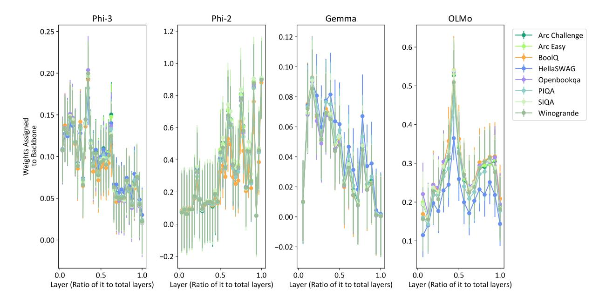

# Sparser Mixture-of-Adapters with Cross-Layer Generalization

# Ziyue Li

Department of Computer Science University of Maryland, College Park litzy619@umd.edu

# Tianyi Zhou

Department of Computer Science University of Maryland, College Park tianyi@umd.edu

## Abstract

As large language models (LLMs) scale, improving their efficiency and adaptability across tasks becomes increasingly critical. The Mixture-of-Adapter (MoA) framework offers a promising solution by training a small pool of lightweight adapters at each layer and selecting the most suitable ones for each input, merging their outputs with the original layer's. However, existing MoA approaches do not allow sharing adapters across different layers, leading to unnecessary redundancy and poor generalization of trained adapters. To tackle these challenges, we propose "Sparser MoA (SMOA)", which trains a unified adapter pool shared across layers, introducing a much sparser routing choice of experts per layer. Enforcing such sparsity improves the Cross-Layer Generalization (CLAG) capability and specialization of each adapter, thereby enhancing SMOA's adaptation to different tasks. Extensive experiments across multiple base LLMs show SMOA reduces active adapters by over 85% while significantly boosting task accuracy, paving the way for developing more efficient, generalizable, and modular LLMs.

## 1 Introduction

Mixture-of-Experts (MoE) [\(Jacobs et al.,](#page-9-0) [1991\)](#page-9-0) has achieved remarkable success when applied to the recent large language models (LLMs). Its inference cost can remain constant even with increased experts (model capacity). With diverse expertise developed by different experts, MoE LLMs exhibit advantages on adaptation to downstream tasks, by dynamically routing each input to the expert(s) of the best match. During the training of MoE, the dynamic routing mechanism encourages expert specialization for different tasks [\(Shazeer et al.,](#page-9-1) [2017;](#page-9-1) [Fedus et al.,](#page-8-0) [2022\)](#page-8-0) and facilitates knowledge sharing among similar tasks [\(Ma et al.,](#page-9-2) [2018;](#page-9-2) [Li et al.,](#page-9-3) [2023\)](#page-9-3). However, training MoE is expensive in computation and the amount of training data.

In contrast, Parameter-Efficient Fine-Tuning (PEFT) [\(Ding et al.,](#page-8-1) [2023\)](#page-8-1) only requires to train a few parameters such as a soft prompt, prefix, or adapter [\(Hu et al.,](#page-8-2) [2021\)](#page-8-2) for each expert with the backbone LLM frozen. This motivates the Mixtureof-Adapters (MoA) [\(Zadouri et al.,](#page-9-4) [2023;](#page-9-4) [Dou et al.,](#page-8-3) [2023;](#page-8-3) [Wang et al.,](#page-9-5) [2023\)](#page-9-5). Since adapters are much smaller and more efficient to train than the full model, they are better suited for rapid and efficient adaptation to new tasks [\(Liu et al.,](#page-9-6) [2022\)](#page-9-6). Since the backbone LLM captures most of the shared knowledge, the adapters can focus on the specialized skills or knowledge. Hence, MoA's architecture not only enables efficient training of experts but also promotes their specialization.

In this paper, we study to improve the generalization and expert diversity of MoA. Existing MoA approaches restrict experts to specific layers [\(Wang](#page-9-5) [et al.,](#page-9-5) [2023\)](#page-9-5), resulting in redundancy and poor generalization. Our empirical analysis in Section [3](#page-2-0) reveals significant redundancy of adapters in each layer and across multiple layers, in which many adapters are interchangeable and fail to develop distinct expertise. We also observe backbone-expert redundancy: masking out all experts in a layer does not cause significant performance drop, indicating the redundancy of learned adapters to the backbone LLM. Furthermore, our analysis highlights redundancy across layers. Masking multiple layers of experts simultaneously only causes minor performance drops, indicating that experts trained for different layers do not develop sufficiently diverse expertise. On certain datasets, using a single layer of experts outperforms utilizing all experts, revealing the underutilization of experts in existing MoA methods. In other words, the trained MoA fails to fully exploit MoA's model capacity and potential of adaptation to diverse tasks.

Motivated by the analysis, we propose "Sparser MoA (SMOA)", which improves upon existing MoA methods in two principal ways as shown in

Figure 1: Comparison of (a) existing MoA vs. (b) our SMoA. (a) adopts a pool of adapters and a router for each layer so the experts cannot be shared across layers. (b) uses a global router to dynamically select and activate only a subset of experts from a shared adapter pool, enabling multiple layers to share experts.

Figure 2: Average performance gains over LoRA (y-axis) and the number of activated experts (x-axis), for four MoA methods applied to four base LLMs. SMoA achieves greater gains with fewer experts activated.

Figure 1. Firstly, to enhance the generalization capability of experts and reduce their redundancy, we introduce a **pool of adapters shared across layers**. This allows MoA to select and merge adapters across different layers dynamically, and each adapter is trained on tokens from different layers, thereby encouraging knowledge sharing and transfer. We propose a global router to select a few experts from the pool for each layer and merge them to process input tokens. This reduces the number of active experts and improves Cross-Layer Generalization (CLAG).

Secondly, to mitigate the redundancy of experts w.r.t. the backbone LLM, we incorporate each layer of the backbone LLM as an additional expert and

apply a regularization term to increase its merging weight. This encourages the adapter experts to learn skills complementary to the backbone expert and focus on more specialized tasks. It also improves the diversity of the adapter pool by preventing them from learning sharable knowledge of the backbone.

We further develop a curriculum learning strategy that guides the expert learning from specialization to generalization. In particular, we start by training adapters specific to each layer and then gradually allow them to be shared across neighboring layers. This improves cross-layer generalization while avoiding cross-layer redundancy.

In experiments, we train SMOA on multi-task data with limited data per task. We evaluate its in-distribution (ID) on training tasks and out-of-distribution (OOD) performance on unseen tasks, which is critical for assessing SMOA's adaptation capability. As shown in Figure 2, SMOA outperforms existing MoA methods in both ID and OOD scenarios with fewer experts activated per instance. Specifically, SMOA consistently improves accuracy (up to 2.94%) across various tasks and base LLMs. SMOA dramatically reduces activated experts per instance—to as low as 12.73%—thereby improving the memory efficiency without compromising performance.

#### 2 Related Work

#### 2.1 Parameter-Efficient Fine-Tuning (PEFT)

PEFT optimizes pretrained language models for specific tasks with minimal computational overhead. Adapter-based methods (Houlsby et al., 2019) insert task-specific adapters between model layers to capture task nuances while preserving pretrained parameters. Low-Rank Adaptation (LoRA) (Hu et al., 2021) reduces finetuning complexity by approximating adaptation parameters with low-rank matrices, maintaining performance. Prefix Tuning (Li and Liang, 2021) enriches PLM input with task-specific prefixes, guiding finetuning efficiently. Prompt-based tuning (Lester et al., 2021) provides task-specific prompts during finetuning, facilitating effective adaptation with minimal parameter updates.

**Low-Rank Adaptation** (LoRA) fine-tunes a target module's parameters  $\mathbf{V} \in \mathbb{R}^{d \times k}$  efficiently for specific tasks, using low-rank matrices  $\mathbf{A} \in \mathbb{R}^{r \times k}$  and  $\mathbf{B} \in \mathbb{R}^{d \times r}$ , with  $r \ll \min(d, k)$ . The adapted

module's forward computation is

$$\mathbf{y}' = \mathbf{y} + \Delta \mathbf{y} = \mathbf{V}\mathbf{x} + \mathbf{B}\mathbf{A}\mathbf{x},\tag{1}$$

where x is the input and y and y' are the original and adapted outputs.

#### 2.2 Mixture of Adapters

Mixture of LoRA (MoL) adopts a consistent framework for integrating N LoRA experts into each layer of pre-trained models. Central to this framework is the token-level assignment, facilitated by a router module that distributes gating weights to various experts based on the input token representations (Zadouri et al., 2023; Dou et al., 2023; Gao et al., 2024). Alternatively, some approaches have opted for assigning the same set of weights learned for all samples (Wang et al., 2023). Mathematically, this process can be represented as:

$$\Delta \mathbf{y} = \sum_{n=1}^{N} \mathbf{u}_n \mathbf{B}_n \mathbf{A}_n \mathbf{x}, \qquad (2)$$

where  $\mathbf{B}_n$  and  $\mathbf{A}_n$  represent transformations of expert-n and  $\mathbf{u}_n$  is its routing weight.

#### 2.3 Mixture of Experts (MoE) in LLM

The MoE paradigm, originally introduced to optimize expert specialization in under-parameterized models by Jacobs et al. (1991), has recently gained traction for its efficacy in scaling model expressiveness efficiently (Fedus et al., 2022; Shazeer et al., 2017). While previous studies primarily focused on pre-training stages, our paper uniquely investigates finetuning, a critical yet under-explored aspect. Despite the performance potential of MoE models, computational efficiency and expert specialization remain challenging. Techniques such as optimal assignment schemes aim to mitigate these hurdles by balancing compute loads and streamlining training procedures (Lewis et al., 2021). Moreover, little prior work has explored the interactions between different layers in MoE models (Li et al., 2024).

#### 3 Analysis of Redundancy in MoA

Existing MoA approaches do not allow adapters to be shared across different layers, which may lead to redundancy of learned experts. To empirically verify this intuition, we conduct a series of experiments on a trained Mixture of LoRA (MoL) model (implementation details in Appendix A), where we selectively mask out a portion of experts and

Table 1: Changes in accuracy (%) when randomly masking out experts in a fine-tuned Mixture of LoRA at varying ratios ("100%" equals to **backbone only**). The mean and variance are reported across 8 commonsense Within-Layer Redundancy: nearly QA datasets. zero performance drop when experts in the same layer are masked out. **Backbone-Expert Redundancy:** negligible impact even with all adapters masked **Redundancy Across Layers:** Nearly zero performance drops when masking experts in a subset of layers. **Underutilization of Experts:** Significant degradation is observed only when all experts over all layers are masked out. The complete results of masking experts in each of the 32 layers are reported in Table 5.

| Masked    | Masking Ratio       |                     |                      |                     |                         |  |  |  |  |  |
|-----------|---------------------|---------------------|----------------------|---------------------|-------------------------|--|--|--|--|--|
| Layer(s)  | 20%                 | 40%                 | 60%                  | 80%                 | 100%                    |  |  |  |  |  |
| 1         | $0.00\%_{\pm0.13}$  | $0.03\%_{\pm0.11}$  | $0.00\%_{\pm 0.07}$  | $0.01\%_{\pm 0.09}$ | -0.14% ±0.40 |  |  |  |  |  |
| 16        | $0.01\%_{\pm 0.07}$ | $0.03\%_{\pm0.08}$  | $0.00\%_{\pm0.07}$   | $0.00\%_{\pm0.08}$  | $-0.11\%_{\pm 0.37}$    |  |  |  |  |  |
| 32        | $0.00\%_{\pm 0.02}$ | $0.00\%_{\pm0.02}$  | $0.00\%_{\pm0.00}$   | $0.00\%_{\pm0.03}$  | $-0.03\%_{\pm0.19}$     |  |  |  |  |  |
| {1,16,32} | $0.00\%_{\pm0.08}$  | $0.02\%_{\pm 0.09}$ | $0.00\%_{\pm0.08}$   | $0.02\%_{\pm 0.04}$ | $-0.09\%_{\pm 0.69}$    |  |  |  |  |  |
| All       | $0.04\%_{\pm0.08}$  | $0.05\%_{\pm0.14}$  | $-0.02\%_{\pm 0.11}$ | $0.04\%_{\pm0.12}$  | $-22.43\%_{\pm 9.52}$   |  |  |  |  |  |

examine whether the performance will suffer a noticeable degradation. The result can indicate redundancy among experts within each layer or across different layers.

Our findings reveal that **redundancy exists not only within the same layer (among experts & between the backbone and experts) but also across layers**, which might undermine the development of diverse expertise on experts in MoA. Moreover, the experts across multiple layers still fail to develop distinct functionalities, which does not fully exploit the potential of the MoA architecture.

- (a) Redundancy among Experts within the Same Layer. We observe significant redundancy among experts within the same layer. As shown in Table 1, masking up to 80% of the experts in any given layer results in minimal performance changes. This indicates that the experts within each layer are largely interchangeable, with overlapping functionalities, failing to develop specialized roles.
- (b) Redundancy between Experts and the Pretrained Backbone. Beyond the redundancy among experts themselves, we also find redundancy between the experts and the pre-trained backbone network. Even when all experts in a layer are masked, as depicted in Table 1, the performance impact remains negligible. This suggests that the pre-trained backbone can compensate for the absence of experts, highlighting a lack of unique contributions from the experts.
- (c) Redundancy across Layers. The redundancy extends beyond individual layers, as illustrated in

Table 1. Even when multiple layers of experts are masked simultaneously, the performance drop is not substantial. This finding implies that the knowledge encoded in experts across different layers is not sufficiently diverse to leverage their multilayer structure effectively. As Table 6 illustrates, in extreme cases, utilizing a single layer of experts within the MoL outperforms the use of experts across all layers on some datasets.

(d) Underutilization of Experts. The MoA framework applies LoRA as experts in MoE and enables models to dynamically adapt to diverse tasks. However, our findings indicate that the current MoA implementation falls short of this goal. Despite the theoretical promise of MoE to introduce task-specific diversity, masking up to 80% experts across all layers leads to only marginal changes in performance (Table 1), indicating underutilization of these additional experts. Substantial performance degradation only occurs when all experts are masked, leaving the backbone to function alone. This highlights a fundamental limitation of MoA: a small random subset of adapters and the backbone LLM suffice to preserve the performance. Hence, it fails to fully exploit the capacity of all the adapters.

#### 4 Sparser Mixture-of-Adapters (SMoA)

In MoA, the routing of experts to tokens determines the data each expert is trained on and thus is critical to the generalization capability of adapters. As highlighted in Section 3, constraining experts to specific layers often results in redundancy and weakens generalization. Unlike previous works, we propose SMOA, which adopts a global pool of adapters shared across layers (Section 4.1) and a global router to select a sparse subset of adapters for each layer's inputs (Section 4.2). This architecture helps reduce the redundancy of adapters across layers and improves their generalization with the sparse expert assignment.

#### 4.1 Cross-Layer Shared Pool of Adapters

MoA applies one or a few adapters to a layer or module of a pretrained model, such as an attention module or a feedforward layer. In our framework, these adapters possess diverse expertise and can be deployed flexibly across various layers and modules. However, as highlighted in Section 3, existing MoA approaches confine experts to specific layers, leading to redundant adapters across layers and poor generalization.

To overcome these limitations, we introduce a global pool of N adapters  $\theta_{1:N}$  shared across all the L layers. This global pool promotes knowledge transfer across layers and allows each layer to select diverse experts tailored to the layer's inputs from a large pool. Encouraging the adapter sharing reduces the redundancy of MoA and enhances its generalization capability during training.

#### 4.2 Global Router for Sparse Expert Selection

Given the cross-layer adapter pool, we introduce a global router that dynamically routes each input token or instance in every layer to a small subset of adapters in the pool. By enforcing the sparsity of expert selection, we can encourage the cross-layer generalization capability of adapters during training. For simplicity, our elaboration on routing strategy will mainly focus on a single layer or module. It can be directly extended to different layers. Specifically, given a global pool of N adapters, for an input sequence of s tokens  $\mathbf{x} = [\mathbf{x}_1, \dots, \mathbf{x}_s] \in \mathbb{R}^{s \times d}$  (where each token has a d-dimensional embedding), the following procedure aims to select a subset of adapters from the global pool.

**Token-to-Expert Routing Score.** To effectively map input instances to the right experts, we introduce an embedding representation for each expert. Each expert is associated with an embedding vector  $\mathbf{e}_n \in \mathbb{R}^d$ , refined during training to highlight its areas of specialization. By representing both the experts and the input in the same embedding space, we measure their similarity to determine the best expert for a given input.

The routing score of each token  $\mathbf{x}_i$  for expert-n is computed as the inner product  $\langle \mathbf{x}_i, \mathbf{e}_n \rangle$  which measures how well each expert matches the token. These scores are then converted into probabilities using softmax, i.e.,

$$\mathbf{w}_{n,i} = \frac{\exp\left\langle \mathbf{x}_i, \mathbf{e}_n \right\rangle}{\sum_{i=1}^{N} \exp\left\langle \mathbf{x}_i, \mathbf{e}_i \right\rangle},\tag{3}$$

**Sparse Selection of Experts.** We implement a majority voting mechanism to select a subset of adapters for each layer, under a constraint of the maximum number of selected adapters. Instead of selecting experts for each token, all tokens contribute to the voting process, resulting in a more robust and consistent ranking of experts for the entire input sequence **x**.

We define  $A_l$  as the set of  $n_l$  experts selected for layer l. The majority voting problem of expert

selection can be formulated as

$$\max_{A_{l} \subseteq [N], |A_{l}| \le n_{l}} \frac{1}{s} \sum_{n \in A_{l}} \sum_{i=1}^{s} \mathbf{w}_{n,i}, \ \forall \ l \in [L], \quad (4)$$

which can be solved by ranking all the N adapters with  $\sum_{i=1}^{s} \mathbf{w}_{n,i}$  and selecting the top- $n_l$  adapters. **Reweighting Selected Experts.** Given the experts in the activated expert set  $A_l$  for each layer l, we apply Eq. (3) to the  $n_l$  selected adapters instead of the N adapters to obtain  $\hat{\mathbf{w}}_{n,i}$ . The final routing weight  $\mathbf{u}_n$  of each selected adapter  $n \in A_l$  is

$$\mathbf{u}_n = \frac{1}{s} \sum_{n \in A_l} \hat{\mathbf{w}}_{n,i},\tag{5}$$

where  $\sum_{n \in A_l} \mathbf{u}_n = 1$  and we apply the above procedure to every layer.

# 5 Training SMOA with Cross-Layer Generalization (CLAG)

With the cross-layer shared pool of adapters, SMOA enables experts to be sparsely activated and reused across layers, thereby improving the use efficiency and reducing redundancy. To encourage the Cross-Layer Generalization (CLAG), we train a pool of adapters to gain diverse and specialized expertise complementary to the backbone base model. To this end, we introduce a training objective to enforce adapters' complementarity via a redundancy regularization in Section 5.1. The training algorithm is detailed in Section 5.2, with a curriculum learning strategy outlined in Section 5.3 to balance expert specialization and generalization.

# 5.1 Training objective with Expert-Redundancy Regularization

Expert-Redundancy Regularization. Pre-trained base model as the backbone network contains extensive general knowledge derived from large-scale training data, providing a strong foundation for various tasks. However, in MoA, the specialization of adapters is often hindered by learning redundant information overlapping with the backbone's capabilities, leading to the redundancy shown in Section 3.

We introduce a regularization strategy to address this limitation by encouraging experts to learn specialized skills while the backbone handles common patterns in the data. This synergy between the backbone and experts improves the overall effectiveness of the model. Specifically, we train embedding for each layer of the backbone, denoted as  $\mathbf{c} = [\mathbf{c}_1, \dots, \mathbf{c}_L] \in \mathbb{R}^{L \times d}$ . The fitness of the backbone at layer-l for token  $\mathbf{x}_i$  is computed as  $\langle \mathbf{x}_i, \mathbf{c}_l \rangle$ . To compare the backbone layer with the N adapters, we compute its relative fitness for input token  $\mathbf{x}_i$  at layer-l as

$$\mathbf{v}_{l,i} = \frac{\exp\left\langle \mathbf{x}_i, \mathbf{c}_l \right\rangle}{\exp\left\langle \mathbf{x}_i, \mathbf{c}_l \right\rangle + \sum_{n \in A_l} \exp\left\langle \mathbf{x}_i, \mathbf{e}_n \right\rangle} \quad (6)$$

The relative fitness of backbone layer-l for the whole input sequence can be computed by averaging  $\mathbf{v}_{l,i}$  over all the s tokens, i.e.,  $\frac{1}{s}\sum_{i=1}^{s}\mathbf{v}_{l,i}$ , which is then used to weight the merged adapters  $\Delta \mathbf{y}$  in Eq. (1), i.e.,

$$\Delta \mathbf{y} \leftarrow \left(1 - \frac{1}{s} \sum_{i=1}^{s} \mathbf{v}_{l,i}\right) \sum_{n \in A_l} \mathbf{u}_n \mathbf{B}_n \mathbf{A}_n \mathbf{x}$$
 (7)

To encourage the complementarity of adapters to the backbone base model, we apply a regularization

$$R(\mathbf{e}_{1:N}, \mathbf{c}_{1:L}) = \frac{1}{Ls} \sum_{l=1}^{L} \sum_{i=1}^{s} \mathbf{v}_{l,i}$$
 (8)

which encourages the usage of backbone layers and thus steers the adapters' focus on learning complementary knowledge and skills. Our empirical results in Section 6.2 demonstrate the effectiveness of  $R(\mathbf{e}_{1:N}, \mathbf{c}_{1:L})$  on encouraging backbone utilization and promoting diversity among experts. Overall training objective of SMOA is defined as

$$\min_{\theta_{1:N}, \mathbf{e}_{1:N}, \mathbf{c}_{1:L}} \quad \mathbb{E}_{(\mathbf{x}, \mathbf{y})} \mathcal{L}[F(\mathbf{x}; \theta_{1:N}, \mathbf{e}_{1:N}, \mathbf{c}_{1:L}), \mathbf{y}] \\ -\alpha R(\mathbf{e}_{1:N}, \mathbf{c}_{1:L}),$$

where  $F(\mathbf{x}; \theta_{1:N}, \mathbf{e}_{1:N}, \mathbf{c}_{1:L})$  denotes the SMoA model output for input  $\mathbf{x}$  (each layer output follows Eq. (1)), and  $\mathcal{L}(\cdot, \cdot)$  denotes the loss of the target task. The weight  $\alpha$  controls the trade-off between performance and diversity.

#### 5.2 Training Algorithm

The full training procedure for SMoA is outlined in Algorithm 1, which dynamically optimizes the cross-layer shared adapter pool  $\theta_{1:N}$ , the global router (parameterized by  $\mathbf{e}_{1:N}$ ), and the weight of merged adapters (parameterized by  $\mathbf{c}_{1:L}$ ). At each layer-l, it selects a sparse subset of experts  $A_l$  most related to the input tokens (in terms of their routing scores  $\mathbf{w}_{n,i}$ ). It then merges the selected adapters with the recomputed routing weights  $\mathbf{u}_n$  and the

backbone-adapter balancing weight (based on  $\mathbf{v}_{l,i}$ ). The merged model is trained to minimize the regularized loss in Eq. (9). This iterative training encourages expert specialization while maintaining synergy with the backbone, hence resulting in MoA with less redundancy and better generalization performance to diverse tasks.

### **Algorithm 1** SMOA Training

- 1: **Input:** L-layer pre-trained model, N experts
- 2: **Initialize:** experts  $\theta_{1:N}$ , expert embedding  $\mathbf{e}_{1:N}$ , backbone embedding  $\mathbf{c}_{1:L}$
- 3: **for** each training step **do**
- 4: **for**  $l \in \{1, \dots, L\}$  **do**
- 5:  $\mathbf{w}_{n,i} \leftarrow \text{calculate token-to-expert routing}$ score by Eq. (3) and (5)
- 6:  $A_l \leftarrow$  select adapters by solving Eq. (4), to select  $n_l$  experts
- 7:  $\mathbf{u}_n \leftarrow \text{recompute routing weights for selected experts by Eq. (3) and (5)}$
- 8:  $\mathbf{v}_{l,i} \leftarrow \text{calculate the fitness of the backbone layer by Eq. (6)}$
- 9:  $\Delta y \leftarrow$  merge selected adapters by Eq. (7)
- 10: end for
- 11:  $\theta_{1:N}, \mathbf{e}_{1:N}, \mathbf{c}_{1:L} \leftarrow \text{solving Eq. (9)}$
- 12: end for
- 13: **Return:** Optimized  $\theta_{1:N}$ ,  $\mathbf{e}_{1:N}$ ,  $\mathbf{c}_{1:L}$

# 5.3 A Specialization-to-Generalization Curriculum

We propose a curriculum learning strategy to guide the training of SMoA towards achieving better specialization-generalization trade-off. Specifically, we start by assigning each adapter to a specific layer so it can focus on acquiring deep, specialized knowledge suited to the layer's unique demands. Once adapters have developed their specialized capabilities, we gradually transition toward enhancing their generalization ability across different layers. This is done by allowing layer-n's adapters to be selected by neighboring layers  $l \in [n-\Delta l, n+\Delta l]$ , where  $\Delta l$  is a hyperparameter.

This progressive curriculum from per-layer specialization to cross-layer generalization guides each adapter to develop a balanced skill set–first honing their strengths in specific layers and then expanding their adaptability as they learn from diverse contexts across multiple layers. By training on tokens from multiple layers, the adapters evolve into versatile components capable of capturing a wide range of knowledge, significantly boosting the

model's overall generalization ability to handle unseen tasks and complex scenarios more effectively.

#### 6 Experiments

Models. We focus on finetuning compact language models, specifically Phi-3 (Abdin et al., 2024), Phi-2 (Gunasekar et al., 2023), Gemma (Team et al., 2024), and OLMo (Groeneveld et al., 2024)—to explore the effectiveness of MoA on models that are not inherently robust, as applying MoA to already robust models provides limited insights into its true impact.

Datasets. We evaluate our approach in a multitask learning setting with limited and few-shot examples, covering both in-distribution (ID) and out-of-distribution (OOD) scenarios. By leveraging shared knowledge across tasks, we address the challenges of limited data. For ID evaluation, we use the Commonsense Finetuning Dataset (Hu et al., 2023), which integrates data from multiple sources, including BoolO (Clark et al., 2019), PIQA (Bisk et al., 2020), SIQA (Sap et al., 2019), HellaSwag (Zellers et al., 2019), WinoGrande (Sakaguchi et al., 2021), ARC-e, ARC-c (Clark et al., 2018), and OBQA. Fine-tuning is conducted on 15,000 samples, with evaluations on standard test sets. For OOD evaluation, we assess generalization on the MMLU benchmark after fine-tuning on the CrossFit dataset (Ye et al., 2021), which includes few-shot samples from 160 diverse tasks. This setup rigorously tests our method's ability to generalize to unseen tasks.

Baselines. We use LoRA as a baseline to highlight the advantages of employing MoA. We also compare against Mixture of LoRA (MoL) (Zadouri et al., 2023; Dou et al., 2023). Although these methods exhibit minor differences in auxiliary losses, they follow the same framework introduced in Section 2. Additionally, we compare with MultiLoRA (Wang et al., 2023), which uses fixed weights to merge LoRA experts at each layer.

#### 6.1 Main Results

Our results, summarized in Table 2, clearly show that SMOA consistently outperforms existing methods across all commonsense datasets. Fine-tuning the pre-trained Phi-2 model, SMOA achieves an accuracy of 75.61%, marking a notable average improvement of 2.94% over its closest competitor. In contrast, methods such as MoL and MultiLoRA show inconsistent performance and frequently fail

Table 2: In-distribution (ID) accuracy (%) on eight commonsense datasets.

|                       | BoolQ | PIQA  | Social IQA | Hella- SWAG | Wino- grande | ARC- E | ARC- C | OBQA  | Avg.                  |
|-----------------------|-------|-------|---------------|----------------|-----------------|-----------|-----------|-------|-----------------------|
| Phi-3 3.8B | 62.57 | 84.44 | 70.27         | 74.17          | 68.90           | 92.17     | 82.76     | 74.60 | 76.24                 |
| LoRA                  | 68.93 | 83.03 | 78.05         | 74.55          | 79.79           | 94.36     | 86.95     | 85.20 | 81.36 (+5.12)         |
| MoL                   | 60.89 | 83.51 | 69.09         | 74.32          | 66.61           | 91.67     | 80.38     | 73.40 | 74.98 (- 1.26)        |
| MultiLoRA             | 69.02 | 84.00 | 77.53         | 74.08          | 79.08           | 94.36     | 84.73     | 83.00 | 80.73 (- 0.63)        |
| SMoA                  | 69.79 | 85.15 | 78.35         | 74.93          | 80.58           | 94.70     | 87.37     | 87.00 | 82.23 (+5.99)         |
| Phi-2 2.7B | 59.79 | 59.58 | 41.45         | 32.50          | 53.59           | 69.53     | 53.67     | 42.00 | 51.51                 |
| LoRA                  | 62.20 | 79.87 | 72.82         | 52.33          | 69.69           | 89.65     | 76.19     | 78.60 | 72.67 (+21.16)        |
| MoL                   | 63.46 | 80.79 | 75.18         | 54.60          | 72.38           | 90.61     | 76.79     | 79.40 | 74.15 (+22.64)        |
| MultiLoRA             | 62.35 | 77.75 | 71.03         | 50.00          | 63.61           | 87.67     | 74.15     | 73.80 | 70.05 (+18.54)        |
| SMoA                  | 66.21 | 81.01 | 75.49         | 57.27          | 75.30           | 90.87     | 77.13     | 81.60 | <b>75.61</b> (+24.10) |
| $Gemma_{2B}$          | 60.95 | 49.51 | 33.06         | 25.04          | 49.96           | 25.08     | 22.70     | 28.20 | 36.81                 |
| LoRA                  | 62.17 | 50.05 | 33.73         | 25.14          | 49.57           | 25.67     | 22.87     | 27.80 | 37.13 (+0.32)         |
| MoL                   | 61.47 | 49.51 | 32.91         | 25.04          | 49.57           | 25.17     | 22.70     | 27.40 | 36.72 (- 0.09)        |
| MultiLoRA             | 62.17 | 49.46 | 33.57         | 25.04          | 49.96           | 26.26     | 23.89     | 27.60 | 37.24 (+0.11)         |
| SMoA                  | 62.26 | 51.25 | 38.69         | 25.34          | 52.88           | 32.70     | 27.82     | 29.00 | 39.99 (+3.18)         |
| $OLMo_{1B}$           | 62.17 | 49.51 | 32.91         | 25.04          | 49.57           | 25.08     | 22.70     | 27.60 | 36.82                 |
| LoRA                  | 62.17 | 49.51 | 32.91         | 25.05          | 49.57           | 25.08     | 22.70     | 27.60 | 36.82 (+0.00)         |
| MoL                   | 62.17 | 49.51 | 32.91         | 25.05          | 49.57           | 25.08     | 22.70     | 27.60 | 36.82 (+0.00)         |
| MultiLoRA             | 62.17 | 49.51 | 32.91         | 25.05          | 49.57           | 25.08     | 22.70     | 27.60 | 36.82 (+0.00)         |
| SMoA                  | 62.17 | 51.74 | 33.78         | 25.50          | 51.22           | 26.30     | 26.45     | 29.40 | 38.32 (+1.50)         |

Figure 3: Weights of backbone experts across layers and tasks, achieved by SMOA applied to OLMo (base LLM). Backbone experts in the mid-layers achieve larger weights, indicating the importance of regularization (Section 5.1) in training complementary and diverse adapters. Figure 6 shows consistent patterns observed on other pre-trained models.

to surpass the baseline LoRA, reflecting inefficient utilization of the MoA framework. These results underscore SMoA's effectiveness in delivering specialized, task-specific improvements.

Table 3 shows OOD generalization results on the MMLU benchmark after fine-tuning on CrossFit. SMOA attains an average accuracy of 56.19% on MMLU with Phi-2, surpassing the best baseline by 1.88%. This shows SMOA's superior ability to generalize to unseen tasks.

Table 3: Out-of-distribution (OOD) accuracy (%) on unseen tasks from STEM, Humanities, Social Sciences, and other categories of MMLU.

|                       | STEM  | Human- ities | Social Sciences | Other | Avg. Acc |
|-----------------------|-------|-----------------|--------------------|-------|-------------|
| Phi-2 2.7B | 46.59 | 59.85           | 68.78              | 54.05 | 54.31       |
| LoRA                  | 46.37 | 59.89           | 69.59              | 55.60 | 54.71       |
| Mixture of LoRA       | 47.26 | 60.49           | 71.58              | 55.87 | 55.17       |
| MultiLoRA             | 45.96 | 60.50           | 71.47              | 56.81 | 55.19       |
| MoAIR                 | 48.28 | 62.93           | 72.17              | 57.05 | 56.19       |
| Gemma 2B   | 32.03 | 37.68           | 32.52              | 34.65 | 33.18       |
| LoRA                  | 30.62 | 31.43           | 29.07              | 33.37 | 30.60       |
| Mixture of LoRA       | 30.62 | 31.43           | 29.07              | 33.37 | 32.00       |
| MultiLoRA             | 28.16 | 31.77           | 29.97              | 32.93 | 30.21       |
| MoAIR                 | 31.72 | 38.30           | 32.99              | 36.79 | 34.23       |

**Training Efficiency** SMoA achieves higher accuracy than baseline methods while maintaining competitive training efficiency. As shown in Appendix E (Table 9), SMoA's wall-clock time per batch (38.54s) is faster than Mixture of LoRA

Figure 4: Routing weights of MoA experts across three layers of Gemma with MoA fine-tuned by (1) Mixture of LoRA and (2) SMoA. Experts in (1) lack diversity as reflected by the nearly even routing weights across tasks. Experts in (2) show diverse coverage of tasks. The sparsely activated experts (lower overall weights) are due to the backbone LLM's complementarity. This highlights an efficient allocation of specialized experts.

(42.08s) and only marginally slower than Multi-LoRA (31.85s), despite introducing dynamic cross-layer routing. The minimal increase in trainable parameters (0.00289% of total parameters) further demonstrates its practicality.

#### **6.2** SMOA Encourages Expert Specialization

Our findings on redundancy reflect a common challenge in MoE models: achieving true expert specialization. While MoE models are designed to leverage specialized knowledge from individual experts, redundant expert allocation often undermines

this goal, reducing efficiency. Prior studies, such as Jiang et al. (2024), have shown that MoE models frequently struggle to achieve meaningful specialization, with experts failing to prioritize specific tasks effectively.

Our analysis of the MoL framework also supports these findings. As shown in Figure 4 (i), the routing weights are nearly uniformly distributed across tasks, indicating that experts fail to develop task-specific specialization and instead acquire generalized knowledge. This limits the effectiveness of the experts, contributing to redundancy and inefficiency within the MoL framework.

In contrast, SMOA addresses this issue by encouraging the backbone to handle shared knowledge, allowing newcomer experts to focus on specialized, task-specific residuals. Figure 4 (ii) reveals that, under SMOA, the distribution of expert weights shows distinct task preferences, demonstrating clear task-wise specialization. This highlights SMOA's ability to effectively train specialized experts. While some experts are sparsely activated or unused, this reflects SMOA's adaptive design, which dynamically selects experts based on task demand, reducing unnecessary activation and ensuring resources are allocated where they are needed most.

To gain deeper insights into expert-redundancy regularization, we analyze the relative fitness of the backbone versus newcomer experts,  $\frac{1}{s}\sum_{i=1}^{s}\mathbf{v}_{l,i}$ , at each layer, as illustrated in Figure 3. The results reveal several key insights:

Dependency on the backbone varies by layer and dataset. As depicted in Figure 3, there is a noticeable increase in dependency on the backbone in the middle layers post-fine-tuning, compared to the front and back layers. This pattern is also observed in other fine-tuned models (Figure 6), indicating that the importance of adapters varies across layers, while SMOA adjusts their contributions automatically. While this trend is consistent across datasets, the degree of dependency on the backbone at specific layers differs by dataset. This variation demonstrates SMOA's ability to effectively adjust expert contributions for different datasets (tasks), highlighting its adaptive capacity and flexibility.

**Dependency on backbone promotes expert specialization.** Our task-wise specialization analysis across all layers (Figure 5) reveals *greater expert specialization in the middle layers*, which aligns with the increased backbone dependency observed in Figure 6. This indicates a synergistic

relationship: as reliance on the backbone increases, experts are better able to focus on task-specific refinements. This supports SMoA's design principle of leveraging the backbone to promote expert specialization, ultimately improving task performance and efficiency.

# 6.3 SMOA Learns to Drop Redundant Experts

To address the issue of expert redundancy, as outlined in Section 3, SMoA introduces a shared adapter pool that enables efficient selection and reuse of adapters across multiple layers and target modules. This mechanism dramatically reduces the number of active experts required while maintaining strong task performance. As shown in Table 4, SMoA lowers expert utilization in Phi-2 to just 12.73%, a major improvement over the 100% utilization seen in baseline methods. This efficiency is achieved by allowing Phi-2 to adapt three target modules simultaneously, with shared adapters flexibly applied across these modules—whereas other pre-trained models are restricted to adapting just one (Appendix A). This modular sharing represents a pivotal advancement, enabling SMoA to optimize performance with fewer adapters and paving the way for more scalable, adaptable systems.

Table 4: Average expert utilization rate (%) across all datasets. The baseline adopts layer-specific experts and requires to use all of them (100% utilization). In contrast, SMOA sparsely activates experts across layers.

|                       | Total Experts | Avg. Utilization         |
|-----------------------|------------------|-----------------------------|
| Phi-3 3.8B | 256              | <b>58.75%</b> ±0.46         |
| Phi- $2_{2.7B}$       | 768              | $12.73\%_{\pm0.25}$         |
| $Gemma_{2B}$          | 140              | <b>60.39%</b> $_{\pm 0.92}$ |
| $\mathrm{OLMo}_{1B}$  | 128              | <b>76.34%</b> $_{\pm 0.70}$ |

#### 6.4 Sensitivity Analysis and Ablation Study

Extreme sparsity: High performance with minimal activated experts. Our sensitivity analysis of  $n_l$  demonstrates that activating just 2 experts per layer yields performance nearly equivalent to using 8 experts (Table 7). This underscores SMoA's remarkable efficiency, as it maintains robust performance while significantly reducing the number of active experts, highlighting its capacity for sparse yet effective expert utilization.

Expert-redundancy regularization optimizes expert specialization without sacrificing per-

formance. The expert-redundancy regularization (Section [5.1\)](#page-4-0), promotes expert specialization, as detailed in Section [6.2,](#page-6-0) while maintaining or even improving overall model performance as shown in Appendix [E.](#page-13-3) This regularization strikes a crucial balance, fostering diversity among experts without compromising effectiveness.

# 7 Conclusions

We introduce SMOA, a new approach designed to address the limitations of traditional MoA methods in fine-tuning LLMs. SMOA leverages a unified cross-layer shared pool of adapters, enabling a significantly sparser selection of experts for each instance while maintaining robust performance. We further enhance specialization by directing experts to focus on residual information not covered by the backbone. Extensive evaluations across various LLMs consistently show that SMOA outperforms existing methods in both in-distribution and outof-distribution tasks, achieving superior generalization with fewer activated adapters. These results position SMOA as a step forward in developing more adaptable MoA frameworks for LLMs.

# Limitations

While our approach achieves strong performance with significantly fewer experts, a few limitations remain. The number of activated experts per layer, is currently fixed. Currently, the number of activated experts per layer is fixed. Although this method is effective, it may not be optimal across all datasets. Adopting a more automated or adaptive mechanism could further improve performance across a wider range of tasks. Additionally, while our approach demonstrates robustness across multiple datasets, it has primarily been evaluated in multi-task and few-shot learning settings. Further investigation is needed to assess its effectiveness in extreme low-resource or highly specialized domains where expert specialization could play a more crucial role. In future work, we aim to address these limitations.

# References

Marah Abdin, Sam Ade Jacobs, Ammar Ahmad Awan, Jyoti Aneja, Ahmed Awadallah, Hany Awadalla, Nguyen Bach, Amit Bahree, Arash Bakhtiari, Harkirat Behl, et al. 2024. Phi-3 technical report: A highly capable language model locally on your phone. *arXiv preprint arXiv:2404.14219*.

- Yonatan Bisk, Rowan Zellers, Jianfeng Gao, Yejin Choi, et al. 2020. Piqa: Reasoning about physical commonsense in natural language. In *Proceedings of the AAAI conference on artificial intelligence*, volume 34, pages 7432–7439.
- Christopher Clark, Kenton Lee, Ming-Wei Chang, Tom Kwiatkowski, Michael Collins, and Kristina Toutanova. 2019. Boolq: Exploring the surprising difficulty of natural yes/no questions. *arXiv preprint arXiv:1905.10044*.
- Peter Clark, Isaac Cowhey, Oren Etzioni, Tushar Khot, Ashish Sabharwal, Carissa Schoenick, and Oyvind Tafjord. 2018. Think you have solved question answering? try arc, the ai2 reasoning challenge. *arXiv preprint arXiv:1803.05457*.
- Ning Ding, Yujia Qin, Guang Yang, Fuchao Wei, Zonghan Yang, Yusheng Su, Shengding Hu, Yulin Chen, Chi-Min Chan, Weize Chen, et al. 2023. Parameter-efficient fine-tuning of large-scale pretrained language models. *Nature Machine Intelligence*, 5(3):220–235.
- Shihan Dou, Enyu Zhou, Yan Liu, Songyang Gao, Jun Zhao, Wei Shen, Yuhao Zhou, Zhiheng Xi, Xiao Wang, Xiaoran Fan, et al. 2023. Loramoe: Revolutionizing mixture of experts for maintaining world knowledge in language model alignment. *arXiv preprint arXiv:2312.09979*.
- William Fedus, Barret Zoph, and Noam Shazeer. 2022. Switch transformers: Scaling to trillion parameter models with simple and efficient sparsity. *Journal of Machine Learning Research*, 23(120):1–39.
- Chongyang Gao, Kezhen Chen, Jinmeng Rao, Baochen Sun, Ruibo Liu, Daiyi Peng, Yawen Zhang, Xiaoyuan Guo, Jie Yang, and VS Subrahmanian. 2024. Higher layers need more lora experts. *arXiv preprint arXiv:2402.08562*.
- Dirk Groeneveld, Iz Beltagy, Pete Walsh, Akshita Bhagia, Rodney Kinney, Oyvind Tafjord, Ananya Harsh Jha, Hamish Ivison, Ian Magnusson, Yizhong Wang, et al. 2024. Olmo: Accelerating the science of language models. *arXiv preprint arXiv:2402.00838*.
- Suriya Gunasekar, Yi Zhang, Jyoti Aneja, Caio César Teodoro Mendes, Allie Del Giorno, Sivakanth Gopi, Mojan Javaheripi, Piero Kauffmann, Gustavo de Rosa, Olli Saarikivi, et al. 2023. Textbooks are all you need. *arXiv preprint arXiv:2306.11644*.
- Neil Houlsby, Andrei Giurgiu, Stanislaw Jastrzebski, Bruna Morrone, Quentin De Laroussilhe, Andrea Gesmundo, Mona Attariyan, and Sylvain Gelly. 2019. Parameter-efficient transfer learning for nlp. In *International conference on machine learning*, pages 2790–2799. PMLR.
- Edward J Hu, Yelong Shen, Phillip Wallis, Zeyuan Allen-Zhu, Yuanzhi Li, Shean Wang, Lu Wang, and Weizhu Chen. 2021. Lora: Low-rank adaptation of large language models. *arXiv preprint arXiv:2106.09685*.

- Zhiqiang Hu, Lei Wang, Yihuai Lan, Wanyu Xu, Ee-Peng Lim, Lidong Bing, Xing Xu, Soujanya Poria, and Roy Ka-Wei Lee. 2023. Llm-adapters: An adapter family for parameter-efficient finetuning of large language models. *arXiv preprint arXiv:2304.01933*.
- Robert A Jacobs, Michael I Jordan, Steven J Nowlan, and Geoffrey E Hinton. 1991. Adaptive mixtures of local experts. *Neural computation*, 3(1):79–87.
- Albert Q Jiang, Alexandre Sablayrolles, Antoine Roux, Arthur Mensch, Blanche Savary, Chris Bamford, Devendra Singh Chaplot, Diego de las Casas, Emma Bou Hanna, Florian Bressand, et al. 2024. Mixtral of experts. *arXiv preprint arXiv:2401.04088*.
- Brian Lester, Rami Al-Rfou, and Noah Constant. 2021. The power of scale for parameter-efficient prompt tuning. *arXiv preprint arXiv:2104.08691*.
- Mike Lewis, Shruti Bhosale, Tim Dettmers, Naman Goyal, and Luke Zettlemoyer. 2021. Base layers: Simplifying training of large, sparse models. In *International Conference on Machine Learning*, pages 6265–6274. PMLR.
- Ming Li, Yanhong Li, and Tianyi Zhou. 2024. What happened in llms layers when trained for fast vs. slow thinking: A gradient perspective. *arXiv preprint arXiv:2410.23743*.
- Xiang Lisa Li and Percy Liang. 2021. Prefix-tuning: Optimizing continuous prompts for generation. *arXiv preprint arXiv:2101.00190*.
- Ziyue Li, Kan Ren, Xinyang Jiang, Yifei Shen, Haipeng Zhang, and Dongsheng Li. 2023. Simple: Specialized model-sample matching for domain generalization. In *The Eleventh International Conference on Learning Representations*.
- Haokun Liu, Derek Tam, Mohammed Muqeeth, Jay Mohta, Tenghao Huang, Mohit Bansal, and Colin A Raffel. 2022. Few-shot parameter-efficient fine-tuning is better and cheaper than in-context learning. *Advances in Neural Information Processing Systems*, 35:1950–1965.
- Jiaqi Ma, Zhe Zhao, Xinyang Yi, Jilin Chen, Lichan Hong, and Ed H Chi. 2018. Modeling task relationships in multi-task learning with multi-gate mixtureof-experts. In *Proceedings of the 24th ACM SIGKDD international conference on knowledge discovery & data mining*, pages 1930–1939.
- Keisuke Sakaguchi, Ronan Le Bras, Chandra Bhagavatula, and Yejin Choi. 2021. Winogrande: An adversarial winograd schema challenge at scale. *Communications of the ACM*, 64(9):99–106.
- Maarten Sap, Hannah Rashkin, Derek Chen, Ronan LeBras, and Yejin Choi. 2019. Socialiqa: Commonsense reasoning about social interactions. *arXiv preprint arXiv:1904.09728*.

- Noam Shazeer, Azalia Mirhoseini, Krzysztof Maziarz, Andy Davis, Quoc Le, Geoffrey Hinton, and Jeff Dean. 2017. Outrageously large neural networks: The sparsely-gated mixture-of-experts layer. *arXiv preprint arXiv:1701.06538*.
- Gemma Team, Thomas Mesnard, Cassidy Hardin, Robert Dadashi, Surya Bhupatiraju, Shreya Pathak, Laurent Sifre, Morgane Rivière, Mihir Sanjay Kale, Juliette Love, et al. 2024. Gemma: Open models based on gemini research and technology. *arXiv preprint arXiv:2403.08295*.
- Yiming Wang, Yu Lin, Xiaodong Zeng, and Guannan Zhang. 2023. Multilora: Democratizing lora for better multi-task learning. *arXiv preprint arXiv:2311.11501*.
- Qinyuan Ye, Bill Yuchen Lin, and Xiang Ren. 2021. Crossfit: A few-shot learning challenge for cross-task generalization in nlp. *arXiv preprint arXiv:2104.08835*.
- Ted Zadouri, Ahmet Üstün, Arash Ahmadian, Beyza Ermi¸s, Acyr Locatelli, and Sara Hooker. 2023. Pushing mixture of experts to the limit: Extremely parameter efficient moe for instruction tuning. *arXiv preprint arXiv:2309.05444*.
- Rowan Zellers, Ari Holtzman, Yonatan Bisk, Ali Farhadi, and Yejin Choi. 2019. Hellaswag: Can a machine really finish your sentence? *arXiv preprint arXiv:1905.07830*.

# A Implementation Details

We conduct training on an NVIDIA A100 GPU, using a batch size of 128 and a micro-batch size of 4. The learning rate is set to 3e-4 and optimized with the AdamW optimizer, incorporating a warmup of 80 steps and a cosine scheduler with restarts to manage the learning rate decay. LoRA ranks are set to 8 for fine-tuning Phi-3 and 16 for the other models. Training spans 3 epochs.

For all models, we use 8 pre-layer experts (N = 8) and set the number of layers nl = 8. The hyperparameter α is swept over the range {0.005, 0.01, 0.05, 0.1}.

We fine-tune four pre-trained models: Phi-2, Phi-3, Gemma, and OLMo. LoRA is applied to different modules in each model:

- For the Phi-2 model, the target modules include q\_proj, k\_proj, and v\_proj.
- For the Phi-3 model, we target the qkv\_proj module.
- For the Gemma model, the k\_proj module is targeted.
- For the OLMo model, we focus on the att\_proj module.

## B Redundancy Analysis

To evaluate the redundancy within the Mixture of LoRA model, we performed two sets of experiments: one focused on progressively masking experts across different layers, and the other on deactivating all but one layer of experts.

Table [5](#page-11-0) shows the performance change when randomly masking experts within specific layers at different masking ratios, where 100% masking represents using the backbone model alone. The results, averaged across 8 commonsense reasoning datasets, show minimal performance degradation as experts are progressively masked. Even with high masking ratios, the performance drop remains within a small margin, suggesting a high level of redundancy in the expert layers. Notably, the variance across datasets is also low, indicating that the model remains robust despite significant expert masking.

In Table [6,](#page-13-0) we explore the extreme case of using experts from only a single layer. Interestingly, for the BoolQ dataset, activating experts in Layer 16 outperformed using all layers, suggesting that

certain layers are more critical to performance than others. However, for most other datasets, deactivating all but one layer led to notable performance drops, particularly in later layers such as Layer 32. This analysis highlights that while some layers may be redundant, others play a key role in task-specific performance, and the importance of each layer can vary across datasets.

These findings emphasize the potential for reducing model complexity by selectively utilizing experts without significant performance trade-offs.

# C Specialization Analysis

# Results for expert specialization across datasets.

Figure [5p](#page-12-0)rovides a comprehensive analysis of expert specialization in the Gemma model across all layers and 8 tasks. The results reveal clear specialization trends, with certain experts consistently receiving higher assignment weights for specific tasks. Notably, the middle layers exhibit stronger specialization compared to the front and back layers, where a single expert often dominates task allocation. This indicates a clear task-expert correspondence in these layers.

Backbone dependency across layers and models. Figure [6](#page-13-1) illustrates the weight assigned to the backbone across different layers, models, and datasets, shedding light on the backbone's role in expert specialization. A consistent trend emerges: the backbone LLMs are assigned higher weights in the middle layers, indicating that the backbone primarily handles general knowledge processing in these layers. This aligns with the observation that experts in the middle layers show a strong preference for certain tasks.

This analysis underscores the dynamic interaction between the backbone and experts: *while the backbone leads in processing general knowledge, the surrounding experts diversify their responsibilities, adapting to handle task-specific nuances across datasets*. This balance highlights the flexible architecture of the model, where the backbone ensures stability, and the experts provide specialized capabilities.

Experts diversify over topics. Instance-level routing provides valuable insights into how experts specialize in handling different topics. As illustrated in Figure [7,](#page-13-4) each expert demonstrates distinct preferences for specific topics, reflecting effective specialization. The varying intensity of the routing weights across topics indicates that certain experts

Table 5: Performance change (%) when randomly masking experts within within specific layers of a fine-tuned Mixture of LoRA at different masking ratios. A 100% masking ratio corresponds to using the backbone only. We report mean and variance reported across 8 commonsense datasets.

| Masked   | Masking Ratio        |                      |                      |                      |                      |  |  |  |  |
|----------|----------------------|----------------------|----------------------|----------------------|----------------------|--|--|--|--|
| Layer(s) | 20%                  | 40%                  | 60%                  | 80%                  | 100%                 |  |  |  |  |
| 1        | $0.00\%_{\pm0.13}$   | $0.03\%_{\pm0.11}$   | $0.00\%_{\pm 0.07}$  | $0.01\%_{\pm 0.09}$  | $-0.14\%_{\pm 0.40}$ |  |  |  |  |
| 2        | $-0.04\%_{\pm 0.09}$ | $0.02\%_{\pm0.11}$   | $-0.03\%_{\pm0.09}$  | $0.00\%_{\pm 0.05}$  | $-0.03\%_{\pm0.08}$  |  |  |  |  |
| 3        | $0.00\%_{\pm 0.05}$  | $-0.02\%_{\pm0.13}$  | $-0.01\%_{\pm0.10}$  | $-0.03\%_{\pm0.12}$  | $0.00\%_{\pm 0.06}$  |  |  |  |  |
| 4        | $0.00\%_{\pm 0.07}$  | $-0.01\%_{\pm0.08}$  | $0.04\%_{\pm 0.08}$  | $0.05\%_{\pm0.08}$   | $0.07\%_{\pm0.10}$   |  |  |  |  |
| 5        | $-0.03\%_{\pm 0.06}$ | $-0.02\%_{\pm0.11}$  | $0.01\%_{\pm 0.08}$  | $-0.01\%_{\pm 0.05}$ | $0.01\%_{\pm 0.04}$  |  |  |  |  |
| 6        | $0.02\%_{\pm 0.03}$  | $-0.05\%_{\pm 0.06}$ | $-0.05\%_{\pm 0.09}$ | $0.02\%_{\pm 0.07}$  | $-0.04\%_{\pm 0.09}$ |  |  |  |  |
| 7        | $-0.02\%_{\pm 0.08}$ | $-0.03\%_{\pm0.09}$  | $0.00\%_{\pm0.04}$   | $-0.02\%_{\pm 0.06}$ | $0.02\%_{\pm 0.05}$  |  |  |  |  |
| 8        | $0.00\%_{\pm0.11}$   | $0.02\%_{\pm 0.08}$  | $-0.03\%_{\pm 0.09}$ | $-0.01\%_{\pm 0.05}$ | $0.04\%_{\pm 0.04}$  |  |  |  |  |
| 9        | $-0.04\%_{\pm 0.08}$ | $-0.01\%_{\pm0.10}$  | $0.00\%_{\pm0.08}$   | $-0.01\%_{\pm 0.07}$ | $0.01\%_{\pm 0.06}$  |  |  |  |  |
| 10       | $-0.01\%_{\pm 0.11}$ | $0.01\%_{\pm 0.08}$  | $0.00\%_{\pm0.10}$   | $-0.02\%_{\pm0.13}$  | $-0.03\%_{\pm0.09}$  |  |  |  |  |
| 11       | $-0.01\%_{\pm 0.09}$ | $-0.01\%_{\pm 0.02}$ | $0.03\%_{\pm0.09}$   | $0.01\%_{\pm 0.10}$  | $-0.01\%_{\pm 0.09}$ |  |  |  |  |
| 12       | $0.00\%_{\pm 0.05}$  | $0.04\%_{\pm0.10}$   | $0.00\%_{\pm0.03}$   | $0.04\%_{\pm 0.09}$  | $-0.02\%_{\pm 0.04}$ |  |  |  |  |
| 13       | $-0.01\%_{\pm 0.08}$ | $0.01\%_{\pm 0.08}$  | $0.02\%_{\pm 0.05}$  | $0.00\%_{\pm0.10}$   | $0.00\%_{\pm 0.05}$  |  |  |  |  |
| 14       | $0.04\%_{\pm 0.07}$  | $0.02\%_{\pm 0.10}$  | $0.06\%_{\pm0.09}$   | $0.01\%_{\pm 0.08}$  | $0.01\%_{\pm 0.09}$  |  |  |  |  |
| 15       | $0.03\%_{\pm0.14}$   | $0.01\%_{\pm 0.06}$  | $0.01\%_{\pm 0.05}$  | $-0.01\%_{\pm0.11}$  | $-0.03\%_{\pm 0.06}$ |  |  |  |  |
| 16       | $0.01\%_{\pm 0.07}$  | $0.03\%_{\pm0.08}$   | $0.00\%_{\pm0.07}$   | $0.00\%_{\pm0.08}$   | $-0.11\%_{\pm 0.37}$ |  |  |  |  |
| 17       | $0.02\%_{\pm 0.09}$  | $0.03\%_{\pm0.05}$   | $0.00\%_{\pm0.10}$   | $0.03\%_{\pm 0.07}$  | $0.01\%_{\pm 0.08}$  |  |  |  |  |
| 18       | $0.00\%_{\pm0.04}$   | $0.00\%_{\pm0.07}$   | $-0.02\%_{\pm0.10}$  | $-0.01\%_{\pm 0.02}$ | $0.01\%_{\pm 0.03}$  |  |  |  |  |
| 19       | $-0.02\%_{\pm 0.04}$ | $0.02\%_{\pm 0.03}$  | $-0.04\%_{\pm0.11}$  | $0.04\%_{\pm 0.04}$  | $-0.02\%_{\pm 0.03}$ |  |  |  |  |
| 20       | $0.03\%_{\pm 0.07}$  | $-0.02\%_{\pm 0.06}$ | $0.01\%_{\pm 0.06}$  | $-0.01\%_{\pm 0.03}$ | $-0.01\%_{\pm 0.05}$ |  |  |  |  |
| 21       | $0.00\%_{\pm0.09}$   | $0.02\%_{\pm 0.04}$  | $0.01\%_{\pm 0.08}$  | $-0.03\%_{\pm0.06}$  | $-0.03\%_{\pm0.09}$  |  |  |  |  |
| 22       | $0.00\%_{\pm 0.04}$  | $0.02\%_{\pm 0.05}$  | $-0.01\%_{\pm 0.02}$ | $-0.01\%_{\pm 0.04}$ | $0.02\%_{\pm 0.04}$  |  |  |  |  |
| 23       | $-0.01\%_{\pm 0.04}$ | $0.01\%_{\pm0.08}$   | $0.01\%_{\pm 0.05}$  | $0.02\%_{\pm 0.04}$  | $0.04\%_{\pm 0.03}$  |  |  |  |  |
| 24       | $0.00\%_{\pm 0.06}$  | $0.01\%_{\pm 0.04}$  | $-0.02\%_{\pm 0.09}$ | $0.00\%_{\pm 0.05}$  | $-0.01\%_{\pm0.11}$  |  |  |  |  |
| 25       | $0.03\%_{\pm0.08}$   | $0.02\%_{\pm 0.05}$  | $-0.01\%_{\pm0.11}$  | $0.03\%_{\pm0.10}$   | $0.01\%_{\pm 0.09}$  |  |  |  |  |
| 26       | $0.02\%_{\pm 0.03}$  | $0.05\%_{\pm 0.06}$  | $0.04\%_{\pm0.10}$   | $0.00\%_{\pm0.05}$   | $-0.02\%_{\pm 0.03}$ |  |  |  |  |
| 27       | $0.02\%_{\pm 0.08}$  | $-0.01\%_{\pm 0.05}$ | $-0.02\%_{\pm 0.06}$ | $0.00\%_{\pm 0.07}$  | $0.04\%_{\pm 0.07}$  |  |  |  |  |
| 28       | $-0.02\%_{\pm 0.07}$ | $-0.07\%_{\pm 0.07}$ | $-0.05\%_{\pm0.07}$  | $0.02\%_{\pm 0.08}$  | $-0.03\%_{\pm0.05}$  |  |  |  |  |
| 29       | $0.01\%_{\pm 0.03}$  | $0.03\%_{\pm0.07}$   | $0.02\%_{\pm0.03}$   | $0.02\%_{\pm0.08}$   | $0.02\%_{\pm 0.05}$  |  |  |  |  |
| 30       | $0.01\%_{\pm 0.05}$  | $0.03\%_{\pm0.10}$   | $0.00\%_{\pm0.08}$   | $0.00\%_{\pm0.04}$   | $0.00\%_{\pm0.07}$   |  |  |  |  |
| 31       | $0.01\%_{\pm 0.04}$  | $-0.04\%_{\pm0.08}$  | $-0.02\%_{\pm0.08}$  | $0.00\%_{\pm0.04}$   | $0.00\%_{\pm0.05}$   |  |  |  |  |
| 32       | $0.00\%_{\pm0.02}$   | $0.00\%_{\pm0.02}$   | $0.00\%_{\pm0.00}$   | $0.00\%_{\pm0.03}$   | $-0.03\%_{\pm0.19}$  |  |  |  |  |

are more suited to specific content areas, while others are more generalized. This diversification showcases the model's ability to dynamically route instances to the most relevant experts, maximizing the efficiency and relevance of the task processing.

# D Sensitivity Analysis

In this section, we explore the sensitivity of our model's performance to the number of activated experts  $(n_l)$  per layer. Understanding this relationship is essential for balancing model efficiency and performance. We conducted experiments varying  $n_l$  from 1 to 8, using the pre-trained Gemma model as

the baseline. Table 7 shows the results across three datasets: BoolQ, HellaSWAG, and OpenBookQA.

The analysis reveals that even with only 2 activated experts per layer, the model achieves performance nearly equivalent to that of 8 experts, with a minimal drop in accuracy (from 62.26% to 62.20% on BoolQ). This indicates that activating fewer experts can maintain strong performance while improving computational efficiency. Additionally, performance across tasks remains stable as  $n_l$  increases, suggesting that beyond a certain threshold, activating additional experts has diminishing returns.

Figure 5: Specialization analysis of the Gemma model, displaying assignment weights for each expert across all layers for 8 tasks.

Figure 6: Weight assigned to the backbone across layers and across different pre-trained models, showing variance over 8 datasets. Within the same fine-tuned model, dependency on backbones varies by dataset.

Figure 7: Routing weights assigned to 7 experts for instances with varying topics.

Table 6: Performance change (%) when deactivating experts for all but one layer. Extreme case: Using a single layer of experts within the Mixture of LoRA outperforms all layers of that.

| Dataset       | Activated Layer |          |          |  |  |
|---------------|-----------------|----------|----------|--|--|
| Dataset       | Layer 1         | Layer 16 | Layer 32 |  |  |
| BoolQ         | -16.03%         | 0.43%    | -2.69%   |  |  |
| PIQA          | -8.43%          | -5.33%   | -11.59%  |  |  |
| SIQA          | -8.09%          | -11.92%  | -22.67%  |  |  |
| HellaSWAG     | -16.66%         | -6.33%   | -20.00%  |  |  |
| Winogrande    | -17.52%         | -13.57%  | -17.60%  |  |  |
| Arc Easy      | -3.62%          | -8.63%   | -16.08%  |  |  |
| Arc Challenge | -5.20%          | -13.99%  | -17.57%  |  |  |
| Openbookqa    | -7.00%          | -15.80%  | -29.00%  |  |  |

Our findings underscore the power of sparse activation, which enables the model to use resources more efficiently by activating only the necessary experts per layer.

#### E Ablation Studies

In this section, we assess the impact of key components of SMOA, specifically the cross-layer shared

Table 7: SMoA with different  $n_l$ .

| $n_l$ | BoolQ | HellaSWAG | OpenBookQA |
|-------|-------|-----------|------------|
| 1     | 61.16 | 25.04     | 29.00      |
| 2     | 62.20 | 25.24     | 29.00      |
| 3     | 62.17 | 25.20     | 29.00      |
| 4     | 62.20 | 25.30     | 29.00      |
| 5     | 62.08 | 25.08     | 29.00      |
| 6     | 62.20 | 25.34     | 29.00      |
| 7     | 62.24 | 25.32     | 29.00      |
| 8     | 62.26 | 25.34     | 29.00      |

expert pool and the proposed expert-redundancy regularization.

First, we demonstrate that the cross-layer shared adapter pool significantly reduces the number of activated experts, which enhances model efficiency without sacrificing performance, as discussed in Section 6.3. This pooling mechanism optimizes expert utilization by allowing experts to be shared across layers, reducing redundancy and ensuring that only the most relevant experts are utilized.

Second, we evaluate the effectiveness of the expert-redundancy regularization on model perfor-

Table 8: Comparison of SMOA with and without regularization.

|                           | BoolQ | PIQA  | Social IQA | HellaSWAG | Winogrande | ARC-E | ARC-C | OpenBookQA | Avg.  |
|---------------------------|-------|-------|------------|-----------|------------|-------|-------|------------|-------|
| SMoA (w/o regularization) | 62.16 | 51.22 | 38.49      | 25.08     | 51.96      | 32.52 | 27.21 | 29.00      | 39.69 |
| SMoA                      | 62.26 | 51.25 | 38.69      | 25.34     | 52.88      | 32.70 | 27.82 | 29.00      | 39.99 |

Table 9: Training efficiency comparison of SMoA and baseline methods on Phi-22.7B. SMoA achieves higher accuracy with minimal computational overhead.

| Model              | Wall Clock Time per Training Batch (s) | Total Parameters | Trainable Params (Percentage of Trainable Params) | Avg. Acc (%) |
|--------------------|-------------------------------------------|------------------|------------------------------------------------------|--------------|
| Base Model (Phi-2) | -                                         | 2,779,683,840    | -                                                    | 51.51        |
| LoRA               | 12.13                                     | 2,783,616,000    | 3,932,160 (0.14%)                                    | 72.67        |
| Mixture of LoRA    | 42.08                                     | 2,813,108,064    | 33,424,128 (1.19%)                                   | 74.15        |
| MultiLoRA          | 31.85                                     | 2,811,141,888    | 31,458,048 (1.12%)                                   | 70.05        |
| SMoA               | 38.54                                     | 2,813,189,984    | 33,506,048 (1.19%)                                   | 75.61        |

mance. The regularization encourages more distinct expert specialization, improving the model's overall task handling capability. Table 8 presents the performance comparison between SMoA with and without regularization. The regularized version consistently outperforms the unregularized one across all datasets, leading to an overall improvement in the average performance.

### F Training Efficiency Analysis

To further validate the practical applicability of SMoA, we compare its computational cost and parameter efficiency against baseline methods in Table 9. The additional cost of SMoA in terms of trainable parameters is minimal—just 0.00289% of the total parameters. The wall clock time per training batch (38.54s) is faster than Mixture of LoRA (42.08s) and comparable to MultiLoRA (31.85s), demonstrating its efficiency in training despite introducing dynamic routing. These results demonstrate that SMoA balances efficiency and performance effectively, achieving higher average accuracy (75.61%) than baselines like Mixture of LoRA and MultiLoRA, while introducing only minimal computational overhead. This justifies the method's practical applicability despite concerns about time complexity.