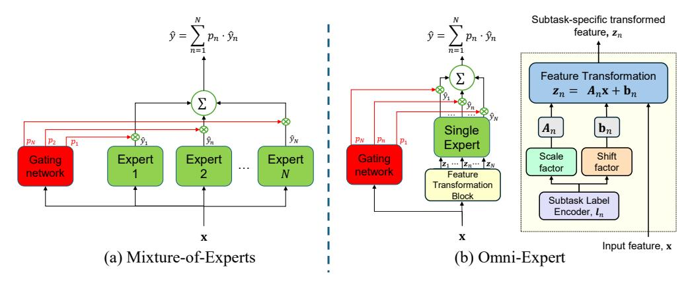
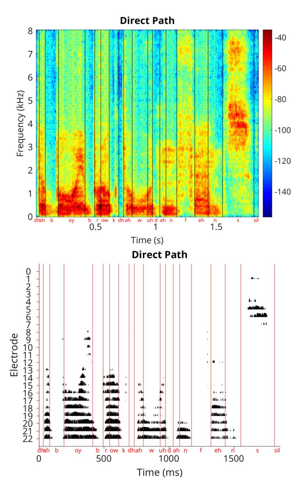
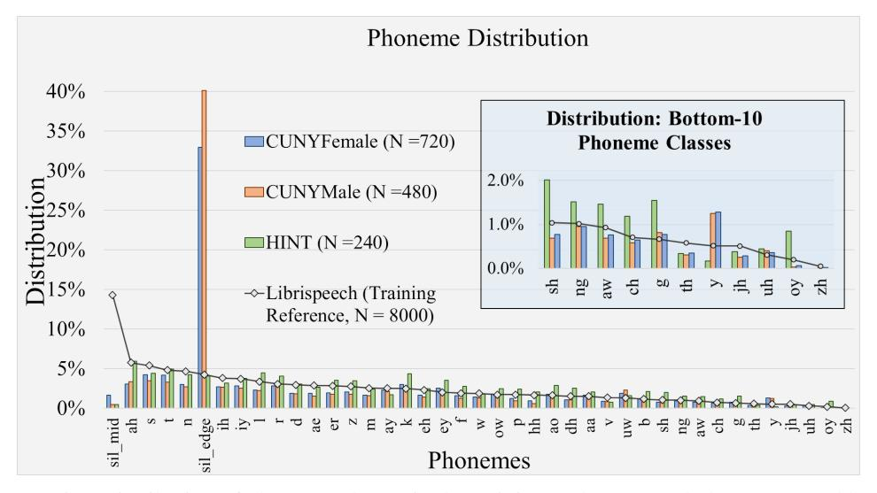
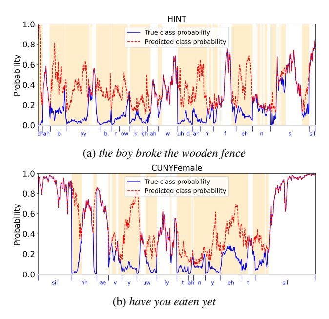
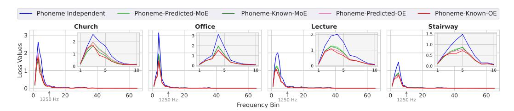
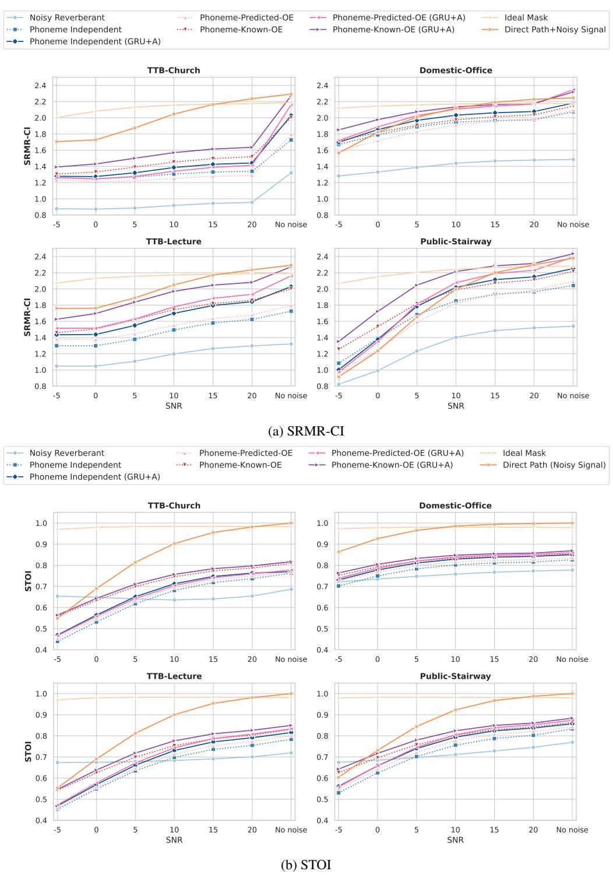
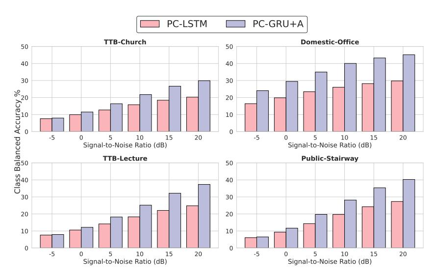

# The Omni-Expert: A Computationally Efficient Approach to Achieve a Mixture of Experts in a Single Expert Model

Sohini Saha1 Mezisashe S. Ojuba2 Leslie M. Collins1 Boyla O. Mainsah 1∗

1Duke University, Durham, NC, USA; 2Howard University, Washington, DC, USA

# Abstract

Mixture-of-Experts (MoE) models have become popular in machine learning, boosting performance by partitioning tasks across multiple experts. However, the need for several experts often results in high computational costs, limiting their application on resource-constrained devices with stringent real-time requirements, such as cochlear implants (CIs). We introduce the Omni-Expert (OE) - a simple and efficient solution that leverages feature transformations to achieve the 'divideand-conquer' functionality of a full MoE ensemble in a single expert model. We demonstrate the effectiveness of the OE using phoneme-specific time-frequency masking for speech dereverberation in a CI. Empirical results show that the OE delivers statistically significant improvements in objective intelligibility measures of CI vocoded speech at different levels of reverberation across various speech datasets at a much reduced computational cost relative to a counterpart MoE.

# 1 Introduction

Mixture-of-Experts (MoE) models [\[1,](#page-10-0) [2\]](#page-10-1) have emerged as powerful and flexible architectures for machine learning (ML) tasks that require specialized fine-tuning of complex tasks, such as language modeling and computer vision. However, MoE models pose computational challenges, in terms of power consumption, processing capability, latency and memory capacity, as the number of experts increases. Hardware considerations are highly relevant for deployment in resource-constrained edge devices, especially for applications with real-time inference constraints, such as auditory prostheses. Thus, there is a need for lightweight adaptations of MoE models or alternative strategies that preserve performance while meeting resource limitations.

In this work, we focus on the cochlear implant (CI), a medical device that restores hearing to individuals with profound hearing loss by converting sound to electrical pulses that directly stimulate an impaired cochlea. Most CI users generally have good speech understanding in quiet conditions; however, CI users struggle to understand speech in challenging acoustic environments with noise and reverberation [\[3\]](#page-10-2). Some modern hearing aids now incorporate deep neural networks (DNNs) either for acoustic scene selection to (de)activate specific features, to control channel-specific gains for noise reduction and for separating noise and speech, enabled by more powerful on-chip processors, e.g., [\[4](#page-10-3)[–6\]](#page-10-4). DNNs have been investigated mostly for speech denoising in CIs [\[7–](#page-10-5)[11\]](#page-10-6); however, to our knowledge, no DNNs have been deployed in current commercially available CI sound processors. Unlike hearing aids that primarily function to amplify sound, CIs have a higher functional burden of acoustic-to-electric signal conversion, wireless signal transmission and electrical stimulation. In addition, real-time CI sound processing must be causal with time delays that are within tolerable limits of audiovisual asynchrony for CI users; preferably <10 ms [\[12\]](#page-10-7).

∗Corresponding author: boyla.mainsah@duke.edu

Real-time speech enhancement models in CI systems must strike a balance between computational efficiency, performance and latency, making scaling with traditional MoE-based solutions potentially impractical. We propose a novel network architecture that eliminates the need for multiple experts while retaining the specialization benefits of MoE models. Our contributions are as follows:

- We introduce the *Omni-Expert* (OE), a computationally efficient alternative to MoE. The OE model achieves the effectiveness of a full MoE ensemble in a single network by using subtask-specific transformations to partition the feature space into distinct regions that correspond to a specialized expertise. This allows a single expert network to maintain subtask specialization while operating with much reduced computational overhead.
- We demonstrate the effectiveness of the OE in achieving superior performance relative to a counterpart MoE in a task of phoneme-based speech dereverberation in CIs.
- We conduct additional experiments to analyze the effect of feature transformation components on the performance of the OE model in the speech dereverberation task.

# 2 Related Work

Speech Enhancement in Cochlear Implants. Currently, CIs incorporate several signal processing solutions for noise management, such as beam-forming and signal-to-noise ratio (SNR)-based noise reduction [\[13](#page-10-8)[–15\]](#page-10-9); however, there is no solution that directly addresses reverberation. Even in the absence of noise, individuals with auditory prostheses often struggle to understand speech in reverberation [\[16\]](#page-10-10), which can negatively impact their quality of life; for example, learning experiences [\[17,](#page-11-0) [18\]](#page-11-1) typically involve single talker scenarios in a classroom/lecture hall. Strategies for noise reduction are not as effective in fully addressing reverberation due to differences in how noise and reverberation distort speech signals. Noise distortions are additive and do not depend on the target speech, while reverberant distortions are delayed and attenuated copies of the target speech.

A common approach for speech enhancement is *time-frequency* (T-F) *masking*, where a gain matrix (or mask) is applied to a T-F representation of the degraded speech to separate segments dominated by speech and acoustic distortions. An ideal mask is calculated based on a measure of distortion of a degraded speech signal relative to its clean counterpart. A typical *ideal ratio mask* (IRM) with mask values ranging from 0 to 1 is computed according to [\[19\]](#page-11-2):

$$0 \le M(t,f) = \left(\frac{|S(t,f)|^2}{|S(t,f)|^2 + |N(t,f)|^2}\right)^{0.5} \le 1 \tag{1}$$

$$\hat{S}(t,f) = M(t,f) \cdot X(t,f) \tag{2}$$

where M(t, f) represents the ratio mask; S(t, f) and X(t, f) represent the clean and degraded speech signals, respectively; N(t, f) represents the noise; and Sˆ(t, f) represents the enhanced signal.

Studies have shown ideal T-F masks for dereverberation improve speech intelligibility for hearingimpaired listeners [\[20](#page-11-3)[–25\]](#page-11-4). In real-world settings, the ideal mask needs to be estimated using only the reverberant speech signal. Traditional mask estimation algorithms for CI applications have relied on statistical features, such as kurtosis [\[25\]](#page-11-4), linear prediction residuals [\[26\]](#page-11-5), or estimated signal-to-distortion ratios [\[27\]](#page-11-6), typically require room-specific tuning and do not generalize well across varying acoustic conditions. Research on speech enhancement in CIs now utilizes DNNs that offer better robustness and generalization across diverse acoustic conditions. However, improvements with advanced ML models come at the cost of increased computational complexity and latency.

A main challenge with mitigating reverberation is how to distinguish between wanted vs. unwanted speech with similar characteristics (i.e., reverberant reflections) from the same target speaker. In general, the performance of ML algorithms for speech dereverberation is frequency dependent. Midto high-frequency speech regions often include relatively long gaps in between phonemes, which allows late reverberant reflections to exponentially decay over time; thus, ML models can leverage features that capture this decaying pattern to better estimate and suppress unwanted reverberant speech. However, lower-frequency speech regions have more energy and relatively short gaps between phonemes, so late reverberant reflections are often interrupted by the next phoneme before

Figure 1: Illustration of (a) the Mixture-of-Experts (MoE) model and (b) our Omni-Expert (OE) model given an input feature,  $\mathbf{x}$ . The MoE model uses probabilities  $(p_n)$  from a gating network to weight outputs  $(\hat{y}_n)$  from *multiple* expert networks. In contrast, the OE model uses a *single* expert network and subtask-specific feature transformations  $(\mathbf{z}_n)$  to achieve the functionality of multiple experts. We train separate models to predict the scale and shift parameters for subtask-specific feature transformations and use a lookup table based on the subtask label during inference.

they can fully decay. Thus, it is more challenging to differentiate reverberant reflections from target speech in lower frequency speech regions because of more persistent, higher energy reverberation.

While speech signals exhibit high spectro-temporal variabilities, speech structure is generally predictable, and this predictability can be useful to inform speech enhancement. The energy of phonemes tends to be concentrated in specific frequency regions [28]. The presence of energy in other frequency regions during a phoneme utterance is likely indicative of an acoustic artifact; thus, knowledge of the current phoneme can be leveraged during mask estimation to better identify and remove acoustic distortions. Phoneme-based mask estimation models, where separate models are trained for different phonemes, have shown improved performance in speech denoising for automated speech processing applications [29–32]. Chu et al. [33] developed a phoneme-based mask estimation model for speech dereverberation in CIs based on a dense MoE (Figure 1a). Typically, speech enhancement models are applied as a preprocessing step prior to acoustic signal delivery to the CI. However, the model in [33] relies on causal features extracted from within the CI processing framework, a design that is feasible for real-time deployment in CIs.

**Mixture-of-Experts.** A key limitation of MoE approaches is the computational costs as the number of experts increases; in [33], the number of experts depends on the number of phonemes. In *sparse* MoE models [34–38], only a subset of experts are activated during inference. In [39, 40], the number of computations at inference in the MoE is reduced by *merging experts*, aggregating multiple expert parameters at inference time using gating weights. In sparse and merging of experts variants of the MoE model, multiple experts must still be trained, stored and maintained. To address this limitation, we have developed a novel technique that achieves multi-expert functionality in a single network.

Conditional Computation. Prior works [41, 42] have used conditional computation to improve model performance in multi-task problems. The MTFormer framework [41] employs a multi-task learning architecture consisting of a shared transformer-based feature extractor (encoder and decoder), followed task-specific branches for specialization. In conditional batch normalization [42], multilayer perceptrons are trained to learn additive adjustments to batch normalization scaling and shifting parameters of a pretrained convolutional neural network based on an external conditioning vector (e.g., a language embedding). Our approach applies conditional feature transformations directly to input features to achieve subtask specialization in a single network, and feature transformation parameters are learned jointly with the expert network.

# **3** The Omni-Expert (OE)

Our goal is to enable a single expert model to exhibit subtask-specific expertise based on the input features of the associated subtask. In sparse MoE models, a routing mechanism directs inputs to

the appropriate expert or set of experts. In contrast, our approach is to encode subtask selection for specialization *implicitly* in the feature space. To achieve this, we apply learned subtask-specific transformations that create homogenous features within a specific subtask and distinct features across subtasks. The OE model architecture, illustrated in [Figure 1b](#page-2-0), consists of three core components:

- A *feature transformation block* to apply subtask specific feature transformations based on the subtask label.
- A *single expert network*, which processes the transformed input features and performs the target task (in this case, mask estimation for speech dereverberation).
- A *gating/routing network*, which is used to weight the outputs produced by applying the single-expert network to the transformed features:

$$\hat{y} = \sum_{n=1:N} p_n(\mathbf{x}) E(\mathbf{z}_n) \tag{3}$$

where x is the input feature; pn(x), is the gating network probability of subtask n; E(zn) is the subtask-specific output from the single expert model E based on the transformed feature zn.

Instead of a simple linear transformation, an affine transformation offers greater flexibility by allowing a shift in the origin to better align the feature distribution for each subtask while preserving discriminability across subtasks. For a sparse affine transformation matrix, we restrict linear operations to scale transformations. The subtask-specific transformed feature zn is defined as:

$$\mathbf{z}_n = \mathbf{A}_n \mathbf{x} + \mathbf{b}_n \tag{4}$$

where x is the input feature; An and bn represent scale and shift transformations, respectively, for subtask n. For scale, An is a diagonal matrix, which simplifies to element-wise multiplication.

# 4 Methods

We demonstrate the efficiency of our OE over a MoE in the task of real-time speech dereverberation in CIs. The CI processing pipeline was implemented using the Nucleus MATLAB Toolbox [\[43\]](#page-12-6). All models were implemented in PyTorch [\[44\]](#page-12-7) on an NVIDIA Titan V GPU.

# 4.1 Reverberation Model

The reverberant signal is modeled as the convolution of the clean, anechoic speech signal with a room impulse response (RIR). For proper time alignment with the delayed reverberant signal, the direct path component of the reverberant signal is used as the reference clean signal; see Appendix [A.1.](#page-23-0)

#### 4.2 Experimental Settings

Datasets. Speech utterances used for training were a randomly selected 8000-utterance subset (approximately 28 hours) of the 100-hour LibriSpeech corpus [\[45\]](#page-12-8). Recorded RIRs used for training were from the Brno University of Technology@FIT Reverberation Database [\[46\]](#page-12-9). Speech utterances used for testing were from speech datasets that are commonly used in listening studies: Hearing In Noise Test (HINT) [\[47\]](#page-12-10); and the City University of New York (CUNY) Male and Female datasets [\[48\]](#page-12-11). Recorded RIRs used for testing were selected from the Aachen Impulse Response database [\[49\]](#page-13-0) to represent diverse rooms: office, stairway, lecture hall and church (Appendix [A.1\)](#page-23-0).

Feature Extraction. Causal T-F features were extracted from speech signals following the Advanced Combination Encoder (ACE) strategy based on the Nucleus CI system [\[50,](#page-13-1) [43\]](#page-12-6). The acoustic signal is segmented into 8 ms frames with a 2 ms overlap, processed via short-time Fourier transform yielding 65 frequency features, and log-compressed to reduce dynamic range. The log-compressed spectral features were used as inputs to both the phoneme classification and mask estimation models. Feature normalization was applied using the global mean and variance calculated from the training set.

Phoneme Label Extraction. The phoneme classes are 39 standard American English phonemes [\[28\]](#page-11-7) and a nonphoneme class for silent gaps. Phoneme labels were generated from the direct path signal using forced alignment based on the LibriSpeech recipe in the Kaldi speech recognition toolkit [\[51\]](#page-13-2) and phoneme time stamps were converted into CI-based time units; example framewise phoneme labels are provided in Appendix [A.2.](#page-24-0) A one-hot vector was used to encode phoneme labels.

Model Architecture. For real-time feasibility in CIs, we use lightweight recurrent neural networks. The models include: i) a single layer of 123 unidirectional long short-term memory (LSTM) units [\[52\]](#page-13-3); and ii) a single layer of 117 unidirectional gated recurrent units (GRU) [\[53\]](#page-13-4) with a multi-head attention (A) layer [\[54\]](#page-13-5). The outputs of the GRU model following layer normalization are fed into the multi-head attention module (A), a residual connection around the attention block, followed by layer normalization (to stabilize gradients and accelerate convergence). The attention outputs are fused with the original GRU hidden state outputs via element-wise multiplication so that the final representation retains both the sequential encoding and the learned contextual weighting.

Phoneme Classifier. Each model is followed by a fully connected output layer with 40 sigmoidal units, corresponding to the 40 phoneme class labels [\[55\]](#page-13-6). Model parameters were randomly initialized from a uniform distribution with range [-0.1, 0.1]. Training was performed using stochastic gradient descent with a learning rate of 1e-5 and momentum of 0.9. Each training batch consisted of a single speech utterance split into 2-second non-overlapping segments to accommodate memory constraints and maintain sequence continuity. The model was optimized using cross-entropy loss. Training was terminated when the validation loss was unchanged for 10 consecutive epochs.

Mask Estimation Models. Models were trained to minimize the T-F signal loss function:

$$L = \frac{1}{TF} \sum_{t,f} \left( \hat{M}(t,f) X(t,f) - M(t,f) X(t,f) \right)^2$$
 (5)

where X(t, f) represents the magnitude spectrum of the reverberant signal; Mˆ (t, f) represents the estimated mask; M(t, f) represents the ideal mask; and T and F represent the number of time and frequency bins, respectively.

*Phoneme Independent.* Each model is followed by a fully connected layer, followed by an output layer with 65 sigmoidal units, representing the 65-dimensional IRM values [\[33\]](#page-11-10). The phoneme independent model was trained on the entire training dataset.

*Phoneme-based MoE.* The model consists of the phoneme classifier as the gating network and 40 expert networks for phoneme-specific mask estimation. Each expert network is structurally identical to the phoneme independent model but is trained only on data corresponding to its associated phoneme group. The phoneme classifier probabilities are used to weight the predictions of the phoneme-specific mask estimation models to get the final estimated mask.

*Phoneme-based OE.* The single expert model is structurally identical to the phoneme independent model. Input features are transformed based on a phoneme-specific transformation:

$$z_n = a_n \odot x + b_n \tag{6}$$

where *z*n is the transformed feature vector; *x* is the input feature vector; *a*n and *b*n are the scale and shift factor vectors, respectively, for phoneme n; and ⊙ represents element-wise multiplication.

The transformation parameters are predicted by two separate multilayer perceptrons (MLPs) with the one-hot phoneme encoding as input. Both MLPs have an input size of 40 (number of phoneme classes) and an output size of 65 (matching the input feature size). The scale MLP uses ReLU activation, while the shift MLP uses LeakyReLU to introduce nonlinearities [\[56\]](#page-13-7). The transformation parameters are precomputed after training and stored for all 40 phonemes, effectively reducing the process during inference to a lookup table.

*Model Training.* The phoneme independent model was initialized using weights drawn from a uniform [-0.1, 0.1] distribution [\[57\]](#page-13-8). The phoneme-specific mask estimation networks of the MoE and OE models were initialized using pre-trained weights from the phoneme independent model. Models were trained using the Adam optimizer [\[58\]](#page-13-9) with a learning rate of 1e-3 and momentum coefficients of 0.9 and 0.999. Training batches consisted of 16 speech utterances segmented into 2 second chunks. Training was terminated when no improvement was observed for 10 consecutive epochs.

# 4.3 Performance Evaluation

CI vocoded speech was generated by acoustic signal resynthesis from CI electrodograms (CI electrical stimuli patterns) with a sine wave vocoder and used to predict speech intelligibility in CI users.

Figure 2: Framewise probabilities of true and predicted phoneme classes of reverberant speech utterances from (a) HINT and (b) CUNY-Female datasets using the GRU+A classifier. True class labels are annotated on the x-axis. Shaded regions indicate incorrect predictions.

Objective Intelligibility Metrics. Intelligibility of CI vocoded speech was predicted using objective metrics that have been shown to be predictive of speech intelligibility in CI listening studies [\[59\]](#page-13-10): the speech-to-reverberation modulation energy ratio for CI users (SRMR-CI) [\[60,](#page-13-11) [61\]](#page-13-12); and the short-time objective intelligibility (STOI) metric [\[62\]](#page-13-13) with the direct path signal used as the reference signal [\[63\]](#page-13-14). The STOI metric was developed for evaluating speech intelligibility in noise and excludes frames with silent gaps in clean speech. Since reverberation occurs in silent speech gaps, the removal of reverberant reflections in the same silent speech gap will not be captured by the STOI metric. The SRMR metric was originally developed for evaluating speech intelligibility in reverberation for normal hearing listeners [\[60\]](#page-13-11), and later adapted for CI users (SRMR-CI) by using the CI filterbanks [\[61\]](#page-13-12). Thus, the SRMR-CI metric provides a more reliable speech intelligibility predictor for CIs in reverberation. We include STOI for completeness and to facilitate comparison with prior literature.

Benchmarks. Chu et al. [\[33\]](#page-11-10) showed improvements in SRMR-CI and STOI scores, as well as intelligibility of CI vocoded speech in normal hearing listeners, with a phoneme-based MoE model relative to a (conventional) phoneme independent mask estimation model. The objective here is to demonstrate that the OE model achieves at a minimum similar performance as the MoE model with much reduced complexity. Oracle conditions include mask estimation with ideal phoneme knowledge (i.e., perfect phoneme classification), the IRM and the direct path signal.

Statistical Analysis. Statistical tests were performed in R. A two-way repeated measures ANOVA was performed with within-utterance fixed factors of room and mask type, interaction between mask type and room, and a random factor of speech utterance. Mauchly's test [\[64\]](#page-13-15) was used to assess the sphericity assumption; degrees of freedom were adjusted using the Greenhouse-Geisser correction where necessary. For statistically significant main effects or interactions, post-hoc pairwise comparisons were performed using estimated marginal means with Tukey's multiple comparisons correction. All tests were conducted at a significance level of 0.05.

# 5 Results

## 5.1 Phoneme Classification

[Figure 2](#page-5-0) show frame-wise phoneme classifier predictions using the GRU+A classifier applied to sample reverberant speech utterances. Frame-wise class balanced phoneme classification accuracies are summarized in [Table 1.](#page-5-1) The phoneme distributions, classification confusion matrices and additional framewise classification results are provided in Appendix [A.5.](#page-27-0)

Table 1: Class-Balanced Phoneme Classification Accuracies (%) Across Test Datasets

| Dataset     |        |        | Long Short-term Memory |          | Gated Recurrent Unit + Attention |        |         |          |
|-------------|--------|--------|------------------------|----------|----------------------------------|--------|---------|----------|
|             | Church | Office | Lecture                | Stairway | Church                           | Office | Lecture | Stairway |
| CUNY-Female | 20.98  | 26.26  | 25.41                  | 27.65    | 24.30                            | 35.29  | 32.89   | 35.91    |
| CUNY-Male   | 20.11  | 26.63  | 23.41                  | 25.36    | 27.61                            | 39.52  | 34.11   | 36.85    |
| HINT        | 22.44  | 31.39  | 28.38                  | 31.2     | 33.02                            | 47.82  | 43.39   | 46.78    |

Figure 3: Average signal loss across frequency bins with phoneme independent mask estimation and mask estimation with mixture-of-experts (MoE) and Omni-expert (OE) models with predicted (p) and ideal (k) phoneme knowledge using gated recurrent unit + attention (GRU+A) models.

#### 5.2 Mask Estimation

Figure 3 shows the mean signal loss across frequency bins to visualize the frequency-dependent impact of mask estimation. In general, signal loss is highest in lower frequency regions (< 1250 Hz), reflecting the difficulty in mitigating low frequency reverberation. Phonemes typically range from 70-200 ms [65, 66], making phoneme classification based on an 8 ms frame a hard task. Even at low accuracies (Table 1), predicted phoneme knowledge is still beneficial to mask estimation, with a progressive increase in performance from phoneme independent to MoE to OE models. Phonemes with similar time-frequency characteristics are likely to be confused with each other (Appendix A.5). The weighting of phoneme-specific masks reduces the impact of phoneme misclassifications. With known phonemes, the OE provides a higher performance upperbound than the MoE. This indicates that encoding subtask-specific cues via feature transformations is more effective for specialization vs. specialized experts with subtask partitioning of the original feature space.

#### 5.3 Objective Speech Intelligibility

Sample electrodograms are shown in Figure 4a with annotations of target speech and (late) reverberant reflections; corresponding spectrograms are shown in Appendix A.3. Room-specific statistical results of SRMR-CI and STOI scores are shown in Figure 4b; summary statistics are provided in Appendix A.6. Aggregate statistical results are summarized in Table 2. Performance trends of objective speech intelligibility measures are generally consistent with those of mask estimation. The higher performance bound with the OE provides more robustness to the impact of phoneme prediction errors.

Table 2: Objective intelligibility scores (estimated marginal mean  $\pm$  95% confidence interval) for the reverberant signal (Rev), direct path signal (DP), and across different mask estimation methods: ideal ratio mask (IRM), phoneme independent model (PI), phoneme-based mask predicted by mixture-of-experts/Omni-Expert with ideal phoneme knowledge (MoEk/OEk), and using phoneme classifier probabilities (MoEp/OEp). Bold indicates the highest performance among the non-oracle models.

|             | Long Short-Term Memory (LSTM) |                   |                   |                   |                      |                   |                   |                   |  |
|-------------|-------------------------------|-------------------|-------------------|-------------------|----------------------|-------------------|-------------------|-------------------|--|
| Metric      | Rev                           | PI                | $\mathbf{MoE}^p$  | $\mathbf{MoE}^k$  | $\mathbf{OE}^p$      | $\mathbf{OE}^k$   | IRM               | DP                |  |
| SRMR        | 1.302                         | 1.733             | 1.744             | 1.841             | 1.794                | 1.938             | 2.187             | 2.447             |  |
| -CI         | $\pm 0.007$                   | $\pm 0.009$       | $\pm 0.009$       | $\pm 0.009$       | $\pm 0.010$          | $\pm 0.009$       | $\pm 0.008$       | $\pm 0.009$       |  |
| CTOI        | 0.719                         | 0.797             | 0.807             | 0.822             | 0.807                | 0.836             | 0.972             | 1.000             |  |
| STOI        | $\pm 0.001$                   | $\pm 0.001$       | $\pm 0.001$       | $\pm 0.001$       | $\pm 0.001$          | $\pm 0.001$       | $\pm 0.000$       | $\pm 0.000$       |  |
|             |                               | Gated             | Recurren          | t Unit+Att        | ention (Gl           | RU+A)             |                   |                   |  |
| Metric      | Rev                           | PI                | $\mathbf{MoE}^p$  | $\mathbf{MoE}^k$  | $\mathbf{OE}^p$      | $\mathbf{OE}^k$   | IRM               | DP                |  |
|             |                               |                   |                   |                   |                      |                   |                   |                   |  |
| SRMR        | 1.302                         | 1.873             | 1.948             | 1.945             | 2.014                | 2.113             | 2.187             | 2.447             |  |
| SRMR -CI | $1.302 \pm 0.007$             | $1.873 \pm 0.011$ | $1.948 \pm 0.010$ | $1.945 \pm 0.009$ | $2.014 \\ \pm 0.011$ | $2.113 \pm 0.010$ | $2.187 \pm 0.008$ | $2.447 \pm 0.009$ |  |
|             |                               |                   |                   |                   |                      |                   |                   |                   |  |

(b) Room-specific estimated marginal means and 95% confidence intervals of speech-to-reverberation modulation energy ratio for cochlear implant users (SRMR-CI) and short-time objective intelligibility (STOI) scores.

Figure 4: (a) Example electrodograms of a speech utterance and (b) room-specific statistical results of objective speech intelligibility measures of cochlear implant vocoded speech generated for direct path (DP), reverberant speech (Rev), enhanced reverberant speech after applying the ideal ratio mask (IRM) and estimated masks with the phoneme independent (PI) model, mixture-of-experts model with predicted and known phonemes (MoE $^{p/k}$ ) and Omni-Expert model with predicted and known phonemes (OE $^{p/k}$ ) for long short-term memory (LSTM) and gated recurrent unit + attention (GRU+A) networks.

Figure 5: Visualization of phoneme-specific features from a subset of randomly selected phoneme frames (N = 1000) of reverberant speech from the CUNY Female speech dataset in the stairway room. Column panels represent features: before applying transformations; with scale-only; shift-only; and scale + shift transformations. Arrows indicate an example of a visually discernible impact of a shift transformation on a phoneme cluster. t-distributed stochastic neighbor embedding (t-SNE) was used.

#### 5.4 Ablation Analysis

The rest of the paper presents aggregate results. Room-specific results are provided in the Appendix.

Feature Transformation Type. The contribution of each feature transformation was assessed with isolated (i.e., shift only or scale only) and combined (i.e., shift and scale) transformations. [Figure 5](#page-7-1) shows visualizations of features with respective transformations. The scale transformation enhances the separability of phoneme-specific feature clusters, while the shift transformations adjusts the feature offsets for better alignment. Aggregate statistical results are summarized in [Table 3.](#page-8-0) Overall, applying scaling or shifting has a significant impact on the objective speech intelligibility metrics to a similar extent relative the non-transformed features. However, the combined transformation yields the highest improvements in SRMR-CI and STOI scores, [Table 3.](#page-8-0)

Table 3: Objective intelligibility scores (estimated marginal mean ± 95% confidence interval) with the Omni-Expert model with predicted phonemes (OEp ) across different types of feature transformations, scale (Sc) only, shift (Sh) only, scale + shift (default) and no transformation. Bold indicates the highest performance. LSTM, long short-term memory; GRU+A, gated recurrent unit + attention.

| Metric | OEp -LSTM    |                 |                 |                 | OEp -GRU+A   |                 |                 |                 |
|--------|-----------------|-----------------|-----------------|-----------------|-----------------|-----------------|-----------------|-----------------|
|        | None            | Sh Only         | Sc Only         | Sc + Sh         | None            | Sh Only         | Sc Only         | Sc + Sh         |
| SRMR   | 1.683           | 1.711           | 1.706           | 1.794           | 1.923           | 1.987           | 2.000           | 2.014           |
| -CI    | ±0.009          | ±0.010          | ±0.009          | ±0.010          | ±0.011          | ±0.011          | ±0.011          | ±0.011          |
| STOI   | 0.793 ±0.001 | 0.792 ±0.001 | 0.793 ±0.001 | 0.807 ±0.001 | 0.819 ±0.001 | 0.826 ±0.001 | 0.829 ±0.001 | 0.829 ±0.001 |

Feature Transformation Position. We also investigated the impact of applying the feature transformation at different layer positions during mask estimation: prior to the input of the model (default), after the hidden layer, and both the input and hidden layers. Aggregate results are summarized in [Table 4.](#page-8-1) Overall, applying feature transformation at least at the input layer is more effective than applying the transformation only at the hidden layer.

Table 4: Objective intelligibility scores (estimated marginal mean ±95% confidence interval) with the Omni-Expert model with predicted and known phonemes (OEp/k) across different feature transformation positions: after the hidden layer (H), prior to the input to the model (I) (default) and both the input and hidden layers (I + H). Bold indicates the highest performance among the non-oracle models. LSTM, long short-term memory; GRU+A, gated recurrent unit + attention.

| Metric  |        | OEp -LSTM |        | OEk -LSTM |        |        |
|---------|--------|--------------|--------|--------------|--------|--------|
|         | H      | I            | I + H  | H            | I      | I + H  |
| SRMR-CI | 1.764  | 1.794        | 1.805  | 1.863        | 1.938  | 1.947  |
|         | ±0.009 | ±0.010       | ±0.010 | ±0.009       | ±0.009 | ±0.009 |
| STOI    | 0.803  | 0.807        | 0.805  | 0.824        | 0.836  | 0.835  |
|         | ±0.001 | ±0.001       | ±0.001 | ±0.001       | ±0.001 | ±0.001 |

| Metric  |        | OEp -GRU+A |        |        | OEk -GRU+A |         |  |
|---------|--------|---------------|--------|--------|---------------|---------|--|
|         | H      | I             | I + H  | H      | I             | I + H   |  |
| SRMR-CI | 1.367  | 2.014         | 2.004  | 1.387  | 2.113         | 2.073   |  |
|         | ±0.008 | ±0.011        | ±0.010 | ±0.006 | ±0.010        | ± 0.010 |  |
| STOI    | 0.693  | 0.829         | 0.822  | 0.621  | 0.850         | 0.842   |  |
|         | ±0.001 | ±0.001        | ±0.001 | ±0.002 | ±0.001        | ±0.001  |  |

## 5.5 Model Complexity

Model size and training times are shown in [Figure 6;](#page-9-0) detailed values are provided in Appendix [A.4.](#page-27-1) The number of parameters and the computation load are obtained using the opensource *ptflops* package [\[67\]](#page-14-2). The OE model achieves comparable to superior performance with a much smaller model size and faster training time relative to the MoE model. Each expert in the MoE model is trained only on phoneme-specific data and the reduced amount of

training data per expert model results in a longer training time. In contrast, the OE model uses the full training dataset while still benefiting from sub-task specialization via the feature transformations. Note that the models for shift and scale factor estimation are only used during OE training; in this case, the mapping from phoneme label to feature transformation is deterministic, so only the subtask-specific transformation factors are needed during inference.

# 6 Conclusion

We introduced the Omni-Expert, a highperforming and compute-efficient alternative to achieving a mixture of expertise in the same model. By conditioning feature transformations on a subtask, the OE model learns to partition the input space into subtask-specific regions, effectively scaling the functionality of multiple experts without incurring the added computational costs. The current OE configuration assumes the subtasks are known to determine the number of experts, as is the case with phonemes. Alternative variants of the OE may be needed in other applications where the specialized subtasks are not as well-defined.

While this work focused on speech dereverberation in cochlear implants, real-world listening

Figure 6: Complexity of phoneme independent (PI), mixture-of-experts (MoE, N = 40 experts) and Omni-Expert (OE) models using long shortterm memory (LSTM) and gated recurrent unit + attention (GRU+A) networks for speech dereverberation in cochlear implants. MoE and OE model training times are marked by the phoneme classifier (PC, same for MoE and OE) and expert (E) networks. Training times based on a Titan V GPU.

scenarios will also include combinations of reverberation and ambient noise (e.g., multi-talker babble, equipment noise, etc). Results with the current mask estimation models trained *only* on reverberant speech and applied to speech in a variety of noisy reverberant settings are presented in Appendix [A.8.](#page-37-0) As expected, there is a significant drop in performance across all models as the signal-to-noise ratio increases. The OE with known phonemes still outperforms the counterpart MoE, indicating that the learned subtask feature transformations are more robust to training/test data mismatch.

Limitations and Future Work. Performance trends observed with objective speech intelligibility measures may not necessarily translate to speech understanding in real-world settings; the test datasets may not fully represent the variety in speech patterns and reverberant room conditions. Additional performance improvements can be obtained with alternative OE model architectures, more diverse datasets for training and advanced training techniques. A relatively lightweight OE model for speech enhancement is more practical for CI deployment and improvements in CI processor chip technology are expected over time. Further work is needed to evaluate real-time feasibility and real-world utility in clinical studies with CI users.

Societal Impact. The OE provides a promising solution for developing compact, high-performing speech enhancement models to increase speech understanding for CI users in challenging listening environments, which can improve the quality of life of CI users. Real-time speech enhancement is also relevant for individuals with hearing aids and automatic speech processing applications that require minimal latency, such as live transcription. More broadly, the computational efficiency and scalability of the OE technique have the potential to address the computational bottleneck associated with MoE in other applications. The core architectural design of substituting multi-expert inference with subtask-specific transformations applied to a single expert is in principle domain-agnostic. In other applications, there is often latent structure among tokens, tasks, or embeddings (e.g., syntactic roles, semantic types, or class labels) and MoE have been applied at the embedding, token/sequence or task level. These can be used to define subtask-specific transformations or input conditioning, which suggests that our Omni-Expert approach could be applicable.

# Acknowledgments and Disclosure of Funding

This work was supported by a grant from the National Institutes of Health (R56DC020267-01A1). The NVIDIA Titan V GPU was donated by the NVIDIA Corporation. Ojuba was supported by

the Duke ECE Research Experience for Undergraduates Program. Mainsah received a Microsoft Research Faculty Fellowship.

# References

- [1] Robert A. Jacobs, Michael I. Jordan, Steven J. Nowlan, and Geoffrey E. Hinton. Adaptive mixtures of local experts. *Neural Computation*, 3:79–87, 1991.
- [2] Michael I. Jordan and Robert A. Jacobs. Hierarchical mixtures of experts and the EM algorithm. *Neural Computation*, 6:181–214, 1993.
- [3] Javier Badajoz-Davila, Jörg M Buchholz, and Richard Van-Hoesel. Effect of noise and reverberation on speech intelligibility for cochlear implant recipients in realistic sound environments. *The Journal of the Acoustical Society of America*, 147(5):3538–3549, 2020.
- [4] S Raufer, P Kohlhauer, F Jehle, V Kühnel, M Preuss, and S Hobi. Spheric Speech Clarity proven to outperform three key competitors for clear speech in noise. Whitepaper, Phonak Field Study News, Sonova AG, retrieved from https://www. phonak. com/evidence, 2024.
- [5] Charlotte T Jespersen, Lena Dieu, and Thipiha Rubachandran. Organic Hearing drives user preference for Intelligent Focus. Whitepaper, GN Hearing A/S, 2025.
- [6] Sébastien Santurette and Thomas Behrens. The audiology of Oticon More™. Whitepaper, Centre for Applied Audiology Research, Oticon A/S, 2020.
- [7] Enoch Hsin-Ho Huang, Rong Chao, Yu Tsao, and Chao-Min Wu. Electrodenet—a deeplearning-based sound coding strategy for cochlear implants. *IEEE Transactions on Cognitive and Developmental Systems*, 16(1):346–357, 2024. doi: 10.1109/TCDS.2023.3275587.
- [8] Agudemu Borjigin, Kostas Kokkinakis, Hari M Bharadwaj, and Joshua S Stohl. Deep learning restores speech intelligibility in multi-talker interference for cochlear implant users. *Scientific Reports*, 14(1):13241, 2024.
- [9] Nursadul Mamun and John H L Hansen. Speech enhancement for cochlear implant recipients using deep complex convolution transformer with frequency transformation. *IEEE/ACM Transactions on Audio, Speech, and Language Processing*, 2024.
- [10] Tom Gajecki, Yichi Zhang, and Waldo Nogueira. A deep denoising sound coding strategy for cochlear implants. *IEEE Transactions on Biomedical Engineering*, 70(9):2700–2709, 2023.
- [11] Clément Gaultier and Tobias Goehring. Recovering speech intelligibility with deep learning and multiple microphones in noisy-reverberant situations for people using cochlear implants. *The Journal of the Acoustical Society of America*, 155(6):3833–3847, 2024.
- [12] Marcia J Hay-McCutcheon, David B Pisoni, and Kristopher K Hunt. Audiovisual asynchrony detection and speech perception in hearing-impaired listeners with cochlear implants: a preliminary analysis. *International Journal of Audiology*, 48(6):321–333, 2009.
- [13] Marian Jones, Chris Warren, Marjan Mashal, Paula Greenham, and Josie Wyss. Speech understanding in noise for cochlear implant recipients using a spatial noise reduction setting in an off the ear sound processor with directional microphones. *Cochlear Implants International*, 24(6):311–324, 2023.
- [14] Jace Wolfe, Mila Morais, Erin Schafer, Smita Agrawal, and Dawn Koch. Evaluation of speech recognition of cochlear implant recipients using adaptive, digital remote microphone technology and a speech enhancement sound processing algorithm. *Journal of the American Academy of Audiology*, 26(05):502–508, 2015.
- [15] Anja Kurz, Kristen Rak, and Rudolf Hagen. Improved performance with automatic sound management 3 in the MED-EL SONNET 2 cochlear implant audio processor. *PLOS One*, 17 (9):e0274446, 2022.
- [16] Pavel Zahorik. Spatial hearing in rooms and effects of reverberation. In *Binaural Hearing: With 93 Illustrations*, pages 243–280. Springer, 2021.

- [17] Frank Iglehart. Speech perception in classroom acoustics by children with cochlear implants and with typical hearing. *American Journal of Audiology*, 25(2):100–109, 2016. doi: 10.1044/ 2016\\_AJA-15-0064.
- [18] Frank Iglehart. Speech perception in classroom acoustics by children with hearing loss and wearing hearing aids. *American Journal of Audiology*, 29(1):6–17, 2020. doi: 10.1044/2019\ \_AJA-19-0010.
- [19] Norbert Wiener. *Extrapolation, Interpolation, and Smoothing of Stationary Time Series: With Engineering Applications*. The MIT Press, 1949. doi: 10.7551/mitpress/2946.001.0001.
- [20] Nicoleta Roman and John Woodruff. Speech intelligibility in reverberation with ideal binary masking: Effects of early reflections and signal-to-noise ratio threshold. *The Journal of the Acoustical Society of America*, 133(3), 2013. ISSN 0001-4966. doi: 10.1121/1.4789895.
- [21] Kostas Kokkinakis and Joshua S. Stohl. Optimized gain functions in ideal time-frequency masks and their application to dereverberation for cochlear implants. *JASA Express Letters*, 1(8), 2021. ISSN 2691-1191. doi: 10.1121/10.0005740.
- [22] Eric W. Healy, Jordan L. Vasko, and DeLiang Wang. The optimal threshold for removing noise from speech is similar across normal and impaired hearing—a time-frequency masking study. *The Journal of the Acoustical Society of America*, 145(6), 2019. ISSN 0001-4966. doi: 10.1121/1.5112828.
- [23] Koning, Madhu, and Wouters. Ideal time-frequency masking algorithms lead to different speech intelligibility and quality in normal-hearing and cochlear implant listeners. *IEEE Transactions on Biomedical Engineering*, 62(1), 2015. ISSN 1558-2531. doi: 10.1109/TBME.2014.2351854.
- [24] DeLiang Wang. On ideal binary mask as the computational goal of auditory scene analysis. In *Speech Separation by Humans and Machines*, pages 181–197. Springer, 2005.
- [25] Oldooz Hazrati, Jaewook Lee, and Philipos C. Loizou. Blind binary masking for reverberation suppression in cochlear implants. *The Journal of the Acoustical Society of America*, 133(3), 2013/03/01. ISSN 0001-4966. doi: 10.1121/1.4789891.
- [26] Oldooz Hazrati and Philipos C. Loizou. Reverberation suppression in cochlear implants using a blind channel-selection strategy. *The Journal of the Acoustical Society of America*, 133(6), 2013. ISSN 0001-4966. doi: 10.1121/1.4804313.
- [27] Oldooz Hazrati, Seyed Omid Sadjadi, Philipos C Loizou, and John H L Hansen. Simultaneous suppression of noise and reverberation in cochlear implants using a ratio masking strategy. *The Journal of the Acoustical Society of America*, 134(5), 2013. ISSN 0001-4966. doi: 10.1121/1.4823839.
- [28] P. Ladefoged and K. Johnson. *A Course in Phonetics*. Cengage Learning, 2014. ISBN 9781305177185.
- [29] Zhong-Qiu Wang, Yan Zhao, and DeLiang Wang. Phoneme-specific speech separation. *2016 IEEE International Conference on Acoustics, Speech and Signal Processing (ICASSP)*, 2016. doi: 10.1109/ICASSP.2016.7471654.
- [30] Shlomo E. Chazan, S. Gannot, and J. Goldberger. A phoneme-based pre-training approach for deep neural network with application to speech enhancement. In *IEEE International Workshop on Acoustic Signal Enhancement (IWAENC)*, 2016. doi: 10.1109/IWAENC.2016.7602943.
- [31] Shlomo E Chazan, Jacob Goldberger, and Sharon Gannot. Speech enhancement with mixture of deep experts with clean clustering pre-training. In *2021 IEEE International Conference on Acoustics, Speech and Signal Processing (ICASSP)*, pages 716–720. IEEE, 2021.
- [32] Aswin Sivaraman and Minje Kim. Sparse mixture of local experts for efficient speech enhancement. In *Interspeech 2020*, pages 4526–4530, 2020. doi: 10.21437/Interspeech.2020-2989.
- [33] Kevin Chu, Leslie Collins, and Boyla Mainsah. Suppressing reverberation in cochlear implant stimulus patterns using time-frequency masks based on phoneme groups. In *Proceedings of Meetings on Acoustics*, volume 50, 2022. doi: 10.1121/2.0001698.

- [34] Carlos Riquelme, Joan Puigcerver, Basil Mustafa, Maxim Neumann, Rodolphe Jenatton, André Susano Pinto, Daniel Keysers, and Neil Houlsby. Scaling vision with sparse mixture of experts. In *Advances in Neural Information Processing Systems*, volume 34, pages 8583–8595. Curran Associates Inc., 2021. ISBN 9781713845393.
- [35] Barret Zoph. Designing effective sparse expert models. In *IEEE International Parallel and Distributed Processing Symposium Workshops (IPDPSW)*, pages 1044–1044. IEEE, 2022.
- [36] Nan Du, Yanping Huang, Andrew M Dai, Simon Tong, Dmitry Lepikhin, Yuanzhong Xu, Maxim Krikun, Yanqi Zhou, Adams Wei Yu, Orhan Firat, et al. GLaM: Efficient scaling of language models with mixture-of-experts. In *International Conference on Machine Learning*, pages 5547–5569. PMLR, 2022.
- [37] Bo Li\*, Yifei Shen, Jingkang Yang, Yezhen Wang, Jiawei Ren, Tong Che, Jun Zhang, and Ziwei Liu. Sparse mixture-of-experts are domain generalizable learners. In *International Conference on Learning Representations*, 2023.
- [38] Noam Shazeer, Azalia Mirhoseini, Krzysztof Maziarz, Andy Davis, Quoc Le, Geoffrey Hinton, and Jeff Dean. Outrageously large neural networks: The sparsely-gated mixture-of-experts layer. In *International Conference on Learning Representations*, 2017.
- [39] Shwai He, Run-Ze Fan, Liang Ding, Li Shen, Tianyi Zhou, and Dacheng Tao. Merging experts into one: Improving computational efficiency of mixture of experts. In *Proceedings of the 2023 Conference on Empirical Methods in Natural Language Processing*, pages 14685–14691. Association for Computational Linguistics, 2023. doi: 10.18653/v1/2023.emnlp-main.907.
- [40] Mohammed Muqeeth, Haokun Liu, and Colin Raffel. Soft merging of experts with adaptive routing. *Transactions on Machine Learning Research*, 2024. ISSN 2835-8856. Featured Certification.
- [41] Xiaogang Xu, Hengshuang Zhao, Vibhav Vineet, Ser-Nam Lim, and Antonio Torralba. MTFormer: Multi-task learning via transformer and cross-task reasoning. In *European Conference on Computer Vision (ECCV)*, pages 304–321. Springer-Verlag, 2022. doi: 10.1007/978-3-031-19812-0\_18.
- [42] Harm De Vries, Florian Strub, Jérémie Mary, Hugo Larochelle, Olivier Pietquin, and Aaron C Courville. Modulating early visual processing by language. *Advances in Neural Information Processing Systems*, 30, 2017.
- [43] B Swanson and H Mauch. Nucleus Matlab Toolbox 4.20 software user manual. *Cochlear Ltd*, 2006.
- [44] Adam Paszke, Sam Gross, Francisco Massa, Adam Lerer, James Bradbury, Gregory Chanan, Trevor Killeen, Zeming Lin, Natalia Gimelshein, Luca Antiga, Alban Desmaison, Andreas Köpf, Edward Yang, Zach DeVito, Martin Raison, Alykhan Tejani, Sasank Chilamkurthy, Benoit Steiner, Lu Fang, Junjie Bai, and Soumith Chintala. PyTorch: An imperative style, high-performance deep learning library. In *Advances in Neural Information Processing Systems*, volume 32, 2019.
- [45] Vassil Panayotov, Guoguo Chen, Daniel Povey, and Sanjeev Khudanpur. Librispeech: An ASR corpus based on public domain audio books. In *IEEE International Conference on Acoustics, Speech and Signal Processing (ICASSP)*, 2015. doi: 10.1109/ICASSP.2015.7178964.
- [46] Igor Szöke, Miroslav Skácel, Ladislav Mošner, Jakub Paliesek, and J. Cernocký. Building and ˇ evaluation of a real room impulse response dataset. *IEEE Journal on Selected Topics in Signal Processing*, 13(4), 2018. ISSN 1932-4553. doi: 10.1109/JSTSP.2019.2917582.
- [47] Nilsson M, Soli SD, and Sullivan JA. Development of the Hearing in Noise Test for the measurement of speech reception thresholds in quiet and in noise. *The Journal of the Acoustical Society of America*, 95(2), 1994. ISSN 0001-4966. doi: 10.1121/1.408469.
- [48] Arthur Boothroyd, Laurie Hanin, and Theresa Hnath. A sentence test of speech perception: Reliability, set equivalence, and short term learning. Internal Report RCI10, City University of New York, 1985.

- [49] Marco Jeub, Magnus Schafer, and Peter Vary. A binaural room impulse response database for the evaluation of dereverberation algorithms. *2009 16th International Conference on Digital Signal Processing*, 2009. doi: 10.1109/ICDSP.2009.5201259.
- [50] Andrew E. Vandali, Lesley A. Whitford, Kerrie Plant, Clark, and Graeme M. Speech perception as a function of electrical stimulation rate: Using the Nucleus 24 cochlear implant system. *Ear and Hearing*, 21:608–624, 2000.
- [51] Daniel Povey, Arnab Ghoshal, Gilles Boulianne, Lukáš Burget, Ondrej Glembek, Nagendra Kumar Goel, Mirko Hannemann, Petr Motlícek, Yanmin Qian, Petr Schwarz, Jan Silovský, Georg Stemmer, and Karel Veselý. The kaldi speech recognition toolkit. In *IEEE Workshop on Automatic Speech Recognition and Understanding*, 2011.
- [52] Sepp Hochreiter and Jürgen Schmidhuber. Long short-term memory. *Neural Computation*, 9 (8):1735–1780, 1997.
- [53] Kyunghyun Cho, Bart van Merrienboer, Dzmitry Bahdanau, and Yoshua Bengio. On the properties of neural machine translation: Encoder-decoder approaches. In *Proceedings of SSST-8, Eighth Workshop on Syntax, Semantics and Structure in Statistical Translation*, pages 103–111. Association for Computational Linguistics, 2014.
- [54] Ashish Vaswani, Noam Shazeer, Niki Parmar, Jakob Uszkoreit, Llion Jones, Aidan N Gomez, Łukasz Kaiser, and Illia Polosukhin. Attention is all you need. *Advances in neural information processing systems*, 30, 2017.
- [55] Kevin Chu, Leslie Collins, and Boyla Mainsah. A causal deep learning framework for classifying phonemes in cochlear implants. In *IEEE International Conference on Acoustics, Speech and Signal Processing (ICASSP)*, pages 6498–6502, 2021. doi: 10.1109/ICASSP39728.2021. 9413986.
- [56] Vinod Nair and Geoffrey E. Hinton. Rectified linear units improve restricted Boltzmann machines. In *International Conference on Machine Learning*, pages 807–814, 2010.
- [57] Alex Graves and Jürgen Schmidhuber. Framewise phoneme classification with bidirectional lstm networks. In *IEEE International Joint Conference on Neural Networks*, volume 4, pages 2047–2052. IEEE, 2005.
- [58] Diederik P. Kingma and Jimmy Ba. Adam: A method for stochastic optimization. In *International Conference for Learning Representations*, 2015.
- [59] Tiago H Falk, Vijay Parsa, Joao F Santos, Kathryn Arehart, Oldooz Hazrati, Rainer Huber, James M Kates, and Susan Scollie. Objective quality and intelligibility prediction for users of assistive listening devices: Advantages and limitations of existing tools. *IEEE Signal Processing Magazine*, 32(2):114–124, 2015.
- [60] Tiago H. Falk, Chenxi Zheng, and Wai-Yip Chan. A non-intrusive quality and intelligibility measure of reverberant and dereverberated speech. *IEEE Transactions on Audio, Speech, and Language Processing*, 18(7):1766–1774, 2010. doi: 10.1109/TASL.2010.2052247.
- [61] João F Santos and Tiago H Falk. Updating the SRMR-CI metric for improved intelligibility prediction for cochlear implant users. *IEEE/ACM Transactions on Audio, Speech, and Language Processing*, 22(12):2197–2206, 2014.
- [62] Cees H Taal, Richard C Hendriks, Richard Heusdens, and Jesper Jensen. An algorithm for intelligibility prediction of time–frequency weighted noisy speech. *IEEE Transactions on Audio, Speech, and Language Processing*, 19(7):2125–2136, 2011.
- [63] Lidea K. Shahidi, Leslie M. Collins, and Boyla O. Mainsah. Objective intelligibility measurement of reverberant vocoded speech for normal-hearing listeners: Towards facilitating the development of speech enhancement algorithms for cochlear implants. *The Journal of the Acoustical Society of America*, 155(3):2151–2168, 2024. ISSN 0001-4966. doi: 10.1121/10.0025285.
- [64] John W. Mauchly. Significance test for sphericity of a normal n-variate distribution. *Annals of Mathematical Statistics*, 11:204–209, 1940.

- [65] Gordon E Peterson and Ilse Lehiste. Duration of syllable nuclei in English. *The Journal of the Acoustical Society of America*, 32(6):693–703, 1960.
- [66] Noriko Umeda. Consonant duration in American English. *The Journal of the Acoustical Society of America*, 61(3):846–858, 1977.
- [67] Vladislav Sovrasov. ptflops: A flops counting tool for neural networks in Pytorch framework, 2018. URL <https://github.com/sovrasov/flops-counter.pytorch>.
- [68] Manfred R Schroeder. New method of measuring reverberation time. *The Journal of the Acoustical Society of America*, 37(3):409–412, 1965.
- [69] Heiner Löllmann, Emre Yilmaz, Marco Jeub, and Peter Vary. An improved algorithm for blind reverberation time estimation. In *Proceedings of International Workshop on Acoustic Echo and Noise Control (IWAENC)*, pages 1–4, 2010.
- [70] Patrick A Naylor and Nikolay D Gaubitch. *Speech dereverberation*. Springer Science & Business Media, 2010.
- [71] Carnegie Mellon University. The CMU Pronouncing Dictionary, 1993. URL [http://www.](http://www.speech.cs.cmu.edu/cgi-bin/cmudict) [speech.cs.cmu.edu/cgi-bin/cmudict](http://www.speech.cs.cmu.edu/cgi-bin/cmudict). Version 0.7b.
- [72] Joachim Thiemann, Nobutaka Ito, and Emmanuel Vincent. The diverse environments multichannel acoustic noise database (DEMAND): A database of multichannel environmental noise recordings. In *Proceedings of Meetings on Acoustics*, volume 19. AIP Publishing, 2013.
- [73] Tim Fischer, Marco Caversaccio, and Wilhelm Wimmer. Multichannel acoustic source and image dataset for the cocktail party effect in hearing aid and implant users. *Scientific Data*, 7 (1):440, 2020.

# NeurIPS Paper Checklist

## 1. Claims

Question: Do the main claims made in the abstract and introduction accurately reflect the paper's contributions and scope?

Answer: [Yes]

Justification: The abstract and introduction clearly describe the main contributions of the paper, proposing a novel lightweight alternative to achieving the functionality of a Mixture-of-Experts (MoE). The primary contributions are as follows: We introduce Omni-Expert (OE) model which overcomes the computational overhead of MoE using a simple feature transformations. We provide experimental results from the task of real-time speech dereverberation in cochlear implants to support these claims.

#### Guidelines:

- The answer NA means that the abstract and introduction do not include the claims made in the paper.
- The abstract and/or introduction should clearly state the claims made, including the contributions made in the paper and important assumptions and limitations. A No or NA answer to this question will not be perceived well by the reviewers.
- The claims made should match theoretical and experimental results, and reflect how much the results can be expected to generalize to other settings.
- It is fine to include aspirational goals as motivation as long as it is clear that these goals are not attained by the paper.

## 2. Limitations

Question: Does the paper discuss the limitations of the work performed by the authors?

Answer: [Yes]

Justification: In the conclusion section of the paper, we have provided a detailed explanation of the method's limitations, [section 6.](#page-9-1)

# Guidelines:

- The answer NA means that the paper has no limitation while the answer No means that the paper has limitations, but those are not discussed in the paper.
- The authors are encouraged to create a separate "Limitations" section in their paper.
- The paper should point out any strong assumptions and how robust the results are to violations of these assumptions (e.g., independence assumptions, noiseless settings, model well-specification, asymptotic approximations only holding locally). The authors should reflect on how these assumptions might be violated in practice and what the implications would be.
- The authors should reflect on the scope of the claims made, e.g., if the approach was only tested on a few datasets or with a few runs. In general, empirical results often depend on implicit assumptions, which should be articulated.
- The authors should reflect on the factors that influence the performance of the approach. For example, a facial recognition algorithm may perform poorly when image resolution is low or images are taken in low lighting. Or a speech-to-text system might not be used reliably to provide closed captions for online lectures because it fails to handle technical jargon.
- The authors should discuss the computational efficiency of the proposed algorithms and how they scale with dataset size.
- If applicable, the authors should discuss possible limitations of their approach to address problems of privacy and fairness.
- While the authors might fear that complete honesty about limitations might be used by reviewers as grounds for rejection, a worse outcome might be that reviewers discover limitations that aren't acknowledged in the paper. The authors should use their best judgment and recognize that individual actions in favor of transparency play an important role in developing norms that preserve the integrity of the community. Reviewers will be specifically instructed to not penalize honesty concerning limitations.

# 3. Theory assumptions and proofs

Question: For each theoretical result, does the paper provide the full set of assumptions and a complete (and correct) proof?

Answer:[NA]

Justification: The paper does not include theoretical results.

#### Guidelines:

- The answer NA means that the paper does not include theoretical results.
- All the theorems, formulas, and proofs in the paper should be numbered and crossreferenced.
- All assumptions should be clearly stated or referenced in the statement of any theorems.
- The proofs can either appear in the main paper or the supplemental material, but if they appear in the supplemental material, the authors are encouraged to provide a short proof sketch to provide intuition.
- Inversely, any informal proof provided in the core of the paper should be complemented by formal proofs provided in appendix or supplemental material.
- Theorems and Lemmas that the proof relies upon should be properly referenced.

## 4. Experimental result reproducibility

Question: Does the paper fully disclose all the information needed to reproduce the main experimental results of the paper to the extent that it affects the main claims and/or conclusions of the paper (regardless of whether the code and data are provided or not)?

Answer:[Yes]

Justification: The OE architecture is fully described in [section 3.](#page-2-1) Details of methods and experiment settings to reproduce results are provided in [subsection 4.2.](#page-3-0)

## Guidelines:

- The answer NA means that the paper does not include experiments.
- If the paper includes experiments, a No answer to this question will not be perceived well by the reviewers: Making the paper reproducible is important, regardless of whether the code and data are provided or not.
- If the contribution is a dataset and/or model, the authors should describe the steps taken to make their results reproducible or verifiable.
- Depending on the contribution, reproducibility can be accomplished in various ways. For example, if the contribution is a novel architecture, describing the architecture fully might suffice, or if the contribution is a specific model and empirical evaluation, it may be necessary to either make it possible for others to replicate the model with the same dataset, or provide access to the model. In general. releasing code and data is often one good way to accomplish this, but reproducibility can also be provided via detailed instructions for how to replicate the results, access to a hosted model (e.g., in the case of a large language model), releasing of a model checkpoint, or other means that are appropriate to the research performed.
- While NeurIPS does not require releasing code, the conference does require all submissions to provide some reasonable avenue for reproducibility, which may depend on the nature of the contribution. For example
- (a) If the contribution is primarily a new algorithm, the paper should make it clear how to reproduce that algorithm.
- (b) If the contribution is primarily a new model architecture, the paper should describe the architecture clearly and fully.
- (c) If the contribution is a new model (e.g., a large language model), then there should either be a way to access this model for reproducing the results or a way to reproduce the model (e.g., with an open-source dataset or instructions for how to construct the dataset).
- (d) We recognize that reproducibility may be tricky in some cases, in which case authors are welcome to describe the particular way they provide for reproducibility. In the case of closed-source models, it may be that access to the model is limited in some way (e.g., to registered users), but it should be possible for other researchers to have some path to reproducing or verifying the results.

### 5. Open access to data and code

Question: Does the paper provide open access to the data and code, with sufficient instructions to faithfully reproduce the main experimental results, as described in supplemental material?

Answer: [No]

Justification: The code is proprietary and not publicly released. All the datasets and software packages used in the paper are properly cited. The experimental settings, model configurations and model complexities needed to reproduce all experimental results have been described in [subsection 4.2.](#page-3-0) Audio files of vocoded speech signals cannot be shared due to copyright restriction of source speech datasets.

# Guidelines:

- The answer NA means that paper does not include experiments requiring code.
- Please see the NeurIPS code and data submission guidelines ([https://nips.cc/](https://nips.cc/public/guides/CodeSubmissionPolicy) [public/guides/CodeSubmissionPolicy](https://nips.cc/public/guides/CodeSubmissionPolicy)) for more details.
- While we encourage the release of code and data, we understand that this might not be possible, so "No" is an acceptable answer. Papers cannot be rejected simply for not including code, unless this is central to the contribution (e.g., for a new open-source benchmark).
- The instructions should contain the exact command and environment needed to run to reproduce the results. See the NeurIPS code and data submission guidelines ([https:](https://nips.cc/public/guides/CodeSubmissionPolicy) [//nips.cc/public/guides/CodeSubmissionPolicy](https://nips.cc/public/guides/CodeSubmissionPolicy)) for more details.
- The authors should provide instructions on data access and preparation, including how to access the raw data, preprocessed data, intermediate data, and generated data, etc.
- The authors should provide scripts to reproduce all experimental results for the new proposed method and baselines. If only a subset of experiments are reproducible, they should state which ones are omitted from the script and why.
- At submission time, to preserve anonymity, the authors should release anonymized versions (if applicable).
- Providing as much information as possible in supplemental material (appended to the paper) is recommended, but including URLs to data and code is permitted.

## 6. Experimental setting/details

Question: Does the paper specify all the training and test details (e.g., data splits, hyperparameters, how they were chosen, type of optimizer, etc.) necessary to understand the results?

Answer: [Yes]

Justification: All the training and testing dataset used, feature extraction process, phoneme alignment tools, model architectures, optimizer, learning rate, loss functions and activations used have been described in [subsection 4.2.](#page-3-0)

# Guidelines:

- The answer NA means that the paper does not include experiments.
- The experimental setting should be presented in the core of the paper to a level of detail that is necessary to appreciate the results and make sense of them.
- The full details can be provided either with the code, in appendix, or as supplemental material.

#### 7. Experiment statistical significance

Question: Does the paper report error bars suitably and correctly defined or other appropriate information about the statistical significance of the experiments?

Answer: [Yes]

Justification: Statistical tests are detailed in [Figure 4.3.](#page-5-0) We report estimated marginal means and 95% confidence intervals of performance measures in [subsection 5.2.](#page-6-2) Statistical significance is indicated if confidence bars do not overlap. [Table 2](#page-6-1) shows the mean and confidence intervals of the results that support the main claims.

## Guidelines:

- The answer NA means that the paper does not include experiments.
- The authors should answer "Yes" if the results are accompanied by error bars, confidence intervals, or statistical significance tests, at least for the experiments that support the main claims of the paper.
- The factors of variability that the error bars are capturing should be clearly stated (for example, train/test split, initialization, random drawing of some parameter, or overall run with given experimental conditions).
- The method for calculating the error bars should be explained (closed form formula, call to a library function, bootstrap, etc.)
- The assumptions made should be given (e.g., Normally distributed errors).
- It should be clear whether the error bar is the standard deviation or the standard error of the mean.
- It is OK to report 1-sigma error bars, but one should state it. The authors should preferably report a 2-sigma error bar than state that they have a 96% CI, if the hypothesis of Normality of errors is not verified.
- For asymmetric distributions, the authors should be careful not to show in tables or figures symmetric error bars that would yield results that are out of range (e.g. negative error rates).
- If error bars are reported in tables or plots, The authors should explain in the text how they were calculated and reference the corresponding figures or tables in the text.

#### 8. Experiments compute resources

Question: For each experiment, does the paper provide sufficient information on the computer resources (type of compute workers, memory, time of execution) needed to reproduce the experiments?

Answer: [Yes]

Justification: All models were implemented in PyTorch and trained on an NVIDIA Titan V GPU. The paper clearly specifies the compute resources required to reproduce the experiments, including the training time and model size as shown in [subsection 5.5.](#page-8-2)

# Guidelines:

- The answer NA means that the paper does not include experiments.
- The paper should indicate the type of compute workers CPU or GPU, internal cluster, or cloud provider, including relevant memory and storage.
- The paper should provide the amount of compute required for each of the individual experimental runs as well as estimate the total compute.
- The paper should disclose whether the full research project required more compute than the experiments reported in the paper (e.g., preliminary or failed experiments that didn't make it into the paper).

# 9. Code of ethics

Question: Does the research conducted in the paper conform, in every respect, with the NeurIPS Code of Ethics <https://neurips.cc/public/EthicsGuidelines>?

Answer: [Yes]

Justification: The research is consistent with the NeurIPS Code of Ethics. The paper provided comprehensive details for reproducibility, discussed potential societal impacts, limitations and future directions.

#### Guidelines:

- The answer NA means that the authors have not reviewed the NeurIPS Code of Ethics.
- If the authors answer No, they should explain the special circumstances that require a deviation from the Code of Ethics.
- The authors should make sure to preserve anonymity (e.g., if there is a special consideration due to laws or regulations in their jurisdiction).

#### 10. Broader impacts

Question: Does the paper discuss both potential positive societal impacts and negative societal impacts of the work performed?

Answer: [Yes]

Justification: The paper discusses positive societal impacts and limitations in [section 6,](#page-9-1) particularly how the Omni-Expert model could benefit CI users by making the technology suitable for edge devices.

# Guidelines:

- The answer NA means that there is no societal impact of the work performed.
- If the authors answer NA or No, they should explain why their work has no societal impact or why the paper does not address societal impact.
- Examples of negative societal impacts include potential malicious or unintended uses (e.g., disinformation, generating fake profiles, surveillance), fairness considerations (e.g., deployment of technologies that could make decisions that unfairly impact specific groups), privacy considerations, and security considerations.
- The conference expects that many papers will be foundational research and not tied to particular applications, let alone deployments. However, if there is a direct path to any negative applications, the authors should point it out. For example, it is legitimate to point out that an improvement in the quality of generative models could be used to generate deepfakes for disinformation. On the other hand, it is not needed to point out that a generic algorithm for optimizing neural networks could enable people to train models that generate Deepfakes faster.
- The authors should consider possible harms that could arise when the technology is being used as intended and functioning correctly, harms that could arise when the technology is being used as intended but gives incorrect results, and harms following from (intentional or unintentional) misuse of the technology.
- If there are negative societal impacts, the authors could also discuss possible mitigation strategies (e.g., gated release of models, providing defenses in addition to attacks, mechanisms for monitoring misuse, mechanisms to monitor how a system learns from feedback over time, improving the efficiency and accessibility of ML).

## 11. Safeguards

Question: Does the paper describe safeguards that have been put in place for responsible release of data or models that have a high risk for misuse (e.g., pretrained language models, image generators, or scraped datasets)?

Answer: [NA]

Justification: The paper poses no such risks.

# Guidelines:

- The answer NA means that the paper poses no such risks.
- Released models that have a high risk for misuse or dual-use should be released with necessary safeguards to allow for controlled use of the model, for example by requiring that users adhere to usage guidelines or restrictions to access the model or implementing safety filters.
- Datasets that have been scraped from the Internet could pose safety risks. The authors should describe how they avoided releasing unsafe images.
- We recognize that providing effective safeguards is challenging, and many papers do not require this, but we encourage authors to take this into account and make a best faith effort.

#### 12. Licenses for existing assets

Question: Are the creators or original owners of assets (e.g., code, data, models), used in the paper, properly credited and are the license and terms of use explicitly mentioned and properly respected?

Answer: [Yes]

Justification: All existing resources used in this paper, including the comparative experiments and the datasets, have been properly cited, [subsection 4.2.](#page-3-0)

## Guidelines:

- The answer NA means that the paper does not use existing assets.
- The authors should cite the original paper that produced the code package or dataset.
- The authors should state which version of the asset is used and, if possible, include a URL.
- The name of the license (e.g., CC-BY 4.0) should be included for each asset.
- For scraped data from a particular source (e.g., website), the copyright and terms of service of that source should be provided.
- If assets are released, the license, copyright information, and terms of use in the package should be provided. For popular datasets, <paperswithcode.com/datasets> has curated licenses for some datasets. Their licensing guide can help determine the license of a dataset.
- For existing datasets that are re-packaged, both the original license and the license of the derived asset (if it has changed) should be provided.
- If this information is not available online, the authors are encouraged to reach out to the asset's creators.

## 13. New assets

Question: Are new assets introduced in the paper well documented and is the documentation provided alongside the assets?

Answer:[Yes]

Justification: The model architecture of our Omni-Expert for the task of speech dereverberation and the training details are presented in [subsection 4.2.](#page-3-0)

## Guidelines:

- The answer NA means that the paper does not release new assets.
- Researchers should communicate the details of the dataset/code/model as part of their submissions via structured templates. This includes details about training, license, limitations, etc.
- The paper should discuss whether and how consent was obtained from people whose asset is used.
- At submission time, remember to anonymize your assets (if applicable). You can either create an anonymized URL or include an anonymized zip file.

### 14. Crowdsourcing and research with human subjects

Question: For crowdsourcing experiments and research with human subjects, does the paper include the full text of instructions given to participants and screenshots, if applicable, as well as details about compensation (if any)?

Answer: [NA]

Justification: The paper does not involve crowdsourcing nor research with human subjects. Guidelines:

- The answer NA means that the paper does not involve crowdsourcing nor research with human subjects.
- Including this information in the supplemental material is fine, but if the main contribution of the paper involves human subjects, then as much detail as possible should be included in the main paper.
- According to the NeurIPS Code of Ethics, workers involved in data collection, curation, or other labor should be paid at least the minimum wage in the country of the data collector.

# 15. Institutional review board (IRB) approvals or equivalent for research with human subjects

Question: Does the paper describe potential risks incurred by study participants, whether such risks were disclosed to the subjects, and whether Institutional Review Board (IRB) approvals (or an equivalent approval/review based on the requirements of your country or institution) were obtained?

Answer: [NA]

Justification: The paper does not involve crowdsourcing nor research with human subjects. Guidelines:

- The answer NA means that the paper does not involve crowdsourcing nor research with human subjects.
- Depending on the country in which research is conducted, IRB approval (or equivalent) may be required for any human subjects research. If you obtained IRB approval, you should clearly state this in the paper.
- We recognize that the procedures for this may vary significantly between institutions and locations, and we expect authors to adhere to the NeurIPS Code of Ethics and the guidelines for their institution.
- For initial submissions, do not include any information that would break anonymity (if applicable), such as the institution conducting the review.

#### 16. Declaration of LLM usage

Question: Does the paper describe the usage of LLMs if it is an important, original, or non-standard component of the core methods in this research? Note that if the LLM is used only for writing, editing, or formatting purposes and does not impact the core methodology, scientific rigorousness, or originality of the research, declaration is not required.

Answer: [NA]

Justification: The paper does not use LLMs for the core method development.

## Guidelines:

- The answer NA means that the core method development in this research does not involve LLMs as any important, original, or non-standard components.
- Please refer to our LLM policy (<https://neurips.cc/Conferences/2025/LLM>) for what should or should not be described.

# Appendix

# Table of Contents

| A   | Technical Appendices                                                    | 24 |
|-----|-------------------------------------------------------------------------|----|
| A.1 | Reverberation Model and Room Impulse Response (RIR) Characteristics  | 24 |
| A.2 | Frame-wise Phoneme Labels                                            | 25 |
| A.3 | Example Spectrograms and Electrodograms - LSTM models                   | 26 |
| A.4 | Complexity Analysis                                                  | 28 |
| A.5 | Phoneme Analysis                                                        | 28 |
| A.6 | Room-specific Mask Estimation Results                                | 31 |
| A.7 | Additional Ablation Analysis-LSTM models                             | 33 |
| A.8 | Robustness in Noise                                                     | 38 |

# A Technical Appendices

#### A.1 Reverberation Model and Room Impulse Response (RIR) Characteristics

The reverberant signal xrev(t) is modeled as the convolution of the clean, anechoic speech signal, s(t), with the room impulse response (RIR), h(t):

$$x_{\text{rev}}(t) = s(t) * h(t) \tag{7}$$

To isolate the direct-path component, the RIR is decomposed into two parts:

$$x_{\text{rev}}(t) = s(t) * h_{\text{direct}}(t) + s(t) * h_{\text{reverb}}(t)$$

$$= x_{\text{direct}}(t) + s(t) * h_{\text{reverb}}(t)$$

$$l(t) = x_{\text{rev}}(t) - x_{\text{direct}}(t)$$
(8)

where hdirect(t) represents the RIR function for direct path (and early reflections); hreverb(t) is the RIR of the remaining late reverberation; xdirect(t) represents the direct path signal; and l(t) represents the late reverberant reflections, i.e., the difference between the reverberant and direct path signals.

[Table A1](#page-23-2) lists characteristics of recorded RIRs of four rooms in the Aachen Impulse Response database [\[49\]](#page-13-0) used for testing. RIRs were selected from an office, a lecture, a stairway, and a church. For the stairway and the church, RIRs were selected at an azimuth of 90 degrees, where the source and receiver are directly facing each other. RIRs were filtered using an anti-aliasing filter and then downsampled from 48 to 16 kHz before convolution with anechoic speech stimuli. Reverberation times (RT60s) were calculated using the Schroeder method [\[68\]](#page-14-3) using the code provided by [\[69\]](#page-14-4). The direct-to-reverberant ratios (DRRs) of the recorded RIRs were calculated using [\[70\]](#page-14-5).

Table A1: Room impulse response characteristics of test room conditions. RT60(s), reverberation time; DRR; Direct-to-reverberant ratio.

| Dataset        | Room     | Dimensions (L x W x H) (m) | Source Receiver Distance (m) | RT60(s) | DRR (dB) |
|----------------|----------|-------------------------------|------------------------------------|---------|----------|
|                | Office   | 5.0 x 6.4 x 2.9               | 3.0                                | 0.6     | 0.4      |
| Aachen Impulse | Lecture  | 10.8 x 10.9 x 3.15            | 5.56                               | 0.9     | -0.1     |
| Response (AIR) | Stairway | 7.0 x 5.2                     | 3.0                                | 0.9     | 1.6      |
|                | Church   | 19.0 x 30.0                   | 5.0                                | 6.5     | -0.6     |

## A.2 Frame-wise Phoneme Labels

Figure A2.1: Example annotations of phoneme labels aligned to cochlear implant time bins.

#### A.3 Example Spectrograms and Electrodograms - LSTM models

Figure A3.1: Spectrograms of the speech utterance *"the boy broke the wooden fence"* generated for direct path speech, reverberant speech, enhanced reverberant speech after applying the ideal ratio mask and estimated masks with the phoneme independent model, mixture-of-experts (MoE) model with predicted and known phonemes, and Omni-Expert (OE) model with predicted and known phonemes.

Figure A3.2: Electrodograms of the speech utterance *"the boy broke the wooden fence"* generated for direct path speech, reverberant speech (Rev), enhanced reverberant speech after applying the ideal ratio mask (IRM) and estimated masks with the phoneme independent model (PI), mixture-of-experts model with predicted and known phonemes (MoEp/k), and Omni-Expert model with predicted and known phonemes (OEp/k).

#### A.4 Complexity Analysis

Table A4.1: Summary of complexity of long short-term memory (LSTM) models used for speech dereverberation in cochlear implants.

| Model                    | Parameters      | Training Time‡ | MACs (M)    | Size (MB)  |
|--------------------------|-----------------|----------------|-------------|------------|
| Phoneme Independent      | 108,225         | 2 hrs 58 mins  | 109.44      | 0.43       |
| Phoneme Classifier (PC)  | 98440           | 3 hrs          | 99.63       | 0.39       |
| Mixture of Experts (MoE) | 40*108,225 + PC | 5 hrs 22 mins  | 4377.6 + PC | 16.51 + PC |
| Omni-Expert (OE)         | 113555 + PC     | 1 hr 57 mins   | 109.45 + PC | 0.45 + PC  |
| Expert                   | 108,225         |                |             | 0.43       |
| Shift + Scale Factors†   | 2,665 + 2,665   |                |             | 0.1 + 0.1  |

† Shift and scale multilayer perceptrons are not deployed during inference; ‡NVIDIA Titan V GPU

Table A4.2: Summary of complexity of gated recurrent unit + attention (GRU+A) models used for speech dereverberation in cochlear implants.

| Model                    | Parameters     | Training Time‡ | MACs (M)     | Size (MB)  |
|--------------------------|----------------|----------------|--------------|------------|
| Phoneme Independent (PI) | 127946         | 3 hrs 43 mins  | 127.76       | 0.51       |
| Phoneme Classifier (PC)  | 124996         | 3 hrs 15 mins  | 124.84       | 0.5        |
| Mixture of Experts (MoE) | 40*127946 + PC | 10 hrs 47 mins | 5110.58 + PC | 19.52 + PC |
| Omni-Expert (OE)         | 133276 + PC    | 1 hr 21 mins   | 127.77 + PC  | 0.53 + PC  |
| -Expert                  | 127946         |                |              | 0.51       |
| -Shift + Scale Factors†  | 2,665 + 2,665  |                |              | 0.1 + 0.1  |

† Shift and scale multilayer perceptrons are not deployed during inference; ‡NVIDIA Titan V GPU

#### A.5 Phoneme Analysis

# A.5.1 Phoneme Distribution

Figure A5.1: Distribution of phoneme classes in the training and test speech datasets sorted by the frequency of phonemes in the training dataset. The silence class (sil) has been divided into two categories: silences occurring at the beginning and end of an utterance, denoted by sil\_edge; and silences occurring in the middle of an utterance, denoted by sil\_mid. N is the number of speech files in each dataset.

## A.5.2 Phoneme Classifier - LSTM

Figure A5.2.1: Framewise probabilities of true and predicted phoneme classes of reverberant speech utterances from (a) HINT and (b) CUNYFemale datasets using the long short-term memory (LSTM) classifier. True class labels are annotated on the x-axis. Shaded regions indicate incorrect predictions.

Figure A5.2.2: Confusion matrices of phoneme predictions in test datasets using long short-term memory (LSTM) classifier. Phonemes are annotated by manner of articulation [\[71\]](#page-14-6).

## A.5.3 Phoneme Classifier - GRU+A

Figure A5.3.1: Confusion matrices of phoneme predictions with GRU+A phoneme classifier in test datasets across room conditions. Phonemes are annotated by manner of articulation [71].

## A.6 Room-specific Mask Estimation Results

# A.6.1 Signal Loss

Figure A6.1.1: Average signal loss values across frequency bins with phoneme independent mask estimation and mask estimation with mixture-of-experts (MoE) and Omni-Expert (OE) models with predicted and ideal phoneme knowledge using long short-term memory (LSTM) models.

#### A.6.2 Mask Estimation-LSTM models

Table A6.2.1: Long short-term memory (LSTM) models. Mean  $\pm$  95% confidence interval of objective speech intelligibility scores for the reverberant signal (Rev), direct path signal (DP), and across different mask estimation methods: ideal ratio mask (IRM), phoneme independent model (PI), phoneme-based mask predicted by mixture-of-experts/Omni-Expert with ideal phoneme knowledge (MoEk/OEk), and using predicted phoneme classifier probabilities (MoEp/OEp). Bold indicates the highest performance among the non-oracle models.

|                 |             | SRMR-C      | CI          |             |
|-----------------|-------------|-------------|-------------|-------------|
|                 | Church      | Office      | Lecture     | Stairway    |
| Rev             | 0.923       | 1.495       | 1.333       | 1.456       |
| Rev             | $\pm 0.005$ | $\pm 0.010$ | $\pm 0.008$ | $\pm 0.010$ |
| ΡΙ              | 1.327       | 1.984       | 1.694       | 1.928       |
| гі              | $\pm 0.010$ | $\pm 0.015$ | $\pm 0.012$ | $\pm 0.015$ |
| $MoE^p$         | 1.351       | 1.956       | 1.731       | 1.939       |
| MOL             | $\pm 0.010$ | $\pm 0.014$ | $\pm 0.012$ | $\pm 0.015$ |
| $MoE^k$         | 1.547       | 1.988       | 1.826       | 2.004       |
| MOE             | $\pm 0.012$ | $\pm 0.014$ | $\pm 0.014$ | $\pm 0.016$ |
| $\mathbf{OE}^p$ | 1.370       | 2.029       | 1.787       | 1.990       |
| OE x | $\pm 0.010$ | $\pm 0.015$ | $\pm 0.013$ | $\pm 0.016$ |
| $OE^k$          | 1.616       | 2.077       | 1.956       | 2.105       |
| OE              | $\pm 0.013$ | $\pm 0.015$ | $\pm 0.015$ | $\pm 0.017$ |
| IRM             | 2.115       | 2.210       | 2.220       | 2.200       |
| IKIVI           | $\pm 0.014$ | $\pm 0.016$ | $\pm 0.016$ | $\pm 0.016$ |
| DP              | 2.438       | 2.423       | 2.452       | 2.473       |
|                 | $\pm 0.017$ | $\pm 0.018$ | $\pm 0.018$ | $\pm 0.017$ |

|                 |             | STOI        |             |             |
|-----------------|-------------|-------------|-------------|-------------|
|                 | Church      | Office      | Lecture     | Stairway    |
| Rev             | 0.684       | 0.746       | 0.700       | 0.746       |
| Rev             | $\pm 0.002$ | $\pm 0.002$ | $\pm 0.002$ | $\pm 0.002$ |
| ΡΙ              | 0.771       | 0.814       | 0.779       | 0.823       |
| гі              | $\pm 0.002$ | $\pm 0.002$ | $\pm 0.002$ | $\pm 0.002$ |
| $MoE^p$         | 0.781       | 0.820       | 0.792       | 0.833       |
| MOE             | $\pm 0.002$ | $\pm 0.002$ | $\pm 0.002$ | $\pm 0.002$ |
| $MoE^k$         | 0.806       | 0.831       | 0.804       | 0.845       |
| MOE             | $\pm 0.002$ | $\pm 0.002$ | $\pm 0.002$ | $\pm 0.002$ |
| $\mathbf{OE}^p$ | 0.780       | 0.823       | 0.795       | 0.831       |
| OE              | $\pm 0.002$ | $\pm 0.002$ | $\pm 0.002$ | $\pm 0.002$ |
| $OE^k$          | 0.819       | 0.845       | 0.827       | 0.855       |
| OE              | $\pm 0.002$ | $\pm 0.002$ | $\pm 0.002$ | $\pm 0.001$ |
| IRM             | 0.975       | 0.970       | 0.974       | 0.969       |
| IIXIVI          | $\pm 0.000$ | $\pm 0.001$ | $\pm 0.000$ | $\pm 0.001$ |
| DΡ              | 1.000       | 1.000       | 1.000       | 1.000       |
| DP              | $\pm 0.000$ | $\pm 0.000$ | $\pm 0.000$ | $\pm 0.000$ |

#### A.6.3 Mask Estimation-GRU+A models

Figure A6.2.1: Objective intelligibility scores of speech from HINT, CUNYFemale, and CUNYMale datasets in church, office, lecture, and stairway rooms. Results are shown for enhanced reverberant speech after applying estimated masks with the phoneme independent model, mixture of experts (MoE) model with predicted and known phonemes, the ideal ratio mask, and the direct path signal. SRMR-CI, Speech-to-reverberation modulation energy ratio for CI users; STOI, short-time objective intelligibility.

# A.7 Additional Ablation Analysis-LSTM models

## **A.7.1** Transformation Type

Table A6.3.1: Mean ( $\pm$  95% confidence interval) of objective speech intelligibility scores across different mask estimation methods: phoneme independent model (PI), phoneme-based mask predicted by mixture-of-experts/Omni-Expert with ideal phoneme knowledge (MoE $^k$ /OE $^k$ ), and using phoneme classifier probabilities (MoE $^p$ /OE $^p$ ). Results are shown for the GRU+Attention (GRU+A) model architecture aggregated across three test datasets in four room conditions. Bold indicates the highest performance among the non-oracle models.

|                   |                   | SRMR-CI           |                   |                   |
|-------------------|-------------------|-------------------|-------------------|-------------------|
|                   | Church            | Office            | Lecture           | Stairway          |
| PI - GRU+A        | $1.377 \pm 0.014$ | $2.113 \pm 0.016$ | $1.895 \pm 0.016$ | $2.016 \pm 0.018$ |
| $MoE^p$ - $GRU+A$ | $1.436 \pm 0.015$ | $2.133 \pm 0.016$ | $1.987 \pm 0.016$ | $2.145 \pm 0.021$ |
| $OE^p$ - $GRU+A$  | $1.500 \pm 0.013$ | $2.268 \pm 0.017$ | $2.059 \pm 0.017$ | $2.228 \pm 0.019$ |
| $MoE^k$ - $GRU+A$ | $1.559 \pm 0.017$ | $2.087 \pm 0.016$ | $1.971 \pm 0.015$ | $2.117 \pm 0.021$ |
| $OE^k$ - $GRU+A$  | $1.747 \pm 0.014$ | $2.252 \pm 0.017$ | $2.173 \pm 0.017$ | $2.280 \pm 0.019$ |

|                   |                   | STOI              |                   |                   |
|-------------------|-------------------|-------------------|-------------------|-------------------|
|                   | Church            | Office            | Lecture           | Stairway          |
| PI - GRU+A        | $0.771 \pm 0.003$ | $0.832 \pm 0.003$ | $0.804 \pm 0.003$ | $0.843 \pm 0.002$ |
| $MoE^p$ - $GRU+A$ | $0.774 \pm 0.002$ | $0.842 \pm 0.002$ | $0.801 \pm 0.002$ | $0.846 \pm 0.002$ |
| $OE^p$ - $GRU+A$  | $0.783 \pm 0.002$ | $0.847 \pm 0.002$ | $0.825 \pm 0.002$ | $0.860 \pm 0.002$ |
| $MoE^k$ - $GRU+A$ | $0.793 \pm 0.000$ | $0.843 \pm 0.001$ | $0.804 \pm 0.000$ | $0.848 \pm 0.000$ |
| $OE^k$ - $GRU+A$  | $0.826 \pm 0.002$ | $0.858 \pm 0.002$ | $0.845 \pm 0.002$ | $0.873 \pm 0.001$ |

Table A7.1: Room-specific Objective intelligibility scores (estimated marginal mean ( $\pm$  95% confidence interval)) with the Omni-Expert model with predicted phonemes across different types of feature transformations. Bold indicates the highest performance.

| Speech-to-reverberation modulation energy ratio for CI users (SRMR-CI) |                     |                     |                      |                     |  |  |  |  |
|------------------------------------------------------------------------|---------------------|---------------------|----------------------|---------------------|--|--|--|--|
|                                                                        | Church              | Office              | Lecture              | Stairway            |  |  |  |  |
| None                                                                   | $1.302\ (\pm0.010)$ | 1.903 (±0.014)      | 1.647 (±0.012)       | $1.881 (\pm 0.014)$ |  |  |  |  |
| Shift Only                                                             | $1.278 (\pm 0.010)$ | $1.968 (\pm 0.015)$ | $1.695 (\pm 0.012)$  | $1.903 (\pm 0.015)$ |  |  |  |  |
| Scale Only                                                             | $1.288 (\pm 0.009)$ | $1.925 (\pm 0.014)$ | $1.706 (\pm 0.012)$  | $1.906 (\pm 0.015)$ |  |  |  |  |
| Scale + Shift                                                          | $1.370\ (\pm0.010)$ | $2.029~(\pm 0.015)$ | 1.787 ( $\pm$ 0.013) | 1.990 (±0.016)      |  |  |  |  |

| Short-time objective intelligibility (STOI) |                     |                       |                     |                     |  |  |  |  |
|---------------------------------------------|---------------------|-----------------------|---------------------|---------------------|--|--|--|--|
| Church Office Lecture Stairway              |                     |                       |                     |                     |  |  |  |  |
| None                                        | $0.767 (\pm 0.002)$ | $0.811\ (\pm0.002)$   | $0.774 (\pm 0.003)$ | $0.821 (\pm 0.002)$ |  |  |  |  |
| Shift Only                                  | $0.767 (\pm 0.002)$ | $0.809 (\pm 0.002)$   | $0.774 (\pm 0.002)$ | $0.815 (\pm 0.002)$ |  |  |  |  |
| Scale Only                                  | $0.766 (\pm 0.002)$ | $0.810 \ (\pm 0.002)$ | $0.778 (\pm 0.002)$ | $0.819 (\pm 0.002)$ |  |  |  |  |
| Scale + Shift                               | $0.780~(\pm 0.002)$ | $0.823~(\pm 0.002)$   | $0.795\ (\pm0.002)$ | $0.831\ (\pm0.002)$ |  |  |  |  |

Figure A6.3.1: Boxplots of objective speech intelligibility scores of cochlear implant vocoded speech evaluated for three test datasets in all four room conditions using ratio masks with baseline LSTM and a GRU+Attention networks. Objective speech intellibility measures include speech-to-reverberation modulation energy ratio for CI users (SRMR-CI) and short-time objective intelligibility (STOI). Results are shown for direct path, reverberant speech, enhanced reverberant speech after applying the ideal ratio mask and estimated masks with the Phoneme Independent model and Omni-Expert model (OE) with predicted and known phonemes.

Figure A7.1.1: Visualization of phoneme-specific features from a subset of randomly selected phoneme frames (N = 1000) of reverberant speech from the CUNY Male and HINT speech datasets in the stairway room. Column panels represent features: before applying transformations; with scale-only; shift-only; and scale + shift transformations. Arrows indicate an example of visually discernable impact of a shift transformation on a phoneme cluster. t-distributed stochastic neighbor embedding (t-SNE) was used.

Figure A7.1.2: Boxplots of (a) SRMR-CI and (b) STOI scores evaluated for three test datasets in all four room conditions without any feature modulation and using three different feature modulation techniques: shift only, scale only, and scale+shift (default). Results are shown for the Omni-Expert model with predicted phonemes.

# A.7.2 Position

Figure A7.2.1: Boxplots of (a) SRMR-CI and (b) STOI scores evaluated for three test datasets in all four room conditions using ratio masks for an LSTM network of 1 layer. Results are shown for the Omni-Expert model with predicted phonemes.

Table A7.2: Performance across different feature transformation locations, Estimated Marginal Mean (± 95% Confidence interval). Bold indicates the highest performance among the feature transformation locations.

|                              |                                                    | SRMR-CI                                                     |                                                             |                                                             |                                                             |
|------------------------------|----------------------------------------------------|-------------------------------------------------------------|-------------------------------------------------------------|-------------------------------------------------------------|-------------------------------------------------------------|
|                              | InsertionPoint                                     | Church                                                      | Office                                                      | Lecture                                                     | Stairway                                                    |
| Phoneme -Predicted -OE | Hidden Layer (H) Input Layer (I) I + H | 1.364 (±0.010) 1.370 (±0.010) 1.385 (±0.010) | 1.988 (±0.014) 2.029 (±0.015) 2.039 (±0.015) | 1.750 (±0.013) 1.787 (±0.013) 1.801 (±0.013) | 1.952 (±0.015) 1.990 (±0.016) 1.996 (±0.015) |
| Phoneme -Known            | H                                                  | 1.544 (±0.013) 1.616                                  | 2.030 (±0.015) 2.077                                  | 1.849 (±0.014) 1.956                                  | 2.028 (±0.016) 2.105                                  |
| -OE                          | I I + H                                         | (±0.013) 1.643 (±0.013)                               | (±0.015) 2.076 (±0.015)                               | (±0.015) 1.960 (±0.015)                               | (±0.017) 2.109 (±0.017)                               |

|                   |                 | STOI              |                   |                   |                   |
|-------------------|-----------------|-------------------|-------------------|-------------------|-------------------|
|                   | Insertion Point | Church            | Office            | Lecture           | Stairway          |
| Phoneme           | H               | 0.778 (±0.002) | 0.818 (±0.002) | 0.789 (±0.002) | 0.829 (±0.002) |
| -Predicted -OE | I               | 0.780 (±0.002) | 0.823 (±0.002) | 0.795 (±0.002) | 0.831 (±0.002) |
|                   | I + H           | 0.778 (±0.002) | 0.818 (±0.002) | 0.793 (±0.002) | 0.833 (±0.002) |
| Phoneme           | H               | 0.808 (±0.002) | 0.833 (±0.002) | 0.810 (±0.002) | 0.845 (±0.002) |
| -Known -OE     | I               | 0.819 (±0.002) | 0.845 (±0.002) | 0.827 (±0.002) | 0.855 (±0.001) |
|                   | I + H           | 0.819 (±0.002) | 0.841 (±0.002) | 0.825 (±0.002) | 0.857 (±0.001) |

# A.8 Robustness in Noise

Noisy-Reverberant Testing Conditions The test datasets were developed by adding noise from DEMAND [\[72\]](#page-14-7) and Cocktail Party [\[73\]](#page-14-8) noise datasets. Two different noise conditions were chosen from DEMAND - Domestic and Public. Domestic noises include kitchen, living room, and washing machine noise environments, and Public noises include the interiors of a cafeteria, restaurant, and a busy subway station. Two-talker Babble (TTB) was selected from Cocktail Party dataset. We used speech from the HINT dataset. Noise was added at signal-to-noise (SNR) levels: -5, 0, 5, 10, 15, 20, and noisy speech was convolved with room impulse responses (RIRs) from office, stairway, lecture, and church room conditions.

## A.8.1 Roomwise model performance - LSTM

Figure A8.1: SRMR-CI and STOI scores for HINT speech with noise conditions, Domestic and Public noises from DEMAND dataset [72] and Two-Talker Babble (TTB) from Cocktail Party dataset [73] convolved with office, stairway, lecture, and church room conditions (RIRs), respectively. Results are shown for unenhanced noisy reverberant speech, mask estimated using phoneme independent models, phoneme-specific mixture-of-expert model (MoE), phoneme-specific Omni-Expert model (OE), ideal ratio mask (IRM), and the direct path (DP) of the noisy reverberant signal. Noise was added at SNR levels: -5, 0, 5, 10, 15, 20. Additionally, results are shown for no noise (only RIR) condition.

Table A8.1: Performance across different mask estimation methods. Estimated Marginal Mean (± 95% Confidence interval) for unenhanced noisy reverberant (Noisy Rev) speech, mask estimated using phoneme independent (PI) model, phoneme-specific mixture-of-expert model (MoEp/k) and phoneme-specific Omni-Expert model (OEp/k) with predicted/known phonemes, ideal ratio mask (IRM), and the direct path of the noisy reverberant signal ( DPnoisy) across noise conditions (SNR in dB). Bold indicates the highest performance among the non-oracle models.

| SRMR-CI   |        |        |        |        |        |        |          |  |  |  |
|-----------|--------|--------|--------|--------|--------|--------|----------|--|--|--|
| Model     | -5     | 0      | 5      | 10     | 15     | 20     | No noise |  |  |  |
|           | 1.007  | 1.060  | 1.153  | 1.239  | 1.290  | 1.313  | 1.327    |  |  |  |
| Noisy Rev | ±0.015 | ±0.014 | ±0.015 | ±0.017 | ±0.018 | ±0.018 | ±0.018   |  |  |  |
|           | 1.329  | 1.431  | 1.555  | 1.649  | 1.702  | 1.725  | 1.812    |  |  |  |
| PI        | ±0.022 | ±0.022 | ±0.023 | ±0.024 | ±0.024 | ±0.024 | ±0.025   |  |  |  |
| MoEp      | 1.294  | 1.388  | 1.518  | 1.621  | 1.680  | 1.708  | 1.825    |  |  |  |
|           | ±0.021 | ±0.020 | ±0.021 | ±0.023 | ±0.024 | ±0.024 | ±0.024   |  |  |  |
| MoEk      | 1.367  | 1.478  | 1.608  | 1.706  | 1.760  | 1.788  | 1.930    |  |  |  |
|           | ±0.019 | ±0.020 | ±0.021 | ±0.023 | ±0.023 | ±0.024 | ±0.023   |  |  |  |
| OEp       | 1.295  | 1.387  | 1.522  | 1.634  | 1.701  | 1.734  | 1.848    |  |  |  |
|           | ±0.021 | ±0.020 | ±0.021 | ±0.023 | ±0.024 | ±0.025 | ±0.025   |  |  |  |
| OEk       | 1.434  | 1.547  | 1.686  | 1.790  | 1.850  | 1.881  | 2.011    |  |  |  |
|           | ±0.021 | ±0.021 | ±0.022 | ±0.023 | ±0.024 | ±0.024 | ±0.024   |  |  |  |
|           | 2.065  | 2.127  | 2.163  | 2.185  | 2.198  | 2.204  | 2.203    |  |  |  |
| IRM       | ±0.021 | ±0.021 | ±0.021 | ±0.021 | ±0.021 | ±0.021 | ±0.021   |  |  |  |
|           | 1.487  | 1.637  | 1.856  | 2.053  | 2.181  | 2.249  | 2.303    |  |  |  |
| DPnoisy   | ±0.031 | ±0.026 | ±0.023 | ±0.021 | ±0.021 | ±0.021 | ±0.022   |  |  |  |

| STOI      |        |        |        |        |        |        |          |  |  |  |
|-----------|--------|--------|--------|--------|--------|--------|----------|--|--|--|
| Model     | -5     | 0      | 5      | 10     | 15     | 20     | No noise |  |  |  |
| Noisy Rev | 0.681  | 0.686  | 0.691  | 0.697  | 0.707  | 0.718  | 0.738    |  |  |  |
|           | ±0.002 | ±0.003 | ±0.003 | ±0.003 | ±0.003 | ±0.003 | ±0.003   |  |  |  |
| PI        | 0.531  | 0.614  | 0.685  | 0.734  | 0.763  | 0.778  | 0.801    |  |  |  |
|           | ±0.009 | ±0.008 | ±0.006 | ±0.005 | ±0.004 | ±0.003 | ±0.003   |  |  |  |
| MoEp      | 0.545  | 0.629  | 0.701  | 0.752  | 0.780  | 0.794  | 0.814    |  |  |  |
|           | ±0.009 | ±0.008 | ±0.006 | ±0.005 | ±0.003 | ±0.003 | ±0.003   |  |  |  |
|           | 0.608  | 0.677  | 0.734  | 0.773  | 0.796  | 0.807  | 0.829    |  |  |  |
| MoEk      | ±0.007 | ±0.006 | ±0.005 | ±0.004 | ±0.003 | ±0.003 | ±0.002   |  |  |  |
|           | 0.546  | 0.629  | 0.700  | 0.750  | 0.779  | 0.793  | 0.812    |  |  |  |
| OEp       | ±0.009 | ±0.008 | ±0.006 | ±0.004 | ±0.003 | ±0.003 | ±0.003   |  |  |  |
|           | 0.620  | 0.687  | 0.744  | 0.784  | 0.808  | 0.819  | 0.840    |  |  |  |
| OEk       | ±0.007 | ±0.006 | ±0.005 | ±0.004 | ±0.003 | ±0.002 | ±0.002   |  |  |  |
|           | 0.973  | 0.980  | 0.982  | 0.982  | 0.982  | 0.982  | 0.981    |  |  |  |
| IRM       | ±0.001 | ±0.001 | ±0.000 | ±0.000 | ±0.000 | ±0.000 | ±0.000   |  |  |  |
|           | 0.642  | 0.759  | 0.859  | 0.928  | 0.968  | 0.987  | 1.000    |  |  |  |
| DPnoisy   | ±0.010 | ±0.008 | ±0.005 | ±0.003 | ±0.002 | ±0.001 | ±0.000   |  |  |  |

#### A.8.2 Roomwise model performance - GRU+A

Table A8.2: Objective speech intelligibility scores (estimated marginal mean (± 95% confidence interval) for mask estimated using phoneme independent (PI) model, and phoneme-specific Omni-Expert model with predicted/known phonemes (OEp/k) across varying noise types and signal-to-noise ratio (SNR in dB). Results are aggregated for HINT speech with domestic noise + office, public noise + stairway, two-talker babble (TTB) noise + lecture and TTB + church. Results are shown for the base LSTM model and the GRU+Attention (GRU+A) model. Bold indicates the highest performance among the non-oracle models.

| SRMR-CI    |        |         |        |        |        |        |          |  |  |
|------------|--------|---------|--------|--------|--------|--------|----------|--|--|
| Model      | -5     | 0       | 5      | 10     | 15     | 20     | No noise |  |  |
| PI - LSTM  | 1.329  | 1.431   | 1.555  | 1.649  | 1.702  | 1.725  | 1.812    |  |  |
|            | ±0.022 | ±0.022  | ±0.023 | ±0.024 | ±0.024 | ±0.024 | ±0.025   |  |  |
| PI - GRU+A | 1.353  | 1.486   | 1.656  | 1.784  | 1.849  | 1.878  | 1.986    |  |  |
|            | ±0.024 | ± 0.022 | ±0.023 | ±0.025 | ±0.026 | ±0.026 | ±0.028   |  |  |
| OEp        | 1.295  | 1.387   | 1.522  | 1.634  | 1.701  | 1.734  | 1.848    |  |  |
| - LSTM     | ±0.021 | ±0.020  | ±0.021 | ±0.023 | ±0.024 | ±0.025 | ±0.025   |  |  |
| OEp        | 1.368  | 1.499   | 1.685  | 1.826  | 1.902  | 1.936  | 2.119    |  |  |
| - GRU+A    | ±0.026 | ±0.024  | ±0.026 | ±0.027 | ±0.028 | ±0.029 | ±0.030   |  |  |
| OEk        | 1.434  | 1.547   | 1.686  | 1.790  | 1.850  | 1.881  | 2.011    |  |  |
| - LSTM     | ±0.021 | ±0.021  | ±0.022 | ±0.023 | ±0.024 | ±0.024 | ±0.024   |  |  |
| OEk        | 1.555  | 1.706   | 1.864  | 1.972  | 2.027  | 2.052  | 2.217    |  |  |
| - GRU+A    | ±0.023 | ±0.023  | ±0.025 | ±0.026 | ±0.027 | ±0.027 | ±0.027   |  |  |
|            |        |         |        |        |        |        |          |  |  |
|            |        |         | STOI   |        |        |        |          |  |  |
| Model      | -5     | 0       | 5      | 10     | 15     | 20     | No noise |  |  |
| PI - LSTM  | 0.531  | 0.614   | 0.685  | 0.734  | 0.763  | 0.778  | 0.801    |  |  |
|            | ±0.009 | ±0.008  | ±0.006 | ±0.005 | ±0.004 | ±0.003 | ±0.003   |  |  |
| PI- GRU+A  | 0.558  | 0.642   | 0.716  | 0.767  | 0.795  | 0.808  | 0.823    |  |  |
|            | ±0.009 | ±0.007  | ±0.006 | ±0.004 | ±0.003 | ±0.003 | ±0.003   |  |  |
| OEp        | 0.546  | 0.629   | 0.700  | 0.750  | 0.779  | 0.793  | 0.812    |  |  |
| - LSTM     | ±0.009 | ±0.008  | ±0.006 | ±0.004 | ±0.003 | ±0.003 | ±0.003   |  |  |
| OEp        | 0.559  | 0.645   | 0.720  | 0.773  | 0.804  | 0.818  | 0.836    |  |  |
| - GRU+A    | ±0.009 | ±0.008  | ±0.006 | ±0.005 | ±0.004 | ±0.003 | ±0.003   |  |  |
| OEk        | 0.620  | 0.687   | 0.744  | 0.784  | 0.808  | 0.819  | 0.840    |  |  |
| - LSTM     | ±0.007 | ±0.006  | ±0.005 | ±0.004 | ±0.003 | ±0.002 | ±0.002   |  |  |
| OEk        | 0.629  | 0.701   | 0.760  | 0.801  | 0.824  | 0.835  | 0.855    |  |  |
| - GRU+A    | ±0.007 | ±0.006  | ±0.005 | ±0.004 | ±0.003 | ±0.002 | ±0.002   |  |  |

Figure A8.2: SRMR-CI and STOI scores for HINT speech with noise conditions, Domestic and Public noises from DEMAND dataset and Two-Talker Babble (TTB) from Cocktail Party dataset convolved with office, stairway, lecture, and church room conditions (RIRs), respectively. Results are shown for unenhanced noisy reverberant speech, mask estimated using phoneme independent models, phoneme-specific Omni-Expert models (OE) - LSTM and GRU+A, ideal ratio mask (IRM), and the direct path (DP) of the noisy reverberant signal. Noise was added at signal-to-noise (SNR) levels: -5, 0, 5, 10, 15, 20. Additionally, results are shown for no noise (only RIR) condition.

## A.8.3 Room-specific Phoneme Classifier Performance in Noisy Reverberant Conditions

Table A8.3.1: Phoneme classification accuracies in noisy reverberant test conditions using long short-term memory (LSTM) model architecture (%). Models are trained in reverberant only conditions.

| Dataset              | -5   | 0     | 5     | 10    | 15    | 20    |
|----------------------|------|-------|-------|-------|-------|-------|
| HINT-Domestic-Office | 16.4 | 19.87 | 23.43 | 26.04 | 28.18 | 29.76 |
| HINT-Public-Stairway | 6.08 | 9.31  | 14.32 | 19.71 | 24.25 | 27.31 |
| HINT-TTB-Lecture     | 7.59 | 10.56 | 14.15 | 18.28 | 22.06 | 24.81 |
| HINT-TTB-Church      | 7.57 | 9.93  | 12.70 | 15.78 | 18.43 | 20.23 |

Table A8.3.2: Phoneme Classification Accuracies in noisy reverberant test conditions using gated recurrent unit + attention (GRU+A) model architecture (%). Models are trained in reverberant only conditions.

| Dataset              | -5    | 0     | 5     | 10    | 15    | 20    |
|----------------------|-------|-------|-------|-------|-------|-------|
| HINT-Domestic-Office | 24.04 | 29.46 | 34.97 | 40.03 | 43.26 | 45.14 |
| HINT-Public-Stairway | 6.50  | 11.65 | 19.75 | 28.16 | 35.36 | 40.25 |
| HINT-TTB-Lecture     | 7.91  | 12.13 | 18.20 | 25.15 | 32.18 | 37.34 |
| HINT-TTB-Church      | 7.96  | 11.50 | 16.36 | 21.73 | 26.67 | 29.89 |

Figure A8.3.1: Phoneme classifier (PC) performance in noisy reverberant room conditions using the long short-term memory (LSTM) model and the gated recurrent unit + attention (GRU+A) architecture. TTB, two-talker babble.