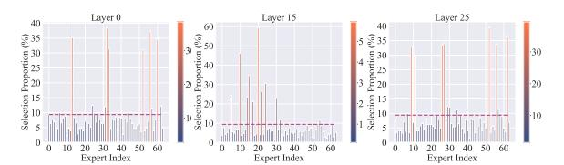
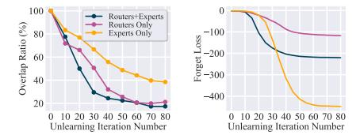

# SEUF: Is Unlearning One Expert Enough for Mixture-of-Experts LLMs?

#### Haomin Zhuang 1 ∗ , Yihua Zhang 2 \*, Kehan Guo 1 , Jinghan Jia 2 , Gaowen Liu 3 , Sijia Liu 2 , Xiangliang Zhang 1

University of Notre Dame Michigan State University Cisco Research {hzhuang2,xzhang33}@nd.edu

# Abstract

Recent advancements in LLMs unlearning have shown remarkable success in removing unwanted data-model influences while preserving the model's utility for legitimate knowledge. Despite these strides, sparse Mixture-of-Experts (MoE) LLMs–a key subset of the LLM family–have remain unexplored in the context of unlearning. As MoE LLMs are celebrated for their exceptional performance, we ask: *How can unlearning be performed effectively and efficiently on MoE LLMs?* Our pilot study shows that the dynamic routing nature of MoE LLMs introduces unique challenges, leading to excessive forgetting, uncontrolled knowledge erasure and substantial utility drops when existing unlearning methods are applied. To address this, we propose a novel Selected-Expert Unlearning Framework (SEUF). Through expert attribution, unlearning is concentrated on the most actively engaged experts for the specified knowledge. Concurrently, an anchor loss is applied to the router to stabilize the active state of this targeted expert, ensuring focused and controlled unlearning. SEUF is compatible with various standard unlearning algorithms. Extensive experiments demonstrate that SEUF enhances both forget quality up to 5% and model utility by 35% on MoE LLMs across various benchmarks and LLM architectures (compared to standard unlearning algorithms), while only unlearning 0 .06% of the model parameters.

# 1 Introduction

Despite the extraordinary ability in generating human-like content [\(Touvron et al.](#page-10-0) , [2023\)](#page-10-0), the rapid development of large language models (LLMs) have raised a series of ethical and security concerns, such as pretraining on copyrighted data [\(Sun et al.](#page-10-1) , [2024\)](#page-10-1), bias perpetuation [\(Motoki et al.](#page-10-2) , [2023\)](#page-10-2), the generation of toxic, biased, or illegal contents [\(Wen](#page-10-3) [et al.](#page-10-3) , [2023\)](#page-10-3), and facilitating making cyberattacks and bio-weapons [\(Li et al.](#page-9-0) , [2024\)](#page-9-0). As a solution, the

problem of Machine Unlearning (MU) arises (also referred to LLM unlearning) [\(Liu et al.](#page-10-4) , [2024c\)](#page-10-4), aiming to scrub the influence of the undesired training data and removing their corresponding generation abilities, while preserving the influence of other remaining valid data [\(Jia et al.](#page-9-1) , [2024a](#page-9-1) ; [Shi](#page-10-5) [et al.](#page-10-5) , [2024](#page-10-5) ; [Jia et al.](#page-9-2) , [2024b\)](#page-9-2).

While LLM unlearning has recently become a major research thrust, past efforts have only focused on effective unlearning methods for conventional LLMs. In contrast, sparse Mixture-of-Experts LLM (MoE LLM) [\(Jiang et al.,](#page-9-3) [2024;](#page-9-3) [xAI,](#page-10-6) [2024](#page-10-6) ; [Databricks](#page-8-0) , [2024](#page-8-0) ; [Abdin et al.](#page-8-1) , [2024](#page-8-1) ; [Liu](#page-9-4) [et al.](#page-9-4) , [2024a\)](#page-9-4), designed to reduce computational burdens during inference, remained unexplored in this context. As a key member of the LLM family, MoE LLMs offer substantial scalability without a corresponding increase in computational costs [\(Jiang et al.,](#page-9-3) [2024;](#page-9-3) [Team,](#page-10-7) [2024;](#page-10-7) [Dai et al.,](#page-8-2) [2024\)](#page-8-2). Thanks to their dynamic routing mechanism, MoE LLMs direct inference through different model components, known as 'experts'. However, it remains unclear how LLM unlearning interacts with the sparse MoE architecture and whether unlearning for MoE LLMs presents unique challenges. This leads us to ask:

*(Q) Can we develop a principled MU method for MoE LLMs that ensures high forgetting effectiveness, while maintaining model utility and efficiency?*

To the best of our knowledge, the problem ( Q ) remains unexplored in the current literature. Our investigation begins with a pilot study that applies existing unlearning methods to MoE LLMs. Preliminary results indicate that a simple application of these methods can lead to a substantial drop in model utility and even model collapse. This phenomenon is illustrated in Fig. [1](#page-2-0)(a), which depicts the performance of the unlearned MoE LLMs predominantly closer to the bottom right corner, in-

\*Equal contribution

dicating a significant and unacceptable utility drop compared to conventional dense LLMs.

To look into this phenomenon, we begin by performing a careful sanity check on unlearning methods in MoE LLMs and conduct an in-depth analysis of failure cases. Ideally, in MoE LLMs, given an input, the routers should evaluate and direct it to the most relevant experts, with unlearning targeting and erasing the corresponding knowledge in these experts. However, by monitoring expert selection during unlearning, we find that the process often prompts routers to constantly switch the activated experts. This behavior persists even when routers are fixed. As a result, unlearning algorithms create "short-cuts", where instead of targeting the most relevant experts, the routers shift to less relevant ones to trick for unlearning loss reduction (*i.e.*, irrelevant experts are unlearned). This leads to substantial drops in model utility (illustrated in Fig. [1](#page-2-0)(b)).

To solve the problem, we propose a novel unlearning framework specifically tailored for MoE LLMs, named SEUF (Selected Experts Unlearning Framework). SEUF employs expert attribution to pinpoint the experts most actively involved with the forget set, which is designated as the primary target for unlearning. Unlearning efforts are exclusively focused on this identified expert. Concurrently, an anchor loss is applied to the router to stabilize the active status of the targeted expert throughout the unlearning process. This approach prevents the frequent switching of expert selection, ensuring that unlearning is both focused and controlled. Our contributions are summarized below.

- We for the first time identify the unique challenge of unlearning in MoE LLMs. Our analysis elucidates the root causes of observed failures, offering novel insights into how unlearning impacts the routers and experts within an MoE LLM.
- We propose a novel parameter-efficient unlearning framework, SEUF, for MoE LLMs. SEUF effectively pinpoints, fixates, and unlearns the most pertinent experts relative to the forget set. SEUF enjoys high flexibility and works in a plug-in-and-play mode with any existing unlearning methods to boost forget quality, model utility, and efficiency at the same time.
- We conduct extensive experiments to demonstrate the effectiveness of SEUF across various MoE architectures, MU benchmarks, and unlearning methods. Our results show that when integrated with SEUF, all tested unlearning methods achieve substantial improvements in model utility up to

35% and concurrently enhance the quality of forgetting with only 0.06% parameters being updated.

# 2 Related Works

Machine Unlearning for LLMs. A growing body of research has investigated the problem of unlearning in LLMs [\(Yao et al.,](#page-11-0) [2024;](#page-11-0) [Lu et al.,](#page-10-8) [2022;](#page-10-8) [Jang et al.,](#page-9-5) [2022;](#page-9-5) [Kumar et al.,](#page-9-6) [2022;](#page-9-6) [Zhang et al.,](#page-11-1) [2023a;](#page-11-1) [Pawelczyk et al.,](#page-10-9) [2023;](#page-10-9) [Eldan and Russi](#page-8-3)[novich,](#page-8-3) [2023;](#page-8-3) [Ishibashi and Shimodaira,](#page-9-7) [2023;](#page-9-7) [Yao](#page-11-2) [et al.,](#page-11-2) [2023;](#page-11-2) [Maini et al.,](#page-10-10) [2024;](#page-10-10) [Zhang et al.,](#page-11-3) [2024;](#page-11-3) [Li et al.,](#page-9-0) [2024;](#page-9-0) [Wang et al.,](#page-10-11) [2024a;](#page-10-11) [Jia et al.,](#page-9-2) [2024b;](#page-9-2) [Liu et al.,](#page-10-4) [2024c](#page-10-4)[,b;](#page-10-12) [Thaker et al.,](#page-10-13) [2024\)](#page-10-13). These studies have practical applications, such as removing sensitive information [\(Jang et al.,](#page-9-5) [2022;](#page-9-5) [Eldan](#page-8-3) [and Russinovich,](#page-8-3) [2023;](#page-8-3) [Wu et al.,](#page-10-14) [2023\)](#page-10-14), preventing the generation of harmful or biased content [\(Jang et al.,](#page-9-5) [2022;](#page-9-5) [Eldan and Russinovich,](#page-8-3) [2023;](#page-8-3) [Wu et al.,](#page-10-14) [2023;](#page-10-14) [Lu et al.,](#page-10-8) [2022;](#page-10-8) [Yu et al.,](#page-11-4) [2023;](#page-11-4) [Yao et al.,](#page-11-2) [2023;](#page-11-2) [Liu et al.,](#page-10-15) [2024d\)](#page-10-15), memorized sequences [\(Jang et al.,](#page-9-5) [2022;](#page-9-5) [Barbulescu and Tri](#page-8-4)[antafillou,](#page-8-4) [2024\)](#page-8-4), and copyrighted material [\(Eldan](#page-8-3) [and Russinovich,](#page-8-3) [2023;](#page-8-3) [Jang et al.,](#page-9-5) [2022\)](#page-9-5). To facilitate unlearning, recent methods aim to bypass the need for retraining models from scratch by excluding the forget set containing the targeted data to be removed [\(Ilharco et al.,](#page-9-8) [2022;](#page-9-8) [Liu et al.,](#page-9-9) [2022;](#page-9-9) [Yao et al.,](#page-11-2) [2023;](#page-11-2) [Eldan and Russinovich,](#page-8-3) [2023;](#page-8-3) [Jia](#page-9-2) [et al.,](#page-9-2) [2024b;](#page-9-2) [Zhang et al.,](#page-11-3) [2024;](#page-11-3) [Li et al.,](#page-9-0) [2024;](#page-9-0) [Thaker et al.,](#page-10-13) [2024;](#page-10-13) [Liu et al.,](#page-10-12) [2024b\)](#page-10-12). Techniques like task arithmetic also enable efficient model editing through parameter merging [\(Hu et al.,](#page-9-10) [2024;](#page-9-10) [Ilharco et al.,](#page-9-8) [2022\)](#page-9-8). Although these methods do not provide exact unlearning akin to full retraining, they remain efficient and effective under empirical unlearning evaluation metrics. Approaches often include model fine-tuning and optimization [\(Liu](#page-9-9) [et al.,](#page-9-9) [2022;](#page-9-9) [Yao et al.,](#page-11-2) [2023;](#page-11-2) [Eldan and Russi](#page-8-3)[novich,](#page-8-3) [2023;](#page-8-3) [Jia et al.,](#page-9-2) [2024b;](#page-9-2) [Zhang et al.,](#page-11-3) [2024;](#page-11-3) [Li et al.,](#page-9-0) [2024\)](#page-9-0), or input prompting and in-context learning [\(Thaker et al.,](#page-10-13) [2024;](#page-10-13) [Pawelczyk et al.,](#page-10-9) [2023;](#page-10-9) [Liu et al.,](#page-10-12) [2024b\)](#page-10-12). Other approaches, such as localization-informed unlearning, identify and locally edit model units (e.g., layers or neurons) closely related to the data or tasks being unlearned [\(Meng et al.,](#page-10-16) [2022;](#page-10-16) [Wu et al.,](#page-10-14) [2023;](#page-10-14) [Wei et al.,](#page-10-17) [2024\)](#page-10-17). Most existing research has focused on dense LLMs, leaving unlearning in MoE LLMs unexplored. For example, the unlearning of Mixtral-8 × 7B discussed in [Li et al.](#page-9-0) [\(2024\)](#page-9-0) only examined a single method with ad-hoc adjustments. This work aims to fill this gap by conducting a com-

Figure 1: Overview of the key findings in this paper. (a) Illustration of the ineffectiveness of existing unlearning methods on MoE LLMs. Four unlearning algorithms—GA (Eldan and Russinovich, 2023), GDIFF (Maini et al., 2024), NPO (Zhang et al., 2024), and RMU (Li et al., 2024)—were applied to two MoE LLMs (DeepSeek-v2-Lite (Liu et al., 2024a) and Qwen1.5-MoE (Team, 2024)) and two dense LLMs (Phi3.5 (Abdin et al., 2024) and LLaMA3-8B (Dubey et al., 2024)) using the WMDP benchmark (Li et al., 2024). The drop in target knowledge (accuracy drop on the forget test set, higher is better) and the drop in model utility (accuracy drop on MMLU (Hendrycks et al., 2023), lower is better) are plotted. Better-unlearned models should appear in the top left corner, but unlearning on MoE LLMs was less effective compared to non-MoE modles. (b) Illustration of ideal versus ineffective MoE LLM unlearning. Target experts—those most frequently activated given the forget set—are identified for unlearning. However, existing unlearning algorithms tend to cause substantial expert selection shifts, leading to excessive and unnecessary unlearning of non-target experts, which significantly impairs model utility.

prehensive study of various unlearning methods, benchmarks, and MoE models, addressing the specific challenges posed by the MoE architecture.

MoE-based LLMs. Sparse MoE models are designed to activate only a subset of expert networks for each input during inference, enabling substantial model scaling with minimal computational overhead (Shazeer et al., 2017). Current MoE model development can be categorized into two types: training from scratch (Fedus et al., 2022; Zoph et al., 2022a; Shen et al., 2023) and building from dense checkpoints (Zhang et al., 2021; Komatsuzaki et al., 2022; Zhu et al., 2024). Over recent years, MoE models have seen key advancements, including improvements in scalability (Riquelme et al., 2021; Kim et al., 2021; Zhou et al., 2022; Zoph et al., 2022a), efficiency optimization (Fedus et al., 2022; Lepikhin et al., 2020; Chowdhery et al., 2023), and expert balancing techniques (Cong et al., 2024; Zoph et al., 2022b; Dai et al., 2022). The implementation of transformer-based MoE models has been integrated into LLMs, significantly enhancing inference efficiency (Jiang et al., 2024; Dai et al., 2024; xAI, 2024; Hong et al., 2024; Abdin et al., 2024; Lieber et al., 2024; Yang et al., 2024; Zhu et al., 2024; Databricks, 2024). For example, DeepSeekMoE (Dai et al., 2024) improves expert specialization by segmenting experts into smaller subsets for flexible activation, while isolating shared experts to reduce redundancy and capture common knowledge. Similarly, Qwen1.5-MoE (Team, 2024) partitions a standard FFN layer into smaller segments to create multiple experts, introducing a fine-grained routing mechanism that enables Qwen1.5-MoE to match the performance

of 7B models with only one-third of parameters activated. Despite the efficiency gains provided by MoE's dynamic routing system, existing research highlights additional challenges compared to traditional dense models, including unstable training (Zoph et al., 2022a; Dai et al., 2022), robustness issues (Zhang et al., 2023b; Puigcerver et al., 2022), and complications in parallel deployment (Hwang et al., 2023; Gale et al., 2023). In this work, we show that the root cause of the ineffectiveness of existing unlearning methods for MoE LLMs also stems from the dynamic routing system.

#### 3 Preliminaries

In this section, we present our pilot study to reveal that unlearning methods designed for conventional LLMs are *ineffective* in unlearning MoE LLMs.

Preliminaries on MoE LLM unlearning. Based on the generic formulation outlined in Liu et al. (2024c), the task of LLM unlearning is to eliminate the influence of a specific 'unlearning target'-whether it is related to data, knowledge, or model capabilities—from a pretrained LLM (denoted by  $\theta_0$ ). The unlearning target is typically defined by a forget set  $\mathcal{D}_f$ , which contains the information or knowledge to be removed. To ensure the model retains its generation ability (i.e., utility) after unlearning, a retain set  $\mathcal{D}_r$  is introduced, consisting of data unrelated to the unlearning target. With this setup, the LLM unlearning problem is usually formed as a regularized optimization problem, finetuned from  $\theta_o$  using both the forget set  $\mathcal{D}_f$ and the retain set  $\mathcal{D}_r$ :

$$\min_{\boldsymbol{\theta}} \ell_f(\boldsymbol{\theta}; \mathcal{D}_f) + \lambda \ell_r(\boldsymbol{\theta}; \mathcal{D}_r). \tag{1}$$

Table 1: Unlearning performance of GA when controlling tunable parameters in MoE LLMs.

| Tunable Module |                  | Forget Efficacy ↓ | Utility ↑ |
|----------------|------------------|-------------------|-----------|
|                | Original         | 0.4192            | 0.5979    |
| 0              | Experts & Router | 0.2953            | 0.3393    |
| Qwen           | Routers Only     | 0.2526            | 0.2977    |
|                | Experts Only     | 0.2536            | 0.3242    |
|                | Original         | 0.3804            | 0.5500    |
| Dangarl        | Routers & Expert | 0.2457            | 0.3145    |
| DeepSeek       | Routers Only     | 0.2375            | 0.3315    |
|                | Experts Only     | 0.2601            | 0.3435    |

Here,  $\theta$  represents the model parameters to be updated during unlearning,  $\ell_f$  and  $\ell_r$  denote the forget loss and retain loss, respectively, with  $\lambda \geq 0$  serving as a regularization parameter to balance between unlearning and preserving utility.

Next, we provide a brief introduction to how the routing system operates in the MoE LLM architecture. In MoE LLMs, e.g., DeepSeek-v2-Lite (Liu et al., 2024a), the feed-forward networks (FFNs) of Transformers are split into multiple experts and activated by the output of the router in front of the expert layers, see Fig. 1(b) for illustration. In the l-th layer, given the input  $\mathbf{u}_t^{(l)}$  corresponding to the t-th token, router layers calculate the score of each token and assign them to the top-K experts:

$$\begin{split} s_{i,t}^{(l)} &= \operatorname{Softmax}(\operatorname{Router}(\mathbf{u}_t^{(l)})) \\ g_{i,t}^{(l)} &= \begin{cases} s_{i,t}^{(l)} & \text{if } s_{i,t}^{(l)} \in \operatorname{Top}K(\{s_{k,t}^{(l)} \mid 1 \leq k \leq N\}) \\ 0 & \text{otherwise} \end{cases} \end{split}$$

Here, Router(·) denotes the router layer,  $s_{i,t}$  is the token-to-expert affinity,  $\operatorname{Top} K(\cdot)$  selects the highest K value in the set, N is the number of experts, and  $g_{i,t}^{(l)}$  is the score assigned by router for the i-th expert. Then, the hidden state  $\mathbf{h}_t'^{(l)}$  of FFNs can be calculated as:  $\mathbf{h}_t'^{(l)} = \mathbf{u}_t^{(l)} + \sum_{i=1}^N g_{i,t}^{(l)} \operatorname{FFN}_i^{(l)}(\mathbf{u}_t)$ , where  $\operatorname{FFN}_i^{(l)}(\cdot)$  denotes the i-th expert. Then,  $\mathbf{h}_t'^{(l)}$  is sent to the next layer of Transformer blocks for further processing.

Unlearning for MoE LLM is not trivial: a pilot study. The goal of unlearning is twofold: (1) to ensure the model forgets the targeted information and knowledge stored in  $\mathcal{D}_f$ , and (2) to preserve the model utility without significant degradation. Our pilot study reveals that the special routing system in MoE LLMs introduces additional challenges to unlearning, rendering existing methods ineffective. We applied four widely used LLM unlearning methods: GA (Gradient Ascent) (Eldan and Russinovich, 2023), GDIFF (Gradient Difference) (Maini et al., 2024), NPO (Negative Preference Optimization) (Zhang et al., 2024), and RMU (Rep-

resentation Misdirection for Unlearning) (Li et al., 2024) with the WMDP benchmark (Li et al., 2024) on two MoE LLMs, Qwen1.5-MoE (Team, 2024) and DeepSeek-V2-Lite (Liu et al., 2024a), as well as two dense LLMs for reference, LLaMA3-8B (Dubey et al., 2024) and Phi-3.5-mini-instruct (Abdin et al., 2024), where the task aims to unlearn hazardous knowledge in LLMs. In Fig. 1(a), to ease the comparison, we report the forget quality (performance drop on the forget test set, where higher is better) against retain quality (performance drop on the MMLU (Hendrycks et al., 2020) utility benchmark, where lower is better). Each data point represents the best result of a model-method combination with hyper-parameter tuning, with ideal performance located near the top left corner, signifying high unlearning effectiveness with minimal impact on model utility. As we can see, most MoE LLM data points cluster in the lower right, indicating severe utility drops and poor unlearning performance compared to dense models. In Fig. 1(a), all model parameters (including routers and experts) are involved in unlearning. To ensure that these poor results are not due to improper parameter settings, **Tab. 1** presents additional experiments using two other parameter configurations (routers-only and experts-only) for GA, yet no significant improvements are observed in either forget or retain quality (more than 20% utility drop). The results above imply the problem of MoE LLM unlearning is more challenging and far from trivial, even if LLM unlearning is well-studied.

#### 4 Our Proposal: SEUF

In this section, we delve into the failure cases highlighted in Sec. 3 by analyzing the behavior of routers and their expert selection patterns. We then identify two primary root causes underlying the poor unlearning performance in MoE LLMs. Based on these insights, we introduce SEUF, a new unlearning paradigm designed to achieve controllable and effective unlearning for MoE LLMs.

Uncovering the root cause: 'short-cut' in MoE LLM unlearning and expert selection shift. In order to fully understand the failure cases of MoE LLM unlearning, we begin by inspecting and monitoring the expert selection pattern of the unlearned model. In Fig. 2, we show the proportion of tokens assigned to each selected expert on the data samples from WMDP forget dataset (Li et al., 2024). For the input of a specific topic, a small portion of experts (around 6 to 9 out of 64 experts)

Figure 2: Proportion of tokens assigned to each expert of the pre-trained DeepSeek-v2-Lite (K=6 in Topk) with samples from WMDP forget benchmark (Li et al., 2024), in different model layers. The dashed horizontal line marks 6/64, *i.e.*, the proportion expected with uniform expert selection. The expert selection distribution clearly follows a long-tailed pattern when the input is sampled from a topic within a narrow scope.

Figure 3: (left) Overlap ratio of selected experts between the original pretrained model and the unlearned model with different unlearning iterations using GA on WMDP benchmark. (right) Forget loss vs. the number of unlearning iterations, when controlling parameters to unlearn in MoE LLM.

were assigned with the majority of the tokens in each layer, which was also confirmed in Wang et al. (2024b). Thus, we have the following insight:

**Insight** 1: For the inference related to a certain topic within a narrow scope (e.g., the forget set of an unlearning task), expert selection by MoE routers follows a long-tailed distribution, with only a few experts being activated significantly more frequently than others.

Based on the insight above, we define the frequently activated experts as **topic-target** experts, and the others as **non-target**. Thus, by eliminating the knowledge stored in these target experts, MoE LLM unlearning can be achieved more effectively.

Next, we examine how the expert selection pattern evolves during unlearning. Specifically, we track the average expert selection overlap ratio across all layers between the unlearned model at different stages and the original pretrained model, when processing the forget set. The results, shown in Fig. 3 (a), reveal a steady decline in the overlap ratio as unlearning progresses, indicating that previously selected target experts are gradually replaced by non-target ones that do not contain the target knowledge. This shift persists even when routers are fixed, as unlearning can still indirectly influence router selection: a router's decision at one layer depends on the output of the previous layer, which may have been affected by an updated expert of this previous layer in unlearning. Meantime, we observe a consistent reduction in forget loss, as shown in Fig. 3 (b). Thus, we can derive the following insight:

**Insight 2:** Existing unlearning methods tend to prompt routers to shift selection from target to non-target experts unintentionally. This creates unlearning 'shortcuts' in expert selection to trick for low forget loss and lead to fake unlearning.

As unlearning proceeds, non-target experts are more frequently activated to handle samples related to the unlearning target, thereby being forced to participate in the unlearning task, even though they did not contain the intended target knowledge. Meanwhile, the true objective of unlearning, *i.e.*, the target experts, remain hidden out of the reach of the forward propagation. Existing literature (Liu et al., 2024c) has already demonstrated that forcing unlearning models that do not contain knowledge related to the unlearning target can cause a significant drop in model utility. This accounts for the sharp decline in model utility observed in Sec. 3, which leads to the following insight:

**Insight 3**: The sharp degradation in model utility during MoE LLM unlearning is primarily due to excessive unlearning applied to non-target experts caused by expert selection shift.

# **SEUF for effective MoE LLM unlearning.** As

discussed earlier, a new paradigm tailored for MoE LLM unlearning is urgently needed to address the challenges of unintentional expert selection shifts in routers and excessive unlearning of non-target experts. Therefore, we propose a framework that (1) identifies the most relevant target experts, (2) ensures that these target experts remain highly activated throughout the unlearning process to avoid selection shifts, and (3) limits the impact of unlearning on non-target experts. Spurred by these, we introduce SEUF, where unlearning is confined to M most relevant target experts. We refer the readers to Alg. 1 for an illustration of SEUF.

This approach starts with an expert attribution process to accurately identify the most M relevant experts for the unlearning task (step 1-3). Then, the gradient computation selected experts  $e_M$  and their corresponding routers  $R_{e_M}$  are enabled (step 4), while other parameters are frozen. Step 5 performs unlearning using any unlearning approach, as our framework is flexible. For example, gradient ascent can be applied with our defined loss functions. Next, we present the details of the expert attribution process and define the anchor loss function.

#### Algorithm 1 SEUF Unlearning Algorithm

**Output:** Unlearned model  $\theta_u$ 

**Input:** Pretrained model  $\theta_o$ , forget set  $\mathcal{D}_f$ , retain set  $\mathcal{D}_r$ , **Setup:** Retain loss  $\ell_r$ , forget loss  $\ell_f$ , anchor loss  $L_{\rm anchor}$ , the number of experts to select M

1:  $\mathcal{D}_s \leftarrow \text{Sample\_Subset}(\mathcal{D}_f)$ 

2:  $s \leftarrow \text{Record\_Affinity\_Score}(\boldsymbol{\theta}_o, D_s)$ 

3:  $e_M \leftarrow \text{Ranking\_And\_Select}(s, M)$ 

4: Activate\_Expert\_And\_Router( $\theta_o, e_M, R_{e_M}$ )

5:  $\theta_u \leftarrow \text{Unlearn}(\theta_o, \ell_f(\mathcal{D}_f), \ell_r(\mathcal{D}_r), L_{\text{anchor}})$ 

6: Return  $\theta_u$ 

**♦ Expert attribution.** While the token assignment ratio for each expert (shown in Fig. 2), can serve as a basic attribution metric, it overlooks finer details that are important for precise comparisons, due to the hidden states in each layer summed by weighted average. To address this, we adopt a gating score-based task affinity calculation method from (Wang et al., 2024b). Specifically, the affinity score for the i-th expert  $e_i^{(l)}$  in the l-th layer of an MoE LLM is defined as:

$$s_i^{(l)} = \frac{1}{Z} \sum_{j=1}^{Z} \frac{1}{L_j} \sum_{t=1}^{L_j} g_{i,t}^{(l)}$$
 (2)

where Z is size of the calibration dataset used for expert attribution,  $L_j$  represents the length of the j-th input sequence  $\mathbf{x}_j$ , and  $g_{i,t}^{(l)}$  is the probability score assigned to expert  $\mathbf{e}_i^{(l)}$  for the t-th token. Following Wang et al. (2024b), the attribution data can be a subset universally sampled from the original forget set. We find that a subset containing over 100,000 tokens is robust enough to select the most relevant experts for an unlearning task. For each layer, we rank the experts based on their affinity score and then finally select the top M experts as the target expert for unlearning ( $e_M$  in Algo. 1).

◆ Router anchor loss. A key challenge in unlearning is the expert selection shift, where the true target experts are hidden by the routers, while less relevant experts are activated during inference and inadvertently involved in the unlearning process. To mitigate this, we propose the router anchor loss, which encourages the previously identified target expert to remain consistently activated throughout unlearning. The loss is formulated as:

$$L_{\text{anchor}}^{(l)} = \|\mathbf{g}^{(l)} - [a_1^{(l)}, a_2^{(l)}, \dots, a_{E^{(l)}}^{(l)}]\|_2^2, \tag{3}$$

where  $E^{(l)}$  is the total number of experts in the l-th layer,  $\mathbf{g}^{(l)} = [g_1^{(l)}, g_2^{(l)}, \dots, g_i^{(l)}]$  is the output of router, and  $a_i^{(l)} = 1$  if the i-th expert is identified as the target expert, otherwise  $a_i^{(l)} = 0$ . The unlearning loss can then be formularized as:

$$\min_{\boldsymbol{\theta}} \ell_f(\boldsymbol{\theta}; \mathcal{D}_f) + \lambda \ell_r(\boldsymbol{\theta}; \mathcal{D}_r) + \alpha L_{\text{anchor}}^{(l)}, \tag{4}$$

Table 2: Model utility (UT $\uparrow$ ) comparison at the same level of forget efficacy (FE $\approx$  0.25), when the top M experts from either the same layer or different layers in DeepSeek are unlearned using GA on WMDP benchmark, also when 4 shared experts are included.

| Selected experts | Top-1  | Top-3  | Top-6  | Top-1+4-shared |
|------------------|--------|--------|--------|----------------|
| Same layer       | 0.5100 |        | 0.4652 | 0.3554         |
| Different layers | 0.5100 | 0.2852 | 0.2567 | _              |

where  $\alpha$  controls the strength of anchor loss. Its sensitivity is analyzed in Appendix Sec. B.

 $\bullet$  Selection of top M experts. When forming  $e_M$  of the top M experts, there are two approaches: 1) selecting the top M experts from all experts across all layers based on the affinity score  $s_i^{(l)}$ in Eq.2; and 2) to mitigate selection shift from previous layers, another approach is to choose the top M experts from the same layer. We examined both approaches under different settings M=1,3,6, and present the results in Tab. 2. We observe that unlearning a single expert (M=1) yields better performance than unlearning multiple experts, regardless of whether they come from the same layer or different layers. This trend of single-expert unlearning yielding the best performance is also observed across other unlearning tasks (see Tab. 7 in Appendix). This suggests:

**Insight 4**: Unlearning top-1 expert is the most effective.

From Tab. 2, we also observe that unlearning multiple experts across different layers leads to a substantial performance decline. To further analyze the Insight 4, let the total gradient update during unlearning be:  $\Delta W = \sum_{i \in e_M} \lambda_i \nabla \mathcal{L}_i$ , where  $e_M$ is the set of selected experts being unlearned,  $\lambda_i$ denotes their contribution weight, and  $\nabla \mathcal{L}_i$  is their corresponding gradient update in Eq. (4). When only the top-1 expert is selected for unlearning, the modification to the weights remains minimal, ensuring low gradient interference. For multiple experts within the same layer, the gradient updates may partially cancel out, leading to moderate disruption. However, for multiple experts across different layers, the gradient updates affect distinct feature hierarchies, resulting in an unstable gradient flow and widespread model disruption.

This analysis also explains the deficiency of unlearning shared experts. In a given layer, shared experts are activated for all tokens, making them intuitively suitable targets for unlearning. However, Tab. 2 shows that unlearning the top-1 expert along with 4 shared experts causes a greater utility drop than unlearning top-6 experts in the same layer. Shared experts influence a broader range

of token representations, so making them active for unlearning triggers high-magnitude gradient updates across multiple pathways. Also, since shared experts consolidate common knowledge across diverse contexts [\(Liu et al.,](#page-9-4) [2024a\)](#page-9-4), their modification disrupts the model more severely, making them suboptimal for unlearning.

# 5 Evaluation Experiments

To demonstrate the effectiveness of our proposed method, we evaluate and compare it against different baselines on two widely accepted LLM unlearning benchmarks: WMDP [\(Li et al.,](#page-9-0) [2024\)](#page-9-0) and RWKU [\(Jin et al.,](#page-9-19) [2024\)](#page-9-19). The detailed experimental setup, such as unlearning tasks, datasets selection, targeted MoE models, unlearning baselines and hyper-parameter setting, is provided in Appendix Sec. [A,](#page-12-0) due to space limitation. We next present results of several key experiments.

- ✦ Effectiveness of SEUF across benchmarks and unlearning methods. In Tab. [3](#page-7-0), we present the FE (forget efficacy) and UT (utility) of our proposed SEUF when integrating different unlearning methods GA, GDIFF, NPO, and RMU. In this evaluation, SEUF selects only the top-1 expert for unlearning. There are two notable findings. First, SEUF effectively enhances unlearning, either by further reducing FE or maintaining a similar level compared to baselines without SEUF. Second, SEUF consistently improves model utility (UT) across all tested methods. Notably, for methods where UT drops by more than 10% (compared to the pretrained model), highlighted in red, SEUF mitigates the decline. For example, the utility of GA on Qwen for the WMDP task drops from 0.5979 to 0.3393, but with SEUF, the utility improves to 0.5012, This demonstrates SEUF's effectiveness in balancing unlearning performance and model retention. Notably, methods such as GDIFF and RMU, which experience notable utility loss when used alone, benefit greatly from the application of SEUF, achieving near-pretrained utility levels while still maintaining effective unlearning.
- ✦ SEUF outperforms parameter-efficient fine-tuning (PEFT) methods when used for unlearning. Tab. [3](#page-7-0) also includes a set of baselines that apply PEFT on GA. It is used to evaluate whether our method unlearns more effectively a subset of parameters (top-1 expert) compared to PEFT. Tab. [4](#page-7-1) shows a comparison of the parameter efficiency involved in tuning. The key conclusion from these results is: SEUF achieves far

better parameter efficiency, with only 0.06% of tunable parameters, compared to LoRA (0.92%) and ESFT (2.86%), while still maintaining a comparable level of forget efficacy and outperforming them in utility preservation. For instance, in RWKU, GA+SEUF achieves utility scores of 0.5709 on Qwen and 0.5485 on DeepSeek, significantly higher than LoRA (0.2689 and 0.2302) and ESFT (0.4433 and 0.5001).

- ✦ Top-1 expert selection outperforms random selection in unlearning. In the last row of Tab. [3,](#page-7-0) we compare the performance of the affinity score-based expert selection in SEUF with a random expert selection approach. The results show that while random selection can sometimes preserve utility at a comparable level, it falls short in achieving effective unlearning. For instance, on Qwen (WMDP), random selection yields a higher utility score (0.5947 vs. 0.5351 for SEUF), but its forget efficacy (FE) remains significantly higher (0.3505 vs. 0.2536 for SEUF), indicating incomplete unlearning. This suggests that selecting the top-1 expert based on affinity scores is crucial for reducing FE while maintaining utility, making it a superior approach to random selection.
- ✦ Experts with higher affinity scores play a more significant role in unlearning. To further examine the impact of selecting experts based on their affinity scores, we analyze the layer-wise Top-1 expert in DeepSeek on RWKU dataset. In Tab. [5,](#page-7-2) we present their affinity scores along with the utility (UT) when the expert is involved in unlearning. Due to space constraints, we highlight the top-ranked layer-wise experts (1st to 3rd) and also include several lower-ranked ones (13th to 26th) for comparison. From the results, we observe that the first-ranked expert (with the highest affinity score 0.211) yields the highest UT (0.5485). Overall, UT remains stable at 0.5445 or higher when selecting experts with affinity scores above 0.1. However, when affinity scores drop further (e.g., the 23rd and 26th ranked experts), utility declines more sharply to 0.4262 and 0.2355. These findings emphasize the importance of selecting experts with sufficiently high affinity scores to maintain utility while achieving effective unlearning.
- ✦ Unlearning resilient to jailbreak attacks. The unlearned model is expected to refuse harmful queries. The forgotten knowledge should not be recovered even through adversarial means. We thus examine the behavior of MoE LLMs unlearned by SEUF under adversarial prompting. Specifically,

Table 3: Performance comparison of existing unlearning methods equipped w/ and w/o SEUF on WMDP (Li et al., 2024) and RWKU (Jin et al., 2024) benchmarks on two MoE LLMs, namely Qwen1.5-MoE-A2.7B-Chat (Qwen) (Team, 2024) and DeepSeek-V2-Lite (DeepSeek) (Dai et al., 2024). Additionally, a group of baselines applying PEFT (LoRA and ESFT) on GA is included to evaluate our method's effectiveness in selecting a suitable subset of parameters for unlearning, along with a baseline using random expert selection with RMU. The occurrence of significant utility increase (over 5% increase in UT compared to without SEUF) are marked in green.

| Method         | Qwen   | (WMDP) | DeepSe | ek (WMDP) | Qwen   | (RWKU) | DeepSee | ek (RWKU) |
|----------------|--------|--------|--------|-----------|--------|--------|---------|-----------|
| Method         | FE↓    | UT↑    | FE↓    | UT↑       | FE↓    | UT↑    | FE↓     | UT↑       |
| Pretrained     | 0.4192 | 0.5979 | 0.3804 | 0.5548    | 0.4243 | 0.5979 | 0.5376  | 0.5548    |
| GA             | 0.2953 | 0.3393 | 0.2457 | 0.3145    | 0.0078 | 0.4849 | 0.0839  | 0.5195    |
| GA+SEUF        | 0.2987 | 0.5012 | 0.2700 | 0.5100    | 0.0060 | 0.5709 | 0.0000  | 0.5485    |
| GDIFF          | 0.2964 | 0.2965 | 0.2898 | 0.3929    | 0.0700 | 0.5296 | 0.1901  | 0.3495    |
| GDIFF+SEUF     | 0.2445 | 0.5295 | 0.2677 | 0.4895    | 0.0010 | 0.5987 | 0.0000  | 0.5253    |
| NPO            | 0.3447 | 0.4612 | 0.3200 | 0.4700    | 0.0000 | 0.3718 | 0.0970  | 0.5388    |
| NPO+SEUF       | 0.3200 | 0.5468 | 0.2898 | 0.4790    | 0.0020 | 0.5428 | 0.0000  | 0.5479    |
| $\mathbf{RMU}$ | 0.2612 | 0.3560 | 0.2530 | 0.4540    | 0.0200 | 0.2420 | 0.0010  | 0.5109    |
| RMU+SEUF       | 0.2536 | 0.5351 | 0.2859 | 0.5424    | 0.0723 | 0.5975 | 0.0130  | 0.5388    |
| GA+LoRA        | 0.2459 | 0.2689 | 0.2657 | 0.2295    | 0.0000 | 0.2689 | 0.0000  | 0.2302    |
| GA+ESFT        | 0.3145 | 0.4514 | 0.2737 | 0.5108    | 0.001  | 0.4433 | 0.0200  | 0.5001    |
| RMU+Random     | 0.3505 | 0.5947 | 0.2722 | 0.5183    | 0.2110 | 0.5924 | 0.1176  | 0.5182    |

Table 4: Tunable parameter ratio, PEFT vs SEUF.

| Madhad      | Tunable Parameter Ratio |          |         |  |  |  |
|-------------|-------------------------|----------|---------|--|--|--|
| Method      | Qwen                    | DeepSeek | Mixtral |  |  |  |
| LoRA        | 0.87%                   | 0.92%    | 0.26%   |  |  |  |
| <b>ESFT</b> | 3.13%                   | 2.86%    | 14%     |  |  |  |
| SEUF        | 0.06%                   | 0.06%    | 0.41%   |  |  |  |

Table 5: Model utility (UT) comparison across unlearned experts with different affinity scores  $(s_i)$  in SEUF+RMU on the RWKU benchmark. UT is compared at a consistent level of forget efficacy (FE  $\approx 0.25$ ).

|        | #1     |        |        |        |        | #23    |        |
|--------|--------|--------|--------|--------|--------|--------|--------|
|        | 0.2110 |        |        |        |        |        |        |
| UT (↑) | 0.5485 | 0.5475 | 0.5453 | 0.5445 | 0.5441 | 0.4262 | 0.2355 |

we test whether SEUF effectively mitigates unauthorized responses by employing the Greedy Coordinate Gradient (GCG) attack (Zou et al., 2023) in a white-box setting. This attack optimizes attack prompts to elicit responses that begin with "Sure, here is the answer:". To increase attack strength, we extend the number of optimization steps to 5,000, while keeping other hyperparameters at their default settings. Given the computational cost ( $\sim 1$  GPU hour on an A100 per soft prompt), we optimize 400 prompts across 400 samples in RWKU for attacking DeepSeek unlearned by SEUF+GA. Since not all responses explicitly begin with "Sure, here is the answer:", we filter for outputs containing the word "answer" and evaluate forget efficacy (FE) both with and without GCG-generated prompts. Our results show that

Figure 4: Comparison of affinity scores for all experts in the target layer of DeepSeek unlearned by SEUF + GA on the RWKU dataset, with and without the GCG attack. The target expert is marked as red.

despite being one of the strongest prompt-level attacks, GCG fails to recover forgotten knowledge, as **FE remains at 0.01 before and after the attack**. To further understand how the GCG attack affects expert selection, we visualize the affinity score of experts in DeepSeek, and compare it with GCG-attacked DeepSeek. Fig. 4 shows that while the GCG attack reduces the affinity score of the target expert, the expert remains ranked as the top-1 in affinity score. This suggests that SEUF maintains stable expert selection even under adversarial influence, ensuring robustness in the unlearning process.

Additionally, we also perform a sensitivity analysis on hyperparameter  $\alpha$  in Sec. B in Appendix. The results in Tab. 6 in Appendix indicate that  $\alpha=1$  achieves the best performance.

#### 6 Conclusion

In this paper, we for the first time examine the challenges of applying existing MU techniques to MoE LLMs and carefully investigate the synergy between the dynamic routing system of MoE LLM and the unlearning effects. To address these issues, we proposed SEUF, a novel framework

that unlearns most related experts while stabilizing expert selection through a router anchor loss. This approach mitigates expert selection shifts and achieves efficient unlearning with minimal parameter updates. Extensive experiments show that SEUF significantly outperforms traditional unlearning methods and other parameter-efficient finetuning techniques, providing a robust solution for MoE LLM unlearning tasks.

# 7 Limitation

While this study offers valuable insights into unlearning of MoE LLMs, it has certain limitations. First, the evaluation was limited to two datasets due to the scarcity of standardized benchmarks in unlearning. We have used two widely accepted LLM unlearning benchmarks: WMDP [\(Li et al.,](#page-9-0) [2024\)](#page-9-0) and RWKU [\(Jin et al.,](#page-9-19) [2024\)](#page-9-19). WMDP. We acknowledge the existence of other commonly used benchmarks, such as TOFU [\(Maini et al.,](#page-10-10) [2024\)](#page-10-10) and MUSE [\(Shi et al.,](#page-10-5) [2024\)](#page-10-5). However, these benchmarks are less suitable for our study, as they require models to undergo fine-tuning before unlearning. This additional training step introduces biases in MoE LLMs due to known instability in training, sensitive hyperparameter tuning, and the risk of training collapse [\(Jiang et al.,](#page-9-3) [2024;](#page-9-3) [Zoph et al.,](#page-11-5) [2022a\)](#page-11-5). These factors make it challenging to isolate the effects of unlearning from the broader impact of model fine-tuning. Expanding the evaluation to a broader range of datasets could enhance the generalizability of the findings. In future work, we plan to explore additional benchmarks, including those that do not require fine-tuning before unlearning, to ensure a more comprehensive assessment of unlearning effectiveness across diverse tasks and model architectures. Second, the study did not apply the unlearning algorithm to Mixtral 8×7B with all parameters unlearned and excluded larger MoE LLM models like DeepSeek-R1 due to computational constraints. Due to the computation limitation, Mixtral is only applied on SEUF and other parameter-efficient fine-tuning unlearning baselines. In future work, we could explore scaling the approach to larger models to evaluate its effectiveness in more complex architectures.

# 8 Acknowledgement

This work is supported by the NSF award # 2321054.

# References

- Marah Abdin, Sam Ade Jacobs, Ammar Ahmad Awan, Jyoti Aneja, Ahmed Awadallah, Hany Awadalla, Nguyen Bach, Amit Bahree, Arash Bakhtiari, Harkirat Behl, et al. 2024. Phi-3 technical report: A highly capable language model locally on your phone. *arXiv preprint arXiv:2404.14219*.
- George-Octavian Barbulescu and Peter Triantafillou. 2024. To each (textual sequence) its own: Improving memorized-data unlearning in large language models. *arXiv preprint arXiv:2405.03097*.
- Aakanksha Chowdhery, Sharan Narang, Jacob Devlin, Maarten Bosma, Gaurav Mishra, Adam Roberts, Paul Barham, Hyung Won Chung, Charles Sutton, Sebastian Gehrmann, et al. 2023. Palm: Scaling language modeling with pathways. *Journal of Machine Learning Research*, 24(240):1–113.
- Peizhuang Cong, Aomufei Yuan, Shimao Chen, Yuxuan Tian, Bowen Ye, and Tong Yang. 2024. Prediction is all moe needs: Expert load distribution goes from fluctuating to stabilizing. *arXiv preprint arXiv:2404.16914*.
- Damai Dai, Chengqi Deng, Chenggang Zhao, RX Xu, Huazuo Gao, Deli Chen, Jiashi Li, Wangding Zeng, Xingkai Yu, Y Wu, et al. 2024. Deepseekmoe: Towards ultimate expert specialization in mixture-of-experts language models. *arXiv preprint arXiv:2401.06066*.
- Damai Dai, Li Dong, Shuming Ma, Bo Zheng, Zhifang Sui, Baobao Chang, and Furu Wei. 2022. Stablemoe: Stable routing strategy for mixture of experts. *arXiv preprint arXiv:2204.08396*.
- Databricks. 2024. Introducing dbrx: A new state-of-the-art open llm. [https://www.databricks.com/blog/](https://www.databricks.com/blog/introducing-dbrx-new-state-art-open-llm) [introducing-dbrx-new-state-art-open-llm](https://www.databricks.com/blog/introducing-dbrx-new-state-art-open-llm). Accessed: 2024-09-25.
- Abhimanyu Dubey, Abhinav Jauhri, Abhinav Pandey, Abhishek Kadian, Ahmad Al-Dahle, Aiesha Letman, Akhil Mathur, Alan Schelten, Amy Yang, Angela Fan, et al. 2024. The llama 3 herd of models. *arXiv preprint arXiv:2407.21783*.
- Ronen Eldan and Mark Russinovich. 2023. [Who's harry](https://arxiv.org/abs/2310.02238) [potter? approximate unlearning in llms.](https://arxiv.org/abs/2310.02238) *Preprint*, arXiv:2310.02238.
- William Fedus, Barret Zoph, and Noam Shazeer. 2022. Switch transformers: Scaling to trillion parameter models with simple and efficient sparsity. *Journal of Machine Learning Research*, 23(120):1–39.
- Trevor Gale, Deepak Narayanan, Cliff Young, and Matei Zaharia. 2023. Megablocks: Efficient sparse training with mixture-of-experts. *Proceedings of Machine Learning and Systems*, 5:288–304.

- Leo Gao, Jonathan Tow, Baber Abbasi, Stella Biderman, Sid Black, Anthony DiPofi, Charles Foster, Laurence Golding, Jeffrey Hsu, Alain Le Noac'h, Haonan Li, Kyle McDonell, Niklas Muennighoff, Chris Ociepa, Jason Phang, Laria Reynolds, Hailey Schoelkopf, Aviya Skowron, Lintang Sutawika, Eric Tang, Anish Thite, Ben Wang, Kevin Wang, and Andy Zou. 2024. [A framework for few-shot language model](https://doi.org/10.5281/zenodo.12608602) [evaluation.](https://doi.org/10.5281/zenodo.12608602)
- Dan Hendrycks, Collin Burns, Steven Basart, Andy Zou, Mantas Mazeika, Dawn Song, and Jacob Steinhardt. 2020. Measuring massive multitask language understanding. *arXiv preprint arXiv:2009.03300*.
- Dan Hendrycks, Mantas Mazeika, and Thomas Woodside. 2023. An overview of catastrophic ai risks. *arXiv preprint arXiv:2306.12001*.
- Jiwoo Hong, Noah Lee, and James Thorne. 2024. Reference-free monolithic preference optimization with odds ratio. *arXiv preprint arXiv:2403.07691*.
- Edward J Hu, Yelong Shen, Phillip Wallis, Zeyuan Allen-Zhu, Yuanzhi Li, Shean Wang, Lu Wang, and Weizhu Chen. 2021. Lora: Low-rank adaptation of large language models. *arXiv preprint arXiv:2106.09685*.
- Xinshuo Hu, Dongfang Li, Baotian Hu, Zihao Zheng, Zhenyu Liu, and Min Zhang. 2024. Separate the wheat from the chaff: Model deficiency unlearning via parameter-efficient module operation. In *Proceedings of the AAAI Conference on Artificial Intelligence*, volume 38, pages 18252–18260.
- Changho Hwang, Wei Cui, Yifan Xiong, Ziyue Yang, Ze Liu, Han Hu, Zilong Wang, Rafael Salas, Jithin Jose, Prabhat Ram, et al. 2023. Tutel: Adaptive mixture-of-experts at scale. *Proceedings of Machine Learning and Systems*, 5:269–287.
- Gabriel Ilharco, Marco Tulio Ribeiro, Mitchell Wortsman, Suchin Gururangan, Ludwig Schmidt, Hannaneh Hajishirzi, and Ali Farhadi. 2022. Editing models with task arithmetic. *arXiv preprint arXiv:2212.04089*.
- Yoichi Ishibashi and Hidetoshi Shimodaira. 2023. Knowledge sanitization of large language models. *arXiv preprint arXiv:2309.11852*.
- Joel Jang, Dongkeun Yoon, Sohee Yang, Sungmin Cha, Moontae Lee, Lajanugen Logeswaran, and Minjoon Seo. 2022. Knowledge unlearning for mitigating privacy risks in language models. *arXiv preprint arXiv:2210.01504*.
- Jinghan Jia, Jiancheng Liu, Yihua Zhang, Parikshit Ram, Nathalie Baracaldo, and Sijia Liu. 2024a. Wagle: Strategic weight attribution for effective and modular unlearning in large language models. *arXiv preprint arXiv:2410.17509*.

- Jinghan Jia, Yihua Zhang, Yimeng Zhang, Jiancheng Liu, Bharat Runwal, James Diffenderfer, Bhavya Kailkhura, and Sijia Liu. 2024b. Soul: Unlocking the power of second-order optimization for llm unlearning. *arXiv preprint arXiv:2404.18239*.
- Albert Q Jiang, Alexandre Sablayrolles, Antoine Roux, Arthur Mensch, Blanche Savary, Chris Bamford, Devendra Singh Chaplot, Diego de las Casas, Emma Bou Hanna, Florian Bressand, et al. 2024. Mixtral of experts. *arXiv preprint arXiv:2401.04088*.
- Zhuoran Jin, Pengfei Cao, Chenhao Wang, Zhitao He, Hongbang Yuan, Jiachun Li, Yubo Chen, Kang Liu, and Jun Zhao. 2024. Rwku: Benchmarking realworld knowledge unlearning for large language models. *arXiv preprint arXiv:2406.10890*.
- Young Jin Kim, Ammar Ahmad Awan, Alexandre Muzio, Andres Felipe Cruz Salinas, Liyang Lu, Amr Hendy, Samyam Rajbhandari, Yuxiong He, and Hany Hassan Awadalla. 2021. Scalable and efficient moe training for multitask multilingual models. *arXiv preprint arXiv:2109.10465*.
- Aran Komatsuzaki, Joan Puigcerver, James Lee-Thorp, Carlos Riquelme Ruiz, Basil Mustafa, Joshua Ainslie, Yi Tay, Mostafa Dehghani, and Neil Houlsby. 2022. Sparse upcycling: Training mixture-ofexperts from dense checkpoints. *arXiv preprint arXiv:2212.05055*.
- Vinayshekhar Bannihatti Kumar, Rashmi Gangadharaiah, and Dan Roth. 2022. Privacy adhering machine un-learning in nlp. *arXiv preprint arXiv:2212.09573*.
- Dmitry Lepikhin, HyoukJoong Lee, Yuanzhong Xu, Dehao Chen, Orhan Firat, Yanping Huang, Maxim Krikun, Noam Shazeer, and Zhifeng Chen. 2020. Gshard: Scaling giant models with conditional computation and automatic sharding. *arXiv preprint arXiv:2006.16668*.
- Nathaniel Li, Alexander Pan, Anjali Gopal, Summer Yue, Daniel Berrios, Alice Gatti, Justin D Li, Ann-Kathrin Dombrowski, Shashwat Goel, Long Phan, et al. 2024. The wmdp benchmark: Measuring and reducing malicious use with unlearning. *arXiv preprint arXiv:2403.03218*.
- Opher Lieber, Barak Lenz, Hofit Bata, Gal Cohen, Jhonathan Osin, Itay Dalmedigos, Erez Safahi, Shaked Meirom, Yonatan Belinkov, Shai Shalev-Shwartz, et al. 2024. Jamba: A hybrid transformer-mamba language model. *arXiv preprint arXiv:2403.19887*.
- Aixin Liu, Bei Feng, Bin Wang, Bingxuan Wang, Bo Liu, Chenggang Zhao, Chengqi Dengr, Chong Ruan, Damai Dai, Daya Guo, et al. 2024a. Deepseek-v2: A strong, economical, and efficient mixture-of-experts language model. *arXiv preprint arXiv:2405.04434*.
- Bo Liu, Qiang Liu, and Peter Stone. 2022. Continual learning and private unlearning. In *Conference on Lifelong Learning Agents*, pages 243–254. PMLR.

- Chris Yuhao Liu, Yaxuan Wang, Jeffrey Flanigan, and Yang Liu. 2024b. Large language model unlearning via embedding-corrupted prompts. *arXiv preprint arXiv:2406.07933*.
- Sijia Liu, Yuanshun Yao, Jinghan Jia, Stephen Casper, Nathalie Baracaldo, Peter Hase, Xiaojun Xu, Yuguang Yao, Hang Li, Kush R Varshney, et al. 2024c. Rethinking machine unlearning for large language models. *arXiv preprint arXiv:2402.08787*.
- Zheyuan Liu, Guangyao Dou, Zhaoxuan Tan, Yijun Tian, and Meng Jiang. 2024d. Towards safer large language models through machine unlearning. *arXiv preprint arXiv:2402.10058*.
- Ximing Lu, Sean Welleck, Jack Hessel, Liwei Jiang, Lianhui Qin, Peter West, Prithviraj Ammanabrolu, and Yejin Choi. 2022. Quark: Controllable text generation with reinforced unlearning. *Advances in neural information processing systems*, 35:27591– 27609.
- Pratyush Maini, Zhili Feng, Avi Schwarzschild, Zachary C. Lipton, and J. Zico Kolter. 2024. [Tofu:](https://arxiv.org/abs/2401.06121) [A task of fictitious unlearning for llms.](https://arxiv.org/abs/2401.06121) *Preprint*, arXiv:2401.06121.
- Kevin Meng, David Bau, Alex Andonian, and Yonatan Belinkov. 2022. Locating and editing factual associations in gpt. *Advances in Neural Information Processing Systems*, 35:17359–17372.
- Fabio Motoki, Valdemar Pinho Neto, and Victor Rodrigues. 2023. More human than human: Measuring chatgpt political bias. *Available at SSRN 4372349*.
- Martin Pawelczyk, Seth Neel, and Himabindu Lakkaraju. 2023. In-context unlearning: Language models as few shot unlearners. *arXiv preprint arXiv:2310.07579*.
- Joan Puigcerver, Rodolphe Jenatton, Carlos Riquelme, Pranjal Awasthi, and Srinadh Bhojanapalli. 2022. On the adversarial robustness of mixture of experts. *arXiv preprint arXiv:2210.10253*.
- Carlos Riquelme, Joan Puigcerver, Basil Mustafa, Maxim Neumann, Rodolphe Jenatton, André Susano Pinto, Daniel Keysers, and Neil Houlsby. 2021. Scaling vision with sparse mixture of experts. *Advances in Neural Information Processing Systems*, 34:8583–8595.
- Noam Shazeer, Azalia Mirhoseini, Krzysztof Maziarz, Andy Davis, Quoc Le, Geoffrey Hinton, and Jeff Dean. 2017. Outrageously large neural networks: The sparsely-gated mixture-of-experts layer. *arXiv preprint arXiv:1701.06538*.
- Yikang Shen, Zheyu Zhang, Tianyou Cao, Shawn Tan, Zhenfang Chen, and Chuang Gan. 2023. Moduleformer: Learning modular large language models from uncurated data. *arXiv preprint arXiv:2306.04640*.

- Weijia Shi, Jaechan Lee, Yangsibo Huang, Sadhika Malladi, Jieyu Zhao, Ari Holtzman, Daogao Liu, Luke Zettlemoyer, Noah A Smith, and Chiyuan Zhang. 2024. Muse: Machine unlearning six-way evaluation for language models. *arXiv preprint arXiv:2407.06460*.
- Lichao Sun, Yue Huang, Haoran Wang, Siyuan Wu, Qihui Zhang, Chujie Gao, Yixin Huang, Wenhan Lyu, Yixuan Zhang, Xiner Li, et al. 2024. Trustllm: Trustworthiness in large language models. *arXiv preprint arXiv:2401.05561*.
- Qwen Team. 2024. [Qwen1.5-moe: Matching 7b model](https://qwenlm.github.io/blog/qwen-moe/) [performance with 1/3 activated parameters".](https://qwenlm.github.io/blog/qwen-moe/)
- Pratiksha Thaker, Yash Maurya, and Virginia Smith. 2024. Guardrail baselines for unlearning in llms. *arXiv preprint arXiv:2403.03329*.
- Hugo Touvron, Louis Martin, Kevin Stone, Peter Albert, Amjad Almahairi, Yasmine Babaei, Nikolay Bashlykov, Soumya Batra, Prajjwal Bhargava, Shruti Bhosale, et al. 2023. Llama 2: Open foundation and fine-tuned chat models. *arXiv preprint arXiv:2307.09288*.
- Yu Wang, Ruihan Wu, Zexue He, Xiusi Chen, and Julian McAuley. 2024a. Large scale knowledge washing. *arXiv preprint arXiv:2405.16720*.
- Zihan Wang, Deli Chen, Damai Dai, Runxin Xu, Zhuoshu Li, and Y Wu. 2024b. Let the expert stick to his last: Expert-specialized fine-tuning for sparse architectural large language models. *arXiv preprint arXiv:2407.01906*.
- Boyi Wei, Kaixuan Huang, Yangsibo Huang, Tinghao Xie, Xiangyu Qi, Mengzhou Xia, Prateek Mittal, Mengdi Wang, and Peter Henderson. 2024. Assessing the brittleness of safety alignment via pruning and low-rank modifications. *arXiv preprint arXiv:2402.05162*.
- Jiaxin Wen, Pei Ke, Hao Sun, Zhexin Zhang, Chengfei Li, Jinfeng Bai, and Minlie Huang. 2023. Unveiling the implicit toxicity in large language models. In *The 2023 Conference on Empirical Methods in Natural Language Processing*.
- Xinwei Wu, Junzhuo Li, Minghui Xu, Weilong Dong, Shuangzhi Wu, Chao Bian, and Deyi Xiong. 2023. Depn: Detecting and editing privacy neurons in pretrained language models. *arXiv preprint arXiv:2310.20138*.
- xAI. 2024. Grok-1: Python library for interpretable machine learning with grok. [https://github.com/](https://github.com/xai-org/grok-1) [xai-org/grok-1](https://github.com/xai-org/grok-1). Accessed: 2024-09-25.
- An Yang, Baosong Yang, Binyuan Hui, Bo Zheng, Bowen Yu, Chang Zhou, Chengpeng Li, Chengyuan Li, Dayiheng Liu, Fei Huang, et al. 2024. Qwen2 technical report. *arXiv preprint arXiv:2407.10671*.

- Jin Yao, Eli Chien, Minxin Du, Xinyao Niu, Tianhao Wang, Zezhou Cheng, and Xiang Yue. 2024. Machine unlearning of pre-trained large language models. *arXiv preprint arXiv:2402.15159*.
- Yuanshun Yao, Xiaojun Xu, and Yang Liu. 2023. Large language model unlearning. *arXiv preprint arXiv:2310.10683*.
- Charles Yu, Sullam Jeoung, Anish Kasi, Pengfei Yu, and Heng Ji. 2023. Unlearning bias in language models by partitioning gradients. In *Findings of the Association for Computational Linguistics: ACL 2023*, pages 6032–6048.
- Eric Zhang, Kai Wang, Xingqian Xu, Zhangyang Wang, and Humphrey Shi. 2023a. Forget-me-not: Learning to forget in text-to-image diffusion models. *arXiv preprint arXiv:2303.17591*.
- Ruiqi Zhang, Licong Lin, Yu Bai, and Song Mei. 2024. Negative preference optimization: From catastrophic collapse to effective unlearning. *arXiv preprint arXiv:2404.05868*.
- Yihua Zhang, Ruisi Cai, Tianlong Chen, Guanhua Zhang, Huan Zhang, Pin-Yu Chen, Shiyu Chang, Zhangyang Wang, and Sijia Liu. 2023b. Robust mixture-of-expert training for convolutional neural networks. In *Proceedings of the IEEE/CVF International Conference on Computer Vision*, pages 90– 101.
- Zhengyan Zhang, Yankai Lin, Zhiyuan Liu, Peng Li, Maosong Sun, and Jie Zhou. 2021. Moefication: Transformer feed-forward layers are mixtures of experts. *arXiv preprint arXiv:2110.01786*.
- Yanqi Zhou, Tao Lei, Hanxiao Liu, Nan Du, Yanping Huang, Vincent Zhao, Andrew M Dai, Quoc V Le, James Laudon, et al. 2022. Mixture-of-experts with expert choice routing. *Advances in Neural Information Processing Systems*, 35:7103–7114.
- Tong Zhu, Xiaoye Qu, Daize Dong, Jiacheng Ruan, Jingqi Tong, Conghui He, and Yu Cheng. 2024. Llama-moe: Building mixture-of-experts from llama with continual pre-training. *arXiv preprint arXiv:2406.16554*.
- Barret Zoph, Irwan Bello, Sameer Kumar, Nan Du, Yanping Huang, Jeff Dean, Noam Shazeer, and William Fedus. 2022a. Designing effective sparse expert models. *arXiv preprint arXiv:2202.08906*.
- Barret Zoph, Irwan Bello, Sameer Kumar, Nan Du, Yanping Huang, Jeff Dean, Noam Shazeer, and William Fedus. 2022b. St-moe: Designing stable and transferable sparse expert models. *arXiv preprint arXiv:2202.08906*.
- Andy Zou, Zifan Wang, J Zico Kolter, and Matt Fredrikson. 2023. Universal and transferable adversarial attacks on aligned language models. *arXiv preprint arXiv:2307.15043*.

# A Experiment Setups

Unlearning tasks and datasets. To demonstrate the effectiveness of our proposed method, we evaluate and compare it against different baselines on two widely accepted LLM unlearning benchmarks: WMDP [\(Li et al.,](#page-9-0) [2024\)](#page-9-0) and RWKU [\(Jin et al.,](#page-9-19) [2024\)](#page-9-19). WMDP assesses the model's ability to unlearn and prevent the generation of hazardous knowledge in biosecurity, cybersecurity, and chemical security contexts. RWKU, on the other hand, evaluates the model's capability to eliminate knowledge about 200 real-world celebrities, simulating a private information protection task. We follow the original study by selecting 100 individuals as unlearning targets. The train\_original\_passage set, which includes Wikipedia descriptions of these 100 individuals as provided in the paper, is used as the forget set. We note that other commonly used benchmarks, such as TOFU [\(Maini et al.,](#page-10-10) [2024\)](#page-10-10) and MUSE [\(Shi et al.,](#page-10-5) [2024\)](#page-10-5), are less appropriate in this work. These benchmarks require models to be finetuned before unlearning, which introduces additional biases to the results for MoE LLMs due to the known instability in training and the tricky hyperparameter tuning involved [\(Jiang et al.,](#page-9-3) [2024\)](#page-9-3), often leading to training collapse [\(Zoph et al.,](#page-11-5) [2022a\)](#page-11-5).

Target MoE models to unlearn. We evaluate different unlearning methods on two MoE LLMs: Qwen1.5-MoE-A2.7B-Chat (Qwen), mistralai/Mixtral-8x7B-Instruct-v0.1 (Mixtral), and DeepSeek-V2-Lite (DeepSeek), representing the two mainstream MoE LLM training schemes: upcycle-from-dense and train-from-scratch, respectively. Qwen has a total of 14.3 billion parameters, with 2.7 billion activated during inference, while DeepSeek has 16 billion parameters, of which 2.4 billion are activated during inference. Mixtral has 45 billion parameters, of which 12.9 billion are activated.

Evaluation setup. We evaluate the performance of the unlearned LLMs based on two key metrics: forget efficacy (FE) and preserved model utility (UT). For the **WMDP** task, FE is measured using the WMDP-Cyber subsets provided by the benchmark. Specifically, we use the accuracy of the forget set after unlearning as the measure of FE. A lower FE indicates better unlearning. Given the four-option multiple-choice format of the test set, the ideal FE is 0.25, equivalent to random guessing. UT is assessed using the zero-shot accuracy on the MMLU dataset [\(Hendrycks et al.,](#page-9-18) [2020\)](#page-9-18), which reflects the

model's ability to retain general knowledge. For the **RWKU** task, we use the Rouge-L recall score to evaluate performance on fill-in-the-blank and question-answer tasks, with lower scores indicating more effective unlearning. Since the task follows a question-answer format, the ideal FE is 0.0, indicating no overlap between the generated answer and the ground truth. The UT evaluation for RWKU is the same as for WMDP, using the MMLU benchmark. By default, during the unlearning process, we select the model checkpoint that achieves the best balance between FE and UT as the optimal checkpoint.

We utilize the LM Evaluation Harness [\(Gao](#page-9-20) [et al.,](#page-9-20) [2024\)](#page-9-20) to measure zero-shot accuracy on the MMLU and WMDP cyber datasets. The mean accuracy across all tasks in MMLU serves as a measure of model utility. For the RWKU dataset, we adhere to the original settings, using the prompt "Please complete the blank in the following question. Question:" for fill-in-the-blank tasks and "Please briefly answer the following question. Question:" for generation tasks.

Unlearning Baselines. We demonstrate the effectiveness of our proposed SEUF framework by comparing it against the LLM unlearning baselines: Gradient Ascent (GA) [\(Eldan and Russinovich,](#page-8-3) [2023\)](#page-8-3), Gradient Difference (GDIFF) [\(Maini et al.,](#page-10-10) [2024\)](#page-10-10) and most recent unlearning algorithm Negative Preference Optimization (NPO) [\(Zhang et al.,](#page-11-3) [2024\)](#page-11-3) and Representation Misdirection for Unlearning (RMU) [\(Li et al.,](#page-9-0) [2024\)](#page-9-0). For each method, we compare the original results with those obtained when incorporating SEUF. Given the parameter efficiency of SEUF, we also compare it with two state-of-the-art parameter-efficient finetuning (PEFT) methods for MoE LLMs: the lowrank adaptation scheme (LoRA) [\(Hu et al.,](#page-9-21) [2021\)](#page-9-21) and the Expert-Specialized Fine-Tuning method (ESFT) [\(Wang et al.,](#page-10-23) [2024b\)](#page-10-23), which is specifically designed for MoE LLMs.

Hyperparameter selection. We consider typical unlearning algorithm as baselines. For RMU, due to the original parameters settings for MoE models fail to unlearn both in DeepSeek and Qwen. We adapt its settings to target all expert MLP layers in fifth, sixth, seventh layers, which align with the settings in the dense model. For the hyperparameters, the retain effect parameter is set to 1200, and c is set to 30000 and 3000 in DeepSeek and Qwen, respectively. We set the learning rate to 5e-5 for GA, NPO, and GD while setting it to 1e-4 for

SEUF. The batch size is 4 for GA, NPO, and GD, while it is set to 16 for SEUF. In NPO, the beta value is set to 0.001. The  $\lambda$  for the retain loss is set to 1 in both GD and NPO. For RMU, we follow the hyperparameters specified in the original work. We configure the steering coefficients as 8000 for Qwen and 32000 for Deepseek, as SEUF targets deeper layers in these models. For ESFT, we set the threshold p=0.15. According to Insight 4 in Sec. 4, we set M=1 in the experiment section by default. For LoRA, we apply low-rank adaptation to all layers of the model to enable full-layer fine-tuning. All experiments were conducted in a single run without multiple trials.

#### **B** Sensitivity Analysis of $\alpha$

The hyperparameter  $\alpha$  is used for ancho loss in our loss function  $\min_{\pmb{\theta}} \ell_f(\pmb{\theta}; \mathcal{D}_f) + \lambda \ell_r(\pmb{\theta}; \mathcal{D}_r) + \alpha L_{\text{anchor}}^{(l)}$ , for introducing the anchor loss  $L_{\text{anchor}}$ . We conduct experiments on Deepseek unlearned by GA with RWKU dataset to explore the performance of different  $\alpha$ . As shown in Tab. 6, the results indicate that SEUF is robust to a wide range of  $\alpha$  and achieves the best performance when  $\alpha=1$ .

Table 6: Sensitivity Analysis of hyperparameter  $\alpha$  for the strength of anchor loss. The experiment is conducted on Deepseek unlearned by GA with RWKU dataset.

| $\alpha$ | 0             | 1      | 100    | 1000   |
|----------|---------------|--------|--------|--------|
| FE (↓)   | 0.0 0.5435 | 0.0    | 0.0    | 0.0    |
| UT (†)   | 0.5435        | 0.5485 | 0.5471 | 0.5468 |

# C Selection of top M experts in different tasks

We also conduct experiments on Qwen unlearned by GA with RWKU dataset to investigate the optimal selection of M. The results in Tab. 7 indicate that SEUF achieves the best performance when only one expert is unlearned M=1, which is consistent with the Insight 4.

Table 7: Model utility (UT $\uparrow$ ) comparison at the same level of forget efficacy (FE $\approx$  0.25), when the top M experts from either the same layer or different layers in Qwen are unlearned using GA on RWKU benchmark, also when 4 shared experts are included

| Selected experts | Top-1  | Top-3  | Top-6  | Top-1+4-shared |
|------------------|--------|--------|--------|----------------|
| Same layer       | 0.5709 | 0.3695 | 0.2572 | 0.2445         |
| Different layers | 0.5709 | 0.4224 | 0.3872 | -              |

Table 8: Expert selection overlap between different sampling splits

| Dataset  | Full | Subset 1 | Subset 2 |
|----------|------|----------|----------|
| Full     | 1.00 | 0.94     | 0.85     |
| Subset 1 | 0.94 | 1.00     | 0.87     |
| Subset 2 | 0.85 | 0.87     | 1.00     |

Table 9: Performance of Mixtral 8x7B unlearned by GA on WMDP and RWKU datasets.

| Method     | WN                      | 1DP                   | RW                      | 'KU         |
|------------|-------------------------|-----------------------|-------------------------|-------------|
|            | $\mathbf{FE}\downarrow$ | $\mathbf{UT}\uparrow$ | $\mathbf{FE}\downarrow$ | <b>UT</b> ↑ |
| Pretrained | 0.5229                  | 0.6885                | 0.5820                  | 0.6885      |
| LoRA       | 0.2658                  | 0.2597                | 0.0000                  | 0.2295      |
| ESFT       | 0.2574                  | 0.6386                | 0.0542                  | 0.6743      |
| SEUF       | 0.2608                  | 0.6364                | 0.0455                  | 0.6713      |

### **D** Robustness of Expert Selection

To evaluate the robustness of expert selection under token sampling, we conducted an additional experiment on a consistency analysis on the DeepSeek-V2-Lite model using the WMDP forget set. Specifically, we computed the overlap ratio of selected experts across different token subsets, where overlap is defined as the proportion of shared top-6 experts at each MoE layer.

As shown in Table 8, a subset of 100,000 tokens yields a high overlap (0.94) with the expert selections derived from the full dataset. Furthermore, two independently sampled subsets also show strong agreement with each other (0.87 overlap), indicating that the attribution process is stable across different sampling runs.

#### E Experiments on Larger MoE Models

To explore if SEUF can be applied to larger MoE models, we evaluated SEUF on mistralai/Mixtral-8x7B-Instruct-v0.1 (Mixtral 8x7B), one of the most widely used large-scale open-source MoE models, and compared its performance to other parameter-efficient unlearning baselines.

As shown in Table 9, SEUF achieves comparable or even better utility (UT) while maintaining strong forget efficacy (FE). On the WMDP dataset, SEUF achieves a UT of 0.6364, close to ESFT's 0.6386 and far better than LoRA's 0.2597. On RWKU, SEUF reaches 0.6713, again comparable to ESFT (0.6743) and significantly ahead of LoRA (0.2295). Importantly, SEUF does so while updating only

Table 10: Tunable parameter ratio of different methods

| Method | Tunable Parameter Ratio ↓ |
|--------|---------------------------|
| LoRA   | 0.26%                     |
| ESFT   | 14%                       |
| SEUF   | 0.41%                     |

Table 11: Table A: The Spearman's rank correlation between gi,t and gi,tE(xi) for All experts and Top 6 experts across all layers in DeepSeek.

| Range       | All experts | Top 6 |
|-------------|-------------|-------|
| Correlation | 1.0         | 1.0   |

0.41% of parameters, as shown in Table [10,](#page-14-0) substantially fewer than ESFT's 14%.

# F The Affect of Weighted Expert Norms

As experts may have different weight norms, which could in theory impact the total contribution of their outputs, and that gi,tE(xi) might reflect this better than gi,t alone. To investigate this, we computed the Spearman's rank correlation between gi,t and gi,tE(xi) across all MoE layers in DeepSeek using the WMDP dataset. As shown in the Tab [11,](#page-14-1) the average rank correlation is 1.0 across both all experts and the top-6 experts, indicating that the ordering induced by gi,t closely matches that of gi,tE(xi). This suggests that gating scores alone already serve as a strong proxy for expert contribution, even without explicitly incorporating the output norms. This result aligns with the design of the MoE architecture, where routing is learned independently per token while expert weights are optimized to produce scale-compatible outputs under the sparse gating mechanism.