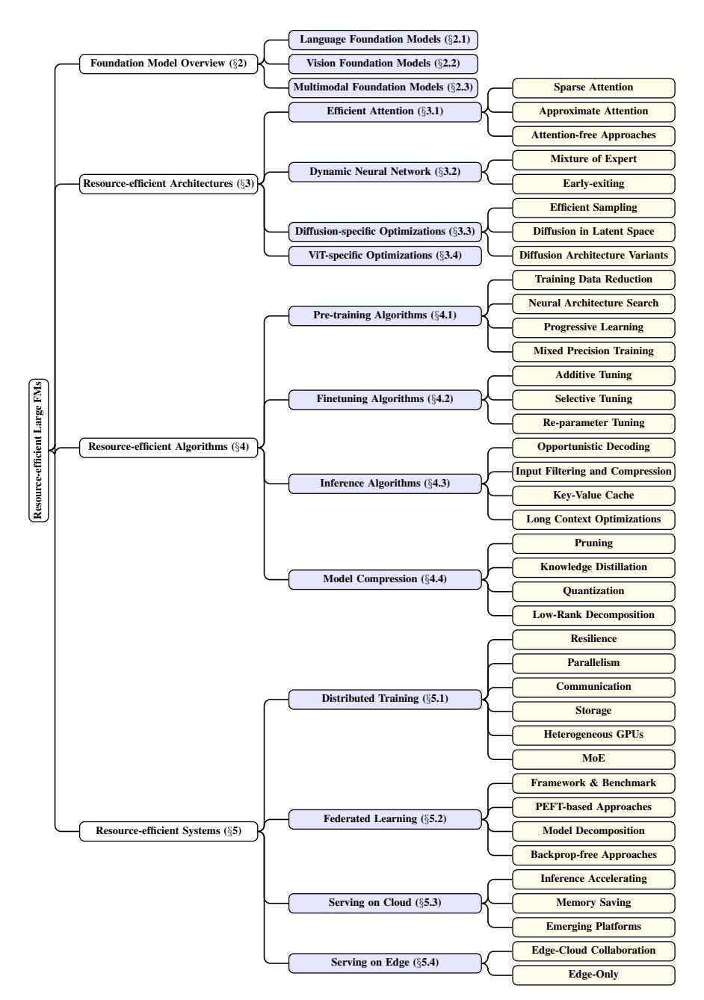
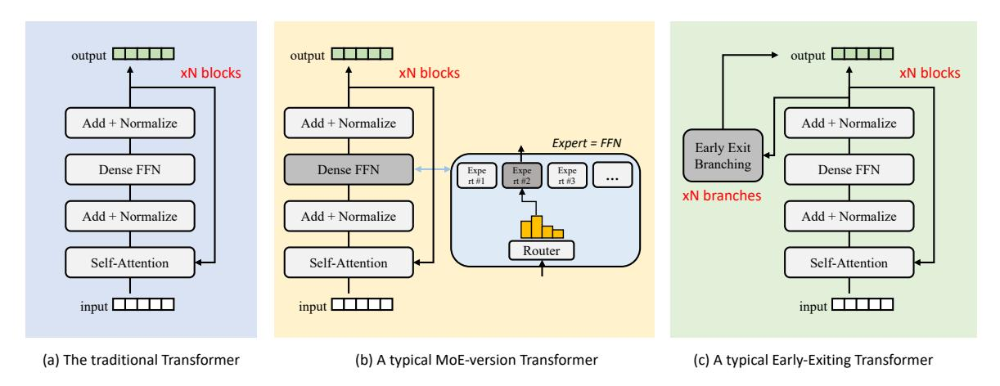
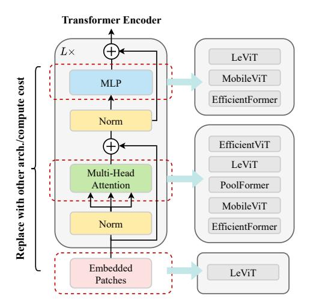
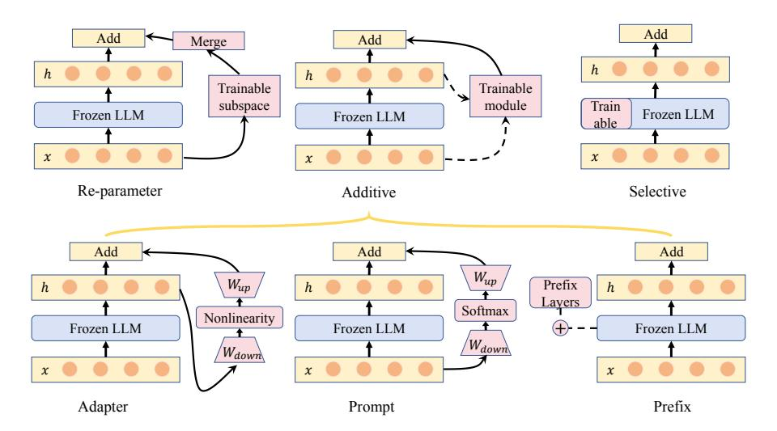
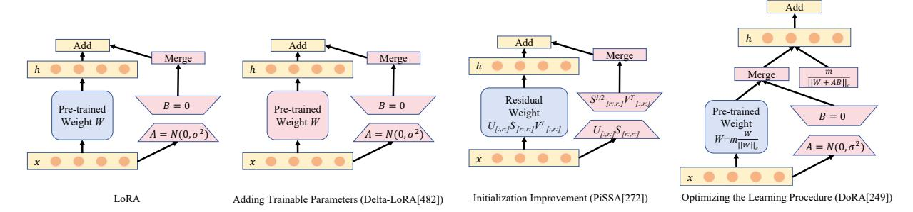
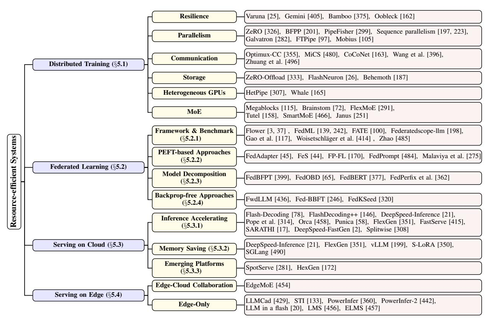

# A SURVEY OF RESOURCE-EFFICIENT LLM AND MULTIMODAL FOUNDATION MODELS

Mengwei Xu‡, Wangsong Yin†, Dongqi Cai‡, Rongjie Yi‡, Daliang Xu†, Qipeng Wang†, Bingyang Wu†, Yihao Zhao†, Chen Yang‡, Shihe Wang‡, Qiyang Zhang‡, Zhenyan Lu‡, Li Zhang‡, Shangguang Wang‡, Yuanchun Li†, Yunxin Liu†, Xin Jin†, Xuanzhe Liu†

- ♣ Beijing University of Posts and Telecommunications (BUPT)
  - ◆ Peking University (PKU)
  - **♥** Tsinghua University (THU)

Contact: mwx@bupt.edu.cn
Website: https:github.com/UbiquitousLearning/Efficient\_Foundation\_Model\_Survey

#### **ABSTRACT**

Large foundation models, including large language models (LLMs), vision transformers (ViTs), diffusion, and LLM-based multimodal models, are revolutionizing the entire machine learning lifecycle, from training to deployment. However, the substantial advancements in versatility and performance these models offer come at a significant cost in terms of hardware resources. To support the growth of these large models in a scalable and environmentally sustainable way, there has been a considerable focus on developing resource-efficient strategies. This survey delves into the critical importance of such research, examining both algorithmic and systemic aspects. It offers a comprehensive analysis and valuable insights gleaned from existing literature, encompassing a broad array of topics from cutting-edge model architectures and training/serving algorithms to practical system designs and implementations. The goal of this survey is to provide an overarching understanding of how current approaches are tackling the resource challenges posed by large foundation models and to potentially inspire future breakthroughs in this field.

**Keywords** Foundation Model · Large Language Model · Vision Transformer · Diffusion Model · Multimodal LLM · Model Compression · Machine Learning System · Serving System · Pre-training · Fine-tuning · Edge Intelligence

#### 1 INTRODUCTION

In the rapidly evolving field of artificial intelligence (AI), a paradigm shift is underway. We are witnessing the transition from specialized, fragmented deep learning models to versatile, one-size-fits-all foundation models. These advanced AI systems are capable of operating in an open-world context, interacting with open vocabularies and image pixels for unseen AI tasks, i.e., zero-shot abilities. They are exemplified by (1) Large Language Models (LLMs) such as GPTs [41] that can ingest almost every NLP task in the form as a prompt; (2) Vision Transformers Models (ViTs) such as Masked Autoencoder [141] that can handle various downstream vision tasks; (3) Latent Diffusion Models (LDMs) such as Stable Diffusion [336] that generate high-quality images with arbitrary text-based prompts; (4) Multimodal models such as CLIP [321] and ImageBind [123] that map different modal data into the same latent space and are widely used as backbone for cross-modality tasks like image retrieval/search and visual-question answering. Such flexibility and generality marks a significant departure from the earlier era of AI, setting a new standard for how AI interfaces with the world.

The success of these foundation models is deeply rooted in their scalability: unlike their predecessors, these models' accuracy and generalization ability can continuously expand with more data or parameters, without altering the underlying simple algorithms and architectures. An impressive evidence is the scaling law [177]: it describes how the performance of transformer-based models can predictably improve with more model size and data volume; until

Figure 1: The electricity consumption comparison between countries and AI. Data source: [\[81\]](#page-41-0).

today, the scaling law stands still. This scalability is not just a matter of model size; it extends to their ability to tackle increasingly complex tasks, making them a cornerstone in the journey towards artificial general intelligence (AGI).

However, the scalability comes at a cost of huge resource demand. Foundation models, by their very nature, are resource-hungry for training and deployment. These resources encompass not only the computing processors like GPUs and TPUs, but also the memory, energy, and network bandwidth. For example, the pre-training of LLaMa-2- 70B takes 1.7× millions of GPU hours and consumes 2.5×1012 Joules of energy. The estimated total emissions were 291 tons of CO2 equivalent. Beyond training, the data processing, experimentation, and inference stages consume comparable or even more electricity according to Meta AI [\[416\]](#page-60-0). A recent analysis [\[81\]](#page-41-0) reveals that, to satisfy the continuation of the current trends in AI capacity and adoption, NVIDIA needs to ship 1.5 million AI server units per year by 2027. These servers, running at full capacity, would consume at least 85.4 terawatt-hours of electricity annuall – more than what many countries like New Zealand and Austria use in a whole year, as illustrated in Figure [1.](#page-1-0) Since foundation models proceed growth in size and complexity, their resource requirements escalate, often exponentially, posing a significant challenge in their development and deployment.

The huge resource footprint of large foundation model also hinders its democratization. Till the end of 2023, there are only a few major players capable of training and deploying the state-of-the-art foundation models, who thereby have powerful control over the public and can potentially manipulate them in a way they prefer. The models are served on clouds instead of devices as many lightweight DNNs do [\[434,](#page-61-0) [476\]](#page-63-0); it makes data privacy preservation almost impossible. Though recently, smartphone vendors have been boasting about running large foundation models locally and some pioneering engines are developed for on-device LLMs [\[121,](#page-43-0) [11,](#page-38-0) [10\]](#page-38-1), the models demonstrated are limited to relatively small scale (e.g., <10B) [\[266\]](#page-51-0) and have not yet seen real-world deployment.

Thereby, a significant amount of research has been dedicated to enhance the efficiency of these foundation models. These efforts span a wide range of approaches, from optimizing algorithms to system-level innovations, focusing on reducing the resource footprint of these models without compromising their performance. This survey aims to delve into these research efforts, exploring the diverse strategies employed to make foundation models more resource-efficient. We will examine advancements in algorithmic efficiency, system optimizations, data management techniques, and the development of novel architectures that are less resource-intensive. The survey also spans from clouds to edge and devices, where the large foundation models gain dramatic attentions as well. Through this exploration, we aim to provide a comprehensive understanding of the current state and future directions of resource-efficient algorithms and systems in the realm of foundation models.

Scope and rationales. The scope of this survey is mainly defined by following aspects. (i) We survey only algorithm and system innovations; we exclude a huge body of work at hardware design, which is equally important but has been already wrapped up well [\[192,](#page-47-0) [185\]](#page-47-1). (ii) The definition of resource in this survey is limited to mainly physical ones, including computing, memory, storage, bandwidth, etc; we exclude training data (labels) and privacy that can also be regarded as resources; (iii) We mainly survey papers published on top-tier CS conferences, i.e., those included in

Figure 2: The organization of this survey.

CSRankings. We also manually pick related and potentially high-impact papers from arXiv. (iv) We mainly survey papers published after the year of 2020, since the innovation of AI is going fast with old knowledge and methods being overturned frequently.

Organization. Figure [2](#page-2-0) illustrates the organization of this survey.

Full open-source. All materials of this survey are freely available at:

[https:github.com/UbiquitousLearning/Efficient\\_Foundation\\_Model\\_Survey](https:github.com/UbiquitousLearning/Efficient_Foundation_Model_Survey)

Figure 3: The evolutionary trace of foundation models.

#### 2 FOUNDATION MODEL OVERVIEW

#### 2.1 Language Foundation Models

This section includes a discussion of both text-based and speech-based language models, highlighting their key architecture and milestone models.

#### 2.1.1 Model Architectures

**Transformer pipeline.** Vaswani et al. [388] introduced the attention-based Transformer architecture, a foundational element in the development of most Large FMs. As depicted in Figure 3, the process initiates by converting input words into high-dimensional vectors through an embedding layer. During processing, attention mechanisms assign varying weights to different segments of these input vectors. Following attention, layer normalization is applied to the output, ensuring stabilization and standardization of the activations. Subsequently, each position-wise vector undergoes transformation through a feedforward network, introducing non-linearity and enabling the model to capture complex data patterns. Through multiple layers that incorporate these components, the Transformer learns hierarchical representations of the input data. In the final stage, the output from the last Transformer layer is directed into a linear layer, culminating in the final prediction. We briefly outlines the key components of Large FMs as follows:

**Embedding.** Initially, the input word is transformed into a sequence of tokens by a tokenizer. Commonly used tokenizers, such as wordpiece and byte-pair encoding, are frequently employed in this process [380]. Following tokenization, a learned embedding layer converts these tokens into a sequence of vectors. In such sequences, the order of words is essential for meaning. To address this, position encoding is incorporated into the embeddings, infusing them with positional information. This addition is critical for capturing the sequential nature of the input, ensuring that the model accurately interprets word order and context.

**Attention.** Attention mechanisms play a crucial role in capturing the relationships between words in a sequence. The calculation of attention can be represented as:

$$A(Q, K, V) = \operatorname{softmax}\left(\frac{QK^T}{\sqrt{d_k}}\right)V \tag{1}$$

where Q, K, and V represent the query, key, and value, respectively; each derived by multiplying the input vector with a distinct weight matrix, and  $d_k$  denotes the dimension of these vectors. Self-attention, a specific form of attention where queries, keys, and values all originate from the same input sequence, enables the model to focus on different segments of the input for each position. In contrast, multi-head attention, a variation of self-attention, permits simultaneous attention to information from diverse representation subspaces at different positions. Other variants, such as sparse attention [36] and multi-query attention [346], are tailored for efficiency or various downstream tasks. These variants are further detailed in  $\S 3.1, \S 4.3.3$  and  $\S 4.3.4$ .

**Encoder-decoder architecture.** The standard Transformer architecture consists of two main components: an encoder and a decoder. Encoder processes the input sequence through self-attention mechanisms, allowing the model to assign varying weights to different segments of the input sequence based on their relative importance. This feature is crucial for discerning complex patterns and dependencies within the input data. In contrast, the decoder is responsible for generating the output sequence. Decoder utilizes self-attention mechanisms to understand the relationships within the generated output so far. Additionally, the decoder incorporates cross-attention mechanisms, focusing on the input sequence to extract relevant information for each token in the output sequence. This part of the architecture is autoregressive, generating tokens sequentially. The production of each token depends on the tokens generated previously, unlike the parallel processing approach of the encoder.

Auto-regressive decoding and KV cache. In auto-regressive decoding, the decoder function  $F_{Decoder}$  infers a new token  $x_{i+1}$  based on the input token sequence  $X = \{x_1, x_2, ..., x_i\}$ . Subsequently,  $x_{i+1}$  is added to X for the next inference step, constituting auto-regressive decoding. Key-Value (KV) cache [76] enhances efficiency by storing intermediate states of the attention mechanism at each step. This approach prevents recalculation of tokens processed in earlier steps. While mitigating re-computation, KV cache introduces additional storage or memory overhead, detailed in §2.1.3.

#### 2.1.2 Representative Models and Downstream Tasks

**Encoder-only FMs.** BERT [88] is an encoder-only Transformer model that utilizes a bidirectional masked language modeling approach during pre-training. In this approach, random words within a sentence are masked, and the model learns to predict these masked words by considering contextual clues. Fine-tuning BERT for various downstream tasks has led to SOTA performance, particularly in discriminative tasks like sentiment analysis and text classification. DistilBERT [340] is a distilled version of BERT, being 40% smaller and 60% faster, yet retaining 97% of BERT's language comprehension capabilities. RoBERTa [256] enhances BERT's efficacy through robust optimization techniques, including extended training duration, increased batch sizes, and a larger data corpus. Sentence-BERT [332] modifies BERT to generate semantically meaningful sentence embeddings. Employing siamese and triplet network structures, these embeddings can be directly compared using cosine similarity. This model has evolved into the widely utilized sentence-transformer tool1, specializing in sentence embedding.

**Encoder-decoder FMs.** T5 [325] employs an encoder-decoder architecture and is self-supervised, undergoing pretraining on the C4 dataset. This model introduces a unified framework that converts diverse text-based language problems into a text-to-text format, rendering it applicable to tasks such as summarization and question answering. BART [210] serves as a denoising autoencoder in the pretraining phase, introducing corruption to text through an arbitrary noising function. The primary objective is to learn the reconstruction of the original text.

**Decoder-only FMs.** The GPT family [323, 324, 41] utilizes a decoder-only architecture for unsupervised training. GPT-1 [323], the inaugural model in the series, features a transformer architecture with 117 million parameters and demonstrates the efficacy of pre-training on diverse internet text. GPT-2 [324], an enlarged iteration of GPT-1, undergoes unsupervised training on WebText, a dataset encompassing millions of webpages. GPT-3 [41] represents a substantial increase in model size with 175 billion parameters, highlighting the advantages of scaling up. It demonstrated exceptional zero-shot performance. Instruct tuning [300] further enhances the model's capability to accurately follow instructions using human feedback, contributing to the creation of several open-source foundation models, including LLaMA [383]. GLM [95] improves blank filling pretraining by adding 2D positional encodings and allowing an arbitrary order to predict spans, which results in performance gains over BERT and T5 on NLU tasks. PaLM [70] was trained on 6144 TPU v4 chips using Pathways to further understand of the impact of model scale on few-shot learning. Additionally, there are numerous close-sourced generative large FMs, including GPT-42, Claude23, and PaLM 24, among others.

1https://www.sbert.net/

2https://openai.com/gpt-4

3https://www.anthropic.com/index/claude-2

4https://ai.google/discover/palm2

| Year         | Model Name          | Model Arch.     | Oriented Tasks                                                 | Parameters   Pre-training Method   Pre-training Datasets |                                                                    | Testing Datasets                                                          |                                                   |
|--------------|---------------------|-----------------|----------------------------------------------------------------|----------------------------------------------------------|--------------------------------------------------------------------|---------------------------------------------------------------------------|---------------------------------------------------|
| 2018         | BERT [88]           | Encoder-Only    | Text-CLS, Token-CLS, Fill-Mask, QA, Translation, etc. | 110-340M                                                 | Self-Supervised                                                    | Bookscorpus, Enlish Wikipedia                                          | GLUE, SquAD v1.1/2.0, SWAG, IMDb         |
| 2019         | DistilBERT [340]    | Encoder-Only    | Same as BERT                                                   | 66M                                                      | Self-Supervised, Distillation                                   | Same as BERT                                                              | GLUE, SquAD, IMDb                              |
| 2019         | RoBERTa [256]       | Encoder-Only    | Same as BERT                                                   | 125-355M                                                 | Self-Supervised                                                    | Boookcorpus, CC-news, Openwebtext, Stories                       | GLUE, SQuAD, RACE                              |
| 2019         | Sentence-BERT [332] | Encoder-Only    | Text Similarity                                                | 110M                                                     | Only Fine-tuning                                                   | SNLI, Multi-Genre NLI                                                     | STSb                                              |
| 2019         | BART [210]          | Encoder-Decoder | Same as BERT                                                   | 140-400M                                                 | Self-Supervised                                                    | Boookcorpus, CC-news, Openwebtext, Stories                             | SQuAD, MNLI, ELI5, XSum, ConvAI2, CNN/DM    |
| 2019         | T5 [325]            | Encoder-Decoder | Same as BERT                                                   | 60M-11B                                                  | Self-Supervised                                                    | Colossal Clean Crawled Corpus                                          | GLUE, CNNDM, SQuAD, SGLUE, EnDe, EnFr, EnRO |
| 2018         | GPT-1 [323]         | Decoder-Only    | Same as BERT                                                   | 117M                                                     | Self-Supervised                                                    | BooksCorpus, English Wikipedia                                         | SQuAD, SNLI                                       |
| 2019         | GPT-2 [324]         | Decoder-Only    | Same as BERT                                                   | 1.5B                                                     | Self-Supervised                                                    | WebText                                                                   | SQuAD, CoQA, WMT, CNN/Daily Mail            |
| 2020         | GPT-3 [41]          | Decoder-Only    | Same as BERT                                                   | 175B                                                     | Unsupervised                                                       | Common Crawl, WebText2 Books1/2, Wikipedia                             | LAMBADA, CBT, SuperGLUE                        |
| 2021         | GLM [95]            | Decoder-Only    | Same as BERT                                                   | 110M-130B                                                | Unsupervised                                                       | BooksCorpus, English Wikipedia                                         | SuperGLUE                                         |
| 2022         | InsturctGPT [300]   | Decoder-Only    | Same as BERT                                                   | 175B                                                     | Unsupervised RLHF                                               | Common Crawl, WebText2 Books1/2, Wikipedia                             | LAMBADA, CBT, SuperGLUE                        |
| 2022         | PaLM [70]           | Decoder-Only    | Same as BERT                                                   | 54B                                                      | Unsupervised                                                       | Mixture of 780B Text Source code                                       | English NLP, BIG-bench Reasoning, Code, etc.   |
| 2020         | wav2vec2 [28]       | Encoder-Decoder | Auto Speech Recognition                                     | 227-896M                                                 | Self-Supervised                                                    | LibriSpeech, Unlabeled Audio Data                                      | LibriSpeech, TIMIT, Common Voice            |
| 2021         | HuBERT [148]        | Encoder-Decoder | Auto Speech Recognition                                     | 281M-2.8B                                                | Self-Supervised                                                    | Libri-Light, LibriSpeech                                               | LibriSpeech, TIMIT                             |
| 2023         | Whisper [322]       | Encoder-Decoder | Auto Speech Recognition                                     | 39-1150M                                                 | Self-Supervised Multi-task Learning                             | Unkown                                                                    | LibriSpeech, Multi-lingual dataset             |
| 2023         | LLaMA [383]         | Decoder-Only    | Text Generation                                                | 7-70B                                                    | Self-Supervised RLHF                                            | Common Crawl, C4, Github, Wikipedia, Books, ArXiv, StackExchange | TruthfulQA, ToxiGen, etc.                      |
| 2023         | GPT-4 [295]         | Close-Sourced   | Text Generation                                                |                                                          | MMLU, HellaSwag, ARC, WinoGrande, HumanEval, DROP, GSM-8K |                                                                           |                                                   |
| 2023 2023 | Claude2 PaLM2    | T 11 1 M'1      |                                                                | C 1.1                                                    | Close-Sourced                                                      |                                                                           |                                                   |

Table 1: Milestone language foundation models and their typical tasks.

**Speech FMs.** Speech large FMs [322, 28, 148] have been engineered to derive meaningful representations from raw audio signals. Wav2vec 2.0 [28] showcases, for the first time, that acquiring robust speech representations from unlabeled data could significantly improve performance in subsequent speech-related tasks. These models typically employ convolutional neural network to extract serial features and a transformer to capture contextual information. This approach is effective for various downstream tasks, including speech recognition and spoken language understanding. For instance, HuBERT [148] leverages a transformer-based architecture for self-supervised learning of speech representations, trained on the 960-hour LibriSpeech audio dataset [305]. Whisper [322] represents a state-of-the-art open-sourced automatic speech recognition system, trained on a vast corpus of 680,000 hours of multilingual and multitask supervised data sourced from the web.

#### 2.1.3 Cost Analysis

As depicted in Figure 4, we analyze the computational and storage costs associated with the primary components of large FMs5. The embedding component constitutes a significant portion of storage costs, approximately 25% of the total. However, during inference, the embedding functions as a lookup table, incurring minimal computational costs. The FFN layer emerges as the most computation-intensive component, primarily due to the presence of two fully connected layers in each FFN block. Im\_head, which signifies the output layer of the model, varies depending on the task. For discriminative tasks like BERT, it takes the form of a classification layer with a softmax activation function, whereas for generative tasks like GPT/T5, it manifests as a linear layer. The size of this component is directly proportional to the vocabulary size.

&lt;sup>5The analysis is conducted using the flops-profiler tool [4].

Figure 4: Weight storage and FLOPs cost of different language FMs. Input sequence length is 128.

Figure 5: Inference FLOPs with different token length on GPT-2.

Cost Analysis Under Different Token Lengths. The attention mechanism in large FMs faces significant computational bottlenecks primarily due to its quadratic complexity. This complexity stems from calculating attention scores for every pair of positions within the input sequence, posing challenges in managing long sequences and impacting both training and inference efficiency. Additionally, beyond the attention mechanism, the computation complexity of the FFN scales linearly with input length but quadratically with the model's dimension. As depicted in Figure [5,](#page-6-0) an increase in the length of the input sequence causes a substantial rise in computational demand, attributable to the quadratic nature of the attention mechanism. In quantitative terms, the computation complexity of attention is O(T 2D), while that of FFN is O(T D2 ), where T represents the sequence length and D the hidden state dimension of the model [\[244\]](#page-50-0). The decoder's attention mechanism, similar to that in the encoder, also experiences quadratic scaling with token length. This aspect becomes particularly significant in autoregressive decoding tasks, where each token's generation depends on the preceding ones, intensifying computational requirements. The implementation of a KV cache in the decoder can substantially mitigate computational costs by reusing key and value vectors across various positions. However, this comes at the expense of additional memory requirements [\[199\]](#page-48-1). Assuming that B represents the batch size, S the sequence length, D the size of the hidden dimension, and L the number of layers in the Transformer decoder, the memory required for storing the KV cache in single-precision format can be calculated as (B × S × D × L × 2 × 4) Bytes. This formula considers the dimensions of the batch, sequence, and hidden layer, as well as the number of layers in the decoder, with the factor of 2 representing the key and value in the cache and the factor of 4 accounting for the byte size of single-precision floating-point representation.

Speech-specific Considerations. In speech processing applications, CNN encoder block plays a significant role in computational complexity. The initial layers of the CNN block demand substantially more compute power, often exceeding that of each individual transformer layer by an order of magnitude. The increased requirement is attributed to the convolutional operations intrinsic to the CNN block, where a large number of calculations must be performed for each input token. For instance, despite the transformer having 19× more parameters, wav2vec 2.0 model [\[28\]](#page-39-2) incurs only 1.8× more computational load compared to the CNN block [\[117\]](#page-43-1).

# 2.2 Vision Foundation Models

#### 2.2.1 Model Architecture

The advancements in transformers have propelled the emergence of foundation models in the field of computer vision.

Vision Transformer pipeline. Vision Transformer (ViT) is the most classic transformer-empowered vision model. It is inspired by the growing trend of self-supervised pre-trained NLP models like BERT, which is encoder-only. Given an input image, ViT firstly splits image into fixed-size patches (i.e., tokens) by a convolutional embedding layer. For instance, a standard size RGB image input (i.e., 3×224×224) will be splitted to 14×14 patches with 16×16 pixels. This embedding overhead is almost negligible compared to the following compute-intensive transformer encoder (e.g., less than 5%). Besides, an extra learnable classification token ([CLS]) is added to the token sequence in order to perform classification. After that, positional embeddings are added into each token, and tokens are fed to a standard Transformer encoder, which has been depicted in Figure [3](#page-3-2) and §[2.1.](#page-3-1) Depending on the specific downstream tasks,

| Year | Model Name                 | Model Arch.     | Oriented Tasks                                                                          | Parameters                                                     | Pre-training Method           | Pre-training Datasets | Testing Datasets                                                           |
|------|----------------------------|-----------------|-----------------------------------------------------------------------------------------|----------------------------------------------------------------|-------------------------------|-----------------------|----------------------------------------------------------------------------|
| 2020 | DETR [49]                  | Encoder-Decoder | Object Detection Instance Segmentation Panoptic Segmentation                            | 40M                                                            | Supervised                    | COCO-2017             | COCO-2017                                                                  |
| 2020 | ImageGPT [59]              | Decoder Only    | Unconditional/Conditional Image Generation                                           | 3.7M-82M                                                       | Self-Supervised               | ImageNet-1K           | CIFAR-10 CIFAR-100 STL-10 ImageNet                                |
| 2021 | Vision Transformer [92] | Encoder Only    | Image Classification                                                                    | 86M-632M ViT Base: 86M ViT Large: 307M ViT Huge: 632M | Supervised Self-Supervised | ImageNet-21K          | ImageNet-1K                                                                |
| 2021 | DeiT [382]                 | Encoder Only    | Image Classification                                                                    | 5M-88M                                                         | Distilled                     | ImageNet-1K           | ImageNet CIFAR-10 CIFAR-100 Flowers Cars iNat-18 iNat-19 |
| 2021 | SegFormer [427]            | Encoder-Decoder | Segmentation                                                                            | 3.7M-82M                                                       | supervised                    | Imagenet-1K           | Cityscapes ADE20K COCO-Stuff                                         |
| 2021 | YOLOS [102]                | Encoder Only    | Object Detection                                                                        | 5M                                                             | Supervised Self-supervised | ImageNet-1K           | COCO                                                                       |
| 2022 | Swin Transformer [260]  | Encoder Only    | Image Classification Object Detection Semantic Segmentation Video Action Classification | 26M                                                            | Self-Supervised               | ImageNet-22K          | ImageNet-1K ADE20K COCO Object 365 v2                             |
| 2022 | ViTMAE [141]               | Encoder Only    | Image Classification                                                                    | 86M-632M                                                       | Self-Supervised               | ImageNet-1K           | COCO ADE20K iNat Places                                           |
| 2022 | ViTDet [228]               | Encoder Only    | Object Detection                                                                        | 86M-632M                                                       | Self-Supervised MAE        | ImageNet-1K           | COCO                                                                       |
| 2022 | BEiT [33]                  | Encoder Only    | Image Classification Semantic Segmentation                                           | 86M-632M                                                       | Self-Supervised               | ImageNet-1K           | ImageNet-1K ADE20K                                                      |
| 2023 | DINOv2 [297]               | Encoder Only    | Image Classification                                                                    | 1.1B                                                           | Self-Supervised               | LVD-142M              | ImageNet-1K Im-A ADE-20k Oxford-M                                 |
| 2023 | LVM [30]                   | Encoder-Decoder | Semantic Segmentation Depth Estimation Surface Normal Estimation Edge Detection         | 300M-3B                                                        | Self-Supervised               | UVD-v1                | Kinetics-700 ImageNet                                                   |

Table 2: Milestone vision FMs and their typical tasks.

the hidden states generated by the Transformer encoder are finally fed into different heads, such as classification, detection, segmentation, etc.

#### 2.2.2 Representative Models and Downstream Tasks

**Encoder-only.** Most visual foundation models are encoder-only architecture. ViT [92] is the first work that successfully trains a Transformer encoder on ImageNet, with alignment to BERT in terms of parameter amount. It performs both supervised and self-supervised pre-training on a large-scale ImageNet-21k dataset. Although it shows competitive accuracy and scalabilty, its demand for training data compared to traditional CNNs is still an obstacle. To this end, DeiT [382] is proposed with much impact. DeiT performs a distillation-empowered pre-training, which enhances the data-efficiency of ViT training.

Another storyline is to push the boundary of self-supervised ViT pre-training. BEiT [33] turns the pre-training objective to recover the original visual tokens based on the corrupted image patches. The authors claim that BEiT is "a path to the BERT moment of CV". MAE [141] introduces a lightweight decoder to the encoder training for reconstructing the masked patches. MAE can effectively mask out most of the patches (by even 80%). Thereby, the training of the encoders can be very cost-effective, which paves the way for large pre-trained vision models.

YOLOS [102] is an object detection model built atop ViT. It demonstrates the transferability of the vanilla ViT pretrained on mid-sized ImageNet-1k to the more challenging COCO object detection benchmark. ViTDet [228] enables a plain, non-hierarchical ViT to serve as a backbone network for object detection. ViTDet allows the original ViT architecture to be fine-tuned for object detection without needing to redesign a hierarchical backbone for MAE-style pre-training. Swin Transformer [260] is a representative work that optimizes the attention mechanism. This model is a hierarchical ViT whose representation is computed with shifted windows. DINOv2 [297] conducts training on a ViT model with 1 billion parameters and then distills it into a set of smaller models that outperform the leading all-purpose features, such as OpenCLIP, on the majority of benchmarks at both image and pixel levels. Encoder-decoder. DETR [\[49\]](#page-40-0) is an early effort to build an end-to-end detection pipeline with transformers. The architecture of DETR is cascaded: it consists of a CNN backbone and an encoder-decoder transformer. DETR supports object detection, instance segmentation and panoptic segmentation through supervised training. The parameter amount of DETR aligns with Faster-RCNN [\[334\]](#page-56-4), which has about 40M parameters. SegFormer [\[427\]](#page-61-1) is a semantic segmentation model which unifies Transformers with lightweight multilayer perception (MLP) decoders. LVM [\[30\]](#page-39-4) has achieved effective learning of visual information using a purely visual approach through image sequence modeling, without the need for any linguistic data.

#### 2.2.3 Cost Analysis

Due to the alignment of ViT's architecture with BERT, its resource consumption is also similar. However, unlike language models such as BERT, visual models typically have fixed-length inputs. For standard image inputs, such as 14×14 patches or 16×16 patches, the computational bottleneck lies in the fully connected layers in the FFN and attention. Please refer to §[2.1](#page-3-1) for more details.

# 2.3 Multimodal Foundation Models

Multimodality is currently a hot research direction in FM research. A large FM often exhibits strong capabilities in cross-modal understanding, translation, and generation.

In general, there are two lines of research on multimodal FMs: one is to encode data in different modalities into the same latent space, mostly adopting transformer encoders; the other one is to generate data in different modalities, often using transformer decoders. Specifically, the multimodal generation mainly centers around text-based image generation, a challenging and realistic ML task that sees great advancements in recent years. The two lines of research have convergence, e.g., multimodal-to-multimodal (or even any-to-any) generation.

#### 2.3.1 Key Architectures

To ingest and align multimodal input data, existing model architectures typically consist of multiple encoders, with each modality having its own set of transformer encoders. Notably, these encoders are generally trained from scratch, utilizing paired data with the aligned modalities and current modality. Upon receiving input from diverse modalities, they initially encode this data into normalized, fixed-dimensional embeddings. By mapping these embeddings to a high-dimensional space and designing a loss function, researchers aim to minimize the distance between different modalities in the joint semantic space. This approach aligns different modalities and enhances the consistency of their representations.

With multimodal data aligned, existing research either (i) reuse the LLM that is trained on pure text corpora to generate text; (ii) or diffusion models to generate high-quality image pixels. In the first case, the LLM module is designed to comprehend, reason about, and produce output based on input data aligned with the text modality. This module typically adopts a decoder-only architecture. Due to extensive pretraining on numerous large-scale corpus datasets, LLMs are endowed with rich semantic knowledge. This enables them to effectively comprehend data embedded within the text modality and generate text-based output in an autoregressive fashion when performing specific tasks. In the second case, the diffusion module aims to generate high-quality images by eliminating redundant noise present in the input image. In the training stage, the models introduce noise into an image, transforming it into a random state. In contrast, during the inference stage, this process is reversed, gradually removing the noise. This denoising process is essential for improving image clarity, leading to images with high resolution and detailed sharpness. Stable diffusion models have significantly progressed this technology, showcasing distinctive capabilities in generating high-quality images customized to specific textual and pictorial descriptions. In addition to the multimodal embedding input, the diffusion module primarily consists of two components: an image encoder/decoder and a denoising network.

*Image Encoder/Decoder*. Diffusion model is the state-of-the-art approach for text-to-image generation. The encoder takes an input image and compresses it into a lower-dimensional latent representation. This compression is vital for reducing the computational load and enhancing the model's efficiency. The decoder operates in reverse, taking the latent representation and reconstructing it back into a high-resolution image. This process is critical for the model's capability to generate detailed visual content. Variational autoencoder (VAE) [\[189\]](#page-47-2) is a generative model that is employed to learn the latent space of the image. VAE consists of an encoder and a decoder: the encoder is responsible for mapping the image to the latent space, while the decoder is responsible for mapping the latent space to the image space. Both encoder and decoder networks are often built with convolutional neural layers. VAE is trained by minimizing the reconstruction loss and the KL divergence loss. The reconstruction loss is responsible for ensuring that the image generated by the decoder is similar to the original image, while the KL divergence loss is responsible for ensuring that the latent space is similar to the standard normal distribution. VAE is employed in the diffusion model

| Year | Model Name               | Model Arch.     | Oriented Tasks                                                                          | Parameters Pre-training Method                                                            |                               | Pre-training Datasets                                                                                                                                                                                                                                                                 | Testing Datasets                                                                                  |
|------|--------------------------|-----------------|-----------------------------------------------------------------------------------------|-------------------------------------------------------------------------------------------|-------------------------------|---------------------------------------------------------------------------------------------------------------------------------------------------------------------------------------------------------------------------------------------------------------------------------------|---------------------------------------------------------------------------------------------------|
| 2021 | DALL-E [327]             | Encoder-Decoder | Cross-Modal Generation                                                                  | 12B Supervised                                                                            |                               | MS-COCO YFCC100M                                                                                                                                                                                                                                                                   | MS-COCO CUB                                                                                    |
| 2021 | CLIP [321]               | Encoder-Only    | Cross-Modal Generation                                                                  | 400M-1.6B CLIP-ViT-B: 400M CLIP-RN50: 400M CLIP-RN101: 500M CLIP-RN50*4: 1.6B | Supervised Self-Supervised | WebImageText                                                                                                                                                                                                                                                                          | NYU-D                                                                                             |
| 2021 | Stable Diffusion [336]   | Encoder-Decoder | Image Synthesis                                                                         | LDM (LAION): 1.45B SD2.1: 1.3B                                                         | Supervised                    | CelebA-HQ FFHQ LSUN ImageNet LAION                                                                                                                                                                                                                                        | CelebA-HQ FFHQ LSUN ImageNet LAION                                                    |
| 2022 | Flamingo [19]            | Encoder-Decoder | Visual Question Answering Image Caption                                              | 3B 9B 80B                                                                           | Supervised                    | M3W ALIGN LTIP VTP                                                                                                                                                                                                                                                           | COCO, VATEX VizWiz, MSRVTTQA VisDial, YouCook2 TextVQA, HatefulMeme                               |
| 2023 | SAM [190]                | Encoder-Decoder | Edge Detection Object Proposal Generation Instance Segmentation Text-to-mask Prediction | 1B                                                                                        | Supervised                    | COCO SA-1B LVIS V1 ADE20K Open Images V5                                                                                                                                                                                                                                  | SA-1B                                                                                             |
| 2023 | ImageBind [123]          | Encoder-Only    | Modal Alignment                                                                         | 1.2B                                                                                      | Supervised                    | Image-text pairs from large-scale web data                                                                                                                                                                                                                                         | ImageNet-IN1K Places-365-P365 Kinetics400-K400 MSR-VTT, NYU-D SUN-D, AS-A, VGGS ESC, LLVIP, Ego4D |
| 2023 | CoDi [372]               | Encoder-Decoder | Cross-Modal Generation                                                                  | 3.5B                                                                                      | Supervised                    | Laion400M Freesound 500K WebVid HD-Villa-100M ACAV100M                                                                                                                                                                                                                    | AudioCaps MSR-VTT                                                                              |
| 2023 | Consistance Models [358] | Encoder-Decoder | Image Synthesis                                                                         | ImageNet: 281M LSRN: 500M Supervised                                                   |                               | ImageNet LSUN                                                                                                                                                                                                                                                                      | ImageNet LSUN                                                                                  |
| 2023 | NExT-GPT [419]           | Encoder-Decoder | Cross-Modal Generation                                                                  | 9.1B-10B                                                                                  | Supervised                    | X-caption                                                                                                                                                                                                                                                                             | MSR-VTT, AudioCaps MosIT, COCO-caption COCO, DAVIS, VCTK                                    |
| 2023 | MiniGPT-4 [494]          | Encoder-Decoder | Cross-Modal Generation                                                                  | 13B Supervised                                                                            |                               | Conceptual Caption SBU, LAION                                                                                                                                                                                                                                                      | Localized Narratives AOK-VQA, GQA                                                              |
| 2023 | GPT-4V [296]             | Close-Sourced   | Cross-Modal Generation                                                                  |                                                                                           | Close-Sourced                 |                                                                                                                                                                                                                                                                                       | COCO ADE20K Flickr30K RefCOCO DAVIS2017                                               |
| 2023 | LLaVA [248]              | Encoder-Decoder | Visual Chat Optical Character Recognition Science Question Answering              | 7B 13B                                                                                 | Supervised                    | CC LAION COCO CC3M                                                                                                                                                                                                                                                           | LLaVA-Bench (COCO) LLaVA-Bench (In-the-Wild) ScienceQA                                      |
| 2023 | Gemini [374]             | Close-Sourced   | Cross-Modal Generation                                                                  | Gemini-Nano1: 1.8B Gemini-Nano2: 3.25B  Close-Sourced                                     |                               | MMLU, GSM8K, ChartQA BIG-Bench-Hard, HumanEval NaturalZode, DROP, HellaSwag WMT23, MBPP, NaturalQuestions TydiQA, BoolQ, MGSM, XLsum AI2D, MMMU, TextVQA, DocVQA MATH, InfographicVQA, Wikilingua XM-3600, VATEX, ActivityNet-QA NextQA, Perception Test MCQA |                                                                                                   |

Table 3: Milestone multimodal FMs and their typical tasks.

to learn the latent space of the image. Another variant of VAE model that is often employed in diffusion tasks is VQ-VAE [387], to learn the latent space of the image through a vector quantization layer. The vector quantization layer applies the vector quantization technique, quantizing each pixel of the image to the nearest codebook vector. In this way, the VQ-VAE model can encode and decode the image in a more efficient way.

Denoising Network. Denoising network progressively removes noise from the encoded images by predicting the noise distribution and evicting it through sampling algorithms, such as DDPM [144] and DDIM [356]. Initially, during the training phase, the model adds noise to the images, gradually leading them to a state of pure randomness. The denoising network then learns to reverse this noise addition, step by step, during the inference phase. This gradual denoising is crucial for enhancing the clarity and quality of the final image output. U-Net [337] is often employed as the noise prediction network in diffusion models, which is a convolutional neural network model, consisting of a contracting path and an expansive path. The contracting path is responsible for capturing context information in the image by mapping the image to high-dimensional space, while the expansive path facilitates precise localization by upsampling. To retain the information on the contracting path, the expansive path is connected to the contracting path via skip connections. The U-Net model is a popular choice for image segmentation tasks and is also employed in the diffusion model to predict noise within an image.

Fusion decoder (FD). Moreover, FD module aims to enhance the understanding of images based on both the image itself and associated image prompts, and it produces outputs according to task requirements. This module typically involves designing a fusion decoder and is pre-trained on both image and text datasets, enabling it to jointly process image and text representations. This module typically encompasses the design of a fusion decoder and undergoes pre-training on both image and text datasets. This module enables it to collectively process image and text representations.

#### 2.3.2 Representative Models and Downstream Tasks

Multi-Encoder FMs: CLIP [\[321\]](#page-55-0), ALBEF [\[216\]](#page-48-2), and ALIGN [\[164\]](#page-46-1) are some earliest works to propose cross-modal alignment, aiming to learn richer image representations from text by establishing connections between images and text. While these models initially demonstrated the potential of multimodality, their performance was limited by the capabilities of the image and text encoders, as well as the quantity and quality of image-text pair data. Subsequent works like ImageBind [\[123\]](#page-44-0) and LanguageBind [\[492\]](#page-64-1) further extended modal alignment. These models employ diverse intermediate modalities as the aligned modal, effectively mapping representations from various sources into the feature space of the intermediate modal, thereby facilitating cross-modal transformations within a joint vector space. However, significant challenges arise in aligning multimodal representations with those of intermediate modalities, primarily attributed to limitations in encoder capabilities. These limitations, in turn, impact the overall performance of the model.

Encoder-Decoder FMs utilize the embedding module for modality conversion, allowing the transformed modality to be compatible with the generator.

- *(1) Encoder-Large FMs*: PandaGPT [\[361\]](#page-57-2) utilizes multiple single-modal encoders to align inputs to an intermediate modality. PandaGPT feeds the intermediate modality into large FMs for generation, followed by further transformation by the decoder of the target modality. Furthermore, BLIP-2 [\[215\]](#page-48-3) and MiniGPT-4 [\[494\]](#page-64-0) focus on cross-modal generation of text and images, by designing image modal encoders and using Q-Former to fuse these image modalities with text modalities before feeding them into multimodal large FMs for cross-modal generation. Meanwhile, mPLUG [\[453\]](#page-62-0) and LLaVA [\[248\]](#page-50-1) focus on improving the capacity of modality transformation to enhance the availability and reliability of the generated results. MobileVLM V2 [\[71\]](#page-41-3), a highly efficient vision-language model designed for resource-constrained devices, utilizes a CLIP-based encoder and MobileLLaMA-based decoder to achieve superior performance while maintaining fast inference speeds. Additionally, Flamingo [\[19\]](#page-38-2) and LLaMA-Adapter [\[478\]](#page-63-1) explore how to tune multimodal large FMs with lower costs, leading to the generation of higher-quality multimodal outputs. PaLM-E [\[93\]](#page-42-4) and HuggingGPT [\[349\]](#page-57-3) focus on Embodied Intelligence by using large FMs as a central component to incorporate Embodied data into multimodal inputs. These models further design agents to decompose tasks and leverage generative capabilities to accomplish complex tasks.
- *(2) Encoder-Diffusion FMs*: Stable diffusion [\[336\]](#page-56-0) is capable of generating high-quality images, by gradually evicting noise in images through a learned process, leading to clear and detailed visual outputs. This model is applied in various downstream tasks such as generating detailed images from text descriptions (text-to-image generation), restoring or completing parts of images (image inpainting), modifying specific aspects of existing images (image editing), and enhancing the resolution of images (image super-resolution). Stable diffusion's adaptability in these areas makes it a valuable tool in the field of image processing and generation. Consistency models [\[358\]](#page-57-0) are developed to enhance the efficiency of diffusion models in generating high-quality images, audio, and video. These models facilitate rapid single-step generation, overcoming the slow sampling speed associated with traditional diffusion models. They exhibit the capability to perform zero-shot data editing tasks such as image inpainting, colorization, and super-resolution, without necessitating specific training for these tasks. DALL-E [\[327\]](#page-55-5) is primarily employed for image generation, demonstrating the capability to create diverse and complex images based on textual descriptions. This model integrates elements of natural language understanding and computer vision, allowing it to produce images that faithfully represent a broad spectrum of textual prompts, ranging from simple descriptions to intricate scenarios.

In addition to stable diffusion, there is a notable emphasis on "any-to-any" generative models, designed to transform diverse types of inputs into a wide array of outputs. CoDi [\[372\]](#page-58-3) is designed to produce various output modalities, such as language, image, video, or audio, from different input combinations. Its uniqueness lies in the capability to concurrently generate multiple modalities, without being constrained to specific input types. CoDi aligns modalities in input and output spaces, thereby facilitating the generation of combinations not present in training data. NExT-GPT [\[419\]](#page-60-1) exhibits the capability to perceive inputs and generate outputs across various modalities, including text, images, videos, and audio. NExT-GPT integrates large FMs with multimodal adaptors and diffusion models. The system undergoes fine-tuning with minimal parameter changes, facilitating cost-effective training and straightforward modality expansion. Employing modality-switching instruction tuning and leveraging a specially curated dataset, NExT-GPT enhances cross-modal content generation and understanding, with the objective of modeling universal modalities. Similarly, M4 [\[462\]](#page-62-1) introduces a scalable mobile AI foundation model that unifies diverse AI tasks by employing multimodal embeddings and a transformer-based backbone for understanding and reasoning across inputs such as text, images, audio, and motion data, enhancing efficiency and scalability for mobile AI.

*(3) Encoder-FD FMs*: UNITER [\[64\]](#page-40-2) is one of the earliest works to propose a universal fusion of image and text in multimodal settings. It aims to combine image and text features through Transformers to obtain joint features. Building upon this, subsequent works such as FLAVA [\[354\]](#page-57-4), CoCa [\[459\]](#page-62-2), and GLIP [\[219\]](#page-49-1) delve deeper into how to use decoders to better fuse and align image and text representations, thereby enhancing multimodal reasoning.

Figure 6: The cost of different modules in multimodal FMs.

Figure 7: Parameters and FLOPs of different modules in Stable Diffusion 2.1.

Additionally, SAM [\[190\]](#page-47-3) and SAM 2 [\[331\]](#page-56-6) take a step further by leveraging a decoder to fuse prompt embeddings corresponding to images, enabling zero-shot automatic segmentation of images/videos based solely on text prompts.

# 2.3.3 Cost Analysis

Multi-Encoder module: Multi-encoder module is a specialized encoder module designed for modality alignment. This module attuned to various modal inputs, effectively aligns these inputs into a unified semantic space using distinct encoder architectures. Specifically, the primary encoder modules consist of the Image-encoder, Text-encoder, Audioencoder, and IMU-encoder. As shown in Figure [6\(](#page-11-0)a), the encoder module has 0.27B parameters (on average), occupies 1.1G memory (on average), with total GFLOPs of 65.9 for processing a sample (on average). Notably, the Imageencoder emerges as the most resource-intensive component, with 0.63B parameters, occupying 2.4G memory, and executing 167.59 GFLOPs for a single sample.

Decoder module: In multimodal models, in addition to the multi-encoder module, there is also a decoder module composed of large FMs, diffusion module, and FD module.

- (1) Large FMs module: This module receives inputs aligned from diverse modalities, enabling autoregressive generation. The cost of the module mainly depends on the size of the large FM parameters. As shown in Figure [6\(](#page-11-0)b), taking an example of the integrated Vicuna-7B, this model consists of 7B parameters, occupies 14G memory, and with total GFLOPs of 312 for processing a sample, significantly exceeding the resource requirements of the encoder module.
- (2) Diffusion module: This module receives optional conditioning inputs and generates high-quality images. Given the variable sizes of these modules in diffusion models, we focus on Stable Diffusion 2.1 as a representative example for this discussion. Stable Diffusion 2.1 incorporates a U-Net for denoising, a VAE for image encoding and decoding, and a CLIP model as the text encoder. Figure [7\(](#page-11-1)a) and (e) show the FLOPs and parameter number percentage in the stable diffusion 2.1 model. We use the textual prompt consisting of 10 tokens for illustration. Figure [7\(](#page-11-1)b) and (f) show

the FLOPs and parameter number percentage in the VAE model. Figure 7(c) and (g) show the FLOPs and parameter number percentage in the U-Net model. Figure 7(d) and (h) show the FLOPs and parameter number percentage in the CLIP model. U-Net of Stable Diffusion 2.1 takes image latents of shape  $4\times96\times96$  as input and predicts noise in the latent space. The model is trained on the LAION-5B dataset [344]. The U-Net has 865M parameters, with total FLOPs of 759G for processing a sample. Stable Diffusion 2.1 incorporates a VAE that encodes images to latent space and decodes them. VAE takes images with resolution  $3\times768\times768$  as input and encodes them to  $4\times96\times96$ . VAE is co-trained with the U-Net on the same dataset. VAE has 83M parameters, with total FLOPs of 4T for processing a sample. Stable Diffusion 2.1 uses CLIP [321] model for text encoding. CLIP is trained on various (image, text) pair datasets, such as the LAION dataset and DataComp dataset [114]. CLIP takes sentences as the input and encodes each token to a hidden vector with a size of 1024. The model has 289M parameters, with a total FLOPs of 289M for processing a single token.

(3) FD module: Due to the similar structures between FD and ViT, their resource consumption and computational bottleneck are similar. For more details, please refer to §2.2.

# 3 RESOURCE-EFFICIENT ARCHITECTURES

Figure 8: An overview of resource-efficient architectures.

Model architecture is the core to resource-efficient large FMs, including attention mechanisms, decoders, and their alternatives. The primary objective is to reduce computational and memory expenses. Figure 8 visually illustrates this classification of resource-efficient architecture, considering the standard core blocks and the conventional taxonomy of large FMs. Resource-efficient architecture consists of efficient attention, dynamic neural network, diffusion-specific optimization, and ViT-specific optimization.

#### 3.1 Efficient Attention

The quadratic time complexity associated with attention architectures, particularly concerning sequence length, presents significant challenges during training and inference. Previous efforts [107, 244, 185, 90, 390] has explored methods to reduce this complexity to linear or identify viable alternatives. The diverse approaches for achieving efficient attention are visually summarized in Figure 9.

# 3.1.1 Sparse Attention

Motivated by graph sparsification, sparse attention [36, 18, 464, 153, 96, 206, 217] aims to build a sparse attention matrix. This approach aims to retain the empirical advantages of a fully quadratic self-attention scheme while employing a reduced number of inner products. For instance, Longformer [107], ETC [244], and BIGBIRD [464] decompose conventional attention into local windowed attention and task-specific global attention, effectively reducing self-attention complexity to linear. HEPOS [153] introduces head-wise positional strides. This innovation allows

Figure 9: Illustrations of efficient attentions architectures.

| Model                     | Time         | Space               |
|---------------------------|--------------|---------------------|
| Transformer [388]         | 2d) O(T   | 2 + O(T T d)  |
| AFT [467]                 | 2d) O(T   | O(T d)              |
| Reformer [191]            | O(T log T d) | O(T log T + T d)    |
| Hyena [313]               | O(T log T d) | O(T d)              |
| SSM [128]                 | O(T log T d) | O(T d)              |
| Linear Transformers [179] | O(T d2 )  | 2 O(T d + d ) |
| RetNet [366]              | O(T d)       | O(T d)              |
| RWKV [309]                | O(T d)       | O(d)                |

Table 4: The time and space comparative analysis of complexity among transformers and its variants, where T represents sequence length, and d represents hidden dimension.

each attention head to concentrate on a specific subset of the input sequence, facilitating efficient encoder-decoder handling. MATE [\[96\]](#page-42-5) transforms attention into a multi-view format, efficiently addressing either rows or columns in a table. TDANet [\[217\]](#page-49-2) emulates the human brain's top-down attention mechanism to selectively focus on the most relevant information, thereby enhancing speech separation efficiency. ALBERT [\[202\]](#page-48-5) implements parameter sharing across layers, resulting in an 89% reduction in parameter count while guaranteeing accuracy, compared to traditional BERT.

#### 3.1.2 Approximate Attention

Approximate attention, as explored in numerous works [\[191,](#page-47-4) [179,](#page-47-5) [397,](#page-59-2) [69,](#page-41-4) [271,](#page-52-0) [272,](#page-52-1) [174,](#page-46-2) [55,](#page-40-3) [423\]](#page-60-2), involves low-rank approximations of the self-attention matrix and innovative reformulations of the self-attention mechanism. These approaches avoid the direct computation of the N × N matrix, aiming to reduce computational complexity and enhance efficiency, particularly in scenarios with long sequence lengths. Linformer [\[397\]](#page-59-2) demonstrates that the effective decomposition of the attention matrix into a low-rank matrix. This technique involves projecting the length dimensions of keys and values into a lower-dimensional space, resulting in a significant reduction in memory complexity. Reformer [\[191\]](#page-47-4) utilizes locality-sensitive hashing to replace the conventional dot-product attention. Katharopoulos et al. [\[179\]](#page-47-5) introduced a kernel-based approach to self-attention, leveraging the associative property of matrix multiplication for computing self-attention weights. Polysketchforme [\[174\]](#page-46-2) employs polynomial functions and sketching techniques to approximate softmax attention outputs, providing a novel perspective on attention mechanism approximation. Mega [\[272\]](#page-52-1), featuring a single-head gated attention mechanism, incorporates exponential moving average. This addition effectively integrates inductive bias related to position-aware local dependencies into the inherently positionagnostic attention mechanism. Deformable Attention [\[423\]](#page-60-2) proposes a data-aware, deformable attention mechanism. , contributing to improved performance within the ViT architecture, This method proves especially beneficial when contrasted with traditional dense attention methods. CrossViT [\[55\]](#page-40-3) introduces linear cross-attention, empowering the ViT architecture to to efficiently handle variably-sized input tokens while mitigating computational costs.

#### 3.1.3 Attention-Free Approaches

Despite the dominance of attention-based transformer architectures in large FMs, several works [\[467,](#page-63-3) [161,](#page-46-3) [313,](#page-54-3) [43,](#page-39-5) [42,](#page-39-6) [128,](#page-44-1) [77,](#page-41-5) [298,](#page-54-4) [309,](#page-54-5) [366\]](#page-57-5) have put forth innovative architectures that hold the potential to replace the traditional transformer model. For instance, Hyena [\[313\]](#page-54-3) introduces an architecture that interleaves implicitly parametrized long convolutions with data-controlled gating. This design provides a subquadratic alternative to attention in large-scale language models, thereby enhancing efficiency in processing long sequences. Another notable trend is the substitution of the attention mechanism with state space models (SSMs), as explored in [\[128,](#page-44-1) [77,](#page-41-5) [298\]](#page-54-4). Mamba [\[127\]](#page-44-2) seamlessly integrates selective SSMs into a streamlined neural network architecture, eliminating attention and MLP blocks. This model achieves a notable 5× speed increase over traditional transformers and exhibits linear scaling with sequence length. Gu et al. [119] also offered a comprehensive restructuring of the SSM literature into an informative and cohesive format. Recurrent-Style Transformers (RMT) [\[43,](#page-39-5) [42\]](#page-39-6) adopts an recurrent neural network-based architecture, replacing attention with a RNN to achieve linear complexity. RWKV [\[309\]](#page-54-5) combines the efficient parallelizable training of Transformers with the effective inference capabilities of RNNs. RetNet [\[366\]](#page-57-5) troduces an architecture that replaces multi-head attention with a multi-scale retention mechanism. This architecture captures and retains information from prior sequence steps, utilizing varying gamma values across heads to regulate retention strength. RetNet not only maintains a constant inference cost regardless of sequence length but also outperforms Transformer models with key-value caches in efficiency. Furthermore, during training, RetNet demonstrates a 25-50% memory saving and a 7× acceleration compared to the standard Transformer.

#### 3.2 Dynamic Neural Network

#### 3.2.1 Mixture-of-Experts

Mixture-of-Experts (MoE), illustrated in Figure [10\(](#page-15-2)b), represents an efficient and sparse approach for training and deploying large FMs with extensive parameter sets. This model utilizes routed sparse parameters during inference. Switch Transformer [\[104\]](#page-43-3) introduces a switch routing algorithm, leading to models with improved efficiency and reduced computational and communication costs. Switch Transformer demonstrates the scalability and effectiveness of MoE framework by managing up to one trillion parameters, even with as many as 2,048 experts. GLaM [\[94\]](#page-42-6), a family of decoder-only language models, leverages a sparsely activated MoE design. This innovative approach substantially reduces training costs while simultaneously increasing model capacity compared to dense models. V-MoE [\[335\]](#page-56-8) presents a sparse adaptation of the ViT, scaling to 15 billion parameters, and achieves performance matching dense models while requiring less training time. LIMoE [\[286\]](#page-52-2) represents the first multimodal model to incorporate sparse MoE, significantly outperforming CLIP in various tasks. Mistral AI introduces Mistral[6](#page-14-3) , an MoE model comprising 8 experts, each with 7 billion parameters. This model outperforms the performance of LLaMA2-70B model [\[383\]](#page-58-1). MoEfication [\[481\]](#page-64-2) converts a model into its MoE variant with equivalent parameters. This technique conditionally utilizes portions of feedforward network parameters, maintaining performance levels comparable to the original dense model. Sparse upcycling [\[193\]](#page-47-6) initializes sparsely activated MoE from dense checkpoints. Sparse upcycling enables models, such as T5 Base, Large, XL, and Vision Transformer Base and Large, to significantly outperform their dense counterparts on benchmarks like SuperGLUE and ImageNet, while using only about 50% of the original dense pretraining costs. FFF [\[35\]](#page-39-7) divides the feed-forward layer into separate leaves instead of copying the entire feed-forward layer as an expert. FFF is a log-time alternative to feedforward networks, being up to 220× faster than the original feed-forward layer and up to 64× faster than MoE with about 5% accuracy loss. §[5.1](#page-31-1) will detail systematic optimizations applied to MoE models.

#### 3.2.2 Early Exiting

As illustrated in Figure [10\(](#page-15-2)c), early exiting optimization is a strategy that allows a model to terminate its computational process prematurely when it attains high confidence in the prediction or encounters resource constraints. He et al. [\[138\]](#page-44-3) investigates modifications to the standard transformer block, aiming for simpler yet efficient architectures without sacrificing performance. This model involves removing elements such as residual connections, layer normalization, and specific parameters in projection and value, along with serializing MLP sub-blocks. M4 [\[461\]](#page-62-4) introduces a multi-path task execution framework, enabling elastic fine-tuning and execution of foundational model blocks for different training and inference tasks. FREE [\[27\]](#page-39-8) proposes a shallow-deep module that synchronizes the decoding of the current token with previously processed early-exit tokens. FREE utilizes an adaptive threshold estimator for determining appropriate early-exit confidence levels. SkipDecode [\[83\]](#page-41-6) is designed for batch inferencing and KV caching, overcoming previous limitations by establishing a unique exit point for each token in a batch at every sequence position. PABEE [\[491\]](#page-64-3) enhances the efficiency of pre-trained language models by integrating internal classifiers at each layer. The inference process halts when predictions stabilize for a set number of steps, facilitating quicker predictions with reduced layer usage. DeeBERT [\[428\]](#page-61-2) augments BERT's inference efficiency by incorporating early exit points. DeeBERT allows instances to terminate at intermediate layers based on confidence levels, effectively reducing computational demands and accelerating inference. Bakhtiarnia et al. [\[31\]](#page-39-9) proposed 7 distinct architectural designs

6 https://mistral.ai/

Figure 10: Traditional and typical dynamic transformers.

for early-exit branches suitable for dynamic inference in ViTs backbones. LGViT [\[431\]](#page-61-3) presents an early-exiting framework tailored for general ViTs, featuring diverse exiting heads, such as local perception and global aggregation heads, to balance efficiency and accuracy. This approach achieves competitive performance with an approximate 1.8× increase in speed.

#### 3.3 Diffusion-specific Optimization

Generating images through diffusion models typically involves iterative process with numerous denoising steps. Recent research has focused on accelerating the denoising process and reducing the resource requirements during image generation, which fall into three main categories: (1) efficient sampling, (2) diffusion in latent space, and (3) diffusion architecture variants.

#### 3.3.1 Efficient Sampling

To enhance the denoising process of diffusion model while maintaining or improving sample quality, many efforts [\[290,](#page-53-2) [269,](#page-51-4) [356,](#page-57-1) [475,](#page-63-5) [252,](#page-50-2) [178,](#page-47-8) [265,](#page-51-3) [339,](#page-56-9) [474,](#page-63-6) [359,](#page-57-6) [406,](#page-60-3) [16,](#page-38-4) [471\]](#page-63-4) have been made to improve the sampling process. These works emphasize resource and time efficiency in their architectures. Nichol et al. [\[290\]](#page-53-2) made strides in enhancing the traditional DDPM by focusing on resource efficiency. Their improved model not only competes in log-likelihoods but also enhances sample quality. This efficiency is achieved by learning the variances of the reverse diffusion process and employing a hybrid training objective. This methodology leads to more resource-efficient sampling, requiring fewer forward passes, and shows improved scalability in terms of model capacity and computational power. DDIM [\[356\]](#page-57-1) represents a significant improvement in latency efficiency for diffusion models. By introducing a non-Markovian, deterministic approach to sampling, DDIM accelerates the generation process, allowing for faster sampling without compromising sample quality. This ordinary differential equations (ODE) variant of DDPM [\[144\]](#page-45-2) efficiently navigates through noise levels during generation, making it a more latency-efficient option compared to traditional DDPM. PNDM [\[252\]](#page-50-2) enhances the efficiency of DDPM in generating high-quality samples. The approach treats the diffusion process as solving differential equations on manifolds, greatly accelerating the inference process. This method, with a focus on latency efficiency, surpasses existing acceleration techniques such as DDIMs, particularly in scenarios that require high-speed sampling, all while maintaining sample fidelity. DPM-Solver [\[265\]](#page-51-3) focuses on improving the sampling efficiency of diffusion models. This method utilizes a high-order solver that exploits the semi-linear structure of diffusion ODEs, facilitating fast and high-quality sample generation. Remarkably, DPM-Solver achieves this with as few as 10-20 denoising steps, highlighting the latency efficiency in sample generation. ReDi [\[471\]](#page-63-4) accelerates sampling by retrieving and reusing pre-computed diffusion trajectories. Nirvana [\[16\]](#page-38-4) introduces an approximate caching technique to reduce computational cost and latency in text-to-image diffusion models by reusing intermediate noise states. This leads to significant GPU and time savings without compromising image quality.

#### 3.3.2 Diffusion in Latent Space

In traditional diffusion models, operations are usually performed within the pixel space of images. However, this approach proves to be inefficient for high-resolution images because of the considerable computational demands and significant memory requirements. In response to these challenges, researchers proposed a shift towards conducting diffusion processes in latent space through VAEs [\[336,](#page-56-0) [196,](#page-47-7) [404,](#page-59-4) [312,](#page-54-6) [343,](#page-56-10) [369,](#page-58-5) [34,](#page-39-10) [273\]](#page-52-4). This paradigm results in substantial memory-efficient advancements, allowing for the generation of high-resolution images with reduced computational resources. LDM [\[336\]](#page-56-0), also known as stable diffusion, serves as a notable example of memory-efficient image generation. By performing diffusion processes within a latent space derived from pixel data through a VAE, LDM effectively tackles scalability issues present in earlier diffusion models. This approach enables the efficient synthesis of high-resolution images and, with the incorporation of cross-attention layers interacting with text encoder inputs, facilitating the creation of detailed, text-guided visuals. LD-ZNet [\[312\]](#page-54-6) leverages the memory-efficient properties of LDM for image segmentation tasks. By training segmentation models within the latent space of LDM, LD-ZNet significantly enhances segmentation accuracy, especially for AI-generated images. This approach capitalizes on the deep semantic understanding inherent in LDM's internal features, providing a nuanced bridge between real and AI-generated imagery. SALAD [\[196\]](#page-47-7) introduces a memory-efficient methodology for 3D shape generation and manipulation. Employing a cascaded diffusion model based on part-level implicit representations, SALAD operates in high-dimensional spaces with a two-phase diffusion process. This memory-efficient design facilitates the effective generation and part-level editing of 3D shapes without the need for additional training in conditional setups. Takagi et al. [\[369\]](#page-58-5) presented a novel approach to reconstruct high-resolution images from Functional Magnetic Resonance Imaging (fMRI) brain activity using LDM. The method utilizes straightforward linear mappings to project fMRI data into the latent space of LDMs. This method not only accomplishes high-fidelity image reconstruction from brain activity but also provides a deeper understanding of LDM's internal mechanisms from a neuroscience perspective. Each of these works highlights the advantages of leveraging latent spaces in diffusion models, particularly in terms of memory efficiency, marking a clear distinction from traditional pixel-space approaches.

#### 3.3.3 Diffusion Architecture Variants

Another method for enhancing diffusion models involves the adoption of more efficient model architectures [\[231,](#page-49-3) [106,](#page-43-4) [32,](#page-39-11) [143,](#page-45-4) [267\]](#page-51-5). This strategy focuses on refining the structural framework of diffusion models to optimize their performance. Through the implementation of advanced architectural designs, these models can achieve more effective processing capabilities while potentially reducing computational complexity and resource consumption. SnapFusion [\[231\]](#page-49-3) introduces an optimized text-to-image diffusion model for mobile devices, featuring a resource-efficient network architecture. This model overcomes the computational and latency limitations of existing models through a redesigned network architecture and improved step distillation. By generating high-quality 512×512 images in under 2 seconds, SnapFusion surpasses Stable Diffusion in FID and CLIP scores. Notably, this achievement is realized with fewer denoising steps. ScaleCrafter [\[143\]](#page-45-4) addresses the generation of ultra-high-resolution images using pre-trained diffusion models with an innovative and resource-efficient network design. ScaleCrafter incorporates techniques like "re-dilation", "dispersed convolution", and "noise-damped classifier-free guidance" to dynamically adjust convolutional perception fields during inference. This model enables the generation of ultra-high-resolution images without the need for additional training or optimization. ERNIE-ViLG [\[106\]](#page-43-4) introduces a novel text-to-image diffusion model that integrates fine-grained textual and visual knowledge into a highly efficient network architecture. With a mixtureof-denoising-experts mechanism and scaling up to 24B parameters, ERNIE-ViLG outperforms the existing models on MS-COCO with a remarkable zero-shot FID-30k score of 6.75. The model significantly enhances image fidelity and text relevancy, adeptly addressing attribute confusion in complex text prompts. Each of these contributions highlights the significance of resource-efficient network architectures in advancing diffusion models, expanding their capabilities, and broadening their applicability across diverse scenarios.

#### 3.4 ViT-specific Optimizations

As a Transformer variant, ViT benefits from general optimizations aforementioned; yet, there exists also ViT-specific architecture optimizations. LeViT [\[126\]](#page-44-4) is a hybrid neural network designed for efficient image classification during inference. LeViT utilizes an increased number of convolutional layers for embedding, enhancing its ability to process pixel information. The main backbone features a pyramid architecture, progressively reducing the dimensionality of features while concurrently increasing the number of attention heads. Notably, the model introduces a learned, perhead translation-invariant attention bias, serving as a replacement for the positional embedding in ViT. LeViT achieves an impressive 80% ImageNet top-1 accuracy and demonstrates a remarkable 5× improvement in speed compared to EfficientNet when executed on CPU [\[370\]](#page-58-6). PoolFormer [\[460\]](#page-62-3) provides valuable insights by emphasizing that the success of ViTs is rooted in its overall architectural design named MetaFormer. PoolFormer employs simple pooling layers commonly found in CNNs and achieves an impressive 82.1% top-1 accuracy on the ImageNet-1K dataset.

Figure 11: A summary of resource-efficient VIT variants.

MobileViT [\[277\]](#page-52-3) adheres to the idea of utilizing CNNs to construct a more lightweight transformer architecture. Through the design of a convolution-like MobileViT block, the model achieves a lightweight and low-latency implementation, specifically tailored for practical hardware platforms. MobileViT optimization extends beyond FLOPs to include considerations for memory access, parallelism, and platform-specific features. MobileViT attains a top-1 accuracy of 78.4% on the ImageNet-1k dataset with approximately 6 million parameters. EfficientFormer [\[232\]](#page-49-4) designs a lightweight CNN-Transformer hybrid architecture, achieving more efficient on-device inference. The most rapid model, EfficientFormer-L1, attains a top-1 accuracy of 79.2% on ImageNet-1K, with a mere 1.6 ms inference latency on the iPhone 12 (compiled with CoreML). This performance matches the speed of MobileNetV2×1.4 (1.6ms, 74.7% top-1). EfficientViT [\[45\]](#page-40-5) introduces a linear attention mechanism to alleviate the computational cost linked with the high overhead of softmax in non-linear attention. In the domain of super-resolution, EfficientViT achieves a speedup of up to 6.4 × compared to Restormer [\[465\]](#page-63-7).

# 4 RESOURCE-EFFICIENT ALGORITHMS

This section focuses on resoruce-efficient large FMs techniques at the algorithm level. Compared to traditional DNNs, large FMs exhibit new characteristics such as its huge parameter set and autoregressive inference. This disparity has led to the emergence of numerous resource-efficient algorithms, which are categorized based on the lifecycle of FMs: pre-training, fine-tuning, serving algorithms, and model compression as illustrated in Figure 11.

#### 4.1 Pre-training Algorithms

Pre-training for large FMs relies on a substantial amount of computation resources. For instance, GPT-3-175B [\[41\]](#page-39-0) consumes 3.14 × 1023 flops and LLaMa-70B [\[383\]](#page-58-1) takes 1.7 × 106 GPU hours. Consequently, optimizing the utilization of computational resources is crucial for the efficient pre-training of FMs. Resource-efficient algorithms can be categorized into training data deduction, neural architecture search, progressive learning, and mixed precision training.

# 4.1.1 Training Data Reduction

Pre-training for large FMs needs a dataset at the trillion scale, exemplified by 0.3 trillion tokens for GPT-3-175B [\[41\]](#page-39-0) and 2 trillion tokens for LLaMa-2-70B [\[383\]](#page-58-1). More data indicates more resource expenditure. Thereby, prior literature resorts to reducing the resource cost on vast training data through two aspects: deduplicate text datasets and image patch removal.

Deduplicate text datasets [\[205\]](#page-48-6) shows training data has redundancy caused by near-duplicate examples and long repetitive substrings. The reduction of repetitions can lead to fewer training steps without compromising performance.

Image patch removal is achieved by either reducing the number of patch inputs to the model or reorganizing image tokens based on modified model architectures. For instance, TRIPS [\[167\]](#page-46-5) employs a patch selection layer to reduce image patches. This layer computes attentive image tokens through text guidance, resulting in a 40% reduction in computation resources, compared to previous pre-training vision-language models. Masked autoencoders (MAE) [\[141\]](#page-45-0)

Figure 12: An overview of resource-efficient algorithms.

as a pre-training method of ViT has been widely used. MAE mask image patches in pre-training phrase, but the large masking ratio brings significant computation resource wastage. MixMAE [\[249\]](#page-50-3) introduces a method for mixing multiple images at the patch level, thereby avoiding the need for introducing [MASK] symbols. The use of a visible image patch in lieu of [MASK] symbols contributes to a reduction in the size of the training dataset. COPA [\[168\]](#page-46-6) introduces an auxiliary pre-training task called patch-text alignment. This patch-level alignment strategy aims to decrease redundancy in image patches, and the reduction in patch sequences contributes to saving computation resources. PatchDropout [\[257\]](#page-51-6) introduces the concept of patch dropout to enhance both computation and memory efficiency. This method involves the random sampling of a subset of original image patches to effectively shorten the length of token sequences. TPS [\[408\]](#page-60-4) employs a more aggressive compression technique. TPS categorizes tokens into pruned and reserved sets based on their importance and subsequently assigns each pruned token to its associated reserved token instead of discarding the pruned set.

#### 4.1.2 Neural Architecture Search

Neural Architecture Search (NAS) is an automatic model design algorithm for optimal model efficiency and performance without human intervention. Zero-shot NAS [\[14\]](#page-38-9) introduces a concept where models predict the performance of neural network architectures without the need for actual training. By employing prior knowledge and surrogate models for architecture evaluation, this technique significantly reduces computational costs and time, facilitating efficient exploration of complex architecture spaces with minimal resource expenditure. ZICO [\[212\]](#page-48-7) introduces a zero-shot NAS proxy that outperforms traditional NAS proxies, including one-shot and multi-shot NAS methods, in terms of performance. Notably, it reduces computing resource consumption by eliminating the need to train the model during the search phase. PASHA [\[39\]](#page-39-12) allocates limited resources for initialization and increases the resource allocation as needed. With dynamic resource allocation, PASHA speeds up NAS and efficiently manages computation resources. RankNAS [\[149\]](#page-45-5) formulates the NAS problem as a ranking problem as a ranking problem and further simplifies this ranking problem to a binary classification problem. Additionally, the method evaluates promising architectures using features. PreNAS [\[391\]](#page-59-5) employs a search-free NAS approach. This approach identifies the preferred architectures by zero-shot NAS proxy. Then it only trains once on the preferred architectures. ElasticViT [\[371\]](#page-58-7) has a NAS approach to automatically design lightweight ViT models with fewer than 1 × 109 FLOPs. The method introduces two subnet sampling techniques to address gradient conflicts, leading to high accuracy and low inference latency.

#### 4.1.3 Progressive Learning

Progressive learning is a training strategy that begins by training a small model and then gradually increases the model size, continuing the training process. This approach optimizes computational resource usage by reusing the computations from the previous stage. Inspired by the insight that knowledge can be shared across models of different depths, stackingBERT [\[124\]](#page-44-5) introduces a progressive stacking algorithm. This algorithm trains a large model by sequentially stacking attention layers from smaller models. StackingBERT demonstrates that this progressive stacking approach can achieve similar performance to training a large model from scratch but with reduced computational resource consumption. CompoundGrow [\[129\]](#page-44-6) identifies the similarity between progressive training algorithms and NAS. CompoundGrow introduces a progressive training algorithm for BERT that facilitates the growth of multiple dimensions of the model, including depth, width, and input length. The method mitigates computational resource consumption by employing compound growth operators. Staged training [\[348\]](#page-56-11) adopts a strategy where a small model is pre-trained initially, and subsequently, the depth and width of the model are increased, continuing the training process. The entirety of the training state, encompassing model parameters, optimizer state, learning rate schedule, etc., is transferred to the next stage using a growth operator. This approach reuses computations from the previous stage, effectively reducing both training time and computational resource requirements. Knowledge inheritance [\[319\]](#page-55-6) suggests employing existing pre-trained language models as teacher models to provide guidance during the training of larger models. The supplementary auxiliary supervision offered by the teacher model can effectively enhance the training speed of the larger model. LiGO [\[395\]](#page-59-6) introduces small model parameters to initialize the large model through a trainable parameter linear map. LiGO achieves this by factorizing the growing transformation into a composition of linear operators at width and depth dimensions.

#### 4.1.4 Mixed Precision Training

Mixed precision training often utilizes half-precision floating-point data representation instead of single precision. This approach significantly reduces memory requirements, approximately halving the storage space needed for weights, activations, and gradients in half-precision. Mesa [\[303\]](#page-54-7) proposes the combination of activation compressed training [\[50\]](#page-40-6) with mixed precision training to further reduce the memory used by activations. The method quantifies activation based on the distribution of multi-head self-attention layers to minimize the approximation error. GACT [\[255\]](#page-51-7) introduces a dynamically adjusted compression ratio based on the importance of each gradient. This innovation allows for

Figure 13: A summary of various fine-tuning algorithms.

the reduction of compute resource and memory consumption in various model architectures, including convolutional neural networks, graph neural networks, and transformer-based models.

#### 4.2 Finetuning Algorithms

Efficient fine-tuning algorithms are designed to reduce the workload to adapt a pre-trained FM to downstream tasks. These techniques can be categorized into three groups: additive tuning, selective tuning, and re-parameter tuning.

# 4.2.1 Additive Tuning

Large FMs can achieve high performance with low costs by incorporating additional parameters and fine-tuning them for new tasks. In particular, this additive tuning process in large FMs can be categorized into three main classes: adapter tuning, prompt tuning, and prefix tuning.

Adapter tuning. Adapter tuning aims to reduce training costs by introducing adapter modules to specific layers (or all layers) of pre-trained large FMs. During tuning, the backbone of the pre-trained model remains frozen, and Adapter modules are utilized to acquire task-specific knowledge. Some works [\[98,](#page-42-8) [376,](#page-58-8) [302\]](#page-54-8) focus on designing adapters for multi-task or multi-modal extensions. ADA [\[98\]](#page-42-8) and MetaTroll [\[376\]](#page-58-8) concentrate on incrementally extending pretrained Transformers' capabilities across multiple tasks. This approach helps alleviate catastrophic forgetting during learning while simultaneously reducing computational expenses. ST-Adapter [\[302\]](#page-54-8) introduces built-in spatiotemporal reasoning abilities, allowing pre-trained models to significantly reduce the number of parameters that need to be updated in cross-modal tasks. Other works [\[240,](#page-50-4) [402,](#page-59-7) [379,](#page-58-9) [241\]](#page-50-5) aim to further decrease fine-tuning costs. HiWi [\[240\]](#page-50-4) demonstrates that the PEFT method, which involves adding new parameters, often introduces additional inference latency. PEFT improves inference speed by applying adapters to pre-trained parameters rather than hidden representations. AdaMix [\[402\]](#page-59-7) designs a combined mechanism that merges the weights of different Adapters into a single adapter at each Transformer layer. This innovation significantly reduces the additional storage cost introduced by multiple adapters. MEFT [\[241\]](#page-50-5) designs a method for inserting adapters into LLM by modifying LLM to its reversible variant, reducing activation memory and thus improving the memory efficiency of fine-tuning. Residual Adapters [\[379\]](#page-58-9) addresses the issue of performance degradation in Automatic Speech Recognition caused by non-standard speech. The approach involves designing personalized residual adapters, which contribute to a reduction in the number of updated parameters. Moreover, other works such as PEMA [\[182\]](#page-47-9) focus on ensuring data confidentiality during the fine-tuning of models. These approaches involve designing adapters that provide contextual prompts, allowing pre-trained models to generate corresponding context representations. Additionally, tuning is performed using a Gradual Unrolling approach.

Prompt tuning. Prompt tuning involves designing a task-specific prompt for each task, with the aim of replacing the traditional fine-tuning of pre-trained large FM parameters. By tuning the input prompts instead, this method significantly reduces the resources and time required for fine-tuning. Some works [\[23,](#page-38-5) [208,](#page-48-8) [384\]](#page-58-10) focus on improving the efficient scalability of prompts in multi-task settings. For example, PromptTuning [\[208\]](#page-48-8), ATTEMPT [\[23\]](#page-38-5), and BioInstruct [\[384\]](#page-58-10) investigate how the utilization of mixed soft prompts can efficiently transfer knowledge across different tasks. These approaches help mitigate parameter update costs by reusing the frozen pre-trained large model. Furthermore, some works [\[448,](#page-62-5) [57\]](#page-40-7) focus on minimizing prompt fine-tuning costs for specific tasks. For instance, DualPL [\[448\]](#page-62-5) designs two prompts and separately captures the relevant knowledge of both tasks. This approach addresses the high cost associated with collecting state labels for slots and values in dialogue state tracking systems. In machine reading comprehension tasks, MPrompt [\[57\]](#page-40-7)introduces task-specific multi-level prompt tuning to enhance the understanding of input semantics at different granularities while reducing the number of parameter updates. Additionally, DPT [\[426\]](#page-61-4) addresses the issue of low efficiency in prompt tuning arising from the use of the same initialization. This approach explores the decomposition of initialization prompts, further reducing trainable parameters while ensuring prompt effectiveness.

Prefix tuning. Prefix tuning introduces a trainable, task-specific prefix part to each layer of large FMs. This technique aims to reduce the tuning cost by limiting the updates to the parameters in this prefix. Some works [\[400,](#page-59-8) [247,](#page-50-6) [486,](#page-64-4) [287,](#page-52-6) [389\]](#page-59-9) focus on enhancing the performance of prefix tuning in specific domains. For example, UAPT [\[400\]](#page-59-8) and Prefixdiffusion [\[247\]](#page-50-6) address the issue of limited diversity in generating captions for images. These approaches extract image features from large FMs and design prefixes to enhance performance while reducing additional overhead. DOP [\[486\]](#page-64-4) and DAPA [\[287\]](#page-52-6) concentrate on domain-generalization problems in abstract summarization. These approaches design prefixes for each source domain to improve the model's generalization capabilities. PIP [\[389\]](#page-59-9) focuses on syntactic control in paraphrase generation and reduces training costs by designing parsing-indicating prefixes. Additionally, other works such as Prefix Propagation [\[213\]](#page-48-9) and APT [\[469\]](#page-63-8) further optimize prefix tuning to enhance their efficiency and effectiveness.

# 4.2.2 Selective Tuning

Selective tuning aims to maintain high performance on new tasks with low training costs by freezing the majority of parameters in large FMs and selectively updating only a small portion of the parameters. Some works focus on optimizing the performance of selective tuning. For example, SAM [\[113\]](#page-43-6) explores how the choice of tunable parameters affects tuning. By proposing a second-order approximation method, it tunes fewer parameters to achieve better model performance. SmartFRZ [\[221\]](#page-49-5) focuses on improving the efficiency of layer freezing by introducing an adaptive layer freezing technique based on different network structures. This innovation enhances system accuracy and training speed. FiSH-DiP [\[79\]](#page-41-7) explores the effectiveness of tuning with limited data by introducing a sample-aware dynamic sparse tuning strategy. This approach selectively tunes partial parameters using sample feedback to enhance the model's generalization in resource-constrained situations. Additionally, some works continue to concentrate on specific domains. For instance, Token Mixing [\[259\]](#page-51-8) and VL-PET [\[151\]](#page-45-6) focus on visual-language tasks, enhancing fine-tuning efficiency by adjusting and selecting a subset of trainable parameters. SPT [\[140\]](#page-44-7) emphasizes the efficient tuning of visual parameters by designing sensitivity-aware parameter budgets, enabling selective tuning for specific tasks. From the perspective of sustainable AI computing, GreenTrainer [\[152\]](#page-45-7) minimizes the FLOPs of LLM finetuning by adaptively selecting the most appropriate set of tensors, as guided by their importance and backpropagation cost. It demonstrates remarkable results compared to full fine-tuning, achieving up to a 64% reduction in fine-tuning FLOPs.

#### 4.2.3 Re-parameter Tuning

Re-parameter tuning adapts large FMs by targeting a significantly smaller subspace than the original, expansive training space. This approach involves fine-tuning low-rank matrix parameters, a technique that effectively reduces the overall training cost. The majority of existing research centers on reparameterization tuning through the implementation of the low-rank adapter design. For example, EfficientDM [\[142\]](#page-45-8), QLoRA [\[86\]](#page-42-9), PEQA [\[183\]](#page-47-10), QALoRA [\[441\]](#page-61-5) and LoftQ [\[233\]](#page-49-6) incorporate quantization techniques, building upon the foundation of LoRA, to enhance memory efficiency. This collaborative effort aims to improve training efficiency while maintaining model performance. GLoRA [\[51\]](#page-40-8) enhances LoRA's generality, improving model transferability, few-shot capabilities, and domain generalization with a reduced number of parameters and computational overhead. PELA [\[134\]](#page-44-8) derives inspiration from LoRA and devises a low-rank approximation compression method. This innovation enhances fine-tuning efficiency by exclusively updating the low-rank model while keeping all backbone parameters frozen. LongLoRA [\[66\]](#page-41-8) extends the capabilities of LoRA by incorporating context expansion through shift short attention. This implementation achieves computational cost savings while preserving model performance. Moreover, LOMO [\[268\]](#page-51-9) and MeZO [\[276\]](#page-52-8) optimize the gradient computation process to reduce the memory requirements of gradient tensors during the fine-tuning process. For ViT's linear layers, LBP-WHT [\[447\]](#page-62-6) diminishes the computational costs of matrix multiplication by employing low-rank backward propagation based on the Walsh-Hadamard transform. This approach contributes to the simultaneous enhancement of model performance. Additionally, DSEE [\[62\]](#page-40-9) investigates the application of sparseaware low-rank updates on pre-trained model weights. This methodology substantially reduces inference FLOPs while

Figure 14: LoRA and its optimization methods.

ensuring an enhancement in model performance. Dynamic-Pooling [289] mechanisms are designed to predict inference boundaries through autoregressive prediction. This design guides the model to re-parameterize more rapidly during tuning.

LoRA freezes the pre-trained weight matrix while fine-tuning the low-rank matrices A and B, which can have ranks as low as 2. This approach significantly reduces the number of trainable parameters, consequently decreasing the amount of gradient values required for storage during training. However, LoRA still exhibits performance gaps when compared to full fine-tuning. To address this, various methods have been developed to enhance LoRA's performance, as Figure 14, mainly categorized into three strategies: Adding Trainable Parameters, Initialization Improvement, and Optimizing the Learning Procedure. Delta-LoRA [497] aims to bridge the performance gap by updating the pretrained weights through the product of low-rank matrices A and B, thus adding trainable parameters without incurring additional memory overhead. On the other hand, PiSSA [278] identifies an issue where LoRA initializes low-rank matrices with Gaussian random values and zeros, resulting in very small initial gradient values and slow convergence. PiSSA proposes using Singular Value Decomposition (SVD) on the pre-trained weight matrix, freezing the matrix with smaller singular values as a residual matrix, and initializing the trainable low-rank matrices A and B with the largest singular values. This optimized initialization method yields faster convergence and improved performance. Lastly, DoRA [254] and LoRA+ [137] focus on enhancing the learning process itself to further improve efficiency and effectiveness.DoRA observes that LoRA and full fine-tuning exhibit different update patterns. Therefore, it decomposes the pre-trained weights into their magnitude and directional components, and fine-tunes the directional matrix. This brings the update pattern closer to that of full fine-tuning, leading to better training outcomes. LoRA+ demonstrates that using the same learning rate for matrices A and B is not optimal for training. By setting the learning rate for B higher than that for A, it can accelerate convergence and improve fine-tuning performance.

#### 4.3 Inference Algorithms

# 4.3.1 Opportunistic Decoding

The nature of autoregressive severely hinders the inference efficiency of large FMs. Thereby, there are extensive approaches aiming to substitute autoregressive decoding with opportunistic non-autoregressive decoding.

Speculative decoding. Speculative decoding involves the autoregressive generation of sequences using a cost-efficient small model, followed by the parallel verification of each token using a larger model. The typical speculative decoding process is as follows. Given a small model  $M_q$  and a large model  $M_p$ , decode  $\gamma$  tokens by  $M_p$  in an autoregressive manner. Append  $\gamma$  to the prefix  $\sigma$ , then execute a forward pass by  $M_p$ . Compare the logits at the corresponding token positions between  $M_q$  and  $M_p$ , and accept or reject these tokens based on a certain criterion. Notably, this process ensures complete accuracy, and the final decoding results are identical to those achieved using only  $M_p$ . Yaniv et al. [209] achieves 2-3× improvement using speculative decoding on the T5X model. A concurrent work [54] also demonstrates a similar speedup on a 70B Chinchilla model. SpecTr [368] proposes a novel speculative decoding strategy to enhance algorithm performance by extending the number of candidate tokens and improving the draft selection method. The suggested method results in a 2.13× improvement in wall clock speed, further outperforming speculative decoding by an additional 1.37× on standard benchmarks. ProphetNet [443] introduces a sequence modeling architecture that predicts the future tokens, reducing autoregression to some extent. In the draft stage, Draft & Verify [470] selectively skips certain intermediate layers without depending on an additional small model, rendering it more plug-and-play. Testing on Llama-2 indicates that this method achieves a speedup of 1.73×. Medusa [47] is another decoding architecture designed for non-autoregressive decoding, and doesn't necessitate an additional auxiliary model. It predicts multiple tokens simultaneously by pre-training multiple heads to predict different time steps and then verifies these

tokens concurrently. Look-ahead decoding [\[112\]](#page-43-7) accelerates inference in large FMs without requiring a draft model or a data store. This method linearly reduces the number of decoding steps relative to log(FLOPs) used per decoding step. Additionally, there are inference systems constructed on speculative decoding, including SpecInfer [\[280\]](#page-52-10), which utilizes multiple draft models in the cloud, and LLMCad [\[429\]](#page-61-7), deployed at the edge.

Look up decoding. Another approach involves searching for patterns in a text corpus during the decoding process as a substitute for autoregressive generation. For instance, speculating that the currently decoded content might correspond to a sequence in the text corpus and then verifying in parallel. By precomputing and storing the attention states of frequently occurring text segments on the inference server, Prompt Cache [\[122\]](#page-44-10) can efficiently reuse them when these segments appear in user prompts. The enhancements vary from an 8× improvement for GPU-based inference to a 60× improvement for CPU-based inference, all while preserving output accuracy and without requiring modifications to model parameters. During the inference phase, LLMA [\[445\]](#page-62-7) leverages external text for verifying potential inference results and integrates a triggering mechanism to determine when to decode and when to reference. The increased computational parallelism allows LLMA to achieve a speedup of over 2× for large FMs, producing identical generation results to greedy decoding in numerous practical scenarios characterized by substantial overlap between in-context reference and outputs, such as search engines and multi-turn conversations. In addition, there is research dedicated to providing parallelizable decoding prompts for large FMs, thereby mitigating the impact of autoregressive decoding. For instance, inspired by the cognitive processes of human thinking and writing, Skeleton-of-Thoughts [\[292\]](#page-53-4) initially directs large FMs to produce the framework of an answer. Subsequently, this method employs parallel API calls or batched decoding to concurrently fill in the details for each point in the generated skeleton.

# 4.3.2 Input Filtering and Compression

Prompt compression. Computations can be effectively reduced by compressing the prompt to the model. LLMLingua [\[169\]](#page-46-7) introduces a prompt compression approach from a coarse-to-fine perspective. This approach incorporates a budget controller to maintain semantic integrity at high compression ratios, a token-level iterative compression algorithm to improve the modeling of interdependence among compressed contents, and a method based on instruction tuning for aligning distributions between language models. LLMLingua can achieve up to 20× compression with minimal performance loss. Jiang et al. [\[413\]](#page-60-5)investigated the feasibility, applicability, and potential of compressing natural language for large FMs while preserving semantics. EntropyRank [\[385\]](#page-58-12) presents an unsupervised approach for extracting keywords and keyphrases from textual data. This method leverages a pre-trained language large FMs and incorporates Shannon's information maximization. LLMZip [\[386\]](#page-59-14) employs LLaMA-7B for compressing natural language. Experimental results demonstrate that LLMZip outperforms cutting-edge text compression methods, including BSC, ZPAQ, and paq8h. AutoCompressors [\[68\]](#page-41-9) utilizes large FMs to compress natural language into compact summary vectors. These vectors can then serve as soft prompts for large FMs usage. ICAE [\[119\]](#page-43-8) utilizes the capabilities of large FMs to condense an extensive context into concise memory slots. These memory slots are directly adaptable by the large FMs for diverse purposes. Nugget 2D [\[317\]](#page-55-7) introduces a prompt compression method specifically designed to handle long contexts. CoT-Max [\[154\]](#page-45-9) is a context pruner, aiming to enhancethe Chain-of-Thought ability of large FMs.

Token Pruning. Research has also explored the pruning of input sequences for transformers, often involving the incremental removal of less important tokens during inference. PoWER-BERT [\[125\]](#page-44-11) proposes the direct learning of token pruning configurations. Length-Adaptive Transformer [\[181\]](#page-47-12) extends this idea by introducing LengthDrop, a technique that entails training the model with various token pruning configurations, followed by an evolutionary search. TR-BERT [\[452\]](#page-62-9) formulates token pruning as a multi-step token selection problem and addresses it through reinforcement learning. For ViT, there are also some dynamic token pruning methods. DynamicViT [\[328\]](#page-55-8) hierarchically prunes redundant tokens based on their importance scores. AdaViT [\[279\]](#page-52-11) and A-Vit [\[455\]](#page-62-8) employ adaptive token reduction mechanisms and select different tokens for different images. AdaViT dynamically determines the usage of patches, self-attention heads, and transformer blocks based on the input. A-ViT discards tokens in vision transformers during inference, adapting the token retention based on the complexity of the input images. SPViT [\[195\]](#page-47-11) devises an adaptive instance-wise token selector and introduces a soft pruning technique. PuMer [\[48\]](#page-40-12) combines similar textual and visual tokens during inference for large-scale vision language models. Mini-Gemini [\[230\]](#page-49-7) utilizes twin encoders for both high-resolution images and low-resolution image embeddings without increasing the visual token count. LLaVA-UHD [\[439\]](#page-61-9) is also able to process high-resolution images with any aspect ratio: It utilizes modularized visual encoding to divide native-resolution images into smaller variable-sized slices. These image tokens will be further condensed through a compression module, along with a spatial schema to inform LLMs about the slice positions.

# 4.3.3 Key-Value Cache

Optimizing memory for the KV cache is a crucial aspect of the autoregressive decoder-based model inference process.

Quantizing KV cache as activation. One strategy involves treating the KV cache as an activation and applying quantization techniques for low-precision compression. The primary challenge arises from quantization errors introduced by numerous extreme outliers in the KV cache. In Figure [12,](#page-18-0) we present the key methods for KV cache quantization. A detailed introduction to these methods will be provided in §[4.4](#page-25-0) as part of the Weights-Activation Co-Quantization

Memory efficient sparse attention. An alternative approach involves leveraging sparse attention. However, it's noteworthy that most sparse attention designs, which primarily target the reduction of computational complexity [\[36,](#page-39-1) [464\]](#page-63-2), do not necessarily lead to a reduction in KV cache memory consumption. This is because achieving a reduced memory footprint for the KV cache necessitates a more stringent sparsity pattern. Specifically, tokens that are sparsified should not be dynamically accessed in subsequent steps. To address this, H2O [\[482\]](#page-64-7) introduces a KV cache eviction strategy designed for optimal memory efficiency. This strategy employs attention scores to identify and select the least important KV cache tokens in the current state for eviction. When compared to robust baselines, H2O demonstrates the capability to reduce latency by up to 1.9× and increase throughput by 29×. Dynamic Context Pruning [\[22\]](#page-38-6) learns a memory-efficient KV cache eviction strategy during the pre-training phase. This approach has demonstrated the ability to achieve up to a 2× increase in inference throughput and even greater memory savings. Scissorhands [\[263\]](#page-51-11) presents an efficient algorithm for large FM inference that utilizes a compact KV cache. This innovative approach results in a notable reduction in KV cache inference memory usage, achieving up to a 5× reduction while maintaining model quality. By employing a landmark token to demarcate a token block, Landmark Attention [\[285\]](#page-52-12) optimizes KV cache storage. This approach enables the storage of most KV cache in a slower but larger capacity memory, resulting in reduced memory requirements without compromising performance. DeepSeek-V2 [\[82\]](#page-41-10) proposes a Multi-head Latent Attention (MLA) method that refines Grouped-Query Attention (GQA) to a latent representation with stronger ability. It re-up-projects the GQA's K and V to a high-dimensional form by a matrix that can be absorbed to Wk and WV at inference time. FastGen [\[118\]](#page-43-14) identifies the attention sparsity pattern of various heads, and determines the most suitable one for each head with lightweight attention profiling.

Block-wise KV cache management. vLLM [\[199\]](#page-48-1) adopts the concept from paged memory in operating systems, and manages the KV cache susceptible to memory fragmentation as blocks. The computation results of this block-based attention mechanism are identical to those of the standard attention mechanism. We will elaborate its details in §[5.3.](#page-34-0) Although vLLM significantly reduces KV cache memory consumption through runtime reallocation, the practitioners have to rewrite the attention kernel or reuse vLLM's kernel, both of which lead to downgraded performance. To tackle this, vAttention [\[315\]](#page-55-9) directly relies on the OS/CUDA to do the reallocation on the physical memory. It further improves the end-to-end serving throughput by up to 1.29× compared to vLLM. On mobile devices, LMS [\[456\]](#page-62-11) proposes a fine-grained KV cache management method that opportunistically compresses the KV cache chunks and orchestrates swapping and recomputing to manage them. It ensures fast context switching for the on-device LLMaaS vision proposed by LMS.

Miscellaneous. Mooncake [\[318\]](#page-55-12) proposes a prefill-decode disaggregated system. The core is to optimize the heavy KV cache of the requests by caching and reusing similar content. CacheGen [\[258\]](#page-51-17) treats the KV cache as a data stream and encodes the stream via marking incremental values and arithmetic coding. InfiniGen [\[207\]](#page-48-13) compresses the KV cache via Singular Value Decomposition (SVD) and prefetch the critical KV. CachedAttention [\[116\]](#page-43-15) uses HBM swapping to cache the KV cache for multi-turn conversations.

#### 4.3.4 Long Context

To effectively process long sequences, transformers need to adapt their positional encoding to enhance their capability to capture long-range information. Notable works addressing this challenge include [\[316,](#page-55-10) [367,](#page-58-13) [56,](#page-40-13) [61,](#page-40-14) [38,](#page-39-13) [310,](#page-54-10) [220,](#page-49-8) [493\]](#page-64-8). These works serve as a prerequisite to enable transformers to handle long-context and high-resolution input. Due to the quadratic computational cost associated with attention mechanisms, various resource-efficient optimizations have been proposed to handle long inputs. These optimizations include Recurrent Structure and Attention Optimization.

Recurrent structure. Transformer-XL [\[74\]](#page-41-14) introduces a segment-level recurrence mechanism that maintains temporal coherence without disruption. This innovation results in evaluation speeds up to 1,800+ times faster than vanilla Transformers. By integrating recurrence and a fixed-size memory, aligning with the Transformer-XL concept, RMT [\[43\]](#page-39-5) incorporates a memory mechanism into the Transformer model without making modifications. This is achieved by introducing special memory tokens to the input or output sequence. Block-Recurrent Transformers [\[157\]](#page-45-10) employ a recurrent cell that processes blocks of tokens, rather than individual tokens, during training. This approach harnesses parallel computation within a block, effectively utilizing accelerator hardware. Memformer [\[418\]](#page-60-8) accomplishes a theoretically infinite temporal range of memorization while preserving linear computational complexity and constant memory space complexity.

Figure 15: Model compression techniques for LLMs.

Attention optimizations. LM-Infinite [135] introduces a  $\Lambda$ -shaped attention mechanism to handle long contexts efficiently. Characterized by computational efficiency with O(n) time and space complexity, LM-Infinite consistently demonstrates fluency and quality in text generation for sequences as long as 128k tokens on ArXiv and OpenWeb-Text2 datasets. StreamingLLM [425] facilitates large FMs trained with a finite-length attention window to generalize to infinite stream decoding without the need for any fine-tuning. PCW [330] segments a long context into chunks or "windows", constrains the attention mechanism to operate solely within each window, and reuses positional embeddings across the windows. LongNet [89] introduces dilated attention, expanding the attentive field exponentially as the distance increases. This innovation allows LongNet to scale Transformers efficiently, enabling them to handle sequences of up to 1B tokens. SLED [160], short for SLiding-Encoder and Decoder, repurposes and capitalizes on well-validated short-text pre-trained language models. Despite competing effectively with specialized models that are up to  $50 \times$  larger, SLED does not require a dedicated and expensive pretraining step.

#### 4.4 Model Compression

Model compression refers to a set of techniques aimed at reducing the size of a model without significant performance degradation. This survey investigates four main categories of model compression of large FMs: pruning, knowledge distillation, quantization, and Low-Rank decomposition, as shown in Figure 15.

#### 4.4.1 Pruning

Pruning technique removes redundant or non-essential connections, neurons, or layers from a neural network. The primary objective is to reduce the model size, subsequently decreasing computational and storage costs, while maintaining model accuracy. Structured pruning and unstructured pruning target weight reduction without modifying sparsity during inference. In contrast, Contextual Pruning dynamically selects activated neurons or layers during inference based on the sparsity of the model.

**Structured Pruning.** Structured pruning compresses large foundational models by eliminating entire structural components, such as groups of consecutive parameters or hierarchical structures. Examples of these structural components include channels or blocks of the model's weights.

Structured pruning is frequently combined with fine-tuning to mitigate accuracy losses. LLM-Pruner [270] is a task-agnostic structured pruning algorithm that utilizes a small amount of data to assess the importance of coupled structure weights. The method selectively removes non-essential model structures based on gradient information. LLM-Pruner incorporates LoRA to recover the model's accuracy after pruning LoRAPrune [472] is another structured pruning approach based on LoRA, leveraging LoRA's weights and gradients for importance estimation. This method iteratively eliminates excess channels and attention heads, achieving superior results compared to LLM-Pruner. Lagunas et al. [200] improved structured pruning techniques by incorporating blocks of variable sizes. This integration is applied

within the movement pruning framework during fine-tuning, resulting in the removal of entire model components, such as attention heads. The outcome is a pruned model that achieves a 2.4× speedup and is 74% smaller compared to the original BERT.

Structured pruning is employed in the training of large foundational models as well. Sheared LLaMA [\[422\]](#page-60-9) adopts an end-to-end approach to remove channels, encompassing layers, attention heads, intermediate layers, and hidden layers. This process dynamically loads batches and alters the model structure for each training batch based on losses in various domains. Sheared LLaMA demonstrates the capability to prune the LLaMA2-7B model down to 1.3B parameters. AdaPrune[\[156\]](#page-45-11) accelerates neural network training using transposable masks, resulting in a 2× speed-up in matrix multiplications during both inference and training. This is achieved with minimal accuracy degradation, and AdaPrune allows for a seamless transition between different structural constraints. GUM [\[342\]](#page-56-13) considers neuron specificity and introduces pruning through network component-based global mobility and local uniqueness scores. This approach aims to simultaneously maximize sensitivity and uniqueness, effectively reducing redundant parameters in large FMs weights. PLATON [\[473\]](#page-63-12) tackles the uncertainty in importance scores during model pruning by employing the upper confidence bound of importance estimation. This approach ensures stability in training and leads to improved generalization.

Structured pruning is frequently combined with quantization techniques for model compression. DJPQ [\[403\]](#page-59-11) approaches neural network compression as a unified gradient-based optimization problem. DJPQ integrates variational information bottleneck-based structured pruning and mixed-bit precision quantization into a single differentiable loss function. SpAtten [\[392\]](#page-59-10) represents an algorithm-architecture co-design for efficient attention computation in NLP. This approach leverages token and head sparsity, along with quantization. Employing novel cascade token and head pruning and progressive quantization, SpAtten achieves a significant reduction in DRAM access. This leads to impressive speedup and energy savings across various accelerators and GPUs.

There is also substantial research specifically focusing on structured pruning. Block-Skim [\[131\]](#page-44-14) enhances extractive question answering Transformers by selectively processing vital context using self-attention weights, optimizing through early pruning of unnecessary positions in lower layers. In a similar vein, DepGraph [\[101\]](#page-42-12) introduces a fully automatic method for general structural pruning in diverse architectures. This method addresses the challenge of structural coupling and consistently achieves performance improvement across various models using a norm-based criterion.

Unstructured Pruning. Unlike structured pruning, unstructured pruning does not consider the inherent structure of the model. Typically, it removes neurons with weights below a threshold, thereby reducing the computational load to compress the model. When deploying unstructured pruning, specialized techniques are required to implement model storage compression. SparseGPT [\[109\]](#page-43-10) stands as a one-shot pruning algorithm that eliminates the need for retraining. SparseGPT treats the pruning framework as a generalized sparse regression problem and employs an approximate sparse regression solver to address it. SparseGPT achieves 60% unstructured pruning on large GPT models like 175B. Wanda [\[363\]](#page-57-7) leverages the observation of emergent large-magnitude features in large FMs. Wanda introduces sparsity by pruning weights with the smallest magnitudes multiplied by corresponding input activations, on a per-output basis. UPop [\[352\]](#page-57-8) serves as a universal vision-language Transformer compression framework, which incorporates two key components: (1) unifiedly searching multimodal subnets in a continuous optimization space from the original model. This enables the automatic assignment of pruning ratios among compressible modalities and structures; (2) progressively searching and retraining the subnet, maintaining convergence between the search and the retrain to achieve higher compression ratios. SSI is a technique optimizing deep generative models during image editing by selectively computing for edited regions. Leveraging cached feature maps of the original image, SSI minimizes redundant computations, resulting in significant acceleration for various generative models, such as conditional GANs and diffusion models. SIGE [\[352\]](#page-57-8) is proposed to convert computation reduction into latency reduction on standard hardware, achieving notable accelerations for models like DDPM, Stable Diffusion, and GauGAN with minimal edits.

Contextual Pruning. Different from structured pruning and unstructured pruning, context pruning dynamically selects the sparse state of each layer, making it hardware-optimization friendly. Deja Vu [\[264\]](#page-51-13) dynamically predicts the sparsity of the next layer using the activations of the previous layer. It determines which neurons of MLP blocks and the heads of attention blocks need to be retained. To mitigate the overhead of this predictor, Deja Vu asynchronously predicts the next layer. PowerInfer [\[360\]](#page-57-9) utilizes the sparsity of activation to dynamically predict the hot-activated neurons of the next layer and computes them on the GPU, while other cold-activated neurons are computed on the CPU. In comparison to llama.cpp [\[121\]](#page-43-0), PowerInfer achieves up to 11× acceleration, enabling the 40B model to output ten tokens per second on a personal computer. PowerInfer-2 [\[442\]](#page-61-12) extends PowerInfer to smartphones by using a polymorphic neuron engine. It dynamically adjusts computation based on neuron activation and a neuron-clusterlevel pipelining technique, effectively optimizing sparse computations by grouping activated neurons into clusters, which significantly reduces overhead. Song et al. [\[357\]](#page-57-10) present precise sparse activation specifically in small language models using gradient-based attribution scores with corrections for inter-layer dependencies.

# 4.4.2 Knowledge Distillation

Knowledge Distillation (KD) transfers knowledge from a complex, heavy model (i.e., teacher model) to a simpler corresponding model (i.e., student model) for model compression. In general, there are twy ways to apply KD to large FMs based on whether the internal structure of the teacher model is considered: white-box knowledge distillation and black-box knowledge distillation.

Black-box Knowledge Distillation. Assuming that the internal structure of the teacher's large base model is not visible, this approach fine-tunes the student model using prompt-response pairs generated by large FMs' API. The goal is to imbue the student model with the capabilities of the teacher model. For large FMs, the insights gained due to the increased parameter count contribute to strong generalization abilities. Therefore, techniques such as In-Context Learning (ICL) [\[91\]](#page-42-14), Chain-of-Thought (CoT) [\[407\]](#page-60-12), and Instruction Following (IF) [\[300\]](#page-54-0) can be utilized to enable the student model to thoroughly learn the capabilities of the large FMs.

ICL distillation transfers few-shot learning and language model capabilities from the teacher model to the student model by integrating in-context learning objectives with traditional language modeling objectives. In Meta-ICL [\[284\]](#page-52-13) and Metal-ICL [\[63\]](#page-40-15), language models undergo meta-training on diverse tasks using in-context learning objectives. This process enables them to fine-tune for unseen tasks through in-context learning. Multitask-ICT [\[155\]](#page-45-12)introduces the concept of in-context learning distillation, fine-tuning models with ICL objectives and examples from target tasks. This method makes predictions using in-context learning on these tasks. While Multitask-ICT outperforms Meta-ICT in terms of performance, it requires more multi-task learning along with explanations generated by large FMs.

IF can enhance the zero-shot capability of models, where task descriptions serve as instructions for model fine-tuning. Lion [\[173\]](#page-46-9) is an adversarial distillation architecture that prompts the large FMs to recognize challenging instructions and create new complex instructions for the student model, thereby enhancing the student model's capabilities. LaMini-LM [\[417\]](#page-60-10), designed for resource-intensive language models, develops an extensive instruction set comprising existing and newly generated instructions for fine-tuning student models.

CoT introduces intermediate reasoning steps in prompts, guiding language models to solve complex reasoning tasks step by step. Black-box knowledge distillation can leverage this approach to transfer knowledge from large FMs to smaller student models. Fu et al. [\[111\]](#page-43-11) enhanced the mathematical reasoning capabilities of smaller models by instructing them through CoT distilled from LLM teachers. Distilling Step-by-Step [\[147\]](#page-45-13) extracts rationales from large FMs using CoT in a multi-task framework, providing additional guidance for training smaller models in a multi-task environment. Fine-tune-CoT [\[145\]](#page-45-14) uses zero-shot CoT prompting techniques, mploying random sampling to generate multiple reasoning solutions from large FMs to guide the training of student models. SOCRATIC CoT [\[353\]](#page-57-11) trains both a problem decomposer and a sub-problem solver as distilled models. The decomposer breaks down the original problem into a series of sub-problems solved by the solver. DISCO [\[67\]](#page-41-12) generates perturbations with large FMs, and a specialized teacher model filters these perturbations to distill high-quality counterfactual data into student models. SCOTT [\[394\]](#page-59-12) learns a small, self-consistent CoT model from a significantly larger teacher model. SCOTT uses teacher-generated rationales to train a student LM with a counterfactual reasoning objective, preventing the student from ignoring the rationales. SCoTD [\[218\]](#page-49-9) introduces a method called symbolic CoT distillation, involving extracting CoT rationales from LLMs using unlabeled data instances. A smaller model is then trained to predict both the sampled rationales and associated labels. CoT Prompting [\[274\]](#page-52-14) explores the transferability of this reasoning ability to smaller models through knowledge distillation, finding a trade-off between model and dataset size in reasoning ability. PaD [\[495\]](#page-64-9) distills arge FMs to obtain specialized small models in reasoning tasks. PaD reinforces specialized models with program-aided reasoning and helps them overcome faulty reasoning steps with automated error checking.

White-box Knowledge Distillation. In contrast to black-box knowledge distillation, white-box knowledge distillation not only has access to the output results of the teacher model but also to its structure and intermediate results. Therefore, white-box knowledge distillation can better leverage the structure of the teacher model, enabling smaller student models to replicate and learn the capabilities of larger teacher models.

Timiryasov et al. [\[378\]](#page-58-14) trained an ensemble consisting of a GPT-2 and small LLaMA models on the developmentally plausible BabyLM dataset, which has 10 million words. Subsequently, they distilled it into a small LLaMA model with 58 million parameters, surpassing in performance both of its teachers as well as a similar model trained without distillation. MiniLLM [\[130\]](#page-44-15) distills smaller language models from generative larger language models. This approach replaces the forward Kullback-Leibler divergence (KLD) objective in the standard KD approaches with reverse KLD, which is more suitable for KD on generative language models, to prevent the student model from overestimating the low-probability regions of the teacher distribution. MiniLLM then derives an effective optimization approach to learn this objective. Instead of solely relying on a fixed set of output sequences, GKD [15] trains the student model using self-generated output sequences. This is achieved by leveraging feedback from the teacher on these self-generated sequences. Unlike supervised KD approaches, GKD also provides the flexibility to use alternative loss functions between the student and teacher models. This flexibility is valuable, especially in cases where the student model lacks the expressivity to mimic the teacher's distribution. KPTD [301] involves two stages: transfer set generation and distillation on the transfer set. In the first stage, KPTD generates a transfer set by prompting a language model to generate continuations from the entity definition. Subsequently, KPTD updates the model parameters to align the distribution of the student with the distribution of the teacher conditioned on the transfer set TED [237] employs taskaware filters to align the hidden representations of the student and the teacher at each layer. These filters are designed to select task-relevant knowledge from the hidden representations. By narrowing down the focus to task-specific information, TED aims to reduce the knowledge gap between the two models, enhancing the student's performance on the target task. MixKD [238] is a data-agnostic distillation framework that incorporates mixup, a straightforward yet effective data augmentation technique. In MixKD, the student model is encouraged not only to learn from the original training examples but also to mimic the teacher's behavior on the linear interpolation of example pairs. This additional training strategy aims to enhance the generalization ability of the resulting model. DIME-FM [365] is a method designed for transferring knowledge from large vision foundation models to smaller, customized foundation models. This is achieved using a relatively small amount of inexpensive, unpaired images and sentences, and notably, without relying on public or smaller-scale datasets. The approach provides a means of efficient knowledge transfer in scenarios where paired data may be limited or unavailable. Li et al. [227] proposed two principles from vision and language modality perspectives to enhance student's out-of-distribution generalization: by better imitating the teacher's visual representation space, and carefully promoting better coherence in vision-language alignment with the teacher; by enriching the teacher's language representations with informative and fine-grained semantic attributes to effectively distinguish between different labels.

#### 4.4.3 Quantization

Quantization is a well-established model compression method to mitigate the storage and computational demands. This approach involves the conversion of weights and activations, initially expressed in conventional high-precision floating-point formats, into lower-bit high-precision or integer representations.

Equation (2) illustrates the typical process of converting a 32-bit floating-point tensor  $X^{\rm FP32}$  into an N-bit integer tensor  $X^{\rm Int}{}^N$ . Equation (3) demonstrates the dequantization process. Symble  $c^{\rm FP32}$  represents the scaling factor.

$$\begin{split} X^{\text{Int}N} &= \text{quantize}\left(N, X^{\text{FP32}}\right) \\ &= \text{Round}\left(\frac{2^N}{\text{absmax}(X^{\text{FP32}})} \times X^{\text{FP32}}\right) \\ &= \text{Round}(c^{\text{FP32}} \times X^{\text{FP32}}) \end{split} \tag{2}$$

$$X^{\text{FP32}} = \text{dequantize}\left(c^{\text{FP32}}, X^{\text{Int}N}\right) = \frac{X^{\text{Int}N}}{c^{\text{FP32}}} \tag{3}$$

In practical applications, the dequantization process is not universally prevalent. DNN engines frequently exploit the integer computation capabilities of accelerators to directly execute matrix multiplication on quantized weights and activations, thereby accelerating computations. For example, ggml [120] and Intel Extension for Transformers [347, 159] leverage the SIMD instruction sets of CPUs to perform integer matrix multiplication. Similarly, bitsandbytes [85, 84] and QNN [1] have implemented corresponding integer matrix multiplication for GPU and NPU.

According to the timing of the quantization process, quantization can be categorized into post-training quantization (PTQ) and quantization-aware training (QAT).

Quantization-Aware Training. QAT involves training a quantized model in such a way that it adapts its parameters to the lower precision introduced by quantization. The primary objective of this process is to mitigate the accuracy loss that occurs as a result of quantization. LLM-QAT tackles the issue of obtaining training data for LLMs by leveraging pre-trained models to generate samples through data-free distillation. Concurrently, it quantizes weights, activations, and KV cache, thereby improving training throughput. LLM-QAT demonstrates the capability to yield a precisely quantized LLM with 4-bit precision. QuantGPT [373] achieves this by incorporating contrastive distillation from a full-precision teacher model and distilling logit information to a quantized student model during autoregressive pretraining. BitNet [393] pioneered QAT for 1-bit language models, training the language model with 1-bit weights and activations. EfficientQAT [60] is a novel quantization technique for compressing LLMs. It consists of two consecutive phases: Block-wise training of all parameters (Block-AP), which sequentially conducts quantization-aware training

for all parameters in each transformer block with block-wise reconstruction to maintain efficiency without training the entire LLM. Initialized with a quantized model, the second phase, end-to-end training of quantization parameters (E2E-QP), then trains only quantization parameters (step sizes) end-to-end, enhancing efficiency with a fixed quantized backbone and reduced trainable parameter count.

Due to the substantial parameter count in large models often reaching tens or hundreds of billions, the training cost of QAT remains considerable. On the one hand, QAT for large foundation models is often combined with knowledge distillation to reduce the training cost, as seen in approaches such as LLM-QAT and QuantGPT. On the other hand, quantization is frequently employed in the fine-tuning process of large models, such as in PEQA [\[420\]](#page-60-13), LoftQ [\[233\]](#page-49-6) and QLoRA [\[86\]](#page-42-9), as detailed in §4.2.3.

Post-Training Quantization. PTQ converts a trained full-precision model to a low-precision model without retraining. The advantage of PTQ lies in compressing models without altering the model structure or necessitating retraining, thereby reducing the storage and computational costs of models. Due to its low deployment cost, PTQ is also the most easily deployable and widely applicable technique in model compression. However, unlike QAT and distillation, PTQ lacks the feedback loop for adjusting precision through training. Research related to PTQ often focuses on efficiently preserving relevant information in weights/activations while compressing models.

PTQ can be categorized into two groups: weight-only quantization and weight-activation co-quantization.

*Weight quantization quantizes the model weights only of large foundation models.* There are two primary methods for mitigating quantization errors in the weight quantization of large foundation models.

The first category involves identifying outliers and important weights in weights that significantly contribute to accuracy and treating these outliers specially. For instance, SpQR [\[87\]](#page-42-13) identifies outlier weights and maintains them with high precision, while quantizing the rest of the weights. LLM.int8() [\[85\]](#page-42-10) employs vectorized quantization and mixed-precision decomposition to handle outlier values for efficient inference. LLM.int8() utilizes 8-bit quantization for matrix multiplication, effectively reducing GPU memory usage during inference. AWQ [\[243\]](#page-50-11) reduces quantization error by protecting the top 1% important weights in the model, utilizing per-channel scaling to determine the optimal scaling factor. OWQ [\[203\]](#page-48-11) analysis suggests that abnormal activations amplify quantization errors, and it employs a mixed-precision quantization scheme, applying higher precision quantization to weights with a significant impact from activated outlier values. SqueezeLLM [\[184\]](#page-47-14) observes that certain weights determine the final model's quantization performance and proposes a non-uniform quantization approach to minimize quantization errors in these sensitive weights. SqueezeLLM achieves this by leveraging second-order Hessian information from the loss to identify quantization-sensitive weights and placing quantization points near these sensitive weights.

The second category of quantization reduction methods is based on the second-order information updated weights. GPTQ [\[110\]](#page-43-13) employs layer-wise quantization with OBQ [\[108\]](#page-43-12), utilizing inverse Hessian information to update weights. GPTQ reduces the bit-width of each weight to 3 or 4 bits, allowing quantization of GPT models with 175 billion parameters with minimal accuracy loss. QuIP [\[53\]](#page-40-17) uses an adaptive rounding process, minimizing a secondorder proxy objective for quantization. QuIP efficiently preprocesses and post-processes weights and Hessians using a random orthogonal matrix to ensure the weights and Hessian are uncorrelated, achieving 2-bit quantization for large FMs.

Simultaneously, certain quantization methods can yield computational acceleration while compressing the model. For example, llama.cpp [\[121\]](#page-43-0) employs the K-quant method. The K-quant quantization utilizes blocks of size 16 × 8 for quantization, with each block containing a total of 16 rows. Similar to QLoRA [\[86\]](#page-42-9)'s secondary quantization, for further resource reduction, there is an additional FP16 secondary quantization parameter used to quantize the 16 primary quantization parameters. llama.cpp demonstrates that performing model inference using K-quant quantization is approximately 3-4 × faster than inference with the original FP16 model.

*Weights-activation co-quantization quantizes both the weights and activations of large foundation models.* Similar to weight quantization, identifying and handling outliers in both weight and activation can also contribute to the reduction of quantization errors. SmoothQuant [\[424\]](#page-61-10) takes advantage of the similarity in the channel-wise activations of different tokens and performs quantization on both weight and activation using per-channel scaling transforms. RPTQ [\[463\]](#page-63-10) recognizes the substantial range differences across different channels, reordering the channels for quantization and integrating them into Layer Normalization and linear layer weights. OliVe [\[132\]](#page-44-12) adopts outlier-victim pair (OVP) quantization and locally processes outliers. Outlier Suppression+ [\[409\]](#page-60-7) builds upon Outlier Suppression [\[410\]](#page-60-11), discovering that harmful outliers exhibit an asymmetric distribution mainly concentrated in specific channels. Considering the asymmetry of outliers and quantization errors from the weights of the next layer, this approach performs channel-level translation and scaling operations. QLLM [\[250\]](#page-50-8) addresses the issue of activation outliers through an adaptive channel reassembly method and mitigates the information loss caused by quantization using calibration data. LLM-FP4 [\[449\]](#page-62-10) quantizes weights into 4-bit float points, proposes per-channel activation quantization, and reparameters additional scaling factors as exponential biases of weights. LLM-FP4 successfully quantizes both weights and activations in the LLaMA-13B to only 4-bit and achieves only 8.4% accuracy loss than the full-precision model. Zero-Quant [\[451\]](#page-62-12) combines layer-wise knowledge distillation and optimized quantization support to achieve 8-bit quantization. ZeroQuant-V2 [\[450\]](#page-62-13) introduces Low Rank Compensation (LoRC) for further optimization. ZeroQuant-FP [\[421\]](#page-60-6) supports FP4/FP8 quantization and achieves superior performance, compared to integer quantization with the corresponding bit precision. FlexRound [\[204\]](#page-48-12) updates the quantization scale of weights and activations by minimizing the error between the quantized values and the full-precision values. ATOM [\[488\]](#page-64-6) significantly boosts serving throughput by using low-bit operators and considerably reduces memory consumption via low-bit quantization. ATOM on 4-bit weight-activation quantization improves end-to-end throughput by up to 7.73× compared to the FP16 and by 2.53× compared to INT8 quantization, while maintaining the same latency target. I-LLM [\[150\]](#page-45-15) is a novel integeronly fully-quantized PTQ framework for LLMs. It develops Fully-Smooth Block-Reconstruction (FSBR) to smooth inter-channel variations of activations and weights. It also introduces Dynamic Integer-only MatMul (DI-MatMul) to alleviate degradation caused by inter-token variations and enables dynamic quantization in full-integer matrix multiplication. Additionally, it designs DI-ClippedSoftmax, DI-Exp, and DI-Normalization to execute non-linear operators efficiently with bit shift while maintaining accuracy.

Rotation-based approaches. To quantize outliers efficiently, recent studies adopt a distinct approach and reveal an intriguing property: multiplying the weight matrix by a random rotation can efficiently reduce outliers and improve quantizability. Intuitively, due to the statistical characteristic of random rotation, this transformation results in a distribution of weight or activation entries that is free from outliers. Since rotation matrices can be constructed in pairs from identity mapping and can be integrated into nearby weights without altering the overall network outputs—a property known as rotational invariance—the transformed weights or activations can be quantized with lower reconstruction error and without incurring additional inference overhead. SpinQuant [\[262\]](#page-51-16) optimizes the rotation matrix to minimize the final loss of the quantized network, with fixed weight parameters, by employing the Cayley SGD [\[214\]](#page-48-15), a proficient technique for optimizing orthonormal matrices. This optimization does not alter the full-precision network output but refines the intermediate activations and weights, making them more quantization-friendly. QuaRot [\[24\]](#page-38-8) has two stages. The first stage manipulates model weights (in full precision) and inserts two additional Hadamard operations in the model's forward pass. The second stage quantizes weights using GPTQ by default and quantizes activations on the fly with a simple round-to-nearest scheme.

There is also extensive quantization research for backbone networks in FMs like ViT and BERT. For instance, BinaryBERT [\[294\]](#page-53-3) and I-BERT [\[29\]](#page-39-14) have achieved higher accuracy for BERT under low-precision quantization. Wang et al. [\[401\]](#page-59-15) exploited the operator fusion [\[293\]](#page-53-5), PTQ techniques, and structured pruning [\[200\]](#page-48-14) to reduce the memory cost. They also reduce the number of computation operations of DeiT-Tiny [\[381\]](#page-58-16). Q-ViT [\[229\]](#page-49-11), I-ViT [\[236\]](#page-50-12), and OFQ [\[253\]](#page-51-15) also achieve high accuracy for ViT under low-precision quantization. Q-Diffusion [\[226\]](#page-49-12) compresses the noise estimation network to expedite the generation process of diffusion models.

#### 4.4.4 Low-Rank Decomposition

Low-rank decomposition (LoRD) approximates weight matrix in large FMs by decomposing a given weight matrix into two or more smaller matrices. For an m × n weight matrix W, the decomposition is given by W = UV , where U is an m×k matrix, and V is a k×n matrix, with k much smaller than m and n. The product of U and V approximates the original weight matrix, significantly reducing the number of parameters and computational overhead.

As mentioned in §[4.2.3,](#page-21-1) low-rank decomposition has been widely applied in large FMs finetuning methods like LoRA. LoRD has also shown substantial compression capabilities with minimal impact on performance, highlighting its potential for large FMs compression [\[180\]](#page-47-16). To reduce the dimensionality of high-dimensional token embeddings underpinning large FMs, TensorGPT [\[438\]](#page-61-13) proposes an approach based on the Tensor-Train Decomposition (TTD), where each token embedding is treated as a Matrix Product State (MPS) that can be efficiently computed in a distributed manner. Through TensorGPT, the embedding layer can be compressed by a factor of up to 38.40×. LoSparse [\[234\]](#page-50-13) employs low-rank approximation to compress the coherent and expressive elements. The method uses iterative training to assess the significance scores of column neurons for the pruning process, showcasing superior performance compared to traditional iterative pruning techniques. Saha et al. [\[338\]](#page-56-15) compresses matrices through randomized low-rank and low-precision factorization, achieving compression ratios as aggressive as one bit per matrix coordinate while surpassing or maintaining the performance of traditional compression techniques. ViTALiTy [\[80\]](#page-41-13) is an algorithm-hardware codesigned framework to enhance the inference efficiency of ViTs. It achieves approximation of the dot-product softmax operation with first-order Taylor attention, utilizing row-mean centering as the low-rank component to linearize the cost of attention blocks.

# 5 RESOURCE-EFFICIENT SYSTEMS

Training and serving systems are key to practical large FMs. This section investigates the system research to enable resource-efficient large FMs, notable at four aspects: (1) distributed training; (2) federated learning; (3) serving in cloud, and (4) serving in edge. Figure 16 outlines the taxonomy of resource-efficient systems, while Table 5 summarizes widely-used open-source frameworks in this domain.

Notably, due to the success of LLM and its vast parameter size, most of the systems and techniques introduced in this section are designed for LLM specifically.

Figure 16: An overview of resource-efficient systems.

#### 5.1 Distributed Training

Distributed training systems serve as the foundation for training large FMs, encompassing pretraining and fine-tuning phases. Pretraining, involving intensive computation and communication, demands substantial resources compared to other large FMs processes. Fine-tuning is widely used to transform a general-purpose model into a specialized model for particular use cases. Considering the large scale and new execution pattern of large FMs, designing resource-efficient systems for FMs has drawn great attention from the community. We categorize techniques for optimizing distributed training systems, covering aspects such as resilience, parallelism, communication, storage, and heterogeneous GPUs. Additionally, MoE has emerged as a trend in training extremely large models, for which several approaches are tailored. These specialized methods are detailed at the end of this subsection.

**Resilience.** The increasing size and duration of training for large FMs have led to a rise in failures, emphasizing the importance of resilient training [412]. Fault tolerance approaches for large FMs primarily manifest in four forms. First, Varuna and Gemini [25, 405] facilitate resilient training by implementing checkpoints to restart training. Varuna [25] is designed for training in commodity clusters with low-bandwidth networks, frequent pre-emptions, and user-friendly features. On the other hand, Gemini [405] expedites failure recovery through in-memory checkpoints. Second, Bamboo [375] utilizes redundant computations where one node performs computations for both itself and its neighbors. Bamboo avoids the overhead of recovering but introduces the overhead during training. Third, activation checkpointing [480, 197], which avoids storing the activation and recomputes it when needed, falls between the checkpointing

| Frameworks           | Descriptions                                                                                      | Cloud        | Edge Training | Inference |
|----------------------|---------------------------------------------------------------------------------------------------|--------------|---------------|-----------|
|                      | An open-sourced Python library proposed by Microsoft that supports MoE, long-sequence training,   |              |               |           |
| DeepSpeed [2]        | RLHF, ZeRO optimizations, and model compression.                                                  | ✓            | ✓             | ✓         |
|                      | It has already been used to train LLMs like MT-530B and BLOOM.                                    |              |               |           |
|                      | The first cloud training system that introduces tensor parallelism to enable                      |              |               |           |
| Megatron-LM [288]    | distributed training of language models, such as GPT, Bert, and T5.                               | ✓            | ✓             |           |
|                      | It is proposed by NVIDIA.                                                                         |              |               |           |
| Alpa [489]           | A cloud FM training and serving engine that is proposed by UCB.                                   | ✓            | ✓             | 1         |
| Aipa [409]           | It supports automatic parallelization.                                                            | •            | v             | •         |
| FlexFlow [280]       | A cloud FM training and serving compiler that is proposed by CMU and Stanford University.         | ✓            | ✓             | ✓         |
| ricariow [280]       | It supports automatic parallelization in distributed.                                             | •            | v             | •         |
| Colossal AI [222]    | A cloud FM training and serving engine that is proposed by HPC-AI Tech,                           | <b>√</b>     | ✓             | <b>√</b>  |
| Colossal Al [222]    | which supports common parallelism strategies and heterogeneous memory management.                 | •            | V             | •         |
| FairScale [99]       | A PyTorch extension library that is proposed by Meta with new scaling techniques.                 | <b>√</b>     | ✓             | ✓         |
| DT                   | A cloud large-scale training system that is proposed by PyTorch.                                  | <b>√</b>     | ✓             | <b>√</b>  |
| PyTorch FSDP [487]   | It shards model parameters, optimizer states, and gradients.                                      | ✓            | ✓             | <b>v</b>  |
| II : C DEEE [5]      | An efficient fine-tuning systems that is proposed by Huggingface.                                 | <b>√</b>     | (Æ: + )       |           |
| Huggingface PEFT [5] | It supports a set of PEFT methods, such as LoRA, prefix tuning, and prompt tuning.                | ✓            | √(Fine-tune)  |           |
| O 11M [211]          | A open platform for LLMs in production proposed by BentoML. Support                               |              | (Æ: + )       |           |
| OpenLLM [311]        | fine-tuning, serving, deploying, and monitoring any LLMs.                                         | ✓            | √(Fine-tune)  | ✓         |
| D 0 13411101         | Open-sourced Python library proposed by DeepSpeed. Especially support                             |              |               | <b>√</b>  |
| DeepSpeed MII [2]    | DeepSpeed-FastGen.                                                                                | $\checkmark$ |               | ✓         |
| T T T C (100)        | Popular serving engine proposed by UC Berkeley. The first one                                     |              |               |           |
| vLLM [199]           | proposes PagedAttention.                                                                          | $\checkmark$ |               | ✓         |
| LightLLM [7]         | An optimized serving framework that supports token-wise's KV cache memory management.             | <b>√</b>     |               | <b>√</b>  |
| LMDeploy [8]         | An optimized serving toolkit that is proposed by InternLM.                                        |              |               |           |
| Ray LLM [13]         | An serving solution that is proposed by Anyscale. Support serving multiple LLMs.                  |              |               |           |
|                      | A TensorRT toolbox that is for optimized large language model inference. It supports AWQ,         |              |               |           |
| TensorRT-LLM [12]    | GPTQ, SmoothQuant quantization, speculative decoding,                                             | ✓            |               | ✓         |
| Tensorki EEM [12]    | pipeline parallelism, tensor parallelism, PagedAttention.                                         | •            |               | •         |
|                      | A high-performance serving engines that is developed and deployed in production at HuggingFace.   |              |               |           |
| HuggingFace TGI [6]  | It supports tensor parallelism, quantization with bitsandbytes and GPT-Q, and PagedAttention.     | ✓            |               | ✓         |
|                      | A machine learning compilation system for large language models (MLC LLM)                         |              |               |           |
| MLC-LLM [9]          | that is a high-performance universal deployment solution which allows native deployment           | /            | ✓             | ✓         |
| MEC EEM [5]          | of any large language models with native APIs with compiler acceleration.                         | •            | •             | •         |
|                      | A popular on-device LLM serving engine that supports mixed                                        |              |               |           |
| llama.cpp [121]      | F16 / F32 precision and 2-bit, 3-bit, 4-bit, 5-bit, 6-bit and 8-bit integer quantization.         |              | ✓             | ✓         |
| nama.cpp [121]       | This framework is mainly for LLaMA-based LLMs.                                                    |              | •             | •         |
|                      | An edge large language models serving engine that was proposed by Alibaba and inherited from mnn. |              |               |           |
|                      | It optimizes LLM inference by dividing the inference procedure into the prefill phase             |              |               |           |
| mnn-llm [11]         | and the decoding phase. During the prefill phase, it optimizes Matmul computation,                |              | $\checkmark$  | ✓         |
|                      | while it reduces memory access in the decoding phase.                                             |              |               |           |
| mllm [10]            | A versatile and efficient inference engine for multimodal large language models on edge devices.  |              |               |           |
| IIIIIII [10]         | A unified analytics and evaluation federated learning system that is proposed and                 |              | <b>v</b>      | · ·       |
| Flower [37]          | updated by Cambridge.                                                                             |              | ✓             |           |
|                      | It enables the federated fine-tuning of OpenAI's Whisper on Rasperberry Pi 5.                     |              | v v           |           |
|                      | A federated learning framework that was initiated by USC. It released FedLLM version,             |              |               |           |
| FedML [139]          | compatible with existing popular machine learning wheels such as DeepSpeed.                       |              | ✓             |           |
|                      | The first industry-level federated learning framework proposed by WeBank,                         |              |               |           |
| EATE(100)            |                                                                                                   |              | ,             |           |
| FATE[100]            | that supports MPC encryption mechanism. It released                                               |              | ✓             |           |
|                      | FATE-LLM to promote the efficient FedLLM training using parameter-efficient tuning.               |              |               |           |

Table 5: A summary of popular open-source tools for training and deploying large FMs.

and redundant computation approaches. The fourth approach involves recovering partial layers, as demonstrated by Oobleck [162]. In the event of a failure, the affected pipeline can be restored using partial layers from other replicas, incurring less overhead than employing the entire checkpoint.

**Parallelism.** Parallelism plays a crucial role in distributed training, especially for large FMs. Three types of parallelism are commonly employed for training large FMs. *Data parallelism* (DP) involves distributing the data across workers to scale up distributed training. DeepSpeed ZeRO [326] optimizes memory usage by splitting the model states. *Model parallelism* (MP) partitions the model in intra-layer paradigm (Tensor parallelism [288]) or inter-layer paradigm (Pipeline parallelism [201, 299]). Tensor parallelism (TP) improves the training speed while leading to more communication. Pipeline parallelism (PP) improves GPU utilization by filling the bubbles. Breadth-first pipeline parallelism [201] designs a looping placement and breadth-first schedule to achieve both high GPU utilization and low cost. PipeFisher [299] assigns extra work to the bubbles for further benefits. Mobius [105] is designed for fine-tuning with a novel PP scheme and heterogeneous memory. FTPipe [97] partitions the model into finer-grained blocks rather than layers for flexible execution and low resource demand. *Sequence parallelism*(SP) [223, 197] is designed for the trend of long sequence training where training one sentence exceeds the memory capacity of one worker. SP divides the long sequence into multiple chunks and puts them on different workers. In practice, these parallelisms are usually used in a hybrid way. Galvatron [282] can automatically determine the most efficient hybrid parallelism strategy.

**Communication.** The large scale and complex parallelism lead to significant communication overhead. We summarize the optimization of communication into two categories: reducing the communication time directly and hiding the communication. Some work explores parallelism-aware communication compression [355] and heterogeneity-aware traffic reduction [480]. Existing work usually overlaps the communication with computation, by unifying the

abstraction of computation and communication [\[163\]](#page-46-11), decomposing the original communication collective [\[396\]](#page-59-16), or designing a novel pipelinging schedule [\[496\]](#page-64-10).

Storage. Large FMs require a significant amount of storage resources, e.g., GPU memory for model states, host memory for model analysis, and disk for dataset and checkpoint. Various approaches have been proposed to alleviate the storage constraints for efficiency. Offloading is a common way to reduce the stress of GPU memory. ZeRO-Offload [\[333\]](#page-56-16) offloads data and computations to CPU to train large models on a single GPU. FlashNeuron [\[26\]](#page-39-15), on the other hand, offloads selective data to the SSD for higher throughput. Additionally, Behemoth [\[187\]](#page-47-17) replaces lowcapacity, high-performance HBM with high-capacity, low-performance NAND flash to enable data-parallel training for large FMs.

Heterogeneous GPUs. Training on specialized high-performance GPU clusters is impossible for most people or enterprises. Moreover, heterogeneous GPUs commonly exist even in specialized GPU clusters. Therefore, some efforts try to train large FMs on heterogeneous GPUs. Hetpipe [\[307\]](#page-54-14) accelerates training with low-performance GPUs and Wave Synchronous Parallel to synchronize parameters among heterogeneous GPUs. Whale [\[165\]](#page-46-12) introduces a hardware-aware load-balancing algorithm to speed up training.

MoE. MoE is an efficient approach to scaling up DNN models. The goals of optimizing MoE training systems are mainly efficiency and scalability. Existing work mainly optimizes the dynamism-related mechanisms, parallelism, and communication in MoE training. MegaBlocks [\[115\]](#page-43-18) leverages sparse primitives to handle dynamic routing and loadimbalanced computation. Brainstorm [\[72\]](#page-41-16) is a framework for dynamic DNNs by abstracting the dynamism and profilebased optimization. FlexMoE [\[291\]](#page-53-6) focuses on the dynamic expert management and device placement problem. Additionally, Tutel [\[158\]](#page-45-17) designs dynamic adaptive parallelism and pipelining strategies. SmartMoE [\[466\]](#page-63-15) optimizes the parallelism strategy for efficient MoE training with a combination of offline and online mechanisms. Janus [\[251\]](#page-50-14) changes communication from an expert-centric paradigm to a data-centric paradigm for faster communication in MoE training.

#### 5.2 Federated Learning

Data serves as the foundational fuel for large FMs. Federated learning (FL) has emerged as the predominant approach for training foundation models using data from multiple sources, ensuring data privacy in the process [\[136,](#page-44-18) [446,](#page-62-17) [175\]](#page-46-15). In light of this, significant efforts have been invested in the development of efficient federated learning systems specifically tailored for foundation models [\[176,](#page-46-16) [224\]](#page-49-16). Some recent works claim that the future of LLM pre-training lies in federated learning [\[341,](#page-56-17) [171\]](#page-46-17). As depicted in Figure [16,](#page-31-2) we classify the existing federated LLM systems into four primary categories: Framework & Benchmark, PEFT-based Approaches, Model Decomposition, and Zeroth-Order Optimization.

#### 5.2.1 Frameworks & Benchmarks

Significant progress has been made in the development of federated learning frameworks and benchmarks for foundation models. These open-source federated learning frameworks are typically integrated with foundation models, offering a suite of APIs to facilitate a range of efficient federated learning algorithms. For instance, Flower [\[3,](#page-37-3) [37\]](#page-39-16) supports federated fine-tuning of OpenAI's Whisper on Raspberry Pi 5. FedML [\[139,](#page-44-16) [242\]](#page-50-15) introduces FedLLM, a version compatible with popular machine learning platforms such as DeepSpeed [\[329\]](#page-55-16). FATE [\[100\]](#page-42-16) is designed to enhance the training efficiency of FedLLM using parameter-efficient fine-tuning methods. Federatedscope-llm [\[198\]](#page-48-18) presents a comprehensive package for fine-tuning large FMs in federated settings, encompassing a broad spectrum of PEFT algorithms and various accelerating/resource-efficient operators. FedIT [\[469\]](#page-63-8) develops a federated GPT through instruction tuning, streamlining the integration of new algorithms to capitalize on the diverse instructions available on edge devices. Gao et al. [\[117\]](#page-43-1) investigated the integration of self-supervised learning with federated learning, focusing on speech representations using wav2vec 2.0 [\[28\]](#page-39-2). Woisetschlager et al. [\[414\]](#page-60-15) evaluated the existing capabilities ¨ and potential of edge computing systems for FL with large FMs, outlining steps towards enhanced computational efficiency at the edge. Zhao et al. [\[485\]](#page-64-11) proposed the use of privacy-preserving technologies, including federated learning, differential privacy, and emulator-based tuning, in conjunction with parameter-efficient fine-tuning (PEFT) techniques. This approach aims to refine large FMs without compromising data privacy.

#### 5.2.2 PEFT-based Approaches

Parameter-Efficient Fine-Tuning (PEFT) is a strategy designed to tailor large FMs for specific downstream tasks. This process involves freezing the backbone of large FMs and updating only a small set of additional parameters. PEFT aims to reduce both training time and communication costs, addressing a key challenge in FL. FedAdapter [\[45\]](#page-40-5) proposes progressively modifying the adapter configuration to efficiently identify the most effective setup. FeS [\[44\]](#page-39-17) integrates bias-only prompt learning with pseudo-labeling in a structured curriculum, achieving substantial accuracy with minimal data labeling. FP-FL [\[170\]](#page-46-13) introduces a soft-label enhanced federated tuning, incorporating LoRA tuning to diminish both computational and communication expenses. FedPrompt [\[484\]](#page-64-12) explores the additional advantages of prompt learning, particularly its potential to allow for larger differential privacy budgets. FedPepTAO [\[52\]](#page-40-19) proposes an effective partial prompt tuning method with adaptive optimization, enhancing performance and efficiency in the presence of non-Independent and Identically Distributed (non-IID) data distributions. Malaviya et al. [\[275\]](#page-52-16) analyzed the effectiveness of various PEFT methods under different non-IID scenarios and varying client fractions. Petals [\[40\]](#page-39-18) facilitates collaborative fine-tuning of large models, enabling multiple users to combine resources and apply parameter-efficient tuning methods such as adapters or prompt fine-tuning over the Internet.

#### 5.2.3 Model Decomposition

Decomposing a large FM into several sub-models is a straightforward yet effective approach towards practical FL. FedBFPT [\[399\]](#page-59-17) adopts a strategy where only a portion of BERT's layers are trained on the client side, with the number of layers involved gradually increasing. FedOBD [\[65\]](#page-41-17) takes an innovative approach by decomposing largescale models into semantic blocks, enabling FL participants to selectively upload quantized blocks to the FL server for aggregation. FedBERT [\[377\]](#page-58-18) introduces a federated split learning method. In this framework, the server updates the Transformer layer for all clients, while clients locally train the embedding and head layers. FedPerfix [\[362\]](#page-57-14) explores the specifics of partial personalization in a ViT model. They conduct empirical evaluations to gauge the sensitivity of each layer type to data distribution. Drawing on the insight that the self-attention layer and the classification head are the most sensitive components of a ViT, FedPerfix uses plugins to facilitate the transfer of information from the aggregated model to individual clients for personalization. SplitLoRA [\[245\]](#page-50-17) provides an open-source benchmark for split learning-based LLM parameter-efficient fine-tuning, providing a foundation for research efforts dedicated to advancing federated LLM fine-tuning.

#### 5.2.4 Backprop-free Approaches

While back-propagation (BP) remains the standard training paradigm for large FMs, its application in FL is challenging, primarily due to the high computational cost and memory overhead on edge devices. Zeroth-order optimization, an alternative optimization method, operates solely on function values and does not require explicit access to BP-based gradient information. In essence, it optimizes large FMs without relying on back-propagation. FwdLLM [\[433\]](#page-61-15) is a pioneering work that integrates zeroth-order optimization into FL. This approach utilizes forward gradients as an unbiased gradient estimate. However, obtaining precise gradient estimations for each parameter necessitates substantial perturbations. To address this, FwdLLM incorporates PEFT methods to update only the intrinsic dimensions of the foundation model. FwdLLM facilitates federated training of billion-sized LLMs (like LLaMA) on standard mobile devices. FedKSeed [\[320\]](#page-55-14) introduces a novel strategy to circumvent forward gradient transmission by using a gradient accumulator. This method stages scalar gradient information and computes the latest gradient locally based on the initial model parameters. Fed-BBPT [\[246\]](#page-50-16) adopts a black-box tuning approach to generate superior instructions locally without the necessity of storing the entire pre-trained model. BBTv2 [\[364\]](#page-57-17), though not specifically designed for federated learning, presents a gradient-free, divide-and-conquer algorithm that decomposes foundation models into a lower-dimensional subspace.

#### 5.3 Serving on Cloud

Large FMs have been widely adopted in many real-world applications, such as search engines, chatbots, and programming tools. As these applications have attracted a large number of users with an extraordinary amount of requests, the serving systems for FMs need to be highly efficient to satisfy user requirements. To this end, many FM serving systems have been proposed to improve the serving efficiency, without sacrificing the accuracy of the FMs. In this section, FM mainly refers to LLM.

Different from the FM training process, FM serving process exhibits an auto-regressive pattern. Specifically, when serving a request, the FM sequentially generates tokens one by one until the FM generates a special EOS (end-ofsequence) token. Each token generation iteration takes all preceding tokens, including input tokens and previously generated output tokens, as input.

To reduce the redundant computation between iterations, LightSeq [\[398\]](#page-59-18) proposes KV cache to cache the intermediate states of FMs for the redundant computation reduction. Specifically, LightSeq caches key-value pairs of attention layers in the FM. As a result, the generation process of the FM has two phases: prefill phase and decoding phase. The prefill phase processes all input tokens of a request and stores the intermediate states in KV cache. The subsequent decoding phase only needs to process the computation related to the newly generated tokens and update KV cache accordingly. We categorize the existing optimizations for FM serving systems into three categories: computation optimizations, memory optimizations, and FM serving on emerging deployment platforms.

# 5.3.1 Inference Accelerating

To accelerate the computation in a single accelerator, kernel optimization is a common approach. FlashAttention [\[76\]](#page-41-1) and FlashAttention-2 [\[75\]](#page-41-19) design for FM training can be simply used to accelerate the prefill phase. However, due to the unique characteristics of the decoding phase, Flash-Decoding [\[78\]](#page-41-18) proposes a specific NVIDIA CUDA kernel to accelerate the decoding phase. FlashDecoding++ [\[146\]](#page-45-18) further improves the performance of Flash-Decoding by optimizing the softmax operation and flat GEMM operation in the decoding phase and provides additional AMD GPU support. DeepSpeed-Inference [\[21\]](#page-38-11), ByteTransformer [\[468\]](#page-63-16), and Google's PaLM serving system [\[314\]](#page-55-15) also optimize GPU/TPU optimizations for small batch size scenarios, which is common in FM serving but rare in FM training.

When scaling FM inference to numerous GPUs at a large scale, many works [\[21,](#page-38-11) [314\]](#page-55-15) exploit combinations of various parallelism strategies, such as data parallelism, pipeline parallelism, tensor parallelism, and expert parallelism These works efficiently serve FM inference on multiple modern accelerators, such as GPUs/TPUs.

Request batching and scheduling constitute another set of methods to enhance the computational efficiency of request processing. Given the auto-regressive nature of FMs, various requests may feature distinct lengths of input tokens and output tokens. Merely batching requests with different lengths together by padding them to the same length can result in the FM serving system expending computation resources on the padded tokens. To address this issue, Orca [\[458\]](#page-62-14) proposes selective batching and iteration-level scheduling to batch requests of different lengths at the granularity of iterations to increase the maximum batch size. With these techniques, early finished requests can return to users without waiting for the late finished requests, and newly arrived requests can be executed as soon as one iteration is finished. Many works also improve the scheduling of request batching. Punica [\[58\]](#page-40-18) further proposes a grouped GEMM kernel to batch requests destined for different LoRA models. FlexGen [\[351\]](#page-57-15) proposes a request scheduling algorithm to mitigate the impact of offloading on the performance of latency-insensitive FM serving in a single GPU. FastServe [\[415\]](#page-60-16) proposes an iteration-level preemptive scheduling and proactive KV cache swapping to mitigate the impact of head-of-line blocking on the performance of distributed FM serving. SARATHI [\[17\]](#page-38-12) and DeepSpeed-FastGen [\[2\]](#page-37-1) split the computation of the prefill phase into small chunks and schedule these chunks with the decoding phase to mitigate the impact of the prefill phase on the performance of large FMs serving. Splitwise [\[308\]](#page-54-15) splits the prefill phase and the decoding phase onto different machines according to their different computation and memory requirements.

#### 5.3.2 Memory Saving

A FM consumes a large amount of memory during the serving process. To reduce the memory consumption of FM serving, many works propose various memory management techniques. As for FMs's parameters and activations, DeepSpeed-Inference [\[21\]](#page-38-11) and FlexGen [\[351\]](#page-57-15) offload activations or model parameters to the DRAM or NVMe memories when the GPU memory is insufficient.

KV cache is another important memory component in FM serving. To reduce the memory consumption of KV cache, vLLM [\[199\]](#page-48-1) adopts a block-level on-demand memory allocation mechanism, which only allocates memory to intermediate states when needed. vLLM also proposes a new operator, Paged Attention, to support attention operation when using this memory allocation mechanism. S-LoRA [\[350\]](#page-57-16) extends this idea to Unified Paging to manage multiple LoRA adapters at the same time. SGLang [\[490\]](#page-64-13) further exposes prompt programming primitives to users to enable more complex KV cache management among all requests with the help of RadixAttention.

#### 5.3.3 Emerging Platforms

Typical FM serving systems are usually deployed on data centers equipped with plenty of homogeneous highperformance servers. Due to the scarcity and cost of these high-performance servers, there are also some FM serving systems specifically designed for other deployment platforms. SpotServe [\[281\]](#page-52-17) tries to serve FMs on spot instances, which are low-cost but unreliable cloud instances. SpotServe dynamically adjusts its parallelism strategy to accommodate the impact of spot instance preemption. As for FM serving on heterogeneous GPUs, HexGen [\[172\]](#page-46-14) uses an evolutionary algorithm to search for high-performance FM placement and parallelism strategy on heterogeneous GPUs.

#### 5.4 Serving on Edge

With ever-increasing data privacy concerns and the stringent response latency requirement, running large FM on mobile devices locally (i.e., on-device inference) has recently attracted attention from both academia and industry. Thereby, many on-device inference optimization techniques have been introduced.

Edge-cloud collaboration. A common strategy to tackle the scarce resources on mobile devices is to speed up the intensive inference with a powerful edge/cloud server collaboration. For instance, EdgeFM [\[444\]](#page-62-18) queries and adapts the large FMs to the specific edge models with customized knowledge and architectures so that the dynamic edge model can ensure both low latency and close accuracy to the original large FMs.

Edge-only. Another main research direction is to directly optimize on-device inference. There is a recent study focusing on on-device language models [\[432\]](#page-61-16). We summarize primary techniques in the following.

- *On-device MoE* models are proposed to only execute in routed sparse parameters during inference, which can decrease computation (detailed in §[3.2\)](#page-14-0). EdgeMoe [\[454\]](#page-62-15) identifies the problem that experts have to be dynamically loaded into memory during inference. To tackle this issue, this approach proposes expert-wise bit-width adaptation to reduce the size of expert parameters with acceptable accuracy loss, saving parameters loading time. The expert management can predict which expert shall be activated in the future so that EdgeMoe can preload it to reduce I/O overhead. PC-MoE [\[194\]](#page-47-18) is based on a crucial observation that expert activations are subject to temporal locality. Based on this observation, PC-MoE proposes Parameter Committee, which intelligently maintains a subset of crucial experts in use to reduce resource consumption.
- *Memory optimization.* Since large FMs often rely on large parameter sizes and on-device memory resources are scarce (e.g., 8GB), inferring large FMs on devices face the challenge of "memory wall". To tackle this issue, LLMCad [\[429\]](#page-61-7) utilizes speculative decoding [\[209\]](#page-48-10) which can offload most workloads to a smaller memory-resident draft model. LLMCad further proposes token tree generation and verification, a self-adaptive fallback strategy, and a speculative generation pipeline to reduce verification times and exploit idle processors during the verification process to enhance generation speed. PowerInfer [\[360\]](#page-57-9) relies on large FMs runtime sparsity, i.e., only hot neurons are consistently activated across inputs. To that end, PowerInfer preloads hot-activated neurons onto the GPU for fast access, while cold-activated neurons are computed on the CPU, thus significantly reducing GPU memory demands and CPU-GPU data transfers. PowerInfer-2 [\[442\]](#page-61-12) focuses on large FMs on smartphones. It leverages neuron cluster-based computations and segmented neuron caching, with hot neurons preloaded into memory for fast access, while cold neurons are loaded on-demand, therefore reducing memory usage and minimizing I/O bottlenecks.
- *I/O optimization.* As parameter size increasing speed is larger than edge devices' memory increasing speed, dynamically loading parameters from disks to memory is avoidable. STI [\[133\]](#page-44-17) identifies that loading parameters time is highly longer than computation time. To address this problem, STI proposes dynamically adapting weights bit-width during the loading procedure according to parameters importance, minimizing loading overhead under maximum inference accuracy. Large FMs in a flash [\[20\]](#page-38-13) solves this problem by fine-grained management of flash storage to reduce the volume of data transferred from flash to memory as well as reading data in larger, more contiguous chunks.
- *Kernel optimization.* Computing resources are also crucial while limited resources on the devices. Prior study [\[483\]](#page-64-16) implements the first 32-bit integer-based edge kernel for vision transformers with post-training integer-only quantization to speed up the inference process. This method also introduces a range-constrained quantization technique for activation and normalization operators in transformers to trade off data range and inference accuracy. mllm-NPU [\[430\]](#page-61-17) enables fast LLM prefilling by leveraging the mobile NPUs. It tackles a few inherent semantic gaps between LLM inference and NPU design.
- *LLM as a system service.* Recently there is a trend of deploying a single yet powerful LLM (or foundation model) into the OS of mobile devices, namely LLM-as-a-Service (LLMaaS). This paradigm is entirely viable due to the world knowledge and in-context learning capabilities of LLMs. Since just one instance of the LLM weights is required in memory, it prevents the device's memory from being depleted by app-specific models. With a unified model architecture and operator set, the LLM service can take greater advantage of system-level scheduling enhancements (such as batching or priority queues) and hardware accelerators (like GPUs, DSPs, or NPUs). An industry example is Google's Android AICore, an on-device LLM service integrated within the Android OS, utilized by apps such as GBoard smart reply and the Pixel voice recorder. Comparable paradigms can also be observed in offerings from Apple and Intel. LMS [\[456\]](#page-62-11) presents such an LLMaaS on mobile devices with concrete system designs like app-level APIs and stateful invocation methods. ELMS [\[457\]](#page-62-16) further identifies a key challenge in this paradigm. It elasticizes the single LLM to meet diverse SLOs that are required by third-party apps.

# 6 CONCLUSIONS AND FUTURE DIRECTIONS

This survey provides a holistic, systematic overview of recent literature towards resource-efficient large foundation models. We first present the preliminary background and cost analysis of the popular foundation models, including large, vision, and multimodal. We then dive into the model architecture, algorithm, and system designs to enable more resource-efficient large foundation model lifecycle. In the future, the research of this domain will continue to be (or even more) crucial since the scaling law guarantees a promising future of more powerful AI with larger and larger models. Such research is also highly interdisciplinary, involving various CS communities such as machine learning, NLP/CV/Speech, networking, cloud computing, edge computing, etc.

The research opportunity of resource-efficient large foundation model is extremely large, notably:

- (1) Cloud-edge hybrid deployment. To enable ubiquitous, privacy-preserving, and highly available general intelligence, many foundation models will ultimately sink to near-user devices [\[437,](#page-61-18) [434,](#page-61-0) [435,](#page-61-19) [477\]](#page-63-17). Preliminary efforts have been already conducted to bring LLaMA-7B to smartphones and PCs. The killer applications include personal assistants/agents [\[235,](#page-50-18) [411\]](#page-60-18), multimodal information retrieval [\[211\]](#page-48-19), etc. In the future, at what size and speed the foundation models can run on devices will become a key competitive force in the business model of hardware vendors.
- (2) Exploiting the model sparsity. With model being larger, the activated ratio of model will go smaller for a given task. Recent literature [\[264\]](#page-51-13) finds that even a densely trained non-MoE model exhibits runtime activation sparsity, which can be exploited to reduce inference time and memory footprint. We believe that exploiting the model and activation sparsity will be a promising direction towards sustainable model size scaling. More efficient sparse architectures other than MoE could emerge.
- (3) Large foundation model as a service. On both clouds and devices, large foundation models are unifying the DNN ecosystem [\[461\]](#page-62-4). Ultimately, it becomes a universal service to be invoked just as today's Web and Database. On the one hand, it opens the opportunity for highly hardware-algorithm co-design and optimizations; meanwhile, it poses new challenges in system and infrastructure design for scheduling, load balancing, and security&isolation.
- (4) Agent as a holistic system to optimize. In the future, foundation models especially LLMs will be used as a key building block for establishing agents [\[235,](#page-50-18) [411\]](#page-60-18). Its efficiency shall not be considered as in a standalone LLM service; instead, the algorithm and system designs need to cater to the specific agent workflow. For example, an agent system might require multiple foundation models to cooperate, where there exists inherent logic dependency. In this process, the design space of selecting the proper foundation models for each task and scheduling them on a given set of hardware resources to maximize the agent performance is huge.
- (5) Practical privacy-preserving FM. As the volume of user data uploaded to the cloud for FM processing continues to increase, the severity of privacy concerns correspondingly escalates. Existing methods include federated learning, homomorphic encryption, and disentanglement learning. While being theoretically sound, those methods still confront significant performance challenges, hindering their large-scale in-the-wild deployment. A promising direction involves the development of innovative privacy-preserving techniques specifically designed for large FMs, or the refinement of existing methods, to effectively balance privacy with performance.
- (6) Understanding the scaling law. The scaling law drives the success of large FMs, while it also seems like a foundamental limitation for lightweight FMs - small-scale models are unlikely to possess higher levels of intelligence than larger models. Understanding the mechanisms and theories behind the scaling law would be beneficial to explain (and hopefully break) the limitation. Meanwhile, designing novel model architectures with better or even optimal scaling performance would be a direction that deserves extensive investigation.

# References

- [1] Qualcomm neural processing sdk. [https://developer.qualcomm.com/software/](https://developer.qualcomm.com/software/qualcomm-neural-processing-sdk) [qualcomm-neural-processing-sdk](https://developer.qualcomm.com/software/qualcomm-neural-processing-sdk). Accessed:2023.
- [2] Deepspeed-fastgen: High-throughput text generation for llms via mii and deepspeed-inference. [https://](https://github.com/microsoft/DeepSpeed/tree/master/blogs/deepspeed-fastgen) [github.com/microsoft/DeepSpeed/tree/master/blogs/deepspeed-fastgen](https://github.com/microsoft/DeepSpeed/tree/master/blogs/deepspeed-fastgen), 2023.
- [3] Federated finetuning of openai's whisper. [https://flower.dev/blog/](https://flower.dev/blog/2023-11-15-federated-finetuning-of-openai-whisper-with-flower/) [2023-11-15-federated-finetuning-of-openai-whisper-with-flower/](https://flower.dev/blog/2023-11-15-federated-finetuning-of-openai-whisper-with-flower/), 2023.
- [4] flops-profiler 0.1.2. <https://pypi.org/project/flops-profiler/>, 2023.
- [5] Huggingface peft. <https://github.com/huggingface/peft>, 2023.

- [6] Huggingface text generation inference. [https://github.com/huggingface/](https://github.com/huggingface/text-generation-inference) [text-generation-inference](https://github.com/huggingface/text-generation-inference), 2023.
- [7] Lightllm. <https://github.com/ModelTC/lightllm>, 2023.
- [8] Lmdeploy. <https://github.com/InternLM/lmdeploy>, 2023.
- [9] mlc-llm. <https://github.com/mlc-ai/mlc-llm>, 2023.
- [10] mllm. <https://github.com/UbiquitousLearning/mllm>, 2023.
- [11] mnn-llm. <https://github.com/wangzhaode/mnn-llm>, 2023.
- [12] Nvidia tensorrt-llm. <https://github.com/NVIDIA/TensorRT-LLM>, 2023.
- [13] Ray llm. <https://github.com/ray-project/ray-llm>, 2023.
- [14] Mohamed S Abdelfattah, Abhinav Mehrotra, Łukasz Dudziak, and Nicholas Donald Lane. Zero-cost proxies for lightweight nas. In *International Conference on Learning Representations*, 2020.
- [15] Rishabh Agarwal, Nino Vieillard, Piotr Stanczyk, Sabela Ramos, Matthieu Geist, and Olivier Bachem. Gkd: Generalized knowledge distillation for auto-regressive sequence models. *arXiv preprint arXiv:2306.13649*, 2023.
- [16] Shubham Agarwal, Subrata Mitra, Sarthak Chakraborty, Srikrishna Karanam, Koyel Mukherjee, and Shiv Kumar Saini. Approximate caching for efficiently serving text-to-image diffusion models. In *21st USENIX Symposium on Networked Systems Design and Implementation (NSDI 24)*, pages 1173–1189, 2024.
- [17] Amey Agrawal, Ashish Panwar, Jayashree Mohan, Nipun Kwatra, Bhargav S Gulavani, and Ramachandran Ramjee. Sarathi: Efficient llm inference by piggybacking decodes with chunked prefills. *arXiv preprint arXiv:2308.16369*, 2023.
- [18] Joshua Ainslie, Santiago Ontanon, Chris Alberti, Vaclav Cvicek, Zachary Fisher, Philip Pham, Anirudh Ravula, Sumit Sanghai, Qifan Wang, and Li Yang. Etc: Encoding long and structured inputs in transformers. *arXiv preprint arXiv:2004.08483*, 2020.
- [19] Jean-Baptiste Alayrac, Jeff Donahue, Pauline Luc, Antoine Miech, Iain Barr, Yana Hasson, Karel Lenc, Arthur Mensch, Katherine Millican, Malcolm Reynolds, et al. Flamingo: a visual language model for few-shot learning. *Advances in Neural Information Processing Systems*, 35:23716–23736, 2022.
- [20] Keivan Alizadeh, Iman Mirzadeh, Dmitry Belenko, Karen Khatamifard, Minsik Cho, Carlo C Del Mundo, Mohammad Rastegari, and Mehrdad Farajtabar. Llm in a flash: Efficient large language model inference with limited memory, 2023.
- [21] Reza Yazdani Aminabadi, Samyam Rajbhandari, Ammar Ahmad Awan, Cheng Li, Du Li, Elton Zheng, Olatunji Ruwase, Shaden Smith, Minjia Zhang, Jeff Rasley, et al. Deepspeed-inference: enabling efficient inference of transformer models at unprecedented scale. In *SC22: International Conference for High Performance Computing, Networking, Storage and Analysis*, pages 1–15. IEEE, 2022.
- [22] Sotiris Anagnostidis, Dario Pavllo, Luca Biggio, Lorenzo Noci, Aurelien Lucchi, and Thomas Hofmann. Dynamic context pruning for efficient and interpretable autoregressive transformers, 2023.
- [23] Akari Asai, Mohammadreza Salehi, Matthew E Peters, and Hannaneh Hajishirzi. Attempt: Parameter-efficient multi-task tuning via attentional mixtures of soft prompts. In *Proceedings of the 2022 Conference on Empirical Methods in Natural Language Processing*, pages 6655–6672, 2022.
- [24] Saleh Ashkboos, Amirkeivan Mohtashami, Maximilian L Croci, Bo Li, Martin Jaggi, Dan Alistarh, Torsten Hoefler, and James Hensman. Quarot: Outlier-free 4-bit inference in rotated llms. *arXiv preprint arXiv:2404.00456*, 2024.
- [25] Sanjith Athlur, Nitika Saran, Muthian Sivathanu, Ramachandran Ramjee, and Nipun Kwatra. Varuna: scalable, low-cost training of massive deep learning models. In *Proceedings of the Seventeenth European Conference on Computer Systems*, pages 472–487, 2022.

- [26] Jonghyun Bae, Jongsung Lee, Yunho Jin, Sam Son, Shine Kim, Hakbeom Jang, Tae Jun Ham, and Jae W Lee. Flashneuron:ssd-enabled large-batch training of very deep neural networks. In *19th USENIX Conference on File and Storage Technologies*, pages 387–401, 2021.
- [27] Sangmin Bae, Jongwoo Ko, Hwanjun Song, and Se-Young Yun. Fast and robust early-exiting framework for autoregressive language models with synchronized parallel decoding. *arXiv preprint arXiv:2310.05424*, 2023.
- [28] Alexei Baevski, Yuhao Zhou, Abdelrahman Mohamed, and Michael Auli. wav2vec 2.0: A framework for selfsupervised learning of speech representations. *Advances in neural information processing systems*, 33:12449– 12460, 2020.
- [29] Haoli Bai, Wei Zhang, Lu Hou, Lifeng Shang, Jing Jin, Xin Jiang, Qun Liu, Michael Lyu, and Irwin King. Binarybert: Pushing the limit of bert quantization. *arXiv preprint arXiv:2012.15701*, 2020.
- [30] Yutong Bai, Xinyang Geng, Karttikeya Mangalam, Amir Bar, Alan Yuille, Trevor Darrell, Jitendra Malik, and Alexei A Efros. Sequential modeling enables scalable learning for large vision models, 2023.
- [31] Arian Bakhtiarnia, Qi Zhang, and Alexandros Iosifidis. Multi-exit vision transformer for dynamic inference. 2021.
- [32] Yogesh Balaji, Seungjun Nah, Xun Huang, Arash Vahdat, Jiaming Song, Karsten Kreis, Miika Aittala, Timo Aila, Samuli Laine, Bryan Catanzaro, et al. ediffi: Text-to-image diffusion models with an ensemble of expert denoisers. *arXiv preprint arXiv:2211.01324*, 2022.
- [33] Hangbo Bao, Li Dong, Songhao Piao, and Furu Wei. Beit: Bert pre-training of image transformers, 2022.
- [34] German Barquero, Sergio Escalera, and Cristina Palmero. Belfusion: Latent diffusion for behavior-driven human motion prediction. In *Proceedings of the IEEE/CVF International Conference on Computer Vision*, pages 2317–2327, 2023.
- [35] Peter Belcak and Roger Wattenhofer. Fast feedforward networks, 2023.
- [36] Iz Beltagy, Matthew E Peters, and Arman Cohan. Longformer: The long-document transformer. *arXiv preprint arXiv:2004.05150*, 2020.
- [37] Daniel J Beutel, Taner Topal, Akhil Mathur, Xinchi Qiu, Javier Fernandez-Marques, Yan Gao, Lorenzo Sani, Kwing Hei Li, Titouan Parcollet, Pedro Porto Buarque de Gusmao, et al. Flower: A friendly federated learning ˜ research framework. *arXiv preprint arXiv:2007.14390*, 2020.
- [38] bloc97. Ntk-aware scaled rope allows llama models to have extended (8k+) context size without any fine-tuning and minimal perplexity degradation. [https://www.reddit.com/r/LocalLLaMA/comments/](https://www.reddit.com/r/LocalLLaMA/comments/14lz7j5/ntkaware_scaled_rope_allows_llama_models_to_have/) [14lz7j5/ntkaware\\_scaled\\_rope\\_allows\\_llama\\_models\\_to\\_have/](https://www.reddit.com/r/LocalLLaMA/comments/14lz7j5/ntkaware_scaled_rope_allows_llama_models_to_have/), Dec 2023. Accessed: 2023-12-19.
- [39] Ondrej Bohdal, Lukas Balles, Martin Wistuba, Beyza Ermis, Cedric Archambeau, and Giovanni Zappella. Pasha: Efficient hpo and nas with progressive resource allocation. In *The Eleventh International Conference on Learning Representations*, 2022.
- [40] Alexander Borzunov, Dmitry Baranchuk, Tim Dettmers, Max Ryabinin, Younes Belkada, Artem Chumachenko, Pavel Samygin, and Colin Raffel. Petals: Collaborative inference and fine-tuning of large models. *arXiv preprint arXiv:2209.01188*, 2022.
- [41] Tom Brown, Benjamin Mann, Nick Ryder, Melanie Subbiah, Jared D Kaplan, Prafulla Dhariwal, Arvind Neelakantan, Pranav Shyam, Girish Sastry, Amanda Askell, et al. Language models are few-shot learners. *Advances in neural information processing systems*, 33:1877–1901, 2020.
- [42] Aydar Bulatov, Yuri Kuratov, and Mikhail S Burtsev. Scaling transformer to 1m tokens and beyond with rmt. *arXiv preprint arXiv:2304.11062*, 2023.
- [43] Aydar Bulatov, Yury Kuratov, and Mikhail Burtsev. Recurrent memory transformer. *Advances in Neural Information Processing Systems*, 35:11079–11091, 2022.
- [44] Dongqi Cai, Shangguang Wang, Yaozong Wu, Felix Xiaozhu Lin, and Mengwei Xu. Federated few-shot learning for mobile nlp. In *Proceedings of the 29th Annual International Conference on Mobile Computing and Networking*, pages 1–17, 2023.

- [45] Dongqi Cai, Yaozong Wu, Shangguang Wang, Felix Xiaozhu Lin, and Mengwei Xu. Efficient federated learning for modern nlp. In *Proceedings of the 29th Annual International Conference on Mobile Computing and Networking*, pages 1–16, 2023.
- [46] Han Cai, Chuang Gan, and Song Han. Efficientvit: Enhanced linear attention for high-resolution lowcomputation visual recognition. *arXiv preprint arXiv:2205.14756*, 2022.
- [47] Tianle Cai, Yuhong Li, Zhengyang Geng, Hongwu Peng, and Tri Dao. Medusa: Simple framework for accelerating llm generation with multiple decoding heads. <https://github.com/FasterDecoding/Medusa>, 2023.
- [48] Qingqing Cao, Bhargavi Paranjape, and Hannaneh Hajishirzi. Pumer: Pruning and merging tokens for efficient vision language models, 2023.
- [49] Nicolas Carion, Francisco Massa, Gabriel Synnaeve, Nicolas Usunier, Alexander Kirillov, and Sergey Zagoruyko. End-to-end object detection with transformers, 2020.
- [50] Ayan Chakrabarti and Benjamin Moseley. Backprop with approximate activations for memory-efficient network training. *Advances in Neural Information Processing Systems*, 32, 2019.
- [51] Arnav Chavan, Zhuang Liu, Deepak Gupta, Eric Xing, and Zhiqiang Shen. One-for-all: Generalized lora for parameter-efficient fine-tuning. *arXiv preprint arXiv:2306.07967*, 2023.
- [52] Tianshi Che, Ji Liu, Yang Zhou, Jiaxiang Ren, Jiwen Zhou, Victor S Sheng, Huaiyu Dai, and Dejing Dou. Federated learning of large language models with parameter-efficient prompt tuning and adaptive optimization. 2023.
- [53] Jerry Chee, Yaohui Cai, Volodymyr Kuleshov, and Christopher De Sa. Quip: 2-bit quantization of large language models with guarantees. *arXiv preprint arXiv:2307.13304*, 2023.
- [54] Charlie Chen, Sebastian Borgeaud, Geoffrey Irving, Jean-Baptiste Lespiau, L. Sifre, and John M. Jumper. Accelerating large language model decoding with speculative sampling. *ArXiv*, abs/2302.01318, 2023.
- [55] Chun-Fu Chen, Quanfu Fan, and Rameswar Panda. Crossvit: Cross-attention multi-scale vision transformer for image classification, 2021.
- [56] Guanzheng Chen, Xin Li, Zaiqiao Meng, Shangsong Liang, and Lidong Bing. Clex: Continuous length extrapolation for large language models, 2023.
- [57] Guoxin Chen, Yiming Qian, Bowen Wang, and Liangzhi Li. Mprompt: Exploring multi-level prompt tuning for machine reading comprehension. *arXiv preprint arXiv:2310.18167*, 2023.
- [58] Lequn Chen, Zihao Ye, Yongji Wu, Danyang Zhuo, Luis Ceze, and Arvind Krishnamurthy. Punica: Multi-tenant lora serving. *arXiv preprint arXiv:2310.18547*, 2023.
- [59] Mark Chen, Alec Radford, Rewon Child, Jeffrey Wu, Heewoo Jun, David Luan, and Ilya Sutskever. Generative pretraining from pixels. In *International conference on machine learning*, pages 1691–1703. PMLR, 2020.
- [60] Mengzhao Chen, Wenqi Shao, Peng Xu, Jiahao Wang, Peng Gao, Kaipeng Zhang, Yu Qiao, and Ping Luo. Efficientqat: Efficient quantization-aware training for large language models. *arXiv preprint arXiv:2407.11062*, 2024.
- [61] Shouyuan Chen, Sherman Wong, Liangjian Chen, and Yuandong Tian. Extending context window of large language models via positional interpolation, 2023.
- [62] Xuxi Chen, Tianlong Chen, Yu Cheng, Weizhu Chen, Zhangyang Wang, and Ahmed Hassan Awadallah. Dsee: Dually sparsity-embedded efficient tuning of pre-trained language models. *arXiv preprint arXiv:2111.00160*, 2021.
- [63] Yanda Chen, Ruiqi Zhong, Sheng Zha, George Karypis, and He He. Meta-learning via language model incontext tuning. *arXiv preprint arXiv:2110.07814*, 2021.
- [64] Yen-Chun Chen, Linjie Li, Licheng Yu, Ahmed El Kholy, Faisal Ahmed, Zhe Gan, Yu Cheng, and Jingjing Liu. Uniter: Universal image-text representation learning. In *European conference on computer vision*, pages 104–120. Springer, 2020.

- [65] Yuanyuan Chen, Zichen Chen, Pengcheng Wu, and Han Yu. Fedobd: Opportunistic block dropout for efficiently training large-scale neural networks through federated learning. *arXiv preprint arXiv:2208.05174*, 2022.
- [66] Yukang Chen, Shengju Qian, Haotian Tang, Xin Lai, Zhijian Liu, Song Han, and Jiaya Jia. Longlora: Efficient fine-tuning of long-context large language models. *arXiv preprint arXiv:2309.12307*, 2023.
- [67] Zeming Chen, Qiyue Gao, Antoine Bosselut, Ashish Sabharwal, and Kyle Richardson. Disco: distilling counterfactuals with large language models. In *Proceedings of the 61st Annual Meeting of the Association for Computational Linguistics (Volume 1: Long Papers)*, pages 5514–5528, 2023.
- [68] Alexis Chevalier, Alexander Wettig, Anirudh Ajith, and Danqi Chen. Adapting language models to compress contexts, 2023.
- [69] Krzysztof Choromanski, Valerii Likhosherstov, David Dohan, Xingyou Song, Andreea Gane, Tamas Sarlos, Peter Hawkins, Jared Davis, Afroz Mohiuddin, Lukasz Kaiser, et al. Rethinking attention with performers. *arXiv preprint arXiv:2009.14794*, 2020.
- [70] Aakanksha Chowdhery, Sharan Narang, Jacob Devlin, Maarten Bosma, Gaurav Mishra, Adam Roberts, Paul Barham, Hyung Won Chung, Charles Sutton, Sebastian Gehrmann, et al. Palm: Scaling language modeling with pathways. *Journal of Machine Learning Research*, 24(240):1–113, 2023.
- [71] Xiangxiang Chu, Limeng Qiao, Xinyu Zhang, Shuang Xu, Fei Wei, Yang Yang, Xiaofei Sun, Yiming Hu, Xinyang Lin, Bo Zhang, et al. Mobilevlm v2: Faster and stronger baseline for vision language model. *arXiv preprint arXiv:2402.03766*, 2024.
- [72] Weihao Cui, Zhenhua Han, Lingji Ouyang, Yichuan Wang, Ningxin Zheng, Lingxiao Ma, Yuqing Yang, Fan Yang, Jilong Xue, Lili Qiu, et al. Optimizing dynamic neural networks with brainstorm. In *17th USENIX Symposium on Operating Systems Design and Implementation*, pages 797–815, 2023.
- [73] Zihang Dai, Zhilin Yang, Yiming Yang, Jaime Carbonell, Quoc V Le, and Ruslan Salakhutdinov. Transformerxl: Attentive language models beyond a fixed-length context. *arXiv preprint arXiv:1901.02860*, 2019.
- [74] Zihang Dai, Zhilin Yang, Yiming Yang, Jaime Carbonell, Quoc V. Le, and Ruslan Salakhutdinov. Transformerxl: Attentive language models beyond a fixed-length context, 2019.
- [75] Tri Dao. Flashattention-2: Faster attention with better parallelism and work partitioning. *arXiv preprint arXiv:2307.08691*, 2023.
- [76] Tri Dao, Dan Fu, Stefano Ermon, Atri Rudra, and Christopher Re. Flashattention: Fast and memory-efficient ´ exact attention with io-awareness. *Advances in Neural Information Processing Systems*, 35:16344–16359, 2022.
- [77] Tri Dao, Daniel Y Fu, Khaled K Saab, Armin W Thomas, Atri Rudra, and Christopher Re. Hungry hungry ´ hippos: Towards language modeling with state space models. *arXiv preprint arXiv:2212.14052*, 2022.
- [78] Tri Dao, Daniel Haziza, Francisco Massa, and Grigory Sizov. Flash-decoding for long-context inference, 2023.
- [79] Sarkar Snigdha Sarathi Das, Ranran Haoran Zhang, Peng Shi, Wenpeng Yin, and Rui Zhang. Unified lowresource sequence labeling by sample-aware dynamic sparse finetuning. *arXiv preprint arXiv:2311.03748*, 2023.
- [80] Jyotikrishna Dass, Shang Wu, Huihong Shi, Chaojian Li, Zhifan Ye, Zhongfeng Wang, and Yingyan Lin. Vitality: Unifying low-rank and sparse approximation for vision transformer acceleration with a linear taylor attention. In *2023 IEEE International Symposium on High-Performance Computer Architecture (HPCA)*, pages 415–428. IEEE, 2023.
- [81] Alex de Vries. The growing energy footprint of artificial intelligence. *Joule*, 7(10):2191–2194, 2023.
- [82] DeepSeek-AI, Aixin Liu, Bei Feng, Bin Wang, et al. Deepseek-v2: A strong, economical, and efficient mixtureof-experts language model, 2024.
- [83] Luciano Del Corro, Allie Del Giorno, Sahaj Agarwal, Bin Yu, Ahmed Awadallah, and Subhabrata Mukherjee. Skipdecode: Autoregressive skip decoding with batching and caching for efficient llm inference. *arXiv preprint arXiv:2307.02628*, 2023.
- [84] Tim Dettmers. Bits and bytes of deep learning, 2022. GitHub repository.

- [85] Tim Dettmers, Mike Lewis, Younes Belkada, and Luke Zettlemoyer. Llm.int8(): 8-bit matrix multiplication for transformers at scale, 2022.
- [86] Tim Dettmers, Artidoro Pagnoni, Ari Holtzman, and Luke Zettlemoyer. Qlora: Efficient finetuning of quantized llms. *arXiv preprint arXiv:2305.14314*, 2023.
- [87] Tim Dettmers, Ruslan Svirschevski, Vage Egiazarian, Denis Kuznedelev, Elias Frantar, Saleh Ashkboos, Alexander Borzunov, Torsten Hoefler, and Dan Alistarh. Spqr: A sparse-quantized representation for nearlossless llm weight compression. *arXiv preprint arXiv:2306.03078*, 2023.
- [88] Jacob Devlin, Ming-Wei Chang, Kenton Lee, and Kristina Toutanova. Bert: Pre-training of deep bidirectional transformers for language understanding. *arXiv preprint arXiv:1810.04805*, 2018.
- [89] Jiayu Ding, Shuming Ma, Li Dong, Xingxing Zhang, Shaohan Huang, Wenhui Wang, Nanning Zheng, and Furu Wei. Longnet: Scaling transformers to 1,000,000,000 tokens, 2023.
- [90] Tianyu Ding, Tianyi Chen, Haidong Zhu, Jiachen Jiang, Yiqi Zhong, Jinxin Zhou, Guangzhi Wang, Zhihui Zhu, Ilya Zharkov, and Luming Liang. The efficiency spectrum of large language models: An algorithmic survey. *arXiv preprint arXiv:2312.00678*, 2023.
- [91] Qingxiu Dong, Lei Li, Damai Dai, Ce Zheng, Zhiyong Wu, Baobao Chang, Xu Sun, Jingjing Xu, and Zhifang Sui. A survey for in-context learning. *arXiv preprint arXiv:2301.00234*, 2022.
- [92] Alexey Dosovitskiy, Lucas Beyer, Alexander Kolesnikov, Dirk Weissenborn, Xiaohua Zhai, Thomas Unterthiner, Mostafa Dehghani, Matthias Minderer, Georg Heigold, Sylvain Gelly, et al. An image is worth 16x16 words: Transformers for image recognition at scale. *arXiv preprint arXiv:2010.11929*, 2020.
- [93] Danny Driess, Fei Xia, Mehdi SM Sajjadi, Corey Lynch, Aakanksha Chowdhery, Brian Ichter, Ayzaan Wahid, Jonathan Tompson, Quan Vuong, Tianhe Yu, et al. Palm-e: An embodied multimodal language model. *arXiv preprint arXiv:2303.03378*, 2023.
- [94] Nan Du, Yanping Huang, Andrew M Dai, Simon Tong, Dmitry Lepikhin, Yuanzhong Xu, Maxim Krikun, Yanqi Zhou, Adams Wei Yu, Orhan Firat, et al. Glam: Efficient scaling of language models with mixture-of-experts. In *International Conference on Machine Learning*, pages 5547–5569. PMLR, 2022.
- [95] Zhengxiao Du, Yujie Qian, Xiao Liu, Ming Ding, Jiezhong Qiu, Zhilin Yang, and Jie Tang. Glm: General language model pretraining with autoregressive blank infilling. *arXiv preprint arXiv:2103.10360*, 2021.
- [96] Julian Eisenschlos, Maharshi Gor, Thomas Mueller, and William Cohen. Mate: Multi-view attention for table transformer efficiency. In *Proceedings of the 2021 Conference on Empirical Methods in Natural Language Processing*, pages 7606–7619, 2021.
- [97] Saar Eliad, Ido Hakimi, Alon De Jagger, Mark Silberstein, and Assaf Schuster. Fine-tuning giant neural networks on commodity hardware with automatic pipeline model parallelism. In *USENIX Annual Technical Conference*, pages 381–396, 2021.
- [98] Beyza Ermis, Giovanni Zappella, Martin Wistuba, Aditya Rawal, and Cedric Archambeau. Memory efficient continual learning with transformers. *Advances in Neural Information Processing Systems*, 35:10629–10642, 2022.
- [99] FairScale authors. Fairscale: A general purpose modular pytorch library for high performance and large scale training. <https://github.com/facebookresearch/fairscale>, 2021.
- [100] Tao Fan, Yan Kang, Guoqiang Ma, Weijing Chen, Wenbin Wei, Lixin Fan, and Qiang Yang. Fate-llm: A industrial grade federated learning framework for large language models. *arXiv preprint arXiv:2310.10049*, 2023.
- [101] Gongfan Fang, Xinyin Ma, Mingli Song, Michael Bi Mi, and Xinchao Wang. Depgraph: Towards any structural pruning. In *Proceedings of the IEEE/CVF Conference on Computer Vision and Pattern Recognition*, pages 16091–16101, 2023.
- [102] Yuxin Fang, Bencheng Liao, Xinggang Wang, Jiemin Fang, Jiyang Qi, Rui Wu, Jianwei Niu, and Wenyu Liu. You only look at one sequence: Rethinking transformer in vision through object detection. *arXiv preprint arXiv:2106.00666*, 2021.

- [103] Mohsen Fayyaz, Soroush Abbasi Koohpayegani, Farnoush Rezaei Jafari, Sunando Sengupta, Hamid Reza Vaezi Joze, Eric Sommerlade, Hamed Pirsiavash, and Juergen Gall. Adaptive token sampling for efficient vision transformers, 2022.
- [104] William Fedus, Barret Zoph, and Noam Shazeer. Switch transformers: Scaling to trillion parameter models with simple and efficient sparsity. *The Journal of Machine Learning Research*, 23(1):5232–5270, 2022.
- [105] Yangyang Feng, Minhui Xie, Zijie Tian, Shuo Wang, Youyou Lu, and Jiwu Shu. Mobius: Fine tuning large-scale models on commodity gpu servers. In *Proceedings of the 28th ACM International Conference on Architectural Support for Programming Languages and Operating Systems, Volume 2*, pages 489–501, 2023.
- [106] Zhida Feng, Zhenyu Zhang, Xintong Yu, Yewei Fang, Lanxin Li, Xuyi Chen, Yuxiang Lu, Jiaxiang Liu, Weichong Yin, Shikun Feng, et al. Ernie-vilg 2.0: Improving text-to-image diffusion model with knowledgeenhanced mixture-of-denoising-experts. In *Proceedings of the IEEE/CVF Conference on Computer Vision and Pattern Recognition*, pages 10135–10145, 2023.
- [107] Quentin Fournier, Gaetan Marceau Caron, and Daniel Aloise. A practical survey on faster and lighter trans- ´ formers. *ACM Computing Surveys*, 55(14s):1–40, 2023.
- [108] Elias Frantar and Dan Alistarh. Optimal brain compression: A framework for accurate post-training quantization and pruning. *Advances in Neural Information Processing Systems*, 35:4475–4488, 2022.
- [109] Elias Frantar and Dan Alistarh. Sparsegpt: Massive language models can be accurately pruned in one-shot. In *International Conference on Machine Learning*, pages 10323–10337. PMLR, 2023.
- [110] Elias Frantar, Saleh Ashkboos, Torsten Hoefler, and Dan Alistarh. Gptq: Accurate post-training quantization for generative pre-trained transformers. *arXiv preprint arXiv:2210.17323*, 2022.
- [111] Yao Fu, Hao Peng, Litu Ou, Ashish Sabharwal, and Tushar Khot. Specializing smaller language models towards multi-step reasoning. *arXiv preprint arXiv:2301.12726*, 2023.
- [112] Yichao Fu, Peter Bailis, Ion Stoica, and Hao Zhang. Breaking the sequential dependency of llm inference using lookahead decoding, November 2023.
- [113] Zihao Fu, Haoran Yang, Anthony Man-Cho So, Wai Lam, Lidong Bing, and Nigel Collier. On the effectiveness of parameter-efficient fine-tuning. In *Proceedings of the AAAI Conference on Artificial Intelligence*, volume 37, pages 12799–12807, 2023.
- [114] Samir Yitzhak Gadre, Gabriel Ilharco, Alex Fang, Jonathan Hayase, Georgios Smyrnis, Thao Nguyen, Ryan Marten, Mitchell Wortsman, Dhruba Ghosh, Jieyu Zhang, et al. Datacomp: In search of the next generation of multimodal datasets. *arXiv preprint arXiv:2304.14108*, 2023.
- [115] Trevor Gale, Deepak Narayanan, Cliff Young, and Matei Zaharia. Megablocks: Efficient sparse training with mixture-of-experts. *Proceedings of Machine Learning and Systems*, 2023.
- [116] Bin Gao, Zhuomin He, Puru Sharma, Qingxuan Kang, Djordje Jevdjic, Junbo Deng, Xingkun Yang, Zhou Yu, and Pengfei Zuo. Cost-efficient large language model serving for multi-turn conversations with cachedattention, 2024.
- [117] Yan Gao, Javier Fernandez-Marques, Titouan Parcollet, Abhinav Mehrotra, and Nicholas D Lane. Federated self-supervised speech representations: Are we there yet? *arXiv preprint arXiv:2204.02804*, 2022.
- [118] Suyu Ge, Yunan Zhang, Liyuan Liu, Minjia Zhang, Jiawei Han, and Jianfeng Gao. Model tells you what to discard: Adaptive kv cache compression for llms, 2024.
- [119] Tao Ge, Jing Hu, Lei Wang, Xun Wang, Si-Qing Chen, and Furu Wei. In-context autoencoder for context compression in a large language model, 2023.
- [120] Georgi Gerganov. ggml: Gerganov's Graph Machine Learning Library. [https://github.com/ggerganov/](https://github.com/ggerganov/ggml) [ggml](https://github.com/ggerganov/ggml), 2023.
- [121] Georgi Gerganov. llama.cpp: A c++ implementation of the large language models. [https://github.com/](https://github.com/ggerganov/llama.cpp) [ggerganov/llama.cpp](https://github.com/ggerganov/llama.cpp), 2023.

- [122] In Gim, Guojun Chen, Seung seob Lee, Nikhil Sarda, Anurag Khandelwal, and Lin Zhong. Prompt cache: Modular attention reuse for low-latency inference, 2023.
- [123] Rohit Girdhar, Alaaeldin El-Nouby, Zhuang Liu, Mannat Singh, Kalyan Vasudev Alwala, Armand Joulin, and Ishan Misra. Imagebind: One embedding space to bind them all. In *Proceedings of the IEEE/CVF Conference on Computer Vision and Pattern Recognition*, pages 15180–15190, 2023.
- [124] Linyuan Gong, Di He, Zhuohan Li, Tao Qin, Liwei Wang, and Tieyan Liu. Efficient training of bert by progressively stacking. In *International conference on machine learning*, pages 2337–2346. PMLR, 2019.
- [125] Saurabh Goyal, Anamitra R. Choudhury, Saurabh M. Raje, Venkatesan T. Chakaravarthy, Yogish Sabharwal, and Ashish Verma. Power-bert: Accelerating bert inference via progressive word-vector elimination, 2020.
- [126] Ben Graham, Alaaeldin El-Nouby, Hugo Touvron, Pierre Stock, Armand Joulin, Herve J ´ egou, and Matthijs ´ Douze. Levit: a vision transformer in convnet's clothing for faster inference, 2021.
- [127] Albert Gu and Tri Dao. Mamba: Linear-time sequence modeling with selective state spaces. *arXiv preprint arXiv:2312.00752*, 2023.
- [128] Albert Gu, Karan Goel, and Christopher Re. Efficiently modeling long sequences with structured state spaces. ´ 2022.
- [129] Xiaotao Gu, Liyuan Liu, Hongkun Yu, Jing Li, Chen Chen, and Jiawei Han. On the transformer growth for progressive bert training. In *Proceedings of the 2021 Conference of the North American Chapter of the Association for Computational Linguistics: Human Language Technologies*, pages 5174–5180, 2021.
- [130] Yuxian Gu, Li Dong, Furu Wei, and Minlie Huang. Knowledge distillation of large language models. *arXiv preprint arXiv:2306.08543*, 2023.
- [131] Yue Guan, Zhengyi Li, Zhouhan Lin, Yuhao Zhu, Jingwen Leng, and Minyi Guo. Block-skim: Efficient question answering for transformer. In *Proceedings of the AAAI Conference on Artificial Intelligence*, volume 36, pages 10710–10719, 2022.
- [132] Cong Guo, Jiaming Tang, Weiming Hu, Jingwen Leng, Chen Zhang, Fan Yang, Yunxin Liu, Minyi Guo, and Yuhao Zhu. Olive: Accelerating large language models via hardware-friendly outlier-victim pair quantization. In *Proceedings of the 50th Annual International Symposium on Computer Architecture*, ISCA '23. ACM, June 2023.
- [133] Liwei Guo, Wonkyo Choe, and Felix Xiaozhu Lin. Sti: Turbocharge nlp inference at the edge via elastic pipelining. In *Proceedings of the 28th ACM International Conference on Architectural Support for Programming Languages and Operating Systems, Volume 2*, pages 791–803, 2023.
- [134] Yangyang Guo, Guangzhi Wang, and Mohan Kankanhalli. Pela: Learning parameter-efficient models with low-rank approximation. *arXiv preprint arXiv:2310.10700*, 2023.
- [135] Chi Han, Qifan Wang, Wenhan Xiong, Yu Chen, Heng Ji, and Sinong Wang. Lm-infinite: Simple on-the-fly length generalization for large language models, 2023.
- [136] Andrew Hard, Kanishka Rao, Rajiv Mathews, Swaroop Ramaswamy, Franc¸oise Beaufays, Sean Augenstein, Hubert Eichner, Chloe Kiddon, and Daniel Ramage. Federated learning for mobile keyboard prediction. ´ *arXiv preprint arXiv:1811.03604*, 2018.
- [137] Soufiane Hayou, Nikhil Ghosh, and Bin Yu. LoRA+: Efficient Low Rank Adaptation of Large Models.
- [138] Bobby He and Thomas Hofmann. Simplifying transformer blocks. *arXiv preprint arXiv:2311.01906*, 2023.
- [139] Chaoyang He, Songze Li, Jinhyun So, Xiao Zeng, Mi Zhang, Hongyi Wang, Xiaoyang Wang, Praneeth Vepakomma, Abhishek Singh, Hang Qiu, et al. Fedml: A research library and benchmark for federated machine learning. *arXiv preprint arXiv:2007.13518*, 2020.
- [140] Haoyu He, Jianfei Cai, Jing Zhang, Dacheng Tao, and Bohan Zhuang. Sensitivity-aware visual parameterefficient fine-tuning. In *Proceedings of the IEEE/CVF International Conference on Computer Vision*, pages 11825–11835, 2023.

- [141] Kaiming He, Xinlei Chen, Saining Xie, Yanghao Li, Piotr Dollar, and Ross Girshick. Masked autoencoders ´ are scalable vision learners. In *Proceedings of the IEEE/CVF conference on computer vision and pattern recognition*, pages 16000–16009, 2022.
- [142] Yefei He, Jing Liu, Weijia Wu, Hong Zhou, and Bohan Zhuang. Efficientdm: Efficient quantization-aware fine-tuning of low-bit diffusion models. *arXiv preprint arXiv:2310.03270*, 2023.
- [143] Yingqing He, Shaoshu Yang, Haoxin Chen, Xiaodong Cun, Menghan Xia, Yong Zhang, Xintao Wang, Ran He, Qifeng Chen, and Ying Shan. Scalecrafter: Tuning-free higher-resolution visual generation with diffusion models. *arXiv preprint arXiv:2310.07702*, 2023.
- [144] Jonathan Ho, Ajay Jain, and Pieter Abbeel. Denoising diffusion probabilistic models. *Advances in neural information processing systems*, 33:6840–6851, 2020.
- [145] Namgyu Ho, Laura Schmid, and Se-Young Yun. Large language models are reasoning teachers. *arXiv preprint arXiv:2212.10071*, 2022.
- [146] Ke Hong, Guohao Dai, Jiaming Xu, Qiuli Mao, Xiuhong Li, Jun Liu, Kangdi Chen, Hanyu Dong, and Yu Wang. Flashdecoding++: Faster large language model inference on gpus. *arXiv preprint arXiv:2311.01282*, 2023.
- [147] Cheng-Yu Hsieh, Chun-Liang Li, Chih-Kuan Yeh, Hootan Nakhost, Yasuhisa Fujii, Alexander Ratner, Ranjay Krishna, Chen-Yu Lee, and Tomas Pfister. Distilling step-by-step! outperforming larger language models with less training data and smaller model sizes. *arXiv preprint arXiv:2305.02301*, 2023.
- [148] Wei-Ning Hsu, Benjamin Bolte, Yao-Hung Hubert Tsai, Kushal Lakhotia, Ruslan Salakhutdinov, and Abdelrahman Mohamed. Hubert: Self-supervised speech representation learning by masked prediction of hidden units. *IEEE/ACM Transactions on Audio, Speech, and Language Processing*, 29:3451–3460, 2021.
- [149] Chi Hu, Chenglong Wang, Xiangnan Ma, Xia Meng, Yinqiao Li, Tong Xiao, Jingbo Zhu, and Changliang Li. Ranknas: Efficient neural architecture search by pairwise ranking. In *Proceedings of the 2021 Conference on Empirical Methods in Natural Language Processing*, pages 2469–2480, 2021.
- [150] Xing Hu, Yuan Chen, Dawei Yang, Sifan Zhou, Zhihang Yuan, Jiangyong Yu, and Chen Xu. I-llm: Efficient integer-only inference for fully-quantized low-bit large language models. *arXiv preprint arXiv:2405.17849*, 2024.
- [151] Zi-Yuan Hu, Yanyang Li, Michael R Lyu, and Liwei Wang. Vl-pet: Vision-and-language parameter-efficient tuning via granularity control. In *Proceedings of the IEEE/CVF International Conference on Computer Vision*, pages 3010–3020, 2023.
- [152] Kai Huang, Hanyun Yin, Heng Huang, and Wei Gao. Towards green ai in fine-tuning large language models via adaptive backpropagation. *arXiv preprint arXiv:2309.13192*, 2023.
- [153] Luyang Huang, Shuyang Cao, Nikolaus Parulian, Heng Ji, and Lu Wang. Efficient attentions for long document summarization. *arXiv preprint arXiv:2104.02112*, 2021.
- [154] Xijie Huang, Li Lyna Zhang, Kwang-Ting Cheng, and Mao Yang. Boosting llm reasoning: Push the limits of few-shot learning with reinforced in-context pruning, 2023.
- [155] Yukun Huang, Yanda Chen, Zhou Yu, and Kathleen McKeown. In-context learning distillation: Transferring few-shot learning ability of pre-trained language models. *arXiv preprint arXiv:2212.10670*, 2022.
- [156] Itay Hubara, Brian Chmiel, Moshe Island, Ron Banner, Seffi Naor, and Daniel Soudry. Accelerated sparse neural training: A provable and efficient method to find n:m transposable masks, 2021.
- [157] DeLesley Hutchins, Imanol Schlag, Yuhuai Wu, Ethan Dyer, and Behnam Neyshabur. Block-recurrent transformers. *Advances in Neural Information Processing Systems*, 35:33248–33261, 2022.
- [158] Changho Hwang, Wei Cui, Yifan Xiong, Ziyue Yang, Ze Liu, Han Hu, Zilong Wang, Rafael Salas, Jithin Jose, Prabhat Ram, et al. Tutel: Adaptive mixture-of-experts at scale. *Proceedings of Machine Learning and Systems*, 2023.
- [159] Intel. Intel extension for transformers. [https://github.com/intel/](https://github.com/intel/intel-extension-for-transformers) [intel-extension-for-transformers](https://github.com/intel/intel-extension-for-transformers), 2023. Accessed: October 31, 2023.

- [160] Maor Ivgi, Uri Shaham, and Jonathan Berant. Efficient long-text understanding with short-text models. *Transactions of the Association for Computational Linguistics*, 11:284–299, 2023.
- [161] Andrew Jaegle, Felix Gimeno, Andy Brock, Oriol Vinyals, Andrew Zisserman, and Joao Carreira. Perceiver: General perception with iterative attention. In *International conference on machine learning*, pages 4651–4664. PMLR, 2021.
- [162] Insu Jang, Zhenning Yang, Zhen Zhang, Xin Jin, and Mosharaf Chowdhury. Oobleck: Resilient distributed training of large models using pipeline templates. In *Proceedings of the 29th Symposium on Operating Systems Principles*, pages 382–395, 2023.
- [163] Abhinav Jangda, Jun Huang, Guodong Liu, Amir Hossein Nodehi Sabet, Saeed Maleki, Youshan Miao, Madanlal Musuvathi, Todd Mytkowicz, and Olli Saarikivi. Breaking the computation and communication abstraction barrier in distributed machine learning workloads. In *Proceedings of the 27th ACM International Conference on Architectural Support for Programming Languages and Operating Systems*, pages 402–416, 2022.
- [164] Chao Jia, Yinfei Yang, Ye Xia, Yi-Ting Chen, Zarana Parekh, Hieu Pham, Quoc Le, Yun-Hsuan Sung, Zhen Li, and Tom Duerig. Scaling up visual and vision-language representation learning with noisy text supervision. In *International conference on machine learning*, pages 4904–4916. PMLR, 2021.
- [165] Xianyan Jia, Le Jiang, Ang Wang, Wencong Xiao, Ziji Shi, Jie Zhang, Xinyuan Li, Langshi Chen, Yong Li, Zhen Zheng, et al. Whale: Efficient giant model training over heterogeneous gpus. In *USENIX Annual Technical Conference*, pages 673–688, 2022.
- [166] Albert Q. Jiang, Alexandre Sablayrolles, Arthur Mensch, Chris Bamford, Devendra Singh Chaplot, Diego de las Casas, Florian Bressand, Gianna Lengyel, Guillaume Lample, Lucile Saulnier, Lelio Renard Lavaud, Marie- ´ Anne Lachaux, Pierre Stock, Teven Le Scao, Thibaut Lavril, Thomas Wang, Timothee Lacroix, and William El ´ Sayed. Mistral 7b, 2023.
- [167] Chaoya Jiang, Haiyang Xu, Chenliang Li, Ming Yan, Wei Ye, Shikun Zhang, Bin Bi, and Songfang Huang. Trips: Efficient vision-and-language pre-training with text-relevant image patch selection. In *Proceedings of the 2022 Conference on Empirical Methods in Natural Language Processing*, pages 4084–4096, 2022.
- [168] Chaoya Jiang, Haiyang Xu, Wei Ye, Qinghao Ye, Chenliang Li, Ming Yan, Bin Bi, Shikun Zhang, Fei Huang, and Ji Zhang. Copa: Efficient vision-language pre-training through collaborative object-and patch-text alignment. In *Proceedings of the 31st ACM International Conference on Multimedia*, pages 4480–4491, 2023.
- [169] Huiqiang Jiang, Qianhui Wu, Chin-Yew Lin, Yuqing Yang, and Lili Qiu. Llmlingua: Compressing prompts for accelerated inference of large language models, 2023.
- [170] Jingang Jiang, Xiangyang Liu, and Chenyou Fan. Low-parameter federated learning with large language models. *arXiv preprint arXiv:2307.13896*, 2023.
- [171] Lekang Jiang, Filip Svoboda, and Nicholas D Lane. Fdapt: Federated domain-adaptive pre-training for language models. *arXiv preprint arXiv:2307.06933*, 2023.
- [172] Youhe Jiang, Ran Yan, Xiaozhe Yao, Beidi Chen, and Binhang Yuan. Hexgen: Generative inference of foundation model over heterogeneous decentralized environment. *arXiv preprint arXiv:2311.11514*, 2023.
- [173] Yuxin Jiang, Chunkit Chan, Mingyang Chen, and Wei Wang. Lion: Adversarial distillation of closed-source large language model. *arXiv preprint arXiv:2305.12870*, 2023.
- [174] Praneeth Kacham, Vahab Mirrokni, and Peilin Zhong. Polysketchformer: Fast transformers via sketches for polynomial kernels. *arXiv preprint arXiv:2310.01655*, 2023.
- [175] Peter Kairouz, H Brendan McMahan, Brendan Avent, Aurelien Bellet, Mehdi Bennis, Arjun Nitin Bhagoji, ´ Kallista Bonawitz, Zachary Charles, Graham Cormode, Rachel Cummings, et al. Advances and open problems in federated learning. *Foundations and Trends® in Machine Learning*, 14(1–2):1–210, 2021.
- [176] Yan Kang, Tao Fan, Hanlin Gu, Lixin Fan, and Qiang Yang. Grounding foundation models through federated transfer learning: A general framework. *arXiv preprint arXiv:2311.17431*, 2023.
- [177] Jared Kaplan, Sam McCandlish, Tom Henighan, Tom B Brown, Benjamin Chess, Rewon Child, Scott Gray, Alec Radford, Jeffrey Wu, and Dario Amodei. Scaling laws for neural language models. *arXiv preprint arXiv:2001.08361*, 2020.

- [178] Tero Karras, Miika Aittala, Timo Aila, and Samuli Laine. Elucidating the design space of diffusion-based generative models. *Advances in Neural Information Processing Systems*, 35:26565–26577, 2022.
- [179] Angelos Katharopoulos, Apoorv Vyas, Nikolaos Pappas, and Franc¸ois Fleuret. Transformers are rnns: Fast autoregressive transformers with linear attention. In *International conference on machine learning*, pages 5156– 5165. PMLR, 2020.
- [180] Ayush Kaushal, Tejas Vaidhya, and Irina Rish. Lord: Low rank decomposition of monolingual code llms for one-shot compression. *arXiv preprint arXiv:2309.14021*, 2023.
- [181] Gyuwan Kim and Kyunghyun Cho. Length-adaptive transformer: Train once with length drop, use anytime with search, 2021.
- [182] HyunJin Kim, Young Jin Kim, and JinYeong Bak. Pema: Plug-in external memory adaptation for language models. *arXiv preprint arXiv:2311.08590*, 2023.
- [183] Jeonghoon Kim, Jung Hyun Lee, Sungdong Kim, Joonsuk Park, Kang Min Yoo, Se Jung Kwon, and Dongsoo Lee. Memory-efficient fine-tuning of compressed large language models via sub-4-bit integer quantization. *arXiv preprint arXiv:2305.14152*, 2023.
- [184] Sehoon Kim, Coleman Hooper, Amir Gholami, Zhen Dong, Xiuyu Li, Sheng Shen, Michael W Mahoney, and Kurt Keutzer. Squeezellm: Dense-and-sparse quantization. *arXiv preprint arXiv:2306.07629*, 2023.
- [185] Sehoon Kim, Coleman Hooper, Thanakul Wattanawong, Minwoo Kang, Ruohan Yan, Hasan Genc, Grace Dinh, Qijing Huang, Kurt Keutzer, Michael W Mahoney, et al. Full stack optimization of transformer inference: a survey. *arXiv preprint arXiv:2302.14017*, 2023.
- [186] Sehoon Kim, Sheng Shen, David Thorsley, Amir Gholami, Woosuk Kwon, Joseph Hassoun, and Kurt Keutzer. Learned token pruning for transformers, 2022.
- [187] Shine Kim, Yunho Jin, Gina Sohn, Jonghyun Bae, Tae Jun Ham, and Jae W Lee. Behemoth: a flash-centric training accelerator for extreme-scale dnns. In *19th USENIX Conference on File and Storage Technologies*, pages 371–385, 2021.
- [188] Young Jin Kim, Rawn Henry, Raffy Fahim, and Hany Hassan Awadalla. Finequant: Unlocking efficiency with fine-grained weight-only quantization for llms. *arXiv preprint arXiv:2308.09723*, 2023.
- [189] Diederik P Kingma and Max Welling. Auto-encoding variational bayes. *arXiv preprint arXiv:1312.6114*, 2013.
- [190] Alexander Kirillov, Eric Mintun, Nikhila Ravi, Hanzi Mao, Chloe Rolland, Laura Gustafson, Tete Xiao, Spencer Whitehead, Alexander C Berg, Wan-Yen Lo, et al. Segment anything. *arXiv preprint arXiv:2304.02643*, 2023.
- [191] Nikita Kitaev, Lukasz Kaiser, and Anselm Levskaya. Reformer: The efficient transformer. In *International Conference on Learning Representations*, 2020.
- [192] Nikoletta Koilia and Christoforos Kachris. Hardware acceleration of llms: A comprehensive survey and comparison. *arXiv preprint arXiv:2409.03384*, 2024.
- [193] Aran Komatsuzaki, Joan Puigcerver, James Lee-Thorp, Carlos Riquelme Ruiz, Basil Mustafa, Joshua Ainslie, Yi Tay, Mostafa Dehghani, and Neil Houlsby. Sparse upcycling: Training mixture-of-experts from dense checkpoints, 2023.
- [194] Rui Kong, Yuanchun Li, Qingtian Feng, Weijun Wang, Linghe Kong, and Yunxin Liu. Serving moe models on resource-constrained edge devices via dynamic expert swapping. *arXiv preprint arXiv:2308.15030*, 2023.
- [195] Zhenglun Kong, Peiyan Dong, Xiaolong Ma, Xin Meng, Mengshu Sun, Wei Niu, Xuan Shen, Geng Yuan, Bin Ren, Minghai Qin, Hao Tang, and Yanzhi Wang. Spvit: Enabling faster vision transformers via soft token pruning, 2022.
- [196] Juil Koo, Seungwoo Yoo, Minh Hieu Nguyen, and Minhyuk Sung. Salad: Part-level latent diffusion for 3d shape generation and manipulation. In *Proceedings of the IEEE/CVF International Conference on Computer Vision*, pages 14441–14451, 2023.

- [197] Vijay Anand Korthikanti, Jared Casper, Sangkug Lym, Lawrence McAfee, Michael Andersch, Mohammad Shoeybi, and Bryan Catanzaro. Reducing activation recomputation in large transformer models. *Proceedings of Machine Learning and Systems*, 2023.
- [198] Weirui Kuang, Bingchen Qian, Zitao Li, Daoyuan Chen, Dawei Gao, Xuchen Pan, Yuexiang Xie, Yaliang Li, Bolin Ding, and Jingren Zhou. Federatedscope-llm: A comprehensive package for fine-tuning large language models in federated learning. *arXiv preprint arXiv:2309.00363*, 2023.
- [199] Woosuk Kwon, Zhuohan Li, Siyuan Zhuang, Ying Sheng, Lianmin Zheng, Cody Hao Yu, Joseph Gonzalez, Hao Zhang, and Ion Stoica. Efficient memory management for large language model serving with pagedattention. In *Proceedings of the 29th Symposium on Operating Systems Principles*, pages 611–626, 2023.
- [200] Franc¸ois Lagunas, Ella Charlaix, Victor Sanh, and Alexander M Rush. Block pruning for faster transformers. *arXiv preprint arXiv:2109.04838*, 2021.
- [201] Joel Lamy-Poirier. Breadth-first pipeline parallelism. *Proceedings of Machine Learning and Systems*, 2023.
- [202] Zhenzhong Lan, Mingda Chen, Sebastian Goodman, Kevin Gimpel, Piyush Sharma, and Radu Soricut. Albert: A lite bert for self-supervised learning of language representations. *arXiv preprint arXiv:1909.11942*, 2019.
- [203] Changhun Lee, Jungyu Jin, Taesu Kim, Hyungjun Kim, and Eunhyeok Park. Owq: Lessons learned from activation outliers for weight quantization in large language models. *arXiv preprint arXiv:2306.02272*, 2023.
- [204] Jung Hyun Lee, Jeonghoon Kim, Se Jung Kwon, and Dongsoo Lee. Flexround: Learnable rounding based on element-wise division for post-training quantization. *arXiv preprint arXiv:2306.00317*, 2023.
- [205] Katherine Lee, Daphne Ippolito, Andrew Nystrom, Chiyuan Zhang, Douglas Eck, Chris Callison-Burch, and Nicholas Carlini. Deduplicating training data makes language models better. In *Proceedings of the 60th Annual Meeting of the Association for Computational Linguistics (Volume 1: Long Papers)*, pages 8424–8445, 2022.
- [206] Minchul Lee, Kijong Han, and Myeong Cheol Shin. Littlebird: Efficient faster & longer transformer for question answering. *arXiv preprint arXiv:2210.11870*, 2022.
- [207] Wonbeom Lee, Jungi Lee, Junghwan Seo, and Jaewoong Sim. Infinigen: Efficient generative inference of large language models with dynamic kv cache management, 2024.
- [208] Brian Lester, Rami Al-Rfou, and Noah Constant. The power of scale for parameter-efficient prompt tuning. *arXiv preprint arXiv:2104.08691*, 2021.
- [209] Yaniv Leviathan, Matan Kalman, and Y. Matias. Fast inference from transformers via speculative decoding. In *International Conference on Machine Learning*, 2022.
- [210] Mike Lewis, Yinhan Liu, Naman Goyal, Marjan Ghazvininejad, Abdelrahman Mohamed, Omer Levy, Ves Stoyanov, and Luke Zettlemoyer. Bart: Denoising sequence-to-sequence pre-training for natural language generation, translation, and comprehension. *arXiv preprint arXiv:1910.13461*, 2019.
- [211] Chunyuan Li, Zhe Gan, Zhengyuan Yang, Jianwei Yang, Linjie Li, Lijuan Wang, and Jianfeng Gao. Multimodal foundation models: From specialists to general-purpose assistants. *arXiv preprint arXiv:2309.10020*, 2023.
- [212] Guihong Li, Yuedong Yang, Kartikeya Bhardwaj, and Radu Marculescu. Zico: Zero-shot nas via inverse coefficient of variation on gradients. In *The Eleventh International Conference on Learning Representations*, 2022.
- [213] Jonathan Li, Will Aitken, Rohan Bhambhoria, and Xiaodan Zhu. Prefix propagation: Parameter-efficient tuning for long sequences. *arXiv preprint arXiv:2305.12086*, 2023.
- [214] Jun Li, Li Fuxin, and Sinisa Todorovic. Efficient riemannian optimization on the stiefel manifold via the cayley transform. *arXiv preprint arXiv:2002.01113*, 2020.
- [215] Junnan Li, Dongxu Li, Silvio Savarese, and Steven Hoi. Blip-2: Bootstrapping language-image pre-training with frozen image encoders and large language models. *arXiv preprint arXiv:2301.12597*, 2023.
- [216] Junnan Li, Ramprasaath Selvaraju, Akhilesh Gotmare, Shafiq Joty, Caiming Xiong, and Steven Chu Hong Hoi. Align before fuse: Vision and language representation learning with momentum distillation. *Advances in neural information processing systems*, 34:9694–9705, 2021.

- [217] Kai Li, Runxuan Yang, and Xiaolin Hu. An efficient encoder-decoder architecture with top-down attention for speech separation. *arXiv preprint arXiv:2209.15200*, 2022.
- [218] Liunian Harold Li, Jack Hessel, Youngjae Yu, Xiang Ren, Kai-Wei Chang, and Yejin Choi. Symbolic chain-ofthought distillation: Small models can also" think" step-by-step. *arXiv preprint arXiv:2306.14050*, 2023.
- [219] Liunian Harold Li, Pengchuan Zhang, Haotian Zhang, Jianwei Yang, Chunyuan Li, Yiwu Zhong, Lijuan Wang, Lu Yuan, Lei Zhang, Jenq-Neng Hwang, et al. Grounded language-image pre-training. In *Proceedings of the IEEE/CVF Conference on Computer Vision and Pattern Recognition*, pages 10965–10975, 2022.
- [220] Shanda Li, Chong You, Guru Guruganesh, Joshua Ainslie, Santiago Ontan˜on, Manzil Zaheer, Sumit Sanghai, ´ Yiming Yang, Sanjiv Kumar, and Srinadh Bhojanapalli. Functional interpolation for relative positions improves long context transformers. *CoRR*, abs/2310.04418, 2023.
- [221] Sheng Li, Geng Yuan, Yue Dai, Youtao Zhang, Yanzhi Wang, and Xulong Tang. Smartfrz: An efficient training framework using attention-based layer freezing. In *The Eleventh International Conference on Learning Representations*, 2022.
- [222] Shenggui Li, Hongxin Liu, Zhengda Bian, Jiarui Fang, Haichen Huang, Yuliang Liu, Boxiang Wang, and Yang You. Colossal-ai: A unified deep learning system for large-scale parallel training. In *Proceedings of the 52nd International Conference on Parallel Processing*, page 766–775, New York, NY, USA, 2023. Association for Computing Machinery.
- [223] Shenggui Li, Fuzhao Xue, Chaitanya Baranwal, Yongbin Li, and Yang You. Sequence parallelism: Long sequence training from system perspective. In *Proceedings of the 61st Annual Meeting of the Association for Computational Linguistics*, pages 2391–2404, 2023.
- [224] Shenghui Li, Fanghua Ye, Meng Fang, Jiaxu Zhao, Yun-Hin Chan, Edith C-H Ngai, and Thiemo Voigt. Synergizing foundation models and federated learning: A survey. *arXiv preprint arXiv:2406.12844*, 2024.
- [225] Shiyang Li, Jianshu Chen, Yelong Shen, Zhiyu Chen, Xinlu Zhang, Zekun Li, Hong Wang, Jing Qian, Baolin Peng, Yi Mao, et al. Explanations from large language models make small reasoners better. *arXiv preprint arXiv:2210.06726*, 2022.
- [226] Xiuyu Li, Yijiang Liu, Long Lian, Huanrui Yang, Zhen Dong, Daniel Kang, Shanghang Zhang, and Kurt Keutzer. Q-diffusion: Quantizing diffusion models. In *Proceedings of the IEEE/CVF International Conference on Computer Vision*, pages 17535–17545, 2023.
- [227] Xuanlin Li, Yunhao Fang, Minghua Liu, Zhan Ling, Zhuowen Tu, and Hao Su. Distilling large vision-language model with out-of-distribution generalizability. In *Proceedings of the IEEE/CVF International Conference on Computer Vision*, pages 2492–2503, 2023.
- [228] Yanghao Li, Hanzi Mao, Ross Girshick, and Kaiming He. Exploring plain vision transformer backbones for object detection, 2022.
- [229] Yanjing Li, Sheng Xu, Baochang Zhang, Xianbin Cao, Peng Gao, and Guodong Guo. Q-vit: Accurate and fully quantized low-bit vision transformer. *Advances in Neural Information Processing Systems*, 35:34451–34463, 2022.
- [230] Yanwei Li, Yuechen Zhang, Chengyao Wang, Zhisheng Zhong, Yixin Chen, Ruihang Chu, Shaoteng Liu, and Jiaya Jia. Mini-gemini: Mining the potential of multi-modality vision language models. *arXiv preprint arXiv:2403.18814*, 2024.
- [231] Yanyu Li, Huan Wang, Qing Jin, Ju Hu, Pavlo Chemerys, Yun Fu, Yanzhi Wang, Sergey Tulyakov, and Jian Ren. Snapfusion: Text-to-image diffusion model on mobile devices within two seconds. *arXiv preprint arXiv:2306.00980*, 2023.
- [232] Yanyu Li, Geng Yuan, Yang Wen, Ju Hu, Georgios Evangelidis, Sergey Tulyakov, Yanzhi Wang, and Jian Ren. Efficientformer: Vision transformers at mobilenet speed, 2022.
- [233] Yixiao Li, Yifan Yu, Chen Liang, Pengcheng He, Nikos Karampatziakis, Weizhu Chen, and Tuo Zhao. Loftq: Lora-fine-tuning-aware quantization for large language models. *arXiv preprint arXiv:2310.08659*, 2023.

- [234] Yixiao Li, Yifan Yu, Qingru Zhang, Chen Liang, Pengcheng He, Weizhu Chen, and Tuo Zhao. Losparse: Structured compression of large language models based on low-rank and sparse approximation. *arXiv preprint arXiv:2306.11222*, 2023.
- [235] Yuanchun Li, Hao Wen, Weijun Wang, Xiangyu Li, Yizhen Yuan, Guohong Liu, Jiacheng Liu, Wenxing Xu, Xiang Wang, Yi Sun, Rui Kong, Yile Wang, Hanfei Geng, Jian Luan, Xuefeng Jin, Zilong Ye, Guanjing Xiong, Fan Zhang, Xiang Li, Mengwei Xu, Zhijun Li, Peng Li, Yang Liu, Ya-Qin Zhang, and Yunxin Liu. Personal llm agents: Insights and survey about the capability, efficiency and security. *arXiv preprint arXiv:2401.05459*, 2024.
- [236] Zhikai Li and Qingyi Gu. I-vit: Integer-only quantization for efficient vision transformer inference. In *Proceedings of the IEEE/CVF International Conference on Computer Vision*, pages 17065–17075, 2023.
- [237] Chen Liang, Simiao Zuo, Qingru Zhang, Pengcheng He, Weizhu Chen, and Tuo Zhao. Less is more: Task-aware layer-wise distillation for language model compression. In *International Conference on Machine Learning*, pages 20852–20867. PMLR, 2023.
- [238] Kevin J Liang, Weituo Hao, Dinghan Shen, Yufan Zhou, Weizhu Chen, Changyou Chen, and Lawrence Carin. Mixkd: Towards efficient distillation of large-scale language models. *arXiv preprint arXiv:2011.00593*, 2020.
- [239] Youwei Liang, Chongjian Ge, Zhan Tong, Yibing Song, Jue Wang, and Pengtao Xie. Not all patches are what you need: Expediting vision transformers via token reorganizations, 2022.
- [240] Baohao Liao, Yan Meng, and Christof Monz. Parameter-efficient fine-tuning without introducing new latency. *arXiv preprint arXiv:2305.16742*, 2023.
- [241] Baohao Liao, Shaomu Tan, and Christof Monz. Make your pre-trained model reversible: From parameter to memory efficient fine-tuning. *arXiv preprint arXiv:2306.00477*, 2023.
- [242] Bill Yuchen Lin, Chaoyang He, Zihang Ze, Hulin Wang, Yufen Hua, Christophe Dupuy, Rahul Gupta, Mahdi Soltanolkotabi, Xiang Ren, and Salman Avestimehr. Fednlp: Benchmarking federated learning methods for natural language processing tasks. In *Findings of the Association for Computational Linguistics: NAACL 2022*, pages 157–175, 2022.
- [243] Ji Lin, Jiaming Tang, Haotian Tang, Shang Yang, Xingyu Dang, and Song Han. Awq: Activation-aware weight quantization for llm compression and acceleration. *arXiv preprint arXiv:2306.00978*, 2023.
- [244] Tianyang Lin, Yuxin Wang, Xiangyang Liu, and Xipeng Qiu. A survey of transformers. *AI Open*, 2022.
- [245] Zheng Lin, Xuanjie Hu, Yuxin Zhang, Zhe Chen, Zihan Fang, Xianhao Chen, Ang Li, Praneeth Vepakomma, and Yue Gao. Splitlora: A split parameter-efficient fine-tuning framework for large language models. *arXiv preprint arXiv:2407.00952*, 2024.
- [246] Zihao Lin, Yan Sun, Yifan Shi, Xueqian Wang, Lifu Huang, Li Shen, and Dacheng Tao. Efficient federated prompt tuning for black-box large pre-trained models. *arXiv preprint arXiv:2310.03123*, 2023.
- [247] Guisheng Liu, Yi Li, Zhengcong Fei, Haiyan Fu, Xiangyang Luo, and Yanqing Guo. Prefix-diffusion: A lightweight diffusion model for diverse image captioning. *arXiv preprint arXiv:2309.04965*, 2023.
- [248] Haotian Liu, Chunyuan Li, Qingyang Wu, and Yong Jae Lee. Visual instruction tuning. *arXiv preprint arXiv:2304.08485*, 2023.
- [249] Jihao Liu, Xin Huang, Jinliang Zheng, Yu Liu, and Hongsheng Li. Mixmae: Mixed and masked autoencoder for efficient pretraining of hierarchical vision transformers. In *Proceedings of the IEEE/CVF Conference on Computer Vision and Pattern Recognition*, pages 6252–6261, 2023.
- [250] Jing Liu, Ruihao Gong, Xiuying Wei, Zhiwei Dong, Jianfei Cai, and Bohan Zhuang. Qllm: Accurate and efficient low-bitwidth quantization for large language models, 2023.
- [251] Juncai Liu, Jessie Hui Wang, and Yimin Jiang. Janus: A unified distributed training framework for sparse mixture-of-experts models. In *Proceedings of the ACM SIGCOMM 2023 Conference*, pages 486–498, 2023.
- [252] Luping Liu, Yi Ren, Zhijie Lin, and Zhou Zhao. Pseudo numerical methods for diffusion models on manifolds. *arXiv preprint arXiv:2202.09778*, 2022.

- [253] Shih-Yang Liu, Zechun Liu, and Kwang-Ting Cheng. Oscillation-free quantization for low-bit vision transformers. *arXiv preprint arXiv:2302.02210*, 2023.
- [254] Shih-Yang Liu, Chien-Yi Wang, Hongxu Yin, Pavlo Molchanov, Yu-Chiang Frank Wang, Kwang-Ting Cheng, and Min-Hung Chen. DoRA: Weight-Decomposed Low-Rank Adaptation, July 2024. arXiv:2402.09353 [cs].
- [255] Xiaoxuan Liu, Lianmin Zheng, Dequan Wang, Yukuo Cen, Weize Chen, Xu Han, Jianfei Chen, Zhiyuan Liu, Jie Tang, Joey Gonzalez, et al. Gact: Activation compressed training for generic network architectures. In *International Conference on Machine Learning*, pages 14139–14152. PMLR, 2022.
- [256] Yinhan Liu, Myle Ott, Naman Goyal, Jingfei Du, Mandar Joshi, Danqi Chen, Omer Levy, Mike Lewis, Luke Zettlemoyer, and Veselin Stoyanov. Roberta: A robustly optimized bert pretraining approach. *arXiv preprint arXiv:1907.11692*, 2019.
- [257] Yue Liu, Christos Matsoukas, Fredrik Strand, Hossein Azizpour, and Kevin Smith. Patchdropout: Economizing vision transformers using patch dropout. In *Proceedings of the IEEE/CVF Winter Conference on Applications of Computer Vision*, pages 3953–3962, 2023.
- [258] Yuhan Liu, Hanchen Li, Yihua Cheng, Siddhant Ray, Yuyang Huang, Qizheng Zhang, Kuntai Du, Jiayi Yao, Shan Lu, Ganesh Ananthanarayanan, Michael Maire, Henry Hoffmann, Ari Holtzman, and Junchen Jiang. Cachegen: Kv cache compression and streaming for fast large language model serving, 2024.
- [259] Yuqi Liu, Luhui Xu, Pengfei Xiong, and Qin Jin. Token mixing: parameter-efficient transfer learning from image-language to video-language. In *Proceedings of the AAAI Conference on Artificial Intelligence*, volume 37, pages 1781–1789, 2023.
- [260] Ze Liu, Yutong Lin, Yue Cao, Han Hu, Yixuan Wei, Zheng Zhang, Stephen Lin, and Baining Guo. Swin transformer: Hierarchical vision transformer using shifted windows, 2021.
- [261] Zechun Liu, Barlas Oguz, Changsheng Zhao, Ernie Chang, Pierre Stock, Yashar Mehdad, Yangyang Shi, Raghuraman Krishnamoorthi, and Vikas Chandra. Llm-qat: Data-free quantization aware training for large language models. *arXiv preprint arXiv:2305.17888*, 2023.
- [262] Zechun Liu, Changsheng Zhao, Igor Fedorov, Bilge Soran, Dhruv Choudhary, Raghuraman Krishnamoorthi, Vikas Chandra, Yuandong Tian, and Tijmen Blankevoort. Spinquant–llm quantization with learned rotations. *arXiv preprint arXiv:2405.16406*, 2024.
- [263] Zichang Liu, Aditya Desai, Fangshuo Liao, Weitao Wang, Victor Xie, Zhaozhuo Xu, Anastasios Kyrillidis, and Anshumali Shrivastava. Scissorhands: Exploiting the persistence of importance hypothesis for llm kv cache compression at test time, 2023.
- [264] Zichang Liu, Jue Wang, Tri Dao, Tianyi Zhou, Binhang Yuan, Zhao Song, Anshumali Shrivastava, Ce Zhang, Yuandong Tian, Christopher Re, et al. Deja vu: Contextual sparsity for efficient llms at inference time. In *International Conference on Machine Learning*, pages 22137–22176. PMLR, 2023.
- [265] Cheng Lu, Yuhao Zhou, Fan Bao, Jianfei Chen, Chongxuan Li, and Jun Zhu. Dpm-solver: A fast ode solver for diffusion probabilistic model sampling in around 10 steps. *Advances in Neural Information Processing Systems*, 35:5775–5787, 2022.
- [266] Zhenyan Lu, Xiang Li, Dongqi Cai, Rongjie Yi, Fangming Liu, Xiwen Zhang, Nicholas D.Lane, and Mengwei Xu. Small language models: Survey, measurements, and insights. *arXiv preprint*, 2024.
- [267] Feng Luo, Jinxi Xiang, Jun Zhang, Xiao Han, and Wei Yang. Image super-resolution via latent diffusion: A sampling-space mixture of experts and frequency-augmented decoder approach. *arXiv preprint arXiv:2310.12004*, 2023.
- [268] Kai Lv, Yuqing Yang, Tengxiao Liu, Qinghui Gao, Qipeng Guo, and Xipeng Qiu. Full parameter fine-tuning for large language models with limited resources. *arXiv preprint arXiv:2306.09782*, 2023.
- [269] Zhaoyang Lyu, Xudong Xu, Ceyuan Yang, Dahua Lin, and Bo Dai. Accelerating diffusion models via early stop of the diffusion process. *arXiv preprint arXiv:2205.12524*, 2022.
- [270] Xinyin Ma, Gongfan Fang, and Xinchao Wang. Llm-pruner: On the structural pruning of large language models. *arXiv preprint arXiv:2305.11627*, 2023.

- [271] Xuezhe Ma, Xiang Kong, Sinong Wang, Chunting Zhou, Jonathan May, Hao Ma, and Luke Zettlemoyer. Luna: Linear unified nested attention. *Advances in Neural Information Processing Systems*, 34:2441–2453, 2021.
- [272] Xuezhe Ma, Chunting Zhou, Xiang Kong, Junxian He, Liangke Gui, Graham Neubig, Jonathan May, and Luke Zettlemoyer. Mega: moving average equipped gated attention. *arXiv preprint arXiv:2209.10655*, 2022.
- [273] Yiyang Ma, Huan Yang, Wenjing Wang, Jianlong Fu, and Jiaying Liu. Unified multi-modal latent diffusion for joint subject and text conditional image generation. *arXiv preprint arXiv:2303.09319*, 2023.
- [274] Lucie Charlotte Magister, Jonathan Mallinson, Jakub Adamek, Eric Malmi, and Aliaksei Severyn. Teaching small language models to reason. *arXiv preprint arXiv:2212.08410*, 2022.
- [275] Shubham Malaviya, Manish Shukla, and Sachin Lodha. Reducing communication overhead in federated learning for pre-trained language models using parameter-efficient finetuning. In *Conference on Lifelong Learning Agents*, pages 456–469. PMLR, 2023.
- [276] Sadhika Malladi, Tianyu Gao, Eshaan Nichani, Alex Damian, Jason D Lee, Danqi Chen, and Sanjeev Arora. Fine-tuning language models with just forward passes. *arXiv preprint arXiv:2305.17333*, 2023.
- [277] Sachin Mehta and Mohammad Rastegari. Mobilevit: Light-weight, general-purpose, and mobile-friendly vision transformer, 2022.
- [278] Fanxu Meng, Zhaohui Wang, and Muhan Zhang. PiSSA: Principal Singular Values and Singular Vectors Adaptation of Large Language Models, May 2024. arXiv:2404.02948 [cs].
- [279] Lingchen Meng, Hengduo Li, Bor-Chun Chen, Shiyi Lan, Zuxuan Wu, Yu-Gang Jiang, and Ser-Nam Lim. Adavit: Adaptive vision transformers for efficient image recognition, 2021.
- [280] Xupeng Miao, Gabriele Oliaro, Zhihao Zhang, Xinhao Cheng, Zeyu Wang, Rae Ying Yee Wong, Alan Zhu, Lijie Yang, Xiaoxiang Shi, Chunan Shi, Zhuoming Chen, Daiyaan Arfeen, Reyna Abhyankar, and Zhihao Jia. Specinfer: Accelerating generative large language model serving with speculative inference and token tree verification, 2023.
- [281] Xupeng Miao, Chunan Shi, Jiangfei Duan, Xiaoli Xi, Dahua Lin, Bin Cui, and Zhihao Jia. Spotserve: Serving generative large language models on preemptible instances. *arXiv preprint arXiv:2311.15566*, 2023.
- [282] Xupeng Miao, Yujie Wang, Youhe Jiang, Chunan Shi, Xiaonan Nie, Hailin Zhang, and Bin Cui. Galvatron: Efficient transformer training over multiple gpus using automatic parallelism. *Proceedings of the VLDB Endowment*, 2023.
- [283] Paulius Micikevicius, Sharan Narang, Jonah Alben, Gregory Diamos, Erich Elsen, David Garcia, Boris Ginsburg, Michael Houston, Oleksii Kuchaiev, Ganesh Venkatesh, et al. Mixed precision training. In *International Conference on Learning Representations*, 2018.
- [284] Sewon Min, Mike Lewis, Luke Zettlemoyer, and Hannaneh Hajishirzi. Metaicl: Learning to learn in context. *arXiv preprint arXiv:2110.15943*, 2021.
- [285] Amirkeivan Mohtashami and Martin Jaggi. Landmark attention: Random-access infinite context length for transformers. *arXiv preprint arXiv:2305.16300*, 2023.
- [286] Basil Mustafa, Carlos Riquelme, Joan Puigcerver, Rodolphe Jenatton, and Neil Houlsby. Multimodal contrastive learning with limoe: the language-image mixture of experts. *Advances in Neural Information Processing Systems*, 35:9564–9576, 2022.
- [287] Pranav Ajit Nair, Sukomal Pal, and Pradeepika Verm. Domain aligned prefix averaging for domain generalization in abstractive summarization. *arXiv preprint arXiv:2305.16820*, 2023.
- [288] Deepak Narayanan, Mohammad Shoeybi, Jared Casper, Patrick LeGresley, Mostofa Patwary, Vijay Korthikanti, Dmitri Vainbrand, Prethvi Kashinkunti, Julie Bernauer, Bryan Catanzaro, et al. Efficient large-scale language model training on gpu clusters using megatron-lm. In *Proceedings of the International Conference for High Performance Computing, Networking, Storage and Analysis*, pages 1–15, 2021.
- [289] Piotr Nawrot, Jan Chorowski, Adrian Łancucki, and Edoardo M Ponti. Efficient transformers with dynamic ´ token pooling. *arXiv preprint arXiv:2211.09761*, 2022.

- [290] Alexander Quinn Nichol and Prafulla Dhariwal. Improved denoising diffusion probabilistic models. In *International Conference on Machine Learning*, pages 8162–8171. PMLR, 2021.
- [291] Xiaonan Nie, Xupeng Miao, Zilong Wang, Zichao Yang, Jilong Xue, Lingxiao Ma, Gang Cao, and Bin Cui. Flexmoe: Scaling large-scale sparse pre-trained model training via dynamic device placement. *Proceedings of the ACM on Management of Data*, pages 1–19, 2023.
- [292] Xuefei Ning, Zinan Lin, Zixuan Zhou, Zifu Wang, Huazhong Yang, and Yu Wang. Skeleton-of-thought: Large language models can do parallel decoding, 2023.
- [293] Wei Niu, Jiexiong Guan, Yanzhi Wang, Gagan Agrawal, and Bin Ren. Dnnfusion: accelerating deep neural networks execution with advanced operator fusion. In *Proceedings of the 42nd ACM SIGPLAN International Conference on Programming Language Design and Implementation*, pages 883–898, 2021.
- [294] Georgii Sergeevich Novikov, Daniel Bershatsky, Julia Gusak, Alex Shonenkov, Denis Valerievich Dimitrov, and Ivan Oseledets. Few-bit backward: Quantized gradients of activation functions for memory footprint reduction. In *International Conference on Machine Learning*, pages 26363–26381. PMLR, 2023.
- [295] OpenAI, :, Josh Achiam, Steven Adler, Sandhini Agarwal, Lama Ahmad, Ilge Akkaya, Florencia Leoni Aleman, Diogo Almeida, Janko Altenschmidt, Sam Altman, Shyamal Anadkat, Red Avila, Igor Babuschkin, Suchir Balaji, Valerie Balcom, Paul Baltescu, Haiming Bao, Mo Bavarian, Jeff Belgum, Irwan Bello, Jake Berdine, Gabriel Bernadett-Shapiro, Christopher Berner, Lenny Bogdonoff, Oleg Boiko, Madelaine Boyd, Anna-Luisa Brakman, Greg Brockman, Tim Brooks, Miles Brundage, Kevin Button, Trevor Cai, Rosie Campbell, Andrew Cann, Brittany Carey, Chelsea Carlson, Rory Carmichael, Brooke Chan, Che Chang, Fotis Chantzis, Derek Chen, Sully Chen, Ruby Chen, Jason Chen, Mark Chen, Ben Chess, Chester Cho, Casey Chu, Hyung Won Chung, Dave Cummings, Jeremiah Currier, Yunxing Dai, Cory Decareaux, Thomas Degry, Noah Deutsch, Damien Deville, Arka Dhar, David Dohan, Steve Dowling, Sheila Dunning, Adrien Ecoffet, Atty Eleti, Tyna Eloundou, David Farhi, Liam Fedus, Niko Felix, Simon Posada Fishman, Juston Forte, Isabella Fulford, Leo ´ Gao, Elie Georges, Christian Gibson, Vik Goel, Tarun Gogineni, Gabriel Goh, Rapha Gontijo-Lopes, Jonathan Gordon, Morgan Grafstein, Scott Gray, Ryan Greene, Joshua Gross, Shixiang Shane Gu, Yufei Guo, Chris Hallacy, Jesse Han, Jeff Harris, Yuchen He, Mike Heaton, Johannes Heidecke, Chris Hesse, Alan Hickey, Wade Hickey, Peter Hoeschele, Brandon Houghton, Kenny Hsu, Shengli Hu, Xin Hu, Joost Huizinga, Shantanu Jain, Shawn Jain, Joanne Jang, Angela Jiang, Roger Jiang, Haozhun Jin, Denny Jin, Shino Jomoto, Billie Jonn, Heewoo Jun, Tomer Kaftan, Łukasz Kaiser, Ali Kamali, Ingmar Kanitscheider, Nitish Shirish Keskar, Tabarak Khan, Logan Kilpatrick, Jong Wook Kim, Christina Kim, Yongjik Kim, Hendrik Kirchner, Jamie Kiros, Matt Knight, Daniel Kokotajlo, Łukasz Kondraciuk, Andrew Kondrich, Aris Konstantinidis, Kyle Kosic, Gretchen Krueger, Vishal Kuo, Michael Lampe, Ikai Lan, Teddy Lee, Jan Leike, Jade Leung, Daniel Levy, Chak Ming Li, Rachel Lim, Molly Lin, Stephanie Lin, Mateusz Litwin, Theresa Lopez, Ryan Lowe, Patricia Lue, Anna Makanju, Kim Malfacini, Sam Manning, Todor Markov, Yaniv Markovski, Bianca Martin, Katie Mayer, Andrew Mayne, Bob McGrew, Scott Mayer McKinney, Christine McLeavey, Paul McMillan, Jake McNeil, David Medina, Aalok Mehta, Jacob Menick, Luke Metz, Andrey Mishchenko, Pamela Mishkin, Vinnie Monaco, Evan Morikawa, Daniel Mossing, Tong Mu, Mira Murati, Oleg Murk, David Mely, Ashvin Nair, Reiichiro Nakano, ´ Rajeev Nayak, Arvind Neelakantan, Richard Ngo, Hyeonwoo Noh, Long Ouyang, Cullen O'Keefe, Jakub Pachocki, Alex Paino, Joe Palermo, Ashley Pantuliano, Giambattista Parascandolo, Joel Parish, Emy Parparita, Alex Passos, Mikhail Pavlov, Andrew Peng, Adam Perelman, Filipe de Avila Belbute Peres, Michael Petrov, Henrique Ponde de Oliveira Pinto, Michael, Pokorny, Michelle Pokrass, Vitchyr Pong, Tolly Powell, Alethea Power, Boris Power, Elizabeth Proehl, Raul Puri, Alec Radford, Jack Rae, Aditya Ramesh, Cameron Raymond, Francis Real, Kendra Rimbach, Carl Ross, Bob Rotsted, Henri Roussez, Nick Ryder, Mario Saltarelli, Ted Sanders, Shibani Santurkar, Girish Sastry, Heather Schmidt, David Schnurr, John Schulman, Daniel Selsam, Kyla Sheppard, Toki Sherbakov, Jessica Shieh, Sarah Shoker, Pranav Shyam, Szymon Sidor, Eric Sigler, Maddie Simens, Jordan Sitkin, Katarina Slama, Ian Sohl, Benjamin Sokolowsky, Yang Song, Natalie Staudacher, Felipe Petroski Such, Natalie Summers, Ilya Sutskever, Jie Tang, Nikolas Tezak, Madeleine Thompson, Phil Tillet, Amin Tootoonchian, Elizabeth Tseng, Preston Tuggle, Nick Turley, Jerry Tworek, Juan Felipe Ceron´ Uribe, Andrea Vallone, Arun Vijayvergiya, Chelsea Voss, Carroll Wainwright, Justin Jay Wang, Alvin Wang, Ben Wang, Jonathan Ward, Jason Wei, CJ Weinmann, Akila Welihinda, Peter Welinder, Jiayi Weng, Lilian Weng, Matt Wiethoff, Dave Willner, Clemens Winter, Samuel Wolrich, Hannah Wong, Lauren Workman, Sherwin Wu, Jeff Wu, Michael Wu, Kai Xiao, Tao Xu, Sarah Yoo, Kevin Yu, Qiming Yuan, Wojciech Zaremba, Rowan Zellers, Chong Zhang, Marvin Zhang, Shengjia Zhao, Tianhao Zheng, Juntang Zhuang, William Zhuk, and Barret Zoph. Gpt-4 technical report, 2023.
- [296] OpenAI. Gpt-4v(ision) system card. <https://openai.com/research/gpt-4v-system-card>, 2023.

- [297] Maxime Oquab, Timothee Darcet, Th ´ eo Moutakanni, Huy Vo, Marc Szafraniec, Vasil Khalidov, Pierre Fer- ´ nandez, Daniel Haziza, Francisco Massa, Alaaeldin El-Nouby, Mahmoud Assran, Nicolas Ballas, Wojciech Galuba, Russell Howes, Po-Yao Huang, Shang-Wen Li, Ishan Misra, Michael Rabbat, Vasu Sharma, Gabriel Synnaeve, Hu Xu, Herve Jegou, Julien Mairal, Patrick Labatut, Armand Joulin, and Piotr Bojanowski. Dinov2: ´ Learning robust visual features without supervision, 2023.
- [298] Antonio Orvieto, Samuel L Smith, Albert Gu, Anushan Fernando, Caglar Gulcehre, Razvan Pascanu, and Soham De. Resurrecting recurrent neural networks for long sequences. *arXiv preprint arXiv:2303.06349*, 2023.
- [299] Kazuki Osawa, Shigang Li, and Torsten Hoefler. Pipefisher: Efficient training of large language models using pipelining and fisher information matrices. *Proceedings of Machine Learning and Systems*, 2023.
- [300] Long Ouyang, Jeffrey Wu, Xu Jiang, Diogo Almeida, Carroll Wainwright, Pamela Mishkin, Chong Zhang, Sandhini Agarwal, Katarina Slama, Alex Ray, et al. Training language models to follow instructions with human feedback. *Advances in Neural Information Processing Systems*, 35:27730–27744, 2022.
- [301] Shankar Padmanabhan, Yasumasa Onoe, Michael JQ Zhang, Greg Durrett, and Eunsol Choi. Propagating knowledge updates to lms through distillation. *arXiv preprint arXiv:2306.09306*, 2023.
- [302] Junting Pan, Ziyi Lin, Xiatian Zhu, Jing Shao, and Hongsheng Li. St-adapter: Parameter-efficient image-tovideo transfer learning. *Advances in Neural Information Processing Systems*, 35:26462–26477, 2022.
- [303] Zizheng Pan, Peng Chen, Haoyu He, Jing Liu, Jianfei Cai, and Bohan Zhuang. Mesa: A memory-saving training framework for transformers. *arXiv preprint arXiv:2111.11124*, 2021.
- [304] Zizheng Pan, Bohan Zhuang, Jing Liu, Haoyu He, and Jianfei Cai. Scalable vision transformers with hierarchical pooling, 2021.
- [305] Vassil Panayotov, Guoguo Chen, Daniel Povey, and Sanjeev Khudanpur. Librispeech: an asr corpus based on public domain audio books. In *2015 IEEE international conference on acoustics, speech and signal processing (ICASSP)*, pages 5206–5210. IEEE, 2015.
- [306] Gunho Park, Baeseong Park, Minsub Kim, Sungjae Lee, Jeonghoon Kim, Beomseok Kwon, Se Jung Kwon, Byeongwook Kim, Youngjoo Lee, and Dongsoo Lee. Lut-gemm: Quantized matrix multiplication based on luts for efficient inference in large-scale generative language models. *arXiv preprint arXiv:2206.09557*, 2023.
- [307] Jay H Park, Gyeongchan Yun, M Yi Chang, Nguyen T Nguyen, Seungmin Lee, Jaesik Choi, Sam H Noh, and Young-ri Choi. Hetpipe: Enabling large dnn training on (whimpy) heterogeneous gpu clusters through integration of pipelined model parallelism and data parallelism. In *USENIX Annual Technical Conference*, pages 307–321, 2020.
- [308] Pratyush Patel, Esha Choukse, Chaojie Zhang, ´Inigo Goiri, Aashaka Shah, Saeed Maleki, and Ricardo Bian- ˜ chini. Splitwise: Efficient generative llm inference using phase splitting. *arXiv preprint arXiv:2311.18677*, 2023.
- [309] Bo Peng, Eric Alcaide, Quentin Anthony, Alon Albalak, Samuel Arcadinho, Huanqi Cao, Xin Cheng, Michael Chung, Matteo Grella, Kranthi Kiran GV, et al. Rwkv: Reinventing rnns for the transformer era. *arXiv preprint arXiv:2305.13048*, 2023.
- [310] Bowen Peng, Jeffrey Quesnelle, Honglu Fan, and Enrico Shippole. Yarn: Efficient context window extension of large language models. *arXiv preprint arXiv:2309.00071*, 2023.
- [311] Aaron Pham, Chaoyu Yang, Sean Sheng, Shenyang Zhao, Sauyon Lee, Bo Jiang, Fog Dong, Xipeng Guan, and Frost Ming. OpenLLM: Operating LLMs in production. <https://github.com/bentoml/OpenLLM>, 2023.
- [312] Koutilya Pnvr, Bharat Singh, Pallabi Ghosh, Behjat Siddiquie, and David Jacobs. Ld-znet: A latent diffusion approach for text-based image segmentation. In *Proceedings of the IEEE/CVF International Conference on Computer Vision*, pages 4157–4168, 2023.
- [313] Michael Poli, Stefano Massaroli, Eric Nguyen, Daniel Y Fu, Tri Dao, Stephen Baccus, Yoshua Bengio, Stefano Ermon, and Christopher Re. Hyena hierarchy: Towards larger convolutional language models. ´ *arXiv preprint arXiv:2302.10866*, 2023.

- [314] Reiner Pope, Sholto Douglas, Aakanksha Chowdhery, Jacob Devlin, James Bradbury, Jonathan Heek, Kefan Xiao, Shivani Agrawal, and Jeff Dean. Efficiently scaling transformer inference. *Proceedings of Machine Learning and Systems*, 5, 2023.
- [315] Ramya Prabhu, Ajay Nayak, Jayashree Mohan, Ramachandran Ramjee, and Ashish Panwar. vattention: Dynamic memory management for serving llms without pagedattention, 2024.
- [316] Ofir Press, Noah Smith, and Mike Lewis. Train short, test long: Attention with linear biases enables input length extrapolation. In *International Conference on Learning Representations*, 2022.
- [317] Guanghui Qin, Corby Rosset, Ethan C. Chau, Nikhil Rao, and Benjamin Van Durme. Nugget 2d: Dynamic contextual compression for scaling decoder-only language models, 2023.
- [318] Ruoyu Qin, Zheming Li, Weiran He, Mingxing Zhang, Yongwei Wu, Weimin Zheng, and Xinran Xu. Mooncake: A kvcache-centric disaggregated architecture for llm serving, 2024.
- [319] Yujia Qin, Yankai Lin, Jing Yi, Jiajie Zhang, Xu Han, Zhengyan Zhang, Yusheng Su, Zhiyuan Liu, Peng Li, Maosong Sun, et al. Knowledge inheritance for pre-trained language models. In *Proceedings of the 2022 Conference of the North American Chapter of the Association for Computational Linguistics: Human Language Technologies*, pages 3921–3937, 2022.
- [320] Zhen Qin, Daoyuan Chen, Bingchen Qian, Bolin Ding, Yaliang Li, and Shuiguang Deng. Federated fullparameter tuning of billion-sized language models with communication cost under 18 kilobytes. *arXiv preprint arXiv:2312.06353*, 2023.
- [321] Alec Radford, Jong Wook Kim, Chris Hallacy, Aditya Ramesh, Gabriel Goh, Sandhini Agarwal, Girish Sastry, Amanda Askell, Pamela Mishkin, Jack Clark, et al. Learning transferable visual models from natural language supervision. In *International conference on machine learning*, pages 8748–8763. PMLR, 2021.
- [322] Alec Radford, Jong Wook Kim, Tao Xu, Greg Brockman, Christine McLeavey, and Ilya Sutskever. Robust speech recognition via large-scale weak supervision. In *International Conference on Machine Learning*, pages 28492–28518. PMLR, 2023.
- [323] Alec Radford, Karthik Narasimhan, Tim Salimans, Ilya Sutskever, et al. Improving language understanding by generative pre-training. 2018.
- [324] Alec Radford, Jeffrey Wu, Rewon Child, David Luan, Dario Amodei, Ilya Sutskever, et al. Language models are unsupervised multitask learners. *OpenAI blog*, 1(8):9, 2019.
- [325] Colin Raffel, Noam Shazeer, Adam Roberts, Katherine Lee, Sharan Narang, Michael Matena, Yanqi Zhou, Wei Li, and Peter J Liu. Exploring the limits of transfer learning with a unified text-to-text transformer. *The Journal of Machine Learning Research*, 21(1):5485–5551, 2020.
- [326] Samyam Rajbhandari, Jeff Rasley, Olatunji Ruwase, and Yuxiong He. Zero: Memory optimizations toward training trillion parameter models. In *SC20: International Conference for High Performance Computing, Networking, Storage and Analysis*, pages 1–16. IEEE, 2020.
- [327] Aditya Ramesh, Mikhail Pavlov, Gabriel Goh, Scott Gray, Chelsea Voss, Alec Radford, Mark Chen, and Ilya Sutskever. Zero-shot text-to-image generation. In *International Conference on Machine Learning*, pages 8821– 8831. PMLR, 2021.
- [328] Yongming Rao, Wenliang Zhao, Benlin Liu, Jiwen Lu, Jie Zhou, and Cho-Jui Hsieh. Dynamicvit: Efficient vision transformers with dynamic token sparsification, 2021.
- [329] Jeff Rasley, Samyam Rajbhandari, Olatunji Ruwase, and Yuxiong He. Deepspeed: System optimizations enable training deep learning models with over 100 billion parameters. In *Proceedings of the 26th ACM SIGKDD International Conference on Knowledge Discovery & Data Mining*, pages 3505–3506, 2020.
- [330] Nir Ratner, Yoav Levine, Yonatan Belinkov, Ori Ram, Inbal Magar, Omri Abend, Ehud Karpas, Amnon Shashua, Kevin Leyton-Brown, and Yoav Shoham. Parallel context windows for large language models. In *Proceedings of the 61st Annual Meeting of the Association for Computational Linguistics (Volume 1: Long Papers)*, pages 6383–6402, 2023.

- [331] Nikhila Ravi, Valentin Gabeur, Yuan-Ting Hu, Ronghang Hu, Chaitanya Ryali, Tengyu Ma, Haitham Khedr, Roman Radle, Chloe Rolland, Laura Gustafson, et al. Sam 2: Segment anything in images and videos. ¨ *arXiv preprint arXiv:2408.00714*, 2024.
- [332] Nils Reimers and Iryna Gurevych. Sentence-bert: Sentence embeddings using siamese bert-networks. *arXiv preprint arXiv:1908.10084*, 2019.
- [333] Jie Ren, Samyam Rajbhandari, Reza Yazdani Aminabadi, Olatunji Ruwase, Shuangyan Yang, Minjia Zhang, Dong Li, and Yuxiong He. Zero-offload: Democratizing billion-scale model training. In *USENIX Annual Technical Conference*, pages 551–564, 2021.
- [334] Shaoqing Ren, Kaiming He, Ross Girshick, and Jian Sun. Faster r-cnn: Towards real-time object detection with region proposal networks, 2016.
- [335] Carlos Riquelme, Joan Puigcerver, Basil Mustafa, Maxim Neumann, Rodolphe Jenatton, Andre Susano Pinto, ´ Daniel Keysers, and Neil Houlsby. Scaling vision with sparse mixture of experts. *Advances in Neural Information Processing Systems*, 34:8583–8595, 2021.
- [336] Robin Rombach, Andreas Blattmann, Dominik Lorenz, Patrick Esser, and Bjorn Ommer. High-resolution image ¨ synthesis with latent diffusion models. In *Proceedings of the IEEE/CVF conference on computer vision and pattern recognition*, pages 10684–10695, 2022.
- [337] Olaf Ronneberger, Philipp Fischer, and Thomas Brox. U-net: Convolutional networks for biomedical image segmentation. In *Medical Image Computing and Computer-Assisted Intervention–MICCAI 2015: 18th International Conference, Munich, Germany, October 5-9, 2015, Proceedings, Part III 18*, pages 234–241. Springer, 2015.
- [338] Rajarshi Saha, Varun Srivastava, and Mert Pilanci. Matrix compression via randomized low rank and low precision factorization. *arXiv preprint arXiv:2310.11028*, 2023.
- [339] Tim Salimans and Jonathan Ho. Progressive distillation for fast sampling of diffusion models. *arXiv preprint arXiv:2202.00512*, 2022.
- [340] Victor Sanh, Lysandre Debut, Julien Chaumond, and Thomas Wolf. Distilbert, a distilled version of bert: smaller, faster, cheaper and lighter. In *NeurIPS EMC2 Workshop*, 2019.
- [341] Lorenzo Sani, Alex Iacob, Zeyu Cao, Bill Marino, Yan Gao, Tomas Paulik, Wanru Zhao, William F Shen, Preslav Aleksandrov, Xinchi Qiu, et al. The future of large language model pre-training is federated. *arXiv preprint arXiv:2405.10853*, 2024.
- [342] Michael Santacroce, Zixin Wen, Yelong Shen, and Yuanzhi Li. What matters in the structured pruning of generative language models? *arXiv preprint arXiv:2302.03773*, 2023.
- [343] Patrick Schramowski, Manuel Brack, Bjorn Deiseroth, and Kristian Kersting. Safe latent diffusion: Mitigating ¨ inappropriate degeneration in diffusion models. In *Proceedings of the IEEE/CVF Conference on Computer Vision and Pattern Recognition*, pages 22522–22531, 2023.
- [344] Christoph Schuhmann, Romain Beaumont, Richard Vencu, Cade Gordon, Ross Wightman, Mehdi Cherti, Theo Coombes, Aarush Katta, Clayton Mullis, Mitchell Wortsman, et al. Laion-5b: An open large-scale dataset for training next generation image-text models. *Advances in Neural Information Processing Systems*, 35:25278– 25294, 2022.
- [345] Wenqi Shao, Mengzhao Chen, Zhaoyang Zhang, Peng Xu, Lirui Zhao, Zhiqian Li, Kaipeng Zhang, Peng Gao, Yu Qiao, and Ping Luo. Omniquant: Omnidirectionally calibrated quantization for large language models, 2023.
- [346] Noam Shazeer. Fast transformer decoding: One write-head is all you need. *arXiv preprint arXiv:1911.02150*, 2019.
- [347] Haihao Shen, Hanwen Chang, Bo Dong, Yu Luo, and Hengyu Meng. Efficient llm inference on cpus. *arXiv preprint arXiv:2311.00502*, 2023.
- [348] Sheng Shen, Pete Walsh, Kurt Keutzer, Jesse Dodge, Matthew Peters, and Iz Beltagy. Staged training for transformer language models. In *International Conference on Machine Learning*, pages 19893–19908. PMLR, 2022.

- [349] Yongliang Shen, Kaitao Song, Xu Tan, Dongsheng Li, Weiming Lu, and Yueting Zhuang. Hugginggpt: Solving ai tasks with chatgpt and its friends in huggingface. *arXiv preprint arXiv:2303.17580*, 2023.
- [350] Ying Sheng, Shiyi Cao, Dacheng Li, Coleman Hooper, Nicholas Lee, Shuo Yang, Christopher Chou, Banghua Zhu, Lianmin Zheng, Kurt Keutzer, et al. S-lora: Serving thousands of concurrent lora adapters. *arXiv preprint arXiv:2311.03285*, 2023.
- [351] Ying Sheng, Lianmin Zheng, Binhang Yuan, Zhuohan Li, Max Ryabinin, Beidi Chen, Percy Liang, Christopher Re, Ion Stoica, and Ce Zhang. Flexgen: High-throughput generative inference of large language models with a ´ single gpu. In *International Conference on Machine Learning*, pages 31094–31116. PMLR, 2023.
- [352] Dachuan Shi, Chaofan Tao, Ying Jin, Zhendong Yang, Chun Yuan, and Jiaqi Wang. Upop: Unified and progressive pruning for compressing vision-language transformers. *arXiv preprint arXiv:2301.13741*, 2023.
- [353] Kumar Shridhar, Alessandro Stolfo, and Mrinmaya Sachan. Distilling reasoning capabilities into smaller language models. In *Findings of the Association for Computational Linguistics: ACL 2023*, pages 7059–7073, 2023.
- [354] Amanpreet Singh, Ronghang Hu, Vedanuj Goswami, Guillaume Couairon, Wojciech Galuba, Marcus Rohrbach, and Douwe Kiela. Flava: A foundational language and vision alignment model. In *Proceedings of the IEEE/CVF Conference on Computer Vision and Pattern Recognition*, pages 15638–15650, 2022.
- [355] Jaeyong Song, Jinkyu Yim, Jaewon Jung, Hongsun Jang, Hyung-Jin Kim, Youngsok Kim, and Jinho Lee. Optimus-cc: Efficient large nlp model training with 3d parallelism aware communication compression. In *Proceedings of the 28th ACM International Conference on Architectural Support for Programming Languages and Operating Systems, Volume 2*, pages 560–573, 2023.
- [356] Jiaming Song, Chenlin Meng, and Stefano Ermon. Denoising diffusion implicit models. *arXiv preprint arXiv:2010.02502*, 2020.
- [357] Jifeng Song, Kai Huang, Xiangyu Yin, Boyuan Yang, and Wei Gao. Achieving sparse activation in small language models. *arXiv preprint arXiv:2406.06562*, 2024.
- [358] Yang Song, Prafulla Dhariwal, Mark Chen, and Ilya Sutskever. Consistency models. *arXiv preprint arXiv:2303.01469*, 2023.
- [359] Yang Song, Jascha Sohl-Dickstein, Diederik P Kingma, Abhishek Kumar, Stefano Ermon, and Ben Poole. Score-based generative modeling through stochastic differential equations. *arXiv preprint arXiv:2011.13456*, 2020.
- [360] Yixin Song, Zeyu Mi, Haotong Xie, and Haibo Chen. Powerinfer: Fast large language model serving with a consumer-grade gpu, 2023.
- [361] Yixuan Su, Tian Lan, Huayang Li, Jialu Xu, Yan Wang, and Deng Cai. Pandagpt: One model to instructionfollow them all. *arXiv preprint arXiv:2305.16355*, 2023.
- [362] Guangyu Sun, Matias Mendieta, Jun Luo, Shandong Wu, and Chen Chen. Fedperfix: Towards partial model personalization of vision transformers in federated learning. In *Proceedings of the IEEE/CVF International Conference on Computer Vision*, pages 4988–4998, 2023.
- [363] Mingjie Sun, Zhuang Liu, Anna Bair, and J Zico Kolter. A simple and effective pruning approach for large language models. *arXiv preprint arXiv:2306.11695*, 2023.
- [364] Tianxiang Sun, Zhengfu He, Hong Qian, Yunhua Zhou, Xuan-Jing Huang, and Xipeng Qiu. Bbtv2: towards a gradient-free future with large language models. In *Proceedings of the 2022 Conference on Empirical Methods in Natural Language Processing*, pages 3916–3930, 2022.
- [365] Ximeng Sun, Pengchuan Zhang, Peizhao Zhang, Hardik Shah, Kate Saenko, and Xide Xia. Dime-fm: Distilling multimodal and efficient foundation models. *arXiv preprint arXiv:2303.18232*, 2023.
- [366] Yutao Sun, Li Dong, Shaohan Huang, Shuming Ma, Yuqing Xia, Jilong Xue, Jianyong Wang, and Furu Wei. Retentive network: A successor to transformer for large language models. *arXiv preprint arXiv:2307.08621*, 2023.

- [367] Yutao Sun, Li Dong, Barun Patra, Shuming Ma, Shaohan Huang, Alon Benhaim, Vishrav Chaudhary, Xia Song, and Furu Wei. A length-extrapolatable transformer. *arXiv preprint arXiv:2212.10554*, 2022.
- [368] Ziteng Sun, Ananda Theertha Suresh, Jae Hun Ro, Ahmad Beirami, Himanshu Jain, Felix Yu, Michael Riley, and Sanjiv Kumar. Spectr: Fast speculative decoding via optimal transport. In *Workshop on Efficient Systems for Foundation Models @ ICML2023*, 2023.
- [369] Yu Takagi and Shinji Nishimoto. High-resolution image reconstruction with latent diffusion models from human brain activity. In *Proceedings of the IEEE/CVF Conference on Computer Vision and Pattern Recognition*, pages 14453–14463, 2023.
- [370] Mingxing Tan and Quoc V. Le. Efficientnet: Rethinking model scaling for convolutional neural networks, 2020.
- [371] Chen Tang, Li Lyna Zhang, Huiqiang Jiang, Jiahang Xu, Ting Cao, Quanlu Zhang, Yuqing Yang, Zhi Wang, and Mao Yang. Elasticvit: Conflict-aware supernet training for deploying fast vision transformer on diverse mobile devices. *arXiv preprint arXiv:2303.09730*, 2023.
- [372] Zineng Tang, Ziyi Yang, Chenguang Zhu, Michael Zeng, and Mohit Bansal. Any-to-any generation via composable diffusion. *arXiv preprint arXiv:2305.11846*, 2023.
- [373] Chaofan Tao, Lu Hou, Wei Zhang, Lifeng Shang, Xin Jiang, Qun Liu, Ping Luo, and Ngai Wong. Compression of generative pre-trained language models via quantization. *arXiv preprint arXiv:2203.10705*, 2022.
- [374] Gemini Team, Rohan Anil, Sebastian Borgeaud, Yonghui Wu, Jean-Baptiste Alayrac, Jiahui Yu, Radu Soricut, Johan Schalkwyk, Andrew M Dai, Anja Hauth, et al. Gemini: a family of highly capable multimodal models. *arXiv preprint arXiv:2312.11805*, 2023.
- [375] John Thorpe, Pengzhan Zhao, Jonathan Eyolfson, Yifan Qiao, Zhihao Jia, Minjia Zhang, Ravi Netravali, and Guoqing Harry Xu. Bamboo: Making preemptible instances resilient for affordable training of large dnns. In *20th USENIX Symposium on Networked Systems Design and Implementation*, pages 497–513, 2023.
- [376] Lin Tian, Xiuzhen Zhang, and Jey Han Lau. Metatroll: Few-shot detection of state-sponsored trolls with transformer adapters. In *Proceedings of the ACM Web Conference 2023*, pages 1743–1753, 2023.
- [377] Yuanyishu Tian, Yao Wan, Lingjuan Lyu, Dezhong Yao, Hai Jin, and Lichao Sun. Fedbert: When federated learning meets pre-training. *ACM Transactions on Intelligent Systems and Technology (TIST)*, 13(4):1–26, 2022.
- [378] Inar Timiryasov and Jean-Loup Tastet. Baby llama: knowledge distillation from an ensemble of teachers trained on a small dataset with no performance penalty. *arXiv preprint arXiv:2308.02019*, 2023.
- [379] Katrin Tomanek, Vicky Zayats, Dirk Padfield, Kara Vaillancourt, and Fadi Biadsy. Residual adapters for parameter-efficient asr adaptation to atypical and accented speech. *arXiv preprint arXiv:2109.06952*, 2021.
- [380] Cagri Toraman, Eyup Halit Yilmaz, Furkan S¸ahinuc¸, and Oguzhan Ozcelik. Impact of tokenization on language models: An analysis for turkish. *ACM Transactions on Asian and Low-Resource Language Information Processing*, 22(4):1–21, 2023.
- [381] Hugo Touvron, M Cord, M Douze, F Massa, A Sablayrolles, and H Jegou. Training data-efficient image ´ transformers and distillation through attention (2020). doi: 10.48550. *arxiv*, 2012.
- [382] Hugo Touvron, Matthieu Cord, Matthijs Douze, Francisco Massa, Alexandre Sablayrolles, and Herve J ´ egou. ´ Training data-efficient image transformers &distillation through attention, 2021.
- [383] Hugo Touvron, Louis Martin, Kevin Stone, Peter Albert, Amjad Almahairi, Yasmine Babaei, Nikolay Bashlykov, Soumya Batra, Prajjwal Bhargava, Shruti Bhosale, et al. Llama 2: Open foundation and fine-tuned chat models. *arXiv preprint arXiv:2307.09288*, 2023.
- [384] Hieu Tran, Zhichao Yang, Zonghai Yao, and Hong Yu. Bioinstruct: Instruction tuning of large language models for biomedical natural language processing. *arXiv preprint arXiv:2310.19975*, 2023.
- [385] Alexander Tsvetkov and Alon Kipnis. Entropyrank: Unsupervised keyphrase extraction via side-information optimization for language model-based text compression. In *ICML 2023 Workshop Neural Compression: From Information Theory to Applications*, 2023.

- [386] Chandra Shekhara Kaushik Valmeekam, Krishna Narayanan, Dileep Kalathil, Jean-Francois Chamberland, and Srinivas Shakkottai. Llmzip: Lossless text compression using large language models, 2023.
- [387] Aaron Van Den Oord, Oriol Vinyals, et al. Neural discrete representation learning. *Advances in neural information processing systems*, 30, 2017.
- [388] Ashish Vaswani, Noam Shazeer, Niki Parmar, Jakob Uszkoreit, Llion Jones, Aidan N Gomez, Łukasz Kaiser, and Illia Polosukhin. Attention is all you need. *Advances in neural information processing systems*, 30, 2017.
- [389] Yixin Wan, Kuan-Hao Huang, and Kai-Wei Chang. Pip: Parse-instructed prefix for syntactically controlled paraphrase generation. *arXiv preprint arXiv:2305.16701*, 2023.
- [390] Zhongwei Wan, Xin Wang, Che Liu, Samiul Alam, Yu Zheng, Zhongnan Qu, Shen Yan, Yi Zhu, Quanlu Zhang, Mosharaf Chowdhury, and Mi Zhang. Efficient large language models: A survey, 2023.
- [391] Haibin Wang, Ce Ge, Hesen Chen, and Xiuyu Sun. Prenas: Preferred one-shot learning towards efficient neural architecture search. 2023.
- [392] Hanrui Wang, Zhekai Zhang, and Song Han. Spatten: Efficient sparse attention architecture with cascade token and head pruning, 2021.
- [393] Hongyu Wang, Shuming Ma, Li Dong, Shaohan Huang, Huaijie Wang, Lingxiao Ma, Fan Yang, Ruiping Wang, Yi Wu, and Furu Wei. Bitnet: Scaling 1-bit transformers for large language models. *arXiv preprint arXiv:2310.11453*, 2023.
- [394] Peifeng Wang, Zhengyang Wang, Zheng Li, Yifan Gao, Bing Yin, and Xiang Ren. Scott: Self-consistent chain-of-thought distillation. *arXiv preprint arXiv:2305.01879*, 2023.
- [395] Peihao Wang, Rameswar Panda, Lucas Torroba Hennigen, Philip Greengard, Leonid Karlinsky, Rogerio Feris, David Daniel Cox, Zhangyang Wang, and Yoon Kim. Learning to grow pretrained models for efficient transformer training. In *The Eleventh International Conference on Learning Representations*, 2022.
- [396] Shibo Wang, Jinliang Wei, Amit Sabne, Andy Davis, Berkin Ilbeyi, Blake Hechtman, Dehao Chen, Karthik Srinivasa Murthy, Marcello Maggioni, Qiao Zhang, et al. Overlap communication with dependent computation via decomposition in large deep learning models. In *Proceedings of the 28th ACM International Conference on Architectural Support for Programming Languages and Operating Systems, Volume 1*, pages 93–106, 2023.
- [397] Sinong Wang, Belinda Z Li, Madian Khabsa, Han Fang, and Hao Ma. Linformer: Self-attention with linear complexity. *arXiv preprint arXiv:2006.04768*, 2020.
- [398] Xiaohui Wang, Ying Xiong, Yang Wei, Mingxuan Wang, and Lei Li. Lightseq: A high performance inference library for transformers. *arXiv preprint arXiv:2010.13887*, 2020.
- [399] Xin'ao Wang, Huan Li, Ke Chen, and Lidan Shou. Fedbfpt: An efficient federated learning framework for bert further pre-training. In *Proceedings of the Thirty-Second International Joint Conference on Artificial Intelligence*, pages 4344–4352, 2023.
- [400] Xuan Wang, Guanhong Wang, Wenhao Chai, Jiayu Zhou, and Gaoang Wang. User-aware prefix-tuning is a good learner for personalized image captioning. *arXiv preprint arXiv:2312.04793*, 2023.
- [401] Xudong Wang, Li Lyna Zhang, Yang Wang, and Mao Yang. Towards efficient vision transformer inference: A first study of transformers on mobile devices. In *Proceedings of the 23rd Annual International Workshop on Mobile Computing Systems and Applications*, pages 1–7, 2022.
- [402] Yaqing Wang, Sahaj Agarwal, Subhabrata Mukherjee, Xiaodong Liu, Jing Gao, Ahmed Hassan Awadallah, and Jianfeng Gao. Adamix: Mixture-of-adaptations for parameter-efficient model tuning. *arXiv preprint arXiv:2210.17451*, 2022.
- [403] Ying Wang, Yadong Lu, and Tijmen Blankevoort. Differentiable joint pruning and quantization for hardware efficiency. In *European Conference on Computer Vision*, pages 259–277. Springer, 2020.
- [404] Ze Wang, Jiang Wang, Zicheng Liu, and Qiang Qiu. Binary latent diffusion. In *Proceedings of the IEEE/CVF Conference on Computer Vision and Pattern Recognition*, pages 22576–22585, 2023.

- [405] Zhuang Wang, Zhen Jia, Shuai Zheng, Zhen Zhang, Xinwei Fu, TS Eugene Ng, and Yida Wang. Gemini: Fast failure recovery in distributed training with in-memory checkpoints. In *Proceedings of the 29th Symposium on Operating Systems Principles*, pages 364–381, 2023.
- [406] Daniel Watson, William Chan, Jonathan Ho, and Mohammad Norouzi. Learning fast samplers for diffusion models by differentiating through sample quality. *arXiv preprint arXiv:2202.05830*, 2022.
- [407] Jason Wei, Xuezhi Wang, Dale Schuurmans, Maarten Bosma, Fei Xia, Ed Chi, Quoc V Le, Denny Zhou, et al. Chain-of-thought prompting elicits reasoning in large language models. *Advances in Neural Information Processing Systems*, 35:24824–24837, 2022.
- [408] Siyuan Wei, Tianzhu Ye, Shen Zhang, Yao Tang, and Jiajun Liang. Joint token pruning and squeezing towards more aggressive compression of vision transformers. In *Proceedings of the IEEE/CVF Conference on Computer Vision and Pattern Recognition*, pages 2092–2101, 2023.
- [409] Xiuying Wei, Yunchen Zhang, Yuhang Li, Xiangguo Zhang, Ruihao Gong, Jinyang Guo, and Xianglong Liu. Outlier suppression+: Accurate quantization of large language models by equivalent and optimal shifting and scaling, 2023.
- [410] Xiuying Wei, Yunchen Zhang, Xiangguo Zhang, Ruihao Gong, Shanghang Zhang, Qi Zhang, Fengwei Yu, and Xianglong Liu. Outlier suppression: Pushing the limit of low-bit transformer language models. *Advances in Neural Information Processing Systems*, 35:17402–17414, 2022.
- [411] Hao Wen, Yuanchun Li, Guohong Liu, Shanhui Zhao, Tao Yu, Toby Jia-Jun Li, Shiqi Jiang, Yunhao Liu, Yaqin Zhang, and Yunxin Liu. Empowering llm to use smartphone for intelligent task automation. *arXiv preprint arXiv:2308.15272*, 2023.
- [412] Qizhen Weng, Wencong Xiao, Yinghao Yu, Wei Wang, Cheng Wang, Jian He, Yong Li, Liping Zhang, Wei Lin, and Yu Ding. Mlaas in the wild: Workload analysis and scheduling in large-scale heterogeneous gpu clusters. In *19th USENIX Symposium on Networked Systems Design and Implementation*, pages 945–960, 2022.
- [413] David Wingate, Mohammad Shoeybi, and Taylor Sorensen. Prompt compression and contrastive conditioning for controllability and toxicity reduction in language models, 2022.
- [414] Herbert Woisetschlager, Alexander Isenko, Shiqiang Wang, Ruben Mayer, and Hans-Arno Jacobsen. Federated ¨ fine-tuning of llms on the very edge: The good, the bad, the ugly. *arXiv preprint arXiv:2310.03150*, 2023.
- [415] Bingyang Wu, Yinmin Zhong, Zili Zhang, Gang Huang, Xuanzhe Liu, and Xin Jin. Fast distributed inference serving for large language models. *arXiv preprint arXiv:2305.05920*, 2023.
- [416] Carole-Jean Wu, Ramya Raghavendra, Udit Gupta, Bilge Acun, Newsha Ardalani, Kiwan Maeng, Gloria Chang, Fiona Aga, Jinshi Huang, Charles Bai, et al. Sustainable ai: Environmental implications, challenges and opportunities. *Proceedings of Machine Learning and Systems*, 4:795–813, 2022.
- [417] Minghao Wu, Abdul Waheed, Chiyu Zhang, Muhammad Abdul-Mageed, and Alham Fikri Aji. Lamini-lm: A diverse herd of distilled models from large-scale instructions. *arXiv preprint arXiv:2304.14402*, 2023.
- [418] Qingyang Wu, Zhenzhong Lan, Kun Qian, Jing Gu, Alborz Geramifard, and Zhou Yu. Memformer: A memoryaugmented transformer for sequence modeling. *arXiv preprint arXiv:2010.06891*, 2020.
- [419] Shengqiong Wu, Hao Fei, Leigang Qu, Wei Ji, and Tat-Seng Chua. Next-gpt: Any-to-any multimodal llm. *arXiv preprint arXiv:2309.05519*, 2023.
- [420] Xiaoxia Wu, Cheng Li, Reza Yazdani Aminabadi, Zhewei Yao, and Yuxiong He. Understanding int4 quantization for language models: latency speedup, composability, and failure cases. In *International Conference on Machine Learning*, pages 37524–37539. PMLR, 2023.
- [421] Xiaoxia Wu, Zhewei Yao, and Yuxiong He. Zeroquant-fp: A leap forward in llms post-training w4a8 quantization using floating-point formats. *arXiv preprint arXiv:2307.09782*, 2023.
- [422] Mengzhou Xia, Tianyu Gao, Zhiyuan Zeng, and Danqi Chen. Sheared llama: Accelerating language model pre-training via structured pruning. *arXiv preprint arXiv:2310.06694*, 2023.
- [423] Zhuofan Xia, Xuran Pan, Shiji Song, Li Erran Li, and Gao Huang. Vision transformer with deformable attention, 2022.

- [424] Guangxuan Xiao, Ji Lin, Mickael Seznec, Hao Wu, Julien Demouth, and Song Han. Smoothquant: Accurate and efficient post-training quantization for large language models, 2023.
- [425] Guangxuan Xiao, Yuandong Tian, Beidi Chen, Song Han, and Mike Lewis. Efficient streaming language models with attention sinks. *arXiv preprint arXiv:2309.17453*, 2023.
- [426] Yao Xiao, Lu Xu, Jiaxi Li, Wei Lu, and Xiaoli Li. Decomposed prompt tuning via low-rank reparameterization. *arXiv preprint arXiv:2310.10094*, 2023.
- [427] Enze Xie, Wenhai Wang, Zhiding Yu, Anima Anandkumar, Jose M. Alvarez, and Ping Luo. Segformer: Simple and efficient design for semantic segmentation with transformers, 2021.
- [428] Ji Xin, Raphael Tang, Jaejun Lee, Yaoliang Yu, and Jimmy Lin. Deebert: Dynamic early exiting for accelerating bert inference. *arXiv preprint arXiv:2004.12993*, 2020.
- [429] Daliang Xu, Wangsong Yin, Xin Jin, Ying Zhang, Shiyun Wei, Mengwei Xu, and Xuanzhe Liu. Llmcad: Fast and scalable on-device large language model inference, 2023.
- [430] Daliang Xu, Hao Zhang, Liming Yang, Ruiqi Liu, Gang Huang, Mengwei Xu, and Xuanzhe Liu. Empowering 1000 tokens/second on-device llm prefilling with mllm-npu. *arXiv preprint arXiv:2407.05858*, 2024.
- [431] Guanyu Xu, Jiawei Hao, Li Shen, Han Hu, Yong Luo, Hui Lin, and Jialie Shen. Lgvit: Dynamic early exiting for accelerating vision transformer. In *Proceedings of the 31st ACM International Conference on Multimedia*, pages 9103–9114, 2023.
- [432] Jiajun Xu, Zhiyuan Li, Wei Chen, Qun Wang, Xin Gao, Qi Cai, and Ziyuan Ling. On-device language models: A comprehensive review. *arXiv preprint arXiv:2409.00088*, 2024.
- [433] Mengwei Xu, Dongqi Cai, Yaozong Wu, Xiang Li, and Shangguang Wang. {FwdLLM}: Efficient federated finetuning of large language models with perturbed inferences. In *2024 USENIX Annual Technical Conference (USENIX ATC 24)*, pages 579–596, 2024.
- [434] Mengwei Xu, Jiawei Liu, Yuanqiang Liu, Felix Xiaozhu Lin, Yunxin Liu, and Xuanzhe Liu. A first look at deep learning apps on smartphones. In *The World Wide Web Conference*, pages 2125–2136, 2019.
- [435] Mengwei Xu, Feng Qian, Qiaozhu Mei, Kang Huang, and Xuanzhe Liu. Deeptype: On-device deep learning for input personalization service with minimal privacy concern. *Proceedings of the ACM on Interactive, Mobile, Wearable and Ubiquitous Technologies*, 2(4):1–26, 2018.
- [436] Mengwei Xu, Yaozong Wu, Dongqi Cai, Xiang Li, and Shangguang Wang. Federated fine-tuning of billionsized language models across mobile devices. *arXiv preprint arXiv:2308.13894*, 2023.
- [437] Mengwei Xu, Mengze Zhu, Yunxin Liu, Felix Xiaozhu Lin, and Xuanzhe Liu. Deepcache: Principled cache for mobile deep vision. In *Proceedings of the 24th annual international conference on mobile computing and networking*, pages 129–144, 2018.
- [438] Mingxue Xu, Yao Lei Xu, and Danilo P Mandic. Tensorgpt: Efficient compression of the embedding layer in llms based on the tensor-train decomposition. *arXiv preprint arXiv:2307.00526*, 2023.
- [439] Ruyi Xu, Yuan Yao, Zonghao Guo, Junbo Cui, Zanlin Ni, Chunjiang Ge, Tat-Seng Chua, Zhiyuan Liu, Maosong Sun, and Gao Huang. Llava-uhd: an lmm perceiving any aspect ratio and high-resolution images. *arXiv preprint arXiv:2403.11703*, 2024.
- [440] Yifan Xu, Zhijie Zhang, Mengdan Zhang, Kekai Sheng, Ke Li, Weiming Dong, Liqing Zhang, Changsheng Xu, and Xing Sun. Evo-vit: Slow-fast token evolution for dynamic vision transformer, 2021.
- [441] Yuhui Xu, Lingxi Xie, Xiaotao Gu, Xin Chen, Heng Chang, Hengheng Zhang, Zhensu Chen, Xiaopeng Zhang, and Qi Tian. Qa-lora: Quantization-aware low-rank adaptation of large language models. *arXiv preprint arXiv:2309.14717*, 2023.
- [442] Zhenliang Xue, Yixin Song, Zeyu Mi, Le Chen, Yubin Xia, and Haibo Chen. Powerinfer-2: Fast large language model inference on a smartphone. *arXiv preprint arXiv:2406.06282*, 2024.
- [443] Yu Yan, Weizhen Qi, Yeyun Gong, Dayiheng Liu, Nan Duan, Jiusheng Chen, Ruofei Zhang, and Ming Zhou. Prophetnet: Predicting future n-gram for sequence-to-sequence pre-training. *ArXiv*, abs/2001.04063, 2020.

- [444] Bufang Yang, Lixing He, Neiwen Ling, Zhenyu Yan, Guoliang Xing, Xian Shuai, Xiaozhe Ren, and Xin Jiang. Edgefm: Leveraging foundation model for open-set learning on the edge. *arXiv preprint arXiv:2311.10986*, 2023.
- [445] Nan Yang, Tao Ge, Liang Wang, Binxing Jiao, Daxin Jiang, Linjun Yang, Rangan Majumder, and Furu Wei. Inference with reference: Lossless acceleration of large language models, 2023.
- [446] Qiang Yang, Yang Liu, Tianjian Chen, and Yongxin Tong. Federated machine learning: Concept and applications. *ACM Transactions on Intelligent Systems and Technology (TIST)*, 10(2):1–19, 2019.
- [447] Yuedong Yang, Hung-Yueh Chiang, Guihong Li, Diana Marculescu, and Radu Marculescu. Efficient low-rank backpropagation for vision transformer adaptation. *arXiv preprint arXiv:2309.15275*, 2023.
- [448] Yuting Yang, Wenqiang Lei, Pei Huang, Juan Cao, Jintao Li, and Tat-Seng Chua. A dual prompt learning framework for few-shot dialogue state tracking. In *Proceedings of the ACM Web Conference 2023*, pages 1468–1477, 2023.
- [449] Shih yang Liu, Zechun Liu, Xijie Huang, Pingcheng Dong, and Kwang-Ting Cheng. Llm-fp4: 4-bit floatingpoint quantized transformers, 2023.
- [450] Zhewei Yao, Xiaoxia Wu, Cheng Li, Stephen Youn, and Yuxiong He. Zeroquant-v2: Exploring post-training quantization in llms from comprehensive study to low rank compensation. *arXiv preprint arXiv:2303.08302*, 2023.
- [451] Zhewei Yao, Reza Yazdani Aminabadi, Minjia Zhang, Xiaoxia Wu, Conglong Li, and Yuxiong He. Zeroquant: Efficient and affordable post-training quantization for large-scale transformers. *Advances in Neural Information Processing Systems*, 35:27168–27183, 2022.
- [452] Deming Ye, Yankai Lin, Yufei Huang, and Maosong Sun. Tr-bert: Dynamic token reduction for accelerating bert inference, 2021.
- [453] Qinghao Ye, Haiyang Xu, Guohai Xu, Jiabo Ye, Ming Yan, Yiyang Zhou, Junyang Wang, Anwen Hu, Pengcheng Shi, Yaya Shi, et al. mplug-owl: Modularization empowers large language models with multimodality. *arXiv preprint arXiv:2304.14178*, 2023.
- [454] Rongjie Yi, Liwei Guo, Shiyun Wei, Ao Zhou, Shangguang Wang, and Mengwei Xu. Edgemoe: Fast on-device inference of moe-based large language models. *arXiv preprint arXiv:2308.14352*, 2023.
- [455] Hongxu Yin, Arash Vahdat, Jose Alvarez, Arun Mallya, Jan Kautz, and Pavlo Molchanov. Adavit: Adaptive tokens for efficient vision transformer, 2022.
- [456] Wangsong Yin, Mengwei Xu, Yuanchun Li, and Xuanzhe Liu. Llm as a system service on mobile devices, 2024.
- [457] Wangsong Yin, Rongjie Yi, Daliang Xu, Gang Huang, Mengwei Xu, and Xuanzhe Liu. Elms: Elasticized large language models on mobile devices, 2024.
- [458] Gyeong-In Yu, Joo Seong Jeong, Geon-Woo Kim, Soojeong Kim, and Byung-Gon Chun. Orca: A distributed serving system for {Transformer-Based} generative models. In *16th USENIX Symposium on Operating Systems Design and Implementation (OSDI 22)*, pages 521–538, 2022.
- [459] Jiahui Yu, Zirui Wang, Vijay Vasudevan, Legg Yeung, Mojtaba Seyedhosseini, and Yonghui Wu. Coca: Contrastive captioners are image-text foundation models. *arXiv preprint arXiv:2205.01917*, 2022.
- [460] Weihao Yu, Mi Luo, Pan Zhou, Chenyang Si, Yichen Zhou, Xinchao Wang, Jiashi Feng, and Shuicheng Yan. Metaformer is actually what you need for vision, 2022.
- [461] Jinliang Yuan, Chen Yang, Dongqi Cai, Shihe Wang, Xin Yuan, Zeling Zhang, Xiang Li, Dingge Zhang, Hanzi Mei, Xianqing Jia, et al. Rethinking mobile ai ecosystem in the llm era. *arXiv preprint arXiv:2308.14363*, 2023.
- [462] Jinliang Yuan, Chen Yang, Dongqi Cai, Shihe Wang, Xin Yuan, Zeling Zhang, Xiang Li, Dingge Zhang, Hanzi Mei, Xianqing Jia, et al. Mobile foundation model as firmware. In *Proceedings of the 30th Annual International Conference on Mobile Computing and Networking*, pages 279–295, 2024.

- [463] Zhihang Yuan, Lin Niu, Jiawei Liu, Wenyu Liu, Xinggang Wang, Yuzhang Shang, Guangyu Sun, Qiang Wu, Jiaxiang Wu, and Bingzhe Wu. Rptq: Reorder-based post-training quantization for large language models, 2023.
- [464] Manzil Zaheer, Guru Guruganesh, Kumar Avinava Dubey, Joshua Ainslie, Chris Alberti, Santiago Ontanon, Philip Pham, Anirudh Ravula, Qifan Wang, Li Yang, et al. Big bird: Transformers for longer sequences. *Advances in neural information processing systems*, 33:17283–17297, 2020.
- [465] Syed Waqas Zamir, Aditya Arora, Salman Khan, Munawar Hayat, Fahad Shahbaz Khan, and Ming-Hsuan Yang. Restormer: Efficient transformer for high-resolution image restoration, 2022.
- [466] Mingshu Zhai, Jiaao He, Zixuan Ma, Zan Zong, Runqing Zhang, and Jidong Zhai. Smartmoe: Efficiently training sparsely-activated models through combining offline and online parallelization. In *USENIX Annual Technical Conference*, pages 961–975, 2023.
- [467] Shuangfei Zhai, Walter Talbott, Nitish Srivastava, Chen Huang, Hanlin Goh, Ruixiang Zhang, and Josh Susskind. An attention free transformer. *arXiv preprint arXiv:2105.14103*, 2021.
- [468] Yujia Zhai, Chengquan Jiang, Leyuan Wang, Xiaoying Jia, Shang Zhang, Zizhong Chen, Xin Liu, and Yibo Zhu. Bytetransformer: A high-performance transformer boosted for variable-length inputs. In *2023 IEEE International Parallel and Distributed Processing Symposium (IPDPS)*, pages 344–355. IEEE, 2023.
- [469] Jianyi Zhang, Saeed Vahidian, Martin Kuo, Chunyuan Li, Ruiyi Zhang, Guoyin Wang, and Yiran Chen. Towards building the federated gpt: Federated instruction tuning. *arXiv preprint arXiv:2305.05644*, 2023.
- [470] Jinchao Zhang, Jue Wang, Huan Li, Lidan Shou, Ke Chen, Gang Chen, and Sharad Mehrotra. Draft & verify: Lossless large language model acceleration via self-speculative decoding. *ArXiv*, abs/2309.08168, 2023.
- [471] Kexun Zhang, Xianjun Yang, William Yang Wang, and Lei Li. Redi: efficient learning-free diffusion inference via trajectory retrieval. In *International Conference on Machine Learning*, pages 41770–41785. PMLR, 2023.
- [472] Mingyang Zhang, Chunhua Shen, Zhen Yang, Linlin Ou, Xinyi Yu, Bohan Zhuang, et al. Pruning meets lowrank parameter-efficient fine-tuning. *arXiv preprint arXiv:2305.18403*, 2023.
- [473] Qingru Zhang, Simiao Zuo, Chen Liang, Alexander Bukharin, Pengcheng He, Weizhu Chen, and Tuo Zhao. Platon: Pruning large transformer models with upper confidence bound of weight importance. In *International Conference on Machine Learning*, pages 26809–26823. PMLR, 2022.
- [474] Qinsheng Zhang and Yongxin Chen. Fast sampling of diffusion models with exponential integrator. *arXiv preprint arXiv:2204.13902*, 2022.
- [475] Qinsheng Zhang, Molei Tao, and Yongxin Chen. gddim: Generalized denoising diffusion implicit models. *arXiv preprint arXiv:2206.05564*, 2022.
- [476] Qiyang Zhang, Xiangying Che, Yijie Chen, Xiao Ma, Mengwei Xu, Schahram Dustdar, Xuanzhe Liu, and Shangguang Wang. A comprehensive deep learning library benchmark and optimal library selection. *IEEE Transactions on Mobile Computing*, 2023.
- [477] Qiyang Zhang, Xiang Li, Xiangying Che, Xiao Ma, Ao Zhou, Mengwei Xu, Shangguang Wang, Yun Ma, and Xuanzhe Liu. A comprehensive benchmark of deep learning libraries on mobile devices. In *Proceedings of the ACM Web Conference 2022*, pages 3298–3307, 2022.
- [478] Renrui Zhang, Jiaming Han, Aojun Zhou, Xiangfei Hu, Shilin Yan, Pan Lu, Hongsheng Li, Peng Gao, and Yu Qiao. Llama-adapter: Efficient fine-tuning of language models with zero-init attention. *arXiv preprint arXiv:2303.16199*, 2023.
- [479] Yijia Zhang, Lingran Zhao, Shijie Cao, Wenqiang Wang, Ting Cao, Fan Yang, Mao Yang, Shanghang Zhang, and Ningyi Xu. Integer or floating point? new outlooks for low-bit quantization on large language models. *arXiv preprint arXiv:2305.12356*, 2023.
- [480] Zhen Zhang, Shuai Zheng, Yida Wang, Justin Chiu, George Karypis, Trishul Chilimbi, Mu Li, and Xin Jin. Mics: Near-linear scaling for training gigantic model on public cloud. *Proceedings of the VLDB Endowment*, 2023.

- [481] Zhengyan Zhang, Yankai Lin, Zhiyuan Liu, Peng Li, Maosong Sun, and Jie Zhou. Moefication: Transformer feed-forward layers are mixtures of experts. In *Findings of the Association for Computational Linguistics: ACL 2022*, pages 877–890, 2022.
- [482] Zhenyu Zhang, Ying Sheng, Tianyi Zhou, Tianlong Chen, Lianmin Zheng, Ruisi Cai, Zhao Song, Yuandong Tian, Christopher Re, Clark Barrett, Zhangyang Wang, and Beidi Chen. H ´ 2o: Heavy-hitter oracle for efficient generative inference of large language models, 2023.
- [483] Zining Zhang, Bingsheng He, and Zhenjie Zhang. Practical edge kernels for integer-only vision transformers under post-training quantization. *Proceedings of Machine Learning and Systems*, 5, 2023.
- [484] Haodong Zhao, Wei Du, Fangqi Li, Peixuan Li, and Gongshen Liu. Fedprompt: Communication-efficient and privacy-preserving prompt tuning in federated learning. In *ICASSP 2023-2023 IEEE International Conference on Acoustics, Speech and Signal Processing (ICASSP)*, pages 1–5. IEEE, 2023.
- [485] Jun Zhao. Privacy-preserving fine-tuning of artificial intelligence (ai) foundation models with federated learning, differential privacy, offsite tuning, and parameter-efficient fine-tuning (peft). 2023.
- [486] Lulu Zhao, Fujia Zheng, Weihao Zeng, Keqing He, Weiran Xu, Huixing Jiang, Wei Wu, and Yanan Wu. Domain-oriented prefix-tuning: Towards efficient and generalizable fine-tuning for zero-shot dialogue summarization. *arXiv preprint arXiv:2204.04362*, 2022.
- [487] Yanli Zhao, Andrew Gu, Rohan Varma, Liang Luo, Chien-Chin Huang, Min Xu, Less Wright, Hamid Shojanazeri, Myle Ott, Sam Shleifer, et al. Pytorch fsdp: experiences on scaling fully sharded data parallel. *arXiv preprint arXiv:2304.11277*, 2023.
- [488] Yilong Zhao, Chien-Yu Lin, Kan Zhu, Zihao Ye, Lequn Chen, Size Zheng, Luis Ceze, Arvind Krishnamurthy, Tianqi Chen, and Baris Kasikci. Atom: Low-bit quantization for efficient and accurate llm serving, 2023.
- [489] Lianmin Zheng, Zhuohan Li, Hao Zhang, Yonghao Zhuang, Zhifeng Chen, Yanping Huang, Yida Wang, Yuanzhong Xu, Danyang Zhuo, Eric P Xing, et al. Alpa: Automating inter-and {Intra-Operator} parallelism for distributed deep learning. In *16th USENIX Symposium on Operating Systems Design and Implementation*, pages 559–578, 2022.
- [490] Lianmin Zheng, Liangsheng Yin, Zhiqiang Xie, Jeff Huang, Chuyue Sun, Cody Hao Yu, Shiyi Cao, Christos Kozyrakis, Ion Stoica, Joseph E Gonzalez, et al. Efficiently programming large language models using sglang. *arXiv preprint arXiv:2312.07104*, 2023.
- [491] Wangchunshu Zhou, Canwen Xu, Tao Ge, Julian McAuley, Ke Xu, and Furu Wei. Bert loses patience: Fast and robust inference with early exit. *Advances in Neural Information Processing Systems*, 33:18330–18341, 2020.
- [492] Bin Zhu, Bin Lin, Munan Ning, Yang Yan, Jiaxi Cui, HongFa Wang, Yatian Pang, Wenhao Jiang, Junwu Zhang, Zongwei Li, et al. Languagebind: Extending video-language pretraining to n-modality by languagebased semantic alignment. *arXiv preprint arXiv:2310.01852*, 2023.
- [493] Dawei Zhu, Nan Yang, Liang Wang, Yifan Song, Wenhao Wu, Furu Wei, and Sujian Li. Pose: Efficient context window extension of llms via positional skip-wise training. *arXiv preprint arXiv:2309.10400*, 2023.
- [494] Deyao Zhu, Jun Chen, Xiaoqian Shen, Xiang Li, and Mohamed Elhoseiny. Minigpt-4: Enhancing visionlanguage understanding with advanced large language models. *arXiv preprint arXiv:2304.10592*, 2023.
- [495] Xuekai Zhu, Biqing Qi, Kaiyan Zhang, Xingwei Long, and Bowen Zhou. Pad: Program-aided distillation specializes large models in reasoning. *arXiv preprint arXiv:2305.13888*, 2023.
- [496] Yonghao Zhuang, Hexu Zhao, Lianmin Zheng, Zhuohan Li, Eric Xing, Qirong Ho, Joseph Gonzalez, Ion Stoica, and Hao Zhang. On optimizing the communication of model parallelism. *Proceedings of Machine Learning and Systems*, 2023.
- [497] Bojia Zi, Xianbiao Qi, Lingzhi Wang, Jianan Wang, Kam-Fai Wong, and Lei Zhang. Delta-LoRA: Fine-Tuning High-Rank Parameters with the Delta of Low-Rank Matrices, September 2023. arXiv:2309.02411 [cs].