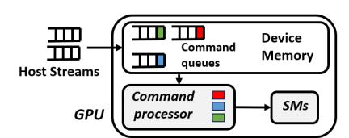
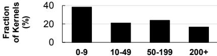
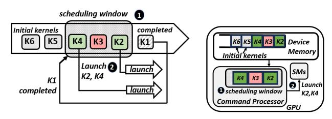
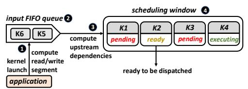
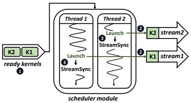
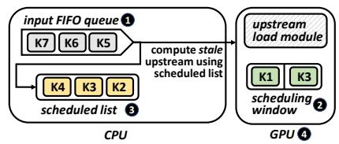
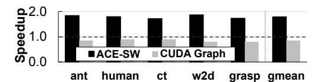
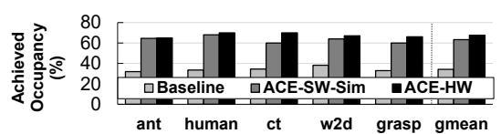
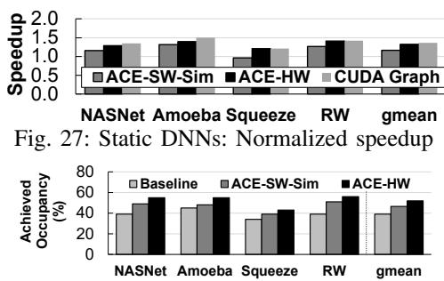

# ACS: Concurrent Kernel Execution on Irregular, Input-Dependent Computational Graphs

Sankeerth Durvasula<sup>∗</sup> , Adrian Zhao<sup>∗</sup> , Raymond Kiguru, Yushi Guan, Zhonghan Chen, Nandita Vijaykumar

*Abstract*—GPUs are widely used to accelerate many important classes of workloads today. However, in this work, we observe that several important emerging classes of workloads, including simulation engines for deep reinforcement learning and dynamic neural networks, are unable to fully utilize the massive parallelism that GPUs offer. These applications tend to have kernels that are small in size, i.e., have few threads and thread blocks that cannot saturate the GPU's compute resources. Executing independent kernels *concurrently* is a promising approach to improve parallelism and utilization. However, this inter-kernel concurrency is difficult to leverage in such workloads with existing approaches: First, the inter-kernel dependencies and computational graph are input-dependent and vary each time the application is executed. Second, the computational graphs tend to be irregular, requiring fine-grain scheduling and synchronization; thus incurring significant synchronization overheads if kernel execution is parallelized. In this work, we propose ACS, a new framework that enables lightweight detection of inter-kernel dependencies and low overhead kernel scheduling at runtime. The key idea behind ACS is to perform inter-kernel dependency checks for a small window of kernels at runtime, similar to out-oforder instruction scheduling. This enables concurrent execution of kernels in applications whose computational graphs are inputdependent and require fine-grained scheduling. We propose ACS-SW, a software-only open-source implementation of ACS and ACS-HW, a hardware-software cooperative implementation. ACS-HW further reduces synchronization overheads by reducing communication between the CPU and GPU. We evaluate ACS for deep RL simulation engines and dynamic and static DNNs on both real hardware and a GPU simulator. We demonstrate speedups of up to 2.19× (1.56× on average) by improving GPU utilization with concurrent kernel execution.

# I. INTRODUCTION

Graphics Processing Units (GPUs) today are commonly used to accelerate a diverse set of applications, such as deep neural network (DNN) processing, scientific computing, graphics, and cryptography. The massive parallelism offered by GPUs enables efficient computations on large amounts of data concurrently. However, we observe that certain important classes of applications, such as simulation engines for deep reinforcement learning (RL) [1]–[5] and dynamic neural networks [6]–[19], are unable to fully utilize the significant compute capability that GPUs offer. This underutilization is because these applications comprise a large number of small kernels, i.e., kernels with few thread blocks that are unable to fully saturate the GPU cores. To understand the challenges in alleviating this underutilization, we evaluate two important classes of applications and introduce their properties.

Simulation Engines for Deep RL. With reinforcement learning (RL) an agent (for example, a robot) learns to perform tasks such as robotic locomotion, manipulation, and navigation [20], [21] by trial and error from interactions with the environment. Deep RL training involves using a DNN to learn policies that optimize for rewards from data collected by interacting with a simulation environment. By leveraging the benefits of DNNs, deep RL has recently gained widespread application for many challenging and important tasks [20], [22]–[28]. Despite leveraging GPUs, a significant fraction of the deep RL runtime is the data collection phase (up to 70% of the runtime), where physics simulations are used to generate training data. We observe that these physics simulations heavily underutilize the GPU, only achieving an occupancy of 34% on average. The underutilization is caused by kernels that contain a small number of thread blocks that cannot fully utilize the GPU. Programming larger kernels is impractical as each instance simulates a different scenario, and large kernels would lead to thread divergence.

Dynamic DNNs. Several recent types of DNNs [6], [10], [12], [29] have emerged as a promising approach to reduce inference latencies in resource-constrained devices by reconfiguring/specializing the architecture based on the input to the DNN. For example, InstaNAS [10] configures the network architecture at runtime based on the input image. Our evaluations demonstrate that, while these architectures require significantly fewer FLOPs and lower inference latencies, there is still significant underutilization of GPU resources (achieving an occupancy of only 39% on average). Similar to the simulation engines, we find that this underutilization is caused by small kernels that do not fully utilize the GPU cores.

GPU kernels from such applications are typically executed *serially*, and thus the utilization is determined by the size (i.e., the number of threads and thread blocks) of the kernel. However, we observe that many kernels are independent and thus can be executed concurrently. By concurrently executing independent kernels, we can effectively improve GPU utilization and thus performance. Existing GPU architectures allow for concurrent execution of kernels by using multiple command queues [30] which are abstracted in software (such as CUDA Stream [31]), allowing the programmer to identify and launch independent kernels in parallel. However, enabling concurrent kernel execution for these applications is still a challenging task for two major reasons.

Challenge 1: Input-dependent computational graphs. For these applications, the computational graph (i.e. the kernels to be executed and their dependencies) is only resolved at runtime based on the input, and each input or set of inputs leads to a different computational graph. This means that identifying independent kernels to launch in parallel requires performing inter-kernel dependency checks at runtime. These workloads have short running kernels that significantly exacerbate the scheduling and dependency checking overheads, making this a challenging problem to solve. Frameworks such as CUDA Graph [32] and AMD ATMI [33] allow programmers to define the inter-kernel dependency information and construct a directed acyclic graph (DAG) of kernels. These frameworks enable concurrent kernel execution. However, when inter-kernel dependencies vary by input, we must incur the significant latency of constructing the dependency graph and scheduling independent kernels, every time the application is executed, significantly increasing run time (§ II-D and § VI).

Challenge 2: Irregular inter-kernel dependencies require fine-grain scheduling. The computational graph for a given input tends to be highly irregular. In other words, the kernels cannot be easily partitioned into independent streams and fine-grain scheduling is required to expose inter-kernel parallelism. Thus, parallel execution of kernels requires frequent synchronization to ensure correctness, leading to significant synchronization overheads from communicating with the CPU and from kernel launches (§ II-D).

To address these challenges, our goal in this work is to enable kernel concurrency with *(i)* lightweight scheduling and dependency checking of kernels that can be performed at runtime and *(ii)* low overhead synchronization for scheduling and kernel launch. To this end, we propose ACS, a new framework for Automatic Concurrent Scheduling with two implementations: *(i)* ACS-SW, a software-only mechanism to enable lightweight kernel scheduling at runtime and *(ii)* ACS-HW: a hardware-software mechanism to further reduce synchronization overheads for efficient kernel concurrency.

The key idea of ACS is to perform dependency checks between sequentially launched kernels within a fixed window at runtime, similar to out-of-order instruction scheduling. We refer to this window as the *scheduling window*. When a kernel is inserted into the scheduling window, the kernels that it is dependent on are identified. As kernels complete execution, kernels in the scheduling window are marked ready based on the identified dependencies. Ready kernels can then be concurrently launched as they have no more dependencies. Since at any given time, only a small set of kernels are scheduled and tracked (instead of the entire computational graph), this approach enables efficient kernel parallelization and scheduling at runtime. To perform dependency checks between kernels, ACS leverages annotations from the application that specify the memory address ranges that are read/written by each kernel. This metadata is then used to identify inter-kernel dependencies at runtime when kernels are inserted into the scheduling window. Compared to prior approaches (§ III-A), this method alleviates the significant kernel scheduling and dependency-check overheads for kernel parallelization.

ACS-SW implements the above out-of-order runtime kernel scheduling in software as an application runtime system using CUDA streams. ACS-SW however still incurs synchronization overheads from communication with the CPU and kernel launch. On the other hand, ACS-HW implements the out-oforder kernel scheduler in the GPU hardware and can alleviate the synchronization overheads. We propose an efficient implementation of ACS-HW that reduces synchronization and kernel overheads by reducing communication with the CPU.

Prior works such as task superscalar [34], carbon [35], TDM [36] and ADM [37] propose similar out-of-order scheduling to leverage irregular parallelism between tasks in CPU multiprocessors. However, the major challenge in CPUs is the latency of runtime dependence checking. The primary bottleneck with GPUs is the latency for launch/signal completion of kernels rather than dependence checking (§ IV-D). ACS addresses this challenge and provides an efficient approach to enable out-of-order kernel scheduling in GPUs.

We demonstrate the effectiveness of ACS in improving GPU utilization and thus performance for physics simulation workloads, a range of dynamic neural networks, as well as static neural networks with small kernels. We demonstrate an average speedup of up to 1.87× using our softwareonly approach and up to 2.19× from the hardware-software implementation. The major contributions of this work are:

- We identify and characterize GPU underutilization as a result of small GPU kernels in applications with inputdependent irregular computational graphs, e.g., deepRL and dynamic DNNs.
- We introduce ACS, a runtime mechanism that improves GPU utilization by enabling concurrent execution of GPU kernels with a lightweight dependency tracking and scheduling framework.
- We will provide an open-source software-only implementation of ACS that can be used on real hardware to enable low overhead GPU kernel concurrency.
- We evaluate the effectiveness of ACS-SW and ACS-HW on a range of important GPU applications and demonstrate significant speedups and improved GPU utilization.

# II. MOTIVATION

## *A. Baseline GPU architecture*

Figure 1 shows an overview of the hardware model in modern GPU architectures [38]. The host communicates with the command processor (CP) of the GPU via a virtual memory region which is memory mapped to the GPU, accessible by the command processor. This enables communication between the CPU and GPU through entries in the command queue. The CPU transmits kernel launch packets to the GPU by writing them to the user mode command queue. The CP is responsible for decoding and dispatching the kernels in these command queues for execution. The CP accesses the command queue and schedules the kernels at the head for execution. This ensures that the kernels are dispatched for launch from these queues in order.



Fig. 1: Scheduling kernels from multiple streamsw

#### B. Case Study 1: Simulation Engines for Deep RL

Deep reinforcement learning (RL) has widely gained attention as a promising approach to learning control policies in robotics and dynamical systems for tasks such as locomotion on legged robots [1], [26], [28], dexterous hand manipulation [21], autonomous driving [20], [24], and drone control [22], [23], [25]. Deep RL involves training a DNN to learn policies that maximize the reward, based on the actions that the agent (e.g., four-legged robot) performs in a given environment. This training process requires data from the agent interacting with a physics simulator. Typically, each training step requires data from thousands of physics simulations. Recent works [1]-[5], [39] accelerate this data generation phase by leveraging GPUs. GPUs can accelerate data generation by performing multiple simulations simultaneously and also parallelizing within a single simulation. Hence this makes them an appropriate candidate workload for GPU execution. Despite GPU acceleration, the simulation/data generation phase is still the predominant computation in deep RL—taking about 30-70% of training time depending on the complexity of the simulated environment. Thus accelerating simulation engines is critical for deep RL performance.

To evaluate the efficiency of physics simulations, we analyzed a set of physics simulations with different environments on a GPU (parameters in § V) with the widely used Brax [1] framework. We evaluate the utilization of the GPU by measuring achieved occupancy (average ratio of active warps to the maximum supported), depicted in Fig. 2. We find that as much as 65% of the GPU cores are underutilized on average (on both GPUs). To evaluate the cause of this underutilization, we analyze the number of kernel launches required to generate one batch of training data in Fig. 3. We also present the average number of CTAs per kernel in Fig. 4 and depict the distribution of kernel sizes observed for the ant environment in Fig. 5. We observe that physics simulations in our evaluations generate a large number of small kernels that have few threads and CTAs. This is a fundamental problem because the simulation engine cannot be efficiently mapped into large kernels as the different threads will likely diverge in the execution path. This is because each thread typically simulates a different scenario in the environment. Thus the application is instead programmed as a large number of short-running kernels. This phenomenon has also been observed by recent works [39], [40].


Fig. 2: Simulation engines: Achieved occupancy.

#### C. Case Study 2: DNNs with dynamic irregular graphs

Recent research has extensively investigated specialized DNNs for edge devices with limited compute resources and


Fig. 3: Simulation engines: Kernels for 1 batch of data


Fig. 4: Simulation engines: Average kernel size (in CTAs)



Fig. 5: Kernel size distribution for the ant environment power budgets as direct deployment of large neural network architectures on these devices leads to high-inference times. Automated DNN architecture design (neural architecture search) is a promising approach to generate faster neural network architectures while retaining or improving accuracy [41]–[44]. These optimized architectures tend to have irregular elaborate connections between convolution operations. Fig. 6a depicts an example DNN with irregular structure. Additionally, an emerging trend in recent research [29] shows that dynamic inference models [6]–[8], [10], [13]–[19], [45]–[48] are very promising to significantly reduce inference latency and FLOPs. With these dynamic inference models, the path of execution through the network is determined by the input. Thus, the computational graph is not known ahead of time. For example, Fig. 6b shows an example CNN model with different paths of execution based on the input [10].

Similar to § II-B, we evaluate the efficiency of these workloads on a GPU (an NVIDIA RTX 3060 and an NVIDIA RTX 4090) and depict the resulting utilization in Fig. 7 (evaluation and workload settings are in § V). We find that the total achieved occupancy is around 39% in the InstaNAS-A [10] workload for both GPUs. Similar to the simulation engines, we root cause this underutilization to the existence of a large number of small kernels, as depicted in Fig. 8, where a large fraction of the kernels have fewer than 200 CTAs. Thus, these small kernels are unable to fully utilize the GPU. In these workloads, the small kernels are due to convolution layers that were optimized for fewer FLOPs with smaller filters.


Fig. 6: DNNs with irregular or dynamic structures

# D. Key Observations

While small-sized kernels lead to underutilization, we observe that there are typically many kernels that can be executed *concurrently*. Thus we can improve GPU utilization and reduce


Fig. 8: Kernel size distribution (in CTAs) for InstaNAS-A [10] runtimes by identifying independent kernels and scheduling them for concurrent execution. However, this is a challenging task for these classes of applications for the following reasons.

(1) Input-dependent kernel dependencies. The computational graph, and hence, the dependencies between kernels are only determined at *runtime* for each input. For example, with the instance-aware dynamic DNNs [6]–[8], [10] described in § II-C, for the classification inference task, the computational graph is different for each image. As a result, the determination of kernel dependencies and scheduling of kernels for the entire computational graph needs to be done for *each input*. This adds significant latencies to the runtime.

CUDA Graphs [32] and AMD ATMI [33] are software frameworks that allow developers to specify dependencies between different kernels as edges of a directed acyclic graph (DAG). The challenge with this approach is that the DAG needs to be constructed in full (with dependencies, kernel launches, and barriers determined) before the application is executed on the GPU, for each input. This process adds high latency in compiling the complete dependency information. We perform an experiment to measure the DAG construction and launch time on Brax [1] simulation engine (§ V) compared to the program execution time, shown in Fig. 9. We observe that the time taken to construct the graph is exceedingly high (average of 47% of overall execution time).


Fig. 9: DAG construction time as % of execution time

Similarly, recent works for DNNs [50]–[52] perform kernel scheduling, fusion, or parallelization for better GPU utilization. These works, for example, partition the computational graph into independent sub-graphs that are scheduled into multiple streams. However, this scheduling and partitioning is too time-consuming to be done for each input at runtime and thus cannot be applied to these classes of workloads.

(2) Irregular kernel dependencies. These classes of applications have *irregular* computational graphs that are challenging to easily partition into CUDA streams (§ II-C). Popular deep learning frameworks [53], [54] use a single stream by default. The stream abstraction works best if the entire graph can be partitioned into independent streams of kernels. However, these graphs with irregular dependencies would require finegrained scheduling and heavy use of synchronization (e.g.,

cudaDeviceSynchronize and cudaStreamSynchronize) when parallelizing using CUDA streams. This synchronization may lead to large overheads as it requires communication between the GPU and CPU. Fig. 10 depicts the different overheads when CUDA streams are used for fine-grained scheduling with irregular graphs: kernel launch overheads ①, CPU execution overheads ② and the synchronization overheads ③. Based on our profiling, the synchronization and launch overheads vary between 5-20us. CUDA Graphs [32] and ATMI [33] can eliminate the synchronization and kernel launch overhead. However, for input-dependent graphs, as demonstrated in (1), this benefit is lost due to DAG construction overheads.


Fig. 10: Kernel launch and synchronization overheads

#### III. APPROACH

Our **goal** in this work is to design a framework that enables efficient concurrent execution of GPU kernels (*i*) whose computational graph may only be known at runtime, (*ii*) without incurring significant synchronization overheads. To this end, we introduce ACS, a new framework that concurrently schedules independent kernels with a lightweight runtime mechanism.

#### A. Prior Mechanisms

We consider the baseline GPU architecture as described in § II-A. The GPU runtime can launch kernels into different streams. These streams are mapped to one of the command queues in the device-mapped memory of the GPU. The command processor schedules kernels at the head of these queues concurrently, thus enabling concurrent kernel execution. However, neither the command processor nor the kernel launch packets in the command queues have information on inter-kernel data dependencies. Kernels in different queues are assumed to be independent of each other and all kernels within the same queue are executed in order. Hence, in order to leverage parallelism in kernel executions, the task of checking inter-kernel dependencies and determining the kernels which can execute concurrently (and thus scheduling into different queues) has to be done by the host application. However, this is a problem, as this adds significant dependency-checking/scheduling latency to the run time. It also requires communication with the host (through a synchronization routine) to be performed each time a kernel completes execution, adding to the overhead. Several prior works describe approaches to efficiently schedule kernels into multiple streams. Fig. 11 depicts approaches to scheduling a computational graph (Fig. 11a). Fig. 11b is the baseline approach used by many existing frameworks [53], [54], where a single CUDA stream is used to execute all kernels serially. This approach leads to underutilization (§ II-C). Fig. 11c shows prior works [50], [51] that use the computational graph to identify independent kernels and the *entire graph* is scheduled ahead of time into multiple CUDA streams. However, this fine-grained scheduling and synchronization leads to large overheads.


(c) Multiple streams with synchronization between streams Fig. 11: Scheduling kernels in a computational graph

One way to avoid using a device-level synchronization (like cudaDeviceSynchronize) and enable asynchronous execution of kernels without communication with the CPU is to use events provided by the CUDA stream management API. Events serve as signaling mechanisms to indicate the occurrence of specific operations in a stream. This allows synchronization between kernels across streams through the cudaStreamWaitEvent API, facilitating asynchronous kernel execution without blocking the host. By strategically placing events and using cudaStreamWaitEvent, it is possible to orchestrate the order in which kernels are executed on the GPU without communication with host. However, this approach still requires deriving dependencies between all kernels beforehand, and thus incurs significant scheduling overhead.

Another set of approaches [51], [52], [55], define static dependencies between kernels as a DAG, which is then scheduled with DAG frameworks (CUDA Graph [32]/ATMI [33]). These approaches cannot be applied to input-dependent computation graphs, as constructing the entire computational graph is too time-consuming to be done at runtime. To convey the DAG information, ATMI sends barrier packets [56] along with kernel launch packets to the command queue. A barrier packet [57] is a 64-byte data packet that contains id information about a kernel and a set of kernels that depend on it. This packet can be inserted into the command queue by the device runtime. The barrier packet blocks the launching of dependent kernels until the independent kernel completes execution. The barrier packet however does not contain any information regarding the current status of the executing kernels in the GPU and thus cannot perform any additional runtime reordering of kernels. It simply follows the dependencies already specified by the DAG. While it is possible to devise a framework that dynamically launches barrier packets and launch commands onto the GPU command queue in memory, this would require hardware support and would still incur synchronization overheads with the CPU. Our approach is specifically designed to mitigate this scheduling cost by avoiding direct communication from the GPU to the CPU, thereby reducing potential overheads.

Persistent threads (PT) eliminate the scheduling and launch overheads but are only effective when all kernels are homogeneous [58] . CUDA dynamic parallelism [59] (CDP) or AMD's device enqueue [60] (DE) enables parent kernels to launch child kernels, only allowing data dependencies between one parent and its children. These workloads however involve kernels that depend on multiple kernels, and it is an open problem how to use CDP for these types of dependencies.

We summarize different approaches for parallel kernel scheduling in Table I, in terms of applicability (whether input-dependent irregular workloads can be effectively mapped), synchronization/launch overheads and preparation overhead (resolving dependencies, constructing, and scheduling the computational graph).

| Method                  | Applicability | Sync+Launch<br>Overhead |                           |
|-------------------------|---------------|-------------------------|---------------------------|
| Multi-Stream [50], [51] | <b>√</b>      | X                       | $\checkmark$              |
| DAG [32], [33], [52]    | <b>√</b>      | <b>√</b>                | X                         |
| PT [58], [61], [62]     | X             | <b>√</b>                | $\checkmark$              |
| CDP [59] / DE [60]      | X             | X                       | $\checkmark$              |
| ACS-SW (Our approach)   | <b>√</b>      | X                       | $\checkmark$              |
| ACS-HW (Our approach)   | <b>√</b>      | <b>√</b>                | $\overline{\hspace{1cm}}$ |

TABLE I: Comparison of ACS to other scheduling frameworks

### B. Key Idea of ACS

With ACS, the key idea is to instead perform the dependence checking and scheduling within a small window of kernels at *runtime* similar to out-of-order instruction scheduling. We perform this scheduling over a single command queue (or a single initialized stream). Fig. 12a depicts out-of-order kernel dispatch with ACS. Fig. 12b shows the corresponding high-level hardware modifications for ACS. A fixed number of kernels in the original stream (scheduling window 1) are evaluated for dependencies. When a kernel completes execution, we evaluate which kernels within the scheduling window are now ready for execution 2. All such kernels are marked ready and can be scheduled concurrently.



(a) Out-of-order kernel dispatch (b) CP scheduling kernels in out from the scheduling window of order manner

Fig. 12: ACS: Runtime out-of-order kernel scheduling

We propose two implementations of ACS: ACS-SW, a SW-only approach and ACS-HW, a hardware-software cooperative mechanism, which we describe in the following sections. ACS-SW emulates the out-of-order kernel scheduling mechanism by scheduling independent kernels into multiple streams and can be implemented with purely software changes, however the hardware support in ACS-HW is more efficient as it also alleviates synchronization overheads.

#### C. Design Overview

To design ACS to perform the runtime kernel scheduling as depicted in Fig. 12a, we need (i) a mechanism to determine inter-kernel dependencies in the scheduling window; (ii) to identify kernels that are ready for execution; and (iii) alleviate synchronization and kernel launch overheads.

Determining inter-kernel dependencies. In order to determine dependencies between kernels, the application adds additional metadata to each kernel invocation. This metadata defines the range of global memory addresses that are written to and read from by each kernel. This metadata is provided to ACS by using a kernel wrapper (described in § IV-B) and can be defined by the programmer, library-writer, or compilation tools. By checking for overlaps between read segments and write segments, we determine dependencies between kernels. The kernel wrapper defines the pointers to the read and write data segments (start\_addr) along with the size of the segments (Fig. 13). The actual virtual addresses associated with the pointers are resolved just before kernel launch in order to perform the dependence checks (§ IV-A). We refer to these memory ranges as read\_segments and write\_segments.


Fig. 13: Memory regions written to/accessed by the kernel

Tracking kernel state at runtime. Fig. 14 depicts the scheduling window (1), with the additional state required for scheduling. The kernels in the window can be ready, pending, or executing (3). Kernels in the scheduling window become ready for launch (ready) when the kernels it is dependent on (referred to as *upstream* kernels 2) complete execution. For each kernel in the scheduling window, we track a list of the corresponding upstream kernels. The upstream kernels are determined using the above dependency checks when inserting into the scheduling window. When the upstream list is empty, the kernel is marked ready for execution. After each kernel completes execution, the upstream list is updated for all kernels in the scheduling window. For ACS-SW, these checks are performed in the software runtime system (§ IV-B), and for ACS-HW, we implement them in hardware (§ IV-C).


Fig. 14: Kernels in the scheduling window with their state and corresponding upstream kernels (i.e., dependencies)

Eliminating CPU synchronization overheads. In order to eliminate synchronization and kernel launch overheads resulting from communication between the CPU and GPU, we implement the scheduling window in the GPU hardware in

ACS-HW. We design an efficient implementation of ACS-HW that reduces communication with the CPU. The management of the scheduling window is done entirely in hardware, including the determination of ready kernels. Similarly, once a kernel completes execution, the scheduling window is updated without requiring synchronization with the CPU.

### D. Mechanism Walkthrough

Fig. 15 depicts a high level walkthrough of ACS. For each GPU kernel invoked by the application ①, the read and write segments are resolved (detailed in § IV-A). All invoked kernels along with the corresponding read/write segments are entered into the input FIFO queue to await scheduling ②. Kernels are then added to the fixed size scheduling window in a FIFO manner ③. When the kernel enters the scheduling window ④, the write segments of the current kernel are compared against read and write segments of all kernels in the scheduling window. The kernels with overlap are added to the corresponding upstream kernel list and are marked pending. When an executing kernel completes execution, all corresponding upstream kernel lists are updated. Any kernel that has an empty list is marked ready for the scheduler to launch.



Fig. 15: High level overview of ACS

#### IV. DETAILED DESIGN

## A. ACS Kernel Wrappers

In order to perform runtime dependency checks, the application defines the read/write segments for each kernel. These segments are defined using a kernel wrapper, ACS\_wrapper (defined in Fig. 16). Since virtual addresses can only be resolved at runtime, the programmer instead defines a function get\_addresses which populates the \_\_read\_segments\_\_ and \_\_write\_segments\_\_ lists (lines 6 and 7 in Fig. 16). The get\_addresses function takes the kernel's launch arguments as the input arguments (lines 12 to 15). These arguments are then used to compute the read/write segments.

Just before kernel launch, the CUDA runtime calls get\_addresses function. At this point, \_read\_segments\_\_\_ and \_write\_segments\_\_ lists are populated with the resolved virtual addresses. In our implementation of ACS-SW, since the CUDA drivers are closed-source, we implement an intermediate user-level kernel launch function that calls the get\_addresses function instead. Fig. 17 depicts an example implementation of the get\_addresses function. ACS assumes that the programmer or the kernel library provider has knowledge of the memory regions accessed by the kernel from the kernel function prototype. For a wide range of commonly used kernels, such as matrix multiplication, convolution, addition, etc., which operate on data stored as contiguous regions in memory, this task is straightforward. Additionally, the get\_address function can be obtained using a static binary analysis tool like GPUOcelot [63]. However, in situations where it is not possible to determine the range of memory accessed by the kernel (for example, indirect memory accesses), our approach assumes that the entire GPU memory may be accessed by the kernel.

```
struct ACE_wrapper {
      //list of read, write segments defined as
3
       //[{start_adr1,size1},{start_adr2,size2}...]
4
      list __read_segments__;
5
      list __write_segments__;
6
       // function which gets called at kernel
7
       // launch to populate read, write segments
8
      void get_addresses(
9
            dim3 blocks, dim3 threads, ...
10
       // function declaration of the kernel
11
       static __global__ void kernel(...);
12
13
   }:
```

Fig. 16: The ACS\_wrapper definition

```
// get address function for matrix multiply
   // input matrices: input1 (mxn), input2(nxk)
3
   // output matrix: output(mxk)
   void ACE_wrapper::get_addresses(
5
        dim3 blocks, dim3 threads,
        int* input1, int* input2, int* output1,
6
7
        int m, int n, int k) {
8
       // input1 reads m*n elements
9
       // input2 reads n*k elements
10
       __read_segments__ = {
11
           { (void*) input1, m*n*sizeof(int) },
12
           {(void*)input2, n*k*sizeof(int)}
13
       // output reads m*k elements
14
15
       __write_segments__ = {
16
           {(void*)output, m*k*sizeof(int)},
17
18
```

Fig. 17: Example: get\_addresses function

## B. ACS-SW Design

ACS-SW is implemented as a user-level runtime that is called by the application. The functionalities of ACS-SW are performed by multiple independent threads that are launched simultaneously. The ACS-SW runtime performs two major tasks: (i) implementing and maintaining the scheduling window (window module); and (ii) scheduling kernels ready for execution (scheduling module).

1) The window module: The window module is implemented as a separate thread that manages the input FIFO queue and the scheduling window. All the functionalities of the scheduling window, dependency tracking, and state management are performed in software within this module. This module is called in two ways: First, when a kernel is invoked by the application thread, this module is called and the kernel is inserted into the input queue. Second, the scheduler module (implemented as a separate thread(s)) calls the window module when a kernel completes execution. At this point, the state of upstream lists is updated and the kernel is removed from the scheduling window. The window module constantly

polls the input queue and the scheduling window. When there is a vacancy in the scheduling window and a pending kernel in the input queue, the kernel is moved into the scheduling window. At this point, the window module performs the necessary dependency checks and bookkeeping. Algorithm 1 describes how the dependency check is performed.

### **Algorithm 1** Dependency check algorithm

```
Input: rslist_1, wslist_1, wslist_2
                                       > RW segments of scheduling window
kernel, w-segment of kernel in inputFIFO
Output: is\_dependent
 1:\ is\_dependent = false

    initial state of is_dependent

2: rwslist_1 \leftarrow wslist_1 \bigcup rslist_1
                                                       ▶ Read+Write segments
3: for each segment_1 in rwslist_1 do \triangleright Test for every pair of segments
       for each ws_2 in wslist_2 do
4:

    b get start and end virtual memory addresses

            start_1 \leftarrow segment_1.start
6:
            end_1 \leftarrow segment_1.start + segment_1.size
7.
            start_2 \leftarrow ws_2.start
8:
            end_2 \leftarrow ws_2.start + ws_2.size
                           > check overlaps between start and end addresses
9:
            if start_1 < end_2 and end_1 > start_2 then
10:
               is\ dependent = true
                                                                               D
11:
            end if
12:
        end for each
13: end for each
```

2) The scheduler module: This module schedules and launches ready kernels for execution. This module is implemented as a configurable fixed number of threads, each of which launches kernels into an independent CUDA stream for concurrent execution, as depicted in Fig. 18. Each stream contains only one kernel at any given time. Threads with empty streams poll the scheduling window for a ready kernel , which is then launched in its CUDA stream . The thread then waits for the kernel to complete execution using the StreamSync primitive 3. Once the kernel completes execution, the thread calls the window module as described above. This algorithm is described in Algorithm 2.



Fig. 18: ACS-SW: The scheduler module

## **Algorithm 2** The scheduler module in software

```
Input: SchedulingWindow SW, stream_id
  1: while notstop() do

⊳ poll for kernels until stop signal

                                            ACQUIRE\_LOCK(SW)
3:
                                                               SW.ready.exists()then

    b check ready kernels
    b check ready kernels
    check ready kernels
    check ready kernels
    check ready kernels
    check ready kernels
    check ready kernels
    check ready kernels
    check ready kernels
    check ready kernels
    check ready kernels
    check ready kernels
    check ready kernels
    check ready kernels
    check ready kernels
    check ready kernels
    check ready kernels
    check ready kernels
    check ready kernels
    check ready kernels
    check ready kernels
    check ready kernels
    check ready kernels
    check ready kernels
    check ready kernels
    check ready kernels
    check ready kernels
    check ready kernels
    check ready kernels
    check ready kernels
    check ready kernels
    check ready kernels
    check ready kernels
    check ready kernels
    check ready kernels
    check ready kernels
    check ready kernels
    check ready kernels
    check ready kernels
    check ready kernels
    check ready kernels
    check ready kernels
    check ready kernels
    check ready kernels
    check ready kernels
    check ready kernels
    check ready kernels
    check ready kernels
    check ready kernels
    check ready kernels
    check ready kernels
    check ready kernels
    check ready kernels
    check ready kernels
    check ready kernels
    check ready kernels
    check ready kernels
    check ready kernels
    check ready kernels
    check ready kernels
    check ready kernels
    check ready kernels
    check ready kernels
    check ready kernels
    check ready kernels
    check ready kernels
    check ready kernels
    check ready kernels
    check ready kernels
    check ready kernels
    check ready kernels
    check ready kernels
    check ready kernels
    check ready kernels
    check ready kernels
    check ready kernels
    check ready kernels
    check ready kernels
    check ready kernels
    check ready kernels
    check ready kernels
    check ready kernels
    check ready kernels
    check ready kernels
    check ready kerne
4:
                                                                    kernel \leftarrow SW.ready.pop()

5.
                                            end if
                                            RELEASE\_LOCK(SW)
                                            LAUNCH(kernel, stream id)
                                                                                                                                                                                                                                                                                                                                                                                                   ▶ launch kernel
                                            STREAM_SYNC(stream_id)

    ▶ wait for completion

9: end while
```

## C. ACS-HW Design

While ACS-SW enables concurrent execution of kernels and can be fully realized in software, it still incurs overheads from

(i) synchronization with the CPU when a kernel completes execution, i.e., the StreamSync primitive that blocks the scheduler module thread; and (ii) the kernel launch overhead when the scheduler module launches a kernel in the CPU. ACS-HW is designed to alleviate these overheads with hardware support for kernel scheduling in the GPU.

Fig. 19 depicts an overview of ACS-HW. ACS-HW comprises a software runtime system similar to ACS-SW that maintains an input FIFO queue containing the kernels that were invoked by the application **1**. The scheduling window and its management are however implemented in hardware on the GPU side 2. The input queue is essentially implemented as a CUDA stream that dispatches kernels to the GPU. In addition to the input FIFO queue, the software runtime also maintains a list of kernels in the GPU's scheduling window, which we call the scheduled list 3. To avoid frequent synchronization between the CPU and GPU, we allow this list to be stale. Before a kernel is inserted into the scheduling window, the software runtime performs dependency checks with the scheduled list to determine the upstream kernels. Note that since the scheduled list may be stale, this upstream list needs to be further updated before insertion into the scheduling window (discussed below).



Fig. 19: ACS-HW: Design overview

The hardware component **4** consists of two modules: (*i*) the scheduling window and (*ii*) the upstream load module.

The hardware scheduling window structure is depicted in Fig. 20 and comprises a fixed number of slots (N) ①. Each slot contains an 8-bit kernel identifier and (N-1) 8-bit upstream kernel identifiers that are implemented with SRAM ②. Each slot of the SRAM module is implemented as a single bank of SRAM, contaning N-1 fully associated units to store upstream kernel identifiers. These upstream identifiers are used to determine when a kernel is ready. An additional two bits are used to identify the state of each kernel (i.e., ready, pending, and executing). When a kernel completes execution, the upstream identifiers are updated and the corresponding state of each kernel is updated. The completed kernel is also removed from the scheduling window. Any kernels that are now ready are then dispatched to the GPU's kernel dispatch unit for execution ③.

The upstream load module is responsible for refining the upstream list provided by the CPU which may be stale in two ways. It may contain kernels that have (1) already completed execution and (2) may miss long-running kernels that are still executing. The first case is handled by the upstream module by checking against a list of kernels in the scheduling window 4. The second case is avoided by ensuring that the scheduled\_list (of size M) in the CPU never misses kernels that are still executing. The upstream load module


Fig. 20: HW scheduling window and upstream load module tracks the oldest scheduled kernel **5**. If the number of newer kernels exceeds M (size of the scheduled\_list), this module blocks the insertion of more kernels from the CPU **6**.

#### D. ACS Overheads

- (1) Hardware area overhead. ACS-HW introduces the hardware scheduling window which contains N slots, where N is the size of the scheduling window. Each slot contains N kernel ids of upstream data of 8 bytes each and 2 bits for status. Assuming a scheduling window of length N=32, we require 1KB of SRAM for the scheduling module (for the entire GPU). The upstream module keeps track of the oldest executing kernel with an 8-bit
- (2) Storage overheads. The read and write segments that are saved as metadata in the input FIFO and the scheduled\_list by the software runtime in the CPU require memory storage. Each read and write segment requires 48 bits to hold the start addresses and the size.
- (3) Mechanism latencies. ACS-HW requires updating all upstream kernels in each slot of the scheduling window every time a kernel completes execution. ACS-HW updates each slot in N-1 cycles (where N is the size of the scheduling window). Additionally, ACS-HW requires N cycles to insert a kernel ID with its upstream kernel IDs into the scheduling window. For a scheduling window of size 64, this operation adds 64 cycles (about 50-100ns) overhead to dispatch a ready kernel for launch. Thus, ACS-HW adds negligible runtime to the application compared to the baseline kernel launch overhead (in the order of a few microseconds).
- (4) Dependency checking overheads To determine the list of upstream kernels, the CPU checks for overlaps between the write segments of the kernel in the input queue and the read-write segments of the kernels in the scheduled\_list. As the scheduled\_list can fit completely into the cache (4KB), dependency-checking is compute-bound and dependent on the number of read and write segments. Table II presents the time required to do dependence checking. For a processor with P execution units, effective utilization requires dependency checks to be performed in no more than T/P, where T is the task execution time [34], [36]. We estimate T/P to be around Aus, which is much more than the dependency check latency.

# V. METHODOLOGY

We evaluate ACS-SW on a real hardware setup with an Intel Core i7 11700K CPU (Table III) and an NVIDIA RTX3060

| Window<br>size | Number of RW-segments | Dependency check time |
|----------------|-----------------------|-----------------------|
| 16             | 6<br>10               | 410ns<br>700ns        |
| 32.            | 6                     | 510ns                 |
| 32             | 10                    | 1640ns                |

TABLE II: Dependency checking overhead analysis GPU (Table IV). We model ACS-HW on GPUs using the Accel-Sim simulator [64], configured with parameters of RTX3070 (Table V). We use AccelWattch [64] to model GPU power. We choose a scheduling window size of 32.

| CPU 3.6GHz, OOO 4-wide dispatch window, 32 entry LSQ    |
|---------------------------------------------------------|
| L1D + L1I Cache 32KB, 4 way LRU, 1 cycle; 64 Byte line; |
| L2 Cache 256KB, 8 way LRU, 4 cycle; 64 Byte line;       |
| L3 Cache 1MB, 16 way LRU, 20 cycle; 64 Byte line;       |
| DRAM 2-channel; 16-bank; open-row policy, 4GB DDR4      |

TABLE III: CPU system configuration

| Shader core 28 SMs, 1.3GHz; 2 schedulers per SM             |
|-------------------------------------------------------------|
| SM Resources 32768 Registers, 32KB Shared memory, 128KB L1D |
| <b>DRAM</b> 2-channel; 16-bank; open-row policy, 12GB DDR4  |

TABLE IV: GPU system configuration

| Shader core 46 SMs, 1.4GHz; 4 schedulers per SM             |
|-------------------------------------------------------------|
| SM Resources 32768 Registers, 32KB Shared memory, 128KB L1D |
| <b>DRAM</b> 2-channel; 16-bank; open-row policy, 16GB DDR4  |

TABLE V: Simulated GPU configuration

# Workloads. We evaluate ACS using:

- (1) Deep RL physics simulations. Brax [1] is a GPU accelerated simulation engine for control tasks in reinforcement learning. We evaluate ACS with the Ant (ant), Grasp (grasp), Humanoid (human), Cheetah (ct), and Walker2d (w2d) simulation environments. These environments are Mu-JoCo [65] simulations for training RL agents to perform a specific task. For example, ant contains a 3d robot (the agent) with one torso and 4 legs, each with a knee joint, and the goal is to move in a particular direction by controlling its legs.
- (2) Dynamic DNNs. We evaluate our approach for 3 dynamic DNN workloads: InstaNAS [10] (I-NAS) is a dynamic CNN for image classification. We evaluate our approach using the InstaNAS-A architecture on the CIFAR10 dataset. Dynamic routing [12] (DR) is a DNN trained for semantic segmentation of images. We evaluate our approach on the Dynamic-A 16 layer architecture using the Cityscapes dataset [66]. Conditional Convolution [46] (CC) is a mixture-of-experts CNN model for image classification where the weights of the convolutions are computed at runtime. We evaluate the version of Conditional Convolution with 4 experts that uses an efficientnet b4 [67] network as the backbone. All three dynamic DNNs are designed for a batch size of 1 and the input image defines the DNN architecture. We use Pytorch [54] implementations.
- (3) Static DNNs. CNN architectures optimized for low inference latency using neural architecture search (NAS): NASNet [41] (NASNet), AmoebaNet [42] (Amoeba), SqueezeNet [68] (Squeeze), and RandomWire [44] (RW). These CNNs have highly irregular structures with many small kernels. We evaluate ACS with a batch size of 1 on CIFAR10.

#### VI. EVALUATION

We evaluate ACS using three designs: (i) Baseline: cuDNN implementation (for DNNs) and a jax implementation [1] (for deep RL simulation), both using CUDA streams. (ii) ACS-SW: Our software-only mechanism is evaluated on real hardware. (iii) ACS-SW-Sim: Our software-only mechanism evaluated on the GPU simulator. We also include these results to compare against ACS-HW. (iv) ACS-HW: Our hardware-software cooperative mechanism evaluated on the GPU simulator. (v) CUDAGraph: Framework where the inter-kernel dependencies are prepared on the CPU as a directed acyclic graph and sent to the GPU ahead of time. We only present ACS-SW results for the deep RL workloads as the dynamic and static DNNs heavily use CuDNN libraries that do not currently allow modifications to make use of different CUDA streams. We instead model the same effect with ACS-SW-Sim.

## A. Deep RL Physics Simulations

Fig. 21 depicts the runtimes for the generation of a single batch of training data from different simulation environments using ACS-SW, normalized to the baseline approach.



Fig. 21: Deep RL physics simulations: Normalized Speedup

Fig. 22 depicts the runtimes for ACS-SW-Sim and ACS-HW normalized to the baseline implementation. We make two observations. First, ACS-SW-Sim provides similar speedups as in real hardware compared to the baseline implementation (up to  $1.79\times$  and  $1.66\times$  on average). Second, ACS-HW is able to further improve performance compared to the software-only approach by alleviating the synchronization and kernel launch overheads. We observe a slowdown with CUDAGraph due to the significant latency of constructing the kernel dependency graph and sending the information to the GPU.


Fig. 22: Deep RL physics simulations: Normalized speedup

The end-to-end speedup in training tasks (simulation + learning algorithm) as observed is shown in Fig. 23. We observe a mean speedup of  $1.42\times$  on ACS-HW, and  $1.30\times$  on ACS-SW.


In Fig. 24, we depict the achieved occupancy for the three configurations. Achieved occupancy is calculated as the number of active warps divided by the maximum number of active warps supported by the GPU averaged over all clock cycles. We observe that the ACS is able to significantly increase the achieved occupancy and thus the utilization.



Fig. 24: Deep RL physics simulations: Achieved occupancy

## B. Inference on Dynamic DNNs

Fig. 25 depicts speedup over the baseline for the dynamic DNNs described in § V. We observe that ACS is able to provide speedups of up to  $1.39\times$  on dynamic DNN workloads with ACS-HW and on average  $1.05\times$  with ACS-SW and  $1.3\times$  with ACS-HW. I-NAS suffers a slowdown with ACS-SW because this workload has significant kernel launch overheads when parallelized but are hidden in the baseline case where the kernels are simply launched serially into a single stream without synchronization. We observe that CUDAGraph exhibits a significant slowdown due to the overhead incurred during the construction and communication of the DAG dependencies.

Fig. 26 depicts the corresponding achieved occupancy. We find that the ACS configurations are able to significantly improve utilization, leading to performance improvements.


Fig. 26: Dynamic DNNs: Achieved occupancy

# C. Inference on Static DNNs

While our approach is designed for applications with dynamic computational graphs, we also evaluate its effectiveness in improving the concurrency of static DNNs. We depict the speedups obtained normalized to the baseline in Fig. 27. We observe an average speedup of  $1.31\times$  with ACS-HW, and a speedup of  $1.16\times$  with ACS-SW. Fig. 28 depicts the corresponding achieved occupancy. We find that ACS leads to higher GPU utilization, leading to performance improvements. As expected, we observe that CUDAGraph exhibits similar execution times as ACS-HW for static graphs. This is because the task graph needs to be constructed only once.

#### D. Sensitivity Analysis

Fig. 29 compares the speedups obtained on using scheduling window sizes of 16 and 32 for ACS-HW over baseline. We observe that the Brax simulations have higher performance



Fig. 28: Static DNNs: Achieved occupancy

(4.5% on average) with a window size of 32 compared to 16. However, the window size has less of an impact on the DNNs. This is because the simulation engines have more inter-kernel parallelism that is exposed with a larger scheduling window.


Fig. 29: Speedups on varying scheduling window size

# E. Comparison with Persistent Thread Frameworks

Persistent threads (PT) [58], [61], [69], [70] are used to efficiently schedule multiple tasks with dynamically determined dependencies. These tasks are executed using threads of a single kernel. Thus, it assumes all tasks are homogeneous, requiring the same number of registers and shared memory. PT frameworks which allow heterogeneous kernels are nontrivial and would be inefficient as the persistent kernel must be configured to use the maximum registers/scratchpad used by any kernel [58]. We use the persistent thread framework implementation from juggler [61] and adapted it to handle heterogeneous kernels. We were only able to implement a section of a rigid body simulator (used for finding contacts between pairs of rigid bodies). This routine invokes a different kernel (with different register usages) for different pairs of geometries. We implement these kernels as tasks of our PT framework and find that it is  $1.35 \times$  slower than baseline. This slowdown is due to inefficient use of registers/scratchpad by the kernel that leads to lower parallelism.

#### VII. RELATED WORK

In this work, we (i) observe that input-dependent interkernel dependencies and small kernels are a significant performance bottleneck in a range of important applications such as simulation engines in deep RL and dynamic neural networks; and (ii) propose both a software-only and hardware-software cooperative mechanism to enable concurrent execution of kernels with statically unknown inter-kernel dependencies. In this section, we describe prior work that aim to improve GPU utilization and kernel concurrency.

Leveraging concurrent streams in DL workloads. Mainstream deep learning frameworks like Tensorflow [53] and Pytorch [54] launch GPU kernels into a single CUDA stream that executes them sequentially. Recent works [50], [52], [71] propose software techniques to enable concurrent execution of GPU kernels using multiple streams with static scheduling and stream assignment before application execution. Inter-operator scheduling [50] partitions a computation graph into sections of kernels that can execute in parallel. Out-of-order backprop [52] observes that gradient computation can be parallelized using CUDA streams into weight gradients and the output gradient computation during backpropagation. However, these works are only applicable to DL workloads whose computation graph is static and known ahead of time, often requiring significant compilation times. Furthermore, these approaches incur high synchronization overheads.

Task-based programming frameworks in CPUs. Taskbased frameworks [72]–[74] enable programmers to describe a program as multiple tasks which are scheduled for execution in multiprocessor architectures [75]. Works such as task superscalar [34], carbon [35], TDM [36] and ADM [37] propose out-of-order scheduling of tasks to efficiently leverage irregular parallelism in multiprocessors. The major bottleneck in outof-order scheduling of tasks dynamically for multiprocessors is the long latency required to do dependence checks. Thus, prior work [34]–[37] propose hardware accelerators to address the long latency dependence checking needed at runtime. However, with GPUs, the primary bottleneck is the long latency to launch/signal completion of kernels instead, requiring a different approach to enable out-of-order scheduling.

Programmer annotations Prior works leverage programmer-specified annotations as hints to the compiler to extract parallelism. DeNovo [76] uses programmer annotations that encode the data read and written to by each method/function. This information is used at compile time to determine independent tasks that can be scheduled. Some frameworks [74], [77]–[80] allow programmers to annotate the array regions accessed by each task as a compile time directive. In ACS, we use a similar approach of programmer annotations to help determine parallelism at runtime to enable out-of-order kernel scheduling.

Software techniques to improve GPU utilization with concurrent kernel execution. CUDA Graphs [32] and AMD ATMI [33], [81], [82] are frameworks that allow users to define dependencies between kernels as a directed-acyclicgraph (DAG) prior to execution. This approach eliminates synchronization and kernel launch overheads due to communication with the CPU. Nimble [51] identifies independent GPU kernels prior to execution and concurrently schedules independent kernels using CUDA streams. This approach uses CUDA Graphs [32] to reduce synchronization and kernel launch overheads. Irregular graphs are also seen in solving sparse linear equations for CFD simulations [83] and hyperplane sweep routines [84], where DAG frameworks have been shown to be effective.We quantitatively compared ACS against a CUDA graph implementation in § VI. None of these approaches is applicable to dynamic input-dependent computational graphs, as caching dependency information and constructing CUDA Graphs incur non-trivial latencies ( § II-D).

Hardware support for concurrent kernels. Wireframe [85] proposes merging multiple kernels into a single large kernel and performs CTA scheduling with data dependency checks between CTAs. Blockmaestro [86] enables concurrently running kernels by identifying dependencies between their CTAs. These approaches however perform dependence checks by tracing and extracting the memory loads and stores performed by each thread block of every kernel. Similar to the software approaches, these approaches are designed for static computational graphs. The proposed scheduling and dependency check techniques would be too time-consuming for runtime scheduling. GPU dynamic parallelism [59], [87]–[89] enables launching kernels from the device itself and allows data dependencies between a single parent and multiple child kernels. However, Dynamic-NN and RL simulation workloads contain kernels that depend on multiple kernels, making it difficult to apply GPU dynamic parallelism.

Compilers, runtime systems for dynamic neural networks. Prior software [11], [90]–[95] and hardware approaches [96] aim to optimize CPU-GPU communication overheads, launch overheads, and blocking synchronization calls for dynamic computational graphs. These approaches introduce techniques such as dynamic batching and kernel fusion. However, these works are orthogonal to our approach. Prior works [97], [98] have proposed software frameworks for CPU-GPU systems that provide simplified and convenient abstractions to interface with GPU runtime APIs. These frameworks encapsulate runtime-level code, simplifying code development for programmers in single and multi-GPU environments. However, these works do not specifically focus on input-dependent dynamic computation. Instead their goal is to provide simpler abstractions for programming GPU tasks and expressing dataflow dependencies between them. Efficient GPU sharing techniques, such as Kernelet [99], GPUPool [100] introduce runtime systems to enable concurrent kernel execution by scheduling kernels from different processes which have different memory and compute usage intensities. However, while these works increase overall GPU utilization by kernels launched from different processes, they do not leverage the parallelism between kernels of a single application.

# VIII. CONCLUSION

We introduce ACS, the first framework that enables automatic concurrent kernel execution with low overhead runtime scheduling and dependency checks. The key idea behind ACS is to dynamically schedule a small window of kernels by identifying which kernel(s) within the window is ready for execution. ACS leverages kernel annotations to automatically identify kernel dependencies at runtime. We implement ACS as both a software framework and a hardware-software mechanism that is able to further reduce synchronization overheads from CPU-GPU communication. We demonstrate that ACS can improve the performance of important emerging classes of workloads, such as RL simulations and dynamic DNNs, whose kernel dependencies are irregular and vary with input.

## REFERENCES

- [1] C. D. Freeman, E. Frey, A. Raichuk, S. Girgin, I. Mordatch, and O. Bachem, "Brax - a differentiable physics engine for large scale rigid body simulation," *ArXiv*, vol. abs/2106.13281, 2021.
- [2] V. Makoviychuk, L. Wawrzyniak, Y. Guo, M. Lu, K. Storey, M. Macklin, D. Hoeller, N. Rudin, A. Allshire, A. Handa, and G. State, "Isaac gym: High performance gpu-based physics simulation for robot learning," *ArXiv*, vol. abs/2108.10470, 2021.
- [3] B. Shacklett, E. Wijmans, A. Petrenko, M. Savva, D. Batra, V. Koltun, and K. Fatahalian, "Large batch simulation for deep reinforcement learning," *ArXiv*, vol. abs/2103.07013, 2021.
- [4] S. Dalton and I. Frosio, "Accelerating reinforcement learning through gpu atari emulation," *arXiv: Learning*, 2020.
- [5] A. Petrenko, Z. Huang, T. Kumar, G. Sukhatme, and V. Koltun, "Sample factory: Egocentric 3d control from pixels at 100000 fps with asynchronous reinforcement learning," in *ICML*, 2020.
- [6] K. Yuan, Q. Li, S. Guo, D. Chen, A. Zhou, F. Yu, and Z. Liu, "Differentiable dynamic wirings for neural networks," *2021 IEEE/CVF International Conference on Computer Vision (ICCV)*, pp. 317–326, 2021.
- [7] L. Liu and J. Deng, "Dynamic deep neural networks: Optimizing accuracy-efficiency trade-offs by selective execution," in *AAAI*, 2018.
- [8] Z. Yuan, B. Wu, Z. Liang, S. Zhao, W. Bi, and G. Sun, "S2dnas: Transforming static cnn model for dynamic inference via neural architecture search," *ArXiv*, vol. abs/1911.07033, 2020.
- [9] Y. Han, G. Huang, S. Song, L. Yang, H. Wang, and Y. Wang, "Dynamic neural networks: A survey," *IEEE Transactions on Pattern Analysis and Machine Intelligence*, vol. 44, pp. 7436–7456, 2022.
- [10] A. Cheng, C. H. Lin, D.-C. Juan, W. Wei, and M. Sun, "Instanas: Instance-aware neural architecture search," in *AAAI*, 2020.
- [11] J. Wei, G. Gibson, V. Vasudevan, and E. Xing, "Dynamic scheduling for dynamic control flow in deep learning systems," *URL http://www. cs. cmu. edu/jinlianw/papers/dynamic scheduling nips18 sysml. pdf*, 2018.
- [12] S. Cai, Y. Shu, and W. Wang, "Dynamic routing networks," *2021 IEEE Winter Conference on Applications of Computer Vision (WACV)*, pp. 3587–3596, 2021.
- [13] H. Wang, S. Li, S.-C. Su, Z. Qin, and X. Li, "Rdi-net: Relational dynamic inference networks," *2021 IEEE/CVF International Conference on Computer Vision (ICCV)*, pp. 4601–4610, 2021.
- [14] P. Singh and V. P. Namboodiri, "Skipconv: skip convolution for computationally efficient deep cnns," in *2020 International Joint Conference on Neural Networks (IJCNN)*, pp. 1–8, IEEE, 2020.
- [15] S. Teerapittayanon, B. McDanel, and H. T. Kung, "Branchynet: Fast inference via early exiting from deep neural networks," *2016 23rd International Conference on Pattern Recognition (ICPR)*, pp. 2464– 2469, 2016.
- [16] Z. Wu, T. Nagarajan, A. Kumar, S. Rennie, L. S. Davis, K. Grauman, and R. Feris, "Blockdrop: Dynamic inference paths in residual networks," in *CVPR*, 2018.
- [17] A. Veit and S. J. Belongie, "Convolutional networks with adaptive inference graphs," *International Journal of Computer Vision*, vol. 128, pp. 730–741, 2019.
- [18] Y. Li, Y. Chen, X. Dai, D. Chen, M. Liu, L. Yuan, Z. Liu, L. Zhang, and N. Vasconcelos, "Micronet: Improving image recognition with extremely low flops," *2021 IEEE/CVF International Conference on Computer Vision (ICCV)*, pp. 458–467, 2021.
- [19] W. Xia, H. Yin, X. Dai, and N. K. Jha, "Fully dynamic inference with deep neural networks," *IEEE Transactions on Emerging Topics in Computing*, vol. 10, pp. 962–972, 2022.
- [20] A. Kendall, J. Hawke, D. Janz, P. Mazur, D. Reda, J. M. Allen, V.-D. Lam, A. Bewley, and A. Shah, "Learning to drive in a day," *2019 International Conference on Robotics and Automation (ICRA)*, pp. 8248–8254, 2019.
- [21] T. Chen, J. Xu, and P. Agrawal, "A system for general in-hand object re-orientation," in *Conference on Robot Learning*, pp. 297–307, PMLR, 2022.
- [22] J. Panerati, H. Zheng, S. Zhou, J. Xu, A. Prorok, A. P. S. U. of Toronto Institute for A Studies, V. I. for Artificial Intelligence, and U. of Cambridge, "Learning to fly—a gym environment with pybullet physics for reinforcement learning of multi-agent quadcopter control," *2021 IEEE/RSJ International Conference on Intelligent Robots and Systems (IROS)*, pp. 7512–7519, 2021.

- [23] L. Bartolomei, L. Teixeira, and M. Chli, "Semantic-aware active perception for uavs using deep reinforcement learning," in *2021 IEEE/RSJ International Conference on Intelligent Robots and Systems (IROS)*, pp. 3101–3108, 2021.
- [24] J. Chen, S. E. Li, and M. Tomizuka, "Interpretable end-to-end urban autonomous driving with latent deep reinforcement learning," *arXiv preprint arXiv:2001.08726*, 2020.
- [25] S. Krishnan, B. Boroujerdian, W. Fu, A. Faust, and V. J. Reddi, "Air learning: a deep reinforcement learning gym for autonomous aerial robot visual navigation," *Mach. Learn.*, vol. 110, pp. 2501–2540, 2021.
- [26] Z. Xie, X. Da, B. Babich, A. Garg, and M. van de Panne, "Glide: Generalizable quadrupedal locomotion in diverse environments with a centroidal model," *arXiv preprint arXiv:2104.09771*, 2021.
- [27] Z. Si and W. Yuan, "Taxim: An example-based simulation model for gelsight tactile sensors," *IEEE Robotics and Automation Letters*, vol. 7, no. 2, pp. 2361–2368, 2022.
- [28] N. Rudin, D. Hoeller, P. Reist, and M. Hutter, "Learning to walk in minutes using massively parallel deep reinforcement learning," *ArXiv*, vol. abs/2109.11978, 2021.
- [29] S. Rajbhandari, C. Li, Z. Yao, M. Zhang, R. Y. Aminabadi, A. A. Awan, J. Rasley, and Y. He, "Deepspeed-moe: Advancing mixture-ofexperts inference and training to power next-generation ai scale," in *ICML*, 2022.
- [30] "Nvidia inc, hyperq." https://developer.download.nvidia.com/compute/ DevZone/C/html x64/6 Advanced/simpleHyperQ/doc/HyperQ.pdf. Accessed: 2023-07-21.
- [31] "Nvidia inc, cuda programming guide." https://docs.nvidia.com/cuda/ cuda-c-programming-guide/index.html#streams. Accessed: 2022-11- 21.
- [32] "Nvidia inc, getting started with cuda graphs." https://developer.nvidia. com/blog/cuda-graphs/. Accessed: 2020-09-30.
- [33] "Radeon open compute, atmi (asynchronous task and memory interface)." https://github.com/RadeonOpenCompute/atmi. Accessed: 2022- 09-30.
- [34] Y. Etsion, F. Cabarcas, A. Rico, A. Ramirez, R. M. Badia, E. Ayguade, J. Labarta, and M. Valero, "Task superscalar: An out-of-order task pipeline," in *2010 43rd Annual IEEE/ACM International Symposium on Microarchitecture*, pp. 89–100, IEEE, 2010.
- [35] S. Kumar, C. J. Hughes, and A. D. Nguyen, "Carbon: architectural support for fine-grained parallelism on chip multiprocessors," in *International Symposium on Computer Architecture*, 2007.
- [36] E. Castillo, L. Alvarez, M. Moreto, M. Casas, E. Vallejo, J. L. Bosque, ´ R. Beivide, and M. Valero, "Architectural support for task dependence management with flexible software scheduling," *2018 IEEE International Symposium on High Performance Computer Architecture (HPCA)*, pp. 283–295, 2018.
- [37] D. Sanchez, R. M. Yoo, and C. E. Kozyrakis, "Flexible architectural ´ support for fine-grain scheduling," in *ASPLOS XV*, 2010.
- [38] S. Puthoor, X. Tang, J. Gross, and B. M. Beckmann, "Oversubscribed command queues in gpus," *Proceedings of the 11th Workshop on General Purpose GPUs*, 2018.
- [39] J. Gleeson, D. Snider, Y. Yang, M. Gabel, E. de Lara, and G. Pekhimenko, "Optimizing data collection in deep reinforcement learning," *ArXiv*, vol. abs/2207.07736, 2022.
- [40] J. Gleeson, S. Krishnan, M. Gabel, V. J. Reddi, E. de Lara, and G. Pekhimenko, "Rl-scope: Cross-stack profiling for deep reinforcement learning workloads," *ArXiv*, vol. abs/2102.04285, 2021.
- [41] B. Zoph, V. Vasudevan, J. Shlens, and Q. V. Le, "Learning transferable architectures for scalable image recognition," *2018 IEEE/CVF Conference on Computer Vision and Pattern Recognition*, pp. 8697–8710, 2018.
- [42] E. Real, A. Aggarwal, Y. Huang, and Q. V. Le, "Regularized evolution for image classifier architecture search," in *AAAI*, 2019.
- [43] H. Liu, K. Simonyan, and Y. Yang, "Darts: Differentiable architecture search," *arXiv preprint arXiv:1806.09055*, 2018.
- [44] S. Xie, A. Kirillov, R. B. Girshick, and K. He, "Exploring randomly wired neural networks for image recognition," *2019 IEEE/CVF International Conference on Computer Vision (ICCV)*, pp. 1284–1293, 2019.
- [45] H. Bai, F. Zhou, L. Hong, N. Ye, S.-H. G. Chan, and Z. Li, "Nasood: Neural architecture search for out-of-distribution generalization," *2021 IEEE/CVF International Conference on Computer Vision (ICCV)*, pp. 8300–8309, 2021.

- [46] B. Yang, G. Bender, Q. V. Le, and J. Ngiam, "Condconv: Conditionally parameterized convolutions for efficient inference," in *NeurIPS*, 2019.
- [47] Z. You, S. Feng, D. Su, and D. Yu, "Speechmoe: Scaling to large acoustic models with dynamic routing mixture of experts," *arXiv preprint arXiv:2105.03036*, 2021.
- [48] N. M. Shazeer, A. Mirhoseini, K. Maziarz, A. Davis, Q. V. Le, G. E. Hinton, and J. Dean, "Outrageously large neural networks: The sparsely-gated mixture-of-experts layer," *ArXiv*, vol. abs/1701.06538, 2017.
- [49] M. Sandler, A. G. Howard, M. Zhu, A. Zhmoginov, and L.-C. Chen, "Mobilenetv2: Inverted residuals and linear bottlenecks," *2018 IEEE/CVF Conference on Computer Vision and Pattern Recognition*, pp. 4510–4520, 2018.
- [50] Y. Ding, L. Zhu, Z. Jia, G. Pekhimenko, and S. Han, "Ios: Inter-operator scheduler for cnn acceleration," *ArXiv*, vol. abs/2011.01302, 2021.
- [51] W. Kwon, G.-I. Yu, E. Jeong, and B.-G. Chun, "Nimble: Lightweight and parallel gpu task scheduling for deep learning," in *NeurIPS*, 2020.
- [52] H. Oh, J. Lee, H. Kim, and J. Seo, "Out-of-order backprop: an effective scheduling technique for deep learning," *Proceedings of the Seventeenth European Conference on Computer Systems*, 2022.
- [53] M. Abadi, P. Barham, J. Chen, Z. Chen, A. Davis, J. Dean, M. Devin, S. Ghemawat, G. Irving, M. Isard, M. Kudlur, J. Levenberg, R. Monga, S. Moore, D. G. Murray, B. Steiner, P. A. Tucker, V. Vasudevan, P. Warden, M. Wicke, Y. Yu, and X. Zhang, "Tensorflow: A system for large-scale machine learning," *ArXiv*, vol. abs/1605.08695, 2016.
- [54] A. Paszke, S. Gross, F. Massa, A. Lerer, J. Bradbury, G. Chanan, T. Killeen, Z. Lin, N. Gimelshein, L. Antiga, A. Desmaison, A. Kopf, ¨ E. Yang, Z. DeVito, M. Raison, A. Tejani, S. Chilamkurthy, B. Steiner, L. Fang, J. Bai, and S. Chintala, "Pytorch: An imperative style, highperformance deep learning library," *ArXiv*, vol. abs/1912.01703, 2019.
- [55] T. Chen, M. Li, Y. Li, M. Lin, N. Wang, M. Wang, T. Xiao, B. Xu, C. Zhang, and Z. Zhang, "Mxnet: A flexible and efficient machine learning library for heterogeneous distributed systems," *ArXiv*, vol. abs/1512.01274, 2015.
- [56] S. Puthoor, A. M. Aji, S. Che, M. Daga, W. Wu, B. M. Beckmann, and G. P. Rodgers, "Implementing directed acyclic graphs with the heterogeneous system architecture," *Proceedings of the 9th Annual Workshop on General Purpose Processing using Graphics Processing Unit*, 2016.
- [57] HSA Foundation, "Hsa standard," 2017. http://hsafoundation.com/ standards/, Last accessed on 2023-02-14.
- [58] Y. Chen, B. Brock, S. D. Porumbescu, A. Bulucc, K. A. Yelick, and J. D. Owens, "Atos: A task-parallel gpu dynamic scheduling framework for dynamic irregular computations," *ArXiv*, vol. abs/2112.00132, 2021.
- [59] "Nvidia inc, cuda dynamic parallelism." https://developer.nvidia.com/ blog/cuda-dynamic-parallelism-api-principles/. Accessed: 2022-09-30.
- [60] "Amd inc, rocm device enqueue." https://sep5.readthedocs.io/en/latest/ Programming Guides/Opencl-programming-guide.html#device-sideenqueue. Accessed: 2022-09-30.
- [61] M. E. Belviranli, S. Lee, J. S. Vetter, and L. N. Bhuyan, "Juggler: a dependence-aware task-based execution framework for gpus," *Proceedings of the 23rd ACM SIGPLAN Symposium on Principles and Practice of Parallel Programming*, 2018.
- [62] M. Steinberger, M. Kenzel, P. Boechat, B. Kerbl, M. Dokter, and D. Schmalstieg, "Whippletree: task-based scheduling of dynamic workloads on the gpu," *ACM Trans. Graph.*, vol. 33, pp. 228:1–228:11, 2014.
- [63] N. Farooqui, A. Kerr, G. Diamos, S. Yalamanchili, and K. Schwan, "A framework for dynamically instrumenting gpu compute applications within gpu ocelot," in *Proceedings of the Fourth Workshop on General Purpose Processing on Graphics Processing Units*, pp. 1–9, 2011.
- [64] M. Khairy, Z. Shen, T. M. Aamodt, and T. G. Rogers, "Accel-sim: An extensible simulation framework for validated gpu modeling," *2020 ACM/IEEE 47th Annual International Symposium on Computer Architecture (ISCA)*, pp. 473–486, 2020.
- [65] E. Todorov, T. Erez, and Y. Tassa, "Mujoco: A physics engine for model-based control," in *2012 IEEE/RSJ international conference on intelligent robots and systems*, pp. 5026–5033, IEEE, 2012.
- [66] M. Cordts, M. Omran, S. Ramos, T. Rehfeld, M. Enzweiler, R. Benenson, U. Franke, S. Roth, and B. Schiele, "The cityscapes dataset for semantic urban scene understanding," in *Proceedings of the IEEE conference on computer vision and pattern recognition*, pp. 3213–3223, 2016.

- [67] M. Tan and Q. Le, "Efficientnet: Rethinking model scaling for convolutional neural networks," in *International conference on machine learning*, pp. 6105–6114, PMLR, 2019.
- [68] F. N. Iandola, M. W. Moskewicz, K. Ashraf, S. Han, W. J. Dally, and K. Keutzer, "Squeezenet: Alexnet-level accuracy with 50x fewer parameters and ¡1mb model size," *ArXiv*, vol. abs/1602.07360, 2016.
- [69] K. Gupta, J. A. Stuart, and J. D. Owens, "A study of persistent threads style gpu programming for gpgpu workloads," *2012 Innovative Parallel Computing (InPar)*, pp. 1–14, 2012.
- [70] T. Aila and S. Laine, "Understanding the efficiency of ray traversal on gpus," *Proceedings of the Conference on High Performance Graphics 2009*, 2009.
- [71] H. Zhu, A. Phanishayee, and G. Pekhimenko, "Daydream: Accurately estimating the efficacy of optimizations for DNN training," in *2020 USENIX Annual Technical Conference (USENIX ATC 20)*, pp. 337– 352, USENIX Association, July 2020.
- [72] J. Reinders, M. J. Voss, P. Reble, and R. Asenjo-Plaza, "++ for heterogeneous programming: oneapi (dpc++ and onetbb)," in *C++ for Heterogeneous Programming: oneAPI (DPC++ and oneTBB)*, 2020.
- [73] R. D. Blumofe, C. F. Joerg, B. C. Kuszmaul, C. E. Leiserson, K. H. Randall, and Y. Zhou, "Cilk: an efficient multithreaded runtime system," in *PPOPP '95*, 1995.
- [74] L. Dagum and R. Menon, "Openmp: an industry standard api for shared-memory programming," in *OpenMP: an industry standard API for shared-memory programming*, 1998.
- [75] A. Ram´ırez, F. Cabarcas, B. H. H. Juurlink, M. Alvarez-Mesa, F. Sanchez, A. Azevedo, C. Meenderinck, C. B. Ciobanu, S. Isaza, and ´ G. Gaydadjiev, "The sarc architecture," *IEEE Micro*, vol. 30, pp. 16–29, 2010.
- [76] B. Choi, R. Komuravelli, H. Sung, R. Smolinski, N. Honarmand, S. V. Adve, V. S. Adve, N. P. Carter, and C.-T. Chou, "Denovo: Rethinking the memory hierarchy for disciplined parallelism," *2011 International Conference on Parallel Architectures and Compilation Techniques*, pp. 155–166, 2011.
- [77] J. Planas, R. M. Badia, E. Ayguade, and J. Labarta, "Hierarchical task- ´ based programming with starss," *The International Journal of High Performance Computing Applications*, vol. 23, pp. 284 – 299, 2009.
- [78] A. Pop and A. Cohen, "Openstream: Expressiveness and data-flow compilation of openmp streaming programs," *ACM Trans. Archit. Code Optim.*, vol. 9, pp. 53:1–53:25, 2012.
- [79] G. Gupta and G. S. Sohi, "Dataflow execution of sequential imperative programs on multicore architectures," in *Proceedings of the 44th annual IEEE/ACM international symposium on Microarchitecture*, pp. 59–70, 2011.
- [80] M. D. Allen, S. Sridharan, and G. S. Sohi, "Serialization sets: a dynamic dependence-based parallel execution model," in *Proceedings of the 14th ACM SIGPLAN symposium on Principles and practice of parallel programming*, pp. 85–96, 2009.
- [81] AMD Research, "Dagee," 2017. https://github.com/AMDResearch/ DAGEE.git, Last accessed on 2023-02-14.
- [82] AMD Research, "Hipgraph," 2017. https://github.com/HipGraph/, Last accessed on 2023-02-14.
- [83] A. E. Helal, A. M. Aji, M. L. Chu, B. M. Beckmann, and W. chun Feng, "Adaptive task aggregation for high-performance sparse solvers on gpus," *2019 28th International Conference on Parallel Architectures and Compilation Techniques (PACT)*, pp. 324–336, 2019.
- [84] A. M. Kaushik, A. M. Aji, M. A. Hassaan, N. Chalmers, N. Wolfe, S. Moe, S. Puthoor, and B. M. Beckmann, "Optimizing hyperplane sweep operations using asynchronous multi-grain gpu tasks," *2019 IEEE International Symposium on Workload Characterization (IISWC)*, pp. 59–69, 2019.
- [85] A. Abdolrashidi, D. Tripathy, M. E. Belviranli, L. N. Bhuyan, and D. Wong, "Wireframe: Supporting data-dependent parallelism through dependency graph execution in gpus," *2017 50th Annual IEEE/ACM International Symposium on Microarchitecture (MICRO)*, pp. 600–611, 2017.
- [86] A. Abdolrashidi, H. A. Esfeden, A. Jahanshahi, K. Singh, N. B. Abu-Ghazaleh, and D. Wong, "Blockmaestro: Enabling programmertransparent task-based execution in gpu systems," *2021 ACM/IEEE 48th Annual International Symposium on Computer Architecture (ISCA)*, pp. 333–346, 2021.
- [87] G. Chen and X. Shen, "Free launch: Optimizing gpu dynamic kernel launches through thread reuse," *2015 48th Annual IEEE/ACM International Symposium on Microarchitecture (MICRO)*, pp. 407–419, 2015.

- [88] I. E. Hajj, J. Gomez-Luna, C. Li, L.-W. Chang, D. S. Milojicic, and ´ W. mei W. Hwu, "Klap: Kernel launch aggregation and promotion for optimizing dynamic parallelism," *2016 49th Annual IEEE/ACM International Symposium on Microarchitecture (MICRO)*, pp. 1–12, 2016.
- [89] J. Wang, N. Rubin, A. Sidelnik, and S. Yalamanchili, "Dynamic thread block launch: A lightweight execution mechanism to support irregular applications on gpus," *2015 ACM/IEEE 42nd Annual International Symposium on Computer Architecture (ISCA)*, pp. 528–540, 2015.
- [90] P. Fegade, T. Chen, P. Gibbons, and T. Mowry, "Cortex: A compiler for recursive deep learning models," *Proceedings of Machine Learning and Systems*, vol. 3, pp. 38–54, 2021.
- [91] E. Jeong, S. Cho, G.-I. Yu, J. S. Jeong, D.-J. Shin, and B.-G. Chun, "{JANUS}: fast and flexible deep learning via symbolic graph execution of imperative programs," in *16th USENIX Symposium on Networked Systems Design and Implementation (NSDI 19)*, pp. 453– 468, 2019.
- [92] S. Xu, H. Zhang, G. Neubig, W. Dai, J. K. Kim, Z. Deng, Q. Ho, G. Yang, and E. P. Xing, "Cavs: An efficient runtime system for dynamic neural networks," in *2018 USENIX Annual Technical Conference (USENIX ATC 18)*, pp. 937–950, 2018.
- [93] H. Shen, J. Roesch, Z. Chen, W. Chen, Y. Wu, M. Li, V. Sharma, Z. Tatlock, and Y. Wang, "Nimble: Efficiently compiling dynamic neural networks for model inference," *ArXiv*, vol. abs/2006.03031, 2021.
- [94] E. Jeong, J. S. Jeong, S. Kim, G.-I. Yu, and B.-G. Chun, "Improving the expressiveness of deep learning frameworks with recursion," in *Proceedings of the Thirteenth EuroSys Conference*, pp. 1–13, 2018.
- [95] M. Looks, M. Herreshoff, D. S. Hutchins, and P. Norvig, "Deep learning with dynamic computation graphs," *ArXiv*, vol. abs/1702.02181, 2017.
- [96] F. Khorasani, H. A. Esfeden, N. B. Abu-Ghazaleh, and V. Sarkar, "In-register parameter caching for dynamic neural nets with virtual persistent processor specialization," *2018 51st Annual IEEE/ACM International Symposium on Microarchitecture (MICRO)*, pp. 377–389, 2018.
- [97] C. J. Rossbach, J. Currey, M. Silberstein, B. Ray, and E. Witchel, "Ptask: operating system abstractions to manage gpus as compute devices," in *Proceedings of the Twenty-Third ACM Symposium on Operating Systems Principles*, pp. 233–248, 2011.
- [98] C. J. Rossbach, Y. Yu, J. Currey, J.-P. Martin, and D. Fetterly, "Dandelion: a compiler and runtime for heterogeneous systems," in *Proceedings of the Twenty-Fourth ACM Symposium on Operating Systems Principles*, pp. 49–68, 2013.
- [99] J. Zhong and B. He, "Kernelet: High-throughput gpu kernel executions with dynamic slicing and scheduling," *IEEE Transactions on Parallel and Distributed Systems*, vol. 25, no. 6, pp. 1522–1532, 2013.
- [100] X. Tan, *GPUPool: A Holistic Approach to Fine-Grained GPU Sharing in the Cloud*. PhD thesis, University of Toronto (Canada), 2021.