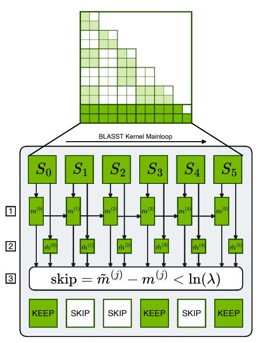
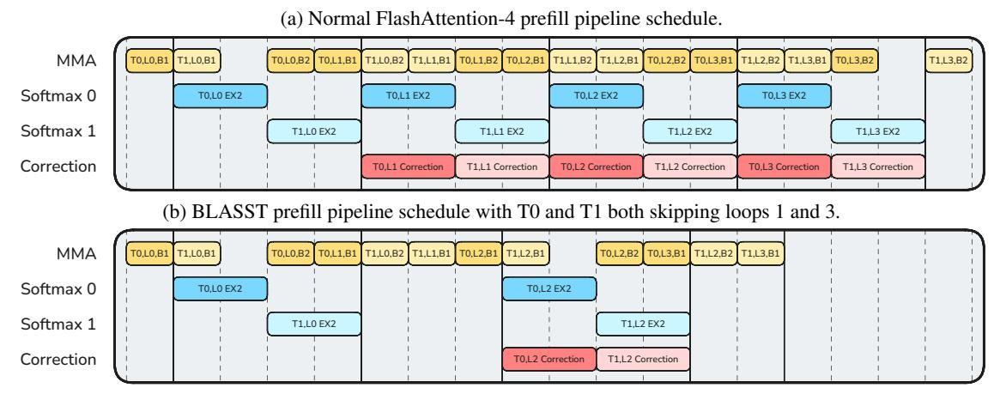
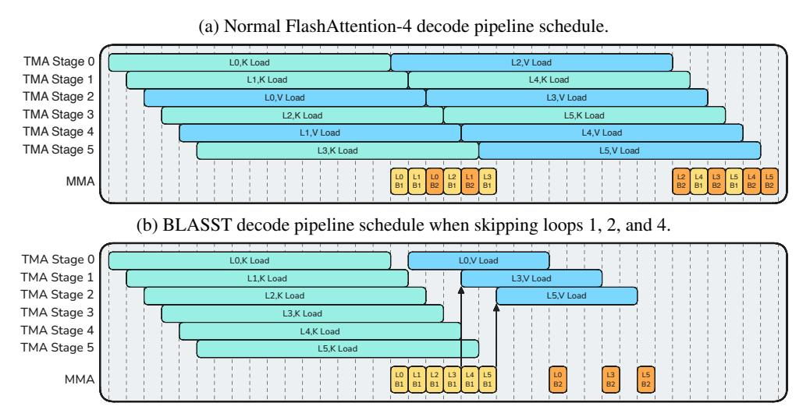
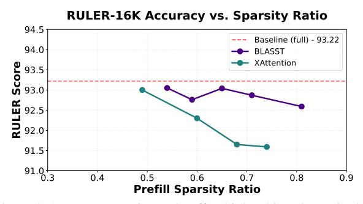

# <span id="page-0-0"></span>BLASST: DYNAMIC BLOCKED ATTENTION SPARSITY VIA SOFTMAX THRESHOLDING

Jiayi Yuan \* 1 Cameron Shinn \* 2 Kai Xu 3 Jingze Cui 3 George Klimiashvili 3 Guangxuan Xiao 3 Perkz Zheng 3 Bo Li 3 Yuxin Zhou 3 Zhouhai Ye 3 Weijie You 3 Tian Zheng 3 Dominic Brown 3 Pengbo Wang 3 Markus Hoehnerbach 4 † Richard Cai 3 Julien Demouth 3 John D. Owens 2 Xia Hu 1 Song Han 3 Timmy Liu 3 Huizi Mao 3

#### **ABSTRACT**

The growing demand for long-context inference capabilities in Large Language Models (LLMs) has intensified the computational and memory bottlenecks inherent to the self-attention mechanism. To address this challenge, we introduce BLASST, a drop-in, dynamic sparse attention mechanism that accelerates inference by using only a fixed scalar threshold to skip attention blocks. Our method targets practical inference deployment by removing the barriers to adoption present in existing works. As such, BLASST eliminates training requirements, avoids expensive pre-computation passes, accelerates both prefill and decode across all major attention variants (MHA, GQA, MQA, and MLA), provides optimized support for modern hardware, and easily integrates into existing frameworks. This is achieved by reusing online softmax statistics to identify negligible attention scores, skipping softmax, value block loads, and the subsequent matrix multiplication. We demonstrate the BLASST algorithm by delivering optimized kernels with negligible latency overhead. Our automated threshold calibration procedure reveals a simple inverse relationship between optimal threshold and context length, meaning we require only a single threshold each for prefill and decode per model. Preserving benchmark accuracy, we demonstrate a 1.52× speedup for prefill at 71.9% sparsity and a 1.48× speedup for decode at 73.2% sparsity on modern GPUs.

## 1 Introduction

Large Language Models (LLMs) have revolutionized natural language processing, achieving remarkable performance across diverse tasks. However, their practical deployment faces a critical bottleneck: the quadratic computational complexity of the attention mechanism. As applications increasingly demand longer context windows—from processing entire codebases (Roziere et al., 2023) to analyzing lengthy documents (Zeng et al., 2025) and maintaining extended conversations (Achiam et al., 2023)—this bottleneck becomes increasingly severe. Recent models like Deepseek-R1 (Guo et al., 2025) and Qwen3 (Yang et al., 2025) support context lengths up to 128K tokens, with some models pushing to 1M tokens (Comanici et al., 2025). Yet processing such long sequences remains computationally prohibitive, with attention computation dominating both latency and me-

Proceedings of the  $9^{th}$  MLSys Conference, Bellevue, WA, USA, 2026. Copyright 2026 by the author(s).



Figure 1. Overview of BLASST. Blocks along a row of the attention matrix are sequentially processed. We (1) update the running row max  $(m^{(j)})$  as in FlashAttention, (2) compute the block max  $(\tilde{m}^{(j)})$  for each  $S_j$  block  $(QK_j^\top)$ , and (3) skip subsequent work if the block max is lower than the running max by more than the input threshold,  $\ln(\lambda)$ . Full details can be found in Algorithm 1.

<sup>\*</sup>Equal contribution <sup>1</sup>Rice University, Houston, Texas, USA <sup>2</sup>University of California, Davis, California, USA <sup>3</sup>NVIDIA, Santa Clara, California, USA <sup>4</sup>Meta, Menlo Park, California, USA. <sup>†</sup>Work completed while at NVIDIA. Correspondence to: Timmy Liu <jiliu@nvidia.com>, Huizi Mao <huizim@nvidia.com>.

mory consumption. For a sequence of length n, the attention mechanism requires O(n 2 ) operations and memory accesses, making real-world deployment of long-context models challenging even with state-of-the-art hardware. While FlashAttention [\(Dao et al.,](#page-11-0) [2022;](#page-11-0) [Zadouri et al.,](#page-13-0) [2026\)](#page-13-0) and its successors have optimized memory bandwidth utilization through tiling and kernel fusion, they still compute the full attention matrix, leaving the fundamental quadratic complexity unaddressed.

*Sparse attention* methods have emerged as a promising solution by computing only a subset of the full attention matrix. While these approaches cleverly determine which attention scores to skip, their added complexity hinders practical use. We identify five key hurdles to their adoption: (1) Some methods require expensive pre-computation to determine sparsity patterns, often negating their theoretical speedups [\(Jiang et al.,](#page-11-0) [2024;](#page-11-0) [Xu et al.,](#page-12-0) [2025\)](#page-12-0). (2) Other methods introduce new layers that require model finetuning [\(Xiao et al.,](#page-12-0) [2025\)](#page-12-0) or training an entirely new architecture [\(DeepSeek-AI,](#page-11-0) [2025\)](#page-11-0). (3) Most existing works focus exclusively on either the prefill or decode phase, missing opportunities for end-to-end inference acceleration. (4) They lack kernel support for newer GPUs, making it unclear if their speedups translate to the characteristics of modern hardware, like Blackwell and Hopper. (5) These methods often hinder framework integration, requiring intrusive modifications to model architectures or attention interfaces and substantial changes to existing APIs.

To address these hurdles, we present BLASST (BLocked Attention Sparsity via Softmax Thresholding), a simple yet effective training-free sparse attention method that dynamically prunes negligible attention blocks during both prefill and decode with no pre-computation overhead. Our key insight is that during FlashAttention's block-wise onlinesoftmax, we can identify and skip blocks whose contribution to the final output will be negligible based solely on alreadycomputed information. Specifically, when processing blocks sequentially, we maintain a running maximum of attention scores. As shown in Figure [1,](#page-0-0) if a block's local maximum score is significantly smaller than this running maximum (by a threshold λ), its post-softmax values will be near zero after normalization. We can therefore skip three expensive operations for such blocks: (1) computing the exponential for softmax, (2) loading the corresponding value block from HBM, and (3) multiplication between attention and values. This simple pruning rule requires only a single comparison per block and seamlessly integrates into existing attention APIs, requiring only a single scalar threshold input.

To maximize the practical impact of BLASST, we provide optimized CUDA kernels for Blackwell and Hopper that implement our sparse attention algorithm. Our kernels are designed with two key goals: (1) introduce minimal overhead for the block-skipping decision logic by reusing already-computed statistics, and (2) strategically target the bottleneck resources in each phase—reducing CUDA core and tensor core usage in compute-bound prefill, and reducing memory bandwidth consumption in memory-bound decode. Our prefill and decode kernels are tailored to their distinct computational patterns. Our kernels achieve up to 1.52× speedup for prefill at 71.9% sparsity and 1.48× speedup for decode at 73.2% sparsity over FlashAttention baselines [\(Shah et al.,](#page-12-0) [2024;](#page-12-0) [Zadouri et al.,](#page-13-0) [2026\)](#page-13-0), while maintaining numerical stability and supporting the common attention variants (MHA, MQA, GQA, MLA).

Beyond the core algorithm and kernel implementation, we develop two key techniques to enhance BLASST's deployment and performance. First, we propose an automated calibration procedure that determines optimal thresholds for any target sparsity level. Our calibration reveals a robust inverse relationship λ = a/L between threshold and context length L, enabling reliable deployment across diverse scenarios without manual tuning. Second, we explore sparsity-aware training as a natural extension, showing that models can be trained to be inherently more robust to sparse attention patterns. This training approach further pushes the accuracy-sparsity frontier, enabling even higher sparsity levels with minimal loss in accuracy.

Our contributions include:

- 1. The BLASST algorithm, a drop-in method with no precomputation overhead and no proxy scores, achieving minimal accuracy loss.
- 2. Automated hyperparameter selection and sparsity-aware training for robust, flexible, and extensible deployment.
- 3. Optimized CUDA kernels implementing BLASST for both prefill and decode, available in TensorRT-LLM<sup>1</sup> and FlashInfer.

# 2 RELATED WORKS

Effectively exploiting the sparse attention property requires either reducing compute on unimportant interactions or reducing memory footprint (e.g., KV cache) without expensive selection overheads or retraining. Comparing to the following related works, BLASST addresses both dimensions simultaneously, in a training-free manner. Table [1](#page-2-0) summarizes the landscape of existing work.

#### 2.1 Compute-Optimized Sparsity

Several approaches reduce attention *compute* by selecting important interactions. Static pattern methods like Sparse Transformer [\(Child et al.,](#page-11-0) [2019\)](#page-11-0), LongFormer [\(Beltagy](#page-11-0)

<sup>1</sup>[GPU kernels and inference framework support can be found](#page-11-0) [at https://github.com/NVIDIA/TensorRT-LLM](#page-11-0)

<span id="page-2-0"></span>Table 1. Feature comparison of sparse attention methods. BLASST distinguishes itself as the only method capable of accelerating both prefill and decode phases without requiring training or costly precomputation steps.

| Method          | Accelerates<br>Prefill | Accelerates<br>Decode | No<br>Training | No Pre-<br>Computation |
|-----------------|------------------------|-----------------------|----------------|------------------------|
| H2O             | Х                      | ✓                     | <b>√</b>       | <b>✓</b>               |
| SnapKV          | X                      | ✓                     | ✓              | ✓                      |
| RocketKV        | X                      | ✓                     | ✓              | X                      |
| Quest           | X                      | ✓                     | ✓              | X                      |
| DuoAttention    | ✓                      | ✓                     | X              | ✓                      |
| DSA             | ✓                      | ✓                     | X              | ✓                      |
| MInference      | ✓                      | X                     | ✓              | X                      |
| SpargeAttention | ✓                      | X                     | ✓              | X                      |
| XAttention      | ✓                      | X                     | ✓              | X                      |
| BLASST          | ✓                      | ✓                     | ✓              | ✓                      |

et al., 2020), and BigBird (Zaheer et al., 2020) reduce complexity through local or block-based attention. Retrieval head-based methods (Wu et al., 2025; Xiao et al., 2025) accelerate model decoding by focusing compute on crucial retrieval heads. Dynamic sparsity methods like MInference (Jiang et al., 2024) use pre-computed importance scores, XAttention (Xu et al., 2025) ranks anti-diagonal blocks, and FlexPrefill (Lai et al., 2025) offers compilersupported, flexible block patterns; while effective for prefill, their pre-computation and scheduling overheads can limit realized speedups. Training-aided sparsity such as SeerAttention (Gao et al., 2025b) induces high sparsity via (pre)training gates, improving efficiency but adding training cost and showing mixed downstream model performance. FLASH-D (Alexandridis et al., 2025) leverages the mathematical properties of online softmax in a similar way as BLASST, but to improve numerical stability and parallelism on custom hardware accelerators.

SpargeAttention (Zhang et al., 2025) has the most similar design to BLASST. We differ in three key aspects: (1) BLASST optimizes both prefill and decode with specialized kernels, while SpargeAttention targets prefill only; (2) we make skip decisions directly using already-computed statistics with zero overhead, while SpargeAttention uses a separate prediction step; (3) our decode kernel skips Value loading from HBM, addressing memory-bound bottlenecks on top of compute savings. In addition, we provide automated calibration and sparsity-aware training.

## 2.2 Memory-Optimized Sparsity

Token/KV sparsity focuses on reducing *memory* footprint and decode-time cost. H2O (Zhang et al., 2023), TOVA (Oren et al., 2024), and InfLLM (Xiao et al., 2024a) discard tokens based on query patterns. StreamingLLM (Xiao et al., 2024b) retains initial and recent tokens for consistent latency and memory usage.

Quest (Tang et al., 2024) prunes tokens conditioned on the current query, Rectified Sparse Attention (Sun et al., 2025) adaptively selects tokens to maintain accuracy at high sparsity, RocketKV (Behnam et al., 2025) compresses the KV cache with selective eviction, and recent KV compression for hyper-scaling (Łańcucki et al., 2025) further extends effective context; TidalDecode (Yang et al., 2026) stabilizes decode efficiency with position-persistent patterns. We further distinguish reasoning-oriented compression methods such as RPC (Song et al., 2025), which prioritize preserving reasoning-critical information under memory constraints; non-eviction methods such as Loki (Singhania et al., 2024), which avoid explicit KV eviction while reducing effective memory/computation overhead. In general, these methods reduce memory accesses in the decode phase, whereas BLASST reduces compute and memory accesses in both prefill and decode while remaining training-free.

#### 2.3 New Attention Variants

Beyond the above methods, alternative mechanisms include Sliding Window Attention (Beltagy et al., 2020), Linear or Gated Attention (Qiu et al., 2025), and State-Space Models (SSM) (Gu & Dao, 2024). Native Sparse Attention (NSA) (Yuan et al., 2025) and DeepSeek Sparse Attention (DSA) (DeepSeek-AI, 2025), while effective in some regimes, often require architectural changes and training. By contrast, BLASST is a training-free method that accelerates both prefill and decode without proxy scores or complex pre-computation, integrating seamlessly with FlashAttention implementations.

## 3 METHODOLOGY

#### 3.1 Pruning Attention with Running Maximums

The core insight of BLASST lies in the observation that during the computation of attention scores in FlashAttention, many blocks contribute negligibly to the final output after softmax normalization. Our method identifies and skips these blocks dynamically during the forward pass, without requiring pre-computation or proxy scores.

#### 3.1.1 Key Insight

In the standard attention mechanism, the softmax operation computes:

$$\operatorname{Attention}(Q,K,V) = \operatorname{softmax}\left(\frac{QK^{\top}}{\sqrt{d_k}}\right)V \qquad (1)$$

During FlashAttention's block-wise computation, we maintain a running maximum  $m_i^{(j)}$  across blocks. If a block's local maximum  $\tilde{m}_i^{(j)}$  is significantly smaller than the current running maximum, i.e.,  $\tilde{m}_i^{(j)} - m_i^{(j)} < \ln(\lambda)$  for some

<span id="page-3-0"></span>threshold  $\lambda$ , then after exponentiation:

$$\exp(\tilde{m}_i^{(j)} - m_i^{(j)}) < \lambda \approx 0 \tag{2}$$

Since the maximum value is bounded by  $\lambda$ , the block's contribution to the final attention output will be negligible, allowing us to skip its computation entirely.

Intuitively, this criterion follows a three-step approximation. First, the ideal importance of each score  $S_{ij}$  is its value relative to the (unknown) global maximum. Second, computing the true maximum on-the-fly is too expensive, so we use the running maximum as a tractable proxy and compare  $S_{ij}$  against it. Third, to enable an efficient block-level decision inside the kernel, we replace token-level  $S_{ij}$  with the block-local maximum, which yields the inexpensive condition (block\_max - running\_max)  $< \ln(\lambda)$ .

#### 3.1.2 Algorithm Design

Algorithm 1 presents our modified FlashAttention forward pass, where the sequence is tiled into  $T_r$  query blocks and  $T_c$  KV blocks of size  $B_c$  each. The key modification is the introduction of a dynamic pruning condition that saves both computation and memory bandwidth. Where We Save: When  $\tilde{m}_i^{(j)} - m_i^{(j)} < \ln(\lambda)$  (line 7), we skip:

- 1. Compute savings (CUDA cores): The expensive  $\exp(\cdot)$  operations for computing  $\tilde{P}_{ij}$  require multiple instructions per element: MUFU.EX2 (exponential), FMUL (multiplication), and FADD (addition). We also skip the rowsum reduction operations (FADD instructions) for normalizing attention weights. For a typical block, this saves thousands of CUDA core instructions.
- 2. Compute savings (Tensor cores) The matrix multiplication  $\tilde{P}_{ij}V_j$ . In the prefill phase, where kernels are compute-bound, avoiding these MMA operations provides a substantial speedup.
- 3. **Memory bandwidth savings:** Loading the Value block  $V_j$  from HBM to SRAM. This is particularly critical in decode phase, where attention is memory-bound.

Our approach directly reduces the total amount of computation by dynamically identifying and skipping negligible attention blocks during the forward pass. This simple yet effective modification requires minimal changes to the existing FlashAttention implementation while providing significant computational savings.

## 3.2 Calibration for Optimal Sparsity

A critical challenge in deploying BLASST is selecting the appropriate threshold  $\lambda$  that balances sparsity and accuracy. To understand this relationship, we conducted experiments on Llama-3.1-8B across RULER benchmark challenging subsets (NIAH\_MULTI, VT, FWE) with context lengths from 8K to 64K tokens.

## Algorithm 1 FlashAttention with BLASST

```
Require: Query blocks \{Q_i\}_{i=1}^{T_r}, Key blocks \{K_j\}_{j=1}^{T_c}, Value blocks \{V_j\}_{j=1}^{T_c}, threshold \lambda
Ensure: Output blocks \{O_i\}_{i=1}^{T_r}
  1: for i=1 to T_r do 
2: Initialize m_i^{(0)}=-\infty,\, O_i^{(0)}=0,\, l_i^{(0)}=0
   3:
                     Compute S_{ij} = Q_i K_i^{\top}

   4:
                    \tilde{m}_i^{(j)} = \operatorname{rowmax}(S_{ij}) \rightharpoonup \operatorname{Local} \operatorname{maximum} m_i^{(j)} = \max(m_i^{(j-1)}, \tilde{m}_i^{(j)}) \rightharpoonup \operatorname{Running} \operatorname{maximum}
   5:
   6:
                     if \tilde{m}_i^{(j)} - m_i^{(j)} < \ln(\lambda) then
   7:
   8:
  9:
                    \begin{split} &\tilde{P}_{ij} = \exp(S_{ij} - m_i^{(j)}) > \text{Compute attn. weights} \\ &l_i^{(j)} = e^{m_i^{(j-1)} - m_i^{(j)}} l_i^{(j-1)} + \text{rowsum}(\tilde{P}_{ij}) \\ &O_i^{(j)} = e^{m_i^{(j-1)} - m_i^{(j)}} O_i^{(j-1)} + \tilde{P}_{ij} V_j \end{split}
10:
11:
12:
13: end for
14: O_i = O_i^{(T_c)}/l_i^{(T_c)}
15: end for
                                                                 ⊳ Final normalization
16: return \{O_i\}_{i=1}^{T_r}
```

**Sparsity Determines Accuracy.** Figure 2 (left) shows relative accuracy degradation as a function of the observed sparsity level. We normalize each curve by the full attention result for a fair comparison. Remarkably, all curves exhibit consistent degradation patterns: accuracy remains stable up to  $\sim\!60\text{--}70\%$  sparsity, beyond which accuracy drops sharply. This consistency across diverse tasks and sequence lengths reveals that **accuracy degradation is primarily determined by the sparsity ratio itself**, not the type of data set or sequence length.

Threshold Calibration is Essential. For models to achieve consistent accuracy, we must maintain a fixed sparsity ratio rather than a fixed threshold. However, Figure 2 (right) shows that achieving 75% sparsity requires  $\lambda \approx 1\mathrm{e}{-4}$  for 8K contexts but only  $1\mathrm{e}{-5}$  for 64K contexts. This necessitates adaptive calibration. Importantly, by targeting fixed sparsity through calibration, users can control and foresee the computational speedup, since accuracy gains scale predictably with the observed sparsity level.

Through empirical analysis, we find that the optimal threshold follows an **inversely proportional** relationship with context length L:

$$\lambda = \frac{a}{L} \tag{3}$$

where a is a model-specific scale factor that depends on the target sparsity level. This inverse relationship has theoretical grounding: since attention scores are row-normalized to sum to 1, longer sequences have lower average scores per token, requiring proportionally smaller thresholds. Without

<span id="page-4-0"></span>


Figure 2. (Left) Relative accuracy drop across different datasets and context lengths shows consistent degradation patterns as observed sparsity increases. All curves are normalized to their initial accuracy. (Right) Relationship between threshold and observed sparsity levels across different sequence lengths, demonstrating the need for threshold calibration to maintain fixed sparsity across varying contexts.

## Algorithm 2 BLASST Calibration

```
Require: Calibration dataset \mathcal{D} = \{(x_i, L_i)\}_{i=1}^N, threshold
      set \Lambda, sparsity bounds s_{\min}, s_{\max}
Ensure: Calibration parameters \alpha, \beta
 1: Initialize data points \mathcal{P} = \emptyset
 2: for each sample (x_i, L_i) in \mathcal{D} do
           for each \lambda_j \in \Lambda do
 3:
 4:
                 s_{ij} \leftarrow \text{MeasureSparsity}(\lambda_i, x_i)
                 if s_{\min} \le s_{ij} \le s_{\max} then \triangleright Filter unreliable
 5:
      extremes
                      Add (\lambda_j \cdot L_i, s_{ij}) to \mathcal{P}
 6:
 7:
                 end if
 8:
           end for
 9: end for
10: Fit exponential model \lambda \cdot L = \alpha \cdot \exp(\beta \cdot s) using \mathcal{P}
11: return parameters \alpha, \beta
```

calibration, fixed thresholds would cause vastly different sparsity levels across sequence lengths.

To determine a for any target sparsity, we propose the calibration procedure detailed in Algorithm 2. For each calibration sample  $x_i$  of length  $L_i$  and each candidate threshold  $\lambda_i$ , we measure the achieved sparsity  $s_{ij}$  and record the scale factor  $\lambda_i \cdot L_i$ . Since sparsity for all thresholds can be computed from the same attention scores, the entire calibration requires only a single forward pass over  $\mathcal{D}$ . We then fit an exponential model  $\lambda \cdot L = \alpha \cdot \exp(\beta \cdot s)$  to all collected data points. The exponential form reflects the heavy-tailed distribution of attention scores: small increases in threshold prune many low-scoring blocks, while further increases yield diminishing returns as only high-scoring blocks remain. In inference with target sparsity S, the threshold is  $\lambda = \alpha \cdot \exp(\beta \cdot S)/L$ , preserving the inverse relationship Eq. (3) while allowing the target sparsity to be adjusted at runtime without recalibration.

More importantly, by targeting fixed sparsity levels, our calibration ensures predictable computational speedup across

different context lengths. This is a crucial property for production deployment where consistent performance is required. We provide additional cross-dataset evidence in Appendix A (Table 12), showing that the calibrated parameter a yields stable sparsity across diverse tasks without task-specific retuning.

#### 3.3 Extensibility to Attention Variants

Because BLASST depends only on tiled online softmax, it is inherently compatible with many existing dense attention variants. MLA (DeepSeek-AI, 2025), for instance, still employs online softmax to compute attention scores within its latent space. Although MLA decoding shifts the bottleneck towards a compute-bound regime, BLASST remains effective because it eliminates both computation and memory accesses, providing benefits regardless of the primary hardware bottleneck.

#### 3.4 Sparsity-Aware Training

While BLASST is primarily designed as a training-free inference optimization, we explore sparsity-aware training as a simple extension to further improve the accuracy-sparsity trade-off. The motivation is straightforward: if models learn to concentrate important information in high-scoring attention blocks during training, they should maintain higher accuracy when those blocks are pruned during inference.

Our method is simple: during fine-tuning, we apply BLASST in the forward pass to skip negligible attention blocks based on the threshold criterion. In the backward pass, skipped blocks naturally receive no gradients since they were not computed in the forward pass. This encourages the model to adapt its attention patterns to be more compatible with sparsity, concentrating important information in blocks that pass the threshold test. This approach requires no architectural changes or auxiliary losses—it is simply training with the same sparse attention that will be used at inference time.

#### 4 KERNEL DESIGN

The BLASST kernels were designed with two primary goals: (1) minimal changes to existing FlashAttention kernel interfaces and implementation structure, and (2) minimal overhead for block skipping decision logic. Our key insight is to reuse statistics computed during the standard FlashAttention algorithm—specifically, the local maximum and running maximum values maintained in every thread during online softmax. Our optimizations are specific to BLASST and cannot be applied to typical FlashAttention kernels.

**Skip Decision Implementation.** The decision process (line 7 in Algorithm 1) requires only a few additional instructions per block: (1) setting a predicate per thread based on the



Figure 3. Prefill pipeline schedules for FlashAttention and BLASST at 50% sparsity across 4 loop iterations (L0–L3). Rows are separated based on warp/warpgroup specializations. Darker and lighter hues correspond to ops for different tile rows (T0/T1). The MMA warp's BMM1 and BMM2 ops are indicated with B1 and B2. The softmax warpgroups are primarily bottlenecked by exponentiation (EX2), but they also perform the skip check, row sum and softmax scaling (not shown). Mainloop iterations are enclosed by solid lines.

threshold comparison, (2) issuing a VOTE instruction to determine if all threads within a warp agree to skip, and (3) a single ATOMIC instruction to shared memory issued by one thread per warp to coordinate the block-level decision across the softmax warpgroup. We carefully design the kernel such that the decision-making instructions are hidden behind existing operations, adding negligible latency overhead.

Since prefill and decode phases have fundamentally different performance characteristics, we implement specialized optimizations for each.

#### 4.1 Prefill Kernel: Compute-Bound Optimization

Prefill kernels are typically compute-bound, bottlenecked by CUDA core (softmax) and tensor core (matrix multiplication) throughput rather than memory bandwidth. Therefore, our prefill kernel is designed to skip both softmax computation and MMA operations (attention-value multiplication) for pruned blocks.

Figure 3 illustrates our changes to the pipeline schedule for the BLASST prefill kernel, which is optimized for compute-bound scenarios by overlapping different compute tasks. The pipeline schedules operations across Tensor Cores (math warp/matrix multiplication) and CUDA cores (softmax and correction logic). Figure 3b shows that even as all QK<sup>⊤</sup> (BMM1) operations are computed, the kernel dynamically skips compute-heavy softmax and attention-value multiplication (BMM2) for blocks identified as negligible (e.g., loop 1 and loop 3 in Figure 3b). By skipping these compute operations, the kernel frees up execution units, allowing subsequent operations to be scheduled earlier. This compresses the entire schedule, reducing the total runtime from 18 time units in Figure 3a to 14 units in Figure 3b.

The Value blocks remain loaded from HBM in the prefill kernel because: (1) memory bandwidth is not the bottleneck, (2) the prefetching pipeline benefits from predictable memory access patterns, and (3) the latency of conditional Value loading would exceed the savings. By focusing on eliminating compute operations, we achieve speedups that scale nearly linearly with sparsity in the compute-bound regime. Our current design prioritizes the common case where prefill is compute-bound on modern GPUs; however, Value loading could be skipped in prefill if future workloads and/or hardware architectures shift to a memory-bandwidthbound regime.

## 4.2 Decode Kernel: Memory-Bound Optimization

Decode kernels are typically memory-bound, bottlenecked by the HBM bandwidth required to fetch the KV cache rather than compute, as attention involves only a single Query against all Keys. Our kernel thus focuses on skipping the memory-intensive load of the Value matrix V<sup>j</sup> for pruned blocks, directly addressing this HBM bottleneck. This optimization cuts memory traffic proportionally to the sparsity level, while we overlap the threshold and Key operations with the remaining Value loads to achieve a substantial speedup, reflecting the different performance characteristics of decode versus prefill.

A critical challenge in the decode kernel is that in a naive implementation, the value load and subsequent attentionvalue multiplication (BMM2) would be issued before the query-key multiplication (BMM1) completes and the skip decision can be made. This would result in wasted memory bandwidth loading values that will ultimately be discarded. By conditionally loading blocks of V we can save memory bandwidth; however, this introduces a scoreboard depen-



Figure 4. Decode pipeline schedules for FlashAttention and BLASST skipping in loops 1, 2, and 4. We focus on the steady state of the first 6 mainloop iterations (L0–L5). The BLASST schedule does consecutive K loads since V cannot be pre-fetched until the skip-check is computed after BMM1. V loads in Figure 4b finish more quickly because there are fewer simultaneous loads. Arrows indicate scoreboard dependencies from the skip check after BMM1. Note that the MMA warp's BMM1 and BMM2 ops are indicated with B1 and B2.

dency that stops us from issuing consecutive loads ahead of time. The pipeline becomes serialized and can introduce pipeline bubbles.

To address this, we redesign the decode kernel pipeline to use batched load scheduling. As shown in Figure 4b, instead of processing blocks end-to-end one at a time, we process multiple consecutive query-key products back-to-back  $(K_1^\top Q, K_2^\top Q \dots K_B^\top Q)$ . The tradeoff is that we must maintain B number of shared memory buffers for  $S_j$  (from  $K_j^\top Q$ ), but they are relatively small with a query sequence length of 1. This reordering allows us to issue a batch of loads for only  $V_j$  tiles that pass the threshold check, removing the possibility of pipeline bubbles. As a result, Figure 4a takes 38 time units to complete all V loads, whereas Figure 4b takes 31 units.

For attention mechanisms like Multi-head Latent Attention (MLA) (Liu et al., 2024a) that can be compute-bound even in decode, we also skip softmax operations for pruned blocks, providing further speedup beyond memory savings.

## 5 EXPERIMENTS

#### 5.1 Experimental Setup

**Models.** We evaluate BLASST on state-of-the-art language models to demonstrate its effectiveness across different architectures. Our evaluation focuses on two 8B parameter models—Llama-3.1-8B-Instruct and Qwen3-8B-Instruct—both supporting context lengths up to 128K tokens. For longgeneration reasoning tasks, we use Llama-3.1-8B-Instruct distilled from DeepSeek-R1 (Guo et al., 2025), which provides enhanced reasoning capabilities while maintaining

compatibility with our sparse attention approach.

**Baselines.** We compare BLASST against dense attention and SOTA sparse attention methods. For prefill optimization, we compare against MInference (Jiang et al., 2024), FlexPrefill (Lai et al., 2025), and XAttention (Xu et al., 2025). For decode optimization, we evaluate against Quest (Tang et al., 2024), RocketKV (Behnam et al., 2025). For each baseline, we adopt its best-performing configuration as reported in its respective paper to ensure fair comparisons.

**Datasets.** We evaluate on two categories of benchmarks: (1) **Long-context tasks**: RULER (Hsieh et al., 2024) (synthetic retrieval and reasoning from 4K-128K tokens) and LongBench v2 (Bai et al., 2025) (real-world QA, summarization, and code completion). (2) **Reasoning tasks**: MATH500 (mathematical problem solving), AIME 2024 (advanced mathematics), GPQA (graduate-level science), and LiveCodeBench (code generation). These reasoning benchmarks test whether sparse attention preserves complex multi-step reasoning capabilities. We use the NVIDIA NeMo-Skills framework<sup>2</sup> for standardized evaluation of reasoning tasks.

Implementation Details. We implement BLASST as optimized CUDA kernels integrated into TensorRT-LLM and FlashInfer (Ye et al., 2025). For calibration (Algorithm 2), we sample approximately 1000 sequences from the RULER dataset across different context lengths (4K, 8K, 16K, 32K, 64K) to fit the calibration parameters  $\alpha$  and  $\beta$  for the threshold relationship  $\lambda = \alpha \cdot \exp(\beta \cdot S)/L$ . For sparsity-aware training, we adopt the curriculum training approach from

<sup>&</sup>lt;sup>2</sup>https://github.com/NVIDIA-NeMo/Skills

Table 2. Performance of BLASST at different sparsity levels across all models and benchmarks. We evaluate on Llama-3.1-8B and Qwen3- 8B across three deployment scenarios: prefill-only optimization (long-context tasks: RULER, LongBench); decode-only optimization (reasoning tasks: MATH500, AIME 2024, GPQA); and combined prefill+decode optimization. Results show minimal accuracy degradation even at ∼75% sparsity, with occasional improvements over the dense baseline.

| Model        | Target Sparsity | Prefill Phase |           |         | Decode Phase | Prefill + Decode Phase |           |           |
|--------------|-----------------|---------------|-----------|---------|--------------|------------------------|-----------|-----------|
|              |                 | RULER-32K     | LongBench | MATH500 | AIME2024     | GPQA                   | RULER-32K | LongBench |
|              | Dense           | 92.33         | 31.40     | 73.40   | 46.66        | 46.71                  | 92.33     | 31.40     |
| Llama-3.1-8B | 50%             | 91.81         | 31.80     | 73.71   | 46.15        | 46.31                  | 91.79     | 32.40     |
|              | 75%             | 91.67         | 31.80     | 73.89   | 46.01        | 45.95                  | 91.67     | 31.80     |
|              | Dense           | 91.90         | 33.60     | 95.87   | 75.00        | 61.21                  | 91.90     | 33.60     |
| Qwen3-8B     | 50%             | 92.08         | 35.10     | 96.23   | 76.50        | 61.56                  | 92.07     | 33.30     |
|              | 75%             | 92.11         | 34.40     | 96.07   | 75.33        | 61.51                  | 91.74     | 33.10     |

ProLong [\(Gao et al.,](#page-11-0) [2025a\)](#page-11-0), applying BLASST during the finetuning phase with a fixed sparsity threshold.

For evaluation, we use different sampling strategies depending on the task type. For long-context benchmarks (RULER and LongBench), we use greedy decoding with temperature=0 and perform a single run per example to ensure deterministic and reproducible results. For reasoning tasks that benefit from sampling diversity, we use temperature=0.6 and top-p=0.95. Specifically, we generate 10 samples per problem for MATH500, GPQA, and LiveCodeBench, and 20 samples per problem for AIME 2024 due to its greater difficulty. For these reasoning tasks, we report the bestof-N performance where the final answer is selected using majority voting or self-consistency.

# 5.2 Main Results

Overall Performance. Table 2 presents the accuracy results of BLASST at 50% and 75% target sparsity levels on Llama-3.1-8B and Qwen3-8B across a diverse set of language benchmarks. We also evaluate larger model variants on LongBench and NIAH (Table [9](#page-14-0) and Table [10](#page-14-0) in Appendix [A\)](#page-14-0), and evaluate BLASST on DeepSeek-R1 to demonstrate compatibility with the MLA attention mechanism (Table [11](#page-14-0) in Appendix [A\)](#page-14-0). Remarkably, BLASST not only maintains accuracy with minimal degradation but occasionally *outperforms* the dense baseline. For example, on Qwen3-8B, we observe improvements on MATH500 (96.23 vs. 95.87) and AIME 2024 (76.50 vs 75.00) at 50% sparsity. This counterintuitive result can be attributed to two factors. First, in long-context tasks where information is inherently sparse, pruning low-attention blocks forces the model to concentrate probability mass on the most relevant tokens, effectively acting as implicit denoising. Second, for longgeneration reasoning tasks, some intermediate reasoning steps or tokens may be redundant or even detrimental [\(Sui](#page-12-0) [et al.,](#page-12-0) [2025\)](#page-12-0); by skipping blocks with negligible attention scores, we filter out such distractions, allowing the model to focus on essential reasoning chains. These results show

that BLASST is not only computationally efficient, but also improves response quality in certain scenarios.

Prefill Phase Comparison. Table [3](#page-8-0) compares BLASST against state-of-the-art prefill-optimized sparse attention methods on Llama-3.1-8B. Across RULER (4K–64K context lengths) and LongBench, BLASST achieves the best overall accuracy (92.87 RULER average, 31.8 LongBench) among all sparse methods, closely matching dense attention (93.21, 31.4). In particular, BLASST significantly outperforms MInference (84.15 RULER) and FlexPrefill (87.72 RULER), demonstrating the effectiveness of our thresholdbased pruning over proxy-based importance estimation.

Decode Phase Comparison. Table [4](#page-8-0) evaluates BLASST on Qwen3-8B across reasoning-intensive tasks. Targeting 50% sparsity, BLASST matches or exceeds dense baseline performance on all benchmarks, while maintaining long-context capabilities. We note that all existing methods employ different optimization strategies and target different deployment scenarios, making direct comparison challenging. We include Quest and RocketKV as reference points to contextualize BLASST's performance. For instance, RocketKV shows 87.89 RULER and 30.60 LongBench scores, illustrating the trade-offs between aggressive KV cache compression and BLASST's preservation of critical attention patterns.

## 5.3 GPU Kernel Performance

We implement and benchmark highly optimized kernels for both Blackwell (B200) and Hopper (H200) GPU architectures, demonstrating that BLASST achieves substantial real-world speedups. Table [5](#page-9-0) shows performance scaling across increasing sparsity levels for both prefill and decode phases. All speedups are measured against FlashAttention-3 BF16 baselines.

Key Results. At near-lossless accuracy (∼50% target sparsity), we achieve approximately 1.33× speedup for prefill and 1.25× speedup for decode on Blackwell. At higher sparsity (∼70%), the speedup increases to 1.52× for prefill

<span id="page-8-0"></span>Table 3. Prefill phase comparison on Llama-3.1-8B-Instruct across RULER and LongBench. Best (non-dense) score in each column is denoted in bold. Targeting 50% sparsity, BLASST achieves the best accuracy among all sparse attention methods, closely matching dense attention in addition to being the easiest to use.

| Method          | RULER |       |       | LongBench |       |         |      |      |       |        |      |         |
|-----------------|-------|-------|-------|-----------|-------|---------|------|------|-------|--------|------|---------|
| 4               |       | 8K    | 16K   | 32K       | 64K   | Average | Easy | Hard | Short | Medium | Long | Overall |
| Dense Attention | 96.16 | 95.07 | 94.80 | 92.33     | 87.69 | 93.21   | 29.7 | 32.5 | 38.3  | 28.8   | 25.0 | 31.4    |
| FlexPrefill     | 95.99 | 93.67 | 92.73 | 88.14     | 81.14 | 87.72   | 28.8 | 23.8 | 24.4  | 26.5   | 26.2 | 25.7    |
| MInference      | 96.54 | 94.06 | 91.37 | 85.79     | 83.03 | 84.15   | 28.6 | 32.8 | 36.7  | 30.2   | 24.1 | 31.2    |
| XAttention      | 96.37 | 94.47 | 94.48 | 91.91     | 85.01 | 92.44   | 29.2 | 31.5 | 38.3  | 26.0   | 26.9 | 30.6    |
| BLASST (~50%)   | 96.17 | 94.70 | 94.61 | 91.81     | 87.06 | 92.87   | 30.7 | 32.5 | 38.3  | 29.8   | 25.0 | 31.8    |

Table 4. Decode phase comparison on Qwen3-8B across diverse reasoning and generation tasks. Best (non-dense) score in each column is denoted in bold. Targeting 50% sparsity, BLASST matches or exceeds dense baseline on all benchmarks, including mathematical reasoning (MATH500, AIME 2024), graduate-level science (GPQA), and code generation (LiveCodeBench), while maintaining long-context performance (RULER, LongBench).

| Method          | RULER-32K | LongBench | MATH500 | AIME 2024 | LiveCodeBench | GPQA  | Average |
|-----------------|-----------|-----------|---------|-----------|---------------|-------|---------|
| Dense Attention | 91.90     | 33.60     | 95.87   | 75.00     | 53.83         | 61.21 | 68.57   |
| Quest           | 56.23     | 30.30     | 94.18   | 71.50     | 52.17         | 60.12 | 60.75   |
| RocketKV        | 87.89     | 30.60     | 95.88   | 73.54     | 53.10         | 60.50 | 66.91   |
| BLASST ~50%     | 91.55     | 33.90     | 96.23   | 76.50     | 54.15         | 61.51 | 68.97   |

and  $1.48\times$  for decode. On Hopper, prefill achieves up to  $1.52\times$  speedup at 71.0% sparsity. These speedups scale predictably with sparsity: higher sparsity yields greater performance gains, allowing users to choose their preferred accuracy-performance trade-off.

Importantly, we observe no significant performance degradation at 0% sparsity (0.96–1.00× baseline), verifying the kernels are able to hide the skip check computation behind Tensor Core (prefill) or HBM load (decode) instructions.

For a full picture, the accuracy-performance tradeoffs in Figure 5 show how effective BLASST is in an inference serving environment. We see a 1.1× speedup in TTFT and TPOT with only a marginal drop in LongBench V1 accuracy.


Figure 5. BLASST shows meaningful end-to-end acceleration at medium to long context lengths. Data shows Qwen3-30B-A3B-Instruct-2507, evaluated on LongBench V1 with H200 and B200 GPUs, collected by stepping target sparsity from 0% to 80%. Average input sequence length is 10K; average output sequence length is 6. Performance is measured in TensorRT-LLM using in-flight batching with concurrency 64, meaning decoding requests may be piggybacked with prefilling requests.

#### 5.4 Calibration Results

A key motivation for our calibration approach is that fixed thresholds produce inconsistent sparsity across different context lengths, making deployment unreliable. Table 6 demonstrates the effectiveness of our calibration method across varying sequence lengths. For a target sparsity of 50%, the fixed threshold approach makes the observed sparsity highly unstable, ranging from 23% at 4K to 75% at 64K, making it impractical for production deployment. In contrast, our calibrated  $\lambda = a/L$  approach maintains sparsity within a tight range with an average error of only 1.2% from the target. Similar improvements are observed at 70% target sparsity. These results confirm that our calibration enables reliable, predictable sparsity control across diverse sequence lengths without manual tuning.

Beyond context-length stability, we also verify that the calibrated parameter a transfers across different task types without heavy retuning (Table 12 in Appendix A).

#### 5.5 Sparsity-Aware Training Results

Figure 6 demonstrates that sparsity-aware training improves the accuracy-sparsity trade-off on RULER benchmarks. At low sparsity levels, sparse-trained models even slightly outperform the dense baseline, suggesting the model learns more robust attention patterns. In the target sparsity range of 50-75%, sparse-trained models achieve substantially better accuracy than applying sparsity training-free, reducing accuracy degradation by up to  $1.7\times$ . These results confirm that models can be trained to concentrate information in

<span id="page-9-0"></span>Table 5. BLASST speedup over dense baseline on Blackwell and Hopper GPUs. Sparsity values reported are achieved sparsity levels, obtained by varying the threshold ( $\lambda$ ). Prefill: batch size 1, 64K sequence length. B200 decode: batch size 148, 32K sequence length. H200 decode: batch size 128, 16K sequence length.

|          | ell (B200)    |          | (H200)        |  |  |  |  |  |
|----------|---------------|----------|---------------|--|--|--|--|--|
| Sparsity | Speedup       | Sparsity | Speedup       |  |  |  |  |  |
|          | Prefill Phase |          |               |  |  |  |  |  |
| 0.0%     | 1.00×         | 0.0%     | 1.00×         |  |  |  |  |  |
| 38.9%    | $1.25 \times$ | 23.8%    | $1.08 \times$ |  |  |  |  |  |
| 49.2%    | $1.33 \times$ | 49.2%    | $1.27 \times$ |  |  |  |  |  |
| 63.0%    | $1.43 \times$ | 57.3%    | $1.35 \times$ |  |  |  |  |  |
| 71.9%    | $1.52 \times$ | 71.0%    | $1.52 \times$ |  |  |  |  |  |
| 80.8%    | $1.61 \times$ | 79.5%    | $1.64 \times$ |  |  |  |  |  |
| 88.9%    | $1.71 \times$ | 88.5%    | $1.78 \times$ |  |  |  |  |  |
| 94.2%    | $1.77 \times$ | 92.0%    | $1.84 \times$ |  |  |  |  |  |
|          | Decode        | e Phase  |               |  |  |  |  |  |
| 0.0%     | 0.98×         | 0.0%     | 0.96×         |  |  |  |  |  |
| 36.9%    | $1.18 \times$ | 23.8%    | $1.08 \times$ |  |  |  |  |  |
| 46.7%    | $1.25 \times$ | 43.7%    | $1.20 \times$ |  |  |  |  |  |
| 61.2%    | $1.34 \times$ | 59.4%    | 1.31×         |  |  |  |  |  |
| 73.2%    | $1.48 \times$ | 70.5%    | $1.40 \times$ |  |  |  |  |  |
| 82.6%    | $1.64 \times$ | 78.4%    | $1.47 \times$ |  |  |  |  |  |
| 87.0%    | $1.71 \times$ | 87.5%    | $1.56 \times$ |  |  |  |  |  |
| 92.0%    | 1.79×         | _        |               |  |  |  |  |  |

high-scoring attention blocks, making them inherently more compatible with sparse attention patterns and pushing the Pareto frontier of efficient attention.

#### 5.6 Ablation Studies

Sparsity Distribution Analysis. Figure 7 illustrates how sparsity varies across layers and attention heads, revealing the attention patterns produced by the model. We observe substantial heterogeneity: different layers exhibit different sparsity levels, and individual heads within each layer also show significant variance. Crucially, BLASST naturally incorporates this heterogeneity without requiring explicit mechanisms like top-k selection or head pruning—by applying the same threshold across all layers and heads, our method automatically adapts to each layer's and head's natural attention distribution, pruning more aggressively where attention is naturally more concentrated and preserving more blocks where attention is more diffuse.

Combination with Other Sparsity Methods. Table 7 explores the combination of BLASST with other attention sparsity techniques. We find that BLASST can be effectively composed with both prefill-optimized methods (XAttention) and KV cache compression methods (RocketKV). When XAttention (prefill) is combined with BLASST (decode), accuracy degradation remains minimal, demonstrating that the methods are largely orthogonal. Similarly, combining BLASST (prefill) with RocketKV maintains strong perfor-

Table 6. Sparsity stability across context lengths: calibrated vs. fixed threshold on Llama-3.1-8B. Our calibration method maintains consistent sparsity levels across different context lengths, while fixed thresholds produce high variance. Values in parentheses indicate deviation of observed sparsity from the target.

| Method                     | 4K       | 8K           | 16K     | 32K      | 64K      |
|----------------------------|----------|--------------|---------|----------|----------|
|                            | Targe    | et Sparsity: | 50%     |          |          |
| Fixed $\lambda = 1e-3$     | 23.09    | 37.92        | 52.38   | 65.72    | 74.63    |
|                            | (-26.91) | (-12.08)     | (+2.38) | (+15.72) | (+24.63) |
| Calibrated $\lambda = a/L$ | 54.20    | 49.70        | 52.20   | 46.96    | 48.75    |
|                            | (+4.20)  | (-0.30)      | (+2.20) | (-3.04)  | (-1.25)  |
|                            | Targe    | et Sparsity: | 70%     |          |          |
| Fixed $\lambda = 3e-3$     | 42.35    | 57.54        | 69.83   | 79.36    | 84.63    |
|                            | (-27.65) | (-12.46)     | (-0.17) | (+9.36)  | (+14.63) |
| Calibrated $\lambda = a/L$ | 67.99    | 74.65        | 73.64   | 72.54    | 74.63    |
|                            | (-2.01)  | (+4.65)      | (+3.64) | (+2.54)  | (+4.63)  |


Figure 6. Sparsity-aware training pushes the accuracy-sparsity frontier. Models fine-tuned with BLASST active during training maintain higher accuracy at aggressive (observed) sparsity levels compared to training-free sparsity application. By training with sparse attention, models learn to concentrate information in high-scoring blocks, making them more robust to pruning.

mance. These results show that BLASST provides a flexible building block for end-to-end optimization in existing sparse attention pipelines, and show strong potential for composing with other fine-grained channel/head pruning methods (Xu et al., 2024).

Very Long Sequence Lengths. We evaluate BLASST on extremely long sequences using the RepoQA benchmark (Liu et al., 2024b). Table 8 presents results on Qwen3-Coder-30B at 16K and 200K context lengths. At 200K tokens, BLASST achieves a high prefill sparsity (~58%) with a minimal accuracy drop, and applying sparsity to both prefill and decode phases provides additional computational savings with negligible incremental cost. Notably, longer contexts exhibit higher natural sparsity, making our method increasingly effective for extreme-length scenarios where dense attention becomes impractical.

**Extreme Sparsity Analysis.** Figure 8 shows BLASST's behavior at higher sparsity levels (70–90%) on RULER benchmarks. Compared to XAttention, BLASST shows more stable accuracy degradation across increasing sparsity

<span id="page-10-0"></span>

Figure 7. Block sparsity distribution across layers and heads for Llama-8B on 8K context. Taken from NIAH benchmark sample with threshold  $\lambda=0.03$ . Substantial head-level and layer-level variance motivates adaptive thresholding strategies.

Table 7. Performance of combining BLASST with other sparsity methods on Qwen 8B. BLASST can be effectively composed with both prefill-optimized methods (XAttention) and KV cache compression methods (RocketKV), providing flexible deployment options. Numbers in parentheses show change from dense baseline.

| Prefill Method  | Decode Method   | RULER-16K     | LongBench-16K |
|-----------------|-----------------|---------------|---------------|
| Dense Attention | Dense Attention | 93.22         | 29.4          |
| XAttention      | Dense Attention | 92.99 (-0.23) | 29.1 (-0.3)   |
| XAttention      | BLASST          | 92.89 (-0.33) | 28.8 (-0.6)   |
| Dense Attention | RocketKV        | 92.72 (-0.50) | 30.0 (+0.6)   |
| BLASST          | RocketKV        | 92.60 (-0.62) | 29.4 (-0.0)   |

levels. Although XAttention shows sharper accuracy drops at high sparsity, BLASST's threshold-based pruning using actual softmax statistics (rather than proxy scores) enables more graceful degradation. This stability makes BLASST more suitable for aggressive sparsity settings where computational efficiency is critical.

**Tile Row Reordering.** We also investigate whether permuting the tile-row processing order could improve pruning accuracy by establishing a better running maximum earlier. Results in Appendix A (Figure 9) show that the effect is dataset-dependent but generally negligible, confirming BLASST's robustness to processing order.

#### 6 CONCLUSION

We presented BLASST, a simple yet effective sparse attention method that dynamically prunes attention computations by reusing online softmax statistics. BLASST is easy to

Table 8. Performance on very long sequences with RepoQA benchmark. We evaluate BLASST on code repository understanding tasks at 16K and 200K context lengths. Sparsity (P) and Sparsity (D) denote *achieved sparsity* in the prefill and decode phases.

| Context | <b>Attention Mode</b>                     | Sparsity (P)    | Sparsity (D) | Accuracy |  |  |  |  |
|---------|-------------------------------------------|-----------------|--------------|----------|--|--|--|--|
|         | Qwen3-Coder-30B-A3B-Instruct, 16K Context |                 |              |          |  |  |  |  |
| 16K     | Full (Dense)                              | 0%              | 0%           | 0.897    |  |  |  |  |
| 16K     | BLASST Prefill                            | 64.1%           | 0%           | 0.904    |  |  |  |  |
| 16K     | BLASST Prefill+Decode                     | 64.1%           | 48.4%        | 0.882    |  |  |  |  |
|         | Qwen3-Coder-30B-A                         | 3B-Instruct, 20 | 0K Context   |          |  |  |  |  |
| 200K    | Full (Dense)                              | 0%              | 0%           | 0.850    |  |  |  |  |
| 200K    | BLASST Prefill                            | 57.5%           | 0%           | 0.841    |  |  |  |  |
| 200K    | BLASST Prefill+Decode                     | 57.5%           | 40.8%        | 0.838    |  |  |  |  |



Figure 8. Accuracy-sparsity trade-off at high achieved sparsity levels on RULER-16K for Qwen3-8B. BLASST shows more stable degradation compared to XAttention, maintaining better accuracy at aggressive sparsity settings. This shows the effectiveness of using actual softmax statistics versus proxy-based importance scores.

adopt: it requires no pre-computation or training, supports both prefill and decode phases, is optimized for modern hardware, and is already integrated into multiple inference frameworks. By substantially accelerating the attention mechanism with minimal accuracy degradation, BLASST makes long-context inference significantly more practical. Our automated calibration and sparsity-aware training further enhance its robustness and flexibility, providing a practical foundation for efficient long-context transformers.

Looking forward, we believe that the combination of hardware-aware sparse patterns, learned sparsity through training, and adaptive hybrid methods will be the key to unlocking the full potential of future agentic AI systems.

#### **ACKNOWLEDGMENTS**

The authors thank InnoMatrix for providing cloud compute resources for kernel benchmarking.

#### REFERENCES

Achiam, J., Adler, S., Agarwal, S., Ahmad, L., Akkaya, I., Aleman, F. L., Almeida, D., Altenschmidt, J., Altman, S., Anadkat, S., et al. GPT-4 technical report. *CoRR*, abs/2303.08774, March 2023. doi: 10.48550/arXiv.2303. <span id="page-11-0"></span>08774.

- Alexandridis, K., Titopoulos, V., and Dimitrakopoulos, G. FLASH-D: FlashAttention with hidden softmax division. *CoRR*, abs/2505.14201, May 2025. doi: 10.48550/arXiv. 2505.14201.
- Bai, Y., Tu, S., Zhang, J., Peng, H., Wang, X., Lv, X., Cao, S., Xu, J., Hou, L., Dong, Y., et al. Long-Bench v2: Towards deeper understanding and reasoning on realistic long-context multitasks. In *Proceedings of the 63rd Annual Meeting of the Association for Computational Linguistics*, pp. 3639–3664. Association for Computational Linguistics, July 2025. doi: 10.18653/v1/2025.acl-long.183.
- Behnam, P., Fu, Y., Zhao, R., Tsai, P.-A., Yu, Z., and Tumanov, A. RocketKV: Accelerating long-context LLM inference via two-stage KV cache compression. In *Proceedings of the 42nd International Conference on Machine Learning*, July 2025. doi: 10.48550/arXiv.2502. 14051. URL [https://openreview.net/forum?](https://openreview.net/forum?id=RyOpooIxDF) [id=RyOpooIxDF](https://openreview.net/forum?id=RyOpooIxDF).
- Beltagy, I., Peters, M. E., and Cohan, A. Longformer: The long-document transformer. *CoRR*, abs/2004.05150, April 2020. doi: 10.48550/arXiv.2004.05150.
- Child, R., Gray, S., Radford, A., and Sutskever, I. Generating long sequences with sparse transformers. *CoRR*, abs/1904.10509, April 2019. doi: 10.48550/arXiv.1904. 10509.
- Comanici, G., Bieber, E., Schaekermann, M., Pasupat, I., Sachdeva, N., Dhillon, I., Blistein, M., Ram, O., Zhang, D., Rosen, E., et al. Gemini 2.5: Pushing the frontier with advanced reasoning, multimodality, long context, and next generation agentic capabilities. *CoRR*, abs/2507.06261, July 2025. doi: 10.48550/arXiv.2507. 06261.
- Dao, T., Fu, D., Ermon, S., Rudra, A., and Re, C. ´ FlashAttention: Fast and memory-efficient exact attention with IO-awareness. *Advances in Neural Information Processing Systems*, 35:16344–16359, December 2022. doi: 10.48550/arXiv.2205.14135. URL [https:](https://openreview.net/forum?id=H4DqfPSibmx) [//openreview.net/forum?id=H4DqfPSibmx](https://openreview.net/forum?id=H4DqfPSibmx).
- DeepSeek-AI. DeepSeek-V3.2-Exp: Boosting long-context efficiency with DeepSeek sparse attention, 2025. URL [https://huggingface.co/deepseek-ai/](https://huggingface.co/deepseek-ai/DeepSeek-V3.2-Exp) [DeepSeek-V3.2-Exp](https://huggingface.co/deepseek-ai/DeepSeek-V3.2-Exp).
- Gao, T., Wettig, A., Yen, H., and Chen, D. How to train long-context language models (effectively). In *Proceedings of the 63rd Annual Meeting of the Association for Computational Linguistics*, volume 1: Long

- Papers, pp. 7376–7399, Vienna, Austria, July 2025a. doi: 10.18653/v1/2025.acl-long.366.
- Gao, Y., Guo, S., Cao, S., Xia, Y., Cheng, Y., Wang, L., Ma, L., Sun, Y., Ye, T., Dong, L., So, H. K.-H., Hua, Y., Cao, T., Yang, F., and Yang, M. SeerAttention-R: Sparse attention adaptation for long reasoning. *CoRR*, abs/2506.08889, June 2025b. doi: 10.48550/arXiv.2506. 08889. URL [https://openreview.net/forum?](https://openreview.net/forum?id=c5BOcHM6J8) [id=c5BOcHM6J8](https://openreview.net/forum?id=c5BOcHM6J8).
- Gu, A. and Dao, T. Mamba: Linear-time sequence modeling with selective state spaces. In *First Conference on Language Modeling*, October 2024. doi: 10.48550/arXiv. 2312.00752.
- Guo, D., Yang, D., Zhang, H., Song, J., Zhang, R., Xu, R., Zhu, Q., Ma, S., Wang, P., Bi, X., et al. DeepSeek-R1: Incentivizing reasoning capability in LLMs via reinforcement learning. *CoRR*, abs/2501.12948, January 2025. doi: 10.48550/arXiv.2501.12948.
- Hsieh, C.-P., Sun, S., Kriman, S., Acharya, S., Rekesh, D., Jia, F., Zhang, Y., and Ginsburg, B. RULER: What's the real context size of your long-context language models? In *Advances in Neural Information Processing Systems*, volume 37, pp. 81829–81847, December 2024. doi: 10. 48550/arXiv.2404.06654.
- Jiang, H., Li, Y., Zhang, C., Wu, Q., Luo, X., Ahn, S., Han, Z., Abdi, A. H., Li, D., Lin, C.-Y., Yang, Y., and Qiu, L. MInference 1.0: Accelerating prefilling for long-context LLMs via dynamic sparse attention. In *Advances in Neural Information Processing Systems*, volume 37, pp. 52481–52515, December 2024. doi: 10.48550/arXiv.2407.02490. URL [https:](https://openreview.net/forum?id=fPBACAbqSN) [//openreview.net/forum?id=fPBACAbqSN](https://openreview.net/forum?id=fPBACAbqSN).
- Lai, X., Lu, J., Luo, Y., Ma, Y., and Zhou, X. FlexPrefill: A context-aware sparse attention mechanism for efficient long-sequence inference. *CoRR*, abs/2502.20766, February 2025. doi: 10.48550/arXiv. 2502.20766. URL [https://openreview.net/](https://openreview.net/forum?id=OfjIlbelrT) [forum?id=OfjIlbelrT](https://openreview.net/forum?id=OfjIlbelrT).
- Łancucki, A., Staniszewski, K., Nawrot, P., and Ponti, E. M. ´ Inference-time hyper-scaling with KV cache compression. *CoRR*, abs/2506.05345, June 2025. doi: 10.48550/arXiv. 2506.05345. URL [https://openreview.net/](https://openreview.net/forum?id=8ZiElzQxf1) [forum?id=8ZiElzQxf1](https://openreview.net/forum?id=8ZiElzQxf1).
- Liu, A., Feng, B., Wang, B., Wang, B., Liu, B., Zhao, C., Dengr, C., Ruan, C., Dai, D., Guo, D., et al. DeepSeek-V2: A strong, economical, and efficient mixture-ofexperts language model. *CoRR*, abs/2405.04434, May 2024a. doi: 10.48550/arXiv.2405.04434.

- <span id="page-12-0"></span>Liu, J., Tian, J. L., Daita, V., Wei, Y., Ding, Y., Wang, Y. K., Yang, J., and Zhang, L. RepoQA: Evaluating long context code understanding. In *ICML 2024 Workshop on Long-Context Foundation Models (LCFM)*, Vienna, Austria, June 2024b. doi: 10.48550/arXiv.2406. 06025. URL [https://openreview.net/forum?](https://openreview.net/forum?id=hK9YSrFuGf) [id=hK9YSrFuGf](https://openreview.net/forum?id=hK9YSrFuGf).
- Oren, M., Hassid, M., Yarden, N., Adi, Y., and Schwartz, R. Transformers are multi-state RNNs. In *Proceedings of the 2024 Conference on Empirical Methods in Natural Language Processing*, pp. 18724–18741. Association for Computational Linguistics, November 2024. doi: 10. 48550/arXiv.2401.06104.
- Qiu, Z., Wang, Z., Zheng, B., Huang, Z., Wen, K., Yang, S., Men, R., Yu, L., Huang, F., Huang, S., Liu, D., Zhou, J., and Lin, J. Gated attention for large language models: Non-linearity, sparsity, and attention-sink-free. In *Advances in Neural Information Processing Systems*, volume 38, December 2025. doi: 10.48550/arXiv.2505. 06708. URL [https://openreview.net/forum?](https://openreview.net/forum?id=1b7whO4SfY) [id=1b7whO4SfY](https://openreview.net/forum?id=1b7whO4SfY). Best Paper Award.
- Roziere, B., Gehring, J., Gloeckle, F., Sootla, S., Gat, I., Tan, X. E., Adi, Y., Liu, J., Sauvestre, R., Remez, T., Rapin, J., Kozhevnikov, A., Evtimov, I., Bitton, J., Bhatt, M., Ferrer, C. C., Grattafiori, A., Xiong, W., Defossez, A., Copet, J., ´ Azhar, F., Touvron, H., Martin, L., Usunier, N., Scialom, T., and Synnaeve, G. Code Llama: Open foundation models for code. *CoRR*, abs/2308.12950, August 2023. doi: 10.48550/arXiv.2308.12950.
- Shah, J., Bikshandi, G., Zhang, Y., Thakkar, V., Ramani, P., and Dao, T. FlashAttention-3: Fast and accurate attention with asynchrony and low-precision. In *Advances in Neural Information Processing Systems*, volume 37, pp. 68658–68685, December 2024. doi: 10.48550/arXiv.2407.08608.
- Singhania, P., Singh, S., He, S., Feizi, S., and Bhatele, A. Loki: Low-rank keys for efficient sparse attention. In *Advances in Neural Information Processing Systems*, volume 37, pp. 16692–16723, December 2024. doi: 10. 52202/079017-0532.
- Song, J., Jo, D., Kim, Y., and Kim, J.-J. Reasoning path compression: Compressing generation trajectories for efficient LLM reasoning. In *Advances in Neural Information Processing Systems*, volume 38, December 2025. doi: 10.48550/arXiv.2505.13866. URL [https:](https://openreview.net/forum?id=894Yo61h1P) [//openreview.net/forum?id=894Yo61h1P](https://openreview.net/forum?id=894Yo61h1P).
- Sui, Y., Chuang, Y.-N., Wang, G., Zhang, J., Zhang, T., Yuan, J., Liu, H., Wen, A., Zhong, S., Zou, N., et al. Stop overthinking: A survey on efficient reasoning for large

- language models. *CoRR*, abs/2503.16419, March 2025. doi: 10.48550/arXiv.2503.16419.
- Sun, Y., Ye, T., Dong, L., Xia, Y., Chen, J., Gao, Y., Cao, S., Wang, J., and Wei, F. Rectified sparse attention for efficient long-sequence generation. *CoRR*, abs/2506.04108, June 2025. doi: 10.48550/arXiv.2506. 04108. URL [https://openreview.net/forum?](https://openreview.net/forum?id=mtg9P13kOc) [id=mtg9P13kOc](https://openreview.net/forum?id=mtg9P13kOc).
- Tang, J., Zhao, Y., Zhu, K., Xiao, G., Kasikci, B., and Han, S. Quest: Query-aware sparsity for efficient long-context LLM inference. In *Forty-first International Conference on Machine Learning*, July 2024. doi: 10.48550/arXiv. 2406.10774.
- Wu, W., Wang, Y., Xiao, G., Peng, H., and Fu, Y. Retrieval head mechanistically explains long-context factuality. In *The Thirteenth International Conference on Learning Representations*, 2025. URL [https://openreview.](https://openreview.net/forum?id=EytBpUGB1Z) [net/forum?id=EytBpUGB1Z](https://openreview.net/forum?id=EytBpUGB1Z).
- Xiao, C., Zhang, P., Han, X., Xiao, G., Lin, Y., Zhang, Z., Liu, Z., and Sun, M. InfLLM: Training-free long-context extrapolation for LLMs with an efficient context memory. In *Advances in Neural Information Processing Systems*, volume 37, pp. 119638–119661, December 2024a. doi: 10.48550/arXiv.2402.04617.
- Xiao, G., Tian, Y., Chen, B., Han, S., and Lewis, M. Efficient streaming language models with attention sinks. In *The Twelfth International Conference on Learning Representations*, May 2024b. doi: 10.48550/arXiv.2309.17453.
- Xiao, G., Tang, J., Zuo, J., Guo, J., Yang, S., Tang, H., Fu, Y., and Han, S. DuoAttention: Efficient long-context LLM inference with retrieval and streaming heads. In *Proceedings of the 13th International Conference on Learning Representations*, April 2025. doi: 10.48550/arXiv.2410. 10819. URL [https://openreview.net/forum?](https://openreview.net/forum?id=cFu7ze7xUm) [id=cFu7ze7xUm](https://openreview.net/forum?id=cFu7ze7xUm).
- Xu, R., Xiao, G., Huang, H., Guo, J., and Han, S. XAttention: Block sparse attention with antidiagonal scoring. *CoRR*, abs/2503.16428, March 2025. doi: 10.48550/ arXiv.2503.16428.
- Xu, Y., Jie, Z., Dong, H., Wang, L., Lu, X., Zhou, A., Saha, A., Xiong, C., and Sahoo, D. Think: Thinner key cache by query-driven pruning. *CoRR*, abs/2407.21018, 2024.
- Yang, A., Li, A., Yang, B., Zhang, B., Hui, B., Zheng, B., Yu, B., Gao, C., Huang, C., Lv, C., et al. Qwen3 technical report. *CoRR*, abs/2505.09388, May 2025. doi: 10.48550/arXiv.2505.09388.

- <span id="page-13-0"></span>Yang, L., Zhang, Z., Chen, Z., Li, Z., and Jia, Z. TidalDecode: Fast and accurate LLM decoding with position persistent sparse attention. In *The Fourteenth International Conference on Learning Representations*, April 2026. doi: 10.48550/arXiv.2410.05076. URL [https:](https://openreview.net/forum?id=EkfLaCJ7bk) [//openreview.net/forum?id=EkfLaCJ7bk](https://openreview.net/forum?id=EkfLaCJ7bk).
- Ye, Z., Chen, L., Lai, R., Lin, W., Zhang, Y., Wang, S., Chen, T., Kasikci, B., Grover, V., Krishnamurthy, A., and Ceze, L. FlashInfer: Efficient and customizable attention engine for LLM inference serving. In *Proceedings of the 8th Conference on Machine Learning and Systems*, May 2025. doi: 10.48550/arXiv.2501.01005.
- Yuan, J., Gao, H., Dai, D., Luo, J., Zhao, L., Zhang, Z., Xie, Z., Wei, Y., Wang, L., Xiao, Z., et al. Native sparse attention: Hardware-aligned and natively trainable sparse attention. *CoRR*, abs/2502.11089, February 2025. doi: 10.48550/arXiv.2502.11089.
- Zadouri, T., Hoehnerbach, M., Shah, J., Liu, T., Thakkar, V., and Dao, T. FlashAttention-4: Algorithm and kernel pipelining co-design for asymmetric hardware scaling. *CoRR*, abs/2603.05451, March 2026. doi: 10.48550/ arXiv.2603.05451.
- Zaheer, M., Guruganesh, G., Dubey, K. A., Ainslie, J., Alberti, C., Ontanon, S., Pham, P., Ravula, A., Wang, Q., Yang, L., et al. Big Bird: Transformers for longer sequences. In *Advances in Neural Information Processing Systems*, volume 33, pp. 17283–17297, December 2020. doi: 10.48550/arXiv.2007.14062.
- Zeng, A., Lv, X., Zheng, Q., Hou, Z., Chen, B., Xie, C., Wang, C., Yin, D., Zeng, H., Zhang, J., et al. GLM-4.5: Agentic, reasoning, and coding (ARC) foundation models. *CoRR*, abs/2508.06471, August 2025. doi: 10. 48550/arXiv.2508.06471.
- Zhang, J., Xiang, C., Huang, H., Wei, J., Xi, H., Zhu, J., and Chen, J. SpargeAttn: Accurate sparse attention accelerating any model inference. *CoRR*, abs/2502.18137, February 2025. doi: 10.48550/arXiv. 2502.18137. URL [https://openreview.net/](https://openreview.net/forum?id=UZggtUfsJV) [forum?id=UZggtUfsJV](https://openreview.net/forum?id=UZggtUfsJV).
- Zhang, Z., Sheng, Y., Zhou, T., Chen, T., Zheng, L., Cai, R., Song, Z., Tian, Y., Re, C., Barrett, C., and Wang, Z. H2O: ´ Heavy-hitter oracle for efficient generative inference of large language models. In *Advances in Neural Information Processing Systems*, volume 36, pp. 34661–34710, December 2023. doi: 10.48550/arXiv.2306.14048.

# <span id="page-14-0"></span>A ADDITIONAL EXPERIMENTAL RESULTS

## A.1 Large Model Evaluations

To evaluate the scalability and robustness of our method, we measured performance across long-context summarization and retrieval tasks. As shown in Table 9 and Table 10, our method maintains baseline accuracy at extreme sparsity (70– 80%) using larger models like Qwen3-30B-A3B-Instruct and Llama-3.1-70B-Instruct.

Table 9. Impact of sparsity on LongBench performance using Qwen3-30B-A3B-Instruct. BLASST maintains accuracy comparable to the dense baseline (0.0 sparsity) even as sparsity increases to 70%, demonstrating robustness in long-context summarization.

| Target Sparsity | LongBench V1<br>Overall Accuracy | LongBench V2<br>Overall Accuracy |  |
|-----------------|----------------------------------|----------------------------------|--|
| 0%              | 47.77                            | 36.28                            |  |
| 50%             | 47.43                            | 38.14                            |  |
| 60%             | 47.47                            | 39.53                            |  |
| 70%             | 47.21                            | 39.53                            |  |
| 80%             | 46.50                            | 37.21                            |  |
| 90%             | 45.97                            | 37.21                            |  |

Table 10. Accuracy on the RULER hard subset using Llama-3.1- 70B-Instruct. The method retains > 97% accuracy on needle-ina-haystack tasks even at aggressive sparsity levels (up to 80%), confirming effective information retention.

| Target Sparsity | RULER-hard-8k | RULER-hard-16k |
|-----------------|---------------|----------------|
| 0%              | 97.40%        | 99.06%         |
| 20%             | 97.38%        | 98.98%         |
| 40%             | 97.31%        | 98.80%         |
| 60%             | 97.20%        | 98.59%         |
| 80%             | 97.07%        | 98.28%         |

## A.2 MLA Compatibility

Table 11 demonstrates that BLASST is highly compatible with Multi-Head Latent Attention (MLA). When evaluating DeepSeek-R1 NVFP4 on GPQA Diamond, MMLU Pro, and LiveCodeBench, the model maintains near-baseline accuracy even at 60% sparsity.

Table 11. DeepSeek-R1 NVFP4 using BLASST evaluated on GPQA Diamond, MMLU Pro, and LiveCodeBench at different *target sparsity* levels. Minimal accuracy degradation demonstrates that BLASST is compatible with MLA.

| Sparsity | GPQA Diamond | MMLU Pro | LiveCodeBench |
|----------|--------------|----------|---------------|
| 0%       | 0.7071       | 0.8302   | 0.5735        |
| 50%      | 0.7121       | 0.8283   | 0.5691        |
| 60%      | 0.7109       | 0.8266   | 0.5677        |

## A.3 Calibration Stability Across Datasets

We evaluate whether the calibrated parameter a transfers across different task types. Table 12 reports the achieved sparsity when calibrating on individual dataset subsets with a target sparsity of 50%; this per-dataset breakdown is for illustration purposes only, as in practice we calibrate on a combined, diverse sample dataset. For prefill, all datasets maintain similar achieved sparsity levels, confirming crosstask stability. For decode, two datasets (niah single and qa) yield noticeably lower a values; both tasks involve retrievalfocused decoding where the model attends narrowly to specific relevant spans, producing inherently more concentrated attention distributions that require a smaller threshold to reach the target sparsity. Despite this task-dependent variation in a, the achieved sparsity remains close to 50% across all datasets, confirming that a single calibration on a mixed dataset is sufficient for robust deployment across diverse workloads.

Table 12. Calibration stability across diverse datasets on Llama-3.1-8B with a target sparsity of 50%. We report the calibrated parameter a (where λ = a/L) and the resulting *achieved sparsity* for both prefill and decode phases. Similar parameter values across tasks confirms that BLASST generalizes without task-specific tuning.

| Dataset         |      | Prefill  | Decode |          |  |
|-----------------|------|----------|--------|----------|--|
|                 | a    | sparsity | a      | sparsity |  |
| niah single     | 920  | 49.98%   | 4.6    | 49.11%   |  |
| niah multikey   | 1099 | 46.89%   | 11.4   | 47.87%   |  |
| niah multivalue | 1012 | 47.82%   | 11.7   | 48.17%   |  |
| niah multiquery | 1100 | 46.38%   | 9.3    | 48.15%   |  |
| cwe             | 1020 | 46.69%   | 10.8   | 51.04%   |  |
| qa              | 900  | 48.68%   | 5.4    | 50.97%   |  |

#### A.4 Tile Row Reordering

We investigated whether permuting the tile-row processing order could improve pruning accuracy. This is motivated by the phenomenon observed in StreamingLLM [\(Xiao et al.,](#page-12-0) [2024b\)](#page-12-0), where recent tokens at the end (local window) and sink tokens at the beginning of the sequence tend to have high attention scores. By processing tiles containing the local window first, the running maximum m<sup>i</sup> can be quickly populated with these high-scoring tokens, establishing a better proxy for the global maximum earlier in the computation. This enables more accurate skip decisions for subsequent blocks. Importantly, BLASST supports such reordering flexibility at the kernel scheduling level with negligible overhead.

Figure [9](#page-15-0) compares standard sequential processing against reordered processing on VT and FWE tasks. The results <span id="page-15-0"></span>show dataset-dependent behavior: reordering yields similar performance on VT but provides noticeable improvements on FWE. This suggests that the effectiveness of reordering largely depends on the specific attention patterns of each dataset. Nevertheless, this demonstrates a valuable property of BLASST: the algorithm is robust to different processing orders and can accommodate various optimization strategies. The flexibility to support tile reordering shows the potential for dataset-specific optimizations without requiring fundamental algorithmic changes.


Figure 9. Effect of tile row reordering on the accuracy-sparsity trade-off for Llama 3.1 8B (ctx=8192). We compare Standard Cummax (processing tiles sequentially) with Reordered Cummax (processing tiles in reverse order). The plots for both VT and FWE benchmarks show that reordering has a negligible impact on model accuracy at a given sparsity level.

## **B** ERROR BOUND ANALYSIS

We derive an error bound for the output approximation introduced by skipping attention blocks in BLASST.

Consider a single query token with attention output

$$y = \frac{\sum_{j=1}^{T_c} \sum_{k=1}^{B_c} \exp(s_{jk} - M) v_{jk}}{Z},$$

where  $B_c$  is the KV block size,  $s_{jk}$  are the attention scores,  $M = \max_{j,k} s_{jk}$  is the global maximum,  $Z = \sum_{j,k} \exp(s_{jk} - M)$  is the softmax normalization constant, and  $v_{jk}$  are the value vectors.

**Per-block mass bound.** When BLASST skips block j, the criterion  $\tilde{m}^{(j)} - m^{(j)} < \ln \lambda$  guarantees  $\exp(\tilde{m}^{(j)} - m^{(j)}) < \lambda$ , where  $\tilde{m}^{(j)}$  is the block-local maximum score and  $m^{(j)}$  is the running maximum. Since  $m^{(j)} \leq M$ , every score in a skipped block satisfies

$$\exp(s_{jk}-M) \leq \exp(\tilde{m}^{(j)}-M) \leq \exp(\tilde{m}^{(j)}-m^{(j)}) < \lambda.$$

Summing over all  $B_c$  tokens in the block, the total unnormalized attention mass of a single skipped block is

$$\sum_{k=1}^{B_c} \exp(s_{jk} - M) < B_c \cdot \lambda.$$

**Output error bound.** Let S denote the set of skipped blocks and let  $V_{\max} = \max_{j,k} \|v_{jk}\|$ . Since  $Z \ge 1$  (the element

achieving the global maximum contributes  $\exp(0) = 1$ ), each skipped token's softmax weight satisfies

$$p_{jk} = \frac{\exp(s_{jk} - M)}{Z} < \lambda.$$

The output error equals the total contribution of skipped tokens:

$$\|y - \hat{y}\| = \left\| \sum_{j \in \mathcal{S}} \sum_{k=1}^{B_c} p_{jk} v_{jk} \right\| \le \underbrace{\left( \sum_{j \in \mathcal{S}} \sum_{k=1}^{B_c} p_{jk} \right)}_{\mathcal{S}} V_{\text{max}}.$$

Each skipped token contributes at most  $\lambda V_{\max}$  to this sum. Aggregating over all  $|\mathcal{S}|$  skipped blocks,

$$||y - \hat{y}|| \le \delta V_{\text{max}} < |\mathcal{S}| B_c \lambda V_{\text{max}}.$$

In practice, because the approximate output  $\hat{y}$  is renormalized over non-skipped blocks only (denominator  $Z-Z_{\mathcal{S}}$  instead of Z), a correction of order  $\delta^2 V_{\rm max}$  arises; this is negligible since  $\delta \ll 1$ .

## C ARTIFACT APPENDIX

#### C.1 Abstract

This artifact evaluation provides the framework and code necessary to reproduce the kernel-level performance benchmarks for BLASST. The repository focuses on evaluating our custom kernels against a SOTA baseline across both prefill and decode phases. Utilizing automated sweeps across various threshold scale factors, the provided scripts systematically measure exact attention sparsity percentages, execution times, memory bandwidth, and speedups compared to dense baselines. Our work has been integrated into TensorRT-LLM and FlashInfer, and we pull the relevant code from these sources for evaluation. The framework is designed to target and benchmark performance on NVIDIA Hopper (H200) and Blackwell (B200) architectures within a containerized Docker or Singularity environment, handling all necessary installation and measurement.

#### **C.2** Artifact check-list (meta-information)

• Algorithm: BLASST (Skip-Softmax)

• Compilation: CUDA nvcc builds for kernel templates

• Binary: Some closed binaries used to measure sparsity

• Run-time environment: Docker

 Hardware: H200 and B200 GPUs, many-core x86 CPU, SSD

• Execution: Python and bash scripts

 Metrics: Skipping threshold, sparsity, throughput, memory bandwidth

- Output: Standard output (stdout)
- Experiments: Single GPU kernel benchmarks and sparsity data collection.
- How much disk space required: 100 GB
- How much time is needed to prepare workflow: 45 minutes
- How much time is needed to complete experiments: 1 hour

• Publicly available: Yes

• Code licenses: Apache 2.0

• Workflow framework used: TensorRT-LLM, FlashInfer

• Archived: TBD

#### C.3 Description

## *C.3.1 How delivered*

The artifact is delivered as an open-source GitHub repository. It can be obtained by cloning the repository and its external submodules via git clone [git@github.com:](git@github.com:cameronshinn/blasst-ae-mlsys26.git) [cameronshinn/blasst-ae-mlsys26.git](git@github.com:cameronshinn/blasst-ae-mlsys26.git) --recursive.

#### *C.3.2 Hardware dependencies*

The evaluation requires a host machine equipped with a many-core x86 CPU, an NVIDIA Hopper (H200) GPU, or an NVIDIA Blackwell (B200) GPU (depending on which kernels you want to evaluate). The host system should also have an SSD with approximately 100 GB of available storage space to accommodate the required container images, compiled binaries, and generated benchmark data.

## *C.3.3 Software dependencies*

The artifact relies on a containerized run-time environment. The host system must have either Docker (with the NVIDIA Container Toolkit installed) or Singularity available. The provided startup scripts automatically pull and utilize the official TensorRT-LLM release container ([nvcr.io/](nvcr.io/nvidia/tensorrt-llm/release:1.3.0rc6) [nvidia/tensorrt-llm/release:1.3.0rc6](nvcr.io/nvidia/tensorrt-llm/release:1.3.0rc6)). A compatible Linux host distribution with up-to-date NVIDIA drivers supporting the target Hopper or Blackwell architectures is required.

# *C.3.4 Data sets*

The core kernel benchmarks sweep across various threshold scale factors, evaluating throughput, memory bandwidth, and execution time on randomly initialized tensors. The artifact also includes closed sm100 binaries used to measure and collect exact sparsity percentages dynamically during execution.

#### C.4 Installation

To install and prepare the artifact, first clone the repository along with its required submodules:

```
git clone git@github.com:cameronshinn/
   blasst-ae-mlsys26.git --recursive
```

Next, initialize the containerized environment. The repository provides a convenience script to automatically launch the required Docker container (falling back to Singularity if Docker is unavailable) and mount the repository to the /workspace directory:

```
./start_docker.sh
cd /workspace
```

## C.5 Experiment workflow

The evaluation workflow is organized by target hardware architecture. For the NVIDIA Hopper architecture, the workflow is further decoupled by attention phase into separate directories. For the NVIDIA Blackwell architecture, both prefill and decode evaluations are consolidated into a single directory. After launching the container and navigating to /workspace, the general workflow proceeds as follows:

- 1. Navigate to the specific subdirectory corresponding to the available architecture and desired evaluation phase (e.g., hopper\_prefill, hopper\_decode, or blackwell).
- 2. Follow the steps in the README.md file of that specific subdirectory to compile the kernels and initiate the automated benchmarks.
- 3. The script will automatically sweep across various threshold scale factors, executing both the BLASST kernels and the dense SOTA baselines.
- 4. Collected measurements for sparsity, execution time, and memory bandwidth, will be logged directly to standard output.

## C.6 Evaluation and expected result

We expect our results to align with what's shown in Table [5.](#page-9-0) Each README.md file in the folders of our repository contain expected outputs of their associated scripts.