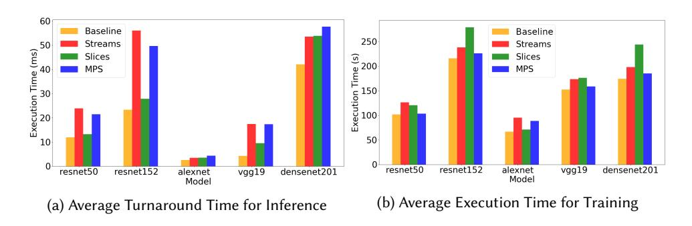
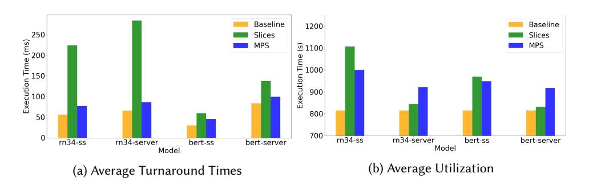
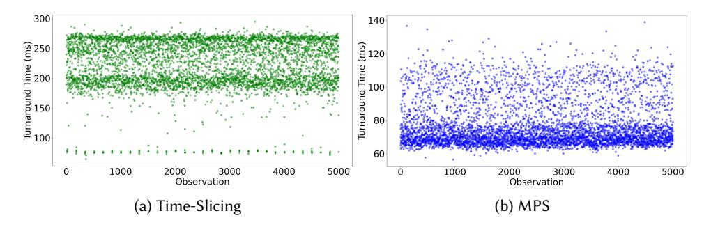
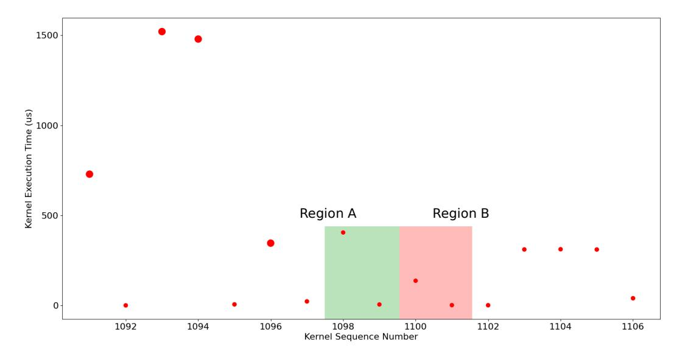

# Characterizing Concurrency Mechanisms for NVIDIA GPUs under Deep Learning Workloads

GUIN GILMAN, Worcester Polytechnic Institute, USA ROBERT J. WALLS, Worcester Polytechnic Institute, USA

We investigate the performance of the concurrency mechanisms available on NVIDIA's new Ampere GPU microarchitecture under deep learning training and inference workloads. In contrast to previous studies that treat the GPU as a black box, we examine scheduling at the microarchitectural level. We find that the lack of fine-grained preemption mechanisms, robust task prioritization options, and contention-aware thread block placement policies limits the effectiveness of NVIDIA's concurrency mechanisms. In summary, the sequential nature of deep learning workloads and their fluctuating resource requirements and kernel runtimes make executing such workloads while maintaining consistently high utilization and low, predictable turnaround times difficult on current NVIDIA hardware.

## 1 INTRODUCTION

Hazelwood et al. observed that at Facebook data centers, variations in user activity (e.g. due to diurnal load) resulted in low utilization periods with large pools of idle resources [\[9\]](#page-19-0). To make use of these resources, they proposed using machine learning training tasks. Analagous lowutilization periods have also been observed at the scale of individual GPUs when using both GPU-based inference [\[7\]](#page-19-1) and training [\[27\]](#page-19-2). The proposed solution to this latter problem was colocating additional inference or training tasks on a single GPU. We go a step further than these previous studies by considering the GPU at the microarchitectural level rather than treating it as a black box. Broadly, we consider the following question: are current GPU application- and block-level scheduling mechanisms sufficient to guarantee predictable and low turnaround times for latencysensitive inference requests, while also consistently making use of unoccupied resources for besteffort training tasks? To answer this question, we explore both NVIDIA's concurrency mechanisms and the characteristics of the workload itself. Complicating our analyses, the NVIDIA scheduling hierarchy is proprietary and some mechanisms (e.g., time-slicing) are not well-documented, so their behavior must be reverse-engineered from empirical observation.

We focus on three application concurrency mechanisms currently offered by NVIDIA devices on the new Ampere microarchitecture: priority streams, time-slicing, and multi-process service (MPS). We find that all three have important limitations. For example, when using priority streams, the kernels of the higher-priority inference task frequently experience compounded delay as they are forced to wait behind blocks of training task kernels for GPU resources. Time-slicing disallows separate applications from being executed on the GPU simultaneously, making it difficult to improve utilization from a serial execution case. MPS makes it possible to assign a proportional share of resources to each application, but it is not possible to assign a scheduling priority to a task.

With these limitations in mind, we conclude that a fine-grained block-level preemption mechanism, if implemented, would improve turnaround time and utilization for concurrent deep learning workloads. Such a mechanism would allow the GPU to preempt any particular subset of thread blocks during their execution to be resumed at a later point in time. This ability to preempt at the thread-block level could be used in conjunction with thread block placement policies to improve predictability when servicing inference requests, e.g., by choosing placements which minimize resource contention. We additionally demonstrate that there are many opportunities to hide the cost of fine-grained preemption.

Our efforts differ from much prior work in that the analysis presented in this work is specifically tailored to the use case of concurrent deep learning workloads, where the inference tasks are latency-sensitive and the training tasks are best-effort. We observed that such workloads have fluctuating resource requirements, variable kernel runtimes, and sequential kernel launches, and unpredictable arrival times. Previously proposed thread-block-level scheduling policies [\[2,](#page-18-0) [12,](#page-19-3) [20,](#page-19-4) [25,](#page-19-5) [28,](#page-19-6) [29\]](#page-20-0) focus only on more generic workloads which do not possess such characteristics. Finally, we add to previous understandings of the CUDA scheduling hierarchy and its concurrency mechanisms [\[3,](#page-18-1) [6,](#page-18-2) [16,](#page-19-7) [23\]](#page-19-8). For example, our observations suggest that resources such as shared memory and registers are not transferred on and off the SM between time slices, potentially to reduce the overhead of context-switching.

The remainder of this paper is structured as follows. Section [2](#page-1-0) provides a description of the CUDA programming model, as well as introductions to the three concurrency techniques examined in this work. Our measurement methodology and workload characteristics are described in Section [3.](#page-2-0) We analyze the performance of the three concurrency techniques available on NVIDIA devices in Section [4.](#page-4-0) In Section [5,](#page-12-0) we detail a number of key observations which demonstrate the potential utility of features such as fine-grained preemption on NVIDIA GPUs. We discuss related work in Section [6,](#page-16-0) and we conclude in Section [7.](#page-18-3)

## 2 BACKGROUND

The following section provides a brief overview of the CUDA programming model for GPU computing on NVIDIA devices of the Ampere [\[1\]](#page-18-4) microarchitecture. It also explains our choice of the three techniques currently available for executing multiple applications concurrently on the NVIDIA Geforce RTX 3090 GPU: priority streams, time-slicing, and MPS.

## 2.1 CUDA Programming Model

We limit our description of the programming model to only those details necessary to understand concurrent application execution and any performance implications thereof.

Kernels, Thread Blocks, Grids, and Warps. A kernel in CUDA programming is the term for the code which is executed on the GPU. For example, an inference task is actually a sequence of thousands of kernels executing serially; one kernel might compute a single fast-fourier transformation. A kernel is comprised of a logical array (i.e., a grid) of independent thread blocks, that each execute the same block of code in parallel on different subsets of data. A warp is a group of 32 threads within a block that execute in parallel on the GPU, and instructions are issued per warp.

Streaming Multiprocessors. To execute a kernel, its thread blocks are scheduled to the GPU's streaming multiprocessors, or SMs, which are its hardware units of computation. Each SM in a GPU from the Ampere architecture has four warp-scheduler units, which can each issue instructions to a warp every two cycles [\[1\]](#page-18-4). SMs additionally have a fixed set of computational resources such as threads, shared memory, and registers. The total resource requirements of all blocks scheduled to an SM during execution cannot exceed the hardware limit for any one of these available resources. An SM is considered to be saturated if it can schedule no further blocks due to a lack of the required resources. We consider two blocks to be colocated if they are executing concurrently on the same SM.

Memory Hierarchy. Discrete GPUs use a memory hierarchy consisting of registers, shared memory, L1/L2 cache, and global memory. Discrete here means that the GPU is a separate device, often connected to the CPU via PCIe. Global memory is GDDR6X DRAM. It is roughly equivalent to CPU main memory, but it is physically located on the GPU. The L2 cache is shared among the SMs, while the L1 cache, registers, and shared memory are SM-specific resources.

Streams. A stream is a sequence of commands that is executed in the order they were issued. These includes all operations performed on the GPU, such as data transfers and kernel launches. Multiple streams can exist simultaneously within one CUDA context. For our purposes, a CUDA context can be thought of as analogous to a CPU process and it contains all resources and actions performed within the CUDA driver API. All operations from separate streams are asynchronous and independent from each other, and streams only interact with each other from within the same context. When a kernel dispatch command is issued to a stream, it launches that kernel to be transferred, scheduled, and executed on the GPU.

NVIDIA Scheduling Hierarchy. When more than one application is being concurrently executed on a single GPU, there are multiple levels of scheduling decisions that occur to determine the final execution schedule. Application-level scheduling includes the order in which work (such as kernel execution or memory transfers) from each application will be computed on the GPU, while the thread block scheduler determines the placement of thread blocks onto SMs. For each SM, the warp scheduler executes thread blocks in groups of 32 threads.

Thread Block Scheduler. Once a kernel arrives at the GPU, its thread blocks are assigned to SMs by the hardware thread block scheduler. A new block is assigned to an SM as soon as it has enough resources available to satisfy that block's resource requirements; which block it chooses to schedule next is determined by the leftover policy [\[3,](#page-18-1) [16\]](#page-19-7), while the SM it chooses to place the next block on is chosen by the most-room policy [\[8\]](#page-19-9).

# 2.2 NVIDIA Concurrency Mechanisms

We refer to executing two independent applications simultaneously on one GPU as concurrent application execution. We examine three concurrency mechanisms that NVIDIA offers for supporting concurrent applications: priority streams, time-slicing, and multi-process server (MPS). We describe each mechanism in detail and characterize them for deep learning workloads in Section [4.](#page-4-0)

We make a distinction between the term application and the OS notion of a process. Most commonly, each application is contained within its own process. However, sometimes it may be advantageous to place logically-separate applications into the same process because it allows for the developer to have limited control over scheduling priorities. This is the case when using priority streams. In contrast, when using time-slicing or MPS, the applications are in separate processes.

When kernels from separate applications are executed at the same time on a single GPU, this is referred to as concurrent kernel execution. Concurrent application execution can include concurrent kernel execution but does not necessarily. In particular, MPS and priority streams allow for the possibility of concurrent kernel execution, but time-slicing does not.

NVIDIA also offers a fourth technique for application concurrency known as Multi-Instance GPU, which partitions a single GPU into up to seven unique and isolated instances for separate applications. However, because this feature is not available on the Geforce RTX 3090 Ampere GPU that we used for this study, so we forgo analysis of it here.

## 3 WORKLOAD DESIGN AND CHARACTERIZATION

We considered a concurrent workload consisting of a single deep learning training task and sequence of inference tasks. These workloads were designed to resemble the scenario of an inference server responding to user requests while training models with spare resources. We measured three performance metrics: (i) average turnaround time of the inference requests, (ii) variation in turnaround time, and (iii) the execution time of the training task as a proxy metric for utilization. The characteristics of the deep learning models we examined are outlined in Table [1.](#page-4-1) All tests were performed on the NVIDIA Geforce RTX 3090 GPU of the Ampere microarchitecture, which has

82 SMs, and each SM has a limit of 1536 threads, 16 thread blocks, 64 KB in registers, 1024 KB of shared memory, 24 GB DRAM, and 6144 KB L2 cache.

## 3.1 Methodology

We examined models from two sources, the first of which was the Tensorflow models from the MLPerf training and inference benchmark suites [\[22\]](#page-19-10).[1](#page-3-0) To maintain benchmark integrity, we restricted ourselves from making any modifications to the MLPerf benchmark models. However, this created two additional challenges. The first was that we were unable to get some models to build for our platform, so we do not include those models in our study. The second was that we could not test priority streams, as that would require non-trivial modifications to the benchmarks in order to run both tasks from within the same process. Thus, we supplemented these results with five Pytorch example models [\[21\]](#page-19-11). Having both Tensorflow and Pytorch models allowed us to characterize two popular deep learning model frameworks and model used for a variety of purposes including image recognition, speech recognition, and natural language processing (NLP).

For each experiment, we ran one training task and one inference task concurrently. We configured the training task to run for the entire duration of the experiment, and the batch sizes we used were the maximum possible before encountering an out-of-memory error. We used two request patterns for the inference tasks. First, we used a pattern where the request arrival times followed a Poisson process (i.e., MLPerf's server mode). Second, we used a pattern where one request immediately followed the previous (i.e., MLPerf's single stream mode). We used 500 requests for the former and 5000 requests for the latter so that the inference task would take a comparable amount of time regardless of what request pattern was used. For the supplemental CNN models, we only used the single-stream distribution.

We ran both inference and training without any other concurrent tasks as a baseline for comparison. For the Pytorch models, each model was run as both the training and inference task for each experiment, while for the MLPerf Tensorflow models, RNNT was the training task for both BERT and ResNet-34. The only modifications necessary were for evaluating priority streams with the Pytorch models, as this required some small changes to the models so that the training and inference tasks were launched from the same process on different CUDA streams.

## 3.2 Workload Characteristics

Whether we are considering training or inference, a deep learning model consists of a sequence of kernels that are launched onto the GPU serially to perform computations on subsets of the data. In Table [1,](#page-4-1) we summarize some of the main properties of the kernels that comprised each training and inference task we examined. Note that the individual kernels in terms of both execution time and required resources. We labeled a kernel as long-running if it took longer than 1ms to run when executed on the GPU in isolation. Another important characteristic of each kernel is how many GPU resources it requires. We define a kernel as large if it has a grid of blocks that cannot all fit onto the GPU's SMs at the same time. This situation occurs when all of SMs reach a resource limit while some of the kernel's blocks remain unscheduled. In other words, once one resource on an SM is exhausted, no more blocks of that kernel can be scheduled to that SM, even if there are other resources remaining. The first resource to run out is known as the limiting resource for a kernel [\[8\]](#page-19-9).

Long-running kernels occupy GPU resources for a significant amount of time, and so mechanisms that lack the ability to interrupt thread blocks mid-execution must wait for them to finish before reassigning those resources. Large kernels may inefficiently occupy GPU resources by preventing

1Specifically, we used v1.0 git commit 8b58587c93af2a5ee67722064f2540a2db15d42f for the inference suite and v0.7 git commit 96ef5cabfccfe06e34e54b6484dd3f6b39293b31 for the training suite.

|                          | Task       | Backend    | Batch Size (items) | Total Kernels | Long-Running Kernels (% of runtime) | Large Kernels (% of kernels) |
|--------------------------|------------|------------|--------------------------|------------------|----------------------------------------------|---------------------------------------|
| ResNet-50 [10]           | Image Rec  | Pytorch    |                          |                  |                                              |                                       |
| Training                 |            |            | 128                      | 212999           | 56.63                                        | 43.71                                 |
| Inference                |            |            | 1                        | 1011603          | _                                            | 15.85                                 |
| ResNet-152 [10]          | Image Rec  | Pytorch    |                          |                  |                                              |                                       |
| Training                 |            |            | 64                       | 2187832          | 6.72                                         | 41.63                                 |
| Inference                |            |            | 1                        | 2843433          | _                                            | 7.75                                  |
| AlexNet [14]             | Image Rec  | Pytorch    |                          |                  |                                              |                                       |
| Training                 |            |            | 256                      | 29402            | 3.28                                         | 57.85                                 |
| Inference                |            |            | 1                        | 220303           | _                                            | 2.28                                  |
| VGG-19 [24]              | Image Rec  | Pytorch    |                          |                  |                                              |                                       |
| Training                 |            |            | 64                       | 370612           | 41.60                                        | 70.64                                 |
| Inference                |            |            | 1                        | 463274           | _                                            | 48.68                                 |
| <b>DenseNet-201</b> [11] | Image Rec  | Pytorch    |                          |                  |                                              |                                       |
| Training                 |            |            | 64                       | 3336809          | 6.76                                         | 35.93                                 |
| Inference                |            |            | 1                        | 3625505          | _                                            | 21.55                                 |
| ResNet-34 [22]           | Image Rec  | Tensorflow | 1                        | 1850691          | _                                            | 2.65                                  |
| BERT [22]                |            | Tensorflow | 1                        | 645000           | _                                            | 60.23                                 |
| RNNT [22]                | Speech Rec | Tensorflow | 1024                     | 9409063          | 10.21                                        | 0.80                                  |

Table 1. The deep learning models analyzed, along with their relevant attributes to concurrent performance. Note that the long-running column shows the proportion of execution time spent on executing long-running kernels, while the large kernels columns show the proportion of large kernels to total kernels. Long-running inference kernels were omitted because they involved a negligible number of such kernels. The MLPerf models were only run as either an inference (ResNet-34, BERT) or training task (RNNT).

further thread blocks from being scheduled and making use of the non-limiting resources. We provide examples of these issues in the next section.

Overall, Table 1 shows that a significant portion of the runtime of these workloads was spent on executing large kernels from either the training or inference tasks. For some models, such as VGG-19 and AlexNet, it is also the case that the majority of the training task's runtime consisted of executing long-running kernels. These observations, along with those made in the next section, lead to our discussion of preemption-based scheduling in Section 5. However, there was also a significant amount of kernels that were small and/or short-running; some models, such as ResNet-34 and RNNT, have almost no large kernels at all. Therefore, there are a number of opportunities to improve utilization by colocating blocks of the two applications.

Importantly, as a single training (or inference) task consists of a sequence of kernels and each of those kernels has resource requirements and runtimes, this means that the resource requirements of the task will fluctuate over the course of its execution as kernels of different sizes and runtimes are launched.

#### 4 CHARACTERIZING APPLICATION CONCURRENCY MECHANISMS

In this section, we empirically examine and characterize the performance of priority streams, timeslicing, and MPS for running concurrent deep learning workloads on NVIDIA GPUs, presenting both their strengths and weaknesses. As described in the previous section, we ran two tasks concurrently: an inference task which was a series of inference requests, and a training task. The ideal outcome for concurrency would be low and predictable turnaround times for the inference task with high utilization of the GPU. We use a proxy metric for utilization, which is the execution time of the

|              | Separate Processes                                                                                                                                       | Colocation                                                                                                                                                                                                                      | Priorities                                                                                                                                                                                                                         |
|--------------|----------------------------------------------------------------------------------------------------------------------------------------------------------|---------------------------------------------------------------------------------------------------------------------------------------------------------------------------------------------------------------------------------|------------------------------------------------------------------------------------------------------------------------------------------------------------------------------------------------------------------------------------|
|              | Priority Streams No. All applications must be launched from within the same process to make use of priority streams.                            | Yes. Kernels launched from separate CUDA streams can be scheduled to the same SM. However, this will only oc cur when the kernel from the highest-priority stream has no blocks left to schedule. | Yes. Priority streams have three separate priority levels, and the thread block scheduler will always choose to schedule blocks of the kernel from the highest priority stream first at any given time. |
| Time-Slicing | Yes. Two applications launched as separate pro cesses to the same NVIDIA GPU will be scheduled using time-slicing by default. | No. When utilizing time slicing, two kernels from separate processes are never executed on the GPU at the same time.                                                                              | No. Time-slicing provides no methods for prioritizing the ex ecution of one application over another, such as specifying the time slice length or frequency for any application.                                    |
| MPS          | Yes. Once an MPS server is set up for the target GPU, the two applications are launched as separate processes.                                  | Yes. While applications are launched from separate pro cesses, the MPS server is able to schedule any kernels' blocks to the same SM, and to exe cute them on the GPU simluta neously.                        | No. While it is possible to limit the maximum number of threads utilized by each ap plication, there is no method for prioritizing the execution of one process over another.                                       |

Table 2. A comparison of the main attributes of each concurrency mechanism: their ability to be used on kernels from separate processes, the possibility of colocating blocks from different tasks, and whether or not prioritization of a specific task is possible.

Fig. 1. The average turnaround times and utilization for each of the three mechanisms on five different models. Note that the turnaround times are the averages of 5000 inference requests in milliseconds, and the measurement of training execution time is the average of 10 runs in seconds. The baseline is the time taken when run in isolation.

best-effort training task, and we discuss this choice further in Section [5.](#page-12-0) Table [2](#page-5-0) summarizes the distinguishing characteristics of each concurrency mechanisms, although these are discussed in more detail below.

# 4.1 Priority Streams

When using priority streams, the kernels of the two applications are launched from within the same process on different streams using threads. Streams can be assigned one of three priorities

Fig. 2. The variance of the turnaround times for the ResNet-50 model. Other models' variance results were omitted for space, but resemble these.

ranging from -2 to 0. The thread block scheduler will always pick blocks from the highest-priority stream first when scheduling, but it will not interrupt any thread blocks currently being executed on the GPU. We implemented application-level concurrency by putting both applications within the same OS process, but launching them onto separate CUDA streams, with the kernels of the inference task being on higher-priority streams than those of the training task.

Observation 1 ([O1\)](#page-6-0). Priority streams cannot preempt executing thread blocks in the middle of execution, and this resulted in compounded delay and resource contention leading to high and less predictable turnaround times.

When a kernel from a higher-priority stream arrives at the GPU, its thread blocks will take precedence over any unscheduled blocks of any lower-priority kernels. However, the high priority kernel cannot interrupt the execution of a lower priority kernel's already-executing thread blocks. In other words, the higher-priority kernel must wait for any currently-executing blocks from a lower-priority stream to finish.

Fig. 3. The average turnaround times and utilization for each of the three mechanisms on the MLPerf models. Note that the turnaround times are the averages of 5000 consecutive inference requests in milliseconds in the single-stream (ss) scenario, and 500 requests which arrive via a Poisson process in the server mode. Additionally, the measurement of training execution time is the average of 10 runs in seconds. The baseline is the time taken when run in isolation.

Fig. 4. The variance of the turnaround times for the ResNet-34 model, in the consecutive 5000 inference requests scenario. Other models' variance results were omitted for space, but resemble these.

Fig. 5. The variance of the turnaround times for the ResNet-34 model, in the MLPerf server scenario. Other models' variance results were omitted for space, but resemble these.

This led to a phenomenon we term compounded delay.[2](#page-7-0) As described in the previous section, all of our examined models were structured as a sequence of consecutive kernels. In our experiments, when a high priority kernel finished executing, there was a window of time before the next kernel could reach the GPU. In this timeframe, there were no inference kernels ready to execute, so the

2Compounded delay as we have described it here can be though of as an instance of the convoy effect [\[4\]](#page-18-5).

lower-priority training kernel would resume executing and fill the GPU with its thread blocks. Shortly after resuming the training kernel, the next inference kernel would arrive. As the priority streams mechanism does not support preemption of executing thread blocks, the inference kernel had to wait for the currently-executing training blocks to finish.

We can see the effects of this delay in the results from the ResNet-50, ResNet-152, VGG-19, and DenseNet-201 models in Figure [1a,](#page-5-1) where the turnaround times were approximately 2X, 3X, 4X, and 1.75X compared to the baseline, respectively. The impact of the compounded delay was dependent on the characteristics of the training kernels. For example, the ResNet models and VGG-19 saw some of the worst turnaround times as the inference task, as these models spent about half of their training task's time on executing large or long-running kernels. Intuitively, long-running kernels resulted in more compounded delay. In effect, we can see that compounded delay essentially canceled out any benefits one might expect to gain from placing the inference kernels on a higherpriority stream. In particular, priority streams' turnaround times were comparable to that of MPS in almost all cases, despite MPS having no notion of priorities. Compounded delay also reduced the predictability in turnaround time as seen in Figure [2a.](#page-6-1) We observed spikes in turnaround time during the time the training epochs were executing on the GPU, as the kernels of the inference task are interacting with and being delayed by those of the training task.

It is additionally worth noting that some of the performance degradation can be explained by the effects of resource contention when the thread blocks of the two applications are colocated on the same SM. For example, the blocks from the two kernels may contend for the SM's warp scheduler. Official documentation does not describe how the warp scheduler interacts with priority streams. If the warp scheduling policy does not prioritize the blocks from the higher priority stream, such as if the warp scheduler uses a greedy-then-oldest or loose round-robin policy [\[23\]](#page-19-8), then the warp scheduler would effectively de-prioritize the higher priority thread blocks.

## 4.2 Time-Slicing

When two applications are run as separate processes and MPS is not being used, the CUDA application-level scheduler will alternate between the processes over time, yielding the GPU's computational resources (e.g., the warp scheduler and computational units) completely to one process for the duration of a time-slice [\[6,](#page-18-2) [23\]](#page-19-8). Only one application's kernels are executing on the GPU during any given time slice. We implemented application-level concurrency by launching each application as a separate process.

Observation 2 ([O2\)](#page-8-0). Time-slicing tended to exhibit predictable and low turnaround times for models with relatively low baseline turnaround times (unless there is memory transfer contention; see Observation [4\)](#page-10-0), due to a lack of interference from the training task. This came at the cost of poor utilization, as the two tasks never actually executed on the GPU at the same time.

As demonstrated in Figure [2b,](#page-6-1) time-slicing offers the most predictable performance of the three. We attribute this high predictability to two factors. The first is that the training and inference tasks never execute at the same time, so there is no contention for SM resources during block execution. Second, executing blocks can be preempted (although this preemption is coarse-grained and yields the entire GPU to the preempting task), so the inference kernel does not need to wait for any blocks of the training task to finish executing before being scheduled to the GPU, i.e. compounded delay is not a problem.

The primary factor that influences turnaround time is the number of other GPU applications that are being executed concurrently, as this changes the amount of time that any one job must wait for access to the GPU's resources. The reason for this is that time slices are a fixed size and are assigned round-robin to each process. The precise behavior of the time-slicing mechanism is not well-documented. However, we determined in our empirical setup that time slices were fixed-length and assigned round-robin across processes. Empirically, we determined that the time slice length is fixed to approximately 2ms. These observations are consistent with those made in previous work about the earlier Turing microarchitecture [\[6,](#page-18-2) [23\]](#page-19-8). As far as we could determine, the time slice size and priority assigned to each process cannot be configured.[3](#page-9-0) This means that there is no way for one application to be prioritized over another, either by extending an application's time on the GPU or the frequency with which their time slices are scheduled.

Therefore, the trade-off inherent in using time-slicing is predictability at the cost of utilization, which was frequently the worst of the three surveyed mechanisms. In particular, extra computational GPU resources remain idle during each time slice. For kernels which do not fully occupy the GPU in terms of threads, registers, shared memory, and grid size, time-slicing does nothing to occupy those resources.

The lack of spatial sharing is the major limitation of time-slicing, as it does not truly solve the GPU resource utilization problem being addressed by concurrently executing training and inference tasks. For the ResNet models and particularly for DenseNet-201, the training time increased to over 100 seconds more than the baseline in Figure [1a.](#page-5-1) The reason VGG-19 and AlexNet did not see such an increase is due to the shorter lengths of their inference tasks; they completed earlier, allowing the training task to then utilize the GPU resources in isolation.

Observation 3 ([O3\)](#page-9-1). Time-slicing is limited by the fact that the two tasks can only be launched together if the sum total of the resources required by both is less than the total available on the GPU, despite the fact that they never execute on the GPU at the same time.

While the inference task is the only application executing during its time slice, our observations suggest that it still has to share certain resources such as registers and shared memory with the other process. We determined empirically that the resource requirements of any tasks being run simultaneously as separate processes cannot together exceed the resource limitations of the GPU, or an error will be thrown. For instance, the GPU had 64KB of registers per SM. When we launched two applications that each used 40KB of registers per block, with exactly enough blocks for one per SM, it caused the second process to reach the GPU for scheduling to crash with an out-of-memory error. We empirically observed similar behavior for shared and global memory, as well. We hypothesize that this is the case because resources such as shared memory, registers, and global memory that are used by a process are not transferred on and off the GPU between time slices, and we suspect the reason is to avoid prohibitively high context-switching overheads when swapping between applications across time slices.

This has performance implications for the training task, which had to be scaled down from its maximum batch size in order to allow space for the inference task. In other words, despite the fact that the two tasks never execute on the GPU at the same time, neither task can fully utilize the GPU during their time slice without running into this error. The implication is that we have to be conservative when setting the batch size for the training task, as that is what determines how many resources each individual kernel is going to use. Since it cannot be known a priori which inference kernels will be running alongside which training kernels, it must be based on the worst-case scenario.

This problem is compounded by the fact that in some systems, it may be difficult to know ahead of time precisely how many resources the inference task will require. Given that the rate at which inference requests will be received will be unknown, we can either perform inference for a single image at a time, choose a fixed batch size to use for performing inference, or perform inference using

3 Jetson devices do allow time slice configuration [\[6\]](#page-18-2).

(a) ResNet-34 Kernel and Transfer Times (Baseline) (b) ResNet-34 Kernel and Transfer Times (Time-Slicing)

Fig. 6. Kernel execution times (red) and memory transfer operation times (blue) for the ResNet-34 inference task in both the baseline and time-slicing scenarios.

(a) DenseNet-201 Kernel and Transfer Times (Baseline) (b) DenseNet-201 Kernel and Transfer Times (Time-Slicing)

Fig. 7. Kernel execution times (red) and memory transfer operation times (blue) for the DenseNet-201 inference task in both the baseline and time-slicing scenarios.

variable-sized batches. Single image inference has predictable resource usage, so an out-of-memory error can be avoided; however, this will add queueing delay (i.e., one image now has to wait for the previous request to be serviced first). Fixed batch sizes also have predictable resource usage as they are just the generalized case of single-image inference, so we can tune the training task to accommodate that while minimizing queueing delay. However, if we do not fill up the batch for a particular run, then we will have even lower utilization.

Observation 4 ([O4\)](#page-10-0). Contention due to memory transfers can adversely impact predictability and turnaround time.

Time-slicing performed much worse with the RNNT training task for both BERT and ResNet-34 than it did with the Pytorch training and inference combinations, as seen in Figure [3.](#page-7-1) One reason for this is that time-slicing tends to perform worse when the tasks take longer due to having to perform more context switches overall, and all three of these tasks were longer-running than the PyTorch models were on average. However, in addition to this, ResNet-34 possessed some attributes that would increase execution times by greater amounts when run concurrently with another application. The ResNet-34 inference task spent orders of magnitude more time on memory transfers than other models performing inference did. Figure [6](#page-10-1) shows the kernel execution times and memory operation times of the Resnet-34 inference task in both the baseline and time-slicing cases, and Figure [7](#page-10-2) shows the same for the DenseNet-201 inference task. ResNet-34 showed a significant increase in the

amount of time spent on memory transfer tasks during the time-slicing case, while DenseNet-201 did not, suggesting that memory transfer interference contributed to its higher turnaround times. These results align with previous findings that applications run as separate processes on NVIDIA devices can experience interference from memory transfer commands, despite being isolated as separate processes [\[23\]](#page-19-8). Like Observation [3,](#page-9-1) this is another way in which time-slicing does not actually isolate the two processes from each other.

## 4.3 Multi-Process Service

MPS allows applications run as separate processes to execute on a GPU at the same time. An MPS server is responsible for scheduling kernels from each process to the GPU. This differs from time-slicing in that the thread blocks of kernels from separate processes can spatially share the GPU, i.e., execute on the GPU at the same time, possibly even sharing an SM. While spatial sharing is also possible when using priority streams, MPS allows the kernels to be from separate processes[4](#page-11-0) but does not include any notion of task prioritization. Instead, the MPS server can be configured to limit the number of threads that can be used by any one application; for example, the MPS server can be set so that each client can use no more than 50% of the total amount of threads offered by the GPU. NVIDIA recommends that this limit be set to 100%/0.5n, where n is the number of clients to allow the GPU to potentially colocate kernels from separate applications on the same SM whenever there are idle resources. MPS is perhaps best suited to cases where the kernels utilize less than the total available resources of the GPU. We implemented application-level concurrency by launching an MPS server and then launching both the inference and training tasks as separate MPS client processes.

In our experiments, we set the thread limit for both applications to 100%. In addition to this being the recommended setting, limiting the training application to only using some portion of the threads at any given time would defeat the purpose of using the training task to utilize spare GPU resources whenever they are available.

Observation 5 ([O5\)](#page-11-1). While MPS increased utilization overall, it also caused intra-SM resource contention that added to the execution times of both the training and inference tasks.

MPS saw consistent results in terms of utilization, as measured by the training execution time in Figure [1b.](#page-5-1) The additional 5000 inference requests increased the time it took to train the model, usually by 20-30 seconds. In contrast, using priority streams frequently increased the training task execution time by 30-40 seconds and using time-slicing by up to 50 seconds. MPS can achieve good utilization primarily because it makes it possible to colocate blocks from different kernels. Priority streams was also able to colocate blocks, but it still took longer for the training task to complete because the inference task would be prioritized.

MPS additionally performs better when potential contention due to colocation is low. Colocation of blocks from different applications allows for finer-grained resource assignment, but it can also create contention for resources when the blocks that are sharing an SM require the same resource, leading to significant performance degradation. Furthermore, unless it is clear what effects contention will have on the runtimes of the kernels, it is challenging to predict the performance of colocated kernels [\[8,](#page-19-9) [28\]](#page-19-6). The increases in turnaround times compared to time-slicing observed in Figure [1a](#page-5-1) are partially explained by the presence of this resource contention. Minimizing contention is thus important for MPS to achieve increased utilization with less significant degradation in turnaround times.

4To be more precise, they are launched from separate CUDA contexts.

Observation 6 ([O6\)](#page-12-1). MPS balances between the progress of the training and inference tasks, but it is unable to adequately prioritize one over the other. More of the degradation is seen on the part of the inference task due to the scheduling policies used.

While MPS can allow two kernels to spatially share the GPU, it is not able to explicitly prioritize the execution of one application over another. Thus, both the training and inference tasks are likely to make progress that is more balanced between the two applications than with priority streams. This is the main reason that the MPS training task execution times in Figure [1](#page-5-1) are typically better than the priority streams times. Given that at least half of all of the models' inference and training kernels are small, MPS can employ this load-balancing during a significant portion of the tasks' execution, and there are frequently enough leftover resources from one application to share with the second.

The extent to which the GPU can be shared between applications is limited by the thread block scheduling policy. Kernels are still scheduled on essentially a first-come, first-served basis (up to the thread limit for each process). More specifically, our experiments suggest that the blocks are scheduled according to the leftover policy, which dictates that all of the blocks from the most recently-arrived kernel must first be dispatched and executed on the GPU before any other kernels' blocks can be scheduled [\[3\]](#page-18-1). Unlike priority streams, all of the blocks of the current kernel will be scheduled, and a later-arriving kernel is not able to schedule any before that. This presents a problem for the kernel that arrives at the GPU later, especially if that kernel is from the inference task, as the running time of the second task is needlessly throttled.

Due to these issues, MPS causes a greater degree of degradation for the inference tasks than the training tasks in Figure [1.](#page-5-1) For instance, ResNet-152 saw the turnaround time increase 2X, but the training task execution time only increased by a few seconds, which was the shortest training task time observed for the three mechanisms. The DenseNet-201 training and inference tasks both had, on average, smaller proportions of long-running kernels with larger grid sizes. This was the model where MPS performed the best in terms of both turnaround time, with an increase of 9.6ms, and utilization, which increased by only 11 seconds. For the other four Pytorch models that averaged longer-running training and inference kernels, the inference task was more often starved for resources, forced to make progress with what was leftover.

Unlike the Pytorch training tasks examined, RNNT had virtually no large kernels during its runtime, meaning that there was almost always space on the GPU for other tasks to use more of the resources. This is one reason why MPS tended to perform more consistently well in terms of turnaround time than with the Pytorch models, which consisted of training tasks that more frequently occupied the GPU with large kernels. However, RNNT's execution time increased more drastically than the Pytorch training tasks' execution times did using MPS, as seen in Figure [3,](#page-7-1) due to the high amount of large kernels and the longer runtimes of the inference tasks.

Note that MPS's resource assignment issue is distinct from the compounded delay problem discussed in Section [4.1.](#page-5-2) The latter is caused by the gap between kernel launches where the training kernel uses the free resources. However, with a 100% thread limit, the compounded delay problem is also an issue for MPS. Thus, colocation and compounded delay also caused variance in turnaround time, as seen in Figure [2c.](#page-6-1) This variance was not as large as that observed in the priority streams case, as inference request satisfaction is partially dependent on the degree to which the training task is utilizing the GPU's resources.

# 5 DISCUSSION

Observation 7 ([O7\)](#page-12-2). For concurrent deep learning workloads, GPU utilization and predictability could be improved with fine-grained preemption of thread blocks.

Fig. 8. ResNet-152 Kernel Trace. A subset of the sequence of kernels executed during the ResNet-152 inference task. The larger points are large kernels (in terms of their resource requirements on the GPU, they cannot fit their entire grid on the GPU at once), while the smaller points are small kernels.

Kernels which do not leave enough space for other kernels to be co-located alongside it often leave non-limiting resources unoccupied. Frequently, they prevent further blocks from being scheduled without actually utilizing all of the GPU's resources, when a different arrangement of thread blocks on the GPU would result in fewer of them being left idle.

Consider a case such as that of ResNet-152. For its training task, most of its large kernels were limited by threads. When such a training kernel is scheduled, the thread block scheduler places as many blocks as possible onto the GPU, but there will still be unused registers and memory resources. The ResNet-152 inference task, in contrast, consists almost entirely of small, short-running kernels. Replacing even one block of the training kernel would leave room for a number of these smaller and less resource-intensive thread blocks. The combination of blocks from the training and inference kernels would use up an equivalent number of threads, but fit more blocks onto each SM and make better use of the registers and memory resources.

However, even when a given training kernel is small enough to leave space for the newly-arrived inference kernel to fit onto the GPU alongside it without waiting, resource contention will still incur delays that will push back further kernel launches in the sequence. There are two major issues to be solved here. First, the stochastic nature of the inference requests causes both unpredictability and inefficient utilization due to being unable to rearrange or interrupt thread blocks when they are already on the GPU. Second, resource contention also increases the unpredictability even when blocks are colocated on the GPU to improve utilization. Solving these problems requires flexible scheduling mechanisms; in particular, approaches which treat the GPU as a black box and make only application-level scheduling decisions will not be sufficient.

Future GPU architectures could potentially address the above utilization and predictability challenges with a new thread-block-level scheduling mechanism we term fine-grained preemption. Specifically, we define fine-grained preemption as the ability of the thread block scheduler to interrupt an arbitrary set of thread blocks at any point during the blocks' execution and relaunch those blocks at a later time.

Observation 8 ([O8\)](#page-14-0). For the specific case of concurrent deep learning workloads, the cost of fine-grained block-level preemption could be offset by the potential benefits.

Current NVIDIA GPUs do not support fine-grained block-level preemption. As discussed in Section [4,](#page-4-0) while using priority streams does allow for one kernel to interrupt another kernel that is in the middle of being executed on the GPU, it does not actually preempt any of the blocks currently on the GPU, instead waiting for them to finish execution before scheduling any blocks of the new kernel. MPS similarly has no mechanism for interrupting the execution of a block, and instead schedules on a first-come, first-served basis; this lack of block-level preemption is one cause of the performance degradation seen in Section [4.](#page-4-0) The compounded delay incurred as a result caused the priority stream turnaround times to be comparable to that of MPS, which has no notion of priorities at all. Time-slicing, while able to preempt blocks in the middle of their execution, can only do so in a course-grained way. It is only able to clear the entire GPU of all currently-executing thread blocks, with no ability to partially preempt the GPU or prioritize one application over another.

Fine-grained preemption would complement priority streams and MPS, and could address many of these issues which appear in the examined deep learning workloads. For instance, if enough blocks could be preempted as soon as an inference kernel arrived, none of the large or long-running training kernels would cause compounded delay. In addition, fine-grained preemption would allow MPS to prioritize the inference task over the training task. With the ability to clear a specific amount of space on the GPU at any time, MPS could include a setting to specify a minimum resource usage requirement for each application, and preempt blocks to meet that threshold when the kernel arrives. Fine-grained preemption would also vastly improve predictability over the priority streams and MPS approaches if it were used in conjunction with a contention-aware scheduling policy, as the effects of compounded delay and the leftover policy could be eliminated.

The performance cost of fine-grained preemption depends on the implementation. For instance, a reasonable estimate for the cost of a full context-switch would consist of the time it would take to move the entirety of a kernel's context into global memory before the preempting kernel begins executing. This is because saving state is likely to be the dominating factor in preemption time. Using the methodology of prior work [\[6,](#page-18-2) [20\]](#page-19-4), we estimate the cost for saving state when context-switching is 38s. If all data from all 82 SMs on the GPU need to be transferred to global memory, this would include 64 KB of constant memory, 10496 KB of L1/shared memory, a 20992 KB register file, and 6144 KB of L2 cache data. With a total of 37696 KB to transfer to global memory, and a memory bandwidth of 936 GB/s [\[1\]](#page-18-4), saving state would take approximately 38s to complete. Further, as global memory for the target GPU is 24 GB, the storage size overhead is negligible.

It is not the case, however, that fine-grained preemption will necessarily involve saving the state of the entire GPU. For a single SM, the context that needs to be saved includes 64 KB of constant memory, 128 KB of L1/shared memory, and a 256 KB register file, for a total of 448 KB. Assuming that an SM only has use of its fair portion of the bandwidth, it would have 11.4 GB/s of bandwidth to use. This results in a total of approximately 37s. This is only 1s less than the time it would take to save the state of all SMs. Note that this estimate does not take into account factors such as maintenance of L2 cache coherence, memory transfer bandwidth interference from other applications, or the performance degradation likely to occur after switching due to reduced cache effectiveness.

Another method for estimating the cost of fine-grained preemption would be to examine the existing time-slicing mechanism. We conducted a simple experiment to estimate the amount of time between the last thread executed in time slice and the first thread executed in time slice + 1. We launched two kernels as separate applications, with one thread block per SM each. Consequently, these kernels executed in alternating time slices. One thread in each thread block wrote the contents

of the global timer register to local memory repeatedly, and we compared these time stamps across the two kernels to ascertain the amount of time between time slices. We observed an average time of approximately  $145\mu$ s between recorded values; assuming half that time is spent saving the context of one kernel and the other half is spent resuming the context of the other, the time to save state is  $73\mu$ s.

Finally, we note that the existing time-slicing mechanism might serve well as the foundation for the proposed fine-grained preemption implementation. For example, it might be possible to reuse some of the same hardware for fine-grained preemption, reducing hardware costs. Further, time-slicing may already include techniques, such as only saving partial state, to reduce the performance cost of preemption. As we hypothesized in Observation 3, the NVIDIA RTX 3090 GPU does not appear to transfer shared memory and registers when switching between contexts.

OBSERVATION 9 (O9). The cost of fine-grained block-level preemption can be hidden by taking advantage of the fact that the deep learning tasks are a sequence of kernels. Preemption can be overlapped with transfer delay and the execution of prior kernels in the sequence.

The trade-off for this lower and more predictable turnaround time is that the best-effort training task will take longer, by adding the overhead of preemption. However, the sequential nature of the kernels provides frequent opportunities to hide the cost of preemption amidst transfer delay and the execution of other latter kernels. For example, data transfers from host to device take place periodically over the course of the applications' runtimes. Preemption for the kernels following such transfers can be hidden by performing some or all of the preemption during this transfer latency.

Preemption latency can also often be hidden for later kernels in the sequence when a larger kernel follows a smaller one. While a smaller kernel is being executed on the GPU, since it is known that a larger kernel which requires more resources will be following it, preemption cost can be hidden by preempting some of the blocks of the training task during the execution of the smaller kernel. This will guarantee that there will be enough space available to schedule the large kernel as soon as it arrives. One such example is illustrated in Figure 8, in the region labeled Region B. The first kernel only consists of 32 blocks of 64 threads each, while the second kernel has 512 blocks of 64 threads each. As the first kernel is being executed on the GPU, it will only take up 64 threads on 32 of the 82 SMs, and the training task will use the rest of the resources. In order to make sure there is already room for the 512-block kernel when it arrives, the training task can have enough blocks preempted during the execution of the first kernel. The second kernel only takes  $2\mu$ s to execute; on its own, preemption could vastly increase the execution time of the kernel. However, the first kernel takes about  $137\mu$ s to execute, so it is able to hide most of the delay that would be incurred if preemption occurs during its execution instead of after.

Preemption latency can also be avoided for the latter kernel in the same sequence by simply leaving the space on the GPU open as the first kernel finishes, instead of filling it back up with training kernel blocks. An example where this could be done can be seen in the region labeled Region A in Figure 8. Both of the highlighted kernels are small, meaning that they can fit their entire grid on the GPU at one time; the first kernel has only 136 blocks of 256 threads each, while the second one has only 112 blocks of 32 threads each. However, the first kernel takes about  $400\mu$ s to run, while the proceeding kernel only takes around  $6\mu$ s. This second kernel would be subsumed by the amount of time preemption would take; If the block placement of the first kernel is not ideal for the second kernel, so replacing the blocks would result in an undesirable block placement for the second kernel, the first kernel is also still long enough to hide the latency of preempting a subset of training task blocks to create the ideal placement for the second kernel.

Observation 10 ([O10\)](#page-16-1). Utilization is difficult to define, but the execution time of the best-effort task is a good proxy metric.

NVIDIA has a number of profiling tools available that offer different measures of utilization. For instance, NSight Systems can report metrics such as SM ooccupancy and thread occupancy [\[17\]](#page-19-16), and nvidia-smi and the NVML API report utilization as the percentage of the last one second where a kernel was running on the GPU [\[18\]](#page-19-17). Attempts to measure utilization with a single number often run the risk of over-simplifying the actual state of resource usage due to both the number and variety of resources available. For example, if the current set of scheduled blocks uses all of the available threads, this does not necessarily imply total saturation, as the amount of shared memory and registers in use could still be quite low. Measuring utilization as the execution time of the training task avoids this issue by taking into account how much useful work is being done by the background task with the resources it is occupying.

Take, for example, a single kernel from the ResNet-152 training task which has 100% utilization based on thread usage as a metric: its grid consists of 200704 blocks, while each block consists of 256 threads. Thus, for our evaluation GPU, only 6 blocks can fit on each SM at a time, for a total of 492 blocks. The blocks of this particular kernel also use 32 registers per thread, for a total of only 49152 registers, meaning that the registers are being underutilized even when the GPU is fully occupied (as in, no more blocks can be scheduled because no more threads are available).

Now consider another example that also has 100% utilization in terms of thread usage, but more completely saturates other GPU resources. The average ResNet-152 inference kernel uses 2-3 warps per block; a typical example which comes up quite frequently during execution would be a convolutional implicit SGEMM kernel with 64 threads per block and 80 registers used per thread. Removing even one 256-thread block of the training task from an SM would make space for four blocks of this inference kernel, and register usage would now be at 61440. This is much closer to the limit of 64KB per SM, and the total number of blocks per SM is increased by 3, while the thread usage still remains the same. Thus, we can see that a GPU having no more room to place another block does not mean that its resources are being utilized effectively, and that by merely rearranging the blocks and co-locating blocks from separate kernels, total resource usage can often be increased.

Both of these examples have 100% utilization by the simple thread-based utilization metric, but one utilizes more of the GPU's resources than the other. We do not necessarily solve this issue, but we find that the execution time of the best-effort task is a good proxy measure to account for this situation.

# 6 RELATED WORK

We divide our discussion of prior work into categories consisting of those studies which focus on reverse-engineering NVIDIA hardware, improving concurrency using spaital multiplexing, and improving concurrency using temporal multiplexing. Principally, we extend this prior work by evaluating the performance of deep learning workloads under the existing methods for concurrent application execution NVIDIA GPUs.

Reverse-Engineering Hardware. Previous work has characterized concurrency on NVIDIA hardware in terms of individual components of the NVIDIA scheduling hierarchy for generalpurpose workloads. For instance, previous work reverse-engineered the behavior of the hardware thread block scheduler [\[3,](#page-18-1) [16\]](#page-19-7) and investigated the performance implications of the observed thread block scheduling policies [\[8\]](#page-19-9). For example, Xu et al. observed the thread block scheduler uses a leftover policy, where blocks from a later-arriving kernel are only scheduled once all earlierarriving kernels' blocks have been scheduled first [\[28\]](#page-19-6). The authors concluded this policy was

often inefficient for concurrent application execution and performed very similarly to running two kernels in succession. We also observed issues with the leftover policy in Section [4.](#page-4-0)

Other work focuses on the higher levels of the scheduling hierarchy. Olmedo et al. discuss multiple levels of the NVIDIA scheduling hierarchy [\[23\]](#page-19-8), and the time-slicing application scheduler for the Tegra architecture similar to the one observed in this work is detailed by Capodieci et al [\[6\]](#page-18-2). The authors of the latter paper found the application-level scheduler to be lacking in the flexibility necessary to sufficiently prioritize latency-sensitive real-time tasks, and although their work was specific to an integrated architecture, we identify similar issues on the Ampere microarchitecture in Section [4.](#page-4-0)

Spatial Multiplexing. Spatial multiplexing improves GPU utilization by efficiently dividing GPU resources between kernels. Adriaens et al. proposed assigning each concurrent kernel exclusive access to a subset of the SMs [\[2\]](#page-18-0). In contrast, Xu et al. propose techniques that allow concurrent kernels to share SMs and attempt to optimize the placement of thread blocks from different kernels [\[28\]](#page-19-6). The authors compare the performance of this technique directly to both the assignment of SM subsets to kernels and the leftover scheduling policy used by actual NVIDIA hardware when using streams. Pai et al. alternatively propose elastic kernels which allow for fine-grained control over the resources required by a kernel, and show its relative performance gains compared to CUDA streams with the leftover policy [\[19\]](#page-19-18). The above techniques assume a task set that is fixed and that all tasks are ready to be scheduled immediately. However, our work considers a stochastic deep learning workload in which the arrival times of the inference requests are unpredictable. An interesting direction for future work would be investigating how fine-grained preemption could be used in conjunction with the above spatial-multiplexing policies. In particular, with fine-grained preemption, the scheduler can make the spatial-multiplexing decisions dynamically as new tasks arrive.

Temporal Multiplexing. Temporal multiplexing improves the turnaround time of GPU applications rather than improving the utilization of GPU resources. Tanasic et al. proposed two forms of preemption for concurrent application execution on GPUs: context-switching and SM-draining [\[25\]](#page-19-5). The latter is similar to priority streams in that it allows any currently-executing thread blocks to finish before replacing them with a different application's blocks. Park et al. propose a third technique, SM-flushing, in which blocks are interrupted and do not save their state, i.e., when resuming execution these blocks must start over from the beginning [\[20\]](#page-19-4). In addition, the authors built a scheduling framework that switches between these three preemption techniques dynamically. Capodieci et al. propose changes to the time-slicing mechanism on the embedded NVIDIA Tegra architecture that would enable real-time task prioritization [\[6\]](#page-18-2).

All of the above techniques require hardware modification. In contrast, others have proposed higher-level methods to enable temporal multiplexing, such as kernel modifications to make GPU applications preemptable [\[26\]](#page-19-19). Others have examined reordering kernels or reordering memory transfer and kernel launch commands of an application [\[5,](#page-18-6) [15\]](#page-19-20).

Deep Learning Workloads. Most of the above works also only consider general purpose GPU workloads. However, Xiao et al. examined a workload consisting of deep learning training jobs. They proposed a scheduler for GPU server clusters which dynamically scales the memory and computational resources assigned to these jobs as their demand for them fluctuates and then schedules high-priority jobs and best-effort jobs cooperatively in the cluster through over-provisioning [\[27\]](#page-19-2). However, this approach does not consider the microarchitectural interactions of the NVIDIA scheduling hierarchy such as the thread block scheduler which, as we have demonstrated, impact the performance of concurrent workloads.

Preliminary work conducted by Jain et al. on deep learning inference-only workloads suggests that combining spatial and temporal multitasking may outperform both in isolation [\[12\]](#page-19-3). We discussed this possibility further in Section [5.](#page-12-0)

# 7 CONCLUSIONS

In summary, we have characterized three existing mechanisms for executing concurrent workloads currently available on NVIDIA GPUs—priority streams, time-slicing, and MPS—and their performance for handling concurrent deep learning workloads consisting of a best-effort training task and sequence of latency-sensitive inference tasks. We considered their ability to provide predictable and low turnaroaund times, while still maintaining high utilization, and found that they each possessed certain drawbacks that made this difficult. Priority streams and MPS are both vulnerable to unpredictabile performance penalties incurred by resource contention and higher turnaround times due to the effects of compounded delay, while time-slicing lacked the spatial-sharing capabilities to improve utilization significantly and showed evidence that memory transfer contention can sometimes interfere with maintaining low turnaround times.

We then argued that it is insufficient to consider only application-level scheduling, and the kernel- and block-level scheduling techniques such as fine-grained preemption would be necessary to efficiently execute concurrent deep learning workloads. We showed that the deep learning workloads being examined have characteristics which make such a preemption mechanism necessary, including sequential kernel launches, fluctuating resource requirements, and stochastic arrival times. We additionally demonstrated how these features present frequent opportunities to hide the cost of fine-grained preemption, and also how such a mechanism could be used to complement the existing ones to increase utilization, turnaround time, and predictability. While the proposed preemption mechanism shows promise, testing fine-grained preemption on actual hardware will require modification to proprietary NVIDIA components and, as such, cooperation from the NVIDIA corporation. One potential direction for future work is to build on these findings by analyzing the performance of fine-grained preemption using a GPU simulator such as Accel-Sim [\[13\]](#page-19-21).

We intend for this work to catalyze the creation of more robust and efficient techniques for concurrent deep learning workloads in the future. It is likely that such mechanisms should involve both efficient preemption mechanisms and contention-aware block placement policies to achieve greater concurrent workload performance. We also expect this work to serve as a baseline for comparison for work on concurrency mechanisms on NVIDIA devices. Additionally, we hope to see the proposed fine-grained preemption mechanisms implemented in future NVIDIA devices.

# REFERENCES

- [1] 2018. NVIDIA Ampere GA102 GPU Architecture: The Ultimate Play. Technical Report. NVIDIA. [https://www.nvidia.com/](https://www.nvidia.com/content/dam/en-zz/Solutions/geforce/ampere/pdf/NVIDIA-ampere-GA102-GPU-Architecture-Whitepaper-V1.pdf) [content/dam/en-zz/Solutions/geforce/ampere/pdf/NVIDIA-ampere-GA102-GPU-Architecture-Whitepaper-V1.pdf](https://www.nvidia.com/content/dam/en-zz/Solutions/geforce/ampere/pdf/NVIDIA-ampere-GA102-GPU-Architecture-Whitepaper-V1.pdf)
- [2] J. T. Adriaens, K. Compton, N. S. Kim, and M. J. Schulte. 2012. The case for GPGPU spatial multitasking. In IEEE International Symposium on High-Performance Comp Architecture.
- [3] T. Amert, N. Otterness, M. Yang, J. H. Anderson, and F. D. Smith. 2017. GPU Scheduling on the NVIDIA TX2: Hidden Details Revealed. In 2017 IEEE Real-Time Systems Symposium (RTSS).
- [4] Remzi H. Arpaci-Dusseau and Andrea C. Arpaci-Dusseau. 2018. Operating Systems: Three Easy Pieces. Arpaci-Dusseau Books.
- [5] Mehmet E. Belviranli, Farzad Khorasani, Laxmi N. Bhuyan, and Rajiv Gupta. 2016. CuMAS: Data Transfer Aware Multi-Application Scheduling for Shared GPUs. In Proceedings of the 2016 International Conference on Supercomputing (ICS '16).
- [6] N. Capodieci, R. Cavicchioli, M. Bertogna, and A. Paramakuru. 2018. Deadline-Based Scheduling for GPU with Preemption Support. In 2018 IEEE Real-Time Systems Symposium (RTSS). 119–130. [https://doi.org/10.1109/RTSS.2018.](https://doi.org/10.1109/RTSS.2018.00021) [00021](https://doi.org/10.1109/RTSS.2018.00021)

- [7] Aditya Dhakal, Sameer G Kulkarni, and K. K. Ramakrishnan. 2020. GSLICE: Controlled Spatial Sharing of GPUs for a Scalable Inference Platform (SoCC '20). Association for Computing Machinery, New York, NY, USA, 492–506. <https://doi.org/10.1145/3419111.3421284>
- [8] Guin R. Gilman, Samuel S. Ogden, Tian Guo, and Robert J. Walls. 2020. Demystifying the Placement Policies of the GPU Thread Block Scheduler for Concurrent Kernels. In 38th International Symposium on Computer Performance, Modeling, Measurements and Evaluation 2020.
- [9] Kim Hazelwood, Sarah Bird, David Brooks, Soumith Chintala, Utku Diril, Dmytro Dzhulgakov, Mohamed Fawzy, Bill Jia, Yangqing Jia, Aditya Kalro, James Law, Kevin Lee, Jason Lu, Pieter Noordhuis, Misha Smelyanskiy, Liang Xiong, and Xiaodong Wang. 2018. Applied Machine Learning at Facebook: A Datacenter Infrastructure Perspective. In 2018 IEEE International Symposium on High Performance Computer Architecture (HPCA). 620–629. [https://doi.org/10.1109/](https://doi.org/10.1109/HPCA.2018.00059) [HPCA.2018.00059](https://doi.org/10.1109/HPCA.2018.00059)
- [10] K. He, X. Zhang, S. Ren, and J. Sun. 2016. Deep Residual Learning for Image Recognition. In 2016 IEEE Conference on Computer Vision and Pattern Recognition (CVPR). 770–778.<https://doi.org/10.1109/CVPR.2016.90>
- [11] Gao Huang, Zhuang Liu, Laurens van der Maaten, and Kilian Q. Weinberger. 2018. Densely Connected Convolutional Networks. arXiv[:1608.06993](https://arxiv.org/abs/1608.06993)
- [12] Paras Jain, Xiangxi Mo, Ajay Jain, Harikaran Subbaraj, Rehan Sohail Durrani, Alexey Tumanov, Joseph Gonzalez, and Ion Stoica. 2018. Dynamic Space-Time Scheduling for GPU Inference. arXiv[:1901.00041](https://arxiv.org/abs/1901.00041)
- [13] Mahmoud Khairy, Zhesheng Shen, Tor M. Aamodt, and Timothy G. Rogers. 2020. Accel-Sim: An Extensible Simulation Framework for Validated GPU Modeling. In 2020 ACM/IEEE 47th Annual International Symposium on Computer Architecture (ISCA). 473–486.<https://doi.org/10.1109/ISCA45697.2020.00047>
- [14] Alex Krizhevsky, Ilya Sutskever, and Geoffrey E. Hinton. 2017. ImageNet Classification with Deep Convolutional Neural Networks. Commun. ACM 60, 6 (June 2017), 84–90.<https://doi.org/10.1145/3065386>
- [15] Woosuk Kwon, Gyeong-In Yu, Eunji Jeong, and Byung-Gon Chun. 2020. Nimble: Lightweight and Parallel GPU Task Scheduling for Deep Learning. arXiv[:2012.02732](https://arxiv.org/abs/2012.02732)
- [16] Hao Li, Di Yu, Anand Kumar, and Yi-Cheng Tu. 2014. Performance Modeling in CUDA Streams - A Means for High-Throughput Data Processing. IEEE International Conference on Big Data (2014).
- [17] NVIDIA. 2021. Nsight Systems User's Guide.<https://docs.nvidia.com/nsight-systems/pdf/UserGuide.pdf>
- [18] NVIDIA. 2021. NVML API Reference Guide.<https://docs.nvidia.com/deploy/nvml-api/index.html>
- [19] Sreepathi Pai, Matthew J. Thazhuthaveetil, and R. Govindarajan. 2013. Improving GPGPU Concurrency with Elastic Kernels. In Proceedings of the Eighteenth International Conference on Architectural Support for Programming Languages and Operating Systems (ASPLOS '13).
- [20] Jason Jong Kyu Park, Yongjun Park, and Scott Mahlke. 2015. Chimera: Collaborative Preemption for Multitasking on a Shared GPU. SIGPLAN Not. 50, 4 (April 2015).
- [21] PyTorch. 2021. PyTorch Examples.<https://github.com/pytorch/examples>
- [22] Vijay Janapa Reddi, Christine Cheng, David Kanter, Peter Mattson, Guenther Schmuelling, Carole-Jean Wu, Brian Anderson, Maximilien Breughe, Mark Charlebois, William Chou, Ramesh Chukka, Cody Coleman, Sam Davis, Pan Deng, Greg Diamos, Jared Duke, Dave Fick, J. Scott Gardner, Itay Hubara, Sachin Idgunji, Thomas B. Jablin, Jeff Jiao, Tom St. John, Pankaj Kanwar, David Lee, Jeffery Liao, Anton Lokhmotov, Francisco Massa, Peng Meng, Paulius Micikevicius, Colin Osborne, Gennady Pekhimenko, Arun Tejusve Raghunath Rajan, Dilip Sequeira, Ashish Sirasao, Fei Sun, Hanlin Tang, Michael Thomson, Frank Wei, Ephrem Wu, Lingjie Xu, Koichi Yamada, Bing Yu, George Yuan, Aaron Zhong, Peizhao Zhang, and Yuchen Zhou. 2019. MLPerf Inference Benchmark. arXiv[:cs.LG/1911.02549](https://arxiv.org/abs/cs.LG/1911.02549)
- [23] Ignacio Sañudo, Nicola Capodieci, Jorge Martinez, Andrea Marongiu, and Marko Bertogna. 2020. Dissecting the CUDA scheduling hierarchy: a Performance and Predictability Perspective.<https://doi.org/10.1109/RTAS48715.2020.000-5>
- [24] Karen Simonyan and Andrew Zisserman. 2015. Very Deep Convolutional Networks for Large-Scale Image Recognition. arXiv[:1409.1556](https://arxiv.org/abs/1409.1556)
- [25] Ivan Tanasic, Isaac Gelado, Javier Cabezas, Alex Ramirez, Nacho Navarro, and Mateo Valero. 2014. Enabling Preemptive Multiprogramming on GPUs. SIGARCH Comput. Archit. News 42, 3 (June 2014).
- [26] Bo Wu, Xu Liu, Xiaobo Zhou, and Changjun Jiang. 2017. FLEP: Enabling Flexible and Efficient Preemption on GPUs. ACM SIGARCH Computer Architecture News 45 (04 2017), 483–496.<https://doi.org/10.1145/3093337.3037742>
- [27] Wencong Xiao, Shiru Ren, Yong Li, Yang Zhang, Pengyang Hou, Zhi Li, Yihui Feng, Wei Lin, and Yangqing Jia. 2020. AntMan: Dynamic Scaling on GPU Clusters for Deep Learning. In 14th USENIX Symposium on Operating Systems Design and Implementation (OSDI 20). USENIX Association, 533–548. [https://www.usenix.org/conference/osdi20/](https://www.usenix.org/conference/osdi20/presentation/xiao) [presentation/xiao](https://www.usenix.org/conference/osdi20/presentation/xiao)
- [28] Q. Xu, H. Jeon, K. Kim, W. W. Ro, and M. Annavaram. 2016. Warped-Slicer: Efficient Intra-SM Slicing through Dynamic Resource Partitioning for GPU Multiprogramming. In 2016 ACM/IEEE 43rd Annual International Symposium on Computer Architecture (ISCA).

[29] Wei Zhang, Weihao Cui, Kaihua Fu, Quan Chen, Daniel Mawhirter, Bo Wu, Chao Li, and Minyi Guo. 2019. Laius: Towards latency awareness and improved utilization of spatial multitasking accelerators in datacenters. 58–68. [https:](https://doi.org/10.1145/3330345.3330351) [//doi.org/10.1145/3330345.3330351](https://doi.org/10.1145/3330345.3330351)