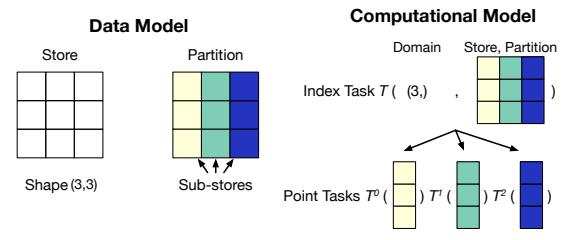
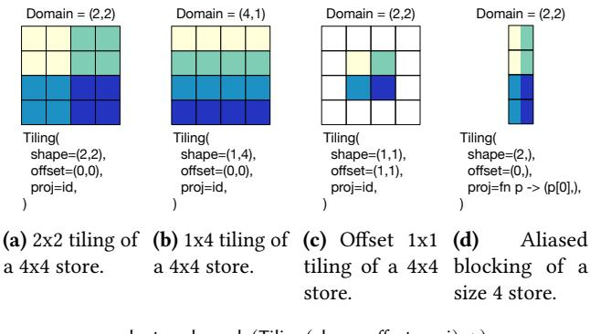
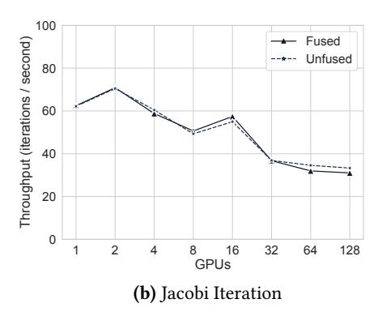
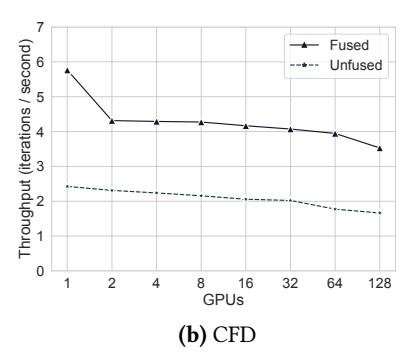

# <span id="page-0-0"></span>Composing Distributed Computations Through Task and Kernel Fusion

Rohan Yadav Stanford University Stanford, California, USA rohany@cs.stanford.edu

Michael Garland NVIDIA Santa Clara, California, USA mgarland@nvidia.com

Shiv Sundram Stanford University Stanford, California, USA shiv1@stanford.edu

Michael Bauer NVIDIA Santa Clara, California, USA mbauer@nvidia.com

Fredrik Kjolstad Stanford University Stanford, California, USA kjolstad@cs.stanford.edu

Wonchan Lee NVIDIA Santa Clara, California, USA wonchanl@nvidia.com

Alex Aiken Stanford University Stanford, California, USA aiken@cs.stanford.edu

# Abstract

We introduce Diffuse, a system that dynamically performs task and kernel fusion in distributed, task-based runtime systems. The key component of Diffuse is an intermediate representation of distributed computation that enables the necessary analyses for the fusion of distributed tasks to be performed in a scalable manner. We pair task fusion with a JIT compiler to fuse together the kernels within fused tasks. We show empirically that Diffuse's intermediate representation is general enough to be a target for two real-world, task-based libraries (cuPyNumeric and Legate Sparse), letting Diffuse find optimization opportunities across function and library boundaries. Diffuse accelerates unmodified applications developed by composing task-based libraries by 1.86x on average (geo-mean), and by between 0.93x–10.7x on up to 128 GPUs. Diffuse also finds optimization opportunities missed by the original application developers, enabling highlevel Python programs to match or exceed the performance of an explicitly parallel MPI library.

CCS Concepts: • Computing methodologies→Distributed programming languages.

Keywords: Distributed Programming; Composable Software

## ACM Reference Format:

Rohan Yadav, Shiv Sundram, Wonchan Lee, Michael Garland, Michael Bauer, Alex Aiken, and Fredrik Kjolstad. 2025. Composing Distributed Computations Through Task and Kernel Fusion. In Proceedings of the 30th ACM International Conference on Architectural


[This work is licensed under a Creative Commons](https://creativecommons.org/licenses/by/4.0/) [Attribution International 4.0 License.](https://creativecommons.org/licenses/by/4.0/)

ASPLOS '25, March 30-April 3, 2025, Rotterdam, Netherlands © 2025 Copyright held by the owner/author(s). ACM ISBN 979-8-4007-0698-1/25/03 <https://doi.org/10.1145/3669940.3707216>

Support for Programming Languages and Operating Systems, Volume 1 (ASPLOS '25), March 30-April 3, 2025, Rotterdam, Netherlands. ACM, New York, NY, USA, [16](#page-0-0) pages. [https://doi.org/10.1145/3669940.](https://doi.org/10.1145/3669940.3707216) [3707216](https://doi.org/10.1145/3669940.3707216)

# 1 Introduction

A modern trend in distributed programming is to develop drop-in implementations of popular sequential libraries like NumPy or SciPy that automatically scale to distributed machines while maintaining the semantics of the original library [\[12,](#page-13-0) [13,](#page-13-1) [30,](#page-13-2) [60\]](#page-15-0). To achieve distribution, these drop-in replacement libraries are implemented by translation to a distributed task-based runtime system [\[7,](#page-13-3) [11,](#page-13-4) [15,](#page-13-5) [26,](#page-13-6) [41\]](#page-14-0). Libraries map computations to a stream of tasks issued to the runtime, and map data on to runtime-managed distributed collections. Tasks are user-defined functions, whose bodies we call kernels, that operate on subsets of the distributed collections. The runtime is responsible for extracting parallelism from the input sequence of tasks and for computing the synchronization and communication required between tasks. This architecture enables distributed libraries to be built independently and then composed freely, as the runtime system is responsible for scheduling parallel work and maintaining coherence of distributed data.

However, the same abstractions that yield important composition properties internally and externally to these distributed libraries can result in degraded end-to-end performance. The task decomposition of library operations results in tasks that may be optimized individually but can have poor data locality and allocate much more temporary data than a different program organization that breaks down the abstraction boundaries by fusing tasks together both within the operations of a particular library and across library boundaries. As the task-based runtime system is issued a stream of tasks after library abstraction boundaries have been traversed, the runtime has the opportunity to fuse the tasks

from different libraries together, which in turn enables the fusion of the kernels of nested loops within fused tasks. Fusion by the task-based runtime allows for these optimizations to be performed without being limited to the semantics of any particular task-based library.

Prior works such as Weld [\[44\]](#page-14-1) and Split Annotations [\[45\]](#page-14-2) have developed techniques to perform fusion across library boundaries, but only for shared memory libraries. Distributed memory complicates program analyses, as distributed data requires communication when shared data is written to and read from by different nodes. For example, a sequence of element-wise operations on a pair of distributed arrays may or may not be fusible depending on whether the arrays are aliases of the same distributed data. We do not consider the problem of automatic parallelization [\[2,](#page-12-0) [5,](#page-12-1) [19,](#page-13-7) [39,](#page-14-3) [57\]](#page-15-1); the task-based programs we consider are already (implicitly) parallel. We focus on the efficient composition of independentlywritten parallel, distributed programs.

We present Diffuse, a system that dynamically performs task and kernel fusion for distributed, task-based runtime systems, transparently achieving optimizations found in handtuned programs. Diffuse reasons over a task-based IR of distributed computation, modeling computation as a sequence of tasks operating on partitioned data (Section [3\)](#page-2-0). Diffuse's IR is scale-free, meaning that the size of the IR and analyses on it are independent of the size of the target machine. Diffuse uses this IR to perform a dynamic dependence analysis to fuse tasks in a distributed-memory setting (Section [4\)](#page-4-0). Diffuse pairs task fusion with a JIT compiler based on MLIR [\[38\]](#page-14-4) that fuses and optimizes kernels within dynamically fused tasks, enabling data reuse across independent tasks (Section [6\)](#page-7-0). By analyzing a task-based IR, Diffuse's optimizations are not tied to the semantics of any particular library.

We implement Diffuse as a middle layer between highlevel task-based libraries and the low-level Legion runtime system [\[15\]](#page-13-5). To demonstrate Diffuse, we modify the implementations of the distributed libraries cuPyNumeric [\[12\]](#page-13-0) and Legate Sparse [\[60\]](#page-15-0) to target Diffuse's IR, and to expose their task implementations in MLIR for Diffuse's compiler to process. Diffuse then performs dynamic analyses to fuse the tasks and kernels issued by these libraries before forwarding the optimized tasks to Legion. As a result, programmers using cuPyNumeric and Legate Sparse benefit from Diffuse without modifying their applications.

To evaluate Diffuse, we apply it to micro-benchmarks and several full scientific computing applications developed in cuPyNumeric and Legate Sparse, including sparse Krylov solvers and physical simulations. We compare against the standard implementations of cuPyNumeric and Legate Sparse and show that Diffuse achieves 1.86x speedup on average (geo-mean) over unmodified applications on up to 128 GPUs. We additionally compare against the high-performance MPIbased PETSc [\[8\]](#page-13-8) library and show that Diffuse enables naturally written NumPy and SciPy Sparse programs to match or

```
1 import cunumeric as np
 2 grid = np . random . rand (( N +2 , N +2) )
 3 # Create multiple aliasing views
 4 # of the distributed grid array .
 5 center = grid [1: -1 , 1: -1]
 6 north = grid [0: -2 , 1: -1]
 7 east = grid [1: -1 , 2: ]
 8 west = grid [1: -1 , 0: -2]
 9 south = grid [2: , 1: -1]
10 for i in range ( niters ) :
11 avg = center + north + \
12 east + west + south
13 work = 0.2 * avg
                                                         (1,0) (1,1) (1,2) (1,3)
                                                         (0,0) (0,1) (0,2) (0,3)
                                                         (3,0) (3,1) (3,2) (3,3)
                                                         (2,0) (2,1) (2,2) (2,3)
                                                             (1,1) (1,2)
                                                             (0,1) (0,2)
                                              (1,0) (1,1)
                                              (2,0) (2,1)
                                                west
                                                              south
                                                                              east
                                                               north
                                                             (3,1) (3,2)
                                                             (2,1) (2,2)
                                                                           (1,2) (1,3)
                                                     grid center
```

(a) cuPyNumeric source code.

<span id="page-1-4"></span><span id="page-1-3"></span><span id="page-1-2"></span><span id="page-1-1"></span>14 center [:] = work

```
ted lines denote communication.
1 # ADD , MULT and COPY are in
2 # cuNumeric 's implementation .
3 ALLOC ARRAY t1
4 ADD ( center , north , t1 )
5 ALLOC ARRAY t2
6 ADD ( t1 , east , t2 )
7 ALLOC ARRAY t3
8 ADD ( t2 , west , t3 )
9 ALLOC ARRAY avg
10 ADD ( t3 , south , avg )
11 ALLOC ARRAY work
12 MULT (0.2 , avg , work )
13 COPY ( work , center )
                                        1 # FUSED_ADD_MULT is a new
                                        2 # task generated by Diffuse .
                                        3 ALLOC ARRAY work
                                        4 FUSED_ADD_MULT (
                                        5 center ,
                                        6 north ,
                                        7 east ,
                                        8 west ,
                                        9 south ,
                                       10 0.2 ,
                                       11 work
                                       12 )
                                       13 COPY ( work , center )
```

(c) Stream of tasks and allocations issued by the main loop.

```
1 # ADD , MULT and COPY are
2 # elementwise operators .
3 def ADD (a , b , c ) :
4 for i , j in a :
5 c [i , j ] = a [i , j ] + b [i , j ]
6 def MULT (s , a , b ) :
7 for i , j in a :
8 b [i , j ] = s * a [i , j ]
9 def COPY (a , b ) :
10 for i , j in a :
11 b [i , j ] = a [i , j ]
```

(e) Tasks invoked during standard execution.

(d) Operation stream after Diffuse's optimization.

(b) 4-node execution, colors denote cells held by each node. Dot-

```
1 # FUSED_ADD_MULT performs
2 # the scaled five - way add .
3 def FUSED_ADD_MULT (
4 a , b , c , d , e , s , out
5 ) :
6 for i , j in a :
7 out [i , j ] = s * (
8 a [i , j ] + b [i , j ]
9 + c [i , j ] + d [i , j ]
10 + e [i , j ])
```

(f) Fused task generated by Diffuse.

Figure 1. Execution example of Diffuse on a distributed, multi-GPU cuPyNumeric 5-point stencil application.

exceed the performance of PETSc (1.4x geo-mean speedup). Finally, we show that Diffuse is able to find fusion and optimization opportunities missed by the original application developers, achieving 1.23x speedup on average (geo-mean) over already hand-optimized code.

# <span id="page-1-5"></span>2 Motivating Example

Figure [1](#page-1-0) shows how Diffuse optimizes the cuPyNumeric program in Figure [1a](#page-1-0) that performs a 5-point stencil computation. The cuPyNumeric library is a drop-in replacement for NumPy [\[33\]](#page-14-5) that scales unmodified NumPy programs

to distributed machines by targeting the Legion [15] runtime system. cuPyNumeric maps NumPy arrays to Legion's regions, and maps NumPy functions to task launches operating on regions that are partitioned across the machine. As the cuPyNumeric program executes, it issues a stream of tasks to the Legion runtime, which dynamically discovers the necessary communication and synchronization required to execute the tasks on the target machine. The program execution on a four-by-four grid with four nodes is visualized in Figure 1b, where each node owns an element of each aliasing view of the grid array. The dotted arrows represent the communication required to propagate updates to the center array to the other aliasing views of grid. Figure 1c is a simplified representation of the task stream that cuPyNumeric issues during execution of the inner loop (lines 10−14 of Figure 1a), and Figure 1e contains pseudocode for each of the task implementations. This stream of operations creates multiple temporary distributed arrays for the results of individual operations, and separate tasks for each corresponding addition and multiplication. The combination of temporary arrays and separate tasks of loops is an inefficient execution strategy. Diffuse speeds this program up by four times by creating a new fused task that computes the work array (lines 11-13) in a single operation and removes the temporary arrays, including avg, resulting in the stream of operations in Figure 1d and the generated fused task in Figure 1f. Interestingly, Diffuse does not fuse the task that performs center[:] = work (line 14 of Figure 1a).

To understand these decisions, we must introduce the distributed aspect of the tasks and data collections in Figure 1c. Each task in Figure 1c actually represents a group of parallel tasks launched over partitioned arrays, where each parallel task operates on a subset of the partitioned data. Dependencies and communication that arise from parallel tasks operating on the same distributed data affect when fusion is possible. In our example, the arrays center, north, east, west, and south are aliasing views of the array grid, meaning that they share logical array entries. Because these distributed arrays alias, Diffuse does not fuse the task group that computes center[:] = work into the task group that reads from north, east, west and south, as the fusion would create a task group that concurrently reads and writes to aliasing data. Similarly, the center[:] = work task group issued at iteration *i* cannot be fused into the avg computation (line 11 of Figure 1a) at iteration i + 1 because communication is required to propagate updates to center. To reason about distributed computations over partitioned data, we develop a scale-free intermediate representation (Section 3) that models tasking runtime systems which support aliased views of distributed data. We then develop a dynamic analysis for task fusion (Section 4) that reasons about dynamically known communication patterns in distributed computations to fuse groups of parallel tasks.

#### Syntax

```
Unique ID
              Point
                                   (\mathbb{Z},\ldots)
              Store
                       S
                                   Store(id, p)
Projection Function
                       F
                                   Projection(id, Point \rightarrow Point)
                                   None | Tiling(p, p, F)
          Partition
          Privilege
                                   Read (R) | Write (W) |
                       Pr
                                   Reduce (Rd) | Read-Write (RW)
        Index Task
                       T
                                   IndexTask(p, (S, P, Pr) list)
     Task Window
                                   T stream
                       W
```

#### **Constructs for Reasoning**

Sub-Store  $S^p \triangleq \text{SubStore}(S, P, p)$ Point Task  $T^p \triangleq \text{PointTask}((S^p, Pr) \text{ list})$ 

(a) Diffuse's intermediate representation.



(b) Relationships between components of Diffuse's IR.

**Figure 2.** Diffuse's IR exposes a distributed data model and a model for distributed computation on distributed data.

## <span id="page-2-0"></span>3 Intermediate Representation

The first contribution of Diffuse is an IR that enables scalable fusion analyses through a scale-free representation of distributed programs, meaning that the size of the representation is independent of the total number of processors in the target system. Diffuse's IR is an abstraction over the collections of concrete tasks and distributed data structures of a lower-level task-based programming system, like Legion, that usually have scale-aware representations. We have modified cuPyNumeric and Legate Sparse to dynamically generate programs in Diffuse's IR instead of targeting Legion directly. Diffuse's IR, presented in Figure 2, is designed to make it inexpensive to perform the analyses required for fusion, while still being able to express sophisticated computations. The IR contains a data model to represent distributed data, and a computational model to define distributed computations over distributed data. The syntax of the IR is in Figure 2a, and a visualization of the IR's structure is shown in Figure 2b.

## 3.1 Data Model

Diffuse represents distributed data as *stores*, which are distributed arrays. Each store has a unique ID and a rectangular shape defined by a tuple of non-negative integers, representing the upper bound of each dimension of the store. We refer

to these rectangular shapes as *domains*, which are also used to describe the decomposition of data and compute across processors. Stores are partitioned across the target machine into *sub-stores*, which are subsets of a store.

Partitions of stores are first-class objects in Diffuse. A *partition* is a mapping from points in a domain to sub-stores, where each point in the domain represents a processor. This mapping is represented by Diffuse in a structured manner, breaking different kinds of mappings into different syntactic groups. For simplicity of presentation, we consider two kinds of partitions, sufficient to explore the analyses used in Diffuse. Our implementation supports more partition kinds with no additional technical insights. The main requirement on partitions is that two partitions of the same kind can be checked for inequality without examining each sub-store within each partition. This requirement is critical for a scalable analysis, as discussed in Section 4.

The first partition kind None represents the replication of a store, where all points in the partition's domain are mapped to the entire store. The second partition kind Tiling represents an *n*-dimensional affine tiling of a store. A Tiling contains an *n*-dimensional tile shape and an offset from the origin, which are used to compute the sub-store associated with each point in the partition's domain. For example, Figure 3a shows a tiling of a two-dimensional store using 2x2 tiles over a 2x2 domain, while Figure 3b shows a row-based tiling (i.e., tiles of size 1x4) of the same store over a 4x1 domain. Figure 3c shows a partition of a subset of the store beginning at the point (1, 1). Tiling partitions also contain a projection function that applies a transformation to each point in the partition's domain before computing the subset with the tile size and offset. Projection functions enable Tiling partitions to express aliased and replicated data. For example, Figure 3d shows a vector tiled over a two-dimensional domain by a projection function that discards the second dimension of each point in the partition's domain, resulting in a partially aliased partition. The formula that defines the sub-store bounds for each point of a Tiling partition is shown in Figure 3e. The representations of None and Tiling partitions are scale-free as the mapping of points to sub-stores is implicit in the partition, rather than explicitly storing the bounds of each sub-store in the partition.

To reason about the sub-store referenced by each point of a partition, we include an explicit SubStore(S, P, p) construct, representing the sub-store associated with point p of store S using partition P. As a short-hand, we let S[P,p] = SubStore(S,P,p), and refer to S as the *parent* store of S[P,p]. The indices contained within the sub-store S[P,p] are directly computable in cases when P is None or Tiling, but may depend on runtime values held by stores when more complex partitioning operators are introduced. Our later definitions assume that it is possible to find the intersection between two sub-stores, but our fusion algorithm in Section 4 does not require explicit computation of these intersections.

<span id="page-3-0"></span>

sub-store-bounds(Tiling(shape, offset, proj), p) = [proj(p) \* shape, proj(p + 1) \* shape) + offset

**(e)** Function that computes a bounding-box within the store that a Tiling partition maps point *p* to.

**Figure 3.** Examples of Tiling partitions. Partitions maps points in the denoted domain to sub-stores. Each color refers to the sub-store associated with a each point in the domain.

#### 3.2 Computational Model

Diffuse models computation as a stream of *index tasks* [50] issued in program order. An IndexTask(d, A) represents a group of parallel tasks over points in a rectangular domain d, referred to as the launch domain. An index task operates on the list A of stores, partitions, and privileges, using the denoted privilege to access the requested partition of each store. We refer to each privilege with the abbreviations noted in parentheses. Each parallel task within the group reads from, writes to, or reduces to the sub-stores referred to by the stores and partitions at each point. The parallel tasks within an index task group may perform arbitrary computation on argument stores that respects the requested privilege on each argument store. For the simplicity of presentation, we assume that the Reduce privilege refers to a single reduction function being applied (such as addition). This representation is explicitly parallel as tasks are annotated with their launch domain and partitions of distributed data structures. However, the representation is scale-free as the size of the representation is independent of the degree of parallelism only the symbolic size of the launch domain increases.

Similar to sub-stores, Diffuse's IR has a notion of a *point task*, which is one point in an index task's launch domain. Given an index task T = IndexTask(d, A), let  $T^p$  be the point task at point  $p \in d$ , operating on the list of stores  $[(S[P, p], pr) : \forall (S, P, pr) \in A]$ . Point tasks operate on the sub-stores corresponding to their index point.

We define the predicates R(T, (S, P)), W(T, (S, P)) and Rd(T, (S, P)) to be true when the task T correspondingly reads from, writes to, or reduces to the store S using partition P. When (S, P) has the privilege Read-Write, both R(T, (S, P)) and W(T, (S, P)) are true. We also overload these

predicates for point tasks and sub-stores, where  $R(T^p, S)$  is true when point task  $T^p$  reads sub-store S.

The dynamic semantics of Diffuse's IR are defined by a translation to an underlying task-based runtime system such as Legion [15]. Stores are mapped to the distributed data structures of the underlying runtime system, and Diffuse's first-class, structured partitions are mapped onto lower-level, unstructured partitions. Finally, index tasks are translated to tasks in the lower-level runtime system and issued for execution.

#### <span id="page-4-0"></span>4 Distributed Task Fusion

Diffuse leverages this IR to fuse distributed computations through task fusion, enabling the fusion of kernels within fused tasks (Section 6). Applications submit index tasks to Diffuse, which buffers the tasks into a *window* of tasks to be analyzed before submission to the underlying runtime. A distributed task fusion algorithm finds a fusible prefix of tasks in the window, and replaces the prefix with a fused task. To be fusible, the prefix of index tasks must be executable in sequence without cross-processor communication. We define when communication may occur between index tasks and describe when a sequence of index tasks is fusible. We then give an algorithm for finding fusible index task sequences.

## 4.1 Dependencies

Dependencies are well-studied—we discuss how to define dependencies between Diffuse's index tasks. We adopt the terminology of Aho et al. [3] when possible. Communication is required between point tasks that have a dependence. The dependence implies synchronization and potentially data movement between the point tasks. A dependency exists between two point tasks that access the same data unless both tasks read from or reduce to the data with the same associate and commutative operator. Recall that for an index task T, we refer to the point task at point p as  $T^p$ . We define  $dep(T_1^p, T_2^{p'})$  to be true if  $T_2^{p'}$  depends on  $T_1^p$ .

<span id="page-4-3"></span>**Definition 1.** Given point tasks  $T_1^p$ ,  $T_2^{p'}$  where index task  $T_1$  is issued before index task  $T_2$ ,  $dep(T_1^p, T_2^{p'})$  if  $\exists$  sub-stores S, S' with the same parent such that  $S \cap S' \neq \emptyset$  and either

true-dep:  

$$W(T_1^p, S) \wedge \left( R(T_2^{p'}, S') \vee W(T_2^{p'}, S') \vee Rd(T_2^{p'}, S') \right)$$
anti-dep:  

$$R(T_1^p, S) \wedge \left( W(T_2^{p'}, S') \vee Rd(T_2^{p'}, S') \right)$$
reduction-dep:  

$$Rd(T_1^p, S) \wedge \left( R(T_2^{p'}, S') \vee W(T_2^{p'}, S') \right).$$

The dependencies between two index tasks  $T_1$  and  $T_2$  are defined by the pairwise dependencies of their point tasks. We capture these dependencies through a mapping between the points of  $T_1$  and  $T_2$  that represents all of the point tasks in

<span id="page-4-1"></span>


(c)  $\mathcal{D}(T_1, T_2)$  of writing to, then reading from different partitions.

**Figure 4.** Visualization of dependence maps  $\mathcal{D}(T_1, T_2)$ .

 $T_2$  that depend on point tasks in  $T_1$ . Figure 4 shows different dependence maps over the launch domain (4,).

**Definition 2.** For two index tasks  $T_1$  and  $T_2$ , the *dependence map*  $\mathcal{D}(T_1, T_2)$  is a function of type domain $(T_1) \to \mathcal{P}(\text{domain}(T_2))$ , where  $\forall p \in \text{domain}(T_1), \mathcal{D}(T_1, T_2)[p] = \{p' \in \text{domain}(T_2) : \text{dep}(T_1^p, T_2^{p'})\}.$ 

Having characterized the dependencies between two distributed index tasks  $T_1$  and  $T_2$ , we can now define when fusion of  $T_1$  and  $T_2$  is valid.  $T_1$  and  $T_2$  may be fused if the only dependencies that exist between their point tasks are at most point-wise, as the processor that executes each point task does not need to communicate with any other processors.

<span id="page-4-2"></span>**Definition 3.** Index tasks  $T_1$  and  $T_2$  are fusible if  $\forall p, \mathcal{D}(T_1, T_2)[p] \subseteq \{p\}$ .

While Definition 3 admits a simple dependency structure, there are several subtleties in what tasks are fusible and the identification of fusible tasks. First, tasks with at most pointwise dependencies is a broader set than just tasks that perform point-wise array operations. Point-wise dependencies allow for simultaneous reads and writes of different stores (Section 2) and multiple reductions to the same store. While task dependencies may be at most point-wise, the computations within the tasks are arbitrary computations that may be more complex than point-wise operations. Next, identifying when at most point-wise dependencies exist between two index tasks is non-trivial as tasks operate on arbitrarily aliasing distributed data. We provide a framework to reason about fusion in this setting, allowing for fusion to be performed between components within and across libraries.

#### 4.2 Fusion Algorithm

A naïve algorithm for fusion might fully materialize  $\mathcal{D}(T_1, T_2)$  to check that the condition in Definition 3 holds. However, the computation required to materialize  $\mathcal{D}(T_1, T_2)$  scales with the number of processors. Even runtime systems like Legion

do not materialize all of  $\mathcal{D}$ , but instead leverage sophisticated algorithms to compute only the portion of  $\mathcal{D}$  needed by each node [14]. However, a key insight in our work is that to perform distributed task fusion effectively, our analysis only needs to rule out cases where  $\exists p, \mathcal{D}(T_1, T_2)[p] \not\subseteq \{p\}$ . Diffuse's intermediate representation enables this analysis to be performed in a scale-free manner. Our algorithm for distributed task fusion identifies when index tasks have pointwise dependencies through greedy application of a set of *fusion constraints* to identify a fusible prefix of the task window. We then build a fused task from the identified prefix. We describe each of these components in turn, and then sketch a correctness proof in the next section.

**4.2.1 Fusion Constraints.** Diffuse uses four constraints to identify when communication may occur between distributed index tasks, i.e., when  $\exists p, \mathcal{D}(T_1, T_2)[p] \not\subseteq \{p\}$ . The launch-domain-equivalence and true-dependence constraints have been described at a high level by prior work [51]. We generalize these constraints from prior work, present formal definitions, and prove the correctness of our fusion algorithm. Diffuse's fusion constraints are sound, but not complete—for example, leveraging application knowledge could result in fusion opportunities that are out of scope for Diffuse. Figure 5 presents each of the constraints used by Diffuse by defining when a provided sequence of tasks satisfy the constraint.

Launch Domain Equivalence. The first constraint checks that the tasks to be fused have the same launch domain. Applications targeting Diffuse may decompose their computations across different launch domains, and data movement is generally required between different decompositions.

True Dependence. The next constraint utilizes the partitions of stores and the privileges with which they are accessed to identify communication between index tasks caused by readafter-write dependencies. The true-dependence constraint checks that if a task  $T_i$  writes to a store S through partition P, then it cannot be followed by a task  $T_j$  that reads or writes to S with an aliasing partition P', as  $T_j$  requires communication of the updated values written by  $T_i$ . However, operating on the same partition P is permitted, preserving point-wise dependencies between  $T_i$  and  $T_j$ .

Our analysis relies on the ability to check whether two partitions alias, which Diffuse does through a constant-time equality check between partitions. Constant-time alias checking is possible through the scale-free structure of Diffuse's IR and the syntactic grouping of partitions into structured kinds. Diffuse does not need to compute pairwise intersections of the sub-stores accessed by the point tasks of considered index tasks, a computation that scales quadratically with the number of processors. Additionally, the alias analysis does not depend on the structure of the partitions, as the constraints are defined without knowing the syntactic kinds of each partition. Finally, this aliasing check is not too coarse,

```
launch-domain-equivalence([T_1, \ldots, T_n]) = \forall i, domain(T_i) = domain(T_i) true-dependence([T_1, \ldots, T_n]) = \forall T_i s.t. W(T_i, (S, P)), \nexists T_j s.t. (R(T_j, (S, P')) \forall W(T_j, (S, P'))) \land i < j \land P \neq P' anti-dependence([T_1, \ldots, T_n]) = \forall T_i s.t. R(T_i, (S, P)), \land i < j \land P \neq P' reduction([T_1, \ldots, T_n]) = \forall T_i s.t. Rd(T_i, (S, P)), \not f f s.t. Rd(f, (f, f)), f f f s.t. (R(f, f, f, f)) f f f s.t. (R(f, f, f, f)) f f f s.t. (R(f, f, f, f, f)) f f f s.t. (R(f, f, f, f, f)) f f f s.t. (R(f, f, f, f, f)) f f f s.t. (R(f, f, f, f, f)) f f f f f f f f f f
```

**Figure 5.** Fusion constraints employed by Diffuse to identify potential communication between index tasks.

since partitions of different syntactic kinds nearly always alias in practice.

Anti-Dependence. The anti-dependence constraint ensures that  $\mathcal{D}$  does not contain write-after-read dependencies. The constraint enforces that if a task T reads a store S, then any tasks that write to S must write to the same distributed view as the read to be fused with T. Thus, a fused task may read from multiple different distributed views of a store (like the offset views of the stencil computation in Figure 1a), but then cannot write to any of the views, as such an operation would require communication of the written data.

Reduction. The reduction constraint makes sure that viewing a partially reduced value is not allowed. It does not permit a task that reads from or writes to a store to be fused with a task performing a reduction to any view of the same store.

**4.2.2 Fused Task Construction.** Our fusion algorithm greedily applies the fusion constraints on the input task window to find its longest fusible prefix. The true-dependence and anti-dependence constraints are verified through a forwards dataflow analysis on the task window. The analyses iterate through the candidate prefix of tasks, and track the effects that each task applies to its argument stores. Once a suitable prefix of the task window has been identified, Diffuse builds a fused task that has all store arguments and executes the same computation as the identified prefix of tasks. The fused task's store arguments are constructed by reading all stores read by tasks in the prefix, and similarly for the written to and reduced to stores. Stores that are both read from and written to are promoted to the Read-Write privilege. Diffuse constructs the body of the fused task by composing the bodies of each task in the prefix in program order—we further discuss this process in Section 6.

#### 4.3 Proof of Correctness

We now show that our algorithm correctly fuses sequences of distributed index tasks. We prove the following statement: **Theorem 1.** Given a window of tasks  $[T_1, \ldots, T_n]$ , our task fusion algorithm identifies a prefix  $[T_1, \ldots, T_f]$  and produces a fused task F such that

- 1.  $[T_1, \ldots, T_f]$  are fusible, and
- 2. *F* preserves all dependencies of the task sequence  $[T_1, \ldots, T_f]$ .

We provide a proof sketch for each component of the theorem. To prove that  $[T_1, \ldots, T_f]$  are fusible, we must show that for each pair of tasks  $T_i, T_j, i < j$  in  $[T_1, \dots, T_f]$ ,  $\forall p, \mathcal{D}(T_i, T_j)[p] \subseteq \{p\}$ . The launch-domain-equivalence constraint ensures that the dependence map is between points of the same dimensionality. For the sake of obtaining a contradiction, suppose  $\exists p, p'$  such that  $p \neq p'$  and depends  $(T_i^p, T_i^{p'})$ . Then one of the three dependencies in Definition 1 must exist. Suppose that the condition for true-dep is satisfied, meaning that  $\exists S, P, P'$  such that  $S[P, p] \cap S[P', p']$ and  $W(T_i, (S, P))$  and one of  $R(T_i, (S, P'))$ ,  $W(T_i, (S, P'))$  or  $Rd(T_j, (S, P'))$  is true.  $R(T_j, (S, P'))$  or  $W(T_j, (S, P'))$  are contradictions, as the true-dependence constraint would disallow fusion.  $Rd(T_i, (S, P'))$  is a contradiction due to the reduction constraint. Similar logic can be applied to other dependence cases. Here, we show that our algorithm is sound by identifying cases where fusion is possible—we do not claim completeness by proving the converse.

We have shown that all dependencies between index tasks are at most point-wise, so any  $T_j^p$  can only depend on  $T_i^p$ , where i < j. Since the fused task body is the composition of each task in  $[T_1, \ldots, T_f]$  in program order, all dependencies in  $[T_1, \ldots, T_f]$  are preserved.

#### 4.4 Discussion

Fusion at Diffuse's middle layer of abstraction is key for a domain-agnostic analysis, and for analysis scalability as the size of the machine increases. We compare against fusion on high-level domain-specific libraries, and against fusion within lower-level runtime systems like Legion.

Domain-specific algorithms for fusion [1, 21, 52, 58, 59] are effective optimizations for individual distributed libraries. Approaches that perform fusion on a set of domain-specific computations use algorithms and analyses that are tied to the domain of computations being optimized, especially analyses related to distributed memory. As a result, these techniques do not readily generalize across libraries. Diffuse targets fusion in the more general case after computations have been decomposed into tasks in a domain-specific manner, enabling domain-agnostic analyses to find optimizations across function and library boundaries. We expect that domain-specific techniques may be used in conjunction with the analyses performed by Diffuse.

While generality is lost when fusing operations within individual libraries, scalability becomes a concern when analyzing lower-level program representations. A key design

```
1 import cupynumeric as np
                                  1 # Partitions and launch
2 x, y = np.zeros(n), np.ones(n) 2 # domains excluded.
3 flush_window()
4 z = 2.0 * x
                                  4 MULT([(x, R), (z, W)])
5 w = y + z
                                  5 ADD([(y, R), (z, R, (w, W)])
6 v = w ** 2
                                  6 POW([(w, R), (v, W)])
7 norm = np.linalg.norm(
                                  8 NORM([
   w[len(w)//2:])
9 del x, y, z, w
                                  9 (w[len(w)//2:], R), (norm, Rd)
10 flush_window()
                                 10 ])
```

<span id="page-6-2"></span>(a) cuPyNumeric code fragment.

(b) Emitted task stream.

Figure 6. Example of distributed temporaries.

decision in Diffuse's IR is that it is scale-free, as the representation of parallel task groups and partitions of distributed data are independent of the degree of parallelism. This design enables Diffuse to symbolically compute a conservative estimate of the aliasing relationships between distributed data structures through constant-time queries, which are heavily used when defining the fusion constraints in Figure 5. In contrast, lower-level systems like Legion represent partitions by explicitly mapping points to arbitrary sets of indices into the distributed data, scaling with the number of pieces the data is partitioned into. These representations are more flexible than Diffuse's, but result in the aliasing relationship queries needed by a fusion algorithm to scale with the degree of available parallelism.

# <span id="page-6-5"></span>5 Task Fusion Optimizations

Having described our algorithm for task fusion, we now describe optimizations necessary for a practical implementation. We show how to eliminate temporary distributed data structures (Section 5.1) and how to memoize the fusion analysis (Section 5.2). Temporary elimination and memoization are widely applied optimizations; we discuss how to perform these optimizations in a distributed, task-based setting.

#### <span id="page-6-0"></span>5.1 Temporary Store Elimination

Once Diffuse identifies a fusible prefix of tasks, stores that fusion has made temporary may be promoted into task-local data. Conversion of distributed data into task-local data is critical for realizing the benefits of fusion, as task-local data can then be optimized away (Section 6) to maximize reuse.

To introduce when a store is temporary, consider the cuPyNumeric program in Figure 6a and the resulting task stream in Figure 6b. This example introduces some new operations, specifically flush\_window, which sends all pending tasks through Diffuse to the underlying runtime system, and the Python del operator, which drops references. The program creates the stores x, y, z, w, and v. Consider the program state after line 10: the tasks that initialize x and y have executed, as the first flush\_window call sent those tasks to Diffuse. We note that there are no pending tasks outside the window, and future tasks are ones the application may

launch once the call to flush\_window returns. The fusion algorithm determines that the tasks issued by lines 4–6 can be fused, while the final norm must be excluded. First, v is not temporary because the application holds a reference to it, meaning that it could launch a task that reads v after the call to flush\_window(). Next, while the application has deleted its reference to w, the norm task reads a piece of w and is still pending after the fused task, and thus must observe any effects performed on w, meaning that w is not temporary. The stores x and y are only read by the fused task, and thus are not temporary. Only z is temporary because it is produced entirely within the fused task and is not visible to the application or pending tasks. We formalize this intuition as constraints that must be satisfied for a store to be temporary.

**Definition 4.** Given tasks  $[T_1, ..., T_f, ..., T_n]$ , a store S is *temporary* in the fusion of  $[T_1, ..., T_f]$  if

```
1. If \exists T_j, P \text{ s.t. } R(T_j, (S, P)), \exists T_i \text{ such that } i < j \land W(T_i, (S, P)) \land \text{covers}(S, P)
```

- 2.  $\not\equiv T_k, P \text{ s.t. } k > f \land \mathsf{R}(T_k, (S, P)) \lor \mathsf{Rd}(T_k, (S, P))$
- 3. *S* has no live application references.

The function covers(S, P) is true when the partition P contains all points in the store S. The first two constraints check that the store's contents are entirely created within the fused task and not used by any other existing task; these conditions are checked through a forwards dataflow analysis of the task stream. The third constraint ensures that the application can no longer view any effects on a store, checked through a split reference counting scheme in the implementation of Diffuse's IR. The split reference counting scheme separates references held by the application from references held by Diffuse's runtime. Temporary stores are demoted from a distributed allocation into a task-local allocation, as described in Section 6.

## <span id="page-7-1"></span>5.2 Memoization of Analyses

The final component of our distributed task fusion pipeline is memoization analysis and code generation (Section 6). The key challenge in memoization is allowing for the analyses to be replayed on *isomorphic* task streams rather than identical task streams. Consider the streams of tasks in Figure 7a, where partitions and launch domains are excluded.

Diffuse may reuse the analysis results from the left stream in Figure 7a on the middle stream, as the pattern of stores among tasks is isomorphic. In contrast, the right task stream in Figure 7a has a different pattern of stores across tasks, particularly the use of S7 in T3. We observe that this problem is identical to *alpha-equivalence*, where each store argument is a bound variable. We identify when two task streams are isomorphic within Diffuse through a conversion to and comparison on a canonical, De-Brujin index-like representation. This representation is shown in Figure 7b. A similar technique has previously been used to avoid enumerating instruction sequences equivalent up to register renaming [9].

```
1 T1([(S1,R), (S2,W)]) 1 T1([(S5,R), (S6,W)]) 1 T1([(S5,R), (S6,W)])
2 T2([(S2,R), (S1,W)]) 2 T2([(S6,R), (S5,W)]) 2 T2([(S6,R), (S5,W)])
3 T3([(S1,R), (S3,W)]) 3 T3([(S5,R), (S7,W)]) 3 T3([(S5,R), (S7,W)])
4 T4([(S3,R), (S1,W)]) 4 T4([(S7,R), (S5,W)]) 4 T4([(S7,R), (S5,W)])
```

(a) Two isomorphic task streams and one differing task stream.

```
1 T1([(0,R), (1,W)])
```

(b) Canonical representations of isomorphic and differing streams.

**Figure 7.** Example of task stream memoization.

#### <span id="page-7-0"></span>6 Kernel Fusion

The final component of Diffuse is a compilation stack to optimize fused tasks. A high-level program representation is required to both perform optimizations like loop fusion and to lower to different backends like GPUs and multi-threaded CPUs. We leverage the MLIR compiler stack, which is extensible and is pre-packaged with many common compiler analyses. We first provide background on MLIR, and then describe the code generation process and optimizations performed within Diffuse. We then discuss how Diffuse's architecture enables the separation of reasoning about distributed programs from the optimization of nested loops.

## 6.1 MLIR Background

We leverage MLIR [38] to build a JIT compiler for Diffuse. MLIR is an extension of LLVM [37] that provides compiler infrastructure for program analyses on higher-level languages than three-address code. The most relevant component of this infrastructure to our work is the notion of a *dialect*, which is an intermediate representation that has user-defined semantics. A key aspect of dialects in MLIR is that a single MLIR program can contain types and operations from multiple dialects, enabling the composition of dialects with different semantics. Compilers built using the MLIR framework run passes over programs that either optimize the operations within a single dialect, or convert between dialects to perform progressive lowering. Diffuse's compiler leverages community-developed dialects and passes to optimize and lower task bodies into CPU and GPU code.

#### 6.2 Generator Functions

To describe Diffuse's compiler, we walk through the stages that a fused task traverses. cuPyNumeric and Legate Sparse developers implement tasks by defining variants that target CPUs or GPUs. To use Diffuse, developers register a *generator* function with Diffuse that returns an MLIR fragment describing the task's computation. We found the integration effort of adding these generator functions to be modest, requiring 50–100 lines of C++ code per operation. We emphasize that only library developers, not end users, must develop MLIR kernels for tasks. Additionally, the integration

```
1 func . func @kernel (
2 % a : memref <? xf64 > ,
3 % b : memref <? xf64 > ,
4 % c : memref <? xf64 >) {
5 % dim = memref . dim %c , 0
6 affine . for % i = 0 to % dim {
7 %0 = affine . load % a [% i ]
8 %1 = affine . load % b [% i ]
9 %2 = arith . addf %0 , %1
10 affine . store %2 , % c [% i ] }}
(a) MLIR generated for an
element-wise addition.
                                        1 func . func @fused_kernel (
                                        2 % a : memref <? xf64 > ,
                                        3 % b : memref <? xf64 > ,
                                        4 % c : memref <? xf64 > ,
                                        5 % d : memref <? xf64 > ,
                                        6 % e : memref <? xf64 >) {
                                        7 % dim = memref . dim %e , 0
                                        8 affine . for % i = 0 to % dim {
                                        9 %0 = affine . load % a [% i ]
                                       10 %1 = affine . load % b [% i ]
                                       11 %2 = arith . addf %0 , %1
                                       12 affine . store %2 , % c [% i ] }
                                       13 affine .for % i = 0 to % dim {
                                       14 %0 = affine . load % c [% i ]
                                       15 %1 = affine . load % d [% i ]
                                       16 %2 = arith . addf %0 , %1
                                       17 affine . store %2 , % e [% i ] }}
                                          (b) Initial body of fused task.
                                                                               1 func . func @fused_kernel (
                                                                               2 % a : memref <? xf64 > ,
                                                                               3 % b : memref <? xf64 > ,
                                                                               4 % d : memref <? xf64 > ,
                                                                               5 % e : memref <? xf64 >) {
                                                                               6 % dim = memref . dim %e , 0
                                                                               7 % c = memref . alloc % dim
                                                                               8 affine .for % i = 0 to % dim {
                                                                               9 %0 = affine . load % a [% i ]
                                                                              10 %1 = affine . load % b [% i ]
                                                                              11 %2 = arith . addf %0 , %1
                                                                              12 affine . store %2 , % c [% i ] }
                                                                              13 affine .for % i = 0 to % dim {
                                                                              14 %0 = affine . load % c [% i ]
                                                                              15 %1 = affine . load % d [% i ]
                                                                              16 %2 = arith . addf %0 , %1
                                                                              17 affine . store %2 , % e [% i ] }}
                                                                               (c) After temporary elimination.
                                                                                                                      1 func . func @fused_kernel (
                                                                                                                      2 % a : memref <? xf64 > ,
                                                                                                                      3 % b : memref <? xf64 > ,
                                                                                                                      4 % d : memref <? xf64 > ,
                                                                                                                      5 % e : memref <? xf64 >) {
                                                                                                                      6 % dim = memref . dim %e , 0
                                                                                                                      7 affine . par % i = 0 to % dim {
                                                                                                                      8 %0 = affine . load % a [% i ]
                                                                                                                      9 %1 = affine . load % b [% i ]
                                                                                                                     10 %2 = arith . addf %0 , %1
                                                                                                                     11 %3 = affine . load % d [% i ]
                                                                                                                     12 %4 = arith . addf %2 , %3
                                                                                                                     13 affine . store %2 , % e [% i ] }}
                                                                                                                        (d) Fully optimized fused task.
```

Figure 8. Fused MLIR kernel for three way element-wise addition traversing the compilation pipeline. The initial kernel is created by sequentially composing two of the generated task bodies in Figure [8a.](#page-8-0)

effort was incremental—as more tasks were implemented with MLIR generators, Diffuse could exploit more fusion. An example generated MLIR fragment by cuPyNumeric for an element-wise addition operation is shown in Figure [8a.](#page-8-0)

The generated MLIR fragment in Figure [8a](#page-8-0) contains multiple dialects: 1) stores are mapped onto the memref dialect, which provides stronger aliasing guarantees than raw pointers; 2) dense iteration is mapped onto the affine dialect, a target for polyhedral compilation [\[18\]](#page-13-12); and 3) the computation itself is mapped onto the arith dialect, containing arithmetic operations. Using MLIR, other dialects can be used to express higher level operations, like dense and sparse tensor algebra with the linalg and sparse\_tensor dialects.

# 6.3 Compilation Pipeline

When Diffuse identifies that a sequence of tasks may be fused, it invokes each task generator and constructs an MLIR module containing the body of each task in the original program order. Figure [8b](#page-8-0) shows a fused task for the cuPyNumeric computation c = a + b; e = c + d, where all variables represent distributed vectors. This program originally has two index tasks (one for each add operation) which are fused into a single index task where the original task bodies (the MLIR in Figure [8a\)](#page-8-0) appear sequentially in the fused task. Before optimization of the task body, Diffuse first promotes distributed data into task-local allocations, resulting in Figure [8c.](#page-8-0)

After elimination of temporary stores, we apply passes that fuse and parallelize nested loops, and remove task-local temporary allocations to yield the optimized code in Figure [8d.](#page-8-0) The generated kernel is the ideal implementation for the original program: the separate loops of the original task bodies have been combined into a single pass over the

vectors, and the temporary c has been eliminated. The optimized kernel is then lowered to GPU kernel launches or OpenMP parallel regions.

In this work, we leverage polyhedral optimizations [\[18,](#page-13-12) [19\]](#page-13-7) to perform fusion and parallelization of loops in kernels. However, with higher level dialects in MLIR, various domainspecific kernel fusion techniques (see Section [8\)](#page-11-0) could be leveraged within a fused task body. We consider the exact kernel fusion techniques used to be orthogonal to our work.

## 6.4 Qualitative Benefits

We note several qualitative benefits of our system architecture in contrast to approaches that attempt to optimize distributed programs entirely through analysis of imperative code. A key design decision of Diffuse is to leverage a distributed data model in a scale-free IR of computation that enables cheap dependence analysis between distributed computations. Separating out the reasoning about distributed computation avoids intertwining loop optimizations with distributed communication analyses, allowing the loop optimizations to remain unaware of the distributed context. This separation also allows for information gained during the distributed analysis phase to be used in code generation: properties such as array non-aliasing are provided to the MLIR optimization passes to generate better code. Finally, the separation of distributed computation into tasks means that Diffuse does not need to identify optimizable fragments of static source code.

# 7 Evaluation

Experimental Setup. We evaluate the performance of Diffuse on a cluster of NVIDIA A100 DGX SuperPOD nodes. Each node has 8 A100 GPUs with 80GB of memory, connected by NVLink and NVSwitch connections, and a dual socket, 128 core AMD 7742 Rome CPU with 2TB of memory. Each node is connected via an InfiniBand connection through 8 NICs.

For each experiment, we perform a weak-scaling study, and report the throughput achieved per processor. A weakscaling study increases the problem size as the size of the target machine grows to keep the problem size per processor constant. Each reported value is the result of performing 12 runs, dropping the fastest and slowest runs, and then computing the average of the remaining 10 runs. In weak-scaling experiment (Section [7.1\)](#page-9-0), we exclude a set of warmup iterations from timing to measure the steady-state performance with and without Diffuse. We separately evaluate the overhead that Diffuse imposes due to compilation in Section [7.2.](#page-11-1)

Overview. We evaluate Diffuse on unmodified, open source cuPyNumeric and Legate Sparse applications, from microbenchmarks to full applications. Many of these applications have appeared in prior publications [\[12,](#page-13-0) [60\]](#page-15-0), and range from tens to thousands of lines of Python. The unique capabilities of cuPyNumeric and Legate Sparse enable these pure Python applications with dynamic and data-dependent behavior to be scaled across multiple nodes of multiple GPUs. An overview of each application is in Figure [9.](#page-9-1) We compare each application's performance when run with and without Diffuse — no changes to the application are needed to enable Diffuse. For some applications, a suitable baseline written in the industry-standard PETSc [\[8\]](#page-13-8) library for distributed sparse linear algebra already exists, and we compare against those baselines. For other applications, we compare against manually optimized implementations by the original authors. However, some full cuPyNumeric applications have no baseline other than when run without name—these applications are sufficiently complex that developing an independent high-performance distributed, multi-GPU implementation is not feasible. We show that when fusion opportunities are available, Diffuse can exploit them to find speedups in unmodified, distributed applications. Diffuse enables highlevel programs to equal, and in many cases improve on, the performance of hand-optimized code.

We do not ablate on the optimizations in Section [5,](#page-6-5) as temporary elimination is essential for speedup with kernel fusion and memoization is a requirement for a practical implementation. We do not compare against the work of Sundram et al. [\[51\]](#page-14-7), which performs only task-fusion, as the version of cuPyNumeric they used is older and would not be a fair comparison. However, we have evaluated Diffuse with only task fusion and found that it did not yield speedups on our benchmarks. Task fusion alone can only reduce runtime overhead, and the task granularity of our benchmarks is larger than the minimum effective task granularity [\[49\]](#page-14-10) of Legion (1ms per task). The window sizes shown in Figure [9](#page-9-1) were selected automatically by Diffuse through a process that increases the window size when all tasks in the current window size were fused. As a result, these window sizes enable the maximum amount of fusion possible in each application. Finally, our

<span id="page-9-1"></span>

| Benchmark     | Tasks per<br>Iteration | Tasks per<br>Iteration (Fused) | Avg Task<br>Length (ms) | Window<br>Size |
|---------------|------------------------|--------------------------------|-------------------------|----------------|
| Black-Scholes | 67                     | 1                              | 5.3                     | 70             |
| Jacobi        | 3                      | 2                              | 5.3                     | 5              |
| CG            | 12.1                   | 4.1                            | 1.9                     | 10             |
| BiCGSTAB      | 27.1                   | 8.1                            | 1.7                     | 15             |
| GMG           | 24.1                   | 11.1                           | 1.8                     | 15             |
| CFD           | 378                    | 40.7                           | 1.1                     | 30             |
| TorchSWE      | 276.5                  | 152.8                          | 1.4                     | 30             |

Figure 9. Index tasks per iteration with and without fusion. Task count is not always whole as iterations may launch different tasks, or fusion occurs across iteration boundaries. Reported task granularities are from unfused single-GPU executions. Window size was selected by Diffuse.

benchmarks issue index tasks that have one point per GPU, so computations are not over-decomposed.

## <span id="page-9-0"></span>7.1 Weak Scaling Experiments

Black-Scholes. The Black-Scholes option pricing benchmark is a trivially-parallel micro-benchmark that contains a sequence of 67 data-parallel, and thus fusible, operations. It is a micro-benchmark that provides a reference point on potential improvement when the entire application is amenable to fusion. Figure [10a](#page-10-0) shows that Diffuse achieves a 10.7x speedup over the unfused program on 128 GPUs, as the fused program is a single task containing a single GPU kernel making one pass over the data, greatly increasing the arithmetic intensity of the computation.

Dense Jacobi Iteration. Unlike Black-Scholes, dense Jacobi iteration has negligible potential benefit from fusion. Jacobi iteration consists of a dense matrix-vector multiplication and two fusible vector operations that are negligible in runtime. This benchmark shows that our analyses do not have a significant negative impact on performance when there is no fusion. Diffuse achieves 0.93–1.08x of the performance of the unfused Jacobi iteration in Figure [10b,](#page-10-0) where we believe the slight improvement is due to experimental variability.

Sparse Krylov Solvers. We evaluate sparse Krylov solvers implemented with cuPyNumeric and Legate Sparse, namely Conjugate Gradient (CG) and Bi-Conjugate Gradient Stabilized (BiCGSTAB). The PETSc benchmark implementations are implemented in MPI+C using PETSc's API. To perform a controlled comparison against PETSc, we modify Legate Sparse to perform a similar optimization as PETSc, where the non-zero coordinates in each sparse matrix partition are stored as 32-bit integers instead of 64-bit integers.[1](#page-9-2)

The original implementation of CG in Legate Sparse had been optimized manually to perform many of the optimizations that Diffuse does automatically. As a result, the implementation no longer resembled the high-level description of CG. We compare against this manually fused implementation, a naturally written implementation using cuPyNumeric

<span id="page-9-2"></span><sup>1</sup>PETSc stores coordinates in 32-bit integers even when 64-bit integers are requested at build time, affecting the performance of the SpMV kernel.

<span id="page-10-0"></span>



<span id="page-10-1"></span>Figure 10. Microbenchmark weak scaling (higher is better).


**Figure 11.** Weak scaling of linear solvers (higher is better).

and Legate Sparse, and PETSc. Figure 11a shows that Diffuse automatically optimizes the naturally written CG so that it runs faster than both the manually optimized version and PETSc. Diffuse finds additional fusion opportunities by fusing AXPY's and dot-products from different iterations.

We implement an unfused version of BiCGSTAB in cu-PyNumeric and Legate Sparse and compare against PETSc. Figure 11b shows that Diffuse accelerates the high-level implementation of BiCGSTAB to outperform the unfused version by 1.31x on average (geo-mean) and PETSc by 1.15x on average (geo-mean). PETSc exposes several fused kernels to users for use in building iterative solvers, but these kernels can quickly become complicated and esoteric<sup>2</sup>. In contrast, Diffuse enables users to write high-level programs in cu-PyNumeric and Legate Sparse and then derives optimized kernels for efficient execution.

Geometric Multi-Grid Solver (GMG). Moving from smaller benchmarks to full applications, we apply Diffuse to a Geometric Multi-Grid (GMG) solver developed in Legate Sparse. The GMG solver is a CG-based iterative solver with a V-cycling preconditioner, the injection restriction operator, and a weighted Jacobi smoother. As with the previous benchmarks, using Diffuse with the more complex solver required no changes to user-facing code, and results in a 1.2x speedup over the original implementation, as seen in Figure 12a.

Computational Fluid Dynamics (CFD). We apply Diffuse to a cuPyNumeric application that solves the Navier-Stokes equations for 2D channel flow [10]. The application performs element-wise operations on aliasing slices of distributed arrays, exposing opportunities for fusion. Diffuse finds between 1.8x–2.3x speedup over the original implementation, as shown in Figure 12b. Diffuse achieves higher speedup on a single GPU than on multiple GPUs. On a single GPU, data is not partitioned, enabling longer sequences of tasks to satisfy fusion constraints. On multiple GPUs, the dependencies caused by aliasing data reduce the opportunities for fusion.

Shallow Water Equation Solver (TorchSWE). Our final benchmark application is also our most complex: the cuPyNumeric port of the TorchSWE shallow-water equation solver [25]. We compare against the original cuPyNumeric port, as well as a version that the cuPyNumeric developers manually optimized using numpy.vectorize. The vectorize utility JIT-compiles a user-defined element-wise operator, doing some of the optimizations that Diffuse performs automatically. Figure 12c shows the performance of TorchSWE with Diffuse compared to these baselines. Diffuse achieves a 1.61x speedup on average (geo-mean) over the unfused TorchSWE, and a 1.35x speedup on average (geo-mean) over the manually vectorized version (labeled with "Manually Fused" in

<span id="page-10-2"></span> $<sup>^2</sup> Such$  as VecAXPBYPCZ in BiCGSTAB (https://petsc.org/main/manualpages/Vec/VecAXPBYPCZ/).

<span id="page-11-2"></span>




Figure 12. Weak scaling of full applications (higher is better).

<span id="page-11-3"></span>

| Benchmark     | Standard (s) | Compiled (s) | Breakeven Iterations |
|---------------|--------------|--------------|----------------------|
| Black-Scholes | 0.38         | 0.06         | N/A                  |
| Jacobi        | 0.53         | 0.43         | N/A                  |
| CG            | 0.67         | 1.30         | 99.44                |
| BiCGSTAB      | 1.26         | 2.19         | 80.43                |
| GMG           | 0.49         | 1.38         | 118.75               |
| CFD           | 5.10         | 10.89        | 25.21                |
| TorchSWE      | 0.97         | 8.82         | 43.88                |

Figure 13. Warmup times on 8 GPUs.

Figure 12c). Since Diffuse is analyzing the entire application, it can find fusion opportunities missed by developers optimizing the program by hand.

## <span id="page-11-1"></span>7.2 Compilation Time

We measure the overhead that Diffuse's compilation imposes on overall runtime. When evaluating our benchmarks, we compute the throughput after warmup iterations have concluded. To measure the effect of compilation, we measure the warmup time with and without compilation, using the window sizes reported in Figure 9. We then compute the number of iterations required for the fused version to be faster than the unfused version of the application when including the warmup compilation time. The results are shown in Figure 13; Diffuse's compilation times are modest, requiring 25-119 iterations to amortize the cost of compilation. The fused Black-Scholes computation is so much faster than the unfused version that a single iteration is sufficient to amortize compilation. For Jacobi, compilation time was overlapped with expensive dense matrix-vector multiply kernel, and thus not exposed in the warmup. As seen in Figure 10b, due to experimental variation, the fused and unfused versions of Jacobi are slightly faster or slower than each other on different GPU counts. These costs are especially reasonable as scientific applications like the ones we evaluated would be run in production for thousands to millions of iterations. In the future, a production-grade implementation of Diffuse could maintain a cache of compiled kernels on disk, rather than in memory, and pay the compilation cost only the first time the application is run.

## <span id="page-11-0"></span>8 Related Work

Task Fusion. Task fusion is a widely applied technique in parallel computing to reduce the overheads of parallelism [28, 29, 43, 47, 55, 61]. Most prior work considers the fusion of individual tasks—in this work, we consider a more complex variant of task fusion, the fusion of groups of distributed tasks, which is challenging due to the dependencies that exist between distributed tasks. The most related work is that of Sundram et al. [51], which identifies the problem and provides an initial solution for detecting when fusion of index tasks is possible. We improve on this work by developing a formal model for reasoning about distributed tasks, identifying new constraints on fusion, and proving that the set is sufficient. We then pair task fusion with a JIT compiler to fuse the task bodies, enabling Diffuse to achieve significantly larger speedups than just task fusion, as more potential benefits than runtime overhead removal are possible.

Kernel Fusion. Nested loop fusion in imperative, arraybased programs is well-studied [4, 20, 27, 35]. Our work combines loop fusion with the data and computational models of a tasking runtime to enable kernel fusion in a distributed environment. Kernel fusion has also been explored heavily in different domains. Deforestation approaches aim to remove temporary lists and trees in functional programs [54]. Fusion in collection-oriented languages combines operations like map and reduce into single passes over data structures [22, 23, 31, 32, 56]. Various compilers have been developed to generate fused code for operations over dense [24, 46, 53] and sparse tensors [17, 36]. Machine learning frameworks perform operator fusion within neural networks [21, 34, 40, 42, 48]. Our work provides a domain-agnostic framework for identifying fusion in streams of distributed tasks, and could leverage these techniques for kernel fusion.

Efficient Composition of Parallel Software. Diffuse aims to efficiently compose operations within and across distributed libraries. Some recent projects have tackled the problem of efficient composition; we discuss each in turn. Weld [44] provides a loop-based IR in which users can define single-node library computations, and a runtime system that optimizes

the IR to enable cross-function and cross-library optimizations. Split Annotations [\[45\]](#page-14-2) provides partitioning annotations for users to attach to library functions, and uses these annotations to run cache-sized batches of the functions to maximize data reuse. Both Weld and Split Annotations target a similar problem as Diffuse, but would require a model of distributed data like the one we propose to safely perform optimizations in a distributed setting. DaCe [\[16\]](#page-13-25) is a compiler that leverages an IR called Stateful Dataflow MultiGraphs to perform optimizations like fusion on Python/NumPy programs. Distributed programs in DaCe are explicitly parallel, including manual communication with libraries like MPI, which requires different kinds of analyses.

Jax [\[21\]](#page-13-10) and PyTorch [\[6\]](#page-12-5) are machine-learning systems that compile NumPy-like descriptions of neural networks to perform optimizations like fusion and automatic differentiation. Systems like Jax and PyTorch accept structured program representations (neural network graphs) and apply optimizations that leverage domain-specific knowledge, many of which are not possible for Diffuse to perform. In contrast, Diffuse only leverages the privilege information about tasks to perform optimizations, and allows for description of programs with complex aliasing and mutation that are not possible to represent in ML systems, like the CFD or TorchSWE simulations. We consider Diffuse to be a different point in the design space than these ML systems, focusing on fusion in a more general setting without application-specific knowledge.

Distributed Runtime Systems. Diffuse uses a scale-free IR to efficiently perform distributed dependence and alias analyses. This is similar to Index Launches [\[50\]](#page-14-6), a representation of distributed tasks that compresses the degree of parallelism. Diffuse's model of distributed data supports content-based coherence, meaning that the same data may be referred to in multiple different ways. Legion [\[15\]](#page-13-5), which Diffuse builds upon, is a system that supports content-based coherence of distributed data. Legion exposes a more general interface for partitioning data, allowing a partition to contain arbitrary subsets. Legion then uses sophisticated algorithms for computing dependencies between tasks and maintaining coherence of distributed data [\[14\]](#page-13-9). Legion's flexible data model and support for precise dependence analysis at scale are critical features for building libraries like cuPyNumeric and Legate Sparse. Supporting Legion's flexible data model is a key challenge in Diffuse, as libraries that target Legion depend on this capability. Diffuse's restricted data representation and goal of only fusion enable compact analyses for the dependence and coherence problems. In systems without content-based coherence, simpler approaches than ours may suffice, as aliasing distributed data is no longer a concern.

# 9 Conclusion

We introduced Diffuse, a system that performs task and kernel fusion on streams of distributed tasks, enabling optimizations that improve data reuse and remove allocations of distributed data structures in end user programs. Diffuse leverages a scale-free intermediate representation of distributed computation and data to perform these analyses in a scalable manner. These techniques enable Diffuse to compose computations in and across cuPyNumeric and Legate Sparse, matching or exceeding the performance of hand-tuned code.

# Acknowledgements

We thank Scott Kovach for his assistance in formalizing the fusion correctness proof. We thank Shriram Jagannathan and Irina Demeshko for their assistance in running the vectorized TorchSWE benchmark. We thank (in no particular order) David Broman, James Dong, AJ Root, Scott Kovach, Parthiv Krishna, Benjamin Driscoll, Olivia Hsu, Marco Siracusa, Rubens Lacouture for their comments and discussions on early stages of this manuscript. Rohan Yadav was supported by an NVIDIA Graduate Fellowship, and part of this work was done while Rohan Yadav was an intern at NVIDIA Research. This work was in part supported by the National Science Foundation under Grant CCF-2216964.

# References

- <span id="page-12-3"></span>[1] Martin Abadi, Paul Barham, Jianmin Chen, Zhifeng Chen, Andy Davis, Jeffrey Dean, Matthieu Devin, Sanjay Ghemawat, Geoffrey Irving, Michael Isard, Manjunath Kudlur, Josh Levenberg, Rajat Monga, Sherry Moore, Derek G. Murray, Benoit Steiner, Paul Tucker, Vijay Vasudevan, Pete Warden, Martin Wicke, Yuan Yu, and Xiaoqiang Zheng. 2016. TensorFlow: A system for large-scale machine learning. In 12th USENIX Symposium on Operating Systems Design and Implementation (OSDI 16). 265–283. [https://www.usenix.org/system/files/conference/osdi16/](https://www.usenix.org/system/files/conference/osdi16/osdi16-abadi.pdf) [osdi16-abadi.pdf](https://www.usenix.org/system/files/conference/osdi16/osdi16-abadi.pdf)
- <span id="page-12-0"></span>[2] Vikram Adve and John Mellor-Crummey. 1998. Using integer sets for data-parallel program analysis and optimization. In Proceedings of the ACM SIGPLAN 1998 Conference on Programming Language Design and Implementation (Montreal, Quebec, Canada) (PLDI '98). Association for Computing Machinery, New York, NY, USA, 186–198. [https://doi.](https://doi.org/10.1145/277650.277721) [org/10.1145/277650.277721](https://doi.org/10.1145/277650.277721)
- <span id="page-12-2"></span>[3] Alfred V. Aho, Monica S. Lam, Ravi Sethi, and Jeffrey D. Ullman. 2006. Compilers: Principles, Techniques, and Tools (2nd Edition). Addison-Wesley Longman Publishing Co., Inc., USA.
- <span id="page-12-4"></span>[4] Frances E Allen and John Cocke. 1971. A Catalogue of Optimizing Transformations. (1971).
- <span id="page-12-1"></span>[5] Saman P. Amarasinghe and Monica S. Lam. 1993. Communication optimization and code generation for distributed memory machines. In Proceedings of the ACM SIGPLAN 1993 Conference on Programming Language Design and Implementation (Albuquerque, New Mexico, USA) (PLDI '93). Association for Computing Machinery, New York, NY, USA, 126–138. <https://doi.org/10.1145/155090.155102>
- <span id="page-12-5"></span>[6] Jason Ansel, Edward Yang, Horace He, Natalia Gimelshein, Animesh Jain, Michael Voznesensky, Bin Bao, Peter Bell, David Berard, Evgeni Burovski, Geeta Chauhan, Anjali Chourdia, Will Constable, Alban Desmaison, Zachary DeVito, Elias Ellison, Will Feng, Jiong Gong, Michael Gschwind, Brian Hirsh, Sherlock Huang, Kshiteej Kalambarkar, Laurent Kirsch, Michael Lazos, Mario Lezcano, Yanbo Liang,

- Jason Liang, Yinghai Lu, C. K. Luk, Bert Maher, Yunjie Pan, Christian Puhrsch, Matthias Reso, Mark Saroufim, Marcos Yukio Siraichi, Helen Suk, Shunting Zhang, Michael Suo, Phil Tillet, Xu Zhao, Eikan Wang, Keren Zhou, Richard Zou, Xiaodong Wang, Ajit Mathews, William Wen, Gregory Chanan, Peng Wu, and Soumith Chintala. 2024. Py-Torch 2: Faster Machine Learning Through Dynamic Python Bytecode Transformation and Graph Compilation. In Proceedings of the 29th ACM International Conference on Architectural Support for Programming Languages and Operating Systems, Volume 2 (La Jolla, CA, USA) (ASPLOS '24). Association for Computing Machinery, New York, NY, USA, 929–947. <https://doi.org/10.1145/3620665.3640366>
- <span id="page-13-3"></span>[7] Cédric Augonnet, Samuel Thibault, Raymond Namyst, and Pierre-André Wacrenier. 2009. StarPU: a unified platform for task scheduling on heterogeneous multicore architectures. In European Conference on Parallel Processing. Springer, 863–874.
- <span id="page-13-8"></span>[8] Satish Balay, Shrirang Abhyankar, Mark F. Adams, Steven Benson, Jed Brown, Peter Brune, Kris Buschelman, Emil M. Constantinescu, Lisandro Dalcin, Alp Dener, Victor Eijkhout, Jacob Faibussowitsch, William D. Gropp, Václav Hapla, Tobin Isaac, Pierre Jolivet, Dmitry Karpeev, Dinesh Kaushik, Matthew G. Knepley, Fande Kong, Scott Kruger, Dave A. May, Lois Curfman McInnes, Richard Tran Mills, Lawrence Mitchell, Todd Munson, Jose E. Roman, Karl Rupp, Patrick Sanan, Jason Sarich, Barry F. Smith, Stefano Zampini, Hong Zhang, Hong Zhang, and Junchao Zhang. 2022. PETSc Web page. [https:](https://petsc.org/) [//petsc.org/](https://petsc.org/). <https://petsc.org/>
- <span id="page-13-11"></span>[9] Sorav Bansal and Alex Aiken. 2006. Automatic Generation of Peephole Superoptimizers. SIGOPS Oper. Syst. Rev. 40, 5 (oct 2006), 394–403. <https://doi.org/10.1145/1168917.1168906>
- <span id="page-13-13"></span>[10] Lorena Barba and Gilbert Forsyth. 2019. CFD Python: the 12 steps to Navier-Stokes equations. Journal of Open Source Education 2, 16 (2019), 21. <https://doi.org/10.21105/jose.00021>
- <span id="page-13-4"></span>[11] Paul Barham, Aakanksha Chowdhery, Jeff Dean, Sanjay Ghemawat, Steven Hand, Daniel Hurt, Michael Isard, Hyeontaek Lim, Ruoming Pang, Sudip Roy, et al. 2022. Pathways: Asynchronous distributed dataflow for ML. Proceedings of Machine Learning and Systems 4 (2022), 430–449.
- <span id="page-13-0"></span>[12] Michael Bauer and Michael Garland. 2019. Legate NumPy: Accelerated and Distributed Array Computing. In Proceedings of the International Conference for High Performance Computing, Networking, Storage and Analysis (Denver, Colorado) (SC '19). Association for Computing Machinery, New York, NY, USA, Article 23, 23 pages. <https://doi.org/10.1145/3295500.3356175>
- <span id="page-13-1"></span>[13] M. Bauer, W. Lee, M. Papadakis, M. Zalewski, and M. Garland. 2021. Supercomputing in Python With Legate. Computing in Science & Engineering 23, 04 (jul 2021), 73–79. [https://doi.org/10.1109/MCSE.](https://doi.org/10.1109/MCSE.2021.3088239) [2021.3088239](https://doi.org/10.1109/MCSE.2021.3088239)
- <span id="page-13-9"></span>[14] Michael Bauer, Elliott Slaughter, Sean Treichler, Wonchan Lee, Michael Garland, and Alex Aiken. 2023. Visibility Algorithms for Dynamic Dependence Analysis and Distributed Coherence. In Proceedings of the 28th ACM SIGPLAN Annual Symposium on Principles and Practice of Parallel Programming (Montreal, QC, Canada) (PPoPP '23). Association for Computing Machinery, New York, NY, USA, 218–231. [https://doi.](https://doi.org/10.1145/3572848.3577515) [org/10.1145/3572848.3577515](https://doi.org/10.1145/3572848.3577515)
- <span id="page-13-5"></span>[15] Michael Bauer, Sean Treichler, Elliott Slaughter, and Alex Aiken. 2012. Legion: Expressing locality and independence with logical regions. In SC '12: Proceedings of the International Conference on High Performance Computing, Networking, Storage and Analysis. IEEE, 1–11. [https://doi.](https://doi.org/10.1109/SC.2012.71) [org/10.1109/SC.2012.71](https://doi.org/10.1109/SC.2012.71)
- <span id="page-13-25"></span>[16] Tal Ben-Nun, Johannes de Fine Licht, Alexandros N. Ziogas, Timo Schneider, and Torsten Hoefler. 2019. Stateful Dataflow Multigraphs: A Data-Centric Model for Performance Portability on Heterogeneous Architectures. In Proceedings of the International Conference for High Performance Computing, Networking, Storage and Analysis (Denver, Colorado) (SC '19). Association for Computing Machinery, New York,

- NY, USA, Article 81, 14 pages. <https://doi.org/10.1145/3295500.3356173>
- <span id="page-13-24"></span>[17] Aart Bik, Penporn Koanantakool, Tatiana Shpeisman, Nicolas Vasilache, Bixia Zheng, and Fredrik Kjolstad. 2022. Compiler support for sparse tensor computations in MLIR. ACM Transactions on Architecture and Code Optimization (TACO) 19, 4 (2022), 1–25.
- <span id="page-13-12"></span>[18] Uday Bondhugula. 2020. High Performance Code Generation in MLIR: An Early Case Study with GEMM. CoRR abs/2003.00532 (2020). arXiv[:2003.00532](https://arxiv.org/abs/2003.00532) <https://arxiv.org/abs/2003.00532>
- <span id="page-13-7"></span>[19] Uday Kumar Reddy Bondhugula. 2008. Effective automatic parallelization and locality optimization using the polyhedral model. Ph. D. Dissertation. USA. Advisor(s) Sadayappan, P. AAI3325799.
- <span id="page-13-17"></span>[20] Uday Kumar Reddy Bondhugula. 2008. Effective Automatic Parallelization and Locality Optimization Using the Polyhedral Model. Ph. D. Dissertation. USA. Advisor(s) Sadayappan, P. AAI3325799.
- <span id="page-13-10"></span>[21] James Bradbury, Roy Frostig, Peter Hawkins, Matthew James Johnson, Chris Leary, Dougal Maclaurin, George Necula, Adam Paszke, Jake VanderPlas, Skye Wanderman-Milne, and Qiao Zhang. 2018. JAX: composable transformations of Python+NumPy programs. [http://github.](http://github.com/google/jax) [com/google/jax](http://github.com/google/jax)
- <span id="page-13-19"></span>[22] Kevin J. Brown, HyoukJoong Lee, Tiark Romp, Arvind K. Sujeeth, Christopher De Sa, Christopher Aberger, and Kunle Olukotun. 2016. Have abstraction and eat performance, too: Optimized heterogeneous computing with parallel patterns. In 2016 IEEE/ACM International Symposium on Code Generation and Optimization (CGO). 194–205.
- <span id="page-13-20"></span>[23] Siddhartha Chatterjee, Guy E. Blelloch, and Allan L. Fisher. 1991. Size and Access Inference for Data-Parallel Programs. In Proceedings of the ACM SIGPLAN 1991 Conference on Programming Language Design and Implementation (Toronto, Ontario, Canada) (PLDI '91). Association for Computing Machinery, New York, NY, USA, 130–144. [https://doi.org/](https://doi.org/10.1145/113445.113457) [10.1145/113445.113457](https://doi.org/10.1145/113445.113457)
- <span id="page-13-23"></span>[24] Tianqi Chen, Thierry Moreau, Ziheng Jiang, Haichen Shen, Eddie Q. Yan, Leyuan Wang, Yuwei Hu, Luis Ceze, Carlos Guestrin, and Arvind Krishnamurthy. 2018. TVM: End-to-End Optimization Stack for Deep Learning. CoRR abs/1802.04799 (2018). arXiv[:1802.04799](https://arxiv.org/abs/1802.04799) [http://arxiv.](http://arxiv.org/abs/1802.04799) [org/abs/1802.04799](http://arxiv.org/abs/1802.04799)
- <span id="page-13-14"></span>[25] Pi-Yueh Chuang. 2021. TorchSWE: GPU shallow-water equation solver.
- <span id="page-13-6"></span>[26] Anthony Danalis, Heike Jagode, George Bosilca, and Jack Dongarra. 2015. Parsec in practice: Optimizing a legacy chemistry application through distributed task-based execution. In 2015 IEEE International Conference on Cluster Computing. IEEE, 304–313.
- <span id="page-13-18"></span>[27] A. Darte. 1999. On the complexity of loop fusion. In 1999 International Conference on Parallel Architectures and Compilation Techniques (Cat. No.PR00425). 149–157. <https://doi.org/10.1109/PACT.1999.807510>
- <span id="page-13-15"></span>[28] Dask Authors. 2023. Dask Optimization. Accessed: 2023-10-08.
- <span id="page-13-16"></span>[29] Robert Dyer. 2013. Task Fusion: Improving Utilization of Multi-User Clusters. In Proceedings of the 2013 Companion Publication for Conference on Systems, Programming, & Applications: Software for Humanity (Indianapolis, Indiana, USA) (SPLASH '13). Association for Computing Machinery, New York, NY, USA, 117–118. [https:](https://doi.org/10.1145/2508075.2514878) [//doi.org/10.1145/2508075.2514878](https://doi.org/10.1145/2508075.2514878)
- <span id="page-13-2"></span>[30] Huseyin M. Elibol. 2022. NumS: Scalable Array Programming for the Cloud. Ph. D. Dissertation. [https://www.proquest.](https://www.proquest.com/dissertations-theses/nums-scalable-array-programming-cloud/docview/2727269933/se-2) [com/dissertations-theses/nums-scalable-array-programming](https://www.proquest.com/dissertations-theses/nums-scalable-array-programming-cloud/docview/2727269933/se-2)[cloud/docview/2727269933/se-2](https://www.proquest.com/dissertations-theses/nums-scalable-array-programming-cloud/docview/2727269933/se-2) Copyright - Database copyright ProQuest LLC; ProQuest does not claim copyright in the individual underlying works; Last updated - 2023-03-08.
- <span id="page-13-21"></span>[31] Andrew Gill, John Launchbury, and Simon L. Peyton Jones. 1993. A Short Cut to Deforestation. In Proceedings of the Conference on Functional Programming Languages and Computer Architecture (Copenhagen, Denmark) (FPCA '93). Association for Computing Machinery, New York, NY, USA, 223–232. <https://doi.org/10.1145/165180.165214>
- <span id="page-13-22"></span>[32] Torsten Grust. 2004. Monad Comprehensions: A Versatile Representation for Queries. Springer Berlin Heidelberg, Berlin, Heidelberg, 288–311. [https://doi.org/10.1007/978-3-662-05372-0\\_12](https://doi.org/10.1007/978-3-662-05372-0_12)

- <span id="page-14-5"></span>[33] Charles R. Harris, K. Jarrod Millman, Stéfan J. van der Walt, Ralf Gommers, Pauli Virtanen, David Cournapeau, Eric Wieser, Julian Taylor, Sebastian Berg, Nathaniel J. Smith, Robert Kern, Matti Picus, Stephan Hoyer, Marten H. van Kerkwijk, Matthew Brett, Allan Haldane, Jaime Fernández del Río, Mark Wiebe, Pearu Peterson, Pierre Gérard-Marchant, Kevin Sheppard, Tyler Reddy, Warren Weckesser, Hameer Abbasi, Christoph Gohlke, and Travis E. Oliphant. 2020. Array programming with NumPy. Nature 585, 7825 (Sept. 2020), 357–362. <https://doi.org/10.1038/s41586-020-2649-2>
- <span id="page-14-20"></span>[34] Zhihao Jia, Oded Padon, James Thomas, Todd Warszawski, Matei Zaharia, and Alex Aiken. 2019. TASO: Optimizing Deep Learning Computation with Automatic Generation of Graph Substitutions. In Proceedings of the 27th ACM Symposium on Operating Systems Principles (Huntsville, Ontario, Canada) (SOSP '19). Association for Computing Machinery, New York, NY, USA, 47–62. [https://doi.org/10.1145/](https://doi.org/10.1145/3341301.3359630) [3341301.3359630](https://doi.org/10.1145/3341301.3359630)
- <span id="page-14-14"></span>[35] Ken Kennedy and Kathryn S. McKinley. 1993. Maximizing Loop Parallelism and Improving Data Locality via Loop Fusion and Distribution. In Proceedings of the 6th International Workshop on Languages and Compilers for Parallel Computing. Springer-Verlag, Berlin, Heidelberg, 301–320.
- <span id="page-14-19"></span>[36] Fredrik Kjolstad, Shoaib Kamil, Stephen Chou, David Lugato, and Saman Amarasinghe. 2017. The Tensor Algebra Compiler. Proc. ACM Program. Lang. 1, OOPSLA, Article 77 (oct 2017), 29 pages. [https:](https://doi.org/10.1145/3133901) [//doi.org/10.1145/3133901](https://doi.org/10.1145/3133901)
- <span id="page-14-9"></span>[37] Chris Lattner and Vikram Adve. 2004. LLVM: A Compilation Framework for Lifelong Program Analysis & Transformation. In Proceedings of the International Symposium on Code Generation and Optimization: Feedback-Directed and Runtime Optimization (Palo Alto, California) (CGO '04). IEEE Computer Society, USA, 75.
- <span id="page-14-4"></span>[38] Chris Lattner, Jacques A. Pienaar, Mehdi Amini, Uday Bondhugula, River Riddle, Albert Cohen, Tatiana Shpeisman, Andy Davis, Nicolas Vasilache, and Oleksandr Zinenko. 2020. MLIR: A Compiler Infrastructure for the End of Moore's Law. CoRR abs/2002.11054 (2020). arXiv[:2002.11054](https://arxiv.org/abs/2002.11054) <https://arxiv.org/abs/2002.11054>
- <span id="page-14-3"></span>[39] Wonchan Lee, Manolis Papadakis, Elliott Slaughter, and Alex Aiken. 2019. A constraint-based approach to automatic data partitioning for distributed memory execution. In Proceedings of the International Conference for High Performance Computing, Networking, Storage and Analysis (Denver, Colorado) (SC '19). Association for Computing Machinery, New York, NY, USA, Article 45, 24 pages. <https://doi.org/10.1145/3295500.3356199>
- <span id="page-14-21"></span>[40] Ao Li, Bojian Zheng, Gennady Pekhimenko, and Fan Long. 2022. Automatic horizontal fusion for GPU kernels. In Proceedings of the 20th IEEE/ACM International Symposium on Code Generation and Optimization (Virtual Event, Republic of Korea) (CGO '22). IEEE Press, 14–27. <https://doi.org/10.1109/CGO53902.2022.9741270>
- <span id="page-14-0"></span>[41] Philipp Moritz, Robert Nishihara, Stephanie Wang, Alexey Tumanov, Richard Liaw, Eric Liang, Melih Elibol, Zongheng Yang, William Paul, Michael I Jordan, et al. 2018. Ray: A distributed framework for emerging {AI} applications. In 13th USENIX Symposium on Operating Systems Design and Implementation (OSDI 18). 561–577.
- <span id="page-14-22"></span>[42] Wei Niu, Jiexiong Guan, Yanzhi Wang, Gagan Agrawal, and Bin Ren. 2021. DNNFusion: Accelerating Deep Neural Networks Execution with Advanced Operator Fusion. In Proceedings of the 42nd ACM SIGPLAN International Conference on Programming Language Design and Implementation (Virtual, Canada) (PLDI 2021). Association for Computing Machinery, New York, NY, USA, 883–898. [https:](https://doi.org/10.1145/3453483.3454083) [//doi.org/10.1145/3453483.3454083](https://doi.org/10.1145/3453483.3454083)
- <span id="page-14-11"></span>[43] Albert Noll and Thomas Gross. 2013. Online feedback-directed optimizations for parallel Java code. In Proceedings of the 2013 ACM SIGPLAN International Conference on Object Oriented Programming Systems Languages & Applications (Indianapolis, Indiana, USA) (OOPSLA '13). Association for Computing Machinery, New York, NY, USA, 713–728. <https://doi.org/10.1145/2509136.2509518>

- <span id="page-14-1"></span>[44] Shoumik Palkar, James J Thomas, Anil Shanbhag, Deepak Narayanan, Holger Pirk, Malte Schwarzkopf, Saman Amarasinghe, and Matei Zaharia. 2017. Weld: A common runtime for high performance data analytics. (2017).
- <span id="page-14-2"></span>[45] Shoumik Palkar and Matei Zaharia. 2019. Optimizing Data-Intensive Computations in Existing Libraries with Split Annotations. In Proceedings of the 27th ACM Symposium on Operating Systems Principles (Huntsville, Ontario, Canada) (SOSP '19). Association for Computing Machinery, New York, NY, USA, 291–305. [https://doi.org/10.1145/](https://doi.org/10.1145/3341301.3359652) [3341301.3359652](https://doi.org/10.1145/3341301.3359652)
- <span id="page-14-17"></span>[46] Jonathan Ragan-Kelley, Connelly Barnes, Andrew Adams, Sylvain Paris, Frédo Durand, and Saman Amarasinghe. 2013. Halide: A Language and Compiler for Optimizing Parallelism, Locality, and Recomputation in Image Processing Pipelines. SIGPLAN Not. 48, 6 (jun 2013), 519–530. <https://doi.org/10.1145/2499370.2462176>
- <span id="page-14-12"></span>[47] Andrea Rosà, Eduardo Rosales, and Walter Binder. 2019. Analysis and Optimization of Task Granularity on the Java Virtual Machine. ACM Trans. Program. Lang. Syst. 41, 3, Article 19 (jul 2019), 47 pages. <https://doi.org/10.1145/3338497>
- <span id="page-14-23"></span>[48] Amit Sabne. 2020. XLA : Compiling Machine Learning for Peak Performance.
- <span id="page-14-10"></span>[49] Elliott Slaughter, Wei Wu, Yuankun Fu, Legend Brandenburg, Nicolai Garcia, Wilhem Kautz, Emily Marx, Kaleb S. Morris, Qinglei Cao, George Bosilca, Seema Mirchandaney, Wonchan Lee, Sean Treichler, Patrick McCormick, and Alex Aiken. 2020. Task bench: a parameterized benchmark for evaluating parallel runtime performance. In Proceedings of the International Conference for High Performance Computing, Networking, Storage and Analysis (Atlanta, Georgia) (SC '20). IEEE Press, Article 62, 15 pages.
- <span id="page-14-6"></span>[50] Rupanshu Soi, Michael Bauer, Sean Treichler, Manolis Papadakis, Wonchan Lee, Patrick McCormick, Alex Aiken, and Elliott Slaughter. 2021. Index Launches: Scalable, Flexible Representation of Parallel Task Groups. In Proceedings of the International Conference for High Performance Computing, Networking, Storage and Analysis (St. Louis, Missouri) (SC '21). Association for Computing Machinery, New York, NY, USA, Article 66, 18 pages. <https://doi.org/10.1145/3458817.3476175>
- <span id="page-14-7"></span>[51] Shiv Sundram, Wonchan Lee, and Alex Aiken. 2022. Task Fusion in Distributed Runtimes. In 2022 IEEE/ACM Parallel Applications Workshop: Alternatives To MPI+X (PAW-ATM). 13–25. [https://doi.org/10.](https://doi.org/10.1109/PAW-ATM56565.2022.00007) [1109/PAW-ATM56565.2022.00007](https://doi.org/10.1109/PAW-ATM56565.2022.00007)
- <span id="page-14-8"></span>[52] Colin Unger, Zhihao Jia, Wei Wu, Sina Lin, Mandeep Baines, Carlos Efrain Quintero Narvaez, Vinay Ramakrishnaiah, Nirmal Prajapati, Pat McCormick, Jamaludin Mohd-Yusof, Xi Luo, Dheevatsa Mudigere, Jongsoo Park, Misha Smelyanskiy, and Alex Aiken. 2022. Unity: Accelerating DNN Training Through Joint Optimization of Algebraic Transformations and Parallelization. In 16th USENIX Symposium on Operating Systems Design and Implementation (OSDI 22). USENIX Association, Carlsbad, CA, 267–284. [https://www.usenix.org/conference/](https://www.usenix.org/conference/osdi22/presentation/unger) [osdi22/presentation/unger](https://www.usenix.org/conference/osdi22/presentation/unger)
- <span id="page-14-18"></span>[53] Nicolas Vasilache, Oleksandr Zinenko, Theodoros Theodoridis, Priya Goyal, Zachary DeVito, William S. Moses, Sven Verdoolaege, Andrew Adams, and Albert Cohen. 2018. Tensor Comprehensions: Framework-Agnostic High-Performance Machine Learning Abstractions. CoRR abs/1802.04730 (2018). arXiv[:1802.04730](https://arxiv.org/abs/1802.04730) [http://arxiv.org/abs/1802.](http://arxiv.org/abs/1802.04730) [04730](http://arxiv.org/abs/1802.04730)
- <span id="page-14-15"></span>[54] Philip Wadler. 1990. Deforestation: transforming programs to eliminate trees. Theoretical Computer Science 73, 2 (1990), 231–248. [https:](https://doi.org/10.1016/0304-3975(90)90147-A) [//doi.org/10.1016/0304-3975\(90\)90147-A](https://doi.org/10.1016/0304-3975(90)90147-A)
- <span id="page-14-13"></span>[55] Sam Westrick, Matthew Fluet, Mike Rainey, and Umut A. Acar. 2024. Automatic Parallelism Management. Proc. ACM Program. Lang. 8, POPL, Article 38 (jan 2024), 32 pages. <https://doi.org/10.1145/3632880>
- <span id="page-14-16"></span>[56] Sam Westrick, Mike Rainey, Daniel Anderson, and Guy E. Blelloch. 2022. Parallel Block-Delayed Sequences. In Proceedings of the 27th ACM SIGPLAN Symposium on Principles and Practice of Parallel Programming

- (Seoul, Republic of Korea) (PPoPP '22). Association for Computing Machinery, New York, NY, USA, 61–75. [https://doi.org/10.1145/3503221.](https://doi.org/10.1145/3503221.3508434) [3508434](https://doi.org/10.1145/3503221.3508434)
- <span id="page-15-1"></span>[57] M.E. Wolf and M.S. Lam. 1991. A loop transformation theory and an algorithm to maximize parallelism. IEEE Transactions on Parallel and Distributed Systems 2, 4 (1991), 452–471. [https://doi.org/10.1109/71.](https://doi.org/10.1109/71.97902) [97902](https://doi.org/10.1109/71.97902)
- <span id="page-15-2"></span>[58] Rohan Yadav, Alex Aiken, and Fredrik Kjolstad. 2022. DISTAL: The Distributed Tensor Algebra Compiler. In Proceedings of the 43rd ACM SIGPLAN International Conference on Programming Language Design and Implementation (San Diego, CA, USA) (PLDI 2022). Association for Computing Machinery, New York, NY, USA, 286–300. [https://doi.org/](https://doi.org/10.1145/3519939.3523437) [10.1145/3519939.3523437](https://doi.org/10.1145/3519939.3523437)
- <span id="page-15-3"></span>[59] Rohan Yadav, Alex Aiken, and Fredrik Kjolstad. 2022. SpDISTAL: Compiling Distributed Sparse Tensor Computations. In Proceedings of the

- International Conference on High Performance Computing, Networking, Storage and Analysis (Dallas, Texas) (SC '22). IEEE Press, Article 59, 15 pages.
- <span id="page-15-0"></span>[60] Rohan Yadav, Wonchan Lee, Melih Elibol, Taylor Lee Patti, Manolis Papadakis, Michael Garland, Alex Aiken, Fredrik Kjolstad, and Michael Bauer. 2023. Legate Sparse: Distributed Sparse Computing in Python. (2023).
- <span id="page-15-4"></span>[61] Jisheng Zhao, Jun Shirako, V. Krishna Nandivada, and Vivek Sarkar. 2010. Reducing task creation and termination overhead in explicitly parallel programs. In Proceedings of the 19th International Conference on Parallel Architectures and Compilation Techniques (Vienna, Austria) (PACT '10). Association for Computing Machinery, New York, NY, USA, 169–180. <https://doi.org/10.1145/1854273.1854298>