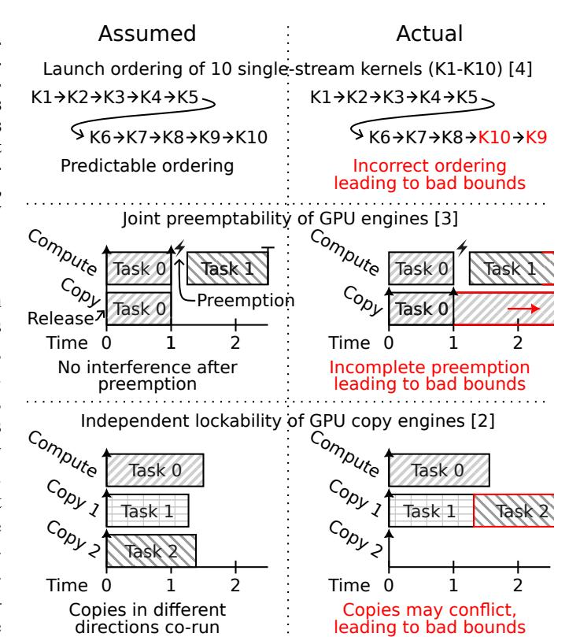
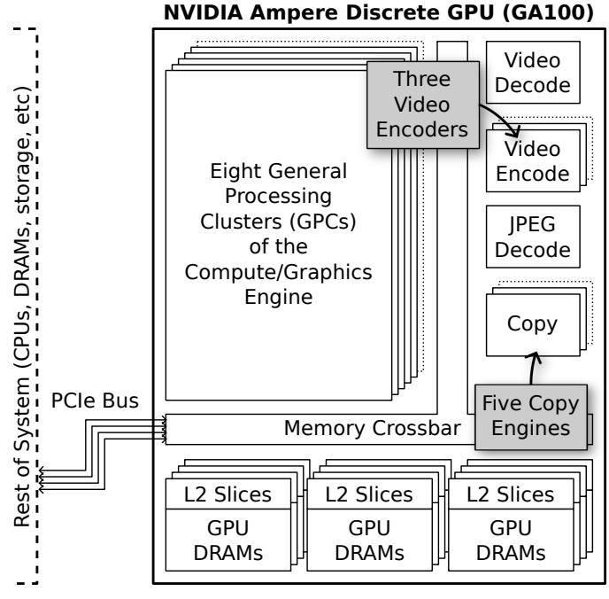
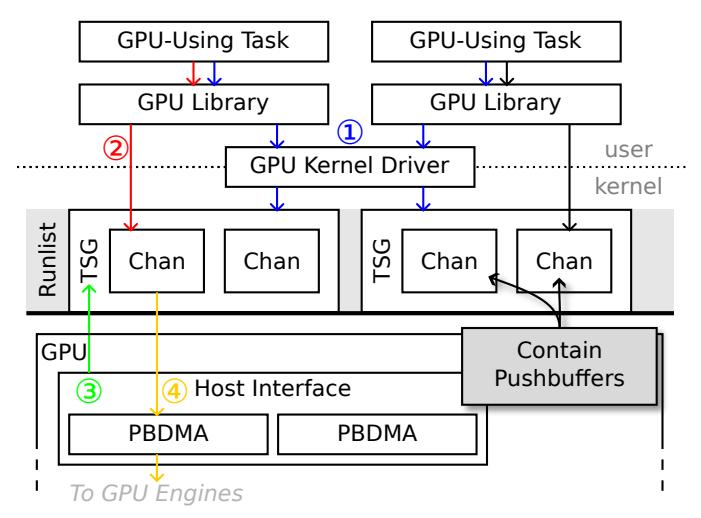
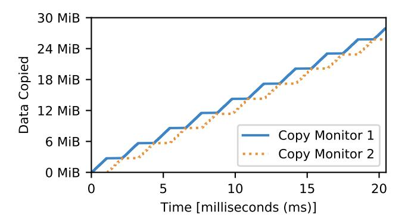
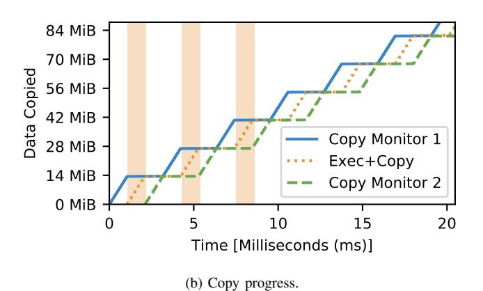
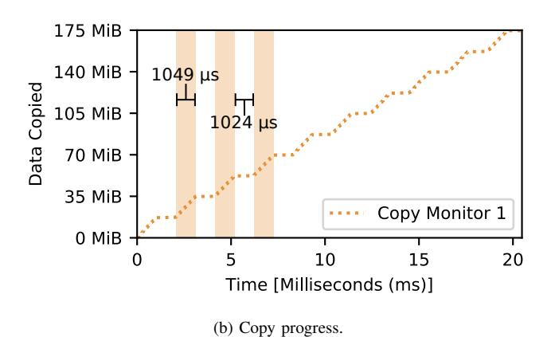

# Demystifying NVIDIA GPU Internals to Enable Reliable GPU Management\*

Joshua Bakita and James H. Anderson
Department of Computer Science, University of North Carolina at Chapel Hill
Email: {jbakita, anderson}@cs.unc.edu

Abstract—As GPU-dependent artificial intelligence and machine learning workloads increasingly come to embedded, safety-critical systems—such as self-driving cars—real-time predictability for GPU-using tasks becomes essential. This paper identifies flaws in three different real-time GPU management approaches that are largely the result of incomplete information about NVIDIA GPU internals. Details concerning this missing information are elucidated via experiments. Based on this information, key rules of GPU scheduling are identified and shown necessary for safe GPU management.

#### I. INTRODUCTION

Over the past decade, GPUs have enabled a revolution in artificial intelligence and machine learning (AI/ML) [1]. This revolution has led to ever-more-capable autonomous systems, including safety-critical systems such as self-driving cars. In order to deploy such safety-critical systems with GPUs, real-time predictability must be ensured. Canonically, this is done by bounding the *response times* of GPU-using tasks by applying real-time GPU *management* and *analysis* techniques.

Unfortunately, the response-time bounds provided by most real-time GPU management and analysis frameworks are unreliable. For each of three different approaches—mutual-exclusion-based management [2], preemption-based management [3], and management-free response-time analysis [4]—Fig. 1 illustrates a scenario in which each makes a false assumption about GPU behavior. In all cases, these false assumptions lead to the failure of analytical response-time bounds—a harbinger of catastrophe.

This paper is directed at elucidating the reasons for these failures. Through deep hardware investigation, we uncover that all these failures are due to overlooked rules of NVIDIA GPU scheduling. We experimentally frame and unveil the missing scheduling rules, as well as evaluate their necessity for safe GPU-management-and-analysis techniques.

**Prior work.** Understanding GPU scheduling rules has long been a known prerequisite for accurate GPU response-time analyses. All the works [2]–[4] mentioned in Fig. 1 come from groups with a strong history of elucidating and publishing GPU scheduling rules [5]–[8]. Our work broadens these efforts by providing heretofore hidden details concerning key GPU functionality.

\*Work supported by NSF grants CPS 2038960, CPS 2038855, CNS 2151829, and CPS 2333120.



<span id="page-0-0"></span>Fig. 1. Real-time GPU management and analysis techniques make dangerous assumptions about GPU behavior.

#### **Contributions.** In this work, for NVIDIA GPUs, we:

- 1) Experimentally derive rules of scheduling behavior that span from GPU library to on-engine-dispatch.
- Provide context to allow delineating current and prior scheduling rules as hardware- or software-enforced.
- 3) Build and open-source a tool—nvdebug—for directly examining GPU hardware scheduling state (bypassing user- and kernel-space libraries or drivers).
- 4) Demonstrate the necessity of our scheduling rules for real-time GPU management and response-time analysis.

**Organization.** We provide key terms in Sec. II, before more thoroughly discussing prior work in Sec. III. We then frame and present our experimentally-derived scheduling rules in Sec. IV and Sec. V. The necessity of these rules for real-time GPU management is evaluated in Sec. VI. We conclude in Sec. VII, and provide supplementary details about our new GPU-scheduling-examination tool in Appx. A.



<span id="page-1-1"></span>Fig. 2. Functional blocks of a recent NVIDIA discrete GPU.

### II. BACKGROUND

<span id="page-1-0"></span>We begin with a cursory overview of GPU architecture and programming paradigms. We focus exclusively on NVIDIA GPUs due to their commonality and industry-leading architecture.

GPU architecture. GPUs are often thought of and referred to as singular accelerators. This is a significant simplification. GPUs, since the very beginning, have been composed of many different functional units. On modern NVIDIA GPUs, these units are referred to as *engines*. Fig. [2](#page-1-1) illustrates the engines available on a recent NVIDIA GPU. The largest and most critical one is the Compute/Graphics Engine, which contains all the general-purpose processing cores. Five copy engines support this by asynchronously handling data movement between GPU DRAM, CPU DRAM, and other GPUs. Supplemental special-purpose engines include three video encode, one video decode, and one JPEG decode engine.

All engines are connected to GPU DRAM via the internal crossbar bus. This bus also connects to the PCIe lanes, allowing engines to optionally, but slowly, access CPU memory.

NVIDIA's embedded "Tegra" GPUs differ by sharing a die with the CPU and by replacing the GPU DRAMs with a bridge to a CPU-shared DRAM controller. For the purposes of this work, the internal topology and architecture of NVIDIA's embedded GPUs can otherwise be considered identicallypatterned as discrete GPUs from the same architectural family.

GPU programming model. Common GPU programming APIs include Vulkan, OpenCL, and CUDA. These are all supported by NVIDIA GPUs, and leverage the same underlying components. We focus on CUDA due to its simplicity and common use in real-time literature.

In Alg. [1,](#page-1-2) we illustrate a CUDA-using program that adds two vectors in parallel on the GPU. All of the shown operations are in respect to a single, implicit GPU virtual address space called a *context*, which is created per-GPUusing task.[1](#page-1-3) Lines [4](#page-1-2) and [6](#page-1-2) in our example transfer input to, and output from, the GPU context via a copy engine. Inbetween, Line [5](#page-1-2) launches the vector-add operation on the GPU's Compute/Graphics Engine; such operations are known as *kernels*. In processing this kernel, the GPU will invoke one instance of VECADD for each element of the vector. Given a sufficiently many-core GPU, the addition of each element will be calculated and completed simultaneously.

As the memory copies and kernel execution occur asynchronously relative to the CPU, most CPU time in this program will be spent implicitly waiting for the GPU engines to complete their operations. To ensure ordering of asynchronous GPU operations, CUDA implicitly creates and enqueues these in a CUDA *stream*, which enforces FIFO ordering. For calls that would explicitly result in a CPU-visible side effect, CUDA will implicitly block inside the call until all prior asynchronous operations complete. The call on Line [6](#page-1-2) in this example is one such case; it will block until both the kernel execution dispatched on Line [5,](#page-1-2) and the memory copy, complete.

<span id="page-1-3"></span><sup>1</sup>Multiple contexts per-task are possible, but discouraged [\[6\]](#page-10-6). We assume a one-to-one task-to-context mapping unless otherwise noted.

#### <span id="page-1-2"></span>Algorithm 1 Vector Addition in CUDA.

```
1: procedure MAIN
2: cudaMalloc(d_A, len) ▷ (i) Allocate GPU ("device") memory for arrays A (shown), B, and C (not shown)
3: . . . ▷ (ii) Allocate and load input data into arrays A and B (not shown)
4: cudaMemcpy(d_A, h_A, len) ▷ (iii) Copy data from CPU ("host") to GPU memory for arrays A (shown) and B (not shown)
5: vecAdd<<<numBlocks, threadsPerBlock>>>(d_A, d_B, d_C, len) ▷ (iv) Launch the "vecAdd" CUDA kernel on-GPU
6: cudaMemcpy(h_C, d_C, len) ▷ (v) Copy results from GPU to CPU memory for array C
7: cudaFree(d_A) ▷ (vi) Free GPU memory for arrays A (shown), B, and C (not shown)
8: . . . ▷ (vii) Output array C, an element-by-element sum of arrays A and B (not shown)
9: end procedure
10: kernel VECADD(A: ptr to int, B: ptr to int, C: ptr to int, len: int)
11: i := blockDim.x * blockIdx.x + threadIdx.x ▷ Calculate index based on built-in thread and block information
12: if i >= len then
13: return ▷ Exit thread if out of vector bounds
14: end if
15: C[i] := A[i] + B[i]
16: end kernel
```

For kernels enqueued in CUDA streams, scheduling behavior with respect to competing streams is difficult to analyze, as the path from task to GPU core is convoluted. After a kernel is launched into a stream, it is processed through two userspace libraries before reaching the GPU hardware (HW)


<span id="page-2-2"></span>Fig. 3. Path from launch to execution for a CUDA kernel.

scheduler. This scheduler makes the final determination about when, and on what part of the GPU, blocks of the kernel will be executed. We illustrate this process in Fig. [3.](#page-2-2) (Note that the userspace library can communicate directly with the GPU. This avoids the overhead of a system call, but also makes kernel launches challenging to monitor.)

#### III. RELATED WORK

<span id="page-2-0"></span>Researchers have investigated the temporal predictability of GPUs since early in their application towards general-purpose computation. Unfortunately, as GPU complexity rivals, if not exceeds, that of high-end CPUs, it has taken exceptionally long to answer even basic questions of GPU arbitration and scheduling. The extreme secrecy of GPU hardware has only exacerbated this problem.[2](#page-2-3) We only touch on particularly relevant works in this section; for more, see a recent, extensive survey of GPU use in safety-critical systems [\[12\]](#page-10-7).

To bypass the unknowns of GPU scheduling, a common approach involves minimizing its role. Two exemplars of this approach are TimeGraph [\[13\]](#page-10-8) and GPUSync [\[14\]](#page-10-9), which avoid unpredictable arbitration by only giving the GPU one piece of work at a time.

TimeGraph [\[13\]](#page-10-8) functions by queuing GPU work on the CPU, releasing one item at a time to the GPU in priority order. GPU-to-CPU interrupts are used to indicate the completion of each piece of work, triggering the selection and release of the next item. S <sup>3</sup>DNN [\[15\]](#page-10-10) is a more recent, special-purpose example of this approach, but with the added ability to release groups of GPU work, rather than just one item at a time.

GPUSync [\[14\]](#page-10-9) and extensions [\[2\]](#page-10-1) take a different approach to ensure mutual exclusion. To improve real-time analyzability, these works treat the GPU as a resource and require applications to hold a mutual-exclusion lock while using the GPU. This easier-to-implement approach has seen increasing adaptation in real-time systems, from TimeWall [\[16\]](#page-10-11), to NVIDIA's DRIVE OS System Task Manager.[3](#page-2-4) While this does ensure safety, it suffers from a capacity-loss problem; few applications are able to consistently fully utilize the GPU while holding the mutual-exclusion lock, resulting in lost capacity.

In search for a system that is easy to analyze and implement, but which avoids the capacity-loss problem of mutual exclu-



Fig. 4. High-level GPU cross-context scheduling pipeline.

<span id="page-2-5"></span>sion, many recent papers have worked to dissect the native scheduling capabilities of GPUs. Otterness *et al.* [\[17\]](#page-10-14), Amert *et al.* [\[5\]](#page-10-4), Olmedo *et al.* [\[7\]](#page-10-15), and Bakita and Anderson [\[8\]](#page-10-5) elucidated the arbitration and dispatch order of intra-context CUDA calls, while Otterness and Anderson have done similarly for AMD GPUs [\[18\]](#page-10-16), [\[19\]](#page-10-17).

More efficient management and analysis approaches have been built on these details. Examples span from granular locking (or reservations [\[20\]](#page-11-0)) based on hardware partitioning of compute [\[8\]](#page-10-5) and memory [\[21\]](#page-11-1), to preemptive EDF based on creative use of hardware capabilities [\[3\]](#page-10-2), to analysis for unmanaged GPU-using tasks [\[4\]](#page-10-3). Unfortunately, these works make inconsistent assumptions about NVIDIA GPU behavior.

For example, consider copy engine behavior. Capodieci *et al.* [\[3\]](#page-10-2) assume and manage copy engines as though they are coscheduled with compute, but Elliot *et al.* [\[2\]](#page-10-1), [\[14\]](#page-10-9) assume and manage copy engines as though they operate asynchronously of compute (and each other). Given these seemingly incompatible assumptions, how do we build a coherent model of GPU scheduling?

To reconcile this tension and build a model, we provide a framing of NVIDIA GPU hardware scheduling that subsumes and extends prior work, coupled with specific, experimentallyderived rules.

#### IV. HIGH-LEVEL FRAMING

<span id="page-2-1"></span>We begin our contributions with a high-level framing of NVIDIA GPU scheduling. We focus on the start of the pipeline: from command launch, through cross-context scheduling, to engine hand off. This complements prior work on the subsequent steps for the compute engine [\[7\]](#page-10-15), [\[8\]](#page-10-5).

The numbered steps in Fig. [4](#page-2-5) guide our explaination of the high-level flow. We forgo digressing into caveats; such lowlevel details are for the rules to come in Sec. [V.](#page-3-0)

Our information comes from a combination of open-source GPU drivers [\[22\]](#page-11-2)–[\[24\]](#page-11-3), NVIDIA patents [\[25\]](#page-11-4), our experiments in Sec. [V,](#page-3-0) and other sources.

① Scheduling initialization. Tasks initialize their scheduling state via the GPU kernel driver. This includes a *pushbuffer* (a

<span id="page-2-4"></span><span id="page-2-3"></span><sup>2</sup>For example, even NVIDIA GPU instruction encodings are secret [\[9\]](#page-10-12)–[\[11\]](#page-10-13). <sup>3</sup>See *Compute Graph and Constraints* in the *DRIVE OS System Task Manager SDK Reference* for more, version 5.10 as of writing.

TABLE I GPUS TESTED IN OUR EXPERIMENTS

<span id="page-3-3"></span>

| GPU Name      | Compute<br>Capability5 | Year | Architecture      |
|---------------|------------------------|------|-------------------|
| GTX 1060 3 GB | 6.1                    | 2016 | Pascal            |
| GTX 1080 Ti   | 6.1                    | 2017 | Pascal            |
| Jetson TX2    | 6.2                    | 2017 | Pascal (embedded) |
| Titan V       | 7.0                    | 2017 | Volta             |
| Jetson Xavier | 7.2                    | 2018 | Volta (embedded)  |
| RTX 2080 Ti   | 7.5                    | 2018 | Turing            |
| A100 40 GB    | 8.0                    | 2020 | Ampere            |
| Jetson Orin   | 8.7                    | 2022 | Ampere (embedded) |
| RTX 6000 Ada  | 8.9                    | 2022 | Ada Lovelace      |

queue detailed in [\[8\]](#page-10-5)), encapsulated with bookkeeping information as a *channel*. All a task's channels are encapsulated with context information into a *Time-Slice Group* (TSG). A TSG is made runnable via insertion into one of the GPU's *runlists* (detailed later), and a user-accessible pointer to the pushbuffer is passed to userspace.

- ② Commands to streams to channels. As GPU operations are requested, the associated commands are enqueued into streams, and these streams are mapped onto pushbuffers. Commands may consist of kernel launches, copy commands, and various other operations.[4](#page-3-2) If not explicitly using a stream, a default or implicit stream is constructed. As channel pushbuffers are mapped into user-writable memory, command enqueueing does not require a syscall.
- ③ Channels to runlists. Commands accumulate in pushbuffers until the GPU HW scheduler (also known as the "Host Interface") selects a channel for scheduling. Selection works in two levels: the GPU globally round-robin timeslices across tasks' TSGs, and all channels in the currently active TSG are cyclically scanned for pushbuffers with pending commands.
- ④ Runlists to engines. Once the GPU HW scheduler identifies a channel with pending commands, it leverages a hardware Pushbuffer DMA (PBDMA) unit to pull commands from CPU to GPU. From here, they are parsed and passed off for enginespecific scheduling (as detailed for the compute engine in prior work [\[8\]](#page-10-5)).

## V. LOW-LEVEL RULES

<span id="page-3-0"></span>We now provide rules for channel-, runlist-, and enginelevel scheduling (steps ②, ③, and ④ in the prior section) after an overview of our methodology and tooling.

## *A. Methodology and Tools*

We perform our experiments on x86\_64 and aarch64 Linux systems with a sampling of GPUs from the past seven years, as listed in Table [I.](#page-3-3) We guarantee that our rules hold for all these devices, even though we only show a sampling of the results. (We also test on some older GPUs, but find the differences too extensive for easy inclusion.)

For all our experiments, we disable background GPU work.[6](#page-3-4) For tools, we leverage cuda\_scheduling\_examiner by Otterness *et al.* [\[17\]](#page-10-14), and develop two new tool suites: nvdebug and gpu-microbench. [7](#page-3-5)

**nvdebug**. nvdebug is a kernel module that exposes an interface in /proc for transparently monitoring and controlling GPU scheduling state. That includes the capability to view internal GPU topology, such as the number and types of engines. Our tool mirrors open-source NVIDIA GPU kernel drivers [\[22\]](#page-11-2), [\[23\]](#page-11-5), [\[26\]](#page-11-6) in how it accesses GPU registers, enabling reliability across a wide range of GPUs and kernels (including Tegra platforms). For more details on this tool and its capabilities, see Appx. [A.](#page-9-1)

**gpu-microbench**. Utilizing the detailed information available from nvdebug, we built a library of microbenchmarks that intricately monitor or benchmark specific GPU engines. These carefully-targeted benchmarks allow for compositional experimentation on scheduling behavior. Two key tools in this suite are exec\_logger and copy\_monitor. These utilize the compute and copy engines respectively while recording at microsecond granularity when each engine is active. Many of the tools in this suite are the result of years of expert tuning and bug fixing, so please consider reusing them.

We now apply our tools to derive low-level rules of GPU scheduling behavior.

#### *B. Rules for Channels*

Channels (and their encapsulated pushbuffers) are closest to streams, thus closest to tasks, and therefore are a natural starting point for our rules.

R1. *Every GPU-engine-using op. goes through a channel.*

Without channels, no GPU-using operations are possible. We verify this by using nvdebug's disable\_channel interface to disable all channels associated with a task, and then attempt to launch kernels or copies via a variety of APIs. (Disabled channels are skipped by the GPU HW scheduler.[8](#page-3-6) ) We find that any type of kernel launch, copy launch, or devicemapped memory allocation is unable to complete until the channels are re-enabled.

<span id="page-3-7"></span>R2. *A task's number of channels limits intra-task parallelism.*

As all GPU-using operations require a channel, problems emerge for work enqueued while all channels are busy. Specifically, *false dependencies* will occur between work in unrelated streams. Normally, streams are supposed to be independent, with the head of each stream being equivalently accessible to the GPU HW scheduler for dispatch. When a false dependency emerges, the head of one stream becomes dependent on queued

<span id="page-3-2"></span><sup>4</sup>The GPU supports arbitrary commands via the "software" engine that interrupts into the kernel driver.

<span id="page-3-1"></span><sup>5</sup>Compute capability distinguishes variants within an architectural family.

<span id="page-3-4"></span><sup>6</sup>On the Jetson TX2, after disabling all background GPU-using tasks, some entries remained on the GPU runlist. We disabled these entries in the runlist using nvdebug to ensure no unexpected interference.

<span id="page-3-5"></span><sup>7</sup>Both available online at [https://www.cs.unc.edu/~jbakita/rtas24-ae/.](https://www.cs.unc.edu/~jbakita/rtas24-ae/)

<span id="page-3-6"></span><sup>8</sup> In [\[24\]](#page-11-3), [manuals/ampere/ga100/dev\\_pbdma.ref.txt,](https://nvidia.github.io/open-gpu-doc/manuals/ampere/ga100/dev_pbdma.ref.txt) line 3803.


<span id="page-4-2"></span>Fig. 5. Nine streams in-use on GTX 1060 3GB with eight compute channels (top) versus nine compute channels (bottom).

work in another stream to complete before it can be dispatched by the GPU. Such false dependencies can prevent kernels at the head of their stream queue from reaching idle GPU cores. By default, through at least CUDA 12.2 on x86\_64, only eight channels are created per-context for compute. This is as low as two-per-context on NVIDIA's embedded "Jetson" boards.

We experimentally demonstrate how a lack of channels triggers false dependencies and compromises parallelism in Fig. 5 (top). This figure presents a timeline of when and where blocks of 36 kernels execute on the GPU. We launch four kernels into each of nine streams. The kernel launch times are indicated by arrows at the bottom left for each stream, and each thread block is annotated with the kernel name and thread block index, separated by a colon. Streams are indicated by color/pattern. Note that, as launches into each stream complete from time 0 to 0.26 s, the head of each stream near-immediately begins executing on the GPU—up until Stream 9. At this point, a false dependency emerges. All eight compute channels are in-use, and so no channel is available for Stream 9. This condition persists until all work in Stream 1 is fully dispatched at time 0.7.

In Fig. 5 (bottom), we repeat the same experiment, but with an increased number of channels. 11 As expected, no false dependencies occur—all nine streams are executed concurrently.

**Implications for real-time systems.** Our findings add nuance to rule **G2** from the work of Amert *et al.* [5], which claims


<span id="page-4-6"></span>Fig. 6. Timeline of timeslice intervals for two instances of exec\_logger concurrently running on the GTX 1060 3GB. Inset collapses vertical space to show that each task executes in mutually exclusive intervals of time.

that the kernel at the head of a stream queue is enqueued for execution. Instead, the kernel at the head of a stream queue is enqueued for execution *only if the number of streams used is less than the number of channels*. Functionally, this means that no more than eight streams should be used, or the number of channels must be reconfigured (for prior rules to hold).

#### C. Rules for Runlists

For a channel, and its wrapped pushbuffer of commands, to be scheduled, it is normally inserted into a runlist (often via an optional TSG). Is this the only way?

<span id="page-4-8"></span>**R3.** To be scheduled, channels must be part of a runlist.

A runlist is a hard prerequisite to launching work from a channel. NVIDIA source code implies this. <sup>12</sup> We also observe this behavior using nvdebug to watch channel and runlist statuses—every enabled channel is associated with a runlist. How many of these channels may be active simultaneously?

<span id="page-4-7"></span>**R4.** A runlist may have up to one task active per associated engine. <sup>13</sup>

Before explaining this rule, we must explain what we mean by a task being active. For tasks using a TSG, this refers to the TSG being active. For tasks directly inserting channels on the runlist without a TSG, this refers to at least one of the task's channels being active.

For cases when only one engine is associated with a runlist (as we commonly find in Sec. V-D) the rule simplifies to: *each runlist has up to one task active*. We demonstrate this for compute, then copy tasks.

For compute, we co-run two exec\_logger tasks, and plot the execution intervals in Fig. 6. Logger 1 is started first,

<span id="page-4-0"></span><sup>&</sup>lt;sup>9</sup>Reported by nvdebug; also mentioned at https://forums.developer.nvidia.com/t/how-many-streams-maximum-number-of-streams/6571/6.

<span id="page-4-1"></span><sup>&</sup>lt;sup>10</sup>Observed as two on the Jetson Xavier with CUDA 10.2, and four on the Jetson Orin with CUDA 11.4. Double this number of channels are created, but CUDA appears to have a bug where only half are used on Jetson boards.

<span id="page-4-3"></span><sup>&</sup>lt;sup>11</sup>Via the environment variable CUDA\_DEVICE\_MAX\_CONNECTIONS.

<span id="page-4-5"></span><span id="page-4-4"></span><sup>&</sup>lt;sup>12</sup>In [22], src/common/sdk/nvidia/inc/ctrl/ctrla06f/ctrla06fgpfifo.h line 67.
<sup>13</sup>When using NVIDIA Multi-Process Service (MPS), **this does not apply**—it breaks our assumption that there is only one task per context. On GPUs since Volta, when MPS is enabled, each application runs as a *subcontext* of an MPS-created context. Our rules still likely apply if you consider all MPS-using tasks together as a single task, but we have not verified this.



<span id="page-5-0"></span>Fig. 7. Progress of two co-running copies in separate contexts over time on the GTX 1060 3GB.

and Logger 2 after Logger 1 is initialized. In this timeline, each consecutive execution—timeslice—of each application is plotted at a differing y-value to allow for more easily distinguishing the boundaries between intervals. Furthermore, the slope of this line thus indicates how rapidly timeslicing is happening. For example, in the right of the figure, each task is receiving approximately 20 timeslices per 80 ms. The slice lengths are largely consistent, at about 2 ms each.

First, observe the mutually-exclusive execution intervals (inset). Only one task executes instructions at any given time, despite each task requiring only a fraction of the GPU.

Second, note that Logger 1's execution is interrupted several times before Logger 2 completes initialization and launches its kernel (area between the vertical dashed lines). This indicates that initializing a CUDA context generates compute-engine interference; this lasts about 100 ms in our case.

Returning to justification for our rule, we now experiment with co-running copies via two instances of copy\_monitor. (This benchmark is carefully crafted to only utilize and monitor the copy engines; it launches no compute work.) We plot the progress of each copy over time in Fig. [7.](#page-5-0) The behavior here mirrors what we saw with compute tasks—only one copy progresses at a time, and the copies trade off about every 1 ms.

This demonstrates that individual uses of an engine are mutually-exclusive, but a further implication of our rule is that two tasks may co-run on a runlist, if they use different engines. We demonstrate this case as part of justification for our next rule.

# <span id="page-5-5"></span>R5. *A GPU's number of runlists limits independent inter-task parallelism*

In justifying this rule, we show two sub-rules: (i) that runlists enable independent inter-task parallelism; (ii) that independent inter-task parallelism is not possible without multiple runlists. By "independent inter-task parallelism" we mean that the active task on a runlist is only a function of other tasks on the same runlist using the same engine, and is unrelated to tasks active (or inactive) on any other runlist.

We begin with two experiments for subrule (i). Using nvdebug, we determine that our GTX 1060 3 GB has separate runlists for compute and copy tasks. We investigate their independence by co-running exec\_logger and

<span id="page-5-3"></span>

(a) Compute intervals.

<span id="page-5-4"></span>

<span id="page-5-2"></span>Fig. 8. Times when copy and compute operations complete for four tasks compute-only, exec+copy, copy-only, and copy-only—on the GTX 1080 Ti (similar results on RTX 6000 Ada). Initialization omitted. Shaded regions indicate times exec+copy task is making copy progress.

copy\_monitor instances. We find that these tasks execute continuously, unhindered by one another, confirming that the two runlists operate at least somewhat independently.[14](#page-5-1)

Does this independence persist if a copy-and-computeusing task is added? We tested this by running such a task alongside an instance of exec\_logger and two instances of copy\_monitor. If runlists are scheduled independently, our copy-and-compute-using task may use the compute and copy engines at unsynchronized times. This is exactly what occurs, as shown in Fig. [8.](#page-5-2) These figures are formatted similarly to past figures and show identical time periods. We add shaded regions to both figures for the intervals during which the copyand-compute task makes copy progress.

Note how the copy-and-compute task executes on the compute cores (Fig. [8a\)](#page-5-3) at times unrelated to when copies progress (Fig. [8b\)](#page-5-4). Consider its second shaded copy interval; during its entirety a completely unrelated task—the exec\_logger executes on the compute cores. This supports our first experiment by demonstrating that runlists operate independently, even in complex scenarios.

We now justify sub-rule (ii): that independent inter-

<span id="page-5-1"></span><sup>14</sup>With the exception that compute is still hindered during context initialization (as in Fig. [6\)](#page-4-6); curiously, it is also briefly interrupted when copy\_monitor does large, GPU-device-mapped memory allocations.

<span id="page-6-2"></span>

(a) Compute interval (continues uninterrupted during copy).

<span id="page-6-3"></span>

<span id="page-6-1"></span>Fig. 9. Times when copy and compute operations complete for two corunning tasks—exec\_logger and copy\_monitor—on the Jetson TX2. Initialization omitted. Shaded regions indicate times copy\_monitor is making progress, and are 1049 µs wide, whereas the gaps are 1024 µs wide.

task parallelism is not possible without multiple runlists. Using nvdebug, we identify that the Jetson TX2 contains two engines that share a single runlist. We demonstrate non-independence by co-running exec\_logger and copy\_monitor, and plot the results in Fig. [9.](#page-6-1)

Compute work appears to run continuously (Fig. [9a\)](#page-6-2), but copies appear timesliced (Fig. [9b\)](#page-6-3)—even though exec\_logger does not execute copies. At first, we suspected experimental error or a missed background task as to blame for the unusual copy engine interference, but after extensive experimentation, we verified that the TX2's single runlist is to fault for this strange interference.

Key to this conclusion is a subtle difference: 1024 µs for a timeslice on compute-associated channels, versus 1049 µs for copy-exclusive channels [\[26\]](#page-11-6). We discover that the time that our copy is interrupted for is *not* the time required to run another copy, but the time for a compute timeslice. Why then is compute not interrupted while the copy runs (shaded in Fig. [9\)](#page-6-1)? Based on how the GPU is documented to handle semaphores,[15](#page-6-4) the runlist scheduling system must snoop each runlist independently of the currently-running task, preempt only once the next channel has been identified, and only pre-

TABLE II ENGINES ON GTX 1060 3GB

<span id="page-6-7"></span>

| Engine Name                           | Runlist   |
|---------------------------------------|-----------|
| Graphics/Compute 0                    |           |
| [Graphics] Copy Engine 0 (GRCE0/LCE0) | Runlist 0 |
| [Graphics] Copy Engine 1 (GRCE1/LCE1) |           |
| Video Decoder 0 (NVDEC0)              | Runlist 1 |
| Video Encoder 0 (NVENC0)              | Runlist 2 |
| Sequencer                             | Runlist 3 |
| N/A                                   | Runlist 4 |
| Copy Engine 2 (LCE2)                  | Runlist 5 |
| Copy Engine 3 (LCE3)                  | Runlist 6 |
|                                       |           |

TABLE III ENGINES ON JETSON ORIN

<span id="page-6-8"></span>

| Engine Name                           | Runlist   |
|---------------------------------------|-----------|
| Graphics/Compute 0                    |           |
| [Graphics] Copy Engine 0 (GRCE0/LCE0) | Runlist 0 |
| [Graphics] Copy Engine 1 (GRCE1/LCE1) |           |
| Copy Engine 2 (LCE2)                  | Runlist 1 |
| Copy Engine 3 (LCE3)                  | Runlist 2 |
| Graphics/Compute 1                    | Runlist 2 |

empt the engines needed by the next channel. Whereas copyexclusive channels never need the compute engine, computeassociated channels may optionally include copy commands. This appears to cause copy engines that share a runlist with compute tasks to be timesliced across both compute- and copy-using tasks.[16](#page-6-5) This demonstrates that when tasks share a runlist, they are at best semi-independent—fully independent scheduling requires multiple runlists.

Note that, by demonstrating two tasks simultaneously active on a single runlist, this experiment also supports [R4](#page-4-7).

Implications for real-time systems. Our findings both challenge and support assumptions made for prior real-time management systems. Works that claim and manage only a single runlist [\[3\]](#page-10-2) risk overlooking significant interference channels from unmanaged access to other GPU engines via other runlists. Furthermore, prior per-engine-granularity locking approaches [\[2\]](#page-10-1) appear risky if multiple engines share a runlist. On the other hand, such locking techniques seem safe in circumstances where there are at least as many runlists as engines, but is this a common configuration?

#### <span id="page-6-0"></span>*D. Rules for Runlist to Engine Mappings*

In the previous section, we noted that the number of engines associated with a runlist is core to runlist behavior ([R4](#page-4-7)). We now explore and give rules for how runlists map to engines.

## <span id="page-6-6"></span>R6. *A runlist may be bound to more than one engine.*

As evidenced by the experiments supporting [R5](#page-5-5), a single runlist can serve multiple engines. This configuration is not

<span id="page-6-5"></span><sup>16</sup>For those familiar with NVIDIA's terminology, our specific understanding is that the PBDMA units (desc. in [\[8\]](#page-10-5)) each snoop different *runqueues* in the runlist, where each channel is associated with one or more different runqueues. Each runqueue is restricted in the types of commands it may run. While compute-associated channels may optionally use the copy runqueue, copyexclusive channels only use the copy runqueue. The result is round-robin arbitration among all runqueue-using channels, for each runqueue in a runlist.

<span id="page-6-4"></span><sup>15</sup>Obliquely documented in [\[24\]](#page-11-3), [manuals/ampere/ga100/dev\\_pbdma.ref.txt,](https://nvidia.github.io/open-gpu-doc/manuals/ampere/ga100/dev_pbdma.ref.txt) section "Semaphore switch option" (line 3797).

TABLE IV ENGINES ON RTX 6000 ADA

<span id="page-7-1"></span>

| Engine Name                           | Runlist    |
|---------------------------------------|------------|
| Graphics/Compute 0                    |            |
| [Graphics] Copy Engine 0 (GRCE0/LCE0) | Runlist 0  |
| [Graphics] Copy Engine 1 (GRCE1/LCE1) |            |
| Copy Engine 2 (LCE2)                  | Runlist 1  |
| Copy Engine 3 (LCE3)                  | Runlist 2  |
| Copy Engine 4 (LCE4)                  | Runlist 3  |
| Video Decoder 0 (NVDEC0)              | Runlist 4  |
| Video Decoder 1 (NVDEC1)              | Runlist 5  |
| Video Decoder 2 (NVDEC2)              | Runlist 6  |
| N/A                                   | Runlist 7  |
| Video Encoder 0 (NVENC0)              | Runlist 8  |
| Video Encoder 1 (NVENC1)              | Runlist 9  |
| Video Encoder 2 (NVENC2)              | Runlist 10 |
| JPEG Decoder 0 (NVJPG0)               | Runlist 11 |
| JPEG Decoder 1 (NVJPG1)               | Runlist 12 |
| JPEG Decoder 2 (NVJPG2)               | Runlist 13 |
| JPEG Decoder 3 (NVJPG3)               | Runlist 14 |
| Optical Flow Accelerator              | Runlist 15 |
| Sequencer                             | Runlist 16 |
|                                       |            |

unique to the TX2. All NVIDIA GPUs we have experimented with have a runlist supporting both compute and copy operations. Despite this, we have not observed the TX2's problematic behavior on other GPUs—we suspect this is because CUDA always prefers to use the commonly-available copy-only runlists instead.

[R6](#page-6-6) follows from the experiments supporting [R5](#page-5-5), but we further support it with GPU topology data provided by nvdebug's device\_info interface. We include the experimentally-extracted information for a sampling of GPUs in Table [II,](#page-6-7) Table [III,](#page-6-8) and Table [IV.](#page-7-1) Each row corresponds to a single runlist (right) with all associated engines (left). Copy engines are numbered sequentially by the hardware, even though the first two have special graphics-related capabilities and are also known as GRCEs.

All runlists adhere to [R6](#page-6-6), and—with the exception of Runlist 0—every runlist is associated with only one engine. This results in many runlists on modern GPUs such as the RTX 6000 Ada—a significant opportunity for parallelism. Building off the patterns presented in the tables, we draw a further conclusion about how engines are configured.

#### <span id="page-7-2"></span>R7. *Each engine is bound to only one runlist.*

Note how no engine names are repeated in any of the tables—this is a hardware restriction. The device topology (PTOP) registers used by nvdebug's device\_info interface map each engine to one runlist. Without nvdebug, this rule is very difficult to derive, as it is not always experimentally evident—we explain why in our next rule.

<span id="page-7-4"></span>R8. *Copy engines may appear to violate [R7](#page-7-2) due to copyengine-specific shared hardware.*

An obscure layer of indirection can compromise scheduling independence for copy engines. We demonstrate this via the experiment plotted in Fig. [10.](#page-7-3) In this figure, we plot how long a repeating GPU-to-CPU CUDA copy takes on two


<span id="page-7-3"></span>Fig. 10. OpenGL texture uploads can block CUDA copies *in the opposite direction*, even if channels, runlists, and LCEs are mutually exclusive.

GPUs in two circumstances: alone, and co-run with a textureuploading OpenGL task. On paper, these two systems should behave identically: CUDA reports the same number of copy engines for both, nvdebug shows that both have at least two copy engines with independent runlists, and both act similarly when executing only CUDA tasks. If anything, the six-year-newer (and 24× more expensive) RTX 6000 Ada should perform better—but this is not the case. While our OpenGL task is executing, we observe copies to the GPU slowed approximately 2× on the RTX 6000 Ada, but barely slowed (perhaps by DRAM interference) on the GTX 1080 Ti.

Up to this point in the paper, "copy engines" have been synonymous with NVIDIA's Logical Copy Engines (LCEs). Unfortunately, LCEs are not sufficient to execute a copy operation; they rely on a lower-level unit, the Physical Copy Engines (PCEs) [\[27\]](#page-11-7)—this is where we find an explanation for the surprising result in Fig. [10.](#page-7-3)

A set of GPU registers controls how LCEs map to PCEs. We extract and plot these seemingly-constant mappings for a selection of GPUs in Fig. [11.](#page-8-0) The register structure restricts copy configurations in two ways: (i) each PCE may be associated with up to one LCE or GRCE; and (ii) only GRCEs may share a PCE associated with another GRCE or LCE. When PCE sharing is utilized for GRCEs, copies from Runlist 0 can interfere with copies in other runlists—this is exactly what we see happening in Fig. [10.](#page-7-3) As shown in Fig. [11,](#page-8-0) the default copy engine configuration for the RTX 6000 Ada maps both GRCEs onto LCEs. From our experiments, we surmise that whichever GRCE handles texture uploads has been mapped onto the LCE that handles GPU-to-CPU CUDA copies.

Implications for real-time systems. Generally, scheduling for each GPU engine is fully independent—only the GRCEs compromise isolation for any engine. This strongly supports a per-engine locking approach, but not k-exclusion locking one copy engine may not at all be like another, depending on GRCE and PCE configuration.

# VI. EVALUATION

<span id="page-7-0"></span>We evaluate our rules in the context of three GPU management and analysis approaches: management-free analysis by Yang *et al.* [\[4\]](#page-10-3), preemptive EDF via runlist management by


<span id="page-8-0"></span>Fig. 11. Interconnectedness between Runlists, Logical Copy Engines (LCEs), Graphics Copy Engines (GRCEs), and Physical Copy Engines (PCEs) for a variety of GPUs 2016–2022. Only PCEs can actually perform the copy. The GTX 1080 Ti configuration (not shown) is identical to the GTX 1060 3GB configuration (shown).

Capodieci *et al.* [3], and mutual-exclusion-based management by Elliott *et al.* [14].

Our goal in this section is to demonstrate that our rules are a prerequisite to safe GPU management. We cannot demonstrate that our rules are sufficient, but we can show that they are necessary. We do this by showing that prior approaches fail without the consideration of our rules.

#### A. Necessity for Management-Free Analysis [4]

Yang et al. [4] have developed response-time analysis for GPU-using directed-acyclic-graph (DAG) tasks, without requiring any GPU-management middleware. They substantially limit the programming and system model to simplify the analysis—a defensible choice, as they target OpenVX tasks for whom these limits are insignificant.

By **R2**, any GPU management approach should not use more streams than channels, or risk compromised parallelism and undefined behavior. In the work by Yang *et al.* [4], one stream is used per-job, and the total number of co-running jobs is not limited. If our rule is necessary, Yang *et al.*'s analysis should be compromised by ignoring our rule.

**Problematic assumptions.** In [4], jobs are restricted from launching more than one kernel. This allows for them to use a simplified derivative of the scheduling rules from Amert *et al.* [5] in their analysis. The simplified ruleset is as follows: (i) a kernel is enqueued on the EE queue when launched; (ii) a kernel at the head of the EE queue is dequeued from that queue once it becomes fully dispatched; and (iii) a block of the kernel at the head of the EE queue is eligible to be assigned if its resource requirements are met. "Fully dispatched" means that all blocks of the kernel have begun or completed execution; "EE queue" is a first-in-first-out (FIFO) queue whose behavior is defined by the above rules; and "resource requirements" are GPU cores and shared memory.

We now show that, as this ruleset ignores **R2**, it is incorrect. This requires defining some of the specific behavior that occurs when **R2** is violated before we can give our counter-example to the ruleset of Yang *et al.*.

#### Implications of our rules.

<span id="page-8-1"></span>**Corollary 1.** A channel is not guaranteed to be available until the last kernel in the currently-active stream is fully dispatched.

In Fig. 5 we show that the last kernel must be at least partially dispatched before a channel is freed. In supplemental experiments, we add more blocks to the kernels and observe that all blocks must be dispatched before a channel is reliably freed.

<span id="page-8-2"></span>**Corollary 2.** Streams waiting for channels are not assigned channels in FIFO order.

We repeat the experiment of Fig. 5 with ten streams and a longer K3, finding that Stream 10 is assigned a channel before Stream 9—even though kernels are launched in Stream 9 before Stream 10.

**Counter-example.** Consider 10 different GPU jobs which release in order, each consisting of a single large kernel launched in a single-use CUDA stream.

Under the ruleset of Yang *et al.*, by rule (i) they are all immediately put on the EE queue by order of arrival, and per (ii) and (iii) they are progressively dequeued and executed on the GPU in FIFO order as resources become available.

Under our rules, the ordering can be different. The first 8 streams and their kernels will be assigned channels and executed, but kernels 9 and 10 will have to wait until a channel is freed, per Corollary 1. Once one of the first 8 kernels is fully dispatched and its channel becomes free, that channel may be assigned to either kernel 9 or kernel 10 per Corollary 2—this is the key point where a problem emerges. If kernel 10 is assigned a channel first, it will execute before kernel 9, resulting in a non-FIFO order of execution.

In Yang *et al.*, the response-time bound (Theorem 3) for a job omits consideration of all jobs released after that job, dependent on GPU kernels being dequeued in FIFO order. Our above counter-example shows that later-released kernels may cut-ahead, adding unaccounted-for delays, breaking the

response-time bound proof of [\[4\]](#page-10-3). If [R2](#page-3-7) were taken into account, and fewer streams used than channels, this problem would have been avoided.

# *B. Necessity for Preemptive EDF On-GPU [\[3\]](#page-10-2)*

Capodieci *et al.* [\[3\]](#page-10-2) developed a mechanism to enable preemptive EDF scheduling on the GPU. Task scheduling is done by only inserting channels for a single application at a time on the runlist, and preemption is implemented by resetting the runlist.

The key problem with this work is that a TX2-specific attribute—the presence of only one runlist—is claimed as a general rule of NVIDIA GPU scheduling (as repeated in their later work [\[7\]](#page-10-15)).

Problematic assumptions. In the work of Capodieci *et al.*, they claim that only one task is active on a runlist at a time. This directly contradicts [R4](#page-4-7). They also overlook that other non-compute engines require access to a runlist, a conflict with [R7](#page-7-2). In follow-on work, when observing an instance of [R5](#page-5-5), they instead indirectly question [R3](#page-4-8)—the only claim of their original work that our rules directly align with.

However, are our rules strictly required for this management technique to be safe?

Counter-example. Consider a system of two GPU-using tasks on the NVIDIA Jetson Xavier. Task 1 performs compute and copy operations, whereas Task 2 performs only compute operations. Task 1 has a period of 3s, relative deadline of 2s, cost of 2s, and phase of 0.5s. Task 2 has a period of 3s, relative deadline of 3s, cost of 1s, and phase of 0. In this system, Task 2 will always release part-way through Task 1's execution, and have an earlier deadline, hence higher priority according to EDF. The result will be that Task 2 preempts Task 1 on every release.

According to Capodieci *et al.*, this preemption would be implemented by reconfiguring the compute runlist to only contain Task 2—this should work, per [R3](#page-4-8). However, the Jetson Xavier includes a second runlist for copy operations. Per [R5](#page-5-5), even though Task 1 is no longer active on the compute runlist, its copies may continue unhindered on other runlists. Such corunning copies have been shown to severely delay compute work on the Jetson Xavier [\[7\]](#page-10-15), causing Task 2 to miss its tight deadline. If [R3](#page-4-8), [R5](#page-5-5), and [R7](#page-7-2) were taken into account, the second runlist would not have been overlooked, could have been preempted, and the safety of the system preserved.

# *C. Necessity for Granular GPU Locking [\[2\]](#page-10-1), [\[14\]](#page-10-9)*

Glenn *et al.* [\[2\]](#page-10-1), [\[14\]](#page-10-9) propose managing the GPU by making each copy and compute engine a lockable resource, such that existing resource-management analysis can be applied to GPU-using tasks.

[R8](#page-7-4) and [R6](#page-6-6) show that the presence of multiple copy engines does not guarantee their independence, as would be required to treat them as separately lockable resources. This lacking copy independence is the key problem with a granular locking approach.

Problematic assumptions. Glenn *et al.* assume that if a GPU has at least two copy engines, copies in independent directions can proceed independently—a contradiction of [R8](#page-7-4). Furthermore, they assume that—no matter the number of copy engines—those copy engines are scheduled independently of the compute engine. [R6](#page-6-6) contradicts this; copy and compute engines may share a runlist, making scheduling non-independent. Other assumptions of that work are now outdated, such as the non-preemptability of copy engines, but we focus only on the overly-optimistic assumptions, rather than the overlypessimistic ones.

Counter-example. Consider the system of Fig. [10](#page-7-3) on the RTX 6000 Ada: one CPU-to-GPU copy+graphics task, and another GPU-to-CPU copy task on a two-copy-engine-containing system. Given that CUDA reports two copy engines on this system, the following locks would be created: Lock 1 for CPUto-GPU copies, Lock 2 for GPU-to-CPU copies, and Lock 3 for compute/graphics work. Task 2 could freely acquire Lock 2 for its GPU-to-CPU copies at the same time that Task 1 holds Lock 1 or Lock 3—no locks are contended for, and so management is a no-op.

However, due to how the visible copy engines are mapped to the underlying copy hardware, the copies of Task 1 and Task 2 would contend for access to a single PCE, taking double the time expected. This compromises execution time bounds, leading to unreliably-met deadlines. If hardware mappings were taken into account as required by [R8](#page-7-4)—perhaps extracted via our nvdebug tool—only one copy engine lock would have been created and per-engine mutual exclusion would be restored.

# VII. CONCLUSION

<span id="page-9-0"></span>In this work, we identified key behaviors of NVIDIA GPUs that can compromise the safety of preexisting real-time GPU management frameworks. In order to protect future GPUmanagement efforts from such hazards, we experimentally derived and codified GPU scheduling rules for the lowest-level scheduling primitives—channels, runlists, and engines. We analytically evaluate the necessity of our rules for GPU management and analysis, finding that our rules expose counterexamples in three prior works. To assist others in maintaining and adding to our scheduling rules, we open-sourced all our tools, including our nvdebug Linux kernel module.

In future work, we aim to develop rules for how runlists are arbitrated and budgeted when containing multiple tasks; a sufficiently-high-accuracy model may allow offloading scheduling from management frameworks onto the HW scheduler—reducing capacity loss.

# <span id="page-9-1"></span>APPENDIX A N V D E B U G: A NEW GPU INSPECTION TOOL

The hazards we have identified in prior work highlight the need for greater visibility into the scheduling mechanisms of NVIDIA GPUs. In order to enable other researchers to continue our work, and to verify that future management approaches works as expected, we are open-sourcing our

```
1 user@machine:~$ cat /proc/gpu1/runlist0
2 +---- TSG Entry 1 ---+
3 | Scale: 3 |
4 | Timeout: 128 |
5 | Length: 1 |
6 +---------------------+
7 +- Channel Info 1 -+
8 | Enabled: 1|
9 | Next: 0|
10 | Force CTX Reload: 0|
11 | Enable set: 0|
12 | Enable clear: 0|
13 | PBDMA Faulted: 0|
14 | ENG Faulted: 0|
15 | Status: 0|
16 | Busy: 0|
17 ...
```

Listing 1. Example usage of nvdebug runlist information API.

nvdebug tool. Our tool allows for transparently inspecting and modifying GPU scheduling state, irrespective of the GPU driver in use.

nvdebug is a loadable Linux kernel module, and interacts directly with the GPU via memory-mapped I/O operations. This bypasses the GPU driver, so it works no matter what driver, if any, is installed. nvdebug supports both aarch64 and x86\_64 CPUs, works on both integrated and discrete NVIDIA GPUs, has no dependencies, and requires no configuration. We have tested it on GPUs from Kepler (2011) through Ada (2022).

After being loaded into the kernel, our tool exposes GPU information via a series of virtual files in /proc/gpuX for each GPU X on the system. Key stable APIs include:

- 1) gpuX/device\_info: Print information about GPU engines, including their associated runlist IDs.
- 2) gpuX/runlistY: Print the contents of runlist Y.
- 3) gpuX/disable\_channel: On write, disable the channel associated with the ID written.
- 4) gpuX/enable\_channel: On write, enable the channel associated with the ID written.
- 5) gpux/lce\_for\_pceY: Read which LCE PCE Y is mapped to.
- 6) gpux/shared\_lce\_for\_grceY: Read which LCE (if any) GRCE Y is mapped to.
- 7) gpux/pce\_map: Read a bit mask of which PCEs are available.

We include an example of using nvdebug to print Runlist 0 for the second GPU in the system ,in Listing [1.](#page-10-18)

Among the challenges we overcome while constructing this tool, accessing, parsing, and traversing GPU page tables to access runlist entries in GPU physical memory proved particularly difficult. We encourage those further interested in this topic to consult our code.[17](#page-10-19)

# ACKNOWLEDGMENT

The authors thank Benjamin Hadad IV for his implementation of nvdebug's device information API on Ampere+ GPUs, and thank Saman Sahebi for his implementation of nvdebug's PCE to LCE mapping information API on Turing+ GPUs.

# REFERENCES

- <span id="page-10-0"></span>[1] A. Krizhevsky, I. Sutskever, and G. E. Hinton, "Imagenet classification with deep convolutional neural networks," *Advances in Neural Information Processing Systems*, vol. 25, Dec 2012.
- <span id="page-10-1"></span>[2] G. A. Elliott, "Real-time scheduling for GPUs with applications in advanced automotive systems," Ph.D. dissertation, The University of North Carolina at Chapel Hill, 2015.
- <span id="page-10-2"></span>[3] N. Capodieci, R. Cavicchioli, M. Bertogna, and A. Paramakuru, "Deadline-based scheduling for GPU with preemption support," in *Proceedings of the 39th IEEE Real-Time Systems Symposium*, Dec 2018, pp. 119–130.
- <span id="page-10-3"></span>[4] M. Yang, T. Amert, K. Yang, N. Otterness, J. H. Anderson, F. D. Smith, and S. Wang, "Making OpenVX really "real time"," in *Proceedings of the 39th IEEE Real-Time Systems Symposium*, Dec 2018, pp. 80–93.
- <span id="page-10-4"></span>[5] T. Amert, N. Otterness, M. Yang, J. H. Anderson, and F. D. Smith, "GPU scheduling on the NVIDIA TX2: Hidden details revealed," in *Proceedings of the 38th IEEE Real-Time Systems Symposium*, Dec 2017, pp. 104–115.
- <span id="page-10-6"></span>[6] M. Yang, N. Otterness, T. Amert, J. Bakita, J. H. Anderson, and F. D. Smith, "Avoiding pitfalls when using NVIDIA GPUs for real-time tasks in autonomous systems," in *Proceedings of the 30th Euromicro Conference on Real-Time Systems*, Jul 2018, pp. 20:1–20:21.
- <span id="page-10-15"></span>[7] I. S. Olmedo, N. Capodieci, J. L. Martinez, A. Marongiu, and M. Bertogna, "Dissecting the CUDA scheduling hierarchy: a performance and predictability perspective," in *Proceedings of the 26th IEEE Real-Time and Embedded Technology and Applications Symposium*, Apr 2020, pp. 213–225.
- <span id="page-10-5"></span>[8] J. Bakita and J. H. Anderson, "Hardware compute partitioning on NVIDIA GPUs," in *Proceedings of the 29th IEEE Real-Time and Embedded Technology and Applications Symposium*, May 2023, pp. 54– 66.
- <span id="page-10-12"></span>[9] A. B. Hayes, F. Hua, J. Huang, Y. Chen, and E. Z. Zhang, "Decoding CUDA binary," in *Proceedings of the 2019 IEEE/ACM International Symposium on Code Generation and Optimization*, Feb 2019, pp. 229– 241.
- [10] Z. Jia, M. Maggioni, B. Staiger, and D. P. Scarpazza, "Dissecting the NVIDIA Volta GPU architecture via microbenchmarking," Apr 2018.
- <span id="page-10-13"></span>[11] Z. Jia, M. Maggioni, J. Smith, and D. P. Scarpazza, "Dissecting the NVIDIA Turing T4 GPU via microbenchmarking," Mar 2019.
- <span id="page-10-7"></span>[12] J. Perez-Cerrolaza, J. Abella, L. Kosmidis, A. J. Calderon, F. Cazorla, and J. L. Flores, "GPU devices for safety-critical systems: A survey," *ACM Computing Surveys*, vol. 55, no. 7, pp. 1–37, Dec 2022.
- <span id="page-10-8"></span>[13] S. Kato, K. Lakshmanan, R. Rajkumar, and Y. Ishikawa, "TimeGraph: GPU scheduling for Real-Time Multi-Tasking environments," in *Proceedings of the 2011 USENIX Annual Technical Conference*. USENIX Association, Jun 2011.
- <span id="page-10-9"></span>[14] G. A. Elliott, B. C. Ward, and J. H. Anderson, "GPUSync: A framework for real-time GPU management," in *Proceedings of the 34th Real-Time Systems Symposium*, Dec 2013, pp. 33–44.
- <span id="page-10-10"></span>[15] H. Zhou, S. Bateni, and C. Liu, "S <sup>3</sup>DNN: Supervised streaming and scheduling for GPU-accelerated real-time DNN workloads," in *Proceedings of the 24th IEEE Real-Time and Embedded Technology and Applications Symposium*, Apr 2018, pp. 190–201.
- <span id="page-10-11"></span>[16] T. Amert, Z. Tong, S. Voronov, J. Bakita, F. D. Smith, and J. H. Anderson, "TimeWall: Enabling time partitioning for real-time multicore+accelerator platforms," in *Proceedings of the 42nd IEEE Real-Time Systems Symposium*, Dec 2021, pp. 455–468.
- <span id="page-10-14"></span>[17] N. Otterness, M. Yang, T. Amert, J. Anderson, and F. D. Smith, "Inferring the scheduling policies of an embedded CUDA GPU," in *Proceedings of the 13th Annual Workshop on Operating Systems Platforms for Embedded Real Time Applications*, Jul 2017.
- <span id="page-10-16"></span>[18] N. Otterness and J. H. Anderson, "Exploring AMD GPU scheduling details by experimenting with "worst practices"," in *Proceedings of the 29th International Conference on Real-Time Networks and Systems*, Apr 2021, pp. 24–34.
- <span id="page-10-17"></span>[19] N. Otterness, "Developing real-time GPU-sharing platforms for artificial-intelligence applications," Ph.D. dissertation, The University of North Carolina at Chapel Hill, 2022.

<span id="page-10-19"></span><sup>17</sup>Available online at [http://rtsrv.cs.unc.edu/cgit/cgit.cgi/nvdebug.git/.](http://rtsrv.cs.unc.edu/cgit/cgit.cgi/nvdebug.git/)

- <span id="page-11-0"></span>[20] S. K. Saha, Y. Xiang, and H. Kim, "STGM: Spatio-temporal GPU management for real-time tasks," in *Proceedings of the 25th IEEE International Conference on Embedded and Real-Time Computing Systems and Applications*, Aug 2019, pp. 1–6.
- <span id="page-11-1"></span>[21] S. Jain, I. Baek, S. Wang, and R. Rajkumar, "Fractional GPUs: Softwarebased compute and memory bandwidth reservation for GPUs," in *Proceedings of the 25th IEEE Real-Time and Embedded Technology and Applications Symposium*, Apr 2019, pp. 29–41.
- <span id="page-11-2"></span>[22] NVIDIA, "Linux open GPU kernel module source." [Online]. Available: <https://github.com/NVIDIA/open-gpu-kernel-modules>
- <span id="page-11-5"></span>[23] Nouveau Project Authors, "Nouveau: Accelerated open source driver for nVidia cards," 2022. [Online]. Available: [https://nouveau.freedesktop.](https://nouveau.freedesktop.org/) [org/](https://nouveau.freedesktop.org/)
- <span id="page-11-3"></span>[24] NVIDIA, "Open GPU documentation." [Online]. Available: [https:](https://github.com/NVIDIA/open-gpu-doc) [//github.com/NVIDIA/open-gpu-doc](https://github.com/NVIDIA/open-gpu-doc)
- <span id="page-11-4"></span>[25] S. H. Duncan, L. V. Shah, S. J. Treichler, D. E. Wexler, J. F. Duluk Jr, P. B. Johnson, and J. S. R. Evans, "Concurrent execution of independent streams in multi-channel time slice groups," U.S. Patent 9,442,759, Sep., 2016.
- <span id="page-11-6"></span>[26] NVIDIA, "nvgpu git repository." [Online]. Available: [git://nv-tegra.](git://nv-tegra.nvidia.com/linux-nvgpu.git) [nvidia.com/linux-nvgpu.git](git://nv-tegra.nvidia.com/linux-nvgpu.git)
- <span id="page-11-7"></span>[27] M. W. Rashid, G. Ward, W.-J. R. Huang, and P. B. Johnson, "Managing copy operations in complex processor topologies," U.S. Patent 10,275,275, Apr., 2019.