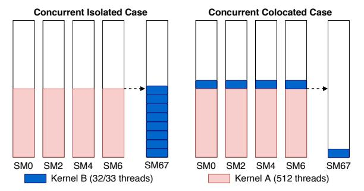
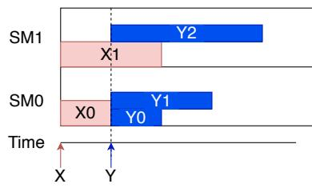

# **Demystifying the Placement Policies of the NVIDIA GPU Thread Block Scheduler for Concurrent Kernels**

Guin Gilman Samuel S. Ogden Tian Guo Robert J. Walls Department of Computer Science Worcester Polytechnic Institute, Worcester, MA, USA {grgilman, ssogden, tian, rjwalls}@wpi.edu

# ABSTRACT

In this work, we empirically derive the scheduler's behavior under concurrent workloads for NVIDIA's Pascal, Volta, and Turing microarchitectures. In contrast to past studies that suggest the scheduler uses a round-robin policy to assign thread blocks to streaming multiprocessors (SMs), we instead find that the scheduler chooses the next SM based on the SM's local resource availability. We show how this scheduling policy can lead to significant, and seemingly counter-intuitive, performance degradation; for example, a decrease of one thread per block resulted in a 3.58X increase in execution time for one kernel in our experiments. We hope that our work will be useful for improving the accuracy of GPU simulators and aid in the development of novel scheduling algorithms.

#### Categories and Subject Descriptors

C.1 [Computer Systems Organization]: Processor Architectures; C.1.4 [Processor Architectures]: Parallel Architectures; C.4 [Computer Systems Organization]: Performance of Systems

## Keywords

Concurrent kernels, GPGPUs, scheduling algorithms

## 1. INTRODUCTION

Concurrent kernel execution—i.e., running kernels from separate streams at the same time on the same device has been proposed as a means to improve the utilization of general purpose GPUs [19, 1, 16, 17, 5, 15, 7, 3, 4]. In order to take full advantage of kernel concurrency, the scheduler must make intelligent decisions to efficiently divide the GPU's limited resources among the kernels. Suboptimal decisions by the scheduler can lead to inefficiencies that impact kernel performance. However, characterizing the performance implications of such concurrency is challenging due, in large part, to the black-box nature of NVIDIA's proprietary thread block scheduler.

In this work, we use empirical observations of real hardware to infer the policies of the thread block scheduler on the Pascal, Volta, and Turing GPU microarchitectures. We find, for example, that the scheduler chooses where to assign a thread block based on the local resource availability of the streaming multiprocessors (SMs)—we call this the mostroom policy. In contrast, most literature assumes that the scheduler uses a simple round-robin policy [11, 2, 10]. We define this policy as follows:

The most-room policy dictates that a kernel block will be scheduled to the streaming multiprocessor that, at the time of scheduling, can support the most blocks from the current kernel, with only one block scheduled to that SM at a time. This calculation takes into account each SM's current resource availability, but it does not account for potential resource contention with blocks already on the SM. This policy breaks ties between SMs using a pre-defined devicespecific ordering.

Our observations lead to the following conclusion: the performance of a kernel in a concurrent workload is challenging to predict because the performance depends on factors that are external to the kernel itself. Such factors include (i) the scheduling policies of the thread block scheduler; (ii) the potential for resource contention across myriad hardware resources; and (iii) the impact of possibly unpredictable effects such as kernel launch timing.

In short, this paper makes the following main contributions:

- We characterize the behavior of the hardware thread block scheduler on NVIDIA GPUs under concurrent kernel workloads in Section 4. We introduce the mostroom policy, a previously unknown scheduling policy used to determine the placement of thread blocks on SMs.
- We examine the performance implications of the mostroom policy under concurrent workloads in Section 5. We demonstrate that the policy can result in counterintuitive performance drops with only small changes made to the structure of the concurrent kernels. For example, a decrease of one thread per block resulted in a 3.58X increase in execution time for one kernel in our experiments.
- We highlight the scheduler's impact on concurrent workloads with purpose-built kernels that emulate common classes of general purpose GPU kernels: L1-cachedependent, compute-intensive, memory-intensive, and PCIe-bandwidth-dependent. We found performance differences due to resource contention between kernels and a lack of kernel-level fairness.

Copyright is held by author/owner(s).

# 2. CUDA PROGRAMMING MODEL

CUDA is a programming model for GPU computing on NVIDIA devices. We provide a brief overview of the terminology and workflow of the CUDA programming model and NVIDIA GPUs. We focus our discussion on GPUs from the recent Pascal, Volta, and Turing microarchitectures; the first devices based on these architectures were released in 2016, 2017, and 2018 respectively. We focus only on the details that are necessary to understand the behavior of the thread block scheduler under concurrent workloads.

Kernels and Thread Blocks. The code executed by the GPU is known as a kernel. Kernels consist of independent groups of threads, known as thread blocks, which execute in parallel. The code of each block is identical, but each block operates on a different subset of data. These thread blocks make up a logical array called a grid. Both blocks and grids can be defined in up to three dimensions.

Streams. A stream is a sequence of commands which must be executed in issue-order on the GPU; more than one stream can exist at a time, and operations across streams are asynchronous and independent. In a system with a discrete GPU, where the GPU is a separate device from the CPU and connected by a link such as PCIe, the kernel and any data it operates on must be transferred to the GPU using streams. Two kinds of commands can be issued to a stream by a CUDA program: a data transfer command, which causes data to be migrated between the GPU and CPU over the PCIe link; and a kernel dispatch command, which causes a kernel to be transferred to and executed on the GPU.

Streaming Multiprocessors. The GPU executes a kernel by scheduling the thread blocks to hardware units of computation known as streaming multiprocessors (SMs). An SM has a fixed set of resources and resource limits, such as threads, shared memory, and registers. During execution, blocks are scheduled under the constraint that the total resource requirements of the resident blocks on the SM cannot exceed any one of the SM's resources.

Concurrent Kernel Execution. Broadly, concurrent kernel execution is the act of running kernels from separate streams at the same time on the same GPU. Note that kernel concurrency is only possible for kernels from the same CUDA context, which is analogous to a CPU process, and contains all resources and actions performed within the CUDA driver API.

Thread Block Scheduler. The thread block scheduler is responsible for assigning thread blocks to SMs to be executed. A new block is assigned as soon as the resources become available on some SM [10, 2]. Thus, the thread block scheduler must be aware of the remaining resources of each SM. Once a thread block has been assigned to an SM, groups of 32 threads called warps are scheduled to the SM's execution cores by the SM's own warp scheduler.

#### 3. METHODOLOGY

We selected three GPUs which are representative of NVID-IA's three recent microarchitectures: Pascal, Volta, and Turing. These three GPUs represent a range of use cases; the Pascal GPU is found in laptops, the Volta GPU is used in cloud computing servers, and the Turing GPU is a high-end desktop GPU. All three are discrete GPUs. We ran a similar set of experiments on all three devices, with adjustments to tailor the workload to the specific hardware capabilities

Figure 1: Concurrent workload experimental setup for the Turing architecture. This example uses threads as the limiting resource.

and resource limits of the GPU under observation. See Appendix B for a summary of each device's architectural details.

We identified individual streaming multiprocessors (SMs) using the smid register, which returns a unique value for each SM. We differentiated thread blocks by their blockIdx values, a predefined tuple of identifiers for each thread block. We use SM0 to denote the SM with id 0, and B0 to denote the block of a kernel B with a blockIdx.x value of 0. Our experiments in this work fall into two categories: deriving the scheduler's policy and characterizing the performance impact of the derived policy.

#### 3.1 Deriving the Most-Room Policy

The results presented in Section 4 are based on the following empirical methodology.

To derive the most-room scheduling policy of the thread block scheduler, we used a basic workload structure consisting of two kernels, X and Y, for our experiments, where each kernel was launched on a separate CUDA stream. In all cases, Kernel X was launched first and followed later by Kernel Y.

The kernels consisted of code that used the globaltimer register to spin each block for a number of seconds proportional to the id of the assigned SM. In particular, this difference in block execution time guaranteed that the blocks for Kernel X would finish executing in the order in which they were assigned. Further, the timing guaranteed that Kernel Y's blocks were scheduled after the first block of Kernel X finished executing, but before any of Kernel X's other blocks had finished. In other words, at the moment Kernel Y was launched, SM0 was empty while SMs 1–n each contained exactly one of Kernel X's blocks. Kernel X consisted of a set of n blocks (where n was the number of SMs on the GPU), while Kernel Y had three thread blocks, so all of the SMs contained one block of Kernel X except the empty one. The number of threads per block and the execution times of these kernels were configured such that the placement of the blocks from Kernel Y allowed us to derive the scheduler's policy.

#### 3.2 Measuring Workload Performance

The results presented in Section 5 are based on the following empirical methodology.

To investigate the performance implications of the mostroom policy, we designed a set of concurrent workloads with kernels whose block dimensions made their block placement sensitive to the most-room policy. We wrote these workloads

Figure 2: Illustration of the experiment demonstrating the scheduler's most-room policy on the Pascal GPU. Here, SMs 2-4 were omitted for space, as they each contained only blocks of Kernel X.

instead of running kernels from an existing benchmark suite (e.g., Rodinia [6]) in order to have more control over the scheduling outcome and the particular resource under contention. We used the execution time of the individual kernels as the performance metric, measured with NVIDIA's kernel profiling tool nvprof [12]. We used four different classes of purpose-built kernels: L1-cache-dependent, compute-intensive, memory-intensive, and PCIe-transfer-dependent.

All of the performance experiments followed the same basic structure, an example of which is illustrated in Figure 1. First, each experiment consisted of two kernels from separate applications, termed Kernel A and Kernel B. Note that these kernels were distinct from the Kernels X and Y described in Section 3.1. Kernel A was launched first, with n − 1 blocks, where n was the number of SMs on the GPU. This guaranteed that all n − 1 blocks were scheduled to a separate SM, leaving one empty SM remaining.

We varied the number and specific resource requirements of Kernel B's blocks, such that the scheduler assigned all of B's blocks to the empty SM in some experimental runs, and in other runs colocated B's blocks with Kernel A's blocks. We refer to these scenarios as the concurrent-isolated case and the concurrent-colocated case, respectively, and illustrate both in Figure 1. As a baseline, we also ran each kernel serially (i.e., without concurrency); we refer to this as the serial case. Note that in the serial case experiments, the blocks of Kernel B were scheduled to separate SMs.

#### 4. THE MOST-ROOM POLICY

Understanding the thread block scheduler requires answering the following questions. First, when does the scheduler choose to schedule another block? Second, which block does the scheduler choose? And third, where will that block be placed? It has been shown in previous work that the scheduler chooses when and which block using a leftover policy (see Section 6). However, in contrast to previous studies, we find that the scheduler chooses where to place a block based on the SMs' local resource availability; we call this behavior the most-room policy. Due to the black-box nature of the NVIDIA hardware, we draw our conclusions from empirical observations of the scheduler.

#### 4.1 A Demonstrative Experiment

We illustrate the most-room policy with the following experiment run on the Pascal GPU and depicted in Figure 2. For this experiment, we used a workload consisting of two kernels, A and B, which were launched in that order. Kernel X was composed of five blocks, as the Pascal GPU had five SMs, with 256 threads in each block. Block X0 (assigned to SM0 by the scheduler) always finished executing first, while block X4 (assigned to SM4) finished executing last. Kernel Y was composed of three blocks, each of 160 threads.

If the scheduler followed a pure round-robin policy, as is widely believed to be the case [11, 2, 10], then we would expect that blocks Y0, Y1, and Y2 would be placed on SM0, SM1, and SM2 respectively. Instead, the scheduler placed two blocks on SM0 and one block on SM1—a decision which, as we argue below, was based on each SMs' local resource availability.

Let us first consider why Y0 was scheduled to SM0. At the time of the decision, SM0 was empty and thus could support the maximum of 2048 threads, meaning that it had room for up to 12 blocks of Kernel Y. The other four SMs, having one block of Kernel X already resident, had only 1792 threads available and thus only had room for 11 blocks of Kernel Y.

The second block of Kernel Y was also scheduled to SM0, resulting in Y0 and Y1 executing on the same SM. With Y0 already executing, SM0 had 1888 threads available and could then fit only 11 blocks of Kernel Y. As all of the SMs could fit 11 blocks of Kernel Y, the first SM was chosen (SM0) per the tie-breaking ordering.

Finally, the third block of Kernel Y was scheduled to SM1. At the time of the decision, SM0 was executing two blocks of Kernel Y, and thus had 1728 threads available. As SM0 could fit only 10 blocks of Kernel Y, the scheduler chose the first SM out of the remaining four that could fit 11 blocks each (SM1).

This behavior, where the scheduler places the next block onto the SM which can host the largest number of blocks of the current kernel, is what we term the most-room policy. We discuss the finer details of this policy below.

#### 4.2 SM Resource Limits

Determining which SM has the most room is dependent on a number of factors, and we find that it is specific to the moment in time when the block is being scheduled and is therefore re-evaluated for each block. As discussed previously, blocks require a number of computational resources which the SM provides, including shared memory, threads, and registers. If a block requires more of any one of these resources than an SM has available, it cannot be assigned to that SM. Thus, the first resource to run out when assigning blocks of that kernel to SMs becomes the limiting resource.

For the previous experiment, threads were the limiting factor, but we have also identified shared memory, the hardware limits on blocks per SM, and warps per SM as limiting factors. However, we cannot be certain that we have identified all limiting factors given the black-box nature of the scheduler.

We ran a modified version of the experiment discussed above, where Kernel X consisted of five blocks with 1024 threads per block and Kernel Y consisted of three blocks with 32 threads per block. This meant that the limiting factor was the number of blocks allowed per SM, since 1024 free threads is enough room for up to 32 blocks of Kernel Y. On the Pascal GPU, this limit of blocks per SM was 32. In this experiment, the first two blocks of Kernel Y were assigned to SM0, and the last was assigned to SM1. This result is consistent with the most-room policy: at the time block Y0 was scheduled, SMs 1–4 had room for 31 blocks of Kernel Y (already having one block of Kernel X each), so SM0 was chosen because it was empty and had room for up to 32 blocks of Kernel Y. Then, as all the SMs were tied with space for 31 blocks, Y1 and Y2 were placed on the first two SMs respectively.

When we increased the number of threads per block in Kernel Y to 33, but left Kernel X the same, all three blocks of Kernel Y were placed on SM0. The limiting factor had become the number of warps per SM instead of the maximum number of blocks per SM. On the Pascal GPU, each SM can have up to 64 warps scheduled, and the blocks of Kernel Y at the size of 33 threads now required two warps instead of one. The SMs running one block of Kernel X already had 32 active warps, and could thus fit only 16 blocks of Kernel Y.

#### 4.3 Tie-Breaking

The scheduler appears to use a per-device fixed ordering to break the ties between SMs, always picking the first SM that appears in that ordering. In our experiments with the Pascal GPU, for instance, we observed that when SM0 was empty, the scheduler always chose to place the next block on SM0, no matter which other SMs were also empty.

However, this tie-breaking ordering is not as simple as choosing the SM in ascending order of id number, as the previous observation might suggest. For instance, on the Pascal GPU, the ordering was a simple ascending order: 0, 1, 2, 3, 4. On the Turing GPU, however, the order can be best summarized as an evens-then-odds ordering: 0, 2, 4, 6, ..., 66, 1, 3, 5, 7, ..., 67. While the orderings were different among the different GPUs, none of the GPUs' thread block schedulers ever deviated from their respective orderings when breaking ties between blocks in our experiments.

We suspect the ordering depends in part on the grouping of SMs into Texture Processing Clusters (TPCs) and TPCs into Graphics Processing Clusters (GPCs). On the Turing GPU, for example, there was a total of six GPCs, with two SMs per TPC and 5-6 TPCs per GPC. We used the methodology of Pai [14] to determine which SMs belonged to which GPC, and found that the even-then-odds ordering caused blocks to be spread across GPCs and TPCs. This behavior may be intended to be a form of load balancing.

# 4.4 Further Details

The most-room policy is often indistinguishable from roundrobin in the case of a single kernel. This is because blocks of the same kernel are of equal dimensions and typically there is little divergence in the executed instructions of the blocks, so the resources available on each SM will remain mostly identical when a single kernel is executing. We posit this as a reason for the frequent use of round-robin as a description of the scheduler's placement policy.

Additionally, we found no evidence that the shape of the block or grid influences the scheduler's decision. For example, a 32x2 thread block was indistinguishable from a 64x1 thread block from the perspective of the scheduler.

Finally, the most-room policy has performance implications for concurrent kernels, including performance drops that are difficult to understand without knowledge of the scheduler's most-room policy. The results from concurrent kernel execution can seem counter-intuitive at first glance without knowledge of the most-room policy. We explore these issues in the next section.

# 5. PERFORMANCE IMPLICATIONS OF THE MOST-ROOM POLICY

In this section, we highlight the impact of the scheduler and its most-room policy on concurrent kernels. We empirically show how minute variations in the structure of the kernel's blocks cause the scheduler to make different placement decisions that result in large variations of kernel performance. While the observations given below apply to all three GPUs used in this study, this section only presents the empirical results for the Turing GPU; the results for the Pascal and Volta GPUs can be found in Appendix B. See Appendix A for the kernel implementation details.

#### 5.1 A Demonstrative Experiment

Consider the basic experimental structure that we used for the Turing GPU. The two kernels A and B were each launched on two different CUDA streams. Kernel A had 67 blocks of 512 threads and it was launched first, guaranteeing that all 67 blocks would be scheduled to a separate SM (SMs 0-66), with SM67 left empty. Kernel B had two versions: one with 8 blocks of 32 threads, and one with 8 blocks of 33 threads. The version with 33 threads was the concurrent-isolated case. The limiting agent for Kernel B was the number of threads, so all of the 8 blocks of Kernel B were scheduled to the empty SM67. The version with 32 threads was the concurrent-colocated case; the limiting agent for Kernel B was the hardware limit on the number of blocks per SM, so the first of Kernel B's blocks was placed on the empty SM67. The rest were placed according to the tiebreaking ordering (see Section 4.3), with one per SM. This resulted in one block of Kernel A and one block of Kernel B on SMs 0, 2, 4, 6, 8, 10, and 12.

As described above, the only difference between the concurrent-isolated and concurrent-colocated cases is that the Kernel B uses 33 threads per block in the concurrent-isolated case and 32 threads per block in the concurrent-colocated case. This minor difference in threads per block had a negligible impact on runtime (in the serial case), but triggered different scheduling decisions.

#### 5.2 L1-Cache-Dependent Kernels

As all blocks on an SM share the same L1 cache, the performance of L1-cache-dependent kernels depends primarily on the amount of cache contention [19] (i.e., L1-cachedependent kernels perform better when the cache is available for their exclusive use).

As summarized in Table 1, the execution time of both kernels in the concurrent-isolated case mirrored that of the baseline (i.e., the serial case). In other words, when the scheduler placed all of Kernel B's blocks on a separate SM from Kernel A's blocks, both kernels executed with the same performance as if they each had a dedicated GPU. However, when blocks from both kernels were scheduled to the same SM (i.e., the concurrent-colocated case), there was a 1.24X increase in execution time for Kernel A and a 1.33X increase for B.

We attribute this loss of performance to increased cache contention caused by the scheduler's decision to co-locate blocks from Kernels A and B. In particular, the most-room policy does not account for interactions between separate kernels. In the concurrent-isolated case, there was no increase in execution time, as the kernels were executing on separate SMs and each SM had a separate L1 cache—there-

Table 1: Kernel execution times on the Turing GPU, with their increase from the serial case noted in parentheses. Times were averaged over 30 runs; coefficient of variation was less than 3% for all cases.

|                        | Serial (ms)             |     |     |             | Concurrent-Isolated (ms) | Concurrent-Colocated (ms) |             |
|------------------------|-------------------------|-----|-----|-------------|--------------------------|---------------------------|-------------|
|                        | Kernel A Kernel B Total |     |     | Kernel A    | Kernel B                 | Kernel A                  | Kernel B    |
| L1 Cache-Dependent     | 85                      | 79  | 164 | 85          | 79                       | 105 (1.24X)               | 105 (1.33X) |
| Compute-Intensive      | 523                     | 365 | 888 | 527         | 529 (1.45X)              | 530                       | 676 (1.85X) |
| Memory-Intensive       | 949                     | 10  | 959 | 951         | 224 (22.4X)              | 955                       | 961 (96.1X) |
| Transfer-Bandwidth-Dep | 369                     | 130 | 499 | 385 (1.04X) | 355 (2.73X)              | 388 (1.05X)               | 466 (3.58X) |

fore there was no increase in cache contention.

Further, we observed performance degradation even when a single block of Kernel B was placed on an SM with Kernel A. In particular, we also ran the 33-thread version of Kernel B with 9 blocks instead of 8, which led to one block of Kernel B being assigned to an SM other than 67—one where Kernel A had a block running, thus causing interference. This experiment resulted in an execution time of 105ms for both kernels, the same as the concurrent-colocated case.

Finally, while concurrent kernel execution was faster than serial execution in both cases, the end-to-end execution time of the workload was also impacted by the scheduling decisions; for the Turing GPU we observed 164ms for the serial case, 85ms (0.52X) for the concurrent-isolated case, and 105ms (0.64X) for the concurrent-colocated case. Note that the total execution time of the concurrent cases is the max of the execution times of A and B.

## 5.3 Compute-Intensive Kernels

Compute-intensive kernels perform a high number of computational operations, and their performance is bounded by the number of these operations that can be performed on an SM per unit of time. In the concurrent-isolated case, Kernel A saw no change in performance, while Kernel B experienced a 1.45X increase in execution time. Again, we attribute this decrease in performance to increased contention for resources (i.e., the functional units which perform these operations). However, in this case, the contention is between blocks of Kernel B only rather than contention between blocks of Kernels A and B. Recall that in the baseline serial execution, all of the blocks of Kernel B were scheduled to separate SMs, whereas in the concurrent-isolated case, all eight blocks of Kernel B were scheduled to the same SM. In other words, there was more contention for computational resources than when Kernel B was run by itself and each of the eight blocks were executing on a different SM.

In the concurrent-colocated scenario, Kernel A remained unaffected, but Kernel B experienced a 1.85X increase in execution time from the serial case. However, when we swapped the launch order of A and B, we observed only a small degradation for both kernels. Both concurrent cases exhibited only a slight improvement in total execution time compared to the serial case.

These results demonstrate that when two compute-intensive kernels are run concurrently, the scheduler's decisions can have a disproportionate impact on the performance of the kernels. This observation has important implications for kernel-level fairness, as the second kernel gets starved for resources in the concurrent-colocated scenario. Thus, even if Kernel B gets scheduled to an SM, the scheduler's implicit preference for Kernel A (due only to the fact that it was launched first) seemingly resulted in the majority of the functional units being assigned exclusively to Kernel A, preventing Kernel B from using the resources it needed to finish executing.

# 5.4 Memory-Intensive Kernels

Memory-intensive kernels are dependent on global memory throughput for their performance due to the high volume of global memory accesses that they incur. In the serial baseline, Kernels A and B exhibit very different execution times due to the difference in the number of threads per block. When run concurrently (i.e., isolated and colocated executions), the execution time of Kernel A was mostly unaffected; however, the execution time of Kernel B was impacted significantly. In the concurrent-isolated case, the execution time of Kernel B increased 22.4X, and in the concurrent-colocated case, the execution time increased by 96.1X. Both concurrent cases had total execution times comparable to the serial case (i.e., concurrency offered little improvement).

The increase in execution time for Kernel B during the concurrent-isolated case can be explained by the increase in contention for global memory throughput when all eight blocks reside on the same SM. The performance of Kernel B worsened drastically, whereas Kernel A saw almost no change in execution time. This is most likely due to the difference in size of the two kernels. Kernel A, having a much higher number of threads, made a much larger number of global memory accesses. Global memory is SRAM, physically present on the GPU and accessible by all SMs. Therefore, Kernel A used a larger portion of the global memory transfer bandwidth. Thus, when sharing the bandwidth with Kernel B, it was less affected by the contention.

#### 5.5 Transfer-Bandwidth-Dependent Kernels

Transfer-bandwidth-dependent kernels depend on the speed at which page faults can be handled by the GPU. For a system with a discrete GPU, the PCIe link connects the CPU and GPU. All input data and code must be transferred over this link. The classic model for handling this transfer is to send all of the input data over the link prior to the start of kernel execution. However, as the PCIe link becomes a performance bottleneck in this load-then-execute model, NVIDIA has been progressively adding features that allow for the overlap of data transfer and kernel execution. One such feature is Unified Virtual Memory (UVM).

For NVIDIA GPUs, UVM allows the programmer to treat memory as if it is shared between the CPU and GPU, even though in actuality, data must still be transferred between them over the PCIe link. With UVM, data can be transferred completely asynchronously as the kernels are being executed, with data being fetched on-demand as it is accessed by the kernels using paging. Thus, PCIe transfer bandwidth becomes another resource that is shared between concurrently executing kernels.

When run concurrently, we observed a minor performance degradation for Kernel A but a substantial degradation for Kernel B. In the concurrent-isolated case, the runtime for Kernel A increased by 1.04X and the runtime for Kernel B increased by 2.73X. In the concurrent-colocated case, Kernel A saw a 1.05X increase, while Kernel B experienced a larger 3.58X increase from the baseline. One possible explanation for the larger increase in the concurrent-colocated case is that there was more contention for transfer-related, SM-specific resources, like the translation lookaside buffer (TLB). Despite the increase in the individual execution times, the total execution time of the workload was slightly less than the serial case.

#### 5.6 Summary

The impact of the most-room policy on performance depends on the type of kernel being executed. For example, the scheduler's decisions disproportionately affect individual kernel performance for compute- and memory-intensive kernels, resulting in poor kernel-level fairness. Transferbandwidth-dependent and L1-cache-dependent kernels are impacted by contention for resources such as PCIe bandwidth, the TLB, and the L1 cache, which is worsened when the two concurrent kernels are colocated.

Finally, when the blocks of Kernels A and B were executed on separate SMs, concurrency offered an improvement in total execution time versus serial execution. However, when blocks from different kernels were placed on the same SM, that improvement lessened and, in some cases, dissipated entirely.

# 6. RELATED WORK

It has been widely observed that the scheduler uses a leftover policy when scheduling blocks from kernels launched on different streams [11, 19, 2, 10]. As intimated in Section 4, the leftover policy is used in conjunction with the most-room policy; the former defines when and which block to be scheduled next while the latter defines where to place that block.

Like the most-room policy, the leftover policy also has important implications for concurrency. In particular, under this policy only blocks from the kernel at the front of the execution queue can be scheduled. In other words, the blocks of other kernels in the queue will not be scheduled until all of the blocks from the current kernel have been scheduled even if there is room on an SM for colocation. The scheduler cannot preempt kernels [2], meaning the queue cannot be skipped, and blocks cannot be paused or stopped partway through their execution. Our observations suggest that the GPUs used in this study also employ the leftover policy.

As a result of the leftover policy, kernel concurrency is most common when the workload consists of multiple small kernels—small in the sense that all blocks from the kernel can fit on the GPU at one time. Conversely, there is little opportunity for concurrency when a large kernel (more blocks than can be scheduled at one time on the GPU) is launched.

Myriad solutions have been proposed to address the lack

of concurrency arising from the NVIDIA hardware scheduler's block placement policies. These works fall broadly into two categories: time-based multiplexing and space-based multiplexing. The time-multiplexing methods focus on improving turnaround time (as opposed to utilization), either by enabling preemption on GPUs [1, 17, 16, 18] or reordering the kernels to avoid serialization due to data transfer dependency bottlenecks [5, 15]. The space-multiplexing solutions focus on providing more efficient sharing of GPU resources between kernels, thus improving resource utilization of the GPU over time [15, 1, 19, 7, 20]. Many of these efforts attempt, in part, to address resource contention like that described in Section 5. Our work complements these efforts as, we identify a previously-undisclosed scheduling policy that is useful for understanding when, how, and why such contention arises.

#### 7. CONCLUSION

In summary, we have presented evidence that the thread block scheduler on NVIDIA devices uses a most-room policy to assign thread blocks to SMs, as opposed to the roundrobin scheduling assumed by prior work. We have also demonstrated how scheduling decisions made under this policy can impact the performance of concurrent workloads.

Our results evince three factors that influence the performance of a kernel in a concurrent workload: (i) the scheduling policies of the thread block scheduler; (ii) the potential for resource contention across myriad hardware resources; and (iii) the impact of possibly unpredictable effects such as kernel launch timing. The implication is that predicting the performance of concurrent kernel execution is challenging because the kernel's performance depends on factors that are external to the kernel itself.

However, more work is needed to understand the full implications of the scheduler's behavior and the most-room policy. For example, while our work demonstrates degradation for pathological cases, it is important to characterize the impact on more realistic workloads. In future work, we hope to expand our results to include performance evaluations of applications from GPU benchmark suites, such as Rodinia [6], and platforms, such as TensorRT [13].

It is important to reiterate that we are limited to empirical observations of the scheduler, and thus, the policies we describe are not guaranteed to be precisely what the hardware implements—though, the most-room policy description is consistent with all of our empirical observations.

Finally, we hope that our work will be useful in improving the accuracy of existing GPU simulators and, consequently, assist in the development of concurrency-aware scheduling policies.

#### 8. ACKNOWLEDGEMENTS

We would like to thank all anonymous reviewers for their insightful comments, as well as Shijian Li and Yiqin Zhao for their help in GPU server setup. This work is supported in part by National Science Foundation grants CNS-1755659 and CNS-1815619, and Google Cloud Platform Research credits.

#### 9. REFERENCES

[1] J. T. Adriaens, K. Compton, N. S. Kim, and M. J. Schulte. The case for gpgpu spatial multitasking. In

- IEEE International Symposium on High-Performance Comp Architecture, 2012.
- [2] T. Amert, N. Otterness, M. Yang, J. H. Anderson, and F. D. Smith. Gpu scheduling on the nvidia tx2: Hidden details revealed. In 2017 IEEE Real-Time Systems Symposium (RTSS), 2017.
- [3] R. Ausavarungnirun, J. Landgraf, V. Miller, S. Ghose, J. Gandhi, C. J. Rossbach, and O. Mutlu. Mosaic: A gpu memory manager with application-transparent support for multiple page sizes. In 2017 50th Annual IEEE/ACM International Symposium on Microarchitecture (MICRO), 2017.
- [4] M. Awatramani, J. Zambreno, and D. Rover. Increasing gpu throughput using kernel interleaved thread block scheduling. In 2013 IEEE 31st International Conference on Computer Design (ICCD), 2013.
- [5] M. E. Belviranli, F. Khorasani, L. N. Bhuyan, and R. Gupta. Cumas: Data transfer aware multi-application scheduling for shared gpus. In Proceedings of the 2016 International Conference on Supercomputing, ICS '16, 2016.
- [6] S. Che, M. Boyer, J. Meng, D. Tarjan, J. W. Sheaffer, S. Lee, and K. Skadron. Rodinia: A benchmark suite for heterogeneous computing. In 2009 IEEE International Symposium on Workload Characterization (IISWC), 2009.
- [7] P. Jain, X. Mo, A. Jain, H. Subbaraj, R. S. Durrani, A. Tumanov, J. Gonzalez, and I. Stoica. Dynamic space-time scheduling for gpu inference, 2018.
- [8] Z. Jia, M. Maggioni, J. Smith, and D. P. Scarpazza. Dissecting the nvidia turing t4 gpu via microbenchmarking, 2019.
- [9] Z. Jia, M. Maggioni, B. Staiger, and D. P. Scarpazza. Dissecting the nvidia volta gpu architecture via microbenchmarking, 2018.
- [10] H. Li, D. Yu, A. Kumar, and Y.-C. Tu. Performance modeling in cuda streams - a means for high-throughput data processing. IEEE International Conference on Big Data, 2014.
- [11] H. Naghibijouybari, K. N. Khasawneh, and N. Abu-Ghazaleh. Constructing and characterizing covert channels on gpgpus. In Proceedings of the 50th Annual IEEE/ACM International Symposium on Microarchitecture, MICRO-50 '17, page 354–366, 2017.
- [12] NVIDIA. Profiler user's guide, 2007.
- [13] NVIDIA. Nvidia tensorrt, 2020.
- [14] S. Pai. How the fermi thread block scheduler works (illustrated), 2014.
- [15] S. Pai, M. J. Thazhuthaveetil, and R. Govindarajan. Improving gpgpu concurrency with elastic kernels. In Proceedings of the Eighteenth International Conference on Architectural Support for Programming Languages and Operating Systems, ASPLOS '13, 2013.
- [16] J. J. K. Park, Y. Park, and S. Mahlke. Chimera: Collaborative preemption for multitasking on a shared gpu. SIGPLAN Not., 50(4), 2015.
- [17] I. Tanasic, I. Gelado, J. Cabezas, A. Ramirez, N. Navarro, and M. Valero. Enabling preemptive multiprogramming on gpus. SIGARCH Comput. Archit. News, 42(3), 2014.
- [18] B. Wu, X. Liu, X. Zhou, and C. Jiang. Flep: Enabling

- flexible and efficient preemption on gpus. ACM SIGARCH Computer Architecture News, 45:483–496, 04 2017.
- [19] Q. Xu, H. Jeon, K. Kim, W. W. Ro, and M. Annavaram. Warped-slicer: Efficient intra-sm slicing through dynamic resource partitioning for gpu multiprogramming. In 2016 ACM/IEEE 43rd Annual International Symposium on Computer Architecture (ISCA), 2016.
- [20] W. Zhang, W. Cui, K. Fu, Q. Chen, D. Mawhirter, B. Wu, C. Li, and M. Guo. Laius: Towards latency awareness and improved utilization of spatial multitasking accelerators in datacenters. pages 58–68, 06 2019.

#### APPENDIX

#### A. KERNEL IMPLEMENTATIONS

To emulate an L1-cache-dependent kernel, we used an approach based on the one taken by Naghibijouybari et al [11]. We implemented a kernel which uses each thread in a block to repeatedly access texture memory. We used knowledge of the specific structure of the L1 caches on each GPU, such as their size and set-associativity [9, 8], to make these accesses highly cacheable but vulnerable to replacement by repeatedly accessing data from different sets of the cache. To confirm these kernels' dependence on the cache, we measured the L1 cache hit rate in the serial case, and found that they experience a 90% hit rate on average, ranging from 75%- 95%.

In order to emulate a compute-intensive kernel, we designed the kernels to occupy the functional units by performing repeated floating point operations—these functional units are the hardware components that the SMs use to perform computations. Further, we avoided memory accesses in our kernel design to prevent global memory access contention from impacting performance.

To emulate a memory-intensive kernel, we designed a kernel which repeatedly accesses indices of a large array stored in global memory. When threads write to memory addresses nearby each other in global memory, their individual accesses can be coalesced to save memory transfer bandwidth. Using writes as opposed to reads prevents the data from being cached in the L1/texture cache. To avoid memory coalescing impacting these results, the threads' memory accesses were spaced apart. As these addresses were far away from each other for all threads within a warp, they cannot be coalesced efficiently, causing more data to be transferred per global memory access.

To emulate dependence on PCIe transfer bandwidth, we designed a kernel which triggers a large number of page farfaults, meaning that the page is not in the GPU's global memory but instead must be transferred over the PCIe link. To do this, the kernel accesses memory such that the threads within a block target addresses nearby each other, but threads from different blocks target addresses that are distant. Further, accesses can be coalesced within blocks, which limits the effect of global memory transfer bandwidth contention on the performance of these kernels.

## B. OTHER GPU RESULTS

The relevant architectural details for each of the three

Table 2: Architectural details of the GPUs used in our experiments.

|                            | Arch.  | Compute Capability SMs Threads per SM Threads per Block Blocks per SM Warps per SM |    |      |      |    |    |
|----------------------------|--------|------------------------------------------------------------------------------------|----|------|------|----|----|
| GeForce GTX 1080           | Pascal | 6.0                                                                                | 5  | 2048 | 1024 | 32 | 64 |
| Tesla V100                 | Volta  | 7.0                                                                                | 80 | 2048 | 1024 | 32 | 64 |
| GeForce RTX 2080 Ti Turing |        | 7.5                                                                                | 68 | 1024 | 1024 | 16 | 32 |

Table 3: Average execution times for kernels in differing scenarios on the Pascal GPU with 5 SMs.

|                        | Serial (ms)             |     |      | Concurrent-Isolated (ms) |             |              | Concurrent-Colocated (ms) |
|------------------------|-------------------------|-----|------|--------------------------|-------------|--------------|---------------------------|
|                        | Kernel A Kernel B Total |     |      | Kernel A                 | Kernel B    | Kernel A     | Kernel B                  |
| L1 Cache-Dependent     | 63                      | 45  | 108  | 63                       | 45          | 94 (1.49X)   | 94 (2.09X)                |
| Compute-Intensive      | 780                     | 415 | 1195 | 780                      | 415         | 895 (1.15X)  | 915 (2.20X)               |
| Memory-Intensive       | 1233                    | 49  | 1282 | 1233                     | 274 (5.59X) | 1270         | 1270 (25.9X)              |
| Transfer-Bandwidth-Dep | 1588                    | 239 | 1827 | 1680 (1.06X) 523 (2.19X) |             | 1689 (1.06X) | 1686 (7.05X)              |

Table 4: Average execution times for kernels in differing scenarios on the Volta GPU with 80 SMs.

|                        | Serial (ms) |                         |      |              | Concurrent-Isolated (ms) |             | Concurrent-Colocated (ms)  |  |
|------------------------|-------------|-------------------------|------|--------------|--------------------------|-------------|----------------------------|--|
|                        |             | Kernel A Kernel B Total |      | Kernel A     | Kernel B                 | Kernel A    | Kernel B                   |  |
| L1 Cache-Dependent     | 85          | 51                      | 136  | 84           | 55                       | 104 (1.22X) | 104 (2.04X)                |  |
| Compute-Intensive      | 869         | 333                     | 1202 | 870          | 480 (1.44X)              | 871         | 986 (2.96X)                |  |
| Memory-Intensive       | 2458        | 34                      | 2492 | 2459         | 622 (18.29X)             | 2492        | 710 (20.88X)               |  |
| Transfer-Bandwidth-Dep | 3156        | 121                     | 3277 | 3194 (1.01X) | 1113 (9.2X)              |             | 3295 (1.04X) 1325 (10.95X) |  |

GPUs looked at in this work can be found in Table 2. The only differences in the kernels run on the Pascal and Volta GPUs were related to the hardware differences between them and the Turing GPU, such as the number of threads per block and the total number of blocks. The only other change was that for the L1-cache-dependent kernel, adjustments were made for the differences in the size and architecture of the caches.

The results for the Pascal GPU can be seen in Table 3, and those for the Volta GPU can be found in Table 4. The only major difference in these results from the Turing GPU is that for the memory-intensive kernel on the Pascal GPU, Kernel B did not see any performance degradation in the concurrent-isolated case. This is because of the fact that with only four blocks, there was no contention for computational resources when they were all scheduled to the same SM; the Turing GPU kernel had eight blocks, and scheduling all eight to one GPU was enough to cause some contention. However, we stress that the ultimate meaning behind these results remains the same; the same impacts on execution time were found in the Pascal and Volta GPU results as in the Turing results, indicating the same behavior from the scheduler during the execution of these concurrent workloads.