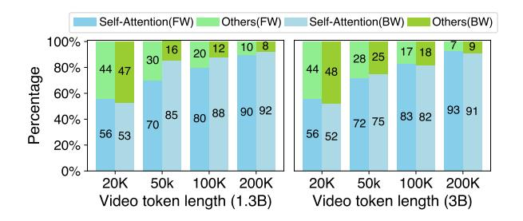
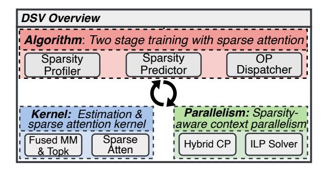
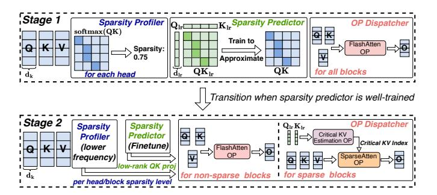
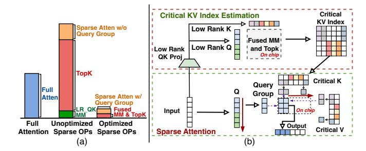
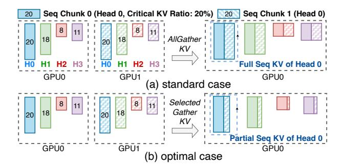
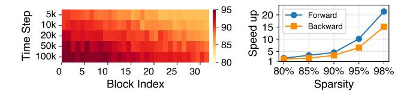

## DSV: Exploiting Dynamic Sparsity to Accelerate Large-Scale Video DiT Training

Xin Tan1, Yuetao Chen1, Yimin Jiang3, Xing Chen2, Kun Yan2, Nan Duan2, Yibo Zhu2, Daxin Jiang2, Hong Xu1

1The Chinese University of Hong Kong, 2StepFun, 3Unaffiliated

### **Abstract**

Diffusion Transformers (DiTs) have shown remarkable performance in modeling and generating high-quality videos. However, the quadratic computational complexity of 3D full attention mechanism presents significant challenges in scaling video DiT training, especially for high-definition and lengthy videos, where attention can dominate up to 95% of the end-to-end time and necessitate specialized communication paradigms to handle large input sizes.

This paper introduces DSV, a novel framework designed to accelerate and scale the training of video DiTs by leveraging the inherent dynamic attention sparsity throughout the training process. DSV employs a two-stage training algorithm that exploits sparsity patterns, focusing on critical elements supported by efficient, tailored kernels. To accommodate the new sparsity dimension, we develop a hybrid sparsity-aware context parallelism that effectively scales to large inputs by addressing the heterogeneity of sparsity across attention heads and blocks, resulting in optimized sparse computation and communication. Extensive evaluations demonstrate that DSV achieves up to  $3.02\times$  gain in training throughput with nearly no quality degradation.

### 1 Introduction

Text-to-video generation has experienced significant break-throughs recently, and received widespread interest from diverse industries [5, 6, 15, 16, 21, 35, 38, 39]. Behind these advancements is the introduction of Diffusion Transformers (DiTs) [11, 35, 38], which have emerged as state-of-the-art architectures for video generation tasks [11, 38]. DiTs function through a dual-phase mechanism: during the training phase, the model learns to reverse a predetermined noising process applied to video frames, while the inference phase entails generating high-quality videos by denoising from random inputs through multiple iterations.

In contrast to large language models (LLMs) [7, 37], which retain a transformer-based architecture and can scale to hundreds of billions of parameters, DiTs are comparatively smaller, typically ranging from several million to tens of billions of parameters [5, 9, 25, 39, 52]. This reduced scale alleviates some of the challenges associated with training large models. Nevertheless, DiTs still face a critical hurdle:

processing long, high-resolution video inputs. This challenge has become increasingly urgent due to the escalating demand for large-scale video generation, fueled by the exponential growth of datasets and industrial applications such as film post-production and multi-camera event capture [11, 39]. For example, even when utilizing compressed latent video representations derived from Variational Autoencoders (VAEs) [12], the number of tokens required for high-definition or extended-frame sequences can rapidly escalate to hundreds of thousands.

The primary computational bottleneck lies within the attention module [47], which exhibits quadratic time complexity relative to input length. As illustrated in Figure 2, this module can easily account for over 80% of the total training time. The computational burden is further exacerbated when the number of tokens in latent spaces exceeds hundreds of thousands. As context lengths increase, it becomes infeasible for a single device to store the entire sequence in memory. This necessitates the adoption of *context parallelism* [23, 27], distributing the input across multiple devices for concurrent processing. While this strategy addresses memory limitations, it introduces additional complexities related to inter-device communication.

Fortunately, our observations indicate that attention computations in video DiTs exhibit salient sparsity similar to that in LLM inference [49, 54], despite differing attention patterns. Specifically, the distribution of attention scores in each attention module follows a power-law distribution, where a small subset of critical key-value (KV) pairs contribute greatly to the total attention score. Notably, the positions of these critical KV pairs do not follow a predictable pattern. Furthermore, we find that such a sparsity is pervasive across most attention blocks and intensifies progressively during training. These findings suggest that *leveraging dynamic attention sparsity* could effectively alleviate the attention bottleneck in video DiT training, particularly for large-scale inputs.

A natural solution to exploit such dynamic sparsity is to identify the critical KV pairs by computing the attention scores matrix within each attention computation. However, such a solution suffers from two problems. First, modern attention computation paradigms are designed to be I/O-aware and rely on fused kernels for efficiency [18, 19]. Extracting

the full attention matrix disrupts these fused optimizations, introducing substantial performance overhead. Second, even if critical KV pairs are identified through such a computation, most of the attention computation (the softmax score) would already be completed by that point, leaving only the score and value matrix multiplication that offers limited performance gains. Moreover, despite the dynamic sparsity introduced, existing context parallelism cannot capture and leverage such property, which may lead to inefficient communication and suboptimal end-to-end optimization.

Based on these insights, we present DSV, a framework that accelerates the video DiT training by exploiting dynamic sparsity patterns in attention while maintaining generation quality. The core idea of DSV is to approximate attention scores using distinct predictors for each attention module. This facilitates the pre-identification of critical KV pairs prior to attention computation, enabling fully sparse attention on these critical pairs, as well as the development of context parallelism paradigms tailored to sparsity. Specifically, DSV comprises three key components:

Firstly, DSV preserves a two-stage training algorithm to explore and exploit the dynamic sparsity. In the first stage, DSV would focus on training the predictors to learn to approximate the attention score for each attention head and would not interfere the DiT model's training. Once the predictors are well-trained, DSV progresses to the second stage, dynamically assessing the cost-benefit trade-off of applying sparse computation to individual blocks based on their sparsity levels. It then determines which blocks should undergo sparse computation. Then, the predictors are used to approximate attention scores and identify critical KVs, facilitating efficient sparse attention computation.

Secondly, to address the overhead of estimating critical KV pairs—a process that inherently involves materializing an approximated attention score matrix of size(\_2 )— DSV implements a kernel fusion strategy. This strategy integrates the approximation and estimation processes into a single kernel, eliminating the need to materialize large intermediate matrices. Additionally, we observe that adjacent queries often share critical KV pairs, which allows for efficient query grouping. DSV dynamically determines the optimal query group size for each training scenario, optimizing both computation and memory access parallelism to enhance the performance of the sparse attention kernel.

Thirdly, to handle long inputs distributed across multiple devices, DSV addresses the limitations of existing context parallelism paradigms, which are poorly suited for sparse settings. By analyzing sparse workloads and leveraging insights from existing paradigms, DSV identifies best practices for parallelism in sparse environments. Given the trade-offs between different parallelism strategies and the influence of

sparsity levels, DSV models and solves for an optimal context parallelism configuration for each attention block. This approach balances computational efficiency and communication overhead, optimizing end-to-end performance.

We develop a prototype for DSV based on PyTorch FSDP [\[55\]](#page-15-9) and evaluate it on a testbed with up to 64 H100 GPUs, using video DiT models ranging from 0.8B to 30B parameters. The results show that DSV significantly improves training throughput, achieving up to 3.02× higher performance than baseline methods for input lengths of up to 260K, while maintaining visual quality comparable to full-attention baselines. Besides, the learned sparsity pattern benefits inference efficiency, enabling DSV to outperform the baseline by up to 3.5× in end-to-end latency. Notably, DSV delivers video quality comparable to full attention paradigms, with virtually no degradation.

In summary, our contributions are threefold:

- We systematically analyze attention patterns throughout video DiT training, revealing the unpredictable distribution of critical KV pairs per query, heterogeneous sparsity across heads and blocks, and the dynamic evolution of sparsity levels.
- We propose DSV, a sparse training framework for video DiTs that leverages online prediction of dynamic sparsity in attention. DSV is equipped with an efficient kernel for critical key-value estimation and sparse attention computation, integrated with FlashAttention [\[18\]](#page-14-11). We also explore context parallelism under sparse settings and propose an optimal strategy for hybrid sparsity-aware context parallelism.
- We comprehensively evaluate the algorithmic performance and system efficiency of DSV across various video generation datasets and video DiT sizes. The results demonstrate that DSV incurs no quality degradation compared to full attention while achieving significant improvements in overall throughput and speedup.

## 2 Background

We start by providing an overview of video diffusion models and the general challenges associated with large-scale video DiT training.

## 2.1 Video DiT

Diffusion models have established themselves as a prominent framework in generative modeling, achieving state-ofthe-art results in image synthesis [\[16,](#page-14-3) [21\]](#page-14-4) and video generation [\[5,](#page-14-0) [6,](#page-14-1) [15,](#page-14-2) [35,](#page-15-0) [38,](#page-15-1) [39\]](#page-15-2). These models work by progressively corrupting data with noise through a forward process and learning to reconstruct it via a reverse generative process. Among them, DiT has emerged as the de facto backbone [\[9,](#page-14-7) [35,](#page-15-0) [38\]](#page-15-1).

Figure 1: Overview of video DiT training. (a) The main input is the video, which is compressed by a VAE (omitted here). The timestamp is used as conditioning, and the text prompt is used as the Key-Value input in the cross-attention module. (b) Interleaved spatial-temporal attention blocks. (c) 3D full attention blocks.

In a typical video DiT training process, a video clip is first encoded by a variational autoencoder (VAE) [9, 12, 38], which compresses and downscales the input, yielding a latent representation. Random noise is then injected into this latent representation, and the resulting noised latent video-together with any conditioning information (e.g., timestamps or text prompts for text-to-video tasks)—is fed into the DiT model. As shown in Figure 1, the DiT model comprises multiple DiT blocks that process video tokens alongside the conditional inputs, guiding video generation during training. At the core of each DiT block are self-attention modules, which employ interleaved spatial and temporal attention or full attention to capture the complex relationships among video tokens across different dimensions. Additionally, cross-attention is used to align the video with text prompts, ensuring consistency between the two modalities. The model's output is then used to compute the loss, following either a denoising diffusion probabilistic model paradigm [24] or a flow matching paradigm [32, 34].

## 2.2 Various Self-Attention Paradigms

Self-attention, also known as multi-head attention, has been extensively employed in natural language processing and computer vision [20, 47] to model long-range dependencies. Given an input sequence  $H = [h_1, \cdots, h_S]^{\top} \in \mathbb{R}^{S \times d}$ , where S denotes the sequence length and d represents the hidden dimension, each attention head projects H into three learned subspaces, namely Q, K, and V, through the projection weight matrices  $W_Q$ ,  $W_K$ ,  $W_V \in \mathbb{R}^{d \times d_k}$ , respectively. The output of each attention head is then computed as:

$$H' = \operatorname{softmax}\left(\frac{QK^{\top}}{\sqrt{d_k}}\right)V,$$

Figure 2: The time breakdown for self-attention and other operations in different DiTs with various sequence lengths in forward (FW, left bar) and backward (BW, right bar) computation.

where  $d_k$  is the dimensionality of each attention head. Ultimately, the outputs from all attention heads are concatenated and combined to produce the final output.

For video DiTs, researchers have developed various attention paradigms. One approach uses a spatial-temporal attention mechanism that alternates attention computations along spatial and temporal dimensions[35]. Although computationally efficient, many studies have found this approach insufficient for capturing detailed information, leading to a shift towards full attention paradigms [5, 39, 52].

Full attention computes interactions across all tokens within the 3D temporal-spatial space, outperforming interleaved spatial-temporal attention. However, the length of processed video tokens in full attention can be substantial, easily exceeding 100,000 tokens, even in latent space (e.g., for a latent input of  $32\times96\times96^1$ , 300k tokens need to be processed). This renders full attention highly compute-intensive.

### 2.3 Large-Scale Video DiT Training

The efficiency of large-scale video DiT training is primarily influenced by two key aspects.

**Full attention bottleneck.** In high-resolution, long video processing, self-attention computation becomes a significant bottleneck due to its  $O(n^2)$  complexity in token number and the non-causal attribute in DiT, where the lengths of Q, K, and V equal the number of video tokens. In contrast, cross-attention has a much lower time occupation, as only the Q length equals the video tokens, while the K and V lengths match the text prompt (usually less than 120 tokens). As the video token increases, self-attention consumes the majority of end-to-end time, e.g., 92% and 93% of forward and backward computation for 1.3B and 3B models at a 200K sequence length. Therefore, efficient attention mechanisms

 $^{1}$ Throughout this paper, the order of dimensions in the latent video size (e.g.,  $16\times16\times16$ ) defaults to frames, height, and width, unless otherwise specified.

are crucial to mitigate this bottleneck and scale video DiT training.

**Context parallelism.** Context parallelism (CP) enables long sequence training across multiple devices by dividing a sequence into chunks distributed over GPUs. However, self-attention modules specifically require inter-device communication to process the entire sequence, and two paradigms are commonly used:

- **Sequence-wise CP.** QKV tensors are partitioned into chunks of shape [*B*, *H*, *S*/*N*, *D*] and assigned to different devices, where *B* is the batch size, *H* the number of heads, *S* the sequence length, *N* the number of devices, and *D* the head dimensionality. Each GPU computes the attention output for its local query chunk of all heads. Since each query must attend to all key-value pairs in the entire sequence, GPUs gather the necessary KV tensors from other devices and perform block-wise attention [33]. Ring-based communication optimizations are often used to overlap communication with computation, enhancing efficiency.
- **Head-wise CP.** Similarly, each GPU initially holds QKV chunks partitioned along the sequence dimension of all heads. Through All-to-All operations, each GPU subsequently receives the complete QKV for a specific subset of heads, resulting in tensors of shape [*B*, *H*/*N*, *S*, *D*]. Subsequently, each GPU independently computes the attention outputs for its assigned heads in parallel. Upon completion, another All-to-All operation is performed to gather the results across the head dimension, re-partitioning them along the sequence dimension to restore the original tensor layout [27].

These two paradigms have trade-offs in computation efficiency and communication cost [23]. Determining an efficient and optimal parallelism strategy is non-trivial, as it depends on the specific input case and hardware configuration.

# 3 Empirical Observations on the Sparsity of Attention in Video DiT

We conduct an in-depth analysis of the sparsity patterns of attention in video DiT training across various video generation datasets and model sizes as detailed in §9. Our key findings, illustrated through a comprehensive case study, provide strong evidence to inform and substantiate our system design rationale. Our case study leverages a video DiT model with an architecture similar to Meta's MovieGen [39], consisting of 2.7B parameters, which is a moderate scale for video generation tasks [5, 9, 35]. We train this model on the widely adopted WebVid-10M dataset [14] using a dataparallel setup with 8 H100 GPUs and a global batch size of 32. The experiments utilize a latent input size of 16×16×16, representing frames, height, and width, respectively.

Figure 3: Left: The attention score dis-Figure 4: The tribution for each query in a histogram. output difference Right: The cumulative distribution func-between attention tion of the sorted attention scores for with full KV and each query.

We begin by some definitions. For a query vector q, we define critical KV pairs by considering the set  $S_q = (k_i, v_i)_{i=1}^n$ of all KV pairs, where *n* is the total number of pairs. Using the attention score function  $A(q, k_i) = \operatorname{softmax}(q \cdot k_i)$ , which computes the scaled dot product between query q and key  $k_i$ , we identify the set of critical KV pairs  $I_q \subseteq S_q$  as those pairs  $(k_i, v_i)$  where  $A(q, k_i)$  exceeds the  $\theta$ -percentile threshold of all attention scores. This threshold  $\theta$  can be determined by a numerical magnitude cutoff or a cumulative sum threshold (such that the sum of critical KV pairs account for 90% of total attention). We use the cumulative sum threshold of  $\theta = 90$  as the default setting in this paper, i.e. the critical KV pairs are the top ones that together represent 90% of total attention. The sparsity of an attention head is then defined as the average proportion of non-critical KV pairs across all queries:  $\mathbb{E}_{q \sim Q}\left[\frac{|S_q \setminus I_q|}{|S_q|}\right]$ 

Attention sparsity and power-law distribution. We first investigate the distribution of attention scores for each query to demonstrate attention sparsity.

## Observation 1: Attention scores in sparse blocks follow a power-law distribution.

As shown in Figure 3, attention scores for different queries in two blocks exhibit a skewed distribution, with most scores being small (<0.001) and only a few being large (>0.1). Notably, the top few keys contribute significantly to the total attention score sum. The CDF plots reveal that for 95.2% of queries in block 6 and 86.8% in block 21, the top 10% of keys account for over 90% of the total attention scores, highlighting the inherent sparsity in several attention blocks. Further, Figure 4 shows that using only the top 10% of KV pairs results in minimal output differences compared to using the full KV.

The power-law distribution of attention scores suggests that a substantial portion of attention computation may be pruned without significantly impacting performance. By efficiently identifying critical KV pairs, we can potentially reduce computational costs while maintaining model quality.

Figure 5: Distribution of critical KV positions for a query token (green) at position (15, 15, 15) in the 3D latent space. The visualized keys are those that yield attention scores exceeding the 90th percentile when attending to the query.

Figure 6: Sparsity of different heads across blocks in iteration 80k

Locality of critical KV. A common and simple method to identify critical KV pairs is to rely on locality: a token's query tends to attend to its nearby input tokens' keys or certain global keys, meaning that window-based patterns or token sinks can be used to obtain the critical KV. Some work has shown the utility of this method in LLM inference for language tasks [8, 50, 54]. Given the uniqueness of video DiT, which involves modeling spatio-temporal dependencies in video data, we first examine if such locality patterns also exist and can be similarly used in this context.

## Observation 2: Critical KV pairs do not exhibit locality patterns in video DiT.

As shown in Figure 5, we visualize the critical KV positions in a 3D space for a query. Contrary to expectations, critical KV pairs do not have a specific pattern, unlike those found in LLM inference tasks [8, 49, 54]. More generally across queries, our experiment reveals that only 15.1% of critical KV pairs are within a 5-token radius, while 48.5% are more than 10 tokens away. This suggests that applying fixed patterns to approximate attention computation would not fare well in video DiT.

**Heterogeneity of sparsity.** We further establish the spatial heterogeneity of attention sparsity across different attention blocks and heads within a block, which adds to the difficulty of identifying critical KV pairs.

Observation 3: Sparsity varies significantly across attention blocks and heads within the same block.

Figure 7: The change in sparsity of different Figure 8: The attention heads during the training process sparsity of all in transformer blocks. Only two blocks are blocks across shown due to space constraints.

Our analysis shows that not only varies across blocks but also among heads within the same block. Figure 6 displays the sparsity of attention heads for various blocks at iteration 80k, with the first 20 blocks being highly sparse and latter blocks less so. The box plot highlights variability in head sparsity within each block, such as block 2 where most heads have around 95% sparsity and some outliers have 90% and 80%. Figure 8 further validates this, illustrating disparate sparsity distributions of blocks across different training steps.

This aligns with previous studies [29, 31, 47], which have shown that different attention heads can capture distinct types of features and process various aspects of the input data. For example, some heads may focus on local features, while others may capture global context. Consequently, applying a uniform sparsity pattern to all heads and blocks may not be optimal: A low sparsity threshold may accommodate the sparsity of all heads but incur unnecessary computation, whereas a high sparsity threshold may compromise performance by omitting important KV pairs for heads with low sparsity. Instead, adaptive methods are needed to accommodate the unique sparsity characteristics of each block/head and maximize efficiency.

**Time-varying sparsity during training.** Continuing from the previous finding, we also observe that attention sparsity varies dynamically in the temporal dimension.

## Observation 4: Sparsity also varies over the course of training before stabilizing.

As illustrated in Figure 7, sparsity of different heads becomes more pronounced as training progresses. For block 24, the average attention sparsity for each head increases from 0.30 to 0.78. Further, Figure 8 shows that across all attention blocks, the median sparsity increases from 0.81 at 50k iterations to 0.92 at 300k iterations. This dynamic evolution of sparsity during training suggests that the strategy for leveraging sparsity should be adjusted dynamically: As the model learns to focus on the most relevant features, the attention mechanism becomes more selective, resulting in increased sparsity [45]. This highlights the importance of dynamic methods that can capture and exploit the evolving sparsity patterns throughout the training process.

Figure 9: Overlap ratio of critical KV pairs between four anchor queries (highlighted in green) and all other queries in an attention block. The anchor queries are positioned at indices 0, 2112, 2240, and 4095. Each subplot shows a 2D projection of the 3D video, with rows representing flattened frames along the width axis.

Critical KV overlap ratio for adjacent tokens in 3D space. Finally, we demonstrate an interesting phenomenon between queries of adjacent tokens.

## Observation 5: Adjacent tokens have similar critical KV pairs.

To quantify this phenomenon, we calculate the ratio of shared critical KV indices across queries. Figure 9 is a case study with four anchor queries highlighted in green, where darker shades to indicate higher overlap ratios. Significant overlaps of the critical KV pair indices can be seen among the adjacent tokens. For tokens within a 2×2×2 3D cube (note the figure shows the 2D project of the 3D space), specifically, the four anchor queries and their adjacent queries within the same cube exhibit an overlap in critical KV indices exceeding 92.4%. This high overlap ratio is consistent across blocks with an average 80.1%. This finding is intuitive, as pixels in videos represent continuous signals, unlike discrete signals in language, making adjacent tokens similar. It strongly suggests that neighboring queries tend to attend to similar KV pairs (though these KV pairs may not be close to the query as Obs 2 reveals), presenting an opportunity to optimize attention computation by leveraging the similarity in sparsity patterns among adjacent tokens.

#### 4 DSV Overview

Our empirical findings in §3 uncover inherent sparsity patterns in video DiT attention that can help alleviate computational bottlenecks. Building on this insight, we discuss the opportunities and challenges posed by these sparsity patterns and introduce the architecture of our solution, DSV.

## 4.1 Opportunities and Challenges

**Opportunities.** Sparsity in video DiT attention presents a promising opportunity for more efficient training, especially

Figure 10: The system overview of DSV.

for high-resolution, long-duration video data. Empirical evidence indicates that a subset of blocks consistently exhibits high sparsity, suggesting that only a small fraction of KV pairs significantly contribute to computation. Additionally, many attention heads show high sparsity exceeding 95%, with sparsity ratios increasing as training progresses. By selectively computing only the most critical KV pairs, the overall computational burden can be significantly reduced, leading to more efficient processing. Moreover, this reduction in KV computations also lowers communication overhead in multi-device settings, where KV data is frequently exchanged for context parallelism. Together, these factors highlight the potential for substantial end-to-end speedups with attention sparsity exploited in video DiT training.

**Challenges.** Applying sparse attention computation to video DiT training in practice introduces several obstacles:

- Dynamical critical KV identification: One major challenge stems from the dynamic and uncertain distribution of critical KV pairs in video DiT training (see Obs.2 of §3). A predefined or fixed sparse attention pattern becomes impractical in this scenario because the significance of specific KV pairs can shift dramatically with changing context or timesteps. While naively computing the complete attention score matrix (e.g., softmax(QKT)) and then selecting the top-k entries per query would capture these changing distributions, it leads to enormous memory consumption and computation overhead. Moreover, it disrupts the optimized fused attention kernel [18, 19], introducing considerable overhead and limiting the sparsity benefits to only the score-value (AV) computation, ultimately degrading overall performance.
- **Kernel efficiency:** Even when the attention scores are available for identifying critical KVs, performing top-k selection at large scales introduces considerable implementation hurdles. The intermediate matrix for attention scores can have a shape of [*H*, *S*, *S*], where H is the number of heads and S is the sequence length. Storing such large matrices requires excessive amounts of GPU memory, and

iterating through them for top-k selection (especially under tight memory constraints) can easily become a bottle-neck. Furthermore, following top-k selection, each query might access a sparse set of KV entries in an irregular or scattered pattern, complicating memory access. This irregularity can degrade parallel efficiency and result in suboptimal use of compute resources, making it difficult to fully exploit the gains from sparsity.

• Specialized sparse context parallelism: A third challenge emerges when training with long video tokens that must be distributed across multiple devices. Existing context parallelism-such as head-wise or sequence-wise would fail to capture efficient load balancing or to minimize redundant communications once sparsity is introduced. For instance, head-wise approaches can become problematic if certain heads exhibit higher degrees of sparsity than others (Obs.3 of §3), creating load imbalances and straggler effects. Moreover, purely sequence-wise approaches often transfer all KV pairs among devices without considering which entries are truly critical, unnecessarily increasing communication overhead. As a result, simply applying standard context parallelism in a sparse setting can undermine the performance benefits gained from sparsity, revealing a need for more specialized and dynamic parallelization schemes.

#### 4.2 Architecture and Workflow

Our solution. To enable dynamic estimation of critical KV pairs and achieve fully sparse attention computation, we propose a sparsity predictor for each self-attention module. This predictor learns approximations of attention score distributions, which would benefit accurate identification of the critical KV pairs for each query. We introduce a two-stage training algorithm that initially trains the sparsity predictors independently and subsequently leverages them to facilitate sparse computation during the second stage, which is supported by dedicated kernels. By utilizing the sparsity predictors and analyzing the underlying sparsity patterns, we further optimize context parallelism to dynamically adapt to varying sparsity levels across different attention heads, enhancing overall efficiency.

**Key components.** DSV consists of three key components as shown in Figure 10:

(1) Algorithm: Two-stage training. At the core of DSV lies a two-stage training algorithm that structures the sparse training workflow. In the first stage, sparsity predictors are trained independently to approximate the attention score distributions for each self-attention module. During the second stage, these trained predictors are employed to identify the critical KV pairs for each query, enabling fully sparse attention computation. This approach facilitates

Figure 11: The two-stage training paradigm.

the efficient discovery of sparsity patterns and seamless integration with the sparse attention mechanism.

- (2) Kernel: Critical KV estimation and sparse attention. To maximize the benefits of the sparse training stage (the second stage), DSV introduces optimized kernels tailored for critical KV estimation and sparse attention. Specifically, a fused "critical KV estimation" kernel calculates approximate attention scores using learned predictor parameters and then performs top-k selection at the desired sparsity level in a single pass. This fused operation reduces intermediate memory consumption and minimizes overhead during top-k selection. Additionally, as noted in Obs.5 of §3, queries that are close in position often share similar critical KVs, enabling further enhancements to memory and compute efficiency during sparse attention.
- (3) Parallelism: Sparsity-aware context parallelism. To further enhance sparse training efficiency in scenarios with long inputs and multiple devices, we propose a sparsity-aware context parallelism strategy. This strategy exploits sparsity patterns and dynamically adapts to varying sparsity levels across different attention blocks and heads. It not only introduces new practices for standard context parallelism in sparse settings but also determines the optimal parallelism configuration for each block based on its head-wise sparsity patterns. This approach minimizes communication overhead and maximizes computation efficiency, ensuring optimal performance when parallelizing large video inputs.

# 5 Two-Stage Training with Sparsity Exploitation

We introduce a two-stage algorithm that systematically identifies, predicts, and exploits sparsity patterns through a sparsity control mechanism. It aims to achieve three key objectives: (1) capture the dynamic sparsity levels across different attention heads throughout the training process; (2) achieve high-fidelity attention pattern approximation through efficient prediction mechanisms; and (3) enable adaptive sparse

computation that maximizes system efficiency without compromising model quality.

### 5.1 Sparsity Control Mechanism

Our sparsity control mechanism comprises three key components as follows:

**Profiler.** The Profiler measures the proportion of KV pairs in each attention head and block periodically that contribute negligibly to the attention scores as defined in §3 and can be safely pruned. It maintains sparsity level indicators for each attention head and block (averaged across attention heads), which guide the OP Dispatcher's decisions about sparse computation.

**Predictor.** For each attention module, we introduce two additional low-rank trainable matrices,  $W_O^{lr}$  and  $W_K^{lr}$ , which project the input to  $Q_{lr}$  and  $K_{lr}$  with a much smaller inner dimension  $d_{lr}$  compared to that of Q and K projected from the original  $W_O$  and  $W_K$  with inner dimension  $d_k$  ( $d_{lr} \ll d_k$ ). We train these low-rank projection matrices to make the product matrix  $(Q_{lr}K_{lr}^T)$  approximate the attention score distribution ( $QK^T$ ), which would be used to select the critical KV pairs at a profiled sparsity level. We avoid approximating softmax(OK) due to the additional overhead and the fact that the softmax function has the same monotonicity as the pre-softmax input. This offers two benefits: (1) accurate approximation of attention patterns with minimal parameters (<10M for a 3B model) and low computational burden, and (2) avoiding disruption of the fused attention kernel optimization (§4).

**OP Dispatcher.** The OP Dispatcher serves as the operation coordinator, making dynamic decisions about sparse computation activation based on profiled sparsity levels and system state. It implements a carefully tuned decision mechanism that weighs potential computational gains against overhead costs, ensuring sparse computations are activated only when beneficial to overall system performance.

#### 5.2 Two-Stage Approach

Our training strategy is divided into two distinct stages to ensure effective exploitation of attention sparsity while maintaining model performance.

5.2.1 Stage 1: Full Training. In the initial stage, the model undergoes full training without sparse computations. The primary goal is to train the sparsity predictor to accurately approximate the attention score distribution for each attention module. This phase ensures the sparsity predictor develops a reliable attention pattern approximation before introducing sparse computation, while allowing the model to learn and emphasize the underlying sparsity pattern.

**High-frequency sparsity profiling.** Given the rapid changes in sparsity during the initial training phase, we adopt high-frequency sparsity profiling. Concretely, for the current block at iteration i, we use a momentum-based progressive sparsity updating:  $S^i = \alpha \cdot S^{i-1} + (1-\alpha) \cdot S^i_{\text{profiled}}$ , where  $\alpha = 0.9$  is a momentum coefficient that mitigates sensitivity to local fluctuations by smoothing out the sparsity estimates over time. This approach aligns with the corresponding rapid changes in loss, enabling the precise capture of emerging sparse patterns. Profiling is conducted for each attention head by examining the attention score matrix, with random sampling (e.g., by a factor of 16) to reduce overhead.

**Sparsity predictor training.** We train the sparsity predictor for each block using the following loss function:  $\mathcal{L}_{approx} = 0.95 \cdot \text{CosLoss}(QK_{lr}, QK_{main}) + 0.05 \cdot \text{NormLoss}(QK_{lr}, QK_{main})$ , which encourages the low-rank projections to preserve the relative magnitudes of QK elements while maintaining consistency with the original QK. During the forward pass, the predictor computes the approximation loss and immediately updates its parameters, reducing memory consumption by avoiding storage of intermediate QK results. A sample-based method is utilized to reduce the query size while ensuring sufficient alignment between the main QK and approximated QK. Notably, the predictor computation graph is detached from the primary computation graph, ensuring that gradients from the predictor do not influence the core diffusion model parameters.

**Full attention OP dispatching.** Throughout Stage 1, the OP dispatcher exclusively schedules full attention operations (e.g., FlashAttention), with no involvement of sparse computations to make sure the full capture of underlying sparse pattern and the stable training.

**Stage transition.** Stage 1 concludes once the average approximation loss ( $\mathcal{L}_{\text{approx}}$ ) across all DiT blocks falls below a predefined threshold (default: 0.01). This indicates that the approximated  $Q_{lr}K_{lr}^T$  from each sparsity predictor could be well-aligned with that in each block, providing a solid foundation for the subsequent sparse training stage.

5.2.2 Stage 2: Sparse Training. In Stage 2, the sparse computation mechanism is activated, allowing the model to dynamically estimate the critical KV pairs for each query. By focusing computations on these critical parts, sparse attention greatly saves computation time. Meanwhile, the sparsity predictors are continuously fine-tuned to maintain approximation accuracy.

Low-frequency profiling and continuous predictor finetuning. During Stage 2, sparsity profiling is conducted at a lower frequency compared to Stage 1, as sparsity patterns stabilize over time. The sparsity predictors are fine-tuned with a reduced learning rate to adapt to evolving attention patterns without overfitting or destabilizing the training.

Figure 12: (a). Comparison of full attention operations and sparse operations (head size:1, token length: 51200, sparsity:90%). (b). The kernels overview in DSV.

Selective sparse OP dispatching. With the sparse mechanism activated, the OP Dispatcher plays a crucial role in determining which DiT blocks are eligible for sparse attention computations. This decision is based on three aspects: (1) block-specific sparsity levels, (2) pre-profiled performance characteristics with different sparsity, and (3) current memory utilization. To inform these decisions, we perform offline profiling to measure the speedup and memory requirements at various sparsity levels for a given video token length. Based on this profiling, we establish a sparsity threshold, and only blocks with a sparsity level meeting this threshold are added to a sparselist. For each block in the sparselist, sparse ops are scheduled. This involves estimating the critical KV indices and performing sparse attention computation. By selectively enabling sparse computations for high-sparsity blocks, the Dispatcher ensures a balance between computational efficiency gain and overall memory usage.

## 6 Efficient Critical KV Estimation and Sparse Attention Kernel

This section discusses the practical challenges of applying sparse operations in DSV, which involves two key components: (1) an estimation operation that extracts the top-K indices from the approximated attention scores computed using low-rank Q and K in the predictor, and (2) a sparse attention kernel that computes the attention output based on the critical KV indices for queries. We analyze the underlying causes of these challenges and present design choices that enhance efficiency while minimizing overhead.

## 6.1 Fusing Matrix Multiplication and Top-K Selection

**Memory constraints in estimation kernel.** Top-K selection constitutes a serious bottleneck, accounting for up to 80% of the total computation time (Figure 12) and thereby diminishing the expected benefits of sparse attention. The root cause is twofold: (1) top-K operations are memory-bound,

saturating GPU memory bandwidth for large inputs and slowing overall throughput, and (2) storing the entire attention score matrix requires prohibitive memory footprint.

As shown in Figure 12, the top-K computation takes longer than full attention. This is primarily due to its memory-bound nature. In addition, for instance, when H=16 attention heads and S=300k video tokens are used, the resulting [H,S,S] matrix requires approximately 288 GB of GPU memory in BF16 precision, rendering it infeasible to hold in memory. Consequently, despite the GPU's substantial compute capability, the high memory footprint and poor performance during execution make top-K operation inefficient in these scenarios.

**Fusion strategy.** To alleviate this memory footprint and reduce data transfer overhead, we fuse top-K selection directly into the matrix multiplication (MM) routine. Instead of fully materializing the large attention score matrix, partial products from the MM are immediately funneled into incremental top-K updates. A custom GPU kernel interleaves these two steps, retaining only the top-K scores per query in registers at any moment. This reduces the space complexity from  $O(S^2)$  to O(SK) and enhances efficiency by curtailing needless data movement between high-bandwidth memory (HBM) and on-chip registers.

# **6.2 Optimizing Sparse Attention with Query Grouping**

Suboptimal sparse attention kernel performance. Implementing sparse attention naively where each query relies on distinct critical KV pairs yields limited speedups (about 1.4×; see Figure 12), primarily due to uncoalesced memory access patterns and diminished hardware utilization (e.g., underusing tensor cores). Since each query can fetch disjoint KV entries, data reuse decreases dramatically, hindering parallel efficiency and overall performance gains.

**Query grouping.** As indicated by Obs.5 in §3, adjacent queries within the 3D spatial-temporal domain often share a large fraction of critical KV pairs. We capitalize on this property by clustering nearby queries into groups based on their proximity in 3D cubes (e.g., 2×2×2 or 2×4×4 voxels), enabling the reuse of KV pairs across queries in the same group. We further apply an adaptive grouping mechanism that profiles the input video scenes to keep the overlap ratio high (e.g., above 80%) despite variations across different datasets. Within each group, a single proxy query determines the shared critical KV pairs, reducing both the estimation overhead and memory traffic.

### 6.3 Performance Impact

With these optimizations, we implement the kernel design illustrated in Figure 12 and achieve the targeted speedup.

Figure 13: An example shows load imbalance in HCP with four attention heads in a sparse setting. The full video sequence is split into two chunks each hold by a GPU. The length of each chunk represents its critical KV ratio and computational burden in different head.

By fusing matrix multiplication and top-K selection, we substantially cut down memory usage and alleviate the top-K bottleneck, while query grouping improves data locality and ensures effective sparse attention computation. Together, these measures address the core practical challenges and unlock the computational advantages of sparsity.

## 7 Hybrid Sparsity-Aware Context Parallelism

Sparse attention workloads introduce unique challenges for context parallelism (CP), where traditional CP paradigms fail to capture the computation-communication trade-offs arising from heterogeneous sparsity. In this section, we analyze two distinct CP paradigms in sparse settings to understand their strengths, limitations, and trade-offs. Building on these insights, we propose a hybrid sparsity-aware CP paradigm that dynamically adapts to varying sparsity levels, achieving an optimal balance between computation and communication.

# 7.1 Modeling for Different Context Parallelism with Sparsity

We first model and analyze two CP paradigms in sparse attention workloads to evaluate their computation, communication, and memory characteristics. In these analyses, we consider N GPUs, where each GPU initially processes a partial sequence and holds the corresponding Q, K, and V matrices with a shape of [H, S/N, D], representing the number of attention heads, sequence length, and head dimension, respectively.

7.1.1 **Head-wise Context Parallelism with Sparsity.** HCP redistributes the computation workload through all-to-all operations. After that, each GPU transitions from handling a sequence partition for all attention heads to processing

the complete sequence with a subset of heads. The heterogeneous sparsity levels across attention heads introduce an additional dimension to HCP, requiring careful consideration.

Computation efficiency and load imbalance. Due to the head-wise split for attention computation in HCP and the observed attention sparsity heterogeneity, the computational burden may differ across devices after standard redistribution, as illustrated in Figure 13. In this figure, the attention heads are placed across devices according to their index. The naive allocation would cause an evident straggler in GPU0, which would delay the end-to-end time by 35.7% compared to the optimal case. This reveals the need for a more careful head-wise burden allocation across different GPUs given the sparsity heterogeneity. To decide the optimal head allocation (i.e. the balance alltoall operation), an optimization problem could be formulated to minimize the maximum computational burden after allocation, which can be solved using optimization techniques or heuristic approaches like Longest Processing Time [22].

Near constant communication volume. In sparse HCP, balanced QKV allocation could be performed to balance the computation workload. Consequently, the communication cost may deviate from that of full attention, as each GPU's allocated heads would incur different communication costs. Let  $H_i^r$  denote the final allocated number of heads for a GPU. The communication involves four balanced all-to-all operations for each GPU, and its cost is given by:

$$comm_i^{hcp} = 4 \cdot H_i^r \cdot S/N \cdot (N-1)/N \cdot D.$$

This cost remains nearly constant with increasing device scale, making HCP communication robust to sparsity patterns.

**Near constant memory consumption.** Similar to communication, the memory consumption for QKV of each GPU could slightly differ due to the potential uneven head allocation. It is given by:

$$mem_i^{hcp} = 4 \cdot H_i^r \cdot S/N \cdot D.$$

7.1.2 Sequence-wise Context Parallelism with Sparsity. Unlike HCP, SCP does not reallocate the computation burden. Instead, it computes the attention output for the locally held query with the local KV and additional KV gathered from other GPUs in the CP group.

Constant load balance. In SCP, each GPU holds a portion of the total sequence but spans the entire set of attention heads. By fetching the required KV from other GPUs to perform attention computation, the heterogeneity in headwise sparsity does not induce computational load imbalances across GPUs, ensuring a consistently even distribution of workload.

Figure 14: An example shows redundant communication of SCP in the same setting as in Figure 13. The width of each chunk represents the held KV size for that chunk. For simplicity, only GPU 0 is shown here after the KV gathering; GPU 1 should have a similar situation.

**Dynamic communication volume.** In SCP, each GPU must gather the non-local critical KV from other devices to perform sparse attention. The communication volume is determined by the sparsity ratio  $\alpha$  and the proportion of critical KV residing on remote devices, denoted as  $\sigma$ . The communication cost can be expressed as:

$$comm_i^{scp} = 2 \cdot H \cdot (1 - \alpha) \cdot \sigma \cdot S \cdot D.$$

**Dynamic memory consumption.** The memory consumption for additional non-local critical KV varies with the sparsity ratio  $\alpha$  and remote critical KV ratio  $\sigma$  as well. It can be expressed as:

$$mem_i^{scp} = 2 \cdot H \cdot (1-\alpha) \cdot \sigma \cdot S \cdot D.$$

## 7.2 Hybrid Sparse Context Parallelism

The analysis of HCP and SCP reveals their complementary strengths and limitations in sparse settings. HCP ensures near-constant communication and memory overhead but suffers from load imbalances due to head-wise sparsity heterogeneity, necessitating workload reallocation. Conversely, SCP balances computation across GPUs while incurring dynamic communication and memory costs based on the sparsity ratio and critical KV distribution.

Moreover, HCP and SCP can be naturally combined, with HCP redistributing workloads across attention heads and SCP further dividing workloads across sequences within an HCP group. By flexibly partitioning workloads along both dimensions, this combination promises to achieve optimal computation and communication balance under diverse sparsity patterns. These insights highlight the need for a comprehensive, sparsity-aware approach that carefully considers both computation and communication costs to minimize end-to-end execution time and strike a balanced trade-off.

**Problem formulation.** Based on the above insights, we formulate the problem as follows:

$$\mathbf{minimize} \max_{i} \{T_{i}^{comm}(G_{hcp},G_{scp}) + T_{i}^{comp}(G_{hcp},G_{scp})\},$$

s.t. 
$$mem_i \le M, \ \forall i \in \{G_{hcp} \cup G_{scp}\},$$
 (a)

$$1 \le |G_{hcp}|, \ 1 \le |G_{scp}| \le H, \ |G_{hcp}| \cdot |G_{scp}| = N.$$
 (b)

The objective is to minimize the maximum wall time for any GPU in a CP group under a given GPU allocation. Constraint (a) ensures that memory does not overflow under a given training setting, while constraint (b) limits the different group sizes, where the HCP group size is limited by the model's head number, and the product of HCP and SCP group sizes should equal the GPU number for the CP group. We fit the expected computation time for a sparse attention operation with different input lengths and sparsity levels and the communication time with varying communication sizes under different inter-GPU bandwidths. Given the limited search space (determined by the number of CP group sizes) and the stable sparsity patterns over training intervals, the optimization can be periodically solved using tools like Gurobi [4].

When deploying the hybrid CP strategy on a GPU cluster, we prioritize HCP groups within a server node to maximize the efficiency of all-to-all communication, which has higher constant traffic demands. SCP, with its selective sparse KV gathering, is less communication-intensive and better suited for inter-node communication over slower links.

### 8 Implementation

We implement DSV on top of PyTorch's FSDP framework, extending it with tensor and context parallelism. Kernels are developed in Triton [10] for sparse attention and CUDA [2] for critical KV estimation.

**Seamless integration.** DSV provides a non-invasive module that seamlessly integrates into any training framework and DiT model. All tasks of DSV are conducted transparently, requiring only the replacement of the attention API in the original models. DSV's trainable parameters are decoupled from the main model, ensuring replication across devices regardless of the model's parallelism setting, and their computation and gradient synchronization are manually managed.

Asynchronous CPU offloading for large KV indices. For long video tokens and relatively low sparsity ratios, sparse computation can generate large KV index tensors (e.g., approximately 2GB for a 50K video token length at 80% sparsity). To mitigate GPU memory limitations, we employ asynchronous CPU offloading to transfer the KV index after attention computation and pre-fetch it during the backward pass of its next block, if necessary.

| Model | #Layer | #Head | Head size | Activation       | Norm Type          |
|-------|--------|-------|-----------|------------------|--------------------|
| 0.8B  | 28     | 12    | 96        | GeGLU            | AdaLayerNormSingle |
| 2.7B  | 32     | 16    | 128       | GeGLU            | AdaLayerNormSingle |
| 30B   | 42     | 24    | 256       | GeLU-approximate | AdaLayerNormSingle |

Table 1: The configuration of evaluated models.

Estimation kernel. We perform matrix multiplication on CUDA cores rather than tensor cores due to its memory-bound 'slim' shape. Unlike standard tiling in matrix multiplication, each Streaming Multiprocessor (SM) conducts the multiplication for multiple full rows and selects the top-K indices online by Bitonic Select. However, large top-K sizes (e.g. 20K per query) can burden the SM's shared memory and reduce parallelism. To address this, we split the process into two stages: first, we perform multiplication and determine the top-K threshold for each query; second, we select indices based on the threshold.

#### 9 Evaluation

**Setup.** We conduct evaluations on servers with 8 NVIDIA H100 GPUs, interconnected via 900 GB/s NVLink bi-directional links. For cross-node communication, we use InfiniBand with RoCE, providing 200 Gbps bandwidth per cross-node GPU pair. We employ BF16 for computation and FP32 for gradient communication and distributed optimizer updates.

**Datasets.** We use four video generation datasets: UCF-101 [41], Webvid-10M [14], VideoGen [43], and OpenVid [36]. UCF-101 and Webvid-10M are popular and widely-adopted datasets in various video generation tasks. VideoGen and OpenVid are recently released datasets featuring high-definition video quality and more precise and fine-grained text descriptions. Models. The models' configuration is lised in Table 1. Their architectures are similar to Meta MoiveGen [39], consist of DiT blocks with 3D full self-attention and cross-attention modules, akin to other SOTA models [5, 6, 39]. We use the VAE [12] from stability-ai for video compression, reducing spatial resolution by 8×8. The CLIP text encoder [1] is utilized for UCF-101 and WebVid-10M datasets, while the T5-xxl text encoder [13] is used for VideoGen and OpenVid datasets. The models are trained using the Adam optimizer with a learning rate of 1e-4. Gradient checkpointing [17] is enabled by default. Flow matching [32] is employed as the generative modeling paradigm due to its advanced performance and widely adoption in recent SOTA models [5, 9, 39].

**Baselines.** We compare DSV with the following baselines, mainly differing in the attention computation mode:

- Vanilla 3D full attention. It adopts the naive 3D full attention (FA) computation mode, with the implementation based on FlashAttention-2 [3, 18].
- 3D window-based sparse attention. It employs a widely used heuristic sparse pattern in video models, where each

query attends only to KV pairs within a 3D window centered on itself. To evaluate its impact, we explore two different window sizes: Window-Attention Medium (WA-M), which uses a window equal to 1/3 of the original size, and Window-Attention Large (WA-L), which expands the window to 2/3 of the original size.

For context parallelism, we prioritize head-wise context parallelism for the baselines due to its consistently better performance in our testbed. However, if the CP degree exceeds the head size, a combination of head-wise and sequence-wise CP is employed.

**Metrics.** We evaluate DSV on both model quality metrics and system efficiency metrics.

- Quality metrics: We compare training and validation loss to assess convergence and model capability, as the loss in the flow matching paradigm effectively indicates model improvement [39]. For generated videos, we measure quality using Frechet Video Distance (FVD)[44], which quantifies the difference between generated and original videos. Additionally, we utilize VBench[26], a video generation benchmark, to evaluate quality and consistency through advanced model-based methods, as FVD alone may not fully capture model progression [39].
- System efficiency metrics: We primarily focus on training throughput and latency speedup for kernels or inference process.

### 9.1 Overall Performance on Model Quality

We evaluate the training convergence and model quality of DSV against other baselines under varying configurations. Specifically, UCF-101 and WebVid-10M are trained using an 0.8B model with a latent input size of 16×16×16 (4k length), whereas VideoGen and OpenVid utilize 2.7B models with latent input sizes of 32×32×32 (32k length) and 40×56×56 (125k length), respectively. And all the video token length here are the total length of the latent input size.

Training and validation loss comparison. Figure 15 compares the training and validation loss trends across different attention mechanisms on multiple datasets, highlighting DSV's superior performance. Using flow matching as the training loss provides a direct reflection of the model's capability and training progress, as noted in [39]. DSV exhibits faster convergence and achieves lower final loss values compared to WA-M and WA-L, while remaining comparable to the full attention paradigm across all datasets and models. Notably, WA-M paradigms fail to converge on certain datasets as training progresses.

Moreover, for validation loss, DSV also closely matches full attention while outperforming both window-based methods. **Performance across different datasets and tasks.** Table 2 presents the video generation quality of DSV compared to

Figure 15: Comparison of training loss and validation loss throughout the training process for different methods across four datasets.

|             |        | Quality |                |                  |  |
|-------------|--------|---------|----------------|------------------|--|
| Dataset     | Method | FVD↓    | Quality Score↑ | Semantic Score ↑ |  |
|             | WA-M   | 700.98  | 69.18%         | 55.03%           |  |
| UCF-101     | WA-L   | 520.92  | 70.70%         | 55.84%           |  |
| UCF-101     | FA     | 440.32  | 71.00%         | 56.23%           |  |
|             | DSV    | 438.02  | 71.08%         | 56.60%           |  |
|             | WA-M   | 580.12  | 71.10%         | 40.10%           |  |
| WebVid-10M  | WA-L   | 530.38  | 73.23%         | 40.56%           |  |
| webvia-iowi | FA     | 409.24  | 73.79%         | 42.56%           |  |
|             | DSV    | 414.56  | 73.66%         | 42.88%           |  |
|             | WA-M   | 1395.23 | 77.33%         | 53.08%           |  |
| VideoGen    | WA-L   | 1100.72 | 78.82%         | 53.32%           |  |
| videoGen    | FA     | 908.91  | 79.39%         | 55.34%           |  |
|             | DSV    | 834.32  | 79.14%         | 54.99%           |  |
|             | WA-M   | 884.15  | 78.78%         | 55.98%           |  |
| OnenVid     | WA-L   | 826.43  | 79.47%         | 56.51%           |  |
| OpenVid     | FA     | 838.52  | 79.54%         | 56.07%           |  |
|             | DSV    | 782.22  | 79.63%         | 56.36%           |  |

Table 2: Comparison of model quality metrics across different methods on four datasets. The FVD score metric is averaged over five runs, while the Semantic and Quality scores are obtained from VBench [26]. WA-M, WA-L, and FA denote Window Attention Medium, Window Attention Large, and Full Attention, respectively.

WA-M, WA-L, and FA across various datasets and evaluation metrics. In terms of FVD, DSV consistently achieves the lowest values or performs comparably to FA, indicating its ability to generate videos that closely resemble the ground truth (FA). In contrast, WA-M consistently exhibits poor performance. Similarly, for semantic and quality scores in VBench, DSV continues to demonstrate superior performance.

### 9.2 System Efficiency of DSV

Here, we evaluate the system efficiency of DSV, primarily comparing it with 3D FA and WA-L. We exclude WA-M from our comparisons due to its consistently poor performance relative to others.

9.2.1 Training. In distributed training, DSV exhibits a significant advantage over both vanilla 3D FA and WA in terms of training throughput and total training time. The vanilla 3D FA baseline suffers from high computational overhead due to its quadratic complexity in both spatial and temporal dimensions, leading to slower per-step throughput. While WA mitigates some of this overhead by restricting attention to a fixed local window for each query, it only achieves a fixed sparsity ratio (around 70% for WA-L) and cannot effectively identify critical KV pairs.

In contrast, DSV dynamically adjusts the sparsity pattern across different attention heads based on learned structures, achieving up to 98% sparsity in certain heads. Furthermore, it leverages optimized parallelism strategies designed for sparse attention workloads, reducing communication overhead and enhancing computational efficiency.

As a result, DSV outperforms FA by  $2.73-3.02\times$  and WA by  $1.51-1.71\times$  in training throughput on 32 GPUs (CP=4, DP=8) with input token lengths of up to 130K. Similarly, on 64 GPUs (CP=8, DP=8) with token lengths of up to 260K, DSV achieves a  $2.41-2.93\times$  speedup over FA and a  $1.34-1.62\times$  speedup over WA.

9.2.2 Inference. DSV benefits from the learned sparsity acquired during training, significantly enhancing inference efficiency. While vanilla 3D FA remains computationally expensive due to its full spatial-temporal token interactions, WA-L provides a limited speedup due to its fixed sparsity pattern. In contrast, DSV dynamically leverages learned sparsity, achieving a 2.0-3.5× speedup over 3D FA and a 1.4-2.6× speedup over WA-L, enabling faster inference without compromising performance.

### 9.3 Deep Dive

*9.3.1 Critical KV prediction accuracy.* We evaluated the effectiveness of our sparsity prediction method in estimating

Figure 16: Critical KV prediction Figure 17: The speedup accuracy across different training over different sparsity of steps.

2.7B model.

Figure 18: DSV's sparse attention module speedup and overhead breakdown with 90% sparsity with different video token length.

critical KV pairs across different blocks for a 2.7B model trained with VideoGen. As shown in Figure 16, the prediction consistently achieves over 90% accuracy for most blocks. Moreover, as training progresses, the accuracy gradually improves. By computing the attention score using the estimated KV pairs, we find that they contribute more than 98% of the total attention score compared to the ground truth critical KV pairs. This high accuracy is due to the fact that the most critical KV pairs are easily distinguishable from those with much smaller magnitudes. While the latter are more challenging to identify precisely, their negligible influence on the overall output ensures that this limitation does not significantly impact model performance.

9.3.2 **DSV's kernel speedup and overhead breakdown.** Figure 18 presents the speedup and overhead breakdown of DSV's sparse attention module with 90% sparsity in both forward and backward. We evaluate multiple settings with video token lengths ranging from 10K to 200K. As illustrated, DSV sparse attention achieves speedups of 2.2-5.7× in the forward pass and 3.3-4.0× in the backward pass compared to the full attention baseline in end-to-end execution time. This demonstrates the efficiency of DSV's sparse attention approach when processing long sequences.

We further analyze the overhead of each component in DSV. The overhead primarily occurs during the forward pass, where DSV incurs additional computation for estimating critical KV pairs and computing the approximation loss to update the predictor parameters. However, this overhead remains acceptable. In contrast, the backward pass introduces no additional overhead.

Additionally, Figure 17 illustrates DSV's attention speedup at different sparsity levels compared to Full Attention for an input length of 100K, where DSV achieves more than 15× speedup at 98% sparsity.

#### 10 Limitations and Future Work

Finer-grained query-specific sparsity. We currently use a uniform top-K threshold for all queries in an attention head, as the critical KV ratio distribution is relatively concentrated for sparse heads. Assigning each query a specific sparsity level may enable more precise attention approximation but introduces implementation challenges. These include more intricate and irregular memory access patterns, as well as computational and communication complexities.

Dynamic sparsity on pipeline parallelism. Contemporary video DiTs, typically comprising fewer than 30 billion parameters, are smaller than LLMs, which can scale up to several hundred billion parameters. Consequently, tensor parallelism is sufficient. However, as these models grow in size, pipeline parallelism across multiple devices may become essential. This introduces challenges in sparse training, notably load imbalances across pipeline stages on different devices due to dynamic sparsity across blocks. The efficient management of pipeline-parallel load balancing in sparse training, including flexible runtime handling and block reallocation, presents an intriguing and promising avenue for future research.

#### 11 Related Work

Video DiT training and inference. Several studies have explored novel attention mechanisms to enhance modeling capabilities, including expert transformers with 3D attention[51] and hybrid approaches that combine spatio-temporal and full 3D attention[5]. Other efforts have focused on improving the efficiency of video DiTs by introducing specialized architectures and modules, such as window-based local attention, video token pruning, and merging techniques [40, 46]. In contrast, DSV distinguishes itself by preserving the integrity of existing models while seamlessly integrating with any architecture by replacing only the attention mechanismwithout requiring structural modifications. Furthermore, in the context of inference, several studies [30, 42, 53] have optimized computation by leveraging activation similarities across consecutive generation iterations, enabling the reuse of cached activations. This optimization is orthogonal to the efficiency gains achieved through the inherent sparsity in DSV.

Attention sparsity exploration. FlashAttention [\[18,](#page-14-11) [19\]](#page-14-12) has significantly accelerated attention computation by introducing I/O-aware optimizations, enabling on-chip operation fusion within the attention module. While FlashAttention supports block-level sparse attention, it relies on a static sparsity pattern, limiting its adaptability. Previous research on LLMs has primarily explored sparsity during inference, particularly for long-context processing. Methods such as sliding window attention [\[8\]](#page-14-16) and StreamingLLM [\[49\]](#page-15-7) leverage data locality patterns to identify critical KV pairs during decoding. Minference [\[28\]](#page-15-28) employs pre-defined, profile-based attention patterns, applying them selectively across attention heads. Similar techniques have been explored in recent attempts at video DiT inference [\[48\]](#page-15-29). However, these methods often impose constraints or assumptions on attention patterns and are primarily applied to well-trained models to facilitate inference. In contrast, DSV dynamically learns and leverages sparse attention patterns directly during the training process, enabling efficient sparse computation that accelerates both training and inference without compromising performance.

## 12 Conclusion

We present DSV, a training framework designed to leverage the inherent sparsity within the attention mechanism of video DiTs. DSV employs a two-stage algorithm to address the attention bottleneck, seamlessly integrating online estimation of critical key-value pairs with efficient, adaptive sparse computation through dedicated kernels. Additionally, DSV implements hybrid sparsity-aware context parallelism to enhance both computational and communication efficiency, enabling it to adapt to varying sparsity levels across different attention heads and blocks. Collectively, these optimizations significantly enhance efficiency in sparse settings, enabling DSV to achieve up to 3.02× speedup in end-to-end training throughput without compromising model quality.

## References

- [1] 2024. CLIP. [https://github.com/openai/CLIP.](https://github.com/openai/CLIP) (2024).
- [2] 2024. CUDA ToolKit. [https://developer.nvidia.com/cuda-toolkit](https://developer.nvidia.com/cuda-toolkit-archive)[archive.](https://developer.nvidia.com/cuda-toolkit-archive) (2024).
- [3] 2024. FusedAttention. [https://triton-lang.org/main/getting-started/](https://triton-lang.org/main/getting-started/tutorials/06-fused-attention.html) [tutorials/06-fused-attention.html.](https://triton-lang.org/main/getting-started/tutorials/06-fused-attention.html) (2024).
- [4] 2024. GUROBI. [https://https://www.gurobi.com/.](https://https://www.gurobi.com/) (2024).
- [5] 2024. HunyuanVideo. [https://github.com/Tencent/HunyuanVideo.](https://github.com/Tencent/HunyuanVideo) (2024).
- [6] 2024. kling. [https://kling.kuaishou.com/.](https://kling.kuaishou.com/) (2024).
- [7] 2024. Llama 3.1. [https://ai.meta.com/blog/meta-llama-3-1/.](https://ai.meta.com/blog/meta-llama-3-1/) (2024).
- [8] 2024. Mistral-7B. [https://mistral.ai/news/announcing-mistral-7b/.](https://mistral.ai/news/announcing-mistral-7b/) (2024).
- [9] 2024. Open-Sora. [https://github.com/hpcaitech/Open-Sora.](https://github.com/hpcaitech/Open-Sora) (2024).
- [10] 2024. Openai Triton. [https://github.com/triton-lang/triton.](https://github.com/triton-lang/triton) (2024).
- [11] 2024. Sora. [https://openai.com/sora/.](https://openai.com/sora/) (2024).
- [12] 2024. stabilityai-stable-diffusion-2-1-base. [https://huggingface.co/](https://huggingface.co/stabilityai/stable-diffusion-2-1-base/tree/main) [stabilityai/stable-diffusion-2-1-base/tree/main.](https://huggingface.co/stabilityai/stable-diffusion-2-1-base/tree/main) (2024).
- [13] 2024. T5\_v1\_1-xxl. [https://huggingface.co/google/t5-v1\\_1-xxl.](https://huggingface.co/google/t5-v1_1-xxl) (2024).
- [14] Max Bain, Arsha Nagrani, Gül Varol, and Andrew Zisserman. 2021. Frozen in Time: A Joint Video and Image Encoder for End-to-End Retrieval. In IEEE International Conference on Computer Vision.
- [15] Fan Bao, Chendong Xiang, Gang Yue, Guande He, Hongzhou Zhu, Kaiwen Zheng, Min Zhao, Shilong Liu, Yaole Wang, and Jun Zhu. 2024. Vidu: a highly consistent, dynamic and skilled text-to-video generator with diffusion models. arXiv preprint arXiv:2405.04233 (2024).
- [16] Junsong Chen, Jincheng Yu, Chongjian Ge, Lewei Yao, Enze Xie, Yue Wu, Zhongdao Wang, James Kwok, Ping Luo, Huchuan Lu, et al. 2023. Pixartalpha : Fast training of diffusion transformer for photorealistic text-to-image synthesis. arXiv preprint arXiv:2310.00426 (2023).
- [17] Tianqi Chen, Bing Xu, Chiyuan Zhang, and Carlos Guestrin. 2016. Training deep nets with sublinear memory cost. arXiv preprint arXiv:1604.06174 (2016).
- [18] Tri Dao. 2023. Flashattention-2: Faster attention with better parallelism and work partitioning. arXiv preprint arXiv:2307.08691 (2023).
- [19] Tri Dao, Dan Fu, Stefano Ermon, Atri Rudra, and Christopher Ré. 2022. Flashattention: Fast and memory-efficient exact attention with io-awareness. In Advances in Neural Information Processing Systems.
- [20] Alexey Dosovitskiy. 2020. An image is worth 16x16 words: Transformers for image recognition at scale. arXiv preprint arXiv:2010.11929 (2020).
- [21] Patrick Esser, Sumith Kulal, Andreas Blattmann, Rahim Entezari, Jonas Müller, Harry Saini, Yam Levi, Dominik Lorenz, Axel Sauer, Frederic Boesel, et al. 2024. Scaling rectified flow transformers for highresolution image synthesis. In Forty-first International Conference on Machine Learning.
- [22] R. L. Graham. 1971. Bounds on multiprocessing anomalies and related packing algorithms. In Proceedings of the May 16-18, 1972, Spring Joint Computer Conference.
- [23] Diandian Gu, Peng Sun, Qinghao Hu, Ting Huang, Xun Chen, Yingtong Xiong, Guoteng Wang, Qiaoling Chen, Shangchun Zhao, Jiarui Fang, et al. 2024. Loongtrain: Efficient training of long-sequence llms with head-context parallelism. arXiv preprint arXiv:2406.18485 (2024).
- [24] Jonathan Ho, Ajay Jain, and Pieter Abbeel. 2020. Denoising diffusion probabilistic models. Advances in neural information processing systems 33 (2020), 6840–6851.
- [25] Wenyi Hong, Ming Ding, Wendi Zheng, Xinghan Liu, and Jie Tang. 2022. Cogvideo: Large-scale pretraining for text-to-video generation via transformers. arXiv preprint arXiv:2205.15868 (2022).

- [26] Ziqi Huang, Yinan He, Jiashuo Yu, Fan Zhang, Chenyang Si, Yuming Jiang, Yuanhan Zhang, Tianxing Wu, Qingyang Jin, Nattapol Chanpaisit, et al. 2024. Vbench: Comprehensive benchmark suite for video generative models. In Proceedings of the IEEE/CVF Conference on Computer Vision and Pattern Recognition. 21807–21818.
- [27] Sam Ade Jacobs, Masahiro Tanaka, Chengming Zhang, Minjia Zhang, Shuaiwen Leon Song, Samyam Rajbhandari, and Yuxiong He. 2023. Deepspeed ulysses: System optimizations for enabling training of extreme long sequence transformer models. arXiv preprint arXiv:2309.14509 (2023).
- [28] Huiqiang Jiang, Yucheng Li, Chengruidong Zhang, Qianhui Wu, Xufang Luo, Surin Ahn, Zhenhua Han, Amir H Abdi, Dongsheng Li, Chin-Yew Lin, et al. 2024. Minference 1.0: Accelerating pre-filling for long-context llms via dynamic sparse attention. arXiv preprint arXiv:2407.02490 (2024).
- [29] Peng Jin, Bo Zhu, Li Yuan, and Shuicheng Yan. 2024. Moh: Multi-head attention as mixture-of-head attention. arXiv preprint arXiv:2410.11842 (2024).
- [30] Kumara Kahatapitiya, Haozhe Liu, Sen He, Ding Liu, Menglin Jia, Michael S Ryoo, and Tian Xie. 2024. Adaptive caching for faster video generation with diffusion transformers. arXiv preprint arXiv:2411.02397 (2024).
- [31] Jian Li, Baosong Yang, Zi-Yi Dou, Xing Wang, Michael R Lyu, and Zhaopeng Tu. 2019. Information aggregation for multi-head attention with routing-by-agreement. arXiv preprint arXiv:1904.03100 (2019).
- [32] Yaron Lipman, Ricky TQ Chen, Heli Ben-Hamu, Maximilian Nickel, and Matt Le. 2022. Flow matching for generative modeling. arXiv preprint arXiv:2210.02747 (2022).
- [33] Hao Liu, Matei Zaharia, and Pieter Abbeel. 2023. Ring attention with blockwise transformers for near-infinite context. arXiv preprint arXiv:2310.01889 (2023).
- [34] Nanye Ma, Mark Goldstein, Michael S. Albergo, Nicholas M. Boffi, Eric Vanden-Eijnden, and Saining Xie. 2024. SiT: Exploring Flow and Diffusion-based Generative Models with Scalable Interpolant Transformers. (2024). arXiv[:cs.CV/2401.08740](https://arxiv.org/abs/cs.CV/2401.08740)
- [35] Xin Ma, Yaohui Wang, Gengyun Jia, Xinyuan Chen, Ziwei Liu, Yuan-Fang Li, Cunjian Chen, and Yu Qiao. 2024. Latte: Latent diffusion transformer for video generation. arXiv preprint arXiv:2401.03048 (2024).
- [36] Kepan Nan, Rui Xie, Penghao Zhou, Tiehan Fan, Zhenheng Yang, Zhijie Chen, Xiang Li, Jian Yang, and Ying Tai. 2024. Openvid-1m: A large-scale high-quality dataset for text-to-video generation. arXiv preprint arXiv:2407.02371 (2024).
- [37] OpenAI. 2023. GPT-4 Technical Report. arXiv preprint arXiv:2303.08774 (2023).
- [38] William Peebles and Saining Xie. 2023. Scalable diffusion models with transformers. In Proceedings of the IEEE/CVF International Conference on Computer Vision. 4195–4205.
- [39] Adam Polyak, Amit Zohar, Andrew Brown, Andros Tjandra, Animesh Sinha, Ann Lee, Apoorv Vyas, Bowen Shi, Chih-Yao Ma, Ching-Yao Chuang, et al. 2024. Movie gen: A cast of media foundation models. arXiv preprint arXiv:2410.13720 (2024).
- [40] Yifan Pu, Zhuofan Xia, Jiayi Guo, Dongchen Han, Qixiu Li, Duo Li, Yuhui Yuan, Ji Li, Yizeng Han, Shiji Song, et al. 2024. Efficient diffusion transformer with step-wise dynamic attention mediators. In European Conference on Computer Vision. Springer.
- [41] K Soomro. 2012. UCF101: A dataset of 101 human actions classes from videos in the wild. arXiv preprint arXiv:1212.0402 (2012).
- [42] Xibo Sun, Jiarui Fang, Aoyu Li, and Jinzhe Pan. 2024. Unveiling Redundancy in Diffusion Transformers (DiTs): A Systematic Study. arXiv preprint arXiv:2411.13588 (2024).

- [43] Zhiyu Tan, Xiaomeng Yang, Luozheng Qin, and Hao Li. 2024. Vidgen-1m: A large-scale dataset for text-to-video generation. arXiv preprint arXiv:2408.02629 (2024).
- [44] Thomas Unterthiner, Sjoerd Van Steenkiste, Karol Kurach, Raphael Marinier, Marcin Michalski, and Sylvain Gelly. 2018. Towards accurate generative models of video: A new metric & challenges. arXiv preprint arXiv:1812.01717 (2018).
- [45] Jesse Vig and Yonatan Belinkov. 2019. Analyzing the structure of attention in a transformer language model. arXiv preprint arXiv:1906.04284 (2019).
- [46] Jing Wang, Ao Ma, Jiasong Feng, Dawei Leng, Yuhui Yin, and Xiaodan Liang. 2024. Qihoo-T2X: An Efficiency-Focused Diffusion Transformer via Proxy Tokens for Text-to-Any-Task. https://arxiv.org/abs/2409.04005 (2024).
- [47] A Waswani, N Shazeer, N Parmar, J Uszkoreit, L Jones, A Gomez, L Kaiser, and I Polosukhin. 2017. Attention is all you need. In NIPS.
- [48] Haocheng Xi, Shuo Yang, Yilong Zhao, Chenfeng Xu, Muyang Li, Xiuyu Li, Yujun Lin, Han Cai, Jintao Zhang, Dacheng Li, et al. 2025. Sparse VideoGen: Accelerating Video Diffusion Transformers with Spatial-Temporal Sparsity. arXiv preprint arXiv:2502.01776 (2025).
- [49] Guangxuan Xiao, Yuandong Tian, Beidi Chen, Song Han, and Mike Lewis. 2023. Efficient streaming language models with attention sinks. arXiv preprint arXiv:2309.17453 (2023).
- [50] Guangxuan Xiao, Yuandong Tian, Beidi Chen, Song Han, and Mike Lewis. 2023. Efficient streaming language models with attention sinks. arXiv preprint arXiv:2309.17453 (2023).
- [51] Jiaqi Xu, Xinyi Zou, Kunzhe Huang, Yunkuo Chen, Bo Liu, MengLi Cheng, Xing Shi, and Jun Huang. 2024. EasyAnimate: A High-Performance Long Video Generation Method based on Transformer Architecture. arXiv preprint arXiv:2405.18991 (2024).
- [52] Zhuoyi Yang, Jiayan Teng, Wendi Zheng, Ming Ding, Shiyu Huang, Jiazheng Xu, Yuanming Yang, Wenyi Hong, Xiaohan Zhang, Guanyu Feng, et al. 2024. Cogvideox: Text-to-video diffusion models with an expert transformer. arXiv preprint arXiv:2408.06072 (2024).
- [53] Zhihang Yuan, Hanling Zhang, Pu Lu, Xuefei Ning, Linfeng Zhang, Tianchen Zhao, Shengen Yan, Guohao Dai, and Yu Wang. 2024. DiT-FastAttn: Attention Compression for Diffusion Transformer Models. arXiv preprint arXiv:2406.08552 (2024).
- [54] Zhenyu Zhang, Ying Sheng, Tianyi Zhou, Tianlong Chen, Lianmin Zheng, Ruisi Cai, Zhao Song, Yuandong Tian, Christopher Ré, Clark Barrett, et al. 2023. H2o: Heavy-hitter oracle for efficient generative inference of large language models. Advances in Neural Information Processing Systems (2023).
- [55] Yanli Zhao, Andrew Gu, Rohan Varma, Liang Luo, Chien-Chin Huang, Min Xu, Less Wright, Hamid Shojanazeri, Myle Ott, Sam Shleifer, et al. 2023. Pytorch fsdp: experiences on scaling fully sharded data parallel. arXiv preprint arXiv:2304.11277 (2023).