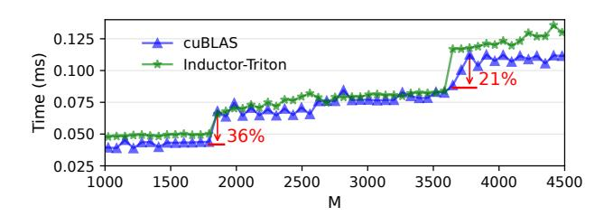
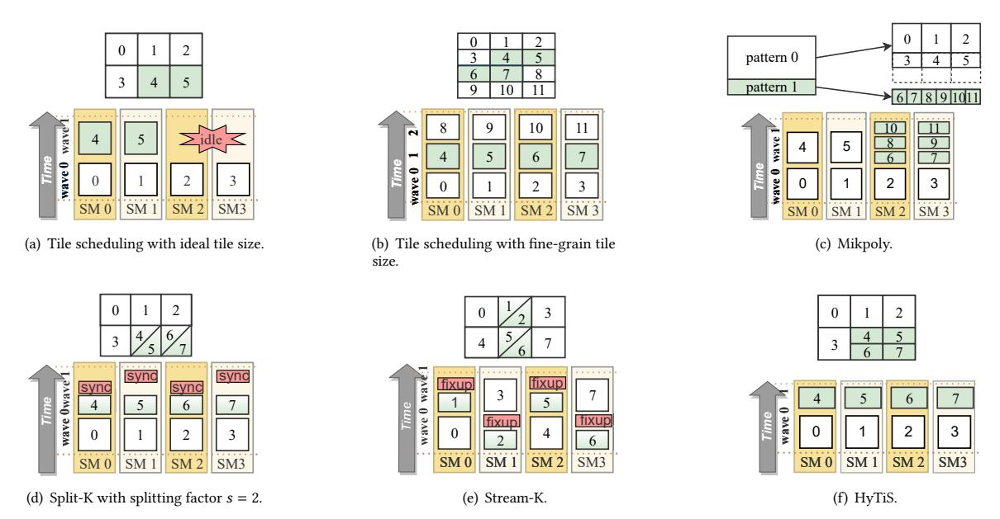
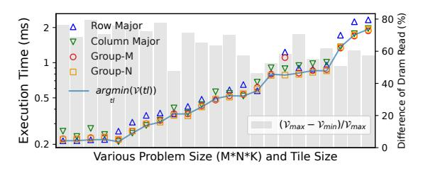
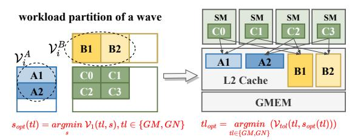
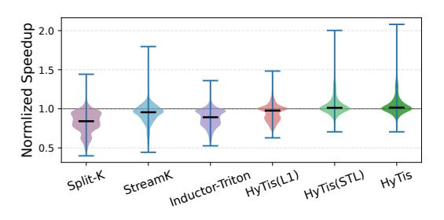

# HyTiS: Hybrid Tile Scheduling for GPU GEMM with Enhanced Wave Utilization and Cache Locality

[Zheng Zhang](https://orcid.org/0000-0001-6599-9976) Wuhan University Wuhan, China zzhang3031@whu.edu.cn

[Donglin Yang](https://orcid.org/0000-0002-3913-3623) NVIDIA Corporation Santa Clara, USA dongliny@nvidia.com

[Hulin Wang](https://orcid.org/0009-0003-8329-0145) Wuhan University Wuhan, China wonghulin@whu.edu.cn

[Xiaobo Zhou](https://orcid.org/0009-0004-9500-3390) University of Macau Macau, Macao waynexzhou@um.edu.mo

[Hongming Xu](https://orcid.org/0009-0009-6255-263X) Wuhan University Wuhan, China xuhongming@whu.edu.cn

> [Dazhao Cheng](https://orcid.org/0000-0003-2869-7623)<sup>∗</sup> Wuhan University Wuhan, China dcheng@whu.edu.cn

# Abstract

General matrix-matrix multiplication (GEMM) is a fundamental operation in both deep learning and scientific computing. To accelerate these workloads, GPUs with a large number of streaming multiprocessors (SMs) are widely used. However, as modern GPUs scale in core count and adopt larger tile sizes, the wave quantization problem induced by partially filled waves results in growing hardware underutilization and substantially degraded performance. Existing solutions to this problem often suffer from low execution efficiency or introduce additional synchronization overhead.

To address these challenges, we propose HyTiS, a hybrid tile scheduling framework that combines two-level tile scheduling with adaptive tile layout selection. The first level improves throughput by maximizing utilization in full waves, while the second level reduces latency in partial waves through fine-grained tiling. To minimize tuning overhead, HyTiS performs an offline profiling phase to identify throughput- and latency-optimized micro-kernels, forming an efficient runtime search space across diverse tensor workloads. Additionally, we study the impact of tile layouts on L2 cache behavior and introduce an analytical model to select layouts that minimize data movement from global memory to L2 cache at the wave granularity. Extensive evaluations on NVIDIA H100 and A100 GPUs show that HyTiS achieves significant speedups, up to 1.95× and 2.08× over cuBLAS, respectively. Detailed systemlevel analyses further demonstrate the effectiveness of HyTiS in mitigating wave quantization and improving L2 cache affinity.

# CCS Concepts

• Computing methodologies → Parallel algorithms; • Computer systems organization → Parallel architectures.

Permission to make digital or hard copies of all or part of this work for personal or classroom use is granted without fee provided that copies are not made or distributed for profit or commercial advantage and that copies bear this notice and the full citation on the first page. Copyrights for components of this work owned by others than the author(s) must be honored. Abstracting with credit is permitted. To copy otherwise, or republish, to post on servers or to redistribute to lists, requires prior specific permission and/or a fee. Request permissions from permissions@acm.org.

SC '25, St Louis, MO, USA

© 2025 Copyright held by the owner/author(s). Publication rights licensed to ACM. ACM ISBN 979-8-4007-1466-5/25/11

<https://doi.org/10.1145/3712285.3759771>

# Keywords

GEMM, GPU, Wave Quantization, L2 Cache, Data Locality

#### ACM Reference Format:

Zheng Zhang, Hulin Wang, Hongming Xu, Donglin Yang, Xiaobo Zhou, and Dazhao Cheng. 2025. HyTiS: Hybrid Tile Scheduling for GPU GEMM with Enhanced Wave Utilization and Cache Locality. In The International Conference for High Performance Computing, Networking, Storage and Analysis (SC '25), November 16–21, 2025, St Louis, MO, USA. ACM, New York, NY, USA, [15](#page-14-0) pages.<https://doi.org/10.1145/3712285.3759771>

# 1 Introduction

GEMM is a fundamental operation in both deep learning and scientific applications. It serves as the computational backbone for various deep learning models, including large language models [\[18,](#page-10-0) [39,](#page-11-0) [42\]](#page-11-1), computer vision models [\[16,](#page-10-1) [52\]](#page-11-2), and plays a key role in scientific domains such as climate modeling [\[1,](#page-10-2) [7\]](#page-10-3) and quantum chemistry [\[5,](#page-10-4) [45\]](#page-11-3). Given their computational intensity, GPUs equipped with hundreds of streaming multiprocessors serve as the primary hardware accelerators for GEMM workloads. The GEMM operator is typically partitioned into numerous homogeneous tiles, which are dispatched to idle SMs in successive 'waves' [\[30,](#page-11-4) [51,](#page-11-5) [53\]](#page-11-6). Well-balanced workload and maximum processor utilization are achieved when the number of output tiles significantly exceeds the number of cores, resulting in multiple waves.

With ongoing advancements in hardware specialization, streaming multiprocessors in modern GPUs are equipped with significantly enhanced compute and memory resources, enabling the processing of larger tiles per SM. Moreover, the total number of SMs continues to grow with successive GPU architecture generations [\[10,](#page-10-5) [11\]](#page-10-6). As a result, fewer waves are required to process the same workload. However, this reduction in wave count exacerbates the wave quantization problem [\[23,](#page-11-7) [25\]](#page-11-8), which arises when the number of output tiles is not evenly divisible by the number of available SMs. In such cases, some SMs remain idle while others are still processing, resulting in hardware underutilization.

In practice, NVIDIA's cuBLAS library [\[13\]](#page-10-7), widely regarded as the standard for accelerating GEMM operations, still suffers from the wave quantization problem. As depicted in Figure [1,](#page-1-0) a slight increase in the size of the M dimension, while keeping N and K fixed, results in substantial performance drops of 36% and 21% at two critical points. This degradation is primarily attributed to a significant

<sup>∗</sup>Corresponding author.

<span id="page-1-0"></span>

Figure 1: Illustration of wave quantization effects when evaluating GEMM performance with varying input shapes ( $M \times 1024 \times 4096$ ) on an NVIDIA H100 GPU.

decline in SM utilization during partial waves. Theoretically, adopting finer-grained tile sizes can improve SM utilization in such cases, thereby mitigating the wave quantization issue. However, smaller tiles lead to reduced execution efficiency in full waves, as the increased ratio of memory operations to computation hampers the ability to hide memory transfer latency between global and shared memory. For example, Inductor-Triton [3] incorporates auto-tuning across approximately twenty predefined tile sizes, ranging from coarse-grained configurations (e.g.,  $128 \times 128 \times 64$ ) to fine-grained ones (e.g.,  $32 \times 32 \times 16$ ). Nevertheless, as shown in Figure 1, it still exhibits performance degradation due to wave quantization, driven by underutilization of compute resources with finer-grained tiles.

To address this issue, several studies have proposed heterogeneous work partitioning to improve workload balance across SMs. Approaches such as Split-K [2] and Stream-K [32] partition the workload more finely along the accumulation dimension, allowing the workload of the original partial wave to be distributed across a larger number of SMs. However, the communication and synchronization overheads introduced by Split-K scale with both the problem size and the splitting factor. Stream-K alleviates synchronization overhead by introducing a skewed workload partitioning scheme compared to Split-K, but it still requires extra reduction operations and additional memory to store partial results. For instance, applying Stream-K to a  $1024 \times 4096 \times 1024$  GEMM operation consumes over 70% more device memory than cuBLAS GEMM.

To simultaneously maximize throughput for full waves and minimizes latency for partial waves, while avoiding additional synchronization overhead, we propose HyTiS. HyTiS is built upon a key insight: when workloads are sufficient to saturate hardware resources during full waves, the primary objective is to maximize throughput, which typically benefits from using larger tiles and fewer waves. In contrast, partial waves operate under abundant hardware availability but limited workload, where fine-grained tiling helps reduce per-wave latency. Consequently, HyTiS is designed as a hybrid tile scheduling framework that incorporates a two-level scheduling strategy to address the wave quantization problem. The first scheduling level focuses on maximizing throughput for full waves, while the second targets at minimizing the latency of the partial wave. However, exhaustively searching across both scheduling levels leads to a prohibitively large design space. With each level offering hundreds of micro-kernel candidates, the combined space reaches an order of magnitude of 10<sup>4</sup>. To reduce

the complexity of this optimization, we introduce an offline profiling stage that identifies representative throughput-oriented and latency-oriented micro-kernels. These form a significantly smaller and more tractable search space for efficient runtime scheduling. By leveraging hybrid tile scheduling, HyTiS effectively mitigates wave quantization, maintains high SM utilization, and avoids the synchronization overhead typically associated with fine-grained partitioning strategies.

In addition to tile size, which directly affects the number of required waves, we observe that the tile layout also significantly impacts the performance of GEMM operators. For instance, changing the tile layout from column-major to row-major results in a 23% performance degradation for the  $1672 \times 8192 \times 2048$  GEMM operator using Triton. On the contrary, for the  $8192 \times 1672 \times 2048$ GEMM operator, the row-major layout outperforms column-major by 17%. This behavior is consistent with expectations, as the data required by different SMs can be shared through the L2 cache, and different tile layouts lead to varying degrees of data locality within the cache, directly affecting performance. In practice, the optimal tile layout is dependent on tile sizes and problem shapes. However, existing methods typically adopt a fixed tile layout, missing opportunities to improve L2 cache affinity. For example, Pytorch Inductor with Triton backend [3] employs a group-M tile layout with a fixed group size of 8, while CUTLASS [12] supports only row-major or column-major layout. Such rigid tile layout can lead to suboptimal GEMM performance. To identify the effective tile layout with improved L2 cache affinity, we aim to minimize the volume of data fetched from global memory at the wave granularity. To achieve this, we introduce an analytical model that optimizes data reuse both within a single wave and across multiple waves. Based on this model, we propose a comprehensive tile layout strategy that integrates existing approaches and adaptively selects the optimal layout based on problem size and tile configuration.

With this holistic design incorporating hybrid scheduling of tile size and layout, HyTiS addresses the limitations of existing methods in mitigating the wave quantization problem. It offers improved L2 cache affinity and enhanced overall performance for GEMM operations. The key contributions of this work are summarized as follows:

- We propose a hierarchical two-level tile scheduling strategy that alleviates the wave quantization problem without introducing additional synchronization overhead. To efficiently determine the optimal tile configuration at each scheduling level, we perform an offline profiling stage that identifies throughputoriented and latency-oriented micro-kernels. These profiled micro-kernels form a compact and efficient runtime search space for selecting the optimal configuration.
- We conduct an in-depth analysis of the impact of tile layout on GEMM performance, and develop an analytical model that accounts for data locality both within a single wave and across multiple waves. Based on this model, we adaptively select the optimal tile layout according to the specific problem size and tile configuration.
- We implement HyTiS, a hybrid tile scheduling framework that combines two-level tile size scheduling and adaptive tile layout

<span id="page-2-0"></span>

Figure 2: The illustration of a simple GEMM operation on GPU and the GPU architecture.

scheduling. Evaluations across a wide range of GEMM operators on NVIDIA H100 and A100 GPUs demonstrate that HyTiS achieves significant speedups over cuBLAS, Split-K, Stream-K, and Inductor-Triton, up to 2.08×, 5.4×, 3.2×, and 2.1×, respectively. Moreover, detailed analysis confirms the effectiveness of HyTiS in improving SM workload balance and L2 cache affinity.

### 2 Background and Motivation

### 2.1 GEMM operation and GPU Architecture

GEMM is defined as the product  $C = \alpha AB + \beta C$  where  $\alpha$  and  $\beta$  are scalar values and A, B, and C are matrices. For simplicity, in this paper we assume  $\alpha = 1, \beta = 0$ . Given a GEMM operation of size  $M \times N \times K$ , the input and output tensors are partitioned into tiles, and the overall computation is decomposed into smaller computational blocks of size  $bM \times bN \times bK$ , referred to as micro-kernels [46], as illustrated on the left side of Figure 2. For each output tile, partial results from multiple micro-kernels are accumulated along the reduction dimension K. A group of micro-kernels contributing to the same output tile is typically executed by a Cooperative Thread Array (CTA) in a pipelined fashion.

To accelerate GEMM computations, GPUs, composed of multiple streaming multiprocessors, are particularly well-suited and have been widely adopted. As illustrated on the right side of Figure 2, each SM serves as a fundamental processing unit containing numerous Tensor Cores optimized for efficient matrix computations. Each SM is provisioned with private hardware resources, including L1 cache, shared memory (SMEM), and register memory (REG), enabling fast, low-latency data access. In addition, all SMs share a unified L2 cache, which serves as an intermediate caching layer between the SM-local memories and global memory (DRAM).

When executing GEMM operations on GPUs, output tiles are typically dispatched to SMs via CTA launches. These tiles are grouped into waves, which are executed concurrently across available SMs, as shown in Figure 2. In standard configurations, output tiles are uniform in size, and each tile is exclusively assigned to a single SM. This allows for balanced workload distribution when a sufficient number of full waves are present. However, in practical GEMM workloads with diverse problem dimensions, partial waves are often inevitable, giving rise to the *wave quantization* problem. As illustrated on the right side of Figure 2, tiles 0–3 form a full wave that is evenly distributed across SMs, enabling efficient resource utilization. In contrast, tiles 4 and 5 form a partial wave, which leads to underutilization of SM resources due to an insufficient number of tiles to occupy all SMs concurrently.

#### 2.2 Existing Work About Tile Scheduling

To evaluate HyTiS in comparison with existing tile scheduling approaches, we consider a hypothetical GPU architecture comprising four SMs. As illustrated in Figure 3(a), employing a large tile size with ideal intra-tile efficiency achieves only 50% SM utilization during the partial wave. A straightforward mitigation strategy is to reduce the tile size, thereby improving workload balance across SMs, as illustrated in Figure 3(b). However, finer-grained tiling increases the number of full waves while reducing the execution efficiency of each computation block. Consequently, the performance degradation within blocks often outweighs the gains from improved SM utilization in the partial wave. A more practical solution is the Split-K method, shown in Figure 3(d), which reduces the granularity of each CTA in partial waves through parallelization along the accumulation dimension. In this approach, the workload for a given output tile is divided and distributed across multiple SMs, enhancing workload balancing. Nevertheless, synchronization overhead inevitably occurs after the last computation block, restricting scalability with increasing problem sizes and splitting factors. Furthermore, Stream-K [32] mitigates synchronization overhead compared to Split-K by employing a skewed workload partitioning scheme, but still requires additional 'fixup' operations, as depicted in Figure 3(e). Furthermore, additional workspace is necessary to store the intermediate results. More recently, MikPoly [46] explored various polymerization patterns to optimize the performance of neural networks with dynamic shapes. Each pattern utilizes micro-kernels with different GEMM tile sizes. However, its GPU implementation is restricted to a horizontal split pattern, simply dividing a large GEMM into two smaller sub-GEMM operations. Consequently, the wave quantization problem persists within each sub-pattern, resulting in suboptimal performance, as illustrated in Figure 3(c).

In summary, homogeneous tile scheduling suffers from a fundamental trade-off: large tile sizes improve execution efficiency in full waves but lead to poor SM utilization in partial waves, whereas smaller tiles improve balance but reduce per-block efficiency. Furthermore, decomposition along the accumulation dimension, as seen in Split-K and Stream-K, introduces synchronization overhead that limits scalability. To overcome these limitations, we propose HyTiS, a hybrid tile scheduling approach as shown in Figure 3(f). HyTiS employs a two-level scheduling framework, where each level uses distinct micro-kernels characterized by different tile sizes. The first level aims to maximize computational throughput, while the second focuses on minimizing the latency of partial waves. Unlike MikPoly, HyTiS supports flexible workload partitioning, allowing irregular region shapes at each scheduling level.

### <span id="page-2-1"></span>2.3 Tile Layout and L2 Cache Affinity

As illustrated in Figure 2, multiple SMs share the same L2 cache, allowing other SMs to access data directly from the L2 cache if they request the same data address from global memory. Given the limited capacity of the L2 cache, data requested by different SMs within the same wave exhibit better data locality, whereas outdated data from previous waves tend to be evicted. Different tile layouts result in varying degrees of data locality of L2 cache, thus impacting overall performance.

<span id="page-3-0"></span>

<span id="page-3-2"></span>Figure 3: Comparison of different work regarding tile scheduling on a hypothetical four-SM GPU.

<span id="page-3-6"></span>

Figure 4: The illustration of different tile layout strategies.

<span id="page-3-7"></span>

Figure 5: Performance (left y-axis) and variation in DRAM read data volume (right y-axis) for different tile layouts across various problem sizes and tile configurations (x-axis).

Existing works adopt various tile layouts, as illustrated in Figure 4. For instance, Cutlass [12] supports both column-major and row-major layouts as configurable options for GEMM operators. Triton [37] employs the group-M tile layout with a group size of 8 to enhance L2 cache efficiency. Group-N is a variant of group-M that uses the row dimension, rather than the column dimension, as the leading dimension. However, a fixed tile layout is not well-suited for diverse problem shapes and tile configurations. As illustrated in Figure 5, we conducted experiments by applying different tile layouts to the same GEMM kernel from the Triton tutorial [41], across a range of problem shapes and tile configurations. Relative performance varies between them, with the performance gap

<span id="page-3-8"></span><span id="page-3-5"></span><span id="page-3-4"></span><span id="page-3-3"></span><span id="page-3-1"></span>Table 1: The Comparison of existing representative works and HyTiS("WQ": wave quantization, "AS": auto-scheduling, "TL": tile layout).

| Name          | WQ | AS | TL       | Additional Overhead |  |  |
|---------------|----|----|----------|---------------------|--|--|
| Inductor [3]  | ×  | ✓  | Fixed    | None                |  |  |
| Split-K [2]   | ✓  | ×  | Fixed    | Accumulation Sync.  |  |  |
| Stream-K [32] | ✓  | ×  | Fixed    | Accumulation Sync.  |  |  |
| MikPoly [46]  | ×  | ×  | -        | None                |  |  |
| HyTiS         | ✓  | ✓  | Adaptive | None                |  |  |

between the best and worst configurations reaching 36%, and an average difference of 16%. The discrepancy between different tile layouts underscores the need for an adaptive method for tile layout selection.

To reveal the variation in L2 cache affinity across different tile layouts, we measured the volume of data transferred from global memory to the L2 cache (denoted as  $\mathcal{V}$ ) using the Nsight Compute profiler. As shown in Figure 5, the average difference between the minimum and maximum  $\mathcal{V}$  values across tile layouts reaches 64%. Besides, we highlight the performance trend of tile layouts with the lowest  $\mathcal{V}$  using a blue line, which connects the layouts exhibiting the minimum  $\mathcal{V}$  in each case. This blue line exhibits a strong correlation with the best-performing tile layout across different problem sizes and tile configurations. Therefore, we adopt DRAM read volume  $\mathcal{V}$  as the primary metric to design an adaptive tile layout method for better L2 cache affinity.

In conclusion, we summarize the advantages of HyTiS compared to existing methods in Table 1. Unlike the PyTorch Inductor, HyTiS mitigates the wave quantization issue through hybrid tile scheduling without introducing fine-grained wave quantization. Compared with MikPoly, HyTiS employs a flexible tile scheduling method instead of relying on fixed polymerization patterns. Compared with

<span id="page-4-0"></span>

Figure 6: The system overview of HyTiS.

Split-K and Stream-K, HyTiS avoids the additional overhead associated with accumulation synchronization. Furthermore, HyTiS supports auto-tuning to achieve comprehensive performance improvements across varying workloads. Unlike Pytorch Inductor, which relies on predefined configurations as tuning candidates, HyTiS enables automatic tuning that dynamically adapts to both the underlying GPU architecture and workload characteristics.

#### <span id="page-4-1"></span>3 The HyTiS Design

Figure 6 provides an overview of HyTiS, comprising three components. The first is offline micro-kernel generation, which produces two sets of candidates: throughput-oriented micro-kernels ( $\P$ ),  $\mathcal{K}_i^{TO}$ , optimized for hardware-constrained throughput, and latency-oriented micro-kernels ( $\P$ ),  $\mathcal{K}_i^{LO}$ , optimized to minimize partial wave latency. The other two components, two-level tile scheduling and adaptive tile layout, enable runtime tuning for a given GEMM operator. The first scheduling level targets full waves using throughput-oriented micro-kernels ( $\P$ ), while the second handles partial waves with latency-oriented micro-kernels ( $\P$ ). Together, these scheduling decisions define the search space for the auto-tuning process ( $\P$ ). Furthermore, to adaptively optimize tile layout across different tile sizes and problem shapes, we introduce an analytical model that guides the minimization of DRAM-to-L2 data traffic at the wave level ( $\P$ ), as detailed in Section 3.3.

#### 3.1 Offline Micro-kernel Generation

Given the fundamental differences in hardware utilization between full and partial wave tile scheduling, our hybrid tile scheduling strategy is guided by the following two principles:

- Throughput-oriented scheduling for full waves: When\nexecuting full waves, the workload is sufficient to saturate all
  available hardware resources. In this scenario, the primary
  objective is to maximize throughput by fully leveraging the
  compute capacity of the GPU.
- Latency-oriented scheduling for the partial wave: In contrast, partial waves involve a residual workload that cannot fully utilize the hardware. Therefore, the focus shifts to minimizing execution latency through fine-grained scheduling and efficient resource usage.

However, with hundreds of tile configuration candidates per scheduling level, the total number of possible combinations can exceed ten thousand, resulting in an intractably large search space. Fortunately, due to the architectural independence of SMs on modern GPUs, the performance characteristics of a micro-kernel executed on an SM remain relatively stable across diverse problem shapes [46]. Therefore, we characterize the behavior of micro-kernels offline and construct two dedicated sets of micro-kernels, each aligned with the aforementioned throughput- and latency-oriented scheduling principles. This strategy significantly reduces the search space from  $O(10^4)$  to  $O(10^1)$ , as demonstrated in Section 5.6, while preserving scheduling effectiveness.

3.1.1 Prerequisite. Consider a target GPU consisting of  $N_{SM}$  SMs, each equipped with the register memory of size  $REG_0$  and the shared memory of size  $SMEM_0$ . Given a micro-kernel  $\mathcal{K}_i$ , characterized by the computation block size  $bM_i \times bN_i \times bK_i$ . To profile the performance of each  $\mathcal{K}_i$ , we define a representative GEMM operator  $P(\mathcal{K}_i)$ , composed of  $n_0$  waves  $^1$  to sufficiently stress the kernel during evaluation. Based on empirical tuning, the input problem size for  $P(\mathcal{K}_i)$  is set to  $M_i \times N_i \times K_0$ , where  $M_i = bM \times 4$ ,  $N_i = N_{SM} \times n_0/4$ , and  $K_0$  is fixed at 1024. During profiling, we collect three key performance metrics: shared memory usage per block  $SMEM(\mathcal{K}_i)$ , spilled register file usage per thread  $REG_{Spill}(\mathcal{K}_i)$ , and execution latency  $t(P(\mathcal{K}_i))$ , abbreviated as  $t(\mathcal{K}_i)$ . Notably, both shared memory and register file usage are determined solely by the micro-kernel configuration and remain invariant with respect to the problem size.

3.1.2 Throughput-Oriented Micro-Kernels. The throughput-oriented (TO) micro-kernel set is constructed based on empirical throughput profiling. Given that the K-dimension of the problem shape remains fixed during profiling, the throughput metric  $\mathcal{T}$  is defined as the computational workload of the output tensor per unit time along dimensions M and N, as formulated in Equation (1).

Rather than conducting an exhaustive search over the entire space of micro-kernel candidates, we apply three categories of constraints to significantly reduce the search space. The first is a resource constraint. Each candidate micro-kernel must satisfy the hardware resource limits, specifically that shared memory usage does not exceed the available shared memory and that no register spilling occurs. These conditions are formalized in Equation (2). Additionally, we utilize prior profiling data to prune the search space by discarding tile sizes that exceed those associated with known outof-resource configurations. The second is an instruction constraint. Certain GPU architectures impose instruction-level requirements on tile dimensions. For example, on NVIDIA's H100 GPU, tensor core operations via the wgmma instruction necessitate tile sizes aligned to a minimum multiple, such as bM%64 == 0. Thus, only tile sizes compatible with these instruction constraints are considered. Additionally, to enhance data locality and improve the compute-tomemory ratio, we enforce a one-tile-per-SM dispatch policy, where each SM processes a single output tile at a time. This approach permits the use of larger tile sizes, thereby maximizing shared memory utilization. As expressed in Equation (3), micro-kernels that fail to

 $<sup>^{1}</sup>n_{0}$  is set to 1 to eliminate the influence of tile layout.

<span id="page-5-7"></span>

Figure 7: Illustration on the bybrid two-level tile scheduling.

effectively utilize the shared memory (i.e., their usage remains significantly below SMEM<sub>0</sub> even after tile size increases) are excluded. A similar constraint is also applied to register file utilization. After applying these constraints and completing the profiling process. we identify the optimal throughput-oriented micro-kernel, denoted as  $\mathcal{K}_{opt}^{TO}$ , based on maximum observed throughput (Equation (4)). Finally, we retain a subset of throughput-oriented candidates whose throughput degradation, relative to  $\mathcal{K}_{opt}^{TO}$ , falls within an acceptable threshold  $l_1$ , as defined in Equation (5).

$$\mathcal{T}(\mathcal{K}_i) = (M_i \times N_i) / (n_0 \times t(\mathcal{K}_i)) \tag{1}$$

$$SMEM(\mathcal{K}^{TO}) \le SMEM_0, REG_{spill}(\mathcal{K}^{TO}) == 0$$
 (2)

$$\nexists \mathcal{K}'|_{\mathcal{K}',x \geq \mathcal{K},x,x \in \{bM,bN,bK\},\mathcal{K}' \neq \mathcal{K}^{TO}}, SMEM(\mathcal{K}') \leq SMEM_0$$

$$\mathcal{K}_{opt}^{TO} = \underset{\mathcal{K}_{i}}{argmax}(\mathcal{T}(\mathcal{K}_{i})) \tag{4}$$

$$S^{TO} = \{ \mathcal{K}_i^{TO} | diff(\mathcal{T}(\mathcal{K}_i^{TO}), \mathcal{T}(\mathcal{K}_{opt}^{TO}) < l_1 \}$$
 (5)

3.1.3 latency-oriented Micro-Kernels. For partial waves, compute resources are typically underutilized; hence, the optimization objective shifts from maximizing throughput to minimizing latency per wave. Latency-oriented (LO) micro-kernel candidates are selected based on their per-wave execution latency, defined as  $t(Ki)/n_0$ , where t(Ki) denotes the total execution time and  $n_0$  is the number of waves. After identifying the throughput-oriented micro-kernels, we derive the set of latency-oriented candidates by sampling smaller tile configurations from the throughput-oriented set  $S^{TO}$ . The optimal latency-oriented micro-kernel, denoted  $\mathcal{K}^{LO}_{opt}$ , is selected as the kernel with the minimum per-wave latency (Equation (6). Subsequently, we retain micro-kernels whose latency deviation from  $t(\mathcal{K}^{LO}_{opt})$  remains within a predefined threshold  $l_2$ , as formalized in Equation (7). Compared to their throughput-oriented counterparts, latency-oriented candidates generally utilize smaller tile sizes, which inherently satisfy hardware resource constraints such as shared memory and register usage. Furthermore,  $\mathcal{K}^{LO}$  must comply with the same instruction-level constraints imposed on  $\mathcal{K}^{TO}$ ; however, these constraints are omitted here for brevity.

$$\mathcal{K}_{opt}^{LO} = \underset{\mathcal{K}_{i}}{argmin}(t(\mathcal{K}_{i})/n_{0}) \tag{6}$$

$$S^{LO} = \{\mathcal{K}_{i}^{LO}|diff(t(\mathcal{K}_{i}^{LO}), t(\mathcal{K}_{opt}^{LO})) < l_{2}\}$$
(7)

<span id="page-5-6"></span><span id="page-5-5"></span>
$$S^{LO} = \{ \mathcal{K}_i^{LO} | diff(t(\mathcal{K}_i^{LO}), t(\mathcal{K}_{opt}^{LO})) < l_2 \}$$
 (7)

## <span id="page-5-8"></span>Two-Level Tile Scheduling and Auto-Tuning

Throughput-oriented micro-kernels generally employ large tile sizes, which enhance full-wave efficiency by increasing the compute-to-memory access ratio. However, these large tiles often result in poor SM utilization during partial waves, thereby intensifying the wave quantization problem. In contrast, latency-oriented micro-kernels achieve lower per-wave latency by using smaller tiles, but suffer from diminished performance in full-wave scenarios due to a larger number of required waves and reduced intra-tile execution efficiency. To leverage the complementary strengths of both micro-kernel types, we propose a two-level tile scheduling framework that simultaneously optimizes throughput for full waves and minimizes latency for partial waves. Given the interdependence of scheduling decisions across these levels, we adopt a hierarchical approach that integrates both throughput- and latency-oriented strategies into a unified, end-to-end scheduling framework.

<span id="page-5-0"></span>3.2.1 Hierarchical Tile Scheduling. The hierarchical tile scheduling process is illustrated in Figure 7. For simplicity, consider a scenario with two candidate micro-kernels in both the throughput-oriented set  $S^{TO}$  and the latency-oriented set  $S^{LO}$ . At the first level of scheduling, each TO micro-kernel is applied to the full waves. Assuming a column-major tile layout, the residual workload corresponding to the partial wave is computed for each TO candidate. At the second level, the LO micro-kernel candidates are evaluated to schedule this remaining workload. If the number of tiles required to cover the partial wave exceeds the number of available SMs, the corresponding scheduling plan is deemed invalid, illustrated by case C1. Only valid TO-LO micro-kernel combinations, such as cases C2-C4 are retained. These combinations collectively define the reduced search space for the subsequent auto-tuning procedure.

<span id="page-5-4"></span><span id="page-5-3"></span><span id="page-5-2"></span><span id="page-5-1"></span>A more straightforward alternative to hierarchical scheduling is a greedy strategy that independently selects  $\mathcal{K}_{opt}^{TO}$  for full waves and  $\mathcal{K}_{opt}^{LO}$  for the partial wave. However, this approach can be suboptimal for two key reasons. First, the performance of micro-kernels at runtime may diverge from their offline profiling behavior due to variations in problem shapes and runtime conditions. As a result, a micro-kernel identified as optimal during offline profiling may not retain its optimality across all execution scenarios. Second, greedy selection often leads to locally optimal solutions that fail to yield globally optimal performance. For example, as illustrated in Figure 7, directly selecting  $\mathcal{K}^{TO}_{opt}$  and  $\mathcal{K}^{LO}_{opt}$  can lead to surplus tiles of the partial wave in the second-level scheduling phase, which degrades performance with increasing partial waves. Furthermore,  $\mathcal{K}_{opt}^{TO}$  may not be the best choice for first-level scheduling when considered in combination with available latency-oriented kernels. In such cases, a non-optimal throughput-oriented kernel, such as the one used in candidate C3, may result in better overall performance when paired with  $\mathcal{K}_{opt}^{LO}$ , outperforming candidate C2, which uses  $\mathcal{K}_{opt}^{TO}$  with a suboptimal LO kernel. Specifically, there are two special cases where two-level scheduling becomes unnecessary. (1) TO-only Scheduling: This occurs when no feasible LO micro-kernel candidate is available. In this case, partial waves are processed using the selected TO micro-kernel. This scenario typically arises when the SM utilization is already high, and there is little room for further optimization through LO scheduling. (2) LO-only Scheduling: This case arises when the problem size is too small to form even a single full wave. The scheduling process relies solely on LO micro-kernels, as there are no full waves to process.

<span id="page-6-1"></span>

Figure 8: Illustration of adaptive tile layout selection and memory access patterns through the L2 cache for each wave.

3.2.2 Auto Tuning. In contrast to PyTorch Inductor, which relies on a fixed auto-tuning search space, the search space in HyTiS is adaptively determined based on GPU architecture and workload characteristics. By performing a one-time offline profiling of the GEMM operator for a specific data layout on the target GPU, the selected micro-kernels are tailored to the GPU architecture with slight overhead. Additionally, the hyperparameters  $l_1$  and  $l_2$  allow for dynamic adjustment of the search space in response to varying problem sizes. Specifically, when the problem size is small,  $l_1$  can be set to a larger value to account for greater performance variability. As the problem size increases,  $l_1$  can be reduced, as the performance of  $\mathcal{K}_{opt}^{TO}$  becomes more stable, enabling consistently high performance. This dynamic adjustment will be further explored in the experimental section (Section 5.5).

# <span id="page-6-0"></span>3.3 Tile Layout Scheduling

After determining the tile size as outlined in the previous section, the next challenge is selecting an optimal tile layout. To address this, we consider two fundamental tile layout patterns: group-M (denoted GM) and group-N (denoted GN), each characterized by a group size parameter s. Consequently, we represent the tile layout as (tl, s), where  $tl \in \{GM, GN\}$ . Notably, column-major and rowmajor layouts are special cases of these patterns:  $(GM, \lceil M/bM \rceil)$  for column-major, and  $(GN, \lceil N/bN \rceil)$  for row-major.

As discussed in Section 2.3, the tile layout affects both the volume of data transferred from DRAM to the L2 cache and the overall performance. As illustrated on the right side of Figure 8, the L2 cache is shared among multiple SMs, allowing data requested by different SMs within the same wave to be reused. We denote the data volume needed for the input tensors of the i-th wave as  $V_i$ . A lower value of  $V_i$  corresponds to better L2 cache data locality within a wave. In practice, the first wave plays a critical role, as the L2 cache is initially empty and cannot benefit from previously cached data. Therefore, for a given tile layout pattern, either GM or GN, we select the optimal group size by minimizing  $V_1$ . Through analytical derivation, the optimal group size for group-M  $s_{opt}^{GM}$  equals  $min(\lceil \sqrt{N_{SM} \cdot bN/bM} \rceil, \lceil M/bM \rceil)$  or  $min(\lfloor \sqrt{N_{SM} \cdot bN/bM} \rfloor, \lceil M/bM \rceil)$ , and the result of  $s_{opt}^{GN}$  is analogous. To further determine the optimal tile layout between GM and *GN*, we use the total data required volume  $V_{tol} = \sum_{i} V_i$  across all waves as a metric, which reflects the overall L2 cache data locality. The layout with the smaller  $V_{tol}$  is selected as the optimal layout, denoted as  $tl_{opt}$ , as shown in the left of Figure 8. The computation of the tile layout  $(tl_{opt}, s_{opt})$  involves only simple mathematical operations and can be performed efficiently at runtime.

#### <span id="page-6-2"></span>Algorithm 1 Implementation of HyTiS

```
1: function HyTiS_GEMM(a, b, c, \mathcal{K}_1, \mathcal{K}_2, n1_wave, n2_tiles)
         pid = blockIdx.x
         k \ tiles = \lceil P.K/\mathcal{K}_1.bK \rceil
 3:
         for i = 0 to k\_tiles \times n1\_wave do
 4:
 5:
             ki, tid = i\%k\_tiles, pid
             if ki == 0 then
 6:
                 offs\_m, offs\_n = l1\_offset\_fn(tid)
 7:
                 ta, tb = Load(a, offs_m, ...), Load(b, offs_n, ...)
 8:
 9:
             tc+ = \mathcal{K}_1.compute(ta, tb, tc)
 10:
             if ki == k\_tiles - 1 then
 11:
                 store(tc, offs\_m, offs\_n)
 12:
                 tid+=N_{SM}
 13:
             end if
         end for
 15:
         if pid >= n2\_tiles then
 16:
 17:
             return
         end if
         for i = 0 to \lceil K/\mathcal{K}_2.bK \rceil do
20:
             offs_m, offs_n = l2\_offset\_fn(tid)
             ta, tb = Load(a, offs_m, ...), Load(b, offs_n, ...)
21:
             tc = \mathcal{K}_1.compute(ta, tb)
22:
             store(tc, offs_m, offs_n)
 24:
         end for
    end function
 25:
26:
 27: function _MAIN(P, a, b, c)
         ts = HyTiScheduler(P.M, P.N, P.K)
         K_1, K_2, n1_wave, n2_tiles, grid_size = ts.autotune()
         l1\_offset\_fn = ts.emit\_l1\_offset\_fn()
         l2\_offset\_fn = ts.emit\_l2\_offset\_fn()
31:
         HyTiS\_GEMM < grid\_size > (a, \quad b, \quad c, \quad \mathcal{K}_1, \mathcal{K}_2, \quad n1\_wave,
     n2_tiles)
33: end function
```

According to our analytical model, the volume of global-to-L2 memory traffic, denoted as  $\mathcal{V}(tl,s)$ , remains constant across different tile layouts when the workload comprises only a single wave. This observation implies that tile layout scheduling offers no performance benefit at the second level of scheduling. As a result, adaptive tile layout optimization is applied exclusively at the first level, where multiple waves are present and layout decisions have a measurable impact. For simplicity, the second level adopts a fixed column-major layout.

#### 4 Implementation

HyTiS is implemented on top of Triton [37], an open-source language and compiler framework designed for expressing and compiling tiled neural network computations into highly optimized machine code. By leveraging Triton's high-level, user-friendly programming interfaces, HyTiS concentrates on optimizing matrix multiplication at the tile scheduling level, while relying on Triton's robust infrastructure for intra-tile optimizations. Triton offers a comprehensive set of low-level optimizations, including automatic memory coalescing, thread swizzling, vectorization, efficient shared

memory allocation, and synchronization. This division of responsibilities simplifies the overall optimization workflow in HyTiS and ensures the generation of highly efficient GPU kernels.

Kernel Design. To realize the proposed hybrid tile scheduling, we implement a two-level scheduling GEMM kernel, as illustrated in the \_ function of Algorithm [1.](#page-6-2) This kernel consists of two main phases. The first (lines 4–15) implements level-1 tile scheduling using micro-kernel K1, responsible for executing 1\_ full waves. And the second part performs level-2 tile scheduling to process the remaining partial wave using micro-kernel (line 19-24). Each scheduling phase consists of four key primitive operations: , , and and \_ . The first three are adopted from Triton, while \_ is generated by HyTiS in two variants: 1\_ \_ and 2\_ \_ , which map tile IDs to corresponding address offsets in the output tensor for the two scheduling levels. On NVIDIA Hopper architecture, we leverage persistent kernel execution to eliminate CTA launch overhead, and TMA instructions to accelerate global memory loading. In contrast, on the Ampere architecture, TMA instructions are not supported and persistent kernels incur excessive register file usage. Therefore, for Ampere, we adopt a traditional data-parallel launch strategy while preserving the same tile scheduling order used on Hopper to maintain consistency across architectures.

User Interface. We integrate the core design components of HyTiS into a module named ℎ, which accepts the GEMM problem shape as input. The implementation details described in Section [3](#page-4-1) are encapsulated within the method, which returns the selected throughput-oriented micro-kernel K1, the latency-oriented micro-kernel K2, the number of full waves 1\_, and the number of tiles in the partial wave 2\_. As is the most time-consuming operation in the scheduling pipeline, its results are cached, similar to the approach used in Py-Torch Inductor, to eliminate runtime overhead. The returned parameters serve as input to the main execution function \_. Additionally, ℎ constructs separate \_ functions for each scheduling level, encapsulating the tile-to-thread block mapping logic required to coordinate TO and LO scheduling efficiently.

# 5 Experiments

# 5.1 Experimental Setup

Platforms. We evaluate HyTiS using two GPU devices: a NVIDIA H100-PCIE GPU, which is the Hopper architecture with compute capability \_90, and a NVIDIA A100-PCIE GPU, which is the Ampere architecture with compute capability \_80. For simplicity, we refer to these devices as H100 and A100, respectively. The primary software libraries utilized by HyTiS and the baseline implementations include PyTorch 2.3, CUDA 12.6, CUTLASS 3.4 and Triton 3.2.0.

Workloads. Our test corpus is designed to cover a wide range of GEMM problems commonly used in deep learning workloads and scientific applications. As detailed in Table [2,](#page-7-0) the evaluated workloads consist of two categories. The first category draws from deep learning applications, with parameters and sampled from

Table 2: Tested Workloads.

<span id="page-7-0"></span>

| Layout     | M              | N,K                                                                                                                                                                                                               | #num |
|------------|----------------|-------------------------------------------------------------------------------------------------------------------------------------------------------------------------------------------------------------------|------|
| NT /<br>NN | 512 ∼<br>8192  | (512, 512), (512, 2048), (2048, 512),<br>(2048, 2048), (768, 768), (768, 3072),<br>(3072, 768), (3072, 3072), (1024, 1024),<br>(1024, 4096) (4096, 1024), (4096, 4096)<br>(2048, 8192), (8192, 2048) (8192, 8192) | 3600 |
| NT /<br>NN | 1024 ∼<br>8192 | [1024 ∼ 8192] × [1024 ∼ 8192]                                                                                                                                                                                     | 1024 |

popular deep learning models such as BERT [\[26\]](#page-11-13), GPT [\[34,](#page-11-14) [35\]](#page-11-15) and ViT [\[16,](#page-10-1) [52\]](#page-11-2), while ranges from 512 to 8192 in increments of 64, resulting in a total of 3600 test cases. The second category uniformly samples the parameters , , and from the range 1024 to 8192, generating an additional 1024 test cases. We employ fP16 as the data format while maintaining fp32 accumulation precision. Besides, we consider two input data layouts: and . In the layout, matrix A has dimensions ×, and matrix B has dimensions ×. In the layout, matrix B is transposed to dimensions × .

Baselines. Our baselines include cuBLAS [\[13\]](#page-10-7), Inductor-Triton [\[3\]](#page-10-8), Split-K, and Stream-K [\[32\]](#page-11-9). CuBLAS is popular for GEMM, providing more than twenty highly optimized precompiled kernel specializations per architecture. Inductor-Triton adopts from Pytorch Inductor with Triton backend, which comprises approximately twenty predefined tile configurations based on Triton kernel templates. Additionally, we adopt the Split-K and Stream-K implementations from CUTLASS [\[12\]](#page-10-10), which mitigate workload imbalance by splitting computation workloads along the accumulation dimension. We do not compare directly with MikPoly [\[46\]](#page-11-10), as it is closed-source. Theoretically, HyTiS surpasses MikPoly due to its more flexible and precise tile scheduling strategy. Furthermore, we developed two HyTiS variants to isolate the performance gains resulting from our system designs components: 1) HyTiS(L1), which implements only level 1 tile scheduling, degrades from hybrid tile scheduling to homogeneous tile scheduling, while still benefiting from HyTiS's offline profiling and auto-tuning process. 2) HyTiS (STL), which omits adaptive tile layout optimization, uses a static group-M tile layout with a group size of 8.

# 5.2 Overall Performance

H100. As shown in Figure [9\(a\),](#page-8-0) HyTiS achieves an average speedup of 1.12× over cuBLAS across both data layouts, with a maximum speedup of up to 1.95×. It outperforms cuBLAS in over 90% of the cases, demonstrating the effectiveness of the HyTiS approach. Compared to Split-K and Stream-K, HyTiS delivers average speedups of 1.98× and 1.73×, respectively, and consistently outperforms them in nearly all tested cases. The significantly poor performance of Split-K and Stream-K on H100 is attributed to the cuTLASS implementation not yet being optimized for the Hopper architecture. Compared to Inductor-Triton, HyTiS achieves an average speedup of 1.22×, demonstrating the effectiveness of its hybrid auto-tuning methods. Compared with HyTiS (L1), HyTiS achieves an average speedup of 1.06× in 41% of the cases. Against HyTiS (STL), it delivers up to a 1.32× speedup, with an average of 1.04×

<span id="page-8-2"></span>Table 3: Breakdown analysis on the H100. The results are divided into three regions based on metrics normalized to cuBLAS: the low region (0-0.98), mid region (0.98-1.02), and high region  $(1.02-\infty)$ . Each value pair in the low, mid, and high categories represents the average metric value and the corresponding percentage of cases.

|      |            | Speedup     |                   |          |                   | SM Balance  |                   |          |                   | DRAM READ   |                   |          |                    |
|------|------------|-------------|-------------------|----------|-------------------|-------------|-------------------|----------|-------------------|-------------|-------------------|----------|--------------------|
|      |            | avg         | low               | mid      | high              | avg         | low               | mid      | high              | avg         | low               | mid      | high               |
| H100 | HyTiS(L1)  | 1.08        | 0.95,16%          | 1.00,23% | 1.15,61%          | 2.4         | 0.69,42%          | 1.00,12% | 4.43,46%          | 0.97        | 0.82,46%          | 1.01,40% | 1.36,14%           |
|      | HyTiS(STL) | 1.11        | 0.96,3%           | 1.00,20% | 1.15,77%          | <b>3.3</b>  | 0.71,31% ↓        | 1.00,10% | <b>5.15,59%</b> ↑ | 0.97        | 0.83,46%          | 1.00,39% | 1.36,15%           |
|      | HyTiS      | <b>1.12</b> | <b>0.96,2%</b> ↓  | 1.00,17% | <b>1.15,81%</b> ↑ | 3.2         | 0.72,32%          | 1.00,10% | 5.13,58%          | <b>1.07</b> | <b>0.87,20%</b> ↓ | 1.00,52% | <b>1.35,28</b> % ↑ |
| A100 | HyTiS(L1)  | 0.96        | 0.87,51%          | 1.00,28% | 1.11,21%          | 0.94        | 0.58,68%          | 1.00,14% | 2.31,18%          | 0.96        | 0.81,42%          | 1.00,39% | 1.25,19%           |
|      | HyTiS(STL) | 1.05        | 0.93,26%          | 1.00,30% | 1.16,44%          | 1.28        | 0.66,52%↓         | 1.00,15% | 2.54,33% ↑        | 0.99        | 0.83,37%          | 1.00,41% | 1.26,22%           |
|      | HyTiS      | <b>1.06</b> | <b>0.93,23</b> %↓ | 1.00,30% | <b>1.17,47</b> %↑ | <b>1.30</b> | <b>0.67,52</b> %↓ | 1.00,15% | 2.57,33% ↑        | <b>1.07</b> | <b>0.82,20</b> %↓ | 1.00,40% | <b>1.27,40</b> %↑  |

<span id="page-8-0"></span>

(a) Performance on H100.

<span id="page-8-1"></span>

(b) Performance on A100.

Figure 9: Overall Performance of HyTiS. All results report execution latency normalized to that of cuBLAS.

in 15% of the cases. These results demonstrate the effectiveness of hybrid tile scheduling and adaptive tile layout tuning on Hopper architecture.

A100. As shown in Figure 9(b), HyTiS achieves an average speedup of  $1.06\times$  over cuBLAS, with a maximum speedup of  $2.08\times$  and an average of  $1.13\times$  in 63% of the cases. When ensembling HyTiS with cuBLAS, the combined approach yields an average speedup of  $1.08\times$ . Compared to Split-K and Stream-K, HyTiS delivers average speedups of  $1.34\times$  and  $1.18\times$ , respectively. HyTiS performs worse than Split-K and Stream-K in no more than 1% and 9% of the cases, respectively, primarily when the K dimension is significantly larger than M and N, e.g.,  $512\times512\times8192$ . This limitation can be addressed by integrating HyTiS with Stream-K, which we plan to explore in future work. Compared to Inductor-Triton, HyTiS achieves an average speedup of  $1.21\times$ . When compared to HyTiS (L1), HyTiS achieves an average speedup of  $1.1\times$  (up to  $1.41\times$ ). Against HyTiS (STL), it delivers up to a  $1.25\times$  speedup, with

an average of  $1.04\times$  in 13% of the cases. These results demonstrate the effectiveness of hybrid tile scheduling and adaptive tile layout tuning on the Ampere architecture.

#### 5.3 Breakdown Analysis

To evaluate the ablated contributions of HyTiS (L1), HyTiS (STL), and the full HyTiS system, we conduct a breakdown analysis as shown in Table 3. The analysis includes three metrics: execution speedup, SM balance, and DRAM read data volume. All metrics are normalized against cuBLAS and categorized into three regions: low, mid, and high. For the low region, a smaller percentage is better (with the best result marked by  $\downarrow$ ), while for the high region, a larger percentage is preferred (with the best result marked by  $\uparrow$ ).

Speedup. On the H100, HyTiS (L1) falls into the high region in 61% of cases and into the low region in 16% of cases. By adopting two-level tile scheduling instead of a single-level approach, HyTiS (STL) significantly reduces the low region to 3% and increases the high region to 77%. Although the full HyTiS only improves the average performance over HyTiS (STL) by 1%, it further increases the high region by 4%. These results demonstrate the added benefit of hybrid scheduling and adaptive tile layout. The results on A100 are similar to that on H100, where HyTiS acheives an average speedup of  $1.17\times$  in 47% cases.

SM Balance. To assess workload balance across SMs, we collect three metrics by NSight Compute [14]:  $sm\_cycles\_active.avg$ ,  $sm\_cycles\_active.max$ , and  $sm\_cycles\_active.min$ . For simplicity, we define a composite metric  $\mathcal{B} = (max - min)/avg$  to represent SM workload balance. As shown in Table 3, on H100, HyTiS (L1) exhibits 42% of cases in the low balance region. HyTiS (STL) significantly reduces this to 31%, achieving an average balance improvement of 3.3× compared to cuBLAS. The full HyTiS introduces only a negligible reduction in SM balance, which is less than 1% on average. On the A100, HyTiS and HyTiS (STL) achieve the best results, with an average SM balance improvement of 1.30× compared to cuBLAS.

DRAM Read. To evaluate the contribution of the adaptive tile layout scheduling method in HyTiS, we use the dram\_bytes\_read.sum metric from the NSight Compute profiler to measure the volume of data transferred from DRAM to the L2 cache. As shown in Table 3, HyTiS achieves an average reduction of 1.07× compared to cuBLAS on H100. Furthermore, compared to HyTiS (STL), HyTiS reduces the low region ratio from 46% to 20%

<span id="page-9-2"></span>

Figure 10: Execution time of GEMM operators on H100 with varying M dimension sizes.

<span id="page-9-3"></span>

Figure 11: Analysis of hyperparameters  $l_1$  (left) and  $l_2$  (right).

and increases the high region from 15% to 28% on H100. On A100, HyTiS reduces the low region ratio from 37% to 20% and increases the high region from 22% to 40%, demonstrating its effectiveness in improving L2 cache affinity.

#### 5.4 Effectiveness for Wave Quantization

To demonstrate the effectiveness of HyTiS in addressing the wave quantization problem, we compare its performance with cuBLAS and Inductor-Triton in experiments that vary M while keeping Nand K fixed. As shown in Figure 10, the experiments are conducted on an H100 GPU using the NT data layout, covering two cases. The results are divided into two regions: the quantization-prominent region (highlighted in orange) and the non-quantization-prominent region. In Figure 10(a), HyTiS achieves average speedups of 1.10× and 1.19× in the quantization-prominent region, and 1.07× and 1.15× in the non-quantization-prominent region, over cuBLAS and Inductor-Triton, respectively. In Figure 10(b), HyTiS achieves average speedups of 1.16× and 1.09× in the quantization-prominent region, and 1.11× and 1.06× in the non-quantization-prominent region, compared to cuBLAS and Inductor-Triton, respectively. The dominant performance in the quantization-prominent region validates the effectiveness of HyTiS in mitigating the wave quantization issue.

#### <span id="page-9-1"></span>5.5 Analysis of Hyperparameters

As discussed in Section 3.2, the auto-tuning space in HyTiS is determined by the level-1 threshold  $l_1$  and level-2 threshold  $l_2$ . To analyze the impact of these two hyperparameters, we conduct experiments with  $L_1=1.3$  and  $L_2=1.4$  across a diverse set of 1,000 GEMM operators randomly sampled from Table 2. For each operator, we could

obtain the minimal threshold that achieves the optimal result by comparing the runtime-optimized micro-kernels against the offline-optimal counterparts, for instance,  $l_{1,min} = \mathcal{T}(K_{opt}^{TO})/\mathcal{T}(K^{TO})$ . As shown in Figure 11, the x-axis represents the number of 'vtiles', defined as the number of output tensor tiles divided by the virtual tile size  $64\times64$ . As the number of vtiles increases, the performance ratio between  $\mathcal{K}^{TO}$  and  $\mathcal{K}^{TO}_{opt}$  tends to converge toward 1. Based on this observation, we define  $l_1$  as a piecewise function: it is set to 1.2, 1.1, and 1.05 when the number of vtiles is less than 2500, between 2500 and 5000, and greater than 5000, respectively. In contrast, for  $\mathcal{K}^{LO}_{opt}$ , there is no strong correlation between its deviation from  $\mathcal{K}^{LO}_{opt}$  and the number of vtiles. Therefore, we fix  $l_2$  to a constant value of 1.3. As shown in the right subfigure of Figure 11, the proportion of cases which do not satisfy  $l_{2,min} \leq 1.3$  is only 3.1%.

## <span id="page-9-0"></span>5.6 Overhead Analysis

The overhead of HyTiS comprises two primary components: offline profiling and auto-tuning. Offline profiling incurs a one-time cost per device and data layout, taking approximately 19 minutes on the NVIDIA H100 and 36 minutes on the A100. Since this process is performed only once for each device configuration, the cost can be amortized over subsequent uses. The auto-tuning overhead is proportional to the size of the candidate search space. Compared to Inductor-Triton, which uses a fixed search space of 19 candidates, HyTiS has an average search space size of 14 on H100, reaching up to 66 across diverse runtime workloads, and an average of 16 on A100, with a maximum of 77. This overhead is considered affordable given the substantial performance gains. Similar to Inductor-Triton, HyTiS caches tuning results in memory and on disk to avoid redundant tuning. Notably, the overhead on A100 is significantly higher than on H100. This is because H100 utilizes the wgmma instruction, which requires the block size bM to be a multiple of 64 rather than 16, thereby significantly reducing the search space.

#### 6 Related Work

GEMM is the fundamental build in deep learning models, such as CNN, transformers, which are widely adopted in computer vision [20, 38, 52], large language models [6, 18, 29, 47, 48], etc. Besides, it plays an important role in high-performance modeling and simulation applications like climate simulation [1, 7], quantum chemistry [5, 45], and other scientific applications. To accelerate GEMM operators, various hand-tuned libraries [13, 15, 21] and code generation compilers [8, 9, 24, 30, 31, 36, 49, 50] have been developed to exploit GPU capabilities for better performance. Beyond traditional auto-tuning approaches, tackling wave quantization and cache optimization is crucial for further improving the performance.

Wave Quantization. Several studies advocate for heterogeneous tiling strategies to address the wave quantization problem [32, 44, 46]. AutoGEMM [44] proposes a dynamic tiling scheme that generates balanced tile shapes tailored for Arm architectures. MikPoly [46] utilizes polymerization patterns with different microkernels to enhance workload balancing across SMs. However, its horizontal-split pattern suffers from fine-grained wave quantization within each polymerization pattern. Split-K and Stream-K [32]

approaches divide tiles into smaller segments along the accumulation dimension but introduce synchronization overhead and additional workspace requirements. Except reducing wave quantization within single kernels, several studies have explored alleviating this issue through kernel fusion [25, 28, 33, 43]. Elastic Kernels [33] allows concurrent execution of multiple kernels under resource restrictions. HFuse [28] fuses operations in horizontal manner and provides source-to-source compilation tools for kernel fusion. POD-Attention [25] maximizes compute and memory bandwidth utilization by concurrently dispatching prefill and decode operations onto the same multiprocessor. However, these methods rely on specific scenarios in which fusable kernels exist. In future work, we will explore combining HyTiS with kernel fusion techniques.

GPU Cache Optimization. Locality-aware CTA schedulers [4, 17, 19, 22, 27, 40] aim to reduce cache misses and enhance data locality by grouping neighboring CTAs and assigning them to the same SM. CCDS [17] employs a predictor to estimate whether the required cache block exists in another SM, thereby reducing L1 cache read misses by accessing data through peer SMs. SMILE [19] expands the effective shared memory by managing part of the last-level cache, helping to alleviate low thread occupancy. Adnan Hoque et al. [2] improve L2 data locality for MoE kernels by adopting a column-major tile layout. HyTiS generalizes CTA scheduling to tile scheduling and further exploits L2 cache data locality at the wave granularity. Combined with our hierarchical tile scheduling strategy, HyTiS significantly improves L2 cache data locality.

#### 7 Conclusion

In this paper, we present HyTiS, a hybrid tile scheduling framework designed to address the wave quantization problem and enhance L2 cache affinity for GEMM operations on modern GPUs. HyTiS integrates two-level tile scheduling to achieve throughput maximization in full waves and latency minimization in partial waves. In addition to tile scheduling, HyTiS improves L2 cache data locality through adaptive tile layout selection. Extensive evaluations on NVIDIA H100 and A100 GPUs show that HyTiS consistently outperforms state-of-the-art libraries, including cuBLAS, Inductor-Triton, Split-K, and Stream-K. Specifically, HyTiS demonstrates robust performance across a wide range of GEMM workloads, all while incurring only modest tuning overhead.

Looking forward, we plan to extend HyTiS to support a broader range of operators, such as self-attention and operator fusion. We also aim to expand support for additional data formats, including FP8, to further improve the versatility and applicability of HyTiS in next-generation deep learning and scientific computing workloads.

## Acknowledgments

This work was supported by National Key Research and Development Program of China (2023YFE0205700), the National Natural Science Foundation of China (62341410) and Science and Technology Development Fund, Macao S.A.R (FDCT) projects 0078/2023/AMJ and 001/2024/SKL.

#### References

<span id="page-10-2"></span> Sameh Abdulah, Allison H Baker, George Bosilca, Qinglei Cao, Stefano Castruccio, Marc G Genton, David E Keyes, Zubair Khalid, Hatem Ltaief, Yan Song, et al. 2024.

- Boosting earth system model outputs and saving petabytes in their storage using exascale climate emulators. In SC24: International Conference for High Performance Computing, Networking, Storage and Analysis (SC). IEEE, Atlanta, GA, USA, 1–12. doi:10.1109/SC41406.2024.00008
- <span id="page-10-9"></span>[2] Hoque Adnan, Wright Less, Martin Antoni, Virós, and Yang Chih-Chieh. 2024. Accelerating MoE model inference with Locality-Aware Kernel Design. https://pytorch.org/blog/accelerating-moe-model
- <span id="page-10-8"></span>[3] Jason Ansel, Edward Yang, Horace He, Natalia Gimelshein, Animesh Jain, Michael Voznesensky, Bin Bao, Peter Bell, David Berard, Evgeni Burovski, et al. 2024. Pytorch 2: Faster machine learning through dynamic python bytecode transformation and graph compilation. In Proceedings of the ACM International Conference on Architectural Support for Programming Languages and Operating Systems (AS-PLOS). ACM, La Jolla, CA, USA, 929–947. doi:10.1145/3620665.3640366
- <span id="page-10-17"></span>[4] Rachata Ausavarungnirun, Vance Miller, Joshua Landgraf, Saugata Ghose, Jayneel Gandhi, Adwait Jog, Christopher J. Rossbach, and Onur Mutlu. 2018. MASK: Redesigning the GPU Memory Hierarchy to Support Multi-Application Concurrency. In Proceedings of the Twenty-Third International Conference on Architectural Support for Programming Languages and Operating Systems, (ASPLOS). ACM, Williamsburg, VA, USA, 503–518. doi:10.1145/3173162.3173169
- <span id="page-10-4"></span>[5] Jiri Brabec, Jan Brandejs, Karol Kowalski, Sotiris Xantheas, Örs Legeza, and Libor Veis. 2021. Massively parallel quantum chemical density matrix renormalization group method. *Journal of Computational Chemistry* 42, 8 (2021), 534–544. doi:10. 1002/TCC.26476
- <span id="page-10-13"></span>[6] Tom Brown, Benjamin Mann, Nick Ryder, Melanie Subbiah, Jared D Kaplan, Prafulla Dhariwal, Arvind Neelakantan, Pranav Shyam, Girish Sastry, Amanda Askell, et al. 2020. Language models are few-shot learners. Advances in neural information processing systems (NeurIPS) (2020).
- <span id="page-10-3"></span>[7] Stefano Castruccio, David J McInerney, Michael L Stein, Feifei Liu Crouch, Robert L Jacob, and Elisabeth J Moyer. 2014. Statistical emulation of climate model projections based on precomputed GCM runs. *Journal of Climate* 27, 5 (2014), 1829–1844.
- <span id="page-10-15"></span>[8] Tianqi Chen, Thierry Moreau, Ziheng Jiang, Lianmin Zheng, Eddie Yan, Haichen Shen, Meghan Cowan, Leyuan Wang, Yuwei Hu, Luis Ceze, et al. 2018. TVM: An automated End-to-End optimizing compiler for deep learning. In Proceedings of the USENIX Symposium on Operating Systems Design and Implementation (OSDI). USENIX Association, Carlsbad, CA, USA, 578-594.
- <span id="page-10-16"></span>[9] Tianqi Chen, Lianmin Zheng, Eddie Yan, Ziheng Jiang, Thierry Moreau, Luis Ceze, Carlos Guestrin, and Arvind Krishnamurthy. 2018. Learning to optimize tensor programs. Advances in Neural Information Processing Systems (NeurIPS) 31 (2018).
- <span id="page-10-5"></span>[10] Jack Choquette. 2023. Nvidia hopper h100 gpu: Scaling performance. IEEE Micro 43, 3 (2023), 9–17. doi:10.1109/MM.2023.3256796
- <span id="page-10-6"></span>[11] Jack Choquette and Wish Gandhi. 2020. Nvidia a100 gpu: Performance & innovation for gpu computing. In 2020 IEEE Hot Chips 32 Symposium (HCS). IEEE Computer Society, IEEE, Palo Alto, CA, USA, 1–43. doi:10.1109/HCS49909.2020.9220622
- <span id="page-10-10"></span>[12] NVIDIA Corporation. [n. d.]. CUTLASS. Retrieved March 1, 2025 from https://github.com/NVIDIA/cutlass
- <span id="page-10-7"></span>[13] NVIDIA Corporation. 2024. cuBLAS: Basic Linear Algebra on NVIDIA GPUs. Retrieved March 1, 2025 from https://developer.nvidia.com/cublas
- <span id="page-10-11"></span>[14] NVIDIA Corporation. 2024. NSight Compute Metrics Guide. Retrieved March 1, 2025 from https://docs.nvidia.com/nsight-compute/ProfilingGuide/index.html# metrics-guide
- <span id="page-10-14"></span>[15] NVIDIA Corporation. 2024. NVIDIA cuDNN. Retrieved March 1, 2025 from https://developer.nvidia.com/cudnn
- <span id="page-10-1"></span>[16] Alexey Dosovitskiy, Lucas Beyer, Alexander Kolesnikov, Dirk Weissenborn, Xiaohua Zhai, Thomas Unterthiner, Mostafa Dehghani, Matthias Minderer, Georg Heigold, Sylvain Gelly, Jakob Uszkoreit, and Neil Houlsby. 2021. An Image is Worth 16x16 Words: Transformers for Image Recognition at Scale. In 9th International Conference on Learning Representations (ICLR). Austria.
- <span id="page-10-18"></span>[17] Hajar Falahati, Mohammad Sadrosadati, Qiumin Xu, Juan Gómez-Luna, Banaf-sheh Saber Latibari, Hyeran Jeon, Shaahin Hesaabi, Hamid Sarbazi-Azad, Onur Mutlu, Murali Annavaram, et al. 2024. Cross-core data sharing for energy-efficient gpus. ACM Transactions on Architecture and Code Optimization (TACO) 21, 3 (2024), 42:1–42:32. doi:10.1145/3653019
- <span id="page-10-0"></span>[18] Daya Guo, Dejian Yang, Haowei Zhang, Junxiao Song, Ruoyu Zhang, Runxin Xu, Qihao Zhu, Shirong Ma, Peiyi Wang, Xiao Bi, et al. 2025. Deepseek-r1: Incentivizing reasoning capability in llms via reinforcement learning. arXiv preprint arXiv:2501.12948 (2025).
- <span id="page-10-19"></span>[19] Tianyu Guo, Xuanteng Huang, Kan Wu, Xianwei Zhang, and Nong Xiao. 2024. SMILE: LLC-based Shared Memory Expansion to Improve GPU Thread Level Parallelism. In Proceedings of the 61st ACM/IEEE Design Automation Conference (DAC). ACM, San Francisco, CA, USA, 1–6. doi:10.1145/3649329.3655906
- <span id="page-10-12"></span>[20] Kaiming He, Xiangyu Zhang, Shaoqing Ren, and Jian Sun. 2016. Deep Residual Learning for Image Recognition. In 2016 IEEE Conference on Computer Vision and Pattern Recognition, CVPR. IEEE Computer Society, Las Vegas, NV, USA, 770–778. doi:10.1109/CVPR.2016.90

- <span id="page-11-20"></span>[21] Wang Hulin, Donglin Yang, Yaqi Xia, Zheng Zhang, Qigang Wang, Jianping Fan, Xiaobo Zhou, and Dazhao Cheng. 2024. Raptor-T: A Fused and Memory-Efficient Sparse Transformer for Long and Variable-Length Sequences. *IEEE Trans. Comput.* 73 (2024), 1852–1865.
- <span id="page-11-30"></span>[22] Mohamed Assem Ibrahim, Onur Kayiran, Yasuko Eckert, Gabriel H Loh, and Adwait Jog. 2020. Analyzing and leveraging shared L1 caches in GPUs. In Proceedings of the ACM International Conference on Parallel Architectures and Compilation Techniques (PACT). ACM, GA, USA, 161–173. doi:10.1145/3410463. 3414623
- <span id="page-11-7"></span>[23] Abhinav Jangda, Saeed Maleki, Maryam Mehri Dehnavi, Madan Musuvathi, and Olli Saarikivi. 2024. A framework for fine-grained synchronization of dependent GPU kernels. In 2024 IEEE/ACM International Symposium on Code Generation and Optimization (CGO). IEEE, Edinburgh, United Kingdom, 93–105. doi:10.1109/ CGO57630.2024.10444873
- <span id="page-11-21"></span>[24] Zhihao Jia, Oded Padon, James Thomas, Todd Warszawski, Matei Zaharia, and Alex Aiken. 2019. TASO: optimizing deep learning computation with automatic generation of graph substitutions. In Proceedings of the ACM Symposium on Operating Systems Principles (SOSP). ACM, Huntsville, ON, Canada. doi:10.1145/ 3341301.3359630
- <span id="page-11-8"></span>[25] Aditya K. Kamath, Ramya Prabhu, Jayashree Mohan, Simon Peter, Ramachandran Ramjee, and Ashish Panwar. 2025. POD-Attention: Unlocking Full Prefill-Decode Overlap for Faster LLM Inference. In Proceedings of the 30th ACM International Conference on Architectural Support for Programming Languages and Operating Systems (ASPLOS). ACM, Rotterdam, Netherlands, 897–912. doi:10.1145/3676641. 3715996
- <span id="page-11-13"></span>[26] Jacob Devlin Ming-Wei Chang Kenton and Lee Kristina Toutanova. 2019. BERT: Pre-training of Deep Bidirectional Transformers for Language Understanding. In Proceedings of NAACL-HLT. 4171–4186.
- <span id="page-11-31"></span>[27] Minseok Lee, Seokwoo Song, Joosik Moon, John Kim, Woong Seo, Yeongon Cho, and Soojung Ryu. 2014. Improving GPGPU resource utilization through alternative thread block scheduling. In 2014 IEEE 20th international symposium on high performance computer architecture (HPCA). IEEE Computer Society, Orlando, FL. USA. 260–271. doi:10.1109/HPCA.2014.6835937
- <span id="page-11-27"></span>[28] Ao Li, Bojian Zheng, Gennady Pekhimenko, and Fan Long. 2022. Automatic horizontal fusion for GPU kernels. In 2022 IEEE/ACM International Symposium on Code Generation and Optimization (CGO). IEEE, Seoul, Korea, 14–27. doi:10. 1109/CGO53902.2022.9741270
- <span id="page-11-17"></span>[29] Yinhan Liu, Myle Ott, Naman Goyal, Jingfei Du, Mandar Joshi, Danqi Chen, Omer Levy, Mike Lewis, Luke Zettlemoyer, and Veselin Stoyanov. 2019. Roberta: A robustly optimized bert pretraining approach. arXiv preprint arXiv:1907.11692 (2019).
- <span id="page-11-4"></span>[30] Lingxiao Ma, Zhiqiang Xie, Zhi Yang, Jilong Xue, Youshan Miao, Wei Cui, Wenxiang Hu, Fan Yang, Lintao Zhang, and Lidong Zhou. 2020. Rammer: Enabling Holistic Deep Learning Compiler Optimizations with rTasks. In Proceedings of the USENIX Symposium on Operating Systems Design and Implementation (OSDI). USENIX Association.
- <span id="page-11-22"></span>[31] Wei Niu, Jiexiong Guan, Yanzhi Wang, Gagan Agrawal, and Bin Ren. 2021. DNN-Fusion: accelerating deep neural networks execution with advanced operator fusion. In Proceedings of the ACM International Conference on Programming Language Design and Implementation (PLDI). ACM, 883–898. doi:10.1145/3453483. 3454083
- <span id="page-11-9"></span>[32] Muhammad Osama, Duane Merrill, Cris Cecka, Michael Garland, and John D Owens. 2023. Stream-k: Work-centric parallel decomposition for dense matrixmatrix multiplication on the gpu. In Proceedings of the 28th ACM SIGPLAN Annual Symposium on Principles and Practice of Parallel Programming (PPoPP). ACM, Montreal, QC, Canada, 429–431. doi:10.1145/3572848.3577479
- <span id="page-11-28"></span>[33] Sreepathi Pai, Matthew J Thazhuthaveetil, and Ramaswamy Govindarajan. 2013. Improving GPGPU concurrency with elastic kernels. ACM SIGARCH Computer Architecture News 41, 1 (2013), 407–418. doi:10.1145/2451116.2451160
- <span id="page-11-14"></span>[34] Alec Radford, Karthik Narasimhan, Tim Salimans, Ilya Sutskever, et al. 2018. Improving language understanding by generative pre-training.
- <span id="page-11-15"></span>[35] Alec Radford, Jeffrey Wu, Rewon Child, David Luan, Dario Amodei, Ilya Sutskever, et al. 2019. Language models are unsupervised multitask learners. OpenAI blog 1 (2019), 9.
- <span id="page-11-23"></span>[36] Muthian Sivathanu, Tapan Chugh, Sanjay S. Singapuram, and Lidong Zhou. 2019. Astra: Exploiting Predictability to Optimize Deep Learning. In Proceedings of the ACM International Conference on Architectural Support for Programming Languages and Operating Systems (ASPLOS). ACM, Providence, RI, USA, 909–923. doi:10.1145/3297858.3304072
- <span id="page-11-11"></span>[37] Philippe Tillet, Hsiang-Tsung Kung, and David D. Cox. 2019. Triton: an intermediate language and compiler for tiled neural network computations. In Proceedings of the ACM SIGPLAN International Workshop on Machine Learning and Programming Languages. ACM, Phoenix, AZ, USA, 10–19. doi:10.1145/3315508.3329973
- <span id="page-11-16"></span>[38] Ilya O. Tolstikhin, Neil Houlsby, Alexander Kolesnikov, Lucas Beyer, Xiaohua Zhai, Thomas Unterthiner, Jessica Yung, Andreas Steiner, Daniel Keysers, Jakob Uszkoreit, Mario Lucic, and Alexey Dosovitskiy. 2021. MLP-Mixer: An all-MLP Architecture for Vision. In Advances in Neural Information Processing Systems (NeurIPS). 24261–24272.

- <span id="page-11-0"></span>[39] Hugo Touvron, Thibaut Lavril, Gautier Izacard, Xavier Martinet, Marie-Anne Lachaux, Timothée Lacroix, Baptiste Rozière, Naman Goyal, Eric Hambro, Faisal Azhar, et al. 2023. Llama: Open and efficient foundation language models. arXiv preprint arXiv:2302.13971 (2023).
- <span id="page-11-32"></span>[40] Devashree Tripathy, Amirali Abdolrashidi, Laxmi Narayan Bhuyan, Liang Zhou, and Daniel Wong. 2021. Paver: Locality graph-based thread block scheduling for gpus. ACM Transactions on Architecture and Code Optimization (TACO) 18, 3 (2021), 1–26. doi:10.1145/3451164
- <span id="page-11-12"></span>[41] Triton-Lang. 2025. Triton Persistent GEMM Tutorial. Retrieved March 11, 2025 from https://github.com/triton-lang/triton/blob/main/python/tutorials/09persistent-matmul.py
- <span id="page-11-1"></span>[42] Ashish Vaswani, Noam Shazeer, Niki Parmar, Jakob Uszkoreit, Llion Jones, Aidan N. Gomez, Lukasz Kaiser, and Illia Polosukhin. 2017. Attention is All you Need. In Advances in Neural Information Processing Systems (NeurIPS). 5998– 6008
- <span id="page-11-29"></span>[43] Bo Wu, Guoyang Chen, Dong Li, Xipeng Shen, and Jeffrey Vetter. 2015. Enabling and exploiting flexible task assignment on GPU through SM-centric program transformations. In Proceedings of the 29th ACM on International Conference on Supercomputing (ICS). ACM, CA, USA, 119–130. doi:10.1145/2751205.2751213
- <span id="page-11-26"></span>[44] Du Wu, Jintao Meng, Wenxi Zhu, Minwen Deng, Xiao Wang, Tao Luo, Mohamed Wahib, and Yanjie Wei. 2024. autoGEMM: Pushing the Limits of Irregular Matrix Multiplication on Arm Architectures. In SC24: International Conference for High Performance Computing, Networking, Storage and Analysis. IEEE, Atlanta, GA, USA, 1–15. doi:10.1109/SC41406.2024.00027
- <span id="page-11-3"></span>[45] Yangjun Wu, Chu Guo, Yi Fan, Pengyu Zhou, and Honghui Shang. 2023. NNQS-transformer: an efficient and scalable neural network quantum states approach for ab initio quantum chemistry. In Proceedings of the International Conference for High Performance Computing, Networking, Storage and Analysis (SC). ACM, Denver, CO, USA, 1–13. https://doi.org/10.1145/3581784.3607061
- <span id="page-11-10"></span>[46] Feng Yu, Guangli Li, Jiacheng Zhao, Huimin Cui, Xiaobing Feng, and Jingling Xue. 2024. Optimizing Dynamic-Shape Neural Networks on Accelerators via On-the-Fly Micro-Kernel Polymerization. In Proceedings of the ACM International Conference on Architectural Support for Programming Languages and Operating Systems (ASPLOS). 797–812.
- <span id="page-11-18"></span>[47] Zheng Zhang, Yaqi Xia, Hulin Wang, Donglin Yang, Chuang Hu, Xiaobo Zhou, and Dazhao Cheng. 2024. MPMoE: Memory Efficient MoE for Pre-Trained Models With Adaptive Pipeline Parallelism. IEEE Transactions on Parallel and Distributed Systems 35, 6 (2024), 843–856. doi:10.1109/TPDS.2024.3385639
- <span id="page-11-19"></span>[48] Zheng Zhang, Donglin Yang, Yaqi Xia, Liang Ding, Dacheng Tao, Xiaobo Zhou, and Dazhao Cheng. 2023. MPipeMoE: Memory Efficient MoE for Pre-trained Models with Adaptive Pipeline Parallelism. In 2023 IEEE International Parallel and Distributed Processing Symposium (IPDPS). 167–177.
- <span id="page-11-24"></span>[49] Zheng Zhang, Donglin Yang, Xiaobo Zhou, and Dazhao Cheng. 2024. MCFuser: High-Performance and Rapid Fusion of Memory-Bound Compute-Intensive Operators. In SC24: International Conference for High Performance Computing, Networking, Storage and Analysis. IEEE, 1–15.
- <span id="page-11-25"></span>[50] Lianmin Zheng, Chengfan Jia, Minmin Sun, Zhao Wu, Cody Hao Yu, Ameer Haj-Ali, Yida Wang, Jun Yang, Danyang Zhuo, Koushik Sen, Joseph E. Gonzalez, and Ion Stoica. 2020. Ansor: Generating High-Performance Tensor Programs for Deep Learning. In Proceedings of the USENIX Symposium on Operating Systems Design and Implementation (OSDI). USENIX Association, 863–879.
- <span id="page-11-5"></span>[51] Size Zheng, Siyuan Chen, Siyuan Gao, Liancheng Jia, Guangyu Sun, Runsheng Wang, and Yun Liang. 2023. Tileflow: A framework for modeling fusion dataflow via tree-based analysis. In Proceedings of the 56th Annual IEEE/ACM International Symposium on Microarchitecture. ACM, Toronto, ON, Canada, 1271–1288. doi:10.1145/3613424.3623792
- <span id="page-11-2"></span>[52] Daquan Zhou, Bingyi Kang, Xiaojie Jin, Linjie Yang, Xiaochen Lian, Qibin Hou, and Jiashi Feng. 2021. DeepViT: Towards Deeper Vision Transformer. CoRR abs/2103.11886 (2021).
- <span id="page-11-6"></span>[53] Hongyu Zhu, Ruofan Wu, Yijia Diao, Shanbin Ke, Haoyu Li, Chen Zhang, Jilong Xue, Lingxiao Ma, Yuqing Xia, Wei Cui, Fan Yang, Mao Yang, Lidong Zhou, Asaf Cidon, and Gennady Pekhimenko. 2022. ROLLER: Fast and Efficient Tensor Compilation for Deep Learning. In Proceedings of the USENIX Symposium on Operating Systems Design and Implementation (OSDI). USENIX Association, Carlsbad, CA, USA, 233–248.

# Appendix: Artifact Description/Artifact Evaluation

# Artifact Description (AD)

# A Overview of Contributions and Artifacts

# A.1 Paper's Main Contributions

- 1 We propose a hybrid two-level tile scheduling strategy that alleviates the wave quantization problem without introducing additional synchronization overhead. Evaluations across a wide range of GEMM operators on NVIDIA H100 and A100 GPUs demonstrate that HyTiS achieves significant speedups over cuBLAS, Split-K, Stream-K, and Inductor-Triton.
- 2 HyTiS improves SM workload balance by adopting hybrid tile scheduling, which simultaneously maximizes throughput for full waves and minimizes latency for partial waves. To efficiently determine the optimal tile configuration at each scheduling level, HyTiS perform an offline profiling stage that identifies throughput-oriented and latency-oriented micro-kernels. These profiled micro-kernels form a compact and efficient runtime search space for selecting the optimal configuration.
- <sup>3</sup> HyTis implements an adaptive tile layout scheduling method that improves the L2 cache affinity using an analytical model that accounts for data locality both within a single wave and across multiple waves. Based on this model, HyTis adaptively selects the optimal tile layout according to the specific problem size and tile configuration.
- 4 HyTiS analyzes the impact of hyperparameters1 and 2, demonstrating their sensitivity and illustrating the relationship between the number of virtual tiles ("vtiles") and the size of the search space.

# A.2 Computational Artifacts

1 https://doi.org/10.5281/zenodo.16674739

| Artifact ID | Sub  | Contributions | Related        |
|-------------|------|---------------|----------------|
|             | ID   | Supported     | Paper Elements |
| 𝐴1          | 𝐴1.1 | 𝐶1            | Figure 9       |
|             | 𝐴1.2 | 𝐶2,𝐶3         | Table 3        |
|             | 𝐴1.3 | 𝐶2            | Figure 10      |
|             | 𝐴1.4 | 𝐶4            | Figure 11      |

# B Artifact Identification

# B.1 Computational Artifact <sup>1</sup>

For convenience, we archive all the computational artifacts under a single Zenodo link. These artifacts are highly correlated and share the same artifact setup. Additionally, <sup>1</sup> not only contains all the computational artifacts but also the source code of this paper. For clarity, we distinguish the specific artifacts within <sup>1</sup> as 1.1, 1.2, and 1.3, as outlined in the above table.

# Relation To Contributions

1.1: We evaluate the overall performance of HyTiS compared to baselines, including cuBLAS, Inductor-Triton, Split-K, and Stream-K. Our test corpus is designed to cover a wide range of GEMM

problems commonly used in deep learning workloads and scientific applications. The performance gains over the baselines highlight the effectiveness of HyTiS's system design (1).

1.2: We perform a breakdown analysis including three metrics: execution speedup, SM balance, and DRAM read data volume. To assess workload balance across SMs (contribution 2), we collect three metrics by NSight Compute: \_\_\_., \_\_\_., and \_\_\_.. For simplicity, we define a composite metric B = ( − )/ to represent SM workload balance. Furthermore, to assess the contribution of HyTiS's adaptive tile layout scheduling method (3), which enhances L2 cache affinity, we use the \_\_ . metric from the NSight Compute profiler to measure the volume of data transferred from DRAM to the L2 cache.

1.3: To demonstrate the effectiveness of HyTiS in addressing the wave quantization problem, we compare its performance with cuBLAS and Inductor-Triton in experiments that vary while keeping and fixed. The experiments results are divided into two regions: the quantization-prominent region (highlighted in orange) and the non-quantization-prominent region. The dominant performance in the quantization-prominent region validates the effectiveness of HyTiS in mitigating the wave quantization issue and improving SM workload balance (2).

1.4: We provides a detailed analysis of the sensitivity of HyTiS with respect to the hyperparameters 1 and 2, as well as the effect of input tensor size of the tuning search space. It supports Claim4, which highlights the importance of adaptive search space design and hyperparameter robustness in HyTiS.

# Expected Results

1.1: On H100, HyTiS outperforms cuBLAS in over 90% of cases and consistently outperforms Stream-K, Split-K, and Inductor-Triton. On A100, HyTiS exceeds cuBLAS performance in more than 50% of cases and maintains its advantage over Stream-K, Split-K, and Inductor-Triton.

1.2: To isolate the performance impact of two-level tile scheduling, we developed a variant of HyTiS, called HyTiS(L1), which implements only level 1 tile scheduling. Comparing HyTiS with HyTiS(L1), we observe a significant improvement in SM workload balance.

1.3: We developed a variant of HyTiS, HyTiS(STL), which omits adaptive tile layout optimization and instead uses a static group-M tile layout with a fixed group size of 8. Comparing HyTiS with HyTiS(STL), the volume of data read from DRAM to the L2 cache is significantly reduced in many cases.

1.<sup>4</sup> As shown in Figure 11, as the number of virtual tiles ("#vtile") increases, corresponding to larger input tensor sizes, the optimal value of 1 tends to converge toward 1. This indicates that a smaller search space is sufficient for the first-level tile scheduling under large problem sizes. In contrast, 2 fluctuates within a narrow range between 1.0 and 1.3, suggesting that the second-level search space remains relatively stable across different tensor scales.

# Expected Reproduction Time (in Minutes)

On an H100 GPU, the total estimated computational time for this artifact is approximately 50 hours, including 42 hours for 1.<sup>1</sup> and 8 hours for 1.2. The computational time for 1.<sup>3</sup> is encompassed within that of 1.1, as the necessary data were already collected during the experiments in 1.1. On an A100 GPU, the total computational time is approximately 30% higher than on the H100.

To support faster, targeted evaluation, we additionally provide an option to restrict the benchmark scope to a subset of configurations that expose wave quantization effects, such as the (, 1024, 4096) shape region. By setting environment variable MNs=0, MNe=120, and TASK\_ID=3 when executing run\_tasks.py, users can evaluate 120 representative cases using only the PySIM method, reducing the runtime from 42 hours to approximately 1 hours. These options are fully documented in the revised artifact to facilitate more efficient evaluation.

# Artifact Setup (incl. Inputs)

Hardware. We conducted experiments on two servers: one equipped with an NVIDIA H100-PCIE GPU with 80 GB of memory, and the other with an NVIDIA A100-PCIE GPU with 40 GB of memory.

Software. The primary software libraries used by HyTiS and the baseline implementations are PyTorch 2.3, CUDA 12.6, CUTLASS 3.4, and Triton 3.2.0.

Datasets / Inputs. <sup>1</sup> and 1.<sup>3</sup> require no data downloads, as all experiments are conducted using randomly generated data at runtime.

Installation and Deployment. First, unpack the artifact from Zenodo, then execute the script install.sh

# Artifact Execution

1.1: The benchmark commands for 1.<sup>1</sup> are python exps-1.0 /run\_tasks.py 0 and python exps-1.0/run\_tasks2.py. The first argument of run\_tasks.py specifies benchmarking without NCU profiling. After executing the scripts, experimental data will be saved in checkpoints/cache.

1.2: The measured data is collected by executing python exps-1.0/

run\_tasks.py 1, where the first argument specifies benchmarking with NCU profiling.

1.3: All data required for 1.<sup>3</sup> has been generated during the experiments of 1.1.

1.<sup>4</sup> The experimental data will be collected by executing command MNs=0 MNe=1000 python L1\_THRES=1.3 L2\_THRES=1.4 run\_tasks.py.

# Artifact Analysis (incl. Outputs)

1.1: Figure 9 can be found in the directory exps-1.0/imgs/ by executing python exps-1.0/fig9.py

1.2: The data in Table 3 can be obtained by executing python exps-1.0/table3.py.

1.3: Figure 10 can be found in the directory exps-1.0/imgs/ by executing python exps-1.0/fig10.py.

1.4: Figure 11 can be found in the directory exps-1.0/imgs/ by executing python exps-1.0/fig11.py.

# Artifact Evaluation (AE)

# <span id="page-14-0"></span>C.1 Computational Artifact <sup>1</sup> Artifact Setup (incl. Inputs)

All source codes and artifacts can be found at the Zenodo repository[1](#page-14-1) . To install HyTiS, unpack the artifact from Zenodo, then execute the script src/install.sh. The detail is listed as follows. proj\_root='pwd'

```
pip install torch==2.3.1 torchvision==0.18.1
–index-url https://download.pytorch.org/whl/cu121
  # install dependency library: triton
  cd ${proj_root}/third_party/
  git clone https://github.com/triton-lang/triton.git
  cd triton
  git reset –hard 52cf1aee47f806585fcb1a88f5b24880ab6f6257
  git apply ../../patchs/triton-patchs/0001-build.patch
  git apply ../../patchs/triton-patchs/0002-hytis.patch
  cd python; pip install -e .
  # install streamk, splitk
  cd ${proj_root}/third_party
  git clone https://github.com/nvidia/cutlass.git; cd
cutlass
  git checkout -b v341 v3.4.1
  cd ${proj_root}/third_party/streamk_cutlass
  TORCH_CUDA_ARCH_LIST=9.0a CUTLASS_DIR='pwd'/../cutlass/
pip install -e . # h100
  TORCH_CUDA_ARCH_LIST=8.0 CUTLASS_DIR='pwd'/../cutlass/
pip install -e . # a100
  #install HyTiS
  cd ${proj_root}; pip install -e .
```

# Artifact Execution

The baseline results can be reproduced by executing the command python exps-1.0/run\_tasks2.py and the primary experiments are conducted by running python exps-1.0/run\_tasks.py 1. Besides, To generate the corresponding figures and tables, follow these instructions:

```
cd exps-1.0
# fig9
python fig9.py
# table3
python table3.py
# fi10
python fig10.py
# fi11
python fig11.py
```

The resulting images and tables will be saved in the exps-1.0/imgs directory.

# Artifact Analysis (incl. Outputs)

Fig.9: The experiment evaluates the overall performance of HyTiS in accelerating matrix multiplication, using cuBLAS, Split-K, Stream-K, Inductor-Triton, and two ablated variants, HyTiS(L1) and HyTiS(STL). All methods are benchmarked on representative

workloads, with performance measured by normalized speedups. On the H100 GPU, HyTiS achieves an average speedup of 1.12× over cuBLAS, with a maximum of 1.95×. It consistently outperforms Split-K and Stream-K, and delivers an average speedup of 1.22× over Inductor-Triton. Compared to its ablations, HyTiS outperforms HyTiS(L1) by 1.06× in 41% of the cases, and HyTiS(STL) by up to 1.32×, with an average of 1.04× in 15% of the cases. These results confirm the effectiveness of HyTiS across diverse configurations.

Table.3: To evaluate the contributions of HyTiS's core components, hybrid tile scheduling and adaptive tile layout tuning, a breakdown analysis is conducted using three key metrics: speedup (relative to cuBLAS runtime), SM balance (measuring warp-level load uniformity across streaming multiprocessors), and DRAM read volume (indicating memory traffic from DRAM to L2 cache). Each metric is normalized to the cuBLAS baseline and categorized into three performance regions: low ([0, 0.98), indicating degradation), mid ([0.98, 1.02], indicating parity), and high ((1.02, ∞), indicating improvement). The full HyTiS system is expected to yield higher proportions in the high region across all metrics compared to its ablated variants, HyTiS(L1) and HyTiS(STL). On the H100 GPU, HyTiS achieves an average speedup of 1.12×, with 81% of cases in the high region. For SM balance, it reaches an average improvement of 3.2×, with only 32% of cases in the low region. In terms of DRAM read, HyTiS reduces low-region cases to 20% and increases high-region cases to 28%, demonstrating improved memory efficiency.

Fig.10: To evaluate the effectiveness of HyTiS in mitigating wave quantization artifacts, the experiment measures GEMM execution time while varying the matrix size M, with N and K held constant. Two settings are considered: Figure 10(a) uses N and K values of 1024 and 4096, respectively, while Figure 10(b) uses 2048 and 8192. The evaluated methods include cuBLAS, Inductor-Triton, and HyTiS. Results are divided into two regions: the quantization-prominent region (highlighted in orange), where latency fluctuations typically occur due to inefficient wave alignment, and the non-quantizationprominent region, where execution time remains relatively stable. HyTiS is expected to reduce performance variability and improve average execution time, particularly in the quantization-prominent region where performance cliffs are commonly observed.

Fig.11: To analyze the impact of HyTiS's tuning hyperparameters, the experiment measures how varying the values of 1 and 2 affects performance and search space size as the input matrix size (and thus the number of virtual tiles) increases. The figure reports the optimal values of 1 and 2 selected across different workloads, along with the resulting tuning space size. As the number of virtual tiles increases, indicating larger problem sizes, the value of 1 converges toward 1, suggesting that a smaller set of high-throughput kernels suffices for the first-level scheduling. In contrast, <sup>2</sup> fluctuates modestly within the range of 1.0 to 1.3, showing that the second-level tuning space remains relatively stable. These results confirm that HyTiS adapts well to varying input scales, and that its hyperparameters offer intuitive control over the trade-off between tuning cost and search flexibility.

<span id="page-14-1"></span><sup>1</sup>https://doi.org/10.5281/zenodo.15244191