# UltraAttn: Efficiently Parallelizing Attention through Hierarchical Context-Tiling

Haoyu Yang Tsinghua University Beijing, China yanghy23@mails.tsinghua.edu.cn

Kinman Lei Tsinghua University Beijing, China jw-li22@mails.tsinghua.edu.cn Zan Zong Tsinghua University Beijing, China zongz@tsinghua.edu.cn

Jiaao He Tsinghua University Beijing, China hja20@mails.tsinghua.edu.cn

Jidong Zhai
Tsinghua University
Beijing, China
Qinghai University
Xining, China
zhaijidong@tsinghua.edu.cn

Yuyang Jin Tsinghua University Beijing, China jinyuyang@tsinghua.edu.cn

Qigang Yang Tsinghua University Beijing, China yqg21@mails.tsinghua.edu.cn

### **Abstract**

Long-context comprehension is critical for large language models. Context parallelism and irregular block-sparse attention are keyss to accelerating long-context training and inference. Existing context parallelism suffers from poor scalability due to the *striped-like* partition pattern, which causes high communication traffic, and the *ring-based* communication pattern, which limits kernel granularity, reduces device utilization, and incurs redundant communication.

We present Ultraattn¹, a novel context parallelism solution for irregular attention. Ultraattn hierarchically tiles the context at the node and device levels to reduce communication cost, and applies kernel-level tiling to balance kernel overlap and device utilization. An ILP-based runtime further optimizes distributed attention latency. On 64 GPUs, Ultraattn achieves an average 5.5× speedup over state-of-the-art context parallelism methods across various irregular attention types.

### **CCS Concepts**

- Computing methodologies → Massively parallel algorithms;
- Theory of computation  $\rightarrow$  Parallel computing models.

### Keywords

block sparse attention, context parallelism, long context

#### **ACM Reference Format:**

Haoyu Yang, Zan Zong, Yuyang Jin, Kinman Lei, Jiaao He, Qigang Yang, and Jidong Zhai. 2025. UltraAttn: Efficiently Parallelizing Attention through

<span id="page-0-0"></span> $^{1} Code\ of\ UltraAttn\ is\ available\ at\ https://github.com/oliverYoung2001/UltraAttn.$ 


This work is licensed under a Creative Commons Attribution 4.0 International License. SC '25. St Louis. MO. USA

© 2025 Copyright held by the owner/author(s). ACM ISBN 979-8-4007-1466-5/25/11 https://doi.org/10.1145/3712285.3759894 Hierarchical Context-Tiling. In *The International Conference for High Performance Computing, Networking, Storage and Analysis (SC '25), November 16–21, 2025, St Louis, MO, USA.* ACM, New York, NY, USA, 16 pages. https://doi.org/10.1145/3712285.3759894

### 1 Introduction

Long contextual comprehension has become increasingly vital in summarization, Q&A, retrieval, code generation, and multi-modal generation tasks. Some AI models [9, 13, 24, 25, 43] have demonstrated strong long-context understanding. In long contextual scenarios, attention becomes the hotspot due to its quadratic complexity with respect to context length. Various methods have been proposed to accelerate the attention module. At the system level, context parallelism is an essential technology to increase the parallel scalability of attention. In the case that the global batch size is limited to ensure model convergence [26], the parallelizing degree along the data [36, 52], tensor [33, 40], and pipeline [17, 41] axes is drastically reduced. However, context parallelism is not subject to this limitation. At the algorithm level, block sparse attention [3, 5, 7, 15, 16, 20, 28, 38, 46, 51] is proposed to accelerate the attention module. Sparsity is introduced at the block granularity to accommodate GPU-friendly features. Although block sparse attentions reduce the computational cost, their irregular computation pattern brings further challenges for context parallelism.

Several studies [6, 12, 22, 27, 49] have explored efficient implementations of context parallelism. However, they share two common features: the *striped-like* partition pattern and the *ring-based* communication pattern, which impose certain limitations on them. We summarize their limitations in the following points.

**High Communication Traffic.** The stripe-like workload pattern (e.g., Figure 1(a)) incurs much higher communication traffic than the tile-like, *curled up* shape used by ULTRAATTN (Figure 1(b)), due to its slender form. Take Figure 1(c) as an example, in order to compute the yellow-marked shape, GPU1 needs to receive corresponding Q, K, and V inputs, which are the projections of the

<span id="page-1-0"></span>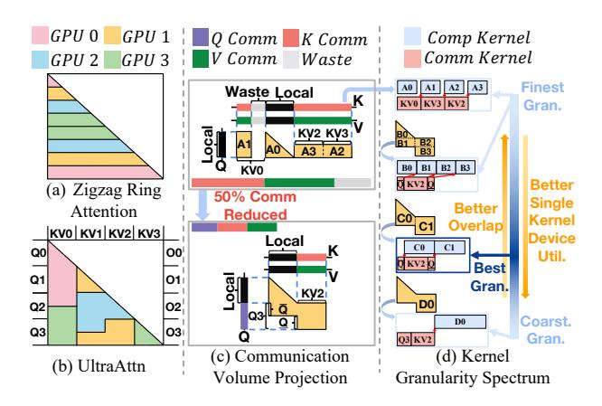

Figure 1: (a) and (b) show attention workload partitioning across 4 GPUs, with colors indicating the assigned GPU. The x in Qx or KVx represents the context chunk is stored in GPUx before the distributed attention. (c) compares the inbound traffic of zigzag ring attention and UltraAttn for attention inputs (Q and KV) on GPU1. Yellow-marked shapes represent aggregated workloads. Purple, red, and green segment projections represent Q, K, and V inputs fetched from other GPUs. Black segments (Local) are locally stored inputs without extra traffic. Gray segments (Waste) are unnecessary inputs with wasted traffic. (d) shows how kernel granularity affects execution time: the first blue box is GPU1's CUDA stream graph in zigzag ring attention, while the next three show the graphs of UltraAttn with increasingly coarser partitions of yellow workload.

Table 1: Notations used in this paper.

<span id="page-1-2"></span>

| h  | Number of attention heads   | D        | Hidden dim per head.       |
|----|-----------------------------|----------|----------------------------|
| Q  | Horizontal attention input  | $c_q$    | Query context length       |
| KV | Vertical attention input    | $c_{kv}$ | Key&Value context length   |
| O  | Horizontal attention output | CP       | Context parallelism degree |

yellow-marked workload across the horizontal and vertical axes. To demonstrate the drawback of stripe-like patterns, Figure 1(c) compares the inbound communication volumes of two systems by concatenating Q, K, and V segments, including wasted parts, and excluding local parts. Zigzag ring attention suffers  $2\times$  traffic compared with that of Ultraattn.

**Inflexible Kernel Granularity.** Figure 1(d) demonstrates the impact of kernel granularity on the performance of the certain workload. The execution times can be easily compared between these four blue boxes. The performance hits the peak at a moderate kernel granularity, marked as *Best Gran.*, determined by task and hardware configurations by trading off between the kernel overlap and the single kernel device utilization. Existing ring-based systems tend to overly fine-grained computation partitioning to maximize computation-communication overlap at the expense of low single kernel device utilization. Ultraattn uses the **adaptive kernel-level context-tiling** to find the most suitable kernel granularity to fit all potential configurations well.

Bandwidth Waste of Ring Communication Pattern. The ringbased communication pattern rotates all KV to every device. However, as illustrated in Figure 1(a), many devices require only partial *KV* in representative zigzag-ring attention [12], resulting in redundant communication depicted as gray segments, marked as *Waste*, in Figure 1(c). For example, zigzag-ring-attention incurs approximately 25% unnecessary data transfer, while this figure approaches 50% in standard ring-attention [22, 27]. Moreover, ring-based communication scales poorly across nodes, as inter-node traffic becomes a bottleneck that wastes both intra-node and inter-node bandwidth.

To address these limitations, we propose Ultraattn, a hierarchical context-tiling system to improve the performance, adaptation, and scalability of context parallelism for irregular attention. We conclude that *context-tiling* is the key technology for context parallelism. The core of our work is to find efficient context tiles at three levels (node, device, and kernel levels) hierarchically.

However, hierarchical context-tiling is a non-trivial task. The search space grows exponentially, leading to prohibitive optimization time. Moreover, intricate dependencies between kernels complicate the selection of kernel-level tile granularity, which is critical for trading off between kernel overlap and single kernel device utilization. In addition, diverse task and hardware configurations require our method to be highly adaptable and automatic. Finally, block sparse attention introduces diverse irregularity, imposing high demands on the automation and adaptability of our method.

To address these challenges, we model context-tiling on general block sparse attention at both node and device levels as an ILP problem to minimize communication volume under the condition of computation load balance. We introduce a parallel dependency graph to describe the dependencies between computation and communication and propose a greedy method to mine kernel-level context tiles. At Ultraattn runtime, we use an ILP-based method to better orchestrate communication and computation kernels.

In general, our work presents the following contributions:

- We propose the concept of context-tiling and hierarchically mine efficient context tiles to improve the performance, scalability, and adaptability of distributed attention.
- We design an efficient ILP-based runtime for the execution of the distributed dependency graph generated from attention.
- We design and implement ULTRAATTN for block sparse attention. ULTRAATTN shows significant performance improvement compared with state-of-the-art systems.

### 2 Background and Motivation

### 2.1 Background

2.1.1 Distributed Attention. Equation 1 illustrates the computation pattern of attention, and the meanings of all notations used are explained in Table 1. A flexible mask leverages prior knowledge about the context to focus more on related contexts [3, 5, 15, 28, 51].

<span id="page-1-1"></span>
$$O = Attention(Q, K, V) = Softmax(Mask(\frac{QK^{T}}{\sqrt{d_{k}}}))V$$

$$Q, O \in \mathbb{R}^{h \times c_{q} \times D}; K, V \in \mathbb{R}^{h \times c_{kv} \times D}$$
(1)

The computation pattern of attention naturally lends itself to parallelization. Equation 2 abstracts the computation process and describes the interaction among different dimensions.  $\otimes$  represents the attention computation between Q and KV.  $\oplus$  represents the reduction operation named *online softmax* [30] along  $c_{kv}$  dimensions.  $\oplus$  is associative and commutative, enabling arbitrary splitting and

<span id="page-2-1"></span>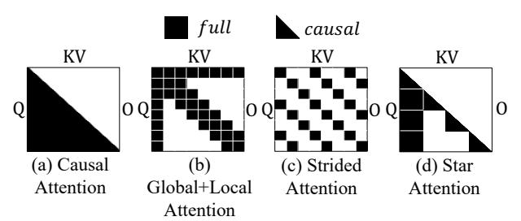

Figure 2: Commonly used block sparse attention patterns.

reduction operations in parallelism. In summary, from equation 2, attention can be parallelized in three dimensions, i.e., h,  $c_q$  and  $c_{kv}$ .

<span id="page-2-0"></span>
$$O_{h,c_q} = \sum_{c_{k,n},\oplus} Q_{h,c_q} \otimes KV_{h,c_{kv}}$$
 (2)

**Head Parallelism.** Head parallelism refers to parallelizing attention along the h dimension, as adopted in approaches like Tensor Parallelism [40] and DeepSpeed Ulysses [18]. Since it fully partitions both inputs and the output, h can be viewed as a *double batch dimension*. This form of embarrassingly parallel computation incurs no communication overhead. However, its key limitation lies in **poor scalability** bounded by the number of attention heads.

Context Parallelism. Parallelizing attention in  $c_q$  or  $c_{kv}$  dimension is called context parallelism.  $c_q$  exists in one input and the output referred to as  $single\ batch\ dimension$ . Parallelizing attention in the  $c_q$  dimension requires  $c_{kv}$  existing in all devices, which incurs communication overhead for KV.  $c_{kv}$  exists only in one input named  $reduction\ dimension$ . Parallelizing attention in  $c_{kv}$  dimension, needs  $c_q$  existing on all devices, which incurs communication overhead for Q and Q.

Compared to head parallelism, context parallelism offers **better scalability** due to typically larger context lengths. Existing systems like Ring attention [22, 27], ZigZag-Ring attention [12], striped attention [6] and *pass-KV* algorithm [49] parallelize attention in  $c_q$  dimension. *pass-Q* algorithm [49] parallelize attention in  $c_{kv}$  dimension. Ultraattn extends this by parallelizing across both dimensions, further enhancing scalability and flexibility.

<span id="page-2-2"></span>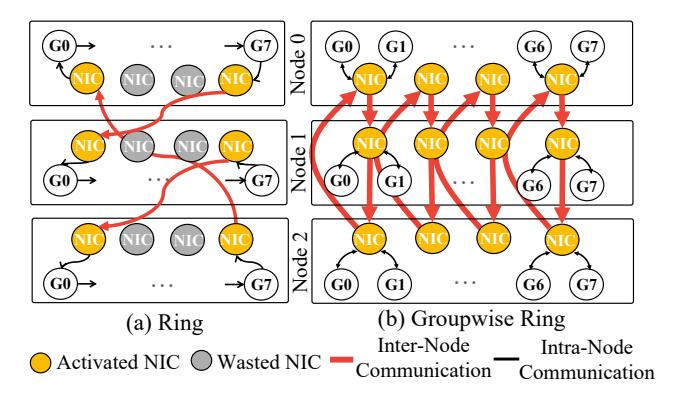

Figure 3: (a) illustrates the NIC and NVLink bandwidth waste when scaling out ring patterns across nodes. (b) illustrates the groupwise ring comprised of groupwise peer-to-peer to leverage NIC bandwidth, which is the counterpart of peer-to-peer within one node.

2.1.2 Block Sparse Attention. Block sparse attention mitigates the quadratic complexity of dense attention by masking unimportant *Q-KV* pairs based on prior knowledge. To maintain GPU efficiency and compatibility with Tensor Cores, sparsity is applied at the block level rather than element-wise. Each block may be *full*, *empty*, or follow a structured pattern such as *causal*.

Block sparse attention is widely applied in language or multimodal model training and inference. In training, Longformer [5], ETC [3], and BigBird [51] employ combinations of local, global, and random block attention (Figure 2(b)). VideoGPT [48] adopts strided block attention (Figure 2(c)) proposed in [7]. Swin Transformer [28] proposes grouped shiftable attention. SAMBA [37] and Infini-Attention [32] hybrid sliding windows attention and linear attention to trade off between model accuracy and performance. In inference, StarAttention [1] (Figure 2(d)) and StreamingLLM [47] both design their own block sparse attention based on the attention sink phenomenon found in [47].

FlexAttention [35] and Flashinfer [50] support block sparse attention on the single GPU through compilation techniques. However, as far as we know, there is no general-purpose context parallelism system that supports block sparse attention.

### 2.2 Motivations of Hierarchical Context-Tiling

2.2.1 Curled up Pattern of 2D Context-tiling. The scalability of context parallelism is crucial. As parallelism increases with a fixed context length, distributed attention becomes communication-bound. This occurs because the computation volume per GPU is inversely proportional to parallelism, while the communication per GPU is almost unchanged in the ring-based method. Thus, **communication overhead is the dominant factor** affecting the scalability. 2D context-tiling is better than stripe-like partitions for reducing communication volume. Here is an empirical analysis:

The components of the communication volume per GPU are complex, but we simplify the analysis by focusing on the inbound traffic of attention inputs (Q and KV). This traffic can be approximated by the weighted sum of the workload's projection lengths along the Q and KV dimensions. For a fixed workload of N blocks, a stripe-like partition forms a  $1\times N$  shape, while an ideal curled-up partition is  $\sqrt{N}\times\sqrt{N}$ . Their respective projection sums are O(N) and  $O(\sqrt{N})$ , indicating that the curled-up partition achieves an order-of-magnitude reduction in communication volume. This conclusion extends to both total inbound and outbound traffic. Although block sparse attentions make the analysis more complex, the conclusion is also applicable for them.

2.2.2 Context-Tiling across Nodes. Scaling attention across nodes is often necessary, but existing systems suffer poor scalability due to inefficient communication. As shown in Figure 3(a), ring-based communication incurs inter-node traffic bottlenecks (bold red lines) when scaling out. This stems from the neglect of the network heterogeneity, which leads to non-minimized communication volume across nodes and a mismatch between communication patterns and hardware. In this example, only unidirectional bandwidths of 2 NICs in one node are leveraged, resulting in 75% bandwidth waste.

To reduce cross-node communication and align with network heterogeneity, context-tiling is decoupled into two levels: nodelevel and device-level tiling, as shown in Figure 4. In node-level

<span id="page-3-0"></span>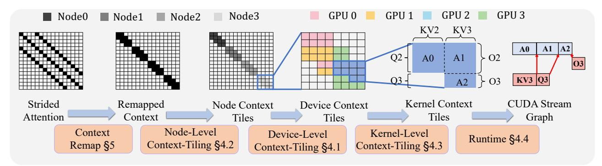

Figure 4: ULTRAATTN Overview. Full technology stack of ULTRAATTN with strided attention on 4 nodes with 4 GPUs on each.

context-tiling, each node is treated as an integrated device, the inter-node traffic is minimized. To fully utilize available bandwidth, we organize communication between nodes as groupwise peer-to-peer, which is the counterpart of peer-to-peer communication within nodes in device-level context-tiling. Figure 3(b) depicts the groupwise ring pattern comprised of groupwise peer-to-peer.

2.2.3 Adaptive Kernel-Level Context-Tiling. As illustrated in Figure 1(a), existing systems often split attention into fine-grained kernels to maximize computation-communication overlap. However, overly small kernels lead to poor hardware utilization. This represents one end of the **kernel granularity spectrum**—high scheduling flexibility but low single kernel device utilization. The opposite end fuses all computation into a single kernel, maximizing efficiency but limiting scheduling flexibility. The optimal point lies between these extremes and should be selected adaptively, i.e., a process we term kernel-level context-tiling.

### 2.3 Challenges of Context-Tiling

While hierarchical context-tiling is a promising approach, its implementation presents several challenges. The key difficulties include:

- 2.3.1 Large Space of Context-Tiling. Different from existing systems which only partition workload in one dimension, context-tiling partition workload in both Q and KV context and allocate the 2D workload to devices. This naturally raises some questions:
  - What is the granularity of 2D workload partition?
  - How to efficiently allocate this quadratic-level quantity of workload under the condition of balancing computational load and minimizing communication overhead?
- 2.3.2 Complex Dependencies between Kernels. Complex computecommunication dependencies make it challenging to determine appropriate kernel-level context-tiling granularity. The vast search space and difficulty in accurately evaluating execution time further hinder us from identifying the optimal context-tiling.
- 2.3.3 Diverse Task and Hardware Configurations. In practice, various factors significantly affect both computation and communication workloads, as well as their interplay. These factors can be broadly categorized into task and hardware configurations. Task configurations include model parameters (e.g., number of heads, batch size) and attention types (e.g., causal, full, block sparse). Hardware configurations encompass network topology, network bandwidth, context parallelism degree, and device placement. Given this

variability, a one-size-fits-all context tiling scheme is impractical, highlighting the need for an adaptive and automatic strategy.

2.3.4 Irregular Structure of Block Sparse Attention. The diverse irregular structures of block sparse attention make it hard to design context-tiling strategies manually, even for experts. It imposes high demands on the automation and adaptation of our hierarchical context-tiling method. We need to define the context-tiling problem in a sufficiently general and feasible way.

#### 3 Overview

In this section, we present our system design in depth. Figure 4 illustrates an overview of Ultraattn with a representative example. Firstly, device-level context-tiling within one node is proposed in § 4.1 to present how to mine context tiles efficiently and adaptively. Secondly, to implement context parallelism across nodes, we decouple the context-tiling across and within nodes and propose node-level context-tiling in § 4.2. After the dependencies between computation and communication are determined, which is described as a parallel dependency graph, an granularity-adaptive kernel-level context-tiling is proposed in § 4.3 to adjust the kernel granularity for better overall performance. Finally, we implement an efficient runtime for the execution of the parallel dependency graph with an ILP algorithm in § 4.4. Moreover, *context remap* shown in Figure 4 is applied for some attention patterns, and it is elaborated in § 5.

### 4 System Design

### <span id="page-3-1"></span>4.1 Communication-Minimized Device-Level Context-Tiling

In order to mine efficient context tiles, we need to take both computation load balance and communication locality into account which means minimizing communication volume under an appropriate degree of computation load balance.

4.1.1 Adaptive Workload Partition. Firstly, given an attention workload, especially for the aggregated workload like global attention and causal attention in Figure 2(a), we need to partition the workload before mining context tiles and allocating them. We define partition degree P as representing the number of chunks into which both Q and KV contexts are evenly partitioned. We define  $FB, CB, EB \in 2^{([0,P)\cap \mathbb{Z})\times([0,P)\cap \mathbb{Z})}$  as the sets of (r,c) where the block is full, causal or empty, respectively. Normalized computation

volume can be defined as  $COMP = |FB| \times 1 + |CB| \times 0.5$ . After that, **the degree of load imbalance** can be defined as  $DLI_{P,CP} = \lceil \frac{COMP}{CP} \rceil / \frac{COMP}{CP} - 1$ , which describes the near-optimal upper bound of the computation imbalance degree. The definition of CP is explained in Table 1. Specifically,  $DLI_{P,CP} = 0$  means perfect load balance. Intuitively, a larger P leads to a higher COMP and a smaller  $DLI_{P,CP}$ , indicating a more balanced workload allocation. However, an excessively large COMP will increase the complexity of the workload allocation algorithm. Thus, we define a threshold  $\theta_{DLI}$  for  $DLI_{P,CP}$  representing the maximum tolerable degree of load imbalance and calculate the smallest P satisfying  $\theta_{DLI}$ . In experiments, we fine tune  $\theta_{DLI}$  for different configurations empirically.

4.1.2 ILP Formulation for Context-Tiling. Context-tiling aims to mine efficient context tiles for all devices to maximize communication locality under a certain degree of computational load balance. We formalize context-tiling as an ILP problem. Before delving into a detailed explanation of ILP modeling, we define some symbols:

After P is determined, the workload is partitioned into a  $P \times P$  grid, and every place in the grid is a block that can be *full*, *causal*, or *empty*.  $B_{r,c}$ ;  $r,c \in [0,P) \cap \mathbb{Z}$  represent the block at the rth row and the cth column.  $Q_r$  and  $KV_c$  represent the rth chunk of  $Q_r$  and the  $Q_r$  and the  $Q_r$  and the  $Q_r$  and the  $Q_r$  and the  $Q_r$  and the  $Q_r$  and the  $Q_r$  and the  $Q_r$  and the  $Q_r$  and the  $Q_r$  and the  $Q_r$  and the  $Q_r$  and the  $Q_r$  and the  $Q_r$  and the  $Q_r$  and the  $Q_r$  and the  $Q_r$  and the  $Q_r$  and the  $Q_r$  and the  $Q_r$  and the  $Q_r$  and the  $Q_r$  and the  $Q_r$  and the  $Q_r$  and the  $Q_r$  and the  $Q_r$  and the  $Q_r$  and the  $Q_r$  and the  $Q_r$  and the  $Q_r$  and the  $Q_r$  and the  $Q_r$  and the  $Q_r$  and the  $Q_r$  and the  $Q_r$  and the  $Q_r$  and the  $Q_r$  and the  $Q_r$  and the  $Q_r$  and the  $Q_r$  and the  $Q_r$  and the  $Q_r$  and the  $Q_r$  and the  $Q_r$  and the  $Q_r$  and the  $Q_r$  and the  $Q_r$  and the  $Q_r$  and the  $Q_r$  and the  $Q_r$  and the  $Q_r$  and the  $Q_r$  and the  $Q_r$  and the  $Q_r$  and the  $Q_r$  and the  $Q_r$  and the  $Q_r$  and the  $Q_r$  and the  $Q_r$  and the  $Q_r$  and the  $Q_r$  and  $Q_r$  and  $Q_r$  and  $Q_r$  and  $Q_r$  and  $Q_r$  and  $Q_r$  and  $Q_r$  and  $Q_r$  and  $Q_r$  and  $Q_r$  and  $Q_r$  and  $Q_r$  and  $Q_r$  and  $Q_r$  and  $Q_r$  and  $Q_r$  and  $Q_r$  and  $Q_r$  and  $Q_r$  and  $Q_r$  and  $Q_r$  and  $Q_r$  and  $Q_r$  and  $Q_r$  and  $Q_r$  and  $Q_r$  and  $Q_r$  and  $Q_r$  and  $Q_r$  and  $Q_r$  and  $Q_r$  and  $Q_r$  and  $Q_r$  and  $Q_r$  and  $Q_r$  and  $Q_r$  and  $Q_r$  and  $Q_r$  and  $Q_r$  and  $Q_r$  and  $Q_r$  and  $Q_r$  and  $Q_r$  and  $Q_r$  and  $Q_r$  and  $Q_r$  and  $Q_r$  and  $Q_r$  and  $Q_r$  and  $Q_r$  and  $Q_r$  and  $Q_r$  and  $Q_r$  and  $Q_r$  and  $Q_r$  and  $Q_r$  and  $Q_r$  and  $Q_r$  and  $Q_r$  and  $Q_r$  and  $Q_r$  and  $Q_r$  and  $Q_r$  and  $Q_r$  and  $Q_r$  and  $Q_r$  and  $Q_r$  and  $Q_r$  and  $Q_r$  and  $Q_r$  and  $Q_r$  and  $Q_r$  and  $Q_r$  and  $Q_r$  and  $Q_r$  and  $Q_r$  and  $Q_r$  and  $Q_r$  and  $Q_r$  and  $Q_r$  and  $Q_r$  and  $Q_r$  and  $Q_r$  and  $Q_r$  and  $Q_r$  and  $Q_r$  and  $Q_r$  and  $Q_r$  and  $Q_r$  and

Table 2 and Table 3 represent the variables and constraints of the ILP. In short, we try to allocate every block  $B_{r,c}$  to every compute node  $U_g$  (like filling  $[0,CP)\cap\mathbb{Z}$  numbers into the non-empty blocks in the  $P\times P$  grid), which is formalized as  $x_{r,c,g}$ . Then, it is possible to deduce how the data should be transferred. Inbound and outbound of traffic of every  $U_g$  can be calculated. Finally, we minimize the maximum of traffic of every  $U_g$ .

**Constraint 1: Allocate Uniqueness.** Ensure that each non-empty block is allocated to exactly one device. This ILP reduces to optimally filling numbers a  $P \times P$  grid.

**Constraint 2/3: Definition of** H **and** V. Two variables, H and V, are the auxiliary variables for constructing variables A, B, C, D.  $H_{g,r}$  represents whether  $U_g$  needs  $Q_r$  as input.  $V_{g,c}$  represents whether  $U_g$  needs  $KC_c$  as input. From the perspective of the number-filling problem,  $H_{g,r}$  represents whether number g is in the g-th row of the g-th problem. From the perspective whether number g is in the g-th column of the grid, vertically.

**Constraint 4-7: Definition of** A, B, C, D. Four variables calculate both inbound and outbound Q, KV, O traffic of every  $U_q$ .

**Constraint 8/9: Inbound and Outbound Traffic.** Total inbound traffic of one device is the sum of inbound Q, KV, and O traffic. Outbound traffic is also the same. Thus the total inbound or outbound traffic of each device is the weighted sum of A, B, C, D, and the weights are relative data sizes of Q, KV, and O chunks, i.e., relative data sizes of Q, KV, O per token. Moreover, adjusting coefficients of A, B, C, D can easily adapt to attention backward and other types of attention, such as GQA [2], cross-attention [23], etc.

Constraint 10: Computation Balance. We set a parameter  $\tau$  to control the degree of computation balance. The left of the inequality

<span id="page-4-1"></span>Table 2: Variables used in ILP for Context-Tiling

| Name        | Type   | Meaning                                      |
|-------------|--------|----------------------------------------------|
| $x_{r,c,g}$ | Binary | Whether $B_{r,c}$ is allocated to $U_g$      |
| $H_{g,r}$   | Binary | Whether $U_g$ needs $Q_r$                    |
| $V_{q,c}$   | Binary | Whether $U_q$ needs $KV_c$                   |
| $A_q$       | Int    | Inbound $Q$ or outbound $O$ traffic of $U_q$ |
| $B_q$       | Int    | Inbound $KV$ traffic of $U_q$                |
| $C_q$       | Int    | Outbound $Q$ or inbound $O$ traffic of $U_q$ |
| $D_q$       | Int    | Outbound $KV$ traffic of $U_q$               |
| $Cin_q$     | Int    | Total inbound traffic of $U_q$               |
| $Cout_q$    | Int    | Total outbound traffic of $U_q$              |
| MCV         | Int    | Maximum communication volume                 |

<span id="page-4-2"></span>Table 3: Constraints used in ILP for Context-Tiling for forward

| Name                   | Constraint                                                                                                              |
|------------------------|-------------------------------------------------------------------------------------------------------------------------|
| Allocate Uniqueness    | $\sum_{q} x_{r,c,q} = 1; \forall (r,c) \notin EB$                                                                       |
| Definition of $H$      | $H_{q,r} \ge x_{r,c,q}; \forall r, c, g$                                                                                |
| Definition of $V$      | $V_{q,c} \ge x_{r,c,q}; \forall r, c, g$                                                                                |
| Definition of $A$      | $A_q = \sum_{r Cmap(r)\neq q} H_{q,r}$                                                                                  |
| Definition of $B$      | $B_g = \sum_{c \mid Cmap(c) \neq g} V_{g,c}$                                                                            |
| Definition of $C$      | $C_g = \sum_{r Cmap(r)=g} \sum_{k k\neq g} H_{k,r}$                                                                     |
| Definition of $D$      | $D_g = \sum_{c \mid Cmap(c) = q} \sum_{k \mid k \neq q} V_{k,c}$                                                        |
| Inbound Traffic        | $Cin_q = A_q \times 1 + B_q \times 2 + C_q \times 1$                                                                    |
| Outbound Traffic       | $Cout_g = A_g \times 1 + C_g \times 1 + D_g \times 2$                                                                   |
| Computation Balance    | $\sum_{\forall (r,c) \in FB} x_{r,c,g} \times 1 + \sum_{\forall (r,c) \in CB} x_{r,c,g} \times 0.5 \le \tau; \forall g$ |
| Minimization Objective | $MCV \ge \max\{Cin_g, Cout_g\}; \forall g$                                                                              |

symbol calculates the estimated normalized computation volume of each device. Naively, we consider the computation volume of each *full* or *causal* block as 1 and 0.5, respectively. To achieve greater precision, the coefficients can also be set based on profiling.

**Objective:** *MVC***.** We minimize the maximum of inbound and outbound traffic of all devices.

In experiments, we set  $\tau = \lceil \frac{|FB| \times 1 + |CB| \times 0.5}{CP} \rceil$ , which is close to the strictest, but feasible, constrain for computation load balance.

### <span id="page-4-0"></span>4.2 Topology-Aware Node-Level Context-Tiling

Context-tiling minimizes the communication volume under the computation balance threshold. Using communication volume to approximate performance is under the assumption that the network topology connecting all devices is symmetrical. However, when this method scales out across nodes, the assumption is not satisfied because of the heterogeneous topology between and within nodes.

Although perfect symmetry does not exist among all GPUs, symmetry is presented on the node level which is in a groupwise manner. All nodes connect with each other through several NICs, as shown in Figure 3, forming such symmetry.

Inspired by the context-tiling on the device level, we can apply context-tiling on the node level, too. To demonstrate the feasibility

<span id="page-5-2"></span>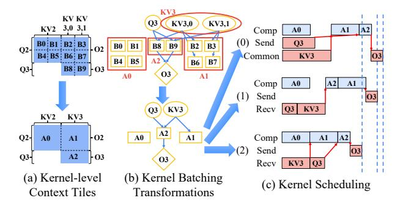

Figure 5: (a) illustrates the formation of kernel-level context tile. (b) illustrates parallel dependency graphs from corresponding context-level kernel tiles. Computation, receive, and send kernels are shown as rectangles, ellipses, and diamonds. Red outlines mark kernel batching. (c) shows three CUDA stream graphs derived from the transformed parallel dependency graph. A0, A1, A2 are computation kernels; Q3 and KV3 are receive kernels; Q3 is the send kernel. Red arrows indicate kernel dependencies.

of node-level context-tiling, we make an analogy between the node-level context-tiling and the device-level context-tiling. We also map the basic elements of these two methods one-to-one.

Firstly, the workload block in device-level context-tiling is the attention computation on a single GPU. The counterpart in the node-level context-tiling is the distributed attention workload calculated on a single node. Secondly, in device-level context-tiling, we use peer-to-peer communication between GPUs as the basic components of communication. The counterpart in node-level contexttiling is the groupwise peer-to-peer depicted in Figure 3(b). The advantage of the groupwise peer-to-peer communication pattern is that it matches well with the topology between nodes and can take full use of all NICs. Thirdly, the performance of the block and peer-to-peer communication on the device level can be obtained by profiling. Similarly, the performance of the groupwise peerto-peer communication can also be obtained by profiling across nodes. The performance of a block can be profiled by measuring its execution time on a single node after implementing the devicelevel context-tiling. Figure 4 illustrates both the node-level and device-level context-tiling.

In summary, to deal with the heterogeneity caused by scaling out across nodes, we decouple the context-tiling into node and device levels. The detailed methods at these two levels are analogous.

## <span id="page-5-0"></span>4.3 Granularity-Adaptive Kernel-Level Context-Tiling

After node and device level context-tiling, attention workloads are partitioned and allocated to each device. All computation and communication kernels and their dependencies are described by a DAG(Directed Acyclic Graph), named parallel dependency graph, as depicted in Figure 5(b). In this section, we propose kernel-level context-tiling to adaptively determine kernel granularity for optimal performance through performing transformations on the DAG. We define the transformation space of kernels and propose a greedy method to find the optimal transformation set.

4.3.1 Space of Parallel Graph Transformation. There are three main types of batching substitutions:

**Substitution 1: Computation Kernels.** Multiple computation kernels can be batched to form larger workloads. Which computation kernels can be batched depends on the backend implementation of attention. For the backends that support arbitrary block sparse attention [35, 50], multiple computation kernels can be freely batched. However, for others [10, 11, 39], kernel batching is only supported for a limited range of attention shapes. *A*0, *A*1, *A*2 in Figure 5(b) shows three cases of computational kernel batching.

**Substitution 2: Peer-to-Peer Communication Kernels.** Similar to computation kernel batching, peer-to-peer communication kernels with the same source and destination ranks can be batched together. *KV*3 in Figure 5(b) depicts one case for the peer-to-peer communication kernel batching.

**Substitution 3: Collective Communication Kernels.** Multiple peer-to-peer kernels can be batched into a collective communication kernel in certain cases.

However, the performance gains from kernel batching do not come without cost. Kernel batching narrows the space of kernel overlap, which incurs the opposite outcome in some cases. Thus, we propose a greedy transformation selection method to trade off between kernel batching and kernel overlap.

4.3.2 Greedy Transformation Selection. Several graph substitutions are generated and used for sub-graph matching in the raw parallel dependency graph, forming a transformation candidate set. Each transformation in this set can be applied to the graph, with the goal of finding an optimal subset that minimizes execution time. Theoretically, the search space is  $2^{N_t}$ , where  $N_t$  is the number of transformations. However, obtaining execution time is complex, requiring an ILP method (§ 4.4). Given the ILP's computational cost, exploring the entire transformation space is infeasible, so a more lightweight greedy selection method is proposed.

Greedy transformation selection works as follows: First, all transformations are sorted in descending order of the transformation gain. The performance gain of one transformation is defined by the reduced time of fused kernel compared with the sum of kernels before fusion. Next, each transformation is selected sequentially. If the transformation is applicable, which means its kernels have not been altered by previous transformations, it will be applied to the current parallel dependency graph. The updated graph is then passed to the Topology-aware Lowering Engine (§ 4.4) to assess execution time. If execution time improves, the new graph is kept; otherwise, the previous graph is retained.

### <span id="page-5-1"></span>4.4 Latency-Optimal ULTRAATTN Runtime

In this section, we will explain how to efficiently execute the parallel dependency graph on a certain network topology to minimize end-to-end time of distributed attention.

4.4.1 Communication Contention and Bad Schedule in Parallel Dependency Graph. There are two main factors that degrade the execution performance of a parallel dependency graph. Figure 5(c) depicts examples showing the disadvantages of these factors.

The first factor is **communication contention**. Figure 5 (c)(0) and (2) show different CUDA stream graphs for execution generated

by kernel-level context tiles. In Figure 5 (c)(0), overlapping the two send kernels sharing the same bandwidth, i.e., the output bandwidth of that device, lengthens their execution times. Overlapping such kernels does not yield optimal performance, as their combined execution time is worse than either separate scheduling method. Therefore, to avoid communication contention, we allocate kernels that share the same bandwidth to the same CUDA stream.

The second factor is **sub-optimal kernel scheduling**. After kernels sharing bandwidth are placed in the same CUDA stream, their execution order is still crucial. As shown in Figure 5 (c)(1) and (2), receive kernels Q3 and KV3, which share the same input bandwidth, should be scheduled in a specific order to optimize performance. Flexflow [19] uses a BFS-based method to find a feasible topological order for the parallel dependency graph, but finding the optimal order among many possibilities remains challenging.

4.4.2 ILP Formulation for Kernel Scheduling. As Flexflow cannot find the optimal scheduling order, we use an ILP-based method to solve it. Firstly, kernels that do not share the same resource are assigned to different CUDA streams to maximize overlap. Secondly, we need to determine the optimal execution order within each CUDA stream. The ILP method is described in detail below:

The parallel dependency graph G = (V, E) comprises kernels  $v \in V$  and their dependencies  $e \in E$ . ILP real variables  $S_v$  denote the start time of each kernel, and  $D_v$ , obtained via profiling, denotes its duration.  $End\_Time$  is a real variable representing the total time. Boolean variables  $Order_{uv}$  indicate whether u is scheduled before v, and Ub is a predefined upper bound on  $End\_Time$ .

**Stream Exclusivity Constraints.** For each pair of kernels in the same CUDA stream, we need to determine their execution order. Thus,  $\forall (u, v)$  in the same CUDA stream:

Stream Exclusivity Constrains
$$(u, v) \triangleq (S_u + D_u \leq S_v + (1 - Order_{uv})Ub)$$

$$\& (S_v + D_v \leq S_u + Order_{uv}Ub)$$
(3)

The expression before & implies u is scheduled prior to v and the expression after & is the reverse. Since Ub is greater than  $End\_Time$ , either of the two expressions is guaranteed to be satisfied. Which one is satisfied is controlled by the variable  $Order_{uv}$ . Therefore, this constraint indicates that u is scheduled before or after v and there is no overlapped part of them.

**Kernel Dependency Constraints.** Kernel scheduling must satisfy kernel dependencies in the parallel dependency graph, which means if one kernel's inputs are dependent on another kernel, the start time of later kernel should not be less then the end time of prior kernel. Thus,  $\forall (u,v) \in E$ :

Kernel Dependency Constrains
$$(u, v) \triangleq S_u + D_u \leq S_v$$
 (4)

**End Time Constraints.** Variable *End\_Time* represents end time of the parallel dependency graph which should be not less then each kernels' end times:

$$End\ Time\ Constrains(v) \triangleq S_v + D_v \leq End\_Time \tag{5}$$

**The Objective.** This ILP aims to minimize *End Time*:

$$Objective Function \triangleq End\_Time \tag{6}$$

After solving this ILP, execution orders on each CUDA stream can be derived from  $S_v$ . According to  $S_v$ , a parallel dependency

<span id="page-6-2"></span>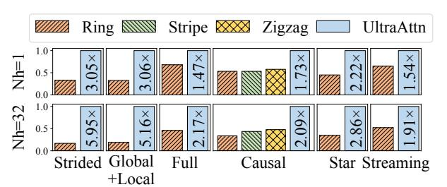

Figure 6: End-to-end relative performance of ULTRAATTN and baselines. Performance is normalized by ULTRAATTN. The speedup text above the last bar shows UltraAttn's gain over the best baseline. S, i.e., context length, is fixed to 512k for training or prefill phase in inference. We fix CP, i.e. context parallel degree, to 8 for two inference cases including star and streaming. CP is fixed to 64 for four other training cases.

graph can be converted to an optimal CUDA stream graph. Figure 5(c)(2) depicts an example of the optimal CUDA stream graph.

### <span id="page-6-0"></span>5 Implementation

ULTRAATTN is implemented in over 10k lines of Python code based on Pytorch. ULTRAATTN relies on NCCL 2.21 and FlashAttn [39] 2.5.7 for communication and computation. Gurobi [14] is used as the solver for integer linear programming (ILP) problems. In order to eliminate CPU overhead in distributed attention, which is especially critical in cases with short context length, cudagraph [34] is applied in the Ultraattn runtime.

### 5.1 Preliminary Context Remap

In addition, the *context remap* technique is used manually in advance in some cases to increase the performance upper bound of nodelevel and device-level tiling. By default, tokens in one sequence are evenly and sequentially sharded to ranks in context parallel group. However, this sharding strategy is not unique. We can arbitrarily map each token to each rank in context parallel group. This technique is referred to as context remap. For formally describing context remap, we define the token set of one sequence with Stokens in original contextual order as  $T = \{t_0, t_1, ..., t_{S-1}\}$ . We also define context parallelism rank set in order as  $CR = \{0, 1, ..., CP-1\}$ . Context mapping can be defined as  $\phi: T \to CR$ . Any feasible  $\phi$ describes a corresponding context remapping strategy.  $\Phi = \{\phi | \phi : \phi \}$  $T \rightarrow CR$ } defines the feasible space of context remap. In particular,  $\phi(t_i) = \lfloor \frac{i \cdot CP}{S} \rfloor$  denotes that tokens in one sequence are evenly and sequentially sharded to CP ranks.  $\phi$  defined in equation 7 is used by zigzag ring attention [12], shown in Figure 1(a), for better computation load balance.

<span id="page-6-1"></span>
$$\phi(t_i) = \begin{cases} \left\lfloor \frac{2i \cdot CP}{S} \right\rfloor, & \text{if } 0 \le i < \frac{S}{2} \\ 2CP - 1 - \left\lfloor \frac{2i \cdot CP}{S} \right\rfloor, & \text{if } \frac{S}{2} \le i < S \end{cases}$$
 (7)

One characteristic of context remap is that it only affects the performance of the attention module, with no impact on the performance of other parts of the large language model. It is because in large language models, the interaction between tokens only happens in the attention module. In other modules, the computation of each token is even and independent.

<span id="page-7-0"></span>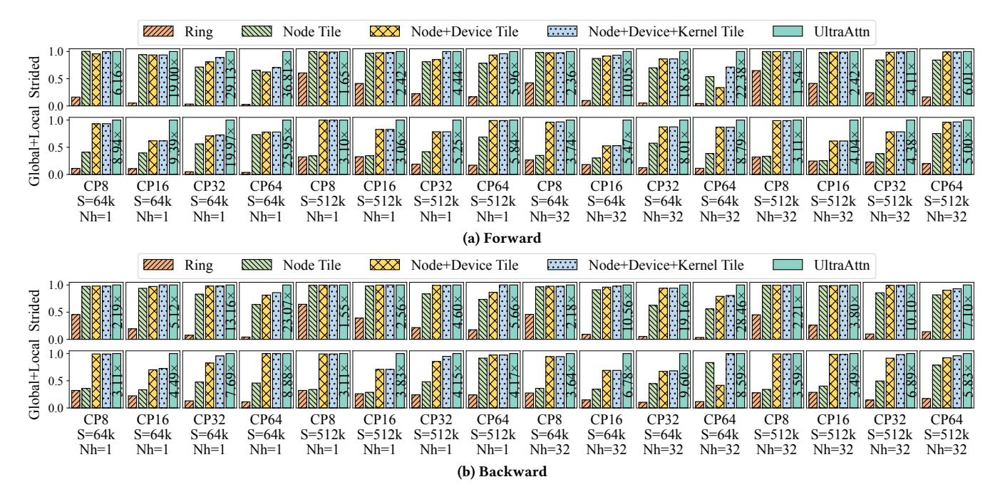

Figure 7: Relative performance, normalized by ULTRAATTN, of two types of block sparse attention, i.e., strided attention and global+local attention, for training from 8 GPUs to 64 GPUs. CP, S, and Nh represent context parallelism degree, context length, and number of head, respectively. The first and the last blocks represent the baseline and ULTRAATTN, respectively. The other three blocks represent ablation studies. In these ablation studies, four optimization techniques are added one by one from left to right. The speedup text above the last bar shows UltraAttn's gain over the best baseline.

In Ultraattn, the context remap technique is beneficial for node-level and device-level tiling. Taking the strided attention as an example, as shown in Figure 4(a), the shape block table is  $16\times 16$ , which implies that one sequence is evenly split into 16 chunks. And we use the map,  $\phi(t_i) = \lfloor \frac{i*16}{S} \rfloor \mod 4$ , on the sequence for node-level context-tiling, where CP = 4 at inter-node level. The result of this context remap is illustrated in Figure 4(b). Compared to the attention table before context remap, it has better locality and helps node-level and device-level tiling mining better tiling strategy with less communication.

Currently, context remap is treated as an offline preprocessing technique. The feasible space of the context remap is clearly defined by  $\Phi$ . However, automating it faces two key challenges. The first is that the joint search space of remapping and hierarchical context-tiling is enormous, making joint optimization challenging. The second is that if decoupled, defining an effective objective for context remap becomes nontrivial. This remains an interesting and promising space for exploration. In addition, context remap is an optional step without affecting the generality of Ultrraattn.

### 6 Evaluation

### 6.1 Experimental Setup

**Testbed.** We conduct all evaluations on a cluster equipped with 64 GPUs on eight nodes. Each node has 8 NVIDIA H100-NVLink-80GB GPUs and 96 CPU cores with 2 CPU sockets. Each GPU is connected via NVLink with a bidirectional bandwidth of 450GB/s. There are also eight 400Gb/s Infiniband EDR on each node for inter-machine

communication. Every GPU has an affinity with one NIC, and they are connected by a PCIe-5.0 switch.

**Model Configurations.** We use LlaMA2-7B [29] as our base model for end-to-end evaluation. We keep the  $batch\_size = 1$  in all experiments, which fits for the hybrid use of Ultraattn and DP. In some experiments, we set Nh = 1 to fit for the scenario that Ultraattn is used together with DeepSpeed Ulysses [18], where Nh represents the number of heads.

Attention Patterns. We evaluate core attention separately under various patterns, broadly categorized into dense and block sparse attention. Dense attention includes full attention—commonly used in image and video generation—and causal attention. Block sparse attention covers four patterns: striped attention [8] (Figure 2(c)), global+local attention [5] (Figure 2(b)), star attention [1] (Figure 2(d)), and block sparse streaming attention [47]. The first two are for training; the last two are for inference.

### 6.2 End-to-End Speedup

We evaluate the end-to-end performance of Ultraattn and baselines on 64 GPUs for training and 8 GPUs for inference with Llama2-7b as the base model. For inference cases, we only measure the time of the prefill phase, not including the decode phase. The reason is that Ultraattn only optimizes the attention in the prefill phase. Ultraattn is beneficial for tasks like text summarization and keyvalue retrieval where the prefill length is extremely long while the decode length is relatively small.

<span id="page-8-0"></span>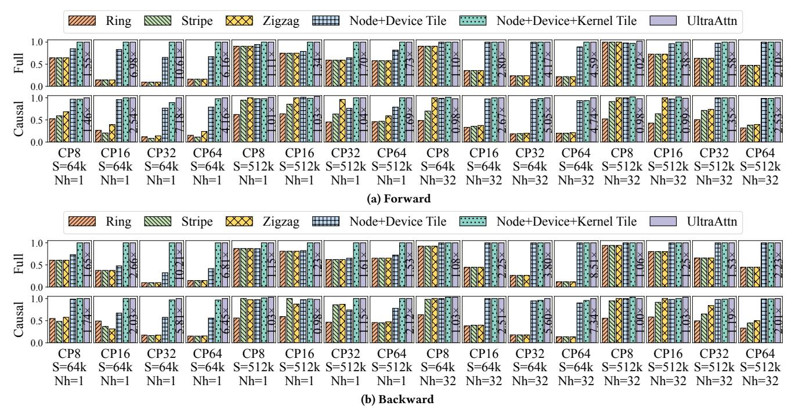

Figure 8: Relative performance normalized by ULTRAATTN of two types of dense attention for training.

We conduct experiments with global sequence length fixed to 512K. Figure 6 illustrates the results of end-to-end speedups. Ultraattn achieves  $2.2\times$  and  $3.4\times$  average speedups over the best baseline when Nh=1 and Nh=32, respectively.

End-to-end speedups mainly stem from the growing dominance of core attention as sequence length increases. From our observation, when the sequence length exceeds 128k, distributed attention gradually becomes the performance hotspot during training or inference. In such cases, accelerating the core attention module leads to significant end-to-end gains.

### 6.3 Distributed Attention Speedup

We evaluate the performance of different distributed attention implementations, including Ultraattn, ring, stripe, and zigzag ring attention. Figure 7, 8 and 9 show the relative performance of Ultraattn compared to baselines and ablation studies.

<span id="page-8-1"></span>*6.3.1* Block Sparse Attention for Training. Figure 7 depicts the relative performance of two types of block sparse attention for training. Ultraattn achieves  $10.2\times$  and  $9.4\times$  speedups on average when Nh=1 and Nh=32 for strided attention. Ultraattn achieves  $7.6\times$  and  $5.7\times$  speedups on average when Nh=1 and Nh=32 for global+local attention. The gains mainly come from two factors.

The first is the computation load balance. Taking star attention in Figure 2(d) as an example; when CP = 8, the last rank needs to calculate 0.875 blocks in total  $5 = (3 \times 1 + 4 \times 0.5)$  blocks. However, on average, each rank only needs to calculate 5/8 = 0.625 equivalent to 0.875/0.625 - 1 = 40% load imbalance overhead.

What makes it worse is the **fine-grained computation imbalance** caused by the ring-based communication pattern. It splits the distributed attention into small steps. In each step, every GPU executes three tasks in parallel: calculating the current attention block, sending the current KV to the next rank, and receiving the next KV from the last rank. However, in block sparse attention, only part of GPU ranks need to calculate attention blocks in each step. This in-step load imbalance further reduces the GPU utilization.

The second factor is reduced communication volume. Node-level and device-level context-tiling aim to reduce inter-node and intra-node communication volume, respectively. In ring-based attention, when scaling out under a fixed context length, computation volume on each GPU decreases inversely, while communication volume remains the same. It gradually becomes a communication-bound case, and optimizing communication volume will yield significant benefits. As shown in Figure 7, with fixed *Nh* and *S*, speedups increase with larger *CP*, highlighting Ultrraattn's superior strong scalability over baselines.

6.3.2 Dense Attention for Training. Figure 8 shows the relative performance of two dense attention types. For full attention, Ultrrattn achieves average speedups of  $3.6 \times$  and  $2.5 \times$  with  $N_h = 1$  and  $N_h = 32$ , respectively. For causal attention, the average speedup is  $2.6 \times$  for both settings. These gains mainly stem from two factors.

The first factor is reduced communication volume, as discussed in § 6.3.1. The second is kernel tiling. With fixed S and Nh, increasing CP reduces the context length per GPU, resulting in smaller attention blocks and lower device utilization. Kernel tiling adaptively fuses small blocks to improve utilization. Ultraattn benefits more from this when  $N_h=1$ . The speedup trends in Figure 8 further highlight Ultraattn's strong scalability advantage over baselines.

6.3.3 Block Sparse Attention for Inference. Figure 9 depicts the relative performance of two types of block sparse attention for

<span id="page-9-0"></span>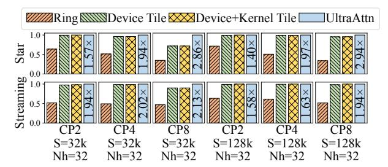

Figure 9: Relative performance normalized by ULTRAATTN of block sparse attention for inference from 2 to 8 GPUs.

inference. Ultraattn achieves  $2.1\times$  speedups on average when Nh=32 for star attention. Similarly, Ultraattn achieves  $1.9\times$  speedups on average when Nh=32 for streaming attention. As discussed in § 6.3.1, the speedup is mainly rooted in computation load balance and reduced communication volume, too.

### 6.4 Ablation Study

Figure 7, 8 and 9 depict ablation studies. We start from baselines and incrementally apply each optimization method until Ultraattn.

6.4.1 Node-Level and Device-Level Context-Tiling. Node-level and device-level context-tiling serve two key purposes: improving computation balance and reducing inter-node or intra-node communication. When CP > 8, node-level context-tiling often yields significant speedups, as cross-node communication tends to dominate the critical path. Reducing this overhead greatly improves performance.

Device-level context-tiling is especially important for block sparse attention. In ring-based implementations, severe *in-step* load imbalance (see § 6.3.1) limits their efficiency. Device-level context-tiling mitigates this by balancing computation and enabling a more flexible communication pattern, which breaks the step-by-step structure. As a result, it delivers substantial speedups when *CP* is confined within a single node.

6.4.2 Kernel-Level Context-Tiling. Kernel-level context tiling delivers the best performance in dense attention scenarios, though it also benefits block sparse attention. This is because relatively dense attention distribution provides more opportunities for kernel fusion. As shown in Figure 8, smaller values of  $\frac{S}{CP}$  and Nh generally lead to greater gains from fusing small kernels.

6.4.3 Kernel Scheduling ILP. The execution of distributed computation graphs has been explored in prior works such as FlexFlow [19], Tofu [45], pONNX [44], Unify [42], and Alpa [53]. However, none achieves optimal kernel scheduling. We reimplement FlexFlow's scheduling strategy and compare it with our ILP-based approach.

As shown in Figures 7,8 and 9, the performance gap between the last two bars in each subplot reflects the effectiveness of our method. The ILP-based scheduler performs comparably or better across most scenarios, with notable advantages in cases involving intricate kernel dependencies and comparable computation-communication durations that expose a larger scheduling space and amplify the impact of scheduling quality.

<span id="page-9-1"></span>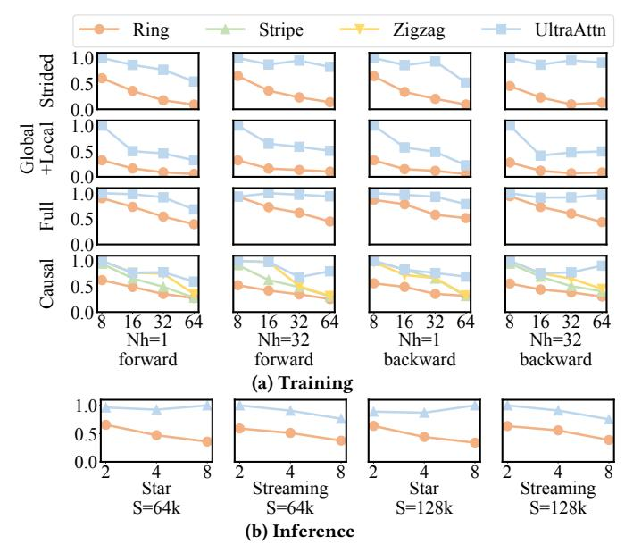

Figure 10: Strong scalability of ULTRAATTN compared with baselines. (a) illustrates the relative MFU of distributed attention in training with fixed S=512k. (b) illustrates the relative MFU of distributed attention in inference with fixed Nh=32. The x-axis represents CP.

### 6.5 Scalability of Distributed Attention

Figure 10 illustrates the strong scalability of Ultraattn and the baselines. In each subplot, model configurations are fixed, ensuring a constant total computation volume. By varying CP, we demonstrate the strong scalability of both Ultraattn and the baselines. The results show that Ultraattn consistently outperforms the baselines in terms of strong scalability, achieving near-linear scalability in most cases.

<span id="page-9-2"></span>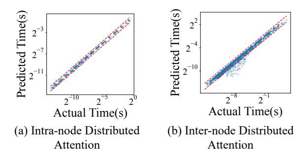

Figure 11: Comparison between predicted time and actual time for all evaluated distributed attention cases. (a) and (b) collect all evaluated cases for intra-node and inter-node distributed attentions, respectively. The red dashed lines suggest boundaries of 30% and 50% relative error in (a) and (b).

### 6.6 Accuracy of Performance Prediction

This section evaluates performance prediction accuracy for attention. Ultrratt depends on accurate performance predictions, as all methods in Ultrratt search in the predicted performance

space to identify the optimal strategy. Therefore, the accuracy of predicting parallel dependency graph execution time is critical.

Figure 11 shows the performance prediction accuracy for all evaluated cases, categorized into two figures based on whether they span across nodes. For intra-node distributed attention, only about 3.0% of cases exceed a relative error of 30%. For inter-node distributed attention, around 5.8% exceed a relative error of 50%. The  $R^2$  scores for performance prediction are 0.9932 and 0.9181 for these two categories, respectively. A slight underestimation is observed in the distributed attention module, primarily due to the slight degradation in computation kernel performance when overlapped with communication kernels.

### 6.7 Overhead and Scalability of Searching Algorithm

This section analyzes the overhead and scalability of the searching algorithm. The hotspot of the searching algorithm is made up of two integer linear programs (ILP) involved in the context tiling at the node or device level, and ULTRAATTN runtime. Firstly, Table 4 shows the ILP time of node or device-level context-tiling under five attention patterns and different context parallelism degrees (CP). The time of this type of ILP is sensitive to three metrics, which are CP, partition degree (P), and attention pattern. The conclusion drawn from Table 4 is ILP time increases with denser patterns, e.g., causal attention, or larger CP and P due to larger scheduling space. The conclusion is intuitive. From the perspective of the numberfilling problem, the denser pattern or larger P brings more positions to be filled. The larger CP means more numbers can be filled in each position. These two factors both leave a larger searching space for the ILP solver. Secondly, Table 5 demonstrates the ILP time of ULTRAATTN runtime. We fix S = 128k and Nh = 1 because the ILP time is not sensitive to these two parameters. The conclusion drawn from Table 5 is ILP time increases with denser patterns and larger  $\frac{P^2}{CP}$ . The objective of ILP in UltraAttn runtime is to determine the order of kernels on each GPU stream. And intuitively, the number of kernels on each GPU stream critically affects the searching space. On the one hand, the density of the attention pattern influences the total kernel number. On the other hand,  $O(\frac{P^2}{CP})$  formulates the average kernel number on each GPU stream. Thus, denser patterns and larger  $\frac{P^2}{CP}$  leave a larger searching space, leading to longer ILP time in UltraAttn runtime.

<span id="page-10-0"></span>Table 4: ILP time of node/device-level context-tiling (ms).

| CP      | 16   | 32   | 64   |
|---------|------|------|------|
| strided | 0.07 | 0.08 | 2.95 |
|         | P=2  | P=4  | P=8  |
| global  | 0.23 | 5.36 | 18.8 |
| +local  | P=2  | P=4  | P=8  |
| causal  | 2.24 | 610  | 3672 |
|         | P=4  | P=8  | P=8  |

| CP     | 2    | 4    | 8    |
|--------|------|------|------|
| star   | 0.58 | 1.16 | 133  |
|        | P=4  | P=4  | P=8  |
| strea- | 1.47 | 10.4 | 72.6 |
| ming   | P=8  | P=8  | P=8  |

Table 5: ILP time of ULTRAATTN runtime (ms).

<span id="page-10-1"></span>

| CP      | 16   | 32   | 64   |
|---------|------|------|------|
| strided | 0.10 | 0.10 | 1.81 |
|         | P=2  | P=4  | P=8  |
| global  | 73.3 | 83.1 | 403  |
| +local  | P=2  | P=4  | P=8  |
| causal  | 157  | 1073 | 176  |
|         | P=4  | P=8  | P=8  |
|         |      |      |      |

| CP     | 2    | 4    | 8    |
|--------|------|------|------|
| star   | 4.92 | 1.45 | 84.2 |
|        | P=4  | P=4  | P=8  |
| strea- | 736  | 114  | 178  |
| ming   | P=8  | P=8  | P=8  |

### 7 Related Work

Parallel Task Scheduling System. Parallel task scheduling systems aim to schedule workload on GPUs for parallel computing. From coarse to fine granularity, Ray [31] performs scheduling at the task level and is workload-agnostic. It handles resource management and flexibly schedules tasks from backend frameworks, such as Pytorch, excelling in elasticity, multi-tasking, and fault tolerance. Alpa [53] performs scheduling at the module level, which is not at the same level as Ultraattn and compatible with Ultraattn. The core contribution of Alpa is the inter-op and intra-op hybrid framework among modules, while that of ULTRAATTN is to explore the optimal parallel strategy for the attention module. UltraAttn can provide Alpa with better attention parallel strategies. Flexflow [19] and Tofu [45] perform scheduling at GPU kernel level, which is the same as UltraAttn. However, UltraAttn extends the symmetric partition searching space, such as SOAP searching space in Flexflow, to handle irregular attention workload. In addition, at the field of high performance computing, Legion [4] is designed for traditional parallel applications, not for machine learning scenarios. In summary, the advantage of UltraAttn lies in its fine-grained (GPU kernel level) scheduling and workload partitioning strategy that adapts to irregular workloads.

Sequence Parallelism. In recent years, the demand for long contextual training and inference has been steadily increasing, which leads to the emergence of new techniques and systems. Sequence parallelism is one of the major categories. DeepSpeed Ulysses [18] parallelizes the core attention along the head dimension. Megatron-CP parallelizes core attention along the context dimension. Light-Seq [21] and Zigzag ring attention [12] both aim to alleviate the computation load imbalance caused by causal attention.

### 8 Conclusion

We propose Ultraattn, an ultra solution of context parallelism for irregular attention. We propose a hierarchical context-tiling approach to minimize the communication cost and improve the hardware utilization, which results in better scalability. In comparison with selected baselines, Ultraattn achieves up to 5.5× speedup in the distributed irregular attention module.

### Acknowledgments

We would like to thank our anonymous shepherd and reviewers for their insightful feedback. We also thank Kezhao Huang and Zhenbo Sun for their valuable suggestions, and the computing resources provided by Qinghai University. This work is supported by National Key R&D Program of China under Grant 2023YFB3001704, National Natural Science Foundation of China under Grants 62495062, U23B2027, 62402266, 62225206, and U23A6007, Tsinghua University Initiative Scientific Research Program. Jidong Zhai is the corresponding author of this paper (zhaijidong@tsinghua.edu.cn).

### References

- <span id="page-11-28"></span>[1] Shantanu Acharya, Fei Jia, and Boris Ginsburg. 2024. Star attention: Efficient llm inference over long sequences. arXiv preprint arXiv:2411.17116 (2024).
- <span id="page-11-30"></span>[2] Joshua Ainslie, James Lee-Thorp, Michiel de Jong, Yury Zemlyanskiy, Federico Lebrón, and Sumit Sanghai. 2023. Gqa: Training generalized multi-query transformer models from multi-head checkpoints. arXiv preprint arXiv:2305.13245 (2023).
- <span id="page-11-11"></span>[3] Joshua Ainslie, Santiago Ontanon, Chris Alberti, Vaclav Cvicek, Zachary Fisher, Philip Pham, Anirudh Ravula, Sumit Sanghai, Qifan Wang, and Li Yang. 2020. ETC: Encoding long and structured inputs in transformers. arXiv preprint arXiv:2004.08483 (2020).
- <span id="page-11-44"></span>[4] Michael Bauer, Sean Treichler, Elliott Slaughter, and Alex Aiken. 2012. Legion: Expressing locality and independence with logical regions. In SC'12: Proceedings of the International Conference on High Performance Computing, Networking, Storage and Analysis. IEEE, 1–11.
- <span id="page-11-12"></span>[5] Iz Beltagy, Matthew E Peters, and Arman Cohan. 2020. Longformer: The longdocument transformer. arXiv preprint arXiv:2004.05150 (2020).
- <span id="page-11-20"></span>[6] William Brandon, Aniruddha Nrusimha, Kevin Qian, Zachary Ankner, Tian Jin, Zhiye Song, and Jonathan Ragan-Kelley. 2023. Striped attention: Faster ring attention for causal transformers. arXiv preprint arXiv:2311.09431 (2023).
- <span id="page-11-13"></span>[7] Rewon Child, Scott Gray, Alec Radford, and Ilya Sutskever. 1904. Generating long sequences with sparse transformers. arXiv 2019. arXiv preprint arXiv:1904.10509 (1904).
- <span id="page-11-39"></span>[8] Rewon Child, Scott Gray, Alec Radford, and Ilya Sutskever. 2019. Generating long sequences with sparse transformers. arXiv preprint arXiv:1904.10509 (2019).
- <span id="page-11-0"></span>[9] Claude. 2024. Claude 3. https://claude.ai. Accessed 08/2024.
- <span id="page-11-32"></span>[10] Tri Dao. 2023. Flashattention-2: Faster attention with better parallelism and work partitioning. arXiv preprint arXiv:2307.08691 (2023).
- <span id="page-11-33"></span>[11] Tri Dao, Dan Fu, Stefano Ermon, Atri Rudra, and Christopher Ré. 2022. Flashattention: Fast and memory-efficient exact attention with io-awareness. Advances in Neural Information Processing Systems 35 (2022), 16344–16359.
- <span id="page-11-21"></span>[12] Jiarui Fang and Shangchun Zhao. 2024. A Unified Sequence Parallelism Approach for Long Context Generative AI. arXiv preprint arXiv:2405.07719 (2024).
- <span id="page-11-1"></span>[13] Google. 2024. Yi LLM. https://blog.google/technology/ai/google-gemini-nextgeneration-model-february-2024/. Accessed 08/2024.
- <span id="page-11-36"></span>[14] LLC Gurobi Optimization. 2025. Gurobi Optimizer. https://www.gurobi.com. Version 12.0.
- <span id="page-11-14"></span>[15] Ali Hassani, Steven Walton, Jiachen Li, Shen Li, and Humphrey Shi. 2023. Neighborhood attention transformer. In Proceedings of the IEEE/CVF Conference on Computer Vision and Pattern Recognition. 6185–6194.
- <span id="page-11-15"></span>[16] Jonathan Ho, Nal Kalchbrenner, Dirk Weissenborn, and Tim Salimans. 2019. Axial attention in multidimensional transformers. arXiv preprint arXiv:1912.12180 (2019).
- <span id="page-11-9"></span>[17] Yanping Huang, Youlong Cheng, Ankur Bapna, Orhan Firat, Dehao Chen, Mia Chen, HyoukJoong Lee, Jiquan Ngiam, Quoc V Le, Yonghui Wu, et al. 2019. Gpipe: Efficient training of giant neural networks using pipeline parallelism. Advances in neural information processing systems 32 (2019).
- <span id="page-11-25"></span>[18] Sam Ade Jacobs, Masahiro Tanaka, Chengming Zhang, Minjia Zhang, Shuaiwen Leon Song, Samyam Rajbhandari, and Yuxiong He. 2023. DeepSpeed Ulysses: System Optimizations for Enabling Training of Extreme Long Sequence Transformer Models.(2023). arXiv preprint arXiv:2309.14509 (2023).
- <span id="page-11-35"></span>[19] Zhihao Jia, Matei Zaharia, and Alex Aiken. 2019. Beyond Data and Model Parallelism for Deep Neural Networks. In Proceedings of the Second Conference on Machine Learning and Systems, SysML 2019, Stanford, CA, USA, March 31 - April 2, 2019, Ameet Talwalkar, Virginia Smith, and Matei Zaharia (Eds.). mlsys.org. [https://proceedings.mlsys.org/paper\\_files/paper/2019/hash/](https://proceedings.mlsys.org/paper_files/paper/2019/hash/b422680f3db0986ddd7f8f126baaf0fa-Abstract.html) [b422680f3db0986ddd7f8f126baaf0fa-Abstract.html](https://proceedings.mlsys.org/paper_files/paper/2019/hash/b422680f3db0986ddd7f8f126baaf0fa-Abstract.html)
- <span id="page-11-16"></span>[20] Nikita Kitaev, Łukasz Kaiser, and Anselm Levskaya. 2020. Reformer: The efficient transformer. arXiv preprint arXiv:2001.04451 (2020).
- <span id="page-11-45"></span>[21] Dacheng Li, Rulin Shao, Anze Xie, Eric P Xing, Joseph E Gonzalez, Ion Stoica, Xuezhe Ma, and Hao Zhang. 2023. Lightseq: Sequence level parallelism for distributed training of long context transformers. arXiv preprint arXiv:2310.03294 (2023).
- <span id="page-11-22"></span>[22] Shenggui Li, Fuzhao Xue, Chaitanya Baranwal, Yongbin Li, and Yang You. 2021. Sequence parallelism: Long sequence training from system perspective. arXiv preprint arXiv:2105.13120 (2021).
- <span id="page-11-31"></span>[23] Hezheng Lin, Xing Cheng, Xiangyu Wu, and Dong Shen. 2022. Cat: Cross attention in vision transformer. In 2022 IEEE international conference on multimedia and expo (ICME). IEEE, 1–6.

- <span id="page-11-2"></span>[24] lingyiwanwu. 2024. Yi LLM. https://www.lingyiwanwu.com/. Accessed 08/2024.
- <span id="page-11-3"></span>[25] Aixin Liu, Bei Feng, Bing Xue, Bingxuan Wang, Bochao Wu, Chengda Lu, Chenggang Zhao, Chengqi Deng, Chenyu Zhang, Chong Ruan, et al. 2024. DeepSeek-V3 Technical Report. arXiv preprint arXiv:2412.19437 (2024).
- <span id="page-11-5"></span>[26] Hao Liu, Wilson Yan, Matei Zaharia, and Pieter Abbeel. 2024. World model on million-length video and language with ringattention. arXiv preprint arXiv:2402.08268 (2024).
- <span id="page-11-23"></span>[27] Hao Liu, Matei Zaharia, and Pieter Abbeel. 2023. Ring attention with blockwise transformers for near-infinite context. arXiv preprint arXiv:2310.01889 (2023).
- <span id="page-11-17"></span>[28] Ze Liu, Yutong Lin, Yue Cao, Han Hu, Yixuan Wei, Zheng Zhang, Stephen Lin, and Baining Guo. 2021. Swin transformer: Hierarchical vision transformer using shifted windows. In Proceedings of the IEEE/CVF international conference on computer vision. 10012–10022.
- <span id="page-11-38"></span>[29] META. 2024. llama2. https://llama.meta.com/llama2/. Accessed 08/2024.
- <span id="page-11-24"></span>[30] Maxim Milakov and Natalia Gimelshein. 2018. Online normalizer calculation for softmax. arXiv preprint arXiv:1805.02867 (2018).
- <span id="page-11-43"></span>[31] Philipp Moritz, Robert Nishihara, Stephanie Wang, Alexey Tumanov, Richard Liaw, Eric Liang, Melih Elibol, Zongheng Yang, William Paul, Michael I Jordan, et al. 2018. Ray: A distributed framework for emerging {AI} applications. In 13th USENIX symposium on operating systems design and implementation (OSDI 18). 561–577.
- <span id="page-11-27"></span>[32] Tsendsuren Munkhdalai, Manaal Faruqui, and Siddharth Gopal. 2024. Leave no context behind: Efficient infinite context transformers with infini-attention. arXiv preprint arXiv:2404.07143 101 (2024).
- <span id="page-11-7"></span>[33] Deepak Narayanan, Mohammad Shoeybi, Jared Casper, Patrick LeGresley, Mostofa Patwary, Vijay Korthikanti, Dmitri Vainbrand, Prethvi Kashinkunti, Julie Bernauer, Bryan Catanzaro, et al. 2021. Efficient large-scale language model training on gpu clusters using megatron-lm. In Proceedings of the International Conference for High Performance Computing, Networking, Storage and Analysis. 1–15.
- <span id="page-11-37"></span>[34] NVIDIA. 2019. CudaGraph. https://developer.nvidia.com/blog/cuda-graphs/. Accessed 04/2025.
- <span id="page-11-29"></span>[35] Pytorch. 2025. FlexAttention. https://pytorch.org/blog/flexattention/. Accessed 01/2025.
- <span id="page-11-6"></span>[36] Samyam Rajbhandari, Jeff Rasley, Olatunji Ruwase, and Yuxiong He. 2020. Zero: Memory optimizations toward training trillion parameter models. In SC20: International Conference for High Performance Computing, Networking, Storage and Analysis. IEEE, 1–16.
- <span id="page-11-26"></span>[37] Liliang Ren, Yang Liu, Yadong Lu, Yelong Shen, Chen Liang, and Weizhu Chen. 2024. Samba: Simple hybrid state space models for efficient unlimited context language modeling. arXiv preprint arXiv:2406.07522 (2024).
- <span id="page-11-18"></span>[38] Aurko Roy, Mohammad Saffar, Ashish Vaswani, and David Grangier. 2021. Efficient content-based sparse attention with routing transformers. Transactions of the Association for Computational Linguistics 9 (2021), 53–68.
- <span id="page-11-34"></span>[39] Jay Shah, Ganesh Bikshandi, Ying Zhang, Vijay Thakkar, Pradeep Ramani, and Tri Dao. 2024. Flashattention-3: Fast and accurate attention with asynchrony and low-precision. arXiv preprint arXiv:2407.08608 (2024).
- <span id="page-11-8"></span>[40] Mohammad Shoeybi, Mostofa Patwary, Raul Puri, Patrick LeGresley, Jared Casper, and Bryan Catanzaro. 2019. Megatron-lm: Training multi-billion parameter language models using model parallelism. arXiv preprint arXiv:1909.08053 (2019).
- <span id="page-11-10"></span>[41] Zhenbo Sun, Huanqi Cao, Yuanwei Wang, Guanyu Feng, Shengqi Chen, Haojie Wang, and Wenguang Chen. 2024. AdaPipe: Optimizing Pipeline Parallelism with Adaptive Recomputation and Partitioning. In Proceedings of the 29th ACM International Conference on Architectural Support for Programming Languages and Operating Systems, Volume 3. 86–100.
- <span id="page-11-42"></span>[42] Colin Unger, Zhihao Jia, Wei Wu, Sina Lin, Mandeep Baines, Carlos Efrain Quintero Narvaez, Vinay Ramakrishnaiah, Nirmal Prajapati, Pat McCormick, Jamaludin Mohd-Yusof, et al. 2022. Unity: Accelerating {DNN} training through joint optimization of algebraic transformations and parallelization. In 16th USENIX Symposium on Operating Systems Design and Implementation (OSDI 22). 267–284.
- <span id="page-11-4"></span>[43] Ethan Waisberg, Joshua Ong, Mouayad Masalkhi, Sharif Amit Kamran, Nasif Zaman, Prithul Sarker, Andrew G Lee, and Alireza Tavakkoli. 2023. GPT-4: a new era of artificial intelligence in medicine. Irish Journal of Medical Science (1971-) 192, 6 (2023), 3197–3200.
- <span id="page-11-41"></span>[44] Fei Wang, Guoyang Chen, Weifeng Zhang, and Tiark Rompf. 2019. Parallel training via computation graph transformation. In 2019 IEEE International Conference on Big Data (Big Data). IEEE, 3430–3439.
- <span id="page-11-40"></span>[45] Minjie Wang, Chien-Chin Huang, and Jinyang Li. 2019. Supporting Very Large Models using Automatic Dataflow Graph Partitioning. In Proceedings of the Fourteenth EuroSys Conference 2019, Dresden, Germany, March 25-28, 2019, George Candea, Robbert van Renesse, and Christof Fetzer (Eds.). ACM, 26:1–26:17. [doi:10.](https://doi.org/10.1145/3302424.3303953) [1145/3302424.3303953](https://doi.org/10.1145/3302424.3303953)
- <span id="page-11-19"></span>[46] Cong Wei, Brendan Duke, Ruowei Jiang, Parham Aarabi, Graham W Taylor, and Florian Shkurti. 2023. Sparsifiner: Learning sparse instance-dependent attention for efficient vision transformers. In Proceedings of the IEEE/CVF Conference on Computer Vision and Pattern Recognition. 22680–22689.

- <span id="page-12-4"></span>[47] Guangxuan Xiao, Yuandong Tian, Beidi Chen, Song Han, and Mike Lewis. 2023. Efficient streaming language models with attention sinks. arXiv preprint arXiv:2309.17453 (2023).
- <span id="page-12-3"></span>[48] Wilson Yan, Yunzhi Zhang, Pieter Abbeel, and Aravind Srinivas. 2021. Videogpt: Video generation using vq-vae and transformers. arXiv preprint arXiv:2104.10157 (2021).
- <span id="page-12-2"></span>[49] Jingyi Yang, Aya Ibrahim, Xinfeng Xie, Bangsheng Tang, Grigory Sizov, Jongsoo Park, Jianyu Huang, et al. 2024. Context Parallelism for Scalable Million-Token Inference. arXiv preprint arXiv:2411.01783 (2024).
- <span id="page-12-5"></span>[50] Zihao Ye, Lequn Chen, Ruihang Lai, Wuwei Lin, Yineng Zhang, Stephanie Wang, Tianqi Chen, Baris Kasikci, Vinod Grover, Arvind Krishnamurthy, et al. 2025. FlashInfer: Efficient and Customizable Attention Engine for LLM Inference Serving. arXiv preprint arXiv:2501.01005 (2025).
- <span id="page-12-1"></span>[51] Manzil Zaheer, Guru Guruganesh, Kumar Avinava Dubey, Joshua Ainslie, Chris Alberti, Santiago Ontanon, Philip Pham, Anirudh Ravula, Qifan Wang, Li Yang, et al. 2020. Big bird: Transformers for longer sequences. Advances in neural information processing systems 33 (2020), 17283–17297.
- <span id="page-12-0"></span>[52] Yanli Zhao, Andrew Gu, Rohan Varma, Liang Luo, Chien-Chin Huang, Min Xu, Less Wright, Hamid Shojanazeri, Myle Ott, Sam Shleifer, et al. 2023. Pytorch fsdp: experiences on scaling fully sharded data parallel. arXiv preprint arXiv:2304.11277 (2023).
- <span id="page-12-6"></span>[53] Lianmin Zheng, Zhuohan Li, Hao Zhang, Yonghao Zhuang, Zhifeng Chen, Yanping Huang, Yida Wang, Yuanzhong Xu, Danyang Zhuo, Eric P Xing, et al. 2022. Alpa: Automating inter-and {Intra-Operator} parallelism for distributed deep learning. In 16th USENIX Symposium on Operating Systems Design and Implementation (OSDI 22). 559–578.

### Appendix: Artifact Description/Artifact Evaluation

### **Artifact Description (AD)**

### A Overview of Contributions and Artifacts

### A.1 Paper's Main Contributions

This paper proposes Ultraattn, a novel solution of context parallelism for irregular attention. Ultraattn hierarchically tiles the context at the node and device levels to reduce communication cost and at kernel level to adjust the granularity of kernels to trade off between kernel overlap and single kernel device utilization. Ultraattn executes distributed attention with an ILP-based runtime to optimize latency.

The main contributions of this paper are summarized as follows:

- C<sub>1</sub> Optimized Distributed Irregular Attention: Diverse methods, including node, device, as well as kernel level context-tiling and ILP-based Ultraattn runtime, are used to accelerate distributed attention compared with baselines.
- C<sub>2</sub> Performance Improvements for End-to-End Training and Inference: Optimized distributed attention module will bring performance improvements for end-to-end training and inference.
- C<sub>3</sub> Better Scalability: UltraAttn shows better strong scalability compared with baselines which enables UltraAttn to adapt to more configurations.
- C<sub>4</sub> Accurate Performance Predictor: We design and implement an accurate performance predictor for distributed attentions.

### A.2 Computational Artifacts

We list the computational artifacts related to this paper along with their respective DOIs.

https://doi.org/10.5281/zenodo.15301789

#### **B** Artifact Identification

### **B.1** Computational Artifact $A_1$

### **Relation To Contributions**

We provide a table explaining the relationship between contributions and corresponding paper elements:

| Artifact ID | Contributions<br>Supported | Related<br>Paper Elements |
|-------------|----------------------------|---------------------------|
| $A_1$       | $C_1$                      | Figures 7-9               |
| $A_1$       | $C_2$                      | Figures 6                 |
| $A_1$       | $C_3$                      | Figures 10                |
| $A_1$       | $C_4$                      | Figures 11                |

### **Expected Results**

Figure 7-9 depict the relative performance of Ultraattn compared to baselines and ablation studies. As shown in this figure, Ultraattn presents considerable speedups compared to baselines in different configurations, such as sequence lengths, context parallelism degrees, numbers of heads, and different attention patterns.

These figures also illustrate ablation studies which present performance gains of diverse optimization methods, including node, device, kernel-level context-tiling, and ILP-based Ultraattn runtime.

Figure 6 illustrates end-to-end speedups on Llama2-7b model with different configurations compared to baselines. Ultraattn presents considerable speedups compared to baselines for end-to-end training and inference.

Figure 10 illustrates the strong scalability of Ultraattn and the baselines under diverse configurations. The results show that Ultraattn consistently outperforms the baselines in terms of strong scalability, achieving near-linear scalability in most cases.

Figure 11 shows the performance prediction accuracy for all evaluated cases, categorized into two figures based on whether they span across nodes. The  $\mathbb{R}^2$  scores for performance prediction are 0.9932 and 0.9181 for these two categories, respectively.

### **Expected Reproduction Time (in Minutes)**

| Figure ID | Execution Time     |
|-----------|--------------------|
| Fig. 7&9  | About 6 hours      |
| Fig. 8    | About 8 hours      |
| Fig. 6    | Less than 1 hour   |
| Fig. 10   | Less than 1 minute |
| Fig. 11   | Less than 1 minute |

### **Artifact Setup (incl. Inputs)**

Hardware. A cluster equipped with 64 GPUs on eight nodes is needed. Each node should contain 8 NVIDIA H100-NVLink-80GB GPUs. Each GPU should be connected via NVLink with a bidirectional bandwidth of 450GB/s. There should also be eight 400Gb/s Infiniband EDR on each node for inter-machine communication. Every GPU has an affinity with one NIC, and they are connected by a PCIe-5.0 switch.

Software. Pytorch 2.6.0; NCCL 2.21; Gurobi; Python libraries: gurobipy, matplotlib

Installation and Deployment. GCC is needed for compiling NCCL.

### <span id="page-13-0"></span>**Artifact Execution**

The main workflow of this artifact is stated as follows.

B.1.1 Compiling. We need to compile NCCL manually because in UltraAttn, we directly use NCCL api at C level rather than torch.distributed module for better communication kernel scheduling. The following scripts show how to build NCCL from source:

```
$ pushd third_party/comm_test/third_party/nccl
$ make -j src.build NVCC_GENCODE=
"-gencode=arch=compute_90, code=sm_90"
$ popd
```

B.1.2 Cluster Profiling. We need to profile the cluster before evaluation. The cluster profiling contains two aspects: attention kernel

profiling and communication profiling. And furthermore, communication profiling also contains two aspects which are intra-node communication profiling and inter-node communication profiling. The following scripts can be executed to profiling the cluster:

```
1 $ pushd third_party / kernel_profiler
2 $ $ ./ scripts / bench_ops_m2_py . sh
3 $ popd
4 $ pushd third_party / comm_test
5 $ ./ scripts / wrapper_conflict_bench_hamming . sh
 8 2 >&1 | tee ./ prof_data / hamming / cb_8 . log
6 $ ./ scripts / wrapper_conflict_bench_hamming . sh
 16 2 >&1 | tee ./ prof_data / hamming / cb_16 . log
7 $ popd
```

After that the profiling data are stored in the following 3 files: third\_party/kernel\_profiler/prof\_data/tmp/time\_hamming\_m2.json third\_party/comm\_test/prof\_data/hamming/cb\_8.log third\_party/comm\_test/prof\_data/hamming/cb\_16.log

B.1.3 Distributed Attention Module Performance and Ablation Studies. Before we evaluate UltraAttn performance, we need to create database on the file system:

```
1 $ mkdir database
2 $ mkdir database / m_configs
```

And move the above 3 profiling files in database/m\_config.

After that, firstly, we evaluate the performance and ablation studies for two types of block sparse attention for training, i.e., strided and global+local, in Fig. 7. The following scripts should be executed:

```
1 $ ./ scripts / schedule / task1_BSA_hamming . sh
  bsa_train
2 $ ./ scripts / schedule / task2_BSA_hamming . sh
  bsa_train
```

The first command, i.e., task 1, should be executed on one GPU node with 8 H100 GPUs and sufficient CPUs. This task aims to generate execution plans for both intra-node and inter-node distributed attentions and profile the performance of intra-node distributed attentions. The second command, i.e., task 2, should be executed on one cluster with no fewer than 8 GPU nodes. This task aims to evaluate the performance of inter-node distributed attentions based on the corresponding execution plans generated in task 1. The results of task 2 are cached in database/inter\_bsa\_exe\_plans\_profile.json

Similarly, the performance and ablation studies for the left 4 types of attention patterns, i.e. full and causal for training, star and streaming for inference, can be evaluated by following scripts:

```
1 $ ./ scripts / schedule / task1_BSA_hamming . sh
 dense_train
2 $ ./ scripts / schedule / task2_BSA_hamming . sh
 dense_train
3 $ ./ scripts / schedule / task1_BSA_hamming . sh
 bsa_infer
4 $ ./ scripts / schedule / task2_BSA_hamming . sh
 bsa_infer
```

Likewise, the results of task 2 are cached in database/inter\_bsa\_exe\_plans\_profile.json

B.1.4 Baselines. The baselines of all 6 types of attention patterns can be evaluated by following scripts:

```
1 $ pushd third_party / UltraAttn_baseline
2 $ ./ scripts / runtime / run_exp . sh
3 $ popd
```

And the results are stored in the following files, split by degrees of context parallelism in folder third\_party/UltraAttn\_baseline/results:

```
1 CP_2_1 . json
2 CP_4_1 . json
3 CP_8_1 . json
4 CP_8_2 . json
5 CP_8_4 . json
6 CP_8_8 . json
```

After that, we need to manually copy all these JSON files into database/inter\_bsa\_exe\_plans\_profile.json.

B.1.5 End-to-End Time. In order to evaluate end-to-end speedups, we run Llama2-7b model on megatron-lm. We need to enter into megatron-lm.zip and execute following scripts:

```
1 $ ./ scripts / ultraattn_e2e . sh
```

This script will profile the execution times for training or inference on diverse configurations, including degrees of context parallelism, sequence lengths, and numbers of heads. The results are stored in results/UltraAttn\_E2E/hamming with one configuration corresponding to one file. For example, ws2\_Nh1\_S16384\_MODE=inference.log stores the result when = 2, ℎ = 1 and = 16 for inference.

### Artifact Analysis (incl. Outputs)

This section will describe how to plot the result figures from raw data fetched in the [§B.1.](#page-13-0) All scripts involved in this section are located in ./plot in UltraAttn.zip. We also provide all cached data generated by [§B.1](#page-13-0) for 2 inference block sparse attentions, i.e. star and streaming, named database\_bsa\_infer.zip as an example for reference.

B.1.6 End-to-End Speedups. Firstly, raw data in results/UltraAttn\_E2E/hamming needs to be manually extracted into plot/e2e\_pick.py. After that, executing the following script will generate Fig. 6.

```
1 $ python plot / e2e_pick . py
```

B.1.7 Distributed Attention Module Speedups and Ablation Studies. Executing the following scripts will generate Fig. 7-9, respectively.

```
1 $ python plot / da_bsa_training_pick . py
2 $ python plot / da_dense_training_pick . py
3 $ python plot / da_bsa_inference_pick . py
```

B.1.8 Scalability. Executing the following scripts will generate Fig. 10, presenting the strong scalability of UltraAttn and baselines.

```
1 $ python
 plot / strong_scalability_training_pick . py
2 $ python
 plot / strong_scalability_inference_pick . py
```

<span id="page-15-0"></span>*B.1.9 Accuracy of Performance Prediction.* Executing the following scripts will generate Fig. 11, which depicts the accuracy of performance prediction.

```
$ python plot/sim_accuracy.py
```

### **Artifact Evaluation (AE)**

# C.1 Computational Artifact $A_1$ Artifact Setup (incl. Inputs)

- *C.1.1* How to Access. We provide the source code through Zenodo (https://doi.org/10.5281/zenodo.15301789).
- C.1.2 Prepare Packages via Spack. Use the Makefile present in the root folder to prepare packages via spack as follows.

```
$ make spack_packages
```

*C.1.3* Prepare the Conda Environment. Use the Makefile present in the root folder to prepare the conda environment as follows.

```
$ make prepare_conda_env
```

*C.1.4 Compiling.* Use the Makefile present in the root folder to compile libraries and packages as follows.

```
$ make compile
```

*C.1.5 Cluster Profiling.* Use the Makefile present in the root folder to profile the cluster computation and communication attributes as follows.

```
$ make cluster_profile
```

### **Artifact Execution**

*C.1.6* Experiment Workflow. Use the Makefile present in the root folder to reproduce Figure 6-11 as follows:

```
$ make figure7  # About 6 hours

$ make figure8  # About 9 hours

$ make figure9  # About 10 minutes

$ make figure6  # About 1 hours

$ make figure10  # less than 1 minute

$ make figure11  # less than 1 minute
```

### **Artifact Analysis (incl. Outputs)**

The figure results will be stored in ./plot/figs. The following table demonstrates the mapping between figure IDs in the paper and the files generated by the experiment.

| Figure ID | File Name                                                                                  |
|-----------|--------------------------------------------------------------------------------------------|
| Fig. 6    | e2e_pick.pdf                                                                               |
| Fig. 7    | inter_bsa_configs_training_pick_fob=0.pdf<br>inter_bsa_configs_training_pick_fob=1.pdf     |
| Fig. 8    | inter_dense_configs_training_pick_fob=0.pdf<br>inter_dense_configs_training_pick_fob=1.pdf |
| Fig. 9    | intra_bsa_configs_inference_pick.pdf                                                       |
| Fig. 10   | strong_scalability_training_pick.pdf<br>strong_scalability_inference_pick.pdf              |
| Fig. 11   | sim_intra.pdf<br>sim_inter.pdf                                                             |

*C.1.7* Expected Results and Conclusions. For Fig. 6, the result picture should demonstrate **significant speedup** of ULTRAATTN compared with baselines, including ring, stripe and zigzag attention in end-to-end training.

For Fig. 7-9, the result pictures should show significant speedup of Ultraattn and **stepped improvement** along three stepped ablation studies which include *Node Tile*, *Node+Device Tile* and *Node+Device+Kernel Tile*.

For Fig. 10, the result picture should show **better strong scalability** of Ultraattn compared with baselines. A flatter curve indicates better scalability.

For Fig. 11, the result pictures should show the **vast majority of blue dots fall within two red dotted lines** at both intra-node and inter-node levels. It validates the accuracy of our preformance prediction module.