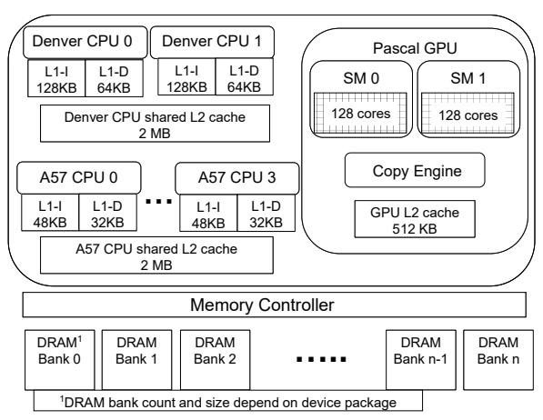
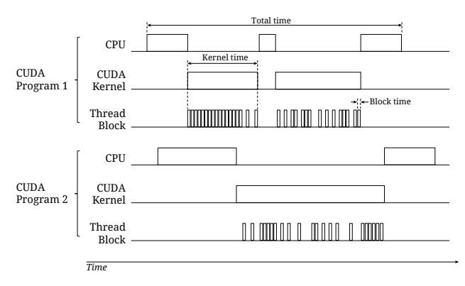
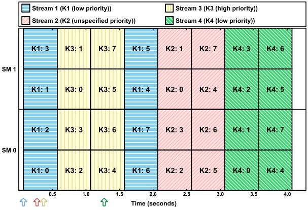
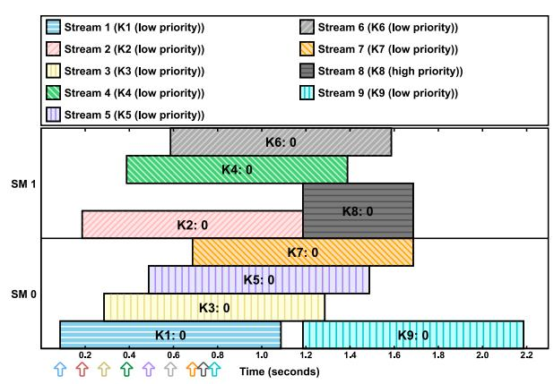
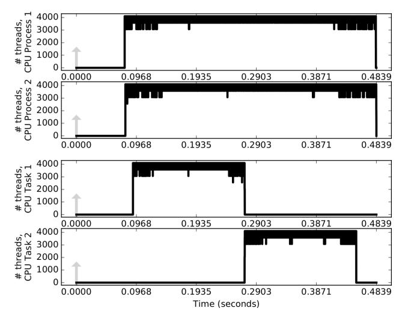

# GPU Scheduling on the NVIDIA TX2: Hidden Details Revealed<sup>∗</sup>

Tanya Amert, Nathan Otterness, Ming Yang, James H. Anderson, and F. Donelson Smith Department of Computer Science, University of North Carolina at Chapel Hill


# Abstract

*The push towards fielding autonomous-driving capabilities in vehicles is happening at breakneck speed. Semi-autonomous features are becoming increasingly common, and fully autonomous vehicles are optimistically forecast to be widely available in just a few years. Today, graphics processing units* (*GPUs*) *are seen as a key technology in this push towards greater autonomy. However, realizing full autonomy in mass-production vehicles will necessitate the use of stringent certification processes. Currently available GPUs pose challenges in this regard, as they tend to be closed-source "black boxes" that have features that are not publicly disclosed. For certification to be tenable, such features must be documented. This paper reports on such a documentation effort. This effort was directed at the NVIDIA TX2, which is one of the most prominent GPU-enabled platforms marketed today for autonomous systems. In this paper, important aspects of the TX2's GPU scheduler are revealed as discerned through experimental testing and validation.*

# 1 Introduction

Graphics processing units (GPUs) are currently seen as a key enabler for accelerating computations fundamental to realizing autonomous-driving capabilities. The massive parallelism afforded by GPUs makes them especially well-suited for accelerating computations such as motion planning, or for handling multiple input streams from sensors such as cameras, laser range finders (LIDAR), and radar. For this reason, several companies (Tesla, Audi, Volvo, *etc.* [20]) have announced their intentions of using GPU-equipped computing platforms in realizing autonomous features.

As mass-market vehicles evolve towards providing full autonomy, it will become ever more critical that GPU-using workloads are amenable to strict certification. However, certification requires a comprehensive model of the GPU scheduler. Unfortunately, currently available GPUs create numerous challenges in this regard, because many aspects underlying their design either are not documented or are described at such a high level that crucial technical details are not revealed. Without such details, it is impossible to certify a safety-critical design.

Real-time constraints and GPU scheduling. In this paper, we consider one key aspect of certification—the validation of real-time constraints—in the context of embedded

multicore+GPU platforms suitable for autonomous-driving use cases. These platforms usually follow a system-on-chip (SoC) design, where a GPU and one or more CPUs are hosted on the same chip. GPUs in SoC designs tend to be less capable than those in desktop systems. As a result, it is crucial to fully utilize the GPU processing capacity that *is* available. However, avoiding wasted GPU processing cycles can be difficult without detailed knowledge of how a GPU actually schedules its work. Unfortunately, acquiring this knowledge can be quite difficult, given the opaque and enigmatic nature of publicly available information regarding GPUs.

Focus of this paper. In this paper, we present an in-depth study of GPU scheduling on an exemplar of current GPUs targeted towards autonomous systems. This study was conducted using only black-box experimentation and publicly available documentation. The exemplar chosen for this study is the recently released NVIDIA TX2. The TX2 is part of the Jetson family of embedded computers, which is explicitly marketed for "autonomous everything" [17]. Moreover, it shares a common GPU architecture with the higher-end Drive PX2, which is currently available only to automotive companies and suppliers. The TX2 has two important attributes for embedded use cases: it provides significant computing capacity, and meets reasonable limits on monetary cost as well as size, weight, and power (SWaP).

As seen in Fig. 1, the TX2 is a single-board computer containing multiple CPUs and an integrated GPU. As explained in more detail later, *integrated* GPUs share DRAM memory with the host CPU platform, in contrast to *discrete* GPUs, which have private DRAM memory. Integrated GPUs are the de facto choice in embedded applications where SWaP is a concern. The TX2's cost, approximately 600 USD per board, is likely affordable even if multiple copies are needed.

Contributions. This paper is part of an effort to develop a model for describing GPU workloads and how they are scheduled. Our eventual goal is to develop a model for which real-time schedulability-analysis results can be derived, as has been done for various CPU workload and scheduling models that have been studied for years. We specifically target the TX2's GPU scheduler. The TX2 is a very complicated device, so discerning exactly how it functions is not easy.

Prior work has documented that NVIDIA GPU scheduling differs based on whether work is submitted to a GPU from a CPU executing (i) operating-system (OS) threads that share an address space or (ii) OS processes that have different address spaces [28]. However, to the best of our knowledge, the exact manner in which GPU scheduling is done in either case has never been publicly disclosed.

<sup>∗</sup>Work supported by NSF grants CPS 1239135, CNS 1409175, CPS 1446631, and CNS 1563845, AFOSR grant FA9550-14-1-0161, ARO grant W911NF-14-1-0499, and funding from General Motors.

For Case (i), we present a set of rules, based on experimental evidence involving benchmarking programs, that fully define how the TX2's GPU schedules work submitted to it, assuming that certain optional GPU features (see below) are not employed that introduce additional complexities. These rules take into account the ordering within and among streams of requests for GPU operations, the means by which various internal queues of requests are handled, the ability of the GPU to co-schedule operations so they execute concurrently, the selection mechanism used to determine the order in which requests are handled, and the resource limits that constrain the GPU's ability to handle new requests. Our rules indicate that the TX2's GPU employs a variant of hierarchical FIFO scheduling that is amenable to real-time schedulability analysis, although scheduling is not fully work-conserving, as GPU computations are subject to various blocking delays.

The optional GPU features that we initially ignore include two features that cause certain request streams to be treated specially, which further complicates GPU scheduling. These features include the usage of a special stream called the *NULL stream* and the usage of *stream priorities*. The available documentation regarding both of these features often lacks details necessary for predicting specific runtime behavior. Through further experiments, we show how each of these features affects our derived scheduling rules.

GPU programs are most commonly developed assuming that different GPU computations are requested by OS processes with different address spaces, so Case (ii) above applies. We investigated GPU scheduling in this case as well and, unfortunately, found it to be less deterministic than in Case (i). In particular, concurrent GPU computations in this case are multiprogrammed on the GPU using time slicing in a way that can add significant overhead and execution-time variation. This result calls into question the common practice today of following a process-oriented approach in developing GPU applications, as reflected in open-source frameworks such as Torch¹ and Caffe.² We also investigated the usage of stream priorities under Case (ii) and found that they have no effect in this case.

The work presented herein is a first step in a broader project, the goal of which is to enable the analysis and certification of safety-critical real-time workloads that depend on both CPU and GPU resources. In this broader context, our experimental methods can actually be viewed as a second contribution, as they have been devised in a way that should enable relatively straightforward extension to other NVIDIA GPU architectures that may be of interest in the future.

**Organization.** In the rest of this paper, we provide relevant background on GPU fundamentals (Sec. 2), present the basic TX2 GPU scheduling rules we have derived for Case (i) above, along with experimental evidence to support



Figure 1: Jetson TX2 Architecture

them (Sec. 3), discuss additional complexities impacting these rules when certain important GPU features are enabled (Sec. 4), and conclude (Sec. 5). For ease of exposition, some experiments and details are deferred to appendices.

## 2 Background

In this section, we provide needed background on GPUs and the NVIDIA Jetson TX2. We also discuss prior related work.

#### 2.1 The NVIDIA Jetson TX2

As shown in Fig. 1, the TX2 employs an SoC design that incorporates a quad-core 2.0-GHz 64-bit ARMv8 A57 processor, a dual-core 2.0-GHz superscalar ARMv8 Denver processor, and an integrated Pascal GPU. There are two 2-MB L2 caches, one shared by the four A57 cores and one shared by the two Denver cores. The GPU has two *streaming multiprocessors* (SMs), each providing 128 1.3-GHz cores that share a 512-KB L2 cache. The six CPU cores and integrated GPU share 8 GB of 1.866-GHz DRAM memory.

An integrated GPU, like that on the TX2, tightly shares DRAM memory with CPU cores, typically draws between 5 and 15 watts, and requires minimal cooling and additional space. As noted earlier, the alternative to an integrated GPU is a discrete GPU. Discrete GPUs are packaged on adapter cards that plug into a host computer bus, have their own local DRAM memory that is completely independent from that used by CPU cores, typically draw between 150 and 250 watts, need active cooling, and occupy substantial space. For these reasons, integrated GPUs are found in most GPU-enabled computing platforms for embedded systems.

## 2.2 CUDA Programming Fundamentals

The following is a high-level description of CUDA, the API for GPU programming provided by NVIDIA.

A GPU is a co-processor that performs operations requested by CPU code. CUDA programs use a set of C or C++ library routines to request GPU operations implemented by a combination of hardware and device-driver software. The typical structure of a CUDA program is as follows: (i) al-

<sup>1</sup>http://torch.ch

<sup>&</sup>lt;sup>2</sup>http://caffe.berkeleyvision.org

#### Listing 1 Vector Addition Pseudocode.

```
1: kernel VECADD(A ptr to int, B: ptr to int, C: ptr to int)
   . Calculate index based on built-in thread and block information
2: i := blockDim.x * blockIdx.x + threadIdx.x
3: C[i] := A[i] + B[i]
4: end kernel
5: procedure MAIN
   . (i) Allocate GPU memory for arrays A, B, and C
6: cudaMalloc(d A)
7: . . .
   . (ii) Copy data from CPU to GPU memory for arrays A and B
8: cudaMemcpy(d A, h A)
9: . . .
   . (iii) Launch the kernel
10: vecAdd<<<numBlocks, threadsPerBlock>>>(d A, d B, d C)
   . (iv) Copy results from GPU to CPU array C
11: cudaMemcpy(h C, d C)
   . (v) Free GPU memory for arrays A, B, and C
12: cudaFree(d A)
13: . . .
14: end procedure
```

locate GPU-local (device) memory for data; (ii) use the GPU to copy data from host memory to GPU device memory; (iii) launch a program, called a *kernel*, 3 to run on the GPU cores to compute some function on the data; (iv) use the GPU to copy output data from device memory back to host memory; (v) free the device memory. An example vector-addition CPU procedure and associated kernel are given in Listing 1.

In the usual programming model for writing CUDA code, input data is partitioned among hardware threads on the GPU. Parallelism is achieved by specifying the number of threads that form a *thread block* and the total number of such blocks to be allocated. For example, in a vector-addition kernel that adds two 4,096-element arrays, where each thread operates on a single element as in Listing 1, the programmer could specify eight blocks of 512 threads. These values are given in the kernel-launch command, shown in Line 10 of Listing 1. Thread-related system variables, such as the number of threads per block and the total number of blocks, are used by the kernel code to identify the specific data element(s) handled by each thread. In the vector-addition example, each thread calculates the index i of the element it operates on in Line 2 using these CUDA-provided built-in variables.

To avoid any confusion, we henceforth use the term *thread* to mean a hardware thread on the GPU. We use the term *process* when referring to OS processes executing on CPUs that have separate address spaces and *task* to refer to OS threads executing on CPUs that share an address space. (The term "thread" is ordinarily used in referring to the latter.)

As seen in Listing 1, dispersing code to execute across one or more blocks, each with many threads, enables the significant parallelism afforded by GPUs to be exploited. On the TX2, there are 256 GPU cores, 128 per SM. Each SM is capable of running four units of 32 threads each (called a *warp*) at any given instant. The SM's four *warp schedulers*



Figure 2: Diagram illustrating the relation between CUDA programs, kernels, and thread blocks.

(contained in hardware) take advantage of stalls, such as waiting to access memory, to immediately begin running a different warp on the set of 32 cores assigned to it. In this way, the SM's warp schedulers can hide memory latency.

For a simpler abstraction, programmers can think of a GPU as consisting of one or more *copy engines* (*CEs*) (the TX2 has only one) that copy data between host memory and device memory, and an *execution engine* (*EE*) that has one or more SMs (the TX2 has two) consisting of many cores that execute GPU kernels. An EE can execute multiple kernels simultaneously, but a CE can perform only one copy operation at a time. EEs and CEs can operate concurrently.

#### 2.3 Ordering and Execution of GPU Operations

Fig. 2 depicts the execution of the entities discussed so far. In this figure, there are two CUDA programs executed by processes running on different CPUs. As discussed above, a CUDA program consists of CPU code that invokes GPU code contained in CUDA kernels, each of which is executed by running a programmer-specified number of thread blocks on the GPU. Multiple thread blocks from the same kernel can execute concurrently if sufficient GPU resources exist, although this is not depicted in Fig. 2. The figure distinguishes between *block time*, which is the time taken to execute a single thread block, *kernel time*, which is the time taken to execute a single kernel (from when its first block commences execution until its last block completes), and *total time*, which is the time taken to execute an entire CUDA program (including CPU portions). We refer to copy operations and kernels collectively as *GPU operations*. For simplicity, copy operations are not depicted in Fig. 2.

In CUDA, GPU operations can be ordered by associating them with a *stream*. Operations in a given stream are executed in FIFO order, but the order of execution across different streams is determined by the GPU scheduling policy. Kernels from different streams may execute concurrently or even out of launch-time order. Kernel executions and copy operations from different streams can also operate concurrently depending on the GPU hardware. By default, GPU operations from all CPU programs are inserted into the single *default stream*. Unless specified otherwise, this is the

<sup>3</sup>Unfortunate terminology, not to be confused with an OS kernel.

*NULL stream* [19]. Programmers can create and use additional streams to allow for concurrent operations.

Kernel launches are asynchronous with respect to the CPU program: when the CUDA kernel-launch call returns, the CPU can perform additional computation including issuing more GPU operations. By default, copy operations are synchronous with respect to a CPU program: they do not return until the copy is complete. Asynchronous copy operations are also available so the CPU program can continue to perform computations, kernel launches, or copies. Copy operations, whether synchronous or asynchronous, will not start until all prior kernel launches from the same stream have finished. All asynchronous GPU operations require the CPU program to explicitly wait for all previously issued GPU operations to complete if CPU computations need to be synchronized with the GPU. This functionality is provided by CUDA APIs for synchronization or event management.

To our knowledge, complete details of kernel attributes and policies used by NVIDIA to schedule GPU operations are not available. The official CUDA documentation only states that operations within a stream are processed in FIFO order, and that kernels from different streams *may* run concurrently.<sup>4</sup> An NVIDIA developer presentation from 2011 [24] gives slightly more information: operations from multiple streams are placed into a single internal queue based on their issue order. However, as this talk covered an older GPU architecture, some of the details have changed; in newer NVIDIA GPUs, there are multiple internal queues [16].

In summary, we provide these definitions of a few terms used throughout the remainder of the paper:

- *CUDA kernel*: A section of code that runs on the GPU. A kernel is made of multiple thread blocks and is scheduled at the block level, *i.e.*, *blocks are schedulable entities*. Blocks may be executed in arbitrary order on the GPU.
- *Thread block* (*block*): A collection of GPU threads that may execute concurrently and run the same instructions but operate on different portions of data. The number of threads in a block and the number of blocks associated with a CUDA kernel are specified at launch time.
- *Streaming Multiprocessor* (*SM*): The individual cores in a CUDA-capable GPU are partitioned onto SMs. Threads within a single block will never simultaneously execute on different SMs.
- *CUDA Stream* (*stream*): A FIFO queue of GPU operations (copy operations and kernels). A single CPU process or task can attempt to issue concurrent GPU operations by distributing them among multiple streams.

### 2.4 Related Work

Because of the black-box nature of GPUs, in much prior work on real-time GPU management, a GPU-using program is required to lock an entire GPU, or individual EEs or CEs, while performing GPU operations [8, 10, 11, 25, 26, 27, 30]. The viewpoint taken here is that *concurrently executing kernels might adversely interfere with each other and thus should be disallowed*. However, disallowing concurrency may lead to wasted GPU processing cycles, which may be untenable when using less-capable integrated GPUs.

Motivated by this observation, our group investigated the effects of concurrent kernel execution on the NVIDIA TK1 [21] and TX1 [22, 23], two less-capable predecessors of the TX2. In two of these efforts [21, 23], we only considered GPU usage by CPU processes with different address spaces and did not attempt to discern how GPU scheduling is done. In the other prior effort [22], which is actually a precursor to this paper, we did consider GPU scheduling. However, this effort was directed at the less-capable TX1 and did not consider many of the complications (*e.g.*, interactions between user-specified streams and the NULL stream, kernel delays when available GPU resources are not sufficient, the effects of copy operations, *etc.*) that must be considered to completely characterize how GPU scheduling is done. All of these complications are considered herein.

Work has also been directed at splitting GPU tasks into smaller sub-tasks to approximate preemptive execution or improve utilization [2, 10, 12, 32]. A framework in this category called Kernelet [31] is particularly relevant to us as concurrent kernel execution is considered in order to improve utilization. However, the developers of Kernelet do not provide an in-depth investigation of actual GPU scheduling behaviors. Other work has been directed at timing analysis for GPU workloads [3, 4, 5, 6, 7], techniques for remedying performance bottlenecks [9], and techniques for managing or evaluating GPU hardware resources, including the cache [14, 15, 29] and direct I/O communication [1].

# 3 Basic GPU Scheduling Rules

In this section, we present GPU scheduling rules for the TX2 assuming the GPU is accessed only by CPU tasks that share an address space, using only user-specified streams. (We consider the NULL stream later. Unless stated otherwise, "stream" should henceforth be taken to mean a user-specified stream.) We inferred the scheduling rules given here by conducting extensive experiments using CUDA 8.0.62. We begin by discussing one of these experiments in Sec. 3.1. We use this experiment as a continuing example to explain various nuances of the rules, which are covered in full in Sec. 3.2. Before continuing, we note that all code, scripts, and visualization tools developed for this paper are available online.<sup>5</sup>

#### 3.1 Motivating Experiment

The experiment considered here involved running instances of a synthetic benchmark that launches several kernels. Our synthetic workload allows flexibility in configuring block resource requirements, kernel durations, and copy operations.

<sup>4</sup>For example, this is how streams are described in Sec. 9.1.2 of the *Best Practices Guide* for CUDA version 8.0.61 [18].

<sup>5</sup>https://github.com/yalue/cuda\_scheduling\_ examiner\_mirror


Figure 3: Basic GPU scheduling experiment.

We have also experimented with a variety of real-world GPU workloads involving image-processing functions common in autonomous-driving use cases, and to our knowledge, the scheduling rules presented in this paper are valid for such workloads as well.

In the experiment considered here, we configured each block of each benchmark kernel to spin for one second. As detailed in Table 1, three kernels, K1, K2, and K3, were launched by a single task to a single stream, and three additional kernels, K4, K5, and K6, were launched by a second task to two separate streams. The kernels are numbered by launch time. Copy operations occurred after K2 and K5, before and after K3, and after K6, in their respective streams.

Fig. 3 depicts the GPU timeline produced by this experiment. Each rectangle represents a block: the j th block of kernel Kk is labeled "Kk:j." The left and right boundaries of each rectangle correspond to that block's start and end times, as measured on the GPU using the globaltimer register. The height of each rectangle is the number of threads used by the block. The y-position of each rectangle indicates the SM upon which it executed. Arrows below the x-axis indicate kernel launch times. Dashed lines correspond to time points used in the continuing example covered in Sec. 3.2.

## 3.2 Scheduling Rules

With respect to kernels, blocks are the schedulable entities: the basic job of the GPU scheduler is to determine which thread blocks can be scheduled at any given time. These scheduling decisions are impacted by the availability of limited GPU *resources* that blocks utilize such as GPU shared memory, registers, and threads. Required resources are determined for the entire kernel when it is *launched*. All blocks in a given kernel have the same resource requirements.

We say that a block is *assigned* to an SM when that block has been scheduled for execution on the SM. A kernel is *dispatched* when at least one of its blocks is assigned, and is *fully dispatched* once all of its blocks have been assigned. Similarly, we say that a copy operation is *assigned* to a CE once it has been selected to be performed by the CE.

*Example.* Fig. 4 provides additional details regarding the kernel launches in Fig. 3. In Fig. 4, we use additional notation to depict copies: Cki denotes an input copy operation of kernel Kk, and Cko denotes an output copy operation of kernel Kk. Each inset in Fig. 4 corresponds to the time point in Fig. 3 with the same designation (*e.g.*, inset (a) corresponds to the time point labeled "(a)"). We will repeatedly revisit Fig. 4 to illustrate individual scheduling rules as they are stated, and then consider the entire example in full once all rules have been stated.

General scheduling rules. To our knowledge, the actual data structures used by the TX2 to schedule copy operations and kernels are undocumented. From our experiments, we hypothesize that several queues are used: one FIFO *EE queue* per address space, one FIFO *CE queue* that is used to order copy operations for assignment to the GPU's CE, and one FIFO queue per CUDA stream (including the NULL stream, which we consider later). We refer to the latter as *stream queues*. We begin by listing general rules that specify how copy operations and kernels are moved between queues:

- G1 A copy operation or kernel is enqueued on the stream queue for its stream when the associated CUDA API function (memory transfer or kernel launch) is invoked.
- G2 A kernel is enqueued on the EE queue when it reaches the head of its stream queue.
- G3 A kernel at the head of the EE queue is dequeued from that queue once it becomes fully dispatched.
- G4 A kernel is dequeued from its stream queue once all of its blocks complete execution.

*Example (cont'd).* In Fig. 4, there are two CUDA programs executing as CPU tasks τ<sup>0</sup> and τ<sup>1</sup> on CPUs 0 and 1, respectively, that share an address space. τ<sup>0</sup> uses a single stream, S1, and τ<sup>1</sup> uses two streams, S2 and S3. The various queues, two SMs, and single CE are depicted in each inset of Fig. 4. The start times in Table 1 give the time the kernel, or its input copy operation if one exists, was issued. Output copy operations, when present, immediately followed kernel completions.

In inset (a), τ<sup>0</sup> has issued kernels K1, K2, and K3 and copy operations C2o, C3i, and C3o to stream S1. τ<sup>1</sup> has issued kernels K4 and K5 to streams S2 and S3, respectively, and copy operation C5o to stream S3. The operations in streams S1 and S3 were enqueued in the order the CUDA commands were executed (Rule G1). Kernels K1, K4, and K5 are at the heads of their respective stream queues, and have been placed in the EE queue (Rule G2). K1 is dispatched to the GPU, so it is shaded in its stream queue. Each SM has two blocks of K1 assigned to it. In inset (b), the remaining blocks of K1 and K4 have been assigned to the GPU, so both K1 and K4 have been removed from the EE queue (Rule G3), but remain in their respective stream queues (Rule G4).


Figure 4: Detailed state information at various time points in Fig. 3.

|        | Launch           | Start    |          | # Thread  | Shared Memory |         |          |
|--------|------------------|----------|----------|-----------|---------------|---------|----------|
| Kernel | Info             | Time (s) | # Blocks | per Block | per Block     | Copy In | Copy Out |
| K1     | CPU 0, Stream S1 | 0.0      | 6        | 768       | 0             | -       | -        |
| K2     | CPU 0, Stream S1 | 0.0      | 2        | 512       | 0             | -       | 256MB    |
| К3     | CPU 0, Stream S1 | 0.0      | 2        | 1,024     | 0             | 256MB   | 256MB    |
| K4     | CPU 1, Stream S2 | 0.2      | 4        | 256       | 32KB          | -       | -        |
| K5     | CPU 1, Stream S3 | 0.4      | 2        | 256       | 32KB          | -       | 256MB    |
| K6     | CPU 1, Stream S2 | 2.8      | 2        | 512       | 0             | -       | 256MB    |

Table 1: Details of kernels used in the experiment in Fig. 3. (Note that "start times" are defined relative to the end of benchmark initialization.)

**Non-preemptive execution.** Ignoring complications considered later in Sec. 4, the kernel at the head of the EE queue will non-preemptively block later-queued kernels:

**X1** Only blocks of the kernel at the head of the EE queue are eligible to be assigned.

Example (cont'd). In Fig. 4(a), two blocks of K1 have been assigned to each SM. As explained in detail below, on each SM, there are enough resources available that two blocks from K4 could execute concurrently with the two blocks from K1. However, K4 is not at the head of the EE queue, so its blocks are not eligible to be assigned (Rule X1).

**Rules governing thread resources.** On the TX2, the total thread count of all blocks assigned to an SM is limited to

2,048 per SM,<sup>6</sup> and the total number of threads each block can use is limited to 1,024. These resource limits can delay the kernel at the head of the EE queue:

- **R1** A block of the kernel at the head of the EE queue is eligible to be assigned only if its resource constraints are met.
- **R2** A block of the kernel at the head of the EE queue is eligible to be assigned only if there are sufficient thread resources available on some SM.

<sup>&</sup>lt;sup>6</sup>Recall from Sec. 2.1 that on the TX2, each SM has 128 hardware cores available. The (up to) 2,048 threads assigned to blocks currently executing on that SM are multiprogrammed on those cores.

*Example (cont'd).* In Fig. 4(a), K1 is at the head of the EE queue, so its blocks are eligible to be assigned (Rule R1). However, only four blocks of K1 have been assigned. This is because, as seen in Table 1, each block of K1 requires 768 threads, and on the TX2, each SM is limited to allocate at most 2,048 threads at once. Thus, only four blocks of K1's six can be scheduled together, so the remaining two must wait (Rule R2). In inset (b), these remaining two blocks have been scheduled. K4, next in the EE queue, requires four blocks of only 256 threads each, so all of its blocks fit on the GPU simultaneously with the remaining two blocks of K1, and all four blocks of K4 are assigned.

Rules governing shared-memory resources. Another constrained resource is the amount of GPU memory shared by threads in a block. On the TX2, shared memory usage is limited to 64KB per SM and 48KB per block. Similar to threads, a block being considered for assignment will not be assigned until all of the shared memory it requires is available.

R3 A block of the kernel at the head of the EE queue is eligible to be assigned only if there are sufficient shared-memory resources available on some SM.

*Example (cont'd).* Each block of K4 or K5 requires 32KB of shared memory, so at most two of these blocks can be assigned concurrently on an SM. In Fig. 4(b), two blocks of K4 are assigned to each SM. Even though there are available threads for K5 to be assigned and it is the head of the EE queue at that time, no block of K5 is assigned until the blocks of K4 complete (Rule R3), as shown in inset (c).

Register resources. Another resource constraint is the size of the register file. On the TX2, each thread can use up to 255 registers, and a block can use up to 32,768 registers (regardless of its thread count). Additionally, there is a limit of 65,536 registers in total on each SM. Unfortunately, using synthetic kernels makes it difficult to demonstrate limits on registers because the NVIDIA compiler optimizes register usage. However, based upon available documentation [19], we expect limits on register usage to have exactly the same impact as the limits on thread and shared-memory resources demonstrated above. Note also that the number of registers can be limited at compile-time using the maxregcount compiler option. Decreasing the number of registers used by a kernel makes its blocks easier to schedule at the expense of potentially greater execution time.

Copy operations. As noted earlier, the TX2 has one CE to process both host-to-device and device-to-host copies. Such copies are governed by rules similar to those above:

- C1 A copy operation is enqueued on the CE queue when it reaches the head of its stream queue.
- C2 A copy operation at the head of the CE queue is eligible to be assigned to the CE.
- C3 A copy operation at the head of the CE queue is dequeued from the CE queue once the copy is assigned to the CE on the GPU.

C4 A copy operation is dequeued from its stream queue once the CE has completed the copy.

*Example (cont'd).* As shown in Fig. 4(d), once K2 and K5 complete execution and are dequeued from S1 and S3, the copies C2o and C5o become the heads of S1 and S3, respectively. C5o and C2o are thus enqueued on the CE queue (Rule C1). C5o is immediately assigned to the CE (Rule C2), so it is dequeued from the CE queue (Rule C3). The CE can perform only one copy operation at a time, so C2o remains at the head of the CE queue until C5o completes.

Full example. Inset (a) of Fig. 4 corresponds to time t = 1.1s in Fig. 3. The first five kernels have been launched, and the kernels at the heads of each stream, K1, K4, and K5, have also been added to the EE queue, in issue order. K1 remains in the EE queue as it is not yet fully dispatched, so no blocks of K4 are eligible to be assigned.

Inset (b) corresponds to time t = 2.1s. The first four blocks of K1 have finished executing. Both K1 and K4 are now fully dispatched, so they have been removed from the EE queue, but remain at the heads of their stream queues. No blocks of K5 are able to be dispatched because their required shared-memory resources are not available.

Inset (c) corresponds to time t = 3.0s. Upon completion of K1 and K4, both of K5's blocks are assigned, and K2 is added to the EE queue and immediately becomes fully dispatched. C2o remains blocked by K2 in its stream queue due to FIFO stream ordering. C5o is similarly blocked.

Inset (d) corresponds to time t = 3.32s. K2 and K5 both complete execution, enabling C2o and C5o to be enqueued on the CE queue. C5o is enqueued first, so it is assigned to the CE and removed from the CE queue. Due to FIFO stream ordering, both C3i and K3 are delayed behind C2o. Upon being issued, K6 immediately moved unhindered through the queues, as K2 and K5 were fully dispatched; the copies execute concurrently with the blocks of K6.

Inset (e) corresponds to time t = 4.0s. K3 and K6 are both fully dispatched. C3o an C6o are blocked in their stream queues until K3 and K6 complete, respectively. As a result, the CE and EE queues are empty.

Summary. The basic scheduling rules above define a variant of hierarchical FIFO scheduling where work may sometimes be subject to blocking delays. Given that FIFO CPU scheduling has analyzable response-time bounds on multiprocessors [13], there is some hope that the scheduler defined by these rules might be amenable to real-time schedulability analysis, but this is a topic for future work.

# 4 Additional Complexities

Unfortunately, the basic rules in Sec. 3 are not the end of the story. In this section, we consider additional features available to CUDA programmers that can impact scheduling. These include usage of the default (NULL) stream, stream priorities, and streams in independent process address spaces.


Figure 5: NULL stream scheduling experiment.

We also comment on other less commonly used features that can influence scheduling that we do not examine in detail.

## 4.1 The NULL Stream

Available documentation makes clear that two kernels cannot run concurrently if, between their issuances, any operations are submitted to the NULL stream [19]. However, this documentation does not explain how kernel execution order is affected. In an attempt to elucidate this behavior, we conducted experiments in which interactions between (user-specified) streams and the NULL stream were observed. We found that these interactions are governed by the following rules, which reduce to rule G2 if the NULL stream is not used:

- N1 A kernel Kk at the head of the NULL stream queue is enqueued on the EE queue when, for each other stream queue, either that queue is empty or the kernel at its head was launched after Kk.
- N2 A kernel Kk at the head of a non-NULL stream queue cannot be enqueued on the EE queue unless the NULL stream queue is either empty or the kernel at its head was launched after Kk.

The result of an experiment demonstrating these rules is given in Fig. 5. The kernels launched in this experiment are fully specified in Table 2 in Appendix B. K2 and K5 were submitted to the NULL stream. K2 did not move to the EE queue until K1 completed (Rule N1); likewise, K5 did not move to the EE queue until both K3 and K4 had completed. No other kernel could move to the EE queue while K2 was at the head of the NULL stream queue, as all but K1 were launched after K2 (Rule N2). Because of the NULL-stream kernels, K6 was unnecessarily blocked and could not execute concurrently with K1, K3, or K4, so much capacity was lost. This result demonstrates that usage of the NULL stream is problematic if real-time predictability and efficient platform utilization are desired.

## 4.2 Stream Priorities

We now consider how the usage of prioritized streams impacts the rules defined in Sec. 3.2. CUDA programmers can prioritize some streams over others and


Figure 6: Experiment showing starvation of a priority-low stream.

can determine the allowable priority settings by the API call cudaDeviceGetStreamPriorityRange. On the TX2, this call returns only two priority values: −1 (*priority-high*) and 0 (*priority-low*). As we show below, a stream with no priority specified (*priority-none*) is treated as priority-low.

Experiments. In the rest of this subsection, we present the results of several experiments we conducted to evaluate the effects of using stream priorities. These experiments use the same synthetic benchmarking techniques applied in Sec. 3.2. Relevant kernel properties are given in per-experiment tables in Appendix B. After discussing these experiments, we postulate new scheduling rules that specify how stream priorities affect scheduling.

Scheduling of priority-low streams vs. priority-high streams. Given that blocks are schedulable entities, the handling of prioritized streams as described in the available CUDA documentation [19] is exactly as one might expect. In particular, stream priorities are considered each time a block finishes execution and a new block can be assigned, with blocks from priority-high streams always being favored for assignment if their resource requirements are met. Note that this assignment behavior can potentially lead to the starvation of priority-low streams.

We conducted an experiment to illustrate this behavior using the kernels defined in Table 3. Fig. 6 shows the GPU timeline that resulted from this experiment. As seen, K1 was launched first in a priority-low stream and four of its eight blocks had already been assigned when K2 and K3 were later launched in two priority-high streams. When the four initially assigned blocks of K1 completed execution, freeing all SM threads, K2 (launched second) effectively preempted K1, preventing K1's remaining four blocks from being assigned. K3 was later dispatched when K2 completed, continuing the "starvation" of K1 until K3 completed.

Scheduling of priority-none streams vs. prioritized streams. The available CUDA documentation lacks clarity with respect to how scheduling is done when both prioritynone and prioritized streams are used. We experimentally



Figure 7: Experiment demonstrating two actual priority levels.

investigated this issue and found that priority-none streams have the same priority as priority-low streams on the TX2.

Evidence of this can be seen in an experiment we conducted using the kernels defined in Table 4. Fig. 7 shows the resulting GPU timeline. In this experiment, K2 was launched in a priority-none stream, K1 and K4 were launched in priority-low streams, and K3 was launched in a priority-high stream. K1 was launched first and four of its eight blocks were immediately assigned to the GPU. Once these four blocks completed execution, K3 effectively preempted K1 because K3 was at the head of a priority-high stream. After K3 executed to completion, K1 resumed execution because K2 and K4 had equal priority and could not preempt it. When K1 completed, K2 and K4 were dispatched in launch-time order. If priority-none were higher than priority-low, then K2 would have preempted K1; if priority-none were lower than priority-low, then K4 would have run before K2, despite being released later.

The scheduling of prioritized streams when resource blocking can occur. We wondered whether it was possible for kernels in priority-high streams experiencing resource blocking to be indefinitely delayed by kernels in priority-low streams that "cut ahead" and consume available resources. Our experimental results suggest this is not possible.

Evidence of this claim can be seen in an experiment we conducted using the kernels defined in Table 5, which yielded the resulting GPU timeline in Fig. 8. K1–K7 were launched in quick succession to seven distinct priority-low streams. Once all had been dispatched, 512 threads were available on one SM. Then K8, with one block of 1,024 threads, was launched to a priority-high stream, followed by K9, with one block of 512 threads, launched to another priority-low stream. At this time, none of the initial seven kernels had completed execution, so the priority-high K8 could not be dispatched due to a lack of available threads. When K1 ultimately completed, 512 threads were then available on each SM, but K8 still could not be dispatched because a block can run on only one SM. Note that even though K9 required only 512 threads, it could not be dispatched because K8 was of higher priority. Finally, when K2 completed, K8 was



Figure 8: Experiment with both priorities and resource blocking.

dispatched because 1,024 threads became available on one SM, and K9 was dispatched because 512 other threads were available and the priority-high K8 no longer blocked it.

Additional scheduling rules. Based on these experiments, we hypothesize that the TX2's GPU scheduler includes one additional EE queue, for priority-high kernels. The original EE queue described in Sec. 3.2 is for priority-low (and thus priority-none). These queues are subject to these rules:

- A1 A kernel can only be enqueued on the EE queue matching the priority of its stream.
- A2 A block of a kernel at the head of any EE queue is eligible to be assigned only if all higher-priority EE queues (priority-high over priority-low) are empty.

## 4.3 Multiple Processes and Other Complications

We also conducted experiments in which CUDA programs were invoked by CPU processes (instead of tasks) that have distinct addresses spaces. These experiments are discussed in Appendix A. As seen there, the usage of separate address spaces results in higher overheads and less predictable execution times for GPU operations.

We conclude Sec. 4 by noting several less commonly used features that may potentially impact scheduling. These include: (i) the nvcc compilation option, which enables pertask NULL streams; (ii) the CUDA API that enables kernels from user-specified streams to execute concurrently with the NULL stream; (iii) a mechanism introduced with the Pascal GPU architecture that allows an executing kernel to be preempted at the instruction level; and (iv) a feature called *dynamic parallelism* that allows kernels to dynamically submit extra work by calling other kernel functions inside the GPU. We conjecture that these features are detrimental to use if real-time predictability is a requirement.

# 5 Conclusion

We presented an in-depth study of GPU scheduling behavior on the NVIDIA TX2, a recently released multicore+GPU platform that is an exemplar of platforms marketed today for supporting autonomous systems. We found that the GPU scheduler of the TX2 has predictable FIFO-oriented properties that are amenable to real-time schedulability analysis if all work is submitted by CPU tasks that share an address space. On the other hand, GPU scheduling on the TX2 becomes more unpredictable and complex when GPU computations are launched by CPU processes that have distinct address spaces. Unfortunately, this process-oriented approach is common in GPU program development.

We acknowledge that it is not possible to confirm with certainty the scheduling behavior of any GPU through only black-box experimentation. However, we counter this drawback by noting that plans are already underway to use these devices to realize safety-critical autonomous capabilities [20]. If NVIDIA is unwilling to release details about internal GPU scheduling policies, then the only option available to us is to attempt to discern such policies through experimentation. Moreover, when mass-market vehicles eventually evolve to become fully autonomous, certification will become a crucial concern. It is simply not possible to certify with any degree of certainty a safety-critical system built using components that have unknown behaviors.

This paper is part of a long-term effort to devise a formal model for GPU schedulers. The completion of this effort will require work on several fronts. First, we intend to produce GPU response-time analysis for the GPU scheduler specified by the rules in Secs. 3 and 4. Second, this GPU scheduler sometimes inserts blocking delays that result in non-workconserving behavior. These blocking delays are often the result of synchronization points in CUDA programs, either explicitly created by the programmer or implicitly as the side effects of non-synchronization-related CUDA API calls. We will discuss in full the reasons for this blocking and its implications on kernel eligibility in a future paper. Additionally, we intend to investigate whether such delays can be eliminated or lessened by introducing middleware that may potentially reorder submitted GPU operations.

The experimental methodology employed in this paper is of a general nature and can be applied to other NVIDIA GPUs. We therefore intend to study and document other NVIDIA GPUs as well. Of particular interest is the Drive PX2, which is probably the most computationally capable muticore+GPU platform marketed for autonomous systems today (though it is currently available only to automotive companies and suppliers). We also plan to consider these rules in additional contexts, such as combining multiple processes, some containing more than one task or using more than one stream. Finally, we hope that this paper sparks similar work by other investigators that either reinforces our findings or shows the existence of corner cases we have missed.

# References

[1] J. Aumiller, S. Brandt, S. Kato, and N. Rath. Supporting low-latency CPS using GPUs and direct I/O schemes. In *RTCSA '12*.

- [2] C. Basaran and K. Kang. Supporting preemptive task executions and memory copies in GPGPUs. In *ECRTS '12*.
- [3] K. Berezovskyi, K. Bletsas, and B. Andersson. Makespan computation for GPU threads running on a single streaming multiprocessor. In *ECRTS '12*.
- [4] K. Berezovskyi, K. Bletsas, and S. Petters. Faster makespan estimation for GPU threads on a single streaming multiprocessor. In *ETFA '13*.
- [5] K. Berezovskyi, F. Guet, L. Santinelli, K. Bletsas, and E. Tovar. Measurement-based probabilistic timing analysis for graphics processor units. In *ARCS '16*.
- [6] K. Berezovskyi, L. Santinelli, K. Bletsas, and E. Tovar. WCET measurement-based and extreme value theory characterisation of CUDA kernels. In *RTNS '14*.
- [7] A. Betts and A. Donaldson. Estimating the WCET of GPU-accelerated applications using hybrid analysis. In *ECRTS '13*.
- [8] G. Elliott, B. Ward, and J. Anderson. GPUSync: A framework for real-time GPU management. In *RTSS '13*.
- [9] A. Horga, S. Chattopadhyayb, P. Elesa, and Z. Peng. Systematic detection of memory related performance bottlenecks in GPGPU programs. In *JSA '16*.
- [10] S. Kato, K. Lakshmanan, A. Kumar, M. Kelkar, Y. Ishikawa, and R. Rajkumar. RGEM: A responsive GPGPU execution model for runtime engines. In *RTSS '11*.
- [11] S. Kato, K. Lakshmanan, R. Rajkumar, and Y. Ishikawa. TimeGraph: GPU scheduling for real-time multi-tasking environments. In *USENIX ATC '11*.
- [12] H. Lee and M. Abdullah Al Faruque. Run-time scheduling framework for event-driven applications on a GPU-based embedded system. In *TCAD '16*.
- [13] H. Leontyev and J. Anderson. Tardiness bounds for FIFO scheduling on multiprocessors. In *ECRTS '07*.
- [14] A. Li, G. van den Braak, A. Kumar, and H. Corporaal. Adaptive and transparent cache bypassing for GPUs. In *SIGHPC '15*.
- [15] X. Mei and X. Chu. Dissecting GPU memory hierarchy through microbenchmarking. In *TPDS '16*.
- [16] P. Messmer. Unleash legacy MPI codes with Kepler's Hyper-Q. Online at https://blogs.nvidia.com/blog/2012/08/23/ unleash-legacy-mpi-codes-with-keplers-hyperq/, 2012.
- [17] NVIDIA. Embedded systems developer kits and modules. Online at http://www.nvidia.com/object/embeddedsystemsdev-kits-modules.html.
- [18] NVIDIA. Best practices guide. Online at http: //docs.nvidia.com/cuda/cuda-c-best-practicesguide/index.html, 2017.
- [19] NVIDIA. C programming guide. Online at http: //docs.nvidia.com/cuda/cuda-c-programmingguide/index.html, 2017.
- [20] NVIDIA. Partner innovation: Accelerating automotive breakthroughs. Online at http://www.nvidia.com/object/ automotive-partner-innovation.html, 2017.
- [21] N. Otterness, V. Miller, M. Yang, J. Anderson, F.D. Smith, and S. Wang. GPU sharing for image processing in embedded real-time systems. In *OSPERT '16*.
- [22] N. Otterness, M. Yang, T. Amert, J. Anderson, and F.D. Smith. Inferring the scheduling policies of an embedded CUDA GPU. In *OSPERT '17*.
- [23] N. Otterness, M. Yang, S. Rust, E. Park, J. Anderson, F.D. Smith, A. Berg, and S. Wang. An evaluation of the NVIDIA TX1 for supporting real-time computer-vision workloads. In *RTAS '17*.
- [24] S. Rennich. Webinar: CUDA C/C++ streams and concurrency. Online at https://developer.nvidia.com/gpucomputing-webinars, 2011.
- [25] U. Verner, A. Mendelson, and A. Schuster. Batch method for efficient resource sharing in real-time multi-GPU systems. In *ICDCN '14*.
- [26] U. Verner, A. Mendelson, and A. Schuster. Scheduling periodic realtime communication in multi-GPU systems. In *ICCCN '14*.

- [27] U. Verner, A. Mendelson, and A. Schuster. Scheduling processing of real-time data streams on heterogeneous multi-GPU systems. In *SYSTOR '12*.
- [28] L. Wang, M. Huang, and T. El-Ghazawi. Exploiting concurrent kernel execution on graphic processing units. In *HPCS '2011*.
- [29] H. Wong, M. Papadopoulou, M. Sadooghi-Alvandi, and A. Moshovos. Demystifying GPU microarchitecture through microbenchmarking. In *ISPASS '10*.
- [30] Y. Xu, R. Wang, T. Li, M. Song, L. Gao, Z. Luan, and D. Qian. Scheduling tasks with mixed timing constraints in GPU-powered real-time systems. In *ICS '16*.
- [31] J. Zhong and B. He. Kernelet: High-throughput GPU kernel executions with dynamic slicing and scheduling. *IEEE Transactions on Parallel and Distributed Systems*, 25:15221532, 2014.
- [32] H. Zhou, G. Tong, and C. Liu. GPES: A preemptive execution system for GPGPU computing. In *RTAS '15*.

# Appendix A: Process-Based GPU Access

In this appendix, we describe a few complications that arise when processes (instead of tasks) invoke GPU operations.

Multiprogramming on the TX2. In previous work involving the NVIDIA TX1, a less-capable predecessor of the TX2 with a similar basic layout, we found that kernels issued by multiple GPU-using processes were scheduled on the GPU using multiprogramming [23]. On the TX1, this meant that the GPU scheduler would switch between processes at the granularity of thread blocks, with kernels from different processes never actually executing at the same time. While studying the TX2, we observed that kernels issued by different processes are still multiprogrammed, but multiprogramming is implemented using GPU preemption features introduced in NVIDIA's Pascal GPU architecture.

This observation is supported by Fig. 9, which gives the results of two experiments we ran in which two instances of a compute-heavy Mandelbrot-Set kernel were run together. In the first experiment, the two kernel instances were issued by two separate processes, while in the second, they were issued by two separate tasks. In these experiments, we recorded for each kernel the start and end times of each thread block on the GPU and then used these times to deduce the total number of threads that appeared to have been assigned to the kernel through its execution. These thread counts are plotted on the vertical axes of the four timelines in Fig. 9. The top two timelines are from the first experiment, where processes were considered, and the bottom two timelines are from the second experiment, where tasks were considered.

The bottom two timelines indicate that, in the experiment involving tasks, scheduling was in accordance with the rules discussed in Sec. 3: all blocks from one kernel were fully dispatched before the second kernel began execution. In contrast, the top two timelines indicate that, in the experiment involving processes, the GPU scheduler's behavior is very different: 4,096 threads from each kernel appear to be fairly consistently running together at the same time. On the surface, this should appear to be impossible because the TX2 is only capable of running 4,096 threads across both of its SMs at any point in time (recall Footnote 6).



Figure 9: Timelines contrasting kernels issued from processes (different address spaces) vs. tasks (shared address space).


Figure 10: CDFs contrasting blocks times from processes vs. tasks.

This behavior, however, is easily explained if we assume that CUDA thread blocks can be preempted. Recall that we used block-time measurements, which are recorded on the GPU itself, to calculate the number of running threads. Our GPU kernel code cannot detect being preempted itself, so the start and end times for each block can actually encompass intervals in which the block was preempted.

We therefore conclude that benchmarks from separate processes were being multiprogrammed on the TX2 using preemptions, as this explains the apparent over-provisioning of GPU resources. Additionally, we provide Fig. 10 to further support the conclusion that concurrent kernels from different address spaces preempt one another.

In Fig. 10, the curves labeled "Process 1" and "Process 2" show the cumulative distribution function (CDF) of block times (see Fig. 2) for Mandelbrot-Set kernels issued concurrently from separate processes. Likewise, the "Task 1" and "Task 2" curves show the same data for kernels issued from separate tasks. Consistent with Fig. 9, the worst-case block times for the "Process" curves is over twice that of the "Task" curves. This is in direct contrast to our prior work using the previous-generation TX1, where we found that block

times remained nearly identical regardless of the number of concurrent processes [23].

memory or large copy-in or copy-out operations, so these columns are left out of the tables.

Stream priorities in multiple processes. We also experimentally examined the effects of using stream priorities when processes submit GPU operations instead of tasks. We found that assigning priorities to the streams of different processes had *no effect* on how the operations in these streams were scheduled. Thus, the usage of stream priorities has impact only in the context of task-based computing, not process-based computing.

# Appendix B: Full Kernel Descriptions for Experiments in Sec. 4

In this section, we present the configuration data for the experiments in Sec. 4. None of these experiments use shared

|        | Launch      | Start    |              |          | # Thread  |
|--------|-------------|----------|--------------|----------|-----------|
| Kernel | Info        | Time (s) | Duration (s) | # Blocks | per Block |
| K1     | Stream S1   | 0.0      | 1.0          | 6        | 768       |
| K2     | NULL Stream | 0.2      | 1.0          | 1        | 1,024     |
| K3     | Stream S2   | 0.2      | 1.0          | 4        | 256       |
| K4     | Stream S2   | 0.4      | 1.0          | 4        | 256       |
| K5     | NULL Stream | 0.6      | 1.0          | 1        | 1,024     |
| K6     | Stream S3   | 0.8      | 1.0          | 2        | 256       |

Table 2: Details of kernels used in the NULL-stream scheduling experiment in Fig. 5.

|        |                           | Start    |              |          | # Thread  |
|--------|---------------------------|----------|--------------|----------|-----------|
| Kernel | Launch Info               | Time (s) | Duration (s) | # Blocks | per Block |
| K1     | Stream S1 (low priority)  | 0.0      | 0.5          | 8        | 1,024     |
| K2     | Stream S2 (high priority) | 0.2      | 0.5          | 16       | 1,024     |
| K3     | Stream S3 (high priority) | 0.5      | 0.5          | 16       | 1,024     |

Table 3: Details of kernels used in the priority-stream scheduling experiment in Fig. 6.

|        |                                  | Start    |              |          | # Thread  |
|--------|----------------------------------|----------|--------------|----------|-----------|
| Kernel | Launch Info                      | Time (s) | Duration (s) | # Blocks | per Block |
| K1     | Stream S1 (low priority)         | 0.0      | 0.5          | 8        | 1,024     |
| K2     | Stream S2 (unspecified priority) | 0.2      | 0.5          | 8        | 1,024     |
| K3     | Stream S3 (high priority)        | 0.3      | 0.5          | 8        | 1,024     |
| K4     | Stream S4 (low priority)         | 1.2      | 0.5          | 8        | 1,024     |

Table 4: Details of kernels used in the priority-stream scheduling experiment in Fig. 7.

|        |                           | Start    |              |          | # Thread  |
|--------|---------------------------|----------|--------------|----------|-----------|
| Kernel | Launch Info               | Time (s) | Duration (s) | # Blocks | per Block |
| K1     | Stream S1 (low priority)  | 0.0      | 1.0          | 1        | 512       |
| K2     | Stream S2 (low priority)  | 0.1      | 1.0          | 1        | 512       |
| K3     | Stream S3 (low priority)  | 0.2      | 1.0          | 1        | 512       |
| K4     | Stream S4 (low priority)  | 0.3      | 1.0          | 1        | 512       |
| K5     | Stream S5 (low priority)  | 0.4      | 1.0          | 1        | 512       |
| K6     | Stream S6 (low priority)  | 0.5      | 1.0          | 1        | 512       |
| K7     | Stream S7 (low priority)  | 0.6      | 1.0          | 1        | 512       |
| K8     | Stream S8 (high priority) | 0.65     | 0.5          | 1        | 1,024     |
| K9     | Stream S9 (low priority)  | 0.7      | 1.0          | 1        | 512       |

Table 5: Details of kernels used in the priority-stream scheduling experiment in Fig. 8.