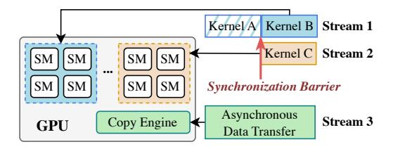
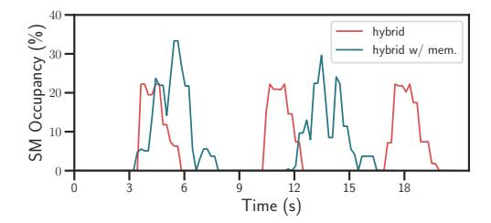
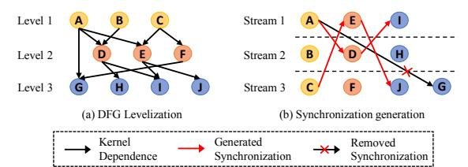
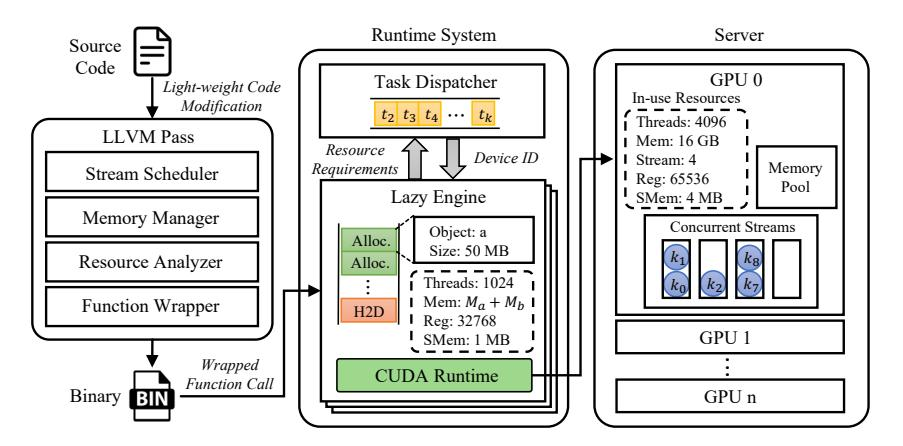
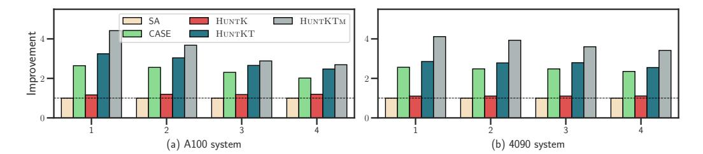

# HuntKTm: Hybrid Scheduling and Automatic Management for Eficient Kernel Execution on Modern GPUs

[WENXUAN PAN,](https://orcid.org/0009-0003-6307-5974) School of Computer Science and Engineering, Sun Yat-Sen University, Guangzhou, China [ZEJIA LIN,](https://orcid.org/0000-0002-7205-4062) School of Computer Science and Engineering, Sun Yat-Sen University, Guangzhou, China [JIANGSU DU,](https://orcid.org/0000-0003-4707-9492) School of Computer Science and Engineering, Sun Yat-Sen University, Guangzhou, China [XIANWEI ZHANG,](https://orcid.org/0000-0003-3507-4299) School of Computer Science and Engineering, Sun Yat-Sen University, Guangzhou, China

Nowadays, Graphics Processing Units (GPUs) dominate in a wide spectrum of computing realms with massive parallel processing capabilities. However, as resources are continuously integrated into GPUs, traditional serial execution ofen leads to underutilization. Prior studies have shown that allowing multiple kernels to run concurrently and share GPU resources can efectively improve both resource utilization and system throughput. Nonetheless, existing methods for solely automating concurrent kernel execution either schedule kernels within individual applications (i.e., kernel-level) or enable task concurrency across multiple applications (i.e., task-level), thus leaving substantial GPU capacity underexploited. Moreover, they inevitably introduce new programming frameworks, which incur cumbersome manual eforts and further impose substantial programming burdens on developers.

To address these limitations, we propose HuntKTm, a hybrid scheduling and automatic management method that cooperates kernel-level and task-level concurrency to enhance system throughput with minimal code modifcation. Specifcally, HuntKTm comprises a stream scheduler to assign kernels, a task scheduler to dispatch tasks onto GPUs, and a memory manager to reduce memory footprint. Te stream scheduler applies a strategy to dispatch kernels to hardware queues and adopts a novel algorithm to remove redundant synchronizations in computational fow. Ten, the task scheduler automatically issues tasks based on resource

Extension of Conference Paper: Zejia Lin, Zewei Mo, Xuanteng Huang, Xianwei Zhang, Yutong Lu. 2023. KeSCo: Compiler-based Kernel Scheduling for Multi-task GPU Applications. In IEEE 41st International Conference on Computer Design, Washington DC, USA. Tis extended version makes the following new contributions to the conference paper: 1. We observe that solely applying kernel scheduling, e.g., KeSCo, or task scheduling fails to fully leverage the potential of concurrent execution to enhance GPU resource utilization. 2. Based on this insight, we propose a hybrid scheduling strategy comprising a stream scheduler and a task scheduler. Te strategy automatically schedules a task's kernels to diferent streams and dynamically dispatches tasks to suitable devices based on resource demands and availability. 3. To address the memory capacity botleneck in hybrid scheduling, we introduce a memory manager that reduces the memory footprint of tasks using liveness analysis. 4. We conduct a more comprehensive evaluation to analyze the performance benefts of the hybrid scheduling strategy and memory management in both multi-task and single-task scenarios, ofering insights into the underlying causes of the improvements. Experimental results demonstrate that HuntKTm signifcantly improves system throughput and accelerates task execution over prior arts.

Tis research is supported by the National Key R&D Program of China (Grant No. 2023YFB3002202), the NSFC grants (62472462, 62461146204). Xianwei Zhang and Jiangsu Du are the corresponding authors.

Authors' Contact Information: Wenxuan Pan, School of Computer Science and Engineering, Sun Yat-Sen University, Guangzhou, Guangdong, China; e-mail: panwx5@mail2.sysu.edu.cn; Zejia Lin, School of Computer Science and Engineering, Sun Yat-Sen University, Guangzhou, Guangdong, China; e-mail: linzj39@mail2.sysu.edu.cn; Jiangsu Du (corresponding author), School of Computer Science and Engineering, Sun Yat-Sen University, Guangzhou, Guangdong, China; e-mail: dujiangsu@mail.sysu.edu.cn; Xianwei Zhang (corresponding author), School of Computer Science and Engineering, Sun Yat-Sen University, Guangzhou, Guangdong, China; e-mail: zhangxw79@mail.sysu.edu.cn.


[This work is licensed under a Creative Commons Attribution 4.0 International License.](https://creativecommons.org/licenses/by/4.0)

© 2025 Copyright held by the owner/author(s). ACM 1544-3973/2025/12-ART161 [htps://doi.org/10.1145/3774652](https://doi.org/10.1145/3774652)

161:2 W. Pan et al.

requirements and availability to support GPU sharing among uncooperative applications. Finally, the memory manager reduces memory footprint for tasks by limiting the lifetimes of memory objects, which thereby enables more tasks to execute simultaneously. Experimental results demonstrate that HuntKTm improves system throughput by 33.2% over the existing state-of-the-art CASE framework on a single machine equipped with four NVIDIA A100 GPUs and reaches 13.8% higher application-level performance over Taskfow, even with lessened programming eforts.

CCS Concepts: • Sofware and its engineering → Compilers; Runtime environments; Scheduling; Sofware performance; Massively parallel systems;

Additional Key Words and Phrases: Concurrent kernel execution, task scheduling, GPU memory management, compiler, runtime system

### ACM Reference Format:

Wenxuan Pan, Zejia Lin, Jiangsu Du, and Xianwei Zhang. 2025. HuntKTm: Hybrid Scheduling and Automatic Management for Efcient Kernel Execution on Modern GPUs. ACM Trans. Arch. Code Optim. 22, 4, Article 161 (December 2025), 26 pages. [htps://doi.org/10.1145/3774652](https://doi.org/10.1145/3774652)

### 1 Introduction

In the last decade, Graphics Processing Units (GPUs) have been widely applied in a myriad of domains, owing to their excessive computation capability and high memory throughput. Advanced GPUs incorporate more resources than what a typical monolithic GPU task[1](#page-1-0) necessitates and are thus frequently being underutilized, especially when executing single-kernel programs, which launch only one kernel at a time. To alleviate the underutilization issue, a plethora of approaches have been proposed, with representative schemes of concurrently executing sliced kernels [\[36,](#page-24-0) [53,](#page-25-0) [56,](#page-25-1) [57\]](#page-25-2) and resource virtualization [\[12,](#page-23-0) [40,](#page-24-1) [43,](#page-24-2) [52\]](#page-25-3).

As GPU applications become more complex, multi-kernel programs, originally consisting of concurrently executable kernels, are emerging across diverse realms. Compared to single-kernel programs, multi-kernel ones can leverage various GPU streams and synchronization events to parallelize kernel executions to efciently shorten execution time. Such an optimization requires developers to correctly analyze dependencies between kernels and then rearrange kernels in task queues to strike load balance and minimize synchronization cost. Without a doubt, considerable programming eforts should be made to obtain bug-free and highly performant codes, particularly for increasingly complicated programs and architectures. To address the issue, a bunch of designs have been recently presented to automate inter-kernel concurrency of GPU applications. A GrCUDAbased [\[29\]](#page-24-3) runtime approach GrSched [\[38\]](#page-24-4) applies a virtual machine, exempting developers from the need to explicitly claim kernel dependencies. But compared to expertise-based optimizations, GrSched introduces serious performance downgrade due to the overheads of runtime scheduling. Instead, Taskfow [\[15\]](#page-23-1) proposes a new heterogeneous programming framework to automate interkernel concurrency optimization. It harnesses cudaGraph [\[33\]](#page-24-5) to reduce the overheads of fragmented kernel launches. Nevertheless, such a method requires developers to grasp a new programming model and manually specify kernel dependencies, inevitably raising coding difculty. Although executing kernels concurrently within an application greatly enhances GPU resource utilization, the improvement is constrained by the limited number of concurrent kernels.

Another direction to address resource underutilization is sharing GPU among tasks. In concurrent task execution, time-sharing is most commonly used, which allocates time slices for kernels to perform computations, in turn. Various researches have been performed to optimize task scheduling

<span id="page-1-0"></span><sup>1</sup>Here a task refers to an independently executing program that consists of one or more kernels.

with a time-sharing model [\[6,](#page-23-2) [13,](#page-23-3) [14\]](#page-23-4). Tese methods aim to ensure quality of service (QoS) in concurrent execution but have limited benefts on utilization and overall throughput. NVIDIA Multi-Process Service (MPS) [\[28\]](#page-24-6) enables kernels from diferent processes to execute on the same device, implementing space-sharing by partitioning resources according to user-defned computing resource thresholds. Building upon MPS, GSLICE [\[10\]](#page-23-5) introduces a self-learning resource allocation algorithm to assign suitable resources for DNN inference tasks. SchedGPU [\[44\]](#page-24-7), a runtime task scheduling system, seeks to maximize task concurrency on a single GPU while avoiding out-ofmemory (OOM) issues. To facilitate the concurrent execution of more tasks, researchers have expanded the scheduling scope to encompass multiple GPUs. In multi-GPU systems, task scheduling requires explicitly specifying the target device based on the resource requirements of tasks, imposing additional programming burdens on users. CASE [\[4\]](#page-23-6) reduces such manual eforts by statically analyzing task resource requirements, and then dynamically assigning tasks to appropriate devices according to available GPU resources. However, memory capacity emerges as a performance botleneck that limits the ability to launch additional tasks. Furthermore, as the number of tasks increases, the interference between tasks becomes signifcant and cannot be overlooked. Terefore, relying solely on kernel scheduling or task scheduling is insufcient to fully utilize the available GPU resources.

To maximize resource utilization in GPU systems, we propose HuntKTm, a hybrid scheduling and automatic management method that cooperates kernel-level and task-level concurrency to facilitate efcient GPU execution. HuntKTm is comprised of a stream scheduler and a task scheduler to combine concurrent kernel and task scheduling, and a memory manager for memory footprint reduction. Specifcally, stream scheduler automatically identifes data dependencies and places kernels into diferent streams concerning load balance and synchronization cost. Task scheduler analyzes resource requirements of tasks and available system resources, and subsequently performs efcient, memory-safe device dispatch across GPUs. Memory manager conducts liveness analysis on multikernel programs and facilitates memory reuse by scheduling memory allocation and deallocation instructions. Te source code of HuntKTm is available at [https://github.com/Gemini321/HuntKTm.](https://github.com/Gemini321/HuntKTm) In summary, the contributions of this article are as follows:

- —We highlight the inadequate performance enhancement and programming weakness of prior arts in solely improving intra-application or inter-application concurrent execution for multi-kernel programs.
- —With the insight, we propose hybrid scheduling by encompassing a stream scheduler to exploit kernel-level concurrency for multi-kernel programs, and a task scheduler to analyze resource requirements and dispatch tasks to appropriate devices automatically.
- To widen scheduling space, we further present a memory manager based on memory liveness analysis to reduce task memory footprint. Te manager alleviates the memory capacity botleneck and accounts for launching sufcient tasks to saturate system resources.
- Experimental results show that HuntKTm efectively improves execution performance and resource utilization of GPUs. Compared with the state-of-the-art scheduling framework CASE, HuntKTm achieves an average of 33.2% throughput improvements. Additionally, HuntKTm delivers 13.8% application-level performance improvement over Taskfow.

### 2 Background

Tis section mainly introduces GPU concurrency models and programming abstractions, and outlines memory management techniques focused on lifetime-aware memory allocation and reuse, which lays the foundation for subsequent system design and optimizations.

<span id="page-3-0"></span>161:4 W. Pan et al.



Fig. 1. Execution of concurrent kernels on a GPU [33].

#### <span id="page-3-1"></span>2.1 GPU Concurrent Execution

Designed for massively parallel computation, modern GPUs are typically equipped with many *streaming multiprocessors* (SMs), each of which has hundreds of computing cores and can simultaneously execute up to thousands of threads. In many scenarios, one single kernel cannot fully utilize GPU hardware resources, thus causing a great waste of computation capabilities and low performance [54]. To alleviate such a problem, **concurrent kernel execution** (CKE) has been widely supported by vendors to parallelize inter-kernel execution on hardware components. It issues operations in multiple software queues (called *streams* in CUDA [33]), which are mapped onto different hardware queues and processed concurrently if the demanded resources, typically SMs, are sufficient. The multi-kernel workloads provide a perfect scenario for implementing CKE, as they have independent kernels that are ready to execute concurrently. However, the concurrency capability of CKE is limited by the number of independent kernels in a single program, making it challenging to saturate the available hardware resources.

Another feasible way to achieve higher GPU utilization is applying task-level concurrent execution among independent workloads. When multiple tasks run simultaneously, thread blocks from different tasks are able to occupy more SMs. Moreover, a GPU can swiftly switch to another task if one is stalled on memory access, effectively overlapping computation and communication. NVIDIA MPS [28] provides a software mechanism that enables multiple processes to co-execute on the same device in a space-sharing fashion, which reduces context-switching overhead and improves GPU utilization across processes. Since Ampere architecture, NVIDIA multi-instance GPU (MIG) [30] splits a single GPU into multiple instances for clients, which provides isolated compute and memory resources for each instance. This technique enables predictable performance and improved resource utilization in multi-tenant environments.

### 2.2 CKE Programming in CUDA

To facilitate efficient computation with CKE, many popular GPU programming models [2, 11, 33] offer a series of concurrency APIs, here we take CUDA as an example. A **data flow graph (DFG)** needs to be constructed correctly first to help schedule the executions. The DFG is further divided into multiple levels such that kernels from the same level have no data dependence. Then developers need to create multiple *CUDA streams*, and issue kernels on different streams to co-execute on GPUs. To ensure the execution order of data-dependent kernels across streams, *CUDA events* are inserted after a kernel's predecessors to track their completion. These events are subsequently synchronized before the launch of the dependent kernel. Synchronization between kernels and asynchronous data copy follows a similar pattern.

Figure 1 shows an example of three concurrent tasks sharing a GPU. Kernels B and C are mutually independent, and they both depend on kernel A. After kernel A finishes, kernels B and C are issued on different streams and executed simultaneously on different SMs. At the same time, an asynchronous copy is proceeding on the copy engine, which is a complementary hardware

resource for SMs. Terefore, the computation of two kernels and data transfer are overlapped, helping utilize the abundant resources of GPUs. However, developers need to properly scrutinize the complex dependencies, schedule kernels in streams, and generate synchronization barriers in CKE programming. Such code reorganization incurs tremendous manual efort and is also error-prone.

### 2.3 GPU Memory Management

Memory management is crucial for efective resource utilization in GPU computing [\[18,](#page-23-8) [21,](#page-23-9) [23,](#page-23-10) [49\]](#page-24-9). A memory object is a contiguous memory region owned by a variable, constituting a fundamental memory management unit. Basic APIs like cudaMalloc and cudaFree handle memory allocation and deallocation of memory objects, requiring device synchronization and lacking fexibility for variable-sized data. More advanced APIs like cudaMallocAsync and cudaMallocManaged are designed to enhance performance and usability. Beyond these APIs, memory reuse has been a primary focus in memory management optimization. Tis technique minimizes the footprint by reallocating unused memory, allowing more tasks to run simultaneously within limited memory capacity. A feasible way to reuse memory is by limiting the lifetimes of memory objects through allocation and deallocation scheduling. Te lifetime of a memory object spans from its allocation to its deallocation. If the lifetimes of two memory objects do not overlap, the memory released by one can be reallocated to the other, enabling memory reuse between the two objects. A live range denotes the period between the initial and fnal access of a memory object, representing the shortest duration during which the object is utilized. By identifying the live ranges of memory objects and tailoring the lifetimes to the live ranges, non-overlapping memory regions can be reused to reduce the overall memory consumption of tasks.

# 3 Related Work

### 3.1 Concurrent Kernel Execution

CKE has been widely studied in fne granularity. Elastic kernel [\[36\]](#page-24-0) slices kernels into multiple small ones and deploys them on diferent SM to speed up. Similarly, OpenMP [\[35\]](#page-24-10) is leveraged to decompose kernels into multiple tasks in Junggler [\[3\]](#page-23-11) and schedule tasks with dependencies via runtime mechanism. Also, Pagoda [\[59\]](#page-25-5) concurrently executes narrow tasks at warp-level by virtualizing GPU resources and issues kernels when required resources are available. ROSGM [\[22\]](#page-23-12) leverages stream priorities in the Robot Operating System to dynamically switch kernel scheduling strategies across diferent application scenarios. To reduce runtime profling overhead, a Fisher feature selection-based method [\[47\]](#page-24-11) is employed to classify kernels and collocate those with complementary characteristics. cCUDA [\[46\]](#page-24-12) performs online profling and ranking for kernels, and employs kernel slicing to maximize computation overlap. FlexSched [\[25\]](#page-24-13) further enables dynamic resource allocation and preemptive scheduling during CKE using persistent kernels. Specifcally, cCUDA and FlexSched assume that all kernels are ready before scheduling without data dependencies, focusing on selecting optimal subsets of concurrent kernels and devising strategies for resource allocation among them. Addressing concurrency among data-dependent kernels within an application, Taskfow [\[15\]](#page-23-1) wraps GPU programming model APIs and implements a static scheduler in the framework. A GrCUDA [\[29\]](#page-24-3)-based runtime scheduler [\[38\]](#page-24-4) eases the prototyping of parallel applications. Distinguished from those prior arts, our proposed HuntKTm aims to statically automate kernel scheduling in multi-kernel programs, achieving much beter performance with reduced programming burden.

### 3.2 Task Scheduling

A bunch of task schedulers have been proposed to optimize concurrent task execution. On the hardware level, new APIs are introduced in [\[41\]](#page-24-14) to heterogeneous system architecture (HSA) 161:6 W. Pan et al.

for applications specifying task priority. Chimera [\[37\]](#page-24-15) extends the SM scheduler to estimate the cost of kernel preemption to minimize the overhead. Similarly, the command bufer and status table are further embedded in the SM scheduler [\[50\]](#page-24-16) to minimize the overhead for prioritized tasks. On the sofware level, FLEP [\[55\]](#page-25-6) leverages a compiler-runtime system to control task preemption at the kernel level. EfSha [\[5\]](#page-23-13) schedules kernels at thread-block level dynamically with an online cost model. ElasticBatch[\[42\]](#page-24-17), gpulet[\[9\]](#page-23-14), and Paris&ELSA[\[19\]](#page-23-15) introduce innovative partitioning and scheduling algorithms designed for efciently distributing inference requests across GPUs with MIG enabled. SchedGPU [\[44\]](#page-24-7) co-locates applications on a device in a memory-safe manner through a dedicated runtime system. CASE [\[4\]](#page-23-6) introduces a novel compiler-based approach for scheduling uncooperative tasks over a multi-GPU system, which shares some similarities to HuntKTm regarding retrieving resource requirements in a lazy runtime. While prior arts consider resource requirements as static features, HuntKTm integrates with a memory management strategy for alleviating the memory botleneck in task co-execution scenarios.

### 3.3 GPU Memory Optimization

Te efcient utilization of limited GPU memory has been extensively studied across various scenarios. Techniques such as swapping [\[18,](#page-23-8) [23,](#page-23-10) [24,](#page-23-16) [58\]](#page-25-7), recomputation [\[7,](#page-23-17) [17,](#page-23-18) [49\]](#page-24-9), compression [\[16,](#page-23-19) [26,](#page-24-18) [45\]](#page-24-19), and reusing [\[21,](#page-23-9) [39,](#page-24-20) [48\]](#page-24-21) have been widely adopted for memory optimization. DeepUM [\[18\]](#page-23-8) proposes a correlation prefetch technique to hide signifcant overhead due to unifed memory page faults. DELTA [\[51\]](#page-24-22) and ATP [\[8\]](#page-23-20) combine both swapping and recomputation to achieve lower memory consumption and higher throughput in DNN training. SMC [\[26\]](#page-24-18) selectively compresses read-only pages to enable memory oversubscription while avoiding severe decompression cost. Targeting memory reusing, frameworks like PyTorch [\[39\]](#page-24-20) and TensorFlow XLA [\[48\]](#page-24-21) pre-allocate a memory pool before execution and adopt in-place operations to reuse memory spaces of input and output tensors. Occamy [\[21\]](#page-23-9) analyzes tensor liveness among DNN and applies kernel fusion to eliminate redundant intermediate tensors. However, these reuse methods focus on highly structured deep learning applications and cannot be adapted for general GPU programs.

### 4 Motivation

In this section, we provide intuitive examples to demonstrate the benefts of increasing kernel-level and task-level concurrency over GPU space-sharing scenarios. Ten we discuss how to achieve this goal through automatic stream and task scheduling, and further memory management.

## 4.1 Insuficiency of Only Kernel-level and Task-level Concurrency

As discussed in Section [2.1,](#page-3-1) space-sharing schemes are commonly applied to improve GPU hardware utilization. However, we observe that computing resources can remain underutilized even with GPU utilization sustained at 100% in some multi-task scenarios. Here we use SM occupancy, obtained through a lightweight GPU monitoring tool DCGM [\[32\]](#page-24-23), as a metric to evaluate the utilization of GPU computing resources during kernel execution. Figure [2](#page-6-0) illustrates the SM occupancy of running two memory-intensive applications M2, composed of several activation and reduction kernels from NVIDIA FasterTransformer [\[31\]](#page-24-24), under three diferent concurrency schemes. Multi-stream issues multiple kernels without data dependencies from an application through several hardware queues simultaneously, while two applications execute serially. Multi-task co-execute two tasks in the same device with MPS being enabled. Even with 100% GPU utilization during execution, both multi-stream and multi-task achieve less than 10% SM occupancy. Such low occupancy indicates that relying solely on CKE or task execution can not fully exploit GPU resources. By combining multi-stream and multi-task, hybrid allows for the simultaneous execution of more kernels from diferent tasks, enhancing resource utilization and accelerating computation. Terefore, hybrid achieves an SM



<span id="page-6-0"></span>Fig. 2. SM occupancy of co-running two memoryintensive applications with CKE (multi-stream), concurrent task execution (multi-task) and hybrid execution (hybrid).

Fig. 3. SM occupancy of running six applications, where hybrid launches two jobs in a batch and hybrid w/ mem. with reduced memory usage launches three jobs simultaneously.

occupancy of up to 22%, ofering a throughput improvement of 73.1% compared to multi-stream and 79.7% compared to multi-task. Te result reveals signifcant potential for combining concurrent kernel and task execution in multi-task scenarios.

### 4.2 Memory Capacity Botleneck in Concurrent Task Execution

With combined concurrent kernel and task execution, the memory usage becomes a primary constraint on task-level concurrency, as GPU out-of-memory (OOM) can cause program crashes. Figure [3](#page-6-0) shows the SM occupancy curves for six multi-stream applications running under MPS, both without memory management (hybrid) and with memory management (hybrid w/ mem.). Te peak memory consumption is defned as the maximum instantaneous GPU memory during execution. In hybrid w/ mem., we manually schedule the allocation and deallocation instructions in M2, decreasing M2's peak memory consumption from 17.6 GB to 11.2 GB by reusing non-overlapping memory objects. Without memory management, only two applications could share a GPU with 40 GB memory, requiring three separate launches to complete the computation. With reduced memory footprint, three applications could be launched altogether. Running more tasks concurrently on a single device allows additional kernels from diferent tasks to saturate idle computational resources. Moreover, the result reveals that even with an increased number of concurrent tasks, hybrid w/ mem. exhibits minimal growth in data initialization and transfer time before kernel execution. Tis can be atributed to the overlap of communication time for certain tasks with the computation of others, along with the parallel execution of host operations across tasks. As a result, the enhanced task concurrency enabled by efcient memory management leads to an 18.2% improvement in system throughput. Tis indicates that memory capacity becomes increasingly critical for collocating more tasks on a single device and improving system throughput under hybrid scheduling.

### 4.3 High Programming Burden in GPU Management

With no doubt, considerable eforts and expert knowledge are needed to write CKE codes, which signifcantly raises the programming barrier and is error-prone. Table [1](#page-7-0) summarizes the characteristics of various concurrency optimization schemes in terms of programming eforts. To reduce the programming complexity of CKE, approaches like Taskfow [\[15\]](#page-23-1) and a GrCUDA-based [\[29\]](#page-24-3) scheduler (aliased as GrSched for ease of reference) [\[38\]](#page-24-4) have been proposed to craf new programming frameworks by extending CUDA's API for stream management and synchronization. Taskfow demands explicitly specifying dependencies through its APIs, while GrSched introduces a DSL embedded in Python to support automatic analysis and scheduling. Both schedulers require thorough refactoring of source code, which becomes another programming burden for users. In particular, errors of manually specifying dependencies in Taskfow can lead to incorrect computation results

161:8 W. Pan et al.

<span id="page-7-0"></span>

| Scheme        | D.A.a        | C.M.b        | M.M.c        | T.S.d        | N.P.F.e      | Language |
|---------------|--------------|--------------|--------------|--------------|--------------|----------|
| Serial        | Х            | Х            | Х            | Х            | ✓            | C++      |
| Taskflow [15] | X            | $\checkmark$ | X            | X            | X            | C++      |
| GrSched [38]  | $\checkmark$ | $\checkmark$ | X            | X            | X            | Python   |
| PyTorch [39]  | $\checkmark$ | $\checkmark$ | $\checkmark$ | X            | X            | Python   |
| CASE [4]      | X            | X            | X            | $\checkmark$ | $\checkmark$ | C++      |
| HuntKTm       | $\checkmark$ | ✓            | ✓            | $\checkmark$ | $\checkmark$ | C++      |

Table 1. Summary of Various Concurrent Schemes

#### Notes:

- <sup>a</sup> Automatic Dependency Analysis
- <sup>b</sup> Automatic Concurrency Management
- <sup>c</sup> Automatic Memory Management
- <sup>d</sup> Automatic Task Scheduling
- <sup>e</sup> No New Programming Framework

that are often hard to detect and debug, further increasing the risk and effort in development. Similar to CKE, memory management is impractical for programmers, as it requires detailed knowledge of memory objects and precise control over allocation and deallocation. Empirically, misordered memory operations and missing synchronizations are common in manual memory management, often resulting in unpredictable and hard-to-reproduce errors. While frameworks like PyTorch [39] and Tensorflow [1] offer dynamic memory management support, they are designed for deep learning rather than general-purpose GPU computing and require additional efforts to program within the framework.

Problems become more sophisticated when concurrent execution extends to multi-GPU systems. Users must specify target devices for applications before running and carefully control execution timing and order to prevent crashes from OOM errors and performance degradation. CASE [4] introduces a runtime system that transparently schedules tasks to appropriate devices without requiring a new programming framework. However, CASE lacks in-depth program analysis and optimization, leaving the burden of kernel concurrency and memory management on programmers. Therefore, there remains the urgency for a method that enables efficient kernel execution and task scheduling in multi-GPU systems with lowered coding efforts.

### 5 Design

This section presents our proposed design HuntKTM, which incorporates hybrid scheduling and memory management for efficient task and kernel execution. We first give the overview and then elaborate on each module.

#### 5.1 System Overview

Huntkim is a GPU kernel scheduling framework that supports efficient kernel execution through a combination of kernel-level and task-level concurrency scheduling along with automatic memory management. As shown in Figure 4, Huntkim consists of three key components: *stream scheduler*, *task scheduler*, and *memory manager. Stream scheduler* focuses on intra-task kernel scheduling by distributing kernels with data dependencies to different streams at compile time. It takes the source code of multi-kernel programs as input, analyzes inter-kernel data dependencies, and generates high-performance multi-stream programs to enable CKE within a task. Then, *task scheduler* combines compile-time and runtime information to evaluate the resource requirements of the program and dynamically collocates tasks on appropriate devices based on the available resources in multi-GPU systems. Cooperating *stream scheduler* and *task scheduler* automates the hybrid concurrent execution of kernels and tasks.

To address the memory bottleneck in hybrid scheduling, *memory manager* performs memory lifetime management during compilation. It processes the stream graph from *stream scheduler*, applying a novel analysis algorithm to identify the live range of each memory object, which corresponds to the actively used periods. By scheduling allocation and deallocation instructions,

Task

Fig. 4. Overview of HuntKTm, which consists of three components: stream scheduler, task scheduler and memory manager. Stream scheduler assigns kernels from multi-kernel programs to concurrent queues. Task scheduler evaluates the resource requirements of transformed programs and dispatches them to appropriate devices. Memory manager optimizes memory allocation and deallocation to reduce the memory footprint of tasks.

Kernel Memory Alloc. Memory Free

Sync.

memory manager efectively shortens the lifetime of memory objects and reuses the objects with non-overlapping lifetimes, thereby reducing the peak memory usage. In summary, HuntKTm maximizes concurrency through hybrid scheduling and memory optimization, ultimately improving GPU resource utilization and system throughput.

### 5.2 Stream Scheduler

<span id="page-8-0"></span>**· · ·**

To achieve kernel-level concurrency, the stream scheduler relies on lightweight code modifcations to help construct the DFG of kernels, then schedules the kernels across multiple streams while ensuring correct execution order through inter-stream synchronization instructions. Figure [5](#page-9-0) shows the overall structure of the stream scheduler, which consists of three main components: DFG constructor, kernel distributor, and synchronization generator. Te input of stream scheduler is the source code of a task, containing a series of kernels coded in the form of sequential execution. Te DFG constructor analyzes each kernel's inputs and outputs to build a DFG based on data dependencies. Te kernel distributor assigns kernels to multiple streams based on the analyzed DFG, and then the synchronization generator creates synchronization instructions between kernels in diferent streams to ensure the program executes correctly. Te fnal output of the stream scheduler is a stream graph that contains information about the multi-stream execution, which can be further optimized by the following transform pass.

To construct the DFG accurately, DFG constructor frst distinguishes read-only and writable kernel parameters by introducing a lightweight code modifcation: a constant is inserted before each kernel's input parameters to indicate the number of following writable parameters. Tis modifcation enables the DFG constructor to identify potential write conficts without analyzing the kernel's source code. When building the DFG, we consider three types of data dependencies: Read-Afer-Write (RAW), Write-Afer-Read (WAR), and Write-Afer-Write (WAW), which are common in real-world HPC and AI applications. Directly constructing the kernels' dependency graph from the complex control fow incurs signifcant overhead. To reduce the computational cost, we build the DFG by leveraging the sequential order of kernel launch. Kernels are iterated in reverse order and a breadth-frst search algorithm is adopted to identify each kernel's direct predecessors until all kernels are traversed. We determine inter-kernel dependencies based on whether diferent kernels access the same data object, with the condition that at least one of these accesses involves a

161:10 W. Pan et al.

<span id="page-9-0"></span>



Fig. 5. Workflow of the stream scheduler, which transforms serial source code into a stream graph with eficient kernel-level parallelism.

Fig. 6. An example of stream scheduling for input DFG. (a) A DFG organized into three levels to schedule ten kernels onto three available streams. (b) Scheduling result of kernel distributor and synchronization generator for DFG.

write operation. For example, if kernel A precedes kernel B in the execution order, and both kernels mark a shared variable data as writable, then a WAW dependency is recorded from A to B. If data is read-only in both kernels, no dependency is added. Furthermore, pointer arguments derived from the same base address are treated to access the same data. Tis unifcation ensures that aliasing caused by pointer arithmetic does not result in missing dependencies.

When the DFG is constructed, kernel distributor assigns kernels to GPU streams to enable kernellevel concurrency. Te process begins by levelizing the DFG so that kernels in the same level have no mutual data dependencies. Ten, the kernels in the DFG are assigned to diferent streams level by level. We defne the preferred predecessor set (PP-Set) of an unscheduled kernel as the subset of its predecessors that are located at the end of streams. Kernels in the same level are frst sorted by the size of their PP-Set, and those with smaller PP-Set are scheduled frst to minimize cross-stream synchronization. When scheduling kernels to diferent streams, kernel distributor follows a set of rules: ∂ Kernels without any predecessor are evenly distributed across streams in a round-robin fashion. ∑ Kernels with a single predecessor are assigned to the same stream as that predecessor. ∏ Kernels with multiple predecessors are assigned to the stream of the predecessor in their PP-Set that has the fewest unscheduled successors. Tis heuristic algorithm ensures that kernels are scheduled as early as possible afer their predecessors while balancing stream workloads and reducing synchronization overhead.

Here we exemplify the above steps with regard to the given DFG in Figure [6\(](#page-9-0)a) and the corresponding kernel distribution strategy in Figure [6\(](#page-9-0)b). In Level 1, kernels are evenly assigned to diferent streams according to Rule ∂. In Level 2, kernel F, having the smallest PP-Set, is scheduled frst and placed afer kernel C in accordance with Rule ∑. Afer updating the PP-Sets, kernel E now has a smaller set than kernel D, as kernel C is no longer at the end of its stream, and is thus arranged afer kernel A by Rule ∏. Finally, kernel D is placed afer kernel B following Rule ∏. In Level 3, we repeat the process and schedule them in the order of kernel H, I, and J, which are all placed afer their preferred predecessor. Lastly, kernel G can choose from Stream 1 and 3, where its predecessors are seated, and are randomly inserted in Stream 3, as shown in Figure [6\(](#page-9-0)a).

Afer scheduling kernels in asynchronous streams, synchronization generator comes into play to ensure the correctness of the execution order. A naive approach creates barriers whenever data dependence exists. However, some barriers are redundant and may cause performance overhead. To tackle this issue, a pruning algorithm is proposed based on the implicit synchronizations brought by the transitivity of dependency and serial execution of kernels in the same stream. When fnished, the barriers are pruned to the minimum.

Te synchronization generator traverses the kernels in each stream and works in three steps, suppose it is working on kernel . In Step ∂, it creates barriers for each of 's predecessors that do not share the stream with . In Step ∑, it checks 's predecessors in each stream, and reserves

<span id="page-10-0"></span>

Fig. 7. Structure of *task scheduler* in HuntKTM, which operates in two phases: offline and online. *Resource analyzer* retrieves the resource requirements from the input stream graph and incorporates the results into the program during compilation. In the online phase, each task launches a *lazy engine* that delays the execution of GPU operations and communicates with *task scheduler*. *Task dispatcher* maintains information about each GPU and is responsible for dispatching tasks to devices that satisfy the resource requirements.

only the synchronization issued from the last predecessor in that stream. In Step 6, it enumerates kernels before K in the same stream, say T. If K and Ts predecessor share the same stream, and Ks predecessor is executed before Ts, K is then implicitly synchronized by T and Ts predecessor. Therefore, Ks barrier to that predecessor is safe to be removed. A full analysis of the complete DFG helps eliminate these redundant barriers correctly. In runtime analysis of GrSched, such elimination is infeasible due to the lack of a global view of the graph. The example of Figure 6(b) shows the barriers generated in solid lines and the removed barriers in dashed lines. Synchronization generator scans Stream 1 and creates kernel E and Es barriers by Step E0. The same is true for kernel E1 in Stream 2 and kernel E3 in 3. For kernel E4, Step E5 detects its implicit synchronization with kernel E6 by the execution order of E6 detects its implicit synchronization with kernel E6 by the execution order of E6 detects its implicit synchronization with kernel E6 by the execution order of E7 and E8 detects its implicit synchronization with kernel E6 by the execution order of E7 and E8 detects its implicit synchronization with kernel E8 by the execution order of E8 detects its implicit synchronization with kernel E8 by the execution order of E8 detects its implicit synchronization with kernel E8 by the execution order of E8 detects its implicit synchronization with kernel E8 by the execution order of E8 detects its implicit synchronization with kernel E8 by the execution order of E9 detects its implicit synchronization with kernel E9 by the execution order of E9 detects its implicit synchronization with kernel E9 by the execution order of E9 detects its implicit synchronization with kernel E9 by the execution order of E9 detects its implicit synchronization with kernel E9 by the execution order of E9 detects its implicit synchronization w

#### 5.3 Task Scheduler

As shown in Figure 7, *Task scheduler* comprises three components: *resource analyzer, lazy engine*, and *task dispatcher. Resource analyzer* operates during the compilation phase, analyzing each kernel's launch configuration and the size of memory objects. Then *resource analyzer* aggregates the computing and memory resource requirements for each task. *Lazy engine* collects the resource information that cannot be determined during static compilation at runtime. It defers GPU-related operations when necessary, ensuring flexibility and adaptability to dynamic resource conditions. *Task dispatcher* integrates the task requirements provided by the *lazy engine* with the realtime system resource usage to select suitable devices for tasks. Together, these components enable *task scheduler* to dynamically and efficiently co-execute multiple tasks among GPUs.

To facilitate resource-aware task scheduling during compilation, resource analyzer extracts resource requirements, such as memory usage and number of threads, from the source code. In addition, the analyzer leverages vendor-provided compiler (e.g., nvcc [27]) to obtain the number of registers and the amount of shared memory required by each kernel. Lazy engine estimates the computing resources needed for each stream by using the resource requirements of the first kernel launched within the stream. The total computing requirement of the task is then represented by aggregating the requirements of all streams. For memory resource, lazy engine employs defuse analysis for memory objects to identify objects associated with each kernel and determines their sizes from the memory allocation instructions. Notably, some resource requirements depend on input size and cannot be determined at compile time. In such cases, these requirements are captured during runtime by intercepting CUDA calls through lazy engine. Meanwhile, resource analyzer inserts cudaTaskSchedule at points where resource requirements are fully determined,

161:12 W. Pan et al.

### ALGORITHM 1: Resource-aware Task Scheduling Algorithm

```
Input: List of available GPUs  , queue of pending tasks , task to be scheduled

 Output: Scheduled target GPU 
1 Function TaskSchedule( , , ):
2  ←  ,  ← 0;
3 for  ∈   do
4 if . <  .    and   <  .   then
5   ℎ  ← ( .  ℎ  + .ℎ )/ .ℎ  ;
6   ← ( .  + . )/ .  ;
7    ← ( .   + .)/ . ;
8  ←  . − (  ℎ ,  ,   );
9 if  >  then
10  ← ;
11  ← ;
12 end
13 end
14 end
15 if  is not   then
16  .ℎ  ();
17 else
18 .ℎ();
19 end
20 return ;
21 end
```

enabling the calculation of maximum memory and computing resources required for task scheduling. However, static analysis cannot derive certain information due to function encapsulation or complex control fow. If resource requirements remain undefned before the frst kernel launch, cudaTaskScheduleLazy is inserted before each kernel launch to determine the execution device based on the currently requested resources instead of the total resource requirements.

Afer static resource analysis, task scheduler dynamically dispatches tasks to appropriate devices during runtime. Since the computing device remains undefned before task scheduling, lazy engine intercepts and delays GPU-related operations such as memory allocation, deallocation, and data transfers. When a program reaches the inserted scheduling instructions, lazy engine predicts the resource requirements based on the parameters of intercepted operations and the information provided by resource analyzer, then forwards the requirements to task dispatcher. And, task dispatcher schedules tasks based on resource requirements and returns the target device ID when scheduling fnishes. Once scheduled to a specifc device, lazy engine executes the intercepted operations in sequence and launches kernels only afer all operations are completed. Compared to ofine profling or static analysis, lazy execution allows HuntKTm to determine each task's resource requirements at runtime, providing accurate information for task scheduling without severe profling overhead.

To mitigate the overhead caused by frequent memory allocation and deallocation during execution, task scheduler initializes a memory pool before the frst allocation, with its size being determined by the predicted memory footprint. If the free memory in the pool is sufcient to satisfy the allocation request, the system directly returns the pre-allocated memory without invoking costly system calls. Upon deallocation, the runtime system retains the memory for reuse in subsequent allocation requests. Te memory in the pool is fully released only when the application exits.

Afer collecting resource requirements, task dispatcher schedules tasks to appropriate devices based on resource information. Te scheduling policy, detailed in Algorithm [1,](#page-11-0) takes as input the available GPUs, the pending task queue, and the task to be scheduled along with its resource requirements predicted by lazy engine. Te algorithm iterates over available GPUs and selects one with sufcient free memory and adequate hardware queues (Line 4 ∼ 5). Since each SM within a GPU functions as an independent computational unit with various resources, the number of available SMs is used to represent the GPU's computational capacity. Task dispatcher estimates available SMs from three perspectives: threads, registers, and shared memory, and prioritizes the GPU with the most available SMs (Line 6 ∼ 9). Tis approach prevents application failures due to memory shortages and alleviates resource conficts by distinguishing between various resource utilization types. As a result, computational load is more uniformly balanced across multiple GPUs. If no GPU meets both the memory and hardware queue requirements, task dispatcher suspends the task request in a queue and retries scheduling whenever resources get released.

### 5.4 Memory Manager

To address the memory capacity botleneck during hybrid scheduling, we design a memory lifetime management method for multi-stream programs and integrate the method into memory manager. Memory manager takes the stream graph generated by stream scheduler as input. It frst performs data fow analysis on each memory object to identify the live range of the objects. Based on the analysis results, memory manager schedules GPU memory allocation, deallocation, and other memory manipulation instructions to shorten memory objects' lifetimes to their live ranges during compilation, thus reusing memory regions among objects with non-overlapping lifetimes. Finally, the reduced peak memory usage is estimated at runtime using an approximate algorithm to provide necessary memory information for subsequent task scheduling.

In data fow analysis, memory manager begins by traversing all kernel calls in the program, examining GPU-related pointer variables within the kernel parameters. Since kernels can only access memory in GPU space, these pointers should refer to specifc GPU memory regions, each representing a distinct memory object. Notably, pointer aliasing can cause multiple pointers to reference the same memory region, so we trace allocation and deallocation instructions for each memory address by leveraging use-def chains. We treat any memory region allocated by the same allocation instruction as a memory object, and all kernels that use the pointers referencing this region are considered dependent on that object. Data fow analysis enables memory manager to establish the dependency relationships between kernels and associated memory objects.

Once the dependencies between kernels and memory objects are determined, memory manager analyzes the memory objects' live ranges and schedules memory allocation and deallocation instructions to minimize their lifetimes. Algorithm [2](#page-13-0) details the workfow of instruction scheduling to postpone GPU memory allocation. Te algorithm takes the stream graph as input, which is generated by the stream scheduler and processed through data fow analysis. We assume that each memory object requires at most a single data transfer between host and device, as handling multiple transfers would necessitate a more sophisticated analysis to determine the optimal instruction placement. Te algorithm begins by retrieving all memory objects within the program. For each memory object memObj, memory manager collects all allocation instructions and operations that may modify its content, such as data transfers or value assignments, and stores them in instrList in execution order for delayed allocation (Line 4). Next, memory manager identifes the list of kernel calls that depend on memObj, known as invokeList, representing the object's live range (Line 5). To determine the start of memObj's live range, invokeList is sorted based on the original sequential execution order. Te earliest kernel call is then identifed as the beginning of the live range and serves as the insertion point for the associated instructions (Line 6 ∼ 7). Memory 161:14 W. Pan et al.

# ALGORITHM 2: Instruction Scheduling Algorithm for Memory Lifetime Management

```
Input: Stream graph before transformation graph,
   Output: Stream graph after transformation graph<sub>out</sub>
1 Function PostponeMalloc(graph):
       memObjList \leftarrow graph.getMemObjList();
       for memObj \in memObjList do
            instrList \leftarrow graph.getRelatedInstr(memObj);
4
            invokeList \leftarrow graph.getAssiciatedKernels(memObj);
5
            sortByExecutionOrder(invokeList);
6
            insertPoint \leftarrow invokeList[0];
            graph.moveBe fore(instrList, insertPoint);
            for i \leftarrow 1 \sim invokeList.size() - 1 do
               graph.insertSyncBetween(insertPoint, invokeList[i]);
10
       end
       graph.removeRedundantSync();
       return graph;
15 end
```

manager then moves instrList before the insertion point, and converts memory allocation and data transfer instructions to their asynchronous versions (e.g., cudaMalloc to cudaMallocAsync and cudaMemcpy to cudaMemcpyAsync) and assigns them to execute within the same stream as the insertion point (Line 8). To ensure that memObj is allocated prior to any kernel call that depends on it, synchronization instructions are added between the insertion point and subsequent kernel calls (Line 9  $\sim$  11). Finally, all redundant synchronization instructions within and across streams are removed, then returning the optimized stream graph (Line 13  $\sim$  14). The algorithm for preponing free operations is similar to this algorithm and is not elaborated here.

After memory management, the peak memory usage of a task cannot be simply obtained by summing the sizes of all memory objects. To address this, we design an efficient algorithm for *lazy engine* to predict the peak memory usage during runtime. Given a stream graph with recorded operations, *lazy engine* first retrieves the delta memory list from each stream, which logs memory changes of sequential memory allocation and deallocation. Then it accumulates these changes and takes the maximum value as the memory requirement for the stream. Summing these maximum values across all streams achieves peak memory usage of the stream graph. Note that our algorithm provides an upper bound of peak memory usage with O(N) time complexity, where N is the number of memory objects, since certain memory peaks may not occur due to inter-stream synchronization. Compared to our algorithm, accurate memory prediction would require enumerating numerous execution combinations and verifying inter-stream synchronization rules, which becomes computationally expensive as the number of memory objects increases.

#### 5.5 Implementation

As shown in Figure 8, we implemented HuntKTM on the basis of CUDA Runtime and LLVM Compiler Infrastructure [20]. Although targeting the CUDA platform, our design can be easily applied to other frameworks that support concurrent task queues and asynchronous memory management (e.g., HIP [2] and SYCL [11]). We pinpoint the pattern that kernels are always called by \_\_cudaPushCallConfiguration, to find the serially issued kernels in host IR and apply our optimizations to their caller functions. To distinguish writable parameters from read-only ones, developers necessitate adding a parameter at the beginning of the kernel function's parameter list,

<span id="page-14-0"></span>

Fig. 8. Implementation of HuntKTM. The compiler consists of several LLVM passes: *stream scheduler, memory manager, resource analyzer,* and *function wrapper*, which transform the input code into a memory-optimized multi-stream program. During running, *lazy engine* maintains a CUDA operation queue and analyzes the task's resource requirements. *Task dispatcher* manages a task queue and dispatches tasks to suitable devices. Each GPU has multiple concurrent streams for the parallel execution of kernels, along with dynamically sized memory pools for each task.

which indicates that the first  $N_{out}$  parameters are writable, and rearranging the writable parameters to the first  $N_{out}$  positions. This technique enables *DFG constructor* to analyze dependencies automatically, without involving any new programming framework.

To intercept CUDA runtime function calls and retrieve memory information, all memory-related function calls like cudaMallocAsync and cudaFreeAsync are wrapped by *function wrapper*. Similar transformations are applied to kernel launches for computational resource collection. During task execution, the program invokes wrapped functions to perform CUDA operations. *Lazy engine* analyzes and stores the call information in a queue, deferring execution until the task is dispatched to a specific device. When the program reaches cudaTaskSchedule or cudaTaskScheduleLazy, *lazy engine* sends the resource requirements to *task dispatcher* and waits for the device ID to be returned. The communication between *lazy engine* and *task dispatcher* is transferred over shared memory. A task is bound to the target device by calling cudaSetDevice after scheduling. For memory pool management in each task, HuntKTM calls cudaDeviceGetDefaultMemPool to obtain the default memory pool before executing the deferred operations and uses cudaMemPoolSetAttribute to set the memory release threshold to the predicted memory footprint. This attribute prevents memory from being released until usage exceeds the preset threshold.

#### 6 Evaluation

#### 6.1 Environment Setup

- 6.1.1 Platform. We conduct experiments on a server equipped with 4 NVIDIA A100 GPUs, 2 AMD EPYC 7742 64-Core Processors and 256 GB DDR4 memory. Each A100 GPU has 40 GB HBM and 6912 CUDA cores. The operating system is Debian 10.2.1 and the version of the NVIDIA driver is 555.42.06. We compile GPU programs using LLVM 14.0.6 and CUDA 12.4.0.
- 6.1.2 Benchmark. We use seven representative applications as listed in Table 2 to evaluate kernel-level parallelism. The two in-house micro-benchmarks are drawn from the kernels in NVIDIA FasterTransformer [31], and the rest of the benchmarks represent typical GPU workloads (image processing, machine learning, etc.), which are aligned with the benchmarks in GrSched [38]. Each

<span id="page-15-0"></span>161:16 W. Pan et al.

|  |  | Table 2. Evaluated Benchmarks |
|--|--|-------------------------------|
|--|--|-------------------------------|

Table 3. Workload Mixes

| Name             | Notation | DFG Width | Memory (GB) |
|------------------|----------|-----------|-------------|
| Vector Square    | VEC      | 2         | 4.80        |
| Black & Scholes  | B&S      | 10        | 12.8        |
| Machine Learning | ML       | 2         | 3.12        |
| Image Processing | IMG      | 3         | 11.6        |
| Deep Learning    | DL       | 2         | 7.06        |
| Micro-1          | M1       | 8         | 19.2        |
| Micro-2          | M2       | 6         | 17.6        |
|                  |          |           |             |

application maintains multiple dependent kernels, some of which can be optimized to execute concurrently and overlap computation and data transfer to achieve higher performance.

We mark applications with memory requirements between 3 GB and 8 GB as small benchmarks (VEC, ML, and DL) and requirements over 8 GB as large benchmarks (M1, M2, B&S, and IMG). Benchmarks with various memory footprints are mixed in our workloads W1 to W8 with four diferent "large:small" ratios: 1:1, 2:1, 3:1, and 5:1, similar to previous work [\[4\]](#page-23-6). Te detailed composition of each workload is summarized in Table [3.](#page-15-0) We prefer using larger benchmarks to emulate the execution traces of heavy and long-running tasks in real-world workloads. Each workload consists of 16 or 32 tasks, randomly selected in proportion from small and large benchmark sets. All tasks within a workload arrive simultaneously and are scheduled as a single batch. Te scheduler processes the batch by dequeuing one task and dispatching it to an appropriate device at a time, until the batch is empty or all devices are fully occupied.

6.1.3 Evaluated Schemes. In concurrent task execution scenarios, we compare HuntKTm with two task scheduling designs: single-assignment (SA) [\[44\]](#page-24-7), CASE [\[4\]](#page-23-6). SA assigns one job to each device at a time, and guarantees no device is idle when unhandled jobs exist. CASE automatically analyzes resource requirements of each task and schedules them according to available resources. For HuntK, we extend SA by performing static stream scheduling, enabling multiple kernels within an application to execute concurrently in a device. HuntKT incorporates stream scheduler and task scheduler to achieve hybrid scheduling, but lacks memory management. HuntKTm is the complete design by integrating both hybrid scheduling and memory management to maximize kernel concurrency. NVIDIA MPS is enabled in both single and multiple GPU systems so that kernels from diferent processes can co-execute on the same device. To avoid exceeding the device's concurrent capacity, HuntKTm limits the number of available hardware queues per GPU to 32 in task scheduling algorithm, matching the maximum number of connections that the CUDA runtime can handle. Meanwhile, NVIDIA persistence mode [\[34\]](#page-24-26) is enabled to reduce the GPU initialization overhead across applications.

For single task execution, we compare HuntKTm against the baseline (serial execution, named Serial below), and two prior arts, including a static scheduler Taskfow [\[15\]](#page-23-1) and a dynamic scheduler [\[38\]](#page-24-4) based on GrCUDA [\[29\]](#page-24-3) (denoted as GrSched). Te maximum number of streams is set to 10 for both HuntKT and HuntKTm, corresponding to the maximum DFG width among the benchmarks.

### 6.2 System Throughput

We frst evaluate the system throughput of diferent scheduling schemes in task-concurrent scenarios across various workloads. As shown in Figure [9,](#page-16-0) HuntKTm delivers performance improvements over other schemes in most workloads. Tis is mainly because HuntKTm enables more kernels to run concurrently on the same device while ensuring load balancing across devices, efectively utilizing

<span id="page-16-0"></span>

Fig. 9. The throughput improvements of diferent task scheduling schemes across various workloads. The y-axis represents the throughput improvement in the multi-GPU system compared to the serial execution baseline SA.

computational and memory resources. CASE exploits task-level concurrency to overlap computation and communication, yielding a 2.02x throughput gain over SA. HuntK improves computational resource utilization by allowing multiple kernels within a single application to run concurrently. However, due to the limited opportunities for intra-application kernel concurrency, it achieves only a 1.20x average throughput improvement compared to serial execution. HuntKT combines intra-task and inter-task kernel concurrency, while its task scheduler considers heterogeneous resource demands to enhance load balancing across devices, resulting in a 2.47x speedup. Based on HuntKT, the complete design HuntKTm further reduces the memory usage of applications, enabling more applications to run concurrently on the same device and efciently utilizing idle resources. Ultimately, HuntKTm achieves a 2.69x and 1.33x average performance improvement over SA and CASE, respectively.

As the proportion of large benchmarks increases and the number of tasks grows, memory becomes a botleneck for concurrent execution, where CASE and HuntKT are only able to run a limited number of benchmarks simultaneously. HuntKTm addresses this issue by reducing memory requirements, allowing more tasks to run under the same memory capacity and achieving signifcant performance gains. For workload W1, which includes 16 applications with a 1:1 memory ratio, HuntKTm and HuntKT show similar speedups since the benefts of HuntKTm are constrained by the number of benchmarks. In this case, all applications can be dispatched to devices by HuntKTm without exceeding memory constraints. Meanwhile, as the number of concurrent tasks increases, memory management provides higher scheduling fexibility, leading HuntKTm to deliver greater performance gains compared to CASE.

### 6.3 Hardware Resources Utilization

To analyze the impact of hybrid scheduling on system hardware resource utilization, we use DCGM [\[32\]](#page-24-23), a low-overhead GPU system monitoring tool, to periodically collect hardware metrics. Two workloads W4 and W8 are selected for analysis as they demonstrate the task scheduling efciency under GPU memory constraints, and the results are shown in Figure [10.](#page-17-0) Te results show that HuntKT is more efective than HuntK in utilizing idle resources. Tis is because the performance of HuntK is limited by the number of kernels that can execute concurrently within an application and the proportion of kernel execution time relative to overall task time. By parallelizing computation and data communication across multiple independent tasks, HuntKT achieves higher resource utilization than HuntK. Leveraging kernel-level concurrency within applications in a taskconcurrent environment, HuntKT improves FP32 utilization, memory bandwidth utilization, and SM occupancy by 3.54x, 2.83x, and 2.47x on average under W4 and W8 compared to SA, signifcantly outperforming HuntK and CASE, which rely solely on intra-application or inter-application CKE. With memory management enabled, HuntKTm achieves even greater improvements of 4.45x, 3.39x,

161:18 W. Pan et al.

<span id="page-17-0"></span>

Fig. 10. Hardware metrics improvement achieved by diferent scheduling schemes and optimizations over W4 and W8 workloads.

<span id="page-17-1"></span>Table 4. Memory Consumption (GB) w/o and w/ Memory Management for Mixed Workloads

Table 5. Memory Consumption (GB) w/o and w/ Memory Management for Applications

| Workload | HuntKT | HuntKTm | Reduction | Application | HuntKT | HuntKTm | Reduction |
|----------|--------|---------|-----------|-------------|--------|---------|-----------|
| W1       | 166.5  | 127.8   | 23.2%     | VEC         | 4.80   | 4.80    | 0%        |
| W2       | 189.2  | 143.0   | 24.4%     | B&S         | 12.8   | 12.8    | 0%        |
| W3       | 205.6  | 157.1   | 23.6%     | ML          | 3.12   | 3.08    | 1.3%      |
| W4       | 232.3  | 173.9   | 25.1%     | IMG         | 11.6   | 9.20    | 20.0%     |
| W5       | 333.0  | 255.6   | 23.2%     | DL          | 7.06   | 4.70    | 33.3%     |
| W6       | 378.4  | 286.0   | 24.4%     | M1          | 19.2   | 13.4    | 30.0%     |
| W7       | 411.2  | 314.2   | 23.6%     | M2          | 17.6   | 11.2    | 36.4%     |
| W8       | 464.6  | 347.8   | 25.1%     | Avg.        | 10.9   | 8.47    | 22.3%     |

and 3.76x, corresponding to utilization gains of 91.0%, 45.5%, and 111.2% over CASE, demonstrating its ability to further enhance resource utilization through memory optimization in highly concurrent environments. For workloads W4 and W8, HuntKTm signifcantly increases SM occupancy and FP32 utilization, leveraging more idle computing resources to improve the computational efciency of the system. Te improvement in bandwidth utilization highlights the ability of HuntKTm to overlap computation and communication when allowing more tasks to execute simultaneously, alleviating the inefciencies caused by serial execution of computation and data transfers within applications.

### 6.4 Memory Reduction

6.4.1 Mixed Workload. Table [4](#page-17-1) summarizes the cumulated memory requirements for each workload before and afer applying memory management in HuntKTm. By leveraging memory reuse based on liveness analysis, HuntKTm achieves a signifcant reduction in memory consumption, lowering the total memory usage by 23.2% to 25.1%. With reduced memory requirements, HuntKTm enables the simultaneous execution of all benchmarks in workloads W1 and W2, where the number of tasks in the workload becomes the limiting factor for further kernel concurrency. While the memory footprint of W3 is reduced to 157.1 GB afer memory optimization, which is slightly below the system GPU memory capacity, unavoidable memory fragmentation prevents the immediate execution of the fnal task in W3. In workload W8, which contains the largest number of benchmarks, HuntKTm is able to launch 14 tasks simultaneously, whereas HuntKT supports the concurrent execution of only 9 tasks. Concurrent execution of additional tasks maximizes hardware resource utilization while efectively overlapping computation and data transfer operations. Terefore, the kernel concurrency improvement achieved through memory management enhances system throughput, with these benefts being particularly pronounced in scenarios with high memory demands.

<span id="page-18-0"></span>

Fig. 11. Average speedup gained by diferent schemes in seven applications.

6.4.2 Single Benchmark. Table [5](#page-17-1) compares memory consumption before and afer applying memory management in HuntKTm. For most evaluated benchmarks, HuntKTm efectively reduces the peak memory usage by an average of 22.3%, which is calculated as a weighted average of individual reduction ratios, with each benchmark weighted by its original peak memory usage. Te ratio of memory reduction achieved by HuntKTm depends on the data dependencies between kernels within the application. We defne the kernel execution path as the number of kernels executed sequentially within a single stream. Generally, longer execution paths provide more opportunities for HuntKTm to optimize memory usage by shortening the lifetime of memory objects, as more allocation and deallocation operations can be scheduled within a single stream. Te execution path of M2, which includes several accumulation and activation kernels, achieves a memory reduction of 36.4% by releasing unused memory afer each kernel. However, HuntKTm does not always lead to memory savings. ML includes multiple in-place operators whose inputs cannot be released afer kernel execution, limiting HuntKTm to reusing smaller memory objects. Additionally, to maximize computational efciency, HuntKTm distributes independent kernels across multiple streams, which may shorten the execution paths. For example, VEC's three kernels are executed across two streams, and B&S's ten kernels are evenly distributed across ten streams, leaving no opportunities for memory reuse.

### 6.5 Task-level Performance Improvement

In this section, we evaluate the GPU operation execution time for the selected programs. Figure [11](#page-18-0) presents the speedup achieved by various kernel-level concurrency schemes. GrSched, which leverages unifed memory, sufers from substantial overhead during data transfers, leading to execution times an order of magnitude slower than Serial. Across the evaluated benchmarks, Taskfow, HuntKT, and HuntKTm achieve average speedups of 1.67x, 1.69x, and 1.90x, respectively. While both HuntKT and Taskfow allocate kernels to diferent streams, CUDA Graph construction and initialization overhead slightly hinder Taskfow's performance compared to HuntKT, particularly for applications with short kernel execution times. HuntKTm improves performance by introducing memory pools to minimize the overhead of frequent memory allocations and deallocations. It also schedules memory operations closer to kernel launches, enabling beter overlap of computation and communication. As a result, HuntKTm improves speedups to 3.27x and 3.17x for M1 and M2, respectively. However, in some cases (e.g., B&S), the computation time within each stream is shorter than the data transfer time. Te data transfer operations distributed around kernel launches revert concurrent kernels to serial execution, yielding a modest performance improvement of 1.10x.

We also compare the kernel execution time achieved by diferent schemes. Since HuntKTm interleaves memory-related instructions between kernels, it is excluded from the comparison. Similar to Figure [11,](#page-18-0) HuntKT and Taskfow achieve comparable speedups in most benchmarks, averaging 2.79x and 2.99x. For GrSched, the most signifcant performance penalty comes from

<span id="page-19-0"></span>161:20 W. Pan et al.

| Scheme  | VEC    | B&S       | ML        | IMG       | DL        | M1        | M2        | Avg.      |
|---------|--------|-----------|-----------|-----------|-----------|-----------|-----------|-----------|
| Async   | 19/137 | 40/349    | 30/209    | 45/394    | 29/267    | 67/588    | 51/443    | 40/341    |
| Taskfow | 11/136 | 18/363    | 28/414    | 26/445    | 33/421    | 39/651    | 34/569    | 27/428    |
| GrSched | 56/415 | 116/1,109 | 109/1,061 | 153/1,515 | 146/1,404 | 159/1,716 | 147/1,582 | 127/1,257 |
| CASE    | 0/0    | 0/0       | 0/0       | 0/0       | 0/0       | 0/0       | 0/0       | 0/0       |
| HuntKTm | 5/17   | 11/34     | 19/66     | 19/65     | 13/44     | 20/63     | 17/54     | 15/49     |

Table 6. Code Modification based on Serial Version (LoC / # Tokens)

dynamic scheduling, including runtime dependency analysis, kernel capture, and kernel issue. Furthermore, this overhead prevents GrSched from launching multiple kernels concurrently, limiting its ability to achieve optimal kernel-level concurrency. As a result, GrSched achieves an average speedup of 1.92x, signifcantly lower than HuntKT, which leverages static analysis and optimization.

### 6.6 Programming Eforts

Table [6](#page-19-0) lists the programming eforts required by diferent concurrent schemes based on serial version programs, in terms of the average modifed lines of code (LoC) and token count. Async means programming with expert concurrency optimization using CUDA's APIs. Compared with Serial, HuntKTm costs only 15 LoC and 49 tokens in addition to enabling CKE and automating both dependency analysis and memory management. Te extra code is sourced from the kernels' light-weight wrapper for writable parameter identifcation, and our compiler-based approach encompasses the rest of the transformation and optimization. In contrast, signifcant code modifcation is involved in other schemes. Async necessitates manually managing CUDA's asynchronous APIs, including stream initialization, synchronization and distributing kernels to streams, which require tremendous programming eforts and are error-prone. Taskfow lessened this burden and still requires explicit dependence specifcation. GrSched has the merit of automation but is limited to a dynamic programming language for runtime analysis. By automating dependency analysis and memory management, HuntKTm eliminates common errors such as incorrect stream synchronization and misordered memory operations, which are difcult to debug manually.

Unlike other schemes, CASE does not require source code modifcation as it only retrieves the program's resource requirements without considering dependencies between kernels and relies on the runtime system for task scheduling. In comparison to CASE, HuntKTm introduces lightweight code modifcations, primarily a one-line parameter addition for each kernel defnition and launch, while providing support for both dependency-aware kernel scheduling and memory optimization. Tis trade-of is especially valuable for large-scale or performance-critical applications where minor code adjustments are acceptable for substantial runtime gains.

### 6.7 Overhead

- 6.7.1 Compilation. Te static compilation overhead comprises three components: kernel scheduling, resource analysis, and memory management. All costs arise from code analysis and transformation without kernel profling. Te execution time of kernel scheduling and memory management depends on the number of kernel invocations and memory objects, respectively. Resource analysis overhead includes retrieving register and shared memory usage from nvcc [\[27\]](#page-24-25) and analyzing the arguments of kernel launches and memory allocations. Across seven benchmark applications, the average compilation time rose from 1.41 s to 2.40 s, which is an acceptable cost in compilation.
- 6.7.2 Runtime. At runtime, the overhead mainly consists of task scheduling and kernel launch preparation. Task scheduling involves traversing the stream graph to estimate peak memory usage

<span id="page-20-0"></span>


Fig. 12. Average throughput improvement of diferent task scheduling schemes when limiting GPUs' memory capacities to 20 GB, 30 GB, and 40,GB.

Fig. 13. Speedup and memory ratio achieved by HuntKTm when the number of streams ranges from 1 to 10.

and iterating over available devices, which takes around one millisecond and is thus negligible. Before launching kernels, several preparation steps are invoked to ensure concurrent execution, including CUDA APIs such as stream creation, event synchronization and the CUDA context initialization. Te primary runtime overhead stems from CUDA context initialization, whose average time increases from 81 ms to 118 ms due to multiple tasks sharing a single MPS server. However, context initialization can be overlapped with the computation and communication of other tasks, incurring no additional execution time.

### 6.8 Sensitivity Studies

6.8.1 Memory Capacity. In task-concurrent scenarios, memory capacity is a critical factor limiting the number of tasks that can run simultaneously on a device. To evaluate the schedulers' performance under diferent memory constraints, we constrain the memory capacity of each GPU in the multi-GPU system to 20 GB, 30 GB, and 40 GB. Figure [12](#page-20-0) presents the system throughput under various scheduling schemes, which are normalized to SA. As memory capacity decreases, many workloads fail to launch due to insufcient memory, causing a signifcant decline in throughput for CASE. HuntKT mitigates idle computational resources by issuing more kernels from a single application across multiple hardware queues. However, the performance gains of hybrid scheduling remain constrained by memory botlenecks. HuntKTm reduces the memory usage of most tasks by memory reusing, enabling more tasks to collocate in the same device with limited memory. As a result, HuntKTm achieves throughput improvements of 2.12x and 2.38x under 20 GB and 30 GB memory constraints, respectively, with only a slight decrease compared to the 2.69x speedup achieved with 40 GB memory. Compared to CASE, HuntKTm outperforms by 61.8%, 51.6% and 33.2% on average under three memory capacities, demonstrating that hybrid scheduling and memory management deliver signifcant performance gains under varying memory constraints.

6.8.2 Number of Streams. In the design of HuntKTm, the number of streams plays a critical role in determining program concurrency performance and memory usage. Figure [13\(](#page-20-0)a) shows the execution speedup of three programs under HuntKTm compared to serial execution as the number of streams increases from 1 to 10. We select B&S, M1, and M2 as the subjects of the experiment as they exhibit substantial kernel-level concurrency. When the number of streams is one, three applications achieve an average speedup of 1.12x due to the memory pool mechanism, which eliminates frequent allocation and deallocation operations. M1 and M2 achieve their peak speedups of 3.44x and 3.18x when the number of streams matches their DFG widths, enabling maximal kernel-level parallelism within each task. Beyond these points, increasing the number of streams 161:22 W. Pan et al.

<span id="page-21-0"></span>

Fig. 14. Average throughput improvement of diferent task scheduling schemes when the number of GPUs ranges from 1 to 4 on A100 or 4090 systems.

yields no further performance gains. Since data transfers without pinned memory cannot execute concurrently, frequent serialized transfers in B&S block nearly all operations within the application from executing concurrently, even when a sufcient number of streams are available.

Te impact of the number of streams on memory management is shown in Figure [13\(](#page-20-0)b). As the number of streams decreases, memory usage for the three benchmarks is reduced, with maximum memory savings of 90.0%, 63.3%, and 59.0% achieved under single stream execution. Similar to the acceleration from multi-stream concurrency, when the number of streams equals the DFG width, all independent kernels are assigned to separate streams. At this point, memory reuse within streams depends entirely on the execution paths of dependent kernels, resulting in memory reductions of 0%, 30%, and 36%, respectively. We observe that each stream in B&S contains only one kernel, and thus no memory reuse opportunities exist when using 10 streams. Terefore, users should choose an appropriate number of streams to balance execution efciency and memory usage for programs.

6.8.3 Number of GPUs. Figure [14\(](#page-21-0)a) illustrates the average throughput achieved by diferent task scheduling methods as the number of GPUs increases from 1 to 4 on the A100 system. When the number of available GPUs is limited, a few benchmarks with large memory footprints dominate the devices, restricting throughput gains by reducing task concurrency. CASE and HuntK employ naive kernel-level or task-level concurrency, allowing only a limited number of kernels to execute simultaneously, which fails to fully utilize GPU hardware resources. In contrast, HuntKTm leverages hybrid scheduling and memory management to signifcantly increase kernel concurrency, achieving throughput improvements of 4.42x, 3.68x, and 2.88x over SA when the number of GPUs ranges from 1 to 3, respectively. As GPUs increase, extensive data transfers between the host and devices emerge as a botleneck, limiting further performance gains. Te increased memory transfer time forces some potentially parallel kernels to execute sequentially, reducing the concurrency benefts of HuntKTm. In our future work, we will focus on incorporating memory bandwidth requirements of concurrent tasks into the task scheduler to address this limitation.

6.8.4 Hardware Platform. To evaluate the performance of HuntKTm across diferent hardware platforms, we conduct experiments on a system equipped with 4 NVIDIA RTX 4090 24 GB GPUs, 2 Intel Xeon Gold 6338N CPUs, and 1024 GB DRAM. Figure [14\(](#page-21-0)b) shows the throughput improvements of various workloads on the 4090 system. Similar to A100 system, the throughput improvement of HuntKTm over SA increases as the number of GPUs decreases, reaching 4.12x, 3.93x, 3.60x, and 3.42x for 1 to 4 GPUs, respectively. Since RTX 4090 has lower memory bandwidth compared to A100, longer data transfer times are overlapped with computation across tasks. In addition, the higher number of SMs and CUDA cores in the 4090 enables greater kernel-level concurrency. Tese factors contribute to the more pronounced performance gains of HuntKTm on the 4090 system. As previously discussed, HuntKTm demonstrates greater advantages under memory-constrained

<span id="page-22-2"></span>

Fig. 15. Average speedup gained by diferent schemes in seven applications when kernel execution times become extremely short.

conditions. On the 4090 system, which provides only 24 GB memory per GPU, HuntKTm achieves an average performance improvement of 52.5% over CASE across diferent GPU numbers.

6.8.5 Short Kernel Execution Times. To further analyze the impact of short kernel execution times on task-level performance under diferent kernel concurrency strategies, we reduce the input size of each application to one-thousandth of its original scale, and the results are shown in Figure [15.](#page-22-2) When kernel execution time is extremely short, HuntKT still achieves an average 1.35x speedup over the Serial, as it distributes kernels across streams without introducing additional overhead. In contrast, HuntKTm incurs overhead due to its memory pool mechanism, where asynchronous memory allocation and deallocation introduce additional costs. For example, in VEC, the memory allocation time increases from 250 us to 860 us. While this overhead is negligible in typical scenarios, it becomes signifcant with short-running kernels, leading to performance degradation in VEC, B&S, and ML. As a result, HuntKTm achieves an average 1.21x speedup across all benchmarks. On the other hand, Taskfow introduces substantial runtime overhead from thread creation, synchronization, and destruction, along with non-trivial CUDA graph creation costs, ultimately causing a severe deterioration in performance and yielding only a 0.54x speedup.

### 7 Conclusion

Tis article introduces HuntKTm, a hybrid scheduling and automatic management framework designed to optimize both kernel-level and task-level concurrency for efcient GPU execution. HuntKTm integrates three key components—a stream scheduler, a task scheduler, and a memory manager—to form a unifed execution stack. Te stream scheduler identifes kernel dependencies and distributes kernels across multiple concurrent streams. Te task scheduler analyzes resource requirements and dynamically dispatches tasks to appropriate devices. Evaluations show that HuntKTm achieves substantial performance gains in both task-concurrent and multi-kernel execution scenarios, delivering an average 33.2% speedup over CASE and 13.8% over Taskfow, respectively. Tese improvements highlight the efectiveness of HuntKTm's coordinated approach to scheduling and memory management. In the future, we plan to extend HuntKTm to support highly distributed, multi-node GPU systems, and further refne its scheduling and management strategies to scale across a broader range of complex applications.

### References

- <span id="page-22-1"></span>[1] Martín Abadi, Paul Barham, Jianmin Chen, Zhifeng Chen, Andy Davis, Jefrey Dean, Mathieu Devin, Sanjay Ghemawat, Geofrey Irving, Michael Isard, et al. 2016. TensorFlow: A system for large-scale machine learning. In Proceedings of the 12th USENIX Symposium on Operating Systems Design and Implementation. 265–283.
- <span id="page-22-0"></span>[2] AMD. 2016. HIP:Heterogeneous Interface for Portability. Retrieved from [https://github.com/ROCm-Developer-Tools/](https://github.com/ROCm-Developer-Tools/HIP) [HIP](https://github.com/ROCm-Developer-Tools/HIP)

161:24 W. Pan et al.

<span id="page-23-11"></span>[3] Mehmet E Belviranli, Seyong Lee, Jefrey S Veter, and Laxmi N Bhuyan. 2018. Juggler: A dependence-aware task-based execution framework for GPUs. In Proceedings of the 23rd ACM SIGPLAN Symposium on Principles and Practice of Parallel Programming. 54–67.

- <span id="page-23-6"></span>[4] Chao Chen, Chris Porter, and Santosh Pande. 2022. Case: A compiler-assisted scheduling framework for multi-gpu systems. In Proceedings of the 27th ACM SIGPLAN Symposium on Principles and Practice of Parallel Programming.
- <span id="page-23-13"></span>[5] Guoyang Chen, Yue Zhao, Xipeng Shen, and Huiyang Zhou. 2017. Efsha: A sofware framework for enabling effcient preemptive scheduling of gpu. In Proceedings of the 22nd ACM SIGPLAN Symposium on Principles and Practice of Parallel Programming. 3–16.
- <span id="page-23-2"></span>[6] Qan Chen, Hailong Yang, Minyi Guo, Ram Srivatsa Kannan, Jason Mars, and Lingjia Tang. 2017. Prophet: Precise qos prediction on non-preemptive accelerators to improve utilization in warehouse-scale computers. In Proceedings of the 22nd International Conference on Architectural Support for Programming Languages and Operating Systems. 17–32.
- <span id="page-23-17"></span>[7] Tianqi Chen, Bing Xu, Chiyuan Zhang, and Carlos Guestrin. 2016. Training deep nets with sublinear memory cost. arXiv:1604.06174. Retrieved from <https://arxiv.org/abs/1604.06174> (2016).
- <span id="page-23-20"></span>[8] Weiduo Chen, Xiaoshe Dong, Fan Zhang, Bowen Li, Yufei Wang, and Qiang Wang. 2024. ATP: Achieving throughput peak for DNN training via smart GPU memory management. ACM Transactions on Architecture and Code Optimization 22, 1 (2024), 1–27.
- <span id="page-23-14"></span>[9] Seungbeom Choi, Sunho Lee, Yeonjae Kim, Jongse Park, Youngjin Kwon, and Jaehyuk Huh. 2022. Serving heterogeneous machine learning models on multi-GPU servers with spatio-temporal sharing. In Proceedings of the 2022 USENIX Annual Technical Conference. 199–216.
- <span id="page-23-5"></span>[10] Aditya Dhakal, Sameer G Kulkarni, and KK Ramakrishnan. 2020. Gslice: Controlled spatial sharing of gpus for a scalable inference platform. In Proceedings of the 11th ACM Symposium on Cloud Computing. 492–506.
- <span id="page-23-7"></span>[11] Te Khronos SYCL Working Group. 2020. SYCL 2020 Specifcation. Retrieved from [https://registry.khronos.org/SYCL/](https://registry.khronos.org/SYCL/specs/sycl-2020/pdf/sycl-2020.pdf) [specs/sycl-2020/pdf/sycl-2020.pdf](https://registry.khronos.org/SYCL/specs/sycl-2020/pdf/sycl-2020.pdf)
- <span id="page-23-0"></span>[12] Vishakha Gupta, Karsten Schwan, Niraj Tolia, and Vanish Talwar. 2011. Pegasus: Coordinated scheduling for virtualized accelerator-based systems. In Proceedings of the USENIX Annual Technical Conference. Portland, OR, USA.
- <span id="page-23-3"></span>[13] Mingcong Han, Hanze Zhang, Rong Chen, and Haibo Chen. 2022. Microsecond-scale preemption for concurrent GPU-accelerated DNN inferences. In Proceedings of the 16th USENIX Symposium on Operating Systems Design and Implementation. 539–558.
- <span id="page-23-4"></span>[14] Qingda Hu, Jiwu Shu, Jie Fan, and Youyou Lu. 2016. Run-time performance estimation and fairness-oriented scheduling policy for concurrent GPGPU applications. In Proceedings of the 45th International Conference on Parallel Processing. IEEE.
- <span id="page-23-1"></span>[15] Tsung-Wei Huang, Dian-Lun Lin, Chun-Xun Lin, and Yibo Lin. 2021. Taskfow: A lightweight parallel and heterogeneous task graph computing system. IEEE Transactions on Parallel and Distributed Systems 33, 6 (2021), 1303–1320.
- <span id="page-23-19"></span>[16] Yafan Huang, Sheng Di, Guanpeng Li, and Franck Cappello. 2024. cuSZp2: A GPU lossy compressor with extreme throughput and optimized compression ratio. In Proceedings of the 2024 SC24: International Conference for High Performance Computing, Networking, Storage and Analysis SC. IEEE Computer Society, 188–205.
- <span id="page-23-18"></span>[17] Paras Jain, Ajay Jain, Aniruddha Nrusimha, Amir Gholami, Pieter Abbeel, Joseph Gonzalez, Kurt Keutzer, and Ion Stoica. 2020. Checkmate: Breaking the memory wall with optimal tensor rematerialization. Proceedings of Machine Learning and Systems 2 (2020), 497–511.
- <span id="page-23-8"></span>[18] Jaehoon Jung, Jinpyo Kim, and Jaejin Lee. 2023. DeepUM: Tensor migration and prefetching in unifed memory. In Proceedings of the 28th ACM International Conference on Architectural Support for Programming Languages and Operating Systems. 207–221.
- <span id="page-23-15"></span>[19] Yunseong Kim, Yujeong Choi, and Minsoo Rhu. 2022. Paris and elsa: An elastic scheduling algorithm for reconfgurable multi-gpu inference servers. In Proceedings of the 59th ACM/IEEE Design Automation Conference. 607–612.
- <span id="page-23-21"></span>[20] C. Latner and V. Adve. 2004. LLVM: A compilation framework for lifelong program analysis & transformation. In Proceedings of the International Symposium on Code Generation and Optimization. 75–86.
- <span id="page-23-9"></span>[21] Jaeho Lee, Shinnung Jeong, Seungbin Song, Kunwoo Kim, Heelim Choi, Youngsok Kim, and Hanjun Kim. 2023. Occamy: Memory-efcient GPU compiler for DNN inference. In Proceedings of the 60th ACM/IEEE Design Automation Conference. IEEE.
- <span id="page-23-12"></span>[22] Ruoxiang Li, Tao Hu, Xu Jiang, Laiwen Li, Wenxuan Xing, Qingxu Deng, and Nan Guan. 2023. Rosgm: A real-time gpu management framework with plug-in policies for ros 2. In Proceedings of the 2023 IEEE 29th Real-Time and Embedded Technology and Applications Symposium. IEEE, 93–105.
- <span id="page-23-10"></span>[23] Xinjian Long, Xiangyang Gong, Bo Zhang, and Huiyang Zhou. 2023. Deep learning based data prefetching in CPU-GPU unifed virtual memory. Journal of Parallel and Distributed Computing 174 (2023), 19–31.
- <span id="page-23-16"></span>[24] Xinjian Long, Xiangyang Gong, Bo Zhang, and Huiyang Zhou. 2023. An intelligent framework for oversubscription management in cpu-gpu unifed memory. Journal of Grid Computing 21, 1 (2023), 11.

# HuntKTm: Hybrid Scheduling and Automatic Management for Eficient Kernel Execution161:25

- <span id="page-24-13"></span>[25] Bernabé López-Albelda, Francisco M Castro, José M González-Linares, and Nicolás Guil. 2022. FlexSched: Efcient scheduling techniques for concurrent kernel execution on GPUs. Te Journal of Supercomputing 78, 1 (2022), 43–71.
- <span id="page-24-18"></span>[26] Abdun Nihaal and Madhu Mutyam. 2024. Selective memory compression for GPU memory oversubscription management. In Proceedings of the 53rd International Conference on Parallel Processing. 189–198.
- <span id="page-24-25"></span>[27] NVIDIA. 2007. CUDA LLVM Compiler. Retrieved from [https://developer.nvidia.com/cuda-llvm-compiler\)](https://developer.nvidia.com/cuda-llvm-compiler))
- <span id="page-24-6"></span>[28] NVIDIA. 2017. NVIDIA Multi-Process Service (MPS). Retrieved from <https://docs.nvidia.com/deploy/mps/index.html>
- <span id="page-24-3"></span>[29] NVIDIA. 2020. grCUDA: Polyglot GPU Access in GraalVM. Retrieved from <https://github.com/NVIDIA/grcuda>
- <span id="page-24-8"></span>[30] NVIDIA. 2020. NVIDIA Multi-Instance GPU (MIG). Retrieved from [https://www.nvidia.com/en-us/technologies/multi](https://www.nvidia.com/en-us/technologies/multi-instance-gpu)[instance-gpu](https://www.nvidia.com/en-us/technologies/multi-instance-gpu)
- <span id="page-24-24"></span>[31] NVIDIA. 2021. Faster transformer. Retrieved from <https://github.com/NVIDIA/FasterTransformer>
- <span id="page-24-23"></span>[32] NVIDIA. 2021. Manage and Monitor GPUs in Cluster Environments. Retrieved from <https://developer.nvidia.com/dcgm>
- <span id="page-24-5"></span>[33] NVIDIA. 2023. CUDA C++ Programming Guide. Retrieved from [https://docs.nvidia.com/cuda/cuda-c-programming](https://docs.nvidia.com/cuda/cuda-c-programming-guide/index.html)[guide/index.html](https://docs.nvidia.com/cuda/cuda-c-programming-guide/index.html)
- <span id="page-24-26"></span>[34] NVIDIA. 2024. NVIDIA Driver Persistence. Retrieved from [https://docs.nvidia.com/deploy/driver-persistence/index.](https://docs.nvidia.com/deploy/driver-persistence/index.html) [html](https://docs.nvidia.com/deploy/driver-persistence/index.html)
- <span id="page-24-10"></span>[35] OpenMP. 2023. OpenMP. Retrieved from <https://www.openmp.org/>
- <span id="page-24-0"></span>[36] Sreepathi Pai, Mathew J. Tazhuthaveetil, and R. Govindarajan. 2013. Improving GPGPU concurrency with elastic kernels. In Proceedings of the 18th International Conference on Architectural Support for Programming Languages and Operating Systems. 407–418.
- <span id="page-24-15"></span>[37] Jason Jong Kyu Park, Yongjun Park, and Scot Mahlke. 2015. Chimera: Collaborative preemption for multitasking on a shared GPU. ACM SIGARCH Computer Architecture News 43, 1 (2015), 593–606.
- <span id="page-24-4"></span>[38] Alberto Parravicini, Arnaud Delamare, Marco Arnaboldi, and Marco D. Santambrogio. 2021. DAG-based scheduling with resource sharing for multi-task applications in a polyglot GPU runtime. In Proceedings of the 35th IEEE International Parallel and Distri-buted Processing Symposium. Portland, OR, USA, 111–120.
- <span id="page-24-20"></span>[39] Adam Paszke, Sam Gross, Francisco Massa, Adam Lerer, James Bradbury, Gregory Chanan, Trevor Killeen, Zeming Lin, Natalia Gimelshein, Luca Antiga, et al. 2019. Pytorch: An imperative style, high-performance deep learning library. Advances in Neural Information Processing Systems 32 (2019), 721.
- <span id="page-24-1"></span>[40] Manos Pavlidakis, Giorgos Vasiliadis, Stelios Mavridis, Anargyros Argyros, Antony Chazapis, and Angelos Bilas. 2024. Guardian: Safe GPU sharing in multi-tenant environments. In Proceedings of the 25th International Middleware Conference. 313–326.
- <span id="page-24-14"></span>[41] Sooraj Puthoor, Xulong Tang, Joseph Gross, and Bradford M Beckmann. 2018. Oversubscribed command queues in GPUs. In Proceedings of the 11th Workshop on General Purpose GPUs. 50–60.
- <span id="page-24-17"></span>[42] Jiaxing Qi, Wencong Xiao, Mingzhen Li, Chaojie Yang, Yong Li, Wei Lin, Hailong Yang, Zhongzhi Luan, and Depei Qian. 2024. ElasticBatch: A learning-augmented elastic scheduling system for batch inference on MIG. IEEE Transactions on Parallel and Distributed Systems 35, 10 (2024), 1708–1720.
- <span id="page-24-2"></span>[43] Zhengwei Qi, Jianguo Yao, Chao Zhang, Miao Yu, Zhizhou Yang, and Haibing Guan. 2014. VGRIS: Virtualized GPU resource isolation and scheduling in cloud gaming. ACM Transactions on Architecture and Code Optimization 11, 2 (2014), 1–25.
- <span id="page-24-7"></span>[44] Carlos Reano, Federico Silla, Dimitrios S Nikolopoulos, and Blesson Varghese. 2017. Intra-node memory safe gpu co-scheduling. IEEE Transactions on Parallel and Distributed Systems 29, 5 (2017), 1089–1102.
- <span id="page-24-19"></span>[45] Milan Shah, Xiaodong Yu, Sheng Di, Michela Becchi, and Franck Cappello. 2023. Lightweight hufman coding for efcient GPU compression. In Proceedings of the 37th International Conference on Supercomputing. 99–110.
- <span id="page-24-12"></span>[46] S-Kazem Shekofeh, Hamid Noori, Mahmoud Naghibzadeh, Holger Fröning, and Hadi Sadoghi Yazdi. 2019. cCUDA: Efective co-scheduling of concurrent kernels on GPUs. Transactions on Parallel and Distributed Systems 31, 4 (2019), 766–778.
- <span id="page-24-11"></span>[47] S-Kazem Shekofeh, Hamid Noori, Mahmoud Naghibzadeh, Hadi Sadoghi Yazdi, and Holger Fröning. 2019. Metric selection for GPU kernel classifcation. ACM Transactions on Architecture and Code Optimization 15, 4 (2019), 1–27.
- <span id="page-24-21"></span>[48] Alex Suhan, Davide Libenzi, Ailing Zhang, Parker Schuh, Brennan Saeta, Jie Young Sohn, and Denys Shabalin. 2021. LazyTensor: Combining eager execution with domain-specifc compilers. arXiv:2102.13267. Retrieved from <https://arxiv.org/abs/2102.13267> (2021).
- <span id="page-24-9"></span>[49] Zhenbo Sun, Huanqi Cao, Yuanwei Wang, Guanyu Feng, Shengqi Chen, Haojie Wang, and Wenguang Chen. 2024. AdaPipe: Optimizing pipeline parallelism with adaptive recomputation and partitioning. In Proceedings of the 29th ACM International Conference on Architectural Support for Programming Languages and Operating Systems.
- <span id="page-24-16"></span>[50] Ivan Tanasic, Isaac Gelado, Javier Cabezas, Alex Ramirez, Nacho Navarro, and Mateo Valero. 2014. Enabling preemptive multiprogramming on GPUs. ACM SIGARCH Computer Architecture News 42, 3 (2014), 193–204.
- <span id="page-24-22"></span>[51] Yu Tang, Qiao Li, Lujia Yin, Dongsheng Li, Yiming Zhang, Chenyu Wang, Xingcheng Zhang, Linbo Qiao, Zhaoning Zhang, and Kai Lu. 2024. DELTA: Memory-efcient training via dynamic fne-grained recomputation and swapping. ACM Transactions on Architecture and Code Optimization 21, 4 (2024), 1–25.

161:26 W. Pan et al.

<span id="page-25-3"></span>[52] Nandita Vijaykumar, Kevin Hsieh, Gennady Pekhimenko, Samira Khan, Ashish Shrestha, Saugata Ghose, Adwait Jog, Phillip B Gibbons, and Onur Mutlu. 2016. Zorua: A holistic approach to resource virtualization in GPUs. In Proceedings of the 49th Annual IEEE/ACM International Symposium on Microarchitecture. IEEE, 1–14.

- <span id="page-25-0"></span>[53] Zhenning Wang, Jun Yang, Rami Melhem, Bruce Childers, Youtao Zhang, and Minyi Guo. 2016. Simultaneous multikernel GPU: Multi-tasking throughput processors via fne-grained sharing. In Proceedings of the 2016 IEEE International Symposium on High Performance Computer Architecture. IEEE, 358–369.
- <span id="page-25-4"></span>[54] Yue Weng, Tianao Ge, Xi Zhang, Xianwei Zhang, and Yutong Lu. 2022. Raise: Efcient gpu resource management via hybrid scheduling. In Proceedings of the 22nd IEEE International Symposium on Cluster, Cloud and Internet Computing. IEEE, 685–695.
- <span id="page-25-6"></span>[55] Bo Wu, Xu Liu, Xiaobo Zhou, and Changjun Jiang. 2017. Flep: Enabling fexible and efcient preemption on gpus. ACM SIGPLAN Notices 52, 4 (2017), 483–496.
- <span id="page-25-1"></span>[56] Hao Wu, Weizhi Liu, Huanxin Lin, and Cho-Li Wang. 2020. A model-based sofware solution for simultaneous multiple kernels on GPUs. ACM Transactions on Architecture and Code Optimization 17, 1 (2020), 1–26.
- <span id="page-25-2"></span>[57] Qiumin Xu, Hyeran Jeon, Keunsoo Kim, Won Woo Ro, and Murali Annavaram. 2016. Warped-slicer: Efcient intra-SM slicing through dynamic resource partitioning for GPU multiprogramming. ACM SIGARCH Computer Architecture News 44, 3 (2016), 230–242.
- <span id="page-25-7"></span>[58] Su-Wei Yang, Zhao-Wei Qiu, and Ya-Shu Chen. 2020. GPU swap-aware scheduler: Virtual memory management for GPU applications. In Proceedings of the 35th Annual ACM Symposium on Applied Computing. 1222–1227.
- <span id="page-25-5"></span>[59] Tsung Tai Yeh, Amit Sabne, Put Sakdhnagool, Rudolf Eigenmann, and Timothy G. Rogers. 2017. Pagoda: Fine-grained GPU resource virtualization for narrow tasks. In Proceedings of the 22nd ACM SIGPLAN Symposium on Principles and Practice of Parallel Programming.

Received 22 January 2025; revised 5 August 2025; accepted 16 October 2025