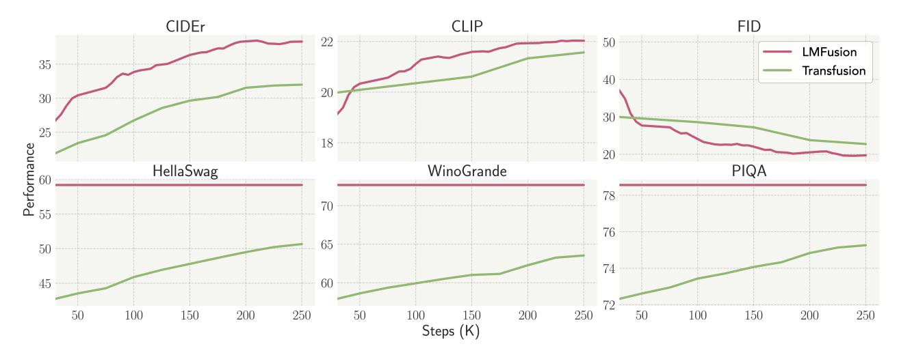
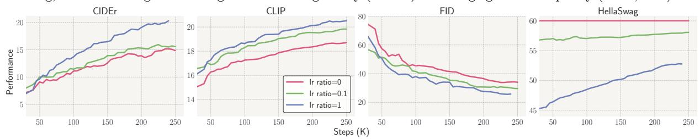
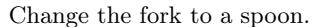
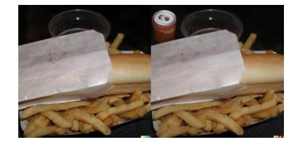
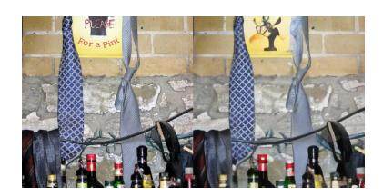

# LMFusion: Adapting Pretrained Language Models for Multimodal Generation

Weijia Shi1,∗ , Xiaochuang Han 1,∗ , Chunting Zhou, Weixin Liang3 , Xi Victoria Lin2 , Luke Zettlemoyer1,2 , Lili Yu2

We present LMFusion, a framework for empowering pretrained text-only large language models (LLMs) with multimodal generative capabilities, enabling them to understand and generate both text and images in arbitrary sequences. LMFusion leverages existing Llama-3's weights for processing texts autoregressively while introducing additional and parallel transformer modules for processing images with diffusion. During training, the data from each modality is routed to its dedicated modules: modality-specific feedforward layers, query-key-value projections, and normalization layers process each modality independently, while the shared self-attention layers allow interactions across text and image features. By freezing the text-specific modules and only training the image-specific modules, LMFusion preserves the language capabilities of text-only LLMs while developing strong visual understanding and generation abilities. Compared to methods that pretrain multimodal generative models from scratch, our experiments demonstrate that, LMFusion improves image understanding by 20% and image generation by 3.6% using only 50% of the FLOPs while maintaining Llama-3's language capabilities. We also demonstrate that this framework can adapt existing vision-language models with multimodal generation ability. Overall, this framework not only leverages existing computational investments in text-only LLMs but also enables the parallel development of language and vision capabilities, presenting a promising direction for efficient multimodal model development.

Correspondence: Weijia Shi [swj0419@uw.edu](mailto:swj0419@uw.edu), Xiaochuang Han [xhan77@uw.edu](mailto:xhan77@uw.edu), Lili Yu [liliyu@meta.com](mailto:liliyu@meta.com) Date: February 6, 2025

Figure 1 Overview of LMFusion. It uses modality-specific FFNs and QKV projections to process text and image data separately: the text "A cat with secrets to keep" goes to the text module , while the image patches of the cat goes to the image module . In the self-attention layer, text and image representations can attend to all previous contexts across the modality boundaries. Both modules are initialized from Llama-3, with the text module frozen to preserve language capabilities while the image module trained on image data. Layer normalization and residual connections are folded into the QKV and FFN modules. A special BOI token separates different modalities in the sequence.

1University of Washington, 2FAIR at Meta, 3Stanford University

∗ Joint first author. Order randomly determined. Work done while at Meta.

Figure 2 Generated images from LMFusion fine-tuned on aesthetically appealing images for improved quality.

# 1 Introduction

Over the past few years, we have seen significant progress in multimodal generative models capable of understanding and generating interleaved text and images in arbitrary sequences [\(Dong et al.,](#page-11-0) [2023;](#page-11-0) [Koh](#page-11-1) [et al.,](#page-11-1) [2024;](#page-11-1) [Lin et al.,](#page-12-0) [2024b\)](#page-12-0). Models like Transfusion [\(Zhou et al.,](#page-14-0) [2024\)](#page-14-0), Chameleon [\(Team,](#page-13-0) [2024b\)](#page-13-0), and Unified-IO [\(Lu et al.,](#page-12-1) [2022,](#page-12-1) [2024\)](#page-12-2) demonstrate the potential of unified architectures that seamlessly handle both image and text modalities. However, these models typically train from scratch, demanding significant computational resources to achieve proficiency across all modalities. The computational cost of mastering even a single modality is substantial—training a state-of-the-art text-only large language models (LLMs) like Llama-3 [\(Dubey et al.,](#page-11-2) [2024\)](#page-11-2) requires training over 15 trillion tokens.

Given these computational demands, we investigate an alternative paradigm that reuses and adapts existing pretrained LLMs [\(Ge et al.,](#page-11-3) [2023;](#page-11-3) [Sun et al.,](#page-13-1) [2023;](#page-13-1) [Wu et al.,](#page-14-1) [2024b\)](#page-14-1). We address a fundamental research question: How to preserve the text-only performance of pretrained LLMs while equipping them with visual understanding and generation abilities? Our experiments show that naive finetuning of pretrained text-only LLMs on multimodal data leads to significant degradation of their language processing capabilities.

To address this challenge, we introduce LMFusion, a framework that enhances a pretrained text-only LLM, Llama-3 [\(Dubey et al.,](#page-11-2) [2024\)](#page-11-2) with multimodal capabilities by building upon the recipe of Transfusion [\(Zhou](#page-14-0) [et al.,](#page-14-0) [2024\)](#page-14-0). Drawing from recent and parallel work on modality separation [\(Shen et al.,](#page-13-2) [2023;](#page-13-2) [Chen et al.,](#page-11-4) [2023;](#page-11-4) [Liang et al.,](#page-12-3) [2024;](#page-12-3) [Liu et al.,](#page-12-4) [2024a\)](#page-12-4), LMFusion integrates the original Llama modules pretrained for language processing while introducing additional dedicated transformer modules for visual understanding and generation tasks. As shown in [Figure 1,](#page-0-0) we employ modality-specific query-key-value (QKV) projections and feed-forward networks (FFNs) to process text and image data separately while still allowing for cross-modal interactions in the joint self-attention layer. By freezing the text modules while finetuning the image modules, we preserve the language-only capabilities of pretrained LLMs while giving a head start to the learning of visual understanding and generation. Compared to pretraining multimodal generative models from scratch, this approach avoids the need to include text-only data in the training process, significantly reducing the computational demands.

To evaluate the effectiveness of our approach, we conduct comprehensive experiments comparing LMFusion with Transfusion in controlled settings. Specifically, we initialize our LMFusion architecture with a pretrained Llama-3 8B model (Dubey et al., 2024) and continue training on the same image data as in Transfusion (Zhou et al., 2024). Compared to Transfusion, LMFusion achieves a 20% improvement in image understanding, 3.6% improvement in image generation while using only 50% of the FLOPs. It also preserves Llama-3's text-only performance that outperforms Transfusion by 11.6%. Figure 2 presents images generated by LMFusion. Additionally, we further demonstrate that this framework can adapt existing vision-language models (e.g., LLaVA) with multimodal generation ability.

Through ablation studies, we analyze the key architectural decision for LMFusion: separating both self-attention and FFNs for different modality data while freezing weights for the pretrained language modality. We show that naive finetuning of the dense pretrained LLMs on multimodal data (no separation) leads to a catastrophic forgetting of their original language capabilities. Furthermore, deep separation proves to be more effective than shallow separation (using modality-specific FFNs only), with both approaches outperforming models with no separation.

Overall, LMFusion has the following key features: (1) Compute reuse: It leverages existing computational investments in text-only LLMs when developing multimodal generative models. This eliminates the need to retrain on text-only data, significantly reducing computational demands. (2) Performance preservation and transfer: It completely preserves the strong text-only performance of pretrained LLMs and facilitates a better learning of image understanding and generation in the multimodal generative setup.

## 2 Background: Transfusion

Transfusion (Zhou et al., 2024) is a single unified multimodal model that is capable of text generation, image understanding, and image generation tasks, by jointly predicting next tokens in language and diffusing image representations. Given a multimodal input  $(\boldsymbol{x}^{txt}, \boldsymbol{x}^{img})$ , the Transfusion model jointly learns to do language modeling (§2.1) on  $\boldsymbol{x}^{txt}$  and image diffusion (§2.2) on  $\boldsymbol{x}^{img}$ . Its architecture is same as a standard Transformer (Vaswani et al., 2017) with an additional U-Net structure (Ronneberger et al., 2015) that projects image representations down and up before and after diffusion.

#### 2.1 Language Modeling

Given a sequence of discrete language tokens  $\boldsymbol{x}^{txt} = x_1^{txt}, \dots, x_N^{txt}$ , a language model  $\theta$  represents its joint probability by  $P(\boldsymbol{x}^{txt}) = \prod_{i=1}^N P_{\theta}(x_i^{txt} \mid \boldsymbol{x}_{< i}^{txt})$ . This formulation sets up an autoregressive task, where each token  $x_i^{txt}$  is predicted based on its preceding tokens  $\boldsymbol{x}_{< i}^{txt}$ . The language model is learned by minimizing the cross-entropy between  $P_{\theta}$  and the observed data distribution, which is commonly referred to as the LM loss:

$$\mathcal{L}_{\text{LM}} = \mathbb{E}_{x_i^{txt}} \left[ -\log P_{\theta}(x_i^{txt} \mid \boldsymbol{x}_{< i}^{txt}, \boldsymbol{x}^{img}) \right]$$
 (1)

Optionally, if there exists image data preceding the language tokens (e.g., image-caption data), Transfusion adds the representation of  $x^{img}$  as additional condition to the objective. More details of representing  $x^{img}$  are presented below.

### 2.2 Image Diffusion

Given a raw image, Transfusion first encodes the image into a sequence of continuous latent representation  $x^{img}$  with a pretrained and frozen VAE tokenizer (Kingma, 2013). It then employs Denoising Diffusion Probabilistic Models (i.e., DDPM) to learn to reverse a gradual noise-addition process added in the forward process (Ho et al., 2020). In the forward diffusion process, a Gaussian noise  $\epsilon \sim \mathcal{N}(\mathbf{0}, \mathbf{I})$  is added to the

image representation  $x^{img}$  over T steps, creating a sequence of noisy image representations  $x_0, x_1, ..., x_T$ . Specifically, at each step t, the noisy image representation is given by:

$$\boldsymbol{x}_{t}^{img} = \sqrt{\bar{\alpha}_{t}} \boldsymbol{x}^{img} + \sqrt{1 - \bar{\alpha}_{t}} \boldsymbol{\epsilon} \tag{2}$$

Here  $\bar{\alpha}_t$  follows a common cosine schedule (Nichol and Dhariwal, 2021).

In the reverse process, the diffusion model  $\epsilon_{\theta}(\cdot)$  with parameters  $\theta$  learns to predict the added noise  $\epsilon$  given the noisy data  $\boldsymbol{x}_{t}^{img}$  at timestep t and a context  $\boldsymbol{x}^{txt}$  that can include text prompts such as captions to the image diffusion:

$$\mathcal{L}_{\text{DDPM}} = \mathbb{E}_{\boldsymbol{x}^{img}, t, \boldsymbol{\epsilon}} [\|\boldsymbol{\epsilon} - \boldsymbol{\epsilon}_{\theta}(\boldsymbol{x}_{t}^{img}, t, \boldsymbol{x}^{txt})\|_{2}^{2}]$$
(3)

The Transfusion architecture contains U-Net downsampler and upsampler to reduce the dimension of  $x^{img}$ . The U-Net downsampler transforms the image into fewer patches before the main Transformer modules while the upsampler projects them back to the original dimension of  $x^{img}$  after the Transformer.

### 2.3 Training Objective

During training, Transfusion is optimized to predict both the LM loss on the text input  $x^{txt}$  and the diffusion loss on the image input  $x^{img}$ . These two losses are combined using a hyperparameter  $\lambda$ :

$$\mathcal{L}_{\text{Transfusion}} = \mathcal{L}_{\text{LM}} + \lambda \cdot \mathcal{L}_{\text{DDPM}} \tag{4}$$

### 3 LMFusion

One notable feature of Transfusion is that it has the same architecture as mainstream LLMs (e.g., Llama (Touvron et al., 2023)) while being capable of text generation, image understanding, and image generation together, through an end-to-end training (Equation 4). Zhou et al. (2024) trains Transfusion from scratch using language-only and image-caption data. However, such training from scratch requires substantial computational resources, and its performance on language-only tasks still lags behind the pretrained, text-only LLMs.

In this work, we aim to effectively adapt pretrained, text-only LLMs to handle image understanding and generation tasks. Specifically, we build on an open-weight LLM, Llama-3 (Dubey et al., 2024), and continue training it with the Transfusion objectives to handle both modalities. Since Transfusion uses shared parameters for its language modeling and image diffusion objectives, the key challenge is to prevent Llama-3's strong text-only performance from dropping while optimizing for its new image capabilities.

#### 3.1 Model Architecture

In response to the challenge above, we propose LMFusion, a framework that combines a pretrained, text-only Llama model with a dedicated image transformer for visual generation and understanding, enabling each modality to be processed through independent weights. By freezing the text modules while finetuning the visual modules, we preserve its language-only capabilities while giving the learning of visual understanding and generation a boost start.

LMFusion is a decoder-only model consisting of N transformer layers. As shown in Figure 1, central to the design are the modality-specific attention layer and Feed-Forward Network (FFN), each handling only data from its corresponding modality. Without loss of generality, we describe LMFusion below in a configuration with a single transformer layer, folding residual connections and layer normalization directly into the self-attention and FFN. The inputs to the model are text tokens  $\boldsymbol{x}^{txt}$  and noisy image representations  $\boldsymbol{x}^{img}_t = \sqrt{\bar{\alpha}_t} \boldsymbol{x}^{img} + \sqrt{1-\bar{\alpha}_t} \boldsymbol{\epsilon}$ . We use blue for text-specific modules and red for image-specific modules.

Similar to  $x^{txt}$ , this context can also include image representations  $x^{img}$  under an image editing setup. We omit it in the notation for simplicity.

Input projection The input text tokens  $\boldsymbol{x}^{txt}$  are projected by a linear embedding layer to a sequence of text hidden states  $\boldsymbol{h}_{\text{in}}^{txt}$ . The noisy image  $\boldsymbol{x}_t^{img}$  are projected to a sequence of image representations  $\boldsymbol{h}_{\text{in}}^{img}$  via a U-Net downsampler.

$$\boldsymbol{h}_{\text{in}}^{txt} = \text{Proj}_{\text{text}} \left( \boldsymbol{x}^{txt} \right) \tag{5}$$

$$\boldsymbol{h}_{\mathrm{in}}^{img} =$$
 UNet-Downimg  $(\boldsymbol{x}_t^{\mathrm{img}}, t)$  (6)

Then the text hidden states  $h_{\text{in}}^{txt}$  or image hidden states  $h_{\text{in}}^{img}$  are fed into the following attention layer.

Modality-specific self-attention We create separate attention matrices for each modality. Specifically, the text hidden states  $\boldsymbol{h}_{\text{in}}^{txt}$  and image hidden states  $\boldsymbol{h}_{\text{in}}^{img}$  are converted into their respective queries, keys, and values via separate Q, K, V matrices. The pre-attention layer normalization is also modality-specific and is folded into the QKV functions.

$$\boldsymbol{h}_{\mathrm{Q}}^{txt}, \boldsymbol{h}_{\mathrm{K}}^{txt}, \boldsymbol{h}_{\mathrm{V}}^{txt} = \mathrm{QKV}_{\mathrm{text}} \left( \boldsymbol{h}_{\mathrm{in}}^{txt} \right)$$
 (7)

$$\boldsymbol{h}_{\mathrm{Q}}^{img}, \boldsymbol{h}_{\mathrm{K}}^{img}, \boldsymbol{h}_{\mathrm{V}}^{img} = \overline{\mathrm{QKV}_{\mathrm{img}}}(\boldsymbol{h}_{\mathrm{in}}^{img})$$
 (8)

We enable cross-modal attention by concatenating the queries, keys, and values from both image and text modalities into unified sequences. The attention-weighted values at text and image token positions are then projected back into the hidden state dimension using separate O weights for each modality.

$$\boldsymbol{h}_{\mathrm{O}}^{txt} = O_{\mathrm{text}} \left( \operatorname{softmax} \left( \frac{\boldsymbol{h}_{\mathrm{Q}}^{txt} [\boldsymbol{h}_{\mathrm{K}}^{img} \circ \boldsymbol{h}_{\mathrm{K}}^{txt}]^{T} + M}{\sqrt{d}} \right) [\boldsymbol{h}_{\mathrm{V}}^{img} \circ \boldsymbol{h}_{\mathrm{V}}^{txt}] \right)$$
(9)

$$\boldsymbol{h}_{\mathrm{O}}^{img} = \mathbf{O}_{\mathrm{img}}(\operatorname{softmax}(\frac{\boldsymbol{h}_{\mathrm{Q}}^{img}[\boldsymbol{h}_{\mathrm{K}}^{txt} \circ \boldsymbol{h}_{\mathrm{K}}^{img}]^{T} + M}{\sqrt{d}})[\boldsymbol{h}_{\mathrm{V}}^{txt} \circ \boldsymbol{h}_{\mathrm{V}}^{img}])$$
(10)

where  $\circ$  denotes concatenation. M represents a hybrid attention mask same as in Transfusion (Zhou et al., 2024) with a causal mask applied to text tokens and a bi-directional mask applied to image tokens. This design allows for self-attention within and across modalities, encouraging cross-modality integrations.

Modality-specific feed-forward network After the attention layer, we employ modality-specific FFNs to process text and image data separately. The pre-FFN layer normalization is also modality-specific and is folded in the FFN functions.

$$\boldsymbol{h}_{\mathrm{FFN}}^{txt} = \overline{\mathrm{FFN}_{\mathrm{text}}}(\boldsymbol{h}_{\mathrm{O}}^{txt})$$
 (11)

$$h_{\text{FFN}}^{img} = \overline{\text{FFN}_{\text{img}}}(h_{\text{O}}^{img})$$
 (12)

Output projection Finally, after N layers of self-attention and FFNs, the resulting hidden states are projected either to logits in text via language model's output layer, or to predicted noise in image via a U-Net upsampler.

$$p_{\text{logits}} = \text{LM-Head}_{\text{text}} (h_{\text{FFN}}^{txt})$$
 (13)

$$\epsilon_{\text{pred}} = \overline{\text{UNet-Up}_{\text{img}}}(\boldsymbol{h}_{\text{FFN}}^{img}, t, \boldsymbol{h}_{\text{in}}^{img})$$
 (14)

Same as Transfusion, the output  $p_{\text{logits}}$  and  $\epsilon_{\text{pred}}$  are passed through the language modeling loss (Equation 1) and DDPM loss (Equation 3) respectively. All parameters in the text modules along with self-attention and FFN parameters in the image modules are initialized from the pretrained Llama model. During optimization, we **decouple the learning rates** for the text and image parameter groups: a text learning rate,  $\eta_{\text{text}}$ , is used for {Projtext, QKVtext, Otext, FFNtext, LM-Headtext}, and an image learning rate,  $\eta_{\text{img}}$ , for {UNet-Downimg, QKVimg, Oimg, FFNimg, UNet-Upimg}. To preserve the model's performance on text-only benchmarks, we use  $\eta_{\text{text}} = 0$  (freezing text modules) for our main experiments and explore different configurations in §5.

## 4 Experiments

In this section, we describe the details of our training setup (§4.1) and evaluation setup (§4.3). Results in §4.4 show that LMFusion outperforms Transfusion trained from scratch in the FLOPs match setting on text-only, image understanding and generation benchmarks.

### 4.1 Training Setup

Data Following Transfusion (Zhou et al., 2024), we use the same collection of 380M Shutterstock image-caption data, where each image is center-cropped and resized to  $256 \times 256$  pixels. We order the captions before images (i.e., emphasizing image generation conditioned on texts) 80% of the time, and order the images before captions for the rest.

Model Details For image tokenization, we use the same VAE encoder2 as Transfusion to compress an image of  $256 \times 256$  pixels into a  $32 \times 32 \times 8$  tensor. These tensors are then passed into a 2-block U-Net downsampler (Ronneberger et al., 2015) to further reduce dimensions, resulting in a sequence of 256 patches (tokens). Both text-specific and image-specific Transformer modules are initialized from the pretrained Llama-3 8B model (Dubey et al., 2024). The U-Net downsampler and a corresponding U-Net upsampler are trained from scratch, together containing 0.27 billion parameters. Like Transfusion, LMFusion uses a maximum context length of 4096 tokens.

Optimization In our main experiments, to preserve the language-only performance, we freeze the text modules ( $\eta_{\text{text}} = 0$ ) while training only the image modules using an AdamW optimizer ( $\beta_1 = 0.9$ ,  $\beta_2 = 0.95$ ,  $\epsilon = 1 \times 10^{-8}$ ) with a learning rate  $\eta_{\text{image}} = 1 \times 10^{-4}$ . The learning rate follows a cosine decay schedule with a 4000-step warmup period before gradually decreasing to  $1.5 \times 10^{-5}$ .

### 4.2 Controlled Comparison with Transfusion

Our key model comparisons are with the original Transfusion 7B model (Zhou et al., 2024),3 which was trained for 250K steps on 0.25T language-only tokens (text data) and 0.25T image-captions tokens (image data).

Since we freeze the text module during training, we can exclude text data from our training process while maintaining language capabilities. This design choice allows us to explore two training configurations for a controlled comparison with Transfusion: In the first configuration, we match the amount of 0.25T image data used by Transfusion while leaving out the text data. As a result, this variant of LMFusion uses approximately half the total FLOPs of Transfusion. In the second configuration, we match Transfusion by using the same total FLOPs,

Additionally, for the language-only tasks, we report the performance of Llama-3 8B model to demonstrate that our model is able to maintain its strong text performance.

#### 4.3 Evaluation Setup

Following Transfusion, we evaluate LMFusion on language-only, image understanding, and image generation tasks.

Language-only We evaluate the model's language abilities using four tasks from the standard Llama evaluation suite (Dubey et al., 2024), including Hellaswag (Zellers et al., 2019), PIQA (Bisk et al., 2020), SIQA (Sap et al., 2019), and WinoGrande (Sakaguchi et al., 2021). We report accuracy on these benchmarks.

&lt;sup>2https://huggingface.co/stabilityai/sd-vae-ft-mse

&lt;sup>3Transfusion 7B and Llama-3 8B have the same Transformer sizes. The size difference is due to the different vocabularies, which affects input and output embedding layers.

|                                     |                  | Language-only Evaluation |                      |                      | Image Understanding | Image Generation (without   with CFG)  |                                           |
|-------------------------------------|------------------|-----------------------------|----------------------|----------------------|------------------------|-------------------------------------------|-------------------------------------------|
| Model                               | Rel. FLOPs       | HellaSwag ↑                 | SIQA ↑               | WinoGrande ↑         | CIDEr ↑                | FID ↓                                     | CLIP ↑                                    |
| Llama 3                             | -                | 60.0                        | 48.1                 | 72.8                 | –                      | –                                         | –                                         |
| Transfusion LMFusion LMFusion | 1× 0.5× 1× | 51.0 60.0 60.0        | 42.3 48.1 48.1 | 64.3 72.8 72.8 | 32.0 38.3 38.4   | 14.4   8.70 13.9   8.75 14.0   8.61 | 22.1   24.4 22.0   24.4 22.1   24.4 |

Table 1 Results across text-only benchmarks, image understanding and image generation. LMFusion preserves Llama-3's text performance while adding strong image understanding and generation capabilities. Using only half of the total training FLOPs, it outperforms Transfusion across all tasks, with particularly notable improvements in image understanding and text benchmarks, thanks to its initialization from Llama-3. Image generation results are obtained without classifier-free guidance (CFG) or with a CFG factor of 1.55.

|             |               |        |           | Image Understanding |         |       |
|-------------|---------------|--------|-----------|---------------------|---------|-------|
| Model       | Base LLM      | MMMU ↑ | ChartQA ↑ | RealWorldQA ↑       | MME-P ↑ | FID ↓ |
| EMU-3       | –             | 31.6   | 51.8      | 57.4                | –       | 12.8  |
| Show-O      | Phil-1.5 1.3B | 27.4   | –         | –                   | 1435.7  | 9.2   |
| Janus       | DeepSeek 1.3B | 30.5   | –         | –                   | 1338.0  | 8.5   |
| Chameleon   | –             | 28.4   | 0.0       | 19.6                | –       | 26.7  |
| MetaMorph   | LLaMA-3.1 8B  | 41.8   | 37.1      | 58.3                | –       | 11.8  |
| Transfusion | –             | –      | –         | –                   | –       | 8.7   |
| LLaVAFusion | LLaVA-Next 8B | 41.7   | 69.5      | 60.0                | 1603.7  | 8.2   |

Table 2 Comparison of multimodal models across image understanding and generation capabilities. Models are evaluated on various image understanding benchmarks and image generation quality (FID). The models without base LLM are pretrained from scratch.

Image Generation For evaluating image generation, we use the MS-COCO benchmark [\(Lin et al.,](#page-12-6) [2014\)](#page-12-6). We generate images for 30K randomly selected prompts from the validation set and measure the Frechet Inception Distance (FID) [\(Heusel et al.,](#page-11-8) [2017\)](#page-11-8) and CLIP scores [\(Radford et al.,](#page-13-8) [2021\)](#page-13-8). Our image generation results include versions obtained without classifier-free guidance (CFG coefficient of 1.0) and with a CFG coefficient of 1.55 or 1.6.

Image Understanding We evaluate the models' ability to generate image descriptions using the test split of MS-COCO [\(Lin et al.,](#page-12-6) [2014\)](#page-12-6), reporting CIDEr scores [\(Vedantam et al.,](#page-13-9) [2015\)](#page-13-9).

### 4.4 Results

[Table 1](#page-6-2) compares two variants of LMFusion against Transfusion. On language-only benchmarks, LMFusion keeps the strong performance of Llama-3 since we freeze all text modules. For image understanding, LMFusion substantially surpasses Transfusion, with a 20% improvement. In image generation tasks, LMFusion also shows superior results in both FID and CLIP scores.

In [Figure 3,](#page-7-0) we benchmark the performance of LMFusion and Transfusion throughout the training.[4](#page-6-3) We observe a consistent advantage of LMFusion over Transfusion during the entire training, for image captioning and generation. These results suggest that LMFusion effectively leverages the pretrained language modules from Llama while developing strong image abilities. Although LMFusion has twice as many parameters as Transfusion, it uses same FLOPs since only half of the parameters are activated for each input token from an arbitrary modality.

4For the image generation results plotted throughout the training, we use a smaller subset of 5K prompts and without classifier-free guidance.

Figure 3 Evaluation of LMFusion and Transfusion during training. LMFusion keeps the text performance of Llama throughout training, while achieving better image understanding ability (CIDEr) and image generation quality (CLIP, FID).

Figure 4 Performance of naive Llama-3 finetuning (no separation) with varying lr ratio  $\frac{\eta_{\text{text}}}{\eta_{\text{image}}}$ . When directly finetuning the Llama-3 model for multimodal generation, using the same learning rate for both text and image components (lr ratio = 1) substantially reduces its text-only performance. Lowering the learning rate for the text component relative to the image component (lr ratio < 1) helps preserve language performance but slows down the acquisition of multimodal abilities.

# 5 Analysis

Central to LMFusion is our modality separation techniques, which employs the design of modality-specific modules and decoupled learning rates for language and image modules. Our architectural ablation (§5.1) demonstrates the importance of the design for maintaining model performance across both modalities. Additionally, we showcase LMFusion's ability to generalize to image-to-image generation through image editing tasks, which require simultaneous understanding of both input images and textual prompts (§5.2). We further showcase that this recipe could be used for adapting

### 5.1 Architecture Ablations

#### 5.1.1 Experimental Design

To evaluate different design choices, we conduct ablation studies using small-scale variants of LMFusion. Our analysis focuses on the impact of modality separation by comparing three designs: (1) no separation (a single dense model), (2) shallow separation (using modality-specific FFNs only), and (3) deep separation (using both modality-specific FFNs and attention mechanisms, our final LMFusion).

No separation (dense model) We begin our experiments with the dense Llama-3 8B model trained using the Transfusion recipe. This dense model maintains a unified structure where most components are shared across modalities (a single set of QKV, O and FFN process both texts and images), with the exception of U-Net upsampler and downsampler. For training, we use a text learning rate ( $\eta_{\text{text}}$ ) for the components initialized from the text-only LLM {Projtext, QKV, O, FFN, LM-Headtext}, and an image learning rate  $\eta_{\text{img}}$ 

Figure 5 Performance of no separation (dense model), shallow separation (modality-specific FFNs only), and deep separation (modality-specific FFNs and attention) when text modules are frozen. Deep modality separation outperforms shallow separation and no separation.

Figure 6 Performance of deep modality separation with varying Ir ratios  $\frac{\eta_{\text{text}}}{\eta_{\text{image}}}$ . When the text modules are frozen (lr ratio = 0), deep separation preserves language capabilities and performs strongly on both image understanding and generation, unlike the dense models.

for {UNet-Downimg, UNet-Upimg}. To investigate the impact of learning rate decoupling, we experiment with various learning rate ratios  $\frac{\eta_{\text{text}}}{\eta_{\text{image}}} \in \{0, 0.1, 1\}$ , with a constant image learning rate  $\eta_{\text{image}} = 1 \times 10^{-4}$ , the same as the main experiments. A ratio of 1 represents standard continual pretraining where all components share the same learning rate, while a ratio of 0 indicates a complete freezing of text-related components.

Shallow separation (modality-specific FFNs only) We explore a simplified variant of LMFusion that separates only FFNs into text-specific and image-specific modules—a common approach in mixture-of-experts architectures (Lin et al., 2024b; Muennighoff et al., 2024). In this setup, we use a single shared attention mechanism (QKV , O) for processing both image and text data. For training, we employ separate learning rates:  $\eta_{\text{text}}$  for text-related components { Projtext, QKV, O, FFNtext, LM-Headtext } and  $\eta_{\text{img}}$  for image-related components { Unet-Downimg, FFNimg, Unet-Upimg}. We experiment with various learning rate ratios  $\frac{\eta_{\text{text}}}{\eta_{\text{image}}} \in \{0, 0.1, 1\}$ .

Deep separation (modality-specific FFNs and attention) Our LMFusion, as described in section 3, represents a deep separation design where both FFNs and attention mechanisms are modality-specific. While our primary configuration freezes text modules during training, we also analyze the impact of different learning dynamics by varying the learning rate ratio  $\frac{\eta_{\text{text}}}{\eta_{\text{image}}}$  across  $\{0, 0.1, 1\}$ .

In the ablation study, all models are trained for 250K training steps with a sequence length of 4,096 tokens and a batch size of 250K tokens. The training data comprised 0.03T text-only tokens and 0.03T image-caption tokens. All other hyperparameters remained consistent with those employed in our main experiments.

#### 5.1.2 Results

Naive finetuning of dense pretrained LLMs for multimodal generation compromises their original language capabilities. When directly finetuning Llama-8B (no separation) using the Transfusion recipe, we observe significant performance trade-offs between image and text capabilities (Figure 4). With equal learning rates for text and image components ( $\frac{\eta_{\text{text}}}{\eta_{\text{image}}} = 1$ ), the model shows continuous improvement in image understanding and generation. However, this comes at a substantial cost to language capabilities, with performance on HellaSwag dropping by 15% initially. While language performance improves during training, it never recovers to the original Llama-3 model's level, maintaining a persistent 7% gap.

Add a soda can in the back.

Let there be a painting instead of a sign.

#### Figure 7 Edited images from a finetuned LMFusion model.

To mitigate this issue, we explore setting  $\frac{\eta_{\text{text}}}{\eta_{\text{image}}} < 1$ , which allows us to train image-specific modules (U-Nets) with a regular learning rate while preserving text capabilities using a smaller learning rate for the general Transformer components. Figure 4 shows this improves language-only benchmark performance, reducing the gap from 7% to 2% when the ratio is 0.1. However, for dense models, this improvement comes at the cost of consistently reduced image capabilities. Overall, while learning rate decoupling offers some mitigation to the text performance drop, training dense pretrained LLMs without modality separation remains suboptimal.

Deep Modality Separation Outperforms Shallow Separation. In Figure 5, we compare three architectures: no separation (dense), shallow separation (modality-specific FFNs only), and deep separation (modality-specific FFNs and attention). We set  $\frac{\eta_{\text{text}}}{\eta_{\text{image}}} = 0$  (freezing the text module) across all models to maintain Llama-3's text performance. Both separation approaches significantly outperform the dense model on all image benchmarks. While shallow separation performs slightly worse on image understanding, the performance gap widens notably in image generation tasks.

Additionally, deep separation with  $\frac{\eta_{\text{text}}}{\eta_{\text{image}}} = 0$  has the same amount of *tunable* parameters as no separation with  $\frac{\eta_{\text{text}}}{\eta_{\text{image}}} = 1$ . Despite the intrinsic advantage of modality separation for text-only tasks, for image understanding and generation, we still observe that deep separation (blue curve in Figure 5) are better than no separation (blue curve in Figure 4). These results demonstrate that modality separation is crucial for effectively adapting pretrained language-only LLMs for multimodal generation.

Analyzing learning rate decoupling strategy w.r.t. modality separation. The impact of freezing text modules varies dramatically between architectures. In dense models (Figure 4), freezing text components ( $\frac{\eta_{\text{text}}}{\eta_{\text{image}}} = 0$ ) significantly impairs both image understanding and generation compared to full fine-tuning. However, in the deep modality separation setting shown in Figure 6, freezing the text module not only maintains the original text performance but achieves strong performance on image understanding and generation, unlike the dense models.

### 5.2 Image editing

LMFusion, our unified multimodal generative model, is naturally well-suited for tasks involving interleaved data types, such as image editing. Following Transfusion, we finetune LMFusion on the same dataset of 8K image editing examples, each consisting of an original input image, a prompt detailing the desired edit, and a resulting image that reflects the specified changes. In Figure 7, we apply the finetuned LMFusion to input images and editing prompts from the MagicBrush (Zhang et al., 2024) test set. Qualitative results demonstrate that LMFusion performs effectively in these image-editing scenarios, complementing its strong capabilities in text-only, image understanding, and image generation tasks.

#### 5.3 LLaVAFusion: extending LMFusion to vision-language models

LMFusion continues training the language-only pretrained LLM Llama with the Transfusion recipe. Can this recipe be extended to on vision-language models (VLMs) such as LLaVA (Liu et al., 2024d,c) and Qwen-VL (Bai et al., 2023) as well? In this section, we extend the recipe of LMFusion to VLMs, preserving their multimodal understanding capabilities while introducing image generation abilities. Specifically, we build on LLaVA-NeXT (Liu et al., 2024c), freezing its transformer parameters and integrating a dedicated,

image-specific transformer module trained in parallel. We use the same data and model settings as LMFusion. We refer to this new model as LLaVAFusion and demonstrate its image understanding performance on MMMU [\(Yue et al.,](#page-14-4) [2024\)](#page-14-4), MME-Perception [\(Fu et al.,](#page-11-10) [2024\)](#page-11-10), ChartQA [\(Masry et al.,](#page-12-10) [2022\)](#page-12-10), and RealWorldQA[5](#page-10-0) , as well as its image generation results. For baselines, we compare LLaVAFusion against EMU-3 [\(Wang](#page-13-10) [et al.,](#page-13-10) [2024\)](#page-13-10), Show-O [\(Xie et al.,](#page-14-5) [2024b\)](#page-14-5), Janus [\(Wu et al.,](#page-13-11) [2024a\)](#page-13-11), Chameleon [\(Team,](#page-13-12) [2024a\)](#page-13-12), MetaMorph [\(Tong et al.,](#page-13-13) [2024\)](#page-13-13), and Transfusion [\(Zhou et al.,](#page-14-0) [2024\)](#page-14-0). As shown in [Table 2,](#page-6-4) LLaVAFusion LLaVAFusion demonstrates strong performance in both image understanding and generation when compared to other unified multimodal LMs. This demonstrates that LMFusion is promising as an extension not only to language-only LLMs but also to VLMs, enhancing the multimodal generation capabilities in both cases.

# 6 Related Work

Unified Models for Multimodal Generation Recent work has extensively explored unified frameworks for multimodal generation, including text generation, image understanding, and image generation. While texts are commonly represented as discrete tokens across models, approaches to representing images—especially for image generation—vary significantly. For instance, methods in [\(Lu et al.,](#page-12-1) [2022;](#page-12-1) [Yu et al.,](#page-14-6) [2023;](#page-14-6) [Lu et al.,](#page-12-2) [2024;](#page-12-2) [Team,](#page-13-0) [2024b;](#page-13-0) [Xie et al.,](#page-14-7) [2024a;](#page-14-7) [Wu et al.,](#page-14-1) [2024b;](#page-14-1) [Aiello et al.,](#page-11-11) [2023\)](#page-11-11), represents images using vector-quantized discrete tokens [\(Van Den Oord et al.,](#page-13-14) [2017;](#page-13-14) [Esser et al.,](#page-11-12) [2021;](#page-11-12) [Lee et al.,](#page-12-11) [2022\)](#page-12-11). An alternative method, adopted by [\(Sun et al.,](#page-13-15) [2024;](#page-13-15) [Ge et al.,](#page-11-13) [2024\)](#page-11-13), employs continuous embeddings that require a separate diffusion model for decoding. In this work, we build upon Transfusion [\(Zhou et al.,](#page-14-0) [2024\)](#page-14-0), which integrates autoregressive generation for texts with diffusion for images within a single, end-to-end model.

Model Sparsity Model sparsity through Mixture of Experts (MoE) [\(Shazeer et al.,](#page-13-16) [2017;](#page-13-16) [Muennighoff et al.,](#page-12-7) [2024;](#page-12-7) [Fedus et al.,](#page-11-14) [2022;](#page-11-14) [Lepikhin et al.,](#page-12-12) [2020\)](#page-12-12) has proven highly effective in improving LLM training efficiency. This approach has recently been extended to multimodal models [\(Shen et al.,](#page-13-2) [2023;](#page-13-2) [Lyle and Pascanu,](#page-12-13) [2024;](#page-12-13) [Lin et al.,](#page-12-14) [2024a;](#page-12-14) [He et al.,](#page-11-15) [2024a\)](#page-11-15), particularly to address potential conflicts between different modalities. For example, recent efforts [\(Chen et al.,](#page-11-4) [2023;](#page-11-4) [Lin et al.,](#page-12-0) [2024b;](#page-12-0) [Wang et al.,](#page-13-17) [2021,](#page-13-17) [2022\)](#page-13-18) replace standard Transformer FFNs with modality-specific experts, enabling separate processing paths for different modalities. Our work takes this concept further by using modality-specific attention mechanisms. Concurrent work [\(Liu et al.,](#page-12-4) [2024a;](#page-12-4) [Liang et al.,](#page-12-3) [2024\)](#page-12-3) demonstrates the effectiveness of this deeper separation in multimodal pretraining and image generation.

Reuse of LLMs in Multimodal Training Based on the strong language capabilities of LLMs, some recent models on multimodal generation initializes their models from pretrained, language-only LLMs. For example, [\(Ge et al.,](#page-11-3) [2023;](#page-11-3) [Sun et al.,](#page-13-1) [2023;](#page-13-1) [Dong et al.,](#page-11-0) [2023;](#page-11-0) [Xie et al.,](#page-14-7) [2024a;](#page-14-7) [Wu et al.,](#page-14-1) [2024b;](#page-14-1) [He et al.,](#page-11-16) [2024b\)](#page-11-16) continued training upon the weights of language-only LLMs [\(Touvron et al.,](#page-13-5) [2023\)](#page-13-5) or vision LLMs without visual generation capabilities [\(Bai et al.,](#page-11-9) [2023\)](#page-11-9). The main focus of our work is to effectively reuse pretrained LLMs for multimodal generation, particularly with the Transfusion recipe, without any compromise on the LLMs' existing text-only capabilities.[6](#page-10-1)

# 7 Conclusion

We present LMFusion, a framework designed to equip LLMs with multimodal generative capabilities. By using Llama-3 for text generation and integrating parallel transformer modules for image diffusion, LMFusion efficiently reuses compute invested in pretrained LLMs.

LMFusion's modular design enables independent developments of language and vision modules, de-risking the complexities associated with a large-scale, joint-modality pretraining. While LMFusion is currently built upon text-only LLMs, it can benefit further from existing visual understanding LLMs [\(Liu et al.,](#page-12-15) [2023;](#page-12-15) [Dai](#page-11-17) [et al.,](#page-11-17) [2023;](#page-11-17) [Liu et al.,](#page-12-16) [2024b;](#page-12-16) [Zhu et al.,](#page-14-8) [2024\)](#page-14-8), inheriting the strong multimodal understanding ability while enabling generating interleaved text and visual content.

5<huggingface.co/datasets/xai-org/RealworldQA>

6Concurrent to our work, [Liu et al.](#page-12-4) [\(2024a\)](#page-12-4) tackles multimodal generation via a joint attention mechanism between a DiT structure [\(Peebles and Xie,](#page-12-17) [2023\)](#page-12-17) for images and a frozen Llama-3 [\(Dubey et al.,](#page-11-2) [2024\)](#page-11-2) for texts.

# References

- Emanuele Aiello, Lili Yu, Yixin Nie, Armen Aghajanyan, and Barlas Oguz. Jointly training large autoregressive multimodal models, 2023. <https://arxiv.org/abs/2309.15564>.
- Jinze Bai, Shuai Bai, Shusheng Yang, Shijie Wang, Sinan Tan, Peng Wang, Junyang Lin, Chang Zhou, and Jingren Zhou. Qwen-vl: A versatile vision-language model for understanding, localization, text reading, and beyond. arXiv preprint arXiv:2308.12966, 1(2):3, 2023.
- Yonatan Bisk, Rowan Zellers, Jianfeng Gao, Yejin Choi, et al. Piqa: Reasoning about physical commonsense in natural language. In Proceedings of the AAAI conference on artificial intelligence, volume 34, pages 7432–7439, 2020.
- Junyi Chen, Longteng Guo, Jianxiang Sun, Shuai Shao, Zehuan Yuan, Liang Lin, and Dongyu Zhang. Eve: Efficient vision-language pre-training with masked prediction and modality-aware moe. ArXiv, abs/2308.11971, 2023. <https://api.semanticscholar.org/CorpusID:261076168>.
- Wenliang Dai, Junnan Li, Dongxu Li, Anthony Tiong, Junqi Zhao, Weisheng Wang, Boyang Li, Pascale Fung, and Steven Hoi. InstructBLIP: Towards general-purpose vision-language models with instruction tuning. In Thirty-seventh Conference on Neural Information Processing Systems, 2023. <https://openreview.net/forum?id=vvoWPYqZJA>.
- Runpei Dong, Chunrui Han, Yuang Peng, Zekun Qi, Zheng Ge, Jinrong Yang, Liang Zhao, Jianjian Sun, Hongyu Zhou, Haoran Wei, et al. Dreamllm: Synergistic multimodal comprehension and creation. arXiv preprint arXiv:2309.11499, 2023.
- Abhimanyu Dubey, Abhinav Jauhri, Abhinav Pandey, Abhishek Kadian, Ahmad Al-Dahle, Aiesha Letman, Akhil Mathur, Alan Schelten, Amy Yang, Angela Fan, et al. The llama 3 herd of models. arXiv preprint arXiv:2407.21783, 2024.
- Patrick Esser, Robin Rombach, and Bjorn Ommer. Taming transformers for high-resolution image synthesis. In Proceedings of the IEEE/CVF conference on computer vision and pattern recognition, pages 12873–12883, 2021.
- William Fedus, Barret Zoph, and Noam Shazeer. Switch transformers: Scaling to trillion parameter models with simple and efficient sparsity. Journal of Machine Learning Research, 23(120):1–39, 2022.
- Chaoyou Fu, Peixian Chen, Yunhang Shen, Yulei Qin, Mengdan Zhang, Xu Lin, Jinrui Yang, Xiawu Zheng, Ke Li, Xing Sun, Yunsheng Wu, and Rongrong Ji. Mme: A comprehensive evaluation benchmark for multimodal large language models, 2024. <https://arxiv.org/abs/2306.13394>.
- Yuying Ge, Sijie Zhao, Ziyun Zeng, Yixiao Ge, Chen Li, Xintao Wang, and Ying Shan. Making llama see and draw with seed tokenizer. arXiv preprint arXiv:2310.01218, 2023.
- Yuying Ge, Sijie Zhao, Jinguo Zhu, Yixiao Ge, Kun Yi, Lin Song, Chen Li, Xiaohan Ding, and Ying Shan. Seed-x: Multimodal models with unified multi-granularity comprehension and generation. arXiv preprint arXiv:2404.14396, 2024.
- Wanggui He, Siming Fu, Mushui Liu, Xierui Wang, Wenyi Xiao, Fangxun Shu, Yi Wang, Lei Zhang, Zhelun Yu, Haoyuan Li, Ziwei Huang, LeiLei Gan, and Hao Jiang. Mars: Mixture of auto-regressive models for fine-grained text-to-image synthesis, 2024a. <https://arxiv.org/abs/2407.07614>.
- Wanggui He, Siming Fu, Mushui Liu, Xierui Wang, Wenyi Xiao, Fangxun Shu, Yi Wang, Lei Zhang, Zhelun Yu, Haoyuan Li, et al. Mars: Mixture of auto-regressive models for fine-grained text-to-image synthesis. arXiv preprint arXiv:2407.07614, 2024b.
- Martin Heusel, Hubert Ramsauer, Thomas Unterthiner, Bernhard Nessler, and Sepp Hochreiter. Gans trained by a two time-scale update rule converge to a local nash equilibrium. Advances in neural information processing systems, 30, 2017.
- Jonathan Ho, Ajay Jain, and Pieter Abbeel. Denoising diffusion probabilistic models. Advances in neural information processing systems, 33:6840–6851, 2020.
- Diederik P Kingma. Auto-encoding variational bayes. arXiv preprint arXiv:1312.6114, 2013.
- Jing Yu Koh, Daniel Fried, and Russ R Salakhutdinov. Generating images with multimodal language models. Advances in Neural Information Processing Systems, 36, 2024.

- Doyup Lee, Chiheon Kim, Saehoon Kim, Minsu Cho, and Wook-Shin Han. Autoregressive image generation using residual quantization. In Proceedings of the IEEE/CVF Conference on Computer Vision and Pattern Recognition, pages 11523–11532, 2022.
- Dmitry Lepikhin, HyoukJoong Lee, Yuanzhong Xu, Dehao Chen, Orhan Firat, Yanping Huang, Maxim Krikun, Noam Shazeer, and Zhifeng Chen. Gshard: Scaling giant models with conditional computation and automatic sharding. arXiv preprint arXiv:2006.16668, 2020.
- Weixin Liang, Lili Yu, Liang Luo, Srinivasan Iyer, Ning Dong, Chunting Zhou, Gargi Ghosh, Mike Lewis, Wen tau Yih, Luke Zettlemoyer, and Xi Victoria Lin. Mixture-of-transformers: A sparse and scalable architecture for multi-modal foundation models, 2024.
- Bin Lin, Zhenyu Tang, Yang Ye, Jiaxi Cui, Bin Zhu, Peng Jin, Junwu Zhang, Munan Ning, and Li Yuan. Moe-llava: Mixture of experts for large vision-language models. ArXiv, abs/2401.15947, 2024a. [https://api.semanticscholar.](https://api.semanticscholar.org/CorpusID:267311517) [org/CorpusID:267311517](https://api.semanticscholar.org/CorpusID:267311517).
- Tsung-Yi Lin, Michael Maire, Serge Belongie, James Hays, Pietro Perona, Deva Ramanan, Piotr Dollár, and C Lawrence Zitnick. Microsoft coco: Common objects in context. In Computer Vision–ECCV 2014: 13th European Conference, Zurich, Switzerland, September 6-12, 2014, Proceedings, Part V 13, pages 740–755. Springer, 2014.
- Xi Victoria Lin, Akshat Shrivastava, Liang Luo, Srinivasan Iyer, Mike Lewis, Gargi Ghosh, Luke Zettlemoyer, and Armen Aghajanyan. Moma: Efficient early-fusion pre-training with mixture of modality-aware experts, 2024b. <https://arxiv.org/abs/2407.21770>.
- Bingchen Liu, Ehsan Akhgari, Alexander Visheratin, Aleks Kamko, Linmiao Xu, Shivam Shrirao, Chase Lambert, Joao Souza, Suhail Doshi, and Daiqing Li. Playground v3: Improving text-to-image alignment with deep-fusion large language models, 2024a. <https://arxiv.org/abs/2409.10695>.
- Haotian Liu, Chunyuan Li, Qingyang Wu, and Yong Jae Lee. Visual instruction tuning. In NeurIPS, 2023.
- Haotian Liu, Chunyuan Li, Yuheng Li, and Yong Jae Lee. Improved baselines with visual instruction tuning. In Proceedings of the IEEE/CVF Conference on Computer Vision and Pattern Recognition (CVPR), pages 26296–26306, June 2024b.
- Haotian Liu, Chunyuan Li, Yuheng Li, Bo Li, Yuanhan Zhang, Sheng Shen, and Yong Jae Lee. Llava-next: Improved reasoning, ocr, and world knowledge, January 2024c. <https://llava-vl.github.io/blog/2024-01-30-llava-next/>.
- Haotian Liu, Chunyuan Li, Qingyang Wu, and Yong Jae Lee. Visual instruction tuning. Advances in neural information processing systems, 36, 2024d.
- Jiasen Lu, Christopher Clark, Rowan Zellers, Roozbeh Mottaghi, and Aniruddha Kembhavi. Unified-io: A unified model for vision, language, and multi-modal tasks. In The Eleventh International Conference on Learning Representations, 2022.
- Jiasen Lu, Christopher Clark, Sangho Lee, Zichen Zhang, Savya Khosla, Ryan Marten, Derek Hoiem, and Aniruddha Kembhavi. Unified-io 2: Scaling autoregressive multimodal models with vision language audio and action. In Proceedings of the IEEE/CVF Conference on Computer Vision and Pattern Recognition, pages 26439–26455, 2024.
- Clare Lyle and Razvan Pascanu. Switching between tasks can cause ai to lose the ability to learn. Nature, 632(8026): 745–747, 2024.
- Ahmed Masry, Do Long, Jia Qing Tan, Shafiq Joty, and Enamul Hoque. ChartQA: A benchmark for question answering about charts with visual and logical reasoning. In Findings of the Association for Computational Linguistics: ACL 2022, pages 2263–2279, Dublin, Ireland, May 2022. Association for Computational Linguistics. doi: 10.18653/v1/2022.findings-acl.177. <https://aclanthology.org/2022.findings-acl.177>.
- Niklas Muennighoff, Luca Soldaini, Dirk Groeneveld, Kyle Lo, Jacob Morrison, Sewon Min, Weijia Shi, Pete Walsh, Oyvind Tafjord, Nathan Lambert, et al. Olmoe: Open mixture-of-experts language models. arXiv preprint arXiv:2409.02060, 2024.
- Alexander Quinn Nichol and Prafulla Dhariwal. Improved denoising diffusion probabilistic models. In International conference on machine learning, pages 8162–8171. PMLR, 2021.
- William Peebles and Saining Xie. Scalable diffusion models with transformers. In Proceedings of the IEEE/CVF International Conference on Computer Vision, pages 4195–4205, 2023.

- Alec Radford, Jong Wook Kim, Chris Hallacy, Aditya Ramesh, Gabriel Goh, Sandhini Agarwal, Girish Sastry, Amanda Askell, Pamela Mishkin, Jack Clark, et al. Learning transferable visual models from natural language supervision. In International conference on machine learning, pages 8748–8763. PMLR, 2021.
- Olaf Ronneberger, Philipp Fischer, and Thomas Brox. U-net: Convolutional networks for biomedical image segmentation. In Medical image computing and computer-assisted intervention–MICCAI 2015: 18th international conference, Munich, Germany, October 5-9, 2015, proceedings, part III 18, pages 234–241. Springer, 2015.
- Keisuke Sakaguchi, Ronan Le Bras, Chandra Bhagavatula, and Yejin Choi. Winogrande: An adversarial winograd schema challenge at scale. Communications of the ACM, 64(9):99–106, 2021.
- Maarten Sap, Hannah Rashkin, Derek Chen, Ronan Le Bras, and Yejin Choi. Social iqa: Commonsense reasoning about social interactions. In Proceedings of the 2019 Conference on Empirical Methods in Natural Language Processing and the 9th International Joint Conference on Natural Language Processing (EMNLP-IJCNLP), pages 4463–4473, 2019.
- Noam Shazeer, Azalia Mirhoseini, Krzysztof Maziarz, Andy Davis, Quoc Le, Geoffrey Hinton, and Jeff Dean. Outrageously large neural networks: The sparsely-gated mixture-of-experts layer. arXiv preprint arXiv:1701.06538, 2017.
- Sheng Shen, Zhewei Yao, Chunyuan Li, Trevor Darrell, Kurt Keutzer, and Yuxiong He. Scaling vision-language models with sparse mixture of experts. arXiv preprint arXiv:2303.07226, 2023.
- Quan Sun, Qiying Yu, Yufeng Cui, Fan Zhang, Xiaosong Zhang, Yueze Wang, Hongcheng Gao, Jingjing Liu, Tiejun Huang, and Xinlong Wang. Generative pretraining in multimodality. arXiv preprint arXiv:2307.05222, 2023.
- Quan Sun, Yufeng Cui, Xiaosong Zhang, Fan Zhang, Qiying Yu, Yueze Wang, Yongming Rao, Jingjing Liu, Tiejun Huang, and Xinlong Wang. Generative multimodal models are in-context learners. In Proceedings of the IEEE/CVF Conference on Computer Vision and Pattern Recognition, pages 14398–14409, 2024.
- Chameleon Team. Chameleon: Mixed-modal early-fusion foundation models, 2024a. <https://arxiv.org/abs/2405.09818>.
- Chameleon Team. Chameleon: Mixed-modal early-fusion foundation models. arXiv preprint arXiv:2405.09818, 2024b.
- Shengbang Tong, David Fan, Jiachen Zhu, Yunyang Xiong, Xinlei Chen, Koustuv Sinha, Michael Rabbat, Yann LeCun, Saining Xie, and Zhuang Liu. Metamorph: Multimodal understanding and generation via instruction tuning, 2024. <https://arxiv.org/abs/2412.14164>.
- Hugo Touvron, Thibaut Lavril, Gautier Izacard, Xavier Martinet, Marie-Anne Lachaux, Timothée Lacroix, Baptiste Rozière, Naman Goyal, Eric Hambro, Faisal Azhar, et al. Llama: Open and efficient foundation language models. arXiv preprint arXiv:2302.13971, 2023.
- Aaron Van Den Oord, Oriol Vinyals, et al. Neural discrete representation learning. Advances in neural information processing systems, 30, 2017.
- Ashish Vaswani, Noam Shazeer, Niki Parmar, Jakob Uszkoreit, Llion Jones, Aidan N Gomez, Łukasz Kaiser, and Illia Polosukhin. Attention is all you need. Advances in Neural Information Processing Systems, 2017.
- Ramakrishna Vedantam, C Lawrence Zitnick, and Devi Parikh. Cider: Consensus-based image description evaluation. In Proceedings of the IEEE conference on computer vision and pattern recognition, pages 4566–4575, 2015.
- Wenhui Wang, Hangbo Bao, Li Dong, and Furu Wei. Vlmo: Unified vision-language pre-training with mixture-ofmodality-experts. ArXiv, abs/2111.02358, 2021. <https://api.semanticscholar.org/CorpusID:241035439>.
- Wenhui Wang, Hangbo Bao, Li Dong, Johan Bjorck, Zhiliang Peng, Qiang Liu, Kriti Aggarwal, Owais Khan Mohammed, Saksham Singhal, Subhojit Som, et al. Image as a foreign language: Beit pretraining for all vision and vision-language tasks. arXiv preprint arXiv:2208.10442, 2022.
- Xinlong Wang, Xiaosong Zhang, Zhengxiong Luo, Quan Sun, Yufeng Cui, Jinsheng Wang, Fan Zhang, Yueze Wang, Zhen Li, Qiying Yu, Yingli Zhao, Yulong Ao, Xuebin Min, Tao Li, Boya Wu, Bo Zhao, Bowen Zhang, Liangdong Wang, Guang Liu, Zheqi He, Xi Yang, Jingjing Liu, Yonghua Lin, Tiejun Huang, and Zhongyuan Wang. Emu3: Next-token prediction is all you need, 2024. <https://arxiv.org/abs/2409.18869>.
- Chengyue Wu, Xiaokang Chen, Zhiyu Wu, Yiyang Ma, Xingchao Liu, Zizheng Pan, Wen Liu, Zhenda Xie, Xingkai Yu, Chong Ruan, and Ping Luo. Janus: Decoupling visual encoding for unified multimodal understanding and generation, 2024a. <https://arxiv.org/abs/2410.13848>.

- Yecheng Wu, Zhuoyang Zhang, Junyu Chen, Haotian Tang, Dacheng Li, Yunhao Fang, Ligeng Zhu, Enze Xie, Hongxu Yin, Li Yi, et al. Vila-u: a unified foundation model integrating visual understanding and generation. arXiv preprint arXiv:2409.04429, 2024b.
- Jinheng Xie, Weijia Mao, Zechen Bai, David Junhao Zhang, Weihao Wang, Kevin Qinghong Lin, Yuchao Gu, Zhijie Chen, Zhenheng Yang, and Mike Zheng Shou. Show-o: One single transformer to unify multimodal understanding and generation. arXiv preprint arXiv:2408.12528, 2024a.
- Jinheng Xie, Weijia Mao, Zechen Bai, David Junhao Zhang, Weihao Wang, Kevin Qinghong Lin, Yuchao Gu, Zhijie Chen, Zhenheng Yang, and Mike Zheng Shou. Show-o: One single transformer to unify multimodal understanding and generation, 2024b. <https://arxiv.org/abs/2408.12528>.
- Lili Yu, Bowen Shi, Ramakanth Pasunuru, Benjamin Muller, Olga Golovneva, Tianlu Wang, Arun Babu, Binh Tang, Brian Karrer, Shelly Sheynin, et al. Scaling autoregressive multi-modal models: Pretraining and instruction tuning. arXiv preprint arXiv:2309.02591, 2(3), 2023.
- Xiang Yue, Yuansheng Ni, Kai Zhang, Tianyu Zheng, Ruoqi Liu, Ge Zhang, Samuel Stevens, Dongfu Jiang, Weiming Ren, Yuxuan Sun, Cong Wei, Botao Yu, Ruibin Yuan, Renliang Sun, Ming Yin, Boyuan Zheng, Zhenzhu Yang, Yibo Liu, Wenhao Huang, Huan Sun, Yu Su, and Wenhu Chen. Mmmu: A massive multi-discipline multimodal understanding and reasoning benchmark for expert agi. In Proceedings of CVPR, 2024.
- Rowan Zellers, Ari Holtzman, Yonatan Bisk, Ali Farhadi, and Yejin Choi. Hellaswag: Can a machine really finish your sentence? In Proceedings of the 57th Annual Meeting of the Association for Computational Linguistics, pages 4791–4800, 2019.
- Kai Zhang, Lingbo Mo, Wenhu Chen, Huan Sun, and Yu Su. Magicbrush: A manually annotated dataset for instruction-guided image editing. Advances in Neural Information Processing Systems, 36, 2024.
- Chunting Zhou, Lili Yu, Arun Babu, Kushal Tirumala, Michihiro Yasunaga, Leonid Shamis, Jacob Kahn, Xuezhe Ma, Luke Zettlemoyer, and Omer Levy. Transfusion: Predict the next token and diffuse images with one multi-modal model. arXiv preprint arXiv:2408.11039, 2024.
- Deyao Zhu, Jun Chen, Xiaoqian Shen, Xiang Li, and Mohamed Elhoseiny. MiniGPT-4: Enhancing vision-language understanding with advanced large language models. In The Twelfth International Conference on Learning Representations, 2024. <https://openreview.net/forum?id=1tZbq88f27>.