# **Marconi: Prefix Caching for the Era of Hybrid LLMs**

**Rui Pan**, Zhuang Wang, Zhen Jia, Can Karakus, Luca Zancato, Tri Dao, Yida Wang, Ravi Netravali

MLSys 2025, Santa Clara, CA

**Outstanding Paper Honorable Mention!**

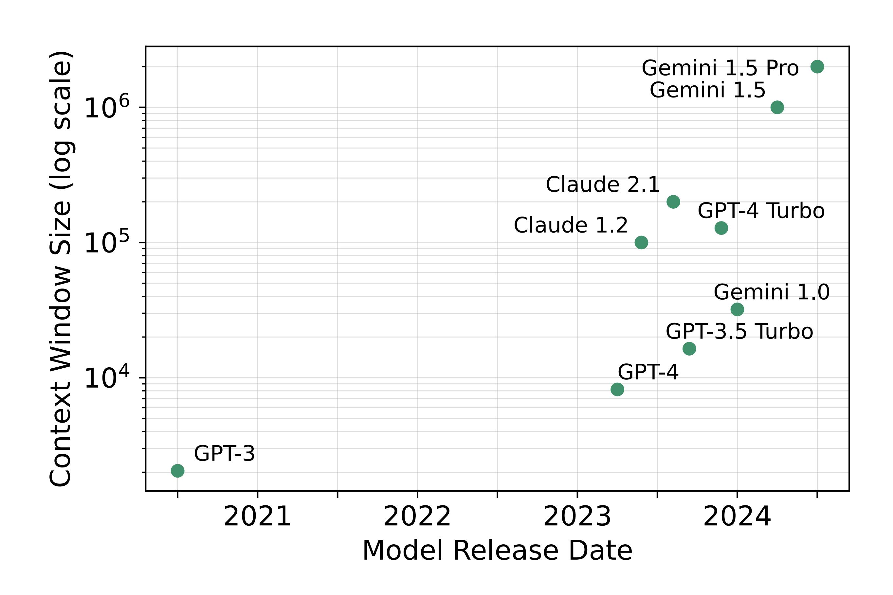

• Quadratic compute complexity

- Quadratic compute complexity
- Huge KV cache sizes (linear to sequence length)

|                             | Attention |
|-----------------------------|-----------|
| Computational Complexity | O(L2)     |
| Inference-Time Memory    | O(L)      |

- Compress prior context into a state
- Update states recurrently in-place

|                             | Attention          |
|-----------------------------|--------------------|
| Computational Complexity | O(L 2 ) |
| Inference-Time Memory    | O(L)               |

- Compress prior context into a state
- Update states recurrently in-place

|                          | Attention          | SSM  |
|--------------------------|--------------------|------|
| Computational Complexity | O(L 2 ) | O(L) |
| Inference-Time Memory | O(L)               | O(1) |

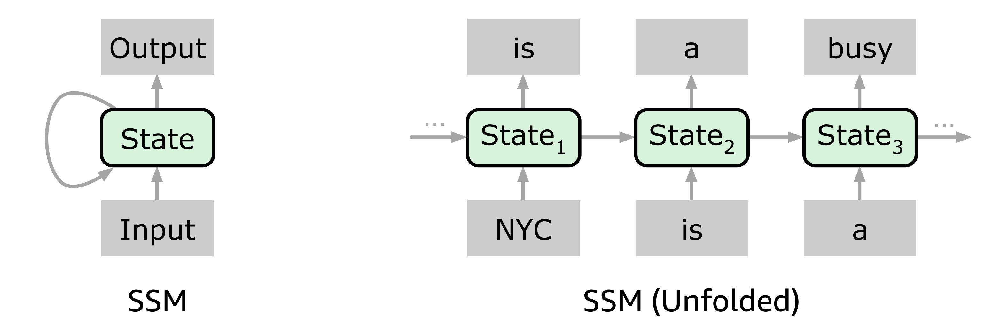

|                             | Attention | SSM  |
|-----------------------------|-----------|------|
| Computational Complexity | O(L2)     | O(L) |
| Inference-Time Memory    | O(L)      | O(1) |

- Memory consumption:
  - Fixed-sized regardless of num tokens

|                             | Attention | SSM  |
|-----------------------------|-----------|------|
| Computational Complexity | O(L2)     | O(L) |
| Inference-Time Memory    | O(L)      | O(1) |

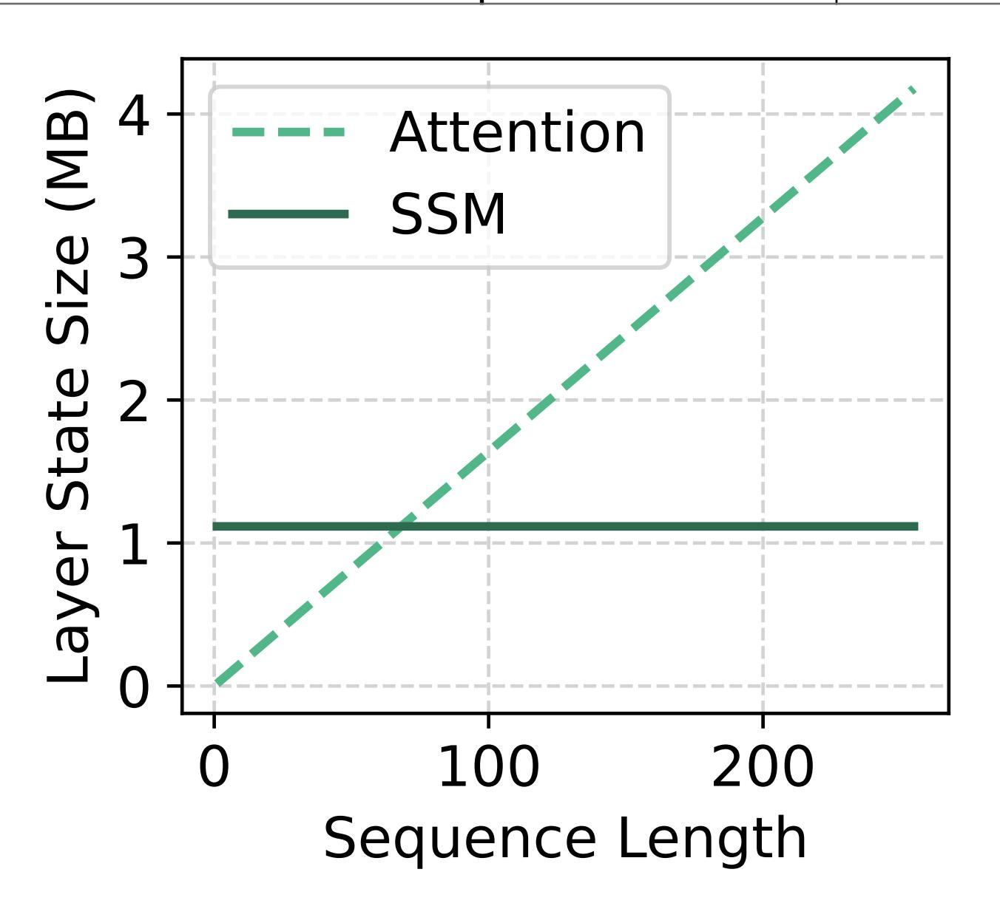

- Memory consumption:
  - Fixed-sized regardless of num tokens
  - Generally smaller than **whole sequences**' KVs

|                             | Attention | SSM  |
|-----------------------------|-----------|------|
| Computational Complexity | O(L2)     | O(L) |
| Inference-Time Memory    | O(L)      | O(1) |

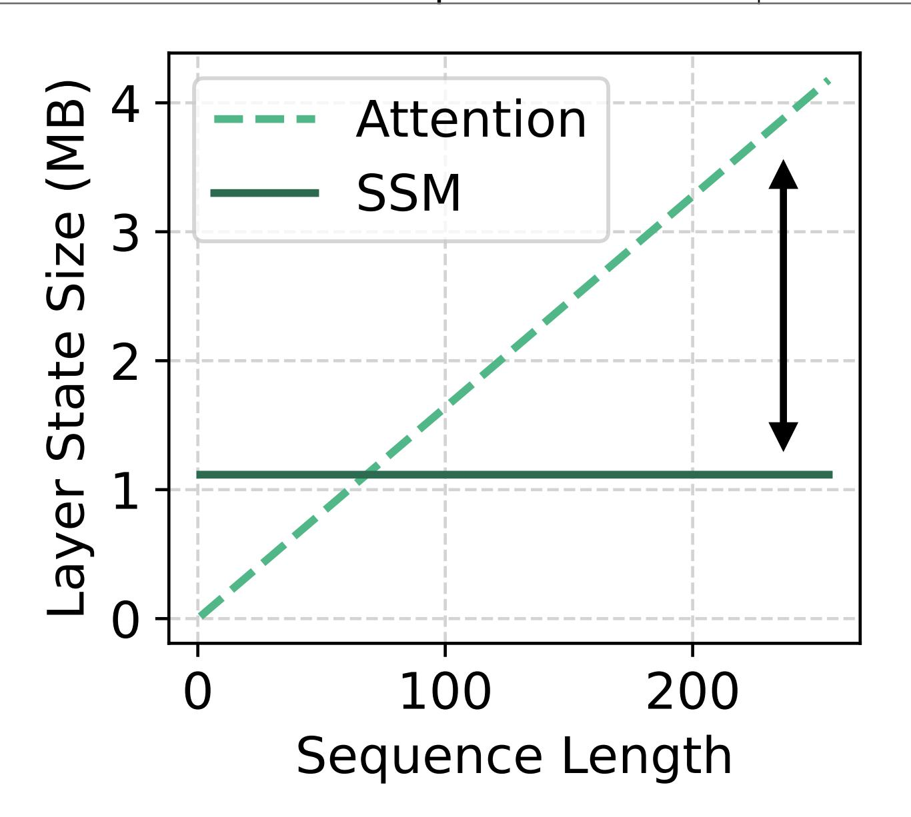

- Memory consumption:
  - Fixed-sized regardless of num tokens
  - Generally smaller than **whole sequences**' KVs
  - Orders of magnitude larger than a **single token**'s KVs

|                             | Attention | SSM  |
|-----------------------------|-----------|------|
| Computational Complexity | O(L2)     | O(L) |
| Inference-Time Memory    | O(L)      | O(1) |

- A few Attention layers + many SSM layers
- Balances efficiency and language modeling capability Attention SSM

- A few Attention layers + many SSM layers
- Balances efficiency and language modeling capability Attention SSM

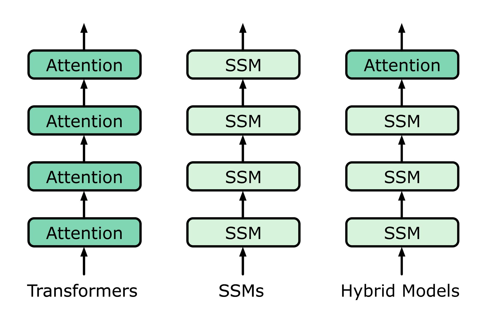

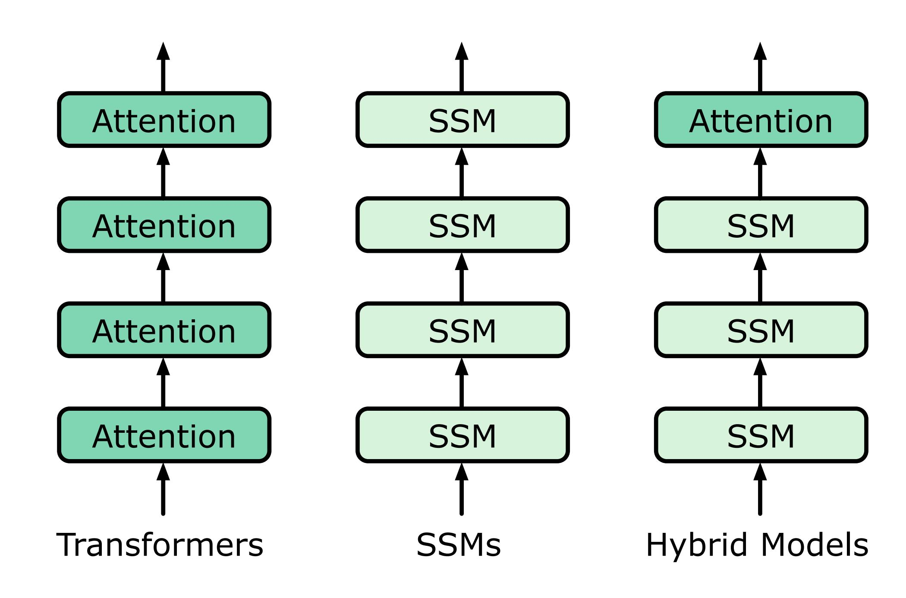

#### **Execution Runtimes**

"Models == Transformers"

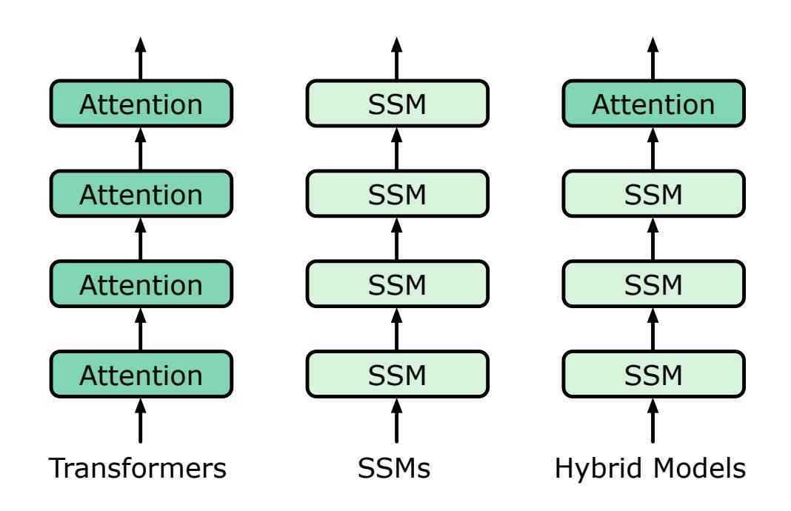

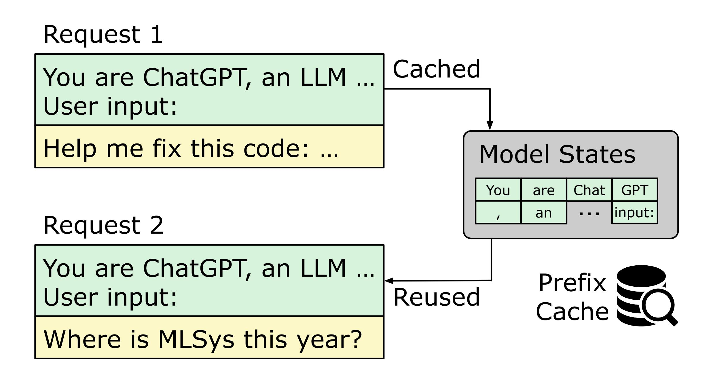

#### Background: prefix caching

- Reuses model states (KVs, SSM states) of common prefixes across requests
- Reduces Time To First Token (TTFT)

• Prefix caching is challenging for SSMs: states can't be rolled back to represent a prefix

• Prefix caching is challenging for SSMs: states can't be rolled back to represent a prefix

KV Cache

• Prefix caching is challenging for SSMs: states can't be rolled back to represent a prefix

KV Cache

NYC is a busy city

• Prefix caching is challenging for SSMs: states can't be rolled back to represent a prefix

KV Cache

NYC is a

 Prefix caching is challenging for SSMs: states can't be rolled back to represent a prefix
SSM States

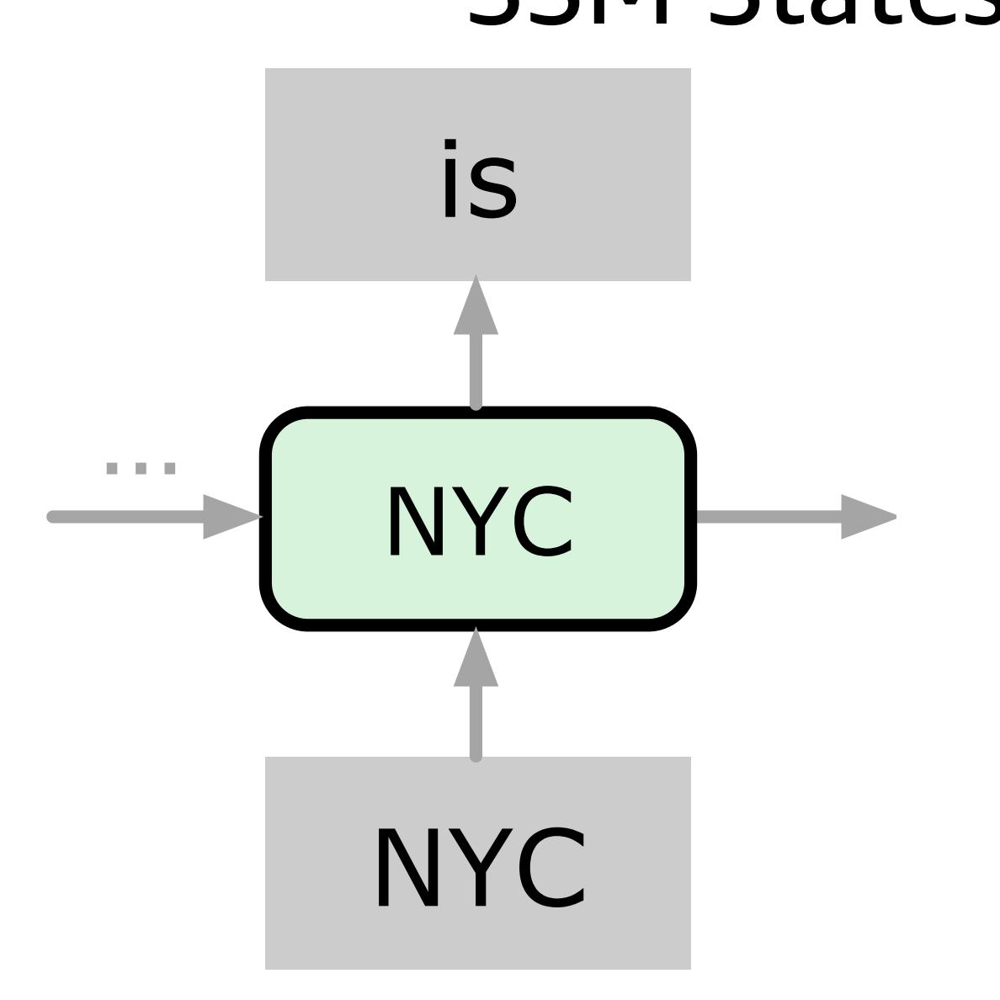

 Prefix caching is challenging for SSMs: states can't be rolled back to represent a prefix

 Prefix caching is challenging for SSMs: states can't be rolled back to represent a prefix
SSM States

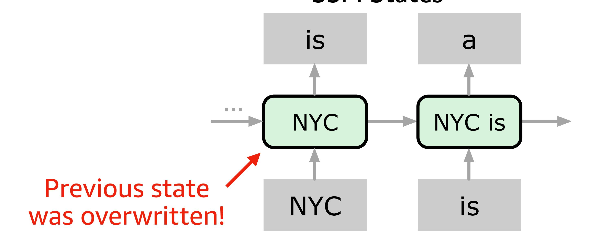

 Prefix caching is challenging for SSMs: states can't be rolled back to represent a prefix
SSM States

SSM's modeling win complicates their systems win!

• Naive solution: checkpoint an SSM state every x tokens

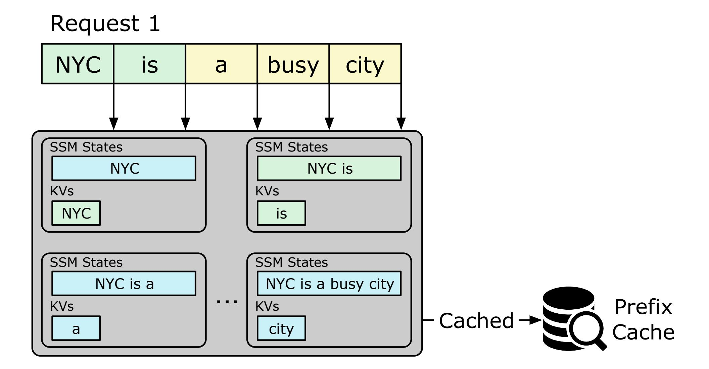

- Naive solution: checkpoint an SSM state every x tokens
- Catch 1: cache entries are sparsely-hit

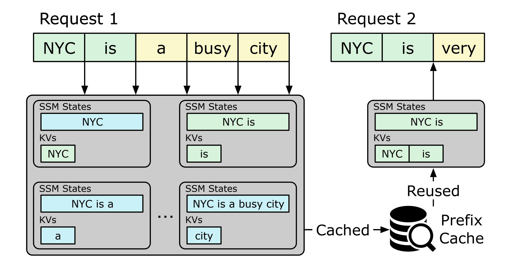

- Naive solution: checkpoint an SSM state every x tokens
- Catch 1: cache entries are sparsely-hit
- Catch 2: cache entries are huge

- Naive solution: checkpoint an SSM state every x tokens
- Catch 1: cache entries are sparsely-hit
- Catch 2: cache entries are huge
- Frequent cache thrashing & low hit rate

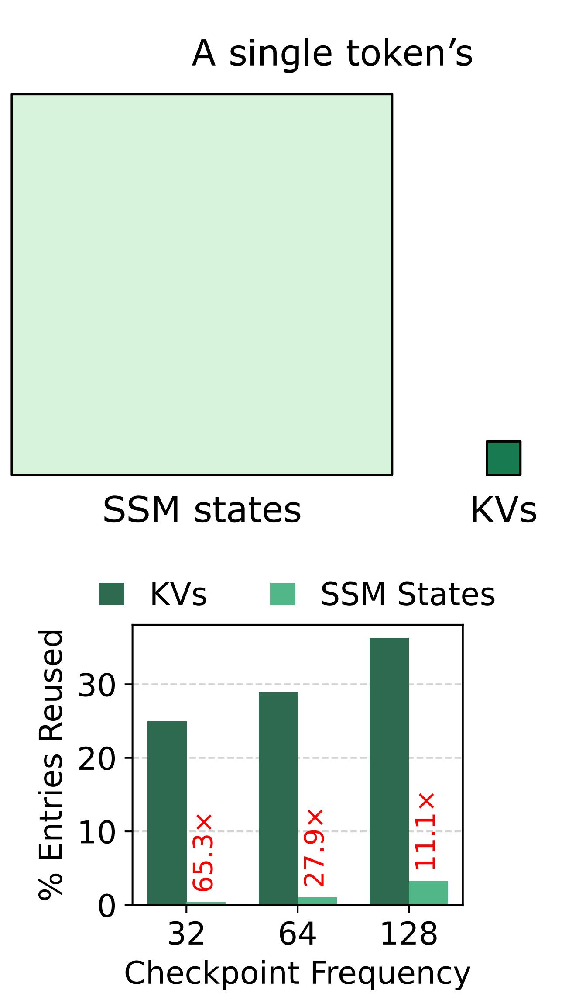

# **Marconi: prefix caching for Hybrid LLMs**

- Supports models with arbitrary layer compositions (Hybrid LLMs, pure Transformers, pure SSMs)
- Shouldn't focus solely on recency
  - Needs to be more judicious in admission and eviction!
- Leverages unique characteristics of Hybrid LLMs

Admission Eviction 10

#### Aside from recency:

# **Admission Eviction**

#### Aside from recency:

# **Admission Eviction**

Forecasts prefixes' reuse likelihoods

#### **Judicious admission**

- Existing systems: admit all states of most recent request
- Marconi: admit states with high reuse likelihood only
- Key insight
  - Future reuse patterns cannot be predicted…
  - …but can be sufficiently estimated through a taxonomy of potential prefix reusing scenarios!

### **Taxonomy of prefix reusing patterns**

• Composition of all reused prefixes:

# **Taxonomy of prefix reusing patterns**

- Composition of all reused prefixes:
  - 1. **Purely input**: part of the input sequence from a prior request
    - E.g., system prompts, few-shot examples

(a) System prompt and few-shot prompting

# **Taxonomy of prefix reusing patterns**

- Composition of all reused prefixes:
  - 1. **Purely input**: part of the input sequence from a prior request
    - E.g., system prompts, few-shot examples
  - 2. **Input and output**: input+output sequence of a prior request
    - E.g., conversation history for chatbots, past environment interactions for agents

#### **Different mechanisms for different cases**

#### **Different mechanisms for different cases**

#### **• Purely input**

- Prefix shared by many requests
- Can be observed by bookkeeping and comparing previous requests

(b) Multi-turn conversation (e.g., ChatGPT)

#### **Different mechanisms for different cases**

#### **• Purely input**

- Prefix shared by many requests
- Can be observed by bookkeeping and comparing previous requests

#### **• Input and output**

• Conversations usually append to the last decoded token

- Use a radix tree to represent past requests
- Nodes naturally represent high reuse likelihood:

- Use a radix tree to represent past requests
- Nodes naturally represent high reuse likelihood:

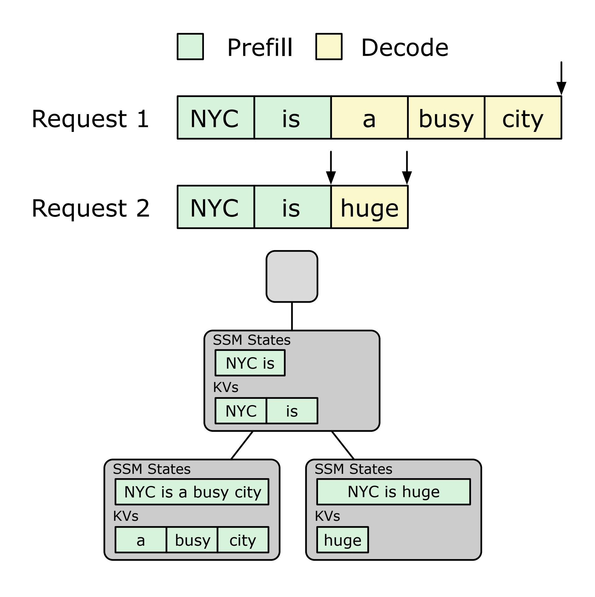

- Use a radix tree to represent past requests
- Nodes naturally represent high reuse likelihood:
  - Intermediates: purely-input prefixes

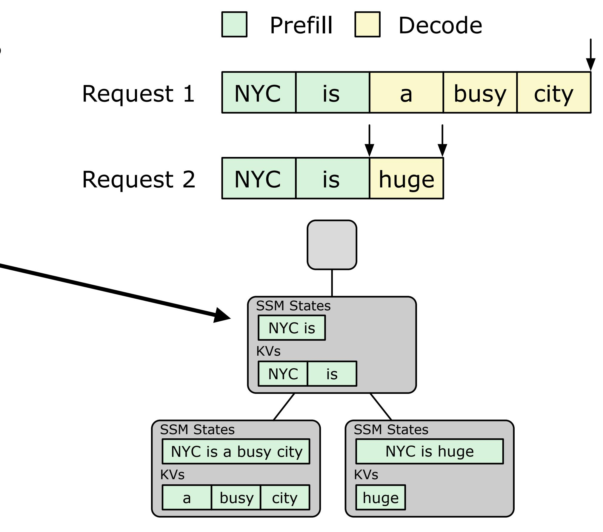

- Use a radix tree to represent past requests
- Nodes naturally represent high reuse likelihood:
  - Intermediates: purely-input prefixes
  - Leaves: input-and-output prefixes

#### Aside from recency:

# **Admission Eviction**

Forecasts prefixes' reuse likelihoods Considers compute savings hits deliver

### **Different memory-compute savings tradeoffs**

• Unlike KVs, SSM states have fixed size regardless of sequence length or compute savings

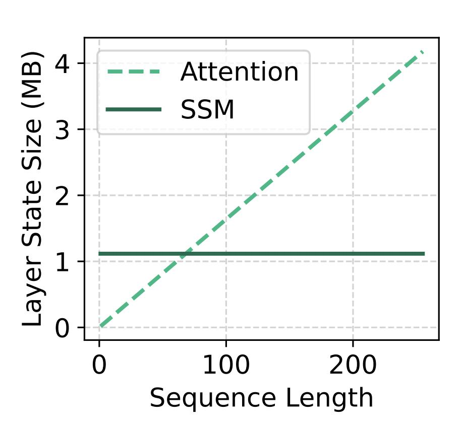

# **Different memory-compute savings tradeoffs**

- Unlike KVs, SSM states have fixed size regardless of sequence length or compute savings
- **FLOP efficiency**: compute savings per unit of memory of reusing a state

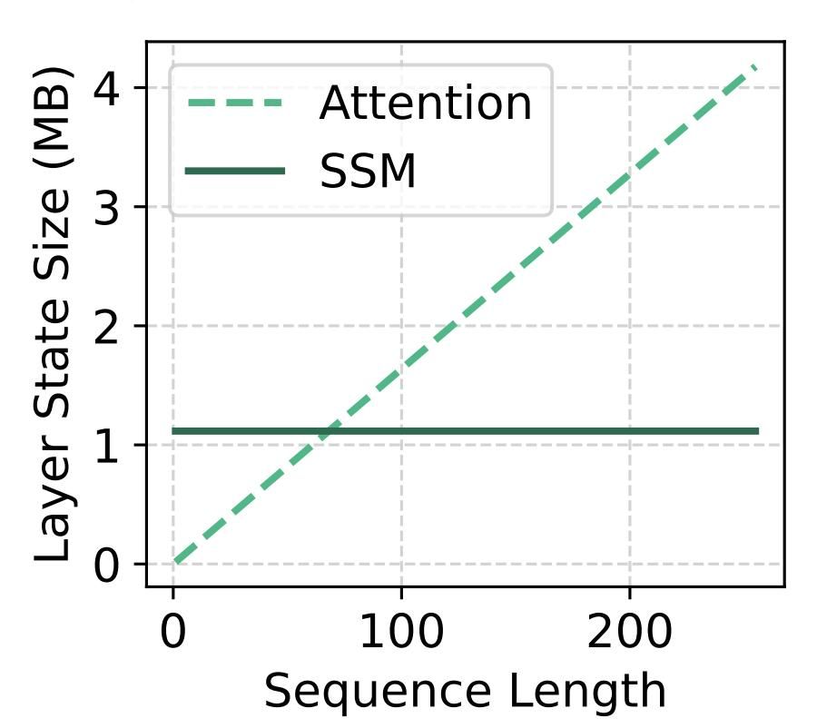

Total FLOPs across layers (Attn, SSM, MLP)

FLOP efficiency = Memory consumption of all states (KVs, SSM States)

# **Different memory-compute savings tradeoffs**

• Models with more SSM layers have more FLOP-efficient states

FLOP efficiency = Total FLOPs across layers (Attn, SSM, MLP) Memory consumption of all states (KVs, SSM States)

#### **FLOP-aware eviction policy**

• Existing systems: recency-focused (i.e., evict using LRU)

Utility = recency

#### **FLOP-aware eviction policy**

- Existing systems: recency-focused (i.e., evict using LRU)
- Marconi: also considers the potential compute savings

Utility = recency

#### **FLOP-aware eviction policy**

- Existing systems: recency-focused (i.e., evict using LRU)
- Marconi: also considers the potential compute savings
- Utility score: balances recency and FLOP efficiency

Utility = recency + *α* ⋅ flop\_efficiency

#### **Evaluation**

- NVIDIA Mamba2-Hybrid-7B with {4, 24, 28} {Attention, SSM, MLP} layers
- Workloads: conversational (LMSys, ShareGPT) and agentic (SWEBench)
- Metrics: token hit rate (%), Time To First Token (ms)
- Large sweep of experiments with varying cache size and request arrival patterns

# **Marconi vs. fine-grained checkpointing**

- Judicious admission improves the cache utility significantly
- Average improvement in token hit rate: 4.5X, 7.3X, and 34.4X

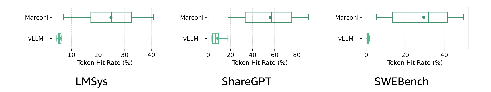

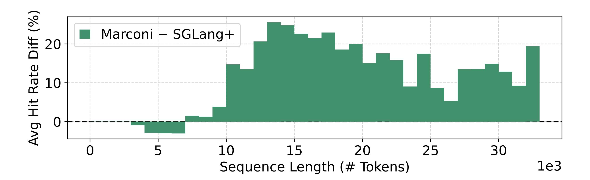

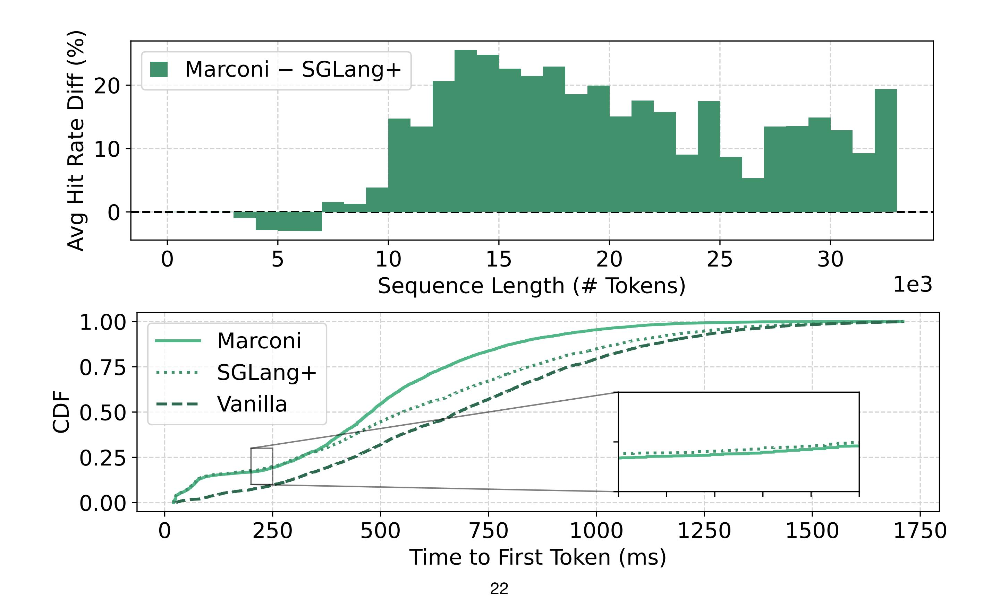

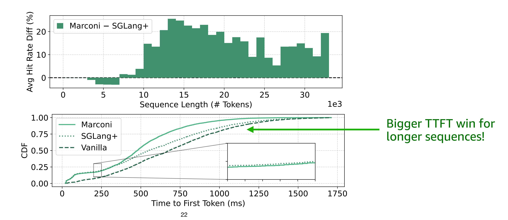

# **Marconi**

- First prefix caching system for models with arbitrary layer compositions
- Evaluates cache entries not only on recency, but also:
  - Admission: prefixes' reuse likelihoods
  - Eviction: compute savings that hits deliver
- Source code available!<https://github.com/ruipeterpan/marconi>

