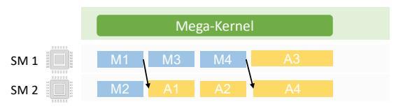
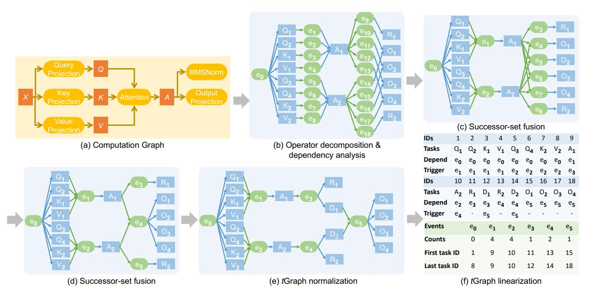
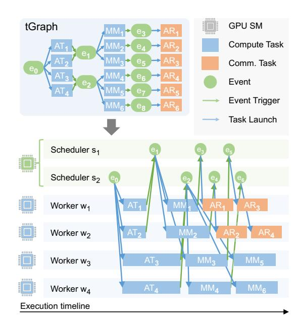
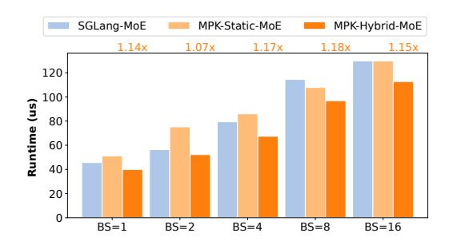
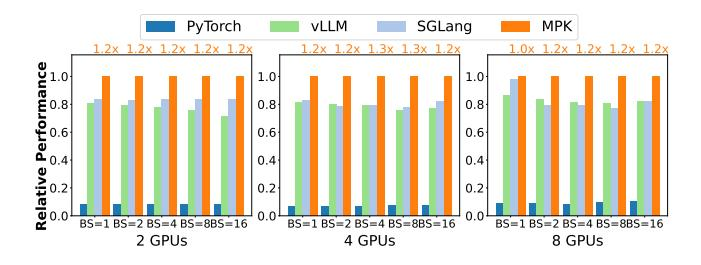
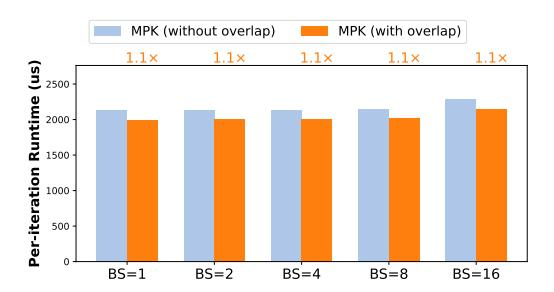

# <span id="page-0-0"></span>Mirage Persistent Kernel: A Compiler and Runtime for Mega-Kernelizing Tensor Programs

Xinhao Cheng1,<sup>∗</sup> Zhihao Zhang1,<sup>∗</sup> Yu Zhou1,<sup>∗</sup> Jianan Ji1,<sup>∗</sup> Jinchen Jiang<sup>2</sup> Zepeng Zhao<sup>1</sup> Ziruo Xiao<sup>1</sup> Zihao Ye<sup>3</sup> Yingyi Huang<sup>3</sup> Ruihang Lai<sup>1</sup> Hongyi Jin<sup>1</sup> Bohan Hou<sup>1</sup> Mengdi Wu<sup>1</sup> Yixin Dong<sup>1</sup> Anthony Yip<sup>1</sup> Zihao Ye<sup>4</sup> Songting Wang<sup>1</sup> Wenqin Yang<sup>5</sup> Xupeng Miao<sup>6</sup> Tianqi Chen1,<sup>3</sup> Zhihao Jia<sup>1</sup>

> *Carnegie Mellon University*<sup>1</sup> *Tsinghua University*<sup>2</sup> *NVIDIA*<sup>3</sup> *University of Michigan*<sup>4</sup> *Independent Researcher*<sup>5</sup> *Purdue University*<sup>6</sup>

# Abstract

We introduce Mirage Persistent Kernel (MPK), the first compiler and runtime system that automatically transforms multi-GPU model inference into a single high-performance megakernel. MPK introduces an SM-level graph representation that captures data dependencies at the granularity of individual streaming multiprocessors (SMs), enabling cross-operator software pipelining, fine-grained kernel overlap, and other previously infeasible GPU optimizations. The MPK compiler lowers tensor programs into highly optimized SM-level task graphs and generates optimized CUDA implementations for all tasks, while the MPK in-kernel parallel runtime executes these tasks within a single mega-kernel using decentralized scheduling across SMs. Together, these components provide end-to-end kernel fusion with minimal developer effort, while preserving the flexibility of existing programming models. Our evaluation shows that MPK significantly outperforms existing kernel-per-operator LLM serving systems by reducing end-to-end inference latency by up to 1.7×, pushing LLM inference performance close to hardware limits. MPK is publicly available at [https://github.com/mirage-project/](https://github.com/mirage-project/mirage) [mirage](https://github.com/mirage-project/mirage).

# 1 Introduction

Enabling high-performance inference of ML models on GPUs is critical for modern AI applications, as inference latency directly affects usability and cost. Today's ML systems generally express model computation as a tensor program represented as a directed acyclic graph (DAG), whose nodes denote tensor algebra operators (e.g., matrix multiplication) and edges represent tensors, i.e., *n*-dimensional arrays consumed and produced by these operators.

Most existing systems execute each operator using a dedicated GPU kernel, which may be hand-optimized by domain experts [\[17,](#page-13-0) [35\]](#page-14-0) or generated automatically by ML compilers [\[15,](#page-13-1) [29,](#page-13-2) [33\]](#page-14-1). However, this *kernel-per-operator* execution

model limits several key cross-operator GPU optimizations.

First, modern GPUs implicitly insert a *kernel barrier* between consecutive launches on the same stream to ensure that all threads from the previous kernel complete before any thread from the next kernel begins. While this mechanism enforces data dependencies, it prevents *cross-operator software pipelining*, forcing dependent operators to execute strictly sequentially. NVIDIA recently introduced *programmatic dependent launch* (PDL) [\[11\]](#page-12-0), which allows partial overlap between kernels on the same stream. However, adopting PDL requires significant engineering effort, as it fundamentally alters kernel structure and control flow.

Second, the kernel-per-operator approach prevents finegrained compute-communication overlap. Because dependencies are captured only at the coarse operator granularity, the runtime must enforce full-operator completion before launching dependent communication or computation. For example, when a matrix multiplication is followed by an all-reduce in separate kernels, the all-reduce must wait for the entire multiplication to complete, even though each piece of all-reduce depends only on a subset of the multiplication. Exploiting such opportunities requires representing and enforcing data dependencies at a granularity finer than individual kernels.

Finally, the kernel-per-operator approach requires launching hundreds to thousands of kernels for each inference iteration. To mitigate launch overhead, current systems rely heavily on *CUDA Graphs*, which capture a sequence of GPU operations and launch them with minimal overhead. However, CUDA Graphs are largely static: any changes to control flow, tensor shapes, or data dependencies require re-instantiation or modification of the captured graph, limiting flexibility for dynamic workloads commonly seen in model inference.

A promising approach to overcoming these limitations is to fuse all computation and communication into a single *megakernel* (also known as a *persistent kernel*). In this design, the system launches one GPU kernel to execute the entire model, from layer computations to inter-GPU communication, without interruption.

Mega-kernels address the limitations of the kernel-per-

<sup>∗</sup>Equal contribution.

<span id="page-1-3"></span><span id="page-1-0"></span>

Figure 1: An overview of MPK.

operator approach in several ways. First, they eliminate kernel launch overhead by avoiding repeated invocations. Second, by fusing all operator computations into a single kernel, they enable cross-operator software pipelining, allowing data for the next operator to be prefetched while computations for the current operator are still in progress. Third, they support fine-grained overlap of computation and inter-GPU communication, enabling simultaneous execution that more effectively hides communication latency.

Despite these benefits, automatically transforming an ML model into a high-performance mega-kernel remains challenging. Existing ML systems—such as PyTorch [\[25\]](#page-13-3), Triton [\[29\]](#page-13-2), and TVM [\[15\]](#page-13-1)—do not support end-to-end mega-kernel generation. Moreover, these systems rely on a fragmented ecosystem of specialized libraries: NCCL [\[4\]](#page-12-1) or NVSHMEM [\[10\]](#page-12-2) for communication, FlashInfer [\[35\]](#page-14-0) or FlashAttention [\[17\]](#page-13-0) for attention, and CUDA or Triton for custom computation. This fragmentation makes it difficult to unify the entire inference pipeline into a single kernel.

We present *Mirage Persistent Kernel* (MPK), the first compiler and runtime system that automatically transforms multi-GPU model inference into a high-performance mega-kernel. MPK enables end-to-end kernel fusion with minimal developer effort—users can mega-kernelize a PyTorch model with only a few lines of code, achieving significant performance improvement compared to running the model in vanilla PyTorch with CUDA Graphs and torch.compile. MPK combines the performance benefits of mega-kernels with the usability of existing ML frameworks.

A key idea in MPK is to represent computation and inter-GPU communication at the granularity of individual streaming multiprocessors (SMs) instead of an entire GPU. MPK introduces an *SM-level graph representation*, called *t*Graph, whose nodes denote *tasks* running on individual SMs and whose edges encode fine-grained dependencies between tasks. This representation exposes additional parallelism and enables optimizations such as cross-operator software pipelining and fine-grained kernel overlap, all of which are infeasible in the existing kernel-per-operator approach. MPK realizes this idea using two key components shown in Figure [1.](#page-1-0)

The MPK compiler. The MPK compiler takes a tensor program and an inference configuration as input and automatically transforms the computation graph of the tensor program into a highly optimized SM-level *t*Graph tailored to the given inference configuration and GPU architecture. The compiler introduces a diversity of optimizations, including event fusion, graph normalization, and graph linearization, to reduce synchronization overhead and maximize the performance of generated *t*Graphs. In addition, MPK also automatically generates high-performance CUDA implementations for each task using existing superoptimization techniques [\[33\]](#page-14-1), ensuring efficient SM-level execution.

In-kernel parallel runtime. MPK executes the SM-level *t*Graph using an in-kernel parallel runtime embedded entirely within a mega-kernel, allowing for fine-grained control over task execution and scheduling *without* any kernel launches during model execution. To achieve this goal, the runtime partitions a GPU's SMs into *workers*, which maintains a dedicated task queue and executes all assigned tasks in a first-infirst-out order, and *schedulers*, which maintain dependency across tasks and assign tasks when their prerequisites are satisfied. The MPK runtime uses an *event-driven, fully asynchronous* execution model to ensure that GPUs are maximally utilized. Finally, the MPK runtime uses a *hybrid task-launch strategy* that combines just-in-time and ahead-of-time dispatch to minimize runtime overhead while preserving dynamic load balance across SMs.

Evaluation results. We implement MPK as a PyTorch kernel backend: a PyTorch program can be compiled into a MPK mega-kernel with only a few lines of code changes. We evaluate MPK on five widely used models across three generations of NVIDIA GPUs: A100, H100, and B200. Even for workloads that are widely deployed and heavily optimized by existing kernel-per-operator systems, such as SGLang and vLLM for LLM serving, MPK still outperforms current systems by 1.0-1.7× on both single- and multi-GPU deployments, pushing LLM inference performance close to hardware limits.

# <span id="page-1-2"></span>2 Background

This section first reviews the kernel-oriented GPU programming model and discusses its limitations (§ [2.1\)](#page-1-1), and then presents kernel fusion and mega-kernel techniques (§ [2.2\)](#page-2-0), which motivate the design of MPK.

# <span id="page-1-1"></span>2.1 GPU Programming Model

On GPUs, computations are organized as *kernels*, each representing a function executed concurrently across many cores in a single-program, multiple-data (SPMD) fashion. A kernel consists of a grid of *thread blocks*, where each block is assigned to a streaming multiprocessor (SM) and contains multiple *threads* that operate on individual data elements.

<span id="page-2-5"></span><span id="page-2-4"></span><span id="page-2-1"></span>

(a) Kernel barriers prevent cross-task pipelining.


(b) MPK enables both intra- and cross-task pipelining.

Figure 2: Comparing how MPK and existing approaches support intra- and cross-task pipelining.

Each thread has a private register file, while threads within the same block cooperate through low-latency *shared memory* for data exchange and collective operations. All kernel inputs and outputs are stored in GPU *device memory*.

The CUDA programming model does not support direct synchronization across thread blocks within a kernel, as modern GPU architectures lack hardware mechanisms for such coordination. As a result, cross-operator dependencies (e.g., a matrix multiplication that must complete before another begins) are enforced through *kernel barriers*, which are automatically inserted by the GPU runtime between consecutive kernels launched on the same stream.

While kernel barriers simplify dependency management, they also prevent key GPU optimizations such as cross-kernel software pipelining and fine-grained kernel overlap.

Software pipelining. GPU architectures are increasingly *heterogeneous*, integrating specialized accelerators such as tensor cores and tensor memory accelerators (TMAs). Since TMA load and store instructions execute asynchronously, data movement can proceed while tensor cores and CUDA cores perform computation. Fully exploiting these accelerators requires *software pipelining*—a technique that interleaves independent stages of computation and data movement across multiple iterations of tasks to maximize hardware utilization.

Existing systems implement *intra-task* pipelining, as shown in Figure [2a,](#page-2-1) where a single task is decomposed into multiple iterations. In this model, TMAs, tensor cores, and CUDA cores can simultaneously perform data transfer, matrix computation, and auxiliary operations for different iterations in a pipeline. However, kernel barriers restrict pipelining to within a single task, preventing inter-task pipelining and introducing pipeline bubbles that leave hardware resources underutilized.

<span id="page-2-3"></span>

(a) Kernel barriers prevent overlapping MatMul and AllGather.

<span id="page-2-2"></span>

(b) MPK enables fine-grained overlap of MatMul and AllGather.

Figure 3: Comparing how MPK and existing approaches support fine-grained kernel overlap between tasks. Data dependencies (black arrows in Figure [3b\)](#page-2-2) ensure correctness.

Fine-grained kernel overlap. Kernel barriers also preclude opportunities to overlap kernels that utilize different hardware resources (e.g., compute and communication), as they enforce dependencies at the granularity of entire kernels rather than individual data units. Figure [3a](#page-2-3) illustrates a common pattern in large language models (LLMs), where a MatMul operator is followed by an AllGather operator. Existing systems generally launch these as two separate kernels, requiring all thread blocks of the AllGather kernel to wait until all thread blocks of the preceding MatMul kernel complete.

In practice, the data dependency between AllGather and MatMul is much finer-grained: since AllGather performs element-wise operation, each of its thread blocks only depends on the output of a single MatMul thread block. This dependency structure enables *fine-grained kernel overlap*, where different SMs can execute MatMul and AllGather in parallel, as long as fine-grained data dependencies are preserved. Such overlap allows the system to simultaneously utilize both compute and communication bandwidth on modern GPUs, as identified in prior work [\[41\]](#page-14-2). Achieving this overlap, however, requires proper synchronization between SMs at sub-kernel granularity, as shown in Figure [3b,](#page-2-2) which is not supported by conventional kernel barriers.

# <span id="page-2-0"></span>2.2 Kernel Fusion

Kernel fusion eliminates kernel barriers by combining multiple GPU kernels that execute sequentially on the same data into a single, semantically equivalent kernel. Kernel fusion improves performance by avoiding instantiating intermediate results, reducing device memory access, and eliminating kernel launch overheads.

Kernel fusion has been widely adopted in tensor program compilers. Frameworks such as PyTorch, JAX, and TVM employ rule-based heuristics to fuse adjacent kernels [\[14,](#page-13-4) [15,](#page-13-1) [25\]](#page-13-3), while systems such as Mirage and TASO automatically discover fusion rules through compiler super-

<span id="page-3-1"></span><span id="page-3-0"></span>

Figure 4: The MPK compiler transforms a kernel-level computation graph into an optimized SM-level *t*Graph. MM, AT, and AR denote MatMul, Attention, and AllReduce tasks, respectively.

optimization [22,33]. However, existing compilers can only fuse small groups of local operators, as generating a single kernel that faithfully implements complex tensor programs is computationally difficult and often infeasible.

The *mega-kernel* paradigm pushes kernel fusion to the extreme by fusing all computation and communication of a tensor program into one persistent kernel, using device-memory synchronization primitives to coordinate execution across SMs. Despite its performance benefits, current ML compilers such as PyTorch, Triton, JAX, and TVM do not support mega-kernel compilation. Existing mega-kernels are handcrafted by GPU experts for specific models. For example, FlashDMoE fuses mixture-of-experts computation and inter-GPU communication into a single kernel [13], while Spector et al. manually designed and implemented a low-latency mega-kernel for LLAMA-1B [9,30].

These manual approaches require substantial engineering effort and deep GPU expertise to mega-kernelize a tensor program. In contrast, MPK adopts a compiler-based approach that automatically transforms a tensor program into an optimized mega-kernel, eliminating the need for manual effort.

### 3 SM-Level Graph Representation

This section introduces *tGraph*, a representation that expresses the computation of a tensor program at the granularity of individual streaming multiprocessors (SMs). This fine-grained representation exposes additional parallelism and enables optimizations such as cross-operator software pipelining and fine-grained kernel overlap, both of which cannot be supported in existing kernel-per-operator execution model.

Figure 4 illustrates an example *t*Graph, where each node represents either a *task* or an *event*. Each task—shown as a blue (or orange) rectangle—denotes a unit of computation or communication executed on a single SM. Each event—shown as a green circle—represents synchronization across tasks. Tasks and events alternate in the graph: every task only has outgoing edges to *triggering events* and incoming edges from *dependent events*. A task is ready for execution when its dependent events are all *activated* and notifies its triggering event upon completion. An event is activated once it has

received notifications from all tasks associated with it.

This structure captures dependencies at a much finer granularity than traditional computation graphs. For example, multi-GPU LLM serving often involves a MatMul operator followed by an AllReduce operator (Figure 4a). Existing systems generally execute these operators sequentially due to coarse-grained kernel barriers that synchronize entire kernels. In contrast, SM-level task graphs can represent precise task-level dependencies: since AllReduce performs element-wise communication, each of its tasks depends only on one corresponding MatMul task. By inserting fine-grained events between dependent task pairs, MPK can overlap compute-intensive MatMul tasks with communication-intensive AllReduce tasks, maximizing overall GPU utilization.

Multiple *t*Graphs may represent the same computation graph. Figure 4c shows an alternative but suboptimal *t*Graph where events capture only operator-level dependencies, analogous to traditional kernel barriers. § 4 describes how MPK generates high-performance task graphs by inferring *precise* data dependencies to maximize concurrency and minimize synchronization overheads.

Comparison with CUDA Graphs. *t*Graphs can be viewed as a lower-level extension of CUDA Graphs, sharing several structural similarities. Like CUDA Graphs, *t*Graphs are statically instantiated and encode explicit dependencies among operations. However, while CUDA Graphs capture dependencies only at the kernel level, *t*Graphs operate at the granularity of individual SM tasks and sub-kernel events. CUDA Graphs primarily describe kernel launch order and rely on stream semantics for synchronization, which confines overlap and fusion to kernel boundaries. In contrast, *t*Graphs explicitly model both intra- and cross-operator dependencies, enabling fine-grained synchronization across SMs and overlapping of computation and communication within a single kernel. This design allows MPK to exploit parallelism that is inaccessible to CUDA Graphs or kernel-level execution models.

### <span id="page-4-0"></span>4 The MPK Compiler

This section presents the MPK compiler, which takes a computation graph and an associated inference configuration as input and generates an optimized *t*Graph specialized for both the target configuration and underlying GPU architecture. Figure 5 outlines the end-to-end compilation workflow.

### 4.1 *t*Graph Generation

**Operator decomposition.** The MPK compiler decomposes each operator of the input computation graph into a set of tasks by *partitioning* the operator's output tensors such that all tasks compute *disjoint* subsets of the output and can therefore execute in parallel across SMs. Most tensor algebra operators can be partitioned across multiple output dimensions; for example, the output tensor of a matrix multiplication can be tiled along both the row and column dimensions to expose parallelization opportunities.

The performance of a partitioning strategy depends on both the problem shape and the target GPU architecture. To discover an effective strategy, MPK selects a partitioning strategy that minimizes data loading from device memory to shared memory, since accessing device memory is significantly more expensive than accessing shared memory or performing computation on CUDA cores or tensor cores. By default, MPK generates a number of tasks proportional to the number of SMs to promote load balance across SMs during execution. MPK also provides an interface for users to easily specify custom partitioning strategy by setting the desired parallelization degree along each output dimension.

**Dependency analysis.** MPK uses *events* to capture dependencies between tasks. For any two operators that share a tensor, MPK enumerates all pairs of tasks from the two operators and introduces an event e for a task pair  $(t_1,t_2)$  if and only if the output region produced by task  $t_1$  overlaps with the input region consumed by task  $t_2$ . The event serves as a synchronization point indicating that  $t_2$  cannot begin execution until  $t_1$  has completed producing the required data. Accordingly, MPK inserts two edges  $(t_1,e)$  and  $(e,t_2)$  into the resulting tGraph. This fine-grained dependency analysis preserves all producer-consumer dependencies while exposing maximal parallelism across independent tasks.

**Event fusion.** MPK applies two complementary forms of event fusion—successor-set and predecessor-set fusion—to eliminate redundant synchronization points and simplify the constructed tGraph. For an event e, we define two functions: InTasks(e), the set of tasks that trigger e, and OutTasks(e), the set of tasks that depend on e. These functions allow us to characterize when multiple events exhibit identical dependency structure and can therefore be fused.

First, *successor-set fusion* merges events that serve as prerequisites for the same set of consumer tasks. Because these tasks cannot begin execution until all such events are activated, representing them separately provides no additional scheduling flexibility.

**Definition 4.1** (Successor-set fusion). For any two events  $e_1$  and  $e_2$  of a tGraph, successor-set fusion applies if and only if  $OutTasks(e_1) = OutTasks(e_2)$ . MPK removes events  $e_1$  and  $e_2$  from  $\mathcal{T}$  and introduces a fused event e' with  $InTasks(e') = InTasks(e_1) \cup InTasks(e_2)$  and  $OutTasks(e') = OutTasks(e_1)$ .

As an example, successor-set event fusion fuses events  $e_10$  and  $e_{14}$  in Figure 5(b) into a new event (i.e.,  $e_4$  in Figure 5(c)) since they are both prerequisites for task  $O_1$ .

Second, *predecessor-set fusion* merges events that depend on an identical set of producer tasks. Because such events are triggered simultaneously, maintaining them as separate synchronization nodes introduces unnecessary graph complexity.

**Definition 4.2** (Predecessor-set fusion). For any two events  $e_1$  and  $e_2$  in a tGraph  $\mathcal{T}$ , predecessor-set fusion applies if and only if  $InTasks(e_1) = InTasks(e_2)$ . MPK removes events  $e_1$  and  $e_2$  from  $\mathcal{T}$  and introduces a fused event e' with  $InTasks(e') = InTasks(e_1)$  and  $OutTasks(e') = OutTasks(e_1) \cup OutTasks(e_2)$ .

As an example, predecessor-set fusion fuses events  $e_4$ ,  $e_5$ ,  $e_6$ , and  $e_7$  in Figure 5(c) into a single new event ( $e_4$  in the new tGraph) as all these events depend on tasks  $A_1$  and  $A_2$ .

A core challenge MPK must address is representing dependencies between tasks and events. Because MPK executes tasks and updates events in parallel across SMs, the runtime requires a *uniform* and *cheap* representation that avoids costly indirect indexing. Two challenges arise. First, a task may depend on and trigger an arbitrary number of events. A straightforward approach to representing tasks is reserving space for the maximum number of dependent and triggering events per task. However, this approach leads to significant memory overhead. Second, after event fusion, an event may trigger an arbitrary number of tasks. Representing these outgoing edges by allocating space for the maximum fan-out per event is also expensive. MPK introduces two techniques to address these challenges: *t*Graph normalization and linearization.

tGraph normalization. MPK addresses the first challenge through tGraph normalization, which transforms an input tGraph into functionally a equivalent form where each task has at most *one* dependent event and *one* triggering event. tGraph normalization is achieved by performing two types of transformations to reduce the maximum fan-in and fan-out of each task to at most one. First, when a task  $T_0$  triggers multiple events  $e_1, ..., e_k$  in an input tGraph, MPK transforms the tGraph by introducing a new event e' and k empty new tasks  $T_1, ..., T_k$ , each performing no computation and depending on

<span id="page-5-0"></span>

Figure 5: The MPK compiler workflow. In (b), Q, K, V, A, O, and R denote the set of tasks produced by decomposing the query projection, key projection, value projection, attention, output projection, and RMSNorm operators, respectively.  $D_1$  and  $D_2$  in (e) are dummy tasks inserted during tGraph normalization to guarantee that each task has exactly one triggering event. Finally, (f) shows how MPK linearizes the tGraph and stores the resulting structure in GPU memory, where both tasks and events follow a uniform, canonical representation.

<span id="page-5-1"></span>

(a) A transformation reducing fan-out of a task to one.

<span id="page-5-2"></span>(b) A transformation reducing fan-in of a task to one.

Figure 6: MPK performs graph transformations to normalize an arbitrary *t*Graph, ensuring that every task has at most one dependent event and one triggering event.

e'. After this transformation, task  $t_0$  triggers only e', and each newly introduced task  $T_i$  triggers exactly one of the original event  $e_i$ , as shown in Figure 6a. This transformation ensures that every task has exactly one *triggering* event. Figure 5(e) shows how MPK applies this transformation to reduce the number of triggering events for  $A_1$  and  $A_2$  to one.

Second, when a task  $T_0$  depends on multiple events  $e_1, ..., e_k$  in an input tGraph, MPK transforms the tGraph by introducing a new event e' and k empty new tasks  $T_1, ..., T_k$ , each performing no computation and triggering e'. After this transformation, task  $T_0$  and each newly introduced task  $T_i$  depends on exactly one event, as shown in Figure 6b.

*t*Graph normalization introduces an overhead of adding additional tasks and events to normalize a *t*Graph when it has tasks with multiple fan-in and fan-out events. This generally only happens when the original computation graph has oper-

ators that can execute in parallel. For example, tasks  $A_1$  and  $A_2$  in Figure 5(d) have two fan-out events because RMSNorm and output projection operators in the original computation graph both depend on attention and can run in parallel. In practice, we observe negligible normalization overhead (i.e., always less than 1% in our evaluation) as real-world models are "deep" (many sequential operators) instead of "wide" (many parallelizable operators).

<span id="page-5-5"></span>**Algorithm 1** MPK's tGraph linearization algorithm. It is guaranteed that each task is enqueued into T once and that each event is enqueued into E once. Lines 5-7 ensure that all tasks depending on an event are consecutive in T.

```
Input: A normalized tGraph G
Output: A list of tasks T such that for each event e \in G, the set of tasks e
    launches are consecutive in T.
2: E \leftarrow \{e \in G | e.\text{counts} = 0\} \triangleright \text{Enqueue all events with no dependent tasks}
3: while E is not empty do
     e \leftarrow E.\text{dequeue}()
5:
     for all task t \in \mathcal{G} do
6:
       if t.dependent_event = e then
7:
         T.enqueue(t)
8:
         e' \leftarrow t.\text{trigger\_event}
9:
         if all tasks triggering e' are in T then
10:
          E.enqueue(e')
11:
12: return T
```

<span id="page-6-2"></span>*t*Graph linearization. *t*Graph normalization alone cannot address the second challenge: after fusion, an event may still need to trigger a large number of tasks (e.g., event *e*<sup>5</sup> in Figure [5\(](#page-5-0)e) triggers four tasks), requiring additional storage to record their indices. MPK resolves this issue using a *breadthfirst search* (BFS)-based algorithm (see Algorithm [1\)](#page-5-5) to linearize a *t*Graph. The linearization ensures that all tasks triggered by the same event are assigned contiguous indices in the final task ordering. As a result, the fan-out of an event can be encoded compactly using only the first and last task indices, eliminating the need to store an explicit list of dependent tasks while preserving all dependency semantics.

Figure [5\(](#page-5-0)f) illustrates how MPK stores the linearized *t*Graph in GPU device memory. For each task, MPK records only the indices of its dependent and triggering events. For each event, MPK stores the number of triggers required for the event to be activated; once activated, the runtime launches all tasks whose indices fall within the event's first and last task indices.

# 4.2 Task Implementation Generation

In addition to constructing a *t*Graph, MPK also needs to generate a device function for each task to be executed on a GPU SM. MPK leverages prior work and employs a *compiler superoptimization* approach to automatically generating a high-performance implementation for each task. Specifically, MPK performs superoptimization at the thread block level instead of the kernel level. Each compute task is associated with a reference PyTorch implementation, and MPK leverages the Mirage superoptimizer [\[33\]](#page-14-1) to automatically search for an optimal thread block graph, which is sent to the Mirage compiler for generating a CUDA implementation. The CUDA implementation includes all intra-SM optimizations such as software pipelining, register reusing, and layout optimizations to minimize bank conflicts.

# 5 In-Kernel Parallel Runtime

MPK employs an *in-kernel parallel runtime* that executes the *t*Graph across all SMs within a single mega-kernel. This design eliminates kernel-launch overheads and enables finegrained control over scheduling, synchronization, and execution order. Once launched, the mega-kernel continuously manages both computation and communication until the inference workload completes.

To support this execution model, MPK partitions a GPU's SMs into *workers* and *schedulers*. Each worker runs on one physical SM and maintains an independent *task queue*. Workers execute a lightweight loop that repeatedly dequeues tasks, performs the associated computation or communication, and signals task completion by notifying the task's triggering event. This design ensures that workers are fully utilized while enabling asynchronous execution across operators.

<span id="page-6-1"></span>

Figure 7: MPK 's event-driven execution model. Circles denote events, and blue (or orange) rectangles denote compute (or communication) tasks, respectively. Edges from an event to a task correspond to task launches, while edges from a task to an event indicate that the task triggers the associated event. AT, MM, and AR refer to attention, matrix multiplication, and AllReduce, respectively.

Schedulers are organized at *warp* granularity, with each SM hosting four scheduler warps. Each scheduler maintains an event queue and repeatedly polls for newly activated events, dispatching the corresponding tasks to workers. The allocation of workers and schedulers is fixed at kernel-launch time and matches the GPU's physical SM count, avoiding any dynamic role-switching overhead inside the kernel.

The remainder of this section details the in-kernel runtime architecture. § [5.1](#page-6-0) describes MPK 's event-driven execution model. § [5.2](#page-7-0) introduces two complementary task-launch mechanisms, analyzes their trade-offs, and explains how MPK combines them to achieve low-latency and load-balanced execution. § [5.3](#page-7-1) describes MPK's additional system optimizations that further reduce overhead and improve throughput.

# <span id="page-6-0"></span>5.1 Event-Driven Execution

MPK executes a *t*Graph using an *event-driven* model. Each *t*Graph begins with a designated *start* event (e.g., *e*<sup>0</sup> in Figure [7\)](#page-6-1) that has no prerequisites. This event is initially enqueued into a scheduler's event queue. Upon dequeuing the event, the scheduler (e.g., *s*1) launches all tasks that depend on it (e.g., *AT*1,...,*AT*4). Each launched task is dispatched to a worker, which executes the task and, upon completion, notifies the triggering event associated with that task.

An event becomes *activated* once all of its prerequisites have completed and thus have collectively triggered the event

<span id="page-7-4"></span><span id="page-7-3"></span><span id="page-7-2"></span>

(b) Ahead-of-time task launch.

Figure 8: Comparing JIT and AOT task launches.

the required number of times. When an event is activated, it is enqueued into a scheduler's event queue, allowing the runtime to continue propagating execution through the *t*Graph. In this way, events serve as the mechanism for driving task execution, enabling fine-grained, asynchronous execution.

# <span id="page-7-0"></span>5.2 Hybrid Task Launch

A task can be enqueued into a worker's task queue either *just-in-time* (JIT) or *ahead-of-time* (AOT). In the JIT mode, a scheduler assigns a task to a worker only after its dependent event has been fully activated; the task can therefore begin execution immediately upon assignment. In the AOT mode, the runtime pre-enqueues the task to a worker before its predecessor event is activated. The worker cannot execute the task until the dependent event is fully activated, and thus waits locally for the dependency to be satisfied.

JIT and AOT approaches involve complementary advantages. On the one hand, JIT task launch enables MPK to adapt to workload imbalance. For example, attention operators in modern LLMs have highly variable execution times due to data-dependent sequence lengths—requests with long sequence lengths take substantially longer to finish than those with short ones. This variance makes static assignment ineffective. Under JIT, MPK launches downstream tasks (e.g., MatMul or AllReduce) only after the attention tasks that trigger them have completed. Workers that finish their attention tasks earlier can execute more downstream tasks, improving end-to-end latency and balancing load across SMs, as illustrated in Figure [7.](#page-6-1)

On the other hand, JIT task launch involves higher latency due to additional worker–scheduler communication. Figure [8](#page-7-2) illustrates the difference for launching task *T*<sup>2</sup> after event *e* triggered by task *T*1. Under JIT (Figure [8a\)](#page-7-3), the worker executing *T*<sup>1</sup> must notify a scheduler, which then dequeues event *e*, launches *T*2, and enqueues it to a worker's task queue. The receiving worker must then dequeue *T*<sup>2</sup> before execution. This chain requires two synchronizations (worker→scheduler

and scheduler→worker). By contrast, under AOT (Figure [8b\)](#page-7-4), *T*<sup>2</sup> is already enqueued to a pre-assigned worker, which only needs to wait for the event activation. Thus, AOT requires only a single synchronization (worker→worker via the event trigger), reducing per-task launch latency.

MPK uses *hybrid task launch* to combine the advantages of both approaches. During *t*Graph construction, the compiler classifies each operator as JIT or AOT based on whether its execution time is data-dependent and likely to induce runtime imbalance. Operators with data-dependent durations (e.g., attention) are marked as JIT, and all downstream tasks remain JIT until encountering a global barrier (i.e., an event that must be triggered by all upstream tasks). Barriers eliminate imbalance, making subsequent operators suitable for AOT. All remaining operators are labeled AOT to minimize dispatch overhead. Labels apply at operator granularity: all tasks generated by the same operator share the same mode.

Workers maintain two queues—one for JIT and one for AOT tasks. Workers always prioritize JIT tasks, as they are ready to execute immediately. When a worker exhausts its JIT queue, it checks whether the first AOT task's dependent event has been fully activated; if so, the worker executes that AOT task. This design ensures that workers block only when no ready work exists.

Schedulers handle only JIT-related events. All AOT tasks are *pre-enqueued* before execution begins. Because operators typically produce a number of tasks proportional to the number of workers (§ [4\)](#page-4-0), MPK distributes AOT tasks in a round-robin fashion across workers to maintain balanced load. Pre-launching AOT tasks reduces scheduler load and amortizes dispatch overhead, while JIT task launch dynamically maintains workload balance across SMs.

# <span id="page-7-1"></span>5.3 Runtime Optimizations

This subsection introduces a variety of runtime optimizations that minimize the MPK runtime overhead.

Paged shared-memory abstraction. In conventional GPU programming models such as CUDA and Triton, shared memory is a fast on-chip memory that is private to each thread block. Shared memory exists only for the lifetime of a kernel once the kernel finishes, its shared memory is automatically released. In the current kernel-per-operator approach, each kernel assumes *exclusive* access to the entire shared memory to comply with this programming model. However, this design prevents cross-task software pipelining (§ [2\)](#page-1-2), which overlaps data loading for a subsequent task with the computation of the current task, since both tasks need to access shared memory.

To enable such pipelining, MPK introduces a *paged sharedmemory* abstraction. Shared memory is partitioned into multiple fixed-size pages, and task implementations are modified to operate on these pages instead of assuming monolithic

<span id="page-8-1"></span>allocation. A task may *acquire* one or multiple pages based on its shared-memory footprint and must *release* the pages when they are no longer needed. Once a task releases any of its pages, it is no longer permitted to acquire more shared memory, ensuring monotonic usage patterns that simplify scheduling. When the current task signals its release, MPK can immediately preallocate available pages for the next task and begin data prefetching. This design enables fine-grained, on-demand allocation of shared memory resources within the mega-kernel execution model.

Cross-task software pipelining. To enable software pipelining across tasks executed on the same worker (§ [2.1\)](#page-1-1), MPK decomposes each task into a *pre-loading* phase and a *compute* phase. The pre-loading phase issues data transfer instructions to fetch a chunk of the required tensor from device memory into shared memory, initializing the intra-task software pipeline but performing no computation.

MPK opportunistically overlaps the compute phase of the current task *T*<sup>1</sup> with the pre-loading phase of the subsequent task *T*<sup>2</sup> when two conditions hold: (1) *T*<sup>1</sup> has already issued all of its own data-transfer instructions, and (2) sufficient sharedmemory pages are available for *T*2's pre-loading phase. Note that such a pipeline does not interfere with *T*1's execution, as MPK inserts appropriate intra-SM synchronization barriers to ensure that *T*2's memory transfers do not conflict with ongoing data transfers for *T*1.

Pre-fetching task descriptions. Each worker maintains both JIT and AOT task queues in device memory. Every task is associated with a task description that encodes its input tensors, output tensors, and configuration parameters; in our current implementation, each description occupies 352 bytes (§ [6.1\)](#page-8-0). To reduce enqueue/dequeue latency and hide devicememory access costs, MPK employs a lightweight prefetching mechanism that retrieves upcoming task descriptions into shared memory before they are needed.

# 6 Evaluation

This section evaluates MPK by answering three key questions. First, § [6.3](#page-9-0) compares MPK's mega-kernel execution model with state-of-the-art kernel-per-operator systems. Second, § [6.5](#page-11-0) examines MPK's scalability and efficiency in multi-GPU execution for large-scale DNN workloads. Finally, § [6.6](#page-11-1) analyzes how the individual optimizations in MPK contribute to the overall performance improvement.

We focus our evaluation on LLM serving for two reasons. First, LLM serving has several heavily optimized kernel-peroperator baselines, including SGLang and vLLM [\[23,](#page-13-8) [38\]](#page-14-3); thus, comparing against them provides a stringent benchmark that highlights the benefits of MPK's mega-kernel approach. Second, LLM serving naturally exhibits dynamic execution

behavior, as each serving iteration can vary significantly in batch size, sequence length, and the balance between prefill and decode phases, creating heterogeneous workloads that stress both the compiler and the runtime. This variability makes LLM serving a representative and challenging workload for evaluating MPK. We note that the MPK compiler and runtime are model-agnostic and can easily support arbitrary DNN architectures.

# <span id="page-8-0"></span>6.1 Implementation Details

We implement MPK as a kernel backend for PyTorch. A Py-Torch program can be compiled into a MPK mega-kernel via PyTorch's compilation interface by specifying MPK as the backend, i.e., torch.compile(backend=MPK). This call invokes the MPK compiler, which generates a mega-kernel and returns it as a callable PyTorch function. Executing this function issues a single launch of the generated mega-kernel. The current MPK implementation consists of approximately 40K lines of C++, 84K lines of CUDA, and 10K lines of Python. The in-kernel parallel runtime is written in CUDA and uses semaphores in device memory to coordinate workers and schedulers. The MPK compiler, implemented in C++ and Python, automatically transforms an input tensor program into an optimized *t*Graph tailored to specific GPU types. For compute tasks, the compiler integrates the Mirage superoptimizer [\[33\]](#page-14-1) to automatically generate optimized CUDA implementations and uses NVSHMEM [\[10\]](#page-12-2) to support in-kernel inter-GPU communication.

Our implementation also includes several key optimizations to minimize runtime overhead and efficiently support dynamic workloads.

Task-launch overhead. Because MPK decomposes computation into tasks that are substantially finer-grained than traditional GPU kernels, minimizing per-task overhead is essential for performance. MPK employs several techniques to keep task-launch costs low. First, the runtime uses extremely lightweight workers and schedulers: event and task queues are implemented as circular buffers in GPU device memory, and enqueue/dequeue operations rely solely on low-cost atomicAdd instructions. Second, MPK adopts a decentralized scheduling strategy in which each scheduler assigns tasks using only local state. This design avoids global coordination and eliminates the communication and synchronization overheads inherent to globally coordinated scheduling.

While MPK currently uses decentralized scheduling, the runtime is designed to support alternative strategies, including globally coordinated scheduling, with only minor code modifications. Exploring these designs and their performance trade-offs is an interesting direction for future work.

Supporting runtime dynamism. To demonstrate MPK 's ability to support highly dynamic workloads, we extend the

<span id="page-9-3"></span><span id="page-9-2"></span>

Figure 9: Comparing MPK with existing systems for five models on A100, H100, and B200 GPUs. All performance numbers are normalized to MPK (higher is better). The values above each MPK bar denote its speedup over the best-performing existing system. Results for Qwen3-30B-A3B on A100 are omitted because the model exceeds the memory capacity of a single A100.

<span id="page-9-1"></span>Table 1: MPK configuration in our evaluation.

| GPU                  | # SMs | # Workers | # Schedulers |
|----------------------|-------|-----------|--------------|
| A100                 | 108   | 104       | 16           |
| H100                 | 132   | 128       | 16           |
| A100<br>H100<br>B200 | 148   | 144       | 16           |

system with mechanisms required for LLM serving, including continuous batching [36] and paged attention [23]. When processing the start event of a task graph, the scheduler prepares a new decoding iteration by (1) removing completed requests from the previous iteration, (2) admitting newly arrived requests, and (3) updating per-request KV-cache metadata. All of this logic executes within a single task, and the KV-cache metadata is stored in device memory for direct use by paged-attention tasks.

To handle the dynamic batch sizes intrinsic to LLM serving, MPK generates multiple *t*Graphs specialized for representative batch sizes (powers of two up to the maximum batch). At runtime, the scheduler selects the appropriate graph based on the current batch size. This approach allows the compiler to produce *t*Graphs optimized for specific batch sizes while still preserving flexibility for highly dynamic workloads.

### **6.2** Experimental Setup

We evaluate MPK across five widely deployed LLMs that span a range of parameter scales and architectural families, as well as three generations of NVIDIA GPUs: A100, H100, and B200. Table 1 summarizes the MPK configuration for each GPU type. For all experiments, we reserve four SMs for schedulers, allocating a total of 16 scheduler warps (each SM accommodates up to four concurrently active warps). The remaining SMs are allocated to workers. We fix the shared-memory page size to 32KB on all GPUs. This configuration yields 5, 7, and 7 shared-memory pages per SM on A100, H100, and B200, respectively. Figure 9 shows the LLMs used in our evaluation, which include both dense and mixture-of-experts (MoE) models and span multiple model sizes.

To control for variability in request-arrival patterns, all experiments are conducted under an *offline*, batched-inference setup, with varying maximum batch sizes. All requests use a fixed prompt length of 64 and decode 1024 tokens. This methodology eliminates server-side stalls caused by insufficient request concurrency and enables a clean comparison of system-level performance attributable to MPK rather than artifacts arising from workload-level effects.

#### <span id="page-9-0"></span>6.3 End-to-end Results

We first compare the end-to-end serving performance of MPK with SGLang and vLLM, two state-of-the-art LLM serving systems. Both SGLang and vLLM use the kernel-per-operator approach and rely on a diverse set of specialized kernel libraries, including FlashInfer [35] and FlashAttention [7] for optimized attention, cuBLAS and cuTLASS [2] for matrix multiplication, and CUDA or Triton [29] for remaining operators. All systems load model architectures from Hugging-

<span id="page-10-1"></span>Face Transformers [6], use the bfloat16 precision format, and enable paged attention [23] and continuous batching [36]. The key architectural distinction is that MPK integrates both page allocation and request scheduling directly inside the mega-kernel. In contrast, SGLang and vLLM perform these operations on the CPU, incurring additional host–device synchronization and dispatch overheads.

For each model, we evaluate all three systems on B200, H100, and A100 GPUs across maximum batch sizes ranging from 1 to 16, and we report the resulting serving throughput. We omit Qwen3-30B-A3B on A100, as the model exceeds the memory capacity of a single A100 GPU.

Figure 9 shows the end-to-end throughput results. For single-batch inference, MPK improves serving performance by 1.0–1.7× across models and hardware. The improvements are most significant for smaller models and newer GPU generations. This trend arises from three factors: (1) kernel-peroperator approaches involve higher kernel-launch overheads, even when using CUDA Graphs; (2) these systems suffer from pipeline bubbles because the kernel abstraction prevents cross-task pipelining (Figure 2); and (3) SGLang and vLLM perform page allocation and request scheduling on the CPU, adding CPU–GPU synchronization delays. These overheads become increasingly significant relative to computation as model sizes shrink and hardware improves. § 6.6 conducts an ablation study to evaluate the impact of these optimizations.

The results show that MPK is well-suited for latency-optimized scenarios such as single-batch, low-latency model serving, and can drive LLM inference latency closer to hardware limits. For example, on Qwen3-8B running on an A100 GPU, MPK reduces per-token decoding latency from 14.5 ms—already achieved by highly optimized systems such as vLLM and SGLang—to 12.5 ms, approaching the theoretical lower bound of roughly 10 ms (estimated from loading 16 GB of model parameters over a 1.6 TB/s memory bandwidth).

In addition to performance improvement, another key advantage of MPK over vLLM and SGLang is ease of use. Both vLLM and SGLang require substantial engineering effort to hand-optimize new models and integrate specialized kernels, while MPK takes a compiler approach that automatically mega-kernelizes a PyTorch model with only a few lines of code changes. This design enables MPK to achieve both high performance and high programmability, achieving more than  $10\times$  speedup over native PyTorch while preserving the familiar PyTorch development workflow.

### 6.4 Case Study: Mixture-of-Experts

To efficiently serve dynamic workloads such as mixture-ofexperts (MoE) models, MPK includes two MoE-specific optimizations: (1) a *hybrid workload balancer* and (2) a *fused gather–GEMM* implementation.

<span id="page-10-0"></span>

Figure 10: Comparing MPK with existing systems for Qwen3-30B-A3B on B200. Each value represents the actual MoE runtime in microseconds of each approach (lower is better), and the numbers above the bars indicate the speedup achieved by MPK-Hybrid-MoE over SGLang-MoE.

Hybrid workload balancer. Because the number of tokens routed to each expert is known only at runtime, predetermining an effective workload partition is challenging. A naive static approach assigns a fixed group of SMs to a predesignated subset of experts. However, when token routing is highly skewed, this strategy leads to severe load imbalance: some SM groups become oversubscribed while others remain underutilized. At the opposite extreme, a fully dynamic approach based on persistent Grouped-GEMM [8] can balance work across SMs, but introduces significant fine-grained synchronization overheads.

MPK introduces a *hybrid* strategy that combines the strengths of both approaches. At compile time, the compiler statically partitions the work into expert-specific tasks. At runtime, each task receives a meta-tensor produced by the topk-softmax kernel containing global MoE information: specifically, the number of activated experts and the number of tokens assigned to each expert. Using this global metadata, tasks dynamically refine their workload allocation, splitting work uniformly while avoiding the synchronization overheads associated with fully dynamic scheduling. As shown in Figure 10, the hybrid approach consistently outperforms purely static partitioning across all batch sizes.

**Fused gather-GEMM.** To leverage tensor memory accelerators (TMAs) on Hopper and Blackwell GPUs, current MoE implementations perform a gather step to pack tokens routed to the same expert into a contiguous memory layout. In the case of Qwen3-30B-A3B with batch size 1 on SGLang, this preprocessing step can account for up to 11% of total MoE execution time. Moreover, in MPK, introducing additional preprocessing tasks would further increase scheduling overhead.

To address these issues, MPK replaces the TMA-based gather with an asynchronous token-level copy integrated directly into the data-loading phase of the GEMM tasks. This fusion eliminates the standalone gather kernel and avoids additional scheduling points while still enabling efficient mem-

<span id="page-11-5"></span><span id="page-11-2"></span>

Figure 11: Comparing MPK with existing systems for Qwen3-1.7B inference across multiple H100 GPUs under tensor parallelism. The performance of all systems is normalized by MPK (higher is better).

ory movement. As a result, MPK with fused gather–GEMM achieves consistent speedups over SGLang's implementation.

#### <span id="page-11-0"></span>6.5 Multi-GPU Results

We further evaluate MPK's scalability across multiple GPUs on an NVIDIA H100 DGX instance. As with competing baselines, we adopt *tensor model parallelism* as introduced in Megatron-LM [27]. Users can easily specify tensor-parallel execution by inserting AllReduce layers after attention and gated MLP blocks; MPK then automatically compiles these collective operators into (1) inter-GPU data-transfer tasks (implemented using NVSH-MEM's nvshmem\_signal\_wait\_until) and (2) local reduction tasks. This decomposition transforms synchronous collective communication into fully asynchronous tasks, allowing it to integrate with MPK's task-based, event-driven runtime.

Figure 11 shows the performance results. Compared to Py-Torch, which uses a combination of hand-optimized kernels, CUDA Graphs, and torch.compile, MPK 's mega-kernel execution improves throughput by up to 10×. Compared to highly optimized serving systems such as SGLang and vLLM, MPK achieves 1.1–1.4× speedups when scaling to 8 H100 GPUs. These gains arise from three key optimizations missing in kernel-per-operator baselines: (1) MPK integrates page allocation and request scheduling directly inside the mega-kernel, eliminating CPU-side dispatch overheads; (2) MPK 's asynchronous execution model overlaps compute tasks with collective communication; and (3) MPK eliminates kernel barriers and enables cross-task software pipelining. § 6.6 analyzes the impact of the latter two optimizations in detail.

### <span id="page-11-1"></span>**6.6** Ablation Study

This section evaluates the impact of two key optimizations enabled by MPK: cross-task pipelining and compute-communication overlap.

**Cross-task pipelining.** As described in § 5.3, MPK enables cross-task pipelining by preloading chunks of input tensors

<span id="page-11-3"></span>

Figure 12: Ablation study on cross-task pipelining. We measure the performance of the final linear layer in Qwen3-8B on an NVIDIA B200 GPU and report the actual runtime in microseconds (lower is better), and the number shows the relative speed-up of MPK-Pipe over MPK-No-Pipe.

<span id="page-11-4"></span>

Figure 13: Ablation study on compute–communication overlap. We measure per-iteration run time of Qwen3-1.7B on 4 H100 GPUs under tensor parallelism (lower is better), comparing performance with and without compute-communication overlap.

for the next task in parallel with the computation of the current task. Figure 12 shows an ablation study to evaluate the impact of cross-task pipelining on the final linear layer in Qwen3-8B. Cross-task pipelining reduces the task runtime by  $1.2-1.3 \times 1.2-1.3 \times 1.2-1.3 \times 1.2-1.3 \times 1.2-1.3 \times 1.2-1.3 \times 1.2-1.3 \times 1.2-1.3 \times 1.2-1.3 \times 1.2-1.3 \times 1.2-1.3 \times 1.2-1.3 \times 1.2-1.3 \times 1.2-1.3 \times 1.2-1.3 \times 1.2-1.3 \times 1.2-1.3 \times 1.2-1.3 \times 1.2-1.3 \times 1.2-1.3 \times 1.2-1.3 \times 1.2-1.3 \times 1.2-1.3 \times 1.2-1.3 \times 1.2-1.3 \times 1.2-1.3 \times 1.2-1.3 \times 1.2-1.3 \times 1.2-1.3 \times 1.2-1.3 \times 1.2-1.3 \times 1.2-1.3 \times 1.2-1.3 \times 1.2-1.3 \times 1.2-1.3 \times 1.2-1.3 \times 1.2-1.3 \times 1.2-1.3 \times 1.2-1.3 \times 1.2-1.3 \times 1.2-1.3 \times 1.2-1.3 \times 1.2-1.3 \times 1.2-1.3 \times 1.2-1.3 \times 1.2-1.3 \times 1.2-1.3 \times 1.2-1.3 \times 1.2-1.3 \times 1.2-1.3 \times 1.2-1.3 \times 1.2-1.3 \times 1.2-1.3 \times 1.2-1.3 \times 1.2-1.3 \times 1.2-1.3 \times 1.2-1.3 \times 1.2-1.3 \times 1.2-1.3 \times 1.2-1.3 \times 1.2-1.3 \times 1.2-1.3 \times 1.2-1.3 \times 1.2-1.3 \times 1.2-1.3 \times 1.2-1.3 \times 1.2-1.3 \times 1.2-1.3 \times 1.2-1.3 \times 1.2-1.3 \times 1.2-1.3 \times 1.2-1.3 \times 1.2-1.3 \times 1.2-1.3 \times 1.2-1.3 \times 1.2-1.3 \times 1.2-1.3 \times 1.2-1.3 \times 1.2-1.3 \times 1.2-1.3 \times 1.2-1.3 \times 1.2-1.3 \times 1.2-1.3 \times 1.2-1.3 \times 1.2-1.3 \times 1.2-1.3 \times 1.2-1.3 \times 1.2-1.3 \times 1.2-1.3 \times 1.2-1.3 \times 1.2-1.3 \times 1.2-1.3 \times 1.2-1.3 \times 1.2-1.3 \times 1.2-1.3 \times 1.2-1.3 \times 1.2-1.3 \times 1.2-1.3 \times 1.2-1.3 \times 1.2-1.3 \times 1.2-1.3 \times 1.2-1.3 \times 1.2-1.3 \times 1.2-1.3 \times 1.2-1.3 \times 1.2-1.3 \times 1.2-1.3 \times 1.2-1.3 \times 1.2-1.3 \times 1.2-1.3 \times 1.2-1.3 \times 1.2-1.3 \times 1.2-1.3 \times 1.2-1.3 \times 1.2-1.3 \times 1.2-1.3 \times 1.2-1.3 \times 1.2-1.3 \times 1.2-1.3 \times 1.2-1.3 \times 1.2-1.3 \times 1.2-1.3 \times 1.2-1.3 \times 1.2-1.3 \times 1.2-1.3 \times 1.2-1.3 \times 1.2-1.3 \times 1.2-1.3 \times 1.2-1.3 \times 1.2-1.3 \times 1.2-1.3 \times 1.2-1.3 \times 1.2-1.3 \times 1.2-1.3 \times 1.2-1.3 \times 1.2-1.3 \times 1.2-1.3 \times 1.2-1.3 \times 1.2-1.3 \times 1.2-1.3 \times 1.2-1.3 \times 1.2-1.3 \times 1.2-1.3 \times 1.2-1.3 \times 1.2-1.3 \times 1.2-1.3 \times 1.2-1.3 \times 1.2-1.3 \times 1.2-1.3 \times 1.2-1.3 \times 1.2-1.3 \times 1.2-1.3 \times 1.2-1.3 \times 1.2-1.3 \times 1.2-1.3 \times 1.2-1.3 \times 1.2-1.3 \times 1.2-1.3 \times 1.2-1.3 \times 1.2-1.3 \times 1.2-1.3 \times 1.2-1.3 \times 1.2-1.3 \times 1.2-1.3 \times 1.2-1.3 \times 1.2-1.3 \times 1.2-1.3 \times 1.2-1.3 \times 1.2-1.3 \times 1.2-1.3 \times 1.2-1.3 \times 1.2-1.3 \times 1.2-1.3 \times 1.2-1.3 \times 1.2-1.3 \times 1.2-1.3 \times 1.2-1.3 \times 1.2-1.3 \times 1.2-1.3 \times 1.2-1.3 \times 1$ 

Compute-communication overlap. MPK captures fine-grained dependency between tasks (see Figure 5), allowing the MPK runtime to opportunistically overlap compute and communication tasks. Figure 13 shows an ablation study to evaluate the impact of such overlap. Specifically, we can disable such overlap by only capturing coarse-grained dependency between collective operators (e.g., AllReduce) and previous tasks using a single event (as shown in Figure 5c). Figure 13 shows the results. Enabling compute—communication overlap reduces per-iteration latency by  $1.1 \times$ .

#### 7 Related Work

**Manually designed kernels.** Existing ML frameworks such as TensorFlow XLA [1,12], PyTorch [25], and TensorRT [28] adopt a kernel-per-operator approach and rely on GPU experts

<span id="page-12-12"></span>to manually design and implement kernels for individual operators. For attention alone, various specialized kernels have been developed, including FlashAttention [\[5,](#page-12-10) [17,](#page-13-0) [20\]](#page-13-11), Faster-Transformer [\[3\]](#page-12-11), and FlashInfer [\[35\]](#page-14-0), each targeting specific architectural features or usage scenarios. Current systems rely on a fragmented ecosystem of specialized kernel libraries, making it difficult to unify the entire inference pipeline within a single, holistic mega-kernel.

ML compilers. A large body of work has explored *compiler-based* generation of high-performance kernels for tensor programs. Systems such as TVM [\[15,](#page-13-1) [16\]](#page-13-12), Ansor [\[37\]](#page-14-5), and Triton [\[29\]](#page-13-2), alongside others [\[18,](#page-13-13) [19,](#page-13-14) [21,](#page-13-15) [40\]](#page-14-6), build on the algorithm–schedule separation introduced in Halide [\[24,](#page-13-16) [26\]](#page-13-17). Another line of work employs *superoptimization* techniques to automatically search for efficient kernel implementations from high-level specifications [\[22,](#page-13-5) [31,](#page-14-7) [32,](#page-14-8) [34,](#page-14-9) [39\]](#page-14-10). However, these compilers are fundamentally designed around operatorlevel optimization and do not support generating a unified mega-kernel or coordinating cross-operator execution.

Mega-kernels. Prior efforts on mega-kernels largely rely on manual design. For example, FlashDMoE fuses mixtureof-experts computation with inter-GPU communication into a single handcrafted mega-kernel [\[13\]](#page-13-6). As another example, Spector et al. manually developed a low-latency mega-kernel for LLaMA-1B [\[9,](#page-12-3) [30\]](#page-13-7). These approaches require extensive engineering effort and deep GPU expertise, and they do not generalize across models or GPUs. In contrast, MPK provides a compiler-based solution that automatically transforms a tensor program into a highly optimized mega-kernel, eliminating the need for manual fusion or hand-written mega-kernel implementations.

# 8 Conclusion

This paper presents MPK, the first compiler and runtime system that automatically transforms multi-GPU model inference into a fully fused mega-kernel. By introducing SM-level task graphs and an in-kernel parallel runtime, MPK overcomes fundamental limitations of the kernel-per-operator model, enabling inter-operator software pipelining, fine-grained overlap of computation and communication, and the elimination of kernel-launch and CPU-side scheduling overheads. Our evaluation shows that MPK brings LLM serving latency close to hardware limits and significantly improves throughput across models and GPU generations. By unifying execution within a single mega-kernel while preserving the usability of existing ML frameworks, MPK opens a new path for building high-performance, compiler-driven inference systems.

# Acknowledgment

This research is partially supported by NSF awards CNS-2211882 and CNS-2239351, a Sloan research fellowship, and research awards from Amazon, Cisco, Google, Meta, NVIDIA, Oracle, Qualcomm, and Samsung.

# References

- <span id="page-12-8"></span>[1] Xla: Optimizing compiler for tensorflow. [https://](https://www.tensorflow.org/xla) [www.tensorflow.org/xla](https://www.tensorflow.org/xla), 2017. [12](#page-11-5)
- <span id="page-12-5"></span>[2] Nvidia/cutlass: Cuda templates for linear algebra subroutines. <https://github.com/NVIDIA/cutlass>, 2019. [10](#page-9-3)
- <span id="page-12-11"></span>[3] Transformer related optimizations. [https : //github.](https://github.com/NVIDIA/FasterTransformer) [com/NVIDIA/FasterTransformer](https://github.com/NVIDIA/FasterTransformer), 2020. [13](#page-12-12)
- <span id="page-12-1"></span>[4] Nvidia nccl. [https://developer.nvidia.com/](https://developer.nvidia.com/nccl) [nccl](https://developer.nvidia.com/nccl), 2021. [2](#page-1-3)
- <span id="page-12-10"></span>[5] Flash-decoding for long-context inference. [https : //crfm.stanford.edu/2023/10/12/](https://crfm.stanford.edu/2023/10/12/flashdecoding.html) [flashdecoding.html](https://crfm.stanford.edu/2023/10/12/flashdecoding.html), 2023. [13](#page-12-12)
- <span id="page-12-6"></span>[6] Huggingface Models. [https://huggingface.co/](https://huggingface.co/models) [models](https://huggingface.co/models), 2023. [11](#page-10-1)
- <span id="page-12-4"></span>[7] A Triton implementation of the FlashAttention2 algorithm. [https://triton-lang.](https://triton-lang.org/main/getting-started/tutorials/06-fused-attention.html) [org/main/getting-started/tutorials/](https://triton-lang.org/main/getting-started/tutorials/06-fused-attention.html) [06-fused-attention.html](https://triton-lang.org/main/getting-started/tutorials/06-fused-attention.html), 2023. [10](#page-9-3)
- <span id="page-12-7"></span>[8] Accelerating MoE's with a Triton Persistent Cache-Aware Grouped GEMM Kernel. [Link,](https://pytorch.org/blog/accelerating-moes-with-a-triton-persistent-cache-aware-grouped-gemm-kernel/) 2025. [11](#page-10-1)
- <span id="page-12-3"></span>[9] Designing a Low-Latency Megakernel for Llama-1B. [https://hazyresearch.stanford.edu/blog/](https://hazyresearch.stanford.edu/blog/2025-05-27-no-bubbles) [2025-05-27-no-bubbles](https://hazyresearch.stanford.edu/blog/2025-05-27-no-bubbles), 2025. [4,](#page-3-1) [13](#page-12-12)
- <span id="page-12-2"></span>[10] NVIDIA OpenSHMEM Library (NVSHMEM) Documentation. [https://docs.nvidia.com/nvshmem/](https://docs.nvidia.com/nvshmem/api/index.html) [api/index.html](https://docs.nvidia.com/nvshmem/api/index.html), 2025. [2,](#page-1-3) [9](#page-8-1)
- <span id="page-12-0"></span>[11] Programmatic Dependent Launch. [https://docs.](https://docs.nvidia.com/cuda/cuda-c-programming-guide/index.html) [nvidia.com/cuda/cuda-c-programming-guide/](https://docs.nvidia.com/cuda/cuda-c-programming-guide/index.html) [index.html](https://docs.nvidia.com/cuda/cuda-c-programming-guide/index.html), 2025. [1](#page-0-0)
- <span id="page-12-9"></span>[12] Martín Abadi, Paul Barham, Jianmin Chen, Zhifeng Chen, Andy Davis, Jeffrey Dean, Matthieu Devin, Sanjay Ghemawat, Geoffrey Irving, Michael Isard, Manjunath Kudlur, Josh Levenberg, Rajat Monga, Sherry Moore, Derek G. Murray, Benoit Steiner, Paul Tucker, Vijay Vasudevan, Pete Warden, Martin Wicke, Yuan Yu, and Xiaoqiang Zheng. Tensorflow: A system for largescale machine learning. In *Proceedings of the 12th USENIX Conference on Operating Systems Design and Implementation*, OSDI, 2016. [12](#page-11-5)

- <span id="page-13-6"></span>[13] Osayamen Jonathan Aimuyo, Byungsoo Oh, and Rachee Singh. Flashdmoe: Fast distributed moe in a single kernel, 2025. [4,](#page-3-1) [13](#page-12-12)
- <span id="page-13-4"></span>[14] James Bradbury, Roy Frostig, Peter Hawkins, Matthew James Johnson, Chris Leary, Dougal Maclaurin, George Necula, Adam Paszke, Jake VanderPlas, Skye Wanderman-Milne, and Qiao Zhang. JAX: composable transformations of Python+NumPy programs, 2018. [3](#page-2-5)
- <span id="page-13-1"></span>[15] Tianqi Chen, Thierry Moreau, Ziheng Jiang, Haichen Shen, Eddie Q. Yan, Leyuan Wang, Yuwei Hu, Luis Ceze, Carlos Guestrin, and Arvind Krishnamurthy. TVM: end-to-end optimization stack for deep learning. *CoRR*, abs/1802.04799, 2018. [1,](#page-0-0) [2,](#page-1-3) [3,](#page-2-5) [13](#page-12-12)
- <span id="page-13-12"></span>[16] Tianqi Chen, Lianmin Zheng, Eddie Yan, Ziheng Jiang, Thierry Moreau, Luis Ceze, Carlos Guestrin, and Arvind Krishnamurthy. Learning to optimize tensor programs. In *Advances in Neural Information Processing Systems 31*, NeurIPS'18. 2018. [13](#page-12-12)
- <span id="page-13-0"></span>[17] Tri Dao, Daniel Haziza, Francisco Massa, and Grigory Sizov. Flash-decoding for long-context inference, 2023. [1,](#page-0-0) [2,](#page-1-3) [13](#page-12-12)
- <span id="page-13-13"></span>[18] Siyuan Feng, Bohan Hou, Hongyi Jin, Wuwei Lin, Junru Shao, Ruihang Lai, Zihao Ye, Lianmin Zheng, Cody Hao Yu, Yong Yu, and Tianqi Chen. Tensorir: An abstraction for automatic tensorized program optimization, 2022. [13](#page-12-12)
- <span id="page-13-14"></span>[19] Bastian Hagedorn, Bin Fan, Hanfeng Chen, Cris Cecka, Michael Garland, and Vinod Grover. Graphene: An ir for optimized tensor computations on gpus. In *Proceedings of the 28th ACM International Conference on Architectural Support for Programming Languages and Operating Systems, Volume 3*, ASPLOS 2023, page 302–313, New York, NY, USA, 2023. Association for Computing Machinery. [13](#page-12-12)
- <span id="page-13-11"></span>[20] Ke Hong, Guohao Dai, Jiaming Xu, Qiuli Mao, Xiuhong Li, Jun Liu, Kangdi Chen, Yuhan Dong, and Yu Wang. Flashdecoding++: Faster large language model inference on gpus, 2024. [13](#page-12-12)
- <span id="page-13-15"></span>[21] Muyan Hu, Ashwin Venkatram, Shreyashri Biswas, Balamurugan Marimuthu, Bohan Hou, Gabriele Oliaro, Haojie Wang, Liyan Zheng, Xupeng Miao, Jidong Zhai, and Zhihao Jia. Optimal kernel orchestration for tensor programs with korch. In *Proceedings of the 29th ACM International Conference on Architectural Support for Programming Languages and Operating Systems, Volume 3*, ASPLOS '24, page 755–769, New York, NY, USA, 2024. Association for Computing Machinery. [13](#page-12-12)

- <span id="page-13-5"></span>[22] Zhihao Jia, Oded Padon, James Thomas, Todd Warszawski, Matei Zaharia, and Alex Aiken. Taso: Optimizing deep learning computation with automatic generation of graph substitutions. In *Proceedings of the 27th ACM Symposium on Operating Systems Principles*, SOSP '19, page 47–62, New York, NY, USA, 2019. Association for Computing Machinery. [4,](#page-3-1) [13](#page-12-12)
- <span id="page-13-8"></span>[23] Woosuk Kwon, Zhuohan Li, Siyuan Liu, Xin Wu, Michael Zeng, Xiangru Zhang, Yuhao Zou, and Scott Moritz. Efficient memory management for large language models. In *Proceedings of the ACM Symposium on Operating Systems Principles (SOSP)*, 2023. [9,](#page-8-1) [10,](#page-9-3) [11](#page-10-1)
- <span id="page-13-16"></span>[24] Ravi Teja Mullapudi, Andrew Adams, Dillon Sharlet, Jonathan Ragan-Kelley, and Kayvon Fatahalian. Automatically scheduling halide image processing pipelines. *ACM Trans. Graph.*, 35(4), 2016. [13](#page-12-12)
- <span id="page-13-3"></span>[25] Tensors and Dynamic neural networks in Python with strong GPU acceleration. <https://pytorch.org>, 2017. [2,](#page-1-3) [3,](#page-2-5) [12](#page-11-5)
- <span id="page-13-17"></span>[26] Jonathan Ragan-Kelley, Connelly Barnes, Andrew Adams, Sylvain Paris, Frédo Durand, and Saman Amarasinghe. Halide: A language and compiler for optimizing parallelism, locality, and recomputation in image processing pipelines. In *Proceedings of the 34th ACM SIGPLAN Conference on Programming Language Design and Implementation*, PLDI '13, 2013. [13](#page-12-12)
- <span id="page-13-9"></span>[27] Mohammad Shoeybi, Mostofa Patwary, Raul Puri, Patrick LeGresley, Jared Casper, and Bryan Catanzaro. Megatron-lm: Training multi-billion parameter language models using model parallelism. *CoRR*, abs/1909.08053, 2019. [12](#page-11-5)
- <span id="page-13-10"></span>[28] NVIDIA TensorRT: Programmable inference accelerator. <https://developer.nvidia.com/tensorrt>, 2017. [12](#page-11-5)
- <span id="page-13-2"></span>[29] Philippe Tillet, H. T. Kung, and David Cox. Triton: an intermediate language and compiler for tiled neural network computations. In *Proceedings of the 3rd ACM SIGPLAN International Workshop on Machine Learning and Programming Languages*, MAPL 2019, page 10–19, New York, NY, USA, 2019. Association for Computing Machinery. [1,](#page-0-0) [2,](#page-1-3) [10,](#page-9-3) [13](#page-12-12)
- <span id="page-13-7"></span>[30] Hugo Touvron, Thibaut Lavril, Gautier Izacard, Xavier Martinet, Marie-Anne Lachaux, Timothée Lacroix, Baptiste Rozière, Naman Goyal, Eric Hambro, Faisal Azhar, et al. Llama: Open and efficient foundation language models. *arXiv preprint arXiv:2302.13971*, 2023. [4,](#page-3-1) [13](#page-12-12)

- <span id="page-14-7"></span>[31] Colin Unger, Zhihao Jia, Wei Wu, Sina Lin, Mandeep Baines, Carlos Efrain Quintero Narvaez, Vinay Ramakrishnaiah, Nirmal Prajapati, Patrick S. McCormick, Jamaludin Mohd-Yusof, Xi Luo, Dheevatsa Mudigere, Jongsoo Park, Misha Smelyanskiy, and Alex Aiken. Unity: Accelerating DNN training through joint optimization of algebraic transformations and parallelization. In *16th USENIX Symposium on Operating Systems Design and Implementation, OSDI 2022, Carlsbad, CA, USA, July 11-13, 2022*, pages 267–284. USENIX Association, 2022. [13](#page-12-12)
- <span id="page-14-8"></span>[32] Haojie Wang, Jidong Zhai, Mingyu Gao, Zixuan Ma, Shizhi Tang, Liyan Zheng, Yuanzhi Li, Kaiyuan Rong, Yuanyong Chen, and Zhihao Jia. PET: Optimizing tensor programs with partially equivalent transformations and automated corrections. In *15th USENIX Symposium on Operating Systems Design and Implementation (OSDI 21)*, pages 37–54. USENIX Association, July 2021. [13](#page-12-12)
- <span id="page-14-1"></span>[33] Mengdi Wu, Xinhao Cheng, Shengyu Liu, Chunan Shi, Jianan Ji, Man Kit Ao, Praveen Velliengiri, Xupeng Miao, Oded Padon, and Zhihao Jia. Mirage: A {Multi-Level} superoptimizer for tensor programs. In *19th USENIX Symposium on Operating Systems Design and Implementation (OSDI 25)*, pages 21–38, 2025. [1,](#page-0-0) [2,](#page-1-3) [4,](#page-3-1) [7,](#page-6-2) [9](#page-8-1)
- <span id="page-14-9"></span>[34] Yichen Yang, Phitchaya Phothilimthana, Yisu Wang, Max Willsey, Sudip Roy, and Jacques Pienaar. Equality Saturation for Tensor Graph Superoptimization. *Proceedings of Machine Learning and Systems*, 3:255–268, March 2021. [13](#page-12-12)
- <span id="page-14-0"></span>[35] Zihao Ye, Lequn Chen, Ruihang Lai, Wuwei Lin, Yineng Zhang, Stephanie Wang, Tianqi Chen, Baris Kasikci, Vinod Grover, Arvind Krishnamurthy, and Luis Ceze. Flashinfer: Efficient and customizable attention engine for llm inference serving, 2025. [1,](#page-0-0) [2,](#page-1-3) [10,](#page-9-3) [13](#page-12-12)
- <span id="page-14-4"></span>[36] Gyeong-In Yu, Joo Seong Jeong, Geon-Woo Kim, Soojeong Kim, and Byung-Gon Chun. Orca: A distributed serving system for {Transformer-Based} generative models. In *16th USENIX Symposium on Operating*

- *Systems Design and Implementation (OSDI 22)*, pages 521–538, 2022. [10,](#page-9-3) [11](#page-10-1)
- <span id="page-14-5"></span>[37] Lianmin Zheng, Chengfan Jia, Minmin Sun, Zhao Wu, Cody Hao Yu, Ameer Haj-Ali, Yida Wang, Jun Yang, Danyang Zhuo, Koushik Sen, Joseph E. Gonzalez, and Ion Stoica. Ansor : Generating high-performance tensor programs for deep learning. *CoRR*, abs/2006.06762, 2020. [13](#page-12-12)
- <span id="page-14-3"></span>[38] Lianmin Zheng, Liangsheng Yin, Zhiqiang Xie, Chuyue Sun, Jeff Huang, Cody Hao Yu, Shiyi Cao, Christos Kozyrakis, Ion Stoica, Joseph E. Gonzalez, Clark Barrett, and Ying Sheng. Sglang: efficient execution of structured language model programs. In *Proceedings of the 38th International Conference on Neural Information Processing Systems*, NIPS '24, Red Hook, NY, USA, 2024. Curran Associates Inc. [9](#page-8-1)
- <span id="page-14-10"></span>[39] Liyan Zheng, Haojie Wang, Jidong Zhai, Muyan Hu, Zixuan Ma, Tuowei Wang, Shuhong Huang, Xupeng Miao, Shizhi Tang, Kezhao Huang, and Zhihao Jia. EINNET: Optimizing tensor programs with Derivation-Based transformations. In *17th USENIX Symposium on Operating Systems Design and Implementation (OSDI 23)*, pages 739–755, Boston, MA, July 2023. USENIX Association. [13](#page-12-12)
- <span id="page-14-6"></span>[40] Size Zheng, Yun Liang, Shuo Wang, Renze Chen, and Kaiwen Sheng. Flextensor: An automatic schedule exploration and optimization framework for tensor computation on heterogeneous system. In *Proceedings of the Twenty-Fifth International Conference on Architectural Support for Programming Languages and Operating Systems*, ASPLOS '20, page 859–873, New York, NY, USA, 2020. Association for Computing Machinery. [13](#page-12-12)
- <span id="page-14-2"></span>[41] Kan Zhu, Yufei Gao, Yilong Zhao, Liangyu Zhao, Gefei Zuo, Yile Gu, Dedong Xie, Zihao Ye, Keisuke Kamahori, Chien-Yu Lin, et al. {NanoFlow}: Towards optimal large language model serving throughput. In *19th USENIX Symposium on Operating Systems Design and Implementation (OSDI 25)*, pages 749–765, 2025. [3](#page-2-5)