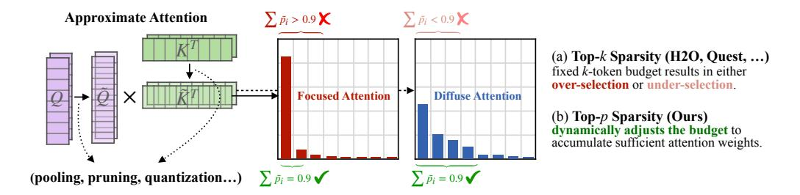
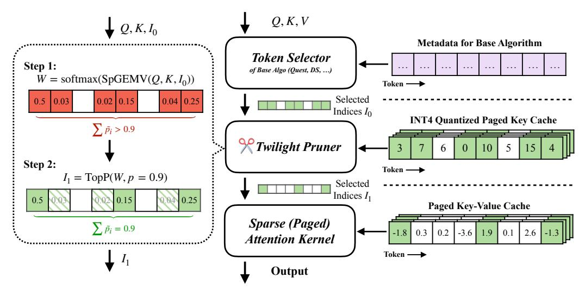
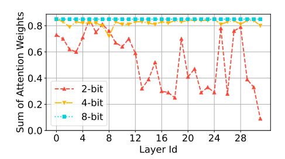
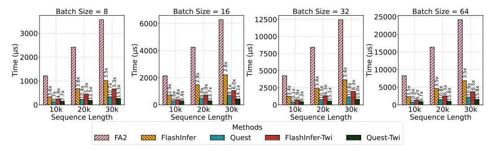
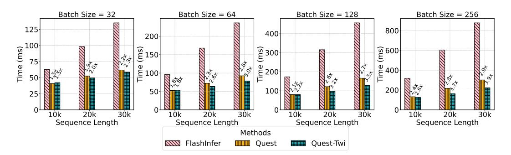
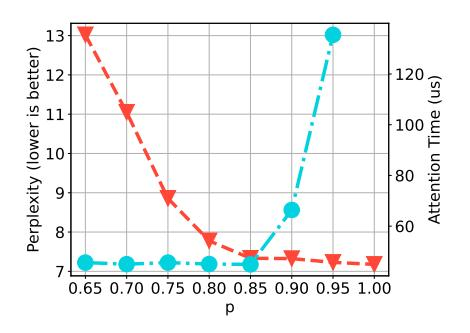
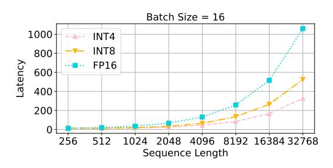
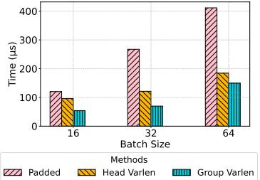

# Twilight: Adaptive Attention Sparsity with Hierarchical Top-p Pruning

Chaofan Lin Jiaming Tang Shuo Yang Hanshuo Wang Tian Tang Boyu Tian Ion Stoica Song Han Mingyu Gao Tsinghua University Massachusetts Institute of Technology University of California, Berkeley <lcf24@mails.tsinghua.edu.cn> <gaomy@tsinghua.edu.cn>

<https://github.com/tsinghua-ideal/Twilight>

# Abstract

Leveraging attention sparsity to accelerate long-context large language models (LLMs) has been of great importance recently. However, most existing sparse attention algorithms use a fixed budget of how many tokens to use in their computations. This simple static decision raises critical issues in real-world deployment because it fails to account for the dynamic nature of real-world scenarios, where the optimal balance between accuracy and efficiency can vary greatly. In this paper, we reveal a key insight that leveraging the idea of top-p sampling (a.k.a., nucleus sampling) in sparse attention could enable efficient and adaptive budget decisions. Based on this, we propose Twilight, a framework that enhances any existing sparse attention algorithm with adaptive budget decision capabilities without sacrificing accuracy. Empirical results show that Twilight can adaptively prune up to 98% tokens with nearly no accuracy loss in both long- and medium-context scenarios, leading to a 1.4× speedup over state-of-the-art sparse attention mechanisms.

# <span id="page-0-0"></span>1 Introduction

Large language models (LLMs) with long-context capabilities have revolutionized a wide array of natural language processing applications, such as retrieval-based tasks, document summarization [\[1\]](#page-10-0), and code generation [\[2\]](#page-10-1). The increasing availability of models supporting context windows up to 1M to 10M tokens [\[3,](#page-10-2) [4\]](#page-10-3) highlights the growing potential of these advancements. For instance, video language models (VLMs) [\[5\]](#page-13-0) often require tens of thousands of tokens for video processing. Similarly, large reasoning models [\[6,](#page-13-1) [7\]](#page-14-0), which are rapidly growing in popularity, frequently demand substantial token lengths to enable chain-of-thought (CoT) reasoning. Consequently, the importance of long-context LLMs is increasing rapidly to meet the needs of these sophisticated applications.

Despite the substantial potential of long-context LLMs, they come with excessive computational and memory costs [\[8,](#page-14-1) [9,](#page-14-2) [10\]](#page-14-3), primarily from the attention mechanism. Particularly, in the decoding stage of LLMs, the key-value (KV) cache size grows rapidly as the token sequence becomes longer. These data need to be repeatedly loaded from the memory, leading to significant latency overheads. Furthermore, the substantial size of the KV cache significantly increases the GPU memory consumption, compounding the challenges of continuously scaling long-context LLMs.

Previous research has extensively investigated the use of *attention sparsity* (a.k.a., KV cache sparsity) to accelerate long-context inference, both during the prefilling and decoding stages. The core idea is to compute an approximate attention on a subset of tokens, often referred to as "critical tokens" or "heavy hitters" [\[8\]](#page-14-1). The number of selected tokens, denoted as B, is commonly referred to as the KV cache *budget*. A top-k operation is required to identify the indices of the critical tokens that correspond to the B highest estimated scores. However, a key tradeoff exists for the selection of the

<span id="page-1-0"></span>

Figure 1: Comparison of top-k and top-p for attention sparsity. Approximate attention typically employs techniques such as pooling, channel pruning, and quantization to approximate the query  $(\tilde{Q})$  and key  $(\tilde{K})$  and estimate the attention weights. These weights are then used to select important tokens for sparse attention. (a) Top-k sparsity, utilized by most existing designs, relies on a fixed k-token budget and often results in **over-selection**  $(\sum \tilde{p_i} > 0.9)$  or **under-selection**  $(\sum \tilde{p_i} < 0.9)$ . (b) Our proposed top-p sparsity **dynamically adjusts the budget** to accumulate just sufficient attention weights  $(\sum \tilde{p_i} = 0.9)$ , enabling more efficient and adaptive sparse attention.

budget. A smaller B value significantly reduces the memory accesses and computations, while a larger B value retains more contextual information and thereby minimizes the accuracy loss.

Identifying the optimal value of B to balance both accuracy and efficiency is inherently challenging due to two major reasons: (a) The best budget choices vary dynamically at runtime. Previous works [11, 10] have demonstrated that some heads, referred to as "retrieval heads", are trained to extract important information from long contexts, while others focus only on local information. From Figure 1 we see that the distribution of attention weights may vary across different attention heads. Some attention distributions concentrate on a small subset of tokens. which we refer to as focused attention. Other attention distributions may be flatter, where many tokens have similar attention weights; we call this diffuse attention. For focused attention, using a

<span id="page-1-1"></span>

Figure 2: Relationship between the KV cache budget and the perplexity on the PG-19 dataset in different top-k sparse attention methods.

fixed token budget for top-k attention often leads to over-selection, as only a few tokens are needed to accumulate sufficient attention weights. In contrast, for diffuse attention, a fixed budget can result in under-selection, as a larger number of tokens are necessary to ensure accurate attention modeling. (b) Existing algorithms need different degrees of over-selection to compensate the estimation inaccuracy. As shown in Figure 2, the optimized budgets highly depend on the specific algorithms, necessitating offline calibration to determine the appropriate budget for each algorithm individually. Certain methods, like Quest [9] or DS [12], have to over-select some tokens to compensate for the inevitable inaccuracy in estimating the importance of tokens compared to the oracle.

In this work, we reveal that the top-k methods exhibit issues similar to those previously encountered in LLM sampling. Drawing on this analogy, we introduce top-p sampling into sparse attention to address the budget selection dilemma. Our study demonstrates that top-p can determine the KV cache budget in a more intrinsic and dynamic way compared to top-k. Based on these observations, we build Twilight, a hierarchical KV cache pruning framework that enhances existing sparse attention algorithms with adaptive budget selection capabilities. Specifically, Twilight first lets the base algorithm select a relatively large subset of tokens using a conservative budget, and then further refines this subset by retaining only the top-p tokens.

Our evaluations for Twilight are conducted in two aspects: accuracy and efficiency. First, we demonstrate that Twilight optimizes the base algorithms with nearly no accuracy loss on both medium-context benchmarks (GSM8K [13], COQA [14], PG-19 [15]) and long-context benchmarks (Longbench [1], RULER [16]). Next, we show that Twilight achieves up to  $15.8 \times$  performance improvement over the full attention operation. Compared to prior sparse attention methods, Twilight

enables a  $1.4\times$  speedup for the self-attention operator itself, and a  $1.35\times$  speedup for the end-to-end decoding. Our contributions are summarized as follows:

- We conduct an in-depth investigation into a critical challenge in top-k sparse attention: the difficulty in identifying the optimal budget (i.e., the number of selected tokens). We propose to use top-p sampling instead to dynamically determine this budget at runtime.
- We introduce Twilight, a framework that can endow any existing sparse attention method with adaptive budget selection capabilities, thereby further improving their efficiency.
- We evaluate Twilight in terms of both accuracy and efficiency, demonstrating a speedup of 1.4× over existing sparse attention methods with nearly no accuracy loss.

#### <span id="page-2-2"></span>2 Related Work

**Top-**k **Sparse Attention.** H2O [8], StreamingLLM [17], and SnapKV [18] evict non-critical tokens in static, query-agnostic manners, which are often referred to as KV cache compression. In contrast, SparQ [19], Quest [9], Double Sparsity (DS) [12], and HShare [20] retain all tokens in the GPU memory but select critical tokens to save data accesses. Recent works like RetrievalAttention [21] and PQCache [22] adopt advanced algorithms to better estimate the token criticality. NSA [23] and MoBA [24] explore opportunities in trainable sparse attention. However, these methods are all based on top-k which requires proper budget selection and configuration beforehand, and thus suffer from the over/under-selection issues.

**Dynamic Budget.** More recent studies have extensively demonstrated that the optimal budgets vary significantly across different layers [25, 26], attention heads [27, 10, 28], and prompts (tasks) [29]. Please see Appendix A for details. These works tend to focus on only one aspect of the dynamism. In this paper, we point out that it is the different distributions of attention weights that are the root cause of such dynamism.

**Non-top-**k **Sparse Attention.** Some recently emerged designs also go beyond top-k methods. MagicPIG [30] uses locality-sensitive hash (LSH) sampling instead of dropping tokens to estimate attention weights, but requires complicated algorithm-system co-design. SampleAttention [31] also features adaptive sparsity but focuses on the prefill stage. A concurrent work with ours, Tactic [32], also dives into top-p sparsity but it uses function fitting to estimate the weight distributions. Although it potentially has lower estimation cost, it usually overestimates the budget.

Other KV Cache Optimizations. Several alternative approaches focus on optimizing the KV cache beyond sparsification, including quantization [33, 34, 35, 36], linear attention [37, 38], and memory-efficient attention mechanisms such as FlashAttention [39] and SageAttention [40, 41]. Our approach is orthogonal to these methods, and can be combined with them for enhanced performance.

### <span id="page-2-0"></span>**3** Bringing Top-*p* Sampling to Sparse Attention

In this section, we formulate the current sparse attention methods and re-examine the root cause of their inefficiencies. We argue that to mathematically approximate the attention, the goal is to select a minimum set of indices such that the sum of their attention scores meets a certain threshold. Therefore, we propose to use top-p sampling instead of top-k to efficiently identify the critical tokens.

#### <span id="page-2-1"></span>3.1 Problem Formulation

We start by formulating the sparse attention mechanism. Consider the attention computation during the decoding phase, where we have the query vector  $\mathbf{q} \in \mathbb{R}^{1 \times d}$ , and the KV cache  $\mathbf{K}, \mathbf{V} \in \mathbb{R}^{n \times d}$ . Here, d denotes the head dimension, and n represents the context length.

**Definition 3.1** (Sparse Attention). Let  $\mathcal{I}$  be the set of selected indices. Sparse attention calculates

$$\hat{\mathbf{o}} = \operatorname{softmax}\left(\frac{\mathbf{q} \cdot \mathbf{K}^T}{\sqrt{d}}\right) \mathbf{\Lambda}_{\mathcal{I}} \mathbf{V} = \mathbf{W} \mathbf{\Lambda}_{\mathcal{I}} \mathbf{V} \in \mathbb{R}^{1 \times d}$$
(1)

where 
$$\mathbf{\Lambda}_{\mathcal{I}} \in \mathbb{R}^{n \times n}$$
,  $\mathbf{\Lambda}_{\mathcal{I}}[i,j] = \begin{cases} 1 & \text{if } i = j \text{ and } i \in \mathcal{I} \\ 0 & \text{otherwise} \end{cases}$ .

<span id="page-3-1"></span>

Figure 3: Diverse distributions observed in attention weights. **The leftmost image** illustrates a "flat" distribution (**diffuse attention**), where the weights are close to uniformly distributed. **The middle image** depicts a "peaked" distribution (**focused attention**), where the weights are concentrated on the tokens at the two sides. When overlaid as in **the rightmost image**, the differences between these distributions become readily apparent.

Let the accurate attention output be  $\mathbf{o} = \operatorname{softmax}(\frac{\mathbf{q} \cdot \mathbf{K}^T}{\sqrt{d}}) \mathbf{V} \in \mathbb{R}^{1 \times d}$ . To minimize the error  $\|\mathbf{o} - \hat{\mathbf{o}}\|$ , we need to carefully select the subset of tokens used in  $\mathcal{I}$ . However, directly optimizing this objective function without loading the full KV cache is challenging. According to the sub-multiplicative property of the Frobenius norm, we can bound the error as in Equation 2. Earlier research has shown that the distribution of  $\mathbf{V}$  is relatively smooth [42], which implies  $\|\mathbf{V}\|_F$  can be viewed as a constant.

<span id="page-3-0"></span>
$$\mathcal{L} = \|\mathbf{o} - \hat{\mathbf{o}}\| = \|\mathbf{W}(\mathbf{\Lambda}_{\mathcal{I}} - \mathbf{1}^{n \times n})\mathbf{V}\|$$

$$\leq \|\mathbf{W}(\mathbf{\Lambda}_{\mathcal{I}} - \mathbf{1}^{n \times n})\| \cdot \|\mathbf{V}\|_{F}$$
(2)

Therefore, the objective becomes minimizing  $\|\mathbf{W}(\mathbf{\Lambda}_{\mathcal{I}} - \mathbf{1}_{n \times n})\| = 1 - \sum_{i \in \mathcal{I}} \mathbf{W}[i]$ , which means selecting a subset of tokens that maximize the sum of their attention weights. If we fix the size of this subset, i.e.  $|\mathcal{I}|$ , then we have the oracle top-k attention:

**Definition 3.2** (Oracle Top-k Sparse Attention). Given the budget B,

$$\mathcal{I} = \arg \max_{\mathcal{I}} \sum_{i \in \mathcal{I}} \mathbf{W}[i] \quad \text{s.t. } |\mathcal{I}| = B$$
 (3)

This serves as a theoretical upper bound of the current top-k sparse attention methods.

#### 3.2 Rethinking the Problem of Top-k

The Achilles' heel of top-k sparse attention, as described earlier, is the dilemma in determining a universally applicable budget B to all scenarios. We find that this predicament is quite similar to a previous problem encountered in the sampling phase of LLMs, during which the model samples the final output token from the predicted probability distribution. Nucleus sampling [43], a.k.a., top-p sampling, was proposed to address the problem that top-k sampling cannot adapt to different next-word distributions.

Motivated by this insight, we examine the distributions of attention weights more closely. As indicated by Equation 2, the output error is bounded by the sum of the selected attention weights. Therefore, the objective should become selecting the minimum number of tokens B to satisfy a given requirement for the output error. Figure 3 displays two different types of attention weight distributions in several real-world LLMs mentioned in Figure 1. It is easy to observe that, compared to the peaked distribution, a greater number of tokens must be selected in the flat distribution to reach the same cumulative threshold.

Therefore, we argue that the core reason for budget dynamism is the dynamic nature of attention weight distributions at runtime. We thus introduce top-p sparse attention by directly applying a threshold to the sum of attention weights.

**Definition 3.3** (Oracle Top-p Sparse Attention). Given the threshold p,

$$\mathcal{I} = \arg\min_{\mathcal{I}} |\mathcal{I}| \quad \text{s.t. } \sum_{i \in \mathcal{I}} \mathbf{W}[i] \ge p$$
 (4)

Compared to top-k, top-p is more advantageous because it provides a theoretical upper bound of error as  $(1-p)\cdot \|\mathbf{V}\|_F$  from Equation 2. Under this circumstance, top-p reduces the budget as low as possible, making it both efficient and adaptive to different distributions. To demonstrate how top-p reduces the budget, we investigate a real distribution of attention scores as shown in Figure 4. Compared to two fixed budget strategies B=16 and B=1024 that respectively result in under-selection and over-selection, the p=0.8 point selects a very small budget B=97 to reach a similar error requirement to that of B=1024.

<span id="page-4-0"></span>

Figure 4: Cumulative attention scores of different budget selections in one example attention head.

### 4 Twilight

With the efficient and adaptive top-p sparse attention, our primary goal is to use it to endow existing algorithms with adaptive budget selection capabilities, rather than simply inventing yet another sparse attention design. We are mainly motivated by two reasons. On one hand, despite the challenge of budget selection, existing sparse attention algorithms have achieved significant success in LLM serving systems [44, 45], thanks to their effective token selection strategies. These strategies can be readily reused and enhanced with our adaptive sparsity. On the other hand, we anticipate that future sparse attention methods may still employ top-k selection. By developing a general solution, we aim to automatically equip these future methods with adaptive attention sparsity, while avoiding extensive redesign. Consequently, we position our system, Twilight, as an **optimizer** for existing algorithms.

Nevertheless, applying top-p to various existing sparse attention algorithms faces three key challenges on both the algorithm and system perspectives. **(C1) Not all algorithms are suitable for top-p.** Top-p imposes strict constraints on the layout of attention weights. For example, simply replacing top-k with top-p in

Nevertheless, applying top-p to various existing sparse attention algoweights. "Normalization" means softmax.

<span id="page-4-1"></span>

| Method     | Efficiency | Precision<br>Requirement | Output<br>Accuracy | Need<br>Normalization? |
|------------|------------|--------------------------|--------------------|------------------------|
| Top-k      | High       | Low                      | Median             | ×                      |
| Top-p      | High       | Median                   | High               | $\checkmark$           |
| Full Attn. | Low        | High                     | High               | V                      |

Quest [9] would not work, as Quest performs max pooling on weights with a per-page layout (16 tokens per page). Additionally, some other methods [46, 21] do not use attention weights to select critical tokens at all. (C2) It is harder to estimate weights for top-p than top-k. In order to find critical tokens without loading full K data, low-precision representation of the K cache is usually used [12, 22]. However, the precision requirement of top-p is higher than that of top-k, because the former requires a certain degree of numerical accuracy while the latter only demands ordinality. Table 1 compares top-k, top-p, and full attention. The precision requirement of top-p attention lies in between the other two, necessitating reconsideration of appropriate precision choices for the K cache. (C3) System-level optimizations are needed. Since our work is the first to introduce top-p to attention weights, the relevant algorithms need to be efficiently implemented on the GPU, including efforts on both parallel algorithm designs and kernel optimizations.

In Section 4.1, we address C1 by proposing a unified hierarchical pruning framework for top-p sparse attention. In Section 4.2, we mitigate the runtime overheads with efficient kernel implementations (Top-p, SpGEMV, Attention) and 4-bit quantization of the K cache, addressing C2 and C3. Lastly, in Section 4.3, we analyze the overheads of Twilight and discuss some additional issues.

### <span id="page-4-2"></span>4.1 Hierarchical Pruning with a Select-then-Prune Architecture

To uniformly support various sparse attention mechanisms, we propose a two-step, hierarchical pruning process. We first capture the base algorithm into a black-box **Token Selector** as long as it has the common semantics of selecting a subset of critical tokens, while the exact algorithm details of *how* to select do not matter. We let the Token Selector use a conservative, relatively large budget,

<span id="page-5-1"></span>

Figure 5: Twilight architecture. Twilight incorporates a certain existing base sparse attention algorithm and further optimizes it. It computes self-attention in three steps. First, the **Token Selector** selects critical tokens using the base algorithm under a conservative budget. Then, the **Twilight Pruner** prunes the selected token subset via top-p thresholding. Finally, the pruned token indices are passed to the **Sparse Attention Kernel** to perform the attention computation.

e.g. 1/4 sparsity. Then, we have a **Twilight Pruner** after it to further optimize the selected indices by only retaining the top-p tokens, i.e., the minimum subset whose attention weight sum exceeds the threshold p. We call this design as the *Select-then-Prune* architecture, as illustrated in the middle of Figure 5. The final sparse attention kernel thus only computes on the top-p tokens, achieving the benefits of efficiency and adaptivity as proved in Section 3.

#### <span id="page-5-0"></span>**4.2** Efficient Kernel Implementations

Now we briefly describe the details of the Twilight architecture, particularly for the Pruner step. For more details of the kernel implementations, please refer to Appendix B.

Efficient SpGEMV with 4-bit Quantization of Key Cache. The beginning part of the Pruner is similar to other sparse attention algorithms, which is to estimate the importance of tokens. As we formulated in Section 3.1, this can be done by estimating the similarity between  $\mathbf{q}$  and  $\mathbf{K}$ , i.e.,  $\mathbf{q} \cdot \mathbf{K}$ . Since loading  $\mathbf{K}$  is known to be memory bound, we reduce the memory access cost by quantizing  $\mathbf{K}$  into lower precision. But what precision shall we choose? Table 1 shows the precision requirement of top-p lies in between top-k and full attention. Some existing top-k designs [12, 22] have pushed the compression of the  $\mathbf{K}$  cache to extremely low precisions of 1 to 2 bits. For full attention, SageAttention [40] has demonstrated 8-bit precision

<span id="page-5-2"></span>

Figure 6: Sums of normalized attention weights for the selected tokens under different quantization precisions, with p=0.85.

with smoothing **K** and per-block quantization. In this work, we empirically find that *4-bit precision strikes a balance between accuracy and efficiency for top-p*, as illustrated in Figure 6. Here the sum of attention weights with 2-bit quantization drops significantly, while 4-bit and 8-bit methods both maintain enough stability.

Hence we implement an efficient sparse GEMV (SpGEMV) kernel based on FlashInfer [47], a high-performance kernel library for LLM serving. Here "sparse" means the quantized K cache data are stored/loaded in a paged manner [44] to align with the original KV cache layout. We maintain this extra INT4 asymmetrically quantized K cache on the GPU as shown at the right of Figure 5. The INT4  $\bf K$  vectors are unpacked and dequantized in the shared memory, reducing data accesses from the global memory to at most 1/4, resulting in considerable end-to-end speedup.

Efficient Top-p via Binary Search. A brute-force way to do top-p sampling is to sort the elements by descending order and accumulate them until the sum meets the threshold. This is quite inefficient in parallel hardware like modern GPUs. As our top-p method is motivated by the top-p sampling, we also implement this kernel by modifying the top-p sampling kernel from FlashInfer [\[47\]](#page-16-12). Specifically, our kernel adopts a parallel-friendly binary search method as in Algorithm [1.](#page-6-1) Note that element-wise operations like max, where, and sum can be fused into a single loop, which is tensorized on the GPU. Thus we do not need to materialize the intermediate variables like W0.

# Load Balancing with Awareness of Head

# <span id="page-6-1"></span>Algorithm 1 Top-p via Binary Search.

```
Input: normalized attention weights W ∈ R
                                          BS×H×N ,
top-p threshold p, hyper-parameter ϵ.
Output: indices I, mask M ∈ {0, 1}
                                  BS×H×N .
l = 0, r = max(W), m = (l + r)/2;
repeat
  W0 = where(W < m, 0.0, W);
  W1 = where(W ≤ l, INF, W);
  W2 = where(W > r, −INF, W);
  if sum(W0) ≥ p then
    l = m;
  else
    r = m;
  end if
until max(W2) − min(W1) ≥ ϵ
Select indices I and set mask M where W ≥ l;
return I, M;
```

Dynamism. The top-p Pruner enables head-wise dynamic budgets, but also raises load imbalance issues in the attention kernel. Traditional implementations allocate uniform computation resources to all heads. FlashInfer [\[47\]](#page-16-12) deeply investigates this load imbalance problem, but only for requests with dynamic lengths. Twilight further reuses the load balancing algorithm in FlashInfer to address head-wise dynamism, by flattening the head dimension.

#### <span id="page-6-0"></span>4.3 Overhead Analysis and Discussion

Execution Time. The execution time of Twilight consists of three parts according to the pipeline in [Figure 5:](#page-5-1) TTokenSel + TPruner + TSparseAttn. Compared to the baseline sparse attention without Twilight, our method introduces an extra latency term TPruner but reduces TSparseAttn. Our hierarchical architecture naturally matches the hierarchical sparsity, where the number of tokens gradually decreases as the precision increases. Suppose the base algorithm in the Token Selector estimates token importance with a 1/16 sparsity and/or precision reduction. Then the theoretical speedup can be formulated as N/16+B<sup>0</sup> N/16+B0/4+B<sup>1</sup> , where B<sup>0</sup> = |I0| is the budget of the base Token Selector, and B<sup>1</sup> = |I1| is the budget after pruned by Twilight with INT4. Assuming B<sup>0</sup> = N/4 and B<sup>1</sup> = N/64, the speedup would be approximately 2×. Here we omit the overheads of the top-p kernel since SpGEMV dominates the latency when B<sup>0</sup> is around N/8 to N/4.

Memory Overheads. Twilight introduces an extra INT4 quantized K cache, which brings a 1/2 × 1/4 = 1/8 extra KV cache memory overhead. However, this additional cost does not appear in all cases. First, some base algorithms, like DS [\[12\]](#page-14-5), already maintain an INT4 K cache. Second, some recent efforts have explored INT4 full attention [\[41\]](#page-16-6). This allows us to directly reuse the estimated attention weights calculated by the INT4 K cache in the attention computation, without maintaining the original FP16 K cache. Moreover, offloading and selective quantization (e.g., keeping the extra INT4 K cache only for hot tokens) can be leveraged if the GPU memory becomes a bottleneck, which we leave as future work.

Integration with LLM Serving Systems. Our system design naturally aligns with PagedAttention [\[44\]](#page-16-9), so Twilight can be seamlessly integrated into popular serving systems like vLLM [\[44\]](#page-16-9) and SGLang [\[45\]](#page-16-10). Other common techniques, such as prefix sharing and multi-phase attention [\[48,](#page-16-13) [45,](#page-16-10) [49,](#page-16-14) [50,](#page-16-15) [51\]](#page-16-16), are also compatible with Twilight since we use page-level or token-level sparse operations, and can achieve a flexible computation flow.

# 5 Evaluation

In this section, we perform quantitative experiments to demonstrate that equipping state-of-the-art (SOTA) sparse attention algorithms with Twilight could improve efficiency while preserving accuracy. We present the accuracy and efficiency results in [Section 5.1](#page-7-0) and [Section 5.2,](#page-7-1) respectively. At last, we perform ablation studies in [Section 5.3.](#page-9-0)

#### <span id="page-7-0"></span>5.1 Accuracy Evaluation

**Benchmarks and Models.** We evaluate Twilight on two types of benchmarks: long-context, which includes Longbench [1] and RULER [16], and medium-context (500 to 2k tokens), which includes GSM8K [13], COQA [14], and the perplexity on the PG-19 dataset [15]. We select three widely used models, Longchat-7B-v1.5-32k [52], LLaMA2-7B-Chat [53], and LLaMA-3.1-8B-Instruct [54] (128k context length), with two of them having long context ability  $\geq$  32k. They cover two mainstream attention implementations of multi-head attention (MHA) and group query attention (GQA) [54].

**Baselines.** We use two SOTA top-k sparse attention methods, Quest [9] and DS [12], and one SOTA non-top-k method, MagicPIG [30], as our baselines. Following the baselines, we do not apply any sparse methods to the first two layers to ensure fair comparison. For DS, we use the optimized configurations tuned for each model provided by its official repository. The hyperparameter p of Twilight is set to 0.95 for LLaMA-2/3 and 0.85 for Longchat, which will be explored in Section 5.3. Note that MagicPIG does not employ the budget mechanism but instead relies on two configurable parameters, K and L, which directly influence its accuracy. In our experiments, we adopt two standard configurations from the original MagicPIG paper. Due to the lack of official MagicPIG support for LLaMA-2, we exclude these experiments from our evaluation.

Results on Longbench. We comprehensively evaluate Twilight's long context ability on 12 different tasks chosen from Longbench, covering all task types, using two long-context models. For each top-k baseline, we vary the budget from 256 to 8192, and then apply Twilight to dynamically determine the budget. We also equip "Full" with Twilight, in which the Token Selector is a trivial one that keeps all tokens.

The results are shown in Table 2. In Longchat, the Twilight framework is able to outperform its original version by up to 5.7% in the score, while successfully pruning up to 98% of the redundant tokens overselected by the base algorithm. In LLaMA-3.1-8B-Instruct, Twilight achieves nearly zero accuracy loss (<1%) with a slight increase in budget usage. We hypothesize that this slight increase is due to the knowledge being more compressed in LLaMA-3.1.

<span id="page-7-2"></span>Table 2: Average scores on 12 different tasks from Longbench. We report relative error changes (improvement or degradation) when integrating Twilight with each base algorithm. Detailed results are in Table 5 in Appendix C.

|          | Budget                 | Longchat-7B<br>-v1.5-32k | LLaMA-3.1-8B<br>-Instruct |  |
|----------|------------------------|--------------------------|---------------------------|--|
| Full     | 32k<br><b>Twilight</b> | 36.78<br>38.52 (+4.7%)   | 52.01<br>51.64 (-0.7%)    |  |
|          | 1 Willight             | 30.32 (14.770)           | 31.0+(-0.770)             |  |
| MagiaDIC | K=8, L=75              | -                        | 51.70                     |  |
| MagicPIG | K=10, L=150            | -                        | 51.32                     |  |
|          | 256                    | 31.26                    | 38.20                     |  |
|          | 1024                   | 36.85                    | 47.79                     |  |
| Quest    | 4096                   | 37.33                    | 50.79                     |  |
|          | 8192                   | 37.10                    | 51.44                     |  |
|          | Twilight               | 38.04 (+2.5%)            | 51.57 (+0.3%)             |  |
|          | 256                    | 35.32                    | 45.74                     |  |
|          | 1024                   | 35.96                    | 49.43                     |  |
| DS       | 4096                   | 36.31                    | 50.98                     |  |
|          | 8192                   | 36.62                    | 51.14                     |  |
|          | Twilight               | <b>38.71</b> (+5.7%)     | <b>51.73</b> (+1.2%)      |  |

**Results on RULER.** We further evaluate Twilight on the RULER benchmark using the LLaMA-3.1-8B-Instruct model, which incorporates specialized tests including CWE/FWE for comprehensive non-retrieval accuracy evaluation. As presented in Table 3, while the standard Quest implementation underperforms the non-top-k approaches, DS demonstrates surprisingly competitive results. When enhanced with Twilight, both variants show significant improvements: Quest-Twi achieves performance comparable to the SOTA non-top-k method MagicPIG, while DS-Twi establishes new record-breaking performance, surpassing all existing methods.

**Results on Medium-Context Tasks.** We then demonstrate that the Twilight Pruner itself does not negatively impact performance on two zero-shot generation tasks, GSM8K and COQA using the lm-harness framework [55], as well as one perplexity test on the PG-19 dataset. Since we are specifically evaluating the Pruner, we do not integrate Twilight into the baseline models. All the baselines use a budget of 128, which is comparable to the budget after Twilight's pruning. The results in Table 4 show that Twilight outperforms Quest and DS by significant margins, with nearly zero loss compared to full attention.

#### <span id="page-7-1"></span>**5.2** Efficiency Evaluation

**Datasets.** We evaluate the efficiency of Twilight on both the self-attention operator and the end-to-end decoding stage on a single A100 GPU. We use Longbench, from which we select three different

<span id="page-8-0"></span>Table 3: Average scores on RULER.

|          |             |       |       |       |       | •     |
|----------|-------------|-------|-------|-------|-------|-------|
|          | Budget      | 16k   | 32k   | 64k   | 96k   | Avg.  |
| Full     | 100%        |       |       |       | 85.23 |       |
|          | Twilight    | 93.13 | 89.10 | 84.64 | 83.10 | 87.49 |
| MagicPIG | K=8, L=75   | 92.22 | 89.37 | 84.07 | 82.58 | 87.06 |
| MagicPiG | K=10, L=150 | 91.38 | 88.20 | 83.34 | 82.02 | 86.23 |
|          | 4%          | 79.35 | 79.8  | 78.64 | 73.22 | 77.75 |
| Quest    | 8%          | 87.31 | 83.06 | 80.82 | 75.28 | 81.62 |
|          | Twilight    | 91.53 | 87.97 | 84.12 | 82.96 | 86.65 |
| DS       | 4%          | 92.04 | 88.11 | 84.43 | 82.56 | 86.79 |
|          | 8%          | 92.89 | 88.70 | 84.39 | 82.72 | 87.18 |
|          | Twilight    | 93.54 | 89.24 | 85.91 | 82.81 | 87.88 |

Table 4: Results on 3 medium-context benchmarks.

| G                      | SM8K(flexible/strict | )↑ COQA(em/f1)↑ PO | 3-19 Perplexity↓ |
|------------------------|----------------------|--------------------|------------------|
|                        | Ll                   | LaMA-2-7B-Chat     |                  |
| Full                   | 0.2290/0.2282        | 0.5935/0.7511      | 7.503            |
| Quest                  | 0.0523/0.0508        | 0.5710/0.7425      | 14.15            |
| DS                     | 0.2191/0.2190        | 0.5855/0.7401      | 7.622            |
| Twilight               | 0.2153/0.2115        | 0.6088/0.7642      | 7.600            |
| (Twilight Avg. Budget) | 90.82                | 91.86              | 102.58           |
|                        | LLa                  | MA-3.1-8B-Instruct |                  |
| Full                   | 0.7726/0.7475        | 0.6363/0.7882      | 7.490            |
| Quest                  | 0.3639/0.3533        | 0.6007/0.7554      | 19.00            |
| DS                     | 0.6194/0.6027        | 0.6455/0.7964      | 7.967            |
| Twilight               | 0.7771/0.7604        | 0.6325/0.7869      | 7.529            |
| (Twilight Avg. Budget) | 112.40               | 86.85              | 110.98           |
|                        |                      |                    |                  |

<span id="page-8-1"></span>

Figure 7: Latencies and speedups of self-attention at different sequence lengths and batch sizes.

types of tasks: Qasper [56] for QA, GovReport [57] for summarization, and LCC [58] for coding. We use prompts ranging from 10k to 30k tokens for evaluation. Given that Twilight is designed for deploying sparse attention in LLM serving systems, we use batch inference in our experiments.

**Baselines and Implementation Details.** We compare our methods with the following baselines: PyTorch's scaled-dot-product-attention (SDPA), with **FlashAttention2** (FA2) [39] and Memory-Efficient Attention [59] as the backends; **FlashInfer** [47], a high-performance kernel library for LLM serving; **Quest**, which achieves SOTA runtime performance among sparse attention methods. We integrate Twilight with both FlashInfer and Quest, resulting in **FlashInfer-Twi** and **Quest-Twi**. We modify the Quest kernels to support batch inference. We implement Twilight using both CUDA and OpenAI Triton [60], following the technical details described in Section 4.2.

**Self-Attention Speedup.** We first evaluate the speedups on the self-attention operator across different batch sizes and sequence lengths. As Figure 7 shows, FlashInfer-Twi and Quest-Twi achieve speedups up to  $6.5\times$  and  $15.8\times$  compared with FlashAttention2. Moreoever, they accelerate the respective base algorithms FlashInfer and Quest by  $2.4\times$  and  $1.4\times$ .

**End-to-End Decoding Speedup.** We evaluate end-to-end decoding with batch sizes ranging from 32 to 256 for various serving scenarios. Figure 8 illustrates that Quest-Twi achieves up to a  $3.9 \times$  speedup compared with FlashInfer, and a  $1.35 \times$  speedup compared to Quest without Twilight.

<span id="page-8-2"></span>

Figure 8: Time-Per-Output-Token (TPOT) improvements in end-to-end serving scenarios.

<span id="page-9-1"></span>


Figure 10: Time breakdown of self-attention. At batch size 64, Quest-Twi outperforms Quest by about  $2\times$ .

#### <span id="page-9-0"></span>5.3 Ablation Study

**Sensitivity to Threshold** p. Notably, although we introduce the threshold p in order to get rid of the budget k, we argue that p is a more reasonable and tunable hyperparameter. This is because p represents the accumulated probability, which is less influenced by the different distributions that may occur for different heads/layers/queries. In contrast, k is highly sensitive to different distributions, as illustrated in Figure 1. This allows us to simply tune p for a fixed model, in a way such as calibrating with a small dataset.

For the impact of p on model accuracy, we test the perplexity on the PG-19 dataset when using different thresholds p. For the impact on runtime efficiency, the p value directly controls the pruning aggressiveness and affects the attention time via the pruned token number. We evaluate the sparse attention kernel speed after pruned on the TrivialQA dataset. As Figure 9 shows, the accuracy and efficiency strike a balance at  $p\approx 0.85$ , making us choose p=0.85 for Longchat-7B-v1.5-32k.

**Time Breakdown for Twilight.** Given Twilight's hierarchical architecture, which comprises three distinct components, it is insightful to analyze the execution time breakdown to further understand the benefit and cost. Figure 10 illustrates the time breakdown for different batch sizes in a 32k retrieval task. In this scenario, Quest employs a budget of 8192 (1/4 sparsity), while Twilight further prunes this budget down to 256. The breakdown aligns closely with the theoretical cost model presented in Section 4.3, demonstrating that Twilight significantly reduces the time required for the sparse attention kernel while introducing minor overheads.

#### 6 Conclusion

In this paper, we first highlight that existing top-k sparse attention methods struggle to find optimal budgets due to the dynamic nature of attention weight distributions. We then introduce Twilight, a framework with a hierarchical select-then-prune architecture that leverages top-p sampling to address this issue. Twilight can adaptively prune up to 98% tokens, resulting in a  $15.4\times$  speedup for the self-attention operator and a  $3.9\times$  reduction in the end-to-end per-token latency. Comparing to the base sparse attention algorithm it is applied to, Twilight offers an additional  $1.4\times$  speedup. Our work underscores the importance of adaptive attention sparsity, and paves a promising way for future research on sparse attention mechanisms.

#### Acknowledgment

The authors thank the anonymous reviewers for their valuable suggestions, Yilong Zhao for helping us on kernel optimization, and the Tsinghua IDEAL group members for constructive discussion. Mingyu Gao is the corresponding author.

# References

- <span id="page-10-0"></span>[1] Yushi Bai, Xin Lv, Jiajie Zhang, Hongchang Lyu, Jiankai Tang, Zhidian Huang, Zhengxiao Du, Xiao Liu, Aohan Zeng, Lei Hou, Yuxiao Dong, Jie Tang, and Juanzi Li. LongBench: A bilingual, multitask benchmark for long context understanding. In *Proceedings of the 62nd Annual Meeting of the Association for Computational Linguistics (Volume 1: Long Papers)*, pages 3119–3137, Bangkok, Thailand, August 2024. Association for Computational Linguistics.
- <span id="page-10-1"></span>[2] Naman Jain, King Han, Alex Gu, Wen-Ding Li, Fanjia Yan, Tianjun Zhang, Sida Wang, Armando Solar-Lezama, Koushik Sen, and Ion Stoica. LiveCodeBench: Holistic and contamination free evaluation of large language models for code. *arXiv preprint 2403.07974*, 2024.
- <span id="page-10-2"></span>[3] An Yang, Bowen Yu, Chengyuan Li, Dayiheng Liu, Fei Huang, Haoyan Huang, Jiandong Jiang, Jianhong Tu, Jianwei Zhang, Jingren Zhou, Junyang Lin, Kai Dang, Kexin Yang, Le Yu, Mei Li, Minmin Sun, Qin Zhu, Rui Men, Tao He, Weijia Xu, Wenbiao Yin, Wenyuan Yu, Xiafei Qiu, Xingzhang Ren, Xinlong Yang, Yong Li, Zhiying Xu, and Zipeng Zhang. Qwen2.5-1M technical report. *arXiv preprint 2501.15383*, 2025.
- <span id="page-10-3"></span>[4] Gemini Team, Petko Georgiev, Ving Ian Lei, Ryan Burnell, Libin Bai, Anmol Gulati, Garrett Tanzer, Damien Vincent, Zhufeng Pan, Shibo Wang, Soroosh Mariooryad, Yifan Ding, Xinyang Geng, Fred Alcober, Roy Frostig, Mark Omernick, Lexi Walker, Cosmin Paduraru, Christina Sorokin, Andrea Tacchetti, Colin Gaffney, Samira Daruki, Olcan Sercinoglu, Zach Gleicher, Juliette Love, Paul Voigtlaender, Rohan Jain, Gabriela Surita, Kareem Mohamed, Rory Blevins, Junwhan Ahn, Tao Zhu, Kornraphop Kawintiranon, Orhan Firat, Yiming Gu, Yujing Zhang, Matthew Rahtz, Manaal Faruqui, Natalie Clay, Justin Gilmer, JD Co-Reyes, Ivo Penchev, Rui Zhu, Nobuyuki Morioka, Kevin Hui, Krishna Haridasan, Victor Campos, Mahdis Mahdieh, Mandy Guo, Samer Hassan, Kevin Kilgour, Arpi Vezer, Heng-Tze Cheng, Raoul de Liedekerke, Siddharth Goyal, Paul Barham, DJ Strouse, Seb Noury, Jonas Adler, Mukund Sundararajan, Sharad Vikram, Dmitry Lepikhin, Michela Paganini, Xavier Garcia, Fan Yang, Dasha Valter, Maja Trebacz, Kiran Vodrahalli, Chulayuth Asawaroengchai, Roman Ring, Norbert Kalb, Livio Baldini Soares, Siddhartha Brahma, David Steiner, Tianhe Yu, Fabian Mentzer, Antoine He, Lucas Gonzalez, Bibo Xu, Raphael Lopez Kaufman, Laurent El Shafey, Junhyuk Oh, Tom Hennigan, George van den Driessche, Seth Odoom, Mario Lucic, Becca Roelofs, Sid Lall, Amit Marathe, Betty Chan, Santiago Ontanon, Luheng He, Denis Teplyashin, Jonathan Lai, Phil Crone, Bogdan Damoc, Lewis Ho, Sebastian Riedel, Karel Lenc, Chih-Kuan Yeh, Aakanksha Chowdhery, Yang Xu, Mehran Kazemi, Ehsan Amid, Anastasia Petrushkina, Kevin Swersky, Ali Khodaei, Gowoon Chen, Chris Larkin, Mario Pinto, Geng Yan, Adria Puigdomenech Badia, Piyush Patil, Steven Hansen, Dave Orr, Sebastien M. R. Arnold, Jordan Grimstad, Andrew Dai, Sholto Douglas, Rishika Sinha, Vikas Yadav, Xi Chen, Elena Gribovskaya, Jacob Austin, Jeffrey Zhao, Kaushal Patel, Paul Komarek, Sophia Austin, Sebastian Borgeaud, Linda Friso, Abhimanyu Goyal, Ben Caine, Kris Cao, Da-Woon Chung, Matthew Lamm, Gabe Barth-Maron, Thais Kagohara, Kate Olszewska, Mia Chen, Kaushik Shivakumar, Rishabh Agarwal, Harshal Godhia, Ravi Rajwar, Javier Snaider, Xerxes Dotiwalla, Yuan Liu, Aditya Barua, Victor Ungureanu, Yuan Zhang, Bat-Orgil Batsaikhan, Mateo Wirth, James Qin, Ivo Danihelka, Tulsee Doshi, Martin Chadwick, Jilin Chen, Sanil Jain, Quoc Le, Arjun Kar, Madhu Gurumurthy, Cheng Li, Ruoxin Sang, Fangyu Liu, Lampros Lamprou, Rich Munoz, Nathan Lintz, Harsh Mehta, Heidi Howard, Malcolm Reynolds, Lora Aroyo, Quan Wang, Lorenzo Blanco, Albin Cassirer, Jordan Griffith, Dipanjan Das, Stephan Lee, Jakub Sygnowski, Zach Fisher, James Besley, Richard Powell, Zafarali Ahmed, Dominik Paulus, David Reitter, Zalan Borsos, Rishabh Joshi, Aedan Pope, Steven Hand, Vittorio Selo, Vihan Jain, Nikhil Sethi, Megha Goel, Takaki Makino, Rhys May, Zhen Yang, Johan Schalkwyk, Christina Butterfield, Anja Hauth, Alex Goldin, Will Hawkins, Evan Senter, Sergey Brin, Oliver Woodman, Marvin Ritter, Eric Noland, Minh Giang, Vijay Bolina, Lisa Lee, Tim Blyth, Ian Mackinnon, Machel Reid, Obaid Sarvana, David Silver, Alexander Chen, Lily Wang, Loren Maggiore, Oscar Chang, Nithya Attaluri, Gregory Thornton, Chung-Cheng Chiu, Oskar Bunyan, Nir Levine, Timothy Chung, Evgenii Eltyshev, Xiance Si, Timothy Lillicrap, Demetra Brady, Vaibhav Aggarwal, Boxi Wu, Yuanzhong Xu, Ross McIlroy, Kartikeya Badola, Paramjit Sandhu, Erica Moreira, Wojciech Stokowiec, Ross Hemsley, Dong Li, Alex Tudor, Pranav Shyam, Elahe Rahimtoroghi, Salem Haykal, Pablo Sprechmann, Xiang Zhou, Diana Mincu, Yujia Li, Ravi Addanki, Kalpesh Krishna, Xiao Wu, Alexandre Frechette, Matan Eyal, Allan Dafoe, Dave

Lacey, Jay Whang, Thi Avrahami, Ye Zhang, Emanuel Taropa, Hanzhao Lin, Daniel Toyama, Eliza Rutherford, Motoki Sano, HyunJeong Choe, Alex Tomala, Chalence Safranek-Shrader, Nora Kassner, Mantas Pajarskas, Matt Harvey, Sean Sechrist, Meire Fortunato, Christina Lyu, Gamaleldin Elsayed, Chenkai Kuang, James Lottes, Eric Chu, Chao Jia, Chih-Wei Chen, Peter Humphreys, Kate Baumli, Connie Tao, Rajkumar Samuel, Cicero Nogueira dos Santos, Anders Andreassen, Nemanja Rakicevi ´ c, Dominik Grewe, Aviral Kumar, Stephanie Winkler, ´ Jonathan Caton, Andrew Brock, Sid Dalmia, Hannah Sheahan, Iain Barr, Yingjie Miao, Paul Natsev, Jacob Devlin, Feryal Behbahani, Flavien Prost, Yanhua Sun, Artiom Myaskovsky, Thanumalayan Sankaranarayana Pillai, Dan Hurt, Angeliki Lazaridou, Xi Xiong, Ce Zheng, Fabio Pardo, Xiaowei Li, Dan Horgan, Joe Stanton, Moran Ambar, Fei Xia, Alejandro Lince, Mingqiu Wang, Basil Mustafa, Albert Webson, Hyo Lee, Rohan Anil, Martin Wicke, Timothy Dozat, Abhishek Sinha, Enrique Piqueras, Elahe Dabir, Shyam Upadhyay, Anudhyan Boral, Lisa Anne Hendricks, Corey Fry, Josip Djolonga, Yi Su, Jake Walker, Jane Labanowski, Ronny Huang, Vedant Misra, Jeremy Chen, RJ Skerry-Ryan, Avi Singh, Shruti Rijhwani, Dian Yu, Alex Castro-Ros, Beer Changpinyo, Romina Datta, Sumit Bagri, Arnar Mar Hrafnkelsson, Marcello Maggioni, Daniel Zheng, Yury Sulsky, Shaobo Hou, Tom Le Paine, Antoine Yang, Jason Riesa, Dominika Rogozinska, Dror Marcus, Dalia El Badawy, Qiao Zhang, Luyu Wang, Helen Miller, Jeremy Greer, Lars Lowe Sjos, Azade Nova, Heiga Zen, Rahma Chaabouni, Mihaela Rosca, Jiepu Jiang, Charlie Chen, Ruibo Liu, Tara Sainath, Maxim Krikun, Alex Polozov, Jean-Baptiste Lespiau, Josh Newlan, Zeyncep Cankara, Soo Kwak, Yunhan Xu, Phil Chen, Andy Coenen, Clemens Meyer, Katerina Tsihlas, Ada Ma, Juraj Gottweis, Jinwei Xing, Chenjie Gu, Jin Miao, Christian Frank, Zeynep Cankara, Sanjay Ganapathy, Ishita Dasgupta, Steph Hughes-Fitt, Heng Chen, David Reid, Keran Rong, Hongmin Fan, Joost van Amersfoort, Vincent Zhuang, Aaron Cohen, Shixiang Shane Gu, Anhad Mohananey, Anastasija Ilic, Taylor Tobin, John Wieting, Anna Bortsova, Phoebe Thacker, Emma Wang, Emily Caveness, Justin Chiu, Eren Sezener, Alex Kaskasoli, Steven Baker, Katie Millican, Mohamed Elhawaty, Kostas Aisopos, Carl Lebsack, Nathan Byrd, Hanjun Dai, Wenhao Jia, Matthew Wiethoff, Elnaz Davoodi, Albert Weston, Lakshman Yagati, Arun Ahuja, Isabel Gao, Golan Pundak, Susan Zhang, Michael Azzam, Khe Chai Sim, Sergi Caelles, James Keeling, Abhanshu Sharma, Andy Swing, YaGuang Li, Chenxi Liu, Carrie Grimes Bostock, Yamini Bansal, Zachary Nado, Ankesh Anand, Josh Lipschultz, Abhijit Karmarkar, Lev Proleev, Abe Ittycheriah, Soheil Hassas Yeganeh, George Polovets, Aleksandra Faust, Jiao Sun, Alban Rrustemi, Pen Li, Rakesh Shivanna, Jeremiah Liu, Chris Welty, Federico Lebron, Anirudh Baddepudi, Sebastian Krause, Emilio Parisotto, Radu Soricut, Zheng Xu, Dawn Bloxwich, Melvin Johnson, Behnam Neyshabur, Justin Mao-Jones, Renshen Wang, Vinay Ramasesh, Zaheer Abbas, Arthur Guez, Constant Segal, Duc Dung Nguyen, James Svensson, Le Hou, Sarah York, Kieran Milan, Sophie Bridgers, Wiktor Gworek, Marco Tagliasacchi, James Lee-Thorp, Michael Chang, Alexey Guseynov, Ale Jakse Hartman, Michael Kwong, Ruizhe Zhao, Sheleem Kashem, Elizabeth Cole, Antoine Miech, Richard Tanburn, Mary Phuong, Filip Pavetic, Sebastien Cevey, Ramona Comanescu, Richard Ives, Sherry Yang, Cosmo Du, Bo Li, Zizhao Zhang, Mariko Iinuma, Clara Huiyi Hu, Aurko Roy, Shaan Bijwadia, Zhenkai Zhu, Danilo Martins, Rachel Saputro, Anita Gergely, Steven Zheng, Dawei Jia, Ioannis Antonoglou, Adam Sadovsky, Shane Gu, Yingying Bi, Alek Andreev, Sina Samangooei, Mina Khan, Tomas Kocisky, Angelos Filos, Chintu Kumar, Colton Bishop, Adams Yu, Sarah Hodkinson, Sid Mittal, Premal Shah, Alexandre Moufarek, Yong Cheng, Adam Bloniarz, Jaehoon Lee, Pedram Pejman, Paul Michel, Stephen Spencer, Vladimir Feinberg, Xuehan Xiong, Nikolay Savinov, Charlotte Smith, Siamak Shakeri, Dustin Tran, Mary Chesus, Bernd Bohnet, George Tucker, Tamara von Glehn, Carrie Muir, Yiran Mao, Hideto Kazawa, Ambrose Slone, Kedar Soparkar, Disha Shrivastava, James Cobon-Kerr, Michael Sharman, Jay Pavagadhi, Carlos Araya, Karolis Misiunas, Nimesh Ghelani, Michael Laskin, David Barker, Qiujia Li, Anton Briukhov, Neil Houlsby, Mia Glaese, Balaji Lakshminarayanan, Nathan Schucher, Yunhao Tang, Eli Collins, Hyeontaek Lim, Fangxiaoyu Feng, Adria Recasens, Guangda Lai, Alberto Magni, Nicola De Cao, Aditya Siddhant, Zoe Ashwood, Jordi Orbay, Mostafa Dehghani, Jenny Brennan, Yifan He, Kelvin Xu, Yang Gao, Carl Saroufim, James Molloy, Xinyi Wu, Seb Arnold, Solomon Chang, Julian Schrittwieser, Elena Buchatskaya, Soroush Radpour, Martin Polacek, Skye Giordano, Ankur Bapna, Simon Tokumine, Vincent Hellendoorn, Thibault Sottiaux, Sarah Cogan, Aliaksei Severyn, Mohammad Saleh, Shantanu Thakoor, Laurent Shefey, Siyuan Qiao, Meenu Gaba, Shuo yiin Chang, Craig Swanson, Biao Zhang, Benjamin Lee, Paul Kishan Rubenstein, Gan Song, Tom Kwiatkowski, Anna Koop, Ajay Kannan, David Kao, Parker Schuh, Axel Stjerngren, Golnaz Ghiasi, Gena Gibson, Luke

Vilnis, Ye Yuan, Felipe Tiengo Ferreira, Aishwarya Kamath, Ted Klimenko, Ken Franko, Kefan Xiao, Indro Bhattacharya, Miteyan Patel, Rui Wang, Alex Morris, Robin Strudel, Vivek Sharma, Peter Choy, Sayed Hadi Hashemi, Jessica Landon, Mara Finkelstein, Priya Jhakra, Justin Frye, Megan Barnes, Matthew Mauger, Dennis Daun, Khuslen Baatarsukh, Matthew Tung, Wael Farhan, Henryk Michalewski, Fabio Viola, Felix de Chaumont Quitry, Charline Le Lan, Tom Hudson, Qingze Wang, Felix Fischer, Ivy Zheng, Elspeth White, Anca Dragan, Jean baptiste Alayrac, Eric Ni, Alexander Pritzel, Adam Iwanicki, Michael Isard, Anna Bulanova, Lukas Zilka, Ethan Dyer, Devendra Sachan, Srivatsan Srinivasan, Hannah Muckenhirn, Honglong Cai, Amol Mandhane, Mukarram Tariq, Jack W. Rae, Gary Wang, Kareem Ayoub, Nicholas FitzGerald, Yao Zhao, Woohyun Han, Chris Alberti, Dan Garrette, Kashyap Krishnakumar, Mai Gimenez, Anselm Levskaya, Daniel Sohn, Josip Matak, Inaki Iturrate, Michael B. Chang, Jackie Xiang, Yuan Cao, Nishant Ranka, Geoff Brown, Adrian Hutter, Vahab Mirrokni, Nanxin Chen, Kaisheng Yao, Zoltan Egyed, Francois Galilee, Tyler Liechty, Praveen Kallakuri, Evan Palmer, Sanjay Ghemawat, Jasmine Liu, David Tao, Chloe Thornton, Tim Green, Mimi Jasarevic, Sharon Lin, Victor Cotruta, Yi-Xuan Tan, Noah Fiedel, Hongkun Yu, Ed Chi, Alexander Neitz, Jens Heitkaemper, Anu Sinha, Denny Zhou, Yi Sun, Charbel Kaed, Brice Hulse, Swaroop Mishra, Maria Georgaki, Sneha Kudugunta, Clement Farabet, Izhak Shafran, Daniel Vlasic, Anton Tsitsulin, Rajagopal Ananthanarayanan, Alen Carin, Guolong Su, Pei Sun, Shashank V, Gabriel Carvajal, Josef Broder, Iulia Comsa, Alena Repina, William Wong, Warren Weilun Chen, Peter Hawkins, Egor Filonov, Lucia Loher, Christoph Hirnschall, Weiyi Wang, Jingchen Ye, Andrea Burns, Hardie Cate, Diana Gage Wright, Federico Piccinini, Lei Zhang, Chu-Cheng Lin, Ionel Gog, Yana Kulizhskaya, Ashwin Sreevatsa, Shuang Song, Luis C. Cobo, Anand Iyer, Chetan Tekur, Guillermo Garrido, Zhuyun Xiao, Rupert Kemp, Huaixiu Steven Zheng, Hui Li, Ananth Agarwal, Christel Ngani, Kati Goshvadi, Rebeca Santamaria-Fernandez, Wojciech Fica, Xinyun Chen, Chris Gorgolewski, Sean Sun, Roopal Garg, Xinyu Ye, S. M. Ali Eslami, Nan Hua, Jon Simon, Pratik Joshi, Yelin Kim, Ian Tenney, Sahitya Potluri, Lam Nguyen Thiet, Quan Yuan, Florian Luisier, Alexandra Chronopoulou, Salvatore Scellato, Praveen Srinivasan, Minmin Chen, Vinod Koverkathu, Valentin Dalibard, Yaming Xu, Brennan Saeta, Keith Anderson, Thibault Sellam, Nick Fernando, Fantine Huot, Junehyuk Jung, Mani Varadarajan, Michael Quinn, Amit Raul, Maigo Le, Ruslan Habalov, Jon Clark, Komal Jalan, Kalesha Bullard, Achintya Singhal, Thang Luong, Boyu Wang, Sujeevan Rajayogam, Julian Eisenschlos, Johnson Jia, Daniel Finchelstein, Alex Yakubovich, Daniel Balle, Michael Fink, Sameer Agarwal, Jing Li, Dj Dvijotham, Shalini Pal, Kai Kang, Jaclyn Konzelmann, Jennifer Beattie, Olivier Dousse, Diane Wu, Remi Crocker, Chen Elkind, Siddhartha Reddy Jonnalagadda, Jong Lee, Dan Holtmann-Rice, Krystal Kallarackal, Rosanne Liu, Denis Vnukov, Neera Vats, Luca Invernizzi, Mohsen Jafari, Huanjie Zhou, Lilly Taylor, Jennifer Prendki, Marcus Wu, Tom Eccles, Tianqi Liu, Kavya Kopparapu, Francoise Beaufays, Christof Angermueller, Andreea Marzoca, Shourya Sarcar, Hilal Dib, Jeff Stanway, Frank Perbet, Nejc Trdin, Rachel Sterneck, Andrey Khorlin, Dinghua Li, Xihui Wu, Sonam Goenka, David Madras, Sasha Goldshtein, Willi Gierke, Tong Zhou, Yaxin Liu, Yannie Liang, Anais White, Yunjie Li, Shreya Singh, Sanaz Bahargam, Mark Epstein, Sujoy Basu, Li Lao, Adnan Ozturel, Carl Crous, Alex Zhai, Han Lu, Zora Tung, Neeraj Gaur, Alanna Walton, Lucas Dixon, Ming Zhang, Amir Globerson, Grant Uy, Andrew Bolt, Olivia Wiles, Milad Nasr, Ilia Shumailov, Marco Selvi, Francesco Piccinno, Ricardo Aguilar, Sara McCarthy, Misha Khalman, Mrinal Shukla, Vlado Galic, John Carpenter, Kevin Villela, Haibin Zhang, Harry Richardson, James Martens, Matko Bosnjak, Shreyas Rammohan Belle, Jeff Seibert, Mahmoud Alnahlawi, Brian McWilliams, Sankalp Singh, Annie Louis, Wen Ding, Dan Popovici, Lenin Simicich, Laura Knight, Pulkit Mehta, Nishesh Gupta, Chongyang Shi, Saaber Fatehi, Jovana Mitrovic, Alex Grills, Joseph Pagadora, Tsendsuren Munkhdalai, Dessie Petrova, Danielle Eisenbud, Zhishuai Zhang, Damion Yates, Bhavishya Mittal, Nilesh Tripuraneni, Yannis Assael, Thomas Brovelli, Prateek Jain, Mihajlo Velimirovic, Canfer Akbulut, Jiaqi Mu, Wolfgang Macherey, Ravin Kumar, Jun Xu, Haroon Qureshi, Gheorghe Comanici, Jeremy Wiesner, Zhitao Gong, Anton Ruddock, Matthias Bauer, Nick Felt, Anirudh GP, Anurag Arnab, Dustin Zelle, Jonas Rothfuss, Bill Rosgen, Ashish Shenoy, Bryan Seybold, Xinjian Li, Jayaram Mudigonda, Goker Erdogan, Jiawei Xia, Jiri Simsa, Andrea Michi, Yi Yao, Christopher Yew, Steven Kan, Isaac Caswell, Carey Radebaugh, Andre Elisseeff, Pedro Valenzuela, Kay McKinney, Kim Paterson, Albert Cui, Eri Latorre-Chimoto, Solomon Kim, William Zeng, Ken Durden, Priya Ponnapalli, Tiberiu Sosea, Christopher A. Choquette-Choo, James Manyika, Brona Robenek, Harsha Vashisht, Sebastien Pereira, Hoi Lam, Marko Velic, Denese Owusu-Afriyie, Katherine Lee, Tolga Bolukbasi, Alicia Parrish, Shawn

Lu, Jane Park, Balaji Venkatraman, Alice Talbert, Lambert Rosique, Yuchung Cheng, Andrei Sozanschi, Adam Paszke, Praveen Kumar, Jessica Austin, Lu Li, Khalid Salama, Bartek Perz, Wooyeol Kim, Nandita Dukkipati, Anthony Baryshnikov, Christos Kaplanis, XiangHai Sheng, Yuri Chervonyi, Caglar Unlu, Diego de Las Casas, Harry Askham, Kathryn Tunyasuvunakool, Felix Gimeno, Siim Poder, Chester Kwak, Matt Miecnikowski, Vahab Mirrokni, Alek Dimitriev, Aaron Parisi, Dangyi Liu, Tomy Tsai, Toby Shevlane, Christina Kouridi, Drew Garmon, Adrian Goedeckemeyer, Adam R. Brown, Anitha Vijayakumar, Ali Elqursh, Sadegh Jazayeri, Jin Huang, Sara Mc Carthy, Jay Hoover, Lucy Kim, Sandeep Kumar, Wei Chen, Courtney Biles, Garrett Bingham, Evan Rosen, Lisa Wang, Qijun Tan, David Engel, Francesco Pongetti, Dario de Cesare, Dongseong Hwang, Lily Yu, Jennifer Pullman, Srini Narayanan, Kyle Levin, Siddharth Gopal, Megan Li, Asaf Aharoni, Trieu Trinh, Jessica Lo, Norman Casagrande, Roopali Vij, Loic Matthey, Bramandia Ramadhana, Austin Matthews, CJ Carey, Matthew Johnson, Kremena Goranova, Rohin Shah, Shereen Ashraf, Kingshuk Dasgupta, Rasmus Larsen, Yicheng Wang, Manish Reddy Vuyyuru, Chong Jiang, Joana Ijazi, Kazuki Osawa, Celine Smith, Ramya Sree Boppana, Taylan Bilal, Yuma Koizumi, Ying Xu, Yasemin Altun, Nir Shabat, Ben Bariach, Alex Korchemniy, Kiam Choo, Olaf Ronneberger, Chimezie Iwuanyanwu, Shubin Zhao, David Soergel, Cho-Jui Hsieh, Irene Cai, Shariq Iqbal, Martin Sundermeyer, Zhe Chen, Elie Bursztein, Chaitanya Malaviya, Fadi Biadsy, Prakash Shroff, Inderjit Dhillon, Tejasi Latkar, Chris Dyer, Hannah Forbes, Massimo Nicosia, Vitaly Nikolaev, Somer Greene, Marin Georgiev, Pidong Wang, Nina Martin, Hanie Sedghi, John Zhang, Praseem Banzal, Doug Fritz, Vikram Rao, Xuezhi Wang, Jiageng Zhang, Viorica Patraucean, Dayou Du, Igor Mordatch, Ivan Jurin, Lewis Liu, Ayush Dubey, Abhi Mohan, Janek Nowakowski, Vlad-Doru Ion, Nan Wei, Reiko Tojo, Maria Abi Raad, Drew A. Hudson, Vaishakh Keshava, Shubham Agrawal, Kevin Ramirez, Zhichun Wu, Hoang Nguyen, Ji Liu, Madhavi Sewak, Bryce Petrini, DongHyun Choi, Ivan Philips, Ziyue Wang, Ioana Bica, Ankush Garg, Jarek Wilkiewicz, Priyanka Agrawal, Xiaowei Li, Danhao Guo, Emily Xue, Naseer Shaik, Andrew Leach, Sadh MNM Khan, Julia Wiesinger, Sammy Jerome, Abhishek Chakladar, Alek Wenjiao Wang, Tina Ornduff, Folake Abu, Alireza Ghaffarkhah, Marcus Wainwright, Mario Cortes, Frederick Liu, Joshua Maynez, Andreas Terzis, Pouya Samangouei, Riham Mansour, Tomasz K˛epa, François-Xavier Aubet, Anton Algymr, Dan Banica, Agoston Weisz, Andras Orban, Alexandre Senges, Ewa Andrejczuk, Mark Geller, Niccolo Dal Santo, Valentin Anklin, Majd Al Merey, Martin Baeuml, Trevor Strohman, Junwen Bai, Slav Petrov, Yonghui Wu, Demis Hassabis, Koray Kavukcuoglu, Jeff Dean, and Oriol Vinyals. Gemini 1.5: Unlocking multimodal understanding across millions of tokens of context. *arXiv preprint 2403.05530*, 2024.

- <span id="page-13-0"></span>[5] Peng Wang, Shuai Bai, Sinan Tan, Shijie Wang, Zhihao Fan, Jinze Bai, Keqin Chen, Xuejing Liu, Jialin Wang, Wenbin Ge, Yang Fan, Kai Dang, Mengfei Du, Xuancheng Ren, Rui Men, Dayiheng Liu, Chang Zhou, Jingren Zhou, and Junyang Lin. Qwen2-VL: Enhancing visionlanguage model's perception of the world at any resolution. *arXiv preprint 2409.12191*, 2024.
- <span id="page-13-1"></span>[6] DeepSeek-AI, Daya Guo, Dejian Yang, Haowei Zhang, Junxiao Song, Ruoyu Zhang, Runxin Xu, Qihao Zhu, Shirong Ma, Peiyi Wang, Xiao Bi, Xiaokang Zhang, Xingkai Yu, Yu Wu, Z. F. Wu, Zhibin Gou, Zhihong Shao, Zhuoshu Li, Ziyi Gao, Aixin Liu, Bing Xue, Bingxuan Wang, Bochao Wu, Bei Feng, Chengda Lu, Chenggang Zhao, Chengqi Deng, Chenyu Zhang, Chong Ruan, Damai Dai, Deli Chen, Dongjie Ji, Erhang Li, Fangyun Lin, Fucong Dai, Fuli Luo, Guangbo Hao, Guanting Chen, Guowei Li, H. Zhang, Han Bao, Hanwei Xu, Haocheng Wang, Honghui Ding, Huajian Xin, Huazuo Gao, Hui Qu, Hui Li, Jianzhong Guo, Jiashi Li, Jiawei Wang, Jingchang Chen, Jingyang Yuan, Junjie Qiu, Junlong Li, J. L. Cai, Jiaqi Ni, Jian Liang, Jin Chen, Kai Dong, Kai Hu, Kaige Gao, Kang Guan, Kexin Huang, Kuai Yu, Lean Wang, Lecong Zhang, Liang Zhao, Litong Wang, Liyue Zhang, Lei Xu, Leyi Xia, Mingchuan Zhang, Minghua Zhang, Minghui Tang, Meng Li, Miaojun Wang, Mingming Li, Ning Tian, Panpan Huang, Peng Zhang, Qiancheng Wang, Qinyu Chen, Qiushi Du, Ruiqi Ge, Ruisong Zhang, Ruizhe Pan, Runji Wang, R. J. Chen, R. L. Jin, Ruyi Chen, Shanghao Lu, Shangyan Zhou, Shanhuang Chen, Shengfeng Ye, Shiyu Wang, Shuiping Yu, Shunfeng Zhou, Shuting Pan, S. S. Li, Shuang Zhou, Shaoqing Wu, Shengfeng Ye, Tao Yun, Tian Pei, Tianyu Sun, T. Wang, Wangding Zeng, Wanjia Zhao, Wen Liu, Wenfeng Liang, Wenjun Gao, Wenqin Yu, Wentao Zhang, W. L. Xiao, Wei An, Xiaodong Liu, Xiaohan Wang, Xiaokang Chen, Xiaotao Nie, Xin Cheng, Xin Liu, Xin Xie, Xingchao Liu, Xinyu Yang, Xinyuan Li, Xuecheng Su, Xuheng Lin, X. Q. Li, Xiangyue Jin, Xiaojin Shen, Xiaosha Chen, Xiaowen Sun, Xiaoxiang Wang, Xinnan Song, Xinyi Zhou, Xianzu Wang, Xinxia Shan, Y. K. Li, Y. Q. Wang, Y. X.

- Wei, Yang Zhang, Yanhong Xu, Yao Li, Yao Zhao, Yaofeng Sun, Yaohui Wang, Yi Yu, Yichao Zhang, Yifan Shi, Yiliang Xiong, Ying He, Yishi Piao, Yisong Wang, Yixuan Tan, Yiyang Ma, Yiyuan Liu, Yongqiang Guo, Yuan Ou, Yuduan Wang, Yue Gong, Yuheng Zou, Yujia He, Yunfan Xiong, Yuxiang Luo, Yuxiang You, Yuxuan Liu, Yuyang Zhou, Y. X. Zhu, Yanhong Xu, Yanping Huang, Yaohui Li, Yi Zheng, Yuchen Zhu, Yunxian Ma, Ying Tang, Yukun Zha, Yuting Yan, Z. Z. Ren, Zehui Ren, Zhangli Sha, Zhe Fu, Zhean Xu, Zhenda Xie, Zhengyan Zhang, Zhewen Hao, Zhicheng Ma, Zhigang Yan, Zhiyu Wu, Zihui Gu, Zijia Zhu, Zijun Liu, Zilin Li, Ziwei Xie, Ziyang Song, Zizheng Pan, Zhen Huang, Zhipeng Xu, Zhongyu Zhang, and Zhen Zhang. DeepSeek-R1: Incentivizing reasoning capability in LLMs via reinforcement learning. *arXiv preprint 2501.12948*, 2025.
- <span id="page-14-0"></span>[7] Kimi Team, Angang Du, Bofei Gao, Bowei Xing, Changjiu Jiang, Cheng Chen, Cheng Li, Chenjun Xiao, Chenzhuang Du, Chonghua Liao, Chuning Tang, Congcong Wang, Dehao Zhang, Enming Yuan, Enzhe Lu, Fengxiang Tang, Flood Sung, Guangda Wei, Guokun Lai, Haiqing Guo, Han Zhu, Hao Ding, Hao Hu, Hao Yang, Hao Zhang, Haotian Yao, Haotian Zhao, Haoyu Lu, Haoze Li, Haozhen Yu, Hongcheng Gao, Huabin Zheng, Huan Yuan, Jia Chen, Jianhang Guo, Jianlin Su, Jianzhou Wang, Jie Zhao, Jin Zhang, Jingyuan Liu, Junjie Yan, Junyan Wu, Lidong Shi, Ling Ye, Longhui Yu, Mengnan Dong, Neo Zhang, Ningchen Ma, Qiwei Pan, Qucheng Gong, Shaowei Liu, Shengling Ma, Shupeng Wei, Sihan Cao, Siying Huang, Tao Jiang, Weihao Gao, Weimin Xiong, Weiran He, Weixiao Huang, Wenhao Wu, Wenyang He, Xianghui Wei, Xianqing Jia, Xingzhe Wu, Xinran Xu, Xinxing Zu, Xinyu Zhou, Xuehai Pan, Y. Charles, Yang Li, Yangyang Hu, Yangyang Liu, Yanru Chen, Yejie Wang, Yibo Liu, Yidao Qin, Yifeng Liu, Ying Yang, Yiping Bao, Yulun Du, Yuxin Wu, Yuzhi Wang, Zaida Zhou, Zhaoji Wang, Zhaowei Li, Zhen Zhu, Zheng Zhang, Zhexu Wang, Zhilin Yang, Zhiqi Huang, Zihao Huang, Ziyao Xu, and Zonghan Yang. Kimi k1.5: Scaling reinforcement learning with LLMs. *arXiv preprint 2501.12599*, 2025.
- <span id="page-14-1"></span>[8] Zhenyu Zhang, Ying Sheng, Tianyi Zhou, Tianlong Chen, Lianmin Zheng, Ruisi Cai, Zhao Song, Yuandong Tian, Christopher Re, Clark Barrett, Zhangyang Wang, and Beidi Chen. H2O: Heavy-hitter oracle for efficient generative inference of large language models. *Advances in Neural Information Processing Systems (NeurIPS)*, 36:34661–34710, 2023.
- <span id="page-14-2"></span>[9] Jiaming Tang, Yilong Zhao, Kan Zhu, Guangxuan Xiao, Baris Kasikci, and Song Han. Quest: Query-aware sparsity for efficient long-context LLM inference. *arXiv preprint 2406.10774*, 2024.
- <span id="page-14-3"></span>[10] Guangxuan Xiao, Jiaming Tang, Jingwei Zuo, Junxian Guo, Shang Yang, Haotian Tang, Yao Fu, and Song Han. DuoAttention: Efficient long-context LLM inference with retrieval and streaming heads. *arXiv preprint arXiv:2410.10819*, 2024.
- <span id="page-14-4"></span>[11] Wenhao Wu, Yizhong Wang, Guangxuan Xiao, Hao Peng, and Yao Fu. Retrieval head mechanistically explains long-context factuality. *arXiv preprint 2404.15574*, 2024.
- <span id="page-14-5"></span>[12] Shuo Yang, Ying Sheng, Joseph E Gonzalez, Ion Stoica, and Lianmin Zheng. Post-training sparse attention with double sparsity. *arXiv preprint arXiv:2408.07092*, 2024.
- <span id="page-14-6"></span>[13] Karl Cobbe, Vineet Kosaraju, Mohammad Bavarian, Mark Chen, Heewoo Jun, Lukasz Kaiser, Matthias Plappert, Jerry Tworek, Jacob Hilton, Reiichiro Nakano, Christopher Hesse, and John Schulman. Training verifiers to solve math word problems. *arXiv preprint arXiv:2110.14168*, 2021.
- <span id="page-14-7"></span>[14] Siva Reddy, Danqi Chen, and Christopher D Manning. CoQA: A conversational question answering challenge. *Transactions of the Association for Computational Linguistics*, 7:249–266, 2019.
- <span id="page-14-8"></span>[15] Jack W Rae, Anna Potapenko, Siddhant M Jayakumar, and Timothy P Lillicrap. Compressive transformers for long-range sequence modelling. *arXiv preprint arXiv:1911.05507*, 2019.
- <span id="page-14-9"></span>[16] Cheng-Ping Hsieh, Simeng Sun, Samuel Kriman, Shantanu Acharya, Dima Rekesh, Fei Jia, Yang Zhang, and Boris Ginsburg. RULER: What's the real context size of your long-context language models? *arXiv preprint arXiv:2404.06654*, 2024.
- <span id="page-14-10"></span>[17] Guangxuan Xiao, Yuandong Tian, Beidi Chen, Song Han, and Mike Lewis. Efficient streaming language models with attention sinks. *arXiv preprint arXiv:2309.17453*, 2023.
- <span id="page-14-11"></span>[18] Yuhong Li, Yingbing Huang, Bowen Yang, Bharat Venkitesh, Acyr Locatelli, Hanchen Ye, Tianle Cai, Patrick Lewis, and Deming Chen. SnapKV: LLM knows what you are looking for before generation. *arXiv preprint arXiv:2404.14469*, 2024.

- <span id="page-15-0"></span>[19] Luka Ribar, Ivan Chelombiev, Luke Hudlass-Galley, Charlie Blake, Carlo Luschi, and Douglas Orr. SparQ attention: Bandwidth-efficient LLM inference. *arXiv preprint arXiv:2312.04985*, 2023.
- <span id="page-15-1"></span>[20] Huaijin Wu, Lianqiang Li, Hantao Huang, Yi Tu, Jihang Zhang, Minghui Yu, and Junchi Yan. HShare: Fast LLM decoding by hierarchical key-value sharing. In *The Thirteenth International Conference on Learning Representations (ICLR)*, 2025.
- <span id="page-15-2"></span>[21] Di Liu, Meng Chen, Baotong Lu, Huiqiang Jiang, Zhenhua Han, Qianxi Zhang, Qi Chen, Chengruidong Zhang, Bailu Ding, Kai Zhang, Chen Chen, Fan Yang, Yuqing Yang, and Lili Qiu. RetrievalAttention: Accelerating long-context LLM inference via vector retrieval. *arXiv preprint arXiv:2409.10516*, 2024.
- <span id="page-15-3"></span>[22] Hailin Zhang, Xiaodong Ji, Yilin Chen, Fangcheng Fu, Xupeng Miao, Xiaonan Nie, Weipeng Chen, and Bin Cui. PQCache: Product quantization-based KVcache for long context LLM inference. *Proceedings of the ACM on Management of Data*, 3(3):1–30, 2025.
- <span id="page-15-4"></span>[23] Jingyang Yuan, Huazuo Gao, Damai Dai, Junyu Luo, Liang Zhao, Zhengyan Zhang, Zhenda Xie, YX Wei, Lean Wang, Zhiping Xiao, Yuqing Wang, Chong Ruan, Ming Zhang, Wenfeng Liang, and Wangding Zeng. Native sparse attention: Hardware-aligned and natively trainable sparse attention. *arXiv preprint arXiv:2502.11089*, 2025.
- <span id="page-15-5"></span>[24] Enzhe Lu, Zhejun Jiang, Jingyuan Liu, Yulun Du, Tao Jiang, Chao Hong, Shaowei Liu, Weiran He, Enming Yuan, Yuzhi Wang, Zhiqi Huang, Huan Yuan, Suting Xu, Xinran Xu, Guokun Lai, Yanru Chen, Huabin Zheng, Junjie Yan, Jianlin Su, Yuxin Wu, Neo Y. Zhang, Zhilin Yang, Xinyu Zhou, Mingxing Zhang, and Jiezhong Qiu. MoBA: Mixture of block attention for long-context LLMs. *arXiv preprint arXiv:2502.13189*, 2025.
- <span id="page-15-6"></span>[25] Zefan Cai, Yichi Zhang, Bofei Gao, Yuliang Liu, Tianyu Liu, Keming Lu, Wayne Xiong, Yue Dong, Baobao Chang, Junjie Hu, and Xiao Wen. PyramidKV: Dynamic KV cache compression based on pyramidal information funneling. *arXiv preprint arXiv:2406.02069*, 2024.
- <span id="page-15-7"></span>[26] Dongjie Yang, XiaoDong Han, Yan Gao, Yao Hu, Shilin Zhang, and Hai Zhao. Pyramid-Infer: Pyramid KV cache compression for high-throughput LLM inference. *arXiv preprint arXiv:2405.12532*, 2024.
- <span id="page-15-8"></span>[27] Yuan Feng, Junlin Lv, Yukun Cao, Xike Xie, and S. Kevin Zhou. Ada-KV: Optimizing KV cache eviction by adaptive budget allocation for efficient LLM inference. *arXiv preprint 2407.11550*, 2025.
- <span id="page-15-9"></span>[28] Hanlin Tang, Yang Lin, Jing Lin, Qingsen Han, Shikuan Hong, Yiwu Yao, and Gongyi Wang. RazorAttention: Efficient KV cache compression through retrieval heads. *arXiv preprint arXiv:2407.15891*, 2024.
- <span id="page-15-10"></span>[29] Xiabin Zhou, Wenbin Wang, Minyan Zeng, Jiaxian Guo, Xuebo Liu, Li Shen, Min Zhang, and Liang Ding. DynamicKV: Task-aware adaptive KV cache compression for long context LLMs. *arXiv preprint arXiv:2412.14838*, 2024.
- <span id="page-15-11"></span>[30] Zhuoming Chen, Ranajoy Sadhukhan, Zihao Ye, Yang Zhou, Jianyu Zhang, Niklas Nolte, Yuandong Tian, Matthijs Douze, Leon Bottou, Zhihao Jia, and Beidi Chen. MagicPIG: LSH sampling for efficient LLM generation. *arXiv preprint arXiv:2410.16179*, 2024.
- <span id="page-15-12"></span>[31] Qianchao Zhu, Jiangfei Duan, Chang Chen, Siran Liu, Guanyu Feng, Xin Lv, Xiao Chuanfu, Dahua Lin, and Chao Yang. SampleAttention: Near-lossless acceleration of long context LLM inference with adaptive structured sparse attention. *arXiv preprint arXiv:2406.15486*, 2024.
- <span id="page-15-13"></span>[32] Kan Zhu, Tian Tang, Qinyu Xu, Yile Gu, Zhichen Zeng, Rohan Kadekodi, Liangyu Zhao, Ang Li, Arvind Krishnamurthy, and Baris Kasikci. Tactic: Adaptive sparse attention with clustering and distribution fitting for long-context LLMs. *arXiv preprint arXiv:2502.12216*, 2025.
- <span id="page-15-14"></span>[33] Coleman Hooper, Sehoon Kim, Hiva Mohammadzadeh, Michael W. Mahoney, Yakun Sophia Shao, Kurt Keutzer, and Amir Gholami. KVQuant: Towards 10 million context length LLM inference with KV cache quantization. *arXiv preprint 2401.18079*, 2024.
- <span id="page-15-15"></span>[34] Zirui Liu, Jiayi Yuan, Hongye Jin, Shaochen Zhong, Zhaozhuo Xu, Vladimir Braverman, Beidi Chen, and Xia Hu. KIVI: A tuning-free asymmetric 2bit quantization for KV cache. *arXiv preprint arXiv:2402.02750*, 2024.

- <span id="page-16-0"></span>[35] Hao Kang, Qingru Zhang, Souvik Kundu, Geonhwa Jeong, Zaoxing Liu, Tushar Krishna, and Tuo Zhao. GEAR: An efficient KV cache compression recipe for near-lossless generative inference of LLM. *arXiv preprint 2403.05527*, 2024.
- <span id="page-16-1"></span>[36] Piotr Nawrot, Adrian Łancucki, Marcin Chochowski, David Tarjan, and Edoardo M. Ponti. ´ Dynamic memory compression: Retrofitting LLMs for accelerated inference. *arXiv preprint 2403.09636*, 2024.
- <span id="page-16-2"></span>[37] Sinong Wang, Belinda Z. Li, Madian Khabsa, Han Fang, and Hao Ma. Linformer: Self-attention with linear complexity. *arXiv preprint 2006.04768*, 2020.
- <span id="page-16-3"></span>[38] Angelos Katharopoulos, Apoorv Vyas, Nikolaos Pappas, and François Fleuret. Transformers are RNNs: Fast autoregressive transformers with linear attention. *arXiv preprint 2006.16236*, 2020.
- <span id="page-16-4"></span>[39] Tri Dao. FlashAttention-2: Faster attention with better parallelism and work partitioning. In *The Twelfth International Conference on Learning Representations (ICLR)*, 2024.
- <span id="page-16-5"></span>[40] Jintao Zhang, Jia Wei, Pengle Zhang, Jianfei Chen, and Jun Zhu. SageAttention: Accurate 8-bit attention for plug-and-play inference acceleration. In *The Thirteenth International Conference on Learning Representations (ICLR)*, 2025.
- <span id="page-16-6"></span>[41] Jintao Zhang, Haofeng Huang, Pengle Zhang, Jia Wei, Jun Zhu, and Jianfei Chen. SageAttention2: Efficient attention with thorough outlier smoothing and per-thread INT4 quantization. *arXiv preprint 2411.10958*, 2024.
- <span id="page-16-7"></span>[42] Yilong Zhao, Chien-Yu Lin, Kan Zhu, Zihao Ye, Lequn Chen, Size Zheng, Luis Ceze, Arvind Krishnamurthy, Tianqi Chen, and Baris Kasikci. Atom: Low-bit quantization for efficient and accurate LLM serving. In *Proceedings of Machine Learning and Systems (MLSys)*, volume 6, pages 196–209, 2024.
- <span id="page-16-8"></span>[43] Ari Holtzman, Jan Buys, Li Du, Maxwell Forbes, and Yejin Choi. The curious case of neural text degeneration. *arXiv preprint arXiv:1904.09751*, 2019.
- <span id="page-16-9"></span>[44] Woosuk Kwon, Zhuohan Li, Siyuan Zhuang, Ying Sheng, Lianmin Zheng, Cody Hao Yu, Joseph Gonzalez, Hao Zhang, and Ion Stoica. Efficient memory management for large language model serving with PagedAttention. In *Proceedings of the 29th Symposium on Operating Systems Principles*, SOSP '23, page 611–626, New York, NY, USA, 2023. Association for Computing Machinery.
- <span id="page-16-10"></span>[45] Lianmin Zheng, Liangsheng Yin, Zhiqiang Xie, Jeff Huang, Chuyue Sun, Cody Hao Yu, Shiyi Cao, Christos Kozyrakis, Ion Stoica, Joseph E. Gonzalez, Clark Barrett, and Ying Sheng. Efficiently programming large language models using SGLang. *arXiv preprint 2312.07104*, 2023.
- <span id="page-16-11"></span>[46] Lijie Yang, Zhihao Zhang, Zhuofu Chen, Zikun Li, and Zhihao Jia. TidalDecode: Fast and accurate LLM decoding with position persistent sparse attention. *arXiv preprint arXiv:2410.05076*, 2024.
- <span id="page-16-12"></span>[47] Zihao Ye, Lequn Chen, Ruihang Lai, Wuwei Lin, Yineng Zhang, Stephanie Wang, Tianqi Chen, Baris Kasikci, Vinod Grover, Arvind Krishnamurthy, and Luis Ceze. FlashInfer: Efficient and customizable attention engine for LLM inference serving. *arXiv preprint arXiv:2501.01005*, 2025.
- <span id="page-16-13"></span>[48] Chaofan Lin, Zhenhua Han, Chengruidong Zhang, Yuqing Yang, Fan Yang, Chen Chen, and Lili Qiu. Parrot: Efficient serving of LLM-based applications with semantic variable. In *18th USENIX Symposium on Operating Systems Design and Implementation (OSDI 24)*, Santa Clara, CA, July 2024. USENIX Association.
- <span id="page-16-14"></span>[49] Lei Zhu, Xinjiang Wang, Wayne Zhang, and Rynson W. H. Lau. RelayAttention for efficient large language model serving with long system prompts. *arXiv preprint 2402.14808*, 2024.
- <span id="page-16-15"></span>[50] Lu Ye, Ze Tao, Yong Huang, and Yang Li. ChunkAttention: Efficient self-attention with prefix-aware KV cache and two-phase partition. *arXiv preprint arXiv:2402.15220*, 2024.
- <span id="page-16-16"></span>[51] Zihao Ye, Ruihang Lai, Bo-Ru Lu, Chien-Yu Lin, Size Zheng, Lequn Chen, Tianqi Chen, and Luis Ceze. Cascade inference: Memory bandwidth efficient shared prefix batch decoding, February 2024.

- <span id="page-17-0"></span>[52] Dacheng Li, Rulin Shao, Anze Xie, Ying Sheng, Lianmin Zheng, Joseph E. Gonzalez, Ion Stoica, Xuezhe Ma, and Hao Zhang. How long can open-source LLMs truly promise on context length?, June 2023.
- <span id="page-17-1"></span>[53] Hugo Touvron, Thibaut Lavril, Gautier Izacard, Xavier Martinet, Marie-Anne Lachaux, Timothée Lacroix, Baptiste Rozière, Naman Goyal, Eric Hambro, Faisal Azhar, Aurelien Rodriguez, Armand Joulin, Edouard Grave, and Guillaume Lample. Llama: Open and efficient foundation language models. *arXiv preprint arXiv:2302.13971*, 2023.
- <span id="page-17-2"></span>[54] Llama Team, AI @ Meta. The Llama 3 herd of models. *arXiv preprint arXiv:2407.21783*, 2024.
- <span id="page-17-3"></span>[55] Leo Gao, Jonathan Tow, Stella Biderman, Sid Black, Anthony DiPofi, Charles Foster, Laurence Golding, Jeffrey Hsu, Kyle McDonell, Niklas Muennighoff, Jason Phang, Laria Reynolds, Eric Tang, Anish Thite, Ben Wang, Kevin Wang, and Andy Zou. A framework for few-shot language model evaluation. *Version v0. 0.1. Sept*, 10:8–9, 2021.
- <span id="page-17-4"></span>[56] Pradeep Dasigi, Kyle Lo, Iz Beltagy, Arman Cohan, Noah A Smith, and Matt Gardner. A dataset of information-seeking questions and answers anchored in research papers. *arXiv preprint arXiv:2105.03011*, 2021.
- <span id="page-17-5"></span>[57] Luyang Huang, Shuyang Cao, Nikolaus Parulian, Heng Ji, and Lu Wang. Efficient attentions for long document summarization. *arXiv preprint arXiv:2104.02112*, 2021.
- <span id="page-17-6"></span>[58] Daya Guo, Canwen Xu, Nan Duan, Jian Yin, and Julian McAuley. Longcoder: A long-range pre-trained language model for code completion. In *International Conference on Machine Learning (ICML)*, pages 12098–12107. PMLR, 2023.
- <span id="page-17-7"></span>[59] Benjamin Lefaudeux, Francisco Massa, Diana Liskovich, Wenhan Xiong, Vittorio Caggiano, Sean Naren, Min Xu, Jieru Hu, Marta Tintore, Susan Zhang, Patrick Labatut, Daniel Haziza, Luca Wehrstedt, Jeremy Reizenstein, and Grigory Sizov. xFormers: A modular and hackable transformer modelling library. <https://github.com/facebookresearch/xformers>, 2022.
- <span id="page-17-8"></span>[60] Philippe Tillet, Hsiang-Tsung Kung, and David Cox. Triton: an intermediate language and compiler for tiled neural network computations. In *Proceedings of the 3rd ACM SIGPLAN International Workshop on Machine Learning and Programming Languages*, pages 10–19, 2019.
- <span id="page-17-9"></span>[61] Yujun Lin, Haotian Tang, Shang Yang, Zhekai Zhang, Guangxuan Xiao, Chuang Gan, and Song Han. QServe: W4A8KV4 quantization and system co-design for efficient LLM serving. *arXiv preprint arXiv:2405.04532*, 2024.
- <span id="page-17-10"></span>[62] Young Jin Kim, Rawn Henry, Raffy Fahim, and Hany Hassan Awadalla. Who says elephants can't run: Bringing large scale moe models into cloud scale production. *arXiv preprint arXiv:2211.10017*, 2022.
- <span id="page-17-11"></span>[63] NVIDIA. FasterTransformer: Providing a script and recipe to run the highly optimized transformer-based encoder and decoder component. [https://github.com/NVIDIA/](https://github.com/NVIDIA/FasterTransformer) [FasterTransformer](https://github.com/NVIDIA/FasterTransformer), 2023.
- <span id="page-17-12"></span>[64] DeepSeek-AI. Deepseek-v2: A strong, economical, and efficient mixture-of-experts language model. *arXiv preprint arXiv:2405.04434*, 2024.

### <span id="page-18-0"></span>A Budget Dynamism at Different Levels

As introduced in Section 1, various levels of budget dynamism exist. We propose and analyze four distinct levels of KV cache budget dynamism, as illustrated in Figure 11. They are prompt-wise, query-wise, layer-wise, and head-wise dynamism.

<span id="page-18-2"></span>

Figure 11: Budget dynamism observed in oracle top-*p* attention. We observe the dynamism across four dimensions: different **prompts** (**tasks**), different **queries** within the same prompt, different **layers** in the same query, and different **heads** in the same layer.

<span id="page-18-1"></span>Table 5: **Full results on Longbench.** The highest score in each task (except for "Full") is marked in bold. The average budget after Twilight's pruning is shown following the method name. We also report the relative error changes (improvement or degradation) when integrating Twilight with each base algorithm.

| Method   | Budget              | Single- | Doc. QA | Multi-Doc. QA |          | Sun     | nmariza      | tion  | Few-shot  | Synthetic |        | Code  | Avg. Score  |                      |
|----------|---------------------|---------|---------|---------------|----------|---------|--------------|-------|-----------|-----------|--------|-------|-------------|----------------------|
| Method   | Duager              | Qasper  | MF-en   | HotpotQA      | 2WikiMQA | Musique | GovReport    | QMSum | MultiNews | TriviaQA  | PR-en  | LCC   | Repobench-P | ing score            |
|          |                     |         |         |               |          | Longch  | nat-7B-v1.5- | 32k   |           |           |        |       |             |                      |
| Full     | 32k                 | 29.48   | 42.11   | 30.97         | 23.74    | 13.11   | 31.03        | 22.77 | 26.09     | 83.25     | 30.50  | 52.70 | 55.62       | 36.78                |
| 1 un     | Twilight (Avg. 146) | 31.74   | 43.91   | 33.59         | 25.65    | 13.93   | 32.19        | 23.15 | 26.30     | 85.14     | 34.50  | 54.98 | 57.12       | 38.52 (+4.7%)        |
|          | 256                 | 26.00   | 32.83   | 23.23         | 22.14    | 7.45    | 22.64        | 20.98 | 25.05     | 67.40     | 33.60  | 48.70 | 45.07       | 31.26                |
|          | 1024                | 31.63   | 42.36   | 30.47         | 24.42    | 10.11   | 29.94        | 22.70 | 26.39     | 84.21     | 34.5   | 51.52 | 53.95       | 36.85                |
| Quest    | 4096                | 29.77   | 42.71   | 32.94         | 23.94    | 13.24   | 31.54        | 22.86 | 26.45     | 84.37     | 31.50  | 53.17 | 55.52       | 37.33                |
|          | 8192                | 29.34   | 41.70   | 33.27         | 23.46    | 13.51   | 31.18        | 23.02 | 26.48     | 84.70     | 30.00  | 53.02 | 55.57       | 37.10                |
|          | Twilight (Avg. 131) | 31.95   | 43.28   | 31.62         | 24.87    | 13.48   | 32.21        | 22.79 | 26.33     | 84.93     | 33.50  | 54.86 | 56.70       | 38.04 (+2.5%)        |
|          | 256                 | 28.28   | 39.78   | 27.10         | 20.75    | 9.34    | 29.68        | 21.79 | 25.69     | 83.97     | 32.00  | 52.01 | 53.44       | 35.32                |
|          | 1024                | 30.55   | 41.27   | 30.85         | 21.87    | 7.27    | 26.82        | 22.95 | 26.51     | 83.22     | 31.50  | 53.23 | 55.50       | 35.96                |
| DS       | 4096                | 28.95   | 41.90   | 32.52         | 23.65    | 8.07    | 29.68        | 22.75 | 26.55     | 83.34     | 30.00  | 52.77 | 55.48       | 36.31                |
|          | 8192                | 29.05   | 41.42   | 31.79         | 22.95    | 12.50   | 30.44        | 22.50 | 26.43     | 83.63     | 30.50  | 52.87 | 55.33       | 36.62                |
|          | Twilight (Avg. 126) | 32.34   | 43.89   | 34.67         | 25.43    | 13.84   | 31.88        | 23.01 | 26.32     | 85.29     | 35.50  | 55.03 | 57.27       | 38.71 (+5.7%)        |
|          |                     |         |         |               |          | LLaMA   | -3.1-8B-Inst | ruct  |           |           |        |       |             |                      |
| F 11     | 128k                | 46.17   | 53.33   | 55.36         | 43.95    | 27.08   | 35.01        | 25.24 | 27.37     | 91.18     | 99.50  | 62.17 | 57.76       | 52.01                |
| Full     | Twilight (Avg. 478) | 43.08   | 52.99   | 52.22         | 44.83    | 25.79   | 34.21        | 25.47 | 26.98     | 91.85     | 100.00 | 64.06 | 58.22       | 51.64 (-0.7%)        |
| M : DIC  | K=8, L=75           | 45.03   | 54.24   | 56.46         | 47.34    | 26.58   | 33.63        | 24.98 | 26.70     | 92.13     | 100.00 | 61.94 | 51.40       | 51.70                |
| MagicPIG | K=10, L=150         | 44.68   | 53.63   | 56.19         | 47.18    | 26.79   | 33.31        | 25.13 | 26.22     | 91.89     | 99.50  | 60.07 | 51.15       | 51.32                |
|          | 256                 | 24.65   | 37.50   | 30.12         | 23.60    | 12.93   | 27.53        | 20.11 | 26.59     | 65.34     | 95.00  | 49.70 | 45.27       | 38.20                |
|          | 1024                | 38.47   | 49.32   | 47.43         | 38.48    | 20.59   | 33.71        | 23.67 | 26.60     | 81.94     | 99.50  | 60.78 | 52.96       | 47.79                |
| Quest    | 4096                | 43.97   | 53.64   | 51.94         | 42.54    | 24.00   | 34.34        | 24.36 | 26.75     | 90.96     | 99.50  | 62.03 | 55.49       | 50.79                |
| -        | 8192                | 44.34   | 53.25   | 54.72         | 44.84    | 25.98   | 34.62        | 24.98 | 26.70     | 91.61     | 100.00 | 62.02 | 54.20       | 51.44                |
|          | Twilight (Avg. 427) | 43.44   | 53.2    | 53.77         | 43.56    | 25.42   | 34.39        | 25.23 | 26.99     | 91.25     | 100.0  | 63.55 | 58.06       | 51.57 (+0.3%)        |
|          | 256                 | 38.24   | 49.58   | 43.38         | 31.98    | 15.52   | 33.40        | 24.06 | 26.86     | 84.41     | 99.50  | 53.28 | 48.64       | 45.74                |
|          | 1024                | 42.97   | 54.65   | 51.75         | 33.92    | 20.39   | 34.50        | 24.92 | 26.71     | 92.81     | 99.50  | 62.66 | 48.37       | 49.43                |
| DS       | 4096                | 43.50   | 53.17   | 54.21         | 44.70    | 23.14   | 34.73        | 25.40 | 26.71     | 92.78     | 99.50  | 62.59 | 51.31       | 50.98                |
|          | 8192                | 43.82   | 53.71   | 54.19         | 45.13    | 23.72   | 34.27        | 24.98 | 26.69     | 91.61     | 100.00 | 62.40 | 52.87       | 51.14                |
|          | Twilight (Avg. 446) | 43.08   | 52.89   | 54.68         | 44.86    | 24.88   | 34.09        | 25.20 | 27.00     | 91.20     | 100.00 | 63.95 | 58.93       | <b>51.73</b> (+1.2%) |

#### <span id="page-19-0"></span>**B** Kernel Implementation Details

#### **B.1** Implementation of Mixed-Precision SpGEMV

Calculation Process. As outlined in Section 4.2, our implementation requires a GEMV kernel that computes the product of an FP16 query vector and an INT4 quantized key matrix (qfp16·Kint4) with paged indexing. We adapt the attention decoding kernel from FlashInfer [47] for this purpose. The kernel execution follows two main steps: (1) asynchronously loading and dequantizing the quantized K cache from the global memory into the shared memory using cp.async; and (2) computing the dot product. To mitigate long memory latency, we employ a two-stage pipeline that overlaps the data loading of a subsequent

<span id="page-19-1"></span>

Figure 12: SpGEMV operator latency with different quantization bits.

block with the computation of the current block. We use FP16 to store the dequantized K cache instead of FP32 to optimize the computation given that such accuracy tradeoff is tolerable as a score estimator.

**Dequantization.** Following the design of QServe [61], we employ *per-head, dynamic* KV quantization and store the FP16 scale and zero for each head using the same paged memory layout as the K cache. The K matrix is dequantized on-the-fly using per-head quantization parameters (scale and zero). Our dequantization routine builds upon the fast algorithm from [62] (as implemented in NVIDIA's FasterTransformer [63]), which utilizes custom PTX assembly instructions for efficient type conversion between INT4 and FP16.

**Bit-packing.** INT4 **K** elements are packed into an uint8\_t buffer, with two 4-bit elements stored within each 8-bit byte — this aligns with the byte-addressable nature of C++. To simplify the dequantization logic, we first add an offset of +128 to each INT4 element, converting it to an unsigned value, before packing them in an interleaved manner. Address calculation for this packed buffer is remapped to stride at a 4-bit granularity; this is achieved by halving the effective byte offset [42].

We conduct an ablation study on the impact of quantization bits on the efficiency as Figure 12 shows. Our optimizations on the dequantization and dot product make the operator memory-bound and thus benefit from quantization.

#### <span id="page-19-3"></span>**B.2** Tackling Group Query Attention

<span id="page-19-2"></span>



Figure 13: **Left:** Head-wise/group-wise varlen attention with flattend paged KV cache in Twilight. **Right:** Comparison among the three attention methods on a real budget distribution of a LLaMA-3.1-7B layer on a 16k retrieval task. Here "Padded" means padding all heads to the maximum budget length; "Head Varlen" loads KV at the head granularity which causes repeated loading; and "Group Varlen" strikes a balance between the two methods.

Group Query Attention (GQA) [54], a technique widely adopted in recent model architectures like LLaMA 3, maps a group of query heads to a single key-value head. This structure, however, is inherently incompatible with query-aware sparse attention. The incompatibility arises because query-aware sparse attention relies on individual query vectors to identify important tokens, but

GQA creates a mismatch at the granularity of attention heads. A brute-force solution would be to load tokens independently for each query head, but this leads to inefficient, repeated memory reads. Twilight addresses this issue by operating at the granularity of query groups. Specifically, the set of tokens selected for a given query group is the union of tokens identified by all query heads within that group [\[23\]](#page-15-4).

As discussed in [Section 4.2,](#page-5-0) our top-p attention mechanism natively supports head-wise dynamism. However, when integrated with GQA, this head-wise dynamism inherently transitions to group-wise dynamism, meaning that all heads within the same group share a common token budget. [Figure 13](#page-19-2) shows our attention design with flattened paged KV cache, which supports head-wise varlen attention for MHA and group-wise varlen attention for GQA. This design represents a deliberate trade-off, balancing implementation efficiency with compatibility for modern attention algorithms. We also compare the efficiency of the three different attention implementations in [Figure 13.](#page-19-2)

# <span id="page-20-0"></span>C Full Results on Longbench

Please refer to [Table 5.](#page-18-1)

# D Accuracy Comparison with Token Dropping Methods

As discussed in [Section 2,](#page-2-2) top-k sparse attention methods can be broadly categorized into two types: token dropping and token selecting. Prior research [\[9\]](#page-14-2) has established that token selecting generally outperforms token dropping, as the latter inevitably incurs irreversible information loss. To further validate this observation, we conduct comparative experiments between Twilight and two representative token-dropping methods: StreamingLLM [\[17\]](#page-14-10) and SnapKV [\[18\]](#page-14-11). As demonstrated in [Table 6,](#page-20-1) DS-Twilight achieves notably better performance over both baseline methods.

<span id="page-20-1"></span>Table 6: Comparison of StreamingLLM, SnapKV, and Twilight on the Longbench benchmark with the Longchat-7B-v1.5-32k model.

| Dataset     | StreamingLLM (Budget=4096) | SnapKV (Budget=4096) | DS-Twilight |
|-------------|----------------------------|----------------------|-------------|
| Qasper      | 26.39                      | 29.44                | 32.34       |
| MulQA-en    | 33.2                       | 40.03                | 43.89       |
| HotpotQA    | 24.29                      | 33.67                | 34.67       |
| 2WikiMQA    | 20.1                       | 24.13                | 25.43       |
| Musique     | 10.87                      | 13.45                | 13.84       |
| GovReport   | 26.92                      | 26.09                | 31.88       |
| QMSum       | 20.8                       | 22.53                | 23.01       |
| MultiNews   | 26.46                      | 25.61                | 26.32       |
| TrivialQA   | 75.6                       | 80.82                | 85.29       |
| PR-en       | 24.17                      | 30.25                | 35.50       |
| LCC         | 52.47                      | 52.62                | 55.03       |
| Repobench-P | 51.02                      | 55.99                | 57.27       |
| Avg.        | 32.69                      | 36.22                | 38.71       |

# E Efficiency Evaluation in Offloading Scenarios

Notably, in memory-offloading scenarios where the per-token loading cost dominates, Twilight could achieve more significant gains. This is because Twilight reduces the number of loaded tokens with a fixed estimation cost. [Table 7](#page-20-2) shows Twilight could achieve up to 16× speedups compared to Quest.

<span id="page-20-2"></span>Table 7: Latency (in microseconds) of a single attention operator in offloading scenarios, where corresponding tokens in the KV cache are loaded from the CPU memory.

|           | 10k     | 20k     | 30k     |
|-----------|---------|---------|---------|
| Quest     | 3038.98 | 5990.75 | 8490.95 |
| Quest-Twi | 415.89  | 480.61  | 527.77  |

# F Limitations and Future Work

While Twilight effectively accelerates existing top-k sparse attention methods, our analysis in [Figure 10](#page-9-1) reveals non-negligible estimation overheads. This makes Twilight particularly advantageous in scenarios like serving with large batch sizes or offloading, where the cost of loading tokens from the KV cache dominates. [Section B.2](#page-19-3) shows head-wise dynamism is unfriendly with GQA, which leads to some challenges to integrate Twilight with new model architectures. Future research could focus on optimizing the estimation method to further improve the end-to-end latency and throughput, and how to integrate Twilight with other model architectures like multi-head latent attention (MLA) [\[64\]](#page-17-12).