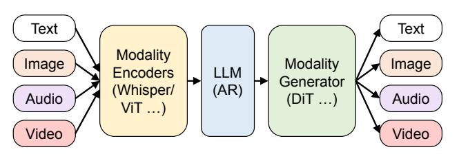
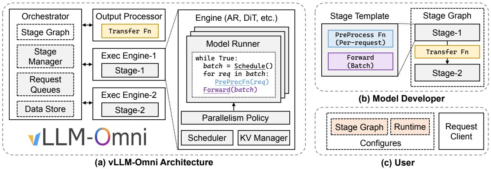
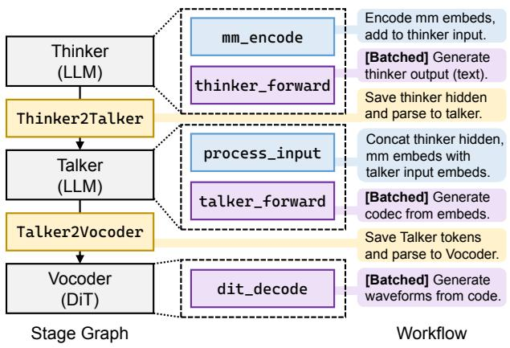
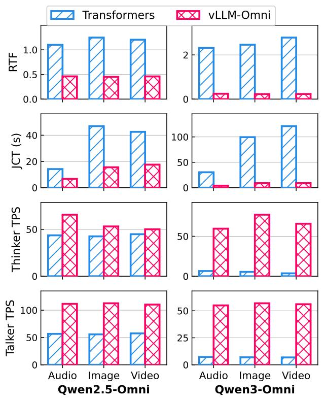
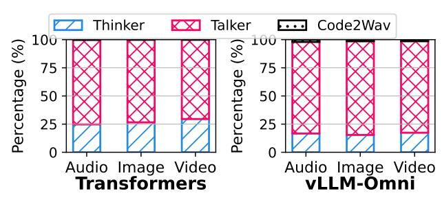

# vLLM-Omni: Fully Disaggregated Serving for Any-to-Any Multimodal Models

Peiqi Yin $^{*12}$  Jiangyun Zhu $^{*3}$  Han Gao $^{*1}$  Chenguang Zheng $^{*1}$  Yongxiang Huang $^{*1}$  Taichang Zhou $^{*1}$  Ruirui Yang $^{*1}$  Weizhi Liu $^{*1}$  Weiqing Chen $^{*1}$  Canlin Guo $^{1}$  Didan Deng $^{1}$  Zifeng Mo $^{4}$  Cong Wang $^{1}$  James Cheng $^{2}$  Roger Wang $^{5}$  Hongsheng Liu $^{1}$ 

#### **Abstract**

Any-to-any multimodal models that jointly handle text, images, video, and audio represent a significant advance in multimodal AI. However, their complex architectures (typically combining multiple autoregressive LLMs, diffusion transformers, and other specialized components) pose substantial challenges for efficient model serving. Existing serving systems are mainly tailored to a single paradigm, such as autoregressive LLMs for text generation or diffusion transformers for visual generation. They lack support for any-toany pipelines that involve multiple interconnected model components. As a result, developers must manually handle cross-stage interactions, leading to huge performance degradation. We present vLLM-Omni, a fully disaggregated serving system for any-to-any models. vLLM-Omni features a novel stage abstraction that enables users to decompose complex any-to-any architectures into interconnected stages represented as a graph, and a disaggregated stage execution backend that optimizes resource utilization and throughput across stages. Each stage is independently served by an LLM or diffusion engine with per-stage request batching, flexible GPU allocation, and unified inter-stage connectors for data routing. Experimental results demonstrate that vLLM-Omni reduces job completion time (JCT) by up to 91.4% compared to baseline methods. The code is public available at https://github.com/vllm-project/vllmomni.

Preprint. February 3, 2026.

Figure 1. Any-to-any multimodal model architecture.

#### 1. Introduction

Traditional large language models (LLMs) (Achiam et al., 2023; Anil et al., 2023; Yang et al., 2025) have achieved remarkable performance in language understanding and reasoning tasks, such as question answering (Kwiatkowski et al., 2019; Bai et al., 2024), summarization (Zhang et al., 2024; Zhong et al., 2021), and code generation (Fakhoury et al., 2024). However, LLMs are constrained to text-only modalities, especially for the output. The growing demand for processing multimodal data has motivated the development of multimodal models that extend LLMs with encoders and decoders for diverse modalities (Wu et al., 2025; Cao et al., 2025; Z.AI, 2026; Ma et al., 2025a). A key trend is the emergence of any-to-any multimodal models (Xu et al., 2025a;b; Ma et al., 2025a; Wang et al., 2025b), unified architectures that seamlessly understand and generate across text, images, video, and audio through end-to-end training (Figure 1). This unification enables more flexible cross-modal reasoning and interaction compared to separate understanding and generation pipelines. Recent any-to-any models have achieved SOTA performance across multimodal understanding tasks such as image captioning (Wu et al., 2023; Hu et al., 2022), visual question answering (Shao et al., 2023; Schwenk et al., 2022), and voice-based assistance (Chen et al., 2024c; Li et al.), as well as generation tasks including image editing (Liu et al., 2025b; Kawar et al., 2023), speech translation (Chen et al., 2023; 2024a), and text-to-speech synthesis (Chen et al., 2024b; Wang et al., 2025c).

The emergence of these any-to-any patterns leads to more complex model structures than those of traditional LLMs. For example, to support audio generation, modern any-to-any models such as Qwen-Omni (Xu et al., 2025a;b) adopt a Thinker-Talker architecture that connects two autoregres-

\*Core Contributor. 1AI Framework and Data Technology Lab, Huawei 2The Chinese University of Hong Kong 3Institute of Software, Chinese Academy of Sciences 4Sun Yat-sen University 5Independent researcher . Correspondence to: Hongsheng Liu liuhongsheng4@huawei.com>.

sive (AR) LLMs, one dedicated to generating text tokens and the other to generating audio tokens. To support image generation, models like GLM-Image [\(Z.AI,](#page-11-4) [2026\)](#page-11-4) typically use an AR LLM to understand the input and then connect it to a diffusion transformer (DiT) [\(Peebles & Xie,](#page-10-4) [2023\)](#page-10-4) for visual synthesis. More advanced any-to-any models further integrate multiple AR and DiT components to simultaneously support both audio and visual outputs within a unified pipeline [\(Ma et al.,](#page-10-0) [2025a;](#page-10-0) [Gong et al.,](#page-9-5) [2025\)](#page-9-5).

Such complexity in model structure introduces substantial challenges for efficient model serving. Existing serving frameworks are typically specialized for a single generation paradigm. LLM serving frameworks such as vLLM [\(Kwon](#page-9-6) [et al.,](#page-9-6) [2023\)](#page-9-6) and SGLang [\(Zheng et al.,](#page-11-10) [2024\)](#page-11-10) are optimized for autoregressive LLM decoding and designed for textonly generation, while diffusion serving frameworks [\(von](#page-10-5) [Platen et al.,](#page-10-5) [2022;](#page-10-5) [Fang et al.,](#page-9-7) [2024\)](#page-9-7) are optimized for DiT denoising and designed for image and video generation. As a result, these frameworks lack native support for any-to-any pipelines that involve multiple autoregressive LLMs, DiT models, or other specialized neural components that must interact in customized ways to produce multi-modal outputs. Developers are thus unable to leverage these frameworks and instead resort to custom implementations that are tightly coupled with specific models, resulting in poor performance and limited extensibility.

To address the challenges, we propose vLLM-Omni, a fully disaggregated serving system for any-to-any models, featuring a stage abstraction frontend and stage execution backend. Unlike existing LLM serving frameworks that operate on a single AR decoding or DiT denoising stage, vLLM-Omni supports complex any-to-any architectures by introducing the concept of a *stage graph*. Through vLLM-Omni's stage abstraction, users can decompose an any-to-any model into multiple stages and explicitly define the pipeline as a stage graph. The nodes represent model stages (e.g., AR or DiT), and edges correspond to user-defined functions that transform and route intermediate data to subsequent stages.

Given this stage graph specification, vLLM-Omni delivers efficient serving for any-to-any models by leveraging a disaggregated stage-execution backend that optimizes execution and resource utilization across stages. Each stage is independently served by a specialized execution engine, in which vLLM for LLM stages and a dedicated diffusion engine for DiT stages. Each engine performs per-stage request batching to maximize resource utilization. Users can flexibly allocate computing accelerators and memory resources to each stage according to its computational characteristics. To support the disaggregated execution across the entire pipeline, vLLM-Omni employs a unified connector between stages for flexible and customized intermediate data transfer. Our evaluation shows that vLLM-Omni achieves substantial

performance improvements across diverse multimodal models. For Qwen3-Omni, vLLM-Omni reduces job completion time by up to 91.4% compared to baseline method.

To summarize, we make the following contributions.

- We introduce vLLM-Omni, a fully disaggregated serving system for any-to-any multimodal models. vLLM-Omni propose a stage graph abstraction, enabling native support for multi-stage model pipelines.
- We present a stage execution backend that enables stagewise optimizations, a unified connector for data transfer, and a diffusion engine for visual generation.
- Our experiments demonstrate that vLLM-Omni consistently outperforms baselines across diverse any-to-any models and tasks.

## 2. Background & Motivation

### 2.1. Any-to-Any Multimodal Models

Any-to-any multimodal models [\(Xu et al.,](#page-11-6) [2025b](#page-11-6)[;a;](#page-11-5) [Gong](#page-9-5) [et al.,](#page-9-5) [2025;](#page-9-5) [Ma et al.,](#page-10-0) [2025a;](#page-10-0) [Wang et al.,](#page-11-7) [2025b\)](#page-11-7) extend the capabilities of text-only LLMs by processing and generating outputs across diverse modalities, including text, image, video, and audio. Unlike standard LLMs, Any-to-any models employ specialized architectures for cross-modality understanding and generation. For multimodal comprehension, modern models adopt dedicated encoders (audio encoders such as Whisper [\(Radford et al.,](#page-10-6) [2023\)](#page-10-6) and Audio Transformer; vision encoders such as ViT [\(Bai et al.,](#page-8-8) [2025\)](#page-8-8) and SigLIP [\(Tschannen et al.,](#page-10-7) [2025\)](#page-10-7)) that map multimodal inputs into a shared embedding space connected to an LLM backbone. For multimodal generation, the LLM backbone generate embedding outputs and parsed to modality-specific decoders, including text-to-speech models [\(Jia et al.;](#page-9-8) [Du](#page-9-9) [et al.,](#page-9-9) [2024\)](#page-9-9) and image/video generation models [\(Esser](#page-9-10) [et al.,](#page-9-10) [2024;](#page-9-10) [Labs et al.,](#page-9-11) [2025\)](#page-9-11), to produce diverse output modalities.[1](#page-1-0) The combination of these components creates increasingly complex architectures that may combine multiple autoregressive (AR), diffusion transformer (DiT), or other specialized generators.

Multiple AR LLM decoders. Some any-to-any models employ multiple autoregressive (AR) LLM decoders within their pipeline. Qwen-Omni series [\(Xu et al.,](#page-11-5) [2025a](#page-11-5)[;b\)](#page-11-6) exemplifies this design (i.e., Figure [2\(](#page-2-0)a)), supporting inputs across text, image, video, and audio while generating both textual and audio outputs. The model comprises multimodal encoders for input processing, a "Thinker" LLM for text

1We refer the model with multiple input and output modalities as "any-to-any" models in this work. Noted that not all any-to-any models support all input and output modalities. Some models may support multimodal inputs (e.g., text, image, audio) but only generate text and images, or text and audio.

Figure 2. Architecture for existing any-to-any models. (a) Qwen2.5-Omni (Xu et al., 2025a); (b) GLM-Image (Z.AI, 2026); (c) BAGEL (Deng et al., 2025).

generation, a "Talker" LLM for audio codec generation, and a "Vocoder" module for audio waveform reconstruction.2 This Thinker–Talker design incorporates two sequential autoregressive LLM models in the execution pipeline. Similar architectures have been adopted by other any-to-any models, e.g., Ming-Omni series (Ma et al., 2025a; Gong et al., 2025).

AR with specialized generators. Many any-to-any models adopt a modular pipeline that separates (i) semantic generation from (ii) modality-specific synthesis. A common instantiation combines an AR LLM with diffusion transformers (DiT) (Peebles & Xie, 2023) to translate high-level semantics into high-fidelity outputs. GLM-Image (Z.AI, 2026) follows such a hybrid design (Figure 2(b)): it first employs semantic-VQ (Geng et al., 2025) with a VAE-based encoder (Van Den Oord et al., 2017) to extract visual features, and then uses a 9B autoregressive LLM (GLM-4 (Zeng et al., 2024)) for semantic understanding and token generation. The generated tokens are subsequently consumed by a 7B single-stream DiT decoder to synthesize the final image.

This "AR + specialized generator" principle also appears in other any-to-any models with visual or audio outputs (Wang et al., 2025b; Huang et al., 2025a; Ge et al., 2024; Dong et al., 2023; Tong et al., 2025; Zhang et al., 2025; Deng et al., 2025). For example, LongCat-Flash-Omni (Wang et al., 2025b) uses a 560B-parameter MoE LLM backbone for autoregressive token generation, followed by a lightweight LSTM/CNN-based audio decoder that reconstructs waveforms in real time. Step-Audio (Huang et al., 2025a) employs a 130B-parameter LLM for generate speech token, followed by a hybrid decoder with DiT flow-matching

for Mel-spectrograms and neural vocoding for waveforms. BAGEL (Deng et al., 2025) can likewise be interpreted through this modular lens: its Mixture-of-Transformers (MoT) design separates multimodal semantic understanding from visual generation via different experts, which can be viewed as two stages within a unified model (Figure 2(c)).

### 2.2. Challenges to Existing LLM Serving Frameworks

Existing open-source LLM serving frameworks, such as vLLM (Kwon et al., 2023), SGLang (Zheng et al., 2024), are designed around a *step-centric* paradigm optimized for text-only LLM inference. These frameworks encapsulate iteration logic and attention key-value (KV) cache management within their runtime, enabling model developers to implement only a single forward pass through the forward function. This abstraction is specifically tailored for sequential text generation, where a model produces tokens iteratively from a fixed input prompt to a text output.

However, the emergence of any-to-any multimodal LLMs introduces architectural challenges that expose the limitations of this step-centric design. Any-to-any models typically include multiple model components of different types, such as autoregressive (AR) LLMs, diffusion transformers (DiTs), and other neural network architectures, connected in complex multi-stage pipelines. The step-centric abstraction becomes a fundamental mismatch: it is designed to represent a single forward pass of text generation, not the coordinated execution and data flow across multiple heterogeneous stages. Consequently, existing frameworks like vLLM and SGLang cannot support multimodal generation, as their abstraction cannot express a multi-stage pipeline.

Owen-Omni models adopt the Thinker-Talker architecture with three model components, and their pipeline logic cannot be expressed within the step-centric frameworks. Developers need to first implement the step-centric forward pass for each stage independently, then manually orchestrate the inter-stage transfer outside the serving framework. The workflow proceeds as follows: multimodal inputs are passed to the LLM Thinker stage via the end-to-end generate() function, which executes the encodes and the AR decoding loop to generate output text. Upon completion, the output hidden states are extracted and transformed into input embeddings for the Talker stage. The Talker then executes its own AR generation loop via the customized generate() function. Finally, upon completion of the Talker stage, outputs are passed to the Vocoder stage for waveform reconstruction.

Such manual implementations incur significant performance penalties. First, serving multimodal generation cannot leverage the efficiency optimizations provided by wellengineered serving frameworks. Existing serving systems are designed with fixed input and output types, making it

&lt;sup>2For the Vocoder, Qwen2.5-Omni adopts a DiT architecture, while Qwen3-Omni uses a lightweight CNN-based approach.

*Figure 3.* vLLM-Omni architecture.

difficult to deploy on even one particular model stage. Such that, performance optimization techniques such as continuous batching [\(Yu et al.,](#page-11-13) [2022\)](#page-11-13) for decoding and chunked prefill [\(Agrawal et al.,](#page-8-10) [2023\)](#page-8-10) processing cannot be applied. Second, as model components are implemented and executed together as a monolithic program, computing resources cannot be efficiently allocated across stages, and the overall pipeline cannot be decomposed or dynamically adjusted. This co-location of stages prevents fine-grained resource distribution, further degrading serving performance.

# 3. vLLM-Omni Designs

vLLM-Omni is a disaggregated serving system for anyto-any multimodal models that enables efficient, scalable inference across heterogeneous model components. In this section, we introduce the designs of our vLLM-Omni system: § [3.1](#page-3-0) provides an architectural overview of the vLLM-Omni system; § [3.2](#page-3-1) describes the stage abstraction interface for any-to-any model programming; § [3.3](#page-4-0) explains the stage execution pipeline and diffusion model integration; § [3.4](#page-5-0) presents the data transfer mechanism for stage disaggregation; and § [3.5](#page-5-1) discusses the hardware support.

# 3.1. Overview

Figure [3](#page-3-2) illustrates an overview of vLLM-Omni. We show the backend architecture of vLLM-Omni in Figure [3\(](#page-3-2)a). On the backend, an orchestrator manages the execution of stages and schedules incoming requests. Each stage is served by an independent execution engine, enabling independent stage scaling, resource allocation, and intra-stage request batching. During inference, the model runner iteratively takes batched requests, applies the corresponding *preprocess* function on each scheduled request, and executes one batched forward step for each iteration. A unified connector then transfers intermediate data between stages, enabling fully disaggregated execution across the entire pipeline.

Figure [3\(](#page-3-2)b) presents the stage abstraction exposed to model developers: each component of an any-to-any model (e.g., LLM and DiT) is implemented as an independent stage equipped with a customized *preprocess* function and a batched *forward* function. The *preprocess* function enables developers to modify stage inputs with additional data produced by preceding stages. From the endpoint users' perspective (Figure [3\(](#page-3-2)c)), vLLM-Omni exposes runtime configurations, including parallelism strategies and memory budgets for different stages, allowing users to tune performance and resource usage without changing model code.

### 3.2. Stage Abstraction

vLLM-Omni provides a flexible and easy-to-use frontend interface for any-to-any model programming, as illustrated by the template in Figure [3\(](#page-3-2)b). In this system, users define any-to-any models as a *stage graph*, where nodes represent model stages and edges represent stage-transfer functions. This allows for the decomposition of complex architectures (i.e., autoregressive LLMs, DiTs, or CNN modules) into distinct stages.[3](#page-3-3) Specifically, for each AR stage, users implement a *preprocess* function to modify stage inputs and a *forward* function in the same step-centric manner as in existing LLM serving systems, enabling batched execution within the stage. To manage data flow between these stages, users define stage-transfer functions that control how query states and intermediate data are transformed during transitions. By combining these stage execution and transfer definitions, the stage graph encapsulates the full execution pipeline of the any-to-any model.

We show an example of implementing the Qwen2.5-Omni model using vLLM-Omni in Figure [4.](#page-4-1) As we discussed in Section [2.1,](#page-1-1) Qwen2.5-Omni includes three stages: (i) an LLM Thinker for text generation, (ii) an LLM Talker for

3Multimodal encoders can be treated either as a separate stage or as part of the LLM stage.

*Figure 4.* An example implementation of Qwen2.5-Omni (i.e., stage graph and workflow for the model). Qwen3-Omni is similar.

audio code generation, and (iii) a DiT Vocoder for waveform synthesis. The model takes multimodal inputs, where dedicated encoders transform audio, image, and video into embeddings that are concatenated with the textual inputs. These inputs are first fed into the Thinker LLM to produce textual outputs and corresponding hidden states. Next, the Talker stage receives the Thinker outputs and concatenates the Thinker hidden states and multimodal embeddings with the Talker input embeddings. The Talker LLM then autoregressively generates codec tokens, repeatedly concatenating the Thinker hidden states at each decoding step. Finally, the generated codec sequence is passed to the Vocoder, which produces audio waveforms via DiT denoising.

Under the stage paradigm of vLLM-Omni, users implement three types of functions: (i) the *forward* function for each model stage (e.g., thinker forward, talker forward, dit decode); (ii) *preprocess* functions that construct stage inputs (e.g., mm encode to obtain multimodal embeddings and concatenate them with Thinker inputs[4](#page-4-2) ; and process input to concatenate Thinker hidden states with Talker input embeddings, and is called in each decode iteration); and (iii) stage-transfer functions between stages (e.g., Thinker2Talker and Talker2Vocoder, they are only called once). In typical use, users define the *forward* and *preprocess* logic for each node, construct a stage graph, and assign transfer functions to the edges. In this way, vLLM-Omni decouples any-to-any models into modular stages while still fully exploiting the performance optimizations of underlying serving engines, allowing users to benefit from efficient resource utilization without manually handling batching or scheduling logic.

### 3.3. Stage Execution

Given a stage graph and user-specified runtime configurations, vLLM-Omni first initializes a set of execution engines, where each engine hosts a single model component, loads the corresponding model parameters, and starts serving according to the configured parallelism policy and memory budget. An orchestrator process is then launched to manage request routing and data exchange across stages.

As each stage runs on an independent engine, vLLM-Omni can naturally disaggregate execution across different stages from the complex any-to-any model structures. Engines can be configured with different parameters and accelerator resources according to the characteristics and demands of each underlying model stage. For example, in the three-stage Qwen3-Omni pipeline, the Thinker model is the largest (30B), so more accelerator memory can be allocated to the Thinker stage; the Talker model is smaller but more compute-intensive, so it can be assigned less memory but higher parallelism and more accelerators. Each engine can also enable standard serving optimizations such as chunked prefill [\(Agrawal et al.,](#page-8-10) [2023\)](#page-8-10) and runtime execution-graph compilation, inheriting the performance benefits of LLM serving systems.

AR stage support. We use the vLLM [\(Kwon et al.,](#page-9-6) [2023\)](#page-9-6) engine for serving AR stages. For each engine, batching scheduling, KV-cache management, and model execution are handled independently by its own scheduler, KV manager, and model runner. The model runner implements the logic for executing the customized preprocess function for each request, which enables flexible composition of multistage models. Specifically, we introduce a predefined dictionary for storing intermediate per-request data that users can access and update on both the transform functions and the preprocess functions. The preprocess function is invoked at every iteration, since some stages need to combine outputs from previous stages with the current forward inputs at each decoding step (e.g., Talker stage for Qwen-Omni). The output processor is responsible for applying the transform function, storing the resulting data in CPU memory, and then transferring it to the device that hosts the next stage.

DiT stage support. vLLM-Omni integrates a dedicated diffusion engine seamlessly into its multi-stage pipeline architecture.[5](#page-4-3) By treating the diffusion process as a distinct node within the stage graph, the system extends its core disaggregated serving principles to diffusion workflows, ensuring efficient inference for audio, image, and video generation tasks. To maximize throughput and reduce latency, the engine implements a suite of optimization techniques, including advanced attention mechanisms (flash attention [\(Dao et al.,](#page-8-11) [2022\)](#page-8-11), SAGE attention [\(Zhang](#page-11-14)

4 In this example, we regard the multimodal encoder as a part of the Thinker stage, follow the implementation of vLLM.

5[Could implement other generation stages within this engine.](#page-11-14)

*Figure 5.* Disaggregated data transfer with unified connector.

[et al.\)](#page-11-14), and TurboAttention [\(Kang et al.,](#page-9-16) [2025\)](#page-9-16)), caching strategies for the iterative denoising process (TeaCache [\(Liu](#page-10-10) [et al.,](#page-10-10) [2025a\)](#page-10-10), cache-dit [\(DefTruth,](#page-8-12) [2025\)](#page-8-12)), and parallelization approaches such as RingAttention-based context parallelism [\(Liu et al.\)](#page-10-11) and Ulysses sequence parallelism. These optimizations enable vLLM-Omni to serve diffusion models with improved throughput and reduced latency compared to baseline implementations.

Ultimately, the diffusion engine empowers vLLM-Omni to support a wide range of state-of-the-art diffusion models, including text-to-image generation (Z-Image [\(Cai et al.,](#page-8-13) [2025\)](#page-8-13), Qwen-Image [\(Wu et al.,](#page-11-3) [2025\)](#page-11-3), Flux [\(Labs et al.,](#page-9-11) [2025\)](#page-9-11)), image editing tools (Qwen-Image-Edit [\(Wu et al.,](#page-11-3) [2025\)](#page-11-3), LongCat-Image-Edit [\(Ma et al.,](#page-10-12) [2025b\)](#page-10-12)), and video generation variants (Wan2.2 variants [\(Wang et al.,](#page-11-15) [2025a\)](#page-11-15), HunyuanVideo [\(Kong et al.,](#page-9-17) [2024\)](#page-9-17)).

Streaming stage output. In multi-stage pipeline execution, some downstream stages do not require complete outputs from their preceding stages to begin computation. In the Qwen-Omni pipeline, for example, the Vocoder can start processing audio generation as soon as the Talker produces initial tokens, rather than waiting for the entire sequence to be completed. To support this pattern, vLLM-Omni implements streaming stage output, where intermediate results are transferred to downstream stages incrementally as they become available. The output processor asynchronously streams partial outputs, such as newly generated tokens or embeddings, to the next stage while the upstream stage continues execution. By enabling overlapped execution across stages, streaming stage output reduces time-to-first-token (TTFT) for the final output and supports streaming responses to users without requiring stages to be tightly synchronized.

### 3.4. Disaggregated Data Transfer

vLLM-Omni supports disaggregated data transfer through a *unified connector* interface that decouples transport from model logic. Inspired by vLLM's KV cache transfer mechanisms for prefill–decode disaggregation, vLLM-Omni generalizes the connector interface to handle a broader range of data objects, including embeddings, hidden states, and audio or image tensors. This unified connector layer is responsible for data movement between stages, enabling full disaggregation of components such as encoders, prefill, decode, and modality-specific generators.

The unified connector is responsible for transferring data between model stages. For single-node deployments, it provides low-latency transfer by using inline control queues for small payloads and system shared memory for larger ones. In distributed multi-node settings, we leverage Ray [\(Moritz et al.,](#page-10-13) [2018\)](#page-10-13) to orchestrate cross-node execution. A Mooncake-based connector [\(Qin et al.,](#page-10-14) [2025\)](#page-10-14) complements this by enabling TCP- or RDMA-based transport, allowing stages on different servers to exchange data via a common put/get interface while passing only lightweight metadata through the control plane. By separating stage execution from data transport and allowing per-edge connector setting, vLLM-Omni flexibly supports heterogeneous deployment topologies and scales any-to-any pipelines across nodes without changing the programming model.

The unified connector also handles intra-stage transfers, including KV cache between prefill and decode and multimodal (MM) cache between encoder and prefill. This design remains compatible with existing EPD (encode–prefill–decode) disaggregation [\(Singh et al.\)](#page-10-15).

### 3.5. Hardware Support

vLLM-Omni supports diverse hardware platforms to enable flexible any-to-any model serving. Built upon vLLM's hardware plugin architecture, vLLM-Omni achieves crossplatform compatibility through a decoupled plugin mechanism that allows for registering hardware-specific implementations independently.

## 4. Experimental Evaluation

### 4.1. Experiment Settings

Models. vLLM-Omni extends the serving capabilities of vLLM to any-to-any tasks with support for multimodal outputs. Specifically, we evaluate the system using a set of representative and state-of-the-art models: (i) Thinker-Talker architecture that connects two autoregressive (AR) models within the execution pipeline, i.e., Qwen3-Omni [\(Xu](#page-11-6) [et al.,](#page-11-6) [2025b\)](#page-11-6) and Qwen2.5-Omni [\(Xu et al.,](#page-11-5) [2025a\)](#page-11-5), which are any-to-any models with both text and audio outputs. (ii) two-stage models that couple an AR LLM with additional modality-specific components for generation: e.g., BAGEL [\(Deng et al.,](#page-8-9) [2025\)](#page-8-9) employs a Mixtureof-Transformer-Experts design with separate experts for multimodal understanding and generation (paired with separate visual encoders), while MiMo-Audio [\(Zhang et al.,](#page-11-12)

2025) combines a patch encoder, an AR LLM backbone, and a patch decoder to generate audio tokens autoregressively. (iii) diffusion models with image or video outputs, i.e., Qwen-Image (Wu et al., 2025), Qwen-Image-Edit (Wu et al., 2025), and Wan2.2 series (Wang et al., 2025a), built primarily on diffusion transformers.

**Baseline Systems.** For Qwen-Omni models, we use their default Hugging Face Transformers (Wolf et al., 2020) implementations to evaluate offline inference performance, as vLLM and SGLang only support their thinker part. For BAGEL and MiMo-Audio, we adopt its original implementation as our baseline. For Diffusion-based models, we adopt Diffusers library (von Platen et al., 2022) as our baseline.

Metrics. For models with audio outputs (i.e., the Qwen-Omni series and MiMo-Audio), we primarily evaluate Real-Time Factor (RTF) and Job Completion Time (JCT) as our performance metrics. RTF is defined as the ratio between the end-to-end processing time and the duration of the generated audio. JCT measures the end-to-end latency of each request, from submission to completion. For the Qwen-Omni models, we further report Tokens Per Second (TPS) for both the thinker and the talker components. Thinker TPS denotes the throughput of generated text tokens per second, while talker TPS denotes the throughput of generated audio tokens per second. For visual generation models, we adopt JCT as our main performance metric.

**Testbed.** The experiments were conducted on a server equipped with two accelerator devices (80GB memory each), 24 CPU cores, and 192 GB of system memory. The environment was configured with a virtual setup, and vLLM version 0.12.0 was used.

#### 4.2. End-to-End Performance

Thinker-Talker architecture. Figure 6 shows the end-to-end performance of vLLM-Omni and the baseline on the Qwen-Omni series. We use the *librispeech\_asr* (Panayotov et al., 2015), *food101* (Bossard et al., 2014), and *ucf101-subset* (Soomro et al., 2012) datasets as the audio, image, and video inputs, respectively. All evaluations use the first 100 queries from each dataset as input. The experiments are run on 2 accelerators with 80GB memory, where the baseline uses the default tensor-parallel configuration of the Transformers implementation. vLLM-Omni applies tensor parallelism to the Thinker across both accelerators, while placing the Talker on device-1 and the Vocoder on device-0.

For Qwen2.5-Omni, compared with the baseline Transformers implementation, vLLM-Omni reduces RTF by 61.4% and JCT by 61.6%. For Qwen3-Omni, vLLM-Omni reduces RTF by 90.7% and JCT by 91.4%. These results indicate that vLLM-Omni delivers substantial end-to-end performance gains over the existing implementation. To

Figure 6. End-to-end results on Qwen-Omni models.

Figure 7. Execution time decompose for Qwen3-Omni.

further analyze the bottlenecks, we report Thinker TPS and Talker TPS. vLLM-Omni achieves 1.29× and 1.97× higher TPS on the Thinker and Talker, respectively, for Qwen2.5-Omni, and 12.97× and 7.98× higher Thinker TPS and Talker TPS for Qwen3-Omni. These results show that vLLM-Omni significantly accelerates Qwen3-Omni, with more than 10× speedup on the Thinker. This large improvement on Qwen3-Omni is attributed to the additional optimizations implemented in vLLM-Omni, while the baseline implementation does not fully exploit modern LLM serving techniques such as execution graph compilation. Since Qwen3-Omni has a much larger Thinker model (30B) than Qwen2.5-Omni (7B), vLLM-Omni can better amortize its optimized execution pipeline and thus achieves higher relative gains.

Figure 7 illustrates the time decomposition across different stages for the Qwen3-Omni model. The results show that, for both systems, the Talker stage accounts for most of the

Figure 8. End-to-end results on DiT-based models.

overall latency because it needs to generate substantially more tokens for audio than the Thinker does for text. For example, on video-input tasks, the average input token count (including video tokens) is 841.6, the average number of output text tokens is 150.9, while the average number of output audio tokens reaches 545.4. Consequently, the Talker runs many more decoding iterations than the Thinker and results in longer latency.

**BAGEL Model.** We evaluated BAGEL on an accelerator with 80 GB memory on Vbench (Huang et al., 2024). For image generation tasks with 1024×1024 resolution, the baseline implementation achieves a JCT (Job Completion Time) of 23.12s for text-to-image (T2I) and 41.39s for image-to-image (I2I). Our method reduces JCT to 9.64s for T2I and 11.12s for I2I, yielding a 2.40× speedup for T2I and 3.72× speedup for I2I over the baseline.

**Mimo-Audio model.** We evaluated Mimo-Audio on one accelerator on SeedTTS (text-to-speech) (Anastassiou et al., 2024). The baseline implementation achieves an RTF of 1.39, while our method reduces RTF to 0.60 without execution-graph compilation and to 0.12 with graph compilation, yielding an 11.58× speedup over the baseline.

#### 4.3. Micro Experiments

Diffusion engine. We compare vLLM-Omni with Diffusers on DiT-based image and video generation models using the VBench (Huang et al., 2024) dataset. For text-to-image and image-to-image generation, we employ Qwen-Image and Qwen-Image-Edit, respectively. For video generation, we use Wan2.2-T2V and Wan2.2-I2V for text-to-video and image-to-video tasks. The output image resolution is 1024x1024 for Qwen-Image and 480x640 for Wan2.2, with 80 output frames. Results demonstrate that vLLM-Omni consistently outperforms Diffusers with a 1.26x overall speedup. This performance gain stems from vLLM-Omni's diffusion engine, which reuses operator optimizations and the flash-attention backend from vLLM, enabling efficient execution across diverse generation tasks.

**Unified connector.** We evaluate the data transfer overhead of vLLM-Omni's unified connector in Table 1. Results demonstrate that the connector overhead is negligible rela-

*Table 1.* Data transfer time with using vLLM-Omni's unified connector. The model is Qwen2.5-Omni.

| Latency (ms)  | Thinker2Talker | Talker2Vocoder |
|---------------|----------------|----------------|
| Shared Memory | 5.49           | 0.53           |
| Mooncake      | 8.28           | 3.34           |

tive to overall inference latency (tens of seconds), making it a practical solution for disaggregated execution. Despite the minimal performance cost, the unified connector provides substantial flexibility by abstracting data movement across heterogeneous deployment topologies.

### 5. Related Work

**LLM serving systems.** Existing systems for autoregressive LLM serving, such as vLLM (Kwon et al., 2023) and SGLang (Zheng et al., 2024), provide efficient support for text-only or multimodal input LLMs with text-only output. These systems offer a step-wise frontend interface that abstracts away serving optimizations from users. The execution backend integrates LLM execution optimizations, including attention implementations (e.g., paged attention (Kwon et al., 2023), flash attention (Dao et al., 2022)), KV cache management, and prefix tree caching (Zheng et al., 2024). They incorporate various optimizations to achieve lower latency and higher throughput, such as chunked prefill (Agrawal et al., 2023), continuous batching (Yu et al., 2022), and Prefill-Decode (PD) (Zhong et al., 2024) disaggregation. Additionally, these systems support multiple parallelism strategies, such as data parallelism and tensor parallelism. Since vLLM-Omni's execution engine extends vLLM's engine, it inherits these optimizations for AR stages within any-to-any pipelines.

Multimodal model serving. Current LLM serving systems (Kwon et al., 2023; Zheng et al., 2024; Wolf et al., 2020) support LLM with multimodal inputs (Bai et al., 2025; Chen et al., 2024c; Li et al.), with optimizations like Encode-Prefill-Decode (EPD) disaggregation (Singh et al.; Qiu et al., 2025) and multimodal embedding cache (Wan et al., 2024). They still focus on text-only output scenarios and lack the support for models with multimodal output. However, they focus exclusively on text-only output and lack support for multimodal generation. Separately, diffusion-based systems (Fang et al., 2024; von Platen et al., 2022; Huang et al., 2022; 2025b) efficiently accelerate visual and audio generation through optimizations like quantized attention (Kang et al., 2025; Zhang et al.), parallel denoising (Liu et al.), and caching strategies (DefTruth, 2025; Liu et al., 2025a; Agarwal et al., 2024). Yet these frameworks are specialized for diffusion models and struggle with complex architectures, particularly when integrating heavy LLM-based text encoders. In contrast, vLLM-Omni provides unified support for complex pipelines by seamlessly combining autoregressive models with diffusion models, enabling efficient serving for any-to-any multimodal models. Such ability is essential for deploying next-generation any-to-any models at scale.

## 6. Conclusion

In this paper, we presented vLLM-Omni, a serving system for efficient deployment of any-to-any multimodal models. The key insight of our work is decomposing complex any-toany model architectures into a stage graph, where each stage can be independently optimized and executed. Through our disaggregated stage execution backend, vLLM-Omni enables efficient serving support for diverse any-to-any models. Our experimental results demonstrate substantial improvements compared to existing approaches.

# References

- Achiam, J., Adler, S., Agarwal, S., Ahmad, L., Akkaya, I., Aleman, F. L., Almeida, D., Altenschmidt, J., Altman, S., Anadkat, S., et al. Gpt-4 technical report. *arXiv preprint arXiv:2303.08774*, 2023.
- Agarwal, S., Mitra, S., Chakraborty, S., Karanam, S., Mukherjee, K., and Saini, S. K. Approximate caching for efficiently serving {Text-to-Image} diffusion models. In *21st USENIX Symposium on Networked Systems Design and Implementation (NSDI 24)*, pp. 1173–1189, 2024.
- Agrawal, A., Panwar, A., Mohan, J., Kwatra, N., Gulavani, B. S., and Ramjee, R. Sarathi: Efficient llm inference by piggybacking decodes with chunked prefills. *arXiv preprint arXiv:2308.16369*, 2023.
- Anastassiou, P., Chen, J., Chen, J., Chen, Y., Chen, Z., Chen, Z., Cong, J., Deng, L., Ding, C., Gao, L., et al. Seedtts: A family of high-quality versatile speech generation models. *arXiv preprint arXiv:2406.02430*, 2024.
- Anil, R., Borgeaud, S., Alayrac, J.-B., Yu, J., Soricut, R., Schalkwyk, J., Dai, A. M., Hauth, A., Millican, K., et al. Gemini: a family of highly capable multimodal models. *arXiv preprint arXiv:2312.11805*, 2023.
- Bai, S., Chen, K., Liu, X., Wang, J., Ge, W., Song, S., Dang, K., Wang, P., Wang, S., Tang, J., et al. Qwen2. 5-vl technical report. *arXiv preprint arXiv:2502.13923*, 2025.
- Bai, Y., Lv, X., Zhang, J., Lyu, H., Tang, J., Huang, Z., Du, Z., Liu, X., Zeng, A., Hou, L., et al. Longbench: A bilingual, multitask benchmark for long context understanding. In *Proceedings of the 62nd annual meeting of the association for computational linguistics (volume 1: Long papers)*, pp. 3119–3137, 2024.

- Bossard, L., Guillaumin, M., and Van Gool, L. Food-101– mining discriminative components with random forests. In *European conference on computer vision*, pp. 446–461. Springer, 2014.
- Cai, H., Cao, S., Du, R., Gao, P., Hoi, S., Huang, S., Hou, Z., Jiang, D., Jin, X., Li, L., et al. Z-image: An efficient image generation foundation model with single-stream diffusion transformer. *arXiv preprint arXiv:2511.22699*, 2025.
- Cao, S., Chen, H., Chen, P., Cheng, Y., Cui, Y., Deng, X., Dong, Y., Gong, K., Gu, T., Gu, X., et al. Hunyuanimage 3.0 technical report. *arXiv preprint arXiv:2509.23951*, 2025.
- Chen, M., Duquenne, P.-A., Andrews, P., Kao, J., Mourachko, A., Schwenk, H., and Costa-jussa, M. R. ` Blaser: A text-free speech-to-speech translation evaluation metric. In *Proceedings of the 61st Annual Meeting of the Association for Computational Linguistics (Volume 1: Long Papers)*, pp. 9064–9079, 2023.
- Chen, X., Zhang, S., Bai, Q., Chen, K., and Nakamura, S. Llast: Improved end-to-end speech translation system leveraged by large language models. In *Findings of the Association for Computational Linguistics ACL 2024*, pp. 6976–6987, 2024a.
- Chen, Y., Yue, X., Zhang, C., Gao, X., Tan, R. T., and Li, H. Voicebench: Benchmarking llm-based voice assistants. *arXiv preprint arXiv:2410.17196*, 2024b.
- Chen, Z., Wu, J., Wang, W., Su, W., Chen, G., Xing, S., Zhong, M., Zhang, Q., Zhu, X., Lu, L., et al. Internvl: Scaling up vision foundation models and aligning for generic visual-linguistic tasks. In *Proceedings of the IEEE/CVF conference on computer vision and pattern recognition*, pp. 24185–24198, 2024c.
- Dao, T., Fu, D. Y., Ermon, S., Rudra, A., and Re, C. FlashAt- ´ tention: Fast and memory-efficient exact attention with IO-awareness. In *Advances in Neural Information Processing Systems (NeurIPS)*, 2022.
- DefTruth, v. cache-dit: A pytorch-native and flexible inference engine with hybrid cache acceleration and parallelism for dits., 2025. URL [https://github.com/](https://github.com/vipshop/cache-dit.git) [vipshop/cache-dit.git](https://github.com/vipshop/cache-dit.git). Open-source software available at https://github.com/vipshop/cache-dit.git.
- Deng, C., Zhu, D., Li, K., Gou, C., Li, F., Wang, Z., Zhong, S., Yu, W., Nie, X., Song, Z., Shi, G., and Fan, H. Emerging properties in unified multimodal pretraining. *arXiv preprint arXiv:2505.14683*, 2025.

- Dong, R., Han, C., Peng, Y., Qi, Z., Ge, Z., Yang, J., Zhao, L., Sun, J., Zhou, H., Wei, H., et al. Dreamllm: Synergistic multimodal comprehension and creation. In *The Twelfth International Conference on Learning Representations*, 2023.
- Du, Z., Chen, Q., Zhang, S., Hu, K., Lu, H., Yang, Y., Hu, H., Zheng, S., Gu, Y., Ma, Z., et al. Cosyvoice: A scalable multilingual zero-shot text-to-speech synthesizer based on supervised semantic tokens. *arXiv preprint arXiv:2407.05407*, 2024.
- Esser, P., Kulal, S., Blattmann, A., Entezari, R., Muller, J., ¨ Saini, H., Levi, Y., Lorenz, D., Sauer, A., Boesel, F., et al. Scaling rectified flow transformers for high-resolution image synthesis. In *Forty-first international conference on machine learning*, 2024.
- Fakhoury, S., Naik, A., Sakkas, G., Chakraborty, S., and Lahiri, S. K. Llm-based test-driven interactive code generation: User study and empirical evaluation. *IEEE Transactions on Software Engineering*, 2024.
- Fang, J., Pan, J., Sun, X., Li, A., and Wang, J. xdit: an inference engine for diffusion transformers (dits) with massive parallelism. *arXiv preprint arXiv:2411.01738*, 2024.
- Ge, Y., Zhao, S., Zhu, J., Ge, Y., Yi, K., Song, L., Li, C., Ding, X., and Shan, Y. Seed-x: Multimodal models with unified multi-granularity comprehension and generation. *arXiv preprint arXiv:2404.14396*, 2024.
- Geng, Z., Wang, Y., Ma, Y., Li, C., Rao, Y., Gu, S., Zhong, Z., Lu, Q., Hu, H., Zhang, X., et al. X-omni: Reinforcement learning makes discrete autoregressive image generative models great again. *arXiv preprint arXiv:2507.22058*, 2025.
- Gong, B., Zou, C., Zheng, C., Zhou, C., Yan, C., Jin, C., Shen, C., Zheng, D., Wang, F., et al. Ming-omni: A unified multimodal model for perception and generation. *arXiv preprint arXiv:2506.09344*, 2025.
- Hu, Y., Hua, H., Yang, Z., Shi, W., Smith, N. A., and Luo, J. Promptcap: Prompt-guided task-aware image captioning. *arXiv preprint arXiv:2211.09699*, 2022.
- Huang, A., Wu, B., Wang, B., Yan, C., Hu, C., Feng, C., Tian, F., Shen, F., Li, J., Chen, M., et al. Step-audio: Unified understanding and generation in intelligent speech interaction. *arXiv preprint arXiv:2502.11946*, 2025a.
- Huang, H., Hu, C., Zhu, J., Gao, Z., Xu, L., Shan, Y., Bao, Y., Ninghui, S., Zhang, T., and Wang, S. Ddit: Dynamic resource allocation for diffusion transformer model serving. *arXiv preprint arXiv:2506.13497*, 2025b.

- Huang, R., Zhao, Z., Liu, H., Liu, J., Cui, C., and Ren, Y. Prodiff: Progressive fast diffusion model for highquality text-to-speech. In *Proceedings of the 30th ACM International Conference on Multimedia*, pp. 2595–2605, 2022.
- Huang, Z., He, Y., Yu, J., Zhang, F., Si, C., Jiang, Y., Zhang, Y., Wu, T., Jin, Q., Chanpaisit, N., et al. Vbench: Comprehensive benchmark suite for video generative models. In *Proceedings of the IEEE/CVF Conference on Computer Vision and Pattern Recognition*, pp. 21807–21818, 2024.
- Jia, D., Chen, Z., Chen, J., Du, C., Wu, J., Cong, J., Zhuang, X., Li, C., Wei, Z., Wang, Y., et al. Ditar: Diffusion transformer autoregressive modeling for speech generation. In *Forty-second International Conference on Machine Learning*.
- Kang, H., Bharadwaj, S., Hensman, J., Krishna, T., Ruhle, ¨ V., and Rajmohan, S. Turboattention: Efficient attention approximation for high throughputs llm. *Proceedings of Machine Learning and Systems*, 7, 2025.
- Kawar, B., Zada, S., Lang, O., Tov, O., Chang, H., Dekel, T., Mosseri, I., and Irani, M. Imagic: Text-based real image editing with diffusion models. In *Proceedings of the IEEE/CVF conference on computer vision and pattern recognition*, pp. 6007–6017, 2023.
- Kong, W., Tian, Q., Zhang, Z., Min, R., Dai, Z., Zhou, J., Xiong, J., Li, X., Wu, B., Zhang, J., et al. Hunyuanvideo: A systematic framework for large video generative models. *arXiv preprint arXiv:2412.03603*, 2024.
- Kwiatkowski, T., Palomaki, J., Redfield, O., Collins, M., Parikh, A., Alberti, C., Epstein, D., Polosukhin, I., Devlin, J., Lee, K., et al. Natural questions: a benchmark for question answering research. *Transactions of the Association for Computational Linguistics*, 7:453–466, 2019.
- Kwon, W., Li, Z., Zhuang, S., Sheng, Y., Zheng, L., Yu, C. H., Gonzalez, J., Zhang, H., and Stoica, I. Efficient memory management for large language model serving with pagedattention. In *Proceedings of the 29th symposium on operating systems principles*, pp. 611–626, 2023.
- Labs, B. F., Batifol, S., Blattmann, A., Boesel, F., Consul, S., Diagne, C., Dockhorn, T., English, J., English, Z., Esser, P., et al. Flux. 1 kontext: Flow matching for in-context image generation and editing in latent space. *arXiv preprint arXiv:2506.15742*, 2025.
- Li, B., Zhang, Y., Guo, D., Zhang, R., Li, F., Zhang, H., Zhang, K., Zhang, P., Li, Y., Liu, Z., et al. Llavaonevision: Easy visual task transfer. *Transactions on Machine Learning Research*.

- Liu, F., Zhang, S., Wang, X., Wei, Y., Qiu, H., Zhao, Y., Zhang, Y., Ye, Q., and Wan, F. Timestep embedding tells: It's time to cache for video diffusion model. In *Proceedings of the Computer Vision and Pattern Recognition Conference*, pp. 7353–7363, 2025a.
- Liu, H., Zaharia, M., and Abbeel, P. Ringattention with blockwise transformers for near-infinite context. In *The Twelfth International Conference on Learning Representations*.
- Liu, S., Han, Y., Xing, P., Yin, F., Wang, R., Cheng, W., Liao, J., Wang, Y., Fu, H., Han, C., et al. Step1x-edit: A practical framework for general image editing. *arXiv preprint arXiv:2504.17761*, 2025b.
- Ma, B., Zou, C., Yan, C., Jin, C., Shen, C., Lian, C., Zheng, D., Wang, F., Xu, F., et al. Ming-flash-omni: A sparse, unified architecture for multimodal perception and generation. *arXiv preprint arXiv:2510.24821*, 2025a.
- Ma, H., Tan, H., Huang, J., Wu, J., He, J.-Y., Gao, L., Xiao, S., Wei, X., Ma, X., Cai, X., Guan, Y., and Hu, J. Longcatimage technical report. *arXiv preprint arXiv:2512.07584*, 2025b.
- Moritz, P., Nishihara, R., Wang, S., Tumanov, A., Liaw, R., Liang, E., Elibol, M., Yang, Z., Paul, W., Jordan, M. I., et al. Ray: A distributed framework for emerging {AI} applications. In *13th USENIX symposium on operating systems design and implementation (OSDI 18)*, pp. 561– 577, 2018.
- Panayotov, V., Chen, G., Povey, D., and Khudanpur, S. Librispeech: an asr corpus based on public domain audio books. In *2015 IEEE international conference on acoustics, speech and signal processing (ICASSP)*, pp. 5206–5210. IEEE, 2015.
- Peebles, W. and Xie, S. Scalable diffusion models with transformers. In *Proceedings of the IEEE/CVF international conference on computer vision*, pp. 4195–4205, 2023.
- Qin, R., Li, Z., He, W., Cui, J., Ren, F., Zhang, M., Wu, Y., Zheng, W., and Xu, X. Mooncake: Trading more storage for less computation—a {KVCache-centric} architecture for serving {LLM} chatbot. In *23rd USENIX Conference on File and Storage Technologies (FAST 25)*, pp. 155–170, 2025.
- Qiu, H., Biswas, A., Zhao, Z., Mohan, J., Khare, A., Choukse, E., Goiri, ´I., Zhang, Z., Shen, H., Bansal, C., et al. Modserve: Modality-and stage-aware resource disaggregation for scalable multimodal model serving. In *Proceedings of the 2025 ACM Symposium on Cloud Computing*, pp. 817–830, 2025.

- Radford, A., Kim, J. W., Xu, T., Brockman, G., McLeavey, C., and Sutskever, I. Robust speech recognition via largescale weak supervision. In *International conference on machine learning*, pp. 28492–28518. PMLR, 2023.
- Schwenk, D., Khandelwal, A., Clark, C., Marino, K., and Mottaghi, R. A-okvqa: A benchmark for visual question answering using world knowledge. In *European conference on computer vision*, pp. 146–162. Springer, 2022.
- Shao, Z., Yu, Z., Wang, M., and Yu, J. Prompting large language models with answer heuristics for knowledgebased visual question answering. In *Proceedings of the IEEE/CVF Conference on computer vision and pattern recognition*, pp. 14974–14983, 2023.
- Singh, G., Wang, X., Hu, Y., Yu, T. T. L., Xing, L., Jiang, W., Wang, Z., Xiaolong, B., Li, Y., Xiong, Y., et al. Efficiently serving large multimodal models using epd disaggregation. In *Forty-second International Conference on Machine Learning*.
- Soomro, K., Zamir, A. R., and Shah, M. Ucf101: A dataset of 101 human actions classes from videos in the wild. *arXiv preprint arXiv:1212.0402*, 2012.
- Tong, S., Fan, D., Li, J., Xiong, Y., Chen, X., Sinha, K., Rabbat, M., LeCun, Y., Xie, S., and Liu, Z. Metamorph: Multimodal understanding and generation via instruction tuning. In *Proceedings of the IEEE/CVF International Conference on Computer Vision*, pp. 17001–17012, 2025.
- Tschannen, M., Gritsenko, A., Wang, X., Naeem, M. F., Alabdulmohsin, I., Parthasarathy, N., Evans, T., Beyer, L., Xia, Y., Mustafa, B., et al. Siglip 2: Multilingual vision-language encoders with improved semantic understanding, localization, and dense features. *arXiv preprint arXiv:2502.14786*, 2025.
- Van Den Oord, A., Vinyals, O., et al. Neural discrete representation learning. *Advances in neural information processing systems*, 30, 2017.
- von Platen, P., Patil, S., Lozhkov, A., Cuenca, P., Lambert, N., Rasul, K., Davaadorj, M., Nair, D., Paul, S., Berman, W., Xu, Y., Liu, S., and Wolf, T. Diffusers: State-of-the-art diffusion models. [https://github.](https://github.com/huggingface/diffusers) [com/huggingface/diffusers](https://github.com/huggingface/diffusers), 2022.
- Wan, Z., Wu, Z., Liu, C., Huang, J., Zhu, Z., Jin, P., Wang, L., and Yuan, L. Look-m: Look-once optimization in kv cache for efficient multimodal long-context inference. In *Findings of the Association for Computational Linguistics: EMNLP 2024*, pp. 4065–4078, 2024.

- Wang, A., Ai, B., Wen, B., Mao, C., Xie, C.-W., Chen, D., Yu, F., Zhao, H., Yang, J., et al. Wan: Open and advanced large-scale video generative models. *arXiv preprint arXiv:2503.20314*, 2025a.
- Wang, B., Xiao, B., Zhang, B., Rong, B., Chen, B., Wan, C., Zhang, C., Huang, C., Chen, C., et al. Longcat-flashomni technical report. *arXiv preprint arXiv:2511.00279*, 2025b.
- Wang, X., Jiang, M., Ma, Z., Zhang, Z., Liu, S., Li, L., Liang, Z., Zheng, Q., Wang, R., Feng, X., et al. Sparktts: An efficient llm-based text-to-speech model with single-stream decoupled speech tokens. *arXiv preprint arXiv:2503.01710*, 2025c.
- Wolf, T., Debut, L., Sanh, V., Chaumond, J., Delangue, C., Moi, A., Cistac, P., Rault, T., Louf, R., Funtowicz, M., et al. Transformers: State-of-the-art natural language processing. In *Proceedings of the 2020 conference on empirical methods in natural language processing: system demonstrations*, pp. 38–45, 2020.
- Wu, C., Yin, S., Qi, W., Wang, X., Tang, Z., and Duan, N. Visual chatgpt: Talking, drawing and editing with visual foundation models. *arXiv preprint arXiv:2303.04671*, 2023.
- Wu, C., Li, J., Zhou, J., Lin, J., Gao, K., Yan, K., ming Yin, S., Bai, S., Xu, X., Chen, Y., Chen, Y., Tang, Z., Zhang, Z., Wang, Z., Yang, A., Yu, B., Cheng, C., Liu, D., Li, D., Zhang, H., Meng, H., Wei, H., Ni, J., Chen, K., Cao, K., Peng, L., Qu, L., Wu, M., Wang, P., Yu, S., Wen, T., Feng, W., Xu, X., Wang, Y., Zhang, Y., Zhu, Y., Wu, Y., Cai, Y., and Liu, Z. Qwen-image technical report, 2025. URL <https://arxiv.org/abs/2508.02324>.
- Xu, J., Guo, Z., He, J., Hu, H., He, T., Bai, S., Chen, K., Wang, J., Fan, Y., Dang, K., et al. Qwen2.5-omni technical report. *arXiv preprint arXiv:2503.20215*, 2025a.
- Xu, J., Guo, Z., Hu, H., Chu, Y., Wang, X., He, J., Wang, Y., Shi, X., He, T., Zhu, X., Lv, Y., Wang, Y., Guo, D., Wang, H., Ma, L., Zhang, P., Zhang, X., Hao, H., Guo, Z., Yang, B., Zhang, B., Ma, Z., Wei, X., Bai, S., Chen, K., Liu, X., Wang, P., Yang, M., Liu, D., Ren, X., Zheng, B., Men, R., Zhou, F., Yu, B., Yang, J., Yu, L., Zhou, J., and Lin, J. Qwen3-omni technical report. *arXiv preprint arXiv:2509.17765*, 2025b.
- Yang, A., Li, A., Yang, B., Zhang, B., Hui, B., Zheng, B., Yu, B., Gao, C., Huang, C., Lv, C., et al. Qwen3 technical report. *arXiv preprint arXiv:2505.09388*, 2025.
- Yu, G.-I., Jeong, J. S., Kim, G.-W., Kim, S., and Chun, B.- G. Orca: A distributed serving system for {Transformer-Based} generative models. In *16th USENIX Symposium*

- *on Operating Systems Design and Implementation (OSDI 22)*, pp. 521–538, 2022.
- Z.AI. Glm-image: Auto-regressive for dense-knowledge and high-fidelity image generation, 2026. URL [https:](https://z.ai/blog/glm-image) [//z.ai/blog/glm-image](https://z.ai/blog/glm-image).
- Zeng, A., Xu, B., Wang, B., Zhang, C., Yin, D., Zhang, D., Rojas, D., Feng, G., Zhao, H., et al. Chatglm: A family of large language models from glm-130b to glm-4 all tools. *arXiv preprint arXiv:2406.12793*, 2024.
- Zhang, D., Wang, G., Xue, J., Fang, K., Zhao, L., Ma, R., Ren, S., Liu, S., Guo, T., Zhuang, W., et al. Mimo-audio: Audio language models are few-shot learners. *arXiv preprint arXiv:2512.23808*, 2025.
- Zhang, J., Zhang, P., Zhu, J., Chen, J., et al. Sageattention: Accurate 8-bit attention for plug-and-play inference acceleration. In *The Thirteenth International Conference on Learning Representations*.
- Zhang, T., Ladhak, F., Durmus, E., Liang, P., McKeown, K., and Hashimoto, T. B. Benchmarking large language models for news summarization. *Transactions of the Association for Computational Linguistics*, 12:39–57, 2024.
- Zheng, L., Yin, L., Xie, Z., Sun, C. L., Huang, J., Yu, C. H., Cao, S., Kozyrakis, C., Stoica, I., Gonzalez, J. E., et al. Sglang: Efficient execution of structured language model programs. *Advances in neural information processing systems*, 37:62557–62583, 2024.
- Zhong, M., Yin, D., Yu, T., Zaidi, A., Mutuma, M., Jha, R., Hassan, A., Celikyilmaz, A., Liu, Y., Qiu, X., et al. Qmsum: A new benchmark for query-based multi-domain meeting summarization. In *Proceedings of the 2021 Conference of the North American Chapter of the Association for Computational Linguistics: Human Language Technologies*, pp. 5905–5921, 2021.
- Zhong, Y., Liu, S., Chen, J., Hu, J., Zhu, Y., Liu, X., Jin, X., and Zhang, H. {DistServe}: Disaggregating prefill and decoding for goodput-optimized large language model serving. In *18th USENIX Symposium on Operating Systems Design and Implementation (OSDI 24)*, pp. 193–210, 2024.