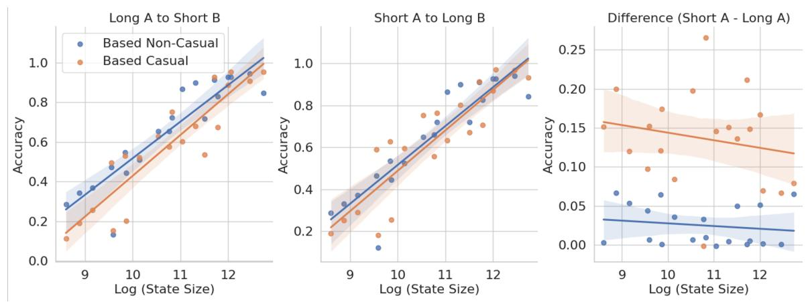
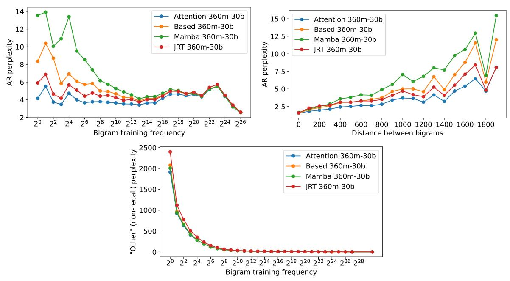
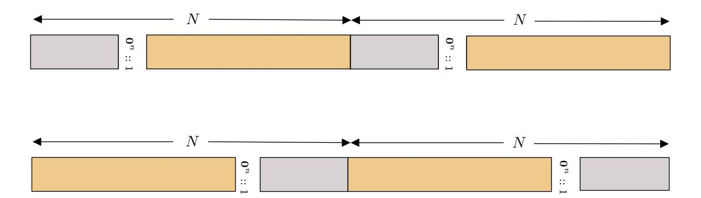
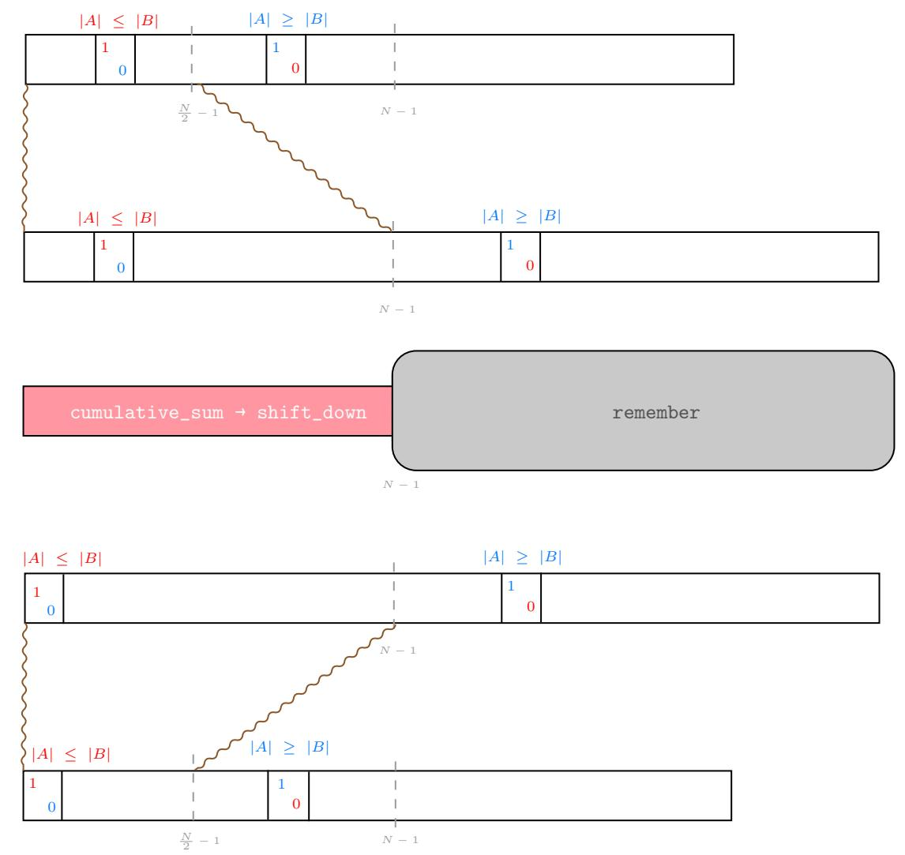

# Just read twice: closing the recall gap for recurrent language models

Simran Arora† , Aman Timalsina△, Aaryan Singhal† , Benjamin Spector† , Sabri Eyuboglu† , Xinyi Zhao† , Ashish Rao† , Atri Rudra△, and Christopher Ré†

†{simarora,aaryan04,bfs,eyuboglu,xyzhao99,aprao,chrismre}@stanford.edu △{amantima,atri}@buffalo.edu

July 9, 2024

#### Abstract

Recurrent large language models that compete with Transformers in language modeling perplexity are emerging at a rapid rate (e.g., Mamba, RWKV). Excitingly, these architectures use a constant amount of memory during inference. However, due to the limited memory, recurrent LMs cannot recall and use all the information in long contexts leading to brittle in-context learning (ICL) quality. A key challenge for efficient LMs is selecting what information to store versus discard. In this work, we observe the order in which information is shown to the LM impacts the selection difficulty. To formalize this, we show that the hardness of information recall reduces to the hardness of a problem called set disjointness (SD), a quintessential problem in communication complexity that requires a streaming algorithm (e.g., recurrent model) to decide whether inputted sets are disjoint. We empirically and theoretically show that the recurrent memory required to solve SD changes with set order, i.e., whether the smaller set appears first in-context. Our analysis suggests, to mitigate the reliance on data order, we can put information in the right order in-context or process prompts non-causally. Towards that end, we first propose: (1) JRT-Prompt, where context gets repeated multiple times in the prompt, effectively showing the model all data orders. This gives 11.0 ± 1.3 points of improvement, averaged across 16 recurrent LMs and the 6 ICL tasks, with 11.9× higher throughput than FlashAttention-2 for generation prefill (length 32k, batch size 16, NVidia H100). We then propose (2) JRT-RNN, which uses non-causal prefix-linear-attention to process prompts and provides 99% of Transformer quality at 360M params., 30B tokens and 96% at 1.3B params., 50B tokens on average across the tasks, with 19.2× higher throughput for prefill than FA2.

# 1 Introduction

Recent work has made rapid progress in developing fixed-memory recurrent architectures (e.g., Mamba [\[1\]](#page-12-0) and RWKV [\[2\]](#page-12-1)) that are competitive with attention in language modeling perplexity. During inference, these models are more memory efficient and asymptotically faster than the de-facto Transformer attention [\[3,](#page-12-2) [4\]](#page-12-3). However, there is no free lunch — due to their limited memory capacity, recurrent LMs cannot recall all the information provided in long-contexts, making in-context learning (ICL) quality brittle [\[5,](#page-12-4) [6,](#page-12-5) [7\]](#page-12-6). Despite matching in perplexity, we find a 2.8Bn parameter Mamba LM trained on 300Bn tokens of the Pile underperforms a 1.3Bn param. (2.2× smaller) Transformer LM trained on 50Bn tokens (6× fewer tokens) by 5 points, averaged across a suite of recall-intensive ICL tasks (Table [1\)](#page-5-0).

Prior work [\[7\]](#page-12-6) formalizes the tradeoff between an architecture's recall ability and memory consumption during inference by considering a simplified ICL setting shown below. Here, we have the "context" of key-value token pair mappings on the left and "questions"s on the right for which the model should output 4, 6, 1, 2, 3:

A 4 B 3 C 6 F 1 E 2 
$$\rightarrow$$
 A ? C ? F ? E ? B ?   
Key-Value Query

Unfortunately, recurrent models need Ω(N) space to solve the recall task [\[7\]](#page-12-6). This begs the question of whether we can rely on recurrent models that use constant O(1) space for in-context learning.

<span id="page-1-0"></span>

Figure 1: Selecting (Left) Recurrent models have limited memory and deciding what to store from long-contexts (e.g., Galileo's Wikipedia) is challenging. Data order (Middle) changes the selection difficulty: seeing the question before the document simplifies the model's selection task. We formalize this by invoking set disjointness, the canonical communication complexity problem of deciding whether two sets A and B are disjoint. A causal model needs enough memory to store set A to be able to compare to set B's elements so, ideally, the smaller set appears first. Beyond causal (Right) We show recurrent models the input twice in-context (JRT-Prompt) or use encoder-decoder recurrent models to process the prompt (JRT-RNN), to mitigate the reliance on data order.

Luckily, models often do not need to remember all information provided in-context to excel at a task. The key challenge is predicting which subset of information (e.g., facts from documents, variable names from code) is useful to store in memory to support next token predictions. A long line of work focuses on improving the selection mechanisms or architectural inductive biases that recurrent language models use to select relevant information (e.g., LSTM [\[8\]](#page-12-7), decay rates [\[1,](#page-12-0) [9\]](#page-12-8), delta rules [\[6,](#page-12-5) [10\]](#page-12-9)). Other works increase the recurrent state size in hardware efficient ways, traversing a quality-efficiency tradeoff space [\[7\]](#page-12-6).

Complementing these approaches, we focus on the simple observation that the order in which data streams into the recurrent LM during inference drastically impacts the difficulty of predicting what to store in the limited memory. Suppose we ask questions Q (e.g., "When did Galileo move to Florence?"), over documents D (e.g., the detailed Wikipedia for Galileo Galilei). The model needs to remember just one fact from D if the prompt is ordered [Q, D], but needs to remember all facts when it is [D, Q] (Figure [1](#page-1-0) (Left)).

Our work first theoretically formalizes how data order impacts the memory requirement (Section [3\)](#page-2-0), then proposes two ways to mitigate the reliance on data order: the Just-read-twice (JRT) prompting strategy (Section [3.2\)](#page-4-0) and the JRT recurrent architecture (Section [4\)](#page-5-1).

Understanding the role of data order. Our first insight is that the hardness of the recall problem reduces to the hardness of set disjointness (SD), the quintessential, decades-old problem in communication complexity theory [\[11\]](#page-12-10) (Theorem [G.11\)](#page-42-0). SD requires a streaming algorithm (e.g., a recurrent model) to decide whether inputted sets provided in-context are disjoint:

$$\underbrace{7\ 11\ 1\ 7\ 16\ 4\ 6\ 9}_{\mathbf{Set}\ \mathbf{A}}\ *\ \underbrace{8\ 1\ 5\ 6}_{\mathbf{Set}\ \mathbf{B}}\to\ \mathrm{False},\ \{1\ 6\}$$

With theory and experiments, we show that the size of the first set, |A|, governs the memory needed to solve SD. Causal models need to store all elements in A to be able to compare to the elements of B. This suggests that using "the right data order" in-context, e.g. placing the set with min(|A|, |B|) first, would help memory-limited models. Further, models that see the context non-causally can solve SD in space min(|A|, |B|), regardless of data order (Theorem [G.15,](#page-43-0) Figure [2\)](#page-3-0). We next make use of these insights.

Using "the right" order. We propose JRT-Prompt (Section [3.2\)](#page-4-0), an extremely simple strategy where information is repeated multiple times in context before the model generates answers (Figure [1](#page-1-0) (Right)). In the second+ pass, the LM conditions on the full context when deciding what to store, effectively avoiding the issue of getting the data order "right". JRT-Prompt gives 11.0 ± 1.3 point improvement averaged across 16 off-the-shelf recurrent LMs and the 6 ICL tasks, while providing 11.9× higher throughput than FlashAttention-2 (length 32k, batch size 16) [\[12\]](#page-12-11) (Table [1\)](#page-5-0). JRT-Prompt increases the context length, but remains asymptotically more compute and memory efficient than attention.

Beyond causal models. We next propose JRT-RNN, inspired by the simple design of Prefix-LM encoderdecoder architectures [\[13,](#page-12-12) [14\]](#page-12-13). Most in-context learning inputs contain two parts, the inputted prompts (context, instructions) and the text generated by the model as output. In Prefix-LMs, the LM processes the prompt region non-causally and causally decodes the output, using only a standard next token prediction loss in the causal region and in loss on the non-causal region. Unfortunately, prior approaches to training Prefix-LM models have seen limited success and use inefficient Transformer backbones [\[15\]](#page-12-14). We apply simple changes to improve quality and efficiency including modifying the training loss and using a linear attention formulation we term Prefix Linear Attention (PLA). We find JRT-RNN provides a 13.7 and 6.9 point average quality improvement at 360m and 1.3b parameters, and 19.2× higher throughput than FA2, using our IO-aware implementation (Table [2\)](#page-8-0).

Our contributions are: (1) a synthetic and theoretical study of data order and the memory requirement for recurrent models, (2) JRT-Prompt, and (3) JRT-RNN. Researchers have developed many techniques for in-context leanring with Transformers [\[16,](#page-12-15) [17\]](#page-12-16), and we need a similar exploration into how to use alternative LLM architectures effectively. Code: <https://github.com/HazyResearch/prefix-linear-attention>.

# 2 Background

We focus on developing methods for in-context learning with recurrent LLMs. We provide key background here and an extended related works discussion in Appendix [A.](#page-19-0)

Recall and in-context learning. Many prior works have identified a skill called associative recall as highly correlated with in-context learning quality across architecture classes via extensive theoretical and empirical analysis [\[1,](#page-12-0) [6,](#page-12-5) [18,](#page-13-0) [19,](#page-13-1) [20,](#page-13-2) [21,](#page-13-3) [22,](#page-13-4) [23,](#page-13-5) [24\]](#page-13-6). Recall entails using information provided in context (beyond the model's memorized knowledge) to generate next token predictions. For instance, models are used via in-context learning to produce the next steps in a proof given a provided list of Lemmas [\[25,](#page-13-7) [26\]](#page-13-8), generate the next chunk of code given a repository [\[27,](#page-13-9) [28\]](#page-13-10), and answer questions or provide summaries given documents [\[29\]](#page-13-11). In a simplified view of the recall task, a model needs to remember keys and values seen in context to provide the answers for different queries. In this example, the model should output 4, 6, 1, 2, 3:

A 4 B 3 C 6 
$$\stackrel{\cdot}{\text{F}}$$
 1 E 2  $\rightarrow$  A ? C ?  $\stackrel{\cdot}{\text{F}}$  ? E ? B ?   
Key-Value Query

Memory-recall tradeoff for causal language models. Today's LLMs process input text causally in a fixed left-to-right order [\[30\]](#page-13-12). Prior work theoretically and empirically demonstrates a fundamental tradeoff between a causal LM's memory consumption during inference and its ability to remember information provided in context (recall) [\[5,](#page-12-4) [6,](#page-12-5) [7\]](#page-12-6). Attention [\[4\]](#page-12-3), the de-facto LM architecture [\[30,](#page-13-12) [31,](#page-13-13) [32\]](#page-14-0), provably solves recall perfectly in O(1) model depth and width as a function of sequence length. However, attention incurs O(N<sup>2</sup> ) complexity during training and O(N) complexity and memory consumption during inference, for sequence length N. Thus, many works explore alternative recurrent architectures that are more efficient sub-quadratic compute and memory in sequence length during training and O(1) during each token generation step during inference — while competing with attention in quality [\[1,](#page-12-0) [7,](#page-12-6) [9,](#page-12-8) [22,](#page-13-4) [33,](#page-14-1) inter alia.].

However, using a limited amount memory during inference, efficient models provably cannot retain all information seen in-context, sacrificing recall and in-context learning quality [\[7\]](#page-12-6). Models that can better select what information to store can extend the Pareto frontier of the tradeoff space. A long line of work explores how to improve this selection mechanism via architectural inductive biases [\[1,](#page-12-0) [6,](#page-12-5) [8,](#page-12-7) [34,](#page-14-2) inter alia.]. Another approach is to navigate the quality-efficiency tradeoff space by varying the recurrent state size in hardware-efficient ways [\[7,](#page-12-6) [35,](#page-14-3) [36\]](#page-14-4). Complementing these approaches, the insight motivating our work is that the order in which information appears in-context drastically influences the difficulty of the selection step [\[37\]](#page-14-5). Non-causal models, which can see all the input text at once, can help avoid this issue.

# <span id="page-2-0"></span>3 Understanding the role of data order on recurrent models

In this section, we show that the quality of recurrent large language models varies as a function of the order in which data arises in context making them brittle for in-context learning applications.

<span id="page-3-0"></span>

Figure 2: Data order vs. quality. The x-axis shows the recurrent state size in (bytes) during inference. The y-axis shows the accuracy on the set disjointness task, where the model needs to output the intersecting elements between two sets of tokens A and B (of lengths |A| and |B|) provided in-context. (Left) |A| is longer than |B|; (Middle) |B| is longer than |A|; (Right) Difference in accuracy between the two orderings. We evaluate non-causal and causal versions of the Based recurrent architecture from [\[7\]](#page-12-6). For each, we vary the hyperparameters (e.g., model dimension, feature dimension) that affect the state size. We plot the maximum score for each point across a sweep of three learning rates {1e − 4, 5e − 4, 8e − 4} and two random seeds. The plot shows that the causal recurrent models are more sensitive to the data order than non-causal models.

## 3.1 Analysis of data order and communication complexity

Set disjointness problem. To formalize the impact of data order, we invoke the set disjointness (SD) problem: given two sets of elements, determine if the intersection is empty or not. SD is the quintessential problem for studying the communication complexity of different streaming algorithms (such as recurrent models) over the past several decades [\[38\]](#page-14-6). The hardness for a wide collection of problems reduces to the hardness of SD [\[11\]](#page-12-10). A formal definition of this task is provided in Appendix [G.2.](#page-42-1)

Synthetic formulation. We construct a synthetic task where the model is given input sequences that contain two sets A and B, seperated by a special token that designates the end of set A and start of set B. Set elements are tokens ∈ [0..|V |] for vocabulary size |V | and the model needs to output the tokens in the intersection of A and B. For example, the correct output below would be 6:[1](#page-3-1)

$$\underbrace{7\ 11\ 17\ 16\ 4\ 6\ 9}_{\mathbf{Set}\ \mathbf{A}}\ *\ \underbrace{8\ 1\ 5\ 6}_{\mathbf{Set}\ \mathbf{B}}\to\ ?$$

In Figure [2,](#page-3-0) we vary the state size of the Based recurrent architecture [\[7\]](#page-12-6), which has been demonstrated to outperform prior subquadratic models on recall, on the SD task. We train on sequences where |A| and |B| are between 1 and 1024, and |V | = 2048. In addition to measuring overall accuracy, we consider the sliced accuracy on sequences where |A| < |B| and sequences where |B| < |A|.

We find the causal models achieve better quality when the size of set A is smaller than set B. Figure [2](#page-3-0) (Right) shows the difference in quality between when A is shorter vs. longer than B, reflecting that the gaps tend to be larger at smaller state sizes (x-axis). We additionally evaluate a non-causal variant of the Based architecture and find (1) it outperforms the causal models across state sizes when A is longer than B (Figure [2](#page-3-0) (Left)), and (2) displays less variation in quality as a function of data (set) order Figure [2](#page-3-0) (Right). We release code to reproduce this plot.

Theoretical study: recall and set disjointness. In Appendix [G,](#page-39-0) we perform a systematic theoretical study of the connection between set disjointness and recall as well as the complexity of solving set disjointness in the JRT setting.

<span id="page-3-1"></span><sup>1</sup>Note that we train the model to output the set intersection, of size 1, not binary disjointness result (Algorithm [1\)](#page-21-0). We find explicitly outputting the intersection helps the model avoid the behavior of outputting 0 or 1 with 50% accuracy during training.

First, we show that set disjointness and the "general associative recall" (GAR) problem, which we define in Appendix G [Definition G.24]), are essentially equivalent (see Propositions G.25 and G.26). Roughly speaking, the keys and queries in GAR correspond to sets A and B in set disjointness.

We argue that recurrent models need space  $\Omega(\min(|A|, |B|))$  for solving set disjointness, and hence, GAR (see Proposition G.29 in Appendix G.4.1).

**Proposition 3.1.** Given a JR-p prompt<sup>2</sup>  $u^{JR-p} \in \{0,1\}^{pN\times d}$  for input  $u \in \{0,1\}^{N\times d}$  to the GAR problem, any recurrent model  $\mathcal{M}_{GAR}$  (definition G.12) solving GAR requires its state size to be at least  $\Omega\left(\frac{\min\{|A|,|B|\}}{p}\right)$ -bits.

That is, the lower bound holds even if we allow multiple, but constant, many passes, as opposed to  $\Omega(\max(|A|, |B|))$  lower bound for recurrent models without repeats [7] **Theorem F.3**.

Next, we show we can indeed achieve this lower bound. We show that certain recurrent models (concretely, a slight variant of Based) can solve SD with  $O(\min(|A|, |B|))$  space in the JRT-PROMPT setting (App. G.3).

**Theorem 3.2.** Given a JRT prompt  $\mathbf{u}^{JRT} \in \mathbb{R}^{2N \times (n+1)}$  of the input  $\mathbf{u} \in \mathbb{R}^{N \times (n+1)}$  for the set-disjointness (SD) problem  $(A, B) \subseteq \{0, 1\}^n$ , there exists a Based model (BaseConv + MLP + LinearAttention + MLP)<sup>3</sup> that solves SD with space  $O(\min\{|A|, |B|\} \cdot n)$ .

Finally, we show that this improvement via JRT-prompting is not realizable for all possible architectures. In particular, we show that  $\Omega(\max\{|A|,|B|\}) = \Omega(N)$  lower bounds for the BaseConv model (a model that provably simulates any gated convolution, e.g. Hyena [39], H3 [40], with just poly-log blowup in parameters and depth) (Theorems F.4, F.5, and F.6, [7]) for recall carry over even in the JRT-prompt setting (see Theorems G.6, G.7, and G.11).

# <span id="page-4-0"></span>3.2 Consequences of analysis on downstream in-context learning with large language models

We next show that our analysis holds consequences for in-context learning on real-world tasks.

**JRT-PROMPT approach.** In-context learning tasks take as input  $(\mathcal{C}, \mathcal{Q}, \mathcal{Y})$  where  $\mathcal{C}$  is some context (e.g., document or code repository),  $\mathcal{Q}$  is some question or request to the model given the context, and  $\mathcal{Y}$  is the answer. For standard in-context learning with autoregressive LM  $\mathcal{A}$ , we input  $\mathcal{C}$  and  $\mathcal{Q}$  and evaluate the generated output  $\hat{\mathcal{Y}} = \mathcal{A}(\mathcal{C}, \mathcal{Q})$  against the true completion  $\mathcal{Y}$ .

We propose JRT-PROMPT, an exceedingly simple method in which information from the prompt (e.g. questions and documents) is *repeated* in-context before the model is prompted to output the answer, *e.g.*,  $\hat{\mathcal{Y}} = \mathcal{A}(\mathcal{C}, \mathcal{Q}, \mathcal{C}, \mathcal{Q})$ , as depicted in Figure 1 (Right). As a result, during the second occurrence of the context, the model can condition on a full view of the context when deciding what to store. We provide the prompts that we use in Appendix E, and release our code to reproduce the table.

**Evaluation.** JRT-PROMPT can be used with off-the-shelf LLMs. We evaluate the following LMs on a suite of recall-intensive in-context learning tasks, with zero-shot prompting:

- Based [7] pretrained LMs at the 1.3B parameter scale trained on 10 50B tokens of the Pile [41]. Transformer++ and Mamba models trained on the exact same tokens and data order are provided for quality references: https://huggingface.co/collections/hazyresearch/
- Mamba [1] pretrained LMs at the 130M, 370M, 1.4B, 2.8B parameter scales, trained on 300B tokens of the Pile [41]: https://huggingface.co/state-spaces
- Gated Linear Attention [9] pretrained LMs at the 1.3B and 2.7B parameter scales, trained on 100B tokens of SlimPajama data [42]: https://huggingface.co/fla-hub

<span id="page-4-1"></span><sup>&</sup>lt;sup>2</sup>A JR-p prompt is simply repeating the input p times (see Definition G.28).

<span id="page-4-3"></span><span id="page-4-2"></span><sup>&</sup>lt;sup>3</sup>This matches the architecture in our experiments.

<sup>&</sup>lt;sup>4</sup>This bound is for the case where the IP kernel is dependent on A and B; if we use an *input-independent* IP kernel, then we get an upper bound of  $O\left((\min\{|A|,|B|\})^2 \cdot n\right)$  (see Remark G.23). Further, this result needs one layer of BaseConv where the convolution kernel is input dependent as well.

<span id="page-5-0"></span>

| Architecture  | Params | Tokens | FDA               | SWDE              | NQ                | SQUAD             | TriviaQA          | Drop              | Average            |
|---------------|--------|--------|-------------------|-------------------|-------------------|-------------------|-------------------|-------------------|--------------------|
| Transformer++ | 1.3B   | 10B    | 74.4/86.1         | 41.4/ <b>52.5</b> | 28.2/ <b>31.9</b> | 39.0/ <b>53.1</b> | <b>49.5</b> /49.3 | 22.3/ <b>33.6</b> | 42.5 / <b>51.1</b> |
| Mamba         | 1.3B   | 10B    | 23.3/40.3         | 15.5/31.8         | 19.4/ <b>25.8</b> | 26.6/48.5         | 46.4/ <b>51.1</b> | 21.3/32.1         | 25.1 / <b>38.2</b> |
| Based         | 1.3B   | 10B    | 48.6/ <b>58.9</b> | 27.6/44.7         | 19.7/ <b>28.4</b> | 31.0/46.7         | 44.1/ <b>51.9</b> | 19.5/ <b>34.6</b> | 31.8 / <b>44.2</b> |
| Transformer++ | 1.3B   | 50B    | 83.7/ <b>89.2</b> | 50.8/ <b>65.0</b> | 32.8/ <b>37.5</b> | 41.1/58.1         | 56.6/ <b>58.8</b> | 21.5/ <b>37.9</b> | 47.8 / <b>57.8</b> |
| Mamba         | 1.3B   | 50B    | 41.9/55.7         | 32.6/45.4         | 26.9/ <b>33.9</b> | 31.5/ <b>53.5</b> | 54.9/ <b>56.7</b> | 20.4/ <b>33.8</b> | 34.7 / <b>46.5</b> |
| Based         | 1.3B   | 50B    | 60.2/ <b>68.3</b> | 37.1/ <b>54.0</b> | 29.4/35.2         | 38.9/ <b>56.3</b> | 54.5/ <b>57.6</b> | 21.7/39.1         | 40.3 / <b>51.8</b> |
| GLA           | 1.3B   | 100B   | 48.3/ <b>68.6</b> | 37.7/ <b>53.6</b> | 26.6/31.3         | 34.7/54.8         | <b>55.5</b> /54.6 | 19.6/ <b>33.3</b> | 36.7 / <b>48.9</b> |
| GLA           | 2.7B   | 100B   | 47.1/ <b>65.8</b> | 43.6/ <b>54.5</b> | 27.1/32.9         | 37.2/55.7         | 57.9/57.0         | 22.2/34.0         | 39.2/ <b>50.0</b>  |
| Mamba         | 130M   | 300B   | 25.7/ <b>32.8</b> | 17.5/31.5         | 16.8/ <b>21.7</b> | 27.1/ <b>51.9</b> | 43.5/ <b>50.1</b> | 17.4/30.7         | 24.7 / <b>36.5</b> |
| Mamba         | 370M   | 300B   | 41.9/ <b>58.3</b> | 27.6/42.2         | 23.8/ <b>31.1</b> | 34.9/ <b>51.0</b> | 53.6/51.7         | 19.3/ <b>33.2</b> | 33.5 / <b>44.6</b> |
| Mamba         | 1.4B   | 300B   | 45.8/ <b>60.9</b> | 37.6/46.0         | 31.0/ <b>36.6</b> | 39.9/ <b>59.6</b> | 60.5/ <b>61.3</b> | 20.9/ <b>36.4</b> | 39.3 / <b>50.1</b> |
| Mamba         | 2.8B   | 300B   | 54.3/ <b>66.6</b> | 38.9/48.9         | 33.5/40.1         | 43.9/ <b>59.4</b> | 66.2/63.9         | 19.8/ <b>36.9</b> | 42.8 / <b>52.6</b> |
| Mamba-2       | 130M   | 300B   | 32.2/ <b>50.9</b> | 29.5/43.3         | 20.6/ <b>28.9</b> | 30.4/47.0         | 43.7/ <b>47.2</b> | 18.0/ <b>34.0</b> | 29.1 / <b>42.0</b> |
| Mamba-2       | 370M   | 300B   | 60.8/ <b>76.7</b> | 38.3/52.1         | 26.6/ <b>33.6</b> | 35.3/ <b>51.8</b> | 54.6/ <b>54.7</b> | 22.4/ <b>36.3</b> | 39.7 / <b>50.9</b> |
| Mamba-2       | 1.3B   | 300B   | 66.8/ <b>74.7</b> | 50.0/ <b>59.6</b> | 33.6/40.5         | 42.9/ <b>59.6</b> | 63.8/62.4         | 23.2/ <b>36.6</b> | 46.7 / <b>55.6</b> |
| Mamba-2       | 2.7B   | 300B   | 68.7/ <b>81.6</b> | 55.2/60.8         | 34.4/41.7         | 45.4/ <b>59.4</b> | 66.4/66.5         | 23.0/42.5         | 48.9 / <b>58.8</b> |

Table 1: Evaluation of pre-trained language models. In each cell, we report in-context learning accuracy for the default zero-shot / JRT-PROMPT methods (using prompts provided in Appendix F). We evaluate across a suite of popular recall-intensive benchmarks. The zero-shot prompt includes up to 1k tokens in the input and JRT-PROMPT includes up to 2k tokens in the input for all tasks (due to repeating twice).

• Mamba-2 [36] pretrained LMs at the 130M, 370M, 1.3B, 2.7B parameter scales, trained on 300B tokens of the Pile [41]: https://huggingface.co/state-spaces

The results are summarized in Table 1. Arora et al. [7] finds that linear recurrent models like Mamba drastically underperform Transformers on these recall-intensive tasks. Architectures like Based increase the recurrent state size, improving both quality and efficiency, and recently Mamba-2 adopts this approach as well. Complementing the approach of increasing state size, we find the JRT-PROMPT modification provides  $11.0 \pm 1.3$  points of improvement, averaged across models and tasks: Based models with JRT-PROMPT outperform the Transformer models with standard prompting on average. We also find that JRT-PROMPT can benefit the Transformer models and that the method appears more effective than few-shot learning for these tasks (Appendix E). Notably, Springer et al. [43] recently proposes repeating the context for the goal of generating embeddings using autoregressive Transformer-based models, and our findings are in similar spirit. We focus on sub-quadratic architectures and in-context learning tasks.

JRT-PROMPT increases the context length due to repetition, however using using sub-quadratic recurrent architectures, this is still asymptotically more efficient than using quadratic Transformer models. We find at sequence length N=32768, batch size 16, Based with JRT-PROMPT (2N the sequence length) can provide  $11.9 \times$  higher throughput than FlashAttention-2 (N sequence length) on an NVidia H100 (see Section 5).

## <span id="page-5-1"></span>4 JRT-RNN: an encoder-decoder recurrent architecture

We have shown that the recall quality of causal fixed-memory recurrent models varies depending on the order in which the information appears in context, making them brittle for in-context learning. To improve reliability, we next propose a simple linear attention architecture that goes beyond causal modeling.

A long line of work has demonstrated the strength of non-causal bidirectional neural networks in language modeling [13, 44, 45, 46, 47, 48]. However, it is challenging to use them for fast text generation because the context must be re-processed for each generated token [14, 48, 49]. Encoder-decoder architectures with a bidirectional encoder and causal decoder offer a way to achieve fast causal generation while reaping the benefits of bidirectional LMs. Nonetheless, decoder-only causal LMs remain the norm and encoder-decoder architectures have received little attention in the context of sub-quadratic efficient LLMs.

#### 4.1 Preliminaries

Baseline linear recurrent architecture. We start from a recurrent architecture, linear attention, introduced in [50, 51, 52]. Current strong recurrent LMs (e.g., Based [7], GLA [9], Mamba-2 [36]) adopt linear attention with large recurrent state sizes. Prior work also theoretically shows that linear attention and state space models like Mamba [1] are closely related [7, 23, 36].

state space models like Mamba [1] are closely related [7, 23, 36]. Let q, k, v be linear projections of the input  $u \in \mathbb{R}^{N \times d}$ . The exponential in softmax attention is replaced by a feature map  $\phi : \mathbb{R}^d \to \mathbb{R}^{\tilde{d}}$ , from model dimension d to feature dimension  $\tilde{d}$ , such that  $\phi(\mathbf{q}_i)^{\top}\phi(\mathbf{k}_i) \approx \exp(\mathbf{q}_i^{\top}\mathbf{k}_i/\sqrt{d})$ . The linear attention computation can then be written as:

<span id="page-6-0"></span>
$$\mathbf{y}_i = \frac{\phi(\mathbf{q}_i) \sum_{j=1}^i \left( \phi(\mathbf{k}_j)^\top \mathbf{v}_j \right)}{\phi(\mathbf{q}_i) \sum_{j=1}^i \phi(\mathbf{k}_j)}$$
(1)

Multiplying keys and values first, the time and space complexity is  $\mathcal{O}(Nd\tilde{d})$  vs.  $O(N^2d)$  for softmax attention. Recurrent inference is split into two phases: prefill to process the input prompt and decoding to generate one token of the output at a time. During prefill, a length-l prompt is processed in parallel according to Equation (1) resulting in a "KV-state"  $s_l = \sum_{j=1}^{l} \phi(\mathbf{k}_j)^{\top} \mathbf{v}_j$  and "K-state"  $\mathbf{z}_l = \sum_{j=1}^{l} \phi(\mathbf{k}_j)^{\top}$ . During decoding, we can compute Equation (1) as:

<span id="page-6-2"></span>
$$s_i = s_{i-1} + \phi(\mathbf{k}_i)^{\top} \mathbf{v}_i, \qquad \mathbf{z}_i = \mathbf{z}_{i-1} + \phi(\mathbf{k}_i)^{\top}, \qquad \mathbf{y}_i = \frac{\phi(\mathbf{q}_i) \mathbf{s}_i}{\phi(\mathbf{q}_i) \mathbf{z}_i}$$
 (2)

where  $s_i \in \mathbb{R}^{d \times \tilde{d}}$  and  $z_i \in \mathbb{R}^{\tilde{d}}$ . Each decode step has O(1) time and space complexity as the sequence length grows, improving upon O(N) for softmax attention with KV-caching.

**Prefix-LM** architecture. Prefix-LM is a category of encoder-decoder models where inputs of length N are split into two regions: the first of length M is processed non-causally and the latter of length (N-M) is processed causally [13]. During loss computation, the former tokens are ignored and next-token-prediction loss is computed on the latter region. Excitingly, the design is quite simple, however prior instantiations of Prefix-LMs use inefficient softmax attention backbones and have not provided compelling benefits over decoder-only Transformers [15]. Prior prefix LM architectures have seen limited adoption.

#### 4.2 JRT-RNN architecture

JRT-RNN draws inspiration from Prefix-LMs, but focuses on expanding the Pareto frontier of the quality-efficiency tradeoff space. To improve quality, JRT-RNN uses separate  $k_e$ ,  $v_e$  projections on the encoder side and  $k_d$ ,  $v_d$  projections on the decoder side. While Prefix LM models use shared projection weights for the encoder and decoder regions, we find that using two sets of projections improves quality. This observation appears in early work on recurrent encoder-decoder architectures (Sutskever et al. [37]).

For efficiency, JRT-RNN uses non-causal linear attention for the encoder plus standard causal linear attention for the decoder. We term this Prefix Linear Attention (PLA) (Figure 1 (Right)):

<span id="page-6-1"></span>
$$\mathbf{y}_{i} = \frac{\phi(\mathbf{q}_{i})(\sum_{j=1}^{i} \phi(\mathbf{k}_{d_{j}})^{\top} \mathbf{v}_{d_{j}} + \sum_{j=1}^{M} \phi(\mathbf{k}_{e_{j}})^{\top} \mathbf{v}_{e_{j}})}{\phi(\mathbf{v}q_{i})(\sum_{j=1}^{i} \phi(\mathbf{k}_{d_{j}})^{\top} + \sum_{j=1}^{M} \phi(\mathbf{k}_{e_{j}})^{\top})}$$
(3)

Prior work has proposed many different instantiations of linear attention by varying the feature map  $\phi$  – PLA is a general approach, agnostic to the choice of feature map.

PLA retains the linear recurrent view,  $\mathcal{O}(1)$  time and space complexity for the inference decode step and the sub-quadratic in sequence length training complexity of standard causal linear attention [53]. During prefill, we process a length-l prompt in parallel according to Equation (3). If l < M, we left-pad the prefill to length M and mask the padded region during the linear attention computation. The recurrent state is initialized as:

$$\boldsymbol{s}_{M} = \sum_{j=1}^{M} (\phi(\boldsymbol{k}_{e_{j}})^{\top} \boldsymbol{v}_{e_{j}} + \phi(\boldsymbol{k}_{d_{j}})^{\top} \boldsymbol{v}_{d_{j}}), \qquad \boldsymbol{z}_{M} = \sum_{j=1}^{M} (\phi(\boldsymbol{k}_{e_{j}})^{\top} + \phi(\boldsymbol{k}_{d_{j}})^{\top})$$
(4)

Decoding for outputs  $y_i$ , i > M proceeds according to Equation (2), without modification.

Efficiency. Although linear attention is theoretically more efficient than softmax attention, existing implementations are generally *slower* than well-optimized standard attention implementations (e.g., FlashAttention [12]). Excitingly, [7] recently provides an IO-aware kernel that realizes the efficiency benefits of the Based linear attention architecture by carefully paritioning and storing the large matrix-valued recurrent state

across warp-registers during prefill (Algorithm 1 in [\[7\]](#page-12-6)). We extend their algorithm to support PLA, using the Based feature map (defined in Appendix [D\)](#page-28-0) in Algorithm [2](#page-29-0) and provide the efficiency results in Section [5.](#page-7-0) Additional details of our implementation are provided in Appendix [D.](#page-28-0)

The baseline causal linear attention takes 2BNHD FLOPS to compute the feature map on qd, kd, and 4BNHdD FLOPS for the kd, v<sup>d</sup> dot product, cumulative sum, q<sup>d</sup> dot product, and sum along the feature dimension D respectively. PLA increases the FLOPS by BMHD to compute the feature map on k<sup>e</sup> and 3BMHdD to compute the ke, v<sup>e</sup> dot product, sum along D, and sum the state with the decoder KV-state. PLA uses the same amount of memory (recurrent state size) during the inference decoding step as the original causal linear attention architecture.

# 4.3 JRT-RNN training objective

Our baseline recurrent models are trained with a standard next token prediction (NTP) objective, learning a probability distribution P(ui+1|{u1, ..., ui}) from input sequences of tokens u = {u1, ..., u<sup>N</sup> } for sequence length N, and cross-entropy loss. For the pure decoder models, the loss (LNTP) is computed using all N tokens in u. JRT-RNN, as is standard for Prefix-LMs, an only compute the NTP loss (LNTP) for tokens {uM, ..., u<sup>N</sup> }, which are processed causally.

Prefix LMs typically compute no loss on the non-causal region, however in JRT-RNN, we combine next token prediction with the masked language modeling (MLM) objective [\[47\]](#page-14-15). For the added MLM objective, we replace proportion P of of tokens from the encoder region {u1, ..., uM} with a [MASK] token and we measure the cross-entropy loss (LMLM) in predicting the original token. The loss is:

$$\mathcal{L} = \frac{w_1 \mathcal{L}_{\text{NTP}} + w_2 \mathcal{L}_{\text{MLM}}}{w_1 + w_2} \tag{5}$$

where w1, w<sup>2</sup> ∈ R are scalar weights. During inference, no [MASK] tokens are used; inference proceeds as with causal LMs.

# <span id="page-7-0"></span>5 Results

In this section, we validate the following quality and efficiency claims for JRT-RNN:

- 1. In-context learning (ICL) quality JRT-RNN provides 99% of Transformer quality at 360M params./30Bn tokens, averaged across the recall-intensive ICL benchmarks. This represents 46.7% improvement over Based and 78.8% over Mamba. JRT-RNN provides 96% of Transformer quality at 1.3Bn params./ 50Bn tokens, representing 16.2% improvement over Based and 34.5% over Mamba on average.
- 2. Overall language modeling Beyond outperforming in recall, we show that JRT-RNN matches the baselines in general natural language understanding (SuperGLUE). We give a detailed analysis of the pretrained LMs, comparing perplexity on slices of the Pile test set to show the strengths and limitations.
- 3. Generation We show that JRT-RNN can provide 19.2× higher prefill throughput than FlashAttention-2 at 32k sequence length, batch size 16 on an NVidia H100 GPU.

Models. We compare JRT-RNN to two state-of-the-art recurrent autoregressive models, Based [\[7\]](#page-12-6) and Mamba [\[1\]](#page-12-0). We also compare to the Transformer++ (Llama architecture [\[32\]](#page-14-0)), which adds rotary encodings [\[54\]](#page-15-6) and gated linear units.

For JRT-RNN, we start from the Based linear recurrent architecture, since it has been shown in prior work to outperform prior sub-quadratic architectures (e.g., Mamba, GLA) at recall. An extended explanation of Based is in Appendix [D.](#page-28-0) We reiterate that the approaches in JRT-Prompt and JRT-RNN can be combined with any linear recurrent model.

Benchmarks. We evaluate on a range of ICL benchmarks. We use SuperGLUE to test general language understanding [\[55\]](#page-15-7). We next evaluate on a suite of recall-intensive tasks including: SWDE and FDA information extraction tasks [\[7,](#page-12-6) [29,](#page-13-11) [56,](#page-15-8) [57\]](#page-15-9), where the model needs to extract values for a specified attribute from in-context passages, and SQUADv2 [\[58\]](#page-15-10), Natural Questions [\[59\]](#page-15-11), TriviaQA [\[60\]](#page-15-12), and Drop [\[61\]](#page-15-13). In these tasks, the model needs to ground its answers in in-context documents. We release code and models to reproduce our results and provide details on the benchmarks and evaluations in Appendix [B.](#page-21-1)

<span id="page-8-0"></span>

|              |                                | FI    | OΑ    | $\mathbf{sw}$ | $\mathbf{DE}$ | N     | Q     | $\mathbf{SQUAD}$ | Trivia | $\mathbf{Drop}$ | Avg.        |
|--------------|--------------------------------|-------|-------|---------------|---------------|-------|-------|------------------|--------|-----------------|-------------|
| Architecture | Param/Tok                      | 512   | 1024  | 512           | 1024          | 512   | 1024  | Full             | Full   | Full            |             |
|              |                                | Acc ↑ | Acc ↑ | Acc ↑         | Acc ↑         | Acc ↑ | Acc ↑ | Acc ↑            | Acc ↑  | Acc ↑           | Acc ↑       |
| Transformer  | 360M/30B                       | 74.8  | 73.0  | 44.7          | 43.0          | 27.8  | 22.9  | 36.2             | 46.5   | 21.8            | 43.4        |
| Mamba        | 360M/30B                       | 41.1  | 24.3  | 22.2          | 13.6          | 16.4  | 12.5  | 25.5             | 43.0   | 17.3            | 24.0        |
| Based        | 360M/30B                       | 50.3  | 35.8  | 30.4          | 21.6          | 19.7  | 14.7  | 29.8             | 42.5   | 18.4            | 29.2        |
| JRT-RNN      | $360 \mathrm{M}/30 \mathrm{B}$ | 82.0  | 66.0  | 43.3          | 35.1          | 32.9  | 16.2  | 41.7             | 43.2   | 25.8            | 42.9        |
| Transformer  | 1.3B/10B                       | 75.3  | 71.5  | 41.6          | 41.0          | 29.6  | 25.8  | 38.7             | 48.8   | 22.6            | 43.9        |
| Mamba        | 1.3 B/10 B                     | 37.4  | 23.3  | 23.0          | 15.1          | 19.6  | 16.1  | 26.1             | 45.7   | 20.9            | 25.2        |
| Based        | 1.3B/10B                       | 66.3  | 49.0  | 32.3          | 26.3          | 19.7  | 15.7  | 30.7             | 44.2   | 19.1            | 33.7        |
| JRT-RNN      | 1.3 B/10 B                     | 78.5  | 60.6  | 38.5          | 32.7          | 26.5  | 16.7  | 51.6             | 44.8   | 28.4            | 42.0        |
| Transformer  | 1.3B/50B                       | 85.6  | 83.5  | 55.7          | 56.0          | 33.4  | 29.9  | 40.1             | 56.6   | 21.4            | 51.4        |
| Mamba        | 1.3 B/50 B                     | 55.4  | 40.1  | 44.0          | 33.7          | 27.6  | 23.2  | 32.2             | 54.5   | 20.7            | 36.8        |
| Based        | 1.3 B/50 B                     | 69.3  | 58.8  | 47.6          | 40.4          | 29.1  | 24.4  | 38.5             | 54.3   | 20.8            | 42.6        |
| JRT-RNN      | 1.3 B/50 B                     | 86.7  | 67.7  | 49.4          | 45.7          | 38.3  | 25.4  | 50.4             | 53.0   | 29.3            | <u>49.5</u> |

<span id="page-8-1"></span>Table 2: **Evaluation of JRT-RNN models.** We compare JRT-RNN to strong LMs proposed in prior work (Based, Mamba, and Transformer++) across parameter scales. In the table, we specify the length (number of tokens) of the documents provided in context (512, 1024, Full), where "Full" means the full document is included as prefill. Table 7 contains the average number of tokens per document in each benchmark.

| Arch.       | Param/Tokens | FDA<br>2k | $\begin{array}{c} \mathbf{SWDE} \\ 2\mathbf{k} \end{array}$ | <b>NQ</b><br>2k |
|-------------|--------------|-----------|-------------------------------------------------------------|-----------------|
| Transformer | 360M/10B     | 65.2      | 41.0                                                        | 23.0            |
| Mamba       | 360 M/10 B   | 12.4      | 13.4                                                        | 12.4            |
| Based       | 360 M/10 B   | 19.1      | 18.9                                                        | 13.9            |
| JRT-RNN     | 360 M/10 B   | 28.4      | 26.1                                                        | 15.4            |
| Transformer | 1.3B/50B     | 79.7      | 55.5                                                        | 30.2            |
| Mamba       | 1.3 B/50 B   | 21.0      | 29.9                                                        | 23.1            |
| Based       | 1.3 B / 50 B | 36.1      | 37.7                                                        | 23.4            |
| JRT-RNN     | 1.3 B / 50 B | 55.2      | 41.4                                                        | 26.2            |

Table 3: Evaluation at prefill lengths 2k, i.e. beyond the encoder region (length M=1024).

| Inference       | Param/Tokens               | <b>FDA</b> 512 | $\begin{array}{c} \textbf{SWDE} \\ 512 \end{array}$ | <b>NQ</b> 512 |
|-----------------|----------------------------|----------------|-----------------------------------------------------|---------------|
| Left-pad        | 360 M/30 B                 | 61.9           | 38.1                                                | 24.6          |
| Read-2 $\times$ | 360M/30B                   | 82.0           | 43.3                                                | 32.9          |
| Iterate         | 360 M/30 B                 | 76.3           | 40.7                                                | 29.2          |
| Left-pad        | 1.3 B/50 B                 | 75.8           | 49.3                                                | 30.9          |
| Read-2×         | 1.3 B/50 B                 | 86.7           | 49.4                                                | 38.3          |
| Iterate         | $1.3 {\rm B} / 50 {\rm B}$ | 80.2           | 43.3                                                | 34.2          |

Table 4: JRT-RNN with alternate inference strategies when l < M, for prefill and encoder lengths l and M.

#### 5.1 In-context learning quality

In Table 2, we find JRT-RNN outperforms the decoder-only baseline (Based) by 13.7 points at 360M parameters (30Bn tokens) and 6.9 points at 1.3B parameters (50Bn tokens) on average. JRT-RNN closes the gap to Transformer++ to within 0.5 points on average at 360M and 1.9 points on average at 1.3B parameters.

In Table 2, we left pad documents with length  $\langle M \rangle$ , where M=1024 is the encoder region's length during training (discussed in Section 4) – for the three results with length 512 documents we pad using JRT-Prompt and otherwise with the tokenizer's space token (discussed further below).

**Length extrapolation.** Though the encoder processes until length M = 1024 for our trained LMs, we excitingly find that the benefits of JRT extend to prefill lengths l s.t. l > M as well. In Section 5.1, we evaluate at the 360M and 1.3B parameter scales with documents of length 2000.

**Inference strategies.** In Table 3, we compare alternate inference strategies for JRT-RNN in the regime where the prefill length l is less than the encoder length M, l < M:

- **Decoding with padding**: We left-pad the prefill to length M to match the training distribution the model sees. Causal decoding starts at position M. This is the default for JRT-RNN.
- Read-twice pad: Instead of padding with a special token, we can "pad" by repeating the context (i.e., JRT-PROMPT). We use this at l = 512 for FDA, SWDE, and NQ in Table 2. Padding is a fixed cost for JRT-RNN, so it can be used creatively.
- Iterative encoding: We allow the model to non-causally view its previously generated tokens during decoding. We generate token  $y_l$  given the length l prefill, append it to the prefill, and then compute  $y_{l+1}$

<span id="page-9-0"></span>

Figure 3: **Perplexity slices.** We slice the Pile test set perplexities of the pretrained LMs into associative recall "AR" and non-recall "Other" slices. A token is an AR token if it corresponds to a bigram that is re-occurring in the context, since the LM can look to the prior occurrence to predict the next token (Def. in Section 5.2). **Top left** (**recall frequencies**) We plot y perplexity on AR bigram tokens that test the LMs' recall skills based on x the bigram frequency in training. **Top right (recall distances)** We plot y perplexity for AR tokens based on x the distances between the re-occurring bigrams in context. **Bottom (non-recall frequencies)** We plot y perplexity on non-recall tokens based on x the bigram frequency in training. Further details are in Appendix B.

again using the parallel view on the new input of length l+1. This protocol is expensive, but future work could consider *periodically* updating the non-causal encoder-state when decoding many tokens.

#### 5.2 Overall natural language understanding

While recall is important for in-context learning, it is important to validate that the models remain strong in their overall natural language understanding abilities.

Language modeling perplexity. A fundamental challenge is how to compare the inherent quality of models pre-trained with disparate objectives. In our setting, this is challenging since JRT-RNN additionally minimizes a masked language modeling objective beyond the standard causal next token prediction objective and sees 50% less data than the decoder-only models for the next token prediction task (when M=1024, N=2048). Overall JRT-RNN computes losses on 65% of the number of training data tokens seen by the decoder-only models (with 15% masked tokens in the encoder region).

Despite these differences, we consider a simple proxy of evaluating the perplexity of decoder-baselines in comparison to encoder-decoder JRT-RNN in the overlapping non-causal regions of both model types (i.e. the last 1024 tokens per input sequence of N=2048 for our trained models). Following prior work [23], we further *slice* the perplexity in two groups: (1) the associative recall "AR slice" includes tokens, referred to as "AR hits", that require the model to perform recall in order to predict the next token correctly and (2) the "Other slice" containing the remaining tokens (e.g., memorized knowledge). <sup>5</sup>

Slicing the model predictions on the Pile test set, we observe the following. Our measurement protocols are described in further detail in Appendix B.

<span id="page-9-1"></span><sup>&</sup>lt;sup>5</sup>As a heuristic rule, a token is an "AR hit" if it is completes a bigram that was previously seen in-context, and this bigram is infrequent during training (i.e., was not memorized by the model) [23]. For instance, in the sequence "In 1957, Dr. Seuss wrote ... In 1982, Dr. <u>Seuss</u>" the second <u>Seuss</u> would be included as an "AR hit" if "Dr. Seuss' is a rare bigram during training.

- 1. **Recall frequencies.** JRT-RNN excels in the "AR slice". For infrequently seen bigrams during training (unlikely to be memorized in the model parameters), JRT-RNN improves in perplexity relative to Based and Mamba, two strong causal recurrent baselines (Figure 3, top right).
- 2. **Recall distances.** In the "AR slice", the gap between JRT-RNN and the decoder-only baselines grows as the distances between repeated bigrams seen in-context grows. This provides further support beyond Section 5.1 that JRT-RNN can help with longer context recall tasks (Figure 3).
- 3. Non-recall frequencies. JRT-RNN is worse in perplexity than the decoder-only LMs for the non-recall "Other slice" for bigrams that are rarely seen during training. This slice tests the model's use of memorized knowledge (as opposed to knowledge provided in the context). This is expected as JRT-RNN computes losses 65% of the tokens of the decoder-only LMs. We expect this gap to decrease with scale and longer training durations (seen as the bigram frequencies increases) (Figure 3, top left). Future work could also consider decoupling sequence mixers from MLPs (knowledge stores) in training. How best to normalize training between encoder-decoder and decoder-only LMs is an open question.

Natural language understanding benchmarks. We use the downstream SuperGLUE benchmark, a canonical test of natural language understanding ability [55], to evaluate each architecture at the 360M and 1.3B parameter scales in Table 8. We validate that the different architectures perform similarly on average across these generic, short-context language tasks as observed in prior work [7, 62, 63].

## 5.3 Generation throughput

Generation can be decomposed into prompt "prefill processing" and decoding "next token prediction" steps. Since JRT-RNN does not modify the decoding step relative to standard decoder-only recurrent models, we focus our discussion on the prefill stage.

<span id="page-10-0"></span>Table 5: Latency (ms) of inference prefill for each implementation. Each point is the average of 20 iterations, run on an NVIDIA H100 GPU. In Table 5, we vary the sequence length at a fixed batch size of 16. In Table 5, we vary the batch size at a fixed sequence length of 16384.

| Implementation                                                                            | 2048 | 4096 | 8192  | 16384 | 32768 |
|-------------------------------------------------------------------------------------------|------|------|-------|-------|-------|
| Based PyTorch Fast Transformer CUDA Based Triton (FLA) Based Custom CUDA FlashAttention-2 | 17.1 | 74.5 | 284.6 | OOM   | OOM   |
|                                                                                           | 11.4 | 23.0 | 47.0  | 96.0  | OOM   |
|                                                                                           | 1.0  | 2.8  | 9.3   | 32.6  | 123.7 |
|                                                                                           | 0.3  | 0.6  | 1.2   | 2.3   | 4.5   |
|                                                                                           | 0.5  | 1.8  | 6.8   | 26.6  | 107.8 |
| JRT-RNN PyTorch                                                                           | 21.3 | 89.2 | OOM   | OOM   | OOM   |
| JRT-PROMPT Custom CUDA                                                                    | 0.6  | 1.2  | 2.3   | 4.5   | 9.0   |
| JRT-RNN Custom CUDA                                                                       | 0.4  | 0.8  | 1.5   | 2.8   | 5.6   |

| Implementation                       | 2                 | 4          | 8    | 16   | 32          | 64                  |
|--------------------------------------|-------------------|------------|------|------|-------------|---------------------|
| Based PyTorch                        | 140.9             | 281.5      | OOM  | OOM  | OOM         | OOM                 |
| Based Triton (FLA) Based Custom CUDA | $\frac{4.6}{1.2}$ | 8.7        | 16.7 | 32.4 | 64.2        | 127.8               |
| Flash Attention-2                    | 3.5               | 1.3<br>6.7 | 1.5  | 2.3  | 4.5<br>52.9 | $\frac{8.9}{108.2}$ |
| Fast Transformer CUDA                | 17.1              | 26.7       | 50.7 | 95.5 | OOM         | OOM                 |
| JRT-RNN PyTorch                      | 169.6             | 340.3      | OOM  | OOM  | OOM         | OOM                 |
| JRT-PROMPT Custom CUDA               | 2.3               | 2.5        | 2.9  | 4.5  | 9.0         | 17.8                |
| JRT-RNN Custom CUDA                  | 1.5               | 1.5        | 1.8  | 2.8  | 5.6         | 11.1                |

Using the Based CUDA kernel proposed in [7], JRT-PROMPT gives  $11.9 \times$  and  $13.7 \times$  higher throughput in processing the prompt prefill than the FlashAttention-2 and FLA Triton kernels respectively (prefill length 32768) (Table 5). JRT-PROMPT provides  $6.1 \times$  and  $7.2 \times$  higher throughput than the FlashAttention-2 and FLA kernels respectively as we increase the batch size to 64 (Table 5). For JRT-PROMPT, we double the prefill length compared to the baselines, using  $2 \times$  the time of the original Based prefill.

We next extend the Based kernel to support JRT-RNN and demonstrate that the implementation achieves  $19.2 \times$  and  $22.0 \times$  higher throughput than FA2 and FLA as we increase sequence length to 32768 (Table 5).

JRT-RNN provides 9.7× and 11.5× higher throughput respectively as we increase the batch size to 64 (Table 5). JRT-RNN takes 1.24× the time of the Based prefill, improving efficiency over JRT-PROMPT.

We benchmark the inference efficiency of JRT-PROMPT and JRT-RNN in Table 5 (additional details in Appendix D). As baselines, we consider popular and well-optimized softmax attention and linear attention implementation. For attention, we consider FlashAttention-2 [12]. For linear attention, we consider the linear attention CUDA kernel from Fast Transformers [53, 64] and a Triton parallel Based kernel from Flash Linear Attention (FLA) [65]. We also compare to PyTorch implementations of JRT-RNN and Based. All numbers are benchmarked on a NVidia H100 GPU.

## 6 Conclusion

Recurrent LLMs promise drastically more efficient inference relative to Transformers, however they are brittle during in-context learning. We identify the role of data order as a key reason, formalized via synthetics and theory. Our analysis suggest that putting data in the right order in context or non-causally processing the context can help efficient recurrent models better use their limited memory. We translate these insights to JRT-Prompt and JRT-RNN respectively. JRT-Prompt improves the quality of recurrent models by  $11.0 \pm 1.3$  points averaged across models and tasks, and our prototype architecture, JRT-RNN, provides a 13.7 point improvement at 360M parameters and 6.9 point improvement at 1.3B parameters. Both methods increase throughput relative to FlashAttention-2 using IO-aware CUDA implementations.

While much of the effort on sub-quadratic LMs seeks to directly mimic the experience of using quadratic Transformer LMs, our work emphasizes that we can exploit the asymmetries in efficiency to close the quality gaps: *multiple* linear passes over data is still asymptotically more efficient than quadratic attention. To facilitate reproducing this work, we release code and models at https://github.com/HazyResearch/prefix-linear-attention.

## Acknowledgments

We thank Michael Zhang, Michael Poli, Daniel Fu, Kawin Ethayarajh, John Thickstun, and Neel Guha for their helpful feedback and discussion during this work. We thank the Hazy Research lab and Together AI for supporting this work. We gratefully acknowledge the support of NIH under No. U54EB020405 (Mobilize), NSF under Nos. CCF2247015 (Hardware-Aware), CCF1763315 (Beyond Sparsity), CCF1563078 (Volume to Velocity), and 1937301 (RTML); US DEVCOM ARL under Nos. W911NF-23-2-0184 (Long-context) and W911NF-21-2-0251 (Interactive Human-AI Teaming); ONR under Nos. N000142312633 (Deep Signal Processing), N000141712266 (Unifying Weak Supervision), N000142012480 (Non-Euclidean Geometry), and N000142012275 (NEPTUNE); Stanford HAI under No. 247183; NXP, Xilinx, LETI-CEA, Intel, IBM, Microsoft, NEC, Toshiba, TSMC, ARM, Hitachi, BASF, Accenture, Ericsson, Qualcomm, Analog Devices, Google Cloud, Salesforce, Total, the HAI-GCP Cloud Credits for Research program, the Stanford Data Science Initiative (SDSI), and members of the Stanford DAWN project: Facebook, Google, and VMWare. The U.S. Government is authorized to reproduce and distribute reprints for Governmental purposes notwithstanding any copyright notation thereon. Any opinions, findings, and conclusions or recommendations expressed in this material are those of the authors and do not necessarily reflect the views, policies, or endorsements, either expressed or implied, of NIH, ONR, or the U.S. Government. AR's research is supported by NSF grant CCF #2247014.

# References

- <span id="page-12-0"></span>[1] Albert Gu and Tri Dao. Mamba: Linear-time sequence modeling with selective state spaces. arXiv preprint arXiv:2312.00752, 2023.
- <span id="page-12-1"></span>[2] Bo Peng, Eric Alcaide, Quentin Anthony, Alon Albalak, Samuel Arcadinho, Huanqi Cao, Xin Cheng, Michael Chung, Matteo Grella, Kranthi Kiran GV, Xuzheng He, Haowen Hou, Przemyslaw Kazienko, Jan Kocon, and Jiaming et al. Kong. Rwkv: Reinventing rnns for the transformer era. Findings of the Association for Computational Linguistics: EMNLP 2023, 2023.
- <span id="page-12-2"></span>[3] Dzmitry Bahdanau, Kyunghyun Cho, and Yoshua Bengio. Neural machine translation by jointly learning to align and translate. International Conference on Learning Representations (ICLR), 2016.
- <span id="page-12-3"></span>[4] Ashish Vaswani, Noam Shazeer, Niki Parmar, Jakob Uszkoreit, Llion Jones, Aidan N Gomez, Lukasz Kaiser, and Illia Polosukhin. Attention is all you need. 31st Conference on Neural Information Processing Systems (NIPS 2017), 2017.
- <span id="page-12-4"></span>[5] Kyunghyun Cho, Bart van Merrienboer, Dzmitry Bahdanau, and Yoshua Bengio. On the properties of neural machine translation: Encoder-decoder approaches. Eighth Workshop on Syntax, Semantics and Structure in Statistical Translation, 2014.
- <span id="page-12-5"></span>[6] Imanol Schlag, Kazuki Irie, and Jürgen Schmidhuber. Linear transformers are secretly fast weight programmers. In International Conference on Machine Learning, pages 9355–9366. PMLR, 2021.
- <span id="page-12-6"></span>[7] Simran Arora, Sabri Eyuboglu, Michael Zhang, Aman Timalsina, Silas Alberti, Dylan Zinsley, James Zou, Atri Rudra, and Christopher Ré. Simple linear attention language models balance the recall-throughput tradeoff. International Conference on Machine Learning, 2024.
- <span id="page-12-7"></span>[8] Sepp Hochreiter and Jürgen Schmidhuber. Long short-term memory. Neural Computation 9, 1997.
- <span id="page-12-8"></span>[9] Songlin Yang, Bailin Wang, Yikang Shen, Rameswar Panda, and Yoon Kim. Gated linear attention transformers with hardware-efficient training. International Conference on Machine Learning, 2023.
- <span id="page-12-9"></span>[10] Tsendsuren Munkhdalai, Alessandro Sordoni, Tong Wang, and Adam Trischlern. Metalearned neural memory. 33rd Conference on Neural Information Processing Systems (NeurIPS 2019), 2019.
- <span id="page-12-10"></span>[11] Arkadev Chattopadhyay and Toniann Pitassi. The story of set disjointness. ACM SIGACT News, 41(3): 59–85, 2010.
- <span id="page-12-11"></span>[12] Tri Dao. FlashAttention-2: Faster attention with better parallelism and work partitioning. International Conference on Learning Representations, 2024.
- <span id="page-12-12"></span>[13] Colin Raffel, Noam Shazeer, Adam Roberts, Katherine Lee, Sharan Narang, Michael Matena, Yanqi Zhou, Wei Li, and Peter J. Liu. Exploring the limits of transfer learning with a unified text-to-text transformer. Journal of Machine Learning Research, 21(140):1–67, 2020.
- <span id="page-12-13"></span>[14] Li Dong, Nan Yang, Wenhui Wang, Furu Wei, Xiaodong Liu, Yu Wang, Jianfeng Gao, Ming Zhou, and Hsiao-Wuen Hon. Unified language model pre-training for natural language understanding and generation. 33rd Conference on Neural Information Processing Systems (NeurIPS 2019), 2019.
- <span id="page-12-14"></span>[15] Thomas Wang, Adam Roberts, Daniel Hesslow, Teven Le Scao, Hyung Won Chung, Iz Beltagy, Julien Launay, and Colin Raffel. What language model architecture and pretraining objective work best for zero-shot generalization? Proceedings of the 39 th International Conference on Machine Learning, 2022.
- <span id="page-12-15"></span>[16] Jason Wei, Xuezhi Wang, Dale Schuurmans, Maarten Bosma, Ed Chi, Quoc Le, and Denny Zhou. Chain of thought prompting elicits reasoning in large language models. 36th Conference on Neural Information Processing Systems (NeurIPS 2022), 2022.
- <span id="page-12-16"></span>[17] Antonia Creswell, Murray Shanahan, and Irina Higgins. Selection-inference: Exploiting large language models for interpretable logical reasoning. International Conference on Machine Learning (ICML), 2022.

- <span id="page-13-0"></span>[18] Alex Graves, Greg Wayne, and Ivo Danihelka. Neural turing machines. arXiv preprint arXiv:1410.5401, 2014.
- <span id="page-13-1"></span>[19] Jimmy Ba, Geoffrey E Hinton, Volodymyr Mnih, Joel Z Leibo, and Catalin Ionescu. Using fast weights to attend to the recent past. Advances in neural information processing systems, 29, 2016.
- <span id="page-13-2"></span>[20] Nelson Elhage, Neel Nanda, Catherine Olsson, Tom Henighan, Nicholas Joseph, Ben Mann, Amanda Askell, Yuntao Bai, Anna Chen, Tom Conerly, et al. A mathematical framework for transformer circuits. Transformer Circuits Thread, 1, 2021.
- <span id="page-13-3"></span>[21] Catherine Olsson, Nelson Elhage, Neel Nanda, Nicholas Joseph, Nova DasSarma, Tom Henighan, Ben Mann, Amanda Askell, Yuntao Bai, Anna Chen, et al. In-context learning and induction heads. arXiv preprint arXiv:2209.11895, 2022.
- <span id="page-13-4"></span>[22] Daniel Y. Fu, Tri Dao, Khaled K. Saab, Armin W. Thomas, Atri Rudra, and Christopher Ré. Hungry Hungry Hippos: Towards language modeling with state space models. In International Conference on Learning Representations, 2023.
- <span id="page-13-5"></span>[23] Simran Arora, Sabri Eyuboglu, Aman Timalsina, Isys Johnson, Michael Poli, James Zou, Atri Rudra, and Christopher Ré. Zoology: Measuring and improving recall in efficient language models. The Eleventh International Conference on Learning Representations, 2023.
- <span id="page-13-6"></span>[24] Ekin Akyürek, Bailin Wang, Yoon Kim, and Jacob Andreas. In-context language learning: Architectures and algorithms. International Conference on Machine Learning, 2024.
- <span id="page-13-7"></span>[25] Aitor Lewkowycz, Anders Andreassen, David Dohan, Ethan Dyer, Henryk Michalewski, Vinay Ramasesh, Ambrose Slone, Cem Anil, Imanol Schlag, Theo Gutman-Solo, Yuhuai Wu, Behnam Neyshabur, Guy Gur-Ari, and Vedant Misra. Solving quantitative reasoning problems with language models. Conference on Neural Information Processing Systems (NeurIPS), 2022.
- <span id="page-13-8"></span>[26] Trieu H. Trinh, Yuhuai Wu, Quoc V. Le, He He, and Thang Luong. Solving olympiad geometry without human demonstrations. Nature, 2024.
- <span id="page-13-9"></span>[27] Baptiste Rozière, Jonas Gehring, Fabian Gloeckle, Sten Sootla, Itai Gat, Xiaoqing Ellen Tan, Yossi Adi, Jingyu Liu, Romain Sauvestre, Tal Remez, Jérémy Rapin, Artyom Kozhevnikov, Ivan Evtimov, Joanna Bitton, Manish Bhatt, Cristian Canton Ferrer, Aaron Grattafiori, Wenhan Xiong, Alexandre Défossez, Jade Copet, Faisal Azhar, Hugo Touvron, Louis Martin, Nicolas Usunier, Thomas Scialom, and Gabriel Synnaeve. Code llama: Open foundation models for code, 2023. URL [https://ai.meta.](https://ai.meta.com/research/publications/code-llama-open-foundation-models-for-code/) [com/research/publications/code-llama-open-foundation-models-for-code/](https://ai.meta.com/research/publications/code-llama-open-foundation-models-for-code/).
- <span id="page-13-10"></span>[28] John Yang, Carlos E. Jimenez, Alexander Wettig, Kilian Lieret, Shunyu Yao, Karthik Narasimhan, and Ofir Press. Swe-agent: Agent-computer interfaces enable automated software engineering. arXiv:2405.15793, 2024.
- <span id="page-13-11"></span>[29] Simran Arora, Brandon Yang, Sabri Eyuboglu, Avanika Narayan, Andrew Hojel, Immanuel Trummer, and Christopher Ré. Language models enable simple systems for generating structured views of heterogeneous data lakes. Proceedings of the VLDB Endowment, 2023.
- <span id="page-13-12"></span>[30] Tom Brown, Benjamin Mann, Nick Ryder, Melanie Subbiah, Jared D Kaplan, Prafulla Dhariwal, Arvind Neelakantan, Pranav Shyam, Girish Sastry, Amanda Askell, et al. Language models are few-shot learners. Advances in neural information processing systems, 33:1877–1901, 2020.
- <span id="page-13-13"></span>[31] Aakanksha Chowdhery, Sharan Narang, Jacob Devlin, Maarten Bosma, Gaurav Mishra, Adam Roberts, Paul Barham, Hyung Won Chung, Charles Sutton, Sebastian Gehrmann, Parker Schuh, Kensen Shi, Sasha Tsvyashchenko, Joshua Maynez, Abhishek Rao, Parker Barnes, Yi Tay, Noam Shazeer, Vinodkumar Prabhakaran, Emily Reif, Nan Du, Ben Hutchinson, Reiner Pope, James Bradbury, Jacob Austin, Michael Isard, Guy Gur-Ari, Pengcheng Yin, Toju Duke, Anselm Levskaya, Sanjay Ghemawat, Sunipa Dev, Henryk Michalewski, Xavier Garcia, Vedant Misra, Kevin Robinson, Liam Fedus, Denny Zhou, Daphne Ippolito, David Luan, Hyeontaek Lim, Barret Zoph, Alexander Spiridonov, Ryan Sepassi, David Dohan,

- Shivani Agrawal, Mark Omernick, Andrew M. Dai, Thanumalayan Sankaranarayana Pillai, Marie Pellat, Aitor Lewkowycz, Erica Moreira, Rewon Child, Oleksandr Polozov, Katherine Lee, Zongwei Zhou, Xuezhi Wang, Brennan Saeta, Mark Diaz, Orhan Firat, Michele Catasta, Jason Wei, Kathy Meier-Hellstern, Douglas Eck, Jeff Dean, Slav Petrov, and Noah Fiedel. Palm: Scaling language modeling with pathways, 2022.
- <span id="page-14-0"></span>[32] Hugo Touvron, Louis Martin, Kevin Stone, Peter Albert, Amjad Almahairi, Yasmine Babaei, Nikolay Bashlykov, Soumya Batra, Prajjwal Bhargava, and Shruti Bhosale. Llama 2: Open foundation and fine-tuned chat models. arXiv:2307.09288, 2023.
- <span id="page-14-1"></span>[33] Xuezhe Ma, Chunting Zhou, Xiang Kong, Junxian He, Liangke Gui, Graham Neubig, Jonathan May, and Zettlemoyer Luke. Mega: Moving average equipped gated attention. International Conference on Learning Representations (ICLR), 2022.
- <span id="page-14-2"></span>[34] Zhen Qin, Songlin Yang, and Yiran Zhong. Hierarchically gated recurrent neural network for sequence modeling. Conference on Neural Information Processing Systems (NeurIPS 2023), 2023.
- <span id="page-14-3"></span>[35] Stefano Massaroli, Michael Poli, Daniel Y Fu, Hermann Kumbong, David Romero, Rom Parnichukun, Aman Timalsina, Quinn McIntyre, Beidi Chen, Atri Rudra, Ce Zhang, Christopher Ré, Stefano Ermon, and Yoshua Bengio. Laughing hyena distillery: Extracting compact recurrences from convolutions. Advances in Neural Information Processing Systems 36 (NeurIPS), 2023.
- <span id="page-14-4"></span>[36] Tri Dao and Albert Gu. Transformers are ssms: Generalized models and efficient algorithms through structured state space duality. International Conference on Machine Learning (ICML), 2024.
- <span id="page-14-5"></span>[37] Ilya Sutskever, Oriol Vinyals, and Quoc V. Le. Sequence to sequence learning with neural networks. Conference on Neural Information Processing Systems (NeurIPS), 2014.
- <span id="page-14-6"></span>[38] Lane A. Hemaspaandra. Sigact news complexity theory column 67. ACM SIGACT News, 41, 2010.
- <span id="page-14-7"></span>[39] Michael Poli, Stefano Massaroli, Eric Nguyen, Daniel Y Fu, Tri Dao, Stephen Baccus, Yoshua Bengio, Stefano Ermon, and Christopher Ré. Hyena hierarchy: Towards larger convolutional language models. Proceedings of the 40th International Conference on Machine Learning (ICML), 2023.
- <span id="page-14-8"></span>[40] Daniel Y. Fu, Elliot L. Epstein, Eric Nguyen, Armin W. Thomas, Michael Zhang, Tri Dao, Atri Rudra, and Christopher Ré. Simple hardware-efficient long convolutions for sequence modeling. Proceedings of the 40 th International Conference on Machine Learning (ICML), 2023.
- <span id="page-14-9"></span>[41] Leo Gao, Stella Biderman, Sid Black, Laurence Golding, Travis Hoppe, Charles Foster, Jason Phang, Horace He, Anish Thite, Noa Nabeshima, Shawn Presser, and Connor Leahy. The Pile: An 800gb dataset of diverse text for language modeling. arXiv preprint arXiv:2101.00027, 2020.
- <span id="page-14-10"></span>[42] Together Computer. Redpajama: An open source recipe to reproduce llama training dataset, 2023. URL <https://github.com/togethercomputer/RedPajama-Data>.
- <span id="page-14-11"></span>[43] Jacob Mitchell Springer, Suhas Kotha, Daniel Fried, Graham Neubig, and Aditi Raghunathan. Repetition improves language model embeddings. arXiv:2402.15449, 2024.
- <span id="page-14-12"></span>[44] Mike Schuster and Kuldip K. Paliwal. Bidirectional recurrent neural networks. In IEEE Transactions on Signal Processing, volume 45, 1997.
- <span id="page-14-13"></span>[45] Bart Kosko. Bidirectional associative memories. In IEEE Transactions on Systems, Man, and Cybernetics, 1988.
- <span id="page-14-14"></span>[46] Alex Graves and Jurgen Schmidhuber. Framewise phoneme classification with bidirectional lstm networks. Proceedings of International Joint Conference on Neural Networks, 2005.
- <span id="page-14-15"></span>[47] Jacob Devlin, Ming-Wei Chang, Kenton Lee, and Kristina Toutanova. Bert: Pre-training of deep bidirectional transformers for language understanding. In Proceedings of NAACL-HLT 2019, 2019.

- <span id="page-15-0"></span>[48] Ajay Patel, Bryan Li, Mohammad Sadegh Rasooli, Noah Constant, Colin Raffel, and Chris Callison-Burch. Bidirectional language models are also few-shot learners. International Conference on Learning Representations (ICLR), 2023.
- <span id="page-15-1"></span>[49] Yi Tay, Mostafa Dehghani, Vinh Q. Tran, Xavier Garcia, Jason Wei, Xuezhi Wang, Hyung Won Chung, Siamak Shakeri, Dara Bahri, Tal Schuster, Huaixiu Steven Zheng, Denny Zhou, Neil Houlsby, and Donald Metzler. Ul2: Unifying language learning paradigms. International Conference on Learning Representations (ICLR), 2023.
- <span id="page-15-2"></span>[50] Angelos Katharopoulos, Apoorv Vyas, Nikolaos Pappas, and François Fleuret. Transformers are rnns: Fast autoregressive transformers with linear attention. In International conference on machine learning, pages 5156–5165. PMLR, 2020.
- <span id="page-15-3"></span>[51] Yao-Hung Hubert Tsai, Shaojie Bai, Makoto Yamada, Louis-Philippe Morency, and Ruslan Salakhutdinov. Transformer dissection: a unified understanding of transformer's attention via the lens of kernel. Proceedings of the 2019 Conference on Empirical Methods in Natural Language Processing (EMNLP), 2019.
- <span id="page-15-4"></span>[52] Krzysztof Choromanski, Valerii Likhosherstov, David Dohan, Xingyou Song, Andreea Gane, Tamas Sarlos, Peter Hawkins, Jared Davis, Afroz Mohiuddin, Lukasz Kaiser, et al. Rethinking attention with performers. International Conference on Learning Representations (ICLR), 2020.
- <span id="page-15-5"></span>[53] A. Katharopoulos, A. Vyas, N. Pappas, and F. Fleuret. Transformers are rnns: Fast autoregressive transformers with linear attention. In Proceedings of the International Conference on Machine Learning (ICML), 2020. URL <https://arxiv.org/abs/2006.16236>.
- <span id="page-15-6"></span>[54] Jianlin Su, Yu Lu, Shengfeng Pan, Ahmed Murtadha, Bo Wen, and Yunfeng Liu. Roformer: Enhanced transformer with rotary position embedding, 2023.
- <span id="page-15-7"></span>[55] Alex Wang, Yada Pruksachatkun, Nikita Nangia, Amanpreet Singh, Julian Michael, Felix Hill, Omer Levy, and Samuel R. Bowman. SuperGLUE: a stickier benchmark for general-purpose language understanding systems. Curran Associates Inc., Red Hook, NY, USA, 2019.
- <span id="page-15-8"></span>[56] Eric Wu, Kevin Wu, Roxana Daneshjou, David Ouyang, Daniel Ho, and James Zou. How medical ai devices are evaluated: limitations and recommendations from an analysis of fda approvals. Nature Medicine, 27:1–3, 04 2021.
- <span id="page-15-9"></span>[57] Xiang Deng, Prashant Shiralkar, Colin Lockard, Binxuan Huang, and Huan Sun. Dom-lm: Learning generalizable representations for html documents. 2022.
- <span id="page-15-10"></span>[58] Pranav Rajpurkar, Robin Jia, and Percy Liang. Know what you don't know: Unanswerable questions for squad. ACL, 2018.
- <span id="page-15-11"></span>[59] Tom Kwiatkowski, Jennimaria Palomaki, Olivia Redfield, Michael Collins, Ankur Parikh, Chris Alberti, Danielle Epstein, Illia Polosukhin, Jacob Devlin, Kenton Lee, Kristina Toutanova, Llion Jones, Matthew Kelcey, Ming-Wei Chang, Andrew M. Dai, Jakob Uszkoreit, Quoc Le, and Slav Petrov. Natural questions: A benchmark for question answering research. Transactions of the Association for Computational Linguistics, 7:452–466, 2019. doi[:10.1162/tacl\\_a\\_00276.](https://doi.org/10.1162/tacl_a_00276) URL <https://aclanthology.org/Q19-1026>.
- <span id="page-15-12"></span>[60] Mandar Joshi, Eunsol Choi, Daniel S. Weld, and Luke Zettlemoyer. Triviaqa: A large scale distantly supervised challenge dataset for reading comprehension. Proceedings of the 55th Annual Meeting of the Association for Computational Linguistics (ACL), 2017.
- <span id="page-15-13"></span>[61] Dheeru Dua, Yizhong Wang, Pradeep Dasigi, Gabriel Stanovsky, Sameer Singh, and Matt Gardner. DROP: A reading comprehension benchmark requiring discrete reasoning over paragraphs. In Proc. of NAACL, 2019.
- <span id="page-15-14"></span>[62] Daniel Y. Fu, Simran Arora, Jessica Grogan, Isys Johnson, Sabri Eyuboglu, Armin W. Thomas, Benjamin Spector, Michael Poli, Atri Rudra, and Christopher Ré. Monarch mixer: A simple sub-quadratic gemmbased architecture. 37th Conference on Neural Information Processing Systems (NeurIPS 2023), 2023.

- <span id="page-16-0"></span>[63] Mahdi Karami and Ali Ghodsi. Orchid: Flexible and data-dependent convolution for sequence modeling. ICLR 2024 Workshop on Understanding of Foundation Models (ME-FoMo), 2024.
- <span id="page-16-1"></span>[64] A. Vyas, A. Katharopoulos, and F. Fleuret. Fast transformers with clustered attention. In Proceedings of the International Conference on Neural Information Processing Systems (NeurIPS), 2020.
- <span id="page-16-2"></span>[65] Songlin Yang and Yu Zhang. Fla: A triton-based library for hardware-efficient implementations of linear attention mechanism, January 2024. URL [https://github.com/sustcsonglin/](https://github.com/sustcsonglin/flash-linear-attention) [flash-linear-attention](https://github.com/sustcsonglin/flash-linear-attention).
- <span id="page-16-3"></span>[66] Soham De, Samuel L. Smith, Anushan Fernando, Aleksandar Botev, George Cristian-Muraru, Albert Gu, Ruba Haroun, Leonard Berrada, Yutian Chen, Srivatsan Srinivasan, Guillaume Desjardins, Arnaud Doucet, David Budden, Yee Whye Teh, Razvan Pascanu, Nando De Freitas, and Caglar Gulcehre. Griffin: Mixing gated linear recurrences with local attention for efficient language models, 2024.
- <span id="page-16-4"></span>[67] Michael Poli, Jue Wang, Stefano Massaroli, Jeffrey Quesnelle, Ryan Carlow, Eric Nguyen, and Armin Thomas. StripedHyena: Moving Beyond Transformers with Hybrid Signal Processing Models. 12 2023. doi[:10.57967/hf/1595.](https://doi.org/10.57967/hf/1595) URL <https://github.com/togethercomputer/stripedhyena>.
- <span id="page-16-5"></span>[68] Matthew E. Peters, Mark Neumann, Mohit Iyyer, Matt Gardner, Christopher Clark, Kenton Lee, and Luke Zettlemoyer. Deep contextualized word representations. Proceedings of the 2018 Conference of the North American Chapter of the Association for Computational Linguistics: Human Language Technologies (NAACL-HLT), 2018.
- <span id="page-16-6"></span>[69] AI@Meta. Llama 3 model card. 2024. URL [https://github.com/meta-llama/llama3/blob/main/](https://github.com/meta-llama/llama3/blob/main/MODEL_CARD.md) [MODEL\\_CARD.md](https://github.com/meta-llama/llama3/blob/main/MODEL_CARD.md).
- <span id="page-16-7"></span>[70] Long Ouyang, Jeff Wu, Xu Jiang, Diogo Almeida, Carroll L Wainwright, Pamela Mishkin, Chong Zhang, Sandhini Agarwal, Katarina Slama, Alex Ray, et al. Training language models to follow instructions with human feedback. arXiv preprint arXiv:2203.02155, 2022.
- <span id="page-16-8"></span>[71] Yair Schiff, Chia-Hsiang Kao, Aaron Gokaslan, Tri Dao, Albert Gu, and Volodymyr Kuleshov. Caduceus: Bi-directional equivariant long-range dna sequence modeling. arXiv preprint arXiv:2403.03234, 2024.
- <span id="page-16-9"></span>[72] Yonghui Wu, Mike Schuster, Zhifeng Chen, Quoc V. Le, Mohammad Norouzi, Wolfgang Macherey, Maxim Krikun, Yuan Cao, Qin Gao, Klaus Macherey, Jeff Klingner, Apurva Shah, Melvin Johnson, Xiaobing Liu, Łukasz Kaiser, Stephan Gouws, Yoshikiyo Kato, Taku Kudo, Hideto Kazawa, Keith Stevens, George Kurian, Nishant Patil, Wei Wang, Cliff Young, Jason Smith, Jason Riesa, Alex Rudnick, Oriol Vinyals, Greg Corrado, Macduff Hughes, and Jeffrey Dean. Google's neural machine translation system: Bridging the gap between human and machine translation, 2016.
- <span id="page-16-10"></span>[73] Howard Yen, Tianyu Gao, and Danqi Chen. Long-context language modeling with parallel context encoding. Association for Computational Linguistics (ACL), 2024.
- <span id="page-16-11"></span>[74] Saleh Soltan, Shankar Ananthakrishnan, Jack FitzGerald, Rahul Gupta, Wael Hamza, Haidar Khan, Charith Peris, Stephen Rawls, Andy Rosenbaum, Anna Rumshisky, Chandana Satya Prakash, Mukund Sridhar, Fabian Triefenbach, Apurv Verma, Gokhan Tur, and Prem Natarajan. Alexatm 20b: Few-shot learning using a large-scale multilingual seq2seq model, 2022.
- <span id="page-16-12"></span>[75] Zhengxiao Du, Yujie Qian, Xiao Liu, Ming Ding, Jiezhong Qiu, Zhilin Yang, and Jie Tang. GLM: General language model pretraining with autoregressive blank infilling. In Smaranda Muresan, Preslav Nakov, and Aline Villavicencio, editors, Proceedings of the 60th Annual Meeting of the Association for Computational Linguistics (Volume 1: Long Papers), pages 320–335, Dublin, Ireland, May 2022. Association for Computational Linguistics. doi[:10.18653/v1/2022.acl-long.26.](https://doi.org/10.18653/v1/2022.acl-long.26)
- <span id="page-16-13"></span>[76] Michael Zhang, Kush Bhatia, Hermann Kumbong, and Christopher Ré. The hedgehog & the porcupine: Expressive linear attentions with softmax mimicry. International Conference on Learning Representations (ICLR), 2024.

- <span id="page-17-0"></span>[77] Leo Gao, Jonathan Tow, Baber Abbasi, Stella Biderman, Sid Black, Anthony DiPofi, Charles Foster, Laurence Golding, Jeffrey Hsu, Alain Le Noac'h, Haonan Li, Kyle McDonell, Niklas Muennighoff, Chris Ociepa, Jason Phang, Laria Reynolds, Hailey Schoelkopf, Aviya Skowron, Lintang Sutawika, Eric Tang, Anish Thite, Ben Wang, Kevin Wang, and Andy Zou. A framework for few-shot language model evaluation, 12 2023. URL <https://zenodo.org/records/10256836>.
- <span id="page-17-1"></span>[78] Colin Lockard, Prashant Shiralkar, Xin Luna Dong, and Hannaneh Hajishirzi. Zeroshotceres: Zero-shot relation extraction from semi-structured webpages. ACL, 2020.
- <span id="page-17-2"></span>[79] Simran Arora, Avanika Narayan, Mayee F. Chen, Laurel Orr, Neel Guha, Kush Bhatia, Ines Chami, Frederic Sala, and Christopher Ré. Ask me anything: A simple strategy for prompting language models. International Conference on Learning Representations (ICLR), 2022.
- <span id="page-17-3"></span>[80] Thathachar S Jayram, Ravi Kumar, and Dandapani Sivakumar. The one-way communication complexity of hamming distance. Theory of Computing, 4(1):129–135, 2008.
- <span id="page-17-4"></span>[81] Venkatesan Guruswami, Atri Rudra, and Madhu Sudan. Essential coding theory. Draft available at http://cse. buffalo. edu/faculty/atri/courses/coding-theory/book, 2019.
- <span id="page-17-5"></span>[82] Beidi Chen, Tri Dao, Eric Winsor, Zhao Song, Atri Rudra, and Christopher Ré. Scatterbrain: Unifying sparse and low-rank attention approximation. 35th Conference on Neural Information Processing Systems (NeurIPS 2021), 2021.
- <span id="page-17-6"></span>[83] Johan Håstad and Avi Wigderson. The randomized communication complexity of set disjointness. Theory of Computing, 3(1):211–219, 2007.

The appendix is organized as follows:

- 1. Appendix [A](#page-19-0) includes an extended related works discussion.
- 2. Appendix [B](#page-21-1) includes additional experimental details.
- 3. Appendix [C](#page-26-1) includes additional experiments to supplement Section [5.](#page-7-0)
- 4. Appendix [D](#page-28-0) includes details on the IO-aware implementation and benchmarking for JRT-RNN.
- 5. Appendix [E](#page-30-0) includes error analysis discussion for JRT-Prompt.
- 6. Appendix [F](#page-33-0) includes the prompts used for all in-context learning experiments in this work.
- 7. Appendix [G](#page-39-0) includes theoretical results and proofs.

# <span id="page-19-0"></span>A Extended related work discussion

The notion that causal models are limited because they need to "predict the future" when computing representations is well-known [\[13,](#page-12-12) [44,](#page-14-12) [45\]](#page-14-13). Yet, current large language models (e.g., Llama [\[32\]](#page-14-0), GPT [\[30\]](#page-13-12), and efficient Mamba [\[1\]](#page-12-0), Griffin [\[66\]](#page-16-3), GLA [\[9\]](#page-12-8), RWKV [\[2\]](#page-12-1), Striped Hyena [\[67\]](#page-16-4)) are causal. Here we provide an extended discussion of the related work.

## A.1 Prompting strategies

Most related to our work, Springer et al. [\[43\]](#page-14-11) recently proposes to produce embeddings from autoregressive Transformer models by repeating the context twice and taking embeddings from the activations of second occurrence. We focus on 1) sub-quadratic models / memory perspective, 2) recall-intensive tasks rather than producing embeddings. Our findings build on these ideas and the key distinctions are: (1) our focus on sub-quadratic architectures, which can provide asymptotically higher efficiency, (2) our focus on recall and in-context learning based tasks as opposed to embedding generation, and (3) our theoretical analysis on why JRT-Prompt impacts the memory requirement of recurrent LMs.

We are certainly not the first to try modifying the data order for recurrent LMs. The seminal Seq2seq paper from Sutskever et al. [\[37\]](#page-14-5) proposes to reverse the order of the tokens in the source sequence when using encoder-decoder LSTM-based recurrent language models.

## A.2 Encoder-decoder language models

A long line of work has explored the use of bidirectional networks [\[13,](#page-12-12) [44,](#page-14-12) [45,](#page-14-13) [46,](#page-14-14) [47,](#page-14-15) [48\]](#page-15-0). In early work, Schuster and Paliwal [\[44\]](#page-14-12) demonstrate synthetic math tasks that require recurrent models to use lagging and future values to produce outputs, favoring bidirectional networks. Kosko [\[45\]](#page-14-13) explores associative recall style tasks in two layer bidirectional networks. We build on the ideas from this line of work and focus on our discussion on large language modeling architectures.

Three popular language modeling architecture paradigms are encoder-only, decoder-only, or encoderdecoder. A popular use case for bidirectional, encoder-only, models is producing word or context embeddings [\[47,](#page-14-15) [68\]](#page-16-5). It is challenging to use these models for fast and open-ended generation [\[14,](#page-12-13) [49\]](#page-15-1). Encoder-decoder models have emerged as a compelling alternative, combining non-causal bidirectional encoding for parts of the input text and causal decoding to generate responses.

However, causal decoder-only language models currently prevail (e.g., Llama-3 [\[69\]](#page-16-6), GPT [\[30,](#page-13-12) [70\]](#page-16-7), PaLM [\[31\]](#page-13-13)). Current research on efficient architectures also largely focuses on pure encoder-only (e.g. M2-BERT [\[62\]](#page-15-14), Mamba-Caduceus [\[71\]](#page-16-8), Orchid [\[63\]](#page-16-0)) or decoder-only causal LMs (e.g., Mamba [\[1\]](#page-12-0), RWKV [\[2\]](#page-12-1), Griffin [\[66\]](#page-16-3), Striped Hyena [\[67\]](#page-16-4)), as opposed to encoder-decoder. In contrast, our work on JRT-RNN explores encoder-decoder recurrent LMs in light of recent progress in sub-quadratic efficient architectures.

Recurrent encoder-decoder language models Recurrent encoder-decoder language models were popular in the context of machine translation systems. Sutskever et al. [\[37\]](#page-14-5) uses two LSTM RNNs, one to process the inputs and produce a fixed dimensional vector, and the other to decode the outputs from this vector. Wu et al. [\[72\]](#page-16-9) use a similar two-stack (encoder-stack and decoder-stack) architecture, using right-to-left and left-to-right RNNs for some encoder layers).

Instead of compressing the source sentence into a fixed recurrent state, Bahdanau et al. [\[3\]](#page-12-2) use attention to refer back to encoder states. A key motivating observation for the switch to attention comes from Cho et al. [\[5\]](#page-12-4), which finds that the quality of RNN-based encoder-decoder language models degrades quickly as the sequence length increases. Following the rise of attention and the Transformer architecture [\[4\]](#page-12-3) in popularity, subsequent work predominantly explores Transformer-based encoder-decoder LMs.

Transformer-based encoder-decoder language models Raffel et al. [\[13\]](#page-12-12) propose the T5 architecture, which uses two separate Transformer stacks, one for non-causally encoding input text and one for causally decoding response. Cross-attention allows the decoder attention queries to attend to the final attention key and value states form the encoder stack. More recently, [\[73\]](#page-16-10) trains a 7Bn parameter two-stack encoder-decoder

model called CEPE, adapted form Llama-2 [32] with cross-attention between stacks, following T5.<sup>6</sup> We evaluate this model on the recall-intensive tasks and surprisingly find that ignoring its encoder altogether and placing documents and questions in the decoder far outperforms placing the document in the encoder and questions in the decoder on the recall-intensive benchmarks.

|              | SWDE Acc. ↑ | FDA<br>Acc. ↑ |
|--------------|-------------|---------------|
| CEPE EncDec. | 51.0        | 5.9           |
| CEPE DecOnly | 80.4        | 72.5          |

Table 6: Evaluating the CEPE 7Bn parameter model [73] on the document information extraction tasks, using N=50 random examples. For the encoder-decoder baseline, the document is inputted to the encoder and the question (i.e., name of the attribute to extract from the document) is sent to the decoder. In the decoder-only model, the standard prompt containing the document plus attribute are inputted to the decoder and the model's encoders are ignored (empty inputs). We observe the encoder-decoder model tends to produce irrelevant responses.

Prior work suggests that the T5 architecture struggles in open-ended generation [48, 49]. Some differences between JRT-RNN and the T5-style approach are that the T5 corruption pretraining objective deviates from how the models are used for downstream generation tasks, and training requires the use of multiple special sentinel tokens and unique positional encodings per stack of layers.

Instead of using separate encoder and decoder stacks, some prior work explores the use of Prefix-LMs. These models split the input into encoder and decoder regions *within* each layer, where the former is processed non-causally and the latter is processed causally [13]. Next token prediction loss is computed on the causal tokens and no loss is computed on the prefix tokens.

To better equip encoder-decoders with generation abilities, UniLM [14], UL2 [49], AlexaTM [74] and others use different combinations of span corruption and prefix language modeling pretraining objectives. During training, given an input sequence, one of the suite of objectives is sampled with some pre-defined probability. Each of these architectures are Transformer-based, facing quadratic scaling in sequence length during training and linear scaling during inference. In GLM [75], spans of text are masked and autoregressively in-filled during training, to endow the model with generation capabilities. We are inspired by these works in combining MLM and next token prediction objectives, and future work could explore alternate variations to the training objective used in JRT-RNN.

Discussing the differences in JRT-RNN Recent work has made exciting progress in designing efficient LMs that extend the Pareto-frontier of the quality-efficiency tradeoff space relative to Transformers and prior recurrent architectures. However, these are decoder-only LMs, while JRT-RNN uses the encoder-decoder framework. Prior popular encoder-decoder LMs are Transformer-based with quadratic scaling and do not convincingly improve in quality over decoder-only models [15], so the motivation to use them is unclear. JRT-RNN improves efficiency (Table 5) and quality (Table 2).

Within the encoder-decoder framework, JRT-RNN uses a prefix LM structure. Unfortunately, prior work and our ablations suggest this training strategy does not perform well ([15] and Table 11), and this architecture has not seen adoption. Instead JRT-RNN deviates by (1) adding a masked language modeling loss to the prefix alongside next token prediction for the suffix. JRT-RNN (2) reads the prefix twice. Prefix LM models modify the attention mask of standard attention to make the prefix non-causal and use shared projection weights for the non-causal encoder and causal decoder regions. Instead, JRT-RNN uses two sets of key and value representations for encoding and decoding respectively.

<span id="page-20-0"></span><sup>&</sup>lt;sup>6</sup>https://huggingface.co/hyen/CEPED-LLaMA-2-Chat-7B

# <span id="page-21-1"></span>B Experimental details

This section provides additional details for the synthetic, JRT-Prompt and JRT-RNN experimental protocols. We use NVidia A100-80GB GPUs for all training runs.

## B.1 Additional details for set disjointness synthetic experiments

This section provides experimental details for Figure [2.](#page-3-0)

Dataset The procedure for generating training and evaluation data for our synthetic experiments is shown in Algorithm [1.](#page-21-0) We train on the following mixture of sequence lengths, where the tuple denotes (|A|, |B|) for sets A and B in the sequence:

```
(4, 16),(16, 4),(8, 32),(32, 8),(64, 16),(16, 64),(4, 128),(128, 4),(16, 256),(256, 16),(4, 256),(256, 4)
```

We evaluate on the following mixture of sequence lengths (requiring length extrapolation from training), where the tuple denotes (|A|, |B|) for sets A and B in the sequence:

```
(1, 32),(32, 1),(4, 32),(32, 4),(4, 128),(128, 4),(16, 256),(256, 16),(4, 256),(256, 4),(16, 512),
      (512, 16),(4, 512),(512, 4),(8, 768),(768, 8),(16, 768),(768, 16),(4, 768),(768, 4)
```

We include 20000 data points per tuple above during training and 1000 during evaluation. We use V = 2048 as the vocabulary size.

#### <span id="page-21-0"></span>Algorithm 1 Set Disjointness Synthetic Procedure

Require: Vocabulary V , Sequence lengths N<sup>A</sup> and N<sup>B</sup> for sets A and B, Special token IDs prefix\_token\_id, mask\_tok\_id, sep\_sets\_token\_id, sep\_answer\_tok\_id

#### Output: Synthetic sequence

- 1: Let the first half of V , VA, be prospective tokens for set A and the second half, VB, be prospective tokens for set B.
- 2: Randomly select N<sup>A</sup> tokens from V<sup>A</sup> for set A. Randomly select N<sup>B</sup> tokens from V<sup>B</sup> for set B.
- 3: Randomly select a token t from A as the intersecting token between sets. Replace a random token (at a random position) from B with t.
- 4: Construct the final input sequence as the concatenation:

$$[prefix\_token\_id], A, [sep\_sets\_token\_id], B, sep\_answer\_tok\_id], [t]$$

- 5: The label sequence contains a "-100" (i.e., a token to ignore computing the loss) at all positions except for the final position. We mask [t] (the final position) from the input sequence.
- 6: Output the synthetic input and label sequences.

Models We evaluate causal and non-causal variants of the Based recurrent model. Each model contains 4 layers alternating gated-convolutions (with a short filter of size 3) and linear attention with 2 query key and value heads. For the non-causal variant, we simply replace the causal cumulative sum in linear attention with a sum, and we use non-causal circular convolutions. For the linear attention feature map, we use a Taylor approximation to the softmax-exponential function as in [\[7\]](#page-12-6) (also defined in ??). Each layer has an MLP with GeLU activations. We do not use any explicit positional embeddings, instead finding the short-convolutions sufficient for positional information.

To sweep the state size, we vary the model width or dimension ∈ {36, 48, 64, 96, 128} and linear attention feature dimension ∈ {4, 8, 16, 24}.

**Training** We train using cross-entropy loss on the predicted vs. true intersection token t in Algorithm 1. For each point in Figure 2, we sweep learning rates  $\in \{0.0001, 0.0005, 0.0008\}$  (after identifying that this regime is most effective for the architectures) and report the maximum accuracy after 48 epochs of training. We use AdamW as the optimizer with 0.1 weight decay.

We build our synthetic experiments using the synthetics repository provided by prior work [23]: https://github.com/HazyResearch/zoology.

#### B.2 Additional details for JRT-PROMPT experiments

For Table 1 (JRT-PROMPT), we use the following publicly available models pretrained and released by the baseline works:

- Based [7] models are at https://huggingface.co/collections/hazyresearch/based-65d77fb76f9c813c8b94339c
- Gated Linear Attention [9] models are at https://huggingface.co/fla-hub.
- Mamba [1] and Mamba-2 [36] models are at https://huggingface.co/state-spaces

We integrate all tasks into the popular LM-Eval harness to run inference. We truncate long-documents (e.g., in NQ, FDA, SWDE) to length 1k tokens for the default prompting and length 2k tokens for JRT-PROMPT so that both methods receive the same information in-context. We note that these lengths are chosen because the listed pretrained models have 2048 context lengths. We ensure that the answer span is present in truncated documents. We do not use any task-specific prompt customization in this section, to highlight the effectiveness of JRT-PROMPT despite little effort.

#### B.3 Additional details for pre-training experiments

Additional details for JRT-RNN To facilitate comparisons to prior work, we start with the Based architecture [7] and replace its linear attention layers with JRT-RNN linear attention layers. Note that the Based architecture hybridizes gated convolution layers (kernel size 3), sliding window attention layers (window size 128), and linear attention layers (using a Taylor approximation to the exponential function as the feature map, with feature dimension 16). We maintain the exact same order and number of each layer type as the Based work. We reduce the number of gated convolution layers by 1 at 360M parameters to account for the increase in parameters due to the encoder projections.

Next we include a description of the linear attention feature map used in our trained models. Based uses a 2<sup>nd</sup>-order Taylor approximation to the softmax-exponential function as the feature map  $\phi : \mathbb{R}^d \to \mathbb{R}^{\tilde{d}}$  [76]. To approximate  $\exp(\mathbf{q}_i^{\top} \mathbf{k}_j / \sqrt{d})$ :

$$\exp(x) \approx 1 + x + \frac{x}{2!} \tag{6}$$

$$\phi(\mathbf{q}_i)^{\top}\phi(\mathbf{k}_j) = 1 + \mathbf{q}_i^{\top}\mathbf{k}_j + \frac{(\mathbf{q}_i^{\top}\mathbf{k}_j)^2}{2}$$
(7)

The second order term has large dimension 273 if  $\tilde{d} = 16$  as in [7]. As a result, a careful IO-aware implementation is key to efficiency.

Training protocol For Table 2, we use the code provided by the baseline works, which has been adapted from the FlashAttention code base: https://github.com/Dao-AILab/flash-attention/tree/main for our pretraining runs [12]. The Pile data is tokenized using the GPT2BPETokenizer and all models see the data in the same order. Here we provide details on the hyperaparamters and configurations used for training each architecture.

- **JRT-RNN** We provide hyperparameters and settings used for JRT-RNN in Table 15. We integrate JRT-RNN into the Based implementation released by the prior work.
- Based [7] We train using the specifications in Table 16 and the architecture implementation provided here: https://github.com/HazyResearch/based.

- Transformer++ [\[32\]](#page-14-0) We refer to the modern Llama architecture with Rotary encodings, RMSNorm and SwiGLU as Transformer++, following prior work [\[1,](#page-12-0) [9\]](#page-12-8). We train using the the specifications in Table [18](#page-55-0) using the Flash Attention training code provided here: [https://github.com/Dao-AILab/](https://github.com/Dao-AILab/flash-attention/tree/main) [flash-attention/tree/main](https://github.com/Dao-AILab/flash-attention/tree/main) [\[12\]](#page-12-11).
- Mamba [\[1\]](#page-12-0) We train using the specifications in Table [17,](#page-55-1) where the parameters are sourced from the Appendix of [\[1\]](#page-12-0). The architecture implementation is from the reference at [https://github.com/](https://github.com/state-spaces/mamba) [state-spaces/mamba](https://github.com/state-spaces/mamba).

We give all models the Transformer++ change (e.g., SwiGLU, Rotary) where relevant.

Inference protocol For JRT-RNN, we left-pad prefill when it is shorter than the encoder region and mask in the linear attention layer following Listing 3 Appendix [D.](#page-28-0) We apply no changes if the prefill exceeds the encoder region. For all results reported in this work, we use the parallel view of JRT-RNN to process the prefill and compute initial states following Section [4,](#page-5-1) then use the recurrent view to decode.

## B.4 Additional details for Pile perplexity slicing analysis

In Section [5.2,](#page-9-0) we analyze the perplexity of different models trained on the Pile, on the Pile test data. Here we provide additional details for the protocol.

We compute the training counts of bigrams across 10M Pile training documents, each of length 2048. We evaluate the models on 3, 200 sequences of length 2048 (6.6M total tokens), and measure perplexity on the last 1024 tokens per sequence (the causal, decoder region for JRT-RNN) (3.3M total tokens). We then evaluate perplexity on two slices of this test set:

- 1. Associative recall (AR) hits. Tokens in the final position of a bigram which previously occurred in context, and this bigram is infrequent during training. For instance, in the sequence "While lunching at the Maison Bergey bistro near his apartment: he had been musing about the ... (723 tokens) ... the young waitress's sigh at the Maison Bergey." the second "Bergey" would be included as an "AR hit" if "Maison Bergey" is a rare bigram during training. Intuitively, the model would need to rely on the context to predict the next token if the bigram were rare during training (i.e., was not memorized), testing the model's recall ability.
- 2. Other tokens. All other tokens. Intuitively, these tokens test the knowledge memorized in the model parameters.

In Figure [3,](#page-9-0) for the recall frequencies plot, we restrict to "AR hits" where the bigram and the reoccurrence of the bigram in context are separated by at least 1024 in distance within the context. In the recall gaps plot, we restrict to bigrams that are seen fewer than 1000 times during training and vary the distance between bigram occurrences in-context on the x axis.

## B.5 Evaluation datasets

Here we provide additional details on the recall-intensive benchmark suite used in this work. The tasks include:

- FDA FDA is an information extraction task where documents are FDA reports for pre-market medical devices and the model needs to extract attributes such as the device code, classification, and indications for use [\[7,](#page-12-6) [29\]](#page-13-11). These FDA reports are frequently analyzed by domain experts [\[56\]](#page-15-8). We use the dataset released at: <https://huggingface.co/datasets/hazyresearch/based-fda>, which is part of the LM-Eval Harness repository [\[77\]](#page-17-0).
- SWDE SWDE is an information extraction task where documents are HTML webpages spanning 14 different websites in the Movie and University topic domains (e.g., "IMDB.com", "RottenTomatoes", "USNews") and the model needs to extract attributes such as the Movie director / assistant director and University tuition [\[7,](#page-12-6) [29,](#page-13-11) [57,](#page-15-9) [78\]](#page-17-1). We use the dataset released at: [https://huggingface.co/datasets/](https://huggingface.co/datasets/hazyresearch/based-swde) [hazyresearch/based-swde](https://huggingface.co/datasets/hazyresearch/based-swde), which is part of the LM-Eval Harness repository [\[77\]](#page-17-0).

- SQUADv2 SQUADv2 is a document QA benchhmark where documents come from Wikipedia and answer to questions are a span of tokens in the document [\[7,](#page-12-6) [58\]](#page-15-10). We use the version of the dataset released at: <https://huggingface.co/datasets/hazyresearch/based-squad>, which is part of the LM-Eval Harness repository [\[77\]](#page-17-0).
- TriviaQA TriviaQA is a popular document QA benchmark where documents come from both Wikipedia and the general web and the question structure varies [\[60\]](#page-15-12). We use the dataset released at: [https:](https://huggingface.co/datasets/mandarjoshi/trivia_qa) [//huggingface.co/datasets/mandarjoshi/trivia\\_qa](https://huggingface.co/datasets/mandarjoshi/trivia_qa)
- Natural Questions (NQ) Natural Questions is a popular document QA benchmark where documents come from Wikipedia and the questions are real queries issued to the Google search engine [\[59\]](#page-15-11). The answers are spans of text from the documents. We use the dataset released at: [https://huggingface.](https://huggingface.co/datasets/natural_questions) [co/datasets/natural\\_questions](https://huggingface.co/datasets/natural_questions).
- Drop DROP is a challenging document QA benchmark that requires discrete reasoning over paragraphs from Wikipedia articles [\[61\]](#page-15-13). The questions often require arithmetic operations, counting, or sorting of information found in the documents. We use the dataset released at: [https://huggingface.co/datasets/](https://huggingface.co/datasets/ucinlp/drop) [ucinlp/drop](https://huggingface.co/datasets/ucinlp/drop).

Cloze Completion Formatting As the models in this work are not instruction fine-tuned and have been trained on next token prediction, they are more effective at producing relevant answers when the prompt format aligns with the pre-training task (next token prediction) as shown in prior work [\[79\]](#page-17-2). Therefore, we reformat the questions in these benchmarks to a cloze-completion format using Meta's Llama-3-70B model [\[69\]](#page-16-6).

Given the question and the answer, the prompt we use is, where we provide the original question and answer from the task example:

```
Converting to Cloze Format
Can you rewrite this question and answer as a statement . Ensure that the answer is the last part
     of the statement .
Question : { question }
Answer : { answers }
Rewrite :
```

As an example:

# Example Input Can you rewrite this question and answer as a statement . Ensure that the answer is the last part of the statement . Question : Which team scored the final TD of the game ? Answer : Dallas Rewrite : Answer The team that scored the final TD of the game is Dallas .

<span id="page-25-0"></span>We filter the dataset by picking the rewrite with the answer appearing in the end and we remove the answer (e.g., "Dallas") when producing the final dataset. We report the resulting dataset sizes in Table [7](#page-25-0) and release the datasets for reproducal.

| Dataset  | Size | Token  |
|----------|------|--------|
| FDA      | 1102 | 1999.9 |
| SWDE     | 1111 | 1036.1 |
| SQUAD    | 2984 | 151.9  |
| TriviaQA | 1698 | 310.1  |
| NQ       | 3157 | 8857.7 |
| Drop     | 2084 | 236.6  |

Table 7: Evaluation Dataset Overview

Metrics We evaluate whether the model generated answer contains the exact answer span specified in the task. We run inference using the newline character and max generation length of 48 as stop-conditions.

<span id="page-26-0"></span>

| Model       | Shots | BoolQ  | CB     |      | COPA   | MultiRC | ReCoRD |      | RTE    | WiC    | WSC    | Avg  |
|-------------|-------|--------|--------|------|--------|---------|--------|------|--------|--------|--------|------|
|             |       | Acc. ↑ | Acc. ↑ | F1 ↑ | Acc. ↑ | Acc. ↑  | F1 ↑   | EM ↑ | Acc. ↑ | Acc. ↑ | Acc. ↑ |      |
| JRT-RNN     | 0     | 49.2   | 33.9   | 17.4 | 65.0   | 57.2    | 16.5   | 15.8 | 53.1   | 50.0   | 37.5   | 39.6 |
|             | 1     | 46.5   | 37.5   | 26.9 | 65.0   | 51.9    | 18.9   | 18.1 | 46.2   | 46.6   | 55.8   | 41.3 |
| (356m/30b)  | 5     | 49.1   | 44.6   | 30.5 | 71.0   | 56.3    | 26.7   | 25.8 | 48.0   | 50.5   | 50.0   | 45.3 |
|             | 0     | 57.6   | 32.1   | 21.7 | 65.0   | 57.2    | 17.4   | 17.0 | 54.5   | 50.0   | 36.5   | 40.9 |
| Based       | 1     | 54.9   | 35.7   | 25.7 | 70.0   | 55.3    | 21.8   | 21.1 | 48.0   | 48.1   | 55.8   | 43.6 |
| (360m/30b)  | 5     | 53.5   | 53.6   | 36.7 | 76.0   | 56.4    | 25.3   | 24.4 | 50.5   | 53.6   | 51.0   | 48.1 |
|             | 0     | 59.3   | 41.1   | 24.1 | 68.0   | 57.2    | 14.6   | 14.2 | 54.9   | 50.0   | 36.5   | 42.0 |
| Transformer | 1     | 54.9   | 37.5   | 26.9 | 70.0   | 54.2    | 21.1   | 20.4 | 43.7   | 46.4   | 53.8   | 42.9 |
| (360m/30b)  | 5     | 49.1   | 46.4   | 30.9 | 68.0   | 55.2    | 23.7   | 23.0 | 52.7   | 51.1   | 52.9   | 45.3 |
|             | 0     | 56.4   | 35.7   | 25.8 | 68.0   | 57.2    | 27.2   | 26.6 | 53.4   | 50.0   | 36.5   | 43.7 |
| Mamba       | 1     | 51.1   | 41.1   | 28.5 | 70.0   | 52.3    | 25.8   | 25.1 | 50.2   | 46.4   | 55.8   | 44.6 |
| (358m/30b)  | 5     | 50.0   | 51.8   | 34.8 | 70.0   | 54.5    | 23.2   | 22.5 | 46.9   | 50.3   | 51.0   | 45.5 |

Table 8: SuperGLUE benchmark evaluations. We evaluate the models from Table [2](#page-8-0) on the SuperGLUE benchmark [\[55\]](#page-15-7) using the EleutherAI LM Eval harness [\[77\]](#page-17-0).

<span id="page-26-2"></span>

| Model       | Shots | BoolQ  | CB     |      | COPA   | MultiRC | RTE    | WiC    | WSC    | Avg  |
|-------------|-------|--------|--------|------|--------|---------|--------|--------|--------|------|
|             |       | Acc. ↑ | Acc. ↑ | F1 ↑ | Acc. ↑ | Acc. ↑  | Acc. ↑ | Acc. ↑ | Acc. ↑ |      |
| JRT-RNN     | 0     | 57.4   | 33.9   | 22.4 | 74.0   | 57.2    | 52.7   | 50.0   | 36.5   | 50.9 |
| (1.3B/50B)  | 5     | 52.1   | 50.0   | 34.5 | 75.0   | 53.9    | 49.8   | 50.0   | 55.8   | 54.1 |
| Based       | 0     | 55.1   | 41.1   | 19.4 | 71.0   | 56.8    | 53.1   | 50.0   | 53.8   | 52.9 |
| (1.3B/50B)  | 5     | 52.5   | 50.0   | 33.7 | 75.0   | 51.4    | 49.1   | 53.1   | 53.8   | 53.8 |
| Transformer | 0     | 57.6   | 41.1   | 28.8 | 72.0   | 56.0    | 54.2   | 50.0   | 53.8   | 54.1 |
| (1.3B/50B)  | 5     | 54.8   | 41.1   | 26.2 | 73.0   | 51.7    | 57.4   | 50.3   | 47.1   | 52.9 |
| Mamba       | 0     | 54.8   | 25.0   | 25.2 | 73.0   | 56.4    | 51.3   | 50.0   | 40.4   | 50.1 |
| (1.3B/50B)  | 5     | 55.6   | 53.6   | 45.5 | 75.0   | 53.7    | 53.8   | 51.7   | 56.7   | 56.6 |

Table 9: Same as Table [8](#page-26-0) at the 1.3b parameter scale, trained on 50b tokens.

# <span id="page-26-1"></span>C Additional experiments

## C.1 Overall language modeling

While we focus on a suite of recall-intensive benchmarks in Section [5,](#page-7-0) here we show that JRT-RNN maintains the quality of baseline models on other common in-context learning benchmarks. We use SuperGLUE [\[55\]](#page-15-7) suite. We run these evaluations using the LM-Eval Harness repository's default settings [\[77\]](#page-17-0).

In Table [8](#page-26-0) and Table [9,](#page-26-2) we observe that all models achieve comparable quality. These results align with prior work suggesting that while alternate architectures provide similar overall language modeling perplexity, their quality on recall-intensive tasks is much more variable [\[1,](#page-12-0) [7,](#page-12-6) [23,](#page-13-5) [24\]](#page-13-6).

Padding We note that the SuperGLUE inputs are quite short in sequence length, meaning that JRT-RNN sees pad tokens in the majority of the encoder region of the input until we reach length M = 1024. We use the space-token as the pad token in our evaluations, as discussed in Appendix [B.](#page-21-1) Since we do not train with pad tokens in this work, this such sequences are relatively out of distribution, but with masking the padding portion of the sequence, we can recover quality. In Table [10,](#page-26-3) we evaluate JRT-RNN where we do not mask on the linear attention layers and observe quality starkly degrades on certain tasks (e.g., Copa and WSC).

# C.2 JRT-RNN ablations

Training without MLM Loss JRT-RNN inspired by Prefix LM due to its simplicity. Prior work and our own finds that Prefix LM underperforms in quality [\[15\]](#page-12-14). Here we compare JRT-RNN with and without the masked language modeling (MLM) loss. Excluding the MLM loss matches the protocol in prior Prefix-LM training. In Table [11,](#page-27-0) we find that the model is decent at longer sequences, but drops quality on short-context prompts.

<span id="page-26-3"></span>

| Model        | Shots | BoolQ  | CB     |      | COPA   | MultiRC | ReCoRD |      | RTE    | WiC    | WSC    | Avg  |
|--------------|-------|--------|--------|------|--------|---------|--------|------|--------|--------|--------|------|
|              |       | Acc. ↑ | Acc. ↑ | F1 ↑ | Acc. ↑ | Acc. ↑  | F1 ↑   | EM ↑ | Acc. ↑ | Acc. ↑ | Acc. ↑ |      |
| JRT-RNN      | 5     | 53.5   | 53.6   | 36.7 | 76.0   | 56.4    | 25.3   | 24.4 | 50.5   | 53.6   | 51.0   | 44.2 |
| +No Pad Mask | 5     | 49.1   | 55.4   | 38.2 | 56.0   | 56.3    | 26.7   | 25.8 | 51.6   | 49.7   | 40.4   | 41.3 |

Table 10: Few-shot downstream evaluation on SuperGLUE of pre-trained language models. Same protocol as Table [8,](#page-26-0) however we do not mask the left-padding in the linear attention layers.

|                      | N=512  |        | N=1024 |        | N=2048 |        |
|----------------------|--------|--------|--------|--------|--------|--------|
|                      | SWDE   | FDA    | SWDE   | FDA    | SWDE   | FDA    |
|                      | Acc. ↑ | Acc. ↑ | Acc. ↑ | Acc. ↑ | Acc. ↑ | Acc. ↑ |
| Based                | 25.4   | 51.0   | 19.1   | 30.1   | 15.7   | 13.4   |
| JRT-RNN, no MLM loss | 23.9   | 38.7   | 21.6   | 39.2   | 18.5   | 18.3   |

<span id="page-27-0"></span>Table 11: Ablations of design choices in JRT-RNN All models are 360M param variants of JRT-RNN, trained to 10 billion tokens on the Pile.

<span id="page-27-1"></span>Training with Based ablations Based is a hybrid architecture with some linear attention, sliding window attention, and gated short-convolution layers. In Table [12,](#page-27-1) we train with the JRT-RNN vs. decoder-only approaches while ablating the mixture of layer types. The results suggest prefix linear attention remains useful for these recall-intensive tasks.

|                                                                 |              | N=512        | N=1024       |             | N=2048       |             |
|-----------------------------------------------------------------|--------------|--------------|--------------|-------------|--------------|-------------|
|                                                                 | SWDE         | FDA          | SWDE         | FDA         | SWDE         | FDA         |
|                                                                 | Acc. ↑       | Acc. ↑       | Acc. ↑       | Acc. ↑      | Acc. ↑       | Acc. ↑      |
| Linear attention (Taylor map)                                   | 29.6         | 25.5         | 21.5         | 16.0        | 23.0         | 4.6         |
| Prefix linear attention (Taylor map)                            | 36.8         | 57.7         | 27.1         | 48.7        | 23.9         | 8.2         |
| Linear + Sliding attention<br>Prefix Linear + Sliding attention | 25.4<br>35.5 | 10.3<br>53.3 | 21.2<br>34.8 | 8.1<br>46.5 | 20.8<br>32.1 | 3.0<br>30.0 |

Table 12: Ablations of the types of sequence mixers in the LMs. The default Based and JRT-RNN architectures in the main paper use a hybrid of sliding window attention (SWA), gated convolutions, and linear attention (LA). Here we also evaluate pure linear attention variations (top two rows, no SWA, no Convs.) and linear attention plus SWA (bottom two rows, no Convs.). All models are 360M param variants of JRT-RNN, trained to 30 billion tokens on the Pile using the same learning rates and schedules. In [\[7\]](#page-12-6), it is also observed that the short convolution layers are helpful for such tasks.

# <span id="page-28-0"></span>D JRT-RNN implementation details

In this section, we first provide a PyTorch reference for JRT-RNN and then discuss the IO-aware CUDA implementation.

# D.1 Reference code for JRT-RNN

Below we include a PyTorch reference for the proposed layer, showing the parallel and recurrent views.

```
1 from einops import rearrange
2 import torch
3 from torch import nn
4
6 def encoder (k , v ):
7 k , v = k. unsqueeze ( -2) , v. unsqueeze ( -1)
8 kv_state = (k * v) .sum ( dim =2 , keepdim = True )
9 k_state = k. sum ( dim =2 , keepdim = True )
10 return kv_state , k_state
12 def decoder (q , k , v) :
13 q , k , v = q. unsqueeze ( -2) , k. unsqueeze ( -2) , v . unsqueeze ( -1)
14 kv_state_dec = (k * v ). cumsum ( dim =2)
15 k_state_dec = k . cumsum ( dim =2)
16 return q , kv_state_dec , k_state_dec
18 def compute_linear_output ( q_dec , k_dec , v_dec , k_enc , v_enc ):
19 kv_state_enc , k_state_enc = encoder ( k_enc , v_enc )
20 q , kv_state_dec , k_state_dec = decoder ( q_dec , k_dec , v_dec )
22 kv_state_dec = kv_state_enc + kv_state_dec
23 k_state_dec = k_state_enc + k_state_dec
25 z = 1 / ( q * k_state_dec ). sum ( dim = -1)
26 y = ( (q * kv_state_dec ) .sum ( dim = -1) )
27 output = y * z
28 output = rearrange ( output , 'b h l d -> b l (h d)')
29 return output
31 def compute_parallel_output ( q_dec , k_dec , v_dec , k_enc , v_enc ):
33 # Scaling
34 k_state = k_enc . sum ( dim =2 , keepdim = True ) + k_dec . cumsum (2)
35 z = 1 / (( q_dec * k_state ). sum ( dim = -1) )
37 # standard attention
38 A_qk = torch . einsum ("bhnd ,bhmd -> bhnm ", q_dec , k_dec )
39 A_qk = torch . tril ( A_qk )
40 y = torch . einsum ("bhnm ,bhme -> bhne ", A_qk . to ( q_dec . dtype ) , v_dec . to ( q_dec . dtype ))
41 y = y * z [... , None ]
42 output_1 = rearrange (y , 'b h l d -> b l (h d)')
44 # cross attention
45 A_qk_2 = torch . einsum ("bhnd ,bhmd -> bhnm ", q_dec , k_enc )
46 y = torch . einsum ("bhnm ,bhme -> bhne ", A_qk_2 . to ( q_dec . dtype ) , v_enc . to ( q_dec . dtype ) )
47 y = y * z [... , None ]
48 output_2 = rearrange (y , 'b h l d -> b l (h d)')
49 output_ref = output_1 + output_2
50 return output_ref
52 # Inputs
53 enc_len , dec_len = seqlen // 2 , seqlen
54 q_dec = torch . randn (( batch , heads , dec_len , head_dim ))
55 k_dec = torch . randn (( batch , heads , dec_len , head_dim ))
56 v_dec = torch . randn (( batch , heads , dec_len , head_dim ))
57 k_enc = torch . randn (( batch , heads , enc_len , head_dim ))
58 v_enc = torch . randn (( batch , heads , enc_len , head_dim ))
```

```
60 q_dec = feature_map ( q_enc ) # head_dim to expanded_dim
61 k_enc = feature_map ( k_enc )
62 k_dec = feature_map ( k_dec )
64 out = compute_linear_output ( q_dec , k_dec , v_dec , k_enc , v_enc )
65 out_ref = compute_parallel_output ( q_dec , k_dec , v_dec , k_enc , v_enc )
```

Listing 1: Minimal PyTorch implementation of JRT RNN.

```
1 if mask is not None and q. shape [2] > 1: # Check that we 're in prefill
2 if len ( mask . shape ) == 4:
3 lin_attn_mask = ( mask == 0) [: , :1 , -1, :][... , None ] # b ,1 , k_len ,1
4 else :
5 lin_attn_mask = mask [: , None , : , None ] # b ,1 , k_len ,1
6 lin_attn_mask = lin_attn_mask . to ( torch . bool )
7 k = k. masked_fill (~ lin_attn_mask , 0)
8 k_enc = k_enc . masked_fill (~ lin_attn_mask , 0)
```

Listing 2: PyTorch implementation linear attention masking

## D.2 IO-aware implementation

We build our implementation from the custom kernel for the Based architecture released in prior work [\[7\]](#page-12-6) (Algorithm 1). [7](#page-29-1) Letting fnbased be the prior kernel, we use Algorithm [2](#page-29-0) as the IO-aware implementation of JRT-RNN. We modify fnbased to (1) avoid multiplications with queries in the first call and to simply compute the KV-state, and (2) we use the final row (row M) of the KV-state, representing the sum of (k<sup>e</sup> ∗ ve) along the sequence dimension.

## <span id="page-29-0"></span>Algorithm 2 JRT-RNN CUDA Kernel Pseudocode

Require: Input decoder representations qd, kd, v<sup>d</sup> ∈ R N×d and encoder representations ke, v<sup>e</sup> ∈ R M×d . Ensure: Output y ∈ R N×d

Initialize SRAM buffers and register file fragments following Algorithm 1 [\[7\]](#page-12-6). Including registers A0, A1, A2 to store the KV-state (for the 0 th , 1 st , 2 nd order terms of the Based linear attention kernel Taylor approximation respectively) and SRAM buffer y for storing the final output

Run fnbased(ke, ve) to compute KV-state for the encoder, where the result is held in registers A0, A1, A2. We modify the previously proposed Based implementation by using the non-causal sum instead of cumsum for the KV states. We don't multiply with queries in this step, as is done in the original algorithm.

Run fnbased(qd, kd, vd), from the register state initialized by the encoder computation. This computes the output y, held in SRAM.

Store y from SRAM to HBM.

<span id="page-29-1"></span><sup>7</sup><https://github.com/HazyResearch/ThunderKittens>

# <span id="page-30-0"></span>E Analysis

In this section, we provide qualitative analysis for JRT-Prompt using three representative recurrent LMs, Mamba pretrained for 300b tokens on the Pile at the 370M, 1.4B, and 2.8B parameter scales.

We first bucket the common error modes, finding three primary categories: (1) No Answer (N/A), (2) Repetition, and (3) Irrelevant outputs. The statistics for each category are shown in Table [13.](#page-30-1) Compared to the standard default zero-shot prompting approach, JRT-Prompt tends to increase the No Answer error and repetition errors, while reducing errors related to irrelevant outputs.

<span id="page-30-1"></span>

| Model            | Mamba-370m |      |       | Mamba-1.4B |      |       | Mamba-2.8B |      |       |
|------------------|------------|------|-------|------------|------|-------|------------|------|-------|
| Error Type       | N/A        | Rep  | Irrel | N/A        | Rep  | Irrel | N/A        | Rep  | Irrel |
| FDA-default      | 0.2        | 35.4 | 22.7  | 0.1        | 31.1 | 23.0  | 0.2        | 27.5 | 18.3  |
| FDA-JRT-Prompt   | 0.0        | 29.4 | 12.3  | 0.1        | 29.2 | 9.8   | 0.0        | 23.3 | 9.8   |
| SWDE-default     | 39.1       | 20.2 | 13.1  | 37.3       | 17.3 | 7.8   | 32.3       | 18.9 | 9.7   |
| SWDE-JRT-Prompt  | 23.6       | 17.0 | 17.2  | 28.0       | 15.0 | 11.1  | 26.9       | 14.7 | 9.6   |
| SQUAD-default    | 0.0        | 6.6  | 58.6  | 0.0        | 5.9  | 54.2  | 0.0        | 5.5  | 51.3  |
| SQUAD-JRT-Prompt | 0.0        | 12.2 | 37.0  | 0.1        | 10.7 | 30.0  | 1.6        | 32.9 | 13.8  |

Table 13: Error Mode Statistics We calculate the percentage ratio of different error types to the total number of test data points. N/A: No Answer; Rep: Repetition; Irrel: Irrelevant.

No Answer One error observed in the models is the output of an empty string, especially in tasks with complex text. We believe this is due to formatting sensitivity and could reduce with model scale.

# No Answer Example Input Information about the applicant in the text : SUBSTANTIAL EQUIVALENCE DETERMINATION DECISION SUMMARY A. 510( k) Number : K172333 B. Purpose for Submission : To expand the use of previously cleared assay reagents for Factor V Leiden ; ...... D. Type of Test : Quantitative clot - based applications E . Applicant : Siemens Healthcare Diagnostics Product GmbH F. Proprietary and Established Names : ...... G. Regulatory Information : ...... Protein C with Protein C Reagent Antithrombin ( AT ) with INNOVANCE Antithrombin Protein C with Berichrom Protein C \n Information about the applicant in the text : SUBSTANTIAL EQUIVALENCE DETERMINATION DECISION SUMMARY A. 510( k) Number : K172333 B. Purpose for Submission : To expand the use of previously cleared assay reagents for Factor V Leiden ; ...... D. Type of Test : Quantitative clot - based applications E . Applicant : Siemens Healthcare Diagnostics Product GmbH F. Proprietary and Established Names : ...... G. Regulatory Information : ...... Protein C with Protein C Reagent Antithrombin ( AT ) with INNOVANCE Antithrombin Protein C with Berichrom Protein C applicant : Prediction "" Ground Truth Siemens Healthcare Diagnostics Product GmbH

Repetition If the model reads repeated phrases (e.g., documents and questions), it may merely repeat the document and question again rather than providing an answer, when using JRT-Prompt. These models are not instruction fine-tuned and identifying the relevant task may be difficult.

```
Repetition Error Example
Input
Information about the applicant in the text : SUBSTANTIAL EQUIVALENCE DETERMINATION DECISION
     SUMMARY A. 510( k) Number : K182513 B. Purpose for Submission : New device 510( k ) clearance for
     the FluChip -8 G Influenza A+ B Assay C. Measurand : Influenza A and influenza B viral nucleic
     acids . ...... E . Applicant : InDevR , Inc . F. ...
Information about the applicant in the text :) SUBSTANTIAL EQUIVALENCE DETERMINATION DECISION
     SUMMARY A. 510( k) Number : K182513 B. Purpose for Submission : New device 510( k ) clearance for
     the FluChip -8 G Influenza A+ B Assay C. Measurand : Influenza A and influenza B viral nucleic
     acids . ...... E . Applicant : InDevR , Inc . F. ...
applicant :
Prediction
Information about the applicant in the text :) SUBSTANTIAL EQUIVALENCE DETERMINATION SUMMARY A.
     510( k) Number : K182513 B. Purpose for Submission : New device 510( k ) clearance
Ground Truth
InDevR , Inc .
```

Irrelevant Output Sometimes model outputs are undesirable and unrelated to the input text. For instance, the model may provide new continuations of the text as opposed to referring back to the context and outputting previously seen information. JRT-Prompt appears to help reduce these types of errors.

```
Irrelevant Output Example
Input
 " Title : Martin_Luther \ nBackground : At the heart of scholars ' debate about Luther 's influence is
     whether it is anachronistic to view his work as a precursor of the racial antisemitism of the
      Nazis ...
 Title : Martin_Luther \ nBackground : At the heart of scholars ' debate about Luther ' s influence is
     whether it is anachronistic to view his work as ...... His position was entirely religious
     and in no respect racial .\" Martin Brecht referred to Luther 's stand on the Jews as
Prediction
a very important and important part of the history of the German people .
Ground Truth
misguided agitation
```

Few shot prompting A common hypothesis for why few-shot prompting is more effective than zero-shot prompting is that it provides the model with a better understanding of the task at hand. Here we evaluate the few-shot baselines on recall-intensive tasks.

The in-context learning results for different models are shown in Table [14.](#page-32-0) The improvement of few-shot in-context learning in smaller models is less obvious than in larger models. JRT-Prompt appears more effective than few-shot ICL on average, suggesting that there is benefit from reading twice, beyond simply improving the model's understanding of the task via few-shot examples.

One failure mode we observe with few-shot prompts is that the model sometimes outputs the attributevalue (e.g. director name given HTML text from different movie web pages) from the example documents instead of the relevant input document from which we seek to extract information.

<span id="page-32-0"></span>

|       |      | Mamba-130m |      | Mamba-370m |      |      | Mamba-1.4B |      |      | Mamba-2.8B |      |      |
|-------|------|------------|------|------------|------|------|------------|------|------|------------|------|------|
|       | DF   | FS         | JP   | DF         | FS   | JP   | DF         | FS   | JP   | DF         | FS   | JP   |
| FDA   | 25.7 | 22.0       | 32.8 | 41.9       | 35.3 | 58.3 | 45.8       | 46.0 | 60.9 | 54.3       | 54.8 | 66.6 |
| SWDE  | 17.5 | 19.7       | 31.5 | 27.6       | 35.0 | 42.2 | 37.6       | 47.1 | 46.0 | 38.9       | 51.9 | 48.9 |
| SQUAD | 27.1 | 25.2       | 51.9 | 34.9       | 36.0 | 51.0 | 39.9       | 45.5 | 59.6 | 43.9       | 53.2 | 59.4 |

Table 14: JRT-Prompt ablations. Here we evaluate three ICL baselines: DF is default prompt; FS is a prompt with 2 in-context examples; JP is JRT-Prompt.

# <span id="page-33-0"></span>F Prompts

Below we include the prompts for the default and JRT-Prompt in-context learning results that produced the numbers in Table [1.](#page-5-0) We use the exact same prompt structure for all examples in the task and across all models. We use a shared structure across groups of tasks e.g., information extraction tasks SWDE and FDA use the same prompt structure and document QA tasks (NQ, TriviaQA, Drop, SQUAD).

## F.1 SWDE

## SWDE (Default) Input The Evil Dead Movie Facts and Details click here amc home | movie guide Genres \ nLists \ nRatings amctv . com > movie guide > The Evil Dead > details The Evil Dead details \ nOverall Rating Total Ratings : 1 Overview \ nDetails \ nCast & Credits \ nAwards \ nReview Movie Details : Director : Sam Raimi \ nProduced By : New Line Cinema , Renaissance Pictures \ nYear : 1983\ nRun Time : 85 minutes \ nCountry : USA \ nLanguage : English MPAA Rating : R\ nCategory : Feature \ nGenre / Type : Horror \ nFilmed In : Color Key Cast : Bruce Campbell , Ellen Sandweiss , Betsy Baker , Hal Delrich ... many document tokens ... cranked up the story 's comic aspects several dozen notches for the rollicking semi - remake , Evil Dead 2: Dead by Dawn . by Cavett Binion , Rovi Keywords : atrocity \ nbook \ ncabin \ ncellar \ nchainsaw \ ndemon \ ndismemberment \ ngateway -to - hell \ nmonster \ ndemonic - possession rampage \ nsatanic \ nSatanism \ nslasher \ ntree \ nweekend \ nwoods [ place ]\ ncollege - student \ ninvocation Themes : Zombies \ nDemonic Possession \ nNightmare Vacations \ nCurses and Spells Exclusive coverage Get Dragged to Hell With This Ultimate Sam Raimi Fan Quiz - Horror Hacker - AMCfrom AMC Blogs \ nInside the Unlikely Cult of Road House - AMC Movie Blog - AMCfrom AMC Blogs \ nU . S. Marshals and Five Other Stealth . Year : Ground Truth 1983

#### SWDE (Twice)

```
Input
Information about Year . The Evil Dead Movie Facts and Details click here amc home | movie guide
     Genres \ nLists \ nRatings amctv . com > movie guide > The Evil Dead > details The Evil Dead details \
     nOverall Rating Total Ratings : 1 Overview \ nDetails \ nCast & Credits \ nAwards \ nReview Movie
     Details : Director : Sam Raimi \ nProduced By : New Line Cinema ,
... many document tokens ...
U.S . Marshals and Five Other Stealth .
The Evil Dead Movie Facts and Details click here amc home | movie guide Genres \ nLists \ nRatings
     amctv . com > movie guide > The Evil Dead > details The Evil Dead details \ nOverall Rating Total
     Ratings : 1 Overview \ nDetails \ nCast & Credits \ nAwards \ nReview Movie Details : Director : Sam
     Raimi \ nProduced By : New Line Cinema , Renaissance Pictures \ nYear : 1983
... many document tokens ...
  With This Ultimate Sam Raimi Fan Quiz - Horror Hacker - AMCfrom AMC Blogs \ nInside the Unlikely
     Cult of Road House - AMC Movie Blog . Year :
Ground Truth
1983
```

## F.2 Natural Questions

#### Natural Questions (Default)

#### Input

```
List of Nobel laureates in Physics - wikipedia <H1 > List of Nobel laureates in Physics </H1 > Jump
     to : navigation , search Front side ( obverse ) of the Nobel Prize Medal for Physics
    presented to Edward Victor Appleton in 1947 <P > The Nobel Prize in Physics ( Swedish :
    Nobelpriset i fysik ) is awarded annually by the Royal Swedish Academy of Sciences to
    scientists in the various fields of physics .
```

... many document tokens ...

The first Nobel Prize in Physics was awarded to

Wilhelm Conrad Rontgen , of Germany

#### Natural Questions (Twice)

#### Input

Who got the first nobel prize in physics ? List of Nobel laureates in Physics - wikipedia <H1 > List of Nobel laureates in Physics </H1 > Jump to : navigation , search Front side ( obverse ) of the Nobel Prize Medal for Physics presented to Edward Victor Appleton in 1947 <P > The Nobel Prize in Physics ( Swedish : Nobelpriset i fysik ) is awarded annually by the Royal Swedish Academy of Sciences to scientists in the various fields of physics .

... many document tokens ...

for their joint researches on the radiation phenomena discovered by Professor Henri Becquerel List of Nobel laureates in Physics - wikipedia <H1 > List of Nobel laureates in Physics </H1 > Jump to : navigation , search Front side ( obverse ) of the Nobel Prize Medal for Physics presented to Edward Victor Appleton in 1947 <P > The Nobel Prize in Physics ( Swedish : Nobelpriset i fysik ) is awarded annually by the Royal Swedish Academy of Sciences to scientists in the various fields of physics .

... many document tokens ...

for their joint researches on the radiation phenomena discovered by Professor Henri Becquerel . The first Nobel Prize in Physics was awarded to

Wilhelm Conrad Rontgen , of Germany

## F.3 FDA

#### FDA (Default)

Input

```
510( k) SUBSTANTIAL EQUIVALENCE DETERMINATION DECISION SUMMARY A . 510( k) Number : K153137 B .
    Purpose for Submission : Clearance of a new device C. Measurand : Anti - PF4 / Heparin Total
    Antibodies D . Type of Test : Automated , latex enhanced immuno - turbidimetric assay E. Applicant
    : Instrumentation Laboratory ( IL ) Co . F. Proprietary and Established Names :
HemosIL HIT - Ab
HemosIL HIT - Ab
Controls G. Regulatory Information : 1. Regulation section : 21 CFR 864.7695 , Platelet factor 4
    radioimmunoassay 21 CFR 864.5425 , Multipurpose system for in vitro coagulation studies 2.
... many document tokens ...
Low HIT Control :
Control intended for the assessment of precision and accuracy of the assay at PF4 /H antibody
    levels at or below the cut - off .
High HIT Control : Control intended for the assessment of precision and accuracy of the assay at
    abnormal PF4 /H antibody levels . J. Substantial Equivalence Information : 1.
Predicate device name (s) : Asserachrom HPIA Test kit from Diagnostica Stago 2. Predicate 510( k)
    number (s): K003767 3. Comparison with predicate : 4 Similarities Item Device Predicate Trade
    Names HemosIL HIT - Ab ( PF4 -H) HemosIL HIT - Ab ( PF4 -H) Controls ( K153137 ) Asserachrom HPIA Test
    Kit ( kit includes two control levels ) ( K003767 ) Measurand Anti - PF4 / Heparin Total Antibodies
    AntiPF . Purpose for submission :
```

Clearance of a new device

Clearance of a new device

#### FDA (Twice)

Input

```
Information about Purpose for submission . 510( k) SUBSTANTIAL EQUIVALENCE DETERMINATION DECISION
    SUMMARY A. 510( k) Number : K153137 B. Purpose for Submission : Clearance of a new device C .
    Measurand : Anti - PF4 / Heparin Total Antibodies D . Type of Test : Automated , latex enhanced
    immuno - turbidimetric assay E . Applicant : Instrumentation Laboratory ( IL ) Co . F.
... many document tokens ...
Predicate device name (s) : Asserachrom HPIA Test kit from Diagnostica Stago 2. Predicate 510( k)
    number (s): K003767 3. Comparison with predicate : 4 Similarities Item Device Predicate Trade
    Names HemosIL HIT - Ab ( PF4 -H) HemosIL HIT - Ab ( PF4 -H) Controls ( K153137 ) Asserachrom HPIA Test
    Kit ( kit includes two control levels ) ( K003767 ) Measurand Anti - PF4 / Heparin Total Antibodies
    Anti - PF .
510( k) SUBSTANTIAL EQUIVALENCE DETERMINATION DECISION SUMMARY A . 510( k) Number : K153137 B .
    Purpose for Submission : Clearance of a new device C. Measurand : Anti - PF4 / Heparin Total
    Antibodies D . Type of Test : Automated , latex enhanced immuno - turbidimetric assay E. Applicant
    : Instrumentation Laboratory ( IL ) Co . F.
... many document tokens ...
Predicate device name (s) : Asserachrom HPIA Test kit from Diagnostica Stago 2. Predicate 510( k)
    number (s): K003767 3. Comparison with predicate : 4 Similarities Item Device Predicate Trade
    Names
HemosIL HIT - Ab ( PF4 -H) HemosIL HIT - Ab ( PF4 -H) Controls ( K153137 ) Asserachrom HPIA Test Kit ( kit
    includes two control levels ) ( K003767 )
Measurand Anti - PF4 / Heparin Total Antibodies Anti - PF . Purpose for submission :
```

## F.4 SQUAD

### SQUAD (Default)

Input

Super Bowl 50 was an American football game to determine the champion of the National Football League ( NFL ) for the 2015 season .

The American Football Conference ( AFC ) champion Denver Broncos defeated the National Football Conference ( NFC ) champion Carolina Panthers 24 -10 to earn their third Super Bowl title . The game was played on February 7, 2016 , at Levi ' s Stadium in the San Francisco Bay Area at Santa Clara , California . As this was the 50 th Super Bowl , the league emphasized the " golden anniversary " with various gold - themed initiatives , as well as temporarily suspending the tradition of naming each

Super Bowl game with Roman numerals ( under which the game would have been known as " Super Bowl L ") , so that the logo could prominently feature the Arabic numerals 50. The NFL team that represented the AFC at Super Bowl 50 was the

Denver Broncos

## SQUAD (Twice)

Input

Which NFL team represented the AFC at Super Bowl 50? Super Bowl 50 was an American football game to determine the champion of the National Football League ( NFL ) for the 2015 season . The American Football Conference ( AFC ) champion Denver Broncos defeated the National Football Conference ( NFC ) champion Carolina Panthers 24 -10 to earn their third Super Bowl title . The game was played on February 7, 2016 , at Levi 's Stadium in the San Francisco Bay Area at Santa Clara , California . As this was the 50 th Super Bowl , the league emphasized the " golden anniversary " with various gold - themed initiatives , as well as temporarily suspending the tradition of naming each Super Bowl game with Roman numerals ( under which the game would have been known as " Super Bowl L ") , so that the logo could prominently feature the Arabic numerals 50.

Super Bowl 50 was an American football game to determine the champion of the National Football League ( NFL ) for the 2015 season . The American Football Conference ( AFC ) champion Denver Broncos defeated the National Football Conference ( NFC ) champion Carolina Panthers 24 -10 to earn their third Super Bowl title . The game was played on February 7, 2016 , at Levi 's Stadium in the San Francisco Bay Area at Santa Clara , California . As this was the 50 th Super Bowl , the league emphasized the " golden anniversary " with various gold - themed initiatives , as well as temporarily suspending the tradition of naming each Super Bowl game with Roman numerals ( under which the game would have been known as " Super Bowl L ") , so that the logo could prominently feature the Arabic numerals 50. The NFL team that represented the AFC at Super Bowl 50 was the

Denver Broncos

## F.5 TriviaQA

### TriviaQA (Default)

Input

- 81 years since the first inflight movie was shown ...81 years since the first inflight movie was shown - Travelers United Travelers United 81 years since the first inflight movie was shown October 8 , 2010 Filed Under : Today By Charlie Leocha Leave a Comment Our government at work - This is the daily '' Profile America ' ' feature from the U.S . Census Bureau for today , Friday , October 8 th .
- This is the 81 st anniversary of the first inflight movie ever shown . A little known travel gem . Friday , October 8th , celebrates one of the few joys left in long - distance flying , sitting back and enjoying a feature - length movie .
- But recently , one major airline announced it will be ending this entertainment , joining several low - cost airlines in the policy .
- While movies have been generally available on long flights for decades , the first movies shown in the air were a newsreel and two cartoons .
- These were shown on this date in 1929 aboard a Ford Trimotor operated by Transcontinental Air Transport . Regular in - flight movie service began in July 1961 on a Trans World airline flight from New York to Los Angeles .
- Now , more than 3.9 million passengers fly between New York and Los Angeles every year . You can find these and more facts about America from the U .S. Census Bureau online . The first in flight movie was shown on an internal flight in the USA in

1929

#### TriviaQA (Twice)

Input

- In what year was the first in flight movie shown on an internal flight in the USA ? 81 years since the first inflight movie was shown ...81 years since the first inflight movie was shown - Travelers United Travelers United 81 years since the first inflight movie was shown October 8, 2010 Filed Under : Today By Charlie Leocha Leave a Comment .... These were shown on this date in 1929 aboard a Ford Trimotor operated by Transcontinental Air Transport . Regular in - flight movie service began in July 1961 on a Trans World airline flight from New York to Los Angeles . Now , more than 3.9 million passengers fly between New York and Los Angeles every year . You can find these and more facts about America from the U.S . Census Bureau online at .
- 81 years since the first inflight movie was shown ...81 years since the first inflight movie was shown - Travelers United Travelers United 81 years since the first inflight movie was shown October 8 , 2010 Filed Under : Today By Charlie Leocha Leave a Comment ... These were shown on this date in 1929 aboard a Ford Trimotor operated by Transcontinental Air Transport . Regular in - flight movie service began in July 1961 on a Trans World airline flight from New York to Los Angeles . Now , more than 3.9 million passengers fly between New York and Los Angeles every year . You can find these and more facts about America from the U.S . Census Bureau online at . The first in - flight movie was shown on an internal flight in the USA in

1929

## F.6 Drop

#### Drop (Default)

Input

Hoping to rebound from their loss to the Patriots , the Raiders stayed at home for a Week 16 duel with the Houston Texans . Oakland would get the early lead in the first quarter as quarterback JaMarcus Russell completed a 20 - yard touchdown pass to rookie wide receiver Chaz Schilens . The Texans would respond with fullback Vonta Leach getting a 1- yard touchdown run , yet the Raiders would answer with kicker Sebastian Janikowski getting a 33 - yard and a 30 yard field goal . Houston would tie the game in the second quarter with kicker Kris Brown getting a 53 - yard and a 24 - yard field goal . Oakland would take the lead in the third quarter with wide receiver Johnnie Lee Higgins catching a 29 - yard touchdown pass from Russell , followed up by an 80 - yard punt return for a touchdown . The Texans tried to rally in the fourth quarter as Brown nailed a 40 - yard field goal , yet the Raiders ' defense would shut down any possible attempt . The first touchdown of the game was scored by

Chaz Schilens

## Drop (Twice)

Input

Who scored the first touchdown of the game ? Hoping to rebound from their loss to the Patriots , the Raiders stayed at home for a Week 16 duel with the Houston Texans . Oakland would get the early lead in the first quarter as quarterback JaMarcus Russell completed a 20 - yard touchdown pass to rookie wide receiver Chaz Schilens . The Texans would respond with fullback Vonta Leach getting a 1 - yard touchdown run , yet the Raiders would answer with kicker Sebastian Janikowski getting a 33 - yard and a 30 - yard field goal . Houston would tie the game in the second quarter with kicker Kris Brown getting a 53 - yard and a 24 - yard field goal . Oakland would take the lead in the third quarter with wide receiver Johnnie Lee Higgins catching a 29 - yard touchdown pass from Russell , followed up by an 80 - yard punt return for a touchdown . The Texans tried to rally in the fourth quarter as Brown nailed a 40 - yard field goal , yet the Raiders ' defense would shut down any possible attempt .

Hoping to rebound from their loss to the Patriots , the Raiders stayed at home for a Week 16 duel with the Houston Texans . Oakland would get the early lead in the first quarter as quarterback JaMarcus Russell completed a 20 - yard touchdown pass to rookie wide receiver Chaz Schilens . The Texans would respond with fullback Vonta Leach getting a 1- yard touchdown run , yet the Raiders would answer with kicker Sebastian Janikowski getting a 33 - yard and a 30 yard field goal . Houston would tie the game in the second quarter with kicker Kris Brown getting a 53 - yard and a 24 - yard field goal . Oakland would take the lead in the third quarter with wide receiver Johnnie Lee Higgins catching a 29 - yard touchdown pass from Russell , followed up by an 80 - yard punt return for a touchdown . The Texans tried to rally in the fourth quarter as Brown nailed a 40 - yard field goal , yet the Raiders ' defense would shut down any possible attempt . The first touchdown of the game was scored by

Chaz Schilens

## <span id="page-39-0"></span>G Theoretical results

We begin by setting notation.

**Notation.** We will be denoting the all 1 row vector of size k, given by  $\begin{bmatrix} 1 & 1 & \dots & 1 & 1 \end{bmatrix}$ , and the all 0 row vector of size k, given by  $\begin{bmatrix} 0 & 0 & \dots & 0 & 0 \end{bmatrix}$ , as  $\mathbf{1}^k$  and  $\mathbf{0}^k$ , respectively. We will also construe the standard basis vector  $\mathbf{e}_i$  as a column vector in these notes, and adhere to the following matrix indexing convention:  $\mathbf{M}[i,j]$  is the entry in the ith row and the jth column,  $\mathbf{M}[i,:] \in \mathbb{F}^{1 \times n}$  denotes the ith row, and  $\mathbf{M}[:,j] \in \mathbb{F}^{m \times 1}$  denotes the jth column of  $\mathbf{M} \in \mathbb{F}^{m \times n}$ , where  $\mathbb{F}$  is a field and the reader can substitute  $\mathbb{F}$  for  $\mathbb{R}$  for convenience. We then use  $\mathbf{1}^{m \times n}, \mathbf{0}^{m \times n} \in \mathbb{F}^{m \times 1}$  to denote the matrix of all 1s and 0s, respectively.

Next, we denote the *Hadamard product* of vectors  $\mathbf{u}, \mathbf{v} \in \mathbb{F}^n$  as  $\mathbf{u} \odot \mathbf{v}$ ; the operation can be extended to matrices by applying the Hadamard product column-wise across the matrices. This is commonly referred to as (element-wise) gating. For vectors  $\mathbf{u}, \mathbf{v} \in \mathbb{F}^n$ , we also denote their linear (or acyclic) convolution as  $\mathbf{u} * \mathbf{v}$  and cyclic convolution as  $\mathbf{u} * \mathbf{v}$ .

We also recall the definition of BaseConv for the reader's convenience:

<span id="page-39-1"></span>**Definition G.1** (BaseConv [23]). Given an input sequence  $\mathbf{u} \in \mathbb{R}^{N \times d}$ , where N is the sequence length and d is the model dimension, a learned weight matrix  $\mathbf{W}^B \in \mathbb{R}^{d \times d}$  and biases  $\mathbf{B}^B, \mathbf{B}^K \in \mathbb{R}^{N \times d}$  and a matrix of convolution filters  $\mathbf{K} \in \mathbb{R}^{N \times d}$ , a BaseConv layer computes the following:

$$\boldsymbol{z}^{\textit{BaseConv}} := (\boldsymbol{u}\boldsymbol{W}^B + \boldsymbol{B}^B) \odot (\boldsymbol{K} * \boldsymbol{u} + \boldsymbol{B}^K) \in \mathbb{R}^{N \times d}, \tag{8}$$

where the convolutions are applied across the input length N.

We will need the following "5-tuple" notation for BaseConv model:

**Definition G.2.** An  $\left(N, L, d, \tilde{N}, \tilde{d}\right)$  – -BaseConv is a stacked sequence to sequence model with L layers such that:

- 1. input and output are  $N \times d$  matrices,
- 2. each layer corresponds to the a BaseConv layer as defined in Definition G.1, and
- 3. all the individual gated convolution layers take in  $\tilde{N} \times \tilde{d}$  matrices and output  $\tilde{N} \times \tilde{d}$  matrices. We refer to the tuple  $(\tilde{N}, \tilde{d})$  as the inner dimension of the model.

We also assume that the input  $u \in \mathbb{R}^{N \times d}$  is embedded into  $u' \in \mathbb{R}^{\tilde{N} \times \tilde{d}}$  such that

$$u'[n,t] = \begin{cases} u[n,t] & \text{if } n < N, \ t < d \\ 0 & \text{otherwise.} \end{cases}$$

The output from the last layer  $z \in \mathbb{R}^{\tilde{N} \times \tilde{d}}$  is transformed into output  $y \in R^{N \times d}$  by extracting the top left  $N \times d$  entries in z.

<span id="page-39-2"></span>**Definition G.3.** An MLP layer is map  $\mathbb{R}^{N\times d}\to\mathbb{R}^{N\times d}$  defined via matrices  $\mathbf{W}^1,\mathbf{W}^2\in\mathbb{R}^{d\times d}$  and "bias" matrices  $\mathbf{B}^1,\mathbf{B}^2\in\mathbb{R}^{N\times d}$  as follows:

$$\mathit{MLP}(\boldsymbol{u}) = \mathrm{ReLU}(\boldsymbol{u}\boldsymbol{W}^1 + \boldsymbol{B}^1)\boldsymbol{W}^2 + \boldsymbol{B}^2.$$

## G.1 JRT Lower Bounds for BaseConv

First, we formally define JRT prompts below.

**Definition G.4** (JRT Prompts). For any model  $\mathcal{M}$  with input  $\mathbf{u} \in \mathbb{R}^{N \times d}$ , a JRT prompt for input  $\mathbf{u}$  is the repeated input  $\mathbf{u}^{\text{JRT}} \in \mathbb{R}^{2N \times d}$  given by

$$\bm{u}^{\text{JRT}}[i,:] := \begin{cases} \bm{u}[i,:] & \textit{if } i < N \ \bm{u}[i-N,:] & \textit{otherwise}. \end{cases}$$

#### <span id="page-40-5"></span>G.1.1 Lower Bound on the Number of Layers for AR

In this section, we will provide a lower bound on the number of layers needed to solve the standard associative recall problem with JRT prompts. We formally recall the associative recall problem:

The AR problem takes key-value pairs  $\{k_i, v_i\}_{i=0}^{N-1}$  along with a query q appended at the end as input and the goal is to output  $v_i$  if  $q = k_i$  for some  $i \in [0, N-1]$ .

We also require a randomized communication complexity lower bound result for the *index problem*:

The index problem has two agents, Alice and Bob, where Alice has a string  $\mathbf{x} \in \{0,1\}^n$  and Bob has an index  $i \in [n]$ , and the goal for the players is to output the *i*-th entry  $\mathbf{x}_i$ . Moreover, we also require the communication to be *one-way*: only Alice is allowed to send a single message to Bob and Bob needs to output the answer.

<span id="page-40-4"></span>We will use the following well-known lower bound for the index problem.

**Theorem G.5** ([80]). The one-way randomized communication complexity<sup>8</sup> of the index problem for an n-length bit string is  $\Omega(n)$ .

We will now mirror the argument from [7, Theorem F.4] to show that the lower bound on the number of layers for a BaseConv model solving AR still holds for JRT prompts.

<span id="page-40-0"></span>**Theorem G.6.** Given a JRT prompt  $\mathbf{u}^{\mathrm{JRT}} \in \{0,1\}^{2N \times d}$  for input  $\mathbf{u} \in \{0,1\}^{N \times d}$  to the AR problem with any encoding such that  $\log c \leq d \leq 2^{(\log N)^{1-\epsilon}}$  for  $\epsilon > 0$ , and c possible tokens from the vocabulary with  $c \leq N$ , a data-independent BaseConv model with model parameters taking  $O(\log N)$  bits needs  $\Omega(\epsilon \log \log N)$  layers to solve AR.

*Proof.* Given a BaseConv model  $\mathcal{M}$  solving AR, regardless of the input length N, we know that there exists an equivalent polynomial  $P(\boldsymbol{u}^{\text{JRT}})$  of degree at most  $2^L$  that solves AR for any  $\boldsymbol{u}^{\text{JRT}} \in \{0,1\}^{2N \times d}$ , where L denotes the number of layers. Now, take the instance  $(\boldsymbol{x},i)$  of the index problem with  $\boldsymbol{x} \in \{0,1\}^N$  and the corresponding JRT prompt of the AR problem as before

<span id="page-40-3"></span>
$$\boldsymbol{u}^{\text{JRT}} := \{j, \boldsymbol{x}_j\}_{j=0}^{N-1}, i, \{j, \boldsymbol{x}_j\}_{j=0}^{N-1}, i$$
(9)

Next, we build the following one-way protocol for solving the index problem using the BaseConv model from the hypothesis that it solves AR. Alice with their access of  $\boldsymbol{x} \in \{0,1\}^N$  will again generate a JRT input  $\boldsymbol{u}^{\text{JRT}}$  for AR (without the query) as in equation 9. More specifically, Alice takes the values  $\boldsymbol{a} := \boldsymbol{u}^{\text{JRT}}[0:N-2,:] \equiv \boldsymbol{u}^{\text{JRT}}[N:2N-2,:] \in \{0,1\}^{2(N-1)\times d}$  while leaving out the query  $\boldsymbol{q} := \boldsymbol{u}^{\text{JRT}}[N-1,:] = \boldsymbol{u}^{\text{JRT}}[2N-1,:]$ , and substitutes these known 2(N-1)d values to define the following polynomial:

$$Q^{\text{JRT}}(\boldsymbol{q}) = P(\boldsymbol{a}, \boldsymbol{q}, \boldsymbol{a}, \boldsymbol{q}). \tag{10}$$

Crucially,  $Q^{\text{JRT}}$  is still a polynomial in d variables, corresponding to the values  $\boldsymbol{u}^{\text{JRT}}[N-1,:] = \boldsymbol{u}^{\text{JRT}}[2N-1,:]$  that Bob has and trivially has degree  $D \leq 2^L$ . As in the proof of [7, Theorem F.4], Alice can run the model  $\mathcal{M}$ , retrieve the coefficients of  $Q^{\text{JRT}}$ , and send it to Bob. Since we assume that P solves AR, Bob can take the coefficients of  $Q^{\text{JRT}}$  and substitute  $\boldsymbol{u}^{\text{JRT}}[N-1,:] = \boldsymbol{u}^{\text{JRT}}[2N-1,:]$  to  $Q^{\text{JRT}}$  to compute  $P(\boldsymbol{u}^{\text{JRT}})$  which is the value  $\boldsymbol{x}_i$ .

Moreover, the polynomial  $Q^{\text{JRT}}$  that Alice sends still has at most  $d^{2^L}$  coefficients as each term in  $Q^{\text{JRT}}$  can have degree at most  $2^L$ . If each such coefficient has B bits, then using theorem G.5, the total number of bits being communicated must satisfy  $B \cdot d^{2^L} \geq \Omega(N)$ . This follows from the fact that if  $B \cdot d^{2^L} \leq o(N)$ , then since the associated value of i in equation 9 is the answer to the indexing problem, we have shown that a one-way communication protocol for solving the index problem uses o(N) communication complexity, which

<span id="page-40-1"></span><sup>&</sup>lt;sup>8</sup>The randomized communication complexity of function f is defined as  $\min_{\pi} ||\pi||$ , where  $\pi$  ranges over all randomized protocols that can solve f with probability of success at least 2/3.

<span id="page-40-2"></span><sup>&</sup>lt;sup>9</sup>See the proof of [7, Theorem F.4] for justification.

then contradicts theorem [G.5.](#page-40-4) This is the same equation we get in the proof of [\[7,](#page-12-6) Theorem F.4], which yields the following lower bound on the number of layers:

<span id="page-41-1"></span>
$$L \ge \log\left(\frac{\log N - \log B}{(\log N)^{1-\epsilon}}\right). \tag{11}$$

Recall here that the model parameters are assumed to be O(log N) bits, so any coefficient in QJRT should have absolute value at most 2 O(log N) · 2N d<sup>2</sup> L as each coefficient can be a product of at most 2N d variables. That is, for some α > 0, we have the following bound on each coefficient:

$$2^{B} \le (2 \cdot N^{\alpha+1}d)^{2^{L}} \le (2N^{(\alpha+2)})^{2^{L}}$$

where the last equality uses the fact that d ≤ 2 log N(1−ϵ) ≤ N. We thus have

<span id="page-41-2"></span><span id="page-41-0"></span>
$$\log(B) \le \log(\alpha + 2) + L + \log\log(2N). \tag{12}$$

Substituting equation [12](#page-41-0) to equation [11,](#page-41-1) we get

$$L \ge \log\left(\frac{\log N - \log(\alpha + 2) - L - \log\log(2N)}{(\log N)^{1-\epsilon}}\right) \tag{13}$$

Now, if L > log log 2N, we are done. Otherwise, if L ≤ log log (2N), then we can substitute this to equation [13](#page-41-2) to get

$$L \ge \log \left( \frac{\log N - \log(\alpha + 2) - 2\log\log(2N)}{(\log N)^{1-\epsilon}} \right)$$

$$= \log \left( \log N - \log(\alpha + 2) - 2\log\log 2N \right) - (1 - \epsilon)\log\log N$$
(14)

We now claim that first term in equation [14](#page-41-3) satisfies the following:

<span id="page-41-4"></span>
$$\log(\log N - \log(\alpha + 2) - 2\log\log(2N)) \ge (1 - \frac{\epsilon}{2})\log\log N. \tag{15}$$

To see this, note that, for sufficiently large enough N, the following holds:

<span id="page-41-3"></span>
$$\frac{\log N}{2} \ge \log(\alpha + 2) + 2\log\log\left(2N\right),$$

hence, we get

$$\log\left(\log N - \log(\alpha + 2) - 2\log\log\left(2N\right)\right) \ge \log\left(\frac{\log N}{2}\right) \ge \log\log N - 1 \ge \left(1 - \frac{\epsilon}{2}\right)\log\log N.$$

This proves the claim in equation [15.](#page-41-4) Finally, using equation [15,](#page-41-4) equation [14](#page-41-3) leads to the following:

$$L \ge (1 - \frac{\epsilon}{2}) \log \log N - (1 - \epsilon) \log \log N = \frac{\epsilon}{2} \log \log N,$$

which still provides the lower bound L = Ω(ϵ log log N), as desired.

#### G.1.2 Lower Bounds for MQAR with d = log<sup>2</sup> c

Next, we present lower bounds for the mulitple-query associative recall (MQAR) problem which generalizes the AR problem [\[23\]](#page-13-5). To this end, we recall the definition of MQAR below.

Suppose we are given an input sequence u[0 · · · 3N − 1] ≜ {(k0, v0, q0), . . . ,(kN−1, vN−1, qN−1)} with each k<sup>i</sup> , v<sup>i</sup> , q<sup>i</sup> ∈ C is a token drawn from a vocabulary of size c = |C|. Our goal is then to check, for each 1 ≤ i ≤ N − 1, whether there exists 0 ≤ j < i such that q<sup>i</sup> ≡ k<sup>j</sup> , and if so, output v<sup>j</sup> .

We now present the following lower bound from [7] for the MQAR problem  $d = \log_2 c$  to encode all c possible tokens from C using the natural binary encoding, which also holds for JRT input. This is because the result (Theorem F.5) in [7] is derived using Lemma 5.1 in [7] (degree of multilinear polynomial computed by BaseConv in terms of its number of layers) and Lemma 5.2 in [7] (degree of multilinear polynomial for the MQAR problem), both of which are independent of the input length N.

<span id="page-42-3"></span>**Theorem G.7.** A data-independent BaseConv model needs  $\log(2d)$ -layers to solve MQAR with a JRT prompt  $\mathbf{u} \in \{0,1\}^{2\cdot 3N \times d}$  for the original input  $\mathbf{u} \in \{0,1\}^{3N \times d}$  with  $d = \log_2(c)$ .

#### G.1.3 Lower Bounds for MQAR via the Equality (EQ) Problem

[7] also contains lower bounds on the number of layers solving MQAR due to the lower bounds on the equality problem (EQ), where we define the equality problem (EQ) as checking whether the two encodings are equal:  $u_1 \equiv u_2$  for an input pair  $u_1, u_2$  where each  $u_i$  is a token drawn from a vocabulary of size c = |C| and embedded in  $\{0, 1\}^d$ .

We next show that any model with JRT prompts solving MQAR also solves EQ.

<span id="page-42-4"></span>**Proposition G.8.** Any model  $M_{MQAR}$  that solves MQAR with JRT prompt also solves EQ using the same number of layers.

*Proof.* If there exists a model  $M_{MQAR}$  that solves MQAR using L layers with JRT prompt, then for an arbitrary input instance for EQ given by  $\boldsymbol{u}_1, \boldsymbol{u}_2 \in \mathbb{R}^{2 \times d}$ , we can produce the following input instance for MQAR:  $\boldsymbol{u} := \{(\boldsymbol{u}_1, \mathbb{I}, \boldsymbol{u}_1), (\boldsymbol{u}_2, \mathbb{I}, \boldsymbol{u}_2), (\boldsymbol{u}_1, \mathbb{I}, \boldsymbol{u}_1), (\boldsymbol{u}_2, \mathbb{I}, \boldsymbol{u}_2)\}$  and solve EQ using L layers with  $M_{MQAR}$  returning  $\mathbb{I}$  iff there is a match.

Due to proposition G.8, we obtain the following corollary.

<span id="page-42-5"></span>Corollary G.9. Any lower bound  $\overline{L}$  on the number of layers L of BaseConv to solving EQ is also a lower bound on the number of layers required for solving MQAR with JRT prompts.

The lower bounds for the EQ problem in [7] depends on showing that the polynomial P representing EQ in p-hot encoding has  $\deg(P) \geq 2p$ , which does not depend on the sequence length (Proposition F.5). Since corollary G.9 also holds in the JRT setting, we inherit the lower following lower bound for BaseConv solving MQAR in the p-hot encoding setting, which we recall here for the reader's convenience.

**Definition G.10** (p-Hot Encoding). We define the p-hot encoding to be the collection of embeddings for a token  $x_t$  with  $0 \le t < c$  such that we express t in base  $\sqrt[p]{c} : (t_0, ..., t_{p-1}) \in [0, \sqrt[p]{c})^p$  and represent each  $t_i$  as one hot encoding in  $\{0, 1\}^{\sqrt[p]{c}}$ . That is, we take  $d = p \cdot \sqrt[p]{c}$ .

<span id="page-42-0"></span>**Theorem G.11.** A data-independent BaseConv model needs at least  $\lfloor \log(2p) \rfloor$ -layers to solve MQAR for a JRT prompt  $\mathbf{u}^{JRT} \in \{0,1\}^{2 \cdot 3N \times d}$  for the original input  $\mathbf{u} \in \{0,1\}^{3N \times d}$  in the p-hot encoding setting, where  $d = p \cdot \sqrt[p]{c}$ .

#### <span id="page-42-1"></span>G.2 Recurrent Models and Set Disjointness

In this section, we will provide upper bounds on the class of recurrent models defined in [7] solving the set disjointness (SD) problem. First, we recall the definition of recurrent models below.

<span id="page-42-2"></span>**Definition G.12** (Recurrent Models). A model  $\mathcal{M}$  taking an input  $\mathbf{u} \in \mathbb{R}^{N \times d}$ , where N is the input length and d is the model dimension, is termed a recurrent model if its i-th state, representing the output at location  $i, \mathbf{Z}_{\mathcal{M}}^{i} \in \mathbb{R}^{\tilde{d}}$ , with  $\tilde{d}$  denoting the state size, is determined exclusively by the preceding elements of the input  $\mathbf{u}[0\ldots i-1]$ . The state  $\mathbf{Z}_{\mathcal{M}}^{i}$  represents the accumulated information of the model depending on the inputs up to the i-th element, and is distinct from learned parameters that are static with respect to the input sequence.

Specifically,  $\mathbf{Z}_{\mathcal{M}}^{i}(\mathbf{u}) = \phi(\mathbf{u}[0...i-1])$ , indicating that the state is a function of the input history but not of the entire input sequence simultaneously. Moreover, we can express this as:

$$\mathbf{Z}_{\mathcal{M}}^{i}(\mathbf{u}) = f_{\mathcal{M}}^{i}(\mathbf{Z}_{\mathcal{M}}^{i-1}, \mathbf{u}[i]), \tag{16}$$

for a sequence of functions  $\{f_{\mathcal{M}}^i\}_{i\in[N]}$ , where each function is tailored to evolve the state based on the immediate past state and the current input.

**Remark G.13.** Note that definition G.12 excludes models that inherently require the entire input sequence for computation at any state, such as those based on non-causal convolutional operations over the full input.

<span id="page-43-2"></span>**Remark G.14.** Given sets  $A, B \subseteq \{0,1\}^n$ , the set disjointness (SD) problem seeks to check whether A and B are disjoint, that is,  $A \cap B = \emptyset$ . First, we clarify the format of the input  $\mathbf{u} \in \{0,1\}^{N \times (n+1)}$  for the set-disjointness problem with N = |A| + |B| + 1. The rows of the input  $\mathbf{u} \in \{0,1\}^{N \times (n+1)}$  correspond to elements in A and B. That is,  $\mathbf{u}[i,0:n-1] \in A \cup B \cup \{\mathbf{0}^n\}$ , where  $\{[\mathbf{0}^n:1]\}$  is a separator element which separates the contiguously placed (in any arbitrary order) elements of each set with the last entry of non-separator rows equal to 0.

<span id="page-43-0"></span>**Theorem G.15.** For any recurrent model  $\mathcal{M}$ , there exists a function of the input history  $\mathbf{Z}_{\mathcal{M}}^{i}(\mathbf{u}^{\text{JRT}}) = \phi(\mathbf{u}^{\text{JRT}}[0\ldots i-1])$  that solves the set disjointness problem with  $\mathbf{Z}_{\mathcal{M}}^{2N}$  of size  $\mathcal{O}(n \cdot \min\{|A|, |B|\})$  for the JRT prompt  $\mathbf{u}^{\text{JRT}} \in \{0, 1\}^{2N \times (n+1)}$  of the input  $\mathbf{u} \in \{0, 1\}^{N \times (n+1)}$  for the set-disjointness problem.

*Proof.* Given a JRT prompt  $\boldsymbol{u}^{\text{JRT}} \in \{0,1\}^{2N \times (n+1)}$  corresponding to the input for the set-disjointness problem, for a recurrent model  $\mathcal{M}$ , we define the state  $\boldsymbol{Z}_{\mathcal{M}}^{i}$  in Algorithm 3.

#### <span id="page-43-1"></span>Algorithm 3 Recurrent Model for Set Disjointness

```
Require: an input u^{\text{JRT}} \in \{0,1\}^{2N \times (n+1)} for the set-disjointness problem
Ensure: state size Z_{\mathcal{M}}^{2N-1}
 1: firstSeparator \leftarrow False
       secondSeparator \leftarrow False
       smallFirst \leftarrow False
      for i \leftarrow 0 to 2N - 1 do
           if u^{JRT}[i, n] = 1 then
 5:
                 if firstSeparator = False then
 6:
                      firstSeparator \leftarrow True
 7:
                      if i \leq \lfloor \frac{N}{2} \rfloor then
 8:
 9:
                            smallFirst \leftarrow True
                 else
10:
                      secondSeparator \leftarrow True
11:
12:
           else
13:
                 if firstSeparator = True then
                      if smallFirst = True then
14:
                            if secondSeparator = False then
15.
                                 if i \geq N then
16:
                                       Add \boldsymbol{u}^{\mathrm{JRT}}[i,:] to \boldsymbol{Z}_{\mathcal{M}}^{i}
17:
18:
                                 if there exists j s.t. \boldsymbol{u}^{\text{JRT}}[i,:] = \boldsymbol{Z}_{\mathcal{M}}^{i-1}[j,:] then
19:
                                       \boldsymbol{Z}_{\mathcal{M}}^{i-1}[j,n] = 1
20:
                      else
21:
                            if secondSeparator = False then
22:
                                  if i \leq N then
23:
                                       Add \boldsymbol{u}^{\mathrm{JRT}}[i,:] to \boldsymbol{Z}_{\mathcal{M}}^{i}
24:
25:
                                      if there exists j s.t. \boldsymbol{u}^{\text{JRT}}[i,:] = \boldsymbol{Z}_{\mathcal{M}}^{i-1}[j,:] then
26:
                                            \boldsymbol{Z}_{\mathcal{M}}^{i-1}[j,n] = 1
27:
      for all j s.t. \boldsymbol{Z}_{\mathcal{M}}^{i-1}[j,n] = 1 do return \boldsymbol{Z}_{\mathcal{M}}^{i-1}[j,0:n-1].
29:
```

Semantically, we take a JRT input  $\boldsymbol{u}^{\text{JRT}} \in \{0,1\}^{2N \times (n+1)}$  for the set-disjointness problem, and find the first separator (lines 5 to 9). If the index i of the first separator is less than or equal to  $\lfloor \frac{N}{2} \rfloor$  (line 8), then we know that the smaller set is placed before the larger set. Otherwise, the smaller set is placed later (see Figure 4).

Either way, we want to store the smaller set and compare it against the larger set for intersections. To this end, if the smaller set comes first (line 14), then we continue until the beginning of the repeated input

<span id="page-44-1"></span>

Figure 4: Placement of the smaller set is determined by when we first encounter the separator.

(line 16) and collect the smaller set (line 17), which we then use after we encounter the second separator (lines 19 to 20) to compare against the larger set. If the smaller set comes second (lines 21 to 27), then after the first separator, we collect the smaller set (lines 23 to 24) and compare it against the larger set that comes right after (lines 25 to 27).

For comparison (lines 28 to 29), we use the separator flag at the end. Recall that non-separator elements of the input have 0 in the separator flag index, and thus, so do the elements from the smaller set collected in the state  $Z_{\mathcal{M}}$ . When comparing against the elements from the larger set, we simply set the flag to 1 for an element that is in the intersection of two sets.

Now, we examine the space requirement for the state  $Z_{\mathcal{M}}$  of the model  $\mathcal{M}$ . Note that we only add an element to  $Z_{\mathcal{M}}$  in lines 17 and 24. In both cases, the elements are from the smaller set, and thus,  $|Z_{\mathcal{M}}| = \min\{|A|, |B|\}$ . Moreover, each element in A and B is of size n, and thus, we can conclude that the model  $\mathcal{M}$  with state  $Z_{\mathcal{M}}$  can solve the set-disjointness problem with JRT input in  $\mathcal{O}(n \cdot \min\{|A|, |B|\})$ .  $\square$ 

## <span id="page-44-0"></span>G.3 Based Solving SD

In this section, we will show that Based can solve the set disjointness problem with JRT inputs. Specifically, this section implements Algorithm 3 in the Based architecture. Recall here that the Based model combines two layer types: BaseConv (see definition G.1) and LinearAttention defined below.

**Definition G.16** (Linear Attention with Kernels). Given an input sequence  $u \in \mathbb{R}^{N \times d}$ , where N is the sequence length and d is the model dimension, kernel projections<sup>10</sup> Projection<sub>q</sub>, Projection<sub>k</sub>  $\in \mathbb{R}^{d \times f}$ , Projection<sub>q</sub>  $\in \mathbb{R}^{d \times d}$ , where f is the feature dimension, the Linear Attention layer computes the following:

$$\boldsymbol{z}^{\textit{LinearAttention}} := \left( \boldsymbol{Q} \ \boldsymbol{K}^{\top} \right) \boldsymbol{V} \in \mathbb{R}^{N \times d}, \tag{17}$$

where  $Q := Projection_a(u), K := Projection_k(u), V := Projection_n(u).$ 

#### G.3.1 SD with LinearAttention

We first show that with appropriate placement of the two sets, we can solve the set disjointness problem using a class of kernel maps defined below.

<span id="page-44-3"></span>**Definition G.17** (IP-Kernel). We define the IP-Kernel to be the kernel map  $\phi_{\epsilon,f}: \mathbb{R}^d \to \mathbb{R}^f$  that takes elements from [c] to  $\mathbb{R}^f$  so that, for any  $x, y \in [c]$ , we have

$$\langle \phi_{\epsilon,f}(x), \phi_{\epsilon,f}(y) \rangle = 1 \text{ if } x = y \text{ and } |\langle \phi_{\epsilon,f}(x), \phi_{\epsilon,f}(y) \rangle| \leq \epsilon \text{ otherwise.}$$

That is, an IP-kernel projects elements from the universal set [c] so that the inner products are approximately orthogonal. Note that the feature dimension f is dependent on the tolerance  $\epsilon$ .

We now show that if there exists an IP kernel with small enough  $\epsilon$ , then it can be used to solve the set-disjointness problem with a Linear Attention layer followed by an MLP layer.

<span id="page-44-4"></span><span id="page-44-2"></span><sup>&</sup>lt;sup>10</sup>By kernel projections of a matrix  $u \in \mathbb{R}^{m \times n}$ , we mean applying some kernel map  $\phi : \mathbb{R}^{N \times d} \to \mathbb{R}^{N \times f}$  to each row of u.

**Proposition G.18.** Given an input  $\mathbf{u} \in \mathbb{R}^{N \times d}$  encoding the input (A, B) to the set-disjointness problem (SD) on sets  $A, B \subseteq [c]$ , there exists a Linear Attention (+MLP) layer with state space O(df) that solves the set disjointness problem for  $\mathbf{u} \in \mathbb{R}^{N \times d}$  with the IP kernel  $\phi_{\epsilon,f}$  applied on  $\mathbf{Q}, \mathbf{K}$  for  $\epsilon = \frac{1}{3|A|}$ .

Proof. We first define the keys and queries along with the values for the Linear Attention layer as follows:

$$\boldsymbol{Q}[i,:] = \boldsymbol{K}[i,:] = \phi_{\epsilon,f}(\boldsymbol{u}[i,:]) \text{ and } \boldsymbol{V}[i,j] := \begin{cases} 1 & \text{if } i < |A| \\ 0 & \text{otherwise.} \end{cases}$$

Note that  $Q, K \in \mathbb{R}^{N \times f}$  and  $V \in \mathbb{R}^{N \times d}$ .

$$\begin{split} \left( \boldsymbol{Q} \ \boldsymbol{K}^{\top} \right) [i,j] &:= \boldsymbol{Q}[i,:] \boldsymbol{K}^{\top} [:,j] \\ &= \left\langle \boldsymbol{Q}[i,:], \boldsymbol{K}[j,:] \right\rangle \\ &= \left\langle \phi_{\epsilon,f} (\boldsymbol{u}[i,:]), \phi_{\epsilon,f} (\boldsymbol{u}[j,:]) \right\rangle \end{split}$$

Next, the key-query product yields the following

$$\begin{split} \boldsymbol{z}^{\texttt{LinearAttention}}[i,j] &:= \left(\boldsymbol{Q} \ \boldsymbol{K}^{\top}\right)[i,:]\boldsymbol{V}[:,j] \\ &= \sum_{k=0}^{N-1} \left(\boldsymbol{Q} \ \boldsymbol{K}^{\top}\right)[i,k] \cdot \boldsymbol{V}[k,j] \\ &= \sum_{k=0}^{N-1} \langle \phi(\boldsymbol{u}[i,:]), \phi(\boldsymbol{u}[k,:]) \rangle \cdot \boldsymbol{V}[k,j] \\ &= \sum_{k<|A|} \langle \phi_{\epsilon,f}(\boldsymbol{u}[i,:]), \phi_{\epsilon,f}(\boldsymbol{u}[k,:]) \rangle \\ &=: \rho_i. \end{split}$$

where the second-last equality follows from the definition of V and we can specify  $\rho_i$  as follows:

$$\rho_i = 1 \pm \epsilon \cdot |A|$$
 if there exists  $k \in [0 \cdots |A| - 1]$  s.t.  $\boldsymbol{u}[k, :] \equiv \boldsymbol{u}[i, :]$ , and otherwise,  $\rho_i \leq \epsilon |A|$ . (18)

For the MLP layer, we define the following parameters (see Definition G.3 for notation):

$$\boldsymbol{W}^1 = \boldsymbol{I}_{d\times d}, \quad \boldsymbol{B}_{\text{MLP}}^1 := -\frac{1}{3} \boldsymbol{1}_{N\times d}, \quad \boldsymbol{W}_{\text{MLP}}^2 = \boldsymbol{I}_{d\times d}, \quad \boldsymbol{B}_{\text{MLP}}^2 = \boldsymbol{0}_{N\times d}$$

Next, we note that for  $0 \le \ell < N$  and  $0 \le j < d$ :

<span id="page-45-1"></span>
$$\begin{split} \boldsymbol{y}[\ell,j] &:= \left(\boldsymbol{z}^{\texttt{LinearAttention}} \boldsymbol{W}_{\text{MLP}}^1 + \boldsymbol{B}_{\text{MLP}}^1\right) [\ell,j] \\ &= \left(\boldsymbol{z}^{\texttt{LinearAttention}} - \frac{1}{3} \mathbf{1}_{|B| \times d}\right) [\ell,j] \\ &= \left(\rho_\ell - \frac{1}{3}\right). \end{split}$$

We now use the fact that  $\epsilon \leq \frac{1}{3|A|}$  to get bounds on the above. To this end, for  $0 \leq \ell < N$ , due to equation 18, if there exists  $k \in [0 \cdots |A| - 1]$  such that  $\boldsymbol{u}[k, :] \equiv \boldsymbol{u}[\ell, :]$ , we have

$$\boldsymbol{y}[\ell,j] = \left(\rho_\ell - \frac{1}{3}\right) := \left((1 \pm \epsilon \cdot |A|) - \frac{1}{3}\right) \in \left[\frac{2}{3},\frac{4}{3}\right] - \frac{1}{3} = \left[\frac{1}{3},1\right]$$

<span id="page-45-0"></span><sup>11</sup>Our notion of 'solves' is a bit non-standard so we clarify it here. If  $z \in \mathbb{R}^{N \times d}$  is the output then it encodes the result as follows. If the *i*th element in B appears in A then z[|A|+i,:] has all entries in  $\left[\frac{1}{3},1\right]$ , otherwise it is  $\mathbf{0}^d$ . If we want a single value as an answer (since SD has a Boolean output) we can apply O(1) BaseConv layers on z to sum up all the values in the last |B| rows of z. Then if  $A \cap B \neq \emptyset$  then this value is at least  $\frac{d}{3}$ , otherwise it is 0.

Otherwise, if there is no match, then we have

$$y[\ell, j] = \left(\rho_{\ell} - \frac{1}{3}\right) \le \epsilon \cdot |A| - \frac{1}{3} \le \frac{1}{3} - \frac{1}{3} \le 0.$$

We then get the final output as

$$z := \text{ReLU}(y)W_{\text{MLP}}^2 + B_{\text{MLP}}^2 = \text{ReLU}(y),$$

which reduces to

$$z[\ell,j] \in \left[\frac{1}{3},1\right]$$
 if there exists  $k \in [0\cdots |A|-1]$  such that  $u[k,:] \equiv u[i,:]$ , and 0 otherwise.

Therefore, the last |B| rows of the output z will have non-zero values if and only if  $A \cap B \neq \phi$ . Finally, the claim on O(df) space follows from the well-known recurrent view of LinearAttention (see equation 2).<sup>12</sup>

#### G.3.2 Realization of IP Kernels

In this section, we will provide some instances of realizing the IP kernels from Definition G.17.

**Exponential Kernels.** The first IP-kernel that we define is the exponential kernel  $\phi^{\text{exp}}: \mathbb{R}^d \to \mathbb{R}^f$  such that for any  $x, y \in [c]$ , we have

$$\langle \phi(x), \phi(y) \rangle = \exp(\langle x, y \rangle),$$

where x and y are encoding of the corresponding elements of [c] in  $\{-1,1\}^d$ ,  $d = O(\log(c))$  with large enough distance<sup>13</sup>. If x = y, we have

$$\langle \phi(x), \phi(y) \rangle = \langle \phi(x), \phi(x) \rangle$$

$$= \exp\left(\langle x, x \rangle\right) = \exp\left(\sum_{i \in [d]} x_i^2\right) = \exp\left(\sum_{i \in [d]} 1\right) = \exp(d).$$

Next, if  $x \neq y$ , we instead have

$$0 < \langle \phi(x), \phi(y) \rangle = \exp(\langle x, y \rangle) < \exp(\gamma \cdot d)$$

for some  $\gamma < 1$  as the code has constant relative distance. Here, we want the match  $\exp(d)$  to be large enough. That is, we want

$$\frac{\exp(d)}{\exp(\gamma \cdot d)} \gg c$$

So, we want to pick d large enough so that

$$(1-\gamma)\cdot d\gg \ln c$$
.

**Data-Dependent Kernels.** Here, we define the kernel  $\phi$  based on the smaller set A. We start by letting  $d := |A| + \log c$  so that we define the embeddings as

<span id="page-46-2"></span>
$$\phi: [c] \to \mathbb{R}^{|A| + \log c} 
A \ni a \mapsto \begin{bmatrix} \mathbf{e}_a & \mathbf{0}^{\log c} \end{bmatrix} 
A \not\ni b \mapsto \begin{bmatrix} \mathbf{0}^{|A|} & \mathbf{B}_b \end{bmatrix}$$
(19)

where  $e_a \in \{0,1\}^{|A|}$  is the 1-hot encoding of the element a in A and  $B_b$  is the natural binary encoding in [c] on the element b. Using this kernel  $\phi$ , we achieve orthogonality:

$$\langle \phi(x), \phi(y) \rangle = \delta_{xy}$$
.

That is, we have the tolerance  $\epsilon = 0$  with feature dimension  $f = |A| + \log_2 c$ .

<span id="page-46-0"></span> $<sup>^{12}</sup>$ To incorporate the MLP part, note that as soon as each row of  $z^{\text{LinearAttention}}$  is generated, we can generate the output of the corresponding row in  $MLP(z^{LinearAttention})$  with O(d) space by noting that MLP operates independently on each row of its input.  $^{13}$ Specifically, we will need to use well-known construction of Binary codes with constant rate and constant relative distance [81].

<span id="page-46-1"></span>

Randomized Kernels. We can also define a random kernel map

<span id="page-47-1"></span>
$$\phi: [c] \to \frac{1}{\sqrt{f}} [-1, 1]^f.$$
 (20)

That is, for each  $x \in [c]$ , we pick a random vector in  $\{-1,1\}^f$  and normalize it by dividing by  $\sqrt{f}$ . Here, it is easy to see that for every  $x \in [c]$ , we have

$$\langle \phi(x), \phi(x) \rangle = \frac{1}{f} \sum_{i \in [f]} 1 = 1.$$

Now, for every  $x \neq y$ , we can apply known concentration inequalities on Rademacher random variables to get

$$\Pr\left[\langle \phi(x), \phi(y) \rangle > \frac{t}{\sqrt{f}}\right] \le e^{\frac{-t^2}{2}}.$$

We then pick  $t = O(\sqrt{\log c})$  so that over all  $c^2$  pairs, we have

$$\Pr\left[\langle \phi(x), \phi(y) \rangle > \frac{O(\sqrt{\log c})}{\sqrt{f}}\right] < \frac{1}{100c^2}.$$

Then with a union bound on all  $c^2$  pairs, with high probability, we get that  $\phi$  has  $\epsilon = \frac{t}{\sqrt{f}}$ . We then want the threshold to satisfy the following:

$$t/\sqrt{f} < \frac{1}{3|A|} \implies f = \Omega(|A|^2 \log c).$$

That is, for  $\epsilon = \frac{1}{3|A|}$ ,  $f = \Theta(\min\{|A|, |B|\}^2 \log c)$  suffices.

Remark G.19 (Practical Justification). Empirically, prior works shows a variety of kernels that are competitive with softmax attention quality while using a small amount of space. For instance, Zhang et al. [76] show that either training MLP projections to mimic softmax attention weights or using a 2<sup>nd</sup>-order Taylor approximation to the softmax-exponential function are two effective kernel function choices. The 2<sup>nd</sup>-order polynomial is only a high fidelity approximation within a small band of real values, however empirically results in Arora et al. [7] suggest that the normalized query-key dot products often fall within this range, resulting in competitive quality with softmax attention. Arora et al. [7], Chen et al. [82], and others further suggest that combining efficient sparse plus low-rank attentions (e.g., linear attention plus dense, local sliding window attention) further diminishes quality gaps versus full attention.

#### G.3.3 Shifts with BaseConv

Next, we will show that we can use BaseConv layers to move the smaller set to the start of the sequence. First, based on whether the smaller set is at the start or not, we need to define separate convolution kernels based on the input. To this end, we use the following BaseConv model to derive these kernels.

<span id="page-47-0"></span>**Lemma G.20.** There exists  $(2N, O(1), (n+1), (2N+\frac{N}{2}), (n+1))$  – BaseConv model that takes in a JRT prompt  $\mathbf{u}^{JRT} \in \mathbb{R}^{2N \times (n+1)}$  of the input  $\mathbf{u} \in \mathbb{R}^{N \times (n+1)}$  for the set-disjointness (SD) problem  $(A, B) \subseteq \{0, 1\}^n$  and outputs the kernel  $\mathbf{h}_{shift}$  that shifts the input  $\mathbf{u}^{JRT}$  to get the smaller set at the start of the sequence, where

$$\boldsymbol{h}_{\text{shift}}(X) := \begin{cases} X^{|A|+1} & \text{if } |A| \ge |B| \\ 1 & \text{otherwise.} \end{cases}$$
 (21)

*Proof.* Following the proof of Proposition G.18, we know that it suffices to find the location of the separator to determine the location of the smaller set. More specifically, if the separator is within  $\left[0, \frac{N}{2} - 1\right]$  row index range, then we know that the smaller set is at the start, and the kernel being generated is the identity. Otherwise, we generate the kernel  $X^{|A|+1}$  which will be used in the proof of Proposition G.21.

We first increase the inner dimension of the JRT input  $\boldsymbol{u}^{\text{JRT}} \in \mathbb{R}^{2N \times (n+1)}$  to  $\boldsymbol{u}_{\text{inner}}^{JRT} \in \mathbb{R}^{\left(2N + \frac{N}{2}\right) \times (n+1)}$  so that we introduce a zero-block between the first seperator and the start of set B. That is, we have

$$\begin{aligned} \boldsymbol{u}_{\text{inner}}^{\text{JRT}}[i,:] &= \begin{cases} \boldsymbol{u}^{\text{JRT}}[i,:] & \text{if } i < \frac{N}{2} \ \boldsymbol{0}^{n+1} & \text{if } \frac{N}{2} \leq i < N \ \boldsymbol{u}^{\text{JRT}}[i - \frac{N}{2},:] & \text{if } i \geq N. \end{cases}$$

We can achieve this by simply using the remembering primitive from [7, Definition F.15, Proposition F.13] using a  $\left(\left(2N+\frac{N}{2}\right),8,(n+1),\left(2N+\frac{N}{2}\right),(n+1)\right)$  – BaseConv to remember  $\boldsymbol{u}^{\mathrm{JRT}}[\frac{N}{2}:2N-1,:]$  while applying the identity kernel to preserve  $\boldsymbol{u}^{\mathrm{JRT}}[0:\frac{N}{2}-1,:]$ .

We again apply the remembering primitive from [7, Definition F.15, Proposition F.13] to get

$$\bm{Y} \leftarrow \mathtt{remember}(\bm{u}_{\mathrm{inner}}^{\mathrm{JRT}}, 0, N, f),$$

using  $\left(\left(2N+\frac{N}{2}\right),8,(n+1),\left(2N+\frac{N}{2}\right),(n+1)\right)$  – BaseConv, where f is applied over  $\boldsymbol{x}:=\boldsymbol{u}_{\mathrm{inner}}^{\mathrm{JRT}}[0:N-1,:]$ , the first N rows of  $\boldsymbol{u}_{\mathrm{inner}}^{\mathrm{JRT}}$ . That is, we want to remember the last  $\left(N+\frac{N}{2}\right)$  rows of  $\boldsymbol{u}_{\mathrm{inner}}^{\mathrm{JRT}}$ . We define  $f:=f_2\circ f_1$ , where  $f_1$  is the cumulative sum of the first N rows computed using (N,O(1),(n+1),N,(n+1)) – BaseConv followed by  $f_2$  which is the shifting down by N-1 using (N,3,(n+1),N,(n+1)) – BaseConv [7, Propositions F.41 and F.38]. That is, for  $i\in[0:N-1]$ , we have

$$f_1(\boldsymbol{x})[i,:] = \sum_{k=0}^{i} \boldsymbol{x}[k,:];$$
  
 $f_2(f_1(\boldsymbol{x}))[i,:] = f_1(\boldsymbol{x})[i-(N-1),:].$ 

For the *n*th column, we know that for  $0 \le i < N$ :

$$\boldsymbol{x}[i,n] = \boldsymbol{u}_{\text{inner}}^{\text{JRT}}[i,n] = \boldsymbol{u}^{\text{JRT}}[i,n] = \begin{cases} 1 & \text{if } |A| \leq |B| \text{ and } i = |A| \\ 0 & \text{otherwise.} \end{cases}$$

This is because if  $|A| \leq |B|$ , the separator is within  $\left[0, \frac{N}{2} - 1\right]$  and its nth bit is 1, where  $|A| =: i_s \in \left[0, \frac{N}{2} - 1\right]$  to be the location of the separator. We then get

$$f_1(\boldsymbol{x})[i,n] = \begin{cases} 1 & \text{if } |A| \le |B| \text{ and } i \ge i_s \\ 0 & \text{otherwise.} \end{cases}$$

$$f_2(f_1(\boldsymbol{x}))[i,n] = \begin{cases} 1 & \text{if } |A| \le |B| \text{ and } i = 0 \\ 0 & \text{otherwise.} \end{cases}$$

We can thus characterize the nth column of the output  $\boldsymbol{Y} \in \mathbb{R}^{\left(2N + \frac{N}{2}\right) \times (n+1)}$  as follows:

$$\boldsymbol{Y}[i,n] = \begin{cases} 1 & \text{if } |A| \leq |B| \text{ and } i = 0 \\ 0 & \text{if } |A| > |B| \text{ and } i = 0 \text{ or } 1 \leq i < N \\ \boldsymbol{u}^{\text{JRT}}[i + \frac{N}{2}, n] & \text{if } i \geq N. \end{cases}$$

We now remember  $Y[0: \frac{N}{2} - 1,:]$  while shifting down  $Y[\frac{N}{2}: 2N + \frac{N}{2} - 1,:]$  by  $\frac{N}{2} - 1$  [7, Proposition F.13 and F.38] to get Y' such that:

$$\mathbf{Y}'[i,:] = \begin{cases} \mathbf{Y}[i,:] & \text{if } i < \frac{N}{2} \\ \mathbf{Y}[i - \frac{N}{2},:] & \text{if } i \ge \frac{N}{2} \end{cases}$$
$$= \begin{cases} \mathbf{Y}[i,:] & \text{if } i < \frac{N}{2} \\ \mathbf{u}^{\text{JRT}}[i,:] & \text{if } \frac{N}{2} \le i < 2N - 1 \\ \mathbf{0}^n & \text{otherwise.} \end{cases}$$

Focusing on the nth column, we see that we get for 0 ≤ i < N:

$$\mathbf{Y}'[i,n] = \begin{cases} 1 & \text{if } |A| \le |B| \text{ and } i = 0 \text{ or } |A| > |B| \text{ and } i = |A| \\ 0 & \text{otherwise} \end{cases}.$$

Or equivalently

$$Y'[0:N-1,n] = \begin{cases} e_0 & \text{if } |A| \le |B| \\ e_{|A|} & \text{if } |A| > |B|. \end{cases}$$

which is exactly what we need as the shift kernel hshift. A schematic representation of this process is provided in Figure [5.](#page-49-1) The final claim on the overall parameters follows from the fact that we can 'stack' BaseConv layers with the same internal dimension [\[7\]](#page-12-6).

<span id="page-49-1"></span>

Figure 5: Schema for getting input-dependent shift kernels for the set disjointness (SD) problem.

We now use the kernels from Lemma [G.20](#page-47-0) to do the appropriate shift.

<span id="page-49-0"></span>Proposition G.21. Given a JRT prompt u JRT ∈ R <sup>2</sup>N×(n+1) of the input u ∈ R <sup>N</sup>×(n+1) for the setdisjointness (SD) problem (A, B) ⊆ {0, 1} <sup>n</sup>, there exist O(1) input-dependent BaseConv layers that can rearrange the input so that the smaller set out of A and B is placed at the start of the sequence.

*Proof.* The input  $u \in \{0,1\}^{N \times (n+1)}$  is formatted as in Remark G.14. In the first case where A is the smaller set, we do not need to change the input. Let  $s := [\mathbf{0}^n :: 1]$  be the separator, then we want:

$$\boldsymbol{u}^{\text{JRT}} \equiv \begin{bmatrix} \longleftarrow A \longrightarrow & \boldsymbol{s} & \longleftarrow B \longrightarrow \end{bmatrix} & \longleftarrow A \longrightarrow & \boldsymbol{s} & \longleftarrow B \longrightarrow \end{bmatrix}$$

Otherwise, if  $|B| \leq |A|$ , we want to shift the input so that |B| comes at the start of the input sequence in the JRT prompt  $\boldsymbol{u}^{\text{JRT}}$ . To this end, we want to add a separator between after the first copy of the input ends. For this purpose, we can keep the first copy as is, and operate on the duplicate A by shifting it down by 1 and adding a separator at the start of the second input. We thus apply the  $\operatorname{remember}(\boldsymbol{u}_{\operatorname{shift}\_\operatorname{up}}^{\operatorname{JRT}}, N, N + |A|, f)$  primitive [7, Definition F.15] with 8 layers of BaseConv where f is any function that maps  $(A, \boldsymbol{s}) \mapsto (\boldsymbol{s}, A)$ , so that we get

$$\boldsymbol{u}^{\mathrm{JRT}} \equiv \begin{bmatrix} \longleftarrow A \longrightarrow & \boldsymbol{s} & \longleftarrow B \longrightarrow & \end{bmatrix} \quad \boldsymbol{s} \quad \longleftarrow A \longrightarrow & \longleftarrow B \longrightarrow \end{bmatrix}$$

Next, we shift up using the  $shift_up(u^{JRT}, |A| + 1)$  primitive [23, Proposition C.5] for BaseConv with 3 layers by implementing the kernel  $h_{shift}$  from Lemma G.20. We then get

$$\boldsymbol{u}_{\textsf{shift up}}^{\text{JRT}} \equiv \begin{bmatrix} \longleftarrow B \longrightarrow & \boldsymbol{s} & \longleftarrow A \longrightarrow & \boldsymbol{|} & \longleftarrow B \longrightarrow & \boldsymbol{0}^{|A|+1} \end{bmatrix}$$

That is, in both cases, the final output has the smaller set out of A and B at the start of the sequence.

To complete the proof we note that we can do the above in one single model (that uses data dependent convolutions): (1) We add the extra separator after the second set in  $u^{\text{JRT}}$  and (2) we do the using the convolution operator in BaseConv where we use the convolution kernel computed from Lemma G.20.<sup>14</sup>

Finally, we can combine Propositions G.18 and G.21 to claim that Based can solve SD with JRT-prompting in space  $O(\min\{|A|, |B|\})$ .

<span id="page-50-4"></span>**Theorem G.22.** Given a JRT prompt  $\mathbf{u}^{\text{JRT}} \in \mathbb{R}^{2N \times (n+1)}$  of the input  $\mathbf{u} \in \mathbb{R}^{N \times (n+1)}$  for the set-disjointness (SD) problem (A, B), there exists a (data dependent) Based model (BaseConv + MLP + LinearAttention + MLP)<sup>15</sup> that solves the SD problem with space  $O(\min\{|A|, |B|\} \cdot n)$ .

Proof. First, we use the BaseConv layers from Proposition G.21 to get the smaller set of A and B in  $\boldsymbol{u}^{\text{JRT}}$  to the start of the sequence in  $\boldsymbol{z}^{\text{BaseConv}}$ . Next, we reduce  $\boldsymbol{z}^{\text{BaseConv}}$  using an MLP layer to get  $\boldsymbol{z}^{\text{BaseConv}}[0:N-1,:]$  as the input to the LinearAttention (+MLP) layer in Proposition G.18 so that we solve the SD problem for the original input  $\boldsymbol{u}$ . Finally, for the LinearAttention layer, we can use the data-dependent IP kernels from equation 19 to get  $f = O(\min\{|A|, |B|\})$ , which yields the claimed space usage since we have d = n.

<span id="page-50-1"></span>**Remark G.23.** We note that we can use the random kernels from equation 20 in Theorem G.22 to get space usage of  $O\left((\min\{|A|,|B|\})^2 \cdot n\right)$  without using data-dependent IP kernels.

## G.4 GAR and SD

In this section, we introduce the general associative recall GAR problem. Recall that the query in the AR problem comes at the end, and thus, the query is compared with all the keys in the input. On the other hand, in MQAR, a query at position i is only compared with keys at positions j < i. Moreover, the number of keys and queries in the input are the same for MQAR. Instead, we introduce the following alternate generalization of AR that has all the queries at the end with the number of queries different from the number of keys.

<span id="page-50-0"></span>**Definition G.24** (GAR). We are given an input sequence

<span id="page-50-5"></span>
$$u[0\cdots N-1] \triangleq (k_0, v_0), \dots, (k_{n-1}, v_{n-1}); q_0, \dots, q_{m-1},$$
 (22)

where  $K := \{k_i\}_{i=0}^{n-1}, V := \{v_i\}_{i=0}^{n-1}$ , and  $Q := \{q_i\}_{i=0}^{m-1}$ , with each  $k_i, v_i, q_i \in C$  is a token drawn from a vocabulary of size c = |C|, and we have N = 2n + m.

Our goal in the general associative recall (GAR) problem is to check, for each  $q_i \in Q$ , whether there exists  $k_j \in K$  such that  $q_i \equiv k_j$ ; if so, output the corresponding value  $v_j$ , and otherwise, output Null.

<span id="page-50-2"></span> $<sup>^{-14}</sup>$ We also need to only keep the first N rows of the matrix, which we can obtain by zeroing out all the remaining rows using another BaseConv layer.

<span id="page-50-3"></span><sup>&</sup>lt;sup>15</sup>This matches the architecture in our experiments.

We will first show that SD reduces to GAR.

<span id="page-51-0"></span>**Proposition G.25.** Any algorithm A solving GAR can also solve SD.

*Proof.* Given an input to the set-disjointness problem (A, B) with  $A := \{A_0, \dots, A_{|A|-1}\}, B := \{B_0, \dots, B_{|B|-1}\},$  we can construct the following input to the GAR problem:

$$\mathbf{u} := (A_0, A_0), \dots, (A_{|A|-1}, A_{|A|-1}); B_0, \dots, B_{|B|-1}.$$

Now, we run algorithm  $\mathcal{A}$  on  $\boldsymbol{u}$ , and if for all  $q \in Q$ , we get Null, then we know  $A \cap B = \emptyset$ , and otherwise,  $A \cap B \neq \emptyset$ . This solves the set disjointness (SD) problem.

What we have shown is that GAR is much more general compared to SD. However, we can also show that we can solve GAR under certain conditions if we had access to an algorithm solving SD.

<span id="page-51-1"></span>**Proposition G.26.** Let  $\mathcal{A}_{SD}$  be an algorithm solving the set disjointness (SD) problem. Then, for a vocabulary  $\mathcal{C}$  with  $|\mathcal{C}| = c$  with values from [c] and represented as  $v_j \in \{0,1\}^d$  where  $d = \lceil \log_2(c+1) \rceil$  with at most one match for each query, we can solve the GAR problem (definition G.24) with d calls to  $\mathcal{A}_{SD}$ .

*Proof.* Given an input  $(\mathbf{k}_0, \mathbf{v}_0), \dots, (\mathbf{k}_{n-1}, \mathbf{v}_{n-1}); \mathbf{q}_0, \dots, \mathbf{q}_{m-1}$  to GAR, for each call  $\ell \in [d]$  to algorithm  $\mathcal{A}_{SD}$ , we construct the inputs to algorithm  $\mathcal{A}$  by taking  $A := Q, B := K_{\ell}$  with  $K_{\ell}$  defined as follows:

<span id="page-51-5"></span>
$$k_j \in K_\ell \iff v_j[\ell] = 1.$$
 (23)

That is, we include  $k_j \in K_\ell$  iff the  $\ell$ 'th bit of  $v_j$  is 1.

We now claim that we can solve the MQAR problem given  $Q \cap K_{\ell}$  for all  $\ell \in [d]$ . To see this, note that if a query  $q \in Q$  is not in K, then  $q \notin Q \cap K_{\ell}$  for every  $\ell \in [d]$ . We thus output Null for these queries.

Otherwise, if  $q \in Q \cap K$ , then there exists a non-empty set of calls  $L \subseteq [d]$  such that  $q \in Q \cap K_{\ell}$  for all  $\ell \in L$ . We can then extract the  $\ell$ 'th bit of  $v_i$ , where  $q = k_i$ . That is, for  $q = k_i$ , we use equation 23 to get

$$v_j[\ell] = \begin{cases} 1 & \text{if } \ell \in L \\ 0 & \text{otherwise.} \end{cases}$$

This is exactly the value corresponding to the unique matching key  $k_i$  for the query q.

#### <span id="page-51-3"></span>G.4.1 Lower Bound for GAR via SD

In this section, we present a lower bound for solving GAR. For this purpose, we require the following two-way randomized communication complexity<sup>16</sup> lower bound for set-disjointness (SD).

<span id="page-51-8"></span>**Theorem G.27** ([83]<sup>17</sup>). The two-way randomized communication complexity of the set disjointness problem with sets  $A, B \subseteq [n]$  is  $\Omega(\min\{|A|, |B|\})$  bits for  $n \ge o(\min\{|A|, |B|\})$ .

<span id="page-51-4"></span>**Definition G.28** (JR-p Prompts). For any model  $\mathcal{M}$  with input  $\mathbf{u} \in \mathbb{R}^{N \times d}$ , a JR-p prompt for input  $\mathbf{u}$  is the p-times repeated input  $\mathbf{u}^{\text{JR-}p} \in \mathbb{R}^{pN \times d}$  given by

$$\boldsymbol{u}^{\mathrm{JR}-p}[i,:] := \boldsymbol{u}[i \mod N,:]$$

<span id="page-51-2"></span>**Proposition G.29.** Given a JR-p prompt  $\mathbf{u}^{JR-p} \in \{0,1\}^{pN \times d}$  for input  $\mathbf{u} \in \{0,1\}^{N \times d}$  to the GAR problem, any recurrent model  $\mathcal{M}_{GAR}$  (definition G.12) solving GAR requires  $\max_i |\mathbf{Z}^i_{\mathcal{M}_{GAR}}|$  to be at least  $\Omega\left(\frac{\min\{|A|,|B|\}}{p}\right)$ -bits.

<span id="page-51-6"></span><sup>&</sup>lt;sup>16</sup>Here, in contrast to one-way randomized communication protocol in appendix G.1.1, both Alice and Bob are allowed to send messages to each other.

<span id="page-51-7"></span> $<sup>^{17}[83]</sup>$  provides a lower bound of n for |A| = |B|. However, we can extend it to Theorem G.27 by reducing the min $\{|A|, |B|\}$  subset to the equal sized set by picking a hard distribution where both sets are of size min $\{|A|, |B|\}$  and then adding "extra" elements to only one of them to get a larger set (i.e., one can increase the universe size by these extra elements to get the desired lower bound).

*Proof.* We first take the input  $u \in \{0,1\}^{N \times d}$  to the GAR problem and design a two-way communication protocol for solving GAR given access to the reccurrent model  $\mathcal{M}_{GAR}$ . To this end, Alice with their access of key-value part generates her part of the input:

<span id="page-52-1"></span>
$$\mathbf{u}_{\text{Alice}} := (k_0, v_0), \dots, (k_{n-1}, v_{n-1})$$
 (24)

of the input for GAR (without the queries), and Bob with their access of the query part generates the following;

<span id="page-52-2"></span>
$$\boldsymbol{u}_{\mathrm{Bob}} := q_0, \dots, q_{m-1} \tag{25}$$

of the input for GAR (without the key-value pairs) as in equation 22. That is, the concatenation  $u_{\text{Alice}}$  ::  $u_{\text{Bob}} \equiv u$  in equation 22. We then have

<span id="page-52-3"></span>
$$\underbrace{\boldsymbol{u}_{\text{Alice}} :: \boldsymbol{u}_{\text{Bob}} :: \cdots :: \boldsymbol{u}_{\text{Alice}} :: \boldsymbol{u}_{\text{Bob}}}_{p-\text{times}} \equiv \boldsymbol{u}^{\text{JR}-p}, \tag{26}$$

the corresponding JR-p prompt for the input u to the GAR problem. We now claim that the following protocol (algorithm 4) is equivalent to running the recurrent model  $\mathcal{M}_{GAR}$  on the JR-p prompt  $u^{JR-p}$ :

#### <span id="page-52-0"></span>Algorithm 4 Communication Protocol for GAR

Require: A recurrent model  $\mathcal{M}_{GAR}$  solving GAR along with the inputs  $u_{Alice}$ ,  $u_{Bob}$  from 24 and 25. Ensure:  $\mathcal{M}_{GAR}(u^{JR-p})$ .

```
1: for i \leftarrow 0 to p-1 do
2: for j \leftarrow 0 to 2n-1 do
3: Z_{\mathcal{M}_{\text{GAR}}}^{i \cdot N+j} \leftarrow f_{\mathcal{M}}^{i \cdot N+j-1}(Z_{\mathcal{M}_{\text{GAR}}}^{i \cdot N+j-1}, u_{\text{Alice}}[j])
4: Alice sends Z_{\mathcal{M}_{\text{GAR}}}^{i \cdot N+2n-1} to Bob
5: for j \leftarrow 0 to m-1 do
6: Z_{\mathcal{M}_{\text{GAR}}}^{i \cdot N+2n+j} \leftarrow f_{\mathcal{M}}^{i \cdot N+j}(Z_{\mathcal{M}_{\text{GAR}}}^{i \cdot N+2n+j-1}, u_{\text{Bob}}[j])
7: Bob sends Z_{\mathcal{M}_{\text{GAR}}}^{i \cdot N+m-1} to Alice
```

The equivalency of this protocol with running the model  $\mathcal{M}_{GAR}$  follows from equation 26.

Next, consider an instance  $\boldsymbol{u}^{\text{SD}} := (A, B)$  of the set-disjointness problem with  $A, B \subseteq [n]$  and |A| + |B| = N, where  $A := \{A_0, \dots, A_{|A|-1}\}$ ,  $B := \{B_0, \dots, B_{|B|-1}\}$ . Due to proposition G.25, we know that we can generate an equivalent input  $\boldsymbol{u}$  for GAR given an input  $\boldsymbol{u}^{\text{SD}}$  to the SD problem, whence we can generate inputs for Alice and Bob as in equation 24 and equation 25. Applying algorithm 4 then solves the GAR problem for  $\boldsymbol{u}$ , and consequently, the SD problem for  $\boldsymbol{u}^{\text{SD}}$ . Here, the total number of bits that are communicated in this protocol is

$$T_{\text{bits}} := \sum_{i=0}^{p-1} \left| \boldsymbol{Z}_{\mathcal{M}_{\text{GAR}}}^{i \cdot N + 2n - 1} \right| + \left| \boldsymbol{Z}_{\mathcal{M}_{\text{GAR}}}^{i \cdot N + m - 1} \right|.$$

Now, if  $T_{\text{bits}}$  is  $o(\min\{|A|, |B|\})$  bits, we have shown that a two-way communication protocol exists for solving the set-disjointness (SD) that uses  $o(\min\{|A|, |B|\})$  communication complexity. However, this contradicts theorem G.27. Thus, we have  $T_{\text{bits}} \ge \Omega(\min\{|A|, |B|\})$ .

Finally, note that we have

$$\begin{aligned} p \cdot 2 \max_{k} \left| \boldsymbol{Z}_{\mathcal{M}_{\text{GAR}}}^{k} \right| &= \sum_{i=0}^{p-1} 2 \max_{k} \left| \boldsymbol{Z}_{\mathcal{M}_{\text{GAR}}}^{k} \right| \\ &\geq \sum_{i=0}^{p-1} \left| \boldsymbol{Z}_{\mathcal{M}_{\text{GAR}}}^{i \cdot N + 2n - 1} \right| + \left| \boldsymbol{Z}_{\mathcal{M}_{\text{GAR}}}^{i \cdot N + m - 1} \right| \\ &\geq \Omega \left( \min\{|A|, |B|\} \right). \\ &\Longrightarrow \max_{k} \left| \boldsymbol{Z}_{\mathcal{M}_{\text{GAR}}}^{k} \right| \geq \Omega \left( \frac{\min\{|A|, |B|\}}{2p} \right). \end{aligned}$$

This concludes the proof.

<span id="page-53-0"></span>Table 15: JRT-RNN Training Settings. For hybridizing the three layer types – gated convolutions, sliding window, and linear attention – we use linear attention at layers {2, 7, 12, 17, 22, 27, 32} and sliding window at layers {3, 8, 13, 18, 23, 28, 33}, with gated convolution layers elsewhere. We did not tune the layer orderings and proportions.

|                                                                                                                   | 356M<br>1.3B                                        |  |  |
|-------------------------------------------------------------------------------------------------------------------|-----------------------------------------------------|--|--|
| Optimizer<br>Optimizer momentum<br>Optimizer eps<br>Precision                                                     | Adam<br>β1, β2<br>= 0.9, 0.95<br>1e − 8<br>BFloat16 |  |  |
| Encoder region length<br>Masked language modeling probability<br>MLM loss scale<br>NTP loss scale                 | 1024<br>15%<br>0.25<br>1.00                         |  |  |
| Warmup<br>Learning rate decay<br>Learning rate (min, base)<br>Global batch size<br>Weight decay                   | 1%<br>Cosine<br>8e-5, 8e-4<br>256<br>0.1            |  |  |
| Num Layers<br>Hidden Size<br>MLP Activation<br>MLP Width                                                          | 26<br>36<br>1024<br>1792<br>SwiGLU<br>2             |  |  |
| Num. Linear Attn Layers<br>Num. Linear Attn Heads<br>Taylor Feature Dimension<br>Linear Attn Positional Encodings | 5<br>7<br>16<br>16<br>None                          |  |  |
| Num. Sliding Window Layers<br>Sliding Window Size<br>Sliding Window Heads<br>Sliding Window Positional Encodings  | 5<br>7<br>64<br>16<br>16<br>Rotary                  |  |  |
| Num. BaseConv Layers<br>BaseConv Projection Expansion Factor<br>BaseConv Filter Size<br>BaseConv Activation       | 17<br>22<br>4<br>3<br>SiLU                          |  |  |

<span id="page-54-0"></span>Table 16: Based Training Settings. For hybridizing the three layer types – gated convolutions, sliding window, and linear attention – we use linear attention at layers {2, 7, 12, 17, 22, 27, 32} and sliding window at layers {3, 8, 13, 18, 23, 28, 33}, with gated convolution layers elsewhere. We did not tune the layer orderings and proportions.

| 363M<br>1.4B<br>Optimizer<br>Adam<br>Optimizer momentum<br>β1, β2<br>= 0.9, 0.95<br>1e − 8<br>Optimizer eps<br>Precision<br>BFloat16<br>Warmup<br>1%<br>Learning rate decay<br>Cosine<br>Learning rate (min, base)<br>8e-5, 8e-4 |
|----------------------------------------------------------------------------------------------------------------------------------------------------------------------------------------------------------------------------------|
|                                                                                                                                                                                                                                  |
|                                                                                                                                                                                                                                  |
|                                                                                                                                                                                                                                  |
|                                                                                                                                                                                                                                  |
|                                                                                                                                                                                                                                  |
|                                                                                                                                                                                                                                  |
|                                                                                                                                                                                                                                  |
|                                                                                                                                                                                                                                  |
| Global batch size<br>256                                                                                                                                                                                                         |
| Weight decay<br>0.1                                                                                                                                                                                                              |
| Num Layers<br>27<br>36                                                                                                                                                                                                           |
| Hidden Size<br>1024<br>1792                                                                                                                                                                                                      |
| MLP Activation<br>SwiGLU                                                                                                                                                                                                         |
| MLP Width<br>2                                                                                                                                                                                                                   |
| Num. Linear Attn Layers<br>5<br>7                                                                                                                                                                                                |
| Num. Linear Attn Heads<br>16                                                                                                                                                                                                     |
| Taylor Feature Dimension<br>16                                                                                                                                                                                                   |
| Linear Attn Positional Encodings<br>None                                                                                                                                                                                         |
| Num. Sliding Window Layers<br>5<br>7                                                                                                                                                                                             |
| Sliding Window Size<br>128                                                                                                                                                                                                       |
| Sliding Window Heads<br>16                                                                                                                                                                                                       |
| Sliding Window Positional Encodings<br>Rotary                                                                                                                                                                                    |
| Num. BaseConv Layers<br>17<br>22                                                                                                                                                                                                 |
| BaseConv Projection Expansion Factor<br>4                                                                                                                                                                                        |
| BaseConv Filter Size<br>3                                                                                                                                                                                                        |
| BaseConv Activation<br>SiLU                                                                                                                                                                                                      |

Table 17: Mamba Training Settings

<span id="page-55-1"></span>

|                             | 358M<br>1.3B          |
|-----------------------------|-----------------------|
| Optimizer                   | Adam                  |
| Optimizer momentum          | β1, β2<br>= 0.9, 0.95 |
| Optimizer eps               | 1e − 8                |
| Precision                   | BFloat16              |
| Warmup                      | 1%                    |
| Learning rate decay         | Cosine                |
| Learning rate (min, base)   | 8e-5, 8e-4            |
| Global batch size           | 256                   |
| Weight decay                | 0.1                   |
| Num Layers                  | 46                    |
| Hidden Size                 | 1024<br>2048          |
| RMSNorm                     | True                  |
| Norm Epsilon                | 1e − 5                |
| Dt State                    | 16                    |
| Dt (Min, Max)               | (0.001, 0.1)          |
| Dt Init. Strategy           | Random                |
| Dt Init. Floor              | 1e − 4                |
| Dt Scale                    | 1.0                   |
| Dt Softplus                 | True                  |
| Projection Expansion Factor | 2                     |
| Short Conv Filter Size      | 4                     |

Table 18: Attention Training Settings

<span id="page-55-0"></span>

|                           | 360M<br>1.3B          |  |  |  |  |
|---------------------------|-----------------------|--|--|--|--|
| Optimizer                 | Adam                  |  |  |  |  |
| Optimizer momentum        | β1, β2<br>= 0.9, 0.95 |  |  |  |  |
| Optimizer eps             | 1e − 8                |  |  |  |  |
| Precision                 | BFloat16              |  |  |  |  |
| Warmup                    | 1%                    |  |  |  |  |
| Learning rate decay       | Cosine                |  |  |  |  |
| Learning rate (min, base) | 8e-5, 8e-4            |  |  |  |  |
| Global batch size         | 256                   |  |  |  |  |
| Weight decay              | 0.1                   |  |  |  |  |
| Num Layers                | 24<br>36              |  |  |  |  |
| Hidden Size               | 1024<br>1680          |  |  |  |  |
| Num Heads                 | 16<br>24              |  |  |  |  |
| RMSNorm                   | True                  |  |  |  |  |
| MLP Bias                  | False                 |  |  |  |  |
| Flash Attn                | True                  |  |  |  |  |
| Rotary Emb. Fraction      | 0.5                   |  |  |  |  |
| MLP Activation            | SwiGLU                |  |  |  |  |
| MLP Width                 | 4                     |  |  |  |  |