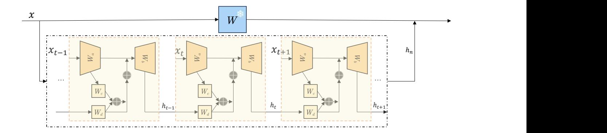
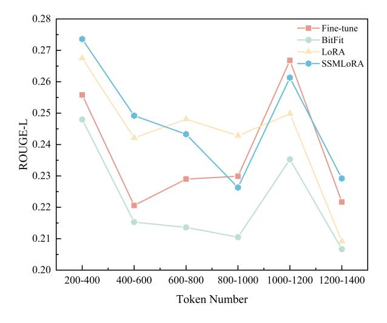

# SSMLoRA: Enhancing Low-Rank Adaptation with State Space Model

Jiayang Yu1 , Yihang Zhang1 , Bin Wang1 , Peiqin Lin2,3 , Yongkang Liu1 , Shi Feng1∗

1Northeastern University, China; 2CIS, LMU Munich, Germany 3Munich Center for Machine Learning (MCML), Germany 20221251@stu.neu.edu.cn,misonsky@163.com fengshi@cse.neu.edu.cn

# Abstract

Fine-tuning is a key approach for adapting language models to specific downstream tasks, but updating all model parameters becomes impractical as model sizes increase. Parameter-Efficient Fine-Tuning (PEFT) methods, such as Low-Rank Adaptation (LoRA), address this challenge by introducing additional adaptation parameters into pre-trained weight matrices. However, LoRA's performance varies across different insertion points within the model, highlighting potential parameter inefficiency due to unnecessary insertions. To this end, we propose SSMLoRA (State Space Model Low-Rank Adaptation), an extension of LoRA that incorporates a State Space Model (SSM) to interconnect low-rank matrices. SSMLoRA ensures that performance is maintained even with sparser insertions. SSMLoRA allows the model to not only map inputs to a low-rank space for better feature extraction but also leverage the computations from the previous low-rank space. Our method achieves comparable performance to LoRA on the General Language Understanding Evaluation (GLUE) benchmark while using only half the parameters. Additionally, due to its structure, SSMLoRA shows promise in handling tasks with longer input sequences.You can find our code here:[https:](https://github.com/yuhkalhic/SSMLoRA) [//github.com/yuhkalhic/SSMLoRA](https://github.com/yuhkalhic/SSMLoRA)

## 1 Introduction

Fine-tuning [\(Park and Lee,](#page-10-0) [2021\)](#page-10-0) is a technique aimed at enhancing model performance by adjusting the parameters of a pretrained model on specific task data. This approach effectively leverages the knowledge accumulated through large-scale training, accelerating the model's adaptation to new tasks and improving results. However, fine-tuning requires substantial computational resources and is prone to overfitting when applied to small datasets. These limitations have prompted researchers to explore more efficient parameter adjustment strategies.

To address resource consumption and overfitting challenges in fine-tuning, researchers have proposed diverse strategies. [Liu et al.](#page-10-1) [\(2024b\)](#page-10-1) introduced an end-to-end hierarchical fine-tuning approach to mitigate memory constraints associated with full-parameter fine-tuning. Concurrently, a significant research trend has emerged focusing on Parameter-Efficient Fine-Tuning (PEFT) [\(Houlsby](#page-9-0) [et al.,](#page-9-0) [2019\)](#page-9-0) techniques, which are a set of methods designed to optimize parameter updates. PEFT updates only a small subset of the model's parameters while keeping the majority of pretrained parameters unchanged. LoRA [\(Hu et al.,](#page-9-1) [2022\)](#page-9-1), one of the most commonly used PEFT techniques, introduces low-rank matrices to adjust specific weights in the pretrained model instead of updating all parameters comprehensively. This allows the model to retain most of its structure while adapting to downstream tasks, particularly for transformer-based deep language models. Following the successful application of LoRA, various extensions have emerged to further enhance its adaptability and efficiency. These methods aim to improve the model's capability to perform well in resource-constrained environments.

Despite its success, LoRA and its variants still face certain challenges. SoRA [\(Ding et al.,](#page-9-2) [2023\)](#page-9-2) has indicated that LoRA may lead to unnecessary parameter overhead. More efficient methods, such as pruning certain low-rank matrices and using smaller scaling factors to reduce parameter usage, were employed. Moreover, compared to full finetuning, parameter-efficient methods tend to have limitations in capturing information, exacerbating the inherent difficulty that transformer-based models face when processing long texts. This leads to the observation that, for many tasks, the number of parameters used by LoRA is excessive, while for tasks involving long-text processing in large

\*Corresponding Author

language models, it is insufficient.

To address this issue, we propose State Space Model Low-Rank Adaptation (SSMLoRA), a novel technique that builds on the state-space equation framework to insert sparse low-rank matrices. We introduce interval layers and apply our technique selectively to the query and value matrices within the attention mechanism, as this design significantly reduces parameter overhead. Additionally, we incorporate a State Space Model to connect lowrank matrices inserted into the same type of neural network layers. State Space Model, which excels at handling long-text tasks, is based on state transitions but differs from traditional RNNs by enabling parallel computation through FFT-based transformations of the state transitions. This enhancement facilitates parallel training in our approach. Experimental results demonstrate that our technique performs well when applied to both linear and convolutional layers. Compared to LoRA, SSMLoRA achieves superior performance across a wide range of tasks while requiring only half of the parameters. Furthermore, it excels in long-text and certain other specific tasks. We believe that this represents a new direction in the exploration of LoRA-derived techniques, adopting a more holistic and macro-level perspective.

## 2 Related Works

## 2.1 PEFT

Parameter-Efficient Fine-Tuning (PEFT) [\(Houlsby](#page-9-0) [et al.,](#page-9-0) [2019\)](#page-9-0) aims to reduce the computational and storage costs associated with fine-tuning large language models (LLMs). By tuning only a small subset of additional parameters while freezing the majority of pretrained model parameters, PEFT effectively mitigates the catastrophic forgetting issue often encountered in full fine-tuning. Moreover, PEFT outperforms traditional fine-tuning methods in low-data environments, demonstrating superior generalization capability. This technique is not limited to natural language processing tasks but extends to computer vision and audio domains, significantly enhancing the model's flexibility and adaptability. LoRA, as one of the most widely adopted PEFT techniques, adjusts specific pretrained model weights by introducing low-rank matrices, rather than updating all parameters, making it well-suited to downstream tasks. LoRA has shown exceptional adaptability and efficiency in large language models, allowing them to swiftly adapt to new tasks

while preserving most of their original structure. The success of LoRA has sparked numerous further studies in the field.

AdaLoRA [\(Zhang et al.,](#page-10-2) [2023\)](#page-10-2), for instance, introduces orthogonal regularization to ensure that the low-rank projection matrices comply with Singular Value Decomposition (SVD), thus avoiding the reliance on incremental updates, albeit at the cost of increased computational complexity. QLoRA [\(Dettmers et al.,](#page-9-3) [2023a\)](#page-9-3) improves computational efficiency and reduces resource consumption through dynamic quantization and advanced strategies, though it may potentially impact model accuracy. DoRA [\(Liu et al.,](#page-9-4) [2024a\)](#page-9-4) decomposes pretrained weights into magnitude and direction components, utilizing LoRA for directional updates, reducing trainable parameters and enhancing fine-tuning performance, though its complexity and dependence on data quality may limit its effectiveness. Vera [\(Kopiczko et al.,](#page-9-5) [2024\)](#page-9-5), on the other hand, reduces parameter overhead by sharing low-rank matrices and learning small-scale vectors, while maintaining performance, though the model's complexity and hyperparameter tuning requirements might hinder overall effectiveness.

#### 2.2 State Space Model

State Space Model (SSM) are mathematical models used to describe dynamic systems, comprising an input sequence x(t), a latent state representation, and an output sequence y(t). The primary objective of an SSM is to predict future states based on the current input and previous states. In recent years, researchers have made significant progress in applying SSMs to neural network architectures. Compared to traditional Recurrent Neural Networks (RNNs), SSM-based models are capable of resolving the issue of sequential processing bottlenecks, thus significantly improving training efficiency. Models based on SSMs, such as HIPPO (Hierarchy of Integrators with Projection and Partial Orthogonalization [\(Gu et al.,](#page-9-6) [2020\)](#page-9-6), have been shown to capture complex temporal dependencies more effectively. S4 (Structured State Space Sequence Model) [\(Gu et al.,](#page-9-7) [2022\)](#page-9-7) leveraged SSM architecture to outperform transformers and other architectures in handling ultra-long sequences. Mamba [\(Gu and Dao,](#page-9-8) [2023\)](#page-9-8), an extension of SSM, introduced a selection mechanism that dynamically adjusts the model based on input, thereby improving adaptability. However, despite these advantages, the generalization capabilities of SSMs across various domains remain to be fully validated. To address this, we propose incorporating SSM into fine-tuning methodologies. By improving the existing LoRA (Low-Rank Adaptation) technique, we aim to enhance fine-tuning performance on specific tasks while preserving the Transformer architecture. This leads to our proposed method, SSMLoRA, which combines modified SSM equations with LoRA. Compared to traditional LoRA and its variants, SSMLoRA strengthens the connections between inserted low-rank matrices, improving data matching capabilities and achieving comparable or superior performance across most datasets.

#### 2.3 Sparsification Methods

Sparsification methods aim to reduce computational complexity and memory requirements by decreasing the number of model parameters while maintaining performance as much as possible. These techniques include weight pruning, structured sparsity, dynamic sparse training, and sparse regularization. [Wen et al.](#page-10-3) [\(2016\)](#page-10-3) proposed Structured Sparsity Learning (SSL), a technique capable of learning efficient and compact structures from large deep neural networks, significantly enhancing model speed and performance. [Anwar et al.](#page-9-9) [\(2015\)](#page-9-9) optimized convolutional neural networks through structured pruning, effectively reducing overall memory demand. [Xie et al.](#page-10-4) [\(2018\)](#page-10-4) proposed IGCV2, which applied interleaved structured sparsity to convolutional layers. These studies demonstrate the effectiveness and generalizability of employing sparser structures. In our work, we aim to improve the parameter utilization of lowrank matrices while significantly reducing memory requirements and improving computational efficiency without sacrificing performance. This provides vital support for subsequent model optimization and deployment.

## 3 SSMLoRA

#### 3.1 Time Module

In the original LoRA technique, the core concept involves introducing two new projection matrices, Wa and Wb. Let W0 represent the weight matrix of the pre-trained model at a given layer, and let the input vector x have a dimensionality of d. After scaling, the input vector, denoted as xnew, is mapped to a lower-dimensional space with a rank

r. The projection matrices Wa and Wb, with dimensions d × r and r × d respectively, project x to a lower dimension and then back to its original dimension, ensuring that the output dimensionality matches the input. Throughout this process, the parameters of the pre-trained model remain frozen. As a result, compared to training the original W0, the adaptation to downstream tasks is achieved by training only the small matrices Wa and Wb, significantly reducing computational costs. The model is able to fit downstream tasks within the low-rank space. Therefore, after introducing these two matrices, the model's output can be expressed as:

$$y = x \times W_0 + x \times W_a \times W_b \tag{1}$$

In our method, we introduce a new module called the Time Module, represented by each orange square in the dashed box in Figure 1. Each Time Module contains the two projection matrices Wa and Wb from the original LoRA technique, as well as two additional r × r matrices, Wc and Wd, whose functions will be described later. In each Time Module, we receive the input x along with the time state ht−1 calculated by the previous module. The Time Module computes the output to adjust the behavior of the pre-trained model and updates the state to ht , which is then passed to the next Time Module. Our modules can be inserted into various neural network layers, such as linear layers, convolutional layers, and multi-head attention mechanisms, and operate independently of the pre-trained model.

#### 3.2 TimeAxis Update

In SSMLoRA, the core innovation, similar to LoRA, lies in the integration of the Time Module with specific pre-trained layers. Before discussing how the Time Module propagates forward, it is essential to understand how it retrieves the state computed by the previous Time Module and updates it. In the context of State Space Model, the matrix Wc within the Time Module is commonly referred to as the state matrix, while Wd is known as the control matrix. These matrices are used to combine the previous state and update the current state in the time cycle, which is particularly effective for extracting information from long sequences. Building on this concept, we follow the principles of the S4 model, utilizing these two matrices to update the state from the previous time step ht−1 to the current state ht , and propagate it forward. Specifically, the process is as follows:

Figure 1: This image illustrates how our technique is applied to the original pre-trained model. In the lower part of the image, the dashed box contains three orange blocks, each representing a Time module. W refers to a layer from the original pre-trained matrix, which could be a linear layer, convolutional layer, or query, key, and value matrices from the self-attention mechanism. When SSMLoRA fine-tuning is applied to a specific type of neural network layer, these layers are connected along a time axis. Each layer is assigned a position on this axis and linked to a corresponding Time module that adjusts its output. Here, t denotes the position in the time axis, and n represents the maximum sequence length.

First, we compute the derivative of ht−1 at the current position using the following formula, which is based on the classical State Space Model (SSM) equations, producing the derivative of the current state:

$$h_t' = h_t \times W_c + x_{\text{new}} \times W_d \tag{2}$$

This equation corresponds to the first addition operation in the Time Module structure shown in Figure 1. Next, unlike the S4 or SSM methods, we use a Taylor expansion to calculate the increment for the next time step, which corresponds to the second addition operation in Figure 1:

$$h_{t+1} = h_t' + h_t \tag{3}$$

Thus, the complete computation process can be expressed as follows:

$$h_{t+1} = h_t \times W_c + x_{\text{new}} \times W_d + h_t \qquad (4)$$

It is important to note that for the Time Module at the beginning of the time axis, ht−1 is initialized to a zero vector of the same dimensionality as xnew. This initialization helps maintain numerical stability and ensures that the model is not adversely affected during the early stages of training.

Using this method, we compute the current time state ht based on the previous state ht−1. Our approach, which approximates the current time value using a Taylor expansion at time step t, is motivated by several considerations. First, we can discretize the state directly, transforming the continuous function into a discrete representation corresponding to the spatial position of the Time Module. This

avoids the need for discretizing Wc and Wd, as done in S4, thus reducing computational overhead. Discretization ensures that the model retains both precision and stability when processing sequential data, and by appropriately controlling the time steps, the model's adaptability to long sequences is enhanced. Moreover, compared to the original SSM or S4 models, we reduce parameter usage by directly utilizing the current time value ht+1 to adjust the output of the pre-trained model. Furthermore, leveraging the S4 model, we can apply FFT-based matrix transformations, enabling our method to overcome the parallelization limitations typically encountered in RNNs.

In our method, Wc and Wd are new parameters that participate in training, while ht is detached from the computational graph and does not participate in training. Therefore, the state update is controlled solely by Wc, Wd, and the input x.

## 3.3 Tuned Model Forward

As discussed earlier, our proposed SSMLoRA technique introduces a state transition mechanism based on the State Space Model (SSM) architecture, specifically by adding two matrices. The detailed architecture is shown in Figure 1, where we illustrate the structure of the Time Module, which forms a timeline based on the SSM model, represented by the dashed section on the right side of the figure. At each Time Module, the current state ht is retrieved, followed by the computation of the output y and the next state ht+1. This mechanism is introduced into the pre-trained model to dynamically adjust

the feature representation of the input x, enhancing the model's performance on tasks that are highly dependent on temporal information.

First, we clarify the origin of the variable xnew, used throughout the previous sections, which is obtained by projecting the input x into a low-rank matrix:

$$x_{\text{new}} = x \times W_a \tag{5}$$

The dimensionality of the projected low-rank matrix xnew becomes r, which matches the dimensionality of the current state value ht+1 calculated through the process described in Section 3.2, allowing direct computation. However, for numerical stability, we normalize ht+1 before performing further calculations, as outlined in the following equations:

$$\min_{\text{val}} = \min(h_{t+1}) \tag{6}$$

$$\max_{\text{val}} = \max(h_{t+1}) \tag{7}$$

$$h_{t+1}^{\text{norm}} = \frac{h_{t+1} - \min_{\text{val}}}{\max_{\text{val}} - \min_{\text{val}} + \epsilon}$$
(8)

Next, before restoring x to its original dimensionality, we adjust x using the normalized ht+1. Therefore, the output of the Time Module is given by:

$$y = x_{\text{new}} + h_{t+1}^{\text{norm}} \times W_b \tag{9}$$

In summary, the output of the original pretrained weight matrix can be expanded as follows, with our technique introducing additional adjustments using fewer parameters and operations than LoRA:

$$y = x \times W_0 + (x \times W_a + h_{t+1}^{\text{norm}}) \times W_b \quad (10)$$

Since each Time Module is influenced by the preceding Time Module along the timeline, we design the Time Modules to be placed on different timelines depending on the type of neural network layer they are inserted into, preventing mutual interference. For instance, in the self-attention module of the model, if a timeline is set, separate timelines will be established for the query, key, and value matrices to prevent temporal misalignment. Therefore, the example shown in Figure 1 demonstrates the insertion into a single neural network layer, rather than a complete example across the entire model.

#### 3.4 Sparse Insertion

As emphasized earlier, our method applies a sparsification approach to the attention mechanism. Research on LoRA has shown that, for large language models based on the transformer architecture, the best results are achieved when both the query and value matrices are adjusted simultaneously. Therefore, in this section, we adopt a more efficient strategy by applying the Time module only to the query and value matrices in the attention mechanism.

We further found that sparsifying the full structure does not lead to any loss of accuracy. Specifically, in each encoder's attention module, SSM-LoRA operates on only one of the query or value matrices at a time, meaning one matrix is "activated" for adjustment. We recommend alternating sparse insertions in a regular pattern, which is extremely easy to implement. As illustrated in Figure 1, if W represents the query matrix of the l-th layer's attention mechanism, the query matrices in layers l + 1 and l − 1 are excluded from the time axis, while the value matrix follows a separate time axis.

For other non-multihead attention components, our method essentially replaces LoRA with SSM-LoRA, maintaining a compact parameter configuration. This approach, as demonstrated in Section 4.1, outperforms other fine-tuning methods, achieving better results with less than 80% of the parameters used by LoRA.

#### 3.5 Initialization Strategy

In the SSMLoRA model, we introduce four key matrices Wa, Wb, Wc, and Wd to achieve state transitions and feature mapping. To ensure stability and effectiveness during the initialization phase, we adopt a differentiated initialization strategy. Furthermore, although the time vector ht primarily serves as a transmitted quantity rather than an independently trained parameter, its initialization method still warrants in-depth exploration.

Specifically, for matrices Wa and Wb, we draw inspiration from the initialization method of the LoRA fine-tuning technique. The initialization of Wa employs scaled Gaussian-distributed random values, effectively introducing moderate randomness to avoid the potential slow convergence problem associated with zero initialization. In contrast, Wb is initialized as a zero matrix to ensure that the overall output remains unaffected in the initial stage while allowing the model to gradually learn

effective mapping relationships during the training process.

For matrices Wc, Wd, and the time vector ht , we uniformly adopt a zero initialization strategy. As shown in Equation (8), we primarily optimize the output of the LoRA technique by adjusting the bias term. This approach aims to minimize the introduction of additional noise in the early stages of training, subsequently learning the weight distribution of temporal states progressively. Consequently, SSMLoRA can be viewed as a sparsified variant of LoRA in the initial training phase, which may result in slightly lower initial performance compared to standard LoRA. However, as training progresses, the model can learn the intrinsic connections between low-rank matrices across different layers, thereby achieving steady performance improvements and ultimately surpassing traditional LoRA techniques.

In the experiments presented in Section 4, we demonstrate that SSMLoRA outperforms LoRA in tasks involving high-density short text matching, question answering, and long-text sequence processing. These results provide compelling evidence for the effectiveness of our proposed initialization strategy and fine-tuning technique.

## 4 Experiments

### 4.1 Datasets

We comprehensively evaluate our methodology on two widely-adopted benchmarks: GLUE and SuperGLUE. The GLUE benchmark encompasses diverse tasks, including linguistic acceptability (CoLA; [\(Warstadt et al.,](#page-10-5) [2018\)](#page-10-5)), sentiment analysis (SST-2; [\(Socher et al.,](#page-10-6) [2013\)](#page-10-6)), paraphrase detection (MRPC; [\(Dolan and Brockett,](#page-9-10) [2005\)](#page-9-10)), semantic textual similarity (STS-B; [\(Cer et al.,](#page-9-11) [2017\)](#page-9-11)), question pair equivalence (QQP), natural language inference (MNLI; [\(Williams et al.,](#page-10-7) [2018\)](#page-10-7), QNLI), and textual entailment (RTE; [\(Dagan et al.,](#page-9-12) [2005\)](#page-9-12)). The SuperGLUE benchmark comprises advanced language understanding tasks: commonsense inference (CB; [\(De Marneffe et al.,](#page-9-13) [2019\)](#page-9-13), COPA; [\(Roemmele et al.,](#page-10-8) [2011\)](#page-10-8)), multi-sentence reading comprehension (MultiRC; [\(Khashabi et al.,](#page-9-14) [2018\)](#page-9-14)), textual entailment (RTE; [\(Dagan et al.,](#page-9-12) [2005\)](#page-9-12)), word sense disambiguation (WiC; [\(Pilehvar and](#page-10-9) [Camacho-Collados,](#page-10-9) [2019\)](#page-10-9)), coreference resolution (WSC; ()), boolean question answering (BoolQ; [\(Clark et al.,](#page-9-15) [2019\)](#page-9-15)), and reading comprehension (ReCoRD; [\(Zhang et al.,](#page-10-10) [2018\)](#page-10-10)). Additionally,

to evaluate our method's efficacy on long-form text processing, generation capabilities, and needlein-a-haystack scenarios, we conduct experiments on SQuAD [\(Rajpurkar et al.,](#page-10-11) [2016\)](#page-10-11), NarrativeQA [\(Kociský et al.](#page-9-16) ˇ , [2017\)](#page-9-16), and RACE [\(Lai et al.,](#page-9-17) [2017\)](#page-9-17).

#### 4.2 Evaluation Metrics

We rigorously adhere to the evaluation protocols established in the original papers for each dataset. For GLUE and SuperGLUE benchmarks, we primarily employ accuracy as the standard metric. For question-answering performance on SQuAD, we utilize both F1 and Exact Match (EM) scores. The evaluation of long-form text generation in NarrativeQA follows the ROUGE-L metric, while classification performance on RACE is measured using accuracy. These metrics were selected to ensure comprehensive assessment of model capabilities across different linguistic tasks and data characteristics.

#### 4.3 Baselines

We selected various models with diverse parameter sizes to comprehensively evaluate the effectiveness of our method, including DeBERTaV3 base[\(He et al.,](#page-9-18) [2021\)](#page-9-18), RoBERTa-base, RoBERTalarge[\(Liu et al.,](#page-9-19) [2019\)](#page-9-19), GPT-2[\(Radford et al.,](#page-10-12) [2019\)](#page-10-12), and LLaMA2-7B, LLaMA2-13B[\(Touvron et al.,](#page-10-13) [2023\)](#page-10-13). These models effectively demonstrated that our method performs well across models of different scales. We selected several baseline finetuning techniques to compare with our method, including Fine-tuning[\(Park and Lee,](#page-10-0) [2021\)](#page-10-0), Bitfit[\(Zaken et al.,](#page-10-14) [2022\)](#page-10-14), LoRA[\(Hu et al.,](#page-9-1) [2022\)](#page-9-1), as well as other improved strategies of LoRA technology such as QLoRA[\(Dettmers et al.,](#page-9-20) [2023b\)](#page-9-20) and MixLoRA[\(Li et al.,](#page-9-21) [2024\)](#page-9-21).

## 4.4 Results

We first conducted a comparative analysis on the RoBERTa-base model using various parameterefficient fine-tuning approaches: full parameter fine-tuning, BitFit, LoRA, QLoRA, MixLoRA, and our proposed method. The performance comparison across the GLUE benchmark is presented in Table [1.](#page-6-0)

For all LoRA variants, including our method SSMLoRA, we set the rank r = 8 and applied rank decomposition to multiple components including self-attention mechanisms, feed-forward layers, and classifiers. In our approach, we specifically implemented interval-sparse insertion for Q

| Method             |        | CoLA  | SST-2 | MRPC        | STS-B    | QQP         | MNLI-m | MNLI-mm | QNLI  | RTE   |
|--------------------|--------|-------|-------|-------------|----------|-------------|--------|---------|-------|-------|
| (Trainable params) |        | MCC   | Acc   | F1/Acc      | P/S Corr | F1/Acc      | Acc    | Acc     | Acc   | Acc   |
| Fine-tune          | (124M) | 63.24 | 94.61 | 89.73/85.74 | 91.00    | 88.46/91.35 | 86.27  | 86.31   | 90.13 | 76.53 |
| BitFit             | (102K) | 60.27 | 93.46 | 89.05/85.22 | 90.91    | 85.61/88.95 | 83.98  | 84.38   | 91.34 | 83.39 |
| LoRA               | (1.3M) | 61.64 | 94.50 | 89.54/86.03 | 90.37    | 86.95/90.24 | 84.94  | 85.50   | 90.76 | 72.20 |
| MixLoRA            | (5.7M) | 60.12 | 94.04 | 88.56/85.39 | 89.40    | 87.44/90.55 | 86.29  | 85.74   | 91.29 | 79.42 |
| QLoRA              | (1.3M) | 58.33 | 93.81 | 87.80/83.65 | 89.93    | 85.12/88.81 | 85.26  | 85.10   | 91.84 | 83.03 |
| SSMLoRA            | (1.0M) | 61.76 | 94.15 | 91.99/88.73 | 90.46    | 87.14/90.52 | 85.73  | 85.16   | 91.91 | 76.17 |

Table 1: Performance comparison of four methods based on the RoBERTa-base model across GLUE benchmark

and V modules in the self-attention mechanism while maintaining dense insertion for other layers. Notably, SSMLoRA introduces fewer trainable parameters—less than 80% of those introduced by LoRA—making it the most parameter-efficient among all LoRA variants we used for comparison.

Our method demonstrates robust performance across multiple datasets, achieving state-of-the-art results on MRPC and QNLI tasks, and surpassing LoRA's performance on more than half of the evaluated datasets. These results indicate that SSM-LoRA exhibits particularly strong performance in NLP tasks, with notable effectiveness in sentencepair tasks, as further validated in subsequent experiments. However, we observe certain limitations in cross-domain generalization capabilities.

To further validate SSMLoRA's effectiveness on larger-scale models, we conducted experiments on LLaMA2-7B and compared SSMLoRA with LoRA, as shown in Table [2.](#page-7-0) The results demonstrate SSMLoRA's significant advantages with fewer trainable parameters. We extended our evaluation to include LoRA on LLaMA2-13B, where SSMLoRA continued to show exceptional performance.

Based on these comprehensive evaluations, we conclude that SSMLoRA serves as an effective parameter-efficient alternative to traditional LoRA fine-tuning. Drawing inspiration from statespace models, our innovative approach incorporating state-space equations demonstrates particular strengths in specific datasets. We anticipate that these advantages will manifest in superior performance across various task domains.

#### 4.5 Discussion on Long-Context Capabilities

Given the architectural characteristics of State Space Models (SSMs), we aim to investigate our technique's potential in logical reasoning capabilities and long-text processing. To comprehensively explore the advantages of our method, we conduct additional evaluations on multiple datasets, demon-

Figure 2: This figure shows the results of the DeBERTaV3-base model fine-tuned with four different techniques on the NarrativeQA dataset, evaluated on test data across various length intervals.

strating consistent improvements across different benchmarks.

We evaluate on three datasets: SQuAD, NarrativeQA, and RACE. The SQuAD dataset requires answering questions based on Wikipedia articles, testing the model's ability to extract answers from substantial text passages, with evaluation metrics of F1 and Exact Match (EM). NarrativeQA assesses comprehension of long-form narrative structures beyond simple content matching, using ROUGE-L as its metric. The RACE dataset represents a "needle-in-a-haystack" task demanding identification of critical information within lengthy contexts.

As shown in Table [3,](#page-7-1) we compare four finetuning methods on DeBERTaV3-base for SQuAD and NarrativeQA. For the RACE benchmark evaluated on RoBERTa-base, results are presented in Table [4.](#page-7-2) Our analysis reveals that SSMLoRA achieves competitive performance on short-text matching tasks in SQuAD, demonstrating superior exact answer alignment crucial for scenarios requiring precise responses. On long-text datasets, SSM-LoRA maintains strong performance, particularly

| Method              | RTE  | BoolQ | WSC  | WiC  | MultiRC | COPA |
|---------------------|------|-------|------|------|---------|------|
| (Trainable params)  | Acc  | Acc   | Acc  | Acc  | F1      | Acc  |
| SSMLoRA (15.8M,7B)) | 88.5 | 85.4  | 63.5 | 75.9 | 88.2    | 91.0 |
| LoRA (20.0M,7B))    | 85.9 | 85.2  | 64.4 | 65.5 | 84.8    | 87.0 |
| LoRA (31.3M,13B))   | 89.9 | 87.1  | 63.5 | 69.9 | 87.1    | 92.0 |

Table 2: Performance comparison of SSMLoRA and LoRA across various NLP tasks

|           |             | DeBERTaV3-base |
|-----------|-------------|----------------|
| Method    | SQuAD       | NarrativeQA    |
| Fine-tune | 85.08/69.23 | 23.05          |
| BitFit    | 55.58/39.28 | 21.29          |
| LoRA      | 84.63/69.27 | 24.41          |
| SSMLoRA   | 84.54/69.37 | 24.10          |

Table 3: Performance comparison of methods on DeBERTaV3-base for SQuAD and NarrativeQA datasets

| Method  | All  | Middle | High  |
|---------|------|--------|-------|
| SSMLoRA | 70.1 | 71.0   | 67.37 |
| LoRA    | 68.5 | 72.0   | 65.64 |

Table 4: Performance comparison of methods on RoBERTa-base for RACE dataset

excelling in the more challenging high-difficulty subset of RACE (67.37 vs. LoRA's 65.64) while showing comprehensive improvements across all difficulty levels. This suggests that the state space architecture effectively enhances logical reasoning capabilities without compromising long-text processing efficiency.

To further investigate length-dependent performance, we analyze NarrativeQA results across different text length intervals (Figure 2). The test set is partitioned into six 200-token bins based on preprocessed sequence lengths. Our method achieves state-of-the-art ROUGE-L scores in shorter contexts while demonstrating marked improvements over baseline LoRA (2.1% relative gain) in sequences exceeding 1000 tokens, highlighting SSM-LoRA's enhanced capacity for long-text comprehension.

#### 4.6 Discussion on Sparsity

In this section, we explore a comparative analysis between SSMLoRA and LoRA under sparse insertion conditions, focusing specifically on their implementation within attention mechanisms—our core design component. This focused comparison allows us to examine performance differences between SSMLoRA and LoRA fine-tuning techniques when parameter disparities are amplified. Given that our introduced matrices are influenced by the scaling factor r, we conducted experiments across five different values: r = 1, 2, 4, 8, and 16.

For our initial investigation, we selected two architectures: RoBERTa-large and GPT-2, which employ linear layers and convolutional layers in their attention modules, respectively. This selection enables us to validate SSMLoRA's effectiveness across both architectural paradigms. Our preliminary experiments on the GLUE benchmark, as shown in Tables [6](#page-12-0) and [7,](#page-12-1) demonstrate that SSMLoRA achieves comparable or superior performance across most tasks while utilizing only half the parameters of traditional approaches.In these experiments, SSMLoRA employs sparse insertion into the pre-trained models. For RoBERTa-large, inspired by LoRA research findings, we applied SSMLoRA exclusively to the query and value matrices within the self-attention mechanism, as concurrent modification of these matrices has been proven to yield optimal training outcomes. Regarding sparse insertion strategies, we prioritized simplicity and implementability. For RoBERTa-large, we implemented an alternating interval insertion pattern, while for GPT-2, where self-attention is encapsulated within a single convolutional layer, we modified the complete output using a skip-one interval insertion strategy. Experimental results validate the effectiveness of these design choices across multiple tasks.

To further evaluate our approach, we extended our experiments to the more challenging Super-GLUE benchmark, which presents a significant test for SSMLoRA given its reduced parameter count compared to LoRA. Maintaining consistent design strategies, we demonstrated sustained performance advantages, with detailed results presented in Table [8.](#page-12-2)

These comprehensive experiments lead to a significant conclusion: SSMLoRA, while utilizing approximately half the parameters of LoRA, achieves comparable performance across most datasets and exhibits exceptional performance on several specific tasks.

#### 4.7 Memory Efficiency

While our approach achieves reduced memory requirements through its parameterization advantages, it exhibits RNN-like recurrent structures when not utilizing FFT-based optimizations. Therefore, it is crucial to thoroughly investigate the computational costs associated with our method. We present a comprehensive analysis of potential memory usage and latency during inference, parameter efficiency across pre-trained models of varying scales and training time requirements.

Our initial comparative experiments were conducted on the LLaMA2-7B model, implementing both SSMLoRA and LoRA methodologies. With a maximum sequence length of 1024 tokens, SSM-LoRA consumed 31.28GB of GPU memory compared to LoRA's 31.43GB at a batch size of 4. When scaling to a batch size of 8, the memory utilization increased to 37.77GB and 38.05GB, respectively. Furthermore, we examined the memory scaling patterns of both approaches with increasing sequence lengths at a batch size of 1, as detailed in Table [12.](#page-13-0) The experimental results demonstrate that SSMLoRA's memory advantages become increasingly pronounced as batch sizes grow. Notably, SSMLoRA exhibits superior memory efficiency across both short and long sequence scenarios. Regarding computational efficiency, our experimental results (see Table [12\)](#page-13-0) indicate that our proposed method introduces no significant inference latency overhead compared to LoRA when evaluated on the LLaMA2-7B model.

#### 4.8 Parameter Efficiency

As previously discussed, SSMLoRA achieves parameter efficiency by incorporating sparse, rankdecomposed matrices connected through statespace models at attention mechanism positions. This approach demonstrates superior parameter reduction compared to traditional LoRA fine-tuning techniques. As illustrated in Table [9,](#page-13-1) the parameter reduction benefits scale proportionally with the size of the pre-trained model.

#### 4.9 Wallclock Time Efficiency

We conducted a comprehensive analysis of convergence times and average epoch duration across Fine-tune, BitFit, LoRA, and SSMLoRA methods, employing early stopping criteria. As demonstrated in Tables [10](#page-13-2) and [11,](#page-13-3) SSMLoRA exhibits longer total training duration and per-epoch time on smaller

datasets such as CoLA, MRPC, and QNLI. However, with increasing dataset sizes, our method demonstrates significant improvements in both total training time and per-epoch duration compared to baseline Fine-tune and BitFit approaches. In comparison with LoRA, SSMLoRA requires longer training times on five datasets and increased per-epoch duration on four datasets. When considered alongside the performance metrics in Table [1,](#page-6-0) these findings suggest that SSMLoRA adopts a more gradual approach to feature learning, potentially requiring additional training epochs while ultimately achieving superior convergence results.

## 5 Conclusion

In this work, we propose a novel approach for parameter-efficient fine-tuning of large pre-trained language models, termed State Space Model Low-Rank Adaptation (SSMLoRA). While the insertion of low-rank matrices has been a common strategy, it often leads to unnecessary parameter overhead, particularly when applied uniformly across all neural network layers. To address this, we introduce an improved state space equation that strategically connects sparsely inserted low-rank matrices, significantly reducing the number of parameters while enhancing parameter efficiency. Our method is simple yet effective, and given the demonstrated potential of State Space Model, it offers a holistic improvement to LoRA techniques. Furthermore, our approach can be seamlessly integrated with existing optimization strategies, further expanding its applicability in large-scale model fine-tuning.

## Limitations

Despite the promising results achieved by SSM-LoRA, our research still has some limitations. The core of SSMLoRA lies in adjusting the input mapped to a lower-dimensional space, which allows the input to better adapt to various downstream tasks. However, this also means that the state ht must match the dimensionality of the input mapped to the low-rank space. For instance, when the batch sizes used in training and testing differ, although ht can be adjusted to accommodate the new dimensions, this inevitably results in a performance drop. Therefore, further research is needed to develop better solutions to mitigate performance degradation caused by dimensionality mismatches.

## Acknowledgments

This work is supported by the National Natural Science Foundation of China (No. 62272092, No. 62172086), the Fundamental Research Funds for the Central Universities of China (No. N2116008) and the 18th Batch (2024) College Students' Innovative Entrepreneurial Training Plan Program of Northeastern University (No. 241264).

## References

- Sajid Anwar, Kyuyeon Hwang, and Wonyong Sung. 2015. [Structured pruning of deep convolutional neu](http://arxiv.org/abs/1512.08571)[ral networks.](http://arxiv.org/abs/1512.08571)
- Daniel Cer, Mona Diab, Eneko Agirre, Iñigo Lopez-Gazpio, and Lucia Specia. 2017. [SemEval-2017](https://doi.org/10.18653/v1/S17-2001) [task 1: Semantic textual similarity multilingual and](https://doi.org/10.18653/v1/S17-2001) [crosslingual focused evaluation.](https://doi.org/10.18653/v1/S17-2001) In *Proceedings of the 11th International Workshop on Semantic Evaluation (SemEval-2017)*, pages 1–14, Vancouver, Canada. Association for Computational Linguistics.
- Christopher Clark, Kenton Lee, Ming-Wei Chang, Tom Kwiatkowski, Michael Collins, and Kristina Toutanova. 2019. [Boolq: Exploring the surprising](http://arxiv.org/abs/1905.10044) [difficulty of natural yes/no questions.](http://arxiv.org/abs/1905.10044)
- Ido Dagan, Oren Glickman, and Bernardo Magnini. 2005. The pascal recognising textual entailment challenge. In *Machine learning challenges workshop*, pages 177–190. Springer.
- Marie-Catherine De Marneffe, Mandy Simons, and Judith Tonhauser. 2019. The commitmentbank: Investigating projection in naturally occurring discourse. In *proceedings of Sinn und Bedeutung*, volume 23, pages 107–124.
- Tim Dettmers, Artidoro Pagnoni, Ari Holtzman, and Luke Zettlemoyer. 2023a. [Qlora: Efficient finetuning](http://arxiv.org/abs/2305.14314) [of quantized llms.](http://arxiv.org/abs/2305.14314)
- Tim Dettmers, Artidoro Pagnoni, Ari Holtzman, and Luke Zettlemoyer. 2023b. Qlora: Efficient finetuning of quantized llms. *arXiv preprint arXiv:2305.14314*.
- Ning Ding, Xingtai Lv, Qiaosen Wang, Yulin Chen, Bowen Zhou, Zhiyuan Liu, and Maosong Sun. 2023. Sparse low-rank adaptation of pre-trained language models. *arXiv preprint arXiv:2311.11696*.
- William B. Dolan and Chris Brockett. 2005. [Automati](https://aclanthology.org/I05-5002)[cally constructing a corpus of sentential paraphrases.](https://aclanthology.org/I05-5002) In *Proceedings of the Third International Workshop on Paraphrasing (IWP2005)*.
- Albert Gu and Tri Dao. 2023. Mamba: Linear-time sequence modeling with selective state spaces. *arXiv preprint arXiv:2312.00752*.

- Albert Gu, Tri Dao, Stefano Ermon, Atri Rudra, and Christopher Ré. 2020. Hippo: Recurrent memory with optimal polynomial projections. *arXiv preprint arXiv:2008.07669*.
- Albert Gu, Karan Goel, and Christopher Ré. 2022. Efficiently modeling long sequences with structured state spaces. In *The International Conference on Learning Representations (ICLR)*.
- Pengcheng He, Xiaodong Liu, Jianfeng Gao, and Weizhu Chen. 2021. [Deberta: Decoding-enhanced](http://arxiv.org/abs/2006.03654) [bert with disentangled attention.](http://arxiv.org/abs/2006.03654)
- Neil Houlsby, Andrei Giurgiu, Stanislaw Jastrzebski, Bruna Morrone, Quentin de Laroussilhe, Andrea Gesmundo, Mona Attariyan, and Sylvain Gelly. 2019. [Parameter-efficient transfer learning for nlp.](http://arxiv.org/abs/1902.00751)
- Edward J Hu, Yelong Shen, Phillip Wallis, Zeyuan Allen-Zhu, Yuanzhi Li, Shean Wang, Lu Wang, and Weizhu Chen. 2022. [LoRA: Low-rank adaptation of](https://openreview.net/forum?id=nZeVKeeFYf9) [large language models.](https://openreview.net/forum?id=nZeVKeeFYf9) In *International Conference on Learning Representations*.
- Daniel Khashabi, Snigdha Chaturvedi, Michael Roth, Shyam Upadhyay, and Dan Roth. 2018. Looking beyond the surface:a challenge set for reading comprehension over multiple sentences. In *Proceedings of North American Chapter of the Association for Computational Linguistics (NAACL)*.
- Dawid J. Kopiczko, Tijmen Blankevoort, and Yuki M. Asano. 2024. [Vera: Vector-based random matrix](http://arxiv.org/abs/2310.11454) [adaptation.](http://arxiv.org/abs/2310.11454)
- Tomáš Kociský, Jonathan Schwarz, Phil Blunsom, Chris ˇ Dyer, Karl Moritz Hermann, Gábor Melis, and Edward Grefenstette. 2017. [The narrativeqa reading](http://arxiv.org/abs/1712.07040) [comprehension challenge.](http://arxiv.org/abs/1712.07040)
- Guokun Lai, Qizhe Xie, Hanxiao Liu, Yiming Yang, and Eduard Hovy. 2017. [RACE: Large-scale ReAd](https://doi.org/10.18653/v1/D17-1082)[ing comprehension dataset from examinations.](https://doi.org/10.18653/v1/D17-1082) In *Proceedings of the 2017 Conference on Empirical Methods in Natural Language Processing*, pages 785– 794, Copenhagen, Denmark. Association for Computational Linguistics.
- Dengchun Li, Yingzi Ma, Naizheng Wang, Zhengmao Ye, Zhiyuan Cheng, Yinghao Tang, Yan Zhang, Lei Duan, Jie Zuo, Cal Yang, and Mingjie Tang. 2024. [Mixlora: Enhancing large language models fine](http://arxiv.org/abs/2404.15159)[tuning with lora-based mixture of experts.](http://arxiv.org/abs/2404.15159)
- Shih-Yang Liu, Chien-Yi Wang, Hongxu Yin, Pavlo Molchanov, Yu-Chiang Frank Wang, Kwang-Ting Cheng, and Min-Hung Chen. 2024a. Dora: Weightdecomposed low-rank adaptation. *arXiv preprint arXiv:2402.09353*.
- Yinhan Liu, Myle Ott, Naman Goyal, Jingfei Du, Mandar Joshi, Danqi Chen, Omer Levy, Mike Lewis, Luke Zettlemoyer, and Veselin Stoyanov. 2019. [Roberta: A robustly optimized bert pretraining ap](http://arxiv.org/abs/1907.11692)[proach.](http://arxiv.org/abs/1907.11692)

- Yongkang Liu, Yiqun Zhang, Qian Li, Tong Liu, Shi Feng, Daling Wang, Yifei Zhang, and Hinrich Schütze. 2024b. [Hift: A hierarchical full parameter](http://arxiv.org/abs/2401.15207) [fine-tuning strategy.](http://arxiv.org/abs/2401.15207)
- Seongmin Park and Jihwa Lee. 2021. [Finetuning pre](https://doi.org/10.18653/v1/2021.insights-1.5)[trained transformers into variational autoencoders.](https://doi.org/10.18653/v1/2021.insights-1.5) In *Proceedings of the Second Workshop on Insights from Negative Results in NLP*, pages 29–35, Online and Punta Cana, Dominican Republic. Association for Computational Linguistics.
- Mohammad Taher Pilehvar and Jose Camacho-Collados. 2019. [Wic: the word-in-context dataset for evaluat](http://arxiv.org/abs/1808.09121)[ing context-sensitive meaning representations.](http://arxiv.org/abs/1808.09121)
- Alec Radford, Jeff Wu, Rewon Child, David Luan, Dario Amodei, and Ilya Sutskever. 2019. Language models are unsupervised multitask learners.
- Pranav Rajpurkar, Jian Zhang, Konstantin Lopyrev, and Percy Liang. 2016. [SQuAD: 100,000+ questions for](https://doi.org/10.18653/v1/D16-1264) [machine comprehension of text.](https://doi.org/10.18653/v1/D16-1264) In *Proceedings of the 2016 Conference on Empirical Methods in Natural Language Processing*, pages 2383–2392, Austin, Texas. Association for Computational Linguistics.
- Melissa Roemmele, Cosmin Adrian Bejan, and Andrew S Gordon. 2011. Choice of plausible alternatives: An evaluation of commonsense causal reasoning. In *2011 AAAI spring symposium series*.
- Richard Socher, Alex Perelygin, Jean Wu, Jason Chuang, Christopher D Manning, Andrew Y Ng, and Christopher Potts. 2013. Recursive deep models for semantic compositionality over a sentiment treebank. In *Proceedings of the 2013 conference on empirical methods in natural language processing*, pages 1631–1642.
- Hugo Touvron, Louis Martin, Kevin Stone, Peter Albert, Amjad Almahairi, Yasmine Babaei, Nikolay Bashlykov, Soumya Batra, Prajjwal Bhargava, Shruti Bhosale, Dan Bikel, Lukas Blecher, Cristian Canton Ferrer, Moya Chen, Guillem Cucurull, David Esiobu, Jude Fernandes, Jeremy Fu, Wenyin Fu, Brian Fuller, Cynthia Gao, Vedanuj Goswami, Naman Goyal, Anthony Hartshorn, Saghar Hosseini, Rui Hou, Hakan Inan, Marcin Kardas, Viktor Kerkez, Madian Khabsa, Isabel Kloumann, Artem Korenev, Punit Singh Koura, Marie-Anne Lachaux, Thibaut Lavril, Jenya Lee, Diana Liskovich, Yinghai Lu, Yuning Mao, Xavier Martinet, Todor Mihaylov, Pushkar Mishra, Igor Molybog, Yixin Nie, Andrew Poulton, Jeremy Reizenstein, Rashi Rungta, Kalyan Saladi, Alan Schelten, Ruan Silva, Eric Michael Smith, Ranjan Subramanian, Xiaoqing Ellen Tan, Binh Tang, Ross Taylor, Adina Williams, Jian Xiang Kuan, Puxin Xu, Zheng Yan, Iliyan Zarov, Yuchen Zhang, Angela Fan, Melanie Kambadur, Sharan Narang, Aurelien Rodriguez, Robert Stojnic, Sergey Edunov, and Thomas Scialom. 2023. [Llama 2: Open foundation and fine](http://arxiv.org/abs/2307.09288)[tuned chat models.](http://arxiv.org/abs/2307.09288)

- Alex Warstadt, Amanpreet Singh, and Samuel R Bowman. 2018. Neural network acceptability judgments. *arXiv preprint arXiv:1805.12471*.
- Wei Wen, Chunpeng Wu, Yandan Wang, Yiran Chen, and Hai Li. 2016. Learning structured sparsity in deep neural networks. In *Advances in Neural Information Processing Systems*.
- Adina Williams, Nikita Nangia, and Samuel Bowman. 2018. [A broad-coverage challenge corpus for sen](https://doi.org/10.18653/v1/N18-1101)[tence understanding through inference.](https://doi.org/10.18653/v1/N18-1101) In *Proceedings of the 2018 Conference of the North American Chapter of the Association for Computational Linguistics: Human Language Technologies, Volume 1 (Long Papers)*, pages 1112–1122, New Orleans, Louisiana. Association for Computational Linguistics.
- Guotian Xie, Jingdong Wang, Ting Zhang, Jianhuang Lai, Richang Hong, and Guo-Jun Qi. 2018. [Igcv](http://arxiv.org/abs/1804.06202)2: [Interleaved structured sparse convolutional neural](http://arxiv.org/abs/1804.06202) [networks.](http://arxiv.org/abs/1804.06202)
- Elad Ben Zaken, Shauli Ravfogel, and Yoav Goldberg. 2022. [Bitfit: Simple parameter-efficient fine-tuning](http://arxiv.org/abs/2106.10199) [for transformer-based masked language-models.](http://arxiv.org/abs/2106.10199)
- Qingru Zhang, Minshuo Chen, Alexander Bukharin, Nikos Karampatziakis, Pengcheng He, Yu Cheng, Weizhu Chen, and Tuo Zhao. 2023. [Adalora: Adap](http://arxiv.org/abs/2303.10512)[tive budget allocation for parameter-efficient fine](http://arxiv.org/abs/2303.10512)[tuning.](http://arxiv.org/abs/2303.10512)
- Sheng Zhang, Xiaodong Liu, Jingjing Liu, Jianfeng Gao, Kevin Duh, and Benjamin Van Durme. 2018. [Record: Bridging the gap between human and ma](http://arxiv.org/abs/1810.12885)[chine commonsense reading comprehension.](http://arxiv.org/abs/1810.12885)

## A Experimental Details

All experiments on small-scale models, including DeBERTaV3-base, RoBERTa-base, RoBERTalarge, and GPT-2, were conducted on a single NVIDIA RTX 3090 GPU. In contrast, experiments involving larger models such as LLaMA2-7B and LLaMA2-13B were performed on a single NVIDIA RTX A6000 GPU. The initial learning rates were systematically varied within the range of 5 × 10−4 to 1 × 10−6 . Dynamic learning rate scheduling and early stopping mechanisms were implemented to optimize training convergence. For all LoRAderived techniques, we maintained consistent hyperparameters: the scaling factor α was set to 16, the rank was fixed at 8 (with the exception noted in Section 4.2.3), and a dropout rate of 0.1 was applied.

## B Results Supplement

This section provides supplementary tables to the experimental results and performance analysis presented in Section 4, offering detailed empirical findings across various experiments.

Table [5,](#page-12-3) corresponding to , presents a comprehensive analysis of model performance across different text length intervals. The table is bifurcated into two primary sections: the first demonstrates the performance of Fine-tune, BitFit, LoRA, and SSMLoRA models as token count increases, while the second section details the data volume and sampling strategy within each interval. For smaller data intervals, we conducted comprehensive testing, whereas for larger intervals, we sampled 40% of the data. Notably, SSMLoRA demonstrates superior performance in both short and long text scenarios, consistently outperforming alternative methods. In intermediate-length texts, its performance closely approximates full-parameter fine-tuning. We attribute these observations to two primary mechanisms: for shorter texts, the sparse design mitigates overfitting and enhances textual comprehension capabilities; for longer texts, SSMLoRA leverages its state-space model advantages to overcome performance limitations inherent in other fine-tuning techniques.

Tables [6](#page-12-0) and [7](#page-12-1) utilize RoBERTa-large and GPT-2 models to evaluate SSMLoRA and LoRA performance across varying rank values r on the GLUE benchmark. Table [8](#page-12-2) extends this investigation to the SuperGLUE benchmark, with r values ranging from 1 to 16. Despite SSMLoRA employing less than 60% of LoRA's trainable parameters, it achieves comparable performance across most datasets—an exciting validation of our parameterefficient design. The subsequent four tables explore computational costs. Table [9](#page-13-1) illustrates trainable parameters across three model sizes using full fine-tuning, LoRA, and SSMLoRA, revealing our method's increasing advantages with larger pre-trained models. Tables [10](#page-13-2) and [11](#page-13-3) analyze total training time and per-epoch duration, demonstrating SSMLoRA's superior training efficiency on larger datasets, notwithstanding marginally increased times on smaller datasets. Finally, Table [12](#page-13-0) documents memory and time requirements for SSMLoRA and LoRA on LLaMA2-7B across increasing token lengths at a batch size of 1. The results confirm minimal inference latency, with memory advantages becoming progressively more pronounced as batch size increases, consistent with our discussion in Section 4.3.3.

| Method              | 200-400 | 400-600 | 600-800 | 800-1000 | 1000-1200 | 1200-1400 |
|---------------------|---------|---------|---------|----------|-----------|-----------|
| Fine-tune           | 0.2558  | 0.2206  | 0.2290  | 0.2299   | 0.2668    | 0.2217    |
| BitFit              | 0.2480  | 0.2153  | 0.2136  | 0.2105   | 0.2353    | 0.2067    |
| LoRA                | 0.2675  | 0.2421  | 0.2481  | 0.2428   | 0.2498    | 0.2092    |
| SSMLoRA             | 0.2736  | 0.2492  | 0.2433  | 0.2263   | 0.2613    | 0.2292    |
| Samples in interval |         |         |         |          |           |           |
| Total               | 1704    | 1888    | 2334    | 3236     | 1285      | 110       |
| Evaluated           | 681     | 755     | 933     | 1294     | 514       | 44        |

Table 5: The performance of the DeBERTaV3-base model fine-tuned with four different techniques on the NarrativeQA test set, evaluated across varying input sequence lengths.

| Method         | #Params | SST-2 | RTE   | CoLA  | MRPC        | QNLI  | WNLI  | QQP         | MNLI Matched | MNLI Mis matched |
|----------------|---------|-------|-------|-------|-------------|-------|-------|-------------|-----------------|------------------------|
| LoRA r = 1     | 98.3K   | 94.95 | 81.23 | 64.19 | 87.73/89.22 | 92.92 | 56.34 | 86.23/89.37 | 89.11           | 88.77                  |
| SSMLoRA r = 1  | 49.2K   | 95.14 | 81.23 | 64.11 | 92.15/88.97 | 93.17 | 56.34 | 85.37/89.01 | 88.37           | 87.92                  |
| LoRA r = 2     | 196K    | 93.35 | 82.67 | 62.68 | 87.68/89.46 | 93.2  | 56.34 | 86.71/89.95 | 88.81           | 88.41                  |
| SSMLoRA r = 2  | 98.5K   | 95.76 | 82.67 | 63.92 | 92.39/89.46 | 93.2  | 56.34 | 85.83/89.30 | 88.68           | 88.88                  |
| LoRA r = 4     | 393K    | 93.58 | 85.56 | 61.62 | 87.12/88.73 | 93.45 | 54.93 | 86.80/89.98 | 89.302          | 88.87                  |
| SSMLoRA r = 4  | 197K    | 95.76 | 85.56 | 63.79 | 93.81/91.42 | 92.24 | 66.20 | 86.55/89.85 | 88.77           | 88.86                  |
| LoRA r = 8     | 786K    | 94.72 | 82.67 | 65.17 | 87.63/89.46 | 93.32 | 56.34 | 87.05/90.19 | 88.54           | 88.51                  |
| SSMLoRA r = 8  | 396K    | 95.64 | 82.67 | 65.03 | 89.95/92.61 | 92.46 | 69.01 | 79.74/85.72 | 88.75           | 88.72                  |
| LoRA r = 16    | 1.6M    | 95.07 | 83.03 | 62.88 | 88.71/90.20 | 93.4  | 69.01 | 87.09/90.34 | 88.24           | 88.69                  |
| SSMLoRA r = 16 | 798K    | 95.30 | 83.03 | 65.33 | 92.93/90.20 | 93.43 | 56.34 | 81.98/86.82 | 88.91           | 88.36                  |

Table 6: Comparison of LoRA and SSMLoRA methods on the GLUE dataset (Rank r=1,2,4,8,16), modle:RoBERTalarge

| Method         | #Params | SST-2 | RTE   | CoLA | MRPC  | QNLI  | WNLI  | QQP         | MNLI Matched | MNLI Mis matched |
|----------------|---------|-------|-------|------|-------|-------|-------|-------------|-----------------|------------------------|
| LoRA r = 1     | 37.6K   | 86.01 | 57.4  | 5.3  | 78.43 | 81.38 | 56.34 | 80.77/85.17 | 73.46           | 73.53                  |
| SSMLoRA r = 1  | 18.4K   | 84.86 | 64.62 | 5.54 | 78.19 | 81.51 | 57.75 | 85.37/89.01 | 75.11           | 75.32                  |
| LoRA r = 2     | 75.3K   | 85.78 | 59.21 | 2.56 | 76.72 | 82.23 | 49.3  | 80.89/85.15 | 76.24           | 76.36                  |
| SSMLoRA r = 2  | 36.9K   | 86.24 | 61.37 | 5.17 | 72.79 | 82.59 | 50.7  | 85.84/89.30 | 75.51           | 75.24                  |
| LoRA r = 4     | 150K    | 86.81 | 59.21 | 2.56 | 75.98 | 81.27 | 53.52 | 81.80/86.15 | 74.73           | 75.31                  |
| SSMLoRA r = 4  | 73.9K   | 86.93 | 58.48 | 6    | 76.72 | 82.23 | 40.85 | 86.56/89.86 | 76.28           | 76.61                  |
| LoRA r = 8     | 301K    | 86.58 | 61.01 | 6.63 | 78.68 | 82.08 | 56.34 | 81.99/86.01 | 77.21           | 77.52                  |
| SSMLoRA r = 8  | 148K    | 87.04 | 62.45 | 4.43 | 77.94 | 83.12 | 56.34 | 81.15/85.14 | 77.04           | 77.57                  |
| LoRA r = 16    | 602k    | 87.50 | 58.84 | 8.16 | 76.23 | 82.70 | 47.89 | 82.89/87.27 | 77.34           | 78.40                  |
| SSMLoRA r = 16 | 297k    | 86.58 | 59.57 | 1.81 | 76.47 | 83.95 | 43.66 | 82.0/86.2   | 78.11           | 78.50                  |

Table 7: Comparison of LoRA and SSMLoRA methods on the GLUE dataset (Rank r=1,2,4,8,16), model: GPT-2

| Method         | #Params | WSC   | WiC   | RTE   | BoolQ | COPA | ReCoRD (F1/Acc) | MultiRC (F1a/EM) |
|----------------|---------|-------|-------|-------|-------|------|--------------------|---------------------|
| LoRA r = 1     | 98.3K   | 64.42 | 71.63 | 81.95 | 80.98 | 91.0 | 23.30/57.16        | 78.45/21.95         |
| SSMLoRA r = 1  | 49.2K   | 63.46 | 69.44 | 81.59 | 77.77 | 86.0 | 23.35/60.88        | 77.77/20.79         |
| LoRA r = 2     | 196K    | 63.46 | 70.69 | 82.31 | 81.25 | 94.0 | 23.75/58.29        | 79.30/25.25         |
| SSMLoRA r = 2  | 98.5K   | 63.46 | 69.44 | 81.59 | 79.69 | 89.0 | 24.39/56.81        | 78.19/21.95         |
| LoRA r = 4     | 393K    | 63.46 | 69.44 | 84.48 | 62.17 | 88.0 | 24.74/56.65        | 79.28/23.93         |
| SSMLoRA r = 4  | 197K    | 64.42 | 71.00 | 83.75 | 82.08 | 90.0 | 24.82/56.07        | 78.33/19.64         |
| LoRA r = 8     | 786K    | 63.46 | 71.00 | 81.95 | 62.17 | 84.0 | 27.01/55.79        | 76.11/20.30         |
| SSMLoRA r = 8  | 396K    | 63.46 | 72.88 | 83.75 | 80.76 | 92.0 | 24.05/57.27        | 79.94/25.08         |
| LoRA r = 16    | 1.6M    | 63.46 | 63.64 | 83.03 | 62.17 | 94.0 | 25.30/54.93        | 80.08/23.43         |
| SSMLoRA r = 16 | 798K    | 63.46 | 71.63 | 84.12 | 62.17 | 91.0 | 23.83/57.70        | 78.22/20.79         |

Table 8: Comparison of LoRA and SSMLoRA methods on the SuperGLUE dataset (Rank r = 1, 2, 4, 8, 16)

| Model   | RoBERTa-base | LLaMA2-7B | LLaMA2-13B |
|---------|--------------|-----------|------------|
| Base    | 124M         | 6.6B      | 13B        |
| LoRA    | 1.3M         | 20.0M     | 31.3M      |
| SSMLoRA | 1.0M         | 15.8M     | 24.81M     |

Table 9: Parameter comparison across different model scales

| Method             |        | CoLA    | SST-2    | MRPC    | STS-B   | QQP       | MNLI      | QNLI     | RTE     |
|--------------------|--------|---------|----------|---------|---------|-----------|-----------|----------|---------|
| (Trainable params) |        | time    | time     | time    | time    | time      | time      | time     | time    |
| Fine-tune          | (124M) | 4.26min | 28.56min | 3.51min | 5.1min  | 335.25min | 191.7min  | 46.00min | 1.46min |
| BitFit             | (102K) | 2.23min | 24.82min | 1.37min | 5.03min | 511.64min | 360.37min | 142.8min | 3.79min |
| LoRA               | (1.3M) | 5.27min | 34.1min  | 2.45min | 3.47min | 191.39min | 229.41min | 34.69min | 1.99min |
| SSMLoRA            | (1.0M) | 8.01min | 23.89min | 3.68min | 3.86min | 192.15min | 223.55min | 72.30min | 1.85min |

Table 10: Performance comparison of four methods based on the RoBERTa-base model across various tasks

| Method             |        | CoLA    | SST-2   | MRPC    | STS-B   | QQP      | MNLI     | QNLI     | RTE     |
|--------------------|--------|---------|---------|---------|---------|----------|----------|----------|---------|
| (Trainable params) |        | time    | time    | time    | time    | time     | time     | time     | time    |
| Fine-tune          | (124M) | 0.47min | 4.08min | 0.39min | 0.34min | 37.25min | 47.93min | 9.2min   | 0.16min |
| BitFit             | (102K) | 0.32min | 3.17min | 0.15min | 0.63min | 36.55min | 40.04min | 8.93min  | 0.27min |
| LoRA               | (1.3M) | 0.48min | 6.82min | 0.22min | 0.35min | 19.14min | 45.88min | 5.78min  | 0.17min |
| SSMLoRA            | (1.0M) | 0.62min | 5.97min | 0.26min | 0.30min | 16.01min | 44.71min | 12.05min | 0.20min |

Table 11: Performance comparison of four methods based on the RoBERTa-base model across various tasks

| max_length        | 16    | 32    | 64    | 128   | 256   | 512                | 1024  | 2048  | 4096  | 5000  | 6000  | 7000  |
|-------------------|-------|-------|-------|-------|-------|--------------------|-------|-------|-------|-------|-------|-------|
| Memory Usage (GB) |       |       |       |       |       |                    |       |       |       |       |       |       |
| SSMLoRA           | 24.78 | 24.79 | 24.83 | 24.89 | 25.01 | 25.30              | 25.80 | 26.81 | 28.81 | 29.69 | 30.67 | 31.65 |
| LoRA              | 24.84 | 24.85 | 24.88 | 24.95 | 25.07 | 25.32              | 25.82 | 26.82 | 28.82 | 29.70 | 30.68 | 31.66 |
|                   |       |       |       |       |       | Inference Time (s) |       |       |       |       |       |       |
| SSMLoRA           | 0.053 | 0.054 | 0.056 | 0.088 | 0.160 | 0.310              | 0.615 | 1.280 | 2.740 | 3.500 | 4.270 | 5.200 |
| LoRA              | 0.036 | 0.040 | 0.042 | 0.070 | 0.130 | 0.260              | 0.510 | 1.060 | 2.210 | 2.750 | 3.610 | 4.050 |

Table 12: Inference cost of LLaMA2-7B Models